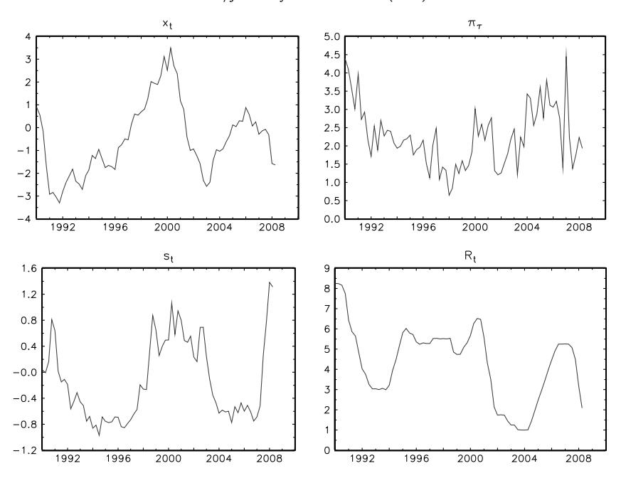
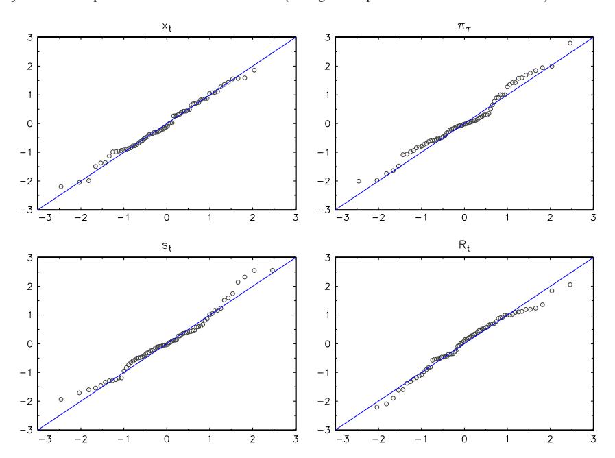
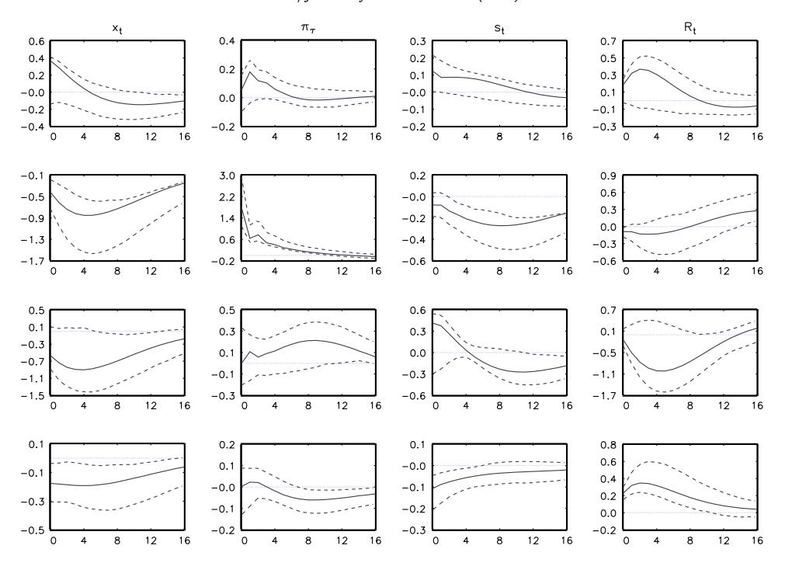

Contents lists available at [ScienceDirect](http://www.elsevier.com/locate/jeconom)

# Journal of Econometrics

journal homepage: [www.elsevier.com/locate/jeconom](http://www.elsevier.com/locate/jeconom)

# Identification and estimation of non-Gaussian structural vector autoregressions[✩](#page-0-0)

Markku Lanne [a](#page-0-1)[,b](#page-0-2) , Mika Meitz [a](#page-0-1) , Pentti Saikkonen[c,](#page-0-3)[∗](#page-0-4)

- a *Department of Political and Economic Studies, University of Helsinki, P. O. Box 17, FI–00014 University of Helsinki, Finland*
- b *CREATES, Denmark*
- c *Department of Mathematics and Statistics, University of Helsinki, P. O. Box 68, FI–00014 University of Helsinki, Finland*

## a r t i c l e i n f o

*Article history:* Received 15 April 2015 Received in revised form 12 January 2016 Accepted 6 June 2016 Available online 14 October 2016

*JEL classification:*

C32

C51 E52

*Keywords:* Structural vector autoregressive model Identification Impulse responses Non-Gaussianity

# a b s t r a c t

Conventional structural vector autoregressive (SVAR) models with Gaussian errors are not identified, and additional identifying restrictions are needed in applied work. We show that the Gaussian case is an exception in that a SVAR model whose error vector consists of independent non-Gaussian components is, without any additional restrictions, identified and leads to essentially unique impulse responses. Building upon this result, we introduce an identification scheme under which the maximum likelihood estimator of the parameters of the non-Gaussian SVAR model is consistent and asymptotically normally distributed. As a consequence, additional economic identifying restrictions can be tested. In an empirical application, we find a negative impact of a contractionary monetary policy shock on financial markets, and clearly reject the commonly employed recursive identifying restrictions.

© 2016 The Author(s). Published by Elsevier B.V. This is an open access article under the CC BY-NC-ND license [\(http://creativecommons.org/licenses/by-nc-nd/4.0/\)](http://creativecommons.org/licenses/by-nc-nd/4.0/).

# **1. Introduction**

Vector autoregressive (VAR) models are widely employed in empirical macroeconomic research, and they have also found applications in other fields of economics and finance. While the reduced-form VAR model can be seen as a convenient description of the joint dynamics of a number of time series that also facilitates forecasting, the structural VAR (SVAR) model is more appropriate for answering economic questions of theoretical and practical interest. The main tools in analyzing the dynamics in SVAR models are the impulse response function and the forecast error variance decomposition. The former traces out the future effects of an economic shock on the variables included in the model, while the latter gives the relative importance of each shock for each variable.

*E-mail addresses:* [markku.lanne@helsinki.fi](mailto:markku.lanne@helsinki.fi) (M. Lanne), [mika.meitz@helsinki.fi](mailto:mika.meitz@helsinki.fi) (M. Meitz), [pentti.saikkonen@helsinki.fi](mailto:pentti.saikkonen@helsinki.fi) (P. Saikkonen).

In order to apply these tools, the economic shocks (or at least the interesting subset of them) must be identified. Traditionally short-run and long-run restrictions, constraining the immediate and permanent impact of certain shocks, respectively, have been entertained, while recently alternative approaches, including sign restrictions and identification based on heteroskedasticity, have been introduced.

When SVAR models are applied, the joint distribution of the error terms is almost always (either explicitly or implicitly) assumed to have a multivariate Gaussian (normal) distribution. This means that the joint distribution of the reduced-form errors is fully determined by their covariances only. A well-known consequence of this is that the structural errors cannot be identified – any orthogonal transformation of them would do equally well – without some additional information or restrictions. This raises the question of the potential benefit of SVAR models with non-Gaussian errors whose joint distribution is not determined by the (first and) second moments only and which may therefore contain more useful information for identification of the structural shocks.

In this paper, we show that the Gaussian case is an exception in that SVAR models with (suitably defined) non-Gaussian errors are identified without any additional identifying restrictions. In the non-Gaussian SVAR model we consider, identification is

✩ The authors thank the Academy of Finland (grant number 268454), Finnish Cultural Foundation, and Yrjö Jahnsson Foundation for financial support. The first author also acknowledges financial support from CREATES (DNRF78) funded by the Danish National Research Foundation. Useful comments made by the Associate Editor and two anonymous referees have helped to improve the paper.

∗ Corresponding author.

achieved by assuming mutual independence across the non-Gaussian error processes. The paper contains two identification results, the first of which allows the computation of (essentially) unique impulse responses. Identification is 'statistical' but not 'economic' in the sense that the resulting impulse responses and structural shocks carry no economic meaning as such; for interpretation, additional information is needed to endow the structural shocks with economic labels. Second, we obtain a complete identification result that facilitates developing an asymptotic theory of maximum likelihood (ML) estimation. A particularly useful consequence of this second result is that economic restrictions which are under-identifying or exactlyidentifying in the conventional Gaussian set-up become testable. This is in sharp contrast to traditional identification approaches based on short-run and long-run economic restrictions which require the tested restrictions to be over-identifying (and finding even convincing exactly-identifying restrictions may be difficult). Moreover, sign restrictions, popular in the current SVAR literature, cannot be tested either (see, e.g., Fry and Pagan, 2011).

Compared to the previous literature on identification in SVAR models exploiting non-Gaussianity, our approach is quite general. Similarly to us, Hyvärinen et al. (2010) and Moneta et al. (2013) also assume independence and non-Gaussianity, but, in addition, they impose a recursive structure, which in our model only obtains as a special case. Lanne and Lütkepohl (2010) assume that the error term of the SVAR model follows a mixture of two Gaussian distributions, whereas our model allows for a wide variety of (non-Gaussian) distributions. Identification by explicitly modeling conditional heteroskedasticity of the errors in various forms, considered by Normandin and Phaneuf (2004), Lanne et al. (2010), and Lütkepohl and Netšunajev (2014b), is also covered by our approach. In fact, identification by unconditional heteroskedasticity (see, e.g., Rigobon, 2003) is the only approach in the previous literature we do not cover.

We apply our SVAR model to examining the impact of monetary policy in financial markets. There is a large related literature that for the most part relies on Gaussian SVAR models identified by short-run restrictions. While empirical results vary depending on the data and identification schemes, typically a monetary policy shock is not found to account for a major part of the variation of stock returns. This is counterintuitive and goes contrary to recent theoretical results (see Castelnuovo, 2013 and the references therein). Our model, with the errors assumed to follow independent Student's *t*-distributions, is shown to fit recent U.S. data well, and we find a strong negative, yet short-lived, impact of a contractionary monetary policy shock on financial conditions, as recent macroeconomic theory predicts. Moreover, the recursive identification restrictions employed in much of the previous literature are clearly rejected.

The rest of the paper is organized as follows. In Section 2, we introduce the SVAR model. Section 3 contains the identification results. First we show how identification needed for the computation of impulse responses is achieved and then how to obtain complete identification needed in Section 4 where we develop an asymptotic estimation theory and establish the consistency and asymptotic normality of the maximum likelihood (ML) estimator of the parameters of our model. In addition, a three-step estimator is proposed that may be useful in cases where full ML estimation is cumbersome due to short time series or the high dimension of the model. As both estimators have conventional asymptotic normal distributions, standard tests (of, e.g., additional economic identifying restrictions) can be carried out in the usual manner. An empirical application to the effect of U.S. monetary policy in financial markets is presented in Section 5, and Section 6 concludes.

Finally, a few notational conventions are given. All vectors will be treated as column vectors and, for the sake of uncluttered notation, we shall write  $x = (x_1, \ldots, x_n)$  for the (column) vector x where the components  $x_i$  may be either scalars or vectors (or both). For any vector or matrix x, the Euclidean norm is denoted by ||x||. The vectorization operator vec(A) stacks the columns of matrix A on top of one another. Kronecker and Hadamard (elementwise) products of matrices are denoted by  $\otimes$  and  $\odot$ , respectively. Notation  $t_i$  is used for the ith canonical unit vector of  $\mathbb{R}^n$  (i.e., an n-vector with 1 in the ith coordinate and zeros elsewhere),  $i = 1, \ldots, n$  (the dimension n will be clear from the context). An identity matrix of order n will be denoted by  $t_n$ .

#### 2. Model

Consider the structural VAR (SVAR) model

$$y_t = \nu + A_1 y_{t-1} + \dots + A_p y_{t-p} + B\varepsilon_t, \tag{1}$$

where  $y_t$  is the n-dimensional time series of interest,  $\nu$  ( $n \times 1$ ) is an intercept term,  $A_1, \ldots, A_p$  and B ( $n \times n$ ) are parameter matrices with B nonsingular, and  $\varepsilon_t$  ( $n \times 1$ ) is a temporally uncorrelated strictly stationary error term with zero mean and finite positive definite covariance matrix (more specific assumptions about the covariance matrix will be made later). As we only consider stationary (or stable) time series, we assume

$$\det A(z) \stackrel{\text{def}}{=} \det \left( I_n - A_1 z - \dots - A_p z^p \right) \neq 0,$$

$$|z| \leq 1 \ (z \in \mathbb{C}). \tag{2}$$

Left-multiplying (1) by the inverse of *B* yields an alternative formulation of the SVAR model,

$$A_0 y_t = \nu^{\bullet} + A_1^{\bullet} y_{t-1} + \dots + A_p^{\bullet} y_{t-p} + \varepsilon_t, \tag{3}$$

where  $\varepsilon_t$  is as in (1),  $A_0 = B^{-1}$ ,  $v^{\bullet} = B^{-1}v$ , and  $A_j^{\bullet} = B^{-1}A_j$  ( $j = 1, \ldots, p$ ). Typically the diagonal elements of  $A_0$  are normalized to unity, so that the model becomes a conventional simultaneous-equations model. In this paper, we shall not consider formulation (3) in detail.

The literature on SVAR models is voluminous (for a recent survey, see Kilian (2013)). A central problem with these models is the identification of the parameter matrix B: without additional assumptions or prior knowledge, B cannot be identified because, for any nonsingular  $n \times n$  matrix C, the matrix B and the error term  $E_t$  in the product  $E_t$  can be replaced by  $E_t$  and  $E_t$  respectively, without changing the assumptions imposed above on model (1). This identification problem has serious implications on the interpretation of the model via impulse response functions that trace out the impact of economic shocks (i.e., the components of the error term  $E_t$ ) on current and future values of the variables included in the model. Impulse responses are elements of the coefficient matrices  $E_t$ 0 in the moving average representation of the model.

$$y_t = \mu + \sum_{i=0}^{\infty} \Psi_j B \varepsilon_{t-j}, \quad \Psi_0 = I_n, \tag{4}$$

where  $\mu = A(1)^{-1} \nu$  is the expectation of  $y_t$  and the matrices  $\Psi_j$  ( $j=0,1,\ldots$ ) are determined by the power series  $\Psi$  (z) =  $A(z)^{-1} = \sum_{j=0}^{\infty} \Psi_j z^j$ . As the preceding discussion makes clear, for a meaningful interpretation of such an analysis, an appropriate identification result is needed to make the two factors in the product  $B\varepsilon_t$ , and hence the impulse responses  $\Psi_i B$ , unique.

So far we have only made very general assumptions about the SVAR model, implying uniqueness only up to linear transformations of the form  $B \to BC$  and  $\varepsilon_t \to C^{-1}\varepsilon_t$  with C nonsingular. In SVAR models of the type (1), the covariance matrix of the error term is typically restricted to a diagonal matrix so that the transformation matrix C has to be of the form C = DO with O orthogonal

and D diagonal and nonsingular. The diagonal elements of D are either +1 or -1 if the covariance matrix of  $\varepsilon_t$  is assumed an identity matrix, while in the absence of such a normalization, the diagonal elements of D are not restricted (except to be nonzero). Thus, further assumptions are needed to achieve identifiability, and probably the most common way of achieving identifiability is to impose short-run restrictions that restrict some of the elements of B to zero. In the best known example of this approach, the matrix B is restricted to a lower triangular matrix which can be identified as a Cholesky factor of the covariance matrix of the error term  $B\varepsilon_t$ . This solves the identification problem, but it imposes a recursive structure upon the variables included in  $v_t$  that may be implausible. This example also illustrates what seems to be an inherent difficulty in using short-run restrictions: one basically tries to solve the identification problem by using only the covariance matrix of the error term. Nevertheless, following Sims's (1980) seminal paper, recursive identification dominated the early econometric SVAR literature.

The SVAR model (1) is also a special case of a simultaneous vector ARMAX model where identification results based only on knowledge of second order moments have been obtained by Kohn (1979), Hannan and Deistler (1988), and others. Similarly to these previous authors, we use the term 'class of observationally equivalent SVAR processes' to refer to SVAR processes satisfying the assumptions made of (1) with the matrix B and the error term  $\varepsilon_t$  replaced by BC and  $C^{-1}\varepsilon_t$  with C a nonsingular matrix (in the same way we shall speak of classes of observationally equivalent moving average representations). Then the identification problem boils down to finding conditions which imply that the only possible choice for the matrix C is an identity matrix and thus that the matrix B and the error term  $\varepsilon_t$  are unique.

As already indicated, successful identification results may be difficult to obtain without strengthening the assumptions so far imposed on the error term  $\varepsilon_t$ . In this paper, we consider model (1) where, similarly to Hyvärinen et al. (2010) and Moneta et al. (2013), the components of the error term are assumed contemporaneously independent.

## 3. Identification

# 3.1. Non-Gaussian errors

We assume that the error process  $\varepsilon_t = (\varepsilon_{1,t}, \dots, \varepsilon_{n,t})$  has non-Gaussian components that are independent both contemporaneously and temporally. Specifically, we make the following assumption.

- **Assumption 1.** (i) The error process  $\varepsilon_t = (\varepsilon_{1,t}, \dots, \varepsilon_{n,t})$  is a sequence of independent and identically distributed random vectors with each component  $\varepsilon_{i,t}$ ,  $i = 1, \dots, n$ , having zero mean and finite positive variance  $\sigma_i^2$ .
- (ii) The components of  $\varepsilon_t = (\varepsilon_{1,t}, \dots, \varepsilon_{n,t})$  are (mutually) independent and at most one of them has a Gaussian marginal distribution.

Compared with assumptions made in the previous literature, Assumption 1 is similar to its counterparts in Hyvärinen et al. (2010) and Moneta et al. (2013). The conditions imposed in Assumption 1(i) are rather standard. Assumption 1(ii) restricts the interdependence of the components of the error process. The vector process  $\varepsilon_t$  is assumed non-Gaussian, but the possibility that (at most) one of its components is Gaussian is permitted. Note that in this non-Gaussian case, independence is a much stronger requirement than mere uncorrelatedness. Nevertheless, as also stressed by Gouriéroux and Monfort (2014, Sec. 3), (contemporaneous) independence is the appropriate concept of

orthogonality in SVAR analysis, and it should be required also in the non-Gaussian case. (In the conventional Gaussian set-up, Assumption 1(ii) is not imposed directly, but independence of the component processes obtains because  $\varepsilon_t$  is assumed to be independent and identically normally distributed with mean zero and a diagonal covariance matrix.)

In Appendix A we introduce an alternative, weaker Assumption 1\* that allows the error process to be temporally dependent (though temporal uncorrelatedness is still required). In particular, conditionally heteroskedastic error processes that have recently been used to achieve identifiability in SVAR models (see, e.g., Lütkepohl and Netšunajev (2014b) and the references therein) are covered. All the identification results in Section 3 hold true also under this weaker assumption. For details, see the discussion in Appendix A.

## 3.2. Identification up to permutations and scalings

In this section, we explain how non-Gaussianity aids in solving the identification problem discussed in Section 2. As impulse response analysis constitutes a major application of the SVAR model, we consider the identification of the moving average representation (4). Under Assumption 1, this representation is essentially unique in the following sense (the subsequent arguments will be formalized and proved in Proposition 1): If the process  $y_t$  can be represented by two (potentially) different moving average representations, say,

$$y_t = \mu + \sum_{i=0}^{\infty} \Psi_j B \varepsilon_{t-j} = \mu^* + \sum_{i=0}^{\infty} \Psi_j^* B^* \varepsilon_{t-j}^*, \tag{5}$$

then necessarily  $\mu^* = \mu$ ,  $\Psi_j^* = \Psi_j$   $(j = 0, 1, \ldots)$ , and  $B\varepsilon_t = B^*\varepsilon_t^*$  for all t, but the choice of the matrix B and the error process  $\varepsilon_t$  is not unique: As discussed in Section 2, the choice  $B^* = BC$  and  $\varepsilon_t^* = C^{-1}\varepsilon_t$  will do for any nonsingular  $n \times n$  matrix C. In the conventional Gaussian set-up, the discussion in Section 2 applies and the aforementioned (nonsingular) matrix C is of the form C = DO with O orthogonal and D diagonal, so that an identification problem remains. However, assuming non-Gaussianity and independence (in the sense of Assumption 1) we can restrict the orthogonal matrix O in the product C = DO to a permutation matrix so that only permutations and scale changes in the columns of B are allowed. This constitutes a considerable improvement and forms the first step in achieving complete identification which is the topic of the next subsection.

The preceding discussion is formalized in the following proposition, whose proof is given in Appendix  ${\bf A.}^1$ 

**Proposition 1.** Consider the SVAR model (1) and assume that the stationarity condition (2) and Assumption 1 (or Assumption  $1^*$  in Appendix A) on the error term  $\varepsilon_t$  are satisfied. Suppose the two moving average representations in (5) hold true

- (i) for some parameters  $\mu^*$  (n  $\times$  1) and  $B^*$  (n  $\times$  n) with  $B^*$  nonsingular,
- (ii) for some coefficient matrices  $\Psi_j^*$   $(n \times n)$ ,  $j = 0, 1, \ldots$ , that are determined by the power series  $\Psi^*(z) = A^*(z)^{-1} = \sum_{j=0}^{\infty} \Psi_j^* z^j$  with  $A^*(z) = I_n A_1^* z \cdots A_p^* z^p$  satisfying condition (2) (with  $A_j$  therein replaced by  $A_j^*$ ,  $j = 1, \ldots, p$ ), and
- (iii) for some error process  $\varepsilon_t^* = (\varepsilon_{1,t}^*, \dots, \varepsilon_{n,t}^*)$  satisfying Assumption 1 or 1\* (with each ' $\varepsilon$ ' therein replaced by ' $\varepsilon$ \*').

&lt;sup>1 This proposition can be specialized to formulation (3) by setting  $B = A_0^{-1}$ ,  $\nu = A_0^{-1} \nu^{\bullet}$ , and  $A_j = A_0^{-1} A_j^{\bullet}$  ( $j = 1, \ldots, p$ ) in model (1).

Then, for some diagonal matrix  $D = diag(d_1, ..., d_n)$  with nonzero diagonal elements, for some permutation matrix  $P(n \times n)$ , and for all t.

$$B^* = BDP, \quad \varepsilon_t^* = P'D^{-1}\varepsilon_t, \quad \mu^* = \mu, \quad and$$
  
 $\Psi_j^* = \Psi_j \quad (j = 0, 1, ...).$  (6)

Variants of Proposition 1 have appeared in the previous literature. For instance, in the independent component analysis literature, reference can be made to Theorem 11 and its corollaries in Comon (1994) that are very similar, although formulated for the case corresponding to a serially uncorrelated process, i.e.,  $y_t = v + B\varepsilon_t$ . A related result in the statistics literature is Theorem 4 of Chan and Ho (2004) (a discussion of this theorem can also be found in Chan et al. (2006)) and, recently, also Gouriéroux and Monfort (2014, Proposition 2) and Gouriéroux and Zakoïan (2015, Proposition 6) have presented counterparts of Proposition 1.

Proposition 1 does not provide a complete solution to the identification problem. It only shows that the moving average representation (4) and its SVAR counterpart (1) are unique apart from permutations and scalings of the columns of B and the components of  $\varepsilon_t$ ; uniqueness of the expectation  $\mu$  and the coefficients  $\Psi_j$ ,  $j=0,1,\ldots$ , or, equivalently, the intercept term  $\nu$  and the autoregressive parameters  $A_1,\ldots,A_p$  obtains, however. Using the terminology introduced in Section 2, Proposition 1 characterizes a class of observationally equivalent SVAR processes and the corresponding moving average representations: The moving average representations in (5) are observationally equivalent (and hence members of this class) if they satisfy the equations in (6). The same, of course, applies to the corresponding SVAR processes, i.e., (1) and  $y_t = \nu^* + A_1^* y_{t-1} + \cdots + A_p^* y_{t-p} + B^* \varepsilon_t^*$  (but now the last two equations in (6) are replaced by  $\nu = \nu^*$  and  $A_i = A_i^*$ ,  $i = 1, \ldots, p$ ).

From the viewpoint of computing impulse responses (and forecast error variance decompositions), identification up to permutations and scalings is sufficient. Upon such identification of the SVAR model, labeling the shocks is in any case based on outside information, such as sign restrictions, or conventional identifying short-run or long-run restrictions (see, e.g., Lütkepohl and Netšunajev (2014a)), and the sign and size of the shocks are set by the researcher. For these purposes, any permutation and scaling are equally useful. However, development of conventional statistical estimation theory, in particular, calls for a complete solution to the identification problem.

## 3.3. Complete identification

In this section, we provide formal identifying or normalizing restrictions that remove the indeterminacy due to scaling and permutation in Proposition 1. One set of such conditions, employed in the context of independent component analysis, can be found in Ilmonen and Paindaveine (2011) (see also Hallin and Mehta (2015)); for potential alternative conditions, see, e.g., Pham and Garat (1997) and Chen and Bickel (2005). In the case of Proposition 1 these conditions are specified as follows.

To express the result, let  $\mathcal{M}_n$  denote the set of nonsingular  $n \times n$  matrices. We say that two matrices  $B_1$  and  $B_2$  in  $\mathcal{M}_n$  are equivalent, expressed as  $B_1 \sim B_2$ , if and only if they are related as  $B_2 = B_1DP$  for some diagonal matrix  $D = diag(d_1, \ldots, d_n)$  with nonzero diagonal elements and some permutation matrix P. The equivalence relation  $\sim$  partitions  $\mathcal{M}_n$  into equivalence classes, and

each of these equivalence classes defines a set of observationally equivalent SVAR processes. Using this terminology, Proposition 1 and the discussion following it state that while a specific equivalence class for *B* is identifiable, any member from this equivalence class can be used as a *B* and also used to define a member from the corresponding set of observationally equivalent SVAR processes. Our next aim is to pinpoint a particular (unique) member from the equivalence class indicated by Proposition 1. We collect the description of how this can be done in the following 'Identification Scheme' (whose content is adapted from Ilmonen and Paindaveine (2011) and Hallin and Mehta (2015)).

**Identification Scheme.** For each  $B \in \mathcal{M}_n$ , consider the sequence of transformations

$$B \rightarrow BD_1 \rightarrow BD_1P \rightarrow BD_1PD_2$$
,

where, whenever such  $n \times n$  matrices  $D_1$ , P, and  $D_2$  exist,

- (i) D1 is the positive definite diagonal matrix that makes each column of BD1 have Euclidean norm one,
- (ii) *P* is the permutation matrix for which the matrix  $C = (c_{ij}) = BD_1P$  satisfies  $|c_{ii}| > |c_{ij}|$  for all i < j, and
- (iii) D2 is the diagonal matrix such that all diagonal elements of BD1PD2 are equal to one.

Let  $\mathcal{L} \subseteq \mathcal{M}_n$  be the set consisting of those  $B \in \mathcal{M}_n$  for which the matrices  $D_1$ , P, and  $D_2$  above exist, and  $\mathcal{E} = \mathcal{M}_n \setminus \mathcal{L}$  the complement of this set in  $\mathcal{M}_n$ .  $\mathcal{L}$  Define the transformation  $\Pi(\cdot): \mathcal{L} \to \mathcal{L}$  as  $\Pi(B) = BD_1PD_2$  with  $D_1$ , P, and  $D_2$  as above,  $\mathcal{L}$  and define the set  $\mathcal{L}$  as

$$\mathcal{B} = \Pi(\mathcal{X}) = \{\tilde{B} \in \mathcal{M}_n : \tilde{B} = \Pi(B) \text{ for some } B \in \mathcal{X}\}.$$

This scheme provides a recipe for picking a particular permutation and a particular scaling to identify a unique matrix *B* from each equivalence class corresponding to observationally equivalent SVAR processes. Therefore, the scheme provides a solution to the identification problem in the sense formalized in the following proposition (which is justified in Appendix A).

**Proposition 2.** (a) Under the assumptions of Proposition 1, the matrix B is uniquely identified in the set B defined in the Identification Scheme.5

- (b) The set B consists of unique, distinct representatives from each ~-equivalence class of 1.
- (c) The set  $\mathscr{E}$  (of matrices being excluded in the Identification Scheme) has Lebesgue measure zero in  $\mathbb{R}^{n \times n}$ , and the set  $\mathscr{L}$  (of matrices being included in the Identification Scheme) contains an open and dense subset of  $\mathscr{M}_n$ .

According to part (a) of Proposition 2, unique identification is achieved by restricting the permissible values of the matrix B to the set  $\mathcal{B} = \Pi(\mathcal{I})$  defined in the Identification Scheme, while parts (b) and (c) of the proposition explain in further detail what exactly is achieved. According to part (b), the set  $\mathcal{B}$  is suitably defined: no two observationally equivalent SVAR processes are represented in  $\mathcal{B}$ , while nearly all observationally non-equivalent SVAR processes are represented in  $\mathcal{B}$ . Part (c) explains the quantifier 'nearly all': A small number of SVAR processes, namely those corresponding

&lt;sup>2 Note that  $DP = PD_1$  for some scaling matrix  $D_1$  so that the order of the permutation and scaling matrix does not matter for the defined equivalence; from this fact it can also be seen that the relation  $B_1 \sim B_2$  is transitive and, as it is clearly symmetric and reflexive, it really is an equivalence relation.

&lt;sup>3 That is,  $\mathcal{E}$  is the set of those matrices  $B \in \mathcal{M}_n$  for which a tie occurs in step (ii) in the sense that for any choice of P we have  $|c_{ii}| = |c_{ij}|$  for some i < j, or for which at least one diagonal element of  $BD_1P$  equals zero so that step (iii) cannot be done.

&lt;sup>4 The matrices  $D_1$ , P, and  $D_2$  depend on B, but we do not make this dependence explicit.

&lt;sup>5 In the sense that if B,  $B^* \in \mathcal{B}$  are as in Proposition 1, then necessarily  $D = P = I_n$  in (6) so that  $B = B^*$ .

to the set  $\mathcal{E}$ , have to be excluded from consideration, but as these processes only comprise a set of measure zero, ignoring them is hardly relevant in practice; moreover, the set  $\mathcal{L}$  corresponding to those SVAR processes that are included in the Identification Scheme is 'large' in the sense that  $\mathcal{L}$  contains an open and dense subset of  $\mathcal{M}_n$ . Some further remarks on this result and the Identification Scheme are in order.

First, some illustrative examples of the Identification Scheme. The sequence of transformations  $B \to BD_1 \to BD_1P \to BD_1PD_2$  for a particular four-dimensional matrix B is

$$\begin{bmatrix} 2\sqrt{2}\sqrt{3}\sqrt{2} & 0 \\ 2 & 0 & 0 & \sqrt{3} \\ 2 & 1 & 0 & 0 \\ 0 & 0 & \sqrt{2} & 1 \end{bmatrix} \rightarrow \begin{bmatrix} 1/\sqrt{2}\sqrt{3}/2 & 1/\sqrt{2} & 0 \\ 1/2 & 0 & 0 & \sqrt{3}/2 \\ 1/2 & 1/2 & 0 & 0 \\ 0 & 0 & 1/\sqrt{2} & 1/2 \end{bmatrix}$$
$$\rightarrow \begin{bmatrix} \sqrt{3}/2 & 0 & 1/\sqrt{2} & 1/\sqrt{2} \\ 0 & \sqrt{3}/2 & 1/2 & 0 \\ 1/2 & 0 & 1/2 & 0 \\ 0 & 1/2 & 0 & 1/\sqrt{2} \end{bmatrix} \rightarrow \begin{bmatrix} 1 & 0 & \sqrt{2} & 1 \\ 0 & 1 & 1 & 0 \\ 1/\sqrt{3} & 0 & 1 & 0 \\ 0 & 1/\sqrt{3} & 0 & 1 \end{bmatrix},$$

where the last matrix is the unique representative of its equivalence class in  $\mathcal{B}$ . To illustrate the matrices that belong to the set  $\mathcal{E}$ , note that they can be divided into three groups: (1) a tie occurs in step (ii) of the Identification Scheme with the members of the tie being nonzero, (2) a tie occurs in step (ii) of the Identification Scheme with the members of the tie equaling zero, and (3) no ties occur in step (ii) of the Identification Scheme but the lower-right-hand-corner element of  $BD_1P$  equals zero. Simple examples of these three possibilities (in a four-variable SVAR model) are

$$B_{1} = \begin{bmatrix} 1/2 & 1/2 & 0 & 0 \\ 0 & \sqrt{3}/2 & 0 & 0 \\ \sqrt{3}/2 & 0 & 1 & 0 \\ 0 & 0 & 0 & 1 \end{bmatrix},$$

$$B_{2} = \begin{bmatrix} \sqrt{3}/2 & 0 & 1/\sqrt{2} & 1/\sqrt{2} \\ 0 & \sqrt{3}/2 & 1/\sqrt{2} & 0 \\ 1/2 & 0 & \mathbf{0} & \mathbf{0} \\ 0 & 1/2 & 0 & 1/\sqrt{2} \end{bmatrix},$$

$$B_{3} = \begin{bmatrix} 1 & 0 & 0 & 0 \\ 0 & 1 & 0 & 1/\sqrt{2} \\ 0 & 0 & \sqrt{3}/2 & 1/\sqrt{2} \\ 0 & 0 & 1/2 & \mathbf{0} \end{bmatrix},$$

where the 'critical' elements are in bold font. Note that excluding the matrices in  $\mathcal{E}$  would be problematic only if these matrices corresponded to common hypotheses of interest one would like to test in SVAR models, which does not appear to be the case.6

Second, the set  $\mathscr E$  having measure zero and  $\mathscr L$  containing an open and dense subset of  $\mathscr M_n$  indeed mean that almost all SVAR processes are being included. According to the terminology used by some authors, the matrix  $\mathscr B$  would be 'generically identified' in case it were identified in this open and dense subset  $\mathscr L$  of the parameter space of interest,  $\mathscr M_n$ ; see, e.g., Anderson et al. (2016) for the use of this terminology in the context of VAR models, or Johansen (1995) in a cointegrated VAR model. It is also worth noting that the excluded matrices in  $\mathscr E$  are in no way 'ill-behaving'; their exclusion is done for purely technical reasons to make the formulation of the Identification Scheme easy. It would be possible to devise a scheme in a way that no exclusions are needed, but such a scheme would be rather complex and its implementation

would presumably be difficult in practice. Rather than pursuing this matter we are therefore content with Proposition 2 as a 'second best' result to full identification.

Third, as the preceding discussion suggests, one can similarly obtain identifiability by using some alternative formulation of the Identification Scheme. One relevant alternative is obtained if the definitions of  $D_1$  and P in the Identification Scheme are maintained but  $D_2$  is defined as the diagonal matrix whose diagonal elements equal either 1 or -1 and which makes the diagonal elements of  $BD_1PD_2$  positive. The restrictions implied by this alternative identification scheme may be easier to take into account in estimation than those based on the original Identification Scheme. On the other hand, the original Identification Scheme is more convenient in deriving asymptotic distributions for estimators; in the alternative scheme just described, one would need to employ Lagrange multipliers as the columns of  $BD_1PD_2$  would then have Euclidean norm one.

Fourth, as already alluded to in Section 3.2, the Identification Scheme and Proposition 2 only yield statistical identification which need not have any economic interpretation. In particular, they do not offer any information about which economic shock each component of  $\varepsilon_t$  might be. The statistical identification result obtained does, however, facilitate the development of conventional estimation theory, the topic of Section 4.

## 3.4. Discussion of previous identification results

There are a number of statistical identification procedures for SVAR models introduced in the previous literature that are more or less closely related to the procedure put forth in this paper. Hyvärinen et al. (2010) and Moneta et al. (2013) consider identification in SVAR models and, similarly to us, assume that the error terms are non-Gaussian and mutually independent. Their identification condition is explicitly stated for model (3), but it, of course, applies to model (1) as well (an analog of our Proposition 2 could also be formulated for model (3)). Compared to us, an essential difference is that they assume the matrix  $A_0$  in model (3), or equivalently the matrix B in model (1), to be lower triangular (potentially after reordering the variables in  $y_t$ ). This is a rather stringent and potentially undesirable a priori assumption, as it imposes a recursive structure on the SVAR model. Hence, our result is more general, yet allowing for a recursive structure as a special case.

Lanne and Lütkepohl (2010) assume that the errors of model (1) are independent over time with a distribution that is a mixture of two Gaussian distributions with zero means and diagonal covariance matrices, one of which is an identity matrix and the other one has positive diagonal elements, which for identifiability have to be distinct. Under these conditions, identifiability is obtained apart from permutations of the columns of *B* and multiplication by minus one. If the above-mentioned positive diagonal elements are ordered in some specific way, say from largest to smallest, the indeterminacy due to permutations of the columns of *B* is removed and unique identification is achieved. Thus, their identification result differs from ours mainly in that a specific non-Gaussian error distribution is employed, and its components are contemporane-ously only uncorrelated, not independent.

Assuming some form of heteroskedasticity of the errors  $\varepsilon_t$  is one popular approach to identification. Lanne et al. (2010), and Lütkepohl and Netšunajev (2014b) assume Markov switching and a smooth transition in the covariance matrix of the error term  $\varepsilon_t$  in model (1), respectively, while Normandin and Phaneuf (2004) allow for GARCH-type heteroskedasticity in the errors. As is explained in Appendix A, our approach also covers these cases in that the identification results hold under conditional heteroskedasticity that necessarily implies non-Gaussianity of the errors. In contrast, identification by unconditional heteroskedasticity that has also been entertained in the recent SVAR literature (see, e.g., Rigobon (2003) and Lanne and Lütkepohl (2008)) is not covered.

&lt;sup>6 The hypothesis implied by the matrix  $B_1$  appears to be of interest only when the shocks  $\varepsilon_{1,t}$  and  $\varepsilon_{2,t}$  are of the same size so that the rather specific additional restriction  $\sigma_1^2 = \sigma_2^2$  must also hold. As to the zero restrictions implied by the matrices  $B_2$  and  $B_3$ , they do not seem economically interesting.

#### 4. Parameter estimation

# 4.1. Likelihood function

We next consider maximum likelihood (ML) estimation of the parameters in the non-Gaussian SVAR model (1). To that end, we have to be more specific about the distribution of the error term.

**Assumption 2.** For each  $i=1,\ldots,n$ , the distribution of the error term  $\varepsilon_{i,t}$  has a (Lebesgue) density  $f_{i,\sigma_i}(x;\lambda_i)=\sigma_i^{-1}f_i(\sigma_i^{-1}x;\lambda_i)$  which may also depend on a parameter vector  $\lambda_i$ .

Assumption 2 is sufficient for constructing the likelihood function of the parameters. Note that the component densities  $f_i$  ( $\cdot$ ;  $\lambda_i$ ) are supposed to depend on their own parameter vectors, but they can (though need not) belong to the same family of densities. For instance, they can be densities of (univariate) Student's t-distribution with different degrees of freedom parameters.7

Next we define the parameter space of the model. First consider the parameter matrix B which we assume to belong to the set  $\mathcal{B}$  introduced in the previous section. This restricts the diagonal elements of the matrix B to unity, and we collect its off-diagonal elements in the vector  $\beta$  ( $n(n-1) \times 1$ ) and express this as  $\beta = vecd^{\circ}(B)$  where, for any  $n \times n$  matrix C,  $vecd^{\circ}(C)$ signifies the n(n-1)-dimensional vector obtained by removing the n diagonal entries of C from its usual vectorized form vec(C). Note that  $vec(B(\beta)) = H\beta + vec(I_n)$ , where the  $n^2 \times n(n-1)$ matrix H is of full column rank and its elements consist of zeros and ones8 (we use the notation  $B(\beta)$  when we wish to make the dependence of the parameter matrix B on its unknown off-diagonal elements explicit). The parameters of the model are now contained in the vector  $\theta = (\pi, \beta, \sigma, \lambda)$  where  $\pi = (\pi_1, \pi_2)$ with  $\pi_1 = \nu$  and  $\pi_2 = vec([A_1 : \cdots : A_p]), \sigma = (\sigma_1, \ldots, \sigma_n)$  and  $\lambda = (\lambda_1, \dots, \lambda_n)$ . We use  $\theta_0$  to signify the true parameter value (and similarly for its components) and introduce the following assumption.

**Assumption 3.** The true parameter value  $\theta_0$  belongs to the permissible parameter space  $\Theta = \Theta_\pi \times \Theta_\beta \times \Theta_\sigma \times \Theta_\lambda$ , where (i)  $\Theta_\pi = \mathbb{R}^n \times \Theta_{\pi_2}$  with  $\Theta_{\pi_2} \subseteq \mathbb{R}^{n^2p}$  such that condition (2) holds for every  $\pi_2 \in \Theta_{\pi_2}$ , (ii)  $\Theta_\beta = vecd^\circ$  ( $\mathcal{B}$ ) =  $\{\beta \in \mathbb{R}^{n(n-1)} : \beta = vecd^\circ$  ( $\mathcal{B}$ ) for some  $\mathcal{B} \in \mathcal{B}\}$ , (iii)  $\Theta_\sigma = \mathbb{R}^n_+$ , and (iv)  $\Theta_\lambda = \Theta_{\lambda_1} \times \cdots \times \Theta_{\lambda_n} \subseteq \mathbb{R}^d$  with  $\Theta_{\lambda_i} \subseteq \mathbb{R}^{d_i}$  open for every  $i = 1, \ldots, n$  and  $d = d_1 + \cdots + d_n$ .

Condition (2) entails that  $\Theta_{\pi_2}$ , the parameter space of  $\pi_2$ , is open whereas  $\Theta_\beta$  is open due to the Identification Scheme and Proposition 2 (a justification is given in the Supplementary Appendix). Thus, Assumption 3 implies that the whole parameter space  $\Theta$  is open so that the true parameter value  $\theta_0$  is an interior point of the parameter space, as assumed in standard derivations of the asymptotic properties of a local ML estimator.

The (standardized) log-likelihood function of the parameter  $\theta \in \Theta$  based on model (1) and the data  $y_{-p+1}, \ldots, y_0, y_1, \ldots, y_T$  (and conditional on  $y_{-p+1}, \ldots, y_0$ ) can now be written as

$$L_{T}(\theta) = T^{-1} \sum_{t=1}^{T} l_{t}(\theta), \qquad (7)$$

where

$$l_{t}(\theta) = \sum_{i=1}^{n} \log f_{i} \left( \sigma_{i}^{-1} \iota_{i}' B(\beta)^{-1} u_{t}(\pi); \lambda_{i} \right)$$
$$- \log |\det (B(\beta))| - \sum_{i=1}^{n} \log \sigma_{i}$$
(8)

with  $\iota_i$  the ith unit vector and  $u_t$  ( $\pi$ ) =  $y_t - v - A_1 y_{t-1} - \cdots - A_p y_{t-p}$ . Maximizing  $L_T$  ( $\theta$ ) over the permissible parameter space  $\Theta$  yields the ML estimate of  $\theta$ .

To apply the estimator discussed above one has to choose a non-Gaussian error distribution. In economic applications departures from Gaussianity typically manifest themselves as leptokurtic behavior, and Student's *t*-distribution is presumably the non-Gaussian distribution most commonly employed in the previous empirical literature. Alternatives include the normal inverse Gaussian distribution, the generalized hyperbolic distribution, and their skewed versions.

#### 4.2. Score vector

We first derive the asymptotic distribution of the score vector (evaluated at the true parameter value  $\theta_0$ ). We use a subscript to signify a partial derivative; for instance  $l_{\theta,t}\left(\theta\right) = \partial l_t\left(\theta\right)/\partial\theta$ ,  $f_{i,x}\left(x;\lambda_i\right) = \partial f_i\left(x;\lambda_i\right)/\partial x$ , and  $f_{i,\lambda_i}\left(x;\lambda_i\right) = \partial f_i\left(x;\lambda_i\right)/\partial \lambda_i$  (an assumption which guarantees the existence of these partial derivatives will be given shortly). The score vector of a single observation,  $l_{\theta,t}\left(\theta\right)$ , is derived in Appendix B.

Some of our subsequent assumptions are required to hold in a (small) neighborhood of the true parameter value, and to this end we introduce the compact and convex set  $\Theta_0 = \Theta_{0,\pi} \times \Theta_{0,\beta} \times \Theta_{0,\sigma} \times \Theta_{0,\lambda}$  that is contained in the interior of  $\Theta$  and has  $\theta_0$  as an interior point. Now, we make the following assumption.

**Assumption 4.** The following conditions hold for i = 1, ..., n:

- (i) For all  $x \in \mathbb{R}$  and all  $\lambda_i \in \Theta_{0,\lambda_i}$ ,  $f_i(x; \lambda_i) > 0$  and  $f_i(x; \lambda_i)$  is twice continuously differentiable with respect to  $(x; \lambda_i)$ .
- (ii) The function  $f_{i,x}(x; \lambda_{i,0})$  is integrable with respect to x, i.e.,  $\int |f_{i,x}(x; \lambda_{i,0})| dx < \infty$ .
- (iii) For all  $x \in \mathbb{R}$ ,

$$x^{2} \frac{f_{i,x}^{2}(x; \lambda_{i,0})}{f_{i}^{2}(x; \lambda_{i,0})}$$
 and  $\frac{\|f_{i,\lambda_{i}}(x; \lambda_{i,0})\|^{2}}{f_{i}^{2}(x; \lambda_{i,0})}$ 

are dominated by  $c_1(1+|x|^{c_2})$  with  $c_1,c_2\geq 0$  and  $\int |x|^{c_2}f_i\left(x;\lambda_{i,0}\right)dx<\infty$ .

(iv)  $\int \sup_{\lambda_i \in \Theta_{0,\lambda_i}} \|f_{i,\lambda_i}(x;\lambda_i)\| dx < \infty$ .

Moreover,

(v) The matrix  $E[l_{\theta,t}(\theta_0)l'_{\theta,t}(\theta_0)]$  is positive definite.

Assumption 4(i) guarantees that the log-likelihood function satisfies conventional differentiability assumptions of ML estimation by imposing differentiability assumptions on the density functions  $f_i(x; \lambda_i)$ . Assumptions 4(ii)–(iv) require that the partial derivatives of the density functions  $f_i(x; \lambda_i)$  satisfy suitable integrability conditions that are needed to ensure that the score function (evaluated at the true parameter value) has zero mean and a finite covariance matrix. Assumption 4(v) ensures that this covariance matrix, and hence the covariance matrix of the (normal) limiting

 $^{7}$  Note, however, that the independence requirement in Assumption 1(ii) rules out common multivariate error distributions such as the multivariate Student's t-distribution.

&lt;sup>8 The matrix H can be expressed as  $H = \sum_{i=1}^{n} \sum_{j=1}^{n-1} (\iota_i t_i' \otimes \iota_{j+I[j \geq i]} \overline{t}_j')$ , where  $\widetilde{\iota}_j$  denotes an (n-1)-vector with 1 in the jth coordinate and zeros elsewhere,  $j=1,\ldots,n-1$ , and  $I[j \geq i]=1$  if  $j \geq i$  and zero otherwise (cf. Ilmonen and Paindaveine (2011, p. 2452)).

 $^9$  Note that compactness and convexity may here be assumed without loss of generality; if  $\Theta_0$  were not compact/convex, we could instead consider its compact and convex subset.

distribution of the ML estimator of  $\theta$ , is positive definite. The conditions in Assumption 4 (as well as those in Assumption 5) are similar to those previously imposed on error density functions in the estimation theory of non-Gaussian ARMA models (see, e.g., Breidt et al. (1991), Andrews et al. (2006), Lanne and Saikkonen (2011), Meitz and Saikkonen (2013), and the references therein), although their formulation is somewhat different. Most common density functions satisfy these assumptions.

The limiting distribution of the score vector is given in the following lemma which is proved in Appendix B.

**Lemma 1.** If Assumptions 2-4 hold, 
$$T^{-1/2} \sum_{t=1}^{T} l_{\theta,t} (\theta_0) \stackrel{d}{\rightarrow} N (0, \mathcal{I}(\theta_0))$$
, where  $\mathcal{I}(\theta_0) = E[l_{\theta,t} (\theta_0) l'_{\theta,t} (\theta_0)]$  is positive definite.

As shown in Appendix B,  $l_{\theta,t}(\theta_0)$  is a stationary and ergodic martingale difference sequence with covariance matrix  $\mathcal{L}(\theta_0)$  and, consequently, the limiting distribution can be obtained by applying a standard central limit theorem. An explicit expression of the covariance matrix  $\mathcal{L}(\theta_0)$  is given in Appendix B.

#### 4.3. Hessian matrix

We next consider the Hessian matrix. Expressions for the required second partial derivatives are given in Appendix C. Similarly to the first partial derivatives, we use notations such as landy to the first partial derivatives, we use includens satisfied  $l_{\theta\theta,t}(\theta) = \partial^2 l_t(\theta) / \partial\theta \partial\theta', f_{i,xx}(x,\lambda_i) = \partial^2 f_i(x;\lambda_i) / \partial x^2$ , and  $f_{i,x\lambda_i}(x;\lambda_i) = \partial^2 f_i(x;\lambda_i) / \partial x \partial \lambda_i'$ . The following assumption complements Assumption 4 by providing further regularity conditions on the partial derivatives of the density functions  $f_i(x; \lambda_i)$ .

**Assumption 5.** The following conditions hold for i = 1, ..., n:

- (i) The functions  $f_{i,xx}(x; \lambda_{i,0})$  and  $f_{i,x\lambda_i}(x; \lambda_{i,0})$  are integrable with respect to x, i.e.,  $\int \left| f_{i,xx}\left(x;\lambda_{i,0}\right) \right| dx < \infty \text{ and } \int \left\| f_{i,x\lambda_{i}}\left(x;\lambda_{i,0}\right) \right\| dx < \infty.$ (ii)  $\int \sup_{\lambda_{i} \in \Theta_{0,\lambda_{i}}} \left\| f_{i,\lambda_{i}\lambda_{i}}\left(x;\lambda_{i}\right) \right\| dx < \infty.$ (iii) For all  $x \in \mathbb{R}$  and all  $\lambda_{i} \in \Theta_{0,\lambda_{i}}$ ,

$$\frac{f_{i,x}^{2}(x;\lambda_{i})}{f_{i}^{2}(x;\lambda_{i})} \quad \text{and} \quad \left| \frac{f_{i,xx}(x;\lambda_{i})}{f_{i}(x;\lambda_{i})} \right|$$

re dominated by  $a_0 (1 + |x|^{a_1})$ 

$$\left\| \frac{f_{i,x\lambda_{i}}\left(x;\lambda_{i}\right)}{f_{i}\left(x;\lambda_{i}\right)} \right\| \quad \text{and} \quad \left\| \frac{f_{i,x}\left(x;\lambda_{i}\right)}{f_{i}\left(x;\lambda_{i}\right)} \frac{f_{i,\lambda_{i}}\left(x;\lambda_{i}\right)}{f_{i}\left(x;\lambda_{i}\right)} \right\|$$

are dominated by  $a_0 (1 + |x|^{a_2})$ 

$$\left\| \frac{f_{i,\lambda_i}\left(x;\lambda_i\right)}{f_i\left(x;\lambda_i\right)} \right\|^2 \quad \text{and} \quad \left\| \frac{f_{i,\lambda_i\lambda_i}\left(x;\lambda_i\right)}{f_i\left(x;\lambda_i\right)} \right\|$$

are dominated by  $a_0 (1 + |x|^{a_3})$ ,

with 
$$a_0, a_1, a_2, a_3 \ge 0$$
 such that  $\int (|x|^{2+a_1} + |x|^{1+a_2} + |x|^{a_3})f_i(x; \lambda_{i,0}) dx < \infty$   $(i = 1, ..., n)$ .

These conditions are similar to those in Assumptions 4(ii)-(iv) and again impose suitable integrability conditions on partial derivatives of the density functions  $f_i(x; \lambda_i)$ . Assumptions 5(i) and (ii) are needed to ensure that, when evaluated at the true parameter value, the expectation of the Hessian matrix has the usual property  $E[l_{\theta,t}(\theta_0)] = -Cov[l_{\theta,t}(\theta_0)]$ , whereas Assumption 5(iii) guarantees that the (standardized) Hessian matrix obeys an appropriate uniform law of large numbers. These results are given in the following lemma which is proved in Appendix C.

**Lemma 2.** If Assumptions 2–5 hold, 
$$\sup_{\theta \in \Theta_0} \|T^{-1} \sum_{t=1}^{T} l_{\theta\theta,t}(\theta) - E\left[l_{\theta\theta,t}(\theta)\right]\| \to 0$$
 a.s., where  $E[l_{\theta\theta,t}(\theta)]$  is continuous at  $\theta_0$  and  $E[l_{\theta\theta,t}(\theta_0)] = -\mathbf{1}(\theta_0)$ .

In addition to enabling us to establish the asymptotic normality of the ML estimator, Lemma 2 can also be used to obtain a consistent estimator for the covariance matrix of the limiting distribution needed to conduct statistical inference.

#### 4.4. Maximum likelihood estimator

The results of Lemmas 1 and 2 provide the basic ingredients needed to derive the consistency and asymptotic normality of a local ML estimator stated in the following theorem.

**Theorem 1.** If Assumptions 2-5 hold, there exists a sequence of solutions  $\hat{\theta}_T$  to the likelihood equations  $L_{\theta,T}(\theta) = 0$  such that  $T^{1/2}(\hat{\theta}_T - \theta_0) \stackrel{d}{\rightarrow} N(0, I(\theta_0)^{-1}) \text{ as } T \rightarrow \infty.$ 

Theorem 1 shows that the usual result on consistency and asymptotic normality of a local maximizer of the log-likelihood function applies. The proof of Theorem 1, given in Appendix C, is based on arguments used in similar proofs in the previous litera-

A consistent estimator of the covariance matrix  $\mathcal{L}(\theta_0)^{-1}$  in Theorem 1 can be obtained by using the ML estimator  $\hat{\theta}_T$  and the Hessian matrix of the log-likelihood function. Specifically,

$$-L_{\theta\theta,T}^{-1}(\hat{\theta}_T) \stackrel{def}{=} -\left(T^{-1} \sum_{t=1}^{T} l_{\theta\theta,t}(\hat{\theta}_T)\right)^{-1} \to \mathcal{I}(\theta_0)^{-1} \quad (a.s.). \tag{9}$$

We omit the proof of this result, which follows from Lemma 2 and Theorem 1 with standard arguments.

### 4.5. Three-step estimation

The ML estimator  $\hat{\theta}_T$  can be computationally rather demanding when the dimension n is not small and relatively short time series are considered. In this section, we therefore consider a computationally simpler three-step estimator which turns out to be asymptotically efficient when the components of the error term  $\varepsilon_t$  are symmetric in the following sense.

**Symmetry Condition.** For each i = 1, ..., n, the distribution of  $\varepsilon_{i,t}$  is symmetric in the sense that  $f_i(x; \lambda_i) = f_i(-x; \lambda_i)$  for all  $\lambda_i \in \Theta_{0,\lambda_i}$ .

Most error distributions employed in empirical SVAR literature satisfy this condition.

To present the estimator, partition the parameter vector  $\theta$  as  $\theta = (\pi, \gamma)$ , where  $\pi$  contains the autoregressive parameters ( $\nu$ and  $A_1, \ldots, A_p$ ) and  $\gamma = (\beta, \sigma, \lambda)$  the parameters related to the error term  $B\varepsilon_t$ . In the first step, the autoregressive parameters are estimated by the least squares (LS) estimator denoted by  $\tilde{\pi}_{LS,T}$ . In the second step, the parameter  $\pi$  in the log-likelihood function  $L_{T}(\pi, \gamma)$  is replaced by the LS estimator  $\tilde{\pi}_{LS,T}$  and the resulting

$$\tilde{L}_{T}(\gamma) = L_{T}\left(\tilde{\pi}_{LS,T}, \gamma\right) = T^{-1} \sum_{t=1}^{T} l_{t}\left(\tilde{\pi}_{LS,T}, \gamma\right)$$

is maximized with respect to  $\gamma$  (here  $l_t(\tilde{\pi}_{LS,T}, \gamma)$  is defined by replacing  $u_t(\pi)$  in the expression of  $l_t(\theta) = l_t(\pi, \gamma)$  in (8) with the LS residuals  $u_t(\tilde{\pi}_{LS,T})$ ). The resulting estimator, denoted by  $\tilde{\gamma}_T$ , therefore uses the LS residuals to estimate the parameters related to the error term  $B\varepsilon_t$ . In the third step, we replace the parameter  $\gamma$  in the log-likelihood function  $L_T(\pi, \gamma)$  by the estimator  $\tilde{\gamma}_T$  and maximize the resulting function

$$\tilde{\tilde{L}}_{T}(\pi) = L_{T}(\pi, \tilde{\gamma}_{T}) = T^{-1} \sum_{t=1}^{T} l_{t}(\pi, \tilde{\gamma}_{T})$$

with respect to  $\pi$  (see (8)).

The following theorem shows that the resulting three-step estimator  $\tilde{\theta}_T = (\tilde{\pi}_T, \tilde{\gamma}_T)$  is asymptotically efficient under the Symmetry Condition.

**Theorem 2.** Suppose Assumptions 2–5 and the Symmetry Condition hold. Then the three-step estimator  $\tilde{\theta}_T = (\tilde{\pi}_T, \tilde{\gamma}_T)$  is asymptotically efficient and the matrix  $\mathcal{L}(\theta_0)$  is block diagonal, i.e.,

$$\begin{split} T^{1/2} \left( \begin{bmatrix} \tilde{\pi}_T \\ \tilde{\gamma}_T \end{bmatrix} - \begin{bmatrix} \pi_0 \\ \gamma_0 \end{bmatrix} \right) \\ & \stackrel{d}{\to} N \left( 0, \begin{bmatrix} I_{\pi\pi} (\theta_0)^{-1} & 0 \\ 0 & I_{\gamma\gamma} (\theta_0)^{-1} \end{bmatrix} \right) \quad \text{as } T \to \infty. \end{split}$$

The result given in (9) applies with the ML estimator  $\hat{\theta}_T$  replaced by the three-step estimator  $\tilde{\theta}_T$  so that  $-L_{\pi\pi,T}^{-1}(\tilde{\theta}_T)$  and  $-L_{\gamma\gamma,T}^{-1}(\tilde{\theta}_T)$  are consistent estimators of the covariance matrices  $\pounds_{\pi\pi}(\theta_0)^{-1}$  and  $\pounds_{\gamma\gamma}(\theta_0)^{-1}$  in Theorem 2.

## 4.6. Testing hypotheses

A major advantage of the non-Gaussian SVAR model is the ability to test restrictions that are partly or exactly identifying in its Gaussian counterpart. 10 Such restrictions, often obtained from the previous literature, may also prove useful in interpretation. Short-run restrictions typically come in the form of zero restrictions on certain elements of the matrix B (assumed to belong to the set  $\mathcal{B}$ ); for instance, in a four-variable SVAR model, B could take one of the following forms:

$$\begin{bmatrix} 1 & 0 & 0 & 0 \\ * & 1 & 0 & 0 \\ * & * & 1 & 0 \\ * & * & * & 1 \end{bmatrix}, \quad \begin{bmatrix} 1 & * & * & 0 \\ * & 1 & * & 0 \\ * & * & 1 & 0 \\ * & * & * & 1 \end{bmatrix}, \quad \text{or} \begin{bmatrix} 1 & * & * & * \\ * & 1 & * & * \\ * & * & 1 & 0 \\ * & * & * & 1 \end{bmatrix},$$

where \* denotes an arbitrary value. The first matrix implies a recursive structure on the SVAR model. This restriction corresponds to the common use of the Cholesky factor of the covariance matrix of the error term  $B\varepsilon_t$  to identify Gaussian SVARs (and is also an a priori restriction in the identification results of Hyvärinen et al. (2010) and Moneta et al. (2013)). In our set-up, validity of this restriction can be tested. Alternative non-recursive hypotheses of interest are exemplified by the second and third matrices above: the second matrix restricts the fourth shock to have an immediate impact on the fourth variable only, and the third precludes the immediate impact of the fourth shock on the third variable. Note that, in the Gaussian SVAR model, only the first set of the restrictions illustrated above is exactly identifying, while the other two do not suffice for identification of the structural shocks (because in the two latter cases, there exist non-identity transformations C = D0, with O orthogonal and D diagonal and non-singular, that preserve these restrictions).

As the parameter vector  $\theta$  is fully identified in  $\Theta$  and the ML estimator (and in the symmetric case also the three-step estimator) has a conventional asymptotic normal distribution, hypothesis tests can be carried out in the usual manner, using standard Wald, likelihood ratio, or Lagrange multiplier tests. In the case of short-run restrictions discussed above, testing is straightforward. For instance, the likelihood ratio test statistic  $LR = -2[L_T(\hat{\theta}_T^{(R)}) - L_T(\hat{\theta}_T)]$ , where  $\hat{\theta}_T^{(R)}$  denotes the maximizer of (7) under the short-run restrictions of interest, has its usual asymptotic

 $\chi_r^2$ -distribution when the restrictions hold true (r denotes the number of restrictions imposed; for instance, r = n(n-1)/2 when recursiveness is tested). Also long-run restrictions (à la Blanchard and Quah (1989)) imposing zero restrictions on the sum of certain element(s) of the matrices  $\Psi_j B, j = 0, 1, \ldots$ , can be tested by standard tests. For instance, testing whether the nth shock has no accumulated long-run effect on the first component of  $y_t$  amounts to checking whether  $\sum_{j=0}^{\infty} \iota'_1 \Psi_j B \iota_n = \iota'_1 A(1)^{-1} B \iota_n = 0$  ( $\iota_i$  denotes the ith unit vector), and this restriction can conveniently be tested using an asymptotically  $\chi_1^2$ -distributed Wald test for a nonlinear hypothesis.

When performing and interpreting tests, one should keep in mind that the straightforward conventional tests require the parameter vector under the null hypothesis to belong to the parameter space considered. In particular, it is required that the assumed value of the matrix B under the null hypothesis belongs to the set B defined in the Identification Scheme (see Section 3.3). One implication of this is that not all restrictions can be straightforwardly tested (an example is the restriction that a diagonal element of B equals zero). Another, more subtle, implication to be kept in mind is that the particular permutation (of the columns of B and the elements of  $\varepsilon_t$ ) being considered is fixed to the one defined by step (ii) of the Identification Scheme. For instance, one might be tempted to interpret a test of the second set of restrictions above as a test of whether there exists a shock with no immediate impact on the other three variables. However, it should only be interpreted as a test of whether, with this particular ordering, the fourth structural shock has no immediate impact on the first three variables. 11 Therefore, prior to testing restrictions, we recommend labeling the shocks by inspection of impulse response functions, as illustrated in Section 5.

# 5. Empirical application

The interdependence of monetary policy and the stock market is an issue that has recently awoken a lot of interest and that has been addressed by means of SVAR analysis. Intuitively, one would expect the dynamics of monetary policy actions and the stock market to be closely linked. Movements of stock prices are driven by expectations of future returns that are connected to the business cycle and monetary policy decisions. On the other hand, because of the close interconnections between financial markets and the real economy, policymakers monitor asset prices, and presumably use them as indicators when making monetary policy decisions.

Given the plausibly close connections between financial markets and monetary policy, it is somewhat surprising that typical new-Keynesian models of the business cycle mostly ignore stock prices, as Castelnuovo and Nisticò (2010), among others, have pointed out. They put forth a dynamic stochastic general equilibrium (DSGE) model where the stock market is allowed to play an active role in the determination of the business cycle, and their empirical results with postwar U.S. data indeed lend support to reciprocal effects between financial markets and monetary policy. Specifically, they find an on-impact negative reaction in the stock-price gap following a contractionary monetary policy shock, and an interest rate increase following a positive stock market shock.

While the theoretical literature on interactions between monetary policy and the stock market is scant, empirically this issue has been addressed in a number of papers by means of SVAR

10 Related tests have been discussed, for instance, in Lanne and Lütkepohl (2010) in the econometrics literature and in Ilmonen and Paindaveine (2011, Sec. 3) in the independent component analysis literature.

11 Even if the second set of restrictions above does not hold, there may exist a shock with no immediate impact on the other three variables. On the other hand, if the second set of restrictions above holds with the permutation defined by step (ii) of the Identification Scheme, it may not hold with other permutations (as the locations of the zeros may change).

**Fig. 1.** The time series included in the SVAR model.

analysis using different identification schemes. Examples include [Lastrapes](#page-16-32) [\(1998\)](#page-16-32) and [Rapach](#page-16-33) [\(2001\)](#page-16-33) who rely on long-run restrictions for identification, [Li](#page-16-34) [et al.](#page-16-34) [\(2010\)](#page-16-34) who use nonrecursive short-run restrictions, [Bjørnland](#page-16-35) [and](#page-16-35) [Leitemo](#page-16-35) [\(2009\)](#page-16-35) who consider identification by a combination of short-run and long-run restrictions, and [Rigobon](#page-16-36) [and](#page-16-36) [Sack](#page-16-36) [\(2004\)](#page-16-36), who base identification on the heteroskedasticity of shocks in high-frequency data. However, short-run recursive restrictions have probably been the most commonly employed approach to identification in this literature; see, e.g., [Patelis](#page-16-37) [\(1997\)](#page-16-37), [Thorbecke](#page-16-38) [\(1997\)](#page-16-38), and [Cheng](#page-16-39) [and](#page-16-39) [Jin](#page-16-39) [\(2013\)](#page-16-39). Empirical results depend on the data and identification scheme used, but typically a monetary policy shock is found not to account for a major part of the variation of stock returns.

However, recursive identification by the Cholesky decomposition has been strongly criticized by [Bjørnland](#page-16-35) [and](#page-16-35) [Leitemo](#page-16-35) [\(2009\)](#page-16-35) on the grounds that in their U.S. data set (from 1983 to 2002), such identification yields counterintuitive impulse responses. In particular, they found a permanent positive effect on stock returns following a contractionary monetary policy shock, while on economic grounds a temporary negative response is expected. Moreover, recursive ordering, by construction, precludes the immediate impact of a monetary policy (stock market) shock on the stock price (policy rate) if the interest rate (stock return) is placed last in the ordering of the variables as is usually done. This is not theoretically well founded, and it does not conform to [Castelnuovo](#page-16-31) [and](#page-16-31) [Nisticò's](#page-16-31) [\(2010\)](#page-16-31) DSGE model. According to [Castelnuovo's](#page-16-8) [\(2013\)](#page-16-8) simulation results, the impulse response functions of a monetary policy shock of a Cholesky-identified SVAR model estimated on data generated from their DSGE model are quite different from those implied by the actual DSGE model. Specifically, the DSGE model predicts a significant negative reaction of financial conditions to a contractionary monetary policy shock, which is necessarily overlooked by the recursive SVAR model.

In this paper, we estimate a four-variable SVAR model with recent U.S. data. Identification is achieved by assuming that the components of the error term are independently *t*-distributed. Given that financial market data are involved, a distributional assumption allowing for errors with fatter tails than in the Gaussian case seems useful. Moreover, *t*-distributed shocks have also recently been implemented in DSGE models (see, e.g., [Chib](#page-16-40) [and](#page-16-40) [Ramamurthy](#page-16-40) [\(2014\)](#page-16-40), and [Cúrdia](#page-16-41) [et al.](#page-16-41) [\(2014\)](#page-16-41)). To facilitate direct interpretation of our results in terms of [Castelnuovo's](#page-16-8) [\(2013\)](#page-16-8) DSGE model, we use the same data set as he did. Moreover, as our identification scheme facilitates testing additional identification restrictions, we are able to test directly the recursive identification restrictions criticized by [Castelnuovo](#page-16-8) [\(2013\)](#page-16-8).

# *5.1. Data*

Our quarterly U.S. data set comprises the same four time series on which [Castelnuovo](#page-16-8) [\(2013\)](#page-16-8) based the estimates of the parameters of his DSGE model discussed above. The output gap is computed as the log-deviation of the real GDP from the potential output estimated by the Congressional Budget Office. Inflation is measured by the growth rate of the GDP deflator. Instead of a stock return, we include the Kansas City Financial Condition Index (KCFCI) that combines information from a variety of financial indexes (see [Hakkio](#page-16-42) [and](#page-16-42) [Keeton](#page-16-42) [\(2009\)](#page-16-42) for details, and [Castelnuovo](#page-16-8) [\(2013,](#page-16-8) Appendix 4) for further discussion). Federal funds rate (average of monthly values) is the policy interest rate in the model. The output gap (*xt*), inflation (π*t*), and federal funds rate (*Rt*) are measured as percentages. Our sample period runs from the beginning of 1990 until the second quarter of 2008. Hence, the time series consist of only 74 observations, but there are a number of reasons to prefer this relatively short sample period. First, observations of the KCFCI are not available before 1990, and, second, as [Castelnuovo](#page-16-8) [\(2013\)](#page-16-8), we also do not want to include earlier data to avoid the plausible policy break prior to the Greenspan–Bernanke regime. Moreover, the most recent data are excluded to avoid having to deal with the acceleration of the financial crisis. The KCFCI series (*st*) is downloaded from the website of the Federal Reserve Bank of Kansas City, while the rest of the data are extracted from FRED database of the Federal Reserve Bank of St. Louis. The time series are depicted in [Fig. 1.](#page-8-0)

## *5.2. Results*

We start out by selecting an adequate reduced-form VAR(*p*) model for the data vector *yt* = (*xt*, π*t*, *st*, *Rt*). The Bayesian and Akaike information criteria select models with one and two lags, respectively. However, according to the multivariate

**Table 1** Estimation results of the SVAR(2) model.

| B | 1.000   | −0.231  | −1.362  | −0.772  |    | Equation |         |         |          |
|---|---------|---------|---------|---------|----|----------|---------|---------|----------|
|   | ·       | (0.114) | (0.595) | (0.962) |    | xt       | πt      | st      | Rt       |
|   | 0.142   | 1.000   | −0.007  | 0.011   |    |          |         |         |          |
|   | (0.310) | ·       | (0.254) | (0.271) | σi | 0.293    | 0.657   | 0.211   | 0.198    |
|   | 0.334   | −0.044  | 1.000   | −0.469  |    | (0.083)  | (0.203) | (0.051) | (0.066)  |
|   | (0.201) | (0.056) | ·       | (0.340) |    |          |         |         |          |
|   | 0.505   | −0.049  | −0.337  | 1.000   | λi | 9.920    | 3.141   | 4.073   | 15.049   |
|   | (0.361) | (0.063) | (0.293) | ·       |    | (8.318)  | (1.470) | (2.546) | (21.352) |
|   |         |         |         |         |    |          |         |         |          |

Notes: The model is estimated by the three-step method described in Section [4.5](#page-6-5) (the figures in parentheses are standard errors).

**Fig. 2.** Quantile–quantile plots of the residuals of the SVAR(2) model.

Portmanteau test (with eight lags), only the latter produces serially uncorrelated residuals. Moreover, the solution of [Castelnuovo](#page-16-31) [and](#page-16-31) [Nisticò's](#page-16-31) [\(2010\)](#page-16-31) DSGE model has a VAR(2) representation. The multivariate Jarque–Bera test soundly rejects normality at the 1% level, and all residual series seem leptokurtic. Thus, we proceed to a second-order SVAR model with errors following independent *t*-distributions.

Given the short sample period, we estimate the SVAR(2) model by the three-step procedure discussed in Section [4.5.](#page-6-5) In estimation, the identification restrictions on the matrix *B* mentioned in Section [3.3](#page-3-6) are imposed. In [Table 1,](#page-9-0) we report the estimates of *B* and the scale (σ*i*) and degree of freedom (λ*i*) parameters corresponding to the errors of each equation *i*. The fit of the SVAR(2) model to the data appears quite good. As for remaining temporal dependence, according to the Ljung–Box test with eight lags, there is no evidence of remaining autocorrelation in the residuals (the *p*-values for the four residual series are 0.07, 0.12, 0.45, and 0.48). Also, no remaining conditional heteroskedasticity is detected (the *p*-values of the McLeod-Li test with eight lags for the four residual series equal 0.12, 0.99, 0.84, and 0.97).[12](#page-9-1) The residuals and their squares are virtually uncorrelated, and do not exhibit any significant cross correlations,[13](#page-9-2) lending support to the independence assumption underlying identification. The estimates of the degree of freedom parameters suggest clear deviations from normality, which is required for identification. The fit of the error distributions is also reasonable as shown by the quantile–quantile plots in [Fig. 2.](#page-9-3)

In order to interpret the estimation result, we compute the implied impulse response functions. However, as discussed in Section [3,](#page-2-0) the identified shocks do not, as such, carry any economic interpretation despite exact identification. Therefore, along the lines of [Lütkepohl](#page-16-18) [and](#page-16-18) [Netšunajev](#page-16-18) [\(2014a\)](#page-16-18), we use sign restrictions to help in economic identification. It is especially the monetary policy shock that we are interested in, and its qualitative properties on which there is considerable agreement in the established literature, are summarized by [Christiano](#page-16-44) [et al.](#page-16-44) [\(1999\)](#page-16-44), among others. As far as the variables included in our SVAR model are concerned, these properties are as follows: after a contractionary monetary policy shock, the short-term interest rate rises, output (gap) decreases, and inflation responds very slowly. Because of the arguments presented at the beginning of this section, there should be an immediate negative effect on the financial condition index.

The impulse response functions of one standard deviation shocks up to 16 quarters ahead are depicted in [Fig. 3.](#page-10-1) Each row contains the impulse responses of all variables to one shock. Following the common practice in the literature, 68% (pointwise Hall's percentile) confidence bands are plotted to facilitate the assessment of the significance of the impulse responses. They are obtained by residual-based bootstrap (1000 replications). In bootstrapping, three-step estimates of the parameters were used as starting values.

12 Even the BDS test [\(Brock](#page-16-43) [et al.,](#page-16-43) [1996\)](#page-16-43), in general, indicates temporal independence of the residual series (the *p*-values for the four residual series are, for two commonly used sets of the BDS test's tuning parameters, 0.01, 0.87, 0.51, 0.30, and 0.06, 0.69, 0.11, 0.80, respectively).

13 To save space, the detailed results are not reported, but they are available upon request.

**Fig. 3.** Impulse response functions implied by the SVAR model. Each row contains the impulse responses of all variables to one shock. The dashed lines are the pointwise 68% Hall's percentile confidence bands.

Judged by the confidence bands, only the shock on the bottom row has a nonzero positive immediate impact on the interest rate, and it is thus the only candidate for a contractionary monetary policy shock (the shock on the second row has a barely significant negative impact effect on the interest rate, but because its effect on the output gap is also negative, it cannot be labeled as an expansionary monetary policy shock). The monetary policy shock has a significantly negative impact on inflation over time as well as a negative impact on output, as expected. Interestingly, it also has a significant negative immediate impact on financial conditions, and its effect remains significantly negative for approximately a year. With the exception of inflation, the magnitudes of the impact effects and the time it takes for the impulse responses to revert to zero are quite well in line with those implied by the DSGE model of [Castelnuovo](#page-16-8) [\(2013\)](#page-16-8).

Finally, we assess the validity of recursive identification (entailing zero restrictions on the six upper-triangular elements of *B*) entertained in much of the previous literature. As discussed in Section [4.6,](#page-7-4) our model facilitates testing these kinds of restrictions by conventional asymptotic tests. The *p*-values of the likelihood ratio and Wald tests equal 0.071 and 0.025, respectively, indicating rejection at least at the 10% level. Thus, there is little support for recursive identification, and the monetary policy shock (i.e., the shock ordered last) indeed seems to have an immediate impact on the financial markets, as also indicated by the impulse response analysis. This evidence against recursive identification is in line with the results of [Lütkepohl](#page-16-6) [and](#page-16-6) [Netšunajev](#page-16-6) [\(2014b\)](#page-16-6), who achieved exact identification in a similar SVAR model for U.S. data by introducing a smooth transition in the error covariance matrix.

# **6. Conclusion**

In this paper, we have considered identification and estimation of SVAR models with non-Gaussian errors. Specifically, we considered a SVAR model where the components of the error process were assumed non-Gaussian and independent. Deviations from Gaussianity, especially error distributions with fatter tails than in the Gaussian case, are often encountered in VAR analysis, and therefore we expect the model to be useful in a large number of applications. Our first identification result showed that, together with standard VAR assumptions, the non-Gaussianity and independence assumptions are sufficient for identification up to permutation and scaling of the structural shocks, which facilitates impulse response analysis. We also presented an Identification Scheme yielding complete identification, a prerequisite for the development of conventional estimation theory.

Under mild technical conditions, we showed consistency and asymptotic normality of the (local) maximum likelihood estimator and a three-step estimator devised for computationally demanding situations. Due to complete identification and standard asymptotic estimation theory, additional economic identifying restrictions, such as commonly used short-run and long-run restrictions, can be tested, which is a particularly convenient feature of the non-Gaussian SVAR model.

We illustrated the new methods in an empirical application to the relationship between the U.S. stock market and monetary policy. In previous studies, the instantaneous impact of a monetary policy shock on the stock market has either been precluded at the outset or found relatively minor or insignificant. In contrast, we found the monetary policy shock to have a negative significant instantaneous impact on the stock market. Moreover, we were able to clearly reject the recursive identification scheme precluding an instantaneous impact of the monetary policy shock on the stock market, employed in part of the previous literature.

Several future research topics could be entertained. In this paper we have considered only stationary VAR models and an extension to a vector error correction framework would be of interest. As noted in [Appendix A,](#page-11-0) the identification results we present also hold true with conditionally heteroskedastic errors, an issue that could be explored further. Finally, as the estimation theory we develop in the paper requires one to specify a non-Gaussian error distribution, quasi-maximum likelihood or semiparametric methods might provide useful alternatives.

## Appendix A. Technical details for Section 3

Assumption 1 in Section 3 requires the error process  $\varepsilon_t = (\varepsilon_{1,t}, \dots, \varepsilon_{n,t})$  to be temporally independent. The following alternative, weaker assumption allows for (some degree of) temporal dependence by requiring only temporal uncorrelatedness. All the results in Section 3 (but not those in Section 4) hold also under the weaker Assumption 1\*.

- **Assumption** 1\*. (i) The error process  $\varepsilon_t = (\varepsilon_{1,t}, \dots, \varepsilon_{n,t})$  is a sequence of (strictly) stationary random vectors with each component  $\varepsilon_{i,t}$ ,  $i=1,\dots,n$ , having zero mean and finite positive variance.
- (ii) The component processes  $\varepsilon_{i,t}$ ,  $i=1,\ldots,n$ , are mutually independent and at most one of them has a Gaussian marginal distribution.
- (iii) For all  $i=1,\ldots,n$ , the components  $\varepsilon_{i,t}$  are uncorrelated in time, that is,  $Cov\left[\varepsilon_{i,t},\varepsilon_{i,t+k}\right]=0$  for all  $k\neq 0$ .

Assumption 1\*(ii) is identical to Assumption 1(ii); note that complete statistical independence of the n component processes  $\{\varepsilon_{i,t}, t \in \mathbb{Z}\}$ ,  $i = 1, \ldots, n$ , is assumed. Assuming only uncorrelatedness (and thus not necessarily independence) in Assumption 1\*(iii) has the convenience that conditionally heteroskedastic errors are also covered (for instance, the component error processes can follow conventional GARCH processes which, with appropriate parameter restrictions, are stationary with finite second moments and necessarily non-Gaussian, so that Assumptions 1\*(i) and (ii) apply).

The following proofs of Propositions 1 and 2 rely on Assumption 1\* (which, in turn, is implied by Assumption 1). The proof of Proposition 1 makes use of a well-known result referred to as the Skitovich–Darmois theorem (see, e.g., Theorem 3.1.1 in Kagan et al. (1973)). A variant of this theorem has also been used by Comon (1994) to obtain identifiability in the context of an independent component model. For ease of reference, we first provide this result as the following lemma.

**Lemma A.1** (Kagan et al. (1973), Theorem 3.1.1). Let  $X_1, \ldots, X_n$  be independent (not necessarily identically distributed) random variables, and define  $Y_1 = \sum_{i=1}^n a_i X_i$  and  $Y_2 = \sum_{i=1}^n b_i X_i$  where  $a_i$  and  $b_i$  are constants. If  $Y_1$  and  $Y_2$  are independent, then the random variables  $X_j$  for which  $a_j b_j \neq 0$  are all normally distributed.

Now we can prove Proposition 1. The proof is straightforward with the most essential part being based on arguments already used by Comon (1994).

**Proof of Proposition 1.** First note that (5) can be expressed as  $y_t = \mu + A(L)^{-1}B\varepsilon_t = \mu^* + A^*(L)^{-1}B^*\varepsilon_t^*$ , where L denotes the lag operator (e.g.,  $Ly_t = y_{t-1}$ ). Taking expectations this implies that  $E[y_t] = \mu = \mu^*$ . Without loss of generality we can continue by assuming that  $\mu = \mu^* = 0$  (alternatively, we can replace  $y_t$  below by  $y_t - \mu$ ). From the preceding equation we then obtain  $y_t - A_1y_{t-1} - \cdots - A_py_{t-p} = B\varepsilon_t$  and  $y_t - A_1^*y_{t-1} - \cdots - A_p^*y_{t-p} = B^*\varepsilon_t^*$ . Denoting  $y_{t-1} = (y_{t-1}, \dots, y_{t-p})$  ( $np \times 1$ ),  $y_t = [A_1 : \dots : A_p]$  ( $n \times np$ ), and  $y_t = [A_1^* : \dots : A_p^*]$  ( $n \times np$ ), this implies that

$$B\varepsilon_{t} - B^{*}\varepsilon_{t}^{*} = (A_{1}^{*} - A_{1})y_{t-1} + \dots + (A_{p}^{*} - A_{p})y_{t-p}$$
$$= (\mathbf{A}^{*} - \mathbf{A})\mathbf{y}_{t-1}. \tag{10}$$

Multiplying this equation from the right by  $\mathbf{y}'_{t-1}$  and taking expectations yields

$$E[(B\varepsilon_t - B^*\varepsilon_t^*)\boldsymbol{y}_{t-1}'] = (\mathbf{A}^* - \mathbf{A})E[\boldsymbol{y}_{t-1}\boldsymbol{y}_{t-1}'],$$

and, as both  $\varepsilon_t$  and  $\varepsilon_t^*$  are uncorrelated with  $\mathbf{y}_{t-1}$  (due to (5) and Assumptions 1\*(ii) and (iii)), we get  $(\mathbf{A}^* - \mathbf{A})E[\mathbf{y}_{t-1}\mathbf{y}_{t-1}'] = 0$ .

Due to the stationarity condition (2) and Assumption 1\*(i), there can be no exact linear dependences between the components of the vector  $\mathbf{y}_{t-1}$  (this follows from the fact that the spectral density matrix of  $y_t$  is everywhere positive definite). Therefore the covariance matrix  $E[\mathbf{y}_{t-1}\mathbf{y}_{t-1}']$  is positive definite and  $\mathbf{A}^* - \mathbf{A} = 0$  must hold. From the definitions of  $\Psi_j$  and  $\Psi_j^*$  and Eq. (10) it therefore follows that  $\Psi_j^* = \Psi_j$ ,  $j = 0, 1, \ldots$ , and  $B\varepsilon_t = B^*\varepsilon_t^*$ . Using the nonsingularity of B we can solve  $\varepsilon_t$  from this equation and obtain

$$\varepsilon_t = M \varepsilon_t^*, \quad \text{where } M = B^{-1} B^*.$$
 (11)

By condition (iii) in the Proposition and Assumption 1\*(ii), the random variables  $\varepsilon_{1,t}^*, \dots, \varepsilon_{n,t}^*$  are mutually independent and at most one of them has a Gaussian marginal distribution. Also the random variables  $\varepsilon_{1,t},\ldots,\varepsilon_{n,t}$  are mutually independent. Therefore by Lemma A.1, at most one column of M may contain more than one nonzero element. Suppose, say, the kth column of M has at least two nonzero elements,  $m_{ik}$  and  $m_{jk}$   $(\underline{i \neq j})$ . Then  $\varepsilon_{i,t} =$  $m_{ik}\varepsilon_{k,t}^* + \sum_{l=1,\dots,n;l\neq k} m_{il}\varepsilon_{l,t}^*$  and  $\varepsilon_{j,t} = m_{jk}\varepsilon_{k,t}^* + \sum_{l=1,\dots,n;l\neq k} m_{jl}\varepsilon_{l,t}^*$  with the random variable  $\varepsilon_{k,t}^*$  being Gaussian (due to Lemma A.1) with positive variance (due to Assumption 1\*(i) for the process  $\varepsilon_t^*$ ). Moreover, for all  $l=1,\ldots,n,\ l\neq k$ , it must hold that  $m_{il}m_{jl} = 0$  because only the kth column of M could have more than one nonzero element. This, however, implies (because the random variables  $\varepsilon_{1,t}^*, \dots, \varepsilon_{n,t}^*$  are independent) that  $E[\varepsilon_{i,t}\varepsilon_{j,t}] =$  $m_{ik}m_{jk}E[\varepsilon_{k,t}^{*2}] \neq 0$  so that the random variables  $\varepsilon_{i,t}$  and  $\varepsilon_{j,t}$  are not independent, a contradiction. Therefore each column of M has at most one nonzero element. Now, by the invertibility of M, it follows that each column of M has exactly one nonzero element, and for the same reason, also that each row of M has exactly one nonzero element. Therefore there exist a permutation matrix P and a diagonal matrix  $D = diag(d_1, \ldots, d_n)$  with nonzero diagonal elements such that M = DP. This together with (11) implies that  $\varepsilon_t^* = P'D^{-1}\varepsilon_t$  and  $B^* = BDP$ , thus completing the proof.

Parts (a) and (b) of Proposition 2 are rather straightforward to prove based on the Identification Scheme.

**Proof of Proposition 2, parts (a) and (b).** We begin with part (b). To show that  $\mathcal{B}$  contains representatives from each  $\sim$ -equivalence class of  $\mathcal{I}$ , choose any  $B \in \mathcal{I}$ . Then by the definition of  $\mathcal{B}$ , the matrix  $\Pi(B) = BD_1PD_2$  belongs to  $\mathcal{B}$ . Moreover,  $B \sim \Pi(B) = BD_1PD_2$  (because necessarily  $D_1PD_2 = D_3P$  for some diagonal  $D_3$  with nonzero diagonal elements). To show that such a representative must be unique, suppose  $\tilde{B}_1$ ,  $\tilde{B}_2 \in \mathcal{B}$  and  $\tilde{B}_1 \sim \tilde{B}_2$ . Then for some  $B_1 \sim B_2$  in  $\mathcal{I}$ ,  $\tilde{B}_1 = \Pi(B_1)$  and  $\tilde{B}_2 = \Pi(B_2)$ , so that

$$B_2 = B_1 DP$$
,  $\tilde{B}_1 = B_1 D_1(B_1) P(B_1) D_2(B_1)$ , and  $\tilde{B}_2 = B_2 D_1(B_2) P(B_2) D_2(B_2)$ 

(where we have made the dependence on  $B_1$  and  $B_2$  explicit). Thus  $\tilde{B}_2 = B_1 DPD_1(B_2)P(B_2)D_2(B_2)$ . In the expressions

$$\tilde{B}_1 = B_1 D_1(B_1) P(B_1) D_2(B_1)$$
 and  $\tilde{B}_2 = B_1 DPD_1(B_2) P(B_2) D_2(B_2)$ 

the matrices  $B_1D_1(B_1)$  and  $B_1DPD_1(B_2)$  are matrices with the same columns but potentially in different order (this follows from the identity  $B_2 = B_1DP$  and the definitions of  $D_1(B_1)$  and  $D_1(B_2)$ ). Therefore, by the definitions of the matrices  $P(B_1)$  and  $P(B_2)$ , it necessarily holds that  $B_1D_1(B_1)P(B_1) = B_1DPD_1(B_2)P(B_2)$ . Thus, due to the definitions of  $D_2(B_1)$  and  $D_2(B_2)$ , the result  $\tilde{B}_1 = \tilde{B}_2$  also follows, implying the desired uniqueness. Finally, to show that the representatives of different equivalence classes are distinct, suppose (on the contrary) that  $\Pi(B_1) = \Pi(B_2)$  but  $B_1 \approx B_2$ . Then  $B_1D_1(B_1)P(B_1)D_2(B_1) = B_2D_1(B_2)P(B_2)D_2(B_2)$ , and solving this equation for  $B_2$  implies the existence of a permutation matrix P and a diagonal matrix D such that  $B_2 = B_1DP$ , a contradiction

with  $B_1 \sim B_2$ . Thus, the representatives must be distinct, and the proof of part (b) is complete.

Having established part (b), to prove (a), it now suffices to note that if  $B, B^* \in \mathcal{B}$  are as in Proposition 1, then  $B^* = BDP$  so that  $B^* \sim B$ . Then, by the uniqueness proved in part (b), necessarily  $B^* = B$ .

The proof of Proposition 2(c) is somewhat more intricate and we resort to using results based on basic algebraic geometry. In what follows, we first define a few concepts from algebraic geometry we need, then present three auxiliary results, and finally prove Proposition 2(c) as a (rather straightforward) consequence of these auxiliary results. A comprehensive reference for the employed concepts is, e.g., Bochnak et al. (1998).

Consider the m-dimensional Euclidean space  $\mathbb{R}^m$ . A subset  $A \subseteq \mathbb{R}^m$  is called a *semi-algebraic set* (cf. Bochnak et al. (1998, Definition 2.1.4)) if it is of the form

$$A = \bigcup_{i=1}^{s} \bigcap_{i=1}^{r_i} \{ x \in \mathbb{R}^m : f_{i,j}(x) *_{i,j} 0 \}, \tag{12}$$

where, for each  $i=1,\ldots,s$  and  $j=1,\ldots,r_i,f_{i,j}(\cdot)$  is a polynomial function (of finite order) in m variables and  $*_{i,j}$  is either =, <, >, or  $\neq$ . A semi-algebraic set is called an *algebraic set* if in (12) the  $*_{i,j}$  is always = (Bochnak et al. (1998, Definition 2.1.1)). Lacking a better term, we will call a semi-algebraic set a *semi-algebraic set* with equality constraints if in (12) for each  $i=1,\ldots,s$  at least one of the  $*_{i,j}$  is = with the corresponding  $f_{i,j}$  not being identically equal to zero. Finally, the quantifier 'proper' is used in connection with these terms (e.g., proper algebraic set) if  $A \neq \mathbb{R}^m$ .

As (proper) algebraic sets are built from zeros of polynomial functions, intuition tells that in some sense they must be 'small' in  $\mathbb{R}^m$  (in  $\mathbb{R}$  they are finite, in  $\mathbb{R}^2$  finite intersections/unions of plane curves, etc.). This is indeed the case, as the following well-known result shows (as we were unable to find a convenient reference, we include a proof in the Supplementary Appendix for completeness).

**Lemma A.2.** A proper algebraic set A of  $\mathbb{R}^m$  has Lebesgue measure zero in  $\mathbb{R}^m$ . Its complement  $\mathbb{R}^m \setminus A$  in  $\mathbb{R}^m$  is an open and dense subset of  $\mathbb{R}^m$ .

Semi-algebraic sets are not necessarily 'small', but as the following result shows, semi-algebraic sets with equality constraints are (proof in the Supplementary Appendix).

**Lemma A.3.** A proper semi-algebraic set with equality constraints A of  $\mathbb{R}^m$  has Lebesgue measure zero in  $\mathbb{R}^m$ . Its complement  $\mathbb{R}^m \setminus A$  in  $\mathbb{R}^m$  contains an open and dense subset of  $\mathbb{R}^m$ .

Now, consider the set of all (real)  $n \times n$  matrices, which we denote with  $\mathcal{M}_n^A$ . As matrices belonging to  $\mathcal{M}_n^A$  can be identified with vectors of  $\mathbb{R}^{n^2}$  the preceding results can be applied to algebraic sets of  $\mathcal{M}_n^A$  and any statement on algebraic sets of  $\mathcal{M}_n^A$  can be formulated in terms of corresponding algebraic sets of  $\mathbb{R}^{n^2}$  and vice versa. Recall that the set of all invertible  $n \times n$  matrices is denoted with  $\mathcal{M}_n$ . In Proposition 2 we end up excluding the set  $\mathcal{E} \stackrel{def}{=} \mathcal{M}_n \setminus \mathcal{I}$ . This set is a proper semi-algebraic set with equality constraints as the next result shows (proof in the Supplementary Appendix).

**Lemma A.4.** The set  $\mathcal{E} = \mathcal{M}_n \setminus \mathcal{I}$  is a proper semi-algebraic set with equality constraints of  $\mathcal{M}_n^A$ .

Part (c) of Proposition 2 now follows from the preceding lemmas in a straightforward fashion.

**Proof of Proposition 2, part (c).** The fact that  $\mathscr E$  has Lebesgue measure zero in  $\mathbb R^{n\times n}$  follows directly from Lemmas A.3 and A.4. From these Lemmas it also follows that the set  $\mathcal M_n^A\setminus \mathscr E$  contains an

open and dense subset of  $\mathcal{M}_n^A$ , say O. Note also that the set  $\mathcal{M}_n^A \setminus \mathcal{M}_n$  is a proper algebraic subset of  $\mathcal{M}_n^A$ , and therefore  $\mathcal{M}_n$  is an open and dense subset of  $\mathcal{M}_n^A$  (this holds because the determinant of a matrix is a polynomial function, and a matrix is noninvertible if the determinant equals zero). Elementary calculations can now be used to show that  $O \cap \mathcal{M}_n \subseteq \mathcal{I} = \mathcal{M}_n \cap (\mathcal{M}_n^A \setminus \mathcal{E})$  is an open and dense subset of  $\mathcal{M}_n$ .

## Appendix B. Technical details for Section 4.2

**Expression of the score.** We denote  $x_{t-1} = (1, y_{t-1}, \dots, y_{t-p})$  and  $\pi = vec\left(\left[v: A_1: \dots: A_p\right]\right)$ , and express  $u_t\left(\pi\right) = y_t - v - A_1y_{t-1} - \dots - A_py_{t-p}$  briefly as  $u_t\left(\pi\right) = y_t - (x'_{t-1} \otimes I_n)\pi$ . Regarding the matrix  $B(\beta)$ , for brevity we do not make its dependence on  $\beta$  explicit and denote  $B = B(\beta)$ . When  $B(\beta)$  is evaluated at  $\beta = \beta_0$ , we denote  $B_0 = B(\beta_0)$ . We also define  $\varepsilon_{i,t}\left(\theta\right) = \iota_i'B^{-1}u_t\left(\pi\right)$  (in the notation we ignore the fact that  $\varepsilon_{i,t}\left(\theta\right)$  does not depend on the parameter vector  $\lambda$ ) and  $\varepsilon_t\left(\theta\right) = \left(\varepsilon_{1,t}\left(\theta\right), \dots, \varepsilon_{n,t}\left(\theta\right)\right)$ . Note that when evaluated at the true parameter values we have  $u_t\left(\pi_0\right) = B_0\varepsilon_t$  and  $\varepsilon_{i,t}\left(\theta_0\right) = \varepsilon_{i,t}$ . Furthermore, define

$$e_{i,x,t}(\theta) = \frac{f_{i,x}(\sigma_i^{-1}\iota_i'B^{-1}u_t(\pi);\lambda_i)}{f_i(\sigma_i^{-1}\iota_i'B^{-1}u_t(\pi);\lambda_i)} \text{ and}$$

$$e_{i,\lambda_{i},t}\left(\theta\right) = \frac{f_{i,\lambda_{i}}\left(\sigma_{i}^{-1}\iota_{i}^{\prime}B^{-1}u_{t}\left(\pi\right);\lambda_{i}\right)}{f_{i}\left(\sigma_{i}^{-1}\iota_{i}^{\prime}B^{-1}u_{t}\left(\pi\right);\lambda_{i}\right)}$$

and use them to form the  $n \times 1$  and  $d \times 1$  vectors

$$e_{x,t}(\theta) = (e_{1,x,t}(\theta), \dots, e_{n,x,t}(\theta))$$
 and  $e_{\lambda,t}(\theta) = (e_{1,\lambda_1,t}(\theta), \dots, e_{n,\lambda_n,t}(\theta)).$ 

Finally, denote  $\Sigma = diag(\sigma_1, \ldots, \sigma_n)$ .

Let  $l_{\theta,t}(\theta) = (l_{\pi,t}(\theta), l_{\beta,t}(\theta), l_{\sigma,t}(\theta), l_{\lambda,t}(\theta))$  with  $l_{\sigma,t}(\theta) = (l_{\sigma_1,t}(\theta), \dots, l_{\sigma_n,t}(\theta))$  and  $l_{\lambda,t}(\theta) = (l_{\lambda_1,t}(\theta), \dots, l_{\lambda_n,t}(\theta))$  be the score vector of  $\theta$  based on a single observation. With straightforward differentiation (details omitted but available in the Supplementary Appendix) one obtains (the matrix H is defined in footnote 8)

$$l_{\pi,t}(\theta) = -(x_{t-1} \otimes B^{-1'} \Sigma^{-1}) e_{x,t}(\theta),$$
 (13a)

$$l_{\beta,t}(\theta) = -H'[(B^{-1}u_t(\pi) \otimes B^{-1'}\Sigma^{-1})e_{x,t}(\theta) + vec(B^{-1'})], (13b)$$

$$l_{\sigma,t}(\theta) = -\Sigma^{-2} \left[ \varepsilon_t(\theta) \odot e_{x,t}(\theta) + \sigma \right], \tag{13c}$$

$$l_{\lambda,t}(\theta) = e_{\lambda,t}(\theta), \tag{13d}$$

which form  $L_{\theta,T}\left(\theta\right) = T^{-1}\sum_{t=1}^{T}l_{\theta,t}\left(\theta\right)$ , the score vector of  $\theta$ . When evaluated at the true parameter value, the components of  $l_{\theta,t}\left(\theta_{0}\right) = \left(l_{\pi,t}\left(\theta_{0}\right),l_{\beta,t}\left(\theta_{0}\right),l_{\sigma,t}\left(\theta_{0}\right),l_{\lambda,t}\left(\theta_{0}\right)\right)$  are

$$l_{\pi,t}(\theta_0) = -(x_{t-1} \otimes B_0^{-1'} \Sigma_0^{-1}) e_{x,t}$$
(14a)

$$l_{\beta,t}(\theta_0) = -H'[(\varepsilon_t \otimes B_0^{-1} \Sigma_0^{-1} e_{x,t}) + vec(B_0^{-1})]$$
 (14b)

$$l_{\sigma,t}(\theta_0) = -\Sigma_0^{-2} (\varepsilon_t \odot e_{x,t} + \sigma_0)$$
(14c)

$$l_{\lambda t}(\theta_0) = e_{\lambda t}, \tag{14d}$$

where  $\Sigma_0 = diag(\sigma_{1,0}, \ldots, \sigma_{n,0}), e_{x,t} = (e_{1,x,t}, \ldots, e_{n,x,t}),$  and  $e_{\lambda,t} = (e_{1,\lambda_1,t}, \ldots, e_{n,\lambda_n,t})$  with

$$e_{i,x,t} = e_{i,x,t} (\theta_0) = \frac{f_{i,x}(\sigma_{i,0}^{-1} \varepsilon_{i,t}; \lambda_{i,0})}{f_i(\sigma_{i,0}^{-1} \varepsilon_{i,t}; \lambda_{i,0})}$$
 and

$$e_{i,\lambda_i,t} = e_{i,\lambda_i,t} \left(\theta_0\right) = \frac{f_{i,\lambda_i}(\sigma_{i,0}^{-1}\varepsilon_{i,t};\lambda_{i,0})}{f_i(\sigma_{i,0}^{-1}\varepsilon_{i,t};\lambda_{i,0})}.$$

**An auxiliary lemma.** The following lemma contains results needed in subsequent derivations. Its proof is straightforward and is given in the Supplementary Appendix.

**Lemma B.1.** Under Assumptions 2–4, the following hold for  $i = 1, \ldots, n$ : (i)  $E\left[e_{i,x,t}\right] = 0$ , (ii)  $E\left[e_{i,x,t}^2\right] < \infty$ , (iii)  $E\left[e_{i,\lambda_i,t}\right] = 0$ , (iv)  $E\left[e_{i,\lambda_i,t}^2\right] = -\sigma_{i,0}$ , (vi)  $E\left[\varepsilon_{i,t}^2 e_{i,x,t}^2\right] < \infty$ .

**Martingale property of the score**. Consider  $L_{\theta,T}(\theta_0) = T^{-1} \sum_{t=1}^{T} l_{\theta,t}(\theta_0)$ , the score vector of  $\theta$  evaluated at the true parameter value. Let  $E_t[\cdot]$  signify the conditional expectation given the sigma-algebra  $\mathcal{F}_t = \sigma\left(\varepsilon_{t-j}, j \geq 0\right)$  or, equivalently, the sigma-algebra  $\sigma\left(y_{t-j}, j \geq 0\right)$  (see (4)). We need to demonstrate that  $\{l_{\theta,t}(\theta_0), \mathcal{F}_t\}$  is a martingale difference sequence.

First note that  $l_{\pi,t}$  ( $\theta_0$ ) =  $-(x_{t-1} \otimes B_0^{-1'} \Sigma_0^{-1}) e_{x,t}$  so that for this component of  $l_{\theta,t}$  ( $\theta_0$ ) the desired result follows from  $E_{t-1}[(x_{t-1} \otimes B_0^{-1'} \Sigma_0^{-1}) e_{x,t}] = 0$  which holds in view of Lemma B.1(i) and the independence of  $x_{t-1}$  and  $\varepsilon_t$ . Next consider  $l_{\lambda,t}$  ( $\theta_0$ ) =  $e_{\lambda,t}$  where  $e_{\lambda,t}$  is an IID sequence so that it suffices to show that  $E\left[e_{\lambda,t}\right] = 0$  which holds by Lemma B.1(iii). As seen from (13c),  $l_{\sigma,t}$  ( $\theta_0$ ) is an IID sequence and  $E_{t-1}[l_{\sigma,t}$  ( $\theta_0$ )] = 0 follows from the identity  $E\left[\varepsilon_{i,t}e_{i,x,t}\right] = -\sigma_{i,0}$  obtained from Lemma B.1(v). Finally, consider  $l_{\beta,t}$  ( $\theta_0$ ). As  $B_0^{-1}u_t$  ( $\pi_0$ ) =  $\varepsilon_t$  and  $e_{x,t}$  ( $\theta_0$ ) =  $e_{x,t}$  are IID sequences, we only need to show that  $E[\varepsilon_t \otimes B_0^{-1'} \Sigma_0^{-1} e_{x,t}] = -vec(B_0^{-1'})$  (see (14b)). To this end, note that  $\varepsilon_{i,t}$  and  $e_{j,x,t}$  are independent when  $i \neq j$ , so that from Lemma B.1(i) and (v) it follows that  $E[\varepsilon_{i,t}e_{j,x,t}] = -\sigma_{i,0}$  when i = j and zero otherwise. Thus, as  $\varepsilon_t \otimes B_0^{-1'} \Sigma_0^{-1} e_{x,t} = vec\left(B_0^{-1'} \Sigma_0^{-1} e_{x,t} \varepsilon_t'\right)$  and  $E\left[e_{x,t}\varepsilon_t'\right] = -\Sigma_0$  we find that

$$E[\varepsilon_t \otimes B_0^{-1'} \Sigma_0^{-1} e_{x,t}] = vec\left(E\left[B_0^{-1'} \Sigma_0^{-1} e_{x,t} \varepsilon_t'\right]\right) = -vec(B_0^{-1'}),$$

which shows the desired result.

**Covariance matrix of the score** — **expression.** We derive the components of  $Cov\left[l_{\theta,t}\left(\theta_{0}\right)\right]$  which equal the components of  $Cov\left[L_{\theta,T}\left(\theta_{0}\right)\right]$  (see (14a)–(14d)). To this end, denote  $V_{e_{x}}=Cov\left[e_{x,t}\right]$   $(n\times n)$ ,  $V_{e_{\lambda}}=Cov\left[e_{\lambda,t}\right]$   $(d\times d)$ , and  $V_{e_{x}e_{\lambda}}=Cov\left[e_{x,t},e_{\lambda,t}\right]$   $(n\times d)$ , and note that by Assumption 2(i) and Lemma B.1(i)–(iv),  $V_{e_{x}}$  is a diagonal matrix with finite diagonal elements,  $V_{e_{\lambda}}$  is a block-diagonal matrix with finite diagonal blocks, and  $Cov\left[e_{i,x,t},e_{j,\lambda,t}\right]=0$  for  $i\neq j$ . To derive the expression of  $Cov\left[l_{\theta,t}\left(\theta_{0}\right)\right]$ , first consider its diagonal blocks (the finiteness of the blocks of  $Cov\left[l_{\theta,t}\left(\theta_{0}\right)\right]$  is here assumed and justified below). Straightforward computation leads to the expressions

$$\begin{split} & Cov\left[l_{\pi,t}\left(\theta_{0}\right)\right] = E\left[x_{t-1}x_{t-1}'\right] \otimes B_{0}^{-1'} \varSigma_{0}^{-1} V_{e_{x}} \varSigma_{0}^{-1} B_{0}^{-1}, \\ & Cov\left[l_{\beta,t}\left(\theta_{0}\right)\right] = H'(I_{n} \otimes B_{0}^{-1'} \varSigma_{0}^{-1}) E\left[\varepsilon_{t}\varepsilon_{t}' \otimes e_{x,t}e_{x,t}'\right] \\ & \times \left(I_{n} \otimes \varSigma_{0}^{-1} B_{0}^{-1}\right) H - H'vec(B_{0}^{-1'})vec(B_{0}^{-1'})'H, \\ & Cov\left[l_{\lambda,t}\left(\theta_{0}\right)\right] = V_{e_{1}}, \end{split}$$

where in deriving the second result we have used the result  $E[\varepsilon_t \otimes B_0^{-1'} \Sigma_0^{-1} e_{x,t}] = -vec(B_0^{-1'})$  obtained above. The covariance matrix of  $l_{\sigma,t}(\theta_0)$  is

$$\operatorname{Cov}\left[l_{\sigma,t}\left(\theta_{0}\right)\right]=\boldsymbol{\varSigma}_{0}^{-2}\operatorname{E}\left[\left(\boldsymbol{\varepsilon}_{t}\odot\boldsymbol{e}_{\mathbf{x},t}+\boldsymbol{\sigma}_{0}\right)\left(\boldsymbol{\varepsilon}_{t}\odot\boldsymbol{e}_{\mathbf{x},t}+\boldsymbol{\sigma}_{0}\right)'\right]\boldsymbol{\varSigma}_{0}^{-2},$$

a diagonal matrix with diagonal elements

$$\begin{split} E[(\sigma_{i,0}^{-2}\varepsilon_{i,t}e_{i,x,t} + \sigma_{i,0}^{-1})^2] &= \sigma_{i,0}^{-2}E[(\sigma_{i,0}^{-1}\varepsilon_{i,t}e_{i,x,t} + 1)^2] \\ &= \sigma_{i,0}^{-4}(E[\varepsilon_{i,t}^2e_{i,x,t}^2] - \sigma_{i,0}^2), \quad i = 1, \dots, n. \end{split}$$

The off-diagonal blocks of  $Cov\left[l_{\theta,t}\left(\theta_{0}\right)\right]$  can be derived by straightforward computation by using the expressions in (14),

Lemma B.1, the martingale difference property of  $l_{\theta,t}$  ( $\theta_0$ ), the result  $E[\varepsilon_t \otimes B_0^{-1'} \Sigma_0^{-1} e_{x,t}] = -vec(B_0^{-1'})$  derived above, and the independence of  $x_{t-1}$  and  $(\varepsilon_t, e_{x,t}, e_{\lambda,t})$ . The resulting expressions are

$$\begin{split} &Cov\left[l_{\pi,t}\left(\theta_{0}\right),l_{\beta,t}\left(\theta_{0}\right)\right]\\ &=\left(E\left[x_{t-1}\right]\otimes B_{0}^{-1'}\varSigma_{0}^{-1}\right)E\left[\varepsilon_{t}'\otimes e_{x,t}e_{x,t}'\right]\left(l_{n}\otimes \varSigma_{0}^{-1}B_{0}^{-1}\right)H,\\ &Cov\left[l_{\pi,t}\left(\theta_{0}\right),l_{\sigma,t}\left(\theta_{0}\right)\right]\\ &=\left(E\left[x_{t-1}\right]\otimes B_{0}^{-1'}\varSigma_{0}^{-1}\right)E\left[e_{x,t}\left(\varepsilon_{t}\odot e_{x,t}\right)'\right]\varSigma_{0}^{-2},\\ &Cov\left[l_{\pi,t}\left(\theta_{0}\right),l_{\lambda,t}\left(\theta_{0}\right)\right]=-E\left[x_{t-1}\right]\otimes B_{0}^{-1'}\varSigma_{0}^{-1}E\left[e_{x,t}e_{\lambda,t}'\right],\\ &Cov\left[l_{\beta,t}\left(\theta_{0}\right),l_{\sigma,t}\left(\theta_{0}\right)\right]=H'\left(l_{n}\otimes B_{0}^{-1'}\varSigma_{0}^{-1}\right)\\ &\times E\left[\left(\varepsilon_{t}\otimes e_{x,t}\right)\left(\varepsilon_{t}\odot e_{x,t}\right)'\right]\varSigma_{0}^{-2}-H'vec(B_{0}^{-1'})\sigma_{0}'\varSigma_{0}^{-2},\\ &Cov\left[l_{\beta,t}\left(\theta_{0}\right),l_{\lambda,t}\left(\theta_{0}\right)\right]=-H'\left(l_{n}\otimes B_{0}^{-1'}\varSigma_{0}^{-1}\right)E\left[\varepsilon_{t}\otimes e_{x,t}e_{\lambda,t}'\right],\\ &Cov\left[l_{\sigma,t}\left(\theta_{0}\right),l_{\lambda,t}\left(\theta_{0}\right)\right]=-\Sigma_{0}^{-2}E\left[\left(\varepsilon_{t}\odot e_{x,t}\right)e_{\lambda,t}'\right]. \end{split}$$

**Covariance matrix of the score** — **finiteness.** By the Cauchy–Schwarz inequality, it suffices to show that the diagonal blocks of  $Cov\left[l_{\theta,t}\left(\theta_{0}\right)\right]$  are finite. This, in turn, is the case if the following expectations are finite:

(i) 
$$E[x_{t-1}x'_{t-1}]$$
, (ii)  $V_{e_x}$ , (iii)  $E[\varepsilon_t\varepsilon'_t\otimes e_{x,t}e'_{x,t}]$ , (iv)  $V_{e_\lambda}$ , and (v)  $E[\varepsilon^2_{i,t}e^2_{i,x,t}]$ .

The elements of  $E[x_{t-1}x'_{t-1}]$  in (i) can be expressed in terms of the expectation of  $y_t$  and the covariance matrices  $Cov\left[y_t,y_{t+k}\right]$ ,  $k=0,\ldots,p$ , and are thus finite. Finiteness of the moments in (ii) and (iv) was already noted above. A typical element of  $E[\varepsilon_t\varepsilon'_t\otimes e_{x,t}e'_{x,t}]$  in (iii) is  $E\left[\varepsilon_{i,t}\varepsilon_{j,t}e_{k,x,t}e_{l,x,t}\right]$  which by Assumption 1(i) and Lemma B.1(i,ii,vi) is finite and zero if one of the indexes i,j,k, and l is different from all others. When i=k and  $j=l\neq k$  we have  $E\left[\varepsilon_{i,t}e_{i,x,t}\varepsilon_{j,t}e_{j,x,t}\right]=E\left[\varepsilon_{i,t}e_{i,x,t}\right]E\left[\varepsilon_{j,t}e_{j,x,t}\right]=\sigma_{i,0}^2$  because both of the last expectations are equal to  $-\sigma_{i,0}$ , as noted above, and similarly when i=l and  $j=k\neq l$ . Finally, when  $i=j\neq k=l$  we have  $E\left[\varepsilon_{i,t}^2,e_{k,x,t}^2\right]=E\left[\varepsilon_{i,t}^2\right]E\left[e_{k,x,t}^2\right]=\sigma_{i,0}^2E\left[e_{k,x,t}^2\right]$ , so that altogether we have

$$E\left[\varepsilon_{i,t}\varepsilon_{j,t}e_{k,x,t}e_{l,x,t}\right] = \begin{cases} \sigma_{i,0}^2, i = k, j = l \neq k & \text{or} \quad i = l, j = k \neq l, \\ E\left[\varepsilon_{i,t}^2e_{i,x,t}^2\right], i = j = k = l, \\ \sigma_{i,0}^2E\left[\varepsilon_{k,x,t}^2\right], i = j \neq k = l, \\ 0, \text{ otherwise.} \end{cases}$$

Finiteness of the moments appearing in this expression, as well as that in (v), is ensured by Assumption 1(i) and Lemma B.1(ii,vi).

**Proof of Lemma 1.** We have demonstrated above that  $\{l_{\theta,t}(\theta_0), \mathcal{F}_t\}$  is a martingale difference sequence with a finite covariance matrix. By Assumption 4(v), this covariance matrix is positive definite. As a (measurable) function of the IID sequence  $\varepsilon_t$ , the process  $l_{\theta,t}(\theta_0)$  is also stationary and ergodic, and hence the central limit theorem of Billingsley (1961) (in conjunction with the Cramér–Wold device) implies the stated asymptotic normality.

# Appendix C. Technical details for Section 4.3

**Expression for the Hessian matrix.** In accordance with the partition of  $\theta$  as  $\theta=(\pi,\beta,\sigma,\lambda)$ , we will denote the 16 blocks of the Hessian matrix with  $l_{\pi\pi,t}(\theta)=\frac{\partial^2 l_t(\theta)}{\partial \pi \partial \pi'}, l_{\pi\beta,t}(\theta)=\frac{\partial^2 l_t(\theta)}{\partial \pi \partial \beta'}$ , etc. Let us summarize what form the 16 blocks of the Hessian  $l_{\theta\theta,t}(\theta)$  take. To simplify notation define, for  $i=1,\ldots,n$ , the quantities

$$e_{i,xx,t}(\theta) = \frac{f_{i,xx}(\sigma_i^{-1}\iota_i'B^{-1}u_t(\pi);\lambda_i)}{f_i(\sigma_i^{-1}\iota_i'B^{-1}u_t(\pi);\lambda_i)}$$

$$\begin{split} &-\left(\frac{f_{i,x}(\sigma_{i}^{-1}\iota_{i}'B^{-1}u_{t}(\pi);\lambda_{i})}{f_{i}(\sigma_{i}^{-1}\iota_{i}'B^{-1}u_{t}(\pi);\lambda_{i})}\right)^{2},\\ e_{i,x\lambda_{i},t}(\theta) &= \frac{f_{i,x\lambda_{i}}(\sigma_{i}^{-1}\iota_{i}'B^{-1}u_{t}(\pi);\lambda_{i})}{f_{i}(\sigma_{i}^{-1}\iota_{i}'B^{-1}u_{t}(\pi);\lambda_{i})}\\ &-\frac{f_{i,x}(\sigma_{i}^{-1}\iota_{i}'B^{-1}u_{t}(\pi);\lambda_{i})}{f_{i}(\sigma_{i}^{-1}\iota_{i}'B^{-1}u_{t}(\pi);\lambda_{i})}\frac{f_{i,\lambda_{i}}'(\sigma_{i}^{-1}\iota_{i}'B^{-1}u_{t}(\pi);\lambda_{i})}{f_{i}(\sigma_{i}^{-1}\iota_{i}'B^{-1}u_{t}(\pi);\lambda_{i})},\\ e_{i,\lambda_{i}\lambda_{i},t}(\theta) &= \frac{f_{i,\lambda_{i}\lambda_{i}}(\sigma_{i}^{-1}\iota_{i}'B^{-1}u_{t}(\pi);\lambda_{i})}{f_{i}(\sigma_{i}^{-1}\iota_{i}'B^{-1}u_{t}(\pi);\lambda_{i})}\\ &-\frac{f_{i,\lambda_{i}}(\sigma_{i}^{-1}\iota_{i}'B^{-1}u_{t}(\pi);\lambda_{i})}{f_{i}(\sigma_{i}^{-1}\iota_{i}'B^{-1}u_{t}(\pi);\lambda_{i})}\frac{f_{i,\lambda_{i}}(\sigma_{i}^{-1}\iota_{i}'B^{-1}u_{t}(\pi);\lambda_{i})}{f_{i}(\sigma_{i}^{-1}\iota_{i}'B^{-1}u_{t}(\pi);\lambda_{i})}, \end{split}$$

and use these to form the diagonal / block diagonal matrices

$$e_{xx,t}(\theta) = diag\left(e_{1,xx,t}(\theta), \dots, e_{n,xx,t}(\theta)\right)(n \times n),$$

$$e_{\lambda\lambda,t}(\theta) = diag\left(e_{1,\lambda_1\lambda_1,t}(\theta), \dots, e_{n,\lambda_n\lambda_n,t}(\theta)\right)(d \times d),$$

$$e_{x\lambda,t}(\theta) = diag(e_{1,x\lambda_1,t}(\theta), \dots, e_{n,x\lambda_n,t}(\theta))(n \times d).$$

Also define the diagonal matrices

$$E_{x,t}(\theta) = diag\left(e_{1,x,t}(\theta), \dots, e_{n,x,t}(\theta)\right) (n \times n),$$
  

$$\mathcal{E}_t(\theta) = diag\left(\varepsilon_{1,t}(\theta), \dots, \varepsilon_{n,t}(\theta)\right) (n \times n),$$

and let  $K_{nn}$  ( $n^2 \times n^2$ ) denote the commutation matrix (satisfying  $K_{nn}vec(A) = vec(A')$  for any  $n \times n$  matrix A). Now, straightforward but tedious differentiation (details available in the Supplementary Appendix) yields the different blocks of  $l_{\theta\theta,t}(\theta)$  as

$$\begin{split} l_{\pi\pi,t} \left(\theta\right) &= (l_n \otimes B^{-1'} \Sigma^{-1}) (x_{t-1} x'_{t-1} \otimes e_{xx,t} \left(\theta\right)) (l_n \otimes \Sigma^{-1} B^{-1}), \\ l_{\pi\beta,t} \left(\theta\right) &= x_{t-1} \otimes \left[ (l_n \otimes e'_{x,t} \left(\theta\right)) (B^{-1'} \otimes \Sigma^{-1} B^{-1}) H \right] \\ &+ x_{t-1} \otimes \left[ B^{-1'} \Sigma^{-1} (u'_t \left(\pi\right) \otimes e_{xx,t} \left(\theta\right)) (B^{-1'} \otimes \Sigma^{-1} B^{-1}) H \right], \\ l_{\beta\beta,t} \left(\theta\right) &= H' (B^{-1} \otimes B^{-1'} \Sigma^{-1}) (u_t \left(\pi\right) u'_t \left(\pi\right) \otimes e_{xx,t} \left(\theta\right)) \\ &\times (B^{-1'} \otimes \Sigma^{-1} B^{-1}) H + H' (B^{-1} \otimes l_n) \left( u_t \left(\pi\right) e'_{x,t} \left(\theta\right) \otimes l_n \right) \\ &\times (\Sigma^{-1} B^{-1} \otimes B^{-1'}) K_{nn} H \\ &+ H' K_{nn} (B^{-1'} \Sigma^{-1} \otimes B^{-1}) \left( e_{x,t} \left(\theta\right) u'_t \left(\pi\right) \otimes l_n \right) (B^{-1'} \otimes l_n) H \\ &+ H' (B^{-1} \otimes B^{-1'}) K_{nn} H, \\ l_{\pi\sigma,t} \left(\theta\right) &= x_{t-1} \otimes B^{-1'} \left[ \Sigma^{-2} E_{x,t} \left(\theta\right) + \Sigma^{-3} e_{xx,t} \left(\theta\right) \mathcal{E}_t \left(\theta\right) \right], \\ l_{\beta\sigma,t} \left(\theta\right) &= H' (B^{-1} \otimes B^{-1'}) \left( u_t \left(\pi\right) \otimes \left[ \Sigma^{-2} E_{x,t} \left(\theta\right) + \Sigma^{-3} e_{xx,t} \left(\theta\right) \mathcal{E}_t \left(\theta\right) \right], \\ l_{\sigma\sigma,t} \left(\theta\right) &= \Sigma^{-2} + 2 \Sigma^{-3} \mathcal{E}_t \left(\theta\right) E_{x,t} \left(\theta\right) + \Sigma^{-4} \mathcal{E}_t^2 \left(\theta\right) e_{xx,t} \left(\theta\right), \\ l_{\pi\lambda,t} \left(\theta\right) &= -H' (B^{-1} \otimes B^{-1'} \Sigma^{-1}) \left( u_t \left(\pi\right) \otimes e_{x\lambda,t} \left(\theta\right) \right), \\ l_{\beta\lambda,t} \left(\theta\right) &= -H' (B^{-1} \otimes B^{-1'} \Sigma^{-1}) \left( u_t \left(\pi\right) \otimes e_{x\lambda,t} \left(\theta\right) \right), \\ l_{\partial\lambda,t} \left(\theta\right) &= -\Sigma^{-2} \mathcal{E}_t \left(\theta\right) e_{x\lambda,t} \left(\theta\right), \\ l_{\lambda\lambda,t} \left(\theta\right) &= e_{\lambda\lambda,t} \left(\theta\right). \end{split}$$

**Proof of Lemma 2.** Regarding the uniform convergence of the Hessian, from the stationarity and ergodicity of  $y_t$  and the expressions of the components of  $l_{\theta\theta,t}(\theta)$  at the beginning of this Appendix it follows that  $l_{\theta\theta,t}(\theta)$  forms a stationary ergodic sequence of random variables that are continuous in  $\theta$  over  $\Theta_0$ . The desired result thus follows (see, e.g., Ranga Rao (1962)) if we establish that  $E\left[\sup_{\theta\in\Theta_0}\left\|l_{\theta\theta,t}(\theta)\right\|\right]$  is finite or that the corresponding result holds for the (matrix) components of  $l_{\theta\theta,t}(\theta)$ . In light of the expression of  $l_{\theta\theta,t}(\theta)$  and the definition of  $\Theta$  in Assumption 3, it suffices to show that the following condition holds:

 $E[\sup_{\theta \in \Theta_0} ||*||]$  is finite whenever \*

is replaced by any of the following expressions:

Is replaced by any of the following expressions: 
$$x_{t-1}x'_{t-1}\otimes e_{xx,t}(\theta), \quad x_{t-1}\otimes I_n\otimes e'_{x,t}(\theta),$$
 
$$x_{t-1}\otimes u'_t(\pi)\otimes e_{xx,t}(\theta), \quad u_t(\pi)u'_t(\pi)\otimes e_{xx,t}(\theta),$$
 
$$u_t(\pi)e'_{x,t}(\theta)\otimes I_n, \quad x_{t-1}\otimes E_{x,t}(\theta), \quad x_{t-1}\otimes e_{xx,t}(\theta)\&_t(\theta),$$
 
$$u_t(\pi)\otimes E_{x,t}(\theta),$$
 
$$u_t(\pi)\otimes e_{xx,t}(\theta)\&_t(\theta), \quad \&_t(\theta)E_{x,t}(\theta), \quad \&_t^2(\theta)e_{xx,t}(\theta),$$
 
$$x_{t-1}\otimes e_{x\lambda,t}(\theta),$$
 
$$u_t(\pi)\otimes e_{x\lambda,t}(\theta), \quad \&_t(\theta)e_{x\lambda,t}(\theta), \quad e_{\lambda\lambda,t}(\theta).$$

By submultiplicativity and the property  $||U \otimes V|| = ||U|| ||V||$  of the Euclidean matrix norm (for any matrices U and V), it suffices to show that the following condition holds:

 $E[\sup_{\theta \in \Theta_0} *]$  is finite whenever \*

is replaced by any of the following expressions: (15) 
$$\|x_{t-1}\|^2 \|e_{xx,t}(\theta)\|, \quad \|x_{t-1}\| \|e_{x,t}(\theta)\|, \\ \|x_{t-1}\| \|u_t(\pi)\| \|e_{xx,t}(\theta)\|, \quad \|u_t(\pi)\|^2 \|e_{xx,t}(\theta)\|, \\ \|u_t(\pi)\| \|e_{x,t}(\theta)\|, \quad \|x_{t-1}\| \|E_{x,t}(\theta)\|, \\ \|x_{t-1}\| \|e_{xx,t}(\theta)\| \|\mathcal{E}_{t}(\theta)\|, \quad \|u_t(\pi)\| \|E_{x,t}(\theta)\|, \\ \|u_t(\pi)\| \|e_{xx,t}(\theta)\| \|\mathcal{E}_{t}(\theta)\|, \quad \|u_t(\pi)\| \|e_{xx,t}(\theta)\|, \\ \|\mathcal{E}_{t}(\theta)\| \|E_{x,t}(\theta)\|, \quad \|\mathcal{E}_{t}(\theta)\|^2 \|e_{xx,t}(\theta)\|, \\ \|x_{t-1}\| \|e_{x\lambda,t}(\theta)\|, \quad \|\mathcal{E}_{t}(\theta)\| \|e_{x\lambda,t}(\theta)\|, \\ \|u_t(\pi)\| \|e_{x\lambda,t}(\theta)\|, \quad \|\mathcal{E}_{t}(\theta)\| \|e_{x\lambda,t}(\theta)\|, \quad \|e_{\lambda\lambda,t}(\theta)\|.$$

By the definitions of  $e_{i,xx,t}(\theta)$ ,  $e_{i,x,t}(\theta)$ ,  $e_{i,x\lambda_i,t}(\theta)$ , and  $e_{i,\lambda_i\lambda_i,t}(\theta)$  and Assumption 5(iii), for some  $C < \infty$  and for all  $i = 1, \ldots, n$  and all  $\theta \in \Theta_0$ ,

$$\begin{aligned} \left| e_{i,x,t} \left( \theta \right) \right|, e_{i,x,t}^{2} \left( \theta \right), \left| e_{i,xx,t} \left( \theta \right) \right| &\leq C \left( 1 + \left\| u_{t} \left( \pi \right) \right\|^{a_{1}} \right), \\ \left\| e_{i,x\lambda_{i},t} \left( \theta \right) \right\| &\leq C \left( 1 + \left\| u_{t} \left( \pi \right) \right\|^{a_{2}} \right), \\ \left\| e_{i,\lambda_{i}\lambda_{i},t} \left( \theta \right) \right\| &\leq C \left( 1 + \left\| u_{t} \left( \pi \right) \right\|^{a_{3}} \right). \end{aligned}$$

On the other hand, by the definitions of  $u_t(\pi)$ ,  $\varepsilon_{i,t}(\theta)$  ( $i=1,\ldots,n$ ), and  $x_{t-1}=\left(1,y_{t-1},\ldots,y_{t-p}\right)$ , for some  $C<\infty$  and for all  $\theta\in\Theta_0$ ,

$$\begin{aligned} \|u_{t}\left(\pi\right)\| &\leq C\left(1 + \sum_{j=0}^{p} \|y_{t-j}\|\right), \\ \left|\varepsilon_{i,t}\left(\theta\right)\right| &\leq \|\iota_{i}'B\left(\beta\right)^{-1}\| \|u_{t}\left(\pi\right)\| &\leq C\left(1 + \sum_{j=0}^{p} \|y_{t-j}\|\right), \\ \|x_{t-1}\| &\leq 1 + \sum_{j=1}^{p} \|y_{t-j}\|, \quad \text{and} \quad \|x_{t-1}\|^{2} &= 1 + \sum_{j=1}^{p} \|y_{t-j}\|^{2}. \end{aligned}$$

Consequently by Loève's  $c_r$ -inequality, for any fixed r>0 and some  $C<\infty$ .

$$\|u_t(\pi)\|^r \le C\left(1 + \sum_{i=0}^p \|y_{t-i}\|^r\right).$$

Combining the results above, it can be shown that condition (15) holds as long as  $E[\|y_t\|^{2+a_1} + \|y_t\|^{1+a_2} + \|y_t\|^{a_3}] < \infty$ . This, in turn, holds if  $E[|\varepsilon_{i,t}|^r] < \infty$  for  $r = 2 + a_1$ ,  $1 + a_2$ ,  $a_3$  and all  $i = 1, \ldots, n$ , which is ensured by Assumption 5(iii).

Finally, using Assumptions 5(i) and (ii) (and the earlier assumptions) the identity  $E\left[l_{\theta\theta,t}\left(\theta_{0}\right)\right]=-E\left[l_{\theta,t}\left(\theta_{0}\right)l_{\theta,t}'\left(\theta_{0}\right)\right]$  can be established with straightforward but quite tedious and uninteresting matrix algebra. For brevity, we omit the details, which are available in the Supplementary Appendix.

## Appendix D. Technical details for Section 4.4

**Proof of Theorem 1. Existence of a consistent root.** We first show that there exists a sequence of solutions  $\hat{\theta}_T$  to the likelihood equations  $L_{\theta,T}(\theta)=0$  that are strongly consistent for  $\theta_0$ . To this end, choose a small fixed  $\epsilon>0$  such that the sphere  $\Theta_\epsilon=\{\theta:\|\theta-\theta_0\|=\epsilon\}$  is contained in  $\Theta_0$ . We will compare the values attained by  $L_T(\theta)$  on this sphere with  $L_T(\theta_0)$ . For an arbitrary point  $\theta\in\Theta_\epsilon$ , using a second-order Taylor expansion around  $\theta_0$  and adding and subtracting terms yields

$$\begin{split} L_{T}\left(\theta\right) - L_{T}\left(\theta_{0}\right) &= \left(\theta - \theta_{0}\right)' L_{\theta,T}\left(\theta_{0}\right) \\ &+ \frac{1}{2} \left(\theta - \theta_{0}\right)' \left[L_{\theta\theta,T}\left(\theta_{\bullet}\right) - E[l_{\theta\theta,t}\left(\theta_{\bullet}\right)]\right] \left(\theta - \theta_{0}\right) \\ &+ \frac{1}{2} \left(\theta - \theta_{0}\right)' \left[E[l_{\theta\theta,t}\left(\theta_{\bullet}\right)] - E[l_{\theta\theta,t}\left(\theta_{0}\right)]\right] \left(\theta - \theta_{0}\right) \\ &+ \frac{1}{2} \left(\theta - \theta_{0}\right)' E[l_{\theta\theta,t}\left(\theta_{0}\right)] \left(\theta - \theta_{0}\right) \\ &= S_{1} + S_{2} + S_{3} + S_{4}, \end{split}$$

where  $\theta_{\bullet}$  lies on the line segment between  $\theta$  and  $\theta_0$ , and the latter equality defines the terms  $S_i$ ,  $i=1,\ldots,4$ . It can be shown that, for any sufficiently small fixed  $\epsilon$ ,  $\sup_{\theta\in\Theta_{\epsilon}}(S_1+S_2)\to 0$  a.s. as  $T\to\infty$  (for  $S_1$  this follows from the fact that  $L_{\theta,T}(\theta_0)\to 0$  a.s. as  $T\to\infty$ ; for  $S_2$  the result is obtained making use of Lemma 2). The terms  $S_3$  and  $S_4$  do not depend on T, and it can be shown that there exists a positive  $\delta$  such that for each sufficiently small  $\epsilon$ ,  $\sup_{\theta\in\Theta_{\epsilon}}(S_3+S_4)<-\delta\epsilon^2$  (for  $S_3$  the needed arguments are obtained from Lemma 2 and the continuity of  $E[l_{\theta\theta,t}(\theta)]$  mentioned therein; for  $S_4$  one can invoke the fact that  $E[l_{\theta\theta,t}(\theta)]$  is negative definite due to Lemmas 1 and 2). Therefore, for each sufficiently small  $\epsilon$ ,

$$\sup_{\theta \in \Omega} L_T(\theta) < L_T(\theta_0) \text{ a.s. as } T \to \infty.$$
 (16)

As a consequence, for each fixed sufficiently small  $\epsilon$ , and for all T sufficiently large,  $L_T(\theta)$  must have a local maximum, and hence a root of the likelihood equation  $L_{\theta,T}(\theta)=0$ , in the interior of  $\Theta_\epsilon$  with probability one. Having established this, the existence of a sequence  $\hat{\theta}_T$ , independent of  $\epsilon$ , such that the  $\hat{\theta}_T$  are solutions of the likelihood equations  $L_{\theta,T}(\theta)=0$  for all sufficiently large T and that  $\hat{\theta}_T\to\theta_0$  a.s. as  $T\to\infty$  can be shown as in Serfling (1980, pp. 147–148).

**Asymptotic Normality**. By a standard mean value expansion of the score vector  $L_{\theta,T}(\theta)$ ,

$$T^{1/2}L_{\theta,T}(\hat{\theta}_T) = T^{1/2}L_{\theta,T}(\theta_0) + \dot{L}_{\theta\theta,T}T^{1/2}(\hat{\theta}_T - \theta_0) \text{ a.s.,}$$
 (17)

where  $\dot{L}_{\theta\theta,T}$  signifies the matrix  $L_{\theta\theta,T}$  ( $\theta$ ) with each row evaluated at an intermediate point  $\dot{\theta}_{i,T}$  ( $i=1,\ldots,\dim\theta$ ) lying between  $\hat{\theta}_T$  and  $\theta_0$ . As shown above,  $\hat{\theta}_T \to \theta_0$  a.s., so that  $\dot{\theta}_{i,T} \to \theta_0$  a.s. as  $T \to \infty$  ( $i=1,\ldots,\dim\theta$ ) which, together with the uniform convergence result for  $L_{\theta\theta,T}$  ( $\theta$ ) in Lemma 2, yields  $\dot{L}_{\theta\theta,T} \to E[l_{\theta\theta,t}$  ( $\theta_0$ )] a.s. as  $T \to \infty$ . This and the invertibility of  $E[l_{\theta\theta,t}$  ( $\theta_0$ )] obtained from Assumption 4(v) and the result  $E[l_{\theta\theta,t}$  ( $\theta_0$ )] =  $-\mathcal{L}(\theta_0)$  established in Lemma 2 imply that, for all T sufficiently large,  $\dot{L}_{\theta\theta,T}$  is also invertible (a.s.) and  $\dot{L}_{\theta,T}^{-1} \to E[l_{\theta\theta,t}$  ( $\theta_0$ )] $^{-1}$  a.s. as  $T \to \infty$ . Multiplying the mean value expansion (17) with the Moore–Penrose inverse  $\dot{L}_{\theta\theta,T}^+$  of  $\dot{L}_{\theta\theta,T}$  (this inverse exists for all T) and rearranging we obtain

$$T^{1/2}(\hat{\theta}_T - \theta_0) = (I_{\dim \theta} - \dot{L}_{\theta\theta, T}^+ \dot{L}_{\theta\theta, T}) T^{1/2}(\hat{\theta}_T - \theta_0) + \dot{L}_{\theta\theta, T}^+ T^{1/2} L_{\theta, T}(\hat{\theta}_T) - \dot{L}_{\theta\theta, T}^+ T^{1/2} L_{\theta, T}(\theta_0).$$
(18)

The first two terms on the right hand side of (18) converge to zero a.s. (for the first term, this follows from the fact that for

all T sufficiently large  $\dot{L}_{\theta\theta,T}$  is invertible; for the second one, this holds because  $\hat{\theta}_T$  being a maximizer of  $L_T(\theta)$  and  $\theta_0$  being an interior point of  $\Theta_0$  yield  $L_{\theta,T}(\hat{\theta}_T)=0$  for all T sufficiently large). Furthermore, the eventual a.s. invertibility of  $\dot{L}_{\theta\theta,T}$  also means that  $\dot{L}_{\theta\theta,T}^+ - E[l_{\theta\theta,t}(\theta_0)]^{-1} \to 0$  a.s. Hence, (18) becomes

$$T^{1/2}(\hat{\theta}_T - \theta_0) = o_1(1) - (E[l_{\theta\theta,t}(\theta_0)]^{-1} + o_2(1))T^{1/2}L_{\theta,T}(\theta_0),$$

where  $o_1(1)$  and  $o_2(1)$  (a vector- and a matrix-valued process, respectively) converge to zero a.s. Combining this with the result of Lemma 1 and the property  $E[l_{\theta\theta,t}(\theta_0)] = -\mathfrak{1}(\theta_0)$  (see Lemma 2) completes the proof.

**Proof of Theorem 2.** We begin with the block-diagonality of  $\mathfrak{L}(\theta_0)$ . Due to the expressions of the off-diagonal blocks of  $\mathfrak{L}(\theta_0) = Cov[l_{\theta,t}(\theta_0)]$  in Appendix B, it suffices to show that the moments  $E[\varepsilon_t' \otimes e_{x,t}e_{x,t}']$ ,  $E[e_{x,t}(\varepsilon_t \odot e_{x,t})']$ , and  $E[e_{x,t}e_{\lambda,t}']$  all equal zero. To this end, note that the elements of the matrices  $E[\varepsilon_t' \otimes e_{x,t}e_{x,t}']$  and  $E[e_{x,t}(\varepsilon_t \odot e_{x,t})']$  are obtained from

$$E\left[\varepsilon_{i,t}e_{j,x,t}e_{k,x,t}\right] = \begin{cases} E\left[\varepsilon_{i,t}e_{i,x,t}^{2}\right], & i = j = k\\ 0, & \text{otherwise} \end{cases}$$
 and 
$$E\left[e_{i,x,t}\varepsilon_{j,t}e_{j,x,t}\right] = \begin{cases} E\left[\varepsilon_{i,t}e_{i,x,t}^{2}\right], & i = j\\ 0, & \text{otherwise} \end{cases}$$

respectively. The assumed symmetry and Lemma A.3 of Meitz and Saikkonen (2013) ensure that  $E[\varepsilon_{i,t}e_{i,x,t}^2] = 0$ ,  $i = 1, \ldots, n$ . Regarding the moment  $E[e_{x,t}e_{\lambda,t}']$ , it suffices to show that  $E[e_{i,x,t}e_{i,\lambda_i,t}] = 0$  for  $i = 1, \ldots, n$ . As

$$E\left[e_{i,x,t}e_{i,\lambda_{i},t}\right] = E\left[\frac{f_{i,x}(\sigma_{i,0}^{-1}\varepsilon_{i,t};\lambda_{i,0})}{f_{i}(\sigma_{i,0}^{-1}\varepsilon_{i,t};\lambda_{i,0})}\frac{f_{i,\lambda_{i}}(\sigma_{i,0}^{-1}\varepsilon_{i,t};\lambda_{i,0})}{f_{i}(\sigma_{i,0}^{-1}\varepsilon_{i,t};\lambda_{i,0})}\right],$$

the desired result again follows from Lemma A.3 of Meitz and Saikkonen (2013) because if the distribution of  $\varepsilon_{i,t}$  is symmetric in the sense that  $f_i(x; \lambda_i) = f_i(-x; \lambda_i)$  for all  $\lambda_i \in \Theta_{0,\lambda_i}$ , the functions  $f_i(\sigma_{i,0}^{-1}\cdot; \lambda_{i,0})$  and  $f_{i,\lambda_i}(\sigma_{i,0}^{-1}\cdot; \lambda_{i,0})$  are symmetric functions (for the latter, this follows from  $f_{i,\lambda_i}(\sigma_{i,0}^{-1}\cdot; \lambda_{i,0}) = \frac{\partial}{\partial \lambda_i} f_i(\sigma_{i,0}^{-1}\cdot; \lambda_{i,0})$  and the symmetry of  $f_i(\sigma_{i,0}^{-1}\cdot; \lambda_i)$  for  $\lambda_i \in \Theta_{0,\lambda_i}$ ) and the function  $f_{i,x}(\sigma_{i,0}^{-1}\cdot; \lambda_{i,0})$  is an odd function.

Now consider the three-step estimator. As for the properties of the LS estimator  $\tilde{\pi}_{LS,T}$ , standard arguments can be used to show that under Assumptions 2–5,  $\tilde{\pi}_{LS,T}$  is strongly consistent and satisfies  $T^{1/2}(\tilde{\pi}_{LS,T}-\pi_0)=O_p(1)$  (we omit the details for brevity). Concerning  $\tilde{\gamma}_T$  and  $\tilde{\pi}_T$ , arguments similar to those in the proof of Theorem 1 can be used to show that there exists a sequence of solutions  $\tilde{\gamma}_T$  (resp.  $\tilde{\pi}_T$ ) to the (likelihood-like) equations  $\tilde{L}_{\gamma,T}(\gamma)=0$  (resp.  $\tilde{L}_{\pi,T}(\pi)=0$ ) that are strongly consistent for  $\gamma_0$  (resp.  $\pi_0$ ); details are available in the Supplementary Appendix.

For the asymptotic distribution of  $(\tilde{\pi}_T, \tilde{\gamma}_T)$ , mean value expansions of the functions  $L_{\pi,T}(\cdot, \tilde{\gamma}_T)$ ,  $L_{\pi,T}(\pi_0, \cdot)$ ,  $L_{\gamma,T}(\tilde{\pi}_{LS,T}, \cdot)$ , and  $L_{\gamma,T}(\cdot, \gamma_0)$  yield

$$\begin{split} T^{1/2}L_{\pi,T}(\tilde{\pi}_{T},\tilde{\gamma}_{T}) &= T^{1/2}L_{\pi,T}(\pi_{0},\tilde{\gamma}_{T}) + \dot{L}_{\pi\pi,T}T^{1/2}(\tilde{\pi}_{T} - \pi_{0}) \quad \text{a.s.,} \\ T^{1/2}L_{\pi,T}(\pi_{0},\tilde{\gamma}_{T}) &= T^{1/2}L_{\pi,T}(\pi_{0},\gamma_{0}) + \dot{L}_{\pi\gamma,T}T^{1/2}(\tilde{\gamma}_{T} - \gamma_{0}) \quad \text{a.s.,} \\ T^{1/2}L_{\gamma,T}(\tilde{\pi}_{LS,T},\tilde{\gamma}_{T}) &= T^{1/2}L_{\gamma,T}(\tilde{\pi}_{LS,T},\gamma_{0}) + \dot{L}_{\gamma\gamma,T}T^{1/2}(\tilde{\gamma}_{T} - \gamma_{0}) \quad \text{a.s.,} \\ T^{1/2}L_{\gamma,T}(\tilde{\pi}_{LS,T},\gamma_{0}) &= T^{1/2}L_{\gamma,T}(\pi_{0},\gamma_{0}) + \dot{L}_{\gamma\pi,T}T^{1/2}(\tilde{\pi}_{LS,T} - \pi_{0}) \quad \text{a.s.,} \\ \end{split}$$

where  $\dot{L}_{\pi\pi,T}$  signifies the matrix  $L_{\pi\pi,T}$   $(\cdot,\tilde{\gamma}_T)$  with each row evaluated at an intermediate point  $\dot{\pi}_{i,T}$ ,  $i=1,\ldots,\dim\pi$ , lying between  $\tilde{\pi}_T$  and  $\pi_0$ , and  $\dot{L}_{\pi\gamma,T}$ ,  $\dot{L}_{\gamma\gamma,T}$ , and  $\dot{L}_{\gamma\pi,T}$  are defined in an analogous manner. Arguments similar to those used in the proof of Theorem 1 now yield

$$T^{1/2} \begin{bmatrix} \tilde{\pi}_{T} - \pi_{0} \\ \tilde{\gamma}_{T} - \gamma_{0} \end{bmatrix} = - \begin{bmatrix} \dot{L}_{\pi\pi,T}^{+} & 0 \\ 0 & \dot{L}_{\gamma\gamma,T}^{+} \end{bmatrix} \begin{bmatrix} T^{1/2} L_{\pi,T}(\pi_{0}, \gamma_{0}) \\ T^{1/2} L_{\gamma,T}(\pi_{0}, \gamma_{0}) \end{bmatrix}$$
$$- \begin{bmatrix} \dot{L}_{\pi\pi,T}^{+} \dot{L}_{\pi\gamma,T} T^{1/2}(\tilde{\gamma}_{T} - \gamma_{0}) \\ \dot{L}_{\gamma\gamma,T}^{+} \dot{L}_{\gamma\pi,T} T^{1/2}(\tilde{\pi}_{LS,T} - \pi_{0}) \end{bmatrix} + o(1), \quad (19)$$

where  $\dot{L}_{\pi\pi,T}^+$  and  $\dot{L}_{\gamma\gamma,T}^+$  denote the Moore–Penrose inverses of  $\dot{L}_{\pi\pi,T}$  and  $\dot{L}_{\gamma\gamma,T}$  and o(1) (dim  $\theta \times 1$ ) converges to zero a.s. By the strong consistency of  $\tilde{\pi}_{LS,T}$ ,  $\tilde{\gamma}_T$ , and  $\tilde{\pi}_T$ , Lemmas 1 and 2, and the block diagonality of  $L(\theta_0)$ , the first term on the right hand side of (19) converges in distribution to  $N(0, diag(L_{\pi\pi}(\theta_0)^{-1}, L_{\gamma\gamma}(\theta_0)^{-1}))$  (where  $diag(\cdot, \cdot)$  denotes a block diagonal matrix with the arguments indicating the diagonal blocks). By the strong consistency of  $\tilde{\pi}_{LS,T}$  and  $\tilde{\gamma}_T$ , Lemma 2, finiteness and invertibility of  $E[l_{\theta\theta,t}(\theta_0)]$ , the block diagonality of  $L(\theta_0)$ , and the fact  $L^{1/2}(\tilde{\chi}_{LS,T} - \pi_0) = O_p(1)$  noted earlier, the bottom component of the second term on the right hand side of (19) is  $o_p(1)$ . Consequently,  $L^{1/2}(\tilde{\gamma}_T - L_{\eta}) = O_p(1)$ , and similar arguments show that also the top component of the second term on the right hand side of (19) is  $o_p(1)$ . This completes the proof.

# Appendix E. Supplementary data

Supplementary material related to this article can be found online at http://dx.doi.org/10.1016/j.jeconom.2016.06.002.

## References

- Anderson, B.D.O, Deistler, M., Felsenstein, E., Funovits, B., Koelbl, L., Zamani, M., 2016. Multivariate AR systems and mixed frequency data: g-identifiability and estimation. Econometric Theory 32, 793–826.
- Andrews, B., Davis, R. A., Breidt, F. J., 2006. Maximum likelihood estimation for all-pass time series models. J. Multivariate Anal. 97, 1638–1659.
- Billingsley, P., 1961. The Lindeberg-Levy theorem for martingales. Proc. Amer. Math. Soc. 12, 788–792.
- Bjørnland, H. C., Leitemo, K., 2009. Identifying the interdependence between US monetary policy and the stock market. J. Monet. Econ. 56, 275–282.
- Blanchard, O. J., Quah, D., 1989. The dynamic effects of aggregate demand and supply disturbances. Amer. Econ. Rev. 79, 655–673.
- Bochnak, J., Coste, M., Roy, M.-F., 1998. Real Algebraic Geometry. Springer, Berlin. Breidt, F. J., Davis, R. A., Lii, K.-S., Rosenblatt, M., 1991. Maximum likelihood estimation for noncausal autoregressive processes. J. Multivariate Anal. 36, 175–198.
- Brock, W. A., Dechert, W. D., Scheinkman, J. A., LeBaron, B., 1996. A test for independence based on the correlation dimension. Econometric Rev. 15, 197–235.
- Castelnuovo, E., 2013. Monetary policy shocks and financial conditions: A Monte Carlo experiment. J. Int. Money Financ. 32, 282–303.
- Castelnuovo, E., Nisticò, S., 2010. Stock market conditions and monetary policy in a DSGE model for the U.S. J. Econom. Dynam. Control 34, 1700–1731.
- Chan, K.-S., Ho, L. H., 2004. On the unique representation of non-Gaussian multivariate linear processes, Technical Report #341. University of Iowa, http://www.stat.uiowa.edu/files/stat/techrep/tr341.pdf.
- Chan, K.-S., Ho, L. H., Tong, H., 2006. A note on time-reversibility of multivariate linear processes. Biometrika 93, 221–227.
- Chen, A., Bickel, P., 2005. Consistent independent component analysis and prewhitening. IEEE Trans. Signal Process. 53, 3625–3632.
- Cheng, L., Jin, Y., 2013. Asset prices, monetary policy, and aggregate fluctuations: An empirical investigation. Econom. Lett. 119, 24–27.
- Chib, S., Ramamurthy, S., 2014. DSGE models with Student-t errors. Econometric Rev. 33, 152–177.
- Christiano, L. J., Eichenbaum, M., Evans, C. L., 1999. Monetary policy shocks: What have we learned and to what end? In: Taylor, J. B., M., Woodford (Eds.), Handbook of Macroeconomics, vol. 1A. Elsevier, New York, pp. 65–148.
- Comon, P., 1994. Independent component analysis, A new concept? Signal Process. 36, 287–314.

- Cúrdia, V., Del Negro, M., Greenwald, D. L., 2014. Rare shocks, great recessions. J. Appl. Econometrics 29, 1031–1052.
- Fry, R., Pagan, A., 2011. Sign restrictions in structural vector autoregressions: A critical review. J. Econ. Literat. 49, 938–960.
- Gouriéroux, C., Monfort, A., 2014, Revisiting identification and estimation in structural VARMA models, CREST Discussion Paper 2014-30.
- Gouriéroux, C., Zakoïan, J.-M., 2015. On uniqueness of moving average representations of heavy-tailed stationary processes. J. Time Series Anal. 36, 876–887.
- Hakkio, C. S., Keeton, W. R., 2009. Financial stress: What it is, how can it be measured, and why does it matter? Federal Reserve Bank of Kansas City Economic Review, Second Quarter, 5–50.
- Hallin, M., Mehta, C., 2015. R-estimation for asymmetric independent component analysis. J. Amer. Statist. Assoc. 110, 218–232.
- Hannan, E. J., Deistler, M., 1988. The Statistical Theory of Linear Systems. Wiley, New York
- New York. Hyvärinen, A., Zhang, K., Shimizu, S., Hoyer, P. O., 2010. Estimation of a structural vector autoregression model using non-Gaussianity. J. Mach. Learn. Res. 11, 1709–1731
- Ilmonen, P., Paindaveine, D., 2011. Semiparametrically efficient inference based on signed ranks in symmetric independent component models. Ann. Statist. 39, 2448–2476
- Johansen, S., 1995. Identifying restrictions of linear equations with applications to simultaneous equations and cointegration. J. Econometrics 69, 111–132.
- Kagan, A. M., Linnik, Y. V., Rao, C. R., 1973. Characterization Problems in Mathematical Statistics. Wiley, New York.
- Kilian, L., 2013. : Structural vector autoregressions. In: Hashimzade, N., Thornton, M. A. (Eds.), Handbook of Research Methods and Applications in Empirical Macroeconomics. Edward Elgar, Cheltenham, U.K., pp. 515–554.
- Kohn, R., 1979. Identification results for ARMAX structures. Econometrica 47, 1295–1304.
- Lanne, M., Lütkepohl, H., 2008. Identifying monetary policy shocks via changes in volatility. J. Money, Credit, Bank. 40, 1131–1149.
- Lanne, M., Lütkepohl, H., 2010. Structural vector autoregressions with nonnormal residuals. J. Bus. Econom. Statist. 28, 159–168.
- Lanne, M., Lütkepohl, H., Maciejowska, K., 2010. Structural vector autoregressions with Markov switching. J. Econom. Dynam. Control 34, 121–131.
- Lanne, M., Saikkonen, P., 2011. Noncausal autoregressions for economic time series. J. Time Ser. Econom. 3 (3). Article 2.
- Lastrapes, W. D., 1998. International evidence on equity prices, interest rates and money. J. Int. Money Financ. 17, 377–406.
- Li, Y. D., Iscan, T. B., Xu, K., 2010. The impact of monetary shocks on stock prices: Evidence from Canada and the United States. J. Int. Money Financ. 29, 876–896.
- Lütkepohl, H., Netšunajev, A., 2014a. Disentangling demand and supply shocks in the crude oil market: How to check sign restrictions in structural VARs. J. Appl. Econometrics 29, 479–496.
- Lütkepohl, H., Netšunajev, A., 2014b, Structural vector autoregressions with smooth transition in variances: The interaction between U.S. monetary policy and the stock market, DIW Discussion Paper 1388.
- Meitz, M., Saikkonen, P., 2013. Maximum likelihood estimation of a noninvertible ARMA model with autoregressive conditional heteroskedasticity. J. Multivariate Anal. 114, 227–255.
- Moneta, A., Entner, D., Hoyer, P. O., Coad, A., 2013. Causal inference by independent component analysis: theory and applications. Oxf. Bull. Econ. Stat. 75, 705–730.
- Normandin, M., Phaneuf, L., 2004. Monetary policy shocks: Testing identification conditions under time-varying conditional volatility. J. Monet. Econ. 51, 1217–1243.
- Patelis, A. D., 1997. Stock return predictability and the role of monetary policy. J. Financ. 52, 1951–1972.
- Pham, D. T., Garat, P., 1997. Blind separation of mixture of independent sources through a quasi-maximum likelihood approach. IEEE Trans. Signal Process. 45, 1712–1725
- Ranga Rao, R., 1962. Relations between weak and uniform convergence of measures with applications. Ann. Math. Stat. 33, 659–680.
- Rapach, D. E., 2001. Macro shocks and real stock prices. J. Econ. Bus. 53, 5–26.
- Rigobon, R., 2003. Identification through heteroskedasticity. Rev. Econ. Stat. 85, 777–792.
- Rigobon, R., Sack, B., 2004. The impact of monetary policy on asset prices. J. Monet. Econ. 51, 1553–1575.
- Serfling, R. J., 1980. Approximation Theorems of Mathematical Statistics. Wiley, New York.
- Sims, C. A., 1980. Macroeconomics and reality. Econometrica 48, 1–48.
- Thorbecke, W., 1997. On stock market returns and monetary policy. J. Financ. 52, 635–654