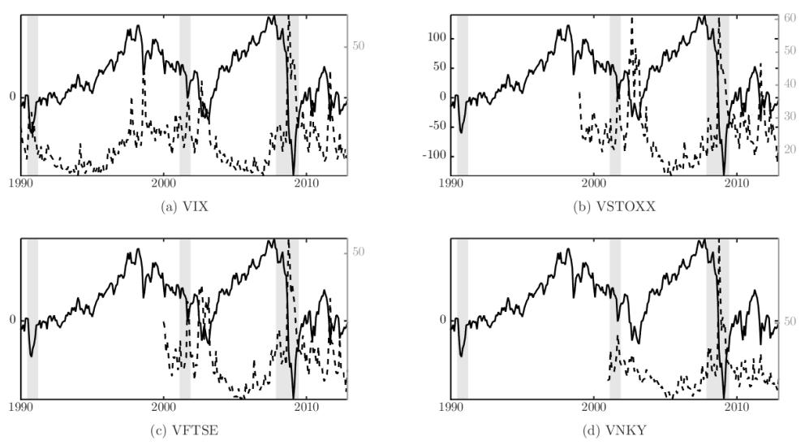
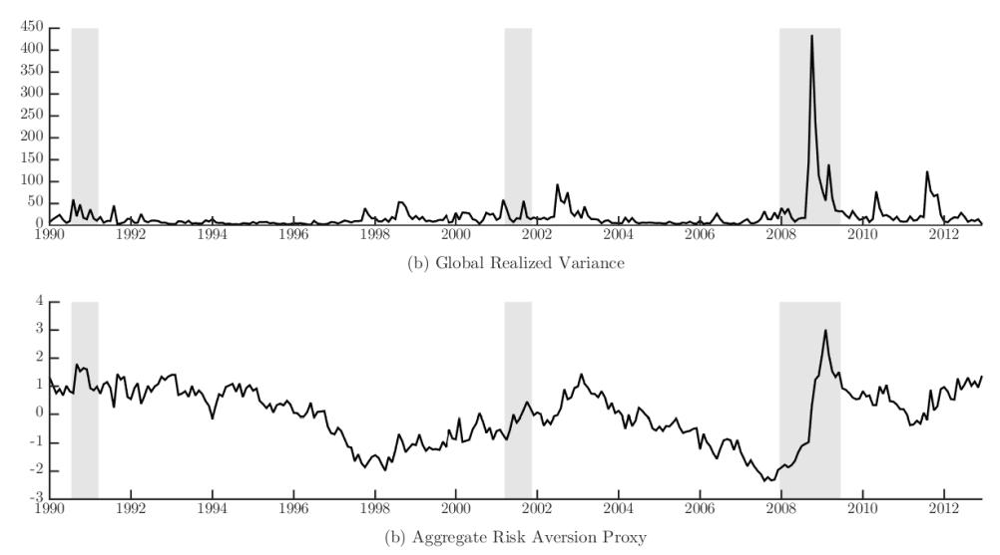
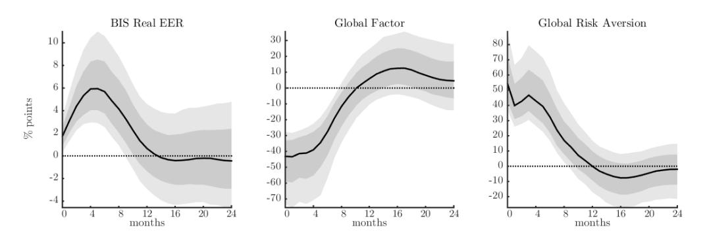
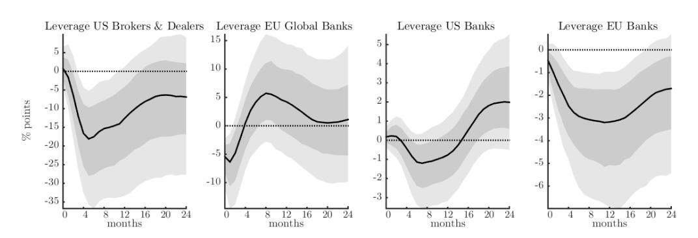
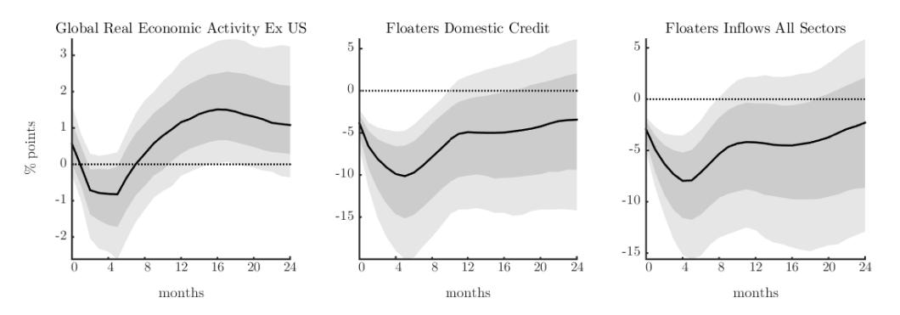
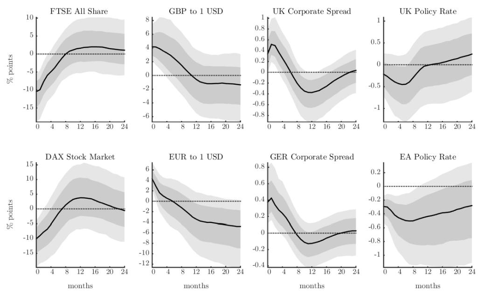
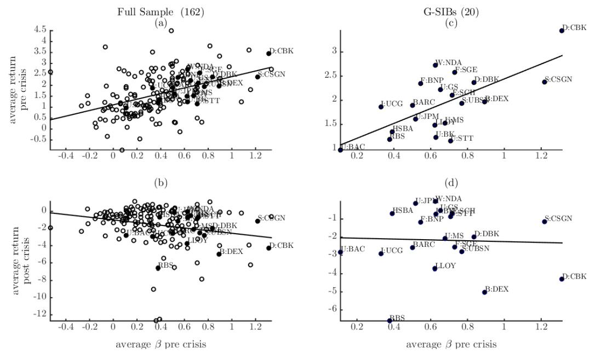

# US Monetary Policy and the Global Financial Cycle

Silvia Miranda-Agrippino∗ Bank of England CEPR and CfM(LSE)

H´el`ene Rey† London Business School CEPR and NBER

Revised April 13, 2020

#### Abstract

US monetary policy shocks induce comovements in the international financial variables that characterize the 'Global Financial Cycle.' A single global factor that explains an important share of the variation of risky asset prices around the world decreases significantly after a US monetary tightening. Monetary contractions in the US lead to significant deleveraging of global financial intermediaries, a decline in the provision of domestic credit globally, strong retrenchments of international credit flows, and tightening of foreign financial conditions. Countries with floating exchange rate regimes are subject to similar financial spillovers.

Keywords: Monetary Policy; Global Financial Cycle; International spillovers; Identification with External Instruments

JEL Classification: E44, E52, F33, F42

∗Monetary Analysis, Bank of England, Threadneedle Street, London EC2R 8AH, UK. E: <silvia.miranda-agrippino@bankofengland.co.uk> W: <www.silviamirandaagrippino.com>

†Department of Economics, London Business School, Regent's Park, London NW1 4SA, UK. E: <hrey@london.edu> W: <www.helenerey.eu>

A former version of this paper was circulated under the title "World Asset Markets and the Global Financial Cycle". We are very grateful to the Editor Veronica Guerrieri and to four anonymous referees for helpful suggestions that greatly helped improve the paper. We also thank our discussants John Campbell, Marcel Fratzscher and Refet G¨urkaynak as well as Stefan Avdjiev, Ben Bernanke, Kristin Forbes, Marc Giannoni, Domenico Giannone, Pierre-Olivier Gourinchas, Alejandro Justiniano, Matteo Maggiori, Marco del Negro, Richard Portes, Hyun Song Shin, Mark Watson, Mike Woodford and seminar participants at the NBER Summer Institute, the ECB-BIS Workshop on "Global Liquidity and its International Repercussions", the ASSA meetings, the New York Fed, CREI Barcelona, Bank of England, Sciences Po, LBS, Harvard and Princeton for comments. Rey thanks the ERC for financial support (ERC grant 695722). The views expressed in this paper are those of the authors and do not represent those of the Bank of England or any of its Committees.

## 1 Introduction

Observers of balance of payment statistics and international investment positions all agree: the international financial landscape has undergone massive transformations since the 1990s. Financial globalization is upon us in a historically unprecedented way, and we have probably surpassed the pre-WWI era of financial integration celebrated by Keynes in "The Economic Consequences of the Peace." At the same time, the role of the United States as the hegemon of the international monetary system has largely remained unchanged, and has long outlived the end of Bretton Woods, as emphasized in e.g. [Farhi](#page-30-0) [and Maggiori](#page-30-0) [\(2018\)](#page-30-0) and [Gourinchas and Rey](#page-31-0) [\(2017\)](#page-31-0). The rising importance of crossborder financial flows and holdings has been documented in the literature.[1](#page-1-0) What has not been explored as much, however, are the consequences of financial globalization for the workings of national financial markets, and for the transmission of US monetary policy beyond the domestic border. How do international capital flows affect the international transmission of monetary policy? What are the effects of global banking on fluctuations in risky asset prices, and on credit growth and leverage in different economies? Using monthly data since 1980, we study how the existence of a 'Global Financial Cycle' [\(Rey,](#page-32-0) [2013\)](#page-32-0) shapes the global financial spillovers of US monetary policy.

Monetary policy operates though multiple, complementary channels. In a standard Keynesian or neo-Keynesian world, output is demand determined in the short-run, and monetary policy stimulates aggregate consumption and investment (see [Woodford,](#page-33-0) [2003](#page-33-0) and [Gali,](#page-30-1) [2008](#page-30-1) for classic discussions). In models with frictions in capital markets, expansionary monetary policy also leads to an increase in the net worth of borrowers, either financial intermediaries or firms, which in turn boosts lending. This is the credit channel of monetary policy [\(Bernanke and Gertler,](#page-29-0) [1995\)](#page-29-0). Other papers have instead analyzed the risk-taking channel of monetary policy in which it is the risk profile of financial intermediaries that plays a key role, and loose monetary policy relaxes leverage constraints [\(Borio and Zhu,](#page-29-1) [2012;](#page-29-1) [Bruno and Shin,](#page-29-2) [2015a;](#page-29-2) [Coimbra and Rey,](#page-30-2) [2017\)](#page-30-2). In this paper, we explore empirically the international transmission of monetary policy that occurs through financial intermediation and global asset prices, an area that has been largely neglected

1See e.g. [Lane and Milesi-Ferretti,](#page-31-1) [2007](#page-31-1) and, for a recent survey, [Gourinchas and Rey](#page-31-2) [\(2014\)](#page-31-2).

by the literature.[2](#page-2-0)

Using a dynamic factor model, we first document the existence of a unique global factor in international risky asset prices that explains over 20% of the variance in the data. With a global Bayesian VAR, we then study the international transmission of US monetary policy that is mediated through the reaction of asset prices, of global credit and capital inflows, and of the leverage of financial intermediaries; these are the variables that characterize the Global Financial Cycle. Our analysis is motivated by the US dollar being an important funding currency for intermediaries, and by the fact that a large portion of portfolios worldwide are denominated in dollars.[3](#page-2-1) We identify US monetary policy shocks using an external instrument constructed from high-frequency price adjustments in the federal funds futures market around FOMC announcements, following the lead of [G¨urkaynak, Sack and Swanson](#page-31-3) [\(2005\)](#page-31-3) and [Gertler and Karadi](#page-30-3) [\(2015\)](#page-30-3). At the same time, the use of a rich-information VAR ensures that we control for a wealth of other shocks, both domestic and international, to which the Fed endogenously reacts, above and beyond what is anticipated by market participants.[4](#page-2-2)

We find evidence of powerful financial spillovers of US monetary policy to the rest of the world. When the Federal Reserve tightens, domestic demand contracts, as do prices. The domestic financial transmission is visible through the rise of corporate spreads, the contraction of lending, and the sharp fall in the prices of assets, such as housing and the stock market. But, importantly, we also document significant variations in the Global Financial Cycle, that is, the shock induces significant fluctuations in financial activity on a global scale. Risky asset prices, summarized by the single global factor, contract very significantly. This is accompanied by a deleveraging of global banks both in the US and Europe, and a surge in aggregate risk aversion in global asset markets. The supply of global credit contracts, and there is an important retrenchment of international credit flows that is particularly pronounced for the banking sector. International corporate bond spreads also rise on impact, and significantly so. These results are consistent

2See [Rey](#page-32-1) [\(2016\)](#page-32-1), [Bernanke](#page-29-3) [\(2017\)](#page-29-3) and [Jorda, Schularick, Taylor and Ward](#page-31-4) [\(2018\)](#page-31-4) for longer discussions.

3For a recent study of the international reserve currency role of the dollar see [Farhi and Maggiori](#page-30-0) [\(2018\)](#page-30-0). [Gopinath](#page-31-5) [\(2016\)](#page-31-5) analyzes the disproportionate role of the dollar in trade invoicing, and [Gopinath](#page-31-6) [and Stein](#page-31-6) [\(2017\)](#page-31-6) the synergies between some of those roles.

4For more detailed discussions see [Miranda-Agrippino](#page-31-7) [\(2016\)](#page-31-7) and [Miranda-Agrippino and Ricco](#page-32-2) [\(2018\)](#page-32-2).

with a powerful transmission channel of US monetary policy across borders, via financial conditions. The contraction of domestic credit and international liquidity that follows the US monetary policy tightening is confirmed also for the subset of countries that have a floating exchange rate regime.

The importance of international monetary spillovers and of the world interest rate in driving capital flows has been pointed out in the classic work of [Calvo et al.](#page-30-4) [\(1996\)](#page-30-4).[5](#page-3-0) Some recent papers have fleshed out the role of intermediaries in channeling those spillovers.[6](#page-3-1) Our empirical results on the transmission mechanism of monetary policy via its impact on risk premia, spreads, and volatility, are related to those of [Gertler and Karadi](#page-30-3) [\(2015\)](#page-30-3) and [Bekaert, Hoerova and Duca](#page-29-4) [\(2013\)](#page-29-4) obtained in the domestic US context.[7](#page-3-2) A small number of papers have analyzed the effect of US monetary policy on leverage and on the VIX (see e.g. [Passari and Rey,](#page-32-3) [2015;](#page-32-3) [Bruno and Shin,](#page-29-5) [2015b\)](#page-29-5).[8](#page-3-3) Using a rich-information Bayesian VAR permits, we believe for the first time, to jointly evaluate the response of financial, monetary and real variables, in the US and abroad. Moreover, by relying on an instrumental variable for the identification of US monetary policy shocks, we can dispense from making implausible timing restrictions on the response of our variables of interest.

The paper is organized as follows. In Section [2,](#page-4-0) we estimate a dynamic factor model on world asset prices and show that one global factor explains a large part of the common variation of the data. In Section [3,](#page-9-0) we estimate a Bayesian VAR identified using external instruments to analyze the interaction between US monetary policy and the Global Financial Cycle. Section [4](#page-22-0) presents a simple theoretical framework featuring heterogeneous investors to interpret some of our results (Section [4.1\)](#page-22-1), and microeconomic data on global

5[Fratzscher](#page-30-5) [\(2012\)](#page-30-5) and [Forbes and Warnock](#page-30-6) [\(2012\)](#page-30-6) have extended these findings significantly.

6[Cetorelli and Goldberg](#page-30-7) [\(2012\)](#page-30-7) use balance sheet data to study the role of global banks in transmitting liquidity conditions across borders. Using firm-bank loan data, [Morais, Peydro and Ruiz](#page-32-4) [\(2015\)](#page-32-4) find that a softening of foreign monetary policy increases the supply of credit of foreign banks to Mexican firms. Using credit registry data combining firm-bank level loans and interest rates data for Turkey, [Baskaya, di Giovanni, Kalemli-Ozcan and Ulu](#page-29-6) [\(2017\)](#page-29-6) show that increased capital inflows, instrumented by movements in the VIX, lead to a large decline in real borrowing rates, and to a sizeable expansion in credit supply. They find that the increase in credit creation goes mainly through a subset of the biggest banks.

7For a discussion on the transmission of unconventional US monetary policy on global risk premia see [Rogers, Scotti and Wright](#page-32-5) [\(2018\)](#page-32-5).

8These studies all rely on limited-information VARs (four to seven variables) and on recursive identification schemes to study the transmission of monetary policy shocks, it is therefore unclear whether their results survive a more robust identification of monetary policy shocks. The problem of omitted variables is also an important issue in small scale VARs (see [Caldara and Herbst,](#page-30-8) [2019\)](#page-30-8).

banks to give evidence of their risk-taking behavior (Section [4.2\)](#page-25-0). Section [5](#page-27-0) concludes. Details on data and procedures, and additional results are in Appendices at the end of the paper.

## 2 One Global Factor in World Risky Asset Prices

In order to summarize fluctuations in global financial markets we specify a Dynamic Factor Model for a large and heterogeneous panel of risky asset prices traded around the globe. The econometric specification, fully laid out in the Online Appendix, is very general, and allows for different global, regional and, in some specifications, sector specific factors.[9](#page-4-1) The panel includes asset prices traded on all the major global markets, a collection of corporate bond indices, and commodities price series (excluding precious metals). The geographical areas covered are North America, Latin America, Europe, Asia Pacific, and Australia, and we use monthly data from 1990 to 2012, yielding a total of 858 different prices series.[10](#page-4-2) Despite the heterogeneity of the asset markets considered, we find that the data support the existence of a single common global factor; moreover, this factor alone accounts for over 20% of the common variation in the price of risky assets from all continents.[11](#page-4-3) The factor is plotted in Figure [1,](#page-5-0) solid line.

While in this instance we prefer cross-sectional heterogeneity over time length, we are conscious of the limitations that a short time span may introduce in the VAR analysis we perform in the next section. To allow more flexibility in that respect, we repeat the factor extraction on a smaller set, where only the US, Europe, Japan and commodity prices are included, but the time series go back to 1975. In this case the sample counts 303 series. The estimated global factor for the longer sample is the dashed line in Figure [1.](#page-5-0)

9A similar specification has been adopted by [Kose et al.](#page-31-8) [\(2003\)](#page-31-8) and [Kose et al.](#page-31-9) [\(2012\)](#page-31-9) for real variables; they test the hypothesis of the existence of a world business cycle and discuss the relative importance of world, region and country specific factors in determining domestic business cycle fluctuations.

10All the details on the construction and composition of the panels, shares of explained variance, and test and criteria used to inform the parametrization of the model (Table ??) are reported in the Online Appendix. We fit to the data a Dynamic Factor Model [\(Stock and Watson,](#page-32-6) [2002a,](#page-32-6)[b;](#page-32-7) [Bai and Ng,](#page-29-7) [2002;](#page-29-7) [Forni et al.,](#page-30-9) [2000,](#page-30-9) among others) where each price series is modelled as the sum of a global, a regional, and an asset-specific component. All price series are taken at monthly frequency using end of month figures.

11We formally test for the numbers of factors in our large panel of asset prices and find that the data support one common global factor. Results are reported in Table ?? in the Appendix.

Figure 1: global factor in risky asset prices

Note: The Figure plots the estimates of the global factor for the 1975:2010 sample (dotted line) together with the estimates on the wider, shorter sample 1990:2012 (solid line). Shaded areas denote NBER recession dates.

Similar to the benchmark case, for this narrower panel too we find evidence of one global factor. In this case, however, the factor accounts for about 60% of the common variation in the data (see Table ??). For both samples, factors are obtained via cumulation of those estimated on the stationary, first-differenced (log) price series, and are therefore consistently estimated only up to a scale and an initial value (see [Bai and Ng,](#page-29-8) [2004,](#page-29-8) and Online Appendix).[12](#page-5-1) As a way of normalization, we rotate the factor such that it correlates positively with the major stock market indices in our sample, i.e. an increase in the index is interpreted as an increase in global asset prices.

Figure [1](#page-5-0) shows that movements in the factors are consistent with both the US recession periods as identified by the NBER (shaded areas), and with major worldwide events. The index declines with all the recession episodes but remains relatively stable until the beginning of the nineties, when a sharp and sustained increase is recorded. The increase lasts until 1997-1998 when major global events like the Russian default, the LTCM bailout, the East Asian Crisis and finally the burst of the dot-com bubble reverse the increasing path. Starting from the beginning of 2003 the index increases again until the beginning of the third quarter of 2007. At that point, with the collapse of the

12This implies that positive and negative values displayed in the chart do not convey any specific information per se. Rather, it is the overall shape and the turning points that are of interest.

Figure 2: global factor and volatility indices

Note: Clockwise from top-left panel, the global factor (solid line) together with major volatility indices (dotted lines): VIX (US), VSTOXX (EU), VNKY (JP) and VFTSE (UK). Shaded grey areas highlight NBER recession times.

subprime market, the first signals of increased vulnerability in financial markets become visible. This led to an unprecedented plunge.

In order to provide some interpretation for our estimated global factor, we note that in a large class of asset pricing models, including in the stylized framework that we present in Section [4,](#page-22-0) the common component of risky asset prices is a function of aggregate volatility, and of the degree of aggregate risk aversion in the market. In particular, in the simple model of Section [4](#page-22-0) with heterogeneous financial intermediaries that differ in their propensity to take on risk, the evolving distribution of wealth between different types of intermediaries gives rise to a time-varying degree of aggregate risk aversion. This interpretation of the factor, as reflecting volatility and aggregate risk aversion, is closely related to that of indices of implied volatility. In Figure [2](#page-6-0) we highlight the comovement of our factor with the VIX, the VSTOXX, the VFTSE and the VNKY, which represent the markets included in our sample. These indices capture both the price and quantity of risk, and hence reflect both expectations about future volatility, and risk aversion. Because of our chosen normalization, we expect our factor to correlate negatively with the implied volatility indices. Indeed, this is clearly visible in the charts of Figure [2;](#page-6-0) the factor and the implied volatility indices display a remarkable common behaviour and

Figure 3: global factor decomposition

Note: [top panel] Monthly global realized variance measured using daily returns of the MSCI Index. [bottom panel] Index of aggregate risk aversion calculated as (the inverse of) the residual of the projection of the global factor onto the realized variance. Shaded grey areas highlight NBER recession times. Source: Global Financial Data and authors calculations.

peaks consistently coincide within the overlapping samples.[13](#page-7-0)

Based on the intuition offered by our simple model, we separate the aggregate risk aversion and volatility components in our global factor. We first estimate a monthly series of realized global volatility using daily returns of the global MSCI Index.[14](#page-7-1) Second, we calculate a proxy for aggregate risk aversion as the inverse of the centred residuals of the projection of the global factor on the realized variance.[15](#page-7-2) The results of this exercise are summarized in Figure [3.](#page-7-3) Our monthly measure of global realized variance is in the top panel, while our index of aggregate risk aversion is in the bottom panel. Interestingly, the degree of market risk aversion that we recover from this simple decomposition is in

13While the comparison with the VIX is somehow facilitated by the length of the CBOE index, the same considerations extend to all other indices analyzed. Comparison with other 'risk indices' such as the GZ-spread of [Gilchrist and Zakrajˇsek](#page-30-10) [\(2012\)](#page-30-10) and the Baa-Aaa corporate bond spread (not reported) show that these indices also display some commonalities, even if the synchronicity is slightly less obvious.

14We work under the assumption that monthly realized variances calculated summing over daily returns provide a sufficiently accurate proxy of realized variance at monthly frequency (see [Andersen et al.](#page-29-9) [\(2003\)](#page-29-9)).

15Specifically, the proxy for aggregate risk aversion is recovered from the following regression: GF ACt = α + βln(GRV ARt) + εt, where GF ACt is the global factor expressed in log units, and GRV ARt is the realized variance of the global MSCI Index. The construction of our proxy for aggregate risk aversion is modelled along the lines of e.g. [Bekaert et al.](#page-29-4) [\(2013\)](#page-29-4), that estimate variance risk premia as the difference between a measure of the implied variance (the squared VIX) and an estimated physical expected variance, which is primarily a function of realized volatilities.

Figure 4: aggregate capital flows

Note: Global flows as a percentage of world GDP. Annual moving averages. Source: IFS Statistics.

continuous decline between 2003 and 2007. It decreases to very low levels at a time when volatility was low, global banks were prevalent and may have been the 'marginal buyers' in international financial markets. Indeed, [Shin](#page-32-8) [\(2012\)](#page-32-8) documents the large and increasing share of banks in international financial markets over that period and until 2007; subsequently, both as a consequence of the crisis and of the changes in regulation, their relative importance has declined. For illustrative purposes, we report data relative to different types of capital flows as a percentage of world GDP in Figure [4,](#page-8-0) and we further explore the connection between the sharp increase in banking flows and the decline in global risk aversion in Section [4.](#page-22-0) After end-2007, aggregate risk aversion starts increasing to jump sharply during the financial crisis and the bankruptcy of Lehman Brothers, and remains persistently at high levels.

In more complex models than the one reported in Section [4,](#page-22-0) the common component of asset prices is not only a function of realized variances and of risk aversion but also of discount rates and of expected cash-flow growth. We explore this more general case in detail in the Online Appendix, and show that this alternative specification delivers an index of aggregate risk aversion very similar to our baseline index in Figure [3.](#page-7-3) [16](#page-8-1)

16Precisely, we extract risk aversion by projecting the factor on realized variances, on discount rates in the US, Germany, the UK and Japan, and on survey forecasts for output growth 12-month-ahead in the same four countries in order to proxy for expected cash flow growth. Results are very similar. For thorough discussions on estimation of price of risk versus quantity of risk, see [Bekaert et al.](#page-29-10) [\(2019\)](#page-29-10) and [Zhou](#page-33-1) [\(2018\)](#page-33-1). We also consider in the Online Appendix other indices of risk aversion that have been independently developed in the literature, and show our results carry through regardless of the particular

## 3 US Monetary Policy and Global Financial Cycle

With the US dollar being the currency of global banking, monetary actions in the US may directly influence the Global Financial Cycle (GFC) by altering the cost of funding for major global banks, and hence their leverage decisions. US monetary policy also affects the pricing of dollar assets, both in the US and abroad, through a direct discount rate channel and/or by changing the type of marginal investors in international asset markets.[17](#page-9-1) Furthermore, monetary conditions of the centre country can also be transmitted through cross-border capital flows, or through the internal pricing of liquidity by global banks, and influence the provision of credit outside US borders (see the corroborative evidence in [Morais et al.,](#page-32-4) [2015](#page-32-4) for Mexico, and in [Baskaya et al.,](#page-29-6) [2017](#page-29-6) for Turkey).

To study the effects of US monetary policy on the GFC, we use rich-information VARs that provide us with a unique framework to analyze the transmission of monetary policy beyond national borders.[18](#page-9-2) There are a number of advantages that come with this choice. Most obviously, relying on a unique specification permits addressing the effects of US monetary policy on the GFC against the background of the response of the domestic business cycle. This acts both as a complement to the analysis, and as a disciplining device to ensure that the identified shock is in fact inducing responses that do not deviate from the standard channels of domestic monetary transmission. Moreover, the dimensionality and composition of the set of variables included in the VAR greatly reduce the problem of omitted variables that generally plagues smaller systems and is likely to invalidate the identification of the structural shocks.[19](#page-9-3)

We start by looking at how US monetary policy affects domestic real and financial conditions in a 'closed economy VAR'. Then, we augment a small set of core domestic variables with those that characterize the GFC; namely, global credit and capital inflows,

proxy used.

17Security-level evidence provided by [Schreger et al.](#page-32-9) [\(2017\)](#page-32-9) shows that firms who finance themselves in dollars are by and large the only ones able to attract a worldwide investors base. For a model where low funding costs lower aggregate effective risk aversion and increase leverage see [Coimbra and Rey](#page-30-2) [\(2017\)](#page-30-2).

18Technical details on priors and estimation of the Bayesian VAR are reported in the Online Appendix.

19[Ba´nbura et al.](#page-29-11) [\(2010\)](#page-29-11) show that a medium-scale VAR of comparable size and composition to the one used in this paper is able to correctly recover the shocks and reproduce responses that match theoretical ones. Intuitively, the large degree of comovement among macroeconomic variables makes it possible for VARs of such size to effectively summarize the information contained in large VARs typically counting over hundred variables.

the global factor in asset prices and risk aversion, and the leverage of US and European global banks. In this first version of our empirical framework, global variables are world aggregates, and bundle together countries with different exchange rate regimes. To evaluate to what extent a floating exchange rate can provide some insulation against foreign shocks, we then repeat the analysis by specifically focusing only on the subset of 'floaters', following the IMF's de-facto classification.

### 3.1 Identification of US Monetary Policy Shocks

We identify US monetary policy shocks using an external instrument [\(Stock and Watson,](#page-32-10) [2012,](#page-32-10) [2018;](#page-33-2) [Mertens and Ravn,](#page-31-10) [2013\)](#page-31-10). The intuition behind this approach to identification is that the mapping between the VAR innovations and the structural shock of interest can be estimated using only moments of observables, provided that a valid instrument for such shock exists. The contemporaneous transmission coefficients are a function of the regression coefficients of the VAR residuals onto the instrument, up to a normalization. Hence, given the instrument, this method ensures that we can isolate the causal effects of a US monetary policy shock on the dynamics of our large set of variables without imposing any timing restrictions on the responses. Intuitively, if the instrument correlates with the VAR innovations only via the contemporaneous monetary policy shocks, a projection of the VAR innovations on the instrument isolates variations in the variables which are solely due to this shock [\(Miranda-Agrippino and Ricco,](#page-32-2) [2018\)](#page-32-2).

The crucial step of this identification strategy is, naturally, the choice of the instrument. We rely on high-frequency movements in federal funds futures markets around FOMC announcements to identify the monetary policy shocks, following the lead of [G¨urkaynak et al.](#page-31-3) [\(2005\)](#page-31-3) and [Gertler and Karadi](#page-30-3) [\(2015\)](#page-30-3). Specifically, we use 30-minutes price revisions (or surprises) around FOMC announcements in the fourth federal funds futures contracts (FF4), and we construct a monthly instrument by summing up the high-frequency surprises within each month. Because these futures have an average maturity of three months, the price revision that surrounds the FOMC monetary policy announcements captures revisions in market participants expectations about the future monetary policy stance up to a quarter ahead. As observed in [Miranda-Agrippino](#page-31-7) [\(2016\)](#page-31-7)

Table 1: Tests for Instruments Relevance

| Domestic VAR (1) |     | F-stat | 90% posterior ci |         | reliability | 90% posterior ci |        |
|------------------|-----|--------|------------------|---------|-------------|------------------|--------|
|                  | FF4 | 17.930 | [6.675           | 22.673] | 0.496       | [0.434           | 0.540] |
|                  | MPN | 10.947 | [4.264           | 16.246] | 0.187       | [0.132           | 0.251] |
| Global VAR (2)   |     |        |                  |         |             |                  |        |
|                  | FF4 | 14.788 | [3.239           | 18.010] | 0.530       | [0.470           | 0.573] |
|                  | MPN | 2.278  | [0.106           | 5.698]  | 0.258       | [0.171           | 0.317] |
| Global VAR (3)   |     |        |                  |         |             |                  |        |
|                  | FF4 | 14.901 | [3.116           | 18.631] | 0.529       | [0.476           | 0.577] |
|                  | MPN | 2.756  | [0.139           | 6.216]  | 0.255       | [0.170           | 0.312] |

Note: First-stage F statistics, statistical reliability and 90% posterior coverage intervals. Candidate instruments are surprises in the three-months-ahead (FF4) federal fund futures and an extension to the narrative instrument of [Romer and Romer](#page-32-11) [\(2004\)](#page-32-11) up to 2007. VAR innovations are from monthly BVAR(12) estimated from 1980 to 2010. First-stage regressions are run on the overlapping sample between the VAR innovations and each instrument.

and [Miranda-Agrippino and Ricco](#page-32-12) [\(2017\)](#page-32-12), market-based monetary surprises such as the ones we use map into the shocks only under the assumption that market participants can correctly and immediately disentangle the systematic component of policy from any observable policy action. In the presence of information asymmetries, the high-frequency surprises are also a function of the information about economic fundamentals that the central bank implicitly discloses at the time of the policy announcements.[20](#page-11-0) Failure to account for this effect may hinder the correct identification of the shocks, resulting in severe price and real activity puzzles, particularly in small VARs. Here we address this issue by relying on the rich information in our VARs. The information set in our VARs controls for a wealth of other shocks, both domestic and international, to which the Fed endogenously reacts, and allows identification of monetary policy shocks above and beyond what is expected by market participants.

In Table [1,](#page-11-1) we report first stage IV statistics of the projection of the VAR innovation for the policy interest rate (1 year rate in our case) on our instrument (FF4). For comparison, we also include first-stage statistics obtained with the narrative instrument

20This implicit disclosure of information is referred to as the Fed information effect in [Nakamura and](#page-32-13) [Steinsson](#page-32-13) [\(2018\)](#page-32-13), and the signalling channel of monetary policy in [Melosi](#page-31-11) [\(2017\)](#page-31-11). The concept is similar to the Delphic component of forward guidance announcements in [Campbell, Evans, Fisher and Justiniano](#page-30-11) [\(2012\)](#page-30-11).

of [Romer and Romer](#page-32-11) [\(2004\)](#page-32-11), that we have extended up to the end of 2007 (MPN). A fist-stage F statistic below 10 is an indication of potentially weak instruments [\(Stock](#page-33-3) [et al.,](#page-33-3) [2002\)](#page-33-3). The three VARs in the table are (1) a closed economy 13-variable VAR that includes only US variables; (2) a global 15-variable VAR that includes GFC variables as world aggregates; (3) and a global 15-variable VAR that focuses on the subset of countries with floating exchange rates.[21](#page-12-0)

Results in Table [1](#page-11-1) show that in a domestic context either instrument attains satisfactory levels of relevance. As we discuss in the next subsection, the two instruments also retrieve relatively similar dynamic responses to a monetary policy shock in the domestic VAR. The relevance of the narrative series deteriorate dramatically in both open economy global VARs with F statistics dropping well below 10. In contrast, the first stage IV statistics associated to the high-frequency based identification are only marginally altered in the three cases. This confirms the strong informative content of our preferred instrument.[22](#page-12-1)

# 3.2 The International Transmission of US Monetary Policy through the Global Financial Cycle

We present our results in the form of dynamic responses to a US monetary policy shock that is normalized to increase the policy rate by 1% on impact. We use the 1-year rate as monetary policy variable; this, coupled with the 3-month horizon embedded in the external instrument implies that we capture standard monetary policy shocks that affect the fed funds rate, but also implicit and explicit Fed communication and actions that affect interest rates at longer maturities. All VARs are estimated using standard macroeconomic priors, with 12 lags at monthly frequency over the sample 1980:1 - 2010:12. Following [Mertens and Ravn](#page-31-10) [\(2013\)](#page-31-10) and [Gertler and Karadi](#page-30-3) [\(2015\)](#page-30-3), the identification step (i.e. the projection of the VAR innovations on the instrument) is run over the common sample (1990:01-2010:12).[23](#page-12-2) We report and discuss only the IRFs for the variables

21All VARs are monthly and estimated with 12 lags over the sample 1980-201. Details on the composition of each VAR are reported in Table [2](#page-13-0) in the next subsection.

22Another paper using high frequency external instruments for the identification of US monetary policy shocks and their effects on financial markets is [Ha](#page-31-12) [\(2016\)](#page-31-12).

23In the Online Appendix we report IRFs from a VAR also estimated from 1990:01 for comparison.

TABLE 2: VARIABLES IN VARS

| Variable Name                       | Source                                                   |     | Model |     |     |     |          |  |
|-------------------------------------|----------------------------------------------------------|-----|-------|-----|-----|-----|----------|--|
|                                     |                                                          | (1) | (2)   | (3) | (4) | (5) | (6)      |  |
| Industrial Production               | FRED-MD                                                  | •   | •     | •   | •   | •   | •        |  |
| Capacity Utilization                | FRED-MD                                                  | •   |       |     |     |     |          |  |
| Unemployment Rate                   | FRED-MD                                                  | •   |       |     |     |     |          |  |
| Housing Starts                      | FRED-MD                                                  | •   |       |     |     |     |          |  |
| CPI All                             | FRED-MD                                                  | •   |       |     |     |     |          |  |
| PCE Deflator                        | FRED-MD                                                  | •   | •     | •   | •   | •   | •        |  |
| 1Y Treasury Rate                    | FRED-MD                                                  | •   | •     | •   | •   | •   | •        |  |
| Term Spread (10Y-1Y)                | FRED-MD                                                  | •   |       |     |     |     |          |  |
| BIS Real EER                        | BIS                                                      | •   | •     | •   | •   | •   | •        |  |
| GZ Excess Bond Premium              | Gilchrist and Zakrajšek (2012)                           | •   |       |     |     |     |          |  |
| Mortgage Spread                     | Gertler and Karadi (2015)                                | •   |       |     |     |     |          |  |
| House Price Index                   | Shiller (2015)                                           | •   |       |     |     |     |          |  |
| S&P 500                             | FRED-MD                                                  | •   |       |     |     |     |          |  |
| Global Factor                       | Datastream & OC                                          |     | •     | •   | •   | •   | •        |  |
| Global Risk Aversion                | OC                                                       |     | •     | •   | •   | •   |          |  |
| Global Real Economic Activity Ex US | Baumeister and Hamilton (2019) & OC                      |     | •     | •   | •   | •   |          |  |
| Global Domestic Credit              | IMF-IFS*                                                 |     | •     |     |     |     | •        |  |
| Global Domestic Credit Ex US        | IMF-IFS*                                                 |     |       | •   |     |     |          |  |
| US Total Nonrevolving Credit        | FRED-MD                                                  |     |       | •   |     | •   |          |  |
| Global Inflows All Sectors          | BIS*                                                     |     | •     | -   |     | -   |          |  |
| Global Inflows to Banks             | BIS*                                                     |     | •     | •   |     |     | •        |  |
| Global Inflows to Non-Banks         | BIS*                                                     |     |       | •   |     |     |          |  |
| Floaters Domestic Credit            | BIS*                                                     |     |       | •   | •   |     |          |  |
| Floaters Inflows All Sectors        | BIS*                                                     |     |       |     |     | •   |          |  |
| Floaters Inflows to Banks           | BIS*                                                     |     |       |     | •   |     |          |  |
| Floaters Inflows to Non-Banks       | BIS*                                                     |     |       |     |     |     |          |  |
| GZ Credit Spread                    | Gilchrist and Zakrajšek (2012)                           |     |       |     |     | •   |          |  |
| Leverage US Brokers & Dealers       | FRB Flow of Funds*                                       |     |       | •   |     |     | •        |  |
| Leverage EU Global Banks            | Bankscope*                                               |     |       |     |     |     |          |  |
| Leverage US Banks                   | Bankscope*                                               |     |       |     |     |     |          |  |
| Leverage EU Banks                   | Bankscope*                                               |     | •     |     | •   | •   |          |  |
| FTSE All Shares                     | Global Financial Data                                    |     | •     | •   | •   | •   |          |  |
| GBP to 1 USD                        | Global Financial Data                                    |     |       |     |     |     |          |  |
| UK Corporate Spread                 | Global Financial Data & OC                               |     |       |     |     |     | •        |  |
| UK Policy Rate                      | Bank of England                                          |     |       |     |     |     | •        |  |
| DAX Index                           | Global Financial Data                                    |     |       |     |     |     | •        |  |
| EUR to 1 USD                        | Global Financial Data Global Financial Data           |     |       |     |     |     | •        |  |
| GER Corporate Spread                | Global Financial Data & OC                               |     |       |     |     |     | •        |  |
| ECB Policy Rate                     | Global Financial Data & OC Global Financial Data & OC |     |       |     |     |     | •        |  |
| ECD FOIICY NATE                     | Giodai Financiai Data & OC                               |     |       |     |     |     | <u> </u> |  |
| Figures                             |                                                          | 5   | 6,7,8 | 7   | 9   |     | 10       |  |
|                                     |                                                          |     | D.1   | D.3 | D.4 | D.5 | D.7      |  |
|                                     |                                                          |     | D.2   |     |     |     |          |  |

Note: The table lists the variables included in the baseline domestic and global BVARs. Models correspond to (1) domestic VAR; (2) & (3) global VARs with world aggregates for GFC; (4) & (5) global VAR on subset of countries with a floating exchange rate; (6) global VAR with focus on UK and EA monetary policy and financial conditions. Variables enter the VARs in (log) levels with the exception of interest rates and spreads. OC denotes own calculations, \* denotes monthly interpolation of the quarterly original variables.

of interest; full sets of IRFs are reported in the Online Appendix. The variables that we include in our baseline VARs are listed in Table 2, together with the composition of all the VARs we estimate for the results collected in the reminder of the section. Details on the construction of the data are reported in the Online Appendix that also collects robustness tests. We report median IRFs together with 68% and 90% posterior coverage bands.

**Domestic Responses** We start our empirical exploration by looking at the response of the domestic financial markets and macroeconomic aggregates. To give further motivation for the choice of our instrument, Figure 5 compares the IRFs obtained with the high-

Industrial Production Capacity Utilization Unemployment Rate 0.6 0.5 0.4 0.3 0.2 0.1 -1.5 Housing Starts CPI All PCE Deflator 1Y Treasury Rate Term Spread 10Y-1Y BIS Real EER 0.4 -0.4 -0.6 House Price Index GZ Excess Bond Premium Mortgage Spread 0.5 0.4 0.3 0.2 0.1S&P 500 FF4 - NARRATIVE

FIGURE 5: RESPONSES OF DOMESTIC BUSINESS & FINANCIAL CYCLE

Note: Closed economy responses to a contractionary US monetary policy shock that induces a 1% increase in the policy rate. [BLUE SOLID LINES AND GREY AREAS] IV is the surprise in FF4 contracts, 68% & 90% posterior coverage bands. [GREEN DASHED LINES AND YELLOW AREAS] IV is an extension of the narrative series of Romer and Romer (2004), 68% & 90% posterior coverage bands.

frequency IV (FF4, solid lines) and the narrative IV (MPN, dashed lines). The VAR is the same in the two cases.

A contractionary monetary policy shock depresses prices and economic activity in line with the standard transmission channels. Production and capacity utilization contract, as do housing investments, while the unemployment rate rises significantly; these effects are

not sudden, but build up over the horizons. Similarly, prices adjust downward. We note here that the MPN IV recovers responses that display a pronounced price puzzle. This is in contrast to our preferred identification: following an initial downward revision, prices continue to slide into negative territory, consistent with the presence of price rigidities. The shock also has important consequences for domestic financial markets. The monetary tightening at the short end decreases the term spread and induces a sudden rise in the excess bond premium variable of [Gilchrist and Zakrajˇsek](#page-30-10) [\(2012\)](#page-30-10) that measures corporate bond spreads net of default considerations. The response also implies increased costs of funding in the corporate market, and provides evidence of a powerful financial amplification mechanism of monetary policy shocks that operates at the domestic level. Expectations of lower economic activity and changes in discount rate are immediately priced-in in the stock market that registers a strong and sudden drop. Household finance also deteriorates substantially, with house prices falling and mortgage spreads increasing significantly.[24](#page-15-0) Finally, the monetary contraction results in a significant appreciation of the dollar against a basket of foreign currencies.

The system of domestic dynamic responses highlights a powerful transmission of monetary policy shocks through the domestic financial markets. In the reminder of this section we will explore how monetary policy shocks spill over across borders through their effect on global financial conditions.

Global Financial Cycle: World Aggregates We start by analyzing the responses of global asset markets, as summarized by the global factor in risky asset prices, and the implied degree of aggregate risk aversion estimated in Section [2.](#page-4-0) [25](#page-15-1) Second, we move on to study the responses of global domestic credit and international capital flows. Our global credit variables are world aggregates that encompass countries with different exchange rate regimes.[26](#page-15-2) Global inflows are defined as direct cross-border credit flows provided by

24We use the 30-year conventional mortgage spread calculated in excess of the 10-year government bond rate. We take this variable from [Gertler and Karadi](#page-30-3) [\(2015\)](#page-30-3).

25The responses of alternative measures of risk aversion, including one that controls for discount rates and expected output (cash-flows) growth are reported in the Online Appendix.

26The countries included in our study are Argentina, Australia, Austria, Belarus, Belgium, Bolivia, Brazil, Bulgaria, Canada, Chile, Colombia, Costa Rica, Croatia, Cyprus, Czech Republic, Denmark, Ecuador, Finland, France, Germany, Greece, Hong Kong, Hungary, Iceland, Indonesia, Ireland, Italy, Japan, Latvia, Lithuania, Luxembourg, Malaysia, Malta, Mexico, Netherlands, New Zealand, Norway, Poland, Portugal, Romania, Russia, Serbia, Singapore, Slovakia, Slovenia, South Africa, South Korea,

Figure 6: Responses of Global Asset Prices & Risk Aversion

foreign banks to both banks and non-banks in the recipient country (see [Avdjiev et al.,](#page-29-13) [2012\)](#page-29-13).

Finally, we look at banks' leverage. Here we separate US brokers/dealers and European global banks from the aggregate banking sector, due to their different risk taking behavior. Data for credit, international inflows, and leverage are originally available at quarterly frequency (see data Appendix). We convert them to monthly frequency by interpolation.[27](#page-16-1) Results are robust to starting the estimation sample in January 1990.

A contractionary US monetary policy shock impacts global asset markets (Figure [6\)](#page-16-0). Upon realization of the monetary contraction, global risky asset prices, as summarized by the global factor, contract abruptly. While the factor has no meaningful measurement unit, we can quantify the effects on global stock markets by looking at its contribution to the overall fluctuations in the major indices. The factor explains about 20% of the common variation in our panel of international asset prices. If we assume that all asset prices loaded equally on the factor, the 40% impact fall would roughly translate into a 8% impact decrease in the local stock market. This number is consistent with both the

Spain, Sweden, Switzerland, Thailand, Turkey, United Kingdom and the United States.

27The quarterly level data are interpolated using a shape-preserving piecewise cubic interpolation; MatLab command: y1 = interp1(t0,y0,t1,'pchip');. Original quarterly and interpolated monthly data used in the paper are made available in the Supporting Material accompanying the paper. Results computed using alternative monthly variables (private sector liquidity instead of IMF-IFS domestic credit, and cross-border flows instead of BIS inflows, both distributed by CrossBorder Capital Ltd.) are equivalent to those discussed below and available upon request.

Figure 7: Responses of Global Credit & Capital Flows

response of the local US stock market (Figure [5\)](#page-14-0), and European markets discussed at the end of the section (Figure [10\)](#page-21-0). Aggregate risk aversion – i.e. the component of our factor that is orthogonal to global realized variance – rises sharply.[28](#page-17-1) The rise is consistent with the heightened levels of domestic measures of risk premia. Importantly, altering the degree of risk aversion of international investors constitutes a powerful channel for the global transmission of US monetary policy. We explore this point further when we discuss the response of global banks' leverage below. Quantifying the rise in risk aversion is less straightforward; but the shock substantially raises it by over 50% above its average trend.

Figure [7](#page-17-0) collects the responses of global economic activity, global domestic credit, and global credit inflows. The Figure combines together responses extracted from the VARs (2) and (3) in Table [2.](#page-13-0) The US monetary policy contraction leaves global growth unchanged on impact. The inclusion of global growth here serves two purposes. First, it allows us to consider changes in global financial conditions once we have controlled

28This result is robust to using alternative measures of risk aversion, see Online Appendix.

Figure 8: Responses of Leverage of Global Banks

for economic activity on a global scale. Second, it helps ensure that we are not confounding the effects of a US monetary policy shock with other global shocks that affect credit through their effects on growth.[29](#page-18-1) Following a US monetary policy contraction we register a sharp decrease in credit provision and a strong retrenchment of global capital inflows. The contraction in global domestic credit is not driven by US domestic credit, as shown in the lower left panel of the figure. Global capital inflows respond in a similar fashion: following an initial contraction, international funding flows continue to decrease to rebound at larger horizons. In the lower section of the figure we report the responses of capital inflows split by recipient type. The overall picture is consistent with a reduction of flows directed to both banking and private sectors. The decline in credit, both domestic and cross-border, whether we look at flows to banks or to non-banks, is in the order of several percentage points and thus economically significant.

Lastly, we collect the responses of banks' leverage in Figure [8.](#page-18-0) We use data on the leverage of US Security Brokers and Dealers (USBD) and Globally Systemically Important Banks (GSIBs) operating in the Euro Area and the UK. Data on total financial assets and liabilities for USBD are from the Flow of Funds of the Federal Reserve Board, while

29We compute global growth excluding US (Global Real Economic Activity Ex US) by using the component of the world production index of [Baumeister and Hamilton](#page-29-12) [\(2019\)](#page-29-12) that is orthogonal to the US cycle, calculated as the cyclical component of US IP. [Baumeister and Hamilton](#page-29-12) [\(2019\)](#page-29-12) use a measure of global real activity that is constructed as a weighted average of the IP indices of the OECD countries + 6 Emerging Market Economies, as an extension of a series originally maintained and distributed by the OECD. Additional details and responses of alternative measures of global growth/global real activity are reported in the Online Appendix.

the aggregate leverage ratios for global banks in the EA and the UK are constructed using bank-level balance sheet data (details are reported in the Online Appendix).[30](#page-19-0)

Consistent with declining asset prices that alter the value of banks' balance sheets, the financial leverage of global investors contracts, both among US Brokers & Dealers, and European global banks. Again, the responses are in the order of several percentage points, and hence economically relevant. The responses appear to be more delayed and more muted for the total balance sheet of the banking sector. Domestically oriented retail banks take longer to adjust, so that broader banking aggregates only react with a delay to monetary policy shocks, which instead affects more immediately the large banks with important capital market operations. The effect of US monetary policy on the whole banking sector is also less precisely estimated, and there is some variation across specifications.

Taken together, the responses collected in Figures [6](#page-16-0) to [8](#page-18-0) provide evidence of a powerful channel of international transmission of US monetary policy that operates mainly through global financial actors, and besides the more standard channels related to international trade. By being able to generate comovements in asset prices, credit creation and credit flows, risk appetite and financial leverage of global investors, US monetary policy can influence fluctuations in the Global Financial Cycle. This is likely the joint outcome of the dollar being the dominant currency in international financial transactions, and of the interconnectedness of global financial intermediaries.

GFC: Floaters An important question regarding Figure [7](#page-17-0) is whether the global contraction in credit is in fact driven by countries that have a fixed or pegged exchange rate regime vis-`a-vis the US dollar. In order to address this concern we restrict our sample to include only 'independently floating' countries, which we identify using use the IMF's de-facto classification.[31](#page-19-1) We construct aggregates as the cross-sectional sum of the levels of domestic credit and capital inflows, using the same definitions as before.

30[Adrian and Shin](#page-29-14) [\(2010\)](#page-29-14) present evidence on the procyclicality of leverage in the domestic US context. In Section [4.2](#page-25-0) we extend these results to an international sample of banks.

31Independently floating countries in our sample are Australia, Austria, Belgium, Brazil, Canada, Chile, Cyprus, Czech Republic, Finland, France, Germany, Greece, Hungary, Iceland, Ireland, Italy, Japan, Luxembourg, Malta, Mexico, Netherlands, New Zealand, Norway, Poland, Portugal, Slovenia, South Africa, Spain, Sweden, Turkey, and the United Kingdom. Source [https://www.imf.org/](https://www.imf.org/external/np/mfd/er/2008/eng/0408.htm) [external/np/mfd/er/2008/eng/0408.htm](https://www.imf.org/external/np/mfd/er/2008/eng/0408.htm).

Figure 9: Responses of Global Credit & Capital Flows: Floaters

Figure [9](#page-20-0) shows the responses of credit and capital inflows for the subset of floaters. The IRFs are obtained by replacing world aggregates with these newly constructed series in the same VAR as before (see Table [2\)](#page-13-0). Again in this case we control for global economic activity. The IRFs in Figure [9](#page-20-0) show that countries that adopt a floating exchange rate regime seem to be equally exposed to US monetary policy shocks. In fact, the magnitude of the contraction in the credit variables is very similar to that obtained over the full sample. It should be clear that these results do not imply that exchange rate regimes are equivalent. However, they do indicate that a floating exchange rate regime is not successful in providing a protective shield against US monetary policy shocks, and that fluctuations in the Global Financial Cycle can affect in a significant way all countries. We explore this point further in the next paragraph.

GFC: Currencies, Credit, and Monetary Independence We finally turn to evaluating more in detail how financial conditions transmit across borders by restricting our attention to the case of the UK and Euro Area, two important currency areas with flexible exchange rates.

Figure [10](#page-21-0) collects the responses of the local stock market indices, bilateral exchange rates vis-`a-vis the dollar, corporate bond spreads, and policy interest rates for the UK (top row of the figure) and the Euro Area (bottom row of the figure).[32](#page-20-1) We note that for all

32For periods preceding the introduction of the Euro, we use the German Mark as the relevant European benchmark currency and convert it using the fixed exchange rate with the Euro chosen at the time of

Figure 10: Cross-Border Financial Conditions & Monetary Policy

these variables the responses across the two countries are remarkably similar. Consistent with the fall in the global factor in risky asset prices, the local stock market indices plummet on impact to a very similar degree. The dollar appreciates significantly against both currencies. The exchange rate is in both cases measured as units of the foreign currency per one US dollar, such that a positive reading corresponds to an appreciation of the dollar. The appreciation is relatively short-lived in both cases, and reverts in the span of one to three quarters after the shock hits. The US monetary policy shock alters funding costs in both the UK and Euro Area, with corporate bond spreads rising very significantly and on impact in both cases. Finally, the responses of the policy rates suggest that a US contractionary monetary policy shock is likely to be followed by an endogenous easing in both the UK and the Euro Area, potentially as a response to the deterioration of the local financial conditions. While estimated with a higher degree of uncertainty in the case of the Euro area, the magnitude of the responses is very similar in the two cases, and implies an endogenous monetary easing of about 30bps. This also

introduction of the common currency.

implies that the tightening of financial conditions in the UK and the Euro Area cannot be ascribed to a domestic monetary policy tightening, and is instead a consequence of the US monetary policy spillover.

## 4 Interpretation of the Results

### 4.1 A Simple Model with Heterogeneous Investors

The empirical results show that US monetary policy affects global banks' leverage, risky asset prices and global risk aversion. In this section, we present a stylized framework to help with the interpretation of our empirical findings; the model builds directly on the work of [Zigrand et al.](#page-33-4) [\(2010\)](#page-33-4).[33](#page-22-2) Our illustrative model of international asset pricing features investors with heterogeneous propensities to take risk, in order to make sense of a time-varying degree of aggregate effective risk aversion.[34](#page-22-3) The risk premium depends on the wealth distribution between leveraged global banks on the one hand, and asset managers, such as insurance companies or sovereign wealth funds, on the other hand. As the relative wealth of the two types of investors fluctuates, asset pricing will be determined mostly by one type of investors or the other.

We consider a world with two types of investors: global banks and asset managers. Global banks and asset managers account for a large part of cross-border flows, as shown in Figure [4.](#page-8-0) Global banks are leveraged entities that fund themselves in dollars for their operations in capital markets. They can borrow at the US risk-free rate and lever to buy a portfolio of world risky securities, whose returns are in dollars. They are riskneutral investors and subject to a Value-at-Risk (VaR) constraint, which is imposed by regulation.[35](#page-22-4) We present microeconomic evidence pertaining to the leverage and risk tak-

33See also [Etula](#page-30-12) [\(2013\)](#page-30-12) and [Adrian and Shin](#page-29-15) [\(2014\)](#page-29-15).

34For a more realistic dynamic stochastic general equilibrium model of asset pricing with heterogeneous investors and monetary policy see [Coimbra and Rey](#page-30-2) [\(2017\)](#page-30-2). Other types of models which generate timevarying risk aversion are, for example, models with habits in consumption (see [Campbell and Cochrane](#page-30-13) [\(1999\)](#page-30-13)).

35Their risk neutrality is an assumption which may be justified by the fact that they benefit from an implicit bailout guarantee, either because they are universal banks, and are therefore part of a deposit guarantee scheme, or because they are too systemic to fail. Whatever the microfoundations, the crisis has provided ample evidence that global banks have taken on large amounts of risk and that this risk was not priced by creditors.

ing behaviour of banks in Section 4.2. The second type of investors are asset managers who, like global banks, acquire risky securities in world markets and can borrow at the US risk-free rate. Asset managers also hold a portfolio of regional assets (for example regional real estate) which is not traded in financial markets, perhaps because of information asymmetries. Asset managers are standard mean-variance investors and exhibit a positive degree of risk aversion that limits their desire to leverage.36

### Global Banks

Global banks maximize the expected return of their portfolio of world risky assets subject to a Value-at-Risk (VaR) constraint.37 The VaR imposes an upper limit on the amount a bank is predicted to lose on a portfolio with a certain probability. We denote by  $\mathbf{R}_t$  the vector of excess returns of all traded risky assets in the world (in dollars). We denote by  $\mathbf{x}_t^B$  the portfolio shares of a global bank, and by  $w_t^B$  the equity of the bank. The maximization problem of a global bank is

$$\max_{\mathbf{x}_{t}^{B}} \mathbb{E}_{t} \left( \mathbf{x}_{t}^{B'} \mathbf{R}_{t+1} \right)$$
subject to  $\text{VaR}_{t} \leq w_{t}^{B}$ ,

where  $VaR_t$  is defined as a multiple  $\alpha$  of the standard deviation of the bank portfolio  $VaR_t = \alpha w_t^B \left[ \mathbb{V}ar_t \left( \mathbf{x}_t^{B'} \mathbf{R}_{t+1} \right) \right]^{\frac{1}{2}}$ .

Taking the first order condition, and using the fact that the constraint is binding (since banks are risk neutral) gives the following solution for the vector of asset demands:

$$\mathbf{x}_{t}^{B} = \frac{1}{\alpha \lambda_{t}} \left[ \mathbb{V}ar_{t}(\mathbf{R}_{t+1}) \right]^{-1} \mathbb{E}_{t}(\mathbf{R}_{t+1}), \tag{1}$$

where we use Var to denote the variance. This is formally similar to the portfolio allocation of a mean-variance investor. In Eq. (1),  $\lambda_t$  is the Lagrange multiplier: the VaR

&lt;sup>36The fact that only asset managers, and not the global banks, have a regional portfolio is non essential; global banks could be allowed to hold a portfolio of regional loans or assets as well. The asymmetry in risk aversion (risk neutral banks with VaR constraint and risk averse asset managers), however, is important for the results.

&lt;sup>37VaR constraints have been used internally for the risk management of large banks for a long time and have entered the regulatory sphere with Basel II and III. For a microfoundation of VaR constraints, see Adrian and Shin (2014).

constraint plays the same role as risk aversion.38

### **Asset Managers**

Asset managers are standard mean-variance investors with a constant degree of risk aversion equal to  $\sigma$ . They have access to the same set of traded assets as global banks. We call  $\mathbf{x}_t^I$  the vector of portfolio weights of the asset managers in tradable risky assets. Asset managers also invest in local (regional) non-traded assets. We denote by  $\mathbf{y}_t^I$  the fraction of their wealth invested in those regional assets (their net supply is  $\mathbf{y}_t$ ). The vector of excess returns on these non tradable investments is  $\mathbf{R}_t^N$ . Finally, we call  $w_t^I$  the equity of asset managers. An asset manager chooses his portfolio of risky assets by maximizing

$$\max_{x_t^I} \mathbb{E}_t \left( \mathbf{x}_t^{I\prime} \mathbf{R}_{t+1} + \mathbf{y}_t^{I\prime} \mathbf{R}_{t+1}^N \right) - \frac{\sigma}{2} \mathbb{V}ar_t \left( \mathbf{x}_t^{I\prime} \mathbf{R}_{t+1} + \mathbf{y}_t^{I\prime} \mathbf{R}_{t+1}^N \right).$$

The optimal portfolio choice in risky tradable securities for an asset manager will be

$$\mathbf{x}_{t}^{I} = \frac{1}{\sigma} \left[ \mathbb{V}ar_{t}(\mathbf{R}_{t+1}) \right]^{-1} \left[ \mathbb{E}_{t}(\mathbf{R}_{t+1}) - \sigma \mathbb{C}ov_{t}(\mathbf{R}_{t+1}, \mathbf{R}_{t+1}^{N}) \mathbf{y}_{t}^{I} \right].$$
 (2)

#### Market clearing conditions

The market clearing condition for risky traded securities is  $\mathbf{x}_t^B \frac{w_t^B}{w_t^B + w_t^I} + \mathbf{x}_t^I \frac{w_t^I}{w_t^B + w_t^I} = \mathbf{s}_t$  where  $\mathbf{s}_t$  is a world vector of net asset supplies for traded assets.

Proposition 1 (Risky Asset Returns) Using Eq. (1) and (2) and the market clearing conditions, the expected excess returns on tradable risky assets can be rewritten as the sum of a global component and a regional component:

$$\mathbb{E}_{t}\left(\mathbf{R}_{t+1}\right) = \Gamma_{t} \mathbb{V}ar_{t}(\mathbf{R}_{t+1}) \ \mathbf{s}_{t} + \Gamma_{t} \mathbb{C}ov_{t}(\mathbf{R}_{t+1}, \mathbf{R}_{t+1}^{N}) \mathbf{y}_{t}, \tag{3}$$

where  $\Gamma_t \equiv \left[\frac{w_t^B}{\alpha \lambda_t} + \frac{w_t^I}{\sigma}\right]^{-1} \left(w_t^B + w_t^I\right)$ . The global component of risky asset prices is equal to the aggregate variance scaled by the aggregate degree of effective risk aversion  $\Gamma_t$ .

 $\Gamma_t$  is the wealth-weighted average of the 'risk aversions' of the asset managers and the

 $\overline{\phantom{aaaaaaaaaaaaaaaaaaaaaaaaaaaaaaaaaaa$ 

global banks. It can be interpreted as the aggregate degree of effective risk aversion of the market. If all the wealth were in the hands of asset managers, for example, aggregate risk aversion would be equal to  $\sigma$ . Using Eq. (3) as a guiding framework, in Section 2 we extracted the global factor in world risky asset prices by writing each price series as the sum of a global, a regional and an asset specific component. We then used Eq. (3) to extract our empirical proxy for aggregate risk aversion  $\Gamma_t$ .39 One possible interpretation of the decline in the measure of aggregate risk aversion observed between 2003 and 2007 in Figure 3 is therefore that it was driven by risk-neutral global banks becoming large and important for the pricing of risky assets, sustaining an increase in risky asset prices on a global scale. This trend reversed after the crisis, when instead more risk-averse asset managers became relatively bigger (see Figure 4).

Proposition 2 (Global Banks Returns) The expected excess return of a global bank portfolio in our economy is given by

$$\mathbb{E}_{t}(\mathbf{x}_{t}^{B'}\mathbf{R}_{t+1}) = \Gamma_{t}\mathbb{C}ov_{t}(\mathbf{x}_{t}^{B'}\mathbf{R}_{t+1}, \mathbf{s}_{t}'\mathbf{R}_{t+1}) + \Gamma_{t}\mathbb{C}ov_{t}(\mathbf{x}_{t}^{B'}\mathbf{R}_{t+1}, \mathbf{y}_{t}'\mathbf{R}_{t+1}^{N})$$

$$= \beta_{t}^{BW}\Gamma_{t}\mathbb{V}ar_{t}(\mathbf{s}_{t}'\mathbf{R}_{t+1}) + \Gamma_{t}\mathbb{C}ov_{t}(\mathbf{x}_{t}^{B'}\mathbf{R}_{t+1}, \mathbf{y}_{t}'\mathbf{R}_{t+1}^{N}), \tag{4}$$

where  $\beta_t^{BW}$  is the beta of a global bank with the world market portfolio.

The higher the correlation of a global bank portfolio with the world portfolio (i.e. high- $\beta_t^{BW}$ ), the more the bank loads on world risk, the higher the expected asset return, *ceteris* paribus.

### 4.2 Evidence on Global Banks

In this section we use balance sheet data to provide some evidence on the risk taking behavior of banks, in line with our simple model. Adrian and Shin (2010) show that the leverage of US brokers-dealers is procyclical. Using balance sheet data for a large sample of international financial institutions (see Table ??), we find that the positive association

&lt;sup>39As mentioned earlier, in general our empirical proxy for aggregate risk aversion could also reflect expected dividend growth and discount rates. We control for these additional factors, estimate a more general aggregate degree of risk aversion and check that all our results go through in Appendix ??.

Figure 11: Correlation between banks' returns and loading on the global factor

Note: In each subplot, the x axis reports the average β BW in the three years preceding the onset of the financial crisis (August 2007), while the y axis records average returns in percentage points. Filled blue circles highlight GSIBs within the broader population of banks (hollow circles); the sign of the correlation is visualized by a red regression line in each plot. Panels (a) and (b): banks average returns pre (2003-2007) and post (2007-2010) crisis as a function of their pre-crisis betas. Panels (c) and (d) GSIBs subsample. Source: Datastream, authors calculations.

between leverage growth and balance sheet growth goes well beyond US borders. We report these results in the Online Appendix.[40](#page-26-0) The procyclicality of leverage tends to be a stronger feature of the behavior of financial institutions that engage in global capital markets operations, a subset which included in particular the former stand-alone investment banks. The same holds true for the large European (UK, Euro Area and Switzerland) universal banks, whose investment departments played a central role in channelling US dollar liquidity worldwide in the years immediately preceding the financial crisis (see [Shin,](#page-32-8) [2012\)](#page-32-8). Many of those large European Banks are GSIBs.

Figure [11](#page-26-1) is the empirical counterpart of Eq. [\(4\)](#page-25-2), and reports the correlation between the returns of each bank and their loading (β BW t ) on our global factor of Section [2.](#page-4-0) Results

40We calculate leverage along the lines of [Kalemli-Ozcan et al.](#page-31-13) [\(2012\)](#page-31-13). We use a panel 166 financial institutions in 20 countries from 2000 to 2010. We identify a subset of 21 large banks who have been classified as Globally Systemically Important Banks (GSIBs). A complete list of institutions included in our set is in Table ??.

in panels (a) and (b) are calculated over the entire population of banks, while panels (c) and (d) refer to the GSIBs subsample, and we use August 2007 to distinguish between pre and post crisis periods. Results confirm a positive association between high β BW t and high returns in the pre crisis sample. Panels (a) and (c) show that, relative to the larger population, GSIBs tend to have both higher average betas, and larger returns. This suggests that global banks were systematically loading more on world risk in the run-up to the financial crisis, and that their behaviour was delivering larger average returns, compared to the average bank in our sample. The higher loadings on risk are consistent with the build-up of leverage in the years prior to the crisis documented in Figure ??. Panels (b) and (d) sort the banks on the x-axis according to their pre-crisis betas, but report their post crisis returns on the y axis: institutions that were loading more on global risk pre crisis suffered the largest losses after the systemic meltdown began.

## 5 Conclusions

This paper establishes the importance of US monetary policy as one of the drivers of the Global Financial Cycle. First, we show that a single global factor explains an important share of the common variation of a large cross section of risky asset prices around the world. Using a simple model of international asset pricing with heterogeneous intermediaries, we interpret this global factor as reflecting market volatility and aggregate risk aversion in global markets. Second, we show that US monetary policy shocks induce strong comovements in the international financial variables that characterize the Global Financial Cycle. Monetary contractions are followed by a significant deleveraging of global financial intermediaries, a rise in aggregate risk aversion, a contraction in the global factor in asset prices and a decline in global credit, a widening of corporate bond spreads and retrenchments of gross capital flows. These results also hold for the countries of our sample with floating exchange rates. This is an important result, as it challenges the degree of monetary policy sovereignty of open economies, and echoes the claim of [Rey](#page-32-0) [\(2013\)](#page-32-0) that the Mundellian trilemma may have morphed into a dilemma: as long as capital flows across borders are free, and macroprudential tools are not used, monetary conditions in any country, even one with a flexible exchange rate, are partly dictated by

the monetary policy of the hegemon (the US). This of course does not mean that exchange rate regimes do not matter, as [Klein and Shambaugh](#page-31-14) [\(2013\)](#page-31-14) and [Obstfeld](#page-32-15) [\(2015\)](#page-32-15) rightly point out.[41](#page-28-0) This international transmission mechanism of monetary policy is a priori consistent with models where financial market imperfections play an important role, e.g. via Value-at-Risk constraints, and where heterogeneous financial intermediaries price assets. It still remains to be seen whether open economy extensions of these models would be able to generate a Global Financial Cycle whose features would match the empirical regularities uncovered in this paper.[42](#page-28-1)

41For interesting models of the challenges of the trilemma in standard neo-Keynesian models, see [Farhi](#page-30-14) [and Werning,](#page-30-14) [2012,](#page-30-14) [2013.](#page-30-15)

42For a more detailed discussion of the theoretical challenges when modelling international monetary policy transmission channels, see [Bernanke](#page-29-3) [\(2017\)](#page-29-3) [Rey](#page-32-1) [\(2016\)](#page-32-1) and [Coimbra and Rey](#page-30-2) [\(2017\)](#page-30-2) .

## References

- Adrian, Tobias and Hyun Song Shin (2010) "Liquidity and leverage," Journal of Financial Intermediation, Vol. 19, No. 3, pp. 418–437, July.
- (2014) "Procyclical Leverage and Value-at-Risk," Review of Financial Studies, Vol. 27, No. 2, pp. 373–403.
- Andersen, Torben G., Tim Bollerslev, Francis X. Diebold, and Paul Labys (2003) "Modeling and Forecasting Realized Volatility," Econometrica, Vol. 71, No. 2, pp. 579–625.
- Avdjiev, Stefan, Robert McCauley, and Patrick McGuire (2012) "Rapid credit growth and international credit: Challenges for Asia," BIS Working Papers 377, Bank for International Settlements.
- Bai, Jushan and Serena Ng (2002) "Determining the Number of Factors in Approximate Factor Models," Econometrica, Vol. 70, No. 1, pp. 191–221.
- (2004) "A PANIC Attack on Unit Roots and Cointegration," Econometrica, Vol. 72, No. 4, pp. 1127–1177.
- Ba´nbura, Marta, Domenico Giannone, and Lucrezia Reichlin (2010) "Large Bayesian vector auto regressions," Journal of Applied Econometrics, Vol. 25, No. 1, pp. 71–92.
- Baskaya, Yusuf Soner, Julian di Giovanni, Sebnem Kalemli-Ozcan, and Mehmet Fatih Ulu (2017) "International spillovers and local credit cycle,"Technical Report 23149, NBER Working Paper.
- Baumeister, Christiane and James D. Hamilton (2019) "Structural Interpretation of Vector Autoregressions with Incomplete Identification: Revisiting the Role of Oil Supply and Demand Shocks," American Economic Review, Vol. 109, No. 5, pp. 1873–1910, May.
- Bekaert, Geert, Eric C Engstrom, and Nancy R Xu (2019) "The Time Variation in Risk Appetite and Uncertainty," Working Paper 25673, National Bureau of Economic Research.
- Bekaert, Geert, Marie Hoerova, and Marco Lo Duca (2013) "Risk, uncertainty and monetary policy," Journal of Monetary Economics, Vol. 60, No. 7, pp. 771 – 788.
- Bernanke, Ben S (2017) "Federal Reserve Policy in an International Context," IMF Economic Review, Vol. 65, No. 1, pp. 5–36, April.
- Bernanke, Ben S and Mark Gertler (1995) "Inside the Black Box: The Credit Channel of Monetary Policy," The Journal of Economic Perspectives, Vol. 9, No. 4, pp. 27–48.
- Borio, Claudio and Haibin Zhu (2012) "Capital regulation, risk-taking and monetary policy: a missing link in the transmission mechanism?" Journal of Financial Stability, Vol. 8, No. 4, pp. 236–251.
- Bruno, Valentina and Hyun Song Shin (2015a) "Capital flows and the risk-taking channel of monetary policy," Journal of Monetary Economics, Vol. 71, pp. 119–132.
- (2015b) "Capital flows and the risk-taking channel of monetary policy," Journal of Monetary Economics, Vol. 71, No. C, pp. 119–132.

- Caldara, Dario and Edward Herbst (2019) "Monetary Policy, Real Activity, and Credit Spreads: Evidence from Bayesian Proxy SVARs," American Economic Journal: Macroeconomics, Vol. 11, No. 1, pp. 157–92, January.
- Calvo, Guillermo A., Leonardo Leiderman, and Carmen M. Reinhart (1996) "Inflows of Capital to Developing Countries in the 1990s," Journal of Economic Perspectives, Vol. 10, No. 2, pp. 123–139.
- Campbell, John and John Cochrane (1999) "Force of Habit: A Consumption-Based Explanation of Aggregate Stock Market Behavior," Journal of Political Economy, Vol. 107, No. 2, pp. 205– 251.
- Campbell, Jeffrey R., Charles L. Evans, Jonas D.M. Fisher, and Alejandro Justiniano (2012) "Macroeconomic Effects of Federal Reserve Forward Guidance," Brookings Papers on Economic Activity, Vol. 44, No. 1 Spring, pp. 1–80.
- Cetorelli, Nicola and Linda S. Goldberg (2012) "Banking Globalization and Monetary Transmission," The Journal of Finance, Vol. 67, No. 5, pp. 1811–1843.
- Coimbra, Nuno and H´el`ene Rey (2017) "Financial Cycles with Heterogeneous Intermediaries," NBER Working Papers 23245, National Bureau of Economic Research, Inc.
- Etula, Erkko (2013) "Broker-Dealer Risk Appetite and Commodity Returns," Journal of Financial Econometrics, Vol. 11, No. 3, pp. 486–521.
- Farhi, Emmanuel and Matteo Maggiori (2018) "A Model of the International Monetary System," The Quarterly Journal of Economics, Vol. 133, No. 1, pp. 295–355.
- Farhi, Emmanuel and Ivan Werning (2012) "Dealing with the Trilemma: Optimal Capital Controls with Fixed Exchange Rates," Working Paper 18199, National Bureau of Economic Research.
- (2013) "Dilemma not Trilemma? Capital Controls and Exchange Rates with Volatile Capital Flows," Working Paper 133566, Harvard University OpenScholar.
- Forbes, Kristin J. and Francis E. Warnock (2012) "Capital flow waves: Surges, stops, flight, and retrenchment," Journal of International Economics, Vol. 88, No. 2, pp. 235–251.
- Forni, Mario, Marc Hallin, Marco Lippi, and Lucrezia Reichlin (2000) "The Generalized Dynamic-Factor Model: Identification and Estimation," Review of Economics and Statistics, Vol. 82, No. 4, pp. 540–554.
- Fratzscher, Marcel (2012) "Capital flows, push versus pull factors and the global financial crisis," Journal of International Economics, Vol. 88, No. 2, pp. 341–356.
- Gali, Jordi (2008) Monetary policy, inflation, and the business cycle: An introduction to the new keynesian framework: Princeton University Press.
- Gertler, Mark and Peter Karadi (2015) "Monetary Policy Surprises, Credit Costs, and Economic Activity," American Economic Journal: Macroeconomics, Vol. 7, No. 1, pp. 44–76.
- Gilchrist, Simon and Egon Zakrajˇsek (2012) "Credit Spreads and Business Cycle Fluctuations," American Economic Review, Vol. 102, No. 4, pp. 1692–1720.

- Gopinath, Gita (2016) "The International Price System," Jackson Hole Symposium Proceedings.
- Gopinath, Gita and Jeremy Stein (2017) "Banking, Trade and the Making of a Dominant Currency,"Technical report, Harvard University, mimeo.
- Gourinchas, Pierre-Olivier and H´el`ene Rey (2014) External Adjustment, Global Imbalances, Valuation Effects, Vol. 4 of Handbook of International Economics, Chap. 0, pp. 585–645: Elsevier.
- Gourinchas, Pierre Olivier and Helene Rey (2017) "Exorbitant Privilege and Exorbitant Duty,"Technical report, London Business School and UC Berkeley.
- G¨urkaynak, Refet S., Brian Sack, and Eric Swanson (2005) "Do Actions Speak Louder Than Words? The Response of Asset Prices to Monetary Policy Actions and Statements," International Journal of Central Banking, Vol. 1, No. 1, May.
- Ha, Jongrim (2016) "Ha, Jongrim, International Transmission of U.S. Monetary Policy Shocks in Open Financial Markets (August 18, 2016). Available at SSRN: https://ssrn.com/abstract=2826058 or http://dx.doi.org/10.2139/ssrn.2826058,"Technical report, Cornell University, mimeo.
- Jorda, Oscar, Moritz Schularick, Alan M Taylor, and Felix Ward (2018) "Global Financial Cycles and Risk Premiums," Working Paper 24677, National Bureau of Economic Research.
- Kalemli-Ozcan, Sebnem, Bent Sorensen, and Sevcan Yesiltas (2012) "Leverage across firms, banks, and countries," Journal of International Economics, Vol. 88, No. 2, pp. 284–298.
- Klein, Michael W. and Jay C. Shambaugh (2013) "Rounding the Corners of the Policy Trilemma: Sources of Monetary Policy Autonomy," NBER Working Papers 19461, National Bureau of Economic Research, Inc.
- Kose, M. Ayhan, Christopher Otrok, and Eswar Prasad (2012) "Global Business Cycles: Convergence or Decoupling?" International Economic Review, Vol. 53, No. 2, pp. 511–538.
- Kose, M. Ayhan, Christopher Otrok, and Charles H. Whiteman (2003) "International Business Cycles: World, Region, and Country-Specific Factors," American Economic Review, Vol. 93, No. 4, pp. 1216–1239.
- Lane, Philip R. and Gian Maria Milesi-Ferretti (2007) "The external wealth of nations mark II: Revised and extended estimates of foreign assets and liabilities, 1970-2004," Journal of International Economics, Vol. 73, No. 2, pp. 223–250, November.
- Melosi, Leonardo (2017) "Signalling Effects of Monetary Policy," Review of Economic Studies, Vol. 84, No. 2, pp. 853–884.
- Mertens, Karel and Morten O. Ravn (2013) "The Dynamic Effects of Personal and Corporate Income Tax Changes in the United States," American Economic Review, Vol. 103, No. 4, pp. 1212–47.
- Miranda-Agrippino, Silvia (2016) "Unsurprising Shocks: Information, Premia, and the Monetary Transmission," Discussion Paper Series 13, Centre for Macroeconomics (CFM).

- Miranda-Agrippino, Silvia and Giovanni Ricco (2017) "The Transmission of Monetary Policy Shocks," The Warwick Economics Research Paper Series (TWERPS) 1136, University of Warwick.
- (2018) "Identification with external instruments in structural VARs under partial invertibility," Sciences Po publications 24, Sciences Po.
- Morais, Bernardo, Jose Luis Peydro, and Claudia Ruiz (2015) "The International Bank Lending Channel of Monetary Policy Rates and QE: Credit Supply, Reach-for-Yield, and Real Effects," International Finance Discussion Papers 1137, Board of Governors of the Federal Reserve System (U.S.).
- Nakamura, Emi and J´on Steinsson (2018) "High Frequency Identification of Monetary Non-Neutrality," The Quarterly Journal of Economics, forthcoming, Vol. 133, No. 3, pp. 1283– 1330.
- Obstfeld, Maurice (2015) "Trilemmas and Tradeoffs: Living with Financial Globalization," in Claudio Raddatz, Diego Saravia, and Jaume Ventura eds. Global Liquidity, Spillovers to Emerging Markets and Policy Responses, Vol. 20 of Central Banking, Analysis, and Economic Policies Book Series: Central Bank of Chile, Chap. 2, pp. 013–078.
- Passari, Evgenia and H´el`ene Rey (2015) "Financial Flows and the International Monetary System," The Economic Journal, Vol. 125, No. 584, pp. 675–698.
- Rey, H´el`ene (2013) "Dilemma not trilemma: the global cycle and monetary policy independence," Proceedings - Economic Policy Symposium - Jackson Hole, pp. 1–2.
- (2016) "International Channels of Transmission of Monetary Policy and the Mundellian Trilemma," IMF Economic Review, Vol. 64, No. 1, pp. 6–35, May.
- Rogers, John H., Chiara Scotti, and Jonathan H. Wright (2018) "Unconventional Monetary Policy and International Risk Premia," Journal of Money, Credit and Banking, Vol. 50, No. 8, pp. 1827–1850.
- Romer, Christina D. and David H. Romer (2004) "A New Measure of Monetary Shocks: Derivation and Implications," American Economic Review, Vol. 94, No. 4, pp. 1055–1084.
- Schreger, Jesse, Brent Neiman, and Matteo Maggiori (2017) "Unpacking Global Capital Flows," 2017 Meeting Papers 502, Society for Economic Dynamics.
- Shiller, Robert (2015) Irrational Exuberance: Princeton University Press, 3rd edition.
- Shin, Hyun Song (2012) "Global Banking Glut and Loan Risk Premium," IMF Economic Review, Vol. 60, No. 2, pp. 155–192, July.
- Stock, James H. and Mark W. Watson (2002a) "Forecasting Using Principal Components from a Large Number of Predictors," Journal of the American Statistical Association, Vol. 97, p. 1167–1179.
- (2002b) "Macroeconomic Forecasting Using Diffusion Indexes," Journal of Business & Economic Statistics, Vol. 20, No. 2, pp. 147–162.
- (2012) "Disentangling the Channels of the 2007-09 Recession," Brookings Papers on Economic Activity, Vol. 44, No. 1 (Spring, pp. 81–156.

- (2018) "Identification and Estimation of Dynamic Causal Effects in Macroeconomics Using External Instruments," The Economic Journal, Vol. 128, No. 610, pp. 917–948.
- Stock, James H, Jonathan H Wright, and Motohiro Yogo (2002) "A Survey of Weak Instruments and Weak Identification in Generalized Method of Moments," Journal of Business & Economic Statistics, Vol. 20, No. 4, pp. 518–29, October.
- Woodford, Michael (2003) Interest and prices: Foundations of a theory of monetary policy: Cambridge University Press.
- Zhou, Hao (2018) "Variance Risk Premia, Asset Predictability Puzzles, and Macroeconomic Uncertainty," Annual Review of Financial Economics, Vol. 10, No. 1, pp. 481–497.
- Zigrand, Jean-Pierre, Hyun Song Shin, and Jon Danielsson (2010) "Risk Appetite and Endogenous Risk," FMG Discussion Papers dp647, Financial Markets Group.