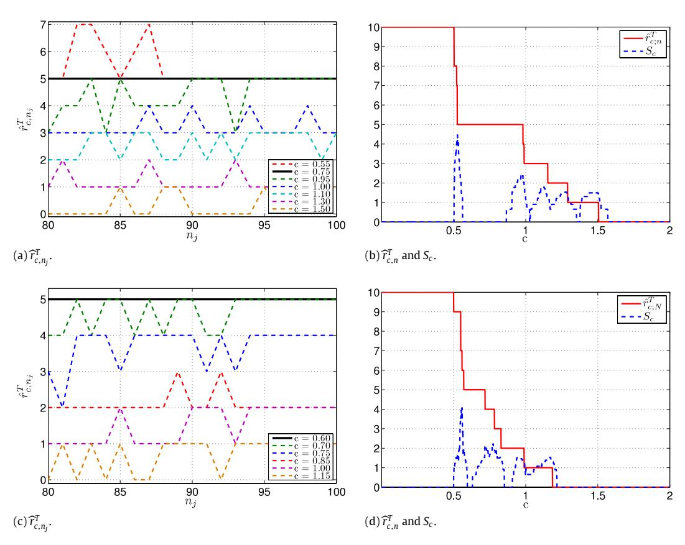
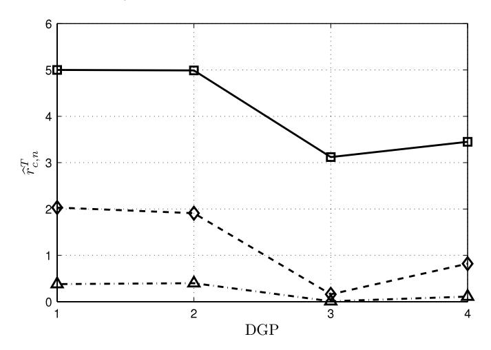
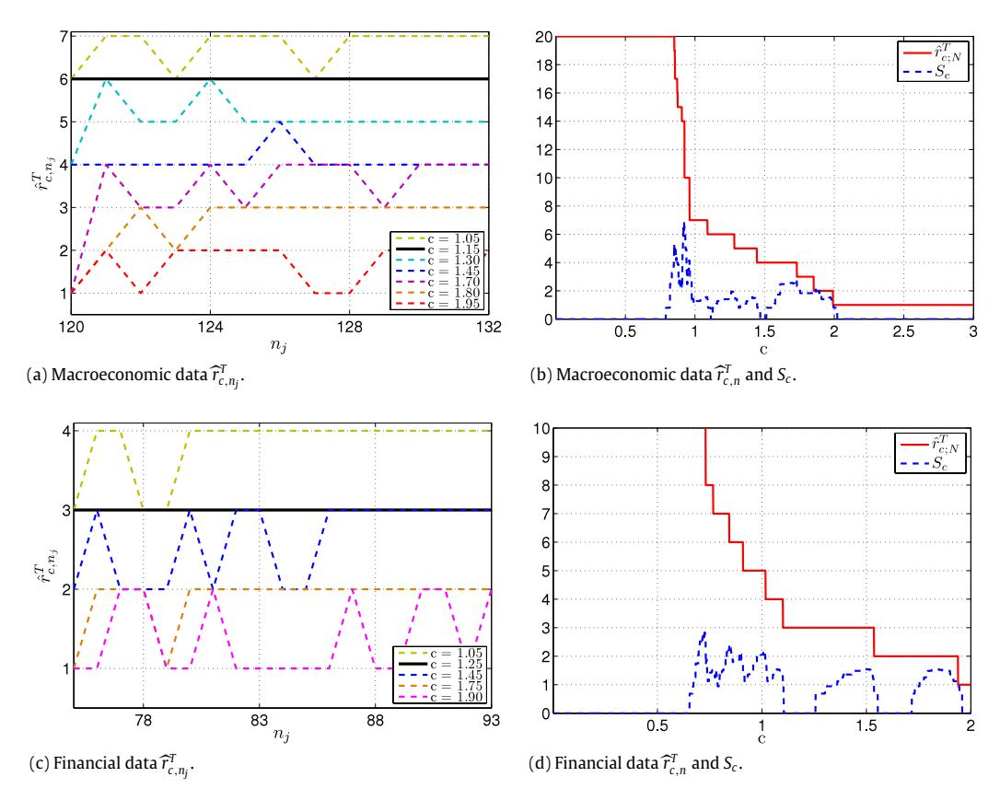

Contents lists available at [ScienceDirect](http://www.elsevier.com/locate/stapro)

## Statistics and Probability Letters

journal homepage: [www.elsevier.com/locate/stapro](http://www.elsevier.com/locate/stapro)

# Improved penalization for determining the number of factors in approximate factor models

Lucia Alessi [a](#page-0-0) , Matteo Barigozzi [b,](#page-0-1)[∗](#page-0-2) , Marco Capasso[c,](#page-0-3)[d](#page-0-4)

- a *European Central Bank, Frankfurt am Main, Germany*
- b *Department of Statistics, London School of Economics and Political Science, United Kingdom*
- c *Urban and Regional Research Centre Utrecht (URU), Faculty of Geosciences, Utrecht University, The Netherlands*
- d *Tjalling C. Koopmans Institute (TKI), Utrecht School of Economics, Utrecht University, The Netherlands*

#### a r t i c l e i n f o

#### *Article history:* Received 3 July 2010 Received in revised form 5 August 2010 Accepted 5 August 2010 Available online 18 August 2010

*MSC:* 62M10 91B84

*Keywords:* Number of factors Approximate factor models Information criterion Model selection

### a b s t r a c t

The procedure proposed by [Bai](#page-7-0) [and](#page-7-0) [Ng](#page-7-0) [\(2002\)](#page-7-0) for identifying the number of factors in static factor models is revisited. In order to improve its performance, we introduce a tuning multiplicative constant in the penalty, an idea that was proposed by [Hallin](#page-7-1) [and](#page-7-1) [Liška](#page-7-1) [\(2007\)](#page-7-1) in the context of dynamic factor models. Simulations show that our method in general delivers more reliable estimates, in particular in the case of large idiosyncratic disturbances.

© 2010 Elsevier B.V. All rights reserved.

## **1. Introduction**

Factor analysis is a very popular dimension reduction technique used in many disciplines, e.g. econometrics, statistics, signal processing, psychometrics, chemometrics. It allows one to account for the ''pervasive'' cross-correlations present among the observed series of large data sets. Such correlations are summarized by means of a few latent variables (the factors) which are common to all variables. We assume that we observe an infinite sequence of nested vector stochastic processes **x***nt* = (*x*1*t* · · · *xnt*) ′ , *n* ∈ N, *t* ∈ Z , driven by a finite number *r* of unobserved factors:

$$\mathbf{x}_{nt} = \mathbf{\Lambda}_n \mathbf{F}_t + \boldsymbol{\xi}_{nt}, \quad t \in \mathbb{Z}. \tag{1}$$

**F***t* is the *r* × 1 vector of factors, and 3 are the corresponding *n* × *r* loadings. The process **x***nt* is therefore represented as the sum of two components which we assume to be orthogonal: a common component, 3*n***F***t* , and an idiosyncratic component, ξ*nt*. The latter is allowed to be mildly cross-correlated and in this sense we say that [\(1\)](#page-0-5) is an *approximate* factor model. Typically *r* ≪ *n*, but *r* is unknown, and its estimation is a crucial step in the identification of the model.

The common and idiosyncratic components are disentangled for *n* going to infinity, while consistency of the estimation is achieved when both *n* and *T* (the sample size) go to infinity. From this double-asymptotic result the necessity of having a *large* cross-section of *long* time series in order to estimate [\(1\)](#page-0-5) consistently is clear. When data sets are large in both the time

*E-mail address:* [matteo.barigozzi@gmail.com](mailto:matteo.barigozzi@gmail.com) (M. Barigozzi).

∗ Corresponding author.

(T) and the cross-section (n) dimensions, determining the number of common factors is particularly difficult, as traditional information criteria such as BIC and AIC, which are consistent for T diverging but for finite n, cannot be applied any longer. In this double-asymptotic framework the reference criterion for determining r is that of Bai and Ng (2002), who propose a consistent estimator as both n and T diverge. In practice, the method that they propose is known to often deliver non-robust results as the number of factors can be overestimated or underestimated (see e.g. the application on US macroeconomic data in Forni et al., 2009).

The aim of this paper is to improve the penalization in the criterion by Bai and Ng (2002). Following Hallin and Liška (2007), who propose a similar criterion in the case of the Generalized Dynamic Factor Model of Forni et al. (2000), we introduce in the penalty function a new parameter in order to tune its penalizing power. We get estimates of the number of static factors which are more robust to different specifications of the criterion, in particular when we have heteroskedastic and/or large idiosyncratic components. Finally, the consistency properties of our estimator are exactly the same as those of the original one proposed by Bai and Ng (2002).

The criterion that we use is based on the key identifying assumption of this class of models. Namely, we want to find r such that all the eigenvalues of the idiosyncratic covariance matrix are bounded for n diverging. The simplest method for determining r is the "scree test". Cattel (1966) observed that the graph of the eigenvalues (in descending order) of an uncorrelated data set forms a straight line with an almost horizontal slope. Therefore, the point in the eigenvalue graph where the eigenvalues begin to level off with a flat and steady decrease is an estimator of the sufficient number of factors. Obviously such a criterion is often fairly subjective, because it is not uncommon to find more than one major break in the eigenvalue graph and there is no unambiguous rule to use. Following this intuition, the criterion of Bai and Ng (2002) minimizes the variance of the idiosyncratic component. Other recent criteria based on the eigenvalues of the covariance matrix appear in Yao and Pan (2008) and Onatski (forthcoming). Our procedure could be adapted also to the criteria of these other studies, but we limit ourselves to the criterion Bai and Ng (2002), this being the one best known in the field of time series analysis.

#### 2. Determining the number of factors

Bai and Ng (2002) consider an approximate factor model where they allow for serial dependence and heteroskedasticity of  $\boldsymbol{\xi}_{nt}$ , and for weak dependence between factors and idiosyncratic series (we refer the reader to their paper for a detailed description of the assumptions). In such a model, when both n and T diverge, the factors  $\mathbf{F}_t$  and the loadings  $\mathbf{\Lambda}_n$  can be estimated by means of asymptotic principal components. If T > n, then, after imposing  $\mathbf{\Lambda}'_n \mathbf{\Lambda}_n / n = \mathbf{I}_r$ , the estimated covariance matrix of the observables  $\widehat{\mathbf{\Gamma}}_n^T$  is  $n \times n$  and  $\widehat{\mathbf{\Lambda}}_n^T$  are  $\sqrt{n}$  times the eigenvectors associated with the r largest eigenvalues of  $\widehat{\mathbf{\Gamma}}_n^T$ , and  $\widehat{\mathbf{F}}_t^T = \widehat{\mathbf{\Lambda}}_n^{T'} \mathbf{x}_{nt} / n$ . If instead T < n, analogous estimators can be obtained from a  $T \times T$  estimator of the covariance matrix simply by exchanging the roles of the factors and their loadings. Theorem 1 in Bai and Ng (2002) proves consistency of these estimators and for a more general class of factor estimators, provided that they all span the r-dimensional space of the common components.

The number of factors r is such that all eigenvalues of the idiosyncratic covariance matrix are bounded for n diverging (see Assumption C in Bai and Ng, 2002). Assume that we have a given number of factors k; then the cross-sectional average variance of the idiosyncratic component is a function of k estimated factors  $\widehat{\mathbf{F}}_{k}^{(k)T}$ , and hence is a function of k:

$$V(k) = \frac{1}{nT} \sum_{i=1}^{n} \sum_{t=1}^{T} \left( x_{nit} - \widehat{\lambda}_{ni}^{(k)T'} \widehat{\mathbf{F}}_{t}^{(k)T} \right)^{2}.$$
 (2)

Clearly V(k) is minimized for k = n, but overparametrization can be avoided by introducing a penalty function p(n, T). Therefore, the resulting criterion is (we consider here only the log version of the Bai and Ng (2002) criterion, which is the one recommended by the authors)

$$\widehat{r}_n^T = \underset{0 \le k \le r_{\text{max}}}{\operatorname{argmin}} \operatorname{lC}_n^T(k) = \underset{0 \le k \le r_{\text{max}}}{\operatorname{argmin}} \log \left[ V(k) \right] + kp(n, T), \tag{3}$$

 $r_{\text{max}}$  being the maximum number of factors allowed. Finally, provided that p(n, T) has the required asymptotic properties,  $\widehat{r}_n^T$  is consistent as n and T diverge (see Theorem 2 in Bai and Ng, 2002, for details).

#### 3. Improved penalization and the choice of r

The information criterion (3) has the property, exploited also by Hallin and Liška (2007) in the context of dynamic factor models, that a penalty function p(n, T) leads to a consistent estimate of r if and only if cp(n, T) does, where c is an arbitrary positive real number. Thus, multiplying the penalty by c has no influence on the asymptotic performance of the identification method. However, for given finite n and T, the value of a penalty function p(n, T) satisfying (3) can be arbitrarily small or arbitrarily large, and this indeterminacy can affect the actual result quite dramatically. Bai and Ng (2002) propose three choices for the penalty function and indicate the corresponding criteria as  $IC_1$ ,  $IC_2$ , and  $IC_3$ . However, only the first two are

known to behave well in empirical applications. We therefore propose two "modified" information criteria:

$$\begin{split} & \mathrm{IC}_{1,c,n}^{T*}(k) = \log\left[V(k)\right] + c\,k\left(\frac{n+T}{nT}\right)\log\left(\frac{nT}{n+T}\right), \quad c \in \mathbb{R}^+, \\ & \mathrm{IC}_{2,c,n}^{T*}(k) = \log\left[V(k)\right] + c\,k\left(\frac{n+T}{nT}\right)\log\left(\min\left\{\sqrt{n},\sqrt{T}\right\}\right)^2, \quad c \in \mathbb{R}^+. \end{split}$$

The estimated number of factors is now also a function of c and, depending on the chosen criterion, is given by

$$\widehat{r}_{c,n}^{T} = \underset{0 \le k \le r_{\text{max}}}{\operatorname{argmin}} \operatorname{IC}_{i,c,n}^{T*}(k) \quad \text{with } i = 1, 2,$$

the consistency proof in Theorem 2 by Bai and Ng (2002) still being valid.

The degree of freedom represented by c can be exploited when implementing the criterion in practice. We follow the procedure proposed by Hallin and Liška (2007). The only available information about the asymptotic behavior of  $\widehat{r}_{c,n}^T$  comes from considering subsamples of sizes  $(n_j, \tau_j)$  with  $j = 0, \ldots, J$  such that  $n_0 = 0 < n_1 < n_2 < \cdots < n_J = n$  and  $\tau_0 = 0 < \tau_1 < \tau_2 < \cdots < \tau_J = T$ . For any j, we can compute  $\widehat{r}_{c,n_j}^{\tau_j}$ , which is a non-increasing function of c. Assume c = 0. According to the value of c, we have different behaviors of  $\widehat{r}_{c,n_j}^{\tau_j}$  as function of c.

No penalty. If c=0 then  $\widehat{r}_{0,n_i}^{\tau_j}=r_{\max}$ , and indeed no penalization is imposed.

*Underpenalization.* If c>0, but small, Theorem 2 applies but, in practice, as j increases,  $\widehat{r}_{c,n_j}^{\tau_j}$  increases to  $r_{\max}$  and would converge to r only if n and T were to increase without limits. In this case we overestimate r.

Overpenalization. When c becomes large,  $\widehat{r}_{c,n_i}^{\tau_j}$  tends to zero for any j and r is underestimated.

Due to the monotonicity of  $\widehat{\tau}_{c,n_j}^{\tau_j}$  as a function of c, between the "small" underpenalizing values of c and the "large" overpenalizing values, there must exist a range of "moderate" values of c such that  $\widehat{\tau}_{c,n_j}^{\tau_j}$  is a stable function of the subsample size  $(n_i, \tau_i)$ . The stability with respect to sample size can be measured by the empirical variance of  $\widehat{\tau}_{c,n_j}^{\tau_j}$  as a function of j, i.e.

$$S_{c} = \frac{1}{J} \sum_{j=1}^{J} \left[ \widehat{r}_{c,n_{j}}^{\bar{r}_{j}} - \frac{1}{J} \sum_{h=1}^{J} \widehat{r}_{c,n_{h}}^{\bar{\tau}_{h}} \right]^{2}.$$

In Fig. 1(a)–(c) and (b)–(d) we show respectively the behavior of  $\widehat{r}_{c,n_j}^{i_j}$  as a function of  $n_j$  and of  $\widehat{r}_{c,n}^T$  and of  $S_c$  as functions of c, when simulating data from two different data generating processes (DGP1 or DGP2 as defined in the next section) with r=5. These figures suggest that the selection of the number of factors can be based on the inspection of the family of curves  $(n_j,\tau_j)\mapsto \widehat{r}_{c,n_j}^{c_j}$ , indexed by  $c\in(0,c_{\max}]$ , trying to find values of c (i.e. curves) such that for  $c\pm\delta$  ( $\delta>0$ ),  $\widehat{r}_{c-\delta,n_j}^{c_j}\uparrow\widehat{r}_{c,n_j}^{i_j}$  and  $\widehat{r}_{c+\delta,n_j}^{c_j}\downarrow\widehat{r}_{c,n_j}^{c_j}$ , as  $j\to J$ , see Fig. 1(a) and (c). The search can be made automatic by considering the mapping  $c\mapsto S_c$  and by choosing  $\widehat{r}_{c,n}^T=\widehat{r}_{c,n}^T$ , where  $\widehat{c}$  belongs to an interval of c implying  $S_c=0$  and therefore a constant value of  $\widehat{r}_{c,n}^T$  as a function of c; see Fig. 1(b) and (d).

Notice that there could be more than one interval of c satisfying these requirements, as the examples show. In these cases, an explanation analogous to the theoretical argument given by Hallin and Liška (2007) in the case of dynamic factor models suggests that the relevant interval is the second stability interval, i.e. the smallest values of c for which  $\hat{r}_{c,n}^{ij}$  is a constant function of j (the first stability interval corresponds always to the boundary solution  $\hat{r}_{c,n}^{i} = r_{\max}$  and it is thus a non-admissible solution). The intuition behind this goes as follows: if the correct number of factors is r and the second stability interval correctly identifies it, by increasing the penalty it is generally possible to obtain another stability interval corresponding to a smaller number of factors  $r^* < r$ , but in this case we are overpenalizing. As an empirical test of the above argument, in Fig. 2 we show the estimated number of factors averaged over 100 simulations of the four DGPs considered in the next section. The number of factors is r=5 and we see that the second stability interval always delivers an estimated number  $\hat{r}_{c,n}^{i}$  which is closer to r than the number suggested by the other intervals. In the next section we show by simulations that our criterion, that considers the second stability interval corresponding to  $\hat{c}$ , delivers a number of factors that is always lower than or equal to the correct number of factors, but it is never greater. Therefore, considering stability intervals corresponding to higher values  $c > \hat{c}$  can never improve the estimate.

#### 4. Simulations

In this section, we conduct a set of simulation experiments to evaluate the performance of our proposed criterion, relative to that of the Bai and Ng (2002) criterion, for finite samples. The baseline model for all simulations is

$$x_{it} = \sum_{j=1}^{r} \lambda_{ij} F_{tj} + \sqrt{\theta} \xi_{it} \quad i = 1, \ldots, n, \ t = 1, \ldots, T,$$

1 All estimations in this paper were performed using Matlab (R2007a). The code is available at http://www.barigozzi.eu/research.html.

**Fig. 1.**  $IC_1^*$  criterion for data simulated from the DGPs defined in Section 4 with r=5 factors; top row: DGP1; bottom row: DGP2; left column:  $\widehat{r}_{c,n_j}^T$  as function of  $n_j$  for different values of c; right column:  $\widehat{r}_{c,n}^T$  (solid line) and  $S_c$  (dashed line) as functions of c.

**Fig. 2.** Monte Carlo average of the estimated number of factors:  $\widehat{r}_{c,n}^T = \frac{1}{100} \sum_{i=1}^{100} \widehat{r}_{i,c,n}^T$ . Data are simulated from the DGPs defined in Section 4 with r=5 factors. Squares: second stability interval; diamonds: third stability interval; triangles: fourth stability interval. Notice that numbers are not integers as they are averages over 100 simulations.

with factors and factor loadings distributed as N(0, 1). We consider four data generating processes (DGPs) similar to those in Bai and Ng (2002).

*DGP*1: Homoskedastic idiosyncratic components  $\xi_{it} \sim N(0, 1)$ .

DGP2: Heteroskedastic idiosyncratic components

$$\xi_{it} = \begin{cases} \xi_{it}^1 & \text{if } t \text{ odd} \\ \xi_{it}^1 + \xi_{it}^2 & \text{if } t \text{ even,} \end{cases} \quad \xi_{it}^1, \xi_{it}^2 \sim N(0, 1).$$

**Table 1**Number of times for which a criterion estimates the correct number of factors; results are obtained over 1000 Monte Carlo replications; r is the number of factors imposed in the simulated data; the DGPs are defined in Section 4; IC1: Bai and Ng (2002) criterion; IC1\*: our criterion; RMSD =  $\sqrt{\frac{1}{1000}} \sum_{i=1}^{1000} (\widehat{r}_{i,c,n}^T - r_i)^2$ .

| r     | DGP       |                   | Estimated number of factors $\widehat{r}_{c,n}^T$ |             |                     |          |    |      |    |    |    |    |      |      |
|-------|-----------|-------------------|---------------------------------------------------|-------------|---------------------|----------|----|------|----|----|----|----|------|------|
|       |           |                   | 0                                                 | 1           | 2                   | 3        | 4  | 5    | 6  | 7  | 8  | 9  | 10   | _    |
| 1     | 1         | IC 1   | 0                                                 | 1000        | 0                   | 0        | 0  | 0    | 0  | 0  | 0  | 0  | 0    | 0    |
|       |           | $IC_1^*$          | 0                                                 | 999         | 1                   | 0        | 0  | 0    | 0  | 0  | 0  | 0  | 0    | 0.03 |
| 1     | 2         | $IC_1$            | 0                                                 | 1000        | 0                   | 0        | 0  | 0    | 0  | 0  | 0  | 0  | 0    | 0    |
|       |           | $IC_1^*$          | 0                                                 | 998         | 2                   | 0        | 0  | 0    | 0  | 0  | 0  | 0  | 0    | 0.04 |
| 1     | 3         | IC 1   | 0                                                 | 0           | 0                   | 0        | 0  | 0    | 0  | 0  | 0  | 0  | 1000 | 9    |
|       |           | $IC_1^*$          | 0                                                 | 825         | 27                  | 6        | 7  | 5    | 0  | 12 | 38 | 80 | 0    | 2.76 |
| 1     | 4         | $IC_1$            | 0                                                 | 1000        | 0                   | 0        | 0  | 0    | 0  | 0  | 0  | 0  | 0    | 0    |
|       |           | IC 1 * | 0                                                 | 966         | 32                  | 2        | 0  | 0    | 0  | 0  | 0  | 0  | 0    | 0.20 |
| 5     | 1         | $IC_1$            | 0                                                 | 0           | 0                   | 0        | 0  | 1000 | 0  | 0  | 0  | 0  | 0    | 0    |
|       |           | IC 1 * | 0                                                 | 0           | 0                   | 0        | 0  | 998  | 2  | 0  | 0  | 0  | 0    | 0.04 |
| 5     | 2         | IC 1   | 0                                                 | 0           | 0                   | 0        | 0  | 1000 | 0  | 0  | 0  | 0  | 0    | 0    |
|       |           | IC 1 * | 0                                                 | 0           | 0                   | 0        | 0  | 1000 | 0  | 0  | 0  | 0  | 0    | 0    |
| 5     | 3         | IC 1   | 0                                                 | 0           | 0                   | 0        | 0  | 0    | 0  | 0  | 0  | 0  | 1000 | 5    |
|       |           | IC 1 * | 734                                               | 95          | 42                  | 29       | 36 | 49   | 9  | 3  | 1  | 2  | 0    | 4.52 |
| 5     | 4         | IC 1   | 0                                                 | 0           | 0                   | 0        | 0  | 1000 | 0  | 0  | 0  | 0  | 0    | 0    |
|       |           | $IC_1^*$          | 0                                                 | 0           | 0                   | 0        | 0  | 957  | 41 | 2  | 0  | 0  | 0    | 0.22 |
| Ratio | between i | diosyncrat        | ic and comm                                       | on variance | = 0.5               |          |    |      |    |    |    |    |      |      |
| r     | DGP       |                   | Estimate                                          | d number o  | f factors $\hat{r}$ | T c.n |    |      |    |    |    |    |      | RMSD |
|       |           |                   | 0                                                 | 1           | 2                   | 3        | 4  | 5    | 6  | 7  | 8  | 9  | 10   | _    |
| 1     | 1         | IC 1   | 0                                                 | 1000        | 0                   | 0        | 0  | 0    | 0  | 0  | 0  | 0  | 0    | 0    |
|       |           | IC 1 * | 0                                                 | 999         | 1                   | 0        | 0  | 0    | 0  | 0  | 0  | 0  | 0    | 0.03 |
| 1     | 2         | IC 1   | 0                                                 | 1000        | 0                   | 0        | 0  | 0    | 0  | 0  | 0  | 0  | 0    | 0    |
|       |           | IC 1 * | 0                                                 | 998         | 2                   | 0        | 0  | 0    | 0  | 0  | 0  | 0  | 0    | 0.04 |
| 1     | 3         | IC 1   | 0                                                 | 0           | 0                   | 0        | 0  | 0    | 0  | 0  | 0  | 0  | 1000 | 9    |
|       |           | IC*               | 0                                                 | 805         | 37                  | 11       | 3  | 3    | 9  | 12 | 32 | 88 | 0    | 2.83 |
| 1     | 4         | $IC_1$            | 0                                                 | 1000        | 0                   | 0        | 0  | 0    | 0  | 0  | 0  | 0  | 0    | 0    |
|       |           | IC*               | 0                                                 | 959         | 35                  | 5        | 0  | 1    | 0  | 0  | 0  | 0  | 0    | 0.27 |
| 5     | 1         | IC 1   | 0                                                 | 0           | 0                   | 0        | 0  | 1000 | 0  | 0  | 0  | 0  | 0    | 0    |
|       |           | IC*               | 0                                                 | 0           | 0                   | 0        | 0  | 997  | 3  | 0  | 0  | 0  | 0    | 0.05 |
| 5     | 2         | IC 1   | 0                                                 | 0           | 0                   | 0        | 0  | 1000 | 0  | 0  | 0  | 0  | 0    | 0    |
|       |           | IC 1 * | 0                                                 | 0           | 0                   | 0        | 0  | 995  | 5  | 0  | 0  | 0  | 0    | 0.07 |
| 5     | 3         | IC 1   | 0                                                 | 0           | 0                   | 0        | 0  | 0    | 0  | 0  | 0  | 0  | 1000 | 5    |
|       |           | IC 1 * | 0                                                 | 0           | 1                   | 0        | 2  | 927  | 39 | 17 | 8  | 6  | 0    | 0.53 |
| 5     | 4         | IC 1   | 0                                                 | 0           | 0                   | 0        | 0  | 1000 | 0  | 0  | 0  | 0  | 0    | 0    |
|       |           | IC 1   |                                                   |             |                     |          |    |      |    |    |    |    |      |      |

DGP3: Cross-sectional correlations among idiosyncratic components

$$\xi_{it} = v_{it} + \sum_{j \neq 0, j = -J}^{J} \beta v_{i-jt}, \quad v_{it} \sim N(0, 1), \ \beta = 0.2, \ J = \max\{n/20, 10\}.$$

DGP4: Serial correlation among idiosyncratic components

$$\xi_{it} = \rho \xi_{it-1} + v_{it}, \quad \xi_{it} \sim N(0, 1), \ v_{it} \sim N(0, 1), \ \rho = 0.5.$$

For each model we set  $r \in \{1, 5\}$  and  $\theta \in \left\{\frac{1}{2}r, r, 3r, 5r\right\}$ , thus assigning to the idiosyncratic component a variance that is respectively one half, one, three or five times the variance of the common component. All parameters are set as in Bai and Ng (2002). We generate samples having size n = 200 and T = 200. We thus have four variance-ratio settings, and for each of them we have two values of r, one sample size and four DGPs. We set  $r_{\text{max}} = 10$ ,  $n_1 = \left[\frac{3}{4}n\right]$ ,  $n_{j+1} = n_j + 1$ , where [x] denotes the integer part of x, and  $c \in (0, 5]$  with a step size of 0.01. For simplicity, we do not consider subsamples in the time dimension. For each case, we simulate 1000 samples and every time we run the original Bai and Ng (2002) criterion  $IC_1$ , and its modified version  $IC_1^*$ .

Tables 1 and 2 show, for  $\theta \in \left\{\frac{1}{2}r, r, 3r, 5r\right\}$ , the number of times for which a given number of factors is selected by IC1 and IC1\*. First, we consider the baseline scenario of equal variance for idiosyncratic and common components ( $\theta = r$ ). When there is only one factor, our criterion performs slightly worse than the original criterion. There is however one exception: when

&lt;sup>2 We only show a selection of results. Results for smaller samples with n = 50 and T = 50, for r = 3, and for the IC2 and IC2\* criteria are available upon request.

**Table 2** Number of times for which a criterion estimates the correct number of factors; results are obtained over 1000 Monte Carlo replications; r is the number of factors imposed in the simulated data; the DGPs are defined in Section 4; IC1: Bai and Ng (2002) criterion; IC1\*: our criterion; RMSD =  $\sqrt{\frac{1}{1000} \sum_{i=1}^{100} (\widehat{r}_{i,c.n}^T - r_i)^2}$ .

| r     | DGP     |                   | Estimated number of factors $\hat{r}_{c,n}^T$ |            |                              |     |     |     |    |    |    |     |      |        |
|-------|---------|-------------------|-----------------------------------------------|------------|------------------------------|-----|-----|-----|----|----|----|-----|------|--------|
|       |         |                   | 0                                             | 1          | 2                            | 3   | 4   | 5   | 6  | 7  | 8  | 9   | 10   | _ RMSD |
| 1     | 1       | IC 1   | 0                                             | 1000       | 0                            | 0   | 0   | 0   | 0  | 0  | 0  | 0   | 0    | 0      |
|       |         | $IC_1^*$          | 0                                             | 1000       | 0                            | 0   | 0   | 0   | 0  | 0  | 0  | 0   | 0    | 0      |
| 1     | 2       | IC 1   | 0                                             | 1000       | 0                            | 0   | 0   | 0   | 0  | 0  | 0  | 0   | 0    | 0      |
|       |         | IC 1 * | 0                                             | 998        | 2                            | 0   | 0   | 0   | 0  | 0  | 0  | 0   | 0    | 0.04   |
| 1     | 3       | IC 1   | 0                                             | 0          | 0                            | 0   | 0   | 0   | 0  | 0  | 0  | 0   | 1000 | 9      |
|       |         | IC 1 * | 2                                             | 834        | 30                           | 5   | 1   | 2   | 4  | 14 | 37 | 71  | 0    | 2.66   |
| 1     | 4       | IC 1   | 0                                             | 1000       | 0                            | 0   | 0   | 0   | 0  | 0  | 0  | 0   | 0    | 0      |
|       |         | $IC_1^*$          | 0                                             | 961        | 36                           | 2   | 1   | 0   | 0  | 0  | 0  | 0   | 0    | 0.23   |
| 5     | 1       | IC 1   | 0                                             | 0          | 0                            | 0   | 33  | 967 | 0  | 0  | 0  | 0   | 0    | 0.18   |
|       |         | IC 1 * | 0                                             | 0          | 0                            | 0   | 0   | 999 | 1  | 0  | 0  | 0   | 0    | 0.03   |
| 5     | 2       | IC 1   | 1                                             | 33         | 214                          | 460 | 260 | 32  | 0  | 0  | 0  | 0   | 0    | 2.14   |
|       |         | IC 1 * | 0                                             | 0          | 0                            | 0   | 0   | 999 | 1  | 0  | 0  | 0   | 0    | 0.03   |
| 5     | 3       | IC 1   | 0                                             | 0          | 0                            | 0   | 0   | 0   | 0  | 0  | 0  | 0   | 1000 | 5      |
|       |         | IC 1 * | 910                                           | 42         | 9                            | 5   | 5   | 3   | 5  | 6  | 5  | 10  | 0    | 4.87   |
| 5     | 4       | IC 1   | 0                                             | 0          | 7                            | 146 | 429 | 418 | 0  | 0  | 0  | 0   | 0    | 1.04   |
|       |         | $IC_1^*$          | 0                                             | 0          | 0                            | 0   | 0   | 977 | 21 | 2  | 0  | 0   | 0    | 0.17   |
| Ratio | between | idiosyncra        | tic and com                                   | mon varian | ce = 5                       |     |     |     |    |    |    |     |      |        |
| r     | DGP     |                   | Estimate                                      | d number o | of factors $\hat{r}_{c}^{1}$ | . n |     |     |    |    |    |     |      | RMSD   |
|       |         |                   | 0                                             | 1          | 2                            | 3   | 4   | 5   | 6  | 7  | 8  | 9   | 10   | _      |
| 1     | 1       | IC 1   | 0                                             | 1000       | 0                            | 0   | 0   | 0   | 0  | 0  | 0  | 0   | 0    | 0      |
|       |         | IC 1 * | 0                                             | 1000       | 0                            | 0   | 0   | 0   | 0  | 0  | 0  | 0   | 0    | 0      |
| 1     | 2       | IC 1   | 0                                             | 1000       | 0                            | 0   | 0   | 0   | 0  | 0  | 0  | 0   | 0    | 0      |
|       |         | IC*               | 0                                             | 1000       | 0                            | 0   | 0   | 0   | 0  | 0  | 0  | 0   | 0    | 0      |
| 1     | 3       | IC 1   | 0                                             | 0          | 0                            | 0   | 0   | 0   | 0  | 0  | 0  | 0   | 1000 | 9      |
|       |         | IC*               | 350                                           | 504        | 024                          | 5   | 0   | 2   | 3  | 4  | 36 | 72  | 0    | 2.64   |
| 1     | 4       | IC 1   | 0                                             | 1000       | 0                            | 0   | 0   | 0   | 0  | 0  | 0  | 0   | 0    | 0      |
|       |         | IC*               | 0                                             | 969        | 29                           | 1   | 1   | 0   | 0  | 0  | 0  | 0   | 0    | 0.20   |
| 5     | 1       | IC 1   | 28                                            | 230        | 436                          | 259 | 46  | 1   | 0  | 0  | 0  | 0   | 0    | 3.06   |
|       |         | IC 1 * | 0                                             | 0          | 0                            | 0   | 0   | 998 | 2  | 0  | 0  | 0   | 0    | 0.04   |
| 5     | 2       | IC 1   | 947                                           | 52         | 1                            | 0   | 0   | 0   | 0  | 0  | 0  | 0   | 0    | 4.95   |
|       |         | IC*               | 3                                             | 1          | 1                            | 4   | 21  | 969 | 1  | 0  | 0  | 0   | 0    | 0.37   |
| 5     | 3       | IC 1   | 0                                             | 0          | 0                            | 0   | 0   | 0   | 0  | 0  | 0  | 0   | 1000 | 5      |
|       |         | IC 1 * | 674                                           | 37         | 6                            | 4   | 2   | 5   | 15 | 39 | 68 | 150 | 0    | 4.55   |
| 5     | 4       | IC 1   | 637                                           | 319        | 42                           | 2   | 0   | 0   | 0  | 0  | 0  | 0   | 0    | 4.63   |
|       |         | IC*               | 141                                           | 71         | 63                           | 82  | 143 | 482 | 17 | 1  | 0  | 0   | 0    | 2.39   |

we allow for cross-correlation of the idiosyncratic components (DGP3) our criterion does not diverge and is able to detect the correct number of factors in more than 80% of the cases. The Bai and Ng (2002) criterion applied to DGP3 always diverges, giving  $\widehat{r}_{c,n}^1 = r_{\text{max}} = 10$ . Similar results hold for the case of a common variance which is double the idiosyncratic variance  $(\theta = \frac{1}{2}r)$ . IC1 performs similarly to IC1 for DGP1, DGP2 and DGP4, and performs much better for DGP3. The advantages of our criterion become clear when we raise the idiosyncratic variance to three times the common variance ( $\theta = 3r$ ). As already observed by Bai and Ng (2002), a high idiosyncratic variance affects the ability of ICs criteria negatively in determining the correct number of factors. IC1 is able to work also under such noisy conditions. When considering DGP3, IC1 diverges and suggests the maximum possible number of factors. When there is only one factor in the DGP, IC1\* performs slightly worse than IC1 for DGPs 1, 2 and 3, although this happens in less than 10% of cases. When the number of factors is higher, our criterion outperforms IC1, providing in almost all the cases the right number of factors. See for example the case of five factors: out of 1000 replications, our criterion was able to retrieve the right number of factors in 999 cases for DGP1 (against 967), in 999 cases for DGP2 (against 32), and in 977 cases for DGP4 (against 418). If the idiosyncratic variance is raised to five times the common variance  $(\theta = 5r)$  and we still consider five factors, the gain obtained by our proposed criterion is even more evident: out of 1000 replications, the right number of factors is retrieved in 998 cases for DGP1 (against 1), in 969 cases for DGP2 (against 0), and in 482 cases for DGP4 (against 0). For DGP3, again we have the same qualitative results: IC1 diverges, while IC1\* suggests 0 factors in 674 cases and a number between 1 and 9 factors for the remaining cases. Summing up, our refinement makes the Bai and Ng (2002) criterion a much more useful tool in practical contexts. Indeed, it enormously reduces the probability of large mistakes and always provides a reliable answer, even when, in the presence of a factor structure in the DGP, the data set presents some features of high idiosyncratic variance or heteroskedasticity that would prevent the traditional criteria from suggesting a finite positive number of factors. Notice that this success is not a technical

**Fig. 3.** IC1\* criterion for the two observed data sets; top row: macroeconomic data; bottom row: financial data; left column:  $\hat{r}_{c,n_j}^T$  as a function of  $n_j$  for different values of c; right column:  $\hat{r}_{c,n_j}^T$  (solid line) and  $S_c$  (dashed line) as functions of c.

artifact depending on a tendency to always retrieve a positive number of factors. It is easy to check that when there is no factor structure in the simulated data, the proposed criterion suggests a number of factors equal to zero, exactly as the Bai and Ng (2002) criterion would do.

## 5. Empirical applications

We test the performance of our procedure by means of two empirical applications on macroeconomic and financial data sets. In the first case we take a data set which has been used in many applications of factor models (see e.g. Stock and Watson, 2005; Hallin and Liška, 2007). It comprises 132 series of monthly macroeconomic indicators of the US economy from January 1960 to December 2003 for a total of 528 time observations. In a second exercise we consider daily volatilities (proxied by the adjusted high–low range) of 93 assets belonging to the New York S&P100, from 1st January 2001 to 31st December 2008 for a total of 2008 time observations. In Fig. 3(a) and (b) we report results obtained for the macroeconomic application.  $IC_1^*$  indicates the presence of six factors. The original criteria  $IC_1$  and  $IC_2$  suggest seven factors. In Fig. 3(c) and (d) we report the results for the financial data set.  $IC_1^*$  indicates the presence of three factors, while the original ICs always diverge, giving as solution  $r = r_{\text{max}} = 10$ .

#### 6. Conclusions

In this paper we refine the Bai and Ng (2002) criterion for determining the number of factors in approximate factor models, which is one of the most popular criteria available for addressing this issue. The appeal of our new method is threefold: (i) it builds on a well known criterion, whose theoretical properties have been proved and are preserved; (ii) it improves the finite sample performance of the original criterion; (iii) it is easy to implement. In particular, our procedure is capable of giving an answer even when the original criterion does not converge. In general, we obtain more robust results than the Bai and Ng (2002) criterion, especially when the variance explained by the common factors is relatively low. This result constitutes an improvement in the analysis of data sets where comovements among variables are hidden by large idiosyncratic disturbances. For example, in financial applications we often find few common factors explaining a

&lt;sup>3 Data are available at http://www.princeton.edu/~mwatson.

small percentage of the total variance. These factors are however of great importance for the structural analysis of financial markets (see e.g. [Engle](#page-7-8) [et al.,](#page-7-8) [1990,](#page-7-8) where the unique factor is interpreted as the ''market factor''). Although some authors identify the factor decomposition by requiring the idiosyncratic components to be ''small'' or ''negligible'' (e.g. in the case of principal component analysis), such characterization is not reflecting the fundamental nature of factor models: idiosyncratic components can indeed be ''large'' and strongly autocorrelated, while the common component can be just white noise, i.e. serially uncorrelated. The ability of identifying the correct number of factors in large but finite and apparently heterogeneous data sets is therefore highly desirable.

#### **Acknowledgement**

We thank an anonymous referee for his or her helpful comments.

## **References**

Bai, J., Ng, S., 2002. Determining the number of factors in approximate factor models. Econometrica 70, 191–221.

Cattell, R., 1966. The scree test for the number of factors. Multivariate Behavioral Research 1, 245–276.

Engle, R.F., Ng, V.K., Rothschild, M., 1990. Asset pricing with a factor-ARCH covariance structure: empirical estimates for treasury bills. Journal of Econometrics 45, 213–237.

Forni, M., Gannone, D., Lippi, M., Reichlin, L., 2009. Opening the black box: structural factor models versus structural VARs. Econometric Theory 25, 1319–1347.

Forni, M., Hallin, M., Lippi, M., Reichlin, L., 2000. The generalized dynamic factor model: identification and estimation. The Review of Economics and Statistics 82, 540–554.

Hallin, M., Liška, R., 2007. Determining the number of factors in the general dynamic factor model. Journal of the American Statistical Association 102, 603–617.

Onatski, A., 2010. Determining the number of factors from empirical distribution of eigenvalues. The Review of Economics and Statistics (forthcoming), [doi:10.1162/REST\\_a\\_00043.](http://dx.doi.org/doi:10.1162/REST_a_00043)

Stock, J.H., Watson, M.W., 2005. Implications of dynamic factor models for VAR analysis. NBER Working Papers 11467. National Bureau of Economic Research, Inc.

Yao, Q., Pan, J., 2008. Modelling multiple time series via common factors. Biometrika 95, 365–379.