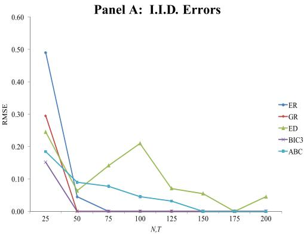
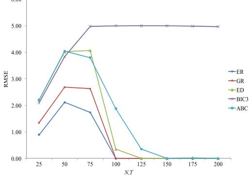
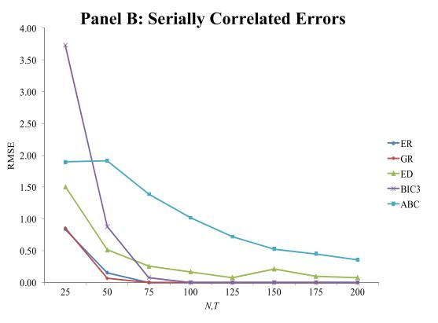
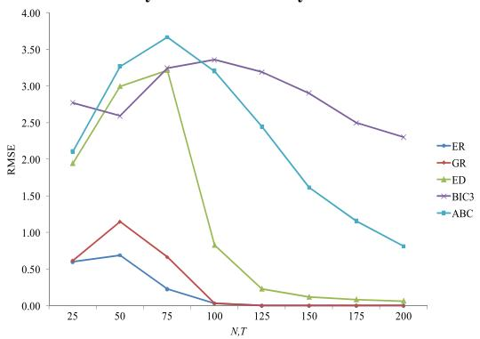
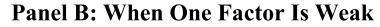
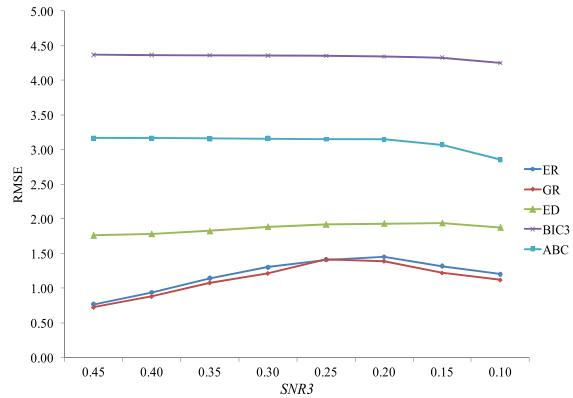
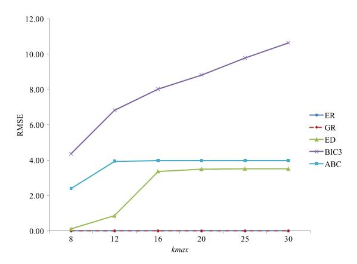
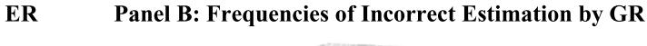
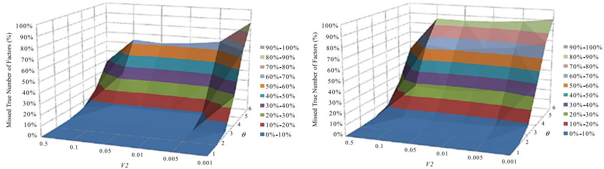
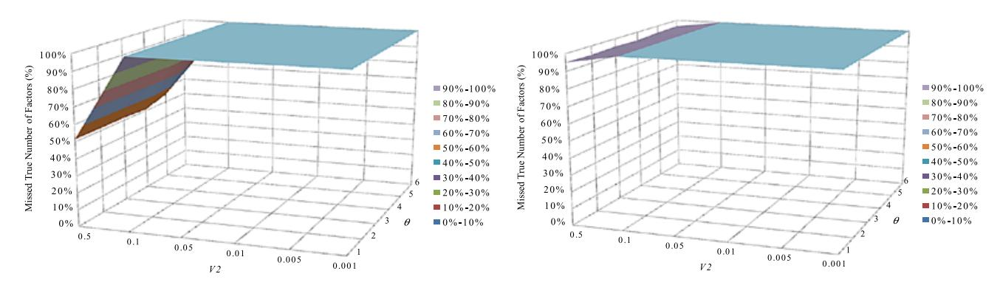

## EIGENVALUE RATIO TEST FOR THE NUMBER OF FACTORS

## BY SEUNG C. AHN AND ALEX R. HORENSTEIN1

This paper proposes two new estimators for determining the number of factors (r) in static approximate factor models. We exploit the well-known fact that the r largest eigenvalues of the variance matrix of N response variables grow unboundedly as N increases, while the other eigenvalues remain bounded. The new estimators are obtained simply by maximizing the ratio of two adjacent eigenvalues. Our simulation results provide promising evidence for the two estimators.

KEYWORDS: Approximate factor models, number of factors, eigenvalues.

## 1. INTRODUCTION

RECENTLY, MANY ESTIMATION METHODS have been developed for the number of common factors in economic or financial data with both large numbers of cross-section units (N) and time series observations (T). Examples are [Bai and](#page-23-0) [Ng](#page-23-0) [\(2002\)](#page-23-0), Onatski [\(2006,](#page-23-0) [2010\)](#page-23-0), and [Alessi, Barigozzi, and Capasso](#page-23-0) [\(2010\)](#page-23-0) for static approximate factor models; and [Forni, Hallin, Lippi, and Reichlin](#page-23-0) [\(2000\)](#page-23-0), [Hallin and Liska](#page-23-0) [\(2007\)](#page-23-0), [Amengual and Watson](#page-23-0) [\(2007\)](#page-23-0), [Bai and Ng](#page-23-0) [\(2007\)](#page-23-0), and [Onatski](#page-23-0) [\(2009\)](#page-23-0), among others, for dynamic factor models. In this paper, we propose two alternative estimators for static factor models.

Bai and Ng [\(2002;](#page-23-0) hereafter BN) proposed to estimate the number of factors (r) by minimizing one of the two model selection criterion functions, named PC and IC. The BN estimators are linked to the eigenvalues of the second-moment matrix of N response variables (see, e.g., [Onatski](#page-23-0) [\(2006\)](#page-23-0)). Specifically, the PC estimator equals the number of the eigenvalues larger than a threshold value specified by a penalty function. An important contribution, among many, of BN is their finding that the convergence rates of the eigenvalues depend on min(N- T ), and, therefore, the threshold value should be adjusted depending on both N and T.

There are, however, two issues that need to be addressed to improve the finite-sample properties of the BN estimators. The first issue is that the prespecified threshold functions are not unique [\(Hallin and Liska](#page-23-0) [\(2007\)](#page-23-0)). Any

1We thank the editor and three anonymous referees for their numerous comments and suggestions that helped us improve the quality of the paper substantially. We also thank Jushan Bai, Alexei Onatski, Marcos Perez, Crocker Liu, Federico Nardari, Manuel Santos, Stephan Dieckmann, Na Wang, and Matteo Barigozzi for their helpful comments and/or sharing codes and data with us. The paper was presented in the econometrics seminars at Tokyo University, Kyoto University, Hitotsubashi University, the Korea Econometric Society Summer Meeting, Korea University, Wilfrid Laurier University, University of Southern California, Texas A&M University, Sam Houston State University, Bar Ilan University, Norwegian School of Economics and Business Administration, University of Alberta, Instituto Tecnológico Autónomo de México, and Seoul National University. We would like to thank the participants in the seminars. All remaining errors are, of course, our own.

finite multiple of a threshold function is also an asymptotically valid threshold function for consistent estimation of the number of factors. However, the finite-sample properties of the estimators could depend on the threshold function chosen among many alternatives. The second issue is that the BN estimators need to prespecify a maximum possible number of factors (*kmax*) to compute threshold values. Obviously, there are many possible choices for *kmax*. Thus, ideally the estimators should not be overly sensitive to the choice of *kmax*. However, our simulation results indicate that the BN estimators are quite sensitive to the choice of *kmax*.

The first issue is related to the use of prespecified threshold functions. Some recent studies have developed data-dependent methods for threshold values. An ideal threshold value would be a value slightly greater than the (r + 1)th largest eigenvalue. [Onatski](#page-23-0) [\(2006\)](#page-23-0) developed a consistent estimator of the (r + 1)th eigenvalue under the assumption that the idiosyncratic components of response variables are either autocorrelated or cross-sectionally correlated, but not both. [Onatski](#page-23-0) [\(2010\)](#page-23-0) also proposed an alternative estimator, named "Edge Distribution" (ED) estimator, which estimates the number of factors using differenced eigenvalues. Instead of estimating an asymptotically valid threshold for consistent estimation of the number of factors, [Hallin and Liska](#page-23-0) [\(2007\)](#page-23-0) proposed an alternative data-dependent method for general dynamic factor models that consists of two steps: tuning and stability checkup. They suggested estimating the number of factors using different subsamples and different multiples of the BN penalty functions (tuning). The final estimate is the estimate that is invariant to the subsamples used and the changes in the multiplicative constant of the penalty function in a certain range (stability checkup). [Alessi, Barigozzi, and Capasso](#page-23-0) [\(2010\)](#page-23-0) reported that the BN estimators obtained by this tuning-stability checkup procedure outperform the original estimators in finite samples.

In this paper, we propose two alternative estimators, which we name "Eigenvalue Ratio" (ER) and "Growth Ratio" (GR) estimators. They are easy to compute. In particular, the ER estimator is obtained simply by maximizing the ratio of two adjacent eigenvalues arranged in descending order. Our simulation results indicate that the finite-sample performances of the two estimators are promising. In most of the cases we consider, they outperform other competing estimators. One exception is the case in which one factor has extremely strong explanatory power for response variables. Even for this case, the GR estimator shows performances comparable to those of other competing estimators. In addition, the performances of the two estimators are not sensitive to the choice of *kmax* unless it is too large or too small.

This paper is organized as follows. Section [2](#page-2-0) presents the assumptions consistent with approximate static factor models and shows that the proposed estimators are consistent. Section [3](#page-7-0) reports our Monte Carlo experiments. Concluding remarks are given in Section [4.](#page-15-0)

### 2. ASSUMPTIONS AND ASYMPTOTIC RESULTS

We begin by defining the approximate factor model of Chamberlain and Rothschild (1983). Let  $x_{it}$  denote the response variable i = 1, ..., N at time t = 1, ..., T. The variables are generated by an  $r \times 1$  vector of factors,  $f_t : x_{\cdot t} = \Lambda^o f_t + \varepsilon_{\cdot t}$ , where  $x_{\cdot t} = (x_{1t}, x_{2t}, ..., x_{Nt})'$ ,  $\Lambda^o = (\lambda_1^o, \lambda_2^o, ..., \lambda_N^o)'$ ,  $\lambda_i^o$  is the  $r \times 1$  vector of factor loadings for variable i, and  $\varepsilon_{\cdot t} = (\varepsilon_{1t}, ..., \varepsilon_{Nt})'$  is the vector of the idiosyncratic components of response variables. The factors, factor loadings, and idiosyncratic components are not observed. We can describe the model for the complete panel data by

(1) 
$$X = F\Lambda^{o'} + E,$$

where  $X' = (x_{.1}, ..., x_{.T})$ ,  $F' = (f_1, ..., f_T)$ , and  $E' = (\varepsilon_{.1}, \varepsilon_{.2}, ..., \varepsilon_{.T})$ . Following Bai and Ng (2002), we treat the entries in  $\Lambda^o$  as parameters and those in F as random variables.

We introduce some notation. We denote the norm of a matrix A as  $||A|| = [\operatorname{trace}(A'A)]^{1/2}$ . Two scalars,  $c_1$  and  $c_2$ , denote generic positive constants. For any real number z, [z] denotes the integer part of z. We use  $\psi_k(A)$  to denote the kth largest eigenvalue of a positive semidefinite matrix A. With this notation, we define

$$\tilde{\mu}_{NT,k} \equiv \psi_k [XX'/(NT)] = \psi_k [X'X/(NT)].$$

Finally, we use  $m = \min(N, T)$  and  $M = \max(N, T)$ . Our assumptions on the factor model (1) are as follows.

ASSUMPTION A: (i) Let  $\mu_{NT,k} = \psi_k[(\Lambda^{o'}\Lambda^o/N)(F'F/T)]$  for  $k = 1, \ldots, r$ . Then, for each  $k = 1, 2, \ldots, r$ ,  $p \lim_{m \to \infty} \mu_{NT,k} = \mu_k$ , and  $0 < \mu_k < \infty$ . (ii) r is finite.

ASSUMPTION B: (i)  $E \|f_t\|^4 < c_1$  and  $\|\lambda_i^o\| < c_1$  for all i and t. (ii)  $E(\|N^{-1/2} \times \sum_i \varepsilon_{it} \lambda_i^o\|^2) < c_1$  for all t. (iii)  $E(N^{-1} \sum_i \|T^{-1/2} \sum_t \varepsilon_{it} f_t\|^2) = E[(NT)^{-1} \times \|E'F\|^2] < c_1$ .

ASSUMPTION C: (i)  $0 < y \equiv \lim_{m \to \infty} m/M \le 1$ . (ii)  $E = R_T^{1/2} U G_N^{1/2}$ , where  $U' = [u_{it}]_{N \times T}$ , and  $R_T^{1/2}$  and  $G_N^{1/2}$  are the symmetric square roots of  $T \times T$  and  $N \times N$  positive semidefinite matrices  $R_T$  and  $G_N$ , respectively. (iii) The  $u_{it}$  are independent and identically distributed (i.i.d.) random variables with uniformly bounded moments up to the fourth order. (iv)  $\psi_1(R_T) < c_1$  and  $\psi_1(G_N) < c_1$ , uniformly in T and N, respectively.

ASSUMPTION D: (i)  $\psi_T(R_T) > c_2$  for all T. (ii) Let  $y^* = \lim_{m \to \infty} m/N = \min(y, 1)$ . Then, there exists a real number  $d^* \in (1 - y^*, 1]$  such that  $\psi_{[d^*N]}(G_N) > c_2$  for all N.

Assumptions A–C are the same assumptions as those in Bai and Ng (2006) and Onatski (2010). Although Assumption C(ii) restricts covariance structure of the errors, it allows both autocorrelation and cross-sectional correlation in the errors.

Assumption D is a new assumption we impose. The matrix  $G_N$  governs the cross-section correlations among the errors, while  $R_T$  determines the structure of serial correlations. Assumption D(i) states that none of the idiosyncratic components and their linear functions can be perfectly predicted by their past values. Assumption D(ii) states that an asymptotically nonnegligible number of the eigenvalues of  $G_N$  are bounded below by a positive number. Assumption D(ii) holds with  $d^* = 1$  if response variables are not perfectly multicollinear and if none of them have zero idiosyncratic variances.

For macroeconomic or financial data, some variables may be perfectly or almost perfectly correlated with the others or may be factors themselves. An example is the macroeconomic data that contain detailed consumption data such as total consumption expenditure and categorized consumption expenditures for durable and nondurable goods and services. The total expenditure is the sum of the other categorized expenditures. For such data, the smallest eigenvalue of  $G_N$  may be close to zero (if logarithms of expenditures are analyzed) or exactly equal to zero (if level data are used). Another example is the financial data covering both portfolio returns and individual stock returns. If a portfolio is constructed with the individual stocks included in the data, or if a portfolio return itself is a factor, the smallest eigenvalue of  $G_N$  should be zero. Assumption D(ii) permits such cases so long as an asymptotically nonnegligible portion  $(d^*)$  of the eigenvalues of  $G_N$  are bounded below by a positive number.

For the data with  $N \le T$  (so that m = N and  $y^* = 1$ ), Assumption D(ii) only requires that  $d^* > 0$ . However, for the data with T < N (so that m = T and  $y^* < 1$ ),  $d^*$  needs to be sufficiently large so that  $d^* + y^* > 1$ . This condition is likely to hold unless the ratio T/N is extremely small or a majority of variables are almost perfectly correlated (or their idiosyncratic components have near zero variances). For example, Assumption D(ii) holds if the number of time series observations (T) is more than half of the number of cross-section units ( $y^* > 0.5$ ) and if more than 50% of the cross-section variables are linearly independent and have nonnegligible idiosyncratic components ( $d^* > 0.5$ ).

We note that Assumptions C and D are sufficient, but not necessary, conditions for our main results. Weaker conditions sufficient for our results are

(2) 
$$\psi_1(EE'/M) = O_p(1),$$

(3) 
$$\psi_{[d^c m]}(EE'/M) \ge c + o_p(1),$$

for some positive and finite real number c and some  $d^c \in (0, 1]$ . The condition (2) rules out the possibility that the error matrix E contains common factors. Bai and Ng (2006) have shown that Assumption C implies (2). The condition (3) indicates that the first largest  $[d^c m]$  eigenvalues of EE'/M are bounded

away from zero. In the Appendix (Lemma A.9), it is shown that Assumptions C and D are sufficient for both (2) and (3).

We now turn to our estimators. A criterion function we use to estimate the number of factors (r) is simply the ratio of two adjacent eigenvalues of XX'/(TN):

$$ER(k) \equiv \frac{\tilde{\mu}_{NT,k}}{\tilde{\mu}_{NT,k+1}}, \quad k = 1, 2, \dots, kmax,$$

where "ER" refers to "eigenvalue ratio." Another criterion function we consider is given by

$$\begin{aligned} \text{GR}(k) &\equiv \frac{\ln[V(k-1)/V(k)]}{\ln[V(k)/V(k+1)]} \\ &= \frac{\ln(1+\tilde{\mu}_{NT,k}^*)}{\ln(1+\tilde{\mu}_{NT,k+1}^*)}, \quad k = 1, 2, \dots, kmax, \end{aligned}$$

where  $V(k) = \sum_{j=k+1}^{m} \tilde{\mu}_{NT,j}$  and  $\tilde{\mu}_{NT,k}^* = \tilde{\mu}_{NT,k}/V(k)$ . Here, V(k) equals the sample mean of the squared residuals from the time series regressions of individual response variables on the first k principal components of XX'/(TN) (see Onatski (2006)). The term GR refers to "Growth Ratio" because both the numerator and denominator of GR(k) are the growth rates of residual variances as one fewer principal component is used in the time series regressions. The estimators of r we propose are simply the maximizers of ER(k) and FR(k), which we call "ER" and "GR" estimators, respectively:

$$\tilde{k}_{\mathrm{ER}} = \max_{1 \le k \le k \max} \mathrm{ER}(k); \quad \tilde{k}_{\mathrm{GR}} = \max_{1 \le k \le k \max} \mathrm{GR}(k).$$

Our main result follows.

THEOREM 1: Suppose that Assumptions A–D hold with  $r \ge 1$ . Then, there exists  $d^c \in (0, 1]$  such that  $\lim_{m\to\infty} \Pr(\tilde{k}_{ER} = r) = \lim_{m\to\infty} \Pr(\tilde{k}_{GR} = r) = 1$ , for any  $kmax \in (r, [d^c m] - r - 1]$ .

While a formal proof of the theorem is given in the Appendix, a brief sketch of the proof provides some explanation. As discussed above, Assumptions C and D are sufficient for the two conditions (2) and (3) to hold. That is, the first  $[d^c m]$  largest eigenvalues of EE'/(NT) are  $O_P(m^{-1})$ , and the ratios of two adjacent eigenvalues are  $O_P(1)$ . The first r eigenvalues of XX'/(NT) are asymptotically determined by the eigenvalues of  $F\Lambda^{o'}\Lambda^oF'/(NT)$  and other eigenvalues by the eigenvalues of EE'/(NT). Accordingly,  $\tilde{\mu}_{NT,j}/\tilde{\mu}_{NT,j+1} = O_P(1)$ 

&lt;sup>2The ER estimator can be viewed as a BN estimator using an estimated threshold value,  $\tilde{\mu}_{NT,k+1}$  with  $k=\tilde{k}_{ER}$ . We thank an anonymous referee for providing this interpretation.

for  $j \neq r$ , and  $\tilde{\mu}_{NT,r}/\tilde{\mu}_{NT,r+1} = O_p(m)$ . That is, while the ratio of the rth and (r+1)th eigenvalues of XX'/(TN) diverges to infinity, all other ratios of two adjacent eigenvalues are asymptotically bounded.

The possibility of zero factor (r=0) can be allowed by using slightly modified ER(k) and GR(k) criterion functions. Let us define a mock eigenvalue  $\tilde{\mu}_{NT,0} = w(N,T)$  such that  $w(N,T) \to 0$  and  $w(N,T)m \to \infty$  as  $m \to \infty$ . Then, we obtain the following result:

COROLLARY 1: Redefine  $\tilde{k}_{ER}$  and  $\tilde{k}_{GR}$  using  $\tilde{\mu}_{NT,0}$  for k=0. Then, under Assumptions A–D with  $r \geq 0$ ,  $\lim_{m \to \infty} \Pr[\tilde{k}_{ER} = r] = \lim_{m \to \infty} \Pr[\tilde{k}_{GR} = r] = 1$ .

This corollary holds for any multiple of w(N,T). Accordingly, the finite-sample properties of the modified ER and GR estimators depend on the choice of the multiple and the functional form of w(N,T). Fortunately, our simulation experiments show that estimation results are not excessively sensitive to the choice of the mock eigenvalue. The mock eigenvalue used for our simulations is

(4) 
$$\tilde{\mu}_{NT,0} = V(0)/\ln(m) = \sum_{k=1}^{m} \tilde{\mu}_{NT,k} / \ln(m).$$

We have found that while the ER and GR estimators perform better with some other choices of the mock value, the improvement is not substantial.

Theorem 1 and Corollary 1 indicate that *kmax* can be chosen to increase with  $m = \min(T, N)$ . This requirement is less restrictive than the condition,  $kmax/m \to 0$  as  $m \to \infty$ , that is required for the ED estimator of Onatski (2010). In practice, however, we do not recommend that researchers use an excessively large value for kmax so as to avoid the danger of choosing a value smaller than r. We suggest two possible choices for kmax. First, Theorem 1, as well as our finding from simulations, suggests that it should not be a problem to choose a much larger kmax than r. Thus, if one has a priori information about a possible maximum (fixed) number of factors, say  $r_{\text{max}}$ , one could use  $kmax_1 = 2r_{max}$  for kmax. So long as  $r_{max}$  is fixed, the ER and GR estimators computed with kmax1 must be consistent. Second, when such information is not available, one may consider using a sequence,  $kmax_2 = \min(kmax^*, 0.1m)$ , where  $kmax^* = \#\{k | \tilde{\mu}_{NT,k} \ge V(0)/m, k \ge 1\}$ . As shown in the Appendix,  $V(0) = O_p(1)$  and  $m\tilde{\mu}_{NT,k} = O_p(m)$  for k = 1, ..., r. Thus,  $\Pr(kmax^* \le r) \to 0$ as  $m \to \infty$ . Accordingly, if  $d^c > 0.1$ , kmax2 satisfies all of the conditions that warrant the consistency of the ER and GR estimators.

Our results apply to a factor model with time and/or individual effects:

(5) 
$$x_{it} = \alpha_i + \delta_t + f_t' \lambda_i^o + \varepsilon_{it},$$

where  $\alpha_i$  is an individual-specific effect and  $\delta_t$  is a time-specific effect. The two effects can be controlled by subtracting their time and individual means from

the  $x_{it}$  and adding their overall mean. The ER and GR estimators applied to these demeaned data are still consistent with a small adjustment for the possible range of kmax.

Even for the data without time or individual effects, we suggest that practitioners estimate the number of factors using demeaned data. Brown (1989) has found that for the data (with small N and large T) generated by four factors of the same explanatory power, the tests based on eigenvalues tend to predict only one factor. To obtain an intuition for his result, consider a simple case in which  $F'F/T = \tilde{\Lambda}^{o'}\tilde{\Lambda}^o/N = I_r$  for all T and N, where  $\bar{\lambda}^o = N^{-1}\sum_i \lambda_i^o$ ,  $\tilde{\Lambda}^o = \Lambda^o - 1_N \bar{\lambda}^{o'}$ , and  $1_N$  is an N-vector of ones. Observe that  $F\Lambda^{o'}\Lambda^oF' = NF\bar{\lambda}^o\bar{\lambda}^oF' + F\tilde{\Lambda}^{o'}\tilde{\Lambda}^oF'$ . For this case, we can easily show (using Lemmas A.5 and A.6 in the Appendix) that

(6) 
$$\bar{\lambda}^{o'}\bar{\lambda}^o \leq \psi_1 [F\Lambda^{o'}\Lambda^o F'/(NT)] \leq \bar{\lambda}^{o'}\bar{\lambda}^o + 1,$$

(7) 
$$\psi_k \big[ F \Lambda^{o'} \Lambda^o F' / (NT) \big] = \psi_k \big[ F \tilde{\Lambda}^{o'} \tilde{\Lambda}^o F' / (NT) \big] = 1, \quad k = 2, \dots, r.$$

The first r eigenvalues of XX' mainly depend on the eigenvalues of  $F\Lambda^{o'}\Lambda^oF'$ . Thus, (6) implies that the first eigenvalue of XX'/(NT) must be asymptotically bounded below by  $\bar{\lambda}^{o'}\bar{\lambda}^o$ , while the probability limits of the next (r-1) eigenvalues are all ones. Thus, we can expect that the ER and GR estimators are likely to predict one factor in small samples when the means of factor loadings deviate from zeros substantially. This problem is alleviated if demeaned data are used. To see why, suppose we use demeaned data  $(x_{it} - N^{-1}\sum_i x_{it})$  for X instead of raw data  $x_{it}$ . Then, the ER and GR estimators are obtained from the eigenvalues of  $XQ_NX'/(NT)$ , where  $Q_N = I_N - N^{-1}1_N1'_N$ . The first r eigenvalues of  $XQ_NX'/(NT)$  now depend on the eigenvalues of  $F\Lambda^{o'}Q_N\Lambda^oF'/(NT) = F\tilde{\Lambda}^{o'}\tilde{\Lambda}^oF'/(NT)$ , which are all ones.

The one-factor bias problem identified by Brown (1989) also arises when the factor means deviate from zeros by a large margin. Thus, it is recommended to use doubly demeaned data, that is,  $x_{it} - T^{-1} \sum_t x_{it} - N^{-1} \sum_i x_{it} + (NT)^{-1} \sum_{i,t} x_{it}$ , for better results from our estimation methods. By some unreported simulations, we have found that the ER and GR estimators often predict one factor in small samples when the means of factor loading and/or the means of factors are large in absolute value. This problem disappears if demeaned data are used.3

Finally, we note two cases in which use of the ER and GR estimators may be inappropriate. The first is the case in which some factors are I(1) while the others are I(0), and the second is the case in which some factors have dynamic factor loadings of infinite order (generalized factor model). The first case is a

&lt;sup>3The time effect  $\delta_t$  itself can be viewed as a factor with constant loadings. The time effect can be estimated by the time mean of response variables,  $\bar{x}_t = N^{-1} \sum_i x_{it}$ . If the mean has significant explanatory power for individual response variables, it should be used as an estimated factor.

case violating Assumption A(i). For this case, the ER or GR estimators may pick up only the I(1) factors. Thus, when some factors are suspected to be I(1), the number of factors can be estimated with first differenced data, as suggested by Bai and Ng (2004). The second case violates Assumption A(ii). Hallin and Liska (2007) estimated the number of dynamic factors applying the BN estimation methods (with a tuning-stability checkup procedure) to the spectral density matrix of response variables. Although not pursued here, it might be interesting to investigate whether the ER and GR methods can be generalized to estimation of the number of dynamic factors.

### 3. SIMULATIONS AND RESULTS

The foundation of our simulation exercises is the following model:

$$x_{it} = \sum_{j=1}^{r} \lambda_{ij} f_{jt} + \sqrt{\theta} u_{it}; \quad u_{it} = \sqrt{\frac{1 - \rho^2}{1 + 2J\beta^2}} e_{it},$$

where  $e_{it} = \rho e_{i,t-1} + v_{it} + \sum_{h=\max(i-J,1)}^{i-1} \beta v_{ht} + \sum_{h=i+1}^{\min(i+J,N)} \beta v_{ht}$ , and the  $v_{ht}$  and  $\lambda_{ij}$  are all drawn from N(0,1).4 The factors  $f_{jt}$  are drawn from normal distributions with zero means. Bai and Ng (2002) and Onatski (2010) have used the same data generating process. The only exception is that we normalize the idiosyncratic components (errors)  $u_{it}$  so that their variances are equal to 1 for most of the cross-section units (more specifically,  $J+1 \le i \le N-J$ ).

The control parameter  $\theta$  is the inverse of the signal to noise ratio (SNR) of each factor when  $\text{var}(f_{jt}) = 1$  because  $1/\theta = \text{var}(f_{jt})/\text{var}(\sqrt{\theta}u_{it})$ . When it is necessary to change SNRs of all factors, we adjust the value of  $\theta$  while fixing variances of factors at 1. To change the SNR of a single factor, we adjust the variance of the factor with  $\theta$  fixed at 1. The magnitude of the time series correlation is specified by the control parameter  $\rho$ . Cross-sectional correlation is governed by two parameters:  $\beta$  specifies the magnitude of cross-sectional correlation and J specifies the number of cross-section units correlated.

Our simulations are categorized into four parts. The first part is designed to investigate how error covariance structure influences the finite-sample performances of the ER and GR estimators. Data are generated with errors of four different covariance structures: (a) i.i.d. errors ( $\rho = \beta = J = 0$ ); (b) serially correlated errors ( $\rho = 0.7$  and  $\beta = J = 0$ ); (c) cross-sectionally correlated errors ( $\rho = 0.5$ , and  $J = \max(10, N/20)$ ); and (d) both serially and cross-sectionally correlated errors ( $\rho = 0.5$ ,  $\beta = 0.2$ , and  $J = \max(10, N/20)$ ).

In the second part, we examine the effects of weak factors on the estimators. We consider two cases. The first is the case in which all three factors have weak explanatory power (SNR = 0.17). The second is the case in which two factors are strong (SNR = 1) and one factor is weak (SNR < 1).

&lt;sup>4The Gauss® codes used for our simulations are available from Ahn and Horenstein (2013).

In the third part, we investigate how the use of large kmax may influence estimation results when the eigenvalues  $\tilde{\mu}_{NT,k}$  are close to zero for some large k (< m). As discussed in Section 2, this could happen if many response variables are highly multicollinear or if many response variables have very small idiosyncratic variations. These cases are related to the case in which  $d^*$  in Assumption D is smaller than 1. If too large a value of kmax is used for such data, the ER and GR estimators may overestimate the true number of factors because the ratios ER(k) and GR(k) may explode for some k > r. We examine this possibility using the data generated with heteroskedastic errors.

The fourth and final part of our simulations considers the case in which one factor has a dominantly strong explanatory power. For such a case, the value of ER(k) and GR(k) may peak at k=1. We examine how large a difference in the explanatory power of two factors is needed to make the ER and GR estimators underestimate the true number of factors. To do so, we generate data using two factors with different SNRs.

For each case we consider, we compute root mean squared errors (RMSEs) or frequencies of incorrect estimation by estimators from 1000 simulated data sets. The modified ER and GR estimators introduced in Corollary 1 are used for our simulations. Although the means of factors and factor loadings are all zero in our data generating process, we use doubly demeaned data to compute ER and GR estimators, to be consistent with our suggestions in Section 2. The performances of the two estimators are compared with those of the BIC3 estimator of BN and the ED estimator of Onatski (2010). We also consider the estimator by Alessi, Barigozzi, and Capasso (2010; hereafter, ABC), which is the IC1 estimator of BN with the tuning-stability checkup procedure of Hallin and Liska (2007). The BIC3, ED, and ABC estimators are computed with raw data (not with demeaned data).

Figure 1 reports the results from the first part of our simulations. Three factors (r=3) are drawn from N(0,1) and  $\theta$  is fixed at 1. Thus, all factors have SNRs equal to 1. Sample size (N,T) increases from (25,25) to (200,200). Panel A shows the results from the data generated with i.i.d. errors. The results from the BN and ED estimators are essentially the same as the benchmark results reported in both Bai and Ng (2002) and Onatski (2010). The BIC3 estimator outperforms other estimators for the data with  $N=T\leq 50$ , and shows perfect accuracy for the data with  $N=T\geq 50$ . For the data with  $N=T\geq 50$ , the ED and ABC estimators outperform the ER and GR estimators, but the latter two estimators perform better for the data with  $N=T\geq 50$ .

Panels B, C, and D report the estimation results from the data with serially or/and cross-sectionally correlated errors. For the cases with  $N = T \ge 75$ , the ER and GR estimators perform equally to or better than the other estimators.

&lt;sup>5Professor Jushan Bai kindly suggested that we consider the BIC3 estimator in simulations. We only report the performances of the BIC3 estimator because the estimator outperforms the other BN estimators in our simulations.

 $r = 3, \ \theta = 1, kmax = 8, \text{ and } \rho = \beta = J = 0.$ 

# Panel C: Cross-Sectionally Correlated Errors $^{6.00}$ $\rceil$

r = 3,  $\theta = 1$ , kmax = 8,  $\rho = 0.7$ , and  $\beta = J = 0$ .

### Panel D: Serially/Cross-Sectionally Correlated Errors

 $r = 3, \ \theta = 1, kmax = 8, \ \rho = 0, \ \beta = 0.5, \ \text{and} \ J = \max\{10, N/20\}.$   $r = 3, \ \theta = 1, kmax = 8, \ \rho = 0.5, \ \beta = 0.2, \ \text{and} \ J = \max\{10, N/20\}.$ 

FIGURE 1.—Effects of error covariance structure (three-factor model).

When the errors are cross-sectionally correlated, the BIC3 estimator overestimates the correct number of factors even if large samples are used. It appears that the performance of the BIC3 estimator is much more sensitive to cross-sectional correlation than autocorrelation in the errors. The ABC estimator clearly outperforms the BIC3 estimator when errors are cross-sectionally correlated.

Figure 2 reports the results from the second part of our simulations. The figure shows the finite-sample performance of each estimator when all or some factors have weak explanatory power (low SNRs). Comparing Panel A of Fig-

4.00
3.50
3.00
2.50
1.50
1.00
0.50
0.00
25 50 75 100 125 150 175 200

Panel A: When All Factors Are Weak

r = 3,  $\theta = 6$ ,  $\rho = 0.5$ ,  $\beta = 0.2$ ,  $J = \max(10, N/20)$ , kmax = 8, and  $f_1, f_2, f_3 \sim N(0, 1)$ .

 $N = T = 100, r = 3, \theta = 1, \rho = 0.5, \beta = 0.2, J = \max(10, N/20), kmax = 8,$  $f_1, f_2, \sim N(0, 1), \text{ and } f_3 \sim N(0, SNR3).$ 

FIGURE 2.—Effects of weak factors (three-factor model).

FIGURE 3.—Estimation with different values of *kmax* (three-factor model). N = T = 150, r = 3,  $\theta = 1$ ,  $\rho = 0.5$ ,  $\beta = 0.2$ ,  $J = \max(10, N/2)$ , and  $f_1, f_2, f_3 \sim N(0, 1)$ .

ure 2 and Panel D of Figure 1, we can see that all of the estimators have lower power to detect weak factors. The ER and GR estimators no longer show perfect accuracy for the sample sizes reported, but they still outperform the other estimators. Panel B of Figure 2 reports the estimation results from data with N=T=100 and with two strong factors and one weak factor. The first two factors are drawn from N(0,1), and the other, from N(0,SNR3), where 0 < SNR3 < 1. The value of  $\theta$  is set at 1. Thus, the SNRs of the first two factors are equal to 1, while that of the third factor equals SNR3. We try many different values for SNR3 (0.45–0.10). As in Panel A, the ER and GR estimators outperform other estimators for any value of SNR3.

So far, we have reported the estimation results obtained using kmax = 8. Figure 3 shows how the choice of kmax may influence the performances of the estimators. Six different values are used for kmax. The data generating process is the same as the one used for Panel D of Figure 1 with N = T = 150. Figure 3 shows that the performances of the ER and GR estimators are not sensitive to kmax. In contrast, the RMSE of the BIC3 estimator increases with kmax. This is because the bias in the BIC3 estimator increases with kmax (although not shown in the figure). The RMSE of the ABC (ED) estimator also increases until kmax = 12 (16). The ED and ABC estimators are less sensitive to kmax than the BIC3 estimator.

The third part of our simulations examines how the use of a large *kmax* may influence the finite-sample properties of the ER and GR estimators when many response variables have small idiosyncratic variations. As before, the data are generated from a three-factor model (r = 3) with both serially and cross-sectionally correlated errors and with N = T = 150. For the first half of the cross-section units, we fix their error variances at 1;  $var(u_{it}) = 1$ , for  $i \le 75$ . However, for the second half, error terms are generated with variances equal to V2 ( $var(u_{it}) = V2$ , for  $i \ge 76$ ), where V2 varies from 0.5 to 0.001. In our

setup, V2=0.001 means that the idiosyncratic variances of the first half of response variables are 1000 times greater than those of the second half. We also vary the explanatory power of three factors by using six different values for  $\theta$ , from 1 to 6. We choose kmax=100 to make sure that the heteroskedasticity structure we use for simulations can influence the performances of the ER and GR estimators.

For each possible combination of V2 and  $\theta$ , we compute the frequency of incorrect estimation by each estimator. The results are reported in Figure 4. Panels A and B show that the accuracies of the ER and GR estimators remain fairly stable when V2 changes. Panels C and D show that the ED and ABC estimators miss the correct number of factors in every case when V2 < 0.5. In contrast, as  $\theta$  increases, the accuracies of the ER and GR estimators fall for any level of V2. These results indicate that using too large a value for kmax can hurt the performances of the ER and GR estimators when some response variables have very small idiosyncratic variations. The seriousness of this problem, however, depends on the explanatory power of factors. When factors are reasonably strong (e.g.,  $\theta < 3$ ), use of large kmax would have only limited effects on the ER and GR estimators, unless too many response variables (or linear combinations of them) have extremely small idiosyncratic variations. Intuitively, however, if a larger value of kmax is used for actual data analysis, it is increasingly more likely that the value of an eigenvalue  $\tilde{\mu}_{NT,k}$  drops substantially at some value of k greater than r. To mitigate this possibility, it is important to avoid choosing an excessively large value for *kmax*.

We now turn to the fourth and final part of our simulations. We consider a two-factor model (r=2) in which both factors have strong explanatory power, but one factor's power is increasingly dominant. The two factors are drawn from N(0,1) and N(0,SNR2), respectively, where SNR2 is an integer between 1 and 20. The simulation results are reported in Figure 5.

The GR estimator performs better than the ER estimator, especially when SNR2 is large. For example, although not shown clearly in Figure 5, when N=T=150, the ER estimator captures the true number of factors in more than 90% of the time until  $SNR2 \le 5$ , while the GR estimator does until SNR2 = 20. In our simulation setup, when SNR2 = 20, the average R-squared from regressions of individual response variables on the second factor alone is about 0.90. This is an extreme case that is unlikely to happen in actual data analysis. For less extreme cases (SNR2 < 20), the GR estimator performs quite well when data are sufficiently large ( $N = T \ge 150$ ).

Figure 5 shows that the accuracies of the ED and ABC estimators are not affected by difference in explanatory power between the two factors. This is an expected result because both the estimators determine the number of factors comparing the eigenvalues  $\tilde{\mu}_{NT,k}$  with given threshold values. Large differences among the first r eigenvalues have little impact on these estimators. In addition, the ED and ABC estimators outperform the ER estimator when SNR2 is very large. Indeed, the cases with large differences in

Panel A: Frequencies of Incorrect Estimation by ER

Panel C: Frequencies of Incorrect Estimation by ED

Panel D: Frequencies of Incorrect Estimation by ABC

FIGURE 4.—Effects of small error variances when large kmax is used (three-factor model).  $N=T=150, kmax=100, r=3, \rho=0.5, \beta=0.2, J=\max(10,N/2), \text{ and } f_1,f_2,f_3\sim N(0,1).$ 

FIGURE 5.—Effects of dominant factor (two-factor model). r = 2, θ = 1, kmax 8, ρ = 05, β 02, J = max{10-N/20}, f1 ∼ N(0- 1), and f2 ∼ N(0-*SNR*2).

the explanatory power of factors are the only cases we found, from all of our reported and unreported simulations, in which the ED and ABC estimators outperform the ER estimator. However, the performance of the GR estimator is comparable to, if not better than, those of the ED and ABC estimators, unless one factor is unrealistically dominant. The GR estimator uses logarithmic functions of eigenvalues, not eigenvalues directly. It appears that use of logarithmic functions mitigates the effect of the dominant factor.

Figures [1–](#page-9-0)[5](#page-14-0) show that the ER and GR estimators are generally better estimators when the same *kmax* is used for all estimators. The last question is what *kmax* should be used for the ER and GR estimators if the information about a possible maximum number of factors (rmax) is not available. We have suggested using *kmax*2 in the previous section. When we repeat the simulations reported in Figure [1](#page-9-0) with *kmax*2 (not reported here), the performances of the two estimators remain the same. When the simulations reported in Figure [3](#page-11-0) are repeated, the two estimators are perfectly accurate. However, we found, from some unreported simulations, that with *kmax*2, the estimators tend to overestimate the number of factors when not only are the factors' SNRs low (θ>r) but the degree of cross-sectional correlation is also high (β ≥ 02). For such cases, the estimation results are sensitive to the choice of *kmax*. Fortunately, applying the ER and GR estimators to the macro data of [Bernanke, Boivin,](#page-23-0) [and Eliasz](#page-23-0) [\(2005\)](#page-23-0) and other stock return data, we found that the estimation results were insensitive to *kmax*. This result is consistent with the notion that idiosyncratic components in the data we analyzed are not too highly crosssectionally correlated or factors are relatively strong. Overall, the results from our simulations and actual data analysis provide positive evidence for the use of *kmax*2.

## 4. CONCLUDING REMARKS

In this paper, we have introduced two new estimators, ER and GR, for the number of common factors in approximate factor models. The estimators are easy to compute. Some simulation experiments are conducted to compare the performances of the estimators with those of the estimators by [Bai and Ng](#page-23-0) [\(2002\)](#page-23-0), [Onatski](#page-23-0) [\(2010\)](#page-23-0), and [Alessi, Barigozzi, and Capasso](#page-23-0) [\(2010\)](#page-23-0). The simulation results indicate that the ER and GR estimators generally outperform these competing estimators, especially when the idiosyncratic components of response variables are both cross-sectionally and serially correlated. When a dominant factor (in terms of explanatory power) exists, the ER estimator might not perform well. However, the GR estimator performs well unless a dominant factor has unrealistically high explanatory power.

Q.E.D.

### **APPENDIX**

The following lemmas are useful to prove Theorem 1.

LEMMA A.1: *Under Assumption* C,

$$p\lim_{m\to\infty}\psi_1\big(UU'/M\big)=(1+\sqrt{y})^2;\quad p\lim_{m\to\infty}\psi_n\big(UU'/M\big)=(1-\sqrt{y})^2.$$

PROOF: See Bai and Yin (1993).

LEMMA A.2: For a given  $b \in (0, 1]$ , let  $U_{[bm]}$  be the  $[bm] \times N$  major submatrix (upper block) of U. Then, under Assumption C,

$$p \lim_{m \to \infty} \psi_{[bm]} (U_{[bm]} U'_{[bm]} / N) = (1 - \sqrt{by^*})^2.$$

PROOF: The result follows by Lemma A.1 and the fact that  $\lim_{m\to\infty} [bm]/N = by^*$ . Q.E.D.

LEMMA A.3: Let  $W_n$  be an  $n \times n$  symmetric matrix, and let  $W_{n-k}$  be an  $(n-k) \times (n-k)$  major submatrix of  $W_n$ , where  $k \leq p$ . Then,  $\psi_{n-p}(W_{n-p}) \leq \psi_{n-p}(W_n)$ .

PROOF:  $\psi_{n-p}(W_{n-p}) \le \psi_{n-p}(W_{n-p+1}) \le \cdots \le \psi_{n-p}(W_{n-1}) \le \psi_{n-p}(W_n)$ , where each inequality is due to the Sturmian Separation theorem (Rao (1973, p. 64)).

LEMMA A.4: Suppose that A and B are  $p \times p$  positive definite and positive semidefinite matrices, respectively. Then, for any j + k - 1 < i,

$$\psi_i(AB) \le \psi_j(A)\psi_k(B); \quad \psi_{p-j+1}(A)\psi_{p-k+1}(B) \le \psi_{p-i+1}(AB).$$

PROOF: See Theorem 2.2 of Anderson and Gupta (1963). Q.E.D.

LEMMA A.5: If A and B are  $p \times p$  symmetric matrices,

$$\psi_{j+k-1}(A+B) \le \psi_j(A) + \psi_k(B), \quad j+k \le p+1.$$

PROOF: See Onatski (2006) or Rao (1973, p. 68). *Q.E.D.* 

LEMMA A.6: If A and B are  $p \times p$  positive semidefinite matrices,

$$\psi_j(A) \leq \psi_j(A+B), \quad j=1,\ldots,p.$$

PROOF: First, consider the case of j=1. Let  $\xi_A^1$  be the eigenvector corresponding to  $\psi_1(A)$ . Then,  $\psi_1(A)=\xi_A^{1\prime}A\xi_A^1/\xi_A^1/\xi_A^1\leq\xi_A^1(A+B)\xi_A^1/\xi_A^1/\xi_A^1/\xi_A^1\leq\psi_1(A+B)$ , where the first inequality is due to B being positive semidefinite. We now consider the cases with j>1. Let  $\Xi^{j-1}$  be the matrix of the orthonormal eigenvectors corresponding to the first (j-1) largest eigenvalues of A+B. Let z be a  $p\times 1$  nonzero vector. Then,

$$\psi_j(A) \leq \sup_{\Xi^{j-1} \setminus z = 0} z'Az/z'z \leq \sup_{\Xi^{j-1} \setminus z = 0} z'(A+B)z/z'z = \psi_j(A+B),$$

where the first inequality comes from Rao (1973, p. 62). Q.E.D.

LEMMA A.7: Under Assumptions C and D, choose real numbers b and v such that b,  $v \in (0, 1)$  and  $d^c \equiv d^* + b(y^* - v) - 1 > 0$ . Then, for sufficiently large m,

$$c_2^2(N/M)\psi_{[bm]}(U_{[bm]}U'_{[bm]}/N)$$
  
  $\leq \psi_{[d^cm]}(EE'/M) \leq \psi_1(EE'/M) \leq c_1^2\psi_1(UU'/M).$ 

PROOF: Lemma A.4 and Assumption C imply

$$\psi_1(EE'/M) \le \psi_1(UU'/M)\psi_1(G_N)\psi_1(R_T) \le c_1^2\psi_1(UU'/M).$$

For a moment, assume that, for sufficiently large m,

(8) 
$$\left[ d^{c}m \right] \leq \left[ d^{*}N \right] + \left[ bm \right] - N \leq m.$$

Under this assumption, using Lemmas A.4 and A.3, we can show that

$$\begin{split} \psi_{[d^c m]} \big( \mathrm{EE}'/M \big) &\geq \psi_{[d^* N] + [bm] - N} \big( UG_N U'R_T/M \big) \\ &\geq \psi_{[d^* N] + [bm] - N} \big( UG_N U'/M \big) \psi_T(R_T) \\ &\geq \psi_{[bm]} \big( UU'/M \big) \psi_{[d^* N]} (G_N) \psi_T(R_T) \\ &\geq \psi_{[bm]} \big( U_{[bm]} U'_{[bm]} \big) \psi_{[d^* N]} (G_N) \psi_T(R_T) \\ &\geq c_2^2 (N/M) \psi_{[bm]} \big( U_{[bm]} U'_{[bm]}/N \big). \end{split}$$

Thus, we can complete the proof by showing (8). We replace  $[\cdot]$  by its inside argument (e.g.,  $[d^*N]$  by  $d^*N$ ) without loss of generality. If  $m=N\leq T$  ( $y^*=1$ ), (8) immediately follows. Suppose now that m=T< N. By Assumption D, there exists  $m_v\in \mathbb{N}$  such that  $|y^*-(T/N)|< v$  for all  $m\geq m_v$ . Thus, for  $m\geq m_v$ ,

$$d^{c}m \le d^{c}N = d^{*}N + b(y^{*} - v)N - N \le d^{*}N + bT - N$$
  
 
$$\le [d^{*}N] + [bm] - N < m.$$
 Q.E.D.

LEMMA A.8: Under Assumptions A, C, and D, for sufficiently large m and  $j \le \lfloor d^c m \rfloor - 2r$ ,

$$c_2^2(N/(mM))\psi_{[bm]}(U_{[bm]}U'_{[bm]}/N) \leq \tilde{\mu}_{NT,r+j} \leq c_1^2 m^{-1}\psi_1(UU'/M).$$

PROOF: Let  $P(\Lambda^o) = \Lambda^o (\Lambda^{o'} \Lambda^o)^{-1} \Lambda^{o'}$  and  $Q(\Lambda^o) = I_N - P(\Lambda^o)$ . Let  $F^* = F + E \Lambda^o (\Lambda^{o'} \Lambda^o)^{-1}$  so that  $XX' = F^* \Lambda^{o'} \Lambda^o F^{*'} + E Q(\Lambda^o) E'$ . Since  $\operatorname{rank}(F^* \Lambda^{o'} \times \Lambda^o F^{*'}) \leq r$ ,  $\psi_{r+1}(F^* \Lambda^{o'} \Lambda^o F^{*'}) = 0$ . Thus, using Lemmas A.6 and A.5, we can show that

(9) 
$$\psi_{r+j}(EQ(\Lambda^o)E') \leq \psi_{r+j}(XX') \leq \psi_j(EQ(\Lambda^o)E') + \psi_{r+1}(F^*\Lambda^{o'}\Lambda^oF^{*'})$$
$$= \psi_j(EQ(\Lambda^o)E').$$

Using the same lemmas, we can also show that

(10) 
$$\psi_i(EQ(\Lambda^o)E') \le \psi_i(EQ(\Lambda^o)E' + EP(\Lambda^o)E') = \psi_i(EE'),$$

(11) 
$$\psi_{2r+j}(EE') \leq \psi_{r+j}(EQ(\Lambda^o)E') + \psi_{r+1}(EP(\Lambda^o)E')$$
$$= \psi_{r+j}(EQ(\Lambda^o)E'),$$

because rank( $EP(\Lambda^o)E'$ )  $\leq r$ . Equations (9)–(11) imply that

(12) 
$$\psi_{2r+j}(EE'/(NT)) \leq \tilde{\mu}_{NT,r+j} \leq \psi_j(EE'/(NT)),$$
 for  $j = 1, \dots, m-2r$ .

Lemma A.7 and (12) imply the result.

O.E.D.

LEMMA A.9: *Under Assumptions* A, C, and D, for  $j = 1, ..., [d^c m] - 2r$ ,

$$\underline{c} + o_p(1) \le m\tilde{\mu}_{NT,r+j} \le \bar{c} + o_p(1),$$

where 
$$y^{**} = \lim_{m \to \infty} (N/M)$$
,  $\underline{c} = c_2^2 y^{**} (1 - \sqrt{by^*})^2$ , and  $\bar{c} = c_1^2 (1 + \sqrt{y})^2$ .

PROOF: The result immediately follows from Lemmas A.8, A.1, and A.2. *Q.E.D.* 

LEMMA A.10: Under Assumptions A and B, for any  $A_{T \times p} = (a_1, \dots, a_p)$  such that  $A'A = TI_p$ ,

$$\begin{split} &\frac{1}{T^2N} \big| \mathrm{trace} \big( A' F \Lambda^{o'} \mathbf{E}' A \big) \big| = O_p \big( N^{-1/2} \big), \\ &\mathrm{trace} \bigg( \frac{1}{T^2N} A' \mathbf{E} P \big( \Lambda^{o} \big) \mathbf{E}' A \bigg) = O_p \big( N^{-1} \big). \end{split}$$

PROOF: Observe that

$$\begin{aligned} \left|\operatorname{trace}(A'F\Lambda^{o'}\mathbf{E}'A)\right| &\leq \|AA'F\| \|\Lambda^{o'}\mathbf{E}'\| \leq \|A\|^2 \|F\| \left\| \sum_{i} \lambda_{i}^{o} \varepsilon_{i}' \right\|, \\ \left\| \sum_{i} \lambda_{i}^{o} \varepsilon_{i}' \right\| &\leq \sqrt{\operatorname{trace}\left(\left(\sum_{i} \lambda_{i}^{o} \varepsilon_{i}'\right)\left(\sum_{i} \varepsilon_{i} \lambda_{i}^{o'}\right)\right)} \\ &= \sqrt{\operatorname{trace}\left(\sum_{i,j} \sum_{t} \lambda_{i}^{o} \varepsilon_{it} \varepsilon_{jt} \lambda_{j}^{o'}\right)} \\ &= \sqrt{\operatorname{trace}\left(\sum_{t} \left(\sum_{i} \lambda_{i}^{o} \varepsilon_{it}\right)\left(\sum_{j} \varepsilon_{jt} \lambda_{j}^{o'}\right)\right)} \\ &= \sqrt{\sum_{t} \left\|\sum_{i} \lambda_{i}^{o} \varepsilon_{it}\right\|^{2}}. \end{aligned}$$

Thus, we have

$$\begin{split} &\frac{1}{T^2N} \left| \operatorname{trace} \left( A' F \Lambda^{o'} E' A \right) \right| \\ &\leq \frac{1}{\sqrt{N}} \left\| \frac{1}{\sqrt{T}} A \right\|^2 \left\| \frac{1}{\sqrt{T}} F \right\| \sqrt{\frac{1}{T} \sum_{i} \left\| \frac{1}{\sqrt{N}} \sum_{i} \lambda_{i}^{o} \varepsilon_{it} \right\|^2} \\ &= O_p(N^{-1/2}). \end{split}$$

Similarly,

$$\operatorname{trace}\left(\frac{1}{T^{2}N}A'\operatorname{E}P(\Lambda^{o})\operatorname{E}'A\right)$$

$$=\operatorname{trace}\left(\frac{1}{N}\frac{A'}{\sqrt{T}}\frac{\operatorname{E}\Lambda^{o}}{\sqrt{NT}}\left(\frac{\Lambda^{o'}\Lambda^{o}}{N}\right)^{-1}\frac{\Lambda^{o'}\operatorname{E}'}{\sqrt{NT}}\frac{A}{\sqrt{T}}\right)$$

$$\leq \frac{1}{N}\left\|\frac{A}{\sqrt{T}}\right\|^{2}\left\|\frac{\operatorname{E}\Lambda^{o}}{\sqrt{NT}}\right\|^{2}O_{p}(1) = O_{p}(N^{-1}).$$
*Q.E.D.*

LEMMA A.11: *Under Assumptions* A–D, *for* j = 1, ..., r,

$$\tilde{\mu}_{NT,j} = \mu_{NT,j} + O_p(N^{-1/2}) + O_p(m^{-1}).$$

PROOF: We can complete the proof by showing that, for i = 1, ..., r,

(13) 
$$\psi_j(F^*\Lambda^{o'}\Lambda^oF^{*'}/(NT)) = \mu_{NT,j} + O_p(N^{-1/2}),$$

(14) 
$$\tilde{\mu}_{NT,j} = \psi_j \left( F^* \Lambda^{o'} \Lambda^o F^{*'} / (NT) \right) + O_p \left( m^{-1} \right).$$

Observe that  $F^*\Lambda^{o'}\Lambda^oF^{*'}=F\Lambda^{o'}\Lambda^oF'+E\Lambda^oF'+F'\Lambda^oE+EP(\Lambda^o)E'$ . Let  $\Xi^k_*$  be the matrix of the eigenvectors corresponding to the first  $k\ (\leq r)$  largest eigenvalues of  $F^*\Lambda^{o'}\Lambda^oF^{*'}/(NT)$ , normalized such that  $\Xi^{k'}_*\Xi^k_*=TI_k$ . Similarly, define  $\Xi^k$  and  $\tilde{F}^k$  for the eigenvectors of  $F\Lambda^{o'}\Lambda^oF'/(NT)$  and XX'/(NT), respectively. Then, by Lemma A.10,

$$(15) \qquad \sum_{j=1}^{k} \psi_{j} \left( \frac{1}{NT} F^{*} \Lambda^{o'} \Lambda^{o} F^{*'} \right)$$

$$= \operatorname{trace} \left( \frac{1}{NT^{2}} \Xi_{*}^{k'} F \Lambda^{o'} \Lambda^{o} F' \Xi_{*}^{k} + 2 \frac{1}{NT^{2}} \Xi_{*}^{k'} F \Lambda^{o'} E' \Xi_{*}^{k} \right)$$

$$+ \frac{1}{NT^{2}} \Xi_{*}^{k'} E P \left( \Lambda^{o} \right) E' \Xi_{*}^{k} \right)$$

$$\leq \operatorname{trace} \left( \frac{1}{NT^{2}} \Xi^{k'} F \Lambda^{o'} \Lambda^{o} F' \Xi^{k} \right) + O_{p} \left( N^{-1/2} \right) + O_{p} \left( N^{-1} \right)$$

$$= \sum_{j=1}^{k} \psi_{j} \left( \frac{1}{NT} F \Lambda^{o'} \Lambda^{o} F' \right) + O_{p} \left( N^{-1/2} \right).$$

Similarly,

(16) 
$$\sum_{j=1}^{k} \psi_{j} \left( \frac{1}{NT} F^{*} \Lambda^{o'} \Lambda^{o} F^{*'} \right)$$

$$\geq \operatorname{trace} \left( \frac{1}{NT^{2}} \Xi^{k'} F^{*} \Lambda^{o'} \Lambda^{o} F^{*'} \Xi^{k} \right)$$

$$+ 2 \frac{1}{NT^{2}} \Xi^{k'} F \Lambda^{o'} E' \Xi^{k} \frac{1}{NT^{2}} \Xi^{k'} E P(\Lambda^{o}) E' \Xi^{k} \right)$$

$$= \sum_{j=1}^{k} \psi_{j} \left( \frac{1}{NT} F \Lambda^{o'} \Lambda^{o} F' \right) + O_{p}(N^{-1/2}) + O_{p}(N^{-1})$$

$$= \sum_{j=1}^{k} \psi_{j} \left( \frac{1}{NT} F \Lambda^{o'} \Lambda^{o} F' \right) + O_{p}(N^{-1/2}).$$

The fact that (15) and (16) hold for all k = 1, ..., r implies (13). We now show (14). By (10), Lemmas A.7 and A.1,

$$\psi_1 \left[ \mathbb{E} Q(\Lambda^o) \mathbb{E}' / (NT) \right] \le \psi_1 \left[ \mathbb{E} \mathbb{E}' / (NT) \right]$$

$$\le c_1^2 m^{-1} \psi_1 \left( UU' / M \right) = O_p (m^{-1}).$$

Thus, by Lemma A.5,

$$(17) \qquad \sum_{j=1}^{k} \psi_{j} \left( \frac{1}{NT} X X' \right)$$

$$\leq \sum_{j=1}^{k} \psi_{j} \left( \frac{1}{NT} F^{*} \Lambda^{o'} \Lambda^{o} F^{*'} \right) + k \times \psi_{1} \left( \frac{1}{NT} EQ(\Lambda^{o}) E' \right)$$

$$= \sum_{j=1}^{k} \psi_{j} \left( \frac{1}{NT} F^{*} \Lambda^{o'} \Lambda^{o} F^{*'} \right) + O_{p}(m^{-1}).$$

Also, for any  $k = 1, \ldots, r$ ,

(18) 
$$\sum_{j=1}^{k} \psi_{j} \left( \frac{1}{NT} X X' \right)$$

$$\geq \operatorname{trace} \left( \frac{1}{NT^{2}} \Xi_{*}^{k'} F^{*} \Lambda^{o'} \Lambda^{o} F^{*'} \Xi_{*}^{k} + \frac{1}{NT^{2}} \Xi_{*}^{k'} \operatorname{E} Q(\Lambda^{o}) \operatorname{E}' \Xi_{*}^{k} \right)$$

$$\geq \sum_{j=1}^{k} \psi_{j} \left( \frac{1}{NT} F^{*} \Lambda^{o'} \Lambda^{o} F^{*'} \right) + O_{p}(m^{-1}).$$

Then, (14) follows from (17) and (18).

O.E.D.

LEMMA A.12: *Under Assumptions* A–D,  $V(r + 1) = O_p(1)$ .

PROOF: Note that  $V(r+1) = \sum_{j=r+2}^{[d^c m]-2r} \tilde{\mu}_{NT,j} + \sum_{j=[d^c m]-2r+1}^m \tilde{\mu}_{NT,j}$ . By Lemma A.8,

$$\begin{split} &\frac{[d^c m] - 3r - 1}{m} c_2^2 \frac{N}{M} \psi_{[bm]} \left( \frac{1}{N} U_{[bm]} U'_{[bm]} \right) \\ &\leq \sum_{i=r+2}^{[d^c m] - 2r} \tilde{\mu}_{NT,j} \leq \frac{[d^c m] - 3r - 1}{m} c_1^2 \psi_1 \left( \frac{1}{M} U U' \right), \end{split}$$

$$0 \leq \sum_{i= \lfloor d^c m \rfloor - 2r + 1}^m \tilde{\mu}_{NT, j} \leq \frac{m - \lfloor d^c m \rfloor + 2r}{m} c_1^2 \psi_1 \bigg( \frac{1}{M} U U' \bigg).$$

Then,  $A_1 \leq V(r+1) \leq A_2$ , where

$$\begin{split} A_1 &= \frac{[d^c m] - 3r - 1}{m} c_2^2 \frac{N}{M} \psi_{[bm]} \left( \frac{1}{N} U_{[bm]} U'_{[bm]} \right) \\ &\to_p d^c c_2^2 y^{**} \left( 1 - \sqrt{by^*} \right)^2, \\ A_2 &= p \lim_{m \to \infty} \frac{m - r - 1}{m} c_1^2 \psi_1 \left( \frac{1}{M} U U' \right) \to_p c_1^2 (1 + \sqrt{y})^2, \end{split}$$

as  $m \to \infty$ , by Lemmas A.1 and A.2, and " $\to_p$ " means "converges in probability." Q.E.D.

PROOF OF THEOREM 1: By Lemma A.11,  $\tilde{\mu}_{NT,j}/\tilde{\mu}_{NT,j+1} = \mu_{NT,j}/\mu_{NT,j+1} + o_p(1) = O_p(1)$  for j = 1, 2, ..., r-1. By Lemmas A.11 and A.9,

$$\frac{\tilde{\mu}_{NT,r}}{\tilde{\mu}_{NT,r+1}} \geq \frac{\mu_{NT,r} + O_p(N^{-1/2}) + O_p(m^{-1})}{[\bar{c} + o_p(1)]/m} \to_p \infty.$$

By Lemma A.9, for  $j=1,\ldots, [d^c m]-2r-1, \ \tilde{\mu}_{NT,r+j}/\tilde{\mu}_{NT,r+j+1} \leq (\bar{c}+o_p(1))/(\underline{c}+o_p(1))$ . These results indicate that the ER estimator is consistent. We now show the consistency of the GR estimator. Consider the inequalities

(19) 
$$c/(1+c) < \ln(1+c) < c$$
, for  $c \in (0, \infty)$ .

Using these inequalities, we have that

$$\frac{\ln(1+\tilde{\mu}_{NT,k}^*)}{\ln(1+\tilde{\mu}_{NT,k+1}^*)} < \frac{\tilde{\mu}_{NT,k}^*}{\tilde{\mu}_{NT,k+1}^*/(1+\tilde{\mu}_{NT,k+1}^*)} = \frac{\tilde{\mu}_{NT,k}}{\tilde{\mu}_{NT,k+1}} = O_p(1),$$

for  $k = 1, 2, \dots, r - 1, r + 1, \dots, kmax$ . Lemma A.12 implies that

$$\frac{V(r+1)}{V(r-1)} = \frac{V(r+1)}{\tilde{\mu}_{NT,r} + \tilde{\mu}_{NT,r+1} + V(r+1)} = O_p(1).$$

Using this and the inequalities (19), we have that

$$\begin{split} \frac{\ln(1+\tilde{\mu}_{NT,r}^*)}{\ln(1+\tilde{\mu}_{NT,r+1}^*)} &> \frac{\tilde{\mu}_{NT,r}^*/(1+\tilde{\mu}_{NT,r}^*)}{\tilde{\mu}_{NT,r+1}^*} = \frac{\tilde{\mu}_{NT,r}}{\tilde{\mu}_{NT,r+1}} \frac{V(r+1)}{V(r-1)} \\ &= O_p(m)O_p(1) = O_p(m). \end{split}$$
 Q.E.D.

PROOF OF COROLLARY 1: It is enough to show that  $\tilde{\mu}_{NT,0}/\tilde{\mu}_{NT,1} = O_p(m)$  if r = 0, and  $\tilde{\mu}_{NT,0}/\tilde{\mu}_{NT,1} = O_p(1)$  if r > 0. Suppose that r = 0. Then,

 $\tilde{\mu}_{NT,j}/\tilde{\mu}_{NT,j+1} = O_p(1)$  for all  $j = 1, \ldots, kmax$ , but  $\tilde{\mu}_{NT,0}/\tilde{\mu}_{NT,1} = w(N,T)/O_p(m^{-1}) = w(N,T)mO_p(1) \to_p \infty$ . Now suppose that r > 0. Then,  $\tilde{\mu}_{NT,0}/\tilde{\mu}_{NT,1} = w(N,T)O_p(1) \to_p 0$ . Q.E.D.

#### REFERENCES

- AHN, S. C., AND A. R. HORENSTEIN (2013): "Supplement to 'Eigenvalue Ratio Test for the Number of Factors'," *Econometrica Supplemental Material*, 81, http://www.econometricsociety.org/ecta/Supmat/8968 data and programs.zip. [1210]
- ALESSI, L., M. BARIGOZZI, AND M. CAPASSO (2010): "Improved Penalization for Determining the Number of Factors in Approximate Factor Models," *Statistics and Probability Letters*, 80, 1806–1813. [1203,1204,1211,1218]
- AMENGUAL, D., AND M. W. WATSON (2007): "Consistent Estimation of the Number of Dynamic Factors in a Large N and T Panel," *Journal of Business & Economic Statistics*, 25, 91–96. [1203]
- ANDERSON, T. W., AND S. D. GUPTA (1963): "Some Inequalities on Characteristic Roots of Matrices," *Biometrika*, 50, 522–524. [1219]
- BAI, J., AND S. NG (2002): "Determining the Number of Factors in Approximate Factor Models," *Econometrica*, 70, 191–221. [1203,1205,1210,1211,1218]
- \_\_\_\_\_ (2004): "A Panic Attack on Unit Roots and Cointergration," *Econometrica*, 72, 1127–1177. [1210]
- ——— (2006): "Determining the Number of Factors in Approximate Factor Models," Errata, available at http://www.columbia.edu/~sn2294/papers/correctionEcta2.pdf. [1206]
- ——— (2007): "Determining the Number of Primitive Shocks in Factor Models," *Journal of Business & Economic Statistics*, 25, 52–60. [1203]
- BAI, Z. D., AND Y. Q. YIN (1993): "Limit of the Smallest Eigenvalue of a Large Dimensional Sample Covariance Matrix," *The Annals of Probability*, 21, 1275–1294. [1219]
- Brown, S. (1989): "The number of Factors in Security Returns," *The Journal of Finance*, 44, 1247–1262. [1209]
- BERNANKE, B., J. BOIVIN, AND P. ELIASZ (2005): "Measuring the Effects of Monetary Policy: A Factor Augmented Vector Autoregressive (FAVAR) Approach," *The Quarterly Journal of Economics*, 120, 387–422. [1218]
- CHAMBERLAIN, G., AND M. ROTHSCHILD (1983): "Arbitrage, Factor Structure, and Mean-Variance Analysis on Large Asset Markets," *Econometrica*, 51, 1281–1304. [1205]
- FORNI, M., M. HALLIN, M. LIPPI, AND L. REICHLIN (2000): "The Generalized Dynamic Factor Model: Identification and Estimation," *The Review of Economics and Statistics*, 82, 540–554. [1203]
- HALLIN, M., AND R. LISKA (2007): "Determining the Number of Factors in the Generalized Dynamic Factor Model," *Journal of the American Statistical Association*, 102, 603–617. [1203, 1204,1210,1211]
- ONATSKI, A. (2006): "Determining the Number of Factors From Empirical Distribution of Eigenvalues," Working Paper, Columbia University. [1203,1204,1207,1219]
- ——— (2009): "Testing Hypotheses About the Number of Factors in Large Factor Models," *Econometrica*, 77, 1447–1479. [1203]
- ——— (2010): "Determining the Number of Factors From Empirical Distribution of Eigenvalues," *Review of Economic and Statistics*, 92, 1004–1016. [1203,1204,1206,1208,1210,1211,1218]
- RAO, C. R. (1973): Linear Statistical Inference and Its Applications (Second Ed.). New York: Wiley. [1219,1220]

*Dept. of Economics, Arizona State University, Tempe, AZ 85287, U.S.A. and Dept. of Economics, Sogang University, 35 Beakbeom-ro, Mapo-gu, Seoul 121- 742, South Korea; [miniahn@asu.edu](mailto:miniahn@asu.edu)*

*and*

*Dept. of Economics, University of Miami, Coral Gables, FL 33124, U.S.A. and Dept. of Business, Instituto Tecnológico Autónomo de México, México, 01080; [horenstein@bus.miami.edu](mailto:horenstein@bus.miami.edu).*

*Manuscript received December, 2009; final revision received September, 2012.*