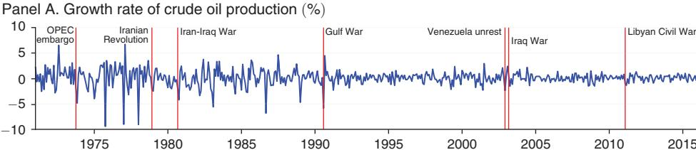
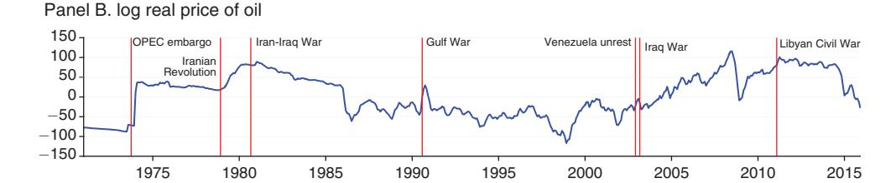
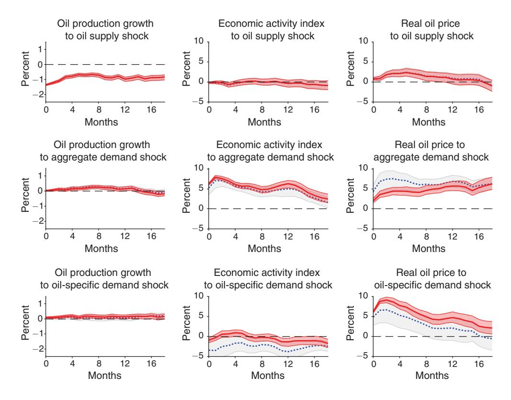
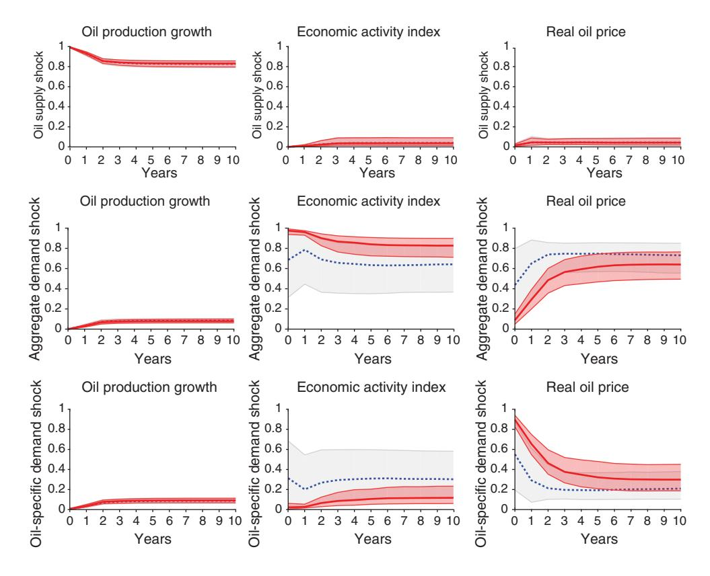
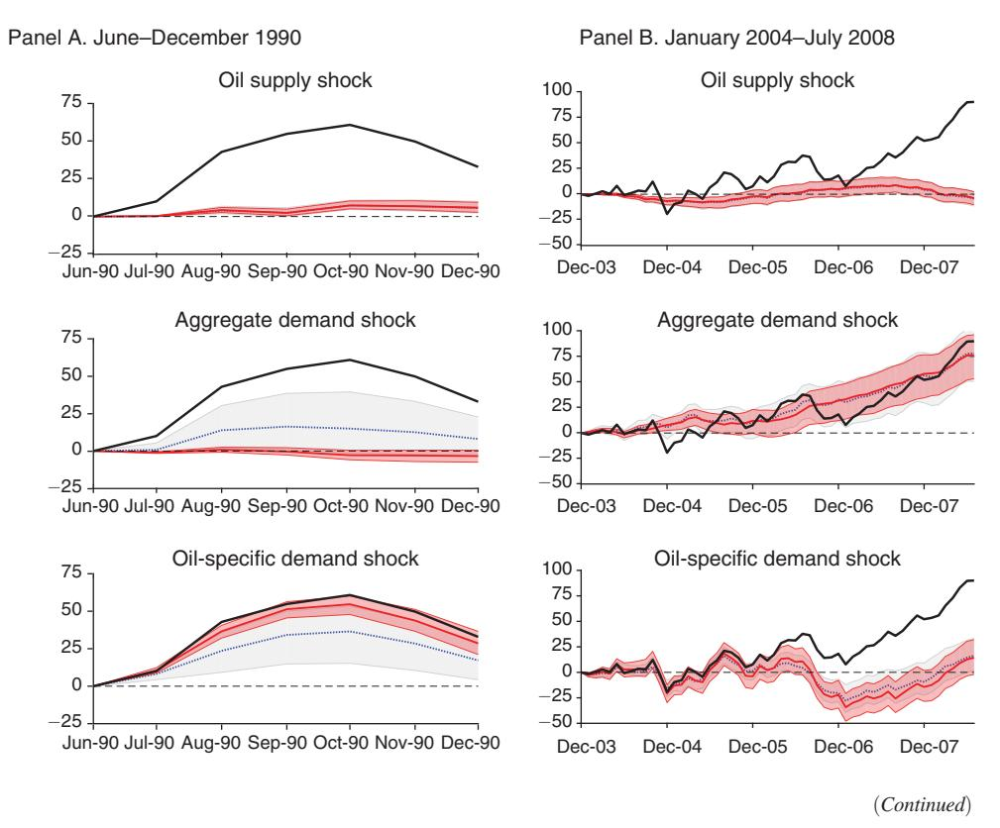
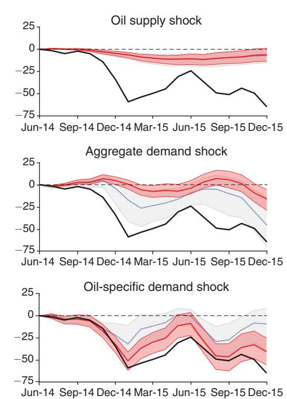
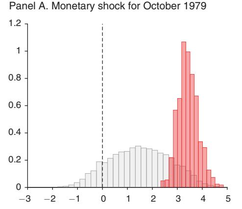
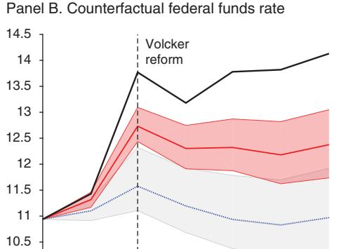
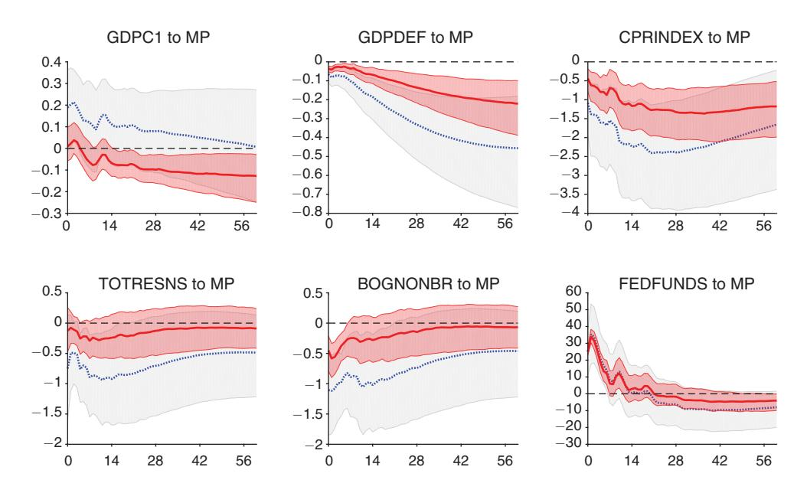

## American Economic Association

Narrative Sign Restrictions for SVARs

Author(s): Juan Antolín-Díaz and Juan F. Rubio-Ramírez

Source: The American Economic Review , OCTOBER 2018, Vol. 108, No. 10 (OCTOBER

2018), pp. 2802-2829

Published by: American Economic Association

Stable URL:<https://www.jstor.org/stable/10.2307/26528339>

# REFERENCES

Linked references are available on JSTOR for this article: [https://www.jstor.org/stable/10.2307/26528339?seq=1&cid=pdf](https://www.jstor.org/stable/10.2307/26528339?seq=1&cid=pdf-reference#references_tab_contents)[reference#references\\_tab\\_contents](https://www.jstor.org/stable/10.2307/26528339?seq=1&cid=pdf-reference#references_tab_contents) You may need to log in to JSTOR to access the linked references.

JSTOR is a not-for-profit service that helps scholars, researchers, and students discover, use, and build upon a wide range of content in a trusted digital archive. We use information technology and tools to increase productivity and facilitate new forms of scholarship. For more information about JSTOR, please contact support@jstor.org.

Your use of the JSTOR archive indicates your acceptance of the Terms & Conditions of Use, available at https://about.jstor.org/terms

American Economic Association is collaborating with JSTOR to digitize, preserve and extend access to The American Economic Review

# Narrative Sign Restrictions for SVARs†

By Juan Antolín-Díaz and Juan F. Rubio-Ramírez\*

We identify structural vector autoregressions using narrative sign restrictions. Narrative sign restrictions constrain the structural shocks and/or the historical decomposition around key historical events, ensuring that they agree with the established narrative account of these episodes. Using models of the oil market and monetary policy, we show that narrative sign restrictions tend to be highly informative. Even a single narrative sign restriction may dramatically sharpen and even change the inference of SVARs originally identified via traditional sign restrictions. Our approach combines the appeal of narrative methods with the popularized usage of traditional sign restrictions. (JEL C32, E52, Q35, Q43)

Starting with Faust (1998), Canova and De Nicolo (2002), and Uhlig (2005), it has become common to identify structural vector autoregressions (SVARs) using a handful of uncontroversial sign restrictions on either the impulse response functions (IRFs) or the structural parameters themselves. Such minimalist restrictions are generally weaker than classical identification schemes and, therefore, likely to be agreed upon by a majority of researchers. Additionally, because the structural parameters are set-identified, they lead to conclusions that are robust across the set of SVARs that satisfy the sign restrictions (see Rubio-Ramírez, Waggoner, and Zha 2010 for details). But this minimalist approach is not without cost. The small number of sign restrictions will usually result in a set of structural parameters with very different implications for IRFs, elasticities, historical decompositions, or forecasting error variance decompositions. In the best case, this means that it will be difficult to arrive at meaningful economic conclusions. In the worst case, there is the risk of retaining in the admissible set structural parameters with implausible implications. The latter point was first illustrated by Kilian and Murphy (2012), who showed that, in the context of the global market for crude oil, SVARs identified only through sign restrictions on IRFs imply disputable values for the price elasticity of oil supply to demand shocks. More recently, Arias, Caldara, and Rubio-Ramírez (forthcoming) have pointed out that the identification scheme of Uhlig (2005) retains many

\*Antolín-Díaz: Research Department, Fulcrum Asset Management, Marble Arch House 66 Seymour Street, London, W1H 5BT, UK (email: juan.antolin-diaz@fulcrumasset.com); Rubio-Ramírez: Economics Department, Emory University, Rich Memorial Building, Room 306, Atlanta, GA 30322, Federal Reserve Bank of Atlanta, and BBVA Research (email: jrubior@emory.edu). This paper was accepted to the *AER* under the guidance of John Leahy, Coeditor. We are grateful to Gavyn Davies, Dan Waggonner, Lutz Kilian, Michele Lenza, Frank Schorfheide, Thomas Drechsel, and Ivan Petrella for helpful comments and suggestions.

 $^{\dagger}$ Go to https://doi.org/10.1257/aer.20161852 to visit the article page for additional materials and author disclosure statement(s).

structural parameters with improbable implications for the systematic response of monetary policy to output. The challenge is to come up with a small number of additional uncontentious sign restrictions that help shrink the set of admissible structural parameters and allow us to reach clear economic conclusions.

We propose a new class of sign restrictions based on narrative information that we call narrative sign restrictions. Narrative sign restrictions constrain the structural parameters by ensuring that around selected historical events the structural shocks and/or historical decompositions agree with the established narrative. For example, a narrative sign restriction on the structural shocks rules out structural parameters that disagree with the view that "a negative oil supply shock occurred at the outbreak of the Gulf War in August 1990," whereas a restriction on the historical decomposition would imply that "a monetary policy shock was the most important driver of the increase in the federal funds rate observed in October 1979." Narrative information in the context of the oil market was used by Kilian and Murphy (2014) to confirm the validity of their proposed identification, but, to the best of our knowledge, we are the first to formalize the idea and develop the methodology. We show that whereas sign restrictions on the IRFs and the structural parameters, which we refer to as traditional sign restrictions, truncate the support of the prior distribution of the structural parameters, narrative sign restrictions instead truncate the support of the likelihood function. Thus, the Bayesian methods in Rubio-Ramírez, Waggoner, and Zha (2010) and Arias, Rubio-Ramírez, and Waggoner (2018) need to be modified for the case of narrative sign restrictions. Narrative sign restrictions complement the traditional ones. In our empirical applications we combine both.

A long tradition, starting with Friedman and Schwartz (1963), uses historical sources to identify structural shocks. A key reference is the work of Romer and Romer (1989), who combed through the minutes of the Federal Open Market Committee (FOMC) to single out a number of events that they argued represented monetary policy shocks. A large number of subsequent papers have adopted and extended Romer and Romer's (1989) approach, documenting and collecting various historical events on monetary policy shocks (Romer and Romer 2004), oil shocks (Hamilton 1985, Kilian 2008), and fiscal shocks (Ramey 2011, Romer and Romer 2010). The objective of these papers is to construct narrative time series that are then treated as a direct measure of the structural shocks of interest. Recognizing that the narrative time series might be imperfect measures of the structural shocks, recent papers have proposed to treat the narrative time series as external instruments of the targeted structural shocks, i.e., correlated with the shock of interest, and uncorrelated with other structural shocks. This approach was first suggested in Stock and Watson (2008) and was developed independently by Stock and Watson (2012) and Mertens and Ravn (2013).1

There are important differences between our method and the existing narrative approaches. First, in practice our method only uses a small number of key historical events, and sometimes a single event, as opposed to an entire time series. Like the instrumental variables approach, this alleviates the issue of measurement error in the narrative time series, but with our method the researcher can incorporate only those

&lt;sup>1 See also Montiel-Olea, Stock, and Watson (2016).

events upon which there is agreement. It also makes it straightforward to verify how a particular episode affects the results. Second, we impose the narrative information as sign restrictions. For instance, one might not be sure of exactly how much of the October 1979 Volcker reform was exogenous, but one is confident that a contractionary monetary policy shock did occur, and that it was more relevant than other shocks in explaining the unexpected movement in the federal funds rate. Therefore, our method combines the appeal of narrative approaches with the advantages of sign restrictions. Finally, our methods are Bayesian, while most of the existing narrative approaches are frequentist.

We illustrate the methodology by applying it to two well-known examples of SVARs previously identified with traditional sign restrictions for which narrative information is readily available. In particular, we revisit the model of the oil market of Kilian and Murphy (2012) and Inoue and Kilian (2013), and the model of the effects of monetary policy that has been used in Christiano, Eichenbaum, and Evans (1999), Bernanke and Mihov (1998), and Uhlig (2005). In the case of oil shocks, supply shocks are sharply identified using only traditional sign restrictions, whereas disentangling aggregate demand and oil-specific demand shocks is more difficult in a standard three-variable oil market VAR. Adding narrative sign restrictions based on a small set of historical events dramatically sharpens the identification. In fact, adding narrative information on a single event, the start of the Persian Gulf War in August 1990, is enough to obtain this result. In the case of monetary policy shocks, we show that Uhlig's (2005) results are not robust to discarding structural parameters that have implausible implications for the key historical event that occurred in October 1979, the Volcker reform. In both applications, we find that restrictions on the historical decomposition tend to be particularly effective in shrinking the identified set.

The rest of this paper is organized as follows. Section I presents the basic SVAR framework. Section II introduces narrative sign restrictions. Section III derives the posterior distribution under narrative sign restrictions and describes the algorithm to draw from it. Sections IV and V apply the methodology to the oil market and monetary policy shocks, respectively. Section VI concludes.

#### I. The Model

Consider the structural vector autoregression (SVAR) of the general form

(1) 
$$\mathbf{y}_{t}'\mathbf{A}_{0} = \sum_{\ell=1}^{p} \mathbf{y}_{t-\ell}'\mathbf{A}_{\ell} + \mathbf{c} + \mathbf{c}_{t}' \text{ for } 1 \leq t \leq T,$$

where  $\mathbf{y}_t$  is an  $n \times 1$  vector of variables,  $\mathbf{\varepsilon}_t$  is an  $n \times 1$  vector of structural shocks,  $\mathbf{A}_\ell$  is an  $n \times n$  matrix of parameters for  $0 \le \ell \le p$  with  $\mathbf{A}_0$  invertible,  $\mathbf{c}$  is a  $1 \times n$  vector of parameters, p is the lag length, and T is the sample size. The vector  $\mathbf{\varepsilon}_t$ , conditional on past information and the initial conditions  $\mathbf{y}_0, \ldots, \mathbf{y}_{1-p}$ , is Gaussian with mean zero and covariance matrix  $\mathbf{I}_n$ , the  $n \times n$  identity matrix. The model described in equation (1) can be written as

(2) 
$$\mathbf{y}_{t}'\mathbf{A}_{0} = \mathbf{x}_{t}'\mathbf{A}_{+} + \boldsymbol{\varepsilon}_{t}' \text{ for } 1 \leq t \leq T,$$

where  $\mathbf{A}'_{+} = [\mathbf{A}'_{1} \cdots \mathbf{A}'_{p}\mathbf{c}']$  and  $\mathbf{x}'_{t} = [\mathbf{y}'_{t-1}, \dots, \mathbf{y}'_{t-p}, 1]$  for  $1 \leq t \leq T$ . The dimension of  $\mathbf{A}_{+}$  is  $m \times n$  and the dimension of  $\mathbf{x}_{t}$  is  $m \times 1$ , where m = np + 1. The reduced-form representation implied by equation (2) is  $\mathbf{y}'_{t} = \mathbf{x}'_{t}\mathbf{B} + \mathbf{u}'_{t}$  for  $1 \leq t \leq T$ , where  $\mathbf{B} = \mathbf{A}_{+}\mathbf{A}_{0}^{-1}$ ,  $\mathbf{u}'_{t} = \varepsilon'_{t}\mathbf{A}_{0}^{-1}$ , and  $E[\mathbf{u}_{t}\mathbf{u}'_{t}] = \mathbf{\Sigma} = (\mathbf{A}_{0}\mathbf{A}'_{0})^{-1}$ . The matrices  $\mathbf{B}$  and  $\mathbf{\Sigma}$  are the reduced-form parameters, while  $\mathbf{A}_{0}$  and  $\mathbf{A}_{+}$  are the structural parameters. Similarly,  $\mathbf{u}'_{t}$  are the reduced-form innovations, while  $\varepsilon'_{t}$  are the structural shocks. The shocks are orthogonal and have an economic interpretation, while the innovations are, in general, correlated and do not have an interpretation. Let  $\mathbf{\Theta} = (\mathbf{A}_{0}, \mathbf{A}_{+})$  collect the value of the structural parameters.

## A. Impulse Response Functions

Recall the definition of impulse response functions (IRFs). Given a value  $\Theta$  of the structural parameters, the response of the *i*th variable to the *j*th structural shock at horizon *k* corresponds to the element in row *i* and column *j* of the matrix  $\mathbf{L}_k(\Theta)$ , where  $\mathbf{L}_k(\Theta)$  is defined recursively by

$$\mathbf{L}_0(\mathbf{\Theta}) = (\mathbf{A}_0^{-1})', \quad \mathbf{L}_k(\mathbf{\Theta}) = \sum_{\ell=1}^k (\mathbf{A}_\ell \mathbf{A}_0^{-1})' \mathbf{L}_{k-\ell}(\mathbf{\Theta}), \quad \text{for } 1 \leq k \leq p,$$

$$\mathbf{L}_k(\mathbf{\Theta}) = \sum_{\ell=1}^p (\mathbf{A}_\ell \mathbf{A}_0^{-1})' \mathbf{L}_{k-\ell}(\mathbf{\Theta}), \quad \text{for } p < k < \infty.$$

## B. Structural Shocks and Historical Decomposition

Given a value  $\Theta$  of the structural parameters and the data, the structural shocks at time t are

(3) 
$$\varepsilon'_{t}(\Theta) = \mathbf{y}'_{t}\mathbf{A}_{0} - \mathbf{x}'_{t}\mathbf{A}_{+} \text{ for } 1 \leq t \leq T.$$

The historical decomposition calculates the cumulative contribution of each shock to the observed unexpected change in the variables between two periods.2 Formally, the contribution of the *j*th shock to the observed unexpected change in the *i*th variable between periods t and t + h is

$$H_{i,j,t,t+h}\bigl(\Theta,\varepsilon_t,\ldots,\varepsilon_{t+h}\bigr) \ = \ \sum_{\ell=0}^h \mathbf{e}_{i,n}' \mathbf{L}_\ell\bigl(\Theta\bigr) \, \mathbf{e}_{j,n}' \, \mathbf{e}_{t+h-\ell},$$

where  $\mathbf{e}_{j,n}$  is the jth column of  $\mathbf{I}_n$ , for  $1 \leq i, j \leq n$  and for  $h \geq 0$ .

#### II. The Identification Problem and Sign Restrictions

As is well known, the structural form in equation (1) is not identified, so restrictions must be imposed on the structural parameters to solve the identification problem. The desire to impose only minimalist identification restrictions that are agreed upon by most researchers and lead to robust conclusions motivated Faust (1998),

&lt;sup>2See Kilian and Lütkepohl (2017) for a textbook treatment.

Canova and De Nicolo (2002), and Uhlig (2005) to develop methods to identify the structural parameters by placing a handful of uncontroversial sign restrictions on the IRFs or the structural parameters themselves. In this paper we propose a new class of sign restrictions based on narrative information that we call narrative sign restrictions. Narrative sign restrictions constrain the structural parameters by ensuring that around a handful of key historical events the structural shocks and/ or historical decompositions agree with the established narrative. For instance, in the context of a model of demand and supply in the global oil market, it is well established from historical sources that an exogenous disruption to oil production occurred at the outbreak of the Gulf War in August 1990. Therefore, a researcher may want to constrain the structural parameters so that the oil supply shock for that period was negative or that it was the most important contributor (as opposed to, for instance, a negative demand shock) to the unexpected drop in oil production observed during that period. We now formally describe the functions that characterize sign restrictions on the IRFs and the structural parameters (traditional sign restrictions) and on the structural shocks and the historical decompositions (narrative sign restrictions).

#### A. Traditional Sign Restrictions

Traditional sign restrictions are well understood and their use is widespread in the literature. In particular, Rubio-Ramírez, Waggoner, and Zha (2010) and Arias, Rubio-Ramírez, and Waggoner (2018) highlight how this class of restrictions can be characterized by the function

(4) 
$$\Gamma(\Theta) = (\mathbf{e}'_{1,n}\mathbf{F}(\Theta)'\mathbf{S}'_1, \dots, \mathbf{e}'_{n,n}\mathbf{F}(\Theta)'\mathbf{S}'_n)' > \mathbf{0}.$$

Appropriate choices of  $S_j$  and  $F(\Theta)$  will lead to sign restrictions on the IRFs or the structural parameters themselves. In particular, to impose restrictions on the IRFs, one can define  $F(\Theta)$  as vertically stacking the IRFs at the different horizons over which we want to impose the restrictions and  $S_j$  as an  $s_j \times r_j$  matrix of 0s, 1s, and -1s that will select the horizons and the variables over which we want to impose the  $r_j$  sign restrictions to identify structural shock j. If instead we want to impose restrictions on the structural parameters themselves, we can then define  $F(\Theta) = \Theta$  and  $S_j$  as an  $s_j \times r_j$  matrix of 0s, 1s, and -1s that will select entries of  $\Theta$  over which we want to impose the sign restrictions.

## B. Restrictions on the Signs of the Structural Shocks

Let us now consider the first class of narrative sign restrictions. Let us assume that we want to impose the restriction that the signs of the *j*th shock at  $s_j$  episodes occurring at dates  $t_1, \ldots, t_{s_j}$  are all positive. Then, the narrative sign restrictions can be imposed as

(5) 
$$\mathbf{e}'_{i,n} \mathbf{\varepsilon}_{t_{v}}(\boldsymbol{\Theta}) > 0 \quad \text{for } 1 \leq v \leq s_{i}.$$

Assume instead that we want to impose the restriction that the signs of the jth shock at  $s_j$  episodes occurring at dates  $t_1, \ldots, t_{s_j}$  are negative. Then, the narrative sign restrictions can be imposed with a negative sign in the left-hand side of equation (5). Of course, one could restrict the shocks in a few periods to be negative and positive in a few others.

#### C. Restrictions on the Historical Decomposition

Let us now consider the second class of narrative sign restrictions. In many cases the researcher will have narrative information that indicates that a particular shock was the most important contributor to the unexpected movement of some variable during a particular period. This is information on the relative magnitude of the contribution of the jth shock to the unexpected change in the ith variable between some periods, i.e., on the historical decomposition. We propose to formalize this idea in two different ways. First, we may specify that a given shock was the *most important* (*least important*) driver of the unexpected change in a variable during some periods. By this we mean that for a particular period or periods the absolute value of its contribution to the unexpected change in a variable is larger (smaller) than the absolute value of the contribution of any other structural shock. Second, we may want to say that a given shock was the *overwhelming* (negligible) driver of the unexpected change in a given variable during the period. By this we mean that for a particular period or periods the absolute value of its contribution to the unexpected change in a variable is larger (smaller) than the sum of the absolute value of the contributions of all other structural shocks. We will label these two alternatives Type A and Type B, respectively.3

#### D. Type A Restrictions on the Historical Decomposition

To fix ideas, consider the following example: assume we have a model with three variables and we want to impose the constraint that between periods 6 and 7, the second structural shock is the most important contributor in absolute terms to the unexpected change in the third variable. This narrative restriction can be formalized by the function  $|H_{3,2,6,7}(\Theta, \varepsilon_6(\Theta), \varepsilon_7(\Theta))| - \max_{j'\neq 2} |H_{3,j',6,7}(\Theta, \varepsilon_6(\Theta), \varepsilon_7(\Theta))| > 0$ , where  $|H(\cdot)|$  is the absolute value of the matrix  $H(\cdot)$ . In other words, the contribution of the second shock to the historical decomposition is larger in absolute value than the largest contribution of any other shock.

In general, we can identify the *j*th shock by imposing  $s_j$  restrictions of this type. Thus, suppose we want to impose the restriction that the *j*th shock is the *most important* contributor to the unexpected change in the  $i_1, \ldots, i_{s_j}$ th variables from periods  $t_1, \ldots, t_{s_j}$  to  $t_1 + h_1, \ldots, t_{s_j} + h_{s_j}$ , i.e., that its cumulative contribution is larger in absolute value than the contribution of any other shock to the unexpected change

&lt;sup>3 As pointed out to us by a referee, one could also impose sign restrictions on the historical decompositions themselves, rather than on their relative magnitudes. For example, Kilian and Lee (2014) note that industry sources show that the cumulative effect of speculative demand shocks between May 1979 and December 1979 on the real price of oil was positive, without this effect necessarily being the dominant effect. This type of restriction would be weaker than any of the three proposed above.

in those variables during those periods. Then, the narrative sign restrictions can be imposed as

$$(6) |H_{i_{\nu},j,t_{\nu},t_{\nu}+h_{\nu}}(\Theta,\varepsilon_{t_{\nu}}(\Theta),\ldots,\varepsilon_{t_{\nu}+h_{\nu}}(\Theta))|$$

$$- \max_{j'\neq j} |H_{i_{\nu},j',t_{\nu},t_{\nu}+h_{\nu}}(\Theta,\varepsilon_{t_{\nu}}(\Theta),\ldots,\varepsilon_{t_{\nu}+h_{\nu}}(\Theta))| > 0,$$

for  $1 \le v \le s_j$ . If instead one wishes to impose the constraint that the contribution of the shock is the *least important*, i.e., that its cumulative contribution is smaller in absolute value than the contribution of any other shock to the unexpected change in those variables during those periods, the narrative sign restrictions can be imposed as

$$(7) \qquad |H_{i_{\nu},j,t_{\nu},t_{\nu}+h_{\nu}}(\Theta,\varepsilon_{t_{\nu}}(\Theta),\ldots,\varepsilon_{t_{\nu}+h_{\nu}}(\Theta))|$$

$$-\min_{j'\neq j}|H_{i_{\nu},j',t_{\nu},t_{\nu}+h_{\nu}}(\Theta,\varepsilon_{t_{\nu}}(\Theta),\ldots,\varepsilon_{t_{\nu}+h_{\nu}}(\Theta))| < 0,$$

for  $1 \le v \le s_i$ . As above, equations (6) and (7) can be used jointly.

Type B Restrictions on the Historical Decomposition.—As before, to fix ideas, assume we have a model with three variables and we want to impose the restriction that between periods 6 and 7, the second structural shock is the overwhelming contributor in absolute terms to the unexpected change in the third variable. This narrative restriction can be formalized by the function  $|H_{3,2,6,7}(\Theta, \varepsilon_6(\Theta), \varepsilon_7(\Theta))| - \sum_{j'\neq 2} |H_{3,j',6,7}(\Theta, \varepsilon_6(\Theta), \varepsilon_7(\Theta))| > 0$ . In other words, the contribution of the second shock to the historical decomposition is larger in absolute value than the sum of the absolute contributions of all other shocks.

As before, we can identify the *j*th structural shock by imposing  $s_j$  restrictions of this type. Thus, suppose we want to impose the restriction that the *j*th shock is the *overwhelming* contributor to the unexpected change in the  $i_1, \ldots, i_{s_j}$ th variables from periods  $t_1, \ldots, t_{s_j}$  to  $t_1 + h_1, \ldots, t_{s_j} + h_{s_j}$ , i.e., that its contribution is larger in absolute value than the sum of the absolute contributions of all other shocks to the unexpected change in those variables during those periods. Then, we can define

$$(8) |H_{i_{\nu},j,t_{\nu},h_{\nu}}(\Theta,\varepsilon_{t_{\nu}}(\Theta),\ldots,\varepsilon_{t_{\nu}+h_{\nu}}(\Theta))|$$

$$-\sum_{j'\neq j}|H_{i_{\nu},j',t_{\nu},t_{\nu}+h_{\nu}}(\Theta,\varepsilon_{t_{\nu}}(\Theta),\ldots,\varepsilon_{t_{\nu}+h_{\nu}}(\Theta))| > 0,$$

for  $1 \le v \le s_j$ . If instead one wishes to impose the constraint that the contribution of the shock is *negligible*, i.e., that its contribution is smaller in absolute value than the sum of the contributions of all other shocks to the unexpected change in those variables during those periods, the narrative sign restrictions can be imposed as

$$(9) |H_{i_{\nu},j,t_{\nu}+h_{\nu}}(\Theta,\varepsilon_{t_{\nu}}(\Theta),\ldots,\varepsilon_{t_{\nu}+h_{\nu}}(\Theta))|$$
 
$$-\sum_{j'\neq j}|H_{i_{\nu},j',t_{\nu}+h_{\nu}}(\Theta,\varepsilon_{t_{\nu}}(\Theta),\ldots,\varepsilon_{t_{\nu}+h_{\nu}}(\Theta))| < 0,$$

for  $1 \le v \le s_i$ . Equations (8) and (9) can also be used jointly.

Discussion.—A natural question is to ask whether Type A or Type B restrictions on the historical decomposition are more restrictive. The answer depends on whether we are restricting the cumulative contribution of a particular shock to the unexpected change in a variable to be "larger" or "smaller." If the contribution of shock *j* is larger than the sum of all other contributions, it is always larger than any single contribution. Therefore, when contributions are defined as "larger," Type B is more restrictive than Type A. In contrast, if the contribution of shock *j* is smaller than any single contribution, it must also be smaller than the sum of the other contributions in absolute value. Consequently, when restrictions are defined as "smaller," Type B is stronger than Type A. Therefore, the use of either Type A or Type B allows the researcher to express different levels of confidence in the narrative information about a particular episode.

#### III. Bayesian Inference

In this section we show how to adapt the Bayesian methods developed in Rubio-Ramírez, Waggoner, and Zha (2010) and Arias, Rubio-Ramírez, and Waggoner (2018) to handle narrative sign restrictions. Equations (5)–(9) imply the following function to characterize narrative sign restrictions

(10) 
$$\phi(\boldsymbol{\Theta}, \boldsymbol{\varepsilon}^{\boldsymbol{v}}) > \mathbf{0},$$

where  $\varepsilon^{\nu} = (\varepsilon_{t_1}, \dots, \varepsilon_{t_{\nu}})$  are the structural shocks constrained by the narrative sign restrictions. A comparison with equation (4) makes it clear that the traditional sign restrictions depend on the structural parameters, whereas the narrative sign restrictions depend as well on the structural shocks. Moreover, equation (3) implies the following invertible function:

(11) 
$$\varepsilon_t = g_h(\mathbf{y}_t, \mathbf{x}_t, \boldsymbol{\Theta}) \quad \text{for } 1 \le t \le T,$$

with  $\mathbf{y}_t = g_h^{-1}(\mathbf{\varepsilon}_t; \mathbf{x}_t, \boldsymbol{\Theta})$  for  $1 \leq t \leq T$ . Using equations (10) and (11), we can write

(12) 
$$\tilde{\phi}(\boldsymbol{\Theta}, \mathbf{y}^{\nu}, \mathbf{x}^{\nu}) = \phi(\boldsymbol{\Theta}, g_h(\mathbf{y}_{t_1}, \mathbf{x}_{t_1}, \boldsymbol{\Theta}), \dots, g_h(\mathbf{y}_{t_r}, \mathbf{x}_{t_r}, \boldsymbol{\Theta})) > \mathbf{0},$$

where  $\mathbf{y}^{\nu} = (\mathbf{y}_{t_1}, \dots, \mathbf{y}_{t_{\nu}})$  and  $\mathbf{x}^{\nu} = (\mathbf{x}_{t_1}, \dots, \mathbf{x}_{t_{\nu}})$ . Hence, given the data, equation (10) is continuous on the structural parameters while, given the structural parameters, equation (10) is continuous on the structural shocks.

#### A. The Posterior Distribution

Following Arias, Rubio-Ramírez, and Waggoner (2018), we can consider an alternative parameterization of the structural VAR in (2), defined by  $\mathbf{B}$ ,  $\Sigma$ , and

**Q**, where  $\mathbf{Q} \in O(n)$ , the set of all orthogonal  $n \times n$  matrices, which we call the orthogonal reduced-form parameterization. To define a mapping between  $\Theta$  and  $(\mathbf{B}, \Sigma, \mathbf{Q})$ , one must first choose a decomposition of the covariance matrix  $\Sigma$ . Let  $h(\Sigma)$  be an  $n \times n$  matrix that satisfies  $h(\Sigma)'h(\Sigma) = \Sigma$ , where h is differentiable. One would normally choose  $h(\Sigma)$  to be the Cholesky decomposition. Given a decomposition h, we can define the mapping between  $\Theta$  and  $(\mathbf{B}, \Sigma, \mathbf{Q})$ ,

$$f_h(\boldsymbol{\Theta}) = (\underbrace{\mathbf{A}_{+}\mathbf{A}_{0}^{-1}}_{\mathbf{B}}, \underbrace{(\mathbf{A}_{0}\mathbf{A}_{0}')^{-1}}_{\Sigma}, \underbrace{h((\mathbf{A}_{0}\mathbf{A}_{0}')^{-1})\mathbf{A}_{0}}_{\mathbf{O}}),$$

where it is easy to see that  $h((\mathbf{A}_0\mathbf{A}_0')^{-1})\mathbf{A}_0$  is an orthogonal matrix. The function  $f_h$ is invertible, with inverse defined by

(13) 
$$f_h^{-1}(\mathbf{B}, \mathbf{\Sigma}, \mathbf{Q}) = (\underbrace{h(\mathbf{\Sigma})^{-1}\mathbf{Q}}_{\mathbf{A}_0}, \underbrace{\mathbf{B}h(\mathbf{\Sigma})^{-1}\mathbf{Q}}_{\mathbf{A}_{\perp}}).$$

Using equation (13), we can rewrite equation (12) as  $\Phi(\mathbf{B}, \Sigma, \mathbf{Q}, \mathbf{y}^{\nu}, \mathbf{x}^{\nu})$  $= \tilde{\phi}\left(f_h^{-1}(\mathbf{B}, \Sigma, \mathbf{Q}), \mathbf{y}^{\nu}, \mathbf{x}^{\nu}\right) > \mathbf{0}.$ Thus, the posterior of  $(\mathbf{B}, \Sigma, \mathbf{Q})$  subject to the narrative sign restrictions is

(14) 
$$\pi(\mathbf{B}, \mathbf{\Sigma}, \mathbf{Q} | \mathbf{y}^{T}, \mathbf{\Phi}(\mathbf{B}, \mathbf{\Sigma}, \mathbf{Q}, \mathbf{y}^{v}, \mathbf{x}^{v}) > \mathbf{0})$$

$$= \frac{\pi(\mathbf{y}^{T} | \mathbf{B}, \mathbf{\Sigma}, \mathbf{Q}, \mathbf{\Phi}(\mathbf{B}, \mathbf{\Sigma}, \mathbf{Q}, \mathbf{y}^{v}, \mathbf{x}^{v}) > \mathbf{0}) \pi(\mathbf{B}, \mathbf{\Sigma}, \mathbf{Q})}{\int \pi(\mathbf{y}^{T} | \mathbf{B}, \mathbf{\Sigma}, \mathbf{Q}, \mathbf{\Phi}(\mathbf{B}, \mathbf{\Sigma}, \mathbf{Q}, \mathbf{y}^{v}, \mathbf{x}^{v}) > \mathbf{0}) \pi(\mathbf{B}, \mathbf{\Sigma}, \mathbf{Q}) d(\mathbf{B}, \mathbf{\Sigma}, \mathbf{Q})},$$

where  $\mathbf{y}^T = \{\mathbf{y}_{1-p}, \dots, \mathbf{y}_0, \dots, \mathbf{y}_T\}$  is the data,  $\pi(\mathbf{y}^T | \mathbf{B}, \mathbf{\Sigma}, \mathbf{Q}, \Phi(\mathbf{B}, \mathbf{\Sigma}, \mathbf{Q}, \mathbf{y}^v, \mathbf{x}^v) > \mathbf{0})$  is the likelihood function subject to the narrative sign restrictions and  $\pi(\mathbf{B}, \mathbf{\Sigma}, \mathbf{Q})$  is the prior.

It is useful at this point to compare the posterior distribution defined in equation (14) with the one obtained using only traditional sign restrictions. The posterior of  $(\mathbf{B}, \Sigma, \mathbf{Q})$  subject to the traditional sign restrictions is

$$\begin{aligned} \pi \big( \mathbf{B}, \mathbf{\Sigma}, \mathbf{Q} \, | \, \mathbf{y}^T, \Gamma \big( f_h^{-1}(\mathbf{B}, \mathbf{\Sigma}, \mathbf{Q}) \big) &> \mathbf{0} \big) \ &= \frac{\pi \big( \mathbf{y}^T | \mathbf{B}, \mathbf{\Sigma} \big) \pi \big( \mathbf{B}, \mathbf{\Sigma}, \mathbf{Q} | \Gamma \big( f_h^{-1}(\mathbf{B}, \mathbf{\Sigma}, \mathbf{Q}) \big) &> \mathbf{0} \big)}{\int \pi \big( \mathbf{y}^T | \mathbf{B}, \mathbf{\Sigma} \big) \pi \big( \mathbf{B}, \mathbf{\Sigma}, \mathbf{Q} | \Gamma \big( f_h^{-1}(\mathbf{B}, \mathbf{\Sigma}, \mathbf{Q}) \big) &> \mathbf{0} \big) d(\mathbf{B}, \mathbf{\Sigma}, \mathbf{Q}) \end{matrix}$$

where  $\pi(\mathbf{y}^T|\mathbf{B}, \Sigma)$  is the likelihood function and  $\pi(\mathbf{B}, \Sigma, \mathbf{Q}|\Gamma(f_h^{-1}(\mathbf{B}, \Sigma, \mathbf{Q})) > \mathbf{0})$ is the prior subject to the traditional sign restrictions. Since the likelihood function does not depend on Q and the traditional sign restrictions are characterized by a function that does not depend on the structural shocks, traditional sign restrictions only truncate the prior of  $(B, \Sigma, Q)$ . On the contrary, since the function characterizing the narrative sign restrictions depends on the structural shocks, narrative sign restrictions do not truncate the prior of  $(B, \Sigma, Q)$  but the likelihood function.

The truncated likelihood function in equation (14) can be written as

(15) 
$$\pi(\mathbf{y}^{T}|\mathbf{B}, \mathbf{\Sigma}, \mathbf{Q}, \mathbf{\Phi}(\mathbf{B}, \mathbf{\Sigma}, \mathbf{Q}, \mathbf{y}^{v}, \mathbf{x}^{v}) > \mathbf{0})$$

$$= \frac{\left[\mathbf{\Phi}(\mathbf{B}, \mathbf{\Sigma}, \mathbf{Q}, \mathbf{y}^{v}, \mathbf{x}^{v}) > \mathbf{0}\right] \pi(\mathbf{y}^{T}|\mathbf{B}, \mathbf{\Sigma})}{\int \left[\mathbf{\Phi}(\mathbf{B}, \mathbf{\Sigma}, \mathbf{Q}, \mathbf{y}^{v}, \mathbf{x}^{v}) > \mathbf{0}\right] \pi(\mathbf{y}^{T}|\mathbf{B}, \mathbf{\Sigma}) d\mathbf{y}^{T}}.$$

But note that

$$\begin{split} &\int \left[ \boldsymbol{\Phi}(\mathbf{B}, \boldsymbol{\Sigma}, \mathbf{Q}, \mathbf{y}^{\boldsymbol{v}}, \mathbf{x}^{\boldsymbol{v}}) > \mathbf{0} \right] \pi \left( \mathbf{y}^{T} | \mathbf{B}, \boldsymbol{\Sigma} \right) d\mathbf{y}^{T} \\ &= \int \left[ \boldsymbol{\Phi}(\mathbf{B}, \boldsymbol{\Sigma}, \mathbf{Q}, \mathbf{y}^{\boldsymbol{v}}, \mathbf{x}^{\boldsymbol{v}}) > \mathbf{0} \right] \left( \prod_{t=1}^{T} \pi \left( \mathbf{y}_{t} | \mathbf{x}_{t}, \mathbf{B}, \boldsymbol{\Sigma} \right) \right) d(\mathbf{y}_{1} \cdots \mathbf{y}_{T}) \\ &= \int \left[ \tilde{\boldsymbol{\Phi}}(\mathbf{B}, \boldsymbol{\Sigma}, \mathbf{Q}, \boldsymbol{\varepsilon}^{\boldsymbol{v}}) > \mathbf{0} \right] \left( \prod_{t=1}^{T} \frac{\pi \left( g_{h}^{-1} \left( \boldsymbol{\varepsilon}_{t}; \mathbf{x}_{t}, f_{h}^{-1} (\mathbf{B}, \boldsymbol{\Sigma}, \mathbf{Q}) \right) | \mathbf{x}_{t}, \mathbf{B}, \boldsymbol{\Sigma} \right)}{\upsilon_{g_{h}} \left( g_{h}^{-1} \left( \boldsymbol{\varepsilon}_{t}; \mathbf{x}_{t}, f_{h}^{-1} (\mathbf{B}, \boldsymbol{\Sigma}, \mathbf{Q}) \right) \right)} \right) d(\boldsymbol{\varepsilon}_{1} \cdots \boldsymbol{\varepsilon}_{T}), \end{split}$$

where  $\tilde{\Phi}(\mathbf{B}, \Sigma, \mathbf{Q}, \varepsilon^{\nu}) = \phi(f_h^{-1}(\mathbf{B}, \Sigma, \mathbf{Q}), \varepsilon^{\nu})$  and the term  $v_{g_h}$  is called the volume element of the function  $g_h$  evaluated at  $g_h^{-1}(\varepsilon_t; \mathbf{x}_t, f_h^{-1}(\mathbf{B}, \Sigma, \mathbf{Q}))$ . Our equation (11) implies that  $v_{g_h}(g_h^{-1}(\varepsilon_t; \mathbf{x}_t, f_h^{-1}(\mathbf{B}, \Sigma, \mathbf{Q}))) = |\Sigma|^{-1/2}$  for  $1 \leq t \leq T$ . Hence,

$$(16) \int \left[\tilde{\Phi}(\mathbf{B}, \mathbf{\Sigma}, \mathbf{Q}, \boldsymbol{\varepsilon}^{\nu}) > \mathbf{0}\right] \left( \prod_{t=1}^{T} \frac{\pi \left(g_{h}^{-1}(\boldsymbol{\varepsilon}_{t}; \mathbf{x}_{t}, f_{h}^{-1}(\mathbf{B}, \mathbf{\Sigma}, \mathbf{Q})) | \mathbf{x}_{t}, \mathbf{B}, \mathbf{\Sigma}\right)}{v_{g_{h}}\left(g_{h}^{-1}(\boldsymbol{\varepsilon}_{t}; \mathbf{x}_{t}, f_{h}^{-1}(\mathbf{B}, \mathbf{\Sigma}, \mathbf{Q}))\right)} \right) d(\boldsymbol{\varepsilon}_{1} \cdots \boldsymbol{\varepsilon}_{T})$$

$$= \int \left[\tilde{\Phi}(\mathbf{B}, \mathbf{\Sigma}, \mathbf{Q}, \boldsymbol{\varepsilon}^{\nu}) > \mathbf{0}\right] \left(\prod_{t=1}^{T} \pi(\boldsymbol{\varepsilon}_{t})\right) d(\boldsymbol{\varepsilon}_{1} \cdots \boldsymbol{\varepsilon}_{T})$$

$$= \int \left[\tilde{\Phi}(\mathbf{B}, \mathbf{\Sigma}, \mathbf{Q}, \boldsymbol{\varepsilon}^{\nu}) > \mathbf{0}\right] \left(\prod_{s=1}^{V} \pi(\boldsymbol{\varepsilon}_{t_{s}})\right) d(\boldsymbol{\varepsilon}_{t_{1}} \cdots \boldsymbol{\varepsilon}_{t_{v}}).$$

Equation (16) allows us to write the truncated likelihood in equation (15) as

(17) 
$$\pi(\mathbf{y}^T|\mathbf{B}, \mathbf{\Sigma}, \mathbf{Q}, \Phi(\mathbf{B}, \mathbf{\Sigma}, \mathbf{Q}, \mathbf{y}^{\nu}, \mathbf{x}^{\nu}) > \mathbf{0}) = \frac{\left[\Phi(\mathbf{B}, \mathbf{\Sigma}, \mathbf{Q}, \mathbf{y}^{\nu}, \mathbf{x}^{\nu}) > \mathbf{0}\right] \pi(\mathbf{y}^T|\mathbf{B}, \mathbf{\Sigma})}{\omega(\mathbf{B}, \mathbf{\Sigma}, \mathbf{Q})},$$

where  $\omega(\mathbf{B}, \Sigma, \mathbf{Q}) = \int \left[\tilde{\Phi}(\mathbf{B}, \Sigma, \mathbf{Q}, \varepsilon^{\nu}) > \mathbf{0}\right] \left(\prod_{s=1}^{\nu} \pi(\varepsilon_{t_s})\right) d(\varepsilon_{t_1} \cdots \varepsilon_{t_{\nu}})$ . Equation (17) makes clear that the truncated likelihood can be written as a reweighting of the likelihood function, with weights inversely proportional to the probability of satisfying the restriction.

One would normally choose priors of  $(\mathbf{B}, \Sigma, \mathbf{Q})$  that are uniform over O(n). When that is the case,  $\pi(\mathbf{B}, \Sigma, \mathbf{Q}) = \pi(\mathbf{B}, \Sigma)$ , and the posterior of  $(\mathbf{B}, \Sigma, \mathbf{Q})$  subject to the narrative sign restrictions is proportional to

$$\begin{split} \pi \big( \mathbf{B}, \mathbf{\Sigma}, \mathbf{Q} \, | \, \mathbf{y}^T, \Phi \big( \mathbf{B}, \mathbf{\Sigma}, \mathbf{Q}, \mathbf{y}^{\scriptscriptstyle V}, \mathbf{x}^{\scriptscriptstyle V} \big) \, > \, \mathbf{0} \big) \\ \propto \, \frac{ \big[ \Phi \big( \mathbf{B}, \mathbf{\Sigma}, \mathbf{Q}, \mathbf{y}^{\scriptscriptstyle V}, \mathbf{x}^{\scriptscriptstyle V} \big) \, > \, \mathbf{0} \big] \pi \big( \mathbf{y}^T | \, \mathbf{B}, \mathbf{\Sigma} \big) }{\omega (\mathbf{B}, \mathbf{\Sigma}, \mathbf{Q})} \pi \big( \mathbf{B}, \mathbf{\Sigma} \big). \end{split}$$

In other words, the posterior distribution is proportional to the reweighted likelihood times the prior. On the contrary, as mentioned above, for the case of traditional sign restrictions, it is the prior and not the likelihood that is truncated. Using similar derivations, under priors that are uniform over O(n) the posterior distribution subject to the traditional sign restrictions is  $\pi(\mathbf{B}, \Sigma, \mathbf{Q} | \mathbf{y}^T, \Gamma(f_h^{-1}(\mathbf{B}, \Sigma, \mathbf{Q})) > \mathbf{0})$   $\propto \left[\Gamma(f_h^{-1}(\mathbf{B}, \Sigma, \mathbf{Q})) > \mathbf{0}\right] \pi(\mathbf{y}^T | \mathbf{B}, \Sigma) \pi(\mathbf{B}, \Sigma)$ , in which no reweighting of the likelihood is needed. If one uses both traditional and narrative sign restrictions the posterior distribution  $\pi(\mathbf{B}, \Sigma, \mathbf{Q} | \mathbf{y}^T, \Gamma(f_h^{-1}(\mathbf{B}, \Sigma, \mathbf{Q})) > \mathbf{0}, \Phi(\mathbf{B}, \Sigma, \mathbf{Q}, \mathbf{y}^v, \mathbf{x}^v) > \mathbf{0})$  is proportional to

$$\Big[\Gamma \big(f_h^{-1} \big(\mathbf{B}, \boldsymbol{\Sigma}, \mathbf{Q}\big)\big) \ > \ \mathbf{0} \Big] \frac{ \big[\Phi \big(\mathbf{B}, \boldsymbol{\Sigma}, \mathbf{Q}, \mathbf{y}^{\boldsymbol{\nu}}, \mathbf{x}^{\boldsymbol{\nu}}\big) \ > \ \mathbf{0} \big] \pi \big(\mathbf{y}^T | \mathbf{B}, \boldsymbol{\Sigma}\big)}{\omega \big(\mathbf{B}, \boldsymbol{\Sigma}, \mathbf{Q}\big)} \pi \big(\mathbf{B}, \boldsymbol{\Sigma}\big).$$

B. The Algorithm

In practice, one would normally choose priors of  $(B, \Sigma, Q)$  that are uniform-normal-inverse-Wishart. In that choice, we are now ready to specify our algorithm to independently draw from the uniform-normal-inverse-Wishart posterior of  $(B, \Sigma, Q)$  conditional on the traditional and narrative sign restrictions.

ALGORITHM 1: This algorithm makes independent draws from the uniform-normal-inverse-Wishart posterior of  $(\mathbf{B}, \Sigma, \mathbf{Q})$  conditional on the traditional and narrative sign restrictions.

- (i) Independently draw  $(\mathbf{B}, \Sigma)$  from the normal-inverse-Wishart posterior of the reduced-form parameters and  $\mathbf{Q}$  from the uniform distribution over O(n).
- (ii) Check whether  $\left[\Gamma\left(f_h^{-1}(\mathbf{B}, \mathbf{\Sigma}, \mathbf{Q})\right) > \mathbf{0}\right]$  and  $\left[\Phi(\mathbf{B}, \mathbf{\Sigma}, \mathbf{Q}, \mathbf{y}^{\nu}, \mathbf{x}^{\nu}) > \mathbf{0}\right]$  are satisfied.
- (iii) If not, discard the draw. Otherwise let the importance weight of  $(\mathbf{B}, \Sigma, \mathbf{Q})$  be as follows:
  - (a) Simulate M independent draws of  $\varepsilon^{\nu}$  from the standard normal distribution.
  - (b) Approximate  $\omega(\mathbf{B}, \Sigma, \mathbf{Q})$  by the proportion of the M draws that satisfy  $\tilde{\Phi}(\mathbf{B}, \Sigma, \mathbf{Q}, \varepsilon^{\nu}) > \mathbf{0}$  and set the importance weight to  $1/\omega(\mathbf{B}, \Sigma, \mathbf{Q})$ .
- (iv) Return to Step (i) until the required number of draws has been obtained.

(v) Draw with replacement from the set of  $(\mathbf{B}, \Sigma, \mathbf{Q})$  using the importance weights.

As explained in detail in Arias, Rubio-Ramírez, and Waggoner (2018), this choice of priors of  $(\mathbf{B}, \Sigma, \mathbf{Q})$  is good because it is extremely easy and efficient to make independent draws from the normal-inverse-Wishart distribution and because Rubio-Ramírez, Waggoner, and Zha (2010) describe how to use the QR decomposition to independently draw the uniform distribution over O(n). Algorithm 1 makes clear that it does not suffice to simply discard the draws that violate the narrative sign restrictions. This would imply giving higher posterior probability to draws of  $(\mathbf{B}, \Sigma, \mathbf{Q})$  that are more likely to satisfy the narrative sign restrictions. Hence, this would amount to drawing from a posterior distribution of  $(\mathbf{B}, \Sigma, \mathbf{Q})$  that it is not uniform-normal-inverse-Wishart. Instead, we need to compute the importance weights and resample the draws accordingly.4 Also, for the reasons explained in Arias, Rubio-Ramírez, and Waggoner (2018), Algorithm 1 is making independent draws from the posterior normal-generalized-normal distribution of  $\Theta$ .5 Further details on the computational properties are provided in online Appendix D.

#### IV. Demand and Supply Shocks in the Oil Market

In this section we use narrative information to revisit efforts by Kilian (2009b) and Kilian and Murphy (2012) to assess the relative importance of supply and demand shocks in the oil market. The case of the oil market is particularly well suited to our procedure because a vast literature has documented a number of widely accepted historical events associated with wars or civil conflicts in major oil-producing countries that led to significant physical disruptions in the oil market. We will show that, while the identification scheme proposed by Kilian and Murphy (2012), based on traditional sign restrictions, does a very good job of separating the effects of supply and demand shocks, adding narrative sign restrictions improves the ability to distinguish between aggregate demand and oil-specific demand shocks, in line with the conclusions of Kilian and Murphy (2014).

## A. Data and Baseline Specification

Our starting point is the reduced-form VAR for the global oil market introduced in Kilian (2009b), which has become standard in the literature. The model includes three variables: the growth rate of global oil production, an index of real economic activity, and the log of the real price of oil. To maximize comparability, we choose the exact specification, reduced-form prior and data definitions used in the aforementioned papers.6

&lt;sup>4The number of draws M in step (iii) needs to be high enough to accurately approximate the importance weights. The larger v is, the more draws will be required. We find that 1,000 draws are usually enough to obtain an accurate approximation when narrative restrictions are used in one or two events. For exercises involving more than five or six restrictions, as many as one million might be needed.

&lt;sup>5 See Arias, Rubio-Ramírez, and Waggoner (2018) for a definition of normal-generalized-normal distribution.
6 The VAR is estimated on monthly data using 24 lags and a constant. We extend their dataset backward to January 1971 and forward to December 2015. Updated data for the index of real economic activity in Kilian

| TABLE 1—SIGN | RESTRICTIONS ON | IMPACT RESPONSES |
|--------------|-----------------|------------------|
|              |                 |                  |

| Variable\Shock    | Oil supply | Aggregate demand | Oil-specific demand |
|-------------------|------------|------------------|---------------------|
| Oil production    | _          | +                | +                   |
| Economic activity | _          | +                | _                   |
| Real oil price    | +          | +                | +                   |

Kilian and Murphy (2012) and Baumeister and Peersman (2013) use traditional sign restrictions on the contemporaneous IRFs to identify three shocks: an oil supply shock, an aggregate demand shock, and an oil-specific demand shock. In particular, they postulate that the impact of these shocks has the signs given in Table 1. Moreover, Kilian and Murphy (2012) make a compelling argument that many structural parameters that satisfy the sign restrictions in Table 1 imply implausibly large values for the price elasticity of oil supply. This elasticity can be computed from the ratio of the impact responses of production growth and the real price of oil to aggregate demand and oil-specific demand shocks. They propose a plausible upper bound to both of these coefficients of 0.0258, and discard structural parameters that do not satisfy this restriction. We will refer to the traditional sign restrictions formed by Table 1 and the elasticity bounds as the baseline specification.

#### B. The Narrative Information

We now discuss the narrative information we will use to elicit the narrative sign restrictions. Our main sources are Kilian (2008) and Hamilton (2009), who examined in detail the major exogenous events in the post-1973 period. Figure 1 plots the monthly time series of global oil production growth and the real price of oil, with the following historical events marked as vertical lines: the Yom Kippur War and subsequent Arab oil embargo (October 1973), the start of the Iranian Revolution (December 1978–January 1979), the outbreak of the Iran-Iraq War (September–October 1980), the start of the Persian Gulf War (August 1990), the Venezuela oil strike of December 2002, the start of the Iraq War (March 2003), and the Libyan Civil War (February 2011). It is obvious that these historical events had a major impact on both the production growth and the real price of oil. To the extent that these historical events were exogenous with respect to macroeconomic determinants and lowered global oil production, they are a natural candidate for exogenous oil supply shocks.

In any case, Barsky and Kilian (2002) and Kilian (2008) have argued against including the 1973 episode in the list of exogenous events, noting that the Arab oil embargo may have been an endogenous response to global demand and US inflationary pressures, and that there is no evidence of OPEC oil production shortfalls

(2009b) were obtained from Lutz Kilian's website, downloaded on March 21, 2016. We refer to the aforementioned papers for details on the sources and the model specification.

&lt;sup>7 Elasticities are  $(\mathbf{L}_0(\Theta))_{1,2}/(\mathbf{L}_0(\Theta))_{3,2}$  and  $(\mathbf{\tilde{L}}_0(\Theta))_{1,3}/(\mathbf{L}_0(\Theta))_{3,3}$ , with  $(\mathbf{L}_h(\Theta))_{i,j}(i,j)$  entry of  $\mathbf{L}_h(\Theta)$ .

&lt;sup>8The latter event occurred after the publication of the aforementioned papers but there is a good case for including it in the list of exogenous events; see Kilian and Lee (2014). The Libyan Civil War erupted in February 2011 in the context of wider protests in favor of civil liberties and human rights in other Arab countries known as the "Arab Spring." Before the outbreak of the Civil War, Libya represented over 2 percent of global crude oil production. From February to April 2011, Libyan production came essentially to a halt.

#### 1975 1980 1985 1995 2000 2005 2010 2015

FIGURE 1. CHRONOLOGY OF OIL SUPPLY SHOCKS

Notes: The vertical bars indicate major exogenous oil supply disruptions, associated with the Yom Kippur War and subsequent Arab oil embargo (October 1973), Iranian Revolution (December 1978-January 1979), the Iran-Iraq War (September-October 1980), the Persian Gulf War (August 1990), the Venezuela oil strike of December 2002, the start of the Iraq War (March 2003), and the Libyan Civil War (February 2011).

having been caused by military action during the Yom Kippur War. Since there is no agreement on this particular event, we exclude the 1973 episode. Thus, we impose the following narrative sign restriction.

Narrative Sign Restriction 1: The oil supply shock must take negative values in December 1978–January 1979, September–October 1980, August 1990, December 2002, March 2003 and February 2011.

It is also agreed that the oil supply shocks listed above "resulted in dramatic and immediate disruption of the flow of oil from key global producers" (Hamilton 2009, p. 220). Therefore, we will use the following narrative sign restriction.

Narrative Sign Restriction 2: For the periods specified by Restriction 1, oil supply shocks are the most important contributor to the observed unexpected movements in oil production growth. In other words, the absolute value of the contribution of oil supply shocks is larger than the absolute value of the contribution of any other structural shock.

While Narrative Sign Restriction 2 reflects the agreement that the bulk of the unexpected fall in oil production growth was due to negative oil supply shocks, there is much less agreement in the literature about the ultimate cause of the unexpected increase in the real price of oil. For instance, while Hamilton (2009, p. 224),

&lt;sup>9Moreover, as Kilian (2008) argues, there is a structural change in the oil market around 1973. Prior to 1973 the US price of oil was mostly regulated by government agencies, resulting in extended periods of a constant real price of oil, interrupted only by large discrete jumps. In any case, we have checked the results that will follow, and they are unaffected by adding restrictions based on this event.

argues that "oil price shocks of past decades were primarily caused by significant disruptions in crude oil production brought about by largely exogenous geopolitical events," Lutz Kilian, in the comment to the same paper, expresses the view that "a growing body of evidence argues against the notion that the earlier oil price shocks were driven primarily by unexpected disruptions of the global supply of crude oil" (Kilian 2009a, p. 268), emphasizing instead the role of the demand for oil. It is possible, however, to find an agreement that "for the oil dates of 1980 and 1990/91 there is no evidence of aggregate demand pressures in industrial commodity markets" (Kilian 2008, p. 234). Thus, although there is no agreement on whether oil supply or oil-specific demand shocks caused the unexpected changes in the real price of oil, it seems that both Kilian (2008) and Hamilton (2009) agree that aggregate demand shocks were not responsible for the increases observed in 1980 and 1990. Hence, we will also use the following narrative sign restriction.

Narrative Sign Restriction 3: For the periods corresponding to September–October 1980 (outbreak of the Iran-Iraq War) and August 1990 (outbreak of the Persian Gulf War), aggregate demand shocks are the least important contributor to the observed unexpected movements in the real price of oil. In other words, the absolute value of the contribution of aggregate demand shocks is smaller than the absolute contribution of any other structural shock.

In terms of the definitions in Section II, Narrative Sign Restriction 1 is a restriction on the signs of the structural shocks, whereas Narrative Sign Restrictions 2 and 3 are Type A restrictions on the historical decompositions.

#### C. Results

Figure 2 displays IRFs of the three variables to the three structural shocks, with and without the narrative information. The light shaded area represents the 68 percent (point-wise) highest posterior density (HPD) credible sets for the IRFs and the dotted lines are the point-wise median IRFs using the baseline identification. The darker shaded areas and solid lines display the equivalent quantities when Narrative Sign Restrictions 1–3 are also used. The narrative sign restrictions dramatically narrow down the uncertainty around many of the IRFs relative to the baseline identification and modify the shape of some of the IRFs in economically meaningful ways. Oil-specific demand shocks are shown to have a larger contemporaneous effect on the real price of oil that dissipates after around 18 months, whereas aggregate demand shocks have a small initial effect that gradually builds up over time. Some of the IRFs of the economic activity index are also altered substantially. In particular, oil-specific demand shocks have an initial impact on real economic activity that is much smaller in absolute value than in the baseline specification. Although it is negative at impact, it builds over time and becomes significant after about 18

&lt;sup>10It is commonplace to report point-wise median and associated percentiles for the IRFs in the context of set-identified SVAR models. We follow this convention for expository purposes, although Inoue and Kilian (2013), among others, have shown the problems associated with it.

&lt;sup>11Narrative Sign Restrictions 1–3 affect in total 19 structural shocks. Fifty thousand draws that satisfy the baseline restrictions are generated. Out of these, 920 additionally satisfy the narrative sign restrictions. We approximate their weights in the importance step by using one million draws.

FIGURE 2. IRFS WITH AND WITHOUT NARRATIVE SIGN RESTRICTIONS

*Notes:* The light shaded area represents the 68 percent (point-wise) HPD credible sets for the IRFs and the dotted lines are the median IRFs using the baseline identification restrictions. The darker shaded areas and solid lines display the equivalent quantities when Narrative Sign Restrictions 1–3 are also satisfied. Note that the IRF to oil production has been accumulated to the level.

months. The response of real economic activity to aggregate demand shocks is stronger and more persistent. The IRFs with the narrative sign restrictions are strikingly similar to the results reported by Kilian (2009b) using the Cholesky decomposition, with the major difference that, in our identification scheme, oil-specific demand shocks are contractionary for economic activity, whereas in the recursive specification these shocks, somewhat counterintuitively, caused a temporary boom in economic activity.12

The economic implications of Narrative Sign Restrictions 1–3 become clear when examining the forecast error variance decompositions (FEVD), which show what fraction of the unexpected fluctuations in the variables at different horizons can be attributed to each structural shock. Figure 3 shows that when the narrative information and the baseline identification are used, oil-specific demand shocks are responsible for the bulk of the high frequency unexpected variation in the real

&lt;sup>12The results using the Cholesky decomposition can be seen in Figure 3 of Kilian (2009b). For the results based on that model specification to make economic sense, the oil-specific demand shock must reflect expectations of rising global aggregate demand for oil.

FIGURE 3. FEVD WITH AND WITHOUT NARRATIVE SIGN RESTRICTIONS

*Notes:* Each panel presents the estimated contribution of each structural shock to the mean squared forecast error at horizons of 1–10 years for the three variables, expressed as a percentage of the total MSE. The light shaded area represents the 68 percent (point-wise) HPD credible sets for the FEVD, and the dotted lines are the median FEVDs using the baseline identification restrictions. The darker shaded areas and solid lines display the equivalent quantities when Narrative Sign Restrictions 1–3 are also satisfied.

price of oil, whereas aggregate demand shocks become the most important source of unexpected fluctuations only after three years. With regard to the economic activity index, aggregate demand shocks are now responsible for most of the unexpected fluctuations, although oil supply and oil-specific demand shocks are jointly responsible for over 10 percent of the unexpected variance in economic activity after ten years. These conclusions clearly contrast with the FEVD obtained using only the baseline specification, in which oil-specific demand shocks account for about 40 percent of the unexpected variation in the economic activity index at all horizons and aggregate demand shocks are responsible for the largest share of unexpected fluctuations in the real price of oil even at high frequency. Another important message from Figure 3 is the reduction in uncertainty around the median FEVD. If we compare the light and the darker shaded areas we see that adding the narrative sign restrictions (darker shaded areas) makes the 68 percent HPD credible sets significantly smaller. Thus, after observing Figures 2 and 3, we can conclude that while the baseline specification, and in particular the restriction on the price elasticity of supply, is very successful at sharpening the effects of oil supply shocks, the narrative

information dramatically improves the separate identification of the effects of aggregate demand and oil-specific demand shocks.

To see how the narrative information helps sharpen the identification of aggregate demand and oil-specific demand shocks, it is also informative to examine how Restrictions 1-3 modify the historical decomposition of the real price of oil for particular historical episodes. Panel A of Figure 4 looks at the Persian Gulf War, which was one of the events included in Narrative Sign Restrictions 1-3. The baseline identification (light shaded area) is consistent with many structural parameters that imply that aggregate demand shocks were important contributors to the unexpected increase in log real oil prices observed between July and November 1990. Including Narrative Sign Restrictions 1–3 (darker shaded area) reinforces the view of Kilian and Murphy (2014) that speculation in the physical market, i.e., an oil-specific demand shock, was the cause of the bulk of the unexpected 60 percent increase in the real price of oil at the outbreak of the war. Panels B and C look at two events for which no restrictions are imposed. For the run-up in the real price of oil between 2004 and 2008, displayed in panel B, the narrative information agrees with the baseline identification in that aggregate demand shocks were the main cause. This is in line with the results of the previous literature. For the 60 percent unexpected decline in the real price of oil observed between July 2014 and December 2015, panel C shows how the baseline identification concludes that it was not due to oil supply shocks, but leads to substantial uncertainty about whether aggregate demand shocks or oil-specific demand shocks were behind the collapse. With the narrative information, the results point toward oil-specific demand shocks as the source of the collapse.

#### D. Assessing the Importance of Each Historical Event

Because we focus on a small number of historical events, it is straightforward to assess the importance of each of them. Table 2 computes what percentage of draws of the structural parameters that satisfy the baseline specification violates each of the narrative sign restrictions, both individually and jointly. It is important to note that a high probability of violating a restriction should not be interpreted as evidence against its validity. On the contrary, it tells us that the baseline specification admits many structural parameters that, according to the narrative sign restrictions, should be rejected. Therefore, the higher the probability of violating a narrative sign restriction, the more informative the restriction will be for achieving identification. 13 The results indicate that Narrative Sign Restrictions 1 and 2 are less relevant than Narrative Sign Restriction 3. However, it is noteworthy that the baseline identification still includes many structural parameters for which a positive supply shock occurred during either the 1979 Iranian Revolution or the 2003 Iraq War, contradicting Narrative Sign Restriction 1. In total, 42 percent of the structural parameters that satisfy the baseline specification violate Narrative Sign Restriction 1. It is also the case that over 20 percent of the structural parameters that satisfy the baseline specification do not satisfy Narrative Sign Restriction 2 for the 1979 Iranian

&lt;sup>13 For a similar point, see Kilian and Lütkepohl (2017a, ch. 13).

FIGURE 4. HISTORICAL DECOMPOSITION OF OIL PRICE MOVEMENTS AROUND SELECTED EPISODES

Revolution or the 2003 Iraq War. But it is clear that Narrative Sign Restriction 3 is key to obtaining the results of Figures 2 and 3, given that in total 93 percent of the structural parameters that satisfy the baseline specification do not respect Narrative Sign Restriction 3.

In fact, it turns out that to obtain the results of Figures 2 and 3 it is sufficient to impose Restriction 3 for the August 1990 event. Using an Alternative Narrative Sign Restriction 3 that includes only this event leads to results that are indistinguishable from the ones presented above. 14 In other words, one only needs to agree that expansionary aggregate demand shocks were the least important contributor to the unexpected spike in the real price of oil observed that month, a view that has been described as agreeable to a wide group of experts (Kilian and Murphy 2014, p. 468), to obtain our results.

Given that the challenge is to come up with additional uncontentious sign restrictions that help shrink the set of admissible structural parameters, the resemblance of the results using either Narrative Sign Restrictions 1–3 or Alternative Narrative Sign Restriction 3 is a great success. By using a single narrative sign restriction to constrain the set of structural parameters to those whose implied behavior in August 1990 agrees with the generally accepted description of that event, we can greatly

&lt;sup>14For this reason the figures are omitted here, but this result is presented in online Appendix A.

Panel C. June 2014-December 2015

FIGURE 4. HISTORICAL DECOMPOSITION OF OIL PRICE MOVEMENTS AROUND SELECTED EPISODES (Continued)

*Notes:* For selected historical episodes, the panels display the observed unexpected change in the real price of oil (in log points) attributed to each of the structural shocks. The observed unexpected change is represented by the solid thick line. The dotted lines are the median for the baseline identification restrictions, while the light shaded area represents the 68 percent (point-wise) HPD credible sets. The solid thin lines and the darker shaded areas display the equivalent quantities when Narrative Sign Restrictions 1–3 are also satisfied.

|                    | Restriction 1 % | Restriction 2 % | Restriction 3 % | Any restriction % |
|--------------------|-----------------|-----------------|-----------------|-------------------|
| Iranian Revolution | 20              | 2.9             | _               | 21                |
| Iran-Iraq War      | 0               | 0               | 46              | 46                |
| Gulf War           | 0               | 0               | 93              | 93                |
| Venezuela unrest   | 0               | 0               | _               | 0                 |
| Iraq War           | 43              | 21              | _               | 53                |
| Libyan Civil War   | 4.6             | 1               | _               | 5                 |
| Any Episodes       | 42              | 24              | 93              | 98                |

TABLE 2—PROBABILITY OF VIOLATING THE NARRATIVE SIGN RESTRICTIONS

sharpen the separate identification of aggregate demand and oil-specific demand shocks for the entire sample, including many other periods for which narrative information is not available.

#### V. Monetary Policy Shocks and the Volcker Reform

An extensive literature has studied the effect of monetary policy shocks on output using SVARs, identified with zero restrictions, as in Christiano, Eichenbaum, and Evans (1999), Bernanke and Mihov (1998); sign restrictions, as in Uhlig (2005); or

both, as in Arias, Caldara, and Rubio-Ramírez (forthcoming). SVARs identified using zero restrictions have consistently found that an exogenous increase in the fed funds rate induces a reduction in real activity. This intuitive result has become the "consensus." This consensus view, however, has been challenged by Uhlig (2005), who criticizes imposing a questionable zero restriction on the IRF of output to a monetary policy shock on impact. To solve the problem he proposes to identify a shock to monetary policy by imposing sign restrictions only on the IRFs of prices and non-borrowed reserves to this shock, while imposing no restrictions on the IRF of output. The lack of restrictions on the IRF of output to a monetary policy shock makes this is an attractive approach. Importantly, under his identification, an exogenous unexpected increase in the fed funds rate does not necessarily induce a reduction in real activity.

An alternative approach to identify the effects of monetary policy shocks uses historical sources to isolate events that constitute exogenous monetary policy shocks. Following the pioneering work of Friedman and Schwartz (1963), Romer and Romer (1989) combed through the minutes of the FOMC to create a dummy time series of events that they argued represented exogenous tightenings of monetary policy. Focusing exclusively on contractionary shocks, they singled out a handful of episodes in the postwar period "in which the Federal Reserve attempted to exert a contractionary influence on the economy in order to reduce inflation" (Romer and Romer 1989, p. 134). The Romers' monetary policy time series narrative has become very influential, but has been criticized by Leeper (1997), who pointed out that their dates are predictable from past macroeconomic data. As a consequence, in recent years alternative methods have been developed to construct time series of monetary policy shocks that are by design exogenous to the information set available at the time of the policy decision. The first prominent example is Romer and Romer (2004), who regressed changes in the intended federal funds rate between FOMC meetings on changes in the Fed's Greenbook forecasts of output and inflation. By construction, the residuals from this regression are orthogonal to all the information contained in the Greenbook forecasts, and can plausibly be taken to be a measure of exogenous monetary policy shocks. A second approach looks at high-frequency financial data. Kuttner (2001), Gürkaynak, Sack, and Swanson (2005), and Gertler and Karadi (2015) look at movements in federal funds futures contracts during a short window around the time of policy announcements to isolate the monetary policy shocks.

However, the existing narrative time series are sometimes inconclusive and other times contradictory. This is not just due to differences in methods and sources, but, as Ramey (2016) recently pointed out, to the fact that the Federal Reserve has historically reacted in a systematic way to output and inflation developments (see also Leeper, Sims, and Zha 1996). This systematic response is a key difference with the oil supply shocks analyzed in Section IV, so the occurrence and importance of truly exogenous monetary policy shocks remain controversial. Thus, monetary policy shocks are much more difficult to isolate than oil supply shocks.

For this reason, in this section we will use narrative sign restrictions for a single event: October 1979. The monetary policy decisions of October 6, 1979, enacted shortly after Paul Volcker became chairman of the Fed, are described by Romer and Romer (1989) as "a major anti-inflationary shock to monetary policy" and represent, in our view, the clearest case in the postwar period of an exogenous monetary

policy shock. Lindsey, Orphanides, and Rasche (2013) provide a detailed account of the events leading to the decision to abandon targeting the federal funds rate in favor of targeting non-borrowed reserves as the operating procedure for controlling the money supply. While macroeconomic conditions, in particular, the deterioration of the inflation outlook and the increase in the real price of oil that followed the Iranian Revolution of 1978–1979, played a large role in causing the shift, the forcefulness and the surprise character of the action and the dramatic break with established practice in the conduct of policy strongly suggest the occurrence of a monetary policy shock.

An argument could be made that the Volcker event is so large that it may be best modeled as a change in the monetary policy rule rather than a monetary policy shock. But Sims and Zha (2006) contend that the evidence for changes in the parameters of the monetary policy rule during the Volcker period is weak and that this period is best described as a period of high variance in the monetary policy shocks to an otherwise unchanged monetary policy rule. Primiceri (2005) reaches similar conclusions. Indeed, as Lindsey, Orphanides, and Rasche (2013) describe, contemporaneous observers accused the FOMC of adopting the new operating procedures only as a smokescreen to obscure its intention to markedly increase short-term interest rates. We side with this view and regard the episode as a large shock within a stable monetary rule.

## A. Data and Baseline Specification

Our starting point is the reduced-form VAR used, among others, by Christiano, Eichenbaum, and Evans (1999), Bernanke and Mihov (1998), and Uhlig (2005). The model includes six variables: real output, the GDP deflator, a commodity price index, total reserves, non-borrowed reserves, and the federal funds rate. As in the previous section, we chose the exact specification, reduced-form prior and data definitions used in the aforementioned papers. Our sample period is January 1965 to November 2007. Our baseline identification is identical to that in Uhlig (2005). Specifically, he postulates that a contractionary monetary policy shock increases the federal funds rate and reduces the GDP deflator, the commodity price index and non-borrowed reserves for periods 0 to 5 months.

## B. The Narrative Information

We start by examining the implications of the baseline specification for the period around October 1979. The light histogram in panel A of Figure 5 displays the posterior distribution of the monetary policy shock during that month. While most of the distribution has positive support (i.e., a contractionary monetary policy shock occurred), the baseline identification implies that a negative (i.e., expansionary) monetary policy shock occurred with about an 11 percent posterior probability. Panel B plots the counterfactual path (dotted line with light 68 percent point-wise

&lt;sup>15The VAR uses monthly data using 12 lags and no constant or deterministic trends. We refer to the aforementioned papers for details on the model specification. Following Arias, Caldara, and Rubio-Ramírez (forthcoming), we stop the sample in November 2007 because starting in December 2007 there are large movements in reserves associated with the global financial crisis. Furthermore, the federal funds rate has been at the zero lower bound since November 2008. Including the post-crisis sample could obscure the comparison with the results of earlier papers.

Aug-79 Sep-79 Oct-79 Nov-79 Dec-79 Jan-80 Feb-80

FIGURE 5. RESULTS AROUND OCTOBER 1979 WITH AND WITHOUT NARRATIVE RESTRICTIONS

10

*Notes:* The light histogram in Panel A plots the posterior distribution of the monetary policy shock for October 1979 using the baseline identification. The darker histogram plots the same distribution after incorporating Narrative Restrictions 4 and 5. Panel B plots the actual federal funds rate (solid thick line) and the median of the counterfactual federal funds rate (dotted line) resulting from excluding all non-monetary structural shocks using the baseline identification. The light bands represent 68 percent (point-wise) HPD credible sets around the median. The solid thin line and darker shaded area plot the same result using narrative restrictions 4 and 5.

HPD credible sets) of the federal funds rate if no structural shock other than the monetary policy shock had occurred between September 1979 and December 1980. As can be seen from panel B, the baseline specification implies that the monetary policy shock was rather unimportant in explaining the unexpected increase in the federal funds rate observed in October. So the baseline specification effectively implies that the increase in the federal funds rate between September 1979 and December 1980 was due to some structural shock other than the monetary policy shock. This means that the set of admissible structural parameters implied by the baseline identification retains many structural parameters that go against the widely shared view that in October 1979 a major contractionary monetary policy shock greatly increased the fed funds rate. In order to eliminate such structural parameters, we therefore impose the following two narrative sign restrictions.

**Narrative Sign Restriction 4:** *The monetary policy shock for the observation corresponding to October 1979 must be of positive value.* 

Narrative Sign Restriction 5: For the observation corresponding to October 1979, a monetary policy shock is the overwhelming driver of the unexpected movement in the federal funds rate. In other words, the absolute value of the contribution of monetary policy shocks to the unexpected movement in the federal funds rate is larger than the sum of the absolute value of the contributions of all other structural shocks.

Importantly, we do not place any restrictions on the contribution of the monetary policy shock to the unexpected change in output during that episode, but just on its

contribution to the unexpected movement in the federal funds rate. In terms of the definitions of Section II, Narrative Sign Restriction 4 is a restriction on the sign of the structural shock, whereas Narrative Sign Restriction 5 is a Type B restriction on the historical decomposition.

#### C. Results

Figure 6 compares the IRFs to a monetary policy shock, with and without narrative sign restrictions. The light shaded area represents the 68 percent (point-wise) HPD credible sets for the IRFs and the dotted lines are the median IRFs using the baseline identification. These results replicate the IRFs depicted in Figure 6 of Uhlig (2005). The darker shaded areas and solid lines display the equivalent quantities when Narrative Sign Restrictions 4 and 5 are also used. 16 As one can observe, the inclusion of narrative sign restrictions is enough to imply that contractionary monetary policy shocks cause output to drop with very high posterior probability. The results reported highlight that the narrative information embedded in a single event can shrink the set of admissible structural parameters so dramatically that the economic implications change.

How do Narrative Sign Restrictions 4 and 5 change the implications for the period around October 1979? The darker histogram in panel A of Figure 5 displays the posterior distribution of the monetary policy shock during that month when Narrative Sign Restrictions 4 and 5 are also used. The distribution of the structural shock now has positive support with 100 percent probability. Panel B plots the counterfactual path (solid thin line with darker 68 percent point-wise HPD credible sets) of the federal funds rate, as described above. The monetary policy shock was the overwhelming contributor to the unexpected increase in the federal funds rate. The results indicate that the monetary policy shock was very large (between 2 and 5 standard deviations) and that it was responsible for between 100 and 150 basis points of the roughly 225-basis-point unexpected increase in the federal funds rate observed in October 1979. It is important to emphasize that these magnitudes are not imposed by Narrative Sign Restrictions 4 and 5; only the sign of the shock and the sign of the contribution of the monetary policy shock relative to other structural shocks are. 17 Therefore, if one agrees with the baseline restrictions and also with the fact that the monetary policy shock was both positive and the most important contributor to the October 1979 tightening, one should conclude that monetary policy shocks reduce output with a high probability. 18

## D. Including Additional Events

The results above have highlighted that using narrative information for the October 1979 event is highly informative. That event is in our view the clearest and

&lt;sup>16Narrative Sign Restrictions 4 and 5 affect in total one structural shock. We obtain 10,116 draws that satisfy the baseline restrictions. Out of these, 931 additionally satisfy Narrative Sign Restrictions 4 and 5. We approximate their weights in the importance step by using one thousand draws.

&lt;sup>17Results with Type A Narrative Sign Restriction 5 are similar and are available in online Appendix B.

&lt;sup>18Our results echo those of Inoue and Kilian (2013) and Arias, Caldara, and Rubio-Ramírez (forthcoming), who question the robustness of Uhlig's (2005) results, and call for the introduction of additional restrictions.

FIGURE 6. IRFS WITH AND WITHOUT NARRATIVE SIGN RESTRICTIONS

*Notes:* The light shaded area represents the 68 percent (point-wise) HPD credible sets for the IRFs and the dotted lines are the median IRFs using the baseline identification restrictions. The darker shaded areas and solid lines display the equivalent quantities for the models that additionally satisfy Narrative Sign Restrictions 4 and 5. The monetary policy shock has been normalized to have an impact of 25 basis points on the federal funds rate.

most uncontroversial example of a monetary policy shock. However, an important caveat must follow. As Romer and Romer (1989, p. 123) recognize, "the narrative identification of shocks generally occurs retrospectively, and thus [...] there may be an unconscious bias toward, for example, searching harder for negative monetary shocks in periods preceding sharp declines in money and output than in other periods." This was indeed the case for the Volcker event, which was followed by a deep recession. Therefore, it is possible that the proximity of the Volcker announcement to the recession has shaped the historical interpretation of this period as a clear case study of a monetary policy shock.

Fortunately, there is a long literature that uses historical sources to isolate monetary policy shocks and that can provide additional case studies. Owing to differences in sources and methods, the existing narrative series are sometimes inconclusive and other times contradictory. However, by cross-checking the original Romer and Romer (1989) chronology, the updated Greenbook residual series from Romer and Romer (2004), the high-frequency series from Gürkaynak, Sack, and Swanson (2005), and the transcripts from the meetings of the FOMC, we have selected seven additional events for which there appears to be reasonable agreement that an important monetary policy shock occurred. 19 Of these, three (April 1974, December

&lt;sup>19Details of how we decided to choose those seven events are available in online Appendix C.

1988, and February 1994) were contractionary shocks and four (December 1990, October 1998, April 2001, and November 2002) were expansionary shocks. The February 1994 event is of particular interest because the historical record identifies a major monetary policy shock, but output accelerated during 1994. Thus, it is arguably not subject to the criticism that the historical narrative might have been shaped by the presence of a recession.

Once we have selected those additional seven events, it seems reasonable to ask whether adding them as narrative sign restrictions changes the results reported above. For that purpose, we can therefore consider the following narrative sign restrictions.

Narrative Sign Restriction 6: The monetary policy shock must be positive for the observations corresponding to April 1974, October 1979, December 1988, and February 1994, and negative for December 1990, October 1998, April 2001, and November 2002.

Narrative Sign Restriction 7: For the periods specified by Restriction 6, monetary policy shocks are the most important contributor to the observed unexpected movements in the federal funds rate. In other words, the absolute value of the contribution of monetary policy shocks is larger than the absolute value of the contribution of any other structural shock.

The results using Narrative Sign Restrictions 6 and 7 are very similar to those using only October 1979, albeit with narrower HPD credible sets because of additional information. In addition, it is possible to obtain equally similar results by just imposing narrative sign restrictions for the December 1988, February 1994, or April 2001 dates on their own. Hence, we can claim that, while the 1979 event is sufficient to obtain the results reported in Figures 5 and 6, it is not necessary. This leads us to conclude that for the current application, the informativeness of narrative sign restrictions is not dependent on the particularities of the October 1979 episode. Moreover, the fact that the results can be obtained by imposing the 1994 event on its own is particularly reassuring, since it means that the results do not depend on using events that were followed by a recession.

#### VI. Conclusion

Historical sources have long been regarded as useful for identifying structural shocks. In this paper, we have shown how to use narrative sign restrictions to identify SVARs. We place sign restrictions on structural shocks and the historical decomposition of the data at certain historical periods, ensuring that the structural parameters are consistent with the established narrative account of these episodes.

&lt;sup>20See "The Great Bond Massacre" (Al Ehrbar, *Fortune*, 1994) for a representative contemporary account, which associated the heavy losses experienced by financial companies, hedge funds, and bond mutual funds on their holdings of long-term bonds with the surprise tightening by the Fed.

&lt;sup>21 Note that Narrative Sign Restriction 7 is a Type A restriction on the historical decomposition, whereas Narrative Sign Restriction 5 is a Type B restriction on the historical decomposition; hence, the October 1979 event can be imposed in its less strong version when other events are included.

&lt;sup>22Owing to space considerations, the figures are omitted here, but this result is presented in online Appendix C.

We have illustrated our approach with the case of oil and monetary shocks. We have shown that adding a small number of narrative sign restrictions related to key historical events, and sometimes even a single event, can dramatically sharpen the inference or even alter the conclusions of SVARs only identified with traditional sign restrictions. Relative to existing narrative information methods, our approach has the advantage of requiring that we trust only the sign and the relative importance of the structural shock for a small number of events, which facilitates the practice of basing inference on a few uncontroversial sign restrictions on which the majority of researchers agree and which lead to robust conclusions.

#### REFERENCES

- **Antolín-Díaz, Juan, and Juan F. Rubio-Ramírez.** 2018. "Narrative Sign Restrictions for SVARs: Dataset." *American Economic Review.* <https://doi.org/10.1257/aer.20161852>.
- **Arias, Jonas E., Dario Caldara, and Juan F. Rubio-Ramírez.** Forthcoming. "The Systematic Component of Monetary Policy in SVARs: An Agnostic Identification Procedure." *Journal of Monetary Economics*.
- **Arias, Jonas E., Juan F. Rubio-Ramírez, and Daniel F. Waggoner.** 2018. "Inference Based on Structural Vector Autoregressions Identified with Sign and Zero Restrictions: Theory and Applications." *Econometrica* 86 (2): 685–720.
- **Barsky, Robert B., and Lutz Kilian.** 2002. "Do We Really Know That Oil Caused the Great Stagflation? A Monetary Alternative." In *NBER Macroeconomics Annual 2001*, Vol. 16, edited by Ben S. Bernanke and Kenneth Rogoff, 137–97. Cambridge, MA: MIT Press.
- **Baumeister, Christiane, and Gert Peersman.** 2013. "The Role of Time-Varying Price Elasticities in Accounting for Volatility Changes in the Crude Oil Market." *Journal of Applied Econometrics* 28 (7): 1087–109.
- **Bernanke, Ben S., and Ilian Mihov.** 1998. "Measuring Monetary Policy." *Quarterly Journal of Economics* 113 (3): 869–902.
- **Canova, Fabio, and Gianni De Nicolo.** 2002. "Monetary Disturbances Matter for Business Fluctuations in the G-7." *Journal of Monetary Economics* 49 (6): 1131–59.
- **Christiano, Lawrence J., Martin Eichenbaum, and Charles L. Evans.** 1999. "Monetary Policy Shocks: What Have We Learned and to What End?" In *Handbook of Macroeconomics*, edited by J. B. Taylor and M. Woodford, 65–142. Amsterdam: Elsevier.
- **Faust, Jon.** 1998. "The Robustness of Identified VAR Conclusions about Money." International Finance Discussion Paper 610.
- **Friedman, Milton, and Anna J. Schwartz.** 1963. *A Monetary History of the United States.* Princeton, NJ: Princeton University Press.
- **Gertler, Mark, and Peter Karadi.** 2015. "Monetary Policy Surprises, Credit Costs, and Economic Activity." *American Economic Journal: Macroeconomics* 7 (1): 44–76.
- **Gürkaynak, Refet S., Brian Sack, and Eric T. Swanson.** 2005. "Do Actions Speak Louder than Words? The Response of Asset Prices to Monetary Policy Actions and Statements." *International Journal of Central Banking* 1 (1): 55–93.
- **Hamilton, James D.** 1985. "Historical Causes of Postwar Oil Shocks and Recessions." *Energy Journal* 6 (1): 97–116.
- **Hamilton, James D.** 2009. "Causes and Consequences of the Oil Shock of 2007–08." *Brookings Papers on Economic Activity* 40 (1): 215–61.
- **Inoue, Atsushi, and Lutz Kilian.** 2013. "Inference on Impulse Response Functions in Structural VAR Models." *Journal of Econometrics* 177 (1): 1–13.
- **Kilian, Lutz.** 2008. "Exogenous Oil Supply Shocks: How Big Are They and How Much Do They Matter for the U.S. Economy?" *Review of Economics and Statistics* 90 (2): 216–40.
- **Kilian, Lutz.** 2009a. "Causes and Consequences of the Oil Shock of 2007–08: Comment." *Brookings Papers on Economic Activity* 40 (1): 267–78.
- **Kilian, Lutz.** 2009b. "Not All Oil Price Shocks Are Alike: Disentangling Demand and Supply Shocks in the Crude Oil Market." *American Economic Review* 99 (3): 1053–69.
- **Kilian, Lutz, and Thomas K. Lee.** 2014. "Quantifying the Speculative Component in the Real Price of Oil: The Role of Global Oil Inventories." *Journal of International Money and Finance* 42: 71–87.
- **Kilian, Lutz, and Helmut Lütkepohl.** 2017. *Structural Vector Autoregressive Analysis.* Cambridge: Cambridge University Press.

- **Kilian, Lutz, and Daniel P. Murphy.** 2012. "Why Agnostic Sign Restrictions Are Not Enough: Understanding the Dynamics of Oil Market VAR Models." *Journal of the European Economic Association* 10 (5): 1166–88.
- **Kilian, Lutz, and Daniel P. Murphy.** 2014. "The Role of Inventories and Speculative Trading in the Global Market for Crude Oil." *Journal of Applied Econometrics* 29 (3): 454–78.
- **Kuttner, Kenneth N.** 2001. "Monetary Policy Surprises and Interest Rates: Evidence from the Fed Funds Futures Market." *Journal of Monetary Economics* 47 (3): 523–44.
- **Leeper, Eric M.** 1997. "Narrative and VAR Approaches to Monetary Policy: Common Identification Problems." *Journal of Monetary Economics* 40 (3): 641–57.
- **Leeper, Eric M., Christopher A. Sims, and Tao Zha.** 1996. "What Does Monetary Policy Do?" *Brookings Papers on Economic Activity* 27 (2): 1–78.
- **Lindsey, David E., Athanasios Orphanides, and Robert H. Rasche.** 2013. "The Reform of October 1979: How It Happened and Why (2005)." *Federal Reserve Bank of St. Louis Review* 95 (6): 487–541.
- **Mertens, Karel, and Morten O. Ravn.** 2013. "The Dynamic Effects of Personal and Corporate Income Tax Changes in the United States." *American Economic Review* 103 (4): 1212–47.
- **Montiel-Olea, José Luis, James H. Stock, and Mark Watson.** 2016. "Inference in SVARs Identified with External Instruments." Unpublished.
- **Primiceri, Giorgio E.** 2005. "Time Varying Structural Vector Autoregressions and Monetary Policy." *Review of Economic Studies* 72 (3): 821–52.
- **Ramey, Valerie A.** 2011. "Identifying Government Spending Shocks: It's All in the Timing." *Quarterly Journal of Economics* 126 (1): 1–50.
- **Ramey, Valerie A.** 2016. "Macroeconomic Shocks and Their Propagation." In *Handbook of Macroeconomics*, Vol. 2, edited by John B. Taylor and Harald Uhlig, 71–162. Amsterdam: Elsevier.
- **Romer, Christina D., and David H. Romer.** 1989. "Does Monetary Policy Matter? A New Test in the Spirit of Friedman and Schwartz." In *NBER Macroeconomics Annual*, Vol. 4, edited by Olivier Jean Blanchard and Stanley Fischer, 121–84. Cambridge, MA: MIT Press.
- **Romer, Christina D., and David H. Romer.** 2004. "A New Measure of Monetary Shocks: Derivation and Implications." *American Economic Review* 94 (4): 1055–84.
- **Romer, Christina D., and David H. Romer.** 2010. "The Macroeconomic Effects of Tax Changes: Estimates Based on a New Measure of Fiscal Shocks." *American Economic Review* 100 (3): 763–801.
- **Rubio-Ramírez, Juan F., Daniel F. Waggoner, and Tao Zha.** 2010. "Structural Vector Autoregressions: Theory of Identification and Algorithms for Inference." *Review of Economic Studies* 77 (2): 665–96.
- **Sims, Christopher A., and Tao Zha.** 2006. "Were There Regime Switches in U.S. Monetary Policy?" *American Economic Review* 96 (1): 54–81.
- **Stock, James H., and Mark W. Watson.** 2008. "What's New in Econometrics." Lecture presented at the National Bureau of Economic Research Summer Institute 2008.
- **Stock, James H., and Mark W. Watson.** 2012. "Disentangling the Channels of the 2007–09 Recession." *Brookings Papers on Economic Activity* 43 (1): 81–135.
- **Uhlig, Harald.** 2005. "What Are the Effects of Monetary Policy on Output? Results from an Agnostic Identification Procedure." *Journal of Monetary Economics* 52 (2): 381–419.