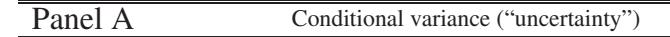
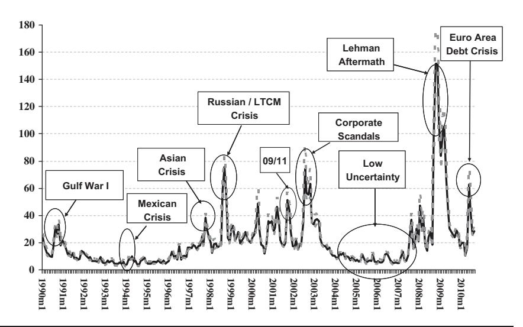
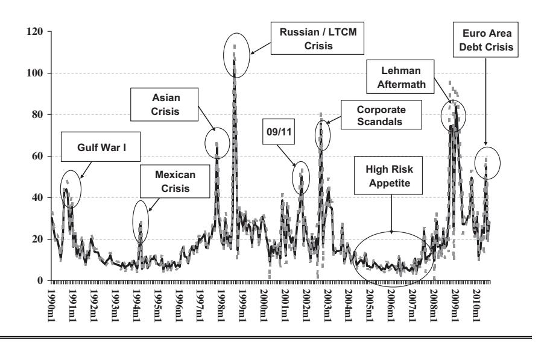
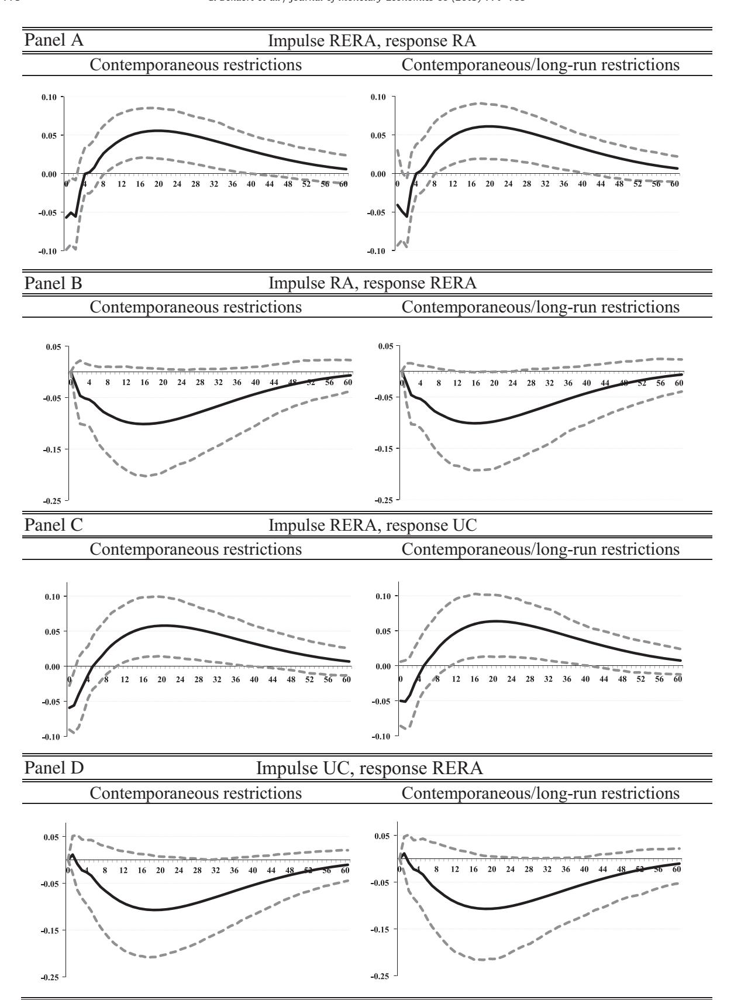
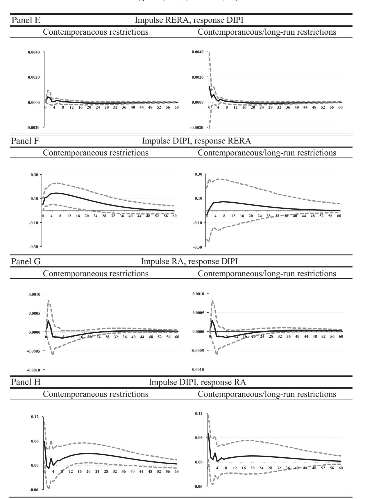
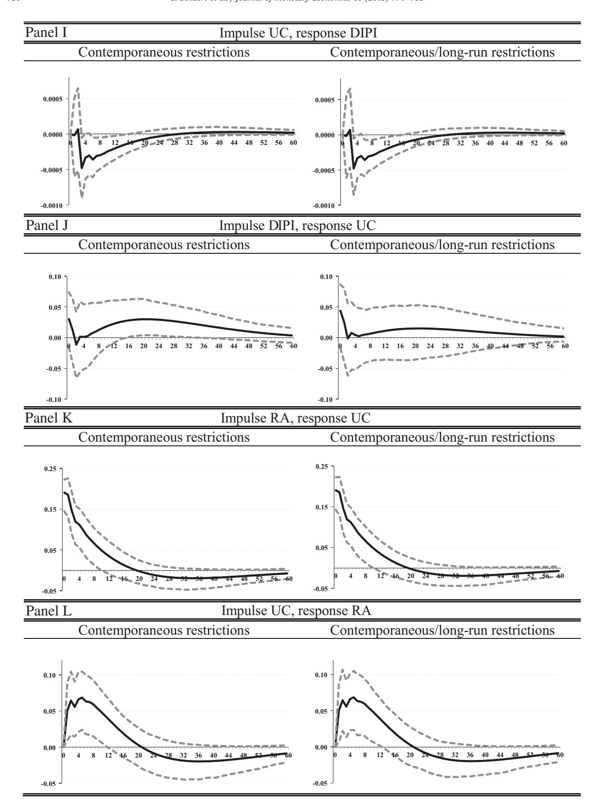
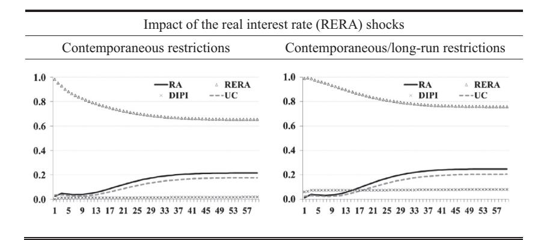
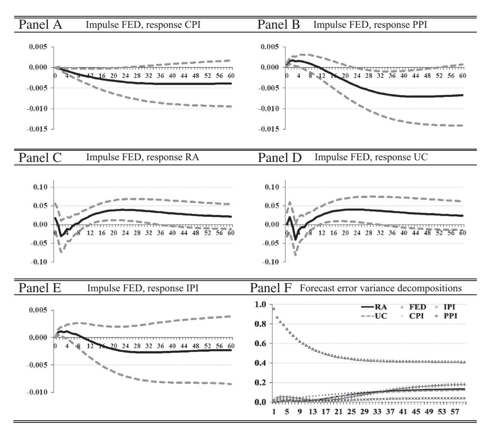
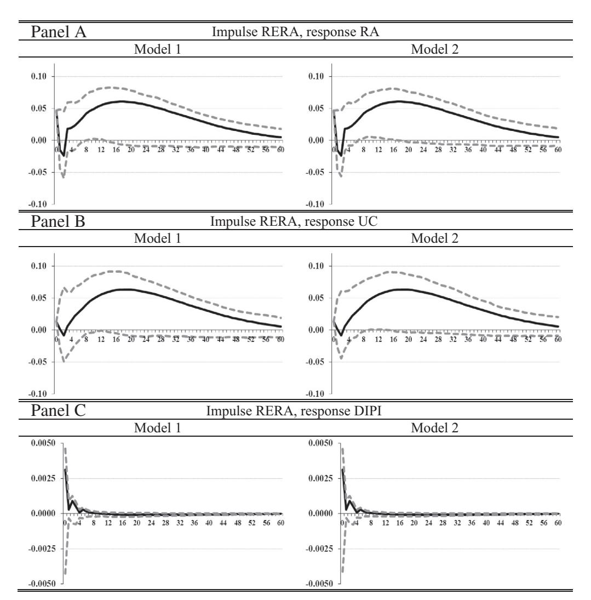
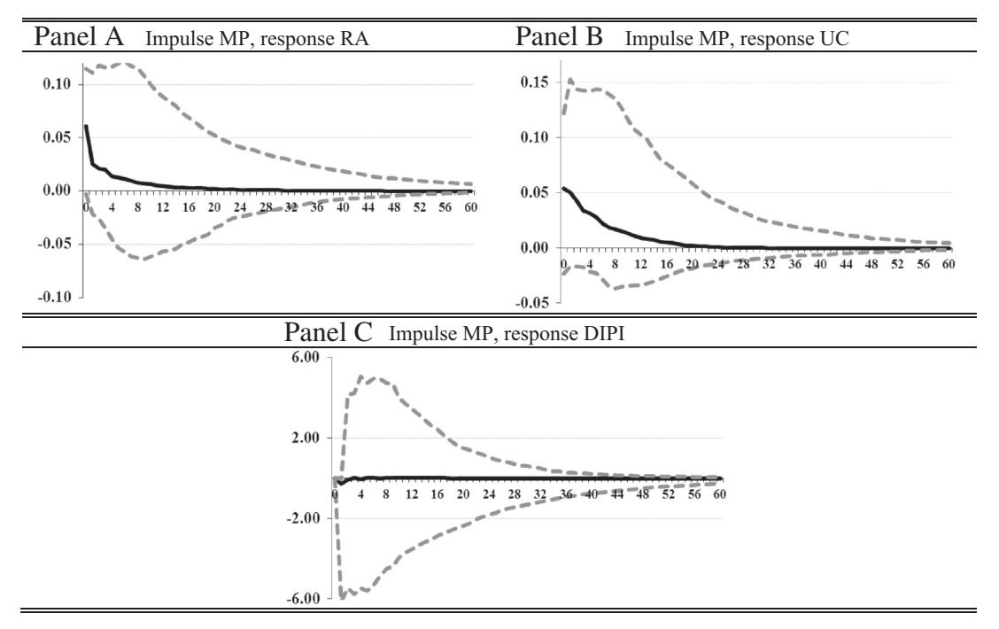

# Journal of Monetary Economics

journal homepage: <www.elsevier.com/locate/jme>

# Risk, uncertainty and monetary policy\$

Geert Bekaert a,n , Marie Hoerova b , Marco Lo Duca b

- a Columbia Business School and NBER, United States
- b European Central Bank, Germany

## article info

Article history: Received 18 May 2011 Received in revised form 10 June 2013 Accepted 14 June 2013 Available online 28 June 2013

Keywords: Monetary policy Option implied volatility Risk aversion Uncertainty Business cycle

## abstract

The VIX, the stock market option-based implied volatility, strongly co-moves with measures of the monetary policy stance. When decomposing the VIX into two components, a proxy for risk aversion and expected stock market volatility ("uncertainty"), we find that a lax monetary policy decreases both risk aversion and uncertainty, with the former effect being stronger. The result holds in a structural vector autoregressive framework, controlling for business cycle movements and using a variety of identification schemes for the vector autoregression in general and monetary policy shocks in particular. The effect of monetary policy on risk aversion is also apparent in regressions using high frequency data.

& 2013 Elsevier B.V. All rights reserved.

# 1. Introduction

A popular indicator of risk aversion in financial markets, the VIX index, shows strong co-movements with measures of the monetary policy stance. [Fig. 1](#page-1-0) considers the cross-correlogram between the real interest rate (the Fed funds rate minus inflation), a measure of the monetary policy stance, and the logarithm of end-of-month readings of the VIX index. The VIX index essentially measures the "risk-neutral" expected stock market variance for the US S&P500 index. The correlogram reveals a very strong positive correlation between real interest rates and future VIX levels. While the current VIX is positively associated with future real rates, the relationship turns negative and significant after 13 months: high VIX readings are correlated with expansionary monetary policy in the medium-run future.

The strong interaction between a "fear index" [\(Whaley, 2000\)](#page-17-0) in the asset markets and monetary policy indicators may have important implications for a number of literatures. First, the recent crisis has rekindled the idea that lax monetary policy can be conducive to financial instability. The Federal Reserve's pattern of providing liquidity to financial markets following market tensions, which became known as the "Greenspan put," has been cited as one of the contributing factors to the build-up of a speculative bubble prior to the 2007–09 financial crisis.1 Whereas some rather informal stories have linked

☆ We thank the Associate Editor, Refet Gürkaynak, and an anonymous referee for suggestions that significantly improved the paper. We are also grateful to Tobias Adrian, Gianni Amisano, David DeJong, Bartosz Mackowiak, Frank Smets, José Valentim and Jonathan Wright for their very helpful comments on earlier drafts. Falk Bräuning and Carlos Garcia de Andoain provided excellent research assistance. The views expressed do not necessarily reflect those of the European Central Bank or the Eurosystem. Bekaert gratefully acknowledges financial support from Netspar.

n Correspondence to: Columbia Business School, 3022 Broadway, Uris Hall 411, New York, NY 10027, United States Tel.: +1 212 854 9156.

E-mail address: [gb241@columbia.edu \(G. Bekaert\)](mailto:gb241@columbia.edu).

1 Investors increasingly believed that when market conditions were to deteriorate, the Fed would step in and inject liquidity until the outlook improved. See, for example, "Greenspan Put May be Encouraging Complacency," Financial Times, December 8, 2000.

| LVIX,RERA(-i) | LVIX,RERA(+i)                                     | i  | lag    | lead    |
|---------------|---------------------------------------------------|----|--------|---------|
| 1 🛅           |                                                   | 0  | 0.1716 | 0.1716  |
|               |                                                   | 1  | 0.2169 | 0.1391  |
| 1             | <u> </u>   <u>                               </u> | 2  | 0.2651 | 0.1119  |
| ı <b>—</b>    | <u> </u>                                          | 3  | 0.3119 | 0.0846  |
| 1             | <u> </u>   <u>   </u>                             | 4  | 0.3547 | 0.0586  |
| 1             | 1 11 1                                            | 5  | 0.3988 | 0.0300  |
| 1             | 1 1                                               | 6  | 0.4225 |         |
| ·             | '(('                                              | 7  | 0.4401 |         |
| 1             | '[[ '                                             | 8  | 0.4473 |         |
| 1             | '[ '                                              | 9  | 0.4560 |         |
| · <u> </u>    | ' <b>□</b> '                                      | 10 | 0.4684 |         |
| 1             | ļ ' <b>=</b> '                                    | 11 | 0.4912 |         |
|               | ļ <b>"</b>                                        | 12 | 0.5057 |         |
|               | <u> </u>                                          | 13 | 0.5150 |         |
| 1             |                                                   | 14 | 0.5314 |         |
| 1             |                                                   | 15 | 0.5485 |         |
| 1             |                                                   | 16 | 0.5634 |         |
| 1             |                                                   | 17 | 0.5731 |         |
| 1             |                                                   | 18 | 0.5846 |         |
|               |                                                   | 19 | 0.5979 |         |
| 1             |                                                   | 20 | 0.6151 |         |
| 1             |                                                   | 21 | 0.6329 |         |
| 1             | '                                                 | 22 | 0.6438 |         |
| 1             | ' '                                               | 23 | 0.6491 |         |
| 1             |                                                   | 24 | 0.6515 |         |
| 1             |                                                   | 25 | 0.6598 |         |
| 1             |                                                   | 26 | 0.6604 |         |
|               | '                                                 | 27 | 0.6568 |         |
| 1             |                                                   | 28 | 0.6524 |         |
| ı             |                                                   | 29 | 0.6474 |         |
| 1             |                                                   | 30 | 0.6381 |         |
| 1             | '                                                 | 31 | 0.6251 |         |
| 1             |                                                   | 32 | 0.6123 |         |
| ·             |                                                   | 33 | 0.5960 |         |
| 1             | '                                                 | 34 | 0.5761 |         |
| ' -           |                                                   | 35 | 0.5586 |         |
| '             |                                                   | 36 | 0.5454 | -0.5536 |

Fig. 1. Cross-correlogram LVIX RERA.

Notes: The first column presents the (lagged) cross-correlogram between the log of the VIX (LVIX) and past values of the real interest rate (RERA). The second column presents the (lead) cross-correlogram between LVIX and future values of RERA. Dashed vertical lines indicate 95% confidence intervals for the cross-correlation. The third column presents the cross-correlation values. The index i indicates the number of months either lagged or led for the real interest rate variable. The sample period is January 1990–July 2007.

monetary policy to risk-taking in financial markets ([Rajan, 2006](#page-17-0); [Adrian and Shin, 2008](#page-16-0); [Borio and Zhu, 2008\)](#page-17-0), it is fair to say that no extant research establishes a firm empirical link between monetary policy and risk aversion in asset markets.2

Second, [Bloom \(2009\)](#page-17-0) and [Bloom et al. \(2009\)](#page-17-0) show that heightened "economic uncertainty" decreases employment and output. It is therefore conceivable that the monetary authority responds to uncertainty shocks, in order to affect economic outcomes. However, the VIX index, used by [Bloom \(2009\)](#page-17-0) to measure uncertainty, can be decomposed into a component that reflects actual expected stock market volatility (uncertainty) and a residual, the so-called variance premium (see, for example, [Carr and Wu, 2009\)](#page-17-0), that reflects risk aversion and other non-linear pricing effects, perhaps even Knightian uncertainty. Establishing which component drives the strong co-movements between the monetary policy stance and the VIX is therefore particularly important.

Third, analyzing the relationship between monetary policy and the VIX and its components may help clarify the relationship between monetary policy and the stock market, explored in a large number of empirical papers ([Thorbecke, 1997;](#page-17-0) [Rigobon and Sack, 2004](#page-17-0); [Bernanke and Kuttner, 2005](#page-17-0)). The extant studies all find that expansionary (contractionary) monetary policy affects the stock market positively (negatively). Interestingly, [Bernanke and Kuttner](#page-17-0) [\(2005\)](#page-17-0) ascribe the bulk of the effect to easier monetary policy lowering risk premiums, reflecting both a reduction in economic and financial volatility and an increase in the capacity of financial investors to bear risk. By using the VIX and its two components, we test the effect of monetary policy on stock market risk, but also provide more precise information on the exact channel.

This article characterizes the dynamic links between risk aversion, uncertainty and monetary policy in a simple vector-autoregressive (VAR) system. Such analysis faces a number of difficulties. First, because risk aversion and the stance of monetary policy are jointly endogenous variables and display strong contemporaneous correlation (see Fig. 1), a structural interpretation of the dynamic effects requires identifying restrictions. Monetary policy may indeed affect asset prices through its effect on risk aversion, as suggested by the literature on monetary policy news and the stock

2 For recent empirical evidence that monetary policy affects the riskiness of loans granted by banks see, for example, [Altunbas et al. \(2010\)](#page-16-0), [Ioannidou](#page-17-0) [et al. \(2009\)](#page-17-0), [Jiménez et al. \(forthcoming\),](#page-17-0) and [Maddaloni and Peydró \(2011\).](#page-17-0)

market, but monetary policy makers may also react to a nervous and uncertain market place by loosening monetary policy. In fact, [Rigobon and Sack \(2003\)](#page-17-0) find that the Federal Reserve does systematically respond to stock prices.3

Second, the relationship between risk aversion and monetary policy may also reflect the joint response to an omitted variable, with business cycle variation being a prime candidate. Recessions may be associated with high risk aversion (see [Campbell and Cochrane, 1999](#page-17-0) for a model generating counter-cyclical risk aversion) and at the same time lead to lax monetary policy. Our VARs always include a business cycle indicator.

Third, measuring the monetary policy stance is the subject of a large literature (see, for example, [Bernanke and Mihov,](#page-17-0) [1998a\)](#page-17-0); and measuring policy shocks correctly is difficult. Models featuring time-varying risk aversion and/or uncertainty, such as [Bekaert et al. \(2009\),](#page-17-0) imply an equilibrium contemporaneous link between interest rates and risk aversion and uncertainty, through precautionary savings effects for example. Such relation should not be associated with a policy shock. However, our results are robust to alternative measures of the monetary policy stance and of monetary policy shocks. In particular, the results are robust to identifying monetary policy shocks using a standard structural VAR, using high frequency Fed funds futures changes following [Gürkaynak et al. \(2005\)](#page-17-0), and using the approach in [Bernanke and Kuttner \(2005\)](#page-17-0), based on the unexpected change in the Fed Funds rate on a monthly basis.

The remainder of the paper is organized as follows. Section 2 details the measurement of the key variables in the VAR, including monetary policy indicators, monetary policy shocks and business cycle indicators. First and foremost, we provide intuition on how the VIX is related to the actual expected variance of stock returns and to risk preferences. While the literature has proposed a number of risk appetite measures (see [Baker and Wurgler, 2007;](#page-16-0) [Coudert and Gex, 2008](#page-17-0)), our measure is increasing in risk aversion in a variety of realistic economic settings. This motivates our empirical strategy in which the VIX is split into a pure volatility component ("uncertainty") and a residual, which should be more closely associated with risk aversion. [Section 3](#page-6-0) analyzes the dynamic relationship between monetary policy and risk aversion and uncertainty in standard structural VARs. The results are remarkably robust to a long list of robustness checks with respect to VAR specification, variable definitions and alternative identification methods. [Section 4](#page-12-0) employs two alternative methods to identify monetary policy shocks relying on Fed futures data.4

Our main findings are as follows. A lax monetary policy decreases risk aversion in the stock market after about nine months. This effect is persistent, lasting for more than two years. Moreover, monetary policy shocks account for a significant proportion of the variance of the risk aversion proxy. Monetary policy shocks have a significant impact on risk aversion also in regressions using high frequency data. The effects of monetary policy on uncertainty are similar but somewhat weaker. On the other hand, periods of both high uncertainty and high risk aversion are followed by a looser monetary policy stance but these results are less robust and weaker statistically. Finally, it is the uncertainty component of the VIX that has the statistically stronger effect on the business cycle, not the risk aversion component.

#### 2. Measurement

This section details the measurement of the key inputs to our analysis: risk aversion and uncertainty; the monetary policy stance and monetary policy shocks; and finally, business cycle variation. Our data start in January 1990 (the start of the model-free VIX series) but our analysis is performed using two different end-points for the sample: July 2007, yielding a sample that excludes recent data on the crisis; and August 2010. The crisis period presents special challenges as stock market volatilities peaked at unprecedented levels and the Fed funds target rate reached the zero lower bound. [Table 1](#page-3-0) describes the basic variables used and assigns them a short-hand label.

#### 2.1. Measuring risk aversion and uncertainty

To measure risk aversion and uncertainty, we use a decomposition of the VIX index. The VIX represents the optionimplied expected volatility on the S&P500 index with a horizon of 30 calendar days (22 trading days). This volatility concept is often referred to as "implied volatility" or "risk-neutral volatility," as opposed to the actual (or "physical") expected volatility. Intuitively, in a discrete state economy, the physical volatility would use the actual state probabilities to arrive at the physical expected volatility, whereas the risk-neutral volatility would make use of probabilities that are adjusted for the pricing of risk.

The computation of the actual VIX index relies on theoretical results showing that option prices can be used to replicate any bounded payoff pattern; in fact, they can be used to replicate Arrow–Debreu securities [\(Breeden and Litzenberger, 1978](#page-17-0); [Bakshi and Madan, 2000\)](#page-16-0). [Britten-Jones and Neuberger \(2000\)](#page-17-0) and [Bakshi et al. \(2003\)](#page-17-0) show how to infer "risk-neutral" expected volatility for a stock index from option prices. The VIX index measures implied volatility using a weighted average of European-style S&P500 call and put option prices that straddle a 30-day maturity and cover a wide range of strikes (see [Chicago Board Options Exchange, 2004](#page-17-0) for more details). Importantly, this estimate is model-free and does not rely on an option pricing model.

3 [Rigobon and Sack \(2003](#page-17-0), [2004\)](#page-17-0) use an identification scheme based on the heteroskedasticity of stock market returns. Given that we view economic uncertainty as an important endogenous variable in its own right with links to the real economy and risk premiums, we cannot use such an identification scheme.

4 The Online [Appendix](#page-16-0) contains supplementary material referenced in the article.

**Table 1** Description of variables.

| Name                              | Label   | Description                                                                          |
|-----------------------------------|---------|--------------------------------------------------------------------------------------|
| Conditional variance              |         | Fitted values from the projection in Eq. (1)                                         |
| Consumer price index              | CPI     | Consumer price index, all items                                                      |
| Dividend yield                    |         | Dividend yield of the S&P 500 index                                                  |
| Fed funds rate                    | FED     | Fed funds target rate                                                                |
| Implied variance                  | $VIX^2$ | Squared implied volatility of options on the S&P500 index, VIX 2 /12      |
| (Log of) Implied volatility       | (L)VIX  | (Log of ) implied volatility of options on the S&P500 index, (Log) $[VIX/\sqrt{12}]$ |
| (Growth of) Industrial production | (D)IPI  | Log (difference of) total industrial production index                                |
| ISM index                         | ÌSM     | ISM Purchasing Managers' index                                                       |
| M1 money aggregate growth         | M1      | Month-on-month growth of M1                                                          |
| (Growth of) Non-farm employment   | (D)EMP  | Log (difference of) non-farm employment                                              |
| Producer price index              | PPI     | Producer price index for intermediate materials                                      |
| Real interest rate                | RERA    | FED minus annual CPI inflation rate                                                  |
| Realized variance                 | RVAR    | Realized variance computed using squared 5-minute returns                            |
| Risk aversion                     | RA      | Log (implied variance-conditional variance)                                          |
| Three-month T-bill                |         | Secondary market yield                                                               |
| Uncertainty                       | UC      | Log (conditional variance)                                                           |

Notes: Monthly frequency, end-of-the-month data (seasonally adjusted where applicable). Unless otherwise mentioned in the text, the data are from Thomson Datastream.

While the VIX obviously reflects stock market uncertainty, it conceptually must also harbor information about risk and risk aversion. Indeed, financial markets often view the VIX as a measure of risk aversion and fear in the market place. Because there are well-accepted techniques to measure the physical expected variance, the VIX can be split into a measure of stock market uncertainty, and a residual that should be more closely associated with risk aversion. The difference between the squared VIX and an estimate of the conditional variance is typically called the variance premium (see, e.g. Carr and Wu, 2009).5 The variance premium is nearly always positive and displays substantial time-variation. Recent finance models attribute these facts either to non-Gaussian components in fundamentals and (stochastic) risk aversion (see, for instance, Bekaert and Engstrom, 2013; Bollerslev et al., 2009; Drechsler and Yaron, 2011) or Knightian uncertainty (see Drechsler, forthcoming). Bekaert and Hoerova (2013) use a one-period discrete economy with power utility to illustrate the difference between "risk neutral" and "physical" expected variance and demonstrate that the variance premium is indeed increasing in risk aversion in a number of realistic calibrated example economies.

#### 2.1.1. Decomposing the VIX index

To decompose the VIX index into a risk aversion and an uncertainty component, an estimate of the expected future realized variance is needed. This estimate is customarily obtained by projecting future realized monthly variances (computed using squared 5-minute returns) onto a set of current instruments. We follow this approach using daily data on monthly realized variances (denoted by RVAR), the squared VIX, the dividend yield and the real three-month T-bill rate. By using daily data, considerable statistical power is gained relative to the standard methods employing end-of-month data. For example, forecasting models estimated from daily data easily "beat" models using only end-of-month data, even for end-of-month samples.

To select a good forecasting model, a horserace is conducted between a total of eight volatility forecasting models. The first five models use OLS regressions with different predictors: a one-variable model with either the past realized variance or the squared VIX; a two-variable model with both the squared VIX and the past realized variance; a three-variable model adding the past dividend yield; and a four-variable model adding the past real three-month T-bill rate. Three models that do not require estimation are also considered: half-half weights on the past squared VIX and past realized variance; the past realized variance; the past squared VIX. Our model selection criteria are out-of-sample root mean squared error and mean absolute errors, and, for the estimated models, stability (especially through the crisis period).

This procedure leads us to select a two-variable model where the squared VIX and the past realized variance are used as predictors. The performance of the three- and four-variable models is very comparable to this model, but the univariate estimated models and the non-estimated models perform consistently and significantly worse. Moreover, the selected model is the most stable of the well-performing forecasting models we considered, with the coefficients economically and statistically unaltered during the crisis period. The Online Appendix provides a detailed account of the forecasting horserace. The resulting coefficients from the two-variable projection are as follows:

$$RVAR_{t} = -0.00002 + 0.299VIX^{2}_{t-22} + 0.442RVAR_{t-22} + e_{t}$$

$$(0.00012) \quad (0.067) \quad (0.130)$$
(1)

&lt;sup>5 In the technical finance literature, the variance premium is actually the negative of the variable that we use. By switching the sign, our indicator tends to increase with risk aversion, whereas the variance premium becomes more negative with risk aversion.

&lt;sup>6 This estimation was conducted using a winsorized sample but the estimation results for the non-winsorized sample are in fact very similar.

Panel B Difference between implied and conditional variance ("risk aversion")

Fig. 2. VIX2 decomposition into uncertainty and risk aversion. Notes: Fig. 2 presents a decomposition of the squared VIX in the two components (in monthly percentages squared, black lines): the expected stock market variance (our uncertainty proxy, in Panel A) and the residual, the difference between the squared VIX and uncertainty (our risk aversion proxy, Panel B). The sample period is January 1990–August 2010. Grey dashed lines are 90% confidence intervals.

The standard errors reported in parentheses are corrected for serial correlation using 30 [Newey-West \(1987\)](#page-17-0) lags. The fitted value from the two-variable projection is the estimated conditional variance and our measure of "uncertainty." The difference between the squared VIX and the conditional variance is our measure of "risk aversion."

### 2.1.2. Risk aversion and uncertainty estimates

Fig. 2 plots the risk aversion and uncertainty estimates, along with 90% confidence intervals.7 To construct the confidence bounds, the coefficients from the forecasting projection together with their asymptotic covariance matrix are retained. Then, 100 alternative parameter coefficients from the distribution of these estimates are drawn, which generates alternative risk

7 The estimated uncertainty series is less "jaggedy" than it would be if only the past realized variance would be used to compute it (as in [Bollerslev](#page-17-0) [et al., 2009\)](#page-17-0), which in turn helps smooth the risk aversion process.

aversion and uncertainty estimates. In [Section 3.3.4,](#page-11-0) these bootstrapped series are used to account for the sampling error in the risk aversion and uncertainty estimates in our VARs. Throughout our analysis, the logarithms of the risk aversion and uncertainty estimates are used. They are labeled RA and UC, respectively.

## 2.2. Measuring monetary policy

To measure the monetary policy stance, we use the real interest rate (RERA), i.e. the Fed funds end-of-the-month target rate minus the CPI annual inflation rate. In [Section 3.3.1](#page-11-0), alternative measures of the monetary policy stance are considered for robustness. Our first such measure is the Taylor rule residual, the difference between the nominal Fed funds rate and the Taylor rule rate (TR rate). The TR rate is estimated as in [Taylor \(1993\):](#page-17-0)

$$TR_t = Inf_t + NatRate_t + 0.5(Inf_t - TargInf) + 0.5OG_t$$
(2)

where Inf is the annual inflation rate, NatRate is the "natural" real Fed funds rate (consistent with full employment), which Taylor assumed to be 2%, TargInf is a target inflation rate, also assumed to be 2%, and OG (output gap) is the percentage deviation of real GDP from potential GDP, with the latter obtained from the Congressional Budget Office. Our other alternative measures of the monetary policy stance are the nominal Fed funds rate instead of the real rate, and (the growth rate of) the monetary aggregate M1, which is commonly assumed to be under tight control of the central bank. M1 (growth) is multiplied by minus one so that a positive shock to this variable corresponds to monetary policy tightening, in line with all of our other measures of monetary policy.

Measuring the monetary policy stance is challenging since late 2008, as the Fed funds rate reached the zero lower bound (the Fed funds target was set in the range 0–0.25% as of December 2008) and the Federal Reserve turned to unconventional monetary policies, such as large-scale asset purchases. In the period December 2008–August 2010, the "true" nominal Fed funds rate is approximated by taking it to be the minimum between 0.125% (i.e. the mid-point of the 0–0.25% range) and the TR rate, estimated using Eq. (2) above. [Rudebusch \(2009\)](#page-17-0) has also advocated using the TR rate estimate as a proxy for the "true" Fed funds rate post-2008.

Our analysis in [Sections 4.1](#page-13-0) and [4.2](#page-15-0) uses monetary policy surprises derived from Fed funds futures data. [Section 4.1](#page-13-0) relies on monetary policy surprises proposed by [Gürkaynak et al. \(2005\)](#page-17-0), henceforth GSS.8 GSS compute the monetary policy surprises as high-frequency changes in the futures rate around the FOMC announcements. Their "tight" ("wide") window estimates begin ten (fifteen) minutes prior to the monetary policy announcement and end twenty (forty-five) minutes after the policy announcement, respectively. The data span the period from January 1990 through June 2008. [Section 4.2](#page-15-0) uses the unexpected change in the Fed funds rate on a monthly basis, defined as the average Fed funds target rate in month t minus the one-month futures rate on the last day of the month t-1. This approach follows [Kuttner \(2001\)](#page-17-0) and [Bernanke and](#page-17-0) [Kuttner \(2005\)](#page-17-0) (henceforth BK), see their Eq. [\(5\)](#page-6-0). As pointed out by BK, rate changes that were unanticipated as of the end of the prior month may well include a systematic response to economic news, such as employment, output and inflation occurring during the month. To overcome this problem, "cleansed" monetary surprises that are orthogonal to a set of economic data releases are used. They are calculated as residuals in a regression of the "simple" monetary policy surprise, onto the unexpected component of the industrial production index, the Institute of Supply Management Purchasing Managers' Index (the ISM index), the payroll survey, and unemployment (see Section 2.3 below for a description). Finally, this regression allows for heterogeneous coefficients before and after 1994, to take into account a change in the reaction of the Fed to economic data releases, as documented in BK.

To extend the sample of monetary policy surprises until August 2010, we proceed in two steps. First, data on monetary policy surprises at the zero lower bound are collected from [Wright \(2012\)](#page-17-0), Table 5, p. F463. They represent the first principle component of intraday changes in yields on Treasury futures contracts, taken on days of important policy announcements. The shocks are positive (negative) when monetary policy is unexpectedly accommodative (restrictive), and normalized to have a unit standard deviation. For comparability with the GSS data, Wright's shocks are rescaled by multiplying them by minus the standard deviation of the GSS's shocks, before appending them to the time series of GSS shocks. Second, the gap between the data from GSS (June 2008) and Wright (November 2008) is filled by calculating monetary policy surprises using monthly Federal funds futures, following BK.

#### 2.3. Measuring business cycle variation

Industrial production is used as our benchmark indicator of business cycle variation at the monthly frequency. In a robustness exercise in [Section 3.3.2](#page-11-0), non-farm employment and the ISM index are considered as alternative business cycle indicators.

[Sections 4.1](#page-13-0) and [4.2](#page-15-0) use data on economic news surprises following the methodology in [Ehrmann and Fratzscher](#page-17-0) [\(2004\)](#page-17-0). 9 Our analysis relies on unexpected components of news about the industrial production index, the ISM index, the payroll survey, and unemployment. The unexpected component of each news release is calculated as the difference between

8 We are very grateful to R. Gürkaynak for sharing the data with us.

9 We are very grateful to M. Ehrmann and M. Fratzscher for sharing their dataset with us.

the released data and the median expectation according to surveys. The Money Market Survey (MMS) is used for the period 1990–2001 and Bloomberg for the period 2002–2010. The shocks are standardized over the sample period.

## 3. Structural monetary VARs

This Section follows the identified monetary VAR literature and interprets the shock in the monetary policy equation as the monetary policy shock. Our benchmark VAR, analyzed in Section 3.1, consists of four variables: our risk aversion and uncertainty proxies (RAt and UCt), the real interest rate as a measure of monetary policy stance (MPt), and the log-difference of industrial production as a business cycle indicator (BCt). Alternative VARs are considered as part of an extensive series of robustness checks discussed in [Section 3.3](#page-10-0). The business cycle is the most important control variable as it is conceivable that, for example, news indicating weaker than expected growth in the economy may simultaneously make a cut in the Fed funds target rate more likely and cause people to be effectively more risk averse, because their consumption moves closer to their "habit stock," or because they fear a more uncertain future.

#### 3.1. Structural four-variable VAR: set-up

The four variables of our benchmark VAR are collected in the vector Zt¼[BCt, MPt, RAt UCt]′. Without loss of generality, constants are ignored. Consider the following structural VAR:

$$AZ_t = \Phi Z_{t-1} + \varepsilon_t \tag{3}$$

where A is a 4 4 full-rank matrix and E[εt εt]¼I. Of main interest are the dynamic responses to the structural shocks εt. Of course, the reduced-form VAR is estimated first:

$$Z_t = BZ_{t-1} + C\varepsilon_t \tag{4}$$

where B denotes A-1 Φ and C denotes A-1 . Our estimated VARs include 3 lags, as chosen by the Akaike criterion.

Six restrictions on the VAR are needed to identify the system. Our first set of restrictions uses a standard Cholesky decomposition of the estimate of the variance–covariance matrix. The business cycle variable is ordered first, followed by the real interest rate, with risk aversion and uncertainty ordered last. This captures the fact that risk aversion and uncertainty, stock market based variables, respond instantly to monetary policy shocks, while the business cycle variable is relatively more slow-moving. Effectively, this imposes six exclusion restrictions on the contemporaneous matrix A, making it lower-triangular.

Our second set of restrictions combines five contemporaneous restrictions (also imposed under the Cholesky decomposition above) with the assumption that monetary policy has no long-run effect on the level of industrial production. This long-run restriction is inspired by the literature on long-run money neutrality: money should not have a long run effect on real variables.10 Following [Blanchard and Quah \(1989\)](#page-17-0), the model with a long-run restriction (LR) involves a long-run response matrix, denoted by D:

$$D \equiv (I - B)^{-1} C \tag{5}$$

The system with five contemporaneous restrictions and one long-run exclusion restriction corresponds to setting the [1,2] element in D equal to zero while freeing up the corresponding element in A.11

We couch our main results in the form of impulse-response functions (IRFs henceforth), estimated in the usual way, and focus our discussion on significant responses. Bootstrapped 90% confidence intervals are based on 1000 replications. Our focus is on the pre-crisis sample because the addition of the crisis period leads to an unstable VAR. The Online Appendix ([Table OA2\)](#page-16-0) provides evidence on the stability of the VAR using a variety of tests. When a standard Wald test for parameter stability after July 2007 is used, the null hypothesis of stability is rejected at the 1% significance level for industrial production, the real interest rate and risk aversion and at the 5% level for uncertainty. When the sup-Wald test of [Andrews](#page-16-0) [\(1993\)](#page-16-0) is performed, the procedure finds significant break dates between June 2007 and October 2008, except for the risk aversion variable where overall stability is rejected at the 10% level but no significant break date is detected. Finally, the [Andrews \(2003\)](#page-16-0) test, formally designed for a break that occurs towards the end of the sample, is also performed. Results are in line with the other two tests: the null hypothesis of no breakpoint in August 2007 is rejected at the 1% significance level for all variables with the exception of risk aversion.

#### 3.2. Structural four-variable VAR: results

[Fig. 3](#page-7-0) graphs the complete results for the pre-crisis sample.

10 [Bernanke and Mihov \(1998b\)](#page-17-0) and [King and Watson \(1992\)](#page-17-0) marshal empirical evidence in favor of money neutrality using data on money growth and output growth.

11 Both identification schemes satisfy necessary and sufficient conditions for global identification of structural vector autoregressive systems (see [Rubio-Ramírez et al., 2010](#page-17-0)).

Fig. 3. Structural-form IRFs for the 4-variable VAR (DIPI, RERA, RA, UC). Notes: Estimated structural impulse-response functions (black lines) and 90% bootstrapped confidence intervals (grey dashed lines) for the 4-variable model (with the log-difference of industrial production (DIPI), real interest rate (RERA), log risk aversion (RA), and log uncertainty (UC)) with 3 lags (selected by the Akaike criterion), based on 1000 replications. Panels on the left present results of the model with contemporaneous (Cholesky) restrictions, panels on the right present results of the model with contemporaneous/long-run restrictions. The sample period is January 1990–July 2007.

Fig. 3. (continued)

Fig. 3. (continued)

Fig. 4. Forecast error variance decompositions for the 4-variable VAR (DIPI, RERA, RA, UC). Notes: Fractions of the forecast error variance due to RERA shocks for the four variables: the log-difference of industrial production (DIPI), real interest rate (RERA), log risk aversion (RA), and log uncertainty (UC) (model with 3 lags, selected by the Akaike criterion). The panel on the left presents results of the model with contemporaneous restrictions, the panel on the right presents results of the model with contemporaneous/long-run restrictions. The sample period is January 1990–July 2007.

Panels A and B show the interactions between the real rate (RERA) and log risk aversion (RA). A one standard deviation negative shock to the real rate represents a 34 basis points decrease under both identification schemes. Laxer monetary policy lowers risk aversion by about 0.032 in both models after 9 months. The impact reaches a maximum of 0.056 after 20 months and remains significant up and till lag 40. A one standard deviation positive shock to risk aversion, which is equivalent to 0.347, has a mostly negative impact on the real rate but it is statistically insignificant in both models.

As Panel C shows, a positive shock to the real rate has an immediate negative impact on uncertainty. The impact is short-lived and only statistically significant in the model with contemporaneous restrictions. In the medium run, tighter monetary policy increases uncertainty in both models (between lags 11 and about 40). The maximum positive impact is about 0.060 at lag 21 in both models. In the other direction, reported in Panel D, the real rate decreases in the short-run following a positive one standard deviation shock to uncertainty, which is equivalent to 0.244. In both models, the impact is (borderline) statistically insignificant.

As for interactions with the business cycle variable (Panels E through J), a contractionary monetary policy shock leads to a decline in industrial production growth (DIPI) in the medium-run, but the impact is statistically insignificant in both specifications. In the other direction, monetary policy reacts as expected to business cycle fluctuations: a one standard deviation positive shock to industrial production growth, equivalent to 0.005, leads to a higher real rate. Specifically, in the model with contemporaneous restrictions, the real rate increases by a maximum of 14 basis points after 6 months, with the impact being significant between lags 1 and 20. The impact is also positive in the model with contemporaneous/long-run restrictions but it is not statistically significant. Interactions between risk aversion and industrial production growth are mostly statistically insignificant. Positive uncertainty shocks lower industrial production growth between lags 6–15, while the impact in the opposite direction is statistically insignificant. This is consistent with the analysis in [Bloom \(2009\),](#page-17-0) who found that uncertainty shocks generate significant business cycle effects, using the VIX as a measure of uncertainty.12

Finally, increases in risk aversion predict future increases in uncertainty under both identification schemes (Panel K). Uncertainty has a positive, albeit short-lived effect on risk aversion (Panel L).

Our main result for the pre-crisis sample is that monetary policy has a medium-run statistically significant effect on risk aversion. This effect is also economically significant. Fig. 4 shows what fraction of the forecast error variance of the four variables in the VAR is due to monetary policy shocks at horizons between 1 and 60 months. Monetary policy shocks account for over 20% of the variance of risk aversion at horizons longer than 37 and 29 months in the models with contemporaneous and contemporaneous/long-run restrictions, respectively. They also increase uncertainty and Fig. 4 shows that they are only marginally less important drivers of the uncertainty variance than they are of the risk aversion variance. Finally, while monetary policy appears to loosen in response to both risk aversion and uncertainty shocks, these effects are statistically weaker.

## 3.3. Robustness

In this subsection, six types of robustness checks are considered: (1) measurement of the monetary policy stance; (2) measurement of the business cycle variable; (3) alternative orderings of variables; (4) accounting for the sampling error in RA and UC estimates; (5) conducting the analysis using a six variable monetary VAR with the Fed funds rate and price

12 [Popescu and Smets \(2009\)](#page-17-0) analyze the business cycle behavior of measures of perceived uncertainty and financial risk premia in Germany. They find that financial risk aversion shocks are more important in driving business cycles than uncertainty shocks. [Gilchrist and Zakraj](#page-17-0)šek (2012) document that innovations to the excess corporate bond premium, a proxy for the time-varying price of default risk, cause large and persistent contractions in economic activity.

level measures CPI and PPI entering as separate variables; and (6) conducting the analysis over the full sample till August 2010.13

## 3.3.1. Alternative monetary policy measures

Three alternative measures of the monetary policy stance are considered: Taylor rule deviations, nominal Fed funds rate and the growth of the monetary aggregate M1. The results (reported in the Online Appendix, [Table OA3](#page-16-0)) confirm that a looser monetary policy stance lowers risk aversion in the short to medium run. This effect is persistent, lasting for about two years. In some cases, the immediate effect has the reverse sign, however. In the other direction, monetary policy becomes laxer in response to positive risk aversion shocks but the effect is statistically significant in less than half the cases. As for the effect of monetary policy on uncertainty, monetary tightening increases uncertainty in the medium run but this effect is not significant when using the Fed fund rate. In the other direction, higher uncertainty leads to laxer monetary policy in all specifications but the effect is only significant when using the Fed fund rate under contemporaneous identifying restrictions.

## 3.3.2. Alternative business cycle measures

As alternative business cycle indicators, the log-difference of employment and the log of the ISM index are considered. Unlike industrial production and employment, the ISM index is a stationary variable, implying that VAR shocks do not have a long run effect on it. Our long-run restriction on the effect of monetary policy is thus stronger when applied to the ISM: it restricts the total effect of monetary policy on the ISM to be zero. Nevertheless, our main results from [Section 3.1](#page-6-0) are confirmed for each specification with an alternative business cycle variable. Figs. OA1 and OA2 in the Online Appendix present a full set of IRFs (the equivalent of [Fig. 3\)](#page-7-0) for the VARs with the log-difference of employment and the log of the ISM index, respectively.

### 3.3.3. Alternative orderings of variables

In one alternative ordering, the order of risk aversion and uncertainty in our benchmark VAR is reversed. In another robustness check, the real interest rate is ordered last, thus allowing it to respond instantaneously to RA and UC shocks. We consistently find that looser monetary policy lowers risk aversion and uncertainty in a statistically significant fashion in the medium-run. In the other direction, the effects are less robust. In the specification with RA and UC reversed, monetary policy mostly responds to UC shocks, while the response to RA shocks is statistically insignificant. In the specification with RERA ordered last, monetary policy responds to both positive RA and UC shocks by loosening its stance, and the effect is statistically significantly different from zero. Figs. OA3 and OA4 in the Online Appendix present a full set of IRFs for the reversed ordering of RA and UC and for the specification with RERA ordered last, respectively.

## 3.3.4. Sampling error in RA and UC

This subsection verifies that our VAR results are robust to accounting for the sampling error in the RA and UC estimation. Hundred alternative RA and UC series are drawn from the distribution of RA and UC estimates (as described in [Section 2.1.2](#page-4-0)) and fed into our bootstrapped VAR. Per set of alternative RA and UC series, 100 VAR replications are estimated. Then, the usual 90% confidence bounds are constructed. The results are very similar to those obtained without taking uncertainty surrounding RA and UC estimates into account, and are presented in the Online Appendix [\(Fig. OA5\)](#page-16-0).

#### 3.3.5. Six-variable monetary VAR

We also estimate a six-variable monetary VAR following [Christiano et al. \(1999\)](#page-17-0) and featuring the nominal Fed funds rate as the measure of monetary policy stance and price level measures CPI and PPI as additional variables.14 To identify monetary policy shocks, a Cholesky ordering is used with CPI and industrial production ordered first, followed by the Fed funds rate and PPI, and risk aversion and uncertainty ordered last.

[Fig. 5](#page-12-0) presents impulse-responses to monetary policy shocks. A positive monetary policy shock corresponds to a 15 basis points increase in the Fed funds rate. A contractionary monetary shock leads to a statistically significant decrease in the CPI between lags 3 and 23 and in the PPI between lags 23 and 50. Furthermore, industrial production declines following a monetary contraction after about 10 months, though the effect is not statistically significant. Importantly, the reactions of both risk aversion and uncertainty are remarkably similar to those uncovered in our benchmark four-variable VARs. Looser monetary policy decreases risk aversion by 0.024 after 12 months. The effect reaches a maximum of 0.040 at lag 23, and remains statistically significant till lag 35. The effects remain economically important as monetary policy shocks account for over 12% of the variance of risk aversion at horizons longer than 40 months (see Panel F of [Fig. 5](#page-12-0)) but these percentages are nonetheless lower than in our four-variable VAR. As for uncertainty, a higher Fed funds rate increases uncertainty between lags 12 and 31, with the maximum impact of 0.040 at lag 23, which is also consistent with our previous findings.

13 Moreover, our results remain robust to the use of both shorter and longer VAR lag-lengths. A VAR with 1 lag, as selected by the Schwarz criterion, as well as a VAR with 4 lags were estimated (we did not go beyond four lags as otherwise the saturation ratio, the ratio of data points to parameters, drops below 10). Our results were unaltered.

14 The model is estimated with four lags, as suggested by the Akaike criterion. All variables are in logarithms except for the Fed funds rate. Note that industrial production now enters the VAR in levels.

Fig. 5. Monetary policy shocks in the 6-variable VAR (CPI IPI FED PPI RA UC). Notes: Panels A–E: Estimated structural impulse-responses (black lines) to a monetary policy shock in the 6-variable model (with log consumer price index (CPI), log industrial production (IPI), Fed Funds rate (FED), log producer price index (PPI), log risk aversion (RA), and log uncertainty (UC)) and 90% bootstrapped confidence intervals (dashed grey lines), for the model with 4 lags (selected by the Akaike criterion), based on 1000 replications. Panel F: Fractions of the structural variance due to FED shocks for the six variables. The sample period is January 1990–July 2007.

In non-reported results, monetary policy responds to both positive RA and UC shocks by loosening its stance. The effect is statistically significant between lags 2 and 7 for risk aversion and between lags 5 and 26 for uncertainty.

#### 3.3.6. Full sample results

Despite the instability documented before, we nonetheless repeated our analysis for the full sample including the crisis period. These results, mimicking [Fig. 3](#page-7-0), can be found in the Online Appendix ([Fig. OA6](#page-16-0)). The full sample results overall confirm our results for the pre-crisis sample but are somewhat less statistically significant. The results regarding the key interactions between monetary policy and risk aversion/uncertainty are as follows. The impact of monetary policy in the full sample is quantitatively weaker, and is only statistically significant at the 68% confidence level in both 4-variable VARs and the 6-variable VAR. Note that such tighter confidence bounds are common in the VAR literature (see [Christiano et al., 1996](#page-17-0); [Sims and Zha, 1999\)](#page-17-0). Monetary policy's effect on uncertainty is significant in the 6-variable VAR but borderline insignificant at the 68% level in the 4-variable VARs. As to the reverse effect, monetary policy now reacts significantly to uncertainty in some cases. Given the measurement problems mentioned before, and the rather extreme volatility the VIX experienced, somewhat weaker statistical power for this sample is not entirely surprising.

## 4. Alternative identification of monetary policy shocks

In this section, two alternative methodologies to identify monetary policy shocks are employed: (1) monetary surprises based on high-frequency Fed funds futures and (2) surprises based on the unexpected change in the Fed funds rate on a monthly basis. Focus is again on the pre-crisis sample.

## 4.1. Identification using high-frequency Fed funds futures

Our VAR set-up to identify monetary policy shocks and their structural relationship with risk aversion and uncertainty follows Sims' [\(1980,](#page-17-0) [1998\)](#page-17-0) identification tradition. With financial market values changing continuously during the month, the use of monthly data for this purpose certainly may cast some doubt on this identification scheme. An alternative identification methodology that makes use of high frequency data is therefore employed to infer restrictions on the monthly VAR.

## 4.1.1. Identification using high-frequency Fed funds futures: set-up

Our approach, inspired by and building on the procedure described in D'[Amico and Farka \(2011\)](#page-17-0), consists of three steps. In the first step, the structural monetary policy and business cycle shocks are measured directly. For monetary policy, we rely on a well-established literature that uses high frequency changes in Fed funds futures rates to measure monetary policy shocks (see, for example, [Faust et al., 2004\)](#page-17-0). The measurement was detailed in [Section 2.2](#page-5-0). Likewise, for business cycle shocks, news announcements are used. Under certain assumptions, these shocks can be viewed as measuring the structural shocks εt in the VAR. For monetary policy shocks, this is plausible because usually only one shock occurs per month, and the use of high frequency futures data helps ensure that the identified shock is plausibly orthogonal to other shocks. As to the business cycle shocks, there are a number of potentially important complicating issues, such as the correlation between the different news announcements and the structural shock to the actual business cycle variable used in the VAR, and the scale of the shocks when more than one occurs within a particular month. However, these issues become moot when business cycle shocks do not generate significant contemporaneous effects on our financial variables, which ends up being the case.

In the second step, the high frequency effects of monetary policy and economic news surprises on risk aversion and uncertainty are measured. Daily changes in risk aversion and uncertainty (as proxies for unexpected changes to these variables) are regressed, respectively, on the monetary policy surprises based on high-frequency futures (using the "tight" window shocks)15 and the four monthly economic news surprises concerning industrial production (ΔIP), the ISM index (ΔISM), non-farm payroll and employment (ΔEMP), as described in [Section 2.3](#page-5-0). 16 The resulting coefficients (with heteroskedasticity-robust standard errors in brackets) are:

$$\Delta RA_{t} = -0.039 + 0.047 \Delta MP_{t} - 0.005 \Delta IP_{t} - 0.004 \Delta ISM_{t} - 0.004 \Delta EMP_{t}$$

$$(0.007) \quad (0.020) \quad (0.014) \quad (0.016) \quad (0.017)$$

$$(6)$$

$$\Delta UC_t = -0.009 + 0.013\Delta MP_t + 0.002\Delta IP_t - 0.002\Delta ISM_t - 0.008\Delta EMP_t$$

$$(0.003) (0.010) (0.005) (0.005) (0.011)$$
(7)

The coefficients on the business cycle news surprises are not statistically different from zero and economically small. However, the responses to the monetary policy surprises are quantitatively larger and statistically significant at the 5% level for RA and at the 16% level for UC. The coefficients on ΔMP give us direct evidence on the contemporaneous responses of RA and UC to structural disturbances in MP. Note that these responses confirm that risk aversion reacts positively to monetary policy shocks and does so more strongly than uncertainty. By the same token, we conclude that the contemporaneous responses of RA and UC to a business cycle shock in our VARs are equal to zero.

In the third step, the estimates of structural responses of RA and UC to monetary policy and business cycle shocks are used in our VAR analysis. This requires a number of additional assumptions. In particular, it is assumed that there are no further policy or business cycle shocks during the month and thus that the monthly shock equals the daily shock identified from high frequency data. Furthermore, it is assumed that the contemporaneous daily change in risk aversion and uncertainty identifies the monthly change in unexpected risk aversion and uncertainty due to these policy and business cycle shocks. Therefore, the high-frequency regressions effectively yield four coefficients in the A-1 matrix of our structural VAR. Because six restrictions in total are needed, two more restrictions are imposed from a Cholesky ordering. In one identification scheme (Model 1), the imposed restrictions are that both industrial production and monetary policy do not instantaneously respond to RA; in another scheme, the same restrictions are imposed on the reaction to UC (Model 2).17

#### 4.1.2. Identification using high-frequency Fed funds futures: results

[Fig. 6](#page-14-0) presents impulse-responses to monetary policy shocks. Looser monetary policy (corresponding to a 29 basis points decrease in the real rate) lowers risk aversion on impact and in the medium run in both models. The maximum impact (at 0.061) is slightly larger and the duration of the effect (between lags 7 and 17) longer in the model with no contemporaneous response of the business cycle and monetary policy to UC.

As Panel B shows, a positive shock to the real rate increases uncertainty on impact in the model with no contemporaneous response of the business cycle and monetary policy to RA. The effect is positive but not statistically significant in the medium run. In the model with no contemporaneous response of the business cycle and monetary policy to UC, the positive effect of the real

15 Results for the monetary policy surprises calculated using the "wide" window are very similar.

16 Both the non-farm payroll and the negative of the unemployment surprises are treated as news about employment (ΔEMP) as they have similar information content. Whenever they come out on the same day (which is mostly the case), they are summed up.

17 Imposing zero-response restrictions to RA and UC in the BC equation would lead to an under-identified model.

Fig. 6. Identification using high-frequency futures and business cycle news announcements. Notes: Estimated structural impulse-response functions (black lines) and 90% bootstrapped confidence intervals (grey dashed lines) for the 4-variable model (with the log-difference of industrial production (DIPI), real interest rate (RERA), log risk aversion (RA), and log uncertainty (UC)) with 3 lags (selected by the Akaike criterion), based on 1000 replications. Four restrictions are derived from high-frequency data. Panels on the left present results of Model 1 (DIPI and RERA do not respond instantaneously to RA), panels on the right present results of Model 2 (DIPI and RERA do not respond instantaneously to UC). The sample period is January 1990–July 2007.

rate shock on uncertainty is statistically significant on impact and between lags 10 and 14, with a maximum impact of 0.059 at lag 14.

Lastly, the impact of monetary policy on industrial production growth is not statistically significant (Panel C). Note that with different measures for the business cycle, such as employment, the VAR does produce the expected and statistically significant response of economic activity to monetary policy.

Because the identifying assumptions on monetary policy shocks have more support in the extant literature than the assumptions made regarding the business cycle shocks, we also consider a robustness check in which only the highfrequency responses to monetary policy surprises are imposed in the monthly VAR. As four additional restrictions are then needed from a Cholesky ordering to complete identification, the three contemporaneous restrictions in the BC equation are used (the usual assumption on sluggish adjustment of macro to financial data) and a zero response by monetary policy to either RA or UC. Results, presented in the Online Appendix [\(Fig. OA7\)](#page-16-0), confirm that looser monetary policy lowers risk aversion significantly on impact and in the medium run, with a maximum impact of 0.055 at lag 15 in both models. A positive shock to the real rate increases uncertainty significantly on impact and between lags 4-36, with a maximum impact of 0.058 at lag 16 in both models.

Fig. 7. Identification using monthly futures.

Notes: Estimated impulse-response functions (black lines) of the log risk aversion (RA), log uncertainty (UC) and log-difference of industrial production (DIPI) to "cleansed" monetary policy (MP) surprises computed using monthly futures following [Bernanke and Kuttner \(2005\).](#page-17-0) Grey dashed lines are the 90% bootstrapped confidence intervals, based on 1000 replications. The sample period is January 1990–July 2007.

Repeating this analysis for the full sample, it is found that all the estimated coefficients in the second step high frequency regressions are not statistically different from zero, but the effect of monetary policy shocks on risk aversion is again positive with a t-stat of close to 1. The structural responses from the third step are qualitatively the same but statistically weaker (Fig. OA8 in the Online Appendix).18

#### 4.2. Identification using monthly Fed funds futures

In this section, the approach of [Bernanke and Kuttner \(2005\)](#page-17-0) is adopted to study the dynamic response of risk aversion and uncertainty to monetary policy. The key feature of their approach is the calculation of a monthly monetary policy surprise using Federal funds futures contracts. This variable identifies the monetary policy shock and is included in the VAR as an exogenous variable. The endogenous variables in the VAR are RA, UC and the log difference of industrial production (DIPI).

Fig. 7 presents impulse-responses to "cleansed" monetary policy shocks19 for the pre-crisis sample and Fig. OA9 in the Online Appendix for the full sample. The results generally confirm that monetary policy tightening has a positive impact on both risk aversion and uncertainty, and has the expected negative effect on industrial production. However, the results are less strong statistically than under our other identification schemes.

A one standard deviation negative shock to the "cleansed" surprise, equivalent to 8.6 basis points, decreases RA on impact by 0.061 and UC by 0.054. The IRFs are significant on impact at the 80% confidence level for RA and at the 70% level for UC. These results are robust to the use of alternative business cycle indicators (non-farm employment and the ISM index).

#### 5. Conclusions

A number of recent studies point at a potential link between loose monetary policy and excessive risk-taking in financial markets. [Rajan \(2006\)](#page-17-0) conjectures that in times of ample liquidity supplied by the central bank, investment managers have a tendency to engage in risky, correlated investments. To earn excess returns in a low interest rate environment, their investment strategies may entail risky, tail-risk sensitive and illiquid securities ("search for yield"). Moreover, a tendency for

18 To identify the monthly VAR, the two zero responses to monetary policy surprises from the second step are imposed, plus the four Cholesky restrictions as described above. Imposing the four zero coefficients from the second step would render the VAR under-identified.

19 The monetary policy surprise is standardized by subtracting the mean and dividing by the standard deviation.

herding behavior emerges due to the particular structure of managerial compensation contracts. Managers are evaluated vis-à-vis their peers and by pursuing strategies similar to others, they can ensure that they do not under perform. This "behavioral" channel of monetary policy transmission can lead to the formation of asset prices bubbles and can threaten financial stability. Yet, there is no empirical evidence on the links between risk aversion in financial markets and monetary policy.

This article has attempted to provide a first characterization of the dynamic links between risk, uncertainty and monetary policy, using a simple vector-autoregressive framework. Implied volatility is decomposed into two components, risk aversion and uncertainty, and the interactions between each of the components and monetary policy are studied under a variety of identification schemes for monetary policy shocks. It is consistently found that lax monetary policy increases risk appetite (decreases risk aversion) in the future, with the effect lasting for more than two years and starting to be significant after about nine months. The effect on uncertainty is similar but the immediate response of uncertainty to monetary policy shocks in high frequency regressions is weaker than that of risk aversion. Conversely, high uncertainty and high risk aversion lead to laxer monetary policy in the near-term future but these effects are not always statistically significant. These results are robust to controlling for business cycle movements. Consequently, our VAR analysis provides a clean interpretation of the stylized facts regarding the dynamic relations between the VIX and the monetary policy stance depicted in [Fig. 1](#page-1-0). The primary component driving the co-movement between past monetary policy stance and current VIX levels (first column of [Fig. 1](#page-1-0)) is risk aversion but uncertainty also reacts to monetary policy. Both components of the VIX lie behind the negative relation in the opposite direction (second column of [Fig. 1\)](#page-1-0) but statistical confidence in this structural link is smaller.

We hope that our analysis will inspire further empirical work and research on the exact theoretical links between monetary policy and risk-taking behavior in asset markets. A recent literature, mostly focusing on the origins of the financial crisis, has considered a few channels that deserve further scrutiny. Adrian and Shin (2008) stress the balance sheets of financial intermediaries and repo growth; Adalid and Detken (2007) and Alessi and Detken (2011) stress the buildup of liquidity through money growth; and [Borio and Lowe \(2002\)](#page-17-0) emphasize rapid credit expansion.20 Recent work in the consumption-based asset pricing literature attempts to understand the structural sources of the VIX dynamics (see [Bekaert](#page-17-0) [and Engstrom, 2013](#page-17-0); [Bollerslev et al., 2009;](#page-17-0) [Drechsler and Yaron, 2011\)](#page-17-0). Yet, none of these models incorporates monetary policy equations. In macroeconomics, a number of articles have embedded term structure dynamics into the standard New-Keynesian workhorse model ([Bekaert et al., 2010;](#page-17-0) [Rudebusch and Wu, 2008](#page-17-0)), but no models accommodate the dynamic interactions between monetary policy, risk aversion and uncertainty, uncovered in this article.

The policy implications of our work are also potentially important. Because monetary policy significantly affects risk aversion and uncertainty and these financial variables may affect the business cycle, we seem to have uncovered a monetary policy transmission mechanism missing in extant macroeconomic models. Fed chairman Bernanke (see [Bernanke, 2002](#page-17-0)) interprets his work on the effect of monetary policy on the stock market [\(Bernanke and Kuttner, 2005\)](#page-17-0) as suggesting that monetary policy would not have a sufficiently strong effect on asset markets to pop a "bubble" (see also [Bernanke and](#page-17-0) [Gertler, 2001](#page-17-0); [Gilchrist and Leahy, 2002;](#page-17-0) [Greenspan, 2002](#page-17-0)). However, if monetary policy significantly affects risk appetite in asset markets, this conclusion may not hold. If one channel is that lax monetary policy induces excess leverage as in Adrian and Shin (2008), perhaps monetary policy is potent enough to weed out financial excess. Conversely, in times of crisis and heightened risk aversion, monetary policy can influence risk aversion and uncertainty in the market place, and therefore affect real outcomes.

#### Appendix A. Supporting information

Supplementary data associated with this article can be found in the online version at [http://dx.doi.org/10.1016/j.jmoneco.](http://dx.doi.org/10.1016/j.jmoneco.2013.06.003) [2013.06.003.](http://dx.doi.org/10.1016/j.jmoneco.2013.06.003)

# References

[Adalid, R., Detken, C., 2007. Liquidity shocks and asset price boom/bust cycles. ECB Working Paper no. 732.](http://refhub.elsevier.com/S0304-3932(13)00087-1/othref0005)

[Adrian, T., Shin, H.S., 2008. Liquidity, monetary policy, and financial cycles. Current Issues in Economics and Finance, Federal Reserve Bank of](http://refhub.elsevier.com/S0304-3932(13)00087-1/othref0010) [New York 14\(1\).](http://refhub.elsevier.com/S0304-3932(13)00087-1/othref0010)

[Alessi, L., Detken, C., 2011. Quasi real-time early warning indicators for costly asset price boom/bust cycles: a role for global liquidity. European Journal of](http://refhub.elsevier.com/S0304-3932(13)00087-1/sbref1) [Political Economy 27 \(3\), 520](http://refhub.elsevier.com/S0304-3932(13)00087-1/sbref1)–533.

[Altunbas, Y., Gambacorta, L., Marquéz-Ibañez, D., 2010. Does monetary policy affect bank risk-taking? ECB Working Paper no. 1166.](http://refhub.elsevier.com/S0304-3932(13)00087-1/othref0015)

[Andrews, D.W.K., 1993. Tests for parameter instability and structural change with unknown change point. Econometrica 61 \(4\), 821](http://refhub.elsevier.com/S0304-3932(13)00087-1/sbref2)–856.

[Andrews, D.W.K., 2003. End-of-sample instability tests. Econometrica 71 \(6\), 1661](http://refhub.elsevier.com/S0304-3932(13)00087-1/sbref3)–1694.

[Baker, M., Wurgler, J., 2007. Investor sentiment in the stock market. Journal of Economic Perspectives 21, 129](http://refhub.elsevier.com/S0304-3932(13)00087-1/sbref4)–151.

[Bakshi, G., Madan, D., 2000. Spanning and derivative-security valuation. Journal of Financial Economics 55 \(2\), 205](http://refhub.elsevier.com/S0304-3932(13)00087-1/sbref5)–238.

20 In fact, the effects of repo, money and credit growth on our results were considered by including them in a four-variable VAR together with RA, UC, and RERA (replacing the BC variable). We consistently found that the direct effect of monetary policy on risk aversion and uncertainty we uncovered in our benchmark VARs is preserved.

[Bakshi, G., Kapadia, N., Madan, D., 2003. Stock return characteristics, skew laws, and differential pricing of individual equity options. Review of](http://refhub.elsevier.com/S0304-3932(13)00087-1/sbref6) Financial [Studies 16 \(1\), 101](http://refhub.elsevier.com/S0304-3932(13)00087-1/sbref6)–143.

[Bekaert, G., Cho, S., Moreno, A., 2010. New Keynesian macroeconomics and the term structure. Journal of Money, Credit and Banking 42 \(1\), 33](http://refhub.elsevier.com/S0304-3932(13)00087-1/sbref7)–62.

[Bekaert, G., Engstrom, E., 2013. Asset return dynamics under habits and bad environment-good environment fundamentals. Working Paper, Columbia GSB.](http://refhub.elsevier.com/S0304-3932(13)00087-1/othref0020)

[Bekaert, G., Engstrom, E., Xing, Y., 2009. Risk, uncertainty, and asset prices. Journal of Financial Economics 91, 59](http://refhub.elsevier.com/S0304-3932(13)00087-1/sbref8)–82. [Bekaert, G., Hoerova, M., 2013. The VIX, the variance premium and stock market volatility. NBER Working Paper no. 18995, National Bureau of Economic](http://refhub.elsevier.com/S0304-3932(13)00087-1/othref0025)

[Research.](http://refhub.elsevier.com/S0304-3932(13)00087-1/othref0025) Bernanke, B., 2002. Asset-price 'bubbles' [and monetary policy. Speech before the New York chapter of the National Association for Business Economics,](http://refhub.elsevier.com/S0304-3932(13)00087-1/othref0030) [New York, New York, October 15.](http://refhub.elsevier.com/S0304-3932(13)00087-1/othref0030)

[Bernanke, B., Gertler, M., 2001. Should central banks respond to movements in asset prices? American Economic Review 91, 253](http://refhub.elsevier.com/S0304-3932(13)00087-1/sbref9)–257.

Bernanke, B., Kuttner, K.N., 2005. What explains the stock market'[s reaction to federal reserve policy? Journal of Finance 60 \(3\), 1221](http://refhub.elsevier.com/S0304-3932(13)00087-1/sbref10)–1257.

[Bernanke, B., Mihov, I., 1998a. Measuring monetary policy. Quarterly Journal of Economics 113 \(3\), 869](http://refhub.elsevier.com/S0304-3932(13)00087-1/sbref11)–902.

[Bernanke, B., Mihov, I., 1998b. The liquidity effect and long-run neutrality. Carnegie-Rochester Conference Series on Public Policy, vol. 49, no. 1,](http://refhub.elsevier.com/S0304-3932(13)00087-1/othref0035) [pp. 149](http://refhub.elsevier.com/S0304-3932(13)00087-1/othref0035)–194.

[Blanchard, O., Quah, D., 1989. The dynamic effects of aggregate demand and supply disturbances. American Economic Review 79 \(4\), 655](http://refhub.elsevier.com/S0304-3932(13)00087-1/sbref12)–673.

[Bloom, N., 2009. The impact of uncertainty shocks. Econometrica 77 \(3\), 623](http://refhub.elsevier.com/S0304-3932(13)00087-1/sbref13)–685.

[Bloom, N., Floetotto, M., Jaimovich, N., 2009. Real uncertain business cycles. Working Paper, Stanford University.](http://refhub.elsevier.com/S0304-3932(13)00087-1/othref0040)

[Bollerslev, T., Tauchen, G., Zhou, H., 2009. Expected stock returns and variance risk premia. Review of Financial Studies 22 \(11\), 4463](http://refhub.elsevier.com/S0304-3932(13)00087-1/sbref14)–4492.

[Borio, C., Lowe, P., 2002. Asset prices, financial and monetary stability: Exploring the nexus. BIS Working Paper no. 114.](http://refhub.elsevier.com/S0304-3932(13)00087-1/othref0045)

[Borio, C., Zhu, H., 2008. Capital regulation, risk-taking and monetary policy: A missing link in the transmission mechanism? BIS Working Paper no. 268.](http://refhub.elsevier.com/S0304-3932(13)00087-1/othref0050) [Breeden, D., Litzenberger, R., 1978. Prices of state-contingent claims implicit in option prices. Journal of Business 51 \(4\), 621](http://refhub.elsevier.com/S0304-3932(13)00087-1/sbref15)–651.

[Britten-Jones, M., Neuberger, A., 2000. Option prices, implied price processes, and stochastic volatility. Journal of Finance 55, 839](http://refhub.elsevier.com/S0304-3932(13)00087-1/sbref16)–866.

[Campbell, J.Y, Cochrane, J., 1999. By force of habit: a consumption based explanation of aggregate stock market behavior. Journal of Political Economy](http://refhub.elsevier.com/S0304-3932(13)00087-1/sbref17) [107 \(2\), 205](http://refhub.elsevier.com/S0304-3932(13)00087-1/sbref17)–251.

[Carr, P., Wu, L., 2009. Variance risk premiums. Review of Financial Studies 22 \(3\), 1311](http://refhub.elsevier.com/S0304-3932(13)00087-1/sbref18)–1341.

[Chicago Board Options Exchange, 2004. VIX CBOE Volatility Index. White Paper.](http://refhub.elsevier.com/S0304-3932(13)00087-1/othref0055)

[Christiano, L.J., Eichenbaum, M., Evans, C.L., 1996. The effects of monetary policy shocks: evidence from the flow of funds. The Review of Economics and](http://refhub.elsevier.com/S0304-3932(13)00087-1/sbref19) [Statistics 78 \(1\), 16](http://refhub.elsevier.com/S0304-3932(13)00087-1/sbref19)–34.

[Christiano, L.J., Eichenbaum, M., Evans, C.L., 1999. Monetary policy shocks: what have we learned and to what end?. In: Taylor, J.B., Woodford, M. \(Eds.\),](http://refhub.elsevier.com/S0304-3932(13)00087-1/sbref20) Handbook of Macroeconomics, vol. 1A. Elsevier, pp. 65–148. /<http://www.sciencedirect.com/science/article/pii/S1574004899010058>S.

[Coudert, V., Gex, M., 2008. Does risk aversion drive financial crises? Testing the predictive power of empirical indicators. Journal of Empirical Finance 15,](http://refhub.elsevier.com/S0304-3932(13)00087-1/sbref21) 167–[184.](http://refhub.elsevier.com/S0304-3932(13)00087-1/sbref21)

D'[Amico, S., Farka, M., 2011. The Fed and the stock market: an identification based on intraday futures data. Journal of Business and Economic Statistics](http://refhub.elsevier.com/S0304-3932(13)00087-1/sbref22) [29 \(1\), 126](http://refhub.elsevier.com/S0304-3932(13)00087-1/sbref22)–137.

[Drechsler, I., Uncertainty, time-varying fear, and asset prices. Journal of Finance. http://dx.doi.org/10.1111/jofi.12068.](http://refhub.elsevier.com/S0304-3932(13)00087-1/sbref24)

Drechsler, I., Yaron, A., 2011. What'[s vol got to do with it. Review of Financial Studies 24 \(1\), 1](http://refhub.elsevier.com/S0304-3932(13)00087-1/sbref35)–45.

[Ehrmann, M., Fratzscher, M., 2004. Exchange rates and fundamentals: New evidence from real-time data. ECB Working Paper no. 365.](http://refhub.elsevier.com/S0304-3932(13)00087-1/othref0060)

[Faust, J., Swanson, E., Wright, J., 2004. Identifying VARs based on high frequency futures data. Journal of Monetary Economics 51 \(6\), 1107](http://refhub.elsevier.com/S0304-3932(13)00087-1/sbref25)–1131.

[Gilchrist, S., Leahy, J.V., 2002. Monetary policy and asset prices. Journal of Monetary Economics 49 \(1\), 75](http://refhub.elsevier.com/S0304-3932(13)00087-1/sbref26)–97.

Gilchrist, S., Zakrajš[ek, E., 2012. Credit spreads and business cycle fluctuations. American Economic Review 102 \(4\), 1692](http://refhub.elsevier.com/S0304-3932(13)00087-1/sbref27)–1720.

[Greenspan, A., 2002. Economic Volatility. Speech before a Symposium Sponsored by the Federal Reserve Bank of Kansas City, Jackson Hole, Wyoming,](http://refhub.elsevier.com/S0304-3932(13)00087-1/othref0065) [August 30.](http://refhub.elsevier.com/S0304-3932(13)00087-1/othref0065)

[Gürkaynak, R.S., Sack, B., Swanson, E., 2005. Do actions speak louder than words? The response of asset prices to monetary policy actions and statements.](http://refhub.elsevier.com/S0304-3932(13)00087-1/sbref28) [International Journal of Central Banking 1 \(1\), 55](http://refhub.elsevier.com/S0304-3932(13)00087-1/sbref28)–92.

[Ioannidou, V.P., Ongena, S., Peydró, J.-L., 2009. Monetary policy, risk-taking and pricing: Evidence from a quasi natural experiment. European Banking](http://refhub.elsevier.com/S0304-3932(13)00087-1/othref0070) [Center Discussion Paper no. 2009-04S.](http://refhub.elsevier.com/S0304-3932(13)00087-1/othref0070)

[Jiménez, G., Ongena, S., Peydró, J.-L., Saurina, J., Hazardous times for monetary policy: what do twenty-three million bank loans say about the impact of](http://refhub.elsevier.com/S0304-3932(13)00087-1/sbref43) [monetary policy on credit risk-taking? Econometrica, in press.](http://refhub.elsevier.com/S0304-3932(13)00087-1/sbref43)

[King, R., Watson, M.W., 1992. Testing long run neutrality. NBER Working Papers no. 4156, National Bureau of Economic Research.](http://refhub.elsevier.com/S0304-3932(13)00087-1/othref0075)

[Kuttner, K.N., 2001. Monetary policy surprises and interest rates: evidence from the Fed funds futures market. Journal of Monetary Economics 47 \(3\),](http://refhub.elsevier.com/S0304-3932(13)00087-1/sbref30) 523–[544.](http://refhub.elsevier.com/S0304-3932(13)00087-1/sbref30)

[Maddaloni, A., Peydró, J.-L., 2011. Bank risk-taking, securitization, supervision, and low interest rates: evidence from the Euro area and U.S. lending](http://refhub.elsevier.com/S0304-3932(13)00087-1/sbref31) [standards. Review of Financial Studies 24 \(6\),](http://refhub.elsevier.com/S0304-3932(13)00087-1/sbref31) 2121–2165.

[Newey, W., West, K., 1987. A simple, positive semi-definite, heteroskedasticity and autocorrelation consistent covariance matrix. Econometrica](http://refhub.elsevier.com/S0304-3932(13)00087-1/sbref32) 55 (3), 703–[708.](http://refhub.elsevier.com/S0304-3932(13)00087-1/sbref32)

[Popescu, A., Smets, F., 2009. Uncertainty, risk-taking and the business cycle in Germany. CESifo Economic Studies 56 \(4\), 596](http://refhub.elsevier.com/S0304-3932(13)00087-1/sbref33)–626.

[Rajan, R., 2006. Has finance made the world riskier? European Financial Management 12 \(4\), 499](http://refhub.elsevier.com/S0304-3932(13)00087-1/sbref34)–533.

[Rigobon, R., Sack, B., 2003. Measuring the reaction of monetary policy to the stock market. Quarterly Journal of Economics 118 \(2\), 639](http://refhub.elsevier.com/S0304-3932(13)00087-1/sbref50)–669.

[Rigobon, R., Sack, B., 2004. The impact of monetary policy on asset prices. Journal of Monetary Economics 51 \(8\), 1553](http://refhub.elsevier.com/S0304-3932(13)00087-1/sbref36)–1575.

[Rubio-Ramírez, J.F., Waggoner, D.F., Zha, T., 2010. Structural vector autoregressions: theory of identification and algorithms for inference. Review of](http://refhub.elsevier.com/S0304-3932(13)00087-1/sbref37) [Economic Studies 77 \(2\), 665](http://refhub.elsevier.com/S0304-3932(13)00087-1/sbref37)–696.

Rudebusch, G.D., 2009. The Fed'[s Monetary policy response to the current crisis. The Federal Reserve Bank of San Francisco Economic Letter 2009](http://refhub.elsevier.com/S0304-3932(13)00087-1/sbref38)–2017. /<http://www.frbsf.org/economic-research/files/el2009-17.pdf>S.

[Rudebusch, G.D., Wu, T., 2008. A macro-finance model of the term structure, monetary policy and the economy. Economic Journal 118 \(530\), 906](http://refhub.elsevier.com/S0304-3932(13)00087-1/sbref39)–926.

[Sims, C.A., 1980. Macroeconomics and reality. Econometrica 48 \(1\), 1](http://refhub.elsevier.com/S0304-3932(13)00087-1/sbref40)–48.

Sims, C.A., 1998. Comment on Glenn Rudebusch's "[Do measures of monetary policy in a VAR make sense.](http://refhub.elsevier.com/S0304-3932(13)00087-1/sbref41)". International Economic Review 39 (4), 933–941. [Sims, C.A., Zha, T., 1999. Error bands for impulse responses. Econometrica 67 \(5\), 1113](http://refhub.elsevier.com/S0304-3932(13)00087-1/sbref42)–1155.

[Taylor, J. B., 1993. Discretion versus policy rules in practice. Carnegie-Rochester Conference Series on Public Policy, vol. 39, pp. 195](http://refhub.elsevier.com/S0304-3932(13)00087-1/othref0080)–214.

[Thorbecke, W., 1997. On stock market returns and monetary policy. Journal of Finance 52 \(2\), 635](http://refhub.elsevier.com/S0304-3932(13)00087-1/sbref59)–654.

[Whaley, R.E., 2000. The investor fear gauge. Journal of Portfolio Management, Spring, 12](http://refhub.elsevier.com/S0304-3932(13)00087-1/sbref44)–17.

[Wright, J.H., 2012. What does monetary policy do to long-term interest rates at the zero lower bound? Economic Journal 122 \(564\), F447](http://refhub.elsevier.com/S0304-3932(13)00087-1/sbref45)–F466.