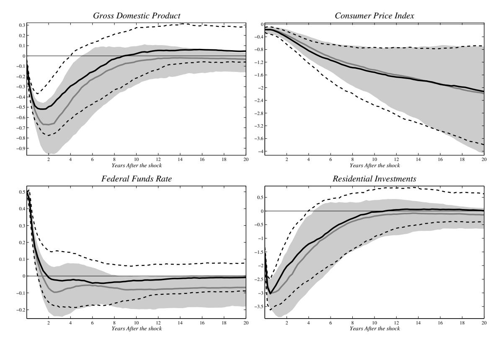
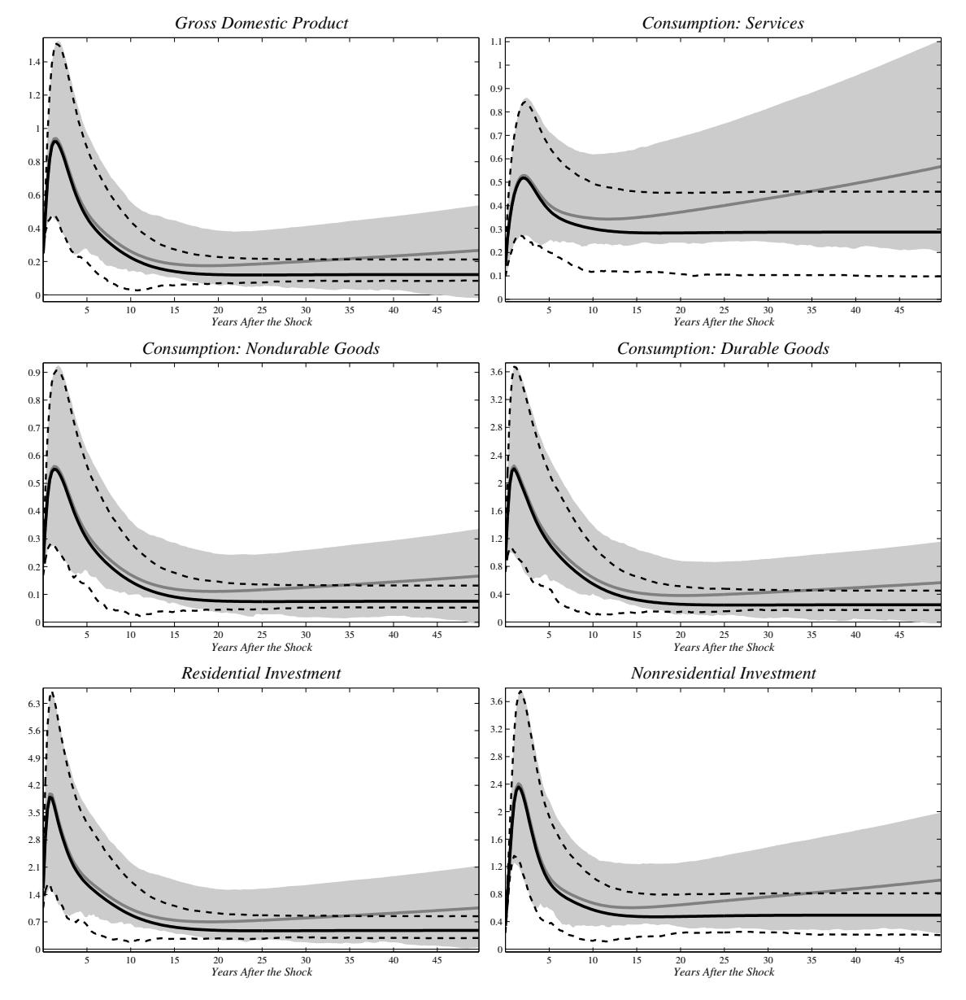

# Finance and Economics Discussion Series Divisions of Research & Statistics and Monetary Affairs Federal Reserve Board, Washington, D.C.

Non-Stationary Dynamic Factor Models for Large Datasets

# Matteo Barigozzi, Marco Lippi, and Matteo Luciani

#### 2016-024

Please cite this paper as:

Barigozzi, Matteo, Marco Lippi, and Matteo Luciani (2016). "Non-Stationary Dynamic Factor Models for Large Datasets," Finance and Economics Discussion Series 2016-024. Washington: Board of Governors of the Federal Reserve System, http://dx.doi.org/10.17016/FEDS.2016.024.

NOTE: Staff working papers in the Finance and Economics Discussion Series (FEDS) are preliminary materials circulated to stimulate discussion and critical comment. The analysis and conclusions set forth are those of the authors and do not indicate concurrence by other members of the research staff or the Board of Governors. References in publications to the Finance and Economics Discussion Series (other than acknowledgement) should be cleared with the author(s) to protect the tentative character of these papers.

# Non-Stationary Dynamic Factor Models for Large Datasets

Matteo Barigozzi<sup>1</sup> Marco Lippi<sup>2</sup> Matteo Luciani<sup>3</sup>

March 4, 2016

#### Abstract

We develop the econometric theory for Non-Stationary Dynamic Factor models for large panels of time series, with a particular focus on building estimators of impulse response functions to unexpected macroeconomic shocks. We derive conditions for consistent estimation of the model as both the cross-sectional size, n, and the time dimension, T, go to infinity, and whether or not cointegration is imposed. We also propose a new estimator for the non-stationary common factors, as well as an information criterion to determine the number of common trends. Finally, the numerical properties of our estimator are explored by means of a MonteCarlo exercise and of a real-data application, in which we study the effects of monetary policy and supply shocks on the US economy.

JEL subject classification: C0, C01, E0.

Key words and phrases: Dynamic Factor models, unit root processes, common trends, impulse response functions.

Special thanks go to Paolo Paruolo and Lorenzo Trapani for helpful comments. This paper has benefited also from discussions with Antonio Conti and Domenico Giannone. This paper was written while Matteo Luciani was chargé de recherches F.R.S.-F.N.R.S., and he gratefully acknowledges their financial support. Of course, any errors are our responsibility.

Disclaimer: the views expressed in this paper are those of the authors and do not necessarily reflect those of the Board of Governors or the Federal Reserve System.

<sup>1</sup>m.barigozzi@lse.ac.uk – London School of Economics and Political Science, UK.

<sup>2</sup>ml@lippi.ws – Einaudi Institute for Economics and Finance, Roma, Italy.

<sup>3</sup>matteo.luciani@frb.gov – Federal Reserve Board of Governors, Washington DC, USA.

# 1 Introduction

Since the early 2000s large-dimensional Dynamic Factor models have become increasingly popular in the economic literature and they are nowadays commonly used by policy institutions. Economists have been attracted by these models because they allow to analyze large panels of time series without suffering of the curse of dimensionality. Furthermore, these models proved successful in forecasting (Stock and Watson, 2002a,b; Forni et al., 2005; Giannone et al., 2008; Luciani, 2014), in the construction of both business cycle indicators and inflation indexes (Altissimo et al., 2010; Cristadoro et al., 2005), and also in policy analysis based on impulse response functions (Giannone et al., 2005; Stock and Watson, 2005; Forni et al., 2009; Forni and Gambetti, 2010; Barigozzi et al., 2014; Luciani, 2015), thus becoming a standard econometric tool in empirical macroeconomic analysis.

Dynamic Factor models are based on the idea that fluctuations in the economy are due to a few macroeconomic common shocks, affecting all the variables, and to several other idiosyncratic shocks resulting from measurement error and/or from sectorial and regional dynamics, and influencing just one or a few variables. Therefore, each variable can be decomposed into a part driven by the common shocks, and a part driven by the idiosyncratic shocks, and by focussing only on the dynamic effects of the macroeconomic shocks, it is easily possible to analyze large databases. Finally, it is normally assumed that the comovement generated by the macroeconomic shocks can be summarized by means of a few latent time series processes, called common factors and capturing the business cycle.

So far, large-dimensional Dynamic Factor models have been studied mainly in a stationary setting, in which case the model can be consistently estimated either with principal components (Forni et al., 2000, 2005; Stock and Watson, 2002a; Bai and Ng, 2002; Bai, 2003), or with Maximum Likelihood by means of the EM algorithm (Watson and Engle, 1983; Doz et al., 2012). Most macroeconomic variables, though, are non-stationary, and therefore the common practice is to take first differences of the data to reach stationarity, before estimating the model. However, despite this practice has been successful in empirical applications, it has the shortcoming that in this setting by construction all common shocks have a permanent effect on the level of most variables. This is at odds with economic theory, as there is full agreement in the macroeconomic literature that while some shocks (such as technology shocks) have indeed permanent effects, thus generating common trends, some others (such as monetary policy shocks) have only transitory effects, thus generating stationary fluctuations around the trend. For example, standard Dynamic Stochastic General Equilibrium models not only imply a factor structure in the data (Giannone et al., 2006), but are also stationary around a common stochastic trend (Del Negro et al., 2007).

In this paper, we incorporate the long-run predictions of macroeconomic theory into Dynamic Factor models for large datasets, also known as Generalized or Approximate Dynamic Factor models. To this end, we develop the econometric theory for Non-Stationary Dynamic Factor models for Large Datasets, with a focus in building a framework useful for empirical macroeconomic analysis.

In detail, we first generalize the stationary Dynamic Factor model by Stock and Watson (2005), Bai and Ng (2007), and Forni et al. (2009) by explicitly addressing the presence of unit roots in the data. Then, based on the existence of a finite VECM representation for the common factors (see Barigozzi et al., 2016, for its derivation), we study estimation of the model and we derive the conditions for estimating consistently all parameters, when both the cross-sectional and time dimensions of the dataset grow to infinity. Consistency results are derived also for the case in which cointegration is not imposed, i.e. when we estimate an unrestricted VAR model for the common factors. Furthermore, we provide an information criterion to determine the number of common trends in large panels.

All the aforementioned results are developed without imposing any stationarity restriction on the idiosyncratic component, an assumption which is shown to be non-realistic, especially when analyzing large macroeconomic databases. Moreover, as a by-product of our estimation strategy we propose a new estimator for the non-stationary common factors, which can be directly employed in the estimation of non-stationary Factor Augmented VAR models (see Bernanke et al., 2005 and Bai and Ng, 2006, for the stationary case).

This paper is complementary to the works of Bai and Ng (2004, 2010) and Bai (2004), and to a lesser extent also of Peña and Poncela (2004). On the one hand Bai and Ng (2004, 2010), having unit root testing in large panels as a goal, focus just on factor estimation but have almost no result for the other parameters of the model, notably for the coefficients of the autoregressive representation of the common factors. On the other hand, the results in Bai (2004), of which Peña and Poncela (2004) is a special case for small datasets, require the assumption of stationary idiosyncratic components. These approaches have been also applied to structural macroeconomic analysis. For example, Eickmeier (2009) estimates impulse responses to analyze the euro area business cycle, and Forni et al. (2014) study the effects of news shocks on the US business cycle. Finally, Banerjee et al. (2014a,b) propose a model where cointegration between the common factors and the data, as well as stationarity of idiosyncratic components, are assumed.

The rest of the paper is organized as follows. In Section 2 we present the model and the assumptions upon which the theory is developed. In Section 3 we describe estimation of the model and we discuss the related asymptotic properties. In Section 4 we present an information criterion for determining the number of common trends in large panels. In Section 5 by means of a MonteCarlo simulation exercise we study the finite sample properties of the estimator. Finally, in Section 6 we use our model to study the impact of monetary policy shocks and of supply shocks on the US economy. In Section 7 we conclude and we discuss possible further applications of the model presented. The proofs of our main results are in Appendix A, while complementary results, needed for the proofs, are in Appendix B.

# 2 The Non-Stationary Dynamic Factor model

In this section we first describe the main features of the Non-Stationary Dynamic Factor model, and then we introduce and discuss its formal assumptions. Hereafter, we say that a vector process  $\mathbf{y}_t$  is I(1) if its first difference  $(1-L)\mathbf{y}_t$  is I(0), where L is the lag-operator, therefore,  $\mathbf{y}_t$  can be I(1) even though some of its coordinates are I(0). We write the autoregressive matrix polynomials as  $\mathbf{A}(L) = \mathbf{A}(0) - \sum_{k=1}^{s_1} \mathbf{A}_k L^k$ , while we write moving average matrix polynomials as  $\mathbf{C}(L) = \sum_{k=0}^{s_2} \mathbf{C}_k L^k$ , where  $s_1, s_2 \geq 0$ .

#### 2.1 The model

In the Non-Stationary Dynamic Factor model each observed variable,  $x_{it}$ , is decomposed into the sum of (i) a common component, which is a linear combination of an r-dimensional I(1)

vector, F<sup>t</sup> , of latent common factors, and (ii) an idiosyncratic component which is also I(1). Formally, let x<sup>t</sup> be an n-dimensional vector, then

$$\mathbf{x}_t = \boldsymbol{\chi}_t + \boldsymbol{\xi}_t, \qquad \boldsymbol{\chi}_t = \boldsymbol{\Lambda} \mathbf{F}_t,$$
 (1)

where χ<sup>t</sup> and ξ<sup>t</sup> are the n-dimensional vectors of common and idiosyncratic components respectively, and Λ is an n × r matrix of factor loadings. The dimension of the dataset n is assumed to be large, or, more formally, we allow for n → ∞.

The vector of common factors is driven by a q-dimensional orthonormal white noise process, ut , whose components are called common shocks. Among these common shocks, q −d of them have permanent effects on F<sup>t</sup> , and hence on x<sup>t</sup> , while the remaining d produce just temporary fluctuations. Formally, we have the ARIMA model

$$\mathbf{S}(L)(1-L)\mathbf{F}_t = \mathbf{Q}(L)\mathbf{u}_t, \quad \mathbf{u}_t \stackrel{\text{i.i.d.}}{\sim} (\mathbf{0}, \mathbf{I}_q), \tag{2}$$

where S(L) is an r × r finite and stable matrix polynomial, and Q(L) is an r × q finite matrix polynomial with rk(Q(1)) = q − d for some d ≥ 0. In general, r < n so that the comovements among a large number of variables can be captured by a small number of processes, and q ≤ r so that the vector of common factors can be singular. In this case we say that F<sup>t</sup> is a rational reduced-rank I(1) family with cointegration rank c = r − q + d and it can be shown that, for generic values of the parameters, the shocks u<sup>t</sup> are fundamental for (1 − L)F<sup>t</sup> , that is u<sup>t</sup> belongs to the space spanned by (1 − L)F<sup>s</sup> for s ≤ t (see Definition 4 and Proposition 4 in Barigozzi et al., 2016).

Finally, the dynamics of each idiosyncratic component is given by

$$(1 - \rho_i L)\xi_{it} = d_i(L)\varepsilon_{it}, \quad \varepsilon_{it} \stackrel{\text{i.i.d.}}{\sim} (0, \sigma_i^2), \quad i = 1, \dots, n,$$
(3)

where di(L) is a, possibly infinite, polynomial, and |ρ<sup>i</sup> | ≤ 1, thus allowing both for stationary and non-stationary components. Moreover, we allow for cross-sectional dependence among the innovations εit's and in this sense we speak of generalized or approximate factor structure as firstly defined by Chamberlain and Rothschild (1983).

The goal of this paper is then to estimate model (1)-(3), with a particular focus on the impulse response functions of the variables x<sup>t</sup> to the common shocks u<sup>t</sup> , defined as

$$\mathbf{\Phi}(L) = \mathbf{\Lambda}[\mathbf{S}(L)(1-L)]^{-1}\mathbf{Q}(L). \tag{4}$$

In order to estimate (4), we need to overcome two main difficulties. First, the common factors, Ft , are unknown, and second we need an estimator of the ARIMA parameters, S(L) and Q(L), in (2), with the constraint that rk(Q(1)) = q − d.

Before discussing estimation, a number of features of model (1)-(3) are worth a comment. First, we are mainly interested in the singular case r > q. Indeed, there exists large empirical evidence supporting singularity of the vector of common factors for US macroeconomic databases (see, among others, Giannone et al., 2005; Amengual and Watson, 2007; Forni and Gambetti, 2010; Luciani, 2015) and also for euro area datasets (see, for example, Barigozzi et al., 2014). Such results can be easily understood observing that the static equation (1) is just a convenient representation derived from a more "primitive" set of dynamic equations linking the common component χ<sup>t</sup> to the common shocks u<sup>t</sup> . Indeed, by substituting (2) into (1), we have the fully-dynamic representation

$$\mathbf{x}_t = \mathbf{\Lambda}[\mathbf{S}(L)(1-L)]^{-1}\mathbf{Q}(L)\mathbf{u}_t + \boldsymbol{\xi}_t.$$
 (5)

For a general analysis of the relationship between representation (1) and the "deeper" dynamic representation (5), see e.g. Stock and Watson (2005), Bai and Ng (2007), and Forni et al. (2009). Moreover, a representation like (5) naturally arises when the model is estimated at a frequency which is lower than the one at which data are observed.<sup>1</sup> Therefore, singularity of  $\mathbf{F}_t$ , i.e. r > q, is assumed throughout the present paper. Nevertheless, all estimation results presented in Section 3 hold also when r = q.

Second, while there is not an agreement in the economic literature on what is the relative importance of demand side and supply side shocks in driving short-run macroeconomic fluctuations, there is agreement that in the long run what matters are supply side shocks. For example, there is agreement that monetary policy shocks generate only short run dynamics, while technology shocks generate stochastic trends. Since the decisions of the central bank affect the whole economy, and similarly does a given technological advancement, both monetary policy shocks and technology shocks are naturally assumed to be part of  $\mathbf{u}_t$  when considering a macroeconomic panel. This line of reasoning has two clear implications for our model: (i) the vector of common factors must have some unit root, say q - d, (technology shocks induce common trends), while (ii) some shocks, say d > 0, must have just transitory effects on the observed variables (monetary policy shocks have no long run effects).

Third, the choice of allowing some idiosyncratic components to be I(1) is also driven by a general macroeconomic argument. Consider the simplest case in which the factors are not singular (r = q) and are not cointegrated (d = 0). Then, every p-dimensional sub-vectors (with p > r) of the n-dimensional common-component vector  $\chi_t$  are trivially cointegrated and therefore stationarity of the idiosyncratic components would imply that all p-dimensional sub-vectors (with p > r) of the n-dimensional dataset  $\mathbf{x}_t$  are cointegrated with cointegration rank p-r, a conclusion which is at odds with what is observed in the macroeconomic datasets analysed in the empirical Dynamic Factor model literature. The same reasoning applies, a fortiori, to the case in which the factors are singular (r > q) and possibly cointegrated  $(d \ge 0)$ . Then, under the assumption of stationarity of the idiosyncratic components, every p'-dimensional sub-vectors (with p' > q-d) of the n-dimensional dataset  $\mathbf{x}_t$  would be cointegrated (see Proposition 5 in Barigozzi et al., 2016). Notice that with respect to the non-singular case we can have p' < r hence cointegration can be found in even smaller subsets of variables.

The implausibility of a stationary idiosyncratic component is also confirmed empirically in Section 6 where about half of the estimated idiosyncratic components are found to be non-stationary according to the test of Bai and Ng (2004). This finding is for example related to the existence of sectoral trends which are not captured by economy-wide factors and are therefore idiosyncratic. For all these reasons, assuming stationarity of all idiosyncratic components seems to be a too strong restriction.

Summing up, we are imposing three requirements on our model: (i) r > q, (ii) d > 0, and (iii)  $\xi_t \sim I(1)$ . Apart from these three requirements, which are either driven by economic theory, or by stylized facts observed on macroeconomic databases, we are not imposing any particular constraint neither on the law of motion of  $\mathbf{F}_t$ , nor on the law of motion of  $\boldsymbol{\xi}_t$ .

<sup>&</sup>lt;sup>1</sup>To see this, let  $\mathbf{x}_t^m$  be a vector of non-stationary variables observed at month t, and suppose that the true model is  $\mathbf{x}_t^m = \mathbf{\Lambda} f_t^m + \boldsymbol{\xi}_t^m$ , where for semplicity r = 1. Now, if we estimate the model at quarterly frequency the correct model to be estimated is  $\mathbf{x}_t^q = \mathbf{\Lambda} \mathbf{f}_t^q + \boldsymbol{\xi}_t^q$ , where  $\mathbf{f}_t^q$  is of dimension  $3 \times 1$  but of rank 1. Indeed, by using the approximation of Mariano and Murasawa (2003), we have that  $\mathbf{x}_t^q = (1 + L + L^2)\mathbf{x}_t^m$ , so that  $\mathbf{f}_t^q = \mathbf{\Lambda}(1 + L + L^2)f_t^m$ .

Indeed, (2) describes a generic multivariate ARIMA process for the factors, and (3) describes a generic ARMA process with a possible unit root for the idiosyncratic components.

#### 2.2 Representation results

Let us for the moment assume to know the common factors and let us focus on parameters' estimation. If we had r = q, then Engle and Granger (1987) prove that there exists a VECM representation for F<sup>t</sup> with d cointegration relations. However, in this non-singular case the VECM representation is motivated only as an approximation to an infinite autoregressive model with exponentially declining coefficients. Moreover, when r = q the shocks u<sup>t</sup> driving (2) might be non-fundamental, in which case the estimated VECM residuals will not span the same space as the space spanned by u<sup>t</sup> (see e.g. Alessi et al., 2011, for some examples).

On the other hand, in the singular case, r > q, the shocks u<sup>t</sup> are generically fundamental, as we said above, and the following Proposition gives us the correct autoregressive representation for the vector of common factors, which is the starting point for estimating the impulse response functions.

Proposition 1 (Granger Representation Theorem for reduced-rank I(1) vectors) Assume that F<sup>t</sup> is a rational reduced-rank I(1) family with cointegration rank c = r − q + d, then, for generic values of the parameters in (2): (i) there exists a r × c full-rank matrix β such that β <sup>0</sup>F<sup>t</sup> is weakly stationary with rational spectral density and (ii) F<sup>t</sup> has the VECM representation

$$\mathbf{G}(L)(1-L)\mathbf{F}_t = \mathbf{h} + \alpha \beta' \mathbf{F}_{t-1} + \mathbf{K}\mathbf{u}_t, \tag{6}$$

where G(L) is an r × r matrix polynomial of finite degree p with G(0) = Ir, h is an r × 1 constant vector, α is a full-rank r × c matrix, and K is r × q with K = S(0)−1Q(0).

Proof: see Section 3 and Proposition 3 Barigozzi et al. (2016).

With respect to the classical case in which r = q, notice that, while the number of permanent shocks, q − d, is obtained as usual as r minus the cointegration rank the number of transitory shocks, d, is obtained as the complement of the number of permanent shocks to q, not to r, as though r − q transitory shocks had a zero coefficient.

By rewriting (6) as a VAR, we have

$$\mathbf{A}(L)\mathbf{F}_t = \mathbf{h} + \mathbf{K}\mathbf{u}_t,\tag{7}$$

where A(L) is a matrix polynomial of degree p + 1 with A(0) = Ir, A<sup>1</sup> = (G<sup>1</sup> + αβ<sup>0</sup> + Ir), A<sup>i</sup> = G<sup>i</sup> − Gi−<sup>1</sup> for i = 2, . . . , p, and Ap+1 = −Gp, hence A(1) = −αβ<sup>0</sup> and we have r − c = q − d unit roots. From (7) the impulse response functions (4) become

$$\mathbf{\Phi}(L) = \mathbf{\Lambda} \mathbf{A}(L)^{-1} \mathbf{K}.$$
 (8)

The main contribution of this paper is then to provide a consistent estimator of (8) when the common factors, F<sup>t</sup> , are not observed.

Finally, it has to be noticed that, if d = 0, then Anderson and Deistler (2008a,b) prove that generically there exists a finite degree left inverse of Q(L) such that (2) can be written as a VAR in first differences

$$\mathbf{B}(L)(1-L)\mathbf{F}_t = \mathbf{K}\mathbf{u}_t,\tag{9}$$

where  $\mathbf{B}(L)$  is a stable matrix polynomial of finite degree and  $\mathbf{K} = \mathbf{S}(0)^{-1}\mathbf{Q}(0)$  (see also Proposition 1 in Barigozzi et al., 2016). In this case the impulse response functions are given by

$$\mathbf{\Phi}(L) = \mathbf{\Lambda}[\mathbf{B}(L)(1-L)]^{-1}\mathbf{K},\tag{10}$$

which shows that all q common shocks have permanent effect on the variables. In this case, estimation of (10) is straightforward (see for example Forni et al., 2009): (i) reduce the data  $\mathbf{x}_t$  to stationarity by taking first differences, (ii) estimate the differenced factors  $(1-L)\mathbf{F}_t$  and their loadings  $\mathbf{\Lambda}$  by means of the principal components of  $(1-L)\mathbf{x}_t$ , and (iii) estimate a VAR like (9) for  $(1-L)\mathbf{F}_t$ .

As a last remark, notice that the use of inverse polynomial matrices in (4), (8), and (10) is convenient and makes sense provided that we do not forget that they are not square summable.

#### 2.3 Assumptions

We now introduce a set of formal assumptions that allow us to better characterize the Non-Stationary Dynamic Factor model. We consider an n-dimensional stochastic process  $\{\mathbf{x}_t = (x_{1t} \dots x_{nt})' : n \in \mathbb{N}, t \in \mathbb{Z}\}$  described by equations (1)-(3). We assume that this and all other stochastic variables in this paper belong to the Hilbert space  $L_2(\Omega, \mathcal{A}, P)$ , where  $(\Omega, \mathcal{A}, P)$  is some given probability space. Moreover, since the asymptotic results given in Section 3 require  $n \to \infty$ , all the following assumptions hold for any  $n \in \mathbb{N}$ . Similar assumptions and results to those given in this section can also be found, for example, in Stock and Watson (2002a), Bai and Ng (2002), Forni et al. (2009) in a stationary setting, and in Bai and Ng (2004) and Bai (2004) in a non-stationary framework.<sup>2</sup>

First, we assume some general properties for the observed panel  $\mathbf{x}_t$ .

#### Assumption 1 (Observables)

a.  $\Delta \mathbf{x}_t$  has rational spectral density;

b.  $\mathbf{x}_{t} \sim I(1);$ 

c.  $\mathsf{E}[\Delta x_{it}] = 0$  for any  $i \in \mathbb{N}$ .

Assumption 1b specifies that the vector of observables is non-stationary but can have some I(0) coordinates. For simplicity, in part c we exclude deterministic trends, while in principle  $x_{it}$  can have a constant non-zero mean. Since deterministic trends might affect estimation this case is discussed at the end of Section 3 and its economic interpretation is given in Section 6.

The first differences of the common component and of the common factors are defined by equations (1) and (2), which can also be written as

$$\Delta \chi_t = \Lambda \Delta \mathbf{F}_t, \tag{11}$$

$$\Delta \mathbf{F}_t = \mathbf{C}(L)\mathbf{u}_t,\tag{12}$$

where, for any  $n \in \mathbb{N}$ , the loadings matrix  $\Lambda$  is  $n \times r$ , with r finite and independent of n, and  $\mathbf{C}(L) = \mathbf{S}(L)^{-1}\mathbf{Q}(L)$  is an  $r \times q$  infinite matrix polynomial, with q < r. Notice that, as an immediate consequence of Assumption 1c, we have  $\mathsf{E}[\Delta \mathbf{F}_t] = \mathbf{0}$ . The properties of (12) are described by means the next assumption.

Hereafter, for ease of notation, we denote the first differences of a process as  $\Delta \mathbf{x}_t \equiv (1 - L)\mathbf{x}_t$ , and we denote by  $M_1, M_2 \dots$  generic positive finite constants.

#### Assumption 2 (Common Shocks)

```
a. u_{it} \stackrel{i.i.d.}{\sim} (0,1) and \mathsf{E}[u_{it}^4] < \infty, for any i=1,\ldots,q;

b. if i \neq j then u_{it} and u_{js} are independent for any t,s \in \mathbb{Z} and i,j=1,\ldots,q;

c. u_{it}=0 for any t \leq 0 and i=1,\ldots,q;

d. \mathbf{C}(L) = \sum_{k=0}^{\infty} \mathbf{C}_k L^k and \sum_{k=0}^{\infty} k||\mathbf{C}_k|| \leq M_2 < \infty;
\ne. \mathbf{C}(0)'\mathbf{C}(0) is positive definite;

f. \mathsf{rk}(\mathbf{C}(1)) = q - d with 0 < d < q;

g. \mathsf{rk}(\sum_{k=0}^{\infty} \mathbf{C}_k \mathbf{C}_k') = r.
```

Assumptions 2a and 2b imply that  $\mathsf{E}[\mathbf{u}_t\mathbf{u}_t'] = \mathbf{I}_q$ , and that  $\mathbf{u}_t$  and  $\mathbf{u}_{t-k}$  are independent for any  $k \neq 0$ , hence  $\mathbf{u}_t$  is an orthonormal strong white noise process. In part c, for simplicity and without loss of generality, we fix initial conditions to zero, in particular this implies  $\mathbf{F}_0 = \mathbf{0}$ , and therefore  $\mathsf{E}[\mathbf{F}_t] = \mathbf{0}$ , and  $\mathbf{h} = \mathbf{0}$ . Part d implies square summability of the coefficients of each entry of the matrix polynomial, while part e allows for estimation of  $\mathbf{C}(0)$ . Parts d and g guarantee that all eigenvalues of the covariance matrix of the common factors are finite and positive. Under the above conditions (i) the sample covariance matrix of  $\Delta \mathbf{F}_t$  is a consistent estimator of the covariance  $\mathsf{E}[\Delta \mathbf{F}_t\Delta \mathbf{F}_t']$  and (ii) the usual asymptotic results for I(1) processes by Phillips and Durlauf (1986) and Phillips and Solo (1992) hold for  $\mathbf{F}_t$  (for a proof see Lemma 7 and 8 in Appendix B, respectively).

Assumption 2f implies the existence of q-d shocks with permanent effects. Therefore,  $\mathbf{F}_t$  have the "common trends" decomposition (Stock and Watson, 1988)

$$\mathbf{F}_{t} = \mathbf{C}(1) \sum_{s=0}^{\infty} \mathbf{u}_{t-s} + \check{\mathbf{C}}(L)\mathbf{u}_{t} = \psi \eta' \sum_{s=0}^{\infty} \mathbf{u}_{t-s} + \check{\mathbf{C}}(L)\mathbf{u}_{t},$$
(13)

where  $\psi$  is  $r \times q - d$ ,  $\eta$  is  $q \times q - d$ , and  $\check{\mathbf{C}}(L)$  is an  $r \times q$  infinite matrix polynomial (and also square summable because of Assumption 2d). The first term in (13) contains the q-d common trends. Given Assumptions 1 and 2, the common factors,  $\mathbf{F}_t$ , are said to be a rational reduced rank I(1) family with cointegration rank c = r - q + d. Therefore,  $\mathbf{F}_t$  satisfy Proposition 1, that is, even in the singular case r > q,  $\mathbf{F}_t$  admit the VECM representation in (6) with c cointegration vectors given by the columns of an  $r \times c$  matrix, which we denote by  $\boldsymbol{\beta}$ . Let us stress again that in this case the number of transitory shocks is d, and not c, as if r - q transitory shocks had a zero coefficient. Notice also that we can always define the permanent and transitory shocks as  $\boldsymbol{\eta}'\mathbf{u}_t$  and  $\boldsymbol{\eta}'_{\perp}\mathbf{u}_t$ , respectively, where  $\boldsymbol{\eta}_{\perp}$  is  $q \times d$ , and by using these definitions we can represent  $\mathbf{F}_t$  as a sum of a permanent and a transitory component, where the former contains the common trends in (13). It is straightforward to see that other well known "permanent-transitory" decompositions can be derived also in our setting, as for example, those proposed by Johansen (1991), Vahid and Engle (1993), Escribano and Peña (1994), Gonzalo and Granger (1995), and Gonzalo and Ng (2001), among others.

A remark about the meaning of common factors in order.

**Remark 1** Since  $\mathbf{F}_t$  are not identified in the model, then, if we define  $\mathbf{F}_t^* = \mathbf{H}^{-1}\mathbf{F}_t$  for an  $r \times r$  invertible matrix  $\mathbf{H}$ , we still have a factor model for  $\mathbf{x}_t$ :

$$\mathbf{x}_t = \mathbf{\Lambda}^* \mathbf{F}_t^* + \boldsymbol{\xi}_t, \qquad (1 - L) \mathbf{F}_t^* = \mathbf{C}^* (L) \mathbf{u}_t, \tag{14}$$

<sup>&</sup>lt;sup>3</sup>Obviously part g is compatible with (12) since the rank of sum of matrices is smaller or equal than the sum of the ranks and here we are summing infinite of those matrices.

where  $\Lambda^* = \Lambda \mathbf{H}$  and  $\mathbf{C}^*(L) = \mathbf{H}^{-1}\mathbf{C}(L)$ . In particular, if  $\mathbf{H}^{-1} = (\psi'_{\perp} \psi')'$ , where  $\psi$  is defined in (13), the first c coordinates of  $\mathbf{F}_t^*$  are I(0) and the remaining r-c are I(1). Moreover, also  $\mathbf{F}_t^*$  satisfies Proposition 1 with cointegration vectors given by the columns of the  $r \times c$  matrix  $\beta^* = \mathbf{H}' \beta$  such that the error vector  $\beta^{*'} \mathbf{F}_{t-1}^*$  is made of linear combinations of the I(0)factors alone. This reasoning shows that our model is compatible with the presence of some stationary common factors. On the other hand, since  $\mathbf{F}_t$  have no economic meaning, we can always assume without loss of generality that every coordinate of  $\mathbf{F}_t$  is I(1).

The properties of the common component are then completely characterized by Assumption 2 and the following identifying assumption on factor loadings.

#### Assumption 3 (Loadings)

- a.  $n^{-1}\Lambda'\Lambda \to V$ , as  $n \to \infty$ , where V is  $r \times r$ , positive definite;
- b. the entries  $\lambda_{ij}$  of  $\Lambda$  are such that  $\sup_{i \in \mathbb{N}} \max_{j=1,\dots,r} |\lambda_{ij}| \leq M_1 < \infty$ .

As the common factors are not identified, then also the loadings are not identified. However, consistently with Assumption 3a, and without any loss of generality, we can always impose the identifying restriction  $n^{-1}\Lambda'\Lambda = \mathbf{I}_r$ , which is therefore assumed throughout the rest of the paper. Under this restriction, we can estimate the loadings up to an orthogonal transformation and we can immediately derive the asymptotic behaviour of the eigenvalues of the covariance and spectral density matrices of  $\Delta \chi_t$  (see respectively Lemma 2 and 6, below). Moreover, Assumption 3 implies that the common factors have a pervasive effect on all series. In particular, since  $\Lambda$  has full-rank and given the decomposition in (13) and the definition of impulse responses in (8), we see that only q-d common shocks can have a permanent effect on the observed variables  $\mathbf{x}_t$ . Furthermore, notice that it is always possible to have some loadings cancelling the long-run effect of permanent shocks on the observed variables, hence, our model is compatible with the presence of stationary components in  $\mathbf{x}_t$ , in agreement with Assumption 1b.

The model for the idiosyncratic component, (3), can be written in vector notation as

$$(\mathbf{I}_n - \mathbf{P}L)\boldsymbol{\xi}_t = \mathbf{D}(L)\boldsymbol{\varepsilon}_t,\tag{15}$$

where **P** is an  $n \times n$  diagonal matrix with generic element  $\rho_i$ , and  $\mathbf{D}(L)$  is an  $n \times n$  diagonal matrix polynomial, while the elements of  $\varepsilon_t$  are allowed to be weakly dependent as specified below. Notice that, as an immediate consequence of Assumption 1c, we have  $\mathsf{E}[\Delta \boldsymbol{\xi}_t] = \mathbf{0}$ . Model (15) is completely characterized by the next assumption.

#### Assumption 4 (Idiosyncratic Components)

- a. For any  $n \in \mathbb{N}$ , there exists an  $m \in \mathbb{N}$  with m(n) < n which partitions **P** in two blocks of size m and n-m, such that  $\rho_i = 1$  if  $i \leq m$  and  $|\rho_i| < 1$  otherwise;
- b.  $\varepsilon_{it} = 0$  for any  $t \leq 0$  and for any  $i \in \mathbb{N}$ ;
- c.  $\mathbf{D}(L)$  is diagonal with entries  $d_i(L) = \sum_{k=0}^{\infty} d_{ik} L^k$  with  $\sup_{i \in \mathbb{N}} \sum_{k=0}^{\infty} k |d_{ik}| \le M_3 < \infty$ ;
- d.  $\varepsilon_{it} \stackrel{i.i.d.}{\sim} (0, \sigma_i^2)$  with  $0 < \sigma_i^2 < \infty$  and  $\mathsf{E}[|\varepsilon_{it}|^{\kappa_1}|\varepsilon_{jt}|^{\kappa_2}] < \infty$  for any  $\kappa_1 + \kappa_2 = 4$  and  $i, j \in \mathbb{N}$ ; e. if  $s \neq t$  and  $i \neq j$  then  $\varepsilon_{it}$  and  $\varepsilon_{js}$  are independent for any  $s, t \in \mathbb{Z}$  and  $i, j \in \mathbb{N}$ ;
- f.  $\max_{j=1,\dots,n} \sum_{i=1}^{n} |\mathsf{E}[\varepsilon_{it}\varepsilon_{jt}]| \leq M_4 < \infty \text{ for any } n \in \mathbb{N}.$

Assumption 4 characterizes the behavior of the idiosyncratic component as well as the properties of the vector of idiosyncratic innovations  $\varepsilon_t = (\varepsilon_{1t} \dots \varepsilon_{nt})'$ . In part a, we allow for  $m \leq n$  idiosyncratic components to be I(1) while all others are I(0). In particular, m can grow with the cross-sectional dimension n. In part b, for simplicity and without loss of generality, we fix initial conditions to zero, which implies  $\xi_0 = \mathbf{0}$ , and therefore  $\mathsf{E}[\xi_t] = \mathbf{0}$ . Part c implies square summability of the matrix polynomials in (3) so that  $\xi_{it}$  is non-stationary if and only if  $\rho_i = 1$ . In parts d and e we exclude serial-dependence in  $\varepsilon_t$ , but we do not rule out cross-sectional dependence in  $\varepsilon_t$ , which indeed is possible when two innovations are contemporaneous. Therefore, given the dynamic loadings of  $\varepsilon_t$ , the components of  $\Delta \xi_t$  are allowed to be both cross-sectionally and serially correlated. In part f, we limit the size of that dependence by bounding the column norm of the covariance matrix of idiosyncratic shocks, thus requiring a mild form of sparsity as proposed by Fan et al. (2013) and found empirically in a stationary setting by Boivin and Ng (2006), Bai and Ng (2008), and Luciani (2014). Moreover, as an immediate consequence of part f, we have the following Lemma which provides a bound for the eigenvalues,  $\mu_i^{\varepsilon}$ , of the covariance matrix of idiosyncratic shocks.

**Lemma 1** Under Assumptions 4d, e, and f,  $\mu_1^{\varepsilon} \leq M_4 < \infty$  and  $n^{-1} \sum_{i=1}^n \sum_{j=1}^n |\mathsf{E}[\varepsilon_{it}\varepsilon_{jt}]| \leq M_4 < \infty$  for any  $n \in \mathbb{N}$ .

#### **Proof:** see Appendix A.

As noticed above Lemma 1 and the MA component in (15) imply that the spectral density of  $\Delta \boldsymbol{\xi}_t$  is in general not diagonal, thus we say that  $\Delta \mathbf{x}_t$  has an "approximate dynamic factor structure" as the one originally proposed by Forni and Lippi (2001) and Forni et al. (2000).<sup>4</sup>

We then impose independence of common shocks and idiosyncratic innovations.

**Assumption 5** 
$$u_{jt}$$
 and  $\varepsilon_{is}$  are independent for any  $j = 1, ..., q$ ,  $i \in \mathbb{N}$ , and  $t, s \in \mathbb{Z}$ .

This requirement is in agreement with the economic interpretation of the model for which common and idiosyncratic shocks are two independent sources of variation. However, from a technical point of view we could easily relax this assumption by requiring only weak dependence (see, for example, Assumption D in Bai and Ng, 2002, but in a stationary setting). Moreover, as an immediate consequence of Assumption 5, we have  $\mathsf{E}[\Delta\chi_{it}\Delta\xi_{js}]=0$  for any  $i,j\in\mathbb{N}$  and  $t,s\in\mathbb{Z}$ .

To conclude, the following Lemma shows the asymptotic behaviour of the eigenvalues,  $\mu_j^{\Delta x}$ ,  $\mu_j^{\Delta \chi}$ , and  $\mu_j^{\Delta \xi}$ , of the covariance matrices for the model in first differences.

 $\begin{array}{ll} \textbf{Lemma 2} & \textit{Under Assumptions 1-5, and for any } n \in \mathbb{N}, \\ i. & 0 < \underline{M}_5 \leq n^{-1}\mu_j^{\Delta\chi} \leq \overline{M}_5 < \infty \ \textit{for any } j = 1, \dots, r; \\ ii. & \mu_1^{\Delta\xi} \leq M_6 < \infty; \\ iii. & 0 < \underline{M}_7 \leq n^{-1}\mu_j^{\Delta x} \leq \overline{M}_7 < \infty \ \textit{for any } j = 1, \dots, r; \\ iv. & \mu_{r+1}^{\Delta x} \leq M_6 < \infty. \end{array}$ 

#### **Proof:** see Appendix A.

<sup>&</sup>lt;sup>4</sup>Notice that, while here we model cross-sectional dependence of idiosyncratic components,  $\Delta \xi_t$ , via the cross-sectional dependence in the innovations  $\varepsilon_t$ , we could equivalently consider (3) as driven by cross-sectionally independent idiosyncratic shocks having dynamic loadings with dependence structure analogous to the one assumed in part f for  $\varepsilon_t$ . This alternative representation is adopted for example in Forni et al. (2015a,b).

The results in Lemma 2 imply that from the model in first differences we can disentangle the common component from the idiosyncratic component, for example by means of principal component analysis. In this way we can estimate the number of common factors and reconstruct consistently the space spanned by the loadings, which constitutes the starting point also for estimating the model in levels. In the same way, in Section 4, by studying the spectral density matrix of  $\Delta \mathbf{x}_t$ , which is the sum of a common and an idiosyncratic spectral density, and the corresponding eigenvalues, we can determine the number of common trends driving the model. Finally, notice that linear divergence of eigenvalues corresponds to the very natural idea that the influence of the common factors is in some sense "stationary along the cross-section", which seems to be a quite sensible assumption.

Lastly in Assumption 7 in Appendix A we require the eigenvalues of the covariance end spectral density matrices of  $\Delta \chi_t$  to be distinct.

#### 3 Estimation

We now turn to estimation of the Non-Stationary Dynamic Factor model presented in the previous section. We assume to observe an n-dimensional vector  $\mathbf{x}_t$  with sample size T+1, i.e. we observe a  $n \times (T+1)$  panel  $\mathbf{x} = (\mathbf{x}_0 \dots \mathbf{x}_T)^{.5}$  Since we consider large datasets, we focus on the case in which both the cross-sectional dimension n and the sample size T are large so double asymptotics is considered. In particular, following Stock and Watson (2002a), we require that  $n, T \to \infty$  jointly or, equivalently, that n = n(T) with  $\lim_{T\to\infty} n(T) = \infty$ . Finally, in this section we assume to know the number of common factors r, of common shocks q, and of the cointegration relations c = r - q + d. We refer to the next section for a discussion on how to determine these quantities.

The estimation method we propose is analogous to the one proposed by Forni et al. (2009) and Stock and Watson (2005) in a stationary setting and it is based on three steps: (i) we extract the common factors and their loadings, (ii) we estimate the law of motion of the factors by exploiting their autoregressive representation given in Proposition 1, and (iii) we recover the space spanned by the common shocks and, if needed, we identify them by imposing a suitable set of restrictions based on economic theory.

Throughout, we denote estimated quantities with  $\hat{}$ , where these depend on both n and T and we denote the spectral norm of a generic matrix  $\mathbf{B}$  as  $||\mathbf{B}|| = (\mu_1^{\mathbf{B}'\mathbf{B}})^{1/2}$ , where  $\mu_1^{\mathbf{B}'\mathbf{B}}$  is the largest eigenvalue of  $\mathbf{B}'\mathbf{B}$ .

#### 3.1 Loadings and common factors

Since the loadings,  $\Lambda$ , in the model in first differences, i.e.  $\Delta \mathbf{x}_t = \Lambda \Delta \mathbf{F}_t + \Delta \boldsymbol{\xi}_t$ , are the same as those in model (1) in levels, then they can be estimated by means of principal component analysis on  $\Delta \mathbf{x}_t$ .

Define the  $n \times T$  data matrix  $\Delta \mathbf{x} = (\Delta \mathbf{x}_1 \dots \Delta \mathbf{x}_T)$ . The estimated loadings are given by  $n^{1/2}$ -times the first r normalized eigenvectors of the  $n \times n$  sample covariance matrix  $T^{-1}\Delta \mathbf{x} \Delta \mathbf{x}'$ . Consistency of this estimator is in the following Lemma.

<sup>&</sup>lt;sup>5</sup>Notice that while we set  $\mathbf{x}_0 = \mathbf{0}$  in order to simplify notation in the proofs of the following results, this needs not to be imposed in practice.

**Lemma 3** Under Assumptions 1-5 and 7a, and if  $n^{-1}\Lambda'\Lambda = \mathbf{I}_r$ , there exists an  $r \times r$  orthogonal matrix **H** such that, for n and T sufficiently large,  $n^{-1/2}||\widehat{\mathbf{\Lambda}} - \mathbf{\Lambda} \mathbf{H}'|| = O_p(\max(n^{-1}, T^{-1/2}))$ or, equivalently,  $||n^{-1}\widehat{\mathbf{\Lambda}}'\mathbf{\Lambda}\mathbf{H}' - \mathbf{I}_r|| = O_p(\max(n^{-1}, T^{-1/2})).$ 

#### **Proof:** see Appendix A.

Consistently with the fact that loadings are not identified, this Lemma shows that we can just recover the space they span. In principle the identifying matrix, H, could be any invertible matrix. However, since by construction our estimator is such that  $n^{-1}\widehat{\Lambda}'\widehat{\Lambda} = \mathbf{I}_r$ , we can consistently restrict the true loadings matrix,  $\Lambda$ , to be orthogonal and, as a consequence, the choice of **H** is limited to orthogonal matrices only. Notice that there is no loss of generality in this choice as all following results would equally apply for any invertible matrix, **H**. Our derivation of the result in Lemma 3 is similar to the approach by Forni et al. (2009) and Fan et al. (2013), while alternative proofs are in Stock and Watson (2002a) and Bai (2003).

Given the estimated loadings, the common factors can be estimated by projecting the data  $\mathbf{x}_t$  onto the space spanned by the estimated loadings, at any given point in time  $t = 0, \dots, T$ ,

$$\widehat{\mathbf{F}}_t = (\widehat{\mathbf{\Lambda}}' \widehat{\mathbf{\Lambda}})^{-1} \widehat{\mathbf{\Lambda}}' \mathbf{x}_t = \frac{\widehat{\mathbf{\Lambda}}' \mathbf{x}_t}{n}.$$
 (16)

The estimator of the differenced factors is then defined as  $\Delta \hat{\mathbf{F}}_t \equiv (1-L)\hat{\mathbf{F}}_t$ . The factor estimator in (16) is new to this paper and here we study the asymptotic properties of its sample second moments, which are needed for deriving our main results. In particular, as  $n, T \to \infty$ , we can prove that (see Lemma 8 and 12 in Appendix B for details)

- i.  $T^{-1} \sum_{t=1}^{T} \Delta \widehat{\mathbf{F}}_t \Delta \widehat{\mathbf{F}}_t' \stackrel{p}{\to} \mathsf{E}[\Delta \mathbf{F}_t \Delta \mathbf{F}_t'];$ \nii.  $T^{-2} \sum_{t=1}^{T} \widehat{\mathbf{F}}_t \widehat{\mathbf{F}}_t' \stackrel{d}{\to} \int_0^1 \mathbf{W}(\tau) \mathbf{W}'(\tau) \mathrm{d}\tau$ , for an r-dimensional random walk,  $\mathbf{W}(\cdot)$  with positive definite and finite covariance matrix.

Alternatively, following Bai and Ng (2004) we can obtain the factors in levels by integrating their estimated first differences, which are in turn obtained by projecting  $\Delta \mathbf{x}_t$  on the space spanned by the estimated loadings. Under Assumptions 1-5 this approach and (16) are asymptotically equivalent, however, finite sample differences might arise when dealing with deterministic trends, as briefly described at the end of this section. Furthermore, as proposed by Bai (2004), if all idiosyncratic components were stationary (m = 0 in Assumption 4a), the factors could also be estimated by means of approximate principal component analysis applied directly on the data,  $\mathbf{x}_t$ . However, for the reasons already discussed, we do not consider this case in what follows.

To conclude this section, notice that, in general, when the ratio n/T is non-negligible, then the eigenvalues and eigenvectors of the covariance matrix of  $\Delta \mathbf{x}_t$  might not be consistently estimated from the sample covariance matrix (see e.g. Johnstone and Lu, 2009). However, when, as shown in Lemma 2, we are in the presence of r very spiked eigenvalues, then it is still possible to use the corresponding r eigenvectors of the sample covariance matrix in order to retrieve a consistent estimate of the loadings (see the proof of Lemma 3 and also Fan et al., 2013, for details).<sup>6</sup>

<sup>&</sup>lt;sup>6</sup>Alternatively, when n > T Bai and Ng (2002, 2004) propose to estimate the first difference of the factors,  $\widehat{\Delta \mathbf{F}} = (\widehat{\Delta \mathbf{F}}_1 \dots \widehat{\Delta \mathbf{F}}_T)$ , as  $\sqrt{T}$ -times the first r normalized eigenvectors of the  $T \times T$  matrix  $n^{-1} \Delta \mathbf{x}' \Delta \mathbf{x}$ , and then to estimate the loadings as  $T^{-1}\Delta \mathbf{x} \widehat{\Delta \mathbf{F}}'$ . This approach however would require more restrictive assumptions on the serial dependence of the first difference of idiosyncratic components.

#### 3.2 VECM for the common factors

In line with the result in Proposition 1, we then consider a VECM with c = r - q + d cointegration relations for the common factors

$$\Delta \mathbf{F}_t = \alpha \beta' \mathbf{F}_{t-1} + \mathbf{G}_1 \Delta \mathbf{F}_{t-1} + \mathbf{w}_t, \quad \mathbf{w}_t = \mathbf{K} \mathbf{u}_t, \tag{17}$$

where, for simplicity, we consider the case of one lag, p = 1, and we set  $\mathbf{h} = \mathbf{0}$  as a consequence of Assumption 2c.

Many different estimators for the cointegration vector,  $\beta$ , are possible. As suggested by the asymptotic and numerical studies in Phillips (1991) and Gonzalo (1994), we opt for the estimation approach proposed by Johansen (1988, 1991, 1995) and typically derived from the maximisation of a Gaussian likelihood. However, it has to be noticed that the same estimator is also the solution of an eigen-problem naturally associated to a reduced rank regression model, where no specific assumption about the distribution of the errors is made in order to establish consistency (see e.g. Velu et al., 1986).

Since  $\mathbf{F}_t$  are unknown, we estimate the parameters of (17) by using the estimated factors  $\hat{\mathbf{F}}_t$  instead. Denote as  $\hat{\mathbf{e}}_{0t}$  and  $\hat{\mathbf{e}}_{1t}$  the residuals of the regressions of  $\Delta \hat{\mathbf{F}}_t$  and of  $\hat{\mathbf{F}}_{t-1}$  on  $\Delta \hat{\mathbf{F}}_{t-1}$ , respectively, and define the matrices  $\hat{\mathbf{S}}_{ij} = T^{-1} \sum_{t=1}^{T} \hat{\mathbf{e}}_{it} \hat{\mathbf{e}}'_{jt}$ . Then the c cointegration vectors are estimated as the normalized eigenvectors corresponding to the c largest eigenvalues  $\hat{\mu}_j$ , such that

$$(\widehat{\mathbf{S}}_{11} - \widehat{\mathbf{S}}_{10}\widehat{\mathbf{S}}_{00}^{-1}\widehat{\mathbf{S}}_{01})\widehat{\boldsymbol{\beta}}_j = \widehat{\mu}_j\widehat{\boldsymbol{\beta}}_j, \quad j = 1, \dots, c.$$

The vectors  $\widehat{\beta}_j$  are then the c columns of the estimator  $\widehat{\beta}$ . In a second step, the other parameters of the VECM,  $\alpha$  and  $\mathbf{G}_1$ , are estimated by regressing  $\Delta \widehat{\mathbf{F}}_t$  on  $\widehat{\beta}'\widehat{\mathbf{F}}_{t-1}$  and  $\Delta \widehat{\mathbf{F}}_{t-1}$ .

Finally, a linear combination of the q columns of  $\mathbf{K}$  can be estimated by means of the first q eigenvectors of the sample covariance matrix of the VECM residuals  $\hat{\mathbf{w}}_t$ , rescaled by the square root of their corresponding eigenvalues (see Stock and Watson, 2005; Bai and Ng, 2007; Forni et al., 2009, for analogous definitions). This estimator is denoted as  $\hat{\mathbf{K}}$ .

If the factor were observed then the asymptotic properties of the estimated VECM parameters are well known. On the other hand, in the present case of estimated factors, we must require the following additional regularity conditions in order to have consistency.

**Assumption 6** There exists a  $\delta \in [0,1)$  such that, for n and T sufficiently large, a.  $Tn^{-(2-\delta)} = o(1)$ ; b.  $m = O(n^{\delta})$ ; c.  $n^{-\gamma} \sum_{i=1}^{m} \sum_{j=m+1}^{n} |\mathsf{E}[\varepsilon_{it}\varepsilon_{jt}]| \leq M_8 < \infty$  with  $\gamma < \delta$ .

Assumption 6a puts a constraint on the relative rates of n and T, which implies that we must have n growing at least faster that  $T^{1/2}$  (when  $\delta = 0$ ). Part b characterizes the rate of increase of the number of non-stationary idiosyncratic components with the cross-sectional dimension. Further motivations for and the implications of these two requirements are given in Remark 3 below. Finally, with reference to the partitioning of the vector of idiosyncratic

<sup>&</sup>lt;sup>7</sup>Other existing estimators of the cointegration vector, not considered here, are, for example: ordinary least squares (Engle and Granger, 1987), non-linear least squares (Stock, 1987), principal components (Stock and Watson, 1988), instrumental variables (Phillips and Hansen, 1990), and dynamic ordinary least squares (Stock and Watson, 1993).

components into I(1) and I(0) coordinates, part c limits the dependence between the two blocks more than the dependence inside each block, which is in turn given in Lemma 1.<sup>8</sup>

We then have consistency of the estimated VECM parameters.

**Lemma 4** Define  $\vartheta_{nT,\delta} = \max \left(T^{1/2}n^{-(2-\delta)/2}, n^{-(1-\delta)/2}, T^{-1/2}\right)$ . Under Assumptions 1-7a, and given **H** defined in Lemma 3, there exist a  $c \times c$  orthogonal matrix **Q** and a  $q \times q$  orthogonal matrix **R**, such that, for n, T sufficiently large,

```
i. ||\widehat{\boldsymbol{\beta}} - \mathbf{H}\boldsymbol{\beta}\mathbf{Q}|| = O_p(T^{-1/2}\vartheta_{nT,\delta});
\nii. ||\widehat{\boldsymbol{\alpha}} - \mathbf{H}\boldsymbol{\alpha}\mathbf{Q}|| = O_p(\vartheta_{nT,\delta});
\niii. ||\widehat{\mathbf{G}}_1 - \mathbf{H}\mathbf{G}_1\mathbf{H}'|| = O_p(\vartheta_{nT,\delta});
\niv. ||\widehat{\mathbf{K}} - \mathbf{H}\mathbf{K}\mathbf{R}|| = O_p(\vartheta_{nT,\delta}).
```

**Proof:** see Appendix A.

The next remarks provide some intuition about the previous results.

Remark 2 Since from Assumption 3 and Lemma 3, the factors,  $\mathbf{F}_t$ , are identified only up to an orthogonal transformation,  $\mathbf{H}$ , consistency is proved for the parameters of a VECM for the transformed true factors,  $\mathbf{HF}_t$ . In particular, if  $\boldsymbol{\beta}$  is the cointegration matrix for  $\mathbf{F}_t$ , then  $\mathbf{H}\boldsymbol{\beta}$  is the cointegration matrix for  $\mathbf{HF}_t$ . This issue poses no problem for empirical analysis though. Indeed, it can be immediately shown that identification of impulse response functions is not affected by  $\mathbf{H}$ , which therefore does not have to be estimated. This is in agreement with the fact that the factors and therefore their cointegration relations have no economic meaning. On the other hand the matrix  $\mathbf{Q}$  represents the usual indeterminacy in the identification of the cointegration relations.

Remark 3 Consistency as  $n, T \to \infty$  is achieved if and only if  $\vartheta_{nT,\delta} \to 0$ , i.e. when Assumption 6 is satisfied. Intuitively, since, as T grows, the factor estimation error cumulates due to non-stationarity, we need an increasingly large cross-sectional dimension, n, to control for this error by means of cross-sectional averaging. In particular, since, as shown in (16), the estimated non-stationary factors,  $\hat{\mathbf{F}}_t$ , are defined as cross-sectional weighted averages of the data, their estimation error is a weighted average of the idiosyncratic components, and therefore the trade-off between n and T depends on how many of these components are non-stationary. The fact that not all idiosyncratic components can be I(1) is perfectly compatible with macroeconomic data, as shown for example in the empirical application of Section 6.

Remark 4 Due to the factor estimation error we do not have the classical T-consistency for the estimated cointegration vector  $\hat{\boldsymbol{\beta}}$ . Still, by comparing Lemma 4i with 4ii and 4iii, we see that  $\hat{\boldsymbol{\beta}}$  converges to the true value,  $\boldsymbol{\beta}$ , at a faster rate with respect to the rate of consistency of the other VECM parameters. Such result is promising and it might be exploited in order to test for cointegration of the estimated factors. On the other hand, for large values of n the existence of cointegration relations can also be inferred from an analysis of the number of diverging eigenvalues of the spectral density matrix of the observed variables, as discussed in Section 4.

<sup>&</sup>lt;sup>8</sup>We could consider any  $\gamma < 1$ , in which case the rate of convergence of Lemma 4 and Proposition 2 below would depend also on  $\gamma$ . However, since the main message of those results would be qualitatively unaffected, we impose, for simplicity,  $\gamma < \delta$ .

Remark 5 It is also useful to interpret the previous asymptotic conditions when dealing with a finite panel of time series of size  $n \times T$ . First of all, if  $\delta = 0$  and  $T^{1/2}/n \to 0$ , then we get the fastest possible rate of convergence:  $\min(nT^{-1/2}, n^{1/2}, T^{1/2})$ . Second, when  $\delta \in (0, 1)$  and Assumption 6a is satisfied, then for  $n/T \to 0$  the rate of convergence is  $(n^{(2-\delta)/2}T^{-1/2})$ , while for  $T/n \to 0$  the rate is  $\min(n^{(1-\delta)/2}, T^{1/2})$  and the classical  $T^{1/2}$ -consistency rate is achieved only when  $T^{1/(1-\delta)}/n \to 0$ , which, for generic values of  $\delta$ , requires  $n \gg T$ . Finally, notice that in most macroeconomic datasets we have n = O(T) in which case the first two rates are equal and we have convergence at a rate  $T^{(1-\delta)/2}$ .

**Remark 6** From  $\hat{\mathbf{K}}$ , an estimator,  $\hat{\mathbf{u}}_t$ , of a linear transformation of the true common shocks,  $\mathbf{u}_t$ , can be obtained by projecting  $\hat{\mathbf{w}}_t$  onto the space spanned by the columns of  $\hat{\mathbf{K}}$ . According to Lemma 4iv and due to non-uniqueness of eigenvectors,  $\mathbf{K}$  and  $\mathbf{u}_t$  are identified only up to an orthogonal transformation,  $\mathbf{R}$ .

#### 3.3 Common shocks and impulse response functions

A VECM with p=1 can always be written as a VAR(2) with r-c unit roots. Therefore, after estimating (17), we have the estimated matrix polynomial,  $\widehat{\mathbf{A}}^{\text{VECM}}(L)$  with coefficients given by  $\widehat{\mathbf{A}}^{\text{VECM}}(0) = \mathbf{I}_r$  and

$$\widehat{\mathbf{A}}_{1}^{\text{VECM}} = \widehat{\mathbf{G}}_{1} + \widehat{\boldsymbol{\alpha}}\widehat{\boldsymbol{\beta}}' + \mathbf{I}_{r}, \qquad \widehat{\mathbf{A}}_{2}^{\text{VECM}} = -\widehat{\mathbf{G}}_{1}.$$
 (18)

The matrix polynomial  $[\widehat{\mathbf{A}}^{\text{VECM}}(L)]^{-1}$  is then obtained by classical inversion of the corresponding VAR using (18), while its explicit expression as function of the estimated VECM parameters is given for example in Lütkepohl (2006). We then in principle have an estimator of the true impulse response functions,  $\Phi(L) = \Lambda \mathbf{A}(L)^{-1} \mathbf{K}$ .

However, since  $\mathbf{K}$  is not identified, the impulse response functions  $\mathbf{\Phi}(L)$  are in general not identified. Now, while orthogonality of  $\mathbf{R}$  in Lemma 4iv is a purely mathematical result due to the estimator we choose for  $\mathbf{K}$ , economic theory tells us that the choice of the identifying transformation is determined by the economic meaning attached to the common shocks,  $\mathbf{u}_t$ , and in principle any invertible transformation can be considered in order to achieve identification. However, traditional macroeconomic practice restricts to orthogonal matrices only, that is to uncorrelated common shocks. We then need to impose at most q(q-1)/2 restrictions in order to achieve under- or just-identification. In this case,  $\mathbf{R}$  is a function of the parameters of the model and it can be estimated as a function of the estimated parameters:  $\widehat{\mathbf{R}} \equiv \widehat{\mathbf{R}}(\widehat{\boldsymbol{\Lambda}}, \widehat{\mathbf{A}}^{\text{VECM}}(L), \widehat{\mathbf{K}})$  (see also Forni et al., 2009, for a discussion). Two examples of restrictions are considered in Section 6 when analyzing real data.

The estimated impulse response functions are then defined by combining the estimated parameters and the identification restrictions. In particular, the estimated reaction of the i-th variable to the j-th shock is

$$\widehat{\phi}_{ij}^{\text{VECM}}(L) = \widehat{\lambda}_i' \left[ \widehat{\mathbf{A}}^{\text{VECM}}(L) \right]^{-1} \widehat{\mathbf{K}} \widehat{\mathbf{r}}_j, \qquad i = 1, \dots, n, \qquad j = 1, \dots, q,$$
(19)

where  $\widehat{\lambda}'_i$  is the *i*-th row of  $\widehat{\Lambda}$ ,  $\widehat{\mathbf{r}}_j$  is the *j*-th column of  $\widehat{\mathbf{R}}'$ . Consistency of (19) follows.

Proposition 2 (Consistency of Impulse Response Functions based on VECM) Under Assumptions 1-7a, for any  $k \geq 0$ , i = 1, ..., n, and j = 1, ..., q, and for n and T sufficiently large, we have

$$\left| \widehat{\phi}_{ijk}^{VECM} - \phi_{ijk} \right| = O_p(\vartheta_{nT,\delta}). \tag{20}$$

#### **Proof:** see Appendix A.

The proof of Proposition 2, follows directly by combining Lemma 3 and 4. With reference to Remark 2 it is shown that consistency and identification of impulse response functions is not affected by the fact that common factors are not identified. Remarks 3 and 5 on convergence rates apply also in this case.

#### 3.4 The case of unrestricted VAR for the common factors

Several papers have addressed the issue whether and when a VECM or an unrestricted VAR in the levels should be used for estimation in the case of non-singular cointegrated vectors. Sims et al. (1990) show that the parameters of a cointegrated VAR, as (7), are consistently estimated using an unrestricted VAR in the levels. On the other hand, Phillips (1998) shows that if the variables are cointegrated, then the long-run features of the impulse-response functions are consistently estimated only if the unit roots are explicitly taken into account, that is within a VECM specification (see also Paruolo, 1997). This result is confirmed numerically in Barigozzi et al. (2016) also for the singular case, r > q.

Nevertheless, since by estimating an unrestricted VAR it is still possible to estimate consistently short run impulse response functions without the need of determining the number of unit roots and therefore without having to estimate the cointegration relations, this approach has become very popular in empirical research. For this reason, here we also study the properties of impulse response function when, following Sims et al. (1990), we consider least squares estimation of an unrestricted VAR(p) model for the common factors. For simplicity let p = 1, then

$$\mathbf{F}_t = \mathbf{A}_1 \mathbf{F}_{t-1} + \mathbf{w}_t, \quad \mathbf{w}_t = \mathbf{K} \mathbf{u}_t.$$

Denote by  $\widehat{\mathbf{A}}_{1}^{\text{VAR}}$  the least squares estimators of the coefficient matrix and by  $\widehat{\mathbf{K}}$  the estimator of  $\mathbf{K}$ , which is obtained as in the VECM case starting from the sample covariance of the residuals. Consistency of these estimators is given in the following Lemma.

**Lemma 5** Under Assumptions 1-5 and 7a, and given **H** defined in Lemma 3, there exists a  $q \times q$  orthogonal matrix **R**, such that, for n, T sufficiently large,

i) 
$$||\widehat{\mathbf{A}}_1^{\text{VAR}} - \mathbf{H}\mathbf{A}_1\mathbf{H}'|| = O_p(\max(n^{-1/2}, T^{-1/2}));$$

*ii*) 
$$||\hat{\mathbf{K}} - \mathbf{H}\mathbf{K}\mathbf{R}|| = O_p(\max(n^{-1/2}, T^{-1/2})).$$

**Proof:** see Appendix A.

As before, an estimator of the identifying matrix  $\mathbf{R}$  can be obtained by imposing appropriate restrictions. Then the estimated impulse response of the i-th variable to the j-th shock is defined as

$$\widehat{\phi}_{ij}^{\text{VAR}}(L) = \widehat{\lambda}_i' \left[ \widehat{\mathbf{A}}^{\text{VAR}}(L) \right]^{-1} \widehat{\mathbf{K}} \widehat{\mathbf{r}}_j, \qquad i = 1, \dots, n, \qquad j = 1, \dots, q,$$
(21)

where  $\widehat{\mathbf{\lambda}}'_i$  is the *i*-th row of  $\widehat{\mathbf{\Lambda}}$ ,  $\widehat{\mathbf{r}}_j$  is the *j*-th column of  $\widehat{\mathbf{R}}'$ , while an expression for  $[\widehat{\mathbf{A}}^{\text{VAR}}(L)]^{-1}$  is readily available by classical inversion of a VAR. We then have consistency also for (21).

<sup>&</sup>lt;sup>9</sup>For alternative approaches, not considered here, see for example the fully modified least squares estimation by Phillips (1995).

#### Proposition 3 (Consistency of Impulse Response Functions based on VAR)

Under Assumptions 1-5 and 7a, for any finite  $k \geq 0$ , i = 1, ..., n, and j = 1, ..., q, and for n and T sufficiently large, we have

$$\left|\widehat{\phi}_{ijk}^{VAR} - \phi_{ijk}\right| = O_p\left(\max\left(n^{-1/2}, T^{-1/2}\right)\right). \tag{22}$$

**Proof:** see Appendix A.

Four last remarks are in order.

Remark 7 For any finite horizon k the impulse response  $\widehat{\phi}_{ijk}^{\text{VAR}}$  is also a consistent estimator of  $\phi_{ijk}$ . This result is consistent with the result for observed variables by Sims et al. (1990) in presence of some unit roots. On the other hand, it is possible to prove that the same unit roots affect the estimated long-run impulse response functions in such a way that their least squares estimator is no more consistent, i.e.  $\lim_{k\to\infty} |\widehat{\phi}_{ijk}^{\text{VAR}} - \phi_{ijk}| = O_p(1)$  (see Theorem 2.3 in Phillips, 1998). For this reason, Proposition 3 holds only for finite horizons k.

Remark 8 The estimator  $\widehat{\phi}_{ijk}^{\text{VAR}}$  converges faster than  $\widehat{\phi}_{ijk}^{\text{VECM}}$ . However, as shown in the proof of Lemma 5, the rate of convergence of the parameters associated to the non-stationary components is slower than what it would be were the factors observed. This is of course due to the factors' estimation error. Moreover, convergence in Proposition 3 is achieved without the need of Assumption 6, hence even when all idiosyncratic components are I(1) and with no constraint on the relative rates of n and T or on the cross-sectional dependence of stationary and non-stationary idiosyncratic blocks.

**Remark 9** The result of Proposition 3 holds also for impulse responses estimated via Factor Augmented VAR models (see e.g. Bernanke et al., 2005). Indeed, as already proved by Bai and Ng (2006) in the stationary case, the least squares estimates of those model have a convergence rate  $\min(n^{1/2}, T^{1/2})$  also in the non-stationary case. That is, except when  $T/n \to 0$ , we should take into account the effect of the estimated factors.

Summing up, as a consequence of these results, the empirical researcher faces a trade-off between estimating correctly the whole impulse response function with a slow rate and more restrictive assumptions, as in Proposition 2, or giving up on the long-run behavior in exchange for a faster rate of convergence, as in Proposition 3.

#### 3.5 The case of deterministic trends

In Assumption 1 we considered the case of no deterministic trend. However, macroeconomic data often have a linear trend, hence the model for an observed time series becomes

$$y_{it} = a_i + b_i t + \lambda_i' \mathbf{F}_t + \xi_{it}, \quad i = 1, \dots, n, \quad t = 0, \dots T.$$

where  $x_{it} = a_i + \lambda'_i \mathbf{F}_t + \xi_{it}$  follows a Non-Stationary Dynamic Factor as described above, where now we also allow for non-zero initial conditions, this posing no difficulty in terms of estimation.

Impulse response functions are then defined for the de-trended data,  $x_{it}$  (see Section 6 for their economic interpretation in this case), and, therefore, in order to estimate them, we have

to first estimate the trend slope,  $b_i$ . This can be done either by de-meaning first differences or by least squares regression, the two approaches respectively giving

$$\widetilde{b}_{i} = \frac{1}{T} \sum_{t=1}^{T} \Delta y_{it} = \frac{y_{iT} - y_{i0}}{T}, \qquad \widehat{b}_{i} = \frac{\sum_{t=0}^{T} (t - \frac{T}{2})(y_{it} - \bar{y}_{i})}{\sum_{t=0}^{T} (t - \frac{T}{2})^{2}}, \quad i = 1, \dots, n.$$
 (24)

Both estimators in (24) are  $T^{1/2}$ -consistent (the proof for  $\tilde{b}_i$  is trivial while we refer to Lemma 15 in Appendix B for a proof for  $\hat{b}_i$ ). Of Given this classical rate, impulse response functions can still be estimated consistently, as described above, when using de-trended data.

However, it has to be noticed that finite sample properties of  $b_i$  and  $b_i$  might differ substantially. First, assume to follow Bai and Ng (2004), and consider de-meaning of first differences. Then, from principal component analysis on  $\Delta \tilde{x}_{it} = \Delta y_{it} - \tilde{b}_i$ , we can estimate the first differences of the factors, which, once integrated, give us the estimated factors,  $\tilde{\mathbf{F}}_t$ , such that, due to differencing,  $\tilde{\mathbf{F}}_0 = \mathbf{0}$ . Moreover, since the sample mean of  $\Delta \tilde{x}_{it}$  is zero by construction, then also  $\Delta \tilde{\mathbf{F}}_t$  have zero sample mean and therefore we always have  $\tilde{\mathbf{F}}_0 = \tilde{\mathbf{F}}_T = \mathbf{0}$ .

If instead we use least squares, then factors can be estimated as in (16) starting from  $\hat{x}_{it} = y_{it} - \hat{b}_i t$ . Since, now, in general,  $\Delta \hat{x}_{it}$  has sample mean different from zero, then those estimated factors have  $\hat{\mathbf{F}}_0 \neq \mathbf{0}$  and  $\hat{\mathbf{F}}_0 \neq \hat{\mathbf{F}}_T$ . In this paper, we opt for this second solution, while a complete numerical and empirical comparison of the finite sample properties of the two methods is left for further research.

# 4 Determining the number of factors and shocks

In the previous section we made the assumption that r, q, and d are known. Of course this is not the case in practice and we need a method to determine them. Determining r and q is straightforward in the sense that, given Assumptions 1-5, we can apply all existing methods to the first difference of the data. A non-exhaustive list of possible approaches is: Bai and Ng (2002), Onatski (2009), Alessi et al. (2010), and Ahn and Horenstein (2013) for r, and Amengual and Watson (2007), Bai and Ng (2007), Hallin and Liška (2007), and Onatski (2010) for q.

On the other hand, there is no procedure ready available in the Dynamic Factor model setting for determining the number of common trends q-d. One possibility would be to apply one of the available methods to determine the cointegration rank or the number of common trends to the estimated factors, as for example adapting the classical approaches by Stock and Watson (1988), Phillips and Ouliaris (1988), and Johansen (1991), or the more recent ones by Hallin et al. (2016). However, two difficulties clearly emerge from this strategy. First, those existing methods have to be applied to estimated quantities and this might pose theoretical problems, since, as we have seen, the estimators of the cointegration vectors are not superconsistent in the classical way. Second, the double singularity of the model (d < q < r) and results from Proposition 1 require some caution in employing existing methods to the present context. A second possibility would be to employ tests for cointegration in panels with a factor structure, as for example those proposed by Bai and Ng (2004) and Gengenbach et al. (2015). However, those methods are developed under the assumption that r = q and it is unclear what are their properties when q < r.

<sup>&</sup>lt;sup>10</sup>If  $x_{it} \sim I(0)$  the least squares estimator,  $\hat{b}_i$ , is  $T^{3/2}$ -consistent.

Although all these approaches are worth being explored, here we choose a simpler approach which is directly connected to the spectral representation of the model in first differences. For simplicity we define  $\tau \equiv q - d$  and our goal is to determine  $\tau$ . In particular, by virtue of Assumption 5, and from (1) and (12), the spectral density matrix of the differenced data is

$$\mathbf{\Sigma}^{\Delta x}(\theta) = \mathbf{\Sigma}^{\Delta \chi}(\theta) + \mathbf{\Sigma}^{\Delta \xi}(\theta) = \frac{1}{2\pi} \mathbf{\Lambda} \mathbf{C}(e^{-i\theta}) \overline{\mathbf{C}'(e^{-i\theta})} \mathbf{\Lambda}' + \mathbf{\Sigma}^{\Delta \xi}(\theta), \quad \theta \in [-\pi, \pi].$$
 (25)

Now, notice that  $\operatorname{rk}(\mathbf{C}(e^{-i\theta})) = q$  a.e. in  $[-\pi, \pi]$  (see the results in Barigozzi et al., 2016). On the other hand, this is clearly not true in  $\theta = 0$ , where, because of the existence of  $\tau < q$ common trends (Assumption 2f), we have  $\operatorname{rk}(\mathbf{C}(1)) = \tau$ . This, in turn implies  $\operatorname{rk}(\mathbf{\Sigma}^{\Delta\chi}(0)) = \tau$ . The peculiarity of the behaviour of the spectrum at frequency zero, is the analogous of the singularity that we have in the impulse responses polynomial  $\Phi(z)$  in z=1, i.e. cointegration implies a reduced rank spectrum at frequency zero. 11

In agreement with this observation, the next result characterises the behaviour of the eigenvalues of the spectral density of the first differences of the common component,  $\mu_i^{\Delta\chi}(\theta)$ , of the idiosyncratic component,  $\mu_i^{\Delta\xi}(\theta)$ , and of the data,  $\mu_i^{\Delta x}(\theta)$ .

**Lemma 6** Under Assumptions 1-5 and for any  $n \in \mathbb{N}$ ,

i. 
$$0 < \underline{M}_9 \le n^{-1} \mu_j^{\Delta \chi}(\theta) \le \overline{M}_9 < \infty$$
 a.e. in  $[-\pi, \pi]$ , and for any  $j = 1, \ldots, q$ ;

ii. 
$$\sup_{\theta \in [-\pi,\pi]} \mu_1^{\Delta \xi}(\theta) \leq M_{10} < \infty;$$

ii. 
$$\sup_{\theta \in [-\pi,\pi]} \mu_1^{\Delta \xi}(\theta) \leq M_{10} < \infty;$$
  
\niii.  $0 < \underline{M}_{11} \leq n^{-1} \mu_q^{\Delta x}(\theta) \leq \overline{M}_{11} < \infty \text{ a.e. in } [-\pi,\pi];$ 

iv. 
$$\sup_{\theta \in [-\pi,\pi]} \mu_{a+1}^{\Delta x}(\theta) \leq M_{10} < \infty$$

$$iv. \sup_{\theta \in [-\pi,\pi]} \mu_{q+1}^{\Delta x}(\theta) \le M_{10} < \infty;$$

$$v. 0 < \underline{M}_{12} \le n^{-1} \mu_{\tau}^{\Delta x}(\theta = 0) \le \overline{M}_{12} < \infty \text{ and } \mu_{\tau+1}^{\Delta x}(\theta = 0) \le M_{10} < \infty.$$

#### **Proof:** see Appendix A.

While for determining q Hallin and Liška (2007) study the behaviour of the eigenvalues of  $\Sigma^{\Delta x}(\theta)$  over a window of frequencies, thus using Lemma 6iii and 6iv, we determine  $\tau$  by focusing on the behaviour of the same eigenvalues only at frequency zero, i.e. we rely on Lemma 6v.

Assume to have a consistent estimator of the spectral density matrix of  $\Delta \mathbf{x}_t$ , with estimated eigenvalues  $\widehat{\mu}_i^{\Delta x}(\theta)$  and rate of consistency given by  $\rho_T$ , such that  $\rho_T \to 0$  as  $T \to \infty$ .<sup>12</sup> We define the estimated number of common trends as

$$\widehat{\tau} = \underset{k=0,\dots,\tau_{\text{max}}}{\operatorname{argmin}} \left[ \log \left( \frac{1}{n} \sum_{j=k+1}^{n} \widehat{\mu}_{j}(0) \right) + kp(n,T) \right], \tag{26}$$

for some suitable penalty function p(n,T) and for a fixed maximum number of common trends  $\tau_{\rm max}$ . A small numerical evaluation of (26) is presented in the next section, while here we conclude with the following sufficient conditions for consistency in the selection of the number of common trends.

Proposition 4 (Number of common trends) Under Assumptions 1-5 and 7b, and if the penalty p(n,T) is such that, as  $n,T\to\infty$ , (i)  $p(n,T)\to 0$  and (ii)  $(n\rho_T^{-1})p(n,T)\to\infty$ , then  $\operatorname{Prob}(\widehat{\tau} = \tau) \to 1.$ 

<sup>11</sup> Notice that, for any  $\theta \in [-\pi, \pi]$ , we have  $\operatorname{rk}(\mathbf{C}(e^{-i\theta})) \leq q$  and  $\operatorname{rk}(\mathbf{\Sigma}^{\Delta\chi}(\theta)) \leq q$ .

<sup>&</sup>lt;sup>12</sup>For example for the lag-window estimator used in Forni et al. (2015a), under Assumptions 1, 4d-g, we have  $\rho_T = (B_T \log B_T T^{-1})^{1/2}$ , where  $B_T$  is the window size.

**Proof:** see the proof of Proposition 2 in Hallin and Liška (2007) when restricted to  $\theta = 0$ .

Notice that by definition we have  $\tau = r - c$  which is the number of unit roots driving the dynamics of the common factors. Therefore, once we determine  $\tau$ , q, and r, we immediately have estimates for (i) the number of transitory shocks  $d = q - \tau$  and (ii) the cointegration rank  $c = r - \tau$ .

### 5 Simulations

We simulate data, from a Non-Stationary Dynamic Factor model with r=4 common factors, and q=3 common shocks, and  $\tau=1$  common trends, thus  $d=q-\tau=2$  and the cointegration relations among the common factors are c=r-q+d=3. More precisely, for given values of n and T, each time series follows the data generating process:

$$x_{it} = \lambda'_{i} \mathbf{F}_{t} + \xi_{it},$$
  $i = 1, ..., n, \quad t = 1, ..., T,$   
 $\mathbf{A}(L) \mathbf{F}_{t} = \mathbf{K} \mathbf{R} \mathbf{u}_{t},$   $\mathbf{u}_{t} \stackrel{w.n.}{\sim} \mathcal{N}(\mathbf{0}, \mathbf{I}_{q}),$ 

where  $\lambda_i$  is  $r \times 1$  with entries  $\lambda_{ij} \sim \mathcal{N}(0,1)$ ,  $\mathbf{A}(L)$  is  $r \times r$  with  $\tau = r - c = 1$  unit root,  $\mathbf{K}$  is  $r \times q$ , and  $\mathbf{R}$ , which is necessary for identification of the impulse responses, is  $q \times q$ .

In practice, to generate  $\mathbf{A}(L)$ , we exploit a particular Smith-McMillan factorization (see Watson, 1994) according to which  $\mathbf{A}(L) = \mathcal{U}(L)\mathcal{M}(L)\mathcal{V}(L)$ , where  $\mathcal{U}(L)$  and  $\mathcal{V}(L)$  are  $r \times r$  polynomials with all of their roots outside the unit circle, and  $\mathcal{M}(L) = \mathrm{diag}\left((1-L)\mathbf{I}_{r-c},\mathbf{I}_c\right)$ . In particular, we set  $\mathcal{U}(L) = (\mathbf{I}_r - \mathcal{U}_1 L)$ , and  $\mathcal{V}(L) = \mathbf{I}_r$ , so that  $\mathbf{F}_t$  follows a VAR(2) with r-c unit roots, or, equivalently,  $\Delta \mathbf{F}_t$  follows a VECM(1) with c cointegration relations. The diagonal elements of the matrix  $\mathcal{U}_1$  are drawn from a uniform distribution on [0.5, 0.8], while the off-diagonal elements from a uniform distribution on [0, 0.3]. The matrix  $\mathcal{U}_1$  is then standardized to ensure that its largest eigenvalue is 0.6. The matrix  $\mathbf{K}$  is generated as in Bai and Ng (2007): let  $\tilde{\mathbf{K}}$  be a  $r \times r$  diagonal matrix of rank q with entries drawn from a uniform distribution on [.8, 1.2], and let  $\tilde{\mathbf{K}}$  be a  $r \times r$  orthogonal matrix, then,  $\mathbf{K}$  is equal to the first q columns of the matrix  $\tilde{\mathbf{K}}$  Finally, the matrix  $\mathbf{R}$  is calibrated such that the following restrictions hold:  $\phi_{12}(0) = \phi_{13}(0) = \phi_{23}(0) = 0$ .

The idiosyncratic components are generated according to the ARMA model (with possible unit root)

$$(1 - \rho_i L)\xi_{it} = \sum_{k=0}^{\infty} d_i^k \varepsilon_{it-k}, \qquad \varepsilon_{it} \sim \mathcal{N}(0, 1), \qquad \mathsf{E}[\varepsilon_{it} \varepsilon_{jt}] = 0.5^{|i-j|},$$

where  $\rho_i = 1$  for i = 1, ..., m and  $\rho_i = 0$  for i = m + 1, ..., n, so that m idiosyncratic components are non-stationary, while the coefficients  $d_i$ 's are drawn from a uniform distribution on [0, 0.5]. Each idiosyncratic component is rescaled so that it accounts for a third of the total variance.

The matrices  $\Lambda$ ,  $\mathcal{U}_1$ , G and H are simulated only once so that the set of impulse responses to be estimated is always the same, while the vector  $\mathbf{u}_t$ , the vector  $\varepsilon_t$ , and all the  $d_i$ 's are drawn at each replication. Results are based on 1000 MonteCarlo replications and the goal is to study the finite sample properties of the two estimators of the impulse response functions discussed in the previous section, for different cross-sectional and sample sizes (n and T) and for a different shares (m) of non-stationary idiosyncratic components.

Table 1: MonteCarlo Simulations - Impulse Responses
Mean Squared Errors
VECM Estimation

| $\overline{T}$ | $\overline{n}$ | m   | k = 0 | k = 1 | k = 4 | k = 8 | k = 12 | k = 16 | k = 20 |
|----------------|----------------|-----|-------|-------|-------|-------|--------|--------|--------|
| 100            | 100            | 25  | 0.080 | 0.113 | 0.249 | 0.350 | 0.380  | 0.387  | 0.389  |
| 100            | 100            | 50  | 0.078 | 0.115 | 0.276 | 0.425 | 0.490  | 0.513  | 0.521  |
| 100            | 100            | 75  | 0.079 | 0.125 | 0.316 | 0.518 | 0.624  | 0.671  | 0.691  |
| 100            | 100            | 100 | 0.074 | 0.129 | 0.344 | 0.575 | 0.706  | 0.765  | 0.792  |
| 200            | 200            | 50  | 0.037 | 0.050 | 0.114 | 0.166 | 0.190  | 0.201  | 0.207  |
| 200            | 200            | 100 | 0.035 | 0.053 | 0.132 | 0.211 | 0.267  | 0.306  | 0.332  |
| 200            | 200            | 150 | 0.035 | 0.058 | 0.152 | 0.253 | 0.331  | 0.389  | 0.429  |
| 200            | 200            | 200 | 0.034 | 0.064 | 0.169 | 0.269 | 0.352  | 0.419  | 0.469  |
| 300            | 300            | 75  | 0.024 | 0.033 | 0.076 | 0.111 | 0.130  | 0.140  | 0.146  |
| 300            | 300            | 150 | 0.023 | 0.037 | 0.093 | 0.136 | 0.166  | 0.189  | 0.206  |
| 300            | 300            | 225 | 0.022 | 0.041 | 0.108 | 0.159 | 0.201  | 0.238  | 0.270  |
| 300            | 300            | 300 | 0.021 | 0.044 | 0.121 | 0.183 | 0.238  | 0.291  | 0.338  |

This table reports Mean Squared Errors (MSE) for the estimated impulse responses by fitting a VECM on  $\Delta \hat{\mathbf{F}}_t$  as in (6). Let  $\hat{\phi}_{ijk}^h$  be the (i,j)-th entry of the matrix polynomial  $\hat{\mathbf{\Phi}}(L)$  at lag k when estimated at the h-th replication, then MSEs are computed with respect to all replications, all variables, and all shocks:  $MSE(k) = \frac{1}{1000nq} \sum_{i=1}^{n} \sum_{j=1}^{q} \sum_{h=1}^{1000} \left( \hat{\phi}_{ijk}^h - \phi_{ijk} \right)^2$ . T is the number of observations, n is the number of variables, and m is the number of idiosyncratic components that are I(1).

Tables 1 and 2 show Mean Squared Errors (MSE) for the estimated impulse responses simulated with different parameter configurations. Estimation is carried out as explained in Section 3, by fitting on  $\widehat{\mathbf{F}}_t$  either a VECM or an unrestricted VAR, and where  $\widehat{\mathbf{F}}_t$  is estimated as in (16). The numbers r, q, and  $\tau$  are assumed to be known. More precisely, let  $\widehat{\phi}_{ijk,h}$  be the (i,j)-th entry of the matrix polynomial  $\widehat{\Phi}(L)$  at lag k when estimated at the h-th replication, then MSEs are computed with respect to all replications, all variables, and all shocks:

$$MSE(k) = \frac{1}{1000nq} \sum_{i=1}^{n} \sum_{j=1}^{q} \sum_{h=1}^{1000} \left( \widehat{\phi}_{ijk,h} - \phi_{ijk} \right)^{2}.$$

From Table 1 we can see that in the VECM case the estimation error decreases monotonically as n and T grow, while it is larger at higher horizons. Notice that, in accordance with Proposition 2 which states that the estimation error is inversely related to the number of non-stationary idiosyncratic components, for every couple of n and T the MSE decreases for smaller values of m.

The picture offered by Table 2 is slightly different than the one offered by Table 1. On the one hand, at short horizons the MSE of  $\hat{\phi}_{ijk}^{\text{VAR}}$  is comparable to, or slightly smaller than, the MSE of  $\hat{\phi}_{ijk}^{\text{VECM}}$ , which is consistent with the result of Proposition 2 and 3 according to which  $\hat{\phi}_{ijk}^{\text{VAR}}$  converges at a faster rate than  $\hat{\phi}_{ijk}^{\text{VECM}}$ . On the other hand, at longer horizons, the MSE of  $\hat{\phi}_{ijk}^{\text{VAR}}$  is always larger than the MSE of  $\hat{\phi}_{ijk}^{\text{VECM}}$ , which is not surprising since the long run impulse responses estimated with an unrestricted VAR in levels are known to be asymptotically biased.

Finally, for the same data generating process we study the performance of the information criterion (26), proposed in Section 4. Table 3 shows the percentage of times in which we estimate correctly the number of common trends  $\tau = 1$ . For the sake of comparison, we also

Table 2: MonteCarlo Simulations - Impulse Responses
Mean Squared Errors
Unrestricted VAR Estimation

| $\overline{T}$ | $\overline{n}$ | $\overline{m}$ | k = 0 | k = 1 | k = 4 | k = 8 | k = 12 | k = 16 | k = 20 |
|----------------|----------------|----------------|-------|-------|-------|-------|--------|--------|--------|
| 100            | 100            | 25             | 0.081 | 0.110 | 0.267 | 0.527 | 0.747  | 0.904  | 1.013  |
| 100            | 100            | 50             | 0.076 | 0.112 | 0.287 | 0.552 | 0.772  | 0.930  | 1.043  |
| 100            | 100            | 75             | 0.078 | 0.123 | 0.313 | 0.596 | 0.822  | 0.979  | 1.088  |
| 100            | 100            | 100            | 0.072 | 0.122 | 0.333 | 0.624 | 0.858  | 1.018  | 1.123  |
| 200            | 200            | 50             | 0.038 | 0.050 | 0.125 | 0.250 | 0.384  | 0.511  | 0.625  |
| 200            | 200            | 100            | 0.036 | 0.053 | 0.142 | 0.275 | 0.415  | 0.548  | 0.667  |
| 200            | 200            | 150            | 0.034 | 0.057 | 0.157 | 0.285 | 0.419  | 0.549  | 0.667  |
| 200            | 200            | 200            | 0.033 | 0.064 | 0.173 | 0.308 | 0.449  | 0.587  | 0.710  |
| 300            | 300            | 75             | 0.023 | 0.032 | 0.083 | 0.165 | 0.257  | 0.352  | 0.444  |
| 300            | 300            | 150            | 0.023 | 0.037 | 0.102 | 0.185 | 0.278  | 0.377  | 0.474  |
| 300            | 300            | 225            | 0.022 | 0.041 | 0.114 | 0.195 | 0.287  | 0.387  | 0.486  |
| 300            | 300            | 300            | 0.022 | 0.046 | 0.128 | 0.210 | 0.300  | 0.398  | 0.495  |

This table reports Mean Squared Errors (MSE) for the estimated impulse responses by fitting a VAR on  $\hat{\mathbf{F}}_t$  as in (7). Let  $\hat{\phi}_{ijk}^h$  be the (i,j)-th entry of the matrix polynomial  $\hat{\mathbf{\Phi}}(L)$  at lag k when estimated at the h-th replication, then MSEs are computed with respect to all replications, all variables, and all shocks:  $MSE(k) = \frac{1}{1000nq} \sum_{i=1}^{n} \sum_{j=1}^{q} \sum_{h=1}^{1000} \left( \hat{\phi}_{ijk}^h - \phi_{ijk} \right)^2$ . T is the number of observations, n is the number of variables, and m is the number of idiosyncratic components that are I(1).

report results of the criterion by Hallin and Liška (2007) for estimating q=3. It has to be noticed that the actual implementation of these criteria requires a procedure of fine tuning of the penalty, indeed for any constant C>0, the function Cp(n,T) is also an admissible penalty, and therefore, as explained in Hallin and Liška (2007), a whole range of values of C should be explored. For this reason, numerical studies about the performance of these methods are computationally intensive, thus we limit ourselves to a small scale study and we leave to further research a thorough comparison of the estimator proposed in (26) with other possible methods. Still results are already promising, as our criterion seems to work fairly well by giving the correct answer more than 95% of the times.

# 6 Empirical application

In this Section we estimate the Non-Stationary Dynamic Factor model to study the effects of monetary policy shocks and of supply shocks. We consider a large macroeconomic dataset comprising 101 quarterly series from 1960Q3 to 2012Q4 describing the US economy, where the complete list of variables and transformations is reported in Appendix C. Broadly speaking, all the variables that are I(1) are not transformed, while for those that are I(2) we take first difference. We then remove deterministic component as described at the end of Section 3, therefore the impulse responses presented in this section have to be interpreted as out of trend deviations.

The model is estimated as explained in the previous sections, and in particular the common factors are estimated using our new proposed estimator (16). We find evidence of r=7 common factors as suggested both by the criteria in Alessi et al. (2010) and in Bai and Ng (2002), and of q=3 common shocks q as given by the criterion in Hallin and Liška (2007). Finally, using the information criterion described in Section 4, we allow for just one common stochastic trend,  $\tau=1$ , thus d=2 shocks have no long-run effect but the cointegration rank

 Table 3: MonteCarlo Simulations - Number of Common Trends and Shocks

 Percentage of Correct Answer

| $\overline{T}$ | n   | $\overline{m}$ | $\widehat{\tau} = \tau$ | $\widehat{q} = q$ |
|----------------|-----|----------------|-------------------------|-------------------|
| 100            | 50  | 25             | 98.6                    | 96.5              |
| 100            | 50  | 50             | 99.2                    | 99.8              |
| 100            | 100 | 50             | 98.7                    | 100               |
| 100            | 100 | 100            | 99.8                    | 100               |
| 100            | 200 | 100            | 96.5                    | 100               |
| 100            | 200 | 200            | 99.9                    | 100               |
| 200            | 50  | 25             | 99.6                    | 100               |
| 200            | 50  | 50             | 100                     | 100               |
| 200            | 100 | 50             | 99.9                    | 100               |
| 200            | 100 | 100            | 100                     | 100               |
| 200            | 200 | 100            | 99.7                    | 100               |
| 200            | 200 | 200            | 100                     | 100               |

This table reports the percentage of simulations in which the information criterion of Hallin and Liška (2007) returned the correct number of common shocks ( $\widehat{q} = q$ ), and in which the criterion proposed in Section 4 returned the correct number of common trends ( $\widehat{\tau} = \tau$ ). T is the number of observations, n is the number of variables, and m is the number of idiosyncratic components that are I(1).

for the common factors is c = 6 due to singularity of the common factors (r > q).

Once the model is estimated, we consider two different identification schemes. First, we study the effects of a monetary policy shock, which is identified by using sign restrictions imposed on the first three lags, i.e. by assuming that a monetary policy shock increases the Federal Funds Rate, while it decreases GDP and the Consumer Prices Index (see e.g. Barigozzi et al., 2014; Luciani, 2015). Second, we study the effects of a supply shock, where the supply shock is identified as the only shock having a permanent effect on the system (see e.g. Blanchard and Quah, 1989; King et al., 1991).

Figure 1 shows the impulse response functions to a monetary policy shock normalized so that at impact it raises the Federal Funds rate by 50 basis points, together with 68% bootstrap confidence bands. The black lines are the impulse responses obtained with the Non-Stationary Dynamic Factor model by fitting a VECM on  $\widehat{\mathbf{F}}_t$ , while the grey lines are the impulse responses obtained by fitting an unrestriced VAR on  $\widehat{\mathbf{F}}_t$ . GDP and Residential Investments respond negatively to a contractionary monetary policy shock, and then they revert to the baseline. Similarly, consumer prices, which are modeled as I(2), stabilize, meaning that inflation reverts to zero. These results, and in particular the long-run behaviours, are consistent with economic theory according to which a monetary policy shock has only a transitory effect on the economy. Notice that, in this case, there is no significant difference between estimates obtained using a VECM or an unrestricted VAR for the factors. On the contrary, estimation of a stationary Dynamic Factor model, i.e. with data in first differences, would clearly display non-plausible permanent effects of monetary policy shocks on all variables (not shown here).

Figure 2 shows the impulse response functions to a supply policy shock normalized so that at impact it increases GDP of 0.25%, together with 68% bootstrap confidence bands. The black lines are the impulse responses obtained by fitting a VECM on  $\widehat{\mathbf{F}}_t$ , while the grey lines are the impulse responses obtained by fitting an unrestricted VAR on  $\widehat{\mathbf{F}}_t$ . All variables have a hump shaped response, with a maximum between six and seven quarters after the shock. The



Figure 1: IMPULSE RESPONSE FUNCTIONS TO A MONETARY POLICY SHOCK

Solid black lines are the impulse response functions obtained from the Non-Stationary Dynamic Factor model by estimating a VECM on on  $\Delta \hat{\mathbf{F}}_t$  with 68% bootstrap confidence bands (dashed). Solid grey lines are the impulseresponse functions obtained from the Non-Stationary Dynamic Factor model by estimating a VAR on on  $\hat{\mathbf{F}}_t$  with 68% confidence bands (shaded areas). The monetary policy shock is normalized so that at impact it increases the Federal Funds rate of 50 basis points. The confidence band are computed in the standard way as in Efron and Tibshirani (1993).

deviation from the trend estimated by fitting a VECM is 0.23% after ten years, and 0.12% after twenty years and onwards. Differently from the results in Figure 1, while the impulse response functions obtained using a VECM or an unrestricted VAR show no difference in the short-run, at very long horizons significant differences appear. Notably, the impulse responses estimated by fitting an unrestricted VAR tend to diverge. This result is consistent with lack of consistency of long-run impulse responses obtained without imposing the presence of unit roots (see Proposition 3). Indeed, when, as in this case, we fit an unrestricted VAR on  $\hat{\mathbf{F}}_t$  and we impose long-run identifying restrictions, we are actually imposing constraints on a matrix which is not consistently estimated. This unavoidably compromises the estimated structural responses.

Differently from the case of a monetary policy shock, economic theory does not tell us neither what should be the long-run effect of a supply shock, besides being permanent, nor what should be the shape of the induced dynamic response. Hence, we cannot say a priori whether the effect found is realistic or not. While with the Non-Stationary Dynamic Factor model, we find that a supply shock induces on GDP a permanent deviation of about 0.12% from its historical trend, with a stationary Dynamic Factor model we would find a deviation of about 0.67% (not shown here). Notice that, a result similar to ours is found also in Dedola



Figure 2: Impulse Response Functions to a Supply Shock

Solid black lines are the impulse response functions obtained from the Non-Stationary Dynamic Factor Model by estimating a VECM on on  $\Delta \hat{\mathbf{F}}_t$  with 68% bootstrap confidence bands (dashed). Solid grey lines are the impulseresponse functions obtained from the Non-Stationary Dynamic Factor Model by estimating a VAR on on  $\hat{\mathbf{F}}_t$  with 68% confidence bands (shaded areas). The supply shock is normalized so that at impact it increases GDP of 0.25%. The confidence band are computed as in Hall (1992). This procedure is recommended by Brüggemann (2006) since, when imposing long-run restrictions, the standard percentile bootstrap interval is less informative about the sign of the impulse-response function.

and Neri (2007) and Smets and Wouters (2007).

To conclude, the empirical analysis of this section shows that the factor model proposed is able to reproduce the main features of the effects of temporary and permanent shocks postulated by macroeconomic theory.

# 7 Conclusions

In this paper, we incorporate long-run predictions of macroeconomic theory into Dynamic Factor models for large datasets. To this end, we propose the Non-Stationary Dynamic Factor model and we develop the related econometric theory. The natural use of these model for studying large macroeconomic datasets suggests the main assumptions upon which the present theory is built. Specifically, in this paper we study estimation, while in a companion paper (Barigozzi et al., 2016) we address representation theory.

Estimation is based on two main steps: (i) estimation of the loadings and the factors, and (ii) estimation of the law of motion of the factors. Consistency of the estimated impulse response functions is proved when both the cross-sectional dimension n and the sample size T grow to infinity. Furthermore, we also propose an information criterion to determine the number of common trends. A numerical and empirical study show the validity and usefulness of our approach.

The results of this paper are useful beyond estimation of impulse response functions. First, given its state-space form, our model can be estimated using Kalman filtering techniques (see Doz et al., 2011, for the stationary case), and hence it can be employed for forecasting in real-time (Giannone et al., 2008). Second, our estimation approach can be used for estimating and validating Dynamic Stochastic General Equilibrium models in a data-rich environment (see Boivin and Giannoni, 2006, for the stationary case). These aspects are part of our current research.

# References

- Ahn, S. C. and A. R. Horenstein (2013). Eigenvalue ratio test for the number of factors. Econometrica 81, 1203–1227.
- Alessi, L., M. Barigozzi, and M. Capasso (2010). Improved penalization for determining the number of factors in approximate static factor models. Statistics and Probability Letters 80, 1806–1813.
- Alessi, L., M. Barigozzi, and M. Capasso (2011). Nonfundamentalness in structural econometric models: A review. International Statistical Review 79, 16–47.
- Altissimo, F., R. Cristadoro, M. Forni, M. Lippi, and G. Veronese (2010). New eurocoin: Tracking economic growth in real time. The Review of Economics and Statistics 92, 1024–1034.
- Amengual, D. and M. W. Watson (2007). Consistent estimation of the number of dynamic factors in a large N and T panel. Journal of Business and Economic Statistics 25, 91–96.
- Anderson, B. D. and M. Deistler (2008a). Generalized linear dynamic factor models–a structure theory. IEE Conference on Decision and Control.
- Anderson, B. D. and M. Deistler (2008b). Properties of zero-free transfer function matrices. SICE Journal of Control, Measurement and System Integration 1, 284–292.
- Bai, J. (2003). Inferential theory for factor models of large dimensions. Econometrica 71, 135–171.
- Bai, J. (2004). Estimating cross-section common stochastic trends in nonstationary panel data. Journal of Econometrics 122, 137–183.
- Bai, J. and S. Ng (2002). Determining the number of factors in approximate factor models. Econometrica 70, 191–221.
- Bai, J. and S. Ng (2004). A PANIC attack on unit roots and cointegration. Econometrica 72, 1127– 1177.

- Bai, J. and S. Ng (2006). Confidence intervals for diffusion index forecasts and inference for factor augmented regressions. Econometrica 74, 1133–1150.
- Bai, J. and S. Ng (2007). Determining the number of primitive shocks in factor models. Journal of Business and Economic Statistics 25, 52–60.
- Bai, J. and S. Ng (2008). Forecasting economic time series using targeted predictors. Journal of Econometrics 146 (2), 304–317.
- Bai, J. and S. Ng (2010). Panel unit root tests with cross-section dependence. Econometric Theory 26, 1088–1114.
- Banerjee, A., M. Marcellino, and I. Masten (2014a). Forecasting with factor augmented error correction models. International Journal of Forecasting 30, 589–612.
- Banerjee, A., M. Marcellino, and I. Masten (2014b). Structural FECM: Cointegration in large-scale structural FAVAR models. Working Paper 9858, CEPR.
- Barigozzi, M., A. M. Conti, and M. Luciani (2014). Do euro area countries respond asymmetrically to the common monetary policy? Oxford Bulletin of Economics and Statistics 76, 693–714.
- Barigozzi, M., M. Lippi, and M. Luciani (2016). Dynamic factor models, cointegration, and error correction mechanisms. http://arxiv.org/abs/1510.02399.
- Bernanke, B. S., J. Boivin, and P. S. Eliasz (2005). Measuring the effects of monetary policy: A Factor-Augmented Vector Autoregressive (FAVAR) approach. The Quarterly Journal of Economics 120, 387–422.
- Blanchard, O. J. and D. Quah (1989). The dynamic effects of aggregate demand and supply disturbance. The American Economic Reivew 79, 655–673.
- Boivin, J. and M. Giannoni (2006). DSGE models in a data-rich environment. Technical Report Working Paper No. 12772, National Bureau of Economic Research.
- Boivin, J. and S. Ng (2006). Are more data always better for factor analysis? Journal of Econometrics 127, 169–194.
- Brüggemann, R. (2006). Finite sample properties of impulse response intervals in SVECMs with long–run identifying restrictions. Discussion Papers 2006-021, SFB 649.
- Chamberlain, G. and M. Rothschild (1983). Arbitrage, factor structure, and mean-variance analysis on large asset markets. Econometrica 51 (5), 1281–304.
- Cristadoro, R., M. Forni, L. Reichlin, and G. Veronese (2005). A core inflation indicator for the euro area. Journal of Money Credit and Banking 37 (3), 539–560.
- Davis, C. and W. M. Kahan (1970). The rotation of eigenvectors by a perturbation. III. SIAM Journal on Numerical Analysis 7, 1–46.
- Dedola, L. and S. Neri (2007). What does a technology shock do? A VAR analysis with model-based sign restrictions. Journal of Monetary Economics 54, 512–549.
- Del Negro, M., F. Schorfheide, F. Smets, and R. Wouters (2007). On the fit of New Keynesian models. Journal of Business & Economic Statistics 25, 123–143.
- Doz, C., D. Giannone, and L. Reichlin (2011). A two-step estimator for large approximate dynamic factor models based on Kalman filtering. Journal of Econometrics 164, 188–205.
- Doz, C., D. Giannone, and L. Reichlin (2012). A quasi maximum likelihood approach for large approximate dynamic factor models. The Review of Economics and Statistics 94 (4), 1014–1024.
- Efron, B. and R. Tibshirani (1993). An Introduction to the Bootstrap. Chapman & Hall.
- Eickmeier, S. (2009). Comovements and heterogeneity in the euro area analyzed in a non-stationary

- dynamic factor model. Journal of Applied Econometrics 24, 933–959.
- Engle, R. F. and C. W. J. Granger (1987). Cointegration and error correction: Representation, estimation, and testing. Econometrica 55, 251–76.
- Escribano, A. and D. Peña (1994). Cointegration and common factors. Journal of Time Series Analysis 15, 577–586.
- Fan, J., Y. Liao, and M. Mincheva (2013). Large covariance estimation by thresholding principal orthogonal complements. Journal of the Royal Statistical Society: Series B (Statistical Methodology) 75, 603–680.
- Forni, M. and L. Gambetti (2010). The dynamic effects of monetary policy: A structural factor model approach. Journal of Monetary Economics 57, 203–216.
- Forni, M., L. Gambetti, and L. Sala (2014). No news in business cycles. Economic Journal 124, 1168–1191.
- Forni, M., D. Giannone, M. Lippi, and L. Reichlin (2009). Opening the black box: Structural factor models versus structural VARs. Econometric Theory 25, 1319–1347.
- Forni, M., M. Hallin, M. Lippi, and L. Reichlin (2000). The Generalized Dynamic Factor Model: Identification and estimation. The Review of Economics and Statistics 82, 540–554.
- Forni, M., M. Hallin, M. Lippi, and L. Reichlin (2005). The Generalized Dynamic Factor Model: One sided estimation and forecasting. Journal of the American Statistical Association 100, 830–840.
- Forni, M., M. Hallin, M. Lippi, and P. Zaffaroni (2015a). Dynamic factor models with infinite dimensional factor space: Asymptotic analysis. Working Papers Series 2015-23, ECARES.
- Forni, M., M. Hallin, M. Lippi, and P. Zaffaroni (2015b). Dynamic factor models with infinitedimensional factor spaces: One-sided representations. Journal of Econometrics 185, 359–371.
- Forni, M. and M. Lippi (2001). The Generalized Dynamic Factor Model: Representation theory. Econometric Theory 17, 1113–1141.
- Gengenbach, C., J.-P. Urbain, and J. Westerlund (2015). Error correction testing in panels with common stochastic trends. Journal of Applied Econometrics. available online.
- Giannone, D., L. Reichlin, and L. Sala (2005). Monetary policy in real time. In M. Gertler and K. Rogoff (Eds.), NBER Macroeconomics Annual 2004. MIT Press.
- Giannone, D., L. Reichlin, and L. Sala (2006). VARs, common factors and the empirical validation of equilibrium business cycle models. Journal of Econometrics 132, 257–279.
- Giannone, D., L. Reichlin, and D. Small (2008). Nowcasting: The real-time informational content of macroeconomic data. Journal of Monetary Economics 55, 665–676.
- Gonzalo, J. (1994). Five alternative methods of estimating long-run equilibrium relationships. Journal of Econometrics 60, 203–233.
- Gonzalo, J. and C. Granger (1995). Estimation of common long-memory components in cointegrated systems. Journal of Business & Economic Statistics 13, 27–35.
- Gonzalo, J. and S. Ng (2001). A systematic framework for analyzing the dynamic effects of permanent and transitory shocks. Journal of Economic Dynamics and Control 25, 1527–1546.
- Hall, P. (1992). The Bootstrap and Edgeworth Expansion. New York: Springer.
- Hallin, M. and R. Liška (2007). Determining the number of factors in the general dynamic factor model. Journal of the American Statistical Association 102, 603–617.
- Hallin, M., R. Van den Akker, and B. J. Werker (2016). Semiparametric error-correction models for cointegration with trends: pseudo-Gaussian and optimal rank-based tests of the cointegration rank.

- Journal of Econometrics 190, 46–61.
- Hamilton, J. D. (1994). Time Series Analysis. Princeton, New Jersey: Princeton University Press.
- Johansen, S. (1988). Statistical analysis of cointegration vectors. Journal of Economic Dynamics and Control 12, 231–254.
- Johansen, S. (1991). Estimation and hypothesis testing of cointegration vectors in Gaussian vector autoregressive models. Econometrica 59, 1551–80.
- Johansen, S. (1995). Likelihood-based inference in cointegrated vector autoregressive models (First ed.). Oxford: Oxford University Press.
- Johnstone, I. M. and A. Y. Lu (2009). On consistency and sparsity for principal components analysis in high dimensions. Journal of the American Statistical Association 104, 682–693.
- King, R., C. Plosser, J. H. Stock, and M. W. Watson (1991). Stochastic trends and economic fluctuations. American Economic Review 81, 819–840.
- Luciani, M. (2014). Forecasting with approximate dynamic factor models: The role of non-pervasive shocks. International Journal of Forecasting 30, 20–29.
- Luciani, M. (2015). Monetary policy and the housing market: A structural factor analysis. Journal of Applied Econometrics 30, 199–218.
- Lütkepohl, H. (2006). Structural vector autoregressive analysis for cointegrated variables. In O. Hübler and J. Frohn (Eds.), Modern Econometric Analysis. Surveys on Recent Developments. Springer Berlin Heidelberg.
- Mariano, R. S. and Y. Murasawa (2003). A new coincident index of business cycles based on monthly and quarterly series. Journal of Applied Econometrics 18, 427–443.
- Onatski, A. (2009). Testing hypotheses about the number of factors in large factor models. Econometrica 77, 1447–1479.
- Onatski, A. (2010). Determining the number of factors from empirical distribution of eigenvalues. The Review of Economics and Statistics 92, 1004–1016.
- Paruolo, P. (1997). Asymptotic inference on the moving average impact matrix in cointegrated I(1) VAR systems. Econometric Theory 13, 79–118.
- Peña, D. and P. Poncela (2004). Nonstationary dynamic factor analysis. Journal of Statistical Planning and Inference 136, 1237–1257.
- Phillips, P. C. (1991). Optimal inference in cointegrated systems. Econometrica 59, 238–306.
- Phillips, P. C. (1995). Fully modified least squares and vector autoregression. Econometrica 63, 1023–1078.
- Phillips, P. C. (1998). Impulse response and forecast error variance asymptotics in nonstationary VARs. Journal of Econometrics 83, 21–56.
- Phillips, P. C. and S. N. Durlauf (1986). Multiple time series regression with integrated processes. The Review of Economic Studies 53, 473–495.
- Phillips, P. C. and B. E. Hansen (1990). Statistical inference in instrumental variables regressions with I(1) processes,. The Review of Economic Studies 57, 99–125.
- Phillips, P. C. and S. Ouliaris (1988). Testing for cointegration using principal components methods. Journal of Economic Dynamics and Control 12, 205–230.
- Phillips, P. C. and V. Solo (1992). Asymptotics for linear processes. The Annals of Statistics, 971–1001.
- Sims, C., J. H. Stock, and M. W. Watson (1990). Inference in linear time series models with some

- unit roots. Econometrica 58, 113–144.
- Smets, F. and R. Wouters (2007). Shocks and frictions in US business cycles: A Bayesian DSGE approach. American Economic Review 97, 586–606.
- Stock, J. H. (1987). Asymptotic properties of least squares estimators of cointegrating vectors. Econometrica 55, 1035–1056.
- Stock, J. H. and M. W. Watson (1988). Testing for common trends. Journal of the American Statistical Association 83, 1097–1107.
- Stock, J. H. and M. W. Watson (1993). A simple estimator of cointegrating vectors in higher order integrated systems. Econometrica 61, 783–820.
- Stock, J. H. and M. W. Watson (2002a). Forecasting using principal components from a large number of predictors. Journal of the American Statistical Association 97, 1167–1179.
- Stock, J. H. and M. W. Watson (2002b). Macroeconomic forecasting using diffusion indexes. Journal of Business and Economic Statistics 20, 147–162.
- Stock, J. H. and M. W. Watson (2005). Implications of dynamic factor models for VAR analysis. Working Paper 11467, NBER.
- Vahid, F. and R. F. Engle (1993). Common trends and common cycles. Journal of Applied Econometrics 8, 341–360.
- Velu, R. P., G. C. Reinsel, and D. W. Wichern (1986). Reduced rank models for multiple time series. Biometrika 73, 105–118.
- Watson, M. W. (1994). Vector autoregressions and cointegration. In R. Engle and D. McFadden (Eds.), Handbook of Econometrics, Volume IV. Elsevier Science.
- Watson, M. W. and R. F. Engle (1983). Alternative algorithms for the estimation of dynamic factor, mimic and varying coefficients regression models. Journal of Econometrics 23, 385–400.
- Yu, Y., T. Wang, and R. J. Samworth (2015). A useful variant of the Davis–Kahan theorem for statisticians. Biometrika 102, 315–323.

# Appendix A Proof of main results

#### **Preliminaries**

**Norms** For any  $m \times p$  matrix **B** with generic element  $b_{ij}$ , we denote its spectral norm as  $||\mathbf{B}|| = \sqrt{\mu_1^{\mathbf{B}'\mathbf{B}}}$ , where  $\mu_1^{\mathbf{B}'\mathbf{B}}$  is the largest eigenvalue of  $\mathbf{B}'\mathbf{B}$ , the Frobenius norm as  $||\mathbf{B}||_F = \sqrt{\operatorname{tr}(\mathbf{B}'\mathbf{B})} = \sqrt{\sum_i \sum_j b_{ij}^2}$ , and the column and row norm as  $||\mathbf{B}||_1 = \max_j \sum_i |b_{ij}|$  and  $||\mathbf{B}||_{\infty} = \max_i \sum_j |b_{ij}|$ , respectively. We use the following properties.

1. Subadditivity of the norm, for an  $m \times p$  matrix **A** and a  $p \times s$  matrix **B**:

$$||\mathbf{A}\mathbf{B}|| \le ||\mathbf{A}|| \, ||\mathbf{B}||. \tag{A1}$$

2. Norm inequalities, for an  $n \times n$  symmetric matrix **A**:

$$\mu_1^A = ||\mathbf{A}|| \le \sqrt{||\mathbf{A}||_1 ||\mathbf{A}||_{\infty}} = ||\mathbf{A}||_1, \qquad ||\mathbf{A}|| \le ||\mathbf{A}||_F.$$
 (A2)

3. Weyl's inequality, for two  $n \times n$  symmetric matrices **A** and **B**, with eigenvalues  $\mu_j^A$  and  $\mu_j^B$ 

$$|\mu_j^A - \mu_j^B| \le ||\mathbf{A} - \mathbf{B}||, \qquad j = 1, \dots, n.$$
 (A3)

**Processes** In the following, for j = 1, ..., r and i = 1, ..., n, it is useful to write (12) and (15) as

$$\Delta F_{it} = \mathbf{c}'_{i}(L)\mathbf{u}_{t}, \quad \Delta \xi_{it} = \check{d}_{i}(L)\varepsilon_{it},$$

where  $\mathbf{c}_{j}(L)$  is an  $q \times 1$  one-sided infinite filter with entries  $c_{jl}(L)$  for  $l = 1, \ldots, q, d_{i}(L)$  and  $\check{d}_{i}(L)$  are a one-sided infinite filters such that  $\check{d}_{i}(L) = (1 - L)(1 - \rho_{i}L)^{-1}d_{i}(L)$  with  $\rho_{i} = 1$  if  $i = 1, \ldots m$  and  $|\rho_{i}| < 1$  if  $i = m + 1, \ldots n$ . By Assumptions 2c and 4b, we have also  $F_{jt} = \sum_{s=1}^{t} \mathbf{c}'_{j}(L)\mathbf{u}_{s}$ , and  $\xi_{it} = \sum_{s=1}^{t} \check{d}_{i}(L)\varepsilon_{is}$ , which is non-stationary only if  $i \leq m$ . Finally, by Assumption 2d and 4c, the filter coefficients are square-summable, hence there exist two positive finite constants  $K_{1}$  and  $K_{2}$  such that

$$\sup_{\substack{j=1,\dots,r\\l=1,\dots,q}} \sum_{k=0}^{\infty} c_{jlk}^2 \le K_1 < \infty, \qquad \sup_{i=1,\dots,n} \sum_{k=0}^{\infty} \check{d}_{ik}^2 \le K_2 < \infty. \tag{A4}$$

Rates We define  $\zeta_{nT,\delta} = \max(T^{1/2}n^{-(2-\delta)/2}, n^{-(1-\delta)/2})$ , with  $\delta \geq 0$ . Notice that

$$\zeta_{nT,\delta} = \begin{cases}
T^{1/2} n^{-(2-\delta)/2} & \text{if } n < T, \\
T^{-(1-\delta)/2} = n^{-(1-\delta)/2} & \text{if } n = T, \\
n^{-(1-\delta)/2} & \text{if } n > T,
\end{cases}$$
(A5)

and, under Assumption 6, we have  $\zeta_{nT,\delta} \to 0$  as  $n, T \to \infty$ . Define also

$$\vartheta_{nT,\delta} = \max\left(\zeta_{nT,\delta}, T^{-1/2}\right),$$
(A6)

and we have  $\vartheta_{nT,\delta} = T^{-1/2}$  if and only if  $n > T^{1/(1-\delta)}$ .

Separation of static and dynamic eigenvalues For proving Lemma 3 and Proposition 4 we also assume that the eigenvalues of the covariance matrix,  $\mu_j^{\Delta\chi}$ , and of the spectral density matrix  $\mu_j^{\Delta\chi}(\theta)$ ,  $\theta \in [-\pi, \pi]$ , of the common component are distinct.

#### Assumption 7 (Eigenvalues)

a. There exist real numbers  $\alpha_j$  and  $\beta_j$ , j = 1, ..., r - 1, such that for any  $n \in \mathbb{N}$ 

$$0 < \underline{M}_5 \le \alpha_{j+1} \le \frac{\mu_{j+1}^{\Delta \chi}}{n} \le \beta_{j+1} < \alpha_j \le \frac{\mu_j^{\Delta \chi}}{n} \le \beta_j \le \overline{M}_5 < \infty,$$

where  $\underline{M}_5$  and  $\overline{M}_5$  are defined in Lemma 2.

b. There exist continuous functions  $\alpha_j(\theta)$  and  $\beta_j(\theta)$ , j = 1, ..., r-1, such that for any  $n \in \mathbb{N}$  and any  $\theta \in [-\pi, \pi]$ 

$$\alpha_{j+1}(\theta) \le \frac{\mu_{j+1}^{\Delta \chi}(\theta)}{n} \le \beta_{j+1}(\theta) < \alpha_j(\theta) \le \frac{\mu_j^{\Delta \chi}(\theta)}{n} \le \beta_j(\theta) \le \overline{M}_9 < \infty,$$

and if  $\theta \neq 0$  then  $\alpha_r(\theta) \geq \underline{M}_9 > 0$ , where  $\overline{M}_9$  and  $\underline{M}_9$  are defined in Lemma 6.

#### **Propositions**

#### **Proof of Proposition 2**

The estimated VECM with p=1 can always be written as a VAR(2) with estimated matrix polynomial,  $\widehat{\mathbf{A}}^{\text{VECM}}(L) = \mathbf{I}_r - \widehat{\mathbf{A}}_1^{\text{VECM}}L - \widehat{\mathbf{A}}_2^{\text{VECM}}L^2$ , where  $\widehat{\mathbf{A}}_1^{\text{VECM}} = \widehat{\mathbf{G}}_1 + \widehat{\alpha}\widehat{\boldsymbol{\beta}}' + \mathbf{I}_r$ , and  $\widehat{\mathbf{A}}_2^{\text{VECM}} = -\widehat{\mathbf{G}}_1$ . Then, from Lemma 4*i*, 4*ii*, and 4*iii*, we have, for k=1,2,

$$||\widehat{\mathbf{A}}_{k}^{\text{VECM}} - \mathbf{H}\mathbf{A}_{k}\mathbf{H}'|| = O_{p}(\vartheta_{nT,\delta}). \tag{A7}$$

Define the infinite matrix polynomial

$$\widehat{\mathbf{B}}(L) = \left[\widehat{\mathbf{A}}^{\text{VECM}}(L)\right]^{-1} = (\mathbf{I}_r - \widehat{\mathbf{A}}_1^{\text{VECM}}L - \widehat{\mathbf{A}}_2^{\text{VECM}}L^2)^{-1} = \sum_{k=0}^{\infty} \widehat{\mathbf{B}}_k L^k,$$

such that  $\widehat{\mathbf{B}}(0) = \mathbf{I}_r$ ,  $\widehat{\mathbf{B}}_1 = \widehat{\mathbf{A}}_1^{\text{VECM}}$ ,  $\widehat{\mathbf{B}}_2 = (\widehat{\mathbf{A}}_1^{\text{VECM}}\widehat{\mathbf{B}}_1 + \widehat{\mathbf{A}}_2^{\text{VECM}})$ ,  $\widehat{\mathbf{B}}_3 = (\widehat{\mathbf{A}}_1^{\text{VECM}}\widehat{\mathbf{B}}_2 + \widehat{\mathbf{A}}_2^{\text{VECM}}\widehat{\mathbf{B}}_1)$ , and so on. Then, from (A7), we have, for any  $k \geq 0$ ,

$$||\widehat{\mathbf{B}}_k - \mathbf{H}\mathbf{B}_k \mathbf{H}'|| = O_p(\vartheta_{nT,\delta}). \tag{A8}$$

The estimated impulse response of variable i is then a q-dimensional row vector defined as (see (19))

$$\widehat{\boldsymbol{\phi}}_{i}^{\text{VECM}'}(L) = \widehat{\boldsymbol{\lambda}}_{i}'\widehat{\mathbf{B}}(L)\widehat{\mathbf{K}}\widehat{\mathbf{R}}',$$

where  $\widehat{\lambda}'_i$  is the *i*-th row of  $\widehat{\Lambda}$ .

The matrix **R** is estimated by  $\widehat{\mathbf{R}} \equiv \widehat{\mathbf{R}}(\widehat{\boldsymbol{\Lambda}}, \widehat{\mathbf{A}}^{\text{VECM}}(L), \widehat{\mathbf{K}})$ . To estimate this mapping we have to impose q(q+1)/2 restrictions on the impulse response functions, i.e. at most only on q(q+1)/2

variables. So  $\widehat{\mathbf{R}}$  depends only on q(q+1)/2 columns of  $\widehat{\mathbf{\Lambda}}$  and for regular identification schemes, such that this mapping is analytical, using Lemmas 3 and 4iv, we have (see Forni et al., 2009)

$$||\widehat{\mathbf{R}} - \mathbf{R}|| = O_p(\vartheta_{nT,\delta}). \tag{A9}$$

Finally, from Lemma 3 and Assumption 6a, we have, for any  $i \in \mathbb{N}$ ,

$$\left|\left|\widehat{\boldsymbol{\lambda}}_{i}^{\prime}-\boldsymbol{\lambda}_{i}^{\prime}\mathbf{H}^{\prime}\right|\right|=O_{p}\left(\frac{1}{\sqrt{T}}\right).$$
 (A10)

Therefore, for any  $i \in \mathbb{N}$  and  $k \geq 0$ , we have

$$\begin{split} & \left|\left|\widehat{\boldsymbol{\phi}}_{ik}^{\text{VECM}'} - \boldsymbol{\phi}_{ik}^{\text{VECM}'}\right|\right| = \left|\left|\widehat{\boldsymbol{\lambda}}_{i}'\widehat{\mathbf{B}}_{k}\widehat{\mathbf{K}}\widehat{\mathbf{R}}' - \boldsymbol{\lambda}_{i}'\mathbf{B}_{k}\mathbf{K}\right|\right| \\ & = \left|\left|\left(\widehat{\boldsymbol{\lambda}}_{i}' - \boldsymbol{\lambda}_{i}'\mathbf{H}' + \boldsymbol{\lambda}_{i}'\mathbf{H}'\right)(\widehat{\mathbf{B}}_{k} - \mathbf{H}\mathbf{B}_{k}\mathbf{H}' + \mathbf{H}\mathbf{B}_{k}\mathbf{H}')(\widehat{\mathbf{K}} - \mathbf{H}\mathbf{K}\mathbf{R} + \mathbf{H}\mathbf{K}\mathbf{R})(\widehat{\mathbf{R}}' - \mathbf{R}' + \mathbf{R}') - \boldsymbol{\lambda}_{i}'\mathbf{B}_{k}\mathbf{K}\right|\right| \\ & \leq \left|\left|\widehat{\boldsymbol{\lambda}}_{i}' - \boldsymbol{\lambda}_{i}'\mathbf{H}'\right|\right| \left|\left|\mathbf{H}\mathbf{B}_{k}\mathbf{H}'\mathbf{H}\mathbf{K}\mathbf{R}\mathbf{R}'\right|\right| + \left|\left|\boldsymbol{\lambda}_{i}'\mathbf{H}'\right|\right| \left|\left|\widehat{\mathbf{B}}_{k} - \mathbf{H}\mathbf{B}_{k}\mathbf{H}'\right|\right| \left|\left|\mathbf{H}\mathbf{K}\mathbf{R}\mathbf{R}'\right|\right| \\ & + \left|\left|\boldsymbol{\lambda}_{i}'\mathbf{H}'\mathbf{H}\mathbf{B}_{k}\mathbf{H}'\right|\right| \left|\left|\widehat{\mathbf{K}} - \mathbf{H}\mathbf{K}\mathbf{R}\right|\right| \left|\left|\mathbf{R}'\right|\right| + \left|\left|\boldsymbol{\lambda}_{i}'\mathbf{H}'\mathbf{H}\mathbf{B}_{k}\mathbf{H}'\mathbf{H}\mathbf{K}\mathbf{R}\right|\right| \left|\left|\widehat{\mathbf{R}}' - \mathbf{R}'\right|\right| \\ & + \left|\left|\boldsymbol{\lambda}_{i}'\mathbf{H}'\mathbf{H}\mathbf{B}_{k}\mathbf{H}'\mathbf{H}\mathbf{K}\mathbf{R}\mathbf{R}' - \boldsymbol{\lambda}_{i}'\mathbf{B}_{k}\mathbf{K}\right| + o_{p}(\vartheta_{nT,\delta}) = O_{p}(\vartheta_{nT,\delta}), \end{split}$$

where we used (A8), (A9), and (A10), Lemma 4, orthogonality of **H** and **R**, and the fact that **H**, **R**, **K**,  $\mathbf{B}_k$ ,  $\lambda_i$  are all finite matrices, which do not depend on n nor on T. This completes the proof.

#### **Proof of Proposition 3**

Define

$$\widehat{\mathbf{B}}(L) = \left[\widehat{\mathbf{A}}^{\text{VAR}}(L)\right]^{-1} = (\mathbf{I}_r - \widehat{\mathbf{A}}_1^{\text{VAR}}L)^{-1} = \sum_{k=0}^{\infty} \widehat{\mathbf{B}}_k L^k,$$

such that  $\widehat{\mathbf{B}}_k = (\widehat{\mathbf{A}}_1^{\text{VAR}})^k$ . Then, from Lemma 5*i*, we have, for any finite  $k \geq 0$ ,

$$\left|\left|\widehat{\mathbf{B}}_{k} - \mathbf{H}\mathbf{B}_{k}\mathbf{H}'\right|\right| = O_{p}\left(\max\left(\frac{1}{\sqrt{n}}, \frac{1}{\sqrt{T}}\right)\right).$$
 (A11)

If instead  $k \to \infty$ , then  $\widehat{\mathbf{B}}_k$  has as limit for  $n, T \to \infty$  a random variable rather than  $\mathbf{B}_k$  (see Theorem 3.2 in Phillips, 1998), hence  $\lim_{k\to\infty} ||\widehat{\mathbf{B}}_k - \mathbf{B}_k|| = O_p(1)$ .

The estimated impulse response of variable i is then the q-dimensional row vector (see (21))

$$\widehat{\boldsymbol{\phi}}_{i}^{\text{VAR}'}(L) = \widehat{\boldsymbol{\lambda}}_{i}'\widehat{\mathbf{B}}(L)\widehat{\mathbf{K}}\widehat{\mathbf{R}}',$$
 (A12)

where  $\widehat{\lambda}'_i$  is the *i*-th row of  $\widehat{\Lambda}$  and  $\widehat{\mathbf{R}} \equiv \widehat{\mathbf{R}}(\widehat{\Lambda}, \widehat{\mathbf{A}}^{\text{VAR}}(L), \widehat{\mathbf{K}})$  is a consistent estimator of the matrix  $\mathbf{R}$ , such that, because of Lemmas 3 and 5 *ii*,

$$||\widehat{\mathbf{R}} - \mathbf{R}|| = O_p \left( \max \left( \frac{1}{\sqrt{n}}, \frac{1}{\sqrt{T}} \right) \right).$$
 (A13)

Consistency of the estimated impulse responses (A12), at each finite lag k, is then proved exactly as in the proof of Proposition 2. This completes the proof.

#### Lemmas

#### Proof of Lemma 1

First notice that, from Assumption 4f, we have

$$\frac{1}{n} \sum_{i,j=1}^{n} |\mathsf{E}[\varepsilon_{it}\varepsilon_{jt}]| \le \max_{i=1,\dots,n} \sum_{j=1}^{n} |\mathsf{E}[\varepsilon_{it}\varepsilon_{jt}]| \le M_4 < \infty.$$

Moreover, Assumption 4f reads ||Γ ε 0 ||<sup>1</sup> ≤ M4, thus, from (A2), we have

$$\mu_1^{\varepsilon} = \left| \left| \mathbf{\Gamma}_0^{\varepsilon} \right| \right| \le \left| \left| \mathbf{\Gamma}_0^{\varepsilon} \right| \right|_1 \le M_4 < \infty.$$

This completes the proof.

#### Proof of Lemma 2

For part i), first notice that the covariance of the first difference of common factors can be written as Γ ∆F <sup>0</sup> = W∆FM∆FW∆<sup>F</sup> 0 , where W∆<sup>F</sup> is the r × r matrix of normalized eigenvectors and M∆<sup>F</sup> the corresponding diagonal matrix of eigenvalues.

Now, define a new n×r loadings matrix L = ΛW∆<sup>F</sup> (M∆<sup>F</sup> ) 1/2 . This matrix satisfies Assumption 3 since when n <sup>−</sup>1Λ<sup>0</sup>Λ = I<sup>r</sup>

$$\frac{L'L}{n} = \mathbf{M}^{\Delta F},\tag{A14}$$

and by Assumption 2d and g all eigenvalues of Γ ∆F <sup>0</sup> are positive and finite, i.e. there exists constants M<sup>5</sup> and M<sup>5</sup> such that

$$0 < \underline{M}_5 \le \mu_j^{\Delta F} \le \overline{M}_5 < \infty, \quad j = 1, \dots, r. \tag{A15}$$

Then, the covariance matrix of the first differences of the common component is given by

$$\frac{\mathbf{\Gamma}_0^{\Delta\chi}}{n} = \frac{\mathbf{\Lambda}\mathbf{W}^{\Delta F}\mathbf{M}^{\Delta F}\mathbf{W}^{\Delta F'}\mathbf{\Lambda'}}{n} = \frac{\mathbf{L}\mathbf{L'}}{n}.$$

Therefore, the non-zero eigenvalues of Γ ∆χ 0 are the same as those of L<sup>0</sup>L, and from (A14), we have for any n, n <sup>−</sup>1µ ∆χ <sup>j</sup> = µ ∆F j , for any j = 1, . . . , r. Part i) then follows from (A15).

As for part ii), we have

$$\mu_1^{\Delta \xi} = \left| \left| \mathbf{\Gamma}_0^{\Delta \xi} \right| \right| \le \sum_{k=0}^{\infty} \left| \left| \check{\mathbf{D}}_k \right| \right|^2 \left| \left| \mathbf{\Gamma}_0^{\varepsilon} \right| \right| \le K_2 M_4 = M_6 < \infty, \tag{A16}$$

which follows from Assumption 4c, which implies square summability of the idiosyncratic MA filters, and from Lemma 1.

Finally, parts iii) and iv) are immediate consequences of Assumption 5 which implies that Γ ∆x <sup>0</sup> =  $\Gamma_0^{\Delta\chi} + \Gamma_0^{\Delta\xi}$  and of Weyl's inequality (A3). So, for  $j = 1, \ldots, r$ , and for any  $n \in \mathbb{N}$ , we have

$$\frac{\mu_j^{\Delta x}}{n} \le \frac{\mu_j^{\Delta \chi}}{n} + \frac{\mu_1^{\Delta \xi}}{n} \le \overline{M}_5 + \frac{\mu_1^{\Delta \xi}}{n} \le \overline{M}_5 + \frac{M_6}{n} = \overline{M}_7 < \infty,$$

$$\frac{\mu_j^{\Delta x}}{n} \ge \frac{\mu_j^{\Delta \chi}}{n} + \frac{\mu_n^{\Delta \xi}}{n} \ge \underline{M}_5 + \frac{\mu_n^{\Delta \xi}}{n} = \underline{M}_7 > 0,$$

because of parts i) and ii). This proves part iii). When j=r+1, using parts i) and ii) above, and since  $\operatorname{rk}(\Gamma_0^{\Delta\chi})=r$ , we have  $\mu_{r+1}^{\Delta x}\leq \mu_{r+1}^{\Delta\chi}+\mu_1^{\Delta\xi}=\mu_1^{\Delta\xi}\leq M_6<\infty$ , thus proving part iv). This completes the proof.

#### Proof of Lemma 3

The sample covariance of  $\Delta \mathbf{x}_t$  is given by  $\widehat{\mathbf{\Gamma}}_0^{\Delta x} = T^{-1} \sum_{t=1}^T \Delta \mathbf{x}_t \Delta \mathbf{x}_t'$  and from Assumption 5 we have  $\mathbf{\Gamma}_0^{\Delta x} = \mathbf{\Gamma}_0^{\Delta \chi} + \mathbf{\Gamma}_0^{\Delta \xi}$ . Moreover, from Lemma 7, we have

$$\left| \left| \frac{\widehat{\Gamma}_0^{\Delta x}}{n} - \frac{\Gamma_0^{\Delta x}}{n} \right| \right| = O_p \left( \frac{1}{\sqrt{T}} \right). \tag{A17}$$

Then for the eigenvalues  $\widehat{\mu}_i^{\Delta x}$  of  $\widehat{\Gamma}_0^{\Delta x}$ , using Weyl's inequality (A3), we have

$$\left| \frac{\widehat{\mu}_j^{\Delta x}}{n} - \frac{\mu_j^{\Delta x}}{n} \right| \le \left| \left| \frac{\widehat{\Gamma}_0^{\Delta x}}{n} - \frac{\Gamma_0^{\Delta x}}{n} \right| \right| = O_p\left(\frac{1}{\sqrt{T}}\right), \qquad j = 1, \dots, n.$$
 (A18)

From (A17), (A16), and Assumption 5 we also have

$$\left| \left| \frac{\widehat{\Gamma}_{0}^{\Delta x}}{n} - \frac{\Gamma_{0}^{\Delta x}}{n} \right| \right| \leq \left| \left| \frac{\widehat{\Gamma}_{0}^{\Delta x}}{n} - \frac{\Gamma_{0}^{\Delta x}}{n} \right| \right| + \left| \left| \frac{\Gamma_{0}^{\Delta x}}{n} - \frac{\Gamma_{0}^{\Delta x}}{n} \right| \right|$$

$$= O_{p} \left( \frac{1}{\sqrt{T}} \right) + \left| \left| \frac{\Gamma_{0}^{\Delta \xi}}{n} \right| \right| = O_{p} \left( \max \left( \frac{1}{\sqrt{T}}, \frac{1}{n} \right) \right). \tag{A19}$$

Then, given the eigenvalues  $\mu_j^{\Delta\chi}$  of  $\Gamma_0^{\Delta\chi}$ , from (A19) and using Weyl's inequality (A3), we have

$$\left| \frac{\widehat{\mu}_{j}^{\Delta x}}{n} - \frac{\mu_{j}^{\Delta x}}{n} \right| \le \left| \left| \frac{\widehat{\mathbf{\Gamma}}_{0}^{\Delta x}}{n} - \frac{\mathbf{\Gamma}_{0}^{\Delta x}}{n} \right| \right| = O_{p} \left( \max \left( \frac{1}{\sqrt{T}}, \frac{1}{n} \right) \right), \qquad j = 1, \dots, n.$$
 (A20)

Now, define as  $\mathbf{w}_j^{\Delta\chi}$  and  $\widehat{\mathbf{w}}_j^{\Delta x}$  the *n*-dimensional normalized eigenvectors corresponding to the *j*-th largest eigenvalues of  $\mathbf{\Gamma}_0^{\Delta\chi}$  and  $\widehat{\mathbf{\Gamma}}_0^{\Delta x}$ , respectively. From the " $\sin\theta$ " Theorem in Davis and Kahan (1970) and Theorem 1 in Yu et al. (2015) we also have

$$\left|\left|\widehat{\mathbf{w}}_{j}^{\Delta x} - s\mathbf{w}_{j}^{\Delta \chi}\right|\right| = \frac{\left|\left|\widehat{\mathbf{\Gamma}}_{0}^{\Delta x} - \mathbf{\Gamma}_{0}^{\Delta \chi}\right|\right|\sqrt{2}}{\min\left(\left|\widehat{\mu}_{j-1}^{\Delta x} - \mu_{j}^{\Delta \chi}\right|, \left|\widehat{\mu}_{j+1}^{\Delta x} - \mu_{j}^{\Delta \chi}\right|\right)}, \qquad j = 1, \dots n, \tag{A21}$$

where  $s = \pm 1$ . For the denominator of (A21), there exists positive finite constants  $c_1, c_2, c_3$ 

such that

$$|\widehat{\mu}_{j-1}^{\Delta x} - \mu_{j}^{\Delta \chi}| \ge \frac{n(|\mu_{j-1}^{\Delta \chi} - \mu_{j}^{\Delta \chi}| - |\widehat{\mu}_{j-1}^{\Delta x} - \mu_{j-1}^{\Delta \chi}|)}{n} \ge c_{1}n, \qquad j \le r,$$

$$|\widehat{\mu}_{j+1}^{\Delta x} - \mu_{j}^{\Delta \chi}| \ge \frac{n(|\mu_{j}^{\Delta \chi} - \mu_{j+1}^{\Delta \chi}| - |\widehat{\mu}_{j+1}^{\Delta x} - \mu_{j+1}^{\Delta \chi}|)}{n} \ge c_{2}n, \qquad j < r,$$

$$|\widehat{\mu}_{r+1}^{\Delta x} - \mu_{r}^{\Delta \chi}| \ge \frac{n(|\mu_{r}^{\Delta \chi}| - |\widehat{\mu}_{r+1}^{\Delta x}|)}{n} \ge c_{3}n,$$
(A22)

where in the first two inequalities we used Assumption 7a of distinct eigenvalues and (A20), while in the third inequality we used Lemma 2i and 2iv and (A18). Then, using (A19) and (A22) in (A21), we have

$$\left|\left|\widehat{\mathbf{w}}_{j}^{\Delta x} - s\mathbf{w}_{j}^{\Delta \chi}\right|\right| \leq \frac{\left|\left|\widehat{\boldsymbol{\Gamma}}_{0}^{\Delta x} - \boldsymbol{\Gamma}_{0}^{\Delta \chi}\right|\right|\sqrt{2}}{\min(c_{1}, c_{2}, c_{3})n} = O_{p}\left(\max\left(\frac{1}{\sqrt{T}}, \frac{1}{n}\right)\right), \qquad j = 1, \dots r.$$
 (A23)

Define the  $n \times r$  matrices of normalized eigenvectors  $\mathbf{W}^{\Delta\chi} = (\mathbf{w}_1^{\Delta\chi} \dots \mathbf{w}_r^{\Delta\chi})$  and  $\widehat{\mathbf{W}}^{\Delta x} = (\widehat{\mathbf{w}}_1^{\Delta x} \dots \widehat{\mathbf{w}}_r^{\Delta\chi})$ . Then, by (A23) there exists an  $r \times r$  diagonal matrix  $\mathbf{J}$  with entries 1 or -1 such that

$$\left|\left|\widehat{\mathbf{W}}^{\Delta x} - \mathbf{W}^{\Delta \chi}\mathbf{J}\right|\right| = O_p\left(\max\left(\frac{1}{\sqrt{T}}, \frac{1}{n}\right)\right).$$
 (A24)

The loadings estimator is defined as  $\widehat{\mathbf{\Lambda}} = n^{1/2} \widehat{\mathbf{W}}^{\Delta x}$ , therefore, by construction  $n^{-1} \widehat{\mathbf{\Lambda}}' \widehat{\mathbf{\Lambda}} = \mathbf{I}_r$ . Then, it is always possible to define an orthogonal matrix  $\mathbf{H}$  such that  $\mathbf{\Lambda} = n^{1/2} \mathbf{W}^{\Delta \chi} \mathbf{J} \mathbf{H}$ . This choice of  $\mathbf{H}$  is such that Assumption 3a is trivially satisfied since  $n^{-1} \mathbf{\Lambda}' \mathbf{\Lambda} = \mathbf{H}' \mathbf{H} = \mathbf{I}_r$ . By substituting in (A24) we have

$$\left|\left|\widehat{\mathbf{W}}^{\Delta x} - \mathbf{W}^{\Delta \chi} \mathbf{J}\right|\right| = \left|\left|\frac{\widehat{\mathbf{\Lambda}} - \mathbf{\Lambda} \mathbf{H}'}{\sqrt{n}}\right|\right| = O_p \left(\max\left(\frac{1}{\sqrt{T}}, \frac{1}{n}\right)\right), \tag{A25}$$

which proves part i). Part ii) is then proved straightforwardly. Moreover, if Assumption 6 holds, then  $n > T^{1/(2-\delta)}$  with  $\delta \geq 0$ , the lower bound for n being then  $n > T^{1/2}$ , and, therefore, (A25) is  $O_p(T^{-1/2})$ . This completes the proof.

#### Proof of Lemma 4

Define

$$\widehat{\mathbf{M}}_{00} = \frac{1}{T} \sum_{t=1}^{T} \Delta \widehat{\mathbf{F}}_{t} \Delta \widehat{\mathbf{F}}'_{t}, \quad \widehat{\mathbf{M}}_{01} = \frac{1}{T} \sum_{t=1}^{T} \Delta \widehat{\mathbf{F}}_{t} \widehat{\mathbf{F}}'_{t-1}, \quad \widehat{\mathbf{M}}_{02} = \frac{1}{T} \sum_{t=1}^{T} \Delta \widehat{\mathbf{F}}_{t} \Delta \widehat{\mathbf{F}}'_{t-1},$$

$$\widehat{\mathbf{M}}_{11} = \frac{1}{T} \sum_{t=1}^{T} \widehat{\mathbf{F}}_{t} \widehat{\mathbf{F}}'_{t}, \quad \widehat{\mathbf{M}}_{21} = \frac{1}{T} \sum_{t=1}^{T} \Delta \widehat{\mathbf{F}}'_{t-1} \widehat{\mathbf{F}}_{t-1}, \quad \widehat{\mathbf{M}}_{22} = \frac{1}{T} \sum_{t=1}^{T} \Delta \widehat{\mathbf{F}}_{t-1} \Delta \widehat{\mathbf{F}}'_{t-1}, \quad (A26)$$

and

$$\widehat{\mathbf{S}}_{00} = \widehat{\mathbf{M}}_{00} - \widehat{\mathbf{M}}_{02} \widehat{\mathbf{M}}_{22}^{-1} \widehat{\mathbf{M}}_{20}, \quad \widehat{\mathbf{S}}_{01} = \widehat{\mathbf{M}}_{01} - \widehat{\mathbf{M}}_{02} \widehat{\mathbf{M}}_{22}^{-1} \widehat{\mathbf{M}}_{21}, \quad \widehat{\mathbf{S}}_{11} = \widehat{\mathbf{M}}_{11} - \widehat{\mathbf{M}}_{12} \widehat{\mathbf{M}}_{22}^{-1} \widehat{\mathbf{M}}_{21}, \quad (A27)$$

where  $\widehat{\mathbf{M}}_{10} = \widehat{\mathbf{M}}'_{01}$ ,  $\widehat{\mathbf{M}}_{20} = \widehat{\mathbf{M}}'_{02}$ , and  $\widehat{\mathbf{M}}_{12} = \widehat{\mathbf{M}}'_{21}$ . Notice that if we denote the residuals of the regression of  $\Delta \widehat{\mathbf{F}}_t$  and of  $\widehat{\mathbf{F}}_{t-1}$  on  $\Delta \widehat{\mathbf{F}}_{t-1}$  as  $\widehat{\mathbf{e}}_{0t}$  and  $\widehat{\mathbf{e}}_{1t}$ , respectively then the matrices in (A27) are equivalent to  $\widehat{\mathbf{S}}_{ij} = T^{-1} \sum_{t=1}^{T} \widehat{\mathbf{e}}_{it} \widehat{\mathbf{e}}'_{jt}$ .

We then denote by  $\mathbf{M}_{ij}$ , for i,j=0,1,2 and  $\mathbf{S}_{ij}$ , for i,j=0,1 the analogous of the matrices  $\widehat{\mathbf{M}}_{ij}$  and  $\widehat{\mathbf{S}}_{ij}$  defined in (A26) and (A27), respectively, but when computed using  $\check{\mathbf{F}}_t = \mathbf{H}\mathbf{F}_t$ . Finally, we denote as  $\check{\boldsymbol{\beta}} = \mathbf{H}\boldsymbol{\beta}$  the matrix of cointegration vectors of  $\check{\mathbf{F}}_t = \mathbf{H}\mathbf{F}_t$  and its orthogonal complement as  $\check{\boldsymbol{\beta}}_{\perp}$ , such that  $\check{\boldsymbol{\beta}}'_{\perp}\check{\boldsymbol{\beta}} = \mathbf{0}_{r-c \times c}$ .

Let us start from part i). Consider the generalized eigenvalues problem

$$\det\left(\widehat{\mu}_{i}\widehat{\mathbf{S}}_{11} - \widehat{\mathbf{S}}_{10}\widehat{\mathbf{S}}_{00}^{-1}\widehat{\mathbf{S}}_{01}\right) = 0, \quad j = 1, \dots, r.$$
(A28)

If  $\hat{\mathbf{U}}$  are the normalized eigenvectors of  $\hat{\mathbf{S}}_{11}^{-1/2}\hat{\mathbf{S}}_{10}\hat{\mathbf{S}}_{00}^{-1}\hat{\mathbf{S}}_{01}\hat{\mathbf{S}}_{11}^{-1/2}$ , then  $\hat{\mathbf{P}} = \hat{\mathbf{S}}_{11}^{-1/2}\hat{\mathbf{U}}$  are eigenvectors of  $\hat{\mathbf{S}}_{11} - \hat{\mathbf{S}}_{10}\hat{\mathbf{S}}_{00}^{-1}\hat{\mathbf{S}}_{01}$  with eigenvalues  $\hat{\mu}_j$ . Then, the estimator  $\hat{\boldsymbol{\beta}}$  proposed by Johansen (1988, 1991, 1995) is given by the c columns of  $\hat{\mathbf{P}}$  corresponding to the c largest eigenvalues.

Analogously define  $\hat{\mathbf{U}}^0$  as the normalized eigenvectors of  $\mathbf{S}_{11}^{-1/2}\mathbf{S}_{10}\mathbf{S}_{00}^{-1}\mathbf{S}_{01}\mathbf{S}_{11}^{-1/2}$  and define  $\hat{\mathbf{P}}^0 = \mathbf{S}_{11}^{-1/2}\hat{\mathbf{U}}^0$ . Then the estimator  $\hat{\boldsymbol{\beta}}^0$  that we would obtain if estimating a VECM on  $\check{\mathbf{F}}_t$ , is the matrix of the c columns of  $\hat{\mathbf{P}}^0$ , corresponding to the c largest eigenvalues  $\hat{\mu}_j^0$  of  $\mathbf{S}_{11} - \mathbf{S}_{10}\mathbf{S}_{00}^{-1}\mathbf{S}_{01}$ , and such that

$$\det\left(\widehat{\mu}_{i}^{0}\mathbf{S}_{11} - \mathbf{S}_{10}\mathbf{S}_{00}^{-1}\mathbf{S}_{01}\right) = 0, \quad j = 1, \dots, r.$$
(A29)

Notice that by definition the two estimators  $\widehat{\boldsymbol{\beta}}$  and  $\widehat{\boldsymbol{\beta}}^0$  are normalized in such a way that  $\widehat{\boldsymbol{\beta}}'\widehat{\mathbf{S}}_{11}\widehat{\boldsymbol{\beta}} = \mathbf{I}_c$  and  $\widehat{\boldsymbol{\beta}}^{0'}\mathbf{S}_{11}\widehat{\boldsymbol{\beta}}^0 = \mathbf{I}_c$ .

Consider then the  $r \times r$  matrix

$$\mathbf{A}_T = \left( \check{\boldsymbol{\beta}} \ \frac{\check{\boldsymbol{\beta}}_{\perp *}}{\sqrt{T}} \right),$$

where  $\check{\boldsymbol{\beta}}_{\perp *} = \check{\boldsymbol{\beta}}_{\perp} (\check{\boldsymbol{\beta}}'_{\perp} \check{\boldsymbol{\beta}}_{\perp})^{-1}$ , and consider the equations

$$\det\left[\mathbf{A}_{T}'(\widehat{\mu}_{j}\widehat{\mathbf{S}}_{11} - \widehat{\mathbf{S}}_{10}\widehat{\mathbf{S}}_{00}^{-1}\widehat{\mathbf{S}}_{01})\mathbf{A}_{T}\right] = 0, \quad j = 1, \dots, r,$$
(A30)

$$\det \left[ \mathbf{A}_{T}' (\widehat{\mu}_{i}^{0} \mathbf{S}_{11} - \mathbf{S}_{10} \mathbf{S}_{00}^{-1} \mathbf{S}_{01}) \mathbf{A}_{T} \right] = 0, \quad j = 1, \dots, r.$$
(A31)

Clearly (A30) has the same solutions as (A28), but its eigenvectors are now given by  $\mathbf{A}_T^{-1}\widehat{\mathbf{P}}$  and those corresponding to the largest c eigenvalues are  $\mathbf{A}_T^{-1}\widehat{\boldsymbol{\beta}}$ . Analogously for (A31) we have the eigenvectors  $\mathbf{A}_T^{-1}\widehat{\mathbf{P}}^0$  and the c largest are given by  $\mathbf{A}_T^{-1}\widehat{\boldsymbol{\beta}}^0$ . Moreover, we have

$$\begin{split} &\mathbf{A}_{T}'\big(\hat{\mathbf{S}}_{11} - \hat{\mathbf{S}}_{10}\hat{\mathbf{S}}_{00}^{-1}\hat{\mathbf{S}}_{01}\big)\mathbf{A}_{T} \\ &= \begin{bmatrix} \check{\boldsymbol{\beta}}'\hat{\mathbf{S}}_{11}\check{\boldsymbol{\beta}} & T^{-1/2}\check{\boldsymbol{\beta}}'\hat{\mathbf{S}}_{11}\check{\boldsymbol{\beta}}_{\perp*} \\ T^{-1/2}\check{\boldsymbol{\beta}}'_{\perp*}\hat{\mathbf{S}}_{11}\check{\boldsymbol{\beta}} & T^{-1/2}\check{\boldsymbol{\beta}}'_{\perp*}\hat{\mathbf{S}}_{11}\check{\boldsymbol{\beta}}_{\perp*} \end{bmatrix} - \begin{bmatrix} \check{\boldsymbol{\beta}}'\hat{\mathbf{S}}_{10}\hat{\mathbf{S}}_{01}^{-1}\hat{\mathbf{S}}_{01}\check{\boldsymbol{\beta}} & T^{-1/2}\check{\boldsymbol{\beta}}'\hat{\mathbf{S}}_{10}\hat{\mathbf{S}}_{01}^{-1}\hat{\mathbf{S}}_{01}\check{\boldsymbol{\beta}}_{\perp*} \\ T^{-1/2}\check{\boldsymbol{\beta}}'_{\perp*}\hat{\mathbf{S}}_{10}\hat{\mathbf{S}}_{00}^{-1}\hat{\mathbf{S}}_{01}\check{\boldsymbol{\beta}} & T^{-1}\check{\boldsymbol{\beta}}'_{\perp*}\hat{\mathbf{S}}_{10}\hat{\mathbf{S}}_{01}^{-1}\hat{\boldsymbol{\beta}}_{\perp*} \end{bmatrix} - \begin{bmatrix} \check{\boldsymbol{\beta}}'\mathbf{S}_{10}\mathbf{S}_{01}^{-1}\hat{\mathbf{S}}_{01}\check{\boldsymbol{\beta}} & T^{-1/2}\check{\boldsymbol{\beta}}'\mathbf{S}_{10}\hat{\mathbf{S}}_{01}^{-1}\hat{\mathbf{S}}_{01}\check{\boldsymbol{\beta}}_{\perp*} \\ T^{-1/2}\check{\boldsymbol{\beta}}'_{\perp*}\mathbf{S}_{10}\hat{\mathbf{S}}_{01}^{-1}\mathbf{S}_{01}\check{\boldsymbol{\beta}} & T^{-1/2}\check{\boldsymbol{\beta}}'\mathbf{S}_{10}\mathbf{S}_{01}^{-1}\mathbf{S}_{01}\check{\boldsymbol{\beta}}_{\perp*} \end{bmatrix} - \begin{bmatrix} \check{\boldsymbol{\beta}}'\mathbf{S}_{10}\mathbf{S}_{01}^{-1}\mathbf{S}_{01}\check{\boldsymbol{\beta}} & T^{-1/2}\check{\boldsymbol{\beta}}'\mathbf{S}_{10}\mathbf{S}_{01}^{-1}\mathbf{S}_{01}\check{\boldsymbol{\beta}}_{\perp*} \\ T^{-1/2}\check{\boldsymbol{\beta}}'_{\perp*}\mathbf{S}_{10}\mathbf{S}_{00}^{-1}\mathbf{S}_{01}\check{\boldsymbol{\beta}} & T^{-1}\check{\boldsymbol{\beta}}'_{\perp*}\mathbf{S}_{10}\mathbf{S}_{00}^{-1}\mathbf{S}_{01}\check{\boldsymbol{\beta}}_{\perp*} \end{bmatrix} + O_{p}(\vartheta_{nT,\delta}) \end{bmatrix}$$

$$= \mathbf{A}_{T}' (\mathbf{S}_{11} - \mathbf{S}_{10} \mathbf{S}_{00}^{-1} \mathbf{S}_{01}) \mathbf{A}_{T} + O_{p}(\vartheta_{nT,\delta}). \tag{A32}$$

This result is proved using Lemma 13*ii*, 13*iii*, and 13*vi* for the first block, and 13*i*, 13*iv*, and 13*v* for the second block. Thus, from (A32), for any j = 1, ..., r, from Weyl's inequality (A3), we have

$$|\widehat{\mu}_{j} - \widehat{\mu}_{i}^{0}| \leq ||\mathbf{A}_{T}'(\widehat{\mathbf{S}}_{11} - \widehat{\mathbf{S}}_{10}\widehat{\mathbf{S}}_{00}^{-1}\widehat{\mathbf{S}}_{01})\mathbf{A}_{T} - \mathbf{A}_{T}'(\mathbf{S}_{11} - \mathbf{S}_{10}\mathbf{S}_{00}^{-1}\mathbf{S}_{01})\mathbf{A}_{T}|| = O_{p}(\vartheta_{nT,\delta}). \quad (A33)$$

From the "sin  $\theta$ " Theorem in Davis and Kahan (1970) and Theorem 1 in Yu et al. (2015) and from (A33) we have (see also (A21))

$$\left| \left| \mathbf{A}_T^{-1} \widehat{\mathbf{P}} - \mathbf{A}_T^{-1} \widehat{\mathbf{P}}^0 \mathbf{J}_r \right| \right| = O_p(\vartheta_{nT,\delta}). \tag{A34}$$

where  $\mathbf{J}_r$  is a diagonal  $r \times r$  matrix with entries 1 or -1.

Now, define the conditional covariance matrices

$$\check{\mathbf{\Omega}}_{00} = \mathsf{E}[\Delta \check{\mathbf{F}}_t \Delta \check{\mathbf{F}}_t' | \Delta \check{\mathbf{F}}_{t-1}], \qquad \check{\mathbf{\Omega}}_{\check{\beta}\check{\beta}} = \mathsf{E}[\check{\boldsymbol{\beta}}' \check{\mathbf{F}}_{t-1} \check{\boldsymbol{\beta}}' | \Delta \check{\mathbf{F}}_{t-1}], 
\check{\mathbf{\Omega}}_{\check{\beta}0} = \mathsf{E}[\check{\boldsymbol{\beta}}' \check{\mathbf{F}}_{t-1} \Delta \check{\mathbf{F}}_t' | \Delta \check{\mathbf{F}}_{t-1}], \qquad \check{\mathbf{\Omega}}_{0\check{\beta}} = \mathsf{E}[\Delta \check{\mathbf{F}}_t \check{\mathbf{F}}_{t-1}' \check{\boldsymbol{\beta}} | \Delta \check{\mathbf{F}}_{t-1}]. \tag{A35}$$

Then, from Lemmas 8*ii* and 14, (A32), and Slutsky's theorem, as  $n, T \to \infty$ , we have (see also Lemma 13.1 in Johansen, 1995)

$$\det \left[ \mathbf{A}_{T}^{\prime} \left( \widehat{\mu}_{j} \widehat{\mathbf{S}}_{11} - \widehat{\mathbf{S}}_{10} \widehat{\mathbf{S}}_{00}^{-1} \widehat{\mathbf{S}}_{01} \right) \mathbf{A}_{T} \right] = \det \left[ \mathbf{A}_{T}^{\prime} \left( \widehat{\mu}_{j}^{0} \mathbf{S}_{11} - \mathbf{S}_{10} \mathbf{S}_{00}^{-1} \mathbf{S}_{01} \right) \mathbf{A}_{T} \right] + O_{p}(\vartheta_{nT,\delta}) \quad (A36)$$

$$\stackrel{d}{\to} \det \left( \widehat{\mu}_{j}^{0} \check{\mathbf{\Lambda}}_{\check{\beta}\check{\beta}} - \check{\mathbf{\Lambda}}_{\check{\beta}0} \check{\mathbf{\Lambda}}_{00}^{-1} \check{\mathbf{\Lambda}}_{0\check{\beta}} \right) \det \left[ \widehat{\mu}_{j}^{0} \check{\boldsymbol{\beta}}_{\perp *}^{\prime} \left( \mathbf{\Gamma}_{L0}^{\Delta F} \right)^{1/2} \left( \int_{0}^{1} \mathbf{W}_{r}(\tau) \mathbf{W}_{r}^{\prime}(\tau) d\tau \right) \left( \mathbf{\Gamma}_{L0}^{\Delta F} \right)^{1/2} \check{\boldsymbol{\beta}}_{\perp *} \right],$$

where  $\mathbf{W}_r(\cdot)$  is an r-dimensional random walk with covariance  $\mathbf{I}_r$ . The first term on the rhs of (A36) has only c solutions different from zero (the matrix is positive definite) while the remaining r-c solutions come from the second term and are all zero. Therefore, as  $n, T \to \infty$  both  $\mathbf{A}_T^{-1}\widehat{\mathbf{P}}$  and  $\mathbf{A}_T^{-1}\widehat{\mathbf{P}}^0$  span a space of dimension c given by their first c eigenvectors. This, jointly with (A34), implies that the two spaces coincide asymptotically

$$\left| \left| \mathbf{A}_{T}^{-1} \widehat{\boldsymbol{\beta}} - \mathbf{A}_{T}^{-1} \widehat{\boldsymbol{\beta}}^{0} \mathbf{J} \right| \right| = O_{p}(\vartheta_{nT,\delta}). \tag{A37}$$

where **J** is a  $c \times c$  diagonal matrix with entries 1 or -1.

Now, by projecting  $\beta$  onto the space spanned by  $(\mathring{\beta}, \mathring{\beta}_{\perp})$ , we can write

$$\widehat{\boldsymbol{\beta}} = \widecheck{\boldsymbol{\beta}} (\widecheck{\boldsymbol{\beta}}'\widecheck{\boldsymbol{\beta}})^{-1} \widecheck{\boldsymbol{\beta}}'\widehat{\boldsymbol{\beta}} + \widecheck{\boldsymbol{\beta}}_{\perp} (\widecheck{\boldsymbol{\beta}}'_{\perp}\widecheck{\boldsymbol{\beta}}_{\perp})^{-1} \widecheck{\boldsymbol{\beta}}'_{\perp}\widehat{\boldsymbol{\beta}} = \widecheck{\boldsymbol{\beta}}\widecheck{\boldsymbol{\beta}}'_{*}\widehat{\boldsymbol{\beta}} + \widecheck{\boldsymbol{\beta}}_{\perp *}\widecheck{\boldsymbol{\beta}}'_{\perp}\widehat{\boldsymbol{\beta}}$$

where,  $\check{\beta}_* = \check{\beta}(\check{\beta}'\check{\beta})^{-1}$  and  $\check{\beta}_{\perp *} = \check{\beta}_{\perp}(\check{\beta}'_{\perp}\check{\beta}_{\perp})^{-1}$ . Analogously we have a similar projection for  $\widehat{\beta}^0$  and we define the transformed estimators

$$\widetilde{\boldsymbol{\beta}} = \widehat{\boldsymbol{\beta}} (\check{\boldsymbol{\beta}}_{*}'\widehat{\boldsymbol{\beta}})^{-1} = \check{\boldsymbol{\beta}} + \check{\boldsymbol{\beta}}_{\perp *} \check{\boldsymbol{\beta}}_{\perp}' \widetilde{\boldsymbol{\beta}}, \qquad \widetilde{\boldsymbol{\beta}}^{0} = \widehat{\boldsymbol{\beta}}^{0} (\check{\boldsymbol{\beta}}_{*}'\widehat{\boldsymbol{\beta}}^{0})^{-1} = \check{\boldsymbol{\beta}} + \check{\boldsymbol{\beta}}_{\perp *} \check{\boldsymbol{\beta}}_{\perp}' \widetilde{\boldsymbol{\beta}}^{0}. \tag{A38}$$

From Lemma 13.1 in Johansen (1995), we have (recall that  $\check{\beta}'_{\perp}\check{\beta} = \mathbf{0}_{r-c\times c}$ )

$$\mathbf{A}_{T}^{-1}\widetilde{\boldsymbol{\beta}}^{0} = \mathbf{A}_{T}^{-1} \left( \check{\boldsymbol{\beta}} + \check{\boldsymbol{\beta}}_{\perp *} \check{\boldsymbol{\beta}}'_{\perp} \widetilde{\boldsymbol{\beta}}^{0} \right) = \begin{pmatrix} \mathbf{I}_{c} \\ \sqrt{T} \check{\boldsymbol{\beta}}'_{\perp} \widetilde{\boldsymbol{\beta}}^{0} \end{pmatrix} = \begin{pmatrix} \mathbf{I}_{c} \\ \sqrt{T} \check{\boldsymbol{\beta}}'_{\perp} (\widetilde{\boldsymbol{\beta}}^{0} - \check{\boldsymbol{\beta}}) \end{pmatrix} = \begin{pmatrix} \mathbf{I}_{c} \\ o_{p}(1) \end{pmatrix}, \tag{A39}$$

since  $\mathbf{A}_{T}^{-1}\widetilde{\boldsymbol{\beta}}^{0}$  spans a space of dimension c. In the same way, we have

$$\mathbf{A}_{T}^{-1}\widetilde{\boldsymbol{\beta}} = \begin{pmatrix} \mathbf{I}_{c} \\ \sqrt{T}\check{\boldsymbol{\beta}}_{\perp}'\widetilde{\boldsymbol{\beta}} \end{pmatrix} = \begin{pmatrix} \mathbf{I}_{c} \\ \sqrt{T}\check{\boldsymbol{\beta}}_{\perp}'(\widetilde{\boldsymbol{\beta}} - \check{\boldsymbol{\beta}}) \end{pmatrix} = \begin{pmatrix} \mathbf{I}_{c} \\ \sqrt{T}\check{\boldsymbol{\beta}}_{\perp}'(\widetilde{\boldsymbol{\beta}}^{0} - \check{\boldsymbol{\beta}}) + \sqrt{T}\check{\boldsymbol{\beta}}_{\perp}'(\widetilde{\boldsymbol{\beta}} - \widetilde{\boldsymbol{\beta}}_{0}) \end{pmatrix}. \tag{A40}$$

Now since  $\operatorname{sp}(\mathbf{A}_T^{-1}\widehat{\boldsymbol{\beta}}) = \operatorname{sp}(\mathbf{A}_T^{-1}\widehat{\boldsymbol{\beta}})$ , also (A40) spans a space of dimension c. Then by comparing (A39) and (A40), and using (A37), and since also  $\operatorname{sp}(\mathbf{A}_T^{-1}\widehat{\boldsymbol{\beta}}^0) = \operatorname{sp}(\mathbf{A}_T^{-1}\widehat{\boldsymbol{\beta}}^0)$ , we have

$$\left| \left| \sqrt{T} \check{\boldsymbol{\beta}}'_{\perp} (\widetilde{\boldsymbol{\beta}} - \widetilde{\boldsymbol{\beta}}_{0}) \right| \right| = \left| \left| \mathbf{A}_{T}^{-1} \widetilde{\boldsymbol{\beta}} - \mathbf{A}_{T}^{-1} \widetilde{\boldsymbol{\beta}}^{0} \right| \right| = O_{p}(\vartheta_{nT,\delta}). \tag{A41}$$

Therefore, given that  $||\check{\beta}'_{\perp}|| = O(1)$  and given (A39) and (A41), we have

$$\left| \left| \widetilde{\boldsymbol{\beta}} - \check{\boldsymbol{\beta}} \right| \right| \le \left| \left| \widetilde{\boldsymbol{\beta}}^0 - \check{\boldsymbol{\beta}} \right| \right| + \left| \left| \widetilde{\boldsymbol{\beta}}^0 - \widetilde{\boldsymbol{\beta}} \right| \right| = o_p \left( \frac{1}{\sqrt{T}} \right) + O_p \left( \frac{\vartheta_{nT,\delta}}{\sqrt{T}} \right). \tag{A42}$$

From (A38), we can always define a  $c \times c$  orthogonal matrix  $\mathbf{Q}$  such that  $\widetilde{\boldsymbol{\beta}}\mathbf{Q} = \widehat{\boldsymbol{\beta}}$  (see also pp.179-180 in Johansen, 1995, for a discussion about identification). Therefore, we have

$$\left|\left|\widehat{\boldsymbol{\beta}} - \check{\boldsymbol{\beta}}\mathbf{Q}\right|\right| = O_p\left(\frac{\vartheta_{nT,\delta}}{\sqrt{T}}\right),$$

which completes the proof of part i).

Once we have  $\widehat{\beta}$ , the other parameters are estimated by linear regression

$$\widehat{\boldsymbol{\alpha}} = \widehat{\mathbf{S}}_{01}\widehat{\boldsymbol{\beta}}(\widehat{\boldsymbol{\beta}}'\widehat{\mathbf{S}}_{11}\widehat{\boldsymbol{\beta}})^{-1}, \qquad \widehat{\mathbf{G}}_{1} = (\widehat{\mathbf{M}}_{02} - \widehat{\boldsymbol{\alpha}}\widehat{\boldsymbol{\beta}}'\widehat{\mathbf{M}}_{12})\widehat{\mathbf{M}}_{22}^{-1}. \tag{A43}$$

For part ii), first notice that, by definition from a VECM for  $\mathbf{F}_t$  we have

$$\alpha = \mathsf{E}[\Delta \mathbf{F}_t \mathbf{F}_{t-1}' \boldsymbol{\beta} | \Delta \mathbf{F}_{t-1}] \big( \mathsf{E}[\boldsymbol{\beta}' \mathbf{F}_t \mathbf{F}_{t-1}' \boldsymbol{\beta} | \Delta \mathbf{F}_{t-1}] \big)^{-1}$$

Therefore, since conditioning on  $\Delta \mathbf{F}_{t-1}$  is equivalent to conditioning on  $\mathbf{H}\Delta \mathbf{F}_{t-1} = \Delta \check{\mathbf{F}}_{t-1}$  and  $\beta' \mathbf{F}_t = \check{\beta}' \check{\mathbf{F}}_t$ , from definitions (A35), we immediately have

$$\begin{split} \check{\boldsymbol{\alpha}} &= \mathbf{H}\boldsymbol{\alpha} = &\mathbf{H}\mathsf{E}[\Delta\mathbf{F}_t\check{\mathbf{F}}_{t-1}'\check{\boldsymbol{\beta}}|\Delta\check{\mathbf{F}}_{t-1}] \big(\mathsf{E}[\check{\boldsymbol{\beta}}'\check{\mathbf{F}}_t\check{\mathbf{F}}_{t-1}'\check{\boldsymbol{\beta}}|\Delta\check{\mathbf{F}}_{t-1}]\big)^{-1} \\ &= &\mathbf{E}[\Delta\check{\mathbf{F}}_t\check{\mathbf{F}}_{t-1}'\check{\boldsymbol{\beta}}|\Delta\check{\mathbf{F}}_{t-1}] \big(\mathsf{E}[\check{\boldsymbol{\beta}}'\check{\mathbf{F}}_t\check{\mathbf{F}}_{t-1}'\check{\boldsymbol{\beta}}|\Delta\check{\mathbf{F}}_{t-1}]\big)^{-1} = \check{\boldsymbol{\Omega}}_{0\check{\boldsymbol{\beta}}}\check{\boldsymbol{\Omega}}_{\check{\boldsymbol{\beta}}\check{\boldsymbol{\beta}}}^{-1} \end{split}$$

Then,

$$||\widehat{\mathbf{S}}_{01}\widehat{\boldsymbol{\beta}} - \widecheck{\boldsymbol{\Omega}}_{0\check{\boldsymbol{\beta}}}\mathbf{Q}|| \leq ||\widehat{\mathbf{S}}_{01}(\widehat{\boldsymbol{\beta}} - \widecheck{\boldsymbol{\beta}}\mathbf{Q})|| + ||\widehat{\mathbf{S}}_{01}\widecheck{\boldsymbol{\beta}}\mathbf{Q} - \mathbf{S}_{01}\widecheck{\boldsymbol{\beta}}\mathbf{Q}|| + ||\mathbf{S}_{01}\widecheck{\boldsymbol{\beta}}\mathbf{Q} - \widecheck{\boldsymbol{\Omega}}_{0\check{\boldsymbol{\beta}}}\mathbf{Q}|| = O_{p}(\vartheta_{nT,\delta}),$$
(A44)

using part i) above and the fact that  $||\widehat{\mathbf{S}}_{01}|| = O_p(T^{1/2})$  in the first term, Lemma 13iv for the second term, and Lemma 14iii for the third term. Analogously we have

$$\begin{aligned} \left| \left| \widehat{\boldsymbol{\beta}}' \widehat{\mathbf{S}}_{11} \widehat{\boldsymbol{\beta}} - \mathbf{Q}' \widecheck{\boldsymbol{\Omega}}_{\check{\boldsymbol{\beta}}\check{\boldsymbol{\beta}}} \mathbf{Q} \right| \right| &\leq \left| \left| \left| (\widehat{\boldsymbol{\beta}}' - \mathbf{Q}' \check{\boldsymbol{\beta}}') \widehat{\mathbf{S}}_{11} (\widehat{\boldsymbol{\beta}} - \check{\boldsymbol{\beta}} \mathbf{Q}) \right| \right| + \left| \left| \mathbf{Q}' \check{\boldsymbol{\beta}}' \widehat{\mathbf{S}}_{11} \check{\boldsymbol{\beta}} \mathbf{Q} - \mathbf{Q}' \check{\boldsymbol{\beta}}' \mathbf{S}_{11} \check{\boldsymbol{\beta}} \mathbf{Q} \right| \right| \\ &+ \left| \left| \mathbf{Q}' \check{\boldsymbol{\beta}}' \mathbf{S}_{11} \check{\boldsymbol{\beta}} \mathbf{Q} - \mathbf{Q}' \widecheck{\boldsymbol{\Omega}}_{\check{\boldsymbol{\beta}}\check{\boldsymbol{\beta}}} \mathbf{Q} \right| \right| = O_p(\vartheta_{nT,\delta}), \end{aligned} \tag{A45}$$

using part i) above and the fact that  $||\widehat{\mathbf{S}}_{11}|| = O_p(T)$  in the first term, Lemma 13ii for the second term, and Lemma 14ii for the third term. Therefore, from (A43), (A44), and (A45), and since  $\mathbf{Q}$  is orthogonal, we have

$$||\widehat{\boldsymbol{\alpha}} - \check{\boldsymbol{\alpha}} \mathbf{Q}|| = O_p(\vartheta_{nT,\delta}),$$

which proves part ii).

For part iii), notice that, by definition, we have:

$$\check{\mathbf{G}}_{1} = \mathbf{H}\mathbf{G}_{1}\mathbf{H}' = \left(\mathbf{\Gamma}_{1}^{\Delta\check{F}} - \check{\alpha}\mathsf{E}[\check{\boldsymbol{\beta}}'\check{\mathbf{F}}_{t-1}\Delta\check{\mathbf{F}}'_{t-1}]\right)(\mathbf{\Gamma}_{0}^{\Delta\check{F}})^{-1}.\tag{A46}$$

Then, from (A43)

$$\begin{split} \big| \big| \widehat{\mathbf{G}}_{1} - \check{\mathbf{G}}_{1} \big| \big| \leq & \big| \big| \big( \widehat{\mathbf{M}}_{02} - \widehat{\boldsymbol{\alpha}} \widehat{\boldsymbol{\beta}}' \widehat{\mathbf{M}}_{12} \big) \widehat{\mathbf{M}}_{22}^{-1} - \big( \widehat{\mathbf{M}}_{02} - \check{\boldsymbol{\alpha}} \check{\boldsymbol{\beta}}' \widehat{\mathbf{M}}_{12} \big) \widehat{\mathbf{M}}_{22}^{-1} \big| \big| \\ & + \big| \big| \big( \widehat{\mathbf{M}}_{02} - \check{\boldsymbol{\alpha}} \check{\boldsymbol{\beta}}' \widehat{\mathbf{M}}_{12} \big) \widehat{\mathbf{M}}_{22}^{-1} - \big( \mathbf{M}_{02} - \check{\boldsymbol{\alpha}} \check{\boldsymbol{\beta}}' \mathbf{M}_{12} \big) \mathbf{M}_{22}^{-1} \big| \big| \\ & + \big| \big| \big( \mathbf{M}_{02} - \check{\boldsymbol{\alpha}} \check{\boldsymbol{\beta}}' \mathbf{M}_{12} \big) \mathbf{M}_{22}^{-1} - \big( \mathbf{\Gamma}_{1}^{\Delta \check{F}} - \check{\boldsymbol{\alpha}} \mathsf{E} \big[ \check{\boldsymbol{\beta}}' \check{\mathbf{F}}_{t-1} \Delta \check{\mathbf{F}}'_{t-1} \big] \big) \big( \mathbf{\Gamma}_{0}^{\Delta \check{F}} \big)^{-1} \big| \big| = O_{p}(\vartheta_{nT,\delta}), \end{split}$$

since the first term on the rhs is  $O_p(\vartheta_{nT,\delta})$  by parts i) and ii) above and since  $\check{\alpha}\mathbf{Q}\mathbf{Q}'\check{\beta}'=\check{\alpha}\check{\beta}'$ , the second term is  $O_p(\vartheta_{nT,\delta})$  by Lemma 12i, 12iv, and 12vii, and the third term is  $O_p(T^{-1/2})$  by Lemma 8i and 8vi and in particular by (B3) and (B12). This, together with (A46), proves part iii).

Finally, for part iv), first notice that the sample covariance of the residuals  $\hat{\mathbf{w}}_t = \Delta \hat{\mathbf{F}}_t - \widehat{\boldsymbol{\alpha}} \widehat{\boldsymbol{\beta}}' \widehat{\mathbf{F}}_{t-1} - \widehat{\mathbf{G}}_1 \Delta \widehat{\mathbf{F}}_{t-1}$  is written as (see (A26))

$$\begin{split} \widehat{\boldsymbol{\Gamma}}_{0}^{w} = & \frac{1}{T} \sum_{t=1}^{T} \widehat{\mathbf{w}}_{t} \widehat{\mathbf{w}}_{t}' = \frac{1}{T} \sum_{t=1}^{T} (\Delta \widehat{\mathbf{F}}_{t} - \widehat{\boldsymbol{\alpha}} \widehat{\boldsymbol{\beta}}' \widehat{\mathbf{F}}_{t-1} - \widehat{\mathbf{G}}_{1} \Delta \widehat{\mathbf{F}}_{t-1}) (\Delta \widehat{\mathbf{F}}_{t} - \widehat{\boldsymbol{\alpha}} \widehat{\boldsymbol{\beta}}' \widehat{\mathbf{F}}_{t-1} - \widehat{\mathbf{G}}_{1} \Delta \widehat{\mathbf{F}}_{t-1})' \\ = & \widehat{\mathbf{M}}_{00} + \widehat{\boldsymbol{\alpha}} \widehat{\boldsymbol{\beta}}' \widehat{\mathbf{M}}_{11} \widehat{\boldsymbol{\beta}} \widehat{\boldsymbol{\alpha}}' + \widehat{\mathbf{G}}_{1} \widehat{\mathbf{M}}_{22} \widehat{\mathbf{G}}_{1}' - \widehat{\mathbf{M}}_{01} \widehat{\boldsymbol{\beta}} \widehat{\boldsymbol{\alpha}}' - \widehat{\boldsymbol{\alpha}} \widehat{\boldsymbol{\beta}}' \widehat{\mathbf{M}}_{12} \widehat{\mathbf{G}}_{1}' - \widehat{\boldsymbol{\alpha}} \widehat{\boldsymbol{\beta}}' \widehat{\mathbf{M}}_{10} - \widehat{\mathbf{G}}_{1} \widehat{\mathbf{M}}_{20} - \widehat{\mathbf{G}}_{1} \widehat{\mathbf{M}}_{21} \widehat{\boldsymbol{\beta}} \widehat{\boldsymbol{\alpha}}'. \end{split}$$

Then from parts i), ii), and iii) above, Lemma 12ii-12vii, and Lemma 8i and 8vi, we immediately prove that

$$\left|\left|\widehat{\boldsymbol{\Gamma}}_{0}^{w} - \mathbf{H}\boldsymbol{\Gamma}_{0}^{w}\mathbf{H}'\right|\right| = O_{p}(\vartheta_{nT,\delta}),\tag{A47}$$

where  $\Gamma_0^w = \mathsf{E}[\mathbf{w}_t \mathbf{w}_t'] = \mathsf{E}[(\Delta \mathbf{F}_t - \alpha \beta' \mathbf{F}_{t-1} - \mathbf{G}_1 \Delta \mathbf{F}_{t-1})(\Delta \mathbf{F}_t - \alpha \beta' \mathbf{F}_{t-1} - \mathbf{G}_1 \Delta \mathbf{F}_{t-1})'].$ 

Notice that by (17), we have  $\mathbf{w}_t = \mathbf{K}\mathbf{u}_t$ , therefore, since the shocks  $\mathbf{u}_t$  are orthonormal by Assumption 2a and 2b,  $\mathbf{\Gamma}_0^w = \mathbf{K}\mathbf{K}'$ . Moreover, from Proposition 1 and (12),  $\mathbf{K} = \mathbf{C}(0)$ , hence by Assumption 2e,  $\mathbf{\Gamma}_0^w$  has rank q and we denote as  $\mu_j^w$  the eigenvalues, thus  $\mu_j^w = 0$  if and only if j > q. These are also eigenvalues of  $\mathbf{H}\mathbf{\Gamma}_0^w\mathbf{H}'$ . As a consequence, having defined as  $\widehat{\mu}_j^w$  the eigenvalues of  $\widehat{\mathbf{\Gamma}}_0^w$ , from (A47) and Weyl's inequality (A3), we have

$$\left|\widehat{\mu}_{j}^{w} - \mu_{j}^{w}\right| \leq \left|\left|\widehat{\boldsymbol{\Gamma}}_{0}^{w} - \mathbf{H}\boldsymbol{\Gamma}_{0}^{w}\mathbf{H}'\right|\right| = O_{p}(\vartheta_{nT,\delta}), \qquad j = 1, \dots, q.$$
(A48)

If we denote by  $\mathbf{W}_q$  the  $r \times q$  matrix of non-zero eigenvectors of  $\mathbf{\Gamma}_0^w$ , then  $\mathbf{H}\mathbf{W}_q$  are eigenvectors of  $\mathbf{H}\mathbf{\Gamma}_0^w\mathbf{H}'$ . Then, from the "sin  $\theta$ " Theorem in Davis and Kahan (1970) and Theorem 1 in Yu et al. (2015) and from (A33) (see also (A21)) the eigenvectors  $\widehat{\mathbf{W}}_q$  are such that

$$\left|\left|\widehat{\mathbf{W}}_{q} - \mathbf{H}\mathbf{W}_{q}\right|\right| = O_{p}(\vartheta_{nT,\delta}). \tag{A49}$$

From, the definition of  $\widehat{\mathbf{K}} = \widehat{\mathbf{W}}_q \widehat{\mathbf{D}}_q^{-1/2}$  and (A48) and (A49), we have

$$\left|\left|\widehat{\mathbf{K}} - \mathbf{H}\mathbf{W}_q \mathbf{D}_q^{-1/2}\right|\right| = O_p(\vartheta_{nT,\delta}),\tag{A50}$$

where  $\mathbf{D}_q$  is a diagonal matrix with entries  $\mu_j^w$  for  $j=1,\ldots,q$  and  $\mathbf{W}_q$  contains the corresponding eigenvectors. For any  $q \times q$  orthogonal matrix  $\mathbf{R}$  such that  $\mathbf{K} = \mathbf{W}_q \mathbf{D}_q^{-1/2} \mathbf{R}'$ , by substituting in (A50), we have the result. Notice that  $\mathbf{K}' \mathbf{\Gamma}_0^w \mathbf{K} = \mathbf{I}_q$  as requested by Assumption 2a and 2b. This completes the proof.

#### Proof of Lemma 5

Define the  $r \times r$  transformation  $\mathcal{D} = (\beta' \beta'_{\perp})'$ , where  $\beta$  is the  $r \times c$  cointegration vector of the true factors  $\mathbf{F}_t$ , and  $\beta_{\perp}$  is such that  $\beta'_{\perp}\beta = \mathbf{0}_{r-c \times r}$ . Then, the vector process  $\mathbf{Z}_t = \mathcal{D}\mathbf{F}_t$ , is partitioned into an I(0) vector  $\mathbf{Z}_{0t} = \beta'\mathbf{F}_t$  and an I(1) vector  $\mathbf{Z}_{1t} = \beta'_{\perp}\mathbf{F}_t$ . The vectors  $\mathbf{Z}_{0t}$  and  $\mathbf{Z}_{1t}$  are orthogonal.

Now consider the models for  $\mathbf{F}_t$ ,  $\mathbf{Z}_{0t}$ , and  $\mathbf{Z}_{1t}$ :

$$\mathbf{F}_t = \mathbf{A}_1 \mathbf{F}_{t-1} + \mathbf{w}_t, \quad \mathbf{Z}_{0t} = \mathbf{Q}_0 \mathbf{F}_{t-1} + \boldsymbol{\beta}' \mathbf{w}_t, \quad \mathbf{Z}_{1t} = \mathbf{Q}_1 \mathbf{F}_{t-1} + \boldsymbol{\beta}'_{\perp} \mathbf{w}_t,$$

where  $\mathbf{Q}_0$  is  $c \times r$  and  $\mathbf{Q}_1$  is  $r - c \times r$ , and  $\mathbf{w}_t = \mathbf{K}\mathbf{u}_t$ . Denote the ordinary least squares estimators of the above models when using the true factors and the true cointegration vector as  $\widehat{\mathbf{A}}_1^{\text{IVAR}}$ ,  $\widehat{\mathbf{Q}}_0$ , and  $\widehat{\mathbf{Q}}_1$ . Then,

$$\left|\left|\widehat{\mathbf{Q}}_{0} - \mathbf{Q}_{0}\right|\right| = \left|\left|\left(\frac{1}{T}\sum_{t=1}^{T}\boldsymbol{\beta}'\mathbf{F}_{t-1}\mathbf{u}_{t}'\mathbf{K}'\boldsymbol{\beta}\right)\left(\frac{1}{T}\sum_{t=1}^{T}\boldsymbol{\beta}'\mathbf{F}_{t-1}\mathbf{F}_{t-1}'\boldsymbol{\beta}\right)^{-1}\right|\right| = O_{p}\left(\frac{1}{\sqrt{T}}\right). \quad (A51)$$

Indeed the first term on the rhs is  $O_p(T^{-1/2})$  from (B7) and by independence of  $\mathbf{u}_t$  in Assumption 2a and b, while the second term is  $O_p(1)$  by Lemma 8*iii*. Similarly,

$$\left|\left|\widehat{\mathbf{Q}}_{1} - \mathbf{Q}_{1}\right|\right| = \left|\left|\left(\frac{1}{T^{2}} \sum_{t=1}^{T} \boldsymbol{\beta}_{\perp}^{\prime} \mathbf{F}_{t-1} \mathbf{u}_{t}^{\prime} \mathbf{K}^{\prime} \boldsymbol{\beta}_{\perp}\right) \left(\frac{1}{T^{2}} \sum_{t=1}^{T} \boldsymbol{\beta}_{\perp}^{\prime} \mathbf{F}_{t-1} \mathbf{F}_{t-1}^{\prime} \boldsymbol{\beta}_{\perp}\right)^{-1}\right|\right| = O_{p}\left(\frac{1}{T}\right). \tag{A52}$$

Indeed the first term on the rhs is  $O_p(T^{-1})$  from (B7) and by independence of  $\mathbf{u}_t$  in Assumption 2a and b, while the second term is  $O_p(1)$  by Lemma 8ii. Moreover,

$$\operatorname{vec}(\widehat{\mathbf{A}}_{1}^{1_{\mathrm{VAR}}}) = (\mathbf{I}_{r} \otimes \mathcal{D}') \begin{pmatrix} \operatorname{vec}(\widehat{\mathbf{Q}}_{0}) \\ \operatorname{vec}(\widehat{\mathbf{Q}}_{1}) \end{pmatrix}. \tag{A53}$$

Analogous formulas to (A51)-(A53) are in Theorem 1 by Sims et al. (1990) and, by combining them,

$$\left|\left|\widehat{\mathbf{A}}_{1}^{1\text{VAR}} - \mathbf{A}_{1}\right|\right| = O_{p}\left(\frac{1}{\sqrt{T}}\right). \tag{A54}$$

Notice that of the  $r^2$  parameters in  $\mathbf{A}_1$ , cr in  $\mathbf{Q}_0$  are estimated consistently with rate  $O_p(T^{-1/2})$ , while (r-c)r in  $\mathbf{Q}_1$  with rate  $O_p(T^{-1})$ .

If we now denote as  $\widehat{\mathbf{A}}_{1}^{0\text{VAR}}$  the ordinary least square estimator for the VAR when using  $\mathbf{HF}_{t}$ , then  $\widehat{\mathbf{A}}_{1}^{0\text{VAR}} = \mathbf{H}\widehat{\mathbf{A}}_{1}^{1\text{VAR}}\mathbf{H}'$ , and from (A54)

$$\left|\left|\widehat{\mathbf{A}}_{1}^{0\text{VAR}} - \mathbf{H}\mathbf{A}_{1}\mathbf{H}'\right|\right| = O_{p}\left(\frac{1}{\sqrt{T}}\right). \tag{A55}$$

Analogously to (A26), we define

$$\widehat{\mathbf{M}}_{1L} = \frac{1}{T} \sum_{t=1}^{T} \widehat{\mathbf{F}}_t \widehat{\mathbf{F}}'_{t-1}, \qquad \widehat{\mathbf{M}}_{LL} = \frac{1}{T} \sum_{t=1}^{T} \widehat{\mathbf{F}}_{t-1} \widehat{\mathbf{F}}'_{t-1}.$$
 (A56)

Then, we can write the VAR estimators as

$$\widehat{\mathbf{A}}_{1}^{\text{VAR}} = \frac{\widehat{\mathbf{M}}_{1L}}{T} \left( \frac{\widehat{\mathbf{M}}_{LL}}{T} \right)^{-1}, \quad \widehat{\mathbf{A}}_{1}^{0\text{VAR}} = \frac{\mathbf{M}_{1L}}{T} \left( \frac{\mathbf{M}_{LL}}{T} \right)^{-1}, \quad (A57)$$

where  $\mathbf{M}_{1L}$  and  $\mathbf{M}_{LL}$  are defined as in (A56) but when using  $\mathbf{HF}_t$ .

Because of Lemma 12i, we have

$$\left| \left| \frac{\widehat{\mathbf{M}}_{1L}}{T} - \frac{\mathbf{M}_{1L}}{T} \right| \right| = O_p \left( \max \left( \frac{1}{\sqrt{n}}, \frac{1}{\sqrt{T}} \right) \right), \qquad \left| \left| \frac{\widehat{\mathbf{M}}_{LL}}{T} - \frac{\mathbf{M}_{LL}}{T} \right| \right| = O_p \left( \max \left( \frac{1}{\sqrt{n}}, \frac{1}{\sqrt{T}} \right) \right),$$

thus

$$\left|\left|\widehat{\mathbf{A}}_{1}^{\text{VAR}} - \widehat{\mathbf{A}}_{1}^{0\text{VAR}}\right|\right| = O_{p}\left(\max\left(\frac{1}{\sqrt{n}}, \frac{1}{\sqrt{T}}\right)\right).$$
 (A58)

By combining (A58) with (A55)

$$\left|\left|\widehat{\mathbf{A}}_{1}^{\text{VAR}} - \mathbf{H}\mathbf{A}_{1}\mathbf{H}'\right|\right| \leq \left|\left|\widehat{\mathbf{A}}_{1}^{\text{VAR}} - \widehat{\mathbf{A}}_{1}^{0\text{VAR}}\right|\right| + \left|\left|\widehat{\mathbf{A}}_{1}^{0\text{VAR}} - \mathbf{H}\mathbf{A}_{1}\mathbf{H}'\right|\right| = O_{p}\left(\max\left(\frac{1}{\sqrt{n}}, \frac{1}{\sqrt{T}}\right)\right), \tag{A59}$$

which completes the proof of part *ii*).

By noticing that, from part i), (A47) holds also in this case, but with the rate given in (A59), we prove part ii) exactly as in Lemma 4iv. This completes the proof.

#### Proof of Lemma 6

For part i) we can follow a reasoning similar to Lemma 2i. The spectral density matrix of the first difference of the common factors can be written as  $\mathbf{\Sigma}^{\Delta F}(\theta) = (2\pi)^{-1}\mathbf{C}(e^{-i\theta})\overline{\mathbf{C}'(e^{-i\theta})}$  and, since  $\mathrm{rk}(\mathbf{C}(e^{-i\theta})) = q$  a.e. in  $[-\pi,\pi]$ , then it has q non-zero real dynamic eigenvalues and r-q zero dynamic eigenvalues. Notice also that we have  $\mathrm{rk}(\mathbf{C}(e^{-i\theta})) \leq q$  for any  $\theta \in [-\pi,\pi]$ . Moreover, given Assumption 2d of summability of coefficients, the non-zero dynamic eigenvalues are also finite for any  $\theta \in [-\pi,\pi]$ . Thus, by denoting as  $\mu_j^{\Delta F}(\theta)$  those eigenvalues, we have, a.e. in  $[-\pi,\pi]$ ,

$$0 < \underline{M}_9 \le \mu_i^{\Delta F}(\theta) \le \overline{M}_9 < \infty, \quad j = 1, \dots, q. \tag{A60}$$

Therefore, we can write  $\mathbf{\Sigma}^{\Delta F}(\theta) = \mathbf{W}^{\Delta F}(\theta)\mathbf{M}^{\Delta F}(\theta)\overline{\mathbf{W}^{\Delta F'}(\theta)}$ , where  $\mathbf{W}^{\Delta F}(\theta)$  is the  $r \times q$  matrix of normalized dynamic eigenvectors, i.e. such that  $\overline{\mathbf{W}^{\Delta F'}(\theta)}\mathbf{W}^{\Delta F}(\theta) = \mathbf{I}_q$  for any  $\theta \in [-\pi, \pi]$ , and  $\mathbf{M}^{\Delta F}(\theta)$  is the corresponding  $q \times q$  diagonal matrix of dynamic eigenvalues.

Define  $L(\theta) = \Lambda \mathbf{W}^{\Delta F}(\theta)(\mathbf{M}^{\Delta F}(\theta))^{1/2}$ . Then the spectral density matrix of the first differences of the common component is given by

$$\frac{\boldsymbol{\Sigma}^{\Delta\chi}(\boldsymbol{\theta})}{n} = \frac{1}{n}\boldsymbol{\Lambda}\boldsymbol{\Sigma}^{\Delta F}(\boldsymbol{\theta})\boldsymbol{\Lambda}' = \frac{1}{n}\boldsymbol{\Lambda}\mathbf{W}^{\Delta F}(\boldsymbol{\theta})\mathbf{M}^{\Delta F}(\boldsymbol{\theta})\overline{\mathbf{W}^{\Delta F'}(\boldsymbol{\theta})}\boldsymbol{\Lambda}' = \frac{\boldsymbol{L}(\boldsymbol{\theta})\overline{\boldsymbol{L}'(\boldsymbol{\theta})}}{n}, \quad \boldsymbol{\theta} \in [-\pi, \pi].$$

Moreover, when  $n^{-1} \mathbf{\Lambda}' \mathbf{\Lambda} = \mathbf{I}_r$ 

$$\frac{\overline{L'(\theta)}L(\theta)}{n} = \mathbf{M}^{\Delta F}(\theta), \quad \theta \in [-\pi, \pi]. \tag{A61}$$

Therefore, a.e. in  $[-\pi, \pi]$  the non-zero dynamic eigenvalues of  $\Sigma^{\Delta\chi}(\theta)$  are the same as those of  $\overline{L'(\theta)}L(\theta)$ , and from (A61), we have for any n and a.e. in  $[-\pi, \pi]$ ,  $n^{-1}\mu_j^{\Delta\chi}(\theta) = \mu_j^{\Delta F}(\theta)$ , for any  $j = 1, \ldots, r$ . Part i) then follows from (A60).

As for part ii, from Assumption 4c, for any  $\theta \in [-\pi, \pi]$ , there exists a finite positive constant  $K_3$  such that

$$\sup_{i \in \mathbb{N}} \left| \check{d}_i(e^{-i\theta}) \right| \le \sup_{i \in \mathbb{N}} \left| \sum_{k=0}^{\infty} \check{d}_{ik} e^{-ik\theta} \right| \le \sup_{i \in \mathbb{N}} \sum_{k=0}^{\infty} \left| \check{d}_{ik} \right| \le K_3 < \infty. \tag{A62}$$

Define as  $\sigma_{ij}(\theta)$  the generic (i,j)-th entry of  $\Sigma^{\Delta\xi}(\theta)$ . Then, for any  $n \in \mathbb{N}$ ,

$$\sup_{\theta \in [-\pi,\pi]} \left| \left| \mathbf{\Sigma}^{\Delta \xi}(\theta) \right| \right|_{1} = \sup_{\theta \in [-\pi,\pi]} \max_{i=1,\dots,n} \sum_{j=1}^{n} \left| \sigma_{ij}(\theta) \right| = \sup_{\theta \in [-\pi,\pi]} \max_{i=1,\dots,n} \frac{1}{2\pi} \sum_{j=1}^{n} \left| \check{d}_{i}(e^{-i\theta}) \mathsf{E}[\varepsilon_{it}\varepsilon_{jt}] \ \check{d}_{j}(e^{i\theta}) \right| \\
\leq \frac{K_{3}^{2}}{2\pi} \max_{i=1,\dots,n} \sum_{j=1}^{n} \left| \mathsf{E}[\varepsilon_{it}\varepsilon_{jt}] \right| \leq \frac{K_{3}^{2} M_{4}}{2\pi} < \infty, \tag{A63}$$

where we used (A62) and Assumption 4f. From (A2) and (A63), we have, for any  $n \in \mathbb{N}$ ,

$$\sup_{\theta \in [-\pi,\pi]} \mu_1^{\Delta \xi}(\theta) = \sup_{\theta \in [-\pi,\pi]} \left| \left| \mathbf{\Sigma}^{\Delta \xi}(\theta) \right| \right| \le \sup_{\theta \in [-\pi,\pi]} \left| \left| \mathbf{\Sigma}^{\Delta \xi}(\theta) \right| \right|_1 \le \frac{K_3^2 M_4}{2\pi} < \infty, \tag{A64}$$

and part ii) is proved by defining  $M_{10} = K_3^2 M_4 (2\pi)^{-1}$ .

Finally, parts iii) and iv), are immediate consequences of Assumption 5 which implies that  $\Sigma^{\Delta x}(\theta) = \Sigma^{\Delta \chi}(\theta) + \Sigma^{\Delta \xi}(\theta)$ , for any  $\theta \in [-\pi, \pi]$ , and of Weyl's inequality (A3). So, for  $j = 1, \ldots, q$ , and for any  $n \in \mathbb{N}$  and a.e. in  $[-\pi, \pi]$ , we have

$$\frac{\mu_{j}^{\Delta x}(\theta)}{n} \leq \frac{\mu_{j}^{\Delta x}(\theta)}{n} + \frac{\mu_{1}^{\Delta \xi}(\theta)}{n} \leq \overline{M}_{9} + \sup_{\theta \in [-\pi,\pi]} \frac{\mu_{1}^{\Delta \xi}(\theta)}{n} \leq \overline{M}_{9} + \frac{M_{10}}{n} = \overline{M}_{11} < \infty,$$

$$\frac{\mu_{j}^{\Delta x}(\theta)}{n} \geq \frac{\mu_{j}^{\Delta x}(\theta)}{n} + \frac{\mu_{n}^{\Delta \xi}(\theta)}{n} \geq \underline{M}_{9} + \inf_{\theta \in [-\pi,\pi]} \frac{\mu_{n}^{\Delta \xi}(\theta)}{n} = \underline{M}_{11} > 0.$$

because of parts i) and ii). This proves part iii). When j=q+1, using parts i) and ii) above, and since  $\operatorname{rk}(\mathbf{\Sigma}^{\Delta\chi}(\theta)) \leq q$ , for any  $\theta \in [-\pi, \pi]$ , we have  $\mu_{q+1}^{\Delta x}(\theta) \leq \mu_{q+1}^{\Delta\chi}(\theta) + \mu_1^{\Delta\xi(\theta)} = \mu_1^{\Delta\xi(\theta)} \leq M_{10} < \infty$ , thus proving part iv).

Finally, to prove part v), consider parts iii) and iv) when  $\theta=0$  and use again parts i) and ii), and the fact that  $\mathrm{rk}(\mathbf{\Sigma}^{\Delta\chi}(0))=\tau\leq q$ , hence  $0<\underline{M}_9\leq n^{-1}\mu_{\tau}^{\Delta\chi}(0)\leq \overline{M}_9<\infty$  but  $\mu_{\tau+1}^{\Delta\chi}(0)=0$ . This completes the proof.

# Appendix B Complementary results

**Lemma 7** Define the covariance matrix  $\Gamma_0^{\Delta x} = \mathsf{E}[\Delta \mathbf{x}_t \Delta \mathbf{x}_t']$  with generic (i,j)-th element  $\gamma_{ij}^{\Delta x} = \mathsf{E}[\Delta x_{it} \Delta x_{jt}]$ . Then, under Assumptions 1-5, for T sufficiently large,  $|T^{-1} \sum_{t=1}^{T} \Delta x_{it} \Delta x_{it} - \gamma_{ij}^{\Delta x}| = O_p(T^{-1/2})$ , for any  $i, j = 1, \ldots, n$ .

#### Proof of Lemma 7

First notice that  $\gamma_{ij}^{\Delta x} = \lambda_i' \Gamma_0^{\Delta F} \lambda_j + \gamma_{ij}^{\Delta \xi}$ , where  $\lambda_i'$  is the *i*-th row of  $\Lambda$ ,  $\Gamma_0^{\Delta F} = \mathsf{E}[\Delta \mathbf{F}_t \Delta \mathbf{F}_t']$ , and  $\gamma_{ij}^{\Delta \xi} = \mathsf{E}[\Delta \xi_{it} \Delta \xi_{jt}]$ . Then, we also have

$$\mathsf{E}\left[\frac{1}{T}\sum_{t=1}^{T}\Delta\mathbf{F}_{t}\Delta\mathbf{F}_{t}'\right] = \frac{1}{T}\sum_{t=1}^{T}\mathsf{E}\left[\left(\sum_{k=0}^{\infty}\mathbf{C}_{k}\mathbf{u}_{t-k}\right)\left(\sum_{k'=0}^{\infty}\mathbf{C}_{k'}\mathbf{u}_{t-k'}\right)'\right] = \sum_{k=0}^{\infty}\mathbf{C}_{k}\mathbf{C}_{k}' = \mathbf{\Gamma}_{0}^{\Delta F}, \quad (B1)$$

where we used Assumption 2a and b of independence of  $\mathbf{u}_t$ . Moreover,  $\operatorname{rk}(\mathbf{\Gamma}_0^{\Delta F}) = r$  because of Assumption 2g, and  $||\mathbf{\Gamma}_0^{\Delta F}|| = O(1)$  because of square summability of the coefficients given in Assumption 2d. Hence,  $\mathbf{\Gamma}_0^{\Delta F}$  is well defined. For the idiosyncratic component we trivially have  $\mathsf{E}[T^{-1}\sum_{t=1}^T \Delta \xi_{it} \Delta \xi_{jt}] = \gamma_{ij}^{\Delta \xi}$ , therefore by Assumption 5,  $\mathsf{E}[T^{-1}\sum_{t=1}^T \Delta x_{it} \Delta x_{it}] = \gamma_{ij}^{\Delta x}$ . Now, denote as  $\gamma_{ij}^{\Delta F}$  the generic (i,j)-th element of  $\mathbf{\Gamma}_0^{\Delta F}$ . Then, from (A2),

$$\mathbb{E}\left[\left\|\frac{1}{T}\sum_{t=1}^{T}\Delta\mathbf{F}_{t}\Delta\mathbf{F}_{t}'-\mathbf{\Gamma}_{0}^{\Delta F}\right\|^{2}\right] \leq \sum_{i,j=1}^{r}\frac{1}{T^{2}}\mathbb{E}\left[\sum_{t,s=1}^{T}\left(\Delta F_{it}\Delta F_{jt}-\gamma_{ij}^{\Delta F}\right)\left(\Delta F_{is}\Delta F_{js}-\gamma_{ij}^{\Delta F}\right)\right] \\
= \sum_{i,j=1}^{r}\frac{1}{T^{2}}\sum_{t,s=1}^{T}\left(\mathbb{E}\left[\Delta F_{it}\Delta F_{jt}\Delta F_{is}\Delta F_{js}\right]-(\gamma_{ij}^{\Delta F})^{2}\right) \\
\leq \frac{r^{2}K_{1}^{4}q^{4}}{T^{2}}\sum_{t,s=1}^{T}\mathbb{E}\left[u_{lt}u_{l't}u_{hs}u_{h's}\right]-\frac{r^{2}K_{1}^{4}q^{4}}{T^{2}}\sum_{t,s=1}^{T}(\mathbb{E}\left[u_{lt}u_{l't}\right])^{2} \\
= \frac{r^{2}K_{1}^{4}q^{4}}{T^{2}}\sum_{t,s=1}^{T}\mathbb{E}\left[u_{lt}^{2}\right]\mathbb{E}\left[u_{hs}^{2}\right]+\frac{r^{2}K_{1}^{4}q^{4}}{T^{2}}\sum_{t=1}^{T}\mathbb{E}\left[u_{lt}^{2}u_{ht}^{2}\right]-\frac{r^{2}K_{1}^{4}q^{4}}{T^{2}}\sum_{t,s=1}^{T}(\mathbb{E}\left[u_{lt}^{2}\right])^{2} \\
= \frac{r^{2}K_{1}^{4}q^{4}}{T^{2}}\sum_{t=1}^{T}\mathbb{E}\left[u_{lt}^{2}\right]\mathbb{E}\left[u_{ht}^{2}\right]=\frac{r^{2}K_{1}^{4}q^{4}}{T}=O\left(\frac{1}{T}\right), \tag{B2}$$

where we used Assumption 2a and b of independence of  $\mathbf{u}_t$  and Assumption 2d of square summability of the coefficients, with  $K_1$  defined in (A4). Therefore, from (B2), we have

$$\left| \left| \frac{1}{T} \sum_{t=1}^{T} \Delta \mathbf{F}_t \Delta \mathbf{F}_t' - \mathbf{\Gamma}_0^{\Delta F} \right| \right| = O_p \left( \frac{1}{\sqrt{T}} \right).$$
 (B3)

In the same way, for the idiosyncratic component we have

$$\mathbf{E}\left[\left\|\frac{1}{T}\sum_{t=1}^{T}\Delta\xi_{it}\Delta\xi_{jt} - \gamma_{ij}^{\Delta\xi}\right\|^{2}\right] \leq \frac{1}{T^{2}}\sum_{t,s=1}^{T}\left(\mathbf{E}\left[\Delta\xi_{it}\Delta\xi_{jt}\Delta\xi_{is}\Delta\xi_{js}\right] - (\gamma_{ij}^{\Delta\xi})^{2}\right) \\
\leq \frac{K_{2}^{4}}{T^{2}}\sum_{t=1}^{T}\mathbf{E}\left[\varepsilon_{it}^{2}\varepsilon_{jt}^{2}\right] = \frac{K_{2}^{4}}{T} = O\left(\frac{1}{T}\right), \tag{B4}$$

where we used Assumption 4d and e of independence of  $\varepsilon_t$  and existence of fourth crosssectional moments and Assumption 4c of square summability of the coefficients, with  $K_2$ defined in (A4). Therefore, from (B2), we have

$$\left| \left| \frac{1}{T} \sum_{t=1}^{T} \Delta \xi_{it} \Delta \xi_{jt} - \gamma_{ij}^{\Delta \xi} \right| \right| = O_p \left( \frac{1}{\sqrt{T}} \right).$$
 (B5)

By combining (B3) and (B5) and using Assumption 3b of bounded loadings we complete the proof.

**Lemma 8** Define the autocovariance matrices  $\Gamma_k^{\Delta F} = \mathsf{E}[\Delta \mathbf{F}_t \Delta \mathbf{F}'_{t-k}]$ , with  $k \in \mathbb{Z}$ , and the long-run autocovariance matrices  $\Gamma_{L0}^{\Delta F} = \Gamma_0^{\Delta F} + 2\sum_{h=1}^{\infty} \Gamma_h^{\Delta F}$  and  $\Gamma_{L1}^{\Delta F} = \sum_{h=1}^{\infty} \Gamma_h^{\Delta F}$ . Denote as  $\mathbf{W}_r(\cdot)$  an r-dimensional random walk with covariance  $\mathbf{I}_r$  and analogously define  $\mathbf{W}_q(\cdot)$ . From (13) define also  $\omega_t = \check{\mathbf{C}}(L)\mathbf{u}_t$ , with autocovariances  $\Gamma_h^{\omega}$  and long-run covariance  $\Gamma_{L0}^{\omega} =$  $\Gamma_0^{\omega} + 2 \sum_{h=1}^{\infty} \Gamma_h^{\omega}$ .

i. 
$$||T^{-1}\sum_{t=k+1}^{T} \Delta \mathbf{F}_{t} \Delta \mathbf{F}'_{t-k} - \Gamma_{k}^{\Delta F}|| = O_{n}(T^{-1/2});$$

ii. 
$$||T^{-1}\sum_{t=1}^{T} \boldsymbol{\beta}' \mathbf{F}_t \mathbf{F}_t' \boldsymbol{\beta} - \boldsymbol{\beta}' \mathbf{\Gamma}_0^{\omega} \boldsymbol{\beta}|| = ||T^{-1}\sum_{t=1}^{T} \boldsymbol{\beta}' \mathbf{F}_t \mathbf{F}_t' \boldsymbol{\beta} - \mathsf{E}[\boldsymbol{\beta}' \mathbf{F}_t \mathbf{F}_t' \boldsymbol{\beta}]|| = O_p(T^{-1/2});$$

If Assumption 2 holds then, for 
$$T$$
 sufficiently large,  
\ni.  $||T^{-1}\sum_{t=k+1}^{T} \Delta \mathbf{F}_{t} \Delta \mathbf{F}_{t-k}' - \mathbf{\Gamma}_{k}^{\Delta F}|| = O_{p}(T^{-1/2});$   
\nii.  $||T^{-1}\sum_{t=1}^{T} \boldsymbol{\beta}' \mathbf{F}_{t} \mathbf{F}_{t}' \boldsymbol{\beta} - \boldsymbol{\beta}' \mathbf{\Gamma}_{0}^{\omega} \boldsymbol{\beta}|| = ||T^{-1}\sum_{t=1}^{T} \boldsymbol{\beta}' \mathbf{F}_{t} \mathbf{F}_{t}' \boldsymbol{\beta} - \mathsf{E}[\boldsymbol{\beta}' \mathbf{F}_{t} \mathbf{F}_{t}' \boldsymbol{\beta}]|| = O_{p}(T^{-1/2});$   
\niii.  $||T^{-1}\sum_{t=1}^{T} \Delta \mathbf{F}_{t} \mathbf{F}_{t-1}' \boldsymbol{\beta} - (\mathbf{\Gamma}_{1}^{\omega} - \mathbf{\Gamma}_{0}^{\omega}) \boldsymbol{\beta}|| = ||T^{-1}\sum_{t=1}^{T} \Delta \mathbf{F}_{t} \mathbf{F}_{t-1}' \boldsymbol{\beta} - \mathsf{E}[\Delta \mathbf{F}_{t} \mathbf{F}_{t-1}' \boldsymbol{\beta}]|| = O_{p}(T^{-1/2});$ 

and, as  $T \to \infty$ ,

iv. 
$$T^{-2} \sum_{t=1}^{T} \mathbf{F}_t \mathbf{F}_t' \xrightarrow{d} (\mathbf{\Gamma}_{L0}^{\Delta F})^{1/2} (\int_0^1 \mathbf{W}_r(\tau) \mathbf{W}_r'(\tau) d\tau) (\mathbf{\Gamma}_{L0}^{\Delta F})^{1/2};$$

$$v. T^{-1} \sum_{t=1}^{T} \mathbf{F}_{t-1} \Delta \mathbf{F}'_t \xrightarrow{d} (\mathbf{\Gamma}_{L0}^{\Delta F})^{1/2} (\int_0^1 \mathbf{W}_r(\tau) d\mathbf{W}'_r(\tau)) (\mathbf{\Gamma}_{L0}^{\Delta F})^{1/2} + \mathbf{\Gamma}_{L1}^{\Delta F};$$

vi. 
$$T^{-1} \sum_{t=1}^{T} \mathbf{F}_{t} \mathbf{F}_{t}' \boldsymbol{\beta} \stackrel{d}{\to} \mathbf{C}(1) \left( \int_{0}^{1} \mathbf{W}_{q}(\tau) d\mathbf{W}_{r}'(\tau) \right) (\mathbf{\Gamma}_{L0}^{\omega})^{1/2} \boldsymbol{\beta} + \mathbf{\Gamma}_{0}^{\omega} \boldsymbol{\beta}.$$

#### Proof of Lemma 8

For part i), the case k=0 is proved in (B3) in Lemma 7. The proof for the autocovariances, i.e. when  $k \neq 0$ , is analogous.

For parts iv) and v), first notice that, by Assumption 2g,

$$\Gamma_{L0}^{\Delta F} = \sum_{k=0}^{\infty} \mathbf{C}_k \mathbf{C}_k' + \sum_{h=1}^{\infty} \sum_{k=h}^{\infty} \left( \mathbf{C}_k \mathbf{C}_{k+h}' + \mathbf{C}_{k+h} \mathbf{C}_k' \right), \tag{B6}$$

which is positive definite, and by Assumption 2d this matrix is also finite. Moreover, by Assumption 2a and b the vector  $\mathbf{u}_t$  satisfies the assumptions of Corollary 2.2 in Phillips and Durlauf (1986), then parts iv and v are direct consequences of Lemma 3.1 in Phillips and Durlauf (1986).

As for parts ii), vi), and iii), we use the Beverdige Nelson decomposition for the common factors (see e.g. Lemma 2.1 in Phillips and Solo, 1992, and (13))

$$\Delta \mathbf{F}_t = \mathbf{C}(1)\mathbf{u}_t + \check{\mathbf{C}}(L)(\mathbf{u}_t - \mathbf{u}_{t-1}).$$

where  $\check{\mathbf{C}}(L) = \sum_{k=0}^{\infty} \check{\mathbf{C}}_k L^k$  with  $\check{\mathbf{C}}_k = -\sum_{h=k+1}^{\infty} \mathbf{C}_h$ . Then

$$\mathbf{F}_t = \mathbf{C}(1) \sum_{s=1}^t \mathbf{u}_s + \boldsymbol{\omega}_t, \tag{B7}$$

where  $\omega_t = \check{\mathbf{C}}(L)(\mathbf{u}_t - \mathbf{u}_0) = \check{\mathbf{C}}(L)\mathbf{u}_t$ , since  $\mathbf{u}_t = \mathbf{0}$  when  $t \leq 0$  by Assumption 2c, and  $\omega_t \sim I(0)$ , because from Assumption 2d the coefficients of  $\check{\mathbf{C}}(L)$  are square summable. Moreover, from Assumption 2f and (13), we have  $\mathbf{C}(1) = \psi \eta'$ , where  $\psi$  is  $r \times r - c$  and  $\eta$  is  $q \times r - c$ . Since  $\beta$  is a cointegrating vector for  $\mathbf{F}_t$ , we have  $\beta = \psi_{\perp}$  and therefore  $\beta'\mathbf{C}(1) = \mathbf{0}_{c \times q}$ . So,  $\beta'\mathbf{F}_t = \beta'\omega_t$ . Then,

$$\frac{1}{T} \sum_{t=1}^{T} \mathbf{F}_{t} \mathbf{F}_{t}' \boldsymbol{\beta} = \mathbf{C}(1) \left[ \frac{1}{T} \sum_{t=1}^{T} \left( \sum_{s=1}^{t} \mathbf{u}_{s} \right) \boldsymbol{\omega}_{t}' \right] \boldsymbol{\beta} + \left[ \frac{1}{T} \sum_{t=1}^{T} \boldsymbol{\omega}_{t} \boldsymbol{\omega}_{t}' \right] \boldsymbol{\beta}.$$
(B8)

Define  $t = \lfloor T\tau \rfloor$  for  $\tau \in [0, 1]$  and the functionals

$$\mathbf{X}_{u,T}(\tau) = \frac{1}{\sqrt{T}} \sum_{s=1}^{\lfloor T\tau \rfloor} \mathbf{u}_s, \qquad \mathbf{X}_{\omega,T}(\tau) = \frac{1}{\sqrt{T}} \left( \mathbf{\Gamma}_{L0}^{\omega} \right)^{-1/2} \sum_{s=1}^{\lfloor T\tau \rfloor} \boldsymbol{\omega}_s,$$

where as for (B6) we can show that  $\mathbf{\Gamma}_{L0}^{\omega} = \mathbf{\Gamma}_{0}^{\omega} + 2\sum_{h=1}^{\infty} \mathbf{\Gamma}_{h}^{\omega}$  is positive definite due to Assumption 2d. Moreover, we can write  $\boldsymbol{\omega}_{t} = \sqrt{T}(\mathbf{\Gamma}_{L0}^{\omega})^{1/2}[\mathbf{X}_{\omega,T}(t/T) - \mathbf{X}_{\omega,T}((t-1)/T)]$ . As proved in Theorem 3.4 in Phillips and Solo (1992) and Corollary 2.2 in Phillips and Durlauf (1986), for any  $\tau \in [0,1]$ , we have, as  $T \to \infty$ ,

$$\mathbf{X}_{u,T}(\tau) \stackrel{d}{\to} \mathbf{W}_{q}(\tau), \qquad \mathbf{X}_{\omega,T}(\tau) \stackrel{d}{\to} \mathbf{W}_{r}(\tau),$$
 (B9)

where  $\mathbf{W}_q(\cdot)$  is a q-dimensional random walk with covariance  $\mathbf{I}_q$  and  $\mathbf{W}_r(\cdot)$  is an r-dimensional random walk with variance  $\mathbf{I}_r$ . Then consider the first term in brackets on the rhs of (B8), as  $T \to \infty$ , using (B9), we have

$$\frac{1}{T} \sum_{t=1}^{T} \left( \sum_{s=1}^{t} \mathbf{u}_{s} \right) \boldsymbol{\omega}_{t}' = \sum_{t=1}^{T} \mathbf{X}_{u} \left( \frac{t}{T} \right) \left( \mathbf{X}_{\omega} \left( \frac{t}{T} \right) - \mathbf{X}_{\omega} \left( \frac{t-1}{T} \right) \right)' \left( \mathbf{\Gamma}_{L0}^{\omega} \right)^{1/2}$$

$$\stackrel{d}{\to} \left( \int_{0}^{1} \mathbf{W}_{u}(\tau) \frac{(\mathbf{W}_{\omega}(\tau) - \mathbf{W}_{\omega}(\tau - d\tau))'}{d\tau} d\tau \right) \left( \mathbf{\Gamma}_{L0}^{\omega} \right)^{1/2} = \left( \int_{0}^{1} \mathbf{W}_{u}(\tau) d\mathbf{W}_{\omega}'(\tau) \right) \left( \mathbf{\Gamma}_{L0}^{\omega} \right)^{1/2}.$$
(B10)

As for the second term on the rhs of (B8), we have, using the same approach as for part i), as  $T \to \infty$ ,

$$\left| \left| \frac{1}{T} \sum_{t=1}^{T} \omega_t \omega_t' - \mathbf{\Gamma}_0^{\omega} \right| \right| = O_p \left( \frac{1}{\sqrt{T}} \right).$$
 (B11)

By substituting (B10) and (B11) in (B8), and by Slutsky's theorem, we complete the proof of part vi). Part ii) is proved analogously just by multiplying (B8) on the left by  $\beta'$ .

Finally, for part iii), using the same approach as in the proof of part i), we have

$$\frac{1}{T} \sum_{t=1}^{T} \Delta \mathbf{F}_{t} \mathbf{F}'_{t-1} \boldsymbol{\beta} = \left( \frac{1}{T} \sum_{t=1}^{T} \mathbf{C}(1) \mathbf{u}_{t} \boldsymbol{\omega}'_{t-1} + \frac{1}{T} \sum_{t=1}^{T} \Delta \boldsymbol{\omega}_{t} \boldsymbol{\omega}'_{t-1} \right) = \left( \mathbf{\Gamma}_{1}^{\omega} - \mathbf{\Gamma}_{0}^{\omega} \right) \boldsymbol{\beta} + O_{p} \left( \frac{1}{\sqrt{T}} \right).$$
(B12)

This completes the proof.

**Lemma 9** For any t = 1, ..., T, and for n, T sufficiently large, if Assumptions 1-4 hold, then, \ni)  $||\Delta \mathbf{F}_t|| = O_n(1)$ ;

*ii*) 
$$||T^{-1/2}\mathbf{F}_t|| = O_p(1);$$

$$iii)$$
  $||\boldsymbol{\beta}'\mathbf{F}_t|| = O_n(1);$ 

*iv*) 
$$||n^{-1/2}\Delta \xi_t|| = O_p(1);$$

$$v) ||(nT)^{-1/2}\boldsymbol{\xi}_t|| = O_p(1);$$

*vi*) 
$$||n^{-1/2} \mathbf{\Lambda}' \Delta \boldsymbol{\xi}_t|| = O_n(1);$$

$$vii) ||(nT)^{-1/2} \mathbf{\Lambda}' \mathbf{\xi}_t|| = O_n(1).$$

If also Assumption 6 holds, then,

*viii*) 
$$||n^{-1/2}\boldsymbol{\xi}_t|| = O_p(T^{1/2}n^{-(1-\delta)/2});$$

ix) 
$$||n^{-1/2} \mathbf{\Lambda}' \boldsymbol{\xi}_t|| = O_p(T^{1/2} n^{-(1-\delta)/2}).$$

**Proof of Lemma 9** For part i), just notice that  $\Delta \mathbf{F}_t$  has finite variance, indeed,

$$\mathbb{E}\left[\left|\left|\Delta\mathbf{F}_{t}\right|\right|^{2}\right] = \sum_{j=1}^{r} \mathbb{E}\left[\Delta F_{jt}^{2}\right] = \sum_{j=1}^{r} \mathbb{E}\left[\left(\mathbf{c}_{j}'(L)\mathbf{u}_{t}\right)^{2}\right] = \sum_{j=1}^{r} \mathbb{E}\left[\left(\sum_{l=1}^{q} c_{jl}(L)u_{lt}\right)^{2}\right] \\
= \sum_{j=1}^{r} \sum_{l,l'=1}^{q} \sum_{k,k'=0}^{\infty} c_{jlk}c_{jl'k'} \mathbb{E}\left[u_{lt-k}u_{l't-k'}\right] \le rqK_{1} < \infty, \tag{B13}$$

where we used Assumption 2a and b of independence of  $\mathbf{u}_t$  and Assumption 2d which implies square summability of the coefficients, with  $K_1$  defined in (A4). This proves part i).

Similarly, for part ii), we have

$$\mathbb{E}\left[\left\|\frac{\mathbf{F}_{t}}{\sqrt{T}}\right\|^{2}\right] = \frac{1}{T} \sum_{j=1}^{r} \mathbb{E}\left[F_{jt}^{2}\right] = \frac{1}{T} \sum_{j=1}^{r} \mathbb{E}\left[\left(\sum_{s=1}^{t} \sum_{l=1}^{q} c_{jl}(L)u_{ls}\right)^{2}\right] \\
= \frac{1}{T} \sum_{j=1}^{r} \sum_{s'=1}^{t} \sum_{l'=1}^{q} \sum_{k'=0}^{\infty} c_{jlk}c_{jl'k'} \mathbb{E}\left[u_{ls-k}u_{l's'-k'}\right] \le \frac{rqK_{1}t}{T} \le rqK_{1} < \infty, \tag{B14}$$

where we used the same assumptions as in (B13). This proves part ii). For part iii), recall from (B7) that  $\beta' \mathbf{F}_t = \check{\mathbf{C}}(L)\mathbf{u}_t$ , which is stationary. Since, the coefficients of  $\check{\mathbf{C}}(L)$  are also square summable by Assumption 2d, part iii) is proved as part i) using the analogous of (B13).

For part iv, for any  $n \in \mathbb{N}$ , we have,

$$\mathbb{E}\left[\left\|\frac{\Delta \boldsymbol{\xi}_{t}}{\sqrt{n}}\right\|^{2}\right] = \frac{1}{n} \sum_{i=1}^{n} \mathbb{E}\left[\Delta \boldsymbol{\xi}_{it}^{2}\right] = \frac{1}{n} \sum_{i=1}^{n} \mathbb{E}\left[\left(\check{d}_{i}(L)\varepsilon_{it}\right)^{2}\right] \\
= \frac{1}{n} \sum_{i=1}^{n} \sum_{k \ k'=0}^{\infty} \check{d}_{jk} \check{d}_{ik'} \mathbb{E}\left[\varepsilon_{it-k}\varepsilon_{it-k'}\right] \le K_{2} \max_{i} \sigma_{i}^{2} < \infty, \tag{B15}$$

where we used Assumption 4d and e of serial independence of  $\varepsilon_t$  and Assumption 4c which implies square summability of the coefficients, with  $K_2$  defined in (A4). This proves part iv).

Similarly, for part v), for any  $n \in \mathbb{N}$ , we have,

$$E\left[\left\|\frac{\boldsymbol{\xi}_{t}}{\sqrt{nT}}\right\|^{2}\right] = \frac{1}{nT}\sum_{i=1}^{n} E\left[\boldsymbol{\xi}_{it}^{2}\right] = \frac{1}{nT}\sum_{i=1}^{n} E\left[\left(\sum_{s=1}^{t} \check{d}_{i}(L)\varepsilon_{is}\right)^{2}\right]$$

$$= \frac{1}{nT}\sum_{i=1}^{n}\sum_{s,s'=1}^{t}\sum_{k,k'=0}^{\infty} \check{d}_{ik}\check{d}_{ik'}E\left[\varepsilon_{is-k}\varepsilon_{is'-k'}\right] \leq \frac{K_{2}t}{T}\max_{i}\sigma_{i}^{2} \leq K_{2}\max_{i}\sigma_{i}^{2} < \infty, \tag{B16}$$

where we used the same assumptions as in (B15). This proves part v).

As for part vi), for any  $n \in \mathbb{N}$ , we have

$$\mathbb{E}\left[\left\|\frac{\mathbf{\Lambda}'\Delta\boldsymbol{\xi}_{t}}{\sqrt{n}}\right\|^{2}\right] = \frac{1}{n}\sum_{j=1}^{r}\mathbb{E}\left[\left(\sum_{i=1}^{n}\lambda_{ij}\Delta\boldsymbol{\xi}_{it}\right)^{2}\right] = \frac{1}{n}\sum_{j=1}^{r}\sum_{i,l=1}^{n}\mathbb{E}\left[\lambda_{ij}\Delta\boldsymbol{\xi}_{it}\lambda_{lj}\Delta\boldsymbol{\xi}_{lt}\right]$$

$$\leq \frac{rM_{1}^{2}}{n}\sum_{i,l=1}^{n}\sum_{k,k'=0}^{\infty}\check{d}_{ik}\check{d}_{lk'}\mathbb{E}\left[\varepsilon_{it-k}\varepsilon_{lt-k'}\right] \leq \frac{rM_{1}^{2}K_{2}}{n}\sum_{i,l=1}^{n}\left|\mathbb{E}\left[\varepsilon_{it}\varepsilon_{lt}\right]\right| \leq rM_{1}^{2}K_{2}M_{4} < \infty, \quad (B17)$$

where we used the same assumptions as in (B15), Assumption 3b of bounded loadings, and Lemma 1 of mild cross-correlation among idiosyncratic shocks. This proves part vi).

Similarly for part vii), for any  $n \in \mathbb{N}$ , we have

$$\mathbb{E}\left[\left\|\frac{\mathbf{\Lambda}'\boldsymbol{\xi}_{t}}{\sqrt{nT}}\right\|^{2}\right] = \frac{1}{nT}\sum_{j=1}^{r}\mathbb{E}\left[\left(\sum_{i=1}^{n}\lambda_{ij}\boldsymbol{\xi}_{it}\right)^{2}\right] = \frac{1}{nT}\sum_{j=1}^{r}\sum_{i,l=1}^{n}\mathbb{E}\left[\lambda_{ij}\boldsymbol{\xi}_{it}\lambda_{lj}\boldsymbol{\xi}_{lt}\right]$$

$$\leq \frac{rM_{1}^{2}}{nT}\sum_{i,l=1}^{n}\sum_{s,s'=1}^{t}\sum_{k,k'=0}^{\infty}\check{d}_{ik}\check{d}_{lk'}\mathbb{E}\left[\varepsilon_{is-k}\varepsilon_{ls'-k'}\right] \leq \frac{rM_{1}^{2}K_{2}t}{nT}\sum_{i,l=1}^{n}\left|\mathbb{E}\left[\varepsilon_{it}\varepsilon_{lt}\right]\right| \leq rM_{1}^{2}K_{2}M_{4} < \infty,$$
(B18)

where we used the same assumptions as in (B17). This proves part vii).

Now consider part viii). Using Assumption 4a, for any  $n \in \mathbb{N}$ , we can write

$$\mathsf{E}\left[\left\|\frac{\boldsymbol{\xi}_t}{\sqrt{n}}\right\|^2\right] = \frac{1}{n}\sum_{i=1}^m \mathsf{E}\left[\xi_{it}^2\right] + \frac{1}{n}\sum_{i=m+1}^n \mathsf{E}\left[\xi_{it}^2\right]. \tag{B19}$$

The second term on the rhs is bounded for any  $n \in \mathbb{N}$  because it is a sum of stationary components and we can use the same reasoning as for part iv). For the first term on the rhs, using Assumption 6 and part v), we have (multiply and divide by m)

$$\frac{1}{n} \sum_{i=1}^{m} \mathsf{E}\left[\xi_{it}^{2}\right] \le \frac{K_{2}Tm}{n} \max_{i} \sigma_{i}^{2} = O\left(\frac{T}{n^{1-\delta}}\right),\tag{B20}$$

which proves part *viii*).

Finally, for part ix), using the same reasoning as for part viii), we can write

$$\mathbf{E}\left[\left\|\frac{\mathbf{\Lambda}'\boldsymbol{\xi}_{t}}{\sqrt{n}}\right\|^{2}\right] = \frac{1}{n}\sum_{j=1}^{r}\sum_{i,l=1}^{n}\mathbf{E}\left[\lambda_{ij}\xi_{it}\lambda_{lj}\xi_{lt}\right] \\
= \frac{1}{n}\sum_{j=1}^{r}\sum_{i,l=1}^{m}\mathbf{E}\left[\lambda_{ij}\xi_{it}\lambda_{lj}\xi_{lt}\right] + \frac{1}{n}\sum_{j=1}^{r}\sum_{i,l=m+1}^{n}\mathbf{E}\left[\lambda_{ij}\xi_{it}\lambda_{lj}\xi_{lt}\right] + \frac{2}{n}\sum_{j=1}^{r}\sum_{i=1}^{m}\sum_{l=m+1}^{n}\mathbf{E}\left[\lambda_{ij}\xi_{it}\lambda_{lj}\xi_{lt}\right].$$
(B21)

The second term on the rhs is bounded because it is a sum of products of stationary components and behaves as part vi) above. For the first term on the rhs, using Assumption 6 and part v), we have (multiply and divide by m)

$$\frac{1}{n} \sum_{j=1}^{r} \sum_{i,l=1}^{m} \mathsf{E}\left[\lambda_{ij} \xi_{it} \lambda_{lj} \xi_{lt}\right] \le \frac{r M_1^2 K_2 T}{n} \sum_{i,l=1}^{m} \left| \mathsf{E}\left[\varepsilon_{it} \varepsilon_{lt}\right]\right| \le \frac{r M_1^2 K_2 M_4 T m}{n} = O\left(\frac{T}{n^{1-\delta}}\right). \quad (B22)$$

Finally, the third term on the rhs of (B21) is

$$\frac{1}{n} \sum_{j=1}^{r} \sum_{i=1}^{m} \sum_{l=m+1}^{n} \mathsf{E} \left[ \lambda_{ij} \xi_{it} \lambda_{lj} \xi_{lt} \right] \leq \frac{r M_1^2 K_2 T}{n} \sum_{i=1}^{m} \sum_{l=m+1}^{n} \left| \mathsf{E} \left[ \varepsilon_{it} \varepsilon_{lt} \right] \right| \leq \frac{r M_1^2 K_2 M_8 T n^{\gamma}}{n} = O\left(\frac{T}{n^{1-\gamma}}\right). \tag{B23}$$

We prove part ix) by substituting (B22) and (B23) into (B21), and by noticing that (B22) converges to zero slower than (B23) because  $\gamma < \delta$  by Assumption 6c. This completes the proof.

**Lemma 10** Define  $\check{\mathbf{F}}_t = \mathbf{H}\mathbf{F}_t$  and  $\check{\boldsymbol{\beta}} = \mathbf{H}\mathbf{F}_t$ . For any t = 1, ..., T, and for n, T sufficiently large, if Assumptions 1-4 hold, then,

i) 
$$||(Tn)^{-1}\widehat{\mathbf{\Lambda}}'\boldsymbol{\xi}_t\check{\mathbf{F}}_t'|| = O_p(\max(n^{-1/2}, T^{-1/2}));$$

*ii*) 
$$||n^{-1}\widehat{\mathbf{\Lambda}}'\Delta\boldsymbol{\xi}_t\Delta\check{\mathbf{F}}_t'|| = O_n(\max(n^{-1/2}, T^{-1/2}));$$

*iii*) 
$$||n^{-1}\widehat{\mathbf{\Lambda}}'\Delta\boldsymbol{\xi}_{t}\check{\mathbf{F}}'_{t}\check{\boldsymbol{\beta}}|| = O_{n}(\max(n^{-1/2}, T^{-1/2}));$$

$$|I(T^{1/2}n)^{-1}\widehat{\mathbf{\Lambda}}'\Delta \boldsymbol{\xi}_t \check{\mathbf{F}}_t'|| = O_n(\max(n^{-1/2}, T^{-1/2}));$$

v) 
$$||(T^{1/2}n)^{-1}\widehat{\mathbf{\Lambda}}'\boldsymbol{\xi}_t\check{\mathbf{F}}'_t\check{\boldsymbol{\beta}}|| = O_p(\max(n^{-1/2}, T^{-1/2})).$$

If also Assumption 6 holds, then,

vi) 
$$||n^{-1}\widehat{\mathbf{\Lambda}}'\boldsymbol{\xi}_t\Delta\check{\mathbf{F}}_t'|| = O_p(\zeta_{nT,\delta});$$

vii) 
$$||(T^{1/2}n)^{-1}\widehat{\mathbf{\Lambda}}'\boldsymbol{\xi}_t\check{\mathbf{F}}_t'|| = O_p(\zeta_{nT,\delta});$$

viii) 
$$||n^{-1}\widehat{\mathbf{\Lambda}}'\boldsymbol{\xi}_t\check{\mathbf{F}}_t'\check{\boldsymbol{\beta}}|| = O_p(\zeta_{nT,\delta}).$$

**Proof of Lemma 10** Throughout, we use  $||\mathbf{H}|| = O(1)$  and  $||\boldsymbol{\beta}|| = O(1)$ , and subadditivity of the norm (A1). Start with part i):

$$\left\| \frac{\widehat{\mathbf{\Lambda}}' \boldsymbol{\xi}_{t} \check{\mathbf{F}}'_{t}}{nT} \right\| \leq \left\| \frac{\mathbf{H}' \mathbf{\Lambda}' \boldsymbol{\xi}_{t} \mathbf{F}'_{t} \mathbf{H}'}{nT} \right\| + \left\| \frac{(\widehat{\mathbf{\Lambda}}' - \mathbf{H}' \mathbf{\Lambda}') \boldsymbol{\xi}_{t} \mathbf{F}'_{t} \mathbf{H}'}{nT} \right\|$$

$$\leq \left\| |\mathbf{H}| \right\|^{2} \left\| \frac{\mathbf{\Lambda}' \boldsymbol{\xi}_{t}}{n\sqrt{T}} \right\| \left\| \frac{\mathbf{F}_{t}}{\sqrt{T}} \right\| + \left\| \frac{\widehat{\mathbf{\Lambda}}' - \mathbf{H}' \mathbf{\Lambda}'}{\sqrt{n}} \right\| \left\| \frac{\boldsymbol{\xi}_{t}}{\sqrt{nT}} \right\| \left\| \frac{\mathbf{F}_{t}}{\sqrt{T}} \right\| \left\| \mathbf{H} \right\|.$$

Then, because of Lemma 9ii and 9vii, the first term on the rhs is  $O_p(n^{-1/2})$ . Because of Lemma 3 and Lemma 9ii and 9v, the second term on the rhs is  $O_p(T^{-1/2})$ . This proves part i). Similarly, for part ii) repeat the same reasoning using Lemma 9i, 9iv, and 9vi and Lemma 3. Part iii) is proved by noticing that  $\check{\mathbf{F}}'_t\check{\boldsymbol{\beta}} = \mathbf{F}'_t\boldsymbol{\beta}$ , and by following again the same reasoning

as for part i), and using Lemma 9ii, 9iv, and 9vi, and Lemma 3. Part iv) is also proved as part i), and using Lemma 9ii, 9iv, and 9vi, and Lemma 3. Part v) is proved as part i), and using Lemma 9ii, 9v, and 9vi, and Lemma 3.

For part vi), we have

$$\left| \left| \frac{\widehat{\mathbf{\Lambda}}' \boldsymbol{\xi}_{t} \Delta \check{\mathbf{F}}'_{t}}{n} \right| \right| \leq \left| \left| \frac{\mathbf{H}' \mathbf{\Lambda}' \boldsymbol{\xi}_{t} \Delta \mathbf{F}'_{t} \mathbf{H}'}{n} \right| + \left| \left| \frac{(\widehat{\mathbf{\Lambda}}' - \mathbf{H}' \mathbf{\Lambda}') \boldsymbol{\xi}_{t} \Delta \mathbf{F}'_{t} \mathbf{H}'}{n} \right| \right| \\ \leq \left| \left| \mathbf{H} \right| \right|^{2} \left| \left| \frac{\mathbf{\Lambda}' \boldsymbol{\xi}_{t}}{n} \right| \left| \left| \left| \Delta \mathbf{F}_{t} \right| \right| + \left| \left| \frac{\widehat{\mathbf{\Lambda}}' - \mathbf{H}' \mathbf{\Lambda}'}{\sqrt{n}} \right| \right| \left| \left| \frac{\boldsymbol{\xi}_{t}}{\sqrt{n}} \right| \right| \left| \left| \Delta \mathbf{F}_{t} \right| \right| \left| \left| \mathbf{H} \right| \right|.$$

From Lemma 9i and 9ix, the first term on the rhs is  $O_p(T^{1/2}n^{-(2-\delta)/2})$ . From Lemma 9i and 9viii and Lemma 3 the second term on the rhs is  $O_p(n^{-1(1-\delta)/2})$ . This proves part vi). Parts vii) and viii) are proved similarly to part vi) using Lemma 9ii, 9iii, 9viii, and 9ix and Lemma 3. This completes the proof.

**Lemma 11** For any t = 1, ..., T, and for n, T sufficiently large, if Assumptions 1-4 hold, then,

i) 
$$||(Tn^2)^{-1}\widehat{\Lambda}'\xi_t\xi_t'\widehat{\Lambda}|| = O_p(\max(n^{-1}, T^{-1}));$$

ii) 
$$||n^{-2}\widehat{\mathbf{\Lambda}}'\Delta\boldsymbol{\xi}_t\Delta\boldsymbol{\xi}_t'\widehat{\mathbf{\Lambda}}|| = O_p(\max(n^{-1}, T^{-1})).$$

If also Assumption 6 holds, then,

iii) 
$$||n^{-2}\widehat{\mathbf{\Lambda}}'\boldsymbol{\xi}_t\boldsymbol{\xi}_t'\widehat{\mathbf{\Lambda}}|| = O_p(\zeta_{nT,\delta}^2);$$

$$|iv\rangle ||(T^{1/2}n^2)^{-1}\widehat{\mathbf{\Lambda}}' \boldsymbol{\xi}_t \boldsymbol{\xi}_t' \widehat{\mathbf{\Lambda}}|| = O_p(\zeta_{nT,\delta}^2 T^{-1/2});$$

$$v) ||n^{-2}\widehat{\mathbf{\Lambda}}'\Delta \boldsymbol{\xi}_t \boldsymbol{\xi}_t'\widehat{\mathbf{\Lambda}}|| = O_p(\zeta_{n,T} \max(n^{-1/2}, T^{-1/2})).$$

**Proof of Lemma 11** Throughout, we use subadditivity of the norm (A1). Start with part *i*):

$$\left\| \frac{\widehat{\mathbf{\Lambda}}' \boldsymbol{\xi}_t \boldsymbol{\xi}_t' \widehat{\mathbf{\Lambda}}}{n^2 T} \right\| \leq \left\| \frac{\widehat{\mathbf{\Lambda}} - \mathbf{\Lambda} \mathbf{H}'}{\sqrt{n}} \right\|^2 \left\| \frac{\boldsymbol{\xi}_t}{\sqrt{nT}} \right\|^2 + 2 \left\| \frac{\widehat{\mathbf{\Lambda}} - \mathbf{\Lambda} \mathbf{H}'}{\sqrt{n}} \right\| \left\| \frac{\boldsymbol{\xi}_t}{\sqrt{nT}} \right\| \left\| \frac{\mathbf{\Lambda}' \boldsymbol{\xi}_t}{n \sqrt{T}} \right\| + \left\| \frac{\mathbf{\Lambda}' \boldsymbol{\xi}_t}{n \sqrt{T}} \right\|^2.$$

The first term on the rhs is  $O_p(T^{-1})$  because of Lemma 9v and Lemma 3. The second term is  $O_p(T^{-1/2}n^{-1/2})$  because of Lemma 9v and 9vii, and Lemma 3. The third term is  $O_p(n^{-1})$  because of Lemma 9vii. This proves part i) and part ii) is proved in the same way by using Lemma 9viv and 9vi, and Lemma 3.

Now consider part iii):

$$\left| \left| \frac{\widehat{\mathbf{\Lambda}}' \boldsymbol{\xi}_t \boldsymbol{\xi}_t' \widehat{\mathbf{\Lambda}}}{n^2} \right| \right| \le \left| \left| \frac{\widehat{\mathbf{\Lambda}} - \mathbf{\Lambda} \mathbf{H}'}{\sqrt{n}} \right| \right|^2 \left| \left| \frac{\boldsymbol{\xi}_t}{\sqrt{n}} \right| \right|^2 + 2 \left| \left| \frac{\widehat{\mathbf{\Lambda}} - \mathbf{\Lambda} \mathbf{H}'}{\sqrt{n}} \right| \right| \left| \left| \frac{\boldsymbol{\xi}_t}{\sqrt{n}} \right| \right| \left| \left| \frac{\mathbf{\Lambda}' \boldsymbol{\xi}_t}{n} \right| + \left| \left| \frac{\mathbf{\Lambda}' \boldsymbol{\xi}_t}{n} \right| \right|^2.$$

The first term on the rhs is  $O_p(n^{-(1-\delta)})$  because of Lemma 9viii and Lemma 3. The third term is  $O_p(Tn^{-(2-\delta)})$  because of Lemma 9ix. Using Lemma 9viii and 9ix, and Lemma 3, the second term is  $O_p(T^{1/2}n^{-(3/2-\delta)})$ . Summing up, we have

$$\left| \left| \frac{\widehat{\mathbf{\Lambda}}' \boldsymbol{\xi}_t \boldsymbol{\xi}_t' \widehat{\mathbf{\Lambda}}}{n^2} \right| \right| \le O_p \left( \frac{1}{n^{1-\delta}} \right) + O_p \left( \frac{\sqrt{T}}{n^{3/2-\delta}} \right) + O_p \left( \frac{T}{n^{2-\delta}} \right).$$

In order to compare the rates of the three terms assume  $n = O(T^{\alpha})$ , then, according to Assumption 6, we must have at least  $\alpha > 1/2$ . Now, when  $1/2 < \alpha < 1$ , the third term dominates over the first one (see (A5)) but the second would dominate over the third if and only if  $\alpha > 1$  which cannot be. When,  $\alpha \ge 1$  the first term dominates over the third one, and the second would dominate over the first if and only if  $\alpha < 1$  which cannot be. Hence the second one is always dominated by the other two and we proved part iii). Part iv) is proved by dividing everything in part iii) by  $T^{1/2}$ .

For part v), we have

$$\left\| \frac{\widehat{\mathbf{\Lambda}}' \Delta \boldsymbol{\xi}_{t} \boldsymbol{\xi}_{t}' \widehat{\mathbf{\Lambda}}}{n^{2}} \right\| \leq \left\| \frac{\widehat{\mathbf{\Lambda}} - \mathbf{\Lambda} \mathbf{H}'}{\sqrt{n}} \right\|^{2} \left\| \frac{\Delta \boldsymbol{\xi}_{t}}{\sqrt{n}} \right\| \left\| \frac{\boldsymbol{\xi}_{t}}{\sqrt{n}} \right\| + \left\| \frac{\mathbf{\Lambda}' \Delta \boldsymbol{\xi}_{t}}{n} \right\| \left\| \frac{\mathbf{\Lambda}' \boldsymbol{\xi}_{t}}{n} \right\| + \left\| \frac{\widehat{\mathbf{\Lambda}} - \mathbf{\Lambda} \mathbf{H}'}{\sqrt{n}} \right\| \left\| \frac{\mathbf{\Lambda}' \boldsymbol{\xi}_{t}}{\sqrt{n}} \right\| \left\| \frac{\mathbf{\Lambda}' \boldsymbol{\xi}_{t}}{\sqrt{n}} \right\| + \left\| \frac{\widehat{\mathbf{\Lambda}} - \mathbf{\Lambda} \mathbf{H}'}{\sqrt{n}} \right\| \left\| \frac{\mathbf{\xi}_{t}}{\sqrt{n}} \right\| \left\| \frac{\mathbf{\Lambda}' \Delta \boldsymbol{\xi}_{t}}{n} \right\|.$$

The first term on the rhs is  $O_p(T^{-1/2}n^{-(1-\delta)/2})$  because of Lemma 9iv and 9viii, and Lemma 3. The second term is  $O_p(T^{1/2}n^{-(3-\delta)/2})$  because of Lemma 9vi and 9ix, and Lemma 3. Hence, using (A5), the first two terms are  $O_p(\zeta_{n,T}\max(n^{-1/2},T^{-1/2}))$ . Using the same results as for the first two terms we have that the third and fourth terms are both  $O_p(n^{-(2-\delta)/2})$  and they are both dominated by the first two and we proved part v). This completes the proof.

**Lemma 12** Consider the matrices  $\widehat{\mathbf{M}}_{ij}$  defined in (A26) and denote by  $\mathbf{M}_{ij}$ , for i, j = 0, 1, 2, the analogous ones when computed using  $\check{\mathbf{F}}_t = \mathbf{H}\mathbf{F}_t$ . Define also  $\check{\boldsymbol{\beta}} = \mathbf{H}\boldsymbol{\beta}$ . For n, T sufficiently large, if Assumptions 1-4 hold, then,

i) 
$$||T^{-1}\widehat{\mathbf{M}}_{11} - T^{-1}\mathbf{M}_{11}|| = O_p(n^{-1/2}, T^{-1/2});$$

*ii)* 
$$||\widehat{\mathbf{M}}_{00} - \mathbf{M}_{00}|| = O_p(n^{-1/2}, T^{-1/2});$$

*iii*) 
$$||\widehat{\mathbf{M}}_{02} - \mathbf{M}_{02}|| = O_p(n^{-1/2}, T^{-1/2});$$

$$|iv\rangle ||\widehat{\mathbf{M}}_{22} - \mathbf{M}_{22}|| = O_p(n^{-1/2}, T^{-1/2}).$$

If also Assumption 6 holds, then,

v) 
$$||\widehat{\mathbf{M}}_{01}\check{\boldsymbol{\beta}} - \mathbf{M}_{01}\check{\boldsymbol{\beta}}|| = O_p(\max(\zeta_{nT,\delta}, T^{-1/2}));$$

$$vi) || \check{\boldsymbol{\beta}}' \widehat{\mathbf{M}}_{11} \check{\boldsymbol{\beta}} - \check{\boldsymbol{\beta}}' \mathbf{M}_{11} \check{\boldsymbol{\beta}} || = O_p(\max(\zeta_{nT,\delta}, T^{-1/2}));$$

vii) 
$$||\widehat{\mathbf{M}}_{21}\check{\boldsymbol{\beta}} - \mathbf{M}_{21}\check{\boldsymbol{\beta}}|| = O_p(\max(\zeta_{nT,\delta}, T^{-1/2}));$$

viii) 
$$||T^{-1/2}\widehat{\mathbf{M}}_{01} - T^{-1/2}\mathbf{M}_{01}|| = O_p(\max(\zeta_{nT,\delta}, T^{-1/2}));$$

ix) 
$$||T^{-1/2}\widehat{\mathbf{M}}_{21} - T^{-1/2}\mathbf{M}_{21}|| = O_p(\max(\zeta_{nT,\delta}, T^{-1/2})).$$

**Proof of Lemma 12** Throughout, we use  $||\mathbf{H}|| = O(1)$  and  $||\boldsymbol{\beta}|| = O(1)$ , and the fact that, from Lemma 3,  $||n^{-1}\widehat{\mathbf{\Lambda}}'\mathbf{\Lambda}|| = O_p(1)$ . Start with part *i*). By adding and subtracting  $\mathbf{HF}_t$  from  $\widehat{\mathbf{F}}_t$ , we have

$$\left\| \frac{1}{T^2} \sum_{t=1}^{T} \widehat{\mathbf{F}}_t \widehat{\mathbf{F}}_t' - \frac{1}{T^2} \sum_{t=1}^{T} \widecheck{\mathbf{F}}_t \widecheck{\mathbf{F}}_t' \right\| \le \left\| \frac{1}{T^2} \sum_{t=1}^{T} \left( \widehat{\mathbf{F}}_t - \mathbf{H} \mathbf{F}_t \right) \left( \widehat{\mathbf{F}}_t - \mathbf{H} \mathbf{F}_t \right)' \right\| + 2 \left\| \frac{1}{T^2} \sum_{t=1}^{T} \left( \widehat{\mathbf{F}}_t - \mathbf{H} \mathbf{F}_t \right) \left( \mathbf{H} \mathbf{F}_t \right)' \right\|.$$
(B24)

Using (16) and (1), the first term on the rhs of (B24) is such that

$$\left\| \frac{1}{T^{2}} \sum_{t=1}^{T} \left( \widehat{\mathbf{F}}_{t} - \mathbf{H} \mathbf{F}_{t} \right) \left( \widehat{\mathbf{F}}_{t} - \mathbf{H} \mathbf{F}_{t} \right)' \right\| = \left\| \frac{1}{T^{2}} \sum_{t=1}^{T} \left( \frac{\widehat{\mathbf{\Lambda}}' \mathbf{x}_{t}}{n} - \mathbf{H} \mathbf{F}_{t} \right) \left( \frac{\widehat{\mathbf{\Lambda}}' \mathbf{x}_{t}}{n} - \mathbf{H} \mathbf{F}_{t} \right)' \right\|$$

$$= \left\| \frac{1}{T^{2}} \sum_{t=1}^{T} \left( \frac{\widehat{\mathbf{\Lambda}}' \mathbf{\Lambda} \mathbf{F}_{t}}{n} + \frac{\widehat{\mathbf{\Lambda}}' \boldsymbol{\xi}_{t}}{n} - \mathbf{H} \mathbf{F}_{t} \right) \left( \frac{\widehat{\mathbf{\Lambda}}' \mathbf{\Lambda} \mathbf{F}_{t}}{n} + \frac{\widehat{\mathbf{\Lambda}}' \boldsymbol{\xi}_{t}}{n} - \mathbf{H} \mathbf{F}_{t} \right)' \right\|$$

$$\leq \left\| \frac{1}{T^{2}} \sum_{t=1}^{T} \frac{\widehat{\mathbf{\Lambda}}' \mathbf{\Lambda} \mathbf{F}_{t} \mathbf{F}'_{t}}{n} \left( \frac{\mathbf{\Lambda}' \widehat{\mathbf{\Lambda}}}{n} - \mathbf{H}' \right) + \mathbf{H} \mathbf{F}_{t} \mathbf{F}'_{t} \left( \mathbf{H}' - \frac{\mathbf{\Lambda}' \widehat{\mathbf{\Lambda}}}{n} \right) \right\| + 2 \left\| \frac{1}{T^{2}} \sum_{t=1}^{T} \frac{\widehat{\mathbf{\Lambda}}' \mathbf{\Lambda} \mathbf{F}_{t} \boldsymbol{\xi}'_{t} \widehat{\mathbf{\Lambda}}}{n^{2}} \right\|$$

$$+ 2 \left\| \frac{1}{T^{2}} \sum_{t=1}^{T} \frac{\widehat{\mathbf{\Lambda}}' \boldsymbol{\xi}_{t} \mathbf{F}'_{t} \mathbf{H}'}{n} \right\| + \left\| \frac{1}{T^{2}} \sum_{t=1}^{T} \frac{\widehat{\mathbf{\Lambda}}' \boldsymbol{\xi}_{t} \boldsymbol{\xi}'_{t} \widehat{\mathbf{\Lambda}}}{n^{2}} \right\|. \tag{B25}$$

Let us consider each term of (B25) separately:

$$\mathcal{A}_{1} \leq \left\| \frac{\mathbf{\Lambda}' \widehat{\mathbf{\Lambda}}}{n} - \mathbf{H}' \right\| \left\| \frac{1}{T^{2}} \sum_{t=1}^{T} \mathbf{F}_{t} \mathbf{F}'_{t} \right\| \left\{ \left\| \frac{\widehat{\mathbf{\Lambda}}' \mathbf{\Lambda}}{n} \right\| + \left| \left| \mathbf{H} \right| \right| \right\} = O_{p} \left( \frac{1}{\sqrt{T}} \right),$$

$$\mathcal{B}_{1} \leq \frac{2}{T} \sum_{t=1}^{T} \left\| \frac{\widehat{\mathbf{\Lambda}}' \boldsymbol{\xi}_{t} \mathbf{F}'_{t}}{nT} \right\| \left\| \frac{\widehat{\mathbf{\Lambda}}' \mathbf{\Lambda}}{n} \right\| = O_{p} \left( \max \left( \frac{1}{\sqrt{n}}, \frac{1}{\sqrt{T}} \right) \right),$$

$$\mathcal{C}_{1} \leq \frac{2}{T} \sum_{t=1}^{T} \left\| \frac{\widehat{\mathbf{\Lambda}}' \boldsymbol{\xi}_{t} \mathbf{F}'_{t}}{nT} \right\| \left\| \mathbf{H} \right\| = O_{p} \left( \max \left( \frac{1}{\sqrt{n}}, \frac{1}{\sqrt{T}} \right) \right),$$

$$\mathcal{D}_{1} \leq \frac{1}{T} \sum_{t=1}^{T} \left\| \frac{\widehat{\mathbf{\Lambda}}' \boldsymbol{\xi}_{t} \boldsymbol{\xi}'_{t} \widehat{\mathbf{\Lambda}}}{n^{2}T} \right\| = O_{p} \left( \max \left( \frac{1}{n}, \frac{1}{T} \right) \right).$$

Above we used, for  $\mathcal{A}_1$  Lemmas 3 and 8*ii*, for  $\mathcal{B}_1$  and  $\mathcal{C}_1$  Lemma 10*i*, for  $\mathcal{D}_1$  Lemma 11*i*. Thus, the first term on the rhs of (B24) is  $O_p(\max(n^{-1/2}, T^{-1/2}))$ . The second term on the rhs of (B24) is such that

$$\left\| \frac{1}{T^{2}} \sum_{t=1}^{T} \left( \widehat{\mathbf{F}}_{t} - \mathbf{H} \mathbf{F}_{t} \right) \left( \mathbf{H} \mathbf{F}_{t} \right)' \right\| = \left\| \frac{1}{T^{2}} \sum_{t=1}^{T} \left( \frac{\widehat{\mathbf{\Lambda}}' \mathbf{x}_{t}}{n} - \mathbf{H} \mathbf{F}_{t} \right) \left( \mathbf{H} \mathbf{F}_{t} \right)' \right\|$$

$$\leq \left\| \frac{1}{T^{2}} \sum_{t=1}^{T} \left( \frac{\widehat{\mathbf{\Lambda}}' \mathbf{\Lambda}}{n} - \mathbf{H} \right) \mathbf{F}_{t} \mathbf{F}'_{t} \mathbf{H}' \right\| + \left\| \frac{1}{T^{2}} \sum_{t=1}^{T} \frac{\widehat{\mathbf{\Lambda}}' \boldsymbol{\xi}_{t} \mathbf{F}'_{t} \mathbf{H}'}{n} \right\|$$

$$\leq \left\| \frac{\widehat{\mathbf{\Lambda}}' \mathbf{\Lambda}}{n} - \mathbf{H} \right\| \left\| \frac{1}{T^{2}} \sum_{t=1}^{T} \mathbf{F}_{t} \mathbf{F}'_{t} \right\| \left\| \mathbf{H} \right\| + \frac{1}{T} \sum_{t=1}^{T} \left\| \frac{\widehat{\mathbf{\Lambda}}' \boldsymbol{\xi}_{t} \mathbf{F}'_{t} \mathbf{H}'}{nT} \right\| = O_{p} \left( \max \left( \frac{1}{\sqrt{n}}, \frac{1}{\sqrt{T}} \right) \right),$$
(B26)

where we used Lemmas 3, 8ii, and 10i. By combining (B25) and (B26) we prove part i). Parts ii), iii), and iv) are proved in the same way as part i), but for stationary processes  $\Delta \mathbf{F}_t$ , hence by using Lemmas 8i, 3, 10ii, and 11ii.

Now, consider part v):

$$\left\| \frac{1}{T} \sum_{t=1}^{T} \Delta \widehat{\mathbf{F}}_{t} \widehat{\mathbf{F}}'_{t-1} \check{\boldsymbol{\beta}} - \frac{1}{T} \sum_{t=1}^{T} \Delta \check{\mathbf{F}}_{t} \check{\mathbf{F}}'_{t-1} \check{\boldsymbol{\beta}} \right\| \leq \left\| \frac{1}{T} \sum_{t=1}^{T} \left( \Delta \widehat{\mathbf{F}}_{t} - \mathbf{H} \Delta \mathbf{F}_{t} \right) \left( \widehat{\mathbf{F}}_{t-1} - \mathbf{H} \mathbf{F}_{t-1} \right)' \check{\boldsymbol{\beta}} \right\|$$

$$+ \left\| \frac{1}{T} \sum_{t=1}^{T} \left( \Delta \widehat{\mathbf{F}}_{t} - \mathbf{H} \Delta \mathbf{F}_{t} \right) \left( \check{\boldsymbol{\beta}}' \mathbf{H} \mathbf{F}_{t-1} \right)' \right\|$$

$$+ \left\| \frac{1}{T} \sum_{t=1}^{T} \left( \mathbf{H} \Delta \mathbf{F}_{t} \right) \left( \widehat{\mathbf{F}}_{t-1} - \mathbf{H} \mathbf{F}_{t-1} \right)' \check{\boldsymbol{\beta}} \right\|. \quad (B27)$$

Similarly to (B25), from (16) and (1), the first term on the rhs of (B27) is such that

$$\left\| \frac{1}{T} \sum_{t=1}^{T} \left( \Delta \hat{\mathbf{F}}_{t} - \mathbf{H} \Delta \mathbf{F}_{t-1} \right) \left( \check{\boldsymbol{\beta}}' \hat{\mathbf{F}}_{t-1} - \check{\boldsymbol{\beta}}' \mathbf{H} \mathbf{F}_{t-1} \right)' \right\| = \left\| \frac{1}{T} \sum_{t=1}^{T} \left( \frac{\widehat{\boldsymbol{\Lambda}}' \Delta \mathbf{x}_{t}}{n} - \mathbf{H} \Delta \mathbf{F}_{t} \right) \left( \frac{\widehat{\boldsymbol{\Lambda}}' \mathbf{x}_{t-1}}{n} - \mathbf{H} \mathbf{F}_{t-1} \right)' \check{\boldsymbol{\beta}} \right\| \\
\leq \underbrace{\left\| \frac{1}{T} \sum_{t=1}^{T} \frac{\widehat{\boldsymbol{\Lambda}}' \Lambda \Delta \mathbf{F}_{t} \mathbf{F}'_{t-1}}{n} \left( \frac{\boldsymbol{\Lambda}' \widehat{\boldsymbol{\Lambda}}}{n} - \mathbf{H}' \right) \check{\boldsymbol{\beta}} + \mathbf{H} \Delta \mathbf{F}_{t} \mathbf{F}'_{t-1} \left( \mathbf{H}' - \frac{\boldsymbol{\Lambda}' \widehat{\boldsymbol{\Lambda}}}{n} \right) \check{\boldsymbol{\beta}} \right\| + \underbrace{\left\| \frac{1}{T} \sum_{t=1}^{T} \frac{\widehat{\boldsymbol{\Lambda}}' \Delta \boldsymbol{\lambda}_{t} \mathbf{F}'_{t-1} \widehat{\boldsymbol{\Lambda}}' \check{\boldsymbol{\lambda}} \check{\boldsymbol{\beta}}}{n^{2}} \right\|}_{\mathcal{B}_{2}} \\
+ \underbrace{\left\| \frac{1}{T} \sum_{t=1}^{T} \frac{\widehat{\boldsymbol{\Lambda}}' \Delta \boldsymbol{\xi}_{t} \mathbf{F}'_{t-1} \boldsymbol{\Lambda}' \widehat{\boldsymbol{\Lambda}} \check{\boldsymbol{\beta}}}{n^{2}} \right\|}_{\mathcal{D}_{2}} + \underbrace{\left\| \frac{1}{T} \sum_{t=1}^{T} \frac{\widehat{\boldsymbol{\Lambda}}' \Delta \boldsymbol{\xi}_{t} \mathbf{F}'_{t-1} \widehat{\boldsymbol{\Lambda}} \check{\boldsymbol{\beta}}}{n} \right\|}_{\mathcal{E}_{2}} + \underbrace{\left\| \frac{1}{T} \sum_{t=1}^{T} \frac{\widehat{\boldsymbol{\Lambda}}' \Delta \boldsymbol{\xi}_{t} \boldsymbol{\xi}'_{t-1} \widehat{\boldsymbol{\Lambda}} \check{\boldsymbol{\beta}}}{n^{2}} \right\|}_{\mathcal{E}_{2}}. \tag{B28}$$

Let us consider first the terms:

$$\mathcal{A}_{2} \leq \left\| \frac{\mathbf{\Lambda}' \widehat{\mathbf{\Lambda}}}{n} - \mathbf{H}' \right\| \left\| \frac{1}{T} \sum_{t=1}^{T} \Delta \mathbf{F}_{t} \mathbf{F}'_{t-1} \right\| \left\{ \left\| \frac{\widehat{\mathbf{\Lambda}}' \mathbf{\Lambda}}{n} \right\| + \left| \left| \mathbf{H} \right| \right| \right\} \left| \left| \check{\boldsymbol{\beta}} \right| \right| = O_{p} \left( \frac{1}{\sqrt{T}} \right),$$

$$\mathcal{B}_{2} \leq \frac{1}{T} \sum_{t=1}^{T} \left\| \frac{\widehat{\mathbf{\Lambda}}' \boldsymbol{\xi}_{t-1} \Delta \mathbf{F}'_{t}}{n} \right\| \left\| \frac{\widehat{\mathbf{\Lambda}}' \mathbf{\Lambda}}{n} \right\| \left\| |\check{\boldsymbol{\beta}}| \right\| = O_{p}(\zeta_{nT,\delta}),$$

$$\mathcal{F}_{2} \leq \frac{1}{T} \sum_{t=1}^{T} \left\| \frac{\widehat{\mathbf{\Lambda}}' \Delta \boldsymbol{\xi}_{t} \boldsymbol{\xi}'_{t-1} \widehat{\mathbf{\Lambda}}}{n^{2}} \right\| \left\| |\check{\boldsymbol{\beta}}| \right\| = O_{p} \left( \zeta_{nT,\delta} \max \left( \frac{1}{\sqrt{n}}, \frac{1}{\sqrt{T}} \right) \right),$$

Above we used, for  $\mathcal{A}_2$  Lemmas 3 and 8iv, for  $\mathcal{B}_2$  Lemma 10vi, for  $\mathcal{F}_2$  Lemma 11v. The term  $\mathcal{D}_2$  behaves exactly as  $\mathcal{B}_2$ , while  $\mathcal{E}_2$  is  $O_p(\max(n^{-1/2}, T^{-1/2}))$  because of Lemma 10iii. Finally, recall that from Lemma 3, we have

$$\frac{\mathbf{\Lambda}'\widehat{\mathbf{\Lambda}}}{n} = \mathbf{H}' + O_p\left(\frac{1}{\sqrt{T}}\right). \tag{B29}$$

Hence, from (B29),

$$C_2 \leq \frac{1}{T} \sum_{t=1}^{T} \left| \left| \frac{\widehat{\mathbf{\Lambda}}' \Delta \boldsymbol{\xi}_t \mathbf{F}'_{t-1} \mathbf{H}' \check{\boldsymbol{\beta}}}{n} \right| \right| + \frac{1}{T} \sum_{t=1}^{T} \left| \left| \frac{\widehat{\mathbf{\Lambda}}' \Delta \boldsymbol{\xi}_t \mathbf{F}'_{t-1}}{n} \right| \right| O_p \left( \frac{1}{\sqrt{T}} \right) = O_p \left( \max \left( \frac{1}{\sqrt{n}}, \frac{1}{\sqrt{T}} \right) \right).$$

Indeed, the first term on the rhs of  $C_2$  is  $O_p(\max(n^{-1/2}, T^{-1/2}))$  because of Lemma 10*iii*, while the second term is  $O_p(\max(n^{-1/2}, T^{-1/2}))$  because of Lemma 10*iv*. Therefore, the first term on the rhs of (B27) is  $O_p(\max(\zeta_{nT,\delta}, T^{-1/2}))$ .

As for the second term on the rhs of (B27), since  $\check{\beta}'\mathbf{H}\mathbf{F}_{t-1} = \check{\beta}'\check{\mathbf{F}}_{t-1} = \beta'\mathbf{F}_{t-1}$ , we have

$$\left\| \frac{1}{T} \sum_{t=1}^{T} \left( \Delta \widehat{\mathbf{F}}_{t} - \mathbf{H} \Delta \mathbf{F}_{t} \right) \left( \check{\boldsymbol{\beta}}' \mathbf{H} \mathbf{F}_{t-1} \right)' \right\| = \left\| \frac{1}{T} \sum_{t=1}^{T} \left( \frac{\widehat{\boldsymbol{\Lambda}}' \Delta \mathbf{x}_{t}}{n} - \mathbf{H} \Delta \mathbf{F}_{t} \right) \left( \boldsymbol{\beta}' \mathbf{F}_{t-1} \right)' \right\|$$

$$\leq \left\| \frac{1}{T} \sum_{t=1}^{T} \left( \frac{\widehat{\boldsymbol{\Lambda}}' \boldsymbol{\Lambda}}{n} - \mathbf{H} \right) \Delta \mathbf{F}_{t} \mathbf{F}'_{t-1} \boldsymbol{\beta} \right\| + \left\| \frac{1}{T} \sum_{t=1}^{T} \frac{\widehat{\boldsymbol{\Lambda}}' \Delta \boldsymbol{\xi}_{t} \check{\mathbf{F}}'_{t-1} \check{\boldsymbol{\beta}}}{n} \right\| = O_{p} \left( \max \left( \frac{1}{\sqrt{n}}, \frac{1}{\sqrt{T}} \right) \right),$$
(B30)

where we used Lemma 3 and Lemma 8iv for the first term on the rhs and Lemma 10iii for the second.

The third term on the rhs of (B27) is such that

$$\left\| \frac{1}{T} \sum_{t=1}^{T} \left( \mathbf{H} \Delta \mathbf{F}_{t} \right) \left( \widehat{\mathbf{F}}_{t-1} - \mathbf{H} \mathbf{F}_{t-1} \right)' \check{\boldsymbol{\beta}} \right\| = \left\| \frac{1}{T} \sum_{t=1}^{T} \left( \mathbf{H} \Delta \mathbf{F}_{t} \right) \left( \frac{\widehat{\boldsymbol{\Lambda}}' \mathbf{x}_{t-1}}{n} - \mathbf{H} \mathbf{F}_{t-1} \right)' \check{\boldsymbol{\beta}} \right\|$$

$$\leq \left\| \frac{1}{T} \sum_{t=1}^{T} \mathbf{H} \Delta \mathbf{F}_{t} \mathbf{F}'_{t-1} \left( \frac{\boldsymbol{\Lambda}' \widehat{\boldsymbol{\Lambda}}}{n} - \mathbf{H}' \right) \check{\boldsymbol{\beta}} \right\| + \left\| \frac{1}{T} \sum_{t=1}^{T} \frac{\mathbf{H} \Delta \mathbf{F}_{t} \boldsymbol{\xi}'_{t-1} \widehat{\boldsymbol{\Lambda}} \check{\boldsymbol{\beta}}}{n} \right\| = O_{p}(\zeta_{nT,\delta}), \quad (B31)$$

since the first term on the rhs behaves exactly as  $A_2$  above, while the second term is  $O_p(\zeta_{nT,\delta})$  as in  $\mathcal{B}_2$ . By combining (B28), (B30), and (B31) we prove part v).

Then consider part vi):

$$\left\| \frac{1}{T} \sum_{t=1}^{T} \check{\boldsymbol{\beta}}' \widehat{\mathbf{F}}_{t} \widehat{\mathbf{F}}_{t}' \check{\boldsymbol{\beta}} - \frac{1}{T} \sum_{t=1}^{T} \check{\boldsymbol{\beta}}' \check{\mathbf{F}}_{t} \check{\mathbf{F}}_{t}' \check{\boldsymbol{\beta}} \right\| \leq \left\| \frac{1}{T} \sum_{t=1}^{T} \check{\boldsymbol{\beta}}' \left( \widehat{\mathbf{F}}_{t} - \mathbf{H} \mathbf{F}_{t} \right) \left( \widehat{\mathbf{F}}_{t} - \mathbf{H} \mathbf{F}_{t} \right)' \check{\boldsymbol{\beta}} \right\| + 2 \left\| \frac{1}{T} \sum_{t=1}^{T} \check{\boldsymbol{\beta}}' \left( \widehat{\mathbf{F}}_{t} - \mathbf{H} \mathbf{F}_{t} \right) \left( \check{\boldsymbol{\beta}}' \mathbf{H} \mathbf{F}_{t} \right)' \right\|.$$
(B32)

As before, from (16) and (1), the first term on the rhs of (B32) is such that

$$\left\| \frac{1}{T} \sum_{t=1}^{T} \check{\beta}' \left( \widehat{\mathbf{F}}_{t} - \mathbf{H} \mathbf{F}_{t} \right) \left( \widehat{\mathbf{F}}_{t} - \mathbf{H} \mathbf{F}_{t} \right)' \check{\beta} \right\| = \left\| \frac{1}{T} \sum_{t=1}^{T} \check{\beta}' \left( \frac{\widehat{\mathbf{\Lambda}}' \mathbf{x}_{t}}{n} - \mathbf{H} \mathbf{F}_{t} \right) \left( \frac{\widehat{\mathbf{\Lambda}}' \mathbf{x}_{t}}{n} - \mathbf{H} \mathbf{F}_{t} \right)' \check{\beta} \right\|$$

$$\leq \underbrace{\left\| \frac{1}{T} \sum_{t=1}^{T} \frac{\check{\beta}' \widehat{\mathbf{\Lambda}}' \mathbf{\Lambda} \mathbf{F}_{t} \mathbf{F}'_{t}}{n} \left( \frac{\mathbf{\Lambda}' \widehat{\mathbf{\Lambda}}}{n} - \mathbf{H}' \right) \check{\beta} + \check{\beta}' \mathbf{H} \mathbf{F}_{t} \mathbf{F}'_{t} \left( \mathbf{H}' - \frac{\mathbf{\Lambda}' \widehat{\mathbf{\Lambda}}}{n} \right) \check{\beta} \right\|}_{\mathcal{B}_{3}} + 2 \underbrace{\left\| \frac{1}{T} \sum_{t=1}^{T} \frac{\check{\beta}' \mathbf{H} \mathbf{F}_{t} \boldsymbol{\xi}'_{t} \widehat{\mathbf{\Lambda}} \check{\beta}}{n} \right\|}_{\mathcal{C}_{3}} + \underbrace{\left\| \frac{1}{T} \sum_{t=1}^{T} \frac{\check{\beta}' \widehat{\mathbf{\Lambda}}' \boldsymbol{\xi}_{t} \boldsymbol{\xi}'_{t} \widehat{\mathbf{\Lambda}} \check{\beta}}{n^{2}} \right\|}_{\mathcal{D}_{3}}. \tag{B33}$$

By noticing that  $\check{\beta}'\mathbf{H}\mathbf{F}_t = \beta'\mathbf{F}_t$  and using (B29), we have,

$$\mathcal{A}_{3} \leq \left| \left| \frac{1}{T} \sum_{t=1}^{T} \boldsymbol{\beta}' \mathbf{F}_{t} \mathbf{F}_{t}' \left( \frac{\boldsymbol{\Lambda}' \widehat{\boldsymbol{\Lambda}}}{n} - \mathbf{H}' \right) \check{\boldsymbol{\beta}} \right| \right| + \left| \left| \frac{1}{T} \sum_{t=1}^{T} \check{\boldsymbol{\beta}}' \mathbf{F}_{t} \mathbf{F}_{t}' \left( \frac{\boldsymbol{\Lambda}' \widehat{\boldsymbol{\Lambda}}}{n} - \mathbf{H}' \right) \check{\boldsymbol{\beta}} \right| \right| O_{p} \left( \frac{1}{\sqrt{T}} \right) + \left| \left| \frac{1}{T} \sum_{t=1}^{T} \boldsymbol{\beta}' \mathbf{F}_{t} \mathbf{F}_{t}' \left( \mathbf{H}' - \frac{\boldsymbol{\Lambda}' \widehat{\boldsymbol{\Lambda}}}{n} \right) \check{\boldsymbol{\beta}} \right| \right| = O_{p} \left( \frac{1}{\sqrt{T}} \right).$$

Indeed, the first and third terms on the rhs are  $O_p(T^{-1/2})$  because of Lemma 3 and Lemma 8v, while using the same results the second term is

$$\left\| \frac{1}{T} \sum_{t=1}^{T} \check{\boldsymbol{\beta}}' \mathbf{F}_{t} \mathbf{F}'_{t} \left( \frac{\mathbf{\Lambda}' \widehat{\mathbf{\Lambda}}}{n} - \mathbf{H}' \right) \check{\boldsymbol{\beta}} \right\| O_{p} \left( \frac{1}{\sqrt{T}} \right) = \left\| \frac{1}{T} \sum_{t=1}^{T} \check{\boldsymbol{\beta}}' \mathbf{F}_{t} \mathbf{F}'_{t} \left( \frac{\mathbf{\Lambda}' \widehat{\mathbf{\Lambda}} \mathbf{H}}{n} - \mathbf{H}' \mathbf{H} \right) \mathbf{H}' \check{\boldsymbol{\beta}} \right\| O_{p} \left( \frac{1}{\sqrt{T}} \right)$$

$$= \left\| \frac{1}{T} \sum_{t=1}^{T} \check{\boldsymbol{\beta}}' \mathbf{F}_{t} \mathbf{F}'_{t} \boldsymbol{\beta} \right\| O_{p} \left( \frac{1}{T} \right) = O_{p} \left( \frac{1}{T} \right).$$

In the same way we have

$$\mathcal{B}_{3} \leq 2 \left| \left| \frac{1}{T} \sum_{t=1}^{T} \frac{\check{\boldsymbol{\beta}}' \mathbf{H} \mathbf{F}_{t} \boldsymbol{\xi}_{t}' \widehat{\boldsymbol{\Lambda}} \check{\boldsymbol{\beta}}}{n} \right| \right| + 2 \left| \left| \frac{1}{T} \sum_{t=1}^{T} \frac{\check{\boldsymbol{\beta}}' \mathbf{F}_{t} \boldsymbol{\xi}_{t}' \widehat{\boldsymbol{\Lambda}} \check{\boldsymbol{\beta}}}{n} \right| \right| O_{p} \left( \frac{1}{\sqrt{T}} \right) = O_{p}(\zeta_{nT,\delta}),$$

because of Lemmas 10viii and 10vii. Then,

$$C_{3} \leq \frac{2}{T} \sum_{t=1}^{T} \left\| \frac{\check{\boldsymbol{\beta}}' \mathbf{H} \mathbf{F}_{t} \boldsymbol{\xi}_{t}' \widehat{\boldsymbol{\Lambda}}}{n} \right\| \left| \left| \check{\boldsymbol{\beta}} \right| \right| = O_{p}(\zeta_{nT,\delta}),$$

$$D_{3} \leq \frac{1}{T} \sum_{t=1}^{T} \left\| \frac{\widehat{\boldsymbol{\Lambda}}' \boldsymbol{\xi}_{t} \boldsymbol{\xi}_{t}' \widehat{\boldsymbol{\Lambda}}}{n^{2}} \right\| \left| \left| \check{\boldsymbol{\beta}} \right| \right|^{2} = O_{p}(\zeta_{nT,\delta}^{2}),$$

because of Lemmas 10*viii* and 11*iii*. Therefore, since from Assumption 6  $\zeta_{nT,\delta}^2 < \zeta_{nT,\delta}$ , the first term on the rhs of (B32) is  $O_p(\zeta_{nT,\delta})$ .

The second term on the rhs of (B32) is such that

$$2\left\|\frac{1}{T}\sum_{t=1}^{T}\check{\boldsymbol{\beta}}'\left(\widehat{\mathbf{F}}_{t}-\mathbf{H}\mathbf{F}_{t}\right)\left(\check{\boldsymbol{\beta}}'\mathbf{H}\mathbf{F}_{t}\right)'\right\| = 2\left\|\frac{1}{T}\sum_{t=1}^{T}\check{\boldsymbol{\beta}}'\left(\frac{\widehat{\boldsymbol{\Lambda}}'\mathbf{x}_{t}}{n}-\mathbf{H}\mathbf{F}_{t}\right)\left(\check{\boldsymbol{\beta}}'\mathbf{H}\mathbf{F}_{t}\right)'\right\|$$

$$\leq 2\left\|\frac{1}{T}\sum_{t=1}^{T}\left(\frac{\widehat{\boldsymbol{\Lambda}}'\boldsymbol{\Lambda}}{n}-\mathbf{H}\right)\mathbf{F}_{t}\mathbf{F}'_{t}\mathbf{H}'\check{\boldsymbol{\beta}}\right\| + 2\left\|\frac{1}{T}\sum_{t=1}^{T}\frac{\widehat{\boldsymbol{\Lambda}}'\boldsymbol{\xi}_{t}\mathbf{F}'_{t}\mathbf{H}'\check{\boldsymbol{\beta}}}{n}\right\| = O_{p}\left(\max\left(\zeta_{nT,\delta},\frac{1}{\sqrt{T}}\right)\right),$$
(B34)

because of Lemmas 8v, 3, and Lemma 10viii. By combining (B33) and (B34) we prove part vi). Finally, parts vii), viii), and ix) are like part v), by noticing that  $||T^{-1/2}\mathbf{F}_t|| = O_p(1)$  because of Lemma 9ii. This completes the proof.

**Lemma 13** Consider the matrices  $\hat{\mathbf{S}}_{ij}$  defined in (A27) and denote by  $\mathbf{S}_{ij}$ , for i, j = 0, 1, the analogous ones when computed using  $\check{\mathbf{F}}_t = \mathbf{H}\mathbf{F}_t$ . Define also  $\check{\boldsymbol{\beta}} = \mathbf{H}\boldsymbol{\beta}$  and  $\check{\boldsymbol{\beta}}_{\perp*} = \check{\boldsymbol{\beta}}_{\perp}(\check{\boldsymbol{\beta}}'_{\perp}\check{\boldsymbol{\beta}}_{\perp})^{-1}$ , where  $\check{\boldsymbol{\beta}}_{\perp} = \mathbf{H}\boldsymbol{\beta}_{\perp}$  such that  $\check{\boldsymbol{\beta}}'_{\perp}\check{\boldsymbol{\beta}} = \mathbf{0}_{r-c\times r}$ . For n, T sufficiently large, if Assumptions 1-4 hold, then,

i) 
$$||\widehat{\mathbf{S}}_{00} - \mathbf{S}_{00}|| = O_n(\max(n^{-1/2}, T^{-1/2})).$$

If also Assumption 6 holds, then,

*ii*) 
$$||\check{\boldsymbol{\beta}}'\widehat{\mathbf{S}}_{11}\check{\boldsymbol{\beta}} - \check{\boldsymbol{\beta}}'\mathbf{S}_{11}\check{\boldsymbol{\beta}}|| = O_p(\max(\zeta_{nT,\delta}, T^{-1/2}));$$

*iii*) 
$$||T^{-1/2}\check{\boldsymbol{\beta}}'\widehat{\mathbf{S}}_{11}\check{\boldsymbol{\beta}}_{\perp*} - T^{-1/2}\check{\boldsymbol{\beta}}'\mathbf{S}_{11}\check{\boldsymbol{\beta}}_{\perp*}|| = O_p(\max(\zeta_{nT,\delta}, T^{-1/2}));$$

*iv*) 
$$||T^{-1/2}\check{\boldsymbol{\beta}}'\widehat{\mathbf{S}}_{10}\widehat{\mathbf{S}}_{00}^{-1}\widehat{\mathbf{S}}_{01}\check{\boldsymbol{\beta}}_{\perp*} - T^{-1/2}\check{\boldsymbol{\beta}}'\mathbf{S}_{10}\mathbf{S}_{00}^{-1}\mathbf{S}_{01}\check{\boldsymbol{\beta}}_{\perp*}|| = O_p(\max(\zeta_{nT,\delta}, T^{-1/2})),$$

$$v) ||T^{-1}\check{\boldsymbol{\beta}}_{\perp *}'\widehat{\mathbf{S}}_{10}\widehat{\mathbf{S}}_{00}^{-1}\widehat{\mathbf{S}}_{01}\check{\boldsymbol{\beta}}_{\perp *} - T^{-1}\check{\boldsymbol{\beta}}_{\perp *}'\mathbf{S}_{10}\mathbf{S}_{00}^{-1}\mathbf{S}_{01}\check{\boldsymbol{\beta}}_{\perp *}|| = O_p(\max(\zeta_{nT,\delta}, T^{-1/2}));$$

$$vi) ||T^{-1} \check{\beta}'_{\perp *} \widehat{\mathbf{S}}_{11} \check{\beta}_{\perp *} - T^{-1} \check{\beta}'_{\perp *} \mathbf{S}_{11} \check{\beta}_{\perp *}|| = O_p(\max(\zeta_{nT,\delta}, T^{-1/2})).$$

**Proof of Lemma 13** Throughout we use the fact that  $||\check{\boldsymbol{\beta}}_{\perp *}|| = O(1)$ . Part i) is proved using Lemma 12ii, 12iii, and 12iv. For part ii) we use Lemma 12v, 12vi, and 12iv. Part iii) is proved by combining part ii), Lemma 12v and 12vi, and by noticing that  $||T^{-1/2}\mathbf{F}_t|| = O_p(1)$  from Lemma 9ii. For part iv) we combine part i), Lemma 12v, 12viii, and 12ix. Part v) is proved by combining part i), Lemma 12viii and 12ix, and finally part vi) follows from Lemma 12i and 12ix. This completes the proof.

**Lemma 14** Consider the matrices  $\hat{\mathbf{S}}_{ij}$  defined in (A27) and denote by  $\mathbf{S}_{ij}$ , for i, j = 0, 1, the analogous ones when computed using  $\check{\mathbf{F}}_t = \mathbf{H}\mathbf{F}_t$ . Define also  $\check{\boldsymbol{\beta}} = \mathbf{H}\boldsymbol{\beta}$  and the conditional covariance matrices,  $\check{\mathbf{\Omega}}_{00}$ ,  $\check{\mathbf{\Omega}}_{\check{\beta}\check{\beta}}$ , and  $\check{\mathbf{\Omega}}_{0\check{\beta}}$ , defined in (A35). Under Assumptions 2, for T sufficiently large,

i) 
$$||\mathbf{S}_{00} - \check{\mathbf{\Omega}}_{00}|| = O_p(T^{-1/2});$$

$$ii) ||\check{\boldsymbol{\beta}}'\mathbf{S}_{11}\check{\boldsymbol{\beta}} - \check{\boldsymbol{\Omega}}_{\check{\boldsymbol{\beta}}\check{\boldsymbol{\beta}}}|| = O_p(T^{-1/2});$$

$$iii) ||\mathbf{S}_{01}\check{\boldsymbol{\beta}} - \check{\boldsymbol{\Omega}}_{0\check{\boldsymbol{\beta}}}|| = O_p(T^{-1/2}).$$

**Proof of Lemma 14** For part i), notice that

$$\tilde{\mathbf{\Omega}}_{00} = \mathbf{E}[\Delta \tilde{\mathbf{F}}_{t} \Delta \tilde{\mathbf{F}}'_{t}] - \mathbf{E}[\Delta \tilde{\mathbf{F}}_{t} \Delta \tilde{\mathbf{F}}'_{t-1}] \Big( \mathbf{E}[\Delta \tilde{\mathbf{F}}_{t-1} \Delta \tilde{\mathbf{F}}'_{t-1}] \Big)^{1} \mathbf{E}[\Delta \tilde{\mathbf{F}}_{t-1} \Delta \tilde{\mathbf{F}}'_{t}] 
= \mathbf{\Gamma}_{0}^{\Delta F} - \mathbf{\Gamma}_{1}^{\Delta F} \Big( \mathbf{\Gamma}_{0}^{\Delta F} \Big)^{-1} \mathbf{\Gamma}_{1}^{\Delta F}, 
\mathbf{S}_{00} = \frac{1}{T} \sum_{t=1}^{T} \Delta \tilde{\mathbf{F}}_{t} \Delta \tilde{\mathbf{F}}'_{t} - \Big( \frac{1}{T} \sum_{t=2}^{T} \Delta \tilde{\mathbf{F}}_{t} \Delta \tilde{\mathbf{F}}'_{t-1} \Big) \Big( \frac{1}{T} \sum_{t=2}^{T} \Delta \tilde{\mathbf{F}}_{t-1} \Delta \tilde{\mathbf{F}}'_{t-1} \Big)^{-1} \frac{1}{T} \sum_{t=2}^{T} \Delta \tilde{\mathbf{F}}_{t-1} \Delta \tilde{\mathbf{F}}'_{t} 
= \mathbf{M}_{00} - \mathbf{M}_{02} \mathbf{M}_{22}^{-1} \mathbf{M}_{20}.$$

Using Lemma 8i, we have the result. Parts ii) and iii) are proved in the same way using Lemma 8iii and 8vi respectively. This completes the proof.

**Lemma 15** Under Assumptions 1-4, for any i = 1, ..., n and for T sufficiently large we have  $|\widetilde{b}_i - b_i| = O_p(T^{-1/2})$  and  $|\widehat{b}_i - b_i| = O_p(T^{-1/2})$ . If  $x_{it} \sim I(0)$  then  $|\widehat{b}_i - b_i| = O_p(T^{-3/2})$ .

**Proof of Lemma 15** For any i = 1, ..., n, recall that we defined  $x_{it} = a_i + \lambda_i' \mathbf{F}_t + \xi_{it}$  so that  $y_{it} = b_i t + x_{it}$ . Define  $\bar{y}_i = (T+1)^{-1} \sum_{t=0}^T y_{it}$  and  $\bar{x}_i = (T+1)^{-1} \sum_{t=0}^T x_{it}$ , then  $\bar{y}_i = \bar{x}_i + b_i T/2$ . From least squares trend slope estimator,  $\hat{b}_i$ , in (24) we have

$$\widehat{b}_{i} - b_{i} = \frac{\sum_{t=0}^{T} (t - \frac{T}{2})(y_{it} - \bar{y}_{i})}{\sum_{t=0}^{T} (t - \frac{T}{2})^{2}} - b_{i} = \frac{\sum_{t=0}^{T} (t - \frac{T}{2})(x_{it} - \bar{x}_{i})}{\sum_{t=0}^{T} (t - \frac{T}{2})^{2}} = \frac{\sum_{t=0}^{T} tx_{it} - \frac{T}{2} \sum_{t=0}^{T} x_{it}}{\sum_{t=0}^{T} t^{2} - \frac{T^{2}(T+1)}{4}}.$$
(B35)

The denominator of (B35) is  $O(T^3)$ . For the numerator, consider first the case in which  $x_{it} \sim I(1)$ , then under Assumptions 2-4, by Proposition 17.1 parts d and f in Hamilton (1994) we have, as  $T \to \infty$ ,

$$\frac{1}{T^{3/2}} \sum_{t=0}^{T} x_{it} = O_p(1), \qquad \frac{1}{T^{5/2}} \sum_{t=0}^{T} t x_{it} = O_p(1).$$

When  $x_{it} \sim I(0)$ , then, by Proposition 17.1 parts a and c in Hamilton (1994) we have, as  $T \to \infty$ ,

$$\frac{1}{T^{1/2}} \sum_{t=0}^{T} x_{it} = O_p(1), \qquad \frac{1}{T^{3/2}} \sum_{t=0}^{T} t x_{it} = O_p(1).$$

Therefore, by multiplying and dividing (B35) by  $T^3$  we have the result both for  $x_{it} \sim I(1)$  and for  $x_{it} \sim I(0)$ . This completes the proof.

# Appendix C Data Description and Data Treatment

| 1<br>INDPRO<br>Industrial Production Index<br>2007=100<br>M<br>FED<br>1<br>2<br>IPBUSEQ<br>IP: Business Equipment<br>2007=100<br>M<br>FED<br>1<br>3<br>IPDCONGD<br>IP: Durable Consumer Goods<br>2007=100<br>M<br>FED<br>1<br>4<br>IPDMAT<br>IP: Durable Materials<br>2007=100<br>M<br>FED<br>1<br>5<br>IPNCONGD<br>IP: Nondurable Consumer Goods<br>2007=100<br>M<br>FED<br>1<br>6<br>IPNMAT<br>IP: nondurable Materials<br>2007=100<br>M<br>FED<br>1<br>7<br>CPIAUCSL<br>CPI: All Items<br>1982-84=100<br>M<br>BLS<br>1<br>8<br>CPIENGSL<br>CPI: Energy<br>1982-84=100<br>M<br>BLS<br>1<br>9<br>CPILEGSL<br>CPI: All Items Less Energy<br>1982-84=100<br>M<br>BLS<br>1<br>10<br>CPILFESL<br>CPI: All Items Less Food & Energy<br>1982-84=100<br>M<br>BLS<br>1<br>11<br>CPIUFDSL<br>CPI: Food<br>1982-84=100<br>M<br>BLS<br>1<br>12<br>CPIULFSL<br>CPI: All Items Less Food<br>1982-84=100<br>M<br>BLS<br>1<br>13<br>PPICRM<br>PPI: Crude Materials for Further Processing<br>1982=100<br>M<br>BLS<br>1<br>14<br>PPIENG<br>PPI: Fuels & Related Products & Power<br>1982=100<br>M<br>BLS<br>0<br>15<br>PPIFGS<br>PPI: Finished Goods<br>1982=100<br>M<br>BLS<br>1<br>16<br>PPIIDC<br>PPI: Industrial Commodities<br>1982=100<br>M<br>BLS<br>0<br>17<br>PPICPE<br>PPI: Finished Goods: Capital Equipment<br>1982=100<br>M<br>BLS<br>1<br>18<br>PPIACO<br>PPI: All Commodities<br>1982=100<br>M<br>BLS<br>0<br>19<br>PPIITM<br>PPI: Intermediate Materials<br>1982=100<br>M<br>BLS<br>1<br>20<br>AMBSL<br>St. Louis Adjusted Monetary Base<br>Bil. of \$<br>M<br>StL<br>1<br>21<br>ADJRESSL<br>St. Louis Adjusted Reserves<br>Bil. of \$<br>M<br>StL<br>1<br>22<br>CURRSL<br>Currency Component of M1<br>Bil. of \$<br>M<br>FED<br>1<br>23<br>M1SL<br>M1 Money Stock<br>Bil. of \$<br>M<br>FED<br>1<br>24<br>M2SL<br>M2 Money Stock<br>Bil. of \$<br>M<br>FED<br>1<br>25<br>BUSLOANS<br>Commercial and Industrial Loans<br>Bil. of \$<br>M<br>FED<br>1<br>26<br>CONSUMER<br>Consumer Loans<br>Bil. of \$<br>M<br>FED<br>1<br>27<br>LOANINV<br>Bank Credit<br>Bil. of \$<br>M<br>FED<br>1<br>28<br>LOANS<br>Loans and Leases in Bank Credit<br>Bil. of \$<br>M<br>FED<br>1<br>29<br>REALLN<br>Real Estate Loans<br>Bil. of \$<br>M<br>FED<br>1<br>30<br>TOTALSL<br>Tot. Cons. Credit Owned and Securitized<br>Bil. of \$<br>M<br>FED<br>1<br>31<br>GDPC1<br>Gross Domestic Product<br>Bil. of Ch. 2005\$<br>Q<br>BEA<br>1<br>32<br>FINSLC1<br>Final Sales of Domestic Product<br>Bil. of Ch. 2005\$<br>Q<br>BEA<br>1<br>33<br>SLCEC1<br>State & Local CE & GI<br>Bil. of Ch. 2005\$<br>Q<br>BEA<br>1<br>34<br>PRFIC1<br>Private Residential Fixed Investment<br>Bil. of Ch. 2005\$<br>Q<br>BEA<br>1<br>35<br>PNFIC1<br>Private Nonresidential Fixed Investment<br>Bil. of Ch. 2005\$<br>Q<br>BEA<br>1<br>36<br>IMPGSC1<br>Imports of Goods & Services<br>Bil. of Ch. 2005\$<br>Q<br>BEA<br>1<br>37<br>GCEC1<br>Government CE & GI<br>Bil. of Ch. 2005\$<br>Q<br>BEA<br>1<br>38<br>EXPGSC1<br>Exports of Goods & Services<br>Bil. of Ch. 2005\$<br>Q<br>BEA<br>1<br>39<br>CBIC1<br>Change in Private Inventories<br>Bil. of Ch. 2005\$<br>Q<br>BEA<br>1<br>40<br>PCNDGC96<br>PCE: Nondurable Goods<br>Bil. of Ch. 2005\$<br>Q<br>BEA<br>1<br>41<br>PCESVC96<br>PCE: Services<br>Bil. of Ch. 2005\$<br>Q<br>BEA<br>1<br>42<br>PCDGCC96<br>PCE: Durable Goods<br>Bil. of Ch. 2005\$<br>Q<br>BEA<br>1<br>43<br>DGIC96<br>National Defense Gross Investment<br>Bil. of Ch. 2005\$<br>Q<br>BEA<br>1<br>44<br>NDGIC96<br>Federal Nondefense Gross Investment<br>Bil. of Ch. 2005\$<br>Q<br>BEA<br>1<br>45<br>DPIC96<br>Disposable Personal Income<br>Bil. of Ch. 2005\$<br>Q<br>BEA<br>1<br>46<br>PCECTPI<br>PPCE: Chain-type Price Index<br>2005=100<br>Q<br>BEA<br>1<br>47<br>GPDICTPI<br>GPDI: Chain-type Price Index<br>2005=100<br>Q<br>BEA<br>1<br>48<br>GDPCTPI<br>GDP: Chain-type Price Index<br>2005=100<br>Q<br>BEA<br>1<br>49<br>HOUSTMW<br>Housing Starts in Midwest<br>Thous. of Units<br>M<br>Census<br>1<br>50<br>HOUSTNE<br>Housing Starts in Northeast<br>Thous. of Units<br>M<br>Census<br>1<br>51<br>HOUSTS<br>Housing Starts in South<br>Thous. of Units<br>M<br>Census<br>1<br>52<br>HOUSTW<br>Housing Starts in West<br>Thous. of Units<br>M<br>Census<br>1<br>53<br>PERMIT<br>Building Permits<br>Thous. of Units<br>M<br>Census<br>1<br>54<br>ULCMFG<br>Manuf. S.: Unit Labor Cost<br>2005=100<br>Q<br>BLS<br>1<br>55<br>COMPRMS<br>Manuf. S.: Real Compensation Per Hour<br>2005=100<br>Q<br>BLS<br>1 |     |           |            |      |    |        |    |        |
|-----------------------------------------------------------------------------------------------------------------------------------------------------------------------------------------------------------------------------------------------------------------------------------------------------------------------------------------------------------------------------------------------------------------------------------------------------------------------------------------------------------------------------------------------------------------------------------------------------------------------------------------------------------------------------------------------------------------------------------------------------------------------------------------------------------------------------------------------------------------------------------------------------------------------------------------------------------------------------------------------------------------------------------------------------------------------------------------------------------------------------------------------------------------------------------------------------------------------------------------------------------------------------------------------------------------------------------------------------------------------------------------------------------------------------------------------------------------------------------------------------------------------------------------------------------------------------------------------------------------------------------------------------------------------------------------------------------------------------------------------------------------------------------------------------------------------------------------------------------------------------------------------------------------------------------------------------------------------------------------------------------------------------------------------------------------------------------------------------------------------------------------------------------------------------------------------------------------------------------------------------------------------------------------------------------------------------------------------------------------------------------------------------------------------------------------------------------------------------------------------------------------------------------------------------------------------------------------------------------------------------------------------------------------------------------------------------------------------------------------------------------------------------------------------------------------------------------------------------------------------------------------------------------------------------------------------------------------------------------------------------------------------------------------------------------------------------------------------------------------------------------------------------------------------------------------------------------------------------------------------------------------------------------------------------------------------------------------------------------------------------------------------------------------------------------------------------------------------------------------------------------------------------------------------------------------------------------------------------------------------------------------------------------------------------------------------------------------------------------------------------------------------------------------------------------------------------------------------------------------------------------------------------------------------------------------------------------------------------------------------------------------------------------------------------------------------------------------------------------------------------------------------------------------------------------------------------------------------------------------------------------------------------------------------------------------------------------------------------------------------------------------------------------------------------------------------------------------------------------------------------------------------|-----|-----------|------------|------|----|--------|----|--------|
|                                                                                                                                                                                                                                                                                                                                                                                                                                                                                                                                                                                                                                                                                                                                                                                                                                                                                                                                                                                                                                                                                                                                                                                                                                                                                                                                                                                                                                                                                                                                                                                                                                                                                                                                                                                                                                                                                                                                                                                                                                                                                                                                                                                                                                                                                                                                                                                                                                                                                                                                                                                                                                                                                                                                                                                                                                                                                                                                                                                                                                                                                                                                                                                                                                                                                                                                                                                                                                                                                                                                                                                                                                                                                                                                                                                                                                                                                                                                                                                                                                                                                                                                                                                                                                                                                                                                                                                                                                                                                                                       | No. | Series ID | Definition | Unit | F. | Source | SA | T      |
|                                                                                                                                                                                                                                                                                                                                                                                                                                                                                                                                                                                                                                                                                                                                                                                                                                                                                                                                                                                                                                                                                                                                                                                                                                                                                                                                                                                                                                                                                                                                                                                                                                                                                                                                                                                                                                                                                                                                                                                                                                                                                                                                                                                                                                                                                                                                                                                                                                                                                                                                                                                                                                                                                                                                                                                                                                                                                                                                                                                                                                                                                                                                                                                                                                                                                                                                                                                                                                                                                                                                                                                                                                                                                                                                                                                                                                                                                                                                                                                                                                                                                                                                                                                                                                                                                                                                                                                                                                                                                                                       |     |           |            |      |    |        |    | 2      |
|                                                                                                                                                                                                                                                                                                                                                                                                                                                                                                                                                                                                                                                                                                                                                                                                                                                                                                                                                                                                                                                                                                                                                                                                                                                                                                                                                                                                                                                                                                                                                                                                                                                                                                                                                                                                                                                                                                                                                                                                                                                                                                                                                                                                                                                                                                                                                                                                                                                                                                                                                                                                                                                                                                                                                                                                                                                                                                                                                                                                                                                                                                                                                                                                                                                                                                                                                                                                                                                                                                                                                                                                                                                                                                                                                                                                                                                                                                                                                                                                                                                                                                                                                                                                                                                                                                                                                                                                                                                                                                                       |     |           |            |      |    |        |    | 2      |
|                                                                                                                                                                                                                                                                                                                                                                                                                                                                                                                                                                                                                                                                                                                                                                                                                                                                                                                                                                                                                                                                                                                                                                                                                                                                                                                                                                                                                                                                                                                                                                                                                                                                                                                                                                                                                                                                                                                                                                                                                                                                                                                                                                                                                                                                                                                                                                                                                                                                                                                                                                                                                                                                                                                                                                                                                                                                                                                                                                                                                                                                                                                                                                                                                                                                                                                                                                                                                                                                                                                                                                                                                                                                                                                                                                                                                                                                                                                                                                                                                                                                                                                                                                                                                                                                                                                                                                                                                                                                                                                       |     |           |            |      |    |        |    | 2      |
|                                                                                                                                                                                                                                                                                                                                                                                                                                                                                                                                                                                                                                                                                                                                                                                                                                                                                                                                                                                                                                                                                                                                                                                                                                                                                                                                                                                                                                                                                                                                                                                                                                                                                                                                                                                                                                                                                                                                                                                                                                                                                                                                                                                                                                                                                                                                                                                                                                                                                                                                                                                                                                                                                                                                                                                                                                                                                                                                                                                                                                                                                                                                                                                                                                                                                                                                                                                                                                                                                                                                                                                                                                                                                                                                                                                                                                                                                                                                                                                                                                                                                                                                                                                                                                                                                                                                                                                                                                                                                                                       |     |           |            |      |    |        |    | 2<br>2 |
|                                                                                                                                                                                                                                                                                                                                                                                                                                                                                                                                                                                                                                                                                                                                                                                                                                                                                                                                                                                                                                                                                                                                                                                                                                                                                                                                                                                                                                                                                                                                                                                                                                                                                                                                                                                                                                                                                                                                                                                                                                                                                                                                                                                                                                                                                                                                                                                                                                                                                                                                                                                                                                                                                                                                                                                                                                                                                                                                                                                                                                                                                                                                                                                                                                                                                                                                                                                                                                                                                                                                                                                                                                                                                                                                                                                                                                                                                                                                                                                                                                                                                                                                                                                                                                                                                                                                                                                                                                                                                                                       |     |           |            |      |    |        |    | 2      |
|                                                                                                                                                                                                                                                                                                                                                                                                                                                                                                                                                                                                                                                                                                                                                                                                                                                                                                                                                                                                                                                                                                                                                                                                                                                                                                                                                                                                                                                                                                                                                                                                                                                                                                                                                                                                                                                                                                                                                                                                                                                                                                                                                                                                                                                                                                                                                                                                                                                                                                                                                                                                                                                                                                                                                                                                                                                                                                                                                                                                                                                                                                                                                                                                                                                                                                                                                                                                                                                                                                                                                                                                                                                                                                                                                                                                                                                                                                                                                                                                                                                                                                                                                                                                                                                                                                                                                                                                                                                                                                                       |     |           |            |      |    |        |    |        |
|                                                                                                                                                                                                                                                                                                                                                                                                                                                                                                                                                                                                                                                                                                                                                                                                                                                                                                                                                                                                                                                                                                                                                                                                                                                                                                                                                                                                                                                                                                                                                                                                                                                                                                                                                                                                                                                                                                                                                                                                                                                                                                                                                                                                                                                                                                                                                                                                                                                                                                                                                                                                                                                                                                                                                                                                                                                                                                                                                                                                                                                                                                                                                                                                                                                                                                                                                                                                                                                                                                                                                                                                                                                                                                                                                                                                                                                                                                                                                                                                                                                                                                                                                                                                                                                                                                                                                                                                                                                                                                                       |     |           |            |      |    |        |    | 3      |
|                                                                                                                                                                                                                                                                                                                                                                                                                                                                                                                                                                                                                                                                                                                                                                                                                                                                                                                                                                                                                                                                                                                                                                                                                                                                                                                                                                                                                                                                                                                                                                                                                                                                                                                                                                                                                                                                                                                                                                                                                                                                                                                                                                                                                                                                                                                                                                                                                                                                                                                                                                                                                                                                                                                                                                                                                                                                                                                                                                                                                                                                                                                                                                                                                                                                                                                                                                                                                                                                                                                                                                                                                                                                                                                                                                                                                                                                                                                                                                                                                                                                                                                                                                                                                                                                                                                                                                                                                                                                                                                       |     |           |            |      |    |        |    | 3      |
|                                                                                                                                                                                                                                                                                                                                                                                                                                                                                                                                                                                                                                                                                                                                                                                                                                                                                                                                                                                                                                                                                                                                                                                                                                                                                                                                                                                                                                                                                                                                                                                                                                                                                                                                                                                                                                                                                                                                                                                                                                                                                                                                                                                                                                                                                                                                                                                                                                                                                                                                                                                                                                                                                                                                                                                                                                                                                                                                                                                                                                                                                                                                                                                                                                                                                                                                                                                                                                                                                                                                                                                                                                                                                                                                                                                                                                                                                                                                                                                                                                                                                                                                                                                                                                                                                                                                                                                                                                                                                                                       |     |           |            |      |    |        |    | 3      |
|                                                                                                                                                                                                                                                                                                                                                                                                                                                                                                                                                                                                                                                                                                                                                                                                                                                                                                                                                                                                                                                                                                                                                                                                                                                                                                                                                                                                                                                                                                                                                                                                                                                                                                                                                                                                                                                                                                                                                                                                                                                                                                                                                                                                                                                                                                                                                                                                                                                                                                                                                                                                                                                                                                                                                                                                                                                                                                                                                                                                                                                                                                                                                                                                                                                                                                                                                                                                                                                                                                                                                                                                                                                                                                                                                                                                                                                                                                                                                                                                                                                                                                                                                                                                                                                                                                                                                                                                                                                                                                                       |     |           |            |      |    |        |    | 3      |
|                                                                                                                                                                                                                                                                                                                                                                                                                                                                                                                                                                                                                                                                                                                                                                                                                                                                                                                                                                                                                                                                                                                                                                                                                                                                                                                                                                                                                                                                                                                                                                                                                                                                                                                                                                                                                                                                                                                                                                                                                                                                                                                                                                                                                                                                                                                                                                                                                                                                                                                                                                                                                                                                                                                                                                                                                                                                                                                                                                                                                                                                                                                                                                                                                                                                                                                                                                                                                                                                                                                                                                                                                                                                                                                                                                                                                                                                                                                                                                                                                                                                                                                                                                                                                                                                                                                                                                                                                                                                                                                       |     |           |            |      |    |        |    | 3      |
|                                                                                                                                                                                                                                                                                                                                                                                                                                                                                                                                                                                                                                                                                                                                                                                                                                                                                                                                                                                                                                                                                                                                                                                                                                                                                                                                                                                                                                                                                                                                                                                                                                                                                                                                                                                                                                                                                                                                                                                                                                                                                                                                                                                                                                                                                                                                                                                                                                                                                                                                                                                                                                                                                                                                                                                                                                                                                                                                                                                                                                                                                                                                                                                                                                                                                                                                                                                                                                                                                                                                                                                                                                                                                                                                                                                                                                                                                                                                                                                                                                                                                                                                                                                                                                                                                                                                                                                                                                                                                                                       |     |           |            |      |    |        |    | 3      |
|                                                                                                                                                                                                                                                                                                                                                                                                                                                                                                                                                                                                                                                                                                                                                                                                                                                                                                                                                                                                                                                                                                                                                                                                                                                                                                                                                                                                                                                                                                                                                                                                                                                                                                                                                                                                                                                                                                                                                                                                                                                                                                                                                                                                                                                                                                                                                                                                                                                                                                                                                                                                                                                                                                                                                                                                                                                                                                                                                                                                                                                                                                                                                                                                                                                                                                                                                                                                                                                                                                                                                                                                                                                                                                                                                                                                                                                                                                                                                                                                                                                                                                                                                                                                                                                                                                                                                                                                                                                                                                                       |     |           |            |      |    |        |    | 3      |
|                                                                                                                                                                                                                                                                                                                                                                                                                                                                                                                                                                                                                                                                                                                                                                                                                                                                                                                                                                                                                                                                                                                                                                                                                                                                                                                                                                                                                                                                                                                                                                                                                                                                                                                                                                                                                                                                                                                                                                                                                                                                                                                                                                                                                                                                                                                                                                                                                                                                                                                                                                                                                                                                                                                                                                                                                                                                                                                                                                                                                                                                                                                                                                                                                                                                                                                                                                                                                                                                                                                                                                                                                                                                                                                                                                                                                                                                                                                                                                                                                                                                                                                                                                                                                                                                                                                                                                                                                                                                                                                       |     |           |            |      |    |        |    | 3      |
|                                                                                                                                                                                                                                                                                                                                                                                                                                                                                                                                                                                                                                                                                                                                                                                                                                                                                                                                                                                                                                                                                                                                                                                                                                                                                                                                                                                                                                                                                                                                                                                                                                                                                                                                                                                                                                                                                                                                                                                                                                                                                                                                                                                                                                                                                                                                                                                                                                                                                                                                                                                                                                                                                                                                                                                                                                                                                                                                                                                                                                                                                                                                                                                                                                                                                                                                                                                                                                                                                                                                                                                                                                                                                                                                                                                                                                                                                                                                                                                                                                                                                                                                                                                                                                                                                                                                                                                                                                                                                                                       |     |           |            |      |    |        |    | 3      |
|                                                                                                                                                                                                                                                                                                                                                                                                                                                                                                                                                                                                                                                                                                                                                                                                                                                                                                                                                                                                                                                                                                                                                                                                                                                                                                                                                                                                                                                                                                                                                                                                                                                                                                                                                                                                                                                                                                                                                                                                                                                                                                                                                                                                                                                                                                                                                                                                                                                                                                                                                                                                                                                                                                                                                                                                                                                                                                                                                                                                                                                                                                                                                                                                                                                                                                                                                                                                                                                                                                                                                                                                                                                                                                                                                                                                                                                                                                                                                                                                                                                                                                                                                                                                                                                                                                                                                                                                                                                                                                                       |     |           |            |      |    |        |    | 3      |
|                                                                                                                                                                                                                                                                                                                                                                                                                                                                                                                                                                                                                                                                                                                                                                                                                                                                                                                                                                                                                                                                                                                                                                                                                                                                                                                                                                                                                                                                                                                                                                                                                                                                                                                                                                                                                                                                                                                                                                                                                                                                                                                                                                                                                                                                                                                                                                                                                                                                                                                                                                                                                                                                                                                                                                                                                                                                                                                                                                                                                                                                                                                                                                                                                                                                                                                                                                                                                                                                                                                                                                                                                                                                                                                                                                                                                                                                                                                                                                                                                                                                                                                                                                                                                                                                                                                                                                                                                                                                                                                       |     |           |            |      |    |        |    | 3      |
|                                                                                                                                                                                                                                                                                                                                                                                                                                                                                                                                                                                                                                                                                                                                                                                                                                                                                                                                                                                                                                                                                                                                                                                                                                                                                                                                                                                                                                                                                                                                                                                                                                                                                                                                                                                                                                                                                                                                                                                                                                                                                                                                                                                                                                                                                                                                                                                                                                                                                                                                                                                                                                                                                                                                                                                                                                                                                                                                                                                                                                                                                                                                                                                                                                                                                                                                                                                                                                                                                                                                                                                                                                                                                                                                                                                                                                                                                                                                                                                                                                                                                                                                                                                                                                                                                                                                                                                                                                                                                                                       |     |           |            |      |    |        |    | 3      |
|                                                                                                                                                                                                                                                                                                                                                                                                                                                                                                                                                                                                                                                                                                                                                                                                                                                                                                                                                                                                                                                                                                                                                                                                                                                                                                                                                                                                                                                                                                                                                                                                                                                                                                                                                                                                                                                                                                                                                                                                                                                                                                                                                                                                                                                                                                                                                                                                                                                                                                                                                                                                                                                                                                                                                                                                                                                                                                                                                                                                                                                                                                                                                                                                                                                                                                                                                                                                                                                                                                                                                                                                                                                                                                                                                                                                                                                                                                                                                                                                                                                                                                                                                                                                                                                                                                                                                                                                                                                                                                                       |     |           |            |      |    |        |    | 3      |
|                                                                                                                                                                                                                                                                                                                                                                                                                                                                                                                                                                                                                                                                                                                                                                                                                                                                                                                                                                                                                                                                                                                                                                                                                                                                                                                                                                                                                                                                                                                                                                                                                                                                                                                                                                                                                                                                                                                                                                                                                                                                                                                                                                                                                                                                                                                                                                                                                                                                                                                                                                                                                                                                                                                                                                                                                                                                                                                                                                                                                                                                                                                                                                                                                                                                                                                                                                                                                                                                                                                                                                                                                                                                                                                                                                                                                                                                                                                                                                                                                                                                                                                                                                                                                                                                                                                                                                                                                                                                                                                       |     |           |            |      |    |        |    | 3      |
|                                                                                                                                                                                                                                                                                                                                                                                                                                                                                                                                                                                                                                                                                                                                                                                                                                                                                                                                                                                                                                                                                                                                                                                                                                                                                                                                                                                                                                                                                                                                                                                                                                                                                                                                                                                                                                                                                                                                                                                                                                                                                                                                                                                                                                                                                                                                                                                                                                                                                                                                                                                                                                                                                                                                                                                                                                                                                                                                                                                                                                                                                                                                                                                                                                                                                                                                                                                                                                                                                                                                                                                                                                                                                                                                                                                                                                                                                                                                                                                                                                                                                                                                                                                                                                                                                                                                                                                                                                                                                                                       |     |           |            |      |    |        |    | 3      |
|                                                                                                                                                                                                                                                                                                                                                                                                                                                                                                                                                                                                                                                                                                                                                                                                                                                                                                                                                                                                                                                                                                                                                                                                                                                                                                                                                                                                                                                                                                                                                                                                                                                                                                                                                                                                                                                                                                                                                                                                                                                                                                                                                                                                                                                                                                                                                                                                                                                                                                                                                                                                                                                                                                                                                                                                                                                                                                                                                                                                                                                                                                                                                                                                                                                                                                                                                                                                                                                                                                                                                                                                                                                                                                                                                                                                                                                                                                                                                                                                                                                                                                                                                                                                                                                                                                                                                                                                                                                                                                                       |     |           |            |      |    |        |    | 3      |
|                                                                                                                                                                                                                                                                                                                                                                                                                                                                                                                                                                                                                                                                                                                                                                                                                                                                                                                                                                                                                                                                                                                                                                                                                                                                                                                                                                                                                                                                                                                                                                                                                                                                                                                                                                                                                                                                                                                                                                                                                                                                                                                                                                                                                                                                                                                                                                                                                                                                                                                                                                                                                                                                                                                                                                                                                                                                                                                                                                                                                                                                                                                                                                                                                                                                                                                                                                                                                                                                                                                                                                                                                                                                                                                                                                                                                                                                                                                                                                                                                                                                                                                                                                                                                                                                                                                                                                                                                                                                                                                       |     |           |            |      |    |        |    | 3      |
|                                                                                                                                                                                                                                                                                                                                                                                                                                                                                                                                                                                                                                                                                                                                                                                                                                                                                                                                                                                                                                                                                                                                                                                                                                                                                                                                                                                                                                                                                                                                                                                                                                                                                                                                                                                                                                                                                                                                                                                                                                                                                                                                                                                                                                                                                                                                                                                                                                                                                                                                                                                                                                                                                                                                                                                                                                                                                                                                                                                                                                                                                                                                                                                                                                                                                                                                                                                                                                                                                                                                                                                                                                                                                                                                                                                                                                                                                                                                                                                                                                                                                                                                                                                                                                                                                                                                                                                                                                                                                                                       |     |           |            |      |    |        |    | 3      |
|                                                                                                                                                                                                                                                                                                                                                                                                                                                                                                                                                                                                                                                                                                                                                                                                                                                                                                                                                                                                                                                                                                                                                                                                                                                                                                                                                                                                                                                                                                                                                                                                                                                                                                                                                                                                                                                                                                                                                                                                                                                                                                                                                                                                                                                                                                                                                                                                                                                                                                                                                                                                                                                                                                                                                                                                                                                                                                                                                                                                                                                                                                                                                                                                                                                                                                                                                                                                                                                                                                                                                                                                                                                                                                                                                                                                                                                                                                                                                                                                                                                                                                                                                                                                                                                                                                                                                                                                                                                                                                                       |     |           |            |      |    |        |    | 2      |
|                                                                                                                                                                                                                                                                                                                                                                                                                                                                                                                                                                                                                                                                                                                                                                                                                                                                                                                                                                                                                                                                                                                                                                                                                                                                                                                                                                                                                                                                                                                                                                                                                                                                                                                                                                                                                                                                                                                                                                                                                                                                                                                                                                                                                                                                                                                                                                                                                                                                                                                                                                                                                                                                                                                                                                                                                                                                                                                                                                                                                                                                                                                                                                                                                                                                                                                                                                                                                                                                                                                                                                                                                                                                                                                                                                                                                                                                                                                                                                                                                                                                                                                                                                                                                                                                                                                                                                                                                                                                                                                       |     |           |            |      |    |        |    | 2      |
|                                                                                                                                                                                                                                                                                                                                                                                                                                                                                                                                                                                                                                                                                                                                                                                                                                                                                                                                                                                                                                                                                                                                                                                                                                                                                                                                                                                                                                                                                                                                                                                                                                                                                                                                                                                                                                                                                                                                                                                                                                                                                                                                                                                                                                                                                                                                                                                                                                                                                                                                                                                                                                                                                                                                                                                                                                                                                                                                                                                                                                                                                                                                                                                                                                                                                                                                                                                                                                                                                                                                                                                                                                                                                                                                                                                                                                                                                                                                                                                                                                                                                                                                                                                                                                                                                                                                                                                                                                                                                                                       |     |           |            |      |    |        |    | 2      |
|                                                                                                                                                                                                                                                                                                                                                                                                                                                                                                                                                                                                                                                                                                                                                                                                                                                                                                                                                                                                                                                                                                                                                                                                                                                                                                                                                                                                                                                                                                                                                                                                                                                                                                                                                                                                                                                                                                                                                                                                                                                                                                                                                                                                                                                                                                                                                                                                                                                                                                                                                                                                                                                                                                                                                                                                                                                                                                                                                                                                                                                                                                                                                                                                                                                                                                                                                                                                                                                                                                                                                                                                                                                                                                                                                                                                                                                                                                                                                                                                                                                                                                                                                                                                                                                                                                                                                                                                                                                                                                                       |     |           |            |      |    |        |    | 2      |
|                                                                                                                                                                                                                                                                                                                                                                                                                                                                                                                                                                                                                                                                                                                                                                                                                                                                                                                                                                                                                                                                                                                                                                                                                                                                                                                                                                                                                                                                                                                                                                                                                                                                                                                                                                                                                                                                                                                                                                                                                                                                                                                                                                                                                                                                                                                                                                                                                                                                                                                                                                                                                                                                                                                                                                                                                                                                                                                                                                                                                                                                                                                                                                                                                                                                                                                                                                                                                                                                                                                                                                                                                                                                                                                                                                                                                                                                                                                                                                                                                                                                                                                                                                                                                                                                                                                                                                                                                                                                                                                       |     |           |            |      |    |        |    | 2      |
|                                                                                                                                                                                                                                                                                                                                                                                                                                                                                                                                                                                                                                                                                                                                                                                                                                                                                                                                                                                                                                                                                                                                                                                                                                                                                                                                                                                                                                                                                                                                                                                                                                                                                                                                                                                                                                                                                                                                                                                                                                                                                                                                                                                                                                                                                                                                                                                                                                                                                                                                                                                                                                                                                                                                                                                                                                                                                                                                                                                                                                                                                                                                                                                                                                                                                                                                                                                                                                                                                                                                                                                                                                                                                                                                                                                                                                                                                                                                                                                                                                                                                                                                                                                                                                                                                                                                                                                                                                                                                                                       |     |           |            |      |    |        |    | 2      |
|                                                                                                                                                                                                                                                                                                                                                                                                                                                                                                                                                                                                                                                                                                                                                                                                                                                                                                                                                                                                                                                                                                                                                                                                                                                                                                                                                                                                                                                                                                                                                                                                                                                                                                                                                                                                                                                                                                                                                                                                                                                                                                                                                                                                                                                                                                                                                                                                                                                                                                                                                                                                                                                                                                                                                                                                                                                                                                                                                                                                                                                                                                                                                                                                                                                                                                                                                                                                                                                                                                                                                                                                                                                                                                                                                                                                                                                                                                                                                                                                                                                                                                                                                                                                                                                                                                                                                                                                                                                                                                                       |     |           |            |      |    |        |    | 2      |
|                                                                                                                                                                                                                                                                                                                                                                                                                                                                                                                                                                                                                                                                                                                                                                                                                                                                                                                                                                                                                                                                                                                                                                                                                                                                                                                                                                                                                                                                                                                                                                                                                                                                                                                                                                                                                                                                                                                                                                                                                                                                                                                                                                                                                                                                                                                                                                                                                                                                                                                                                                                                                                                                                                                                                                                                                                                                                                                                                                                                                                                                                                                                                                                                                                                                                                                                                                                                                                                                                                                                                                                                                                                                                                                                                                                                                                                                                                                                                                                                                                                                                                                                                                                                                                                                                                                                                                                                                                                                                                                       |     |           |            |      |    |        |    | 2      |
|                                                                                                                                                                                                                                                                                                                                                                                                                                                                                                                                                                                                                                                                                                                                                                                                                                                                                                                                                                                                                                                                                                                                                                                                                                                                                                                                                                                                                                                                                                                                                                                                                                                                                                                                                                                                                                                                                                                                                                                                                                                                                                                                                                                                                                                                                                                                                                                                                                                                                                                                                                                                                                                                                                                                                                                                                                                                                                                                                                                                                                                                                                                                                                                                                                                                                                                                                                                                                                                                                                                                                                                                                                                                                                                                                                                                                                                                                                                                                                                                                                                                                                                                                                                                                                                                                                                                                                                                                                                                                                                       |     |           |            |      |    |        |    | 2      |
|                                                                                                                                                                                                                                                                                                                                                                                                                                                                                                                                                                                                                                                                                                                                                                                                                                                                                                                                                                                                                                                                                                                                                                                                                                                                                                                                                                                                                                                                                                                                                                                                                                                                                                                                                                                                                                                                                                                                                                                                                                                                                                                                                                                                                                                                                                                                                                                                                                                                                                                                                                                                                                                                                                                                                                                                                                                                                                                                                                                                                                                                                                                                                                                                                                                                                                                                                                                                                                                                                                                                                                                                                                                                                                                                                                                                                                                                                                                                                                                                                                                                                                                                                                                                                                                                                                                                                                                                                                                                                                                       |     |           |            |      |    |        |    | 2      |
|                                                                                                                                                                                                                                                                                                                                                                                                                                                                                                                                                                                                                                                                                                                                                                                                                                                                                                                                                                                                                                                                                                                                                                                                                                                                                                                                                                                                                                                                                                                                                                                                                                                                                                                                                                                                                                                                                                                                                                                                                                                                                                                                                                                                                                                                                                                                                                                                                                                                                                                                                                                                                                                                                                                                                                                                                                                                                                                                                                                                                                                                                                                                                                                                                                                                                                                                                                                                                                                                                                                                                                                                                                                                                                                                                                                                                                                                                                                                                                                                                                                                                                                                                                                                                                                                                                                                                                                                                                                                                                                       |     |           |            |      |    |        |    | 2      |
|                                                                                                                                                                                                                                                                                                                                                                                                                                                                                                                                                                                                                                                                                                                                                                                                                                                                                                                                                                                                                                                                                                                                                                                                                                                                                                                                                                                                                                                                                                                                                                                                                                                                                                                                                                                                                                                                                                                                                                                                                                                                                                                                                                                                                                                                                                                                                                                                                                                                                                                                                                                                                                                                                                                                                                                                                                                                                                                                                                                                                                                                                                                                                                                                                                                                                                                                                                                                                                                                                                                                                                                                                                                                                                                                                                                                                                                                                                                                                                                                                                                                                                                                                                                                                                                                                                                                                                                                                                                                                                                       |     |           |            |      |    |        |    | 2      |
|                                                                                                                                                                                                                                                                                                                                                                                                                                                                                                                                                                                                                                                                                                                                                                                                                                                                                                                                                                                                                                                                                                                                                                                                                                                                                                                                                                                                                                                                                                                                                                                                                                                                                                                                                                                                                                                                                                                                                                                                                                                                                                                                                                                                                                                                                                                                                                                                                                                                                                                                                                                                                                                                                                                                                                                                                                                                                                                                                                                                                                                                                                                                                                                                                                                                                                                                                                                                                                                                                                                                                                                                                                                                                                                                                                                                                                                                                                                                                                                                                                                                                                                                                                                                                                                                                                                                                                                                                                                                                                                       |     |           |            |      |    |        |    | 2      |
|                                                                                                                                                                                                                                                                                                                                                                                                                                                                                                                                                                                                                                                                                                                                                                                                                                                                                                                                                                                                                                                                                                                                                                                                                                                                                                                                                                                                                                                                                                                                                                                                                                                                                                                                                                                                                                                                                                                                                                                                                                                                                                                                                                                                                                                                                                                                                                                                                                                                                                                                                                                                                                                                                                                                                                                                                                                                                                                                                                                                                                                                                                                                                                                                                                                                                                                                                                                                                                                                                                                                                                                                                                                                                                                                                                                                                                                                                                                                                                                                                                                                                                                                                                                                                                                                                                                                                                                                                                                                                                                       |     |           |            |      |    |        |    | 2      |
|                                                                                                                                                                                                                                                                                                                                                                                                                                                                                                                                                                                                                                                                                                                                                                                                                                                                                                                                                                                                                                                                                                                                                                                                                                                                                                                                                                                                                                                                                                                                                                                                                                                                                                                                                                                                                                                                                                                                                                                                                                                                                                                                                                                                                                                                                                                                                                                                                                                                                                                                                                                                                                                                                                                                                                                                                                                                                                                                                                                                                                                                                                                                                                                                                                                                                                                                                                                                                                                                                                                                                                                                                                                                                                                                                                                                                                                                                                                                                                                                                                                                                                                                                                                                                                                                                                                                                                                                                                                                                                                       |     |           |            |      |    |        |    | 1      |
|                                                                                                                                                                                                                                                                                                                                                                                                                                                                                                                                                                                                                                                                                                                                                                                                                                                                                                                                                                                                                                                                                                                                                                                                                                                                                                                                                                                                                                                                                                                                                                                                                                                                                                                                                                                                                                                                                                                                                                                                                                                                                                                                                                                                                                                                                                                                                                                                                                                                                                                                                                                                                                                                                                                                                                                                                                                                                                                                                                                                                                                                                                                                                                                                                                                                                                                                                                                                                                                                                                                                                                                                                                                                                                                                                                                                                                                                                                                                                                                                                                                                                                                                                                                                                                                                                                                                                                                                                                                                                                                       |     |           |            |      |    |        |    | 2      |
|                                                                                                                                                                                                                                                                                                                                                                                                                                                                                                                                                                                                                                                                                                                                                                                                                                                                                                                                                                                                                                                                                                                                                                                                                                                                                                                                                                                                                                                                                                                                                                                                                                                                                                                                                                                                                                                                                                                                                                                                                                                                                                                                                                                                                                                                                                                                                                                                                                                                                                                                                                                                                                                                                                                                                                                                                                                                                                                                                                                                                                                                                                                                                                                                                                                                                                                                                                                                                                                                                                                                                                                                                                                                                                                                                                                                                                                                                                                                                                                                                                                                                                                                                                                                                                                                                                                                                                                                                                                                                                                       |     |           |            |      |    |        |    | 2      |
|                                                                                                                                                                                                                                                                                                                                                                                                                                                                                                                                                                                                                                                                                                                                                                                                                                                                                                                                                                                                                                                                                                                                                                                                                                                                                                                                                                                                                                                                                                                                                                                                                                                                                                                                                                                                                                                                                                                                                                                                                                                                                                                                                                                                                                                                                                                                                                                                                                                                                                                                                                                                                                                                                                                                                                                                                                                                                                                                                                                                                                                                                                                                                                                                                                                                                                                                                                                                                                                                                                                                                                                                                                                                                                                                                                                                                                                                                                                                                                                                                                                                                                                                                                                                                                                                                                                                                                                                                                                                                                                       |     |           |            |      |    |        |    | 2      |
|                                                                                                                                                                                                                                                                                                                                                                                                                                                                                                                                                                                                                                                                                                                                                                                                                                                                                                                                                                                                                                                                                                                                                                                                                                                                                                                                                                                                                                                                                                                                                                                                                                                                                                                                                                                                                                                                                                                                                                                                                                                                                                                                                                                                                                                                                                                                                                                                                                                                                                                                                                                                                                                                                                                                                                                                                                                                                                                                                                                                                                                                                                                                                                                                                                                                                                                                                                                                                                                                                                                                                                                                                                                                                                                                                                                                                                                                                                                                                                                                                                                                                                                                                                                                                                                                                                                                                                                                                                                                                                                       |     |           |            |      |    |        |    | 2      |
|                                                                                                                                                                                                                                                                                                                                                                                                                                                                                                                                                                                                                                                                                                                                                                                                                                                                                                                                                                                                                                                                                                                                                                                                                                                                                                                                                                                                                                                                                                                                                                                                                                                                                                                                                                                                                                                                                                                                                                                                                                                                                                                                                                                                                                                                                                                                                                                                                                                                                                                                                                                                                                                                                                                                                                                                                                                                                                                                                                                                                                                                                                                                                                                                                                                                                                                                                                                                                                                                                                                                                                                                                                                                                                                                                                                                                                                                                                                                                                                                                                                                                                                                                                                                                                                                                                                                                                                                                                                                                                                       |     |           |            |      |    |        |    | 2      |
|                                                                                                                                                                                                                                                                                                                                                                                                                                                                                                                                                                                                                                                                                                                                                                                                                                                                                                                                                                                                                                                                                                                                                                                                                                                                                                                                                                                                                                                                                                                                                                                                                                                                                                                                                                                                                                                                                                                                                                                                                                                                                                                                                                                                                                                                                                                                                                                                                                                                                                                                                                                                                                                                                                                                                                                                                                                                                                                                                                                                                                                                                                                                                                                                                                                                                                                                                                                                                                                                                                                                                                                                                                                                                                                                                                                                                                                                                                                                                                                                                                                                                                                                                                                                                                                                                                                                                                                                                                                                                                                       |     |           |            |      |    |        |    | 2      |
|                                                                                                                                                                                                                                                                                                                                                                                                                                                                                                                                                                                                                                                                                                                                                                                                                                                                                                                                                                                                                                                                                                                                                                                                                                                                                                                                                                                                                                                                                                                                                                                                                                                                                                                                                                                                                                                                                                                                                                                                                                                                                                                                                                                                                                                                                                                                                                                                                                                                                                                                                                                                                                                                                                                                                                                                                                                                                                                                                                                                                                                                                                                                                                                                                                                                                                                                                                                                                                                                                                                                                                                                                                                                                                                                                                                                                                                                                                                                                                                                                                                                                                                                                                                                                                                                                                                                                                                                                                                                                                                       |     |           |            |      |    |        |    | 3      |
|                                                                                                                                                                                                                                                                                                                                                                                                                                                                                                                                                                                                                                                                                                                                                                                                                                                                                                                                                                                                                                                                                                                                                                                                                                                                                                                                                                                                                                                                                                                                                                                                                                                                                                                                                                                                                                                                                                                                                                                                                                                                                                                                                                                                                                                                                                                                                                                                                                                                                                                                                                                                                                                                                                                                                                                                                                                                                                                                                                                                                                                                                                                                                                                                                                                                                                                                                                                                                                                                                                                                                                                                                                                                                                                                                                                                                                                                                                                                                                                                                                                                                                                                                                                                                                                                                                                                                                                                                                                                                                                       |     |           |            |      |    |        |    | 3      |
|                                                                                                                                                                                                                                                                                                                                                                                                                                                                                                                                                                                                                                                                                                                                                                                                                                                                                                                                                                                                                                                                                                                                                                                                                                                                                                                                                                                                                                                                                                                                                                                                                                                                                                                                                                                                                                                                                                                                                                                                                                                                                                                                                                                                                                                                                                                                                                                                                                                                                                                                                                                                                                                                                                                                                                                                                                                                                                                                                                                                                                                                                                                                                                                                                                                                                                                                                                                                                                                                                                                                                                                                                                                                                                                                                                                                                                                                                                                                                                                                                                                                                                                                                                                                                                                                                                                                                                                                                                                                                                                       |     |           |            |      |    |        |    | 3      |
|                                                                                                                                                                                                                                                                                                                                                                                                                                                                                                                                                                                                                                                                                                                                                                                                                                                                                                                                                                                                                                                                                                                                                                                                                                                                                                                                                                                                                                                                                                                                                                                                                                                                                                                                                                                                                                                                                                                                                                                                                                                                                                                                                                                                                                                                                                                                                                                                                                                                                                                                                                                                                                                                                                                                                                                                                                                                                                                                                                                                                                                                                                                                                                                                                                                                                                                                                                                                                                                                                                                                                                                                                                                                                                                                                                                                                                                                                                                                                                                                                                                                                                                                                                                                                                                                                                                                                                                                                                                                                                                       |     |           |            |      |    |        |    | 2      |
|                                                                                                                                                                                                                                                                                                                                                                                                                                                                                                                                                                                                                                                                                                                                                                                                                                                                                                                                                                                                                                                                                                                                                                                                                                                                                                                                                                                                                                                                                                                                                                                                                                                                                                                                                                                                                                                                                                                                                                                                                                                                                                                                                                                                                                                                                                                                                                                                                                                                                                                                                                                                                                                                                                                                                                                                                                                                                                                                                                                                                                                                                                                                                                                                                                                                                                                                                                                                                                                                                                                                                                                                                                                                                                                                                                                                                                                                                                                                                                                                                                                                                                                                                                                                                                                                                                                                                                                                                                                                                                                       |     |           |            |      |    |        |    | 2<br>2 |
|                                                                                                                                                                                                                                                                                                                                                                                                                                                                                                                                                                                                                                                                                                                                                                                                                                                                                                                                                                                                                                                                                                                                                                                                                                                                                                                                                                                                                                                                                                                                                                                                                                                                                                                                                                                                                                                                                                                                                                                                                                                                                                                                                                                                                                                                                                                                                                                                                                                                                                                                                                                                                                                                                                                                                                                                                                                                                                                                                                                                                                                                                                                                                                                                                                                                                                                                                                                                                                                                                                                                                                                                                                                                                                                                                                                                                                                                                                                                                                                                                                                                                                                                                                                                                                                                                                                                                                                                                                                                                                                       |     |           |            |      |    |        |    | 2      |
|                                                                                                                                                                                                                                                                                                                                                                                                                                                                                                                                                                                                                                                                                                                                                                                                                                                                                                                                                                                                                                                                                                                                                                                                                                                                                                                                                                                                                                                                                                                                                                                                                                                                                                                                                                                                                                                                                                                                                                                                                                                                                                                                                                                                                                                                                                                                                                                                                                                                                                                                                                                                                                                                                                                                                                                                                                                                                                                                                                                                                                                                                                                                                                                                                                                                                                                                                                                                                                                                                                                                                                                                                                                                                                                                                                                                                                                                                                                                                                                                                                                                                                                                                                                                                                                                                                                                                                                                                                                                                                                       |     |           |            |      |    |        |    | 2      |
|                                                                                                                                                                                                                                                                                                                                                                                                                                                                                                                                                                                                                                                                                                                                                                                                                                                                                                                                                                                                                                                                                                                                                                                                                                                                                                                                                                                                                                                                                                                                                                                                                                                                                                                                                                                                                                                                                                                                                                                                                                                                                                                                                                                                                                                                                                                                                                                                                                                                                                                                                                                                                                                                                                                                                                                                                                                                                                                                                                                                                                                                                                                                                                                                                                                                                                                                                                                                                                                                                                                                                                                                                                                                                                                                                                                                                                                                                                                                                                                                                                                                                                                                                                                                                                                                                                                                                                                                                                                                                                                       |     |           |            |      |    |        |    | 2      |
|                                                                                                                                                                                                                                                                                                                                                                                                                                                                                                                                                                                                                                                                                                                                                                                                                                                                                                                                                                                                                                                                                                                                                                                                                                                                                                                                                                                                                                                                                                                                                                                                                                                                                                                                                                                                                                                                                                                                                                                                                                                                                                                                                                                                                                                                                                                                                                                                                                                                                                                                                                                                                                                                                                                                                                                                                                                                                                                                                                                                                                                                                                                                                                                                                                                                                                                                                                                                                                                                                                                                                                                                                                                                                                                                                                                                                                                                                                                                                                                                                                                                                                                                                                                                                                                                                                                                                                                                                                                                                                                       |     |           |            |      |    |        |    | 2      |
| 56<br>COMPMS<br>Manuf. S.: Compensation Per Hour<br>2005=100<br>Q<br>BLS<br>1                                                                                                                                                                                                                                                                                                                                                                                                                                                                                                                                                                                                                                                                                                                                                                                                                                                                                                                                                                                                                                                                                                                                                                                                                                                                                                                                                                                                                                                                                                                                                                                                                                                                                                                                                                                                                                                                                                                                                                                                                                                                                                                                                                                                                                                                                                                                                                                                                                                                                                                                                                                                                                                                                                                                                                                                                                                                                                                                                                                                                                                                                                                                                                                                                                                                                                                                                                                                                                                                                                                                                                                                                                                                                                                                                                                                                                                                                                                                                                                                                                                                                                                                                                                                                                                                                                                                                                                                                                         |     |           |            |      |    |        |    | 2      |
| 57<br>HOAMS<br>Manuf. S.: Hours of All Persons<br>2005=100<br>Q<br>BLS<br>1                                                                                                                                                                                                                                                                                                                                                                                                                                                                                                                                                                                                                                                                                                                                                                                                                                                                                                                                                                                                                                                                                                                                                                                                                                                                                                                                                                                                                                                                                                                                                                                                                                                                                                                                                                                                                                                                                                                                                                                                                                                                                                                                                                                                                                                                                                                                                                                                                                                                                                                                                                                                                                                                                                                                                                                                                                                                                                                                                                                                                                                                                                                                                                                                                                                                                                                                                                                                                                                                                                                                                                                                                                                                                                                                                                                                                                                                                                                                                                                                                                                                                                                                                                                                                                                                                                                                                                                                                                           |     |           |            |      |    |        |    | 2      |
| 58<br>OPHMFG<br>Manuf. S.: Output Per Hour of All Persons<br>2005=100<br>Q<br>BLS<br>1                                                                                                                                                                                                                                                                                                                                                                                                                                                                                                                                                                                                                                                                                                                                                                                                                                                                                                                                                                                                                                                                                                                                                                                                                                                                                                                                                                                                                                                                                                                                                                                                                                                                                                                                                                                                                                                                                                                                                                                                                                                                                                                                                                                                                                                                                                                                                                                                                                                                                                                                                                                                                                                                                                                                                                                                                                                                                                                                                                                                                                                                                                                                                                                                                                                                                                                                                                                                                                                                                                                                                                                                                                                                                                                                                                                                                                                                                                                                                                                                                                                                                                                                                                                                                                                                                                                                                                                                                                |     |           |            |      |    |        |    | 2      |
| 59<br>ULCBS<br>Business S.: Unit Labor Cost<br>2005=100<br>Q<br>BLS<br>1                                                                                                                                                                                                                                                                                                                                                                                                                                                                                                                                                                                                                                                                                                                                                                                                                                                                                                                                                                                                                                                                                                                                                                                                                                                                                                                                                                                                                                                                                                                                                                                                                                                                                                                                                                                                                                                                                                                                                                                                                                                                                                                                                                                                                                                                                                                                                                                                                                                                                                                                                                                                                                                                                                                                                                                                                                                                                                                                                                                                                                                                                                                                                                                                                                                                                                                                                                                                                                                                                                                                                                                                                                                                                                                                                                                                                                                                                                                                                                                                                                                                                                                                                                                                                                                                                                                                                                                                                                              |     |           |            |      |    |        |    | 2      |
| 60<br>RCPHBS<br>Business S.: Real Compensation Per Hour<br>2005=100<br>Q<br>BLS<br>1                                                                                                                                                                                                                                                                                                                                                                                                                                                                                                                                                                                                                                                                                                                                                                                                                                                                                                                                                                                                                                                                                                                                                                                                                                                                                                                                                                                                                                                                                                                                                                                                                                                                                                                                                                                                                                                                                                                                                                                                                                                                                                                                                                                                                                                                                                                                                                                                                                                                                                                                                                                                                                                                                                                                                                                                                                                                                                                                                                                                                                                                                                                                                                                                                                                                                                                                                                                                                                                                                                                                                                                                                                                                                                                                                                                                                                                                                                                                                                                                                                                                                                                                                                                                                                                                                                                                                                                                                                  |     |           |            |      |    |        |    | 2      |
| 61<br>HCOMPBS<br>Business S.: Compensation Per Hour<br>2005=100<br>Q<br>BLS<br>1                                                                                                                                                                                                                                                                                                                                                                                                                                                                                                                                                                                                                                                                                                                                                                                                                                                                                                                                                                                                                                                                                                                                                                                                                                                                                                                                                                                                                                                                                                                                                                                                                                                                                                                                                                                                                                                                                                                                                                                                                                                                                                                                                                                                                                                                                                                                                                                                                                                                                                                                                                                                                                                                                                                                                                                                                                                                                                                                                                                                                                                                                                                                                                                                                                                                                                                                                                                                                                                                                                                                                                                                                                                                                                                                                                                                                                                                                                                                                                                                                                                                                                                                                                                                                                                                                                                                                                                                                                      |     |           |            |      |    |        |    | 2      |
| 62<br>HOABS<br>Business S.: Hours of All Persons<br>2005=100<br>Q<br>BLS<br>1                                                                                                                                                                                                                                                                                                                                                                                                                                                                                                                                                                                                                                                                                                                                                                                                                                                                                                                                                                                                                                                                                                                                                                                                                                                                                                                                                                                                                                                                                                                                                                                                                                                                                                                                                                                                                                                                                                                                                                                                                                                                                                                                                                                                                                                                                                                                                                                                                                                                                                                                                                                                                                                                                                                                                                                                                                                                                                                                                                                                                                                                                                                                                                                                                                                                                                                                                                                                                                                                                                                                                                                                                                                                                                                                                                                                                                                                                                                                                                                                                                                                                                                                                                                                                                                                                                                                                                                                                                         |     |           |            |      |    |        |    | 2      |
| 63<br>OPHPBS<br>Business S.: Output Per Hour of All Persons<br>2005=100<br>Q<br>BLS<br>1                                                                                                                                                                                                                                                                                                                                                                                                                                                                                                                                                                                                                                                                                                                                                                                                                                                                                                                                                                                                                                                                                                                                                                                                                                                                                                                                                                                                                                                                                                                                                                                                                                                                                                                                                                                                                                                                                                                                                                                                                                                                                                                                                                                                                                                                                                                                                                                                                                                                                                                                                                                                                                                                                                                                                                                                                                                                                                                                                                                                                                                                                                                                                                                                                                                                                                                                                                                                                                                                                                                                                                                                                                                                                                                                                                                                                                                                                                                                                                                                                                                                                                                                                                                                                                                                                                                                                                                                                              |     |           |            |      |    |        |    | 2      |
|                                                                                                                                                                                                                                                                                                                                                                                                                                                                                                                                                                                                                                                                                                                                                                                                                                                                                                                                                                                                                                                                                                                                                                                                                                                                                                                                                                                                                                                                                                                                                                                                                                                                                                                                                                                                                                                                                                                                                                                                                                                                                                                                                                                                                                                                                                                                                                                                                                                                                                                                                                                                                                                                                                                                                                                                                                                                                                                                                                                                                                                                                                                                                                                                                                                                                                                                                                                                                                                                                                                                                                                                                                                                                                                                                                                                                                                                                                                                                                                                                                                                                                                                                                                                                                                                                                                                                                                                                                                                                                                       |     |           |            |      |    |        |    |        |

| No. | Series ID | Definition                                  | Unit              | F. | Source | SA | T |
|-----|-----------|---------------------------------------------|-------------------|----|--------|----|---|
| 64  | MPRIME    | Bank Prime Loan Rate                        | %                 | M  | FED    | 0  | 1 |
| 65  | FEDFUNDS  | Effective Federal Funds Rate                | %                 | M  | FED    | 0  | 1 |
| 66  | TB3MS     | 3-Month T.Bill: Secondary Market Rate       | %                 | M  | FED    | 0  | 1 |
| 67  | GS1       | 1-Year Treasury Constant Maturity Rate      | %                 | M  | FED    | 0  | 1 |
| 68  | GS3       | 3-Year Treasury Constant Maturity Rate      | %                 | M  | FED    | 0  | 1 |
| 69  | GS10      | 10-Year Treasury Constant Maturity Rate     | %                 | M  | FED    | 0  | 1 |
| 70  | EMRATIO   | Civilian Employment-Population Ratio        | %                 | M  | BLS    | 1  | 1 |
| 71  | CE16OV    | Civilian Employment                         | Thous. of Persons | M  | BLS    | 1  | 2 |
| 72  | UNRATE    | Civilian Unemployment Rate                  | %                 | M  | BLS    | 1  | 1 |
| 73  | UEMPLT5   | Civilians Unemployed - Less Than 5 Weeks    | Thous. of Persons | M  | BLS    | 1  | 2 |
| 74  | UEMP5TO14 | Civilians Unemployed for 5-14 Weeks         | Thous. of Persons | M  | BLS    | 1  | 2 |
| 75  | UEMP15T26 | Civilians Unemployed for 15-26 Weeks        | Thous. of Persons | M  | BLS    | 1  | 2 |
| 76  | UEMP27OV  | Civilians Unemployed for 27 Weeks and Over  | Thous. of Persons | M  | BLS    | 1  | 2 |
| 77  | UEMPMEAN  | Average (Mean) Duration of Unemployment     | Weeks             | M  | BLS    | 1  | 2 |
| 78  | UNEMPLOY  | Unemployed                                  | Thous. of Persons | M  | BLS    | 1  | 2 |
| 79  | DMANEMP   | All Employees: Durable goods                | Thous. of Persons | M  | BLS    | 1  | 2 |
| 80  | NDMANEMP  | All Employees: Nondurable goods             | Thous. of Persons | M  | BLS    | 1  | 2 |
| 81  | SRVPRD    | All Employees: Service-Providing Industries | Thous. of Persons | M  | BLS    | 1  | 2 |
| 82  | USCONS    | All Employees: Construction                 | Thous. of Persons | M  | BLS    | 1  | 2 |
| 83  | USEHS     | All Employees: Education & Health Services  | Thous. of Persons | M  | BLS    | 1  | 2 |
| 84  | USFIRE    | All Employees: Financial Activities         | Thous. of Persons | M  | BLS    | 1  | 2 |
| 85  | USGOOD    | All Employees: Goods-Producing Industries   | Thous. of Persons | M  | BLS    | 1  | 2 |
| 86  | USGOVT    | All Employees: Government                   | Thous. of Persons | M  | BLS    | 1  | 2 |
| 87  | USINFO    | All Employees: Information Services         | Thous. of Persons | M  | BLS    | 1  | 2 |
| 88  | USLAH     | All Employees: Leisure & Hospitality        | Thous. of Persons | M  | BLS    | 1  | 2 |
| 89  | USMINE    | All Employees: Mining and logging           | Thous. of Persons | M  | BLS    | 1  | 2 |
| 90  | USPBS     | All Employees: Prof. & Business Services    | Thous. of Persons | M  | BLS    | 1  | 2 |
| 91  | USPRIV    | All Employees: Total Private Industries     | Thous. of Persons | M  | BLS    | 1  | 2 |
| 92  | USSERV    | All Employees: Other Services               | Thous. of Persons | M  | BLS    | 1  | 2 |
| 93  | USTPU     | All Employees: Trade, Trans. & Ut.          | Thous. of Persons | M  | BLS    | 1  | 2 |
| 94  | USWTRADE  | All Employees: Wholesale Trade              | Thous. of Persons | M  | BLS    | 1  | 2 |
| 95  | OILPRICE  | Spot Oil Price: West Texas Intermediate     | \$ per Barrel     | M  | DJ     | 0  | 3 |
| 96  | NAPMNOI   | ISM Manuf.: New Orders Index                | Index             | M  | ISM    | 1  | 1 |
| 97  | NAPMPI    | ISM Manuf.: Production Index                | Index             | M  | ISM    | 1  | 1 |
| 98  | NAPMEI    | ISM Manuf.: Employment Index                | Index             | M  | ISM    | 1  | 1 |
| 99  | NAPMSDI   | ISM Manuf.: Supplier Deliveries Index       | Index             | M  | ISM    | 1  | 1 |
| 100 | NAPMII    | ISM Manuf.: Inventories Index               | Index             | M  | ISM    | 1  | 1 |
| 101 | SP500     | S&P 500 Stock Price Index                   | Index             | D  | S&P    | 0  | 2 |

#### Abbreviations

| Source                                                                                           | Freq.         | Trans.    | SA      |  |  |  |  |
|--------------------------------------------------------------------------------------------------|---------------|-----------|---------|--|--|--|--|
| BLS=U.S. Department of Labor: Bureau of Labor Statistics                                         | Q = Quarterly | 1 = None  | 0 = no  |  |  |  |  |
| BEA=U.S. Department of Commerce: Bureau of Economic Analysis                                     | M = Monthly   | 2 = log   | 1 = yes |  |  |  |  |
| ISM = Institute for Supply Management                                                            | D = Daily     | 3 = ∆ log |         |  |  |  |  |
| Census=U.S. Department of Commerce: Census Bureau                                                |               |           |         |  |  |  |  |
| FED=Board of Governors of the Federal Reserve System                                             |               |           |         |  |  |  |  |
| StL=Federal Reserve Bank of St. Louis                                                            |               |           |         |  |  |  |  |
| Note: All monthly and daily series are transformed into quarterly observation by simple averages |               |           |         |  |  |  |  |