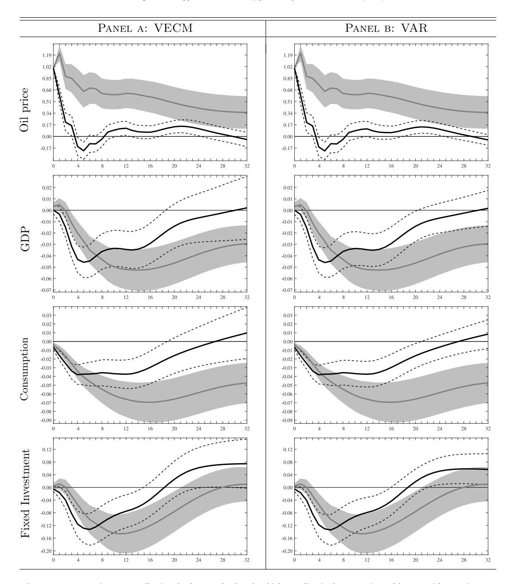
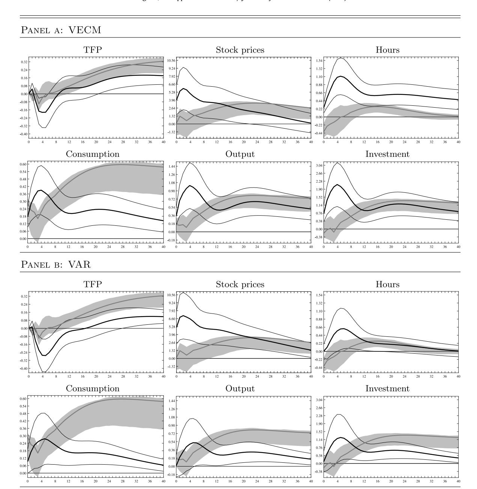

[Journal of Econometrics xxx \(xxxx\) xxx](https://doi.org/10.1016/j.jeconom.2020.05.004)

Contents lists available at [ScienceDirect](http://www.elsevier.com/locate/jeconom)

# Journal of Econometrics

journal homepage: [www.elsevier.com/locate/jeconom](http://www.elsevier.com/locate/jeconom)

# Large-dimensional Dynamic Factor Models: Estimation of Impulse–Response Functions with *I*(1) cointegrated factors[✩](#page-0-0)

Matteo Barigozzi [a](#page-0-1),[∗](#page-0-2) , Marco Lippi [b](#page-0-3) , Matteo Luciani [c](#page-0-4)

- a *Department of Economics, Università di Bologna, Italy*
- *Einaudi Institute for Economics and Finance, Roma, Italy*
- *Federal Reserve Board of Governors, Washington, DC, USA*

# a r t i c l e i n f o

#### *Article history:* Received 13 March 2018 Received in revised form 17 February 2020 Accepted 25 May 2020 Available online xxxx

*JEL classification:* subject classification C0 C01 E0

*Keywords:* Dynamic Factor Models Unit root processes Cointegration Impulse–Response Functions

# a b s t r a c t

We study a large-dimensional Dynamic Factor Model where: (i) the vector of factors **F***t* is *I*(1) and driven by a number of shocks that is smaller than the dimension of **F***t* ; and, (ii) the idiosyncratic components are either *I*(1) or *I*(0). Under (i), the factors **F***t* are cointegrated and can be modeled as a Vector Error Correction Model (VECM). Under (i) and (ii), we provide consistent estimators, as both the cross-sectional size *n* and the time dimension *T* go to infinity, for the factors, the loadings, the shocks, the coefficients of the VECM and therefore the Impulse–Response Functions (IRF) of the observed variables to the shocks. Furthermore, possible deterministic linear trends are fully accounted for, and the case of an unrestricted VAR in the levels **F***t* , instead of a VECM, is also studied. The finite-sample properties the proposed estimators are explored by means of a MonteCarlo exercise. Finally, we revisit two distinct and widely studied empirical applications. By correctly modeling the long-run dynamics of the factors, our results partly overturn those obtained by recent literature. Specifically, we find that: (i) oil price shocks have just a temporary effect on US real activity; and, (ii) in response to a positive news shock, the economy first experiences a significant boom, and then a milder recession.

Published by Elsevier B.V.

#### **1. Introduction**

Since the early 2000s large-dimensional Dynamic Factor Models (DFM) have become increasingly popular in the econometric and macroeconomic literature, and they are nowadays commonly used by policy institutions. They have been extensively used in policy analysis based on Impulse–Response Functions (IRF) ([Giannone et al.,](#page-27-0) [2005;](#page-27-0) [Forni et al.](#page-27-1), [2009](#page-27-1); [Eickmeier](#page-27-2), [2009;](#page-27-2) [Forni and Gambetti](#page-27-3), [2010](#page-27-3); [Barigozzi et al.](#page-26-0), [2014;](#page-26-0) [Forni et al.](#page-27-4), [2014;](#page-27-4) [Juvenal and Petrella](#page-27-5), [2015](#page-27-5); [Luciani](#page-27-6), [2015;](#page-27-6) [Dahlhaus](#page-27-7), [2017\)](#page-27-7), in forecasting ([Stock and Watson](#page-27-8), [2002;](#page-27-8) [Forni et al.,](#page-27-9) [2005](#page-27-9); [Giannone et al.,](#page-27-10) [2008;](#page-27-10) [Luciani](#page-27-11), [2014](#page-27-11); [Forni et al.,](#page-27-12) [2018](#page-27-12)), and in the construction of both business cycle indicators and inflation indexes [\(Cristadoro et al.](#page-27-13), [2005](#page-27-13); [Altissimo et al.](#page-26-1), [2010](#page-26-1)).

*E-mail addresses:* [matteo.barigozzi@unibo.it](mailto:matteo.barigozzi@unibo.it) (M. Barigozzi), [marco.lippi@eief.it](mailto:marco.lippi@eief.it) (M. Lippi), [matteo.luciani@frb.gov](mailto:matteo.luciani@frb.gov) (M. Luciani).

<https://doi.org/10.1016/j.jeconom.2020.05.004> 0304-4076/Published by Elsevier B.V.

✩ Special thanks go to Paolo Paruolo and Lorenzo Trapani for helpful comments. This paper has benefited also from discussions with Antonio Conti, Domenico Giannone, Dietmar Bauer, and all participants to the 39th Annual NBER Summer Institute. Part of this paper was written while Matteo Luciani was *chargé de recherches* F.R.S.-F.N.R.S., and he gratefully acknowledges their financial support. Of course, any errors are our responsibility. Disclaimer: The views expressed in this paper are those of the authors and do not necessarily reflect those of the Board of Governors or the Federal Reserve System.

∗ Corresponding author.

2

Starting with a large dataset of macroeconomic variables, DFMs are based on the idea that all the variables in the dataset are driven by a small number of common shocks, their residual dynamics being explained by idiosyncratic components. The common shocks, which are *pervasive*, i.e., they affect all the variables in the dataset, are interpreted as the macroeconomic shocks. The idiosyncratic components, which are specific to one or a few variables, are interpreted as (a) local or sectoral shocks, or (b) measurement errors; hence they are of little interest in macroeconomic analysis.

Formally, each variable in the n-dimensional dataset  $x_{it}$ ,  $i=1,\ldots,n$ , is decomposed into the sum of two unobservable components: the common component  $\chi_{it}$ , and the idiosyncratic component  $\xi_{it}$  (Forni et al., 2000; Forni and Lippi, 2001; Stock and Watson, 2002; Bai, 2003). Moreover, the common components are linear combinations of an r-dimensional vector of *common factors*  $\mathbf{F}_t = (F_{1t} \cdots F_{rt})'$ ,

$$x_{it} = \chi_{it} + \xi_{it}, \tag{1}$$

$$\chi_{it} = \lambda_{i1} F_{1t} + \dots + \lambda_{ir} F_{rt} = \lambda_i' F_t, \tag{2}$$

where  $\lambda_i = (\lambda_{i1} \cdots \lambda_{ir})'$ .

Most of the variables contained in macroeconomic datasets are non-stationary; hence, the factors, and, possibly, also the idiosyncratic components, are non-stationary. When the factors are non-stationary, it holds that

$$\Delta \mathbf{F}_t = \mathbf{C}(L)\mathbf{u}_t,\tag{3}$$

where  $\mathbf{C}(L)$  is an  $r \times q$  square-summable matrix in the lag operator, and  $\mathbf{u}_t = (u_{1t} \cdots u_{qt})'$  is a q-dimensional orthonormal white-noise vector of *common shocks*.

The goal of this paper is to estimate the IRFs of the common components  $\chi_{it}$ , and therefore of the variables  $x_{it}$ , to the common shocks  $\mathbf{u}_t$  in the non-stationary DFM defined by (1)–(3), i.e., to estimate  $\lambda_i' \frac{C(L)}{1-L}$ . Specifically, we consider the general case in which: (i) the factors are I(1), singular, and cointegrated, (ii) the idiosyncratic components are either I(1) or I(0), and (iii) the presence of deterministic linear trends is explicitly taken into account. As we discuss in Section 2, all these are relevant features in macroeconomic datasets.

The common practice in the applied DFM literature consists in taking first differences of the non-stationary variables  $x_{it}$ , thus obtaining a stationary dataset  $\Delta x_{it}$  with stationary factors  $\Delta \mathbf{F}_t$ , and then applying principal components to  $\Delta x_{it}$ , which yields consistent estimates of  $\Delta \mathbf{F}_t$  and the loadings  $\lambda_i$ . An estimate of  $\mathbf{C}(L)$  and  $\mathbf{u}_t$  is then obtained by estimating a VAR for  $\Delta \mathbf{F}_t$ , see e.g., Forni et al. (2009). Finally, all the identification techniques, based on macroeconomic theory, that are used in Structural VAR analysis (SVAR) can be applied also in the DFM setting with no modification to obtain structural shocks and IRFs—see for example Forni et al. (2009), Bai and Wang (2015), and Stock and Watson (2016).

However, it is well known that if the factors are cointegrated, then a VAR for  $\Delta \mathbf{F}_t$  is not an admissible representation. Rather, we should write a Vector Error Correction Model (VECM) for  $\mathbf{F}_t$ , i.e., a VAR for  $\mathbf{F}_t$  with r-c unit roots, where c is the cointegration rank of  $\mathbf{F}_t$ . Therefore, in order to obtain consistent estimates of the IRFs we need to consider estimation of a DFM with I(1) cointegrated factors.

The crucial question then is: are the factors likely to be cointegrated? The answer is "yes", and there are two main reasons why this is the case. Firstly, as predicted by macroeconomic theory, some of the macroeconomic shocks  $\mathbf{u}_t$  permanently affect the economy (e.g., technological shocks), while some others (such as monetary policy shocks or oil price shocks) have only transitory effects. In other words, in (3) the matrix  $\mathbf{C}(1)$  is likely to have reduced rank, which is equivalent to saying that the common factors are cointegrated.

Secondly, Barigozzi et al. (2020) show that if  $\mathbf{F}_t$  is a singular stochastic vector—i.e., r, the dimension of  $\mathbf{F}_t$ , is greater than q, the dimension of  $\mathbf{u}_t$ —then the common factors are cointegrated with cointegration rank c = r - q + d, where  $0 \le d < q$ , so that the cointegration rank is at least r - q. Moreover, under the assumption that the entries of  $\mathbf{C}(L)$  are rational functions of L,  $\mathbf{F}_t$  has the VECM representation:

$$\mathbf{G}(L)\Delta\mathbf{F}_{t} - \alpha\boldsymbol{\beta}'\mathbf{F}_{t-1} = \mathbf{h} + \mathbf{K}\mathbf{u}_{t},\tag{4}$$

where  $\alpha$  and  $\beta$  are both  $r \times c$  and full rank, **K** is  $r \times q$ , and **G**(L) is a *finite-degree* matrix polynomial. Therefore, it is legitimate to ask: are the factors likely to be singular? Once again, the answer is "yes". Indeed, as pointed out in several papers, e.g., Bai and Ng (2007), Forni et al. (2009), and Stock and Watson (2016), Eq. (2) is just a convenient *static* representation derived from a "deeper" set of *dynamic* equations linking the common components  $\chi_{it}$  to the common shocks  $\mathbf{u}_t$ . Moreover, singularity of  $\mathbf{F}_t$  is strongly supported by empirical evidence, see, e.g., Giannone et al. (2005), Amengual and Watson (2007), Forni and Gambetti (2010) and Luciani (2015) for US macroeconomic databases, Barigozzi et al. (2014) for the euro area.

So far, the literature has proved consistency (and derived the rate of convergence) for an estimator of the IRFs for DFMs when either the variables are stationary or can be transformed to stationarity by differencing, i.e., when the factors are not cointegrated (Forni et al., 2009). However, the literature has not studied estimation of IRFs when the factors are cointegrated, which, as argued above, is a relevant empirical case in macroeconomics. Our paper fills this gap by proposing two estimators.

A. Having estimated the loadings  $\lambda_i$  and the factors  $\mathbf{F}_t$ , the first estimator is obtained by fitting a VECM as in (4) on the estimated factors. We show that, as  $n, T \to \infty$  our estimator of the IRFs is consistent and converges with a rate that not only depends on n and T, but also on the number of idiosyncratic components that are I(1), and on the number of variables for which a deterministic linear trend is present.

B. As an alternative to the estimator of the IRFs based on the VECM, we prove consistency of the IRFs obtained by means of an unrestricted VAR in the levels for the estimated factors. Like in the standard VAR analysis, this approach is consistent at each given lag but it does not provide consistent estimates of the long-run features of the IRFs, see also Phillips (1998). This result is corroborated by a numerical exercise in which the VECM and the unrestricted VAR performances are close at short horizons, whereas at long horizons, the VECM performs better.

Both our estimator of the loadings, which is based on principal component analysis on differenced data, and our estimator of the factors are closely related to those proposed by Bai and Ng (2004). However, our estimator of the factors, although asymptotically equivalent to the one proposed by Bai and Ng (2004), has important finite sample differences owing to a different estimation of the trend slope. A numerical comparison shows that our estimator of the factors tends to perform better than the one proposed by Bai and Ng (2004) for estimation of IRFs. 1

Our results can be applied, with minor modifications, also to a Factor Augmented VAR (FAVAR) (Bernanke et al., 2005; Bai and Ng, 2006) with *I*(1) variables. Indeed, FAVARs are equivalent to a restricted version of DFMs (Stock and Watson, 2016).

The potential advantages of our proposed approach are illustrated by means of two empirical applications. In the first application, we study the effects of oil price shocks on the US economy. We compare the IRFs estimated with a non-stationary DFM, as proposed in this paper, with those obtained by Stock and Watson (2016) with a stationary DFM, and we show that once we account for cointegration in the common factors, the estimate of the long-run effects of an oil price shock changes dramatically. Indeed, while Stock and Watson (2016) estimate that oil price shocks have persistent effects on the US economy, we find that the effects of an oil price shock vanish after five to eight years, a finding consistent with the idea that only technological shocks are capable of having a permanent effect on the real side of the economy.

In the second empirical application, we study the effects of news shocks on the US economy. To do so, we compare the IRFs estimated with a non-stationary FAVAR, where the factors are either extracted as proposed in this paper, or as proposed by Forni et al. (2014), i.e., under the assumption that all the idiosyncratic components are I(0). The IRFs obtained with our approach partly overturn the results in Forni et al. (2014) in that we find that in response to a positive news shock, hours worked respond positively, and the economy experiences a significant boom, and then a milder recession.

Lastly, let us mention that our non-stationary DFM has recently been used by Alessi and Kerssenfischer (2019) to study the response of asset prices to monetary policy shocks. When estimated using a standard SVAR, the response is very slow and not statistically significant. However, by using our non-stationary DFM, Alessi and Kerssenfischer (2019) find strong and quick asset price reactions, both on euro area and US data.

The paper is organized as follows. In Section 2 we present the model and its assumptions. Section 3 establishes consistency and rates for our estimators of the IRFs. In Section 4 we propose an information criterion to determine the number of permanent shocks q-d, which allows us to infer the cointegration rank of the factors. In Section 5, by means of a MonteCarlo simulation exercise, we study the finite sample properties of our estimators. Finally, in Section 6 we apply our methodology to US quarterly macroeconomic data and in two separate exercises we study the impact of oil price and of news shocks. In Section 7 we conclude. The proofs of our main results are in Appendix A. A complementary appendix available online contains the proofs of all lemmas, details on identification of the IRFs, a comparison with FAVARs, and additional numerical results.

## 2. The non-stationary dynamic factor model

# 2.1. I(1) vectors and cointegration

Throughout the paper, we will adopt the following definitions for I(0), I(1), and cointegrated stochastic vectors. They are standard and hold both for non-singular vectors, as in all textbooks (see, e.g., Johansen, 1995, Ch. 3), and for singular vectors.

(I) Consider an  $r \times q$  matrix  $\mathbf{A}(L) = \mathbf{A}_0 + \mathbf{A}_1 L + \cdots$ , with the assumption that the series  $\sum_{j=0}^{\infty} \mathbf{A}_j z^j$  converges for all complex number z such that  $|z| < 1 + \delta$  for some  $\delta > 0$ . This condition is fulfilled when the entries of  $\mathbf{A}(L)$  are rational functions of L with no poles inside or on the unit circle (the VARMA case). Given the r-dimensional stationary stochastic vector

$$\mathbf{z}_t = \mathbf{A}(L)\mathbf{v}_t$$

where  $\mathbf{v}_t$  is a q-dimensional white noise,  $q \leq r$ , we say that  $\mathbf{z}_t$  is I(0) if  $\mathbf{A}(1) \neq \mathbf{0}$ .

- (II) The *r* dimensional stochastic vector  $\mathbf{z}_t$  is I(1) if  $\Delta \mathbf{z}_t$  is I(0).
- (III) The r-dimensional I(1) vector  $\mathbf{z}_t$  is cointegrated of order c, 0 < c < r, if (1) there exist linearly independent r-dimensional vectors  $\boldsymbol{\beta}_k$ ,  $k = 1, \ldots, c$ , such that  $\boldsymbol{\beta}_k' \mathbf{z}_t$  is stationary, (2) if  $\boldsymbol{\gamma}' \mathbf{z}_t$  is stationary then  $\boldsymbol{\gamma}$  is a linear combination of the vectors  $\boldsymbol{\beta}_{\nu}$ .

Note that since we allow for the idiosyncratic components to be I(1), the approach of estimating the factors by principal components in levels, as in Bai (2004), is not valid.

4

Some important properties for our model follow from these definitions.

#### Remark 1.

- (a) Some of the coordinates of an I(1) vector can be stationary.
- (b) If one of the coordinates of the I(1) vector  $\mathbf{z}_t$  is stationary, then  $\mathbf{z}_t$  is cointegrated.
- (c) The cointegration rank of  $\mathbf{z}_t$  is equal to r minus the rank of  $\mathbf{A}(1)$ .
- (d) It easy to see that  $\mathbf{z}_t$  is cointegrated with cointegration rank c if and only if  $\mathbf{z}_t$  can be linearly transformed into a vector whose first c coordinates are stationary and the remaining r-c are I(1). For, let  $\mathbf{z}_t$  be cointegrated of order c with cointegration vectors  $\boldsymbol{\beta}_k$ ,  $k=1,\ldots,c$ . Let  $\boldsymbol{\beta}=(\boldsymbol{\beta}_1\cdots\boldsymbol{\beta}_c)$  and  $\mathbf{B}=(\boldsymbol{\beta}\ \boldsymbol{\beta}_\perp)$ , where  $\boldsymbol{\beta}_\perp$  is an  $r\times(r-c)$  matrix whose columns are linearly independent and orthogonal to the columns of  $\boldsymbol{\beta}$ . Then, the first c coordinates of  $\mathbf{z}_t^*=\mathbf{B}'\mathbf{z}_t$  are stationary while the remaining r-c are I(1).
- (e) Note that if  $\mathbf{z}_t$  is I(1) and r > q, then obviously  $\mathbf{z}_t$  is cointegrated with cointegration rank at least r q, that is, c = (r q) + d with  $0 \le d < q$ .

# 2.2. Assumptions on common and idiosyncratic components

Define  $\mathbf{x}_t = (x_{1t} \cdots x_{nt})'$ ,  $\mathbf{\chi}_t = (\chi_{1t} \cdots \chi_{nt})'$ ,  $\mathbf{\xi}_t = (\xi_{1t} \cdots \xi_{nt})'$ , and  $\mathbf{\Lambda} = (\lambda_1 \cdots \lambda_n)'$ . Then, the non-stationary DFM that we consider in this paper and given in Eqs. (1) and (3) become:

$$\mathbf{x}_t = \mathbf{\chi}_t + \mathbf{\xi}_t = \mathbf{\Lambda} \mathbf{F}_t + \mathbf{\xi}_t, \tag{5}$$

$$\Delta \mathbf{F}_t = \mathbf{C}(L)\mathbf{u}_t. \tag{6}$$

Firstly, we suppose that  $\mathbf{F}_t$  has two equivalent representations: an ARIMA and a VECM. Specifically, we assume the following.

**Assumption 1** (Common Shocks and Common Factors).

- (a)  $\mathbf{u}_t = (u_{1t} \cdots u_{qt})'$  is a strong orthonormal q-dimensional vector white noise, i.e.,  $\mathsf{E}[\mathbf{u}_t] = \mathbf{0}_q$ ,  $\mathsf{E}[\mathbf{u}_t \mathbf{u}_t'] = \mathbf{I}_q$ , and  $\mathbf{u}_t$  and  $\mathbf{u}_{t-k}$  are independent for any  $k \neq 0$ , moreover  $\mathsf{E}[u_{it}^4] \leq M_1$ , for some positive real  $M_1$  independent of j.
- (b) The r-dimensional stochastic vector  $\mathbf{F}_t$  is I(1) and has the ARIMA representation

$$\mathbf{S}(L)\Delta\mathbf{F}_{t} = \mathbf{Q}(L)\mathbf{u}_{t},\tag{7}$$

where: (i)  $\mathbf{S}(L)$  is an  $r \times r$  finite-degree matrix polynomial with  $\det(\mathbf{S}(z)) \neq 0$  for  $|z| \leq 1$ ; (ii)  $\mathbf{S}(0) = \mathbf{I}_r$ ; (iii)  $\mathbf{Q}(L)$  is a finite-degree  $r \times q$  matrix polynomial,  $\mathbf{Q}(1) \neq \mathbf{0}$ ; (iv)  $\mathrm{rk}(\mathbf{Q}(0)) = q$ . Note that, defining  $d = q - \mathrm{rk}(\mathbf{Q}(1))$ , so that  $0 \leq d < q$ , the cointegration rank of  $\mathbf{F}_t$  is  $c = r - \mathrm{rk}(\mathbf{Q}(1)) = (r - q) + d$ , see Remark 1, (c).

(c) The vector  $\mathbf{F}_t$  has the VECM representation

$$\mathbf{G}(L)\Delta\mathbf{F}_{t} - \alpha\boldsymbol{\beta}'\mathbf{F}_{t-1} = \mathbf{h} + \mathbf{K}\mathbf{u}_{t},\tag{8}$$

where: (A)  $\alpha$  and  $\beta$  are full rank  $r \times c$  matrices; (B)  $\mathbf{K} = \mathbf{Q}(0)$ ; (C)  $\mathbf{h}$  is a constant vector; (D)  $\mathbf{G}(L)$  is a *finite-degree* matrix polynomial with  $\mathbf{G}(0) = \mathbf{I}_r$ .

- (d)  $\operatorname{rk}(\mathsf{E}[\Delta \mathbf{F}_t \Delta \mathbf{F}_t']) = r$  and  $\mathsf{E}[\Delta F_{it}^2] > \mathsf{E}[\Delta F_{it}^2] > 0$ , for any  $i, j = 1, \ldots, r$  with i < j.
- (e) The number of common shocks and factors q and r are finite integers independent of n.

Condition (a) is stronger than the usual assumption made in a stationary setting, in which  $\mathbf{u}_t$  is just required to be white noise, and it is equivalent to Assumption B in Bai and Ng (2004). Condition (b) implies that  $\mathbf{C}(L) = \mathbf{S}(L)^{-1}\mathbf{Q}(L)$  in (6), and therefore that the vector  $\mathbf{F}_t$  has rational spectral density. Regarding (c), by combining the Granger Representation Theorem (Engle and Granger, 1987) with recent results on singular stochastic vectors (Anderson and Deistler, 2008), Barigozzi et al. (2020) prove that a VECM representation like (8), with a finite degree  $\mathbf{G}(L)$ , holds generically, i.e., except for a negligible subset in the parameter space, under the assumptions that  $\mathbf{F}_t$  is singular with rational spectral density. This is the motivation for assuming here the existence of representation (8).

**Remark 2.** As a consequence of Assumption 1(b), in (6) we have  $\operatorname{rk}(\mathbf{C}(1)) = q - d$ ; hence we can write  $\mathbf{C}(1) = \psi \eta'$ , where  $\psi$  is  $r \times q - d$  and  $\eta$  is  $q \times q - d$  and both have full-rank. Therefore, by defining  $\eta_{\perp}$  as the  $q \times d$  matrix whose columns are independent and orthogonal to the columns of  $\eta$ , we can always transform  $\mathbf{u}_t$  as  $\mathbf{v}_t = (\mathbf{v}'_{1t} \ \mathbf{v}'_{2t})' = (\eta \ \eta_{\perp})' \mathbf{u}_t$ , where  $\mathbf{v}_{1t}$  has dimension q - d while  $\mathbf{v}_{2t}$  has dimension d, such that the q - d shocks in  $\mathbf{v}_{1t}$  have a permanent effect on  $\mathbf{F}_t$ , whereas the d shocks in  $\mathbf{v}_{2t}$  have a transitory effect. Thus the number of permanent shocks is r minus the cointegration rank (since q - d = r - c), as in the non-singular case, while the number of transitory shocks d is the complement to q, not r, as though r - q transitory shocks had a zero coefficient.

We then make the following assumptions on the factor loadings.

**Assumption 2** (Loadings). (a) As  $n \to \infty$ ,  $n^{-1}\Lambda'\Lambda \to I_r$ ; (b)  $\|\lambda_i\| < C$ , for some positive real C independent of i.

Condition (a) implies that the r factors are not redundant, i.e., no representation with a number of factors smaller than r is possible. In particular, note that Assumptions 1(d) and 2(a) are common identifying assumptions imposed in stationary factor models, see, e.g., Stock and Watson (2002). The following remark shows that this choice has no implication for IRF estimation.

**Remark 3.** In model (5) the factors  $\mathbf{F}_t$  are not identified. For, given the non singular  $r \times r$  matrix  $\mathbf{H}$ ,

$$\mathbf{x}_t = [\mathbf{\Lambda}\mathbf{H}] [\mathbf{H}^{-1}\mathbf{F}_t] + \boldsymbol{\xi}_t = \mathbf{\Lambda}^* \mathbf{F}_t^* + \boldsymbol{\xi}_t. \tag{9}$$

Using  $\mathbf{F}_{t}^{*}$  implies changes in the matrices in (6), (7), and (8) and the loadings that are easy to compute:

$$\Lambda^* = \Lambda H$$
,  $S^*(L) = H^{-1}S(L)H$ ,  $Q^*(L) = H^{-1}Q(L)$ ,  $C^*(L) = H^{-1}C(L)$ ,  $G^*(L) = H^{-1}G(L)H$ ,  $\alpha^* = H^{-1}\alpha$ ,  $\beta^* = H'\beta$ ,  $K^* = H^{-1}K$ .

Note that  $\Lambda^*\mathbf{C}^*(L) = \Lambda\mathbf{C}(L)$ , so that the raw IRFs of the x's with respect to  $\mathbf{u}_t$ , corresponding to the factors  $\mathbf{F}_t^*$  and to the factors  $\mathbf{F}_t$  are equal. As a consequence, identification of the IRFs based on any economic criterion is independent of the particular factors used, i.e., of the identifying assumptions imposed on  $\mathbf{F}_t$  and  $\Lambda$ . In this respect, although Assumptions 1(d) and 2(a) might seem restrictive, they are innocuous and are particularly convenient in proving consistency of the estimated factors up to a sign. The theory developed in the next section can be adapted to allow for other identifying constraints.

Furthermore, because the factors  $\mathbf{F}_t$  are identified up to a linear transformation and in view of Remark 1(d), the question of whether some of the factors are stationary while the remaining ones are I(1) is perfectly equivalent to the question of whether and "how much" the factors are cointegrated, see Bai (2004). In other words, the case of I(0) factors is implicitly considered under Assumption 1(c), whereas we do not consider in this paper the case of I(2) variables.

Regarding the idiosyncratic components we assume the following.

**Assumption 3** (*Idiosyncratic Components*). For any  $i \in \mathbb{N}$ ,

$$(1 - \rho_i L) \xi_{it} = d_i(L) \varepsilon_{it}, \tag{10}$$

where

- (a)  $\varepsilon_t = (\varepsilon_{1t} \cdots \varepsilon_{nt})'$  is a strong n-dimensional vector white noise, i.e.,  $\mathsf{E}[\varepsilon_t] = \mathbf{0}_n$ ,  $\mathsf{E}[\varepsilon_t \varepsilon_t'] = \Gamma_0^\varepsilon$ , and  $\varepsilon_t$  and  $\varepsilon_{t-k}$  are independent for any  $k \neq 0$ , moreover  $\mathsf{E}[|\varepsilon_{it}|^{\kappa_1}|\varepsilon_{jt}|^{\kappa_2}] \leq M_2$ , for some positive real  $M_2$  independent of i and j and any  $\kappa_1 + \kappa_2 = 4$ ;
- (b)  $\Gamma_0^{\varepsilon}$  is positive definite and such that  $\max_{j=1,...,n} \sum_{i=1}^{n} |\mathsf{E}[\varepsilon_{it}\varepsilon_{jt}]| \leq M_3$ , for some positive real  $M_3$  independent of n;
- (c)  $d_i(L) = \sum_{k=0}^{\infty} d_{ik}$ , with  $\sum_{k=0}^{\infty} k|d_{ik}| \le M_4$ , for some positive real  $M_4$  independent of i;
- (d)  $|\rho_i| \le 1$ , so that I(1) idiosyncratic components are allowed;
- (e)  $u_{it}$  and  $\varepsilon_{is}$  are independent for any  $j=1,\ldots,q,$   $i\in\mathbb{N}$ , and  $t,s\in\mathbb{Z}$ .

Condition (a) is similar to Assumption C(i) in Bai and Ng (2004) but is less stringent since we here require only 4th order finite moments as compared to finite 8th order moments. Condition (b) allows for contemporaneous cross-sectional dependence of the idiosyncratic shocks,  $\varepsilon_t$ . In particular, we require a mild form of sparsity as proposed by Fan et al. (2013) and often found empirically, see, e.g., Boivin and Ng (2006), Bai and Ng (2008), and Luciani (2014) in a stationary setting. As a consequence, the components of  $\Delta \xi_t$  are also allowed to be both cross-sectionally and serially correlated.

Condition (c) in Assumption 3 implies square summability of the matrix polynomials in (10) so that  $\xi_{it}$  is non-stationary if and only if  $\rho_i=1$ . Assuming that  $|\rho_i|<1$ , that is, all idiosyncratic components are stationary, implies that any p-dimensional vector  $(x_{i_1,t}\cdots x_{i_p,t})'$ , with  $p\geq q-d+1$ , would be cointegrated—for example, if q=3 and d=0 then all 4-dimensional sub-vectors of  $\mathbf{x}_t$  are cointegrated (3-dimensional if d=1). Moreover, when applying the test proposed in Bai and Ng (2004) on the US macroeconomic time series analyzed in Section 6, and typically analyzed in the empirical DFM literature, we found that the unit root hypothesis is not rejected for nearly half of the estimated idiosyncratic components. Finally, condition (e) is in agreement with the economic interpretation of the model, in which common and idiosyncratic shocks are two independent sources of variation.

It can be shown that Assumptions 1 through 3 imply that the r largest eigenvalues of the covariance matrix of  $\Delta \mathbf{x}_t$  diverge linearly in n, while the remaining n-r stay bounded (see Lemma D2 in the complementary appendix for a proof). This result allows us to estimate the number of factors r, while analogous results on the eigenvalues of the spectral density matrix of  $\Delta \mathbf{x}_t$ , allow the estimation of q and the cointegration rank c of the factors  $\mathbf{F}_t$ , see Section 4 for details.

&lt;sup>2 Equivalently, we could assume  $\mathsf{E}[\Delta \mathbf{F}_t \Delta \mathbf{F}_t'] = \mathbf{I}_r$  and  $n^{-1} \Lambda' \Lambda \to \mathbf{V}$ , as  $n \to \infty$ , with  $\mathbf{V}$  positive definite and with distinct eigenvalues, see, e.g., Fan et al. (2013).

6

We conclude with the following assumption, which has the consequence that  $\chi_0 = \mathbf{0}_n$ ,  $\xi_0 = \mathbf{0}_n$ , and  $\mathbf{x}_0 = \mathbf{0}_n$ , a requirement commonly made in unit root analysis.

**Assumption 4.** For all  $i \in \mathbb{N}$  and  $t \leq 0$ ,  $\mathbf{u}_t = \mathbf{0}_q$ , and  $\varepsilon_{it} = 0$ .

In practice, when dealing with macroeconomic time series, deterministic linear trends can also be present; hence we typically do not observe  $\mathbf{x}_t$ , but the n-dimensional vector  $\mathbf{y}_t = (y_{1t} \cdots y_{nt})^t$ , such that

$$y_{it} = a_i + b_i t + x_{it}, \tag{11}$$

where  $a_i, b_i \in \mathbb{R}$ , and  $x_{it}$  satisfies Assumptions 1 through 3.

For series belonging to the real side of the economy, e.g., GDP,  $b_i$  is likely to be strongly significant; however, for nominal series, e.g., inflation,  $b_i$  is likely to be not significantly different from zero. Indeed, when considering the US macroeconomic time series analyzed in Section 6, we reject the null-hypothesis  $b_i = 0$  for only about half of the series (see Appendix A.4 for details on the adopted testing procedure). Consequently, we introduce the following assumption that poses an asymptotic limit to the number of series with a deterministic linear trend.

**Assumption 5.** Let  $n_b$  be the number of variables among  $y_{1t}, \ldots, y_{nt}$  for which  $b_i \neq 0$ , then,  $n_b = O(n^{\eta})$  for some  $\eta \in [0, 1)$ .

#### 3. Estimation

The object of interest of this paper is the true IRF of  $x_{it}$ , for i = 1, ..., n, to the shock  $u_{jt}$ , for j = 1, ..., q, which we denote as (see also (5) and (6))

$$\phi_{ij}(L) = \lambda_i' \left\lceil \frac{\mathbf{c}_j(L)}{1 - L} \right\rceil,\tag{12}$$

where  $\lambda'_i$  is the *i*th row of  $\Lambda$ ,  $\mathbf{c}_i(L)$  is the *j*th column of  $\mathbf{C}(L)$ , and the notation used is convenient and makes sense, provided that we do not forget that such IRF is not square summable. Note that in view of (11) the IRF in (12) has to be interpreted as a deviation from the deterministic linear trend.

We follow a procedure similar to Forni et al. (2009) in the stationary setting: (i) we estimate the loadings, the common factors, their VECM dynamics and the raw (non-identified) IRFs, (ii) we identify the structural common shocks and IRFs by imposing a set of restrictions based on economic logic. We now describe in detail these steps and study the asymptotic behavior of all our estimators for both n and T tending to infinity.

Note that, in practice, the number of common factors r, of common shocks q, and of the cointegration relations c = r - q + d is unknown, and in Section 4, we show that these quantities can be consistently estimated with probability tending to one, as  $n, T \to \infty$ . Therefore, throughout this section, we can assume that r, q, and c are known.

Hereafter, we denote estimated quantities with a hat, like in  $\widehat{\mathbf{A}}$ , without explicit notation for their dependence on both n and T. We also denote the spectral norm of a matrix  $\mathbf{B}$  by  $\|\mathbf{B}\| = (\mu_1^{\mathbf{B}'\mathbf{B}})^{1/2}$ , where  $\mu_1^{\mathbf{B}'\mathbf{B}}$  is the largest eigenvalue of  $\mathbf{B}'\mathbf{B}$ .

# 3.1. Loadings and common factors

Assume to observe the *n*-dimensional vector  $\mathbf{y}_t = (y_{1t} \cdots y_{nt})'$  satisfying (11) over the period  $t = 1, \dots, T$ , then the model for  $\Delta y_{it} = y_{it} - y_{it-1}$  with  $t = 2, \dots, T$ , reads

$$\Delta \mathbf{v}_{it} = b_i + \Delta \mathbf{x}_{it} = b_i + \lambda_i' \Delta \mathbf{F}_t + \Delta \boldsymbol{\varepsilon}_{it}. \tag{13}$$

We first present and discuss our approach to estimation of loadings and common factors, and in Lemma 1, we prove their asymptotic properties. Then, in Remark 5, we compare our estimators with those in Bai and Ng (2004).

The loadings estimator is computed by principal component analysis on the differenced data. Let  $\widehat{\Gamma}_0$  be the  $n \times n$  sample covariance matrix of  $\Delta \mathbf{y}_t = (\Delta y_{1t} \cdots \Delta_{nt})'$  and let  $\widehat{\mathbf{W}}$  be the  $n \times r$  matrix with the right normalized eigenvectors of  $\widehat{\Gamma}_0$ , corresponding to the first r eigenvalues, on the columns. Our estimator of the loadings matrix  $\Lambda$  is given by

$$\widehat{\mathbf{\Lambda}} = \sqrt{n}\,\widehat{\mathbf{W}}.\tag{14}$$

In order to estimate the common factors, we explicitly introduce an estimator of the slope coefficients  $b_i$ . Consider the set  $\mathcal{I}_b$  of values of i such that  $b_i \neq 0$ , then for any  $i \in \mathcal{I}_b$ , we de-trend  $y_{it}$  by least squares regression on a constant and a linear trend, giving the estimator

$$\widehat{b}_{i} = \frac{\sum_{t=1}^{T} \left(t - \frac{T+1}{2}\right) (y_{it} - \bar{y}_{i})}{\sum_{t=1}^{T} \left(t - \frac{T+1}{2}\right)^{2}},$$
(15)

where  $\bar{y}_i$  is the sample mean of  $y_{it}$ . If instead  $i \in \mathcal{I}_b^c$ , we set  $\hat{b}_i = 0$ . In practice  $\mathcal{I}_b$  is unknown and in Appendix A.4 we introduce a test for the null-hypothesis that  $b_i = 0$  for all i = 1, ..., n. In particular, we show that as  $n, T \to \infty$  the

probability of type I and type II errors of our testing procedure tends to zero, hence hereafter, we can assume that  $\mathcal{I}_b$  is

By defining  $\widehat{\mathbf{x}}_{it} = y_{it} - \widehat{b}_i t$ , our estimator of the common factors is given by projecting  $\widehat{\mathbf{x}}_t = (\widehat{\mathbf{x}}_{1t} \cdots \widehat{\mathbf{x}}_{nt})'$  onto the estimated loadings:

$$\widehat{\mathbf{F}}_t = \frac{1}{n} \widehat{\mathbf{\Lambda}}' \widehat{\mathbf{x}}_t = \frac{1}{n} \sum_{i=1}^n \widehat{\lambda}_i \widehat{x}_{it}. \tag{16}$$

Consistency of this procedure is proved in the following Lemma, which is proved in Section C of the complementary appendix.

**Lemma 1.** Let Assumptions 1 through 4 hold. Then, there exists an  $r \times r$  diagonal matrix  $\mathbf{J}$  with entries  $\pm 1$ , depending on n and T, such that, as  $n, T \to \infty$ , (i) for all i,  $\|\widehat{\boldsymbol{\lambda}}_i' - \boldsymbol{\lambda}_i'\mathbf{J}\| = O_p(\max(n^{-1/2}, T^{-1/2}))$ . If also Assumption 5 holds, then: (ii) for all  $i \in \mathcal{I}_b$ ,  $|\widehat{b}_i - b_i| = O_p(T^{-1/2})$ ; (iii) given t,  $T^{-1/2}(\widehat{\mathbf{F}}_t - \mathbf{J}\mathbf{F}_t) = O_p(\max(n^{-1/2}, T^{-1/2}, n^{-(1-\eta)}))$ .

Notice that, since for different values of n and T we get different estimators of the loadings  $\widehat{\lambda}_i$  and the factors  $\widehat{\mathbf{F}}_t$ , then in general also the matrix  $\mathbf{J}$  depends on n and T. However, in light of Remark 3 and as shown in the proofs of Propositions 1 and 2, such indeterminacy poses no problem for consistency of estimated IRFs.

The result on the loadings estimator which is obtained from the differenced data, is derived in a way that is similar to the approach used by Stock and Watson (2002), Forni et al. (2009), and Fan et al. (2013). The result on the factors estimator is new and the next remark provides an intuition for it.

**Remark 4.** An immediate consequence of Lemma 1 is that if all series have a deterministic linear trend, i.e.,  $\eta = 1$ , then  $\widehat{\mathbf{F}}_t$  is not a consistent estimator of the common factors  $\mathbf{F}_t$ . Indeed, first note that, since  $\widehat{\mathbf{x}}_{it} = y_{it} - \widehat{b}_i t$ , because of (11) we can re-write (16) as

$$\widehat{\mathbf{F}}_t = \frac{1}{n} \sum_{i=1}^n \widehat{\lambda}_i x_{it} + \frac{1}{n} \sum_{i=1}^n \widehat{\lambda}_i a_i + \frac{1}{n} \sum_{i \in \mathcal{I}_b} \widehat{\lambda}_i (b_i - \widehat{b}_i) t.$$
(17)

Then, since  $x_{it} = \lambda_i' \mathbf{F}_t + \xi_{it}$ , from (17) it follows that the factors estimation error is

$$\frac{1}{\sqrt{T}}(\widehat{\mathbf{F}}_t - \mathbf{J}\mathbf{F}_t) = \frac{1}{n\sqrt{T}} \sum_{i=1}^n \lambda_i \xi_{it} + \frac{1}{n\sqrt{T}} \sum_{i=1}^n \lambda_i a_i + \frac{1}{n\sqrt{T}} \sum_{i \in \mathcal{T}_t} \lambda_i \left(b_i - \widehat{b}_i\right) t + o_p(1), \tag{18}$$

where the last term on the right hand side is the loadings estimation error (see part (i) of Lemma 1). Now, while the first term on the right-hand-side of (18) is  $O_p(n^{-1/2})$  and the second term is  $O_p(T^{-1/2})$ , the third term due to the linear deterministic trends will not vanish unless  $\eta < 1$ . As already discussed above, the assumption  $\eta < 1$  is realistic for a typical macroeconomic dataset. In an extensive numerical analysis conducted in Section 5 and the complementary appendix, we show that our estimators perform well even for values of  $\eta$  close to one.

In Bai and Ng (2004) principal component analysis on differenced data  $\Delta \mathbf{y}_t$  is used to compute both the loadings estimator and an estimator  $\Delta \mathbf{F}_t$  of the differenced factors. An estimator  $\mathbf{F}_t$  of  $\mathbf{F}_t$  is then computed as  $\mathbf{F}_t = \sum_{s=2}^t \Delta \mathbf{F}_s$ . In the next Remark, we compare the two approaches.

**Remark 5.** First, from Lemmas 1 and 2 in Bai and Ng (2004) it follows that  $\Delta \widetilde{\mathbf{F}}_s$  is a consistent estimator of  $\mathbf{J}(\Delta \mathbf{F}_s - \overline{\Delta \mathbf{F}})$ , where  $\overline{\Delta \mathbf{F}}$  is the sample mean of  $\Delta \mathbf{F}_s$ , and, therefore,  $T^{-1/2} \| \widetilde{\mathbf{F}}_t - \mathbf{J} \mathbf{F}_t + \mathbf{J} \mathbf{F}_1 + \mathbf{J} (\mathbf{F}_T - \mathbf{F}_1)(t-1)/(T-1) \| = o_p(1)$ , as  $n, T \to \infty$ . So  $\widetilde{\mathbf{F}}_t$  is a consistent estimator of  $\mathbf{F}_t$  only up to a location shift. Although, this result is enough for the purposes of testing for unit roots, as in Bai and Ng (2004), it is not enough for the purposes of the present paper.

Second, because  $\Delta \widetilde{\mathbf{F}}_t$  is estimated by principal components that require each  $\Delta y_{it}$  to be centered,  $\widetilde{\mathbf{F}}_t$  is estimated as if the data were de-trended by using  $\overline{\Delta y_i} = (T-1)^{-1} \sum_{t=2}^T \Delta y_{it}$  as an estimator of the slope. More precisely, since  $\Delta \widetilde{\mathbf{F}}_s = n^{-1} \sum_{i=1}^n \widehat{\lambda}_i (\Delta y_{is} - \overline{\Delta y_i})$ , from (13) we immediately have

$$\widetilde{\mathbf{F}}_t = \frac{1}{n} \sum_{i=1}^n \widehat{\lambda}_i x_{it} - \frac{1}{n} \sum_{i=1}^n \widehat{\lambda}_i x_{i1} + \frac{1}{n} \sum_{i \in T_i} \widehat{\lambda}_i (b_i - \overline{\Delta} y_i)(t-1).$$

By comparing this expression with the one obtained for  $\mathbf{F}_t$  in (17), we see that, because of the two different de-trending procedures, the two estimators differ just by a constant term and a term linear in t. Then, it is clear that also  $\mathbf{F}_t$  is a consistent estimator if and only if  $\eta < 1$ .

Third, although  $\widetilde{\mathbf{F}}_t$  and  $\widehat{\mathbf{F}}_t$  are asymptotically equivalent (both  $\widehat{b}_i$  and  $\overline{\Delta y}_i$  are  $\sqrt{T}$ -consistent estimators of  $b_i$ ), there is an important finite sample difference. Indeed, since the principal components  $\Delta \widetilde{\mathbf{F}}_t$  have zero sample mean by construction,

we always have  $\widetilde{\mathbf{F}}_1 = \widetilde{\mathbf{F}}_T$ , thus fixing the estimator at T equal to the initial condition which can be arbitrarily specified.3 Instead, when using our approach based on  $\widehat{b}_i$ , since in general  $\widehat{x}_{i1} \neq \widehat{x}_{iT}$ , from (16) we also have that in general  $\widehat{\mathbf{F}}_1 \neq \widehat{\mathbf{F}}_T$ . A numerical comparison of the finite sample properties of the two methods, which is shown in Section 5 and the complementary appendix, suggests that our estimation method is to be preferred.

We conclude with the following remark on the role of the intercept term  $a_i$ .

**Remark 6.** Although in (11) we have not assumed  $a_i$  to be zero, we have not included any estimator of the intercept when deriving  $\mathbf{\hat{F}}_t$  in (16). Indeed, no consistent estimator of  $a_i$  is available in the present setting. Nevertheless, the results in Lemma 1 hold irrespectively of the choice of such estimator, and therefore, without loss of generality, we can always set  $\hat{a}_i = 0$  for all i. The same comment applies to the factor estimator by Bai and Ng (2004), where usually the condition  $\mathbf{\tilde{F}}_1 = \mathbf{0}_r$  is imposed. Note that by Assumption 4, we have  $a_i = y_{i0}$ , which is not observed, therefore, for simplicity, we let also  $a_i = 0$  in the following.5

3.2. IRFs when estimating a VECM for the common factors

We now turn to estimation of the VECM in (8), with c = r - q + d cointegration relations, see Assumption 1:

$$\Delta \mathbf{F}_t = \alpha \boldsymbol{\beta}' \mathbf{F}_{t-1} + \sum_{k=1}^p \mathbf{G}_k \Delta \mathbf{F}_{t-k} + \mathbf{w}_t, \quad \mathbf{w}_t = \mathbf{K} \mathbf{u}_t.$$
 (19)

As a consequence of Assumption 4 we set  $\mathbf{h} = \mathbf{0}$ .

Different estimators for the cointegration vector,  $\beta$ , are possible. As suggested by the asymptotic and numerical studies in Phillips (1991) and Gonzalo (1994), we opt for the estimation approach proposed by Johansen (1995). Although typically derived from the maximization of a Gaussian likelihood, this estimator is nothing else but the solution of an eigen-problem naturally associated to a reduced rank regression model, where no specific assumption about the distribution of the errors is necessary in order to establish consistency, see, e.g., Velu et al. (1986).

We briefly review estimation of the VECM in (19) when using the estimated factors  $\widehat{\mathbf{F}}_t$ , instead of the unobserved  $\mathbf{F}_t$ , and when setting p=1, for simplicity.6 Denote as  $\widehat{\mathbf{e}}_{0t}$  and  $\widehat{\mathbf{e}}_{1t}$  the residuals of the least squares regressions of  $\Delta \widehat{\mathbf{f}}_t$  and of  $\widehat{\mathbf{F}}_{t-1}$  on  $\Delta \widehat{\mathbf{F}}_{t-1}$ , respectively, and define the matrices  $\widehat{\mathbf{S}}_{ij} = T^{-1} \sum_{t=1}^T \widehat{\mathbf{e}}_{it} \widehat{\mathbf{e}}_{jt}'$ . Let  $\widehat{\mu}_j$  be the jth largest eigenvalue of the matrix  $(\widehat{\mathbf{S}}_{11} - \widehat{\mathbf{S}}_{10} \widehat{\mathbf{S}}_{00}^{-1} \widehat{\mathbf{S}}_{01})$ . Then, following Johansen (1995), the estimator of the c cointegration vectors,  $\widehat{\boldsymbol{\beta}}_1, \ldots, \widehat{\boldsymbol{\beta}}_c$ , are such that, for any  $j=1,\ldots,c$ , they solve  $(\widehat{\mathbf{S}}_{11} - \widehat{\mathbf{S}}_{10} \widehat{\mathbf{S}}_{01})\widehat{\boldsymbol{\beta}}_{j1} = \widehat{\mu}_j\widehat{\boldsymbol{\beta}}_j$ . The vectors  $\widehat{\boldsymbol{\beta}}_j$  are then the c columns of the estimated matrix  $\widehat{\boldsymbol{\beta}}$ . The other parameters of the VECM,  $\alpha$  and  $\alpha$ 0, are estimated in a second step as the least squares estimators of the regression

$$\Delta \widehat{\mathbf{F}}_{t} = \alpha (\widehat{\boldsymbol{\beta}}' \widehat{\mathbf{F}}_{t-1}) + \mathbf{G}_{1} \Delta \widehat{\mathbf{F}}_{t-1} + \mathbf{w}_{t}.$$

From this regression, we also obtain the vector of residuals  $\widehat{\mathbf{w}}_t$ , which is an estimator of  $\mathbf{w}_t$ . Denote the  $r \times r$  sample covariance matrix of  $\widehat{\mathbf{w}}_t$  as  $\widehat{\mathbf{\Gamma}}_0^w$ . Let  $\widehat{\mathbf{W}}^w$  be the  $r \times q$  matrix with the right normalized eigenvectors of  $\widehat{\mathbf{\Gamma}}_0^w$ , corresponding to the first q eigenvalues, on the columns, and let  $\widehat{\mathbf{M}}^w$  be the  $q \times q$  diagonal matrix of those eigenvalues. Then, the estimators of  $\mathbf{K}$  and the common shocks  $\mathbf{u}_t$  are given by  $\widehat{\mathbf{K}} = \widehat{\mathbf{W}}^w(\widehat{\mathbf{M}}^w)^{1/2}$  and  $\widehat{\mathbf{u}}_t = (\widehat{\mathbf{M}}^w)^{-1/2}\widehat{\mathbf{W}}^w\widehat{\mathbf{w}}_t$ , respectively.

A VECM(p) with cointegration rank c can also be written as a VAR(p+1) with r-c unit roots. Therefore, after estimating (19), we have the estimated matrix polynomial  $\widehat{\mathbf{A}}^{\text{VECM}}(L) = \mathbf{I}_r - \sum_{k=1}^{p+1} \widehat{\mathbf{A}}_k^{\text{VECM}} L^k$ , with coefficients given by

$$\widehat{\mathbf{A}}_{1}^{\text{VECM}} = \widehat{\mathbf{G}}_{1} + \widehat{\boldsymbol{\alpha}}\widehat{\boldsymbol{\beta}}' + \mathbf{I}_{r}, 
\widehat{\mathbf{A}}_{k}^{\text{VECM}} = \widehat{\mathbf{G}}_{k} - \widehat{\mathbf{G}}_{k-1}, \text{ for } k = 2, \dots, p, \text{ and } \widehat{\mathbf{A}}_{p+1}^{\text{VECM}} = -\widehat{\mathbf{G}}_{p}, \tag{20}$$

such that  $\operatorname{rk}(\widehat{\mathbf{A}}^{\operatorname{VECM}}(1)) = \operatorname{rk}(\widehat{\alpha}\widehat{\boldsymbol{\beta}}') = c$ . Then, for  $i = 1, \ldots, n$  and  $j = 1, \ldots, q$ , the raw (non-identified) IRFs estimator is defined as

$$\widetilde{\phi}_{ii}^{\text{VECM}}(L) = \widehat{\lambda}_{i}' \left[ \widehat{\mathbf{A}}^{\text{VECM}}(L) \right]^{-1} \widehat{\mathbf{k}}_{i}, \tag{21}$$

where  $\widehat{\lambda}_i'$  is the *i*th row of  $\widehat{\Lambda}$ ,  $\widehat{\mathbf{k}}_j$  is the *j*th column of  $\widehat{\mathbf{K}}$ .

$$\widetilde{\mathbf{F}}_t = \frac{1}{n} \sum_{i=1}^n \widehat{\boldsymbol{\lambda}}_i \sum_{s=2}^t (\Delta y_{is} - \overline{\Delta y_i}) = \frac{1}{n} \sum_{i=1}^n \widehat{\boldsymbol{\lambda}}_i \bigg[ y_{it} - y_{i1} - \frac{(t-1)}{(T-1)} (y_{iT} - y_{i1}) \bigg],$$

then  $\widetilde{\mathbf{F}}_1 = \mathbf{0}_r$  and  $\widetilde{\mathbf{F}}_T = \mathbf{0}_r$ .

3 Note that we can also write

&lt;sup>4 Equivalently, we could set  $\widehat{a}_i$  equal to any generic value and then in (16) use  $\widehat{x}_{it} = y_{it} - \widehat{b}_i t - \widehat{a}_i$  for estimating  $\widehat{\mathbf{F}}_t$ .

&lt;sup>5 Note that if this were not the case, then we could weaken Assumption 4 to allow for  $E[F_t] = \mathbf{c}$  with  $\mathbf{c} = (c_1 \cdots c_r)'$  with  $c_j \neq 0$  for some  $j = 1, \dots, r$ , such that  $a_i = \lambda'_i \mathbf{c}$ . In this case, we would need to estimate both the VECM in (19) and the VAR in (25) including also a constant term.

6 We refer to Johansen (1995, Chapter 6) for a detailed description of the estimators in the case p > 1.

As we show in Proposition 1,  $\widehat{\mathbf{K}}$  is a consistent estimator of  $\mathbf{K}$  only up to right multiplication by an orthogonal  $q \times q$  transformation  $\mathbf{R}$ . Therefore, the IRFs in (21) are in general not identified unless we also estimate  $\mathbf{R}$  and economic theory tells us that the choice of the identifying transformation can be determined by the economic meaning attached to the common shocks,  $\mathbf{u}_t$ . In general, for a given set of identifying restrictions,  $\mathbf{R}$  depends on the other parameters of the model, that is, it is determined by a mapping  $\mathbf{R} \equiv \mathbf{R}(\mathbf{\Lambda}, \mathbf{A}(L), \mathbf{K})$ . In the typical case of just- or under-identifying restrictions, to estimate  $\mathbf{R}$  we just have to consider the q rows of the raw estimated IRFs, denoted as  $\widehat{\Phi}_{[q]}(L)$ , corresponding to the economic variables which are relevant for identification of the shocks, and then we define the estimator  $\widehat{\mathbf{R}}$  such that  $\widehat{\Phi}_{[q]}(L)\widehat{\mathbf{R}}$  satisfies our desired restrictions. In this case, due to orthogonality, an estimator  $\widehat{\mathbf{R}}$  is obtained by solving a linear system of q(q-1)/2 equations with q(q-1)/2 unknowns, which depends on  $\widehat{\Phi}_{[q]}(L)$  and therefore on  $\widehat{\mathbf{\Lambda}}$ ,  $\widehat{\mathbf{A}}^{\text{VECM}}(L)$ , and  $\widehat{\mathbf{K}}$ . Among the most common identifying restrictions considered in the literature there are the zero impact restrictions (imposed on  $\widehat{\Phi}_{[q]}(0)$ ) and the long-run restrictions (imposed on  $\widehat{\Phi}_{[q]}(1)$ ), see Section 6 for two examples.

The estimated and identified IRFs are then defined by combining the estimated parameters and the identification restrictions. In particular, for i = 1, ..., n and j = 1, ..., q, the dynamic reaction of the ith variable to the jth common shock is estimated as

$$\widehat{\phi}_{ij}^{\text{VECM}}(L) = \widehat{\lambda}_i' \left[ \widehat{\mathbf{A}}^{\text{VECM}}(L) \right]^{-1} \widehat{\mathbf{K}} \widehat{\mathbf{r}}_j, \tag{22}$$

where  $\widehat{\lambda}'_i$  is the *i*th row of  $\widehat{\Lambda}$ ,  $\widehat{\mathbf{r}}_i$  is the *j*th column of  $\widehat{\mathbf{R}}$ .

Consistent estimation of (22) in presence of estimated factors, is possible under the following additional assumption.

# Assumption 6.

- (a) Let  $n_1$  be the number of I(1) variables among  $\xi_{1t}, \ldots, \xi_{nt}$ . Then,  $n_1 = O(n^{\delta})$  for some  $\delta \in [0, 1]$ ;
- (b) let  $\mathcal{I}_0$  and  $\mathcal{I}_1$  be the sets  $\{i \leq n, \text{ such that } \xi_{it} \text{ is } I(0)\}$  and  $\{i \leq n, \text{ such that } \xi_{it} \text{ is } I(1)\}$ , respectively, then,  $n^{-\gamma} \sum_{i \in \mathcal{I}_0} \sum_{j \in \mathcal{I}_1} |\mathsf{E}[\varepsilon_{it}\varepsilon_{jt}]| \leq M_9$ , for some  $\gamma < \delta$  and some positive real  $M_9$  independent of n.

Under condition (a), we put an asymptotic limit to the number of I(1) idiosyncratic components, i.e., those  $\xi_{it}$  such that  $\rho_i=1$ , see Assumption 3(d). Their number  $n_1$  can grow to infinity but more slowly than the number of the I(0) components. As already discussed, this assumption seems realistic in typical macroeconomic datasets. Moreover, the numerical results in Section 5 and the complementary appendix show that our estimators perform well even for values of  $\delta$  close to one. Finally, with reference to the partitioning of the vector of idiosyncratic components into I(1) and I(0) coordinates, condition (b) limits the dependence between the two blocks more than the dependence within each block, which is in turn controlled by Lemma D1 in the complementary appendix.

We then have consistency of the estimated VECM parameters and the IRFs. For simplicity, we assume that the degree of  $\widehat{\mathbf{A}}^{\text{VECM}}(L)$  in (22) is p=1, the generalization to any degree, p>1, being straightforward.

**Proposition 1** (Consistency of Impulse–Response Functions based on VECM). Define  $\vartheta_{nT,\delta,\eta} = \max\left(T^{1/2}n^{-(1-(\delta+\eta)/2)}, T^{1/2}n^{-(1-\eta)}, n^{-(1-\eta)/2}, n^{-(1-\eta)/2}, T^{-1/2}\right)$ . Let Assumptions 1 through 6 hold and assume  $T^{1/2}/n \to 0$ , as  $n, T \to \infty$ . Then, there exists a  $c \times c$  orthogonal matrix  $\mathbf{Q}$  depending on n and T, such that, as  $n, T \to \infty$ , (i)  $\|\widehat{\boldsymbol{\beta}} - \mathbf{J}\boldsymbol{\beta}\mathbf{Q}\| = O_p(T^{-1/2}\vartheta_{nT,\delta,\eta})$ ; (ii)  $\|\widehat{\boldsymbol{\alpha}} - \mathbf{J}\boldsymbol{\alpha}\mathbf{Q}\| = O_p(\vartheta_{nT,\delta,\eta})$ ; where  $\mathbf{J}$  is defined in Lemma 1.

If we further assume that there exists an integer  $\bar{n}$  such that  $\mathbf{K}'\mathbf{K}$  has distinct eigenvalues for  $n > \bar{n}$ , then there exists a  $q \times q$  orthogonal matrix  $\mathbf{R}$ , depending on n and T, such that, as  $n, T \to \infty$ , (iv)  $\|\widehat{\mathbf{K}} - \mathbf{J}\mathbf{K}\mathbf{R}'\| = O_p(\vartheta_{nT,\delta,\eta})$ ; (v) given t,  $\|\widehat{\mathbf{u}}_t - \mathbf{R}\mathbf{u}_t\| = O_p(\vartheta_{nT,\delta,\eta})$ .

Denote as  $\phi_{ijk}$  the kth coefficient of the polynomial  $\phi_{ij}(L)$  in (12) and as  $\widehat{\phi}_{ijk}^{VECM}$  the kth coefficient of the polynomial  $\widehat{\phi}_{ij}^{VECM}(L)$  in (22). Then, as  $n, T \to \infty$ , (vi) given i, j and k,  $|\widehat{\phi}_{ijk}^{VECM} - \phi_{ijk}| = O_p(\vartheta_{nT,\delta,\eta})$ ; (vii) given i and j,  $\lim_{k\to\infty} |\widehat{\phi}_{ijk}^{VECM} - \phi_{ijk}| = O_p(\vartheta_{nT,\delta,\eta})$ .

The rate of convergence in Proposition 1 is determined by  $\vartheta_{nT,\delta,\eta}$  and we can distinguish two cases depending on the ratio  $\delta/\eta$  being greater or smaller than one or in other words depending on whether the number of series with I(1) idiosyncratic components dominates over the number of those with linear trends or vice versa. First, consider the case  $\delta/n > 1$ , then, we have

$$\vartheta_{nT,\delta,\eta} = \begin{cases} T^{1/2} n^{-(1-(\delta+\eta)/2)} & \text{if} \quad T^{1/(2-\delta-\eta)} < n \le T^{1/(1-\eta)}, \\ n^{-(1-\delta)/2} & \text{if} \quad T^{1/(1-\eta)} \le n \le T^{1/(1-\delta)}, \\ T^{-1/2} & \text{if} \quad n \ge T^{1/(1-\delta)}, \end{cases}$$
(23)

while, when  $\delta/\eta < 1$  we have8

$$\vartheta_{nT,\delta,\eta} = \begin{cases} T^{1/2} n^{-(1-\eta)} & \text{if} \quad T^{1/(2-2\eta)} < n \le T^{1/(1-\eta)}, \\ T^{-1/2} & \text{if} \quad n \ge T^{1/(1-\eta)}. \end{cases}$$
(24)

&lt;sup>7 We could, in principle, consider any  $\gamma < 1$ , in which case the rates of convergence of Proposition 1 would also depend on  $\gamma$ . However, since the main message of those results would be qualitatively unaffected, we impose, for simplicity,  $\gamma < \delta$ .

&lt;sup>8 If  $\delta = \eta$  then (24) coincides with (23).

10

The conditions  $\delta<1$  and  $\eta<1$ , required in Assumptions 5(a) and 6(a), are then necessary for consistency. As already mentioned above, both conditions are realistic in typical macroeconomic datasets. The condition  $\vartheta_{nT,\delta,\eta}\to 0$ , as  $n,T\to\infty$ , is instead sufficient to guarantee consistency, and it implies that at least we must have  $T^{1/2}/n\to 0$  (when  $\delta=\eta=0$ ), a typical constraint when considering estimation of factor augmented regressions in a stationary setting, see, e.g., Bai and Ng (2006). However, when  $\delta>0$  and/or  $\eta>0$ , we need n to grow faster than  $\sqrt{T}$  in order to have consistency and, in particular, if  $T^{1/(1-\max(\delta,\eta))}/n\to 0$ , then the classical  $\sqrt{T}$ -consistency, in principle, can still be achieved.

The rates in (23) and (24) are the consequence of our two-step estimation procedure: when estimating a VECM using the estimated factors, the estimated coefficients have an error which grows with T, however, since the estimated factors are cross-sectional averages of the x's (see also (16)), we can keep such error under control by allowing for an increasingly large cross-sectional dimension, n. The following remarks provide some more intuition about the role of  $\delta$  and  $\eta$  in the results in Proposition 1.

**Remark 7.** The estimation error of the Error Correction term in the VECM must account for the deviation of the estimated cointegration relations  $\widehat{\boldsymbol{\beta}}'$   $\widehat{\mathbf{F}}_t$  from the stationary process  $\boldsymbol{\beta}'\mathbf{F}_t$ . Specifically,  $\widehat{\boldsymbol{\beta}}'$   $\widehat{\mathbf{F}}_t$  contains two non-stationary sources of error. The first one is due to the idiosyncratic components and is proportional to their weighted average  $(n\sqrt{T})^{-1}\sum_{t=1}^T\sum_{i=1}^n\lambda_i\xi_{it}$ . While in the stationary factor model literature this is typically controlled by means of conditions on the cross-sectional dependence of idiosyncratic components like our Assumption 3(b), in the present setting, stronger requirements also on the number of I(1) idiosyncratic components are needed. In particular, under our assumptions, this error term has variance of order  $T^2n^{-4+2\delta}$ .

The second source of error is due to the de-trending procedure discussed in Section 3.1 and is proportional to  $(n\sqrt{T})^{-1}\sum_{i=1}^{T}\sum_{i=1}^{n}\lambda_{i}(\hat{b}_{i}-b_{i})t$  (see (18) above). Although these errors are strongly cross-sectionally dependent, they are still controllable because the estimator  $\hat{b}_{i}$  of the slope is consistent. In particular, under our assumptions, this error term has variance of order  $T^{2}n^{-4+4\eta}$ .

Summing up, both errors are of the same magnitude with respect to T, but with respect to n, the second one is larger. Therefore,  $\delta$  and  $\eta$  have different roles in determining consistency, with  $\eta$  being more relevant.

**Remark 8.** Due to the factor estimation error, we do not have, in general, the classical T-consistency for the estimated cointegration vector  $\hat{\beta}$ . Still,  $\hat{\beta}$  converges to the true value,  $\beta$ , at a faster rate with respect to the rate of consistency of the other estimated VECM parameters. This is enough to consistently apply the two-step VECM estimation as in Johansen (1995).

**Remark 9.** The estimated VECM parameters approach the true parameters only up to three transformations **J**, **Q**, and **R**. The matrix **J** reflects the fact that the factors are identified ones only up to a sign (see Lemma 1), while the matrix **Q** represents the usual indeterminacy in the identification of the cointegration relations. Consistently with Remark 3, these matrices have no role in the estimation of the IRFs. The matrix **R** represents indeterminacy in the identification of the matrix **K**, and, as discussed above, an estimator  $\hat{\mathbf{R}}$  can be computed by means of economic restrictions imposed on the non-identified IRFs. Consistency of  $\hat{\mathbf{R}}$  when considering just- or under-identifying restrictions for which the map  $\mathbf{R} \equiv \mathbf{R}(\Lambda, \mathbf{A}(L), \mathbf{K})$  is analytic, is straightforward (Forni et al., 2009). The case of over-identifying restrictions can be treated in a similar way (Han, 2018). Last, note that the requirement of asymptotically distinct eigenvalues of **K**′**K**, which restricts **R** to be an orthogonal matrix, is a common requirement in the literature, see, e.g., Assumption 7 in Forni et al. (2009).

#### 3.3. IRFs when estimating a VAR in levels for the common factors

In presence of non-singular cointegrated vectors, several papers have addressed the issue of whether and when a VECM or an unrestricted VAR for the levels should be used for estimation. Sims et al. (1990) show that the parameters of a cointegrated VAR are consistently estimated using an unrestricted VAR in the levels. On the other hand, Phillips (1998) shows that if the variables are cointegrated, then the long-run features of the IRFs are consistently estimated only if the unit roots are explicitly taken into account, that is, within a VECM specification, see also Paruolo (1997). This result is confirmed numerically in Barigozzi et al. (2020) also for the singular case, r > q.

Nevertheless, since by estimating an unrestricted VAR it is still possible to estimate short-run IRFs consistently without the need to determine the number of unit roots, and therefore without having to estimate the cointegration relations, this approach has become very popular in empirical research (Sims et al., 1990). For this reason, here we also study the properties of IRFs when we consider least squares estimation of an unrestricted VAR(p) model in levels for the common factors:

$$\mathbf{F}_t = \sum_{k=1}^p \mathbf{A}_k \mathbf{F}_{t-k} + \mathbf{w}_t, \quad \mathbf{w}_t = \mathbf{K} \mathbf{u}_t. \tag{25}$$

Denote by  $\widehat{\mathbf{A}}_k^{\text{VAR}}$  the least squares estimators of the coefficient matrices, obtained using  $\widehat{\mathbf{F}}_t$ , and by  $\widehat{\mathbf{K}}$  and  $\widehat{\mathbf{u}}_t$ , the estimators of  $\mathbf{K}$  and  $\mathbf{u}_t$ , which are obtained as in the VECM case but this time starting from the sample covariance of the VAR residuals. However, as before,  $\mathbf{K}$  can be identified only up to right multiplication by an orthogonal matrix  $\mathbf{R}$  and an estimator  $\widehat{\mathbf{R}}$  can be obtained by imposing appropriate economic restrictions.

By letting  $\widehat{\mathbf{A}}^{\text{VAR}}(L) = \mathbf{I}_r - \sum_{k=1}^p \widehat{\mathbf{A}}_k^{\text{VAR}} L^k$ , for  $i = 1, \dots, n$  and  $j = 1, \dots, q$ , the estimated and identified IRF of the ith variable to the jth shock is defined as

$$\widehat{\phi}_{ii}^{\text{VAR}}(L) = \widehat{\lambda}_{i}^{\prime} \left[ \widehat{\mathbf{A}}^{\text{VAR}}(L) \right]^{-1} \widehat{\mathbf{K}} \widehat{\mathbf{r}}_{j}, \tag{26}$$

where  $\widehat{\lambda}_i'$  is the *i*th row of  $\widehat{\Lambda}$ ,  $\widehat{\mathbf{r}}_i$  is the *j*th column of  $\widehat{\mathbf{R}}$ .

Consistency of these estimators is given in the following Proposition. For simplicity, we assume that the degree of  $\widehat{\mathbf{A}}^{\text{VAR}}(L)$  in (26) is p=1. Generalization to any degree, p>1, is straightforward.

**Proposition 2** (Consistency of Impulse–Response Functions based on VAR). Define  $\zeta_{nT,\eta} = \max \left(n^{-(1-\eta)}, n^{-1/2}, T^{-1/2}\right)$ . Let Assumption 1 through 5 hold. Then, as  $n, T \to \infty$ , (i)  $\|\widehat{\mathbf{A}}_1^{\text{VAR}} - \mathbf{J}\mathbf{A}_1\mathbf{J}\| = O_p(\zeta_{nT,\eta})$ ; where  $\mathbf{J}$  is defined in Lemma 1.

If we further assume that there exists an integer  $\bar{n}$  such that  $\mathbf{K}'\mathbf{K}$  has distinct eigenvalues for  $n > \bar{n}$ , then there exists a  $q \times q$  orthogonal matrix  $\mathbf{R}$ , depending on n and T, such that, as  $n, T \to \infty$ , (ii)  $\|\widehat{\mathbf{K}} - \mathbf{J}\mathbf{K}\mathbf{R}'\| = O_p(\zeta_{nT,\eta})$ ; (iii) given t,  $\|\widehat{\mathbf{u}}_t - \mathbf{R}\mathbf{u}_t\| = O_p(\zeta_{nT,\eta})$ .

 $\|\widehat{\mathbf{u}}_t - \mathbf{R}\mathbf{u}_t\| = O_p(\zeta_{nT,\eta}).$ Denote as  $\phi_{ijk}$  the kth coefficients of the polynomial  $\phi_{ij}(L)$  in (12) and as  $\widehat{\phi}_{ijk}^{VAR}$  the kth coefficient of the polynomial  $\widehat{\phi}_{ij}^{VAR}(L)$  in (26). Then, as  $n, T \to \infty$ , (iv) given i, j and k,  $|\widehat{\phi}_{ijk}^{VAR} - \phi_{ijk}| = O_p(\zeta_{nT,\eta})$ ; (v) given i and j,  $\lim_{k \to \infty} |\widehat{\phi}_{ijk}^{VECM} - \phi_{ijk}| = O_p(1)$ .

From this result, we see that using an unrestricted VAR in levels for the estimated factors has both advantages and disadvantages compared to using a VECM. On the one hand, consistency of IRFs can be achieved with a possibly faster convergence rate and without having to require stationarity of some idiosyncratic components or any constraint on the relative rates of divergence of n and T. This is possible since the cointegration matrix  $\beta$  need not be estimated. Note, however, that the presence of deterministic linear trends affects the rate of convergence also in this case. On the other hand, the long-run IRFs  $\widehat{\phi}_{ij}^{VAR}(1)$  are inconsistent, a result which is the direct consequence of the fact that we are not correctly modeling the cointegration among the factors. These two contrasting aspects pose a trade-off for the empirical researcher between (i) estimation of a model which is misspecified but simpler to estimate, which however is valid in the short- medium-run only (VAR), or (ii) estimation of the correctly specified model, which requires estimating more parameters but is consistent at all lags (VECM). These facts are confirmed in Sections 5 and 6 when comparing the two approaches on simulated and real data.

We conclude by comparing our approach with FAVARs.

**Remark 10.** In FAVAR models IRFs are estimated from a VAR including some exogenously observed variables, say  $z_{it}$ , and some latent factors extracted from other observed variables  $w_{it}$  (Bernanke et al., 2005). As observed by Stock and Watson (2016, Section 5.2), such an approach is equivalent to a DFM for  $w_{it}$  and  $z_{it}$ , where both variables are driven by the same common shocks, but the latter has zero idiosyncratic component and unit factor loadings (see Section F1 in the complementary appendix for details). As a consequence, the results of Proposition 2 are directly applicable to IRF estimation in non-stationary FAVAR models. For similar reasons, the results of Proposition 1 can be applied to IRF analysis when considering cointegration between the factors and some observed variables, i.e., in the case of a Factor Augmented VECM (FAVECM), see also Section 6.2 for an application.

# 4. Determining the number of factors and shocks

In the previous section, we made the assumption that r, q, and d are known. Of course, this is not the case in practice, and we need a method to determine them. Hereafter, for simplicity of notation, we define  $\tau=q-d$  the number of common permanent shocks, such that the cointegration rank is  $c=r-q+d=r-\tau$ .

In light of the results in Lemma D2 in the complementary appendix, we can determine r by using existing methods based on the behavior of the eigenvalues of the covariance of the variables  $\Delta x_{it}$ . A non-exhaustive list of possible approaches includes the contributions by Bai and Ng (2002), Onatski (2009), Alessi et al. (2010), and Ahn and Horenstein (2013).

In order to determine q and  $\tau$ , we can instead study the spectral density matrix of  $\Delta x_{it}$ ,  $\Delta \chi_{it}$  and  $\Delta \xi_{it}$ , which are defined by

$$\Sigma^{\Delta \chi}(\theta) = \Sigma^{\Delta \chi}(\theta) + \Sigma^{\Delta \xi}(\theta) = \frac{1}{2\pi} \Lambda \mathbf{C}(e^{-i\theta}) \mathbf{C}'(e^{i\theta}) \Lambda' + \Sigma^{\Delta \xi}(\theta), \quad \theta \in [-\pi, \pi].$$
 (27)

It can be shown that Assumption 1 through 3 imply that the q largest eigenvalues of  $\Sigma^{\Delta x}(\theta)$  diverge linearly in n, while the remaining n-q stay bounded. This is true at all frequencies but at frequency  $\theta=0$ , where only the  $\tau$  largest eigenvalues of  $\Sigma^{\Delta x}(0)$  diverge linearly in n (see Lemma D13 in the complementary appendix for a proof).

11

 $^{9}$  The FAVECM has not to be confused with the FECM proposed by Banerjee et al. (2017), where the factors and all the observed variables are assumed to be cointegrated since the idiosyncratic components are assumed to be I(0).

12

The values of q and  $\tau$  can, therefore, be determined by analyzing the behavior of the eigenvalues of the spectral density matrix. In particular, let  $\widehat{\Gamma}_k$  be the  $n \times n$  sample lag k autocovariance matrix of the differenced data  $\Delta \mathbf{y}_t$  and consider the lag-window estimator of the spectral density matrix of  $\Delta \mathbf{y}_t$ :

$$\widehat{\Sigma}^{\Delta y}(\theta) = \frac{1}{2\pi} \sum_{k=-B_T}^{B_T} \left( 1 - \frac{|k|}{B_T} \right) \widehat{\Gamma}_k e^{-ik\theta}$$

where  $B_T$  is a suitable bandwidth. Let  $\widehat{v}_j(\theta)$  be the eigenvalues of  $\widehat{\Sigma}^{\Delta y}(\theta)$ . Then, Hallin and Liška (2007) define the estimator for q as (see also Onatski, 2010, for a similar approach):  ${}^{10}$ 

$$\widehat{q} = \underset{k=0,\dots,q_{\max}}{\operatorname{argmin}} \left[ \log \left( \frac{1}{n(2B_T + 1)} \sum_{h=-R_n}^{B_T} \sum_{i=k+1}^{n} \widehat{\nu}_j(\theta_h) \right) + ks(n,T) \right], \tag{28}$$

where s(n, T) is some suitable penalty function, and  $q_{\text{max}}$  is a given maximum number of common shocks such that  $q < q_{\text{max}} \le n$ . Similarly, we introduce the following information criterion for determining  $\tau$ , based on the behavior of the eigenvalues of the spectral density matrix at zero-frequency: 11

$$\widehat{\tau} = \underset{k=0,\dots,\tau_{\max}}{\operatorname{argmin}} \left[ \log \left( \frac{1}{n} \sum_{j=k+1}^{n} \widehat{\nu}_{j}(0) \right) + kp(n,T) \right], \tag{29}$$

where p(n,T) is some suitable penalty functions, and  $\tau_{\text{max}}$  is a given maximum number of common trends such that  $\tau < \tau_{\text{max}} \le n$ . We then have the following sufficient conditions for consistently determining q and  $\tau$  by means of (28) and (29), respectively (for  $\widehat{q}$  see also Hallin and Liška, 2007).

**Proposition 3** (Number of Common Permanent Shocks). Let  $\rho_{nT} = \max(n^{-1}, B_T \log B_T T^{-1}, B_T^{-2})$  and assume that (i) as  $T \to \infty$ ,  $B_T \to \infty$  and  $B_T/T \to 0$ ; (ii) as  $n, T \to \infty$ ,  $s(n, T) \to 0$  and  $\rho_{nT}^{-1} s(n, T) \to \infty$ ; (iii) as  $n, T \to \infty$ ,  $p(n, T) \to 0$  and  $\rho_{nT}^{-1} p(n, T) \to \infty$ . Then, under Assumptions 1 through 5, as  $n, T \to \infty$ ,  $p(\widehat{q} = q) \to 1$  and  $p(\widehat{\tau} = \tau) \to 1$ .

Finally, since by definition we have  $\tau = r - c$ , by virtue of Proposition 3, once we determine  $\tau$ , q, and r, we immediately have the estimated cointegration rank  $\widehat{c} = \widehat{r} - \widehat{\tau}$  and also an estimate of the number of transitory shocks d given by  $\widehat{d} = \widehat{q} - \widehat{\tau}$ .

#### 5. Simulations

The goal of this section is to study the finite sample properties of the IRFs estimators presented in the previous sections. We simulate data from the non-stationary DFM with r=4 common factors, q=3 common shocks, and  $\tau=1$  common permanent shock, thus the cointegration rank of the common factors is  $c=r-\tau=3$ . More precisely, for any  $i=1,\ldots,n$ , and  $t=1,\ldots,T$ , and for given values of n and  $t=1,\ldots,T$ , and for given values of  $t=1,\ldots,T$ , and for given values of  $t=1,\ldots,T$ , and for given values of  $t=1,\ldots,T$ , and for given values of  $t=1,\ldots,T$ , and for given values of  $t=1,\ldots,T$ , and for given values of  $t=1,\ldots,T$ , and for given values of  $t=1,\ldots,T$ , and for given values of  $t=1,\ldots,T$ , and for given values of  $t=1,\ldots,T$ , and for given values of  $t=1,\ldots,T$ , and for given values of  $t=1,\ldots,T$ , and for given values of  $t=1,\ldots,T$ , and for given values of  $t=1,\ldots,T$ , and for given values of  $t=1,\ldots,T$ , and for given values of  $t=1,\ldots,T$ , and for given values of  $t=1,\ldots,T$ , and for given values of  $t=1,\ldots,T$ , and for given values of  $t=1,\ldots,T$ , and for given values of  $t=1,\ldots,T$ , and for given values of  $t=1,\ldots,T$ , and for given values of  $t=1,\ldots,T$ , and for given values of  $t=1,\ldots,T$ , and for given values of  $t=1,\ldots,T$ , and for given values of  $t=1,\ldots,T$ , and for given values of  $t=1,\ldots,T$ , and for given values of  $t=1,\ldots,T$ , and for given values of  $t=1,\ldots,T$ , and for given values of  $t=1,\ldots,T$ , and for given values of  $t=1,\ldots,T$ .

$$y_{it} = b_i t + \lambda'_i \mathbf{F}_t + \xi_{it}, \quad \mathbf{A}(L)\mathbf{F}_t = \mathbf{KRu}_t, \quad \rho_i(L)\xi_{it} = \varepsilon_{it},$$

where  $\lambda_i$  is  $r \times 1$ ,  $\mathbf{A}(L)$  is an  $r \times r$  polynomial matrix of degree 2,  $\mathbf{K}$  is  $r \times q$ , and  $\mathbf{R}$  is  $q \times q$ . Details on the way these parameters and the shocks are generated follow.

Starting with the common component, for any i the loadings vector  $\lambda_i$  is such that its entries  $\lambda_{ij}$  are generated from a  $\mathcal{N}(1,1)$  distribution independently across i and  $j=1,\ldots,r$ , and for any t, the vector of common shocks  $\mathbf{u}_t$  is simulated from a  $\mathcal{N}(\mathbf{0},\mathbf{I}_q)$  distribution, independently across t. Then, to generate  $\mathbf{A}(L)$  we exploit a particular Smith–McMillan factorization (Watson, 1994) according to which  $\mathbf{A}(L) = \mathcal{U}(L)\mathcal{M}(L)\mathcal{V}(L)$ , where  $\mathcal{M}(L) = \mathrm{diag}\,((1-L)\mathbf{I}_\tau,\mathbf{I}_c),\,\mathcal{V}(L) = \mathbf{I}_\tau$ , and  $\mathcal{U}(L) = (\mathbf{I}_r - \mathcal{U}_1L)$ , where the diagonal elements of  $\mathcal{U}_1$  are drawn from a uniform distribution on [0.5,0.8], the off-diagonal elements from a uniform distribution on [0,0.3], and  $\mathcal{U}_1$  is then rescaled to ensure that its largest eigenvalue is 0.6. In this way,  $\mathbf{F}_t$  follows a VAR(2) with  $\tau$  unit roots, or, equivalently, a VECM(1) with c cointegration relations. Finally, the matrix  $\mathbf{K}$  is generated as in Bai and Ng (2007): let  $\mathbf{K}$  be a  $r \times r$  diagonal matrix of rank q with entries drawn from a uniform distribution on [.8, 1.2], and let  $\mathbf{K}$  be a  $r \times r$  orthogonal matrix, then,  $\mathbf{K}$  is equal to the first q columns of the matrix  $\mathbf{K}$   $\mathbf{K}$  each MonteCarlo replication, we draw  $\lambda_i$ ,  $\mathbf{A}(L)$ ,  $\mathbf{u}_t$ ,  $\mathbf{K}$ , thus simulating the common components  $\chi_{it} = \lambda_i' \mathbf{F}_t$  and the IRFs coefficients  $\phi_{ijk}$ . We then choose  $\mathbf{R}$  such that the following restrictions hold for the zero-lag simulated IRFs:  $\phi_{12,0} = \phi_{13,0} = \phi_{23,0} = 0$ .

Other methods for determining q, not discussed in this paper, are proposed by Amengual and Watson (2007) and Bai and Ng (2007). Both require knowing r before determining q.

Alternative approaches, not discussed in this paper, are: (i) the unit root test for factors by Bai and Ng (2004), (ii) panel cointegration tests (see, e.g., Gegenbach et al., 2015), and (iii) the classical cointegration tests (see, e.g., Phillips and Ouliaris, 1988, and Johansen, 1995). However, the tests in (i) and (ii) are designed only for the non-singular case, r = q. Likewise, the tests in (iii), which were designed for observed variables, should be applied to the estimated factors, thus potentially suffering from a pre-estimation error.

Table 1

MonteCarlo simulations — Impulse-Response Functions Mean squared errors — VFCM

| T   | n   | δ    | $n_1$ | k = 0 | k = 1 | k = 4 | k = 8 | k = 12 | k = 16 | k = 20 | k = 100 |
|-----|-----|------|-------|-------|-------|-------|-------|--------|--------|--------|---------|
| 100 | 50  | 0.50 | 7     | 0.22  | 0.21  | 0.35  | 0.44  | 0.47   | 0.48   | 0.48   | 0.49    |
| 100 | 50  | 0.50 | 7     | 0.11  | 0.11  | 0.20  | 0.26  | 0.28   | 0.29   | 0.30   | 0.31    |
| 100 | 50  | 0.75 | 19    | 0.14  | 0.14  | 0.27  | 0.35  | 0.40   | 0.42   | 0.44   | 0.47    |
| 100 | 50  | 0.85 | 28    | 0.16  | 0.16  | 0.29  | 0.41  | 0.47   | 0.51   | 0.53   | 0.57    |
| 100 | 50  | 0.95 | 41    | 0.15  | 0.17  | 0.31  | 0.43  | 0.50   | 0.54   | 0.57   | 0.61    |
| 100 | 50  | 1.00 | 50    | 0.15  | 0.18  | 0.33  | 0.46  | 0.54   | 0.58   | 0.60   | 0.64    |
| 100 | 75  | 0.50 | 9     | 0.09  | 0.10  | 0.18  | 0.22  | 0.23   | 0.24   | 0.24   | 0.24    |
| 100 | 75  | 0.75 | 25    | 0.11  | 0.12  | 0.22  | 0.29  | 0.32   | 0.34   | 0.35   | 0.37    |
| 100 | 75  | 0.85 | 39    | 0.11  | 0.12  | 0.22  | 0.32  | 0.37   | 0.41   | 0.42   | 0.45    |
| 100 | 75  | 0.95 | 60    | 0.09  | 0.11  | 0.24  | 0.36  | 0.43   | 0.47   | 0.50   | 0.53    |
| 100 | 75  | 1.00 | 75    | 0.09  | 0.12  | 0.25  | 0.38  | 0.46   | 0.51   | 0.53   | 0.57    |
| 100 | 100 | 0.50 | 10    | 0.09  | 0.10  | 0.17  | 0.21  | 0.22   | 0.22   | 0.22   | 0.23    |
| 100 | 100 | 0.75 | 32    | 0.09  | 0.10  | 0.20  | 0.27  | 0.30   | 0.32   | 0.33   | 0.34    |
| 100 | 100 | 0.85 | 50    | 0.10  | 0.11  | 0.22  | 0.31  | 0.36   | 0.39   | 0.41   | 0.44    |
| 100 | 100 | 0.95 | 79    | 0.09  | 0.11  | 0.22  | 0.33  | 0.41   | 0.45   | 0.47   | 0.51    |
| 100 | 100 | 1.00 | 100   | 0.08  | 0.11  | 0.22  | 0.34  | 0.41   | 0.45   | 0.46   | 0.49    |
| 200 | 200 | 0.50 | 14    | 0.04  | 0.04  | 0.07  | 0.09  | 0.09   | 0.10   | 0.10   | 0.10    |
| 200 | 200 | 0.75 | 53    | 0.03  | 0.04  | 0.07  | 0.10  | 0.11   | 0.12   | 0.13   | 0.15    |
| 200 | 200 | 0.85 | 90    | 0.03  | 0.04  | 0.08  | 0.11  | 0.14   | 0.17   | 0.18   | 0.24    |
| 200 | 200 | 0.95 | 153   | 0.03  | 0.04  | 0.09  | 0.15  | 0.19   | 0.23   | 0.26   | 0.38    |
| 200 | 200 | 1.00 | 200   | 0.03  | 0.04  | 0.10  | 0.16  | 0.21   | 0.25   | 0.28   | 0.40    |
| 300 | 300 | 0.50 | 17    | 0.02  | 0.02  | 0.04  | 0.05  | 0.06   | 0.06   | 0.06   | 0.06    |
| 300 | 300 | 0.75 | 72    | 0.02  | 0.02  | 0.05  | 0.06  | 0.07   | 0.08   | 0.08   | 0.11    |
| 300 | 300 | 0.85 | 128   | 0.02  | 0.03  | 0.05  | 0.07  | 0.09   | 0.10   | 0.12   | 0.18    |
| 300 | 300 | 0.95 | 226   | 0.02  | 0.03  | 0.06  | 0.09  | 0.12   | 0.15   | 0.18   | 0.33    |
| 300 | 300 | 1.00 | 300   | 0.02  | 0.03  | 0.06  | 0.10  | 0.13   | 0.16   | 0.19   | 0.36    |

MSE for the estimated IRFs by fitting a VECM on  $\widehat{\mathbf{F}}_t$  as in (19). T is the number of observations, n is the number of variables, and  $n_1 = \lceil n^{\delta} \rceil$  is the number of I(1) idiosyncratic components. In these simulations there are  $n_b = \lceil n^{\eta} \rceil$  variables with a deterministic linear trend, with  $\eta = \delta$  or equivalently  $n_b = n_1$ .

Turning to the idiosyncratic components, the vector of idiosyncratic shocks  $\boldsymbol{\varepsilon}_t = (\varepsilon_{1t} \cdots \varepsilon_{nt})'$  is simulated from a  $\mathcal{N}(\mathbf{0}, \Gamma^\varepsilon)$  distribution, independently across t, and with the (i,j)th entry of  $\Gamma^\varepsilon$  given by  $\mathsf{Cov}(\varepsilon_{it}, \varepsilon_{jt}) = 0.5^{|i-j|}$ . Therefore, we allow for cross-correlation among the idiosyncratic shocks. Note that the amount of cross-correlation that we allow for is higher than most simulation exercises available in the literature (e.g., Bai and Ng, 2004). For each MonteCarlo replication, we allow for  $n_1 = \lceil n^\delta \rceil$  randomly selected idiosyncratic components with a unit root. In particular, each  $\xi_{it}$  follows an AR(2) where the first root of the polynomial  $\rho_i(L)$  is either 0 or 1 depending on whether  $\xi_{it} \sim I(0)$  or I(1), while the second root is drawn from a uniform distribution on [0, 0.5]. Moreover, for each MonteCarlo replication, we allow for  $n_b = \lceil n^\eta \rceil$  randomly selected variables with a deterministic linear trend having slope  $b_i$  drawn from a uniform distribution on [0.3, 0.5]. In all replications, the first variable  $y_{1t}$  is simulated with a deterministic linear trend and an I(1) idiosyncratic component. Finally, each idiosyncratic component  $\xi_{it}$  is rescaled so that  $\Delta \xi_{it}$  accounts for 40% of the variance of the corresponding  $\Delta x_{it}$ .

For each MonteCarlo replication, the DFM is estimated as explained in Section 3. Specifically, the factors are estimated as in (16), while the IRFs are estimated either by fitting a VECM as in (19), or a VAR on  $\hat{\mathbf{F}}_t$  as in (25). The numbers r, q, and  $\tau$  are assumed to be known. Furthermore, we assume to know which are the  $n_b$  variables with a linear trend, which is therefore removed by mean of least squares regression as indicated in (15).

All results are based on 2000 MonteCarlo replications, and we consider Mean Squared Errors (MSE) of estimated IRFs averaged across all series, all shocks, and all replications. We consider different cross-sectional and sample sizes (n and T), different numbers of I(1) idiosyncratic components ( $n_1$ ), and variables with deterministic trend ( $n_b$ ), and for simplicity, we let  $n_1 = n_b$ . 12

Table 1 shows MSEs for the estimated IRFs when using a VECM. In agreement with the predictions of Proposition 1, four main features emerge: (i) the MSEs decrease monotonically as n and T grow; (ii) the MSEs are larger at longer horizons, and also, as n and T get larger, at long horizons they decrease less than at short horizons; (iii) the MSEs are inversely related to the number of non-stationary idiosyncratic components, and for given n and T at long horizons are smaller for smaller values of  $\delta$ ; (iv) the MSEs are quite substantial when n = 50 regardless of the horizon and  $\delta$ , thus indicating that a large number of variables is needed to estimate the model sufficiently well.

Table 2 shows MSE for the estimated IRFs when using an unrestricted VAR in levels. At short horizons, the MSEs are comparable to those of the VECM case, whereas, at long horizons, the MSEs are larger than in the VECM case. This result is

&lt;sup>12 In the complementary appendix, we provide results for the IRF of the first series to the first shock only, i.e.,  $\phi_{11}(L)$ , as well as results for other values of n, T,  $n_1$  and  $n_b$ .

Table 2

Monta Carlo simulations | Impulse Personse Functions | Mean squared errors | unrestricted VAP in levels

| MonteCa | ırlo simulat | ions – Imp | ulse-Respo | nse Function | s. Mean squa | red errors – | unrestricted | VAR in levels |        |        |         |
|---------|--------------|------------|------------|--------------|--------------|--------------|--------------|---------------|--------|--------|---------|
| T       | n            | δ          | $n_1$      | k = 0        | k = 1        | k = 4        | k = 8        | k = 12        | k = 16 | k = 20 | k = 100 |
| 100     | 50           | 0.50       | 7          | 0.11         | 0.11         | 0.19         | 0.29         | 0.38          | 0.45   | 0.51   | 0.74    |
| 100     | 50           | 0.75       | 19         | 0.14         | 0.14         | 0.25         | 0.36         | 0.45          | 0.52   | 0.57   | 0.75    |
| 100     | 50           | 0.85       | 28         | 0.15         | 0.15         | 0.28         | 0.40         | 0.50          | 0.58   | 0.64   | 0.77    |
| 100     | 50           | 0.95       | 41         | 0.14         | 0.16         | 0.29         | 0.41         | 0.51          | 0.58   | 0.63   | 0.75    |
| 100     | 50           | 1.00       | 50         | 0.15         | 0.17         | 0.31         | 0.43         | 0.53          | 0.59   | 0.64   | 0.77    |
| 100     | 75           | 0.50       | 9          | 0.09         | 0.10         | 0.18         | 0.27         | 0.36          | 0.43   | 0.49   | 0.76    |
| 100     | 75           | 0.75       | 25         | 0.11         | 0.12         | 0.21         | 0.32         | 0.42          | 0.50   | 0.56   | 0.76    |
| 100     | 75           | 0.85       | 39         | 0.11         | 0.12         | 0.22         | 0.34         | 0.45          | 0.53   | 0.59   | 0.76    |
| 100     | 75           | 0.95       | 60         | 0.09         | 0.11         | 0.23         | 0.37         | 0.48          | 0.56   | 0.62   | 0.76    |
| 100     | 75           | 1.00       | 75         | 0.09         | 0.12         | 0.24         | 0.39         | 0.50          | 0.58   | 0.64   | 0.75    |
| 100     | 100          | 0.50       | 10         | 0.09         | 0.10         | 0.17         | 0.26         | 0.35          | 0.42   | 0.48   | 0.75    |
| 100     | 100          | 0.75       | 32         | 0.09         | 0.10         | 0.20         | 0.31         | 0.41          | 0.49   | 0.55   | 0.77    |
| 100     | 100          | 0.85       | 50         | 0.10         | 0.11         | 0.21         | 0.33         | 0.43          | 0.51   | 0.57   | 0.75    |
| 100     | 100          | 0.95       | 79         | 0.09         | 0.10         | 0.21         | 0.35         | 0.47          | 0.57   | 0.63   | 0.76    |
| 100     | 100          | 1.00       | 100        | 0.08         | 0.11         | 0.21         | 0.36         | 0.46          | 0.54   | 0.60   | 0.73    |
| 200     | 200          | 0.50       | 14         | 0.04         | 0.04         | 0.07         | 0.12         | 0.17          | 0.21   | 0.26   | 0.68    |
| 200     | 200          | 0.75       | 53         | 0.03         | 0.04         | 0.08         | 0.13         | 0.18          | 0.24   | 0.30   | 0.71    |
| 200     | 200          | 0.85       | 90         | 0.03         | 0.04         | 0.08         | 0.14         | 0.20          | 0.26   | 0.32   | 0.72    |
| 200     | 200          | 0.95       | 153        | 0.03         | 0.04         | 0.09         | 0.16         | 0.23          | 0.30   | 0.37   | 0.74    |
| 200     | 200          | 1.00       | 200        | 0.03         | 0.04         | 0.10         | 0.17         | 0.24          | 0.31   | 0.37   | 0.72    |
| 300     | 300          | 0.50       | 17         | 0.02         | 0.02         | 0.04         | 0.07         | 0.10          | 0.13   | 0.16   | 0.58    |
| 300     | 300          | 0.75       | 72         | 0.02         | 0.02         | 0.05         | 0.08         | 0.11          | 0.15   | 0.18   | 0.61    |
| 300     | 300          | 0.85       | 128        | 0.02         | 0.03         | 0.05         | 0.09         | 0.13          | 0.17   | 0.21   | 0.67    |
| 300     | 300          | 0.95       | 226        | 0.02         | 0.03         | 0.06         | 0.10         | 0.15          | 0.19   | 0.24   | 0.69    |
| 300     | 300          | 1.00       | 300        | 0.02         | 0.03         | 0.07         | 0.10         | 0.15          | 0.20   | 0.25   | 0.69    |

MSE for the estimated IRFs by fitting an unrestricted VAR on  $\widehat{\mathbf{F}}_t$  as in (25). T is the number of observations, n is the number of variables, and  $n_1 = \lceil n^{\delta} \rceil$  is the number of I(1) idiosyncratic components. In these simulations there are  $n_b = \lceil n^{\eta} \rceil$  variables with a deterministic linear trend, with  $\eta = \delta$  or equivalently  $n_b = n_1$ .

in accordance with Proposition 2 according to which the long-run IRFs estimated by fitting an unrestricted VAR in levels on the estimated factors are not consistent.

In Table 3, we show the MSEs of the VECM approach relative to the stationary approach where the factors,  $\Delta \vec{\mathbf{F}}_t$  are estimated by principal component analysis on differenced data, as in Bai and Ng (2002), and the IRFs are computed from a VAR on  $\Delta \mathbf{F}_t$ , as in Forni et al. (2009). This approach is equivalent to saying that we are imposing the existence of q unit roots when estimating the model, as opposed to the  $\tau$  assumed in generating the factors. Results clearly show that this approach produces worse estimates of the IRFs than our approach (values less than one in the table).

Tables 4 and 5 present the MSEs relative to the case in which the factors are estimated as suggested by Bai and Ng (2004). As explained in Section 3.1, the difference between the Bai and Ng (2004) procedure and ours depends on the way we de-trend the data. One main conclusion can be drawn from these tables: while at short horizons, the two approaches are essentially equivalent in terms of MSE, at longer horizons, our procedure performs better (values less than one in the tables), and this is true both for the VECM case and for the unrestricted VAR in levels case.

To conclude, we use the same data generating process considered above to study the performance of the information criterion (29), proposed in Section 4 for determining  $\tau$ . Table 6 shows the percentage of times in which we estimate the number of common permanent shocks  $\tau=1$  correctly. For the sake of comparison, we also report results for the information criterion (28), proposed by Hallin and Liška (2007), for estimating q=3. Results show that for  $n\geq 100$  our criterion works fairly well by giving the correct answer more than 90% of the times in most configurations of the parameters considered. 13

# 6. Empirical applications

In this section, we evaluate the practical usefulness of our methodology by considering two different empirical applications. In the first one, we estimate the effects of an oil price shock on the US economy by means of our non-stationary DFM, and we compare our results with those in Stock and Watson (2016), who instead use a stationary DFM. In the second one, we estimate the effects of news shocks on the US business cycle by means of our non-stationary DFM, and we compare our results with those in Forni et al. (2014), who instead use a FAVAR with factors extracted from the variables in levels as in Bai (2004).

13 Other results are in the complementary appendix. Moreover, note that the actual implementation of these criteria requires a procedure of fine-tuning of the penalty. Indeed, for any constant c > 0, the functions c s(n, T) and c p(n, T) are also admissible penalties, and, therefore, a whole range of values of c has to be explored, see Hallin and Liška (2007) for details.

**Table 3**MonteCarlo simulations — Impulse–Response Functions. Mean squared errors relative to VAR in differences — VECM.

| T   | n   | δ    | $n_1$ | k = 0 | k = 1 | k = 4 | k = 8 | k = 12 | k = 16 | k = 20 | k = 100 |
|-----|-----|------|-------|-------|-------|-------|-------|--------|--------|--------|---------|
| 100 | 50  | 0.50 | 7     | 1.07  | 0.66  | 0.41  | 0.44  | 0.47   | 0.49   | 0.50   | 0.52    |
| 100 | 50  | 0.75 | 19    | 0.93  | 0.67  | 0.49  | 0.55  | 0.61   | 0.65   | 0.67   | 0.71    |
| 100 | 50  | 0.85 | 28    | 1.23  | 0.78  | 0.54  | 0.64  | 0.72   | 0.77   | 0.81   | 0.87    |
| 100 | 50  | 0.95 | 41    | 0.94  | 0.71  | 0.55  | 0.65  | 0.75   | 0.81   | 0.85   | 0.91    |
| 100 | 50  | 1.00 | 50    | 1.07  | 0.77  | 0.61  | 0.72  | 0.83   | 0.89   | 0.93   | 0.99    |
| 100 | 75  | 0.50 | 9     | 0.95  | 0.60  | 0.36  | 0.38  | 0.39   | 0.40   | 0.41   | 0.41    |
| 100 | 75  | 0.75 | 25    | 1.03  | 0.69  | 0.44  | 0.49  | 0.54   | 0.57   | 0.59   | 0.62    |
| 100 | 75  | 0.85 | 39    | 1.04  | 0.68  | 0.45  | 0.55  | 0.63   | 0.69   | 0.72   | 0.76    |
| 100 | 75  | 0.95 | 60    | 1.04  | 0.68  | 0.49  | 0.63  | 0.74   | 0.81   | 0.85   | 0.92    |
| 100 | 75  | 1.00 | 75    | 1.03  | 0.70  | 0.52  | 0.67  | 0.79   | 0.87   | 0.91   | 0.97    |
| 100 | 100 | 0.50 | 10    | 0.99  | 0.62  | 0.36  | 0.37  | 0.38   | 0.38   | 0.38   | 0.39    |
| 100 | 100 | 0.75 | 32    | 0.96  | 0.61  | 0.40  | 0.45  | 0.49   | 0.52   | 0.54   | 0.56    |
| 100 | 100 | 0.85 | 50    | 1.01  | 0.66  | 0.45  | 0.54  | 0.61   | 0.66   | 0.69   | 0.75    |
| 100 | 100 | 0.95 | 79    | 1.02  | 0.66  | 0.45  | 0.58  | 0.70   | 0.77   | 0.81   | 0.87    |
| 100 | 100 | 1.00 | 100   | 1.02  | 0.68  | 0.47  | 0.61  | 0.72   | 0.78   | 0.82   | 0.86    |
| 200 | 200 | 0.50 | 14    | 0.94  | 0.43  | 0.19  | 0.19  | 0.20   | 0.20   | 0.20   | 0.20    |
| 200 | 200 | 0.75 | 53    | 0.94  | 0.45  | 0.20  | 0.22  | 0.24   | 0.26   | 0.28   | 0.32    |
| 200 | 200 | 0.85 | 90    | 0.95  | 0.45  | 0.21  | 0.25  | 0.30   | 0.35   | 0.39   | 0.51    |
| 200 | 200 | 0.95 | 153   | 0.95  | 0.48  | 0.24  | 0.31  | 0.40   | 0.48   | 0.54   | 0.78    |
| 200 | 200 | 1.00 | 200   | 0.95  | 0.48  | 0.26  | 0.34  | 0.44   | 0.52   | 0.59   | 0.84    |
| 300 | 300 | 0.50 | 17    | 0.90  | 0.32  | 0.12  | 0.12  | 0.13   | 0.13   | 0.13   | 0.13    |
| 300 | 300 | 0.75 | 72    | 0.91  | 0.33  | 0.13  | 0.14  | 0.15   | 0.17   | 0.18   | 0.23    |
| 300 | 300 | 0.85 | 128   | 0.91  | 0.36  | 0.15  | 0.17  | 0.20   | 0.23   | 0.25   | 0.40    |
| 300 | 300 | 0.95 | 226   | 0.91  | 0.39  | 0.18  | 0.21  | 0.27   | 0.33   | 0.39   | 0.73    |
| 300 | 300 | 1.00 | 300   | 0.92  | 0.40  | 0.18  | 0.22  | 0.28   | 0.35   | 0.41   | 0.79    |
|     |     |      |       |       |       |       |       |        |        |        |         |

Ratio between the MSE for the estimated IRFs obtained by fitting a VECM on  $\widehat{\mathbf{F}}_t$  as in (19), and the MSE for the estimated and cumulated IRFs obtained by estimating a VAR on  $\Delta \widehat{\mathbf{F}}_t$  as in Forni et al. (2009). Values smaller than one indicate a better performance of our method. T is the number of observations, n is the number of variables, and  $n_1 = \lceil n^\delta \rceil$  is the number of I(1) idiosyncratic components. In these simulations there are  $n_b = \lceil n^\eta \rceil$  variables with a deterministic linear trend, with  $\eta = \delta$  or equivalently  $n_b = n_1$ .

**Table 4**MonteCarlo simulations — Impulse–Response Functions. Mean squared errors relative to Bai and Ng (2004) — VECM.

| Widittee | iiio siiiiaiat | ions imp | uise nespo | iise i diletion | s. Wicaii squa | ired cirors re | lative to bai | and 14g (2004 | ) VECIVI. |        |         |
|----------|----------------|----------|------------|-----------------|----------------|----------------|---------------|---------------|-----------|--------|---------|
| T        | n              | δ        | $n_1$      | k = 0           | k = 1          | k = 4          | k = 8         | k = 12        | k = 16    | k = 20 | k = 100 |
| 100      | 50             | 0.50     | 7          | 0.97            | 0.94           | 0.87           | 0.85          | 0.84          | 0.83      | 0.83   | 0.81    |
| 100      | 50             | 0.75     | 19         | 0.93            | 0.91           | 0.89           | 0.90          | 0.90          | 0.90      | 0.89   | 0.86    |
| 100      | 50             | 0.85     | 28         | 1.04            | 0.96           | 0.89           | 0.93          | 0.95          | 0.96      | 0.96   | 0.91    |
| 100      | 50             | 0.95     | 41         | 0.85            | 0.84           | 0.89           | 0.94          | 0.96          | 0.96      | 0.94   | 0.88    |
| 100      | 50             | 1.00     | 50         | 1.08            | 0.99           | 0.99           | 1.03          | 1.03          | 1.01      | 0.99   | 0.90    |
| 100      | 75             | 0.50     | 9          | 0.97            | 0.91           | 0.86           | 0.82          | 0.79          | 0.77      | 0.76   | 0.75    |
| 100      | 75             | 0.75     | 25         | 0.99            | 0.99           | 0.95           | 0.93          | 0.92          | 0.89      | 0.88   | 0.83    |
| 100      | 75             | 0.85     | 39         | 1.03            | 0.97           | 0.90           | 0.93          | 0.94          | 0.93      | 0.91   | 0.85    |
| 100      | 75             | 0.95     | 60         | 1.01            | 0.94           | 0.93           | 1.01          | 1.03          | 1.02      | 1.00   | 0.92    |
| 100      | 75             | 1.00     | 75         | 1.02            | 0.95           | 0.96           | 1.03          | 1.03          | 1.01      | 0.99   | 0.89    |
| 100      | 100            | 0.50     | 10         | 1.00            | 0.95           | 0.85           | 0.79          | 0.75          | 0.73      | 0.72   | 0.70    |
| 100      | 100            | 0.75     | 32         | 0.96            | 0.94           | 0.89           | 0.85          | 0.83          | 0.82      | 0.81   | 0.78    |
| 100      | 100            | 0.85     | 50         | 1.04            | 0.98           | 0.94           | 0.96          | 0.95          | 0.93      | 0.92   | 0.86    |
| 100      | 100            | 0.95     | 79         | 1.03            | 0.95           | 0.93           | 0.99          | 1.00          | 0.99      | 0.96   | 0.88    |
| 100      | 100            | 1.00     | 100        | 1.00            | 0.94           | 0.93           | 0.99          | 0.99          | 0.97      | 0.94   | 0.85    |
| 200      | 200            | 0.50     | 14         | 0.98            | 0.91           | 0.80           | 0.78          | 0.74          | 0.71      | 0.70   | 0.66    |
| 200      | 200            | 0.75     | 53         | 0.99            | 0.90           | 0.77           | 0.77          | 0.75          | 0.73      | 0.71   | 0.65    |
| 200      | 200            | 0.85     | 90         | 0.99            | 0.88           | 0.80           | 0.86          | 0.88          | 0.88      | 0.88   | 0.79    |
| 200      | 200            | 0.95     | 153        | 0.99            | 0.89           | 0.82           | 0.93          | 0.99          | 1.01      | 1.02   | 0.89    |
| 200      | 200            | 1.00     | 200        | 0.98            | 0.87           | 0.82           | 0.95          | 1.02          | 1.05      | 1.05   | 0.90    |
| 300      | 300            | 0.50     | 17         | 0.98            | 0.87           | 0.75           | 0.75          | 0.72          | 0.70      | 0.68   | 0.63    |
| 300      | 300            | 0.75     | 72         | 0.98            | 0.85           | 0.73           | 0.76          | 0.76          | 0.75      | 0.73   | 0.65    |
| 300      | 300            | 0.85     | 128        | 0.98            | 0.85           | 0.75           | 0.80          | 0.83          | 0.84      | 0.85   | 0.78    |
| 300      | 300            | 0.95     | 226        | 0.98            | 0.85           | 0.78           | 0.91          | 0.99          | 1.04      | 1.06   | 0.95    |
| 300      | 300            | 1.00     | 300        | 0.98            | 0.83           | 0.75           | 0.90          | 1.00          | 1.05      | 1.08   | 0.96    |
|          |                |          |            |                 |                |                |               |               |           |        |         |

Ratio between the MSE for the estimated IRFs obtained by fitting a VECM on  $\widehat{\mathbf{f}}_t$  as in (19), and the MSE for the estimated IRFs obtained by fitting a VECM on the common factors estimated as in Bai and Ng (2004). Values smaller than one indicate a better performance of our method. T is the number of observations, n is the number of variables, and  $n_1 = \lceil n^\delta \rceil$  is the number of I(1) idiosyncratic components. In these simulations there are  $n_b = \lceil n^\eta \rceil$  variables with a deterministic linear trend, with  $\eta = \delta$  or equivalently  $n_b = n_1$ .

Table 5

MonteCarlo simulations — Impulse-Response Functions. Mean squared errors relative to Bai and Ng (2004) — unrestricted VAR in levels.

| T   | n   | δ    | $n_1$ | k = 0 | k = 1 | k = 4 | k = 8 | k = 12 | k = 16 | k = 20 | k = 100 |
|-----|-----|------|-------|-------|-------|-------|-------|--------|--------|--------|---------|
| 100 | 50  | 0.50 | 7     | 0.98  | 0.97  | 0.94  | 0.94  | 0.95   | 0.96   | 0.96   | 1.00    |
| 100 | 50  | 0.75 | 19    | 0.92  | 0.94  | 0.95  | 0.99  | 1.01   | 1.01   | 1.02   | 1.00    |
| 100 | 50  | 0.85 | 28    | 1.06  | 1.01  | 0.96  | 0.99  | 1.02   | 1.03   | 1.03   | 1.00    |
| 100 | 50  | 0.95 | 41    | 0.83  | 0.83  | 0.90  | 0.99  | 1.02   | 1.02   | 1.02   | 1.00    |
| 100 | 50  | 1.00 | 50    | 1.02  | 0.96  | 0.97  | 1.01  | 1.02   | 1.02   | 1.01   | 1.01    |
| 100 | 75  | 0.50 | 9     | 1.01  | 0.97  | 0.94  | 0.94  | 0.95   | 0.96   | 0.97   | 0.99    |
| 100 | 75  | 0.75 | 25    | 1.05  | 1.04  | 0.98  | 0.98  | 1.00   | 1.00   | 1.00   | 0.99    |
| 100 | 75  | 0.85 | 39    | 0.97  | 0.95  | 0.95  | 1.02  | 1.04   | 1.05   | 1.05   | 1.00    |
| 100 | 75  | 0.95 | 60    | 1.01  | 0.97  | 0.98  | 1.04  | 1.05   | 1.06   | 1.05   | 1.01    |
| 100 | 75  | 1.00 | 75    | 1.01  | 0.97  | 0.98  | 1.04  | 1.06   | 1.06   | 1.04   | 1.00    |
| 100 | 100 | 0.50 | 10    | 1.00  | 0.97  | 0.94  | 0.94  | 0.95   | 0.95   | 0.96   | 0.99    |
| 100 | 100 | 0.75 | 32    | 0.98  | 0.97  | 0.95  | 0.97  | 0.99   | 1.00   | 1.01   | 1.00    |
| 100 | 100 | 0.85 | 50    | 1.01  | 1.00  | 0.98  | 1.01  | 1.03   | 1.04   | 1.04   | 1.00    |
| 100 | 100 | 0.95 | 79    | 1.02  | 0.98  | 0.98  | 1.04  | 1.07   | 1.07   | 1.06   | 1.00    |
| 100 | 100 | 1.00 | 100   | 0.99  | 0.96  | 0.97  | 1.04  | 1.06   | 1.06   | 1.04   | 1.00    |
| 200 | 200 | 0.50 | 14    | 0.99  | 0.95  | 0.90  | 0.92  | 0.94   | 0.95   | 0.96   | 0.99    |
| 200 | 200 | 0.75 | 53    | 1.00  | 0.96  | 0.91  | 0.94  | 0.97   | 0.99   | 1.00   | 1.00    |
| 200 | 200 | 0.85 | 90    | 0.99  | 0.94  | 0.90  | 0.96  | 1.01   | 1.04   | 1.06   | 1.01    |
| 200 | 200 | 0.95 | 153   | 1.00  | 0.95  | 0.93  | 1.03  | 1.09   | 1.11   | 1.12   | 0.99    |
| 200 | 200 | 1.00 | 200   | 0.99  | 0.93  | 0.92  | 1.02  | 1.08   | 1.10   | 1.11   | 0.98    |
| 300 | 300 | 0.50 | 17    | 0.99  | 0.92  | 0.86  | 0.89  | 0.90   | 0.92   | 0.93   | 0.99    |
| 300 | 300 | 0.75 | 72    | 0.99  | 0.92  | 0.87  | 0.93  | 0.96   | 0.98   | 1.00   | 1.01    |
| 300 | 300 | 0.85 | 128   | 0.99  | 0.93  | 0.89  | 0.96  | 1.00   | 1.04   | 1.06   | 1.03    |
| 300 | 300 | 0.95 | 226   | 0.99  | 0.93  | 0.89  | 0.98  | 1.05   | 1.09   | 1.11   | 1.03    |
| 300 | 300 | 1.00 | 300   | 0.99  | 0.90  | 0.86  | 0.99  | 1.07   | 1.12   | 1.15   | 1.01    |
|     |     |      |       |       |       |       |       |        |        |        |         |

Ratio between the MSE for the estimated IRFs by fitting an unrestricted VAR on  $\widehat{\mathbf{F}}_t$  as in (25), and the MSE for the estimated IRFs obtained by fitting an unrestricted VAR in levels on the common factors estimated as in Bai and Ng (2004). Values smaller than one indicate a better performance of our method. T is the number of observations, n is the number of variables, and  $n_1 = \lceil n^\delta \rceil$  is the number of I(1) idiosyncratic components. In these simulations there are  $n_b = \lceil n^\eta \rceil$  variables with a deterministic linear trend, with  $\eta = \delta$  or equivalently  $n_b = n_1$ .

**Table 6**MonteCarlo simulations — number of common shocks. Percentages of correct answers.

| T   | n  | $n_1$ | $\widehat{\tau} = \tau$ | $\widehat{q} = q$ | T   | n   | $n_1$ | $\widehat{\tau} = \tau$ | $\widehat{q} = q$ |
|-----|----|-------|-------------------------|-------------------|-----|-----|-------|-------------------------|-------------------|
| 100 | 50 | 7     | 93.3                    | 60.6              | 100 | 100 | 10    | 82.2                    | 96.4              |
| 100 | 50 | 19    | 98.4                    | 61.0              | 100 | 100 | 32    | 96.6                    | 95.9              |
| 100 | 50 | 28    | 98.1                    | 64.2              | 100 | 100 | 50    | 99.3                    | 95.9              |
| 100 | 50 | 41    | 97.0                    | 71.1              | 100 | 100 | 79    | 99.5                    | 98.0              |
| 100 | 50 | 50    | 96.3                    | 84.4              | 100 | 100 | 100   | 99.0                    | 99.3              |
| 100 | 75 | 9     | 89.1                    | 86.5              | 200 | 200 | 14    | 70.5                    | 100.0             |
| 100 | 75 | 25    | 98.2                    | 87.3              | 200 | 200 | 53    | 93.0                    | 100.0             |
| 100 | 75 | 39    | 99.3                    | 86.7              | 200 | 200 | 90    | 98.5                    | 100.0             |
| 100 | 75 | 60    | 99.0                    | 92.4              | 200 | 200 | 153   | 99.9                    | 100.0             |
| 100 | 75 | 75    | 98.2                    | 95.8              | 200 | 200 | 200   | 100.0                   | 100.0             |
|     |    |       |                         |                   |     |     |       |                         |                   |

Percentage of cases in which the information criteria (28) and (29) returned the correct number of common shocks ( $\widehat{q} = q$ ) and of common permanent shocks ( $\widehat{\tau} = \tau$ ). T is the number of observations, n is the number of variables, and  $n_1 = \lceil n^{\delta} \rceil$  is the number of I(1) idiosyncratic components. In these simulations there are  $n_b = \lceil n^{\eta} \rceil$  variables with a deterministic linear trend, with  $\eta = \delta$  or equivalently  $n_b = n_1$ .

# 6.1. Application 1: the effect of oil price shocks

Quantifying the effects of unexpected oil price changes on the US economy has been a question of particular interest ever since the oil price shocks of the 1970s. Starting with the seminal paper of Hamilton (1983), the majority of the papers has addressed this issue using SVAR models (e.g., Barsky and Kilian, 2002; Kilian, 2008, 2009; Blanchard and Gali, 2009, among others); however, a number of them have used DFMs (e.g., Aastveit, 2014; An et al., 2014; Juvenal and Petrella, 2015). The main conclusion of this literature is that oil price shocks have a significant effect on the economy.

Stock and Watson (2016) (henceforth SW) consider a panel of 207 quarterly US macroeconomic time series from 1985:Q1 to 2014:Q4 to estimate the effects of an oil price shock on the US economy. In particular, they use a stationary DFM, where all non-stationary variables are differentiated, and the IRFs are estimated by cumulating the IRFs obtained from a VAR on the differenced factors. Specifically, SW identify the oil price shock by assuming that it is the only shock that has a contemporaneous effect on the oil price, which corresponds to a classical Choleski identification with the oil price ordered first, see Section E in the complementary appendix for technical details. This is a common and widely used

assumption based on the idea that unexpected changes to the oil price are predetermined with respect to the US economy, see [Kilian and Vega](#page-27-38) [\(2011\)](#page-27-38) for a discussion.[14](#page-16-1)

Using the same dataset and identification strategy as in SW, we estimate the effects of an oil price shock using our proposed non-stationary DFM.[15](#page-16-2) There are two main differences between our approach and the one used by SW. First, since we estimate either a VECM or a VAR in levels for the estimated factors, the IRFs are not cumulated, and, therefore, do not possess the undesirable property that all shocks have generically long-run effects on the levels of the variables, a property that is typical of stationary DFMs and that is at odds with macroeconomic theory. Second, we consider a singular autoregressive representation of the factors, as indicated by the analyzed data. In particular, the [Bai and Ng](#page-26-14) ([2002](#page-26-14)) information criterion indicates that *r* = 8, and the [Amengual and Watson](#page-26-6) ([2007\)](#page-26-6) and [Hallin and Liška](#page-27-29) [\(2007](#page-27-29)) information criteria indicate *q* = 3 common shocks (see also Table 2(c) in SW). Note that, while SW set *r* = 8, they do not impose singularity.

[Fig.](#page-17-0) [1](#page-17-0) compares the IRFs estimated by SW (gray lines), with those estimated with our method (black lines) either estimating a VECM (Panel A) or a VAR in levels (Panel B) for the factors—the VECM is estimated with *c* = 7 cointegration relations as determined via the information criterion given in Section [4.](#page-10-0) Two crucial differences emerge: first, while SW estimate that an oil price shock has a persistent effect on the oil price—after a shock that increases the oil price by one percentage point, the oil price is estimated to be permanently higher by about 0.4 percentage points—our model estimates that the oil price returns to its initial level about a year after the shock.[16](#page-16-3) Second, while SW estimate that an oil price shock has a permanent effect on real activity (i.e., GDP, consumption, and investments), our model estimate that the effects of an oil price shock wipe out in about five-to-eight years, which is consistent with the idea that only technological shocks are capable of having a permanent effect on the real side of the economy.

Summing up, our results partly overturn those in SW and those in the literature applying the same identification technique (e.g., [Blanchard and Gali,](#page-27-37) [2009\)](#page-27-37). According to this literature, an oil price shock has a permanent effect on real activity; according to our result, an oil price shock has only a temporary effect on real activity. In particular, our results differ from those of SW because they cumulate the IRFs obtained from a VAR estimated on the differenced factors. In contrast, our approach has a built-in error correction mechanism which disciplines the long-run behavior of the estimated IRFs.

Finally, as we can see by comparing Panel (A) and Panel (B) in [Fig.](#page-17-0) [1,](#page-17-0) there are no significant differences between the IRFs estimated by fitting a VECM or an unrestricted VAR on the levels of the factors. This is not surprising because, as we showed in Section [6](#page-13-0), the methods estimate the short to medium-run IRFs consistently.

# *6.2. Application 2: the effect of news shocks*

Starting with the seminal paper of [Beaudry and Portier](#page-26-21) ([2006](#page-26-21)), there has been a renewed interest in the idea that expectations about future fundamentals can be a driver of the business cycle. According to this theory, news about future productivity (a.k.a. news shocks) can generate a boom today and a bust in the future, if the realized productivity improvement is less than expected. In their paper, [Beaudry and Portier](#page-26-21) ([2006\)](#page-26-21) by estimating a small size VECM find that a positive news shock has a positive impact on stock prices, output, consumption, investment, and hours worked. These results generated lots of interest because they are theoretically controversial. Indeed, in a neoclassical setting, in response to a positive news shock, hours worked should decrease—the wealth effect coming from higher stock prices induces households to consume more, and work less (i.e., desire more leisure)—and (at least initially) output and investment should decrease as well. In subsequent analyses, [Barsky and Sims](#page-26-22) ([2011](#page-26-22)), who use a small size SVAR in levels, overturn some of the results in [Beaudry and Portier](#page-26-21) [\(2006\)](#page-26-21). Specifically, they find that in response to a positive news shock, output and investment initially decline; after that, the response of output and investment tracks the path of Total Factor Productivity (TFP), rather than anticipate it. Furthermore, [Barsky and Sims](#page-26-22) ([2011\)](#page-26-22) estimate a negative response of hours worked to a positive news shock.[17](#page-16-4)

[Forni et al.](#page-27-4) [\(2014](#page-27-4)) (FGS hereafter) estimate the IRF to a news shock from a panel of 107 US quarterly macroeconomic time series, covering the period 1960:Q1 to 2010:Q4. In particular, they estimate a FAVAR with two observed factors (TFP and stock prices) and three latent factors extracted from principal components in levels, thus implicitly assuming all idiosyncratic components to be stationary. The news shock is identified by imposing that (*i*) it does not move TFP on impact, and (*ii*) it has maximal impact on TFP at the 60 quarters (15 years) horizon, see Section E in the complementary appendix for technical details.

14 Under this identification scheme, an oil price shock is an unpredicted and unpredictable change in the oil price. An alternative and very popular identification scheme consists in disentangling oil supply shocks from oil demand shocks, see, e.g., [Kilian](#page-27-35) ([2008](#page-27-35), [2009](#page-27-36)), [Baumeister and Hamilton](#page-26-23) [\(2019\)](#page-26-23), and [Caldara et al.](#page-27-39) [\(2019\)](#page-27-39).

15 Of the 207 series analyzed, the test by [Bai and Ng](#page-26-7) ([2004\)](#page-26-7) suggests that at about 90 series have an *I*(1) idiosyncratic component, while our test in [Appendix](#page-25-0) [A.4](#page-25-0) suggests that about 100 series have a linear deterministic trend.

16 In our model, the oil price is the refiners' acquisition cost (RAC). This is a common practice in the literature (e.g., [Conflitti and Luciani,](#page-27-40) [2019](#page-27-40)), and using another of the oil price indicators in the SW dataset instead of RAC has virtually no consequences on the results.

17 There is a large number of papers that have analyzed the effects of a news shock on the US economy, both by means of VAR models (e.g., [Beaudry and Portier,](#page-26-24) [2014;](#page-26-24) [Kurmann and Otrok,](#page-27-41) [2013\)](#page-27-41) and by means of estimated DSGE models (e.g., [Blanchard et al.](#page-27-42), [2013](#page-27-42); [Schmitt-Grohé and](#page-27-43) [Uribe,](#page-27-43) [2012](#page-27-43)). The overall conclusion is that the effects of news shocks on the US economy are sizeable.

**Fig. 1.** Impulse–Response Functions to an oil price shock. In each plot, the thick gray line is the IRF estimated by SW with a stationary DFM, while the shaded area is the 68% bootstrap confidence band. The thick black line is the IRF estimated with the non-stationary DFM, while the dotted line delimits the 68% bootstrap confidence band. The *x*-axis are quarters after the shocks, the *y*-axis are percentage points.

Using the same dataset and identification strategy as in FGS, we estimate the effects of a news shock using our IRFs estimator in a FAVAR setting, as discussed in [Remark](#page-10-4) [10](#page-10-4) in Section [3.3](#page-9-1), see also Section F2 in the complementary appendix for technical details.[18](#page-17-1) There are two main differences between our approach and the one used by FGS. First, we estimate the factors from differenced data properly de-trended, as explained in Section [3.1.](#page-5-6) In this way, we avoid the risk of detecting spurious factors due to the possible presence of *I*(1) idiosyncratic components and/or deterministic linear trends, see [Onatski and Wang](#page-27-44) ([2020\)](#page-27-44). Second, in addition to the FAVAR, we also consider IRFs obtained from a FAVECM with four

18 Of the 107 series analyzed, the test by [Bai and Ng](#page-26-7) ([2004\)](#page-26-7) suggests that at about 50 series have an *I*(1) idiosyncratic component, while our test in [Appendix](#page-25-0) [A.4](#page-25-0) suggests that about 60 series have a linear deterministic trend.

**Fig. 2.** Impulse–Response Functions to a news shock. In each plot, the thick gray line is the IRF estimated by FGS, while the shaded area is the 68% bootstrap confidence band. The thick black line is the IRF estimated with our model, while the dotted line delimits the 68% bootstrap confidence band. The *x*-axis are quarters after the shocks, the *y*-axis are percentage points.

cointegration relations (as suggested by the criteria in Section [4](#page-10-0)), which also account for cointegration between TFP, stock prices, and the three common factors.

[Fig.](#page-18-0) [2](#page-18-0) compares the IRFs to a news shock estimated by FGS (gray lines), with those estimated with our method (black lines), either estimating a FAVECM (Panel A) or a FAVAR in levels (Panel B) for the factors. Three main differences emerge. First, we estimate that hours worked respond positively to a news shock. Second, we estimate that investment and GDP increase on impact together with consumption, and their response leads the response of TFP. Third, as we can see from the hump-shaped response of consumption investment and output, our model predicts that in response to a positive news shock the economy first experiences a significant temporary boom, and then a temporary milder recession. In other words, our results are more in line with those of [Beaudry and Portier](#page-26-21) ([2006\)](#page-26-21) and partly overturn those in [Barsky and Sims](#page-26-22) ([2011](#page-26-22)) and [Forni et al.](#page-27-4) [\(2014\)](#page-27-4).

A comment related only to our methodology is also in order: as we can see by comparing Panel (A) and Panel (B) in Fig. 2, there are some differences between the IRFs estimated by fitting a FAVECM or a FAVAR. These differences emerge since the news shock is identified by imposing a restriction at 60 quarters horizon, and, as we discussed in Section 3.3, the long-run IRFs estimated with a VAR in levels are not consistently estimated in the long run. Therefore, we recommend for this application to use the FAVECM approach.

#### 7. Conclusions

In this paper, we introduce a non-stationary Dynamic Factor Model (DFM) for large datasets, and we propose an estimator for the impulse response functions (IRFs). The natural use of this class of models in a macroeconomic context motivates the main assumptions upon which the present theory is built.

Estimation of IRFs is obtained with a two-step estimator based on principal components, and on a VECM—or an unrestricted VAR in levels—for the latent I(1) common factors. We prove consistency of the IRFs estimator when both the cross-sectional dimension n and the sample size T of the dataset grow to infinity. Furthermore, we also propose an information criterion to determine the number of common permanent shocks in a large dimensional setting.

A numerical study shows the validity and usefulness of our approach. Results show that if the short run is the focus, both the VECM and the unrestricted VAR in levels perform equally well, while if the long run is the focus, the VECM must be preferred.

In two empirical applications, we find that: (i) oil price shocks have just a temporary effect on US real activity; and, (ii) in response to a positive news shock, the economy first experiences a significant boom, and then a milder recession. Our results partly overturn those obtained by Stock and Watson (2016) and Forni et al. (2014), respectively, and show the importance of correctly accounting for the presence of cointegration in the common factors when estimating the IRFs.

In conclusion, compared to the stationary model commonly used in the literature, the non-stationary model proposed in this paper, which accounts for cointegration in the common factors, a feature that both economic and econometric theory suggest to be extremely likely, offers a more realistic representation of the data. Moreover, our approach has the advantage that it does not require to transform the variables to stationarity. Our empirical analysis shows that when estimating IRFs, cointegration matters, hence data should not be transformed. However, we have not investigated whether it matters when the goal is not estimating IRFs—for example, McCracken and Ng (2020) show that the cost of over differencing the data when forecasting is negligible. This is an empirical question and is part of our future research.

## Appendix A. Technical appendix

Norms

For any  $m \times p$  matrix  $\mathbf{B}$  with generic element  $b_{ij}$ , we denote its spectral norm as  $\|\mathbf{B}\| = (\mu_1^{\mathbf{B}'\mathbf{B}})^{1/2}$ , where  $\mu_1^{\mathbf{B}'\mathbf{B}}$  is the largest eigenvalue of  $\mathbf{B}'\mathbf{B}$ , the Frobenius norm as  $\|\mathbf{B}\|_F = (\mathrm{tr}(\mathbf{B}'\mathbf{B}))^{1/2} = (\sum_{i=1}^m \sum_{j=1}^p b_{ij}^2)^{1/2}$ , and the column and row norm as  $\|\mathbf{B}\|_1 = \max_{j=1,\dots,p} \sum_{i=1}^m |b_{ij}|$  and  $\|\mathbf{B}\|_{\infty} = \max_{i=1,\dots,m} \sum_{j=1}^p |b_{ij}|$ , respectively. Throughout we also make use of Weyl's inequality, for two  $n \times n$  symmetric matrices  $\mathbf{A}$  and  $\mathbf{B}$ , with eigenvalues  $\mu_j^A$  and  $\mu_j^B$ :

$$|\mu_i^A - \mu_i^B| \le \|\mathbf{A} - \mathbf{B}\|, \quad j = 1, \dots, n.$$
 (A.1)

# A.1. Proof of Proposition 1

First let us introduce some useful notation. Throughout define  $\check{\mathbf{F}}_t = \mathbf{J}\mathbf{F}_t$  and  $\check{\boldsymbol{\beta}} = \mathbf{J}\boldsymbol{\beta}$ , where  $\mathbf{J}$  is an  $r \times r$  diagonal matrix with entries  $\pm 1$  defined in Lemma 1, and note that  $\check{\boldsymbol{\beta}}'\check{\mathbf{F}}_t = \boldsymbol{\beta}'\mathbf{F}_t$ . Thus  $\check{\boldsymbol{\beta}}$  is the matrix of cointegration vectors of  $\check{\mathbf{F}}_t$  and we denote its orthogonal complement as  $\check{\boldsymbol{\beta}}_{\perp}$ , such that  $\check{\boldsymbol{\beta}}'\check{\boldsymbol{\beta}} = \mathbf{0}_{r-c \times c}$ . Define the matrices

$$\begin{split} \widehat{\mathbf{M}}_{00} &= \frac{1}{T} \sum_{t=1}^{T} \Delta \widehat{\mathbf{F}}_{t} \Delta \widehat{\mathbf{F}}_{t}', \quad \widehat{\mathbf{M}}_{01} = \frac{1}{T} \sum_{t=1}^{T} \Delta \widehat{\mathbf{F}}_{t} \widehat{\mathbf{F}}_{t-1}', \quad \widehat{\mathbf{M}}_{02} = \frac{1}{T} \sum_{t=1}^{T} \Delta \widehat{\mathbf{F}}_{t} \Delta \widehat{\mathbf{F}}_{t-1}', \\ \widehat{\mathbf{M}}_{11} &= \frac{1}{T} \sum_{t=1}^{T} \widehat{\mathbf{F}}_{t} \widehat{\mathbf{F}}_{t}', \quad \widehat{\mathbf{M}}_{21} = \frac{1}{T} \sum_{t=1}^{T} \Delta \widehat{\mathbf{F}}_{t-1}' \widehat{\mathbf{F}}_{t-1}, \quad \widehat{\mathbf{M}}_{22} = \frac{1}{T} \sum_{t=1}^{T} \Delta \widehat{\mathbf{F}}_{t-1} \Delta \widehat{\mathbf{F}}_{t-1}', \\ \widehat{\mathbf{S}}_{00} &= \widehat{\mathbf{M}}_{00} - \widehat{\mathbf{M}}_{02} \widehat{\mathbf{M}}_{22}^{-1} \widehat{\mathbf{M}}_{20}, \quad \widehat{\mathbf{S}}_{01} = \widehat{\mathbf{M}}_{01} - \widehat{\mathbf{M}}_{02} \widehat{\mathbf{M}}_{22}^{-1} \widehat{\mathbf{M}}_{21}, \quad \widehat{\mathbf{S}}_{11} = \widehat{\mathbf{M}}_{11} - \widehat{\mathbf{M}}_{12} \widehat{\mathbf{M}}_{22}^{-1} \widehat{\mathbf{M}}_{21}, \end{split}$$

and denote by  $\mathbf{M}_{ij}$  and  $\mathbf{S}_{ij}$ , for i,j=0,1,2, the analogous ones but computed by using  $\check{\mathbf{F}}_t$ . Finally, define the conditional covariance matrices

$$\check{\boldsymbol{\Omega}}_{00} = \mathsf{E}[\boldsymbol{\Delta}\check{\mathbf{f}}_{t}\boldsymbol{\Delta}\check{\mathbf{f}}_{t}'|\boldsymbol{\Delta}\check{\mathbf{f}}_{t-1}], \quad \check{\boldsymbol{\Omega}}_{\check{\boldsymbol{\beta}}\check{\boldsymbol{\beta}}} = \mathsf{E}[\check{\boldsymbol{\beta}}'\check{\mathbf{f}}_{t-1}\check{\mathbf{f}}_{t-1}'\check{\boldsymbol{\beta}}|\boldsymbol{\Delta}\check{\mathbf{f}}_{t-1}], \quad \check{\boldsymbol{\Omega}}_{0\check{\boldsymbol{\beta}}} = \mathsf{E}[\boldsymbol{\Delta}\check{\mathbf{f}}_{t}\check{\mathbf{f}}_{t-1}'\check{\boldsymbol{\beta}}|\boldsymbol{\Delta}\check{\mathbf{f}}_{t-1}], \quad \check{\boldsymbol{\Omega}}_{\check{\boldsymbol{\beta}}0} = \check{\boldsymbol{\Omega}}_{0\check{\boldsymbol{\delta}}}'$$

Let us start from part (i). Notice that if we denote the residuals of the regression of  $\Delta \widehat{\mathbf{f}}_t$  and of  $\widehat{\mathbf{f}}_{t-1}$  on  $\Delta \widehat{\mathbf{f}}_{t-1}$  as  $\widehat{\mathbf{e}}_{0t}$  and  $\widehat{\mathbf{e}}_{1t}$ , respectively then  $\widehat{\mathbf{S}}_{ij} = T^{-1} \sum_{t=1}^{T} \widehat{\mathbf{e}}_{it} \widehat{\mathbf{e}}'_{jt}$ , with i, j = 0, 1. Consider the generalized eigenvalues problem

$$\det(\widehat{\mu}_i \widehat{\mathbf{S}}_{11} - \widehat{\mathbf{S}}_{10} \widehat{\mathbf{S}}_{00}^{-1} \widehat{\mathbf{S}}_{01}) = 0, \quad j = 1, \dots, r. \tag{A.2}$$

If  $\widehat{\mathbf{U}}$  are the normalized eigenvectors of  $\widehat{\mathbf{S}}_{11}^{-1/2}\widehat{\mathbf{S}}_{10}\widehat{\mathbf{S}}_{01}^{-1}\widehat{\mathbf{S}}_{01}\widehat{\mathbf{S}}_{01}^{-1/2}$ , then  $\widehat{\mathbf{P}}=\widehat{\mathbf{S}}_{11}^{-1/2}\widehat{\mathbf{U}}$  are eigenvectors of  $\widehat{\mathbf{S}}_{11}-\widehat{\mathbf{S}}_{10}\widehat{\mathbf{S}}_{01}^{-1}\widehat{\mathbf{S}}_{01}$  with eigenvalues  $\widehat{\mu}_j$ . Then, the estimator  $\widehat{\boldsymbol{\beta}}$  proposed by Johansen (1995) is given by the c columns of  $\widehat{\mathbf{P}}$  corresponding to the c largest eigenvalues.

Analogously define  $\widehat{\mathbf{U}}^0$  as the normalized eigenvectors of  $\mathbf{S}_{11}^{-1/2}\mathbf{S}_{10}\mathbf{S}_{00}^{-1}\mathbf{S}_{01}\mathbf{S}_{11}^{-1/2}$  and define  $\widehat{\mathbf{P}}^0 = \mathbf{S}_{11}^{-1/2}\widehat{\mathbf{U}}^0$ . Then the estimator  $\widehat{\boldsymbol{\beta}}^0$  that we would obtain if estimating a VECM on  $\check{\mathbf{F}}_t$ , is the matrix of the c columns of  $\widehat{\mathbf{P}}^0$ , corresponding to the c largest eigenvalues  $\widehat{\mu}_i^0$  of  $\mathbf{S}_{11} - \mathbf{S}_{10}\mathbf{S}_{01}^{-1}\mathbf{S}_{01}$ , and such that

$$\det(\widehat{\mu}_i^0 \mathbf{S}_{11} - \mathbf{S}_{10} \mathbf{S}_{01}^{-1} \mathbf{S}_{01}) = 0, \quad j = 1, \dots, r.$$
(A.3)

Notice that by definition the two estimators  $\widehat{\boldsymbol{\beta}}$  and  $\widehat{\boldsymbol{\beta}}^0$  are normalized in such a way that  $\widehat{\boldsymbol{\beta}}'\widehat{\mathbf{S}}_{11}\widehat{\boldsymbol{\beta}} = \mathbf{I}_c$  and  $\widehat{\boldsymbol{\beta}}^0'\mathbf{S}_{11}\widehat{\boldsymbol{\beta}}^0 = \mathbf{I}_c$ . Consider then the  $r \times r$  matrix  $\mathbf{A}_T = (\widecheck{\boldsymbol{\beta}} \ (T^{-1/2}\widecheck{\boldsymbol{\beta}}_{\perp*}))$ , where  $\widecheck{\boldsymbol{\beta}}_{\perp*} = \widecheck{\boldsymbol{\beta}}_{\perp}(\widecheck{\boldsymbol{\beta}}'_{\perp}\widecheck{\boldsymbol{\beta}}_{\perp})^{-1}$ , and consider the equations

$$\det\left[\mathbf{A}_{T}'(\widehat{\mu}_{j}\widehat{\mathbf{S}}_{11}-\widehat{\mathbf{S}}_{10}\widehat{\mathbf{S}}_{00}^{-1}\widehat{\mathbf{S}}_{01})\mathbf{A}_{T}\right]=0, \quad j=1,\ldots,r,$$
(A.4)

$$\det[\mathbf{A}_{T}'(\widehat{\boldsymbol{\mu}}_{i}^{0}\mathbf{S}_{11} - \mathbf{S}_{10}\mathbf{S}_{00}^{-1}\mathbf{S}_{01})\mathbf{A}_{T}] = 0, \quad j = 1, \dots, r.$$
(A.5)

Clearly (A.4) has the same solutions as (A.2), but its eigenvectors are now given by  $\mathbf{A}_T^{-1}\widehat{\mathbf{P}}$  and those corresponding to the largest c eigenvalues are  $\mathbf{A}_T^{-1}\widehat{\boldsymbol{\beta}}$ . Analogously for (A.5) we have the eigenvectors  $\mathbf{A}_T^{-1}\widehat{\mathbf{P}}^0$  and the c largest are given by  $\mathbf{A}_T^{-1}\widehat{\boldsymbol{\beta}}^0$ . Moreover,

$$\mathbf{A}_{T}^{\prime}(\widehat{\mathbf{S}}_{11} - \widehat{\mathbf{S}}_{10}\widehat{\mathbf{S}}_{00}^{-1}\widehat{\mathbf{S}}_{01})\mathbf{A}_{T} - \mathbf{A}_{T}^{\prime}(\mathbf{S}_{11} - \mathbf{S}_{10}\mathbf{S}_{00}^{-1}\mathbf{S}_{01})\mathbf{A}_{T} 
= \left\{ \begin{bmatrix} \check{\boldsymbol{\beta}}^{\prime}\widehat{\mathbf{S}}_{11}\check{\boldsymbol{\beta}} & T^{-1/2}\check{\boldsymbol{\beta}}^{\prime}\widehat{\mathbf{S}}_{11}\check{\boldsymbol{\beta}}_{\perp *} \\ T^{-1/2}\check{\boldsymbol{\beta}}^{\prime}_{\perp *}\widehat{\mathbf{S}}_{11}\check{\boldsymbol{\beta}} & T^{-1}\check{\boldsymbol{\beta}}^{\prime}_{\perp *}\widehat{\mathbf{S}}_{11}\check{\boldsymbol{\beta}}_{\perp *} \end{bmatrix} - \begin{bmatrix} \check{\boldsymbol{\beta}}^{\prime}\mathbf{S}_{11}\check{\boldsymbol{\beta}} & T^{-1/2}\check{\boldsymbol{\beta}}^{\prime}\mathbf{S}_{11}\check{\boldsymbol{\beta}}_{\perp *} \\ T^{-1/2}\check{\boldsymbol{\beta}}^{\prime}_{\perp *}\mathbf{S}_{11}\check{\boldsymbol{\beta}} & T^{-1}\check{\boldsymbol{\beta}}^{\prime}_{\perp *}\widehat{\mathbf{S}}_{11}\check{\boldsymbol{\beta}}_{\perp *} \end{bmatrix} \right\} 
- \left\{ \begin{bmatrix} \check{\boldsymbol{\beta}}^{\prime}\widehat{\mathbf{S}}_{10}\widehat{\mathbf{S}}_{01}^{-1}\widehat{\mathbf{S}}_{01}\check{\boldsymbol{\beta}} & T^{-1/2}\check{\boldsymbol{\beta}}^{\prime}\widehat{\mathbf{S}}_{10}\widehat{\mathbf{S}}_{01}^{-1}\widehat{\mathbf{S}}_{01}\check{\boldsymbol{\beta}}_{\perp *} \\ T^{-1/2}\check{\boldsymbol{\beta}}^{\prime}_{\perp *}\widehat{\mathbf{S}}_{10}\widehat{\mathbf{S}}_{01}^{-1}\widehat{\mathbf{S}}_{01}\check{\boldsymbol{\beta}} & T^{-1}\check{\boldsymbol{\beta}}^{\prime}_{\perp *}\widehat{\mathbf{S}}_{10}\widehat{\mathbf{S}}_{01}^{-1}\widehat{\mathbf{S}}_{01}\check{\boldsymbol{\beta}}_{\perp *} \end{bmatrix} \right\} = O_{p}(\vartheta_{nT,\delta,\eta}). \tag{A.6}$$

This result is proved by using Lemma D11(ii), D11(iii) and D11(vi) for the first term on the rhs, and by using Lemma D11(i), D11(iv) and D11(v) for the second term. Thus, from (A.6), for any j = 1, ..., r, from Weyl's inequality (A.1), we have

$$\left|\widehat{\mu}_{j} - \widehat{\mu}_{j}^{0}\right| \leq \left\|\mathbf{A}_{T}'\left(\widehat{\mathbf{S}}_{11} - \widehat{\mathbf{S}}_{10}\widehat{\mathbf{S}}_{00}^{-1}\widehat{\mathbf{S}}_{01}\right)\mathbf{A}_{T} - \mathbf{A}_{T}'\left(\mathbf{S}_{11} - \mathbf{S}_{10}\mathbf{S}_{00}^{-1}\mathbf{S}_{01}\right)\mathbf{A}_{T}\right\| = O_{p}(\vartheta_{nT,\delta,\eta}). \tag{A.7}$$

Then, because of Lemmas D6(ii) and D12, and from (A.6), (A.7), and Slutsky's theorem, as  $n, T \to \infty$ , we have (see also Lemma 13.1 in Johansen, 1995)

$$\det \left[ \mathbf{A}_{T}^{\prime} \left( \widehat{\mu}_{j} \widehat{\mathbf{S}}_{11} - \widehat{\mathbf{S}}_{10} \widehat{\mathbf{S}}_{00}^{-1} \widehat{\mathbf{S}}_{01} \right) \mathbf{A}_{T} \right] = \det \left[ \mathbf{A}_{T}^{\prime} \left( \widehat{\mu}_{j}^{0} \mathbf{S}_{11} - \mathbf{S}_{10} \mathbf{S}_{00}^{-1} \mathbf{S}_{01} \right) \mathbf{A}_{T} \right] + O_{p}(\vartheta_{nT,\delta,\eta})$$

$$\stackrel{d}{\to} \det \left( \widehat{\mu}_{j}^{0} \widecheck{\mathbf{\Lambda}}_{\check{\beta}\check{\beta}} - \widecheck{\mathbf{\Lambda}}_{\check{\beta}0} \widecheck{\mathbf{\Lambda}}_{00}^{-1} \widecheck{\mathbf{\Lambda}}_{0\check{\beta}} \right) \det \left[ \widehat{\mu}_{j}^{0} \widecheck{\mathbf{\beta}}_{\perp *}^{\prime} \mathbf{C}(1) \left( \int_{0}^{1} \mathbf{W}_{q}(\tau) \mathbf{W}_{q}^{\prime}(\tau) d\tau \right) \mathbf{C}^{\prime}(1) \widecheck{\mathbf{\beta}}_{\perp *} \right].$$

$$(A.8)$$

where  $\mathbf{W}_q(\cdot)$  is a q-dimensional Brownian motion with covariance  $\mathbf{I}_q$ . The first term on the rhs of (A.8) has only c solutions different from zero (the matrix is positive definite) while the remaining r-c solutions come from the second term and are all zero since  $\mathrm{rk}(\mathbf{C}(1)) = r-c = q-d$ . Therefore, as  $n, T \to \infty$  both  $\mathbf{A}_T^{-1}\widehat{\mathbf{P}}$  and  $\mathbf{A}_T^{-1}\widehat{\mathbf{P}}^0$  span a space of dimension c given by their first c eigenvectors, which by definition are given by  $\mathbf{A}_T^{-1}\widehat{\boldsymbol{\beta}}$  and  $\mathbf{A}_T^{-1}\widehat{\boldsymbol{\beta}}^0$ , respectively. As a consequence, there exists a positive real  $D_1$  such that  $\widehat{\mu}_j^0 > D_1$  for  $j = 1, \ldots, c$ . From (A.6) and Theorem 2 in Yu et al. (2015), there exists an orthogonal  $c \times c$  matrix  $\mathbf{O}_c$  such that

$$\begin{aligned} \|\mathbf{A}_{T}^{-1}\widehat{\boldsymbol{\beta}}\mathbf{O}_{c} - \mathbf{A}_{T}^{-1}\widehat{\boldsymbol{\beta}}^{0}\| &\leq \frac{2^{3/2}\sqrt{c}\|\mathbf{A}_{T}'(\widehat{\mathbf{S}}_{11} - \widehat{\mathbf{S}}_{10}\widehat{\mathbf{S}}_{00}^{-1}\widehat{\mathbf{S}}_{01})\mathbf{A}_{T} - \mathbf{A}_{T}'(\mathbf{S}_{11} - \mathbf{S}_{10}\mathbf{S}_{00}^{-1}\mathbf{S}_{01})\mathbf{A}_{T}\|}{\widehat{\mu}_{c}^{0}} \\ &\leq \frac{2^{3/2}\sqrt{c}\|\mathbf{A}_{T}'(\widehat{\mathbf{S}}_{11} - \widehat{\mathbf{S}}_{10}\widehat{\mathbf{S}}_{00}^{-1}\widehat{\mathbf{S}}_{01})\mathbf{A}_{T} - \mathbf{A}_{T}'(\mathbf{S}_{11} - \mathbf{S}_{10}\mathbf{S}_{00}^{-1}\mathbf{S}_{01})\mathbf{A}_{T}\|}{D_{1}} = O_{p}(\vartheta_{nT,\delta,\eta}). \end{aligned}$$
(A.9)

Define the transformed estimators

$$\widetilde{\boldsymbol{\beta}} = \widehat{\boldsymbol{\beta}} \mathbf{O}_{c} (\widecheck{\boldsymbol{\beta}}_{*}^{\prime} \widehat{\boldsymbol{\beta}} \mathbf{O}_{c})^{-1}, \qquad \widetilde{\boldsymbol{\beta}}^{0} = \widehat{\boldsymbol{\beta}}^{0} (\widecheck{\boldsymbol{\beta}}_{*}^{\prime} \widehat{\boldsymbol{\beta}}^{0})^{-1}. \tag{A.10}$$

From Lemma 13.1 in Johansen (1995), we have (recall that  $\check{\boldsymbol{\beta}}'_{\perp}\check{\boldsymbol{\beta}} = \mathbf{0}_{r-c\times c}$ )

$$\mathbf{A}_{T}^{-1}\widetilde{\boldsymbol{\beta}}^{0} = \mathbf{A}_{T}^{-1}(\check{\boldsymbol{\beta}} + \check{\boldsymbol{\beta}}_{\perp *}\check{\boldsymbol{\beta}}_{\perp}'\widetilde{\boldsymbol{\beta}}^{0}) = \begin{pmatrix} \mathbf{I}_{c} \\ \sqrt{T}\check{\boldsymbol{\beta}}_{\perp}'\widetilde{\boldsymbol{\beta}}^{0} \end{pmatrix} = \begin{pmatrix} \mathbf{I}_{c} \\ \sqrt{T}\check{\boldsymbol{\beta}}_{\perp}'(\widetilde{\boldsymbol{\beta}}^{0} - \check{\boldsymbol{\beta}}) \end{pmatrix} = \begin{pmatrix} \mathbf{I}_{c} \\ o_{p}(1) \end{pmatrix}, \tag{A.11}$$

since  $\mathbf{A}_{\tau}^{-1}\widetilde{\boldsymbol{\beta}}^0$  spans a space of dimension c. In the same way, we have

$$\mathbf{A}_{T}^{-1}\widetilde{\boldsymbol{\beta}} = \begin{pmatrix} \mathbf{I}_{c} \\ \sqrt{T}\check{\boldsymbol{\beta}}_{\perp}'\widetilde{\boldsymbol{\beta}} \end{pmatrix} = \begin{pmatrix} \mathbf{I}_{c} \\ \sqrt{T}\check{\boldsymbol{\beta}}_{\perp}'(\widetilde{\boldsymbol{\beta}} - \check{\boldsymbol{\beta}}) \end{pmatrix} = \begin{pmatrix} \mathbf{I}_{c} \\ \sqrt{T}\check{\boldsymbol{\beta}}_{\perp}'(\widetilde{\boldsymbol{\beta}}^{0} - \check{\boldsymbol{\beta}}) + \sqrt{T}\check{\boldsymbol{\beta}}_{\perp}'(\widetilde{\boldsymbol{\beta}} - \widetilde{\boldsymbol{\beta}}_{0}) \end{pmatrix}. \tag{A.12}$$

Now since  $\operatorname{span}(\mathbf{A}_T^{-1}\widetilde{\boldsymbol{\beta}}) = \operatorname{span}(\mathbf{A}_T^{-1}\widetilde{\boldsymbol{\beta}})$ , also (A.12) spans a space of dimension c. Then, since also  $\operatorname{span}(\mathbf{A}_T^{-1}\widetilde{\boldsymbol{\beta}}^0) = \operatorname{span}(\mathbf{A}_T^{-1}\widehat{\boldsymbol{\beta}}^0)$ , by comparing (A.11) and (A.12), and using (A.9) and (A.10), we have

$$\|\sqrt{T}\check{\boldsymbol{\beta}}_{\perp}'(\widetilde{\boldsymbol{\beta}}-\widetilde{\boldsymbol{\beta}}_{0})\| = \|\mathbf{A}_{T}^{-1}\widetilde{\boldsymbol{\beta}}-\mathbf{A}_{T}^{-1}\widetilde{\boldsymbol{\beta}}^{0}\| = O_{p}(\vartheta_{nT,\delta,\eta}). \tag{A.13}$$

Therefore, given that  $\|\check{\boldsymbol{\beta}}'_{\perp}\| = O(1)$ , from (A.11) and (A.13), we have

$$\|\widetilde{\boldsymbol{\beta}} - \check{\boldsymbol{\beta}}\| \le \|\widetilde{\boldsymbol{\beta}}^0 - \check{\boldsymbol{\beta}}\| + \|\widetilde{\boldsymbol{\beta}}^0 - \widetilde{\boldsymbol{\beta}}\| = o_p\left(\frac{1}{\sqrt{T}}\right) + O_p\left(\frac{\vartheta_{nT,\delta,\eta}}{\sqrt{T}}\right). \tag{A.14}$$

Finally, from (A.10), we can always define a  $c \times c$  orthogonal matrix  $\mathbf{Q}$ , which depends on  $\mathbf{O}_c$ , and such that  $\widetilde{\boldsymbol{\beta}}\mathbf{Q} = \widehat{\boldsymbol{\beta}}$  (see also pp. 179–180 in Johansen, 1995, for a discussion about the choice of the identification matrix  $\mathbf{Q}$ ). Therefore, we have

$$\|\widehat{\boldsymbol{\beta}} - \widecheck{\boldsymbol{\beta}} \mathbf{Q}\| = \|\widehat{\boldsymbol{\beta}} - \mathbf{J} \boldsymbol{\beta} \mathbf{Q}\| = O_p \left( \frac{\vartheta_{nT,\delta,\eta}}{\sqrt{T}} \right),$$

which completes the proof of part (i).

Once we have  $\widehat{\beta}$ , the other parameters are estimated by linear regression as

$$\widehat{\boldsymbol{\alpha}} = \widehat{\mathbf{S}}_{01}\widehat{\boldsymbol{\beta}}(\widehat{\boldsymbol{\beta}}'\widehat{\mathbf{S}}_{11}\widehat{\boldsymbol{\beta}})^{-1}, \qquad \widehat{\mathbf{G}}_{1} = (\widehat{\mathbf{M}}_{02} - \widehat{\boldsymbol{\alpha}}\widehat{\boldsymbol{\beta}}'\widehat{\mathbf{M}}_{12})\widehat{\mathbf{M}}_{22}^{-1}. \tag{A.15}$$

For part (ii), first notice that, by definition from a VECM for  $\mathbf{F}_t$ , since  $\mathbf{u}_t$  is independent because of Assumption 1(a), we have  $\boldsymbol{\alpha} = \mathsf{E}[\Delta \mathbf{F}_t \mathbf{F}_{t-1}' \boldsymbol{\beta} | \Delta \mathbf{F}_{t-1}] \big( \mathsf{E}[\boldsymbol{\beta}' \mathbf{F}_t \mathbf{F}_{t-1}' \boldsymbol{\beta} | \Delta \mathbf{F}_{t-1}] \big)^{-1}$ . Therefore, since conditioning on  $\Delta \mathbf{F}_{t-1}$  is equivalent to conditioning on  $\mathbf{J} \Delta \mathbf{F}_{t-1} = \Delta \check{\mathbf{F}}_{t-1}$  and since  $\boldsymbol{\beta}' \mathbf{F}_t = \check{\boldsymbol{\beta}}' \check{\mathbf{F}}_t$ , we immediately have

$$\begin{split} \check{\boldsymbol{\alpha}} &= \boldsymbol{J}\boldsymbol{\alpha} = \!\!\!\!\!\!\!\!\!\!\!\!\!\!\!\!\!\!\!\!\!\!\!\!\!\!\!\!\!\!\!\!\!\!\!$$

Then.

$$\|\widehat{\mathbf{S}}_{01}\widehat{\boldsymbol{\beta}} - \widecheck{\Omega}_{0\check{\boldsymbol{\beta}}}\mathbf{Q}\| \leq \|\widehat{\mathbf{S}}_{01}(\widehat{\boldsymbol{\beta}} - \widecheck{\boldsymbol{\beta}}\mathbf{Q})\| + \|\widehat{\mathbf{S}}_{01}\widecheck{\boldsymbol{\beta}}\mathbf{Q} - \mathbf{S}_{01}\widecheck{\boldsymbol{\beta}}\mathbf{Q}\| + \|\mathbf{S}_{01}\widecheck{\boldsymbol{\beta}}\mathbf{Q} - \widecheck{\Omega}_{0\check{\boldsymbol{\beta}}}\mathbf{Q}\| = O_p(\vartheta_{nT,\delta,\eta}), \tag{A.16}$$

using part (i) and the fact that  $\|\widehat{\mathbf{S}}_{01}\| = O_p(T^{1/2})$  for the first term on the rhs, Lemma D11(iv) for the second term, and Lemma D12(iii) for the third term. Analogously we have

$$\|\widehat{\boldsymbol{\beta}}\widehat{\mathbf{S}}_{11}\widehat{\boldsymbol{\beta}} - \mathbf{Q}'\widecheck{\boldsymbol{\alpha}}_{\widecheck{\boldsymbol{\beta}}\widecheck{\boldsymbol{\beta}}}\mathbf{Q}\| \leq \|(\widehat{\boldsymbol{\beta}}' - \mathbf{Q}'\widecheck{\boldsymbol{\beta}}')\widehat{\mathbf{S}}_{11}(\widehat{\boldsymbol{\beta}} - \widecheck{\boldsymbol{\beta}}\mathbf{Q})\| + \|\mathbf{Q}'\widecheck{\boldsymbol{\beta}}'\widehat{\mathbf{S}}_{11}\widecheck{\boldsymbol{\beta}}\mathbf{Q} - \mathbf{Q}'\widecheck{\boldsymbol{\beta}}'\mathbf{S}_{11}\widecheck{\boldsymbol{\beta}}\mathbf{Q}\| + \|\mathbf{Q}'\widecheck{\boldsymbol{\beta}}'\mathbf{S}_{11}\widecheck{\boldsymbol{\beta}}\mathbf{Q} - \mathbf{Q}'\widecheck{\boldsymbol{\alpha}}_{\widecheck{\boldsymbol{\beta}}\widecheck{\boldsymbol{\beta}}}\mathbf{Q}\| = O_p(\vartheta_{nT,\delta,\eta}),$$
(A.17)

using part (i) and the fact that  $\|\widehat{\mathbf{S}}_{11}\| = O_p(T)$  for the first term, Lemma D11(ii) for the second term, and Lemma D12(ii) for the third term. Therefore, from (A.15), (A.16), and (A.17), and since  $\mathbf{Q}$  is orthogonal, we have

$$\|\widehat{\boldsymbol{\alpha}} - \widecheck{\boldsymbol{\alpha}} \mathbf{Q}\| = \|\widehat{\boldsymbol{\alpha}} - \mathbf{J} \boldsymbol{\alpha} \mathbf{Q}\| = O_n(\vartheta_{nT,\delta,n}),$$

which proves part (ii).

For part (iii), notice that, by definition, we have:

$$\check{\mathbf{G}}_{1} = \mathbf{H}\mathbf{G}_{1}\mathbf{H}' = \left(\Gamma_{1}^{\Delta\check{F}} - \check{\boldsymbol{\alpha}}\mathsf{E}[\check{\boldsymbol{\beta}}'\check{\mathbf{F}}_{t-1}\Delta\check{\mathbf{F}}'_{t-1}]\right)(\Gamma_{0}^{\Delta\check{F}})^{-1}.\tag{A.18}$$

Then, from (A.15),

$$\begin{split} \left\|\widehat{\mathbf{G}}_{1} - \check{\mathbf{G}}_{1}\right\| &\leq \left\|\left(\widehat{\mathbf{M}}_{02} - \widehat{\boldsymbol{\alpha}}\widehat{\boldsymbol{\beta}}'\widehat{\mathbf{M}}_{12}\right)\widehat{\mathbf{M}}_{22}^{-1} - \left(\widehat{\mathbf{M}}_{02} - \check{\boldsymbol{\alpha}}\check{\boldsymbol{\beta}}'\widehat{\mathbf{M}}_{12}\right)\widehat{\mathbf{M}}_{22}^{-1}\right\| \\ &+ \left\|\left(\widehat{\mathbf{M}}_{02} - \check{\boldsymbol{\alpha}}\check{\boldsymbol{\beta}}'\widehat{\mathbf{M}}_{12}\right)\widehat{\mathbf{M}}_{22}^{-1} - \left(\mathbf{M}_{02} - \check{\boldsymbol{\alpha}}\check{\boldsymbol{\beta}}'\mathbf{M}_{12}\right)\mathbf{M}_{22}^{-1}\right\| \\ &+ \left\|\left(\mathbf{M}_{02} - \check{\boldsymbol{\alpha}}\check{\boldsymbol{\beta}}'\mathbf{M}_{12}\right)\mathbf{M}_{22}^{-1} - \left(\Gamma_{1}^{\Delta\check{F}} - \check{\boldsymbol{\alpha}}\mathsf{E}[\check{\boldsymbol{\beta}}'\check{\boldsymbol{F}}_{t-1}\Delta\check{\boldsymbol{F}}'_{t-1}]\right)(\Gamma_{0}^{\Delta\check{F}})^{-1}\right\| = O_{p}(\vartheta_{nT,\delta,\eta}), \end{split}$$

since the first term on the rhs is  $O_p(\vartheta_{nT,\delta,\eta})$  by parts (i) and (ii) and since  $\check{\alpha}\mathbf{QQ}'\check{\beta}'=\check{\alpha}\check{\beta}'$ , the second term is  $O_p(\vartheta_{nT,\delta,\eta})$  by Lemma D10(iii), D10(iv) and D10(vii), and the third term is  $O_p(T^{-1/2})$  by Lemma D6(i) and D6(vi) and Chebychev's inequality. This, together with (A.18), proves part (iii).

For part (iv), first consider the VECM residuals  $\hat{\mathbf{w}}_t = \Delta \hat{\mathbf{F}}_t - \widehat{\alpha} \hat{\boldsymbol{\beta}}' \hat{\mathbf{F}}_{t-1} - \hat{\mathbf{G}}_1 \Delta \hat{\mathbf{F}}_{t-1}$  and notice that their sample covariance is also written as

$$\begin{split} \widehat{\boldsymbol{\Gamma}}_{0}^{w} &= \frac{1}{T} \sum_{t=1}^{T} \widehat{\boldsymbol{w}}_{t} \widehat{\boldsymbol{w}}_{t}' = \frac{1}{T} \sum_{t=1}^{T} (\Delta \widehat{\boldsymbol{F}}_{t} - \widehat{\boldsymbol{\alpha}} \widehat{\boldsymbol{\beta}}' \widehat{\boldsymbol{F}}_{t-1} - \widehat{\boldsymbol{G}}_{1} \Delta \widehat{\boldsymbol{F}}_{t-1}) (\Delta \widehat{\boldsymbol{F}}_{t} - \widehat{\boldsymbol{\alpha}} \widehat{\boldsymbol{\beta}}' \widehat{\boldsymbol{F}}_{t-1} - \widehat{\boldsymbol{G}}_{1} \Delta \widehat{\boldsymbol{F}}_{t-1})' \\ &= \widehat{\boldsymbol{M}}_{00} + \widehat{\boldsymbol{\alpha}} \widehat{\boldsymbol{\beta}}' \widehat{\boldsymbol{M}}_{11} \widehat{\boldsymbol{\beta}} \widehat{\boldsymbol{\alpha}}' + \widehat{\boldsymbol{G}}_{1} \widehat{\boldsymbol{M}}_{22} \widehat{\boldsymbol{G}}_{1}' - \widehat{\boldsymbol{M}}_{01} \widehat{\boldsymbol{\beta}} \widehat{\boldsymbol{\alpha}}' - \widehat{\boldsymbol{\alpha}} \widehat{\boldsymbol{\beta}}' \widehat{\boldsymbol{M}}_{12} \widehat{\boldsymbol{G}}_{1}' - \widehat{\boldsymbol{\alpha}} \widehat{\boldsymbol{\beta}}' \widehat{\boldsymbol{M}}_{10} - \widehat{\boldsymbol{G}}_{1} \widehat{\boldsymbol{M}}_{20} - \widehat{\boldsymbol{G}}_{1} \widehat{\boldsymbol{M}}_{21} \widehat{\boldsymbol{\beta}} \widehat{\boldsymbol{\alpha}}'. \end{split}$$

Then from parts (i), (ii) and (iii), Lemma D10(ii) through D10(vi) and D10(ix), and Lemma D6(i) and D6(vi), we can prove that

$$\|\widehat{\boldsymbol{\Gamma}}_0^w - \mathbf{J} \boldsymbol{\Gamma}_0^w \mathbf{J}\| = O_p(\vartheta_{nT,\delta,\eta}),\tag{A.19}$$

where  $\Gamma_0^w = \mathsf{E}[\mathbf{w}_t \mathbf{w}_t'] = \mathsf{E}[(\Delta \mathbf{F}_t - \alpha \boldsymbol{\beta}' \mathbf{F}_{t-1} - \mathbf{G}_1 \Delta \mathbf{F}_{t-1})(\Delta \mathbf{F}_t - \alpha \boldsymbol{\beta}' \mathbf{F}_{t-1} - \mathbf{G}_1 \Delta \mathbf{F}_{t-1})'].$ 

By (19), we have  $\mathbf{w}_t = \mathbf{K}\mathbf{u}_t$ , therefore, since the shocks  $\mathbf{u}_t$  are orthonormal by Assumption 1(a), we have  $\Gamma_0^w = \mathbf{K}\mathbf{K}'$ . Denote as  $\mu_j^w$ ,  $j=1,\ldots,q$ , the q largest eigenvalues of  $\Gamma_0^w$ , which are also the q eigenvalues of  $\mathbf{K}'\mathbf{K}$  and are asymptotically distinct by the assumption made in the statement of Proposition 1. Then, since  $\mathbf{K} = \mathbf{Q}(0) = \mathbf{C}(0)$ , from Assumption 1 and the model given in (6), we have  $\mathrm{rk}(\mathbf{K}) = q$ , and therefore there exist positive reals  $\underline{D}_j$ ,  $\overline{D}_j$  and an integer  $\overline{n}$ , such that  $\underline{D}_j > \overline{D}_{j+1}$  for  $j=1,\ldots,q-1$ , and  $\underline{D}_j \leq \mu_j^w \leq \overline{D}_j$ , for  $n>\overline{n}$  and  $j=1,\ldots,q$ .

Denote by  $\mathbf{w}_j^w$  the eigenvector corresponding to  $\mu_j^w$  and define as  $\mathbf{M}^w$  the  $q \times q$  diagonal matrix with entries  $\mu_j^w$  and as  $\mathbf{W}^w = (\mathbf{w}_1^w \cdots \mathbf{w}_q^w)$  the corresponding  $r \times q$  matrix of normalized eigenvectors. For any  $q \times q$  invertible matrix  $\mathbf{P}$ , we can always write  $\mathbf{w}_t = [\mathbf{KP}][\mathbf{P}^{-1}\mathbf{u}_t] = \mathbf{H}\mathbf{v}_t$ . In particular, let us choose  $\mathbf{P}$  to be such that (recall the identity  $\mathbf{w}_t = \mathbf{W}^w \mathbf{W}^w \mathbf{w}_t$ )

$$\mathbf{v}_t = \mathbf{P}^{-1} \mathbf{u}_t = (\mathbf{M}^w)^{-1/2} \mathbf{W}^{w'} \mathbf{w}_t, \qquad \mathbf{H} = \mathbf{K} \mathbf{P} = \mathbf{W}^w (\mathbf{M}^w)^{1/2}.$$
 (A.20)

Then, for this choice of  $\mathbf{P}$ , we have  $\mathbf{\Gamma}_0^v = \mathbf{E}[\mathbf{v}_t \mathbf{v}_t'] = (\mathbf{P})^{-1}(\mathbf{P})^{-1'} = \mathbf{I}_q$ , and therefore  $\mathbf{P}$  must be orthogonal, i.e.,  $\mathbf{P}^{-1} = \mathbf{P}'$ . Now, consider the estimators:  $\widehat{\mathbf{K}} = \widehat{\mathbf{W}}^w (\widehat{\mathbf{M}}^w)^{1/2}$  and  $\widehat{\mathbf{u}}_t = (\widehat{\mathbf{M}}^w)^{-1/2} \widehat{\mathbf{W}}^{w'} \widehat{\mathbf{w}}_t$ , where  $\widehat{\mathbf{W}}^w = (\widehat{\mathbf{w}}_1^w \cdots \widehat{\mathbf{w}}_q^w)$  is the  $r \times q$  matrix of the first q normalized eigenvectors of  $\widehat{\mathbf{\Gamma}}_0^w$  and  $\widehat{\mathbf{M}}^w$  is the  $q \times q$  diagonal matrix of the corresponding eigenvalues  $\widehat{\mu}_j^w$ . Then, since  $\underline{D}_j > \overline{D}_{j+1}$  for  $j = 1, \ldots, q-1$ , by Corollary 1 in Yu et al. (2015) and because of (A.19), for  $j = 1, \ldots, q$ , we have (note that  $\mathbf{J}\mathbf{W}^w$  are eigenvectors of  $\mathbf{J}\mathbf{\Gamma}_0^w\mathbf{J}$  with eigenvalues  $\mu_j^w$ )

$$\left\|\widehat{\boldsymbol{w}}_{j}^{w} - \mathbf{J}\boldsymbol{w}_{j}^{w}s_{j}^{w}\right\| \leq \frac{2^{3/2}\left\|\widehat{\boldsymbol{\Gamma}}_{0}^{w} - \mathbf{J}\boldsymbol{\Gamma}_{0}^{w}\mathbf{J}\right\|}{\min((\mu_{j-1}^{w} - \mu_{j}^{w}), (\mu_{j}^{w} - \mu_{j+1}^{w}))} \leq \frac{2^{3/2}\left\|\widehat{\boldsymbol{\Gamma}}_{0}^{w} - \mathbf{J}\boldsymbol{\Gamma}_{0}^{w}\mathbf{J}\right\|}{\min((\underline{D}_{j-1} - \overline{D}_{j}), (\underline{D}_{j} - \overline{D}_{j+1}))} = O_{p}(\vartheta_{nT,\delta,\eta}), \tag{A.21}$$

where  $s_j^w = \text{sign}(\widehat{\boldsymbol{w}}_j^{w'} \mathbf{J} \boldsymbol{w}_j^w)$  and we define  $\mu_0^w = \infty$ . Define as  $\mathbf{J}^w$  the  $q \times q$  diagonal matrix with entries  $s_j^w$ , then from (A.21), we have

$$\|\widehat{\mathbf{W}}^w - \mathbf{J}\mathbf{W}^w \mathbf{J}^w\| \le \sqrt{\sum_{j=1}^q \|\widehat{\boldsymbol{w}}_j^w - \mathbf{J}\boldsymbol{w}_j^w \mathbf{s}_j^w\|^2} = O_p(\vartheta_{nT,\delta,\eta}). \tag{A.22}$$

Now, let us consider the estimated eigenvalues. From, (A.19) and using Weyl's inequality (A.1), we have

$$\left|\widehat{\mu}_{i}^{w} - \mu_{i}^{w}\right| \leq \left\|\widehat{\Gamma}_{0}^{w} - \mathbf{J}\Gamma_{0}^{w}\mathbf{J}\right\| = O_{p}(\vartheta_{nT,\delta,\eta}), \qquad j = 1, \dots, q, \tag{A.23}$$

which implies

$$\left| (\widehat{\mu}_{j}^{w})^{1/2} - (\mu_{j}^{w})^{1/2} \right| \leq \frac{\left| \widehat{\mu}_{j}^{w} - \mu_{j}^{w} \right|}{2(\mu_{j}^{w})^{1/2}} \leq \frac{\left| \widehat{\mu}_{j}^{w} - \mu_{j}^{w} \right|}{2D_{i}^{1/2}} = O_{p}(\vartheta_{nT,\delta,\eta}), \qquad j = 1, \dots, q.$$
(A.24)

Therefore, from (A.24), we have

$$\|(\widehat{\mathbf{M}}^w)^{1/2} - (\mathbf{M}^w)^{1/2}\| \le \sqrt{\sum_{j=1}^q \left((\widehat{\mu}_j^w)^{1/2} - (\mu_j^w)^{1/2}\right)^2} = O_p(\vartheta_{nT,\delta,\eta}),\tag{A.25}$$

Let us define the orthogonal matrix  $\mathbf{R} = \mathbf{J}^w \mathbf{P}'$ , then, using (A.20), (A.22), and (A.25), we have (notice that  $\mathbf{PJ}^w = \mathbf{P}(\mathbf{M}^w)^{-1/2}\mathbf{I}^w(\mathbf{M}^w)^{1/2}$  and  $\mathbf{H}(\mathbf{M}^w)^{-1/2} = \mathbf{W}^w$ )

$$\begin{split} \left\| \widehat{\mathbf{K}} - \mathbf{J} \mathbf{K} \mathbf{R}' \right\| &= \left\| \widehat{\mathbf{W}}^w (\widehat{\mathbf{M}}^w)^{1/2} - \mathbf{J} \mathbf{K} \mathbf{P} \mathbf{J}^w \right\| = \left\| \widehat{\mathbf{W}}^w (\widehat{\mathbf{M}}^w)^{1/2} - \mathbf{J} \mathbf{K} \mathbf{P} (\mathbf{M}^w)^{-1/2} \mathbf{J}^w (\mathbf{M}^w)^{1/2} \right\| \\ &= \left\| \widehat{\mathbf{W}}^w (\widehat{\mathbf{M}}^w)^{1/2} - \mathbf{J} \mathbf{H} (\mathbf{M}^w)^{-1/2} \mathbf{J}^w (\mathbf{M}^w)^{1/2} \right\| = \left\| \widehat{\mathbf{W}}^w (\widehat{\mathbf{M}}^w)^{1/2} - \mathbf{J} \mathbf{W}^w \mathbf{J}^w (\mathbf{M}^w)^{1/2} \right\| \\ &\leq \left\| \widehat{\mathbf{W}}^w - \mathbf{J} \mathbf{W}^w \mathbf{J}^w \right\| \left\| (\mathbf{M}^w)^{1/2} \right\| + \left\| (\widehat{\mathbf{M}}^w)^{1/2} - (\mathbf{M}^w)^{1/2} \right\| + o_p (\vartheta_{nT,\delta,\eta}) = O_p (\vartheta_{nT,\delta,\eta}), \end{split}$$

because  $\|(\mathbf{M}^w)^{1/2}\| = (\mu_1^w)^{1/2} \le (\overline{D}_1)^{1/2}$  for  $n > \overline{n}$ , and  $\|\mathbf{W}^w\| = \|\mathbf{J}\| = \|\mathbf{J}^w\| = 1$ . This proves part (iv). For part(v), first notice that, given t, we have

$$\begin{split} \|\widehat{\mathbf{w}}_{t} - \mathbf{J}\mathbf{w}_{t}\| &= \|(\Delta\widehat{\mathbf{F}}_{t} - \widehat{\boldsymbol{\alpha}}\widehat{\boldsymbol{\beta}}'\widehat{\mathbf{F}}_{t-1} - \widehat{\mathbf{G}}_{1}\Delta\widehat{\mathbf{F}}_{t-1}) - (\mathbf{J}\Delta\mathbf{F}_{t} - \mathbf{J}\boldsymbol{\alpha}\mathbf{Q}\mathbf{Q}'\boldsymbol{\beta}'\mathbf{J}\mathbf{J}\mathbf{F}_{t-1} - \mathbf{J}\mathbf{G}_{1}\mathbf{J}\mathbf{J}\Delta\mathbf{F}_{t-1})\| \\ &\leq \|\Delta\widehat{\mathbf{F}}_{t} - \mathbf{J}\Delta\mathbf{F}_{t}\| + \|\Delta\widehat{\mathbf{F}}_{t} - \mathbf{J}\Delta\mathbf{F}_{t}\| \|\mathbf{G}_{1}\| + \|\widehat{\mathbf{G}}_{1} - \mathbf{J}\mathbf{G}_{1}\mathbf{J}\| \|\Delta\widehat{\mathbf{F}}_{t-1}\| \\ &+ \|\widehat{\boldsymbol{\alpha}} - \mathbf{J}\boldsymbol{\alpha}\mathbf{Q}\| \|\mathbf{Q}'\boldsymbol{\beta}'\mathbf{F}_{t-1}\| + \|\widehat{\boldsymbol{\beta}}' - \mathbf{Q}'\boldsymbol{\beta}'\mathbf{J}\| \|\mathbf{F}_{t-1}\| \|\boldsymbol{\alpha}\mathbf{Q}\| \\ &+ \|\boldsymbol{\beta}'\mathbf{J}(\widehat{\mathbf{F}}_{t-1} - \mathbf{J}\mathbf{F}_{t-1})\| \|\mathbf{Q}\| \|\boldsymbol{\alpha}\mathbf{Q}\| + o_{p}(\vartheta_{nT,\delta,\eta}) = O_{p}(\vartheta_{nT,\delta,\eta}). \end{split} \tag{A.26}$$

Indeed, for the first and second term on the rhs of (A.26) by taking differences and multiplying by  $\sqrt{T}$  in Lemma 1(iii) and using (D35) in the proof of Lemma D10, we immediately have that  $\|\widehat{\Delta \mathbf{f}}_t - \mathbf{J}\Delta \mathbf{F}_t\| = O_p(T^{-1/2})$ , for the third, fourth and fifth terms we can use parts (iii), (ii), and (i), respectively, and  $\|\mathbf{F}_{t-1}\| = O_p(\sqrt{T})$  by Lemma D4(ii) and  $\|\mathbf{Q}'\boldsymbol{\beta}'\mathbf{F}_{t-1}\| = O_p(1)$  by Lemma D5(ii), and obviously  $\|\mathbf{G}_1\| = O(1)$ ,  $\|\alpha\mathbf{Q}\| = O(1)$ ,  $\|\mathbf{Q}\| = O(1)$ , and  $\|\mathbf{J}\| = 1$ . While, for the last term on the rhs of (A.26), using the same approach as in the proof of Lemma D10(ix) (see (D43)), we have

$$\|\boldsymbol{\beta}'\mathbf{J}(\widehat{\mathbf{F}}_{t-1}-\mathbf{J}\mathbf{F}_{t-1})\| = \|\check{\boldsymbol{\beta}}'(\widehat{\mathbf{F}}_{t-1}-\mathbf{J}\mathbf{F}_{t-1})\| = O_p(\vartheta_{nT,\delta,\eta}).$$

Second, since  $\operatorname{rk}(\Gamma_0^w) = q$  then  $\mu_q^w > 0$  for any  $n \in \mathbb{N}$  and therefore  $\mathbf{M}^w$  is always invertible. Moreover, since, for  $n > \bar{n}$ ,  $\widehat{\mu}_q^w \geq \underline{D}_q + O_p(\vartheta_{nT,\delta,\eta})$  because of (A.23), then the inverse of  $\widehat{\mathbf{M}}^w$  exists with probability tending to one as  $n, T \to \infty$ . Then, from (A.24), we have

$$\begin{split} \|(\widehat{\mathbf{M}}^{w})^{-1/2} - (\mathbf{M}^{w})^{-1/2}\| &\leq \|(\widehat{\mathbf{M}}^{w})^{-1/2} - (\mathbf{M}^{w})^{-1/2}\|_{F} \leq \sum_{j=1}^{q} \left| \frac{(\mu_{j}^{w})^{1/2} - (\widehat{\mu}_{j}^{w})^{1/2}}{(\widehat{\mu}_{j}^{w}\mu_{j}^{w})^{1/2}} \right| \\ &\leq \frac{q \max_{j=1,\dots,q} |(\widehat{\mu}_{j}^{w})^{1/2} - (\mu_{j}^{w})^{1/2}|}{\underline{D}_{q} + O_{p}(\vartheta_{nT,\delta,\eta})} = O_{p}(\vartheta_{nT,\delta,\eta}). \end{split}$$
(A.27)

Then, from (A.20), (A.22), (A.26), and (A.24), since  $\|\mathbf{w}_t\| = O_p(1)$ ,  $\|(\mathbf{M}^w)^{-1/2}\| = (\mu_q^w)^{-1/2} \le (\underline{D}_q)^{-1/2}$  for  $n > \bar{n}$ , and  $\|\mathbf{W}^w\| = \|\mathbf{I}\| = \|\mathbf{I}^w\| = 1$ , we have

$$\begin{split} & \left\| \widehat{\mathbf{u}}_{t} - \mathbf{R} \mathbf{u}_{t} \right\| = \left\| (\widehat{\mathbf{M}}^{w})^{-1/2} \widehat{\mathbf{W}}^{w'} \widehat{\mathbf{w}}_{t} - \mathbf{J}^{w} \mathbf{P}' \mathbf{u}_{t} \right\| = \left\| (\widehat{\mathbf{M}}^{w})^{-1/2} \widehat{\mathbf{W}}^{w'} \widehat{\mathbf{w}}_{t} - (\mathbf{M}^{w})^{-1/2} \mathbf{J}^{w} (\mathbf{M}^{w})^{1/2} \mathbf{P}' \mathbf{u}_{t} \right\| \\ & = \left\| (\widehat{\mathbf{M}}^{w})^{-1/2} \widehat{\mathbf{W}}^{w'} \widehat{\mathbf{w}}_{t} - (\mathbf{M}^{w})^{-1/2} \mathbf{J}^{w} (\mathbf{M}^{w})^{1/2} \mathbf{v}_{t} \right\| = \left\| (\widehat{\mathbf{M}}^{w})^{-1/2} \widehat{\mathbf{W}}^{w'} \widehat{\mathbf{w}}_{t} - (\mathbf{M}^{w})^{-1/2} \mathbf{J}^{w} \mathbf{W}^{w'} \mathbf{W}^{w} (\mathbf{M}^{w})^{1/2} \mathbf{v}_{t} \right\| \\ & = \left\| (\widehat{\mathbf{M}}^{w})^{-1/2} \widehat{\mathbf{W}}^{w'} \widehat{\mathbf{w}}_{t} - (\mathbf{M}^{w})^{-1/2} \mathbf{J}^{w} \mathbf{W}^{w'} \mathbf{H} \mathbf{v}_{t} \right\| = \left\| (\widehat{\mathbf{M}}^{w})^{-1/2} \widehat{\mathbf{W}}^{w'} \widehat{\mathbf{w}}_{t} - (\mathbf{M}^{w})^{-1/2} \mathbf{J}^{w} \mathbf{W}^{w'} \mathbf{J} \mathbf{J} \mathbf{w}_{t} \right\| \\ & \leq \left\| \widehat{\mathbf{W}}^{w'} - \mathbf{J}^{w} \mathbf{W}^{w'} \mathbf{J} \right\| \|\mathbf{w}_{t}\| \|(\mathbf{M}^{w})^{-1/2}\| + \left\| \widehat{\mathbf{w}}_{t} - \mathbf{J} \mathbf{w}_{t} \right\| \|(\mathbf{M}^{w})^{-1/2}\| + \left\| (\widehat{\mathbf{M}}^{w})^{-1/2} - (\mathbf{M}^{w})^{-1/2} \right\| \|\mathbf{w}_{t}\| + o_{p}(\vartheta_{nT,\delta,\eta}) \\ & = O_{p}(\vartheta_{nT,\delta,\eta}), \end{split}$$

and this proves part (v).

For part (vi) consider an estimator of **R**, given by  $\widehat{\mathbf{R}}$  obtained by imposing suitable restrictions on the raw IRFs (21), then the true IRF and the identified estimated IRF of  $x_{it}$  to  $u_{jt}$  at lag k are given by (see also the definitions in (12) and (22))

$$\phi_{ijk} = \lambda_i' \mathbf{B}_k \mathbf{k}_j = \begin{bmatrix} \lambda_i' \mathbf{J} \end{bmatrix} \begin{bmatrix} \mathbf{J} \mathbf{B}_k \mathbf{J} \end{bmatrix} \begin{bmatrix} \mathbf{J} \mathbf{k}_j \end{bmatrix}, \qquad \widehat{\phi}_{ijk}^{\text{VECM}} = \widehat{\lambda}_i' \, \widehat{\mathbf{B}}_k \widehat{\mathbf{K}} \, \widehat{\mathbf{r}}_j,$$

where  $\mathbf{B}_k$  is the kth coefficient of  $(1-L)^{-1}\mathbf{C}(L)$ ,  $\widehat{\mathbf{B}}_k$  is the kth coefficient of  $[\widehat{\mathbf{A}}^{\text{VECM}}(L)]^{-1}$ ,  $\mathbf{k}_j$  is the jth column of  $\widehat{\mathbf{K}}$ , and  $\widehat{\mathbf{r}}_j$  is the jth column of  $\widehat{\mathbf{R}}$ .

The estimated VECM with p=1 can always be written as a VAR(2) with estimated matrix polynomial,  $\widehat{\mathbf{A}}^{\text{VECM}}(L)=\mathbf{I}_r-\widehat{\mathbf{A}}_1^{\text{VECM}}L-\widehat{\mathbf{A}}_2^{\text{VECM}}L^2$ , where  $\widehat{\mathbf{A}}_1^{\text{VECM}}=\widehat{\mathbf{G}}_1+\widehat{\alpha}\widehat{\boldsymbol{\beta}}'+\mathbf{I}_r$ , and  $\widehat{\mathbf{A}}_2^{\text{VECM}}=-\widehat{\mathbf{G}}_1$ . Then, from parts (i), (ii) and (iii), we have, for k=1,2,

$$\|\widehat{\mathbf{A}}_{k}^{\text{VECM}} - \mathbf{J}\mathbf{A}_{k}\mathbf{J}\| = O_{p}(\vartheta_{nT,\delta,\eta}). \tag{A.28}$$

Define the infinite matrix polynomial  $\widehat{\mathbf{B}}(L) = \left[\widehat{\mathbf{A}}^{\text{VECM}}(L)\right]^{-1} = (\mathbf{I}_r - \widehat{\mathbf{A}}_1^{\text{VECM}}L - \widehat{\mathbf{A}}_2^{\text{VECM}}L^2)^{-1} = \sum_{k=0}^{\infty} \widehat{\mathbf{B}}_k L^k$ , such that  $\widehat{\mathbf{B}}(0) = \mathbf{I}_r$ ,  $\widehat{\mathbf{B}}_1 = \widehat{\mathbf{A}}_1^{\text{VECM}}, \widehat{\mathbf{B}}_2 = (\widehat{\mathbf{A}}_1^{\text{VECM}}\widehat{\mathbf{B}}_1 + \widehat{\mathbf{A}}_2^{\text{VECM}})$ ,  $\widehat{\mathbf{B}}_3 = (\widehat{\mathbf{A}}_1^{\text{VECM}}\widehat{\mathbf{B}}_2 + \widehat{\mathbf{A}}_2^{\text{VECM}}\widehat{\mathbf{B}}_1)$ , and so on. Then, from (A.28), we have, for a given k,

$$\|\widehat{\mathbf{B}}_k - \mathbf{J}\mathbf{B}_k\mathbf{J}\| = O_p(\vartheta_{nT,\delta,\eta}). \tag{A.29}$$

The estimator  $\widehat{\mathbf{R}}$  is in general a function of  $\widehat{\lambda}_i$ ,  $\widehat{\mathbf{B}}(L)$ , and  $\widehat{\mathbf{K}}$ , and for regular identification schemes, such that this mapping is analytical, using Lemma 1(i), part (iv), and (A.29), we have

$$\|\widehat{\mathbf{R}} - \mathbf{R}\| = O_p(\vartheta_{nT,\delta,n}). \tag{A.30}$$

Moreover, from part (iv) and (A.30), and since for any matrix  $\mathbf{A}$ ,  $\|\mathbf{A}\|_F \leq \sqrt{rk(\mathbf{A})} \|\mathbf{A}\|$ , we have

$$\|\widehat{\mathbf{K}}\widehat{\mathbf{r}}_{i} - \mathbf{J}\mathbf{k}_{i}\| \leq \sqrt{rq} \|\widehat{\mathbf{K}}\widehat{\mathbf{R}} - \mathbf{J}\mathbf{K}\|_{E} \leq q\sqrt{r} \|\widehat{\mathbf{K}}\widehat{\mathbf{R}} - \mathbf{J}\mathbf{K}\| = O_{p}(\vartheta_{nT,\delta,n}). \tag{A.31}$$

Then, by Lemma 1(i), part (iv), and using (A.29) and (A.31), for given i, j and k, we have (note that  $\vartheta_{nT,\delta,\eta} \ge \max(T^{-1/2}, n^{-1/2})$ )

$$\begin{aligned} \left| \widetilde{\phi}_{ijk}^{\text{VECM}} - \phi_{ijk} \right| &\leq \left\| \widehat{\lambda}_{i}^{'} - \lambda_{i}^{'} \mathbf{J} \right\| \|\mathbf{B}_{k}\| \|\mathbf{K}\mathbf{r}_{j}\| + \left\| \widehat{\mathbf{B}}_{k} - \mathbf{J}\mathbf{B}_{k} \mathbf{J} \right\| \|\lambda_{i}\| \|\mathbf{K}\mathbf{r}_{j}\| \\ &+ \left\| \widehat{\mathbf{K}}\widehat{\mathbf{r}_{j}} - \mathbf{J}\mathbf{k}_{j} \right\| \|\lambda_{i}\| \|\mathbf{B}_{k}\| + o_{p}(\vartheta_{nT,\delta,\eta}) = O_{p}(\vartheta_{nT,\delta,\eta}), \end{aligned}$$
(A.32)

because  $\|\mathbf{B}_k\| = O(1)$ ,  $\|\mathbf{Kr}_j\| = O(1)$ , and by Assumption 2(b)  $\|\lambda_i\| = O(1)$ . This proves part (vi) while part (vii) can be proved as in Theorem 2.9 by Phillips (1998). This completes the proof.  $\Box$ 

# A.2. Proof of Proposition 2

Define the  $r \times r$  transformation  $\mathcal{D} = (\boldsymbol{\beta} \ \boldsymbol{\beta}_{\perp})'$ , where  $\boldsymbol{\beta}$  is the  $r \times c$  cointegration vector of  $\mathbf{F}_t$ , and  $\boldsymbol{\beta}_{\perp}$  is such that  $\boldsymbol{\beta}'_{\perp}\boldsymbol{\beta} = \mathbf{0}_{r-c \times r}$ . Then, the vector process  $\mathbf{Z}_t = \mathcal{D}\mathbf{F}_t$ , is partitioned into an I(0) vector  $\mathbf{Z}_{0t} = \boldsymbol{\beta}'\mathbf{F}_t$  and an I(1) vector  $\mathbf{Z}_{1t} = \boldsymbol{\beta}'_{\perp}\mathbf{F}_t$ . The vectors  $\mathbf{Z}_{0t}$  and  $\mathbf{Z}_{1t}$  are orthogonal.

Now consider the models for  $\mathbf{F}_t$ ,  $\mathbf{Z}_{0t}$ , and  $\mathbf{Z}_{1t}$ :

$$\mathbf{F}_{t} = \mathbf{A}_{1}\mathbf{F}_{t-1} + \mathbf{w}_{t}, \quad \mathbf{Z}_{0t} = \mathbf{Q}_{0}\mathbf{F}_{t-1} + \boldsymbol{\beta}'\mathbf{w}_{t}, \quad \mathbf{Z}_{1t} = \mathbf{Q}_{1}\mathbf{F}_{t-1} + \boldsymbol{\beta}'_{\perp}\mathbf{w}_{t},$$

where  $\mathbf{Q}_0$  is  $c \times r$  and  $\mathbf{Q}_1$  is  $r - c \times r$ , and  $\mathbf{w}_t = \mathbf{K}\mathbf{u}_t$ . Denote the ordinary least squares estimators of the above models, when using  $\mathbf{F}_t$ , as  $\widehat{\mathbf{Q}}_1^{\text{IVAR}}$ ,  $\widehat{\mathbf{Q}}_0$ , and  $\widehat{\mathbf{Q}}_1$ . Then,

$$\|\widehat{\mathbf{Q}}_0 - \mathbf{Q}_0\| = \left\| \left( \frac{1}{T} \sum_{t=1}^T \boldsymbol{\beta}' \mathbf{F}_{t-1} \mathbf{u}_t' \mathbf{K}' \boldsymbol{\beta} \right) \left( \frac{1}{T} \sum_{t=1}^T \boldsymbol{\beta}' \mathbf{F}_{t-1} \mathbf{F}_{t-1}' \boldsymbol{\beta} \right)^{-1} \right\| = O_p \left( \frac{1}{\sqrt{T}} \right). \tag{A.33}$$

Indeed, the first term on the rhs is  $O_p(T^{-1/2})$  from (D16) and by independence of  $\mathbf{u}_t$  in Assumption 1(a), while the second term is  $O_p(1)$  by Lemma D6(v). Similarly,

$$\|\widehat{\mathbf{Q}}_{1} - \mathbf{Q}_{1}\| = \left\| \left( \frac{1}{T^{2}} \sum_{t=1}^{T} \boldsymbol{\beta}_{\perp}^{\prime} \mathbf{F}_{t-1} \mathbf{u}_{t}^{\prime} \mathbf{K}^{\prime} \boldsymbol{\beta}_{\perp} \right) \left( \frac{1}{T^{2}} \sum_{t=1}^{T} \boldsymbol{\beta}_{\perp}^{\prime} \mathbf{F}_{t-1} \mathbf{F}_{t-1}^{\prime} \boldsymbol{\beta}_{\perp} \right)^{-1} \right\| = O_{p} \left( \frac{1}{T} \right). \tag{A.34}$$

Indeed, the first term on the rhs is  $O_p(T^{-1})$  from (D16) and by independence of  $\mathbf{u}_t$  in Assumption 1(a), while the second term is  $O_p(1)$  by Lemma D6(ii). Moreover,

$$\operatorname{vec}(\widehat{\mathbf{A}}_{1}^{\mathsf{IVAR}}) = (\mathcal{D}^{-1} \otimes \mathbf{I}_{r}) \begin{pmatrix} \operatorname{vec}(\widehat{\mathbf{Q}}_{0}') \\ \operatorname{vec}(\widehat{\mathbf{Q}}_{1}') \end{pmatrix}. \tag{A.35}$$

Analogous formulas to (A.33)-(A.35) are in Theorem 1 by Sims et al. (1990) and, by combining them,

$$\|\widehat{\mathbf{A}}_1^{\text{IVAR}} - \mathbf{A}_1\| = O_p\left(\frac{1}{\sqrt{T}}\right). \tag{A.36}$$

Notice that of the  $r^2$  parameters in  $\mathbf{A}_1$ , cr in  $\mathbf{Q}_0$  are estimated consistently with rate  $O_p(T^{-1/2})$ , while (r-c)r in  $\mathbf{Q}_1$  with rate  $O_p(T^{-1})$ .

If we now denote as  $\widehat{\mathbf{A}}_1^{\text{OVAR}}$  the ordinary least squares estimator for the VAR when using  $\mathbf{J}\mathbf{F}_t$ , then  $\widehat{\mathbf{A}}_1^{\text{OVAR}} = \mathbf{J}\widehat{\mathbf{A}}_1^{\text{IVAR}}\mathbf{J}$ , and from (A.36)

$$\|\widehat{\mathbf{A}}_{1}^{\text{OVAR}} - \mathbf{J}\mathbf{A}_{1}\mathbf{J}\| = O_{p}\left(\frac{1}{\sqrt{T}}\right). \tag{A.37}$$

Define

$$\widehat{\mathbf{M}}_{1L} = \frac{1}{T} \sum_{t=1}^{T} \widehat{\mathbf{F}}_{t} \widehat{\mathbf{F}}'_{t-1}, \qquad \widehat{\mathbf{M}}_{LL} = \frac{1}{T} \sum_{t=1}^{T} \widehat{\mathbf{F}}_{t-1} \widehat{\mathbf{F}}'_{t-1}.$$
(A.38)

Then, we can write the VAR estimators as

$$\widehat{\mathbf{A}}_{1}^{\text{VAR}} = \frac{\widehat{\mathbf{M}}_{1L}}{T} \left( \frac{\widehat{\mathbf{M}}_{LL}}{T} \right)^{-1}, \quad \widehat{\mathbf{A}}_{1}^{\text{OVAR}} = \frac{\mathbf{M}_{1L}}{T} \left( \frac{\mathbf{M}_{LL}}{T} \right)^{-1}, \tag{A.39}$$

where  $\mathbf{M}_{1L}$  and  $\mathbf{M}_{LL}$  are defined as in (A.38), but when using  $\mathbf{JF}_t$ .

Because of Lemma D10(i), we have

$$\left\|\frac{\widehat{\mathbf{M}}_{1L}}{T} - \frac{\mathbf{M}_{1L}}{T}\right\| = O_p\left(\max\left(\frac{1}{\sqrt{n}}, \frac{1}{\sqrt{T}}, \frac{1}{n^{1-\eta}}\right)\right), \qquad \left\|\frac{\widehat{\mathbf{M}}_{LL}}{T} - \frac{\mathbf{M}_{LL}}{T}\right\| = O_p\left(\max\left(\frac{1}{\sqrt{n}}, \frac{1}{\sqrt{T}}, \frac{1}{n^{1-\eta}}\right)\right),$$

thus

$$\|\widehat{\mathbf{A}}_{1}^{\text{VAR}} - \widehat{\mathbf{A}}_{1}^{\text{OVAR}}\| = O_{p}\left(\max\left(\frac{1}{\sqrt{n}}, \frac{1}{\sqrt{T}}, \frac{1}{n^{1-\eta}}\right)\right). \tag{A.40}$$

By combining (A.40) with (A.37)

$$\left\|\widehat{\mathbf{A}}_{1}^{\text{VAR}} - \mathbf{J}\mathbf{A}_{1}\mathbf{J}\right\| \leq \left\|\widehat{\mathbf{A}}_{1}^{\text{VAR}} - \widehat{\mathbf{A}}_{1}^{\text{OVAR}}\right\| + \left\|\widehat{\mathbf{A}}_{1}^{\text{OVAR}} - \mathbf{J}\mathbf{A}_{1}\mathbf{J}\right\| = O_{p}\left(\max\left(\frac{1}{\sqrt{n}}, \frac{1}{\sqrt{T}}, \frac{1}{n^{1-\eta}}\right)\right),\tag{A.41}$$

which completes the proof of part (i).

By noticing that, as a consequence of part (i), (A.19) holds also in this case, but with the rate given in (A.41), we prove

parts (iii) and (iv) exactly as in Proposition 1(iv) and (v), respectively. For part (v), define  $\widehat{\mathbf{B}}(L) = \left[\widehat{\mathbf{A}}^{\text{VAR}}(L)\right]^{-1} = (\mathbf{I}_r - \widehat{\mathbf{A}}^{\text{VAR}}_1 L)^{-1} = \sum_{k=0}^{\infty} \widehat{\mathbf{B}}_k L^k$ , such that  $\widehat{\mathbf{B}}_k = (\widehat{\mathbf{A}}^{\text{VAR}}_1)^k$ . Then, from part (i), we have, for a given k,

$$\|\widehat{\mathbf{B}}_k - \mathbf{J}\mathbf{B}_k\mathbf{J}\| = O_p\left(\max\left(\frac{1}{\sqrt{n}}, \frac{1}{\sqrt{T}}, \frac{1}{n^{1-\eta}}\right)\right). \tag{A.42}$$

The identified estimated IRF of  $x_{it}$  to  $u_{it}$  at lag k is given by (see also (26))

$$\widehat{\phi}_{ijk}^{VAR} = \widehat{\lambda}_i' \widehat{\mathbf{B}}_k \widehat{\mathbf{Kr}}_i, \tag{A.43}$$

where  $\hat{\mathbf{r}}_i$  is the jth column of  $\hat{\mathbf{R}}$ , which is an estimator of the identifying matrix  $\mathbf{R}$ . Such estimator is in general a function of  $\hat{\lambda}_i$ ,  $\hat{\mathbf{B}}(L)$ , and  $\hat{\mathbf{K}}$ , and for regular identification schemes, such that this mapping is analytical, using Lemma 1(i), part (i), and (A.29), and similarly to the proof of Proposition 1, we can show that (see (A.31))

$$\|\widehat{\mathbf{K}}\widehat{\mathbf{r}}_{j} - \mathbf{J}\mathbf{k}_{j}\| = O_{p}\left(\max\left(\frac{1}{\sqrt{n}}, \frac{1}{\sqrt{T}}, \frac{1}{n^{1-\eta}}\right)\right). \tag{A.44}$$

Consistency of the identified estimated IRFs (A.43) is then proved in the same way as in the proof of Proposition 1, by using Lemma 1(i), part (i), and (A.42) and (A.44). This proves part (v), while part (vi) follows from Theorem 2.3 by Phillips (1998). This completes the proof.  $\Box$ 

## A.3. Proof of Proposition 3

Consistency of the spectral density estimator  $\widehat{\Sigma}^{\Delta y}(\theta)$  with rate  $\rho_{nT}$  is proved in Proposition 6 in Forni et al. (2017). For  $\widehat{q}$  the proof then follows from Proposition 2 in Hallin and Liška (2007). For  $\widehat{\tau}$  the proof follows similar steps but when fixing  $\theta = 0$  and combining it with Lemma D13.  $\Box$ 

#### A.4. Testing for linear trends

For a given i we have the model  $y_{it} = a_i + b_i t + x_{it}$  in (11). We want to test the null and the alternative hypothesis

$$H_0: b_i = 0$$
, vs.  $H_1: b_i \neq 0$ 

Consider the following statistic:

$$S_i = \sqrt{T} \left\{ \frac{\frac{1}{T} \sum_{t=2}^{T} \Delta y_{it}}{\sqrt{\mathcal{V}_i}} \right\}, \text{ with } \mathcal{V}_i = \sum_{h=-M_T}^{M_T} \left( 1 - \frac{|h|}{M_T} \right) \widehat{\mathcal{Y}}_{ih}^{\Delta y},$$

where  $\widehat{\gamma}_{i_{1}}^{\Delta y}$  is the lag-h sample autocovariance of  $\Delta y_{it}$ . It can be shown that, under  $H_{0}$ , as  $T \to \infty$ , if  $(M_{T})^{-1} + M_{T}T^{-1} \to 0$ then  $S_i \stackrel{a}{\rightarrow} N(0, 1)$  (see, e.g., Hamilton, 1994, Propositions 7.11 and 8.3).

The proposed test is based on the following rejection rule:

if 
$$|S_i| > c_T$$
 then reject  $H_0$ ,

where we let the sequence of critical values to be such that  $c_T \to \infty$  and  $c_T = o(\sqrt{T})$ , as  $T \to \infty$ . As a consequence, the probabilities of type I and type II errors for this test are asymptotically zero.

Indeed, as  $T \to \infty$ , the probability of type I errors is such that,

$$P(|S_i| > c_T | b_i = 0) = 2 \int_{c_T}^{\infty} \frac{1}{\sqrt{2\pi}} e^{-u^2/2} du = K_b \frac{e^{-c_T^2/2}}{c_T} (1 + o(1)) \to 0.$$
(A.45)

for some positive real  $K_b$  independent of i. Moreover, under  $H_1$ , when, say,  $b_i = b$  for some real b > 0, as  $T \to \infty$ , we have

$$P(|S_i| > c_T | b_i = b) \ge P\left(S_i - \sqrt{T} \frac{b}{\sqrt{\mathcal{V}_i}} > c_T - \sqrt{T} \frac{b}{\sqrt{\mathcal{V}_i}} \middle| b_i = b\right) \to P(\mathcal{Z}_i > -\infty) = 1, \tag{A.46}$$

where  $\mathcal{Z}_i \sim N(0, 1)$ . Thus, the probability of type II errors tends to zero.

Now, let us consider the implications for the multiple testing problem given by the null and the alternative hypothesis

$$H_0: b_i = 0$$
 for all i, vs.  $H_1: b_i \neq 0$  for at least one i.

First, without loss of generality assume that  $H_1$  holds with  $b_1 = b > 0$  and  $b_i = 0$  for all i = 2, ..., n. Then,

$$P\left(\bigcup_{i=1}^{n} \{|S_i| > c_T\} | b_1 = b; b_i = 0, \ i = 2, \dots, n\right) \ge P\left(|S_1| > c_T | b_1 = b\right) \to 1, \tag{A.47}$$

because of (A.46). Thus, the probability of type II errors tends to zero independently of n. Turning to the probability of type I errors we have

$$P\left(\bigcup_{i=1}^{n} \{|S_i| > c_T\} | b_i = 0, \ i = 1, \dots, n\right) \le \sum_{i=1}^{n} P\left(|S_i| > c_T | b_i = 0\right) = nK_b \frac{e^{-c_T^2/2}}{c_T} (1 + o(1)). \tag{A.48}$$

By choosing  $c_T = O(T^\epsilon)$  for any  $\epsilon \in (0, 1/2)$ , then the probability of type I errors in (A.48) tends always to zero as  $n, T \to \infty$ . However, in order to avoid power losses in (A.47), we opt for the choice  $c_T = O(\log T)$ , which still implies a vanishing probability of type I errors, as  $n, T \to \infty$ , provided that  $T/\sqrt{n} \to 0$ . Note that the latter condition is compatible with the condition  $\sqrt{T}/n \to 0$  assumed in Proposition 1 and is reasonable for macroeconomic datasets. Therefore, in practice, we run each of the n tests using a critical value  $c_T = \log T$ .

## Appendix B. Supplementary data

Supplementary material related to this article can be found online at https://doi.org/10.1016/j.jeconom.2020.05.004.

# References

Aastveit, K.A., 2014. Oil price shocks in a data-rich environment. Energy Econ. 45, 268-279.

Ahn, S.C., Horenstein, A.R., 2013. Eigenvalue ratio test for the number of factors. Econometrica 81, 1203-1227.

Alessi, L., Barigozzi, M., Capasso, M., 2010. Improved penalization for determining the number of factors in approximate static factor models. Statist. Probab. Lett. 80, 1806–1813.

Alessi, L., Kerssenfischer, M., 2019. The response of asset prices to monetary policy shocks: Stronger than thought. J. Appl. Econometrics 34 (5), 661–672.

Altissimo, F., Cristadoro, R., Forni, M., Lippi, M., Veronese, G., 2010. New eurocoin: Tracking economic growth in real time. Rev. Econ. Stat. 92, 1024–1034.

Amengual, D., Watson, M.W., 2007. Consistent estimation of the number of dynamic factors in a large N and T panel. J. Bus. Econom. Statist. 25,

An, L., Jin, X., Ren, X., 2014. Are the macroeconomic effects of oil price shock symmetric? A factor-augmented vector autoregressive approach. Energy Econ. 45, 217–228.

Anderson, B.D., Deistler, M., 2008. Generalized linear dynamic factor models-A structure theory. In: Proceedings of the 47th IEEE Conference on Decision and Control. pp. 1980–1985.

Bai, J., 2003. Inferential theory for factor models of large dimensions. Econometrica 71, 135-171.

Bai, J., 2004. Estimating cross-section common stochastic trends in nonstationary panel data. J. Econometrics 122, 137-183.

Bai, J., Ng, S., 2002. Determining the number of factors in approximate factor models. Econometrica 70, 191-221.

Bai, J., Ng, S., 2004. A PANIC attack on unit roots and cointegration. Econometrica 72, 1127-1177.

Bai, J., Ng, S., 2006. Confidence intervals for diffusion index forecasts and inference for factor augmented regressions. Econometrica 74, 1133-1150.

Bai, J., Ng, S., 2007. Determining the number of primitive shocks in factor models. J. Bus. Econom. Statist. 25, 52-60.

Bai, J., Ng, S., 2008. Forecasting economic time series using targeted predictors. J. Econometrics 146 (2), 304-317.

Bai, J., Wang, P., 2015. Identification and bayesian estimation of dynamic factor models. J. Bus. Econom. Statist. 33, 221-240.

Banerjee, A., Marcellino, M., Masten, I., 2017. Structural FECM: Cointegration in large-scale structural FAVAR models. J. Appl. Econometrics 32, 1069–1086.

Barigozzi, M., Conti, A.M., Luciani, M., 2014. Do euro area countries respond asymmetrically to the common monetary policy? Oxf. Bull. Econ. Stat. 76, 693–714.

Barigozzi, M., Lippi, M., Luciani, M., 2020. Cointegration and error correction mechanisms for singular stochastic vectors. Econometrics 8 (1), 1–23. Barsky, R.B., Kilian, L., 2002. Do we really know that oil caused the great stagflation? A monetary alternative. In: NBER Macroeconomics Annual 2001, Vol. 16. MIT Press.

Barsky, R.B., Sims, E.R., 2011. News shocks and business cycles. J. Monetary Econ. 58 (3), 273-289.

Baumeister, C., Hamilton, J.D., 2019. Structural interpretation of vector autoregressions with incomplete identification: Revisiting the role of oil supply and demand shocks. Amer. Econ. Rev. 109, 1873–1910.

Beaudry, P., Portier, F., 2006. Stock prices, news, and economic fluctuations. Amer. Econ. Rev. 96 (4), 1293-1307.

Beaudry, P., Portier, F., 2014. News-driven business cycles: Insights and challenges. J. Econ. Lit. 52 (4), 993-1074.

Bernanke, B.S., Boivin, J., Eliasz, P.S., 2005. Measuring the effects of monetary policy: A factor-augmented vector autoregressive (FAVAR) approach. Q. J. Econ. 120, 387–422.

[Blanchard, O.J., Gali, J., 2009. The macroeconomic effects of oil price shocks: Why are the 2000s so different from the 1970s? In: Gali, J., Gertler, M.J.](http://refhub.elsevier.com/S0304-4076(20)30221-9/sb26) [\(Eds.\), International Dimensions of Monetary Policy. National Bureau of Economic Research, Inc, pp. 373–421.](http://refhub.elsevier.com/S0304-4076(20)30221-9/sb26)

[Blanchard, O.J., L'Huillier, J.-P., Lorenzoni, G., 2013. News, noise, and fluctuations: An empirical exploration. Amer. Econ. Rev. 103 \(7\), 3045–3070.](http://refhub.elsevier.com/S0304-4076(20)30221-9/sb27) [Boivin, J., Ng, S., 2006. Are more data always better for factor analysis?. J. Econometrics 127, 169–194.](http://refhub.elsevier.com/S0304-4076(20)30221-9/sb28)

[Caldara, D., Cavallo, M., Iacoviello, M., 2019. Oil price elasticities and oil price fluctuations. J. Monetary Econ. 103, 1–20.](http://refhub.elsevier.com/S0304-4076(20)30221-9/sb29)

[Conflitti, C., Luciani, M., 2019. Oil price pass-through into core inflation. Energy J. 40 \(6\), 221–247.](http://refhub.elsevier.com/S0304-4076(20)30221-9/sb30)

[Cristadoro, R., Forni, M., Reichlin, L., Veronese, G., 2005. A core inflation indicator for the euro area. J. Money Credit Bank. 37 \(3\), 539–560.](http://refhub.elsevier.com/S0304-4076(20)30221-9/sb31)

[Dahlhaus, T., 2017. Conventional monetary policy transmission during financial crises: an empirical analysis. J. Appl. Econometrics 32, 401–421.](http://refhub.elsevier.com/S0304-4076(20)30221-9/sb32) [Eickmeier, S., 2009. Comovements and heterogeneity in the euro area analyzed in a non-stationary dynamic factor model. J. Appl. Econometrics 24,](http://refhub.elsevier.com/S0304-4076(20)30221-9/sb33) [933–959.](http://refhub.elsevier.com/S0304-4076(20)30221-9/sb33)

[Engle, R.F., Granger, C.W.J., 1987. Cointegration and error correction: Representation, estimation, and testing. Econometrica 55, 251–276.](http://refhub.elsevier.com/S0304-4076(20)30221-9/sb34)

[Fan, J., Liao, Y., Mincheva, M., 2013. Large covariance estimation by thresholding principal orthogonal complements. J. R. Stat. Soc. Ser. B Stat.](http://refhub.elsevier.com/S0304-4076(20)30221-9/sb35) [Methodol. 75, 603–680.](http://refhub.elsevier.com/S0304-4076(20)30221-9/sb35)

[Forni, M., Gambetti, L., 2010. The dynamic effects of monetary policy: A structural factor model approach. J. Monetary Econ. 57, 203–216.](http://refhub.elsevier.com/S0304-4076(20)30221-9/sb36) [Forni, M., Gambetti, L., Sala, L., 2014. No news in business cycles. Econom. J. 124, 1168–1191.](http://refhub.elsevier.com/S0304-4076(20)30221-9/sb37)

[Forni, M., Giannone, D., Lippi, M., Reichlin, L., 2009. Opening the black box: Structural factor models versus structural VARs. Econometric Theory 25,](http://refhub.elsevier.com/S0304-4076(20)30221-9/sb38) [1319–1347.](http://refhub.elsevier.com/S0304-4076(20)30221-9/sb38)

[Forni, M., Giovannelli, A., Lippi, M., Soccorsi, S., 2018. Dynamic factor model with infinite–dimensional factor space: Forecasting. J. Appl. Econometrics](http://refhub.elsevier.com/S0304-4076(20)30221-9/sb39) [33 \(5\), 625–642.](http://refhub.elsevier.com/S0304-4076(20)30221-9/sb39)

[Forni, M., Hallin, M., Lippi, M., Reichlin, L., 2000. The generalized dynamic factor model: Identification and estimation. Rev. Econ. Stat. 82, 540–554.](http://refhub.elsevier.com/S0304-4076(20)30221-9/sb40) [Forni, M., Hallin, M., Lippi, M., Reichlin, L., 2005. The generalized dynamic factor model: One sided estimation and forecasting. J. Amer. Statist. Assoc.](http://refhub.elsevier.com/S0304-4076(20)30221-9/sb41) [100, 830–840.](http://refhub.elsevier.com/S0304-4076(20)30221-9/sb41)

[Forni, M., Hallin, M., Lippi, M., Zaffaroni, P., 2017. Dynamic factor models with infinite dimensional factor space: asymptotic analysis. J. Econometrics](http://refhub.elsevier.com/S0304-4076(20)30221-9/sb42) [199, 74–92.](http://refhub.elsevier.com/S0304-4076(20)30221-9/sb42)

[Forni, M., Lippi, M., 2001. The generalized dynamic factor model: Representation theory. Econometric Theory 17, 1113–1141.](http://refhub.elsevier.com/S0304-4076(20)30221-9/sb43)

[Gegenbach, C., Urbain, J.-P., Westerlund, J., 2015. Error correction testing in panels with common stochastic trends. J. Appl. Econometrics 31, 982–1004.](http://refhub.elsevier.com/S0304-4076(20)30221-9/sb44) [Giannone, D., Reichlin, L., Sala, L., 2005. Monetary policy in real time. In: Gertler, M., Rogoff, K. \(Eds.\), NBER Macroeconomics Annual 2004. MIT Press.](http://refhub.elsevier.com/S0304-4076(20)30221-9/sb45) [Giannone, D., Reichlin, L., Small, D., 2008. Nowcasting: The real-time informational content of macroeconomic data. J. Monetary Econ. 55, 665–676.](http://refhub.elsevier.com/S0304-4076(20)30221-9/sb46) [Gonzalo, J., 1994. Five alternative methods of estimating long-run equilibrium relationships. J. Econometrics 60, 203–233.](http://refhub.elsevier.com/S0304-4076(20)30221-9/sb47)

[Hallin, M., Liška, R., 2007. Determining the number of factors in the general dynamic factor model. J. Amer. Statist. Assoc. 102, 603–617.](http://refhub.elsevier.com/S0304-4076(20)30221-9/sb48)

[Hamilton, J.D., 1983. Oil and the macroeconomy since world war II. J. Political Econ. 91, 228–248.](http://refhub.elsevier.com/S0304-4076(20)30221-9/sb49)

[Hamilton, J.D., 1994. Time Series Analysis. Princeton University Press, Princeton, New Jersey.](http://refhub.elsevier.com/S0304-4076(20)30221-9/sb50)

[Han, X., 2018. Estimation and inference of dynamic structural factor models with over-identifying restrictions. J. Econometrics 202, 125–147.](http://refhub.elsevier.com/S0304-4076(20)30221-9/sb51)

[Johansen, S., 1995. Likelihood-Based Inference in Cointegrated Vector Autoregressive Models, first ed. Oxford University Press, Oxford.](http://refhub.elsevier.com/S0304-4076(20)30221-9/sb52)

[Juvenal, L., Petrella, I., 2015. Speculation in the oil market. J. Appl. Econometrics 30, 621–649.](http://refhub.elsevier.com/S0304-4076(20)30221-9/sb53)

[Kilian, L., 2008. Exogenous oil supply shocks: how big are they and how much do they matter for the U.S. economy? Rev. Econ. Stat. 90, 216–240.](http://refhub.elsevier.com/S0304-4076(20)30221-9/sb54) [Kilian, L., 2009. Not all oil price shocks are alike: Disentangling demand and supply shocks in the crude oil market. Amer. Econ. Rev. 99, 1053–1069.](http://refhub.elsevier.com/S0304-4076(20)30221-9/sb55) [Kilian, L., Vega, C., 2011. Do energy prices respond to U.S. macroeconomic news? A test of the hypothesis of predetermined energy prices. Rev. Econ.](http://refhub.elsevier.com/S0304-4076(20)30221-9/sb56) [Stat. 93, 660–671.](http://refhub.elsevier.com/S0304-4076(20)30221-9/sb56)

[Kurmann, A., Otrok, C., 2013. News shocks and the slope of the term structure of interest rates. Amer. Econ. Rev. 103 \(6\), 2612–2632.](http://refhub.elsevier.com/S0304-4076(20)30221-9/sb57)

[Luciani, M., 2014. Forecasting with approximate dynamic factor models: The role of non-pervasive shocks. Int. J. Forecast. 30, 20–29.](http://refhub.elsevier.com/S0304-4076(20)30221-9/sb58)

[Luciani, M., 2015. Monetary policy and the housing market: A structural factor analysis. J. Appl. Econometrics 30, 199–218.](http://refhub.elsevier.com/S0304-4076(20)30221-9/sb59)

[McCracken, M., Ng, S., 2020. FRED-QD: A Quarterly Database for Macroeconomic Research. Working Paper 26872, NBER.](http://refhub.elsevier.com/S0304-4076(20)30221-9/sb60)

[Onatski, A., 2009. Testing hypotheses about the number of factors in large factor models. Econometrica 77, 1447–1479.](http://refhub.elsevier.com/S0304-4076(20)30221-9/sb61)

[Onatski, A., 2010. Determining the number of factors from empirical distribution of eigenvalues. Rev. Econ. Stat. 92, 1004–1016.](http://refhub.elsevier.com/S0304-4076(20)30221-9/sb62)

[Onatski, A., Wang, C., 2020. Spurious Factor Analysis. Cambridge-INET Working Paper Series 2020/01, Cambridge University.](http://refhub.elsevier.com/S0304-4076(20)30221-9/sb63)

[Paruolo, P., 1997. Asymptotic inference on the moving average impact matrix in cointegrated](http://refhub.elsevier.com/S0304-4076(20)30221-9/sb64) *I*(1) VAR systems. Econometric Theory 13, 79–118. [Phillips, P.C., 1991. Optimal inference in cointegrated systems. Econometrica 59, 238–306.](http://refhub.elsevier.com/S0304-4076(20)30221-9/sb65)

[Phillips, P.C., 1998. Impulse response and forecast error variance asymptotics in nonstationary VARs. J. Econometrics 83, 21–56.](http://refhub.elsevier.com/S0304-4076(20)30221-9/sb66)

[Phillips, P.C., Ouliaris, S., 1988. Testing for cointegration using principal components methods. J. Econom. Dynam. Control 12, 205–230.](http://refhub.elsevier.com/S0304-4076(20)30221-9/sb67)

[Schmitt-Grohé, S., Uribe, M., 2012. What's news in business cycles. Econometrica 80 \(6\), 2733–2764.](http://refhub.elsevier.com/S0304-4076(20)30221-9/sb68)

[Sims, C., Stock, J.H., Watson, M.W., 1990. Inference in linear time series models with some unit roots. Econometrica 58, 113–144.](http://refhub.elsevier.com/S0304-4076(20)30221-9/sb69)

[Stock, J.H., Watson, M.W., 2002. Forecasting using principal components from a large number of predictors. J. Amer. Statist. Assoc. 97, 1167–1179.](http://refhub.elsevier.com/S0304-4076(20)30221-9/sb70) [Stock, J.H., Watson, M.W., 2016. Dynamic factor models, factor-augmented vector autoregressions, and structural vector autoregressions in](http://refhub.elsevier.com/S0304-4076(20)30221-9/sb71)

[macroeconomics. In: Taylor, J.B., Uhlig, H. \(Eds.\), Handbook of Macroeconomics, Vol. 2. Elsevier, pp. 415–525.](http://refhub.elsevier.com/S0304-4076(20)30221-9/sb71)

[Velu, R.P., Reinsel, G.C., Wichern, D.W., 1986. Reduced rank models for multiple time series. Biometrika 73, 105–118.](http://refhub.elsevier.com/S0304-4076(20)30221-9/sb72) [Watson, M.W., 1994. Vector autoregressions and cointegration. In: Engle, R., McFadden, D. \(Eds.\), Handbook of Econometrics, Vol. IV. Elsevier Science.](http://refhub.elsevier.com/S0304-4076(20)30221-9/sb73) [Yu, Y., Wang, T., Samworth, R.J., 2015. A useful variant of the Davis–Kahan theorem for statisticians. Biometrika 102, 315–323.](http://refhub.elsevier.com/S0304-4076(20)30221-9/sb74)