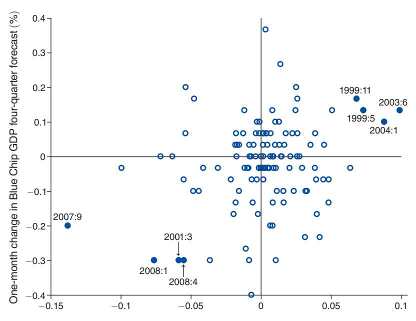
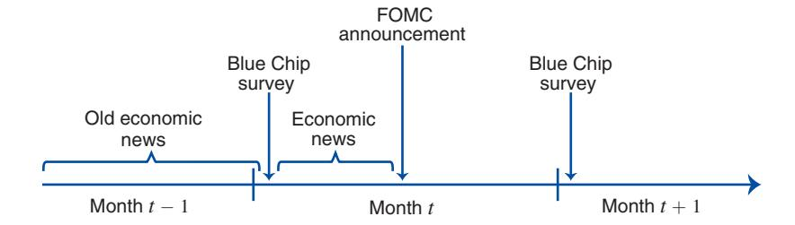

## American Economic Association

An Alternative Explanation for the "Fed Information Effect"

Author(s): Michael D. Bauer and Eric T. Swanson

Source: The American Economic Review, MARCH 2023, Vol. 113, No. 3 (MARCH 2023), pp.

664-700

Published by: American Economic Association

Stable URL: https://www.jstor.org/stable/10.2307/27252434

JSTOR is a not-for-profit service that helps scholars, researchers, and students discover, use, and build upon a wide range of content in a trusted digital archive. We use information technology and tools to increase productivity and facilitate new forms of scholarship. For more information about JSTOR, please contact support@jstor.org.

Your use of the JSTOR archive indicates your acceptance of the Terms & Conditions of Use, available at https://about.jstor.org/terms

American Economic Association is collaborating with JSTOR to digitize, preserve and extend access to *The American Economic Review*

# An Alternative Explanation for the "Fed Information Effect"

By Michael D. Bauer and Eric T. Swanson\*

Regressions of private-sector macroeconomic forecast revisions on monetary policy surprises often produce coefficients with signs opposite to standard macroeconomic models. The "Fed information effect" argues these puzzling results are due to monetary policy surprises revealing Fed private information. We show they are also consistent with a "Fed response to news" channel, where both the Fed and professional forecasters respond to incoming economic news. We present new evidence challenging the Fed information effect and supporting the Fed response to news channel, including: regressions that control for economic news, our own survey of professional forecasters, and financial market responses to FOMC announcements. (JEL D82, E23, E27, E43, E44, E52, E58)

When the Federal Reserve surprises markets with a monetary policy announcement, is that surprise an exogenous "shock," as is typically assumed in the monetary policy VAR literature (e.g., Christiano, Eichenbaum, and Evans 1996; Cochrane and Piazzesi 2002; Faust, Swanson, and Wright 2004b)? Or is the surprise due to other factors, such as a revision in investor beliefs about the state of the economy, as argued by "Fed information effect" studies such as Romer and Romer (2000), Campbell et al. (2012), and Nakamura and Steinsson (2018)? The answers to these questions have important implications for empirical work on the financial and macroeconomic effects of monetary policy. In this paper, we present new evidence that challenges the empirical relevance of the Fed information effect and instead supports an alternative explanation of the empirical evidence, which we call the "Fed response to news" channel.

\*Bauer: Department of Economics, Universität Hamburg, CEPR, and CESifo (email: michael.bauer@uni-hamburg.de www.michaeldbauer.com); Swanson: Department of Economics, University of California, Irvine, and NBER (email: eric.swanson@uci.edu). Mikhail Golosov was the coeditor for this article. We thank the Blue Chip forecasters who answered our survey, Sophia Friesenhahn and Benjamin Shapiro for excellent research assistance, and David Lucca, Kurt Lunsford, Mirela Miescu, Silvia Miranda-Agrippino, Pascal Paul, Giovanni Ricco, David Romer, and participants of various research seminars and conferences for helpful discussions, comments, and suggestions. Any errors or omissions are solely those of the authors. Bauer acknowledges funding by the German Research Foundation (Deutsche Forschungsgemeinschaft, DFG) under the grant 425909451. A previous version of this paper circulated under the title "The Fed's Response to Economic News Explains the 'Fed Information Effect.'"

†Go to https://doi.org/10.1257/aer.20201220 to visit the article page for additional materials and author disclosure statements.

A simple monetary policy reaction function highlights the difference between the Fed information effect and Fed response to news channels. Let

$$i_t = f(X_t) + \varepsilon_t,$$

where  $i_t$  denotes the policy rate at time t,  $X_t$  is a vector describing the state of the economy, the function f describes how the Fed sets policy as a function of the state  $X_t$ , and  $\varepsilon_t$  is a monetary policy "shock," or exogenous random deviation from the Fed's normal policy rule f. When the Fed sets a value of  $i_t$  that differs from the private sector's ex ante expectation,  $E_{t-\delta}i_t$ , where  $\delta$  is some small time interval, then there are three possible sources of that surprise: (i) an exogenous monetary policy shock  $\varepsilon_t$ ; (ii) a Fed information effect, in which the Fed's observation of  $X_t$  differs from the private sector's ex ante estimate  $\hat{X}_{t|t-\delta}$ , conditional on information at time  $t-\delta$ ; or (iii) a difference between the Fed's actual policy response function f and the private sector's ex ante estimate of that function,  $\hat{f}_{t-\delta}$ . Campbell et al. (2012) and Nakamura and Steinsson (2018) devote much attention to distinguishing between channels 1 and 2, essentially assuming that the Fed's monetary policy reaction function is known,  $\hat{f}_{t-\delta} = f$ . We relax this assumption and show that their empirical evidence is also consistent with channel 3. It is this last channel that causes the Fed's response to  $X_t$  (and thus publicly available economic news) to differ from the private sector's expectation of that response, and drives the Fed response to news channel, as we discuss in more detail below.

Figure 1 summarizes the main evidence supporting the Fed information effect in Nakamura and Steinsson (2018) (henceforth, NS). Each circle in the figure corresponds to a Federal Reserve Federal Open Market Committee (FOMC) announcement between January 1995 and March 2014. The change in short-term interest rates in a 30-minute window around each announcement (i.e.,  $i_t - E_{t-\delta}i_t$ ) is plotted on the horizontal axis, while the change in the Blue Chip consensus GDP forecast for the next four quarters is plotted on the vertical axis. Because the Blue Chip survey is conducted only once per month (at the beginning of each month), the change in Blue Chip GDP forecasts on the vertical axis corresponds to Blue Chip forecasters' revisions over the entire month in which the FOMC announcement was made.

If FOMC announcements were exogenous shocks to monetary policy (channel 1, above), then standard macroeconomic theory and VARs would predict a negative relationship in Figure 1: exogenously tighter monetary policy would imply lower GDP over the subsequent four quarters. Instead, there is a statistically significant *positive* relationship in the figure (slope 0.92, t-statistic 2.47). NS argue that this surprising empirical result is evidence of a Fed information effect (channel 2): that is, the Fed observes a value for  $X_t$  that is stronger than the private sector's

&lt;sup>1To match NS, we use exactly the same sample in Figure 1 that they do. We begin the sample in 1995 and end it in March 2014, and we exclude unscheduled FOMC announcements, all FOMC announcements from July 2008 through June 2009, and any FOMC announcement that occurred in the first seven days of the month (to ensure the announcement post-dates the Blue Chip forecast). We measure the change in short-term interest rates in exactly the same way NS do, and we confirmed with them that our monetary policy and Blue Chip data agree exactly with theirs. Figure 1 thus replicates Figure II from NS exactly, except that they group the data into bins while we plot the data directly and highlight the most influential observations.

Federal Reserve monetary policy announcement surprise, 30-min. window (%)

Figure 1. Blue Chip GDP Forecast Revisions and FOMC Monetary Policy Surprises

*Notes:* Change in Blue Chip consensus forecast for real GDP from one month to the next, plotted against the 30-minute change in short-term interest rates around FOMC announcements, from January 1995 to March 2014, excluding July 2008 to June 2009. Each circle represents an FOMC announcement; the eight solid circles denote the most influential observations in the relationship and are labeled with the month and year in which they occurred. Negative observations occurred when the economy was weakening and positive observations when the economy was strengthening. See text for details.

estimate *X*ˆ*t*|*t*−δ and tightens interest rates in response; the private sector infers from this interest rate change that the economy must be stronger than they thought, leading them to revise their GDP forecast upward.

However, the evidence in Figure 1 is also consistent with an alternative explanation, the "Fed response to news" channel that we propose in this paper. The solid circles in Figure 1 denote the eight most influential observations underlying the relationship in the figure. The four observations at the bottom-left all correspond to months in which the US economy was clearly weakening: March 2001, September 2007, January 2008, and April 2008. Naturally, the weakening economy caused *both* the Fed to lower interest rates *and* the Blue Chip forecasters to revise their GDP forecasts downward. Similarly, the four observations at the top-right of the figure correspond to months in which the US economy was strengthening: May 1999, November 1999, June 2003, and January 2004. Again, the strengthening economy caused *both* the Fed to raise interest rates *and* Blue Chip forecasters to revise their GDP forecasts upward.2 A plausible explanation for the positive correlation in

2In June 2003, the Fed lowered interest rates, but by less than the markets had expected, which resulted in a monetary policy tightening surprise. The economy was in an expansion and the news about output had been good, but the unemployment rate had not yet fallen, leading the Fed to cut rates slightly.

Figure 1, then, is that the Fed responded more strongly to the business cycle than markets expected—for example,  $f(X_t) > \hat{f}_{t-\delta}(X_t)$  for the months in the top-right of Figure 1, causing positive monetary policy surprises,  $i_t > E_{t-\delta}i_t$ , at the same time as forecasters upgraded their economic outlook. This is the essence of the Fed response to news channel that we propose in this paper.

To distinguish between the Fed information effect and the Fed response to news channels, we present substantial new empirical evidence, all of which strongly favors the latter. First, in Section I, we revisit the usual regressions of Blue Chip forecast revisions on monetary policy surprises—as in Campbell et al. (2012) (henceforth, CEFJ), NS, and other studies—and show that, although the coefficients on the policy surprises indeed often have the "wrong" sign, their statistical significance is fragile, with the estimates being highly sensitive both to the sample period and to the variable being forecast (GDP, unemployment, or inflation).3

In Section II, we show that economic news released in the days leading up to an FOMC announcement is an important omitted variable in these regressions. For example, the employment report in a given month is a strong predictor of *both* the Blue Chip forecast revision *and* the monetary policy surprise later that month. When we reestimate the regressions with explicit controls for economic news, we find that the coefficient on the monetary policy surprise *reverses its sign* back to what would be predicted by standard macroeconomic models. Thus, omitted variables bias can completely explain the positive relationship in Figure 1.

Section III presents results from our own survey of the 52 forecasters in the Blue Chip panel. According to our survey, these forecasters generally either do not revise their GDP, unemployment, and inflation forecasts in response to FOMC announcements, or they revise them in the conventional way, with a hawkish monetary policy surprise causing downward revisions in forecasts for output, inflation and employment. These survey results are direct evidence that information effects are not a major driver of Blue Chip forecast revisions.

In Section IV, we provide additional empirical evidence that challenges the Fed information effect and supports the Fed response to news channel. In particular, high-frequency responses of stock prices and exchange rates to an FOMC announcement are essentially the same no matter how influential the FOMC announcement was in Figure 1. That is, financial market reactions to those announcements that drive the Blue Chip regression results suggest that they had no more "information effect" than other announcements. We also compare the Blue Chip forecasts to the Fed's own internal "Greenbook" forecasts and show that they have almost exactly equal forecast accuracy, suggesting that the Fed's information advantage and thus information effects are likely to be small.

Finally, Section V lays out a simple model with imperfect information that illustrates the Fed response to news channel and is consistent with all of our empirical findings. We show that incomplete information about the Fed's monetary policy rule can lead to predictability of high-frequency monetary policy surprises, consistent

&lt;sup>3The lack of robustness across samples and variables is inconsistent with a Fed information effect that is constant over time, as is assumed by almost all Fed information effect studies, including Romer and Romer (2000), CEFJ, and NS, although some studies, such as Lunsford (2020) and Jarocinski and Karadi (2020), allow for a time-varying information effect.

with the data. We also use the model to explain implications for empirical work using high-frequency monetary policy surprises to estimate the effects of monetary policy on financial markets and the economy.

Section VI concludes. An Appendix provides our survey questions and additional details from our own survey of Blue Chip forecasters, and a supplementary online Appendix contains extensive additional regression results and robustness checks.

#### Related Literature

Theoretical models of monetary policy have allowed for the possibility that the central bank possesses asymmetric information about the economy since at least the 1970s (e.g., Sargent and Wallace 1975; Barro 1976; Barro and Gordon 1983), but the first paper to argue for the empirical relevance of the Fed information effect is Romer and Romer (2000). They found that the Fed has substantial information about future inflation that private sector forecasters do not have, and that the Fed's interest rate changes could be used to infer that information.4

Faust, Swanson, and Wright (2004a) showed that FOMC announcements do not significantly affect private-sector forecasts of upcoming macroeconomic data releases, such as GDP, retail sales, CPI, etc., while other macroeconomic data releases such as the employment report, do. They conclude that there is little or no evidence of a Fed information effect in the data. They also show that the Romer and Romer (2000) results for inflation are due to the Volcker disinflation in the early 1980s; excluding that one episode, the Fed's inflation forecasts are no better than those of the private sector.

Campbell et al. (2012) study how the Fed's monetary policy announcements affect Blue Chip forecasts of unemployment and inflation. Consistent with Faust, Swanson, and Wright (2004a) and contrary to Romer and Romer (2000), they find no evidence that Fed announcements contain significant information about inflation. However, CEFJ find that monetary policy tightenings are associated with a significant *downward* revision in Blue Chip forecasts of unemployment, which they conclude is due to a Fed information effect. They introduce the term "Delphic forward guidance" to refer to situations in which forward guidance by the FOMC conveys information to the private sector about the future evolution of the economy.

Nakamura and Steinsson (2018) investigate how FOMC announcements affect Blue Chip forecasts of real GDP. They find that monetary policy tightenings are associated with a significant *upward* revision in Blue Chip GDP forecasts, and like CEFJ, conclude that a Fed information effect is present. In Section I, below, we explore both the CEFJ and NS results in more detail and show that they are sensitive to sample period and the variable being forecast. For example, using NS's sample and methods, there is no significant information effect for unemployment (contrary to CEFJ) or for inflation (contrary to Romer and Romer 2000).

&lt;sup>4Romer and Romer (2000) appealed to this Fed information effect to explain why long-term US Treasury yields seemed to rise in response to federal funds rate changes. However, Gürkaynak, Sack, and Swanson (2005a), using a high-frequency futures-based measure of federal funds rate surprises, showed that far-ahead forward US Treasury yields actually *fall* in response to FOMC tightenings. Thus, an information effect is not needed to explain the response of long-term Treasury yields to FOMC announcements.

Lunsford (2020) performs a detailed analysis of the Fed's forward guidance announcements from February 2000 to May 2006 and finds evidence of a Fed information effect in the period from February 2000 to August 2003, but not afterward. Like Lunsford, we find no evidence of an information effect in the period after 2003; unlike Lunsford, we attribute the appearance of a "Fed information effect" from 2000–2003 to the Fed's response to the deteriorating economy in early 2001 and the improving economy in mid-2003.

Jarocinski and Karadi (2020) decompose monetary policy surprises in the US and euro area into "pure monetary" shocks and "information" shocks, depending on whether stock prices move in the opposite direction or same direction as interest rates, respectively. They estimate that pure monetary shocks cause future GDP to decline, while pure information shocks cause future GDP to increase. Cieslak and Schrimpf (2019) decompose monetary policy surprises into "pure monetary," "information," and "risk premium" shocks according to the minute-by-minute covariance of stock prices and short- and long-term interest rates in a narrow window of time around each announcement. They find a relatively small role for information shocks in FOMC announcements, but a larger role for those shocks in FOMC minutes releases and speeches by the Fed chair. In our analysis below, we also analyze high-frequency stock market responses to FOMC announcements and find little or no evidence of an information effect, largely consistent with Cieslak and Schrimpf (2019) and Figure 1 of Jarocinski and Karadi (2020), which reports very few significant information shocks.5

A key part of our "Fed response to news" channel is that the Fed has often surprised financial markets by responding to publicly available economic news by more than the markets expected. Cieslak (2018) and Schmeling, Schrimpf, and Steffensen (2021) provide extensive empirical evidence supporting that assumption, which we discuss in Sections II and V.

A recent paper by Sastry (2021) allows for differences between the Fed and private sector in information about the economy, knowledge of the monetary policy rule, and responsiveness of estimates of the state of the economy to incoming economic news. Thus, Sastry distinguishes between two reasons for the surprisingly strong reaction of the Fed to economic news (our "Fed response to news" channel): First, changes in the state of the economy,  $X_t$ , can cause the Fed to change the interest rate by more than the private sector expected, and second, economic news can cause the Fed to revise its estimate of the state of the economy,  $X_t$ , by more than the private sector expected. Sastry's paper provides evidence in support of both of these phenomena, with underreaction of the private sector to economic news being particularly important. Consistent with our results, Sastry finds essentially no role for a Fed information effect in the data.

Finally, some studies include information effects in a DSGE model and find that they help explain certain aspects of the macro data. For example, Melosi (2017) incorporates information effects into a New Keynesian DSGE model to fit the persistence of inflation and inflation expectations in the 1970s. Our evidence in this paper does not directly reject these types of models or model

&lt;sup>5In other words, Jarocinski and Karadi's identification produces a small set of significant information shocks, which have the effects that they report.

estimates; however, we do not find any evidence in our wide variety of data that would support such information effect channels.6

In recent follow-up work (Bauer and Swanson, forthcoming), we extend the empirical evidence presented here for the correlation between high-frequency monetary policy surprises and observed economic news. We also study the consequences of accounting for this correlation in the estimation of monetary policy's effects on financial markets and the macroeconomy, following the recommendations of the present paper.

## I. The "Fed Information Effect" and Blue Chip Forecasts

We begin by replicating and extending the empirical evidence of a "Fed information effect" presented by Romer and Romer (2000), CEFJ, and NS, based on the revision of Blue Chip survey forecasts around FOMC monetary policy announcements. We also investigate the robustness of this evidence across samples and variable being forecast (unemployment, GDP, and inflation).

#### A. Data: Blue Chip Forecasts and Monetary Policy Surprises

We draw on numerous data sources for our analysis below. Detailed citations to all of these sources are provided in the online replication package for this paper (Bauer and Swanson 2023)

The *Blue Chip Economic Indicators* newsletter has conducted a survey of professional forecasters once per month, over the first three business days of each month, since 1976.7 The forecasting teams at approximately 50 financial institutions, major corporations, and economic forecasting firms are surveyed about their predictions for a variety of macroeconomic indicators for each quarter over the current and next calendar years. Thus, the maximal forecast horizon ranges from four quarters (when the survey is conducted in the last quarter of a calendar year) to seven quarters (when it is conducted in the first quarter). The survey covers real US Gross Domestic Product (GDP) growth, the unemployment rate, the consumer price index (CPI) inflation rate, the 3-month Treasury bill rate, the 10-year Treasury yield, and a few other macroeconomic variables such as industrial production and net exports. Empirical work using the Blue Chip survey has typically focused on real GDP, the unemployment rate, and/or CPI inflation, and we focus on these three variables in our analysis below.

Blue Chip reports the "consensus" forecast for each variable in each quarter, which is the arithmetic mean of the individual forecasts. Our analysis focuses on how the Blue Chip consensus forecast changed from one month to the next, and how those changes were related to FOMC monetary policy announcements. For simplicity, to reduce the number of reported coefficients in the tables below, we follow NS and consider the change in the *average* of the 1-, 2-, and 3-quarter-ahead con-

&lt;sup>6 Also, the 1970s predate our data, so we have little to say about whether a Fed information effect was important during that period.

&lt;sup>7Beginning in December 2000, the Blue Chip survey is completed by the second business day of each month.

sensus forecasts.8 Although Romer and Romer (2000) is the original paper finding evidence of a Fed information effect for Blue Chip inflation forecasts, researchers using more recent samples have consistently found little or no evidence of such an effect for inflation; thus, we focus on replicating the results in CEFJ for unemployment and NS for real GDP growth, although we consider inflation as well.

We relate these Blue Chip forecast revisions to FOMC monetary policy announcements. Over our sample, there are eight regularly scheduled FOMC announcements per year, occurring after each scheduled FOMC meeting, spaced roughly six to eight weeks apart. In addition, the FOMC has occasionally made unscheduled monetary policy announcements that lie in between regularly scheduled meetings, typically when it wanted to lower interest rates in response to a weakening economy without having to wait until the next scheduled meeting. We consider samples that both include and exclude these unscheduled FOMC announcements in our analysis, below.

Financial markets and professional forecasters are forward-looking, so we would not expect them to respond to changes in monetary policy that were widely anticipated ahead of time. For this reason, researchers typically focus on monetary policy surprises—the unexpected component of FOMC announcements. We compute monetary policy announcement surprises in two different ways, following the approaches in CEFJ and NS. CEFJ use the "target factor" and "path factor" computed by Gürkaynak, Sack, and Swanson (2005b) (henceforth, GSS), which correspond to the surprise change in the federal funds rate target and the surprise change in forward guidance, respectively (where forward guidance is defined to be any additional information about the future path of the federal funds rate over the next several months). These surprises are computed using changes in short-maturity federal funds futures contracts and two- to four-quarter-ahead Eurodollar futures contracts in a narrow, 30-minute window surrounding each FOMC announcement. The scale of the target factor is normalized so that a one-unit change corresponds to a one percent surprise increase in the federal funds rate, while the scale of the path factor is normalized so that a one-unit change increases the four-quarter-ahead Eurodollar futures rate by one percentage point. NS use the same set of futures contracts over the same 30-minute window, but condense the monetary policy surprise into a single dimension by taking the first principal component of rate changes essentially an average of the GSS target and path factors—which is then scaled so that a one-unit change increases the one-year zero-coupon Treasury yield (as

8Computing the change in these quarterly horizon forecasts from January to February or from February to March (for example) is straightforward. To compute the change in the Blue Chip forecast from March to April, we follow Nakamura and Steinsson and define the change in the 1-quarter-ahead forecast to be the 1-quarter-ahead forecast in April minus the 2-quarter-ahead forecast in March. The Blue Chip forecast changes for other months and horizons are defined analogously.

9In principle, one can study the Fed information effect and Fed response to news channel for other (non-FOMC) monetary policy announcements as well, such as speeches, testimony, and press conferences by the Fed chair (see Cieslak and Schrimpf 2019). We restrict attention to FOMC announcements for simplicity and because those have been the focus of the most prominent previous Fed information effect studies (Romer and Romer 2000; CEFJ, NS). FOMC announcements have also been studied extensively in the monetary policy literature (e.g., Kuttner 2001; Gürkaynak et al. 2005b; Bernanke and Kuttner 2005), so the dates, times, and market reactions to these announcements are well established. Note, however, that this implies our results apply only to FOMC announcements and do not provide any evidence about how substantial the Fed information effect might be for other types of monetary policy announcements.

TABLE 1—FED INFORMATION EFFECT REPLICATION AND SAMPLE EXTENSION

| Blue Chip forecast revision:                                          | Unemploy            | ment rate    | Real GD      | P growth    | CPI inflation |           |
|-----------------------------------------------------------------------|---------------------|--------------|--------------|-------------|---------------|-----------|
|                                                                       | (1)                 | (2)          | (3)          | (4)         | (5)           | (6)       |
| Panel A. Campbell et al. replication                                  | sample: 1/1990–6/.  | 2007 (N =    | 129)         |             |               |           |
| Target                                                                | -0.113              |              | 0.097        |             | 0.146         |           |
|                                                                       | (0.103)             |              | (0.187)      |             | (0.115)       |           |
| Path                                                                  | -0.226              |              | 0.273        |             | 0.102         |           |
|                                                                       | (0.147)             |              | (0.299)      |             | (0.157)       |           |
| $R^2$                                                                 | 0.04                |              | 0.02         |             | 0.02          |           |
| Panel B. Nakamura-Steinsson replication and $7/2008-6/2009$ (N = 120) | ation sample: 1/199 | 95–3/2014, 6 | excluding un | scheduled F | OMC annoi     | ıncements |
| NS surprise                                                           |                     | -0.165       |              | 0.920       |               | 0.062     |
|                                                                       |                     | (0.293)      |              | (0.376)     |               | (0.249)   |
| $R^2$                                                                 |                     | 0.00         |              | 0.06        |               | 0.00      |
| Panel C. Full sample: 1/1990–6/201                                    | 9(N = 217)          |              |              |             |               |           |
| Target                                                                | -0.161              |              | 0.162        |             | 0.163         |           |
|                                                                       | (0.112)             |              | (0.173)      |             | (0.097)       |           |
| Path                                                                  | -0.237              |              | 0.139        |             | 0.084         |           |
|                                                                       | (0.145)             |              | (0.226)      |             | (0.125)       |           |
| NS surprise                                                           |                     | -0.391       |              | 0.325       |               | 0.288     |
|                                                                       |                     | (0.194)      |              | (0.302)     |               | (0.168)   |
| $R^2$                                                                 | 0.03                | 0.02         | 0.01         | 0.01        | 0.02          | 0.02      |
| Panel D. Full sample: 1/1990–6/201                                    | 9, excluding unsch  | eduled FOM   | IC announce  | ements (N = | = 206)        |           |
| Target                                                                | 0.070               |              | 0.126        |             | 0.123         |           |
| _                                                                     | (0.181)             |              | (0.241)      |             | (0.149)       |           |
| Path                                                                  | -0.315              |              | 0.369        |             | 0.133         |           |
|                                                                       | (0.153)             |              | (0.202)      |             | (0.128)       |           |
| NS surprise                                                           |                     | -0.298       |              | 0.542       |               | 0.267     |
|                                                                       |                     | (0.248)      |              | (0.331)     |               | (0.204)   |
| $R^2$                                                                 | 0.02                | 0.01         | 0.02         | 0.02        | 0.01          | 0.01      |

Notes: Replication and extension of Campbell et al. (2012) and Nakamura and Steinsson (2018) Blue Chip forecast regression results. Columns 1, 3, and 5 report coefficients  $\beta$ ,  $\gamma$ , and  $R^2$  from regressions  $BCrev_t = \alpha + \beta targe t_t + \gamma pat h_t + \varepsilon_t$ , where t indexes FOMC announcements,  $targe t_t$  denotes the surprise change in the federal funds rate in a 30-minute window bracketing the FOMC announcement,  $pat h_t$  denotes the surprise change in forward guidance in the same 30-minute window, and  $BCrev_t$  denotes the one-month change in the Blue Chip consensus forecast for the next three quarters, over the month bracketing the FOMC announcement. Columns 2, 4, and 6 report coefficients  $\theta$  and  $R^2$  from regressions  $BCrev_t = \phi + \theta mp s_t + \eta_t$ , where  $mp s_t$  denotes the Nakamura-Steinsson (NS) monetary policy surprise, the first principal component of the 30-minute changes in five short-term interest rate futures rates around the FOMC announcement. Bootstrapped standard errors in parentheses. See text for details.

measured by Gürkaynak, Sack, and Wright 2007) by one percentage point. Our high-frequency futures data for computing these monetary policy surprises, using either method, begins in January 1990, as discussed in GSS.

## B. Fed Information Effect Regressions

Table 1 reports results from our replication and extension of the basic Fed information effect regressions in CEFJ and NS. Columns 1, 3, and 5 in Table 1 consider Blue Chip forecast revision regressions of the form

(2) 
$$BCrev_t = \alpha + \beta target_t + \gamma path_t + \varepsilon_t$$

where t indexes FOMC announcements,  $target_t$  denotes the GSS target factor,  $path_t$  is the GSS path factor, computed as described above, and  $BCrev_t$  is the one-month revision in the Blue Chip consensus forecast of a given variable averaged over the 1-, 2-, and 3-quarter-ahead horizons. Note that  $target_t$  and  $path_t$  are high-frequency changes in the 30-minute window surrounding the FOMC announcement at date t, while  $BCrev_t$  is a lower-frequency, one-month change over the calendar month containing the FOMC announcement. Oclumns 2, 4, and 6 of Table 1 consider analogous regressions of the form

(3) 
$$BCrev_t = \phi + \theta mps_t + \eta_t$$

where *mpst* denotes the NS monetary policy surprise measure described above. The Blue Chip survey is conducted during the first three business days of each month (first two days after December 2000), and we ensure that the Blue Chip forecast revisions bracket the FOMC announcements by dropping from our analysis any FOMC announcements that occur before the beginning-of-month Blue Chip survey is completed.

In each panel of Table 1, columns 1 and 2 consider the Blue Chip forecast of the unemployment rate, columns 3 and 4 the Blue Chip forecast of the real GDP growth rate, and columns 5 and 6 the Blue Chip forecast of the CPI inflation rate, as discussed above. Standard errors are reported in parentheses below each coefficient estimate. Because the right-hand-side variables in equations (2) and (3) are generated regressors, we compute these standard errors using 50,000 bootstrap replications in order to take into account the extra sampling variability associated with the computation of the target factor, path factor, and NS first principal component.11

In the top panel A, we consider exactly the same sample used by CEFJ, which leaves us with 129 observations for each regression, and we are able to replicate the main features of their results. We find that a surprise tightening in the federal funds rate target or forward guidance is associated with a *downward* revision in the Blue Chip consensus unemployment forecast, by about 0.1 or 0.2 percentage points, respectively, for every percentage point surprise in the federal funds rate or forward guidance. This relationship is not quite statistically significant for the three-quarter average forecast in the table, but is significant for some of the individual quarterly forecast horizons (not shown). As CEFJ pointed out, this response is puzzling if one thought the change in forward guidance was a pure monetary policy shock: in that case, standard macroeconomic models and VARs predict that unemployment should

&lt;sup>10Regularly scheduled FOMC announcements are spaced far enough apart that two announcements never occur in the same month. In samples where we consider unscheduled as well as scheduled FOMC announcements, if an unscheduled announcement occurs in the same month as a scheduled announcement, then we follow Campbell et al. (2012) and add those two announcement surprises together to get one "total monetary policy announcement surprise" for that month.

&lt;sup>11The regressors are estimated principal components, hence there is some extra sampling variability associated with the factor computation itself that our bootstrapping takes into account. Both CEFJ and NS treat their regressors as fixed in repeated samples, which ignores this additional source of uncertainty. However, our bootstrapped standard errors are only slightly larger than the asymptotic ones in general because the principal component factors fit the data well. See online Appendix A for details.

&lt;sup>12CEFJ use January 1990 to June 2007 as their baseline sample and include unscheduled as well as scheduled FOMC announcements. In addition, CEFJ exclude FOMC announcements that occurred in the first three business days of the month, even after December 2000, so we do that in panel A as well.

increase following a monetary policy tightening. The results for real GDP growth and CPI inflation also have puzzling signs, but are not statistically significant.

In panel B, we consider exactly the same sample used by NS, which leaves us with 120 observations for each regression, and we are able to replicate the main features of their results.13 NS focused on Blue Chip forecasts of real GDP growth rather than unemployment or inflation, and, like them, we find that a surprise monetary policy tightening is associated with a statistically significant *upward* revision in the Blue Chip consensus forecast for real GDP growth, by about 0.9 percentage points for each percentage point surprise in the NS monetary policy measure. Again, this estimate contradicts the pure monetary policy shock view of an FOMC announcement, according to which a monetary policy tightening should cause future GDP to decrease. The results for the unemployment rate and CPI inflation also have puzzling signs, although they are not statistically significant.

Both CEFJ and NS interpret their results as evidence of a Fed information effect channel of monetary policy, but even within panels A and B there are potential concerns with this interpretation. First, there is little or no evidence that FOMC announcements communicate any information about inflation, despite the fact that this was the original Fed information effect channel promoted by Romer and Romer (2000). Apparently, updating the Romer-Romer sample to include more recent data overturns that earlier empirical finding, an observation also made by Faust, Swanson, and Wright (2004a). Second, the CEFJ finding of an information effect applies only to unemployment—in their sample, there is no statistically significant response of Blue Chip forecasts for real GDP, in contrast to the findings in NS. Similarly, the NS finding of a significant information effect for real GDP in their sample applies only to GDP and not to unemployment, in contrast to the findings in CEFJ. Thus, even among these three influential Fed information effect studies, there is a lack of robustness across sample period and variable being forecast. Third, the *R*2 of these regressions is extremely low, ranging from 0 to 6 percent. The vast majority of variation in these survey forecast revisions is driven by factors other than high-frequency FOMC announcement surprises, an observation to which we return below.

In panels C and D of Table 1, we extend the CEFJ and NS analyses to the full sample for which we have data, January 1990 to June 2019.14 In panel C, we include unscheduled as well as scheduled FOMC announcements, for a total of 217 observations, while in panel D, we exclude unscheduled FOMC announcements, leaving 206 observations.15 In panels C and D, the statistical significance of the

13NS use January 1995 to March 2014 as their baseline sample, but exclude unscheduled FOMC announcements and all FOMC announcements from July 2008 to June 2009. In addition, NS exclude any FOMC announce-

ment that occurred in the first seven calendar days of the month, so we do that in panel B as well. 14The FOMC did not explicitly announce its monetary policy decisions in official press releases until February 1994; however, it still conveyed its decisions to financial markets through changes in the discount rate or through the size and type of open market operation conducted the following morning, as discussed in GSS and CEFJ. As a robustness check, we also consider starting our sample in February 1994 and the results, shown in online

Appendix A, are very similar. 15Recall that we exclude any FOMC announcement that took place in the first three business days of the month (first two days after December 2000) to ensure that the announcement post-dates the initial Blue Chip forecast. Consistent with the rest of the literature, we also exclude the unscheduled FOMC announcement on September 17, 2001, as it occurred before financial markets opened and after they had been closed for several days following the September 11 terrorist atttacks, so it's not possible to get a high-frequency measure of the surprise component of the FOMC announcement on that date.

FIGURE 2. ILLUSTRATION OF THE "FED RESPONSE TO NEWS" CHANNEL

*Notes:* The Blue Chip survey of forecasters is conducted in the first two to three business days of each month, while FOMC announcements can occur at any point within the month. In between the time of the Blue Chip survey and the FOMC announcement, significant economic news, such as the employment report, is often released. Old economic news, released before the Blue Chip survey, can also be relevant if some Blue Chip forecasters update their forecasts sluggishly. See text for details.

estimated coefficients is generally low and, similar to panels A and B, not very robust across samples and the variable being forecast. For example, looking down columns 3 and 4, the results for real GDP are only statistically significant when unscheduled announcements and especially July 2008 to June 2009 are excluded (panels B and D). But looking down columns 5 and 6, the results for CPI inflation are only statistically significant when unscheduled FOMC announcements and July 2008 to June 2009 are *included* (panel C). Finally, the very low  $R^2$  is again a cause for concern.

Overall, we find generally low levels of statistical significance and very low  $R^2$  for standard Fed information effect regressions using monthly Blue Chip forecast revision data. The estimates are also quite sensitive with respect to sample period and the variable being forecast, a fragility that is inconsistent with a constant Fed information effect over time, as is typically assumed in the literature. Nevertheless, almost all of the coefficients in Table 1 have a puzzling sign opposite to what standard macroeconomic theory would predict. In the next section, we provide an explanation for all of these results based on omitted variable bias.

## II. The "Fed Response to News" Channel

Figure 2 illustrates our alternative explanation for the puzzling Blue Chip survey regression results in Table 1 and Figure 1, the "Fed response to news" channel. The Blue Chip survey is conducted at the beginning of each month, while the FOMC announcement can occur at any point within the month (on average, FOMC announcements occur on the seventeenth day of the month in our sample). In between the beginning-of-month Blue Chip survey and the day of the FOMC announcement, significant economic news is often released. An important example

&lt;sup>16 A small number of studies, such as Lunsford (2020) and Jarocinski and Karadi (2020), argue for a Fed information effect that varies over time. However, a large majority of Fed information effect studies, including Romer and Romer (2000), CEFJ, and NS, assume a constant information effect.

is the Bureau of Labor Statistics' employment report, which is typically released on the first Friday of each month and includes detailed information about nonfarm payroll employment, the unemployment rate, average weekly hours, average hourly earnings, and other labor market statistics. Data on consumer and producer price inflation, retail sales, international trade, industrial production, capacity utilization, and many other statistics are released around the second week of each month and, of course, new financial market data on stock prices, bond yields, and commodity prices arrives every day throughout the month.

This economic news is of course an important driver of Blue Chip forecast revisions for unemployment, GDP, and inflation, as we will confirm below. Thus, the simple Blue Chip forecast regressions (2) and (3) have an omitted variables problem and should instead be written

(4) 
$$BCrev_t = \alpha + \beta target_t + \gamma path_t + \delta' news_t + \varepsilon_t$$

and

(5) 
$$BCrev_t = \phi + \theta \, mps_t + \psi' news_t + \eta_t,$$

where  $news_t$  is a vector containing the types of economic news discussed above. In general, the coefficients  $\beta$ ,  $\gamma$ , and  $\theta$  in regressions (2) and (3) will be biased if news is correlated with target, path, and mps, as is indeed suggested by the influential observations in Figure 1. In the remainder of this section, we demonstrate that this omitted variables bias is substantial and that including explicit controls for the omitted economic news using equations (4) and (5) drastically changes the estimates for  $\beta$ ,  $\gamma$ , and  $\theta$ , including their signs.

Before proceeding, we also note that old economic news, released before the beginning-of-month Blue Chip forecast (see Figure 2), can also be relevant if some of the Blue Chip forecasters do not update their forecasts immediately following the release of that news. The evidence in Coibion and Gorodnichenko (2012, 2015) on informational rigidities in the Blue Chip forecasts suggests that this is the case, so we allow for this possibility by also considering some economic news measures released prior to the Blue Chip survey in month t.

## A. Economic News Predicts Blue Chip Forecast Revisions

We first verify that economic news is a strong predictor of Blue Chip forecast revisions. This is not surprising, but it is nevertheless important to determine which economic data releases are particularly important for explaining Blue Chip forecast revisions in unemployment, GDP, and inflation. We run regressions of the form

(6) 
$$BCrev_t = \alpha + \beta' news_t + \varepsilon_t$$

where t indexes months containing an FOMC announcement and  $BCrev_t$  denotes the revision in the Blue Chip consensus forecast of a given variable over month t.

| TABLE 2—ECONOM | IC NEWS PREDICT | S BLUE CHIP | FORECAST REVISIONS |
|----------------|-----------------|-------------|--------------------|
|                |                 |             |                    |

| Blue Chip forecast revision:                      | Unemployment rate (1) | Real GDP growth (2) | CPI inflation (3) |
|---------------------------------------------------|-----------------------|---------------------|-------------------|
| Macroeconomic news                                |                       |                     |                   |
| Unemployment surprise                             | 0.308 (0.037)      | -0.010 (0.074)      | 0.027 $(0.045)$   |
| Payrolls surprise                                 | -0.121 (0.056)        | -0.100 $(0.110)$    | -0.127 (0.067)    |
| GDP surprise                                      | -0.020 (0.013)        | 0.064 (0.026)    | 0.010 (0.016)  |
| BBK index                                         | -0.047 (0.008)        | 0.031 (0.016)    | 0.008 (0.010)  |
| Change in core CPI inflation from 6 mos. previous | -0.025 (0.009)        | -0.016 (0.019)      | 0.032 (0.011)  |
| Expectation of core CPI release                   | 0.157 (0.098)      | -0.361 (0.196)      | 0.200 (0.119)  |
| Core CPI surprise                                 | 0.097 (0.071)      | -0.187 (0.140)   | 0.209 (0.085)  |
| Financial news                                    |                       |                     |                   |
| $\Delta \log$ S&P500                              | -0.212 (0.085)        | 0.620 (0.167)    | 0.009 (0.102)  |
| $\Delta$ yield curve slope                        | -0.023 (0.011)        | -0.012 (0.022)      | 0.013 (0.014)  |
| $\Delta$ log pcommodity                           | -0.111 (0.104)     | 0.145 (0.206)    | 0.429 (0.126)  |
| $R^2$                                             | 0.64                  | 0.40                | 0.31              |

Notes: Estimated coefficients  $\beta$  and  $R^2$  from regressions  $BCrev_t = \alpha + \beta'news_t + \varepsilon_t$ , where t indexes months,  $BCrev_t$  denotes the one-month change in the Blue Chip consensus forecast for the next three quarters for the variable listed in each column, and  $news_t$  contains the measures of economic news listed in each row. The surprise in a macroeoconomic data release is the released value minus the market expectation of that release from just a few days prior. The BBK index summarizes all major macroeconomic data releases that month and is from Brave et al. (2019). Sample: all months containing an FOMC announcement from 1/1990 to 6/2019 (N=217 observations). Each regression also includes a constant, time trend, and the previous month's Blue Chip forecast revisions; coefficients for those variables (and results for alternative estimation samples) are reported in online Appendix B. Bootstrapped standard errors in parentheses. See notes to Table 1 and text for details.

While one can also perform regression (6) on a sample including all months (which produces essentially identical results), we focus here on revisions around FOMC announcements because that is the sample in regressions (2) and (3), which have the omitted variable problem.

Results are reported in Table 2 for our full sample, January 1990 to June 2019 (results for other samples are very similar and are provided in online Appendix B). The table reports results for Blue Chip forecast revisions in the unemployment rate in the first column, real GDP growth in the second column, and the CPI inflation rate in the third column. The parsimonious set of macroeconomic data releases, lagged macroeconomic variables (an example of "old news"), and financial market news in the table balances the simplicity of a relatively small set of predictors against the need to have good explanatory power for the Blue Chip forecast revisions. Each regression also includes a constant, a time trend (which is important for inflation), and one lag of the Blue Chip forecast revisions for unemployment, GDP, and inflation, as suggested by the evidence in Coibion and Gorodnichenko (2012, 2015); these coefficients are not reported in Table 2 in the interest of space and simplicity,

but are provided in online Appendix B. Bootstrapped standard errors using 50,000 bootstrap replications are reported in parentheses beneath each coefficient estimate.

For macroeconomic data releases, we include the surprise component of the unemployment rate and nonfarm payrolls releases from the beginning of month t, the surprise component of the GDP release from the end of month t-1, and the surprise component of the core CPI release from the second week of month t. 17 Note that the data releases for unemployment, nonfarm payrolls, and inflation in month t are for the values of those variables in month t-1, while data for GDP pertains to the previous quarter. The surprise component of each release is calculated as the actual value of the data release minus the market expectation just prior to the release, as measured by the Money Market Services survey of market participants. 18 We only include a given release in the regression if it predates the FOMC monetary policy announcement that month, as in Figure 2, although our results are not sensitive to this restriction. 19 Data for GDP is released at the end of month t-1, so it is an example of "old economic news" in Figure 2, but consistent with Coibion and Gorodnichenko (2012, 2015), it is nevertheless an important explanatory variable for Blue Chip forecast revisions, especially for GDP. We also include a more comprehensive measure of economic news released in month t, the "big data" business cycle indicator of Brave, Butters, and Kelley (2019, henceforth, BBK), which incorporates the information from all of the major macroeconomic data releases each month to come up with a single index of economic activity.20

For lagged macroeconomic indicators, we include two measures of inflation: the market expectation of the upcoming core CPI inflation release, as measured by the Money Market Services survey, and the change in the most recent six-month core CPI inflation rate from the same rate six months earlier—i.e.,  $\left(\left(\log \text{CPIX}_{t-2} - \log \text{CPIX}_{t-8}\right) - \left(\log \text{CPIX}_{t-8} - \log \text{CPIX}_{t-14}\right)\right) * 200$ .

For financial market news, we include the change in the natural log of the S&P500 stock price index, the change in the yield curve slope (in percentage points), and the change in the natural log of an index of commodity prices, all measured from 13 weeks before the FOMC announcement to the day before the FOMC announcement.21 The 13-week window for these changes predates the beginning of

&lt;sup>17The unemployment rate is in percentage points, the core CPI inflation rate is the percentage point change from the previous month, GDP is the annualized percentage point change in real GDP from the previous quarter, and nonfarm payrolls is the change in employment from the previous month in thousands of workers (which we divide by 1,000 to put on a similar scale to the other variables). Interestingly, news about the core CPI is a much better predictor of Blue Chip CPI inflation forecast revisions than news about headline CPI, despite the fact that the Blue Chip forecast is for headline CPI inflation.

&lt;sup>18 See Andersen and Bollerslev (1998) and Gürkaynak, Sack, and Swanson (2005a) for additional discussion and details regarding the Money Market Services expectations data.

&lt;sup>19 If there are multiple FOMC announcements in a given month, then we require all macroeconomic and financial news variables to be known as of the date of the first announcement in that month.

 $^{20}$  We use the BBK index for month t-1, which is computed using data released in month t and is reported by the Chicago Fed at the beginning of month t+1. Thus, some of the macroeconomic data releases underlying the BBK index will typically post-date the FOMC announcement in month t; this is not a problem in regression (6), but a Fed information effect could manifest itself in our regressions involving FOMC monetary policy surprises through the BBK index if FOMC announcements reveal information about upcoming macroeconomic data releases later in month t. All of our results below, however, are robust to the exclusion of the BBK index.

&lt;sup>21 The yield curve slope is the 10-year constant-maturity Treasury yield minus the 3-month constant-maturity Treasury yield. The change in the log commodity price index is the change in the log Bloomberg total commodity price index BCOM minus 0.4 times the change in the log Bloomberg agricultural commodity price index BCOMAG. (When these two commodity price indexes are entered into the Blue Chip CPI forecast regression

month t, so it includes old economic news as well as a component that post-dates the Blue Chip forecast (see Figure 2); in the interest of space and simplicity, we do not separate out these two components in Table 2, but both components are typically significant when the total is and they are reported separately in online Appendix B.

The results in Table 2 confirm that these measures of economic news are powerful predictors of monthly Blue Chip forecast revisions. The  $R^2$  values range from 31 percent to 64 percent. The coefficients in the table generally have the expected signs and many of them are highly statistically significant: for example, a one percentage point surprise increase in the unemployment rate leads to an upward revision in the Blue Chip forecast for unemployment over the next three quarters of about 0.3 percentage points; a one percentage point surprise increase in real GDP leads to an upward revision in the GDP forecast of about 0.06 percentage points; and a one percentage point surprise increase in core CPI inflation leads to an upward revision in the CPI inflation forecast of about 0.2 percentage points. Stock prices and commodity prices are also highly statistically significant predictors, with a ten percent increase in stock prices (commodity prices) leading to an upward revision in the Blue Chip GDP forecast (CPI inflation forecast) of about 0.06 percentage points (0.04 percentage points).

## B. Economic News Predicts Monetary Policy Surprises

We next show that economic news is correlated with the high-frequency monetary policy surprises in regressions (2) and (3). We run regressions of the form

(7) 
$$mps_t = \alpha + \beta' news_t + \varepsilon_t,$$

where t indexes FOMC announcements,  $mps_t$  is a high-frequency measure of the monetary policy surprise in a narrow window of time around the FOMC announcement (either the target factor, the path factor, or the NS surprise), and  $news_t$  denotes the vector of economic news measures described above.

Table 3 reports results from this regression for our full sample, January 1990 to June 2019 (results for other samples are very similar and are provided in online Appendix B). Results for the target factor are reported in the first column, the path factor in the second column, and the NS surprise in the third column. Bootstrapped standard errors using 50,000 bootstrap replications are reported in parentheses beneath each coefficient estimate.

Many coefficients in Table 3 are statistically significant and the  $\mathbb{R}^2$  range from 12 to 20 percent. The stock market and commodity prices are especially strong predictors of upcoming monetary policy surprises, while the yield curve slope, nonfarm payrolls release, and GDP release are also important. The signs of these coefficients are intuitive: economic news about higher output or inflation predicts tighter monetary policy. The monetary policy surprises are measured in percentage points,

separately, both are highly statistically significant with a coefficient ratio of about -0.4, suggesting the composite index defined here.)

 $^{22}$ This response to GDP surprises may seem small, but recall that the GDP release is old news and many Blue Chip forecasters likely have already incorporated it into their forecasts by the beginning of month t.

&lt;sup>23 For the yield curve slope, a lower 3-month Treasury yield predicts a subsequent monetary policy easing.

Core CPI surprise

Financial news

 $R^2$ 

 $\Delta \log \text{S\&P500}$ 

 $\Delta$  yield curve slope

 $\Delta$  log pcommodity

Target Monetary policy surprise: Path NS surprise (1) (2)(3) Macroeconomic news Unemployment surprise -0.010-0.020-0.013(0.044)(0.029)(0.023)Payrolls surprise 0.125 0.018 0.070 (0.067)(0.045)(0.036)GDP surprise 0.003 0.015 0.008 (0.016)(0.011)(0.009)BBK index 0.003 0.0000.001 (0.008)(0.006)(0.005)Change in core CPI inflation 0.004 0.009 0.006 from 6 mos. previous (0.011)(0.008)(0.006)Expectation of core CPI release -0.1240.081 -0.029

(0.101)

0.042

(0.081)

0.155

(0.095)

-0.022

(0.013)

0.076

(0.107)

0.12

(0.069)

0.079

(0.055)

0.150

(0.064)

(0.009)

0.171

(0.072)

0.15

-0.011

(0.054)

0.054

(0.044)

0.141

(0.052)

-0.015

(0.007)

0.110

(0.058)

0.20

TABLE 3—ECONOMIC NEWS PREDICTS HIGH-FREQUENCY MONETARY POLICY SURPRISES

*Notes:* Estimated coefficients  $\beta$  and  $R^2$  from regressions  $mps_t = \alpha + \beta'news_t + \varepsilon_t$ , where t indexes months,  $mps_t$  denotes the 30-minute window measure of the monetary policy surprise listed in each column, and  $news_t$  contains the measures of economic news listed in each row. Sample: all months containing an FOMC announcement from 1/1990 to 6/2019 (N=217 observations); results for other samples are very similar and are provided in online Appendix B. Bootstrapped standard errors in parentheses. See notes to Tables 1 and 2 and text for details.

so a one percentage point upward surprise in GDP predicts a roughly 1.5 basis point surprise tightening in the path factor, while a ten percent increase in the stock market predicts a roughly 1.5 basis point surprise tightening in each of the three columns. This predictability of monetary policy surprises echoes similar findings by Miranda-Agrippino (2017); Cieslak (2018); Karnaukh and Vokata (2022), and Sastry (2021) (although those authors do not consider the omitted variables problem that we are studying in this section).

The predictability in Table 3 is much more surprising than that in Table 2, because the high-frequency monetary policy surprises all post-date the economic news in the table. Under the standard assumption of Full Information Rational Expectations (FIRE), financial markets should incorporate all publicly available information up to the time that trades take place. With FIRE, the only reason that high-frequency monetary policy surprises—that is, interest rate changes—could be predictable is if risk premia are time-varying, which Miranda-Agrippino (2017) argues is the case for results like those in Table 3. However, Piazzesi and Swanson (2008) and Schmeling et al. (2021) estimate that risk premia in these short-term interest rate futures and monetary policy surprises are small, while Cieslak (2018) argues that they would have to be implausibly large to explain the estimated degree of predictability in the

data and that a risk premium interpretation is inconsistent with a variety of other financial market evidence.

Instead, we view a more plausible explanation as being that financial market participants did not satisfy the FIRE assumption. In particular, Cieslak (2018) and Schmeling et al. (2021) provide extensive evidence that financial markets did not have full information about the Fed's monetary policy reaction function and in fact underestimated ex ante how responsive the Fed would be to the economy. This would lead to ex post predictability of monetary policy surprises as seen in Table 3, even if those surprises were unpredictable ex ante, as we show in detail in the simple model of Section V, below.

We also provide direct evidence of violations of FIRE in online Appendix C that is consistent with the view that market participants underestimated the responsiveness of the Fed to the economy. We use survey forecast errors for the federal funds rate from the Blue Chip Financial Forecasts survey. Under FIRE, these survey forecast errors should be unpredictable with information observed at the time the forecast is made. Instead, we find that they are strongly predictable using the same right-hand-side variables as in Table 3, with  $R^2$  above 20 percent for all forecast horizons. These results complement and extend the evidence in Cieslak (2018) and Schmeling et al. (2021), and suggest that deviations from FIRE are quantitatively important for the monetary policy surprise predictability in Table 3.

However, regardless of the reason, the crucial point for our analysis in this section is that the high-frequency monetary policy surprises in the Fed information effect regressions (2) and (3) are correlated with the omitted economic news variables, which leads to an omitted variables bias in those regressions.

## C. Economic News Drives Out the Fed Information Effect

We now control for the omitted variables bias in regressions (2) and (3) by rerunning those regressions with the omitted economic news included, using specifications (4) and (5).

The results are reported in Table 4 for our full sample, January 1990 to June 2019 (results for other samples are very similar and are provided in online Appendix B). The table reports results for Blue Chip forecast revisions in the unemployment rate in the first pair of columns, real GDP growth in the second pair, and the CPI inflation rate in the last pair. Columns 1, 3, and 5 use the GSS target and path factors as the measures of the monetary policy surprise, while columns 2, 4, and 6 use the NS measure. Bootstrapped standard errors from 50,000 bootstrap replications are reported in parentheses beneath each coefficient estimate.

Comparing Table 4 to panel C of Table 1, there are two striking differences. First, the regression  $\mathbb{R}^2$  is dramatically higher in Table 4, between 31 and 65 percent, compared to 1–3 percent in Table 1. Second, the coefficients on the monetary policy surprises at the bottom of Table 4 essentially all have the opposite sign to Table 1 and are now consistent with the standard predictions of macroeconomic theory and

&lt;sup>24The Blue Chip Financial Forecasts survey is similar to the Blue Chip Economic Indicators survey discussed in Section I, except that participants are mainly surveyed about forecasts for financial market variables. The timing of the survey is also slightly different, taking place near the end of the month.

Table 4—Economic News Drives Out the Fed Information Effect

| Blue Chip forecast revision:                        | Unemplo          | yment rate         | Real GD          | P growth         | CPI in           | CPI inflation    |  |
|-----------------------------------------------------|------------------|--------------------|------------------|------------------|------------------|------------------|--|
|                                                     | (1)              | (2)                | (3)              | (4)              | (5)              | (6)              |  |
| Macroeconomic news                                  |                  |                    |                  |                  |                  |                  |  |
| Unemployment surprise                               | 0.314 (0.037) | 0.313 (0.037)   | -0.022 $(0.072)$ | -0.020 $(0.073)$ | 0.024 $(0.044)$  | 0.027 (0.045) |  |
| Payrolls surprise                                   | -0.139 (0.057)   | -0.140 (0.057)     | -0.070 $(0.111)$ | -0.065 (0.111)   | -0.132 (0.068)   | -0.125 $(0.069)$ |  |
| GDP surprise                                        | -0.023 (0.014)   | -0.023 (0.014)     | 0.070 (0.026) | 0.069 (0.026) | 0.013 (0.016) | 0.011 (0.016) |  |
| BBK index                                           | -0.047 $(0.008)$ | -0.047 $(0.008)$   | 0.031 (0.016) | 0.031 (0.016) | 0.008 (0.010) | 0.008 (0.010) |  |
| Change in core CPI inflation from 6 months previous | -0.027 (0.010)   | -0.027 $(0.010)$   | -0.010 (0.019)   | -0.011 (0.019)   | 0.034 (0.012) | 0.033 (0.012) |  |
| Expectation of core CPI release                     | 0.137 (0.104) | 0.142 (0.103)   | -0.316 (0.203)   | -0.334 (0.202)   | 0.230 (0.124) | 0.202 (0.125) |  |
| Core CPI surprise                                   | 0.069 $(0.071)$  | $0.071 \\ (0.071)$ | -0.131 (0.139)   | -0.139 $(0.139)$ | 0.224 (0.086) | 0.211 $(0.087)$  |  |
| Financial news                                      |                  |                    |                  |                  |                  |                  |  |
| $\Delta \log$ S&P500                                | -0.255 (0.088)   | -0.252 (0.088)     | 0.701 (0.171) | 0.692 (0.171) | 0.027 (0.105) | 0.013 (0.107) |  |
| $\Delta$ yield curve slope                          | -0.018 (0.012)   | -0.018 (0.012)     | -0.021 (0.022)   | -0.021 (0.022)   | 0.012 (0.014) | 0.012 (0.014) |  |
| $\Delta$ log pcommodity                             | -0.171 (0.109)   | -0.166 $(0.108)$   | 0.267 (0.213) | 0.245 (0.212) | 0.468 (0.131) | 0.435 (0.132) |  |
| Monetary policy surprise                            |                  |                    |                  |                  |                  |                  |  |
| Target                                              | 0.152 (0.074) |                    | -0.241 (0.145)   |                  | 0.067 (0.088) |                  |  |
| Path                                                | 0.167 (0.096) |                    | -0.373 (0.190)   |                  | -0.211 (0.113)   |                  |  |
| NS surprise                                         |                  | 0.328 (0.135)   |                  | -0.588 (0.261)   |                  | -0.035 $(0.160)$ |  |
| $R^2$                                               | 0.65             | 0.65               | 0.42             | 0.42             | 0.32             | 0.31             |  |

Notes: Columns 1, 3, and 5 report coefficients  $\beta$ ,  $\gamma$ ,  $\delta$ , and  $R^2$  from regressions  $BCrev_t = \alpha + \beta target_t + \gamma path_t + \delta' new s_t + \varepsilon_t$ , where t indexes months,  $target_t$ ,  $path_t$ , and  $BCrev_t$  are as defined in Table 1, and  $new s_t$  contains the measures of economic news listed in each row. Columns 2, 4, and 6 report coefficients  $\theta$ ,  $\psi$ , and  $R^2$  from regressions  $BCrev_t = \phi + \theta mp s_t + \psi' new s_t + \eta_t$ , where  $mp s_t$  is as defined in Table 1. Sample: all months containing an FOMC announcement from 1/1990 to 6/2019 (N = 217 observations). Each regression also includes a constant, time trend, and the previous month's Blue Chip forecast revisions; coefficients for those variables are reported in online Appendix B. Bootstrapped standard errors in parentheses. See notes to Tables 1 and 2 and text for details.

VARs—in other words, the Fed information effect finding in Table 1 is overturned. Controlling for the omitted variables bias in regressions (2)–(3) eliminates the evidence for the Fed information effect in those regressions.

The estimated effects of monetary policy on the economy in Table 4 are quantitatively plausible, economically significant, and have the conventional signs: for example, a one percentage point monetary policy tightening is associated with a 0.15 to 0.3 percentage point increase in the unemployment rate forecast (on average over the next three quarters), a 0.25 to 0.6 percentage point reduction in the GDP growth forecast, and a 0 to 0.2 percentage point reduction in the inflation forecast. These effects are consistent with the macroeconomic models and VAR estimates in Christiano, Eichenbaum, and Evans (2005); Gertler and Karadi (2015), and many others.

Finally, the coefficients on the monetary policy surprises in Table 4 are estimated more precisely than in Table 1, due to the better fit of the regressions, and the statistical significance of the coefficients is generally higher.

Overall, we conclude that economic news is an important omitted variable in the standard Fed information effect regressions (2) and (3). Once we control for measures of the economic news, as in regressions (4) and (5), evidence for the Fed information effect disappears and the resulting coefficients on the monetary policy surprises look completely standard.

We close this section by noting that our results here do not completely rule out the existence of a Fed information effect. For example, it is still possible that FOMC announcements reveal some information about the state of the economy, even in regressions (4) and (5), but that the information revealed is small relative to the standard effects of monetary policy and is thus not readily visible in our results.

#### III. Our Own Survey of Blue Chip Forecasters

A key challenge for studying the effects of FOMC announcements on macroeconomic forecasts is that surveys of professional forecasters are generally conducted only monthly or quarterly. It is this wide time window that leads to the omitted variables problem we documented in the previous section. However, even though the forecasters are surveyed by Blue Chip only once per month, they typically update their forecasts much more frequently than that, often after major macroeconomic data releases, either for their clients or for their own firm's internal use. To isolate the effects of FOMC announcements on these forecasts, we thus conducted our own survey of all 52 forecasters in the Blue Chip survey panel. We contacted the chief economist of each forecasting firm in July 2019 and asked them directly how they revise their unemployment, real GDP, and inflation forecasts in response to FOMC announcements. These chief economists typically hold a Ph.D. from a highly ranked economics department and oversee a team of several economists, and a number of them have previous experience working as economists at the Federal Reserve, so they are highly skilled forecasters with ample resources.

We sent each chief economist an email with our survey questions, provided in the Appendix for reference. Note that FOMC announcements consist of several components, including the federal funds rate decision itself, the FOMC statement, and sometimes a "dot plot" forecast of the FOMC's views regarding the appropriate path for the federal funds rate over the next two years and an "SEP" Summary of the FOMC's own Economic Projections for unemployment, GDP, and inflation for the next two years. It's possible that forecasters respond differently to the different components of these FOMC announcements: for example, the change in the federal funds rate might be viewed as a "pure monetary policy" shock, while the FOMC statement might have a significant informational component, and the SEP might

 $^{25}$  See, e.g., Figure D.1 of our online Appendix D, which shows near-daily forecast updates by one prominent Blue Chip forecasting firm, Macroeconomic Advisers.

&lt;sup>26For example, Lewis Alexander of Nomura, Seth Carpenter of UBS, Julia Coronado of MacroPolicy Perspectives, and Dean Maki of Point72 Asset Management each worked at the Federal Reserve Board for many years, while Carl Tannenbaum of Northern Trust worked at the Federal Reserve Bank of New York.

Table 5—Blue Chip Forecaster Responses to FOMC Announcements: Results from Our Survey

|                                                                                 | Respon                              | se to hawkish surprise | in:        |  |
|---------------------------------------------------------------------------------|-------------------------------------|------------------------|------------|--|
|                                                                                 | Fed funds rate                      | FOMC statement         | "dot plot" |  |
| Do not revise GDP forecast                                                      | 13                                  | 16                     | 14         |  |
| Revise GDP forecast downward                                                    | 18                                  | 15                     | 18         |  |
| Revise GDP forecast, but direction depends on other factors                     | 5                                   | 5                      | 4          |  |
| Revise GDP forecast upward                                                      | 0                                   | 0                      | 0          |  |
|                                                                                 | FOMC's Summary of Projections (SEP) | Economic               |            |  |
| Do not revise GDP forecast                                                      |                                     | 24                     |            |  |
| Revise GDP forecast towards SEP forecast of GDP if substantially different      |                                     | 4                      |            |  |
| Use SEP to help forecast fed funds rate, effect on GDP standard                 | 3                                   |                        |            |  |
| Use SEP to help forecast fed funds rate, effect on GDP depends on other factors |                                     | 1                      |            |  |
| Revise GDP, but revision depends on multiple factors                            | 2                                   |                        |            |  |

*Notes:* Number of private-sector forecasting firms (out of 36 total) reporting how they revise their GDP forecast in response to four main components of FOMC announcements: the federal funds rate, FOMC statement, FOMC "dot plot" projection of future federal funds rates, and FOMC "SEP" forecast of future real GDP, unemployment, and inflation. Two survey respondents did not provide answers for how they respond to the SEP forecasts. See text for details

even be viewed as a "pure information" shock, since it explicitly communicates the FOMC's own forecasts of macroeconomic variables. To allow for this kind of heterogeneity, we broke our survey question into four components, asking how the forecaster responds to each of (i) the federal funds rate, (ii) the FOMC statement, (iii) the "dot plot," and (iv) the FOMC's SEP forecasts.

The results of our survey are summarized in Table 5. Overall, we received 36 responses out of 52 possible, a response rate of about 70 percent. Many forecasters noted that they rarely revised their forecast in response to FOMC announcements because the FOMC typically communicated the outcome of each meeting well in advance through speeches by FOMC members. Table 5 nevertheless reports in which direction they revise their GDP forecasts in those rare instances when the FOMC announcement is a surprise. Note that we focus on revisions to GDP forecasts in Table 5 for simplicity, but in every case survey respondents noted that they would revise inflation in the same direction and unemployment in the opposite direction to GDP, consistent with standard macroeconomic models; similarly, Table 5 reports results for hawkish surprises, but in every case respondents noted that they would revise in the opposite direction for dovish surprises. The top panel of Table 5 reports how respondents revised their GDP forecasts in response to a hawkish surprise in the federal funds rate, the FOMC statement, and the "dot plot" of federal funds rate projections. The bottom panel reports how respondents revised their GDP forecasts in response to the FOMC's SEP forecasts of unemployment, GDP, and inflation.

There are several important points to take away from Table 5. First, a large majority of our survey respondents, 24 out of 34, state that they do not revise their forecasts in response to the SEP.27 Taken at face value, this observation directly contradicts

&lt;sup>27 Two of our survey respondents did not report how they revise their forecasts in response to the SEP, leaving us with 34 observations instead of 36 for this question.

the existence of a Fed information effect—after all, the FOMC is explicitly communicating its unemployment, GDP, and inflation forecasts to the public through the SEP and a large majority of the Blue Chip forecasters are saying that they simply do not find that information useful. 28, 29 This finding is, however, consistent with our evidence in Section IVB, below, that the Fed is on average no more accurate in forecasting the economy than the Blue Chip forecasters themselves.

Second, many survey respondents do not revise their GDP (or unemployment or inflation) forecasts in response to any component of FOMC announcements.30 Of the 36 respondents, 13 do not revise their forecasts in response to changes in the funds rate, 16 do not revise in response to the FOMC statement, 14 do not revise in response to the dot plot, and 24 do not revise in response to the SEP (as mentioned above). The overlap across these groups is substantial, so there are 13 respondents who do not revise their forecasts in response to any component of FOMC announcements. This is surprising, given that standard macroeconomic models and VARs imply that tighter monetary policy should cause GDP to fall slightly over the next several quarters. Our survey respondents gave several different reasons for their unresponsiveness to FOMC announcements. Some forecasters said that the announcements have not been a surprise for many years and are just not informative about monetary policy, relative to FOMC member speeches and press conferences;31 other forecasters said that if they were surprised by an FOMC announcement, then they viewed that surprise as an FOMC "mistake" that the FOMC would later have to unwind, resulting in no net change to the GDP forecast;32 and a few forecasters

29 A possible concern with the responses to our survey is that they might have a bias that understates how much information the forecasters actually get from the Fed's announcements. After all, the professional forecasters are in the business of selling their forecast and economic analysis, and could therefore have an incentive or a psychological bias to report that their forecasts are superior. This concern is mitigated to some extent by the fact that we are not clients of any of the forecasters and promised to keep their individual responses confidential, which should have eliminated any advertising or marketing incentive from their responses. Nevertheless, an egotistical overconfidence bias could remain. However, overconfidence in their own accuracy could also be a real reason why the forecasters in fact rarely revise their forecasts in response to FOMC announcements. In the remainder of the paper, we take their survey responses at face value, but this caveat should be kept in mind when interpreting our survey results.

30 An important example is Macroeconomic Advisers (MA), a professional forecasting firm that has won the Blue Chip annual award for best forecaster twice. MA sends their clients a daily "GDP tracking estimate" of real GDP for the current and next quarter that is revised in response to economic data releases as they come in. These daily forecasts allow us to see how Macroeconomic Advisers revised its real GDP forecast on the days of FOMC announcements and other economic data releases. We have these daily GDP tracking estimates going back to 2002, over which time MA has *never* revised them in response to an FOMC announcement. For more details on this case study, see online Appendix D.

31For example, one forecaster said, "I have not been surprised by an FOMC announcement since well before 2008 (including January 2008 [a 75bp intermeeting interest rate cut])." A second noted, "In the end, we are likely to get more information from speeches and press conferences than we are from the statement, the decision, or the dots. So by the time we get those things, it tends to be relatively 'old news', if you will." A third stated, "I make my forecasts based on the data, not Fed assumptions. I haven't been surprised by them in a very long time."

32One forecaster explained, "My view is that the Fed does not have superior information. As a result, over time, if my forecast is right and the Fed's action at some meeting is wrong, they will come to see the forecast as 'true' and adjust policy in response." A second stated, "If we think the Fed is about to make a decision that is inconsistent with

&lt;sup>28 For example, one forecaster commented that "I trust my outlook more than the Fed's ... Their forecasting ability is pretty poor." Another noted, "My view is that the Fed does not have superior information ... The FOMC forecast tends to be off by a lot." Other forecasters said, "We tend to find that the Fed has no better information advantage over economists like myself ... In fact, what we have found many times is Fed forecasts (per the SEP) tend to be somewhat stale," and "I would be responding to the change in the policy outlook, not to the possibility that the Fed 'knew' something that I did not." Even one of the respondents who *does* revise their GDP forecast in response to the SEP noted that "We would not be updating our forecasts because we think the SEP forecasts are good. But if we think they signal something about future policy and portend a market shock then we might change some forecasts in anticipation of that."

said that they could find only very small effects of changes in interest rates on GDP, so that changes in the federal funds rate or dot plot just didn't have any significant effect on their forecast.33

The third main point to take away from Table 5 is that, of our survey respondents who do revise their forecasts in response to FOMC announcements, the vast majority (18 out of 23) revise those forecasts in the standard direction—that is, a hawkish monetary policy surprise causes them to revise their GDP forecast downward. In contrast, *none* of our survey respondents said that they would revise their GDP forecast upward, directly contradicting the prediction in Nakamura and Steinsson (2018). Five forecasters did say that their GDP forecast revision would depend on other factors.34 Although this last group of five forecasters does allow for the existence of an information effect, and one of those respondents even explicitly raised that possibility, those forecasters are vastly outnumbered (by 18–5 or 31–5) by respondents who do not revise their forecasts in the way that the Fed information effect would require. In fact, several of these latter forecasters explicitly commented on the Fed's SEP forecasts as being "somewhat stale," "pretty poor," "off by a lot," or "not … good" (see footnote 28).

We conclude from these results that the Blue Chip consensus forecasts for unemployment, GDP, and inflation are not driven by significant information effects. Note, however, that this does not rule out the existence of a Fed information effect entirely—in fact, a few Blue Chip forecasters responded that the way in which they revise their forecasts around FOMC announcements depends on many factors, which could include an information effect as one such factor. However, given the small number of respondents who answered this way, the effect on the Blue Chip consensus forecast is necessarily small.

In contrast, three to five times as many forecasters respond to FOMC announcements in the conventional way, consistent with standard macroeconomic models, the Fed response to news channel, and our empirical estimates in Section II. Although a number of Blue Chip forecasters in our survey do not revise their forecasts at all in response to FOMC announcements, many of these forecasters explicitly stated that they get their information about monetary policy from other sources, such as speeches by the Fed chair and other FOMC members, which is still consistent with the conventional view of the effects of monetary policy on the economy.35

our expected outlook, we often think that will lead to a change in financial conditions that will in turn push the Fed

back to where we think is appropriate for the economy." 33For example, "I could never find an effect of interest rates on any component of investment except residential

[which was too small to have a significant effect on the GDP forecast]." 34For example, one forecaster said "There is no simple answer to that question, it depends on what else is happening." Another stated that they would ask themselves, "Does the Fed know something?" A third forecaster said, "If the Fed was particularly concerned with maintaining price stability or … curbing rising inflation expectations then we might lower our GDP forecast … [but] If such a policy stance reduced the volatility in inflation or inflation

expectations [as measured by TIPS versus nominal Treasuries] then we might raise our GDP forecast as a result. 35The only difference with the conventional view is that the timing of monetary policy announcements is shifted from FOMC announcement dates to the dates of speeches and other communication by the Fed chair and other FOMC members. A recent paper by Swanson and Jayawickrema (2023) shows that speeches and other communication by the Fed chair are in fact more important for financial markets than FOMC announcements themselves, although they find that FOMC announcements are also important.

#### IV. Additional Empirical Evidence

In this section we present additional empirical evidence that challenges the existence of a Fed information effect and supports the Fed response to news channel. We first look at the high-frequency, 30-minute responses of stock prices and the exchange rate to FOMC announcements, and then turn to a comparison of the forecast accuracy of the Fed and the Blue Chip survey.

#### A. Evidence from Stock Market and Exchange Rate Responses

Stock market and foreign exchange data are available at very high frequency, allowing us to isolate the effects of FOMC announcements by focusing on a narrow window of time around each announcement. Standard economic theory predicts that a surprise monetary policy tightening should cause stock prices to fall, as discussed by, e.g., Bernanke and Kuttner (2005). First, higher interest rates imply that future corporate profits should be discounted more heavily, implying a lower present value, and second, higher interest rates imply that future GDP and corporate profits should be lower, reducing the present value of those profits further. According to the Fed information effect, however, the latter effect is reversed—tighter monetary policy implies that future GDP and corporate profits will be *higher* rather than lower—so that the response of stock prices to FOMC announcements should be less negative than in the standard case, or perhaps even positive if the information effect is strong enough.

To test whether this is the case in the data, we divide our sample of FOMC announcements into two subsamples: the ten observations for which the Fed information effect is strongest, according to the simple Blue Chip forecast regression in equation (3), and the remaining observations for which the Fed information effect is presumably much weaker. Table 6 reports the ten most influential observations from the Nakamura and Steinsson (2018) regression (3) for real GDP over their sample these are the observations and sample that provided by far the strongest evidence of an information effect for GDP in Table 1, and the first eight of them were also highlighted in Figure 1.36 These observations are listed in the table in the order of their contribution to the t-statistic in regression (3)—the difference between the t -statistic for the slope coefficient  $\theta$  including versus excluding that one observation from the sample—which is reported in column 2. The NS measure of the monetary policy surprise for each announcement is reported in column 3, followed by the change in the Blue Chip forecast for GDP that month in column 4. By construction, these observations display a positive relationship between the NS monetary policy surprises and Blue Chip GDP forecast revisions because they are the ten most influential observations driving the positive slope coefficient in regression (3); according to the Fed information effect story, these monetary policy announcements revealed significant new positive information about the GDP outlook.

&lt;sup>36Results for other samples and different numbers of influential observations are very similar, although the exact set of influential observations differs when the sample includes unscheduled FOMC announcements, because some of the unscheduled announcements are also influential.

| Date (1) | Effect on <i>t</i> -statistic (2) | NS surprise (3) | $BCre v_t$ , $GDP$ $(4)$ | $\begin{array}{c} \Delta \log \\ \text{S\&P500}_t \\ \text{(5)} \end{array}$ | $\begin{array}{c} \Delta \log \\ \mathrm{USD/EUR}_t \\ (6) \end{array}$ | BBK index (7) |
|----------|-----------------------------------|-----------------------|--------------------------|------------------------------------------------------------------------------|-------------------------------------------------------------------------|---------------|
| 9/2007   | 0.554                             | -0.138                | -0.20                    | 1.33                                                                         | 0.50                                                                    | -0.28         |
| 1/2008   | 0.351                             | -0.076                | -0.30                    | 0.76                                                                         | 0.49                                                                    | -0.81         |
| 6/2003   | 0.312                             | 0.099                 | 0.13                     | -0.27                                                                        | -0.22                                                                   | -0.38         |
| 3/2001   | 0.291                             | -0.059                | -0.30                    | -0.68                                                                        | 0.77                                                                    | -1.45         |
| 4/2008   | 0.278                             | -0.055                | -0.30                    | 0.31                                                                         | 0.23                                                                    | -1.52         |
| 11/1999  | 0.240                             | 0.068                 | 0.17                     | -0.42                                                                        | -0.03                                                                   | 0.86          |
| 1/2004   | 0.224                             | 0.088                 | 0.10                     | -0.97                                                                        | -1.18                                                                   | 0.38          |
| 5/1999   | 0.224                             | 0.073                 | 0.13                     | -1.44                                                                        | 0.00                                                                    | 0.19          |
| 12/1995  | 0.207                             | -0.036                | -0.30                    | 0.26                                                                         | -0.52                                                                   | -0.08         |
| 3/1997   | 0.155                             | 0.051                 | 0.13                     | -0.67                                                                        | -0.26                                                                   | 0.80          |

Table 6—Ten Most Influential Observations in Nakamura-Steinsson GDP Forecast Regression

*Notes:* Ten most influential observations in Nakamura-Steinsson (NS) GDP regression (3) over their sample, as measured by the change in the t-statistic due to inclusion versus exclusion of the observation. Also shown is the NS measure of the monetary policy surprise, the change in the Blue Chip consensus forecast of real GDP ( $BCrev_l$ ), the 30-minute-window responses of the S&P 500 and USD/EUR exchange rate (in percent), and the monthly business cycle index from Brave et al. (2019) (BBK). See text for details.

In column 5, we report the percent change in the S&P500 over the 30-minute window bracketing the FOMC announcement. For nine out of these ten observations, the stock market response to the monetary policy announcement is opposite in sign to the policy surprise, consistent with standard predictions (e.g., Bernanke and Kuttner 2005).37

By itself, the negative relationship between stock prices and monetary policy surprises in Table 5 is not necessarily inconsistent with a Fed information effect, as noted above, although many authors have equated a strong information effect with a positive stock price response (e.g., Cieslak and Schrimpf 2019; Jarocinski and Karadi 2020; Lunsford 2020). To investigate the Fed information effect further, we run regressions of the form

(8) 
$$\Delta \log x_t = \phi + \theta \, mps_t + \eta_t$$

over the two subsamples defined above, where the right-hand-side variables is the high-frequency NS monetary policy surprise from regression (3) and the left-hand-side variable is the percent change in the S&P500 in the same 30-minute window surrounding the FOMC announcement.

The results from these subsample regressions are reported in Table 7. The first column reports results for the subsample with the ten most influential information effect observations from Table 6, while the second column reports results for the rest of the NS sample, for which the estimated information effect for GDP forecasts was

 $^{37}$ The one exception is March 20, 2001, which is also emphasized by Jarocinski and Karadi (2020). On this date, the FOMC cut interest rates by 50bp, but many market participants had hoped for a 75bp cut and were disappointed (e.g., Stevenson 2001), leading to a surprise change in the federal funds rate of +7bp. The stock market fell strongly in response to this hawkish surprise, but fed funds futures for May through August *fell* by 6–10bp as market participants bet that the Fed would have to ease policy even further in the future as a result, which led to a perverse negative value for the NS  $mps_t$  measure on that date.

|               | S&P                                                | 2500                                                       | USD/EUR exchange rate                             |                                                            |  |
|---------------|----------------------------------------------------|------------------------------------------------------------|---------------------------------------------------|------------------------------------------------------------|--|
|               | Ten strongest information effect observations  (1) | Sample excluding 10 strongest observations (2) | Ten strongest information effect observations (3) | Sample excluding 10 strongest observations (4) |  |
| NS surprise   | -8.04 (1.91)                                    | -7.14 (1.84)                                            | -4.55 (1.42)                                   | -5.34 (1.30)                                               |  |
| $R^2 \over N$ | 0.64 10                                         | 0.14 110                                                | 0.45 10                                        | 0.14 110                                                |  |

TABLE 7—STOCK MARKET AND EXCHANGE RATE RESPONSES TO STRONG VERSUS WEAK FED INFORMATION EFFECT SUBSAMPLES

*Notes:* Coefficient  $\theta$  from regressions  $\Delta \log x_t = \phi + \theta mp s_t + \eta_t$ , where t indexes FOMC announcements in each subsample,  $mp s_t$  denotes the NS monetary policy surprise in a 30-minute window bracketing the announcement, and  $\Delta \log x_t$  denotes the percent change in the S&P500 or USD/EUR exchange rate over the same 30-minute window. Columns 1 and 3 consider the ten observations listed in Table 5; columns 2 and 4 the NS sample 1/1995-3/2014 excluding those ten observations. Heteroskedasticity-consistent standard errors in parentheses. See notes to Table 1 and text for details.

much weaker. In both columns 1 and 2, the effect of FOMC announcements on the stock market is negative and highly statistically significant, consistent with standard theory and the estimates in Bernanke and Kuttner (2005). More importantly, in column 1 the effect of the ten strongest information effect announcements on the stock market is just as negative—in fact, even more so—than for the rest of the sample in column 2. By contrast, the theoretical prediction for these regressions would be that the announcements with strong information effects should have a more muted or even positive impact on stock prices (see, e.g., Nakamura and Steinsson 2018, Section VIB). In other words, if there was a significant Fed information effect in the data, we should see a less negative coefficient in column 2 than in column 1 of Table 7, but we do not.

Turning to the foreign exchange market, column 6 of Table 6 reports the change in the USD/EUR exchange rate around each FOMC announcement over the same 30-minute window. According to standard open-economy models and VARs, a negative interest rate surprise should be associated with a weaker dollar and thus an increase in the USD/EUR exchange rate. Indeed, eight of the ten announcements in Table 6 exhibit exactly this type of response.

Columns 3 and 4 of Table 7 repeat the subsample analysis of regression (8), but with the high-frequency percent change in the exchange rate on the left-hand side. The estimated coefficients in columns 3 and 4 are both negative and highly statistically significant, consistent with the predictions of standard models. Comparing columns 3 and 4, the point estimate in column 3 is slightly smaller than in column 4, which could be consistent with an information effect along the lines discussed in Gürkaynak et al. (2021), but the difference is small and far from being statistically significant. Thus, the foreign exchange market does not seem to respond to FOMC announcements in a way that suggests a strong information effect, either.

The observations in Table 6 and 7 are all consistent with the Fed response to news channel, however. The last column of Table 6 reports the Brave et al. (2019)

business cycle indicator, discussed in Section II.38 In nine out of the ten cases, the monetary policy surprise is in the same direction as the business cycle indicator, consistent with the Fed response to news channel.39 According to that channel, in each of these cases the Fed changed monetary policy based on the business cycle, but by more than financial markets had expected, leading to the monetary policy surprises in the table. In response to the monetary policy surprises, the stock market and USD/EUR exchange rate each moved strongly in the opposite direction, consistent with standard models.

## B. Comparison of Blue Chip and Fed Forecast Accuracy

To motivate the existence of a Fed information effect, many authors have argued that the Fed produces better forecasts than the private sector. For example, Romer and Romer (2000, p. 437) note that "the Federal Reserve commits far more resources to forecasting than even the largest commercial forecasters. As a result, it is able to produce superior forecasts from publicly available information." Similarly, Campbell et al. (2012, p. 2) define Delphic forward guidance as revealing "policy-maker's potentially superior information about future macroeconomic fundamentals ..." 40 Here, we revisit this common motivation for the Fed information effect by comparing the accuracy of the Fed's internal "Greenbook" (GB) forecasts to those from Blue Chip (BC). 41

The results of this forecast comparison are reported in Table 8.42 The top panel compares the GB and BC forecasts for the unemployment rate, the middle panel for real GDP growth, and the bottom panel for CPI inflation. The first set of columns compares the root-mean-square errors (RMSEs) for the two forecasts, including a Diebold and Mariano (1995) test that the two RMSEs are equal. The second set of

&lt;sup>38 As in Section II, we lag this indicator by one month because it is data for month t-1 that is released in month t.

&lt;sup>39The one exception is June 2003, when the unemployment rate was high despite the improving economy and the Fed cut the federal funds rate in response, but by *less* than the markets had expected, resulting in a surprise monetary policy tightening on the day of the FOMC announcement.

&lt;sup>40The view that the Fed produces better forecasts than the private sector due to the greater resources it devotes to forecasting is commonly held and intuitively appealing, but Faust, Swanson, and Wright (2004a) provide a counterargument: financial markets aggregate information (e.g., Grossman 1989), and there are many securities closely tied to future values of interest rates, inflation, and even unemployment and real GDP. Because the market as a whole devotes far more resources to forecasting than does the Fed, a market-based forecast is plausibly better than the Fed's.

&lt;sup>41Beginning in June 2010, the Fed's separate "Greenbook" and "Bluebook" documents were combined into a single "Tealbook"; for simplicity, we use the term "Greenbook forecast" to refer to the Fed's internal forecast throughout our sample. These forecasts are produced by Fed staff a few days prior to each scheduled FOMC meeting, and are released to the public with a five-year lag. We thus have data for the GB forecasts up until December 2013. For comparability to previous tables, we focus on the period since 1990 in Table 7, but results for the longer, 1980–2013 sample are very similar and are reported in online Appendix E.

&lt;sup>42To compare GB and BC forecasts, we need to deal with the fact that their frequency and publication dates differ. The BC survey is conducted monthly at the beginning of each month, while the GB forecasts are made eight times per year before each scheduled FOMC meeting. In Table 7, we match each GB forecast with whichever BC forecast is the *closest*; this BC forecast could have been made either before or after the corresponding GB forecast, depending on whether that particular GB forecast was made closer to the beginning or end of the month. This gives the BC forecasts a slight informational advantage over the GB for about half of our observations, and the GB forecasts a slight informational advantage for the other half. In online Appendix E, we report results for the alternative schemes of always comparing the GB forecast to the previous BC forecast, or always comparing the GB forecast to the next BC forecast.

| TABLE 8. | -COMPARISON OF | GREENBOOK AND | BLUE CHIP FORECASTS |
|----------|----------------|---------------|---------------------|
|          |                |               |                     |

| Horizon         |              | RMSEs |                |                 | Encompassing Regressions |       |                |  |
|-----------------|--------------|-------|----------------|-----------------|--------------------------|-------|----------------|--|
| (quarters)      | GB           | ВС    | $H_0: GB = BC$ | GB              | BC                       | $R^2$ | $H_0: GB = BC$ |  |
| Panel A. Unem   | plovment Rat | e     |                |                 |                          |       |                |  |
| 0               | 0.18         | 0.17  | 0.41           | 0.41 (0.12)  | 0.58 (0.12)           | 0.99  | 0.48           |  |
| 1               | 0.34         | 0.34  | 0.83           | 0.60 (0.25)  | 0.39 (0.25)           | 0.96  | 0.67           |  |
| 2               | 0.54         | 0.53  | 0.84           | 0.45 (0.34)     | 0.53 (0.35)           | 0.90  | 0.91           |  |
| 3               | 0.73         | 0.73  | 0.95           | 0.47 (0.40)     | 0.49 (0.40)              | 0.80  | 0.98           |  |
| 0–3 average     | 0.42         | 0.42  | 0.92           | 0.50 (0.31)  | 0.48 (0.32)           | 0.93  | 0.97           |  |
| Panel B. Real ( | GDP growth   |       |                |                 |                          |       |                |  |
| 0               | 1.96         | 1.97  | 0.74           | 0.55 (0.30)  | 0.51 (0.47)           | 0.45  | 0.97           |  |
| 1               | 2.44         | 2.32  | 0.03           | -0.24 (0.35)    | 1.45 (0.64)           | 0.22  | 0.08           |  |
| 2               | 2.46         | 2.49  | 0.74           | 0.76 (0.38)  | -0.13 (0.62)             | 0.09  | 0.32           |  |
| 3               | 2.55         | 2.52  | 0.71           | 0.76 (0.48)  | -0.98 (0.81)          | 0.03  | 0.14           |  |
| 0-3 average     | 1.64         | 1.60  | 0.45           | 0.20 (0.38)  | 0.77 (0.50)           | 0.23  | 0.49           |  |
| Panel C. CPI I  | ıflation     |       |                |                 |                          |       |                |  |
| 0               | 0.89         | 1.15  | 0.01           | 0.92 (0.11)  | 0.09 (0.12)           | 0.81  | 0.00           |  |
| 1               | 2.01         | 2.07  | 0.55           | 0.85 (0.32)  | -0.33 (0.39)             | 0.14  | 0.08           |  |
| 2               | 1.92         | 1.80  | 0.09           | -0.12 (0.32)    | 0.57 (0.40)              | 0.03  | 0.32           |  |
| 3               | 1.96         | 1.87  | 0.19           | -0.20 (0.50) | 0.52 (0.59)           | 0.01  | 0.50           |  |
| 0–3 average     | 1.13         | 1.05  | 0.24           | 0.24 (0.34)  | 0.34 (0.41)           | 0.19  | 0.90           |  |

*Notes:* Comparison of forecast accuracy for Federal Reserve Greenbook ("GB") and Blue Chip ("BC") forecasts from 1990–2013 (192 observations). Root-mean-square errors (RMSEs) are reported for each forecast, with a Diebold-Mariano p-value for the test that the forecasts are equally accurate. For encompassing regressions, the realized value for each macro series is regressed on a constant and both the GB and BC forecasts, and the table reports the coefficients,  $R^2$ , and p-value for the test that the coefficients are equal. Hansen-Hodrick standard errors with 2(h+1) lags for forecast horizon h are reported in parentheses. See text for details.

columns reports results from "encompassing regressions" along the lines of Romer and Romer (2000),

(9) 
$$X_{t+h} = \alpha + \beta \hat{X}_{t+h|t}^{GB} + \gamma \hat{X}_{t+h|t}^{BC} + \varepsilon_{t+h},$$

where the realized value of a macroeconomic variable X in quarter t+h is regressed on both the GB and BC forecasts of that variable,  $\hat{X}_{t+h|t}^{GB}$  and  $\hat{X}_{t+h|t}^{BC}$ , at time t to see

which forecast receives more weight.43 We consider forecast horizons of zero (i.e., nowcasts) to three quarters ahead, and forecasts of the average values over these four quarters.

The main conclusion from Table 8 is that the Fed and Blue Chip forecasts are extremely similar in terms of forecast accuracy over this period. For the unemployment rate (panel A), the RMSEs are essentially identical and the encompassing regressions put essentially equal weight on both forecasts. For GDP (panel B), the BC forecast has *lower* RMSE than GB at horizons of 1 and 3 quarters and for the 0–3 quarter average (and this difference is statistically significant for the 1-quarter-ahead horizon); at other horizons, the BC and GB forecasts are essentially the same. The encompassing regression results tell a similar story. For inflation (panel C), the GB has lower RMSE than BC for the current and 1-quarter-ahead horizons (and the difference is statistically significant for the current quarter), but the BC forecast has lower RMSE at the 2- and 3-quarter-ahead horizons and for the 0–3 quarter average (and the difference is marginally significant for the 2-quarter-ahead horizon).

Thus, we find essentially no support for the view that the Fed's forecasts are superior to those of the private sector. Our results in Table 8 are also consistent with other recent studies that find that, if the Fed ever had a forecasting advantage, it has diminished over time (Gamber and Smith 2009; Paul 2020; Hoesch, Rossi, and Sekhposyan forthcoming).44 This evidence challenges the commonly held view, discussed above, that the Fed has *superior* information beyond that of the private sector regarding the future state of the economy.

However, one could still argue for the existence of a Fed information effect if the Fed and Blue Chip forecasters each had some *different* private information about the economy (e.g., Nakamura and Steinsson 2018, footnote 17). In that case, the overall accuracy of the Fed and Blue Chip forecasts could be similar, but the Fed's monetary policy announcements could still reveal some of its private information. A significant difficulty with this argument, however, is that the Fed follows the Blue Chip and other professional forecasts very closely, and has access to essentially all of the same data as these private-sector economists. It is therefore unlikely that Blue Chip forecasters have much, if any, information that is not known to the Fed. As a consequence, if the Fed has any private information, then its forecast should be strictly better than Blue Chip's. Our results in Table 7 find no evidence that this is the case, challenging the view that the Fed has any significant private information.

#### V. A Simple Model with Imperfect Information

We now present a simple model with imperfect information about the Fed's monetary policy rule that illustrates the Fed response to news channel and how it can lead to predictability of high-frequency monetary policy surprises. Although

&lt;sup>43 Like Romer and Romer (2000), we account for overlapping forecast horizons using Hansen-Hodrick standard errors with 2(h+1) lags (and we set h=3 when we forecast the average over 0–3 quarters).

&lt;sup>44Romer and Romer (2000) found that the Fed's inflation forecasts outperformed those of the private sector, but their sample covered only 1980–91, a large part of which was dominated by the Volcker disinflation. Our sample in Table 8 is twice as long, is more recent, and excludes the Volcker disinflation, which Faust, Swanson, and Wright (2004a) showed was crucial for the Romers' results.

the model does not include any information effects, it is consistent with all of the empirical evidence we have presented above. The central idea is that the Fed responds to economic news more strongly than anticipated by the private sector because the true monetary policy rule is not known by the private sector.45

There are two agents in the economy: the private sector and the central bank. The output gap  $x_t$  is observed by all agents at each time t, and follows the exogenous AR(1) process

$$(10) x_t = \rho_x x_{t-1} + \eta_t,$$

where  $\rho_x \in [0,1)$  and  $\eta_t$  is an exogenous shock with  $\eta_t \sim i.i.d. N(0, \sigma_\eta^2)$ . Note that, for simplicity, we assume that the output gap  $x_t$  evolves exogenously and doesn't depend on the interest rate or any other factors.46

In each period t, after  $x_t$  is observed, the central bank sets the interest rate  $i_t$  according to a linear monetary policy rule,

$$(11) i_t = ax_t + \varepsilon_t,$$

where a>0 denotes the central bank's responsiveness to the output gap, and  $\varepsilon_t$  is an exogenous shock with  $\varepsilon_t \sim i.i.d. N(0, \sigma_{\varepsilon}^2)$ .

The parameter a is known by the central bank but not by the private sector, which has beliefs about it denoted by  $\hat{a}_t$ . For simplicity, we assume that a is constant. While this implies that asymptotically the private sector would fully learn a, at any given point in time a is unknown and  $\hat{a}_t \neq a$  in general. We don't take a stand on why a is unknown, but there are many reasons why the public likely has incomplete knowledge about the Fed's policy rule, including the complicated nature of the learning problem, uncertainty about the rule's functional form, and time variation in its parameters. In Bauer and Swanson (forthcoming) we provide further discussion of these issues, consider a slightly more general version of the model with a time-varying policy rule, and present empirical evidence that the Fed's responsiveness to economic news has increased significantly over the past 30 years. Regardless of the exact source of uncertainty about a, our simple model provides valuable insights about the nature of the Fed response to news channel and its implications for empirical work.

All other parameters of the model are common knowledge. The variables  $x_t$  and  $i_t$  are observed by all agents in each period t, but  $\varepsilon_t$  is never observed by the private sector (or else a could be backed out exactly). Let  $\mathcal{H}_t = \{i_t, x_t, i_{t-1}, x_{t-1}, \dots\}$  denote the history of economic data up until time t. In each period, the private sector starts with prior beliefs  $a \sim N(\hat{a}_t, \sigma_{a_t}^2)$ , with  $\hat{a}_t = E[a|\mathcal{H}_{t-1}]$  and  $\sigma_{a_t}^2 = \text{Var}[a|\mathcal{H}_{t-1}]$ . Once  $x_t$  is realized, but before the central bank announces

&lt;sup>45 An alternative, complementary approach to modeling the Fed's surprisingly strong response to news is to have the Fed revise its estimate of the state of the economy in response to news by more than the private sector does. For simplicity, we have not included that additional channel in our model here, but Sastry (2021) includes it in his model and provides evidence that both of these two channels are operative.

&lt;sup>46For a more general version of the model that allows for feedback from interest rates to the output gap, see Bauer and Swanson (forthcoming).

 $i_t$ , the private sector's expectations for current and future interest rates,  $i_{t+i}$ ,  $j=0,1,2,\ldots$ , are

(12) 
$$E[i_{t+j}|x_t, \mathcal{H}_{t-1}] = E[ax_{t+j}|x_t, \mathcal{H}_{t-1}] = \hat{a_t}\rho_x^j x_t.$$

After the central bank announces  $i_t$ , the private sector is surprised by the amount

(13) 
$$mps_t \equiv i_t - E[i_t|x_t, \mathcal{H}_{t-1}] = (a - \hat{a_t})x_t + \varepsilon_t.$$

In response to the monetary policy surprise  $mp \, s_t$ , the private sector optimally updates its beliefs about a. Bayesian updating implies that the private sector's posterior mean is

(14) 
$$E[a|\mathcal{H}_t] = \hat{a_t} + \omega_t \frac{1}{X_t} mp \, s_t,$$

where  $\omega_t \equiv \frac{x_t^2 \sigma_{a_t}^2}{x_t^2 \sigma_{a_t}^2 + \sigma_{\varepsilon}^2}$ . Similarly, the private sector updates its forecast for the future path of interest rates  $i_{t+j}$ ,  $j=1,2,\ldots$ , with revisions

(15) 
$$E[i_{t+j}|\mathcal{H}_t] - E[i_{t+j}|x_t, \mathcal{H}_{t-1}] = E[ax_{t+j}|\mathcal{H}_t] - E[ax_{t+j}|x_t, \mathcal{H}_{t-1}]$$
$$= (E[a|\mathcal{H}_t] - \hat{a_t}) \rho_x^j x_t$$
$$= \rho_x^j \omega_s mp s_t.$$

Thus, in response to a monetary policy surprise at time t, the private sector passes a fraction  $\omega_t$  of this surprise through to expected future interest rates, and revises its interest rate forecasts by an amount that diminishes with the horizon j at the rate  $\rho_{\tau}$ .

The key feature of the model is that monetary policy surprises  $mps_t$  are driven not only by traditional, exogenous monetary policy shocks  $\varepsilon_t$ , but also by the private sector's incomplete knowledge of the central bank's monetary policy rule—that is, by a difference between a and  $\hat{a}_t$ . This result stands in contrast to the common assumption that high-frequency surprises are good proxies for monetary policy shocks, and it has several implications.

First, monetary policy surprises may be correlated with data observed before the policy announcement. Of course, if a is known (so that  $\hat{a}_t = a$ ), then  $mps_t = \varepsilon_t$  every period and the monetary policy surprise is completely unpredictable. However, if the private sector does not know the true a, then the monetary policy surprise  $mps_t$  can be correlated with  $x_t$ , which was observed before the policy decision. Thus,  $mps_t$  would be correlated with  $x_t$  ex post, even though it is unpredictable ex ante, since  $E[mps_t|x_t,\mathcal{H}_{t-1}]=0$ .

If the public on average underestimated the true responsiveness of the Fed, i.e., if  $\hat{a}_t < a$ , then the monetary policy surprise  $mp \, s_t$  will be positively correlated with  $x_t$ , consistent with our results in Table 3. Empirical evidence in Cieslak (2018); Schmeling et al. (2021); and Bauer and Swanson (forthcoming), among others,

indeed finds that markets have underestimated the responsiveness of the Fed to the economy—i.e., that  $\hat{a}_t < a$  over much of our sample. A natural way that  $\hat{a}_t < a$  could persist for many periods is if the Fed became more responsive to the economy over time, making it difficult for the private sector to learn the evolving value of a. This view of Fed policy is supported by empirical work on time-varying monetary policy rules and anecdotal evidence (see Bauer and Swanson forthcoming).

Thus, our model illustrates that incomplete information about the Fed's reaction function can give rise to the correlations of monetary policy surprises with economic news that we documented in Section II. The high-frequency surprises can be correlated with economic and financial data ex post even if forecasts about  $i_t$  are rational and there are no risk premia, so that the surprises are unpredictable ex ante.

A second implication of our simple model is that an exogenous shock  $\varepsilon_t$  has exactly the same effects on current and future interest rates as a monetary policy surprise  $mps_t$  more generally. This can be seen in equation (15), in which interest rate expectations respond only to  $mps_t$ , and not separately to  $\varepsilon_t$ . Thus, if an econometrician uses high-frequency data on monetary policy surprises mps, to estimate the effects of those surprises on the yield curve (or other asset prices) using equation (15), those estimates are also representative of the effects of an exogenous monetary policy shock  $\varepsilon_t$  on the yield curve (or other asset prices). In other words, even though the high-frequency monetary policy surprises mps, may be correlated with economic data  $x_t$  ex post, they still can be used, without adjustment, to estimate the effects of an exogenous change in monetary policy  $\varepsilon_t$  on asset prices in a narrow window of time around an FOMC announcement. 47 This result suggests that the high-frequency event study estimates in Kuttner (2001), Gürkaynak, Sack, and Swanson(2005a, b), Bernanke and Kuttner (2005), and others reliably estimate the effects of an exogenous change in monetary policy  $(\varepsilon_t)$  on the yield curve, the stock market, and other asset prices. See also Bauer and Swanson (forthcoming) for an empirical test and confirmation of this prediction.

A third implication of our simple model is that the use of monetary policy surprises for high-frequency identification of the effects of monetary policy in structural VARs or local projections (e.g., Cochrane and Piazzesi 2002; Faust, Swanson, and Wright 2004b; Gertler and Karadi 2015; Ramey 2016) may be problematic. In order to be a valid instrument for the monthly monetary policy shock in a structural VAR, the high-frequency surprise  $mps_t$  must satisfy two conditions (discussed, e.g., in Stock and Watson 2018). First, it must be relevant, i.e., correlated with the monthly structural monetary policy shock in the VAR, and second, the instrument must be exogenous, i.e., uncorrelated with the other structural shocks in the VAR. The evidence in Section II and the model above suggest that the exogeneity assumption may be violated. According to the model, the high-frequency  $mps_t$  and the output gap  $x_t$  can be correlated ex post, which implies a correlation between  $mps_t$  and structural shocks to  $x_t$ , violating the econometric exogeneity condition.

&lt;sup>47 Projecting out the ex post correlation of  $mp \, s_t$  with  $x_t$  can provide a more accurate estimate of the exogenous component  $\varepsilon_t$  of  $mp \, s_t$ . However, in event-study regressions for asset prices this is not necessary and actually reduces the efficiency of the high-frequency regressions (15), because yield changes are related to the full monetary policy surprise  $mp \, s_t$  and not just the exogenous component  $\varepsilon_t$ . See Bauer and Swanson (forthcoming) for additional discussion and empirical evidence.

To eliminate this correlation, an econometrician can project it out by regressing the high-frequency monetary policy surprise data  $mps_t$  on macroeconomic and financial variables and taking the residuals.48 These residuals are then free of the "Fed response to news" effects documented above and can be used as an external instrument for identification of the VAR or local projection, since the relevance and exogeneity conditions are then both likely to be satisfied. In Bauer and Swanson (forthcoming), we perform this orthogonalization and show that it substantially increases the estimated effects of monetary policy shocks in a structural VAR.

#### VI. Conclusion

In this paper we revisited the "Fed information effect" hypothesis that monetary policy surprises around FOMC announcements reveal information about the Fed's economic outlook to the private sector. We presented extensive new empirical evidence that challenges this hypothesis, and proposed an alternative "Fed response to news" channel that is consistent with all of our empirical results.

First, we revisited the standard Fed information effect regressions of Blue Chip forecast revisions on high-frequency monetary policy surprises used by Campbell et al. (2012) and Nakamura and Steinsson (2018). We showed that those regressions have generally low levels of statistical significance and very low  $R^2$ , while also being sensitive to sample period and the variable being forecast (unemployment, GDP, or inflation). Instead of a Fed information effect, our Fed response to news channel proposes that both the Blue Chip forecasters and the Fed were responding to publicly available economic news, with the Fed responding more strongly than the public had expected. As a result, Blue Chip forecast revisions and monetary policy surprises exhibit a procyclical correlation. In support of this explanation, we showed that measures of economic news are correlated with subsequent high-frequency monetary policy surprises, so that the standard Blue Chip regressions suffer from an important omitted variable bias. Once we controlled for the omitted economic news variables in those regressions, the coefficients on monetary policy surprises reversed sign and became consistent with the predictions of standard macroeconomic models.

We followed up this analysis with our own survey of all 52 forecasters in the Blue Chip forecast panel, and asked them directly how they revise their unemployment, GDP, and inflation forecasts in response to FOMC announcements. According to our survey, the vast majority of Blue Chip forecasters either do not revise their unemployment, GDP, and inflation forecasts in response to FOMC announcements, or revise them in the conventional direction, consistent with standard macroeconomic models. Taken at face value, this is direct evidence, from the Blue Chip forecasters themselves, that there is little or no Fed information

&lt;sup>48This prescription is conceptually the same as in Miranda-Agrippino and Ricco (2021), who project out the correlation of monetary policy surprises with the Fed's internal Greenbook forecasts. The difference is that here we are projecting out publicly available macroeconomic and financial news rather than Greenbook forecasts, which are confidential and only released to the public with a five-year lag. Bauer and Swanson (forthcoming) also show that using publicly available Blue Chip forecasts yields very similar results to using Greenbook forecasts, suggesting that the Fed's internal forecasts are not crucial for Miranda-Agrippino and Ricco's results.

effect around FOMC announcements in the data. In contrast, our Fed response to news channel is consistent with their responses.

We also showed that high-frequency stock market and exchange rate responses to FOMC announcements are consistent with the Fed response to news channel but do not support a significant Fed information effect, at least not for the ten most influential observations in the Blue Chip forecast revision regressions. Moreover, we showed that the Blue Chip consensus forecasts and the Federal Reserve's internal "Greenbook" forecasts are extremely similar in terms of their forecast accuracy, again suggesting little role for a Fed information effect.

Finally, we presented a simple model in which the public has imperfect information about the Fed's monetary policy reaction function. The model illustrates the Fed response to news channel and provides guidance for empirical work using high-frequency monetary policy surprises to estimate the effects of monetary policy on financial markets and the economy. In particular, high-frequency monetary policy surprises can be used in standard high-frequency regressions, without correction or adjustment, to estimate the effects of monetary policy on the yield curve or other asset prices. However, high-frequency identification of the effects of monetary policy in a VAR or local projections framework using monetary policy surprises is problematic—researchers first need to purge those monetary policy surprises of their predictable variation, as discussed above and implemented in Bauer and Swanson (forthcoming).

Overall, our evidence suggests that the response of macroeconomic forecasts and financial variables to FOMC announcements can be explained without resorting to a Fed information effect channel. Instead, the data is consistent with the view that the Fed and private sector forecasters are both simply responding to the same public news released in the days and weeks leading up to each FOMC announcement. This finding has important implications for monetary policy and monetary economics: for example, monetary policymakers can be less concerned that their announcements might have counterproductive information effects, such as easing surprises creating more pessimism about the economic outlook. For monetary economists, our prescriptions for high-frequency regressions and high-frequency identification using monetary policy surprises are much simpler than trying to take account of hard-to-identify information effects.

#### APPENDIX: OUR SURVEY OF BLUE CHIP ECONOMISTS

In July 2019, we sent the following email with our survey questions to the chief economists of all 52 professional forecasting firms in the Blue Chip survey panel:

#### Dear [Recipient]:

An important question in Macroeconomics is whether and how FOMC announcements affect private sector economic forecasts. We (Michael Bauer and Eric Swanson) are working on a new research paper that looks at this important question and would be extremely interested to learn how FOMC announcements affect your own group's forecasts of GDP, unemployment, and

*inflation*. We'd be very grateful if you would take a minute to answer the following, very brief one-time survey on this topic:

- 1. Do you revise any of your macroeconomic forecasts (GDP, unemployment, or inflation) in response to the FOMC's *federal funds rate decision*? If yes, please briefly explain which forecasts you revise and which direction you revise those forecasts (i.e., do you revise them up or down if the decision is more hawkish/dovish than expected).
- 2. Do you revise any of your macroeconomic forecasts in response to the *FOMC statement*? If yes, please briefly explain which forecasts you revise, and which direction you revise those forecasts (i.e., do you revise them up or down if the statement is more hawkish/dovish than expected).
- 3. Do you revise any of your macroeconomic forecasts in response to the *dot plot* released by the FOMC in the Summary of Economic Projections (SEP)? If yes, please briefly explain which forecasts you revise and which direction you revise those forecasts (i.e., do you revise them up or down if the dot plot is more hawkish/dovish than expected)
- 4. Do you revise any of your macroeconomic forecasts in response to *SEP fore-casts of GDP, unemployment, and inflation* in the Summary of Economic Projections? If yes, please briefly explain which FOMC forecasts matter for you, which forecasts you revise, and which direction you revise those forecasts.

Individual responses will be kept confidential, and we will only publish aggregated results. We'd like to emphasize that there are no right or wrong answers to these questions—there are theoretical reasons why the answers could go in any direction, or no direction. The point of our research is to find out what professional forecasters like yourself do in practice. If you are interested, we'd be happy to send you our overall results and analysis of this topic once we have a draft of our paper. Thank you very much for your time and help on this.

We conducted our survey throughout July and August 2019. If we did not receive an initial response, we followed up with two reminder emails. In the end, we received 36 responses, for a response rate of about 70 percent. When the initial response was vague regarding the direction in which they revise their forecasts (e.g., just replying "yes" to the questions) we followed up with a brief email asking for clarification on the direction of those revisions, which cleared up the ambiguity. If the initial response was "no" to each of the four questions we followed up by asking for clarification regarding whether they viewed surprise FOMC announcements as having no significant effect on GDP, unemployment, or inflation vs. whether they viewed surprise FOMC announcements as having a significant effect but were just rarely surprised in practice over the past several years. Again, our followup email always resolved the ambiguity.

#### REFERENCES

- **Andersen, Torben, and Tim Bollerslev.** 1998. "Deutsche Mark-Dollar Volatility: Intraday Activity Patterns, Macroeconomic Announcements, and Longer Run Dependencies." *Journal of Finance* 53 (1): 219–65.
- **Barro, Robert.** 1976. "Rational Expectations and the Role of Monetary Policy." *Journal of Monetary Economics* 2 (1): 1–32.
- **Barro, Robert J., and David B. Gordon.** 1983. "Rules, Discretion and Reputation in a Model of Monetary Policy." *Journal of Monetary Economics* 12 (1): 101–21.
- **Bauer, Michael, and Eric Swanson.** Forthcoming. "A Reassessment of Monetary Policy Surprises and High-Frequency Identification." *NBER Macroeconomics Annual* 37.
- **Bauer, Michael D., and Eric T. Swanson.** 2023. "Replication Data for: An Alternative Explanation for the "Fed Information Effect"." American Economic Association [Publisher], Inter-university Consortium for Political and Social Research [Distributor]. https://doi.org/10.3886/E181661V1.
- **Bernanke, Ben, and Kenneth Kuttner.** 2005. "What Explains the Stock Market's Reaction to Federal Reserve Policy?" *Journal of Finance* 60 (3): 1221–57.
- **Brave, Scott, R. Andrew Butters, and David Kelley.** 2019. "A New 'Big Data' Index of U.S. Economic Activity." *Federal Reserve Bank of Chicago Economic Perspectives* 43 (1): 1–30.
- **Campbell, Jeffrey, Charles Evans, Jonas Fisher, and Alejandro Justiniano.** 2012. "Macroeconomic Effects of Federal Reserve Forward Guidance." *Brookings Papers on Economic Activity* 42 (1): 1–54.
- **Christiano, Lawrence, Martin Eichenbaum, and Charles Evans.** 1996. "The Effects of Monetary Policy Shocks: Evidence from the Flow of Funds." *Review of Economics and Statistics* 78 (1): 16–34.
- **Christiano, Lawrence, Martin Eichenbaum, and Charles Evans.** 2005. "Nominal Rigidities and the Dynamic Effects of a Shock to Monetary Policy." *Journal of Political Economy* 113 (1): 1–45.
- **Cieslak, Anna.** 2018. "Short-rate Expectations and Unexpected Returns in Treasury Bonds." *Review of Financial Studies* 31 (9): 3265–3306.
- **Cieslak, Anna, and Andreas Schrimpf.** 2019. "Non-Monetary News in Central Bank Communication." *Journal of International Economics* 118: 293–315.
- **Cochrane, John H., and Monika Piazzesi.** 2002. "The Fed and Interest Rates—A High-Frequency Identification." *American Economic Review* 92 (2): 90–95.
- **Coibion, Olivier, and Yuriy Gorodnichenko.** 2012. "What Can Survey Forecasts Tell Us about Information Rigidities?" *Journal of Political Economy* 120 (1): 116–59.
- **Coibion, Olivier, and Yuriy Gorodnichenko.** 2015. "Information Rigidity and the Expectations Formation Process: A Simple Framework and New Facts." *American Economic Review* 105 (8): 2644–78.
- **Diebold, Francis, and Robert Mariano.** 1995. "Comparing Predictive Accuracy." *Journal of Business and Economic Statistics* 13 (3): 253–63.
- **Faust, Jon, Eric Swanson, and Jonathan Wright.** 2004a. "Do Federal Reserve Policy Surprises Reveal Superior Information about the Economy?" *Contributions to Macroeconomics* 4 (1): 1–29.
- **Faust, Jon, Eric Swanson, and Jonathan Wright.** 2004b. "Identifying VARs Based on High Frequency Futures Data." *Journal of Monetary Economics* 51 (6): 1107–31.
- **Gamber, Edward, and Julie Smith.** 2009. "Are the Fed's Inflation Forecasts Still Superior to the Private Sector's?" *Journal of Macroeconomics* 31 (2): 240–51.
- **Gertler, Mark, and Peter Karadi.** 2015. "Monetary Policy Surprises, Credit Costs, and Economic Activity." *American Economic Journal: Macroeconomics* 7 (1): 44–76.
- **Grossman, Sanford.** 1989. *The Informational Role of Prices*. Cambridge, MA: MIT Press.
- **Gürkaynak, Refet, Hakan Kara, Burçin Kısacıkog˘lu, and Sang Seok Lee.** 2021. "Monetary Policy Surprises and Exchange Rate Behavior." *Journal of International Economics* 130: 103443.
- **Gürkaynak, Refet, Brian Sack, and Eric Swanson.** 2005a. "The Sensitivity of Long-Term Interest Rates to Economic News: Evidence and Implications for Macroeconomic Models." *American Economic Review* 95 (1): 425–36.
- **Gürkaynak, Refet, Brian Sack, and Eric Swanson.** 2005b. "Do Actions Speak Louder Than Words? The Response of Asset Prices to Monetary Policy Actions and Statements." *International Journal of Central Banking* 1 (1): 55–93.
- **Gürkaynak, Refet, Brian Sack, and Jonathan Wright.** 2007. "The U.S. Treasury Yield Curve: 1961 to the Present." *Journal of Monetary Economics* 54 (8): 2291–2304.
- **Hoesch, Lukas, Barabara Rossi, and Tatevik Sekhposyan.** Forthcoming. "Has the Information Channel of Monetary Policy Disappeared? Revisiting the Empirical Evidence." *American Economic Journal: Macroeconomics*.

- Jarocinski, Marek, and Peter Karadi. 2020. "Deconstructing Monetary Policy Surprises—The Role of Information Shocks." *American Economic Journal: Macroeconomics* 12 (2): 1–43.
- Karnaukh, Nina, and Petra Vokata. 2022. "Growth Forecasts and News About Monetary Policy." *Journal of Financial Economics* 146 (1): 55–70.
- **Kuttner, Kenneth.** 2001. "Monetary Policy Surprises and Interest Rates: Evidence from the Fed Funds Futures Market." *Journal of Monetary Economics* 47 (3): 523–44.
- Lunsford, Kurt. 2020. "Policy Language and Information Effects in the Early Days of Federal Reserve Forward Guidance." *American Economic Review* 110 (9): 2899–2934.
- **Melosi, Leonardo.** 2017. "Signaling Effects of Monetary Policy." *Review of Economic Studies* 84 (2): 853–84.
- **Miranda-Agrippino, Silvia.** 2017. "Unsurprising Shocks: Information, Premia, and the Monetary Transmission." Bank of England Staff Working Paper 626.
- Miranda-Agrippino, Silvia, and Giovanni Ricco. 2021. "The Transmission of Monetary Policy Shocks." *American Economic Journal: Macroeconomics* 13 (3): 74–107.
- Nakamura, Emi, and Jón Steinsson. 2018. "High-Frequency Identification of Monetary Non-Neutrality: The Information Effect." *Quarterly Journal of Economics* 133 (3): 1283–330.
- Paul, Pascal. 2020. "The Time-Varying Effect of Monetary Policy on Asset Prices." Review of Economics and Statistics 102 (4): 690–704.
- Piazzesi, Monika, and Eric Swanson. 2008. "Futures Prices as Risk-Adjusted Forecasts of Monetary Policy." *Journal of Monetary Economics* 55 (4): 677–91.
- Ramey, Valerie. 2016. "Macroeconomic Shocks and Their Propagation." In *Handbook of Macroeconomics*, 2A, edited by John B. Taylor and Harald Uhlig, 71–162. Amsterdam: Elsevier.
- **Romer, Christina, and David Romer.** 2000. "Federal Reserve Information and the Behavior of Interest Rates." *American Economic Review* 90 (3): 429–57.
- **Sargent, Thomas J., and Neil Wallace.** 1975. "Rational' Expectations, the Optimal Monetary Instrument, and the Optimal Money Supply Rule." *Journal of Political Economy* 83 (2): 241–54.
- Sastry, Karthik. 2021. "Disagreement about Monetary Policy." Unpublished.
- Schmeling, Maik, Andreas Schrimpf, and Sigurd Steffensen. 2021. "Monetary Policy Expectation Errors." Unpublished.
- Stevenson, Richard W. 2001. "Fed Disappoints Wall Street with Half-Point Cut in Rates." New York Times, March 20. https://www.nytimes.com/2001/03/20/business/fed-disappoints-wall-street-with-halfpoint-cut-in-rates.html.
- **Stock, James H., and Mark W. Watson.** 2018. "Identification and Estimation of Dynamic Causal Effects in Macroeconomics Using External Instruments." *Economic Journal* 128 (610): 917–48.
- **Swanson, Eric, and Vishuddhi Jayawickrema.** 2023. "Speeches by the Fed Chair Are More Important than FOMC Announcements: An Improved High-Frequency Measure of U.S. Monetary Policy Shocks." Unpublished.