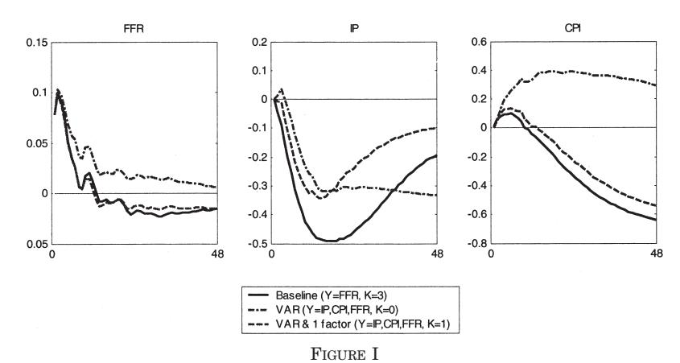
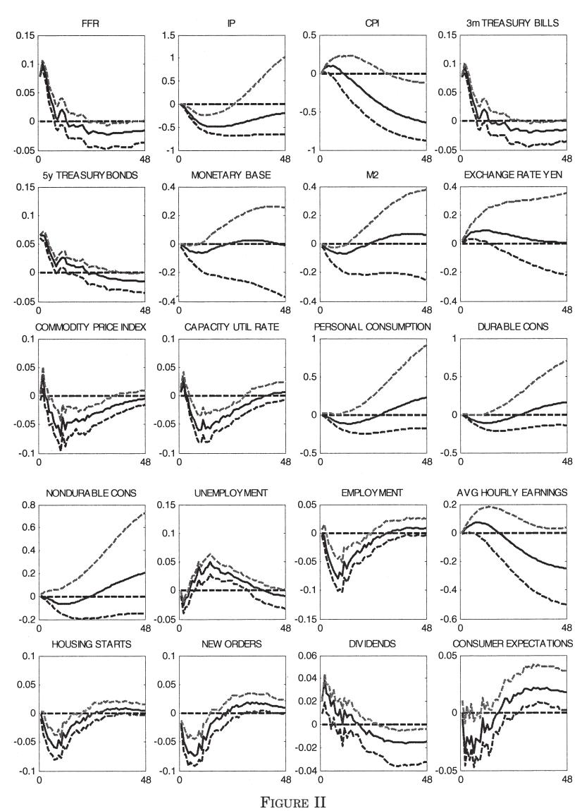
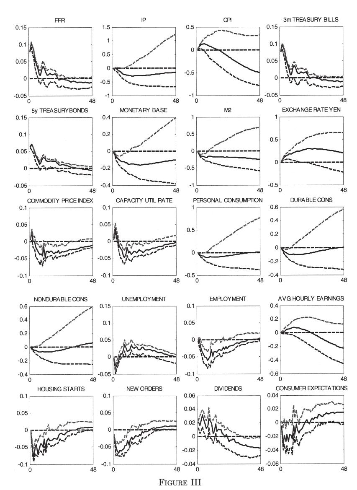
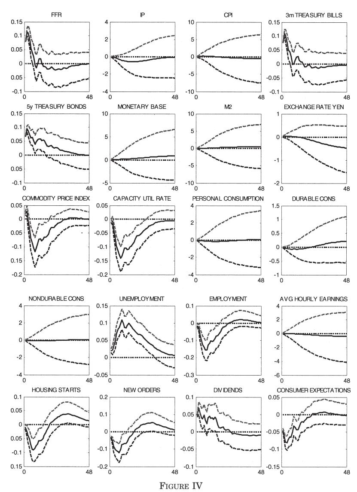
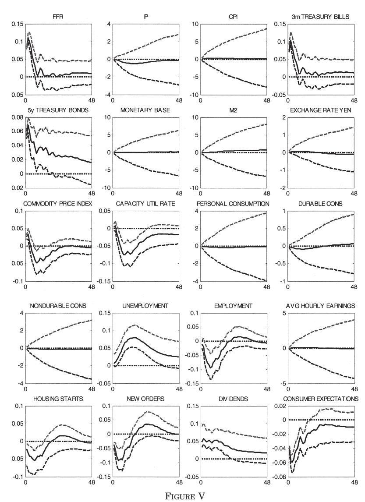

# MEASURING THE EFFECTS OF MONETARY POLICY: A FACTOR-AUGMENTED VECTOR AUTOREGRESSIVE (FAVAR) APPROACH\*

BEN S. BERNANKE JEAN BOIVIN PIOTR ELIASZ

Structural vector autoregressions (VARs) are widely used to trace out the effect of monetary policy innovations on the economy. However, the sparse information sets typically used in these empirical models lead to at least three potential problems with the results. First, to the extent that central banks and the private sector have information not reflected in the VAR, the measurement of policy innovations is likely to be contaminated. Second, the choice of a specific data series to represent a general economic concept such as "real activity" is often arbitrary to some degree. Third, impulse responses can be observed only for the included variables, which generally constitute only a small subset of the variables that the researcher and policy-maker care about. In this paper we investigate one potential solution to this limited information problem, which combines the standard structural VAR analysis with recent developments in factor analysis for large data sets. We find that the information that our factor-augmented VAR (FAVAR) methodology exploits is indeed important to properly identify the monetary transmission mechanism. Overall, our results provide a comprehensive and coherent picture of the effect of monetary policy on the economy.

#### I. INTRODUCTION

Since Bernanke and Blinder [1992] and Sims [1992], a considerable literature has developed that employs vector autoregression (VAR) methods to attempt to identify and measure the effects of monetary policy innovations on macroeconomic variables. The key insight of this approach is that identification of the effects of monetary policy shocks requires only a plausible identification of those shocks (for example, as the unforecasted innovation of the federal funds rate in Bernanke and Blinder [1992]) and does not require identification of the remainder of the macroeconomic model. These methods generally deliver empirically plausible assessments of the dynamic responses of key macroeconomic variables to monetary policy innovations, and they have been widely used both in assessing the empirical fit of structural

\* Thanks to Marc Giannoni, Christopher Sims, Mark Watson, Charles Whiteman, Tao Zha, and two anonymous referees, as well as participants at the 2003 NBER Summer Institute for useful comments. Boivin would like to thank the National Science Foundation for financial support (SES-0214104).

© 2005 by the President and Fellows of Harvard College and the Massachusetts Institute of Technology.

*The Quarterly Journal of Economics,* February 2005

models (see, for example, Boivin and Giannoni [2003] and Christiano, Eichenbaum, and Evans [forthcoming]) and in policy applications.

The VAR approach to measuring the effects of monetary policy shocks appears to deliver a great deal of useful structural information, especially for such a simple method. Naturally, the approach does not lack for criticism. For example, researchers have disagreed about the appropriate strategy for identifying policy shocks (Christiano, Eichenbaum, and Evans [2000] survey some of the alternatives; see also Bernanke and Mihov [1998a]). Alternative identifications of monetary policy innovations can, of course, lead to different inferences about the shape and timing of the responses of economic variables. Another issue is that the standard VAR approach addresses only the effects of unanticipated changes in monetary policy, not the arguably more important effects of the systematic portion of monetary policy or the choice of monetary policy rule [Sims and Zha 1998; Cochrane 1996; Bernanke, Gertler, and Watson 1997].

Several criticisms of the VAR approach to monetary policy identification center around the relatively small amount of information used by low-dimensional VARs. To conserve degrees of freedom, standard VARs rarely employ more than six to eight variables.1 This small number of variables is unlikely to span the information sets used by actual central banks, which are known to follow literally hundreds of data series, or by the financial market participants and other observers. The sparse information sets used in typical analyses lead to at least three potential sets of problems with the results. First, to the extent that central banks and the private sector have information not reflected in the VAR analysis, the measurement of policy innovations is likely to be contaminated. A standard illustration of this potential problem, which we explore in this paper, is the Sims [1992] interpretation of the so-called "price puzzle," the conventional finding in the VAR literature that a contractionary monetary policy shock is followed by an increase in the price level, rather than a decrease as standard economic theory would predict. Sims's explanation for the price puzzle is that it is the result of imperfectly controlling for information that the central bank may have about future

1. Leeper, Sims, and Zha [1996] increase the number of variables included by applying Bayesian priors, but their VAR systems still typically contain less than twenty variables.

inflation. If the Fed systematically tightens policy in anticipation of future inflation, and if these signals of future inflation are not adequately captured by the data series in the VAR, then what appears to the VAR to be a policy shock may in fact be a response of the central bank to new information about inflation. Since the policy response is likely only to partially offset the inflationary pressure, the finding that a policy tightening is followed by rising prices is explained. Of course, if Sims's explanation of the price puzzle is correct, then all the estimated responses of economic variables to the monetary policy innovation are incorrect, not just the price response.

A second problem arising from the use of sparse information sets in VAR analyses of monetary policy is that it requires taking a stand on specific observable measures corresponding precisely to some theoretical constructs. The concept of "economic activity," for example, may not be perfectly represented by industrial production or real GDP, or any other observable measure.2 Moreover, any observable measure is likely to be contaminated by measurement errors.

Finally, impulse responses can be observed only for the included variables, which generally constitute only a small subset of the variables that the researcher and policy-makers care about. For example, both for policy analysis and model validation purposes, we may be interested in the effects of monetary policy shocks on variables such as total factor productivity, real wages, profits, investment, and many others. Moreover, to assess the effects of a policy change on an unobserved concept of interest such as economic activity, one might wish to document the responses of multiple indicators including, say, employment and sales, to the policy change. Unfortunately, as we have already noted, inclusion of additional variables in standard VARs is severely limited by degrees-of-freedom problems.

Is it possible to condition VAR analyses of monetary policy on richer information sets, without giving up the statistical advantages of restricting the analysis to a small number of series? In this paper we consider one approach to this problem, which combines the standard VAR analysis with factor analysis.3 Recent

2. An alternative is to treat economic activity as an unobserved factor with multiple observable indicators. That is essentially the approach we take in this paper.

3. Forni, Lippi, and Reichlin [2003] consider a related structural factor model that also exploits the information from a large data set. Their approach differs in

research in dynamic factor models suggests that the information from a large number of time series can be usefully summarized by a relatively small set of estimated indexes, or factors. For example, Stock and Watson [2002] develop an approximate dynamic factor model to summarize the information in large data sets for forecasting purposes.4 They show that forecasts based on these factors outperform univariate autoregressions, small vector autoregressions, and leading indicator models in simulated forecasting exercises. Bernanke and Boivin [2003] show that the use of estimated factors can improve the estimation of the Fed's policy reaction function.

If a small number of estimated factors effectively summarize large amounts of information about the economy, then a natural solution to the degrees-of-freedom problem in VAR analyses is to augment standard VARs with estimated factors. In this paper we consider the estimation and properties of factor-augmented vector autoregressive models (FAVARs), and then apply these models to the monetary policy issues raised above.

The rest of the paper is organized as follows. Section II presents the FAVAR model, motivates it within the context of a simple macroeconomic model, and lays out our estimation approach. We consider both a two-step estimation method, in which the factors are estimated by principal components prior to the estimation of the factor-augmented VAR; and a one-step method, which makes use of Bayesian likelihood methods and Gibbs sampling to estimate the factors and the dynamics simultaneously. Section III applies the FAVAR methodology to a reexamination of the evidence of the effect of monetary policy innovations on key macroeconomic indicators. In brief, we find that the information that the FAVAR methodology extracts is indeed important and leads to broadly plausible estimates for the responses of a wide variety of macroeconomic variables to monetary policy shocks. We

that they identify the common factors as the structural shocks, using long-run restrictions. In our approach, the latent factors correspond instead to concepts such as economic activity. While complementary to theirs, our approach allows 1) a direct mapping with existing VAR results, 2) measurement of the marginal contribution of the latent factors and 3) a structural interpretation to some equations, such as the policy reaction function.

4. In this paper we follow the Stock and Watson approach to the estimation of factors (which they call "diffusion indexes"). We also employ a likelihood-based approach not used by Stock and Watson. Sargent and Sims [1977] first provided a dynamic generalization of classical factor analysis. Forni and Reichlin [1996, 1998] and Forni, Hallin, Lippi, and Reichlin [2000] develop a related approach.

also find that the advantages of using the computationally more burdensome Gibbs sampling procedure instead of the two-step method appear to be modest in this application. Section IV concludes. For those readers interested in computational details, an appendix to the working paper version of this article [Bernanke, Boivin, and Eliasz 2004] provides additional information about the application of the Gibbs sampling procedure to FAVAR estimation.

#### II. FAVAR: Framework, Motivation, and Estimation

We begin by laying out a formal framework for factoraugmented VAR analysis. Later in this section we show how this approach can be motivated by a simple macroeconomic model and discuss approaches to estimation.

#### II.A. Framework

Let  $Y_t$  be a  $M \times 1$  vector of observable economic variables assumed to drive the dynamics of the economy. For now, we do not need to specify whether our ultimate interest is in forecasting  $Y_t$  or in uncovering structural relationships among these variables. Following the standard approach in the monetary VAR literature,  $Y_t$  could contain a policy indicator and observable measures of real activity and prices. The conventional approach involves estimating a VAR, a structural VAR (SVAR), or other multivariate time series model using data for  $Y_t$  alone. However, in many applications, additional economic information, not fully captured by  $Y_t$ , may be relevant to modeling the dynamics of these series. Let us suppose that this additional information can be summarized by a  $K \times 1$  vector of unobserved factors,  $F_t$ , where K is "small." As we illustrate in the next subsection, we might think of the unobserved factors as capturing fluctuations in unobserved potential output or reflecting theoretically motivated concepts such as "economic activity," "price pressures," or "credit conditions" that cannot easily be represented by one or two series but rather are reflected in a wide range of economic variables.

Assume that the joint dynamics of  $(F'_t, Y'_t)$  are given by the following transition equation:

(1) 
$$\left[ \begin{array}{c} F_t \\ Y_t \end{array} \right] = \Phi(L) \left[ \begin{array}{c} F_{t-1} \\ Y_{t-1} \end{array} \right] + v_t,$$

where  $\Phi(L)$  is a conformable lag polynomial of finite order d, which

may contain a priori restrictions as in the structural VAR literature. The error term  $v_t$  is mean zero with covariance matrix Q.

Equation (1) is a VAR in  $(F_t',Y_t')$ . It might be interpreted variously as an atheoretic forecasting model or as the reduced form of a linear rational-expectations model involving both observed and unobserved variables. This system reduces to a standard VAR in  $Y_t$  if the terms of  $\Phi(L)$  that relate  $Y_t$  to  $F_{t-1}$  are all zero; otherwise, we will refer to equation (1) as a factor-augmented vector autoregression, or FAVAR. Because the FAVAR model nests standard VAR analyses, estimation of equation (1) allows for easy comparison with existing VAR results and provides a way of assessing the marginal contribution of the additional information contained in  $F_t$ . Note that, if the true system is a FAVAR, estimation of (1) as a standard VAR system in  $Y_t$ —that is, with the factors omitted—will in general lead to biased estimates of the VAR coefficients and related quantities of interest, such as impulse response coefficients.

Equation (1) cannot be estimated directly because the factors  $F_t$  are unobservable. However, as we interpret the factors as representing forces that potentially affect many economic variables, we may hope to infer something about the factors from observations on a variety of economic time series. For concreteness, suppose that we have available a number of background, or "informational" time series, collectively denoted by the  $N\times 1$  vector  $X_t$ . The number of informational time series N is "large" (in particular, N may be greater than T, the number of time periods) and will be assumed to be much greater than the number of factors and observed variables in the FAVAR system ( $K+M\ll N$ ). We assume that the informational time series  $X_t$  are related to the unobservable factors  $F_t$  and the observed variables  $Y_t$  by an observation equation of the form,

$$(2) X_t = \Lambda^f F_t + \Lambda^y Y_t + e_t,$$

where  $\Lambda^f$  is an  $N \times K$  matrix of factor loadings,  $\Lambda^y$  is  $N \times M$ , and the  $N \times 1$  vector of error terms  $e_t$  are mean zero and will be assumed either normal and uncorrelated or to display a small amount of cross-correlation, depending on whether estimation is by likelihood methods or principal components (see below).

5. The principal component estimation allows for some cross-correlation in  $e_t$  that must vanish as N goes to infinity. See Stock and Watson [2002] for a formal discussion of the required restrictions on the cross-correlation of  $e_t$ .

Equation (2) captures the idea that both  $Y_t$  and  $F_t$ , which in general can be correlated, represent common forces that drive the dynamics of  $X_t$ . Conditional on  $Y_t$ , the  $X_t$  are thus noisy measures of the underlying unobserved factors  $F_t$ . The implication of equation (2) that  $X_t$  depends only on the current and not lagged values of the factors is not restrictive in practice, as  $F_t$  can be interpreted as including arbitrary lags of the fundamental factors; thus, Stock and Watson [1998] refer to equation (2)—without observable factors—as a *dynamic factor model*.

### II.B. Motivating the FAVAR Structure: An Example

A useful application of the FAVAR model, emphasized in this paper, is to allow researchers to exploit the information from a large number of indicators in the analysis of empirical macroeconomic models. The fact that central banks routinely monitor literally hundreds of economic variables in the process of policy formulation provides motivation for conditioning any analysis of monetary policy on a rich information set [Bernanke and Boivin 2003]. In this subsection we use a standard macroeconomic framework both to illustrate why central banks and researchers may need to consider a long list of information variables and to develop some implications for the econometric analysis of the effects of unforecasted changes in monetary policy.

Consider a simple backward-looking model, where the dynamics of the economy are driven by a handful of macroeconomic forces:6

(3) 
$$\pi_t = \delta \pi_{t-1} + \kappa (y_{t-1} - y_{t-1}^n) + s_t$$

(4) 
$$y_t = \phi y_{t-1} - \psi (R_{t-1} - \pi_{t-1}) + d_t$$

$$(5) y_t^n = \rho y_{t-1}^n + \eta_t$$

$$(6) s_t = \alpha s_{t-1} + v_t.$$

Equation (3) is an aggregate supply or Phillips curve equation that relates inflation  $(\pi_t)$  to lagged inflation  $(\pi_{t-1})$ , the lagged deviations in output from potential  $(y_{t-1} - y_{t-1}^n)$ , and a costpush shock  $(s_t)$ . Equation (4), an aggregate demand or IS curve, relates output to lagged output, the lagged real interest rate

6. This is a simplified version of the Rudebusch and Svensson [1999] model. The backward-looking specification makes the discussion more transparent. Note, however, that using the results of Svensson and Woodford [2003, 2004], the same points could be made in a model embedding forward-looking features.

 $(R_{t-1} - \pi_{t-1})$ , and a demand shock  $d_t$ . Equations (5) and (6) specify that potential output and the cost-push shock are first-order autoregressive processes. We take  $d_t$ ,  $\eta_t$ , and  $v_t$  to be mean zero, mutually uncorrelated innovations. Finally, we assume that the nominal interest rate  $R_t$  is set by the central bank according to a simple Taylor rule:

(7) 
$$R_t = \beta \pi_t + \gamma (y_t - y_t^n) + \varepsilon_t,$$

where the central bank responds to current inflation and the deviations of output from potential. The policy innovation  $(\varepsilon_t)$  is assumed to be normally distributed with mean zero and unit variance. The model is assumed to characterize the business cycle dynamics of the economy, to which a large set of N observable macroeconomic indicators  $(X_t)$ , are assumed to be related in the following way:

(8) 
$$X_t = \Lambda (y_t^n \quad s_t \quad \pi_t \quad y_t \quad R_t)' + e_t.$$

As we show next, the model consisting of equations (3)–(8) can be written in vector autoregressive form; however, whether the model is properly described by a standard VAR or by a FAVAR depends ultimately on the information structure being assumed. First, if we rewrite equation (7) in terms of variables dated t-1 or earlier, the model can be represented as a constrained version of equation (1), where

$$\begin{split} \Phi(L) = \Phi \equiv \left[ \begin{array}{cccc} \rho & 0 & 0 & 0 & 0 \\ 0 & \alpha & 0 & 0 & 0 \\ 0 & \alpha & \delta & \kappa & -\kappa \\ 0 & 0 & \psi & \phi & -\psi \\ -\gamma \psi & \beta \alpha & (\beta \delta + \gamma \psi) & (\beta \kappa + \gamma \phi) & -(\beta \kappa + \gamma \rho) \end{array} \right], \\ v_t \equiv \left[ \begin{array}{cccc} 0 & 0 & 1 & 0 \\ 0 & 0 & 0 & 1 \\ 0 & 0 & 0 & 1 \\ 1 & 0 & 0 & 0 \\ \gamma & 1 & -\gamma & \beta \end{array} \right] \left[ \begin{array}{c} d_t \\ \varepsilon_t \\ \eta_t \\ \upsilon_t \end{array} \right], \end{split}$$

7. A more natural specification might relate output to the current ex ante real interest rate rather than the lagged ex post real interest rate. We use the specification in the text for conformity with the familiar model of Rudebusch and Svensson [1999] and to simplify the calculations. Nothing essential in the subsequent discussion would be affected if we allowed output to depend on the ex ante real interest rate.

and  $(F'_t \ Y'_t)' = (y^n_t \ s_t \ \pi_t \ y_t \ R_t)'$ . As we will see, the division of variables between  $F_t$  and  $Y_t$  depends on which variable(s) are assumed to be directly observed.

If all of the variables in the model are assumed to correspond exactly to empirical measures that are observed both by the central bank and the econometrician, then we have that  $Y_t' = (y_t^n \quad s_t \quad \pi_t \quad y_t \quad R_t)'$ ,  $F_t$  equals the null set, and equation (8) is redundant. In this case the model boils down to a restricted VAR in  $Y_t$ . Estimation can proceed by the usual VAR methods. For example, following many previous studies, the dynamic effects of a policy shock,  $\varepsilon_t$ , on the economy can be obtained by estimating a restricted or unrestricted VAR and deriving the implied impulse responses.

However, the assumption that both the central bank and the econometrician observe all the elements of  $Y_t$  is a strong one. Under alternative, and arguably more realistic, assumptions about the information structure, the implied empirical model will generally be a FAVAR rather than a standard VAR. Let us consider some leading cases.

One possibility is that the central bank observes all the variables in the model, but the econometrician observes only a subset of those variables. For instance the econometrician might not observe potential output  $y_t^n$  and the cost-push shock  $s_t$  directly. In that case, equation (8) can be expressed in the form of equation (2), with  $F'_t = (y_t^n \quad s_t)'$  and  $Y'_t = (\pi_t \quad y_t \quad R_t)'$ , and the full model can be estimated as a FAVAR but not as a standard VAR. In particular, under this information structure, the econometrician needs to exploit the information in  $X_t$  to properly identify the effects of monetary policy. If the econometrician were instead to estimate a standard VAR on the variables  $Y_t$  that he observes, he would obtain biased estimates of the policy shock and impulse response functions. As an illustration of the pitfalls of estimating a standard VAR, consider the effects of a negative productivity shock in the previous period,  $\eta_t < 0$ . This negative productivity shock implies a higher nominal interest rate today, through the Taylor rule (7), and higher inflation tomorrow, through the aggregate supply curve (3). By failing to account for the change in potential output,  $y_t^n$ , which we have assumed is observed by the central bank, the researcher would find a spurious association between what appears to be a positive policy shock and an increase in inflation. As we discussed in the Introduction, the failure of the econometrician to account for all the information used by the central bank is one explanation of the price puzzle.

How can the econometrician avoid this problem? If N were small, a simple solution would be to include the indicator variables  $X_t$  in the VAR. Such an approach is exemplified by the common practice of adding a commodity price index to the VAR specification in order to "fix" the price puzzle. But this practice is rather ad hoc, as many variables are likely to contain information relevant to the central bank's decisions; that is, N is likely to be large. If N is large, adding  $X_t$  to an unconstrained VAR without exploiting the factor structure would be both inefficient and impractical (because of degrees-of-freedom problems). In contrast, the FAVAR approach exploits the factor structure, while retaining the feature that the investigator may remain agnostic about the structure of the underlying model, in that estimation of the unrestricted form of the FAVAR provides consistent estimates.

The case just considered is based on the assumption that the central bank observes the entire relevant information set, including all the variables entering equations (3)–(7). However, taken literally, this assumption is inconsistent with the fact that central banks monitor a large number of economic indicators. An alternative, perhaps more plausible, assumption is that the central bank faces information constraints similar to those of the econometrician; that is, the central bank does not directly observe potential output or the cost-push shocks, but exploits the information from a very large number of macroeconomic indicators. That assumption too would lead to a FAVAR structure, in which  $F_t' = (y_t^n \quad s_t)'$  and  $Y_t' = (\pi_t \quad y_t \quad R_t)'$ .

Rather than develop that case further, however, we note that, in practice, the information constraints may be even more binding than we have suggested thus far. For example, one might argue that even output  $y_t$  and inflation  $\pi_t$  are not directly observed, either by the central bank or by the econometrician. First, macroeconomic data may be subject to multiple rounds of revisions and in any case are never free of measurement error. Second, theoretical concepts do not necessarily align precisely

8. In this case where the central bank does not observe  $y_t^n$  and N is large, equations (1) and (2) provide a valid approximation to the true dynamics of the system. Note, however, that when N is small, the central bank's estimate of  $y_t^n$  independently influences the dynamics of the system, which is not reflected in equations (1) and (2). See Pearlman, Currie, and Levine [1986], Aoki [2003], and Svensson and Woodford [2003a, 2004] for general characterization of a rational expectation equilibrium under partial information.

with specific data series. For example, "output" in the theoretical model may correspond more closely to a latent measure of economic activity, in the spirit of the business cycle analysis of Burns and Mitchell, than to a specific data series such as real GDP. Similarly, the various biases involved in the measurement of inflation, such as the inherent difficulty of fully adjusting price indexes for quality improvement, as well as the availability of a variety of alternative measures of inflation, suggest that exact measurement of the "true" rate of inflation is not possible. These arguments provide some justification for treating output and inflation, as well as concepts like potential output, as unobserved in the empirical analysis. Treating these variables as unobservable is one way to acknowledge, at least partly, the real-time data issues that have been discussed in the literature. The support of the content of the support of the content of the support of the support of the support of the support of the support of the support of the support of the support of the support of the support of the support of the support of the support of the support of the support of the support of the support of the support of the support of the support of the support of the support of the support of the support of the support of the support of the support of the support of the support of the support of the support of the support of the support of the support of the support of the support of the support of the support of the support of the support of the support of the support of the support of the support of the support of the support of the support of the support of the support of the support of the support of the support of the support of the support of the support of the support of the support of the support of the support of the support of the support of the support of the support of the support of the support of the support of the support of the support of the support of the support of the support of the support of the sup

In short, it may be the case that the most realistic description of the information structure is that the central bank and the econometrician observe only the policy instrument (the nominal interest rate), as well as a large set of noisy macroeconomic indicators. In this case, equation (8) can be written in terms of equation (2), with  $F'_t = (\pi_t \quad y_t \quad y_{t-1}^n \quad s_t)'$  and  $Y_t = R_t$ . Under this information structure, the central bank will need to exploit the information in  $X_t$  in formulating monetary policy, a process that is naturally modeled by the FAVAR structure. Moreover, the econometrician can use a FAVAR approach to try to describe the central bank's behavior. In the spirit of this last example, our preferred empirical specification below will assume that only the policy instrument  $R_t$  and a large set of macroeconomic indicators,  $X_t$ , are observed. However, we also consider specifications that assume that output and inflation are observable, corresponding to the second case described above. This demonstrates a strength of the FAVAR approach, that it can accommodate alternative assumptions about what the central bank and the econometrician observe, as well as about the information sets that they use.

9. See Boskin [1996] for a discussion of the biases of CPI inflation. See Bils [2004] for a recent investigation of the bias in CPI due to quality growth.

10. Orphanides [2001] argues that assessment of Fed policy depends sensitively on whether revised or real-time data are used. Croushore and Evans [1999] do not find this issue to be important for the identification of monetary policy shocks. Bernanke and Boivin [2003] find that in a forecasting context, real-time data issues were mitigated when the information from a large data set was exploited. One intuitive explanation is that by considering only the common components from these measures, the measurement errors are eliminated.

#### II.C. Estimation

If the structural model laid out in the previous subsection were known to characterize precisely the behavior of the economy, the most efficient estimation approach would incorporate all the restrictions implied by the model's structure. However, the potential efficiency gains from imposing strong prior restrictions must be weighed against the biases that result if those restrictions are wrong—a point emphasized by Sims [1980] in the paper in which he introduced VAR analysis to macroeconomics as an antidote to "incredible identifying restrictions." Fortunately, not all these restrictions are necessary to uncover the effect of a particular shock, and the FAVAR approach does not impose a limit on the number of potentially useful factors. Following the standard VAR approach, in our empirical application we focus on specifications that identify the monetary policy shock while remaining agnostic about the structure of the rest of the model and the number of unobservable factors. We stress, however, that no aspect of the FAVAR methodology prevents the imposition of additional prior restrictions in estimation.

We consider two approaches to estimating (1)–(2). The first one is a two-step principal components approach, which provides a nonparametric way of uncovering the common space spanned by the factors of  $X_t$ , which we denote by  $C(F_t,Y_t)$ . The second is a single-step Bayesian likelihood approach. These approaches differ in various dimensions, and it is not clear a priori that one should be favored over the other.

The two-step procedure is analogous to that used in the forecasting exercises of Stock and Watson [2002]. In the first step, the space spanned by the factors is estimated using the first K+M principal components of  $X_t$ , which we denote by  $\hat{C}(F_t,Y_t)$ . Notice that the estimation of the first step does not exploit the fact that  $Y_t$  is observed. However, as shown in Stock and Watson [2002], when N is large and the number of principal components used is at least as large as the true number of factors, the principal components consistently recover the space spanned by both  $F_t$  and  $Y_t$ . Since  $\hat{C}(F_t,Y_t)$  corresponds to an arbitrary linear combination of its arguments, obtaining  $\hat{F}_t$  involves determining

11. A useful feature of this framework, as implemented by an EM algorithm, is that it permits one to deal systematically with data irregularities. In their application, Bernanke and Boivin [2003] estimate factors in cases in which  $X_t$  includes both monthly and quarterly series, series that are introduced midsample or are discontinued, and series with missing values.

the part of  $\hat{C}(F_t,Y_t)$  that is not spanned by  $Y_t.^{12}$  In the second step, the FAVAR, equation (1), is estimated by standard methods, with  $F_t$  replaced by  $\hat{F}_t$ . This procedure has the advantages of being computationally simple and easy to implement. As discussed by Stock and Watson [2002], it also imposes few distributional assumptions and allows for some degree of cross-correlation in the idiosyncratic error term  $e_t$ . However, the two-step approach implies the presence of "generated regressors" in the second step. To obtain accurate confidence intervals on the impulse response functions reported below, we implement a bootstrap procedure, based on Kilian [1998], that accounts for the uncertainty in the factor estimation. 13

In principle, an alternative is to assume independent normal errors and to estimate (1) and (2) jointly by maximum likelihood. However, for very large dimensional models of the sort considered here, the irregular nature of the likelihood function makes MLE estimation infeasible in practice. In this paper we thus consider the joint estimation by likelihood-based Gibbs sampling techniques, developed by Geman and Geman [1984], Gelman and Rubin [1992], and Carter and Kohn [1994], and surveyed in Kim and Nelson [1999]. Their application to large dynamic factor models is discussed in Eliasz [2002]. Kose, Otrok, and Whiteman [2003, 2004] use similar methodology to study international business cycles. 14

The two methods differ on many important dimensions. A clear advantage of the two-step approach is computational simplicity. Otherwise, it is not clear how the two methods should compare. The two-step approach is semiparametric: it does not impose the structure of a parametric model with precise distributional assumptions in the observation equation (2). Moreover, it does not exploit the structure of the transition equation in the

12. How this is accomplished depends on the specific identifying assumption used in the second step. We describe below our procedure for the recursive assumption used in the empirical application.

13. Note that in theory, when N is large relative to T, the uncertainty in the factor estimates can be ignored; see Bai and Ng [2004].

14. We implement a multimove version of the Gibbs sampler in which factors are sampled conditional on the most recent draws of the model parameters, and then the parameters are sampled conditional on the most recent draws of the factors. As the statistical literature has shown, this Bayesian approach, by approximating marginal posteriors by empirical densities, helps to circumvent the high-dimensionality problem of the model. Moreover, the Gibbs-sampling algorithm is guaranteed to trace the shape of the joint posterior, even if the posterior is irregular and complicated. See the appendix to the working paper version of this article for more details.

estimation of the factors. The likelihood-based method, on the other hand, is fully parametric. The methods will thus imply different biases and variances, which will depend on how well specified the model is. By comparing the results from the two methods, we may be able to assess whether the advantages of jointly estimating the model are worth the computational costs.

#### II.D. Identification

There are two different sets of restrictions that need to be imposed on the system (1)–(2). The first is a minimum set of normalization restrictions on the observation equation (2) that are needed to be able to estimate the model at all. This normalization is an issue separate from the identification of the policy shock per se, which requires imposing further restriction on the transition equation (1), and potentially on the observation equation (2) as well.

As it is written, model (1)–(2) is econometrically unidentified and cannot be estimated. Since we leave the VAR dynamics in equation (1) unrestricted, identification proceeds by imposing restrictions on factors and their coefficients in equation (2). Assume that  $\hat{\Lambda}^f$  and  $\hat{F}_t$  are a solution to the estimation problem. We could define  $\tilde{\Lambda}^f = \tilde{\Lambda}^f H$  and  $\tilde{F}_t = H^{-1}\hat{F}_t$ , where H is a  $K \times K$  nonsingular matrix, which would also satisfy equation (2). As a result, observing  $X_t$  cannot help distinguishing between these two solutions. A normalization must then be imposed. Note, however, that since  $\tilde{F}_t$  covers the same space as  $\hat{F}_t$ , such normalization does not affect the information content of the estimated factors.

In two-step estimation by principal components, where we are not explicitly imposing  $Y_t$  as being observable in the first step, we use the standard normalization implicit in the principal components, that is, we take C'C/T=I, where  $C'=[C(F_1,Y_1),\ldots,C(F_T,Y_T)]$ . This implies that  $\hat{C}=\sqrt{T}$   $\hat{Z}$ , where the  $\hat{Z}$  are the eigenvectors corresponding to the K largest eigenvalues of XX', sorted in descending order. In the "one-step" (joint estimation) likelihood method, this approach needs to be modified to account for the fact that  $Y_t$  enters the observation equation. Sufficient

15. In the case where  $F_t$  is a scalar, this is simply saying that its scale is not identified, and thus needs to be normalized. This is what Anderson [1984, p. 552] refers to as the "fundamental indeterminacy" of this model.

conditions are to set the upper  $K \times K$  block of  $\Lambda^f$  to an identity matrix and the upper  $K \times M$  block of  $\Lambda^y$  to zero. 16

The identification of the structural shocks in the transition equation requires further restrictions. In the empirical application we consider below, and consistent with the example structural model of subsection II.B, we will assume a recursive structure where all the factors entering (1) respond with a lag to change in the monetary policy instrument, ordered last in  $Y_t$ . In that case, we do not need to identify the factors separately, but only the space spanned by the latent factors  $F_t$ . In terms of the macroeconomic model discussed above, that means that we only need four distinct linear combinations of  $\pi_t$ ,  $y_t$ ,  $y_t^n$ , and  $s_t$ , but we do not need to identify each of these latent variables individually. As a result, no further restrictions are required in the observation equation (2), and the identification of the policy shock can be achieved in (1) as if it were a standard VAR.

Importantly, other identification schemes (e.g., long-run restrictions as in Blanchard and Quah [1989] or structural VAR procedures as in Bernanke and Mihov [1998a]) can be implemented in the FAVAR framework. These would typically require, however, that some of the factors be identified as specific economic concepts. For instance, implementing a long-run restriction that stipulates that monetary policy shocks do not have a long-run effect on the output gap would require identifying  $(y_t$  $y_t^n$ ) separately from the other factors. But this can easily be achieved by imposing restrictions on the factor loading matrix (in the likelihood setting) or extracting principal components from blocks of data corresponding to different dimensions of the economy. For instance, real-activity measures (e.g., components of industrial production, employment, and consumption) could be assumed to load solely on  $(y_t - y_t^n)$ . The same idea could be applied more generally to implement alternative identification schemes.

One caveat is that the use of the Gibbs sampling methodology may impose significant computational costs when complex identification schemes are employed. For example, if we impose restrictions that overidentify the transition equation, we need to perform numerical optimization at each step of the Gibbs sam-

16. In the joint estimation case, the normalization needs to rule out linear combinations of the form  $F_t^* = AF_t - BY_t$ , where A is  $K \times K$  and nonsingular, and B is  $K \times M$ . Substituting for  $F_t$  in (2), we obtain  $X_t = \Lambda^f A^{-1} F_t^* + (\Lambda^{\mathcal{Y}} + \Lambda^f A^{-1} B) Y_t + e_t$ . To induce  $F_t^* = F_t$ , that is  $A = I_K$  and  $B = 0_{K \times M}$ , it suffices to impose restrictions such as those specified in the text.

pling procedure. This may easily become excessively time consuming. In part for computational simplicity we use a simple recursive ordering in our empirical application below.

## III. APPLICATION: THE DYNAMIC EFFECTS OF MONETARY POLICY

As discussed in the Introduction, an extensive literature has employed VARs to study the dynamic effects of innovations to monetary policy on a variety of economic variables. A variety of identification schemes have been employed, including simple recursive frameworks, "contemporaneous" restrictions (on the matrix relating structural shocks to VAR disturbances), "long-run" restrictions (on the shape of impulse responses at long horizons), and mixtures of contemporaneous and long-run restrictions.17 Alternative estimation procedures have been employed as well, including Bayesian approaches [Leeper, Sims, and Zha 1996]. However, the basic idea in virtually all cases is to identify "shocks" to monetary policy with the estimated innovations to a variable or linear combination of variables in the VAR. Once this identification is made, estimating dynamic responses to monetary policy innovations (as measured by impulse response functions) is straightforward.

The fact that this simple method typically gives plausible and useful results with minimal identifying assumptions accounts for its extensive application, both by academic researchers and by practitioners in central banks. Nevertheless, a number of critiques of the approach have been made (see, for example, Rudebusch [1998]). The FAVAR approach described in the previous section can address some of these problems.

Section II emphasized three reasons why the usual VAR analysis might be inappropriate under some realistic information structures. First, small-scale VARs are unlikely to cover the information set of policy-makers, which is likely to lead to biased

17. Recursive frameworks are employed, inter alia, in Bernanke and Blinder [1992], Sims [1992], Strongin [1995], and Christiano, Eichenbaum, and Evans [2000]. Examples of papers with contemporaneous, nonrecursive restrictions are Gordon and Leeper [1994], Leeper, Sims, and Zha [1996], and Bernanke and Mihov [1998a]. Long-run restrictions are employed by Lastrapes and Selgin [1995] and Gerlach and Smets [1995]. Gali [1992] and Bernanke and Mihov [1998b] use a mixture of contemporaneous and long-run restrictions. Faust and Leeper [1997] and Pagan and Robertson [1998] point out some dangers of relying too heavily on long-run restrictions for identification in VARs.

inference. Second, the choice of a specific data series to represent a general economic concept (e.g., industrial production for "economic activity," the consumer price index for "the price level") is often arbitrary to some degree; measurement errors and revisions pose additional problems for linking theoretical concepts to specific data series. Finally, even if monetary policy shocks are properly identified, standard VAR analyses have the shortcoming that the dynamic responses of only those few variables included in the VAR can be estimated. For purposes both of policy analysis and model validation, it is often useful to know the effects of monetary policy on a lengthy list of variables.18

The FAVAR framework is well-suited to investigate the empirical importance of these issues. First, since the system (1)–(2) nests the standard VAR specification, we can determine directly whether the additional information conveyed by the unobserved factors is relevant or not. Second, because it allows for the use of multiple indicators of underlying economic concepts, the FAVAR approach can be implemented without having to assume that concepts such as "real activity" or "price pressures" are observed. Finally, this methodology can be used to draw out the dynamic responses of not only the "main" variables *Yt* but of any series contained in *Xt*. Hence the "reasonableness" of a particular identification can be checked against the behavior of many variables, not just three or four.

# *III.A. Empirical Implementation*

We apply both the two-step and "one-step" (joint estimation) methodologies to the estimation of monetary FAVARs. In our applications, *Xt* consists of a balanced panel of 120 monthly macroeconomic time series (updates of series used in Stock and Watson [1998, 1999]).19 These series are initially transformed to

18. One approach to this problem is to assume no feedback from variables outside the basic VAR, that is, a block-recursive structure with the base VAR ordered first (see Bernanke and Gertler [1995]). However, the no-feedback assumption is dubious in many cases.

19. The choice of which data to include in *Xt* might not be innocuous. While in theory more data are always better (see Stock and Watson [2002]), in practice that often means more of the same type of data, like for instance, more measures of real activity. Boivin and Ng [forthcoming] provide examples, where simply adding more data has perverse effects. They also investigate these issues in the context of a forecasting exercise based on a data set very similar to ours. They find that it is possible to forecast equally well, and perhaps marginally better, by estimating factors from as few as 40 prescreened series. The prescreening is, however, largely ad hoc, and the cost from using all series, if any, is marginal.

induce stationarity. The description of the series in the data set and their transformation is described in Appendix 1. The data span the period from January 1959 through August 2001.

In subsection II.B we described alternative specifications arising from alternative assumptions about the information structure. For reasons we gave, our preferred specification treats the Fed's policy instrument *Rt* (in our application the federal funds rate) as observable and other variables, including output and inflation, as unobservable. In this case, *Rt* is the only variable included in the vector of observable variables, *Yt*. In what follows, we compare this preferred specification with alternative VAR and FAVAR specifications corresponding to alternative information structures. In each specification, the monetary policy shock is identified in the standard recursive manner, that is by ordering the federal funds rate last and treating its innovations as the policy shocks.

The recursive ordering imposes the identifying assumption that the unobserved factors do not respond to monetary policy innovations within the period (here, a month). However, we need not impose that assumption on the idiosyncratic components of the information variables. In particular, we define two categories of information variables: "slow-moving" and "fast-moving." Slowmoving variables (think of wages or spending) are assumed not to respond contemporaneously to unanticipated changes in monetary policy. In contrast, fast-moving variables (think of asset prices) are allowed to respond contemporaneously to policy shocks. The classification of variables into the two categories is provided in Appendix 1. As discussed above, the joint likelihood estimation only requires that the first *K* variables in the data set are selected from the set of slow-moving variables and that the recursive structure is imposed in the transition equation.

For the two-step estimation approach, as we explained above, we rely in the first step on the fact that when *N* is large, the principal components estimated from the entire data set, *Cˆ* (*Ft*,*Yt*), consistently recover *K M* independent, but arbitrary, linear combinations of *Ft* and *Yt*. Since *Yt* is not explicitly imposed as a common component in the first step, any of the linear combinations underlying *Cˆ* (*Ft*,*Yt*) could involve the Fed's policy instrument, *Rt*, which is included in *Yt* in all the specifications we consider. It would thus not be valid to simply estimate a VAR in  $\hat{C}(F_t,Y_t)$  and  $Y_t$ , and identify the policy shock recursively. Instead, the direct dependence of  $\hat{C}(F_t,Y_t)$  on  $R_t$  must first be removed. If linear combinations implicit in  $\hat{C}(F_t,Y_t)$  were known, this would involve subtracting  $R_t$  times the associated coefficient from each of the elements of  $\hat{C}(F_t,Y_t)$ . Given that they are unknown, our strategy is to estimate their coefficients through a multiple regression of the form  $\hat{C}(F_t,Y_t)=b_{C^*}\hat{C}^*(F_t)+b_RR_t+e_t$ , where  $\hat{C}^*(F_t)$  is an estimate of all the common components other than  $R_t$ . One way to obtain  $\hat{C}^*(F_t)$  is to extract principal components from the subset of slow-moving variables, which by assumption are not affected contemporaneously by  $R_t$ .  $\hat{F}_t$  is then constructed as  $\hat{C}(F_t,Y_t)-\hat{b}_RR_t$  and a VAR in  $\hat{F}_t$  and  $Y_t$  is estimated and identified recursively, with  $R_t$  ordered last.

#### III.B. Empirical Results

We begin by comparing the results from a standard three-variable VAR—based on industrial production, CPI, and the federal funds rate—with two FAVAR specifications: 1) our preferred FAVAR specification, where only the federal funds is assumed to be observed, and 2) the three-variable VAR expanded with one unobservable factor. The latter FAVAR model nests the VAR and thus allows us to isolate the marginal contribution of the additional information. Since the economy might have other unmodeled dimensions, we check below the robustness of the results to an alternative number of factors. We use thirteen lags, but employing seven lags led to very similar results. We standardize the monetary shock to correspond to a 25-basis-point innovation in the federal funds rate. Note that the figures report impulse responses, in standard deviation units.

Figure I displays the resulting impulse response functions, obtained from the two-step estimation. There is a strong price puzzle in the VAR specification and the response of industrial production is very persistent, inconsistent with long-run money neutrality. Adding one factor to standard VAR changes the responses dramatically.21 The price puzzle is considerably reduced,

21. In this case, adding one factor appears to be all that is needed. Adding up to seven factors did not change the results.

20. Note that the other common factors will in general be correlated with  $R_t$ . For instance, in terms of our illustration in Section II, the policy instrument  $R_t$  is correlated with the other variable of the model, i.e.,  $(\pi_t \quad y_t \quad y_{t-1}^n \quad s_t)'$ , which could all be unobserved. As a result, the residuals from a regression of  $C(F_t, Y_t)$  on  $R_t$  would not be appropriate.

Estimated Impulse Responses to an Identified Policy Shock for Alternative FAVAR Specifications, Based on the Two-Step Principal Component's Approach

and the response of industrial production eventually returns toward zero. It is important to note that if the additional information was irrelevant then adding one factor to the VAR would render the estimation less precise, but the estimate should remain unbiased. We would thus not expect the estimated response to change considerably. This suggests that *Xt* contains useful information, beyond that already contained in the standard VAR.

An interesting aspect of these results is that the responses from the preferred FAVAR are essentially the same as those obtained from expanding the standard VAR by one factor. This suggests that the two-step estimation of the preferred FAVAR properly captures information about real activity and prices, even though no such measure is imposed as an observable factor.

This comparison suggests that the FAVAR approach is successful at extracting pertinent information from a large data set of macroeconomic indicators. While there is still a small positive response of prices in the first year following the shock, our results suggest that a few factors might be sufficient to properly capture the information that Sims argued could be missing from these VARs.22 That does not mean, however, that the FAVAR approach is the only way to obtain reasonable results. There exist, of course, other VAR specifications and identification schemes that could lead to reasonable results over some periods. For example, some authors have "improved" their results by adding variables such as an index of commodity prices to the VAR.23 But unless these variables are part of the theoretical model the researcher has in mind, it is not clear on what grounds they are selected, other than the fact that they "work." The advantage of our approach is to put discipline on the process, by explicitly recognizing in the econometric model the scope for additional information. As a result, the fact that adding the commodity price index— or any other variables—fixes or not the price puzzle is not directly relevant to our comparison.

As we have discussed, an advantage of the FAVAR approach is that impulse response functions can be constructed for any variable in the informational data set, that is, for any element of *Xt*. This gives both more information and provides a more comprehensive check on the empirical plausibility of the specification. Figure II shows for the preferred specification, the impulse responses with 90 percent confidence intervals of a selection of key macroeconomic variables to a monetary policy shock. The responses are generally of the expected sign and magnitude: following a contractionary monetary policy shock, real activity measures decline, prices eventually go down, money aggregates decline, and the dollar appreciates. The dividend yields initially jump above the steady state and eventually go down. Overall, these results seem to provide a consistent and sensible measure of the effect of monetary policy. Note that we display only 20 responses of all 120 that in principle could be investigated.

An important practical question is how many factors are needed to capture the information necessary to properly model the effects of monetary policy. Bai and Ng [2002] provide a criterion to determine the number of factors present in the data set, *Xt*. However, this does not necessarily address the question of how many factors should be included in the VAR. Instead, we explore the sensitivity of the results to an alternative number of factors. Figure III reports the impulse response functions for the

23. For instance, Sims [1992], Bernanke and Mihov [1998a], and Christiano, Eichenbaum, and Evans [2000].

Impulse Responses Generated from FAVAR with Three Factors and FFR Estimated by Principal Components with Two-Step Bootstrap

FAVAR specification model when the number of factors in our preferred FAVAR is increased to five. The figure suggests that the qualitative conclusions on the effect of monetary policy are

Impulse Responses Generated from FAVAR with Five Factors and FFR Estimated by Principal Components with Two-Step Bootstrap

not altered by the use of five factors. Further increases in the number of factors did not change qualitative nature of our results.

Impulse Responses Generated from FAVAR with Three Factors and FFR Estimated by Gibbs Sampling

Figures IV and V report the same results as Figures II and III, but from the likelihood-based estimation. The estimation was implemented with 10,000 iterations of the Gibbs sampling

Impulse Responses Generated from FAVAR with Five Factors and FFR Estimated by Gibbs Sampling

procedure (of which the first 2,000 were discarded to minimize the effects of initial conditions). To assure convergence of the algorithm, we imposed proper but diffuse priors on parameters of the observation and the VAR equations.24 There seemed to be no problems achieving convergence, and alternative starting values or the use of 20,000 iterations gave essentially the same results.

In this case, while responses of prices and money aggregates are very imprecisely estimated, overall the point estimates of the responses are quite similar to those reported for the two-step approach. We find it remarkable that the two rather different methods, producing distinct factor estimates, give qualitatively similar results. On the other hand, the degree of uncertainty about the estimates implied by the two methods is quite different. Increasing the number of factors does not appear to improve the results. This might suggest that the likelihood-based estimation, being fully parametric, as detailed in subsection II.C, suffers from the additional structure it imposes and produces factors that do not successfully capture information about real-activity and prices. This intuition is strengthened by the fact that the Gibbs estimation of FAVAR with CPI and industrial production as extra observable factors delivers results (not reported in the paper) much more in line with those obtained by a two-step procedure.

To assess whether differences between results are due to differences in the information content of the factor estimates, we estimated factors from both approaches using the same identification. This was accomplished by setting loadings on *Y* to zero in the observation equation for the likelihood-based estimation and, in the two-step approach, by not removing the direct dependence of the principal components on the federal funds rate (see subsection III.A). These are the alternative ways of partialling out the effects of the federal funds rate from the estimated factors. As it turns out, the two sets of factors generated in this way are significantly different. The factors estimated by principal components fully explain the variance of likelihood-estimated factors, but the opposite is not true. Moreover, the principal component factors have greater short-run variation. We interpret these findings as evidence that the differences in identification are not the sole source of the differences in results. Since it is the likelihood

24. We have also experimented with flat priors which yielded the same qualitative results. Prior specifications are discussed in the appendix to the working paper version of this article.

method that imposes additional structure on the model, we may expect PC factors to carry more information.  $^{25}$ 

Other than impulse response functions, another exercise typically performed in the standard VAR context is variance decomposition. This consists of determining the fraction of the forecasting error of a variable, at a given horizon, that is attributable to a particular shock. Variance decomposition results follow immediately from the coefficients of the MA representation of the VAR system and the variance of the structural shocks. For instance the fraction variance of  $(Y_{t+k} - \hat{Y}_{t+k})$  due to the monetary policy shock could be expressed as

$$\frac{\operatorname{var}\left(Y_{t+k} - \hat{Y}_{t+k|t} \middle| \varepsilon_t^{MP}\right)}{\operatorname{var}\left(Y_{t+k} - \hat{Y}_{t+k|t}\right)}.$$

A standard result of the VAR literature is that the monetary policy shock explains a relatively small fraction of the forecast error of real activity measures or inflation.

Table I reports the results for the same twenty macroeconomic indicators analyzed in the previous figures. These are based on the two-step estimation of the benchmark specification. The first column reports the contribution of the monetary policy shock to the variance of the forecast error at the 60-month horizon. The second column contains the  $R^2$  of the common component for each of these variables.26

Apart from the interest rates, the contribution of the policy shock ranges between 0 and 10.3 percent. This suggests a relatively small effect of the monetary policy shock. In particular, the policy shock explains 10.3 percent, 10.0 percent, and 8.6 percent of unemployment, capacity utilization and new orders, respectively, and 5.4 percent of industrial production. Looking at the  $R^2$  of the common component, we note two points. First, the factors explain a sizable fraction of these variables, in particular for some of the most prominent macroeconomic indicators: industrial production (70.7 percent), employment (72.3 percent), unemployment (81.6 percent), and the consumer price index (86.9 percent). This confirms that the FAVAR framework, estimated by the

26. Note that since FFR is assumed to be an observed factor, the corresponding  $\mathbb{R}^2$  is one by construction.

25. This is confirmed in a forecasting exercise (not reported), in which we evaluated predictive power of the two sets of factors for CPI, industrial production, and unemployment. As expected, principal components perform moderately better, particularly when forecasting at longer horizons.

TABLE I
CONTRIBUTION OF THE POLICY SHOCK TO VARIANCE OF THE COMMON COMPONENT

| Variables              | Variance decomposition | $R^2$  |
|------------------------|------------------------|--------|
| Federal funds rate     | 0.454                  | *1.000 |
| Industrial production  | 0.054                  | 0.707  |
| Consumer price index   | 0.038                  | 0.870  |
| 3-month treasury bill  | 0.433                  | 0.975  |
| 5-year bond            | 0.403                  | 0.925  |
| Monetary base          | 0.005                  | 0.104  |
| M2                     | 0.005                  | 0.052  |
| Exchange rate (Yen/\$) | 0.007                  | 0.025  |
| Commodity price index  | 0.049                  | 0.652  |
| Capacity utilization   | 0.100                  | 0.753  |
| Personal consumption   | 0.006                  | 0.108  |
| Durable consumption    | 0.005                  | 0.062  |
| Nondurable cons.       | 0.002                  | 0.062  |
| Unemployment           | 0.103                  | 0.817  |
| Employment             | 0.066                  | 0.707  |
| Aver. hourly earnings  | 0.007                  | 0.072  |
| Housing starts         | 0.032                  | 0.387  |
| New orders             | 0.081                  | 0.624  |
| S&P dividend yield     | 0.062                  | 0.549  |
| Consumer expectations  | 0.036                  | 0.700  |

The column titled Variance decomposition reports the fraction of the variance of the forecast error, at the 60-month horizon, explained by the policy shock.  $R^2$  refers to the fraction of the variance of the variable explained by the common factors,  $(\hat{F}'_t, Y'_t)$ . See text for details.

two-step principal component approach, does capture important dimensions of the business cycle movements. Second, the  $R^2$  of the common components is particularly low for the money aggregates, being 10.3 percent for the monetary base and 5.2 percent for M2. This result suggests that we should have less confidence in the impulse response estimates for these variables. Interestingly, these are variables for which the impulse response functions from the two estimation methods differ the most.27

27. Note that an alternative variance decomposition measure can be obtained by dividing the results of the first column of Table I by the corresponding  $\mathbb{R}^2$  of the common component in the second column. This provides a measure of the contribution of the policy shock to the forecast error of the common component. Such measure implies, by construction, a larger contribution of the policy shock. This might suggest that conventional variance decomposition underestimates the contribution of the policy shock, being contaminated by measurement error. A draw-

\* This is by construction.

### IV. CONCLUSION

This paper has introduced a method for incorporating a broad range of conditioning information, summarized by a small number of factors, in otherwise standard VAR analyses. We have shown how to identify and estimate a factor-augmented vector autoregression, or FAVAR, by both a two-step method based on estimation of principal components and a more computationally demanding, Bayesian method based on Gibbs sampling. Another key advantage of the FAVAR approach is that it permits us to obtain the responses of a large set of variables to monetary policy innovations, which provides both a more comprehensive picture of the effects of policy innovations as well as a more complete check of the empirical plausibility of the underlying specification.

In our monetary application of FAVAR methods, we find that overall the two methods produce qualitatively similar results, although the two-step approach tends to produce more plausible responses, and does so without our having to take a stand on specific measures of real activity or prices. Moreover, the results provide some support for the view that the "price puzzle" results from the exclusion of conditioning information. The conditioning information also leads to reasonable responses of money aggregates. These results thus suggest that there is a scope to exploit more information in empirical macroeconomic modeling.

Future work should investigate more fully the properties of FAVARs, alternative estimation methods and alternative identification schemes. In particular, further comparison of the estimation methods based on principal components and on Gibbs sampling is likely to be worthwhile. Another interesting direction is to try to interpret the estimated factors more explicitly. For example, according to the original Sims [1992] hypothesis, if the addition of factors mitigates the price puzzle, then the factors should contain information about future inflation not otherwise captured in the VAR. The marginal contribution of the estimated factors for forecasting inflation can be checked directly.28

back of this alternative measure, however, is that it is model dependent, in the sense that different factor estimates, or different numbers of them, will imply different results.

28. Stock and Watson [1999] and Bernanke and Boivin [2003] have shown that, generally, factor methods are useful for forecasting inflation.

### APPENDIX 1: DATA DESCRIPTION

All series were directly taken from DRI/McGraw Hill Basic Economics Database. Format is as in Stock and Watson's papers: series number; series mnemonic; data span; transformation code and series description as appears in the database. The transformation codes are 1—no transformation; 2—first difference; 4—logarithm; 5—first difference of logarithm. An asterisk \*, next to the mnemonic, denotes a variable assumed to be slow-moving in the estimation.

#### Real output and income

| 1. IPP*     | 1959:01–2001:08 | 5 INDUSTRIAL PRODUCTION: PRODUCTS, TOTAL (1992  100,SA)              |
|-------------|-----------------|-------------------------------------------------------------------------|
| 2. IPF*     | 1959:01–2001:08 | 5 INDUSTRIAL PRODUCTION: FINAL PRODUCTS (1992  100,SA)               |
| 3. IPC*     | 1959:01–2001:08 | 5 INDUSTRIAL PRODUCTION: CONSUMER GOODS (1992  100,SA)               |
| 4. IPCD*    | 1959:01–2001:08 | 5 INDUSTRIAL PRODUCTION: DURABLE CONS. GOODS (1992  100,SA)          |
| 5. IPCN*    | 1959:01–2001:08 | 5 INDUSTRIAL PRODUCTION: NONDURABLE CONS. GOODS (1992  100,SA)       |
| 6. IPE*     | 1959:01–2001:08 | 5 INDUSTRIAL PRODUCTION: BUSINESS EQUIPMENT (1992  100,SA)           |
| 7. IPI*     | 1959:01–2001:08 | 5 INDUSTRIAL PRODUCTION: INTERMEDIATE PRODUCTS (1992  100,SA)        |
| 8. IPM*     | 1959:01–2001:08 | 5 INDUSTRIAL PRODUCTION: MATERIALS (1992  100,SA)                    |
| 9. IPMD*    | 1959:01–2001:08 | 5 INDUSTRIAL PRODUCTION: DURABLE GOODS MATERIALS (1992  100,SA)      |
| 10. IPMND*  | 1959:01–2001:08 | 5 INDUSTRIAL PRODUCTION: NONDUR. GOODS MATERIALS (1992  100,SA)      |
| 11. IPMFG*  | 1959:01–2001:08 | 5 INDUSTRIAL PRODUCTION: MANUFACTURING (1992  100,SA)                |
| 12. IPD*    | 1959:01–2001:08 | 5 INDUSTRIAL PRODUCTION: DURABLE MANUFACTURING (1992  100,SA)        |
| 13. IPN*    | 1959:01–2001:08 | 5 INDUSTRIAL PRODUCTION: NONDUR. MANUFACTURING (1992  100,SA)        |
| 14. IPMIN*  | 1959:01–2001:08 | 5 INDUSTRIAL PRODUCTION: MINING (1992 100,SA)                        |
| 15. IPUT*   | 1959:01–2001:08 | 5 INDUSTRIAL PRODUCTION: UTILITIES (1992  100,SA)                    |
| 16. IP*     | 1959:01–2001:08 | 5 INDUSTRIAL PRODUCTION: TOTAL INDEX (1992  100,SA)                  |
| 17. IPXMCA* | 1959:01–2001:08 | 1 CAPACITY UTIL RATE: MANUFAC., TOTAL (% OF CAPACITY,SA) (FRB)       |
| 18. PMI*    | 1959:01–2001:08 | 1 PURCHASING MANAGERS' INDEX (SA)                                       |
| 19. PMP*    | 1959:01–2001:08 | 1 NAPM PRODUCTION INDEX (PERCENT)                                       |
| 20. GMPYQ*  | 1959:01–2001:08 | 5 PERSONAL INCOME (CHAINED) (SERIES #52) (BIL 92\$,SAAR)             |
| 21. GMYXPQ* | 1959:01–2001:08 | 5 PERSONAL INC. LESS TRANS. PAYMENTS (CHAINED) (#51) (BIL 92\$,SAAR) |

### Employment and hours

| 22. LHEL* 1959:01–2001:08   | 5 INDEX OF HELP-WANTED ADVERTISING IN                             |
|--------------------------------|-------------------------------------------------------------------|
|                                | NEWSPAPERS (1967  100;SA)                                         |
| 23. LHELX* 1959:01–2001:08  | 4 EMPLOYMENT: RATIO; HELP-WANTED ADS:                             |
|                                | NO. UNEMPLOYED CLF                                                |
| 24. LHEM* 1959:01–2001:08   | 5 CIVILIAN LABOR FORCE: EMPLOYED, TOTAL (THOUS.,SA)            |
| 25. LHNAG* 1959:01–2001:08  | 5 CIVILIAN LABOR FORCE: EMPLOYED,                                 |
|                                | NONAG. INDUSTRIES (THOUS.,SA)                                     |
| 26. LHUR* 1959:01–2001:08   | 1 UNEMPLOYMENT RATE: ALL WORKERS, 16                              |
|                                | YEARS & OVER (%,SA)                                               |
| 27. LHU680* 1959:01–2001:08 | 1 UNEMPLOY. BY DURATION: AVERAGE                                  |
|                                | (MEAN) DURATION IN WEEKS (SA)                                     |
| 28. LHU5* 1959:01–2001:08   | 1 UNEMPLOY. BY DURATION: PERS UNEMPL.                             |
|                                | LESS THAN 5 WKS (THOUS.,SA)                                       |
| 29. LHU14* 1959:01–2001:08  | 1 UNEMPLOY. BY DURATION: PERS UNEMPL.                             |
|                                | 5 TO 14 WKS (THOUS.,SA)                                           |
| 30. LHU15* 1959:01–2001:08  | 1 UNEMPLOY. BY DURATION: PERS UNEMPL.                             |
|                                | 15 WKS  (THOUS.,SA)                                               |
| 31. LHU26* 1959:01–2001:08  | 1 UNEMPLOY. BY DURATION: PERS UNEMPL.                             |
|                                | 15 TO 26 WKS (THOUS.,SA)                                          |
| 32. LPNAG* 1959:01–2001:08  | 5 EMPLOYEES ON NONAG. PAYROLLS:                                   |
| 33. LP* 1959:01–2001:08     | TOTAL (THOUS.,SA) 5 EMPLOYEES ON NONAG. PAYROLLS:              |
|                                | TOTAL, PRIVATE (THOUS.,SA)                                        |
| 34. LPGD* 1959:01–2001:08   | 5 EMPLOYEES ON NONAG. PAYROLLS:                                   |
|                                | GOODS-PRODUCING (THOUS.,SA)                                       |
| 35. LPMI* 1959:01–2001:08   | 5 EMPLOYEES ON NONAG. PAYROLLS:                                   |
|                                | MINING (THOUS.,SA)                                                |
| 36. LPCC* 1959:01–2001:08   | 5 EMPLOYEES ON NONAG. PAYROLLS:                                   |
|                                | CONTRACT CONSTRUC. (THOUS.,SA)                                    |
| 37. LPEM* 1959:01–2001:08   | 5 EMPLOYEES ON NONAG. PAYROLLS:                                   |
|                                | MANUFACTURING (THOUS.,SA)                                         |
| 38. LPED* 1959:01–2001:08   | 5 EMPLOYEES ON NONAG. PAYROLLS:                                   |
|                                | DURABLE GOODS (THOUS.,SA)                                         |
| 39. LPEN* 1959:01–2001:08   | 5 EMPLOYEES ON NONAG. PAYROLLS:                                   |
|                                | NONDURABLE GOODS (THOUS.,SA)                                      |
| 40. LPSP* 1959:01–2001:08   | 5 EMPLOYEES ON NONAG. PAYROLLS:                                   |
|                                | SERVICE-PRODUCING (THOUS.,SA)                                     |
| 41. LPTU* 1959:01–2001:08   | 5 EMPLOYEES ON NONAG. PAYROLLS:                                   |
|                                | TRANS. & PUBLIC UTIL. (THOUS.,SA)                                 |
| 42. LPT* 1959:01–2001:08    | 5 EMPLOYEES ON NONAG. PAYROLLS: WHOLESALE & RETAIL (THOUS.,SA) |
| 43. LPFR* 1959:01–2001:08   | 5 EMPLOYEES ON NONAG. PAYROLLS:                                   |
|                                | FINANCE, INS. & REAL EST (THOUS.,SA)                              |
| 44. LPS* 1959:01–2001:08    | 5 EMPLOYEES ON NONAG. PAYROLLS:                                   |
|                                | SERVICES (THOUS.,SA)                                              |
| 45. LPGOV* 1959:01–2001:08  | 5 EMPLOYEES ON NONAG. PAYROLLS:                                   |
|                                | GOVERNMENT (THOUS.,SA)                                            |
| 46. LPHRM* 1959:01–2001:08  | 1 AVG. WEEKLY HRS. OF PRODUCTION                                  |
|                                | WKRS.: MANUFACTURING (SA)                                         |
| 47. LPMOSA* 1959:01–2001:08 | 1 AVG. WEEKLY HRS. OF PROD. WKRS.: MFG.,                          |
|                                | OVERTIME HRS. (SA)                                                |
| 48. PMEMP* 1959:01–2001:08  | 1 NAPM EMPLOYMENT INDEX (PERCENT)                                 |

#### Consumption

| 49. GMCQ*   | 1959:01–2001:08 | 5 PERSONAL CONSUMPTION EXPEND (CHAINED)—TOTAL (BIL 92\$,SAAR)     |
|-------------|-----------------|----------------------------------------------------------------------|
| 50. GMCDQ*  | 1959:01–2001:08 | 5 PERSONAL CONSUMPTION EXPEND (CHAINED)—TOT. DUR. (BIL 96\$,SAAR) |
| 51. GMCNQ*  | 1959:01–2001:08 | 5 PERSONAL CONSUMPTION EXPEND                                        |
| 52. GMCSQ*  | 1959:01–2001:08 | (CHAINED)—NONDUR. (BIL 92\$,SAAR) 5 PERSONAL CONSUMPTION EXPEND   |
| 53. GMCANQ* | 1959:01–2001:08 | (CHAINED)—SERVICES (BIL 92\$,SAAR) 5 PERSONAL CONS EXPEND         |
|             |                 | (CHAINED)—NEW CARS (BIL 96\$,SAAR)                                   |

#### Housing starts and sales

| 54. HSFR  | 1959:01–2001:08 | 4 HOUSING STARTS: NONFARM (1947–1958); TOT. (1959–) (THOUS.,SA) |
|-----------|-----------------|--------------------------------------------------------------------|
| 55. HSNE  | 1959:01–2001:08 | 4 HOUSING STARTS: NORTHEAST (THOUS.U.)S.A.                      |
| 56. HSMW  | 1959:01–2001:08 | 4 HOUSING STARTS: MIDWEST (THOUS.U.)S.A.                        |
| 57. HSSOU | 1959:01–2001:08 | 4 HOUSING STARTS: SOUTH (THOUS.U.)S.A.                             |
| 58. HSWST | 1959:01–2001:08 | 4 HOUSING STARTS: WEST (THOUS.U.)S.A.                              |
| 59. HSBR  | 1959:01–2001:08 | 4 HOUSING AUTHORIZED: TOTAL NEW PRIV                               |
|           |                 | HOUSING (THOUS.,SAAR)                                              |
| 60. HMOB  | 1959:01–2001:08 | 4 MOBILE HOMES: MANUFACTURERS'                                     |
|           |                 | SHIPMENTS (THOUS. OF UNITS,SAAR)                                   |

#### Real inventories, orders, and unfilled orders

| 61. PMNV   | 1959:01–2001:08 |                              | 1 NAPM INVENTORIES INDEX (PERCENT)  |
|------------|-----------------|------------------------------|-------------------------------------|
| 62. PMNO   | 1959:01–2001:08 |                              | 1 NAPM NEW ORDERS INDEX (PERCENT)   |
| 63. PMDEL  | 1959:01–2001:08 |                              | 1 NAPM VENDOR DELIVERIES INDEX      |
|            |                 | (PERCENT)                    |                                     |
| 64. MOCMQ  | 1959:01–2001:08 |                              | 5 NEW ORDERS (NET)—CONSUMER GOODS & |
|            |                 | MATERIALS, 1992 \$ (BCI)     |                                     |
| 65. MSONDQ | 1959:01–2001:08 |                              | 5 NEW ORDERS, NONDEFENSE CAPITAL    |
|            |                 | GOODS, IN 1992 DOLLARS (BCI) |                                     |

# Stock prices

| 66. FSNCOM | 1959:01–2001:08 | 5 NYSE COMMON STOCK PRICE INDEX:  |
|------------|-----------------|-----------------------------------|
|            |                 | COMPOSITE (12/31/65  50)          |
| 67. FSPCOM | 1959:01–2001:08 | 5 S&P'S COMMON STOCK PRICE INDEX: |
|            |                 | COMPOSITE (1941–1943  10)         |
| 68. FSPIN  | 1959:01–2001:08 | 5 S&P'S COMMON STOCK PRICE INDEX: |
|            |                 | INDUSTRIALS (1941–1943  10)       |
| 69. FSPCAP | 1959:01–2001:08 | 5 S&P'S COMMON STOCK PRICE INDEX: |
|            |                 | CAPITAL GOODS (1941–1943  10)     |
| 70. FSPUT  | 1959:01–2001:08 | 5 S&P'S COMMON STOCK PRICE INDEX: |
|            |                 | UTILITIES (1941–1943  10)         |
| 71. FSDXP  | 1959:01–2001:08 | 1 S&P'S COMPOSITE COMMON STOCK:   |
|            |                 | DIVIDEND YIELD (% PER ANNUM)      |
| 72. FSPXE  | 1959:01–2001:08 | 1 S&P'S COMPOSITE COMMON STOCK:   |
|            |                 | PRICE-EARNINGS RATIO (%,NSA)      |
|            |                 |                                   |

#### Exchange rates

| 73. EXRSW  | 1959:01–2001:08 | 5 FOREIGN EXCHANGE RATE: SWITZERLAND (SWISS FRANC PER U. S.\$) |
|------------|-----------------|-------------------------------------------------------------------|
| 74. EXRJAN | 1959:01–2001:08 | 5 FOREIGN EXCHANGE RATE: JAPAN (YEN PER U. S.\$)               |
| 75. EXRUK  | 1959:01–2001:08 | 5 FOREIGN EXCHANGE RATE: UNITED KINGDOM (CENTS PER POUND)      |
| 76. EXRCAN | 1959:01–2001:08 | 5 FOREIGN EXCHANGE RATE: CANADA (CANADIAN \$ PER U. S.\$)      |

#### Interest rates

| 77. FYFF    | 1959:01–2001:08 | 1 INTEREST RATE: FEDERAL FUNDS                                               |
|-------------|-----------------|------------------------------------------------------------------------------|
| 78. FYGM3   | 1959:01–2001:08 | (EFFECTIVE) (% PER ANNUM,NSA) 1 INTEREST RATE: U. S. TREASURY             |
|             |                 | BILLS,SEC MKT,3-MO. (% PER ANN,NSA)                                          |
| 79. FYGM6   | 1959:01–2001:08 | 1 INTEREST RATE: U. S. TREASURY                                              |
| 80. FYGT1   | 1959:01–2001:08 | BILLS,SEC MKT,6-MO. (% PER ANN,NSA) 1 INTEREST RATE: U. S. TREASURY CONST |
|             |                 | MATUR., 1-YR. (% PER ANN,NSA)                                                |
| 81. FYGT5   | 1959:01–2001:08 | 1 INTEREST RATE: U. S. TREASURY CONST                                        |
|             |                 | MATUR., 5-YR. (% PER ANN,NSA)                                                |
| 82. FYGT10  | 1959:01–2001:08 | 1 INTEREST RATE: U. S. TREASURY CONST                                        |
| 83. FYAAAC  | 1959:01–2001:08 | MATUR., 10-YR. (% PER ANN,NSA) 1 BOND YIELD: MOODY'S AAA CORPORATE        |
|             |                 | (% PER ANNUM)                                                                |
| 84. FYBAAC  | 1959:01–2001:08 | 1 BOND YIELD: MOODY'S BAA CORPORATE                                          |
|             |                 | (% PER ANNUM)                                                                |
| 85. SFYGM3  | 1959:01–2001:08 | 1 Spread FYGM3—FYFF                                                          |
| 86. SFYGM6  | 1959:01–2001:08 | 1 Spread FYGM6—FYFF                                                          |
| 87. SFYGT1  | 1959:01–2001:08 | 1 Spread FYGT1—FYFF                                                          |
| 88. SFYGT5  | 1959:01–2001:08 | 1 Spread FYGT5—FYFF                                                          |
| 89. SFYGT10 | 1959:01–2001:08 | 1 Spread FYGT10—FYFF                                                         |
| 90. SFYAAAC | 1959:01–2001:08 | 1 Spread FYAAAC—FYFF                                                         |
| 91. SFYBAAC | 1959:01–2001:08 | 1 Spread FYBAAC—FYFF                                                         |

## Money and credit quantity aggregates

| 92. FM1     | 1959:01–2001:08 | 5 MONEY STOCK: M1 (BIL\$,SA)                                           |
|-------------|-----------------|------------------------------------------------------------------------|
| 93. FM2     | 1959:01–2001:08 | 5 MONEY STOCK: M2 (BIL\$,SA)                                           |
| 94. FM3     | 1959:01–2001:08 | 5 MONEY STOCK: M3 (BIL\$,SA)                                           |
| 95. FM2DQ   | 1959:01–2001:08 | 5 MONEY SUPPLY—M2 IN 1992 DOLLARS (BCI)                             |
| 96. FMFBA   | 1959:01–2001:08 | 5 MONETARY BASE, ADJ FOR RESERVE REQUIREMENT CHANGES (MIL\$,SA)     |
| 97. FMRRA   | 1959:01–2001:08 | 5 DEPOSITORY INST RESERVES: TOTAL, ADJ FOR RES. REQ CHGS (MIL\$,SA) |
| 98. FMRNBA  | 1959:01–2001:08 | 5 DEPOSITORY INST RESERVES: NONBOR., ADJ RES REQ CHGS (MIL\$,SA)    |
| 99. FCLNQ   | 1959:01–2001:08 | 5 COMMERCIAL & INDUST. LOANS OUTSTANDING IN 1992 DOLLARS (BCI)      |
| 100. FCLBMC | 1959:01–2001:08 | 1 WKLY RP LG COM. BANKS: NET CHANGE COM & IND. LOANS (BIL\$,SAAR)   |
| 101. CCINRV | 1959:01–2001:08 | 5 CONSUMER CREDIT OUTSTANDING NONREVOLVING G19                      |

#### Price indexes

| 102. PMCP    | 1959:01–2001:08 | 1 NAPM COMMODITY PRICES INDEX             |
|--------------|-----------------|-------------------------------------------|
|              |                 | (PERCENT)                                 |
| 103. PWFSA*  | 1959:01–2001:08 | 5 PRODUCER PRICE INDEX: FINISHED          |
|              |                 | GOODS (82  100,SA)                        |
| 104. PWFCSA* | 1959:01–2001:08 | 5 PRODUCER PRICE INDEX: FINISHED          |
|              |                 | CONSUMER GOODS (82  100,SA)               |
| 105. PWIMSA* | 1959:01–2001:08 | 5 PRODUCER PRICE INDEX: INTERMED MAT.     |
|              |                 | SUP & COMPONENTS (82  100,SA)             |
| 106. PWCMSA* | 1959:01–2001:08 | 5 PRODUCER PRICE INDEX: CRUDE             |
|              |                 | MATERIALS (82  100,SA)                    |
| 107. PSM99Q* | 1959:01–2001:08 | 5 INDEX OF SENSITIVE MATERIALS PRICES     |
|              |                 | (1990  100) (BCI-99A)                     |
| 108. PUNEW*  | 1959:01–2001:08 | 5 CPI-U: ALL ITEMS (82–84  100,SA)        |
| 109. PU83*   | 1959:01–2001:08 | 5 CPI-U: APPAREL & UPKEEP (82–84  100,SA) |
| 110. PU84*   | 1959:01–2001:08 | 5 CPI-U: TRANSPORTATION (82–84  100,SA)   |
| 111. PU85*   | 1959:01–2001:08 | 5 CPI-U: MEDICAL CARE (82–84  100,SA)     |
| 112. PUC*    | 1959:01–2001:08 | 5 CPI-U: COMMODITIES (82–84  100,SA)      |
| 113. PUCD*   | 1959:01–2001:08 | 5 CPI-U: DURABLES (82–84  100,SA)         |
| 114. PUS*    | 1959:01–2001:08 | 5 CPI-U: SERVICES (82–84  100,SA)         |
| 115. PUXF*   | 1959:01–2001:08 | 5 CPI-U: ALL ITEMS LESS FOOD (82–84       |
|              |                 | 100,SA)                                   |
| 116. PUXHS*  | 1959:01–2001:08 | 5 CPI-U: ALL ITEMS LESS SHELTER (82–84    |
|              |                 | 100,SA)                                   |
| 117. PUXM*   | 1959:01–2001:08 | 5 CPI-U: ALL ITEMS LESS MIDICAL CARE (82– |
|              |                 | 84  100,SA)                               |
|              |                 |                                           |

#### Average hourly earnings

| 118. LEHCC* | 1959:01–2001:08 | 5 AVG HR EARNINGS OF CONSTR WKRS: |
|-------------|-----------------|-----------------------------------|
|             |                 | CONSTRUCTION (\$,SA)              |
| 119. LEHM*  | 1959:01–2001:08 | 5 AVG HR EARNINGS OF PROD WKRS:   |
|             |                 | MANUFACTURING (\$,SA)             |

#### Miscellaneous

120. HHSNTN 1959:01–2001:08 1 U. OF MICH. INDEX OF CONSUMER EXPECTATIONS (BCD-83)

BOARD OF GOVERNORS OF THE FEDERAL RESERVE SYSTEM COLUMBIA UNIVERSITY AND NBER PRINCETON UNIVERSITY

#### REFERENCES

Anderson, T. W., *An Introduction to Multivariate Statistical Analysis,* (New York, NY: John Wiley & Sons, 1984).

Aoki, Kosuke, "On the Optimal Monetary Policy Response to Noisy Indicators," *Journal of Monetary Economics,* L (2003), 501–523.

Bai, Jushan, "Estimating Cross-Section Common Stochastic Trends in Non-Stationary Panel Data," *Journal of Econometrics,* CXXII (2004), 137–183.

Bai, Jushan, and Serena Ng, "Determining the Number of Factors in Approximate Factor Models," *Econometrica*, LXX (2002), 191–221.

Bai, Jushan, and Serena Ng, "Confidence Intervals for Diffusion Index Forecasts with a Large Number of Predictors, unpublished, 2004.

- Bernanke, Ben, and Alan Blinder, "The Federal Funds Rate and the Channels of Monetary Transmission," *American Economic Review,* LXXXII (1992), 901– 921.
- Bernanke, Ben, and Jean Boivin, "Monetary Policy in a Data-Rich Environment," *Journal of Monetary Economics,* L (2003), 525–546.
- Bernanke, Ben, Jean Boivin, and Piotr Eliasz, "Measuring the Effects of Monetary Policy: A Factor-Augmented Vector Autoregressive (FAVAR) Approach," NBER Working Paper No. 10220, 2004.
- Bernanke, Ben, and Mark Gertler, "Inside the Black Box: The Credit Channel of Monetary Transmission," *Journal of Economic Perspectives,* IX (1995), 27– 48.
- Bernanke, Ben, Mark Gertler, and Mark Watson, "Systematic Monetary Policy and the Effects of Oil Price Shocks," *Brookings Papers on Economic Activity,* 1 (1997), 91–142.
- Bernanke, Ben, and Ilian Mihov, "Measuring Monetary Policy," *Quarterly Journal of Economics,* CXIII (1998), 869 –902.
- Bils, Mark, "Measuring Growth from the Better and Better Goods," NBER Working Paper No. 10606, 2004.
- Blanchard, Olivier, and Danny Quah, "The Dynamic Effects of Aggregate Demand and Supply Disturbances," *American Economic Review,* LXXIX (1989), 655– 673.
- Boivin, Jean, and Marc Giannoni, "Has Monetary Policy Become More Effective?" NBER Working Paper No. 9459, 2003.
- Boivin, Jean, and Serena Ng, "Are More Data Always Better for Factor Analysis?" *Journal of Econometrics,* forthcoming.
- Boskin Commission Report, "Toward a More Accurate Measure of the Cost of Living," 1996.
- Carter, C. K., and P. Kohn, "On Gibbs Sampling for State Space Models," *Biometrika,* LXXXI (1994), 541–553.
- Christiano, Laurence, Martin Eichenbaum, and Charles Evans, "Monetary Policy Shocks: What Have We Learned and to What End?" in J. Taylor and M. Woodford, eds., *Handbook of Macroeconomics* (Amsterdam: North-Holland, 2000).
- Christiano, Laurence, Martin Eichenbaum, and Charles Evans, "Nominal Rigidities and the Dynamic Effects of a Shock to Monetary Policy," *Journal of Political Economy,* forthcoming.
- Cochrane, John, "Shocks," *Carnegie Rochester Conference on Public Policy,* XVI (1994), 295–334.
- ——, "What Do the VARs Mean? Measuring the Output Effects of Monetary Policy," unpublished, University of Chicago, 1996.
- Croushore, Dean, and Charles Evans, "Data Revisions and the Identification of Monetary Policy Shocks," manuscript, Federal Reserve Bank of Philadelphia, 1999.
- Eliasz, Piotr, "Likelihood-Based Inference in Large Dynamic Factor Models Using Gibbs Sampling," Princeton University, unpublished, 2002.
- Faust, Jon, and Eric Leeper, "When Do Long-Run Identifying Restrictions Give Reliable Results?" *Journal of Business and Economic Statistics,* XV (1997), 345–353.
- Forni, Mario, Marc Hallin, Marco Lippi, and Lucrezia Reichlin, "The Generalized Dynamic Factor Model: Identification and Estimation," *Review of Economics and Statistics,* LXXXII (2000), 540 –554.
- Forni, Mario, Marco Lippi, and Lucrezia Reichlin, "Opening the Black Box: Structural Factor Models versus Structural VARs," unpublished, 2003.
- Forni, Mario, and Lucrezia Reichlin, "Dynamic Common Factors in Large Cross-Sections," *Empirical Economics,* XXI (1996), 27– 42.
- Forni, Mario, and Lucrezia Reichlin, "Let's Get Real: A Dynamic Factor Analytical Approach to Disaggregated Business Cycles," *Review of Economic Studies,* LXV (1998), 453– 474.
- Galı`, Jordi, "How Well Does the IS-LM Model Fit Postwar Data?" *Quarterly Journal of Economics,* CVII (1992), 709 –738.
- Gelman, A., and D. B. Rubin, "A Single Sequence from the Gibbs Sampler Gives a False Sense of Security," in J. M. Bernardo, J. O. Berger, A. P. Dawid, and A. F. M. Smith, eds., *Bayesian Statistics* (Oxford, UK: Oxford University Press, 1992).

- Geman, S., and D. Geman, "Stochastic Relaxation, Gibbs Distributions and the Bayesian Restoration of Images," *IEEE Transactions on Pattern Analysis and Machine Intelligence,* VI (1984), 721–741.
- Gerlach, Stefan, and Frank Smets, "The Monetary Transmission Mechanism: Evidence from the G-7 Countries," Centre for Economic Policy Research discussion paper No. 1219, 1995.
- Kilian, Lutz, "Small-Sample Confidence Intervals for Impulse Response Functions, *Review of Economics and Statistics,* LXXX (1998), 218 –230.
- Kim, Chang-Jin, and Charles R. Nelson, *State-Space Models with Regime Switching* (Cambridge, MA: MIT Press, 1999).
- Kose, Ayhan, Christopher Otrok, and Charles H. Whiteman, "International Business Cycles: World, Region, and Country-Specific Factors," *American Economic Review,* XCIII (2003), 1216 –1239.
- Kose, Ayhan, Christopher Otrok, and Charles H. Whiteman, "Understanding the Evolution of World Business Cycles," unpublished paper, 2004.
- Lastrapes, William, and George Selgin, "The Liquidity Effect: Identifying Short-Run Interest Rate Dynamics Using Long-Run Restrictions," *Journal of Macroeconomics,* XVII (1995), 387– 404.
- Leeper, Eric, Christopher Sims, and Tao Zha, "What Does Monetary Policy Do?" *Brookings Papers on Economic Activity,* 2 (1996), 1– 63.
- Orphanides, Athanasios, "Monetary Policy Rules Based on Real-Time Data," *American Economic Review,* XCI (2001), 964 –985.
- Pagan, Adrian, and J. C. Robertson, "Structural Models of the Liquidity Effect," *Review of Economics and Statistics,* LXXX (1998), 202–217.
- Pearlman, J. G., D. Currie, and P. Levine, "Rational Expectations Models with Partial Information," *Economic Modeling,* III, (1986), 90 –105.
- Quah, Danny, and Thomas Sargent, "A Dynamic Index Model for Large Cross Sections," in J. Stock and M. Watson, eds., *Business Cycles, Indicators, and Forecasting* (Chicago, IL: University of Chicago Press for NBER, 1993), pp. 285–306.
- Rudebusch, Glenn, "Do Measures of Monetary Policy in a VAR Make Sense?" *International Economic Review,* XXXIX (1998), 907–931.
- Rudebusch, Glenn, and Lars E. O. Svensson, "Policy Rules for Inflation Targeting," in John B. Taylor, ed., *Monetary Policy Rules* (Chicago, IL: University of Chicago Press, 1999).
- Sargent, Thomas, and Christopher Sims, "Business Cycle Modeling without Pretending to Have too Much a-priori Economic Theory," in C. Sims et al., eds., *New Methods in Business Cycles Research* (Minneapolis, MN: Federal Reserve Bank of Minneapolis, 1977).
- Sims, Christopher, "Macroeconomics and Reality," *Econometrica,* XLVIII (1980), 1– 48.
- ——, "Interpreting the Macroeconomic Time Series Facts: The Effects of Monetary Policy," *European Economic Review,* XXXVI (1992), 975–1000.
- Sims, Christopher, and Tao Zha, "Does Monetary Policy Generate Recessions?" Federal Reserve Bank of Atlanta, July 1998.
- Stock, James, and Mark Watson, "Diffusion Indexes," NBER Working Paper No. 6702, 1998.
- Stock, James, and Mark Watson, "Forecasting Inflation," *Journal of Monetary Economics,* XLIV (1999), 293–335.
- Stock, James, and Mark Watson, "Macroeconomic Forecasting Using Diffusion Indexes," *Journal of Business Economics and Statistics,* XX:II (2002), 147– 162.
- Strongin, Steven, "The Identification of Monetary Policy Disturbances: Explaining the Liquidity Puzzle," *Journal of Monetary Economics,* XXXIV (1995), 463– 497.
- Svensson, Lars, and Michael Woodford, "Indicator Variables for Optimal Policy," *Journal of Monetary Economics,* L (2003), 691–720.
- Svensson, Lars, and Michael Woodford, "Indicator Variables for Optimal Policy under Asymmetric Information," *Journal of Economic Dynamics and Control,* XXVIII (2004), 661– 690.

### **CALL FOR NOMINATIONS**

# **\$300,000 Nemmers Prize in Economics**

**Northwestern University** invites nominations for the Erwin Plein Nemmers Prize in Economics, to be awarded during the 2026–27 academic year. The prize pays the recipient \$300,000. Recipients of the Nemmers Prize present lectures, participate in department seminars, and engage with Northwestern faculty and students in other scholarly activities.

Details about the prize and the nomination process can be found at **nemmers.northwestern.edu**. Candidacy for the Nemmers Prize is open to those with careers of outstanding achievement in their disciplines as demonstrated by major contributions to new knowledge or the development of significant new modes of analysis.Individuals of all nationalities and institutional affiliations are eligible except current or recent [members of the Northwestern University faculty and past recipients of the Nemmers or Nobel Prize.](http://nemmers.northwestern.edu)  **Nominations will be accepted until January 14, 2026.**

*The Nemmers prizes are made possible by a generous gift to Northwestern University by the late Erwin Esser Nemmers and the late Frederic Esser Nemmers.*

