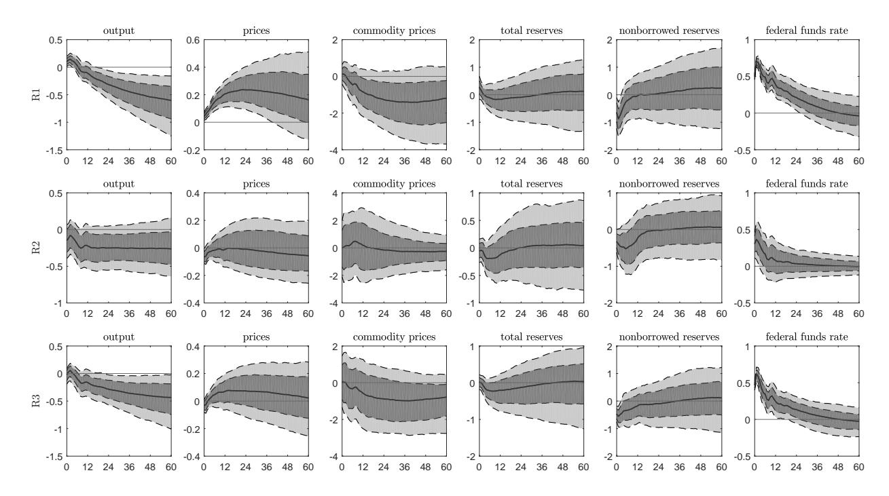
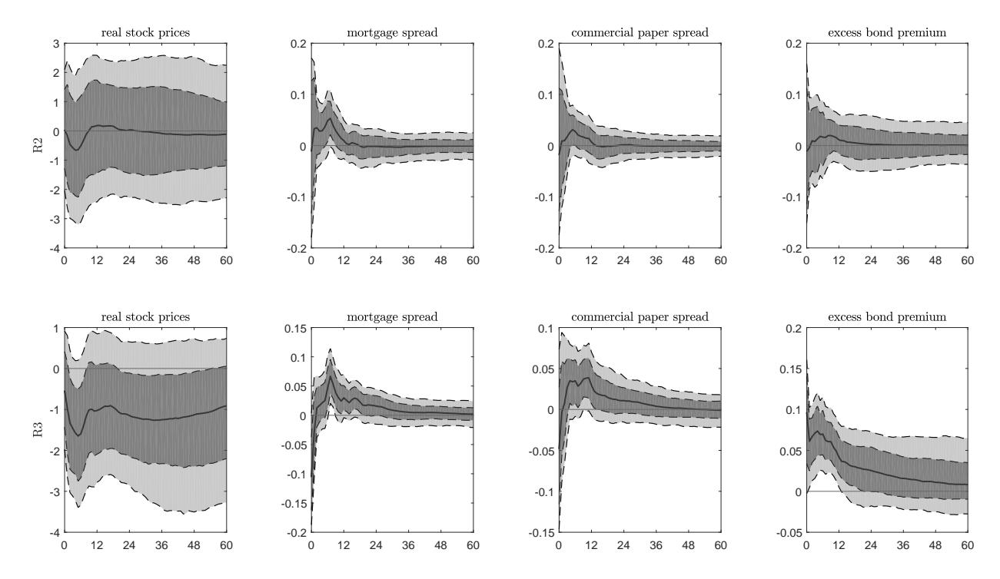
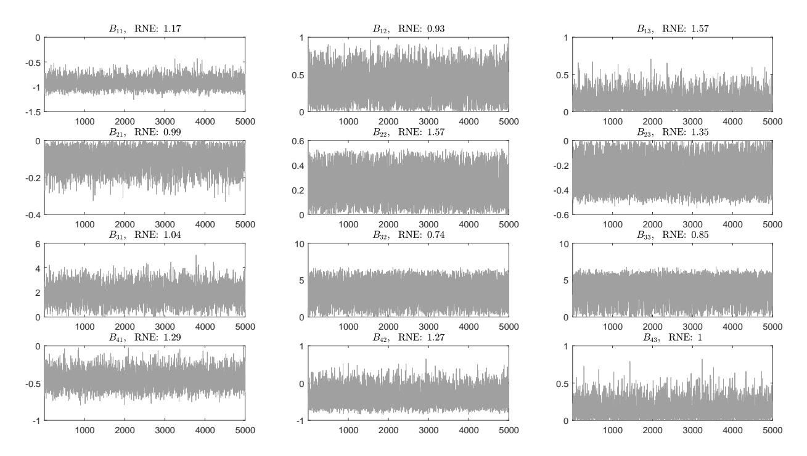
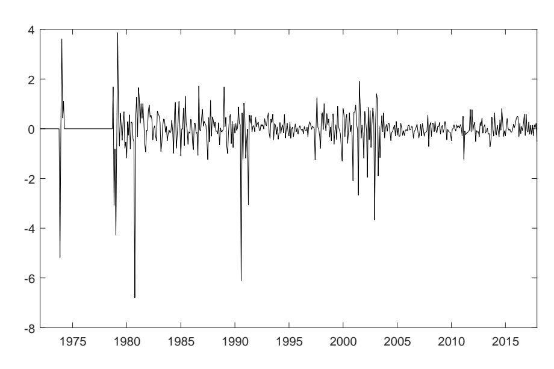

# Staff Working Paper No. 961 Identification of SVAR models by combining sign restrictions with external instruments

Robin Braun and Ralf Brüggemann

February 2022

Staff Working Papers describe research in progress by the author(s) and are published to elicit comments and to further debate. Any views expressed are solely those of the author(s) and so cannot be taken to represent those of the Bank of England or to state Bank of England policy. This paper should therefore not be reported as representing the views of the Bank of England or members of the Monetary Policy Committee, Financial Policy Committee or Prudential Regulation Committee.

## Staff Working Paper No. 961 Identification of SVAR models by combining sign restrictions with external instruments

Robin Braun(1) and Ralf Brüggemann(2)

### Abstract

We discuss combining sign restrictions with information in external instruments (proxy variables) to identify structural vector autoregressive (SVAR) models. In one setting, we assume the availability of valid external instruments. Sign restrictions may then be used to identify further orthogonal shocks, or as an additional piece of information to pin down the shocks identified by the external instruments more precisely. In a second setting, we assume that proxy variables are only 'plausibly exogenous' and suggest various types of inequality restrictions to bound the relation between structural shocks and the external variable. This can be combined with conventional sign restrictions to further narrow down the set of admissible models. Within a proxy-augmented SVAR, we conduct Bayesian inference and discuss computation of Bayes factors. They can be useful to test either the sign or IV restrictions as overidentifying. We illustrate the usefulness of our methodology in estimating the effects of oil supply and monetary policy shocks.

Key words: Structural vector autoregressive model, sign restrictions, external instruments, proxy VAR.

JEL classification: C32, C11, E32, E52.

- (1) Bank of England. Email: robin.braun@bankofengland.co.uk
- (2) University of Konstanz. Email: ralf.brueggemann@uni-konstanz.de

The views expressed in this paper do not reflect those of the Bank of England or its committees. We thank participants of the Konstanz-Tübingen-Hohenheim Econometrics Seminar, the CFE-CMStatistics 2017, the 2017 annual meeting of the German Statistical Society as well as seminar participants at University of Melbourne, Monash University, Universidad Nacional de Córdoba (Argentina), Universität Duisburg-Essen, and FAU Universität Erlangen-Nürnberg, and the Bank of England for useful comments. We also thank Gökhan Ider for excellent research assistance. Part of this research has been conducted when the second author was visiting Monash University, Australia. Financial support of the Graduate School of Decision Sciences (GSDS) at the University of Konstanz and the German Science Foundation (grant number: BR 2941/3-1) is gratefully acknowledged.

The Bank's working paper series can be found at www.bankofengland.co.uk/working-paper/staff-working-papers

Bank of England, Threadneedle Street, London, EC2R 8AH Email enquiries@bankofengland.co.uk

## 1 Introduction

In this paper, we discuss the identification of structural vector autoregressive (SVAR) models by combining sign restrictions with information in time series that act as proxy or external instruments for the structural shocks of interest. We argue that combining both approaches can be useful in many situations in order to obtain more informative results and mitigate some drawbacks that may occur when using either sign restrictions or external instruments only. We also provide tools to formally quantify the support of overidentifying restrictions in this framework.

Sign restrictions have been introduced by [Faust \(1998\)](#page-27-0), [Canova & De Nicol´o \(2002\)](#page-27-1) and [Uhlig \(2005\)](#page-30-0) as a generalization of short- and long-run restrictions on the effect of structural shocks. In their most common form, they are imposed on contemporaneous or higher horizon structural impulse responses. More broadly, they have been exploited to bound other structural parameters, e.g. elasticities or variance decompositions. Given that sign restrictions imply set-identification, an important practical problem is that the set of admissible models is often wide, and therefore structural analysis not very informative.

Introduced by [Stock & Watson \(2012\)](#page-30-1) and [Mertens & Ravn \(2012\)](#page-29-0), the use of external instrumental variables (IV) (or proxy variables) provides another popular way to achieve identification.[1](#page-2-0) While the external IV approach is conceptually appealing, the exogeneity of instruments is questionable in many applications (see e.g. the discussion in [Ramey \(2016\)](#page-30-2) on the narrative measures of monetary policy shocks). Furthermore, even a proxy variable that is credibly exogenous may be weak, complicating reliable inference [\(Montiel Olea et al.](#page-29-1) [2021\)](#page-29-1).

In this paper, we contribute to the literature by discussing how to combine the proxy variable approach with sign restrictions. We discuss two interesting cases which differ in the underlying assumption for the external variables. In the first, we assume the availability of credibly exogenous instruments. In this case, sign restrictions can serve two purposes. On the one hand, they may be useful to identify additional shocks from the group of shocks that are orthogonal to those identified by IVs. On the other hand, sign restrictions can be used in addition to the IV conditions such that they are informative with respect to the shocks for which instruments are available. This can be useful to disentangle multiple shocks to be identified by IV, or simply to obtain a more informative picture in finite samples.

In our second setting, we assume the availability of 'plausibly exogenous' proxies. Following the terminology of [Conley et al. \(2012\)](#page-27-2), these are external variables which may be related to the structural shock of interest, but are not credibly exogenous. As in the microeconometric literature, we propose to use inequality restrictions to bound endogeneity. In our context, such bounds arise naturally as sign restrictions on the parameters that relate the structural shocks with the external variable, including restrictions on correlations and variance decompositions of the instrument. Furthermore, they can easily be combined with conventional sign restrictions on the responses of variables to achieve a reduced set of admissible models.

1Many interesting papers have successfully exploited this identification strategy, including [Gertler &](#page-27-3) [Karadi](#page-27-3) [\(2015\)](#page-27-3), [Gerko & Rey](#page-27-4) [\(2017\)](#page-27-4), [Mertens & Montiel Olea](#page-29-2) [\(2018\)](#page-29-2), [Lakdawala](#page-28-0) [\(2019\)](#page-28-0), [K¨anzig](#page-28-1) [\(2021\)](#page-28-1) and [Peersman](#page-29-3) [\(2020\)](#page-29-3).

To conduct inference, we rely on a unified econometric framework, a Bayesian SVAR model augmented by equations for the proxy variables. In our baseline setting, we formulate independent priors on the reduced form parameters and the structural impact matrix of a B-model type SVAR, i.e. we use a model where the proxy-augmented reduced form errors are a linear function of the structural shocks and a measurement error.[2](#page-3-0) We summarize the posterior distribution of the structural parameters by Markov Chain Monte Carlo (MCMC) methods. In order to sample from the conditional distribution of the structural parameters, we implement a Metropolis Hastings algorithm that makes use of the efficient importance distribution developed in [Arias et al. \(2018\)](#page-26-0). By combining the different types of restrictions discussed in this paper, the model may be overidentified. For these situations, we describe Bayes factors as a formal statistical tool to quantify the support of overidentifying restrictions.

### Related Literature

Our paper is related to an emerging literature that has discussed some form of combining sign restrictions with external instruments specifically, or non-model information more broadly. Related to our first setting are papers by [Cesa-Bianchi & Sokol \(2017\)](#page-27-5), [Jaroci´nski](#page-28-2) [& Karadi \(2020\)](#page-28-2), and [Arias et al. \(2021\)](#page-26-1) who combine instrumental variables with sign restrictions to either identify additional shocks unrelated to the instrument, or to disentangle multiple shocks to be identified by IV. Related to those papers, we highlight the benefits from imposing overidentifying sign restrictions and provide methodology on how these can be tested via Bayes factors.

Our second setting is closely related to the microeconometric literature exploiting plausibly exogenous instruments. Here, set-identified simultaneous equation models are obtained by replacing exogeneity constraints with upper bounds on the degree of endogeneity [\(Nevo](#page-29-4) [& Rosen 2012,](#page-29-4) [Conley et al. 2012\)](#page-27-2). In parallel work to ours, [Ludvigson et al. \(2020\)](#page-29-5) also translate this idea to SVAR models, introducing 'external inequality constraints'. Effectively, this entails discarding models in which the shock of interest is not or only loosely correlated with the proxy variables.[3](#page-3-1) Our paper is more general with respect to important modeling aspects. For instance, we also discuss constraints on variance contributions and, in addition to threshold constraints, introduce several ranking restrictions that do not require input by the researcher. Furthermore, we put special emphasis on restrictions that are invariant under rotation of shocks unrelated to the external variables, allowing researchers to work with partially identified models.

Methodologically, our paper relates to recent advances in Bayesian inference for SVARs identified by external instruments [\(Caldara & Herbst 2019,](#page-27-6) [Drautzburg 2020,](#page-27-7) [Arias et al.](#page-26-1) [2021,](#page-26-1) [Giacomini et al. 2021\)](#page-28-3). Our paper complements this literature by considering inference in an augmented B-model type proxy SVAR. There are several reasons why we choose this model representation. First, the B-model is very popular among researchers

2The basic structure of our proxy SVAR is of the same form as the one used in [Angelini & Fanelli](#page-26-2) [\(2019\)](#page-26-2). As explained in Section [2,](#page-4-0) this setup is labeled as a B-model SVAR in some parts of the literature (see e.g. [L¨utkepohl](#page-29-6) [\(2005,](#page-29-6) Chapter 9)).

3See also [Uhrin & Herwartz](#page-30-3) [\(2016\)](#page-30-3) for a similar idea.

working with sign restrictions (see [Bruns & Piffer \(2019\)](#page-27-8) for a survey). Economic theory is often informative about the impact impulse response functions to a certain shock which are effectively elements in the B-matrix.[4](#page-4-1) Second, specifying a proxy VAR model in form of an augmented B-model implies a very natural measurement error equation for the instruments mt given by mt = Φεt + ηt , where εt are structural shocks and ηt is a measurement error. As discussed in [Mertens & Ravn \(2013\)](#page-29-7), IV restrictions correspond to simple exclusion restrictions on Φ. We show that under the conjugate prior for the B-model, both conditional prior and posterior of Φ are matrix variate normal. As we discuss in the paper, this result facilitates testing exclusion restrictions on Φ via Savage Dickey Density ratios [\(Dickey 1971\)](#page-27-9). In our framework, we make use of this result to test IV validity within a sign-identified model. Finally, in our paper we consider independent prior distributions on the reduced form autoregressive coefficients, which allows to impose a wider spectrum of prior information including asymmetric priors across equations.

Our paper is also related to [Nguyen \(2019\)](#page-29-8), who introduces identifying information from external instruments into a set-identified monetary policy model [\(Baumeister & Hamilton](#page-26-3) [2018\)](#page-26-3). In a second step, Bayes factors are used to formally assess the validity of each instrument. This approach is similar to what we suggest in our first setting, but there are important differences. First, his approach relies on including external instruments as exogenous regressors into the VAR model of [Baumeister & Hamilton \(2015\)](#page-26-4), which requires explicit formulation of prior distributions on structural parameters in B−1 . In situations where such prior formulations are difficult, our conjugate prior framework is easier to use. Furthermore, as we show, the Bayes factors under the conjugate prior are not sensitive to rotations of those shocks unrelated to the external variables, allowing researchers to use our method within partially identified models.

#### Structure of the paper

Section [2](#page-4-0) introduces the econometric modeling framework, discusses identifying restrictions, Bayesian inference as well as the computation of Bayes factors. Section [3](#page-17-0) illustrates the suggested methods in applications to oil market shocks and US monetary policy shocks. Section [4](#page-25-0) summarizes and concludes.

## 2 Methodology

## 2.1 Augmented SVAR model

We consider a B-model type SVAR model (see e.g. [\(L¨utkepohl 2005,](#page-29-6) Section 9.1)) given by

$$y_t = \nu + \sum_{i=1}^p A_i y_{t-i} + B\varepsilon_t, \quad \varepsilon_t \sim (0, I_n),$$
 (2.1)

4Mostly, those restrictions take the form of dogmatic sign or exclusion restrictions, but within our approach they could also be spelled out in forms of more general prior distributions as suggested in [Baumeister & Hamilton](#page-26-4) [\(2015\)](#page-26-4).

where  $y_t = (y_{1t}, \dots, y_{nt})'$  is a  $n \times 1$  vector of endogenous time series,  $\nu$  is a  $n \times 1$  vector of intercepts, and  $A_i, i = 1, \dots, p$  are  $n \times n$  matrices of autoregressive coefficients. The dynamics of the system is assumed to be driven by n structural shocks  $\varepsilon_t$ , where we assume that the elements of  $\varepsilon_t$  are orthogonal and are normalized to have unit variances. The  $n \times n$  matrix B is the contemporaneous impact matrix and reflects the immediate responses of the variables  $y_t$  to the structural shocks  $\varepsilon_t$ . We assume stability of the VAR, which implies that the SVAR(p) has a MA $(\infty)$  representation given by  $y_t = \mu_y + \sum_{j=0}^{\infty} \Xi_j B \varepsilon_{t-j} = \mu_y + \sum_{j=0}^{\infty} \Theta_j \varepsilon_{t-j}$ , where  $\mu_y = E(y_t)$  and the  $n \times n$  coefficient matrices  $\Theta_j = \Xi_j B$ , are the structural impulse response functions (IRFs). The reduced form MA $(\infty)$  matrices  $\Xi_j$  can be computed recursively from  $\Xi_j = \sum_{i=1}^j \Xi_{j-i} A_i$  with  $\Xi_0 = I_n$  and  $A_i = 0$  for i > p. Without additional restrictions this model is not identified. Therefore, restrictions must be imposed on the structural impact matrix B in order to pin down a meaningful structural model.

In this paper, we focus on identification by combining sign restrictions with information in external variables. Let  $m_t = (m_{1t}, \ldots, m_{kt})'$  be a  $k \times 1$  vector of external variables designed to provide identifying information about a subset of k < n structural shocks. Our econometric methods are based on augmenting the SVAR given in (2.1) by equations for  $m_t$ :

$$\underbrace{\begin{pmatrix} y_t \\ m_t \end{pmatrix}}_{\tilde{y}_t} = \underbrace{\begin{pmatrix} \nu \\ \nu_m \end{pmatrix}}_{\tilde{\nu}} + \sum_{i=1}^p \underbrace{\begin{pmatrix} A_i & 0_{n \times k} \\ \Gamma_{1i} & \Gamma_{2i} \end{pmatrix}}_{\tilde{A}_i} \underbrace{\begin{pmatrix} y_{t-i} \\ m_{t-i} \end{pmatrix}}_{\tilde{y}_{t-i}} + \underbrace{\begin{pmatrix} B & 0_{n \times k} \\ \Phi & \Sigma_{\eta}^{1/2} \end{pmatrix}}_{\tilde{B}} \underbrace{\begin{pmatrix} \varepsilon_t \\ \eta_t \end{pmatrix}}_{\tilde{\varepsilon}_t}, \quad \begin{pmatrix} \varepsilon_t \\ \eta_t \end{pmatrix} \sim (0, I_{n+k}).$$
(2.2)

As noted in Mertens & Ravn (2012), the additional equations have an intuitive measurement error interpretation. The k variables  $m_t$  are modeled as a linear function of lagged values of  $\tilde{y}_t$ , the structural errors  $\varepsilon_t$ , plus a zero mean measurement error  $\eta_t$ , which is assumed to be orthogonal to the structural shocks  $\varepsilon_t$ , i.e.  $\eta_t \perp \varepsilon_t$ .  $\Gamma_{1i}$ ,  $\Gamma_{2i}$  and  $\Phi$  are  $k \times n$  coefficient matrices. Corresponding  $n \times k$  blocks of zeros in the upper right parts of  $\tilde{A}_i$  and  $\tilde{B}$  ensure that  $m_t$  and the measurement error  $\eta_t$  are external to the model and have no implications for the dynamics of  $y_t$ . We also assume that  $\tilde{B}$  has full rank,  $\operatorname{rk}(\tilde{B}) = n + k$ , throughout the paper. Usually, proxy variables are designed to be unpredictable by lagged values of  $y_t$  and  $m_t$ , and do only contain contemporaneous information about  $\varepsilon_t$ . In this case, one can set  $\Gamma_{1i} = \Gamma_{2i} = 0$ , and the model shares the more natural representation introduced in Mertens & Ravn (2012). To keep notation simple, for the remainder of this section, we assume  $\Gamma_{1i} = \Gamma_{2i} = 0$  holds, implying that the model reduces to

$$y_t = \nu + \sum_{i=1}^p A_i y_{t-i} + B\varepsilon_t, \tag{2.3}$$

$$m_t = \nu_m + \Phi \varepsilon_t + \Sigma_{\eta}^{1/2} \eta_t. \tag{2.4}$$

Without any further restrictions, the augmented SVAR model is only identified up to orthogonal rotations of the form  $\bar{B} = \tilde{B}Q$ , where the rotation matrix  $Q = \text{diag}(Q_1, Q_2)$ ,  $Q_1Q_1' = I_n$  and  $Q_2Q_2' = I_k$ . Q has a block structure that reflects the fact that the

measurement error  $\eta_t$  is assumed to be orthogonal to the dynamics in  $y_t$ , implying a  $n \times k$  block of zeros in the upper right part of  $\tilde{B}$ . Through restrictions on  $\Phi$ , identifying information can be imposed to pin down values of B or equivalently, to narrow the set of rotation matrices  $Q_1$ .

At this point, we highlight recent work of Noh (2017) and Plagborg-Møller & Wolf (2021b) who discuss IV identification of IRFs, relaxing the assumption that  $\varepsilon_t$  is recoverable from lagged and contemporaneous values of  $y_t$  (invertibility). Within equation (2.2), this could be implemented by allowing for unrestricted lead-lag dynamics between instrument and endogenous variables, and computation of IRFs via a Cholesky decomposition for  $(m_t, y_t')'$  with  $m_t$  ordered first. However, without the invertibility assumption, only measurement error contaminated shocks can be identified, complicating the identification of variance decompositions even under instrument exogeneity (Plagborg-Møller & Wolf 2021a). Throughout this paper, we often rely on the ability to explicitly take out variation in the instrument that is due to measurement error. Therefore, we assume invertibility in the following.

#### 2.2 Sign and instrumental variables restrictions

We first discuss combining sign restrictions with instrumental variables (IV), assuming that  $m_t$  provides valid exogenous variation. For this purpose, partition the structural shocks  $\varepsilon_t$  and the matrix  $\Phi$  as:

$$\varepsilon_t = \begin{bmatrix} \varepsilon'_{1t} : \varepsilon'_{2t} \end{bmatrix}' \quad \text{and} \quad \Phi = \begin{bmatrix} \phi_1 : \phi_2 \end{bmatrix}. \tag{2.5}$$

Without loss of generality, assume that out of all n structural shocks, the researcher identifies the last k shocks  $(\varepsilon_{2t})$  using k instrumental variables  $m_t$ . In our model,  $E(m_t \varepsilon'_t) = \Phi$  and using the partitioning in (2.5), we get

$$[\mathrm{E}(m_t \varepsilon_{1t}') \, \mathrm{E}(m_t \varepsilon_{2t}')] = [\phi_1 : \phi_2].$$

The assumption that  $m_t$  are valid instruments for  $\varepsilon_{2t}$ , implies that  $m_t$  is correlated with  $\varepsilon_{2t}$  but uncorrelated with all other shocks in the system, that is  $E(m_t \varepsilon'_{1t}) = 0$ . Consequently, the IV conditions imply

$$\phi_1 = 0_{k \times n - k},\tag{2.6}$$

and

$$\phi_2 \neq 0, \quad \text{rk}(\phi_2) = k, \tag{2.7}$$

where (2.6) and (2.7) are the exogeneity and relevance conditions, respectively. If k = 1, the scalar shock of interest ( $\varepsilon_{2t}$ ) is point identified by the external instrument conditions, while for any k > 1, restrictions (2.7) and (2.6) only partition the structural shocks into shocks  $\varepsilon_{2t}$  which correlate with the instruments, and shocks  $\varepsilon_{1t}$  assumed to be orthogonal to the instruments. Therefore, when k > 1 additional restrictions are necessary to disentangle the effects of each subcomponent of  $\varepsilon_{2t}$ .

When instrument restrictions are valid, we see two potentially useful ways to introduce

sign restrictions. On the one hand, they can be used to identify additional shocks within ε1t , the shocks orthogonal to the instrument. For example, in one of our empirical applications, we use an IV to identify a supply shock while different demand shocks are identified using sign restrictions on impact IRFs. Within our unified framework, all shocks identified by either sign restrictions or IV restrictions are guaranteed to be mutually orthogonal. Alternatively, sign restrictions may be imposed on ε2t , which are the shocks identified by external instruments. This may be useful for two reasons. First, if k > 1, sign restrictions can be imposed to further disentangle each subcomponent of ε2t . [5](#page-7-0) Second, sign restrictions can act as an additional piece of information for shocks that are point-identified by IV. Such information can be particularly valuable when the external variables are only weakly informative. For example, within our oil market application (Section [3.1\)](#page-17-1), we combine classical impact sign restrictions with IV restriction to identify the supply shock. Also, [Bruns](#page-27-10) [& Piffer \(2021\)](#page-27-10) use sign restrictions on the top of IV restrictions within a non-linear VAR. Additional restrictions on ε2t are potentially overidentifying and may be checked against the data. In our framework, this can be done in form of Bayes factors which we will discuss in Section [2.5.](#page-12-0)

## 2.3 Sign restrictions and plausibly exogenous instruments

There may be situations where researchers have doubts regarding the exogeneity of their external instruments. Therefore, we discuss how proxy variables that are not exogenous may still be useful for identification. In reference to the microeconometric literature, we adopt the terminology and call these proxy variables 'plausibly exogenous' (cf. [Conley et al.](#page-27-2) [\(2012\)](#page-27-2)). Instead of instrument exogeneity, weaker inequality restrictions are suggested to bound the relation between structural shocks and proxy variables.

For ease of exposition, we discuss a situation where the goal is to identify a single shock, say ε1t or equivalently B1, the first column of the structural impact matrix. Furthermore, assume that we have a scalar proxy variable mt , which is only 'plausibly exogenous' for ε1t such that the approach in Section [2.2](#page-6-3) cannot be used in a credible way. In the following, we suggest various restrictions that bound the relation between the proxy variable mt , the structural shock of interest ε1t and all other shocks ε2t . In particular, we discuss constraints on correlations and variance contributions, and further classify these into threshold and ranking restrictions as explained below.

#### Correlation constraints

For k = 1, the measurement error equation is given by:

$$m_t = \nu_m + \phi \varepsilon_t + \sigma_\eta \eta_t, \qquad \eta_t \sim (0, 1),$$

5For example, [Piffer & Podstawski](#page-29-10) [\(2017\)](#page-29-10) use sign restrictions on ϕ2 in the situation that k = 2, while [Bertsche](#page-26-5) [\(2019\)](#page-26-5) imposes restrictions on the impact matrix B2 directly.

where  $\phi$  is a  $1 \times n$  vector and  $\sigma_{\eta}$  a scalar. Therefore, within the proxy-augmented SVAR, the correlation between the *i*th shock and the instrument is:

$$\rho_i := \operatorname{Corr}(m_t, \varepsilon_{it}) = \frac{\operatorname{E}(m_t \varepsilon_{it})}{\sqrt{\operatorname{Var}(m_t)}} = \frac{\phi_i}{\sqrt{\phi \phi' + \sigma_\eta^2}} \in (-1, 1).$$

A threshold restriction of the form  $\rho_1 > c_1$  can be used (see also Ludvigson et al. 2020). Effectively, this retains all models where the correlation between  $m_t$  and the structural shock of interest  $\varepsilon_{1t}$  exceeds a threshold  $c_1$ . A special case is obtained for  $c_1 = 0$ , expressing the belief that the external variable  $m_t$  is at least positively correlated with the structural shock it has been designed for. The larger  $c_1$ , the more models are ruled out from the set of admissible SVARs. The threshold value  $c_1$  needs to be set by the researcher. However, in our view, a particular choice is often difficult to justify in practice.

Instead of choosing  $c_1$ , one could employ a ranking restriction of the form  $\rho_1 > \rho_j$ ,  $j = 2, \ldots, n$ . Such a restriction ensures that the identified set only includes models where the shock of interest  $\varepsilon_{1t}$  shows a larger correlation with the proxy  $m_t$  than any other shock in the system. One drawback with this ranking restriction on the correlations is that the results may not be invariant to the identification and normalization of the shocks unrelated to the instrument  $(\varepsilon_{2t})$ . For example, in a bivariate model where  $\operatorname{Corr}(m_t, \varepsilon_{1t}) = 0.1$  and  $\operatorname{Corr}(m_t, \varepsilon_{2t}) = -0.2$  this restriction would be satisfied. However, a simple re-normalization of the sign to  $\tilde{\varepsilon}_{2t} = -\varepsilon_{2t}$  yields the opposite conclusion. This problem can be addressed by considering variance contributions instead, which we discuss in in the following.

#### Variance contribution constraints

Since the elements in  $\varepsilon_t$  are orthogonal by construction, the share of variance  $\omega_i$  in  $m_t$  explained by the *i*th structural shock is given by the squared correlation:

$$\omega_i = \frac{\phi_i^2}{\phi \phi' + \sigma_n^2} \in (0, 1),$$

and one could use a threshold constraint of form  $\omega_1 > c_2$  for some  $c_2 \in (0,1)$ . Thus, one would only retain models for which the shock of interest  $\varepsilon_{1t}$  explains at least  $c_2 \cdot 100\%$  of the variation in the instrument. However, the extent to which  $m_t$  reflects the measurement error is not known a priori, which makes it difficult to set  $c_2$  in practice.

To alleviate this problem, it might be useful to consider the statistic

$$\omega_i^* = \frac{\phi_i^2}{\phi \phi'} \in (0, 1),$$

which gives the contribution of the *i*th structural shock to  $Var(m_t - \eta_t)$ , the variance of the proxy net of measurement error. Choosing the value  $c_2^* \in (0,1)$  for the restriction  $\omega_1^* > c_2^*$  is easier as  $(1 - c_2^*)$  carries the convenient interpretation of the maximum degree of endogeneity one is willing to allow for. As  $c_2^*$  approaches unity, one increasingly excludes endogenous variation in  $m_t$  with the limiting case of  $c_2^* = 1$  effectively imposing the IV restriction.

Alternatively, one could also use the ranking constraint  $\omega_1 > \sum_{j=2}^n \omega_j$ , i.e. one would only keep models for which the identified shock of interest  $\varepsilon_{1t}$  explains more of the variation in  $m_t$  than all remaining shocks in  $\varepsilon_{2t}$  together. Note that using  $\omega_1^* > \sum_{j=2}^n \omega_j^*$  would give identical results and that this ranking restriction is a special case of the threshold constraint above with  $c_2^* = 0.5$ . Instead, one may think of imposing the ranking constraint  $\omega_1 > \omega_j$ ,  $j = 2, \ldots, n$ . Here, one keeps only models in which the identified shock of interest  $\varepsilon_{1t}$  explains more of the variation in  $m_t$  than any other shock in  $\varepsilon_{2t}$ . However, this restriction is not invariant to rotations of  $\varepsilon_{2t}$  and hence requires their explicit identification to be operational. In contrast, using  $\omega_1 > \sum_{j=2}^n \omega_j$  is invariant to such rotations. To see this, define rotated shocks  $\bar{\varepsilon}_{2t} = Q_2' \varepsilon_{2t}$  with corresponding measurement error regression coefficients  $\bar{\phi}_2 = \phi_2 Q_2$  where  $Q_2 Q_2' = I_{n-1}$ . Then, it holds that:

$$\sum_{j=2}^{n} \omega_j = \frac{\phi_2 \phi_2'}{\phi_1^2 + \phi_2 \phi_2' + \sigma_\eta^2} = \frac{\bar{\phi}_2 \bar{\phi}_2'}{\phi_1^2 + \bar{\phi}_2 \bar{\phi}_2' + \sigma_\eta^2}.$$

Note that similar manipulations can be used to show that  $\omega_1 > c_2$  and  $\omega_1^* > c_2^*$  are also invariant to the identification of  $\varepsilon_{2t}$  and hence suitable for partially identified models.

#### Practical considerations

In practice, applied researchers need to choose one particular way of exploiting information in plausibly exogenous proxy variables from the menu above. As usual in SVARs, this choice needs to be made by the researcher against the background of the particular application. For instance, in some applications, researchers may have a good understanding of reasonable values for threshold values. If no such information is available, then researchers may revert to methods that rely on a simple ranking. Furthermore, we recommend that in partially identified models, one should only consider restrictions that are invariant to the identification of  $\varepsilon_{2t}$ .

Some researchers may be reluctant to select a single threshold or ranking condition. In this case, it might be attractive to formulate a more general prior belief on the amount of endogeneity in the spirit of Baumeister & Hamilton (2015). To give an example, one can use a Beta prior on  $\omega_1^* \sim \text{Beta}(\alpha, \beta)$  and tune  $\alpha$  and  $\beta$  to the particular proxy variable. For instance, setting  $\alpha = 5$  and  $\beta = 1$  yields a density that peaks at  $\omega_1^* = 1$ , implying the modal prior belief that  $m_t$  is a valid instrument. Also, for those values, most of the prior mass would lie above 0.5, reflecting a strong belief that most of the variation in  $m_t$  (unrelated to measurement error) should be driven by the shock of interest. The algorithm developed in this paper is general enough to handle such prior distributions.

We also highlight that any of the restrictions outlined above can be adapted to a setting with multiple shocks and instruments, and can be combined with conventional sign restrictions on structural parameters of the model. As we demonstrate in our empirical applications (Section 3.2), a combination with conventional sign restrictions can be a powerful identification strategy if the latter alone are not strong enough to yield informative results.

Finally, the possibility to exploit identification of partially endogenous instruments fa-

cilitates the construction of such variables considerably. Among those, one could consider qualitative indicators for the sign of given shocks at a certain date, which are often easy to construct (see Plagborg-Møller & Wolf (2021b, Appendix B.3) and Boer & Lütkepohl (2021)). Coupled with restrictions discussed in this section, just a few non-zero elements in  $m_t$  might help to considerably narrow down the set of admissible models without the need to impose full exogeneity. Similarly, one may construct a proxy  $m_t$ , which is either 0 or the prediction error of a variable of interest. In a second step, one may then impose that the structural shock of interest is the main driver of these selected prediction errors. In fact, such an approach would be closely related to narrative sign restrictions suggested in Antolín-Díaz & Rubio-Ramírez (2018).

## 2.4 Bayesian inference

In the following, we discuss Bayesian inference for the augmented B-model type SVAR subject to the restrictions discussed previously. Let  $\tilde{A} = [\tilde{\nu}, \tilde{A}_1, \dots, \tilde{A}_p], \ \tilde{Y} = [\tilde{y}_1, \dots, \tilde{y}_T]'$  and  $X = [x_1, \dots, x_T]'$  where  $x_t = [1, \tilde{y}'_{t-1}, \dots, \tilde{y}'_{t-p}]'$ . We work with a standard Gaussian likelihood. Given known presample values  $\tilde{y}_0, \tilde{y}_{-1}, \dots, \tilde{y}_{-p+1}$ , the density is:

$$p(\tilde{Y}|\tilde{A}, \tilde{B}) = (2\pi)^{-\frac{(n+k)T}{2}} |\tilde{B}\tilde{B}'|^{-\frac{T}{2}} \exp\left(-\frac{1}{2} \text{tr}(\tilde{B}^{-1'}\tilde{B}^{-1}(\tilde{Y} - X\tilde{A})(\tilde{Y} - X\tilde{A})')\right). \tag{2.8}$$

Given that the Gaussian likelihood is fully characterized by the first two moments, it is invariant to certain orthogonal rotations of  $\tilde{B}$ . That is, if no exogeneity restrictions are imposed, the same likelihood value is obtained for any alternative model  $\tilde{B}^* = \tilde{B}Q$  with  $Q = \text{diag}(Q_1, Q_2)$  (see Section 2.1) as long as the sign- and IV restrictions remain satisfied.

Regarding the prior, we specify independent distributions for the autoregressive coefficients and the structural impact matrix. With respect to the first, denote by  $\alpha$  the vectorized non-zero elements in A. Then, we assume a Gaussian prior given by  $p(\alpha; \alpha_0, V_\alpha) \sim$  $\mathcal{N}(\alpha_0, V_\alpha)$ . While this choice allows the user to pick from a wide range of priors developed for multivariate regression analysis, normality implies conditional conjugacy and hence ensures straightforward treatment within Markov Chain Monte Carlo (MCMC) methods. As opposed to other Bayesian proxy SVARs considered in Caldara & Herbst (2019) and Arias et al. (2021), we consider an independent prior for the reduced form parameters rather than a fully conjugate prior for the structural parameters. This is motivated by the fact that in a VAR setting, informative priors are typically spelled out for the reduced form parameters. Furthermore, assuming prior independence has the benefit that it allows for a wider spectrum of priors which can be asymmetric across equations. These include the original Minnesota prior of Litterman (1986) and various popular hierarchical shrinkage priors surveyed in Koop et al. (2010). This effectively allows us to employ dogmatic exclusion restrictions imposed on A which we employ to ensure that the external variables do not influence the dynamics of the endogenous variables.

 $^6\mathrm{We}$  are grateful to an anonymous referee for pointing out this possibility.

For the structural impact matrix  $\tilde{B}$ , we consider a conjugate prior which takes the form

$$p(\tilde{B}; v_0, S_0) \propto |\det(\tilde{B})|^{-(v_0+n+k)} \exp\left(-\frac{1}{2} \operatorname{tr}\left(S_0\left(\tilde{B}\tilde{B}'\right)^{-1}\right)\right).$$
 (2.9)

Akin to the likelihood, the conjugate prior implies that all B-models satisfying the restrictions discussed in this paper obtain the same prior density value. This guarantees that the researcher does not impose unintentional identifying information beyond the restrictions considered in this paper. Furthermore, the prior hyperparameters are fairly easy to choose, e.g. by a training sample. Specifically,  $v_0$  and  $S_0$  can be thought of as degrees of freedom and a scale matrix from an inverse Wishart prior specified on the augmented covariance matrix  $\tilde{\Sigma} = \tilde{B}\tilde{B}'$ .

In Appendix A, we prove that the prior specified in (2.9) can be further split into densities for each of the three underlying parameter blocks of  $\tilde{B}$ , that is B,  $\Sigma_{\eta}^{1/2}$  and  $\Phi$ . Specifically, we can show that  $p(\tilde{B}; v_0, S_0) \propto p(B; v_0, S_0) p(\Sigma_{\eta}^{1/2}; v_0, S_0) p(\Phi|B, \Sigma_{\eta}^{1/2}; v_0, S_0)$ , where:  $p(B; v_0, S_0) \propto |\det(B)|^{-(v_0+n)} \exp\left(-\frac{1}{2} \operatorname{tr}\left(S_{11} \left(BB'\right)^{-1}\right)\right),$ 

$$p(B; v_0, S_0) \propto |\det(B)|^{-(v_0+n)} \exp\left(-\frac{1}{2} \operatorname{tr}\left(S_{11} (BB')^{-1}\right)\right),$$

$$p(\Sigma_{\eta}^{1/2}; v_0, S_0) \propto |\Sigma_{\eta}|^{-(v_0+k)/2} \exp\left(-\frac{1}{2} \operatorname{tr}\left(S_{22 \cdot 1} \Sigma_{\eta}^{-1}\right)\right),$$

$$p(\Phi|B, \Sigma_{\eta}^{1/2}; v_0, S_0) \sim \mathcal{MN}(S_{21} S_{11}^{-1} B, \Sigma_{\eta}, B' S_{11}^{-1} B).$$

Here,  $\Sigma_{\eta} = \Sigma_{\eta}^{1/2}(\Sigma_{\eta}^{1/2})'$ ,  $S_0 = \begin{pmatrix} S_{11} & S_{12} \\ S_{21} & S_{22} \end{pmatrix}$ ,  $S_{22\cdot 1} = S_{22} - S_{21}S_{11}^{-1}S_{12}$ , and  $X \sim \mathcal{MN}(M, U, V)$  denotes the matrix normal distribution with mean E[X] = M and variance  $Var[vec(X)] = V \otimes U$ .

There are several useful implications from this result. First, conditional normality of  $\Phi$ sets the cornerstone for simple Bayes factor computation. As we will discuss in Section 2.5, it allows the use of Savage Dickey Density Ratios to test IV exclusion restrictions. Second, the result gives insights on how the prior relates to others used in the Bayesian proxy SVAR literature. Specifically, (for p=0) using a change of variable technique with  $\tilde{A}=\tilde{B}^{-1}$  yields the Jacobian of transformation  $|\det(\tilde{A})|^{-2(n+k)}$  and the prior density of Arias et al. (2018):  $p(\tilde{\mathsf{A}}; v_0, S_0) \propto |\det(\tilde{\mathsf{A}})|^{v_0 - n - k} \exp\left(-\frac{1}{2} \operatorname{tr}\left(\tilde{\mathsf{A}}' S_0 \tilde{\mathsf{A}}\right)\right)$ . Furthermore, a prior as in Caldara & Herbst (2019) can be obtained by applying the change of variables to the upper left block  $A = B^{-1}$ , and using an independent normal prior for  $\Phi$ . However, prior dependence on B (or A), is needed if a researcher would like to ensure that the prior is not unintentionally informative about the set of admissible models. Third, the result opens the door to easily switch to a prior which is uniform for the A-model, if a researcher prefers doing so. Using a change of variable technique with  $\{B, \Phi, \Sigma_n\}$  to  $\{A = B^{-1}, \Phi, \Sigma_n\}$  yields the corresponding prior  $p(A, \Sigma_{\eta}^{1/2}, \Phi; S_0, v_0) \propto p(A; v_0, S_0) p(\Sigma_{\eta}^{1/2}; v_0, S_0) p(\Phi|A, \Sigma_{\eta}^{1/2}; v_0, S_0)$  with alternated densities given by  $p(\mathsf{A}; v_0, S_0) \propto |\det(\mathsf{A})|^{v_0 - n} \exp\left(-\frac{1}{2} \operatorname{tr}\left(\mathsf{A}' S_0 \mathsf{A}\right)\right)$  and  $p(\Phi | \mathsf{A}, \Sigma_{\eta}^{1/2}; v_0, S_0) \sim 0$  $\mathcal{MN}(S_{21}S_{11}^{-1}\mathsf{A}^{-1},\Sigma_{\eta},\mathsf{A}^{-1'}S_{11}^{-1}\mathsf{A}^{-1})$ . For the re-parameterized SVAR, the prior then resembles that of Arias et al. (2018). Note that the methodology considered in this paper, including the posterior sampler, are general enough to handle other priors. If the researcher would like to impose additional identifying information in terms of a density function that weights certain structural parameters *a priori*, the prior of equation (2.9) can be replaced or simply amended accordingly. However, we stress that one would need to defend these very carefully as they become informative about the set of otherwise observationally equivalent parameters.7

For posterior inference, Markov Chain Monte Carlo (MCMC) methods are used and we refer the reader to Appendix B for a detailed exposition. Essentially, the algorithm iteratively draws from the conditional posteriors  $p(\tilde{A}|\tilde{B},\tilde{Y})$  and  $p(\tilde{B}|\tilde{A},\tilde{Y})$ . While the conditional posterior of  $\tilde{A}$  is Gaussian and hence simple to draw from, that of  $\tilde{B}$  is unknown. Here, we rely on an Accept Reject Metropolis Hastings (AR-MH) algorithm that is based on the proposal distribution suggested in Arias et al. (2018). The proposal is able to draw from the conditional distribution of  $\tilde{B}$  up to a small approximation error arising from the change of variables applied during the algorithm. Given that the approximation error tends to have very small variance, the MH step has a very high acceptance rate. For more details regarding MCMC efficiency, we refer to Appendix B.2.

Given the proposal distribution, we note that the same constraints apply as in Arias et al. (2018). Specifically, the algorithm is unable to handle overidentifying exclusion restrictions. This can become a problem if a researcher would like to identify a single shock with multiple instruments, or if multiple instruments are assumed to be correlated with just one structural shock. In this case, depending on the identifying restrictions, one would need a different algorithm (e.g. that proposed in Caldara & Herbst (2019)). We note that for the applications considered in this paper the caveat is of no concern.

## 2.5 Bayes factors

When combining sign- and IV restrictions, it can be useful to have a statistical tool to check overidentifying restrictions against the data. Therefore, we discuss using Bayes factors as a means to quantify the statistical support of a given overidentifying restriction.8

Consider the availability of two models  $M_1$  and  $M_0$ , where  $M_0$  is the more restrictive model subject to overidentifying constraints. Then, we define the Bayes factor as  $\mathrm{BF}_{10} = p(\tilde{Y}|M_1)/p(\tilde{Y}|M_0)$ , where  $p(\tilde{Y}|M_1)$  and  $p(\tilde{Y}|M_0)$  are the probabilities that the data  $\tilde{Y}$  has been generated according to models  $M_1$  and  $M_0$ , respectively. Under equal prior probability of  $M_1$  and  $M_0$ , the Bayes factor has the natural interpretation of posterior odds of  $M_1$  over  $M_0$ .

When conducting tests of overidentifying restrictions based on a combination of signand IV restrictions, the first step is to define which restrictions are assumed to be more credible to begin with.9 This yields two possible scenarios. In the first, a researcher is convinced of the validity of his external instrument  $(M_1)$  and would like to test additional sign restrictions as overidentifying  $(M_0)$ . For example, in Section 3.1, we identify an oil

&lt;sup>7For an application with such an identification strategy, see Appendix F which revisits our first empirical analysis using the oil market model of Baumeister & Hamilton (2019).

&lt;sup>8As a tool to test identifying restrictions, Bayes factors have been used increasingly in SVARs, see e.g. Woźniak & Droumaguet (2015), Lütkepohl & Woźniak (2020), Lanne & Luoto (2020) and Nguyen (2019).

9We thank an anonymous referee for pointing out this important distinction.

market model via a combination of impact sign restrictions and IV constraints  $(M_1)$ . In a second step, we test different types of elasticity restrictions as overidentifying  $(M_0)$ .

In the second scenario, a researcher starts the analysis with a set of sign restrictions  $(M_1)$  and would like to test if certain additional IV restrictions are supported by the data  $(M_0)$ . Here, one may consider both the exogeneity and relevance conditions. In our empirical application of Section 3.2, we demonstrate this case in testing the exogeneity of a narrative monetary policy measure  $(M_0)$  within a sign-restricted SVAR  $(M_1)$ .

#### Testing sign restrictions

We start by testing sign restrictions as overidentifying. In the following, we show how the Bayes factors can be computed in a straightforward way from prior and posterior draws of the less restrictive model. We assume that the prior of the overidentified model  $M_0$  can be factored as:

$$p(\theta|M_0) = \frac{p_0(\theta)p(\theta|M_1)}{\int p_0(\theta)p(\theta|M_1)d\theta} = \frac{p_0(\theta)p(\theta|M_1)}{c_\theta}.$$
 (2.10)

Therefore,  $p_0(\theta)$  represents any additional identifying information imposed on the top of those assumed by the less restrictive model  $M_1$ . For the overidentifying sign restrictions that we aim to test,  $p_0(\theta)$  simply takes the form of a uniform distribution over the restricted parameters space  $S \in \Theta$ , that is  $p_0(\theta) \propto \mathbf{1}(\theta \in S)$ . But we note that more generally,  $p_0(\theta)$  can also be a probability density function designed to provide additional identifying information via a priori weighting of structural parameters (Baumeister & Hamilton 2015).

For a prior of the form (2.10), the posterior can be factored in an equivalent way:

$$p(\theta|M_0, \tilde{Y}) \propto p_0(\theta)p(\theta|M_1)p(\tilde{Y}|\theta)$$
$$\propto p_0(\theta)p(\theta|M_1, \tilde{Y}),$$

such that

$$p(\theta|M_0, \tilde{Y}) = \frac{p_0(\theta)p(\theta|M_1, \tilde{Y})}{\int p_0(\theta)p(\theta|M_1, \tilde{Y})d\theta} = \frac{p_0(\theta)p(\theta|M_1, \tilde{Y})}{c_{\theta|\tilde{Y}}}$$
(2.11)

Under prior (2.10), the Bayes factor can be simplified considerably. First, note that using Bayes theorem and the fact that the models have the same parameters  $\theta$ , we find:

$$\frac{p(\tilde{Y}|M_1)}{p(\tilde{Y}|M_0)} = \frac{p(\tilde{Y}|\theta)p(\theta|M_1)/p(\theta|M_1,\tilde{Y})}{p(\tilde{Y}|\theta)p(\theta|M_0)/p(\theta|M_0,\tilde{Y})} = \frac{p(\theta|M_1)p(\theta|M_0,\tilde{Y})}{p(\theta|M_0)p(\theta|M_1,\tilde{Y})}.$$

Using expressions of equation (2.10) and (2.11) for prior and posterior of  $M_0$  respectively, the Bayes factor simplifies to:

$$BF_{10} = \frac{p(\theta|M_1)p(\theta|\tilde{Y}, M_0)}{p(\theta|M_0)p(\theta|\tilde{Y}, M_1)} = \frac{p(\theta|M_1)\left(p(\theta|M_1, \tilde{Y})p_2(\theta)c_{\theta|\tilde{Y}}^{-1}\right)}{\left(p(\theta|M_1)p_2(\theta)c_{\theta}^{-1}\right)p(\theta|\tilde{Y}, M_1)} = \frac{c_{\theta}}{c_{\theta|\tilde{Y}}}.$$

Furthermore,  $c_{\theta|\tilde{Y}}$  and  $c_{\theta}$  can be expressed as expectations of  $p_0(\theta)$  over prior and posterior

distribution of the less restricted model respectively:

$$BF_{10} = \frac{c_{\theta}}{c_{\theta|\tilde{Y}}} = \frac{\int p_0(\theta)p(\theta|M_1)d\theta}{\int p_0(\theta)p(\theta|M_1,\tilde{Y})d\theta} = \frac{E_{\theta}[p_0(\theta)]}{E_{\theta|\tilde{Y}}[p_0(\theta)]}.$$
 (2.12)

This representation makes it straightforward to estimate BF10 using draws from the prior and posterior of the less restrictive model  $M_1$ . In particular, one may use the simulation consistent averages  $\widehat{\mathbb{E}}_{\theta|\tilde{Y}}[p_0(\theta)] = 1/J_1 \sum_{j=1}^{J_1} p_0(\theta^{(j)})$  for  $\theta^{(j)} \sim p(\theta|M_1,\tilde{Y})$  and  $\widehat{\mathbb{E}}_{\theta}[p_0(\theta)] = 1/J_2 \sum_{i=1}^{J_2} p_0(\theta^i)$  for  $\theta^{(i)} \sim p(\theta|M_1)$ . Standard errors of the Bayes factor estimate (or the log of it if preferred) can be easily obtained via the Batch Means method. This involves using  $J_b$  subsamples of the Monte Carlo output and defining  $\widehat{\mathrm{BF}}_{10} = J_b^{-1} \sum_{j=1}^{J_b} \mathrm{BF}_{10}^{(j)}$  for  $j = 1, \ldots, J_b$ . Then, a standard limit theorem implies that  $\sqrt{J_b}(\widehat{\mathrm{BF}}_{10} - \mathrm{BF}_{10}) \to \mathcal{N}(0, \mathrm{Var}(\widehat{\mathrm{BF}}_{10}))$ .

#### Testing instrumental variables restrictions

In the second case, the researcher departs from a set of sign restrictions and would like to test additional instrumental variable restrictions. Here, the less restrictive model is the sign-identified SVAR  $(M_1)$ , and the more restrictive model relies on sign restrictions plus the additional IV restrictions  $(M_0)$ . This approach is also considered in Nguyen (2019), however, based on a different modeling framework. More broadly, the idea of testing instrument validity has been explored by relying on heteroskedasticity instead of sign restrictions, and using frequentist rather than Bayesian inference (Bertsche & Braun 2020, Podstawski et al. 2018).

In the following, we show how Bayes factors can be used to assess instrument validity in our framework. As in Section 2.2, let  $\varepsilon_{2t}$  be the shocks to be identified by an IV approach and devide  $\Phi = [\phi_1 : \phi_2] = [E(m_t \varepsilon'_{1t}) : E(m_t \varepsilon'_{2t})]$ . Then, instrument irrelevance can be tested quantifying statistical evidence against  $\phi_2 = 0$ . Furthermore, if instrument exogeneity is of interest, the corresponding restriction to test are  $\phi_1 = 0$ . As we will demonstrate, Bayes factors for both instrument relevance and exogeneity can be computed in a straightforward way using Savage Dickey Density ratios (SDDR). Again, this only requires generating draws from the prior and posterior of the less restrictive model.

To fix notation define  $S_r$  as the  $n_r \times nk$  selection matrix of zeros and ones such that  $\phi_r = S_r \text{vec}(\Phi)$  are the restricted elements in  $M_0$ . Analogously, let  $S_f$  be the corresponding  $(nk-n_r)\times nk$  selection matrix for the unrestricted elements of  $\Phi$ , denoted as  $\phi_f = S_f \text{vec}(\Phi)$ . Split the parameter vector into  $\theta = \{\theta_{-\phi_r}, \phi_r\}$ , where  $\theta_{-\phi_r} = \{\alpha, B, \Sigma_{\eta}, \phi_f\}$  gathers all the unrestricted parameters. We assume that the prior of the less restrictive model,  $p_1(\theta_{-\phi_r}, \phi_r)$  is given as outlined in Section 2.4. For the restricted model  $M_0$ , it holds that  $\phi_r = \phi_{r,0}$ , and we assume the following prior distribution  $p_0(\theta_{-\phi_r})$ :

$$p_0(\theta_{-\phi_r}) = p_1(\theta_{-\phi_r}|\phi_r = \phi_{r,0}). \tag{2.13}$$

In words, the prior density of the restricted model is given by the prior of the unrestricted model conditional on the exclusion restrictions. As pointed out in Jarociński & Maćkowiak

(2017), this is a very natural approach to construct a prior for the restricted model. Specifically, any researcher that starts from a model with prior  $p_1(\theta_{-\phi_r}, \phi_r)$  and learns about the restriction  $\phi_r = \phi_{r,0}$ , ends up with equation (2.13) after applying Bayes theorem. Furthermore, the choice of prior  $p_0(\theta_{-\phi_r})$  facilitates computation of Bayes factors using the SDDR. As shown in Verdinelli & Wasserman (1995), for all priors that satisfies (2.13), the Bayes factor reduces to

$$BF_{10} = \frac{p(\phi_r = \phi_{r,0})}{p(\phi_r = \phi_{r,0}|\tilde{Y})},$$
(2.14)

where  $p(\phi_r = \phi_{r,0}|\tilde{Y})$  and  $p(\phi_r = \phi_{r,0})$  are the marginal posterior and prior densities for  $\phi_r$  in the unrestricted model, evaluated at  $\phi_{r,0}$ . While neither of the two densities are available in closed form, we can make use of the analytical results derived in Section 2.4 and compute them using simulation output of the unrestricted model. Specifically, a simulation consistent estimator is given by:

$$\widehat{BF}_{10} = \frac{J_1^{-1} \sum_{i=1}^{J_1} p(\phi_r = \phi_{r,0} | \theta_{-\phi_r}^{(i)})}{J_2^{-1} \sum_{j=1}^{J_2} p(\phi_r = \phi_{r,0} | \tilde{Y}, \theta_{-\phi_r}^{(j)})},$$

where  $\theta_{-\phi_r}^{(i)}$  and  $\theta_{-\phi_r}^{(j)}$  are prior and posterior draws of the unrestricted model respectively. Obtaining  $p(\phi_r = \phi_{r,0}|\theta_{-\phi_r})$  is straightforward given conditional normality of  $\Phi$ , that is  $p(\Phi|\theta_{-\Phi}) \sim \mathcal{M}\mathcal{N}(S_{21}S_{11}^{-1}B, \Sigma_{\eta}, B'S_{11}^{-1}B)$ . The only missing ingredient is to further include  $\phi_f$  into the conditioning set. Let  $\phi = \text{vec}(\Phi)$  as well as  $\mu_{\phi} = \text{vec}(S_{21}S_{11}^{-1}B)$  and  $V_{\phi} = (B'S_{11}^{-1}B \otimes \Sigma_{\eta})$  the moments of  $p(\phi|\theta_{-\phi}) \sim \mathcal{N}(\mu_{\phi}, V_{\phi})$ . Exploiting standard results on joint normality between  $\phi_f$  and  $\phi_r$  we obtain  $p(\phi_r = \phi_{r,0}|\theta_{-\phi_r}) \sim \mathcal{N}(\mu_{\phi_r}, V_{\phi_r})$  where

$$\mu_{\phi_r} = S_r \mu_{\phi} + \left( S_r V_{\phi} S_f' \right) \left( S_f V_{\phi} S_f' \right)^{-1} \left( \phi_f - S_f \mu_{\phi} \right),$$

$$V_{\phi_r} = S_r V_{\phi} S_r' - \left( S_r V_{\phi} S_f' \right) \left( S_f V_{\phi} S_f' \right)^{-1} \left( S_f V_{\phi} S_r' \right).$$

The posterior ordinate  $p(\phi_r = \phi_{r,0}|\theta_{-\phi_r}, \tilde{Y})$  can be obtained following similar steps but departing from the conditional posterior of  $\Phi$ :  $p(\Phi|\theta_{-\Phi}, \tilde{Y}) \sim \mathcal{MN}(\bar{S}_{21}\bar{S}_{11}^{-1}B, \Sigma_{\eta}, B'\bar{S}_{11}^{-1}B)$ . Note that in this case  $\bar{S} = S_0 + (\tilde{Y} - X\tilde{A})(\tilde{Y} - X\tilde{A})'$ , which follows from the conjugacy of the prior. Alternatively, and maybe more intuitively, one can write the posterior as the result of a standard regression formulation. Specifically, define  $M = [m_1 : \ldots : m_T], E = [\varepsilon_1 : \ldots : \varepsilon_T], H = [\eta_1 : \ldots : \eta_T], \mu_{\Phi} = S_{21}S_{11}^{-1}B$  and  $V_{\Phi} = B'S_{11}^{-1}B$ . Then, our framework implies the regression model  $M = \Phi E + \Sigma_{\eta}^{1/2}H$ . One can show that the posterior moments of  $p(\Phi|\theta_{-\Phi}, \tilde{Y})$  can be expressed as  $\bar{S}_{21}\bar{S}_{11}^{-1}B = (ME' + \mu_{\Phi}V_{\Phi}^{-1})(EE' + V_{\Phi}^{-1})^{-1}$  and  $B'\bar{S}_{11}^{-1}B = (EE' + V_{\Phi}^{-1})^{-1}$ , which are standard posteriors for multivariate regression under a conjugate prior. This representation helps to understand the mechanics of the Bayes factors when testing IV restrictions. Assume the posterior of the sign-identified model implies structural shocks for which not only the shock(s) of interest  $\varepsilon_{2t}$  are able to predict  $m_t$ . Then, the posterior ordinate will get smaller and ultimately, the Bayes factor larger pointing towards evidence against instrument exogeneity. A similar line of argument also holds for testing instrument relevance.

When testing exogeneity restrictions using the methodology described in this section, an important question is if the result depends on identifying restrictions imposed on the n−k shocks that are unrelated to the instrument under the null hypothesis. In other words, would the density change if we further rotate the columns in B˜ with an orthogonal matrix which leaves ϕf unaffected but rotates ϕr? It turns out that for the special case that we are interested in testing, that is ϕr,0 = 0, the density is unaffected by such rotations which is comforting news for models that are only partially identified. The intuition behind this result is that zero restrictions assessed under the null hypothesis (ϕr,0 = 0) remain unchanged, if postmultiplied by a rotation matrix. For a formal derivation of this result, see Appendix [C.](#page-36-0)

#### The role of the prior

From equations [\(2.12\)](#page-14-1) and [\(2.14\)](#page-15-0), it becomes clear that Bayes factors depend strongly on the prior distribution. Moreover, in set-identified models, also the posterior remains influenced by the prior, even in large samples. The reason is that the data is not informative about some quantities of the parameter space [\(Poirier 1998\)](#page-30-9). Therefore, the choice of prior needs to be explicitly defended.

One way to go about this has been proposed in [Baumeister & Hamilton \(2015\)](#page-26-4), who suggest to acknowledge this shortcoming and argue for spelling out informative prior distributions for sign and magnitude of underlying structural parameters of A = B−1 . We think that such an approach is useful, in case such prior information is available. However, for larger or partially identified models, it can get very difficult to formulate such prior beliefs.

In contrast, the prior considered in this paper requires just minimal inputs from the researcher and therefore is particularly easy to choose. First, it requires setting two hyperparameters v0 and S0 which carry the same interpretation as prior degrees of freedom and scale matrix of an inverse Wishart prior. The second ingredient are the sign and exclusion constraints considered in Sections [2.2](#page-6-3) and [2.3.](#page-7-1) In the spirit of [Arias et al. \(2018\)](#page-26-0), our prior then assumes that for a given correlation structure (summarized in v0 and S0), all B-models (or A-models if preferred) satisfying the identifying restrictions are equally likely a priori. In our view, this is a sensible prior to work with when no further information is available to discriminate among SVAR models that satisfy the restrictions. However, note that being uniform on the set of B- or A-models does not necessarily mean that the prior is uninformative about other structural parameters [\(Baumeister & Hamilton 2015,](#page-26-4) [Inoue](#page-28-6) [& Kilian 2020\)](#page-28-6).

In Appendix [D,](#page-38-0) we conduct two small scale simulation exercises to illustrate that Bayes factors based on the conjugate prior are well suited for providing a statistical signal if signand IV restrictions are at odds with each other. Furthermore, our simulations suggest that fairly automatic specification for the prior parameters v0 and S0 based on training samples works well. Finally, making reference to [Kass & Raftery \(1995\)](#page-28-7), we give a short guide on how applied researchers typically interpret the magnitudes of Bayes factors in Appendix [E.](#page-41-1)

## 3 Empirical applications

We demonstrate the usefulness of our methodology in two empirical applications. In Section [3.1,](#page-17-1) we use a combination of sign- and IV restrictions to disentangle supply from demand shocks as drivers of oil prices. In Section [3.2,](#page-21-0) we analyze the effects of monetary policy shocks on economic and financial variables by making use of identifying information from a 'plausibly exogenous' instrument in combination with conventional sign restrictions.

## 3.1 The importance of oil supply shocks for driving oil prices

Since [Kilian \(2009\)](#page-28-8) there has been increasing interest in disentangling oil price movements into supply and demand components (see e.g. [Kilian & Murphy \(2012,](#page-28-9) [2014\)](#page-28-10), [Baumeister &](#page-26-8) [Hamilton \(2019\)](#page-26-8), [Caldara et al. \(2019\)](#page-27-11), [Zhou \(2020\)](#page-30-10), [K¨anzig \(2021\)](#page-28-1), [Cross et al. \(2020\)](#page-27-12)). Despite the large set of papers, estimates of the relative importance of oil supply and demand shocks as drivers of oil prices still vary widely.

A large share of the disagreement across the literature can be attributed to differences in identification. Models identified with a tight upper bound on the elasticity of supply find supply shocks to be unimportant drivers of oil prices. On the other hand, if a less restrictive formulation is used that incorporates uncertainty about the identifying assumptions themselves, supply shocks turn out to be considerably more important.

We use the methods developed in this paper to revisit the evidence and contribute to the debate by introducing additional identifying information into the workhorse oil market model. Specifically, on the top of sign restrictions, we exploit the OPEC production shortfall series of [Kilian \(2008\)](#page-28-11) (K08 henceforth) as an external instrument for the SVAR supply shock. Since we do not use the IV as single identification device for the supply shock, we can be less concerned about potential weak identification that arises from using the K08 shock as instrument (see e.g. [Montiel Olea et al. \(2021\)](#page-29-1)). Our findings suggest that once we incorporate the additional IV restrictions, the exact prior formulation for the elasticity of supply becomes less important for estimates of the importance of oil supply as driver of oil prices. Point estimates of forecast error variance contributions settle around 10%.

We identify the shocks of interest within a standard four equation VAR(13) following recent specifications for the global oil market. We use yt = (prodt ,reat ,rpot , it) ′ , where prodt is the log of world oil production and reat is a measure for world economic activity, where we choose the industrial production index of [Baumeister & Hamilton \(2019\)](#page-26-8) (BH19 henceforth). Furthermore, rpot is the real price of oil and it are the seasonally adjusted log of OECD crude oil inventories. For our analysis, we have recomputed Kilian's monthly oil supply shock series from oil production data and extended it to match our estimation sample.[10](#page-17-2) Our sample includes monthly data from 1978M08 to 2018M11, given that pre-1978 the K08 shock displays very little variation. We use the first five years of the data to train a hands-off prior distribution setting v0 and S0 as to match, for each variable in the

10The extended series includes shocks related to the Libyan civil war and militia attacks during 2011 and 2013. We give a detailed description on how we have constructed the time series and a plot in Appendix [F.](#page-41-0)

VAR, the empirical covariance between AR(2) forecast errors and the K08 shock over the training sample (1978M10 to 1983M09). With respect to the autoregressive coefficients we use the independent Minnesota prior centered around univariate random walks as in Koop et al. (2010).

We follow Kilian & Murphy (2014), KM14, in identifying three out of the four shocks in the model. This includes an oil supply shock denoted as  $\varepsilon_t^s$ , a flow demand shock  $\varepsilon_t^{fd}$  and an inventory (speculative) demand shock  $\varepsilon_t^{id}$ . The fourth shock,  $\varepsilon_t^{od}$ , is not identified and meant to capture all other demand channels. Identification is achieved by (a combination of) the following restrictions and prior distributions.

1. R1: impact sign restrictions on B as in KM14:

$$\begin{pmatrix} u_t^{\Delta \text{prod}} \\ u_t^{\text{rea}} \\ u_t^{\text{po}} \\ u_t^{\Delta \text{i}} \end{pmatrix} = \begin{pmatrix} - & + & + & * \\ - & + & - & * \\ + & + & + & * \\ * & * & + & * \end{pmatrix} \begin{pmatrix} \varepsilon_t^s \\ \varepsilon_t^{fd} \\ \varepsilon_t^{id} \\ \varepsilon_t^{od} \end{pmatrix}.$$

- 2. R2: IV constraints relating the K08 series to the supply shocks:  $\mathrm{E}[\varepsilon_t^s m_t] \neq 0$ , while  $\mathrm{E}[\varepsilon_t^{fd} m_t] = \mathrm{E}[\varepsilon_t^{id} m_t] = \mathrm{E}[\varepsilon_t^{od} m_t] = 0$ .
- 3. R3: Let  $\eta_1 = B_{12}/B_{32}$  and  $\eta_2 = B_{13}/B_{33}$  be the supply elasticities as defined in KM14.
  - (a) R3-HR20:  $\eta_{1/2} \leq 0.04$ . Motivated by surveying microeconometric estimates, this restriction was suggested in Herrera & Rangaraju (2020) and allows for slightly larger values than the upper bound originally envisaged by KM14.
  - (b) R3-BH19:  $\eta_{1/2} \sim t_{0,\infty}(0.1, 0.2, 3)$ , a truncated t-density with mode at 0.1, scale parameter equal to 0.2 and 3 degrees of freedom. Note that BH19 suggest this prior for a (single parameter) supply elasticity in their A-model. For comparability with restriction 3a, we instead use it on  $\eta_{1/2}$ . Reflecting a substantial degree of uncertainty, this formulation is less restrictive than R3-HR20 and allows the possibility for larger values a priori.

The restrictions in R2 reflect the relevance and exogeneity restrictions of the instrumental variable approach. The two most prominent prior distributions used for the SVAR implied supply elasticity are summarized in R3. Here,  $B_{12}/B_{32}$  and  $B_{13}/B_{33}$  are thought as of oil supply elasticities, measuring the percentage increase of production in response to a one percentage increase in the real oil price, triggered by either of the two identified demand shocks.

We first study if the additional IV constraints are informative about either of the two supply elasticity prior distributions (R3). For this purpose, we identify the VAR using only the impact sign restrictions and IV constraints (R1+R2). In Panel A of Table 1, we display quantiles of the posterior distribution of the short-run supply elasticities obtained under such an identification strategy. 68% posterior credibility sets suggest that  $\eta_2$  is estimated fairly precisely with posterior median just near the upper bound suggested in HR20, and 84% quantiles just below 0.1. However, this is not the case for the elasticity of supply

Table 1: Posterior distribution of supply elasticities and Bayes factors for overidentifying restrictions

| Panel A: Posterior under R1 and R2 |       |       |       |
|------------------------------------|-------|-------|-------|
| Parameter                          | 16%   | 50%   | 84%   |
| η1                                 | 0.031 | 0.115 | 0.370 |
| η2                                 | 0.008 | 0.032 | 0.096 |

Panel B: Bayes factors testing restrictions on η1/2

| Restrictions | Eθ Y˜ [p2(θ)] | Eθ[p2(θ)] | 2 lnBFc10 | s.e. |
|--------------|------------------|-----------|-----------|------|
| BH19         | 9.095            | 0.971     | −4.48     | 0.03 |
| HR20         | 0.109            | 0.002     | −8.21     | 0.40 |

Note: Bayes factors computed as described in Section [2.5.](#page-12-0) Here, the less restrictive model is identified using R1 and R2, while the more restrictive model additionally employs R3-HR20 or R3-BH19. In Panel B, we have for BH19, p2(θ) : η1/2 ∼ t(0.1, 0.2, 3) while for HR20 p2(θ) : p(η1/2 ≤ 0.04) = 1 and 0 else.

measured in response to a flow demand shock (η1). Here, the 68% posterior set includes values considered unreasonably large by parts of the literature. Hence, one might still have the desire to use additional identifying information for the supply elasticities, directly excluding larger values a priori (R3-HR20) or making those values less likely through a probability density function (R3-BH19). We use the Bayes factor proposed in Section [2.5](#page-12-0) to formally quantify the support of each approach within the model identified by R1+R2. The log-Bayes factors in Panel B of Table [1](#page-19-0) suggest that there is no evidence against using either prior as additional piece of identifying information (R3-H20 and R3-BH19).[11](#page-19-1) In fact, quite the opposite is observed. Since the likelihood of the restrictions is larger under the posterior than under the prior, we obtain negative values suggesting evidence in favor of using such information. In principle, we can also use these results to see which approach obtains a stronger support by the data. Redefining the Bayes factor as support of HR20 over BH19, we obtain 2 ln BF ≈ (−8.21)−(−4.48) = −3.73, suggesting some but not strong evidence in favor of HR20, according to the reference guidelines of [Kass & Raftery \(1995\)](#page-28-7). We conclude that Bayes factors suggest evidence for using additional prior information on elasticities, although the evidence is less strong about which of two is more suitable in practice.

Given that both elasticity priors are supported by Bayes factors, one might argue that we are back to the very same problem faced by the literature: depending on our choice of R3, we end up with different results. However, as we document, the trade-off becomes much less pronounced in a model where the IV conditions provide additional information for the elasticity of supply. In Table [2,](#page-20-0) we compare the implications of using either prior HR20 or BH19 in a model identified by only sign restrictions (Panel A) and again in a model identified by combining the sign restrictions with IV constraints (Panel B) by computing the contribution of identified structural shocks to the (forecast error) variance of the real

11See Appendix [E](#page-41-1) for interpretation of Bayes factor magnitudes.

Table 2: Posterior quantiles of the Forecast Error Variance Decomposition of the Real Price of Oil

| Panel A: R1 + R3 |  |  |  |
|------------------|--|--|--|
|------------------|--|--|--|

|         | ε           | s t      | ε           | ad t     | ε           | sd t     |
|---------|-------------|-------------|-------------|-------------|-------------|-------------|
|         | h = 0    | h = 24   | h = 0    | h = 24   | h = 0    | h = 24   |
| R3-HR20 | 0.06        | 0.12        | 0.44        | 0.45        | 0.31        | 0.17        |
|         | (0.01,0.19) | (0.04,0.27) | (0.18,0.72) | (0.23,0.65) | (0.10,0.62) | (0.05,0.38) |
| R3-BH19 | 0.18        | 0.18        | 0.31        | 0.28        | 0.21        | 0.09        |
|         | (0.03,0.42) | (0.05,0.42) | (0.12,0.58) | (0.12,0.51) | (0.06,0.45) | (0.03,0.24) |

Panel B: R1+R2+R3

|         | ε           | s t      | ε           | ad t     | ε           | sd t     |
|---------|-------------|-------------|-------------|-------------|-------------|-------------|
|         | h = 0    | h = 24   | h = 0    | h = 24   | h = 0    | h = 24   |
| R3-HR20 | 0.06        | 0.11        | 0.50        | 0.51        | 0.37        | 0.14        |
|         | (0.02,0.13) | (0.04,0.22) | (0.20,0.78) | (0.30,0.70) | (0.11,0.69) | (0.04,0.38) |
| R3-BH19 | 0.08        | 0.12        | 0.34        | 0.26        | 0.32        | 0.11        |
|         | (0.03,0.17) | (0.05,0.25) | (0.13,0.64) | (0.10,0.54) | (0.07,0.66) | (0.04,0.35) |

Note: The forecast error variance decomposition of the real oil price is computed at horizons h = 0 and h = 24 months. Values in brackets indicate the 16% and 84% pointwise posterior credibility set. Both HR20 and BH19 are used as information for η1/2.

price of oil. We are particularly interested in the effect of the oil supply shock (ε s t ), where the estimates have diverged somewhat and are subject to debate.

In line with the literature, combining sign restrictions with a tight upper bound on the supply elasticities (R1+R3-HR20) renders supply shocks to be fairly unimportant as drivers of oil prices. Point estimates suggest contributions of between 6% and 12% depending on the forecast horizon. Instead, using a less restrictive formulation that allows for uncertainty in the elasticity of supply (R1+R3-BH19) yields fairly imprecise estimates. 68% posterior credibility sets reflect substantially higher uncertainty, including values up to 42%. This also effects median estimates rendering supply shocks to be 2-3 times more important.

In contrast, when additionally exploiting the information from the instrument (Panel B), estimates largely coincide no matter if we use a tight upper bound or a less restrictive prior distribution for the supply elasticities. Point estimates for the contribution of oil supply shocks settle at 6-8% on impact, and 11-12% at the two year horizon. The reason is that the information in the instrument points toward a minor role of supply. By incorporating hard identifying information, we allow the uninformative prior of BH19 to be updated to a larger extent by the data. While the resulting identification scheme is less restrictive than imposing an upper bound directly, it happens to point towards the same results. Note, however, that the choice of prior still matters for the contribution of other shocks. This makes perfect sense given that the IV restriction R2 is primarily designed to be informative about the supply shock.

Throughout this section, we followed [Kilian & Murphy \(2014\)](#page-28-10) in defining η1/2 as the short-run elasticities of oil supply. However, as highlighted in [Baumeister & Hamilton](#page-26-10) [\(2021\)](#page-26-10), an alternative definition of the supply elasticity is given by a single parameter within the A-model, which corresponds to the systematic reaction of oil producers to increases in the oil price. In Appendix [G,](#page-43-0) we show that our empirical findings are very similar when the IV information is introduced into a model identified by a combination of exclusion restrictions and prior densities for B−1 , which is the original identification strategy envisaged by BH19.

## 3.2 The effects of monetary policy

The effects of monetary policy shocks have been extensively studied using SVAR models (see [Ramey \(2016\)](#page-30-2) for a recent review of the literature). To avoid overly restrictive exclusion restrictions, two very popular identification schemes have emerged in recent years. One strand of the literature uses sign restrictions, possibly combined with zero restrictions to identify the monetary policy shock. These restrictions are derived from economic theory, such that a monetary policy tightening should be associated with an increase in the interest rates but not in consumer prices [\(Uhlig 2005,](#page-30-0) [Faust 1998\)](#page-27-0) or that the Fed tightens monetary policy stance in reaction to surprising increases in output and inflation [\(Arias](#page-26-11) [et al. 2019\)](#page-26-11). Unfortunately, using set identification often leads to wide confidence intervals around impulse responses such that results are typically uninformative with respect to financial variables.

An alternative branch of the literature uses narrative or high frequency measures of monetary policy shocks for identification. Among the most prominent measures are shock series based on readings of Federal Open Market Committee (FOMC) minutes, cleaned by Greenbook forecasts for output and inflation [\(Romer & Romer 2004,](#page-30-11) [Coibion 2012\)](#page-27-13) and factors based on changes in high frequency future prices around FOMC meetings [\(Faust](#page-27-14) [et al. 2004,](#page-27-14) [Gertler & Karadi 2015,](#page-27-3) [Nakamura & Steinsson 2018\)](#page-29-14). However, it is a very difficult task to construct convincing exogenous instruments for monetary policy. With respect to the Romer & Romer shock (henceforth R&R), the authors themselves state that their series is only 'relatively free of endogenous and anticipatory movement' [\(Romer](#page-30-11) [& Romer 2004\)](#page-30-11). To ensure against remaining endogeneity they exclude the possibility of a contemporaneous response of the macroeconomic variables to the narrative series. Furthermore, as demonstrated in [Caldara & Herbst \(2019\)](#page-27-6), the FOMC responds not only to forecasts of output and inflation, but also responds to the information in credit spreads. This finding directly invalidates the use of the R&R residual as an external instrument to study the effects of monetary policy on financial markets.

As laid out in Section [2.3,](#page-7-1) our methodology provides a simple framework to exploit identifying information in proxy variables that are just 'plausibly exogenous', which we will combine with conventional sign restrictions. We show that in the sign-restricted model of [Arias et al. \(2019\)](#page-26-11) (ACR henceforth), the Bayes factor yields formal evidence against using the R&R shock as an IV. However, we still exploit its information to narrow down the set of admissible models using the type of restrictions discussed in Section [2.3.](#page-7-1) In particular, we impose the additional restriction that the monetary policy shock explains more variance of the narrative series than all other driving forces of the economy. This sharpens identification of the set-identified model and leads to more informative results, while also avoiding the potentially wrong assumption of exogeneity.

For our empirical study, we follow ACR and specify a monthly SVAR(12) model with  $y_t = (\mathrm{gdp}_t, \mathrm{def}_t, \mathrm{cp}_t, \mathrm{tr}_t, \mathrm{nbr}_t, \mathrm{ffr}_t)'$ , where  $\mathrm{gdp}_t$  is the real gross domestic product,  $\mathrm{def}_t$  is the GDP deflator,  $\mathrm{cp}_t$  is a commodity price index,  $\mathrm{tr}_t$  are total reserves,  $\mathrm{nbr}_t$  are non-borrowed reserves, and  $\mathrm{ffr}_t$  is the federal funds rate. All variables are transformed to log times 100, except for  $\mathrm{ffr}_t$  which is included in annualized percentages. With respect to the narrative series, we use  $m_t = \mathrm{rr}_t$ , the R&R narrative shock series updated by Wieland & Yang (2016). Our sample starts in 1969M1 and ends in 2007M12 and we assume that  $\Gamma_{1i} = \Gamma_{2i} = 0$ , excluding predictability of R&R by lagged values of  $\tilde{y}_t$ . The first three years are used to train an informative prior distribution, i.e. we set  $v_0 = 36$  and  $S_0 = \mathrm{diag}(S_{11}, S_{22})$  where  $S_{22} = \sum_{t=1}^{36} m_t^2$  and  $S_{11} = \sum_{t=1}^{36} \hat{u}_t \hat{u}_t'$  with  $\hat{u}_t$  being simple AR(2) forecast errors of the training sample. Assuming prior independence between the instrument and forecast errors is useful for our Bayes factor analysis as it ensures that the prior is centered around the null hypothesis of instrument exogeneity ( $\Phi_{r,0} = 0$ ). For the regression coefficients, we use the same Minnesota prior considered in the first application.

To demonstrate the merits of our approach, we will compare the following identification schemes: a pure IV approach which assumes that the R&R shock is a valid instrument for monetary policy (R1), a combination of zero and sign restriction as considered in ACR (R2), and a combined identification scheme that relaxes the exogeneity assumption (R3).

In the first identification scheme (R1), we treat the R&R residuals as an exogenous instrument for the monetary policy shock ( $\varepsilon_t^{mp} = \varepsilon_{1t}$ ). Therefore the identifying restrictions for R1 are given by  $\mathrm{E}[\varepsilon_t^{mp} m_t] \neq 0$  and  $\mathrm{E}[\varepsilon_{it} m_t] = 0, i \neq 1$ , yielding the zero restrictions on  $\Phi$  discussed in Section 2.2.

In R2, we follow ACR and restrict coefficients of the monetary policy rule implicit in the SVAR model. Rewriting the model as a simultaneous equation system, the systematic component of monetary policy is given by:

$$r_{t} = \xi_{y} u_{t}^{gdp} + \xi_{\pi} u_{t}^{def} + \xi_{cp} u_{t}^{cp} + \xi_{tr} u_{t}^{tr} + \xi_{nbr} u_{t}^{nbr} + \sigma_{\xi} \varepsilon_{t}^{mp}. \tag{3.1}$$

The coefficients can be backed out by  $\xi_y = -\mathsf{a}_{n1}^{-1}\mathsf{a}_{11}$ ,  $\xi_\pi = -\mathsf{a}_{n1}^{-1}\mathsf{a}_{12}$ ,  $\xi_{cp} = -\mathsf{a}_{n1}^{-1}\mathsf{a}_{13}$ ,  $\xi_{tr} = -\mathsf{a}_{n1}^{-1}\mathsf{a}_{14}$ ,  $\xi_{nbr} = -\mathsf{a}_{n1}^{-1}\mathsf{a}_{15}$ , and  $\sigma_\xi = \mathsf{a}_{n1}^{-1}$  where  $\mathsf{a}_{ij}$  are the elements of  $\mathsf{A} = B^{-1}$ . We follow ACR and impose the following combination of restrictions on equation (3.1): R2:  $\{0 < \xi_y < 4, 0 < \xi_\pi < 4, \xi_{tr} = 0, \xi_{nbr} = 0\}$ , implying that the central bank systematically increases its policy rate in response to positive surprises of output or prices, while it does not show systematic reactions towards surprises in monetary aggregates. An upper bound of 4 rules out implausibly large values. 13

Finally, the combined identification scheme (R3) is based on R2 plus the additional constraint that the monetary policy shock  $\varepsilon_t^{mp}$  must explain more variation of  $m_t$  than all

 $^{12}$ All time series were obtained from the replication files of Arias et al. (2019). Note that  $gdp_t$  and  $def_t$  were interpolated based on US industrial production and CPI prices, respectively.

&lt;sup>13Strictly speaking, these restrictions imply a set identified model based on a combination of zero and sign restrictions. Within our framework, this requires adjusting the proposal distribution of Appendix A to account for the additional zero restrictions, see Arias et al. (2018) for details.

Table 3: Posterior distribution for parameters of the policy rule

|          |         | R1          |            |           | R2          |                  |           | R3          |            |
|----------|---------|-------------|------------|-----------|-------------|------------------|-----------|-------------|------------|
| quantile | $\xi_y$ | $\xi_{\pi}$ | $\xi_{cp}$ | $ \xi_y $ | $\xi_{\pi}$ | $\xi_{cp}$       | $  \xi_y$ | $\xi_{\pi}$ | $\xi_{cp}$ |
| 5%       | -0.29   | -1.30       | -0.03      | 0.06      | 0.34        | $-0.24 \\ -0.01$ | 0.03      | 0.09        | -0.10      |
| 50%      | -0.09   | -0.74       | 0.00       | 0.63      | 2.26        | -0.01            | 0.26      | 0.84        | -0.00      |
| 95%      | 0.10    | -0.19       | 0.03       | 2.27      | 3.81        | 0.22             | 0.65      | 1.85        | 0.08       |

Posterior quantiles of the parameters governing the monetary policy rule

other structural shocks. Using notation of Section 2.3, this means we use  $\omega_1 > \sum_{j=2}^n \omega_j$ , where  $\omega_j$  is the contribution of the jth structural shock to variation of  $m_t$ . The additional restriction makes sure that only those models are retained where the monetary policy shocks is clearly related to the R&R narrative shock. At the same time, up to half of the variation in  $m_t$  explained by  $\varepsilon_t$  can reflect endogenous reactions of the R&R series to other shocks.

We start our analysis by reporting posterior quantiles for the parameters governing the monetary policy rule (Table 3). Estimates based on R1 suggest that  $m_t$  is highly informative about the monetary policy rule. However, using it as an instrument yields economically implausible parameters. For instance, the 90% posterior confidence sets of  $\xi_{\pi}$  suggests that the Fed systematically cuts the policy rate in response to higher inflation, contradicting standard macroeconomic thinking. As for the second identification strategy (R2), posterior probability intervals suggest that the data is not overly informative at all. For example, the 95% quantile of  $\xi_{\pi}$  implies that in reaction to a 1% increase in prices, the central bank systematic reaction is to increase the federal funds rate by almost 4 percentage points within the same month, which is very near to the upper bound of ACR. Adding the additional restriction on the relation between the policy shock and the R&R residual (R3) substantially narrows down these credibility sets. Values between 0.03 and 0.65 for  $\xi_y$  and between 0.09 and 1.85 for  $\xi_{\pi}$  seem reasonable and are more in line with conventional estimates of a Taylor Rule (Hamilton et al. 2011).

In Figure 1, we provide impulse response functions to the identified monetary policy shock obtained under restrictions R1, R2 and R3. First, consider the top row which shows results from the model identified by using the R&R series as an external instrument (R1). A short-term increase in output together with a sharp and significant positive response in aggregate prices (price puzzle) seems puzzling and casts additional doubt on the credibility of the identification strategy. Indeed, formal analysis via our Bayes factor points towards a rejection of instrument exogeneity under the sign-identification scheme. Defining  $M_1$  as model R2 and  $M_0$  as model R2 plus the IV exclusion restriction ( $\Phi_{r,0} = 0$ ), we find  $2 \ln \hat{B}_{10} = 14.49$  (0.64). These results confirm findings in Nguyen (2019) who incorporates the R&R shock into a quarterly model identified via sign restrictions and prior distributions on structural parameters. Interestingly, he also rejects instrument exogeneity of the R&R narrative shock despite different data, frequency and identification strategy. In contrast, when using a combination of sign- and zero restrictions (R2, second row of Figure 1), the puzzling results disappear. However, the identification seems rather weak in that it yields very wide error bounds which often include the zero line. The model does, however,

Figure 1: Impulse responses in the monetary policy SVAR obtained by using different identifying restrictions. Posterior median (solid line), 68% and 90% posterior credibility sets (dotted lines). Sample period: 1965M01-2007M12.

indicate a short-term drop in output. Finally, the bottom row of Figure [1](#page-24-0) shows the results from using R3 which imposes the additional ranking constraint on the variance contributions underlying mt . We see that such a combined identification approach leads to tighter credibility sets and therefore gives more informative results than using sign restrictions only.

In a last exercise, we demonstrate that a sharper identification is particularly useful if we are further interested in estimating the effects of monetary policy on financial variables. To this end, we add one financial variable at a time to the baseline specification and recompute IRFs to a monetary policy shock. We consider real stock prices, measured as the log of consumer price deflated S&P500 index, the mortgage spread, defined as difference between 30-year fixed rate mortgage average and the 10-year treasury yield, the commercial paper spread, defined as 3-month AA financial commercial paper rate minus the 3-months Tbill rate, and the 'excess bond premium' measure of credit market tightness developed by [Gilchrist & Zakrajˇsek \(2012\)](#page-28-14).

Similar to the baseline model without financial variables, we document that posterior credibility sets are much tighter if we exploit information from the R&R series in addition to the sign restrictions. For instance, in a model identified by R2 not much can be said on the response of stock prices and the excess bond premium since credibility sets are wide and include zero. In contrast, the picture is clearer when using R3. Here, real stock prices tend to fall and the excess bond premium responds positively. Furthermore, impulse responses are significantly different from zero, at least if judged by the 68% posterior credibility sets. A similar pattern arises for the responses of mortgage and commercial paper spreads.

Figure 2: Impulse responses in the monetary policy SVAR augmented by one financial variable at a time. Posterior median (solid line), 68% and 90% posterior credibility sets (dotted lines). Sample periods: 1965M01-2007M12 (real stock prices, commercial paper spread), 1971M04-2007M12 (mortgage spreads), 1973M01-2007M12 (excess bond premium).

## 4 Conclusion

In this paper, we discuss ways of combining sign restrictions with information in proxy variables for the identification of SVAR models. When the external variables are credibly exogenous instruments, sign restrictions may be useful to identify other shocks in the system, or to disentangle multiple shocks to be identified by IV. We also suggest to use them as an overidentifying device to obtain a more informative picture in finite samples. When the external variables are just 'plausibly exogenous', we suggest to replace the exogeneity restrictions with bounds on correlations and variance contributions. Combined with conventional sign restrictions, the resulting identification strategy can be quite powerful. We introduce the restrictions in an augmented SVAR model and conduct posterior inference via MCMC methods. We rely on a conjugate prior for a B-model type SVAR, which allows to compute Bayes factors in a straightforward way.

Finally, we illustrate the usefulness of our method in two empirical applications. In the first, we study the importance of supply shocks as drivers of oil prices. Our findings suggest that once we use Kilian's OPEC shortfall series as an IV to identify supply shocks, two prominent identification strategies used in literature yield similar conclusions. In the second application, we estimate the effects of US monetary policy combining sign restrictions and information in the [Romer & Romer \(2004\)](#page-30-11) narrative shock. Formal Bayes factor analysis suggests that the narrative shock is unlikely to be exogenous. We show how the information in the proxy can still be useful to narrow down the set of admissible models and to obtain a more informative picture, particularly for financial variables.

## References

- Angelini, G. & Fanelli, L. (2019), 'Exogenous uncertainty and the identification of structural vector autoregressions with external instruments', Journal of Applied Econometrics 34(6), 951–971.
- Antol´ın-D´ıaz, J. & Rubio-Ram´ırez, J. F. (2018), 'Narrative sign restrictions for SVARs', American Economic Review 108(10), 2802–2829.
- Arias, J. E., Caldara, D. & Rubio-Ram´ırez, J. F. (2019), 'The systematic component of monetary policy in SVARs: an agnostic identification procedure', Journal of Monetary Economics 101, 1–13.
- Arias, J. E., Rubio-Ram´ırez, J. F. & Waggoner, D. F. (2018), 'Inference based on structural vector autoregressions identified with sign and zero restrictions: Theory and applications', Econometrica 86(2), 685–720.
- Arias, J. E., Rubio-Ram´ırez, J. F. & Waggoner, D. F. (2021), 'Inference in Bayesian proxy-SVARs', Journal of Econometrics forthcoming.
- Baumeister, C. & Hamilton, J. D. (2015), 'Sign restrictions, structural vector autoregressions, and useful prior information', Econometrica 83(5), 1963–1999.
- Baumeister, C. & Hamilton, J. D. (2018), 'Inference in structural vector autoregressions when the identifying assumptions are not fully believed: Re-evaluating the role of monetary policy in economic fluctuations', Journal of Monetary Economics 100, 48–65.
- Baumeister, C. & Hamilton, J. D. (2019), 'Structural interpretation of vector autoregressions with incomplete identification: Revisiting the role of oil supply and demand shocks', American Economic Review 109(5), 1873–1910.
- Baumeister, C. & Hamilton, J. D. (2021), 'Estimating structural parameters using vector autoregressions'.
- Bertsche, D. (2019), The effects of oil supply shocks on the macroeconomy: A Proxy FAVAR approach, Working Paper Series of the Department of Economics, University of Konstanz 2019-06, Department of Economics, University of Konstanz.
- Bertsche, D. & Braun, R. (2020), 'Identification of structural vector autoregressions by stochastic volatility', Journal of Business & Economic Statistics pp. 1–14.
- Boer, L. & L¨utkepohl, H. (2021), 'Qualitative versus quantitative external information for proxy vector autoregressive analysis', Journal of Economic Dynamics and Control 127.

- Bruns, M. & Piffer, M. (2019), Bayesian structural VAR models: a new approach for prior beliefs on impulse responses, Discussion paper, DIW Berlin.
- Bruns, M. & Piffer, M. (2021), Monetary policy shocks over the business cycle: Extending the smooth transition framework, Technical report, School of Economics, University of East Anglia, Norwich, UK.
- Caldara, D., Cavallo, M. & Iacoviello, M. (2019), 'Oil price elasticities and oil price fluctuations', Journal of Monetary Economics 103, 1–20.
- Caldara, D. & Herbst, E. (2019), 'Monetary policy, real activity, and credit spreads: Evidence from Bayesian proxy SVARs', American Economic Journal: Macroeconomics 11(1), 157–92.
- Canova, F. & De Nicol´o, G. (2002), 'Monetary disturbances matter for business fluctuations in the G-7', Journal of Monetary Economics 49, 1131–1159.
- Cesa-Bianchi, A. & Sokol, A. (2017), Financial shocks, credit spreads and the international credit channel, Working paper, Bank of England.
- Chib, S. & Greenberg, E. (1995), 'Understanding the Metropolis–Hastings algorithm', The American Statistician 49(4), 327–335.
- Coibion, O. (2012), 'Are the effects of monetary policy shocks big or small?', American Economic Journal: Macroeconomics 4(2), 1–32.
- Conley, T. G., Hansen, C. B. & Rossi, P. E. (2012), 'Plausibly exogenous', Review of Economics and Statistics 94(1), 260–272.
- Cross, J., Nguyen, B. H. & Tran, T. D. (2020), 'The role of precautionary and speculative demand in the global market for crude oil'.
- Dickey, J. M. (1971), 'The weighted likelihood ratio, linear hypotheses on normal location parameters', The Annals of Mathematical Statistics pp. 204–223.
- Drautzburg, T. (2020), 'A narrative approach to a fiscal DSGE model', Quantitative Economics 11(2), 801–837.
- Faust, J. (1998), 'The robustness of identified VAR conclusions about money', Carnegie-Rochester Conference Series on Public Policy 49, 207–244.
- Faust, J., Swanson, E. T. & Wright, J. H. (2004), 'Identifying VARs based on high frequency futures data', Journal of Monetary Economics 51(6), 1107–1131.
- Gerko, E. & Rey, H. (2017), 'Monetary policy in the capitals of capital', Journal of the European Economic Association 15(4), 721–745.
- Gertler, M. & Karadi, P. (2015), 'Monetary policy surprises, credit costs, and economic activity', American Economic Journal-Macroeconomics 7(1), 44–76.

- Geweke, J. (1992), 'Evaluating the accuracy of sampling-based approaches to the calculation of posterior moments', J. M. Bernardo, J. O. Berger, A. P. Dawid and A. F. M. Smith, Eds., Bayesian Statistics 4, 169–193.
- Giacomini, R., Kitagawa, T. & Read, M. (2021), 'Robust Bayesian inference in proxy SVARs', Journal of Econometrics .
- Gilchrist, S. & Zakrajˇsek, E. (2012), 'Credit spreads and business cycle fluctuations', American Economic Review 102(4), 1692–1720.
- Hamilton, J. D., Pruitt, S. & Borger, S. (2011), 'Estimating the market-perceived monetary policy rule', American Economic Journal: Macroeconomics 3(3), 1–28.
- Herrera, A. M. & Rangaraju, S. K. (2020), 'The effect of oil supply shocks on u.s. economic activity: What have we learned?', Journal of Applied Econometrics 35(2), 141–159.
- Inoue, A. & Kilian, L. (2020), 'The role of the prior in estimating VAR models with sign restrictions'.
- Jaroci´nski, M. & Karadi, P. (2020), 'Deconstructing monetary policy surprises—the role of information shocks', American Economic Journal: Macroeconomics 12(2), 1–43.
- Jaroci´nski, M. & Ma´ckowiak, B. (2017), 'Granger causal priority and choice of variables in vector autoregressions', Review of Economics and Statistics 99(2), 319–329.
- K¨anzig, D. R. (2021), 'The macroeconomic effects of oil supply news: Evidence from opec announcements', American Economic Review 111(4), 1092–1125.
- Kass, R. E. & Raftery, A. E. (1995), 'Bayes factors', Journal of the American Statistical Association 90(430), 773–795.
- Kilian, L. (2008), 'Exogenous oil supply shocks: How big are they and how much do they matter for the U.S. economy?', The Review of Economics and Statistics 90(2), 216–240.
- Kilian, L. (2009), 'Not all oil price shocks are alike: Disentangling demand and supply shocks in the crude oil market', American Economic Review 99(3), 1053–1069.
- Kilian, L. & Murphy, D. P. (2012), 'Why agnostic sign restrictions are not enough: Understanding the dynamics of oil market VAR models', Journal of the European Economic Association 10(5), 1166–1188.
- Kilian, L. & Murphy, D. P. (2014), 'The role of inventories and speculative trading in the global market for crude oil', Journal of Applied Econometrics 29(3), 454–478.
- Koop, G., Korobilis, D. et al. (2010), 'Bayesian multivariate time series methods for empirical macroeconomics', Foundations and Trends® in Econometrics 3(4), 267–358.
- Lakdawala, A. (2019), 'Decomposing the effects of monetary policy using an external instruments SVAR', Journal of Applied Econometrics 34(6), 934–950.

- Lanne, M. & Luoto, J. (2020), 'Identification of economic shocks by inequality constraints in Bayesian structural vector autoregression', Oxford Bulletin of Economics and Statistics 82(2), 425–452.
- Litterman, R. B. (1986), 'Forecasting with Bayesian vector autoregressions—five years of experience', Journal of Business & Economic Statistics 4(1), 25–38.
- Ludvigson, S. C., Ma, S. & Ng, S. (2020), Shock restricted structural vector-autoregressions, Working paper.
- L¨utkepohl, H. (2005), New Introduction to Multiple Time Series Analysis, Springer Science & Business Media.
- L¨utkepohl, H. & Wo´zniak, T. (2020), 'Bayesian inference for structural vector autoregressions identified by Markov-switching heteroskedasticity', Journal of Economic Dynamics and Control 113, 103862.
- Mertens, K. & Montiel Olea, J. L. (2018), 'Marginal tax rates and income: New time series evidence', The Quarterly Journal of Economics 133(4), 1803–1884.
- Mertens, K. & Ravn, M. O. (2012), 'Empirical evidence on the aggregate effects of anticipated and unanticipated US tax policy shocks', American Economic Journal-Economic Policy 4(2), 145–181.
- Mertens, K. & Ravn, M. O. (2013), 'The dynamic effects of personal and corporate income tax changes in the United States', American Economic Review 103(4), 1212–1247.
- Montiel Olea, J. L., Stock, J. H. & Watson, M. W. (2021), 'Inference in structural vector autoregressions identified with an external instrument', Journal of Econometrics 225(1), 74–87.
- Nakamura, E. & Steinsson, J. (2018), 'High-frequency identification of monetary nonneutrality: the information effect', The Quarterly Journal of Economics 133(3), 1283– 1330.
- Nevo, A. & Rosen, A. M. (2012), 'Identification with imperfect instruments', Review of Economics and Statistics 94(3), 659–671.
- Nguyen, L. (2019), Bayesian inference in structural vector autoregression with sign restrictions and external instruments, Technical report.
- Noh, E. (2017), 'Impulse-response analysis with proxy variables', Available at SSRN 3070401 .
- Peersman, G. (2020), 'International food commodity prices and missing (dis)inflation in the Euro area', The Review of Economics and Statistics forthcoming.
- Piffer, M. & Podstawski, M. (2017), 'Identifying uncertainty shocks using the price of gold', The Economic Journal 128(616), 3266–3284.

- Plagborg-Møller, M. & Wolf, C. K. (2021a), Instrumental variable identification of dynamic variance decompositions, Report.
- Plagborg-Møller, M. & Wolf, C. K. (2021b), 'Local projections and VARs estimate the same impulse responses', Econometrica 89(2), 955–980.
- Podstawski, M., Schlaak, T. & Rieth, M. (2018), 'Monetary policy, external instruments and heteroskedasticity'.
- Poirier, D. J. (1998), 'Revising beliefs in nonidentified models', Econometric Theory 14(4), 483–509.
- Ramey, V. (2016), Macroeconomic shocks and their propagation, in 'Handbook of Macroeconomics', Vol. 2, Elsevier, chapter 2, pp. 71–162.
- Romer, C. D. & Romer, D. H. (2004), 'A new measure of monetary shocks: Derivation and implications', American Economic Review 94(4), 1055–1084.
- Stock, J. H. & Watson, M. W. (2012), 'Disentangling the channels of the 2007-09 recession', Brookings Papers on Economic Activity 43(1), 81–156.
- Tierney, L. (1994), 'Markov chains for exploring posterior distributions', The Annals of Statistics 22(4), 1701–1728.
- Uhlig, H. (2005), 'What are the effects of monetary policy on output? Results from an agnostic identification procedure', Journal of Monetary Economics 52, 381–419.
- Uhrin, G. B. & Herwartz, H. (2016), Monetary policy shocks, set-identifying restrictions, and asset prices: A benchmarking approach for analyzing set-identified models, Technical report, University of Goettingen, Department of Economics.
- Verdinelli, I. & Wasserman, L. (1995), 'Computing bayes factors using a generalization of the savage-dickey density ratio', Journal of the American Statistical Association 90(430), 614–618.
- Wieland, J. F. & Yang, M.-J. (2016), Financial dampening, Working Paper 22141, National Bureau of Economic Research.
- Wo´zniak, T. & Droumaguet, M. (2015), Assessing monetary policy models: Bayesian inference for heteroskedastic structural VARs, Working Paper, University of Melbourne.
- Zhou, X. (2020), 'Refining the workhorse oil market model', Journal of Applied Econometrics 35(1), 130–140.

## A Prior distribution

In this section of the appendix, we prove that the conjugate prior distribution in equation (2.9) implies

$$p(\tilde{B}; v_0, S_0) \propto p(B; v_0, S_0) p(\Sigma_{\eta}^{1/2}; v_0, S_0) p(\Phi|B, \Sigma_{\eta}^{1/2}; v_0, S_0),$$

where:

$$p(B; v_0, S_0) \propto |\det(B)|^{-(v_0+n)} \exp\left(-\frac{1}{2} \operatorname{tr}\left(S_{11} (BB')^{-1}\right)\right),$$

$$p(\Sigma_{\eta}^{1/2}; v_0, S_0) \propto |\Sigma_{\eta}|^{-(v_0+k)/2} \exp\left(-\frac{1}{2} \operatorname{tr}\left(S_{22 \cdot 1} \Sigma_{\eta}^{-1}\right)\right),$$

$$p(\Phi|B, \Sigma_{\eta}^{1/2}; v_0, S_0) \sim \mathcal{MN}(S_{21} S_{11}^{-1} B, \Sigma_{\eta}, B' S_{11}^{-1} B).$$

Here,  $\Sigma_{\eta} = \Sigma_{\eta}^{1/2}(\Sigma_{\eta}^{1/2})'$ ,  $S_0 = \begin{pmatrix} S_{11} & S_{12} \\ S_{21} & S_{22} \end{pmatrix}$ ,  $S_{22\cdot 1} = S_{22} - S_{21}S_{11}^{-1}S_{12}$ , and  $X \sim \mathcal{MN}(M, U, V)$  denotes the matrix normal distribution with mean  $\mathbf{E}[X] = M$  and variance  $\mathrm{Var}[\mathrm{vec}(X)] = V \otimes U$ .

**Derivation**: First, since  $\tilde{B}$  is block lower triangular, we have that  $|\det(\tilde{B})| = |\det(B)| |\det(\Sigma_{\eta}^{1/2})|$ , and hence:

$$p(\tilde{B}; v_0, S_0) \propto |\det(B)|^{-(v_0 + \tilde{n})} |\Sigma_{\eta}|^{\frac{-(v_0 + \tilde{n})}{2}} \exp\left(-\frac{1}{2} \operatorname{tr}\left(S_0 \left(\tilde{B}\tilde{B}'\right)^{-1}\right)\right).$$

Next, le us focus on the trace term  $\operatorname{tr}\left(S_0\left(\tilde{B}\tilde{B}'\right)^{-1}\right) = \operatorname{tr}\left(\tilde{B}^{-1}S_0(\tilde{B}^{-1})'\right)$ . Let

$$\tilde{B}^{-1} = \begin{pmatrix} B & 0_{n \times k} \\ \Phi & \Sigma_{\eta}^{1/2} \end{pmatrix}^{-1} = \begin{pmatrix} B^{-1} & 0_{n \times k} \\ -\Sigma_{\eta}^{-1/2} \Phi B^{-1} & \Sigma_{\eta}^{-1/2} \end{pmatrix} = \begin{pmatrix} C_{11} & 0 \\ C_{21} & C_{22} \end{pmatrix}.$$

Then,

$$\begin{split} \operatorname{tr}\left(\tilde{B}^{-1}S_{0}(\tilde{B}^{-1})'\right) &= \operatorname{tr}\left(\begin{pmatrix} C_{11} & 0 \\ C_{21} & C_{22} \end{pmatrix}\begin{pmatrix} S_{11} & S_{12} \\ S_{21} & S_{22} \end{pmatrix}\begin{pmatrix} C'_{11} & C'_{21} \\ 0 & C'_{22} \end{pmatrix}\right) \\ &= \operatorname{tr}\left(\begin{pmatrix} C_{11}S_{11} & C_{11}S_{12} \\ C_{21}S_{11} + C_{22}S_{21} & C_{21}S_{12} + C_{22}S_{22} \end{pmatrix}\begin{pmatrix} C'_{11} & C'_{21} \\ 0 & C'_{22} \end{pmatrix}\right) \\ &= \operatorname{tr}\left[C_{11}S_{11}C'_{11}\right] + \operatorname{tr}\left[(C_{21}S_{11} + C_{22}S_{21})C'_{21} + (C_{21}S_{12} + C_{22}S_{22})C'_{22}\right] \\ &= \operatorname{tr}\left(C_{11}S_{11}C'_{11}\right) + \operatorname{tr}\left((C_{21}S_{11}C'_{21} + C_{22}S_{21}C'_{21} + C_{21}S_{12}C'_{22} + C_{22}S_{22}C'_{22}\right) \\ &= \operatorname{tr}\left(C_{11}S_{11}C'_{11}\right) + \operatorname{tr}\left(C_{21}S_{11}C'_{21}\right) + 2\operatorname{tr}\left(C_{22}S_{21}C'_{21}\right) + \operatorname{tr}\left(C_{22}S_{22}C'_{22}\right) \\ &= \operatorname{tr}\left(B^{-1}S_{11}B^{-1'}\right) + \operatorname{tr}\left(\Sigma_{\eta}^{-1}\Phi B^{-1}S_{11}B^{-1'}\Phi'\right) - 2\operatorname{tr}\left(\Sigma_{\eta}^{-1}S_{21}B^{-1'}\Phi'\right) + \operatorname{tr}\left(\Sigma_{\eta}^{-1}S_{22}\right). \end{split}$$

Adding and subtracting  $\operatorname{tr}(\Sigma_{\eta}^{-1}S_{21}S_{11}^{-1}S_{12})$  yields:

$$\operatorname{tr}\left(\tilde{B}^{-1}S_{0}\tilde{B}^{-1'}\right) = \operatorname{tr}\left(B^{-1}S_{11}B^{-1'}\right) + \operatorname{tr}(\Sigma_{\eta}^{-1}S_{22}) - \operatorname{tr}(\Sigma_{\eta}^{-1}S_{21}S_{11}^{-1}S_{12}) + \operatorname{tr}(\Sigma_{\eta}^{-1}\Phi B^{-1}S_{11}B^{-1'}\Phi') - 2\operatorname{tr}(\Sigma_{\eta}^{-1}S_{21}B^{-1'}\Phi') + \operatorname{tr}(\Sigma_{\eta}^{-1}S_{21}S_{11}^{-1}S_{12}) \operatorname{tr}\left(\tilde{B}^{-1}S_{0}\tilde{B}^{-1'}\right) = \operatorname{tr}\left(B^{-1}S_{11}B^{-1'}\right) + \operatorname{tr}(\Sigma_{\eta}^{-1}S_{22\cdot 1}) + \operatorname{tr}\left(B^{-1}S_{11}B^{-1'}(\Phi - S_{21}S_{11}^{-1}B)'\Sigma_{\eta}^{-1}(\Phi - S_{21}S_{11}^{-1}B)\right)$$

Plugging the trace term back into the prior of  $\tilde{B}$  yields:

$$p(\tilde{B}; v_0, S_0) \propto |\det(B)|^{-(v_0 + \tilde{n})} \exp\left(-\frac{1}{2} \operatorname{tr}\left(S_{11} (BB')^{-1}\right)\right) \cdot |\Sigma_{\eta}|^{\frac{-v_0 + \tilde{n}}{2}} \exp\left(-\frac{1}{2} \operatorname{tr}\left(S_{22 \cdot 1} \Sigma_{\eta}^{-1}\right)\right) \cdot \exp\left(-\frac{1}{2} \operatorname{tr}\left(B^{-1} S_{11} B^{-1'} (\Phi - S_{21} S_{11}^{-1} B)' \Sigma_{\eta}^{-1} (\Phi - S_{21} S_{11}^{-1} B)\right)\right)$$

The final step is to multiply the term by  $\frac{|B'S_{11}^{-1}B|^{k/2}}{|B'S_{11}^{-1}B|^{k/2}} \cdot \frac{|\Sigma_{\eta}|^{n/2}}{|\Sigma_{\eta}|^{n/2}}$ , yielding the result:

$$p(\tilde{B}; v_0, S_0) \propto |\det(B)|^{-(v_0 + \tilde{n}) + k} \exp\left(-\frac{1}{2} \operatorname{tr} \left(S_{11} \left(BB'\right)^{-1}\right)\right) \cdot |\Sigma_{\eta}|^{\frac{-(v_0 + \tilde{n}) + n}{2}} \exp\left(-\frac{1}{2} \operatorname{tr} \left(S_{22 \cdot 1} \Sigma_{\eta}^{-1}\right)\right)$$

$$\frac{1}{|B' S_{11}^{-1} B|^{k/2} |\Sigma_{\eta}|^{n/2}} \exp\left(-\frac{1}{2} \operatorname{tr} \left(B^{-1} S_{11} B^{-1'} (\Phi - S_{21} S_{11}^{-1} B)' \Sigma_{\eta}^{-1} (\Phi - S_{21} S_{11}^{-1} B)\right)\right)$$

$$= |\det(B)|^{-(v_0 + n)} \exp\left(-\frac{1}{2} \operatorname{tr} \left(S_{11} \left(BB'\right)^{-1}\right)\right) \cdot |\Sigma_{\eta}|^{\frac{-(v_0 + k)}{2}} \exp\left(-\frac{1}{2} \operatorname{tr} \left(S_{22 \cdot 1} \Sigma_{\eta}^{-1}\right)\right)$$

$$\frac{1}{|B' S_{11}^{-1} B|^{k/2} |\Sigma_{\eta}|^{n/2}} \exp\left(-\frac{1}{2} \operatorname{tr} \left(B^{-1} S_{11} B^{-1'} (\Phi - S_{21} S_{11}^{-1} B)' \Sigma_{\eta}^{-1} (\Phi - S_{21} S_{11}^{-1} B)\right)\right)$$

## B Posterior inference

We start with some notation. Let  $S_a$  and  $S_b$  be full rank selection matrices of zeros and ones such that  $\alpha = S_a \text{vec}(\tilde{A})$  and  $\beta = S_b \text{vec}(\tilde{B})$  are the nonzero free elements in  $\tilde{A}$  and  $\tilde{B}$ . Denote by  $\theta = \{\alpha, \beta\}$  the set of augmented SVAR parameters, and by  $\theta_{-x}$  the set of parameters excluding x. Setting arbitrary initial values  $\theta^{(0)} = \{\alpha^{(0)}, \beta^{(0)}\}$ , we propose a MCMC that generates draws  $\theta^{(i)}, i = 1, \ldots, M$  from the posterior, by iteratively drawing from the following conditional distributions:

1. Draw  $\alpha^{(i)}$  from  $p\left(\alpha|\theta_{-\alpha},\tilde{Y}\right) \sim \mathcal{N}(\bar{\alpha},\bar{V}_{\alpha})$  where mean and variance are:

$$\bar{V}_{\alpha}^{-1} = V_{\alpha}^{-1} + S_a((\tilde{B}\tilde{B}')^{-1} \otimes X'X)S_a',$$
$$\bar{\alpha} = \bar{V}_{\alpha} \left( V_{\alpha}^{-1} + S_a \text{vec}(X'\tilde{Y}(\tilde{B}\tilde{B}')^{-1}) \right).$$

- 2. Draw  $\beta^{(i)}$  from  $p\left(\beta|\theta_{-\beta},\tilde{Y}\right) \propto p(\tilde{Y}|\alpha,\beta)p(\beta)$ . Since the conditional distribution is of no known form, we rely on an Accept Reject Metropolis Hastings (AR-MH) step (Tierney 1994, Chib & Greenberg 1995). For a given proposal distribution  $p^{\star}\left(\beta|\theta_{-\beta},\tilde{Y}\right)$ , which we discuss at a later point, the AR-MH algorithm involves two steps:
  - (a) Accept-reject step: Generate a candidate  $\beta^* \sim p^* \left(\beta | \theta_{-\beta}, \tilde{Y}\right)$  and accept it with probability

$$\alpha_{\mathrm{AR}}\left(\beta^{\star}\right) = \min \left\{1, \frac{p\left(\beta^{\star}|\theta_{-\beta}, \tilde{Y}\right)}{c_{AR} \times p^{\star}\left(\beta^{\star}|\theta_{-\beta}, \tilde{Y}\right)}\right\},\,$$

which is repeated until a draw is accepted.

(b) Metropolis-Hastings step: Accept the proposal  $\beta^*$  with probability  $\alpha_{\text{MH}}(\beta^{(i-1)}|\beta^*)$ . Let  $\mathcal{D}(\beta) = \left\{\beta : p\left(\beta|\theta_{-\beta}, \tilde{Y}\right) \leq c_{AR} \times p^*\left(\beta|\theta_{-\beta}, \tilde{Y}\right)\right\}$  and  $\mathcal{D}^C(\beta)$  its complement. Then:

$$\alpha_{\mathrm{MH}}(\beta^{(i-1)}|\beta^{\star}) = \begin{cases} 1 & \text{if } \beta^{(i-1)} \in \mathcal{D}\left(\beta\right) \\ \frac{c_{AR} \times p^{\star} \left(\beta^{\star}|\theta_{-\beta}, \tilde{Y}\right)}{p\left(\beta^{\star}|\theta_{-\beta}, \tilde{Y}\right)} & \text{if } \beta^{(i-1)} \in \mathcal{D}^{C}\left(\beta\right), \beta^{\star} \in \mathcal{D}\left(\beta\right) \\ \frac{p\left(\beta^{\star}|\theta_{-\beta}, \tilde{Y}\right) p^{\star} \left(\beta^{(i-1)}|\theta_{-\beta}, \tilde{Y}\right)}{p\left(\beta^{(i-1)}|\theta_{-\beta}, \tilde{Y}\right) p^{\star} \left(\beta^{\star}|\theta_{-\beta}, \tilde{Y}\right)} & \text{if } \beta^{(i-1)}, \beta^{\star} \in \mathcal{D}^{C}\left(\beta\right) \end{cases}$$

The constant  $c_{AR}$  in the AR-MH step can be tuned to trade off the efficiency of the AR step against the acceptance probability in the MH step.14 We iteratively tune this constant over a preliminary run of the MCMC as to capture twice the average ratio between target and proposal distribution. For the applications considered in this paper, this resulted in a reasonable trade-off between AR and MH steps, yielding acceptance probabilities of the latter in the range of 85%-99%.

The success of the AR-MH step depends critically on the design of the proposal distribution  $p^*\left(\beta|\theta_{-\beta},\tilde{Y}\right)$ . In Appendix B.1, we outline in detail a proposal distribution which relies on the methodology developed in Arias et al. (2018, 2021) to efficiently explore the conditional distribution of the set-identified parameters in  $\tilde{B}$ . Briefly summarized, the proposal involves drawing a candidate  $\beta^* = S_b \text{vec}(\tilde{B}^*)$  for  $\tilde{B}^* = \text{chol}(\Sigma)Q$  by drawing  $\Sigma \sim i\mathcal{W}(v,S)$  from an inverse Wishart with shape parameter S and degrees of freedom v, and  $Q = \text{diag}(Q_1,Q_2)$  from a uniform distribution of  $Q_1$  and  $Q_2$  subject to the zero

14To see this, note that for increasing values of  $c_{AR}$ , the MH acceptance probability eventually approaches one given that any  $\beta^* \in \mathcal{D}$ . However, at the same time the performance of the AR step deteriorates, as more and more draws are necessary until a draw is accepted.

and sign restrictions discussed in Section 2.2 and 2.3. In order to capture the shape of the conditional distribution, we set  $v = v_0 + T$  and  $S = S_0 + \tilde{U}\tilde{U}'$ . To evaluate the importance density of a candidate draw  $\beta^*$ , we use numerical derivatives which account for the change of variables underlying the transformation of random variables  $\Sigma, Q$  to  $\beta$ . After some burn in period, the algorithm is used to generate a large number of draws of the posterior distribution of  $\theta$ . Those draws are then used in a standard fashion to summarize posterior quantities numerically.

## B.1 Proposal distribution used in the AR-MH algorithms

We describe the proposal distribution  $p^*(\beta; v, S)$  used by the AR-MH algorithm in Section 2.4 and 2.5 in more detail. We use the following notation. Let  $\tilde{n} = n + k$ ,  $e_{\tilde{n},j}$  be the jth column of  $I_{\tilde{n}}$ ,  $Q = \text{diag}(Q_1, Q_2)$  be a  $\tilde{n} \times \tilde{n}$  orthogonal block diagonal matrix where  $Q_1$  is orthogonal of size  $n \times n$  and  $Q_2$  orthogonal of size  $k \times k$ . Furthermore,  $\Sigma$  is a symmetric positive definite matrix dimension  $\tilde{n}$ . As mentioned in the main part of the paper, the structural impact matrix of the proxy-augmented SVAR,  $\tilde{B}$ , is parameterized as  $\tilde{B} = \text{chol}(\Sigma)Q = PQ$  where  $\text{chol}(\cdot)$  is the lower triangular Cholesky decomposition. If the external variable is assumed to be a valid instrument, we have specified zero restriction on  $\tilde{B}$  as discussed in Section 2.2. We follow Arias et al. (2021) and denote the restrictions as:

$$J\tilde{B}e_{\tilde{n},j} = 0_{k\times 1} \text{ for } 1 \le j \le n - k, \tag{B.1}$$

$$JPQe_{\tilde{n},j} = JPL'Q_1e_{n,j} = 0_{k\times 1} \text{ for } 1 \le j \le n-k,$$
 (B.2)

where  $J = [0_{k \times n} : I_k]$  and  $L = [I_n : 0_{n \times k}]$ . That is, the exogeneity restrictions can be written as linear constraints on either  $\tilde{B}$  or Q. Denote by  $\tilde{z}_j$  the number of restrictions on the jth column of  $Q_1$ , which is k for  $1 \le j \le n - k$  if the exogeneity constraints are imposed and 0 otherwise. Then, the proposal distribution in the AR-MH algorithm draws  $\beta^*$  by the following algorithm:

- 1. Draw  $P = \operatorname{chol}(\Sigma)$  where  $\Sigma \sim i\mathcal{W}(v, S)$ .
- 2. Generate  $Q = \operatorname{diag}(Q_1, Q_2)$  from a uniform distribution, subject to zero and sign restrictions, as in Arias et al. (2021):
  - (a) For  $1 \leq j \leq n$ , draw  $w_{1,j} = x_{1,j}/||x_{1,j}||$  with  $x_{1,j} \sim \mathcal{N}(0, I_{n+1-j-\tilde{z}_j})$
  - (b) For  $1 \le j \le k$ , draw  $w_{2,j} = x_{2,j}/||x_{2,j}||$  with  $x_{2,j} \sim \mathcal{N}(0, I_{k+1-j})$
  - (c) Compute  $Q_1 = [q_{1,1} : \cdots : q_{1,n}]$  recursively by setting  $q_{1,j} = K_{1,j}w_{1,j}$ , where  $K_{1,j}$  is such that it forms a null space of the matrix  $M_{1,j} = [q_{1,1} : \cdots : q_{1,j-1} : G(P)']'$  with G(P) := JPL' and for  $1 \le j \le n k$ . For  $n k + 1 \le j \le n$ , set  $M_{1,j} = [q_{1,1} : \cdots : q_{1,j-1}]'$ . This captures the exogeneity restrictions as in Section 2.2. If they do not hold (as discussed in Section 2.3), simply use  $M_{1,j} = [q_{1,1} : \cdots : q_{1,j-1}]'$  for  $1 \le j \le n$ .
  - (d) Compute  $Q_2 = [q_{2,1} : \cdots : q_{2,n}]$  recursively by setting  $q_{2,j} = K_{2,j}w_{2,j}$  for  $K_{2,j}$  such that it forms a null space of  $M_{2,j} = [q_{1,1} : \cdots : q_{1,j-1}]'$  for  $1 \le j \le k$ .

(e) If the sign restrictions are satisfied, proceed. Otherwise, repeat step 2.

3. Set 
$$\tilde{B}^* = PQ$$
 and  $\beta^* = S_b \text{vec}(\tilde{B}^*)$ .

Note that by construction  $\Sigma = \tilde{B}\tilde{B}'$  and furthermore,  $\tilde{B}$  will satisfy the desired zero block restrictions on the upper right part as well as on  $\Phi$  if the exogeneity restrictions of equation (B.2) are imposed additionally.

In the following, we give the density implied by this proposal distribution. Denote the mapping  $[w', \text{vec}(\Sigma)']' \xrightarrow{f} \beta^*$  and its inverse by  $\beta^* \xrightarrow{f^{-1}} [w', \text{vec}(\Sigma)']'$ , where  $w = [w'_{1,1}, \ldots, w'_{1,n}, w'_{2,1}, \ldots, w'_{2,k}]'$ . Then, a draw from  $\beta^* \sim p^*(\beta; v, S)$  has density value:

$$p^{\star}(\beta; v, S) \propto \det(\tilde{B}^{\star} \tilde{B}^{\star'})^{-\frac{v+\tilde{n}+1}{2}} \exp\left(-\frac{1}{2} \operatorname{tr}(S(\tilde{B}^{\star} \tilde{B}^{\star'})^{-1})\right) v_{f^{-1}}(\tilde{B}^{\star}), \tag{B.3}$$

where the first part comes from the inverse Wishart density of  $\Sigma$ , and  $v_{f^{-1}}(\tilde{B})$  is the "volume element" as denoted in Arias et al. (2018), which accounts for the change in variables when transforming draws from  $\Sigma, Q$  to  $\tilde{B}$ . In our case, we have that following Theorem 2 of Arias et al. (2018):

$$v_{f^{-1}}(\tilde{B}) = |\det(J_{f^{-1}}(\tilde{B})J_{f^{-1}}(\tilde{B})')|^{\frac{1}{2}},$$
(B.4)

where  $J_{f^{-1}}(\tilde{B})$  is the Jacobian of  $f^{-1}$  evaluated at  $\tilde{B}$ . Note that this holds only if  $S_b$  in  $\beta^* = S_b \text{vec}(\tilde{B})$  is specified as to include all zero constraints, that is those on the upper right block of  $\tilde{B}$ , as well as those on  $\Phi$  if exogeneity restrictions are specified as in equation (B.2).15

To ensure that the mappings f and  $f^{-1}$  are differentiable and one to one, we follow Appendix A.3 of Arias et al. (2018) to compute  $K_{1,j}$  and  $K_{2,j}$  by the QR decomposition using the Gram Schmidt process. In order to evaluate the Jacobian, we use numerical derivatives of  $f^{-1}$ . Given that the dimension of  $\beta^*$  is usually relatively small, the computational costs are not very high.16

## B.2 Convergence properties of the algorithm

When applying our methods, an important question is how many draws are needed to get reliable answers from the MCMC algorithm. To this end, in Figure 3 we have plotted a random snapshot (of length 5000) of the posterior simulation output for the elements of B in the empirical oil market model of Section 3.1. Visual inspection suggests stationary output with no visible autocorrelation patterns. This is confirmed by Gewekes Relative Numerical Efficiency (RNE) statistic printed into each subplots title. As described in Geweke (1992), the RNE carries the interpretation of the ratio of number of replications required to achieve the same efficiency than drawing iid from the posterior. The RNE values documented for each element of B suggest very high numerical efficiency of the algorithm. The analysis

&lt;sup>15Note that otherwise, Theorem 3 of Arias et al. (2018) would apply.

&lt;sup>16This is particularly an advantage over Arias et al. (2021), given that in their approach, the mapping underlying the Jacobian is of various magnitudes larger since they include the whole SVAR parameters, that is also the autoregressive parameters.

suggests that with several thousand draws one might obtain fairly reliable posterior inference for most of the structural quantities one would typically consider. However, for the computation of Bayes factors we recommend a much higher number of draws, as it requires to explore sufficiently well the entire set of models. For our applications, we used 100'000 draws when computing Bayes factors, and 10'000 draws for impulse response functions.

Note that Figure [3](#page-36-1) is fairly representative of the output obtained in the other empirical applications and identification schemes. Hence, we do not repeat this analysis for each of the empirical applications and make them available upon request.

Figure 3: Exemplary Markov Chain Monte Carlo output of each element in B for the oil market model identified by R1 and R2 (see Section [3.1\)](#page-17-1). The title of each subplot also includes the relative numerical efficiency suggested in [Geweke \(1992\)](#page-28-15).

## C Testing for instrument exogeneity - rotational invariance with respect to unidentified shocks

In this part of the appendix, we show that the Bayes factor developed to test the IV exclusion restrictions is not sensitive to how shocks unrelated to the instrument are identified. To set notation for this analysis, let's assume that the k instruments are related to the first k shocks. This leaves the k−n remaining shocks to be assumed unrelated to the instrument under the null hypothesis. Such an ordering implies the following partition of Φ:

$$E(m_t \varepsilon_t') = \Phi = [\underbrace{\Phi_f}_{k \times k}, \underbrace{\Phi_r}_{k \times (n-k)}].$$

In the following, we study how an orthogonal rotation of the n-k remaining shocks affects the Bayes factor for  $\Phi_{r,0}=0$ . Such a rotation can be obtained by post multiplying the impact matrix B (and hence also  $\Phi_r$ ) with  $Q=\operatorname{diag}(I_k,Q_r)$  where  $Q'_rQ_r=I_{n-k}$ .

In the following, we show that starting from a model  $\{B, \Phi\}$ , the density  $p(\Phi_r = 0 | \tilde{Y}, \theta_{-\Phi_r})$  is the same than the density  $p(\Phi_r^* = 0 | \tilde{Y}, \theta_{-\Phi_r^*})$  for a rotated model  $\{B^* = BQ, \Phi^* = \Phi Q\}$ , as long as the rotation only affects the shocks unrelated to the instrument. As we shall see, the reason is that for the special case that  $\Phi_{r,0} = \Phi_{r,0}^* = 0$ , the null hypothesis is invariant to those rotations.

In the following, define  $\Phi^* = \Phi Q = [\Phi_f, \Phi_r Q_r]$  and  $B^* = BQ = [B_f, B_r Q_r] = [B_f, B_r^*]$ . Then, we need to show that:

$$p(\Phi_r = 0|\tilde{Y}, \theta_{-\Phi_r}) = p(\Phi_r^{\star} = 0|\tilde{Y}, \theta_{-\Phi_r^{\star}}^{\star}),$$

where  $\theta_{-\Phi_r} = \{\Phi_f, B, \Sigma_{\eta}, A\}$  and  $\theta_{-\Phi_r^*}^* = \{\Phi_f, B^*, \Sigma_{\eta}, A\}$ . Using Bayes Theorem, this is equivalent to show that denominator and nominator are equal for both sides of the equation:

$$\frac{p(\Phi_f, \Phi_{r,0} = 0 | \tilde{Y}, \theta_{-\Phi})}{p(\Phi_f | \tilde{Y}, \theta_{-\Phi_f})} = \frac{p(\Phi_f, \Phi_{r,0}^* = 0 | \tilde{Y}, \theta_{-\Phi^*}^*)}{p(\Phi_f | \tilde{Y}, \theta_{-\Phi_f}^*)}.$$
 (C.1)

Based on our results of Section 2 and defining  $\hat{S}_1 = \overline{S}_{21}\overline{S}_{11}^{-1}$  and  $\hat{S}_2 = \overline{S}_{11}^{-1}$ , the density of  $\Phi^*$  in the rotated model is given by:

$$p(\Phi^{\star}|\tilde{Y}, \theta_{-\Phi^{\star}}) \sim \mathcal{MN}(\hat{S}_{1}B^{\star}, \Sigma_{\eta}, (B^{\star})'\hat{S}_{2}B^{\star})$$

$$= c^{-1}|\Sigma_{\eta}|^{-n/2}|(B^{\star})'S_{11}^{-1}B^{\star}|^{k/2} \exp\left(-\frac{1}{2}\mathrm{tr}\left(\left((B^{\star})'S_{11}^{-1}B^{\star}\right)^{-1}(\Phi^{\star} - \hat{S}B^{\star})'\Sigma_{\eta}^{-1}(\Phi^{\star} - \hat{S}_{1}B^{\star})\right)\right)$$

$$= c^{-1}|\Sigma_{\eta}|^{-n/2}|Q'B'\hat{S}_{2}BQ|^{k/2}$$

$$\times \exp\left(-\frac{1}{2}\mathrm{tr}\left(Q'\left(B'\hat{S}_{2}B\right)^{-1}Q(\Phi^{\star} - \hat{S}_{1}BQ)'\Sigma_{\eta}^{-1}((\Phi^{\star} - \hat{S}_{1}BQ)\right)\right)$$

First, let's look at the nominator of equation (C.1). Note that at  $\Phi_{r,0} = \Phi_{r,0}^{\star} = 0$  it holds that  $\Phi_{r,0}^{\star} = \Phi_{r,0}Q_r$  implying that  $[\Phi_f, \Phi_{r,0}^{\star}] = [\Phi_f, \Phi_{r,0}Q_r] = [\Phi_f, \Phi_{r,0}]Q$ . Hence, the

nominators are equal:

$$\begin{split} p(\Phi_f, \Phi_{r,0}^{\star} &= 0 | \tilde{Y}, \theta_{-\Phi^{\star}}^{\star}) = c^{-1} | \Sigma_{\eta}|^{-n/2} |B' \hat{S}_2 B|^{k/2} |Q|^k \\ &\times \exp\left(-\frac{1}{2} \mathrm{tr} \left(Q' \left(B' \hat{S}_2 B\right)^{-1} Q([\Phi_f, \Phi_{r,0}^{\star}] - \hat{S}_1 B Q)' \Sigma_{\eta}^{-1} (([\Phi_f, \Phi_{r,0}^{\star}] - \hat{S}_1 B Q)\right)\right) \\ &= c^{-1} | \Sigma_{\eta}|^{-n/2} |B' \hat{S}_2 B|^{k/2} \\ &\times \exp\left(-\frac{1}{2} \mathrm{tr} \left(Q' \left(B' \hat{S}_2 B\right)^{-1} Q([\Phi_f, \Phi_{r,0}] Q - \hat{S}_1 B Q)' \Sigma_{\eta}^{-1} (([\Phi_f, \Phi_{r,0}] Q - \hat{S}_1 B Q)\right)\right) \\ &= c^{-1} | \Sigma_{\eta}|^{-n/2} |B' \hat{S}_2 B|^{k/2} \\ &\times \exp\left(-\frac{1}{2} \mathrm{tr} \left(\left(B' \hat{S}_2 B\right)^{-1} ([\Phi_f, \Phi_{r,0}] - \hat{S}_1 B)' \Sigma_{\eta}^{-1} (([\Phi_f, \Phi_{r,0}] - \hat{S}_1 B)\right)\right) \\ &= p(\Phi_f, \Phi_{r,0} = 0 | \tilde{Y}, \theta_{-\Phi}) \end{split}$$

Also the denominator stays the same, since the marginal of  $\Phi_f$  is not affected by the rotation. Specifically, we have that  $p(\Phi_f|\tilde{Y},\theta^\star_{-\Phi_f}) \sim \mathcal{MN}(\hat{S}_1B_f,\Sigma_\eta,B'_f\hat{S}_2B_f)$  and hence  $p(\Phi_f|\tilde{Y},\theta^\star_{-\Phi_f}) = p(\Phi_f|\tilde{Y},\theta_{-\Phi_f})$ . This shows that the posterior ordinate in the Savage Dickey Density Ratio will be unaffected by the way we identify the last n-k shocks, as long as it is based on the prior we study in this paper. Note that a similar derivation can be done to show that the prior ordinate is equal, that is  $p(\Phi_r = 0|\theta_{-\Phi_r}) = p(\Phi_r^\star = 0|\theta_{-\Phi_r}^\star)$ .

## D Simulation Evidence Bayes Factor

## D.1 Testing sign restrictions as overidentifying

To demonstrate the performance of the Bayes factor as a tool to test sign restrictions, we simulate data from the following *static* structural model of supply and demand:

supply: 
$$q_t = \alpha p_t + \varepsilon_t^s$$
 (D.1)

demand: 
$$q_t = \beta p_t + \varepsilon_t^d$$
 (D.2)

instrument: 
$$m_t = \phi_1 \varepsilon_t^s + \eta_t$$
 (D.3)

Here, we can think of  $q_t$  and  $p_t$  as quantity and price, and therefore  $\alpha > 0$  and  $\beta < 0$  as the supply and demand (price) elasticity respectively. The last equation relates an instrument  $m_t$  to the supply shock via the measurement error equation discussed in Section 2. We calibrate the underlying parameters  $\{\alpha, \beta, \phi_1, \sigma_s^2, \sigma_d^2, \sigma_\eta^2\}$  based on solving an empirical covariance matrix of  $\tilde{u}_t = [u_t^{prod}, u_t^{rpo}, m_t^{k08}]$ , where  $[u_t^{prod}, u_t^{rpo}]$  are VAR(24) forecast errors obtained from a bivariate VAR of the (log) real oil price and (log) global oil production, and  $m_t$  is the K08 shock series also considered in Section 3.1. Solving for the structural parameters we obtain  $\{\alpha = 0.07, \beta = -0.5, \phi_1 = 0.16, \sigma_s = -1.46, \sigma_d = 3.72, \sigma_\eta = 0.71\}$ . However, we alter the value to  $\phi_1 = 0.5$  such that the structural shock explains about 30% of the instruments variance. This guarantees that the model is well identified for the small sample sizes we consider in our simulation design (T = 50, 100, 150) compared to the

empirical application (T = 543). Written as an augmented B-model, the impact matrix (normalized to increase the oil price) is then given by:

$$\tilde{B} = \begin{pmatrix} -1.28 & 0.46 & 0\\ 2.59 & 6.60 & 0\\ -0.5 & 0 & 0.71 \end{pmatrix}.$$

After simulating data from a multivariate normal distribution  $\tilde{u}_t \sim \mathcal{N}(0, BB')$ , we are going to use the methodology developed in Section 2.5 to test the simple sign restriction that  $b_{11}$  and  $b_{22}$  have the same sign. Hence, our model  $M_1$  is a model where we identify the first shock via IV restrictions. The model under the null hypothesis imposes the additional restriction that both elements of the first column are of the same sign. Given the true impact matrix, one would expect the Bayes factors to point towards evidence against  $M_0$  with increasing sample size. For our simulation purpose, we generate 500 datasets generated from the model of length T=150, and use subsamples at both T=50 and T=100 to assess the effects of an increasing sample size. With respect to the prior, we use the first 15 observations as a training sample. Specifically, let  $[\tilde{u}_1^{(s)}, \dots, \tilde{u}_T^{(s)}]$  be the dataset from the sth simulation. Then, we simply set  $v_0=10$  and  $S_0$  a diagonal matrix with entries  $S_{0,ii}=\sum_{t=1}^{v_0} \left(\tilde{u}_{it}^{(s)}\right)^2$ .

The resulting distribution of the Bayes factors are given in table 4. As expected, with increasing sample sizes, the Bayes factors increasingly point towards strong evidence against model  $M_0$ .

|                            | 5%    | 16%  | 50%  | 84%   | 95%                  |
|----------------------------|-------|------|------|-------|----------------------|
| T = 50                     | -0.30 | 1.05 | 3.50 | 8.17  | 11.37                |
| T = 100                    | 0.62  | 2.74 | 6.41 | 12.88 | $\operatorname{Inf}$ |
| T = 50 $T = 100$ $T = 150$ | 2.53  | 4.34 | 9.56 | 15.65 | Inf                  |

Table 4: Distribution of Bayes factors to test equal sign of the first column of B, using 500 simulated datasets. Note: a value of infinity (Inf) may appear in our simulations if none of the 10000 posterior draws of the unrestricted model  $M_1$  satisfies the additional sign restrictions of model  $M_0$ .

## D.2 Testing instrumental variables restrictions as overidentifying

We proceed with a small simulation exercise for the second case. Here, we are confident in a set of sign restrictions and want to test IV restrictions as overidentifying. To demonstrate the performance of the Bayes factor under a default prior, we iteratively simulate datasets from the same structural model as in D.1. However, we alternate the instrument equation to reflect varying degrees of endogeneity. One would expect the Bayes factor to detect such endogeneity and reject instrument exogeneity as soon as the models identified by sign restrictions are at odds with instrument exogeneity.

To keep the setting as close as possible to D.1, we change the instrument equation without affecting neither the variance of the instrument nor the covariance of the forecast

errors. To achieve this, we rotate the last column by a orthogonal (Givens) matrix  $G(\theta) = \begin{pmatrix} \cos(\theta) & -\sin(\theta) & 0 \\ \sin(\theta) & \cos(\theta) & 0 \\ 0 & 0 & 1 \end{pmatrix}$  for  $\theta = \begin{bmatrix} \frac{1}{10}\pi, \frac{2}{10}\pi, \frac{3}{10}\pi, \frac{4}{10}\pi \end{bmatrix}$ . This yields models to simulate from

with an increasing degree of endogeneity. The corresponding impact matrices  $\tilde{B}_1$  to  $\tilde{B}_4$  are printed at the left of the following panel:

$$\tilde{B}_{1} = \begin{pmatrix} -1.28 & 0.46 & 0 \\ 2.59 & 6.60 & 0 \\ -0.48 & 0.15 & 0.70 \end{pmatrix} \qquad \tilde{B}_{1,IV} = \begin{pmatrix} -1.36 & 0.04 & 0 \\ 0.42 & 7.07 & 0 \\ -0.50 & 0 & 0.70 \end{pmatrix} \qquad \alpha_{1,IV} = 0.01, \beta_{1,IV} = -3.22$$

$$(D.4)$$

$$\tilde{B}_{2} = \begin{pmatrix} -1.28 & 0.46 & 0 \\ 2.59 & 6.60 & 0 \\ -0.40 & 0.29 & 0.70 \end{pmatrix} \qquad \tilde{B}_{2,IV} = \begin{pmatrix} 1.31 & -0.39 & 0 \\ 1.78 & 6.86 & 0 \\ 0.50 & 0 & 0.70 \end{pmatrix} \qquad \alpha_{2,IV} = -0.05, \beta_{2,IV} = 0.73$$

$$(D.5)$$

$$\tilde{B}_{3} = \begin{pmatrix} -1.28 & 0.46 & 0 \\ 2.59 & 6.60 & 0 \\ -0.29 & 0.40 & 0.70 \end{pmatrix} \qquad \tilde{B}_{3,IV} = \begin{pmatrix} 1.12 & -0.77 & 0 \\ 3.82 & 5.97 & 0 \\ 0.50 & 0 & 0.70 \end{pmatrix} \qquad \alpha_{3,IV} = -0.13, \beta_{3,IV} = 0.29$$

$$(D.6)$$

$$\tilde{B}_{4} = \begin{pmatrix} -1.28 & 0.46 & 0 \\ 2.59 & 6.60 & 0 \\ -0.15 & 0.48 & 0.70 \end{pmatrix} \qquad \tilde{B}_{4,IV} = \begin{pmatrix} 0.83 & -1.08 & 0 \\ 5.47 & 4.50 & 0 \\ 0.50 & 0 & 0.70 \end{pmatrix} \qquad \alpha_{4,IV} = -0.24, \beta_{4,IV} = 0.15$$

$$(D.7)$$

To understand our simulation design better, we have also printed the values of  $B_{i,IV}$ ,  $\alpha_{i,IV}$  and  $\beta_{i,IV}$  (for  $i=1,\ldots,4$ ) which correspond to population values under the assumption of instrument exogeneity. These matrices show that as the instrument increasingly reflects variation of the second shock, wrongly assuming IV validity leads to the first column of B reflecting more and more the impact coefficient of the second shock. Hence, we expect the Bayes factor to increasingly point towards statistical evidence against model  $M_0$ .

For each of the four impact matrices, we simulate N=500 datasets, each of length T=150 and compute Bayes factors to compare the two models. The first  $(M_0)$  is identified via the sign restrictions that  $0 < \alpha < 0.1$  and  $-0.8 < \beta < 0$ , while the second assumes instrument exogeneity in addition, that is  $\phi_{2,r}=0$ . Similar to our first simulation exercise, we use the first 15 observations as a training sample to train (a diagonal)  $S_0$  and set  $v_0=15$ .

The resulting distribution of the Bayes factors are given in Table 4. As expected, as the instrument starts to increasingly reflect variation from the second shock, the Bayes factors point towards strong evidence against the null hypothesis of instrument exogeneity.

|         | 5%    | 16%   | 50%   | 84%   | 95%   |
|---------|-------|-------|-------|-------|-------|
| B˜ 1 | −2.65 | −1.52 | 0.29  | 1.96  | 3.51  |
| B˜ 2 | 0.55  | 2.25  | 5.53  | 10.31 | 13.23 |
| B˜ 3 | 9.33  | 12.44 | 18.00 | 23.35 | 27.13 |
| B˜ 4 | 11.26 | 14.61 | 20.44 | 25.58 | 28.88 |

Table 5: Distribution of Bayes factors to test equal sign of the first column of B, using 500 simulated datasets of length T = 150.

## E Interpretation of Bayes Factors

A widely acknowledged reference point for interpretation of Bayes factor magnitudes is the paper of [Kass & Raftery \(1995\)](#page-28-7). In the following, we tabulate the main categories given therein. These are explicitly expressed as twice the natural logarithm of the Bayes factor B10, as to coincide with the scale of the more familiar likelihood ratio test statistic. Note that if the log Bayes factor is negative, the statistical evidence is in favour of the null hypothesis (and against M1). A simple redefinition as 2 ln(BF01) = −2 ln(BF10) allows to stick to the reference values below.

Table 6: Categories of interpretation according to [Kass & Raftery \(1995\)](#page-28-7)

| 2 ln(BF10) | B10       | Evidence against M0             |
|------------|-----------|------------------------------------|
| 0 to 2     | 1 to 3    | Not worth more than a bare mention |
| 2 to 6     | 3 to 20   | Positive                           |
| 6 to 10    | 20 to 150 | Strong                             |
| > 10    | > 150  | Very Strong                        |

## F Reconstructing and extending Kilian's oil supply shock

In Section [3.1,](#page-17-1) we have used a monthly series of oil supply shocks as in [Kilian \(2008\)](#page-28-11). Only a quarterly time series for the 'exogenous' oil price shock from 1973Q2-2004Q3 is available on Lutz Kilian's homepage. A corresponding time series on the monthly frequency is not readily available and we would also like to use a more recent sample period. Therefore, we have reconstructed the monthly series shock series using updated oil production data from the US Energy Information Administration (see Monthly Energy Review, Table 11.1a and Table 11.b, https://www.eia.gov/totalenergy/data/monthly/index.php). As described in [Kilian \(2008\)](#page-28-11) the construction is based on computing oil supply shortfalls based on counterfactual oil growth rates for countries that have been exposed to exogenous oil supply disruption caused e.g. by geopolitical turmoils and wars (see the Kilian paper for a precise description of the shock construction methodology). Reconstructing the series allows us to extend the shock measure to the sample 1973M02-2017M12 used in our paper. For this period, we have added two more exogenous events that affected oil production in Libya. The first event is related to the Libyan war in 2011, which led to a sharp drop of oil production. We start the counterfactual in March 2011 and it ends in April 2012. Since no other OPEC country was affected by the civil war, the benchmark of all OPEC countries' production minus Libya. The second event was triggered in May 2013 by a series of militia attacks that started the civil unrest. Consequently, we start a second counterfactual for Libya starting in that period. Using the information from the oil market reports, it is clear that Libya never managed to resolve the civil unrest with two rival governments in the country. For this reason the counterfactual continues until the end of our sample in 2017M12. For this second event, we have removed Iran from the benchmark group in the period May 2013 to December 2015, as Iran faced international sanctions that led to problems for the oil industry. For the time between May 2016 until the end of our sample, sanctions on Iran were less stringent due to a political deal and consequently, we have included Iran in the benchmark during this period. Starting in January 2016, we have also removed Venezuela from the benchmark as this country faced its own problems related to a political and economic crisis.

The resulting shock series is shown in Figure [4.](#page-42-0) Note that transforming our shock series to quarterly frequency and comparing it with the original Kilian quarterly shock series shows a correlation of about 0.995.

Figure 4: Exogenous oil production shortfall series as in [Kilian \(2008\)](#page-28-11) (extended). Sample period: 1973M01 - 2017M12.

# G Revisiting the oil market model of Baumeister and Hamilton (2019)

As noted in Section 3.1, Baumeister & Hamilton (2019) (BH19) express their prior beliefs on different definitions for the oil price elasticities than used in Kilian & Murphy (2014). To assess the robustness of our empirical results to how we define elasticities, we use this part of the appendix to repeat our oil market exercise within the model of BH19. As opposed of the B type of model we considered in the main part of our paper, this involves a mixture of sign- and exclusion restrictions on  $B^{-1}$  plus formulation of prior densities for the underlying parameters. We start our analysis by broadly replicating the results of BH19 using the methodology proposed in this paper. We then proceed by documenting how the results change once we use Kilian's oil production shortfall series as an IV for the SVAR supply shock.

Following BH19, we use  $y_t = [100 \times \Delta q_t, 100 \times \Delta y_t, 100 \times \Delta p_t, \Delta i_t]'$ , where  $q_t$  is the log of global crude oil production (in million barrels per day),  $y_t$  a world industrial production index,  $p_t$  is the log of the real oil price and  $\Delta i_t$  the proxy for OECD oil inventories expressed as a fraction of previous month's global crude oil production. As in their paper, we set p = 12 lags in the VAR and use a slightly updated dataset covering 1974m2 to 2019m4. Their structural oil market model (abstracting from lags and difference notation) is given by the following simultaneous equation system:

$$Supply q_t = \alpha_{pq} p_t + \varepsilon_t^s, (G.1)$$

Economic activity 
$$y_t = \alpha_{py} p_t + \varepsilon_t^{ad},$$
 (G.2)

Consumption demand 
$$q_t - i_t^* = \beta_{py} y_t + \beta_{pq} p_t + \varepsilon_t^{cd},$$
 (G.3)

Inventory demand 
$$i_t^* = \psi_1 q_t + \psi_3 p_t + \varepsilon_t^{id},$$
 (G.4)

Measurement error 
$$i_t = \chi i_t^* + \varepsilon_t^{me}$$
. (G.5)

In this model,  $\alpha_{pq} > 0$  is the (unique) oil supply elasticity,  $\alpha_{py} < 0$  is the systematic reaction of global production to oil price changes,  $\beta_{py} > 0$  the income elasticity of oil demand,  $\beta_{pq} < 0$  the oil demand elasticity, and  $0 < \chi < 1$  carries the interpretation of a fraction of latent oil inventories  $(i_t^*)$  observed under a measurement error specification. Furthermore, the structural shocks are assumed to be mutually orthogonal with each variance  $\sigma_i^2$ ,  $i=1,\ldots,4$ . Written in terms of observable VAR forecast errors, the model is given by:

$$\underbrace{\begin{pmatrix}
1 & 0 & -\alpha_{pq} & 0 \\
0 & 1 & -\alpha_{py} & 0 \\
1 & -\beta_{py} & -\beta_{pq} & -\chi^{-1} \\
-\psi_1 & 0 & -\psi_3 & 1
\end{pmatrix}}_{\mathbf{A}} \underbrace{\begin{pmatrix}\nu_t^q \\ u_t^y \\ u_t^p \\ u_t^i \end{pmatrix}}_{u_t} = \underbrace{\begin{pmatrix}
\varepsilon_t^s \\ \varepsilon_t^{ea} \\ \varepsilon_t^{cd} - \chi^{-1} \varepsilon_t^{me} \\ \chi^{-1} \varepsilon_t^{id} + \varepsilon_t^{me} \end{pmatrix}}_{\tilde{\varepsilon}_t}.$$
(G.6)

To further orthogonalize the latter last two shocks, BH19 premultiply the system by a

matrix

$$\Gamma = \begin{pmatrix} 1 & 0 & 0 & 0 \\ 0 & 1 & 0 & 0 \\ 0 & 0 & 1 & 0 \\ 0 & 0 & \rho & 1 \end{pmatrix},$$

where  $\rho = \frac{\chi^{-1}\sigma_{me}^2}{\sigma_{cd}^2 + \chi^{-2}\sigma_{me}^2}$  which yields mutually orthogonal shocks  $\varepsilon_t^{cd\star}$  and  $\varepsilon_t^{id\star}$  and further transforms the last row of A. Augmented by an equation for our IV, the model is then given by:

$$\underbrace{\begin{pmatrix} 1 & 0 & -\alpha_{pq} & 0 \\ 0 & 1 & -\alpha_{py} & 0 \\ 1 & -\beta_{py} & -\beta_{pq} & -\chi^{-1} \\ \psi_1^{\star} & \psi_2^{\star} & \psi_3^{\star} & \psi_4^{\star} \end{pmatrix}}_{\mathbf{A}} \underbrace{\begin{pmatrix} u_t^q \\ u_t^y \\ u_t^p \\ u_t^i \end{pmatrix}}_{u_t} = \underbrace{\begin{pmatrix} \varepsilon_t^s \\ \varepsilon_t^{ea} \\ \varepsilon_t^{cd\star} \\ \varepsilon_t^{id\star} \end{pmatrix}}_{\varepsilon_t^{\star}}.$$
(G.7)

$$m_t = \phi_1 \varepsilon_t^s + \phi_2 \varepsilon_t^{ea} + \phi_3 \varepsilon_t^{cd\star} + \phi_4 \varepsilon_t^{id\star} + \eta_t$$
 (G.8)

Here,  $\psi_1^{\star} = \rho - \psi_1$ ,  $\psi_2^{\star} = -\rho \beta_{py}$ ,  $\psi_3^{\star} = -\rho \beta_{pq} - \psi_1$  and  $\psi_4^{\star} = -\rho \chi^{-1} + 1$ . The last equation allows us to further exploit the information of the IV if further constraints are imposed on  $\phi$ .

We compare results obtained under the following two identification schemes. In model  $R_1$  we closely follow BH19 and combine the exclusion restrictions on  $B^{-1}$  expressed in equation (G.7) with a series of prior distributions that put larger weight on a priori plausible structural parameters:

$$p_{R1}(\beta) \propto |\tilde{B}|^{-(v_0+n+k)} \exp\left(-\frac{1}{2} \operatorname{tr}\left(S_0\left(\tilde{B}\tilde{B}'\right)^{-1}\right)\right) p\left(\alpha_{pq}(\beta)\right) p\left(\alpha_{py}(\beta)\right) p\left(\beta_{py}\left(\beta\right)\right) p\left(\beta_{pq}(\beta)\right) p\left(\chi(\beta)\right).$$

For the exact density specifications of each parameter we refer to the paper of BH19. We note that in contrast to the prior considered in Section 2, it is informative about certain rotations that imply a priori reasonable structural parameters. Also, note that BH19 also specify additional priors on  $\rho$  and  $\psi_{1/2}$  and determinants of A which we do not further consider in our paper as they are not necessary to replicate the results of BH19.

We compare results from model  $R_1$  to those of a second model  $R_2$ . In  $R_2$  we relax the exclusion restrictions in the first equation and instead impose IV restrictions relating the K08 shortfall series to the SVAR supply shock. The model reads then:

$$\underbrace{\begin{pmatrix} 1 & -\alpha_{yq} & -\alpha_{pq} & -\alpha_{iq} \\ 0 & 1 & -\alpha_{py} & 0 \\ 1 & -\beta_{py} & -\beta_{pq} & -\chi^{-1} \\ \psi_1^* & \psi_2^* & \psi_3^* & \psi_4^* \end{pmatrix}}_{\mathbf{A}} \underbrace{\begin{pmatrix} u_t^q \\ u_t^y \\ u_t^p \\ u_t^i \end{pmatrix}}_{u_t} = \underbrace{\begin{pmatrix} \varepsilon_t^s \\ \varepsilon_t^{ea} \\ \varepsilon_t^{cd*} \\ \varepsilon_t^{id*} \end{pmatrix}}_{\varepsilon_t^*}. \tag{G.9}$$

As for the prior in model  $R_2$ , we use the exact same density used for  $R_1$  but disregard from

the additional term on αpq which we would like to test for.[17](#page-45-0) Hence, the prior is given by:

$$p_{R2}(\beta) \propto |\tilde{B}|^{-(v_0+n+k)} \exp\left(-\frac{1}{2} \operatorname{tr}\left(S_0\left(\tilde{B}\tilde{B}'\right)^{-1}\right)\right) p\left(\alpha_{py}(\beta)\right) p(\beta_{py}(\beta)) p\left(\beta_{pq}(\beta)\right) p\left(\chi(\beta)\right).$$

For both priors, we set S0 and v0 via a training sample based on the first five years.

Our empirical results are summarized in table [7.](#page-46-0) First, in Panel A we provide the posterior credibility set of the supply elasticity αqp. Model R1 is designed to replicate the results of BH19 and hence finds a very similar posterior of αqp. [18](#page-45-1) The median estimate suggests a fairly large value of about 0.13 in comparison to the upper bound of HR20. In turn, once we replace the exclusion restrictions of the supply equation with the IV constraints (R2), we end up with considerably smaller values of αqp. The posterior is remarkably narrow given that model R2 does not use explicit prior information on αqp. We proceed by testing the competing priors used in the literature (BH19 and HR20) as overidentifying. The resulting Bayes factors are given in Panel B. Similar to the analysis in the main part of this paper, the likelihood of the densities increases from prior to posterior. Hence, there is positive support in favor of using either piece of information. The differences between HR20 and BH19 are not very large, however, closely resembling our findings in the main part of the text.

Finally, we compare the variance contribution of the supply shock to oil prices for two models. In the model designed to replicate BH19 results (R1), we find that supply shocks are fairly important drivers of oil prices, with point estimates of about one third of the variance at both impact and 2 years horizon. Using model R2 plus the BH19 prior for αqp, we arrive at much smaller estimates of between 7% and 11% depending on the horizon. If we use R2 plus the HR20 restriction, similar results are obtained in terms of magnitudes, although with considerable smaller confidence sets. Overall, the findings are similar to those of Section [3.1](#page-17-1) despite relying on different identifying assumptions and definitions of the oil price elasticity.

17However, similar to the exercise conducted in the main part, we maintain the sign restriction that αpq > 0.

18The posterior distribution of the other structural parameters also match those of BH19. Those are αpy, βpy, βpq and χ.

Table 7: Posterior distribution of supply elasticities and Bayes factors for overidentifying restrictions using the model of [Baumeister & Hamilton \(2019\)](#page-26-8).

| Panel A: Posterior of supply elasticity αqp                                  |                  |           |           |      |
|---------------------------------------------------------------------------------|------------------|-----------|-----------|------|
| Model                                                                           | 16%              | 50%       | 84%       |      |
| R1                                                                              | 0.096            | 0.134     | 0.181     |      |
| R2                                                                              | 0.013            | 0.039     | 0.081     |      |
| Panel B: Bayes factors testing restrictions on αqp                           |                  |           |           |      |
| Restrictions                                                                    | Eθ Y˜ [p2(θ)] | Eθ[p2(θ)] | 2 lnBFc10 | s.e. |
| BH19                                                                            | 3.61             | 0.98      | -2.59     | 0.04 |
| HR20                                                                            | 0.51             | 0.03      | -5.51     | 0.17 |
| s Panel C: Contribution of ε to the FEVD of the real price of oil t |                  |           |           |      |
| Model                                                                           | h = 0         |           | h = 24 |      |

| Model     | h = 0     | h = 24    |
|-----------|--------------|--------------|
| R1        | 0.33         | 0.32         |
|           | (0.23, 0.45) | (0.22, 0.44) |
| R2 + BH19 | 0.07         | 0.11         |
|           | (0.03, 0.15) | (0.06, 0.19) |
| R2 + HR20 | 0.04         | 0.07         |
|           | (0.02, 0.06) | (0.04, 0.10) |

Bayes factors computed as described in Section [2.5.](#page-12-0) Here, the less restrictive model is identified using the IV restrictions combined with prior distributions on A but not on αqp (R2), while the more restrictive model additionally imposes prior information on the supply elasticity αqp. For BH19, p2(θ) : αqp ∼ t(0.1, 0.2, 3) while for HR20 p2(θ) : p(αqp ≤ 0.04) = 1 and 0 else. The FEVD of the real oil price is computed at horizon h and values in brackets indicate pointwise 68% posterior credibility sets.