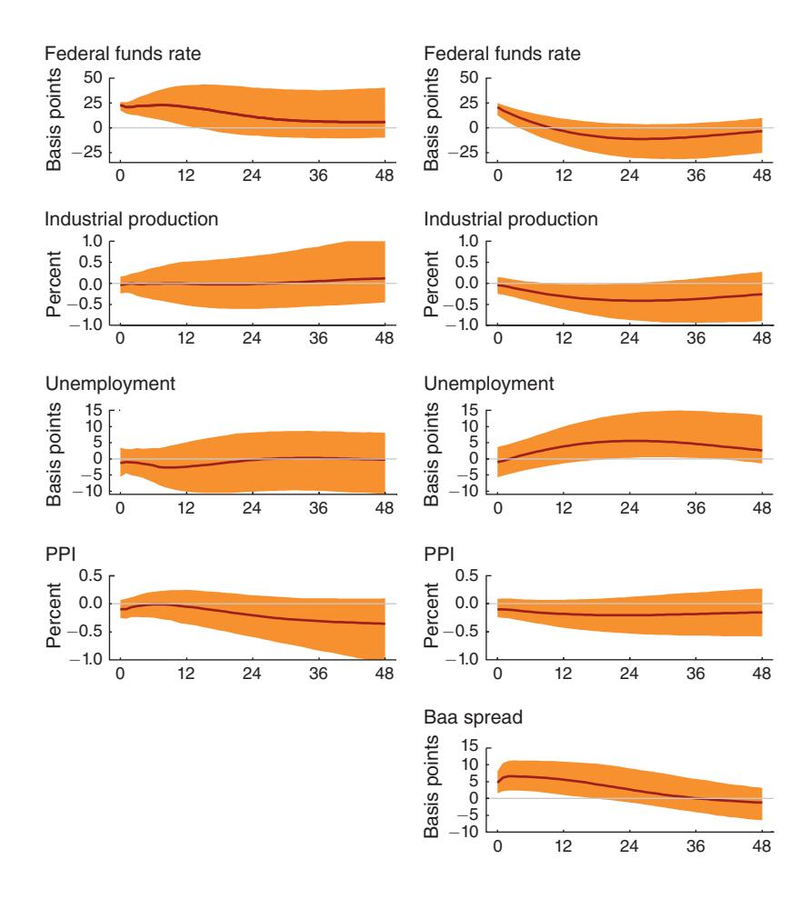
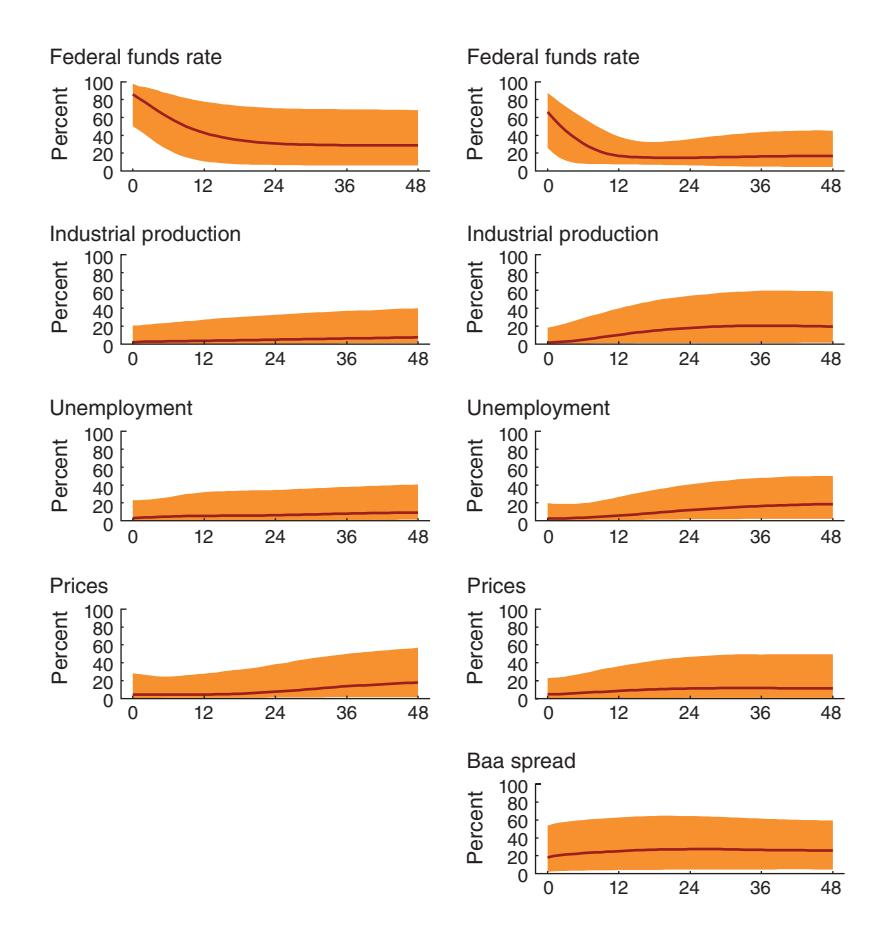
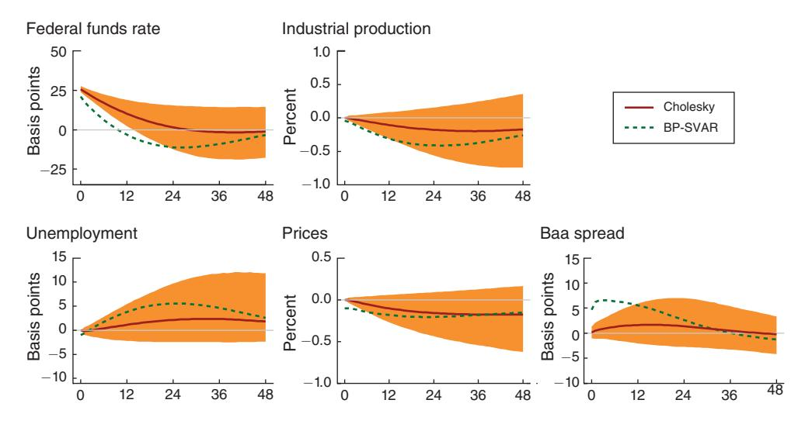
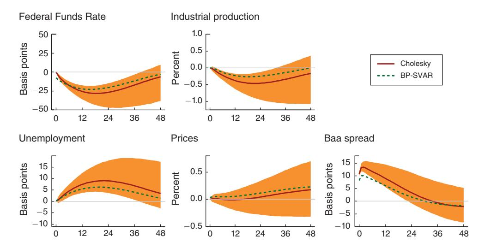
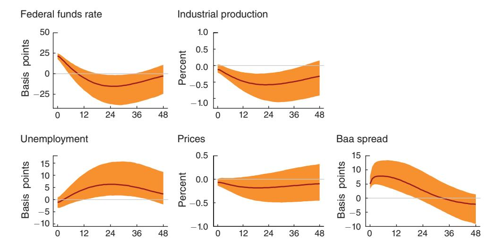
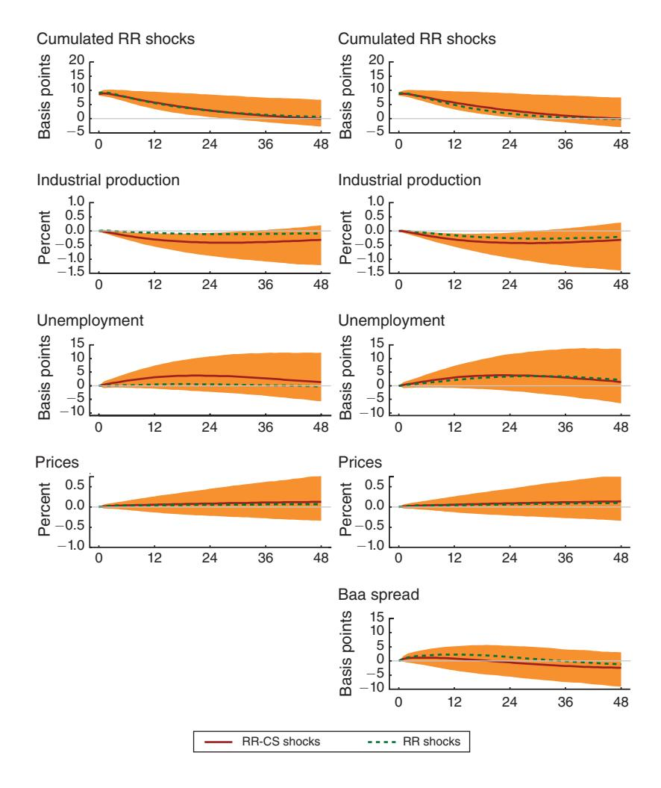
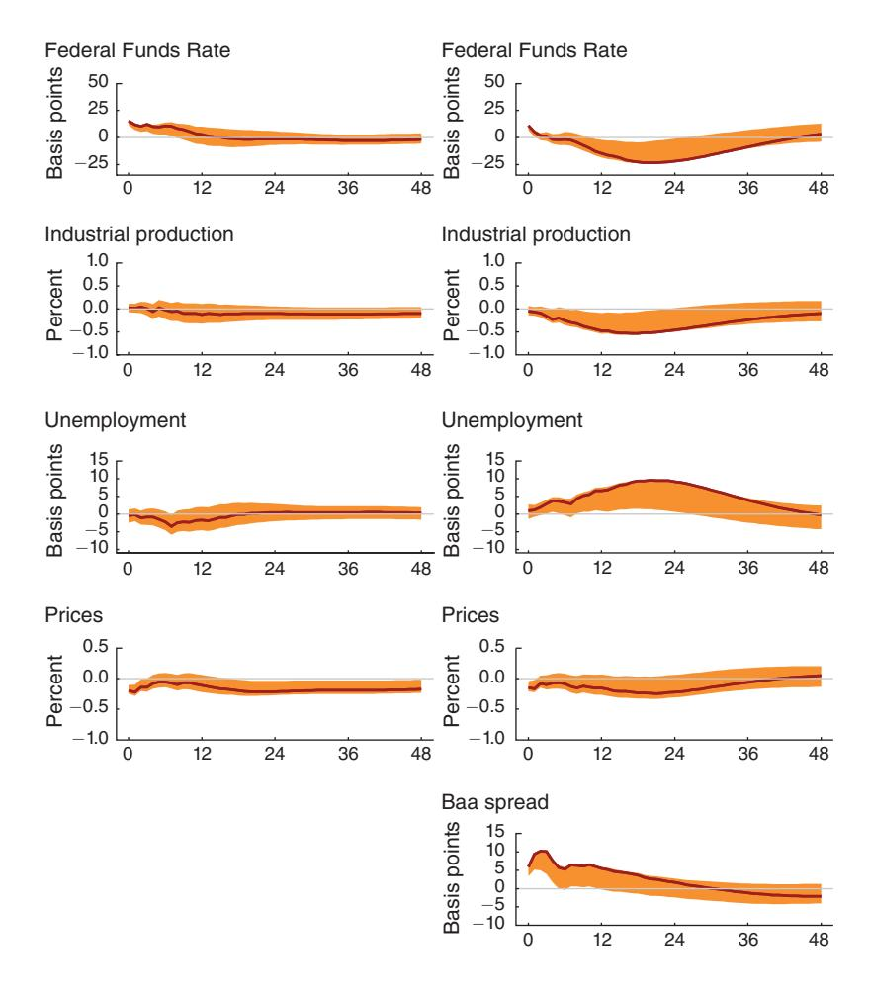
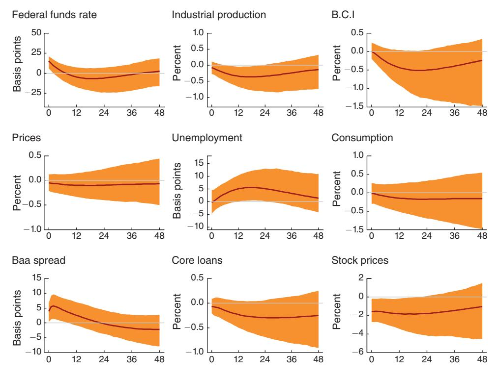

# Monetary Policy, Real Activity, and Credit Spreads: Evidence from Bayesian Proxy SVARs†

By Dario Caldara and Edward Herbst\*

In this paper, we develop a Bayesian framework to estimate a proxy structural vector autoregression to identify monetary policy shocks. We find that during the Great Moderation period, monetary policy shocks induce a persistent decline in real activity and tightening in financial conditions. Central to this result is a systematic component of monetary policy characterized by a direct and economically significant reaction to changes in corporate credit spreads. The failure to account for this endogenous reaction induces an attenuation in the response of all variables to monetary shocks, a result that also applies to the narrative identification of Romer and Romer (2004). (JEL C32, E23, E32, E44, E52, E58)

Starting with Sims (1980), a large literature has assessed the effects of monetary policy in the United States using structural vector autoregressions (SVARs). When considering the entirety of the post-World War II period, there is a large body of evidence suggesting that unexpected monetary tightenings reduce output. The strength and robustness of this finding noticeably weaken, however, when considering only data from the mid-1980s to the onset of the global financial crisis, a period of low business cycle volatility known as the Great Moderation. For instance, Boivin, Kiley, and Mishkin (2010) document that monetary policy shocks have no discernible effects on the real economy. By contrast, Gertler and Karadi (2015) find sizable adverse economic effects of monetary policy tightenings. In a critical summary of research on monetary SVARs applied to the Great Moderation period, Ramey (2016) describes mixed evidence for the importance of monetary shocks and shows that existing estimates of the economic response to monetary policy shocks lack robustness.

\*Caldara: Federal Reserve Board, 20th Street and Constitution Avenue NW, Washington, DC 20551 (email: dario.caldara@frb.gov); Herbst: Federal Reserve Board, 20th Street and Constitution Avenue NW, Washington, DC 20551 (email: edward.p.herbst@frb.gov). We thank Giovanni Favara, Domenico Giannone, Yuriy Gorodnichenko, Jim Hamilton, David Lopez-Salido, Andrea Prestipino, Juan Rubio-Ramírez, Jón Steinsson, Mark Watson, Egon Zakrajšek, Tao Zha, and seminar and conference participants at the Federal Reserve Board, the 2015 SED Annual Meetings, the EFSF workshop at the 2015 NBER Summer Institute, Cornell University, Colgate University, and Emory University. All errors and omissions are our own responsibility. The views expressed in this paper are solely the responsibility of the authors and should not be interpreted as reflecting the views of the Board of Governors of the Federal Reserve System or of anyone else associated with the Federal Reserve System.

 $^{\dagger}$ Go to https://doi.org/10.1257/mac.20170294 to visit the article page for additional materials and author disclosure statement(s) or to comment in the online discussion forum.

&lt;sup>1 See Bernanke and Blinder (1992); Christiano, Eichenbaum, and Evans (1996); Leeper, Sims, and Zha (1996); Leeper and Zha (2003); Romer and Romer (2004); and, more recently, Arias, Caldara, and Rubio-Ramírez (2015).

In this paper, we show that, for the Great Moderation period, large effects of monetary policy shocks hinge on the presence of a strong systematic response of monetary policy to financial conditions. This component of the monetary policy rule, which is present in, but not the focus of, Gertler and Karadi (2015), is mostly neglected in the literature. We find that the failure to account for this endogenous reaction induces an attenuation in the response of all variables to monetary shocks. Thus, our results can reconcile the dispersion in the estimated effects of monetary policy shocks on real activity found in the literature, and explain the lack of robustness documented in Ramey (2016).

To reach this conclusion, we estimate over the 1994–2007 period a Bayesian proxy SVAR (BP-SVAR), a SVAR model that is augmented by monetary surprises computed using high-frequency financial data, to identify monetary policy shocks. In our BP-SVAR, which we specify closely following Gertler and Karadi (2015), positive monetary policy shocks induce a sustained decline in industrial production and rise in the unemployment rate, and are transmitted through tightening in financial conditions. Importantly, we document that the monetary policy rule reacts systematically to changes in corporate credit spreads; all else being equal, a 10 basis-point increase in spreads leads to a contemporaneous 10 basis-point drop in the federal funds rate, an elasticity of  $-1.^2$ 

To quantify the importance of accounting for the endogenous response of monetary policy to spreads when assessing the role of monetary shocks in economic fluctuations, we estimate two additional variants of the model: one that omits credit spreads, and one where monetary shocks are identified by imposing that the federal funds rate does not react contemporaneously to changes in credit spreads (a standard Cholesky identification). In the first variant, monetary shocks induce no change in industrial production. In the second variant, monetary policy shocks induce a decline in industrial production that is 40 percent smaller than in our preferred BP-SVAR specification. In both these alternative specifications, a monetary shock is a mix of exogenous changes in policy and the systematic response of monetary policy to changes in credit spreads. The attenuation happens because a drop in corporate spreads generates a persistent increase in real activity. This analysis explains why monetary policy shocks identified using BP-SVARs that include corporate spreads have large economic effects compared to shocks identified using conventional SVAR identification schemes.

In light of the relationship between monetary policy and corporate credit spreads uncovered by the BP-SVAR, we revisit the narrative identification proposed by Romer and Romer (2004). Under this identification, monetary policy shocks are the residual of a regression of intended changes in the federal funds rate on the Federal Reserve's Greenbook forecasts of output and inflation. The macroeconomic impact of these shocks is typically studied using reduced-form VARs, as in Romer and Romer (2004) and Coibion (2012), or by running local projections, as in Ramey (2016).

&lt;sup>2 Although several recent papers have concentrated on the transmission of monetary policy through financial markets, both empirically (Gertler and Karadi 2015, Galí and Gambetti 2015) and theoretically (Bernanke, Gertler, and Gilchrist 1999; Gertler and Karadi 2011), substantially less attention has been devoted to the endogenous response of monetary policy to changes in asset prices. A notable exception is Rigobon and Sack (2003) who document a significant response of the federal funds rate to stock prices.

For the 1994–2007 sample, we show that the intended federal funds rate reacts to corporate spreads beyond its response to forecasted output and inflation, as in the monetary policy rule identified in the BP-SVAR. Moreover, in both the reduced-form VAR and local projection approaches, we find that the implications are the same as in the BP-SVAR: shocks constructed without controlling for the response of monetary policy to corporate spreads have no effects on real activity, in line with the evidence in Ramey (2016). By contrast, the shocks constructed controlling for corporate spreads have large effects on the real economy.

Our paper also provides a methodological contribution to the recent literature on proxy SVARs. The standard framework of Stock and Watson (2012) and Mertens and Ravn (2013) uses an instrumental variables approach to estimate proxy SVARs in multiple stages, while we provide an encompassing framework that jointly models the interaction between the SVAR and the proxy. In particular, we write the likelihood of a SVAR model augmented with a measurement equation that relates the proxy to the unobserved structural shock of interest and estimate the model using Bayesian techniques. Our framework has several advantages over the standard framework. First, inference is valid even if the information content of the proxy is weak. Second, as we coherently incorporate all sources of uncertainty in the estimation, the proxy becomes informative about both the reduced-form and structural parameters of the model. Third, through prior distributions, we can adjust the informativeness of the proxy for the estimation of the parameters of the SVAR model, that is, researchers that are convinced of the relevance of their proxies for the identification of the structural shock of interest can express this view via the prior distribution. This prior induces the estimation to take a lot of signal from the proxy.

To construct the proxy for monetary policy shocks, we follow the literature pioneered by Kuttner (2001), and use high-frequency data to capture the surprise component of policy actions announced in Federal Open Market Committee (FOMC) statements. The bulk of this literature, which includes Bernanke and Kuttner (2005); Gürkaynak, Sack, and Swanson (2005); Campbell et al. (2012); and Gilchrist, López-Salido, and Zakrajšek (2015), considers univariate regressions for assessing the effects on monetary policy on daily changes in asset prices. An important exception is Gertler and Karadi (2015), who like we do in this paper identify a monetary proxy SVAR that includes corporate spreads. However, the focus of the analysis in the two papers is different. While Gertler and Karadi concentrate on impulse responses to monetary policy shocks, our focus is on the centrality of the systematic response of monetary policy to corporate spreads for understanding the transmission of both monetary policy and non-policy shocks and their relative importance in explaining business cycle fluctuations. Finally, our work is also related to Faust, Swanson, and Wright (2004), who pioneered the use of high-frequency monetary surprises to identify monetary shocks in a VAR using a different estimation framework and omitting measures of financial conditions that, as we show, are crucial for characterizing the role of monetary policy for business cycle fluctuations.

The BP-SVAR and our revaluation of the narrative identification of Romer and Romer (2004) clearly point to the existence of a significant systematic response of

monetary policy to financial conditions beyond the well-understood response to real economic activity and prices. This evidence is consistent with Peek, Rosengren, and Tootell (2016), who use textual analysis to examine FOMC transcripts and find that, even after controlling for forecasts of inflation and unemployment, the word counts of terms related to financial conditions predict monetary policy decisions.

This paper is structured as follows. Section I describes the econometric framework. Section II describes the construction of the proxy and its properties. Section III shows the main empirical findings based on the BP-SVARs. Section IV shows the implications of the interaction between monetary policy and corporate spreads for the Romer and Romer (2004) identification of monetary shocks. Section V explores the robustness of our main findings to an alternative estimation methodology and model specifications. Section VI concludes.

### I. Econometric Methodology

In this section, we first describe a standard SVAR model and derive the monetary policy rule embedded in the SVAR. We then present the BP-SVAR and explain the identification of the monetary policy rule and, by implication, of the monetary policy shock. Finally, we discuss the prior distributions of the model parameters and the samplers used to draw from their posterior distributions.

Consider the following VAR, written in structural form:

(1) 
$$\mathbf{A}_0 \mathbf{y}_t = \sum_{\ell=1}^p \mathbf{A}_\ell \mathbf{y}_{t-\ell} + \mathbf{c} + \mathbf{e}_t, \text{ for } 1 \leq t \leq T,$$

where  $\mathbf{y}_t$  is an  $n \times 1$  vector of endogenous variables,  $\mathbf{e}_t$  is an  $n \times 1$  vector of structural shocks,  $\mathbf{A}_\ell$  is an  $n \times n$  matrix of structural parameters for  $0 \le \ell \le p$  with  $\mathbf{A}_0$  invertible,  $\mathbf{c}$  is an  $n \times 1$  vector of intercepts, p is the lag length, and T is the sample size. The vector  $\mathbf{e}_t$ , conditional on past information and the initial conditions  $\mathbf{y}_0, \ldots, \mathbf{y}_{1-p}$ , is Gaussian with a mean of zero and covariance matrix  $\mathbf{I}_n$  (the  $n \times n$  identity matrix). The model described in equation (1) can be written in compact form as

(2) 
$$\mathbf{A}_0 \mathbf{y}_t = \mathbf{A}_+ \mathbf{x}_t + \mathbf{e}_t, \text{ for } 1 \le t \le T,$$

where  $\mathbf{x}_t = [\mathbf{y}_{t-1}', \dots, \mathbf{y}_{t-p}', 1]'$  and  $\mathbf{A}_+ = [\mathbf{A}_1, \dots, \mathbf{A}_p, \mathbf{c}]$ . The reduced-form representation of this model is given by

(3) 
$$\mathbf{y}_t = \mathbf{\Phi} \mathbf{x}_t + \mathbf{u}_t, \quad \mathbf{u}_t \sim \mathcal{N}(0, \mathbf{\Sigma}).$$

The reduced-form parameters and the structural parameters are linked through

(4) 
$$\Sigma = (\mathbf{A}_0' \mathbf{A}_0)^{-1} \text{ and } \Phi = \mathbf{A}_0^{-1} \mathbf{A}_+.$$

### B. The Monetary Policy Equation

To study the effects of monetary policy, we need to select an element of  $e_t$  that represents the monetary policy shock  $e_{MP,t}$ . As discussed in Leeper, Sims, and Zha (1996), specifying  $e_{MP,t}$  is equivalent to specifying an equation that characterizes monetary policy behavior. In what follows, we assume, without loss of generality, that  $e_{MP,t}$  is the first shock in  $e_t$ . Consequently, the first equation of the SVAR is the monetary policy equation

(5) 
$$\mathbf{A}_{0.1}\mathbf{y}_t = \mathbf{A}_{+.1}\mathbf{x}_t + e_{MP,t}, \text{ for } 1 \le t \le T,$$

where  $A_{0,1}$  and  $A_{+,1}$  denote the first row of  $A_0$  and  $A_+$ , respectively. If we assume that the policy rate  $r_t$  is also ordered first in  $y_t$ , we can rewrite equation (5) as follows:

(6) 
$$r_t = \sum_{j=2}^n y'_{j,t} \psi_{0,j} + \sum_{\ell=1}^p y'_{t-\ell} \psi_{\ell} + \sigma_{MP} e_{MP,t}, \quad \text{for } 1 \leq t \leq T,$$

where  $\psi_{0,j} = -a_{0,1j}/a_{0,11}$ ,  $\psi_{\ell} = a_{\ell,1}/a_{0,11}$ , and  $\sigma_{MP} = 1/a_{0,11}$ , with  $a_{\ell,ij}$  denoting the ijth element of  $\mathbf{A}_{\ell}$ . The first two terms on the right-hand side of equation (6) describe the systematic component of monetary policy, characterizing how the policy rate at time t responds to contemporaneous and lagged movements in the variables included in the model.

It is clear from equations (5) and (6) that the identification of the monetary policy shock  $e_{MP,t}$  is equivalent to the identification of the systematic component of monetary policy. In turn, to characterize the systematic component we require knowledge of a subset of the structural parameters,  $(\mathbf{A}_{0,1},\mathbf{A}_{+,1})$ . As is well known, without additional restrictions, it is not possible to discriminate between the many possible combinations of structural parameters  $(\mathbf{A}_0,\mathbf{A}_+)$  that yield the same reduced-form parameters  $(\mathbf{\Phi},\mathbf{\Sigma})$ , that is, the likelihood of the SVAR model (2) is flat with respect to these combinations. The majority of the literature, beginning with Sims (1980), has used theoretical restrictions to achieve identification, that is, to inform the choice of  $(\mathbf{A}_0,\mathbf{A}_+)$ , and most debates in the SVAR literature are about the "correct" choice of restrictions for any given application. By contrast, in this paper, we follow a different strategy, which we discuss next.

#### C. The BP-SVAR

We inform the identification of  $(\mathbf{A}_{0,1}, \mathbf{A}_{+,1})$ —the structural parameters that describe the systematic component of monetary policy—by incorporating additional data in the estimation of the model. The framework is a Bayesian implementation of the proxy SVAR approach of Stock and Watson (2012) and Mertens and Ravn (2013). In particular, in our application, we achieve identification by observing a series of surprise monetary policy changes constructed using high-frequency financial data.

As discussed in Section II, this series is not a perfect measure; instead, it serves as a proxy for the unobserved monetary policy shock  $e_{MP,t}$ .

In what follows, we take the proxy,  $m_t$  and we link it to the monetary policy shock  $e_{MP,t}$  as follows:

(7) 
$$m_t = \beta e_{MP,t} + \sigma_{\nu} \nu_t$$
,  $\nu_t \sim \mathcal{N}(0,1)$  and  $\nu_t \perp e_t$ , for  $1 \leq t \leq T$ ,

where  $\nu_t$  is an iid measurement error.3 The formulation in equation (7), which we extend in Section IV to incorporate multiple proxies, has two implications. The first is that the squared correlation between  $m_t$  and  $e_{MP,t}$ ,

(8) 
$$\rho \equiv \operatorname{corr}(m_t, e_{MP, t})^2 = \frac{\beta^2}{\beta^2 + \sigma_{\nu}^2},$$

measures the "relevance" of the external information for the structural shock of interest. Equation (8) makes clear that the relevance of the proxy is directly related to the signal-to-noise ratio  $\beta/\sigma$ . The larger this value, the more information the proxy brings to bear on the identification of the SVAR.4 The second implication of equation (7) is that  $m_t$  is orthogonal to other structural shocks in the VAR. If we partition the vector of shocks as  $\mathbf{e}_t = [e_{MP,t}, \mathbf{e}'_{NMP,t}]'$ , this condition can be written as

$$(9) E[m_t \mathbf{e}'_{NMP,t}] = \mathbf{0}.$$

Equation (9) conveys the exogeneity of the proxy, which ensures that our proxy is only informative about the monetary policy shock. These two conditions are very similar to those required of an instrument in an instrumental variables regression. The setting, though, is different, as both the relevance and exogeneity of the proxy cannot be directly inferred by the data, but depend on the specification of the model used to generate the vector of unobserved structural shocks  $e_{MP,t}$ .

To examine in detail how the proxy interacts with the rest of the SVAR, we augment equation (2) with equation (7). Letting  $\tilde{\mathbf{y}}_t = [\mathbf{y}_t', m_t]'$  and  $\tilde{\mathbf{e}}_t = [\mathbf{e}_t', \nu_t]'$ , we can rewrite equation (2) as a system of equations for  $\tilde{\mathbf{y}}_t$ :

(10) 
$$\tilde{\mathbf{A}}_0 \tilde{\mathbf{y}}_t = \tilde{\mathbf{A}}_+ x_t + \tilde{\mathbf{e}}_t.$$

The structural matrices  $\tilde{\mathbf{A}}_0$  and  $\tilde{\mathbf{A}}_+$  are functions of the original SVAR matrices,  $(\mathbf{A}_0, \mathbf{A}_+)$ , and the parameters governing the proxy equation,  $(\beta, \sigma_{\nu})$ , with

(11) 
$$\tilde{\mathbf{A}}_{0} = \begin{bmatrix} \mathbf{A}_{0} & \mathbf{0}_{n \times 1} \\ -\frac{\beta}{\sigma_{\nu}} \mathbf{A}_{0,1} & \frac{1}{\sigma_{\nu}} \end{bmatrix}, \text{ and } \tilde{\mathbf{A}}_{+} = \begin{bmatrix} \mathbf{A}_{+} \\ -\frac{\beta}{\sigma} \mathbf{A}_{+,1} \end{bmatrix}.$$

&lt;sup>3 Equation (7) can be generalized by adding lags of  $m_t$  to allow for autocorrelation in the proxy, a specification we do not explore as it is not relevant in our application.

&lt;sup>4 Mertens and Ravn (2013) call  $\rho$  the reliability indicator for the proxy.

As can be seen from equation (11), the proxy SVAR is a model that links the proxy to the structural shock of interest, the monetary policy shock, through the structural coefficients  $(\mathbf{A}_{0,1}, \mathbf{A}_{+,1})$  associated with the systematic component of monetary policy. The zero restrictions in the bottom left partition of  $\tilde{\mathbf{A}}_0$  and  $\tilde{\mathbf{A}}_+$  are implied by the assumption stated in equation (7) that the measurement error  $\nu_t$  is orthogonal to all structural shocks  $e_t$ .

To understand identification, it is instructive to write the likelihood function for the model:5

(12) 
$$p(\mathbf{Y}_{1:T}, \mathbf{M}_{1:T} | \tilde{\mathbf{A}}_0, \tilde{\mathbf{A}}_+) = p(\mathbf{Y}_{1:T} | \tilde{\mathbf{A}}_0, \tilde{\mathbf{A}}_+) p(\mathbf{M}_{1:T} | \mathbf{Y}_{1:T}, \tilde{\mathbf{A}}_0, \tilde{\mathbf{A}}_+)$$
$$= p(\mathbf{Y}_{1:T} | \boldsymbol{\Phi}, \boldsymbol{\Sigma}) p(\mathbf{M}_{1:T} | \mathbf{Y}_{1:T}, \mathbf{A}_0, \mathbf{A}_+, \boldsymbol{\beta}, \boldsymbol{\sigma}_{\nu}),$$

where  $\mathbf{Y}_{1:T} = [\mathbf{y}_1, \dots, \mathbf{y}_T]'$ . The first term on the right-hand side of equation (12) is the likelihood of the VAR data  $\mathbf{Y}_{1:T}$ . This likelihood contains information only about the reduced-form parameters  $\mathbf{\Phi}$  and  $\mathbf{\Sigma}$ . The second term, which is unique to BP-SVARs, is the conditional likelihood of the proxy  $\mathbf{M}_{1:T}$  given the VAR data  $\mathbf{Y}_{1:T}$ . As we show in Appendix A, this likelihood has the following form:

(13) 
$$\mathbf{M}_{1:T}|\mathbf{Y}_{1:T},\mathbf{A}_0,\mathbf{A}_+,\beta,\sigma_{\nu} \sim \mathcal{N}(\mu_{M|Y},\mathbf{V}_{M|Y}),$$

with

$$\mu_{M|Y} = \beta \mathbf{e}_{MP, \ 1:T} \quad \text{and} \quad \mathbf{V}_{M|Y} = \sigma_{\nu}^2 \mathbf{I}_T,$$

where  $\mu_{M|Y}$  and  $\mathbf{V}_{M|Y}$  are the mean and variance, respectively, associated with the multivariate normal distribution. Equation (13) reveals that the signal-to-noise ratio  $\beta/\sigma_{\nu}$  is crucial for identifying the coefficients of the SVAR. On the one hand, when  $\beta/\sigma_{\nu}$  is large,  $m_t$  provides a lot of information about  $e_{MP,t}$ . On the other hand, when  $\beta=0$ ,  $m_t$  is simply noise and provides no information about  $e_{MP,t}$ . Finally, when  $\beta/\sigma_{\nu}$  is close to zero, we have weak identification.

We can rewrite  $\mu_{M|Y}$  in terms of the systematic component of monetary policy by substituting the definition of  $\mathbf{e}_{MP, 1:T}$  implied by equation (5):

(14) 
$$\mu_{M|Y} = \beta [\mathbf{Y}_{1:T} \mathbf{A}'_{0,1} - \mathbf{X}_{1:T} \mathbf{A}'_{+,1}].$$

&lt;sup>5 In this and what follows, we suppress any dependence on the initial conditions  $Y_{1-p:0}$  for convenience.

&lt;sup>6 In case of weak identification, the prior plays an important role in inference. But in our framework comparing prior to posterior distributions, a standard diagnostic to detect identification issues, is trivial. The reason is that, as already shown by equation (12), when it comes to identification, the relevant prior distributions are those implied by the model before observing  $\mathbf{M}_{1:T}$  but after observing  $\mathbf{Y}_{1:T}$ . Finally, lack of identification or weak identification, which manifests itself in flat or nearly flat likelihood profiles, could pose practical issues when sampling the posterior.

As we see from equations (13) and (14), for given  $\beta$ , and  $\sigma_{\nu}$ , the econometrician updates the beliefs about the systematic component of monetary policy described by  $(\mathbf{A}_{0,1}, \mathbf{A}_{+,1})$  by giving relatively more weight to structural parameters that result in monetary policy shocks that look like a scaled version of the proxy.

### D. Specification of the Prior and Posterior Sampler

*Prior Distributions.*—The prior for the structural parameters  $(\mathbf{A}_0, \mathbf{A}_+)$ , which we describe in Appendix A, is based on a standard Minnesota Prior. For the parameters of the measurement equation (7), we choose the prior for  $\beta$  to be normally distributed with mean  $\mu_{\beta} = 0$  and variance  $\sigma_{\beta} = 1$ . The standard deviation of the measurement error,  $\sigma_{\nu}$ , is crucial because it determines the tightness of the relationship between the proxy and the SVAR model. For this reason we consider two types of priors for  $\sigma_{\nu}$ . Our baseline prior is an inverse Gamma with degrees of freedom  $s_1$  and centering coefficient  $s_2$ . We set  $s_1 = 2$  and  $s_2 = 0.02$  so that the prior is not very informative and, combined with our prior for  $\beta$ , implies that the posterior distribution of the relevance indicator overwhelmingly reflects the likelihood. The second prior for  $\sigma_{\nu}$ , which we refer to as the *high relevance prior*, places the dogmatic view that  $\sigma_{\nu} = 0.5 \times \mathrm{std}(\mathbf{M}_{1:T})$  with probability 1; that is, only half of the variation in our proxy can be attributed to measurement error. In our applications, this high relevance prior induces a substantially tighter relationship between the proxy and  $e_{MP,t}$  than under the baseline prior for  $\sigma_{\nu}$  at the cost of overall statistical fit, as the estimation becomes less reliant on the measurement error.

Posterior Sampler.—Our prior formulation does not admit a closed-form solution, so we rely on simulation methods to sample from the posterior. We offer two related algorithms to sample the posterior distribution of the BP-SVAR: a sequential Monte Carlo (SMC) algorithm and a Markov Chain Monte Carlo (MCMC) algorithm. The SMC algorithm has the advantage of being more robust when the posterior is irregular, such as with weakly informative proxies, and under the high-relevance prior; the MCMC algorithm works well with our baseline prior on  $\sigma_{\nu}$ , and is faster and closer to existing algorithms in the literature. We discuss both algorithms in the Appendix A.

### E. Advantages over Traditional Proxy SVARs

The BP-SVAR offers four advantages over the traditional implementation. Traditional proxy SVARs are typically estimated following a three-step procedure. First, estimate the reduced-form VAR by least squares. Second, regress the reduced-form residuals on the proxy. Third, impose the restrictions derived in the second stage to identify the SVAR model. First, a BP-SVAR makes efficient use of the information contained in the proxy. The joint likelihood described in equation (12) offers a coherent modeling of all sources of uncertainty and, hence, allows the proxy to inform the estimation of both reduced-form and structural parameters. By contrast, the three-stage procedure makes only limited

use of the information contained in the proxy, for instance, the estimation of the reduced-form VAR is not informed by the proxy  $m_t$ .

Second, in a Bayesian setting, weak identification does not pose a problem per se, as long as the prior distribution is proper, inference is possible (Poirier 1998). By contrast, the frequentist approach requires an explicit theory to work with weakly informative instruments, either to derive the asymptotic distributions of the estimators (Montiel Olea, Stock, and Watson 2012) or to ensure a good coverage in bootstrap algorithms.7

Third, we can adjust the informativeness of the proxy for the estimation of the parameters of the BP-SVAR model through prior distributions. Researchers construct proxies to be relevant, to contain a lot of information about the structural shock of interest, which is consistent with a prior view of a high degree of relevance  $\rho$ .8 In our application, the benefit of using the high relevance prior is that the identified systematic component of monetary policy is associated with monetary shocks that more closely resemble the proxy than under the baseline prior at the cost of overall fit. This reflects the classic trade-off in econometrics between structural inference and statistical fit discussed in, for instance, Del Negro et al. (2007).

Fourth, the Bayesian framework is well suited for the estimation of large and richly parameterized models, particularly over the relatively short samples for which many proxies are available. Hence, BP-SVARs obviate the need to estimate the VAR part of the model over a longer sample, which implicitly requires additional assumptions about parameter stability. In Section V, we take advantage of this feature to explore multiple transmission channels of monetary policy.

### **II.** A Proxy for Monetary Policy Shocks

To construct our baseline proxy for monetary policy shocks, we apply the event study methodology developed in Kuttner (2001), which uses high-frequency financial data to construct monetary policy surprises associated with FOMC announcements. This methodology uses the price of federal funds futures contracts traded at the Chicago Board of Trade to measure market expectations about the Federal Reserve's policy actions. In our analysis, we use spot month contracts based on the current month funds rate.9

Our sample begins in January 1994, the year in which the FOMC started issuing statements immediately after each meeting. Prior to 1994, the FOMC did not issue a statement and changes to the target rate had to be inferred by the size and type of open market operations. Coibion and Gorodnichenko (2012) find an increase in the ability of financial markets and professional forecasters to predict subsequent

&lt;sup>7To the best of our knowledge, bootstrap algorithms developed to construct confidence intervals in proxy SVARs only apply to strong instruments. Moreover, Jentsch and Lunsford (2016) show that the choice of bootstrap algorithms can yield very different confidence intervals for impulse responses.

&lt;sup>8This feature is one major differentiation of our analysis from other Bayesian approaches, for example, Bahaj (2014) and Drautzburg (2016).

&lt;sup>9Gertler and Karadi (2015) use the three-month ahead contracts as their sample also includes the global financial crisis and the zero lower bound period.

interest rate changes after 1994, suggesting that improved transparency could have altered the transmission of policy surprises. 10 The sample ends in June 2007, three months before the FOMC started to rapidly cut interest rates at the onset of the global financial crisis. This conservative cutoff ensures that we do not capture the effects of unconventional monetary policy or the presence of the zero lower bound in our estimates.

At date  $\tau$ , the spot contract for the federal funds future in the current month pays out based on the average funds rate prevailing in that month. We measure the surprise component of the change in the target federal funds rate around FOMC announcements as follows:

(15) 
$$\Delta r_{\tau} = (E_{\tau}[r] - E_{\tau-\Delta}[r]) \times SF(\tau),$$

where  $E_{\tau}[r]$  is the federal funds rate expected by markets to prevail over the remainder of the month of the FOMC meeting *after* the announcement;  $E_{\tau-\Delta}[r]$  is the federal funds rate expected to prevail over the remainder of the month of the FOMC meeting *before* the announcement; and  $SF(\tau)$  is a scaling factor that accounts for the fact that these contracts trade on the average federal funds rate over the month, but FOMC meetings take place on different days within months. The surprise changes described by equation (15) are calculated only at FOMC-meeting frequency. We construct the monthly proxy  $m_{HF,t}$  by assigning each surprise change to the month in which the corresponding FOMC meeting occurred. If there are no meetings in a month, we record the shock as zero for that month.  $^{12}$ 

In our sample, there were 108 scheduled FOMC meetings, with 4 FOMC statements released after unscheduled FOMC meetings and phone calls. We exclude these unscheduled FOMC decisions from our analysis because, as discussed for instance in van Dijk, Lumsdaine, and van der Wel (2016), markets are caught by surprise by these announcements, and hence asset prices prior to the announcements do not reflect market expectations about that particular policy action. That is, asset prices do not reflect financial market expectations about the endogenous response of the Federal Reserve to the state of the economy.

The choice of  $\Delta$ , the window around the FOMC announcement, is crucial. Kuttner (2001) uses a daily window, but subsequent studies have shown that even the use of a daily window might not be enough to purge this policy measure from expected, and hence endogenous, movements. For this reason we follow Gürkaynak, Sack, and Swanson (2005) and Gilchrist, López-Salido, and Zakrajšek (2015) and use intraday data. In particular, we set  $\Delta$  to be a 30-minute window around the release of the FOMC statement (10 minutes before and 20 minutes after).

&lt;sup>10 In any event, our qualitative results are robust to the inclusion in the sample of the early 1990s.

&lt;sup>11 The rate of the spot contract can potentially reflect risk premia required by investors to hold the contract. The assumption underlying the identification strategy is that, by looking at the change in the futures rates over a narrow window, we are able to purge the risk premium and isolate the surprise change in the federal funds rate.

&lt;sup>12 The conversion from FOMC frequency to monthly frequency follows Romer and Romer (2004). Moreover, and also in accordance with Romer and Romer (2004) and Nakamura and Steinsson (2013), because our series incorporates only policy changes associated with scheduled FOMC meetings, there are never two shocks in the same month.

The use of a narrow window and the exclusion of policy changes associated with unscheduled FOMC meetings does not necessarily ensure that the series of monetary surprises is exogenous. For instance, if, as shown by Romer and Romer (2000), the Federal Reserve has superior information compared with the private sector about the current and future state of the economy, the high frequency monetary surprises would partly capture the endogenous actions that the Federal Reserve takes in response to this private information. Miranda-Agrippino and Ricco (2017) argue that even within a narrow window, a predictable component remains embedded in monetary surprises computed using three-month ahead federal funds futures. We examined the predictability of our surprises, which are based on current month futures contract, and we do not find evidence of economically meaningful predictability over our sample period. In any event, the purging of the surprises does not affect any of the results in paper.

Finally, equation (15) also shows why we use  $m_{HF,t}$  only as a proxy and not as a direct measure of the monetary policy shock. Expectations about future policy actions derived from financial markets may not align with the SVAR-based expectations. The former are model-free expectations of market participants formed by combining information from a variety of sources with their judgment. The latter are deviations from the systematic component of monetary policy embedded in the SVAR. Nonetheless, the measurement equation (7) does not rule out an estimated BP-SVAR with  $e_{MP,t}$  closely resembling  $m_{HF,t}$ .

### III. Monetary Policy, Real Activity, and Credit Spreads

To show how monetary policy, real activity, and credit spreads interact in BP-SVARs, in this section we present results from two models. We first estimate a four-equation BP-SVAR that consists of the federal funds rate;  $^{13}$  the log of manufacturing industrial production (IP); the unemployment rate; and a measure of prices, the log of the producer price index (PPI) for finished goods. The selection of endogenous variables is similar to Coibion (2012) and Ramey (2016).  $^{14}$  The second model is a five-equation BP-SVAR that includes the Moody's seasoned Baa corporate bond yield relative to the yield on ten-year treasury constant maturity, which we refer to as the Baa spread. We select the tightness and decay parameters that govern the distribution of the Minnesota prior, as well as the VAR lag length p, using the marginal data density of the VAR using only the standard observables,  $\mathbf{Y}_{1:T}$ .

&lt;sup>13 The monthly federal funds rate is the average effective rate over the last week of the month. All VAR results are robust to using the monthly average. Local projections are more sensitive to the measure of federal funds rate, but results are qualitatively robust. End-of-the-month data would ensure that the series responds to a policy change within a month irrespective of the FOMC meeting date, but the series is highly volatile due to technical factors in the overnight market; the monthly average of the effective rate is less affected by technical factors, but responds less within a month to policy decisions taken towards the end of the month. We strike a balance between these two extremes.

&lt;sup>14 Results on the interaction among monetary policy, real activity, and corporate spreads are robust to using the consumer price index (CPI) instead of PPI. We use PPI because it is more informative for identifying the systematic response of monetary policy to prices and the response of prices to monetary policy shocks. By contrast, when using CPI, the posterior distribution of these objects are more sensitive to the choice of prior distributions.

FIGURE 1. IMPULSE RESPONSES TO A MONETARY POLICY SHOCK

*Notes:* The solid line depicts the median impulse response of the specified variable to a one standard deviation monetary policy shock identified in the four-equation (left column) and in the five-equation (right column) BP-SVARs. Shaded bands denote the 90 percent pointwise credible sets.

The resulting specifications, which include a constant, are estimated on data from January 1994 to June 2007 using 12 lags. 15

## A. The Effect of Monetary Policy Shocks

The left column of Figure 1 displays the impulse responses of the endogenous variables to a one standard deviation monetary shock identified using the four-equation BP-SVAR. The solid lines show the pointwise median responses, while the shaded areas represent the corresponding 90-percent pointwise credible bands. Unless otherwise noted, the estimates discussed in the text refer

&lt;sup>15 We use data from January 1990 to December 1993 as a training sample for the Minnesota prior.

to posterior medians. The near-term effect of a positive monetary policy shock causes the federal funds rate to increase about 25 basis points, a number within conventional estimates. Thereafter, the federal funds rate slowly falls, returning to zero after approximately two years. There is no evidence that the shock has any effect on IP or on the unemployment rate. Similarly, prices are not affected over the first year, although there is some evidence that they fall over a longer horizon. Overall, the results from the four-equation BP-SVAR echo Ramey (2016), who finds no evidence of contractionary effects of monetary policy during the Great Moderation period.

The right column of Figure 1 displays the impulse responses to a one standard deviation monetary policy shock identified using the BP-SVAR that includes the Baa spread. The impact responses of the federal funds rate, IP, the unemployment rate, and prices, are nearly identical to those in the four-equation model. By contrast, the two models display strikingly different dynamics. The federal funds rate falls quickly after the shock and turns negative—monetary policy becomes more accommodative, relative to its initial level—after about one year. This change in monetary policy stance can be explained by inspecting the real and financial consequences of the shock. The effect of the shock on real activity is large. Two years after the shock, IP has fallen about 0.4 percent and the unemployment rate has increased 5 basis points. The decline in prices is persistent and exhibits a modest hump-shape. In addition, monetary policy causes a long-lasting tightening in financial conditions, with Baa spread jumping about five basis points on impact and remaining elevated for more than two years.

Using the VAR structure, we can decompose the forecast error of the VAR along different horizons, attributing portions of the error variance to monetary shocks. The left column of [Figure 2](#page-13-0) displays these quantities for the monetary shock identified in the four-equation model, while the right column displays these quantities for the monetary shock identified in the five-equation model. Concentrating on the horizons associated with business cycle frequencies—that is, 12 to 36 months we see that in the four equation model, the monetary policy shock explains a negligible fraction of short-run movements in IP and unemployment, in line with the conventional wisdom that monetary policy does not contribute to business cycle fluctuations. In the five equation BP-SVAR, monetary policy accounts for about 20 percent of the fluctuations in IP and in the unemployment rate and for about 25 percent of the fluctuations in corporate credit spreads. We note, though, the posterior uncertainty surrounding these estimates is large.[16](#page-12-0)

# B. *The Systematic Component of Monetary Policy*

In the previous section, we showed that corporate credit spreads are an important variable to characterize the transmission of monetary policy. In this section, we study how monetary policy responds to changes in corporate spreads by inspecting the estimated elasticities associated with the systematic component of monetary policy.

16The uncertainty bands associated with forecast error variance decompositions also do not take into account the direction of the impulse responses, which is why in our discussion we focus on the posterior median estimates.

FIGURE 2. CONTRIBUTION OF MONETARY POLICY SHOCKS TO THE FORECAST ERROR VARIANCE

*Notes:* The solid line depicts the median estimate of the portion of the forecast error variance of a specified variable attributable to a one standard deviation monetary policy shock identified in the four-equation (left column) and in the five-equation (right column) BP-SVARs. Shaded bands denote the 90 percent pointwise credible sets.

For ease of exposition, we refer to the elasticity of the federal funds rate to variable j at lag l,  $\psi_{l,j}$ , defined in equation (6), using the following subscripts: cs (Baa spread),  $\pi$  (prices),  $\Delta y$  (IP), u (unemployment rate), and r (federal funds rate). Panel A of Table 1 reports the contemporaneous elasticities of the federal funds rate to the non-policy variables included in the system. Panel B of Table 1 reports the cumulative elasticities of the federal funds rate to all variables in the system. These coefficients represent the response of the federal funds rate to a unit change in the variable in question, if all other variables remained constant. The cumulative elasticities are defined as follows:

$$\psi_{cs} = \sum_{\ell=0}^{p} \psi_{\ell,cs}, \quad \psi_{\pi} = \sum_{\ell=0}^{p} \sum_{i=0}^{\ell} \psi_{i,\pi}, \quad \psi_{\Delta ip} = \sum_{\ell=0}^{p} \sum_{i=0}^{\ell} \psi_{i,\Delta ip},$$

$$\psi_{u} = \sum_{\ell=0}^{p} \psi_{\ell,u}, \quad \text{and} \quad \psi_{r} = \sum_{\ell=1}^{p} \psi_{\ell,r},$$

TABLE 1—COEFFICIENTS IN THE MONETARY POLICY EQUATION

|                                       | Four-equation BP-SVAR  | Five-equation BP-SVAR     |
|---------------------------------------|------------------------|---------------------------|
| Panel A. Contemporaneous elasticities |                        |                           |
| $\psi_{0,cs}$                         |                        | -1.18 [-3.11, -0.35]      |
| $\psi_{0,\pi}$                        | 0.10 [-0.08, 0.33]  | 0.13 [-0.11, 0.37]        |
| $\psi_{0,\Delta_{\mathrm{y}}}$        | 0.06 [ $-0.11, 0.27$ ] | $ 0.03 \\ [-0.15, 0.25] $ |
| $\psi_{0,u}$                          | 0.22 [-0.64, 1.19]  | 0.23 [-0.67, 1.38]     |
| Panel B. Cumulative elasticities      |                        |                           |
| $\psi_{cs}$                           |                        | -0.22 [-0.35, -0.09]      |
| $\psi_\pi$                            | 0.15 [-0.15, 0.52]  | $ 0.13 \\ [-0.12, 0.39] $ |
| $\psi_{\Delta_y}$                     | 0.35 [0.06, 0.67]   | 0.06 [-0.14, 0.32]     |
| $\psi_u$                              | -0.01 [-0.09, 0.06]    | -0.06 [-0.16, 0.04]       |
| $\psi_r$                              | 0.97 [0.94, 1.01]   | 0.96 [0.92, 1.01]      |

*Notes:* The entries in the table denote the posterior median estimates of the contemporaneous elasticities (panel A) and the cumulative elasticities (panel B) in the monetary equation identified in the four-equation (column 1) and in the five-equation (column 2) BP-SVARs. The 90 percent credible sets from the posterior distributions are reported in brackets. See the main text for details.

where, the cumulative elasticities  $\psi_{\Delta y}$  and  $\psi_{\pi}$  describe the response of the federal funds rate to the change in output and prices, respectively. We stress that our cumulative coefficients are not directly comparable to those in Sims and Zha (2006), who compute so-called *long-run* coefficients. Their calculations involve dividing the sum of coefficients for the non-policy variables by  $1-\psi_r$ , one minus the cumulative coefficient for the policy variable. As we see next, some of our draws imply that  $\psi_r \geq 1$ , and for these draws the long-run coefficients are not well defined.

Column 1 of Table 1 tabulates the elasticities identified in the BP-SVAR that excludes the Baa spread. In accordance to conventional wisdom, the median estimates of both the contemporaneous and cumulative elasticities of the federal funds rate to monthly changes in output and prices are positive. The cumulative elasticity to unemployment is negative but economically insignificant. Overall, there is a high amount of uncertainty surrounding these estimates; with the exception of  $\psi_{\Delta ip}$ , 0 is well contained in the 90 percent credible set. The degree of policy inertia implied by this rule is high, with a posterior median estimate for  $\psi_r$  of 0.97. The estimated monetary policy rule implies that, for a non-trivial number of posterior draws,  $\psi_r \geq 1$ , and hence the rule is super-inertial.

Column 2 tabulates the elasticities identified in the BP-SVAR that includes the Baa spread. 17 The median estimate of the contemporaneous response to corporate spreads

&lt;sup>17 Density plots of these elasticities are available in Figure 2 of the online Appendix.

is about -1, while the cumulative elasticity is -0.2. In other words, a one standard deviation surprise increase in corporate credit spreads, approximately ten basis points, all else being equal, elicits an immediate monetary policy accommodation of about ten basis points and a cumulative response of about four basis points. Moreover, the 90 percent bands for  $\psi_{0,\,cs}$  and  $\psi_{cs}$  do not contain zero, where the prior is centered, indicating that this countercyclical response of monetary policy to corporate spreads is identified by the data.

The elasticities of the federal funds rate to prices, output, and the unemployment rate evaluated at the posterior median are also consistent with countercyclical monetary policy. The median long-run coefficient on inflation is 2.51, in line with the conventional wisdom that a Taylor-type rule describes monetary policy during the Great Moderation period though, as discussed earlier, the tails of the distribution of this object are distorted by the portion of the posterior distribution where  $\psi_r \geq 1$ . When we condition on draws from the posterior that satisfy  $\psi_r < 1$ , the median long-run coefficient on inflation becomes 2.81, and the impulse responses are nearly identical to those reported in Figure 1.

Nonetheless, the considerable uncertainty about these elasticities means that in a non-trivial region of the parameter space, monetary policy does not stabilize real activity and prices, which could cast doubt about the overall reliability of our identification strategy. In Section IIID, we show that, under the high-relevance prior, the posterior probability associated with "counterfactual" elasticities vanishes, corroborating the finding that, in addition to stabilizing movements in output and prices, monetary policy also stabilizes changes in financial conditions by directly responding to changes in corporate spreads. 18

# C. Understanding Identification

The BP-SVAR identifies that monetary policy shocks transmit through changes in corporate spreads and that, at the same time, monetary policy systematically responds to these spreads. In this subsection, we argue that these results are driven by the BP-SVAR's identification of the *contemporaneous* response of monetary policy to corporate spreads,  $\psi_{0,cs}$ , and not by other features related to the inclusion of corporate spreads, such as the presence of lagged spreads in the VAR equations.

Specifically, we compare the BP-SVAR that includes the Baa spread with an otherwise identical model identified using a traditional Cholesky ordering of the endogenous variables that imposes  $\psi_{0,cs}=0.^{19}$  As shown in Table 1 in the online Appendix, imposing  $\psi_{0,cs}=0$  does not affect the estimate of the cumulative elasticity to corporate spreads, which is similar to the estimate reported in Table 1

&lt;sup>18 Figure 2 in the online Appendix compares the prior (before observing the proxy) and the posterior distribution of the elasticities associated with the monetary policy equation for BP-VAR that includes the Baa spreads. This figure shows that the addition of the proxy to the SVAR clearly updates the posterior distribution for these parameters.

 $^{19}$  In particular, we identify a monetary policy shock by ordering the federal funds rate after IP, unemployment, and prices but before corporate spreads. This identification strategy imposes that monetary policy cannot respond contemporaneously to changes in spreads—that is,  $\psi_{0,cs} = 0$ . At the same time, this ordering is consistent with some key features documented in the BP-SVAR: (i) on impact, a monetary shock does not affect IP, unemployment, and prices although it can affect corporate spreads; and (ii) monetary policy can react contemporaneously to changes in IP, unemployment, and prices.

FIGURE 3. IMPULSE RESPONSES TO A MONETARY POLICY SHOCK: CHOLESKY IDENTIFICATION

*Notes:* Each panel depicts the impulse responses of the specified variable to a one standard deviation monetary policy shock identified in the five-equation Cholesky SVAR (red solid line) and in the BP-SVAR (green dashed line). Shaded bands denote the 90 percent pointwise credible sets calculated from the Cholesky SVAR.

for the BP-SVAR. Hence, the key difference in the systematic response of monetary policy to corporate spreads between models is not in the overall response, but in its timing.

The red solid lines depicted in Figure 3 display the impulse responses of the endogenous variables to a one standard deviation monetary shock identified using the Cholesky ordering. The green dashed lines represent the median responses estimated using the BP-SVAR. Under the Cholesky identification, a monetary policy shock induces a decline in real activity, but the effects are modest. The median estimates of the drop in IP and the rise in the unemployment rate are one-half of those implied by the BP-SVAR, and zero is always well within the 90 percent credible sets. The impact response of the Baa spread, despite being unrestricted, is close to zero, and its dynamic response is also not meaningfully different from zero.

The identification of  $\psi_{0,\,cs}$  also has important implications for the propagation of other shocks in the economy, in particular those affecting corporate spreads. To examine the role of  $\psi_{0,\,cs}$ , Figure 4 displays the impulse responses of the endogenous variables to a financial shock in both the BP-SVAR and the Cholesky models.  $^{20}$  We normalize the shock to induce an exogenous increase in the Baa spread

 $^{20}$  In the Cholesky ordering, we identify the financial shock by assuming that the Baa spread is ordered last. In the BP-SVAR, we identify it by assuming that the Baa spread is ordered last within the set of non-policy variables. Note that the BP-SVAR allows the financial shock to have a contemporaneous effect on the federal funds rate, as  $\psi_{0,cs} \neq 0$ . Consequently, the financial shock cannot *directly* affect the remaining non-policy variables on impact, but it can affect them indirectly through the federal funds rate. The idea is to compare the identification of a financial shock using a "full" Cholesky to a block Cholesky, where the only difference is in the identification of the monetary shock via the proxy.

FIGURE 4. IMPULSE RESPONSES TO A FINANCIAL SHOCK: CHOLESKY IDENTIFICATION

*Notes:* Each panel depicts the impulse responses of the specified variable to a one standard deviation financial shock identified in the five-equation Cholesky SVAR (red solid line) and in the BP-SVAR (green dashed line). Shaded bands denote the 90 percent pointwise credible sets calculated from the Cholesky SVAR.

of 10 basis points in both models. In response to a financial shock in the Cholesky model, the Baa spread goes up exactly 10 basis points on impact, fully absorbing the exogenous shock, and remains above 0 for about 2 years. The real consequences of this shock are large; IP falls about 0.5 percent and the unemployment rate rises 8 basis points. The federal funds rate cannot respond contemporaneously to the shock but drops about 25 basis points after 2 years. By contrast, the real effects of a financial shock in the BP-SVAR are modest. The federal funds rate drops about eight basis points on impact. The immediately accommodative policy stance partially offsets the effects of the financial shock on the Baa spread, which increases on impact only 8 basis points, and on real activity: the fall in IP is 50 percent smaller and the rise in the unemployment rate is 25 percent smaller than in the Cholesky model. The smaller real and financial effects of the shocks induce a faster reversal of the policy stance.

The most important implication of the analysis presented in this subsection is that models that ignore (such as the four-equation BP-SVAR) or restrict to zero (such as the Cholesky SVAR shown here) the systematic response of monetary policy to corporate spreads identify a monetary policy shock that is contaminated by the endogenous response of monetary policy to spreads. Figure 4 explains why this contamination induces an attenuation of the estimated effects of monetary policy shocks. Because increases in spreads are associated with future low economic activity, monetary policy shocks identified by a rule that does not acknowledge that  $\psi_{0,cs} < 0$  are a mix of truly exogenous changes in monetary policy and negative (endogenous) movements in corporate spreads.

 $\psi_r$ 

| RELEVANCE PRIORS                      |                                                        |                           |
|---------------------------------------|--------------------------------------------------------|---------------------------|
|                                       | Baseline                                               | High relevance prior      |
| Panel A. Contemporaneous elasticities |                                                        |                           |
| $\psi_{0,cs}$                         | -1.18 [-3.11, -0.35]                                   | -1.17 [-2.21, -0.78]      |
| $\psi_{0,\pi}$                        | 0.13 [-0.11, 0.37]                                  | 0.09 [ 0.01, 0.16]     |
| $\psi_{0,\Delta_{\mathrm{y}}}$        | $ \begin{array}{c} 0.03 \\ [-0.15, 0.25] \end{array} $ | $ 0.08 \\ [-0.03, 0.15] $ |
| $\psi_{0,u}$                          | 0.23 [-0.67, 1.38]                                  | $ 0.28 \\ [-0.02, 0.62] $ |
| Panel B. Cumulative elasticities      |                                                        |                           |
| $\psi_{cs}$                           | -0.22 [-0.35, -0.09]                                   | -0.21 [-0.30, -0.13]      |
| $\psi_\pi$                            | $ \begin{array}{c} 0.13 \\ [-0.12, 0.39] \end{array} $ | $ 0.09 \\ [-0.00, 0.18] $ |
| $\psi_{\Delta_y}$                     | 0.06 [-0.14, 0.32]                                  | 0.10 [-0.02, 0.18]     |
| $\psi_u$                              | -0.06 [-0.16, 0.04]                                 | -0.07 $[-0.14, -0.01]$    |

Table 2—Coefficients in the Monetary Policy Equation: Baseline versus High Relevance Priors

*Notes:* The entries in the table denote the posterior median estimates of the contemporaneous elasticities (panel A) and the cumulative elasticities (panel B) in the monetary equation identified in five-equation BP-SVAR under the baseline (column 1) and high relevance (column 2) priors on  $\sigma_{\nu}$ . The 90 percent credible sets from the posterior distributions are reported in brackets.

0.96

[0.92, 1.01]

0.96

[0.93, 0.99]

### D. Inference under the High Relevance Prior

In this subsection, we study the effect of using the high relevance prior, focusing on the estimation of the BP-SVAR that includes the Baa spread. Recall that the benefit of using this prior is that the identified systematic component of monetary policy is associated with monetary shocks that more closely resemble the proxy than under the baseline prior.

Under the baseline estimation, the relevance indicator  $\rho$ , which measures the strength of the relationship between the proxy and the identified monetary policy shock, is 0.1 at the posterior median. Under the high-relevance prior, the posterior relevance is substantially higher, with a median value of 0.4, which translates into a correlation between the proxy and the monetary policy shock of 0.63.

Table 2 lists the impact and cumulative elasticities for the baseline (left column) and the high-relevance (right column) priors. Although the point estimates are similar, under the high-relevance prior, the uncertainty surrounding the elasticities is substantially reduced. In particular, monetary policy stabilizes movements in all the endogenous variables with high-posterior probability. Hence, the information contained in the proxy is consistent with a monetary policy rule that responds to corporate spreads beyond the conventional response to output and prices.

Figure 5. Impulse Responses to a Monetary Policy Shock: High Relevance Prior

*Notes:* The solid line in each panel depicts the median impulse response of the specified variable to a one standard deviation monetary policy shock identified using the five-equation BP-VAR estimated under the high relevance prior on σν. Shaded bands note the 90 percent pointwise credible sets.

Figure 5 plots the impulse responses to a one standard deviation monetary policy shock under the high relevance prior. Consistent with the results reported in Table 2, the use of the high-relevance prior induces smaller credible sets, confirming the large real and financial effects of monetary policy shocks.

# E. *Summary of Findings and Policy Implications*

The results presented in this section show that the dynamic effects of monetary shocks on the real economy are substantially larger and more precisely estimated with the inclusion of corporate credit spreads in the VAR. The reason is that corporate credit spreads are both a conduit of changes in monetary policy to the real economy and important to quantifying the systematic response of monetary policy to economic and financial conditions. Models missing this interaction are likely to underestimate the importance of the systematic and nonsystematic components of monetary policy for business cycle analysis.

Our findings have two policy implications. The first is that, during the Great Moderation period, the systematic component of monetary policy provided more stabilization than suggested by conventional identifications. The second is that the monetary authority could have induced a large reduction in business cycle fluctuations by not deviating from the rule.

# **IV. Romer and Romer (2004) Revisited**

In the previous section, we established the presence of a crucial interdependence between monetary policy and corporate credit spreads. In this section, we build on this result to reexamine the narrative identification of monetary policy shocks of Romer and Romer (2004—henceforth, RR). We first document that the RR shocks contain the systematic response of monetary policy to corporate credit spreads. We then show the implications of this finding by estimating hybrid VARs and local projections—models that are typically used to track the effects of narrative shocks. In the online Appendix, we also report results for an estimated BP-SVAR that includes the RR shocks alongside our baseline proxy.

### A. Revisiting the Romer and Romer (2004) Identification

RR propose to identify monetary policy shocks by regressing  $\Delta f f_{\tau}$ , the intended funds rate change decided at meeting  $\tau$ , on the level of, and the revisions to, the Federal Reserve's forecasts of output and inflation. For  $\Delta f f_{\tau}$ , we use the series of intended federal funds changes updated through 2007 from Wieland and Yang (2016). We estimate the following regression:

(16) 
$$\Delta f f_{\tau} = \alpha + \beta_{cs} c s_{\tau}^{5d} + \beta_{0} f_{\tau} + \beta_{1} \tilde{u}_{\tau,0} + \sum_{i=-1}^{2} \gamma_{i} \Delta \tilde{y}_{\tau,i} + \sum_{i=-1}^{2} \phi_{i} \tilde{\pi}_{\tau,i} + \sum_{i=-1}^{2} \lambda_{i} (\Delta \tilde{y}_{\tau,i} - \Delta \tilde{y}_{\tau-1,i}) + \sum_{i=-1}^{2} \theta_{i} (\tilde{\pi}_{\tau,i} - \tilde{\pi}_{\tau-1,i}) + \varepsilon_{t},$$

where  $f_{\tau}$  is the level of the intended funds rate before any policy decision associated with meeting  $\tau$ ;  $\tilde{u}$ ,  $\tilde{y}$ , and  $\tilde{\pi}$  are the Greenbook forecasts of the unemployment rate, the real output growth, and inflation, respectively (prior to the choice of the interest rate); and the i index in the summations refers to the horizon of the forecasts. The regression includes both the level of the output and inflation forecasts and the revision from the previous meeting.

We reconstruct the RR shocks with two changes to their estimation framework. First, we include in the regression an indicator of credit spreads. Because Greenbook forecasts for credit spreads are available only starting in 1998, our instrument is instead  $cs_{\tau}^{5d}$ , the average Baa spread for the five days prior to the FOMC meeting. We denote the associated regression coefficient by  $\beta_{cs}$ . Second, we make the sample period consistent with the one used in BP-SVAR analysis.

The first column of Table 3 tabulates the results for the specification estimated with the restriction  $\beta_{cs}=0$ . In line with the results reported in RR, the estimates show that monetary policy tends to behave countercyclically and stabilizes movements in output and inflation. The  $R^2$  of the regression is 0.66, suggesting that although most of the changes in US monetary policy were taken in response to the evolution of forecasted output and inflation, it does not guarantee that the unexplained variation is exogenous to the state of the economy.

The second column of Table 3 tabulates the results for the regression that estimates  $\beta_{cs}$ . Consistent with the evidence from the BP-SVAR, we find that the

&lt;sup>21 Results are robust to using the average Baa spread calculated from the first day of the month when the FOMC meeting takes place to the day prior to the meeting.

|  | Table 3— | -Determinants o | OF THE CHANGE I | N THE INTENDED | FEDERAL FUNDS RATE |
|--|----------|-----------------|-----------------|----------------|--------------------|
|--|----------|-----------------|-----------------|----------------|--------------------|

|                           | (1)             | (2)             |
|---------------------------|-----------------|-----------------|
| Baa spread $(\beta_{cs})$ |                 | -0.11 (0.05) |
| Unemployment rate         | -0.06 (0.04)    | -0.09 (0.03)    |
| Output growth             | 0.09 (0.02)  | 0.08 (0.02)  |
| Inflation                 | 0.25 (0.05)  | 0.21 (0.05)  |
| Output growth (revision)  | 0.04 (0.04)  | 0.02 (0.04)  |
| Inflation (revision)      | -0.10 (0.09) | -0.08 (0.09)    |
| Adjusted R 2   | 0.66            | 0.68            |

Notes: The dependent variable in each specification is  $\Delta f f_\tau$ , the series of changes in the intended funds rate around FOMC meetings constructed using the methodology in Romer and Romer (2004). Column 1 reports the estimates of the OLS coefficients for the regression described in equation (16), while column 2 reports the estimated coefficients for a regression that includes corporate credit spreads. Each regression includes a constant and  $f_\tau$ . Standard errors reported in brackets are based on the heteroskedasticity- and autocorrelation-consistent asymptotic covariance matrix computed according to Newey and West (1987) with the automatic lag selection method of Newey and West (1994).

FOMC reacts to changes in the Baa spread beyond the information contained in the Greenbook forecast of output and inflation. Note,  $\beta_{cs}$  has a point estimate of -0.11 with a small standard error; all else being equal, FOMC meetings occurring in periods with elevated levels of corporate credit spreads are associated with cuts in the intended federal funds rate. This evidence shows that, for the 1994–2007 period, the standard estimates of the RR shocks are contaminated by the endogenous response of monetary policy to changes in credit spreads.

The residuals of the two regressions shown in Table 3 constitute narrative-based measures of shocks. We label the shocks constructed using regression (1) the "RR shocks" and the shocks constructed using regression (2) the "RR-CS shocks." The RR and RR-CS shocks are highly correlated (0.87), but they lead to dramatically different implications about monetary policy, as we show next.

### B. Results from Hybrid VARs

RR embed their measure of monetary policy shocks into an otherwise standard VAR by replacing the federal funds rate with the cumulated series of narrative shocks.22 Thus, in hybrid VARs,  $m_t$  enters into the vector of observables and the VAR model is used simply to track the dynamic effects of the shock. Hybrid SVARs cannot be used to identify the systematic component because, as  $m_t$  is already exogenous, the associated equation cannot be interpreted as the monetary policy rule. By contrast, in proxy SVARs  $m_t$  does identify the monetary policy rule,

&lt;sup>22 This hybrid VAR specification has been used also in Coibion (2012), Barakchian and Crowe (2013), and Ramey (2016).

FIGURE 6. IMPULSE RESPONSES TO A MONETARY POLICY SHOCK: HYBRID VARS

*Notes:* The solid line in each panel depicts the median impulse response of the specified variable to a one standard deviation monetary policy shock identified in a hybrid VAR without the Baa spread (left column) and with the Baa spread (right column) using the cumulated RR-CS shocks as the policy variable. Shaded bands denote the associated 90 percent pointwise credible sets. The dotted lines are the median responses for the hybrid VARs that use the cumulated RR shocks.

which is important for understanding the business cycle properties of both policy and non-policy shocks.

In this section, we use hybrid VARs to trace the effects of RR and RR-CS monetary shocks. As in Section III, we estimate hybrid SVARs with and without corporate spreads.23 The left column of Figure 6 shows the impulse responses to a one standard deviation monetary policy shock identified in the hybrid VARs that omit the Baa spread, while the right column shows the impulse responses for the hybrid

&lt;sup>23 The hybrid VARs are estimated on IP, the unemployment rate, prices, and the Baa spreads. We also include a measure of commodity prices to increase comparability with Coibion (2012) and Ramey (2016).

VARs that include spreads. The red lines denote the posterior median response when using the RR-CS shocks, while the green dotted lines show the median response when using the RR shocks.

In both models, when using the RR-CS shocks, monetary policy induces a decline in IP and an increase in the unemployment rate comparable with those in the BP-SVAR that includes corporate spreads. Results in the hybrid VARs using the RR-CS shocks do not depend on the inclusion of the Baa spread because we control for the systematic response of monetary policy to the spread in the construction of the shock, which is external to the VAR. Thus, in the RR regression,  $\beta_{cs}$  plays a similar role as  $\psi_{0,cs}$  in the BP-SVAR. RR shocks do not have any effect on IP, the unemployment rate, and prices in the model that exclude spreads. By contrast, when spreads are included as an observable in the VAR, the difference between the responses of IP and the unemployment rate under the RR and the RR-CS shocks is smaller, even though the RR-CS shock yields a large decline in real activity. This result is consistent with the importance of the identification of the contemporaneous response of monetary policy to spreads discussed in Section IIIC.

Overall, the results from the narrative identification and the BP-SVAR share the same dependence on the inclusion of spreads in the monetary policy equation, irrespective of whether it is external to the VAR.

### C. Local Projections

To further corroborate the importance of controlling for corporate credit spreads when using the RR narrative shocks, we construct impulse responses with local projections as described in Jordà (2005). The advantage of this method is that impulse responses are not functions of the structural parameters of the VAR model, and hence are less sensitive to model misspecification. Moreover, Ramey (2016) shows that the use of local projections, as opposed to VAR models, can have a major impact on the sign and size of impulse responses to a monetary policy shock.

Local projections estimate the direct effects of a shock,  $e_t$ , on a variable  $y_{j,t}$ , by running a set of regressions:

(17) 
$$y_{j,t+h} = \beta_h^j e_t + \text{control variables}_{t-1:t-p} + \epsilon_{t+h}^j, \quad h = 0, \dots, \bar{h},$$

where h is the forecast horizon. We run local projections on the level of the federal funds rate, unemployment, and the Baa spread, and on the annualized change in IP and prices defined as  $\Delta_h y_{j,t+h} \equiv \frac{1,200}{h+1} \ln \left( \frac{y_{j,t+h}}{y_{j,t-1}} \right)$ .

In line with the analysis presented so far, we estimate two sets of local projections. The first set does not control for the endogenous response of monetary policy to corporate spreads. In these regressions, we set  $e_t$  to be the RR shock and we include as control variables 12 lags of the federal funds rate, unemployment, and the monthly change in IP and prices. The second set controls for corporate

TABLE 4—LOCAL PROJECTIONS

|                                                 | (1)             | (2)             |
|-------------------------------------------------|-----------------|-----------------|
| Panel A. Forecast horizon: Impact (zero months) |                 |                 |
| Federal funds rate                              | 0.90 (0.18)  | 0.88 (0.22)  |
| Industrial production                           | 2.99 (2.91)  | 3.60 (3.04)  |
| Unemployment                                    | 0.02 (0.13)  | 0.04 (0.10)  |
| Prices                                          | -3.31 (3.74)    | -4.13 (3.27) |
| Baa spread                                      | -0.02 (0.30)    | 0.33 (0.14)  |
| Panel B. Forecast horizon: 18 months            |                 |                 |
| Federal funds rate                              | 1.68 (1.07)  | 1.05 (0.87)  |
| Industrial production                           | 0.12 (1.51)  | -1.07 (1.19)    |
| Unemployment                                    | -0.18 (0.36)    | 0.22 (0.26)  |
| Prices                                          | 0.15 (0.97)  | -1.01 (1.00)    |
| Baa spread                                      | -0.18 (0.30) | -0.31 (0.34)    |

*Notes:* The table denotes estimates  $\hat{\beta}_0^i$  (panel A) and  $\hat{\beta}_{18}^i$  (panel B) associated with equation (17), estimated by least squares, with HAC standard errors in parentheses, where j refers to the dependent variable considered. Each row corresponds to a different dependent variable, where industrial production and prices have been expressed in annualized changes. Columns 1 and 2 report the estimates associated with  $e_t = RR_t$  and  $e_t = RR-CS_t$ , respectively. Both regressions include as controls 12 lags of the federal funds rate, the change in industrial production, the unemployment rate, and the change in the price level. The regressions associated with column 2 additionally contain 12 lags of the Baa spread as controls.

credit spreads by setting  $e_t$  to be the RR-CS shock and by including 12 lags of the Baa spreads.24

The results for the impact horizon (h=0) are tabulated in panel A of Table 4, while those for the 18-month horizon are shown in panel B. According to the first column, local projections that do not control for corporate spreads find that a 100 basis points RR shock induces an impact response of the federal funds rate of about 90 basis points and induces an immediate decline in prices. There is, however, no strong evidence of meaningful effects on IP and the unemployment rate at the 18-month horizon.

According to the second column, impulse responses based on local projections that control for the Baa spread estimate effects of monetary policy shocks that are broadly in line with the BP-SVAR and the hybrid VAR. At the point estimates, an RR-CS shock of 100 basis points induces a 1 percent decline in IP, and a

 $^{24}$  Results are robust to selecting p by maximizing the Akaike information criterion (AIC) with an upper bound of 24 lags.

22 basis points increase in the unemployment rate at the 18-month horizon.[25](#page-25-0) For comparison, in the BP-SVAR, a monetary shock of 100 basis points, about 3 times larger than the one plotted in Figure 1, would induce a 1.3 percent decline in IP and a 20 basis point increase in unemployment at the same horizon.

Overall, local projections lead to the same conclusions about the effects of monetary policy shocks as the BP-SVAR analysis. However, we note that local projections, by not specifying structural relationships among the endogenous variables, cannot be used to study the role of the systematic component of monetary policy for macroeconomic stabilization nor the importance of monetary policy shocks for business cycle fluctuations.

## **V. Robustness**

In this section, we first show that the importance of including corporate credit spreads in a monetary proxy SVAR is robust to the choice of the estimation framework. We then estimate a larger BP-SVAR model to provide a richer description of the transmission of monetary policy to the economy. Finally, we show that the response of monetary policy to corporate credit spreads can also be found by directly estimating an augmented Taylor rule.

# A. *Frequentist Inference*

In the first exercise, we estimate the proxy SVARs using the three-step procedure described in Section IE as used by Gertler and Karadi (2015). In particular, the red solid lines depicted in [Figure 7](#page-26-0) are the OLS estimates of the impulse responses to a one standard deviation monetary policy shock, while the shaded areas are confidence intervals generated by the wild bootstrap algorithm of Mertens and Ravn (2013). [26](#page-25-1)

In line with the results from the Bayesian estimation, a contractionary monetary policy shock has no effect on the economy in a model that excludes corporate credit spreads. By contrast, in a model that includes corporate spreads, the same shock induces a persistent deterioration in financial conditions, which provokes a decline in real activity.

Note that the confidence intervals of some variables are not centered at the OLS estimates of the impulse responses. Moreover, the relevance of the proxy in the frequentist estimation shown in Figure 7 is about 0.1, similar to the relevance in our BP-SVARs. Unlike in the Bayesian setting, we cannot examine to the robustness of our conclusions to different levels of relevance. Finally, we note that inference in large proxy SVARs, such as the one considered next, is challenging in the frequentist setting because of the large number of parameters to estimate relative to the size of the sample.

25Both of these effects are not very precisely estimated; yet, at earlier horizons, the response of IP is statistically significant at conventional levels. We report results at the 18-month horizon as it corresponds to the trough of the

IP response in the BP-SVAR. 26We obtain similar results by using the moving block bootstrap algorithm of Jentsch and Lunsford (2016). We include eight lags of the endogenous variables based on likelihood ratio tests.

FIGURE 7. IMPULSE RESPONSES TO A MONETARY POLICY SHOCK: FREQUENTIST ESTIMATION

*Notes:* The solid line in each panel depicts the median impulse response of the specified variable to a one standard deviation monetary policy shock identified in the four-equation (left column) and in the five-equation (right column) proxy SVAR estimated using the frequentist approach. Shaded bands denote the 90 percent wild bootstrap confidence intervals.

#### B. *Large BP-SVAR*

In the second robustness exercise, we provide additional evidence on the transmission of monetary policy shocks by estimating a BP-SVAR model that consists of nine endogenous variables. To the five variables that constitute our baseline specification, we add the following: the Aruoba, Diebold, and Scotti (2009) business conditions index (BCI), which tracks business conditions in real time by combining quarterly real GDP with high-frequency indicators; personal

FIGURE 8. IMPULSE RESPONSES TO A MONETARY POLICY SHOCK: LARGE BP-SVAR

*Notes:* The solid line in each panel depicts the median impulse response of the specified variable to a one standard deviation monetary policy shock identified in the large BP-SVAR described in Section VB. Shaded bands denote the 90 percent pointwise credible sets.

consumption expenditures on nondurable goods; the log of real outstanding core loans;27 and the cumulative value-weighted total stock market return.

Figure 8 shows that a tightening in monetary policy induces a broad-based decline in business conditions and a sharp decline in stock prices. Moreover, the tightening in financial conditions captured by the increase in corporate spreads leads to a decline in bank lending to businesses and households. Nonetheless, the response of consumption is negative but not statistically significance. This last result is not surprising, given that in our sample consumption has been remarkably stable and has partially cushioned the economy during both the 1991 recession (which enters in our presample) and the 2001 recession. Finally, the responses of all variables included in the baseline five-equation BP-SVAR are identical to those reported in Figure 1.

&lt;sup>27 Core loans are the sum of loans to households and businesses. Business loans include commercial and industrial loans and business loans secured by commercial real estate; household loans include residential mortgages, credit card loans, and other consumer loans.

|                         | (1)            | (2)             |
|-------------------------|----------------|-----------------|
| Corporate spreads       |                | -0.15 (0.05) |
| Inflation               | 0.26 (0.05) | 0.21 (0.05)  |
| Output gap              | 0.07 (0.02) | 0.07 (0.02)  |
| Output growth           | 0.08 (0.02) | 0.06 (0.02)  |
| Interest rate smoothing | 0.89 (0.03) | 0.88 (0.03)  |
| Adjusted R 2 | 0.99           | 0.99            |

TABLE 5—DETERMINANTS OF THE FEDERAL FUNDS RATE

*Notes:* The dependent variable in each specification is the federal funds rate at the FOMC meeting from Coibion (2012). Columns 1 and 2 report the estimates of the OLS coefficients for the regression described in equation (18). Each regression also includes a constant. Standard errors reported in brackets are based on the heteroskedasticity- and autocorrelation-consistent asymptotic covariance matrix computed according to Newey and West (1987) with the automatic lag selection method of Newey and West (1994).

### C. Direct Estimation of Policy Rules

In the final robustness exercise, we estimate a Taylor rule using the Federal Reserve Greenbook forecasts as in Coibion and Gorodnichenko (2012). In particular, we estimate the following regression using data at FOMC meeting frequency:

(18) 
$$r_{\tau} = \alpha + \beta_{cs} c s_{\tau}^{5d} + \beta_{x} \tilde{x}_{\tau,0} + \gamma_{0} \Delta \tilde{y}_{\tau,0} + \phi_{12} \tilde{\pi}_{\tau,12} + \rho_{1} r_{\tau-1} + \rho_{2} r_{\tau-2} + e_{\tau},$$

where  $\tilde{x}_{\tau,0}$  is the nowcast for the output gap,  $\tilde{x}_{\tau,0}$  is the nowcast for GDP growth, and  $\tilde{\pi}_{\tau,12}$  is the average of the one- and two-quarter ahead forecast of inflation. We augment the standard Taylor rule by including  $cs_{\tau}^{5d}$ , the credit spread prior to the FOMC meeting described in Section IV.

Table 5 tabulates the results for the regression estimated over the 1994–2007 sample. The first column reports the results for the specification estimated with the restriction  $\beta_{cs}=0$ . In line with the results reported in Coibion and Gorodnichenko (2012), the estimation shows that monetary policy tends to stabilizes movements in output and inflation. The long-run coefficient on inflation is 2.5, and the response to the output gap and output growth is positive and precisely estimated. The second column of Table 5 tabulates the results for the same regression augmented with  $cs_{\tau}^{5d}$ . Consistent with the evidence from the BP-SVAR and the RR regressions, we find that the FOMC reacts to changes in corporate credit spreads beyond the information contained in the Greenbook forecast of output and inflation. Here,  $\beta_{cs}$  has a point estimate of -0.16, similar to the cumulative elasticity on corporate spreads estimated in the BP-VAR. Hence, the estimation of a more standard monetary rule confirms that monetary policy responds to corporate credit spreads.

Finally, we can use the residual of regression (18) as an alternative measure of monetary policy shocks, which we label a "CG-CS shock." The online Appendix reports the impulse responses to a monetary policy shock identified in a BP-SVAR

that includes both  $m_{HF,t}$  and the CG-CS shock as proxies. Results are nearly identical to those from the baseline specification of the BP-SVAR.

#### VI. Conclusion

In this paper, we developed a framework for Bayesian inference in proxy SVARs and used it to examine a monetary SVAR in which identification of monetary shocks is achieved using proxies constructed from high-frequency financial data. We find that, at least for the Great Moderation period, monetary policy both affects and endogenously reacts to credit spreads. Compared with conventional estimates, which often ignore the endogenous response of monetary policy to credit spreads, monetary policy shocks have a more prominent role in business cycle fluctuations and explain about 20 percent of movements in industrial production, the unemployment rate, and in corporate spreads.

There are several avenues for future research. First, the importance of monetary shocks documented in this paper is larger than in typical New Keynesian dynamic stochastic general equilibrium (DSGE) models. One possibility is to confront DSGE models with the evidence presented in this paper, which could be informative about the specification and estimation of nominal, real, and financial rigidities, as well as about the specification of the monetary policy rule.

Second, financial variables could potentially interact with other macroeconomic policies. For example, using Ramey's (2011) measure of government spending shocks, Barro and Redlick (2011) find that an increase in government spending reduces corporate spreads. This suggests that typical fiscal SVARs, which omit financial variables, might be subject to the same bias documented in this paper.

Finally, our Bayesian framework, by jointly modeling and estimating the SVAR and its relationship with the proxy, opens up the possibility to integrate proxy identification with standard identification strategies. Potential applications include the identification of structural shocks for which proxies are not available.

#### APPENDIX: BAYESIAN ESTIMATION

A. The Conditional Likelihood 
$$p(\mathbf{M}_{1:T}|\mathbf{Y}_{1:T}, \mathbf{\Phi}, \mathbf{\Sigma}, \mathbf{\Omega}, \beta, \sigma_{\nu})$$

Let  $\Sigma_{tr}$  be the lower Cholesky of  $\Sigma$ . Decompose  $\mathbf{A}_0$  as  $\mathbf{A}_0 = \Omega' \Sigma_{tr}^{-1}$  and  $\mathbf{A}_+ = \mathbf{A}_0 \Phi$ , where  $\Omega \in \mathcal{O}(n)$ , the set of orthogonal matrices of dimension n. For a tth observation, we have

(A1) 
$$\begin{bmatrix} \mathbf{y}_t - \mathbf{\Phi} \, \mathbf{x}_t \\ m_t \end{bmatrix} = \begin{bmatrix} \mathbf{\Sigma}_{tr} \mathbf{\Omega} & O \\ \mathbf{b} & \sigma_{\nu} \end{bmatrix} \begin{bmatrix} \mathbf{e}_t \\ \nu_t \end{bmatrix},$$

where  $\mathbf{b} = [\beta, 0, ..., 0]$ . The normality of  $\mathbf{e}_t$  and  $\nu_t$  implies that the joint distribution of  $\mathbf{u}_t (= \mathbf{y}_t - \Phi \mathbf{x}_t)$  and  $m_t$  is also normally distributed, mean zero, with a variance matrix given by

$$\mathbf{V}_{M|Y} = \begin{bmatrix} \mathbf{\Sigma} & \mathbf{\Sigma}_{tr} \mathbf{\Omega} \, \mathbf{b}' \ \mathbf{b} \, \mathbf{\Omega}' \mathbf{\Sigma}'_{tr} & \mathbf{b} \mathbf{b}' + \sigma^2_{\nu} \end{bmatrix} .$$

This means that  $m_t$ , given  $u_t$ , is also normal,

(A2) 
$$\mathbf{M}_{t}|\mathbf{Y}_{t},\mathbf{\Phi},\mathbf{\Sigma},\mathbf{\Omega},\boldsymbol{\beta},\sigma_{\nu} \sim N(\mu_{M|Y},\mathbf{V}_{M|Y}).$$

The conditional mean is given by

(A3) 
$$\mu_{M|Y} = \mathbf{b}\Omega' \Sigma_{tr}' \Sigma^{-1} u_t$$
$$= \mathbf{b}\Omega' \Sigma_{tr}^{-1} u_t$$
$$= \beta \Omega_{1}' \Sigma_{tr}^{-1} u_t.$$

The second equality follows from  $\Sigma_{tr}\Sigma_{tr}'\Sigma^{-1} = \mathbf{I}$  and the third equality follows from the definition of **b**. The conditional variance is given by

(A4) 
$$\mathbf{V}_{M|Y} = \mathbf{b}\mathbf{b}' + \sigma_{\nu}^2 - \mathbf{b}\Omega' \Sigma_{tr}' \Sigma^{-1} \Sigma_{tr} \Omega \mathbf{b}'$$
$$= \sigma_{\nu}^2.$$

B. Priors for 
$$(\mathbf{A}_0, \mathbf{A}_+)$$

While we specify our model in terms of the structural parameters  $(\mathbf{A}_0, \mathbf{A}_+)$ , it is useful to consider their reduced-form counterparts  $(\Phi, \Sigma)$  when setting the prior, as commonly done in the literature. We derive a prior for  $(\mathbf{A}_0, \mathbf{A}_+)$  by first combining a standard Minnesota Prior for  $(\Phi, \Sigma)$ —see Del Negro (2011), for instance—with a prior over  $\Omega$ , the orthogonal matrix which provides the mapping between the reduced-form and structural parameters. As shown in Arias, Rubio-Ramírez, and Waggoner (2014), when the prior over  $\Omega$  is uniform (using the Haar measure), the prior density for  $(\mathbf{A}_0, \mathbf{A}_+)$  has the following density,

(A5) 
$$p(\mathbf{A}_0, \mathbf{A}_+) = 2^{\frac{n(n+1)}{2}} |\det(\mathbf{\Sigma})|^{\frac{2n+np+2}{2}} p(\mathbf{\Phi}, \mathbf{\Sigma}),$$

where the mapping from  $(\mathbf{A}_0, \mathbf{A}_+)$  to  $(\Phi, \Sigma)$  is given by equation (4). This approach allows us to work in terms of the structural objects we care about—in particular the parameters defining the monetary policy rule—while specifying prior beliefs over  $\Phi$  and  $\Sigma$ . It should be noted that, the uniform prior on  $\Omega$  does not translate into a uniform prior on the objects of interest—such as the rule coefficients (Baumeister and Hamilton 2015). Figure 2 of the online Appendix shows the prior-posterior comparisons for the elasticities that characterize the systematic component of monetary policy. While our priors over these objects are not uninformative, they have wide coverage over the reasonable values for the impulse responses and elasticities.

For the five-equation model BP-SVAR (and Cholesky ordered SVAR), we use the version of the Minnesota Prior described in Del Negro (2011) with hyperparameters

$$\lambda = [0.5, 3, 1, 0.5, 0.5, 1].$$

For the four equation model, we set  $\lambda_2=1$ . We use the marginal data density to guide the choices of hyperparameters. Results are robust to other configurations for the hyperparameters.

### C. Two Posterior Samplers

Sequential Monte Carlo Algorithm.—The first sampler used is the Sequential Monte Carlo (SMC) sampler presented in Bognanni and Herbst (2014). Here, we give a basic discussion of how the methodology works and the hyperparameters used in our implementation. Theoretical analysis of this kind of algorithm can be found in Chopin (2002) and Herbst and Schorfheide (2015). SMC methods work by iteratively constructing particle approximations to a sequence of distributions,

(A6) 
$$p_n(\mathbf{A}_0, \mathbf{A}_+|\mathbf{Y}_{1:T}, \mathbf{M}_{1:T}) \propto p(\mathbf{M}_{1:T}|\mathbf{Y}_{1:T}, \mathbf{A}_0, \mathbf{A}_+)^{\phi_n} p(\mathbf{A}_0, \mathbf{A}_+|\mathbf{Y}_{1:T}), \quad n = 1, \ldots, N_{\phi},$$

where  $\phi_1=0<\cdots<\phi_N=1$ . Thus, the algorithm begins with a particle approximation of the "prior,"  $p(\mathbf{A}_0,\mathbf{A}_+|\mathbf{Y}_{1:T})$ . These particles are iteratively adjusted for  $N_\phi$  stages until they approximate the posterior distribution. The prior distribution can be exactly sampled using the form of equation (A5), since if  $p(\Phi,\Sigma)$  has an a multivariate normal inverse Wishart form, as the Minnesota Prior does, then the posterior under the VAR data,  $p(\Phi,\Sigma|\mathbf{Y}_{1:T})$ , also has an multivariate normal inverse Wishart form. The distribution for  $\mathbf{A}_0,\mathbf{A}_+|\mathbf{Y}_{1:T}$  can be sampled by first sampling from  $\Phi,\Sigma|\mathbf{Y}_{1:T}$  and  $\Omega$ , and then constructing  $\mathbf{A}_0$  and  $\mathbf{A}_+$  as described in Section A. The density of this object is given by

(A7) 
$$p(\mathbf{A}_0, \mathbf{A}_+ | \mathbf{Y}_{1:T}) = 2^{\frac{n(n+1)}{2}} |\det(\mathbf{\Sigma})|^{\frac{2n+np+2}{2}} p(\mathbf{\Phi}, \mathbf{\Sigma} | \mathbf{Y}_{1:T}).$$

After initialization, we construct the sequence of distributions by slowly adding information via tempering of the likelihood,  $p(\mathbf{M}_{1:T}|\mathbf{Y}_{1:T},\mathbf{A}_0,\mathbf{A}_+)$ . The pace at which this information is added is controlled by the parameter  $\lambda$  via:

$$\phi_n = \left(\frac{n-1}{N_{\phi}-1}\right)^{\lambda}.$$

At each stage, to construct an approximation to the distribution associated with  $p_n(\mathbf{A}_0, \mathbf{A}_+|\mathbf{Y}_{1:T})$ , the previous approximation is transformed in three steps. In the Correction step, the particles from the previous stage are reweighted by  $p(\mathbf{A}_0, \mathbf{A}_+|\mathbf{Y}_{1:T})^{\phi_n-\phi_{n-1}}$ , the increase in the tempered likelihood at stage n. Next, in the Selection step, particles are resampled according to the weights constructed in the Correction step. This ensures that particles with trivial weights "die" and those with substantial weight are replicated. Finally, in the Mutation step, the particles independently move along the  $p_n(\mathbf{A}_0, \mathbf{A}_+|\mathbf{Y}_{1:T})$  under a Markov chain Monte Carlo (MCMC) algorithm. This step is critical, as it allows diversity across the replicated particles and allows particles to move to higher density. We use the block Metropolis-Hastings (MH) algorithm in Bognanni and Herbst (2014).

*Metropolis-within-Gibbs Algorithm.*—We next describe an MCMC algorithm for deriving the posterior of the parameters  $(\Phi, \Sigma, \Omega, \beta, \sigma_{\nu})$ , which can be used to obtain a posterior distribution for  $(\mathbf{A}_0, \mathbf{A}_+)$ . The posterior distribution of the BP-SVAR can also be written as

(A8) 
$$p(\mathbf{\Phi}, \mathbf{\Sigma}, \mathbf{\Omega}, \beta, \sigma_{\nu} | \mathbf{Y}_{1:T}, \mathbf{M}_{1:T}) \propto p(\mathbf{Y}_{1:T}, \mathbf{M}_{1:T}, \mathbf{\Phi}, \mathbf{\Sigma}, \mathbf{\Omega}, \beta, \sigma_{\nu}) p(\mathbf{\Phi}, \mathbf{\Sigma}, \mathbf{\Omega}, \beta, \sigma_{\nu})$$
  
  $\propto p(\mathbf{M}_{1:T} | \mathbf{Y}_{1:T}, \mathbf{\Phi}, \mathbf{\Sigma}, \mathbf{\Omega}, \beta, \sigma_{\nu}) p(\mathbf{\Phi}, \mathbf{\Sigma} | \mathbf{Y}_{1:T}),$ 

where the first term on the right-hand side is the likelihood function discussed in equation (A2). We exploit a similar prior-posterior decomposition as the one used in the SMC algorithm to inform the MCMC algorithm, which we present in Algorithm 1.

Algorithm 1 (Metropolis-within-Gibbs Algorithm).—For i = 1,...,N. At iteration i

(1) Draw  $\Sigma$ ,  $\Phi|\mathbf{Y}_{1:T}$ ,  $\mathbf{M}_{1:T}$ ,  $\Omega^{i-1}$ ,  $\beta^{i-1}$ ,  $\sigma^{i-1}_{\nu}$ . For  $\Sigma$  we use a mixture proposal distribution (suppressing dependence on parameters for notational convenience):

$$q(\boldsymbol{\Sigma}|\boldsymbol{\Sigma}^{i-1}) = \gamma p(\boldsymbol{\Sigma}|\mathbf{Y}_{1:T}) + (1-\gamma)\mathcal{IW}(\boldsymbol{\Sigma};\boldsymbol{\Sigma}^{i-1},d),$$

where  $p(\Sigma|\mathbf{Y}_{1:T})$  is the known posterior distribution of  $\Sigma$  under  $\mathbf{Y}_{1:T}$  and  $\mathcal{IW}(\cdot;\Sigma^{i-1},d)$  is an Inverse Wishart distribution with scaling matrix  $\Sigma^{i-1}$  and d degrees of freedom. For  $\Phi$  we use the known distribution  $p(\Phi|\mathbf{Y}_{1:T},\Sigma)$  as a proposal in an independence MH step:

- Draw  $\Sigma^*$  according to  $q(\Sigma|\Sigma^{i-1})$ .
- Draw  $\Phi^*$  according to  $p(\Phi|\mathbf{Y}_{1:T}, \Sigma^*)$ .
- With probability  $\alpha$ , set  $\Phi^i = \Phi^*$  and  $\Sigma^i = \Sigma^*$ , otherwise set  $\Phi^i = \Phi^{i-1}$  and  $\Sigma^i = \Sigma^{i-1}$ , defined as

$$(\mathsf{A9}) \quad \alpha \ = \ \min \Bigg\{ \frac{p \left( \mathbf{M}_{1:T}, \mathbf{Y}_{1:T}, \boldsymbol{\Phi}^*, \boldsymbol{\Sigma}^*, \boldsymbol{\Omega}^{i-1}, \boldsymbol{\beta}^{i-1}, \boldsymbol{\sigma}_{\boldsymbol{\nu}}^{i-1} \right) p(\boldsymbol{\Sigma}^*)}{p \left( \mathbf{M}_{1:T}, \mathbf{Y}_{1:T}, \boldsymbol{\Phi}^{i-1}, \boldsymbol{\Sigma}^{i-1}, \boldsymbol{\Omega}^{i-1}, \boldsymbol{\beta}^{i-1}, \boldsymbol{\sigma}_{\boldsymbol{\nu}}^{i-1} \right) p\left(\boldsymbol{\Sigma}^{i-1}\right)} \frac{q \left(\boldsymbol{\Sigma}^{i-1} | \boldsymbol{\Sigma}^* \right)}{q \left(\boldsymbol{\Sigma}^* | \boldsymbol{\Sigma}^{i-1}\right)}, 1 \Bigg\}.$$

- (2) Draw  $\Omega | \mathbf{Y}_{1:T}, \mathbf{M}_t, \Omega^{i-1}, \beta^{i-1}, \sigma^{i-1}_{\nu}$ . Use an Independence Metropolis-Hastings sampler step using the Haar measure on the space of orthogonal matrices:
  - Draw  $\Omega^*$  using Theorem 9 in Rubio-Ramírez, Waggoner, and Zha (2010).
  - With probability  $\alpha$ , set  $\Omega^i = \Omega^*$ , otherwise  $\Omega^i = \Omega^{i-1}$  is defined as

(A10) 
$$\alpha = \min \left\{ \frac{p(\mathbf{M}_{1:T}|\mathbf{Y}_{1:T}, \mathbf{\Phi}^i, \mathbf{\Sigma}^i, \mathbf{\Omega}^*, \boldsymbol{\beta}^{i-1}, \sigma_{\nu}^{i-1})}{p(\mathbf{M}_{1:T}|\mathbf{Y}_{1:T}, \mathbf{\Phi}^i, \mathbf{\Sigma}^i, \mathbf{\Omega}^{i-1}, \boldsymbol{\beta}^{i-1}, \sigma_{\nu}^{i-1})}, 1 \right\}.$$

- (3) Draw  $\beta|\mathbf{Y}_{1:T}, \mathbf{M}_{t}, \mathbf{\Omega}^{i-1}, \beta^{i-1}, \sigma_{\nu}^{i-1}$ . Sample  $\beta^{i}$  from  $N(\bar{\beta}, \bar{\mathbf{V}}_{\beta})$ , the known conditional posterior distribution associated with  $\beta$ .
- (4) Draw  $\sigma_{\nu}|\mathbf{Y}_{1:T}, \mathbf{M}_{t}, \mathbf{\Omega}^{i-1}, \beta^{i}, \sigma_{\nu}^{i-1}$ . Sample  $\sigma_{\nu}$  from  $\mathcal{IG}(\bar{s}_{1}, \bar{s}_{2})$ , the known conditional posterior distribution associated with  $\sigma_{\nu}$ .

A few words on the design of the sampler. In Step 1, when  $\gamma=1$ , the proposal density form  $(\Phi, \Sigma)$  is  $p(\Phi, \Sigma | \mathbf{Y}_{1:T}) = p(\Sigma | \mathbf{Y}_{1:T}) p(\Phi | \mathbf{Y}_{1:T}, \Sigma)$ , the posteior distribution of the reduced form coefficients conditional on the data  $\mathbf{Y}_{1:T}$ . When using the Minnesota prior, this posterior distribution is known in closed-form, making the algorithm computationally efficient. But to the extent that the proxy is informative about the reduced from residuals  $u_t$ , the posterior of the reduced form parameters  $p(\Phi, \Sigma | \mathbf{Y}_{1:T}, \mathbf{M}_{1:T})$  might be very different the posterior  $p(\Phi, \Sigma | \mathbf{Y}_{1:T})$ , in which case using  $p(\Phi, \Sigma | \mathbf{Y}_{1:T})$  as a proposal is not a good idea. To deal with this situation we use a mixture proposal for  $\Sigma$  that adds a the random walk-like component  $\mathcal{IW}(\cdot; \Sigma^i, d)$ .

Obviously, some care must be taken in setting both  $\gamma$  and d. A good rule of thumb is to start with  $\gamma=1$ . If the acceptance rate is too low, lower  $\gamma$  and finetune the size of the random walk step through the hyperparameter d. Even though this algorithm worked well in most of the applications presented in this paper, this sampler is not likely to be efficient when the posterior of  $p(\Phi, \Sigma | \mathbf{Y}_{1:T}, \mathbf{M}_{1:T})$  is very different from the posterior under only the VAR data,  $p(\Phi, \Sigma | \mathbf{Y}_{1:T}, \mathbf{M}_{1:T})$ . In this case, alternative samplers should be used, operating directly on the structural parameters  $(\mathbf{A}_0, \mathbf{A}_+)$ . Candidates simulators include the SMC algorithm described above or the one found in Waggoner, Wu, and Zha (2014), who construct a striated Metropolis-Hastings algorithm.

Implementation.—For all of the applications in the paper, we use the SMC algorithm with the following hyperparameters: (number of particles)  $N_{part} = 9,600$ , (number of stages)  $N_{\phi} = 500$ , (number of blocks)  $N_{blocks} = 5$ , (tempering coefficient)  $\lambda = 2.7$ , and (number of MH steps)  $N_{intmh} = 1$ . In the applications in the paper, we also use the Metropolis-within-Gibbs algorithm with  $\gamma = 1$  for the inverse Gamma prior and  $\gamma = 0.8$ , d = 5 for the high relevance prior. These algorithms produce the same posterior distributions as the SMC sampler. For even higher relevance priors (e.g., fixing  $\sigma_{\nu} = 0.25 \times \text{std}(\mathbf{M}_{1:T})$ , however, the Metropolis-within-Gibbs algorithm is less reliable, as the discrepancy between some of the proposal distributions in Algorithm 1 and the posterior is large in this case, and the acceptance rates drop to low values. The SMC algorithm remained stable. The trade off is that the SMC sampler (written in Fortran) requires, in general, substantial computational resources, while the Metropolis-within-Gibbs algorithm (written in Matlab) is faster. In practice, we often estimated exploratory models with the Metropolis-within-Gibbs algorithm before re-estimating using SMC.

#### REFERENCES

- Arias, Jonas E., Dario Caldara, and Juan F. Rubio-Ramírez. 2015. "The Systematic Component of Monetary Policy in SVARs: An Agnostic Identification Procedure." Federal Reserve Board International Finance Discussion Paper 1131.
- **Arias, Jonas E., Juan F. Rubio-Ramírez, and Daniel F. Waggoner.** 2014. "Inference Based on SVARs Identified with Sign and Zero Restrictions: Theory and Applications." Federal Reserve Board International Finance Discussion Paper 1100.
- **Aruoba, S. Borağan, Francis X. Diebold, and Chiara Scotti.** 2009. "Real-Time Measurement of Business Conditions." *Journal of Business and Economic Statistics* 27 (4): 417–27.
- Bahaj, Saleem A. 2014. "Systemic Sovereign Risk: Macroeconomic Implications in the Euro Area." http://www.centreformacroeconomics.ac.uk/Discussion-Papers/2014/CFMDP2014-06-Paper.pdf.
- **Barakchian, S. Mahdi, and Christopher Crowe.** 2013. "Monetary policy matters: Evidence from new shocks data." *Journal of Monetary Economics* 60 (8): 950–66.
- Barro, Robert J., and Charles J. Redlick. 2011. "Macroeconomic Effects From Government Purchases and Taxes." *Quarterly Journal of Economics* 126 (1): 51–102.
- **Baumeister, Christiane, and James D. Hamilton.** 2015. "Sign Restrictions, Structural Vector Autoregressions, and Useful Prior Information." *Econometrica* 83 (5): 1963–99.
- **Bernanke, Ben S., and Alan S. Blinder.** 1992. "The Federal Funds Rate and the Channels of Monetary Transmission." *American Economic Review* 82 (4): 901–21.
- Bernanke, Ben S., Mark Gertler, and Simon Gilchrist. 1999. "The financial accelerator in a quantitative business cycle framework." In *Handbook of Macroeconomics*, Vol. 1, edited by John B. Taylor and Michael Woodford, 1341–93. Amsterdam: North-Holland.
- **Bernanke, Ben S., and Kenneth N. Kuttner.** 2005. "What Explains the Stock Market's Reaction to Federal Reserve Policy?" *Journal of Finance* 60 (3): 1221–57.
- **Bognanni, Mark, and Edward Herbst.** 2014. "Estimating (Markov-Switching) VAR Models without Gibbs Sampling: A Sequential Monte Carlo Approach." Federal Reserve Bank of Cleveland Working Paper 1427.
- **Boivin, Jean, Michael T. Kiley, and Frederic S. Mishkin.** 2010. "How Has the Monetary Transmission Mechanism Evolved Over Time?" In *Handbook of Monetary Economics*, Vol. 3, edited by Benjamin M. Friedman and Michael Woodford, 369–422. Amsterdam: North-Holland.
- Caldara, Dario, and Edward Herbst. 2019. "Monetary Policy, Real Activity, and Credit Spreads: Evidence from Bayesian Proxy SVARs: Dataset." *American Economic Journal: Macroeconomics*. https://doi.org/10.1257/mac.20170294.
- Campbell, Jeffrey R., Charles Evans, Jonas D. M. Fisher, and Alejandro Justiniano. 2012. "Macroeconomic Effects of Federal Reserve Forward Guidance." *Brookings Papers on Economic Activity* 42 (2): 1–80.
- Chopin, Nicolas. 2002. "A sequential particle filter method for static models." *Biometrika* 89 (3): 539–52.
   Christiano, Lawrence J., Martin Eichenbaum, and Charles Evans. 1996. "The Effects of Monetary Policy Shocks: Evidence from the Flow of Funds." *Review of Economics and Statistics* 78 (1): 16–34
- Coibion, Olivier. 2012. "Are the Effects of Monetary Policy Shocks Big or Small?" *American Economic Journal: Macroeconomics* 4 (2): 1–32.
- Coibion, Olivier, and Yuriy Gorodnichenko. 2012. "Why Are Target Interest Rate Changes So Persistent?" *American Economic Journal: Macroeconomics* 4 (4): 126–62.
- **Del Negro, Marco.** 2011. "Bayesian Macroeconometrics." In *Oxford Handbook of Bayesian Econometrics*, edited by John Geweke, Gary Koop, and Herman Van Dijk, 293–389. Oxford, UK: Oxford University Press.
- **Del Negro, Marco, Frank Schorfheide, Frank Smets, and Rafael Wouters.** 2007. "On the Fit of New Keynesian Models." *Journal of Business and Economic Statistics* 25 (2): 123–43.
- **Drautzburg, Thorsten.** 2016. "A narrative approach to a fiscal DSGE model." Federal Reserve Bank of Philadelphia Working Paper 16–11.
- **Faust, Jon, Eric T. Swanson, and Jonathan H. Wright.** 2004. "Identifying VARS based on high frequency futures data." *Journal of Monetary Economics* 51 (6): 1107–31.
- **Galí, Jordi, and Luca Gambetti.** 2015. "The Effects of Monetary Policy on Stock Market Bubbles: Some Evidence." *American Economic Journal: Macroeconomics* 7 (1): 233–57.
- **Gertler, Mark, and Peter Karadi.** 2011. "A model of unconventional monetary policy." *Journal of Monetary Economics* 58 (1): 17–34.
- **Gertler, Mark, and Peter Karadi.** 2015. "Monetary Policy Surprises, Credit Costs, and Economic Activity." *American Economic Journal: Macroeconomics* 7 (1): 44–76.

- **Gilchrist, Simon, David López-Salido, and Egon Zakrajšek.** 2015. "Monetary Policy and Real Borrowing Costs at the Zero Lower Bound." *American Economic Journal: Macroeconomics* 7 (1): 77–109.
- **Gürkaynak, Refet S., Brian Sack, and Eric T. Swanson.** 2005. "Do Actions Speak Louder Than Words? The Response of Asset Prices to Monetary Policy Actions and Statements." *International Journal of Central Banking* 1 (1): 55–93.
- **Herbst, Edward P., and Frank Schorfheide.** 2015. *Bayesian Estimation of DSGE Models.* Princeton: Princeton University Press.
- **Jentsch, Carsten, and Kurt G. Lunsford.** 2016. "Proxy SVARs: Asymptotic Theory, Bootstrap Inference, and the Effects of Income Tax Changes in the United States." Federal Reserve Bank of Cleveland Working Paper 1619.
- **Jordà, Òscar.** 2005. "Estimation and Inference of Impulse Responses by Local Projections." *American Economic Review* 95 (1): 161–82.
- **Kuttner, Kenneth N.** 2001. "Monetary policy surprises and interest rates: Evidence from the Fed funds futures market." *Journal of Monetary Economics* 47 (3): 523–44.
- **Leeper, Eric M., Christopher A. Sims, and Tao Zha.** 1996. "What Does Monetary Policy Do?" *Brookings Papers on Economic Activity* 26 (2): 1–78.
- **Leeper, Eric M., and Tao Zha.** 2003. "Modest policy interventions." *Journal of Monetary Economics* 50 (8): 1673–1700.
- **Mertens, Karel, and Morten O. Ravn.** 2013. "The Dynamic Effects of Personal and Corporate Income Tax Changes in the United States." *American Economic Review* 103 (4): 1212–47.
- **Miranda-Agrippino, Silvia, and Giovanni Ricco.** 2017. "The transmission of monetary policy shocks." Bank of England Working Paper 657.
- **Montiel Olea, José Luis, James H. Stock, and Mark W. Watson.** 2012. "Inference in Structural VARs [with External Instruments." https://editorialexpress.com/cgi-bin/conference/download.cgi?db\\_](https://editorialexpress.com/cgi-bin/conference/download.cgi?db_name=NAWM2014&paper_id=289) name=NAWM2014&paper\_id=289.
- **Nakamura, Emi, and Jón Steinsson.** 2013. "High Frequency Identification of Monetary Non-Neutrality: The Information Effect." National Bureau of Economic Research (NBER) Working Paper 19260.
- **Newey, Whitney K., and Kenneth D. West.** 1987. "A Simple, Positive Semi-Definite, Heteroskedasticity and Autocorrelation Consistent Covariance Matrix." *Econometrica* 55 (3): 703–08.
- **Newey, Whitney K., and Kenneth D. West.** 1994. "Automatic Lag Selection in Covariance Matrix Estimation." *Review of Economic Studies* 61 (4): 631–53.
- **Peek, Joe, Eric S. Rosengren, and Geoffrey M. B. Tootell.** 2016. "Does Fed Policy Reveal a Ternary Mandate?" Federal Reserve Bank of Boston Working Paper 16–11.
- **Poirier, Dale J.** 1998. "Revising Beliefs in Nonidentified Models." *Econometric Theory* 14 (4): 483– 509.
- **Ramey, Valerie A.** 2011. "Identifying Government Spending Shocks: It's All in the Timing." *Quarterly Journal of Economics* 126 (1): 1–50.
- **Ramey, Valerie A.** 2016. "Macroeconomic Shocks and Their Propagation." National Bureau of Economic Research (NBER) Working Paper 21978.
- **Rigobon, Roberto, and Brian Sack.** 2003. "Measuring the Reaction of Monetary Policy to the Stock Market." *Quarterly Journal of Economics* 118 (2): 639–69.
- **Romer, Christina D., and David H. Romer.** 2000. "Federal Reserve Information and the Behavior of Interest Rates." *American Economic Review* 90 (3): 429–57.
- **Romer, Christina D., and David H. Romer.** 2004. "A New Measure of Monetary Shocks: Derivation and Implications." *American Economic Review* 94 (4): 1055–84.
- **Rubio-Ramírez, Juan F., Daniel F. Waggoner, and Tao Zha.** 2010. "Structural Vector Autoregressions: Theory of Identification and Algorithms for Inference." *Review of Economic Studies* 77 (2): 665–96.
- **Sims, Christopher A.** 1980. "Macroeconomics and Reality." *Econometrica* 48 (1): 1–48.
- **Sims, Christopher A., and Tao Zha.** 2006. "Were There Regime Switches in U.S. Monetary Policy?" *American Economic Review* 96 (1): 54–81.
- **Stock, James H., and Mark W. Watson.** 2012. "Disentangling the Channels of the 2007–09 Recession." *Brookings Panel on Economic Activity* 42 (2): 81–156.
- **van Dijk, Dick, Robin L. Lumsdaine, and Michel van der Wel.** 2016. "Market Set-up in Advance of Federal Reserve Policy Rate Decisions." *Economic Journal* 126 (592): 618–53.
- **Waggoner, Daniel F., Hongwei Wu, and Tao Zha.** 2014. "The Dynamic Striated Metropolis-Hastings Sampler for High-Dimensional Models." Federal Reserve Bank of Atlanta Working Paper 2014–21.
- **Wieland, Johannes F., and Mu-Jeung Yang.** 2016. "Financial Dampening." National Bureau of Economic Research (NBER) Working Paper 22141.