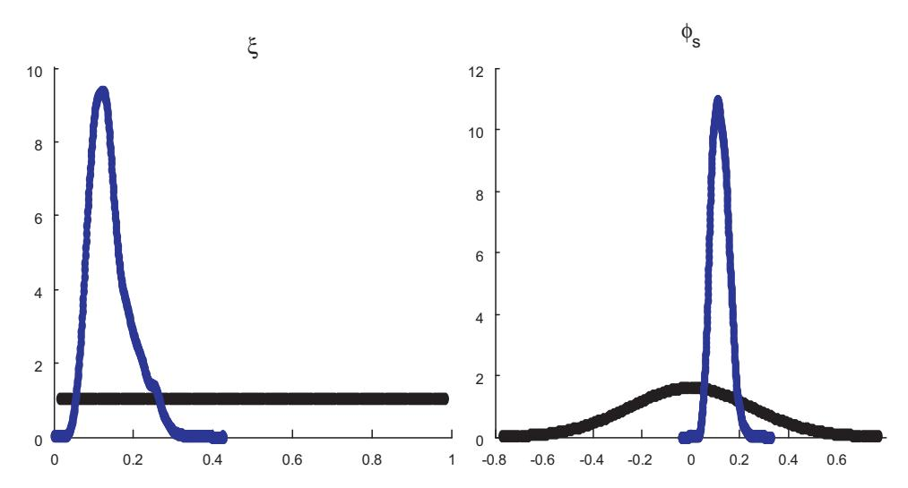
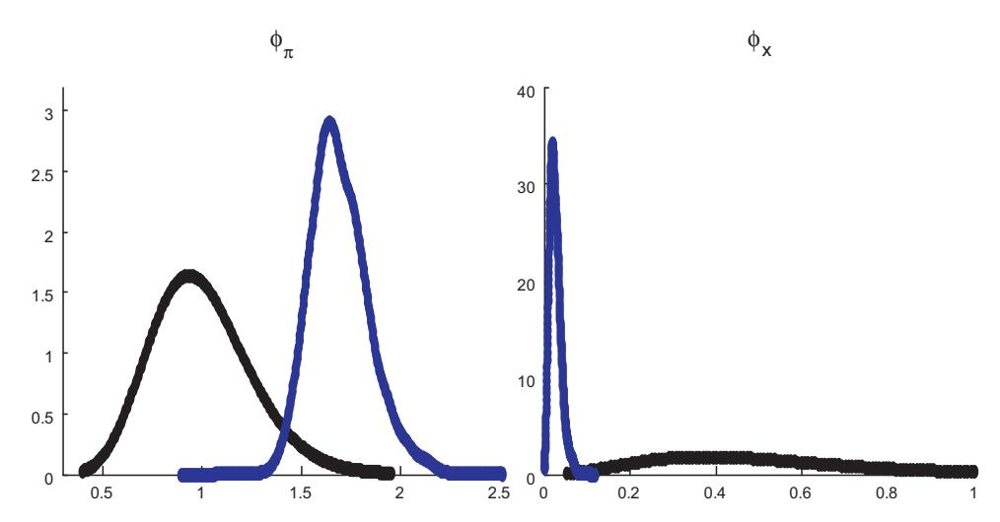
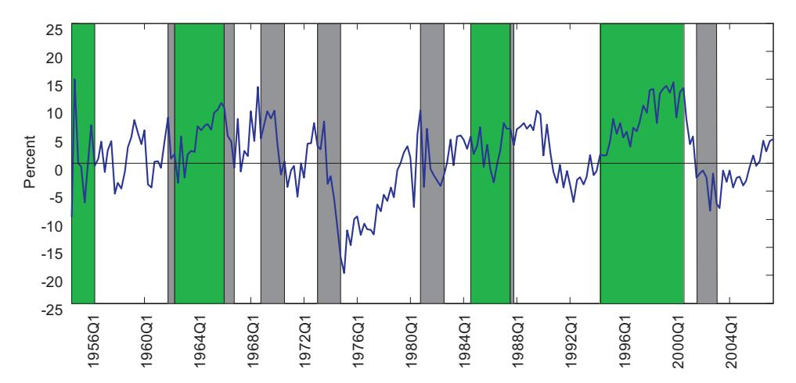
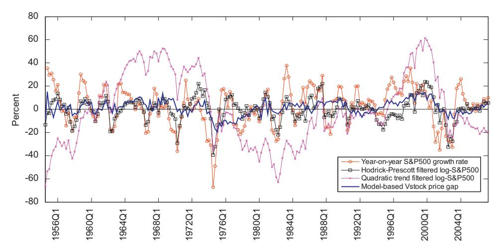
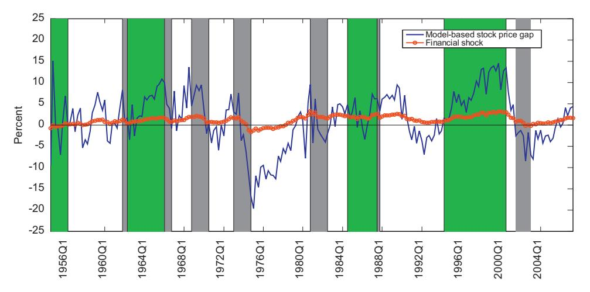
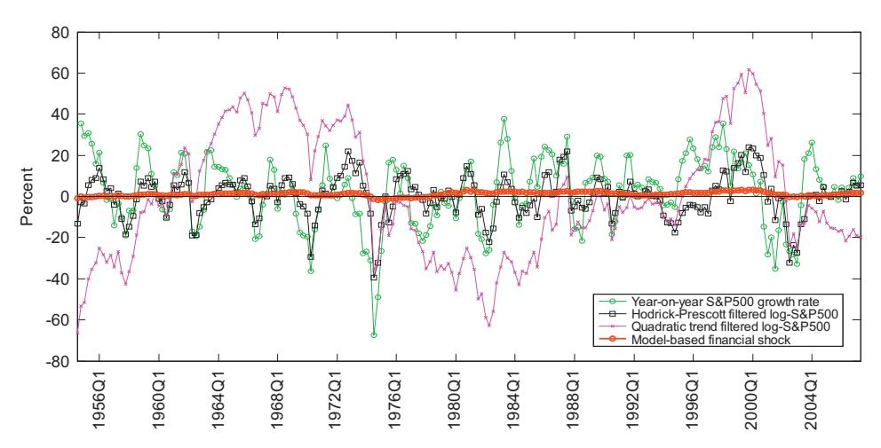
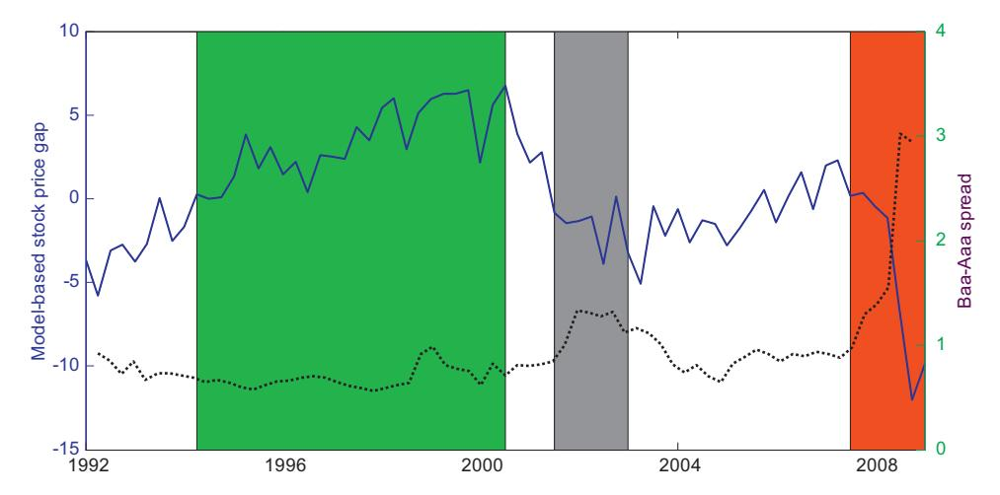
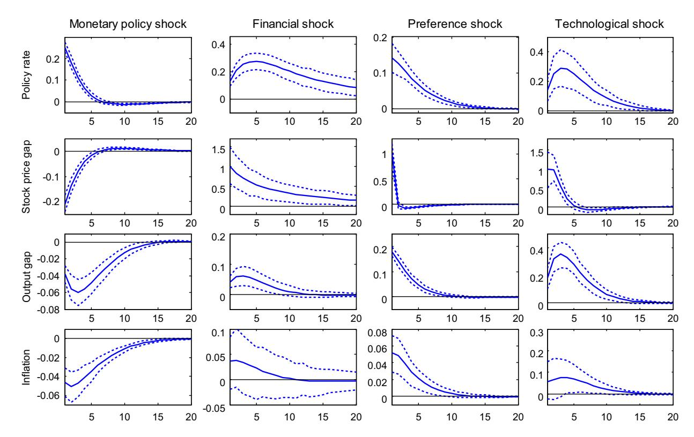
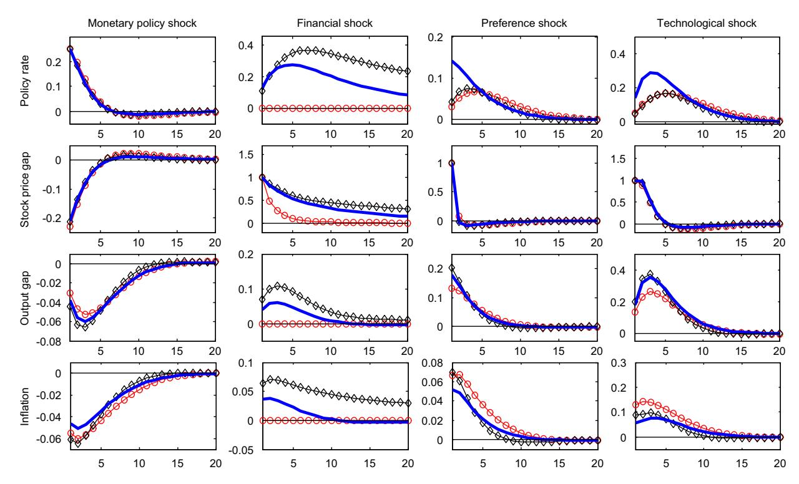
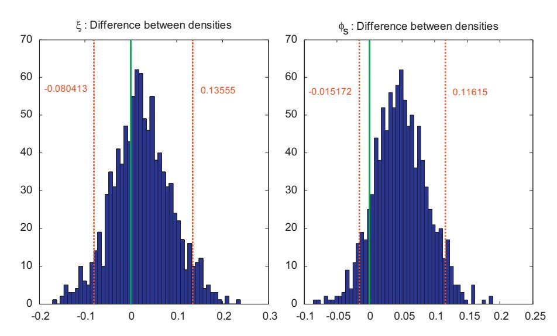

Contents lists available at ScienceDirect

# Journal of Economic Dynamics & Control

journal homepage: www.elsevier.com/locate/jedc

# Stock market conditions and monetary policy in a DSGE model for the U.S.

Efrem Castelnuovo a,\*, Salvatore Nisticò b

- a Università di Padova and Bank of Finland, Via del Santo 33, 35123 Padua (PD), Italy
- b Università di Roma "Tor Vergata" and LUISS "Guido Carli", Viale Romania 32, 00197 Rome, Italy

#### ARTICLE INFO

Available online 26 June 2010

JEL classification:

E12 E44

£44

LJZ

Keywords: Stock prices Monetary policy Bayesian estimation Wealth effects

#### ABSTRACT

This paper investigates the interactions between stock market fluctuations and monetary policy within a DSGE model for the U.S. economy. First, we design a framework in which fluctuations in households financial wealth are allowed—but not necessarily required—to exert an impact on current consumption. This is due to the interaction, in the financial markets, of long-time traders holding wealth accumulated over time with newcomers holding no wealth at all. Importantly, we introduce nominal wage stickiness to induce pro-cyclicality in real dividends, Additional nominal and real frictions are modeled to capture the pervasive macroeconomic persistence of the observables employed to estimate our model. We fit our model to post-WWII U.S. data, and report three main results. First, the data strongly support a significant role of stock prices in affecting real activity and the business cycle. Second, our estimates also identify a significant and counteractive response of the Fed to stock-price fluctuations. Third, we derive from our model a microfounded measure of financial slack, the "stock-price gap", which we then contrast to alternative ones, currently used in empirical studies, to assess the properties of the latter to capture the dynamic and cyclical implications of our DSGE model. The behavior of our "stock-price gap" is consistent with the episodes of stock-market booms and busts occurred in the post-WWII, as reported by independent analyses, and closely correlates with the current financial meltdown. Typically employed proxies of financial slack such as detrended log-indexes or growth rates show limited capabilities of capturing the implications of our model-consistent index of financial stress, Cyclical properties of the model as well as counterfactuals regarding shocks to our measure of financial slackness and monetary policy shocks are also proposed.

© 2010 Elsevier B.V. All rights reserved.

#### 1. Introduction

"Financial and economic conditions can change quickly. Consequently, the Committee must remain exceptionally alert and flexible, prepared to act in a decisive and timely manner and, in particular, to counter any adverse dynamics that might threaten economic or financial stability".

Chairman Ben S. Bernanke, Financial Markets, the Economic Outlook, and Monetary Policy, speech held at the Women in Housing and Finance and Exchequer Club Joint Luncheon, Washington, DC, January 10, 2008 (Bernanke, 2008).

Policymakers closely monitor financial market's behavior. This is due to the strict interconnections between financial and real sectors in the economy. Swings in asset prices affect real activity through several channels (households wealth,

\* Corresponding author. Tel.: +39 049 827 4257; fax: +39 049 827 4211. E-mail addresses: efrem.castelnuovo@unipd.it (E. Castelnuovo), snistico@luiss.it (S. Nisticò).

firms' market value of collateral, Tobin's Q), and, consequently, inflation and the term structure. On the other hand, stock market fluctuations are driven by expectations on future returns, which are tightly linked to expectations on the predicted evolution of the business cycle, inflation, and monetary policy decisions.1 Of course, policy-makers need to gauge financial markets' conditions and identify their drivers to appropriately implement monetary policy actions.2

While the supply-side interplay between stock prices and the real economy has been given some attention in the analysis of large scale, quantitative models with financial frictions, considerably less (if not zero) attention has been paid in analyzing the role of the demand-side interplay, working through wealth effects on households' consumption, in the standard small scale Dynamic New Keynesian (DNK) model. On the other hand, such workhorse model, despite its parsimony, has been shown to have meaningful implications for the pricing of equity markets and the response of the stock market to real and monetary shocks.3

The standard new-Keynesian model of the business cycle, however, as much widely adopted in central banks as well as academic circles to perform monetary policy analysis, typically considers stock prices as redundant for the computation of the equilibrium values of inflation, output, and the policy rate.4 This is so because financial wealth fluctuations are fully smoothed out by infinitely lived agents, both at the individual and aggregate levels. This feature of the standard new-Keynesian framework effectively shuts down the demand-side channel of transmission of financial shocks and makes it ill-suited to investigate the role of stock prices in the macroeconomic environment.

This paper proposes a small-scale new-Keynesian model in which stock prices are allowed to play an active role in determining the dynamics of the business cycle, through the demand side. Building on previous contributions by [Nistic](#page-30-0)o-[\(2005\)](#page-30-0) and [Airaudo et al. \(2007\),](#page-29-0) we consider a framework in which households face a constant probability of exiting the financial markets in each period and interact with a fraction of agents who enter the financial markets holding no wealth at all.5 Consequently, aggregate consumption cannot be perfectly smoothed out in reaction to swings in financial wealth, and stock-price fluctuations thereby affect aggregate demand.

In order to take it to the data, we add several features to the setup in [Nistico \(2005\)](#page-30-0) - . First, we assume nominal-wage stickiness. [Carlstrom and Fuerst \(2007\)](#page-30-0) show that this assumption makes real dividends pro-cyclical. Indeed, following a monetary policy tightening that induces a fall in firms' labor demand, if wages were fully flexible, firms' marginal costs would fall as well, and firms' dividends would counter-cyclically increase. By contrast, the presence of nominal wage stickiness makes revenues fall more than marginal costs, thus delivering pro-cyclical real dividends. Second, we add price and wage indexation to past inflation and productivity growth, and external habits in consumption. These additional features enable our framework to capture the endogenous persistence in the U.S. macroeconomic data. Finally, we allow for a stochastic trend in total factor productivity, which allows us to estimate our model without pre-filtering our observables.

An appealing feature of our theoretical framework is that it implies a microfounded, endogenous measure of financial slack at business cycle frequencies, that we label ''stock-price gap''. In analogy with the output gap, we define the ''stock-price gap'' as the percentage deviation of the real stock-price index from its frictionless level—consistent with an equilibrium with no dynamic distortions—and is therefore the relevant benchmark for monetary-policy makers. Such measure of financial conditions endogenously interacts with the output gap via the IS curve and the pricing equation, and may enter the Taylor rule that describes the systematic behavior of the U.S. monetary policy authority. The microfoundation of the model enables us to identify the effect that macroeconomic shocks exert on our measure of financial stress.

We fit our new-Keynesian model to U.S. data over the post WWII sample with Bayesian techniques and perform several exercises. Our main results can be summarized as follows. First. The data give strong support to our new-Keynesian model with stock prices. In particular, our estimates suggest that a significant ratio of traders in the financial markets are periodically replaced by newcomers holding zero financial assets. This makes the economy significantly non-Ricardian, and implies a finite average planning horizon for households' financial investments. Second. The evidence shows a significant systematic response of the Fed to stock-price dynamics. Specifically, the estimated interest-rate rule displays an additional component, responding to non-zero stock-price gaps. Third. Our estimated stock-price gap is consistent with the phases of booms and busts occurred in the sample, as dated by [Bordo et al. \(2008\).](#page-29-0) 6 Moreover, our estimated stock-price gap allows us to evaluate the ability of alternative proxies, currently used in the empirical literature, to capture the dynamic and

1 Examples of empirical contributions pointing towards the stock price-monetary policy interconnections are [Lee \(1992\),](#page-30-0) [Patelis \(1997\),](#page-30-0) [Thorbecke](#page-31-0) [\(1997\)](#page-31-0), [Rigobon and Sack \(2003, 2004\),](#page-30-0) [Neri \(2004\)](#page-30-0), [Bernanke and Kuttner \(2005\)](#page-29-0), [D'Agostino et al. \(2005\)](#page-30-0), [Furlanetto \(2008\)](#page-30-0), and [Bjørnland and Leitemo](#page-29-0) [\(2009\)](#page-29-0).

2 For a thorough analysis on the conduct of monetary policy in presence of stock prices within a new-Keynesian model similar to the one employed in this paper, see [Nistico \(2005\)](#page-30-0) -.

3 See, among the others, [Sangiorgi and Santoro \(2006\)](#page-30-0) and [Challe and Giannitsarou \(2008\).](#page-30-0)

4 For an exhaustive analysis of the new-Keynesian framework, see [Woodford \(2003\).](#page-31-0)

5 [Nistic](#page-30-0)o [\(2005\)](#page-30-0) analyzes monetary policy for price stability within a calibrated, purely forward-looking version of the model we employ in our investigation. [Airaudo et al. \(2007\)](#page-29-0) deal with the issue of equilibrium uniqueness and stability under learning with the set up proposed by [Nistico \(2005\)](#page-30-0) -.

6 [Bordo et al. \(2008\)](#page-29-0) propose a classification of the U.S. financial market swings in the post WWII sample based on a two-step strategy. First, they classify as financial booms all periods of at least 36 months from trough to peak with an average annual rate of increase in the real S&P500 index of at least 10% or at least 24 months with an annual rate of increase of at least 20%, and as financial busts all periods of at least 12 months from a market peak to a market trough in which the index declined at an average rate of at least 20% per year, plus the years 1966 and 1987. Then, they exploit the so identified booms/busts as starting values for a statistical analysis conducted by jointly estimating a hybrid Qual-VAR and a dynamic factor model, and check if a latent variable—their measure of financial conditions—assumes values above or below certain estimated thresholds. Their statistical investigation supports the dating established in the first step of their analysis. [Bordo et al. \(2007\)](#page-29-0) extend this analysis to Germany and the United Kingdom.

cyclical implications of a prototypical DSGE New-Keynesian model. In this respect, we show that these alternative measures can be very poor representations of such implications.

Additionally, we perform several counterfactual exercises. As to the dynamic response of the economy, we estimate a 25 basis points unexpected rise in the federal funds rate to cause an on-impact negative reaction of the stock-price gap of about 20 basis points. By contrast, an unexpected 1% boom in the stock-price gap induces an on-impact interest rate hike of 12 basis points, which about doubles within a year.

Two very recent papers are closely related to ours: [Milani \(2008\)](#page-30-0) and [Challe and Giannitsarou \(2008\)](#page-30-0). [Milani \(2008\)](#page-30-0) estimates a purely forward looking version of [Nistic](#page-30-0)o [\(2005\)](#page-30-0) - , in which households make inference on the future evolution of the business cycle on the basis of the observed oscillations in the stock market. He finds that the direct effect of the stock market on the business cycle is negligible, while the expectational effect is important. By contrast, we find a significant direct effect of financial wealth's swings on the real GDP. Differences between our results and [Milani \(2008\)](#page-30-0) may be attributed to the model structure—we model several nominal and real frictions, the most important one probably being nominal wage stickiness—and, especially, the treatment of the data. Indeed, while [Milani \(2008\)](#page-30-0) uses HP-filtered series of output and the stock-price index as proxies for the respective gaps, we relate the observable growth rates of the relevant time series to the latent state variables of our model. Therefore, we let the internal propagation mechanism of our model construct the gaps in a theoretically consistent fashion, without resorting to any pre-estimation filtering.

[Challe and Giannitsarou \(2008\)](#page-30-0) study the asset-pricing implications of the standard New Keynesian model, in which equilibrium stock prices are consistent with the households' optimization problem but do not have any real effect on consumption. They aim to show that a calibrated DSGE model is able to replicate the reaction of stock prices to a monetary policy shock as estimated by some VAR analysis. With respect to [Challe and Giannitsarou \(2008\)](#page-30-0), we allow for a two-way interaction between the real and the financial part of the system, and we estimate our framework with U.S. data instead of resorting to calibration.

Finally, by scrutinizing the demand-channel of transmission of financial fluctuations, our approach complements a related strand of literature (e.g. [Christiano et al., 2003, 2007](#page-30-0); [Queijo von Heideken, 2009](#page-30-0)), which instead focus on the role of the banking sector and financial frictions in affecting the supply-side of an economy by working with extensions of the [Bernanke et al. \(1999\)](#page-29-0) financial-accelerator model.

The paper is structured as follows. Section 2 presents our microfounded new-Keynesian model of the business cycle in which stock prices are allowed, but not required, to affect the equilibrium values of output, inflation, and the policy rate. Section 3 discusses our estimation strategy. Section 4 presents and comments our results. Section 5 proposes further discussion, and Section 6 concludes.

# 2. The model with stock-wealth effects

Our model hinges upon a demand side of the economy in which a constant fraction of households, trading in financial markets, is replaced in each period by a commensurate fraction of agents with zero-holdings of financial assets. Drawing on [Nistico \(2005\)](#page-30-0) and [Airaudo et al. \(2007\)](#page-29-0) we work with a discrete-time stochastic version of the perpetual youth model introduced by [Blanchard \(1985\)](#page-29-0) and [Yaari \(1965\)](#page-31-0)7 the economy consists of an indefinite number of cohorts, facing a constant probability x of being replaced each period. The interaction between ''newcomers'' owning zero financial assets (and therefore consuming less) and ''old traders'' with accumulated wealth (and therefore consuming more), drives a wedge between the stochastic discount factor pricing all securities and the average marginal rate of intertemporal substitution in consumption, which in the case of infinitely lived consumers coincide. In the latter case, indeed, the dynamic path of aggregate consumption is sufficiently described by the stochastic discount factor. Aggregation of the Euler equations is straightforward because people in the financial market are always the same. Hence, individual consumption smoothing carries over in aggregate terms and the current level of average consumption is related only to its own discounted value expected for tomorrow.

In contrast, in the case with two types of agents interacting (with and without accumulated financial wealth), aggregation of the individual Euler equations is not straightforward, because agents in the financial markets change over time and have different wealth and different consumption levels. Hence, individual consumption smoothing does not carry over in aggregate terms, because tomorrow there will be people in the market that are not there today and are not accumulating any wealth with which to smooth their consumption profile. These newcomers, which enter with zero assets, will replace agents that today are accumulating wealth, and that would be able to consume relatively more tomorrow. Hence, when this turnover occurs, the average level of consumption expected for tomorrow will be lower than otherwise; to relate the current level of average consumption to the level expected for tomorrow we need to account for this wedge, which is proportional to the stock of wealth accumulated today. An increase in financial wealth (even temporary) enlarges this wedge because it makes the difference between the consumption of ''old traders'' and that of

7 For other stochastic discrete-time versions of the perpetual youth model, besides [Nistico \(2005\)](#page-30-0) - , see [Annicchiarico et al. \(2008\)](#page-29-0), [Cardia \(1991\),](#page-30-0) [Chadha and Nolan \(2001\),](#page-30-0) [Chadha and Nolan \(2003\)](#page-30-0), [Di Giorgio and Nistico \(2007\)](#page-30-0) - , [Piergallini \(2006\),](#page-30-0) [Leith and Wren-Lewis \(2000\),](#page-30-0) and [Leith and von](#page-30-0) [Thadden \(2008\).](#page-30-0) For non-stochastic discrete-time versions see, among the others, [Cushing \(1999\)](#page-30-0) and [Smets and Wouters \(2002\)](#page-30-0).

"newcomers" larger. In the end, this makes the dynamics of financial wealth relevant for that of aggregate consumption, and we thus establish a direct channel by which the dynamics of stock prices can feed back into the real part of the model.

To reiterate, the intuition is the following. Higher stock prices today signal higher stock-market wealth expected for tomorrow. All individuals in the financial market today, seeking consumption smoothing, will anticipate this increase in wealth and consume more also today. Tomorrow, however, a fraction of these individuals will be replaced by agents that own zero financial assets: these newcomers are unaffected by the increase in the value of financial wealth because they were not yet in the market when the increase occurred, and therefore have no reason to increase their consumption above the level implied by their stock of human wealth. Consequently, the increase in stock prices affects current average consumption more than the average level expected for tomorrow. The dimension of the wealth effect on current average consumption relative to its expected future level is related to two factors. First, higher rates of replacement ( $\xi$ ), for given swings in stock prices, imply a larger fraction of people entering the market tomorrow and being unaffected by variations in financial wealth. Second, higher levels of expected stock-market wealth, for a given rate of replacement, imply larger effects on current consumption, and therefore a higher difference with the expected future level.

As anticipated, to make the model more suitable for estimation, we enrich the framework by Nisticò (2005) and Airaudo et al. (2007) with three additional features. First, we allow for a stochastic trend in productivity to estimate the model without engaging in data pre-filtering. Second, we assume that households specialize in supplying a different type of labor, indexed by  $k \in [0,1]$ , and that each cohort spans all labor types. For each labor type an infinitely lived monopoly labor union exists, to which all households specializing in that labor type delegate the choice of their wage and hours worked, regardless of their age. The unions set wages in a staggered fashion à la Erceg et al. (2000) and act in the interest of their member households, which, in turn, commit to supply all labor demanded by the firms at the given wage. We assume staggered nominal wages in order to allow the model yield pro-cyclical real dividends (Carlstrom and Fuerst, 2007). Third, to capture the pervasive persistence in macro data, we endow each household with external habits in consumption. To the same aim, for the firms and labor unions which cannot optimize, we allow for a partial indexation to past inflation for the former and past inflation and productivity growth for the latter.

### 2.1. Firms, employment agencies and price-setting

The supply-side of the economy consists of three sectors of infinitely lived agents: a retail sector, employment agencies and a wholesale sector.

Retailers and employment agencies: A competitive retail sector produces the final consumption good  $Y_t$  packing the continuum of intermediate differentiated goods by means of a CRS technology,

$$Y_t = \left[ \int_0^1 Y_t(i)^{1/(1+\mu_t^p)} di \right]^{(1+\mu_t^p)},$$

in which  $\mu_t^p > 0$  captures the time-varying degree of market power in the market for inputs  $Y_t(i)$ . Equilibrium in this sector implies the input demand function and the aggregate price-index:

$$Y_t(i) = \left[\frac{P_t(i)}{P_t}\right]^{-(1+\mu_t^p)/\mu_t^p} Y_t, \quad P_t = \left[\int_0^1 P_t(i)^{-1/\mu_t^p} di\right]^{-\mu_t^p}. \tag{1}$$

Analogously, a competitive sector of employment agencies gathers the different labor types from all the cohorts alive and pack them into labor services for the wholesalers, using the CRS technology

$$N_t = \left[ \int_0^1 N_t(k)^{1/(1+\mu_t^{w})} dk \right]^{(1+\mu_t^{w})}, \tag{2}$$

in which  $\mu_r^w > 0$  captures the time-varying degree of market power in the market for labor types.

Given the nominal wage  $W_t^*(k)$  for type-k labor, equilibrium for the employment agencies implies the demand schedule for each labor type and the aggregate nominal wage index  $W_t^{*8}$ :

$$N_t(k) = \left[\frac{W_t^*(k)}{W_t^*}\right]^{-(1+\mu_t^w)/\mu_t^w} N_t, \quad W_t^* = \left[\int_0^1 W_t^*(k)^{-1/\mu_t^w} dk\right]^{-\mu_t^w}. \tag{3}$$

From above, it follows that the aggregate wage bill (across labor types) can be expressed as the product of the aggregate wage index and aggregate level of hours worked:

$$\int_{0}^{1} W_{t}^{*}(k) N_{t}(k) \, \mathrm{d}k = W_{t}^{*} N_{t}. \tag{4}$$

&lt;sup>8 Throughout the paper a superscript asterisk denotes nominal variables:  $X_t^* \equiv P_t X_t$ .

The wholesale sector: A monopolistic wholesale sector produces a continuum of differentiated perishable goods out of the labor services rented from the employment agencies. Each firm in this sector exploits the following production function

$$Y_t(i) = A_t N_t(i)^{1-\alpha},\tag{5}$$

in which  $A_t$  captures aggregate productivity shocks, following a log-difference-stationary stochastic process:

$$\Delta a_t \equiv \ln\left(\frac{A_t}{\Gamma A_{t-1}}\right) = \rho_a \Delta a_{t-1} + \varepsilon_t^a,\tag{6}$$

with  $\Gamma$  being the steady-state gross rate of productivity growth.

Aggregating across firms and using the demand for intermediate goods (1) yields

$$N_{t} = \left(\frac{Y_{t}}{A_{t}}\right)^{1/(1-\alpha)} \int_{0}^{1} \left(\frac{P_{t}(i)}{P_{t}}\right)^{-(1+\mu_{t}^{p})/((1-\alpha)\mu_{t}^{p})} di = \left(\frac{Y_{t}}{A_{t}}\right)^{(1/(1-\alpha)} \Xi_{t}, \tag{7}$$

in which  $N_t \equiv \int_0^1 N_t(i) di$  is the aggregate level of hours worked and

$$\Xi_t \equiv \int_0^1 \left(\frac{P_t(i)}{P_t}\right)^{-(1+\mu_t^p/(1-\alpha)\mu_t^p)} \mathrm{d}i$$

is an index of price dispersion over the continuum of intermediate goods-producing firms.

The price-setting mechanism follows Calvo's (1983) staggering assumption, with  $1-\theta_p$  denoting the probability for a firm of having the chance to re-optimize in a given period. When able to set its price optimally, each firm seeks to maximize the expected discounted stream of future dividends, subject to its brand-specific demand function (1). Otherwise, we assume that firms partially index to past inflation. Denoting with  $\Pi_t$  the gross inflation rate between time t-1 and t, the price in t+s of firm i which last optimized in t is therefore

$$P_{t+s|t}(i) = P_{t+s-1|t}(i)\Pi_{t+s-1}^{\varpi}\Pi^{1-\varpi} = P_t^o(i)\left(\frac{P_{t+s-1}}{P_{t-1}}\right)^{\varpi}\Pi^{s(1-\varpi)},\tag{8}$$

in which  $\varpi$  is the degree of indexation to past inflation and  $P_t^o(i)$  is the price optimally set in period t for brand i, and s is the number of consecutive periods in which the firm could not re-optimize.

In equilibrium, all firms revising their price at time t will choose a common optimal price level,  $P_t^o$ , set according to the following (implicit) rule:

$$E_{t}\left\{\sum_{s=0}^{\infty}\theta_{p}^{s}\mathcal{F}_{t,t+s}\frac{1}{\mu_{t+s}^{p}}Y_{t+s|t}\left[P_{t}^{o}\left(\frac{P_{t+s-1}}{P_{t-1}}\right)^{\varpi}\Pi^{s(1-\varpi)}-(1+\mu_{t+s}^{p})MC_{t+s|t}P_{t+s}\right]\right\}=0,$$
(9)

in which

$$MC_{t+s|t} = \frac{W_{t+s}}{(1-\alpha)A_{t+s}} \left(\frac{Y_{t+s|t}}{A_{t+s}}\right)^{\alpha/(1-\alpha)}$$
(10)

denotes real marginal costs effective at time t+s for a firm which last re-optimized at time t. For future reference, it is useful to write  $MC_{t+s|t}$  in terms of average marginal costs  $MC_{t+s}$ :

$$MC_{t+s|t} = MC_{t+s} \left( \frac{P_t^o}{P_{t+s}} \left( \frac{P_{t+s-1}}{P_{t-1}} \right)^{\varpi} \Pi^{s(1-\varpi)} \right)^{-\alpha/(1-\alpha)(1+\mu_t^p)/\mu_t^p}, \tag{11}$$

in which we defined

$$MC_{t+s} = \frac{W_{t+s}}{(1-\alpha)A_{t+s}} \left(\frac{Y_{t+s}}{A_{t+s}}\right)^{\alpha/(1-\alpha)}.$$
 (12)

Finally, given the price-setting rules and the definition of the aggregate price level, we can conveniently express the latter as

$$P_{t} = \left[\theta_{n} (P_{t-1} \Pi_{t-1}^{\varpi} \Pi^{1-\varpi})^{-1/\mu_{t}^{p}} + (1-\theta_{n}) (P_{t}^{0})^{-1/\mu_{t}^{p}}\right]^{-\mu_{t}^{p}}.$$
(13)

#### 2.2. Households

Each household has Cobb–Douglas preferences over consumption and leisure. Such preferences are affected by aggregate, exogenous stochastic shocks shifting the marginal utility of consumption ( $\mathcal{V}_t \equiv \exp(v_t)$ ), which affect the equilibrium stochastic discount factor and, thereby, the dynamics of stock prices. To allow for external habits in

&lt;sup>9 These marginal costs are firm-specific, given the diminishing returns to labor in the production function. When  $\alpha = 0$ , real marginal costs are common across firms:  $MC_{t+s|t} = MC_{t+s} = W_{t+s}/A_{t+s}$ .

consumption, preferences are defined over adjusted personal consumption

$$\tilde{C}_t(j,k) \equiv (C_t(j,k) - \hbar C_{t-1}),\tag{14}$$

in which \( \hat{h} \) captures the degree to which consumers would like to smooth their consumption with respect to the average past level.

Households demand consumption goods and two types of financial assets: state-contingent bonds and equity shares issued by the monopolistic firms. Equilibrium in this side of the economy, along a state equation for consumption, also implies a pricing equation for the equity shares.

Consumers entering the markets in period j and specializing in labor type k, therefore, seek to maximize the expected stream of utility flows, discounted to account for impatience (as reflected by the intertemporal discount factor  $\beta$ ) and uncertain presence in the market (as reflected by the probability of survival across two subsequent periods,  $(1-\xi)$ ). To that aim, they choose a pattern for individual real consumption C(j,k) and financial-asset holdings. The financial assets holdings at the end of period t consist of a set of contingent claims whose one-period ahead stochastic nominal payoff in period t+1 is  $B^*_{t+1}(j,k)$  and the relevant discount factor is  $\mathcal{F}_{t,t+1}$ , and a set of equity shares issued by each wholesale firm,  $Z_{t+1}(j,k,i)$ , whose real price at period t is  $Q_t(i)$ .

Moreover, to capitalize on the differentiation of their own labor type, each household delegates to a monopolistic labor union the optimal choice of hours worked to supply to the employment agencies. The monopoly union sets both the nominal wage  $W^*(k)$  and hours worked N(k) for each labor type k; each cohort in the labor-type k, then, contributes to the supply of hours worked *pro rata*, i.e. in proportion to its dimension. The *per capita* labor supply, therefore, is going to be common across cohorts: N(j,k) = N(k).

At the beginning of each period, then, the sources of funds consist of the nominal disposable labor income  $(W_t^*(k)N_t(k) - P_tT_t)^{10}$  and the nominal financial wealth  $\Omega_t^*(j,k)$ , carried over from the previous period and defined as

$$\Omega_t^*(j,k) = \left[ B_t^*(j,k) + P_t \int_0^1 (Q_t(i) + D_t(i)) Z_t(j,k,i) \, \mathrm{d}i \right]. \tag{15}$$

The financial wealth of an individual born at time j includes therefore the nominal pay-off on the contingent claims and on the portfolio of equity shares, each of the latter paying a nominal dividend yield  $P_{tDt}(i)$  and being worth its own current nominal market value  $P_tQ_t(i)$ .

At time 0, therefore, *j*-periods-old consumers specializing in type-*k* labor seek to maximize

$$E_0 \sum_{t=0}^{\infty} \beta^t (1-\xi)^t \mathcal{V}_t[\log \tilde{C}_t(j,k) + \delta \log(1-N_t(k))]$$

subject to a sequence of budget constraints of the form:

denoting them in per capita terms.

$$P_{t}C_{t}(j,k) + E_{t}\{\mathcal{F}_{t,t+1}B_{t+1}^{*}(j,k)\} + P_{t}\int_{0}^{1}Q_{t}(i)Z_{t+1}(j,k,i)\,\mathrm{d}i \leq W_{t}^{*}(k)N_{t}(k) - P_{t}T_{t} + \frac{1}{1-\xi}\Omega_{t}^{*}(j,k),\tag{16}$$

where  $\beta, \xi \in [0,1]$ . Moreover, following Blanchard (1985), financial wealth carried over from the previous period also pays off the gross return  $(1/(1-\xi))$  on the insurance contract that redistributes among agents that have not been replaced (and in proportion to one's current wealth) the financial wealth of the ones who left the market. The assumption of log-utility ensures the existence of a balanced-growth path under a non-stationary technological process, and allows for closed-form solutions for individual and aggregate consumption.

The first-order conditions for an optimum consist of the budget constraint (16) holding with equality, and the intertemporal conditions with respect to the two financial assets:

$$\mathcal{F}_{t,t+1} = \beta \frac{U_c(C_{t+1}(j))\mathcal{V}_{t+1}}{U_c(C_t(j))\mathcal{V}_t} = \beta \frac{P_t\tilde{C}_t(j)}{P_{t+1}\tilde{C}_{t+1}(j)} \exp(\nu_{t+1} - \nu_t), \tag{17}$$

$$P_{t}Q_{t}(i) = E_{t}\{\mathcal{F}_{t,t+1}P_{t+1}[Q_{t+1}(i) + D_{t+1}(i)]\}. \tag{18}$$

Eq. (17) defines the equilibrium stochastic discount factor for one-period ahead nominal payoffs, affected by the intertemporal disturbance v, and highlights that, at the individual level, the stochastic discount factor and the intertemporal marginal rate of substitution in consumption are equal. Eq. (18), in turn, defines stock-price dynamics, by equating the nominal price of an equity share to its nominal expected payoff one period ahead, discounted by the stochastic factor  $\mathcal{F}_{t,t+1}$ .

The nominal gross return  $(1+r_t)$  on a safe one-period bond paying off one unit of currency in period t+1 with probability 1 (whose price is therefore  $E_t\{\mathcal{F}_{t,t+1}\}$ ) is defined by the following no-arbitrage condition:

$$(1+r_t)E_t\{\mathcal{F}_{t,t+1}\} = 1. \tag{19}$$

 $\frac{10}{10}$  We assume that lump-sum taxes are uniformly distributed across cohorts and labor types, and accordingly we can drop both indexes j and k when

For future reference note that, if the labor market were competitive and there were no labor unions, households would also choose the optimal amount of hours worked to supply. The equilibrium condition in that case would require the real wage to equal the marginal rate of substitution between adjusted consumption and leisure, for each cohort j and each labor type k

$$W_t(k) = \delta \frac{\tilde{C}_t(j,k)}{1 - N_t(j,k)} \equiv MRS_t(j,k), \tag{20}$$

in which the last identity defines the individual MRS between adjusted consumption and leisure.

Using Eq. (18), and recalling the definition of financial wealth (15), the equilibrium budget constraint (16) can be given the form of the following stochastic difference equation in the financial wealth  $\Omega_t^*(j)$ , written in terms of individual *adjusted* consumption  $\tilde{C}_t(j)^{11}$ :

$$P_{t}\tilde{C}_{t}(j,k) + E_{t}\{\mathcal{F}_{t,t+1}\Omega_{t+1}^{*}(j,k)\} = \frac{1}{1-\xi}\Omega_{t}^{*}(j,k) + W_{t}^{*}N_{t}(k) - P_{t}T_{t} - \hbar P_{t}C_{t-1}. \tag{21}$$

The equation above, together with the equilibrium stochastic discount factor (17) and a condition ruling out Ponzi schemes, imply that Eq. (21) can be solved forward, to result in an equilibrium relation between individual *adjusted* consumption and total wealth:

$$\tilde{C}_t(j,k) = \frac{1}{\Sigma_t} \left( \frac{1}{1-\xi} \Omega_t(j,k) + K_t(k) \right). \tag{22}$$

In the equation above,  $K_t(k)$  denotes the *adjusted* stock of human wealth for type-k consumers, defined as the expected stream of future disposable labor income, discounted by the stochastic discount factor and conditional upon survival, net of the external habit in consumption. The assumption of labor unions setting wages and hours implies that this term is common across cohorts. Moreover,  $\Sigma_t \equiv E_t\{\sum_{s=0}^{\infty} \beta^s (1-\xi)^s \exp(v_{t+s}-v_t)\}$  is the reciprocal of the time-varying propensity to consume out of financial and human wealth, and is also common across cohorts (being a function of the aggregate preference shocks).

Three comments are in order with respect to Eq. (22). First. A current positive innovation in the preference shock, by reducing the present value of future stochastic payoffs, has the effect of increasing the current propensity to consume out of wealth, and thereby the level of consumption. Second. The overlapping-generation structure of households ( $\xi > 0$ ) implies that the propensity to consume out of total wealth is higher than in the Representative Agent set up ( $\xi = 0$ ), because a positive  $\xi$  reduces the effective rate at which households discount utility (i.e.  $\beta(1-\xi)$ ) and this makes the present even more valuable than the future. Third. Individual consumption of "newcomers"  $\tilde{C}_t(t,k)$  is lower than those of "old traders" because the former enter the market with zero financial assets ( $\Omega_t(t,k) = 0$ ) and can therefore consume only out of their human wealth  $K_t(k)$ .

#### 2.2.1. Aggregation across cohorts

The aggregate level of consumption across all type-*k* cohorts is computed as a weighted average of the corresponding generation-specific counterpart, where each cohort is given a weight equal to its mass:

$$C_t(k) = \sum_{j=-\infty}^{t} n_t(j)C_t(j,k) = \sum_{j=-\infty}^{t} \xi(1-\xi)^{t-j}C_t(j,k)$$
 (23)

for all  $k \in [0,1]$ . Since agents entering the market at time t hold no financial assets at all, however, all the financial wealth is held by "old traders"; accordingly, its aggregate value is defined as the average across old traders only:

$$\Omega_t \equiv \sum_{j=-\infty}^{t-1} \xi(1-\xi)^{t-1-j} \Omega_t(j). \tag{24}$$

Thereby, since the aggregator defined in (23) sums over all agents, therefore, it implies

$$\sum_{j=-\infty}^{t} \xi(1-\xi)^{t-j} \Omega_t(j) = (1-\xi)\Omega_t, \tag{25}$$

capturing the fact that all the financial wealth is held by old traders, who have mass of  $(1-\xi)$ .

The solution of the consumers' problem provides two relevant equilibrium conditions specific to each generic cohort *j*: the budget constraint holding with equality (Eq. (21)) and the relation linking personal *adjusted* consumption to total personal wealth, Eq. (22).

&lt;sup>11 The assumption of complete markets, and the implied risk-sharing among households in the same cohort whose wage is reset at different dates, imply that the budget constraint is common across different labor types, and equal to what it would be in the case of competitive labor markets. As a consequence, we could as well drop the index k for the remaining of this Section. See Woodford (2003).

Since these equilibrium conditions are linear in the cohort-specific variables, we can aggregate across cohorts to obtain a set of aggregate relations identical in the functional form to their generation-specific counterparts:

$$P_{t}\tilde{C}_{t}(k) + E_{t}\{\mathcal{F}_{t,t+1}\Omega_{t+1}^{*}(k)\} = \Omega_{t}^{*}(k) + W_{t}^{*}N_{t}(k) - P_{t}T_{t} - \hbar P_{t}C_{t-1}, \tag{26}$$

$$\tilde{C}_t(k) = \frac{1}{\sum_t} (\Omega_t(k) + K_t(k)). \tag{27}$$

For future reference, note that aggregating across cohorts the static type-k labor supply implied by Eq. (20), we get (under competitive labor markets) the equalization of the real wage to the *average* marginal rate of substitution for suppliers of labor type k

$$W_t(k) = \delta \frac{\tilde{C}_t(k)}{1 - N_t(k)} \equiv MRS_t(k), \tag{28}$$

in which the last identity defines the average MRS between adjusted consumption and leisure.

Finally, Eqs. (26) and (27), aggregated also across labor types can be combined to yield an equation describing the dynamic path of aggregate consumption:

$$(\Sigma_{t}-1)(C_{t}-hC_{t-1}) = \xi E_{t}\{\mathcal{F}_{t,t+1}\Pi_{t+1}\Omega_{t+1}\} + (1-\xi)E_{t}\{\mathcal{F}_{t,t+1}\Sigma_{t+1}\Pi_{t+1}(C_{t+1}-hC_{t})\}. \tag{29}$$

The equation above highlights the role of the financial wealth effects (the first term on the right-hand side), which fades out as the replacement rate ( $\xi$ ) goes to zero.

# 2.3. Labor unions and nominal wage-setting

Each cohort alive spans the entire continuum of labor varieties  $k \in [0,1]$ . All households specializing in labor type k delegate the decision about their wage and amount of hours worked to a monopoly labor union, regardless of their age. The labor unions are infinitely lived and act in the interest of their member households, with which they share the structure of preferences.

The labor unions are not concerned with the distribution of financial wealth across cohorts but only about aggregate wage and employment in their sector. The period-objective of the union representing type-*k* workers is therefore assumed to be the aggregate nominal labor income of their members, net of a term capturing the utility-cost of working, evaluated in terms of nominal adjusted consumption:

$$W_r^*(k)N_r(k) + P_r\tilde{C}_t\delta \ln(1 - N_t(k)).$$
 (30)

A convenient implication of assuming a nominal period-objective of this form is that it allows to encompass as a special case the result holding under competitive labor markets.

The wage setting mechanism follows Erceg et al. (2000) staggering assumption, with  $\theta_w$  being the probability of not-being able to re-optimize in a given period. When able to set the wage optimally, each union seeks to maximize the discounted stream of period-objectives, given the demand for its own labor type (3) coming from the employment agencies. Otherwise, unions follow a partial indexation rule tracking past price-inflation and the evolution of aggregate productivity. More specifically, the nominal wage in t+s for type-k workers represented by a union which last optimized in t is

$$W_{t+s|t}^{*}(k) = W_{t+s-1|t}^{*}(k)(\Pi_{t+s-1}\Gamma e^{\Delta a_{t+s-1}})^{\eta}(\Pi\Gamma)^{1-\eta} = W_{t}^{*0}(k)\left(\frac{P_{t+s-1}}{P_{t-1}}\frac{A_{t+s-1}}{A_{t-1}}\right)^{\eta}(\Pi\Gamma)^{s(1-\eta)},\tag{31}$$

in which  $\eta$  is the degree of indexation to past inflation and productivity growth and  $W_t^{\circ}(k)$  is the nominal wage optimally set in period t for type-k labor.

In equilibrium, all unions optimizing at time t set the same nominal wage  $W_t^{*o}$ , according to the following implicit rule:

$$E_{t} \left\{ \sum_{s=0}^{\infty} \theta_{w}^{k} \mathcal{F}_{t,t+s} \frac{N_{t+s|t}}{\mu_{t+s}^{w}} \left[ W_{t}^{*o} \left( \frac{P_{t+s-1}}{P_{t-1}} \frac{A_{t+s-1}}{A_{t-1}} \right)^{\eta} (\Pi \Gamma)^{s(1-\eta)} - (1 + \mu_{t+s}^{w}) P_{t+s} MRS_{t+s|t} \right] \right\} = 0, \tag{32}$$

in which  $MRS_{t+s|t}$  is the average (across households specializing in the same labor service) marginal rate of substitution between consumption and leisure, characterizing the member households at t+s of a labor union which last optimized at date t:

$$MRS_{t+s|t} \equiv \delta \frac{\tilde{C}_{t+s}}{1 - N_{t+s|t}}.$$
(33)

For future reference, it is useful to write  $MRS_{t+s|t}$  in terms of the average, economy-wide MRS:

$$MRS_{t+s|t} = MRS_{t+s} \frac{1 - N_{t+s}}{1 - N_{t+s} \left(\frac{W_{t}^{*o}}{W_{t-s}^{*o}} \left(\frac{P_{t+s-1}}{P_{t-1}} \frac{A_{t+s-1}}{A_{t-1}}\right)^{\eta} (\Pi \Gamma)^{s(1-\eta)}\right)^{-(1+\mu_{t+s}^{w})/\mu_{t+s}^{w}}},$$
(34)

in which we defined

$$MRS_{t+s} \equiv \delta \frac{\tilde{C}_{t+s}}{1 - N_{t+s}}.$$
(35)

Finally, given the wage-setting rule and the definition of the aggregate nominal wage index, we can conveniently express the latter as

$$W_{t}^{*} = \left[\theta_{w}(W_{t-1}^{*}(\Pi_{t-1}\Gamma e^{\Delta a_{t-1}})^{\eta}(\Pi\Gamma)^{1-\eta})^{-1/\mu_{t}^{w}} + (1-\theta_{w})(W_{t}^{*0})^{-1/\mu_{t}^{w}}\right]^{-\mu_{t}^{w}}.$$
(36)

# 2.4. The government and the equilibrium

Following Galí (2003), we assume a public sector which consumes a stochastic fraction of total output, financed entirely through lump-sum taxation to the households:

$$G_t = \left(\frac{\check{g}_t}{1 + \check{g}_t}\right) Y_t = T_t. \tag{37}$$

In equilibrium, the net supply of state-contingent bonds is nil  $(B_t = 0)$ . Moreover, the aggregate stock of outstanding equity for each wholesale firm must equal the corresponding total amount of issued shares, normalized to 1  $(Z_t(i) = 1)$  for all  $i \in [0,1]$ ). As a consequence, the present discounted real value of future financial wealth equals the current level of the real stock-price index  $E_t(\mathcal{F}_{t,t+1}\Pi_{t+1}\Omega_{t+1}) = Q_t$ , and the state equation for aggregate consumption reads

$$(\Sigma_t - 1)(C_t - \hbar C_{t-1}) = \xi Q_t + (1 - \xi)E_t \{ \mathcal{F}_{t,t+1} \Pi_{t+1} \Sigma_{t+1} (C_{t+1} - \hbar C_t) \}, \tag{38}$$

in which

$$Q_t = E_t \{ \mathcal{F}_{t,t+1} \Pi_{t+1} [Q_{t+1} + D_{t+1}] \}. \tag{39}$$

Eq. (38) defines the dynamic path of aggregate consumption, in which an explicit role is played by the dynamics of stock prices. The latter is defined by Eq. (39), which is a standard pricing equation micro-founded on the consumers' optimal behavior and derives from the aggregation across firms of Eq. (18).

Finally, note that the benchmark set-up of infinitely lived consumers is a special case of the one discussed here, and corresponds to a zero-rate of replacement,  $\xi = 0$ . In this case, indeed, Eq. (38) loses the term related to stock prices and collapses to the usual Euler equation for consumption, relating real aggregate consumption only to the long-run real interest rate:

$$(\Sigma_{t}-1)(C_{t}-\hbar C_{t-1}) = E_{t}\{\mathcal{F}_{t,t+1}\Pi_{t+1}\Sigma_{t+1}(C_{t+1}-\hbar C_{t})\}.$$

# 2.4.1. The benchmark equilibrium

We take as benchmark an equilibrium in which prices and wages are fully flexible, and the price- and wage-elasticities of demand for differentiated intermediate goods and labor types are unaffected by inefficient disturbances. In terms of deep parameters, this equilibrium features  $\theta_i = 0$  and  $\mu_t^i = \mu^i$ , for all t and i = p,w. We label this equilibrium as  $frictionless^{12}$  (FE) and denote variables in such equilibrium with an upperbar. While not dealing with optimal monetary policy issues here, we note that this definition of benchmark equilibrium is consistent with the equilibrium that monetary policymakers targeting price stability should aim to achieve.

In the FE, the price-setting rule implies that *all* firms set their price as a *constant* markup over nominal marginal costs:  $\overline{P}_t^0 = (1 + \mu^p)P_t\overline{MC}_t = P_t$ . As a consequence, real marginal costs are constant at their steady state level:  $\overline{MC}_t = (1 + \mu^p)^{-1}$ . Analogously, the wage-setting rule implies that all unions set their members' real wage as a constant markup over the marginal rate of substitution:  $\overline{W}_t^0 = (1 + \mu^w)\overline{MRS}_t$ . Denoting with  $MW_t \equiv MRS_t/W_t$  the inverse wage markup, therefore, we obtain a condition similar to the one characterizing real marginal costs:  $\overline{MW}_t = (1 + \mu^w)^{-1}$ .

#### 2.5. The linearized model

Given the assumed unit root in the process driving aggregate productivity, a number of variables in our model economy inherits a stochastic trend. To solve the model, then, we first write the equilibrium conditions in terms of deviations of the trending real variables from the non-stationary technological process  $A_0$ , whose evolution in first-differences is described

&lt;sup>12 For the sake of accuracy, we should emphasize that a truly frictionless equilibrium should also correct the *static* distortions of non-zero steady-state markups. These distortions can be easily corrected by appropriate time-invarying subsidies. Since we are mainly interested in the dynamic and cyclical properties of the model, we disregard this issue, with no loss of generality for our results, and use the term frictionless with reference to the absence of *dynamic* frictions.

by the autoregressive process (6).13 We then log-linearized the so manipulated equilibrium conditions around the non-stochastic steady state.14

We define the "output gap" as the log-deviation of equilibrium real output from the frictionless benchmark:  $x_t \equiv \hat{y}_t - \hat{\overline{y}}_t$ . Analogously, we can define the real "wage gap" as  $\omega_t \equiv \hat{\omega}_t - \hat{\overline{\omega}}_t$  and the real "stock-price gap" as  $s_t \equiv \hat{q}_t - \hat{\overline{q}}_t$ . The latter is our model-consistent measure of financial slack, which isolates the part of stock-price dynamics that can be attributed to the existing structural distortions at business cycle frequencies. If anything at all, then, this is the measure of financial slack that any Central Bank interested in price stability should by concerned with.

Accordingly, we assume that the monetary policy makers set short-term nominal interest rates in (smoothed) response to deviations of the equilibrium allocation from the frictionless benchmark, following the Taylor-type rule

$$r_{t} = (1 - \phi_{r})(\phi_{\pi} \pi_{t} + \phi_{s} x_{t} + \phi_{s} s_{t}) + \phi_{r} r_{t-1} + u_{r}^{r}, \tag{40}$$

which allows for an explicit response to our measure of financial slack, beyond the one implicit in the response to output gap and inflation.

The complete model economy, written in deviations from the benchmark equilibrium, therefore reads:

$$(x_t - hx_{t-1}) = \Theta E_t \{x_{t+1} - hx_t\} + \psi \Theta s_t - (1 - h)\Theta(r_t - E_t \pi_{t+1} - \overline{rr}_t), \tag{41}$$

$$s_{t} = \tilde{\beta}E_{t}s_{t+1} + \Phi_{x}E_{t}x_{t+1} - \Phi_{\omega}E_{t}\omega_{t+1} - (r_{t} - E_{t}\pi_{t+1} - \overline{rr}_{t}) + b_{t}, \tag{42}$$

$$(\pi_t - \varpi \pi_{t-1}) = \tilde{\beta} E_t \{ \pi_{t+1} - \varpi \pi_t \} + \lambda_p \omega_t + \kappa_p x_t + u_t^p, \tag{43}$$

$$(\pi_t^w - \eta \pi_{t-1} - \eta \Delta a_{t-1}) = \tilde{\beta} E_t \{ \pi_{t+1}^w - \eta \pi_t - \eta \Delta a_t \} + \kappa_w x_t - \frac{h}{1-h} \lambda_w x_{t-1} - \lambda_w \omega_t + u_t^w, \tag{44}$$

$$\omega_t = \omega_{t-1} + \pi_t^w - \pi_t - \Delta \widehat{\widehat{\omega}}_t, \tag{45}$$

$$r_{t} = (1 - \phi_{r})(\phi_{\pi} \pi_{t} + \phi_{s} x_{t} + \phi_{s} s_{t}) + \phi_{r} r_{t-1} + u_{t}^{r}, \tag{46}$$

in which the discount factor  $\tilde{\beta}$  is defined as

$$\tilde{\beta} \equiv \frac{\Pi \Gamma}{1+r} = \frac{\beta(1-h)}{1-h+\psi}$$

and  $\psi = \psi(\xi)$ , such that  $\psi'(\xi) > 0$  and  $\psi(0) = 0.15$ 

The IS Eq. (41) acknowledges the role possibly played by financial market fluctuations in shaping the business cycle. The quantitative relevance of the reaction of output to financial market oscillations is directly related to  $\xi$ , capturing the rate of turnover between "newcomers" and "old traders" in the financial markets. As  $\xi$  approaches zero, the financial wealth effect weakens: at the limit, the model falls back to the standard Representative Agent framework, in which all agents are traders over an infinite horizon and the stock-price equation is redundant (as long as Fed's reaction to the stock market is muted). By contrast, if there is interaction in the financial market between "old traders" (though not infinitely lived) and "newcomers", the dynamics of aggregate financial wealth becomes relevant, and a shock to stock prices affects current output directly and the inflation rate indirectly, via the NKPCs (43) and (44).

The pricing Eq. (42) describes the evolution of our measure of financial slack, i.e. the stock-price gap. This gap is driven by private sector's expectations on the evolution of aggregate demand, firms' marginal costs, and the real interest rate, and is affected by all the structural shocks of the model. Notably, as long as  $\xi > 0$  the discount factor  $\tilde{\beta} < \beta$ . The reason is that the replacement of traders with newcomers reduces the aggregate marginal rate of intertemporal substitution, reducing the degree of smoothing in aggregate consumption. Consequently, financial markets, firms and unions assign a lower weight to the predicted evolution of the output gap and the real interest rate in the Phillips Curve, the pricing equation, and the wage inflation equation. Notice that here we follow Smets and Wouters (2003) and purposefully add an exogenous stochastic component b (with  $b_t = \rho_b b_{t-1} + \varepsilon_t^b$ ) to account for a non-fundamental component in the dynamics of stock prices, possibly capturing variations in the equity premium or other financial shocks that originate within the stock market.

$$\lambda_p \equiv \mu^p \frac{(1-\theta_p)(1-\tilde{\beta}\theta_p)(1-\alpha)}{\theta_p(\mu^p+\alpha)}, \quad \lambda_w \equiv \mu^w \frac{(1-\theta_w)(1-\tilde{\beta}\theta_w)}{\theta_w(\mu^p+\varphi(1+\mu^w))}, \quad \kappa_p \equiv \lambda_p \frac{\alpha}{1-\alpha}, \quad \kappa_w \equiv \lambda_w \left(\frac{1}{1-h} + \frac{\varphi}{1-\alpha}\right),$$

$$\psi \equiv \xi \frac{1 - \beta(1 - \xi)}{(1 - \xi)} \frac{\Omega}{C} \ge 0, \quad \Theta \equiv \frac{1 - h}{1 + \psi - h} \in [0, 1], \quad \Phi_{\mathbf{x}} \equiv (1 - \tilde{\beta}) \frac{\mu^p}{\alpha + \mu^p} \in [0, 1], \quad \Phi_{\omega} \equiv (1 - \tilde{\beta}) \frac{1 - \alpha}{\alpha + \mu^p} \ge 0.$$

&lt;sup>13 We denote de-trended variables by means of a "hat":  $\hat{X}_t \equiv X_t/A_t$ .

&lt;sup>14 We denote log-deviations from the steady state with lower-case letters:  $x_t \equiv \log(X_t/X)$ . Note that,  $(1+r_t)$  being the gross interest rate,  $r_t$  is (to first order) the actual net interest rate. The log-deviation of the gross interest rate from its steady state is therefore  $r_t - \tilde{\rho}$ , where we set  $\tilde{\rho} \equiv \log(1+r) = -\log\tilde{\beta}$ . Analogously, we define  $g_t \equiv \check{g}_t - g$ . For further details, please refer to the Appendix.

15 Refer to the Appendix for the details on the derivation of system (41) and (40). The composite parameters are defined as follows:

Eqs. (43) and (44) describe the evolution of price and wage inflation as determined by firms and unions's optimization problems. 16 As already stressed, due to the absence of balance-sheet effects related to the fluctuations of the values of equity in this model, stock prices do not appear as independent regressors here. However, given the potential impact exerted by financial wealth fluctuation on aggregate demand, oscillations in the stock market have an indirect effect on price and wage inflation, as well as on the growth rate of real wages defined by the identity (45). The latter links the real wage gap to nominal wage inflation, price inflation and the growth rate of frictionless real wage, moving from the definitions  $\widehat{w}_t \equiv \widehat{w}_t^* - p_t$ ,  $\omega_t \equiv \widehat{w}_t - \widehat{w}_t$ ,  $\pi_t \equiv p_t - p_{t-1}$  and  $\pi_t^w \equiv \widehat{w}_t^* - \widehat{w}_{t-1}^*$ .

Finally, we assume Fed's conduct to be described by the Taylor rule (40), which allows for an explicit response to stockmarket dynamics, as expressed by non-zero stock-price gaps.17

The stochastic structure is summarized by the following seven processes:

$$\Delta a_{t} = \rho_{a} \Delta a_{t-1} + \varepsilon_{t}^{a}, 
g_{t} = \rho_{g} g_{t-1} + \varepsilon_{t}^{g}, 
v_{t} = \rho_{v} v_{t-1} + \varepsilon_{t}^{v}, \nu_{t}^{r} = \rho_{r} u_{t-1}^{r} + \varepsilon_{t}^{r}, 
b_{t} = \rho_{b} b_{t-1} + \varepsilon_{t}^{b}, 
\mu_{t}^{p} = (1 - \rho_{p}) \mu^{p} + \rho_{p} \mu_{t-1}^{p} + \varepsilon_{t}^{p} - \chi_{p} \varepsilon_{t-1}^{p},$$
(47)

(48)

with  $\varepsilon_t^j \sim N(0,\sigma_j^2)$ , for all  $j = \{a,g,v,r,b,p,w\}$ . We assume all white noise shocks to be cross-equation uncorrelated. Following Smets and Wouters (2007) and Justiniano et al. (2008), we assume the price and wage mark-ups to follow ARMA(1,1) processes to pick up some of the high-frequency fluctuations of price and wage inflation.

# 3. Model estimation

We estimate our model with Bayesian techniques (see An and Schorfheide, 2007 for an overview), implemented with DYNARE. We focus on U.S. post-WWII data, consistently with a large body of recent literature (Smets and Wouters, 2007; Justiniano and Primiceri, 2008a, b; Justiniano et al., 2008, among others), and employ quarterly data for the sample 1954Q3–2007Q2. We use seven observables: the real per capita GDP quarterly growth rate, the real per capita consumption growth rate, the real S&P 500 index quarterly growth rate, the quarterly growth rate of real wages, the quarterly growth rates of per-capita hours worked, quarterly inflation, and the quarterly federal funds rate. We use quarterly growth rates of per-capita hours worked, instead of log-hours, because of the clear downward trend that the latter show in the selected sample.

The measurement equation, therefore, reads as follows:

 $\mu_t^w = (1 - \rho_w)\mu^w + \rho_w\mu_{t-1}^w + \varepsilon_t^w - \chi_w\varepsilon_{t-1}^w$ 

$$\begin{bmatrix} \Delta \ln GDP_{t} \\ \Delta \ln CONS_{t} \\ \Delta \ln S\&P500_{t} \\ \Delta \ln W_{t} \\ \Delta \ln HOURS_{t} \\ \Delta \ln P_{t} \\ FEDFUNDS_{t} \end{bmatrix} = \begin{bmatrix} \gamma \\ \gamma \\ \gamma \\ 0 \\ \overline{\pi} \\ r \end{bmatrix} + \begin{bmatrix} \Delta a_{t} + \widehat{y}_{t} - \widehat{y}_{t-1} \\ \Delta a_{t} + \widehat{c}_{t} - \widehat{c}_{t-1} \\ \Delta a_{t} + \widehat{q}_{t} - \widehat{q}_{t-1} \\ \Delta a_{t} + \widehat{w}_{t} - \widehat{w}_{t-1} \\ 1 \\ 1 \\ -\alpha (\widehat{y}_{t} - \widehat{y}_{t-1}) \\ \pi_{t} \end{bmatrix} + \begin{bmatrix} 0 \\ 0 \\ \zeta_{t} \\ 0 \\ 0 \\ 0 \\ 0 \end{bmatrix}, \tag{49}$$

&lt;sup>16 Notice that the price and wage markup shocks enter the inflation and wage equations with a unity coefficient due to a normalization we imposed in order to choose a reasonable prior for their standard deviations. Formally,  $u_t^p \equiv \lambda_p(\mu_t^p - \mu^p)$ , and  $u_t^w \equiv \lambda_w(\mu_t^w - \mu^w)$ . We then estimate the variance of the shocks to  $ut^p$  and  $u_t^w$ . For other contributions employing this normalization, see Smets and Wouters (2007), Justiniano and Primiceri (2008a, b), and Justiniano et al. (2008).

&lt;sup>17 Given the presence of wage inflation in the model, one might also allow the wage inflation rate to enter the Taylor rule. We preferred to focus on a more standard policy rule displaying only price inflation. However, our results are robust to the employment of a Taylor rule with both price and wage inflation.

18 DYNARE is a set of routines written by Michel Juillard and collaborators, and it is freely available at http://www.cepremap.cnrs.fr/dynare/.

&lt;sup>19 To be precise, Smets and Wouters (2007) investigate the sample 1966Q1–2004Q4, while Justiniano and Primiceri (2008a) scrutinize the sample 1954Q3–2004Q4, Justiniano and Primiceri (2008b) 1954Q3–2006Q3, and Justiniano et al. (2008) 1954Q3–2004Q4. Some authors have found evidence in favor of a monetary policy shift at the beginning of the 1980s (Clarida et al., 2000; Lubik and Schorfheide, 2004; Cogley and Sargent, 2005; Boivin and Giannoni, 2006). For a contrasting conclusion, see Sims and Zha (2006) and Justiniano and Primiceri (2008a).

&lt;sup>20 We consider quarterly rates of the non-farm business sector output index (output), personal consumption expenditures of non-durables and services (consumption), the S&P 500 index (stock prices), the non-farm business sector compensation per hour (wage), the non-farm business sector hours of all persons (hours), the non-farm business sector implicit price deflator (inflation). The federal funds rate is considered in levels. Quarterly versions of the stock price index and the federal funds rate are obtained by taking mean values of the monthly series. Real GDP, real consumption, real stock prices and real wages are computed by deflating them with the non-farm business sector implicit price deflator. We divide real GDP, real consumption, real stock prices, and hours by the civilian labor force (over 16) to consider per-capita measures. Data are seasonally adjusted were applicable. Data source: Federal Reserve Bank of St. Louis's website, except for the S&P 500 index which was downloaded from http://finance.yahoo.com/. Variables are not percentualized.

in which  $\gamma \equiv \log \Gamma$  is the common quarterly trend-growth rate,  $\overline{\pi}$  is the steady state level of inflation, r is the net steady state short-term policy rate. Since we are interested in modeling an interaction between stock prices and the macroeconomy at business cycle frequencies, and in deriving the empirical implications of such interaction, we add a white-noise measurement error  $\zeta_t \sim N(0, \sigma_\zeta^2)$  to the stock-price equation, which is meant to capture possible discrepancies between our latent measure of stock-price growth rate and its empirical proxy, and absorb the excess volatility that stock prices feature with respect to the rest of macro-variables.21

#### 3.1. Priors calibration

Before estimation, we calibrate some of the parameters of the model. We demean hours, inflation and the federal funds rate in a model-consistent fashion by setting  $\overline{\pi}$  and r to their sample means that read, respectively, 0%, 0.81% and 1.43%. According to our theoretical set up, all non-stationary real variables in the model display a common growth rate. Consequently, we assign to real output, real consumption, the real stock price index, and real wages a value for the common growth rate  $\gamma$  equal to 0.0047, which is in line with the sample mean of the real GDP quarterly growth rate and it is consistent with a 2% yearly growth rate of the real variables. Given that we neither model physical capital accumulation nor we employ fiscal series in the estimation phase, we fix the share of income that goes to capital  $\alpha$  to 0.36, and the share of public expenditures over GDP  $\alpha$  to 0.18, values commonly adopted in the literature (see e.g. Rabanal and Rubio-Ramìrez, 2005; Smets and Wouters, 2007).

Preliminary attempts to estimate our model led to convergence troubles mainly due to the tendency of the autoregressive parameter  $\rho_{\rm w}$  to hit the upper bound. Consequently, we calibrated it to 0.96, which is its posterior mean as reported by Smets and Wouters (2007).

The parameter  $\xi$  strikes the difference between the standard new-Keynesian model in which agents remain in the financial market over an infinite horizon and the framework presented here. Nisticò (2005) calibrates this parameter to 0.03, a value that implies an expected permanence in financial markets slightly longer than 8 years in a quarterly model. This calibration is roughly supported by Milani (2008), whose estimates of an empirical version of Nisticò's (2005) framework point towards an expected permanence of about 10 years. We assume *a priori* a non-informative uniform distribution over the unit interval,  $\xi \sim Uniform[0,1]$ , thus letting the data absolutely free to speak as regards this key parameter. Importantly, therefore, our choice of the prior allows, but does not necessarily require, a financial wealth effect on consumption to take place.

Another parameter of particular interest to our aims regards the systematic reaction of the Fed to the fluctuations in stock prices reflecting the existing frictions in the economic system. Also with respect to this parameter, we let the data as free as possible to speak about both the sign and the magnitude of such a response. Accordingly, we *a priori* assume  $\phi_s$  to be normally distributed with mean zero and standard deviation 0.25, which implies [-0.41,0.41] 90% prior set. To seek robustness to the identification issues raised by Cochrane (2007), we choose prior distributions that do not impose an overload of ex-ante information on the other monetary policy response coefficients as well. Accordingly, we assume  $\phi_\pi \sim Gamma(1,0.25)$  and  $\phi_X \sim Gamma(0.5,0.25)$ .22

Not much is known as regards the value of the relative weight of leisure in the representative consumer's utility function  $\delta$ . We compute its prior mean by assuming an inverse of the (steady state) Frisch elasticity of labor supply  $\varphi=2.5$  as in Christiano and Eichenbaum (1992) and by exploiting the steady-state values indicated above, along with the steady-state restriction  $\varphi=((1-\alpha)(1+g))/(\delta(1-h)(1+\mu^p)(1+\mu^w))$  and a guess for the habit formation parameter equal to its prior mean. Accordingly, we assume a Gamma(1.40,1) distribution. Most of the remaining deep parameters feature standard priors, which are reported in Table 1. Given the values assigned to the steady-state productivity growth rate, inflation rate, interest rate, the labor share of output, and the price mark-up, as well as the estimates of  $\xi$  and h, the discount factor  $\beta$  will be residually determined from the steady-state restrictions.23

#### 3.2. Posterior estimates

Table 1 contrasts, for each estimated parameter, the assumed prior distribution with the posterior mean and the 90% Bayesian credible set.  $^{24}$ 

&lt;sup>21 See discussion in Section 5.1. We also experimented with the NYSE index and the Dow Jones Industrial Average index. We obtained results—not shown here for the sake of brevity, but available upon request—very similar to those presented here.

We indicate mean and standard deviation of the prior distributions in brackets.

&lt;sup>23 For further details, please refer to the Appendix.

&lt;sup>24 The model is estimated by implementing a two-step strategy. First, we estimate the mode of the posterior distribution by maximizing the log-posterior density, which combines our priors on the parameters of interest with the likelihood function. Second, we employ the random-walk Metropolis-Hastings algorithm to estimate the posterior distribution. The mode of each parameter's posterior distribution was computed by using the "csminwel" algorithm elaborated by Chris Sims. A check of the posterior mode, performed by plotting the posterior density for values around the computed mode for each estimated parameter in turn, confirmed the goodness of our optimizations. We then exploited such modes for initializing the random walk Metropolis-Hastings algorithm to simulate the posterior distributions. In particular, the inverse of the Hessian of the posterior distribution evaluated at the posterior mode was used to define the variance-covariance matrix of the chain. The initial VCV matrix of the forecast errors in the Kalman filter is set to be equal to the unconditional variance of the state variables. We initialized the state vector in the Kalman filter with steady-state

Table 1
Posterior estimates

| Turnover rate Habit persistence Price rigidity Wage rigidity Price indexation Wage indexation MP response to $\pi_t$ MP response to $s_t$ MP inertia Leisure weight SS price markup                                      | U[0,1] $\beta(0.80,0.050)$ $\beta(0.75,0.050)$ $\beta(0.75,0.050)$ $\beta(0.50,0.150)$ $\beta(0.50,0.150)$ $\Gamma(1.00,0.250)$ $\Gamma(0.50,0.250)$ N(0.00,0.250) $\beta(0.70,0.100)$ $\Gamma(1.40,1.000)$ | 0.1292 0.8269 0.7404 0.6325 0.1516 0.3543 1.6745 0.0232 0.1181 0.7533                                                                                                                                                                                                                                                                                                                        | [0.0798, 0.1827] [0.7935, 0.8609] [0.6892, 0.7926] [0.5715, 0.7010] [0.0575, 0.2410] [0.2533, 0.4578] [1.4493, 1.8829] [0.0062, 0.0398] [0.0716, 0.1655]                                                                                                                                                                                                                                                                                                                             |
|--------------------------------------------------------------------------------------------------------------------------------------------------------------------------------------------------------------------------|-------------------------------------------------------------------------------------------------------------------------------------------------------------------------------------------------------------------------------------------|-------------------------------------------------------------------------------------------------------------------------------------------------------------------------------------------------------------------------------------------------------------------------------------------------------------------------------------------------------------------------------------------------------------------------|--------------------------------------------------------------------------------------------------------------------------------------------------------------------------------------------------------------------------------------------------------------------------------------------------------------------------------------------------------------------------------------------------------------------------------------------------------------------------------------------------------------|
| Habit persistence Price rigidity Wage rigidity Price indexation Wage indexation MP response to $\pi_t$ MP response to $s_t$ MP response to $s_t$ MP inertia Leisure weight SS price markup | $\beta(0.80, 0.050)$ $\beta(0.80, 0.050)$ $\beta(0.75, 0.050)$ $\beta(0.75, 0.050)$ $\beta(0.50, 0.150)$ $\beta(0.50, 0.150)$ $\Gamma(1.00, 0.250)$ $\Gamma(0.50, 0.250)$ $N(0.00, 0.250)$ $\beta(0.70, 0.100)$                           | 0.8269 0.7404 0.6325 0.1516 0.3543 1.6745 0.0232 0.1181                                                                                                                                                                                                                                                                                                                                            | [0.7935, 0.8609] [0.6892, 0.7926] [0.5715, 0.7010] [0.0575, 0.2410] [0.2533, 0.4578] [1.4493, 1.8829] [0.0062, 0.0398]                                                                                                                                                                                                                                                                                                                                                                     |
| Price rigidity Wage rigidity Price indexation Wage indexation MP response to $\pi_t$ MP response to $s_t$ MP response to $s_t$ MP inertia Leisure weight SS price markup                                                 | $\beta(0.75,0.050)$ $\beta(0.75,0.050)$ $\beta(0.50,0.150)$ $\beta(0.50,0.150)$ $\Gamma(1.00,0.250)$ $\Gamma(0.50,0.250)$ N(0.00,0.250) $\beta(0.70,0.100)$                                                          | 0.7404 0.6325 0.1516 0.3543 1.6745 0.0232 0.1181                                                                                                                                                                                                                                                                                                                                                      | [0.6892, 0.7926] [0.5715, 0.7010] [0.0575, 0.2410] [0.2533, 0.4578] [1.4493, 1.8829] [0.0062, 0.0398]                                                                                                                                                                                                                                                                                                                                                                                         |
| Wage rigidity Price indexation Wage indexation MP response to $\pi_t$ MP response to $s_t$ MP inertia Leisure weight SS price markup                                                                                     | $\beta(0.75, 0.050)$ $\beta(0.50, 0.150)$ $\beta(0.50, 0.150)$ $\beta(0.50, 0.150)$ $\Gamma(1.00, 0.250)$ $\Gamma(0.50, 0.250)$ $N(0.00, 0.250)$ $\beta(0.70, 0.100)$                                                                     | 0.6325 0.1516 0.3543 1.6745 0.0232 0.1181                                                                                                                                                                                                                                                                                                                                                                | [0.5715, 0.7010] [0.0575, 0.2410] [0.2533, 0.4578] [1.4493, 1.8829] [0.0062, 0.0398]                                                                                                                                                                                                                                                                                                                                                                                                             |
| Price indexation Wage indexation MP response to $\pi_t$ MP response to $s_t$ MP inertia Leisure weight SS price markup                                                                                                   | $\beta(0.50, 0.150)$ $\beta(0.50, 0.150)$ $\Gamma(1.00, 0.250)$ $\Gamma(0.50, 0.250)$ $N(0.00, 0.250)$ $\beta(0.70, 0.100)$                                                                                                               | 0.1516 0.3543 1.6745 0.0232 0.1181                                                                                                                                                                                                                                                                                                                                                                          | [0.0575, 0.2410] [0.2533, 0.4578] [1.4493, 1.8829] [0.0062, 0.0398]                                                                                                                                                                                                                                                                                                                                                                                                                                 |
| Wage indexation MP response to $\pi_t$ MP response to $x_t$ MP response to $s_t$ MP inertia Leisure weight SS price markup                                                                                               | $\beta$ (0.50,0.150) $\Gamma$ (1.00,0.250) $\Gamma$ (0.50,0.250) N(0.00, 0.250) $\beta$ (0.70,0.100)                                                                                                                          | 0.3543 1.6745 0.0232 0.1181                                                                                                                                                                                                                                                                                                                                                                                    | [0.2533, 0.4578] [1.4493, 1.8829] [0.0062, 0.0398]                                                                                                                                                                                                                                                                                                                                                                                                                                                     |
| MP response to $\pi_t$ MP response to $x_t$ MP response to $s_t$ MP inertia Leisure weight SS price markup                                                                                                | $\Gamma$ (1.00,0.250) $\Gamma$ (0.50,0.250) N(0.00, 0.250) $\beta$ (0.70,0.100)                                                                                                                                                  | 1.6745 0.0232 0.1181                                                                                                                                                                                                                                                                                                                                                                                              | [1.4493, 1.8829] [0.0062, 0.0398]                                                                                                                                                                                                                                                                                                                                                                                                                                                                         |
| MP response to $x_t$ MP response to $s_t$ MP inertia Leisure weight SS price markup                                                                                                                          | $\Gamma$ (0.50,0.250) N(0.00, 0.250) $\beta$ (0.70,0.100)                                                                                                                                                                           | 0.0232 0.1181                                                                                                                                                                                                                                                                                                                                                                                                        | [0.0062, 0.0398]                                                                                                                                                                                                                                                                                                                                                                                                                                                                                             |
| MP response to $s_t$ MP inertia Leisure weight SS price markup                                                                                                                                                           | N(0.00, 0.250) $\beta(0.70, 0.100)$                                                                                                                                                                                                    | 0.1181                                                                                                                                                                                                                                                                                                                                                                                                                  |                                                                                                                                                                                                                                                                                                                                                                                                                                                                                                              |
| MP inertia Leisure weight SS price markup                                                                                                                                                                          | $\beta(0.70, 0.100)$                                                                                                                                                                                                                      |                                                                                                                                                                                                                                                                                                                                                                                                                         | [0.0716, 0.1655]                                                                                                                                                                                                                                                                                                                                                                                                                                                                                             |
| Leisure weight SS price markup                                                                                                                                                                                        |                                                                                                                                                                                                                                           | 0.7533                                                                                                                                                                                                                                                                                                                                                                                                                  |                                                                                                                                                                                                                                                                                                                                                                                                                                                                                                              |
| SS price markup                                                                                                                                                                                                          | Γ(1.40.1.000)                                                                                                                                                                                                                             |                                                                                                                                                                                                                                                                                                                                                                                                                         | [0.7073, 0.8029]                                                                                                                                                                                                                                                                                                                                                                                                                                                                                             |
|                                                                                                                                                                                                                          |                                                                                                                                                                                                                                           | 1.4456                                                                                                                                                                                                                                                                                                                                                                                                                  | [0.8457, 2.0212]                                                                                                                                                                                                                                                                                                                                                                                                                                                                                             |
| CC                                                                                                                                                                                                                       | $\Gamma(0.20, 0.050)$                                                                                                                                                                                                                     | 0.2010                                                                                                                                                                                                                                                                                                                                                                                                                  | [0.1234, 0.2800]                                                                                                                                                                                                                                                                                                                                                                                                                                                                                             |
| SS wage markup                                                                                                                                                                                                           | $\Gamma(0.20, 0.050)$                                                                                                                                                                                                                     | 0.2551                                                                                                                                                                                                                                                                                                                                                                                                                  | [0.1795, 0.3410]                                                                                                                                                                                                                                                                                                                                                                                                                                                                                             |
|                                                                                                                                                                                                                          |                                                                                                                                                                                                                                           |                                                                                                                                                                                                                                                                                                                                                                                                                         |                                                                                                                                                                                                                                                                                                                                                                                                                                                                                                              |
| Persistence in $\Delta a$                                                                                                                                                                                                | $\beta$ (0.50,0.200)                                                                                                                                                                                                                      | 0.3111                                                                                                                                                                                                                                                                                                                                                                                                                  | [0.2293, 0.4014]                                                                                                                                                                                                                                                                                                                                                                                                                                                                                             |
| Persistence in g                                                                                                                                                                                                         | $\beta$ (0.50,0.200)                                                                                                                                                                                                                      | 0.9692                                                                                                                                                                                                                                                                                                                                                                                                                  | [0.9561, 0.9822]                                                                                                                                                                                                                                                                                                                                                                                                                                                                                             |
| Persistence in v                                                                                                                                                                                                         | $\beta(0.50,0.200)$                                                                                                                                                                                                                       | 0.0772                                                                                                                                                                                                                                                                                                                                                                                                                  | [0.0117, 0.1362]                                                                                                                                                                                                                                                                                                                                                                                                                                                                                             |
| Persistence in <i>u</i> r                                                                                                                                                                                     | $\beta(0.50,0.200)$                                                                                                                                                                                                                       | 0.0988                                                                                                                                                                                                                                                                                                                                                                                                                  | [0.0280, 0.1742]                                                                                                                                                                                                                                                                                                                                                                                                                                                                                             |
| Persistence in b                                                                                                                                                                                                         | $\beta(0.50, 0.200)$                                                                                                                                                                                                                      | 0.9071                                                                                                                                                                                                                                                                                                                                                                                                                  | [0.8530, 0.9627]                                                                                                                                                                                                                                                                                                                                                                                                                                                                                             |
| Persistence in $\mu^p$                                                                                                                                                                                                   | $\beta(0.50, 0.200)$                                                                                                                                                                                                                      | 0.8445                                                                                                                                                                                                                                                                                                                                                                                                                  | [0.7644, 0.9223]                                                                                                                                                                                                                                                                                                                                                                                                                                                                                             |
| MA(1) in $\mu^p$                                                                                                                                                                                                         | $\beta(0.50.0.100)$                                                                                                                                                                                                                       | 0.6598                                                                                                                                                                                                                                                                                                                                                                                                                  | [0.4962, 0.8002]                                                                                                                                                                                                                                                                                                                                                                                                                                                                                             |
| ` ' '                                                                                                                                                                                                                    |                                                                                                                                                                                                                                           |                                                                                                                                                                                                                                                                                                                                                                                                                         | [0.8082, 0.9031]                                                                                                                                                                                                                                                                                                                                                                                                                                                                                             |
| Std. dev. $\Delta a$                                                                                                                                                                                                     |                                                                                                                                                                                                                                           | 0.0102                                                                                                                                                                                                                                                                                                                                                                                                                  | [0.0094, 0.0110]                                                                                                                                                                                                                                                                                                                                                                                                                                                                                             |
| Std. dev. g                                                                                                                                                                                                              |                                                                                                                                                                                                                                           | 0.0106                                                                                                                                                                                                                                                                                                                                                                                                                  | [0.0098, 0.0114]                                                                                                                                                                                                                                                                                                                                                                                                                                                                                             |
| Std. dev. v                                                                                                                                                                                                              |                                                                                                                                                                                                                                           | 0.0314                                                                                                                                                                                                                                                                                                                                                                                                                  | [0.0246, 0.0380]                                                                                                                                                                                                                                                                                                                                                                                                                                                                                             |
| Std. dev. <i>u</i> r                                                                                                                                                                                          | IG(0.01, 2.00)                                                                                                                                                                                                                            | 0.0031                                                                                                                                                                                                                                                                                                                                                                                                                  | [0.0028, 0.0034]                                                                                                                                                                                                                                                                                                                                                                                                                                                                                             |
| Std. dev. b                                                                                                                                                                                                              | IG(0.01, 2.00)                                                                                                                                                                                                                            | 0.0059                                                                                                                                                                                                                                                                                                                                                                                                                  | [0.0033, 0.0084]                                                                                                                                                                                                                                                                                                                                                                                                                                                                                             |
| Std. dev. $\mu^p$                                                                                                                                                                                                        | IG(0.01, 2.00)                                                                                                                                                                                                                            | 0.1120                                                                                                                                                                                                                                                                                                                                                                                                                  | [0.0658, 0.1676]                                                                                                                                                                                                                                                                                                                                                                                                                                                                                             |
| Std. dev. $\mu^w$                                                                                                                                                                                                        | IG(0.01, 2.00)                                                                                                                                                                                                                            | 0.4704                                                                                                                                                                                                                                                                                                                                                                                                                  | [0.2291, 0.6947]                                                                                                                                                                                                                                                                                                                                                                                                                                                                                             |
| Std. dev. ζ                                                                                                                                                                                                              | IG(0.01, 2.00)                                                                                                                                                                                                                            | 0.0673                                                                                                                                                                                                                                                                                                                                                                                                                  | [0.0571, 0.0768]                                                                                                                                                                                                                                                                                                                                                                                                                                                                                             |
|                                                                                                                                                                                                                          | Persistence in $\mu^p$ MA(1) in $\mu^p$ MA(1) in $\mu^w$ Std. dev. $\Delta a$ Std. dev. $v$ Std. dev. $v$ Std. dev. $u^r$ Std. dev. $\mu^p$ Std. dev. $\mu^p$ Std. dev. $\mu^w$ Std. dev. $\zeta$                                         | Persistence in $\mu^p$ $\beta(0.50,0.200)$ MA(1) in $\mu^p$ $\beta(0.50,0.100)$ MA(1) in $\mu^w$ $\beta(0.50,0.100)$ Std. dev. $\Delta a$ $IG(0.01,2.00)$ Std. dev. $y$ $IG(0.01,2.00)$ Std. dev. $v$ $IG(0.01,2.00)$ Std. dev. $u^r$ $IG(0.01,2.00)$ Std. dev. $b$ $IG(0.01,2.00)$ Std. dev. $\mu^p$ $IG(0.01,2.00)$ Std. dev. $\mu^p$ $IG(0.01,2.00)$ Std. dev. $\mu^w$ $IG(0.01,2.00)$ | Persistence in $\mu^p$ $\beta(0.50,0.200)$ 0.8445 MA(1) in $\mu^p$ $\beta(0.50,0.100)$ 0.6598 MA(1) in $\mu^w$ $\beta(0.50,0.100)$ 0.8572 Std. dev. $\Delta a$ $IG(0.01, 2.00)$ 0.0102 Std. dev. $g$ $IG(0.01, 2.00)$ 0.0106 Std. dev. $v$ $IG(0.01, 2.00)$ 0.0314 Std. dev. $u^r$ $IG(0.01, 2.00)$ 0.0031 Std. dev. $b$ $IG(0.01, 2.00)$ 0.0059 Std. dev. $\mu^p$ $IG(0.01, 2.00)$ 0.1120 Std. dev. $\mu^w$ $IG(0.01, 2.00)$ 0.4704 Std. dev. $\zeta$ $IG(0.01, 2.00)$ 0.0673 |

Details on estimation procedure and dogmatic priors reported in the text. The Table reports prior densities with their means and standard deviations (in brackets), posterior means, and [5th, 95th] posterior percentiles. The posterior summary statistics are calculated from the output of the Metropolis algorithm.

Clearly, the parameter of main interest for our purposes is the turnover rate  $\xi$ . Our estimation suggests a posterior mean of about 0.13, and a 90% coverage of [0.08,0.18]. This value is substantially higher than those used in calibrated exercises like Nisticò (2005), and can be given two interpretations. On the one hand, it implies that, on average, 13% of the agents trading in the financial market are replaced each period by newcomers holding zero-wealth. On the other hand, it also implies that the effective *average* planning horizon of households when they trade in financial assets is finite and rather short, ranging between 5 and 15 quarters. Interestingly, as the left panel in Fig. 1 shows, the data are very informative about this parameter, as the posterior mass is highly concentrated around the mode, and far from collapsing to zero, which is something we would expect if the standard infinitely lived household scenario were supported by the data.

Indeed, this gives strong support to the role of stock prices in this monetary model of the business cycle. We can further quantify such support in Bayesian terms using the value of the log-marginal likelihood. As Table 1 shows, such value for our model is 4691.9. In order to comparatively assess this value, and evaluate the empirical relevance of the demand-side wealth effects of stock prices on consumption, we estimated a constrained version of the model ( $\xi=0$ ), implying the Representative-Agent case in which stock prices have no direct effect on consumption, and reported the results in the second column of Table 2: the log-marginal likelihood in this case reads 4658.5, about 34-log points smaller than in the unconstrained specification. In Bayesian terms, this difference gives overwhelming support to our model with stock-wealth effects. 25

(footnote continued)

values. We simulated two chains of 500,000 draws each, and discarded the first 50% as burn-in. To scale the variance-covariance matrix of the random walk chain we used factors implying an acceptance rate belonging to the [23%,40%] interval. We verified the convergence towards the target posterior distribution via the Brooks and Gelman (1998) convergence checks. As typically done in the literature, we discarded all the draws not implying a unique equilibrium of the system.

&lt;sup>25 We computed the marginal likelihoods via Geweke's (1998) modified harmonic mean estimator. When computing the marginal likelihoods of different models, we kept the priors on the common parameters fixed. For an alternative approach exploiting information external to the sample under investigation to calibrate the priors of the auxiliary parameters of the model, see Del Negro and Schorfheide (forthcoming).

Fig. 1. Prior (black) vs. Posterior (blue) densities: The rate of replacement in financial markets (x, left panel) and the systematic monetary policy response coefficient to the stock-price gap (fs , right panel). (For interpretation of the references to color in this figure legend, the reader is referred to the web version of this article.)

Table 2 Evaluating the empirical relevance of the features.

|    | Baseline                                | x ¼ 0  | yw ¼ 0:1 | fs ¼ 0 | k=1    | k=4    | sb ¼ 0 | fsbt   | no GDP data |  |
|----|-----------------------------------------|--------|----------|--------|--------|--------|--------|--------|-------------|--|
|    | Posterior mean of structural parameters |        |          |        |        |        |        |        |             |  |
| x  | 0.1292                                  | –      | 0.1030   | 0.1292 | 0.1256 | 0.1477 | 0.1292 | 0.2545 | 0.1159      |  |
| '  | 0.8269                                  | 0.7503 | 0.7792   | 0.7702 | 0.7579 | 0.7369 | 0.8501 | 0.8133 | 0.8937      |  |
| yp | 0.7404                                  | 0.7638 | 0.6561   | 0.6912 | 0.7427 | 0.7481 | 0.7391 | 0.7166 | 0.8140      |  |
| yw | 0.6325                                  | 0.6476 | 0.1000   | 0.5944 | 0.5798 | 0.5843 | 0.6551 | 0.5940 | 0.6257      |  |
| \$ | 0.1516                                  | 0.1518 | 0.1544   | 0.1539 | 0.1256 | 0.1211 | 0.1596 | 0.1345 | 0.1450      |  |
| Z  | 0.3543                                  | 0.3366 | 0.4726   | 0.4132 | 0.3794 | 0.3524 | 0.3340 | 0.3473 | 0.3804      |  |
| fp | 1.6745                                  | 2.1934 | 1.7172   | 1.8719 | 1.9650 | 2.2620 | 2.0347 | 1.2115 | 1.4549      |  |
| fx | 0.0232                                  | 0.0788 | 0.0245   | 0.1286 | 0.0322 | 0.0417 | 0.0412 | 0.0185 | 0.0309      |  |
| fs | 0.1181                                  | 0.3425 | 0.1017   | –      | 0.1197 | 0.1306 | 0.1807 | 0.4840 | 0.0728      |  |
| fr | 0.7533                                  | 0.7627 | 0.6934   | 0.7736 | 0.6101 | 0.5791 | 0.7918 | 0.6806 | 0.8222      |  |
| d  | 1.4456                                  | 2.0877 | 1.3526   | 1.7629 | 1.7946 | 1.7476 | 1.3019 | 1.0693 | 0.0373      |  |
| mp | 0.2010                                  | 0.1908 | 0.2456   | 0.2056 | 0.1835 | 0.1955 | 0.2004 | 0.2013 | 0.1711      |  |
| mw | 0.2551                                  | 0.2483 | 0.0303   | 0.2758 | 0.2774 | 0.2870 | 0.2618 | 0.2752 | 0.2445      |  |
|    | Log-marginal likelihood                 |        |          |        |        |        |        |        |             |  |
|    | 4691.90                                 | 4658.5 | 4678.2   | 4670.3 | 4688.5 | 4703.3 | 4664.6 | 4690.4 | 4155.0*     |  |

Posterior means. I column (Baseline): Baseline specification of the unconstrained model with stock prices; II column (x ¼ 0): the empirical relevance of the stock-wealth effect; III column (yw ¼ 0:1): the empirical importance of nominal wage stickiness; IV column (fs ¼ 0): the empirical relevance of the policy response to stock prices; V, VI columns (k ¼ 1,4): the empirical role of timing in the policy rule; VII column (sb ¼ 0): the empirical relevance of the policy response to ''fundamental'' stock prices; VIII column (fsbt): the empirical relevance of the policy response to ''non-fundamental'' financial shocks; IX column (''no GDP data''): the empirical role of the demand-side effects of stock prices on real consumption. Note: the value of the log-marginal likelihood for this specification is not comparable to the other ones, because of the different data set employed.

The other estimated parameters assume values in line with previous empirical research conducted by—among others—[Lubik and Schorfheide \(2004\),](#page-30-0) [Rabanal and Rubio-Ram](#page-30-0)[ırez \(2005\)](#page-30-0), [Boivin and Giannoni \(2006\)](#page-29-0), [Smets and Wouters](#page-30-0) [\(2007\)](#page-30-0). In particular, habit formation is captured by a value ' around 0.83. Our estimates of price and wage stickiness suggest that firms, on average, reoptimize each year, and they slightly link their price-setting to past inflation. Nominal wages seems to be a little more flexible, but also more related to past inflation and productivity growth. As pointed out in the Introduction, nominal wage stickiness allows the model to produce a model-consistent pro-cyclical movement in dividends. To test the empirical importance of this particular friction, we follow [Smets and Wouters \(2007\)](#page-30-0) and compare the log-marginal likelihood implied by our baseline specification with the one implied by reducing the nominal wage stickiness to yw ¼ 0:1. The implication, as shown by the third column of Table 2, is that this friction is empirically rather important: the cut in yw implies that the log-marginal likelihood substantially drops of about 13 log-points.

As to the systematic monetary policy by the Fed, our estimates suggest a strong and significant response to inflation, on the one hand, and a very weak response to the output gap, on the other hand. [Fig. 2](#page-14-0) shows that the employed data are very informative with respect to these response coefficients as well: the posterior distributions of both parameters depart substantially from the prior, both in mode and in dispersion, suggesting strong identification of both response coefficients.

Fig. 2. Prior (black) vs. Posterior (blue) densities: The monetary policy response coefficients, to inflation (fp, left panel) and the output gap (fx, right panel). (For interpretation of the references to color in this figure legend, the reader is referred to the web version of this article.)

# 3.2.1. Fed's response to the stock market

Which conduct should the Fed implement in presence of shocks to financial markets? Given that the normative question has triggered a hot debate—well exemplified by the non-interventionist position by [Bernanke and Gertler \(1999,](#page-29-0) [2001\)](#page-29-0) vs. the suggestion to ''lean against the wind'' by [Cecchetti et al. \(2000, 2002\)](#page-30-0), and [Cecchetti \(2003\)](#page-30-0)26—it is not surprising that several authors—[Bernanke and Gertler \(1999\)](#page-29-0), [Chadha et al. \(2004\)](#page-30-0), [D'Agostino et al. \(2005\),](#page-30-0) [Fuhrer and](#page-30-0) [Tootell \(2008\)](#page-30-0), [Milani \(2008\)](#page-30-0), [Rigobon and Sack \(2003\)](#page-30-0), among the others—have attempted to understand if the Fed actually did respond to such fluctuations on top on the predicted value of inflation and output gap.

Also with respect to this perspective, the debate is still unsettled, with different analyses reporting contrasting evidence. One respect on which these analyses seem to converge is the methodology, since they all use single-equation instrumental variable techniques.27 However, such results may be highly sensitive to the choice of the instruments. We tackle the endogeneity issue with a different methodological approach, and undertake a structural, multi-equation estimation by maximum likelihood and Bayesian techniques.

Our empirical specification allows—although it does not require—the Fed to react to financial markets' oscillations as captured by our measure of financial conditions. Interestingly, our estimates imply a significant response of the Fed to stock-market swings, with a posterior mean of fs of about 0.12, and Bayesian posterior interval of [0.07,0.17]. As the right panel in [Fig. 1](#page-13-0) shows, the data are very informative about this coefficient: not only the posterior mass distribution clearly points towards a positive value, but it also shows a high concentration around the posterior mode. Notice that in the Representative-Agent case (no wealth effects, i.e. x ¼ 0), the estimated response coefficient increases substantially, as shown in the second column of [Table 2.](#page-13-0) This figure is interesting because it suggests that the increase in fs is in fact accounting for the missing direct link between stock prices and real activity working through wealth effects. Indeed, when x ¼ 0, the only possible link between stock-price fluctuations and output in our model works indirectly, through the interest rate reaction. We interpret this finding as a further support to the empirical relevance of wealth effects in our model.

To further evaluate the empirical importance of this policy implication, we estimated the model under the constraint fs ¼ 0 (fourth column of [Table 2\)](#page-13-0) and recorded a deterioration of the log-marginal likelihood of about 21 log-points: also from a Bayesian perspective, therefore, the data support the view that the Federal Reserve has had an active concern towards stock-market fluctuations. Interestingly, when we constrain the Central Bank to disregard stock prices, the posterior mean for the response coefficient to the output gap rises to fx ¼ 0:13. This seems to suggests that the reaction to the output gap in the Taylor rule is ''replacing'' a response to the stock-price gap, given the structural relationship between the two that the model implies.

The data, therefore, point rather clearly to a significant component of the systematic monetary policy of the Federal Reserve that leans against the wind blowing from the stock market. This systematic response may be given two different interpretations. One is that the Fed responds to stock prices per se. The other one is that the response to stock-price

26 See also [Nistic](#page-30-0)o [\(2009\)](#page-30-0) for a normative analysis within the present theoretical framework.

27 Notable exceptions are provided by [Rigobon and Sack \(2003\)](#page-30-0) and [Furlanetto \(2008\),](#page-30-0) who use an identification scheme based on the heteroskedasticity of stock-returns, [D'Agostino et al. \(2005\),](#page-30-0) who estimate a structural VAR allowing for regime switching dependent on the volatility (high/low) of the stock market, and [Milani \(2008\)](#page-30-0) who incidentally also provides an estimated value for such response coefficient in a structural framework a la -[Airaudo et al. \(2007\)](#page-29-0).

Table 3 Implied volatilities.

| Baseline specification                                                      | r    | p    | pw   | x    | s     |
|-----------------------------------------------------------------------------|------|------|------|------|-------|
|                                                                             | 1.08 | 0.76 | 1.23 | 2.89 | 10.04 |
| Nested variants:                                                            |      |      |      |      |       |
| i. Response to financial shock (fsbt)                                       | 1.04 | 0.76 | 1.23 | 2.86 | 8.60  |
| ii. No financial shocks (sb ¼ 0)                                            | 0.86 | 0.76 | 1.22 | 2.87 | 4.83  |
| iii. No response to stock prices (fs ¼ 0)                                   | 1.33 | 0.97 | 1.42 | 3.45 | 11.58 |
| iv. No response to stock prices and No financial shocks (sb ¼ fs ¼ 0) | 0.69 | 0.53 | 1.06 | 3.18 | 5.29  |

Model-consistent unconditional (percentualized) standard deviations, computed by centering the model parameters to their mode values.

fluctuations is in fact merely motivated by their predictive power for future inflation and output gap. This point is further explored by [Fuhrer and Tootell \(2008\),](#page-30-0) who show that a Taylor rule similar to ours admits a statistically significant reaction of the Fed to stock-price fluctuations. To understand if such response is direct or, rather, instrumental to forecasts of traditional goal variables, [Fuhrer and Tootell \(2008\)](#page-30-0) carefully control for real-time policymakers' forecasts in their estimation procedure. Their empirical findings suggest that the Fed responded to stock prices merely to the extent to which they act as good predictors of forward-looking variables like inflation and output.

Our full-model, structural estimation strategy makes the employment of real-time data somewhat problematic, and does not allow a direct comparison with [Fuhrer and Tootell's \(2008\)](#page-30-0) exercise. Nevertheless, we can assess to what extent the stock-price gap enters the Taylor rule as an instrument for inflation and/or output forecasts, by using the properties of our DSGE model. Indeed, our model endogenously determines the expectations of the goal variables as a function of the states of the economy. Therefore, by replacing (40) with the following expectational specification

$$r_{t} = (1 - \phi_{r})(\phi_{\pi} E_{t} \pi_{t+k} + \phi_{x} E_{t} X_{t+k} + \phi_{s} S_{t}) + \phi_{r} r_{t-1} + u_{t}^{r}, \tag{50}$$

we can allow the reaction function to directly respond to the model-implied forecasts of inflation and output. Accordingly, we can interpret fs as a direct response to stock-price fluctuations, beyond their role as predictors.

We estimated the forward-looking rule (50) for k=1 and 4, and report the results in the fifth and sixth columns of [Table 2](#page-13-0). As shown by the table, even when allowing the Central Bank to react to forecasts of future inflation and the output gap (as far ahead in the future as one year) the response coefficient to the stock-price gap still results positive and significant28 and, indeed, the point estimate does not show significant differences with respect to the baseline case of contemporaneous rule. We view this evidence as supporting the idea that Fed's response to stock prices was not merely motivated by the informational content about future inflation and output. Moreover, notice that, from a Bayesian perspective, the specification with k=4 (monetary policy responding to one-year ahead forecasts of inflation and output gap) is the most supported by the data, featuring the highest value of the marginal likelihood.

In the same perspective, it is interesting to evaluate to what extent such response is in fact a response to the nonfundamental component of the stock-price gap. In order to see this and refine this result, we explored two alternative specifications. First, we estimated a version of the model in which we shut off the non-fundamental component ðsb ¼ 0Þ. In this scenario we record an estimated response coefficient to the stock-price gap that is still large and significant: the point estimate is around 0.18 and the 90% credible set is [0.08, 0.29] (see the seventh column of [Table 2\)](#page-13-0). Second, we also estimated a version of the model in which the Fed responds directly to the financial shock bt:

$$r_t = (1 - \phi_r)(\phi_\pi \pi_t + \phi_x x_t + \phi_s b_t) + \phi_r r_{t-1} + u_t^r$$

The outcome of this exercise is very interesting, and reported in the eighth column of [Table 2](#page-13-0): the response coefficient fs becomes significantly larger (point estimate around 0.48 and credible set of [0.35, 0.60]). This estimate may seem excessively large. To look deeper into its implications, in Table 3 we compare the implied unconditional volatilities in this scenario (variant i.) and contrast them with the baseline specification: the two scenarios imply virtually the same unconditional volatilities, except for the stock-price gap. Therefore, even if this response coefficient is rather high, it does not imply an excessive or unreasonable volatility of the federal funds rate relative to the baseline scenario. Our intuition for this result is that it stems from the fact that the estimated volatility of the (smoothed) financial shock, to which the federal funds rate responds, is relatively small, compared to that of the overall stock-price gap, as reported in the last row of [Table 4](#page-16-0). This, in turn, results from the fact that our financial shock bt is designed to capture the cyclical fluctuations in stock prices that are induced by non-fundamental factors, with most of the excess volatility being absorbed by the measurement error z. 29

Overall, we interpret these two latter findings in support of the idea that the Federal Reserve has systematically responded to both components of stock-price fluctuations.

28 The confidence intervals, not reported in the table, are [0.07, 0.18] and [0.07, 0.19], for one- and four-quarters-ahead forecasts, respectively.

29 For further details and a discussion of this point, see Section 5.1.

Table 4 Alternative measures of financial slack: descriptive statistics.

|                 | SGR                                                        | HPS   | LNS   | QRS   | NKS  | bt   |  |  |
|-----------------|------------------------------------------------------------|-------|-------|-------|------|------|--|--|
|                 | Mean                                                       |       |       |       |      |      |  |  |
|                 | 2.50                                                       | 0.00  | 0.00  | 0.00  | 1.58 | 1.15 |  |  |
|                 | Std. deviations (diagonal) and correlations (off diagonal) |       |       |       |      |      |  |  |
| SGR             | 16.74                                                      |       |       |       |      |      |  |  |
| HPS             | 0.61                                                       | 10.26 |       |       |      |      |  |  |
| LNS             | 0.22                                                       | 0.33  | 40.79 |       |      |      |  |  |
| QRS             | 0.17                                                       | 0.43  | 0.75  | 29.81 |      |      |  |  |
| NKS             | 0.39                                                       | 0.46  | 0.42  | 0.47  | 6.61 |      |  |  |
| of which:       |                                                            |       |       |       |      |      |  |  |
| Non-fundamental | 0.30                                                       | 0.41  | 0.12  | 0.33  | 0.82 | 1.45 |  |  |

Sample moments: SGR: yearly growth rate; HPS: Hodrick–Prescott filtered log-index (smoothing weight: 1,600); LNS: linearly detrended log-index; QRS: quadratically detrended log-index; NKS: new-Keynesian model-based stock-price gap, of which: non-fundamental financial shock=bt. Standard deviations are percentualized. Sample: 1954Q3–2007Q2.

#### 4. Dynamic and cyclical properties of the estimated model

In this Section we turn to the analysis of the implications of our estimated model. We perform this analysis along three dimensions. First we study the historical boom-bust cycle in the stock market that our microfounded model implies, and contrast our model-consistent measure of financial slack with the alternative measures, so far used in the empirical literature. Then we do some counterfactual analysis to study the dynamic response of our estimated model to different shocks and the role of the stock market in the transmission process. Finally we analyze the cyclical properties of the model, identifying the role of each disturbances in driving the volatility of the main variables of interest.

#### 4.1. The new-Keynesian stock-price gap

Policymakers are interested into ''gaps'' because the latter define from a qualitative and quantitative perspective the role of the existing distortions in shaping the dynamics of the system. A policy designed in pursuance of price stability is, therefore, naturally linked to the dynamics of such deviations.

Importantly, in a world in which financial pressures matter, policymakers should in principle also carefully monitor the extent to which the structural distortions affect the economy's financial conditions; in our framework this is captured, by construction, by the ''stock-price gap''. Indeed, our theoretical model clearly and carefully defines the link possibly existing between our stock-price gap and the output gap via the IS Eq. (41). As shown in the previous Section, we find empirical support to the presence of stock prices in our model. A natural step further would be to understand if our estimated measure of financial slack is consistent with some established stylized facts about stock prices. Provided this consistency, then, we can use our model-consistent measure of financial slack to evaluate to what extent simple manipulations of the stock-price index (such as growth rates or filtered variables) can account for the dynamic and cyclical implications of a prototypical DSGE model.

As to the first point, [Fig. 3](#page-17-0) plots the evolution of our estimated stock-price gap and contrasts it with the dating of the U.S. financial market booms and busts proposed by [Bordo et al. \(2007, 2008\).](#page-29-0) In the context of our model, stock market conditions are strong (weak) when the stock-price gap is positive (negative). Accordingly, a phase of boom (bust) in our model is associated with an ascending (descending) path that eventually leads to positive (negative) values. Interestingly, our measure of financial slack is broadly consistent with the dating proposed by [Bordo et al. \(2007, 2008\)](#page-29-0). Specifically, during the phases of financial busts the model-implied stock-price gap displays a sudden switch from an upward to a downward trend, eventually leading to negative values. This is particularly clear for the episode of the mid-1970s and the burst of the dot-com bubble in the early 2000, for which our model implies a two-quarters earlier starting date, relative to [Bordo et al. \(2007, 2008\).](#page-29-0) Analogously, the stock-price gap captures the booming phases of the mid-1960s and the ''dot-com'' bubble in the 1990s. The first boom, identified according to [Bordo et al. \(2007, 2008\)](#page-29-0) by the span 1953–1956, is by contrast not well captured by our financial slack measure, possibly due to some initial condition issues.

Empirical contributions dealing with monetary policy and the stock market have typically employed simple manipulation of financial market indexes, in the form of growth rates (e.g. [Fuhrer and Tootell, 2008; Bernanke and](#page-30-0) [Gertler, 1999](#page-30-0); Bjørnland and Leitemo, 2009), or the deviation of the index from some variously defined trend, like the Hodrick–Prescott filter or polynomial filters of some degree [\(Fuhrer and Tootell, 2008; Chadha et al., 2004; Milani, 2008](#page-30-0)).

We are interested in evaluating the extent to which these alternative measures are able to capture the dynamic and cyclical implications that a prototypical DNK model has for stock prices. We do so in [Fig. 4](#page-17-0) and Table 4, where we contrast the dynamic and cyclical implications of four alternative transformations of the S&P500 index: the yearly growth rate, and

Fig. 3. Estimated new-Keynesian stock-price gap. Smoothed posterior mode of the model consistent stock price gap. Green (gray) vertical bars refer to market booms (busts) as dated by Bordo, Dueker and Wheelock (2008). Sample: 1954Q3–2007Q2. (For interpretation of the references to color in this figure legend, the reader is referred to the web version of this article.)

Fig. 4. Model-consistent stock-price gap vs alternative measures of financial slack. Sample: 1954Q3–2007Q2.

deviations with respect to the long-run trend, computed via the Hodrick–Prescott filter and estimated with a quadratic or linear trend.30 Both the figure and the table show that the alternative measures of financial slack can behave very differently from one another. The linearly and quadratically de-trended measures imply a substantial excess volatility, and a high level of persistence. The descriptive statistics reported in [Table 4](#page-16-0) also suggest that these two alternative indicators of financial slack do not capture the main cyclical and dynamic implications of our new-keynesian model. On the other hand, the HP-filtered indicator and the growth rate show some ability to capture the theoretical implications of the new-keynesian model, but overall not a lot. Their average volatility is closer to the one of our model-consistent measure, although still somewhat larger, but the cross-correlation is still well smaller than 50% (ranging from 39% to 46%).

In order to look deeper into these findings, [Figs. 5 and 6](#page-18-0) and the last row of [Table 4](#page-16-0) analyze the evolution of the non-fundamental component of stock prices, bt. The result is that the financial disturbance is about a quarter as volatile as the overall stock-price gap, and displays a strong correlation with the latter (higher than 80%). This leads the non-fundamental component to be qualitatively consistent with the phases of boom and busts of the post-WWII US sample [\(Fig. 5\)](#page-18-0). However, from a cyclical perspective, the non-fundamental component seems to match up rather poorly with the alternative measures of financial slack plotted in [Fig. 6.](#page-18-0) 31

30 The HP filter has been computed by imposing a smoothing weight equal to 1,600. The deviations from a linear trend are not reported in the figure, for the sake of readability.

31 It is worth noticing, at this point, that much of the excess volatility of stock prices is captured, in our empirical model, by the measurement error zt. The non-fundamental component refers, therefore, to the cyclical component of stock prices that is not explained by the other structural shocks. More on this below.

**Fig. 5.** Estimated new-Keynesian stock-price gap. Model-consistent stock-price gap versus smoothed non-fundamental shock. Green (gray) vertical bars refer to market booms (busts) as dated by Bordo et al. (2008). Sample: 1954Q3–2007Q2. (For interpretation of the references to color in this figure legend, the reader is referred to the web version of this article.)

Fig. 6. Smoothed non-fundamental shock vs alternative measures of financial slack. Sample: 1954Q3-2007Q2.

An interesting exercise, at this point, is to evaluate to what extent our model-consistent measure of financial conditions captures the current financial meltdown. To this aim, Fig. 7 reports the implied evolution of the stock-price gap estimated for an updated sample (up to 2009Q1), and shows that our model-consistent measure of stock-market conditions experiences a sudden and rather violent fall, as expected given the intensity of the current crisis. To look deeper into this, we also contrast our stock-price gap with an independent measure of financial-market conditions: the Baa-Aaa spread (Moody's corporate bond yields).32 Interestingly, our model-implied measure of financial slack displays a substantial (negative) correlation with the Baa-Aaa spread, of around -0.64, which implies that the stock-price gap tends to be negative when financial markets are, indeed, in poor conditions. Notice, specifically, the sharp co-movement at the end of 2008, with a spike in the bond-yield spread associated with a deep fall in the stock-price gap. We want to point out, however, that when it comes to the baseline estimates of structural parameters, we choose to retain and discuss those of the model estimated with the reference sample 1954Q3–2007Q2, to avoid the contamination from the exceptionally large outliers of the last few quarters.33

32 See Justiniano et al. (2009) for an analogous use of this spread as a proxy of financial frictions in an estimated DSGE model.

 $^{33}$  It is important to underline that this choice is highly conservative, and that estimates using the extended sample would give even stronger support to both stock-wealth effects and monetary policy response to stock prices. Indeed, in estimating our fixed-coefficient model with the span 1954Q3–2009Q1 including the large outliers of the past few quarters, we obtained very large values for  $\xi$  and  $\phi_s$ ; however, we believe that the magnitude of these estimates is largely driven precisely by such outliers, in terms of very high correlations between stock-price growth and consumption growth (contaminating the estimate of  $\xi$ ) and stock-price growth and the federal funds rate (affecting the estimate of  $\phi_s$ ).

Fig. 7. Model-consistent stock-price gap vs Moody's corporate Baa-Aaa bond spread in the financial crisis. Red bar indicates sample extension with respect to baseline estimation. Sample: 1992Q1–2009Q1. (For interpretation of the references to color in this figure legend, the reader is referred to the web version of this article.)

#### 4.2. Impulse response functions

What is the impact on financial markets of an unexpected monetary policy move? Answering this question may lead to a better understanding of the power exerted by the Fed in managing financial shocks. Indeed, the literature has provided a very wide array of answers. [Neri \(2004\)](#page-30-0) estimates a VAR on monthly data covering the 1980s and 1990s for eight countries, i.e. the G7 and Spain. For the US economy, he finds that a 1% contractionary monetary policy shock leads to a decrease in the stock price index of about 3.2% after 2 months, but this estimate is not statistically significant at the 5% confidence level. A mild impact is also found by [Lee \(1992\)](#page-30-0) and [Thorbecke \(1997\)](#page-31-0) as regards the reaction of financial indicators such as S&P 500, and by [Patelis \(1997\)](#page-30-0) as for the variance of excess returns. By contrast, [Bernanke and Kuttner \(2005\)](#page-29-0) estimate a stock market negative reaction of about 1% to a 25 basis points monetary policy tightening. Clearly, one should allow for possibly simultaneous interactions between interest rates and stock price indicators in VARs when scrutinizing the effects of monetary policy shocks. VAR investigations hinging upon the standard recursive assumption to identify monetary policy shocks are clearly ill-suited to tackle this issue. [Bjørnland and Leitemo \(2009\)](#page-29-0) exploit a mixture of short and long-run restrictions to circumvent this problem. They find a 25 basis points unexpected monetary policy tightening to cause a significantly negative stock market reaction of almost 4%.

A related issue of interest is to understand if financial shocks exert, in turn, a significant influence on policy rates. [Bjørnland and Leitemo \(2009\)](#page-29-0) VAR study suggests that, in reaction to a 1% unexpected increase in the log-real S&P 500 index, the short-term ''monetary policy'' rate increases by about seven basis points. Following a financial shock of the same magnitude, instead, [D'Agostino et al. \(2005\)](#page-30-0) estimate an upward jump of the federal funds rate of about four (one) basis points conditional on periods of high (low) volatility. [Rigobon and Sack \(2003\)](#page-30-0) find that a 5% fall in the S&P500 index increases the likelihood of a monetary policy tightening of 25 basis points of about a half.

Our DSGE model features both a fully identified monetary policy shock and a financial disturbance to our stock price gap. We are then able to estimate counterfactual interactions between monetary policy impulses and stock market unexpected oscillations.

As to the effects induced by monetary policy shocks, the first column in [Fig. 8](#page-20-0) plots the response of the economy to an unexpected 25 basis points hike of the federal funds rate.34 Notably, the reaction of the stock price gap is significant, with an on impact reaction of about 0.2% (posterior mean), i.e. 20 basis points. This impact appears to quantitatively important but more moderate than the one suggested by the previously mentioned VAR studies. The difference between our findings and those previously put forward by the literature may be due to the different restrictions imposed on the data by our DSGE framework vs. a more agnostic (but possibly less informative) VAR set up, a conjecture we plan to scrutinize formally with future research.35 We also notice that the qualitative reaction of inflation and the business cycle lines up with economic intuition, with the output gap featuring a hump-shaped reaction due to habits [\(Fuhrer, 2000](#page-30-0)).

As to the dynamic effects of stock-price fluctuations, we first notice that, being stock prices endogenous to the model, in our integrated framework all shocks affect the stock market at some point. Two of them, however, have a direct effect: the

34 Since we employ a quarterly—as opposed to annualized—federal funds rate in the estimation of the model, we set the size of the monetary policy shock such that it induces a non-announced and one-shot hike of the policy rate of a size equal to 25 basis points of the annualized rate.

35 The most likely candidate among these different restrictions is the presence of a measurement error zt in the measurement equation for the stock-price growth rate. See Section 5.1 for a discussion of this point.

Fig. 8. Impulse response functions: baseline model. The policy and inflation rates are expressed in annual terms.

intertemporal disturbance nt, through variations in the stochastic discount factor pricing equities, and the non-fundamental disturbance bt. However, booms in the stock market induced by these two shocks can have very different effects on the real part of the economy.

In Fig. 8, we simulate the response of the estimated model economy to a 1% increase in the stock-price gap induced by a financial shock (second column) and by a preference shock (third column). The impact response of the stock market and the policy rate are qualitatively very similar, although the response of the stock market to a preference shock inherits the low persistence of the estimated process driving n and therefore results mean reverting in a much faster way than the response to a non-fundamental disturbance. In particular, the federal funds rate increases on impact of about 12 basis points, slightly more than the VAR evidence by [Bjørnland and Leitemo \(2009\).](#page-29-0) However, while the response of the policy rate to a preference shock decays monotonically and dies out in about 15 periods, a disturbance originating in the stock market induces a hump-shaped dynamics in the interest rate—due to the response to the output gap—which peaks after about five quarters, at a value around 25 bp, and die out much more slowly—because of the strong persistence of the nonfundamental disturbance.

The response of the output gap can, in principle, be very different in the two cases: while the response to a preference shock is unambiguously positive, the one to a financial shock is not univocal, ex ante. Indeed, a stock-price boom generated by a non-fundamental shock feeds back into real activity directly through the wealth effect on consumption and indirectly through the induced variations in the interest rate. These direct and indirect effects work in opposite directions: the wealth effect of stock-price booms is expansionary on current output, while the intertemporal substitution effect of rising interest rates is contractionary. The net effect depends upon the relative strength of the two. It turns out that the estimated rate of replacement is high enough for the direct wealth effect to dominate the indirect substitution effect: the estimated response of the policy rate, in this case, is not aggressive enough to make it more convenient for households to substitute current with future consumption. The consequent response of the output gap is positive, though mild: the estimated monetary policy response does not manage to sterilize the real effects of the stock-price boom on the output gap, but it is strong enough to sterilize the effects on the inflation rate (whose response is not significant).

On the other hand, when a positive intertemporal disturbance hits, the estimated response of monetary policy is not sufficient to sterilize the propagation of real effects to inflation either: the stock-price gap increases because real stock prices fall less than their frictionless level, and put upward pressures on the output gap and inflation; the additional pressures towards higher consumption working through the direct effect of the preference shock explains the higher response of the output gap with respect to the case of a non-fundamental disturbance, and the significant response also on the part of inflation. Accordingly, both the output gap and inflation jump on impact, to revert to their long-run levels after about 10 quarters.

Notice, finally, that the response of the economy when the 1% increase in the stock-price gap is induced by a technology shock is qualitatively the same as in the case of a financial shock, where the smaller persistence is inherited from the estimated process for productivity growth.

As previously discussed, stock-price dynamics play a statistically relevant role in the estimated model. In order to evaluate what specific transmission process they affect, [Fig. 9](#page-22-0) contrasts the impulse-response functions of three, alternative, estimated models36: our baseline specification, with estimated stock-wealth effects and policy response to stock prices; a variant in which monetary policy does not react systematically to stock-price dynamics (i.e. estimated under the restriction fs ¼ 0); and the standard dynamic new-Keynesian model with no role whatsoever for financial indicators (i.e. estimated under the restrictions x ¼ fs ¼ 0). Contrasting these three alternatives allows us to pinpoint the role of our two parameters of interest. Specifically, the role of stock-wealth effects (x) in driving the dynamic response of the system to structural shocks can be gauged by comparing the line marked with diamonds and the one marked with circles, while the role of the policy response to stock-market conditions (fs) can be inferred from a comparison of the solid plain line with the one marked with diamonds. To perform a meaningful comparison across estimated reactions to given structural shocks, we work with normalized impulses across estimated models.

As for the monetary policy shock (first column), the difference in the response of the variables of interest across models appears to be somewhat negligible, with the exception of the output gap, whose contraction is magnified when there are positive stock-wealth effects. Analogously, positive stock-wealth effects magnify the response of the output gap to a productivity shock and dampen the one of the inflation rate (fourth column).

Not surprisingly, much more discrepancy across models is implied by the financial shock bt (second column). Indeed, in the Standard DNK model (x ¼ fs ¼ 0) the financial shock does not propagate to other sectors of the economy by construction, with inflation, the output gap and the policy rate displaying a flat response. On the contrary, a positive financial shock implies a positive response by all three variables when the model allows for stock-wealth effects (x40). Specifically, when monetary policy does not react systematically to stock-price dynamics (fs ¼ 0, line marked with diamonds) the stock-wealth effects transmit the financial shock to the real sector, implying a positive and persistent response of the output gap, thereby triggering an analogous response of inflation and the interest rate. Notice, however, that these responses are much more volatile than in the baseline case, in which the monetary authorities systematically react to stock prices (fs40, solid plain line). Indeed, the estimated policy response to stock prices is very effective in bringing rapidly both inflation and the output gap back to their long-run equilibrium levels, thereby containing also the volatility of the interest rate. The positive responses of the output gap and inflation rate, on the other hand, feed back into the stock-price gap, and make its dynamics more persistent.

Finally, the transmission of preference shocks (third column) appears only slightly affected by the wealth effects, mostly through a stronger response of the output gap and a milder one of inflation, and by the systematic policy reaction to stock prices, mainly through a higher increase in the interest rate.

# 4.3. FEV decomposition analysis

What is the contribution of the shocks identified in our model to stock prices, output, inflation, and the policy rate? [Table 5](#page-22-0) displays the estimated forecast error variance decomposition at different horizons. As regards high frequency variations, it is interesting to note the impact exerted by shocks to preferences over output and the stock price gap. This is easily rationalized by recalling that such a shock influences household's stochastic discount factor and, consequently, intertemporal decisions. This finding is particularly remarkable as regards the stock price gap, which is mainly driven by the ''dedicated'' financial shocks, whose estimated persistence is very high. Nonetheless, about 30% of the short-term oscillations of the financial slack to macroeconomic shocks is due to changes in preferences. Not surprisingly, when moving to low frequencies, the decomposition reveals the substitution going from preference to non-fundamental shocks as regards stock price oscillations.

Another interesting finding refers to the role played by the financial shock for the monetary policy analysis. Such a shock is clearly marginal in relative terms with respect to the monetary policy shock just at very high frequencies. However, already when considering two/four quarters ahead, fluctuations of the policy rate appear to be importantly driven by oscillations in the equity premium. This seems to be in line with the interpretation of a Fed closely monitoring the stock market so to influence it when stock price values importantly deviate with respect to those suggested by the fundamentals.

As regards the output gap, demand shocks such as government spending and—even more—intertemporal disturbances play a major role as far as high frequencies are concerned. At such frequencies, the contribution of technology is also remarkable. As the forecast horizon gets longer, the variance decomposition points to the non-fundamental shock as the main explanatory variable for the stock-price gap and to the wage-markup shock to explain most of the remaining variables. This is not surprising, since those shocks are the most persistent in the system and clearly tend to absorb most of the variability of the model, as the frequency drops. By contrast, the price mark-up shock is the main driver of inflation, but

36 The residual alternative specification, with fs ¼ 0 and x40, is not shown for the sake of readability.

Fig. 9. Impulse response functions: the role of stock prices. The policy and inflation rates are expressed in annual terms. Bold plain line: baseline model (estimated x and fs ); diamonds: model with no response to stock prices (fs ¼ 0); and circles: standard DNK model (x ¼ fs ¼ 0).

Table 5 Forecast error variance decomposition at different horizons.

|                     | Horizon (qrts) | Structural shocks  |                       |                      |                        |                      |                 |                  |  |
|---------------------|-------------------|--------------------|-----------------------|----------------------|------------------------|----------------------|-----------------|------------------|--|
|                     |                   | Technology (Da) | Govt. spending (g) | Price markup (mp) | Wage markup (mw) | Intertemporal (n) | Monetary (r) | Financial (b) |  |
| Interest rate (r)   | 1                 | 1.29               | 3.39                  | 11.69                | 4.93                   | 5.84                 | 65.14           | 7.71             |  |
|                     | 2                 | 2.64               | 5.38                  | 13.25                | 10.15                  | 5.52                 | 48.63           | 14.43            |  |
|                     | 4                 | 3.98               | 7.31                  | 12.14                | 18.52                  | 4.46                 | 28.50           | 25.09            |  |
|                     | 8                 | 3.73               | 7.72                  | 8.45                 | 25.79                  | 3.08                 | 15.97           | 35.24            |  |
| Price inflation ðpÞ | 1                 | 0.49               | 2.42                  | 63.25                | 30.76                  | 1.24                 | 1.55            | 0.29             |  |
|                     | 2                 | 0.72               | 3.76                  | 48.95                | 42.45                  | 1.54                 | 2.18            | 0.40             |  |
|                     | 4                 | 1.08               | 5.14                  | 36.06                | 53.04                  | 1.57                 | 2.67            | 0.45             |  |
|                     | 8                 | 1.23               | 5.93                  | 27.34                | 61.10                  | 1.35                 | 2.67            | 0.38             |  |
| Wage inflation ðpwÞ | 1                 | 3.44               | 2.11                  | 0.08                 | 92.23                  | 1.19                 | 0.73            | 0.21             |  |
|                     | 2                 | 5.54               | 3.19                  | 0.53                 | 87.82                  | 1.34                 | 1.25            | 0.34             |  |
|                     | 4                 | 5.41               | 4.05                  | 0.56                 | 86.51                  | 1.37                 | 1.69            | 0.41             |  |
|                     | 8                 | 5.56               | 4.33                  | 0.64                 | 85.99                  | 1.31                 | 1.76            | 0.40             |  |
| Stock-price gap (s) | 1                 | 5.19               | 9.87                  | 0.51                 | 0.91                   | 28.28                | 2.39            | 52.83            |  |
|                     | 2                 | 6.42               | 7.65                  | 0.71                 | 1.60                   | 18.79                | 2.20            | 62.64            |  |
|                     | 4                 | 5.12               | 5.34                  | 0.81                 | 2.84                   | 13.04                | 1.68            | 71.16            |  |
|                     | 8                 | 3.73               | 3.89                  | 0.70                 | 4.34                   | 9.5                  | 1.22            | 76.62            |  |
| Output gap (x)      | 1                 | 10.78              | 20.49                 | 1.11                 | 1.86                   | 58.60                | 4.98            | 2.19             |  |
|                     | 2                 | 19.27              | 22.70                 | 2.16                 | 4.44                   | 41.81                | 6.75            | 2.87             |  |
|                     | 4                 | 25.26              | 20.64                 | 4.20                 | 12.55                  | 26.22                | 7.91            | 3.22             |  |
|                     | 8                 | 20.53              | 14.44                 | 6.13                 | 34.06                  | 15.65                | 6.62            | 2.56             |  |

Sample: 1954Q3–2007Q2. Horizons: 1, 2, 4 and 8 quarters. Estimated model parameters centered at their mode values.

it plays a very limited role as regards the remaining variables under investigation, a finding we share with [Justiniano and](#page-30-0) [Primiceri \(2008b\).](#page-30-0)

# 5. Further discussion

This Section presents some further comments and qualifications on the results presented above.37 Specifically, we discuss the role of the measurement error for the S&P 500 index, the role of the non-fundamental financial shock, and the absence of physical capital in the model.

#### 5.1. Measurement error for the S&P 500 index

For a long time the finance literature has been trying to provide a thorough characterization of the dynamic and cyclical features of stock prices, using partial equilibrium models, yet without building a wide consensus.38 In particular, a large body of literature was stimulated by the seminal work of [LeRoy and Porter \(1981\)](#page-30-0) and [Shiller \(1981\),](#page-30-0) reporting strong evidence that U.S. stock prices are excessively volatile.39

As any general equilibrium model of the business cycle, our theoretical framework is clearly unable to provide a comprehensive description and microfoundation of the complex dynamics characterizing observed stock prices. Our (limited) aim is therefore not to model the dynamics of actual stock prices, but rather of the component of stock prices that interacts with the real part of the macroeconomy at business cycle frequencies, which we believe to be the component that might possibly concern a macro-policy maker. This is the sense in which the concept of stock-price gap is meaningful from a policy perspective, even if only a fraction of the stock-price volatility is retained by the model. Indeed, a policy maker targeting the frictionless allocation is concerned with the fluctuations around such allocation that the nominal and real frictions imply at business cycle frequencies: when it comes to stock prices, such fluctuations are precisely what our concept of stock-price gap captures.

To isolate such business-cycle component of stock prices, and in order to avoid any ex-ante filtering of stock-price data, we included a measurement error in the measurement equation of the real S&P 500 growth rate. This term is meant to capture and absorb the excess volatility of stock prices that is not related with the rest of the macroeconomy. It is important to notice, therefore, that the excess volatility is not (at least not entirely) accounted for by the financial shock bt, which instead simply captures the cyclical, non-fundamental disturbances that may originate within the stock market.40

Not surprisingly, therefore, the estimated standard deviation of the measurement error is not negligible, and larger than the standard deviation of the financial shock (6.7% and 0.6%, respectively), although it is not excessively large compared to the other structural shocks. A forecast error variance decomposition analysis reveals that the measurement error explains about 65% of the real stock-price forecast error variance. Our DSGE business cycle model is therefore able to explain about the 35% of the stock-price FEV, which we value as a fair descriptive performance, considering our focus on the demand-side effects of stock prices and, thereby, the absence of endogenous capital accumulation.

A consequence of the fact that the model explains just a fraction of the stock market is that our impulse response functions are comparable to those provided by the VAR literature only to a limited extent, given that the VAR assigns to identified structural shocks the description of the whole spectrum of frequencies of the variables in the vector. This motivates, e.g. the moderate response of stock prices to a monetary policy shock, relative to VAR evidence, since what we are capturing is the response to the component that interacts with the rest of the macroeconomy at business cycle frequencies.

# 5.2. The financial shock

In this section we evaluate the cyclical implications of non-fundamental shocks to stock prices, by looking at the unconditional volatilities.41

[Table 3](#page-15-0) collects the model-consistent standard deviations of five variables of interest (policy rate, price inflation, wage inflation, output gap, and stock price gap) computed for the baseline specification of the model and for several variants, each focusing on one specific feature of the model.

37 We thank two anonymous referees for raising the points that we address in this further section of the paper.

38 See [Cochrane and Hansen \(1992\)](#page-30-0) for a survey on the several asset prices puzzles.

39 See, among the many others, [Campbell et al. \(2001\)](#page-30-0) and [Timmermann \(1996\)](#page-31-0).

40 A possible objection at this point might concern the capability of the Central Bank to disentangle these components of stock prices, implicitly assumed in our specification. We view this assumption, which is certainly a strong one, as analogous to the assumption that policy makers can observe in real time the natural component of output or interest rates, which is common in this class of models. A formal scrutiny of this type of issues, which is certainly of great relevance, goes beyond the scope of this paper, and we defer it to future research.

41 A natural, desirable step further would be to derive, from the cyclical properties, the welfare cost implied by the several features of the model. From a theoretical perspective, however, the perpetual youth structure of our model implies that the derivation of a welfare criterion moving from a second-order approximation of consumers' utilities is rather cumbersome relative to the RA benchmark. Indeed, the cross-sectional distribution of consumption and wealth implies non-trivial issues when aggregating the individual utilities across generations. We are currently scrutinizing this issue, which has not been analyzed so far in the theoretical literature, in a related project. See [Nistico \(2009\)](#page-30-0) for details.

To study the cyclical implications of the financial shock, we shut off the non-fundamental disturbance (variant ii.) and compute the implied unconditional volatilities. Contrasting the baseline model with variant ii. in [Table 3](#page-15-0) shows that the presence of the financial shock implies higher volatilities for the stock-price gap (about twice as high) and the interest rate (about 25% higher), while leaving the other variables of interest basically unaffected. This finding could seem surprising at first sight, because it seems to imply that the costs of financial shocks in terms of overall stability are very small. To look deeper into it, therefore, variants iii. and iv. in [Table 3](#page-15-0) highlight the role of financial shocks in the case in which monetary policy does not respond to the stock-price gap. Contrasting these two latter variants shows that the cyclical effects of financial shocks are now much more diffuse and result in higher volatilities for all the variables of interest.

Overall, [Table 3](#page-15-0) suggests two interesting implications. On the one hand, it shows that financial shocks can be potentially costly for inflation and output stability, if monetary policy disregards the fluctuations in the stock market. On the other hand, however, it also suggests that the estimated response of the Federal Reserve, in the sample considered, was effective in containing these costs.

#### 5.3. The absence of physical capital

The focus of this paper is meant to be on the demand-side effects of stock-price fluctuations. Accordingly, our theoretical model does not consider the endogenous accumulation of physical capital. From an empirical perspective, however, this can clearly be a non-innocuous assumption when it comes to stock prices, because we are missing the impact of asset-price fluctuations on investment.

In this section, therefore, we evaluate the robustness of our main findings to this feature of the model. Specifically, we address two distinct but related issues. The first one concerns the role of the fiscal shock gt. In our model, the resource constraint requires total output to equal the sum of consumption and public spending. Since output in the data is also affected by investment, it might be the case that the interaction between stock prices and investment is captured by gt, which would thereby be endogenous and correlated with the financial shock. When computing the correlation of the estimated (smoothed) series of the fiscal and financial shocks, however, we find a negligible value (0.06), supporting our interpretation of gt as an exogenous structural shock.

The second issue is instead related to the real effects of stock prices. Since we miss the real effects coming from investment, it might be the case that the estimated value of x captures partially the investment channel and is in fact overestimated as a measure of the stock-wealth effects. This would be the case if the parameter x in the estimation were pinned down by the correlation between output and stock prices in the data, since the series of output is affected also by investment. In order to assess this point, we estimate a version of the model without the fiscal shock and without the series for GDP in the data vector of Eq. (49), and report the results in the last column of [Table 2.](#page-13-0)

As shown by the table, our main results are not significantly affected: the point estimate of parameter x is basically unchanged and the estimated policy response to the stock-price gap is only slightly smaller. Notice that, in general, to properly evaluate different point estimates across alternative empirical specifications, one cannot simply contrast the estimated credible sets. Therefore, to evaluate the implications for our parameters of interest of the empirical specification with no GDP data and no fiscal shock, we proceed as follows. We randomly draw 1,000 realizations from the parameters'

Fig. 10. Difference between densities. Densities computed by taking differences between draws sampled from the baseline empirical distribution and from the alternative ''no GDP data'' one. A 1,000 draws considered.

empirical posterior densities estimated under the two alternative specifications, and then take the difference across specifications at each draw. Fig. 10, then, displays the implied empirical distributions of such differences, and shows that for both parameters the 90% confidence interval includes zero: thereby, the two parameters are not significantly different in the two specifications. We interpret this evidence in support of our baseline estimation.

#### 6. Conclusions

While writing this paper, financial markets are experiencing extraordinary events. The quest for a modern modeling of the interaction between the financial and the real side of the economy is more compelling than ever. We make a first effort along this line by constructing a new-Keynesian model of the business cycle that allows for financial wealth effects to play an active role for the dynamics of output, inflation, and interest rates. This is due to the turnover and interaction between agents holding positive financial wealth and newcomers not having cumulated such wealth yet. When fitting our new-Keynesian model to US data over the post WWII sample, we find remarkable support for the role played by financial market frictions in this economy. We estimate the average rate of replacement of old traders with newcomers to range between 7% and 20%, which implies an effective average planning horizon for US households' financial investments between 5 and 15 quarters. Moreover, we detect a significant, counteractive and systematic response of the Fed to stock price fluctuations as captured by non-zero stock-price gaps, possibly instrumental to the stabilization of inflation and output. Our model-consistent measure of financial slack, labeled "stock price gap", captures remarkably well the phases of booms and busts occurred in the post-WWII period. Commonly employed empirical proxies of the financial slack such as growth rates or statistically de-trended stock price indices correlate to our microfounded financial slack measure just mildly. Therefore, they do not seem to extensively capture the dynamic and cyclical implications that the Dynamic New Keynesian model has suggest the stock market. In terms of counterfactual dynamic responses, we estimate a 25 basis points unexpected rise in the federal funds rate to cause an on impact negative and significant reaction of the stock-price gap of about 0.2%. By contrast, an unexpected 1% boom in the stock-price gap induces an interest rate hike of about 12 basis points, on impact, which about doubles within a year and it is remains significant for some quarters.

We believe our framework can represent a first modeling step towards the construction of a more complete model of the business cycle able to deal with financial market frictions. We view the introduction other important features, like supply-side effects via firms' balance sheet, durable goods capturing housing services, and a non-trivial role for financial intermediaries and their interaction with households and the monetary policy authority, as an interesting avenue for future research in the field, and as part of our agenda.

#### Acknowledgments

We thank Herbert Dawid and Willi Semmler (Editors) as well as two anonymous referees for their very insightful comments and suggestions. We also thank Hilde Bjørnland, Francesco Caprioli, Iftekhar Hasan, Esa Jokivuolle, Juha Kilponen, Stefano Gnocchi, Michel Juillard, Alistair Milne, Federico Ravenna, Søren Hove Ravn, Antti Ripatti, Jouko Vilmunen, Carl Walsh, Paolo Zagaglia, and participants at the DYNARE Session of the CEF 2008 (Paris), the IV DYNARE Conference (Boston Fed), the Bank of Finland Seminar Series, the Università di Napoli "Parthenope", and the University of California at Santa Cruz for useful comments and suggestions. Oskari Vähämaa provided us with some of the financial series employed in this paper. The opinions expressed in this paper do not necessarily reflect those of the Bank of Finland.

#### Appendix A

### A.1. The complete model

The complete set of conditions needed to study the equilibrium are:

$$Y_t = (1 + \check{\mathbf{g}}_t)C_t,\tag{A.1}$$

$$D_t = Y_t - W_t N_t, \tag{A.2}$$

$$(\Sigma_t - 1)(C_t - \hbar C_{t-1}) = \xi Q_t + (1 - \xi)E_t \{ \mathcal{F}_{t,t+1} \Pi_{t+1} \Sigma_{t+1} (C_{t+1} - \hbar C_t) \}, \tag{A.3}$$

$$Q_t = E_t\{\mathcal{F}_{t,t+1}\Pi_{t+1}\Omega_{t+1}\},\tag{A.4}$$

$$N_t = \left(\frac{Y_t}{A_t}\right)^{1/(1-\alpha)} \Xi_t,\tag{A.5}$$

$$E_t \mathcal{F}_{t,t+1} = \frac{1}{(1+r_t)},$$
 (A.6)

$$E_{t}\left\{\sum_{s=0}^{\infty}\theta_{p}^{s}\mathcal{F}_{t,t+s}\frac{1}{\mu_{t+s}^{p}}Y_{t+s|t}\left[P_{t}^{o}\left(\frac{P_{t+s-1}}{P_{t-1}}\right)^{\varpi}\Pi^{s(1-\varpi)}-(1+\mu_{t+s}^{p})MC_{t+s|t}P_{t+s}\right]\right\}=0,\tag{A.7}$$

$$MC_{t+s|t} = MC_{t+s} \left( \frac{P_t^o}{P_{t+s}} \left( \frac{P_{t+s-1}^o}{P_{t-1}} \right)^{\varpi} \Pi^{s(1-\varpi)} \right)^{-\alpha/(1-\alpha)(1+\mu_t^p)/\mu_t^p}, \tag{A.8}$$

$$MC_{t+s} = \frac{W_{t+s}}{(1-\alpha)A_{t+s}} \left(\frac{Y_{t+s}}{A_{t+s}}\right)^{\alpha/(1-\alpha)},\tag{A.9}$$

$$P_t = [\theta_p(P_{t-1}\Pi_{t-1}^{\varpi}\Pi^{1-\varpi})^{-1/\mu_t^p} + (1-\theta_p)(P_t^0)^{-1/\mu_t^p}]^{-\mu_t^p}, \tag{A.10}$$

$$E_{t} \left\{ \sum_{s=0}^{\infty} \theta_{w}^{s} \mathcal{F}_{t,t+s} \frac{N_{t+s|t}}{\mu_{t+s}^{w}} \left[ W_{t}^{*o} \left( \frac{P_{t+s-1}}{P_{t-1}} \frac{A_{t+s-1}}{A_{t-1}} \right)^{\eta} (\Pi \Gamma)^{s(1-\eta)} - (1 + \mu_{t+s}^{w}) P_{t+s} MRS_{t+s|t} \right] \right\} = 0, \tag{A.11}$$

$$MRS_{t+s|t} = MRS_{t+s} \frac{1 - N_{t+s}}{1 - N_{t+s} \left(\frac{W_{t}^{*o}}{W_{t+s}^{*o}} \left(\frac{P_{t+s-1}}{P_{t-1}} \frac{A_{t+s-1}}{A_{t-1}}\right)^{\eta} (\Pi \Gamma)^{s(1-\eta)}\right)^{-(1+\mu_{t+s}^{w})/\mu_{t+s}^{w}}},$$
(A.12)

$$MRS_{t+s} \equiv \delta \frac{\tilde{C}_{t+s}}{1 - N_{t+s}},\tag{A.13}$$

$$W_{t}^{*} = [\theta_{w}(W_{t-1}^{*}(\Pi_{t-1}\Gamma e^{\Delta a_{t-1}})^{\eta}(\Pi\Gamma)^{1-\eta})^{-1/\mu_{t}^{w}} + (1-\theta_{w})(W_{t}^{*o})^{-1/\mu_{t}^{w}}]^{-\mu_{t}^{w}}, \tag{A.14}$$

Given the unit root in the log-process driving aggregate productivity, in the system above the following variables inherit a stochastic trend:  $Y_t, C_t, D_t, W_t, Q_t, \Omega_t, MRS_t$ . To make these variables stationary, we transform them by taking the ratio with respect to the productivity index  $A_t$ , and let a hat denote the transformed variables:  $\hat{X}_t \equiv X_t/A_t$ .

Notice that the real marginal costs are stationary and need not be transformed. Analogously this is also true for the (inverse) wage markup:  $MW_t = \widehat{MRS}_t/\widehat{W}_t$ .

Letting  $h \equiv \hbar/\Gamma$ , therefore, we can write the system in terms of stationary variables as

$$\widehat{Y}_t = (1 + \check{g}_t)\widehat{C}_t, \tag{A.15}$$

$$\widehat{D}_t = \widehat{Y}_t - \widehat{W}_t N_t, \tag{A.16}$$

$$(\Sigma_{t}-1)(\widehat{C}_{t}-h\widehat{C}_{t-1}e^{-\Delta a_{t}}) = \xi \widehat{Q}_{t} + (1-\xi)E_{t}\{\mathcal{F}_{t,t+1}\Pi_{t+1}\Sigma_{t+1}\Gamma(e^{\Delta a_{t+1}}\widehat{C}_{t+1}-h\widehat{C}_{t})\}, \tag{A.17}$$

$$\widehat{Q}_t = E_t \{ \mathcal{F}_{t,t+1} \Pi_{t+1} \Gamma e^{\Delta a_{t+1}} \widehat{\Omega}_{t+1} \}, \tag{A.18}$$

$$N_t^{(1-\alpha)} = \widehat{Y}_t \Xi_t^{(1-\alpha)},\tag{A.19}$$

$$E_t \mathcal{F}_{t,t+1} = \frac{1}{(1+r_t)},$$
 (A.20)

$$E_{t}\left\{\sum_{s=0}^{\infty}\theta_{p}^{s}\mathcal{F}_{t,t+s}\frac{1}{\mu_{t+s}^{p}}\frac{A_{t+s}}{A_{t}}\widehat{Y}_{t+s|t}\left[\frac{P_{t}^{o}}{P_{t-1}}\left(\frac{P_{t+s-1}}{P_{t-1}}\right)^{\varpi}\Pi^{s(1-\varpi)}-(1+\mu_{t+s}^{p})MC_{t+s|t}\frac{P_{t+s}}{P_{t-1}}\right]\right\}=0,\tag{A.21}$$

$$MC_{t+s|t} = MC_{t+s} \left( \frac{P_t^o}{P_{t+s}} \left( \frac{P_{t+s-1}}{P_{t-1}} \right)^{\varpi} \Pi^{s(1-\varpi)} \right)^{-\alpha/(1-\alpha)(1+\mu_t^p)/\mu_t^p}, \tag{A.22}$$

$$MC_{t+s} \equiv \frac{1}{1-\alpha} \widehat{W}_{t+s} \widehat{Y}_{t+s}^{\alpha/(1-\alpha)}, \tag{A.23}$$

$$\Pi_{t} = \left[\theta_{p} (\Pi_{t-1}^{\varpi} \Pi^{1-\varpi})^{-1/\mu_{t}^{p}} + (1-\theta_{p}) \left(\frac{P_{t}^{o}}{P_{t-1}}\right)^{-1/\mu_{t}^{p}}\right]^{-\mu_{t}^{p}}, \tag{A.24}$$

$$E_{t}\left\{\sum_{s=0}^{\infty}\theta_{w}^{s}\mathcal{F}_{t,t+s}\frac{N_{t+s|t}}{\mu_{t+s}^{w}}\left[\frac{W_{t}^{*o}}{W_{t-1}^{*}}\left(\frac{P_{t+s-1}}{P_{t-1}}\frac{A_{t+s-1}}{A_{t-1}}\right)^{\eta}(\Pi\Gamma)^{s(1-\eta)}-(1+\mu_{t+s}^{w})MW_{t+s|t}\frac{W_{t+s}^{*o}}{W_{t-1}^{*}}\right]\right\}=0,\tag{A.25}$$

$$MW_{t+s|t} = MW_{t+s} \frac{1 - N_{t+s}}{1 - N_{t+s} \left(\frac{W_{t-s}^{*o}}{W_{t+s}^{*o}} \left(\frac{P_{t+s-1}}{P_{t-1}} \frac{A_{t+s-1}}{A_{t-1}}\right)^{\eta} (\Pi \Gamma)^{s(1-\eta)}\right)^{-(1 + \mu_{t+s}^{w})/\mu_{t+s}^{w}}},$$
(A.26)

$$MW_{t+s} \equiv \frac{P_{t+s}MRS_{t+s}}{W_{t+s}^*} = \delta \frac{\widehat{C}_{t+s} - h\widehat{C}_{t+s-1}e^{-\Delta a_{t+s}}}{\widehat{W}_{t+s}(1 - N_{t+s})},$$
(A.27)

$$\Pi_{t}^{w} = \left[\theta_{w} \left( (\Pi_{t-1} \Gamma e^{\Delta a_{t-1}})^{\eta} (\Pi \Gamma)^{1-\eta} \right)^{-1/\mu_{t}^{w}} + (1-\theta_{w}) \left( \frac{W_{t}^{*o}}{W_{t-1}^{*}} \right)^{-1/\mu_{t}^{w}} \right]^{-\mu_{t}^{w}}, \tag{A.28}$$

in which we divided by  $P_{t-1}$  and  $W_{t-1}^*$ , respectively, Eqs. (A.21) and (A.25), expressed the latter in terms of the inverse wage markup MW and let  $\Pi_t^W \equiv W_t^*/W_{t-1}^*$  denote the nominal gross rate of wage-inflation and  $\Pi$  the steady state gross rate of price-inflation.

# A.2. The steady state

The transformed system converges to a non-stochastic steady state, in which the following relations hold:

$$\widehat{Y} = (1+g)\widehat{C}, \tag{A.29}$$

$$\widehat{D} = \widehat{Y} - \widehat{W}N, \tag{A.30}$$

$$(\Sigma - 1)\widehat{C}(1 - h) = \xi \widehat{Q} + (1 - \xi)(1 - h)\widetilde{\beta}\Sigma\widehat{C},\tag{A.31}$$

$$\Sigma = \frac{1}{1 - \beta(1 - \xi)},\tag{A.32}$$

$$\widehat{\mathbf{Q}} = \widetilde{\boldsymbol{\beta}} \widehat{\Omega},$$
 (A.33)

$$N^{(1-\alpha)} = \widehat{Y}, \tag{A.34}$$

$$\frac{\widehat{Y}}{\mu^p} \prod \sum_{s=0}^{\infty} (\theta_p \widetilde{\beta})^s [1 - (1 + \mu^p) MC] = 0 \quad \Rightarrow \quad MC = \frac{1}{1 + \mu^p}, \tag{A.35}$$

$$MC = \frac{1}{1-\alpha}\widehat{W}\widehat{Y}^{\alpha/(1-\alpha)},\tag{A.36}$$

$$\frac{N}{\mu^{w}} \Pi \Gamma \sum_{s=0}^{\infty} (\theta_{w} \tilde{\beta})^{s} [1 - (1 + \mu^{w}) M W] = 0 \quad \Rightarrow \quad MW = \frac{1}{1 + \mu^{w}}, \tag{A.37}$$

$$MW = \delta \frac{\widehat{C}(1-h)}{\widehat{W}(1-N)},\tag{A.38}$$

where we defined

$$\tilde{\beta} \equiv \frac{\Pi \Gamma}{1+r} = \frac{\beta(1-h)}{1-h+\psi},\tag{A.39}$$

and

$$\psi \equiv \xi \frac{1 - \beta(1 - \xi)}{(1 - \xi)} \frac{\Omega}{C}.\tag{A.40}$$

Accordingly, we obtain the steady state aggregate level of per-capita hours worked:

$$N = \frac{(1-\alpha)(1+g)}{(1-\alpha)(1+g) + \delta(1-h)(1+\mu^p)(1+\mu^w)}$$
(A.41)

and the inverse steady-state Frisch elasticity of labor supply

$$\varphi = \frac{N}{1 - N} = \frac{(1 - \alpha)(1 + g)}{\delta(1 - h)(1 + \mu^p)(1 + \mu^w)}.$$
(A.42)

From (A 21) (A 34) and (A 41) we obtain

$$\widehat{Y} = \left[ \frac{(1-\alpha)(1+g)}{(1-\alpha)(1+g) + \delta(1-h)(1+\mu^p)(1+\mu^w)} \right]^{(1-\alpha)},$$

which implies the following expression for the steady-state aggregate consumption:

$$\widehat{C} = \widehat{Y}(1+g)^{-1} = \left[\frac{(1-\alpha)(1+g)}{(1-\alpha)(1+g) + \delta(1-h)(1+\mu^p)(1+\mu^w)}\right]^{(1-\alpha)}(1+g)^{-1}.$$

From Eqs. (A.33) and (A.39) we have

$$\widehat{Q} = \widetilde{\beta} \widehat{\Omega} = \frac{\Pi \Gamma}{1+r} (\widehat{Q} + \widehat{D}) \Rightarrow \widehat{Q} = \frac{\Pi \Gamma}{(1+r) - \Pi \Gamma} \widehat{D} = \frac{(1+\overline{\pi})(1+\gamma)}{(1+r) - (1+\overline{\pi})(1+\gamma)} \widehat{D},$$

which implies

$$\widehat{\Omega} = \widehat{Q} + \widehat{D} = \left[ \frac{(1+\overline{\pi})(1+\gamma)}{(1+r)-(1+\overline{\pi})(1+\gamma)} + 1 \right] \widehat{D} \Rightarrow \frac{\Omega}{C} = \frac{\widehat{\Omega}}{\widehat{C}} = \frac{1+r}{(1+r)-(1+\overline{\pi})(1+\gamma)} \frac{\widehat{D}}{\widehat{C}}$$

To obtain an expression for the ratio real dividends to consumption in steady-state, we exploit Eq. (A.30)

$$\frac{\widehat{D}}{\widehat{C}} = \frac{\widehat{Y}}{\widehat{C}} - \frac{\widehat{W}}{\widehat{C}} N = (1+g) - \frac{\widehat{W}}{\widehat{C}} N.$$

Steady-state real wages come from Eqs. (A.37) and (A.38):

$$\frac{1}{1+\mu^{w}} = \delta \frac{\widehat{C}(1-h)}{\widehat{W}(1-N)} \ \Rightarrow \ \frac{\widehat{W}}{\widehat{C}} = \delta \frac{(1-h)(1+\mu^{w})}{1-N}.$$

Consequently, we can write the following expression for ratio real dividends-to-consumption in steady-state:

$$\frac{\widehat{D}}{\widehat{C}} = \left[ (1+g) - \delta(1-h)(1+\mu^w) \frac{N}{1-N} \right].$$

Notice that, as already shown (see Eqs. (A.42)),

$$\varphi \equiv \frac{N}{1-N} = \frac{(1-\alpha)(1+g)}{\delta(1-h)(1+\mu^p)(1+\mu^w)}.$$

We can then finally write

$$\frac{\Omega}{C} = \frac{(1+r)(1+g)}{(1+r)-(1+\overline{\pi})(1+\gamma)} \left[ \frac{\alpha + \mu^p}{1+\mu^p} \right].$$

# A.3. The linearized model

To solve the model, we first write the equilibrium conditions in terms of deviations of the trending real variables with respect to the non-stationary technological process  $A_t$ , which follows a difference-stationary process. This restricts the so detrended output, wages, and stock prices expressed in real terms to display a common growth rate.

We then log-linearized the so obtained expressions around the non-stochastic steady state of the model, thus obtaining the following log-linear system for the demand side of our model economy:

$$\widehat{\mathbf{y}}_t = \widehat{\mathbf{c}}_t + \mathbf{g}_t, \tag{A.43}$$

$$(\widehat{c}_{t} - h\widehat{c}_{t-1} + h\Delta a_{t}) = \frac{1 - h}{1 + \psi - h} E_{t} \{\widehat{c}_{t+1} - h\widehat{c}_{t} + h\Delta a_{t+1}\} + \psi \frac{1 - h}{1 + \psi - h} \widehat{q}_{t}$$

$$- \frac{(1 - h)^{2}}{1 + \psi - h} (r_{t} - E_{t} \pi_{t+1} - \widetilde{\rho} - E_{t} \Delta a_{t+1}) - (1 - h)(1 + \psi_{v}) E_{t} \Delta v_{t+1},$$
(A.44)

$$\widehat{q}_{t} - b_{t} = \widetilde{\beta} E_{t} \{ \widehat{q}_{t+1} - b_{t+1} \} + (1 - \widetilde{\beta}) E_{t} \widehat{d}_{t+1} - (r_{t} - E_{t} \pi_{t+1} - \widetilde{\rho}) + E_{t} \Delta a_{t+1}$$
(A.45)

$$\widehat{d}_t = \widehat{y}_t - \frac{1 - \alpha}{\alpha + u^p} m c_t, \tag{A.46}$$

in which the composite parameter  $\psi_{\nu}$  is defined as

$$\psi_{v} \equiv \frac{\psi[\beta(1-\xi)\rho_{v}]}{(1+\psi-h)[1-\beta(1-\xi)\rho_{v}]}$$

The supply block of our economy yields a set of two new-Keynesian Phillips curves, describing the dynamics of priceand wage-inflation:

$$(\pi_t - \varpi \pi_{t-1}) = \tilde{\beta} E_t \{ \pi_{t+1} - \varpi \pi_t \} + \lambda_p m c_t + u_t^p, \tag{A.47}$$

$$mc_t = \widehat{w}_t + \frac{\alpha}{1-\alpha}\widehat{y}_t,$$
 (A.48)

$$(\pi_t^w - \eta \pi_{t-1} - \eta \Delta a_{t-1}) = \tilde{\beta} E_t \{ \pi_{t+1}^w - \eta \pi_t - \eta \Delta a_t \} + \lambda_w m w_t + u_t^w, \tag{A.49}$$

$$mw_{t} = \left(\frac{1}{1-h} + \frac{\varphi}{1-\alpha}\right)\widehat{y}_{t} - \frac{h}{1-h}(\widehat{y}_{t-1} - \Delta a_{t} - g_{t-1}) - \frac{1}{1-h}g_{t} - \widehat{w}_{t}, \tag{A.50}$$

in which

$$\lambda_p \equiv \mu^p \frac{(1 - \theta_p)(1 - \tilde{\beta}\theta_p)(1 - \alpha)}{\theta_p(\mu^p + \alpha)},\tag{A.51}$$

$$\lambda_{\mathbf{w}} \equiv \mu^{\mathbf{w}} \frac{(1 - \theta_{\mathbf{w}})(1 - \tilde{\beta}\theta_{\mathbf{w}})}{\theta_{\mathbf{w}}(\mu^{\mathbf{p}} + \varphi(1 + \mu^{\mathbf{w}}))},\tag{A.52}$$

$$u_t^p \equiv \lambda_p(\mu_t^p - \mu^p),\tag{A.53}$$

$$u_t^{\mathsf{W}} \equiv \lambda_{\mathsf{W}}(\mu_t^{\mathsf{W}} - \mu^{\mathsf{W}}). \tag{A.54}$$

#### A.3.1. The benchmark equilibrium

The frictionless equilibrium (FE) is characterized by flexible prices, flexible wages constant markups on both the marginal costs and the marginal rate of substitution between consumption and leisure, and no non-fundamental shocks to stock prices. This implies:  $\overline{mw}_t = \overline{mc}_t = 0$ . Imposing this condition on Eqs. (A.48) and (A.50), finally, we can retrieve the equation for the frictionless level of output

$$\widehat{\overline{y}}_t = h \frac{1 - \alpha}{1 - h\alpha + (1 - h)\varphi} \widehat{\overline{y}}_{t-1} + \frac{1 - \alpha}{1 - h\alpha + (1 - h)\varphi} (g_t - hg_{t-1} - h\Delta a_t), \tag{A.55}$$

and the frictionless level of real wage from the relation  $\widehat{\overline{w}}_t = -\alpha/(1-\alpha)\widehat{\overline{y}}_t$ 

$$\widehat{\overline{w}}_t = h \frac{1 - \alpha}{1 - h\alpha + (1 - h)\varphi} \widehat{\overline{w}}_{t-1} - \frac{\alpha}{1 - h\alpha + (1 - h)\varphi} (g_t - hg_{t-1} - h\Delta a_t), \tag{A.56}$$

while Eqs. (A.43)-(A.46) imply

$$\overline{rr}_{t} = \tilde{\rho} + \frac{1}{1 - h} E_{t} \{ \Delta \widehat{y}_{t+1} - \Delta g_{t+1} + \Delta a_{t+1} - E_{t} \Delta v_{t+1} \} + \frac{h}{1 - h} (E_{t} \Delta v_{t+1} - \Delta \widehat{y}_{t} + \Delta g_{t} - \Delta a_{t}) 
+ \frac{\psi}{1 - h} \widehat{q}_{t} - \frac{\psi}{(1 - h)^{2}} (\widehat{y}_{t} - g_{t} - h \widehat{y}_{t-1} + h g_{t-1} + h \Delta a_{t}) - \frac{(\psi_{v} (1 + \psi - h) + \psi)}{1 - h} E_{t} \Delta v_{t+1},$$
(A.57)

$$\widehat{\overline{q}}_t = \widetilde{\beta} E_t \widehat{\overline{q}}_{t+1} + (1 - \widetilde{\beta}) E_t \widehat{\overline{y}}_{t+1} - \overline{rr}_t + E_t \Delta a_{t+1}. \tag{A.58}$$

The frictionless real interest rate  $\overline{r}_t$  and stock-price level  $\hat{q}_t$  come out as the solution of the last two equations above. Notice that all variables under this equilibrium are driven by preference, fiscal or productivity shocks only.

Given the above, we can link short-run real marginal costs and the (inverse) wage markup to the output gap and the real wage gap as follows:

$$mc_t = \omega_t + \frac{\alpha}{1 - \alpha} X_t,$$
 (A.59)

$$mw_{t} = \left(\frac{1}{1-h} + \frac{\varphi}{1-\alpha}\right)x_{t} - \frac{h}{1-h}x_{t-1} - \omega_{t}. \tag{A.60}$$

#### References

Airaudo, M., Nisticò, S., Zanna, L.F., 2007. Learning, monetary policy and asset prices, LLEE Working Paper no. 48, LUISS Guido Carli.

An, S., Schorfheide, F., 2007. Bayesian analysis of DSGE models. Econometric Reviews 26, 113–172.

Annicchiarico, B., Marini, G., Piergallini, A., 2008. Monetary policy and fiscal rules. Contributions to Macroeconomics 8 (1), 1-40 (Article 4).

Bernanke, B.S., 2008. Semiannual Monetary Policy Report to the Congress, February 27.

Bernanke, B.S., Gertler, M., Gilchrist, S., 1999. The financial accelerator in a quantitative business cycle framework. In: Taylor, J.B., Woodford, M. (Eds.), Handbook of Macroeconomics, vol. 1C. North-Holland, Amsterdam.

Bernanke, B.S., Gertler, M., 1999. Monetary policy and asset prices volatility. Federal Reserve Bank of Kansas City Economic Review, Fourth Quarter 84, 17–51.

Bernanke, B.S., Gertler, M., 2001. Should Central Banks Respond to Movements in Asset Prices? American Economic Review, Papers and Proceedings 91, 253–257.

Bernanke, B.S., Kuttner, K.N., 2005. What explains the stock market's reaction to Federal Reserve Policy. The Journal of Finance 60 (3), 1221–1257. Bjørnland, H.C., Leitemo, K., 2009. Identifying the Interdependence between US monetary policy and the Stock market. Journal of Monetary Economics 56 (2), 275–282.

Blanchard, O.J., 1985. Debt, deficits, and finite horizons. Journal of Political Economy, 93.

Boivin, J., Giannoni, M.P., 2006. Has monetary policy become more effective? Review of Economics and Statistics 88 (3), 445-462

Bordo, M.D., Dueker, M.J., Wheelock, D.C., 2007. Monetary policy and stock market booms and busts in the 20th century. NBER Working Paper no. 2007-020A, May.

Bordo, M.D., Dueker, M.J., Wheelock, D.C., 2008. Inflation, monetary policy and stock market conditions. NBER Working Paper no. 14019, May.

Brooks, S., Gelman, A., 1998. General methods for monitoring convergence of iterative simulations. Journal of Computational and Graphical Statistics 7 (4),

Calvo, G.A., 1983. Staggered prices in a utility-maximizing framework. Journal of Monetary Economics 12 (3), 383-398.

Campbell, J.Y., Lettau, M., Malkiel, B.G., Xu, Y., 2001. Have individual stocks become more volatile? An empirical exploration of idiosyncratic risk. Journal of Finance 56 (1), 1–43.

Cardia, E., 1991. The dynamics of a small open economy in response to monetary, fiscal and productivity shocks. Journal of Monetary Economics 28, 3. Carlstrom, C.T., Fuerst, T.S., 2007. Asset prices, nominal rigidities, and monetary policy. Review of Economic Dynamics 10 (2), 256–275.

Cecchetti, S.G., 2003. What the FOMC Says and Does When the Stock Market Booms. Mimeo, Brandeis University.

Cecchetti, S.G., Genberg, H., Lipsky, J., Wadhwani, S., 2000. Asset Prices and Central Bank Policy, CEPR Geneva Report on the World Economy 2.

Cecchetti, S.G., Genberg, H., Wadhwani, S., 2002. Asset prices in a flexible inflation targeting framework. In: Hunter, W.C., Kaufman, G.G., Pomerleano, M. (Eds.), Asset Price Bubbles: Implications for Monetary, Regulatory, and International Policies. MIT Press, Cambridge, MA.

Chadha, J., Nolan, C., 2001. Productivity and preferences in a small open economy. The Manchester School 69, 1.

Chadha, J., Nolan, C., 2003. On the interaction of monetary and fiscal policy. In: Altug, S., Chadha, J., Nolan, C. (Eds.), Dynamic Macroeconomics: Theory and Policy in General Equilibrium. Cambridge University Press.

Chadha, I., Sarno, L., Valente, G., 2004. Monetary policy rules, asset prices and exchange rates. IMF Staff Papers 51, 3.

Challe, E., Giannitsarou, C., 2008. Stock prices and monetary policy shocks: a general equilibrium approach. Mimeo, Ecole Polytechnique and University of Cambridge.

Christiano, L.J., Eichenbaum, M., June 1992. Current real-business cycle theories and aggregate labor-market fluctuations. The American Economic Review 82, 430–450.

Christiano, L.J., Motto, R., Rostagno, M., 2003. The great depression and the Friedman-Schwartz hypothesis. Journal of Money, Credit and Banking 35 (6), 1119-1197.

Christiano, L.J., Motto, R., Rostagno, M., 2007. Financial factors in business cycles. Northwestern University and European Central Bank, Mimeo.

Clarida, R., Galí, J., Gertler, M., 2000. Monetary policy rules and macroeconomic stability: evidence and some theory. Quarterly Journal of Economics. 115.

Cochrane, J.H., Hansen, L.P., 1992. Asset pricing explorations for macroeconomics. NBER Annual Report, 117–182.

Cochrane, J., 2007. Identification and determination with Taylor rules: a critical review. Mimeo, University of Chicago.

Cogley, T., Sargent, T.J., April 2005. Drift and volatilities: monetary policies and outcomes in the post WWII US. Review of Economic Dynamics 8 (2), 262–302.

Cushing, M.J., 1999. The indeterminacy of prices under interest rate pegging: the non-Ricardian case. Journal of Monetary Economics, 44. D'Agostino, A., Sala, L., Surico, P., 2005. The fed and the stock market. Mimeo.

Del Negro, M., Schorfheide, F., 2008. Forming priors for DSGE models (and how it affects the assessment of nominal rigidities). Journal of Monetary Economics 55 (7), 1191–1208.

Di Giorgio, G., Nisticò, S., 2007. Monetary policy and stock prices in an open economy. Journal of Money Credit and Banking 39 (8), 1947–1985.

Erceg, C.J., Henderson, D.W., Levin, A.T., 2000. Optimal monetary policy with staggered wage and price contracts. Journal of Monetary Economics 46 (2), 281–313

Fuhrer, J., June 2000. Habit formation in consumption and its implications for monetary policy models. The American Economic Review 90 (3), 367–390.

Fuhrer, J., Tootell, G., 2008. Eyes on the prize: how did the fed respond to the stock market? Journal of Monetary Economics 55 (4), 796-805

Furlanetto, F., 2008. Does monetary policy react to asset prices? Some international evidence. Mimeo, Norges Bank.

Galí, J., 2003. New perspectives on monetary policy, inflation and the business cycle. In: Dewatripont, M., Hansen, L., Turnovsky, S. (Eds.), Advances in Economic Theory, vol. III. Cambridge University Press, pp. 151–197.

Geweke, J., 1998. Using simulation methods for bayesian econometric models: inference, development and communication. Federal Reserve Bank of Minnesota Staff Report No. 249.

Justiniano, A., Primiceri, J., 2008a. The time-varying volatility of macroeconomic fluctuations. The American Economic Review 98 (3), 604-641.

Justiniano, A., Primiceri, J., 2008b. Potential and natural output. Mimeo, Federal Reserve Bank of Chicago and Northwestern University.

Justiniano, A., Primiceri, G., Tambalotti, A., 2008. Investment shocks and business cycles. Mimeo, Federal Reserve Bank of Chicago, Northwestern University, and Federal Reserve Bank of New York.

Justiniano, A., Primiceri, G., Tambalotti, A., 2009. Investment shocks and the relative price of investment. Mimeo, Federal Reserve Bank of Chicago, Northwestern University, and Federal Reserve Bank of New York.

Lee, B.-S., 1992. Causal relations among stock returns, interest rates, real activity, and inflation. The Journal of Finance 47 (4), 1591–1603.

Leith, C., Wren-Lewis, S., 2000. Interactions between monetary and fiscal policy rules. Economic Journal 462, 110.

Leith, C., von Thadden, L., May 2008. Monetary and fiscal policy interactions in a new Keynesian model with capital accumulation and non-Ricardian consumers. Journal of Economic Theory 104 (1), 279–313.

LeRoy, S.F., Porter, R.D., 1981. The present-value relation: tests based on implied variance bounds. Econometrica 49 (3), 555-574.

Lubik, T.A., Schorfheide, F., 2004. Testing for indeterminacy: an application to US monetary policy. The American Economic Review 94 (1), 190–217.

Milani, F., 2008. Learning about the interdependence between the macroeconomy and the stock market. Mimeo, University of California at Irvine.

Neri, S., 2004. Monetary Policy and Stock Prices. Bank of Italy Working Paper no. 513, July.

Nisticò S., 2005. Monetary policy and stock-price dynamics in a DSGE framework. LLEE Working Paper no. 28.

Nisticò, S., 2009. Optimal monetary policy and stock-price dynamics in a non-Ricardian DSGE model. Mimeo, Università di Roma Tor Vergata and LUISS Guido Carli.

Patelis, A.D., 1997. Stock return predictability and the role of monetary policy. The Journal of Finance 52 (5), 1951–1972.

Piergallini, A., 2006. Real balance effects, determinacy and optimal monetary policy. Economic Inquiry 44 (3), 497-511.

Queijo von Heideken, V., 2009. How important are financial frictions in the U.S. and Euro Area? Scandinavian Journal of Economics 111 (3), 567–596. Rabanal, P., Rubio-Ramìrez, J.F., 2005. Comparing new Keynesian models of the business cycle: a Bayesian approach. Journal of Monetary Economics 52, 1151–1166.

Rigobon, R., Sack, B., 2003. Measuring the response of monetary policy to the stock market. The Quarterly Journal of Economics 118, 639-669.

Rigobon, R., Sack, B., 2004. The impact of monetary policy on asset prices. Journal of Monetary Economics 51 (8), 1553-1575.

Sangiorgi, F., Santoro, S., 2006. Nominal rigidities and asset pricing in new Keynesian monetary models. In: Di Giorgio, G., Neri, F. (Eds.), Monetary Policy and Institutions. Luiss University Press.

Shiller, R.J., 1981. Do stock prices move too much to be justified by subsequent changes in dividends? American Economic Review 71 (3), 421–436

Sims, C.A., Zha, T., 2006. Were there regime switches in U.S. monetary policy? American Economic Review 96 (1), 54–81.

Smets, F., Wouters, R., 2003. An estimated dynamic stochastic general equilibrium model of the Euro area. Journal of the European Economic Association 1 (5), 1123–1175.

Smets, F., Wouters, R., 2002. Openness, imperfect exchange rate pass-through and monetary policy. Journal of Monetary Economics, 49.

Smets, F., Wouters, R., 2007. Shocks and frictions in US business cycles: a Bayesian DSGE approach. The American Economic Review 97 (3), 586–686.

Thorbecke, W., 1997. On stock market returns and monetary policy. The Journal of Finance 52 (2), 635–654.

Timmermann, A., 1996. Excess volatility and predictability of stock prices in autoregressive dividend models with learning. The Review of Economic Studies 63 (4), 523–557.

Woodford, M., 2003. Interest and Prices: Foundations of a Theory of Monetary Policy. Princeton University Press, Princeton.

Yaari, M.E., 1965. Uncertain lifetime, life insurance, and the theory of the consumer. Review of Economic Studies, 32.