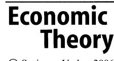
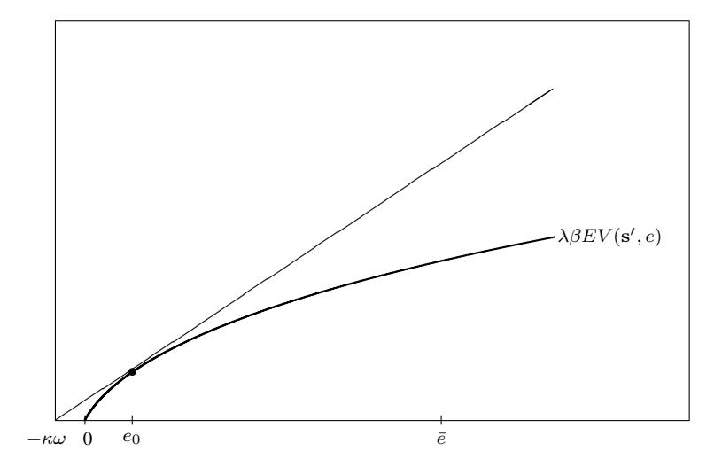
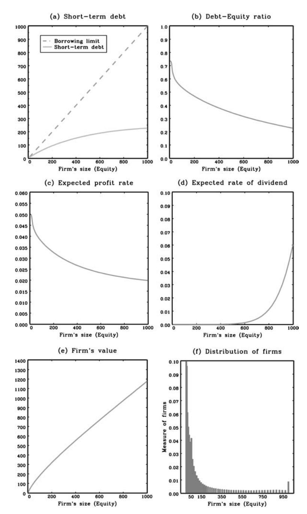
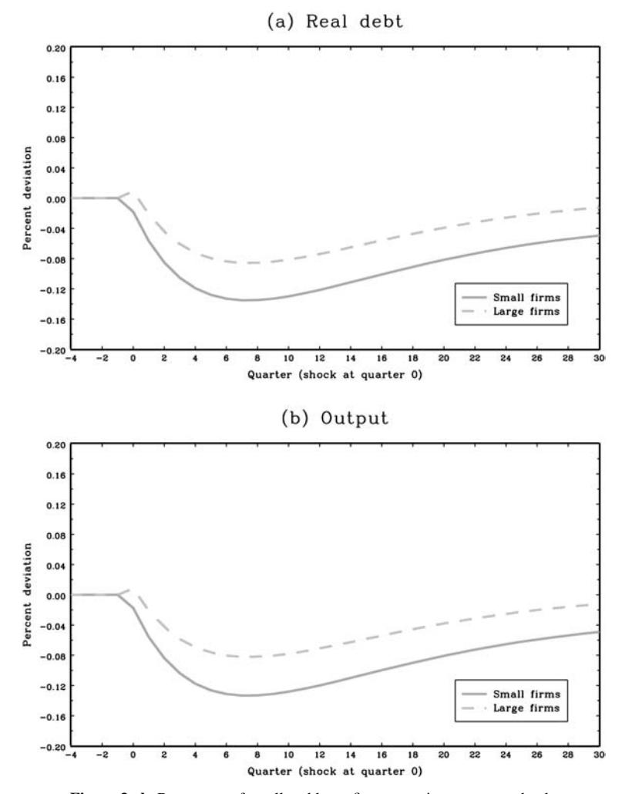
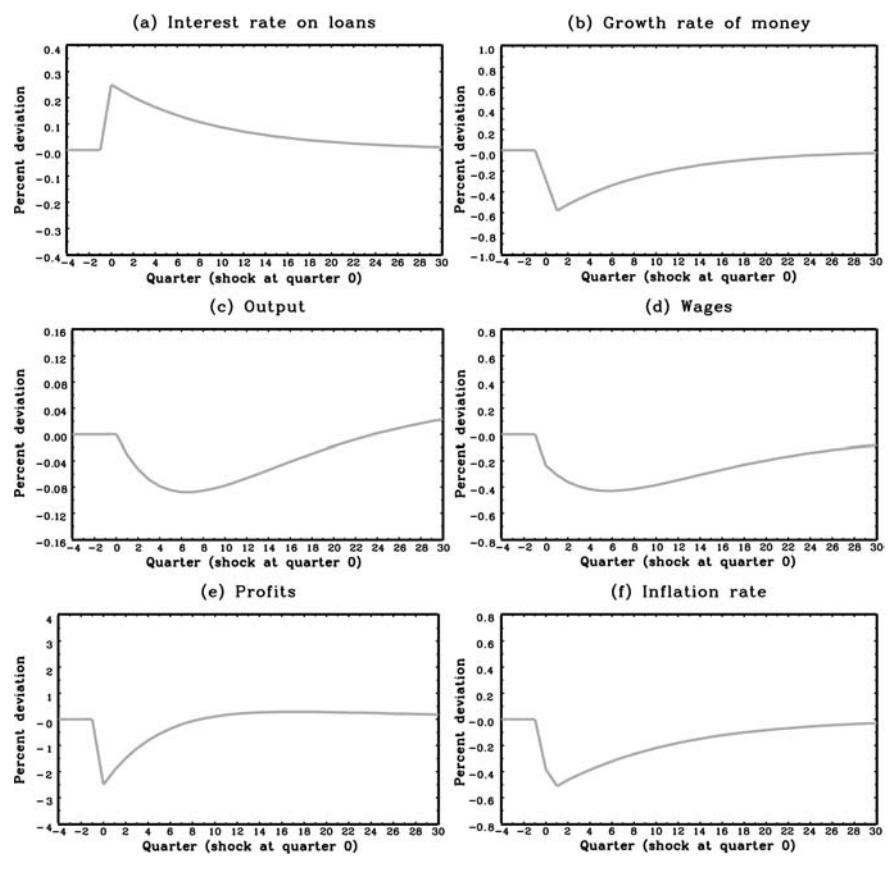
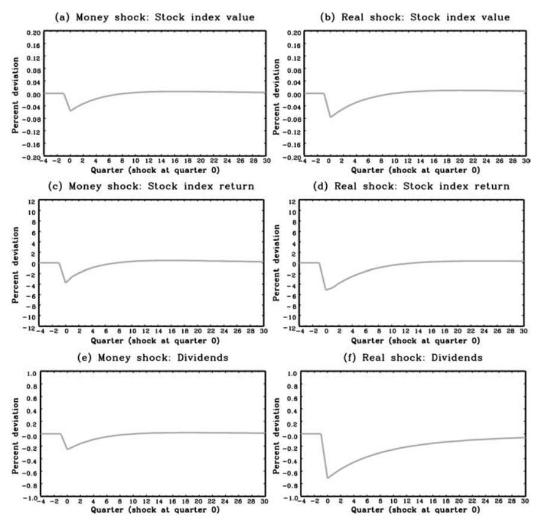

DOI: 10.1007/s00199-004-0553-x Economic Theory **27**, 243–270 (2006)

# **Monetary policy and the financial decisions of firms**

## **Thomas F. Cooley**1 **and Vincenzo Quadrini**2

- 1 Stern School of Business, NYU, New York, NY 10012, USA (e-mail: tcooley@stern.nyu.edu)
- 2 Marshall School of Business, USC, Los Angeles, CA 90089, USA (e-mail: quadrini@usc.edu)

Received: November 20, 2003; revised version: August 26, 2004

**Summary.** In this paper we develop a general equilibrium model with heterogeneous, long-lived firms where financial factors play an important role in their production and investment decisions.When the economy is hit by monetary shocks, the response of small and large firms differs substantially, with small firms responding more than big firms. As a result of the financial decisions of firms, monetary shocks have a persistent impact on output. Another finding of the paper is that monetary shocks lead to considerable volatility in stock market returns.

**Keywords and Phrases:** Monetary policy, Firm financing, Propagation mechanism.

**JEL Classification Numbers:** E5, G3.

## **Introduction**

Empirical studies of the financial decisions of firms have documented important differences in the behavior of large and small firms. It has been shown by Fazzari et al. (1988) and others that small firms are more profitable, pay fewer dividends, take on more bank debt, and invest more. Studies by Gertler and Gilchrist (1994), Gilchrist and Himmelberg (1996, 1998) have also shown that the investment decisions of small firms are more sensitive to cash flows and that they respond to monetary policy shocks very differently than do large firms. Because many of these authors identify small firms as *a priori* more likely to face financial constraints, these empirical features are widely interpreted as indirect evidence of frictions in

We have received helpful comments on earlier versions of this paper from Jeff Campbell, David Chapman, Thomas Cosimano, Joao Gomes, Boyan Jovanovic, Jos´e-V´ictor R´ios-Rull, and Harald Uhlig. *Correspondence to*: V. Quadrini

financial markets. These frictions are conjectured to be an important channel for the propagation of monetary policy shocks.

To investigate how financial frictions affect the propagation of monetary shocks, we study an economy in which financial frictions lead to firm heterogeneity. Firms are heterogeneous in the amount of equity capital they have in their business which in turn affects their financial decisions and production scale. The capital structure of firms changes endogenously over time as a result of their financial decisions and in response to idiosyncratic shocks. The model is in the spirit of models by Jovanovic (1982) and Hopenhayn (1992), in that shocks affect the dynamics of firms over time. The key difference is that, in this environment, heterogeneity is not generated by technological differences. Rather, firms are heterogeneous because they face different financial conditions.1

All firms have access to the same decreasing return-to-scale technology for producing a single homogeneous good. The firm's production plan is financed with funds borrowed from a financial intermediary. In deciding the optimal amount of debt, the firm faces a trade-off: on the one hand, more debt allows them to expand the production scale and to increase the expected profits; on the other, the increase in the amount of debt implies a higher volatility of profits to which the firm is averse. The aversion to the volatility of profits derives from the fact that the value of the firm is a concave function of profits. This trade-off induces firms to choose a different amount of financial leverage (debt-equity ratio) depending on the amount of equity they have in their business. Firms with less equity choose a higher debtequity ratio to take advantage of the higher return associated with smaller size. This feature of the financial decision of firms plays a crucial role in differentiating the responses of small and large firms to monetary shocks.

Firm financing and investment decisions determine how firms grow over time. Accordingly, any successful treatment of the financing decisions of heterogeneous firms should be consistent with an important set of observations about industry dynamics. Studies of the relationship between firm size and growth have overturned the conclusion of Gibrat's Law which holds that firm size and growth are independent. Studies by Hall (1987) and Evans (1987a), for example, show that the growth rate of manufacturing firms and their volatility is negatively associated with their initial age and size. Also, Davis et al. (1996) find that the rates of job reallocation are decreasing in the firm size and age. In Cooley and Quadrini (2001b) we study a similar environment but in a partial equilibrium setting and without aggregate shocks, and we establish that this model reproduces many of the salient features of industry dynamics that are observed in U.S. data. In particular, smaller firms grow faster, experience greater variability in their growth rates and they have higher rates of job reallocation. Moreover, the model is consistent with the observed financial and investment behavior of firms: we find that small firms take on more debt, distribute fewer dividends and their investment depends on the realization of cash flows, even after controlling for their future profitability.

1 Gomes (2001) studies a similar environment in which firm heterogeneity and financial decisions are central to understanding the behavior of firms investment behavior.

In addition to replicating the observed features of industry dynamics, the model economy developed in this paper suggests that firm heterogeneity is an important channel of transmission for monetary policy. We find that small firms are much more responsive to monetary shocks than large firms. One consequence of this heterogeneous behavior is that a large fraction of the changes in aggregate output induced by monetary shocks derives from the reaction of small firms. Moreover, due to the persistence of this reaction, the response of the aggregate economy to monetary shocks is highly persistent with aggregate output that displays a humpshape response.

The heterogeneous responses of firms to monetary policy occur for reasons related to the internal finance channel that has been analyzed in different contexts by Bernanke and Gertler (1989), Bernanke et al. (1998), Carlstrom and Fuerst (1997), Kiyotaki and Moore (1997). In these papers, however, firm heterogeneity is either exogenous or it does not play an important role. In contrast, in our model, firm heterogeneity is endogenous and it plays an key role in the transmission mechanism of monetary shocks.

The internal finance mechanism works as follows. The firm's ability to finance its production plan is related to the value of its assets. When the value of these assets increases – either because the price of the assets increases or because the firm reinvests more profits – the firm is able to expand its production plan. In our model, a fall in the nominal interest rate on loans decreases the interest payments of the firms and increases their profits. Because of reinvested profits, the next period financial capacity of firms increases, which in turn allows them to expand production. This mechanism, however, is more important for small firms because they are more levered.

The central role played by the financial structure in the transmission of monetary shocks highlights an important fact about the economic conditions under which the economy is more vulnerable to these shocks. Monetary shocks will have a larger impact during periods in which firms are more heavily indebted.

Although monetary shocks have real consequences in this economy, the effects are quantitatively small. This is consistent with the results of Sims (1992) and Leeper et al. (1996). In spite of their limited impact on the real sector of the economy, monetary shocks have a significant impact on stock market variables: monetary shocks generate fluctuations of stock returns that are much larger than the fluctuation of profits, dividends and aggregate output. This latter finding is consistent with the empirical evidence.2 The main mechanism through which monetary shocks influence the volatility of stock returns is by altering the factor with which agents discount dividends. Because dividends are paid with cash at the end of the period, the shareholder has to wait until the next period before being able to use these dividends for consumption. Consequently, changes in the nominal prices affect the real values of the dividends paid with cash. Because monetary shocks affect the inflation rate, in addition to the nominal lending rate, they have a significant impact on the market value of the firms, and therefore, on the stock market return. Thus,

2 Thorbecke (1997) and Hinkelman (1997), for example, find that monetary policy shocks have a significant effect on the stock market and Shanken (1990) shows that it affects the betas of portfolios of firms.

monetary shocks have a far greater impact on financial markets than their impact on the real economy would seem to warrant. This may provide some insights on the excess volatility puzzle of stock market returns as emphasized in LeRoy (1989) and Shiller (1981).

In the next section we describe the model economy to be studied and the decision problems facing households, firms, and financial intermediaries. We then describe the problem of the firms and the households in some detail and define the competitive equilibrium. After describing the calibration of the model, we present the properties of the artificial economy. In that section we describe the channels through which financial factors induce heterogeneous behaviors of firms over the business cycle.

## 1 The model economy

There are three sectors: the production sector, the household sector and the financial intermediation sector. Financial intermediaries intermediate liquid assets (money) between households and firms. Shares of the financial intermediaries and firms are owned by the households.

#### 1.1 Firms

At each point in time there is a continuum of firms that have access to the technology:

$$y = F(k, l, x, \varphi) \tag{1}$$

where  $\varphi$  is a non-negative idiosyncratic shock, k is the input of capital that depreciates at rate  $\delta$ , l is the input of labor and x is an intermediate input purchased from other firms. The shock is observed after the choice of the inputs. To simplify the analysis we assume that labor and the intermediate input are perfect complements to capital. More specifically, per each unit of capital the firm employs  $\gamma_l$  units of labor and  $\gamma_x$  units of intermediate goods. Therefore,  $l=\gamma_l k$  and  $x=\gamma_x k$ . Given this, the production technology can be rewritten as  $y=F(k,\varphi)$ .

The function F is strictly increasing and continuously differentiable in k and  $\varphi$ , strictly concave in k, and satisfies  $F(0,\varphi)=F(k,0)=0$ . The assumption that the function F is concave in k implies that the production technology displays decreasing returns-to-scale. The shock  $\varphi$  is independently and identically distributed with probability density  $\Gamma(\varphi)$ . The distribution is assumed to be log-normal.

Firms are characterized by the amount of capital, *e*, that they own. Henceforth, this capital is referred to as *equity*. The amount of equity changes over time as firms reinvest profits. The value of a firm will thus depend on the realization of the idiosyncratic shock and its dividend policy. To keep the problem tractable, we assume that retained earnings is the only source of increased equity for the firm. We motivate this assumption by the observation that firms mainly rely on the reinvestment of earnings for increasing equity.3

&lt;sup>3 Ross et al. (1993) and Smith (1977) document that firms raise more than 80% of equity from internal sources. Theoretically, this could be justified by assuming that there is a sufficiently high proportional cost to funds raised with external sources.

In addition to the capital directly owned, firms can increase (decrease) the input of capital by renting it from (to) other firms at the rental rate rk. By allowing firms to rent extra capital, we make sure that financial differences are the only factors that motivate firms to implement different production plans. Their production possibility is not technically constrained by the amount of physical capital they have accumulated until that point.

The purchase of the intermediate input has to be paid in advance and the firm borrows these funds from a financial intermediary.4 Accordingly, the firm faces the constraint b ≥ x = γxk, where b denotes the real value of liquid funds borrowed from the financial intermediary. By assuming that the intermediate input has to be paid in advance, the model captures the cost channel of monetary transmission that has been shown to be empirically relevant for the propagation of monetary shocks in the economy. See, for example, Barth and Ramey (2001).

The total amount of funds the firm can borrow is subject to an upper bound ¯b(e) (borrowing limit), which depends on the firm's equity e. For simplicity, we assume that this borrowing limit is such that the firm is always able to repay the debt at the end of the period, for any realization of the shock. Although the imposition of an exogenous borrowing limit may seem arbitrary, it can be justified by an enforcement argument similar to Kiyotaki and Moore (1997).5

The last assumption we make is that at the beginning of each period, and before implementing any production plan, the firm faces a probability η of becoming unproductive (exogenous exit). In that case the firm is liquidated with residual value e. Exiting firms are replaced by newly created firms with initial equity a0. The determination of the initial equity will be described in Section 2.2.

## *1.2 Households*

There is a continuum of homogeneous households of total measure 1, that maximize the expected lifetime utility:

$$E_0 \sum_{t=0}^{\infty} \beta^t u(c_t, 1 - l_t) \tag{2}$$

4 The assumption that the firm needs to finance the intermediate input, rather than the payment of wages as assumed in other models, is helpful for the calibration of the model. If the firm needs to borrow only to finance the advance payment of wages, in equilibrium the aggregate firms' debt would be small compared to their assets. By introducing the intermediate input and by assuming that the firm finances the purchase of this input with debt, we can calibrate the economy to obtain any desired aggregate debt to capital ratio.

5 For example, we can assume the following enforceability problem: after receiving the loan, the firm can distribute all the borrowed cash to the shareholders and declare bankruptcy. In that case, if the liquidation value of the firm's capital is smaller than the debt, the bank will realize a loss with probability one, independently of the interest rate charged in the contract. In order to prevent this problem, banks are willing to lend only up to a limit. The incentive-compatibility limit is equal to the value of the firm conditional on the firm implementing a non-deviating policy. Because the value of a firm is an increasing function of the capital it owns, to simplify the analysis the value of the firm's capital is taken as proxy for the current value of the firm.

where ct and lt are consumption and labor at time t, and β is the households's intertemporal discount factor.6 The utility function satisfies the standard properties. The household is endowed with one unit of working time that can be supplied to the market in return for the real wage rate w. Households' assets are of three types: cash, bank deposits, and a diversified portfolio of firm shares.

At the end of the period, each household holds an amount m of liquid assets (money). An amount d is deposited with a financial intermediary (bank) and earns the nominal interest rate rd. The amount m − d is available for transactions in the next period: the purchase of consumption goods requires money and the household faces the following cash-in-advance constraint:

$$pc \le m - d \tag{3}$$

where p is the nominal price.

The stock of deposits cannot be changed before the end of the next period. This is the assumption typically made in the class of monetary models known as "limited participation" models. At the end of each period, the household has available its bank deposits, inclusive of the interests, the wages, and the dividends received from firms. Denote by µ the initial portfolio of shares in existing firms. At the beginning of the period firms differ only in the amount of equity they own, and therefore, µ represents the distribution or *measure* of firms over e. The dividends paid by this portfolio are denoted by π(µ). After the purchase of new firms shares, the household's end-of-period money holding is:

$$m' = m + r_d d + p[\pi(\mu) + wl - i - c]$$
 (4)

where i is the real investment in new firms shares.7 The end-of-period money mis allocated to cash holding and deposits and a new period starts.

The evolution of the portfolio of firms' shares owned by the representative household depends on the initial portfolio µ and the investment in new firms i, that is, µ-= ψ(**s**, µ, i). We will define this function explicitly after the description of the entrance of new firms. Notice that the law of motion for the market portfolio also depends on the aggregate states **s**.

## *1.3 Financial intermediaries and the monetary authority*

There is a continuum of competitive financial intermediaries. At the end of each period, the financial intermediaries collect deposits from households, and use these funds to make loans to firms at the beginning of the next period. They also receive injections of liquid funds from the monetary authority. The sum of deposits and

6 Throughout we use small letters to denote individual state, choice variables and prices, and capital letters to denote aggregate variables.

7 At the end of the period, households could also trade in the shares of existing firms (old firms). However, because households are homogenous and they own the market portfolio, in equilibrium there is no trade. Therefore, we neglect these transactions in the household's budget constraint. We will re-examine these transactions in later sections, when we derive the market value of the firms' shares.

monetary injection determines the total quantity of loanable funds. These funds are lent to firms through a standard one-period debt contract at the interest rate  $r_l$ .

The intermediation sector is competitive, and, in equilibrium intermediaries do not make profits. This implies that the interest on loans  $r_d$  paid to the households is implicitly determined by the zero-profit condition:

$$(1 + r_d)D = (D + \Delta M)(1 + r_l) \tag{5}$$

where D is the aggregate stock of deposits and  $\Delta M$  is the aggregate transfer of money.

By controlling the monetary transfers, the monetary authority controls the lending rate  $r_l$ . The action of the monetary authority is specified as an exogenous process for the lending rate  $r_l$ .

Our financial intermediation sector is somewhat different from other limited participation models such as Fuerst (1992) and Christiano and Eichenbaum (1995). We assume that the monetary authority makes monetary transfers directly to the intermediaries proportionally to their deposits and the intermediaries can use these transfers to remunerate the depositors. The more common approach is to assume that the transfers are made directly to households. In this alternative environment, however, it is difficult to generate a persistent change in the interest rate by controlling the supply of money. Our assumptions facilitate this task. Alternatively, we could assume that there are adjustment costs in the stock of deposits as in Christiano and Eichenbaum (1992) but at the cost of making the model more complicated.

#### 2 The agents' problems

In this section we describe the optimization problems solved by firms and households. As is standard in monetary models, we normalize nominal variables (deposits, loans, cash holdings and the nominal price) by the pre-shock stock of money. The aggregate states of the economy are then given by the lending rate  $r_l$  chosen by the monetary authority, the beginning-of-period distribution of firms over equity  $\mu$ , and the nominal stock of deposits D. The set of aggregate state variables is denoted by  $\mathbf{s} = (r_l, \mu, D)$ .

#### 2.1 The firm's problem

The problem consists of maximizing the value of the firm for the shareholders by choosing the inputs of capital and labor, the intermediate good, and the amount of borrowing from the financial intermediaries. The value of the firm is the discounted expected values of dividends. Because dividends are paid at the end of the period with cash, the shareholders have to wait until next period before using this cash to buy consumption goods. This implies that one unit of real dividends paid at time t allows the shareholder to buy  $p_t/p_{t+1}(1+g_t)$  units of consumption goods at time t+1, where  $g_t$  is the growth rate of money. The term  $(1+g_t)$  derives from normalizing all nominal variables (including the prices) by the pre-shock stock of

money. Therefore, the expected utility at time t of one unit of real dividends paid at time t is equal to  $\beta E_t(p_t u_{c,t+1}/p_{t+1}(1+g_t))$ , where  $u_{c,t+1}$  is the marginal utility of consumption at time t+1. The term  $\beta E_t(p_t u_{c,t+1}/p_{t+1}(1+g_t))$  will be denoted by  $\omega(\mathbf{s})$  and it depends on the states of the economy  $\mathbf{s}$ . To determine the utility value of the firm's payments to the shareholders, we have to multiply these payments by  $\omega(\mathbf{s})$ .

Denote by  $V(\mathbf{s},e)$  the value of a firm with equity e, measured in terms of utility for the representative household. The optimization problem of a surviving firm can be written as:

$$V(\mathbf{s}, e) = \eta \cdot e \cdot \omega(\mathbf{s}) + (1 - \eta) \cdot \max_{\substack{k, b, \\ \pi(\varphi) \ge 0}} E\left\{\pi(\varphi) \cdot \omega(\mathbf{s}) + \beta V(\mathbf{s}', e')\right\}$$
(6)

subject to

$$b \in \left[\gamma_x k, \bar{b}(e)\right]$$

$$e' = (1 - \delta)e + F(k, \varphi) - w\gamma_l k - \gamma_x k - r_k(k - e) - r_l b - \pi(\varphi)$$

With probability  $\eta$  the firm becomes unproductive. In this case it distributes the residual equity to the shareholders and it closes down. If the firm remains productive – which happens with probability  $1-\eta$  – it chooses the production plan and the dividend policy. The production plan is chosen before observing the idiosyncratic shock  $\varphi$ . The dividend policy, instead, is chosen after observing the idiosyncratic shock. In the above problem we have formalized the different timing of these choices by making the dividends contingent on  $\varphi$ . In fact, choosing the dividends after the observation of the shock is equivalent to choosing the dividends in advance but for each realization of the shock. The dividend cannot be negative, which is equivalent to saying that the firm cannot raise equity with external sources.

The debt b is subject to two constraints: the borrowing constraint,  $b \leq \bar{b}(e)$ , and the cash-in-advance constraint for working capital,  $b \geq \gamma_x k$ . This second constraint derives from the assumption that the purchase of the intermediate input requires liquid funds that the firm borrows from the financial intermediary. Finally, the last equation defines the next period equity as a function of the production and dividend policy of the firm.

To solve this problem, the firm needs two other objects: the law of motion for aggregate states  $H(\mathbf{s})$  and the function  $Q(\mathbf{s})$  that gives the endogenous variables  $(w, r_k, g, p)$  as function of the states. The variable g is the growth rate of money which is endogenous as the monetary authority controls the lending rate  $r_l$ . These functions are general equilibrium objects and are taken as given by the firm.

In Cooley and Quadrini (2001b) we study a similar model, but in partial equilibrium without money, and we show that the optimal dividend policy of the firm assumes a simple form: Firms retain profits and build the equity of the firm until

&lt;sup>8 By choosing k and b the firm also chooses l and x because they are complements of k.

it reaches the optimal equity size  $\bar{e}(\mathbf{s})$ . The existence of the upper bound derives from the fact that the value of the firm is increasing and concave. Consequently, the marginal increase in the value of the firm is decreasing in e and there is a point,  $\bar{e}(\mathbf{s})$ , for which the firm is indifferent between increasing its size marginally and distributing dividends. This upper limit in the equity size of the firm is not exogenous but it depends on the aggregate states of the economy. The presence of the exogenous probability  $\eta$  of becoming unproductive guarantees the existence of this upper bound.

By imposing sufficient conditions for which the cash-in-advance constraint is binding, that is,  $b=\gamma_x k$ , and using the properties of the optimal dividend policy described above, the firm's problem can be expressed as the choice of the capital k and the upper bound  $\bar{e}$ , that is,

$$V(\mathbf{s}, e) = \eta \cdot e \cdot \omega(\mathbf{s}) + (1 - \eta) \cdot \max_{\bar{e}, k \le \frac{\bar{b}(e)}{\gamma_x}} E\left\{\pi(\varphi) \cdot \omega(\mathbf{s}) + \beta V(\mathbf{s}', e')\right\}$$
(7)

subject to

$$\pi(\varphi) = \max \left\{ 0, (1 - \delta + r_k)e + F(k, \varphi) - [w\gamma_l + (1 + r_l)\gamma_x + r_k]k - \bar{e} \right\}$$

$$e' = (1 - \delta + r_k)e + F(k, \varphi) - (w\gamma_l + (1 + r_l)\gamma_x + r_k)k - \pi(\varphi)$$

where the constraint  $k \leq \bar{b}(e)/\gamma_x$  is the borrowing limit. As in the previous program, the firm takes as given the law of motion for the aggregate states  $H(\mathbf{s})$  and the function  $Q(\mathbf{s})$  determining the aggregate prices and the growth rate of money.

This new formulation highlights the mechanism underlying the dynamics of the firm. When the firm is successful and makes profits, it will reinvest these profits and it grows in size. On the other hand, when the firm is not successful and realizes losses, the firm has to use its equity to cover the losses and becomes smaller. Therefore, large firms are those that experienced a history of good realizations of the idiosyncratic shock.

#### 2.2 Entry of new firms

The creation of a new firm requires an initial investment  $\kappa$ , which is sunk. We also assume that, once a new firm is created, it becomes productive only with probability  $\lambda$ . If the firm becomes productive, it has access to the same production technology and faces the same optimization problem as existing firms.

9 Notice that in equilibrium firms always prefer to accumulate physical capital, rather than liquid funds. If firms prefer to accumulate liquid funds, then the demand for rental capital would be higher than its supply and this would drive the rental rate up. As the rental rate of capital increases, firms will find more convenient to keep their equity in the form of physical capital rather than liquid funds.

The presence of the fixed cost  $\kappa$  is motivated by technical considerations. Without this cost, the optimal size of a new firm in terms of capital would be zero in the limit and the return from creating new firms would go to infinity. The size of all firms would collapse to the size of new entrants and there would not be heterogeneity. The exogenous probability of failure is introduced to control for the optimal size of new entrants: When  $\lambda$  is one, the optimal size of new entrants would be the maximum size  $\overline{e}$ , while in the data new firms are generally small. With a sufficiently small  $\lambda$ , however, the size of new firms will be small. We justify this probability with the empirical observation that young firms face a lower survival rate than old firms.

In each period there is an optimal size (in terms of equity) of new firms denoted by  $e_0$ . This is the equity size that maximizes the present return from creating new firms. 10 Because the households purchase a diversified portfolio, the cost (in terms of utility) of a new firm of size e is  $(\kappa + e)\omega(\mathbf{s})$ . The value of this firm is the next period value of an existing firm of that size, discounted to the current period, that is,  $\lambda \beta EV(\mathbf{s}',e)$ . Therefore, the present return from creating a new firm is  $\lambda \beta EV(\mathbf{s}',e)/(\kappa+e)\omega(\mathbf{s})$ . The optimal size is determined by maximizing this return, that is,

$$e_0 = \arg\max_{e \succ 0} \left\{ \frac{\lambda \beta EV(\mathbf{s}', e)}{(\kappa + e)\omega(\mathbf{s})} \right\}$$
 (8)

Figure 1 illustrates graphically how the optimal size of new firms is determined. The figure plots the term  $\lambda\beta EV(\mathbf{s}',e)$ , which is the current value (in terms of utility) of a newly created firm. The concavity of V implies that this term is also concave in e. The optimal size of new firms is given by the value of equity for which the line departing from  $-\kappa\omega(\mathbf{s})$  is tangent to the curve  $\lambda\beta EV(\mathbf{s}',e)$ . This is because the current return from creating a new firm of size e is equal to the slope of the line departing from  $-\kappa\omega(\mathbf{s})$  and crossing the curve at the point e. As can be verified from the picture, the line with the highest slope is the one tangent to the value curve  $\lambda\beta EV(\mathbf{s}',e)$ .

New firms are created until the value of a new firm of size  $e_0$  is equal to its cost, and in equilibrium the following arbitrage condition has to be satisfied:

$$(\kappa + e_0)\omega(\mathbf{s}) = \lambda \beta EV(\mathbf{s}', e_0)$$
 (9)

Therefore, in equilibrium, the slope of the tangent line to the curve  $\lambda \beta EV(\mathbf{s}',e)$  departing from  $-\kappa \omega(\mathbf{s})$  is equal to  $\omega(\mathbf{s})$ . Simple comparative static using Figure 1 shows that an increase in  $\lambda$  raises the value curve of new firms and increases the optimal size of new entrants. When  $\lambda=1$ , the optimal size of new firms is equal to the upper bound  $\bar{e}$ . This is because the upper bound is at the point in which the slope of  $\beta EV(\mathbf{s}',e)$  is equal to  $\omega(\mathbf{s})$ . Both variables  $e_0$  and  $\bar{e}$  depend on the aggregate states of the economy and they fluctuate over the business cycle.

 $^{10}$  The optimal size of new firms is determined by the value of e that maximizes the value of the portfolio of new firms obtained with the investment of a fixed amount of funds. Because there is no limit in the number of new firms that can be created, the problem consists of maximizing the surplus of the portfolio of all new firms that can be obtained with a fixed amount of resources.

**Figure 1.** Optimal size of new firms

## *2.3 The household's problem and general equilibrium*

Households choose the supply of labor, consumption, investment in new firms, deposits and cash holding. Households also trade in shares of existing firms. However, because in equilibrium they hold the same portfolio of shares, in this section we ignore these potential transactions. The individual states of the households are the stock of nominal assets, m (cash and deposits), the nominal stock of deposits, d, and the initial portfolio of shares, µ. The optimization problem is:

$$W(\mathbf{s}, m, d, \mu) = \max_{c, l, i, d'} \left\{ u(c, 1 - l) + \beta EW(\mathbf{s}', m', d', \mu') \right\}$$
 subject to

$$pc \le m - d$$

$$p(c+i) + (1+g)m' = m + pwl + r_d d + p \pi(\mathbf{s}, \mu)$$

$$\mu' = \psi(\mathbf{s}, \mu, i)$$

where i denotes the investment in new firms' shares and π(**s**, µ) is the dividend payments given the household portfolio µ. These are obtained by integrating the dividend payments of all firms included in the portfolio.

The first two equations in the optimization problem are the cash-in-advance constraint and the budget constraint. The end-of-period stock of nominal assets mis multiplied by the gross growth rate of money 1+g as a result of normalizing all nominal variables by the aggregate pre-shock stock of money M. The last equation defines the evolution of the household's portfolio of the firms' shares. The households, as the firms, take as given the law of motion for the aggregate states  $H(\mathbf{s})$  and the function  $Q(\mathbf{s})$  determining the prices and the growth rate of money.

Under the condition for which the cash-in-advance constraint is binding, the first order conditions with respect to l, i and d' are:

$$-u_{l,t} = w \cdot E_t \left( \frac{\beta u_{c,t+1} p_t}{(1+g_t) p_{t+1}} \right)$$
 (11)

$$E_t \left( \frac{\beta u_{c,t+1} p_t}{(1+g_t) p_{t+1}} \right) = \beta E_t W_{\mu'} \psi_i \tag{12}$$

$$E_t\left(\frac{u_{c,t+1}}{p_{t+1}}\right) = E_t\left(\frac{\beta(1+r_{d,t+1})u_{c,t+2}}{(1+g_{t+1})p_{t+2}}\right)$$
(13)

The term  $W_{\mu'}$   $\psi_i$  in the second condition is the marginal value from investing in new firms. This must be equal to the utility cost from having less cash to buy consumption goods in the next period, that is,  $\beta u_{c,t+1} p_t/(1+g_t) p_{t+1} = \omega(\mathbf{s}_t)$ . As we have seen in Section 2.2, the marginal return, in utility terms, from investing in new firms must be equal to  $\lambda \beta E_t V(\mathbf{s}_{t+1}, e_{0,t})/(\kappa + e_{0,t})$ . See the arbitrage condition (9).

The definition of equilibria follows.

**Definition 2.1 (Recursive equilibrium)** A recursive competitive equilibrium for this economy consists of:

- Decision rules  $c(\mathbf{s}, m, d, \mu)$ ,  $l(\mathbf{s}, m, d, \mu)$ ,  $i(\mathbf{s}, m, d, \mu)$ ,  $d'(\mathbf{s}, m, d, \mu)$ , and value function  $W(\mathbf{s}, m, d, \mu)$  for households;
- Decision rules  $k(\mathbf{s}, e)$ ,  $\bar{e}(\mathbf{s})$  and value function  $V(\mathbf{s}, e)$  for firms;
- Initial equity of new firms  $e_0(\mathbf{s})$ ;
- Function  $Q(\mathbf{s})$  for  $(w, r_k, g, p)$ ;
- Law of motion  $H(\mathbf{s})$  for the aggregate states  $\mathbf{s} = (r_l, \mu, D)$ . Such that:
- The rules  $c(\mathbf{s}, m, d, \mu)$ ,  $l(\mathbf{s}, mu, d, \mu)$ ,  $i(\mathbf{s}, mu, d, \mu)$  and  $d'(\mathbf{s}, mu, d, \mu)$  solve problem (10) and  $W(\mathbf{s}, mu, d, \mu)$  is the associated value function;
- The rules  $k(\mathbf{s}, e)$  and  $\bar{e}(\mathbf{s})$  solve the firm's optimization problem (7) and  $V(\mathbf{s}, e)$  is the associated value function;
- The initial equity of new firms  $e_0(\mathbf{s})$  satisfies the arbitrage condition  $(\kappa + e_0)\omega(\mathbf{s}) = \lambda \beta EV(\mathbf{s}', e_0)$ ;
- Prices are competitive and the markets for loans, rental capital, labor, and final goods clear, that is,

$$\int_{e} \gamma_x k(\mathbf{s}, e) \mu(e) = (D + \Delta M)/p$$

$$\int_{e} k(\mathbf{s}, e) \mu(e) = \int_{e} e \mu(e)$$

$$\int_{e} \gamma_l k(\mathbf{s}, e) \mu(e) = l(\mathbf{s}, 1, D, \mu)$$

$$c(\mathbf{s}, 1, D, \mu) + i(\mathbf{s}, 1, D, \mu) + \int_{e, \varphi} \left[ (1 - \eta) \cdot e'(\mathbf{s}, e, \varphi) - e \right] \Gamma(\varphi) \mu(e) = \int_{e, \varphi} F(k(\mathbf{s}, e), \varphi) \Gamma(\varphi) \mu(e)$$

where  $e'(\mathbf{s}, e, \varphi)$  is the next period equity of a firm with current equity e and shock  $\varphi$ .

- The law of motion for the aggregate states H(s) is consistent with individual decision rules of households, firms and financial intermediaries.

#### 3 Calibration

Given the complexity of the model, an analytical solution is not feasible. Accordingly, we solve the model using numerical methods. These methods are described in the appendix.

We calibrate the model assuming that a period is a quarter and the discount factor  $\beta$  is equal to 0.985. The household's per-period utility is specified as  $u(c,1-l)=\alpha\log(c)+(1-\alpha)\log(1-l)$ . The parameter  $\alpha$  is calibrated so that in the steady state the representative household spends 33% of the available time in market activities.

The borrowing limit is specified as b(e)=e and the production technology as  $F(k,\varphi)=\varphi h(k)$  where the shock  $\varphi$  is log-normally distributed with parameters  $\bar{\varphi}$  and  $\sigma_{\varphi}$ . The function h is assumed to be quadratic, that is,  $h(k)=k-Ak^2$ . The parameter A affects the degree of concavity of the production technology and we set it to 0.006. This parameter is not important for the main properties of the model. The other two parameters that characterize the production technology are  $\gamma_l$  and  $\gamma_x$ , that is the factors of proportionality between the inputs of labor and intermediate goods, and the capital input. After imposing an upper bound for equity  $\bar{e}=1,000$  (this acts like a normalization factor), these two parameters are calibrated jointly with the parameters  $\bar{\varphi}$  and  $\sigma_{\varphi}$  by imposing the following conditions: (a) the steady state capital-output ratio is equal to 12; (b) the largest firm employs 10,000 workers; (c) the average debt-equity ratio in the economy is 0.35; (d) small firms choose a leverage that is about twice the leverage chosen by the largest firm.

By imposing that the largest firm employs 10,000 workers, the model captures the range of firms that are thought to face stricter financial conditions (see Gertler and Gilchrist, 1994, for example). The parameter that is specially important in differentiating the leverage of small and large firms is  $\sigma_{\varphi}$ . A larger value of  $\sigma_{\varphi}$  implies smaller differences between small and large firms.

The depreciation rate of capital is set to 0.025 which is consistent with the values used in the business cycle literature. The exit probability  $\eta$  is set to 0.012 which is the average exit rate in the sample of manufacturing firms analyzed by Evans (1987a), on a quarterly basis.

The survival probability of a newly created firm,  $\lambda$ , is important in determining the size of new entrants: smaller values of  $\lambda$  imply a smaller size of new entrants. By fixing the value of this parameter at 0.6, we keep the size of new entrants relatively small as in the data. Although the survival probability of new firms in the first quarter of life is larger than 0.6, we should interpret this value as the survival

| Intertemporal discount rate       | β  | 0.985  |
|-----------------------------------|----|--------|
| Consumption/leisure share         | α  | 0.393  |
| Technology parameter              | A  | 0.006  |
| Technology parameter              | γl | 5.000  |
| Technology parameter              | γx | 0.340  |
| Mean idiosyncratic shock          | ϕ¯ | 0.490  |
| Standard deviation shock          | σϕ | 0.400  |
| Depreciation rate                 | δ  | 0.025  |
| Probability of exit               | η  | 0.012  |
| Survival probability of new firms | λ  | 0.600  |
| Firm initial set-up cost          | κ  | 13.079 |
|                                   |    |        |

**Table 1.** Calibration values for the model parameters

probability of new firms in the first few years of life. The set-up cost κ is determined residually so that the arbitrage condition for the entrance of new firms in the steady state equilibrium is satisfied, given the imposed distributional range of firms over equity e.

Finally, the lending rate is assumed to follow a first order autoregressive process with correlation parameter ρm = 0.9 and standard deviation σm = 0.0025. The full set of parameter values are reported in Table 1.

## **4 Steady state properties**

We begin by describing the main properties of the model in the steady state equilibrium. Some of these properties will be helpful to understand the main mechanism underlying the different response of small and large firms to monetary shocks.

The first panel of Figure 2 plots the value of debt and the borrowing limit as functions of equity. The value of debt is increasing in the equity size of the firm. However, this is not a "direct" consequence of the borrowing limit. In fact, the borrowing limit is binding only for extremely small firms, and most of the firms choose to borrow less than their limit.

To understand why firms do not borrow up to the limit, consider the trade-off that they face in deciding the production plan. By borrowing more the firm can expand the scale of production and increase the expected profits. On the other hand, a larger production scale implies an increase in the volatility of profits. Because the next period equity depends on the current realization of profits and the value of the firm is a concave function of equity (see panel e), the firm is averse to the fluctuation of profits. Therefore, in deciding whether to expand the scale of production by borrowing more, the firm compares the marginal increase in the expected profits with the marginal increase in its volatility (and therefore, in the volatility of next period equity). As the firm increases its equity and implements larger production plans, the marginal expected profits decrease because the production function displays diminishing returns. This implies that the firm becomes more concerned about the volatility of profits and borrows less in proportion to its equity. Thus,

**Figure 2a–f.** Properties of the model in the steady state equilibrium

as the firm grows, the composition of the sources of finance changes in favor of internal sources.11

Panel b plots the firm's leverage, that is, the ratio between debt and equity. Smaller firms choose a higher ratio. Although the increased leverage allows small firms to be more profitable (see panel c), their profits are more vulnerable to changes in the lending rate. This implies that interest rate shocks will affect small firms more heavily than large firms. This observation will be important for understanding the impulse responses of small and large firms to monetary shocks described in the next section.

It is also interesting to note that small firms rent capital from large firms, that is, the capital input of small firms is larger than the capital they accumulated. If we interpret rental capital as commercial credit, then in the model larger firms provide commercial credit to smaller ones, which is consistent with the allocation of commercial credit across firms of different size observed in the real economy. In that sense, larger firms can be considered to be more liquid than smaller firms.

Panel d plots the expected dividend rate, that is, the dividends that the firm expects to pay before the realization of the idiosyncratic shock, as a fraction of equity. The dividend rate is increasing in the size of the firm. This is because, as observed in Section 2.1, the optimal policy consists of retaining the earnings until the firm reaches the maximum size e¯. This policy derives from the concavity of the firm's value, as shown in panel e, which in turn derives from the concavity of the production function. Note also that, in this economy, firms with higher profits invest more, independently of their future profitability. In this respect the model is consistent with the empirical findings of Fazzari et al. (1988) and Gilchrist and Himmelberg (1996, 1998) for which cash flows have a significant impact on firms' investment.

Finally, panel f plots the steady state size distribution of firms. If we exclude the largest class, the steady state distribution is skewed toward small firms which is also an empirical regularity of the data. The concentration of firms in the largest class occurs because in the model there is an upper bound to the size of the firm. In the data, of course, there exist firms that employ many more workers than the largest firm in the model (10,000 workers). Although the number of these firms is relatively small, they account for a large fraction of aggregate production. We interpret the largest firms in the model as representing the production of very big firms: the large share in production of these big firms is accounted for in the model by an increase in the number of firms rather than their size.

## **5 The response to monetary shocks**

Figure 3 reports the impulse responses of small and large firms after a shock that initially increases the lending rate rl by 25 basis points. Small firms are those

11 The fact that the borrowing limit is not directly binding does not mean that this limit is irrelevant in the model. Even though the firm is not currently constrained, there is always a non-zero probability that the firm could experience a sequence of bad shocks and its equity approaches zero. At this point the borrowing limit becomes binding. The possibility of being constrained prevents the firm from borrowing too much, as more debt makes this possibility more likely.

**Figure 3a,b.** Responses of small and large firms to an interest rate schock

employing fewer than 5,000 employees. The figure plots the responses of real debt and output, as deviations from the steady state, and shows that the reaction of small firms is significantly greater than large firms. This is consistent with the empirical findings of Gertler and Gilchrist (1994).12

This asymmetric response occurs for the reasons articulated earlier. The increase in the interest rate decreases the firms profits, which in turn reduces their next period equity. Given the reduced value of equity, firms borrow less in the next period. This is the internal finance mechanism emphasized in Bernanke and Gertler (1989), Bernanke et al. (1998), Carlstrom and Fuerst (1997) and Kiyotaki and

12 The use of alternative variables, such as capital, output or assets, to discriminate between small and large firms would not change the results. This is because these variables are monotonically related to employment.

**Figure 4a–f.** Responses of aggregate variables to an interest rate shock

Moore (1997). As observed in the previous section, small firms are more heavily indebted than large firms (higher leverage). Consequently, changes in the interest rate imply a larger impact on the interest burden of small firms (in proportion to the equity of the firm), which in turn implies a larger impact on their next period equity.

Figure 4 plots the responses of several aggregate variables to a monetary shock. The pattern of the lending rate is shown in panel a. Because the lending rate follows an exogenous autoregressive process, after the unexpected increase, it returns asymptotically to the steady state. In keeping with the limited participation structure of the monetary sector, the increase in the nominal interest rate requires a fall in the growth rate of money as shown in panel b. Following a monetary contraction, output, hours, wages, profits and prices fall. These responses are consistent with the empirical findings of Christiano et al. (1996a).

It is interesting to observe that the response of output follows a hump-shaped pattern. This is a consequence of the internal finance mechanism, as outlined above, through which shocks get propagated in the economy. The persistence of the interest rate process is obviously important to generate the hump. In the case of an i.i.d. Price index

Inflation

0.21

0.44

|               | Standard deviation      |            |             |              |  |
|---------------|-------------------------|------------|-------------|--------------|--|
|               | Money shock             | Real shock | Both shocks | U.S. Economy |  |
| Output        | 0.11                    | 1.61       | 1.62        | 1.67         |  |
| Consumption   | 0.62                    | 1.26       | 1.40        | 0.84         |  |
| Investment    | 2.38                    | 3.77       | 4.49        | 8.24         |  |
| Wage rate     | 0.51                    | 1.22       | 1.33        | 0.86         |  |
| Profits       | 3.08                    | 5.34       | 6.20        | 9.15         |  |
| Capital share | 0.84                    | 1.12       | 1.46        | 0.70         |  |
| Price index   | 0.74                    | 0.75       | 1.06        | 1.39         |  |
| Inflation     | 0.64                    | 0.72       | 0.97        | 0.57         |  |
|               | Correlation with output |            |             |              |  |
|               | Money shock             | Real shock | Both shocks | U.S. Economy |  |
| Consumption   | 0.28                    | 0.94       | 0.84        | 0.84         |  |
| Investment    | -0.06                   | 0.89       | 0.74        | 0.91         |  |
| Wage rate     | 0.84                    | 0.93       | 0.88        | 0.27         |  |
| Profits       | -0.06                   | 0.90       | 0.77        | 0.74         |  |
| Capital share | -0.85                   | 0.54       | 0.40        | 0.15         |  |
|               |                         |            |             |              |  |

**Table 2.** Business cycle properties of the artificial economy

Notes: Statistics for the model economy are computed on HP detrended data generated by simulating the model for 200 periods and repeating the simulation 200 times. The statistics are averages over these 200 simulations. Statistics for the U.S. economy are computed using HP detrended data from 1959.1 through 1996.4. Consumption includes consumer expenditures in non-durable and services. Consumer durables are classified as investment. Wages is the index of real compensation per hour in the non-farm business sector. Profits are corporate profits and the price index is the CPI index.

-0.85

-0.55

-0.59

-0.39

-0.51 0.34

shock the output response would not have the hump. However, even if there is not the hump, the impact of the shock on output would still persist for more than one period, thanks to the net-worth effect. This persistence would not arise in absence of financial frictions.

One feature that the model is not able to generate is a hump-shaped response of inflation. This requires a more sophisticated modeling of the labor market as recently shown, for example, in Trigari (2002).

We summarize the business cycle properties of this economy in the first column of Table 2, which reports the standard deviations and correlations with output of several aggregate variables. The model generates significant volatility in prices and inflation, but does not generate the volatility of output we observe in the data. The finding that monetary policy shocks contribute only marginally to the fluctuation of aggregate output, is consistent with the empirical studies of Sims (1992) and Leeper et al. (1996).

To investigate the impact of other shocks on the business cycle properties of the artificial economy, we extend the model by introducing an aggregate shock z to the production technology. The technology becomes  $y = \varphi h(zk)$ . The shock follows a

first order autoregressive process as in the standard real business cycle model. The autoregressive parameter is set to 0.95 and the standard deviation to 0.036. With this variability, the model generates output volatility that is similar to the data.

The business cycle statistics of the model with only technology shocks and with both monetary and technology shocks are reported in the second and third columns of Table 2. Once we consider both shocks, the model generates business cycle properties that are close to those observed in the data, including a positive correlation between output and capital income share.

#### 6 Financial markets

We now consider the response of financial markets to aggregate shocks. Stock market transactions take place at the end of the period, after the payment of dividends. Define  $q(\mathbf{s},e)$  the real market price of a share of a firm with equity e at the end of the period – i.e., after the payment of dividends. This price can be derived using the function  $V(\mathbf{s},e)$ , defined in (7), which is the utility value of a firm with total equity e at the beginning of the period, before uncertainty is resolved. The market price is related to this value by the following arbitrage condition:

$$q(\mathbf{s}, e)\omega(\mathbf{s}) = \beta EV(\mathbf{s}', e) \tag{14}$$

The left hand side of the equation is the cost in terms of utility of paying the price  $q(\mathbf{s},e)$  at the end of the period, where  $\omega(\mathbf{s}) = E(\beta p u_c'/p'(1+g))$  has been defined before. The term on the right hand side is the expected present value (also in terms of utility) of the firm. In equilibrium the cost of the firm must be equal to its value. Therefore,

$$q(\mathbf{s}, e) = \frac{\beta EV(\mathbf{s}', e)}{\omega(\mathbf{s})}$$
 (15)

Using  $q(\mathbf{s},e)$ , we can price any portfolio of firms' shares. We concentrate the analysis on a particular portfolio, the one composed of the steady state distribution of firms. The value of this portfolio, denoted by SM, is the sum of the real market prices of the firms' shares traded at the end of the period, weighted by the steady state distribution of firms. This measure of the stock market value is the closest to standard stock market indices like the S&P 500 index. 13 Formally, we compute it as:

$$SM_t = \int_e q(\mathbf{s}_t, e) \,\mu^*(e) \tag{16}$$

where  $\mu^*(e)$  is the steady state measure of firms. We will refer to SM as the stock market index.

&lt;sup>13 We have also considered an alternative portfolio consisting of the market portfolio. The difference between the market portfolio and the one considered in the paper is that in the former the composition and dimension change as the distribution and mass of firms in the economy change, while in the latter the composition and dimension are kept constant. Because the properties of these two portfolios are very similar, we report the results only for the steady state portfolio.

Figure 5a-f. Stock market responses to interest and technology shocks

To calculate the stock market return we need to compute the market price of this portfolio at the end of the next period, inclusive of the dividend payments. This value, denoted by  $\widehat{SM}_{t+1}$ , is given by:

$$\widehat{SM}_{t+1} = \int_{e} \frac{V(\mathbf{s}_{t+1}, e)}{\omega(\mathbf{s}_{t+1})} \, \mu^*(e)$$
(17)

The ex-post stock market return index is:

$$r_{t+1} = \frac{\widehat{SM}_{t+1} - SM_t}{SM_t} \tag{18}$$

Figure 5 reports the impulse responses of stock market prices, returns and dividend yields after a monetary shock that increases the lending rate (left panels) and after a negative technology shock (right panels). Each graph on the left-hand side uses the same scale of the graph on right-hand side. Consequently, the responses of the same variable to different shocks are comparable in magnitude.

Contractionary monetary and technology shocks induce a fall in the stock market value, return and dividend yield. We also observe that monetary and real shocks

|                      | Money shock                   | Real shock | Both shocks |
|----------------------|-------------------------------|------------|-------------|
|                      | Standard deviation            |            |             |
| Stock market prices  | 0.07                          | 0.11       | 0.13        |
| Stock market returns | 4.43                          | 7.27       | 8.55        |
| Dividend yields      | 0.31                          | 0.90       | 0.95        |
|                      | Correlation with money growth |            |             |
| Stock market prices  | 0.76                          | -0.61      | 0.01        |
| Stock market returns | 0.71                          | -0.60      | -0.01       |
| Dividend yields      | 0.79                          | -0.60      | -0.14       |
|                      | Correlation with inflation    |            |             |
| Stock market prices  | 0.85                          | -0.69      | -0.14       |
| Stock market returns | 0.80                          | -0.70      | -0.16       |
| Dividend yields      | 0.87                          | -0.68      | -0.29       |

Table 3. Cyclical properties of stock market prices, returns and dividend yield

*Notes*: In the data standard deviation of real stock market return 8.2%. Standard deviation of real dividend yield 0.7%. Correlation money growth-stock market return 0.16; correlation inflation-stock market return -0.28. Monthly observations from 1957.1 through 1994.4 compounded to quarterly frequencies.

produce fluctuations in stock market returns of similar magnitude. This is in contrast to the contribution of monetary shocks to the fluctuation of output in which real shocks are far more important than monetary shocks.

The first section of Table 3 reports standard deviations of the stock market index, return, profits and dividend yields for three versions of the economy: the economy with only monetary shocks, the economy with only technology or real shocks, and the economy with both monetary and technology shocks. The comparisons of these three versions of the model allow us to evaluate the importance of monetary and real shocks for stock market fluctuations. As expected from the analysis of the impulse responses, monetary shocks generate significant stock market fluctuations even though they are relatively unimportant for generating fluctuations in aggregate output. We also observe that, as in the data, the model generates much more volatility in stock market returns than in dividend yields.

The sensitivity of the stock returns to monetary shocks derives from the impact that these shocks have on the factor  $\omega(\mathbf{s})$ , with which dividends are evaluated. Ignoring the probability of exit for simplicity, the value of a firm in utility terms is  $V_t = \pi_t \cdot \omega_t + \beta E_t V_{t+1}$ . Using forward substitution we can rewrite it as:

$$V_t = \pi_t \,\omega_t + \beta E_t \,\pi_{t+1} \,\omega_{t+1} + \beta^2 E_t \,\pi_{t+2} \,\omega_{t+2} + \dots$$

and dividing by  $\omega_t$  we get:

$$\frac{V_t}{\omega_t} = \pi_t + \beta E_t \, \pi_{t+1} \, \frac{\omega_{t+1}}{\omega_t} + \beta^2 E_t \, \pi_{t+2} \, \frac{\omega_{t+2}}{\omega_t} + \dots$$

The term  $V_t/\omega_t$  is the price of the firm at time t before paying the dividends. As this expression makes clear, the dividend payments at time t+j are multiplied

by the factor ωt+j/ωt. Because current and future values of ω are affected by the inflation rates, and monetary shocks have a direct impact on these rates, the value of the firm is very sensitive to these shocks.

It is important to point out that this mechanism also works after a technology shock. In fact, technology shocks also induce changes in the nominal prices which in turn affect the factor ω. This contributes to generate the high variability of returns also in the case in which the economy is affected only by technology shocks.

Finally, the second and third sections of Table 3 report the correlations of stock market values, returns, and dividend yields with money growth and inflation. In the data stock market returns are positively correlated with the growth rate of money and negatively correlated with the inflation rate. These features of the stock market returns have been documented and analyzed in Marshall (1992) and Jovanovic and Ueda (1998).

The economy with only monetary shocks is able to generate the positive correlation of money growth with the stock market returns but does not generate the negative correlation with inflation. This is because a negative monetary shock is associated with a reduction in the growth rate of money and inflation, and it has a negative impact on the stock market returns. On the other hand, the economy with only technology shocks generates the opposite result with the stock market returns that are negatively correlated with both money growth and inflation. This is because a negative technology shock has a negative impact on the stock market returns and generates a persistent increase in the nominal prices and inflation. To prevent the nominal interest rate from raising (through the inflation expectations), the growth rate of money has to be increased. Therefore, the growth rate of money and the inflation rate are both negatively correlated with the stock market returns.

When we consider both shocks, the signs of these correlations depend on the relative importance of the two shocks. For the particular calibration, we have that inflation is negatively correlated with stock market returns and the correlation with the growth rate of money is basically zero. Finally, we should emphasize that if the monetary shocks take the form of innovations to the growth rate of money, rather than to the nominal interest rate, then with sufficient variability in the growth rate of money the model with both types of shocks will be able to generate the right correlations of the stock market returns with the growth rate of money and with the inflation rate.

## **7 Conclusion**

We have developed a general equilibrium model with heterogeneous, long-lived firms where financial factors play an important role in differentiating the production and investment decisions of firms, and their response to monetary shocks. We find that small firms are more sensitive to interest rate shocks than large firms because they are more leveraged.

The aggregate impact of monetary shocks on the real sector of the economy is not large. Nevertheless, monetary shocks cause considerable volatility in financial markets, particularly in stock market returns.

## A Appendix: Computational procedure

We describe first the procedure to solve for the steady state equilibrium and then the algorithm used to compute the equilibrium with aggregate uncertainty.

## A.1 Solving for a steady state equilibrium

The computational procedure consists of the following steps.

- 1. Guess initial values for w,  $r_k$ , and D. Then using equations (5), (11), (11) and (12) compute the steady state values of  $r_d$ ,  $r_l$ , p and C.
- 2. Guess the steady state upper bound for equity  $\bar{e}$  and choose a discrete grid in the space of firms' equity, i.e.,  $e \in \mathcal{E} \equiv \{e_1, ..., e_n\}$ . In this grid,  $e_1 = 0$  and  $e_n = \bar{e}$ .
- 3. Guess initial steady state values of debt  $b_i^*$ , for  $i \in \{1, ..., n\}$ .
- 4. Guess initial values of  $V_i$ , for  $i \in \{1, ..., n\}$ .
- 5. Approximate with a second order Taylor expansion the function  $\tilde{V}_i$  around the guessed values  $b_i^*$ . This function is defined as:

$$\tilde{V}_{i}(b) = \beta \sum_{j=1}^{n-1} \int_{e_{j}}^{e_{j+1}} \left[ V_{j} + \left( \frac{V_{j+1} - V_{j}}{e_{j+1} - e_{j}} \right) (x - e_{j}) \right] \Phi_{i}(b, dx)$$

$$+ \int_{e_{n}}^{\infty} \left[ (x - e_{n}) \cdot \omega + \beta V_{n} \right] \Phi_{i}(b, dx)$$
(19)

where  $\Phi_i(b,x)$  is the density function for the end-of-period firm's resources, that is,  $x=(1-\delta)e_i+F(k,\varphi)-r_k(k-e_i)-wl-(1+r_l)b$ . The function  $\tilde{V}_i$  is the approximated utility value of the firm with equity  $e_i$  and debt b, conditional on being productive (which happens with probability  $1-\eta$ ). The factor  $\omega$  is constant in the steady state and it is equal to  $\beta u_1/(1+g)$ . The value function V is approximated with piece-wise linear functions joining the grid points in which the value function is computed. The definition of  $\tilde{V}_i$  given in (19), takes as given the dividend policy of the firm consisting in retaining all profits until the firm reaches the size  $e_n$ .

- 6. Solve for the firm's policy  $b_i$  by differentiating the function  $\tilde{V}_i(b)$  with respect to b and eliminate b using this policy rule. Take the resulting values to guess new values of  $V_i$  and restart the procedure from Step 5 until all firms' value functions have converged.
- 7. After value function convergence, check whether the firm policies found above reproduce the guesses for the steady state values of debt  $b_i^*$ . If not, update this guesses and restart the procedure from Step 4 until convergence.
- 8. Check the optimality of the upper bound  $\bar{e}$  by verifying the following condition:

$$\beta \frac{\partial V(e)}{\partial e} \bigg|_{e = \bar{e}} = \omega \tag{20}$$

To check this condition, we compute the numerical derivative of V(e) at  $e_n$ , taking as given the value of  $b_n^*$  found above. If this condition is not satisfied, change the guess for  $\bar{e}$  and restart the procedure from Step 2 until convergence.

9. Find the optimal size of new firms  $e_0$  using the condition:

$$\lambda \beta \frac{\partial V(e)}{\partial e} \bigg|_{e = e_0} = \omega \tag{21}$$

- 10. Given the size of new entrants, iterate on the measure of firms until convergence. In each iteration, it is assumed that the measure of new entrants, denoted by  $\tilde{\mu}$ , is equal to the measure of exiting firms. Using  $\tilde{\mu}$ , we determine the investment in the creation of new firms, that is,  $I = \tilde{\mu}(\kappa + e_0)$ .
- 11. Using the steady state distribution of firms, compute the demand for labor  $L^d$ , rental capital  $K^d$  and the dividends  $\Pi$ . The measure of firms is rescaled so that the demand for labor is equal to the guessed value L.
- 12. At this point we verify three equilibrium conditions: 1) the aggregate budget constraint  $(1+g)=(1+rd)D+p(\pi+wL)-pI$ ; 2) the equilibrium condition in the market for rental capital  $K^d=0$ ; 3) the arbitrage condition for the creation of new firms  $\beta\lambda V(e_0)=(\kappa+e_0)\omega$ . If these conditions are not satisfied, we update the initial guesses for  $w, r_k, D$ , and restart the procedure from Step 1 until convergence.

## A.2 Solving for the equilibrium with aggregate uncertainty

Given the steady state equilibrium variables, we seek for Markovian decision rules of the firms and of the representative household. At each point in time the states of the economy are: (i) the lending rate  $r_l$ ; (ii) the distribution of firms over real equities represented by the measure  $\mu$ ; (iii) the nominal stock of deposits D. The set of states are denoted by  $\mathbf{s} = (r_l, \mu, D)$ .

Given the computational difficulties in deriving functions of measures, we need to use some numerical approximation. We follow Krusell and Smith (1998) and approximate the distribution  $\mu$  with some of its moments. We use two moments: the aggregate value of equity owned by new firms (new entrants), denoted by  $E^0$ , and the aggregate value of equity owned by old firms (firms with more than one period of age), denoted by  $E^1$ . Following is the description of the whole procedure.

- 1. Discretize the state space of firms' equity as in the computation of the steady state equilibrium described in the previous section.
- 2. Guess a linear function H(s) for the law of motion of the aggregate states and a linear function Q(s) for the variables  $(w, r_k, g, p, \omega)$ . The function H maps the current states  $s = (r_l, E^0, E^1, D)$  into next period states and Q maps the current states into the vector of variables  $\mathbf{h} = (w, r_k, g, p, \omega)$ . Given these functions, the firm's problem is well-defined.
- 3. Guess initial quadratic (firms' value) functions  $V_i(\mathbf{s})$ ,  $i = \{1, ..., n\}$ .
- 4. Given the guesses for  $V_i(\mathbf{s})$ , approximate with a second order Taylor expansion the function  $\tilde{V}_i$  defined as:

$$\tilde{V}_i(\mathbf{s}, \mathbf{h}, b, \mathbf{s}') = \tag{22}$$

$$\beta \sum_{j=1}^{n-1} \int_{e_j}^{e_{j+1}} \left[ V_j(\mathbf{s}') + \left( \frac{V_{j+1}(\mathbf{s}') - V_j(\mathbf{s}')}{e_{j+1} - e_j} \right) (x - e_j) \right] \Phi_i(\mathbf{s}, b, dx)$$
$$+ \int_{e_n}^{\infty} \left[ (x - e_n) \cdot \omega + \beta V_n(\mathbf{s}) \right] \Phi_i(\mathbf{s}, b, dx)$$

for  $i \in \{1,...,n\}$ , where b is the real firm's debt and  $\Phi_i(\mathbf{s},b,x)$  is the density function for the end-of-period resources. A simplifying assumption, here, consists of taking the size of the largest firm fixed at the steady state value  $\bar{e}$ .

- 5. Using the law of motion H, eliminate the next period states  $\mathbf{s}'$ . Then taking derivatives with respect to b of the functions  $\tilde{V}_i$ , derive the firm's decision rules  $b_i(\mathbf{s},\mathbf{h})$ , for  $i=\{1,...,n\}$ , which are linear functions of  $\mathbf{s}$  and  $\mathbf{h}$ . If the firm is financially constrained, then the policy rule is simply given by a linear approximation of the borrowing constraint.
- 6. Using the decision rules  $b_i(\mathbf{s}, \mathbf{h})$ , eliminate the variable b from the firms' objective function and, using the function Q, eliminate the vector of variables  $\mathbf{h}$ . After reducing, the functions  $\tilde{V}_i$  depend only on the states  $\mathbf{s}$ . These are used to form the new guesses for the firms' value functions. The procedure is then restarted from Step 4 until all value functions have converged.
- 7. Using the decision rules found in Step 5, derive the aggregate demand for loans by summing the individual decision rules of new and old firms weighted by the steady state distribution. In that way we get a linear demand for loans from new firms  $B_0^d(\mathbf{s}, \mathbf{h})$  and a linear demand for loans from old firms  $B_1^d(\mathbf{s}, \mathbf{h})$ . These two demands are then multiplied by the factors  $E^0/E^{0*}$  and  $E^1/E^{1*}$  respectively, and they are linearized around the steady state. By summing these two linear functions we get the aggregate demand for loans  $B^d(\mathbf{s},h)$ . The computational approximation, here, consists in assuming that when the mean values of equity for new and old firms increase, then the mass of all new and old firms increases proportionally. Using the demand for loans and the firms' demands for labor and rental capital, as well as the function linking the supply of loans to the supply of deposits, approximate with linear functions the demands for labor  $L^d(\mathbf{s}, \mathbf{h})$ , for rental capital  $K_d^d(\mathbf{s}, \mathbf{h})$  and deposits  $D^d(\mathbf{s}, \mathbf{h})$ . Furthermore, given the optimal decision rules of the firms, linearize the function for the next period value of equity of existing firms  $E^1(\mathbf{s}, \mathbf{h})$ , and the function of dividends distributed by existing firms  $\pi(s, h)$ . The derivation of these functions is similar to the derivation of the aggregate demands.
- 8. Using the derived demands for labor, rental capital, loans, the linearized household's budget constraint and  $\omega = \beta u_1 p/p'$ , impose market clearing conditions and compute the vector of variables  $\mathbf{h} = (w, r_k, g, p, \omega)$  as a function of the states  $\mathbf{s}$ , the labor supply L and the household dividends  $\pi$ . Denote this function by  $\mathbf{h} = \tilde{Q}(\mathbf{s}, L, \pi)$ .
- 9. Given the function  $Q(\mathbf{s}, L, \pi)$ , the dividend function  $\pi(\mathbf{s}, \mathbf{h})$  and the next period equity of all firms  $E^1(\mathbf{s}, h)$ , the household's decision rules for the variables

- L,  $E^{0'}$  and D' are derived using the household's first order conditions, that is, equations (11), (12), and (13). The decision rules are computed with the method of undetermined coefficient after linearizing these conditions around the steady state. In equation (13) it is assumed that the size of new entrants is fixed at the steady state value.
- 10. The solution of the household problem allows the derivation of L,  $E_0'$ , D' as linear functions of the states  $\mathbf{s}$ . These functions, together with the functions  $\tilde{Q}(\mathbf{s},L,\pi)$ ,  $\pi(\mathbf{s},\mathbf{h})$  and  $E^1(\mathbf{s},\mathbf{h})$ , allows us to derive the law of motion  $H(\mathbf{s})$  and the function  $Q(\mathbf{s})$ . These functions are then used as new guesses and the procedure is restarted from Step 3 until full convergence.

#### References

- Barth, M.J., Ramey, V.A.: The cost channel of monetary transmission. In: Bernanke, B.S., Rogoff, K. (eds.) NBER macroeconomics annual, pp. 199–239. Cambridge, MA: MIT Press 2001
- Bernanke, B., Gertler, M.: Agency costs, net worth, and business fluctuations. American Economic Review **79**(1), 14–31 (1989)
- Bernanke, B., Gertler, M., Gilchrist, S.: The financial accelerator in a quantitative business cycle framework. NBER Working paper #6455 (1998)
- Carlstrom, C.T., Fuerst, T.S.: Agency costs, neth worth, and business fluctuations: a computable general equilibrium analysis. American Economic Review **87**(5), 893–910 (1997)
- Christiano, L.J., Eichenbaum, M.: Liquidity effects and the monetary transmission mechanism. American Economic Review 80, 346–353 (1992)
- Christiano, L.J., Eichenbaum, M.: Liquidity effects, monetary policy, and the business cycle. Journal of Money, Credit and Banking 27(2), 1113–1136 (1995)
- Christiano, L.J., Eichenbaum, M., Evans, C.L.: The effects of monetary policy shocks: evidence from the flow of funds. Review of Economics and Statistics **78**(1), 16–34 (1996)
- Cooley, T.F., Quadrini, V.: Financial markets and firm dynamics. American Economic Review **91**(5), 1286–1310 (2001)
- Davis, S., Haltiwanger, J., Schuh, S.: Job creation and distruction. Cambridge, MA: MIT Press 1996 Evans, D.S.: Tests of alternative theories of firm growth. Journal of Political Economy 95(4), 657–674 (1987)
- Fazzari, S.M., Hubbard, G.R., Petersen, B.C.: Financing constraints and corporate investment. Brookings Papers on Economic Activity **88**(1), 141–195 (1988)
- Fuerst, T.S.: Liquidity, loanable funds, and real activity. Journal of Monetary Economics **29**(4), 3–24 (1992)
- Gertler, M., Gilchrist, S.: Monetary policy, business cycles, and the behavior of small manufacturing firms. Journal of Economics CIX(2), 309–340 (1994)
- Gilchrist, S., Himmelberg, C.P.: Evidence on the role of cash flow for investment. Journal of Monetary Economics 36(3), 541–572 (1996)
- Gilchrist, S., Himmelberg, C.P.: Investment: fundamentals and finance. In: Bernanke, B.S., Rotemberg J. (eds.) NBER macroeconomics annual, 223–262. Cambridge, MA: MIT Press 1998
- Gomes, J.F.: Financing investment. American Economic Review 91(5), 1263–1285 (2001)
- Hall, B.H.: The relationship between firm size and firm growth in the U.S. manufacturing sector. Journal of Industrial Economics **35**(4), 583–606 (1987)
- Hinkelman, C.: Monetary policy and asset prices. Simon School of Business, University of Rochester (1997)
- Hopenhayn, H.: Entry, exit, and firm dynamics in long run equilibrium. Econometrica **60**(5), 1127–1150 (1992)
- Jovanovic, B.: The selection and evolution of industry. Econometrica 50(3), 649-670 (1982)
- Jovanovic, B., Ueda, M.: Stock-returns and inflation in a principal-agent economy. Journal of Economic Theory 82(1), 223–247 (1998)

- Kiyotaki, N., Moore, J.H.: Credit cycles. Journal of Political Economy **105**(2), 211–248 (1997)
- Krusell, P., Smith, A.A.: Income and wealth heterogeneity in the macroeconomy. Journal of Political Economy **106**(5), 867–896 (1998)
- Leeper, E.M., Sims, C.A., Zha, T.: What does monetary policy do? Brookings Papers on Economic Activity **96**(2), 1–63 (1996)
- LeRoy, S.F.: Efficient capital markets and martingales. Journal of Economic Literature **XXVII**, 1583– 1621 (1989)
- Marshall, D.A.: Inflation and asset returns in a monetary economy. Journal of Finance **XLVII**(4), 1315– 1342 (1992)
- Ross, S.A., Westerfield, R.W., Jordan, B.D.: Fundamentals of corporate finance. New York: McGraw-Hill 1993
- Shanken, J.: Intertemporal asset pricing: an empirical investigation. Journal of Econometrics **45**, 99–120 (1990)
- Shiller, R.J.: Do stock prices move too much to be justified by subsequent changes in dividends? American Economic Review **71**, 421–436 (1981)
- Sims, C.A.: Interpreting the macroeconomic time series facts: the effects of monetary policy. European Economic Review **36**, 975–1011 (1992)
- Smith, C.W.: Alternative methods for raising capital: rights versus underwritten offerings. Journal of Financial Economics **8**(2), 273–307 (1977)
- Thorbecke, W.: On stock market returns and monetary policy. Journal of Finance **52**(2), 635–654 (1997)
- Trigari, A.: Equilibrium unemployment, job flows and inflation dynamics. Unpublished manuscript, IGIER-Universita' Bocconi (2002)