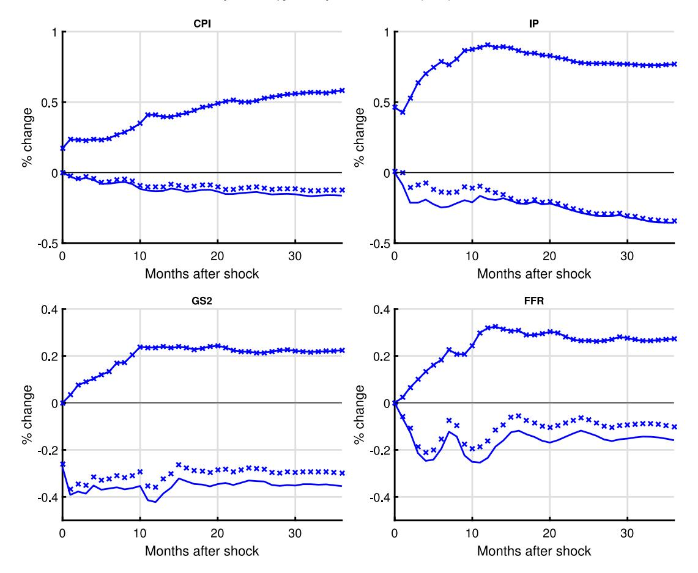
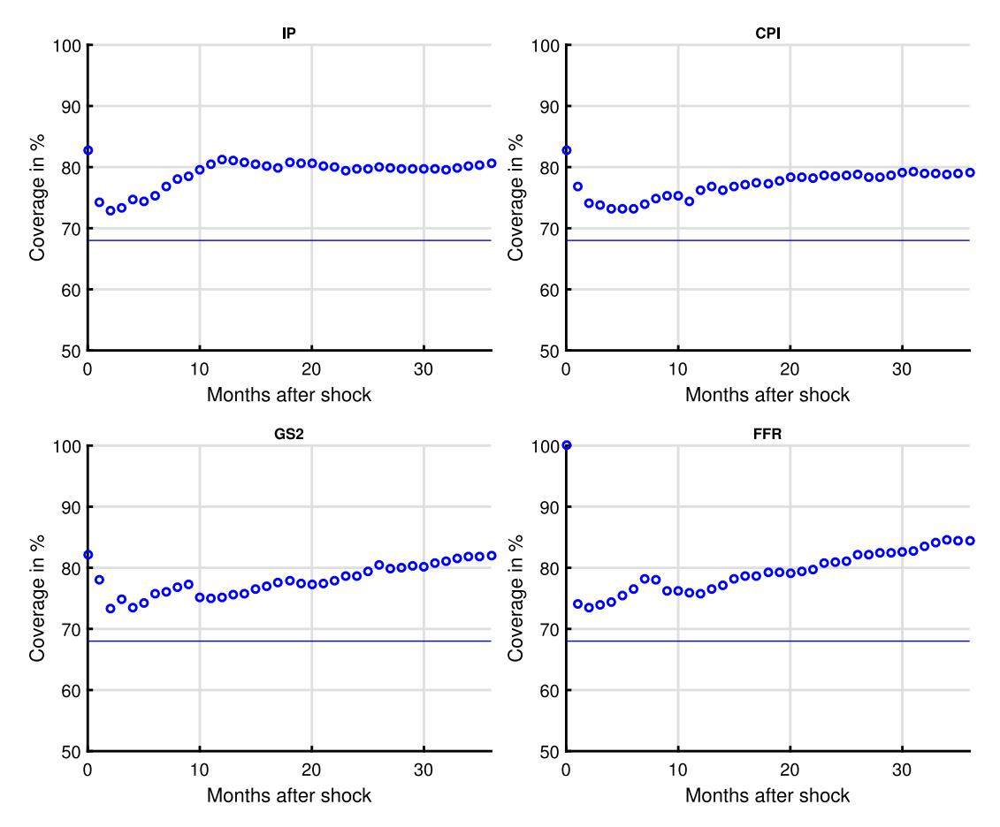
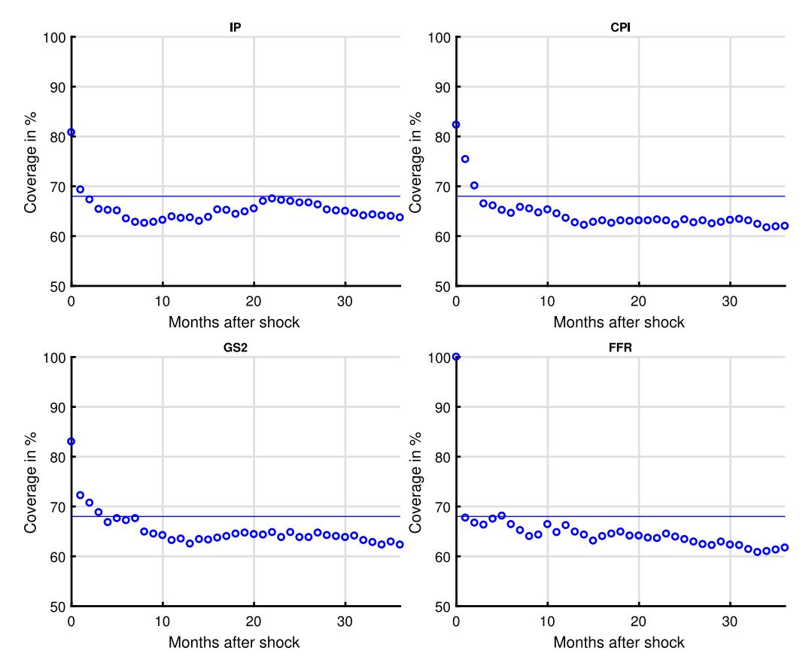
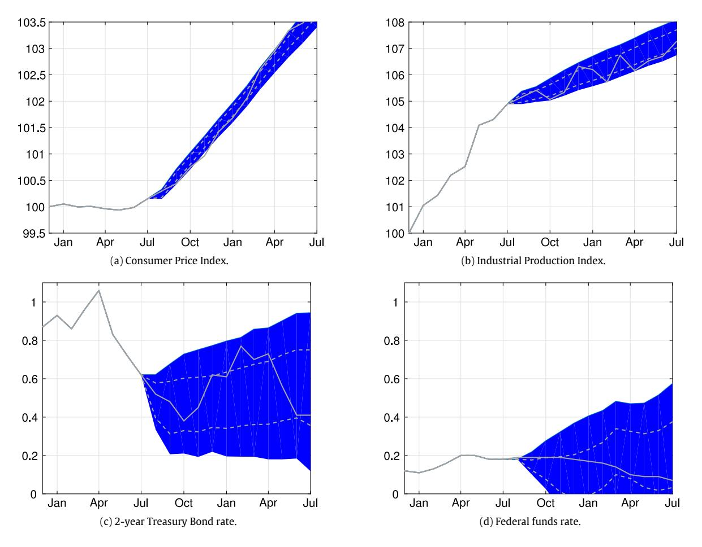

Contents lists available at [ScienceDirect](http://www.elsevier.com/locate/jeconom)

# Journal of Econometrics

journal homepage: [www.elsevier.com/locate/jeconom](http://www.elsevier.com/locate/jeconom)

# Delta-method inference for a class of set-identified SVARs[✩](#page-0-0)

Bulat Gafarov [a](#page-0-1) , Matthias Meier [b](#page-0-2) , José Luis Montiel Olea [c,](#page-0-3) [\\*](#page-0-4)

- a *University of California, Davis, Department of Agricultural and Resource Economics, United States*
- b *University of Mannheim, Department of Economics, Germany*
- c *Columbia University, Department of Economics, United States*

# a r t i c l e i n f o

*Article history:* Received 4 February 2016 Received in revised form 12 July 2017 Accepted 1 December 2017 Available online 6 January 2018

*JEL classification:* C1 C32

E47

*Keywords:* Set-identification Sign restrictions SVAR Directional differentiability Unconventional monetary policy

#### a b s t r a c t

We study vector autoregressions that impose equality and/or inequality restrictions to set-identify the dynamic responses to a single structural shock. We make three contributions. First, we present an algorithm to compute the largest and smallest value that an impulse-response coefficient can attain over its identified set. Second, we provide conditions under which these largest and smallest values are directionally differentiable functions of the model's reduced-form parameters. Third, we propose a deltamethod approach to conduct inference about the structural impulse-response coefficients. We use our results to assess the effects of the announcement of the Quantitative Easing program in August 2010.

© 2017 The Author(s). Published by Elsevier B.V. This is an open access article under the CC BY license [\(http://creativecommons.org/licenses/by/4.0/\)](http://creativecommons.org/licenses/by/4.0/).

# **1. Introduction**

An increasingly popular practice in empirical macroeconomics is to set-identify the parameters of a structural vector autoregression [SVAR] by means of exclusion and/or sign restrictions. Most studies working with this type of models have relied on Bayesian methods to construct posterior credible sets for the structural parameters of interest (for example, [Inoue](#page-11-0) [and](#page-11-0) [Kilian,](#page-11-0) [2013;](#page-11-0) [Arias](#page-11-1) [et](#page-11-1) [al.,](#page-11-1) [2017;](#page-11-1) [Baumeister](#page-11-2) [and](#page-11-2) [Hamilton](#page-11-2) [2015\)](#page-11-2).

A practical concern with Bayesian analysis in set-identified SVARs is that posterior inference continues to be influenced by prior beliefs even if the sample size is infinite [\(Poirier,](#page-11-3) [1998;](#page-11-3) [Gustafson,](#page-11-4) [2009;](#page-11-4) [Moon](#page-11-5) [and](#page-11-5) [Schorfheide,](#page-11-5) [2012\)](#page-11-5). This observation has motivated the study of alternative approaches to inference that dispense with the specification of a prior distribution over structural parameters that are only set-identified.

There are two existing proposals that characterize the estimation uncertainty of set-identified structural responses, without postulating a specific prior for the parameters of the structural model. On the one hand, [Granziera](#page-11-6) [et](#page-11-6) [al.](#page-11-6) [\(2017\)](#page-11-6) [GMS17] have

*E-mail addresses:* [bgafarov@ucdavis.edu](mailto:bgafarov@ucdavis.edu) (B. Gafarov), [m.meier@uni-mannheim.de](mailto:m.meier@uni-mannheim.de) (M. Meier), [jm4474@columbia.edu](mailto:jm4474@columbia.edu) (J.L. Montiel Olea). proposed a *frequentist* confidence interval for structural impulseresponse coefficients based on a moment-inequality-minimumdistance framework. On the other hand, [Giacomini](#page-11-7) [and](#page-11-7) [Kitagawa](#page-11-7) [\(2015\)](#page-11-7) [GK15] have proposed a *robust Bayes* credible interval that achieves a given credibility level regardless of the prior specified over the model's set-identified structural parameters.

We contribute to the analysis of set-identified SVARs by proposing a novel delta-method interval for the coefficients of the impulse-response function [IRF]. We show that our delta-method interval is *point-wise consistent in level* and, under certain regularity conditions, has *asymptotic robust Bayesian credibility* of at least the nominal level. Thus, our inference approach can be interpreted both from a frequentist and a robust Bayes perspective. We also argue that the computational cost of our procedure compares favorably with GMS17 and GK15.

Broadly speaking, our approach is based on a closed-form characterization of the endpoints of the identified set and their directional derivatives. Our delta-method interval – which may be viewed as a generalization of the pioneering work of [Lütkepohl](#page-11-8) [\(1990\)](#page-11-8) on delta-method inference for point-identified VARs – takes the form of a plug-in estimator for the identified set plus/minus standard errors.

The main limitation of our approach is that the delta-method interval is only defined for SVAR models that impose equality and inequality restrictions on a single structural shock (e.g., a monetary policy shock). Admittedly, this is problematic, as some popular applications of set-identified SVARs feature restrictions on multiple

✩ Recepient of the 2016 award for best paper in applied economics presented by young researchers at the 69th European Meeting of the Econometric Society.

\* Corresponding author.

structural innovations. In spite of this observation, single-shock set-identified models have been applied in several empirical studies: for example, to study the effects of monetary policy on output (Uhlig, 2005), the impact of monetary policy on the housing market (Vargas-Silva, 2008), the effects of labor market shocks on worker flows (Fujita, 2011), the effects of exchange rates on aggregate prices (An and Wang, 2012), and the effect of optimism shocks on business cycles fluctuations (Beaudry et al., 2011). Thus, we think there is room for our results to have an impact on empirical work.

To illustrate the usefulness of our main results, we estimate a monetary structural vector autoregression using monthly U.S. data from July 1979 to December 2007 (a sample that deliberately ends a half-year before the financial crisis begins). The goal of our exercise is to use pre-crisis data to learn about the responses of macroeconomic variables to shocks that have effects similar to the 'unconventional' monetary policy interventions implemented after the crisis.

We set-identify an unconventional monetary policy [UMP] shock as an innovation that decreases the two-year government bond rate upon impact, but has no effect over the nominal federal funds rate.2 We consider two additional sign restrictions on the contemporaneous responses of inflation and output. Namely, we assume that - upon impact - neither inflation nor output can respond negatively to a UMP shock. Since the model is only setidentified, our analysis effectively captures the effects of any historical economic shock that affected the economy in the same way as an UMP shock.

We apply our delta-method approach to construct a confidence interval for the dynamic responses of industrial production, inflation, the two-year government bond rate, and the nominal federal funds rate. We use our delta-method intervals to assess the effects of the announcement of the second part of the so-called Quantitative Easing program (QE2) in August 2010. Pre-crisis data turns out to be extremely useful to learn about the post-crisis response of macroeconomic aggregates to unconventional monetary policy.

The remainder of the paper is organized as follows. Section 2 presents an overview of the main methodological results in this paper. Section 3 introduces our empirical application, which is used as a running example throughout the paper. Section 4.1 presents our algorithm to evaluate the endpoints of the identified set. Section 4.2 establishes the differentiability properties of the endpoints. Section 4.3 presents our delta-method approach and establishes its asymptotic frequentist validity as well as its asymptotic robust Bayesian credibility. Section 5 presents the deltamethod intervals for the dynamic responses to the QE2 program. Section 6 concludes. All of our proofs are collected in Appendix A. Additional figures and implementation details of different procedures are collected in Appendix B.

GENERIC NOTATION: If A is a matrix,  $A_{ij}$  denotes the ijth element of A, vec(A) denotes the vectorization of A, and vech(A) denotes half-vectorization (applicable only if A is symmetric). The Kronecker product between matrices A and B is denoted by  $A \otimes B$ . The vector  $e_i^m \in \mathbb{R}^m$  denotes the *i*th column of the identity matrix – denoted  $\mathbb{I}_m$  – of dimension m. If B is a matrix of dimension  $n \times n$ ,  $B_i \equiv Be_i^n$  denotes its ith column. If the dimension of  $e_i^n$  is obvious, we ignore the superscript *n*.

### 2. Model, set-identifying restrictions, and overview of main theoretical results

This section presents the baseline SVAR model, discusses the class of set-identifying restrictions that we consider, and provides an overview of our main methodological results.

# 2.1. SVAR model and impulse-response coefficients

We study the *n*-dimensional structural vector autoregression (SVAR) with p lags; i.i.d. structural shocks distributed according to *F*: and unknown  $n \times n$  structural matrix *B*:

$$Y_{t} = A_{1}Y_{t-1} + \dots + A_{p}Y_{t-p} + B\varepsilon_{t},$$

$$\mathbb{E}_{F}[\varepsilon_{t}] = 0_{n \times 1}, \quad \mathbb{E}_{F}[\varepsilon_{t}\varepsilon'_{t}] \equiv \mathbb{I}_{n}.$$
(2.1)

The object of interest is the kth period ahead structural impulse response function of variable i to a particular shock i (e.g., a monetary policy shock):

$$\lambda_{k,i,j}(A,B) \equiv e_i'C_k(A)B_j,\tag{2.2}$$

where  $B_i \equiv Be_i$  and  $e_i$  and  $e_i$  denote the *i*th and *j*th column of  $\mathbb{I}_n$ . We refer to the parameter in (2.2) as the (k, i, j)-coefficient of the structural impulse-response function.

An auxiliary object in the estimation of (2.2) is the vector of reduced-form VAR parameters:

$$\mu \equiv (\text{vec}(A)', \text{vec}(\Sigma)')' \in \mathcal{M} \subseteq \mathbb{R}^d, \ A \equiv (A_1, A_2, \dots, A_p),$$
  
$$\Sigma \equiv BB'. \tag{2.3}$$

The reduced-form parameter space is denoted as  $\mathcal{M}$ . The parameter A denotes the autoregressive coefficients of the VAR model, while  $\Sigma$  denotes the covariance matrix of residuals. These parameters can be estimated directly from the data by multivariate Least-Squares (LS). Our main high-level assumption will be the approximate normality of the distribution of the LS estimator of  $\mu$ . This condition will be satisfied even in the presence of unit roots and possible cointegration of unknown form (see Sims et al., 1990; Toda and Yamamoto, 1995; Dolado and Lütkepohl, 1996; Inoue and Kilian 2002), and Proposition 7.1 in Lütkepohl (2007)). Our main assumption is less demanding than the asymptotic normality of the reduced-form impulse-responses in GMS17 (see Kilian (1998); Benkwitz et al. (2000)).4

# 2.2. Set-identifying restrictions

A common practice in empirical macroeconomics is to use equality and inequality restrictions to set-identify the structural IRFs in (2.2). An example of an equality restriction in a monetary VAR is that prices do not react contemporaneously to monetary policy shocks. An example of an inequality restriction is that a contractionary monetary policy shock cannot increase prices.

Let  $\mathcal{R}(\mu) \subseteq \mathbb{R}^n$  be the set of values of  $B_i$  that satisfy the inequality and equality restrictions. In our paper, the set  $\mathcal{R}(\mu)$ takes the form

$$\mathcal{R}(\mu) \equiv \left\{ B_j \in \mathbb{R}^n \mid Z(\mu)' B_j = \mathbf{0}_{m_z \times 1} \text{ and } S(\mu)' B_j \ge \mathbf{0}_{m_s \times 1} \right\}, \quad (2.4)$$

where  $Z(\mu)$  is a matrix of dimension  $n \times m_z$  and  $S(\mu)$  is a matrix of dimension  $n \times m_s$ . The matrix  $Z(\mu)$  collects the equality restrictions

$$C_k(A) \equiv \sum_{m=1}^k C_{k-m}(A) A_m, \quad k \in \mathbb{N},$$

SVAR applications for the oil market set-identify both demand and supply shocks using sign restrictions and elasticity bounds (Kilian and Murphy, 2012). The same is true for recent labor market applications Baumeister and Hamilton (2015), Also Mountford and Uhlig (2009) – one of the most cited applications of set-identified SVARs - use sign restrictions to identify a government revenue shock as well as a government spending shock, while controlling for a generic business cycle shock and a monetary policy shock.

&lt;sup>2 The paper focuses on the two-year rate as this variable changed considerably after the announcement of the second round of the Quantitative Easing program. See Krishnamurthy and Vissing-Jorgensen (2011).

&lt;sup>3 The transformation  $C_k(A)$  that appears in Eq. (2.2) is defined recursively by the

 $A_m=0$  if m>p; see Lütkepohl (1990), p. 116. 4 We would like to thank an anonymous referee for suggesting this clarification.

specified by the researcher (we assume that there are  $m_z$  of them). The matrix  $S(\mu)$  collects the inequality restrictions (we assume that there are  $m_s$  of them).

The simple formulation in (2.4) allows the researcher to incorporate the following identifying restrictions:

(a) Sign restrictions on the responses of variable *i* at horizon *k* to an impulse on the *j*th shock:

$$e_i'C_k(A)B_i \geq \text{ or } = 0,$$

as in Uhlig (2005).

(b) Long-run restrictions on the response of variable *i* to an impulse on the *i*th shock:

$$e'_{i}(\mathbb{I}_{n}-A_{1}-\cdots-A_{p})^{-1}B_{i}\geq \text{ or }=0,$$

as in Blanchard and Quah (1989).

(c) Short-run restrictions on the coefficients of the *j*th structural equation. For example, the contemporaneous coefficient of the *i*th variable in the *i*th structural equation:

$$e'_i(B')^{-1}e_i = e'_i\Sigma^{-1}B_i \ge \text{ or } = 0,$$

as in Rubio-Ramirez et al. (2015).

(d) Elasticity bounds as in Kilian and Murphy (2012); for example, for some  $b \in \mathbb{R}$ :

$$e'_iB_j/e'_{i'}B_j \ge b \iff (e_i - be_{i'})'B_j \ge 0,$$
  
provided  $e'_{i'}B_i > 0.$ 

SIGN-NORMALIZATION: In order to make sure that the impulse response of interest is with respect to a fixed-sign shock one should always impose a sign-normalization. Our framework allows at least two different ways of imposing such a normalization: (i) restricting the sign of the direct effect of the jth variable on the jth equation, or (ii) restricting the sign of an arbitrary IRF coefficient. The first type of sign normalization is covered in (c) as the short-run restriction  $e_j'B^{-1}e_j \geq 0$ , while the second is covered in (a) as a typical sign restriction on the IRFs.

#### 2.3. Overview of the main results

The main results in this paper concern the 'endpoints' of the identified set for a given structural impulse-response coefficient,  $\lambda_{k,i,j}$ . These endpoints (which we sometimes refer to as the *maximum and minimum* response) are defined as follows:

**Definition 1.** Given a vector of reduced-form parameters  $\mu$  we define the endpoints of the identified set for  $\lambda_{k,i,i}$  as the functions:

$$\overline{v}_{k,i,j}(\mu) \equiv \sup_{B \subset \mathbb{D}(X,K)} e'_i C_k(A) B e_j, \text{ s.t. } BB' = \Sigma \text{ and } B e_j \in \mathcal{R}(\mu),$$
 (2.5)

and

$$\underline{v}_{k,i,j}(\mu) \equiv \inf_{B \in \mathbb{R}^{n \times n}} e_i' C_k(A) B e_j, \text{ s.t. } BB' = \Sigma \text{ and } B e_j \in \mathcal{R}(\mu). \tag{2.6}$$

The functions  $\overline{v}_{k,i,j}(\mu)$ ,  $\underline{v}_{k,i,j}(\mu)$  correspond to the largest and smallest value of the structural parameter over its identified set.

Our delta-method approach is supported by the three results described in the abstract, which can be summarized as follows:

• Theorem 1 (Algorithm to Evaluate the Maximum and Minimum Response): We present an algorithm that allows a researcher to evaluate the endpoints of the identified set given a vector of reduced-form parameters. The algorithm – inspired by the earlier work of Faust (1998) – evaluates all different collections of 'active' constraints and selects those that generate the largest

(or smallest) value function—after checking that the inequality constraints not included in the set of active constraints are satisfied 5

Our algorithm does not require sampling from the space of structural matrices B. Instead, we show that  $\overline{v}_{k,i,j}(\mu)$  and  $\underline{v}_{k,i,j}(\mu)$  are the *value functions* of a mathematical program whose Karush-Kuhn-Tucker points can be described analytically—up to a set of active inequality constraints. More concretely, Lemma 1 shows that the maximum response for  $\lambda_{k,i,j}$  is equal to either plus or minus the function

$$v_{k,i,j}(\mu;r) \equiv \left( e_i' C_k(A) \Sigma^{1/2} M_{\Sigma^{1/2} r} \Sigma^{1/2} C_k(A)' e_i \right)^{1/2},$$

where

$$M_{\Sigma^{1/2}r} \equiv \mathbb{I}_n - \Sigma^{1/2} r (r' \Sigma r)^{-1} r' \Sigma^{1/2},$$

and r is a matrix collecting the gradient vectors of the constraints in  $\mathcal{R}(\mu)$  that are active at a maximum. Evaluating the function above for different values of r and checking the feasibility of the corresponding solution yields the maximum response. The minimum response is obtained analogously.

• Theorem 2 (Directional Differentiability of the Endpoints): We show that the functions  $\overline{v}_{k,i,j}(\cdot)$  and  $\underline{v}_{k,i,j}(\cdot)$  are directionally differentiable. More precisely, let  $X^*(\mu)$  denote the set of maximizers of program (2.5). Consider a sequence of 'perturbations' of  $\mu$  each of them in a 'direction'  $h_N \in \mathbb{R}^d$ . We show that for any sequence  $h_N \in \mathbb{R}^d$  such that  $h_N \to h \in \mathbb{R}^d$ , and any sequence  $t_N \to \infty$ :

$$t_N\Big(\overline{v}_{k,i,j}(\mu+h_N/t_N)-\overline{v}_{k,i,j}(\mu)\Big)\to \max_{x\in X^*(\mu)}\Big[\dot{v}_{k,i,j}(\mu;r(\mu;x))'h\Big],$$

where  $r(\mu; x)$  collects the gradient of the constraints that are active at a point x and  $\dot{v}_{k,i,j}(\cdot; r)'$  is a gradient of  $v_{k,i,j}(\cdot; r)$ . The proof of the result above builds on Lemma 2 which establishes the differentiability of the function  $v_{k,i,j}$  for a fixed set of active constraints. We relate the expression of the directional derivative with the generalized versions of the envelope theorems in the work of Fiacco and Ishizuka (1990) and Bonnans and Shapiro (2000). We argue that directional differentiability of the value functions (as opposed to full differentiability) arises due to the possibility that different structural models lead to the maximum (or minimum) response.

• Theorem 3 (Large-sample Properties): We establish the point-wise consistency in level and the asymptotic robust Bayes credibility of our delta-method interval. Our suggested interval takes the form

$$\begin{aligned} \mathsf{CS}_T(1-\alpha;\lambda_{k,i,j}) \equiv & \left[ \underline{v}_{k,i,j}(\widehat{\mu}_T) - z_{1-\alpha/2} \; \widehat{\sigma}_{(k,i,j),T} / \sqrt{T} \right], \\ & \overline{v}_{k,i,j}(\widehat{\mu}_T) + z_{1-\alpha/2} \; \widehat{\sigma}_{(k,i,j),T} / \sqrt{T} \right], \end{aligned}$$

where  $\widehat{\mu}_T$  is the typical LS estimator for the VAR reduced-form parameters,  $z_{1-\alpha/2}$  is the  $(1-\alpha/2)$  quantile of a standard normal, and  $\widehat{\sigma}_{(k,i,j),T}$  is our formula for the standard errors based on the directional derivatives.

# 3. Running example: unconventional monetary policy shocks

This section introduces our empirical application, which will be used as a running example to illustrate our assumptions and results

We consider a simple 4-variable model that includes the Consumer Price Index ( $CPI_t$ ), the Industrial Production Index ( $IP_t$ ), the

&lt;sup>5 Given a point x, we refer to any collection of binding restrictions defining  $\mathcal{R}(\mu)$  as *active* constraints at x. The term 'active constraints' or 'active set of constraints' is the common terminology used in numerical optimization; see p. 308 in Nocedal and Wright (2006).

**Table 1**Set-identification of an unconventional monetary policy shock: Restrictions.

| Series                    | Acronym | UMP | Notation               |
|---------------------------|---------|-----|------------------------|
| Consumer Price Index      | CPI     | +   | $e'_{1}B_{1} \geq 0$   |
| Industrial Production     | IP      | +   | $e_2^i B_1 \geq 0$     |
| 2-year Treasury Bond rate | 2yTB    | _   | $e_{3}^{7}B_{1}\leq 0$ |
| Fed Funds Rate            | FF      | 0   | $e_4'B_1 = 0$          |

Description: Restrictions on contemporaneous responses to a UMP shock. '0' stands for a zero restriction, '-' stands for a negative sign restriction and '+' for positive sign restriction.

2-year Treasury Bond rate  $(2yTB_t)$ , and the Federal Funds rate  $(FF_t)$ .6 We take a logarithmic transformation of  $CPI_t$ ,  $IP_t$  and then work with first differences for all variables. Thus, our vector of macro variables is

$$\begin{split} Y_t &\equiv (\ln \textit{CPI}_t - \ln \textit{CPI}_{t-1}, \quad \ln \textit{IP}_t - \ln \textit{IP}_{t-1}, \\ &2\textit{yTB}_t - 2\textit{yTB}_{t-1}, \quad \textit{FF}_t - \textit{FF}_{t-1})'. \end{split}$$

We set the number of lags equal to p=12 following Gertler and Karadi (2015). The time span of the monthly series is July 1979 to August 2008 (T=342). To keep our exposition as simple as possible, we ignore potential co-integration issues between short-term and long-term interest rates. Without loss of generality, we assume that the column of B corresponding to an UMP shock is the first column;  $B_1 \equiv Be_1$ . Our equality/inequality restrictions are summarized in Table 1. These sign restrictions can be justified by the DSGE model calibrated in the work of Bhattarai et al. (2015).

Baumeister and Benati (2013) study a related identification scheme. They consider a Bayesian SVAR to study an analogous 'spread' monetary policy shock that leaves the short-term nominal rate unchanged, but affects the spread between the ten-year Treasury-bond yield and the policy rate.

OUTLINE FOR THE REST OF OUR PAPER: We have already presented an overview of our main results and described our running example. In the remaining part of the paper, we formalize Theorems 1–3 and use them to conduct inference about the responses to an unconventional monetary policy shock.

# 4. Theorems

#### 4.1. Theorem 1

In this section we consider the problem of finding the maximum response to an impulse in the jth structural shock subject to  $m_z$  equality ('zero') restrictions and  $m_s$  inequality ('sign') restrictions. The focus on the maximum and the minimum is an intermediate step to conduct inference about the coefficients of the impulse-response function.

#### 4.1.1. Assumptions

We make two assumptions on the sign and zero restrictions allowed in the model:

**Assumption 1.** The choice set in program (2.5) is not empty at  $\mu$ .

This assumption simply requires that the identifying restrictions do not contradict each other.

Now, let  $e_1^{m_s}$ ,  $e_2^{m_s}$ , ...,  $e_{m_s}^{m_s}$  denote the  $m_s$  different columns of the identity matrix  $\mathbb{I}_{m_s}$ . Let e(k) denote an  $m_s \times k$  matrix formed by collecting any of the  $k \leq m_s$  columns of  $\mathbb{I}_{m_s}$ .

**Definition 2.** We say that  $Z(\mu)$  and  $S(\mu)$  are linearly independent at  $\mu$  if for any  $k \in \mathbb{Z}$ ,  $0 \le k \le m_s$  and any e(k) the matrix

$$R(\mu; e(k)) \equiv [Z(\mu), S(\mu)e(k)] \in \mathbb{R}^{n \times (m_z + k)}$$

has full rank.

**Assumption 2.**  $Z(\mu)$  and  $S(\mu)$  are linearly independent at  $\mu$ .

This assumption has two important implications. The first implication is that at most n-1 constraints can be active at a solution of program (2.5) (in particular, it implies  $m_z \le n-1$ ). The second implication is that it will allow us to characterize the maximum and minimum response in terms of *Karush–Kuhn–Tucker* conditions. We verify (and discuss) this assumption for the UMP example in Section 4.1.3.

#### 4.1.2. Algorithm

We now show that the value function  $\overline{v}_{k,i,j}(\mu)$  in (2.5) can be obtained by applying a simple algorithm. Let r be the matrix that collects all the columns of  $Z(\mu)$  and whatever columns of  $S(\mu)$  that are active at a solution of program (2.5). Our first observation is that the value function  $\overline{v}_{k,i,j}(\mu)$  equals plus or minus

$$v_{k,i,j}(\mu;r) = \left(e_i'C_k(A)\Sigma^{1/2}M_{\Sigma^{1/2}r}\Sigma^{1/2}C_k(A)'e_i\right)^{1/2},$$

and the corresponding maximizer equals either

$$x_+^*(\mu;r) \equiv \varSigma^{1/2}\Big(M_{\varSigma^{1/2}r}\Big) \varSigma^{1/2} C_k(A)' e_i \bigg/ v_{k,i,j}(\mu;r)$$

10

$$x_-^*(\mu;r) \equiv -\Sigma^{1/2} \Big( M_{\Sigma^{1/2} r} \Big) \Sigma^{1/2} C_k(A)' e_i / v_{k,i,j}(\mu;r),$$

where 
$$M_{\Sigma^{1/2}r} \equiv \mathbb{I}_n - \Sigma^{1/2} r (r' \Sigma r)^{-1} r' \Sigma^{1/2}$$
.

This result is shown formally in Lemma 1 in Appendix A.1 (where we also provide intuition). The lemma implies that if we knew the program's binding constraints, the value function could be computed directly – up to its sign – as  $v_{k,i,j}(\mu, r)$ . Moreover, the sign of value function is positive if  $x_+^*(\mu; r)$  satisfies the inequality restrictions that are not included in r, and negative otherwise.

Let R denote the set of all possible matrices r that could arise from collecting all of the  $m_z$  columns of the matrix  $Z(\mu)$  and k out of the  $m_s$  columns of the matrix  $S(\mu)$ , where  $0 \le k \le n - m_z - 1$ . Take any c larger than

$$\bar{c} \equiv \max_{i,k} \left( e_i' C_k(A) \Sigma C_k(A)' e_i \right)^{1/2}.$$

The parameter c will be used to 'penalize' candidate solutions that do not satisfy the inequality restrictions in  $S(\mu)$ .7 The penalization works as follows. Consider first the case in which  $v_{k,i,j}(\mu;r) \neq 0$ . Since  $x_+^*(\mu;r)$  and  $x_-^*(\mu;r)$  above are well defined, we can verify if these candidate solutions satisfy the sign restrictions that were not included in r (that is, we verify the *primal feasibility* of the solutions). If the primal feasibility condition is satisfied we store the candidate values; else we penalize them to guarantee that they are never a solution. More concisely, we define the auxiliary functions:

$$f_{max}^{+}(\mu; r) \equiv v_{k,i,j}(\mu; r) - 2(1 - \mathbf{1}_{m_s}(x_{+}^{*}(\mu; r)))c,$$
  

$$f_{max}^{-}(\mu; r) \equiv -v_{k,i,j}(\mu; r) - 2(1 - \mathbf{1}_{m_s}(x_{-}^{*}(\mu; r)))c,$$

where  $\mathbf{1}_{m_s}(x) \equiv \mathbf{1}\{S(\mu)'x \geq \mathbf{0}_{m_s \times 1}\}$  is 1 if and only if x satisfies all the inequality restrictions in  $S(\mu)$ . The functions  $f_{\text{max}}^+, f_{\text{max}}^-$  allow us

$$\bar{c} = \max_{i,k} \sup_{B \in \mathbb{R}^{n \times n}} e_i' C_k(A) B e_j, \text{ s.t. } BB' = \Sigma.$$

$$\tag{4.1}$$

&lt;sup>6 All these variables are sourced from the data set of Gertler and Karadi (2015). We thank Peter Karadi for making their data set available to us.

&lt;sup>7 The constant  $\bar{c}$  is the maximum value of the following programs:

to keep track of the candidate values (and their feasibility) for each combination of active restrictions.

Consider now the penalization in the case in which  $v_{k,i,j}(\mu;r) =$ 0. This case is slightly different from the one considered in the previous paragraph, as the candidate solutions ( $x_{\perp}^*$  and  $x^*$ ) are not always defined in this case. If there is a point  $x^* \neq 0$  satisfying the equality restrictions in r and also the inequality restrictions that are not included in r, we set

$$f_{max}^+(\mu; r) = f_{max}^-(\mu; r) = 0.$$

If no such point  $x^* \neq 0$  exists,  $v_{kij}(\mu, r) = 0$  cannot be a solution and we set

$$f_{max}^+(\mu; r) = f_{max}^-(\mu; r) = -2c.$$

The following theorem shows that we can compute the value function of the mathematical program (2.5) by selecting the maximum value of  $\max\{f_{max}^+(\mu;r), f_{max}^-(\mu;r)\}$ , over  $r \in R$ . That is, we can solve for  $\overline{v}_{k,i,j}(\mu)$  by considering the different combinations of active restrictions and select the maximum value  $\pm v_{k,i,i}(\mu,r)$  over them.

**Theorem 1.** Suppose that Assumptions 1 and 2 hold, then:

$$\overline{v}_{k,i,j}(\mu) = \max_{r \in R} \left( \max\{f_{max}^+(\mu; r), f_{max}^-(\mu; r)\} \right).$$

The minimum value is obtained analogously.

**Proof.** The intuition behind the proof is as follows. Note that value achieved by any combination of active sign restrictions r for which  $x_{+}^{*}(\mu; r)$  or  $x_{-}^{*}(\mu; r)$  is well-defined and feasible must be, by definition, no larger than  $\overline{v}_{k,i,j}(\mu)$ . Thus, we only have to show that

$$\max_{r \in R} \left( \max\{f_{max}^+(\mu; r), f_{max}^-(\mu; r)\} \right) \ge \overline{v}_{k,i,j}(\mu).$$

Since Lemma 1 showed that the value of the program (2.5) should be of the form  $f_{\max}^+(\mu; r)$  or  $f_{\max}^-(\mu; r)$  for some  $r \in R$ , the result must follow. The proof is formalized in Appendix A.2.

# 4.1.3. Using the algorithm in the UMP example

We verify Assumption 1 and 2 at the estimated LS values of  $\mu$ , denoted  $\widehat{\mu}_T$ . The simplest way to verify Assumption 1 is to consider the different candidate solutions for the different combinations of active constraints and check whether one of these solutions is feasible. For Assumption 2, note that regardless of the number of k columns selected from S the resulting matrix  $R(\mu, e(k))$  will always have full column rank. Thus, Assumption 2 is also verified.8

We now use our algorithm to evaluate the identified set and report  $\overline{v}_{k,i,j}(\widehat{\mu}_T)$  and  $\underline{v}_{k,i,j}(\widehat{\mu}_T)$  for the cumulative IRFs. The bounds in Fig. 1 correspond to a one standard deviation structural UMP shock.

$$e_2'C_1(A)B_1\geq 0.$$

This restriction says that the UMP shock cannot decrease the growth rate in Industrial Production even one-period after the shock. Since  $C_1(A) = A_1$ , the vector  $e_2'C_1(A)$  is equal to the second row of  $A_1$ , which we can denote as  $\{A_{1,(2,1)}, A_{1,(2,2)}, A_{1,(2,3)}, A_{1,(2,4)}\}$ . Assumption 2 will be satisfied as long as  $\mu$  is such that  $A_{1,(2,j)} \neq 0$  for all  $j = 1, \ldots, 4$ , which means that each of the entries in the first lag of  $Y_{t-1}$  has predictive power on  $Y_t$  after controlling for the rest of the lags.

We consider first the equality/inequality restrictions in Table 1. Evaluating the endpoints of the identified set for the 4 variables in the VAR, over 36 horizons, takes around 0.1 s. We then include an additional inequality restriction on the response of output to an expansionary UMP shock. Namely, we assume that even one period after the shock, the cumulative effect on IP cannot be negative  $(e_2'(C_0 + C_1(A))B_1 \ge 0)$ . Fig. 1 shows that the upper bounds of the identified sets under the two identification schemes almost overlap. The figure suggests that the noncontemporaneous constraint has thus little additional identification power.

There are at least two other ways of evaluating the maximum and minimum response (although only our algorithm is guaranteed to provide a global solution in a finite number of steps). One approach is to simply use a numerical solver (such as Matlab's fmincon) to get the value of the non-linear, non-convex program in (2.5). The result in Theorem 1 allows us to avoid the specification of the standard tuning parameters for numerical optimization routines (such as initial conditions, algorithms for the solver, tolerance levels for the solutions, and number of iterations).

Another approach is to rely on a version of the Bayesian algorithm in Uhlig (2005). Given reduced-form parameters  $\mu$  and D draws of a unit vector  $q \in \mathbb{R}^n$ , one could report the maximum and minimum value over  $\{\lambda_{k,i,j}(\mu, q^d)\}_{d=1}^D$ . Note that such algorithm is essentially a random grid search approach to solve the program (2.5). The grid search approach underestimates the identified set. In our application the bias is negligible for D = 10,000 draws (the algorithm, however, takes around 300 s to run).

#### 4.2. Theorem 2

In this section we show that the endpoints of the identified set  $-\underline{v}_{k,i,j}(\cdot)$  and  $\overline{v}_{k,i,j}(\cdot)$  – are directionally differentiable functions of the reduced-form parameter  $\mu$ . This result is the basis of our deltamethod approach to conduct inference in set-identified SVARs.

#### 4.2.1. Assumptions

In order to establish our differentiability result we need an additional regularity condition. Our key assumption is as follows:

**Assumption 3.** The matrices  $Z(\cdot)$  and  $S(\cdot)$  are differentiable at  $\mu$ .

We are not aware of equality/inequality restrictions in the SVAR literature that do not satisfy this property. In particular, all the examples given in Section 2.2 of this paper satisfy Assumption 3 for every value of  $\mu \in \mathcal{M}$ .

# 4.2.2. Directional differentiability

We will continue working with the auxiliary function  $v_{k,i,j}(\mu; r(\mu))$ , where we now explicitly acknowledge the possible dependence of r on  $\mu$ . Lemma 2 in Appendix A.3 shows that if Assumptions 1–3 hold and  $v_{k,i,j}(\mu; r(\mu)) \neq 0$ , then the function  $v_{k,i,j}(\mu; r(\mu))$  is differentiable with respect to  $(\text{vec}(A)', \text{vec}(\Sigma)')'$ with the derivative  $\dot{v}_{k,i,j}(\mu; r(\mu))$  given by:

$$\begin{split} \frac{\partial v_{k,i,j}(\mu;r(\mu))}{\partial \text{vec}(A)} &= \frac{\partial \text{vec}(C_k(A))}{\partial \text{vec}(A)}(x^*(\mu;r(\mu)) \otimes e_i) \\ &\quad - \sum_{k=1}^l w_k^* \frac{\partial \text{vec}(r_k(\mu))}{\partial \text{vec}(A)} x^*(\mu;r(\mu)) \\ \frac{\partial v_{k,i,j}(\mu;r(\mu))}{\partial \text{vec}(\Sigma)} &= \lambda^* \Sigma^{-1} x^*(\mu;r(\mu)) \otimes \Sigma^{-1} x^*(\mu;r(\mu)) \\ &\quad - \sum_{k=1}^l w_k^* \frac{\partial \text{vec}(r_k(\mu))}{\partial \text{vec}(\Sigma)} x^*(\mu;r(\mu)), \end{split}$$

 $^{8}$  Verifying Assumption 2 with more general restrictions requires additional work. For example, suppose that the researcher is interested in including the restriction:

replaces  $C_k(\widehat{A}_T)$  by  $C_0(\widehat{A}_T) + C_1(\widehat{A}_T) + \ldots + C_k(\widehat{A}_T)$ .

**Fig. 1.** Identified Set for the Cumulative Impulse Response Functions to a one standard deviation UMP shock (given  $\widehat{\mu}_T$ ) for two different identification schemes. (Solid, Blue Line) Endpoints of the identified set for the cumulative responses given  $\widehat{\mu}_T$  and the equality/inequality restrictions in **Table 1.** (Blue, Crosses) Endpoints of the identified set with the additional restriction that the cumulative response of IP to a UMP shock one month after impact is non-negative,  $e_2'(C_0 + C_1(A))B_1 \ge 0$ . Note that the upper bounds of the identified sets under the two identification schemes almost overlap. (For interpretation of the references to color in this figure legend, the reader is referred to the web version of this article.)

where  $r_k(\mu)$  denotes the kth column of  $r(\mu)$ ,

$$x^*(\mu; r(\mu)) = \Sigma^{1/2} \Big( M_{\Sigma^{1/2} r(\mu)} \Big) \Sigma^{1/2} C_k(A)' e_i / v_{k,i,j}(\mu; r(\mu)),$$

$$\lambda^* \equiv \frac{1}{2} v_{k,i,j}(\mu; r(\mu)), \quad w^* \equiv [r(\mu)' \Sigma r(\mu)]^{-1} r(\mu)' \Sigma C_k(A) e_i,$$

and  $w_k^*$  is the kth component of the vector  $w^*$ . 10

We now state the definition of directional differentiability and present our second theorem.

**Definition 3.** We say that the real-valued function v with domain  $\mathcal{M} \subseteq \mathbb{R}^d$  is *directionally differentiable* at  $\mu$  if for any  $h \in \mathbb{R}^d$ , any sequence  $t_N \to \infty$ , and any sequence  $h_N \in \mathbb{R}^d$  such that  $h_N \to h$ 

$$v_{k,i,j}(\mu; r(\mu)) = \max_{n} e_i' C_k(A) x$$
 s.t.

$$x' \Sigma^{-1} x = 1$$
 and  $r'(\mu) x = \mathbf{0}_{l \times 1}$ .

The auxiliary Lagrangian function of this problem is given by

$$\mathcal{L}(x; \mu, r(\mu)) = (x' \otimes e'_i) \operatorname{vec}(C_k(A))$$

$$-\lambda \Big( (x' \otimes x') \text{vec}(\Sigma^{-1}) - 1 \Big) - w'(r(\mu)'x),$$

where  $\lambda$  is the Lagrange multiplier corresponding to the quadratic equality restriction and  $w \in \mathbb{R}^l$  is the vector of Lagrange multipliers corresponding to the l equality restrictions. The envelope theorem suggests that  $\dot{v}_{k,i,j}(\mu;r(\mu))$  is given by the formula in Lemma 2. This intuition is confirmed in the proof of Lemma 2 provided  $v_{k,i,j}(\mu;r(\mu)) \neq 0$ .

 $(\mu+t_Nh_N\in\mathcal{M})$ , there exists a continuous function  $\dot{v}_\mu:\mathbb{R}^d\to\mathbb{R}$  such that:

$$t_N\Big(v(\mu+h_N/t_N)-v_{k,i,j}(\mu)\Big)\to \dot{v}_\mu(h).$$

We refer to the function  $\dot{v}_{\mu}$  as the directional derivative of  $v(\cdot)$  at  $\mu.^{11}$ 

Let  $X^*(\mu)$  denote the argmax of program (2.5). For  $x \in X^*(\mu)$  let  $r(\mu; x)$  denote the matrix that collects *all* elements of  $Z(\mu)$  and  $S(\mu)$  that are active at x.

**Theorem 2.** Suppose that Assumptions 1–3 hold. Suppose in addition  $\overline{v}_{k,i,j}(\mu) > 0$ . Then  $\overline{v}_{k,i,j}$  is a directionally differentiable function of the reduced-form parameter  $\mu$  with the directional derivative given by

$$\max_{x \in X^*(\mu)} \left[ \dot{v}_{k,i,j}(\mu; r(\mu; x))'h \right]. \tag{4.2}$$

Whenever  $X^*(\mu) = \{x^*\}$  is a singleton, the value function  $\overline{v}_{k,i,j}(\mu)$  is fully differentiable with the derivative  $\dot{v}_{k,i,j}(\mu; r(\mu; x^*))$ . 12

# **Proof.** See Appendix A.4.

$$\max_{\mathbf{x} \in X_{+}(\mu)} \left[ -\dot{v}_{k,i,j}(\mu; r(\mu; \mathbf{x}))'h \right],$$

 $^{10}\,$  The <code>envelope</code> theorem sheds light on the derivative formula provided in Lemma 2. Note first that, by definition,

&lt;sup>11 See p.172 in Shapiro (1991).

12 If  $\overline{v}_{k,i,j}(\mu) < 0$  the directional derivative simply becomes

Theorem 4.2, p. 223 in Fiacco and Ishizuka (1990) and Theorem 4.24, p. 280 in the book of Bonnans and Shapiro (2000) present a generalized version of the envelope theorem. They show that – under suitable constraint qualifications – the directional derivative (in direction h and evaluated at parameter  $\mu$ ) of the largest and smallest value in a mathematical program with equality and inequality constraints is given by

$$\sup_{x \in X^*(\mu)} \Big[ \nabla_{\mu} \mathcal{L}(x; \, \mu) h \Big],$$

and

$$\inf_{x \in X_*(\mu)} \left[ \nabla_{\mu} \mathcal{L}(x; \mu) h \right],$$

provided there is a unique set of Lagrange Multipliers supporting the optimal solutions. Theorem 2 uses the results in Lemma 1 and Lemma 2 – along with intermediate results from Ok (2007) – to verify this formula.

Delta-Method vs. Bootstrap: We also note that directionally differentiable functions have been a topic of recent research. Fang and Santos (2015) show that the standard bootstrap is not consistent when applied to parameters of the form  $v(\mu)$ , where v is a directionally differentiable function. Kitagawa et al. (2017) show that Bayesian credible sets based on the quantiles of the posterior distribution of  $v(\mu)$  will be asymptotically equivalent to the frequentist bootstrap (which is not consistent in this case). These results imply that typical frequentist and Bayesian inference for directionally differentiable functions is not guaranteed to be consistent.

The next section shows that the special form of the directional derivative that arises in the class of SVAR models studied in this paper allows the researcher to conduct (computationally convenient) delta-method inference, with a slight adjustment on the standard errors. We note that the recent paper of Hong and Li (2017) provides an alternative frequentist point-wise consistent inference procedure for directionally differentiable functions of general form. Such an approach, however, has two drawbacks compared to our delta method. First, implementing the numerical delta-method in Hong and Li (2017) requires a user specified tunning parameter. Second, their procedure requires the evaluation of the value function for a large number of re-sampled values of  $\mu$  (whereas our delta-method only requires the evaluation of the value functions at  $\widehat{\mu}$ ).

#### 4.3. Theorem 3

This section proposes a delta-method interval of the form

$$CS_{T}(1-\alpha) \equiv \left[\underline{v}_{k,i,j}(\widehat{\mu}_{T}) - z_{1-\alpha/2} \ \widehat{\sigma}_{(k,i,j),T}/\sqrt{T}, \right.$$
$$\overline{v}_{k,i,j}(\widehat{\mu}_{T}) + z_{1-\alpha/2} \ \widehat{\sigma}_{(k,i,j),T}/\sqrt{T}\right],$$

where

$$\widehat{\mu}_T \equiv (\operatorname{vec}(\widehat{A}_T)', \operatorname{vec}(\widehat{\Sigma}_T)'),$$

is the LS estimator for  $\mu$  defined as

$$\widehat{A}_T \equiv \left(\frac{1}{T} \sum_{t=1}^T Y_t X_t'\right) \left(\frac{1}{T} \sum_{t=1}^T X_t X_t'\right)^{-1}, \quad \widehat{\Sigma}_T \equiv \frac{1}{T - np - 1} \sum_{t=1}^T \widehat{\eta}_t \widehat{\eta}_t',$$

with

$$X_t \equiv (Y'_{t-1}, \dots, Y'_{t-n})', \quad \widehat{\eta}_t \equiv Y_t - \widehat{A}_T X_t.$$

We work under the assumption that  $\sqrt{T}(\widehat{\mu}_T - \mu)$  is asymptotically normal with some covariance matrix  $\Omega$ .13 We use the results in Theorem 2 and the asymptotic normality of  $\widehat{\mu}_T$  to suggest the following formula for  $\widehat{\sigma}_{(k,i,j),T}$ :

$$\widehat{\sigma}_{(k,i,j),T} \equiv \max_{r \in \mathcal{R}(\widehat{\mu}_T)} \left( \dot{v}_{k,i,j}(\widehat{\mu}_T; r)' \widehat{\Omega}_T \dot{v}_{k,i,j}(\widehat{\mu}_T; r) \right)^{\frac{1}{2}}, \tag{4.3}$$

where  $R(\widehat{\mu}_T)$  is the set of *all* possible active constraints in program (2.5) evaluated at  $\widehat{\mu}_T$ . Note that our procedure does not attempt to estimate neither the argmax nor the argmin of program (2.5).

FREQUENTIST COVERAGE: Let P denote the data generating process and let  $\mathcal{I}_{k,i,j}^{\mathcal{R}}(\mu(P))$  denote the identified set for the structural parameter  $\lambda_{k,i,j}$  given the equality/inequality restrictions in  $\mathcal{R}(\mu)$ . This section shows that under our proposed specification of  $\widehat{\sigma}_{(k,i,j),T}$ ,

$$\liminf_{T \to \infty} \inf_{\lambda \in \mathcal{I}^R_{k,i,j}(\mu(P))} P\Big(\lambda \in CS_T(1-\alpha)\Big) \geq 1-\alpha.$$

Consequently, the delta-method interval presented in this paper is point-wise consistent in level.

ROBUST BAYESIAN CREDIBILITY: We also show that under some regularity conditions our delta-method interval has, asymptotically, robust Bayesian credibility of at least the nominal level. To formalize this statement, let  $P^*$  denote some prior for the structural parameters  $(A_1,\ldots,A_p,B)$  and let  $\lambda_{k,i,j}(A,B)\in\mathbb{R}$  denote the structural coefficient of interest. For a given square root of  $\Sigma\equiv BB'$  define the orthogonal matrix  $Q\equiv \Sigma^{-1/2}B$ . It is well known that a prior  $P^*$  can be written as  $(P^*_{\mu},P^*_{Q|\mu})$ , where  $P^*_{\mu}$  is a prior on the reduced-form parameters, and  $P^*_{Q|\mu}$  is a prior on the orthogonal matrix, conditional on  $\mu$ . Following this notation, let  $\mathcal{P}(P^*_{\mu})$  denote the class of prior distributions such that  $\mu^*\sim P^*_{\mu}$ .

Define the Robust Bayes Credibility of our delta-method region as

$$RBC(Y_1, ..., Y_T)$$

$$\equiv \inf_{P^* \in \mathcal{P}(P_{\mu}^*)} P^* \Big( \lambda(A, B) \in CS_T(1 - \alpha) \mid Y_1, ..., Y_T \Big). \tag{4.4}$$

We show that if the prior for the reduced-form parameters  $\mu$  satisfies the *Bernstein-von Mises Theorem* and the bounds of the identified set are *differentiable* then for any  $\epsilon > 0$ :

$$\lim_{T\to\infty} P(RBC(Y_1,\ldots,Y_T)<1-\alpha-\epsilon)=0$$

Thus, our delta-method interval has *asymptotic* robust Bayesian credibility of at least  $1-\alpha$ .

We now describe the main large-sample assumptions used to establish the frequentist coverage and the robust Bayesian credibility of our delta-method interval.

#### 4.3.1. Assumptions

The SVAR parameters  $(A_1, \ldots, A_p, B, F)$  define a probability distribution, denoted P, over the data observed by the econometrician. Our main assumptions concerning P are as follows. First, we assume that the LS estimator  $\widehat{\mu}_T$  is asymptotically normal with a covariance matrix that can be estimated consistently.

$$\widehat{\Omega}_{T} \equiv \left(\frac{1}{T} \sum_{t=1}^{T} \text{vec}\left(\left[\widehat{\eta}_{t} X_{t}^{\prime}, \widehat{\eta}_{t} \widehat{\eta}_{t}^{\prime} - \widehat{\Sigma}_{T}\right]\right) \text{vec}\left(\left[\widehat{\eta}_{t} X_{t}^{\prime}, \widehat{\eta}_{t} \widehat{\eta}_{t}^{\prime} - \widehat{\Sigma}_{T}\right]\right)^{\prime}.$$

Our delta-method approach is also valid under the presence of time-series dependence in  $\eta_t$  (we only need a heteroskedasticity and autocorrelation robust estimator of  $\Omega$ ).

 $^{13}$  A common formula for  $\widehat{\Omega}$  based on the assumption of uncorrelated, possibly heteroskedastic structural innovations is given by

**Assumption 4** (Asymptotic Normality of  $\widehat{\mu}_T$ ). The data generating process P is such that for  $\mu(P) \in \mathbb{R}^d$ :

$$\sqrt{T}(\widehat{\mu}_T - \mu(P)) \stackrel{d}{\to} \zeta(P) \sim \mathcal{N}_d \Big( \mathbf{0} , \ \Omega(P) \Big),$$

and

$$\widehat{\Omega}_T \stackrel{p}{\to} \Omega(P)$$
.

Second, we will assume that the prior  $P_{\mu}^{*}$  used to compute robust Bayesian credibility and the data generating process P satisfy the Bernstein-von Mises Theorem in Ghosal et al. (1995). More precisely, we assume that:

**Assumption 5** (Bernstein-von Mises Theorem).

$$\sup_{B\in\mathcal{B}(\mathbb{R}^d)}\left|P_{\mu}^*\left(\sqrt{T}(\mu^*-\widehat{\mu}_T)\in B\mid Y_1,\ldots,Y_T\right)-\mathbb{P}\left(\zeta(P)\in B\right)\right|\stackrel{p}{\to}0,$$

where  $\zeta(P) \sim \mathcal{N}_d(\mathbf{0}, \Omega(P))$ , and  $\mathcal{B}(\mathbb{R}^d)$  is the set of all Borel measurable sets in  $\mathbb{R}^d$ .

Assumption 5 is satisfied for Normal-Inverse Wishart prior (see Uhlig (2005)) in a VAR model with Gaussian i.i.d. errors (see Gafarov et al. (2016)). More generally, if the VAR reduced-form errors are i.i.d. Gaussian, Theorems 1 and 2 in Ghosal et al. (1995) imply that Assumption 5 will be satisfied whenever  $P_{\mu}^*$  has a continuous density at  $\mu$  with polynomial majorants.

#### 4.3.2. Large-sample coverage and robust Bayesian credibility

Dümbgen (1993), Shapiro (1991), and Fang and Santos (2015) have shown if v is a directionally differentiable function with directional derivative  $\dot{v}_{\mu}(h)$  (in direction h evaluated at  $\mu$ ) then:

$$\sqrt{T}(v(\widehat{\mu}_T) - v(\mu)) \stackrel{d}{\to} \dot{v}_{\mu}(\zeta),$$

whenever Assumption 4 holds. Theorem 2 in the previous section established that the directional derivative of  $\overline{v}_{k,i,j}$  – in direction h evaluated at  $\mu$  – is given by

$$\max_{x \in X^*(\mu)} \left[ \dot{v}_{k,i,j}(\mu; r(\mu; x))' h \right],$$

where  $X^*(\mu)$  is the argmax of program (2.5) at  $\mu$ . Thus, Theorem 2 and Assumption 4 imply that

$$\sqrt{T}(\overline{v}_{k,i,j}(\widehat{\mu}_T) - \overline{v}_{k,i,j}(\mu)) \stackrel{d}{\to} \max_{x \in X^*(\mu)} \left[ \dot{v}_{k,i,j}(\mu; r(\mu; x))' \zeta \right],$$

where

$$\dot{v}_{k,i,j}(\mu;r(\mu;x))'\zeta \sim \mathcal{N}_1\Big(0,\dot{v}_{k,i,j}(\mu;r(\mu;x))'\Omega\dot{v}_{k,i,j}(\mu;r(\mu;x))\Big).$$

Our suggestion – which exploits the specific form of the directional derivative in the SVAR context – is to consider:

$$\widehat{\sigma}_{(k,i,j),T} \equiv \max_{r \in \mathcal{R}(\widehat{\mu}_r)} \left( \dot{v}_{k,i,j}(\widehat{\mu}_T; r)' \widehat{\Omega}_T \dot{v}_{k,i,j}(\widehat{\mu}_T; r) \right)^{\frac{1}{2}},$$

where  $R(\widehat{\mu}_T)$  is the set of *all* the different collections of active constraints evaluated at  $\widehat{\mu}_T$ . The idea is that  $\widehat{\sigma}_{(k,i,j),T}$  converges in probability to

$$\max_{r \in R(\mu)} \left( \dot{v}_{k,i,j}(\mu; r)' \Omega \dot{v}_{k,i,j}(\mu; r) \right)^{\frac{1}{2}},$$

which is larger than or equal to

$$\max_{x \in X^*(\mu)} \left( \dot{v}_{k,i,j}(\mu; r(\mu,x))' \Omega \, \dot{v}_{k,i,j}(\mu; r(\mu,x)) \right)^{\frac{1}{2}}.$$

Thus, our formula for the standard error implies that there is no need to estimate neither the argmax nor the argmin of the program defining  $\overline{v}(\mu)$ . The suggested confidence interval is shown to be

point-wise consistent in level.14 We also show that our deltamethod interval has, asymptotically, robust Bayesian credibility of at least the nominal level (provided some regularity conditions are satisfied). These two properties are formalized in the following theorem

**Theorem 3.** Let  $\widehat{\sigma}_{(k,i,j),T}$  be defined as in (4.3). Suppose that the asymptotic variance of the candidate value functions in  $X^*(\mu)$  and  $X_*(\mu)$  are strictly positive; that is

$$\min_{\mathbf{x} \in X_*(\mu(P)) \cup X^*(\mu(P))} \|\Omega^{1/2}(P) \dot{v}_{k,i,j}(\mu(P); r(\mu(P); \mathbf{x}))\| > 0.$$

(a) If Assumptions 1–4 are satisfied at  $\mu = \mu(P)$ , then

$$\liminf_{T\to\infty}\inf_{\lambda\in\mathcal{I}^{\mathcal{R}}_{k,i,j}(\mu(P))}P\Big(\lambda\in CS_T(1-\alpha)\Big)\geq 1-\alpha.$$

(b) If in addition Assumption 5 holds and  $X^*(\mu(P))$  and  $X_*(\mu(P))$  are both singletons, then for any  $\epsilon > 0$ :

$$\lim_{T \to \infty} P\left(\inf_{P^* \in \mathcal{P}(P^*_{\mu})} P^* \Big( \lambda(A, B) \in CS_T(1 - \alpha) \mid Y_1, \dots, Y_T \Big) \right)$$

$$< 1 - \alpha - \epsilon = 0.$$

# **Proof.** See Appendix A.5.

Note that we have assumed that the identified set is non-empty at  $\mu$ , and we have also showed that under Assumptions 1–4 the probability of observing an empty identified set at  $\widehat{\mu}_T$  converges to zero as the sample size grows to infinity. It is of course still possible to observe an empty identified set at a given realization of  $\widehat{\mu}_T$ . In this case, our algorithm will report a maximum response equal to -c and a minimum response equal to c. 15

#### 4.3.3. Monte-Carlo Evidence

FREQUENTIST COVERAGE: We conduct a simple Monte-Carlo exercise to study the coverage probability of our delta-method interval. We set  $(1-\alpha)=.68$  implying that  $z_{1-\alpha/2}=.9945$ . Instead of generating new draws of  $(Y_1,\ldots,Y_T)$ , we generate 10,000 draws of  $\widehat{\mu}_T$  directly from its asymptotic normal distribution  $\mathcal{N}_d(\mu,\Omega/T)$  (where we fix the values of  $\mu$  and  $\Omega$  at its estimated values in the UMP example). We decided to proceed in this way in order to 'enforce' the asymptotic normality assumption for  $\widehat{\mu}_T$  (which is the key requirement in part a) of Theorem 3). We set T=342 which corresponds to the number of periods in our empirical application.

For each 'draw' of 
$$\widehat{\mu}_T$$
 (denoted  $\mu^*$ ) we compute the interval  $\left[\underline{v}_{k,i,j}(\mu^*) - .9945 \ \sigma^*_{(k,i,j),T}/\sqrt{T}, \ \overline{v}_{k,i,j}(\mu^*) + .9945 \ \sigma^*_{(k,i,j),T}/\sqrt{T}\right],$ 

where we treat  $\Omega$  as known to compute the formula for the standard error  $\widehat{\sigma}_{(k,i,j),T}$ . We do this to assume away any problem concerning the estimation of  $\Omega$  (as Theorem 3 assumes that we have a consistent estimator for the asymptotic variance of  $\widehat{\mu}_T$ ).

Finally, we check whether  $[\underline{v}_{k,i,j}(\widehat{\mu}_T), \overline{v}_{k,i,j}(\widehat{\mu}_T)]$  is contained in the confidence interval corresponding to each draw  $\mu^*$  from  $\mathcal{N}_d(\widehat{\mu}_T, \widehat{\Omega}_T)$ . The estimated probability provides a lower bound on the coverage of the identified parameter. The results are reported in Fig. 2. We note that the simulated coverage probability lies between 68% and 84% (except for the contemporaneous IRF for

14 The question of how to build a *uniformly consistent in level*, delta-method confidence set for a set-identified parameter is beyond the scope of this paper. For the readers interested in uniform inference for set-identified parameters in SVARs our suggestion is to apply the projection approach developed in Gafarov et al. (2016). In comparison, the delta-method approach described in this paper is faster to implement.

15 In our Matlab implementation, this will generate a warning message asking the user to drop restrictions.

Fig. 2. Monte-Carlo coverage probability based on the model  $\mu^* \sim \mathcal{N}(\widehat{\mu}_T, \widehat{\Omega}_T/T)$ , T = 342. (CIRCLES) Monte-Carlo estimate of the probability  $P\left([\underline{v}_{k,i,j}(\widehat{\mu}_T), \overline{v}_{k,i,j}(\widehat{\mu}_T)] \subset [\underline{v}_{k,i,j}(\mu^*) - .9945 \ \sigma^*_{(k,i,j),T}/\sqrt{T}, \ \overline{v}_{k,i,j}(\mu^*) + .9945 \ \sigma^*_{(k,i,j),T}/\sqrt{T}]\right)$  for the model  $\mu^* \sim \mathcal{N}(\widehat{\mu}_T, \widehat{\Omega}_T)$ , with T = 342. The values  $\widehat{\mu}_T$  and  $\widehat{\Omega}_T$  correspond, respectively, to the estimators of the reduced-form parameter and its asymptotic covariance matrix in the UMP application. (Solid Line) Nominal confidence level for the delta-method confidence interval (68%).

FFR which is equal to zero by assumption). The simulated coverage probability is higher than the nominal size of 68%. This is consistent with our theorem, as we are using a standard error that protects against potential violations of full differentiability (even when the function is differentiable at  $\mu$ ). 16

ROBUST BAYESIAN CREDIBILITY IN THE UMP APPLICATION: We also compute the robust Bayesian credibility of our delta-method interval based on an uninformative Normal-Inverse Wishart prior on  $\mu$  (following (Uhlig, 2005)). Namely, we generate 10,000 draws of  $\mu^*$  from the posterior distribution and report the share of draws for which  $[\underline{v}_{k,i,j}(\mu^*), \overline{v}_{k,i,j}(\mu^*)]$  is contained in

$$\left[\underline{v}_{k,i,j}(\widehat{\mu}_T) - .9945 \ \widehat{\sigma}_{(k,i,j),T}/\sqrt{T}, \ \overline{v}_{k,i,j}(\widehat{\mu}_T) + .9945 \ \widehat{\sigma}_{(k,i,j),T}/\sqrt{T}\right].$$

The results are provided in Fig. 3. The simulated credibility is larger or close to the nominal level of 68%, which is consistent with part b of Theorem 3. We also report the robust Bayesian credibility based on the asymptotic normal approximation in Fig. 5 in Appendix B.1.

#### 5. Unconventional monetary policy shocks

In August 2010 the Federal Open Market Committee announced: "The Committee will keep constant the Federal Reserve's holdings of securities at their current level by reinvesting principal

payments from agency debt and agency mortgage-backed securities in longer-term Treasury securities." This announcement was an important prelude for the second part of the Quantitative Easing program (QE2) (see p. 244 in Krishnamurthy and Vissing-Jorgensen (2011) for a detailed discussion). In addition, this announcement generated a drop in the intraday yield for two- and ten-year treasury bond. In fact, from the end of July 2010 to the end of August 2010 the 2 year Treasury bond rate fell by 10 basis points.

Fig. 4 uses our delta-method approach to construct confidence bands for the evolution of the levels of the four variables in the monetary SVAR. We fix all the variables at their level on July 2010 and we trace their evolution (over a 12-month window) according to the confidence set for their cumulative responses. The motivation for this exercise is as follows. Suppose that – back in August 2010 – an econometrician is asked to provide confidence bands for the evolution of IP, CPI, 2YTB, and FF after the August 2010 announcement of the Federal Open Market Committee (FOMC). The econometrician observes the realization of the macroeconomic variables from July 1979 until August 2010, but decides to deliberately ignore the two years of data after the crisis (to avoid introducing structural changes, stochastic volatility, or any other feature that will complicate the estimation of the VAR).

The econometrician uses the data until December 2007 – one semester before the financial crisis – to conduct delta-method inference on the cumulative responses to a one standard deviation unconventional monetary policy shock. The econometrician then uses these cumulative responses to get a rough idea of the evolution of the variables (in levels) following the announcement of

16 One can use the ideas of Freyberger and Horowitz (2015) to propose an alternative estimator for the standard error which could deliver yet tighter CS. We leave this extension for further research.

Fig. 3. Robust Bayesian credibility of the delta-method interval based on the posterior distribution corresponding to an uninformative Normal-Inverse Wishart prior on  $\mu^*$  (as in Uhlig, 2005), T=342. (CIRCLES) Monte-Carlo estimate of the probability  $P^*_{\mu}\Big([\underline{v}_{k,i,j}(\mu^*),\overline{v}_{k,i,j}(\mu^*)]\subset[\underline{v}_{k,i,j}(\widehat{\mu}_T)-.9945\ \widehat{\sigma}_{(k,i,j),T}/\sqrt{T},\ \overline{v}_{k,i,j}(\widehat{\mu}_T)+.9945\ \widehat{\sigma}_{(k,i,j),T}/\sqrt{T}]\ |\ Y_1,\ldots,Y_T\Big)$  based on the posterior distribution associated to an uninformative Normal-Inverse Wishart prior on  $\mu^*$  (as in Uhlig, 2005) with T=342. The values  $\widehat{\mu}_T$  and  $\widehat{\Omega}_T$  correspond, respectively, to the estimators of the reduced-form parameter and its asymptotic covariance matrix in the UMP application. (Solid Line) Nominal level of the delta-method interval (68%).

the Federal Reserve in August 2010. The econometrician assumes there is a linear trend for CPI/IP, and ignores sampling uncertainty coming from the trend estimation in reporting the bands.

An ex-post evaluation of this exercise (over a window of 12 months) is reported in Fig. 4.17 We note that the observed dynamics for CPI, IP, GS2, and FFR from August 2010 to July 2011 fall within the bounds motivated by our delta-method interval. We also note that our delta-method interval misses the observed value at most three out of 12 months, which means that our 68% confidence set covers each of these variables at least 75% of the time. We also report the 68% Bayesian credible sets.

COMPUTATIONAL COST: We close this section with some comments regarding the computational cost of our delta-method procedure. Most of the work to compute the endpoints of the identified set and its derivatives is analytical. Consequently, practitioners can expect the computational burden of our procedure to be low. We note that the implementation of our delta-method interval in the running example takes only around .15 s (using a standard Laptop @2.4 GHz IntelCore i7).

COMPARISON WITH THE PROJECTION APPROACH: Fig. 6 in Appendix B.1 presents a comparison between the delta-method approach and the *projection* approach recently proposed by Gafarov et al. (2016) [GMM16]. The projection approach has two theoretical properties that we were not able to verify for the delta-method.

First, projection is consistent in level *uniformly* over a reasonable class of data generating processes. Second, projection yields valid *simultaneous* inference; that is, it covers the whole impulseresponse function (across different horizons and different variables) and not only its scalar coefficients.18 We note that in our application the projection confidence interval (which is wider than the delta-method bands) contains the realized value of IP, CPI, 2YTB, and FF for every horizon under consideration.

COMPARISON WITH GK ROBUST APPROACH: Fig. 7 in the Appendix reports the robust-Bayesian credible set in Giacomini and Kitagawa (2015). The implementation of the robust-Bayes credible set (based on 10,000 posterior draws and using our algorithm to evaluate the endpoints) took around 9106 s.19

COMPARISON WITH GSM: Fig. 9 in the Appendix reports the 68% Bonferroni confidence set of Granziera et al. (2017).20 Appendix A.7.1 describes the algorithm and related computational issues.

17 The reason to focus in a 12-month window is to cover the period between the QE2 announcement and the announcement of the so-called "Operation Twist" in September 2011. See http://www.federalreserve.gov/newsevents/press/monetary/20110921a.htm.

18 While our paper focuses on point-wise inference, it is straightforward to provide joint inference by applying Bonferroni correction to the significance level. Fig. 8 compares confidence sets that cover not only a single impulse response but the impulse response functions of all variables and all horizons of interest. We compare our Delta-method results when using a Bonferroni-correction with (Inoue and Kilian, 2013)'s joint Bayes credible set for impulse response functions using the priors for the reduced-form parameters in Uhlig (2005). See Appendix A.7.2.

19 Out of which 1266 s were used just to compute the identified set for each posterior draw, and the remaining time to translate the posterior bounds into the GK robust bounds.

&lt;sup>20 Granziera et al. (2017) also propose a projection-based CS which is a special case of the Bonferroni CS. There is no clear theoretical ranking of the various CS proposed in that paper so we have chosen the least computationally intensive variation.

**Fig. 4.** Delta-Method Interval for CPI, IP, 2yTB, FF after the August 2010 announcement. ( Shaded Area) Evolution of the Levels CPI, IP, 2yTB, and FF based on our 68% delta method confidence bands for the coefficients of Cumulative Impulse-Response Functions. ( Solid Line) Observed Levels of CPI, IP, 2yTB, and FF from December 2009 to July 2011. Both the CPI index and the IP index were normalized to have a starting value of 100. ( Dashed Line) Evolution of the Levels CPI, IP, 2yTB, and FF based on the 68% credible set constructed using the priors in [Uhlig](#page-11-9) [\(2005\)](#page-11-9).

The computational cost is approximately 4,000 s on a single core machine for 10,000 grid points.

It is hard to provide a general theoretical comparison of the length of the Bonferroni CS and the delta method. The efficiency ranking of the two procedures is likely depend on the particular DGP. One can see that, in our illustrative example, the 68% delta method CS is tighter than the corresponding Bonferroni CS with the same nominal level for almost all combinations of the horizons and time series. One possible explanation behind the larger length of [Granziera](#page-11-6) [et](#page-11-6) [al.](#page-11-6) [\(2017\)](#page-11-6) is that their procedure is *uniformly* consistent in level over the class of GDPs for which the reduced form impulse response functions converge to a normal distribution. We note that our delta-method is not guaranteed to have this property.

# **6. Conclusion**

This paper focused on set-identified structural VAR models that impose equality and inequality restrictions to set-identify only one structural shock. For this class of models, the endpoints of the identified set have special properties that allow an intuitive and computationally simple approach to conduct frequentist and (asymptotic) robust Bayes inference. Specifically, the paper made three contributions:

(i) We presented an algorithm to compute – for each horizon, each variable, a fixed vector of reduced-form parameters, and a given collection of equality and/or inequality restrictions – the largest and smallest value of the coefficients of the structural IRF (see [Theorem 1\)](#page-4-1). Our algorithm did not require random sampling from the space of orthogonal matrices or unit vectors. Instead, we treated the bounds of the identified set as the *maximum and minimum value* of a mathematical program whose solutions we were able to characterize analytically. Our algorithm can be used outside our delta-method framework (for example, in computing the maximum and minimum response for the [\(Giacomini](#page-11-7) [and](#page-11-7) [Kitagawa,](#page-11-7) [2015\)](#page-11-7) robust Bayes approach).

(ii) We provided sufficient conditions under which the largest and smallest value of the structural parameters are directionally differentiable functions of the reduced-form parameters (see [Theorem 2\)](#page-5-4). This result also seems to be of interest in its own right and could be used to explore the frequentist properties of the robust-Bayesian procedure in [Giacomini](#page-11-7) [and](#page-11-7) [Kitagawa](#page-11-7) [\(2015\)](#page-11-7).

(iii) Finally, we proposed a computationally convenient deltamethod approach to conduct inference for the set-identified coefficients of the structural IRF. We presented sufficient conditions to guarantee the point-wise consistency in level and asymptotic robust Bayes credibility of our suggested inference approach. We note that the delta-method in this paper exploited the structure of the directional derivative.

We illustrated our results by set-identifying the responses of different U.S. macroeconomic variables to an unconventional monetary policy shock. We used the theory and methods developed in this paper to assess the effects of the announcement of the second part of the Quantitative Easing program in August 2010.

# **Acknowledgments**

We would like to thank seminar participants at the econometrics workshop at Bonn, Brown, Cornell, ITAM, Michigan, Ohio State University, Pennsylvania State University, Rutgers, UCSD, Vanderbilt, Wisconsin-Madison, the 2014 NSF-Time Series Conference, and the 2016 summer meetings of the Econometric Society (Europe and North America) for helpful comments on an earlier draft of this paper. We would also like to thank Stephane Bonhomme, Tim Cogley, Emmanuel Guerre, Lutz Kilian, Oliver Linton, Andres Santos, Ennio Stacchetti, Quang Vuong, and two anonymous referees for extremely helpful comments and suggestions. Bulat Gafarov gratefully acknowledges support from the Basic Research Program of the National Research University Higher School of Economics. Matthias Meier greatfully acknowledges support from the Uni-Credit & Universities Foundation. The usual disclaimer applies.

#### **Appendix A. Supplementary data**

Supplementary material related to this article can be found online at [https://doi.org/10.1016/j.jeconom.2017.12.004.](https://doi.org/10.1016/j.jeconom.2017.12.004)

#### **References**

- [A](http://refhub.elsevier.com/S0304-4076(17)30244-0/sb1)n, L., Wang, J., [2012.](http://refhub.elsevier.com/S0304-4076(17)30244-0/sb1) [Exchange rate pass-through: Evidence based on vector](http://refhub.elsevier.com/S0304-4076(17)30244-0/sb1) [autoregression with sign restrictions.](http://refhub.elsevier.com/S0304-4076(17)30244-0/sb1) [Open Econom. Rev.](http://refhub.elsevier.com/S0304-4076(17)30244-0/sb1) [23 \(2\),](http://refhub.elsevier.com/S0304-4076(17)30244-0/sb1) [359–380.](http://refhub.elsevier.com/S0304-4076(17)30244-0/sb1)
- Arias, J., Rubio-Ramirez, J.F., Waggoner, D.F., 2017. Inference based on SVAR identified with sign and zero restrictions: Theory and applications. Working paper, Emory University.
- [B](http://refhub.elsevier.com/S0304-4076(17)30244-0/sb3)aumeister, C., Benati, L., [2013.](http://refhub.elsevier.com/S0304-4076(17)30244-0/sb3) [Unconventional monetary policy and the great](http://refhub.elsevier.com/S0304-4076(17)30244-0/sb3) [recession: Estimating the macroeconomic effects of a spread compression at](http://refhub.elsevier.com/S0304-4076(17)30244-0/sb3) [the zero lower bound.](http://refhub.elsevier.com/S0304-4076(17)30244-0/sb3) [Int. J. Central Bank.](http://refhub.elsevier.com/S0304-4076(17)30244-0/sb3) [9 \(2\),](http://refhub.elsevier.com/S0304-4076(17)30244-0/sb3) [165–212.](http://refhub.elsevier.com/S0304-4076(17)30244-0/sb3)
- [B](http://refhub.elsevier.com/S0304-4076(17)30244-0/sb4)aumeister, C., Hamilton, J., [2015.](http://refhub.elsevier.com/S0304-4076(17)30244-0/sb4) [Sign restrictions, structural vector autoregres](http://refhub.elsevier.com/S0304-4076(17)30244-0/sb4)[sions, and useful prior information.](http://refhub.elsevier.com/S0304-4076(17)30244-0/sb4) [Econometrica](http://refhub.elsevier.com/S0304-4076(17)30244-0/sb4) [5 \(83\),](http://refhub.elsevier.com/S0304-4076(17)30244-0/sb4) [1963–1999.](http://refhub.elsevier.com/S0304-4076(17)30244-0/sb4)
- Beaudry, P., Nam, D., Wang, J., 2011. Do mood swings drive business cycles and is it rational? NBER Working Paper (w17651).
- [Benkwitz, A., Neumann, M.H., Lütekpohl, H.,](http://refhub.elsevier.com/S0304-4076(17)30244-0/sb6) [2000.](http://refhub.elsevier.com/S0304-4076(17)30244-0/sb6) [Problems related to confidence](http://refhub.elsevier.com/S0304-4076(17)30244-0/sb6) [intervals for impulse responses of autoregressive processes.](http://refhub.elsevier.com/S0304-4076(17)30244-0/sb6) [Econometric Rev.](http://refhub.elsevier.com/S0304-4076(17)30244-0/sb6) [19 \(1\),](http://refhub.elsevier.com/S0304-4076(17)30244-0/sb6) [69–103.](http://refhub.elsevier.com/S0304-4076(17)30244-0/sb6)
- Bhattarai, S., Eggertsson, G.B., Gafarov, B., 2015. Time consistency and the duration of government debt: A signalling theory of quantitative easing, NBER Working Paper (w21336).
- [B](http://refhub.elsevier.com/S0304-4076(17)30244-0/sb8)lanchard, O.J., Quah, D., [1989.](http://refhub.elsevier.com/S0304-4076(17)30244-0/sb8) [The dynamic effects of aggregate demand and supply](http://refhub.elsevier.com/S0304-4076(17)30244-0/sb8) [disturbances.](http://refhub.elsevier.com/S0304-4076(17)30244-0/sb8) [Amer. Econom. Rev.](http://refhub.elsevier.com/S0304-4076(17)30244-0/sb8) [79 \(4\),](http://refhub.elsevier.com/S0304-4076(17)30244-0/sb8) [655–673.](http://refhub.elsevier.com/S0304-4076(17)30244-0/sb8)
- [B](http://refhub.elsevier.com/S0304-4076(17)30244-0/sb9)onnans, J.F., Shapiro, A., [2000.](http://refhub.elsevier.com/S0304-4076(17)30244-0/sb9) [Perturbation Analysis of Optimization Problems.](http://refhub.elsevier.com/S0304-4076(17)30244-0/sb9) [Springer.](http://refhub.elsevier.com/S0304-4076(17)30244-0/sb9)
- [D](http://refhub.elsevier.com/S0304-4076(17)30244-0/sb10)olado, J.J., Lütkepohl, H., [1996.](http://refhub.elsevier.com/S0304-4076(17)30244-0/sb10) [Making Wald tests work for cointegrated VAR](http://refhub.elsevier.com/S0304-4076(17)30244-0/sb10) [systems.](http://refhub.elsevier.com/S0304-4076(17)30244-0/sb10) [Econometric Rev.](http://refhub.elsevier.com/S0304-4076(17)30244-0/sb10) [15 \(4\),](http://refhub.elsevier.com/S0304-4076(17)30244-0/sb10) [369–386.](http://refhub.elsevier.com/S0304-4076(17)30244-0/sb10)
- [D](http://refhub.elsevier.com/S0304-4076(17)30244-0/sb11)ümbgen, L., [1993.](http://refhub.elsevier.com/S0304-4076(17)30244-0/sb11) [On nondifferentiable functions and the bootstrap.](http://refhub.elsevier.com/S0304-4076(17)30244-0/sb11) [Probab.](http://refhub.elsevier.com/S0304-4076(17)30244-0/sb11) [Theory Relat. Fields](http://refhub.elsevier.com/S0304-4076(17)30244-0/sb11) [95 \(1\),](http://refhub.elsevier.com/S0304-4076(17)30244-0/sb11) [125–140.](http://refhub.elsevier.com/S0304-4076(17)30244-0/sb11)
- Fang, Z., Santos, A., 2015. Inference on directionally differentiable functions. Working paper, University of California at San Diego.
- [F](http://refhub.elsevier.com/S0304-4076(17)30244-0/sb13)aust, J., [1998.](http://refhub.elsevier.com/S0304-4076(17)30244-0/sb13) [The robustness of identified VAR conclusions about money.](http://refhub.elsevier.com/S0304-4076(17)30244-0/sb13) [In: Carnegie-Rochester Conference Series on Public Policy, Vol. 49.](http://refhub.elsevier.com/S0304-4076(17)30244-0/sb13) [Elsevier,](http://refhub.elsevier.com/S0304-4076(17)30244-0/sb13) [pp. 207–244.](http://refhub.elsevier.com/S0304-4076(17)30244-0/sb13)
- [F](http://refhub.elsevier.com/S0304-4076(17)30244-0/sb14)iacco, A.V., Ishizuka, Y., [1990.](http://refhub.elsevier.com/S0304-4076(17)30244-0/sb14) [Sensitivity and stability analysis for nonlinear pro](http://refhub.elsevier.com/S0304-4076(17)30244-0/sb14)[gramming.](http://refhub.elsevier.com/S0304-4076(17)30244-0/sb14) [Ann. Oper. Res.](http://refhub.elsevier.com/S0304-4076(17)30244-0/sb14) [27 \(1\),](http://refhub.elsevier.com/S0304-4076(17)30244-0/sb14) [215–235.](http://refhub.elsevier.com/S0304-4076(17)30244-0/sb14)

- [F](http://refhub.elsevier.com/S0304-4076(17)30244-0/sb15)reyberger, J., Horowitz, J.L., [2015.](http://refhub.elsevier.com/S0304-4076(17)30244-0/sb15) [Identification and shape restrictions in nonpara](http://refhub.elsevier.com/S0304-4076(17)30244-0/sb15)[metric instrumental variables estimation.](http://refhub.elsevier.com/S0304-4076(17)30244-0/sb15) [J. Econometrics](http://refhub.elsevier.com/S0304-4076(17)30244-0/sb15) [189 \(1\),](http://refhub.elsevier.com/S0304-4076(17)30244-0/sb15) [41–53.](http://refhub.elsevier.com/S0304-4076(17)30244-0/sb15)
- [F](http://refhub.elsevier.com/S0304-4076(17)30244-0/sb16)ujita, S., [2011.](http://refhub.elsevier.com/S0304-4076(17)30244-0/sb16) [Dynamics of worker flows and vacancies: Evidence from the sign](http://refhub.elsevier.com/S0304-4076(17)30244-0/sb16) [restriction approach.](http://refhub.elsevier.com/S0304-4076(17)30244-0/sb16) [J. Appl. Econometrics](http://refhub.elsevier.com/S0304-4076(17)30244-0/sb16) [26 \(1\),](http://refhub.elsevier.com/S0304-4076(17)30244-0/sb16) [89–121.](http://refhub.elsevier.com/S0304-4076(17)30244-0/sb16)
- Gafarov, B., Meier, M., Montiel Olea, J.L., 2016 Projection inference for set-identified SVARs. Working paper, Columbia University.
- [G](http://refhub.elsevier.com/S0304-4076(17)30244-0/sb18)ertler, M., Karadi, P., [2015.](http://refhub.elsevier.com/S0304-4076(17)30244-0/sb18) [Monetary policy surprises, credit costs and economic](http://refhub.elsevier.com/S0304-4076(17)30244-0/sb18) [activity.](http://refhub.elsevier.com/S0304-4076(17)30244-0/sb18) [Amer. Econom. J.: Macroeconom.](http://refhub.elsevier.com/S0304-4076(17)30244-0/sb18) [7 \(1\),](http://refhub.elsevier.com/S0304-4076(17)30244-0/sb18) [44–76.](http://refhub.elsevier.com/S0304-4076(17)30244-0/sb18)
- [G](http://refhub.elsevier.com/S0304-4076(17)30244-0/sb19)hosal, S., Ghosh, J.K., Samanta, T., [1995.](http://refhub.elsevier.com/S0304-4076(17)30244-0/sb19) [On convergence of posterior distributions.](http://refhub.elsevier.com/S0304-4076(17)30244-0/sb19) [Ann. Statist.](http://refhub.elsevier.com/S0304-4076(17)30244-0/sb19) [2145–2152.](http://refhub.elsevier.com/S0304-4076(17)30244-0/sb19)
- Giacomini, R., Kitagawa, T., 2015. Robust inference about partially identified SVARs. Working Paper, University College London.
- Granziera, E., Moon, H.R., Schorfheide, F., 2017. Inference for VARs Identified with Sign Restrictions.
- [G](http://refhub.elsevier.com/S0304-4076(17)30244-0/sb22)ustafson, P., [2009.](http://refhub.elsevier.com/S0304-4076(17)30244-0/sb22) [What are the limits of posterior distributions arising from non](http://refhub.elsevier.com/S0304-4076(17)30244-0/sb22)[identified models, and why should we care?](http://refhub.elsevier.com/S0304-4076(17)30244-0/sb22) [J. Amer. Statist. Assoc.](http://refhub.elsevier.com/S0304-4076(17)30244-0/sb22) [104 \(488\),](http://refhub.elsevier.com/S0304-4076(17)30244-0/sb22) [1682–1695.](http://refhub.elsevier.com/S0304-4076(17)30244-0/sb22)
- Hong, H., Li, J., 2017. The numerical delta-method, Working Paper, Stanford University.
- [I](http://refhub.elsevier.com/S0304-4076(17)30244-0/sb24)noue, A., Kilian, L., [2002.](http://refhub.elsevier.com/S0304-4076(17)30244-0/sb24) [Bootstrapping autoregressive processes with possible unit](http://refhub.elsevier.com/S0304-4076(17)30244-0/sb24) [roots.](http://refhub.elsevier.com/S0304-4076(17)30244-0/sb24) [Econometrica](http://refhub.elsevier.com/S0304-4076(17)30244-0/sb24) [70 \(1\),](http://refhub.elsevier.com/S0304-4076(17)30244-0/sb24) [377–391.](http://refhub.elsevier.com/S0304-4076(17)30244-0/sb24)
- Inoue, A., Kilian, L., 2013. Inference on impulse response functions in structural VAR models. J. Econometrics 177 (1), 1–13. [http://dx.doi.org/10.1016/j.jeconom.](http://dx.doi.org/10.1016/j.jeconom.2013.02) [2013.02.](http://dx.doi.org/10.1016/j.jeconom.2013.02)
- [K](http://refhub.elsevier.com/S0304-4076(17)30244-0/sb26)ilian, L., [1998.](http://refhub.elsevier.com/S0304-4076(17)30244-0/sb26) [Small-sample confidence intervals for impulse response functions.](http://refhub.elsevier.com/S0304-4076(17)30244-0/sb26) [Rev. Econom. Statist.](http://refhub.elsevier.com/S0304-4076(17)30244-0/sb26) [80 \(2\),](http://refhub.elsevier.com/S0304-4076(17)30244-0/sb26) [218–230.](http://refhub.elsevier.com/S0304-4076(17)30244-0/sb26)
- [K](http://refhub.elsevier.com/S0304-4076(17)30244-0/sb27)ilian, L., Murphy, D.P., [2012.](http://refhub.elsevier.com/S0304-4076(17)30244-0/sb27) [Why agnostic sign restrictions are not enough:](http://refhub.elsevier.com/S0304-4076(17)30244-0/sb27) [Understanding the dynamics of oil market VAR models.](http://refhub.elsevier.com/S0304-4076(17)30244-0/sb27) [J. Eur. Econom. Assoc.](http://refhub.elsevier.com/S0304-4076(17)30244-0/sb27) [10 \(5\),](http://refhub.elsevier.com/S0304-4076(17)30244-0/sb27) [1166–1188.](http://refhub.elsevier.com/S0304-4076(17)30244-0/sb27)
- Kitagawa, T., Payne, J., Montiel Olea, J.L., 2017. Posterior distribution of nondifferentiable functions. Working paper, Columbia University.
- Krishnamurthy, A., Vissing-Jorgensen, A., 2011. The effects of quantitative easing on interest rates: Channels and implications for policy. Brookings Papers on Economic Activity.
- [L](http://refhub.elsevier.com/S0304-4076(17)30244-0/sb30)ütkepohl, H., [1990.](http://refhub.elsevier.com/S0304-4076(17)30244-0/sb30) [Asymptotic distributions of impulse response functions and](http://refhub.elsevier.com/S0304-4076(17)30244-0/sb30) [forecast error variance decompositions of vector autoregressive models.](http://refhub.elsevier.com/S0304-4076(17)30244-0/sb30) [Rev.](http://refhub.elsevier.com/S0304-4076(17)30244-0/sb30) [Econ. Stat.](http://refhub.elsevier.com/S0304-4076(17)30244-0/sb30) [116–125.](http://refhub.elsevier.com/S0304-4076(17)30244-0/sb30)
- Lütkepohl, H., [2007.](http://refhub.elsevier.com/S0304-4076(17)30244-0/sb31) [New Introduction to Multiple Time Series Analysis.](http://refhub.elsevier.com/S0304-4076(17)30244-0/sb31) [Springer.](http://refhub.elsevier.com/S0304-4076(17)30244-0/sb31) [M](http://refhub.elsevier.com/S0304-4076(17)30244-0/sb32)oon, H.R., Schorfheide, F., [2012.](http://refhub.elsevier.com/S0304-4076(17)30244-0/sb32) [Bayesian and frequentist inference in partially](http://refhub.elsevier.com/S0304-4076(17)30244-0/sb32) [identified models.](http://refhub.elsevier.com/S0304-4076(17)30244-0/sb32) [Econometrica](http://refhub.elsevier.com/S0304-4076(17)30244-0/sb32) [80 \(2\),](http://refhub.elsevier.com/S0304-4076(17)30244-0/sb32) [755–782.](http://refhub.elsevier.com/S0304-4076(17)30244-0/sb32)
- [M](http://refhub.elsevier.com/S0304-4076(17)30244-0/sb33)ountford, A., Uhlig, H., [2009.](http://refhub.elsevier.com/S0304-4076(17)30244-0/sb33) [What are the effects of fiscal policy shocks?](http://refhub.elsevier.com/S0304-4076(17)30244-0/sb33) [J. Appl.](http://refhub.elsevier.com/S0304-4076(17)30244-0/sb33) [Econometrics](http://refhub.elsevier.com/S0304-4076(17)30244-0/sb33) [24 \(6\),](http://refhub.elsevier.com/S0304-4076(17)30244-0/sb33) [960–992.](http://refhub.elsevier.com/S0304-4076(17)30244-0/sb33)
- [N](http://refhub.elsevier.com/S0304-4076(17)30244-0/sb34)ocedal, J., Wright, S., [2006.](http://refhub.elsevier.com/S0304-4076(17)30244-0/sb34) [Numerical Optimization,](http://refhub.elsevier.com/S0304-4076(17)30244-0/sb34) [second ed.](http://refhub.elsevier.com/S0304-4076(17)30244-0/sb34) [Springer Science](http://refhub.elsevier.com/S0304-4076(17)30244-0/sb34) [& Business Media.](http://refhub.elsevier.com/S0304-4076(17)30244-0/sb34)
- [O](http://refhub.elsevier.com/S0304-4076(17)30244-0/sb35)k, E.A., [2007.](http://refhub.elsevier.com/S0304-4076(17)30244-0/sb35) [Real Analysis with Economic Applications.](http://refhub.elsevier.com/S0304-4076(17)30244-0/sb35) [Princeton University](http://refhub.elsevier.com/S0304-4076(17)30244-0/sb35) [Press.](http://refhub.elsevier.com/S0304-4076(17)30244-0/sb35)
- [P](http://refhub.elsevier.com/S0304-4076(17)30244-0/sb36)oirier, D.J., [1998.](http://refhub.elsevier.com/S0304-4076(17)30244-0/sb36) [Revising beliefs in nonidentified models.](http://refhub.elsevier.com/S0304-4076(17)30244-0/sb36) [Econom. Theory](http://refhub.elsevier.com/S0304-4076(17)30244-0/sb36) [14 \(04\),](http://refhub.elsevier.com/S0304-4076(17)30244-0/sb36) [483–509.](http://refhub.elsevier.com/S0304-4076(17)30244-0/sb36)
- Rubio-Ramirez, J., Caldara, D., Arias, J., 2015. The systematic component of monetary policy in SVARs: An Agnostic Identification Procedure. Working Paper, Board of Governors of the Federal Reserve.
- [S](http://refhub.elsevier.com/S0304-4076(17)30244-0/sb38)hapiro, A., [1991.](http://refhub.elsevier.com/S0304-4076(17)30244-0/sb38) [Asymptotic analysis of stochastic programs.](http://refhub.elsevier.com/S0304-4076(17)30244-0/sb38) [Ann. Oper. Res.](http://refhub.elsevier.com/S0304-4076(17)30244-0/sb38) [30 \(1\),](http://refhub.elsevier.com/S0304-4076(17)30244-0/sb38) [169–186.](http://refhub.elsevier.com/S0304-4076(17)30244-0/sb38)
- [S](http://refhub.elsevier.com/S0304-4076(17)30244-0/sb39)ims, C.A., Stock, J.H., Watson, M.W., [1990.](http://refhub.elsevier.com/S0304-4076(17)30244-0/sb39) [Inference in linear time series models](http://refhub.elsevier.com/S0304-4076(17)30244-0/sb39) [with some unit roots.](http://refhub.elsevier.com/S0304-4076(17)30244-0/sb39) [Econometrica](http://refhub.elsevier.com/S0304-4076(17)30244-0/sb39) [113–144.](http://refhub.elsevier.com/S0304-4076(17)30244-0/sb39)
- [T](http://refhub.elsevier.com/S0304-4076(17)30244-0/sb40)oda, H.Y., Yamamoto, T., [1995.](http://refhub.elsevier.com/S0304-4076(17)30244-0/sb40) [Statistical inference in vector autoregressions with](http://refhub.elsevier.com/S0304-4076(17)30244-0/sb40) [possibly integrated processes.](http://refhub.elsevier.com/S0304-4076(17)30244-0/sb40) [J. Econometrics](http://refhub.elsevier.com/S0304-4076(17)30244-0/sb40) [66 \(1\),](http://refhub.elsevier.com/S0304-4076(17)30244-0/sb40) [225–250.](http://refhub.elsevier.com/S0304-4076(17)30244-0/sb40)
- [U](http://refhub.elsevier.com/S0304-4076(17)30244-0/sb41)hlig, H., [2005.](http://refhub.elsevier.com/S0304-4076(17)30244-0/sb41) [What are the effects of monetary policy on output? Results from an](http://refhub.elsevier.com/S0304-4076(17)30244-0/sb41) [agnostic identification procedure.](http://refhub.elsevier.com/S0304-4076(17)30244-0/sb41) [J. Monetary Econom.](http://refhub.elsevier.com/S0304-4076(17)30244-0/sb41) [52 \(2\),](http://refhub.elsevier.com/S0304-4076(17)30244-0/sb41) [381–419.](http://refhub.elsevier.com/S0304-4076(17)30244-0/sb41)
- [V](http://refhub.elsevier.com/S0304-4076(17)30244-0/sb42)argas-Silva, C., [2008.](http://refhub.elsevier.com/S0304-4076(17)30244-0/sb42) [Monetary policy and the US housing market: A VAR analysis](http://refhub.elsevier.com/S0304-4076(17)30244-0/sb42) [imposing sign restrictions.](http://refhub.elsevier.com/S0304-4076(17)30244-0/sb42) [J. Macroeconom.](http://refhub.elsevier.com/S0304-4076(17)30244-0/sb42) [30 \(3\),](http://refhub.elsevier.com/S0304-4076(17)30244-0/sb42) [977–990.](http://refhub.elsevier.com/S0304-4076(17)30244-0/sb42)