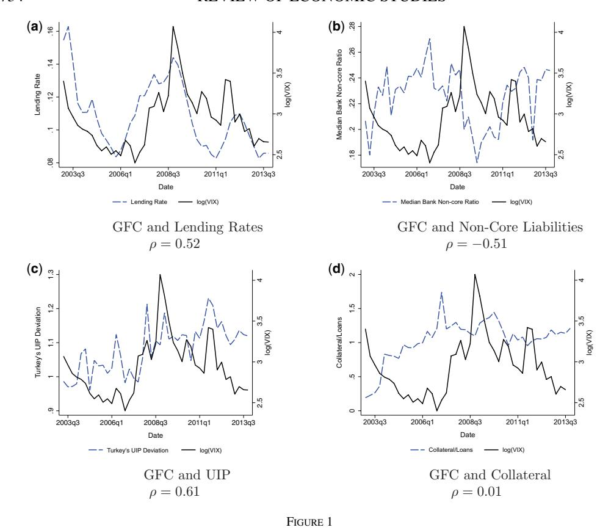
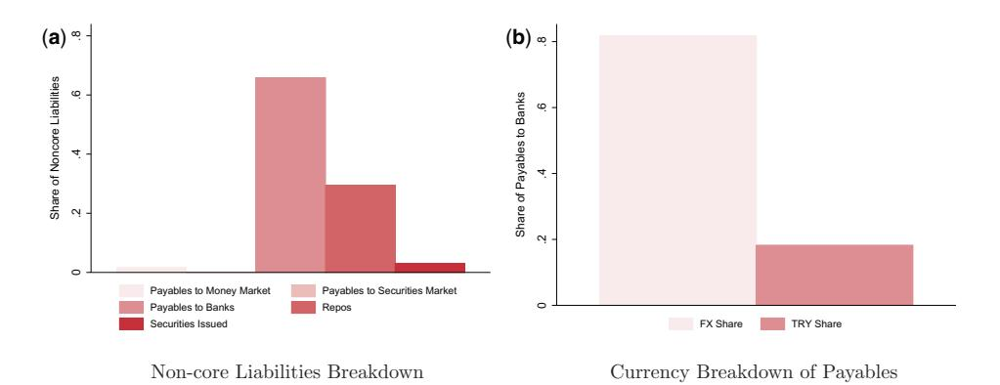
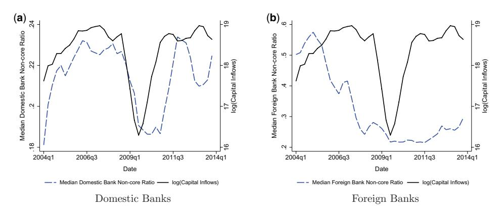
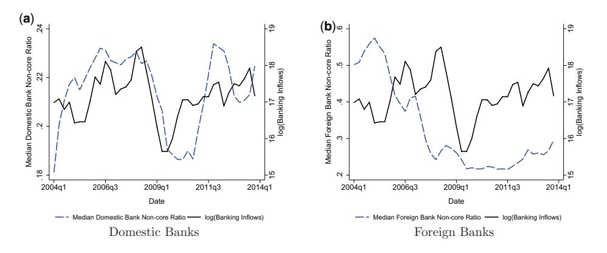
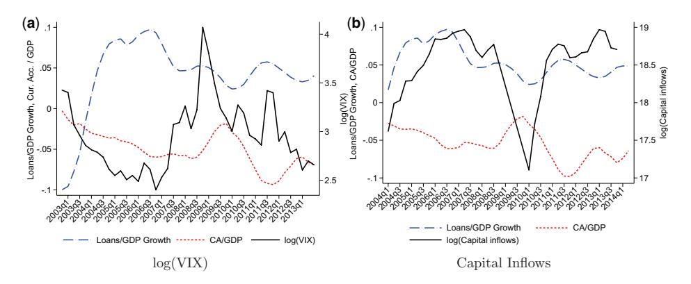
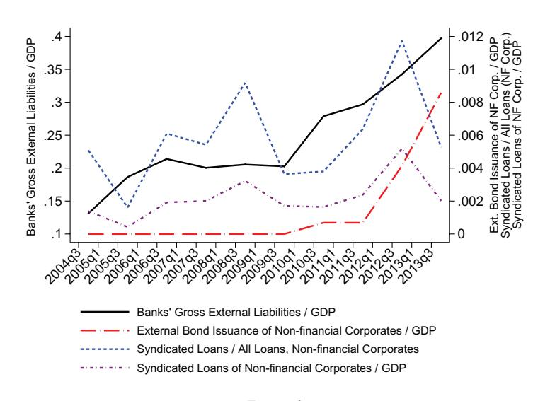
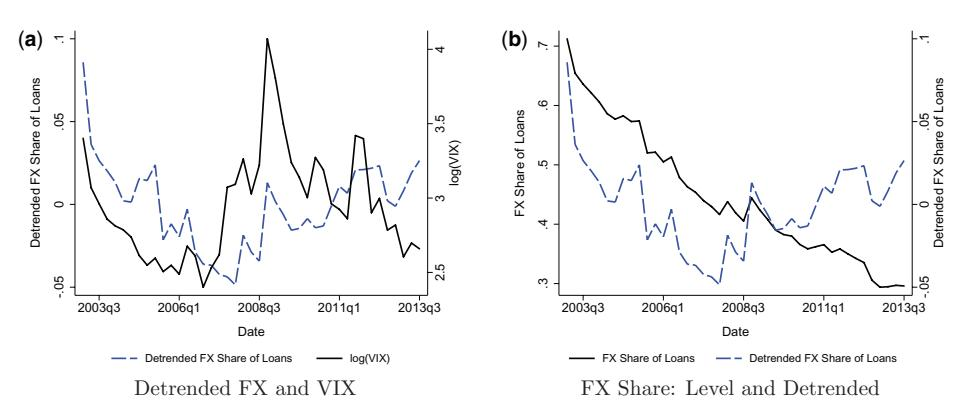
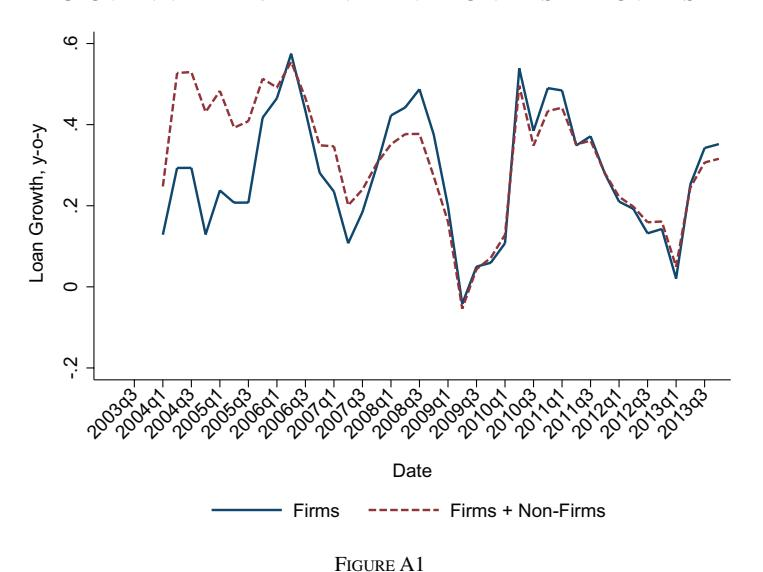
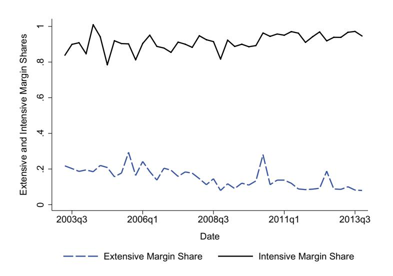

# International Spillovers and Local Credit Cycles

# JULIAN DI GIOVANNI

*Federal Reserve Bank of New York; ICREA-Universitat Pompeu Fabra; Barcelona GSE; CREI; and CEPR*

# SEBNEM KALEMLI-ÖZCAN ¸

*Department of Economics, University of Maryland; CEPR; and NBER*

# MEHMET FATIH ULU

*Koç University*

and

# YUSUF SONER BASKAYA

*University of Glasgow, Adam Smith Business School*

*First version received September* 2018*; Editorial decision March* 2021*; Accepted June* 2021 (*Eds.*)

This article studies the transmission of the Global Financial Cycle (GFC) to domestic credit market conditions in a large emerging market, Turkey, over 2003–13. We use administrative data covering the universe of corporate credit transactions matched to bank balance sheets to document four facts: (1) an easing in global financial conditions leads to lower borrowing costs and an increase in local lending; (2) domestic banks more exposed to international capital markets transmit the GFC locally; (3) the fall in local currency borrowing costs is larger than foreign currency borrowing costs due to the co-movement of the uncovered interest rate parity (UIP) premium with the GFC over time; (4) data on posted collateral for new loan issuances show that collateral constraints do not relax during the boom phase of the GFC.

*Key words*: Global financial cycle, Bank credit, Non-core funding, Risk premium, Collateral constraints.

*JEL Codes*: E0, F0, F1

## 1. INTRODUCTION

This article studies how the Global Financial Cycle (GFC) spills over to domestic credit market conditions at the *microeconomic level* for a large emerging market economy, Turkey. The GFC is characterized by synchronized surges and retrenchments in gross capital flows and booms and busts in risky asset prices and leverage [\(Rey](#page-40-0), [2013](#page-40-0)), and has a strong common component that comoves with VIX,1 which is related to U.S. monetary policy and to changes in risk aversion and uncertainty [\(Bekaert](#page-39-0) *et al.*, [2013;](#page-39-0) [Bruno and Shin](#page-39-0), [2015a;](#page-39-0) [Miranda-Agrippino and Rey](#page-40-0), [2018](#page-40-0)).

1. VIX is a forward-looking volatility index of the Chicago Board Options Exchange. It measures the market's expectation of 30-day volatility, and is constructed using the implied volatilities of a wide range of S&P 500 index options.

The global financial cycle and the local credit market: motivating evidence

*Notes:* This figure plots the following Turkish time series along with log(VIX), our proxy for the GFC: (a) aggregate bank lending rate; (b) the median bank's non-core liabilities ratio; (c) the UIP deviation from the U.S. dollar defined as  $\left(\frac{1+i^{TRY}}{1+i^{USD}}\right)\frac{S}{E(S')}$ , where  $i^{TRY}$  is the 12-month Turkish deposit rate  $i^{USD}$  is the 12-month US deposit rate. S is the spot Turkish liad/USD exchange rate, and E(S') is the

the 12-month Turkish deposit rate,  $i^{USD}$  is the 12-month US deposit rate, S is the spot Turkish lira/USD exchange rate, and E(S') is the expected 12-month ahead Turkish lira/USD exchange rate; and (d) the aggregate collateral-to-loan ratio. *Sources*: CBRT and author's calculations.

While the majority of research has focused on understanding the aggregate impacts and sources of the GFC, little is known on how it transmits to countries' economies and financial sectors.

We provide a granular view of how the GFC impacts local credit conditions by exploiting data on the universe of credit transactions, including loan-level interest rates and posted collateral, between banks and firms for Turkey over 2003–13, combined with bank balance sheet information encompassing local and foreign currency funding of banks. Using these detailed credit data that cover the entire non-financial corporate sector, we not only trace out the relationship between the GFC and domestic lending patterns between banks and firms, but we also identify causal mechanisms that cannot be measured using macro data.

We make two main contributions. Our starting point is Figure 1a that shows a strong comovement between VIX and the average Turkish bank lending rate. This relationship motivates us to provide evidence on the impact of the GFC on domestic borrowing costs and credit growth at the *firm-bank* level, controlling for both firm- and bank-level characteristics, which is our first contribution. Micro-level regressions uncover economically significant relationships between the GFC and domestic credit market conditions. We find a baseline micro estimate of the elasticity

of domestic loan growth with respect to changes in VIX equal to −0.067. This *micro* estimate implies that fluctuations in VIX can explain, on average, 43% of the observed cyclical loan growth of the *aggregate* corporate sector over the sample period. The micro estimate of the elasticity of the interest rate with respect to changes in VIX in our core specification is 0.019, implying a one percentage point fall in the borrowing costs for the average firm during the boom phase of the GFC. As these regressions control for time-varying bank characteristics, the estimates are more reliable than similar macro estimates using country-level data, which are unable to separate the banking sectors' financial conditions from macroeconomic business cycle conditions.

Our second contribution is to provide novel causal evidence on the channels through which the GFC is transmitted to the domestic credit market by exploiting both bank and loan-level heterogeneity. We first document that domestic banks that are more exposed to international capital markets play a key role in transmitting the GFC locally. As Figure [1b](#page-1-0) shows, Turkey's median bank's non-core liabilities-to-total liabilities ratio co-moves with the GFC over the sample period capturing the cyclicality in domestic banks' access to non-core funding from global capital markets. Non-core liabilities are considered as non-traditional (or wholesale) forms of bank funding and are important sources of funding for fast-growing emerging markets [\(Hahm](#page-39-0) *et al.*, [2013](#page-39-0)). As we show, these liabilities are denominated largely in foreign currency (FX). Our regression identification strategy exploits the difference in how banks' reliance on *non-core* funding impacts their lending behaviour over the GFC. The difference-in-differences methodology based on bank heterogeneity that we use is common in the literature (*e.g.* [Khwaja and Mian,](#page-40-0) [2008;](#page-40-0)[Chodorow-Reich,](#page-39-0) [2014;Jiménez](#page-39-0) *et al.*, [2014](#page-39-0)) and allows us to explicitly control for time-varying firm credit demand using firm×quarter fixed effects. We find that high non-core banks cut lending rates and lend more during the boom phase compared to low non-core banks, and vice versa during GFC downturns.2 The causal identification of such a supply-side channel of the international spillovers of global financial conditions is not possible using macro data, as the econometrician will not be able to control for demand-driven borrowing using only aggregate data.

We next document that the fall in borrowing costs is driven by a failure in uncovered interest rate parity (UIP), where the UIP risk premium comoves with the GFC over time, making local currency borrowing cheaper relative to foreign currency borrowing during boom phases of the GFC. Figure [1c](#page-1-0) highlights this cyclicality at the aggregate level by plotting VIX along with UIP premia, which are calculated as the difference between the Turkish and U.S. deposit rates and the spot and the expected Turkish lira (TRY)/U.S. dollar exchange rate,3 and capture the expected excess returns from investing in the Turkish lira over the U.S. dollar. At the macro level, such returns increase when VIX is high and decrease when VIX is low, implying that investing in the Turkish lira during times of tighter global financial conditions is expected to be riskier. Therefore, investors not only expect to be paid a premium during normal times (as UIP the premium is always above one), but they expect an even higher premium during bad times.

Using our micro data, we first show that UIP premia exist at the loan-level on average over the sample by comparing FX and TRY interest rates between the same firm-bank pair in a given quarter. Interestingly, this result holds even after controlling for time-varying factors like macroeconomic or exchange rate risks (via the use of time fixed effects). We next show that

2. [Baskaya](#page-39-0) *et al.* [\(2017](#page-39-0)) show that during capital inflow episodes into Turkey, banks that mostly fund themselves through non-core liabilities expand their credit supply. In this article, we provide the novel result that banks with a high non-core liability ratio reduce their *lending rates* relatively more during periods of low VIX, and even more for local currency loans, even though the non-core liabilities are largely in FX.

3. The maturity level is the same for the Turkish and U.S. deposit rates, and also matches the horizon for the expected changes in the exchange rate.

the differential in FX and TRY borrowing costs co-moves with VIX, but the magnitude and significance of this effect are statistically indistinguishable from zero once we control for *timevarying* firm credit risk and bank heterogeneity in access to foreign currency funding, along with cyclical movements in this interest rate differential driven by the GFC. To the best of our knowledge, this empirical result – which cannot be identified using only macro data—has never been shown before, and is not straightforward to rationalize with existing models that assume an exogenous and static country-level UIP violation (see [Gopinath and Stein](#page-39-0), [2017](#page-39-0), for a recent contribution that endogenizes this violation, in a static framework, for a representative bank/firm).

The above findings that (1) high non-core banks offer lower pricing and supply more loans and (2) the cyclicality in the UIP premium that renders the TRY-denominated loans relatively cheaper, are consistent with each other. We show that banks more reliant on non-core FX liabilities provide more TRY-denominated loans than FX-denominated loans during the boom phase of the GFC. As a result, in the aggregate data, TRY-denominated loans grow more than FX-denominated loans when capital flows in.

Finally, using monthly loan-level data on collateral posted for new loan issuances and motivated by the acyclicality of the aggregate collateral-to-loans ratio vis-à-vis the VIX (see Figure [1d](#page-1-0)), we study whether borrowing constraints are relaxed during the boom phase of the GFC via a "collateral channel." Regressions reveal that there is no relation between loan amounts and posted collateral in general, and in addition loan amounts do not respond to changes in the collateral-to-loan ratio during high- or low-VIX episodes. This result survives even after we account for time-varying firm and bank factors, such as credit demand and firm default risk and focusing on the same firm borrowing from the same bank. Including these controls is important since as [Guerrieri and Lorenzoni](#page-39-0) [\(2017\)](#page-39-0) show in a heterogeneous agent environment, shocks to agents' borrowing capacity affect both borrowers' demand for loans and lenders' supply of loans, and we want to solely focus on the supply side. This result is also novel, and has important implications for the theoretical macro-finance literature, which models financial market imperfections by assuming that firms face collateral constraints and these constraints relax or tighten with asset price movements. Thus, in theory, constraints should relax with capital flows. We show that this is not the case in an emerging market, where capital flows are intermediated through the domestic banking system.

Finding no relation between posted collateral and loan amounts does not mean collateral is not an important variable for loans. In fact, we uncover a strong relation between loan rates and posted collateral. Conditional on time-varying bank factors, the loan rate is lower for a higher level of posted collateral on that loan. This negative relation between the loan rate and loan collateral gets stronger when VIX is high and gets weaker when VIX is low. When we consider the same firm borrowing from the same bank, the negative relation between the loan rate and collateral no longer changes with fluctuations in VIX. These results further support our key message that irrespective of collateral values, firms are able to borrow more as a result of lower interest rates, which increase firms' ability to repay their loans. In fact, when we run a horse race between the effect of collateral versus the interest rates on credit growth, it turns out that lower interest rates are more important for credit expansion than higher collateral values.

We consider other possible channels through which the GFC may impact the domestic credit market, as well as running numerous robustness checks. We first explore whether high non-core banks alter their risk profile by changing the average maturity of loans they issue over the GFC, and find that these banks do indeed increase their risk by issuing longer maturity loans during the boom phase of the GFC. We further explore the role of bank leverage and size, variables often used to capture a "risk-taking" channel, on our results. The inclusion of these variables do not impact the size or significance of the non-core interaction coefficient. Finally, another possible channel we investigate is the role of exchange rate fluctuations on balance sheet strength. Banks balance sheets are required to be hedged for foreign currency exposure in Turkey by law, so we study the effect of possible firm balance sheet mismatches on credit outcomes. We do not find any effect of exchange rate fluctuations on credit outcomes for firms' with a currency mismatch on their balance sheets. This result is consistent with our result that did not find any role for collateral values. Even if firm balance sheets get a positive net worth (collateral) shock with an appreciation of the local currency vis-à-vis the USD, on the supply side banks do not seem to change their pricing for such firms and/or provide more credit to these firms, even though these firms might demand more credit.

Overall, these additional checks do not impact our finding on the relative importance of high non-core banks in transmitting the GFC to the domestic credit market. This result points to the non-core channel being akin in spirit to the risk-taking channel highlighted in work such as [Bruno and Shin](#page-39-0) [\(2015b\)](#page-39-0) or [Coimbra and Rey](#page-39-0) [\(2017\)](#page-39-0). While those papers focus on changes in balance sheet strength over the cycle, the non-core channel is a function of the composition of only the liabilities side of the balance sheet, rather than a net position. However, the non-core channel is still consistent with a risk-taking channel as high non-core banks' financial constraints will relax (tighten) by a fall (rise) in external funding costs during the boom (bust) cycle of the GFC. The difference is such relaxation works via cost of funding instead of volume of funding related to balance sheet strength.

Section 2 presents a summary of the literature that our paper contributes to. Section [3](#page-5-0) describes the data. Section [4](#page-15-0) presents the identification methodology and our four main empirical facts. Section [5](#page-30-0) concludes.

## 2. RELATED LITERATURE

Our article relates to several strands of the literature. First, we contribute to the literature that has so far focused on the effects of GFC (as proxied by movements in VIX) on cross-border capital flows, asset prices, and credit growth using *aggregate* cross-country data (*e.g.* [Forbes and Warnock](#page-39-0), [2012](#page-39-0); [Cerutti](#page-39-0) *et al.*, [2015;](#page-39-0) [Jordà](#page-39-0) *et al.*, [2017;](#page-39-0) [Fratzscher](#page-39-0) *et al.*, [2018](#page-39-0); [Miranda-Agrippino and Rey,](#page-40-0) [2018](#page-40-0)). This literature is silent on the evidence regarding the transmission mechanism, and in particular at the bank and firm levels. Our evidence on the transmission channel is complementary to models that emphasize the risk-taking channel of monetary policy. These models emphasize that during the boom phase of GFC, low interest rates in the U.S. creates abundant liquidity in dollar funding markets [\(Bruno and Shin,](#page-39-0) [2015a\)](#page-39-0). Global banks provide more dollar funding across borders as their value-at-risk constraints relax with low U.S. rates and low VIX. We drill down one more layer and argue that domestic banks, which obtain their dollar funding from global banks, in turn, provide more funding to domestic firms at a lower cost; a mechanism of pass-through from a lower cost of international funding for domestic banks to a lower cost of borrowing for domestic firms.4

Second, our finding on the increasing share of local currency borrowing vis-à-vis foreign currency borrowing in the aggregate data is consistent with the fall in the UIP risk premium we show and consistent with the models that endogenize the UIP deviations over time to external shocks and financial intermediation, such as [Salomao and Varela](#page-40-0) [\(2016](#page-40-0)), [Akinci and Queralto](#page-39-0) [\(2019\)](#page-39-0), and [Basu](#page-39-0) *et al.* [\(2020\)](#page-39-0). Such models predict a fall in the UIP risk premium and a rise in the share of local currency borrowing for a favourable shock. The macro evidence in [Kalemli-Özcan and Varela](#page-40-0) [\(2019\)](#page-40-0) and [Kalemli-Özcan](#page-39-0) [\(2019](#page-39-0)) show that in emerging markets, the

4. In fast-growing bank-based emerging markets, domestic bank intermediation of capital inflows is typical since domestic deposits are not large enough to fund banks who in turn finance growth. See [Reinhart and Rogoff](#page-40-0) [\(2009\)](#page-40-0) and [Hahm](#page-39-0) *et al.* [\(2013\)](#page-39-0).

UIP risk premium moves with interest rate differentials and not with exchange rate fluctuations, where a key driver of interest rate differentials is capital flows driven by the changes in VIX and U.S. monetary policy. These results are also consistent with our findings.

Third, the evidence on the transmission mechanism we provide speaks to how financial constraints relax during the GFC. We find that the main mechanism underlying the relaxation of financial constraints is rather different from the standard "higher asset prices-higher collateralmore borrowing" channel. This channel rests on models where the liquidation value of physical assets serve as the collateral that determines the amount of borrowing by firms, and this collateral value may fluctuate with aggregate shocks that affect asset prices (*e.g.* see [Bernanke](#page-39-0) *et al.*, [1999](#page-39-0); [Kiyotaki and Moore,](#page-40-0) [1997;](#page-40-0) [Bernanke and Gertler](#page-39-0), [1989](#page-39-0); [Calvo,](#page-39-0) [1998](#page-39-0); [Caballero and Krishnamurthy](#page-39-0), [2001](#page-39-0); [Mendoza,](#page-40-0) [2010\)](#page-40-0). Our results on the relaxation of financial constraints through lower interest rates is important in helping to identify two alternative margins of adjustment in the domestic credit market: firms can borrow at lower rates on average, while their "hard" collateral constraints do not change much over the boom part of the cycle. Thus, collateralconstrained firms are still allowed only to borrow some fraction of their capital stock, and this amount may not change if the value of the capital stock does not change much when capital flows into the banking sector as opposed to the corporate sector (see [Fostel and Geanakoplos,](#page-39-0) [2015,](#page-39-0) for a theoretical contribution that rationalizes this channel).

Finally, last but not least, we contribute to the literature on the international transmission of shocks, where most of this literature focuses on the role of foreign banks (*e.g.* [Cetorelli and Goldberg](#page-39-0), [2011\)](#page-39-0). Recently, this literature also emphasized the role of U.S. monetary policy in channelling bank flows across borders, as in the work of [Bräuning and Ivashina](#page-39-0) [\(2018\)](#page-39-0) and [Ivashina](#page-39-0) *et al.* [\(2015\)](#page-39-0). The latter paper focuses on the role of dollar-funding supply in global markets on foreign banks' lending elsewhere, while we focus on the receiving side; that is, domestic banks' borrowing from foreign banks and global investors over the GFC.

# 3. DATA DESCRIPTION

We merge two large micro-level panel data sets that are official registers. Specifically, we merge bank-level balance sheets [\(Central Bank of the Republic of Turkey](#page-39-0), [2017a](#page-39-0)) with individual loanlevel data between banks and firms [\(Central Bank of the Republic of Turkey](#page-39-0), [2017b](#page-39-0)) using unique bank and firm identifiers. We further augment this data set with Turkish and world macroeconomic and financial data [\(di Giovanni](#page-39-0) *et al.*, [2021\)](#page-39-0). The final data set for all existing loans is at the quarterly frequency and covers the universe of loans and every balance sheet item in the banks' regulatory filings. We transform all loan and bank variables to real values, using 2003 as the base year for inflation adjustment. We further clean and winsorize the data in order to eliminate the impact of outliers.5 We also create a monthly data set based on new loan issuances using the credit register data, which we also merge in with bank characteristics in order to study the collateral channel in our last set of results. We discuss the characteristics of each data set in this section.

# 3.1. *Credit register*

The detailed monthly loan transaction-level data are collected by the Banking Regulation and Supervision Agency (BRSA), and provided to us by the Central Bank of the Republic of Turkey (CBRT). Banks have to report outstanding loans at the level of firms and individuals monthly to the BRSA at the transaction level.6 For instance, if a firm has five loans with different maturities and interest rates at the branch of a bank and two other loans at another branch of the same bank, the bank then has to report all seven loans separately as long as each of the loans' outstanding amounts is above the bank-specific reporting cut-off level. If a loan's outstanding amount is below the bank's reporting cut-off then the bank may aggregate such small loans at the branch-level and report the aggregated amounts. This data set provides the same information as found in credit register data in other countries, but contains a more comprehensive list of variables. In particular, besides providing the amount of a loan outstanding between a given individual (household, firm, government) and a bank, the data set also provides several other key pieces of information, such as the (1) interest rate; (2) maturity date as well as extended maturity dates if relevant; (3) collateral provided; (4) credit limit (only beginning in 2007); (5) currency of the loan; (6) detailed industry codes for the activity classification for which the loan is borrowed for, as well as the breakdown of consumer usage of loan (*e.g.* credit card, mortgage); (7) bank-determined risk measures of the loans.

The data are cleaned at the loan level before we aggregate up to the firm-bank-currency denomination level for our regression analysis. Note that we will refer to this level of aggregation as the firm-bank level for ease of exposition in the remainder of the article. The data cleaning is extensive and there are certain unique features of the Turkish data that must be tackled and which we describe in brief next. First, we use cash loans in terms of outstanding principal, since credit limit data are not available for the full sample period. Moreover, these loans naturally map into the data used to measure aggregate credit growth. Second, a significant component of lending in Turkey takes place in foreign currency (FX).7 We clean the data to deal with exchange rate issues as follows. There are two types of FX loans, which banks report differently in terms of the Turkish lira (TRY) each month. The first type of FX loan is one that is indexed to exchange rate movements. This type of loan is reported based on its initial TRY value each period, and thus is not adjusted by banks for exchange rate movements (of course, the value of these types of loans may still change if borrowers pay back some of the loans, for example). The second type of FX loan is issued in foreign currency. The TRY value of this type of loan is adjusted each period to account for exchange rate movements. This naturally creates a *valuation effect*, which we need to correct for in order to not under/overstate the value of the TRY loan in the period following the initial loan issuance. For example, imagine that over a month there are no new loans issued and no repayments made. A depreciation of the TRY against the USD would appear to increase total loans outstanding for all existing FX loans issued in dollars. This valuation effect would in turn manifest itself as an expansion of credit when measured in TRY, but this expansion would solely have been due to a currency depreciation, rather than issues of new loans. We adjust for this valuation effect using official end-of-period exchange rates, before summing the data over firm-bank pairs for FX and TRY loans, where we sum all FX loans (expressed in TRY).

We then adjust the individual loans for inflation to ensure comparability over time. The baseline regressions pool loans regardless of their maturity. Roughly half of the loans have maturities less than or equal to one year. We therefore also run robustness regressions where we split the sample along maturity levels.

**3.1.1. Outstanding loans data.** We use end-of-quarter data for a given firm-bank pair. The key reason for doing so is that capital flows and other macro/global variables are at the

6. There is a minimum loan-size cut-off under which banks do not have to report the individual transactions to the authorities.

7. Generally USD or euro.

(1) (2) (3) All Domestic Foreign banks banks banks 2003 0.557 0.553 0.596 2004 0.469 0.449 0.760 2005 0.512 0.510 0.752 2006 0.534 0.542 0.611 2007 0.506 0.514 0.489 2008 0.558 0.584 0.504 2009 0.504 0.540 0.422 2010 0.480 0.515 0.352 2011 0.512 0.543 0.375 2012 0.446 0.462 0.373 2013 0.473 0.490 0.410 Mean 0.505 0.518 0.513 Std. Dev. 0.036 0.040 0.148 Min. 0.446 0.449 0.352 Max. 0.558 0.584 0.760

TABLE 1 *Share of FX total loans by bank type, 2003–13*

*Notes:* This table presents annual summary statistics of the credit register coverage of loans, over the 2003–13 period, using end-of-year data. Columns (1)–(3) present the FX share of loans within the data sample: column (1) presents the overall share, while columns (2) and (3) break down the share between domestic and foreign banks. The bottom panel presents summary statistics over the eleven years of data.

quarterly level. The final cleaned data set, before aggregation to the firm-bank level for a given quarter, contains roughly 53 million loan records over the December 2003–December 2013 period. Figure [A1](#page-32-0) compares the growth rate of the aggregated loans in our data set ("Firms") to aggregate credit growth for the whole economy ("Firms + Non-Firms"). The two series track each other very closely, with a correlation of 0.86.8 Further, as Figure [A2](#page-32-0) shows, the majority of loans between firm-bank pairs in a given quarter (in terms of value) are due to continuing loans (*i.e.* the intensive margin).9

Table 1 presents annual information and summary statistics on the share of FX loans in terms of total loans for (1) all banks, (2) domestic banks, and (3) foreign banks.10 In looking at the summary statistics, we see that on average that all types of banks have an approximately even split between FX and TRY over the sample period. However, the share of FX loans in foreign banks' portfolios declined over the sample period, whereas the share for domestic banks remained more stable.

Table [2](#page-8-0) reports summary statistics on banks, firms, and firm-bank pairs in the register for the end of the year for all banks, domestic banks, and foreign banks. Column (1) shows that the number of banks in our sample varies over time, with domestic banks being in the majority. Further, most firms borrow from domestic banks (column 2). We next turn to the bilateral relationships between banks and firms in columns (3)–(5). We see in column (3) that on average about 44% of firms borrow from more than one bank, but this lending makes up a large proportion of the

8. The two series are not as strongly correlated at the beginning of the sample due to the aftermath of the crisis in 2001, which was driven by corporate and government debt and fixed exchange rate. This in turn implies that corporate and household debt growth diverged in the 2003–05 period.

9. A continuing loan (intensive margin) is a new loan for the given bank-firm relationship, that is from one quarter to other, there is a new loan for a given pair where this pair already had a loan relationship before. A new loan (extensive margin), on the other hand, is the appearance of a new firm-bank relationship for the first time in that quarter.

10. Note that the number/composition of domestic and foreign banks changes over time given closures and consolidation.

TABLE 2 *Credit register sample coverage of firm–bank relationships, 2003–13*

|                | (1)   | (2)     | (3)    | (4)                      | (5)          |
|----------------|-------|---------|--------|--------------------------|--------------|
|                |       |         |        | Multiple firm-bank share | Av. No. Rel. |
|                | Banks | Firms   | Number | Value                    | per firm     |
| All banks      |       |         |        |                          |              |
| Mean           | 38.6  | 302,839 | 0.438  | 0.745                    | 2.834        |
| Min.           | 35.0  | 30,983  | 0.358  | 0.680                    | 2.674        |
| Max.           | 43.0  | 670,033 | 0.468  | 0.809                    | 3.032        |
| Domestic banks |       |         |        |                          |              |
| Mean           | 24.8  | 236,223 | 0.433  | 0.734                    | 2.823        |
| Min.           | 22.0  | 29,742  | 0.359  | 0.672                    | 2.657        |
| Max.           | 29.0  | 509,908 | 0.465  | 0.799                    | 3.024        |
| Foreign banks  |       |         |        |                          |              |
| Mean           | 13.8  | 66,616  | 0.472  | 0.818                    | 3.009        |
| Min.           | 8.0   | 1,241   | 0.334  | 0.757                    | 2.642        |
| Max.           | 21.0  | 160,125 | 0.621  | 0.867                    | 3.232        |

*Notes:* This table presents annual summary statistics on the frequency of different types of firm–bank relationships within the credit register using end-of-year data for all, domestic, and foreign banks. Columns (1) and (2) list the number of banks and firms, respectively; columns (3) and (4) presents the share of loans (relative to total) from firms with multiple bank relationships, in terms of loan number and loan value, respectively; and column (5) presents the average number of multiple banking relationships a firm has in a given year.

total value of loans – 75% for all banks, 73% for domestic banks, and 82% for foreign banks on average according to column (4). Finally, column (5) shows that the average number of relationships that a firm has with banks in a given quarter is approximately three for all types of banks.

Table [3](#page-9-0) presents summary statistics for the credit register data for outstanding loans aggregated at the firm-bank pair each quarter. The table pools all the loans, regardless of the currency of denomination in panel A, while panels B and C present statistics on TRY and FX loans separately (*i.e.* the unit of observation is firm-bank-denomination in all panels). The table reports summary statistics for (i) loans outstanding in thousands of 2003 TRY, (ii) the nominal interest rate, and (iii) the remaining maturity (in months) of a loan. These are the data that form the basis for our regression samples when we are not focusing on new loan issuances.11 As one can see, there is a lot of heterogeneity in the size of loans, as well as borrowing rates. In comparing panels B and C, one also sees that FX loans are on average larger and cheaper than TRY loans. This fact motivates us to always include a currency denomination dummy in our pooled regressions, as well as further investigating whether the differential in FX and TRY interest rates and loan growth vary with the GFC.

Note that since we are aggregating over several potential loans between a given bank and firm pair in a given period, we need to take into account the size of the individual loans in calculating an "effective" interest rate and maturity for the firm–bank pair. We do this by creating weighted averages based on a loan's share in total loans between each firm–bank pair in a given period. We allow the weights to vary depending on the unit of analysis we consider, and they also vary over time. Larger loans' interest rates get a bigger weight.12 We want the weights to be time-varying to capture the time variation in the interest rates of the loan portfolio of a given firm-bank pair.

11. The min–max values are similar across panels due to winsorization.

12. We follow the same strategy in calculating weighted averages across different maturities.

|                 | Obs.       | Mean  | Median             | Std. Dev. | Min.  | Max.  |
|-----------------|------------|-------|--------------------|-----------|-------|-------|
|                 |            |       | Panel A. All loans |           |       |       |
| Loan            | 18,345,853 | 148.8 | 21.88              | 402.6     | 5.011 | 3,478 |
| Interest rate   | 18,345,853 | 0.138 | 0.082              | 0.090     | 0.001 | 0.540 |
| Maturity (mos.) | 18,345,853 | 19.17 | 6.000              | 17.10     | 0.000 | 82.69 |
|                 |            |       | Panel B. TRY loans |           |       |       |
| Loan            | 17,086,409 | 105.2 | 21.12              | 272.5     | 5.011 | 3478  |
| Interest rate   | 17,086,409 | 0.144 | 0.097              | 0.090     | 0.001 | 0.540 |
| Maturity (mos.) | 17,086,409 | 19.51 | 6.243              | 17.09     | 0.000 | 82.69 |
|                 |            |       | Panel C. FX Loans  |           |       |       |
| Loan            | 1,259,444  | 740.9 | 90.35              | 988.7     | 5.011 | 3,478 |
| Interest rate   | 1,259,444  | 0.059 | 0.045              | 0.029     | 0.001 | 0.540 |
| Maturity (mos.) | 1,259,444  | 14.55 | 4.000              | 16.58     | 0.000 | 82.69 |

TABLE 3 *Credit register quarterly summary statistics, firm-bank level, 2003–13*

*Notes:* This table presents summary statistics using quarterly data for aggregate firm-bank transactions over the 2003–13 period. The sample includes loans for all firm–bank pairs reported in the data set. Panel A presents data based on pooling all FX and TRY transactions at the firm–bank-quarter level; Panel B considers only Turkish lira loans, and Panel C considers only FX loans (expressed in Turkish liras). Loan is the end-of-quarter total outstanding principal for all loans between a firm–bank pair, in thousands of Turkish lira and adjusted for inflation; Interest Rate is the weighted average of the nominal rates, reported for loans between a firm–bank pair, where the weights are constructed based on loan shares between a firm-bank pair in a given quarter, and are based on either all, TRY, or FX loans for Panels A–C, respectively; Maturity is the weighted average of the initial time to repayment reported for loans of a firm–bank pair, which is measured in months, and where the weights are constructed based on loan shares between a firm–bank pair in a given quarter, and are based on either all, TRY, or FX loans for panels A–C, respectively.

Therefore, in panel A, when we pool the TRY and FX loans, the weight's numerator is simply the loan value of an individual loan, while its denominator is the sum of all TRY and FX loans between a firm–bank pair in a given period. In panels B and C, the weight's numerator is again the individual loan value, while the denominator is total TRY loans in panel B, and in panel C the denominator is total FX loans.13

**3.1.2. New loan issuances data.** Table [4](#page-10-0) presents the summary statistics for data on new loan issuances, which we use in our collateral channel regressions below. Unlike the summary statistics presented in Table 3, the underlying data of Table [4](#page-10-0) are at the *individual loan level* rather than being aggregated up to the firm-bank (currency denomination) level. Therefore, there is no need to construct weighted variables based on loan values like before. Besides presenting information on the size of the loan, interest rate and maturity level, we also present summary statistics on the collateral-to-loan ratio for a given loan. This variable can vary quite a bit across loans with some loans having either (1) zero collateral posted or (2) very little credit (*i.e.* loan) drawn for a given collateral posted. Given the second, we winsorize the collateral-to-loan ratio at a value of 200% to deal with outliers.14 We further drop all loans with zero collateral posted for this part of the analysis, since we are using the collateral as a measure of financial constraints and

13. Formally, for a loan *i* between bank *b* and firm *f* in time *t* and denomination type *d* = {*ALL*,*TRY*,*FX*}, in panel A: *wALL i*,*f* ,*b*,*t* =*Loani*,*f* ,*b*,*t*/ *i*∈*IALL f* ,*b*,*t Loani*,*f* ,*b*,*t*; panel B: *wTRY i*,*f* ,*b*,*t* =*Loani*,*f* ,*b*,*t*/ *i*∈*ITRY f* ,*b*,*t Loani*,*f* ,*b*,*t*; panel C: *wFX i*,*f* ,*b*,*t* = *Loani*,*f* ,*b*,*t*/ *i*∈*IFX f* ,*b*,*t Loani*,*f* ,*b*,*t*, where *Id i*,*f* ,*b*,*t* is the set of loans based on currency types between the firm–bank pair in a given quarter.

14. Note that the collateral-to-loan ratio can be greater than one for several reasons. First, banks may ask for more collateral than the loan value, since the collateral may also include liquidation costs or legal costs, or other risks attached to the collateral. Second, depending on the type of collateral posted, such as residential property, banks require collateral up to 200% of the loan value. Third, firms must post collateral for the whole credit line (or multiple credit lines) requested,

TABLE 4 *Credit register quarterly summary statistics for new loan issuances, 2003–13*

|                 | Obs.       | Mean  | Median             | Std. Dev. | Min.   | Max.  |
|-----------------|------------|-------|--------------------|-----------|--------|-------|
|                 |            |       | Panel A. All loans |           |        |       |
| Loan            | 10,016,550 | 0.115 | 29.24              | 1.210     | 0.005  | 752.0 |
| Interest rate   | 10,016,550 | 0.138 | 0.128              | 0.094     | 0.001  | 0.618 |
| Maturity (mos.) | 10,016,550 | 16.19 | 10.00              | 18.86     | 0.000  | 118.0 |
| Collateral/Loan | 10,016,550 | 1.166 | 1.000              | 0.450     | 0.0001 | 2.000 |
|                 |            |       | Panel B. TRY loans |           |        |       |
| Loan            | 9,048,643  | 0.080 | 26.61              | 0.655     | 0.005  | 572.0 |
| Interest rate   | 9,048,643  | 0.147 | 0.134              | 0.095     | 0.001  | 0.618 |
| Maturity (mos.) | 9,048,643  | 16.70 | 10.00              | 19.14     | 0.000  | 118.0 |
| Collateral/Loan | 9,048,643  | 1.175 | 1.000              | 0.454     | 0.0001 | 2.000 |
|                 |            |       | Panel C. FX loans  |           |        |       |
| Loan            | 967,907    | 0.446 | 92.31              | 3.320     | 0.005  | 752.0 |
| Interest rate   | 967,907    | 0.060 | 0.060              | 0.024     | 0.001  | 0.618 |
| Maturity (mos.) | 967,907    | 11.42 | 6.00               | 15.11     | 0.000  | 118.0 |
| Collateral/Loan | 967,907    | 1.082 | 1.000              | 0.408     | 0.0001 | 2.000 |

*Notes:* This table presents summary statistics using monthly data for new loan issuances over the 2003–13 period. The sample includes loans for all firm–bank pairs reported in the data set. Panel A presents data based on pooling all FX and TRY transactions at the firm–bank-quarter level; Panel B considers only Turkish lira loans, and Panel C considers only FX loans (expressed in Turkish liras). Loan is the outstanding principal of the new loan, in thousands of Turkish lira and adjusted for inflation; Interest Rate is the loan's nominal lending; Maturity is the initial time to repayment reported for the new loan, which is measured in months; Collateral/Loan is the ratio of the collateral posted to the outstanding principal of the new loan.

these zero-collateral loans are generally given to very large multinationals or for loan amounts that are very small compared to firm value. Dropping these observations decreases the sample by approximately thirty percent.

The majority of loans (roughly 90%) are denominated in TRY. However, as with the summary statistics using loans aggregated up to the firm–bank level, new loan issuances in TRY are considerably smaller and more expensive than FX loans. Furthermore, the average TRY loan's maturity is approximately five months longer than an FX loan (the differential at the firm-bank level of aggregation is only two months). Interestingly, the average collateral-to-loan ratio is higher for TRY-denominated loans, but this differential is not large—1.175 months for TRY loans versus 1.082 months for FX loans.

## 3.2. *Bank-level data*

Turkey, like many major emerging markets, has a bank dominated financial sector: in 2014, banks held 86% of the country's financial assets and roughly 90% of total financial liabilities. The past decade has witnessed a doubling of bank deposits and assets, while loans have increased five-fold. Our baseline analysis uses quarterly bank balance sheet data from Turkey for the 2003–13 period. The data are collected at the monthly level, and we use March, June, September, and December reports. All banks operating within Turkey are required to report their balance sheets as well as extra items to the regulatory and supervisory authorities—such as the CBRT and the Banking Regulation and Supervision Agency (BRSA)—by the end of the month.

even if the initial loan withdrawal is less than the amount. We therefore winsorize the collateral-to-loan ratio at a value of 200% to match an upper-bound used by the banks. Further, note that the book and market values of the collateral are the same since we observe each loan and collateral posted only once in a given month given our focus on new issuances.

|              | Obs. | Mean  | Median                  | Std. Dev. | Min.  | Max.  |
|--------------|------|-------|-------------------------|-----------|-------|-------|
|              |      |       | Panel A. All banks      |           |       |       |
| Assets/GDP   | 11   | 0.775 | 0.744                   | 0.189     | 0.548 | 1.105 |
| Loans/GDP    | 11   | 0.377 | 0.368                   | 0.167     | 0.146 | 0.668 |
| Deposits/GDP | 11   | 0.461 | 0.458                   | 0.095     | 0.342 | 0.603 |
|              |      |       | Panel B. Domestic banks |           |       |       |
| Assets/GDP   | 11   | 0.683 | 0.650                   | 0.127     | 0.532 | 0.901 |
| Loans/GDP    | 11   | 0.321 | 0.312                   | 0.128     | 0.140 | 0.544 |
| Deposits/GDP | 11   | 0.410 | 0.407                   | 0.060     | 0.334 | 0.492 |
|              |      |       | Panel C. Foreign banks  |           |       |       |
| Assets/GDP   | 11   | 0.092 | 0.094                   | 0.064     | 0.013 | 0.205 |
| Loans/GDP    | 11   | 0.056 | 0.056                   | 0.040     | 0.006 | 0.124 |
| Deposits/GDP | 11   | 0.051 | 0.051                   | 0.036     | 0.007 | 0.112 |

TABLE 5 *Banking sector quarterly summary statistics, based on official bank-level balance sheet data, 2003–13*

*Notes:* This table presents summary statistics on bank-level variables using quarterly data pooled over 2003–13 for all banks (Panel A), domestic banks (Panel B), and foreign banks (Panel C). The ratios are based on the banking sector's total assets, loans, and deposits relative to GDP, respectively. The sector variables are created by aggregating the official bank balance sheet data for the end of the year. All data are sourced from the CBRT.

Table 5 presents summary statistics based on end-of-year values for the banking sector as a whole for all banks (Panel A), domestic banks (Panel B), and foreign banks (Panel C). Looking at the total banking sector level in Panel A, we see that on average over the sample period the sector's assets represented approximately 78% of GDP, loans 38%, and deposits 46%. Looking at the same statistics in panels B and C, we see that domestic banks dominate overall banking activity relative to foreign banks. This is an important fact to note and makes Turkey different than other large emerging markets (*e.g.* Mexico), where foreign banks play a larger role in the banking sector. Specifically, over the 2003–13 period there are 45 banks, of which 28 are commercial (domestic and foreign), 14 are investment and development, and 5 are branches of foreign banks.15 Our sample of banks varies between 35 and 43 throughout the period since we focus on banks that are active in the corporate loan market and this number changes from period to period.

Table [6](#page-12-0) presents summary statistics based on end-of-quarter values both at the bank level for all banks (Panel A), domestic banks (Panel B), and foreign banks (Panel C), and summarize the banking variables we include in our regressions. These variables, like others used in the article, are winsorized at the 1% level. There is quite a bit of variation in bank size (as measured by total assets), the capital ratio, the leverage ratio, the non-core ratio, liquidity ratio, and return on assets (ROA) across banks and over time. In comparing domestic and foreign banks, we see that domestic banks are larger on average as well as having a larger leverage ratio. Meanwhile, foreign banks have larger non-core, liquidity and capital ratios on average. It is also instructive to look at the standard deviations of the bank variable across both bank groups, which reveal that the distributions of the various bank characteristics overlap across the domestic and foreign bank groups.

**3.2.1. Understanding non-core liabilities.** Finally, we compare bank-level variables across groups of banks that we split into "low" and "high" non-core banks in Table [7.](#page-13-0) We do

15. Note that in the aftermath of the 2001 crisis, the weak capital structure of the Turkish banks resulted in a number of takeovers. As a result, in the 2000–04 period, a total of 25 banks were taken over by Deposit-Insurance Fund, SDIF. Our sample begins at the end of this period, where the majority of takeovers were completed.

TABLE 6 *Bank-level quarterly summary statistics, based on official bank-level balance sheet data, 2003–13*

|                        | Obs.  | Mean  | Median                  | Std. Dev. | Min.  | Max.  |
|------------------------|-------|-------|-------------------------|-----------|-------|-------|
|                        |       |       | Panel A. All banks      |           |       |       |
| log(total real assets) | 1,685 | 14.40 | 14.47                   | 2.230     | 8.466 | 18.33 |
| Non-core ratio         | 1,685 | 0.298 | 0.226                   | 0.224     | 0.000 | 0.907 |
| Liquidity ratio        | 1,685 | 0.400 | 0.335                   | 0.217     | 0.017 | 0.960 |
| Capital ratio          | 1,685 | 0.145 | 0.138                   | 0.044     | 0.064 | 0.198 |
| Leverage ratio         | 1,685 | 0.776 | 0.862                   | 0.198     | 0.007 | 0.984 |
| ROA                    | 1,685 | 0.012 | 0.010                   | 0.010     | 0.000 | 0.033 |
|                        |       |       | Panel B. Domestic banks |           |       |       |
| log(total real assets) | 1,092 | 14.79 | 14.76                   | 2.222     | 10.19 | 18.33 |
| Non-core ratio         | 1,092 | 0.260 | 0.212                   | 0.194     | 0.000 | 0.907 |
| Liquidity ratio        | 1,092 | 0.353 | 0.315                   | 0.189     | 0.017 | 0.960 |
| Capital ratio          | 1,092 | 0.141 | 0.130                   | 0.044     | 0.064 | 0.198 |
| Leverage ratio         | 1,092 | 0.776 | 0.870                   | 0.206     | 0.038 | 0.984 |
| ROA                    | 1,092 | 0.012 | 0.010                   | 0.010     | 0.000 | 0.033 |
|                        |       |       | Panel C. Foreign banks  |           |       |       |
| log(total real assets) | 593   | 13.70 | 13.71                   | 2.066     | 8.466 | 17.15 |
| Non-core ratio         | 593   | 0.368 | 0.277                   | 0.257     | 0.000 | 0.907 |
| Liquidity ratio        | 593   | 0.485 | 0.448                   | 0.238     | 0.055 | 0.948 |
| Capital ratio          | 593   | 0.153 | 0.153                   | 0.043     | 0.064 | 0.198 |
| Leverage ratio         | 593   | 0.776 | 0.847                   | 0.183     | 0.007 | 0.964 |
| ROA                    | 593   | 0.012 | 0.010                   | 0.010     | 0.000 | 0.033 |
|                        |       |       |                         |           |       |       |

*Notes:* This table presents summary statistics on bank-level variables using quarterly data pooled over the 2003–13 for all banks (Panel A), domestic banks (Panel B), and foreign banks (Panel C). Total Assets are in nominal terms; the Non-core Ratio is non-core liabilities over total liabilities; the Liquidity Ratio is liquid assets over total assets; the Capital Ratio is equity over total assets; the Leverage Ratio is total liabilities over total assets; and ROA is the return on total assets. Non-core liabilities = Payables to money market + Payables to securities + Payables to banks + Funds from Repo + Securities issued (net). All data are sourced from the CBRT.

this as the non-core variable is our key variable to proxy access to international markets that will be used in our difference-in-differences regressions below. In particular, we construct a noncore liabilities ratio, where the denominator is total liabilities that is defined as deposits (core funding) + non-core funding. Non-core liabilities equals Payables to money market + Payables to securities + Payables to banks + Funds from Repo + Securities issued (net). We then create a time-invariant dummy that split banks into low and high non-core groups, where the dummy is defined by comparing a bank's average non-core ratio to the overall sample's median. A low non-core bank has a mean below the sample median, while a high non-core bank has a mean greater than or equal to the median. As can be seen in Figure [2,](#page-13-0) banks with high non-core liabilities are the ones that borrow internationally since a large part of these liabilities are in foreign currency.16

Note that high and low non-core banks can either be domestic or foreign banks.17 Comparing the two groups in Table [7,](#page-13-0) it is interesting to first note that the low non-core banks are larger on average, as well as having larger leverage ratios than the high non-core bank sample.18 This fact, in part, motivates some further robustness regressions we run below. Meanwhile, high non-core banks have somewhat larger liquidity and capital ratios than the low non-core sample, and the ROA is about the same across both groups on average. What is important for our purposes is the

16. Turkish banks' liabilities to each other are in TRY.

17. The two non-core groups are quite balanced along the domestic/foreign bank split, with the low non-core sample having 63% of the banks being domestic, while the high non-core sample is composed of 64% of domestic banks.

18. Notice that leverage ratios are based on total liabilities and high non-core banks can have high leverage in terms of short-term liabilities since non-core funding is mostly short-term.

|                        | P    | Panel A. Low non-core |           |      | Panel B. High non-core |           |  |
|------------------------|------|-----------------------|-----------|------|------------------------|-----------|--|
|                        | Obs. | Mean                  | Std. Dev. | Obs. | Mean                   | Std. Dev. |  |
| log(total real assets) | 721  | 15.40                 | 2.189     | 964  | 13.66                  | 1.952     |  |
| Non-core ratio         | 721  | 0.157                 | 0.085     | 964  | 0.404                  | 0.237     |  |
| Liquidity ratio        | 721  | 0.346                 | 0.185     | 964  | 0.440                  | 0.230     |  |
| Capital ratio          | 721  | 0.130                 | 0.039     | 964  | 0.157                  | 0.044     |  |
| Leverage ratio         | 721  | 0.817                 | 0.192     | 964  | 0.745                  | 0.197     |  |
| ROA                    | 721  | 0.011                 | 0.009     | 964  | 0.013                  | 0.011     |  |

TABLE 7
Bank-level summary statistics by non-core grouping, 2003–13

Notes: This table presents summary statistics on bank-level variables using quarterly data pooled over 2003–13 for "low" non-core banks (Panel A) and "high" non- banks (Panel B. A low non-core bank has a mean non-core ratio below the sample median, while a high non-core bank has a mean greater than or equal to the median. Total Assets are in nominal terms; the Non-core Ratio is non-core liabilities over total liabilities; the Liquidity Ratio is liquid assets over total assets; the Capital Ratio is equity over total assets; the Leverage Ratio is total liabilities over total assets; and ROA is the return on total assets. Non-core liabilities = Payables to money market + Payables to securities + Payables to banks + Funds from Repo + Securities issued (net). All data are sourced from the CBRT.

FIGURE 2
Composition of non-core liabilities of banks

Notes: This figure plots the break down of non-core liabilities of the Turkish banking sector using pooled quarterly data over 2004–13. Panel (a) presents the breakdown across five sub-groups: (i) payables to the money market, (ii) payables to banks, (iii) securities issued, (iv) payables to the securities market, and (v) Repos. Panel (b) further breaks down payables to banks (ii) by currency shares. Source: CBRT

time-series relation between non-core liabilities and foreign financing (capital flows). As shown in Figures 3 and 4, domestic banks' non-core liabilities move together with capital flows (both total and banking sector), whereas foreign banks' do not.

### 3.3. Macro-level data

Figure 5 plots Turkey's credit growth (Loans/GDP Growth) and current account position (CA/GDP) against log(VIX) and Turkish capital inflows in panels (a) and (b), respectively. Movements in the VIX tend to be negatively correlated with Turkey's credit growth, and positively correlated with the current account balance (a fall in the current account implies an *increase* in net capital inflows). The loan-to-GDP growth fluctuates between 5 and 10% quarterly during our sample. Looking at a more direct measure of capital inflows to Turkey, we see that this measure

FIGURE 3
Capital inflows and non-core liabilities

*Notes:* This figure plots the median bank non-core ratio and the logarithm of total capital inflows over time, where panel (a) presents the median domestic bank, and panel (b) presents the median foreign bank. *Source:* CBRT.

FIGURE 4
Banking inflows and non-core liabilities

Notes: This figure plots the median bank non-core ratio and logarithm of banking inflows over time, where panel (a) presents the median domestic bank and panel (b) presents the median foreign bank. Source: CBRT.

is positively correlated to Turkey's credit growth, while negatively correlated with its current account. These correlations are consistent with the story as described for VIX in the introduction.

Firms' direct external borrowing is very limited in Turkey and hence banks are the key intermediary of capital flows. As Figure 6 shows, the external corporate bond issuance is negligible as a percentage of GDP, whereas banks' external borrowing is as high as 40% of GDP at the end of our sample period.

Table A1 presents summary statistics for the quarterly Turkish and global macroeconomic and financial variables that we use as controls in our regressions, as well as measures of global financial conditions. All real variables are deflated using 2003 as the base year. The Turkish macroeconomic data are taken from the CBRT. VIX and the Turkish overnight rate are quarterly averages. There is substantial quarterly variation in all these variables over the sample period, which is crucial for our identification strategy.

FIGURE 5
Capital flows, VIX, and credit growth in Turkey, 2004–13

Notes: These figures plot Turkey's Loans/GDP and CA/GDP ratios over time with (a) log(VIX) and (b) Turkish capital inflows (in 2003 TRY). Turkey's Loans/GDP, CA/GDP, and Capital inflows are sourced from the CBRT, and VIX is the period average. Four-quarter moving averages are plotted for all variables but log(VIX).

FIGURE 6
Banks and firms external borrowing, 2005–13

Notes: This figure plots the external liabilities of banks and external corporate bond issuance as a ratio to GDP. Source: CBRT.

#### 4. EMPIRICAL FACTS

#### 4.1. Fact 1: macro regressions for the GFC, credit growth, and loan rates

We begin with "macro" regressions, which regress the nominal interest rate (1) and the loan principal outstanding (Loan) on our measure of the GFC, log(VIX). Regressions are weighted-least squares, where weights are time series mean of the natural logarithm of a bank's total assets.19

The standard errors are double clustered at the firm and time levels.20 We run

$$\begin{split} \log \mathbf{Y}_{f,b,d,q} = & \alpha_{f,b} + \lambda \mathrm{Trend}_q + \beta \log \mathrm{VIX}_{q-1} + \delta \mathrm{FX}_{f,b,d,q} + \Theta_1 i_{q-1} + \Theta_2 \Delta \log(\mathrm{GDP}_{q-1}) \\ & + \Theta_3 \mathrm{Inflation}_{q-1} + \Theta_4 \Delta \log(\mathrm{XR}_{q-1}) + \Theta_5 \mathbf{Bank}_{b,q-1} + \varepsilon_{f,b,d,q}, \end{split} \tag{1}$$

where  $Y_{f,b,d,q}$  is either  $Loans_{f,b,d,q}$  or one plus the nominal interest rate  $(1+i_{f,b,d,q})$ , for a given firm-bank (f,b) pair in a given currency denomination (d) and quarter (q),  $\alpha_{f,b}$  is a firm×bank fixed effect, which controls for unobserved firm and bank-level time-invariant heterogeneity, and  $Trend_q$  is a linear trend variable. FX is a dummy variable that is equal to 1 if the firm-bank loan observation is in foreign currency, and 0 if it is in Turkish lira. We use the VIX index in logs as the proxy for GFC. Using firm×bank fixed effects allows us to identify from within firm-bank variation comparing given firm—bank pairs over time.

The firm-bank level interest rates will be a function of the domestic policy rates  $(i_{q-1})$  plus the firm risk premium. If UIP holds, the domestic policy rate is equal to the sum of the foreign interest rate and the expected exchange rate change. We include the domestic policy rate directly, as we later document a UIP violation. We control for macro fundamentals in every specification, proxied by GDP growth, inflation and fluctuations in the exchange rate (XR). We also add under **Bank**, a set of bank characteristics that control for bank heterogeneity, including log(assets), capital ratio, liquidity ratio, non-core liabilities ratio, and return on total assets (ROA). These variables are standard in the literature and importantly include the inverse of banks' leverage (*i.e.* the capital ratio), which has been highlighted as responding to global financial conditions and wealth effects arising from exchange rate and asset price changes (*e.g.* Bruno and Shin, 2015a,b), thus allowing banks to expand their lending. We lag all the controls.

Table 8 presents the results for regression (1) for all firm-bank relationships, as well as splitting the sample between domestic and foreign banks. The estimated coefficient for the effect of VIX on the interest rate in panel A for all banks, 0.019, for all banks implies a 1 percentage point fall in the average borrowing rate resulting from a fall in log(VIX) equal to its interquartile range over the sample period. The baseline micro estimates of the elasticity of domestic loan growth with respect to changes in VIX is -0.067. We use this estimated VIX coefficient to quantify the effect of movements in VIX on aggregate credit growth. Appendix A.1 provides an aggregation equation, which shows how to use the micro estimates to draw implications for aggregate credit growth over the cycle. We can explain on average 43% of observed cyclical aggregate loan growth to the corporate sector.22

There are some interesting differences when looking at the estimated coefficients on log(VIX) in the domestic and foreign bank sub-samples. First, while the interest rate coefficients in panel A are positive and highly significant for both the domestic and foreign bank sub-samples, the coefficient estimated in the domestic bank sample is almost twice as large as that of the foreign bank sample, 0.22 versus 0.12. Therefore, it appears that Turkish domestic banks are more responsive to the GFC than foreign ones operating in Turkey. This difference is even more striking when turning to the loan-VIX elasticities estimated in panel B. Here, the coefficient

20. Petersen (2009) shows that the best practice is to cluster at both levels, or if the number of clusters is small in one dimension, then use a fixed effect for that dimension and cluster on the other dimension, where more clusters are available.

21. We will explicitly control time-varying firm risk premium in our difference-in-differences framework below; here only the average level of firm riskiness is controlled through the use of firm fixed effects.

22. We apply (A.4) using  $\hat{\beta} = -0.067$  and the observed change in log(VIX) to obtain predicted aggregate loan growth. We then divide this series by the linearly detrended series of *actual* aggregate credit growth, and take the average of this ratio to arrive at 43%.

TABLE 8 *The global financial cycle, borrowing costs, and loan volumes*

|                          | Panel A. Nominal interest rate Bank sample |            |           | Panel B. Loan volume Bank sample |            |          |
|--------------------------|-----------------------------------------------|------------|-----------|-------------------------------------|------------|----------|
|                          | All                                           | Domestic   | Foreign   | All                                 | Domestic   | Foreign  |
|                          | (1)                                           | (2)        | (3)       | (4)                                 | (5)        | (6)      |
| log(VIX)                 | 0.019∗∗∗                                      | 0.022∗∗∗   | 0.012∗∗∗  | −0.067∗∗                            | −0.073∗∗∗  | 0.0366   |
|                          | (0.003)                                       | (0.003)    | (0.003)   | (0.027)                             | (0.024)    | (0.040)  |
| FX                       | −0.069∗∗∗                                     | −0.066∗∗∗  | −0.065∗∗∗ | 0.576∗∗∗                            | 0.612∗∗∗   | 0.367∗∗∗ |
|                          | (0.003)                                       | (0.003)    | (0.003)   | (0.010)                             | (0.013)    | (0.025)  |
| Domestic policy rate     | 0.214∗∗∗                                      | 0.255∗∗∗   | 0.145∗∗∗  | 0.117                               | 0.165      | −0.506   |
|                          | (0.026)                                       | (0.031)    | (0.028)   | (0.301)                             | (0.297)    | (0.319)  |
| GDP growth               | −0.063∗                                       | −0.059     | −0.117∗∗∗ | 0.199                               | 0.197      | 0.703    |
|                          | (0.035)                                       | (0.042)    | (0.041)   | (0.321)                             | (0.318)    | (0.488)  |
| XR change                | −0.046∗∗∗                                     | −0.056∗∗∗  | −0.014    | 0.037                               | 0.061      | −0.275   |
|                          | (0.010)                                       | (0.013)    | (0.016)   | (0.124)                             | (0.130)    | (0.141)  |
| Inflation                | −0.015                                        | −0.019     | −0.012    | 0.037                               | 0.066      | −0.072∗  |
|                          | (0.017)                                       | (0.022)    | (0.008)   | (0.121)                             | (0.122)    | (0.071)  |
| Observations             | 18,345,853                                    | 13,490,892 | 905,024   | 18,345,853                          | 13,490,892 | 905,024  |
| R-squared                | 0.781                                         | 0.720      | 0.831     | 0.831                               | 0.810      | 0.825    |
| Macro controls and trend | Yes                                           | Yes        | Yes       | Yes                                 | Yes        | Yes      |
| Bank controls            | Yes                                           | Yes        | Yes       | Yes                                 | Yes        | Yes      |
| Bank×firm F.E.           | Yes                                           | Yes        | Yes       | Yes                                 | Yes        | Yes      |

*Notes:* This table presents results for the OLS regressions for [\(1\)](#page-16-0) using quarterly data. Panel A, columns (1)-(3) use the natural logarithm of one plus the weighted-average of nominal interest rates for loans between a firm-bank as the dependent variable for the full bank sample, domestic banks, and foreign banks, respectively. Panel B, columns (4)-(6) use the natural logarithm of total loans between a firm-bank as the dependent variable for the full bank sample, domestic banks, and foreign banks, respectively. VIX is the lagged quarterly average. FX is a 0/1 dummy indicating whether a loan is in foreign currency ( = 1) or domestic ( = 0), the domestic rate is the quarterly average overnight rate, GDP growth is real quarterly, XR change is the quarterly Turkish lira/U.S. dollar exchange rate change, and inflation is quarterly CPI changes. A linear time trend is also included as a regressor. Furthermore, the lagged values of the following bank-level characteristics are also controlled for (not reported): log(assets), capital ratio, liquidity ratio, non-core liabilities ratio, and return on total assets (ROA). Regressions are all weighted-least square, where weights are equal to the time-series average of the log of the bank's total assets, and standard errors are double clustered at the firm and quarter levels, and ∗∗∗ indicates significance at the 1% level, ∗∗ at the 5% level, and ∗ at the 10% level.

on log(VIX) is negative and strongly significant for domestic banks, while it's actually slightly positive and statistically insignificant for foreign banks. These results point to the crucial role that *domestic* banks playing in transmitting the GFC to the Turkish credit market, a result that differs drastically from the literature that focuses on the role of foreign banks in transmitting foreign monetary policy (*e.g.* [Morais](#page-40-0) *et al.*, [2019\)](#page-40-0).23

*Demand and supply factors: capital inflows and the GFC.* The GFC, as proxied by VIX, is strongly correlated with Turkish capital inflows as Figure [5](#page-15-0) depicts. A natural question then arises as to whether the correlation between VIX and capital inflows is picking up demand, supply, or both. The regressions in Table 8 control for macro demand factors, such as domestic GDP growth. However, it is also insightful to look at the log(VIX) coefficient in the interest rate regressions. If movements in VIX were in fact picking up local demand factors, we would expect loan interest rates to be *negatively* correlated with VIX. For example, imagine that VIX

23. We have also run regressions including both the VIX and measures of monetary policy shocks [\(Gertler and Karadi](#page-39-0), [2015](#page-39-0)) in Table [A2.](#page-33-0) The regressions show that the coefficients on log(VIX) remain strongly significant. Further, the coefficients on the monetary policy shocks, FF4 or MP1, in the interest rate regressions are either barely significant or not significant at all. Meanwhile, the coefficients for these variables in loan volume regressions are highly significant and of the expected sign.

falls as global conditions improve and Turkish firms react by beginning to demand more credit (which banks in part finance by borrowing from abroad), we would then expect there to be an upward pressure on lending rates given increased demand, holding banks' supply constant. This would generate a negative correlation between rates and VIX, which is counterfactual to our regression results. If, on the other hand, a fall in VIX is associated with an improvement in global financial conditions and allows Turkish banks to access foreign capital more cheaply, these banks can then offer loans at a lower interest rate in the domestic credit market. This in turn implies a *positive* correlation between VIX and lending rates as we find in panel A of Table [8.](#page-17-0) Note that under both a demand or supply scenario we would expect the same signed coefficient between VIX and loan volume—negative as our regressions show. Following this logic, our first set of regressions, therefore, point to the GFC impacting the domestic credit market from the supply side, as domestic banks tap global capital markets to finance domestic lending at lower costs.24

The estimation of [\(1\)](#page-16-0) may still suffer from omitted demand variable, especially at the firmlevel and thus be biased. We therefore next turn to exploiting bank heterogeneity in their access to foreign capital in a difference-in-differences regression setup, which allows us to explicitly control for time-varying firm demand and firm credit risk.25

# 4.2. *Fact 2: non-core regressions*

To further identify the spillovers from global financing conditions into the domestic credit market via supply-driven capital inflows, we explore the variation in banks' exposure to international financial markets and how this exposure affects the *pricing* of loans, fully accounting for firm time-varying characteristics and demand for credit. To focus on how the difference in banks' reliance on financing via non-traditional (or wholesale) funding impacts their behaviour over the GFC, we use banks' non-core liabilities. We construct a non-core ratio, which is non-core liabilities divided by total liabilities, where non-core liabilities are defined Section [3.](#page-5-0) We estimate

$$\log Y_{f,b,d,q} = \alpha_{f,b} + \alpha_{f,q} + \zeta (\text{Non-core}_b \times \log \text{VIX}_{q-1}) + \delta_1 \text{FX}_{f,b,d,q} + \epsilon_{f,b,d,q}, \tag{2}$$

where α*f* ,*q* is a firm×quarter fixed effect, controlling for firms' credit demand. Non-core*b* is a time-invariant dummy variable, for whether a bank has a high non-core liabilities ratio or not, where a bank is assigned a 1 for "high" if its average non-core ratio over time is larger than the median of all banks' non-core over the sample; otherwise, it receives a zero for a "low" non-core bank.26

- 24. We have also run a regression of Turkish capital inflows on log(VIX) and the macroeconomic variables used in [\(1\)](#page-16-0), augmented for Turkish consumer confidence, which is available from 2004 onwards—the regression thus uses 39 observations in total. This estimated coefficient on log(VIX) is −1.493 and significant at the 1% level. Meanwhile, while the coefficient on consumer confidence is positive, as would be expected for a capital inflows demand variable, it is not significant, nor are the rest of the macroeconomic variables.
- 25. We have also explored the sensitivity of our baseline estimates to firms' direct exposure to the global economy by running regressions splitting the sample between exporters and non-exporters in Table [A3.](#page-34-0) The interest rate-VIX elasticity is indeed smaller for exporters, and larger for the loan volume regressions pointing to potential demand effects being picked up by VIX. However, note that the coefficients remain strongly significant and are the same sign as for the non-exporters regressions. Furthermore, exporters make up less than ten percent of our sample of loans. We have also run the regression based on loans that are earmarked for domestic-activity only (i.e., are not used for exporting or importing activity according to loan records) in Table [A4.](#page-34-0) Results are robust compared to using all loans. We also explore the sensitivity of the VIX coefficient across sectors in Table [A5.](#page-35-0) The coefficients on log(VIX) do not vary very much across sectors. Finally, we have run our baseline regressions given different sample cuts and other robustness checks in Tables [A6](#page-36-0) and [A7,](#page-36-0) respectively. All results are robust.
- 26. We have also run regressions allowing for the slope on the trend variable to be heterogeneous across groups and results are robust.

TABLE 9

The global financial cycle, borrowing costs, and loan volumes: the role of banks' non-core liabilities in transmitting the GFC

|                           | Panel A    | A. Nominal inte | rest rate | Panel B. Loan volume |           |           |
|---------------------------|------------|-----------------|-----------|----------------------|-----------|-----------|
|                           | (1)        | (2)             | (3)       | (4)                  | (5)       | (6)       |
| log(VIX)                  | 0.014***   | 0.015***        |           | -0.050*              | -0.085*** |           |
| _                         | (0.003)    | (0.002)         |           | (0.026)              | (0.024)   |           |
| $NonCore \times log(VIX)$ | 0.019***   | 0.015***        | 0.014***  | -0.068***            | -0.041*** | -0.038**  |
|                           | (0.004)    | (0.004)         | (0.003)   | (0.016)              | (0.014)   | (0.017)   |
| FX                        | -0.069***  | -0.070***       | -0.069*** | 0.576***             | 0.577***  | 0.601***  |
|                           | (0.003)    | (0.003)         | (0.003)   | (0.010)              | (0.011)   | (0.012)   |
| Observations              | 18,345,853 | 8,573,782       | 8,573,782 | 18,345,853           | 8,573,782 | 8,573,782 |
| R-squared                 | 0.782      | 0.759           | 0.856     | 0.831                | 0.806     | 0.870     |
| Macro controls and trend  | Yes        | Yes             | No        | Yes                  | Yes       | No        |
| Bank controls             | Yes        | Yes             | No        | Yes                  | Yes       | No        |
| Bank×firm F.E.            | Yes        | Yes             | Yes       | Yes                  | Yes       | Yes       |
| Firm×quarter F.E.         | No         | No              | Yes       | No                   | No        | Yes       |

Notes: This table presents results for the OLS regressions for (2) using quarterly data for all loans. Panel A uses the natural logarithm of one plus the weighted-average of nominal interest rates for loans between a firm-bank as the dependent variable. Panel B uses the natural logarithm of total loans between a firm-bank as the dependent variable. VIX is the lagged quarterly average. Non-core is a 0/1 dummy indicating whether a bank is in the "low" (= 0) or "high" (= 1) bin of banks defined by their average non-core liabilities ratio over the sample period. FX is a 0/1 dummy indicating whether a loan is in foreign currency (= 1) or domestic (= 0), and firm×quarter effects are included in all specifications. Regressions are all weighted-least square, where weights are equal to the time-series average of the log of the bank's total assets, and standard errors are double clustered at the firm and quarter levels, and \*\*\* indicates significance at the 1% level. \*\* at the 5% level, and \* at the 10% level.

Table 9 shows that banks with higher non-core liabilities respond more to movements in VIX in their loan pricing and also in loan issuances. During periods of low VIX, high non-core banks decrease their borrowing rates more. The estimated coefficient on the interaction between VIX and the non-core dummy is 0.013 when including firm×quarter effects in column (2), which is almost as large as the estimated elasticity of 0.019 between the interest rate and VIX in the macro regression of Table 8. Therefore, the relative differential in changes in interest rates for high non-core banks given movements in the GFC is economically large, and high non-core banks are responsible for a significant part of the aggregate effect.

We further run the interaction regression including VIX on its own without firm×quarter effect to recover the VIX-only coefficient in column (1). In this case, the estimated coefficient on VIX is slightly lower (0.015) than the one in the macro regressions, while the coefficient on the interaction between the non-core dummy and VIX is almost the same (0.015) as in the regression with firm×quarter effects. Given this regression, the estimated interest rate-VIX elasticity for high non-core banks is double (0.015+0.015=0.03) that of low non-core banks (0.015). We can use the estimated coefficients for the loan volume regressions and the aggregation accounting exercise as described in Appendix A.1 to gauge the importance of high non-core banks in explaining aggregate credit growth over the sample period. Specifically, we take the ratio of the calculated average aggregate loan growth using the coefficients for VIX and the interacted non-core coefficient for high non-core banks to the average aggregate loan growth calculated for all banks, and find this ratio to be 0.95.27

27. This number drops to approximately 0.86 if we use the (smaller) sample that contains only multiple firm-bank observations, as in column (4) of Table 9. Table A8 presents regressions where we define non-core dummies based on the quartiles of the non-core distribution, where banks with larger non-core ratios appear in higher quartiles. We define the quartile dummies by first computing the average non-core ratios for banks over the time series and then compare these

We have also investigated the cyclical properties of potential changing firm-bank relationships across the low and high non-core banks to ensure that our results are not driven by selection bias. To do so, we calculate the net count of these relationships each period, where a negative count means relatively more relationships of a given firm with low non-core than high non-core banks as a ratio of total relationships. First, it is interesting to note that the ratio is always negative, which implies that on average firms tend to have more relationships with low non-core banks, where the ratio gets more negative over time. Second, there is some correlation between the ratio and log(VIX) over time, but this cyclicality is mainly driven by Turkish lira loans. Furthermore, the correlation is slightly negative, which would imply that during boom times (*i.e.* low VIX), firms tend to form more relationships with high non-core banks. If anything, this could bias our results towards zero, as more firms borrowing from high non-core banks would also imply a greater chance of low-quality firms asking for loans, and thus high non-core banks would tend to charge *higher*, not lower interest rates during boom periods, which may imply why the point estimate of the interaction term in column (3) increases slightly once we control for firm×quarter effects.

To summarize, internationally exposed banks (as proxied by the high levels of non-core liability ratio) play a dominant role in explaining our overall aggregate results. This result combined with the fact that we are able to control for time-varying firm characteristics including firms' credit demand and credit risk in these specifications gives us further confidence that the macro regressions above are capturing the causal impact of GFC on the domestic credit market.

# 4.3. *Fact 3: UIP regressions*

In the previous tables, we have shown that FX loans have a large price differential over local currency loans, where the size of this price differential is 7 percentage points on average, as given by the estimated coefficient on the FX dummy. We next ask whether this price differential also moves with the GFC using a difference-in-differences regression setting. We run the following for regression for interest rates and loan volumes:

$$\log \mathbf{Y}_{f,b,d,q} = \alpha_{f,b,q} + \rho(\mathbf{F}\mathbf{X}_{f,b,d,q} \times \log \mathbf{V}\mathbf{I}\mathbf{X}_{q-1}) + \delta \mathbf{F}\mathbf{X}_{f,b,d,q} + u_{f,b,d,q}. \tag{3}$$

Table [10](#page-21-0) presents the results for these regressions, where we include the following timevarying fixed effects on top of firm×bank in order from column (1) to column (4): no time effects (columns 1 and 2), firm×quarter, and firm×bank×quarter.28 First, in looking at panel A, in all the specifications, the average price differential between FX and local currency loans remains at 7 percentage point when evaluated at the sample mean of log(VIX). More interestingly, during high-VIX episodes, this differential gets larger, where FX loans are 8 percentage points cheaper during high VIX episodes, whereas they are only 6 percentage points cheaper during low VIX episodes based on the interquartile range of log(VIX). This result implies that local currency borrowing becomes *relatively* cheaper during low VIX episodes relative to the average differential between FX and local currency loans.

However, in looking at column (3) and (4) of panel A, we also see that the average effect of FX becomes less significant. First, when we control for time-varying firm demand and risk via

values to the different percentiles of the overall distribution across banks and over time. We include the interaction of log(VIX) with dummy variables denoting the second, third, and fourth quartiles (Q2, Q3, and Q4, respectively), where the first quartile interaction and quartiles dummies are dropped given collinearity. Notably, the Q3 and Q4 interactions are significant, with the Q4 interaction coefficient being significantly larger (in absolute value) for both the interest rate and loan regressions. These results are not surprising given that the non-core distribution is skewed across banks.

28. It is important to note that while we use loans of differing maturities in these regressions, estimation based on loans with a maturity of *only* twelve months deliver similar results—see Table [A9.](#page-38-0)

TABLE 10
The global financial cycle, borrowing costs and loan volumes: the failure of UIP at the loan level

|                          | (1)        | (2)          | (3)                | (4)      |
|--------------------------|------------|--------------|--------------------|----------|
|                          |            | Panel A. Nom | inal interest rate |          |
| log(VIX)                 | 0.020***   | 0.022***     |                    |          |
|                          | (0.003)    | (0.003)      |                    |          |
| $FX \times log(VIX)$     | -0.013***  | -0.014***    | -0.013**           | -0.012*  |
|                          | (0.004)    | (0.004)      | (0.005)            | (0.007)  |
| FX                       | -0.032***  | -0.028**     | -0.030*            | -0.034   |
|                          | (0.012)    | (0.013)      | (0.017)            | (0.020)  |
| Observations             | 18,345,853 | 8,573,782    | 8,573,782          | 832,138  |
| R-squared                | 0.781      | 0.759        | 0.855              | 0.749    |
| Macro controls and trend | Yes        | Yes          | No                 | No       |
| Bank controls            | Yes        | Yes          | Yes                | No       |
| Bank×firm F.E.           | Yes        | Yes          | Yes                | Yes      |
| Firm×quarter F.E.        | No         | No           | Yes                | No       |
| Bank×firm×quarter F.E.   | No         | No           | No                 | Yes      |
|                          |            | Panel B. L   | oan volume         |          |
| log(VIX)                 | -0.066**   | -0.097***    |                    |          |
|                          | (0.028)    | (0.026)      |                    |          |
| $FX \times log(VIX)$     | -0.011     | 0.000        | 0.002              | 0.0006   |
|                          | (0.020)    | (0.021)      | (0.023)            | (0.028)  |
| FX                       | 0.607***   | 0.577***     | 0.596***           | 0.625*** |
|                          | (0.061)    | (0.065)      | (0.073)            | (0.088)  |
| Observations             | 18,345,853 | 8,573,782    | 8,573,782          | 832,138  |
| R-squared                | 0.831      | 0.806        | 0.870              | 0.714    |
| Macro controls and trend | Yes        | Yes          | No                 | No       |
| Bank controls            | Yes        | Yes          | Yes                | No       |
| Bank×firm F.E.           | Yes        | Yes          | Yes                | Yes      |
| Firm×quarter F.E.        | No         | No           | Yes                | No       |
| Bank×firm×quarter F.E.   | No         | No           | No                 | Yes      |

Notes: This table presents results for the OLS regressions for (3) using quarterly data for all loans. Panel A uses the natural logarithm of one plus the weighted-average of nominal interest rates for loans between a firm-bank as the dependent variable. Panel B uses the natural logarithm of total loans between a firm-bank as the dependent variable. VIX is the lagged quarterly average. FX is a 0/1 dummy indicating whether a loan is in foreign currency (= 1) or domestic (= 0), and the macroeconomic controls and time trend of Table 8 are included in columns (1)–(2) when firm xquarter effects are excluded, and the bank-level characteristics of Table 8 are included in columns (1)–(3) when bank xquarter effects are excluded. Regressions are all weighted-least square, where weights are equal to the time-series average of the log of the bank's total assets, and standard errors are double clustered at the firm and quarter levels, and \*\*\* indicates significance at the 1% level, \*\* at the 5% level, and \* at the 10% level.

firm×quarter effects in column (3), the significance of the FX coefficient drops to 10%. Next, when we include bank×firm×quarter effects in column (4), the coefficients become insignificant. The cyclical effect captured by the variable FX×log(VIX) becomes borderline significant. This specification in column (4) reduces the sample size considerably given that identification of the FX coefficients is now only coming from firm-bank pairs that borrow in multiple currencies in a given quarter. That is, for the same firm borrowing from the same bank over time in different currencies, there is no UIP deviation. These fixed effects also control for both bank and firm time-varying risk, bank heterogeneity in access to finance, supply/demand, as well as any time time-varying unobserved heterogeneity, like firm-bank matching being non-random over the cycle.

Although this sample is restrictive, it is the ideal sample to test for UIP at the micro level. In theory, it is possible that a given firm can default on its FX loan obligations and not on its Turkish lira loans upon a depreciation of the Turkish lira. In the data, it seems to be the case that a *given* bank does not price this risk differentially at the loan level for a *given firm* over time. This

FIGURE 7
The global financial cycle and FX loan shares

Notes: This figure plots the aggregate FX share of loans and our proxy for the GFC over time: (a) the detrended FX share and log(VIX), and (b) the detrended and levels of the FX share. Sources: CBRT and author's calculations.

result shows the critical role of firm risk and bank heterogeneity that are both controlled in this specification.

The loan volume results in panel B differ from the interest rate regressions. In particular, while the FX coefficient remains significant throughout, indicating the fact that loans in foreign currency are in larger amounts on average, the interaction of FX and log(VIX) is insignificant throughout. This is surprising since one might expect that firms would take advantage of relatively lower rates on TRY loans during the boom phase of the GFC and increase their Turkish lira borrowing.

One potential explanation for this fact is the following: during the boom phase of the GFC, Turkish banks are able to more cheaply fund themselves in dollars/euros and therefore would have an incentive to increase lending in FX. At the same time, as we show above, there is a falling risk premium on the Turkish lira, which implies that banks can offer TRY loans with better terms. Thus, banks also have an incentive to increase lending in domestic currency. After drilling down to the micro data, our results show that these two effects offset each other so that the loan composition does not change at the firm-bank level over the GFC.

In the aggregate data, however, we observe that the share of foreign currency loans falls and the share of Turkish lira loans rises during the boom phase of GFC and vice versa as Turkish lira loans become cheaper, consistent with a declining UIP risk premium. The comovement of the FX share and the GFC is shown in Figure 7a, which plots the detrended share of FX loans together with log(VIX). This relationship does not appear in our micro estimates in Table 10, but can be rationalized in the aggregate. Although the two offsetting effects we mention above – Turkish banks borrowing in FX and lending in FX and also lending in TRY due to declining UIP risk premium – are both present in the aggregate data, there are also firms who borrow only in local currency in the aggregate data. These firms make up 63% of the sample. In the difference-in-differences regressions that use the FX dummy to identify the differential pricing and amounts, these firms will not provide any information to identify a differential effect over the cycle since they always borrow only in one currency. In fact, if we plot the level of FX share of loans (instead of detrended), as shown in Figure 7b, this share declines over time during our sample period since most of our sample period coincides with the boom phase of the GFC, where borrowing in TRY was cheaper for the average firm.

To understand what type of bank heterogeneity is driving the UIP deviations, we run another difference-in-differences regression. In Table 11, we interact the FX dummy with a dummy that

TABLE 11 *The global financial cycle, borrowing costs and loan volumes: the failure of UIP at the loan level and the role of banks' non-core liabilities in transmitting the GFC*

|                          |            | Panel A. Nominal interest rate |         |            | Panel B. Loan bolume |          |
|--------------------------|------------|--------------------------------|---------|------------|----------------------|----------|
|                          | (1)        | (2)                            | (3)     | (4)        | (5)                  | (6)      |
| log(VIX)                 | 0.015∗∗∗   |                                |         | −0.049∗    |                      |          |
|                          | (0.003)    |                                |         | (0.027)    |                      |          |
| FX×NonCore×log(VIX)      | −0.017∗∗∗  | −0.012∗∗∗                      | −0.009∗ | 0.037∗∗    | −0.022               | −0.073∗∗ |
|                          | (0.004)    | (0.003)                        | (0.004) | (0.015)    | (0.017)              | (0.032)  |
| FX×log(VIX)              | −0.009∗∗   | −0.009                         | −0.010  | −0.017     | 0.007                | 0.021    |
|                          | (0.004)    | (0.006)                        | (0.007) | (0.020)    | (0.026)              | (0.031)  |
| NonCore×log(VIX)         | 0.021∗∗∗   | 0.016∗∗∗                       |         | −0.071∗∗∗  | −0.035∗              |          |
|                          | (0.004)    | (0.004)                        |         | (0.016)    | (0.019)              |          |
| FX×NonCore               | 0.049∗∗∗   | 0.032∗∗∗                       | 0.018   | −0.144∗∗∗  | 0.038                | 0.195∗∗  |
|                          | (0.013)    | (0.011)                        | (0.014) | (0.048)    | (0.053)              | (0.095)  |
| FX                       | −0.043∗∗∗  | −0.040∗∗                       | −0.038∗ | 0.638∗∗∗   | 0.587∗∗∗             | 0.569∗∗∗ |
|                          | (0.012)    | (0.018)                        | (0.022) | (0.062)    | (0.080)              | (0.097)  |
| Observations             | 18,345,853 | 8,573,782                      | 832,138 | 18,345,853 | 8,573,782            | 832,138  |
| R-squared                | 0.783      | 0.856                          | 0.750   | 0.831      | 0.870                | 0.714    |
| Macro controls and trend | Yes        | No                             | No      | Yes        | No                   | No       |
| Bank controls            | Yes        | Yes                            | No      | Yes        | Yes                  | No       |
| Bank×firm F.E.           | Yes        | Yes                            | Yes     | Yes        | Yes                  | Yes      |
| Firm×quarter F.E.        | No         | Yes                            | No      | No         | Yes                  | No       |
| Bank×firm×quarter F.E.   | No         | No                             | Yes     | No         | No                   | Yes      |

*Notes:* This table presents results for the OLS regressions for [\(3\)](#page-20-0) using quarterly data for all loans. Panel A uses the natural logarithm of one plus the weighted-average of nominal interest rates for loans between a firm-bank as the dependent variable. Panel B uses the natural logarithm of total loans between a firm-bank as the dependent variable. VIX is the lagged quarterly average. NonCore is a 0/1 dummy indicating whether a bank is in the "low" (= 0) or "high" (= 1) bin of banks defined by their average non-core liabilities ratio over the sample period. FX is a 0/1 dummy indicating whether a loan is in foreign currency (= 1) or domestic (= 0), and the macroeconomic controls and time trend of Table [8](#page-17-0) are included in columns (1)–(2) when firm×quarter effects are excluded, and the bank-level characteristics of Table [8](#page-17-0) are included in columns (1)–(3) when bank×quarter effects are excluded . Regressions are all weighted-least square, where weights are equal to the time-series average of the log of the bank's total assets, and standard errors are double clustered at the firm and quarter levels, and ∗∗∗ indicates significance at the 1% level, ∗∗ at the 5% level, and ∗ at the 10% level.

differentiates between high and low non-core banks to see the role played by bank heterogeneity. We see that high non-core banks play a key role in the differential pricing of FX and Turkish lira loans. These banks price FX loans higher during low VIX periods and lower during high VIX periods, driving the UIP deviations at the firm and loan levels. The differential pricing by non-core banks again disappears when we focus on the within variation for the same bank-same firm pair in the last column of this table. When we calculate the total effect of the FX dummy and/or the non-core variable, we again find the quantitative importance of non-core banks in differential pricing and supply of credit as before. Overall, these results suggest that what is important is bank heterogeneity in terms of access to international funding as differential pricing comes from the variation in non-core liabilities.

Consistent with the findings on differential pricing, panel B shows that high non-core banks supply less FX loans during boom periods of the GFC (low VIX) and supply more FX loans during busts. Notice that this effect is estimated by the FX×Non-core×log(VIX) variable, and the coefficient's sign inverts in the last column once we control for firm and bank time-varying heterogeneity, which allows us to focus on the same firm-bank pair. As we have already shown, there is no differential pricing between FX and TRY loans in this unique sub-sample. And in this sample, a bank supplying more FX loans to a firm during booms—even in the absence of differential pricing – is natural as the high non-core banks tap international markets for FX currency. For the total effects our results from the general sample and the unique sample are similar. Total effects are calculated using estimates from both FX×Non-core×log(VIX) and FX×Non-core, when we evaluate the total effect in moving from the 75th to 25th percentile of log(VIX) (*i.e.* capturing a boom period). These regressions also demonstrate the importance of the cyclicality in the differential loan pricing that comoves with VIX. If we focus only on the average effect estimated from FX×Non-core, we see that non-core banks supply less FX loans when time-varying firm and bank heterogeneity are not controlled for and they supply more FX loans when we account for such heterogeneity. Clearly the former result is spurious as it captures the credit demand effect, since during booms when firms' demand for credit increases, there will be more demand for local currency credit, creating a spurious negative correlation with the supply of FX credit. Once these effects are controlled for, we find that high non-core banks supply more FX credit during normal times (on average) as they fund themselves in FX in the international capital markets. This normal time finding combined with our novel finding that non-core banks supply more TRY loans relative to FX loans during the boom phase of the GFC has important policy implications that we discuss in the conclusion.

# 4.4. *Risk-taking channels*

Before moving on to studying the collateral channel at the loan level, that is our Fact 4, we consider other possible channels through which the GFC may impact domestic credit market conditions, focusing on potential risk-taking by banks.

*Risk-taking channel: maturity transformation.* The first set of regressions, presented in Table [12,](#page-25-0) examines whether high non-core banks affect lending conditions via some form of maturity transformation. In particular, we augment our baseline non-core regression specification [\(2\)](#page-18-0) with a further interaction with a dummy variable based on the maturity of loans, called ST. This variable is assigned value of 1 if loans mature in less than one year, and a zero otherwise. Given that we are interested in investigating maturity transformation, we construct firm-bankquarter measures of interest rates and loan volumes based only on *new loan issuances* over a given quarter rather than using the stock of all existing loans like all the regressions we have run. This is important as maturity at *origination* is the key variable to understand whether or not there is any maturity transformation over the GFC.

Table [12](#page-25-0) presents two specifications in panels A and B: one with only bank×firm fixed effects, and then one augmented with firm×quarter fixed effects. First, in looking at the coefficients on ST in columns (1) and (3), we see that short-term loans have higher interest rates and are smaller on average. However, these differentials disappear once controlling for the time-varying firm-level fixed effects in columns (2) and (4), as these effects pick up firm risk. More interestingly, we next focus on the potential of maturity transformation over the cycle by looking at the differential impacts in loan growth in panel B. In particular, regardless of the specification, we see that high non-core banks issue less short-term loans on average than low non-core banks (the Noncore×ST coefficient is negative), and that this differential becomes larger during boom phases of the GFC: a positive coefficient on the Non-core×ST×log(VIX) variable implies that when VIX falls, high non-core banks provide even less short-term loans (or more short-term loans during high VIX episodes). This result can be interpreted that high non-core banks take more "risk" by providing more long-term loans during the boom phase of GFC as such loans entail higher default risk. Notice that, in terms of pricing, high non-core banks offer lower rates for loans of any maturity, which is why there is not any differential price effect between short-term and long-term loans.

TABLE 12 *The global financial cycle, borrowing costs and loan volumes: the role of banks' non-core liabilities in transmitting the GFC via maturity transformation*

|                          |           | Panel A. Nominal interest rate |           | Panel B. Loan volume |
|--------------------------|-----------|--------------------------------|-----------|----------------------|
|                          | (1)       | (2)                            | (3)       | (4)                  |
| log(VIX)                 | 0.021∗∗∗  |                                | −0.148∗∗∗ |                      |
|                          | (0.006)   |                                | (0.024)   |                      |
| NonCore×log(VIX)         | 0.035∗∗∗  | 0.012∗                         | −0.090∗∗∗ | −0.245∗∗∗            |
|                          | (0.005)   | (0.006)                        | (0.033)   | (0.043)              |
| NonCore×ST×log(VIX)      | −0.0003   | 0.005                          | 0.137∗∗∗  | 0.265                |
|                          | (0.008)   | (0.008)                        | (0.051)   | (0.063)              |
| ST×log(VIX)              | −0.007    | 0.004                          | 0.030     | −0.014               |
|                          | (0.009)   | (0.011)                        | (0.025)   | (0.038)              |
| NonCore×ST               | 0.011     | −0.007                         | −0.284∗   | −0.690∗∗∗            |
|                          | (0.025)   | (0.025)                        | (0.166)   | (0.206)              |
| ST                       | 0.058∗    | 0.021                          | −0.322∗∗∗ | −0.195               |
|                          | (0.031)   | (0.035)                        | (0.078)   | (0.117)              |
| FX                       | −0.079∗∗∗ | −0.076∗∗∗                      | 0.553∗∗∗  | 0.522∗∗∗             |
|                          | (0.004)   | (0.004)                        | (0.013)   | (0.016)              |
| Observations             | 7,246,294 | 3,452,343                      | 7,246,294 | 3,452,343            |
| R-squared                | 0.641     | 0.777                          | 0.719     | 0.817                |
| Bank×firm F.E.           | Yes       | Yes                            | Yes       | Yes                  |
| Macro controls and trend | Yes       | No                             | Yes       | No                   |
| Bank controls            | Yes       | No                             | Yes       | No                   |
| Firm×quarter F.E.        | No        | Yes                            | No        | Yes                  |

*Notes:* This table presents results for the OLS regressions for [\(2\)](#page-18-0) using quarterly data for all *new loan issuances* and augmented with an interaction for the maturity of loans. Panel A uses the natural logarithm of one plus the weightedaverage of nominal interest rates for loans between a firm-bank as the dependent variable. Panel B uses the natural logarithm of total loans between a firm-bank as the dependent variable. VIX is the lagged quarterly average. NonCore is a 0/1 dummy indicating whether a bank is in the "low" (= 0) or "high" (= 1) bin of banks defined by their average non-core liabilities ratio over the sample period. ST is a 0/1 dummy indicating whether a loan between a firm-bank pair is short-term (= 1) or long-term (= 0), a loan is is short-term if it's i maturity is less than one year in the given quarter. We aggregate all new loan issuances based on these criteria between a firm-bank pair in a quarter to create the dependent variables. FX is a 0/1 dummy indicating whether a loan is in foreign currency (= 1) or domestic (= 0), and the macroeconomic controls and time trend of Table [8](#page-17-0) are included in columns (1) when firm×quarter effects are excluded, and the bank-level characteristics of Table [8](#page-17-0) are included. Regressions are all weighted-least square, where weights are equal to the time-series average of the log of the bank's total assets, and standard errors are double clustered at the firm and quarter levels, and ∗∗∗ indicates significance at the 1% level, ∗∗ at the 5% level, and ∗ at the 10% level.

*Risk-taking channel: leverage and size.* The role of bank heterogeneity in driving *aggregate* credit market conditions has recently been shown to be important in the closed-economy literature by [Coimbra and Rey](#page-39-0) [\(2017\)](#page-39-0), who show how this heterogeneity plays a role in driving credit cycles via a risk-taking channel. Their model emphasizes that heterogeneity in bank leverage can create systemic risk when there is a funding cost shock to banks. We therefore also run horse race regressions including banks' non-core and leverage ratios, as well as bank size, interacted with log(VIX) in Table [13](#page-26-0) for interest rates (Panel A) and loan volumes (Panel B), including firm×quarter fixed effects. The leverage and size variables are based on dummy variables, where like the non-core dummy, we define low and high groups based on banks' average of these variables relative to the sample median of each variable.

First, columns (1) and (4) include the non-core and leverage variables together and show that the non-core interaction remains strongly significant while the leverage ratio interaction is insignificant. Second, columns (2) and (5) include the non-core and bank size variables together and show that the non-core coefficients remain significant. The size interaction is also significant and indicates that larger banks decreasing lending rates more than smaller banks during low VIX

TABLE 13

The global financial cycle, borrowing costs and loan volumes: the role of banks' non-core liabilities in transmitting the GFC, a horse race with bank leverage and size

|                          | Panel .   | A. Nominal inte | erest rate | Pa        | nel B. Loan vol | ume       |
|--------------------------|-----------|-----------------|------------|-----------|-----------------|-----------|
|                          | (1)       | (2)             | (3)        | (4)       | (5)             | (6)       |
| NonCore×log(VIX)         | 0.014***  | 0.015***        | 0.016***   | -0.038**  | -0.040**        | -0.042**  |
| -                        | (0.003)   | (0.004)         | (0.004)    | (0.018)   | (0.017)         | (0.017)   |
| Leverage × log(VIX)      | -0.003    |                 | -0.011***  | 0.020     |                 | 0.040     |
|                          | (0.002)   |                 | (0.003)    | (0.029)   |                 | (0.026)   |
| $Size \times log(VIX)$   |           | 0.014***        | 0.015***   |           | -0.034*         | -0.036**  |
|                          |           | (0.004)         | (0.004)    |           | (0.018)         | (0.017)   |
| FX                       | -0.069*** | -0.069***       | -0.069***  | 0.601***  | 0.602***        | 0.602***  |
|                          | (0.003)   | (0.003)         | (0.003)    | (0.012)   | (0.012)         | (0.012)   |
| Observations             | 8,573,782 | 8,573,782       | 8,573,782  | 8,573,782 | 8,573,782       | 8,573,782 |
| R-squared                | 0.856     | 0.856           | 0.856      | 0.870     | 0.870           | 0.870     |
| Macro controls and trend | No        | No              | No         | No        | No              | No        |
| Bank controls            | Yes       | Yes             | Yes        | Yes       | Yes             | Yes       |
| Bank×firm F.E.           | Yes       | Yes             | Yes        | Yes       | Yes             | Yes       |
| Firm×quarter F.E.        | Yes       | Yes             | Yes        | Yes       | Yes             | Yes       |

Notes: This table presents results for the OLS regressions for (2) using quarterly data for all loans and augmented with further bank variable interactions. Panel A uses the natural logarithm of one plus the weighted-average of nominal interest rates for loans between a firm-bank as the dependent variable. Panel B uses the natural logarithm of total loans between a firm-bank as the dependent variable. VIX is the lagged quarterly average. Non-core is a 0/1 dummy indicating whether a bank is in the "low" (= 0) or "high" (= 1) bin of banks defined by their average non-core liabilities ratio over the sample period. Leverage is a 0/1 dummy indicating whether a bank is in the "low" (= 0) or "high" (= 1) bin of banks defined by their leverage ratio over the sample period. Size is a 0/1 dummy indicating whether a bank is in the "low" (= 0) or "high" (= 1) bin of banks defined by their size as measured by log(assets) over the sample period. FX is a 0/1 dummy indicating whether a loan is in foreign currency (= 1) or domestic (= 0), and the macroeconomic controls and time trend of Table 8 are included in columns (1)-(2) and (4)-(5) when firm×quarter effects are excluded, and the bank-level characteristics of Table 8 are included. Regressions are all weighted-least square, where weights are equal to the time-series average of the log of the bank's total assets, and standard errors are double clustered at the firm and quarter levels, and \*\*\* indicates significance at the 1% level, \*\* at the 5% level, and \* at the 10% level.

periods (column 2), and offer larger loans during these periods as well (column 5).29 Finally, columns (3) and (6) includes all three bank variables interacted with log(VIX). The results are similar to the other estimation results. The coefficient on the leverage-VIX interaction term for the interest rate regressions in column (3) is now significant. The leverage coefficient for the loan volume regressions is still insignificant. The robustness of the non-core results points to a new source of heterogeneity to consider for open-economy models. In particular, these set of results are consistent with the risk-taking channel via the decline in funding costs relaxing banks specific financing constraints, where differences in banks' risk-taking behaviour are captured by levels of non-core liabilities, and not just solely leverage or size.

*Risk-taking channel: the exchange rate.* Finally, we explore the possibility that the risk-taking channel works via an international price channel, whereby fluctuations in the exchange rate affect the net worth of borrowers and relax the leverage constraint of lenders (*e.g.* Bruno and Shin, 2015b). In particular, an appreciation of the domestic currency vis-à-vis the USD improves domestic firms' balance sheets, allowing lenders to lend more to these borrowers.30

The mechanism is relevant for domestic firms who have debt in U.S. dollars since the shock is on the nominal exchange rate. We control for exchange rate fluctuations in our regressions, but

29. The bank size-loan volume result is consistent with results in Baskava et al. (2017).

30. The mechanism can also work via lender's balance sheet by increasing lending capacity. However, in our case, there is no currency mismatch on Turkish banks' balance sheets.

there might still be an interaction effect where such fluctuations affect certain banks and firms as envisioned by the models. Although these models have firms directly borrowing from global banks, we can still test for this possible channel in our setup where firms borrow from domestic banks, which in turn borrow from international markets, since firms can also borrow in foreign currency from domestic banks.31

We run a triple interaction specification, which interacts a dummy variable indicating whether a bank is either a low or a high leverage bank on average throughout the sample with a measure of the FX share of a firm's liabilities, and (1) the log change of the Turkish lira-U.S. dollar exchange rate, or (2) a dummy variable for a depreciation episode of the lira viz. the U.S. dollar, or (3) a dummy variable for an appreciation episode of the lira viz. the US dollar.32

Since the firm-level balance sheet data are not broken down by currency, we construct a proxy for the FX share using the currency composition of firms' loans in the credit register. In particular, we calculate the FX share of loans for each firm over the sample, and divide firms into low and high FX share bins, based on the median in the whole sample of firms. Therefore, a firm with an average FX share of loans higher than the sample median is assigned a one, while a firm with a lower share is assigned a zero.

Table [14](#page-28-0) presents results for these regressions using quarterly data, where we use aggregate loans for a given firm-bank pair in a quarter as in our benchmark regressions. We present specifications that control for both firm×quarter and bank×quarter effects. Panel A presents results for the nominal interest rate, and panel B for loan volumes. Looking across all specifications we never see a significant coefficient. Therefore, the exchange rate risk-taking channel cannot explain the reduction in borrowing costs and increased lending we have seen in our above regressions. One potential reason for this non-result is the fact that the changes in the exchange rate were not very large during our sample period.

# 4.5. *Fact 4: collateral regressions*

We want to understand how financial constraints relax during the boom phase of the GFC and tighten during the bust. In our data, we observe the posted collateral so rather than proxying for financial constraints by a firm's net worth as is common in the literature,33 we can use the actual collateral posted for a loan at its issuance, and measure whether its relationship with loan pricing and volume moves with the GFC. The collateral measure also helps us to link our results to the theoretical literature on firm heterogeneity and collateral constraints.

We estimate a loan-level version of our previous regressions using monthly data on *new* loan originations. These regressions allow us to control for all time-varying heterogeneity at the bank and firm levels, including the possibility of a non-random match between firms and banks with the help of firm×bank×month fixed effects. The regression specification is

$$\log Y_{f,b,l,m} = \varrho_{f,b,m} + \beta_1 \text{Collateral}_{f,b,l,m} + \beta_2 (\text{Collateral}_{f,b,l,m} \times \log \text{VIX}_{m-1}) + \beta_3 \text{FX}_{f,b,l,m} + e_{f,b,l,m},$$

$$(4)$$

where we change the *q* subscript to *m* for variables that vary at a monthly level, and focus on both loan volume and the interest rate as the endogenous variables for a given loan *l*. Collateral*f* ,*b*,*l*,*m*

31. As discussed above, Turkish corporate borrowing from foreign banks inside or outside the country and firms' direct external bond issuance are minimal.

32. A depreciation period is one where the exchange rate change is in the top quartile of the distribution over the sample. An appreciation period is one where the exchange rate change is in the bottom quartile of the distribution over the sample.

33. See [Cooley](#page-39-0) *et al.* [\(2004](#page-39-0)), [Khan and Thomas](#page-40-0) [\(2013\)](#page-40-0), [Gopinath](#page-39-0) *et al.* [\(2017](#page-39-0)), for example.

TABLE 14

The global financial cycle, borrowing costs and loan volumes: exchange rates and risk taking

|                                                                             | Panel A              | A. Nominal int       | terest rate          | Pan                 | el B. Loan vo       | lume                |
|-----------------------------------------------------------------------------|----------------------|----------------------|----------------------|---------------------|---------------------|---------------------|
|                                                                             | (1)                  | (2)                  | (3)                  | (4)                 | (5)                 | (6)                 |
| ${\text{Leverage}_b \times \text{FXshare}_f \times \Delta \log(\text{XR})}$ | -0.009 (0.008)    |                      |                      | -0.054 (0.099)   |                     |                     |
| $Leverage_b \times FX share_f \times Depreciation$                          |                      | -0.002 (0.001)       |                      |                     | -0.025 (0.019)      |                     |
| $Leverage_b \times FX share_f \times Appreciation$                          |                      | , ,                  | -0.001 (0.001)       |                     | ,                   | -0.018 (0.021)      |
| FX                                                                          | -0.070*** (0.003) | -0.070*** (0.003) | -0.070*** (0.003) | 0.603*** (0.012) | 0.603*** (0.012) | 0.603*** (0.012) |
| Observations R-squared                                                   | 8,573,712 0.883   | 8,573,712 0.883   | 8,573,712 0.883   | 8,573,712 0.872  | 8,573,712 0.872  | 8,573,712 0.872  |
| Bank×firm F.E.                                                              | Yes                  | Yes                  | Yes                  | Yes                 | Yes                 | Yes                 |
| Firm×quarter F.E. Bank×quarter F.E.                                         | Yes Yes           | Yes Yes           | Yes Yes           | Yes Yes          | Yes Yes          | Yes Yes          |

Notes: This table presents results for the risk-taking channel regressions using quarterly data for all loans. Panel A uses use the natural logarithm of the weighted average of nominal real interest rates for loans between a firm-bank as the dependent variable. Panel B uses the natural logarithm of total loans between a firm-bank as the dependent variable. Leverage is a 0/1 dummy indicating whether a bank is in the "low" (= 0) or "high" (= 1) bin of banks defined by their leverage ratio over the sample period. FXshare $_f$  is a 0/1 dummy variable indicating whether a firm is in the "low" (= 0) or "high" (= 1) bin of firms defined by their share of loans in foreign currency denomination over the sample period. Log(XR) is the log level of the lagged TRY/US dollar nominal exchange rate;  $\delta$ log(XR) is the lagged log change of the TRY/US dollar nominal exchange rate; Depreciation is 0/1 dummy variable indicating whether the period is a depreciation episode (= 1) or not (= 0), where a depreciation period is one where the exchange rate change is in the top quartile of the distribution over the sample; and Appreciation is 0/1 dummy variable indicating whether the period is a depreciation episode (= 1) or not (= 0), where an appreciation period is one where the exchange rate change is in the bottom quartile of the distribution over the sample. Regressions are all weighted-least square, where weights are equal to the time-series average of the log of the bank's total assets, and standard errors are double clustered at the firm and quarter levels, and \*\*\* indicates significance at the 1% level, \*\* at the 5% level, and \* at the 10% level.

measures the collateral-to-loan ratio at the initiation of the loan, and  $\varrho_{f,b,m}$  is a firm×bank×month effect that captures time-varying firm and bank-level unobserved factors at the monthly level. Notice that with these fixed effects, we solely identify from changes in the amount of new loans and their interest rates for a given firm-bank pair. Hence, in our most stringent specification, we do not allow firms to switch banks and vice versa for banks. This helps assuage the concern of biased results due to time-varying selection effects at the firm-bank level. Since we use data on *new* loan issuances to run these regressions, we only see each loan once and thus exploit changes in rates and volume of each new loan from month to month to identify the impact of loan riskiness/collateral, conditional on all other time-varying firm and bank factors.

Table 15 presents our results, where we first demean both the collateral ratio and log(VIX) before running the regressions. As shown in panel A, the collateral ratio coefficient is significant and has a negative sign in all columns; that is, there is a negative relationship between the collateral ratio and the price of a loan. To the best of our knowledge, although there are theories that predict a negative relation between posted collateral and the loan rate,34 our paper is the first to provide evidence on this relationship. It is also interesting to note that this relationship does not vary with VIX once we control for the unobserved time-varying firm-bank effects in columns (4). In other words, once we focus on the same firm borrowing from the same bank over time, the relationship between the collateral posted and a loan's interest rate does not respond to the GFC, as proxied by movements in log(VIX).

TABLE 15 *The global financial cycle, borrowing costs and loan volumes: loan-level borrowing constraints for new loan issuances*

|                          | (1)        | (2)                            | (3)                  | (4)       |
|--------------------------|------------|--------------------------------|----------------------|-----------|
|                          |            | Panel A. Nominal interest rate |                      |           |
| log(VIX)                 | 0.036∗∗∗   |                                |                      |           |
|                          | (0.004)    |                                |                      |           |
| Collateral/Loan          | −0.011∗∗∗  | −0.012∗∗∗                      | −0.019∗∗∗            | −0.020∗∗∗ |
|                          | (0.003)    | (0.003)                        | (0.005)              | (0.005)   |
| Collateral/Loan×log(VIX) | −0.026∗∗∗  | −0.012∗∗∗                      | −0.013∗∗∗            | −0.002    |
|                          | (0.003)    | (0.003)                        | (0.002)              | (0.004)   |
| FX                       | −0.073∗∗∗  | −0.075∗∗∗                      | −0.069∗∗∗            | −0.070∗∗∗ |
|                          | (0.002)    | (0.002)                        | (0.002)              | (0.002)   |
| Observations             | 10,016,550 | 10,016,368                     | 6,383,626            | 5,358,324 |
| R-squared                | 0.653      | 0.742                          | 0.885                | 0.898     |
| Bank×firm F.E.           | Yes        | Yes                            | Yes                  | No        |
| Bank×month F.E.          | No         | Yes                            | No                   | No        |
| Firm×month F.E.          | No         | No                             | Yes                  | No        |
| Bank×firm×month F.E.     | No         | No                             | No                   | Yes       |
|                          |            |                                | Panel B. Loan volume |           |
| log(VIX)                 | −0.075∗∗∗  |                                |                      |           |
|                          | (0.015)    |                                |                      |           |
| Collateral/Loan          | 0.017      | −0.007                         | 0.023                | 0.041     |
|                          | (0.014)    | (0.017)                        | (0.032)              | (0.030)   |
| Collateral/Loan×log(VIX) | 0.013      | 0.040                          | 0.045∗               | 0.061     |
|                          | (0.025)    | (0.026)                        | (0.023)              | (0.041)   |
| FX                       | 0.403∗∗∗   | 0.395∗∗∗                       | 0.401∗∗∗             | 0.456∗∗∗  |
|                          | (0.012)    | (0.011)                        | (0.021)              | (0.023)   |
| Observations             | 10,016,550 | 10,016,368                     | 6,383,626            | 5,358,324 |
| R-squared                | 0.679      | 0.684                          | 0.798                | 0.806     |
| Bank×firm F.E.           | No         | No                             | No                   | No        |
| Bank×month F.E.          | No         | Yes                            | No                   | No        |
| Firm×month F.E.          | No         | No                             | Yes                  | No        |
| Bank×firm×month F.E.     | No         | No                             | No                   | Yes       |

*Notes:* This table presents results for regressions using monthly data at the loan level at the origination date for the collateral regressions for [\(4\)](#page-27-0). All variables are measured at the loan level, VIX is the lagged end-of-month value. The Collateral/Loan variable is the collateral posted at the time of issuance of the new loan. FX is a 0/1 dummy indicating whether a loan is in foreign currency (= 1) or domestic (= 0). We demean both the collateral ratio and log(VIX). Panel A presents results for the nominal interest rate. Panel B presents results for the natural logarithm of the loan value. Column (1) includes the standard macroeconomic controls and a time trend, column (2) includes bank×month fixed effects, column (3) includes firm×month fixed effects, and column (4) includes bank×firm×month fixed effects. The regressions further include fixed effects for (i) bank defined risk weights, (ii) sectoral activity of loan, and (iii) maturity levels. Standard errors are double clustered at the firm and month levels, and ∗∗∗ indicates significance at the 1% level, ∗∗ at the 5% level, and ∗ at the 10% level.

In panel B, we investigate whether or not collateral constraints relax during episodes of low VIX-high capital inflows. We find no significant relationship between the collateral-to-loan ratio and loan volumes in all columns. Furthermore, we also find no relationship between collateral ratio and credit volumes during high and low VIX episodes. These results suggest that credit growth during low VIX episodes is driven by low interest rates, regardless of collateral values.

To test whether or not credit growth is mainly driven by lower rates or higher collateral values, we regress loan volumes on both interest rates and posted collateral in the same regression. This regression allows us to examine the correlation between loan volumes, interest rates and the collateral ratio jointly. Table [16](#page-30-0) presents these results. The coefficient on the interest rate is negative and strongly significant, as we would expect given previous results if the loan growth is being driven by supply-driven GFC capital inflows and a fall in the risk premium faced by

TABLE 16

The global financial cycle and loan volumes: loan-level borrowing constraints vs. borrowing costs for new loan issuances

|                                      | (1)        | (2)        | (3)       | (4)       |
|--------------------------------------|------------|------------|-----------|-----------|
| log(1+i)                             | -1.936***  | -2.350***  | -2.512*** | -2.453*** |
|                                      | (0.076)    | (0.074)    | (0.121)   | (0.136)   |
| Collateral/Loan                      | 0.003      | -0.035***  | -0.024    | -0.011    |
|                                      | (0.010)    | (0.012)    | (0.019)   | (0.018)   |
| FX                                   | 0.262***   | 0.219***   | 0.229***  | 0.285***  |
|                                      | (0.013)    | (0.013)    | (0.020)   | (0.022)   |
| Observations                         | 10,016,550 | 10,016,368 | 6,383,626 | 5,358,324 |
| R-squared                            | 0.684      | 0.690      | 0.801     | 0.809     |
| Bank×firm F.E.                       | Yes        | Yes        | Yes       | No        |
| Bank×month F.E.                      | No         | Yes        | No        | No        |
| Firm×month F.E.                      | No         | No         | Yes       | No        |
| $Bank{\times}firm{\times}month~F.E.$ | No         | No         | No        | Yes       |

Notes: This table presents results for regressions using monthly data at the loan level at the origination date for the collateral regressions for (4). All variables are measured at the loan level, where  $\log(1+i)$  is the loan nominal interest rate, the Collateral/Loan variable is the collateral posted at the time of issuance of the new loan; FX is a 0/1 dummy indicating whether a loan is in foreign currency (= 1) or domestic (= 0). We demean both the collateral ratio. Column (1) includes the standard macroeconomic controls and a time trend, column (2) includes bank×month fixed effects, column (3) includes firm×month fixed effects, and column (4) includes bank×firm×month fixed effects. The regressions further include fixed effects for (i) bank defined risk weights, (ii) sectoral activity of loan, and (iii) maturity levels. Standard errors are double clustered at the firm and month levels, and \*\*\* indicates significance at the 1% level, \*\* at the 5% level, and \* at the 10% level.

domestic banks, and which is passed on to firms. Meanwhile, the coefficient on the collateral ratio is never significant once we control for time-varying firm-level fixed effects.

## 5. CONCLUSION

The results in this paper provide evidence on an important (yet overlooked) transmission mechanism for domestic regulators to consider when designing macro prudential policies to slow down credit growth during episodes of capital inflows: it is not enough to limit the foreign currency borrowing for agents in an economy by imposing a capital control. Lower borrowing costs also fuel *local currency* borrowing if domestic banks can fund themselves cheaply in the international financial markets. Furthermore, lower borrowing costs can drive a credit boom in spite of the collateral constraints staying intact during capital inflow bonanzas.

Our result on collateral constraints being insensitive to the GFC sheds light on the need for new macro models. The traditional macro-finance model perspective, in an international setting, is one where external shocks affect the collateral constraint and propagate to the economy. Our evidence shows that external shocks affect risk premia, and which then propagate to the economy by-passing collateral constraints. This finding requires another class of models that highlight the role of risk premia – and how they may vary at the micro level – to study the transmission of both domestic and international financial shocks.

Acknowledgments. We would like to thank four anonymous referees, the editor (Veronica Guerrieri), Koray Alper, Olivier Blanchard, Anusha Chari, Stijn Claessens, Gita Gopinath, Pierre-Olivier Gourinchas, Alberto Martin, Arnauld Mehl, Benoit Mojon, Romain Rancière, Hélène Rey, Jesse Schreger, Hyun Song Shin, and participants at numerous conferences and seminars for their helpful comments. We thank Eda Gulsen who provided phenomenal research assistance. We also thank Galina Hale and Camille Minoau for the data on syndicated loans. The views expressed herein are those of the authors and not necessarily those of the Central Bank of the Republic of Turkey or the Federal Reserve Bank of New York. Di Giovanni gratefully acknowledges the Spanish Ministry of Economy and Competitiveness, through the Severo Ochoa Programme for Centres of Excellence in R&D (SEV-2015-0563) for financial support. Kalemli-Ozcan gratefully acknowledges support from NSF Grant No. 2018623. The data underlying this article cannot be

shared publicly due to the sensitive nature of the administrative data sources. All replication material are available at https://zenodo.org/record/4608093#.YFDIXWRKjzc.

#### **Data Availability Statement**

The publicly available macroeconomics and financial data and all code underlying this research are available on Zenodo at http://doi.org/10.5281/zenodo.4733035.

The confidential bank-level and loan-level data used in this paper are provided by the Central Bank of the Republic of Turkey. These data must be sourced directly from the CBRT and are proprietary. Researchers should get permission from the CBRT. The data can only be accessed via the CBRT. For your inquiries, please fill out the question form at:

https://tcmb.gov.tr/wps/wcm/connect/en/tcmb+en/main+menu/about+the+bank/contact+us/for+your+questions

#### **APPENDIX**

#### A. REGRESSION DETAILS

## A.1. Aggregate implications of reduced-form regressions

There is a natural aggregation exercise to undertake to examine the economic significance of our micro estimates on overall credit growth. In particular, ignoring the other control variables and intercept coefficients (i.e. fixed effects), we can write the VIX-predicted Loan variable from estimating (1) as

$$\log(\widehat{\text{Loan}}_{f,b,d,q}) = \widehat{\beta}\log(\text{VIX}_{q-1}), \tag{A.1}$$

where  $\hat{\beta}$  is the estimated coefficient. First, differentiate both sides of (A.1), and then multiply this equation by  $w_{f,b,d,q-1}$ , which is a firm-bank-denomination loan share viz. total loans in a given lagged quarter, such that  $\sum w_{f,b,d,q-1} = 1$  by definition. These manipulations yield

$$w_{f,b,d,q-1}\operatorname{dlog}(\widehat{\operatorname{Loan}_{f,b,d,q}}) = w_{f,b,d,q-1}\widehat{\beta}\operatorname{dlog}(\operatorname{VIX}_{q-1}), \tag{A.2}$$

so.

$$w_{f,b,d,q-1} \left(\frac{\widehat{\Delta \text{Loan}}}{\text{Loan}}\right)_{f,b,d,q} = w_{f,b,d,q-1} \widehat{\beta} \left(\frac{\Delta \text{VIX}}{\text{VIX}}\right)_{q-1},$$
 (A.3)

where (A.3) comes from rewriting the change in logs from (A.2) as a growth rate, and  $(\widehat{\frac{\Delta \text{Loan}}{\text{Loan}}})_{f,b,d,q}$  is the predicted growth rate in Loan between quarter q-1 and q, while  $(\frac{\Delta \text{VIX}}{\text{VIX}})_{q-1}$  is the growth rate of VIX between quarter q-2 and q-1. Next, summing (A.3) over  $\{f,b,d\}$  in a given quarter q, we have

$$\left(\frac{\Delta \widehat{\mathrm{Agg. Loan}}}{\mathrm{Agg. Loan}}\right)_{q} = \widehat{\beta} \left(\frac{\Delta \mathrm{VIX}}{\mathrm{VIX}}\right)_{q-1}, \tag{A.4}$$

which yields a relationship between aggregate credit growth (Agg. Loan), the growth rate of the VIX variable and the estimated micro estimate  $\hat{\beta}$ .

**A.1.1.** Importance of internationally connected banks. To quantify the importance of large internationally connected banks in transmitting the GFC to the domestic credit market, we use the point estimates from Table 9, column (3), which is based on regression specification 2 where we drop the firm×quarter fixed effects, and use macro controls instead. Ignoring these controls and the bank controls for brevity, the regression equation can be summarized as:

$$\log Y_{f,b,d,q} = \alpha_{f,b} + \lambda \operatorname{Trend}_q + \beta_1 \operatorname{VIX}_{q-1} + \beta_2 (\operatorname{Noncore}_b \times \log \operatorname{VIX}_{q-1}) + \vartheta_{f,b,d,q}.$$

Given the estimates of  $\beta_1$  and  $\beta_2$ , we then follow the same procedure as for the macro regression above, based on weights for high non-core banks (*HNC*) and low non-core banks (*LNC*). To begin, we predict individual loan growths based on bank type and weight these growth rates:

$$w_{f,b,d,q-1} \left(\frac{\widehat{\Delta \text{Loan}}}{\text{Loan}}\right)_{f,b,d,q} = w_{f,b,d,q-1}^{HNC}(\widehat{\beta}_1 + \widehat{\beta}_2) \left(\frac{\Delta \text{VIX}}{\text{VIX}}\right)_{q-1} + w_{f,b,d,q-1}^{LNC} \widehat{\beta}_1 \left(\frac{\Delta \text{VIX}}{\text{VIX}}\right)_{q-1}.$$

35. Note that the point estimates on the interaction between the non-core ratio and log(VIX) with and without fixed effects in columns (3) and (4) are not statistically different.

Loan growth comparison of corporate sector and whole economy, 2003–13

Notes: This figure plots the year-on-year loan growth rate each quarter of our sample of firms ('Firms') with that of for the whole economy ("Firms + Non-Firms"). All values are nominal. Source: authors' calculations based on official credit register data, CBRT.

FIGURE A2
Extensive and intensive margins of lending, 2003–13

Notes: This figure plots the share of loans due to Extensive (new loans) and Intensive (continuing loans) margins relative to total loans outstanding in a given period. Source: authors' calculations based on official credit register data, CBRT.

We next sum over the  $\{f, b, d\}$  in a given quarter q:

$$\left(\frac{\Delta \widehat{\mathrm{Agg. Loan}}}{\mathrm{Agg. Loan}}\right)_{q} = \sum w_{q-1}^{HNC}(\widehat{\beta}_{1} + \widehat{\beta}_{2}) \left(\frac{\Delta \mathrm{VIX}}{\mathrm{VIX}}\right)_{q-1} + \sum w_{q-1}^{LNC} \widehat{\beta}_{1} \left(\frac{\Delta \mathrm{VIX}}{\mathrm{VIX}}\right)_{q-1}$$

| Turkish and foreign macroeconomic and financial quarterly summary statistics, 2005–15 |      |        |        |           |       |        |        |  |
|---------------------------------------------------------------------------------------|------|--------|--------|-----------|-------|--------|--------|--|
|                                                                                       | Obs. | Mean   | Median | Std. Dev. | IQR   | Min.   | Max.   |  |
| log(VIX)                                                                              | 44   | 2.957  | 2.913  | 0.368     | 0.566 | 2.401  | 4.071  |  |
| log(Capital inflows)                                                                  | 44   | 18.25  | 18.61  | 0.926     | 0.730 | 15.92  | 19.22  |  |
| CA/GDP                                                                                | 44   | -5.144 | -5.379 | 2.227     | 2.637 | -9.803 | -1.303 |  |
| Real GDP Growth (q-o-q)                                                               | 44   | 0.012  | 0.012  | 0.022     | 0.017 | -0.059 | 0.048  |  |
| Inflation (q-o-q, annualized)                                                         | 44   | 0.089  | 0.069  | 0.066     | 0.073 | -0.013 | 0.322  |  |
| $\Delta e_{TRY/USD,t}$ (q-on-q)                                                       | 44   | 0.006  | 0.001  | 0.066     | 0.058 | -0.104 | 0.271  |  |
| CBRT overnight rate                                                                   | 44   | 0.188  | 0.183  | 0.113     | 0.118 | 0.067  | 0.517  |  |

TABLE A1
Turkish and foreign macroeconomic and financial quarterly summary statistics, 2003–13

Notes: This table presents summary statistics for quarterly Turkish and world macroeconomic and financial data. All real variables are deflated using 2003 as the base year. Turkish macroeconomic data are sourced from the CBRT. Turkish real GDP growth, inflation, and exchange rate changes viz. the USD are all quarter-on-quarter. The VIX and the CBRT overnight rate are quarterly averages. 'IQR' stands for the interquartile range. Turkish capital inflows are in real Turkish lira. The CA/GDP variable measures the quarterly Turkish current account relative to GDP, while log(Capital inflows) is the natural logarithm of gross real capital inflows into Turkey in 2003 TRY.

TABLE A2
Baseline regression horse race with MP shocks, 2003–13

|                        | Panel A. Nominal interest rate |                | Panel B. L | oan volume |
|------------------------|--------------------------------|----------------|------------|------------|
|                        | (1)                            | (2)            | (3)        | (4)        |
| log(VIX)               | 0.020***                       | 0.021***       | -0.141***  | -0.134***  |
| _                      | (0.003)                        | (0.003)        | (0.027)    | (0.025)    |
| U.S. MP shock (FF4)    | -0.030*                        |                | -0.411***  |            |
|                        | (0.015)                        |                | (0.138)    |            |
| U.S. MP shock (MP1)    |                                | -0.010         |            | -0.159***  |
| • • •                  |                                | (0.006)        |            | (0.053)    |
| FX                     | -0.074***                      | $-0.074^{***}$ | 0.583***   | 0.583***   |
|                        | (0.003)                        | (0.003)        | (0.012)    | (0.012)    |
| Domestic policy rate   | 0.212***                       | 0.209***       | 0.197      | 0.151      |
| • •                    | (0.025)                        | (0.026)        | (0.261)    | (0.259)    |
| Observations           | 13,445,548                     | 13,445,548     | 13,445,548 | 13,445,548 |
| R-squared              | 0.777                          | 0.777          | 0.835      | 0.835      |
| Macro controls & trend | Yes                            | Yes            | Yes        | Yes        |
| Bank controls          | Yes                            | Yes            | Yes        | Yes        |
| Bank×firm F.E.         | Yes                            | Yes            | Yes        | Yes        |

Notes: This table presents results for the OLS regressions including monetary policy shocks using quarterly data for all loans. Panel A uses the natural logarithm of one plus the weighted-average of nominal interest rates for loans between a firm-bank as the dependent variable. Panel B uses the natural logarithm of total loans between a firm-bank as the dependent variable. VIX is the lagged quarterly average. MP is a monetary policy shock based on current future contracts, FF4 is a monetary policy shocks based on future contracts that are 3-months out. FX is a 0/1 dummy indicating whether a loan is in foreign currency (= 1) or domestic (= 0). Regressions are all weighted-least square, where weights are equal to the time-series average of the log of the bank's total assets, and standard errors are double clustered at the firm and quarter levels, and \*\*\* indicates significance at the 1% level, \*\* at the 5% level, and \* at the 10% level.

to obtain the aggregate quarterly growth rate. We then repeat this aggregation using only the HNC bank sample, and take the average of this HNC growth rate over the sample to the average of the overall aggregate growth rate:

$$\frac{\operatorname{Avg}\left\{\sum w_{q-1}^{HNC}(\widehat{\beta}_1+\widehat{\beta}_2)\left(\frac{\Delta \operatorname{VIX}}{\operatorname{VIX}}\right)_{q-1}\right\}}{\operatorname{Avg}\left\{\left(\frac{\Delta \operatorname{Agg. Loan}}{\operatorname{Agg. Loan}}\right)_q\right\}}.$$

This ratio is equal to 0.95, thus highlighting the important contribution of internationally connected banks in transmitting the GFC to domestic credit market growth.36

36. If we instead use the non-core interaction coefficient estimate for  $\hat{\beta}_2$  and firm-bank sample from column (4) for the fixed effects regression, the ratio drops to 0.86, which is still economically large.

TABLE A3

Baseline regressions split by exporters and non-exporters, 2003–13

|                          | Panel A. Nominal interest rate |               |                   | P          | anel B. Loan v | olume             |
|--------------------------|--------------------------------|---------------|-------------------|------------|----------------|-------------------|
|                          | All (1)                        | Exporters (2) | Non-exporters (3) | All (4)    | Exporters (5)  | Non-exporters (6) |
| log(VIX)                 | 0.019***                       | 0.013***      | 0.020***          | -0.067**   | -0.096***      | -0.0697**         |
|                          | (0.003)                        | (0.002)       | (0.003)           | (0.027)    | (0.019)        | (0.027)           |
| FX                       | -0.069***                      | -0.072***     | -0.065***         | 0.576***   | 0.709***       | 0.396***          |
|                          | (0.003)                        | (0.003)       | (0.003)           | (0.010)    | (0.014)        | (0.011)           |
| Domestic policy rate     | 0.214***                       | 0.167***      | 0.222***          | 0.117      | 0.382**        | 0.150             |
|                          | (0.026)                        | (0.025)       | (0.032)           | (0.301)    | (0.152)        | (0.337)           |
| GDP growth               | -0.063*                        | -0.124***     | -0.054            | 0.199***   | 0.481**        | 0.201             |
|                          | (0.035)                        | (0.043)       | (0.039)           | (0.321)    | (0.235)        | (0.328)           |
| Inflation                | -0.015                         | -0.008        | -0.016            | 0.037      | -0.015         | 0.041             |
|                          | (0.017)                        | (0.012)       | (0.019)           | (0.121)    | (0.086)        | (0.124)           |
| XR change                | -0.046***                      | -0.028*       | -0.048***         | 0.037      | 0.253***       | 0.036             |
|                          | (0.010)                        | (0.016)       | (0.011)           | (0.124)    | (0.086)        | (0.127)           |
| Observations             | 18,345,853                     | 1,482,138     | 16,780,935        | 18,345,853 | 1,482,138      | 16,780,935        |
| R-squared                | 0.781                          | 0.687         | 0.789             | 0.831      | 0.705          | 0.823             |
| Macro controls and trend | Yes                            | Yes           | Yes               | Yes        | Yes            | Yes               |
| Bank controls            | Yes                            | Yes           | Yes               | Yes        | Yes            | Yes               |
| Bank×firm F.E.           | Yes                            | Yes           | Yes               | Yes        | Yes            | Yes               |

Notes: This table presents results for the OLS regressions for 1 split by exporting stats using quarterly data for all loans. Panel A uses the natural logarithm of one plus the weighted-average of nominal interest rates for loans between a firmbank as the dependent variable. Panel B uses the natural logarithm of total loans between a firm-bank as the dependent variable. VIX is the lagged quarterly average. FX is a 0/1 dummy indicating whether a loan is in foreign currency (= 1) or domestic (= 0). Regressions are all weighted-least square, where weights are equal to the time-series average of the log of the bank's total assets, and standard errors are double clustered at the firm and quarter levels, and \*\*\* indicates significance at the 1% level, \*\* at the 5% level, and \* at the 10% level.

TABLE A4
Baseline regressions for domestic-activity loans only, 2003–13

|                           | Panel A. Nominal interest rate |           |           | Panel B. Loan volume |           |           |
|---------------------------|--------------------------------|-----------|-----------|----------------------|-----------|-----------|
|                           | (1)                            | (2)       | (3)       | (4)                  | (5)       | (6)       |
| log(VIX)                  | 0.014***                       | 0.016***  |           | -0.051*              | -0.084*** |           |
|                           | (0.003)                        | (0.003)   |           | (0.027)              | (0.026)   |           |
| $NonCore \times log(VIX)$ | 0.020***                       | 0.016***  | 0.015***  | -0.068***            | -0.042*** | -0.036**  |
|                           | (0.004)                        | (0.004)   | (0.004)   | (0.016)              | (0.014)   | (0.018)   |
| FX                        | -0.067***                      | -0.068*** | -0.068*** | 0.519***             | 0.505***  | 0.524***  |
|                           | (0.003)                        | (0.003)   | (0.003)   | (0.011)              | (0.011)   | (0.012)   |
| Observations              | 17,860,010                     | 8,089,175 | 8,089,175 | 17,860,010           | 8,089,175 | 8,089,175 |
| R-squared                 | 0.783                          | 0.760     | 0.858     | 0.826                | 0.803     | 0.873     |
| Macro controls and trend  | Yes                            | Yes       | No        | Yes                  | Yes       | No        |
| Bank controls             | Yes                            | Yes       | No        | Yes                  | Yes       | No        |
| Bank×firm F.E.            | Yes                            | Yes       | Yes       | Yes                  | Yes       | Yes       |
| Firm×quarter F.E.         | No                             | No        | Yes       | No                   | No        | Yes       |

Notes: This table presents results for the OLS regressions for 1 split by using a subset of loans that are used only for domestic activity (i.e., not exporting or importing activity) using quarterly data. Panel A uses the natural logarithm of one plus the weighted-average of nominal interest rates for loans between a firm-bank as the dependent variable. Panel B uses the natural logarithm of total loans between a firm-bank as the dependent variable. VIX is the lagged quarterly average. FX is a 0/1 dummy indicating whether a loan is in foreign currency (= 1) or domestic (= 0). Regressions are all weighted-least square, where weights are equal to the time-series average of the log of the bank's total assets, and standard errors are double clustered at the firm and quarter levels, and \*\*\* indicates significance at the 1% level, \*\* at the 5% level, and \* at the 10% level.

TABLE A5 *Baseline regression industry checks: VIX and VIX*×*sector dummy coefficients, 2003–13*

|          |                     | Panel A. Nominal interest rate |                     | Panel B. Loan volume |
|----------|---------------------|--------------------------------|---------------------|----------------------|
| Industry | (1) log(VIX)     | (2) log(VIX)×Dsec           | (3) log(VIX)     | (4) log(VIX)×Dsec |
| 1A       | 0.021∗∗∗            | −0.015∗∗∗                      | −0.071∗∗            | 0.022                |
|          | (0.003)             | (0.003)                        | (0.027)             | (0.018)              |
| 2B       | 0.019∗∗∗            | −0.008∗∗∗                      | −0.067∗∗            | 0.028                |
|          | (0.003)             | (0.002)                        | (0.027)             | (0.031)              |
| 3C       | 0.019∗∗∗            | 0.005∗∗∗                       | −0.067∗∗            | −0.050∗∗∗            |
|          | (0.003)             | (0.001)                        | (0.027)             | (0.014)              |
| 4D       | 0.019∗∗∗            | 0.001                          | −0.056∗             | −0.042∗∗∗            |
|          | (0.003)             | (0.002)                        | (0.028)             | (0.012)              |
| 5E       | 0.019∗∗∗            | −0.003                         | −0.067∗∗            | −0.027               |
|          | (0.003)             | (0.002)                        | (0.027)             | (0.025)              |
| 6F       | 0.019∗∗∗            | 0.003∗∗                        | −0.065∗∗            | −0.024∗              |
|          | (0.003)             | (0.002)                        | (0.027)             | (0.013)              |
| 10G      | 0.016∗∗∗            | 0.010∗∗∗                       | −0.059∗∗            | −0.030∗∗∗            |
|          | (0.003)             | (0.001)                        | (0.028)             | (0.010)              |
| 11H      | 0.019∗∗∗            | 0.005∗∗∗                       | −0.068∗∗            | 0.028                |
|          | (0.003)             | (0.001)                        | (0.027)             | (0.024)              |
| 12I      | 0.019∗∗∗            | 0.002                          | −0.071∗∗∗           | 0.049∗               |
|          | (0.003)             | (0.002)                        | (0.026)             | (0.025)              |
| 13J      | 0.019∗∗∗            | 0.003                          | −0.067∗∗            | 0.034                |
|          | (0.003)             | (0.002)                        | (0.027)             | (0.021)              |
| 14K      | 0.019∗∗∗            | 0.001                          | −0.067∗∗            | 0.020                |
|          | (0.003)             | (0.001)                        | (0.027)             | (0.013)              |
| 16L      | 0.019∗∗∗            | −0.004                         | −0.067∗∗            | 0.250∗∗∗             |
|          | (0.003)             | (0.003)                        | (0.027)             | (0.064)              |
| 17M      | 0.019∗∗∗            | 0.002                          | −0.067∗∗            | 0.043                |
|          | (0.003)             | (0.001)                        | (0.027)             | (0.027)              |
| 18N      | 0.019∗∗∗            | 0.002∗∗                        | −0.067∗∗            | 0.023                |
|          |                     |                                |                     |                      |
|          | (0.003) 0.019∗∗∗ | (0.001) −0.003∗∗∗           | (0.027) −0.069∗∗ | (0.021) 0.069∗∗∗  |
| 19O      |                     |                                |                     |                      |
|          | (0.003) 0.019∗∗∗ | (0.001) 0.007∗∗∗            | (0.027) −0.067∗∗ | (0.021)              |
| 20P      |                     |                                |                     | 0.016                |
|          | (0.003) 0.019∗∗∗ | (0.002)                        | (0.027) −0.067∗∗ | (0.023)              |
| 21Q      |                     | 0.008                          |                     | −0.096               |
|          | (0.003)             | (0.009)                        | (0.027)             | (0.117)              |

*Notes:* This table presents results for the OLS regressions for [1,](#page-16-0) including a sector dummy, D*sec*, interacted with log(VIX) sector-by-sector. The sector codes refer to the following industries: 1A: Agriculture, hunting and forestry; 2B: Fishing; 3C: Mining and quarrying; 4D: Manufacturing; 5E: Electricity, gas and water supply; 6F: Construction; 10G: Wholesale and retail trade; repair of motor vehicles, motorcycles and personal and household goods; 11H: Hotels and restaurants; 12I: Transport, storage and communication; 13J: Financial intermediation; 14K: Real estate, renting and business activities; 16L: Public administration and defense; compulsory social security; 17M: Education; 18N: Health and social work; 19O: Other community, social and personal service activities; 20P: Activities of households; 21Q: Extra-territorial orgs. and bodies.

TABLE A6
Baseline regression sample checks: sample splits and OLS versus WLS, VIX coefficient only, 2003–13

|                                         | Panel                          | Panel A. OLS                   |                                | Panel B. WLS                   |              |  |
|-----------------------------------------|--------------------------------|--------------------------------|--------------------------------|--------------------------------|--------------|--|
| Sample                                  | $\frac{\log(1+i)}{(1)}$        | log(Loan)                      | $\frac{\log(1+i)}{(3)}$        | log(Loan) (4)               | Observations |  |
| All loans                               | 0.018***                       | -0.061**                       | 0.019***                       | -0.060**                       | 19,982,267   |  |
| Loans>5K TL                             | (0.003) 0.018*** (0.003) | (0.028) -0.067** (0.027) | (0.003) 0.019*** (0.003) | (0.028) -0.067** (0.027) | 18,345,853   |  |
| Loans>5K TL and Firm×quarter FE      | 0.019*** (0.002)            | -0.095*** (0.025)           | 0.020*** (0.002)               | -0.067** (0.027)            | 8,573,782    |  |
| Loans>5K TL and Firm×bank×quarter FE | 0.013*** (0.002)            | -0.095*** (0.025)           | 0.013*** (0.002)            | -0.059** (0.024)            | 832,138      |  |

Notes: This table presents results for the OLS regressions for 1 either based on OLS (Panel A) or on WLS (Panel B) using the log of banks' total assets as weights. Regression samples are run as either: (i) All loans: 19,982,267 observations, (ii) truncating the sample at 5,000 Turkish lira (5K TRY): 18,345,853 observations; (iii) truncating the sample and restricting to firm-bank-quarter observations for firms that borrow from multiple banks in a given quarter: 8,573,782 observations, and (iv) truncating the sample and restricting to firm-bank-quarter observations for firm-bank pairs that have loans in both FX and TRY in a given quarter: 832,138 observations. \*\*\* indicates significance at the 1% level, \*\* at the 5% level, and \* at the 10% level.

TABLE A7

Baseline regression robustness checks: VIX coefficient only, 2003–13

| Robustness        | $\log(1+i) \tag{1}$ | log(Loan) (2) |
|-------------------|---------------------|---------------|
| Risk aversion VIX | 0.011***            | -0.049***     |
|                   | (0.002)             | (0.015)       |
| Short Mat.        | 0.017***            | -0.092***     |
|                   | (0.002)             | (0.019)       |
| Long Mat.         | 0.021***            | -0.044        |
|                   | (0.004)             | (0.029)       |
| No Crisis         | 0.018***            | -0.063**      |
|                   | (0.003)             | (0.027)       |
| Private banks     | 0.026***            | -0.105***     |
|                   | (0.003)             | (0.026)       |

*Notes:* This table presents results for the OLS regressions for 1 for different robustness checks. The robustness checks are: (i) using the risk aversion component of VIX as extracted by Bekaert et al. (2013)—we would like to thank Marie Horoeva for providing us with an updated series; (ii) using short-term maturity (one year or less) loans; (iii) using long-term maturity (more than one year); (iv) dropping the crisis period from the regressions; (v) restricting the sample to firm-bank pairs for private banks only. Regressions are all weighted-least square, where weights are equal to the time-series average of the log of the bank's total assets, and standard errors are double clustered at the firm and quarter levels, and \*\*\* indicates significance at the 1% level, \*\* at the 5% level, and \* at the 10% level.

TABLE A8 *The global financial cycle, borrowing costs and loan volumes: the role of banks' non-core liabilities in transmitting the GFC, splitting banks by non-core quartiles*

|                          | Panel A. Nominal interest rate |           |           | Panel B. Loan volume |           |           |
|--------------------------|--------------------------------|-----------|-----------|----------------------|-----------|-----------|
|                          | (1)                            | (2)       | (3)       | (4)                  | (5)       | (6)       |
| log(VIX)                 | 0.005                          | 0.008∗∗∗  |           | −0.009               | −0.029    |           |
|                          | (0.004)                        | (0.003)   |           | (0.034)              | (0.036)   |           |
| NonCore×log(VIX) (Q2)    | 0.003                          | 0.001     | −0.001    | −0.039∗              | −0.050∗∗  | −0.010    |
|                          | (0.004)                        | (0.003)   | (0.003)   | (0.020)              | (0.020)   | (0.021)   |
| NonCore×log(VIX) (Q3)    | 0.014∗∗∗                       | 0.010∗∗∗  | 0.008∗∗∗  | −0.061∗              | −0.067∗∗  | −0.025    |
|                          | (0.003)                        | (0.002)   | (0.002)   | (0.032)              | (0.031)   | (0.029)   |
| NonCore×log(VIX) (Q4)    | 0.044∗∗∗                       | 0.034∗∗∗  | 0.030∗∗∗  | −0.151∗∗∗            | −0.127∗∗∗ | −0.075∗∗  |
|                          | (0.007)                        | (0.005)   | (0.006)   | (0.032)              | (0.031)   | (0.031)   |
| FX                       | −0.069∗∗∗                      | −0.070∗∗∗ | −0.069∗∗∗ | 0.576∗∗∗             | 0.577∗∗∗  | 0.602∗∗∗  |
|                          | (0.003)                        | (0.003)   | (0.003)   | (0.010)              | (0.011)   | (0.012)   |
| Observations             | 18,345,853                     | 8,573,782 | 8,573,782 | 18,345,853           | 8,573,782 | 8,573,782 |
| R-squared                | 0.785                          | 0.761     | 0.857     | 0.831                | 0.803     | 0.870     |
| Macro controls and trend | Yes                            | Yes       | No        | Yes                  | Yes       | No        |
| Bank controls            | Yes                            | Yes       | No        | Yes                  | Yes       | No        |
| Bank×firm F.E.           | Yes                            | Yes       | Yes       | Yes                  | Yes       | Yes       |
| Firm×quarter F.E.        | No                             | No        | Yes       | No                   | No        | Yes       |

*Notes:* This table presents results for the OLS regressions for [2](#page-18-0) using quarterly data for all loans. Panel A uses the natural logarithm of one plus the weighted-average of nominal interest rates for loans between a firm-bank as the dependent variable. Panel B uses the natural logarithm of total loans between a firm-bank as the dependent variable. VIX is the lagged quarterly average. Non-core Q2-Q4 is a 0/1 dummy indicating whether a bank is in the second, third, or fourth interquartile range bin of banks defined by their average non-core liabilities ratio over the sample period, where a higher quartile indicates a larger ratio. FX is a 0/1 dummy indicating whether a loan is in foreign currency (= 1) or domestic (= 0), and firm×quarter effects are included in all specifications. Regressions are all weighted-least square, where weights are equal to the time-series average of the log of the bank's total assets, and standard errors are double clustered at the firm and quarter levels, and ∗∗∗ indicates significance at the 1% level, ∗∗ at the 5% level, and ∗ at the 10% level.

TABLE A9 *The global financial cycle, borrowing costs and loan volumes: the failure of UIP at the loan level, loans with maturity of twelve months only*

|                          | (1)       | (2)       | (3)                            | (4)     |
|--------------------------|-----------|-----------|--------------------------------|---------|
|                          |           |           | Panel A. Nominal interest rate |         |
| log(VIX)                 | 0.027∗∗∗  | 0.031∗∗∗  |                                |         |
|                          | (0.003)   | (0.003)   |                                |         |
| FX×log(VIX)              | −0.018∗∗∗ | −0.020∗∗∗ | −0.012∗                        | −0.011  |
|                          | (0.004)   | (0.004)   | (0.006)                        | (0.007) |
| FX                       | −0.006    | 0.000     | −0.026                         | −0.029  |
|                          | (0.012)   | (0.011)   | (0.019)                        | (0.022) |
| Observations             | 520,190   | 17,321    | 17,321                         | 3,590   |
| R-squared                | 0.826     | 0.810     | 0.919                          | 0.812   |
| Macro controls & trend   | Yes       | Yes       | No                             | No      |
| Bank controls            | Yes       | Yes       | Yes                            | No      |
| Bank×firm F.E.           | Yes       | Yes       | Yes                            | Yes     |
| Firm×quarter F.E.        | No        | No        | Yes                            | No      |
| Bank×firm×quarter F.E.   | No        | No        | No                             | Yes     |
|                          |           |           | Panel B. Loan volume           |         |
| log(VIX)                 | −0.059∗∗∗ | −0.076∗∗∗ |                                |         |
|                          | (0.019)   | (0.020)   |                                |         |
| FX×log(VIX)              | −0.057∗∗  | −0.043    | −0.059                         | −0.121  |
|                          | (0.028)   | (0.032)   | (0.169)                        | (0.191) |
| FX                       | 0.652∗∗∗  | 0.599∗∗∗  | 0.613                          | 0.836   |
|                          | (0.088)   | (0.101)   | (0.510)                        | (0.574) |
| Observations             | 520,190   | 17,321    | 17,321                         | 3,590   |
| R-squared                | 0.880     | 0.859     | 0.908                          | 0.999   |
| Macro controls and trend | Yes       | Yes       | No                             | No      |
| Bank controls            | Yes       | Yes       | Yes                            | No      |
| Bank×firm F.E.           | Yes       | Yes       | Yes                            | Yes     |
| Firm×quarter F.E.        | No        | No        | Yes                            | No      |
| Bank×firm×quarter F.E.   | No        | No        | No                             | Yes     |

*Notes:* This table presents results for the OLS regressions for [3](#page-20-0) using quarterly data for loans having only 12-months maturity. Panel A uses the natural logarithm of one plus the weighted-average of nominal interest rates for loans between a firm-bank as the dependent variable. Panel B uses the natural logarithm of total loans between a firm-bank as the dependent variable. VIX is the lagged quarterly average. FX is a 0/1 dummy indicating whether a loan is in foreign currency (= 1) or domestic (= 0), and the macroeconomic controls and time trend of Table [8](#page-17-0) are included in columns (1)–(2) when firm×quarter effects are excluded, and the bank-level characteristics of Table [8](#page-17-0) are included in columns (1)–(3) when bank×quarter effects are excluded . Regressions are all weighted-least square, where weights are equal to the time-series average of the log of the bank's total assets, and standard errors are double clustered at the firm and quarter levels, and ∗∗∗ indicates significance at the 1% level, ∗∗ at the 5% level, and ∗ at the 10% level.

#### REFERENCES

- AKINCI, O. and QUERALTO, A. (2019), "Exchange Rate Dynamics and Monetary Spillovers with Imperfect Financial Markets" (Federal Reserve Bank of New York Staff Reports 849).
- BASKAYA, Y. S., DI GIOVANNI, J., ¸S. KALEMLI-ÖZCAN, et al., (2017), "Capital Flows and the International Credit Channel", *Journal of International Economics*, **108**, S15–S22.
- BASU, S., BOZ, E., GOPINATH, G. et al., (2020), "Integrated Monetary and Financial Policies for Small Open Economies" (Mimeo, International Monetary Fund).
- BEKAERT, G., HOEROVA, M. and LO DUCA, M. (2013), "Risk, Uncertainty and Monetary Policy", *Journal of Monetary Economics*, **60**, 771–788.
- BERNANKE, B. S. and GERTLER, M. (1989), "Agency Costs, Net Worth and Business Fluctuations", *American Economic Review*, **79**, 14–31.
- , and GILCHRIST, S. (1999), "The Financial Accelerator in a Quantitative Business Cycle Framework", in Taylor, J. B. and Woodford, M. (eds) *Handbook of Macroeconomics*, Vol. 1 of *Handbooks in Economics* (Elsevier) 1341–1393.
- BRÄUNING, F. and IVASHINA, V. (2018), "U.S. Monetary Policy and Emerging Market Credit Cycles", *Journal of Monetary Economics*, **112**, 57–76.
- BRUNO, V. and SHIN, H. S. (2015a), "Cross-Border Banking and Global Liquidity", *Review of Economic Studies*, **82**, 535–564.
- and , (2015b), "Capital Flows and the Risk-Taking Channel of Monetary Policy", *Journal of Monetary Economics*, **71**, 119–132.
- CABALLERO, R. and KRISHNAMURTHY, A. (2001), "International and Domestic Collateral Constraints in a Model of Emerging Market Crises", *Journal of Monetary Economics*, **48**, 513–548.
- CALVO, G. A., (1998), "Capital Flows and Capital-market Crises: The Simple Economics of Sudden Stops", *Journal of Applied Economics*, **1**, 35–54.
- CENTRAL BANK OF THE REPUBLIC OF TURKEY, (2017), "Bank-Level [data set]" Last accessed 4 March 2017. , "Credit Registry [data set]," 2017. Last accessed 4 March 2017.
- CERUTTI, E., CLAESSENS, S. and PUY, D. (2015), "Push Factors and Capital Flows to Emerging Markets: Why Knowing Your Lender Matters More Than Fundamentals" (IMF Working Paper No. 15/127).
- CETORELLI, N. and GOLDBERG, L. S. (2011), "Global Banks and International Shock Transmission: Evidence from the Crisis", *IMF Economic Review*, **59**, 41–76.
- CHODOROW-REICH, G. (2014), "The Employment Effects of Credit Market Disruptions: Firm-level Evidence from the 2008–9 Financial Crisis", *Quarterly Journal of Economics*, **129**, 1–59.
- COIMBRA, N. and REY, H. (2017), "Financial Cycles with Heterogeneous Intermediaries" (NBER Working Paper No. 23245).
- COOLEY, T., MARIMON, R. and QUADRINI, V. (2004), "Aggregate Consequences of Limited Enforceability", *Journal of Political Economy*, **112**, 817–847.
- DI GIOVANNI, J., KALEMLI-ÖZCAN, ¸S., FATIH ULU, M. et al., (2021), "Macroeconomic and Financial [data set]" Zenodo. https://doi.org/10.5281/zenodo.4733035.
- FORBES, K. J. and WARNOCK, F. E. (2012), "Capital Flow Waves: Surges, Stops, Flight, and Retrenchment", *Journal of International Economics*, **88**, 235–251.
- FOSTEL, A. and GEANAKOPLOS, J. (2015), "Leverage and Default in Binomial Economies: A Complete Characterization", *Econometrica*, **83**, 2191–2229.
- FRATZSCHER, M., LO DUCA, M. and STRAUB, R. (2018), "On the International Spillovers of US Quantitative Easing", *Economic Journal*, **128**, 330–377.
- GERTLER, M. and KARADI, P. (2015), "Monetary Policy Surprises, Credit Costs, and Economic Activity", *American Economic Journal: Macroeconomics*, **7**, 44–76.
- GOPINATH, G. and STEIN, J. C. (2017), "Banking, Trade, and the Making of a Dominant Currency" (Mimeo, Harvard University).
- , ¸S. KALEMLI-ÖZCAN, KARABARBOUNIS, L. et al., (2012), "Capital Allocation and Productivity in South Europe", *Quarterly Journal of Economics*, **132**, 1915–1967.
- GUERRIERI, V. and LORENZONI, G. (2017), "Credit Crises, Precautionary Savings, and the Liquidity Trap", *Quarterly Journal of Economics*, **132**, 1427–1467.
- HAHM, J.-H., SHIN, H. S. and SHIN, K. (2013), "Non-core Bank Liabilities and Financial Vulnerability", *Journal of Money, Credit and Banking*, **45**, 3–36.
- IVASHINA, V., SCHARFSTEIN, D. S. and STEIN, J. C. (2015), "Dollar Funding and the Lending Behavior of Global Banks", *Quarterly Journal of Economics*, **130**, 1241–1281.
- JIMÉNEZ, G., ONGENA, S., PEYDRÓ, J.-L. et al., (2014), "Hazardous Times for Monetary Policy: What Do Twenty-Three Million Bank Loans Say About the Effects of Monetary Policy on Credit Risk-Taking?", *Econometrica*, **82**, 463–505.
- JORDÀ, Ò., SCHULARICK, M., TAYLOR, A. M. et al., (2017), "Global Financial Cycles and Risk Premiums" (Mimeo, SF Fed, University of Bonn, and U.C. Davis).
- KALEMLI-ÖZCAN, ¸S., (2019), "U.S. Monetary Policy and International Risk Spillovers" Forthcoming in the Jackson Hole Conference Proceedings Federal Reserve Bank of Kansas City.

- and VARELA, L. (2019), "Exchange Rate and Interest Rate Disconnect: The Role of Capital Flows and Risk Premia" (Mimeo, University of Maryland and LSE).
- KHAN, A. and THOMAS, J. (2013), "Credit Shocks and Aggregate Fluctuations in an Economy with Production Heterogeneity", *Journal of Political Economy*, **121**, 1055–1107.
- KHWAJA, A. I. and MIAN, A. (2008), "Tracing the Impact of Bank Liquidity Shocks: Evidence from an Emerging Market", *American Economic Review*, **98**, 1413–1442.
- KIYOTAKI, N. and MOORE, J. (1997), "Credit Cycles", *Journal of Political Economy*, **105**, 211–248.
- MENDOZA, E. G. (2010), "Sudden Stops, Financial Crises, and Leverage", *American Economic Review*, **100**, 1941–1966.
- MIRANDA-AGRIPPINO, S. and REY, H. (2018), "US Monetary Policy and the Global Financial Cycle" (NBER Working Paper No. 21722).
- MORAIS, B., J.-L. PEYDRÓ, and RUIZ, C. (2019), "The International Bank Lending Channel of Monetary Policy Rates and QE: Credit Supply, Reach-for-Yield, and Real Effects", *Journal of Finance*, February 2019, **74**, 55–90.
- PETERSEN, M. A. (2009), "Estimating Standard Errors in Finance Panel Data Sets: Comparing Approaches", *Review of Financial Studies*, **22**, 435–480.
- REINHART, C. M. and ROGOFF, K. S. (2009), *This Time Is Different: Eight Centuries of Financial Folly* (Princeton, NJ: Princeton University Press).
- REY, H., (2013), "Dilemma not Trilemma: The Global Financial Cycle and Monetary Policy Independence" (Jackson Hole Conference Proceedings, Federal Reserve Bank of Kansas City).
- SALOMAO, J. and VARELA, L. (2016), "Exchange Rate Exposure and Firm Dynamics" (Mimeo, University of Minnesota and University of Houston).