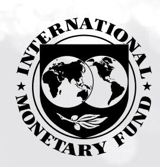
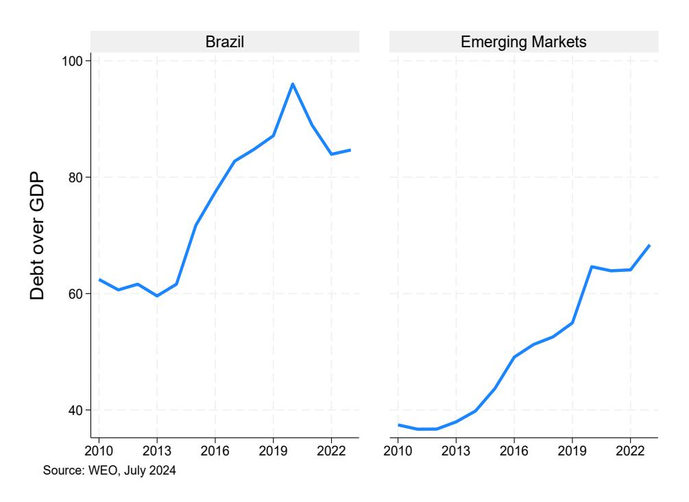
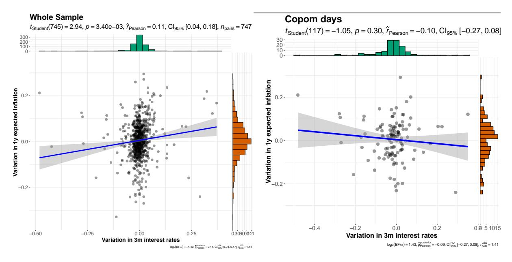

# **Monetary Policy and Inflation Expectations**

**High Frequency Evidence from Brazil** 

Carlos Goncalves, Mauro Rodrigues and Fernando Genta

WP/**25/48**

*IMF Working Papers* **describe research in progress by the author(s) and are published to elicit comments and to encourage debate.**  The views expressed in IMF Working Papers are those of the author(s) and do not necessarily represent the views of the IMF, its Executive Board, or IMF management.

2025 FEB

#### **IMF Working Paper**

Fiscal Affairs Department

#### **Monetary Policy and Inflation Expectations: High-Frequency Evidence from Brazil Prepared by Carlos Goncalves, Mauro Rodrigues and Fernando Genta**

Authorized for distribution by Davide Furceri February 2025

*IMF Working Papers* **describe research in progress by the author(s) and are published to elicit comments and to encourage debate.** The views expressed in IMF Working Papers are those of the author(s) and do not necessarily represent the views of the IMF, its Executive Board, or IMF management.

**ABSTRACT:** We investigate the impact of high frequency monetary policy shocks in Brazil using daily data and Rigobon' s identification via heteroskedasticity. We show that positive changes in interest rates cause inflation expectations to decline and the exchange rate to appreciate. To the best of our knowledge, this is the first paper to study how monetary policy affects inflation *expectations* in an emerging economy using high frequency identification techniques.

| JEL Classification Numbers: | E52, E31                                                            |
|-----------------------------|---------------------------------------------------------------------|
| Keywords:                   | Monetary policy; inflation expectations; Brazil                     |
| Author's E-Mail Address:    | cgoncalves@imf.org, mauror@usp.br, fernandogentasantos@gmail.com |

## **WORKING PAPERS**

## **Monetary Policy and Inflation Expectations**

High-Frequency Evidence from Brazil

Prepared by Carlos Goncalves, Mauro Rodrigues and Fernando Genta1

1 We thank Francesco Bianchi, Carlos Carvalho, Daniel Leigh, Rodrigo Valdez and participants in the IMF WHD seminar for helpful suggestions. All remaining errors are our own.

**IMF WORKING PAPERS** Title of WP

## **Glossary**

CB Central Bank

Copom Monetary Policy Committee (acronym in Portuguese)

FOMC Federal Open Markets Committee

HFI High-Frequency Identification

UIP Uncovered Interest Parity

**IMF WORKING PAPERS** Title of WP

## **Executive Summary**

The last decade witnessed a substantial increase in the number of studies using high frequency data to identify the effects of monetary policy shocks on the economy. The overall lesson is that the old SVAR literature was unable to accurately represent the impact of monetary policy shocks on the economy. But High Frequency Identification (HFI) has rarely been deployed to study monetary transmission in Emerging Economies, a gap we help bridge in this paper.

There are three distinctive features to our work. First, our main focus is on the impact of monetary policy on daily inflation *expectations*. In much of this literature, *daily* shocks are used to investigate *monthly* responses of prices and output. Here, the variables under scrutiny – inflation expectations, the exchange rate and a measure of sovereign risk premium – are themselves high frequency. Second, we use data from a high-debt emerging economy, while most of the literature focuses on the US. Third, changes in interest rates around monetary policy meetings are not automatically assumed as a measure of exogenous monetary policy shocks. In most papers that use HFI, changes in rates within a tight time window are automatically labeled as shocks. But "case study" measures of monetary surprises are not immune to the endogeneity problem. Our paper bears testament to that: here, the case study OLS regressions deliver different results from our IV estimations exploiting heteroskedasticity. The paper is also related to the "tight money paradox" literature kickstarted by Sargent and Wallace (1981) and Leeper (1991). In essence, the idea in those articles is that the behavior of fiscal policy is key to understand how changes in interest rates end up affecting inflation. If higher real interest rates trigger an increase in debt levels and no response from primary balances (passive fiscal policy in the words of Leeper), the public might expect the snowballing of debt to end in monetization. Paradoxically then, monetary policy can be counterproductive: higher interest rates would cause inflation expectations to go up. We do not find evidence of this "unpleasant arithmetic" in the case of Brazil. At least not on average or for the subperiods reported in the "Robustness" section.

## **Contents**

| 1 |         | Introduction                                                    |    |  |  |  |
|---|---------|-----------------------------------------------------------------|----|--|--|--|
| 2 |         | Data and empirical strategy                                     | 5  |  |  |  |
|   | 2.1     | Data                                                            | 5  |  |  |  |
|   | 2.2     | The identification strategy                                     | 6  |  |  |  |
|   | 2.3     | Test of the identification assumptions                          | 9  |  |  |  |
| 3 | Results |                                                                 | 10 |  |  |  |
|   | 3.1     | OLS: whole sample and "event study"                             | 10 |  |  |  |
|   | 3.2     | Effect of monetary surprises on inflation expectations using IV | 12 |  |  |  |
|   | 3.3     | Effect of monetary surprises on CDS and the exchange rate       | 13 |  |  |  |
|   | 3.4     | Robustness tests                                                | 13 |  |  |  |
| 4 |         | Final remarks                                                   | 15 |  |  |  |
|   |         | List of Figures                                                 |    |  |  |  |
|   |         |                                                                 |    |  |  |  |
|   | 1       | Gross Debt/GDP in Brazil and other Emerging Economies           | 4  |  |  |  |
|   | 2       | Full Sample                                                     | 11 |  |  |  |
|   | 3       | Only Copom meetings                                             | 11 |  |  |  |
|   |         | List of Tables                                                  |    |  |  |  |
|   | 1       | Variance tests using TNC > TC                                   | 10 |  |  |  |
|   | 2       | From naive OLS to case study coefficient                        | 11 |  |  |  |
|   | 3       | OLS estimates: full sample and case study                       | 11 |  |  |  |
|   | 4       | IV through heteroskedasticity estimates                         | 12 |  |  |  |
|   | 5       | Exchange rate and Risk: IV estimates                            | 13 |  |  |  |
|   | 6       | Using survey measure of 𝜋 𝑒                               | 14 |  |  |  |
|   | 7       | Excluding changes in inflation above P(95) and below P(05)      | 14 |  |  |  |
|   | 8       | Moving window IV regressions: 3m interest rates                 | 14 |  |  |  |
|   | 9       | Dropping FOMC dates                                             | 15 |  |  |  |

## 1 Introduction

The last decade witnessed a substantial increase in the number of studies using high-frequency data to identify the effects of monetary policy shocks on the economy. These include Agripino and Ricco (2021), Gertler and Karadi (2015), Bauer and Swanson (2022, 2023), Nakamura and Steinsson (2018), amongst others. The overall lesson is that the old SVAR literature, relying mostly on timing restrictions for identification, was unable to accurately represent the impact of monetary policy shocks on the economy.

But High Frequency Identification (HFI) has rarely been deployed to study monetary transmission in Emerging Economies1, a gap we aim to bridge here by focusing on a large developing economy, Brazil.

This paper has three new features. First, our main focus is on the impact of monetary policy on inflation *expectations*. The main variable of interest is the daily change in market-based (not survey data) inflation expectations. In much of this literature, *daily* monetary policy shocks are used to investigate *monthly* responses of prices and output. Here, the variables under scrutiny – inflation expectations, the exchange rate and a measure of sovereign risk premium (the so-called CDS) – are themselves high frequency in nature. Second, we use data from a high-debt emerging economy, while most of the literature focuses on the US2. Third, changes in interest rates around monetary policy meetings are not automatically assumed to be a measure of exogenous monetary policy shocks. In most papers using HFI, the change in rates within a tight time window is automatically labeled as a shock. But as Rigobon and Sack (2004) convincingly argue, "case study" measures of monetary surprises are not immune to the endogeneity problem. Our paper bears testament to that: here the case study OLS regressions deliver different results from our IV estimations exploiting heteroskedasticity.

Our work is also related to the "tight money paradox" literature kickstarted by Sargent and Wallace (1981), and to its multiple offsprings, such as Leeper (1991) and more recently Bianchi and Melosi (2019). In essence, the idea in those articles is that monetary policy does not take place in a vacuum, and amongst other factors, the behavior of fiscal policy is key to understanding how changes in interest rates end up affecting inflation. If higher real interest rates trigger an increase in debt levels and no response from primary balances (passive fiscal policy in the words of Leeper), the public might expect the snowballing of debt to end in monetization. Paradoxically then, monetary policy can be counterproductive: higher interest rates would cause inflation expectations to go up.3

&lt;sup>1A very recent exception is Checo et al (2024), which employs however a different empirical strategy. 2Cesa-Bianchi et al (2020) applies HFI to analyze monetary policy in the UK.

&lt;sup>3Analyses of the so-called "tight money paradox" can be found in Loyo (1999), Bhattacharya and

Can traces of the tight monetary paradox be found in Brazil's post-2009 data? On average, this does not appear to be the case.

Historically, Brazil has faced very high inflation from the 1980s until the mid-1990s. In 1994, the country implemented a successful stabilization plan (the Real Plan), bringing inflation down through an exchange rate peg. Then in 1999, following a sequence of international crises (Asia, Russia), the government was forced to abandon the peg, replacing it with an inflation-targeting cum floating exchange rate regime. In terms of institutional progress, the formal independence of the central bank was granted only very recently, in 2019, although *de facto* independence was arguably achieved much earlier. Overall, our reading is that credibility building is an ongoing process and the fact that **long-term** inflation expectations as of January 2025 were still 50 bps above the target is a sign of imperfect credibility.

Moreover, government finances have been on shaky ground for many years: the country has one of the largest public debts among emerging economies, deficits are elevated, and real interest rates have been very high since the 1990s.4 This is illustrated in Figure 1, which compares Brazil's debt-GDP ratio with that of a set of emerging countries during the last 15 years (which roughly coincides with our sample).5

Figure 1: Gross Debt/GDP in Brazil and other Emerging Economies

Kudoh (2003), Sims (2011), Uribe (2016), Andolfatto (2021), Werning (2021), amongst others.

&lt;sup>4See Ayres et al (2022) for a discussion on Brazil's recent monetary and fiscal history.

&lt;sup>5General government gross debt, percent of GDP. Data from the IMF's World Economic Outlook Database, October 2024.

Finally, simple estimates of the so-called Bohn rule6 for the country suggest passive fiscal policy as the norm rather than the exception.

Given this background, one might conclude that inflation expectations cannot possibly be tamed by higher interest rates. However, our estimated coefficients indicate that a positive/negative interest rate surprise causes inflation expectations to decline/increase by a nontrivial amount7.

We also test whether monetary policy influences the exchange rate. It has been argued that by increasing the probability of default, a tighter monetary stance could cause the exchange rate to depreciate. Blanchard (2005) and Favero and Giavazzi (2005) make this argument explicitly for the case of Brazil circa 2002. Our analysis does not support this conjecture for the 2009:2024 years as a whole.8 We also find no evidence of the mechanism suggested for the "inverted-UIP": monetary policy tightenings do not lead to higher risk premia in our sample (though, as we show later, this positive association is what a naive OLS regression yields).

To be clear, this paper estimates **average** effects and it might very well be possible that monetary policy was inefficient at specific moments in time within our sample. Formally testing this is challenging, though. Robustness tests using different sample periods corroborate our main finding: monetary policy works.

## 2 Data and empirical strategy

#### 2.1 Data

In the same vein as the Fed's FOMC, in Brazil the monetary policy committee (Copom is the acronym in Portuguese) meets at pre-scheduled dates. The committee is composed of the Central Bank's president and its board of directors, who discuss the state of the economy for two days, typically a Tuesday and a Wednesday, and then announce their decision on how much the policy rate should be adjusted after markets close on Wednesday. Our 1 day window then will be comprised of variations in closing prices from Wednesdays to Thursdays. The sample comprises all the weeks between September 2009 and December 2024.

Since there is no futures market for the prime rate, we measure the change in interest rates,  $\Delta i$ , using inter-bank deposit rate changes. For robustness, we look at different

&lt;sup>6Available upon request; see Bohn (1998).

&lt;sup>7All coefficients estimated using ID through heteroskedasticity are also highly statistically significant. 8Though this result is reversed when the data sample is restricted to the 2003-2008 period, as shown

in Goncalves and Guimaraes (2011).

maturities: 30, 90, 180 and 360 days.9

Brazil features a private market for inflation-indexed financial instruments that allows us to tease out markets' inflation expectations at different horizons: 1 year ahead (our benchmark), but also 2, 3 and 5 years ahead.10

By subtracting from the expected return on nominal debt contracts the coupon of inflation-indexed instruments of same maturity, we arrive at a measure of expected inflation *plus a risk premium*. This is admittedly an imperfect measure of expected inflation, given it also incorporates an inflation risk premium11.

The alternative is to use Central Bank's weekly survey data, the so-called FOCUS database. The problem with this strategy, in addition to the well-known issues with surveys' data on expectations (see Coibion et al (2020), for example) is that participants update their forecasts in the Central Bank system mostly on Fridays. This means the window around the COPOM meeting becomes too large: an entire week, instead of one day. Nevertheless, when we employ this measure of inflation expectations, our results barely change.

The other two dependent variables under scrutiny are (i) the variation in the closing price of nominal exchange rate, and (ii) the Wednesday-to-Thursday change in CDS risk premium.

In the case of the exchange rate, we simply replace  $\Delta \pi_t^e$  by  $\frac{\Delta E_t}{E_{t-1}}$ : the percentage change in the BRL/USD exchange rate between Wednesdays and Thursdays. Defined this way, a positive (negative)  $\Delta E_t$  implies a depreciation (appreciation) of the Brazilian Real against the U.S. Dollar.12

## 2.2 The identification strategy

Our main goal is to estimate the effect of interest rates surprises ( $\Delta i$ ) on inflation expectations ( $\Delta \pi^e$ ). This is captured by the parameter  $\beta$  in equation (1) below. However, consistently estimating this effect is tricky. First, omitted variables might affect both interest rates and inflation expectations. Second, reverse causality may impart a positive bias on the OLS coefficient, as the Central Bank increases interest rates and bondholders

&lt;sup>9Data can be downloaded from the Sao Paulo Stock Exchange webpage (BM&FBOVESPA, 2009-2024a,b).

&lt;sup>10Daily data on government bond yields were downloaded from a Bloomberg terminal. See Bloomberg (2009-2024a,b,c) for non-inflation linked bond yields, and Bloomberg (2009-2024d,e,f) for inflation linked bond yields. Alternatively, the Brazilian Financial and Capital Markets Association (2009-2024a,b,c) provides free access to these series.

&lt;sup>11Though Central Bank of Brazil (2014) argues it is a reliable measure of average inflation expectations. In addition, if the risk-premium does not change much over time, its presence would not meaningfully affect our estimations, since these are based on 1-day *differences* 

&lt;sup>12Data were obtained at the Central Bank of Brazil webpage (SGS Banco Central do Brasil, 2009-2024).

demand higher nominal yields when they expect higher inflation.

$$\Delta \pi_t^e = \alpha + \beta \Delta i_t + u_t \tag{1}$$

$$\Delta i_t = \gamma + \delta \Delta \pi_t^e + v_t \tag{2}$$

Where  $u_t$  and  $v_t$  are error terms with variances  $\sigma_{ut}$  and  $\sigma_{vt}$ , respectively. If  $\delta \neq 0$ ,  $\beta$  cannot be consistently estimated via OLS.

Rearranging the equations:

$$\Delta \pi_t^e = (1 - \delta \beta)^{-1} (\alpha + \beta \gamma + (\delta u_t + v_t))$$
(3)

$$\Delta i_t = (1 - \delta \beta)^{-1} (\alpha \delta + \gamma + (u_t + \beta v_t)) \tag{4}$$

Using (3) and (4) it can be easily shown that if one naively estimates (1), the estimated parameter will differ from the true one as follows:

$$\widehat{\beta_{ols}} = \beta + \delta(1 - \delta\beta) \frac{\sigma_u}{\beta^2 \sigma_u + \sigma_v}$$

Hence, when  $\delta \neq 0$ ,  $\widehat{\beta_{ols}} \rightarrow \beta$  only as  $\sigma_v \rightarrow \infty$ 

To be clear, this is a potential problem for all empirical studies relying on variations in interest rates around a narrow window of time.

Therefore, to estimate the effect of interest rate surprises on inflation expectations, we follow Rigobon (2003)'s approach of identification through heteroskedasticity. As shown in Rigobon and Sack (2004), identification is achieved if two conditions are satisfied: (i) the variance of interest rate shocks ( $v_t$ ) is higher in the subsample of daily changes featuring Central Bank's monetary policy committee meetings and (ii) no such difference in variances is present for changes inflation expectations ( $u_t$ ).

That these are the identifying assumptions becomes clear from manipulating the variance-covariance matrices for two partitions of the sample: *C* for Copom dates and *NC* for the non-Copom dates. Define the variances of the shocks in equations (1) and (2) in these two subsamples as:

$$\sigma_{ut} = \begin{cases} \sigma_u^C & \text{, if } t \in C \\ \sigma_u^N & \text{, if } t \in N \end{cases}; \qquad \sigma_{vt} = \begin{cases} \sigma_v^C & \text{, if } t \in C \\ \sigma_v^N & \text{, if } t \in N \end{cases}$$

Calculating the difference in the variance-covariance matrices, one gets:

$$\Omega_{C} - \Omega_{NC} = \frac{1}{(1 - \beta \delta)^{2}} \begin{bmatrix} \sigma_{v}^{C} - \sigma_{v}^{NC} + \delta^{2}(\sigma_{u}^{C} - \sigma_{u}^{NC}) & \beta(\sigma_{v}^{C} - \sigma_{v}^{NC}) + \delta(\sigma_{u}^{C} - \sigma_{u}^{NC}) \\ & \cdot & \beta^{2}(\sigma_{v}^{C} - \sigma_{v}^{NC}) + \sigma_{u}^{C} - \sigma_{u}^{NC} \end{bmatrix}$$

Imposing the identifying assumptions:

$$\sigma_v^{\mathsf{C}} > \sigma_v^{\mathsf{N}} \tag{5}$$

$$\sigma_u^C = \sigma_u^N \tag{6}$$

One gets:

$$\Omega_C - \Omega_{NC} = \frac{\sigma_v^C - \sigma_v^{NC}}{(1 - \beta \delta)^2} \begin{bmatrix} 1 & \beta \\ \cdot & \beta^2 \end{bmatrix}$$

Thus allowing for two ways of identifying  $\beta$ :

$$\widehat{\Omega_C} - \widehat{\Omega_{NC}} = \begin{bmatrix} \omega_{11} & \omega_{12} \\ \cdot & \omega_{22} \end{bmatrix} \Rightarrow \widehat{\beta} = \frac{\omega_{12}}{\omega_{11}} \text{ or, alternatively } \widehat{\beta} = \frac{\omega_{22}}{\omega_{12}}$$

The same can be achieved in an instrumental variable setting. 13 Let:

$$\Delta I = \begin{cases} \Delta i_t / \sqrt{T_C} & , \text{ if } t \in C \\ \Delta i_t / \sqrt{T_N} & , \text{ if } t \in N \end{cases}$$

And,

$$z_t^i = \begin{cases} \Delta i_t / \sqrt{T_C} & , \text{ if } t \in C \\ -\Delta i_t / \sqrt{T_N} & , \text{ if } t \in N \end{cases}$$

where  $T_C$  is the size of the subsample in which Copom meetings occur, and  $T_N$  represents the number of observations in its complement. If the sizes of the subsamples are different, the explained variable also needs to be normalized as follows:

$$\Delta \widetilde{\pi}_{t}^{e} = \begin{cases} \Delta \pi_{t}^{e} / \sqrt{T_{C}} & , \text{ if } t \in C \\ \Delta \pi_{t}^{e} / \sqrt{T_{N}} & , \text{ if } t \in N \end{cases}$$

&lt;sup>13For further details, see Rigobon and Sack (2004).

Then the first stage, using the system of equations, takes the following form:

$$plim\frac{1}{T}(z'\Delta I) = \frac{1}{T_C}(\Delta i^C)'(\Delta i^C) - \frac{1}{T_{NC}}(\Delta i^{NC})'(\Delta i^{NC}) = (\frac{\delta + \beta}{1 - \delta \beta})^2 \cdot (\sigma_v^C - \sigma_v^{NC}) > 0 \quad (7)$$

Where the last equality comes from the identifying assumption discussed. Similarly:

$$plim\frac{1}{T}(z'\Delta\pi^{e}) = \frac{1}{T_{C}}(\Delta i^{C})'(u^{C}) - \frac{1}{T_{NC}}(\Delta i^{NC})'(u^{NC}) = (\frac{\beta}{1 - \delta\beta}).(\sigma_{u}^{C} - \sigma_{u}^{NC}) = 0$$
 (8)

## 2.3 Test of the identification assumptions

Variance tests allow us to check if the identifying assumptions just discussed are valid. According to expression (5), the variance of  $\Delta i_t$  should be higher in subset C than in subset NC and, following (6), there should be no such difference in variances for the explained variables  $\Delta \pi_t^e$ ,  $\Delta_t$  and  $\Delta E_t$ .

Table 1 shows the ratio between variances in set C and set N for all variables used, along with a 99% confidence interval.

The variances for  $\Delta i_t$  differ markedly across the subsamples. For  $\Delta \pi_t^e$ ,  $\Delta_t$  and  $\Delta E_t$ , conversely, we cannot reject the null of equal variances. The exception is the 2-year inflation expectations. Hence the identifying conditions hold in most cases and, accordingly, the instrumental variables strategy employed should be able to identify true causal effects.

Table 1: Variance tests using TNC > TC

|                |              | Ratio of variances | 99% CI       |
|----------------|--------------|--------------------|--------------|
| $\Delta i$     | Maturity 12m | 2.33               | [1.65; 3.42] |
|                | Maturity 6m  | 3.40               | [2.42; 4.99] |
|                | Maturity 3m  | 4.53               | [3.21; 6.65] |
|                | Maturity 1m  | 5.25               | [3.73; 7.69] |
| $\Delta \pi^e$ | 1 year       | 1.23               | [0.88; 1.81] |
|                | 2 years      | 1.59               | [1.13; 2.34] |
|                | 3 years      | 1.33               | [0.95; 1.96] |
|                | 5 years      | 1.11               | [0.79; 1.63] |
|                |              |                    |              |
| $\Delta E$     |              | 0.92               | [0.65; 1.35] |
| $\Delta risk$  |              | 0.85               | [0.60; 1.24] |

Notes: The table displays tests of the identification assumptions based on Rigobon's (2003) methodology. Specifically, we check for differences in variances across set C (weeks with Copom meeting) and set N (weeks without Copom meeting), using daily data between September 2009 and August 2024. The middle column of the table shows the ratio between variances in set C and in set N. The last column presents the 95% confidence interval for this ratio. We show statistics for the change in nominal interest rates ( $\Delta i$ ), the change in inflation expectations ( $\Delta \pi^e$ ), and the percentage change in the BRL/USD exchange rate ( $\Delta E$ ).  $\Delta i$  is measured by changes in interbank deposit rate. We use three maturities: 1 year, 6 months and 3 months. Inflation expectations are measured taking the difference between inflation linked and non-inflation linked government bonds. In this case, we calculate the variance ratio for 1, 2 and 5-year maturities: For all variables, differences were computed between Wednesday's and Thursday's values in **every week** within our sample.

### 3 Results

## 3.1 OLS: whole sample and "event study"

Figures 2 and 3 below show, respectively, the correlation pattern between  $\Delta i$  and  $\Delta \pi^e$  for the whole sample and for the dates of Copom meetings only (as in the case study literature).

A naive interpretation of the correlation pattern displayed on the left chart in table 2 might lead to the conclusion that increases in interest rates backfire: inflation expectations increase with positive interest rate surprises. And even when looking at Copom meetings only (chart on the right), one would not be able to conclude that tightenings lead to lower inflation expectations. The slope, though negative, is not statistically significant. Thus an event-study strategy would suggest no impact of monetary policy on inflation expectations.

Figure 2: Full Sample

Figure 3: Only Copom meetings

Table 2: From naive OLS to case study coefficient

We next report OLS estimates of  $\Delta \pi^e$  on  $\Delta i$  for the whole sample. Table 3 displays the results for four different measures of changes in inflation expectations and four different measures of changes in interest rates: 1 month, 3 months, 6 months and 1 year. All coefficients are *positive*.

Table 3: OLS estimates: full sample and case study

|                      | Interest rate measure = $\Delta $ ß |          |          |           |  |  |
|----------------------|-------------------------------------|----------|----------|-----------|--|--|
|                      | 1 month                             | 3 months | 6 months | 12 months |  |  |
| Full Sample $\beta$  | 0.16*                               | 0.25***  | 0.24***  | 0.21***   |  |  |
| (se)                 | (0.07)                              | (0.05)   | (0.03)   | (0.02)    |  |  |
| Copom Sample $\beta$ | -0.13                               | -0.09    | -0.02    | +0.01     |  |  |
| (se)                 | (0.11)                              | (0.09)   | (0.06)   | (0.05)    |  |  |

Notes: This table displays OLS regression results of changes in inflation expectations ( $\Delta\pi^e$ ) against changes in nominal interest rates ( $\Delta i$ ). Constants are included but not reported. We use daily data from Brazilian assets between September 2009 and December 2024.  $\Delta\pi^e$  is computed as the difference between Wednesday's and Thursday's observations. We run regressions using different measures of monetary shocks but always the same y-variable,  $\Delta\pi^e_{1year}$ . Numbers in parentheses are Newey-West standard errors.

These results were already hinted at in the correlation charts above. The positive and statistically significant coefficients in the first row could be hastily (and mistakenly) interpreted as evidence of the tight money paradox. The second row suggests this to be likely due to endogeneity – market future interest rates increase when expected inflation

increases – but if we were to stop at the case study regression, the verdict would still be very unfavorable to monetary policy: no impact on inflation expectations.

In the next subsection, we present the IV estimations exploiting the data's heteroskedasticity. Using this technique, we uncover a strong and consistent **textbook-like** impact of monetary policy on inflation expectations and the exchange rate.

## **3.2 Effect of monetary surprises on inflation expectations using IV**

The main IV results are shown in Table [4.](#page-15-2) Now all estimates are negative and display small standard-errors (majority of p-values are smaller than 1%). Positive interest rate surprises at different maturities are associated with lower inflation expectations at all horizons.

Table 4: IV through heteroskedasticity estimates

|                     | Δ𝜋 Dependent variable = 𝑒 |                    |                    |                    |
|---------------------|---------------------------------|--------------------|--------------------|--------------------|
|                     | 1 year                          | 2 years            | 3 years            | 5 years            |
| Δ 𝑖 (1 month) | -0.27*** (0.07)              | -0.64*** (0.07) | -0.69*** (0.08) | -0.67*** (0.07) |
| Δ 𝑖              | -0.26***                        | -0.60***           | -0.69***           | -0.69***           |
| (3 months) Δ     | (0.07) -0.21***              | (0.06) -0.45*** | (0.07) -0.53*** | (0.07) -0.67*** |
| 𝑖 (6 months)     | (0.05)                          | (0.05)             | (0.06)             | (0.08)             |
| Δ                   | -0.20***                        | -0.43***           | -0.50***           | -0.53***           |
| 𝑖 (12 months)    | (0.06)                          | (0.07)             | (0.07)             | (0.06)             |
| N                   | 768                             | 768                | 768                | 768                |

Notes: This table displays IV regression results of changes in inflation expectations (Δ ) against changes in nominal interest rates (Δ) using four measures of expectations and also changes in interest rates at four different maturities.

In terms of magnitudes, using Table [4](#page-15-2) a 100 basis point surprise in the interest rate leads to a reduction of between 0.2 to 0.3 percentage points in the 1-year ahead measure of inflation expectations.

## **3.3 Effect of monetary surprises on CDS and the exchange rate**

We now evaluate the impact of monetary shocks on the exchange rate and a risk measure. In theory, an increase in interest rates could lead to a currency depreciation via higher probability of default. The results of the previous subsection indicate that even if that were to be true, monetary tightenings would still bring down inflation expectations.

IV Regressions featuring both Δ and Δ as the dependent variable do not lend credence to the "higher rates leading to depreciation via increased risk" story. Positive interest rate surprises cause an appreciation of the Brazilian currency (the Real) against the U.S. dollar (and do not seem to affect the CDS either).

|             |          | Interest rate measure = | Δß       |           |
|-------------|----------|-------------------------|----------|-----------|
|             | 1 month  | 3 months                | 6 months | 12 months |
| Δ           | -5.64*** | -5.10***                | -3.93*** | -3.42***  |
| 𝐸 (se)   | (0.91)   | (0.75)                  | (0.63)   | (0.69)    |
| Δ           | 0.01     | -0.03                   | -0.05    | -0.11*    |
| 𝐶𝐷𝑆 (se) | (0.06)   | (0.05)                  | (0.04)   | (0.05)    |

Table 5: Exchange rate and Risk: IV estimates

Notes: This table displays IV results using the same technique as before. We report the coefficients using the 5-year CDS. The results with changes in 1-year CDS are available upon request.

## **3.4 Robustness tests**

We test the robustness of our results through three additional checks[14](#page-16-2). First, in Table [6](#page-17-0) we present the results when, instead of using market measures of inflation expectations, we resort to expected inflation from the Central Bank's survey with market participants. Specifically, models are run using the average of 12 months ahead inflation expectation reported by all survey participants (top row) and only the from the top 5 forecasters (bottom row). The benefit of using this measure is that it is not contaminated by the risk premia. The disadvantage, as mentioned before, is its weekly frequency.

Reassuringly, the results obtained using Brazilian securities are also borne out using survey data instead. Out of 8 entries in Table [6,](#page-17-0) only one is not statistically significant. Interestingly, coefficients are larger in the upper row, which uses the median of all survey respondents.

The second robustness exercise consists of excluding episodes with very large swings in expected inflation. Specifically, we exclude all Δ above the percentile 0.95 and below

14Here, we report results for two measures of interest rate surprises only: 12m and 3m

Table 6: Using survey measure of  $\pi^e$ 

|                            |          | Interest rate measure = $\Delta $ ß |          |           |  |  |
|----------------------------|----------|-------------------------------------|----------|-----------|--|--|
|                            | 1 month  | 3 months                            | 6 months | 12 months |  |  |
| $\Delta\pi^e_{survey}$     | -0.60*** | -0.54***                            | -0.43*** | -0.36***  |  |  |
| (se)                       | (0.17)   | (0.13)                              | (0.11)   | (0.12)    |  |  |
| $\Delta\pi^e_{surveytop5}$ | -0.25*** | -0.20***                            | -0.13**  | -0.09     |  |  |
| (se)                       | (0.10)   | (0.08)                              | (0.06)   | (0.07)    |  |  |

Notes: This table displays the results of monetary policy shocks on inflation expectations reported by market participants to the CB. The first row includes all participants; the second row includes forecasts from the top-5 forecasters only.

percentile 0.05. This reduces the sample to 689 observations and makes it harder to identify the impact of monetary policy since variability in the variable of interest is curtailed.

Table 7: Excluding changes in inflation above P(95) and below P(05)

| $\Delta i$ used | $\Delta \pi^e 1y$ | $\Delta \pi^e 2y$ | $\Delta \pi^e 3y$ | $\Delta \pi^e 5y$ | $\frac{\Delta E}{E}$ |
|-----------------|-------------------|-------------------|-------------------|-------------------|----------------------|
| 3 months        | -0.07*            | -0.47***          | -0.59***          | -0.61***          | -2.00**              |
| (se)            | (0.04)            | (0.05)            | (0.04)            | (0.06)            | (0.69)               |
| 12 months       | -0.12***          | -0.39***          | -0.46***          | -0.46***          | -0.94*               |
| (se)            | (0.03)            | (0.05)            | (0.04)            | (0.05)            | (0.48)               |

Number of observations is now 689.

The third test focuses on sub-samples. We report results for six different 10-year moving windows with start dates in 2009, 2010, 2011, 2012, 2013 and 2014. We use the 3-month interest rate in all specifications. Out of the 18 entries in Table 8, only one is borderline significant. Moreover, over time monetary policy effectiveness seems to have increased judging by the second and third rows.

Table 8: Moving window IV regressions: 3m interest rates

|                      | 2009:2019 | 2010:2020 | 2011:2021 | 2012:2022 | 2013:2023 | 2014:2024 |
|----------------------|-----------|-----------|-----------|-----------|-----------|-----------|
| $\Delta \pi^e 1y$    | -0.25 *** | -0.13 *** | -0.17 **  | -0.18 **  | -0.21 **  | -0.19 *   |
| (se)                 | 0.06      | 0.05      | 0.08      | 0.09      | 0.10      | 0.11      |
| $\Delta \pi^e 5y$    | -0.61 *** | -0.56 *** | -0.79 *** | -0.81 *** | -0.85 *** | -0.91 *** |
| (se)                 | 0.06      | 0.06      | 0.09      | 0.10      | 0.11      | 0.13      |
| $\frac{\Delta E}{E}$ | -2.85 *** | -3.67 *** | -5.50 *** | -5.90 *** | -7.70 *** | -8.79 *** |
| (se)                 | 0.73      | 0.73      | 0.97      | 1.06      | 1.25      | 1.40      |

Finally, there is a significant number of instances in which the Copom meeting coincides with FOMC Meetings in the US: 32 from 2009 to the end of 2024. If variables

that are potentially relevant to explain inflation expectations in Brazil, such as commodity prices, display higher variance on the days of FOMC that are also Copom days, a bias could be introduced to our estimates. Our fourth robustness exercise hence consists of dropping those common dates from the sample.

The new C-subsample now has 90 data points, whereas the NC-subsample is kept unchanged. Results presented in Table [9](#page-18-1) show this paper's main message remains in this smaller sample.

Table 9: Dropping FOMC dates

|                  | Δ Δ𝜋 𝑒 and 𝐸                              |          |          |          |          |  |  |  |
|------------------|----------------------------------------------------|----------|----------|----------|----------|--|--|--|
|                  | 𝐸 1 year 2 years 3 years 5 years FX |          |          |          |          |  |  |  |
| Δ                | -0.35***                                           | -0.82*** | -0.89*** | -0.82*** | -5.90*** |  |  |  |
| 𝑖 (3 month)   | (0.07)                                             | (0.08)   | (0.08)   | (0.08)   | (0.95)   |  |  |  |
| Δ                | -0.27.***                                          | -0.65*** | -0.72*** | -0.71*** | -4.98*** |  |  |  |
| 𝑖 (12 months) | (0.08)                                             | (0.11)   | (0.12)   | (0.11)   | (1.03)   |  |  |  |
| N                | 736                                                | 736      | 736      | 736      | 736      |  |  |  |

Notes: This table displays IV regression results of changes in inflation expectations and the exchange rate against changes in nominal interest rates. The methodology is always Rigobon's identification through heteroskedasticity, but the sample is smaller because we drop days in which the Copom meeting coincides with the FOMC.

## **4 Final remarks**

The large and thriving literature on HFI of monetary policy shocks has two important missing parts. First, it is too US-centric (with few exceptions). Arguably, some emerging economies' characteristics can impair monetary transmission, such as shallow credit markets, lack of fiscal credibility, risk premia, etc. Second, inflation expectations have been largely neglected, though they are a crucial determinant of actual inflation in both theoretical and empirical work. This paper bridges these two gaps by using data from an emerging economy to assess the impact of monetary surprises on inflation expectations.

The resurgence of models featuring characteristics of the FTPL also sparked a renewed interest in the unpleasant arithmetic logic of Sargent and Wallace (1981). Can monetary policy backfire if fiscal policy is active and debt is elevated? We do not find systematic evidence of that using data from Brazil.

## **References**

Andolfatto, D. (2021). "Is It Time for Some Unpleasant Monetarist Arithmetic?" *Federal Reserve Bank of St. Louis Review*, vol. 103(3), pages 315-332, July.

Ayres, J.; Garcia, M.; Guillen, D.; Kehoe, P. J. (2022). "The case of Brazil." Kehoe, T. J.; Nicolini, J. P. (eds.) *A Monetary and Fiscal History of Latin America, 1960-2017*. University of Minnesota Press.

Bauer, M. Swanson, E. (2022). "A Reassessment of Monetary Policy Surprises and High-Frequency Identification", *NBER Working Papers* 29939, National Bureau of Economic Research.

Bauer, M. Swanson, E. (2023). "An Alternative Explanation for the Fed Information Effect", *American Economic Review*, vol 113, pages 664-700.

Bhattacharya, J.; Noritaka K. (2002). "Tight money policies and inflation revisited." *Canadian Journal of Economics*, vol. 35(2), pages 185-217, May.

Bianchi, Francesco Melosi, Leonardo, 2019. "The dire effects of the lack of monetary and fiscal coordination," *Journal of Monetary Economics*, Elsevier, vol. 104(C), pages 1-22.

Blanchard, O. (2005). "Fiscal Dominance and Inflation Targeting: Lessons from Brazil." Giavazzi, F.; Goldfajn, I.; Herrera, S. (eds.) *Inflation Targeting, Debt, and the Brazilian Experience, 1999 to 2003*. Cambridge: MIT Press.

Bloomberg (2009-2024a). "Anbima Brazil Govt Bond Fixed Rate 1 Year - BZAD1Y Index." Brazilian Financial and Capital Markets Association.

Bloomberg (2009-2024b). "Anbima Brazil Govt Bond Fixed Rate 2 Year - BZAD2Y Index." Brazilian Financial and Capital Markets Association.

Bloomberg (2009-2024c). "Anbima Brazil Govt Bond Fixed Rate 3 Year - BZAD3Y Index." Brazilian Financial and Capital Markets Association.

Bloomberg (2009-2024d). "Anbima Brazil Govt Bond IPCA Rate 1 Year - BZAA1Y Index." Brazilian Financial and Capital Markets Association.

Bloomberg (2009-2024e). "Anbima Brazil Govt Bond IPCA Rate 2 Year - BZAA2Y Index." Brazilian Financial and Capital Markets Association.

Bloomberg (2009-2024f). "Anbima Brazil Govt Bond IPCA Rate 3 Year - BZAA4Y Index." Brazilian Financial and Capital Markets Association.

BM&FBOVESPA (2009-2024a). "Swap DI x pré 180 dias (nominal yield curve)." Brazilian Financial and CapitalMarkets Association. The daily data is available for download at

[https://www.b3.com.br/pt\\_br/market-data-e-indices/servicos-de-dados/mark](https://www.b3.com.br/pt_br/market-data-e-indices/servicos-de-dados/market-data/consultas/mercado-de-derivativos/precos-referenciais/taxas-referenciais-bm-fbovespa/)et[data/consultas/mercado-de-derivativos/precos-referenciais/taxas-referenc](https://www.b3.com.br/pt_br/market-data-e-indices/servicos-de-dados/market-data/consultas/mercado-de-derivativos/precos-referenciais/taxas-referenciais-bm-fbovespa/)iais[bm-fbovespa/](https://www.b3.com.br/pt_br/market-data-e-indices/servicos-de-dados/market-data/consultas/mercado-de-derivativos/precos-referenciais/taxas-referenciais-bm-fbovespa/).

BM&FBOVESPA (2009-2024b). "Swap DI x pré 360 dias (nominal yield curve)." Brazilian Financial and CapitalMarkets Association. The daily data is available for download at [https://www.b3.com.br/pt\\_br/market-data-e-indices/servicos-de-dados/mark](https://www.b3.com.br/pt_br/market-data-e-indices/servicos-de-dados/market-data/consultas/mercado-de-derivativos/precos-referenciais/taxas-referenciais-bm-fbovespa/)et[data/consultas/mercado-de-derivativos/precos-referenciais/taxas-referenc](https://www.b3.com.br/pt_br/market-data-e-indices/servicos-de-dados/market-data/consultas/mercado-de-derivativos/precos-referenciais/taxas-referenciais-bm-fbovespa/)iais[bm-fbovespa/](https://www.b3.com.br/pt_br/market-data-e-indices/servicos-de-dados/market-data/consultas/mercado-de-derivativos/precos-referenciais/taxas-referenciais-bm-fbovespa/).

Brazilian Financial and Capital Markets Association (2009-2024a). "Term Structure and Break Even Inflation (IPCA): 1-Year Break Even Inflation (252 Business Days)." Brazilian Financial and Capital Markets Association. The daily data is available for download at [https://www.anbima.com.br/pt\\_br/informar/curvas-de-juros](https://www.anbima.com.br/pt_br/informar/curvas-de-juros-fechamento.htm)[fechamento.htm](https://www.anbima.com.br/pt_br/informar/curvas-de-juros-fechamento.htm) and the API to build the database is available at [https://developers.](https://developers.anbima.com.br/en/precos-indices/apis-de-precos/titulos-publicos/#face-value-(vna)) [anbima.com.br/en/precos-indices/apis-de-precos/titulos-publicos/#face-va](https://developers.anbima.com.br/en/precos-indices/apis-de-precos/titulos-publicos/#face-value-(vna))lue- [\(vna\)](https://developers.anbima.com.br/en/precos-indices/apis-de-precos/titulos-publicos/#face-value-(vna)).

Brazilian Financial and Capital Markets Association (2009-2024b). "Term Structure and Break Even Inflation (IPCA): 2-Year Break Even Inflation (504 Business Days)." Brazilian Financial and Capital Markets Association. The daily data is available for download at [https://www.anbima.com.br/pt\\_br/informar/curvas-de-juros](https://www.anbima.com.br/pt_br/informar/curvas-de-juros-fechamento.htm)[fechamento.htm](https://www.anbima.com.br/pt_br/informar/curvas-de-juros-fechamento.htm) and the API to build the database is available at [https://developers.](https://developers.anbima.com.br/en/precos-indices/apis-de-precos/titulos-publicos/#face-value-(vna)) [anbima.com.br/en/precos-indices/apis-de-precos/titulos-publicos/#face-va](https://developers.anbima.com.br/en/precos-indices/apis-de-precos/titulos-publicos/#face-value-(vna))lue- [\(vna\)](https://developers.anbima.com.br/en/precos-indices/apis-de-precos/titulos-publicos/#face-value-(vna)).

Brazilian Financial and Capital Markets Association (2009-2024c). "Term Structure and Break Even Inflation (IPCA): 3-Year Break Even Inflation (726 Business Days)." Brazilian Financial and Capital Markets Association. The daily data is available for download at [https://www.anbima.com.br/pt\\_br/informar/curvas-de-juros](https://www.anbima.com.br/pt_br/informar/curvas-de-juros-fechamento.htm)[fechamento.htm](https://www.anbima.com.br/pt_br/informar/curvas-de-juros-fechamento.htm) and the API to build the database is available at [https://developers.](https://developers.anbima.com.br/en/precos-indices/apis-de-precos/titulos-publicos/#face-value-(vna)) [anbima.com.br/en/precos-indices/apis-de-precos/titulos-publicos/#face-va](https://developers.anbima.com.br/en/precos-indices/apis-de-precos/titulos-publicos/#face-value-(vna))lue- [\(vna\)](https://developers.anbima.com.br/en/precos-indices/apis-de-precos/titulos-publicos/#face-value-(vna)).

Central Bank of Brazil (2014). "Breaking the Break-even Inflation Rate." Inflation Report, December 2014.

Cesa-Bianchi, A.; Thwaites, G.; Vicondoa, A. (2020). "Monetary policy transmission in the United Kingdom: A high frequency identification approach." textitEuropean Economic Review, vol. 123, 103375.

Checo, A.; Grigoli,F. and Sandri, D (2024). "Monetary Policy Transmission in Emerging Markets: Proverbial Concerns, New Evidence," *BIS WP 1170*.

Coibion, Olivier, Yuriy Gorodnichenko, and Tiziano Ropele (2020). "Inflation Expectations and Firm Decisions: New Causal Evidence" *Quarterly Journal of Economics*, vol. 135(1), 165–219.

Favero, C. A.; Giavazzi, F. (2005). "Inflation Targeting and Debt: Lessons from Brazil." Giavazzi, F.; Goldfajn, I.; Herrera, S. (eds.) *Inflation Targeting, Debt, and the Brazilian Experience, 1999 to 2003*. Cambridge: MIT Press.

Getler, M; Karadi, P. (2015). "Monetary Policy Surprises, Credit Costs, and Economic Activity", *American Economic Journal: Macroeconomics*, vol 7, pages 44-76.

Goncalves, C.; Guimaraes, B. (2011). "Monetary policy, default risk and the exchange rate in Brazil." *Revista Brasileira de Economia*

Loyo, E. (1999). "Tight Money Paradox on the Loose: a Fiscalist Hyperinflation." *Harvard Kennedy School, unpublished manuscript*, August.

Miranda-Agrippino, S.; Ricco, G. (2021). "The transmission of monetary policy shocks." *American Economic Journal: Macroeconomics*, vol 13, pages 74-107.

Nakamura, E.; Steinsson, J. (2018). "High-Frequency Identification of Monetary Non-Neutrality: The Information Effect." *The Quarterly Journal of Economics, Volume 133, Issue 3, Pages 1283–1330.*

Rigobon, R. (2003). "Identification through Heteroskedasticity." *Review of Economics and Statistics*, vol. 85(4), pages 777-792, November.

Rigobon, R.; Sack, B. (2004). "The impact of monetary policy on asset prices." *Journal of Monetary Economics*, vol. 51(8), pages 1553-1575, November.

Sargent, T.; Silber, W. (2022). "Inflation, Deficits and Paul Volcker." *Wall Street Journal*, March 3, 2022.

Sargent, T. J.; Wallace, N. (1981). "Some unpleasant monetarist arithmetic." *Quarterly Review*, Federal Reserve Bank of Minneapolis, vol. 5(Fall).

Sims, C. A. (2011). "Stepping on a rake: The role of fiscal policy in the inflation of the 1970s." *European Economic Review*, vol. 55(1), pages 48-56, January.

SGS Banco Central do Brasil (2009-2021). "Exchange rate - Free - United States Dollar (sale) - 1." Banco Central do Brasil. The data is available for download at [https://www3.](https://www3.bcb.gov.br/sgspub/localizarseries/localizarSeries.do?method=prepararTelaLocalizarSeries) [bcb.gov.br/sgspub/localizarseries/localizarSeries.do?method=prepararTelaLocalizarSeries](https://www3.bcb.gov.br/sgspub/localizarseries/localizarSeries.do?method=prepararTelaLocalizarSeries) (accessed August 6, 2021).

Uribe, M. (2016). "Is the Monetarist Arithmetic Unpleasant?" NBER Working Paper 22866, National Bureau of Economic Research.

Werning, I. (2021). "Recalculating Sargent and Wallace's Unpleasant Arithmetic using Interest Rates." MIT.

World Economic Outlook Database (2009-2019). "General government gross debt, percent of GDP." International Monetary Fund. The data is available for download at <https://www.imf.org/en/Publications/WEO/weo-database/2022/April> (accessed Feb 1, 2022).