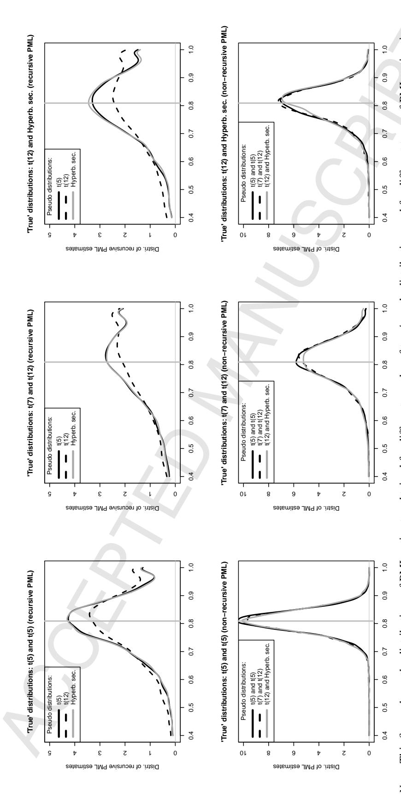
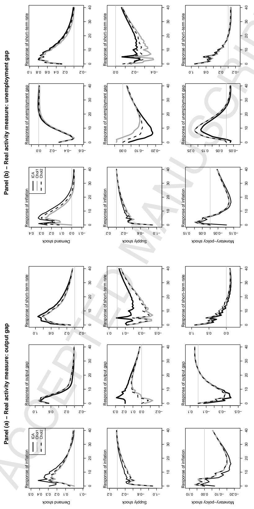

## Accepted Manuscript

Statistical inference for independent component analysis: Application to structural VAR models

Christian Gourieroux, Alain Monfort, Jean-Paul Renne ´

PII: S0304-4076(16)30174-9

DOI: <http://dx.doi.org/10.1016/j.jeconom.2016.09.007>

Reference: ECONOM 4303

To appear in: *Journal of Econometrics*

Received date: 28 June 2015

Revised date: 14 September 2016 Accepted date: 15 September 2016

Please cite this article as: Gourieroux, C., Monfort, A., Renne, J.-P., Statistical inference for ´ independent component analysis: Application to structural VAR models. *Journal of Econometrics* (2016), http://dx.doi.org/10.1016/j.jeconom.2016.09.007

This is a PDF file of an unedited manuscript that has been accepted for publication. As a service to our customers we are providing this early version of the manuscript. The manuscript will undergo copyediting, typesetting, and review of the resulting proof before it is published in its final form. Please note that during the production process errors may be discovered which could affect the content, and all legal disclaimers that apply to the journal pertain.

# Statistical Inference for Independent Component Analysis: Application to Structural VAR Models

Christian GOURIÉROUX∗ , Alain MONFORT† , Jean-Paul RENNE‡

(September 2016, revised version)

#### Abstract

The well-known problem of non-identifiability of structural VAR models disappears if the structural shocks are independent and if at most one of them is Gaussian. In that case, the relevant estimation technique is the Independent Component Analysis (ICA). Since the introduction of ICA by Comon (1994), various semi-parametric estimation methods have been proposed for "orthogonalizing" the error terms. These methods include pseudo maximum likelihood (PML) approaches and recursive PML. The aim of our paper is to derive the asymptotic properties of the PML approaches, in particular to study their consistency. We conduct Monte Carlo studies exploring the relative performances of these methods. Finally, an application based on real data shows that structural VAR models can be estimated without additional identification restrictions in the non-Gaussian case and that the usual restrictions can be tested.

JEL Codes: C14, C32.

Key-words: Independent Component Analysis, Pseudo Maximum Likelihood, Identification, Cayley Transform, Structural Shocks, Structural VAR , Impulse Response Functions.

The first two authors gratefully acknowledge support of the chair LCL: "New Challenges for New Data", of the LABEX: Finance et Croissance Durable, and of the chair ACPR on "Regulation and Systemic Risk". We are grateful to participants to the 2016 European Meeting of the Econometric Society.

∗CREST and University of Toronto, christian.gourieroux@ensae

†Corresponding author. CREST, alain.monfort@ensae.fr

‡University of Lausanne, jeanpaul.renne@unil.ch

## 1 Introduction

Let us consider *n* observed variables *Y* = (*y*1,..., *yn*) 0 , which are linear combinations of *n* independent unobserved sources ε = (ε1,..., ε*n*) 0 :

$$Y = C\varepsilon, \tag{1.1}$$

where the components ε*i* are zero-mean and the matrix *C* is invertible.

*C* is called the "mixing matrix" and *C* −1 the "demixing matrix". The problem of independent component analysis1 (ICA) is to identify *C* and ε from the knowledge of *Y*, or, in other words, to consistently estimate *C* and the distribution of ε, from a large number of observations *Y*1,...,*YT* of vector *Y*.

If ε is Gaussian, the distribution of *Y* is also Gaussian, with zero-mean and a variance-covariance matrix*CC*0 . From the knowledge of the distribution of *Y*, we identify the matrix*CC*0 , but not matrix *C* itself. For instance, if *C* ∗ = *CQ*, where *Q* is an orthogonal matrix, we have *C* ∗*C* ∗ 0 = *CC*0 . Thus there is a problem of both local and global identification, since *C* is identified up to an orthogonal matrix.

This identification problem is prevalent in the literature that exploits vector autoregressive (VAR) models to derive the dynamic responses of macro-finance variables to so-called structural shocks. Indeed, these structural shocks are usually assumed – more or less explicitly – to be Gaussian. In this context, the independent shocks ε are not identified and identifying restrictions are required, such as restrictions on the short run impact of the shocks [see e.g. Bernanke (1986), Sims (1986), Rubio-Ramirez, Waggoner, Zha (2010)], on the long run impacts [see e.g. Blanchard, Quah (1989), Faust, Leeper (1997), Erceg, Guerrieri, Gust (2005), Christiano, Eichenbaum, Vigfusson (2006)], or on the sign of some impulse response functions [see e.g. Uhlig (2005), Chari, Kehoe, McGrattan (2008), Mountford, Uhlig (2009)]. However the lack of identification almost disappears if we assume that the components of ε are independent and not Gaussian. This results from the following theorem, derived in Eriksson, Koivunen (2004) Th. 3 [see also Comon (1994), Th. 11]:

Theorem. *Consider the model: Y* = *C*ε*. Under the following conditions:*

- i) *C is invertible,*
- ii) *The components* ε1,..., ε*n are independent, with at most one Gaussian distribution,*

1 In signal processing, the components of ε are called "sources", the components of *Y* are called "sensors" and the ICA problem "blind separation of sources". Other terminologies are "sources/mixtures", "signal/mixtures", or "multiple input/multiple output" (MIMO).

then matrix C is identifiable up to the post multiplication by DP, where P is a permutation matrix and D a diagonal matrix with non-zero diagonal elements.

In other words C is identifiable up to a permutation of indexes and to signed scaling,  $\varepsilon_{i,t} \to \pm \sigma_i \varepsilon_{i,t}$ ,  $\sigma_i > 0, i = 1, ..., n$ , say. Thus, for independent non-Gaussian sources, the only cause of local lack of identification is through the positive scaling. The permutation and change in signs of columns of C create a global lack of identification, but not a local one.

The local identification problem, i.e. the possibility of replacing C by CD, where D is a diagonal matrix with strictly positive diagonal elements, can be avoided by introducing identification restrictions. Several sets of identification restrictions (SIR) have been considered in the literature. They are:

**SIR1**:  $c_{i,i} = 1$ , i = 1, ..., n where  $c_{i,i}$  is the  $i^{th}$  diagonal term of matrix C [see e.g. Jutten, Herault (1991), Comon, Jutten, Herault (1991), Eq. (3), Pham, Garat (1997), p. 1714, Ilmonen, Paindaveine (2015)].

**SIR2**:  $c_i'c_i = 1$ , i = 1, ..., n, where  $c_i$  denotes the  $i^{th}$  column of matrix C [see e.g. Comon (1994), Section 5.1, Pham, Garat (1997), p. 1714],

or similar sets of identification restrictions written on the diagonal elements  $c^{i,i}$ , or on the rows  $c^i, i = 1, ..., n$ , of the demixing matrix  $C^{-1}$ :

**SIR1\*** : 
$$c^{i,i} = 1$$
,  $i = 1, ..., n$ ,

**SIR2\*** : 
$$c^i c^{i'} = 1$$
,  $i = 1, ..., n$ .

Stronger conditions, such as the following, can be introduced:

**SIR3**: *C is an orthogonal matrix:* C'C = Id [see e.g. Hyvarinen (1997), Eq. 13, Vlassis (2001), Eq. 23, Hastie, Tibshirani (2002), Eq. 6].

If the error  $\varepsilon$  is standardized, i.e. if  $V(\varepsilon) = Id$ , these restrictions may imply constraints on the distribution of vector Y, such as V(Y) = Id for SIR3. This restriction can be asymptotically satisfied if the data are jointly prewhitened.

Restrictions SIR1 and SIR1\* have a major drawback: they implicitly assume that all diagonal elements are different from zero. Thus they exclude a priori some noncausal features between the variables, which can bias the impulse response analysis in a dynamic model with independent shocks.

Whenever the independent component model is locally identified, one can expect the existence of consistent semi-parametric estimation methods based on an i.i.d. sample  $Y_1, \ldots, Y_T$ . Two types

of approaches have been proposed in the literature, that are pseudo maximum likelihood (PML) approaches and moment methods. They differ by the form of the objective function, but also by the set of identification restrictions (SIR1-SIR3) that is used. These estimation methods have been introduced mainly in the literature on signal processing and data analysis with a focus on the numerical convergence and computational complexity of the algorithm used to get the estimate [see e.g. Amari, Cardoso (1997), Cardoso (1999), Cardoso, Laheld (1996), Cardoso, Souloumiac (1993), Comon (1994), Sections 4.2, 4.3., Hyvarinen (1997), Section 6, Hyvarinen (1999), Hyvarinen, Oja (1997, 2000), Section 6.1, Vlassis, Motomura (2001)]. As noted in Ilmonen et al. (2012), *"In the computer science communities ICA procedures are usually seen as algorithms rather than estimates with their statistical properties."* The statistical properties of these estimators, such as their consistency or asymptotic normality, are rarely considered [see Bonhomme, Robin (2009) for an exception in the context of moment methods]. This explains why several standard methods for ICA proposed in the literature or in softwares are not statistically consistent. Specifically, it can be shown that the one-unit algorithm using the identification restrictions SIR2 or SIR2\* provides estimators that are not statistically consistent.2

In this paper, we focus on the estimation of independent component models based on PML approaches and under SIR3. We carefully examine associated identification issues and we derive the asymptotic statistical behavior of the PML estimators. The PML approaches requires the specification of pseudo probability density functions (p.d.f.) for the different sources ε*i*,*t* , *i* = 1,...,*n*. We show that, whereas the potential misspecification of the pseudo p.d.f.'s influences the asymptotic accuracy of the PML estimators, it has no effect on the consistency of these estimators. This is important since, in many practical situations, we cannot assume that the true distributions belong to given parametric families. In this respect, our study extends that of Lanne, Meitz, Saikkonen (2015), who focus on the case where the parametric functional forms of the true p.d.f.'s are known. We also stress the usefulness of these methods for the identification of structural shocks and the estimation of impulse response functions in non-Gaussian vector autoregressive (VAR) models. Moreover, we show how the knowledge of the asymptotic distribution of the mixing matrix makes it possible to test the restrictions that are usually imposed in the structural vector autoregressive (SVAR) literature, these restrictions being over-identifying in the non-Gaussian context.

The remaining of this paper is organized as follows. Section 2 presents the pseudo maximum likelihood (PML) approaches for estimating matrix *C* under SIR3. This section shows that although these methods amount to maximizing a misspecified log-likelihood function, they provide consistent estimators. Then we derive the asymptotic distribution of these PML estimators. Since for large dimension *n* the optimization of the pseudo likelihood can be numerically cumbersome, we also analyse the recursive PML approaches under SIR3. These latter approaches compute the

2This is proven in Section A of the online appendix.

#### Pseudo Maximum Likelihood Approach (under SIR3)

estimators of the columns of *C* in a recursive way. Section 2 ends with the presentation of Monte-Carlo experiments aimed at comparing the finite-sample behavior of the different estimators and at evaluating their asymptotic properties. Section 3 illustrates the usefulness of ICA in the SVAR context; we employ ICA to identify structural shocks and derive impulse response functions in a small-scale VAR model estimated on U.S. macroeconomic data. In the context of this estimated VAR model, we test standard over-identification schemes based on short-run restrictions. Section 4 concludes. Technical results are gathered in appendices. Additional proofs and discussions are provided in an online appendix.

## 2 Pseudo Maximum Likelihood Approach (under SIR3)

In this section, we consider observations  $Y_t$  that are such that:

$$Y_t = C_0 \varepsilon_t, \tag{2.1}$$

where  $E_0(Y_t) = 0$  and  $V_0(Y_t) = Id$ . The true probability density functions (p.d.f.) of the latent components  $\varepsilon_{1,t}, \dots, \varepsilon_{n,t}$ , which we denote by  $f_{i,0}(\varepsilon_i)$   $(i = 1, \dots, n)$ , are unknown. These latent components satisfy the following assumption:

#### **Assumption A.1**

- i) The shocks  $\varepsilon_t$  are i.i.d. with  $E_0(\varepsilon_t) = 0$  and  $V_0(\varepsilon_t) = Id$ .
- ii) The components  $\varepsilon_{1,t}, \dots, \varepsilon_{n,t}$  are mutually independent.

In this framework,  $C_0$  is an orthogonal matrix ( $C_0C'_0 = Id$ ). Hence, this framework corresponds to the set of identification restrictions SIR3. By virtue of the theorem given above, if at most one of the true p.d.f. is Gaussian, then  $C_0$  is identifiable up to a permutation of index i and changes of sign of its columns.3

In the rest of this section, we discuss the consistency and the asymptotic properties of pseudo maximum likelihood estimators of the mixing matrix  $C_0$ .

&lt;sup>3When the sources are cross-sectionally independent, but serially correlated with distinct spectra, they can be identified by second-order methods, that is, from the knowledge of autocovariances only. This possibility to identify by means of the dynamics of the sources is not considered here. It is the basis of second-order estimation methods as AMUSE [Tong et al. (1990)], or SOBI [Belouchrani et al. (1997)], Gaussian PML written in frequency domain [Pham, Garat (1997), Section 3], or based on canonical correlations [Degerine, Malki (2000)].

#### 2.1 Pseudo Maximum Likelihood (PML) estimator

Let us introduce a set of p.d.f.  $g_i(\varepsilon_i)$ , i = 1, ..., n, and consider the pseudo log-likelihood function:

$$\log l_T(C) = \sum_{t=1}^{T} \sum_{i=1}^{n} \log g_i(c_i' Y_t), \tag{2.2}$$

where  $c_i$  is the  $i^{th}$  column of matrix C (or  $c_i'$  is the  $i^{th}$  row of  $C^{-1}$ ). The log-likelihood function (2.2) is computed as if the errors  $\varepsilon_{i,t}$  had the p.d.f.  $g_i(\varepsilon_i)$ , and using the fact that  $|\det C| = 1$ , since C is orthogonal. Then a pseudo maximum likelihood (PML) estimator of matrix C maximizes the pseudo log-likelihood function taking into account the condition that C is orthogonal. This optimization problem can be written as:

$$\hat{C}_T = \arg\max_{C} \sum_{t=1}^{T} \sum_{i=1}^{n} \log g_i(c_i' Y_t),$$
(2.3)

$$s.t. C'C = Id.$$

The optimization problem can also be considered after the elimination of the identification restrictions, that is, after parametrizing the orthogonal matrix C. It is known that any orthogonal matrix with no eigenvalue equal to -1 can be written as:

$$C(A) = (Id + A)(Id - A)^{-1},$$
 (2.4)

where A is a skew symmetric (or antisymmetric) matrix, such that A' = -A. This is the Cayley's representation of an orthogonal matrix. Moreover, this orthogonal matrix is in a one-to-one relationship with A since we have:

$$A = (C(A) + Id)^{-1}(C(A) - Id).$$
(2.5)

Thus, the PML estimator of matrix C can be alternatively derived as  $\hat{C}_T = C(\hat{A}_T)$ , where:

$$\hat{A}_T = \arg\max_{A} \sum_{t=1}^{T} \sum_{i=1}^{n} \log g_i [c_i(A)' Y_t], \tag{2.6}$$

and the optimization is with respect to the parameters characterizing A, that are the subdiagonal elements of A:  $a_{i,j}$ , i > j.

#### 2.2 The finite-sample first-order conditions (FOC)

The FOC can be written either on Problem (2.3), which is a constrained optimization, or on its parameterized version (2.6).4 We focus below on the FOC for Problem (2.3).

Let us distinguish the different restrictions on matrix C:

$$c'_i c_j = 0$$
,  $i < j$ , and  $c'_i c_i = 1$ ,  $i = 1, ..., n$ ,

and let us introduce the associated Lagrange multipliers denoted  $\lambda_{i,j} = \lambda_{j,i}$ , if  $i \neq j$ , and  $\lambda_{i,i}/2$ , when both indices are equal. Then the FOC are:

$$\begin{cases}
\sum_{t=1}^{T} Y_{t} \frac{d \log g_{i}}{d\varepsilon} (\hat{c}'_{i} Y_{t}) - \sum_{j=1}^{n} \hat{\lambda}_{i,j} \hat{c}_{j} = 0, & i = 1, ..., n, \\
\hat{c}'_{i} \hat{c}_{j} = 0, & i < j, \hat{c}'_{i} \hat{c}_{i} = 1, & i = 1, ..., n.
\end{cases}$$
(2.7)

We get  $n^2 + n(n-1)/2 + n$  conditions for the  $n^2 + n(n-1)/2 + n$  unknowns, that are the  $\hat{c}_{i,j}$ ,  $\hat{\lambda}_{i,j}$ , i < j, and  $\hat{\lambda}_{i,i}$ , i, j = 1, ..., n. Premultiplying the first subsystem of (2.7) by  $\hat{C}_T'$  and taking into account the constraints on the orthogonal matrix  $\hat{C}$ , the finite-sample FOC are equivalent to:

$$\begin{cases} \sum_{t=1}^{T} \hat{c}'_{j} Y_{t} \frac{d \log g_{i}}{d \varepsilon} (\hat{c}'_{i} Y_{t}) - \hat{\lambda}_{i,j} = 0, & i, j = 1, \dots, n, \\ \hat{c}'_{i} \hat{c}_{j} = 0, i < j, \hat{c}'_{i} \hat{c}_{i} = 1, & i = 1, \dots, n. \end{cases}$$

Since  $\hat{\lambda}_{i,j} = \hat{\lambda}_{j,i}$ , it is possible to derive from this system the equations giving  $\hat{C}_T$ . They are:

$$\begin{cases}
\sum_{t=1}^{T} \hat{c}'_{j} Y_{t} \frac{d \log g_{i}}{d \varepsilon} (\hat{c}'_{i} Y_{t}) - \sum_{t=1}^{T} \hat{c}'_{i} Y_{t} \frac{d \log g_{j}}{d \varepsilon} (\hat{c}'_{j} Y_{t}) = 0, \quad i < j, \\
\hat{c}'_{i} \hat{c}_{j} = 0, i < j, \hat{c}'_{i} \hat{c}_{i} = 1, \quad i = 1, \dots, n.
\end{cases}$$
(2.8)

Thus the FOC of the constrained optimization problem (2.3) lead to a subsystem leading to the estimate of C.

Let us denote by  $\mathscr{P}(M)$  the set of matrices obtained by permuting and changing the signs of the columns of M. It is worth noting that, if the function  $g_i$  are different and not even, the value of the objective function  $\sum_{t=1}^{T} \sum_{i=1}^{n} \log g_i(c_i'Y_t)$  obtained by taking C equal to an element of  $\mathscr{P}(\hat{C}_T)$ , different from  $\hat{C}_T$ , will be different and therefore smaller than the one obtained with  $\hat{C}_T$ . On the other hand, in the extreme case where all the  $g_i$ 's are equal and even, all the elements of  $\mathscr{P}(\hat{C}_T)$ 

&lt;sup>4Section B of the online appendix provides closed-form expressions of the derivatives of C(A) with respect to A, which can be used to derive the FOC for the model written under the parametric form.

will provide a maximum.

#### 2.3 Consistency

To derive conditions for the consistency of the PML estimators when T goes to infinity (and n is fixed), we have to consider the associated asymptotic optimization problem and the asymptotic FOC.

In addition to Assumption A.1, we make the following assumption on the p.d.f.  $g_i$ :

#### **Assumption A.2**

i) The functions  $\log g_i$ , i = 1, ..., n, are twice continuously differentiable.

ii) 
$$\sup_{C:C'C=Id} \left| \sum_{i=1}^n \log g_i(c_i'y) \right| \le h(y)$$
, where  $E_0[h(Y)] < \infty$ .

From Assumption A.1 and A.2 ii), we know that the finite-sample objective function:  $Q_T(C) = \frac{1}{T} \sum_{t=1}^{T} \sum_{i=1}^{n} \log g_i(c_i'Y_t)$  tends almost surely uniformly to the asymptotic one:

$$Q_{\infty}(C) = E_0 \left[ \sum_{i=1}^n \log g_i(c_i'Y_t) \right].$$

Moreover, the parameter set, that is, the set of orthogonal matrices, is compact. Then the uniform integrability in Assumption A.2 ii) implies the uniform convergence of  $Q_T$  towards  $Q_{\infty}$ , and the convergence of the optimizers of  $Q_T$  to the set of optimisers of  $Q_{\infty}$  [Jennrich (1969), Gourieroux, Monfort (1995), vol 2, chapter 24]. Finally the latter optimizers can be analyzed by means of the asymptotic FOC. This approach is followed below.

The asymptotic optimization problem is:

$$\max_{C} L_{\infty}(C) = \max_{C} \operatorname{plim}_{T \to \infty} \frac{1}{T} \log l_{T}(C) \equiv \max_{C} \sum_{i=1}^{n} E_{0}[\log g_{i}(c_{i}'Y_{t})], \tag{2.9}$$

s.t.  $c_i'c_j = 0$ , i < j,  $c_i'c_i = 1$ , i, j = 1, ..., n, with Lagrange multipliers  $\lambda_{i,j,0}, \lambda_{i,i,0}/2$ . The asymptotic FOC are:

$$\begin{cases} E_0 \left[ Y_t \frac{d \log g_i}{d\varepsilon} (c_i' Y_t) \right] - \sum_{j=1}^n \lambda_{i,j} c_j = 0, \quad i = 1, \dots, n, \\ c_i' c_j = 0, i < j, c_i' c_i = 1, \quad i, j = 1, \dots, n. \end{cases}$$

#### Pseudo Maximum Likelihood Approach (under SIR3)

By premultiplying the set of equations by  $c'_k$ , by using the conditions of orthogonal matrix and the equality  $\lambda_{i,j} = \lambda_{j,i}$ , the asymptotic FOC imply:

$$\begin{cases}
\lambda_{i,j} = E_0 \left[ c'_j Y_t \frac{d \log g_i}{d\varepsilon} (c'_i Y_t) \right] = E_0 \left[ c'_i Y_t \frac{d \log g_j}{d\varepsilon} (c'_j Y_t) \right] = \lambda_{j,i}, & i \neq j, \\
\lambda_{i,i} = E_0 \left[ c'_i Y_t \frac{d \log g_i}{d\varepsilon} (c'_i Y_t) \right], & i = 1, \dots, n.
\end{cases}$$
(2.10)

We deduce the following property:

**Proposition 1** For any element C of  $\mathcal{P}(C_0)$ , and the associated  $\varepsilon_{i,t}$ 's, the values C,  $\lambda_{i,j,0} = 0$ , i < j,  $\lambda_{i,i,0} = E_0\left[\varepsilon_{i,t} \frac{d \log g_i(\varepsilon_{i,t})}{d\varepsilon}\right]$ , i = 1, ..., n are solutions of the asymptotic FOC.

**Proof** Replacing the  $c_i$ 's by their true values, we get:

$$\lambda_{i,j,0} = E_0 \left[ \varepsilon_{j,t} \frac{d \log g_i(\varepsilon_{i,t})}{d\varepsilon} \right] = E_0 \left[ \varepsilon_{i,t} \frac{d \log g_j(\varepsilon_{j,t})}{d\varepsilon} \right] = \lambda_{j,i,0}.$$

Then, by the independence of  $\varepsilon_{i,t}, \varepsilon_{j,t}$  for  $i \neq j$ , we get:

$$E_0\left[\varepsilon_{j,t}\frac{d\log g_i(\varepsilon_{i,t})}{d\varepsilon}\right] = E_0(\varepsilon_{j,t})E_0\left[\frac{d\log g_i(\varepsilon_{i,t})}{d\varepsilon}\right] = 0,$$

since  $\varepsilon_{j,t}$  is zero-mean. The conclusion follows.

We deduce a necessary identification assumption.

#### Assumption A.3 Identification from the asymptotic FOC.

The only solutions of the system of equations:

$$\begin{cases} E_0 \left[ c'_j Y_t \frac{d \log g_i}{d\varepsilon} (c'_i Y_t) \right] = 0, \ i \neq j, \\ C'C = Id, \end{cases}$$

are the elements of  $\mathcal{P}(C_0)$ , which is the set of matrices obtained by permutation and sign change of the columns of  $C_0$ .

#### Pseudo Maximum Likelihood Approach (under SIR3)

As seen in the next proposition, Assumption A.3 implies restrictions on the true distribution of  $Y_t$  as well as on the choice of the pseudo p.d.f..

#### **Proposition 2**

- a) If at least two components of  $Y_t$  have the Gaussian distribution N(0,1), are independent from each other and independent from the other components, then Assumption A.3 cannot be satisfied.
- b) If at least two pseudo p.d.f.  $g_i$  and  $g_j$  are Gaussian N(0,1), then Assumption A.3 cannot be satisfied.

#### **Proof**

a) Let us assume, without loss of generality, that  $Y_{1,t}$  and  $Y_{2,t}$  are independent and N(0,1). Let C be an orthogonal matrix satisfying A.3 and  $C^*$  the orthogonal matrix obtained from C by permuting its first two rows. It is easily seen that  $C^*$  also satisfies A.3. Indeed, for any column  $c_i$  of C and the corresponding column  $c_i^*$  of C we have

$$c_i'Y_t = c_{i,1}Y_{1,t} + c_{i,2}Y_{2,t} + \sum_{k \ge 2} c_{i,k}Y_{k,t},$$
  
$$c_i^{*'}Y_t = c_{i,2}Y_{1t} + c_{i,1}Y_{2,t} + \sum_{k \ge 2} c_{i,k}Y_{k,t},$$

and, since  $c_{i,1}Y_{1,t} + c_{i,2}Y_{2,t}$  and  $c_{i,2}Y_{1,t} + c_{i,1}Y_{2,t}$  have the same distribution  $N(0, c_{i,1}^2 + c_{i,2}^2)$ , the result follows.

b) When  $g_i$  is N(0,1), we have  $\frac{\partial \log g_i}{d\varepsilon}(c_i'Y_t) = -c_i'Y_t$ . Therefore, the (i,j) condition of Assumption A.3 is:  $E_0(c_j'Y_tc_i'Y_t) = 0$ , which is true for any orthogonal matrix C and any true distribution of  $Y_t$  since  $E_0(c_j'Y_tc_i'Y_t) = E_0(c_j'Y_tY_t'c_i) = c_j'c_i$ .

Even if Assumption A.3 is satisfied, we are not sure that a matrix C of  $\mathcal{P}(C_0)$  corresponds to a maximum of the asymptotic optimization problem. To check this property, we can consider a second-order expansion of  $L_{\infty}(C)$  in a neighbourhood of the true value. It is shown in Appendix 1 that the asymptotic objective function is locally concave in a neighbourhood of a matrix C of  $\mathcal{P}(C_0)$  if and only if the following assumption is satisfied:

#### Assumption A.4 Local concavity in a neighbourhood of a matrix C of $\mathcal{P}(C_0)$ .

We have:

$$E_0 \left[ \frac{d^2 \log g_i(\varepsilon_{i,t})}{d\varepsilon^2} + \frac{d^2 \log g_j(\varepsilon_{j,t})}{d\varepsilon^2} - \varepsilon_{j,t} \frac{d \log g_j(\varepsilon_{j,t})}{d\varepsilon} - \varepsilon_{i,t} \frac{d \log g_i(\varepsilon_{i,t})}{d\varepsilon} \right] < 0, \forall i < j,$$

#### Pseudo Maximum Likelihood Approach (under SIR3)

where  $\mathcal{E}_{i,t}$  is the  $i^{th}$  component of the  $\mathcal{E}_t$  associated with a particular element C of  $\mathscr{P}(C_0)$ .

This condition is in particular satisfied under the following set of conditions derived in Hyvarinen (1997), Th. 1 [see also Hyvarinen, Karhunen, Oja (2001), Th. 8.1]:5

$$E_0 \left[ \frac{d^2 \log g_i(\varepsilon_{i,t})}{d\varepsilon^2} - \varepsilon_{i,t} \frac{d \log g_i(\varepsilon_{i,t})}{d\varepsilon} \right] < 0, i = 1, \dots, n.$$
 (2.11)

This set of conditions is sufficient, but not necessary. Hyvarinen, Karhunen, Oja (2001) have exhibited a couple of distributions that is such that either one, or the other satisfy the inequality (2.11) as long as  $E_0(\varepsilon_{i,t}) = 0$ , and  $E_0(\varepsilon_{i,t}^2) = 1$ . These distributions are the Hyperbolic secant and the subgaussian distributions reported in Table 1.6

For a given set of pseudo density functions in a given order  $g_1, \ldots, g_n$ , the value of the asymptotic criterion  $\sum_{i=1}^n E_0[\log g_i(c_i'Y_t)]$  for a given element C of  $\mathscr{P}(C_0)$  is:

$$\sum_{i=1}^n E_0[\log g_i(\boldsymbol{\varepsilon}_{i,t})],$$

where  $\varepsilon_{i,t}$  is the  $i^{th}$  component of the  $\varepsilon_t$  associated with this particular element C of  $\mathcal{P}(C_0)$ . If Assumption A.4 is satisfied for matrix C, this matrix will provide a local maximum of the asymptotic criterion. Furthermore, if the following assumption is also satisfied, then the values of the asymptotic criterion at these local maxima will be in general different and the global maximum will be reached by a unique element of  $\mathcal{P}(C_0)$ :

### Assumption A.5 Distinct distributions.

The pseudo distributions  $g_i$ , as well as the true distributions of the  $\varepsilon_{i,t}$ , are different and asymmetric.

For the sake of notational simplicity, let us denote by  $C_0$  the value of C giving this global maximum. We have the following consistency result:

&lt;sup>5Note that, if the pseudo distribution  $g_i$  is N(0,1) or even  $N(m_i, \sigma_i^2)$ , the left hand side of the inequality is equal to zero, for any true distribution of  $\varepsilon_{i,t}$  satisfying  $E_0(\varepsilon_{i,t}) = 0$  and  $E_0(\varepsilon_{i,t}^2) = 1$ .

&lt;sup>6This statement is easily checked by using the third and fourth columns of this table to compute the expectation appearing on the left-hand side of Inequality (2.11) (and using  $E_0(\varepsilon_{i,t}^2) = 1$ ).

&lt;sup>7If the global maximum of the asymptotic criterion is reached on a subset  $E_0$  of  $\mathscr{P}(C_0)$ , the PML estimator will converge to  $E_0$ , that is  $\hat{C}_T - C_{0,T}$  will converge to zero, where  $C_{0,T} = \underset{C \in E_0}{\operatorname{Argmin}} d(\hat{C}_T, C)$ , d being any distance.

#### Pseudo Maximum Likelihood Approach (under SIR3)

**Proposition 3** Under Assumptions A.1-A.5, the PML estimator of C exists asymptotically and is a consistent estimator of  $C_0$ .

Thus the misspecification of pseudo distributions  $g_i$  has no effect on the consistency of these specific PML estimators. This is easily understood when we consider the asymptotic FOC in A.3. They simply correspond to zero moment conditions written on:

$$c'_{j}Y_{t}\frac{d\log g_{i}}{d\varepsilon}(c'_{i}Y_{t}), \quad i \neq j.$$

The consistency result is still valid if  $g_i$  is not a p.d.f., but the interpretation as misspecified ML is more appealing.

### 2.4 Asymptotic distribution of the PML estimator

The asymptotic accuracy of the PML estimator depends on the choice of the pseudo p.d.f.. Its asymptotic distribution is derived in Appendix 2. Again, let us denote by  $C_0$  the unique value of C giving the global maximum of the asymptotic criterion under the conditions given above.

**Proposition 4** Under Assumptions A.1-A.5, the PML estimator  $\hat{C}_T$  of  $C_0$  is asymptotically normal, with speed of convergence  $1/\sqrt{T}$ . The asymptotic variance-covariance matrix of  $vec\sqrt{T}(\hat{C}_T - C_0)$  is  $A^{-1}\begin{bmatrix} \Omega & 0 \\ 0 & 0 \end{bmatrix}(A')^{-1}$ , where A and  $\Omega$ , given in Appendix 2, are square matrices of respective sizes  $n^2$  and  $\frac{n(n-1)}{2}$ .

The previous result implies that the asymptotic Gaussian distribution has a support of dimension  $\frac{n(n-1)}{2}$ , as expected since an orthogonal matrix must satisfy  $\frac{n(n+1)}{2}$  constraints.

For illustration, let us consider the bivariate case n = 2. The asymptotic expansion of the FOC shows that:

$$\sqrt{T}\left(\begin{array}{cc} \hat{c}_1-c_{1,0} \ \hat{c}_2-c_{2,0} \end{array}\right) = \left[\begin{array}{ccc} \gamma_{1,2}c'_{2,0} & \gamma_{2,1}c'_{1,0} \ c'_{10} & c'_{20} \ c'_{10} & 0 \ 0 & c'_{20} \end{array}\right]^{-1} \left[\begin{array}{ccc} Z \ 0 \ 0 \ 0 \end{array}\right],$$

where

$$Z \sim N(0, \omega^{2}),$$

$$\gamma_{i,j} = E_{0} \left[ \frac{d^{2} \log g_{i}(\varepsilon_{i,t})}{d\varepsilon^{2}} \right] - E_{0} \left[ \varepsilon_{j,t} \frac{d \log g_{j}(\varepsilon_{j,t})}{d\varepsilon} \right],$$

$$\omega^{2} = E_{0} \left\{ \left[ \frac{d \log g_{1}(\varepsilon_{1,t})}{d\varepsilon} \right]^{2} \right\} + E_{0} \left\{ \left[ \frac{d \log g_{2}(\varepsilon_{2,t})}{d\varepsilon} \right]^{2} \right\}$$

$$-2E_{0} \left[ \varepsilon_{1,t} \frac{d \log g_{1}(\varepsilon_{1,t})}{d\varepsilon} \right] E_{0} \left[ \varepsilon_{2,t} \frac{d \log g_{2}(\varepsilon_{2,t})}{d\varepsilon} \right].$$

The expression of the asymptotic variance can be simplified in the bivariate case. We get:8

$$V_{as}\left[\sqrt{T}(vec\hat{C}_T - vecC_0)\right] = \frac{\omega^2}{(\gamma_{1,2} + \gamma_{2,1})^2} \begin{pmatrix} c_{2,0}c'_{2,0} & -c_{2,0}c'_{1,0} \\ -c_{1,0}c'_{2,0} & c_{1,0}c'_{1,0} \end{pmatrix}. \tag{2.12}$$

This closed-form expression facilitates the consistent estimation of the asymptotic variance of  $\hat{C}_T$ . Indeed, from the PML estimates  $\hat{C}_T$  we deduce the approximated errors  $\hat{\varepsilon}_t = \hat{C}_T' Y_t$ . Therefore  $\gamma_{i,j}$  and  $\omega^2$  are consistently estimated by replacing their theoretical expectations by their sample counterparts and the errors  $\varepsilon$  by their approximations  $\hat{\varepsilon}$ . For instance, we can take:

$$\hat{\gamma}_{i,j} = \frac{1}{T} \sum_{t=1}^{T} \frac{d^2 \log g_i(\hat{\epsilon}_{i,t})}{d\epsilon^2} - \frac{1}{T} \sum_{t=1}^{T} \left[ \hat{\epsilon}_{j,t} \frac{d \log g_i(\hat{\epsilon}_{j,t})}{d\epsilon} \right].$$

For n = 2, the elements of C generate a manifold of dimension 1. Thus the asymptotic variance-covariance matrix is of rank 1. It has been suggested in Pham, Garat (1997), Section 2.B, to also consider the asymptotic distribution of transformations of  $\hat{C}_T$  such as:

$$\hat{\Delta}_T = Id - C^{-1}\hat{C}_T = Id - C'\hat{C}_T. \tag{2.13}$$

It can be shown that: 10

$$V_{as}[\sqrt{T}vec\hat{\Delta}_{T}] = \frac{\omega^{2}}{(\gamma_{1,2} + \gamma_{2,1})^{2}} \begin{bmatrix} 0 & 0 & 0 & 0\\ 0 & 1 & 1 & 0\\ 0 & 1 & 1 & 0\\ 0 & 0 & 0 & 0 \end{bmatrix}.$$
 (2.14)

&lt;sup>8This is done in Section C of the online appendix.

&lt;sup>9For expository purpose we have changed the definition of the so-called contamination coefficients initially defined as  $\hat{\Delta}_T = Id - \hat{C}_T^{-1}C$ .

&lt;sup>10See Section C of the online appendix.

#### Pseudo Maximum Likelihood Approach (under SIR3)

Thus, after this transformation, the asymptotic accuracy of ∆ˆ *T* no longer depends on matrix *C*, but only on the distributional properties of the sources and of the pseudo p.d.f..

Finally, the multiplicative factor function ω 2/(γ1,2 +γ2,1) 2 differs from the multiplicative factors derived in Hyvarinen (1997), Eq. 15, or in Pham, Garat (1997), where the restrictions on *C* required for identification do not seem to have been fully taken into account in their derivations.

Going back to the general case, we see that the asymptotic accuracy of the PML estimator depends on the choice of the pseudo p.d.f.. Since the ML estimator is asymptotically efficient, we immediately deduce the following corollary [see also Pham, Garat (1997)]:

Corollary 1 *The asymptotic accuracy of the PML estimator is maximal if gi , the pseudo p.d.f. of* ε*i*,*t* , *is equal to its true p.d.f..*

The corollary above raises the following two comments:

- i) The practice of selecting a pseudo p.d.f. as different as possible from a Gaussian distribution –for instance by maximizing a distance to Gaussianity such as the negentropy, or an approximation of the negentropy, by third and fourth-order cumulants– is suboptimal,11 especially when the true distribution is close to Gaussian.
- ii) The asymptotic efficiency for the estimation of parameter *C* could be improved through the implementation of a two-step adaptive estimation approach. In a first step *C* is estimated by a non efficient PML approach. The corresponding estimate is used to compute the residuals as: εˆ*t* = *C*ˆ0 *TYt* , *t* = 1,...,*T*. Next the approximated sources εˆ*i*,*t* , *t* = 1,...,*T* are used to estimate nonparametrically the densities *fi*,0, *i* = 1,...,*n*. In a second step the PML approach is reapplied with *gi* = ˆ*fi* , *i* = 1,...,*n*, where ˆ*fi* is a consistent functional estimator of *fi*,0.

### 2.5 Testing procedures

Let us now consider the problem of testing that the true value of *C* belongs to P0, where P0 is the set of orthogonal matrices obtained by permuting and changing the signs of the columns of a given orthogonal matrix *C*0 (i.e. P0 = P(*C*0)). We denote by *Cj*,0, *j* ∈ *J*, the elements of P0.

The null hypothesis *H*0 stating that the true value of *C* belongs to P0 is not standard since it is a finite union of simple hypotheses *H*0, *j* = (*C* = *Cj*,0).

11See Kaiser (1958) for an early version of such an idea, or the choice *gi*(*y*) = *sech*2 (*y*)/2, whose associated score function is 2*tanh*(*y*) introduced in the informax algorithm [Bell, Sejnowski (1995) or Hyvarinen, Karhunen, Oja (2001), p. 111, 222-223].

#### Pseudo Maximum Likelihood Approach (under SIR3)

A first testing procedure consists in defining the Wald statistics  $\hat{\xi}_{j,T}$ ,  $j \in J$ :

$$\hat{\xi}_{j,T} = T[vec\hat{C}_T - vecC_{j,0}]'\hat{A}_T' \begin{bmatrix} \hat{\Omega}_T^{-1} & 0\\ 0 & 0 \end{bmatrix} \hat{A}_T[vec\hat{C}_T - vecC_{j,0}], \tag{2.15}$$

 $\hat{A}_T$  and  $\hat{\Omega}_T$  being consistent estimators of the matrices A and  $\Omega$  defined in Proposition 4 and Appendix 2. Since the dimension of the asymptotic distribution of  $\sqrt{T}[vec\hat{C}_T - vecC_{j,0}]$  is  $\frac{1}{2}n(n-1)$ , the asymptotic distribution of  $\hat{\xi}_{j,T}$  under  $H_{0,j}$  is  $\chi^2\left(\frac{1}{2}n(n-1)\right)$ .

Then we define:

$$\hat{\xi}_T = \min_{j \in J} \hat{\xi}_{j,T},\tag{2.16}$$

as the test statistic for the null hypothesis of interest  $H_0$ . Under the null hypothesis,  $\hat{C}_T$  converges to  $C_{j_0,0}$ , say. By the asymptotic properties of the Wald statistics for simple hypotheses, we have that:

$$\hat{\xi}_{j_0,T} \xrightarrow{D} \chi^2 \left( \frac{n(n-1)}{2} \right) \tag{2.17}$$

and  $\hat{\xi}_{j,T} \to \infty$ , if  $j \neq j_0$ .

Under the null hypothesis,  $\hat{\xi}_T = \min_j \hat{\xi}_{j,T}$  is asymptotically equal to  $\hat{\xi}_{j_0,T}$  (since, for  $j \neq j_0$ ,  $\hat{\xi}_{j_0,T}$  goes to  $+\infty$ ) and its asymptotic distribution,  $\chi^2\left(\frac{1}{2}n(n-1)\right)$ , does not depend on  $j_0$ . Therefore  $\hat{\xi}_T$  is asymptotically a pivotal statistic for the null hypothesis  $H_0$  and the test of critical region  $\hat{\xi}_T \geq \chi^2_{1-\alpha}\left(\frac{1}{2}n(n-1)\right)$  is of asymptotic level  $\alpha$  and is consistent.

The second testing method is the following. Let us first define  $C_{0,T} = \underset{C \in \mathscr{P}_0}{\operatorname{Argmin}} d(\hat{C}_T, C)$  where d is any distance, for instance the Euclidean one.

Under the null hypothesis  $H_0$ :  $(C \in \mathscr{P}_0)$ ,  $\hat{C}_T$  converges almost surely to an element of  $\mathscr{P}_0$  denoted by  $C_{j_0,0}$  and it is also the case for  $C_{0,T}$  since, asymptotically, we have  $C_{0,T} = C_{j_0,0}$ . Moreover,  $\sqrt{T}(\hat{C}_T - C_{0,T}) = \sqrt{T}(\hat{C}_T - C_{j_0,0}) + \sqrt{T}(C_{j_0,0} - C_{0,T})$  and, since  $C_{0,T}$  is almost surely asymptotically equal to  $C_{j_0,0}$ , the asymptotic distribution of  $\sqrt{T}(\hat{C}_T - C_{j_0,0})$  under  $H_0$  is the same as that of  $\sqrt{T}(\hat{C}_T - C_{j_0,0})$ . This implies that

$$\tilde{\xi}_T = T[vec\hat{C}_T - vecC_{0,T}]'\hat{A}_T' \left[ \begin{array}{cc} \hat{\Omega}_T^{-1} & 0 \ 0 & 0 \end{array} \right] \hat{A}_T[vec\hat{C}_T - vecC_{0,T}]$$

is asymptotically distributed as  $\chi^2(\frac{1}{2}n(n-1))$  under  $H_0$ .

An advantage of this second method is that it necessitates the computation of only one Wald test statistic.

&lt;sup>12See Andrews (1987).

### 2.6 Recursive PML approach (under SIR3)

For a large dimension n, the optimization of the pseudo likelihood (Problem 2.3) can be numerically cumbersome. In the present subsection, we present a recursive PML approach. This approach is based on a succession of simplified optimization problems. The recursive PML approach has been called deflation-based Fast ICA in the literature [see e.g. Ollila (2010), Reyhani et al. (2012), Ilmonen et al. (2012), Miettinen et al. (2014)].

#### 2.6.1 The recursive scheme

In the recursive PML approach and under SIR3, the identification constraints (orthogonality of C) are introduced in a recursive optimization scheme.

Let us consider step i of the recursive PML approach. At this stage, the recursive PML estimators  $\hat{c}_1, \dots, \hat{c}_{i-1}$  have already been derived. The recursive PML estimator  $\hat{c}_i$  of  $c_i$  is defined as the solution of:

$$\hat{c}_i = \arg\max_{c_i} \sum_{t=1}^{T} \log g_i(c_i'Y_t), \quad s.t.: \quad c_i'c_i = 1, \quad c_i'\hat{c}_j = 0, \quad j = 1, \dots, i-1,$$
(2.18)

for i = 2, ..., n. For i = 1, the only constraint is  $c'_1 c_i = 1$ .

#### 2.6.2 The Gaussian case

This recursive PML approach has been initially proposed by analogy with principal component analysis (PCA) [see e.g. Lawley, Maxwell (1971), Anderson (1984) for PCA]. PCA is based on a PML approach with Gaussian pseudo distributions. Taking the standard Gaussian densities for all the densities  $g_i$  in Equation (2.2), the optimization Problem (2.3) becomes:

$$\max_{C} -\sum_{t=1}^{T} \sum_{i=1}^{n} (c'_{i}Y_{t})^{2}$$
  
s.t.  $C'C = Id$ .

The objective function can also be written as:

$$-\sum_{t=1}^{T}\sum_{i=1}^{n}c_{i}'Y_{t}Y_{t}'c_{i} = -\sum_{i=1}^{n}\left[c_{i}'\sum_{t=1}^{T}Y_{t}Y_{t}'c_{i}\right] = -Tr\left[C'\sum_{t=1}^{T}Y_{t}Y_{t}'C\right]$$

$$= -Tr\left[\sum_{t=1}^{T}Y_{t}Y_{t}'CC'\right] \text{ (by commuting within the Trace operator)}$$

$$= -Tr\left(\sum_{t=1}^{T}Y_{t}Y_{t}'\right) \text{ (since } CC' = Id\text{)}.$$

#### Pseudo Maximum Likelihood Approach (under SIR3)

Thus the objective function takes the same value for all orthogonal matrices C. This is the well-known identification problem of matrix C in the Gaussian framework (see the introduction and Proposition 2.a). The recursive Gaussian PML is used in PCA to find an easily interpretable matrix C. Indeed the solution of the recursive PML approach is the sequence of unit norm eigenvectors of  $\sum_{t=1}^{T} Y_t Y_t'$  associated with the eigenvalues ranked in decreasing order (assuming that there is no multiple eigenvalue).

#### 2.6.3 Recursive vs global optimization PML estimators

When the pseudo p.d.f.'s are not Gaussian, the PML estimator of Section 2 and the recursive PML estimator are not necessarily equal in finite sample. For instance let us consider n = 2 and parametrize matrix C as:13

$$C = \left(\begin{array}{cc} \cos \theta & -\sin \theta \\ \sin \theta & \cos \theta \end{array}\right).$$

The PML estimator of  $\theta$  is the solution of

$$\max_{\theta} \sum_{t=1}^{T} \{ \log g_1(y_{1,t} \cos \theta + y_{2,t} \sin \theta) + \log g_2(-y_{1,t} \sin \theta + y_{2,t} \cos \theta) \},$$

whereas the recursive PML estimator of  $\theta$  is the solution of

$$\max_{\theta} \sum_{t=1}^{T} [\log g_1(y_{1,t} \cos \theta + y_{2,t} \sin \theta)].$$

It is easily seen that the solutions of these optimization problems differ in finite sample (even up to a permutation of the columns and to a change of sign of the columns of C). They also have different asymptotic properties. Indeed the conditions of local concavity differ (see Assumption  $\tilde{A}$ .4 below). They are, respectively:

$$E_0\left[\frac{d^2\log g_1(\varepsilon_1)}{d\varepsilon^2} + \frac{d^2\log g_2(\varepsilon_2)}{d\varepsilon^2} - \varepsilon_1 \frac{d\log g_1(\varepsilon_1)}{d\varepsilon} - \varepsilon_2 \frac{d\log g_2(\varepsilon_2)}{d\varepsilon}\right] < 0,$$
 and 
$$E_0\left[\frac{d^2\log g_1(\varepsilon_1)}{d\varepsilon^2} - \varepsilon_1 \frac{d\log g_1(\varepsilon_1)}{d\varepsilon}\right] < 0.$$

Going back to the general case, the previous identification Assumptions A.3-A.4 are replaced by:14

&lt;sup>13This parametrization is valid for an orthogonal matrix C such that  $\det C = 1$ .

&lt;sup>14See Section D of the online appendix for justifications.

**Assumption**  $\tilde{A}$ .**3** *For any* i = 1, ..., n-1, *the system:* 

$$E_0\left\{\frac{d\log g_i}{d\varepsilon}(c_i'Y_t)\left[\sum_{j=i}^n c_{j,0}\varepsilon_{j,t}-c_i'Y_tc_i-\Sigma_{j< i}\varepsilon_{j,t}c_{j,0}\right]\right\}=0,$$

$$c_i'c_i=1, c_i'c_{j,0}=0, j< i, i, j=1,\ldots,n,$$

has the (essentially)15 unique solution  $c_{i,0}$ .

#### Assumption $\tilde{A}$ .4 Local concavity.

The asymptotic objective function is locally concave in a neighbourhood of  $C_0$  if and only if

$$E_0\left[\frac{d^2\log g_i(\varepsilon_{i,t})}{d\varepsilon^2} - \varepsilon_{i,t}\frac{d\log g_i(\varepsilon_{i,t})}{d\varepsilon}\right] < 0, i = 1, \dots, n-1.$$

#### 2.6.4 Behaviour of the recursive PML estimator

It can be shown that the asymptotic FOC are satisfied by the true values. Moreover, if the true distributions of the  $\varepsilon_{i,t}$  are different and asymmetric and if the pseudo distributions  $g_i$  are asymmetric, the optimal values of the asymptotic criterion at step i – i.e.  $E_0(\log g_i(\varepsilon_{i,t}))$  where  $\varepsilon_{i,t}$  is associated with a particular choice of C in  $\mathcal{P}(C_0)$  – will change if this choice changes and, therefore, the global maximum of this asymptotic criterion will be reached by a unique element denoted by  $C_0$  for the sake of simplicity. Under the previous assumption we get the following result:

**Proposition 5** Let us assume that the true matrix  $C_0$  is orthogonal.

- i) Even for the same set of pseudo distributions, the PML and recursive PML estimators of  $C_0$  under SIR3 generally differ in finite sample.
- ii) Under Assumptions A.3-A.4 the PML and recursive PML estimators of  $C_0$  are consistent.
- iii) Even for the same set of pseudo distributions, the asymptotic distributions of the PML and recursive PML estimators generally differ.

&lt;sup>15That is  $c_{i,0}$  is one of the remaining columns (or its opposite) of a matrix of  $\mathscr{P}(C_0)$  containing the columns  $c_{j,0}$ , j < i, (or their opposite), once these columns have been eliminated.

&lt;sup>16See Section D of the online appendix.

## Pseudo Maximum Likelihood Approach (under SIR3)

The FOC of Problem (2.18) are:

$$\begin{cases} \sum_{t=1}^{T} Y_t \frac{d \log g_i}{d\varepsilon} (\hat{c}_i' Y_t) - \sum_{j=1}^{i} \hat{\lambda}_{i,j} \hat{c}_j = 0, & i = 1, \dots, n, \\ \hat{c}_i' \hat{c}_j = 0, & j < i, & \hat{c}_i' \hat{c}_i = 1, & i = 1, \dots, n, \end{cases}$$

where  $\hat{\lambda}_{i,j}$ , j < i (resp.  $\hat{\lambda}_{i,i}/2$ ) is the estimated Lagrange multiplier associated with the restriction  $c'_i\hat{c}_j = 0$ , j < i (resp.  $c'_ic_i = 1$ ). Note that at the  $n^{th}$  iteration  $\hat{c}_n$  is (essentially) characterized by the orthogonality restrictions and  $g_n$  has no impact on the asymptotic distribution of the recursive PML estimator while it has an impact on the asymptotic distribution of the PML estimator.

As for deriving System (2.8) of FOC for the PML estimator, we can premultiply the first subsystem by  $\hat{C}'_T$ . We get:

$$\sum_{t=1}^{T} \hat{c}'_{j} Y_{t} \frac{d \log g_{i}}{d \varepsilon} (\hat{c}'_{i} Y_{t}) - \hat{\lambda}_{i,j} = 0, j \le i.$$

Then we can substitute this expression of the Lagrange multiplier in the system to get:

$$\sum_{t=1}^{T} \left[ Y_t \frac{d \log g_i}{d\varepsilon} (\hat{c}_i' Y_t) - \sum_{j=1}^{i} \left( \hat{c}_j' Y_t \frac{d \log g_i}{d\varepsilon} (\hat{c}_i' Y_t) \hat{c}_j \right) \right] = 0, i = 1, \dots, n,$$

$$\iff \sum_{t=1}^{T} \left\{ \frac{d \log g_i}{d\varepsilon} (\hat{c}_i Y_t) \left[ Y_t - \sum_{j=1}^{i} \hat{c}_j' Y_t \hat{c}_j \right] \right\} = 0, i = 1, \dots, n.$$

This system is easily solved recursively.

Additional asymptotic distributional properties of recursive PML estimators have been derived in Ilmonen et al. (2012), Theorem 2.2. and Miettinen et al (2014). In particular it has been realized that Assumption  $\tilde{A}$ .3 is often not satisfied when the same functions  $\frac{d \log g_i}{d\varepsilon}$ , independent of i, are introduced in the different steps [see Miettinen et al. (2014), p. 2].

#### 2.7 Monte Carlo exercises

This subsection presents the results of a Monte-Carlo exercise where we use the PML approaches presented above (under SIR3). After having specified a 2-dimensional orthogonal mixing matrix  $C_0$ , we simulate samples of i.i.d. zero-mean and unit-variance shocks  $\varepsilon_{1,t}$  and  $\varepsilon_{2,t}$  and we premultiply  $\varepsilon_t = [\varepsilon_{1,t}, \varepsilon_{2,t}]'$  by  $C_0$  to get  $Y_t$  vectors. We denote by  $\mathcal{D}_j$  the distribution used to draw  $\varepsilon_{j,t}$ . For each pair of generating distributions  $(\mathcal{D}_1, \mathcal{D}_2)$ , N = 5000 samples are generated, each one being of length T. We consider different sample sizes T = 200, 500 and 5000. The  $i^{th}$  simulated sample is denoted by  $\{Y_t^{(i)}\}_{t \in [1,T]}$ ,  $i = 1, \ldots, 5000$ . In our simulations, we use different distributions

#### Pseudo Maximum Likelihood Approach (under SIR3)

 $\mathcal{D}_j$ . More precisely, we use Student distributions with different degrees of freedom as well as a hyperbolic secant distribution [see Baten (1934)]. The logarithms of the associated p.d.f. as well as the analytical expressions of their first two derivatives are reported in Table 1.

For each simulated sample, we apply different PLM approaches to estimate matrix  $C_0$ : the PML approach of Section 2 (with different sets of pseudo distributions  $(g_1, g_2)$ ) as well as the recursive PML approach of Subsection 2.6 (with different pseudo distributions  $g_1$ ).17

Because  $C_0$  is a 2-dimensional orthogonal matrix, it depends on a single parameter. Hence, in our exercise, we focus on the estimation of  $c_{1,1}$ , where this parameter is set at  $\cos(-\pi/5) = 0.809$ . Table 2 presents summary statistics associated with the distributions of the estimators  $\widehat{c}_{1,1}$  of  $c_{1,1}$ , for the different generating distributions  $(\mathcal{D}_1, \mathcal{D}_2)$ , estimation techniques and sample sizes T. The computation of these statistics is based on the set of obtained estimators  $\{\widehat{c}_{1,1}^{(i)}\}_{i \in [1,5000]}$ . Figures 1 displays the kernel-based distributions of  $\widehat{c}_{1,1}$  for T = 500.

The results suggest that the PML estimates of  $c_{1,1}$  tend to be negatively biased (Panel (a) in Table 2). As expected, the bias is smaller for larger samples. For all sample sizes, non-recursive PML estimates are more accurate than recursive ones: for instance, for 500-period (respectively 5000-period) samples, root-mean-squared errors (RMSEs) are twice (respectively 3 times) lower for non-recursive PML estimates than for recursive ones. This can also be seen on Figure 1 by comparing the upper and lower panels. Noteworthy is the fact that, for non-recursive PMLs, the choice of the pseudo distributions has a mild impact on the estimators accuracy. In particular, when the pseudo distributions  $(g_1, g_2)$  do not coincide with  $(\mathcal{D}_1, \mathcal{D}_2)$ , the data-generating ones, we do not observe a significant increase in the RMSEs of  $c_{1,1}$  estimates.

Based on the same simulations and estimations, we conduct another exercise to assess the small-sample validity of the asymptotic distributions of C's estimators. For each simulated sample  $i \in [1,5000]$ , we compute the asymptotic covariance matrix as detailed in Appendix 2. Then we use the asymptotic standard deviation estimate of  $c_{1,1}$ , denoted by  $\widehat{\sigma_{1,1}}^{(i)}$ , to derive a confidence interval of level  $\alpha$  for  $c_{1,1}$ ; this interval is  $[\widehat{c_{1,1}}^{(i)} - \phi_{\alpha/2}\widehat{\sigma_{1,1}}^{(i)}, \widehat{c_{1,1}}^{(i)} + \phi_{\alpha/2}\widehat{\sigma_{1,1}}^{(i)}]$ , where  $\phi_{\alpha/2}$  is such that  $P(X \in [-\phi_{\alpha/2}, \phi_{\alpha/2}]) = \alpha$ , if  $X \sim N(0,1)$ . Eventually, we compute the fraction of estimations for which  $c_{1,1}$  lies in the interval. Let us denote this fraction by  $f_{\alpha}$ . If the distribution of the finite-sample estimates of  $c_{1,1}$  were equal to the asymptotic one, we would have  $\alpha \equiv f_{\alpha}$ .

Table 3 shows the results of this exercise. Even for relatively short sample size (T = 200), the asymptotic distributions of the estimators are good approximations of their small-sample distribu-

 $^{17}$ For the recursive approach a single pseudo distribution is needed since in the bivariate case  $C_0$  depends on a single parameter and is therefore identified at the end of the first step.

&lt;sup>18The mixing matrix  $C_0$  is such that  $Vec(C_0) = [0.809, -0.588, 0.588, 0.809]'$ . Recall that C is identified up to sign and permutation of its columns. Therefore, the estimator  $\widehat{c_{1,1}}$  is an estimate of either  $c_{1,1}$ ,  $-c_{1,1}$ ,  $c_{1,2}$  or  $-c_{1,2}$ . In order to deal with this, after each estimation, we look for the transformation of  $\widehat{C}_T$  (out of 4) that is the closest to C (in the sense that the sum of the squared deviations between the elements of C and those of the transformed matrix  $\widehat{C}_T$  is the lowest), see discussion in Section 2.5.

tions. Indeed, in most cases, the fractions  $f_{\alpha}$  are close to the confidence levels  $\alpha$ . In particular, the asymptotic approximations do not appear to be worse in cases where the pseudo distributions do not coincide with the true generating ones.

## 3 Application to Structural Vector Autoregressive Models

In this section, we show how the PML approach presented in the previous section can be applied to identify structural shocks in vector autoregressive models.19 In essence, the structural shocks that underlie this kind of modelling are expected to be independent: if this was not the case, it would mean that it is impossible to shock one component of  $\varepsilon_t$  without affecting the others.

To begin with, let us explain how the results obtained in the context of Equation (2.1) can be extended to a more general model.

#### 3.1 Extension to the dynamic case and impulse response functions

The results of the subsections above can be used to derive consistent semi-parametric estimators in models of the type:

$$Y_t = a(X_t; \theta) + SC\varepsilon_t, \tag{2.19}$$

where  $E(Y_t|X_t) = a(X_t;\theta), V(Y_t|X_t) = \Sigma$ , C is an orthogonal matrix, S is any matrix satisfying  $SS' = \Sigma$  (it can for instance be the matrix resulting from the Cholesky decomposition of  $\Sigma$  with positive diagonal entries) and  $(\varepsilon_t)$  satisfies Assumption A.1.

The parameters  $\theta, \Sigma$  can be estimated by nonlinear least squares:  $\hat{\theta}_T$  is the solution of:

$$\hat{\theta}_T = \arg\min_{\theta} \sum_{t=1}^T ||Y_t - a(X_t; \theta)||^2.$$

Then a consistent estimator of  $\Sigma$  is:

$$\hat{\Sigma}_T = \frac{1}{T} [Y_t - a(X_t; \hat{\theta}_T)] [Y_t - a(X_t; \hat{\theta}_T)]'.$$

These first-step estimators are used to compute standardized OLS residuals:

$$\hat{u}_t = \hat{S}_T^{-1}[Y_t - a(X_t; \hat{\theta}_T)],$$

&lt;sup>19Comprehensive presentations of VAR models and reviews of this literature are provided by, e.g., Canova (1994), Watson (1994), Stock and Watson (2001), or Lütkepohl (2005).

#### Application to Structural Vector Autoregressive Models

where  $\hat{S}_T$  is such that  $\hat{S}_T \hat{S}_T' = \hat{\Sigma}_T$ . The orthogonal matrix C is finally estimated by applying the PML approach on the series of residuals  $\hat{u}_t$ .

This consistent estimation approach can be applied to dynamic models. In particular it can be used to identify independent shocks in a SVAR model [see e.g. Chen, Choi, Escanciano (2012), Moneta et al. (2013), Gourieroux, Monfort (2014)]. In this case the explanatory variables  $X_t$  are larged endogenous variables and the model of interest is:

$$\Phi(L)Y_t = SC\varepsilon_t$$

with  $\Phi(L) = Id - \Phi_1 L - \dots - \Phi_p L^p$ , L being the lag operator and the roots of  $\det \Phi(L)$  being outside the unit circle. In this context, the independent components  $\varepsilon_{j,t}$  of  $\varepsilon_t$  are called "structural" shocks. Inverting  $\Phi(L)$  gives the infinite moving average representation:

$$Y_t = \sum_{k=0}^{\infty} \Theta_k SC\varepsilon_{t-k}$$
, with  $\Theta_0 = Id$ .

The impulse response function (IRF) of  $Y_{i,t}$  to a unitary shock on  $\varepsilon_{j,t}$  is the sequence:

$$IRF_{i,j}(k) = \Theta_{i,k}Sc_j$$

where  $\Theta_{i,k}$  is the  $i^{th}$  row of  $\Theta_k$ . The estimation results in the estimated IRF:

$$\widehat{IRF}_{i,j}(k) = \hat{\Theta}_{i,k} \hat{S}_T \hat{c}_j.$$

Importantly, the fact that  $\lim_{T\to\infty} \hat{C}_T$  is one or another element of  $\mathscr{P}(C_0)$  is totally harmless. Indeed the ordering of the components of  $\varepsilon_t$  is arbitrary; it is just a problem of labelling of these components. Similarly it is always possible to rename  $-\varepsilon_{j,t}$  as  $\varepsilon_{j,t}$  and to change the sign of  $c_j$  accordingly.

The economic interpretation of the structural independent shocks  $\varepsilon_{j,t}$  can be based on the shapes of the impulse response function  $\{\widehat{IRF}_{i,j}(k), k = 0, 1, 2, ..., \}$  for 1, ..., n, that are perfectly identified in our context, without any additional conditions. This is illustrated in the next subsection.

## 3.2 An application to U.S. macroeconomic data

In this subsection, we show how independent component analysis can be used to identify structural shocks and their associated impulse response functions (IRFs) in the context of vector autoregressive (VAR) models. For the sake of illustration, we consider a small-scale VAR model involving

#### Application to Structural Vector Autoregressive Models

three dependent variables stacked in vector  $Y_t$  (say), that are the inflation  $(\pi_t)$ , the economic activity  $(y_t)$  and the nominal short-term interest rate  $(r_t)$ . In this context, the structural shocks we aim at identifying are as follows: a monetary-policy shock, a demand shock and a supply shock.

The reduced-form VAR model takes the form of Equation (2.19), where  $X_t$  denotes the set of information made of the past values of  $Y_t$ , that is  $\{Y_{t-1}, Y_{t-2}, \dots\}$ , and of exogenous variables  $\{Z_t, Z_{t-1}, \dots\}$ . The mean of  $Y_t$  conditional on  $X_t$  is given by  $a(X_t; \theta) = \mu + \sum_{i=1}^p \Phi_i Y_{t-1} + \Gamma Z_t$ , and the  $u_t$ 's are serially independent, with zero mean and variance-covariance matrix  $\Sigma$  conditional on  $X_t$ .

Our dataset covers the period from 1959:IV to 2015:I at the quarterly frequency (T=224). All data are extracted from the Federal Reserve Economic Database (FRED). We consider two different measures of economic activity extensively used in the literature, that are the output gap and the unemployment gap, respectively.20 Inflation is calculated as the change in the logarithm of the GDP deflator. The change in the logarithm of oil prices is added as an exogenous variable in each of the three VAR equations.21 Following the Akaike criteria, we select VAR specifications with six lags.22 Parameters  $\mu$ ,  $\Phi_i$ ,  $\Gamma$  and  $\Sigma$  are consistently estimated by OLS. Jarque-Bera tests support the hypothesis of non-normality for all residuals, opening the door to the ICA machinery.

We want to estimate the orthogonal matrix C such that  $u_t$  is equal to  $SC\varepsilon_t$ , where S is the lower triangular matrix resulting from the Cholesky decomposition of  $\Sigma$  with positive diagonal entries and the components of  $\varepsilon_t$  are independent, zero-mean with unit variance. Since the  $u_t$ 's are not observed, the PML approach will be applied on standardized VAR residuals, the latter being obtained by pre-multiplying the residuals  $\hat{u}_t$ , i.e.  $Y_t - a(X_t; \hat{\theta}_T)$ , by  $\hat{S}_T^{-1}$ . The pseudo density functions we use are those of three distinct and asymmetric mixtures of Gaussian distributions.23

Once C has been estimated, it remains to associate the structural shocks (monetary-policy, supply or demand) with the different components of  $\varepsilon_t$ . To that purpose, we rely on basic economic theory stating that contractionary monetary-policy shocks are expected to have a (short-term and medium-term) negative impact on real activity and on inflation. Moreover, contrary to the demand

&lt;sup>20The output gap is computed as the deviation of the natural logarithm of real GDP (mnemonic GDPC1) from a measure of the log potential GDP (mnemonic GDPPOT). The unemployment gap is computed as the difference between the observed unemployment rate (mnemonic UNRATE) and the natural rate of unemployment (mnemonic NROU).

&lt;sup>21Sims (1992), or Leeper, Sims and Zha (1996) have shown that the introduction of commodity prices in VAR models help to eliminate the positive response of prices to contractionary monetary policy shocks.

&lt;sup>22The Hannan-Quinn and Schwartz criteria point to a lower number of lags (3 and 2 respectively) whatever the chosen measure of real activity. However, portmanteau tests suggest that for such low numbers of lags, residuals are strongly auto-correlated.

&lt;sup>23Specifically, each of the  $g_i$  corresponds to the density function of a random variable  $X_i$  equal to  $\omega_i W_{i,1} + (1 - \omega_i)W_{i,2}$  where  $\omega_i$  is a Bernoulli-distributed random variable of parameter  $p_i$  and where  $W_{i,1} \sim \mathcal{N}(\mu_{i,1}, \sigma_{i,1}^2)$  and  $W_{i,2} \sim \mathcal{N}(\mu_{i,2}, \sigma_{i,2}^2)$ . Imposing that the expectation and variance of  $X_i$  are respectively equal to zero and one, these distributions depends on three parameters. We use  $p_1 = p_2 = p_3 = 0.5$ ,  $\mu_{1,1} = \mu_{2,1} = \mu_{3,1} = 0.1$ ,  $\sigma_{1,1} = 0.5$ ,  $\sigma_{2,1} = 0.7$ ,  $\sigma_{3,1} = 1.3$  (which implies  $\mu_{1,2} = \mu_{2,2} = \mu_{3,2} = -0.1$ ,  $\sigma_{1,2} = 1.32$ ,  $\sigma_{2,2} = 1.22$  and  $\sigma_{3,2} = 0.54$ ).

#### Application to Structural Vector Autoregressive Models

shock, the supply shock is expected to have (short-term and medium-term) influences of opposite signs on economic activity and on inflation. Figure 2 displays the IRFs resulting from the ICA approach (see the black solid lines). For both VAR models, associated with the two measures of economic activity, there is only one of the three shocks that is such that an increase in the short-term rate is accompanied by a decrease in both inflation and economic activity:24 this shock corresponds to the third row of IRFs, and could be seen as a contractionary monetary-policy shock. Out of the two remaining shocks, one has influences of opposite signs on economic activity and on inflation (second row of IRFs). Because this shock has a positive impact on economic activity, it could be seen as an expansionary supply shock. The remaining shock could be seen as an expansionary demand shock (first row of IRFs).

Table 4 displays the results of the PML estimation of matrix C for the two VAR models. The left-hand side (respectively right-hand side) of the table corresponds to the model where economic activity is proxied by the output gap (resp. the unemployment gap). Asymptotic standard deviations are also reported. These standard deviations are based on the asymptotic distribution given in Proposition 4. It can be noted that this computation does not take the randomness of  $\hat{\theta}_T$  into account. In order to gauge the influence of this, we have resorted to a Monte-Carlo experiment where we have simulated samples by drawing structural shocks, with replacement, in the set of estimated ones. The details of this experiment are given in the online appendix (Section E). The results suggest that, in this specific finite-sample case, using the covariance matrix formulas of Proposition 4 after having applied the PML approach (i) to the true residuals (not affected by the randomness of  $\hat{\theta}_T$ ) or (ii) to the estimated ones (affected by the randomness of the covariance matrices of  $\hat{C}_T$  that are equally reliable.25

Let us come back to the IRF results. It is natural to compare these ICA-based IRFs with those stemming from the standard "recursive" identification approach based on specific short-run restrictions (SRRs). This approach, originally due to Sims (1980a,b) is based on the assumptions that (a) the covariance matrix of the structural shocks is the identity matrix, (b) the  $k^{th}$  structural shock does not contemporaneously affects the first k-1 endogenous variables and (c) the contemporaneous effect of the  $k^{th}$  structural shock on the  $k^{th}$  dependent variable is positive [see e.g. Kilian, 2013]. Under these assumptions, the structural shocks are given by  $S^{-1}u_t$ . It is easily seen that the ICA approach provides the same structural shocks as in the previous recursive approach, up to permutations and sign changes, if  $C \in \mathcal{P}(Id)$ , where  $\mathcal{P}(Id)$  is the set of matrices obtained by

&lt;sup>24We associate a decrease in economic activity with an increase in the unemployment rate.

 $^{25}$ Specifically, the results show that the probability that the true elements of the mixing matrix C lie within the level- $\alpha$  confidence intervals based on the estimate of the covariance matrix resulting from Proposition 4 is not closer to  $\alpha$  when the PML approach is carried out on the true residuals than when the PML approach is applied to estimated residuals (the former residuals are based on the true  $\theta$ , the latter are based on OLS estimates of  $\theta$  estimated on each simulated sample).

#### Application to Structural Vector Autoregressive Models

permutation and sign change of the columns of the identity matrix.26 It is important to stress that, contrary to the ICA, the recursive approach assumes, potentially wrongly, that the contemporaneous impacts of some structural shocks on given variables are null and that this kind of assumption can be tested. Using the second method described in Section 2.5, we have tested two different sets of such SRRs, which correspond to two different ordering of the endogenous variables, as will be explained below. The null hypothesis of these tests is  $H_0 = (C \in \mathcal{P}(Id))$ .27

Typical SRRs state that monetary policy shocks have neither a contemporaneous effect on economic activity, nor on inflation [see e.g. Bernanke and Blinder (1989), Christiano, Eichenbaum and Evans (2005) or Boivin and Giannoni, 2009]. Additional SRRs are used to disentangle the remaining two shocks. A possibility is to impose that inflation is contemporaneously impacted by only one structural shock, while economic activity is affected by two of them. In this context, the test of the null hypothesis has to be performed with the macroeconomic variables ordered as follows:  $Y_t = [\pi_t, y_t, r_t]$  (SRR Scheme 1, say). Indeed, in this case, the impact of the third shock  $\varepsilon_{3,t}$  on  $Y_t$  is of the form  $[0,0,s_{3,3}]'$ , where we denote by  $s_{i,j}$  the element (i,j) of matrix S. Therefore, this structural shock satisfies the restrictions put on the monetary policy shock. Further, the instantaneous impacts of the first and the second components of  $\varepsilon_t$  are respectively  $[s_{1,1}, s_{2,1}, s_{3,1}]'$  and  $[0, s_{2,2}, s_{3,2}]'$ . Hence, inflation is instantaneously affected by a single shock  $(\varepsilon_{1,t})$  as requested. Alternatively, if economic activity is contemporaneously affected by a single shock, then the null hypothesis will be tested on the macrovariables with the new ordering  $Y_t = [y_t, \pi_t, r_t]'$  (SRR Scheme 2). Remark that the IRFs of the identified monetary policy shocks resulting from these two SRR schemes are identical.28

The bottom of Table 4 reports the *p*-values obtained for each scheme and each VAR model. The SRR schemes are rejected at the 5% significance level for the VAR models featuring the output gap

 $^{26}\mathcal{P}(Id)$  contains  $2^n n!$  different matrices, that is 48 matrices for n=3.

&lt;sup>27The two sets of SRRs that we consider result in two different sets of estimated structural shocks. By contrast, changing the ordering of the endogenous variables affects the ICA-based estimate of C, but not the associated structural shocks. Let us denote by  $S_i$  the Cholesky decomposition (with positive diagonal entries) of  $\Sigma_i$ , where  $\Sigma_i$  is the covariance matrix of the residuals obtained for the  $i^{th}$  ( $i \in \{1,2\}$ ) ordering of the endogenous variables (this ordering being consistent with the  $i^{th}$  set of SRRs). Let us further denote by P the permutation matrix that is such that  $u_t^{(1)} = Pu_t^{(2)}$ , where  $u_t^{(i)}$  is the vector of residuals resulting from the  $i^{th}$  ordering. Then we have  $C_1 = S_1^{-1}PS_2C_2$ , where  $C_i$  is the estimate of C associated with the  $i^{th}$  ordering of the dependent variables.

&lt;sup>28Let us denote by  $\Sigma_1$  and  $\Sigma_2$  the covariance matrices of the VAR residuals obtained under SRR Scheme 1 and SRR Scheme 2, respectively (we have  $\Sigma_2 = P\Sigma_1 P'$  where P is a permutation matrix that permutes the first two elements of a three-dimensional vector). Under SRR Scheme 1 (respectively Scheme 2), the instantaneous impact of the identified monetary policy shock on  $Y_t$  corresponds to the last column of  $S_1$  (resp.  $S_2$ ), which is the matrix resulting from the Cholesky decomposition of  $\Sigma_1$  (resp.  $\Sigma_2$ ) whose diagonal elements are positive. For SRR scheme i, this instantaneous impact is  $[0,0,s_{3,3}^{(i)}]'$ , where  $s_{3,3}^{(i)}$  is the (3,3) element of  $S_i$ . Further, we have  $s_{3,3}^{(1)} = s_{3,3}^{(2)}$ . Indeed, the  $j^{th}$  diagonal element of  $S_i$  corresponds to the standard deviation of the residuals of the regression of  $u_{j,t}$  on  $u_{1,t}, \ldots, u_{j-1,t}$  (this relates to the Gram-Schmidt orthogonalisation procedure); therefore,  $s_{n,n}^{(1)}$  does not depend on the order of the first n-1 elements of  $u_t$ . The IRFs of the monetary shocks resulting from both SRR schemes are therefore the same because the initial shocks as well as the following dynamics (captured by the VAR autoregressive matrices) are the same.

as a proxy for economic activity. The *p*-values are higher when the unemployment gap is used and, in that case, the SRR schemes cannot be rejected at the 10% significance level.

Figure 2 displays the impulse response functions resulting from the ICA approach (black solid lines) and compare them to those based on the two considered SRR Schemes (black dashed lines and grey solid lines). The responses to the monetary-policy shock and to the demand shocks are relatively close for the different methods. The difference is more marked for the supply shock, where the impact on economic activity is stronger in the ICA case. Consistently with the results of the test detailed above, there are less graphical differences between the ICA-based and the SRRbased IRFs when the unemployment gap is used to measure the economic activity.

## 4 Concluding Remarks

There is a huge literature proposing semi-parametric estimation methods for the mixing matrix in models with independent components. These methods notably include pseudo maximum likelihood approaches. The standard literature focuses on the numerical properties of these methods such as their numerical convergence, but generally neglects their statistical properties such as the statistical convergence and asymptotic distribution. The aim of our paper was to consider these statistical properties. In particular:

- i) we show that the one-unit PML approaches, often used in practice, are not statistically consistent;29
- ii) we derive the necessary and sufficient identification conditions for multi-unit PML and recursive PML approaches, whereas only sufficient conditions have been derived in the literature;
- iii) we show that the multi-unit PML approaches under the constraint of orthogonal mixing matrix are consistent and we provide the asymptotic distribution of the multi-unit PML estimator;
- iv) we show and exploit on real data the identifiability of the structural shocks and of the impulse response functions in VAR models with non-Gaussian errors;
- v) we show that the usual identification restrictions, such as short-run restrictions, are in fact over-identification restrictions and that these restrictions can be tested.

PML approaches are largely used in practice even if they do not allow to reach the (semi) parametric efficiency bound. Semi-parametric efficient methods have been introduced in the more theoretical literature. These methods are however more difficult to implement than the PML approaches. There is a clear trade-off between statistical efficiency and numerical simplicity [see the comparison of performances in Figure 1 of Chen, Bickel (2005)]. Moreover, they are often difficult to extend to a dynamic framework, especially to the consistent estimation of the moving average

29The proof is given in Section A of the online appendix.

parameters  $C_j$ ,  $j = -\infty, \dots, +\infty$ , from observations of a stationary process satisfying:

$$Y_t = \sum_{j=-\infty}^{\infty} C_j \varepsilon_{t-j}$$

[see e.g. Gourieroux, Monfort (2014), Gourieroux, Jasiak (2015), for the estimation of such parameters by covariance estimators].

### REFERENCES

Amari, S., and J., Cardoso (1997): "Blind Source Separation. Semi-Parametric Structural Approach", IEEE Trans. on Signal Processing, 45, 2692-2700.

Anderson, T. (1984): "An Introduction to Multivariate Statistical Analysis", New-York, Wiley. Andrews, D. W. (1987): "Asymptotic Results for Generalized Wald Tests", Econometric Theory, 3(3), 348-358.

Baten, W. D. (1934): "The Probability Law for the Sum of n Independent Variables, Each Subject to the Law  $(2h) - 1\operatorname{sech}(\pi x/2h)$ ", Bulletin of the American Mathematical Society, 40, 284-290.

Bell, A., and T., Sejnowski (1995): "An Information-Maximization Approach to Blind Separation and Blind Deconvolution", Neural Computation, 7, 1129-1159.

Belouchrani, A., Abed-Meraim, K., Cardoso, J.F., and E., Moulines (1997): "A Blind Source Separation Technique Using Second-Order Statistics", IEEE Trans. On Signal Processing, 45, 434-444.

Bernanke, B. (1986): "Alternative Explanations of the Money-Income Correlation", vol 25 of Carnegie-Rochester Conference Series on Public Policy, 49-99, North-Holland.

Bernanke, B. and A., Blinder (1992): "The Federal Funds Rate and the channels of monetary transmission". American Economic Review, 82(4), 901-21.

Blanchard, O., and D., Quah (1989): "The Dynamic Effects of Aggregate Demand and Supply Disturbances", American Economic Review, 79, 655-673.

Boivin, J., and M.P., Giannoni (2006): "Has Monetary Policy Become More Effective?", The Review of Economics and Statistics, 88(3), 445-462.

Bonhomme, S., and J.M., Robin (2009): "Consistent Noisy Independent Component Analysis", Journal of Econometrics, 149, 12-25.

Canova, F. (1995): "Vector autoregressive models: specifications, estimation, inference, and forecasting", in Handbook of Applied Econometrics. Macroeconomics, ed. by M. Pesaran, and M.

Wickens. Blackwell, Oxford UK and Cambridge USA.

Cardoso, J. (1999): "High-order Contrasts for Independent Component Analysis", Neural Comput., 11, 157-192.

Cardoso, J., and B.H., Laheld (1996): "Equivariant Adaptive Source Separation", IEEE Tran. on Signal Processing, 44, 3017-3030.

Cardoso, J., and A., Souloumiac (1993): "Blind Beamforming for Non Gaussian Signals", IEE. Proceedings, F, 140, 362-370.

Chari, V., Kehoe, P., and E., McGrattan (2008): "Are Structural VARs with Long Run Restrictions Useful in Developing Business Cycle Theory ?", Journal of Monetary Economics, 55, 1337-1 352.

Chen, A., and P., Bickel (2005): "Consistent Independent Component Analysis and Prewhitening", IEEE Transactions on Signal Processing, 53, 3625-3632.

Chen, B., Choi, J., and J.C., Escanciano (2012): "Testing for Fundamental Moving Average Representation", DP Indiana University.

Christiano, L.J., Eichenbaum, M., and C.L. Evans (2001): "Nominal Rigidities and the Dynamic Effects of a Shock to Monetary Policy", Journal of Political Economy, 113(1), 1-45.

Christiano, L., Eichenbaum, M., and R., Vigfusson (2006): "Alternative Procedures for Estimating Vector Autoregressions Identified with Long Run Restrictions", Journal of the European Economic Association", vol 4, 475-483.

Comon, P. (1994): "Independent Component Analysis: A New Concept ?", Signal Processing, 36, 287-314.

Comon, P., Jutten, C., and J., Herault (1991): "Blind Separation of Sources, Part II: Problems Statement", Signal Processing, 24, 11-20.

Degerine, S., and R., Malki (2000): "Second-Order Blind Separation of Sources Based on Canonical Partial Innovations", IEEE Trans. on Signal Processing, 48, 629-641.

Erceg, C., Guerrieri, L., and C., Gust (2005): "Can Long Run Restriction Identify Technology Shocks ?", Journal of the European Economic Association, 3, 1237-1278.

Eriksson, J., and V., Koivunen (2004): "Identifiability, Separability and Uniqueness of Linear ICA Models", IEEE Signal Processing Letters, 11, 601-604.

Faust, J., and E., Leeper (1997): "When Do Long Run Identifying Restrictions Give Reliable Results ?", Journal of Business and Economic Statistics, 15, 345-353.

Gourieroux, C., and J., Jasiak (2015): "Semi-Parametric Estimation of Noncausal Vector Autoregression", CREST DP.

Gourieroux, C., and A., Monfort (1995): "Statistics and Econometric Models", Cambridge University Press.

Gourieroux, C., and A., Monfort (2014): "Revisiting Identification and Estimation in Structural

#### VARMA Models", CREST DP.

Hastie, T., and R., Tibshirani (2002): "Independent Component Analysis Through Product Density Estimators", DP Stanford University.

Hyvarinen, A. (1997): "Independent Component Analysis by Minimization of Mutual Information", Helsinki University of Technology.

Hyvarinen, A. (1999): "Fast and Robust Fixed-Point Algorithms for Independent Component Analysis", IEEE Transactions on Neural Networks, 10, 626-634.

Hyvarinen, A., Karhunen, J., and E., Oja (2001): "Independent Component Analysis", Wiley.

Hyvarinen, A., and E., Oja (1997): "A Fast Fixed Point Algorithm for Independent Component Analysis", Neural Computation, 9, 1483-1492.

Hyvarinen, A., and E., Oja (2000): "Independent Component Analysis: Algorithms and Applications", Neural Networks, 13, 411-430.

Ilmonen, P. (2013): "On Asymptotic Properties of the Scatter Matrix Based Estimates for Complex Valued Independent Component Analysis", Probability Letters, 83, 1219-1226.

Ilmonen, P., Nordhausen, K., Oja, H., and E., Ollila (2012): "On Asymptotics of ICA Estimators and Their Performance Indices", DP.

Jennrich, R (1969): "Asymptotic Properties of Nonlinear Least Squares Estimators", The Annals of Mathematical Statistics, 40, 633-643.

Jutten, C., and J., Herault (1991): "Blind Separation of Sources. Part 1: An Adaptive Algorithm Based on Neuromimetic Structure", Signal Processing, 24, 1-10.

Kaiser, H. (1958): "The Varimax Criterion for Analytic Rotation in Factor Analysis", Psychometrika, 23, 187-200.

Kilian, L. (2013): "Structural Vector Autoregressions", Chapters, in: Handbook of Research Methods and Applications in Empirical Macroeconomics, Chapter 22, 515-554, Edward Elgar.

Lanne, M., Meitz, M., and P., Saikkonen (2015): "Identification and Estimation of Non-Gaussian Structural Vector Autoregressions", CREATES Research Papers 2015-16, Department of Economics and Business Economics, Aarhus University.

Lawley, D., and A., Maxwell (1971): "Factor Analysis in a Statistical Method", Butterworth, London.

Leeper, E.M., Sims, C.A., and T., Zha (1996): "What Does Monetary Policy do?", Brookings Papers on Economic Activity, 2, 1-78.

Lütkepohl, H. (2005): "New Introduction to Multiple Time Series Analysis", Springer-Verlag, Berlin.

Miettinen, J., Nordhausen, K., Oja, H., and S., Taskinen (2014): "Deflation-Based Fast ICA with Adaptive Choices of Nonlinearities", IEEE Transactions on Signal Processing, 1-9.

Moneta, A., Entner, D., Hoyer, P., and A., Coad (2013): "Causal Inference by Independent

Component Analysis: Theory and Applications", Oxford Bulletin of Economics and Statistics, 75, 705-730.

Mountford, A. and H., Uhlig (2009): "What Are the Effects of Fiscal Policy Shocks ?", Journal of Applied Econometrics, 24, 960-992.

Ollila, E. (2010): "The Deflation-Based FastICA Estimator: Statistical Analysis Revisited", IEEE Transaction in Signal Processing, 58, 175-189.

Pham, D., and P., Garat (1997): "Blind Separation of Mixture of Independent Sources Through a Quasi-Maximum Likelihood Approach", IEEE Transactions on Signal Processing, 45, 1712- 1725.

Reyhani, N., Ylipaavalniemi, J., Vigario, R., and O., Erkki (2012): "Consistency and Asymptotic Normality of FastICA and Bootstrap FastICA", Signal Processing, 92, 1767-1778.

Rubio-Ramirez, J., Waggoner, D., and T., Zha (2010) "Structural Vector Autoregression: Theory of Identification and Algorithms for Inference", Review of Economic Studies, 77, 665-696.

Sims, C. A. (1980a): "Macroeconomics and Reality", Econometrica, 48(1), 1-48.

Sims, C. A. (1980b): "Comparison of Interwar and Postwar Business Cyles: Monetarism Reconsidered,? American Economic Review, 70, 250-257.

Sims, C. A. (1986): "Are Forecasting Models Usable for Policy Analysis?", Federal Reserve Bank of Minneapolis Quarterly Review, 10, 1-16.

Sims, C. A. (1992): "Interpreting the Macroeconomic Time Series Facts: The Effects of Monetary Policy", European Economic Review, 36(5), 975-1011.

Stock, J.H. and M.W., Watson (2001): "Vector Autoregressions", The Journal of Economic Perspectives, 15(4), 101-115.

Tong, L., Soon, V., Huang, Y., and R., Liu (1990): "Amuse: A New Blind Identification Algorithm", in Proc. IEEE ISCAS, 1784-1787, New-Orleans, May.

Tong, L., Soon, V., Huang, Y., and R., Liu (1991): "Indeterminacy and Identifiability of Blind Identification", IEEE Trans. Signal Processing, 38, 499-509.

Uhlig, H. (2005): "What Are the Effects of Monetary Policy on Output? Result From an Agnostic Identification Procedure", Journal of Monetary Economics, 52, 381-419.

Vlassis, N., and Y., Motomura (2001): "Efficient Source Adaptivity in Independent Component Analysis", IEEE Trans. Neural Networks, 12, 559-565.

Watson, M.W. (1994): "Vector Autoregressions and Cointegration", Handbook of Econometrics, Vol. 4, R.F. Engle and D. McFadden (eds), Amsterdam: Elsevier Science Ltd., 2844-2915.

Wei, T. (2014): "The Convergence and Asymptotic Analysis of the Generalized Symmetric Fast ICA Algorithm", DP University of Lille.

#### Appendix 1 – Local Concavity of the asymptotic Pseudo Log-Likelihood Function

i) Let us first make explicit the second-order expansion of the asymptotic objective function without taking into account the orthogonality constraints of matrix C. We introduce the notation  $c_i = c_{i,0} + \delta_i$ , where  $\delta_i$  is small and where  $c_{i,0}$  is the  $i^{th}$  column of any matrix of  $\mathcal{P}(C_0)$ , denoted  $C_0$  for the sake of notational simplicity. We get:

$$L_{\infty}(\delta) = E_0 \left[ \sum_{i=1}^n \log g_i(c_i'Y_t) \right]$$

$$\simeq E_0 \left\{ \sum_{i=1}^n \log g_i(c_{i,0}'Y_t) + \frac{d \log g_i}{d\varepsilon} (c_{i,0}'Y_t) \delta_i'Y_t + \frac{1}{2} \frac{d^2 \log g_i}{d\varepsilon^2} (c_{i,0}'Y_t) (\delta_i'Y_t)^2 \right\}.$$

Since  $Y_t = \sum_{j=1}^n c_{j,0} \varepsilon_{j,t}$ , we deduce:

$$L_{\infty}(\delta) \simeq E_{0} \left[ \sum_{i=1}^{n} \log g_{i}(\varepsilon_{i,t}) \right] + \sum_{i=1}^{n} \sum_{j=1}^{n} E_{0} \left[ \frac{d \log g_{i}(\varepsilon_{i,t})}{d\varepsilon} \varepsilon_{j,t} \right] \delta'_{i} c_{j,0}$$

$$+ \frac{1}{2} \sum_{i=1}^{n} \sum_{j=1}^{n} \sum_{k=1}^{n} E_{0} \left[ \frac{d^{2} \log g_{i}(\varepsilon_{i,t})}{d\varepsilon^{2}} \varepsilon_{j,t} \varepsilon_{k,t} \right] \delta'_{i} c_{j,0} \delta'_{i} c_{k,0}$$

$$= E_{0} \left[ \sum_{i=1}^{n} \log g_{i}(\varepsilon_{i,t}) \right] + \sum_{i=1}^{n} E_{0} \left[ \frac{d \log g_{i}(\varepsilon_{i,t})}{d\varepsilon} \varepsilon_{i,t} \right] \delta'_{i} c_{i,0}$$

$$+ \frac{1}{2} \sum_{i=1}^{n} \sum_{j=1}^{n} E_{0} \left[ \frac{d^{2} \log g_{i}(\varepsilon_{i,t})}{d\varepsilon^{2}} \varepsilon_{j,t}^{2} \right] (\delta'_{i} c_{j,0})^{2},$$

by using the independence property.

Since:

$$E_0\left[\frac{d^2\log g_i(\varepsilon_{i,t})}{d\varepsilon^2}\varepsilon_{j,t}^2\right] = E_0\left[\frac{d^2\log g_i(\varepsilon_{i,t})}{d\varepsilon^2}\right]E_0(\varepsilon_{j,t}^2) = E_0\left[\frac{d^2\log g_i(\varepsilon_{i,t})}{d\varepsilon^2}\right], \text{ if } i \neq j,$$

we get:

$$\begin{split} L_{\infty}(\delta) &\simeq E_0\left[\sum_{i=1}^n \log g_i(\varepsilon_{i,t})\right] + \sum_{i=1}^n E_0\left[\frac{d\log g_i(\varepsilon_{i,t})}{d\varepsilon}\varepsilon_{i,t}\right] \delta_i' c_{i,0} \\ &+ \frac{1}{2}\sum_{i=1}^n E_0\left[\frac{d^2\log g_i(\varepsilon_{i,t})}{d\varepsilon^2}\varepsilon_{it}^2\right] (\delta_i' c_{i,0})^2 + \frac{1}{2}\sum_{i=1}^n E_0\left[\frac{d^2\log g_i(\varepsilon_{i,t})}{d\varepsilon^2}\right] [\delta_i' \delta_i - (\delta_i' c_{i,0})^2], \\ \text{since } \sum_{i=1}^n (\delta_i' c_{j,0})^2 = \sum_{i=1}^n (\delta_i' c_{j,0} c_{j,0}' \delta_i) = \delta_i' C_0 C_0' \delta_i = \delta_i' \delta_i. \end{split}$$

This expansion of the objective function involves the  $n^2$  infinitesimal coordinates  $\Delta_{i,j} \equiv -c'_{i,0}\delta_j$ ,  $i, j = 1, \ldots, n$ , which are submitted to the n(n+1)/2, restrictions of orthogonal C matrix.

ii) Let us now expand the orthogonality restrictions of matrix C. They are equivalent to:

$$\delta_i'c_{i,0} + \delta_i'c_{i,0} + \delta_i'\delta_i = 0, \quad i \leq j.$$

These equations show that  $\delta_i' c_{i,0} = -\frac{1}{2} \delta_i' \delta_i$  and  $\delta_j' c_{i,0} + \delta_i' c_{j,0} = -\delta_i' \delta_j$  are of second-order. Eliminating the negligible terms in the expansion of  $L_{\infty}(\delta)$  and using the fact that:

$$\delta_i' \delta_i = \sum_{j=i}^n (\delta_i' c_{j,0})^2 \simeq \sum_{j\neq i}^n (\delta_i' c_{j,0})^2 \quad \text{(since } (\delta_i' c_{i,0})^2 \text{ is negligible)},$$

we get:

$$L_{\infty}(\delta) \simeq E_{0} \left[ \sum_{i=1}^{n} \log g_{i}(\varepsilon_{i,t}) \right] - \frac{1}{2} \sum_{i=1}^{n} E_{0} \left[ \frac{d \log g_{i}(\varepsilon_{i,t})}{d\varepsilon} \varepsilon_{i,t} \right] \delta_{i}' \delta_{i}$$

$$+ \frac{1}{2} \sum_{i=1}^{n} E_{0} \left[ \frac{d^{2} \log g_{i}(\varepsilon_{i,t})}{d\varepsilon^{2}} \varepsilon_{i,t}^{2} \right] (\delta_{i}' c_{i,0})^{2} + \frac{1}{2} \sum_{i=1}^{n} E_{0} \left[ \frac{d^{2} \log g_{i}(\varepsilon_{i,t})}{d\varepsilon^{2}} \right] \left[ \delta_{i}' \delta_{i} - (\delta_{i}' c_{i,0})^{2} \right]$$

$$\simeq E_{0} \left[ \sum_{i=1}^{n} \log g_{i}(\varepsilon_{i,t}) \right] + \frac{1}{2} \sum_{i=1}^{n} \sum_{j \neq i} \left\{ E_{0} \left[ \frac{d^{2} \log g_{i}(\varepsilon_{i,t})}{d\varepsilon^{2}} - \frac{d \log g_{i}(\varepsilon_{i,t})}{d\varepsilon} \varepsilon_{i,t} \right] (\delta_{i}' c_{j,0})^{2} \right\}$$

$$\simeq E_{0} \left[ \sum_{i=1}^{n} \log g_{i}(\varepsilon_{i,t}) \right]$$

$$+ \frac{1}{2} \sum_{i=1}^{n} \sum_{j>i} E_{0} \left[ \frac{d^{2} \log g_{i}(\varepsilon_{i,t})}{d\varepsilon^{2}} + \frac{d^{2} \log g_{j}(\varepsilon_{j,t})}{d\varepsilon^{2}} - \frac{d \log g_{i}(\varepsilon_{i,t})}{d\varepsilon} \varepsilon_{i,t} - \frac{d \log g_{j}(\varepsilon_{j,t})}{d\varepsilon} \varepsilon_{j,t} \right] (\delta_{i}' c_{j,0})^{2}$$

since  $\delta'_i c_{j,0} \simeq -\delta'_j c_{i,0}$ .

This expansion involves the n(n-1)/2 functionally independent components of  $\Delta = (\Delta_{ij})$  at order 1. The condition for local concavity follows.

#### Appendix 2 – Asymptotic Distribution of the PML Estimator

Let us denote by  $C_0$  the unique value of C providing the global maximum of the asymptotic criterion  $\sum_{i=1}^{n} E_0[\log g_i(c_i'Y_t)]$  (assuming that the  $g_i$  are different and asymmetric, as well as true distributions of the  $\varepsilon_{i,t}$ ,  $j=1,\ldots,n$ ).

Consider the finite-sample FOC (2.8):

$$\begin{cases}
\sum_{t=1}^{T} \hat{c}_{j}' Y_{t} \frac{d \log g_{i}}{d \varepsilon} (\hat{c}_{i}' Y_{t}) - \sum_{t=1}^{T} \hat{c}_{i}' Y_{t} \frac{d \log g_{j}}{d \varepsilon} (\hat{c}_{j}' Y_{t}) = 0, i < j, \\
\hat{c}_{i}' \hat{c}_{j} = 0, i < j, \hat{c}_{i}' \hat{c}_{i} = 1, i = 1, \dots, n.
\end{cases}$$
(a.1)

Let us denote by  $\hat{\delta}_i = \hat{c}_i - c_{i,0}$  the difference between the PML estimator and the true value. A first-order expansion of the equations in (a.1) gives:

$$\begin{cases} \sum_{t=1}^{T} (c'_{j,0} + \hat{\delta}'_{j}) Y_{t} \frac{d \log g_{i}}{d \varepsilon} (c'_{i,0} Y_{t}) + \sum_{t=1}^{T} c'_{j,0} Y_{t} \frac{d^{2} \log g_{i}}{d \varepsilon^{2}} (c'_{i,0} Y_{t}) \hat{\delta}'_{i} Y_{t} \\ - \sum_{t=1}^{T} (c'_{i,0} + \hat{\delta}'_{i}) Y_{t} \frac{d \log g_{j}}{d \varepsilon} (c'_{j,0} Y_{t}) - \sum_{t=1}^{T} c'_{i,0} Y_{t} \frac{d^{2} \log g_{j}}{d \varepsilon^{2}} (c'_{j,0} Y_{t}) \hat{\delta}'_{j} Y_{t} \simeq 0, i < j, \\ c'_{i,0} \hat{\delta}_{j} + c'_{j,0} \hat{\delta}_{i} \simeq 0, i < j, c'_{i,0} \hat{\delta}_{i} \simeq 0, i = 1, \dots, n. \end{cases}$$

Let us focus on the first subsystem. This subsystem is equivalent to:

$$\begin{split} &\sum_{t=1}^{T} \left[ \varepsilon_{j,t} \frac{d \log g_{i}(\varepsilon_{i,t})}{d\varepsilon} - \varepsilon_{i,t} \frac{d \log g_{j}(\varepsilon_{j,t})}{d\varepsilon} \right] \\ &+ \sum_{t=1}^{T} \left\{ \left[ \varepsilon_{j,t} \frac{d^{2} \log g_{i}(\varepsilon_{i,t})}{d\varepsilon^{2}} - \frac{d \log g_{j}(\varepsilon_{j,t})}{d\varepsilon} \right] \varepsilon_{t}' \right\} C_{0}' \hat{\delta}_{i} \\ &- \sum_{t=1}^{T} \left\{ \left[ \varepsilon_{i,t} \frac{d^{2} \log g_{j}(\varepsilon_{j,t})}{d\varepsilon^{2}} - \frac{d \log g_{i}(\varepsilon_{i,t})}{d\varepsilon} \right] \varepsilon_{t}' \right\} C_{0}' \hat{\delta}_{j} = 0, i < j. \end{split}$$

Let us now introduce the effect of the number of observations. We get:

$$\frac{1}{\sqrt{T}} \sum_{t=1}^{T} \left[ \varepsilon_{j,t} \frac{d \log g_i(\varepsilon_{i,t})}{d\varepsilon} - \varepsilon_{i,t} \frac{d \log g_j(\varepsilon_{j,t})}{d\varepsilon} \right]$$

$$+ E_0 \left\{ \left[ \varepsilon_{j,t} \frac{d^2 \log g_i(\varepsilon_{i,t})}{d\varepsilon^2} - \frac{d \log g_j(\varepsilon_{j,t})}{d\varepsilon} \right] \varepsilon_t' \right\} C_0' \sqrt{T} \hat{\delta}_i$$

$$- E_0 \left\{ \left[ \varepsilon_{i,t} \frac{d^2 \log g_j(\varepsilon_{j,t})}{d\varepsilon^2} - \frac{d \log g_i(\varepsilon_{i,t})}{d\varepsilon} \right] \varepsilon_t' \right\} C_0' \sqrt{T} \hat{\delta}_j = o_p(1).$$

We have:

i) 
$$\frac{1}{\sqrt{T}} \sum_{t=1}^{T} \left[ \varepsilon_{j,t} \frac{d \log g_i(\varepsilon_{i,t})}{d\varepsilon} - \varepsilon_{i,t} \frac{d \log g_j(\varepsilon_{j,t})}{d\varepsilon} \right] \xrightarrow{d} Z_{i,j}, i < j,$$

where the random vector obtained by stacking the  $Z_{i,j}$  is Gaussian with zero-mean and  $Cov(Z_{i,j}, Z_{k,l}) = \Omega_{(i,j),(k,l)}$ , where

$$\begin{split} &\Omega_{(i,j),(k,l)} &= 0, \text{ if } i < j, \quad k < l, \quad i,j,k,l \text{ different,} \\ &\Omega_{(i,j),(i,l)} &= E_0 \left[ \frac{d \log g_j(\varepsilon_{j,t})}{d\varepsilon} \right] E_0 \left[ \frac{d \log g_l(\varepsilon_{l,t})}{d\varepsilon} \right], \text{ if } j \neq l, \\ &\Omega_{(i,j),(k,j)} &= E_0 \left[ \frac{d \log g_i(\varepsilon_{i,t})}{d\varepsilon} \right] E_0 \left[ \frac{d \log g_k(\varepsilon_{k,t})}{d\varepsilon} \right], \text{ if } i \neq k, \\ &\Omega_{(i,j),(i,j)} &= E_0 \left( \left[ \frac{d \log g_i(\varepsilon_{i,t})}{d\varepsilon} \right]^2 \right) + E_0 \left( \left[ \frac{d \log g_j}{d\varepsilon}(\varepsilon_{j,t}) \right]^2 \right), \\ &- 2E_0 \left[ \varepsilon_{i,t} \frac{d \log g_i(\varepsilon_{i,t})}{d\varepsilon} \right] E_0 \left[ \varepsilon_{j,t} \frac{d \log g_j(\varepsilon_{j,t})}{d\varepsilon} \right], \\ &\Omega_{(i,j),(k,i)} &= -E_0 \left[ \frac{d \log g_j(\varepsilon_{j,t})}{d\varepsilon} \right] E_0 \left[ \frac{d \log g_k(\varepsilon_{k,t})}{d\varepsilon} \right] \text{ (with necessarily } k < j), \\ &\Omega_{(i,j),(j,l)} &= -E_0 \left[ \frac{d \log g_i(\varepsilon_{i,t})}{d\varepsilon} \right] E_0 \left[ \frac{d \log g_l(\varepsilon_{l,t})}{d\varepsilon} \right] \text{ (with necessarily } i < l). \end{split}$$

ii) Let us now denote:

$$a'_{i,j} = E_0 \left\{ -\left[ \varepsilon_{j,t} \frac{d^2 \log g_i(\varepsilon_{i,t})}{d\varepsilon^2} - \frac{d \log g_j(\varepsilon_{j,t})}{d\varepsilon} \right] \varepsilon_t' \right\} C_0'$$

$$= \left\{ E_0 \left[ -\frac{d^2 \log g_i(\varepsilon_{i,t})}{d\varepsilon^2} \right] + E_0 \left[ \varepsilon_{j,t} \frac{d \log g_j(\varepsilon_{j,t})}{d\varepsilon} \right] \right\} c'_{j,0}.$$

Then,  $\forall i < j$ ,

$$a'_{i,j}\sqrt{T}\,\hat{\delta}_i - a'_{j,i}\sqrt{T}\,\hat{\delta}_j \xrightarrow{d} Z_{i,j}.$$

Let us introduce the notations:

$$\hat{\delta}_T = (\hat{\delta}'_1, \dots, \hat{\delta}'_n)', \delta$$
 is a  $n^2$  dimensional vector,  
 $Z = (Z_{1,2}, \dots, Z_{1,n}, Z_{2,3}, \dots, Z_{2,n}, \dots, Z_{n-1,n})',$ 

where Z is a n(n-1)/2 dimensional vector,

$$A_{1} = \begin{bmatrix} a'_{1,2} & -a'_{2,1} & 0 & \dots & 0 & 0 \\ a'_{1,3} & 0 & -a'_{3,1} & & & \\ a'_{1,n} & \dots & \dots & \dots & \dots & -a'_{n,1} \\ 0 & a'_{2,3} & -a'_{3,2} & \dots & 0 & 0 \\ 0 & a'_{2,4} & 0 & -a'_{4,2} & \dots & 0 & 0 \\ & \dots & \dots & \dots & \dots & \dots \\ 0 & a'_{2,n} & 0 & \dots & \dots & 0 & -a'_{n,2} \\ & \dots & \dots & \dots & \dots & \dots & \dots \\ 0 & 0 & 0 & \dots & \dots & a'_{n-1,n} & -a'_{n,n-1} \end{bmatrix},$$

where  $A_1$  is  $[n(n-1)/2, n^2]$  matrix,

$$A_{2} = \begin{bmatrix} c'_{2,0} & c'_{1,0} & 0 & \cdots & \cdots & 0 & 0 \\ c'_{3,0} & 0 & c'_{1,0} & \cdots & \cdots & 0 & 0 \\ & \cdots & \cdots & \cdots & \cdots & \cdots \\ c'_{n,0} & \cdots & \cdots & \cdots & \cdots & 0 & c'_{1,0} \\ 0 & c'_{3,0} & c'_{2,0} & \cdots & \cdots & 0 & 0 \\ 0 & c'_{4,0} & 0 & c'_{2,0} & \cdots & 0 & 0 \\ & \cdots & \cdots & \cdots & \cdots & \cdots \\ 0 & c'_{n,0} & 0 & \cdots & \cdots & 0 & c'_{2,0} \\ & \cdots & \cdots & \cdots & \cdots & \cdots \\ 0 & 0 & 0 & 0 & c'_{n,0} & c'_{n-1,0} \end{bmatrix},$$

where  $A_2$  is a  $\left[\frac{n(n-1)}{2}, n^2\right]$  matrix, and

$$A_3 = \begin{bmatrix} c'_{1,0} & 0 & \dots & \dots & 0 \\ 0 & c'_{2,0} & \dots & \dots & 0 \\ \dots & \dots & \dots & \dots & \dots \\ 0 & \dots & \dots & 0 & c'_{n,0} \end{bmatrix},$$

where  $A_3$  is a  $(n, n^2)$  matrix.

Then we have:

$$A\sqrt{T}\hat{\delta}_T \xrightarrow[d]{} \left( \begin{array}{c} Z \\ 0 \end{array} \right),$$

where  $A = \begin{pmatrix} A_1 \\ A_2 \\ A_3 \end{pmatrix}$  is a  $(n^2, n^2)$  matrix or, equivalently,

$$\sqrt{T}\hat{\delta}_T \xrightarrow{d} A^{-1} \begin{pmatrix} Z \\ 0 \end{pmatrix}.$$

Noting that  $\Omega = V(Z)$  is obtained from the terms  $\Omega_{(i,j),(k,l)}$  given above, we get the asymptotic distribution of  $\sqrt{T}\hat{\delta}_T$ :

$$\sqrt{T}\,\hat{\delta}_{T}\approx N[0,A^{-1}\left( \begin{array}{cc} \Omega & 0 \\ 0 & 0 \end{array} \right)A^{'-1}],$$

which is a Gaussian distribution on a vector subspace of dimension n(n-1)/2.

As noted in Pham, Garat (1997), Section 2.B, the first-order expansion of the finite-sample FOC depends on  $\hat{\delta}_i = \hat{c}_i - c_{i,0}$  by means of the quantities  $c'_{j,0}\hat{\delta}_i = c'_{j,0}(\hat{c}_i - c_{i0,})$ , which are simply the opposite of the elements in the first-order expansion of the contamination coefficients  $\hat{\Delta}_T = Id - C_0^{-1}\hat{C}_T = Id - C_0'\hat{C}_T$ .

Since  $\hat{C}_T = C_0 + (\hat{\delta}_1, \dots, \hat{\delta}_n)$ , we have:  $\hat{\Delta}_{i,j} = -c'_{i,0}\hat{\delta}_j$ . We have the following results:

i) The asymptotic distribution of  $\hat{\Delta}_T$  is degenerate, since

$$\sqrt{T}(\hat{\Delta}_{i,j} + \hat{\Delta}_{j,i}) = o_p(1), i < j, \text{ and } \sqrt{T}(\hat{\Delta}_{i,i}) = o_p(1), i = 1, \dots, n,$$

due to the expansion of the conditions for the orthogonal matrix  $\hat{C}_T$ .

- ii) Thus, the asymptotic distribution of  $\hat{\Delta}_T$  is known whenever we know the asymptotic distribution of its strictly lower triangular part, that is, of the  $\hat{\Delta}_{i,j}$ , i < j.
- iii) The joint distribution of the  $\hat{\Delta}_{i,j}$ , i < j, is easily deduced by using the definition of  $a_{i,j}$  and the convergence:

$$a'_{i,j}\sqrt{T}\,\hat{\delta}_i - a'_{j,i}\sqrt{T}\,\hat{\delta}_j \xrightarrow{d} Z_{i,j}.$$

We get:

$$\sqrt{T}E_0\left[\frac{d^2\log g_i(\varepsilon_{i,t})}{d\varepsilon^2} + \frac{d^2\log g_j(\varepsilon_{j,t})}{d\varepsilon^2} - \varepsilon_{j,t}\frac{d\log g_j(\varepsilon_{j,t})}{d\varepsilon} - \varepsilon_{i,t}\frac{d\log g_i(\varepsilon_{i,t})}{d\varepsilon}\right]\hat{\Delta}_{i,j} \xrightarrow[d]{} Z_{i,j}.$$

The factor multiplying  $\hat{\Delta}_{i,j}$  is nonzero, because of the local concavity condition, and the asymptotic distribution of the  $\hat{\Delta}_{i,j}$ , i < j, is derived.

As in Pham, Garat (1997), the asymptotic distribution of the  $\hat{\Delta}_{i,j}$  no longer depends on matrix  $C_0$ , but just on the distributional properties of the sources and on the choice of the pseudo p.d.f..

Our results have taken explicitly into account the constraints of orthogonal matrix C in the first-order conditions. In this respect our expansions differ from the expansions in Pham, Garat (1997) or Wei (2014) as well as the associated asymptotic distribution of the estimators.

Table 1: Zero-mean unit-variance distributions

| Sis                          |               | 4                                                      |                                                                           | 0 > 2                                                                            |
|------------------------------|---------------|--------------------------------------------------------|---------------------------------------------------------------------------|----------------------------------------------------------------------------------|
| Excess kurtosis              | 0             | $\frac{6}{v-4} \text{ if } v > 4$                      | 2                                                                         | $\frac{-2\pi^2 + 8\pi - 8}{\pi^2}$                                               |
| $\frac{d^2 \log g(x)}{dx^2}$ | -1            | $-(1+v)\frac{v-2-x^2}{v-2+x^2}$                        | $-\left(\frac{\pi}{2}\frac{1}{\cosh\left(\frac{\pi}{2}x\right)}\right)^2$ | $2\pi + \left(\frac{\pi}{2} \frac{1}{\cosh\left(\frac{\pi}{2}x\right)}\right)^2$ |
| $\frac{d\log g(x)}{dx}$      | <i>x</i> -    | $-\frac{x(1+v)}{v-2+x^2}$                              | $-\frac{\pi}{2} \tanh\left(\frac{\pi}{2}x\right)$                         | $2\pi x + \frac{\pi}{2} \tanh\left(x\frac{\pi}{2}\right)$                        |
| $\log g(x)$                  | $cst - x^2/2$ | $-\frac{1-\nu}{2}\log\left(1+\frac{x^2}{\nu-2}\right)$ | $cst - \log\left(\cosh\left\{\frac{\pi}{2}x\right\}\right)$               | $cst + \pi x^2 + \log\left(\cosh\left\{\frac{\pi}{2}x\right\}\right)$            |
|                              | Gaussian      | Student $t(v)$ , $v > 4$                               | Hyperbolic secant                                                         | Subgaussian                                                                      |

Note: This table reports the first two derivatives of the log of the densities. These distributions feature zero mean and unit variance. t(v) denotes the Student distribution with v degrees of freedom. Except for the Gaussian distribution, we have  $E[d^2\log g(X)/d\varepsilon^2 - Xd\log g(X)/d\varepsilon] < 0$  (i.e. Assumption A.4 is satisfied) when these pseudo distributions coincide to the distribution of X. The subGaussian distribution is a mixture of Gaussian distributions: X is drawn from this distribution if it is equal to BY - (1 - B)Y, where B is drawn from a Bernoulli distribution of parameter 1/2 and  $Y \sim \mathcal{N}(\sqrt{(\pi - 2)/\pi}, 2/\pi)$ .

Table 2: Distributions of PML estimators

|                    |                         | Samp            | Sample of 200 periods | riods  | Samp   | e of 500 p    | eriods | Sample | of 5000 p                   | eriods |
|--------------------|-------------------------|-----------------|-----------------------|--------|--------|---------------|--------|--------|-----------------------------|--------|
| True distribution: |                         | (1)             | (2)                   | (3)    | (1)    | (1)  (2)  (3) | (3)    | (1)    | $(1) \qquad (2) \qquad (3)$ | (3)    |
|                    | I                       | Panel (a) – E   | Bias                  |        |        |               |        |        |                             |        |
| Recursive PML      | t(5)                    | -0.025          | -0.045                | -0.036 | -0.017 | -0.026        | -0.023 | -0.003 | -0.009                      | -0.003 |
| Recursive PML      | t(12)                   | -0.034          | -0.054                | -0.050 | -0.025 | -0.038        | -0.038 | -0.007 | -0.013                      | -0.010 |
| Recursive PML      | Hyperb. sec.            | -0.027          | -0.046                | -0.035 | -0.017 | -0.027        | -0.024 | -0.003 | -0.008                      | -0.002 |
| PML                | (1)                     | -0.010          | -0.024                | -0.016 | -0.002 | -0.006        | -0.005 | -0.000 | -0.000                      | -0.001 |
| PML                | (2)                     | -0.009          | -0.022                | -0.019 | -0.002 | -0.004        | -0.007 | -0.000 | -0.000                      | -0.001 |
| PML                | (3)                     | -0.010          | -0.026                | -0.013 | -0.002 | -0.008        | -0.007 | -0.000 | -0.001                      | -0.001 |
|                    | Panel (b) – Standard De | idard Deviation | ion                   |        |        |               |        |        |                             |        |
| Recursive PML      | t(5)                    | 0.156           | 0.200                 | 0.181  | 0.117  | 0.171         | 0.143  | 0.041  | 920.0                       | 0.045  |
| Recursive PML      | t(12)                   | 0.176           | 0.214                 | 0.206  | 0.146  | 0.196         | 0.182  | 0.062  | 0.112                       | 0.088  |
| Recursive PML      | Hyperb. sec.            | 0.158           | 0.201                 | 0.178  | 0.118  | 0.173         | 0.142  | 0.040  | 0.077                       | 0.042  |
| PML                | (1)                     | 0.081           | 0.140                 | 0.112  | 0.042  | 0.086         | 0.064  | 0.012  | 0.022                       | 0.017  |
| PML                | (2)                     | 0.084           | 0.139                 | 0.117  | 0.044  | 0.086         | 0.067  | 0.012  | 0.022                       | 0.017  |
| PML                | (3)                     | 0.089           | 0.151                 | 0.115  | 0.045  | 0.095         | 0.069  | 0.013  | 0.023                       | 0.017  |
|                    | Panel (c) – Root Mean S |                 | quared Errors         |        |        |               |        |        |                             |        |
| Recursive PML      | t(5)                    | 0.158           | 0.205                 | 0.184  | 0.118  | 0.173         | 0.145  | 0.041  | 0.077                       | 0.045  |
| Recursive PML      | t(12)                   | 0.180           | 0.221                 | 0.212  | 0.148  | 0.199         | 0.186  | 0.063  | 0.113                       | 0.089  |
| Recursive PML      | Hyperb. sec.            | 0.160           | 0.206                 | 0.182  | 0.119  | 0.175         | 0.144  | 0.041  | 0.077                       | 0.042  |
| PML                | (1)                     | 0.082           | 0.142                 | 0.113  | 0.042  | 0.086         | 0.064  | 0.012  | 0.022                       | 0.017  |
| PML                | (2)                     | 0.084           | 0.141                 | 0.118  | 0.044  | 0.086         | 0.068  | 0.012  | 0.022                       | 0.017  |
| PML                | (3)                     | 0.089           | 0.153                 | 0.116  | 0.045  | 0.095         | 0.069  | 0.013  | 0.023                       | 0.017  |

sample length T are considered: T = 200 (left part of the table), T = 500 (middle part of the table) and T = 5000 (right part of the table). The first row of the table Note: The results reported in this table are based on a Monte-Carlo exercise where we simulate N = 5000 samples of i.i.d. random variables  $\varepsilon_{1,i}$  and  $\varepsilon_{2,i}$ . Different indicates the generating distributions of the  $\varepsilon_t$ s:

(1)  $\varepsilon_{1,t} \sim t(5)$  and  $\varepsilon_{2,t} \sim t(5)$ ; (2)  $\varepsilon_{1,t} \sim t(7)$  and  $\varepsilon_{2,t} \sim t(12)$ ; (3)  $\varepsilon_{1,t} \sim t(12)$  and  $\varepsilon_{2,t}$  is drawn from a hyperbolic secant distribution (see Table 1).

Once the  $\varepsilon_i$ s are simulated, we compute  $Y_i = C_0 \varepsilon_i$  where the entries of  $C_0$  are:  $c_{1,1} = \cos(\theta)$ ,  $c_{2,1} = -\sin(\theta)$ ,  $c_{1,2} = \sin(\theta)$ , and  $c_{2,2} = \cos(\theta)$  with  $\theta = -\pi/5$ for recursive PML; for nonrecursive PML, we use the sets of distributions (1), (2) and (3) specified above). Panel (a) reports the biases of the estimators (that is  $E(\widehat{c_{1,1}}-c_{1,1})$ ; Panel (b) reports the standard deviations of the estimators (that is  $V(\widehat{c_{1,1}}-c_{1,1})$  and Panel (c) reports root-mean-squared errors (that is the square root (so  $c_{1,1} = 0.809$ ). We use PML and recursive PML approaches to get estimates of matrix  $C_0$ . The second column indicates the pseudo distributions used (only 1 of  $E((c_{1,1}-c_{1,1})^2)$ .

Table 3: Asymptotic versus finite-sample PML estimator distributions

| True distribution:   |      | (1)  |      |         | (2)    |           |      | (3)  |      |
|----------------------|------|------|------|---------|--------|-----------|------|------|------|
| Pseudo distribution: | (1)  | (2)  | (3)  | (1)     | (2)    | (3)       | (1)  | (2)  | (3)  |
|                      |      |      |      |         |        |           |      |      |      |
|                      |      |      |      | Samples | of 200 | periods   |      |      |      |
| $\alpha = 25\%$      | 0.26 | 0.24 | 0.26 | 0.30    | 0.25   | 0.32      | 0.30 | 0.31 | 0.24 |
| $\alpha = 50\%$      | 0.49 | 0.47 | 0.48 | 0.50    | 0.45   | 0.51      | 0.52 | 0.53 | 0.43 |
| $\alpha = 75\%$      | 0.71 | 0.69 | 0.69 | 0.68    | 0.63   | 0.67      | 0.71 | 0.70 | 0.63 |
| $\alpha = 90\%$      | 0.83 | 0.81 | 0.81 | 0.78    | 0.74   | 0.77      | 0.83 | 0.82 | 0.76 |
| $\alpha = 95\%$      | 0.88 | 0.86 | 0.86 | 0.83    | 0.80   | 0.81      | 0.87 | 0.86 | 0.83 |
|                      |      |      |      |         |        | )         |      |      |      |
|                      |      |      |      | Samples | of 500 | ) periods |      |      |      |
| $\alpha = 25\%$      | 0.25 | 0.25 | 0.26 | 0.29    | 0.25   | 0.34      | 0.27 | 0.31 | 0.23 |
| $\alpha = 50\%$      | 0.50 | 0.48 | 0.50 | 0.51    | 0.47   | 0.57      | 0.51 | 0.56 | 0.44 |
| $\alpha = 75\%$      | 0.73 | 0.72 | 0.73 | 0.72    | 0.68   | 0.75      | 0.74 | 0.77 | 0.67 |
| $\alpha = 90\%$      | 0.87 | 0.86 | 0.86 | 0.83    | 0.81   | 0.84      | 0.86 | 0.88 | 0.82 |
| $\alpha = 95\%$      | 0.92 | 0.91 | 0.91 | 0.88    | 0.86   | 0.88      | 0.91 | 0.92 | 0.88 |
|                      |      |      |      |         |        |           |      |      |      |
|                      |      |      |      | Samples | of 500 | 0 periods |      |      |      |
| $\alpha = 25\%$      | 0.25 | 0.25 | 0.25 | 0.26    | 0.24   | 0.30      | 0.26 | 0.28 | 0.24 |
| $\alpha = 50\%$      | 0.50 | 0.50 | 0.50 | 0.50    | 0.47   | 0.57      | 0.50 | 0.56 | 0.49 |
| $\alpha = 75\%$      | 0.74 | 0.74 | 0.74 | 0.75    | 0.72   | 0.81      | 0.75 | 0.82 | 0.74 |
| $\alpha = 90\%$      | 0.89 | 0.89 | 0.89 | 0.89    | 0.87   | 0.93      | 0.90 | 0.94 | 0.88 |
| $\alpha = 95\%$      | 0.95 | 0.94 | 0.94 | 0.94    | 0.93   | 0.97      | 0.95 | 0.98 | 0.94 |
|                      |      |      |      |         |        |           |      |      |      |

*Note:* This table assesses the finite-sample adequacy of the asymptotic distribution of the PML estimators. It is based on the same Monte-Carlo exercise as the one detailed in Table 2. The first two rows of the table respectively indicate which set of distributions is used to draw the  $\varepsilon_t$ s and which one is used for the pseudo distributions. These sets of distributions [denoted by (1), (2) and (3)] are as follows:

- (1)  $\varepsilon_{1,t} \sim t(5)$  and  $\varepsilon_{2,t} \sim t(5)$ ;
- (2)  $\varepsilon_{1,t} \sim t(7)$  and  $\varepsilon_{2,t} \sim t(12)$ ;
- (3)  $\varepsilon_{1,t} \sim t(12)$  and  $\varepsilon_{2,t}$  is drawn from an hyperbolic secant distribution.

For each simulated sample, (a) we compute the PML estimates of matrix  $C_0$  and (b) we use the formulas given in Appendix 4 to compute  $\widehat{\sigma_{1,1}}^2$ , the asymptotic variance of  $\widehat{c_{1,1}}$  (the PML estimate of  $c_{1,1}$ ), and (c) we look whether the true value of  $c_{1,1}$  lies in the interval  $[\widehat{c_{1,1}} - \phi_{\alpha/2}\widehat{\sigma_{1,1}}, \widehat{c_{1,1}} + \phi_{\alpha/2}\widehat{\sigma_{1,1}}]$ , where  $\phi_{\alpha/2}$  is such that  $P(X \in [-\phi_{\alpha/2}, \phi_{\alpha/2}]) = \alpha$  if  $X \sim N(0,1)$ . The values of  $\alpha$  are given in the first column of the table. The figures reported in the table correspond to the fractions of simulations for which  $c_{1,1}$  lies in the interval. If the distribution of the finite-sample estimates of  $c_{1,1}$  were equal to the asymptotic one, the figures reported in the table would be equal to  $\alpha$ .

Figure 1: Monte-Carlo exercise: distributions of finite-sample PML and recursive PML estimators

recursive (upper charts) or non-recursive (bottom charts). These distributions are based on the Monte-Carlo simulations detailed in the caption of Table 2; the true value of the estimated parameter  $(c_{1,1})$  is  $\cos(-\pi/5) = 0.809$ . Each column of charts is based on the same sets of N = 5000 simulations. Each of these N samples contains T = 500 draws of  $Y_t$ . The distributions used for the simulation are mentioned in the title of the charts; the pseudo distributions used for the PML estimation Note: This figure shows the distributions of PML estimates obtained for different couples of true/pseudo distributions and for different types of PML estimations: are indicated in the legends.

Table 4: Independent Component Analysis of VAR residuals

|                                     | Dool optivity             | managamad hara    | Dool optivity              | Dool activity management by |  |  |
|-------------------------------------|---------------------------|-------------------|----------------------------|-----------------------------|--|--|
|                                     | •                         | measured by:      | Real activity measured by: |                             |  |  |
|                                     | Outp                      | ut gap            | Unempl. gap                |                             |  |  |
|                                     |                           |                   |                            |                             |  |  |
|                                     | Parameter                 | Stand. dev.       | Parameter                  | Stand. dev.                 |  |  |
|                                     |                           |                   |                            |                             |  |  |
| $c_{1,1}$                           | 0.944                     | 0.041             | 0.956                      | 0.069                       |  |  |
| $c_{2,1}$                           | -0.327                    | 0.119             | 0.258                      | 0.241                       |  |  |
| $c_{3,1}$                           | 0.039                     | 0.074             | 0.143                      | 0.089                       |  |  |
| $c_{1,2}$                           | 0.321                     | 0.119             | -0.271                     | 0.240                       |  |  |
| $c_{2,2}$                           | 0.940                     | 0.042             | 0.959                      | 0.065                       |  |  |
| $c_{3,2}$                           | 0.118                     | 0.061             | 0.081                      | 0.071                       |  |  |
| $c_{1,3}$                           | -0.075                    | 0.072             | -0.116                     | 0.085                       |  |  |
| $c_{2,3}$                           | -0.099                    | 0.062             | -0.116                     | 0.064                       |  |  |
| $c_{3,3}$                           | 0.992                     | 0.008             | 0.986                      | 0.013                       |  |  |
|                                     |                           |                   |                            |                             |  |  |
| Wald test $C = Id$                  |                           | [Stat. (p-value)] | [                          | Stat. (p-value)]            |  |  |
| Ordering:                           | $Y_t = [\pi_t, y_t, r_t]$ | 10.65 (0.014)     |                            | 5.42 (0.143)                |  |  |
| Ordering: $Y_t = [y_t, \pi_t, r_t]$ |                           | 8.76 (0.033)      |                            | 4.58 (0.205)                |  |  |

Note: This table reports the results of ICA conducted on the residuals of vector autoregressive models. The three dependent variables of the 6-lag VARs are: inflation  $(\pi_t)$ , economic activity  $(y_t)$  and a short-term rate  $(r_t)$ . Two proxies of economic activity are considered: the output gap (log difference between real GDP and potential GDP) and the unemployment gap (difference between the unemployment rate and the natural rate of unemployment). The three dependent variables are stacked in vector  $Y_t = [\pi_t, y_t, r_t]$ . Change in the oil price is added as an exogenous variable. We aim at estimating the orthogonal matrix C that is such that the vector of residuals of the VAR model is given by  $SC\varepsilon_t$  where  $V(Y_t|X_t) = \Sigma = SS'(X_t)$  contains lagged values of the dependent variables and the contemporaneous change in oil price) and where  $(\varepsilon_t)$  satisfies Assumption A.1. Standardized residuals are obtained by multiplying the (OLSbased) VAR residuals by  $\hat{S}_T^{-1}$ , where  $\hat{S}_T$  is the lower triangular matrix resulting from the Cholesky decomposition of  $\hat{\Sigma}_T$  (the empirical covariance matrix of the OLS residuals). Matrix C is estimated by applying the PML approach on the series of standardized residuals. The pseudo density functions  $g_i$  are those of three distinct and asymmetric mixtures of Gaussian distributions (see Footnote 23). Asymptotic standard deviations of the elements of  $\hat{C}_T$  are obtained by using the formulas derived in Appendix 4. The bottom of the table shows the results of tests where, under the null hypothesis, the ICA approach results in the same structural shocks as those stemming from shock identification schemes based on short-run restrictions (see Section 2.5 and Section 3.2 for details about these tests); p-values of the tests are given in parentheses.

Figure 2: Impulse Response Functions

economic activity and the nominal short-term rate. We consider two proxies for the economic activity: the output gap (left panel) and the unemployment gap (right panel). The black solid lines are the IRFs resulting from the ICA-based approach. The black dashed line and the grey lines correspond to IRFs derived from (SRR Scheme 1); black dashed lines correspond to the ordering [yt, \pi\_t, \pi\_t, r\_t]' (SRR Scheme 2). The dashed lines perfectly coincide for the monetary-policy shock Note: This figure displays impulse response functions (IRFs) derived from a 3-variable VAR model. The three dependent variables are: inflation, a proxy of short-run identification approaches detailed in Section 3.2: grey lines are for responses obtained when the ordering of the dependent variables is  $Y_t = [\pi_t, y_t, r_t]'$ because the short-term term is the last variable in both ordering schemes (see Section 3.2 for details about the implementation of the SRR approach).