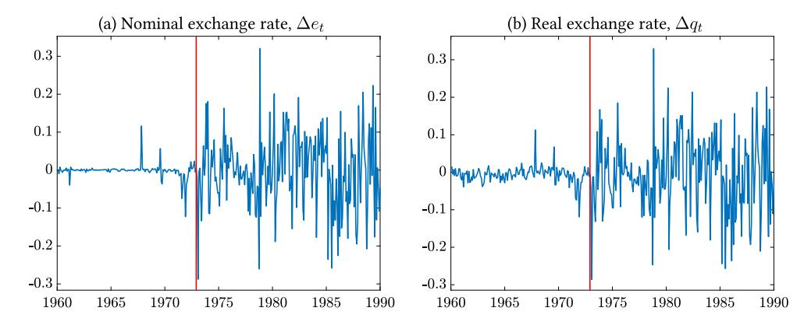
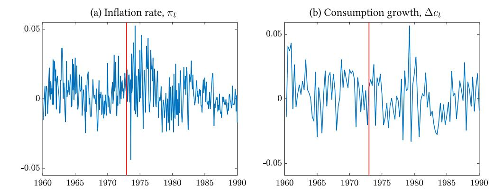
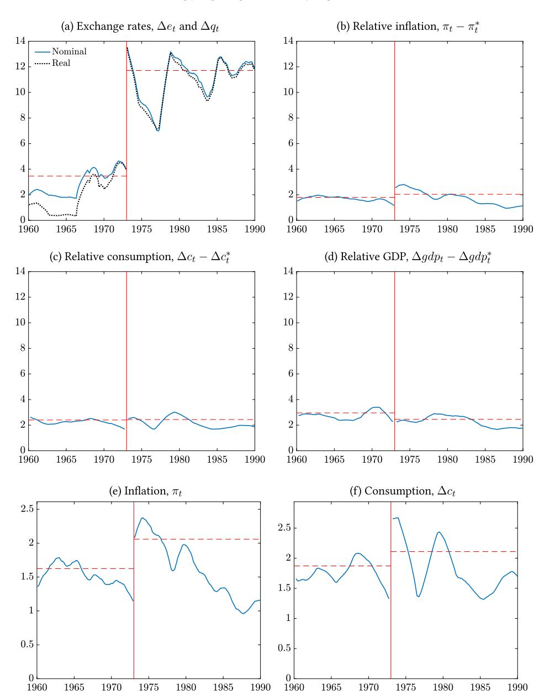
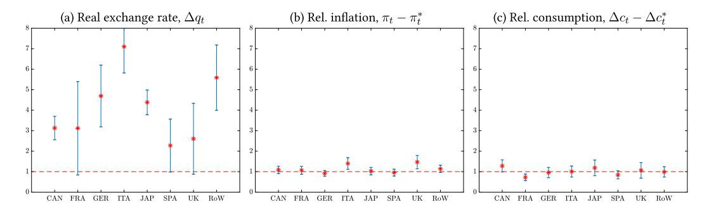
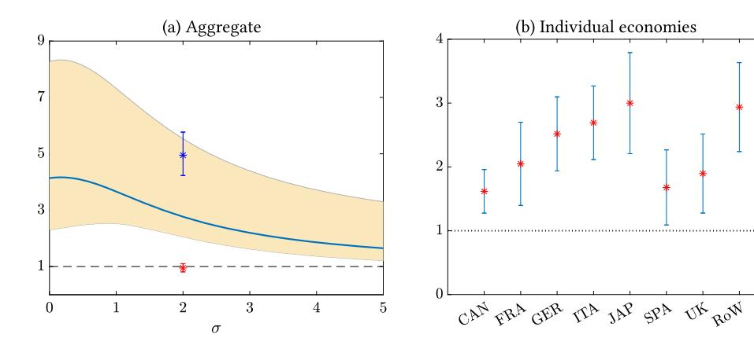
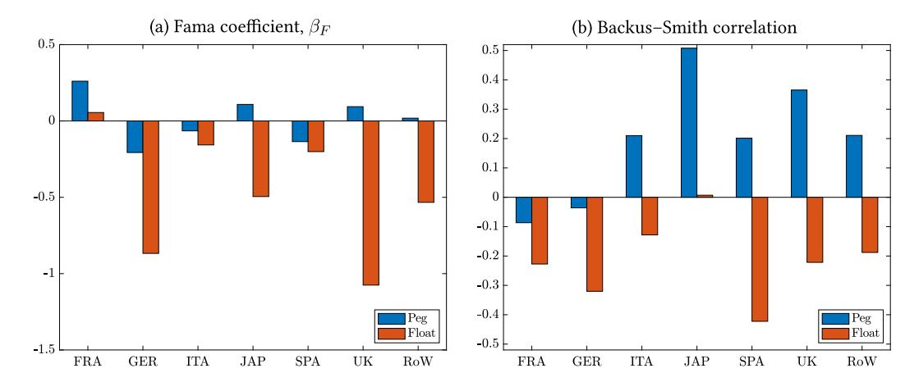
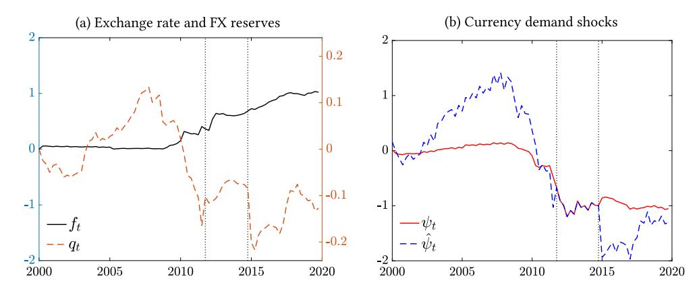

*[Econometrica](https://www.econometricsociety.org/)*, Vol. 93, No. 1 (January, 2025), 1–39

# MUSSA PUZZLE REDUX

# OLEG ITSKHOKI

Department of Economics, Harvard University

## DMITRY MUKHIN

Department of Economics, London School of Economics

The [Mussa](#page-38-0) [\(1986\)](#page-38-0) puzzle is the observation of a sharp and simultaneous increase in the volatility of both nominal and real exchange rates following the end of the Bretton Woods System of pegged exchange rates in 1973. It is commonly viewed as a central piece of evidence in favor of monetary non-neutrality because it is an instance in which a change in the monetary regime caused a dramatic change in the equilibrium behavior of a *real* variable—the real exchange rate—and is often further interpreted as direct evidence in favor of models with *nominal rigidities* in price setting. This paper shows that the data do not support this latter conclusion because there was no simultaneous change in the properties of the other macro variables, nominal or real; an extended set of Mussa facts falsifies both *conventional* flexible-price RBC models and sticky-price New Keynesian models. We present a resolution to the broader Mussa puzzle based on a model of segmented financial market, in which the bulk of the *nominal* exchange rate risk is held by financial intermediaries and is not shared smoothly throughout the economy, emphasizing the importance of monetary transmission via the risk premium channel.

KEYWORDS: Floating and fixed exchange rates, monetary regime transmission, currency risk premium.

## 1. INTRODUCTION

[MUSSA](#page-38-0) [\(1986\)](#page-38-0) FAMOUSLY OBSERVED THAT THE END of the Bretton Woods System in the early 1970s and the change in the monetary policy regime away from pegged towards floating exchange rates naturally led to an increase in the volatility of nominal exchange rates (by an order of magnitude), but also instantaneously increased the volatility of *real* exchange rates nearly by the same factor (see Figure [1\)](#page-1-0). This fact is commonly viewed by economists as a central piece of evidence in favor of monetary non-neutrality, since a change in the monetary regime has caused a dramatic change in the equilibrium behavior of a real variable—the real exchange rate.1 Indeed, under the neutrality of money, properties of the real exchange rate should not be affected by changes in the monetary rule

Oleg Itskhoki: [itskhoki@fas.harvard.edu](mailto:itskhoki@fas.harvard.edu) Dmitry Mukhin: [d.mukhin@lse.ac.uk](mailto:d.mukhin@lse.ac.uk)

We thank Andy Atkeson and Jón Steinsson for stimulating conversations, Adrien Auclert, Craig Burnside, Luca Fornaro, Fabrizio Perri, and Stephanie Schmitt-Gröhe for insightful discussions, Mark Aguiar, Manuel Amador, Cristina Arellano, Paul Bergin, Javier Bianchi, Anmol Bhandari, Jaroslav Boroviˇcka, Ariel Burstein, V.V. Chari, Giancarlo Corsetti, Max Croce, Eduardo Davila, Luca Dedola, Mick Devereux, Michael Dooley, Charles Engel, Sebastián Fanelli, Doireann Fitzgerald, Jordi Galí, Pierre-Olivier Gourinchas, Chang He, Sebnem Kalemli-Özcan, Narayana Kocherlakota, Arvind Krishnamurthy, Karen Lewis, Virgiliu Midrigan, Diego Perez, Hélène Rey, Ken Rogoff, Chris Sims, John Shea, Vania Stavrakeva, Jenny Tang, Alan Taylor, Aleh Tsyvinski, Venky Venkateswaran, Adrien Verdelhan, Mark Wright, and seminar/conference participants for useful comments, and Jasper Bechtold, Gordon Ji, Aleksandr Makarenko, and Haonan Zhou for outstanding research assistance.

1When [Nakamura and Steinsson](#page-38-0) [\(2018,](#page-38-0) pp. 69–70) surveyed "prominent macroeconomists [on what is the most convincing evidence for monetary nonneutrality], the three most common answers were: the evidence presented in Friedman and Schwartz (1963) regarding the role of monetary policy in the severity of the Great

FIGURE 1.—Nominal and real exchange rates (log changes). Note: U.S. versus RoW (defined as G7 countries except Canada plus Spain), monthly data from IFM IFS database.

absent other contemporaneous changes. However, the Mussa fact is often further interpreted as direct evidence in favor of models with *nominal rigidities* in price setting (sticky prices). We show that this latter conclusion is not supported by the data, and propose an alternative explanation of the puzzle.

We first document empirically that while there was a change in the properties of the real exchange rate, there was no comparable change in the properties of other macro variables—neither nominal like inflation, nor real like consumption and output (see Figure 2 which exhibits no evident structural break). One could interpret this as an extreme form of *neutrality*, where a major shift in the monetary regime, which increased the volatility of the nominal exchange rate by an order of magnitude, does not affect the equilibrium properties of any macro variables, apart from the real exchange rate. In fact, this is a considerably more puzzling part of the larger set of "Mussa facts." While the lack of change in the volatility of inflation is inconsistent with models of monetary neutrality, the lack of change in the volatility of real variables, like consumption and output, is inconsistent with standard sticky-price models.

To provide intuition for this logic, consider two equilibrium conditions. The first is simply the definition of the real exchange rate (in logs):

$$q_t = e_t + p_t^* - p_t, \tag{1}$$

where  $p_t$  and  $p_t^*$  are consumer price levels at home and abroad, and  $e_t$  and  $q_t$  are the nominal and real exchange rates, respectively. In models with monetary neutrality (e.g., international RBC), a change to the monetary policy rule should *not* affect the process for the real exchange rate  $q_t$ , and therefore (1) implies that the volatility of relative inflation,  $\pi_t - \pi_t^* \equiv \Delta p_t - \Delta p_t^*$ , must change along with the volatility of the nominal exchange rate,  $\Delta e_t$ . In the data, the volatility of  $\Delta q_t$  and  $\Delta e_t$  increased simultaneously, while the volatility of  $\pi_t - \pi_t^*$  remained stable and low (see Figure 3 below). This pattern may, however, be consistent with conventional sticky-price models, which are at the core of the standard

Depression; the Volcker disinflation of the early 1980s and accompanying twin recession; and the sharp break in the volatility of the U.S. real exchange rate accompanying the breakdown of the Bretton Woods System of fixed exchange rates in 1973." See also a textbook treatment of the Mussa puzzle in Uribe and Schmitt-Grohé (2017, Chapter 9.12) from the perspective of discriminating between flexible-price and sticky-price models.

FIGURE 2.—Inflation and consumption growth. Note: Average inflation rates (monthly) and consumption growth rates (quarterly) for G7 countries.

interpretation of the Mussa puzzle. If so, this suggests that sticky-price models dominate RBC models and that monetary policy must have real effects due to nominal rigidities.2

This interpretation, however, misses the second half of the picture. Equilibrium dynamics in a general class of models satisfy the following equilibrium relationship between relative consumption (with the rest of the world, RoW) and the real exchange rate:

$$z_t = \sigma(c_t - c_t^*) - q_t, \tag{2}$$

where  $\sigma > 0$  and  $z_t$  can be interpreted as the equilibrium departure from efficient international risk sharing. Indeed, equation (2) with  $z_t \equiv 0$  corresponds to the seminal Backus and Smith (1993) condition under separable utility with constant relative risk aversion  $\sigma$ . We show that equation (2) with a structural term  $z_t$  emerges as an equilibrium relationship in a general class of models independent from the completeness of asset markets. Furthermore, in a large class of *conventional* models—including both international RBC (IRBC) and New Keynesian Open Economy (NKOE) models, but also standard models with time-varying risk premia—the structural residual  $z_t$  is independent of the monetary policy regime. Therefore, a shift in the monetary policy regime that changes dramatically the volatility of  $\Delta q_t$  should necessarily change the volatility of  $\Delta c_t - \Delta c_t^*$ . In the data, however, the volatility of relative consumption growth, just like that of inflation, remained both stable and small (see Figure 3).3

We formalize this logic and suggest an empirical test based on a simple sufficient statistic  $z_t$ , which robustly separates models that are and are not consistent with the Mussa facts. Importantly, equilibrium relationship (2) emerges independently of trade openness of the economy, and thus the argument here does not rely on muted transmission of exchange rate volatility (i.e., incomplete pass-through) emphasized by Baxter and Stockman (1989). Indeed, a change in equilibrium exchange rate volatility requires a change in monetary policy, which in conventional models must be accompanied by changing properties

&lt;sup>2Note that the classical indeterminacy result of Kareken and Wallace (1981) applies only to the nominal exchange rate, but not to real variables, and cannot explain the increase in the volatility of the real exchange rate.

&lt;sup>3Thus, models with monetary neutrality are consistent with the observed lack of change in the volatility of consumption, but for the wrong reason as they fail to predict the change in the volatility of the real exchange rate. In contrast, models with nominal rigidities can explain the changing behavior of the real exchange rate, but have the counterfactual implication for the missing change in the volatility of the real variables.

FIGURE 3.—Macroeconomic volatility over time. Note: Annualized standard deviations (in log points) for the RoW relative to the U.S. in panels a–d and for country-level variables in the RoW in panels e–f, estimated as triangular moving averages with a window over 18 months (panels a, b, e) or 10 quarters (panels c, d, f) before and after, treating 1973:01 as the end point for the two regimes; the dashed lines correspond to the average standard deviations under the two regimes. See Appendix Figure A2 for GDP and net exports.

of either inflation or output, or both, even in the closed economy limit with zero aggregate exchange rate pass-through. More specifically, monetary policy that is subject to a *trilemma* constraint can absorb the floating exchange rate volatility only by translating it into macroeconomic volatility under the peg (cf. [Flood and Rose](#page-36-0) [\(1995\)](#page-36-0)). In other words, in such models, monetary policy can respond to shocks either by stabilizing inflation and output gap or by stabilizing the exchange rate, but not both at the same time.

We propose an alternative framework where monetary non-neutrality arises in the financial market due to market segmentation and limits to arbitrage. This allows the model to be consistent with the umbrella of Mussa facts. The model features financial shocks in international asset markets, which our earlier work shows to be essential to explain the exchange rate disconnect under a floating regime and resolve a variety of exchange rate puzzles, including the Meese–Rogoff, PPP, Backus–Smith, and UIP puzzles [\(Itskhoki and](#page-37-0) [Mukhin](#page-37-0) [\(2021\)](#page-37-0)). This, however, is *not* sufficient to explain the Mussa puzzle, which incorporates moments under both floating and fixed exchange rate regimes, and requires a model with equilibrium UIP deviations that are *endogenous* to monetary policy. Models with exogenous UIP shocks are inconsistent with Mussa facts.

In the limits-to-arbitrage model, a change in the exchange rate regime, and the associated change in the nominal exchange rate volatility, affects the quantity of risk faced by intermediaries in the international financial market. Greater nominal exchange rate volatility discourages intermediation, lowers the elasticity of currency supply, and results in larger equilibrium UIP deviations under the floating regime, consistent with the empirical evidence. Vice versa, a lower nominal exchange rate volatility under the peg encourages intermediation, shielding the real exchange rate from financial shocks. As a result, a change in the monetary regime has real consequences via the financial market, *even* when prices are fully flexible, thus affecting the volatility of both nominal and real exchange rates simultaneously.

In this model, the government's commitment to a peg, when credible, leads to an endogenous decline in equilibrium financial volatility, which goes a long way towards stabilizing the exchange rate even without large monetary interventions along the equilibrium path. Therefore, sustaining a peg requires only a modest change to the monetary policy rule (on equilibrium), confronting the monetary authority with a mild tradeoff between exchange rate and inflation stabilization—a relaxed trilemma constraint on policy. Equilibrium macroeconomic outcomes are primarily shaped by fundamental macroeconomic forces (e.g., productivity shocks) and in turn are to a large extent insensitive to the volatility in the international financial market under *either* exchange rate regime. This explains the missing shift in macroeconomic volatility with the breakdown of Bretton Woods.4

This is not to say that the exchange rate policy is irrelevant for macroeconomic outcomes. We show that international relative prices become more volatile under a floating regime, which then translates into trade balance dynamics, both in the model and in the data. While the direct pass-through of exchange rate volatility into aggregate price levels, consumption, and output is dampened by the fact that economies were sufficiently closed to international trade at the end of the Bretton Woods, the choice of the optimal exchange rate policy is much more consequential for small and more open economies today (see [Itskhoki and Mukhin](#page-37-0) [\(2023\)](#page-37-0)).5

4Noticeable changes can be detected, however, in macroeconomic and financial comovement including sign reversals of the Fama regression coefficient and the Backus–Smith correlation, and a muted Balassa– Samuleson effect under the floating regime. All of these empirical facts are in line with the predictions of the segmented market model. Furthermore, we bring in additional evidence from the recent 2011–2015 Swiss peg episode that favors the endogenous intermediation mechanism over the alternative explanations such as changing official FX interventions or currency demand shocks across exchange rate regimes.

5In our quantitative analysis, we calibrate the model to the average openness of the U.S. in 1960–1990 and show the robustness of our results for the UK over the same period.

The rest of the paper is organized as follows. After a brief literature review, Section [2](#page-6-0) documents a set of empirical patterns of macroeconomic dynamics around the breakup of the Bretton Woods system which form the set of Mussa facts that allow us to discriminate between different classes of models of monetary non-neutrality. Section [3](#page-9-0) sets up a general modeling framework used in our theoretical and quantitative analysis. Section [4](#page-13-0) defines a class of conventional international business cycle models and a simple sufficient statistic zt which allows us to falsify all such models at once using data from the end of Bretton Woods. Section [5](#page-16-0) introduces an alternative model of monetary non-neutrality with segmented financial market and limits to arbitrage, and shows that this model can simultaneously match a full set of Mussa facts including the overidentifying moments on macroeconomic comovement. Section [6](#page-27-0) contains our quantitative analysis showing the robustness of the theoretical results of the earlier sections in a context of a calibrated quantitative model. Finally, Section [7](#page-33-0) concludes with a discussion of alternative modeling approaches and normative implications. Additional results, derivations, and proofs are contained in the Supplemental Appendix (Itskhoki and Mukhin (2025)).

*Contribution to the Literature.* This paper aims to contribute to three strands of literature. First, we combine empirical evidence about the change in the dynamics of prices, quantities, and asset prices associated with the end of the Bretton Woods period and, more broadly, with the switch between a peg and a float, which together provide a set of moments that can sharply discriminate between alternative models. The empirical part of the paper builds on studies about the behavior of exchange rates by [Mussa](#page-38-0) [\(1986\)](#page-38-0), [Stock](#page-38-0)[man](#page-38-0) [\(1983,](#page-38-0) [1988\)](#page-38-0), [Berka, Devereux, and Engel](#page-35-0) [\(2012,](#page-35-0) [2018\)](#page-35-0), and [Bergin, Glick, and Wu](#page-35-0) [\(2014\)](#page-35-0), the evidence about macroeconomic variables from [Baxter and Stockman](#page-35-0) [\(1989\)](#page-35-0), [Flood and Rose](#page-36-0) [\(1995\)](#page-36-0), [Broda](#page-35-0) [\(2004\)](#page-35-0), and [Devereux and Hnatkovska](#page-36-0) [\(2020\)](#page-36-0), and additional facts about interest rates and financial variables from [Frenkel and Levich](#page-36-0) [\(1975\)](#page-36-0), [Colacito and Croce](#page-36-0) [\(2013\)](#page-36-0), and [Kalemli-Özcan](#page-37-0) [\(2019\)](#page-37-0). We complement the evidence on currency risk premium from [Lustig and Verdelhan](#page-37-0) [\(2019\)](#page-37-0), [Brandt, Cochrane, and Santa-](#page-35-0)[Clara](#page-35-0) [\(2006\)](#page-35-0), [Backus, Foresi, and Telmer](#page-35-0) [\(2001\)](#page-35-0) by studying its properties across the two monetary regimes.

Second, we derive a simple sufficient statistic that allows us to falsify a large class of conventional models that are often used to study the effects of floating and pegged exchange rates. This negative result echoes previous findings that sticky-price models, although successful at explaining a higher real exchange rate volatility under the float, yield counterfactual predictions about the behavior of other macroeconomic variables. The important advantage of our approach relative to the previous literature that relies on calibrated models (see [Dedola and Leduc](#page-36-0) [\(2001\)](#page-36-0), [Chari, Kehoe, and McGrattan](#page-35-0) [\(2002\)](#page-35-0), [Duarte](#page-36-0) [\(2003\)](#page-36-0), [Monacelli](#page-38-0) [\(2004\)](#page-38-0), Corsetti, [Dedola, and Leduc](#page-36-0) [\(2008\)](#page-36-0)) or wedge accounting (see [Kollmann](#page-37-0) [\(2005\)](#page-37-0), which is an important precursor to our work) is that the sufficient statistic is essentially independent of the structural parameters and can be directly measured in the data. This allows us to test a large class of models under weaker assumptions.6

Finally, we provide an alternative model of monetary non-neutrality that relies on financial rather than nominal frictions and is consistent with the full set of Mussa facts. Similarly to [De Long, Shleifer, Summers, and Waldmann](#page-36-0) [\(1990\)](#page-36-0), [Devereux and Engel](#page-36-0) [\(2002\)](#page-36-0), and in particular [Gabaix and Maggiori](#page-36-0) [\(2015\)](#page-36-0), our setup features segmented financial markets with noise traders and limits to arbitrage, but in contrast to these models,

6See also [Ayres, Hevia, and Nicolini](#page-35-0) [\(2022\)](#page-35-0) and [Ohanian, Restrepo-Echavarria, Van Patten, and Wright](#page-38-0) [\(2020\)](#page-38-0).

generates asset prices and risk premia that are *endogenous* to monetary policy, which we show is necessary to account for the Mussa puzzle. This source of monetary non-neutrality is closely related to that of [Jeanne and Rose](#page-37-0) [\(2002\)](#page-37-0), but theirs is a partial equilibrium model and cannot be directly applied to explain the equilibrium properties of macroeconomic variables.7 Instead, we adopt the framework from [Itskhoki and Mukhin](#page-37-0) [\(2021\)](#page-37-0), but in contrast to that paper, focus on the endogeneity of UIP deviations to the monetary policy regime. The transmission of monetary shocks via risk premia also relates our paper to the model of endogenously segmented markets in [Alvarez, Atkeson, and Kehoe](#page-34-0) [\(2009\)](#page-34-0), although our focus is on the effects of the exchange rate policy rather than of monetary (inflation) shocks.

## 2. EMPIRICAL FACTS

We focus our empirical analysis on the end of the Bretton Woods system in 1973, comparing the dynamics of macroeconomic aggregates before and after the break. The breakup of the Bretton Woods system is indeed a unique natural experiment with a number of essential characteristics typically absent in other episodes of switching between a peg and a float. First, it constituted a large discontinuous break in the monetary regime from a near-perfect system of fixed exchange rates to a pure float between the U.S. dollar and other major currencies, in contrast to a more common alternation of exchange rate arrangements between partial and dirty pegs (see [Ilzetzki, Reinhart, and Rogoff](#page-37-0) [\(2019\)](#page-37-0)). Second, the Bretton Woods system was more credible and persistent than most alternative pegs, again making the experiment of a switch cleaner. Lastly, the breakup of the Bretton Woods system featured two large regions and multiple countries, as opposed to isolated small open economies typically entering and exiting pegs as part of a broader domestic policy shift. We provide a further discussion of identification assumptions in the end of this section.

*Data.* We briefly describe the construction of our data set and provide further details in Appendix A.2. All monthly data (for nominal exchange rates, consumer prices, interest rates, and stock prices) come from the IFM's IFS database [\(IFS](#page-37-0) [\(2024\)](#page-37-0)), while all quarterly data (for GDP, consumption, imports, and exports) are from the OECD database [\(OECD](#page-38-0) [\(2024\)](#page-38-0)).8 Net exports nxt are defined as the ratio of exports minus imports to the sum of exports and imports in order to counter a mechanical increase in the volatility of the ratio of net exports to GDP due to increased openness of economies in later periods. All data are annualized to make standard deviations comparable across series. The rest of the world (RoW) for the United States is constructed as an average of log changes in series across France, Germany, Italy, Japan, Spain, and the UK, using the countries' average GDP over the sample period as weights.

Our sample starts from 1960 and does not include the "preconvertible phase" of the Bretton Woods which featured limited capital mobility and a high volatility of exchange rates (see, e.g., [Bordo](#page-35-0) [\(1993\)](#page-35-0)). There is some ambiguity over the exact end of the Bretton Woods system. While all countries officially allowed their exchange rates to float after

7See also related literature on target zones [\(Krugman](#page-37-0) [\(1991\)](#page-37-0), [Krugman and Miller](#page-37-0) [\(1993\)](#page-37-0)), endogenous financial integration [\(Fornaro](#page-36-0) [\(2022\)](#page-36-0)), and partial equilibrium habitat models [\(Gourinchas, Ray, and Vayanos](#page-37-0) [\(2022\)](#page-37-0)).

8All quantity variables (GDP, consumption, trade) are real and seasonally adjusted, while prices are not. Additionally, we use data from [FRED](#page-36-0) [\(2024\)](#page-36-0), [SECO](#page-38-0) [\(2024\)](#page-38-0), [GFD](#page-37-0) [\(2024\)](#page-37-0), [CEIC](#page-35-0) [\(2024\)](#page-35-0), as detailed in the data appendix.

January 1973, most of them were already adjusting their exchange rates since the "Nixon shock" in August 1971, which limited direct convertibility of the dollar to gold.9 Therefore, we label the period 1960:01–1971:07 as the peg and the period 1973:01–1989:12 as the float, as used in the tables and figures below, excluding the intermediate period 1971:08– 1972:12.10 The regression discontinuity graphs are done for three alternative break points: 1973:01 in the main figures, and 1971:08 and 1980:01 as robustness in Appendix Figure A1.

*Macroeconomic Volatility.* Figure [3](#page-3-0) displays our main empirical results: standard deviations of the variables using a rolling window that starts at 1973:01 and goes either forward or backward. In line with the seminal [Mussa](#page-38-0) [\(1986\)](#page-38-0) evidence, the end of the Bretton Woods system is associated with a dramatic change in the volatility of both nominal and real exchange rates, from around 2% to 10–12%. What makes this fact much more puzzling, however, is the absence of any comparable change in the volatility of other macroeconomic variables—either nominal like inflation or real like consumption and GDP. We emphasize the relative magnitudes of volatility across different variables and regimes by keeping the same scale for standard deviations of all variables in Figures [3a–3d](#page-3-0). While under the peg the volatility of the real exchange rate is of the same order of magnitude as for other macro variables, there is a clear disconnect between the real exchange rate and macroeconomic fundamentals under the float. Furthermore, even after zooming in on the volatility of inflation and consumption in Figures [3e–3f](#page-3-0), we find little evidence of a discontinuity in the behavior of macroeconomic variables around 1973.11

Unpacking further the rest of the world into separate countries, Figure [4](#page-8-0) and Appendix Table A1 show the volatility ratios under the two regimes for each variable and country, on a common scale for comparability and with Newey–West (HAC) robust 90% confidence intervals. We find that the increase in volatility of the nominal and real exchange rates was very large (on average by 8 and 6 times, respectively) and highly significant, while changes in volatility of other variables were small (typically within ±10%) and generally insignificant—a stark difference. A notable exception is the volatility of relative interest rates, which roughly doubled after the end of Bretton Woods, consistent with the decoupling of monetary policy from that of the United States, but this change is still considerably smaller than that for the exchange rates.

Rather than emphasizing the lack of any change in macro variables, we emphasize the difference in the order of magnitudes relative to exchange rates, which constitute the main focus of our analysis. Furthermore, most correlations of macroeconomic variables across countries are typically not very strong or stable over time, and suggest only a weak pattern of change across the two exchange rate regimes (see Appendix Table A2). We use a few notable exceptions, including the Backus–Smith correlation and the Fama regression coefficient (characterizing the extent of UIP deviations), together with additional evidence

9There were also isolated devaluations in the UK and Spain in November 1967, a devaluation in France, and an appreciation in Germany in August and October 1969, respectively.

10In Canada, the two exchange rate regimes occurred over different periods with free floating before 1962:06 and after 1970:05, and a peg in between. This is why we exclude Canada from the construction of RoW in figures.

11There is a slight increase in the volatility of inflation in the brief period after the breakup of Bretton Woods (due to the two large oil price shocks), which quickly comes back down so that the average inflation volatility before and after 1973 is about the same. There is also a slight increase in the volatility of consumption briefly after 1973 due to the 1974 recession in Japan. Note that the same qualitative patterns hold both for relative macroeconomic variables between the U.S. and the rest of the world and for individual country-level variables.

FIGURE 4.—Volatility ratio float/peg across countries. Note: The ratios of standard deviations under the float and the peg across individual countries with 90% confidence intervals estimated using Newey-West (HAC) standard errors. See Appendix Figures A2 and A3 for GDP, NX, and financial variables. See Appendix Table A1 for detailed tabulations and additional variables.

on the behavior of trade balance and financial variables as overidentification tests of our model in Sections 5 and 6.

*Identification*. In line with the previous literature, we interpret the described changes in macroeconomic moments in a causal way driven by changes in the monetary regime. The following remarks address various threats to our identification approach.

REMARK 1: Does endogeneity of the end of the Bretton Woods system invalidate identification?

As is standard in regression discontinuity design (RDD; see, e.g., Lee and Lemieux (2010)), identification does *not* rely on exogeneity of the switch in the monetary policy; instead, it only requires that potential confounders evolve continuously around the end of the Bretton Woods system. This implies that a common narrative that the breakup of Bretton Woods was due to a gradual accumulation of monetary and fiscal imbalances (see, e.g., Eichengreen (2007)) is not a threat to our identification. Our theoretical results in Section 4 further relax the identifying assumptions by allowing for a discontinuous change in the dispersion of productivity, monetary, and fiscal shocks across the two regimes.

REMARK 2: Was the discontinuity driven by a shift away from active FX interventions? Another possibility is that pegs pre-1973 were implemented via active foreign exchange (FX) interventions rather than a monetary peg. However, the data reveal no discontinuity—either in levels or in volatility—of foreign reserves around 1973, as we show in Appendix Figure A6 (see also Section 5.3.2 and Flood and Rose (1995)). In contrast, the volatility of relative interest rates,  $i_t - i_t^*$ , doubled after the switch to floating (see Appendix Table A1 and Figure A3), which motivates our focus on the change in the monetary policy rule.

&lt;sup>12A similar argument, which involves a typically continuous buildup of macroeconomic trends, rules out many other changes in the equilibrium environment that occurred in the 1970s and 1980s. One such change is the increase in the volatility of commodity prices (see, e.g., Ayres, Hevia, and Nicolini (2022)). In order for such explanations to resolve the Mussa facts, it is essential not just that the macro trends have a discontinuity, but that it perfectly coincides with the abrupt shift in the monetary regime and the change in the volatility of the real exchange rate. Furthermore, structural VAR estimates from Bayoumi and Eichengreen (1992) and the subsequent literature indicate little difference in the incidence of fundamental macroeconomic shocks before and after the breakup of the Bretton Woods system.

REMARK 3: Is a change in capital mobility and capital controls a threat to identification?

While there were indeed significant changes in the intensity of capital controls and international mobility of capital in the 1970s (see Colacito and Croce (2013)), a closer look shows that the timing of these changes varies across countries and does not coincide with the switch to the floating regime: restrictions on capital flows were maintained from 1961 to 1979 in the UK, from 1970 to 1974 in Germany, and from 1966 to 1974 in the U.S. (Marston (2007)). The evidence in Gourinchas and Rey (2014) suggests an inflection point in 1980, after which there began a fast buildup of gross international asset positions. In Appendix Figure A1, we consider an alternative break point in 1980 and show that there was almost no change in the behavior of the nominal or real exchange rates, nor in other macroeconomic variables. This is consistent with our view that it was the change in monetary policy rather than in capital controls that resulted in the Mussa discontinuity in 1973.

#### 3. THEORETICAL FRAMEWORK

We describe here the general theoretical framework which we use in Sections 4–6, where we consider its various special cases. We build on a standard New Keynesian open economy model (NKOE) featuring capital, intermediate inputs, pricing to market, productivity and monetary shocks, wage and price stickiness—with border prices sticky in producer, destination, or dominant currency. The model features home bias in consumption with exogenous taste shocks for foreign goods and shocks to international risk sharing. We allow for various degrees of financial market (in)completeness including segmented financial markets.

There are two mostly symmetric countries—home (Europe) and foreign (U.S., denoted \*). Each country has its nominal unit of account in which the local prices are quoted: for example, the home wage rate is  $W_t$  euros and the foreign wage rate is  $W_t^*$  dollars. The nominal exchange rate  $\mathcal{E}_t$  is the price of dollars in terms of euros; hence, an increase in  $\mathcal{E}_t$  signifies a nominal devaluation of the home currency (euro). The monetary policy is conducted according to a conventional Taylor rule targeting inflation and the nominal exchange rate, depending on the monetary regime. In particular, the foreign country (U.S.) always targets inflation, while the home country (Europe) switches from an exchange rate peg to inflation targeting ('float').

# 3.1. Model Setup

*Households.* A representative home household maximizes the discounted expected utility over consumption and labor:

$$\mathbb{E}_0 \sum_{t=0}^{\infty} \beta^t \left( \frac{1}{1-\sigma} C_t^{1-\sigma} - \frac{1}{1+\varphi} L_t^{1+\varphi} \right), \tag{3}$$

where  $\sigma$  is the relative risk aversion parameter and  $\varphi$  is the inverse Frisch elasticity of labor supply. The flow budget constraint is given by

$$P_{t}C_{t} + \sum_{j \in J_{t}} \Theta_{t}^{j} B_{t+1}^{j} \leq W_{t} L_{t} + e^{-\zeta_{t}} \sum_{j \in J_{t-1}} \mathcal{D}_{t}^{j} B_{t}^{j} + \Pi_{t} + T_{t}, \tag{4}$$

where  $P_t$  is the consumer price index,  $W_t$  is the nominal wage rate,  $\Pi_t$  are profits of home firms,  $T_t$  are lump-sum transfers from the government.  $B_{t+1}^j$  is the quantity of asset  $j \in J_t$  purchased at time t at price  $\Theta_t^j$  with a state-contingent pay-out  $\mathcal{D}_{t+1}^j$  at t+1, taxed at a state-contingent rate  $\zeta_{t+1}$  which we interpret in the spirit of Chari, Kehoe, and McGrattan (2007) wedges.

The foreign households are symmetric, having access to a set  $J_t^*$  of state-contingent assets with dividends taxed at a country-specific tax rate  $\zeta_{t+1}^*$ . The assets  $j \in J_t \cap J_t^*$  can be purchased by households of both countries at a common price  $\Theta_t^j$  in units of home currency, or equivalently  $\Theta_t^j/\mathcal{E}_t$  in units of foreign currency. When there are no such assets, that is,  $J_t \cap J_t^*$  is empty, the households cannot trade assets *directly* across countries and the financial market is segmented.

Expenditure and Demand. Domestic households allocate their within-period consumption expenditure between home and foreign varieties of the goods,  $P_tC_t = \int_0^1 [P_{Ht}(i)C_{Ht}(i) + P_{Ft}(i)C_{Ft}(i)] di$ , to maximize the CES consumption aggregator:

$$C_{t} = \left[ \int_{0}^{1} \left( (1 - \gamma)^{\frac{1}{\theta}} e^{-\frac{\gamma}{\theta} \xi_{t}} C_{Ht}(i)^{\frac{\theta - 1}{\theta}} + \gamma^{\frac{1}{\theta}} e^{\frac{1 - \gamma}{\theta} \xi_{t}} C_{Ft}(i)^{\frac{\theta - 1}{\theta}} \right) di \right]^{\frac{\theta}{\theta - 1}}, \tag{5}$$

where  $\gamma \in [0, 1/2)$  captures the level of the *home bias*, which can be due to a combination of home bias in preferences, trade costs, and non-tradable goods (see Obstfeld and Rogoff (2001)), and  $\xi_t$  denotes the relative demand shock for the foreign good as a source of volatility in net exports (see Pavlova and Rigobon (2007), Boer, Lee, and Sun (2024)). In the quantitative model of Section 6, we extend the analysis from CES to Kimball (1995) demand system to allow for variable markups and *pricing to market*. The solution to the optimal expenditure allocation results in the conventional constant-elasticity demand schedules:

$$C_{Ht}(i) = (1 - \gamma)e^{-\gamma\xi_t} \left(\frac{P_{Ht}(i)}{P_t}\right)^{-\theta} C_t \quad \text{and} \quad C_{Ft}(j) = \gamma e^{(1 - \gamma)\xi_t} \left(\frac{P_{Ft}(j)}{P_t}\right)^{-\theta} C_t, \tag{6}$$

where  $P_t$  is the price index implied by the consumption aggregator in (5). The expenditure allocation of foreign households is symmetrically given by

$$C_{Ht}^*(i) = \gamma e^{(1-\gamma)\xi_t^*} \left(\frac{P_{Ht}^*(i)}{P_t^*}\right)^{-\theta} C_t^* \quad \text{and} \quad C_{Ft}^*(j) = (1-\gamma)e^{-\gamma\xi_t^*} \left(\frac{P_{Ft}^*(j)}{P_t^*}\right)^{-\theta} C_t^*, \quad (7)$$

where  $\xi_t^*$  is the foreign demand shock for home goods,  $P_{Ht}^*(i)$  and  $P_{Ft}^*(j)$  are the foreign-currency prices of the home and foreign goods in the foreign market, and  $P_t^*$  is the foreign price level. The *real exchange rate* is the relative consumer price level in the two countries:

$$Q_t \equiv \frac{P_t^* \mathcal{E}_t}{P_t},\tag{8}$$

&lt;sup>13For example, when a foreign-currency risk-free bond  $B_{t+1}^{f*}$  is available to both home and foreign households, its foreign-currency price is  $\Theta_t^{f*} = 1/R_t^*$ , where  $R_t^*$  is the foreign gross nominal interest rate, and its pay-out is  $\mathcal{D}_{t+1}^{f*} \equiv 1$  state-by-state in foreign currency. Correspondingly, the home households can buy it at price  $\mathcal{E}_t/R_t^*$  and receive a pay-out of  $\mathcal{E}_{t+1}$  in home currency, resulting in a nominal rate of return equal to  $\mathcal{E}_{t+1}R_t^*/\mathcal{E}_t$ .

with an increase in  $Q_t$  corresponding to a real depreciation, that is, a decrease in the relative price of the home consumption basket.

*Production and Profits.* Home output is produced by a given pool of identical firms (hence we omit indicator i) according to a Cobb–Douglas technology in labor  $L_t$ , capital  $K_t$ , and intermediate inputs  $X_t$ :

$$Y_t = \left(e^{a_t} K_t^{\vartheta} L_t^{1-\vartheta}\right)^{1-\phi} X_t^{\phi},\tag{9}$$

where  $a_t$  is the aggregate productivity shock, and  $\vartheta$  and  $\phi$  determine the input expenditure shares. Intermediates, as well as investment goods, are the same bundle of home and foreign varieties as the final consumption bundle (5). For simplicity, our exposition below focuses on the case of  $\phi = \vartheta = 0$ , where labor is the only input of production, so that the marginal cost is given by  $MC_t = e^{-a_t}W_t$ . Appendix A.3 describes the general case, which we use in our quantitative analysis in Section 6.

Firm i profits (in home currency) from serving both home and foreign markets are given by

$$\Pi_{t}(i) = (P_{Ht}(i) - MC_{t})C_{Ht}(i) + (\mathcal{E}_{t}P_{Ht}^{*}(i) - MC_{t})C_{Ht}^{*}(i), \tag{10}$$

where  $P_{Ht}(i)$  and  $P_{Ht}^*(i)$  are the home and foreign market prices charged by the firm, by convention expressed in respective local currencies, and  $C_{Ht}(i)$  and  $C_{Ht}^*(i)$  denote the domestic and foreign absorption of the home good i, as characterized by (6) and (7). Goods market clearing requires that firms produce  $Y_t(i) = C_{Ht}(i) + C_{Ht}^*(i)$ . Aggregate profits of domestic firms,  $\Pi_t = \int_0^1 \Pi_t(i) \, di$ , are distributed to domestic households. We assume no entry or exit of firms, focusing on the medium-run dynamics.

Wage and Price Setting. In the neoclassical (RBC) version of the model, wages and prices are flexible. In particular, the equilibrium wage rate clears the labor market by equalizing the labor demand of profit-maximizing firms with the household labor supply. The prices are set by monopolistically competitive firms as a markup over the marginal cost  $MC_t$ . In the New Keynesian version of the model, wages and prices are adjusted infrequently à la Calvo with a constant per-period non-adjustment hazard rate  $\lambda_w$  and  $\lambda_p$ , respectively. We adopt the conventional sticky wages and prices formulation, as described in, for example, Galí (2008). We allow border prices to be sticky in any currency, including producer (PCP), destination (local, LCP), and dominant (dollar, DCP) currency pricing, and thus the law of one price may or may not be satisfied across specifications. Under wage and price stickiness, the quantities are demand-determined: specifically, labor supply must satisfy labor demand given the preset wage rates, as well as the supply of goods must satisfy the demand given prices. We describe the respective equilibrium conditions in Appendix A.3.

Financial Sector. The financial sector features financial intermediaries and noise traders who participate in currency carry trades by taking zero-capital positions in home and foreign currency bonds. For concreteness, we assume their earned profits and losses are returned to foreign (U.S.) households along with foreign firm profits,  $\Pi_t^*$ . Whenever home and foreign households can trade some assets directly, that is,  $J_t \cap J_t^*$  is non-empty, the presence of financial intermediaries and noise traders does not materially affect macroeconomic allocations and leaves risk-sharing conditions between home and foreign households unchanged. All assets j are in zero net supply, and therefore, for  $j \in J_t \cap J_t^*$ ,

market clearing requires

$$B_{t+1}^{j} + B_{t+1}^{j*} + D_{t+1}^{j} + N_{t+1}^{j} = 0, (11)$$

where  $D_{t+1}^j$  and  $N_{t+1}^j$  are the positions taken by intermediaries and noise traders, respectively. When the financial market is *segmented* and the home households cannot trade assets directly with the foreign households  $(J_t \cap J_t^*)$  is empty), the presence of noise traders and financial intermediaries has an important effect on international risk sharing, as we describe in Section 5.

Government. The fiscal authority is passive, collecting exogenous taxes  $\zeta_t$  on financial positions of domestic households and returning the collected revenues to the households as a lump sum:

$$T_t = \sum_{j \in J_{t-1}} \left( 1 - e^{-\zeta_t} \right) \mathcal{D}_t^j B_t^j. \tag{12}$$

Monetary policy is implemented by means of a generalized Taylor rule:

$$i_t = \rho_m i_{t-1} + (1 - \rho_m) \left[ \phi_\pi \pi_t + \phi_e(e_t - \bar{e}) \right] + \sigma_m \varepsilon_t^m, \tag{13}$$

where  $i_t = \log R_t$  is the log nominal interest rate,  $\pi_t = \Delta \log P_t$  is the inflation rate,  $\varepsilon_t^m \sim \operatorname{iid}(0,1)$  is the monetary policy shock with volatility parameter  $\sigma_m \geq 0$ , and the parameter  $\rho_m$  characterizes the persistence of the monetary policy rule. Coefficients  $\phi_{\pi} > 1$  and  $\phi_e \geq 0$  are the Taylor rule parameters which weigh the two nominal objectives of monetary policy—inflation and exchange rate stabilization. We assume that the foreign country (the U.S.) has only the inflation objective, so that  $\phi_e^* = 0$ . The home country changes  $\phi_e$  depending on the monetary policy regime, with a pure float corresponding to  $\phi_e = 0$  and a partial peg featuring  $\phi_e > 0$ , which approaches a perfect peg as  $\phi_e$  increases. We study the differential behavior of macro variables across monetary regimes of the home country, leaving unchanged the stochastic processes for all exogenous shocks.

REMARK 4: Should the U.S. monetary policy be rather modeled as a gold standard before 1973?

The gold standard can be easily captured with an exogenous stochastic process for the U.S. inflation rate  $\pi_t^*$ , which reflects fluctuations in the market price of gold, while the other countries peg to the dollar. The results in Propositions 1, 2, and 3 below hold independently of this change in assumptions, and thus our conclusions are robust to whether the U.S. follows a gold standard or inflation targeting. Similarly, we can also allow for a higher inflation of the 1970s by introducing larger monetary shocks  $\sigma_m$  and less tight inflation targeting  $\phi_{\pi}$  in this period.

### 3.2. International Equilibrium Conditions

We emphasize two equilibrium relationships

The home country budget constraint derives from substituting firm profits (10) and government transfers (12) into the household budget constraint (4):

$$\mathcal{B}_{t+1} - \mathcal{R}_t \mathcal{B}_t = NX_t = \mathcal{E}_t P_{Ht}^* C_{Ht}^* - P_{Ft} C_{Ft}, \tag{14}$$

where  $P_{Ht}^*$  and  $P_{Ft}$  are the export and import price indexes and  $C_{Ht}^*$  and  $C_{Ft}$  are the aggregate export and import quantities such that, for example,  $P_{Ft}C_{Ft} = \int_0^1 P_{Ft}(i)C_{Ft}(i) di$ . The left-hand side of (14) is the evolution of home net foreign assets  $\mathcal{B}_{t+1} \equiv \sum_{i \in J_t} \Theta_t^i B_{t+1}^i$  with the cumulative pre-tax realized return defined by  $\mathcal{R}_t \mathcal{B}_t \equiv \sum_{i \in J_{t-1}} \mathcal{D}_t^j \mathcal{B}_t^j$ .

Using the expressions for import demand (6) and (7), we rewrite the expression for net exports as a share of GDP:

$$\frac{NX_t}{GDP} = \Lambda_t \cdot \left[ e^{-(1-\gamma)\tilde{\xi}_t} \mathcal{Q}_t^{\theta} \mathcal{S}_t^{\theta-1} \frac{C_t^*}{C_t} - 1 \right], \tag{15}$$

where  $\Lambda_t \equiv P_{Ft}C_{Ft}/GDP$  is the import-to-GDP ratio,  $S_t \equiv P_{Ft}/(\mathcal{E}_t P_{Ht}^*)$  is the terms of trade, and  $\xi_t \equiv \xi_t - \xi_t^*$  is the relative taste shock for the foreign good (home imports). Equation (15) shows the link between net exports, relative consumption levels  $C_t/C_t^*$  shaping relative import demand, and international relative prices  $Q_t$  and  $S_t$  governing expenditure switching between home and foreign goods. In particular, under financial autarky, the country budget constraint requires  $NX_t \equiv 0$ , and therefore  $C_t/C_t^*$  is directly related to  $\mathcal{Q}_{t}^{\theta} \mathcal{S}_{t}^{\theta-1}$ , conditional on the taste (home bias) shock  $\xi_{t}$ . Appendix A.3 provides derivations.

International risk-sharing conditions are given by

$$\mathbb{E}_{t}\left\{\left[\left(\frac{C_{t+1}}{C_{t}}\right)^{-\sigma}-\left(\frac{C_{t+1}^{*}}{C_{t}^{*}}\right)^{-\sigma}\frac{Q_{t}}{Q_{t+1}}e^{\tilde{\zeta}_{t+1}}\right]e^{-\zeta_{t+1}}\mathcal{R}_{t+1}^{j}\right\}=0 \quad \text{for all } j \in J_{t} \cap J_{t}^{*}, \tag{16}$$

where  $\zeta_{t+1} \equiv \zeta_{t+1} - \zeta_{t+1}^*$  is the relative financial tax (wedge) across countries, and  $\mathcal{R}_{t+1}^j \equiv$  $\frac{\mathcal{D}_{t+1}^{j}/\Theta_{t}^{j}}{P_{t+1}/P_{t}}$  is the pre-tax real return on asset j at home. Condition (16) derives from combining the home and foreign household Euler equations, reflecting that households trade mutually available assets  $j \in J_t \cap J_t^*$  until the home and foreign discount factors are aligned.

Under complete international asset markets, the set of tradable assets  $J_t \cap J_t^*$  allows agents to replicate a full set of Arrow securities for each state of the world, and (16) becomes simply

$$\left(\frac{C_{t+1}/C_t}{C_{t+1}^*/C_t^*}\right)^{\sigma} = \frac{\mathcal{Q}_{t+1}}{\mathcal{Q}_t} \cdot e^{-\tilde{\zeta}_{t+1}}.$$
(17)

468/26,2025,1, Downloaded from https://antinibrary.wiley.com/doi/10.3982/ECTA20899 by URSCAR - Universidade Federal de Soc Carlos, Wiley Online Library on [26/08/2026]. See the Terms and Conditions (https://antinibrary.wiley.com/brans-and-conditions) on Wiley Online Library for rules of use; On articles as geometed by the applicable Created Commons Library.

This is effectively a static relationship between the relative consumption growth and real depreciation, which generalizes the Backus and Smith (1993) condition by introducing state-dependent risk-sharing wedges  $\zeta_{t+1}$ . More generally, conditions (14) and (16) together characterize the joint equilibrium dynamics of relative consumption and the real exchange rate under a variety of asset market structures that range from financial autarky to complete international asset markets, depending on the richness of the  $J_t \cap J_t^*$  set.

### 4. CONVENTIONAL MODELS

We now consider a class of conventional international DSGE models, including both standard international real business cycle (IRBC) and New Keynesian open economy (NKOE) models. We show that a particular equilibrium relationship between relative consumption and the real exchange rate holds in such models independently of monetary policy and the exchange rate regime. Furthermore, this relationship is robust to alternative structures of the supply side of the economy, the presence and nature of price and wage stickiness, the completeness of international asset markets, and the degree of openness of the economies. In contrast, the data around the end of Bretton Woods suggest a sharp discontinuous change in the statistical properties of this equilibrium relationship, and thus falsify the class of conventional models. Our goal, however, is not to reject specific models, but to use our findings to establish the nature of monetary non-neutrality and the channel of transmission that are consistent with the Bretton Woods experiment.

*Dynamic System.* We now combine the two equilibrium conditions derived in Section 3.2 to establish an equilibrium relationship between consumption and the real exchange rate. We rewrite (16) and (14) in log-deviation terms from a symmetric non-stochastic equilibrium:

$$\mathbb{E}_{t}\left\{\sigma\left(\Delta c_{t+1} - \Delta c_{t+1}^{*}\right) - \Delta q_{t+1}\right\} = \hat{\psi}_{t},\tag{18}$$

$$\beta b_{t+1} - b_t = \gamma [\hat{\theta} q_t - (c_t - c_t^*) - (1 - \gamma)\hat{\xi}_t], \tag{19}$$

where small letters generally denote log deviations of respective variables and  $b_t \equiv \bar{\mathcal{R}}\mathcal{B}_t/(\bar{P}\bar{Y})$ . We view conditions (18)–(19) as exact equations with  $\hat{\psi}_t$  and  $\hat{\xi}_t$  defining the residual terms, which include both exogenous shocks or wedges ( $\mathbb{E}_t\tilde{\zeta}_{t+1}$  and  $\tilde{\xi}_t$ ), as well as higher order terms such as risk premium in (16). Since we do not impose any statistical properties on the co-evolution of  $\{\hat{\psi}_t, \hat{\xi}_t\}_t$ , this interpretation is without loss of generality.

DEFINITION 1: We call **conventional** the models in which changes in monetary policy or exchange rate regime do not change the stochastic path of the residual terms  $\{\hat{\psi}_t, \hat{\xi}_t\}_t$  in (18)–(19).

This definition is useful because it nests a large class of popular international business cycle models. In particular, most linearized DSGE models, whether IRBC or NKOE, feature no risk premium and fall into this category (e.g., Backus, Kehoe, and Kydland (1994), Galí and Monacelli (2005)). Even when solved non-linearly, most standard international macro models have quantitatively negligible size and volatility of risk premia and are accurately approximated by this definition. The class of conventional models extends further and nests many open economy models with time-varying risk premia—due to habits (Verdelhan (2010)), long-run risk (Colacito and Croce (2011)), rare disasters (Farhi and Gabaix (2016)), or convenience yield (Engel and Wu (2023))—as in these models,  $\hat{\psi}_t$  does not depend on monetary policy.

The system (18)–(19) characterizes equilibrium dynamics of  $\{b_{t+1}, q_t, c_t - c_t^*\}$  conditional on initial NFA position  $b_0$  and an exogenous path of wedges  $\{\hat{\psi}_t, \hat{\xi}_t\}$ . This system is, in general, incomplete as it does not include any of the domestic equilibrium conditions. Nonetheless, under certain circumstances, it is already sufficient to characterize the equilibrium dynamics of a particular linear combination of relative consumption  $c_t - c_t^*$  and the real exchange rate  $q_t$ . Intuitively, while these international conditions are insufficient

&lt;sup>14Parameter  $\hat{\theta}$  is the log projection coefficient of  $\mathcal{Q}_t^{\theta} \mathcal{S}_t^{\theta-1}$  in  $NX_t$  in (15) on  $q_t \equiv \log \mathcal{Q}_t$ . Note that  $\hat{\theta} = 1$  when  $\theta = 1$ , as in this case we simply have  $\log(\mathcal{Q}_t^{\theta} \mathcal{S}_t^{\theta-1}) = q_t$ . More generally,  $\hat{\theta} = \theta + \frac{\theta-1}{1-2\gamma}$  in models where the law of one price is satisfied (e.g., under PCP). Models with variable markups and law of one price violations exhibit the same qualitative property, with  $\hat{\theta}$  additionally depending on the pass-through elasticity.

FIGURE 5.—Ratio of  $\operatorname{std}(\Delta z_t)$  after/during the Bretton Woods system. Note:  $\operatorname{std}(\Delta z_t)$ , where  $z_t \equiv \sigma(c_t - c_t^*) - q_t$ , is computed for 1960–1972 and 1973–1989 for the RoW versus the U.S. for different values of  $\sigma$  with a 90% confidence interval. The dashed line at 1 illustrates the prediction of Proposition 1. The lower asterisk (and the simulated 90% conf. interval) correspond to the calibrated conventional model from Section 6, which relaxes the Cole–Obstfeld parameter restriction (specifically,  $\sigma = 2$ ,  $\theta = 1.5$ ; see Table I). The upper asterisk and conf. interval correspond to the calibrated segmented markets model (IRBC+ in Table I).

to determine consumption levels,  $c_t$  and  $c_t^*$ , they characterize the equilibrium relationship between international relative prices  $q_t$  and relative quantities  $c_t - c_t^*$ . We prove the following in Appendix A.4:

PROPOSITION 1: In conventional models, under the Cole–Obstfeld parameter restriction  $\sigma = \theta = 1$ , the statistical properties of  $z_t \equiv \sigma(c_t - c_t^*) - q_t$  do not change with a change in the monetary policy rule and exchange rate regime; in particular, the volatility of  $\Delta z_t$  remains unchanged.

The significance of this result is that it emphasizes an existence of a simple sufficient statistic,  $z_t = \sigma(c_t - c_t^*) - q_t$ , that is readily measurable in the data. The proposition predicts that its statistical properties, and in particular the simple unconditional variance of  $\Delta z_t$ , are independent of the monetary regime, and should not change with a shift between a peg and a float. As we show in Figure 5, this implication is strongly rejected by the data—which suggest a dramatic increase in the volatility of  $z_t$  after the end of Bretton Woods.

Importantly, this insight does not depend on most modeling details—including the presence and the nature of nominal rigidities, openness of the economy, monetary policy, and the set and dynamic properties of shocks—and allows us to test a large class of models under weaker assumptions relative to the previous literature that relies on calibrated models or wedge accounting (see Kollmann (2005)). Note that the stable statistical properties of the cointegration relationship  $z_t$  do not imply the same for the behavior of  $c_t$ ,  $c_t^*$ , and  $q_t$  separately, which could see considerable changes in their equilibrium properties with a shift in monetary policy (see Appendix Figure A8). This emphasizes the role of our sufficient statistic  $z_t$ , as individual data series are generally insufficient to evaluate the class of conventional models.

&lt;sup>15In particular, even discontinuous shifts in properties of productivity shocks and other macroeconomic shocks (apart from  $\hat{\psi}_t$  and  $\hat{\xi}_t$ ) do not result in a change in the statistical properties of  $z_t$ .

What is the logic behind Proposition 1? It is easiest to see it starting from the limiting case of complete markets. In this case, international risk sharing leads to (17) resulting in  $\Delta z_{t+1} = -\tilde{\zeta}_{t+1}$ , which reduces to the Backus–Smith condition  $z_t = \sigma(c_t - c_t^*) - q_t = 0$  in the absence of risk-sharing wedges. We show that this logic extends to a much larger class of models that allow for incomplete markets and risk-sharing shocks. These models, instead of forcing a perfect correlation between relative consumption and the real exchange rate, feature a particular linear combination of the two,  $z_t$ , that does not depend on the monetary regime and a variety of other properties and parameters of the model. 16

How important is the Cole and Obstfeld (1991) parameter restriction? First, note that the equilibrium in the Cole–Obstfeld case is *not* equivalent to the complete market allocation in the presence of taste shocks  $\hat{\xi}_t$  and/or risk-sharing wedges  $\hat{\psi}_t$  (see, e.g., Pavlova and Rigobon (2007)). Second, while the Cole–Obstfeld restriction is necessary for the exact result in Proposition 1, quantitatively the prediction that  $\Delta z_{t+1}$  does not change its statistical properties holds approximately in calibrated conventional models outside the Cole–Obstfeld case, as we illustrate in Figure 5 and show in Section 6. Furthermore, the result of Proposition 1 still holds exactly in important limiting cases away from the Cole–Obstfeld parameter restriction. This is trivially true in the case of complete markets and under financial autarky, and also holds in the limits of flexible or fully sticky prices (wages). In light of its quantitative robustness beyond the Cole–Obstfeld case, Proposition 1 suggests that the resolution of the Mussa puzzle requires an *unconventional* approach to modeling the international financial market.

#### 5. AN ALTERNATIVE MODEL OF NON-NEUTRALITY

We now present our explanation to the broad set of Mussa facts documented in Section 2. The negative result of Proposition 1 has a constructive nature, as it emphasizes the need to depart from conventional business cycle models, and in particular introduce an endogenous change in the properties of the financial wedge  $\hat{\psi}_t$  and/or the trade wedge  $\hat{\xi}_t$  with the exchange rate regime. Although the proposition does not discriminate between the two wedges, we pursue a model of an endogenous risk premium shock. First, given that financial shocks have been shown to account for most of the exchange rate volatility under a floating regime (Itskhoki and Mukhin (2021)), explaining the Mussa puzzle requires that the volatility of  $\hat{\psi}_t$  goes down under the peg. Second, our focus on the risk premium shock is also in line with the fact that the UIP puzzle is more pronounced under the floating regime (see Section 5.3), while small differences in the volatility of net exports across the exchange rate regimes leave less room for alternative theories based on the  $\hat{\xi}_t$  shocks.

Towards this goal, we develop a model where monetary non-neutrality emerges due to financial market segmentation, rather than as a result of goods-market nominal rigidities. The data favor the segmented markets approach as the covariance of the exchange

&lt;sup>16Formally, by iterating the risk-sharing condition (18), we have  $z_t = \sum_{j=0}^{\infty} \mathbb{E}_t \hat{\psi}_{t+j} + z_t^{\infty}$ , and  $\{\hat{\psi}_{t+j}\}$  determines  $z_t$  up to its long-run expectation  $z_t^{\infty} \equiv \lim_{j \to \infty} \mathbb{E}_t z_{t+j}$ . Under the Cole–Obstfeld restriction, the country budget constraint (19) pins down  $z_t^{\infty}$  irrespectively of the other equilibrium conditions, as in this case  $nx_t = -\gamma[z_t - (1-\gamma)\hat{\xi}_t]$ , and the intertemporal budget constraint offers an integral condition on the path of  $\{z_{t+j}\}$  given  $b_0$  and  $\{\hat{\xi}_{t+j}\}$ . Thus, the path of  $\{\hat{\psi}_{t+j}, \hat{\xi}_{t+j}\}$  fully characterizes the path of  $\{z_{t+j}\}$ . More generally, one needs to also use a dynamic supply-side equilibrium condition to pin down the long-run expectation  $z_t^{\infty}$ . The role of this latter condition is vanishingly small as  $\beta \to 1$ , or as prices and wages become fully flexible or permanently sticky, and in these limits  $z_t^{\infty}$  is again independent of this additional dynamic equation.

rate with aggregate macro variables is generally negligible and did not feature any noticeable change after the end of Bretton Woods (see Appendix Figure A7), suggesting that representative-agent models of risk premia are unlikely to be successful at this task (see discussion in Section 7).

We maintain the general modeling environment of Section 3, but to emphasize our point assume away nominal rigidities altogether. The only new feature is the modeling of the international financial market, as we describe next. We then present our main result on how the model explains the array of Mussa facts, followed by the discussion of additional evidence that supports the model's mechanism.

### 5.1. Segmented Financial Market

Our model of the financial sector builds on Itskhoki and Mukhin (2021) and additionally emphasizes the endogenous behavioral responses to changes in monetary policy regimes. The financial sector features three types of agents: households, noise traders, and professional intermediaries.17 Specifically, we assume that the home and foreign households can only trade their respective local currency bonds, and thus cannot directly trade assets with each other, resulting in a *segmented* financial market. Formally, this corresponds to the case where  $J_t \cap J_t^* = \emptyset$  in the general notation of Section 3, with the home households holding  $B_{t+1}$  units of the home currency bond and the foreign households holding  $B_{t+1}^*$  units of the foreign currency bond at time t. Both  $B_{t+1}$  and  $B_{t+1}^*$  can take positive or negative values, depending on whether the households save or borrow. The bonds pay out  $\mathcal{D}_{t+1} = 1$  euro and  $\mathcal{D}_{t+1}^* = 1$  dollar at period t+1, and hence their period t prices are  $\Theta_t = 1/R_t$  euros and  $\Theta_t^* = 1/R_t^*$  dollars, where  $R_t$  and  $R_t^*$  are the respective nominal interest rates. We assume away exogenous risk-sharing wedges in (4),  $\zeta_{t+1} \equiv 0$ , as they emerge endogenously in a segmented market equilibrium.

Both currency bonds are in zero net supply and therefore asset market clearing requires

$$B_{t+1} + D_{t+1} + N_{t+1} = 0$$
 and  $B_{t+1}^* + D_{t+1}^* + N_{t+1}^* = 0$ , (20)

instead of (11). In addition to the household *fundamental* demand for currency (bonds), the financial market clearing conditions (20) feature a *liquidity* currency demand from *noise traders*:

$$\frac{N_{t+1}^*}{P_t^*} = \psi_t, \qquad \frac{N_{t+1}}{R_t} = -\frac{\mathcal{E}_t N_{t+1}^*}{R_t^*}, \qquad \text{where } \psi_t = \rho_\psi \psi_{t-1} + \sigma_\psi \varepsilon_t^\psi. \tag{21}$$

Specifically, a unit mass of symmetric noise traders follows a zero-capital strategy by taking a long position  $N_{t+1}^*/R_t^*$  dollars in the foreign bond and shorting equal value  $N_{t+1}/R_t$  euros in the home bond, or vice versa if they have excess demand for the home currency. The real size of the liquidity position,  $N_{t+1}^*/P_t^*$ , fluctuates exogenously and independently from the expected currency return and other macroeconomic fundamentals. We refer to this noise-trader currency demand shock  $\psi_t$  as the *financial shock*, with  $\rho_\psi \in [0,1]$  and  $\sigma_\psi \geq 0$  parameterizing its persistence and volatility, respectively.

&lt;sup>17We follow Jeanne and Rose (2002) in modeling the financial intermediaries, who take limited asset positions due to exposure to exchange rate risk rather than due to financial constraints as in Gabaix and Maggiori (2015). In contrast, we follow Gabaix and Maggiori (2015) in modeling the segmented participation of the households. Lastly, the exogenous liquidity needs of noise traders are akin to the exogenous 'portfolio flows' in Gabaix and Maggiori (2015) but can equally emerge from biased expectations about the exchange rate,  $\mathbb{E}_t^n \mathcal{E}_{t+1} \neq \mathbb{E}_t \mathcal{E}_{t+1}$ , as in Jeanne and Rose (2002).

Market clearing (20) implies that, in equilibrium, financial intermediaries must absorb the demand for home and foreign currency bonds of both households and noise traders. Specifically, we assume that there exists a unit mass of risk-averse arbitrageurs, or market makers, who adopt a zero-capital *carry trade* strategy by taking a long position of  $D_{t+1}^*/R_t^*$  dollars in the foreign currency bond and a short position equal value,  $D_{t+1}/R_t$  euros, in the home currency bond, or vice versa. The return on the carry trade is given by  $\tilde{R}_{t+1}^* = R_t^* - R_t \frac{\mathcal{E}_t}{\mathcal{E}_{t+1}}$  per dollar invested in the foreign currency bond and  $\mathcal{E}_t$  euros sold of the home currency bond at time t. Finally, we assume that intermediaries choose their positions by maximizing the CARA utility of the *real* return in units of the foreign good:

$$D_{t+1}^* = \arg\max_{D_{t+1}^*} \mathbb{E}_t \left\{ -\frac{1}{\omega} \exp\left(-\omega \frac{\tilde{R}_{t+1}^*}{P_{t+1}^*} \frac{D_{t+1}^*}{R_t^*}\right) \right\}, \quad \text{with } \frac{D_{t+1}}{R_t} = -\frac{\mathcal{E}_t D_{t+1}^*}{R_t^*}, \tag{22}$$

where  $\omega \ge 0$  is the risk aversion parameter.18 If intermediaries were risk neutral,  $\omega = 0$ , they would take any position without requiring a risk premium, resulting in the *uncovered interest parity* (UIP), or more precisely a zero expected real return on the carry trade,  $\mathbb{E}_t\{\tilde{R}_{t+1}^*/P_{t+1}^*\}=0$ . Risk-averse intermediaries, however, require an appropriate compensation for taking currency risk, which results in equilibrium deviations from UIP and risk-sharing wedges.

LEMMA 1: The segmented financial market equilibrium is characterized by the international risk-sharing condition, log-linearized around a symmetric steady state with a finite nonzero  $\omega \sigma_a^2$ :

$$\mathbb{E}_{t} \left\{ \sigma \left( \Delta c_{t+1} - \Delta c_{t+1}^{*} \right) - \Delta q_{t+1} \right\} = \hat{\psi}_{t},$$

$$where \ \hat{\psi}_{t} \equiv \chi_{1}(\sigma_{e}^{2}) \cdot \psi_{t} - \chi_{2}(\sigma_{e}^{2}) \cdot b_{t+1}, \tag{23}$$

with  $b_t \equiv \bar{R}B_t/(\bar{P}\bar{Y})$ ,  $\chi_1(\sigma_e^2) \equiv \omega \sigma_e^2$ , and  $\chi_2(\sigma_e^2) \equiv \beta \bar{Y} \omega \sigma_e^2$ , where  $\sigma_e^2 \equiv \text{var}_t(\Delta e_{t+1})$  denotes the volatility of the log nominal exchange rate,  $e_t \equiv \log \mathcal{E}_t$ .

Equilibrium condition (23) generalizes the conventional international risk-sharing condition (18) by endogenizing the risk-sharing wedge  $\hat{\psi}_t$ , which responds to both exogenous currency demand (liquidity) shocks  $\psi_t$  and endogeneous net foreign asset imbalances  $b_{t+1}$ . Importantly, the extent of transmission from these variables into the risk-sharing wedge is endogenous to the monetary policy regime, as captured by the coefficients  $\chi_1$  and  $\chi_2$  that increase with equilibrium exchange rate volatility  $\sigma_e^2$ .

We provide a formal proof of Lemma 1 in Appendix A.5, and discuss here the main logical steps. First, the solution to the portfolio problem (22) results in the following policy function:

$$\frac{D_{t+1}^*}{P_t^*} = -\frac{i_t - i_t^* - \mathbb{E}_t \Delta e_{t+1}}{\omega \sigma_e^2},$$
(24)

&lt;sup>18CARA utility provides tractability as it results in a portfolio choice that does not depend on the arbitrageurs' wealth, thus avoiding the need to carry it as an additional state variable. The tradeoff of working with CARA utility, however, is that arbitrageurs need to be short-lived, maximizing a one-period return on their investment.

where  $i_t - i_t^* = \log(R_t/R_t^*)$  and  $\Delta e_{t+1} = \log(\mathcal{E}_{t+1}/\mathcal{E}_t)$ . In words, arbitrageurs short dollar bonds and invest equal value into home currency bonds when dollar is the lower interest rate currency, as captured by the linearized UIP deviation  $i_t - i_t^* - \mathbb{E}_t \Delta e_{t+1} > 0$ , and vice versa. The intensity with which they do so is inversely proportional to exchange rate volatility (i.e., currency risk) and their risk aversion  $\omega$ , as is standard in portfolio choice theory.19

Second, in equilibrium, to clear the financial market (20), the positions of intermediaries (24) must offset the combined positions of households and noise traders,  $D_{t+1}^* = -(B_{t+1}^* + N_{t+1}^*)$ . This results in a *modified UIP* condition:

$$i_t - i_t^* - \mathbb{E}_t \Delta e_{t+1} = \chi_1(\sigma_e^2) \cdot \psi_t - \chi_2(\sigma_e^2) \cdot b_{t+1},$$
 (25)

with coefficients  $\chi_1$  and  $\chi_2$  as defined in Lemma 1. In our model with imperfect financial intermediation, condition (25) characterizes equilibrium UIP deviations  $\hat{\psi}_t$ . As the currency risk decreases,  $\sigma_e^2 \to 0$ , UIP deviations disappear in the limit; the same is true as the risk aversion declines,  $\omega \to 0$ . When  $\omega \sigma_e^2 > 0$ , UIP deviations remain first order and hence affect first-order equilibrium dynamics. Note that both  $\psi_t > 0$  and  $b_{t+1} < 0$  in (25) correspond to excess demand for the foreign currency (dollar) bond—by noise traders and households respectively—resulting in a negative expected return on the dollar.

Finally, combining (25) with household asset demand results in the international risk-sharing condition (23) in Lemma 1, where the risk-sharing wedge  $\hat{\psi}_t$  is equal to the equilibrium UIP deviation.20 As both noise traders and intermediaries hold zero-capital positions, financial market clearing (20) implies a balanced position for home and foreign households combined,  $\frac{B_{t+1}}{R_t} = -\mathcal{E}_t \frac{B_{t+1}^s}{R_t^s}$ . In other words, even though home and foreign households do not trade any assets directly, the financial market acts to intermediate intertemporal borrowing between them. However, this intermediation is *frictional*, as there is a wedge between interest rates faced by the home and foreign households, namely the departures from UIP in (25). If UIP held, the equilibrium would correspond to a conventional IRBC model with incomplete markets, whereas the UIP wedge limits the extent of international risk sharing.

The *unconventional* feature of this model is that, despite fully flexible prices, monetary policy is *not* neutral and affects equilibrium risk premia and allocations in incomplete financial markets, while market segmentation magnifies these effects. Indeed, for financial intermediaries who earn carry trade returns, the relevant measure of risk is the volatility of the *nominal* exchange rate, even though they maximize *real* returns on the carry trade in (22). Exchange rate volatility  $\sigma_e^2$  is, of course, determined endogenously in equilibrium, as we show in the Appendix. A policy shift to a peg stabilizes the nominal exchange rate and encourages financial intermediation because arbitrageurs are willing to take larger positions (24), which reduces the extent of equilibrium UIP deviations (25) and the risk-sharing wedge  $\hat{\psi}_t$  in (23).

&lt;sup>19We follow the approximation method developed in Campbell and Viceira (2002), and modify it to feature first-order risk premium  $\omega \sigma_e^2$  when shocks are small. Formally, we take the limit of a small volatility of shocks and a large risk aversion  $\omega$ . As a result, it is only the exchange rate risk,  $\text{var}_t(\Delta e_{t+1})$ , associated with carry trade returns that remains in (24), while the inflation risk,  $\text{cov}_t(\Delta e_{t+1}, \pi_{t+1}^*)$ , vanishes in this limit (see Appendix A.5).

&lt;sup>20The log-linearized home household Euler equation is  $i_t = \mathbb{E}_t \{ \sigma \Delta c_{t+1} + \Delta p_{t+1} \}$ , and similarly for foreign; therefore, the UIP deviation equals the risk-sharing wedge:  $i_t - i_t^* - \mathbb{E}_t \Delta e_{t+1} = \mathbb{E}_t \{ \sigma (\Delta c_{t+1} - \Delta c_{t+1}^*) - \Delta q_{t+1} \}$ , where  $\Delta q_t = \Delta e_t + \Delta p_t^* - \Delta p_t$ .

REMARK 5: How plausible is the assumption of segmented markets?

The segmented market model is admittedly stylized, yet it is broadly consistent with micro evidence. In particular, surveys indicate that portfolio rebalancing of most households and even mutual funds is infrequent and subject to adjustment costs (Bacchetta, Tièche, and van Wincoop (2023)). Despite low transaction costs, most agents do not participate in active trading, presumably due to costs of collecting and processing information. As a result, the markets are effectively segmented with a small subset of traders absorbing the bulk of shocks in the short run. This is consistent with the recent micro-level estimates of asset demand elasticities, which turn out to be very low relative to the frictionless benchmark (Koijen and Yogo (2020), Gabaix and Koijen (2021)). Finally, consistent with noise-trader shocks, most of the foreign exchange turnover is due to asset trades rather than goods trade, and is driven, for example, by rebalancing shocks in response to changes in asset prices (Camanho, Hau, and Rey (2022)).

### 5.2. The Mussa Puzzle Resolution

We now study the general equilibrium properties of the model with segmented financial markets under alternative exchange rate regimes. The goal is to offer a simple *qualitative* resolution to the set of Mussa facts documented in Section 2 in a tractable analytical environment, with a comprehensive *quantitative* analysis deferred to Section 6. We consider a monetary policy rule which fully stabilizes either consumer prices or the nominal exchange rate, depending on the policy regime. That is, the foreign country always chooses  $\pi_t^* \equiv 0$ , while the home country adopts either a peg with  $\Delta e_t \equiv 0$  or a float with  $\pi_t \equiv 0$ . As a result, under the peg  $\sigma_e^2 = 0$ , and thus  $\chi_1 = \chi_2 = 0$  in (23), while under the float  $\sigma_e^2 > 0$ , and  $\chi_1, \chi_2 > 0$ .

We allow for two types of shocks—financial (noise-trader) shocks  $\psi_t$  introduced in (21) and country-specific productivity shocks  $(a_t, a_t^*)$ , which are possibly correlated and follow AR(1) processes with persistence  $\rho_a$  and standard deviation of innovations  $\sigma_a$ . For simplicity, we assume a common persistence parameter for all shocks equal to  $\rho \in [0, 1]$ . The equilibrium system consists of two dynamic equations given by the risk-sharing condition (18) and the intertemporal budget constraint (19), as in Section 4. The overall risk-sharing wedge  $\hat{\psi}_t$  in (18) is now characterized by (23) in Lemma 1, and we set the trade shock  $\hat{\xi}_t \equiv 0$  in (19) for simplicity. We do not restrict the values of the model parameters, including  $\theta$  and  $\sigma$ . Given flexible prices, the elasticity of net exports with respect to  $q_t$  in (19) is given by  $\hat{\theta} \equiv \frac{2\theta(1-\gamma)-1}{1-2\gamma}$ .

The remaining equilibrium conditions derive from market clearing in labor and product markets, and can be summarized by (see Appendix A.6)

$$c_t - c_t^* = \kappa_a (a_t - a_t^*) - \gamma \kappa_q q_t, \tag{26}$$

where  $\kappa_a \equiv \frac{1+\varphi}{\sigma+(1-2\gamma)\varphi}$  and  $\kappa_q \equiv \frac{2}{1-2\gamma} \frac{2\theta(1-\gamma)\varphi+1}{\sigma+(1-2\gamma)\varphi}$ . Relative home consumption increases with relative home productivity, shaping the relative supply of the home good, and decreases with a real depreciation (increase in  $q_t$ ), which shifts expenditure towards home goods globally.

The equilibrium system defined by (19), (23), and (26) determines the dynamics of the real exchange rate  $q_t$ , in each monetary regime respectively. The equilibrium nominal exchange rate is given by  $e_t = q_t$  under the float (as  $\pi_t = \pi_t^* = 0$ ), and is fully stabilized at  $e_t \equiv 0$  under the peg (and thus  $\pi_t = -\Delta q_t$ ). Therefore,  $\sigma_e^2 = 0$  under the peg and

 $\sigma_e^2 = \sigma_q^2 \equiv \text{var}_t(\Delta q_{t+1})$  under the float, and the equilibrium process for  $q_t$  takes full account of this fixed point between the real exchange rate process and the nominal exchange rate volatility. Lastly, given the path of  $q_t$ , equilibrium relative consumption  $c_t - c_t^*$  is characterized by market clearing in (26), independently of the monetary regime. We now prove the main qualitative result of this section:

PROPOSITION 2: Assume that  $\sigma_a$ ,  $\sigma_{\psi} > 0$ , financial shocks are sufficiently volatile ( $\sigma_{\psi}/\sigma_a$  is large enough), and the home bias is sufficiently strong ( $\gamma$  is small enough). Then a change in the monetary regime from a peg to a float leads to (a) a large increase in the volatility of both nominal and real exchange rates, and (b) a small change in the behavior of all other macro variables.

This is an 'order-of-magnitude' result which shows that a model with a segmented financial market can be consistent with the broad set of Mussa facts documented in Section 2. As argued by Itskhoki and Mukhin (2021), the assumptions about the composition of shocks and the home bias are essential for a successful model of the exchange rate under a *floating* regime. Proposition 2 additionally shows that the model with segmented markets can also explain the dynamics of macroeconomic variables under the peg. A formal proof of Proposition 2 is contained in Appendix A.6 and it provides a closed-form solution for the exchange rate process and macroeconomic allocations under both policy regimes. In Section 6, we further show that Proposition 2 offers a relevant point of approximation for a quantitative model that matches business cycle properties of exchange rates and macroeconomic variables.

Part (a) of Proposition 2 focuses on the original Mussa (1986) fact about the discontinuity in the volatility of exchange rates—both nominal and real—across a float and a peg, and shows that a segmented financial market model can be consistent with this pattern even in the absence of nominal rigidities. The intuition is that the real exchange rate can be decomposed as  $q_t = q_t^a + q_t^\psi$ , with the two components driven by productivity and financial shocks, respectively. Under the peg, the second component vanishes,  $q_t^\psi \equiv 0$ , due to an endogenous increase in the currency supply elasticity. Specifically, financial intermediaries are willing to take larger gross currency positions when  $\sigma_e^2$  decreases, resulting in a smaller—and zero in the limit—equilibrium risk-sharing wedge in (23).21 To the extent that financial shocks account for the bulk of exchange rate volatility under the float, a switch to the peg that mutes such shocks results in an arbitrarily less volatile real exchange rate. This endogenous change in the relative contribution of shocks to the real exchange rate across policy regimes constitutes the source of monetary non-neutrality that accounts for the Mussa facts.

Part (b) of Proposition 2 focuses on the complementary set of Mussa facts that we emphasized in Section 2, namely the lack of a noticeable change in the business cycle volatility of macro variables associated with a change in the policy regime. With flexible prices, the only channel through which monetary policy affects real variables is through its effect on international risk sharing and the properties of the real exchange rate. This effect is, however, proportional to the openness of the economy  $\gamma$ , and is vanishingly small

&lt;sup>21This implies that the result is not driven by a discontinuity at a fully fixed nominal exchange rate with  $\sigma_e^2=0$ , but also applies continuously as  $\sigma_e^2$  (and hence  $\chi_1$  and  $\chi_2$ ) gradually declines towards zero. There is also a general multiplicity of equilibria under the float; however,  $\sigma_e^2=0$  is not an equilibrium when  $\sigma_a^2>0$ , and Proposition 2 applies to all equilibria with  $\sigma_e^2>0$ , if more than one exists. Furthermore, a unique equilibrium (with  $\sigma_e^2>0$ ) remains when  $\sigma_\psi^2$  is sufficiently large. See Appendix A.6.

in the autarky limit as  $\gamma \to 0$ , where movements in the real exchange rate are irrelevant for macroeconomic allocations. This logic can be seen directly from the goods market clearing condition (26), which displays the sources of equilibrium volatility in relative consumption. Small  $\gamma$  ensures that macro variables are not responsive to the exchange rate volatility, and instead are driven by macro-fundamental shocks under both the float and the peg, consistent with exchange rate disconnect. As a result, a discontinuous drop in the real exchange rate volatility associated with a switch to the peg has only minor effects on macroeconomic volatility.22

The interpretation above describes, however, only the partial equilibrium channel of transmission based on low exchange rate pass-through into macroeconomic quantities when countries are sufficiently closed to international trade. A deeper question, however, is how a change in monetary policy—from stabilizing inflation to stabilizing the highly volatile nominal exchange rate—can have no consequences for macroeconomic variables, nominal or real. Indeed, even in the closed economy limit ( $\gamma \approx 0$ ), an attempt to use monetary policy to stabilize a volatile nominal variable should translate into volatile inflation under flexible prices and additionally volatile real variables in the presence of nominal rigidities. The lack of this general equilibrium spillover from a change in monetary policy is perhaps the most surprising part of Proposition 2.

Since our model in this section features no nominal rigidities, we focus on domestic inflation  $\pi_t$  as the macroeconomic aggregate that reflects shifts in monetary policy in general equilibrium. Recall that under the float  $\pi_t = 0$  (inflation targeting) and under the peg  $\pi_t = -\Delta q_t$ , as  $\Delta e_t = \pi_t^* = 0$ . Further, under the peg  $q_t^{\psi} = 0$ , and therefore  $q_t = q_t^a$ , which accounts for a vanishingly small portion of the overall real exchange rate volatility under the float (by part (a) of Proposition 2). As a result, the change in the volatility of inflation can be arbitrarily small, at least relative to floating exchange rate volatility. Importantly, this would not be possible if  $\hat{\psi}_t$  did not change its properties with the monetary regime. In this case, the volatility of  $q_t$  would remain unchanged across policy regimes (violating part (a)), and it would translate into a dramatic increase in the volatility of inflation  $\pi_t = -\Delta q_t$  under the peg (violating part (b)). This is a pure general equilibrium effect of monetary policy, which operates independently of the value of  $\gamma$  and other parameters; with nominal rigidities, this additionally translates into an increased volatility of consumption and output under the peg (see Section 6).

To summarize, the endogenous change in the risk-sharing wedge  $\hat{\psi}_t$  in a segmented markets model results both in changing properties of the real exchange rate and in largely unchanged properties of macro variables. An endogenous decline in the volatility of  $\hat{\psi}_t$  under the peg permits the monetary authority to stabilize the nominal exchange rate without significantly compromising its ability to stabilize inflation, consumption, and output.

### 5.3. Additional Evidence

We now present additional evidence supporting the proposed segmented markets model. First, we consider additional macro and financial moments across floats and pegs. Second, we explore the recent 2011–2015 Swiss peg episode, validating the model with a currency supply elasticity that changes endogenously with the exchange rate regime.

&lt;sup>22This does not mean that pegs are inconsequential for macroeconomic allocations, as we discuss in Section 6. In the quantitative model of Section 6, low trade openness is complemented by incomplete pass-through due to variable markups and local-currency price stickiness, which reduce  $\kappa_q$  in (26) and allow the model to account for the Mussa puzzle in more open economies.

### 5.3.1. Additional Overidentifying Moments

Our analysis has so far focused on the volatility of exchange rates and macro variables across the two monetary regimes. This choice of moments is driven mostly by robust discontinuities, or the lack thereof, around the end of Bretton Woods in the data. As Appendix Table A2 makes clear, the patterns are less obvious for other moments, namely the correlations. Nevertheless, changes in empirical correlations are important *overidentifying* tests of the theoretical mechanism, and, as we argue next, are consistent with the predictions of the segmented market model.

A key property of our model is that financial shocks are central to exchange rate dynamics under the floating regime, and become significantly less important under the peg. It follows that the main drivers of the real exchange rate under the peg are 'fundamental' macroeconomic conditions, such as domestic productivity and aggregate demand shocks. Given conventional transmission of these shocks, the model predicts that most exchange rate puzzles that emerge under a floating regime would be ameliorated under a peg. This is true in particular for the forward premium puzzle (Fama (1984)), the Backus–Smith puzzle (Backus and Smith (1993), Kollmann (1995)), and the Balassa–Samuelson effect (Balassa (1964), Samuelson (1964)):23

PROPOSITION 3: A policy change from a peg to a float results in the emergence of (a) the forward premium puzzle, (b) the Backus–Smith puzzle, and (c) a weaker Balassa–Samuelson effect.

Consider first the forward premium puzzle. This anomaly cannot emerge when risk premium is zero, and therefore one would expect smaller deviations from the UIP under the peg, as  $\chi_1, \chi_2 \to 0$  in the generalized UIP condition (25). The empirical evidence is consistent with this prediction of the model. Using historical data for the UK and the U.S., Colacito and Croce (2013) showed that the estimated UIP coefficient was close to 1 during most of the Bretton Woods period and became negative afterwards. Kollmann (2005) documented a discontinuous increase in the UIP wedge following the breakup of Bretton Woods, consistent with the endogenous mechanism in our model. We present the estimated Fama regression coefficients during and after Bretton Woods in the left panel of Figure 6, showing that it turned from mildly positive to pronouncedly negative for most countries in our sample (see also Kalemli-Özcan and Varela (2021)). In contrast to the changing pattern of UIP violations, Frenkel and Levich (1975) and Marston (2007) documented that the *covered interest parity* (CIP) held equally well across the two monetary regimes, in line with the predictions of our risk-based model.24

REMARK 6: Can the removal of capital controls explain the Mussa puzzle?

&lt;sup>23Note that the Meese and Rogoff (1983) disconnect puzzle and the PPP puzzle (Rogoff (1996)) do not exist under the peg, as nominal exchange rate becomes stable, and thus nearly perfectly predictable, while the real exchange rate satisfies  $\Delta q_t = \pi_t^* - \pi_t$  and shares the volatility and persistence properties of the relative inflation rates.

&lt;sup>24In the model, unlike UIP, CIP holds independently of the monetary regime, as CIP violations constitute risk-free profit opportunities that arbitrageurs fully exploit irrespectively of the nominal exchange rate volatility. In turn, expected carry trade profits are positive and increase under the float, compensating for the increased currency risk, yet leaving the carry trade Sharpe ratio realistically modest. Finally, in line with our segmented markets modeling approach, currency risk premium appears to be largely disconnected from other asset classes such as equities and bonds, even under a floating regime (Hau and Rey (2006), Chernov and Creal (2023)).

FIGURE 6.—Fama coefficient and the Backus–Smith correlation before and after the end of Bretton Woods. Note: The left panel displays Fama regression coefficients  $\beta_F$ , obtained from an OLS regression of  $\Delta e_{t+1}$  on  $(i_t - i_t^*)$ , using monthly data for 1960:01–1971:07 for Peg and 1973:01–1989:12 for Float. The right panel displays the Backus–Smith correlation,  $\operatorname{corr}(\Delta c_t - \Delta c_t^*, \Delta q_t)$ , using annual data for 1960–1971 for Peg and 1973–1989 for Float.

We view the evidence on the patterns of UIP and CIP deviations as additionally suggestive that capital controls were not responsible for the Mussa discontinuity. Assuming capital controls were relaxed at the end of Bretton Woods, we would expect to observe smaller UIP deviations post-1973 and, perhaps, evidence of CIP deviations prior to 1973. The logic here is that capital controls during the Bretton Woods period should have been responsible for greater frictional wedges in the financial market, contrary to what we observe.25

Similarly to the interest rate parity, the model predicts that the Backus–Smith condition should hold, at least conditionally in expected terms, in the absence of currency risk premium shocks, which is the case under the peg as  $\hat{\psi}_t \to 0$  in (23). The right panel of Figure 6 shows that the annual Backus–Smith correlation between the real exchange rate and relative consumption is indeed higher under the peg for every country in our sample, and flips sign from positive to negative under the float in all cases but two. This is one of the central moments in our calibration in Section 6, which in particular ensures that the model reproduces exchange rate disconnect under the float. This pattern of a changing Backus–Smith correlation and the emergence of the Backus–Smith puzzle is also consistent with the findings of Colacito and Croce (2013) based on longer historical series for the U.S. and the UK. In addition, Devereux and Hnatkovska (2020) provided empirical evidence using an alternative quasi-experiment, namely the formation of the Eurozone. In particular, they showed that the Backus–Smith risk-sharing condition holds much better for the members of the currency union than for the same countries before the formation of the Eurozone or for countries with different currencies.

&lt;sup>25An interesting observation is that UIP deviations did not diminish with globalization of financial markets after 1980s. This suggests persistent segmentation of households from active trading in the FX market, with deepening of the market matched by a rising liquidity demand. Within our model, this can be captured by a proportional increase in the mass of both intermediaries and noise traders, for example, due to endogenous entry of traders, resulting in a stable UIP wedge and exchange rate volatility despite increasing FX turnover (cf. Atkeson, Eisfeldt, and Weill (2015)).

Finally, in a straightforward extension of the baseline model with tradable and nontradable goods, the real exchange rate appreciates according to Balassa–Samuelson forces when a country's productivity in the tradable sector increases relative to non-tradables (see [Itskhoki](#page-37-0) [\(2021\)](#page-37-0)). While true under both monetary regimes, this correlation is harder to identify under the float because of the relatively small overall contribution of productivity shocks to the exchange rate dynamics. The empirical evidence is again in line with this prediction: while the Balassa–Samuelson effect has almost no explanatory power under the float [\(Rogoff](#page-38-0) [\(1996\)](#page-38-0), [Engel](#page-36-0) [\(1999\)](#page-36-0)), recent literature has shown that this effect is notable in the Eurozone countries with a fixed exchange rate [\(Berka, Devereux, and](#page-35-0) [Engel](#page-35-0) [\(2012,](#page-35-0) [2018\)](#page-35-0)).

# 5.3.2. *Alternative Transmission Mechanisms: Evidence From the Swiss Peg*

Our analysis emphasizes the mechanism where unconventional transmission of the exchange rate regime is due to an endogenous elasticity of currency supply in the financial market, which becomes less elastic under a float. Alternative mechanisms include a change in the volatility of currency demand shocks and in the intensity of government foreign exchange interventions (FXI)—with the former increasing under the float or the latter undoing shifts in currency demand under the peg. All of these mechanisms are in line with an endogenous change in the reduced-form risk-sharing wedge ψˆt in [\(23\)](#page-18-0) due to financial market segmentation, and thus offer alternative ways to depart from a class of conventional models of Section [4.](#page-13-0) 26

We now discuss direct and indirect evidence that favors the view of a changing currency supply elasticity across floating and pegged regimes as opposed to changing FXI or currency demand. Under these alternative scenarios, we should expect greater volatility of FXI or smaller overall FX turnover under the peg.27 As mentioned above in Remark [2,](#page-8-0) there is little empirical evidence that the dynamics of foreign reserves changed discontinuously around 1973 (see Appendix Figure A6). Making further empirical progress requires detailed financial data on asset transactions or positions, which are limited for the period of the breakup of Bretton Woods in 1970s. We therefore bring in the evidence from the recent episode of a credible peg of the Swiss franc to the euro between the end of 2011 and the beginning of 2015.

Figure [7a](#page-26-0) summarizes the Swiss experience between 2000 and 2020. The dashed line plots the log euro-franc real exchange rate showing an appreciation of the euro up until the global financial crises (GFC) in 2008, followed by a sharp appreciation of the franc as the European debt crisis unfolded and up until the peg was introduced in the end of 2011. The exchange rate remained stable during the next three years close to the official ceiling of 1.2 francs per euro until the Swiss National Bank (SNB) unexpectedly scrapped the peg in early 2015, leading to a sharp 15% appreciation of the franc. Similarly to the end of Bretton Woods, this shift in the exchange rate regime provides a rare suitable laboratory for our analysis.28 We feed the time series on Swiss consumption, output, net

26Note that neither noise-trader demand shocks nor FXI have significant macroeconomic consequence for exchange rates and international risk sharing in conventional models with no household segmentation or frictionless intermediation, in line with the prediction of Proposition [1](#page-15-0) (see [Wallace](#page-38-0) [\(1981\)](#page-38-0)).

27For example, a peg may anchor expectations and eliminate the source of currency demand due to disagreement between traders (see [Gourinchas and Tornell](#page-37-0) [\(2004\)](#page-37-0), [Bacchetta and van Wincoop](#page-35-0) [\(2006\)](#page-35-0)). This, in turn, should reduce both equilibrium UIP deviations and turnover in international asset markets under the peg.

28See our discussion in Section [2.](#page-6-0) Evidence from the end of the Swiss peg has already been used in a number of studies, see, for example, [Auer, Burstein, and Lein](#page-35-0) [\(2021\)](#page-35-0) and [Amador, Bianchi, Bocola, and Perri](#page-35-0) [\(2020\)](#page-35-0).

FIGURE 7.—Swiss peg of 2011–2015. Note: The left panel plots SNB's foreign exchange reserves as a fraction of Swiss annual GDP, ft , as well as the log real exchange rate for Swiss franc against the euro, qt (on the right scale, in log points). The right panel plots the inferred wedge ψˆt in the risk-sharing condition [\(23\)](#page-18-0), as well as the corresponding noise-trader shock ψt , both in units of fractions of Swiss annual GDP like ft in the left panel.

exports, FXI, and the exchange rate into the model to back out macro and trade shocks at and ξt , as well as the currency demand shocks ψt and the implied risk-sharing wedges ψˆt in [\(23\)](#page-18-0), as we detail in Appendix A.7. We then evaluate the possible mechanisms driving the sharp appreciation of the franc in 2015.

Consider first the role of FXI. The solid line in Figure 7a shows that the SNB foreign reserves were initially low and stable and took off around 2008, ultimately approaching 100% of GDP. Interestingly, reserve accumulation stopped as soon as a credible peg was established in early 2012, and then official reserves remained stable through the end of the peg. This evidence contradicts the mechanism where the peg is sustained due to active FX interventions. Even more importantly for our argument, the large appreciation of the franc in 2015 can hardly be attributed to a change in the FX reserve policy. In contrast, if anything, reserve accumulation picked up pace again after the end of the peg. Consistent with our mechanism, FXI are not needed in a credible peg regime, but become necessary to accommodate capital inflows and curb appreciation in a floating regime with less elastic currency market.

Alternatively, one may conjecture that the exit from the peg and a dramatic appreciation of the franc in early 2015 was driven by a sudden increase in the currency demand. The dashed line in Figure 7b shows the model-inferred series of the risk-sharing wedge ψˆt that rationalizes the path of the exchange rate given the observed path of FXI and the other shocks informed by macroeconomic data.29 To be consistent with the data, the risk-sharing wedge ψˆt needs to be relatively stable during the period of the peg and jump dramatically upon the exit from the peg, mirroring the sudden appreciation. In a model with a constant elasticity of currency supply, this translates into a large jump-increase in the demand for the franc—by nearly 100% of Swiss annual GDP, comparable to the total stock of SNB's foreign reserves. This is in sharp contrast to what is observed in the currency market in the data. Using transaction-level data that cover about a half of the

29Figure 7b plots ψt and ψˆt in units of shares of GDP, analogous to foreign reserves ft , as we explain in Appendix A.7. The risk-sharing wedge ψˆt can be scaled by a constant and converted into the units of UIP deviations.

market of Swiss franc derivatives, Cielinska, Joseph, Shreyas, Tanner, and Vasios (2017) established that the daily volume of trade barely changed after the end of the peg and, if anything, the average daily turnover in franc options and forwards was 20–30% higher during the period of the peg (see their Figures 3 and 25).30

This evidence suggests that the most plausible explanation of the data is the model with an endogenous reduction in the currency supply elasticity with a switch to a float. We calibrate the change in the pass-through coefficients  $\chi_1$ ,  $\chi_2$  in the risk-sharing condition (23) to reflect a three-fold increase in the standard deviation of the exchange rate under the float relative to the peg. In turn, this implies a sequence of currency demand shocks  $\psi_t$  shown with a solid line in Figure 7b. These currency demand shocks evolve smoothly without jumps or significant changes in volatility in 2015 consistent with the evidence on the currency turnover. In contrast, the risk-sharing wedges still follow the path of  $\hat{\psi}_t$  depicted in the figure, and exhibit a sharp jump upon exit from the peg as the currency supply of arbitrageurs becomes less elastic. On balance, we view the evidence described in this section to favor the mechanism with a currency supply elasticity that endogenously changes with the exchange rate regime.31

#### 6. QUANTITATIVE EXPLORATION

This section shows that both the positive results in Propositions 2 and 3 and the negative result in Proposition 1 are robust in a quantitative version of the model. We compare three classes of models-without financial shocks, with exogenous financial shocks, and with financial shocks endogenous to the monetary policy regime (as in the segmented market model of Section 5). We show that only the latter class of models is consistent with the umbrella of Mussa facts documented in Section 2. At the same time, whether models feature nominal rigidities or have flexible prices, and whether the fundamental macro shocks are due to productivity or monetary policy does not qualitatively change the ability of the model within each class to match the empirical patterns. The quantitative modeling framework augments the baseline model from Section 3 with intermediate inputs, capital and investment with adjustment costs, variable markups and pricing-to-market due to Kimball demand, and Calvo sticky wages and local-currency sticky prices (LCP), as we describe in Appendix A.3. Monetary policy is conducted according to a Taylor rule (13), where the shift in a policy regime corresponds to a change in the weight  $\phi_e$  that the monetary authority puts on the nominal exchange rate.

#### 6.1. Calibration

For most parameters, we use conventional values in the literature, as summarized in Appendix Tables A3 and A4. In particular, we set the relative risk aversion  $\sigma=2$ , the Frisch elasticity of labor supply  $1/\varphi=1$ , the *quarterly* discount factor  $\beta=0.99$ , the intermediate input share  $\phi=0.5$ , the capital share  $\vartheta=0.3$ , and the quarterly capital depreciation rate  $\delta=0.02$ . For each specification of the model, we calibrate the capital

&lt;sup>30In the model, the equilibrium volatility of net exports and net foreign assets  $B_t^*$  changes with the volatility of the real exchange rate. However, to the extent that variation in liquidity demand  $N_t^*$  dominates all financial trades, changes in  $B_t^*$  have only a modest effect on the overall turnover.

&lt;sup>31While estimating this elasticity directly in the data goes beyond the scope of this paper, recent literature that aims to identify the effects of exogenous currency demand shifts provides evidence of a lower currency supply elasticity under floats relative to pegs, in line with our model's mechanism (see He and Beltran (2024)).

adjustment cost parameter  $\kappa$  to match the volatility of investment equal to 2.5 times that of GDP.

Given the intermediate share  $\phi$ , we set the openness of the economy to  $\gamma=0.035$  to match the average import-to-GDP ratio of 7% for the U.S. for the period from 1960 to 1990, and we also consider an alternative calibration for the UK with a much higher import-to-GDP ratio of 20%. We set the elasticity of variable markups at 0.67 resulting in a 60% pass-through rate following the estimates of Amiti, Itskhoki, and Konings (2019). The elasticity of substitution  $\theta=1.5$  is set based on the evidence from Feenstra, Luck, Obstfeld, and Russ (2018) and the original calibrations in Backus, Kehoe, and Kydland (1994) and Chari, Kehoe, and McGrattan (2002).

We consider three versions in each model class: a flexible-price version with productivity shocks (IRBC), and a sticky price and wage versions with productivity shocks (IRBC+) and with monetary shocks (NKOE). In the versions of the model with nominal rigidities, we assume that prices adjust on average once a year, and thus set  $\lambda_p = 0.75$ , while wages adjust on average every six quarters,  $\lambda_w = 0.85$ , following standard calibrations in the literature (see, e.g., Galí (2008)). We set the Taylor-rule parameter  $\phi_\pi = 2.15$  and the interest-rate smoothness parameter  $\rho_m = 0.95$  following the estimates in Clarida, Galí, and Gertler (2000). The weight of the nominal exchange rate in the Taylor rule  $\phi_e$  of foreign country is always zero, while for home country it is zero under the float and is calibrated to match an eight-fold reduction in annualized std( $\Delta e_t$ ), from 10% to 1.25%, under the peg. We keep all other parameters constant across policy regimes. In the class of models with endogenous financial shocks, we scale coefficients  $\chi_1$  and  $\chi_2$  in the UIP and risk-sharing conditions (25) and (23) in proportion with the change in  $\sigma_e^2$  across the two monetary regimes, as required by Lemma 1.32

The model features three types of shocks—country-specific productivity or monetary shocks,  $(a_t, a_t^*)$  or  $(\varepsilon_t^m, \varepsilon_t^{m*})$ , a relative taste shock for home versus foreign goods,  $\tilde{\xi}_t = \xi_t - \xi_t^*$ , and a financial shock,  $\psi_t$ . We assume that all types of shocks are orthogonal to each other and follow AR(1) processes with the same autoregressive coefficient  $\rho = 0.97$ , which is consistent with the observed persistence of both macroeconomic variables, such as GDP and interest rates, as well as risk premia in international financial markets (namely  $\hat{\psi}_t = i_t - i_t^* - \mathbb{E}_t \Delta e_{t+1}$ ). The other elements of the covariance matrix of shocks are identified using the following empirical moments under the float: (i) the variance of shocks is calibrated to match the annualized volatility of the nominal exchange rate, std( $\Delta e_t$ ) = 10%; (ii) the relative volatility of productivity (monetary) shocks is set to match the Backus–Smith correlation,  $\operatorname{corr}(\Delta q_t, \Delta c_t - \Delta c_t^*) = -0.2$ ; and (iii) the cross-country correlation of productivity (monetary) shocks is set to match  $\operatorname{corr}(\Delta g d p_t, \Delta g d p_t^*) = 0.3$ . For simplicity, we keep the volatility of the taste shock constant across simulations,  $\operatorname{std}(\tilde{\xi}_t) = 0.12$ , which makes the model consistent with the observed volatility of net exports under the peg.

&lt;sup>32Since our calibration procedure matches  $\sigma_e^2$ , we do not need to solve the fixed point problem. Instead, we find the value of  $\chi_1 \sigma_\psi$  that is consistent with  $\sigma_e^2$  under the float, and scale it down  $8^2$  times under the peg as  $\chi_1 = \omega \sigma_e^2$ . We then increase  $\phi_e$  in the Taylor rule until it is consistent with the value of  $\sigma_e^2$  under the peg. We do not need to calibrate the value of  $\omega$  as it is not separately identified from  $\sigma_\psi$ . We set  $\chi_2 = 0.001$  under the float, making the model consistent with high persistence (0.95) of the current account,  $\Delta b_{t+1}$ ; a small positive  $\chi_2$  renders the model long-run stationary without changing its quantitative properties in the short and medium run.

Our quantitative results are summarized in Table I, which displays the volatilities of exchange rates and macro variables under the two monetary regimes for alternative versions of the model, contrasting them with empirical counterparts in the first row of the table.

No Financial Shocks. We consider first the class of models without the financial shock, namely with  $\hat{\psi}_t \equiv 0$  in (18). Calibrated to match the volatility of the nominal exchange rate, all three specifications reproduce a high volatility in the real exchange rate under the floating regime. The flexible-price IRBC model, however, fails to generate differential behavior of the real exchange rate across the two monetary regimes, and thus is expectedly inconsistent with the original Mussa (1986) observation. In contrast, the two specifications with nominal rigidities capture well the large drop in the volatility of the real exchange rate under the peg, which is why such models were often viewed as promising for explaining the Mussa puzzle (see Dedola and Leduc (2001), Duarte (2003), Monacelli (2004)). Furthermore, and perhaps less expectedly, these models are also consistent with only minor changes in the extent of volatility of the other macro variables.

Nonetheless, all three specifications in this class—irrespectively of the presence or absence of nominal rigidities—are inconsistent with the basic disconnect properties of exchange rates under the floating regime and imply counterfactually large volatility of macro variables under both monetary regimes.33 Indeed, in the absence of financial shocks, the model requires very large productivity (monetary) shocks to explain the volatile exchange rate under the float, and as a result the implied volatility of consumption and GDP is roughly five times larger than in the data. Furthermore, such models imply that the correlation between relative consumption  $c_t - c_t^*$  and the real exchange rate  $q_t$  is close to 1, even when asset markets are incomplete, which is at odds with the mildly negative correlation measured in the data (the Backus–Smith puzzle; see Appendix Table A5).

1468/262, 2025. 1, Downloaded from https://calmithibrary.wiley.com/doi/103982/ECTA20899 by UFSAR - Universidade Federal de Suo Carlos, Wiley Online Library on [2608/2026]. See the Terms and Conditions thttps://calmithibrary.wiley.com/rems-and-conditions) on Wiley Online Library or rules of use; (A articles are governed by the applicable Centive Common License

To summarize, neither model in this class can explain a broader set of exchange rate facts, and in particular this class of models is uniformly falsified by the properties of the sufficient statistic  $z_t = \sigma(c_t - c_t^*) - q_t$ , as we emphasized in Proposition 1. Despite a substantial departure of our calibration from the Cole–Obstfeld parameter restriction, the falsification result of Proposition 1 applies quantitatively, and thus proves to be useful in realistically-calibrated quantitative models. As displayed in the last column of Table I, the volatility of the sufficient statistic  $z_t$  barely changes with the monetary regime in each of the models in this class, in sharp contrast with the observed empirical discontinuity.

Exogenous Financial Shocks. The next class of models allows for exogenous financial shocks  $\hat{\psi}_t$  in (18) with the same volatility under the two monetary regimes. Table I shows that all three specifications in this class are successful in addressing the disconnect puzzle under the floating regime, as the volatility of exchange rates is an order of magnitude higher than the volatility of consumption, GDP, and inflation. Nonetheless, these models struggle to match the broad set of Mussa facts. Expectedly, the flexible-price IRBC model produces no change in the behavior of the real exchange rate, which remains equally volatile under the peg. Furthermore, the shift in the monetary policy rule to stabilize the nominal exchange rate results in a counterfactually volatile inflation rate under the peg—an equally important observation that falsifies this version of the model, as we discussed in Section 5.

&lt;sup>33Conversely, an alternative calibration that targets the level of volatility of macro variables understates the extent of the exchange rate volatility by an order of magnitude.

14680262, 2025, 1, Downloaded from https://onlinelibrary.wiley.com/doi/10.3982/ECTA20849 by UFSCAR - Universidade Federal de Sao Carlos, Wiley Online Library on [26/08/2026]. See the Terms and Conditions (https://onlinelibrary.wiley.com/terms-and-conditions) on Wiley Online Library for rules of use; OA articles are governed by the applicable Creative Commons License

TABLE I QUANTITATIVE RESULTS: STANDARD DEVIATIONS.

|             | ratio | 2.9  | 1.0 1.1                            | 0.9  | 1.0 0.9 0.9                                    | 4.9 5.2 5.1                                     | 3.0 4.8 5.5                                     |
|-------------|-------|------|---------------------------------------|------|------------------------------------------------------|-------------------------------------------------------|-------------------------------------------------------|
| zt          | float | 114  | 73 71                              | 28   | 112 108 111                                    | 112 108 111                                     | 112 115 111                                     |
|             | peg   | 39   | 67 73                              | 29   | 112 117 114                                    | 22 22 21                                        | 36 23 21                                        |
| − i∗t it | ratio | 2.1  | 3.6 5.9                            | 2.3  | 0.4 0.4 0.3                                    | 2.4 1.7 1.8                                     | 2.7 3.2 1.8                                     |
|             | float | 1.3  | 2.7 2.8                            | 1.4  | 0.7 0.7 0.5                                    | 0.7 0.7 0.5                                     | 0.7 0.8 0.9                                     |
|             | peg   | 0.6  | 0.7 0.5                            | 0.6  | 1.8 1.7 1.7                                    | 0.4 0.3 0.3                                     | 0.4 0.3 0.3                                     |
| nxt         | ratio | 1.2  | 1.0 0.7                            | 1.0  | 1.0 0.8 1.0                                    | 2.2 1.8 1.6                                     | 1.7 2.4 2.1                                     |
|             | float | 4.2  | 4.2 5.0                            | 3.8  | 8.2 6.7 6.6                                    | 8.2 6.7 6.6                                     | 6.7 7.9 6.2                                     |
|             | peg   | 3.5  | 4.2 6.8                            | 3.8  | 8.2 6.4 8.8                                    | 3.7 3.7 4.1                                     | 3.9 3.8 2.6                                     |
| gdpt        | ratio | 0.8  | 1.0 1.0                            | 1.0  | 1.0 0.2 0.3                                    | 1.0 0.8 0.9                                     | 0.6 0.9 0.9                                     |
|             | float | 19   | 142 126                            | 69   | 27 26 22                                       | 27 26 22                                        | 26 29 39                                        |
|             | peg   | 24   | 142 123                            | 69   | 27 128 75                                      | 27 26 33                                        | 42 34 45                                        |
| ct          | ratio | 1.1  | 1.0 1.2                            | 1.0  | 1.0 0.3 0.3                                    | 1.0 1.1 1.1                                     | 0.9 1.1 1.1                                     |
|             | float | 2.1  | 8.6 7.5                            | 4.2  | 1.8 1.5 1.3                                    | 1.8 1.5 1.3                                     | 1.5 1.8 1.9                                     |
|             | peg   | 1.9  | 8.6 6.3                            | 4.2  | 1.8 4.9 4.8                                    | 1.7 1.4 1.3                                     | 1.7 1.7 1.7                                     |
| πt          | ratio | 1.3  | 0.3 0.7                            | 0.9  | 0.3 0.3 0.1                                    | 0.4 0.7 0.7                                     | 0.6 0.9 0.9                                     |
|             | float | 2.1  | 3.0 2.0                            | 1.0  | 0.4 0.8 0.3                                    | 0.4 0.8 0.3                                     | 0.4 0.6 0.6                                     |
|             | peg   | 16   | 109 30                             | 11   | 86 13 12 ψt in (18)                         | ψt in (23) 22 06 05                          | 07 07 07                                        |
| qt          | ratio | 5.6  | ≡ 0 in (18) 1.0 2.8             | 6.9  | 1.0 5.4 5.1 ˆ                               | 2.5 6.0 7.3                                     | 6.0 5.6 5.4                                     |
|             | float | 99   | 133 113 ψt ˆ                 | 96   | 94 100 99                                      | 94 100 99                                       | 100 97 99                                       |
|             | peg   | 18   | 133 41                             | 14   | 94 20 18                                       | 38 17 14                                        | 17 17 18                                        |
|             |       | DATA | NO FINANCIAL SHOCKS, IRBC+ IRBC | NKOE | EXOGENOUS FINANCIAL SHOCKS, IRBC+ NKOE IRBC | SEGMENTED FINANCIAL MARKETS, IRBC+ NKOE IRBC | UK openness χ1 (σ2e ) ROBUSTNESS DCP Alt. |

*Note*: See text and notes to Appendix Table A4. Cross-country empirical moments are computed for the U.S. against the RoW, moments for country-level inflation, consumption and GDP are weighted averages across economies from the RoW, and trade balance is for the U.S. (see Appendix Tables A1 and A2). See Appendix Table A5 for correlations and Appendix Figure A9 for model impulse responses for a selected subset of specifications. Specifications with sticky prices in this class, on the other hand, perform much better in matching the drop in the real exchange rate volatility and more stable inflation rates under the peg. However, these specifications have counterfactual predictions for real macro variables—consumption and GDP—which feature roughly a five-fold increase in volatility under the peg. This is again the general equilibrium implication of a shift in the monetary policy rule which stabilizes the nominal exchange rate, and thus shifts volatility to real variables in the presence of nominal rigidities (see Appendix Figure A9). As with the previous class of models, the insight from Proposition 1 holds quantitatively in this class as well, and the sufficient statistic  $z_t$  remains stable across monetary regimes in all three specifications, at odds with the discontinuity in the data. Note the variety of ways in which different model specifications in these two classes fail, and the robustness of our simple sufficient statistic  $z_t$  to identify all such failures.

Segmented Financial Market. We finally turn to the three specifications that feature an endogenous financial shock in (23) and (25) due to the segmented financial market introduced in Section 5. Under the float, this class of models is isomorphic to the one with exogenous financial shocks discussed above. Therefore, these models are consistent with the empirical patterns of exchange rate disconnect, including a large gap in volatility between exchange rates and macro variables, a weak negative Backus–Smith correlation, and a negative Fama regression coefficient, as summarized in Table I and Appendix Table A5.34

However, in contrast with previous specifications with exogenous financial shocks, this class of models also matches the data under the peg—the volatility of the real exchange rate drops discontinuously along with that of the nominal exchange rate, while the volatility of other macro variables changes only modestly by about 10%. In addition, these models are also consistent with a two-fold increase in the volatility of the interest rate differential,  $i_t - i_t^*$ , under the float relative to the peg, reflecting a noticeable, yet mild, change in the monetary policy rule associated with a shift to the float when financial shocks are endogenous to the monetary regime. We note that nothing in our calibration aimed to target this moment.35

Furthermore, in this class of models, the sufficient statistic  $z_t$  from Proposition 1 exhibits a sharp increase in its volatility from a shift to the float, in line with the empirical patterns. In fact, the model-implied increase in the volatility of  $z_t$  is statistically indistinguishable from that observed in the data, as we illustrate in Figure 5. This again confirms the potency of our sufficient statistic to distinguish between models in their ability to match a broad set of Mussa facts. Notably, the results are similar across model specifications in this third class, and do not qualitatively change with the type of the macro shock (productivity vs. monetary) or the presence of nominal rigidities. This is the sense in which nominal rigidities are neither necessary nor sufficient to explain the Mussa puzzle, and it is the segmented financial market that gives rise to the essential monetary non-neutrality.

&lt;sup>34The model also reproduces other business cycle moments under the float (see Itskhoki and Mukhin (2021)).

&lt;sup>35Contrast this with the case of exogenous financial shocks, where the volatility of  $i_t - i_t^* = \mathbb{E}_t \Delta e_{t+1} + \hat{\psi}_t$  counterfactually increases under the peg (with  $\Delta e_{t+1} = 0$ ) as monetary policy stabilizes the nominal exchange rate in face of volatile UIP shocks  $\hat{\psi}_t$ . With a segmented financial market, UIP deviations  $\hat{\psi}_t$  endogenously diminish under the peg, eliminating the need for an increased equilibrium volatility of  $i_t$  (see Appendix Figure A9).

Sticky prices do improve the quantitative fit of the model, and overall our preferred specification is IRBC+ featuring sticky prices and wages and productivity shocks.36

We can gain intuition for these results by studying the contribution of various shocks that drive equilibrium consumption and the real exchange rate under the two policy regimes. Appendix Table A6 provides a corresponding variance decomposition. Under the float, over 80% of the real exchange rate volatility is driven by financial shocks. A switch to the peg removes endogenously most of the carry trade risk and almost fully eliminates financial volatility, resulting in a sharp fall in the volatility of the real exchange rate. As a result, only a minor change in monetary policy is necessary along the equilibrium path to eliminate the remaining nominal exchange rate volatility. By consequence, the dynamics of other macro variables do not change very much, as they end up being largely driven by macro shocks that do not change with the exchange rate regime.37

# REMARK 7: Is the peg irrelevant for real allocations?

Importantly, the model does not imply that exchange rate policy is irrelevant for macroeconomic allocations. A change in monetary policy per se can significantly change the behavior of inflation (under flexible prices) and real variables (under sticky prices), as we saw was the case with exogenous financial shocks. Monetary policy needs to change little, however, when the volatility of financial shocks decreases endogenously with the peg. In other words, the government's commitment to a peg, when credible, goes a long way towards stabilizing the exchange rate even without large monetary interventions along the equilibrium path, thus confronting the monetary authority only with a mild tradeoff between exchange rate and inflation stabilization—a relaxed trilemma constraint (see Itskhoki and Mukhin (2023)). This result should, however, be extrapolated with caution to modern pegs in smaller, more open economies, which are often less credible and sustained using a mix of policy instruments.38

Beyond macro variables, our model predicts an increase in the volatility of net exports with a switch to a floating exchange rate (see Table I). Such an increase is also observed in the data, albeit by a smaller magnitude, likely reflecting a mechanism for a slow adjustment in trade quantities (the *J*-curve). Our model, however, is quantitatively consistent with the positive low-frequency comovement between the real exchange rate and trade balance emphasized by Alessandria and Choi (2021) and Mac Mullen and Woo (2023), as we illustrate in Appendix Figure A5. While the sample period is too short to formally test for differences across the regimes, both the data and the model suggest that this relationship is less strong and perhaps even flips the sign under the peg (see Appendix Table A5). The impact of the exchange rate regime on the trade balance relationship underscores a key allocative channel of policy transmission, which becomes increasingly more consequential with greater trade openness.

&lt;sup>36Table I also reveals one main limitation of the model in fitting macro variables: the price level is counter-factually stable in the model, possibly because, in practice, inflation targeting was not as effective in 1960–1980s and there were larger Phillips-curve shocks (relative to the period of the Great Moderation post-1995).

&lt;sup>37Due to low openness of the economies and limited exchange rate pass-through, currency demand (financial) shocks account for only a modest share of macro volatility even under the float. See Appendix Figure A9 for impulse responses.

 $^{38}$ A greater openness increases the pass-through of exchange rates into aggregate prices and quantities changing the allocative consequences of pegs versus floats. Lower credibility translates into a larger perceived  $\sigma_e^2 = \text{var}_t(\Delta e_{t+1})$ , opening the door to financial volatility even under the peg. Finally, unlike with a monetary peg, financial market interventions may allow to peg the real exchange rate away from its long-run equilibrium value with an additional layer of allocative costs. See discussion in Section 7.

#### 6.3. Robustness

The lower panel of Table I complements the analysis with three alternative versions of our preferred IRBC+ model with a segmented financial market. First, we relax the assumption that the perceived carry trade risk under the peg, which shapes the policy function of the intermediaries (24), is proportional to the ex post observed volatility of the nominal exchange rate. Instead, we assume that intermediaries expect a breakup in the Bretton Woods system of fixed exchange rates with a positive probability, and hence consider the carry trade risky even in the absence of any observed exchange rate volatility. Specifically, we calibrate the proportional reduction in  $\chi_1$  and  $\chi_2$  under the peg to match the three-fold change in  $\operatorname{std}(\Delta z_t)$  for the sufficient statistic  $z_t = \sigma(c_t - c_t^*) - q_t$  across the two policy regimes. A back-of-the-envelope calculation suggests that the implied probability of a switch from the peg to a float must equal 5.7% at the quarterly horizon to rationalize this calibration. Table I shows that the simulated moments remain largely unchanged, except for a slightly higher volatility of GDP under the peg.

Second, motivated by recent evidence that most international prices are set in dollars (see Gopinath, Boz, Casas, Díez, Gourinchas, and Plagborg-Møller (2020)), we replace the conventional LCP assumption with an alternative assumption that all international trade prices are sticky in the foreign currency, namely the dollar (DCP). The quantitative results barely change, with just a slightly increased volatility of net exports, GDP, and inflation. Low openness of countries in the period around the breakup of Bretton Woods limits the importance of border price stickiness for macroeconomic outcomes.

Lastly, while our baseline calibration targets the openness of the United States against the rest of the world, the empirical evidence of Section 2 demonstrates the robustness of the Mussa puzzle for economies of different sizes and trade openness. In order to address this, we relax the assumption of symmetric home and foreign, and calibrate the model to the UK with the global share of GDP of 5% and the import-to-GDP ratio of 20%, a three-fold difference relative to the U.S. For transparency of the comparison, all other parameters are kept unchanged and the covariance matrix of shocks is calibrated to match the same moments as before. The last row of Table I shows that a lower home bias of the economy results in a higher pass-through of exchange rate volatility into domestic macro variables. These effects are quantitatively small and consistent with empirical evidence (see Itskhoki and Mukhin (2021)), while the relative volatilities across the monetary regimes remain almost the same as in the main specification, confirming the model's ability to reproduce the broad set of Mussa facts for smaller open economies.

#### 7. DISCUSSION

In conclusion, we discuss alternative modeling approaches and the policy implications of our results. Our theoretical analysis establishes that, on the one hand, the Mussa puzzle rejects conventional IRBC and NKOE models, and on the other hand, is consistent with a model of segmented financial markets. This naturally raises the question whether the same facts can be explained with alternative models that do not belong to either of the two classes. Our results provide guidance on the possible alternative mechanisms, as we briefly discuss next.

Beyond conventional DSGE models, Proposition 1 implies that the Mussa facts are inconsistent with models of currency risk premia which are exogenous to the monetary policy regime. This includes flexible-price models of bonds in the utility, convenience yield, and liquidity premium (e.g., Valchev (2020), Jiang, Krishnamurthy, and Lustig (2021), Bianchi, Bigio, and Engel (2023)), as well as models with complete asset markets where

risk premia are amplified by means of high risk aversion (e.g., [Lustig and Verdelhan](#page-37-0) [\(2011\)](#page-37-0)), habits (e.g., [Verdelhan](#page-38-0) [\(2010\)](#page-38-0)), long-run risk (e.g., [Colacito and Croce](#page-36-0) [\(2011\)](#page-36-0)), or rare disasters (e.g., [Farhi and Gabaix](#page-36-0) [\(2016\)](#page-36-0)). While not suitable when taken as they are, these models can potentially generate risk premia that are endogenous to monetary policy if augmented with nominal rigidities (e.g., [Caballero, Farhi, and Gourinchas](#page-35-0) [\(2021\)](#page-35-0)). Given a strong aggregate demand channel in the goods market, it is, however, unlikely that a switch from a peg to a float in such models would change only the forward premium without affecting other macro and financial variables.39 Perhaps a more promising avenue for future research is to extend these models of risk premia to environments with incomplete and segmented financial markets (see [Chernov, Haddad, and Itskhoki](#page-36-0) [\(2024\)](#page-36-0)).

Frameworks with financial frictions as in [Gabaix and Maggiori](#page-36-0) [\(2015\)](#page-36-0) and [Bruno and](#page-35-0) [Shin](#page-35-0) [\(2015\)](#page-35-0) are closer to our model of non-neutrality. Instead of relying on risk-averse arbitrageurs, these models emphasize balance sheet constraints as the source of limits to arbitrage, but have similar predictions for currency risk premia under a floating regime. When augmented with financial constraints that are endogenous to monetary policy, for example, due to a higher value-at-risk of the carry trade under a volatile exchange rate, such models can potentially explain the Mussa puzzle as well. Also promising are models with endogenously segmented markets (see, e.g., [Jeanne and Rose](#page-37-0) [\(2002\)](#page-37-0), Alvarez, Atkeson, and Kehoe (2009)), where a switch in the monetary policy regime affects the identity of the marginal trader and via this channel can generate large fluctuations in risk premia without a substantial change in macroeconomic volatility.

In this paper, we consider a major policy shift from a fixed to a floating exchange rate regime, emphasizing the transmission via the financial market. It is intriguing to study, both theoretically and empirically, such transmission mechanism for more ubiquitous types of monetary shocks (see, e.g., [Alvarez, Atkeson, and Kehoe](#page-35-0) [\(2007\)](#page-35-0), [Gourinchas,](#page-37-0) [Ray, and Vayanos](#page-37-0) [\(2022\)](#page-37-0), [Greenwood, Hanson, Stein, and Sunderam](#page-37-0) [\(2023\)](#page-37-0), [Drechsler,](#page-36-0) [Savov, and Schnabl](#page-36-0) [\(2018\)](#page-36-0), [Caballero and Simsek](#page-35-0) [\(2022\)](#page-35-0)). Our model emphasizes an important tradeoff for monetary policy associated with the two transmission channels—one conventional via demand in the product market and the other unconventional via risk premia in the financial market (see also recent evidence in [Fukui, Nakamura, and Steins](#page-36-0)[son](#page-36-0) [\(2023\)](#page-36-0)). A floating exchange rate regime improves allocations in an open economy in response to conventional productivity shocks [\(Friedman](#page-36-0) [\(1953\)](#page-36-0)), yet it possibly results in excessive exchange rate volatility in response to financial shocks, interfering with effective risk sharing. At the same time, our findings suggest that monetary policy in an open economy is not subject to a strict trilemma constraint, and can aim to stabilize (at least partially) the exchange rate without compromising the goal of inflation stability. As a result, the optimal policy in an open economy with segmented markets might be qualitatively different from the standard prescriptions, as we explored in [Itskhoki and Mukhin](#page-37-0) [\(2023\)](#page-37-0).

#### [REFERENCES](https://www.e-publications.org/srv/ecta/linkserver/setprefs?rfe_id=urn:sici%2F0012-9682%282025%2993%3A1%3C1%3AMPR%3E2.0.CO%3B2-P)

ALESSANDRIA, GEORGE A., AND HORAG CHOI [\(2021\): "The Dynamics of the US Trade Balance and Real](https://www.e-publications.org/srv/ecta/linkserver/openurl?rft_dat=bib:1/ACJIE2021&rfe_id=urn:sici%2F0012-9682%282025%2993%3A1%3C1%3AMPR%3E2.0.CO%3B2-P) [Exchange Rate: The J Curve and Trade Costs?"](https://www.e-publications.org/srv/ecta/linkserver/openurl?rft_dat=bib:1/ACJIE2021&rfe_id=urn:sici%2F0012-9682%282025%2993%3A1%3C1%3AMPR%3E2.0.CO%3B2-P) *Journal of International Economics*, 132, 103511. [\[0033\]](#page-32-0) ALVAREZ, FERNANDO, ANDREW ATKESON, AND PATRICK J. KEHOE [\(2009\): "Time-Varying Risk, Interest](https://www.e-publications.org/srv/ecta/linkserver/openurl?rft_dat=bib:2/AAKRESTUD2009&rfe_id=urn:sici%2F0012-9682%282025%2993%3A1%3C1%3AMPR%3E2.0.CO%3B2-P) [Rates, and Exchange Rates in General Equilibrium,"](https://www.e-publications.org/srv/ecta/linkserver/openurl?rft_dat=bib:2/AAKRESTUD2009&rfe_id=urn:sici%2F0012-9682%282025%2993%3A1%3C1%3AMPR%3E2.0.CO%3B2-P) *Review of Economic Studies*, 76, 851–878. [\[0007,](#page-6-0) 0035]

39Note that statistical properties of financial variables, just like those of macro variables, do not exhibit discontinuity around 1973, as we illustrate in Figure A3 for the relative stock market returns across countries.

- [\(2007\): "If Exchange Rates Are Random Walks, Then Almost Everything We Say About Monetary](https://www.e-publications.org/srv/ecta/linkserver/openurl?rft_dat=bib:3/AAKAER2007&rfe_id=urn:sici%2F0012-9682%282025%2993%3A1%3C1%3AMPR%3E2.0.CO%3B2-P) Policy Is Wrong," *[American Economic Review](https://www.e-publications.org/srv/ecta/linkserver/openurl?rft_dat=bib:3/AAKAER2007&rfe_id=urn:sici%2F0012-9682%282025%2993%3A1%3C1%3AMPR%3E2.0.CO%3B2-P)*, 97, 339–345. [\[0035\]](#page-34-0)
- AMADOR, MANUEL, JAVIER BIANCHI, LUIGI BOCOLA, AND FABRIZIO PERRI [\(2020\): "Exchange Rate Policies](https://www.e-publications.org/srv/ecta/linkserver/openurl?rft_dat=bib:4/ABBPRESTUD2020&rfe_id=urn:sici%2F0012-9682%282025%2993%3A1%3C1%3AMPR%3E2.0.CO%3B2-P) at the Zero Lower Bound," *[The Review of Economic Studies](https://www.e-publications.org/srv/ecta/linkserver/openurl?rft_dat=bib:4/ABBPRESTUD2020&rfe_id=urn:sici%2F0012-9682%282025%2993%3A1%3C1%3AMPR%3E2.0.CO%3B2-P)*, 87, 1605–1645. [\[0026\]](#page-25-0)
- AMITI, MARY, OLEG ITSKHOKI, AND JOZEF KONINGS [\(2019\): "International Shocks, Variable Markups and](https://www.e-publications.org/srv/ecta/linkserver/openurl?rft_dat=bib:5/AIKRESTUD2018&rfe_id=urn:sici%2F0012-9682%282025%2993%3A1%3C1%3AMPR%3E2.0.CO%3B2-P) Domestic Prices," *[Review of Economic Studies](https://www.e-publications.org/srv/ecta/linkserver/openurl?rft_dat=bib:5/AIKRESTUD2018&rfe_id=urn:sici%2F0012-9682%282025%2993%3A1%3C1%3AMPR%3E2.0.CO%3B2-P)*, 86, 2356–2402. [\[0029\]](#page-28-0)
- ATKESON, ANDREW G., ANDREA L. EISFELDT, AND PIERRE-OLIVIER WEILL [\(2015\): "Entry and Exit in OTC](https://www.e-publications.org/srv/ecta/linkserver/openurl?rft_dat=bib:6/AEWECMA2015&rfe_id=urn:sici%2F0012-9682%282025%2993%3A1%3C1%3AMPR%3E2.0.CO%3B2-P) [Derivatives Markets,"](https://www.e-publications.org/srv/ecta/linkserver/openurl?rft_dat=bib:6/AEWECMA2015&rfe_id=urn:sici%2F0012-9682%282025%2993%3A1%3C1%3AMPR%3E2.0.CO%3B2-P) *Econometrica*, 83, 2231–2292. [\[0025\]](#page-24-0)
- AUER, RAPHAEL, ARIEL BURSTEIN, AND SARAH M. LEIN [\(2021\): "Exchange Rates and Prices: Evidence From](https://www.e-publications.org/srv/ecta/linkserver/openurl?rft_dat=bib:7/ABLAER2021&rfe_id=urn:sici%2F0012-9682%282025%2993%3A1%3C1%3AMPR%3E2.0.CO%3B2-P) [the 2015 Swiss Franc Appreciation,"](https://www.e-publications.org/srv/ecta/linkserver/openurl?rft_dat=bib:7/ABLAER2021&rfe_id=urn:sici%2F0012-9682%282025%2993%3A1%3C1%3AMPR%3E2.0.CO%3B2-P) *American Economic Review*, 111, 652–686. [\[0026\]](#page-25-0)
- AYRES, JOAO, CONSTANTINO HEVIA, AND JUAN PABLO NICOLINI (2022): "Mussa Meets Backus-Smith: The Role of Primary Commodities," Minneapolis FRB Working Paper No. 781. [\[0006](#page-5-0)[,0009\]](#page-8-0)
- BACCHETTA, PHILIPPE, AND ERIC VAN WINCOOP [\(2006\): "Can Information Heterogeneity Explain the Ex](https://www.e-publications.org/srv/ecta/linkserver/openurl?rft_dat=bib:9/B-vWAER2006&rfe_id=urn:sici%2F0012-9682%282025%2993%3A1%3C1%3AMPR%3E2.0.CO%3B2-P)[change Rate Determination Puzzle?"](https://www.e-publications.org/srv/ecta/linkserver/openurl?rft_dat=bib:9/B-vWAER2006&rfe_id=urn:sici%2F0012-9682%282025%2993%3A1%3C1%3AMPR%3E2.0.CO%3B2-P) *American Economic Review*, 96, 552–576. [\[0026\]](#page-25-0)
- BACCHETTA, PHILIPPE, SIMON TIÈCHE, AND ERIC VAN WINCOOP [\(2023\): "International Portfolio Choice With](https://www.e-publications.org/srv/ecta/linkserver/openurl?rft_dat=bib:10/BvW2020&rfe_id=urn:sici%2F0012-9682%282025%2993%3A1%3C1%3AMPR%3E2.0.CO%3B2-P) [Frictions: Evidence From Mutual Funds,"](https://www.e-publications.org/srv/ecta/linkserver/openurl?rft_dat=bib:10/BvW2020&rfe_id=urn:sici%2F0012-9682%282025%2993%3A1%3C1%3AMPR%3E2.0.CO%3B2-P) *The Review of Financial Studies*, 36, 4233–4270. [\[0021\]](#page-20-0)
- BACKUS, DAVID K., AND GREGOR W. SMITH [\(1993\): "Consumption and Real Exchange Rates in Dynamic](https://www.e-publications.org/srv/ecta/linkserver/openurl?rft_dat=bib:11/Backus-SmithJIE1993&rfe_id=urn:sici%2F0012-9682%282025%2993%3A1%3C1%3AMPR%3E2.0.CO%3B2-P) [Economies With Non-Traded Goods,"](https://www.e-publications.org/srv/ecta/linkserver/openurl?rft_dat=bib:11/Backus-SmithJIE1993&rfe_id=urn:sici%2F0012-9682%282025%2993%3A1%3C1%3AMPR%3E2.0.CO%3B2-P) *Journal of International Economics*, 35, 297–316. [\[0003](#page-2-0)[,0014](#page-13-0)[,0024\]](#page-23-0)
- BACKUS, DAVID K., SILVERIO FORESI, AND CHRIS I. TELMER [\(2001\): "Affine Term Structure Models and the](https://www.e-publications.org/srv/ecta/linkserver/openurl?rft_dat=bib:12/BFTJF2001&rfe_id=urn:sici%2F0012-9682%282025%2993%3A1%3C1%3AMPR%3E2.0.CO%3B2-P) [Forward Premium Anomaly,"](https://www.e-publications.org/srv/ecta/linkserver/openurl?rft_dat=bib:12/BFTJF2001&rfe_id=urn:sici%2F0012-9682%282025%2993%3A1%3C1%3AMPR%3E2.0.CO%3B2-P) *The Journal of Finance*, 56, 279–304. [\[0006\]](#page-5-0)
- BACKUS, DAVID K., PATRICK J. KEHOE, AND FINN E. KYDLAND [\(1994\): "Dynamics of the Trade Balance and](https://www.e-publications.org/srv/ecta/linkserver/openurl?rft_dat=bib:13/BKKAER1994&rfe_id=urn:sici%2F0012-9682%282025%2993%3A1%3C1%3AMPR%3E2.0.CO%3B2-P) [the Terms of Trade: The J-Curve?"](https://www.e-publications.org/srv/ecta/linkserver/openurl?rft_dat=bib:13/BKKAER1994&rfe_id=urn:sici%2F0012-9682%282025%2993%3A1%3C1%3AMPR%3E2.0.CO%3B2-P) *American Economic Review*, 84, 84–103. [\[0015,](#page-14-0)[0029\]](#page-28-0)
- BALASSA, BELA [\(1964\): "The Purchasing-Power Parity Doctrine: A Reappraisal,"](https://www.e-publications.org/srv/ecta/linkserver/openurl?rft_dat=bib:14/BalassaJPE1964&rfe_id=urn:sici%2F0012-9682%282025%2993%3A1%3C1%3AMPR%3E2.0.CO%3B2-P) *Journal of Political Economy*, [72, 584–596.](https://www.e-publications.org/srv/ecta/linkserver/openurl?rft_dat=bib:14/BalassaJPE1964&rfe_id=urn:sici%2F0012-9682%282025%2993%3A1%3C1%3AMPR%3E2.0.CO%3B2-P) [\[0024\]](#page-23-0)
- BAXTER, MARIANNE, AND ALAN C. STOCKMAN [\(1989\): "Business Cycles and the Exchange-Rate Regime:](https://www.e-publications.org/srv/ecta/linkserver/openurl?rft_dat=bib:15/Baxter-StockmanJME1989&rfe_id=urn:sici%2F0012-9682%282025%2993%3A1%3C1%3AMPR%3E2.0.CO%3B2-P) Some International Evidence," *[Journal of Monetary Economics](https://www.e-publications.org/srv/ecta/linkserver/openurl?rft_dat=bib:15/Baxter-StockmanJME1989&rfe_id=urn:sici%2F0012-9682%282025%2993%3A1%3C1%3AMPR%3E2.0.CO%3B2-P)*, 23, 377–400. [\[0003](#page-2-0)[,0006\]](#page-5-0)
- BAYOUMI, TAMIM, AND BARRY EICHENGREEN (1992): "Shocking Aspects of European Monetary Unification," NBER Working Paper No. 3949. [\[0009\]](#page-8-0)
- BERGIN, PAUL R., REUVEN GLICK, AND JYH-LIN WU [\(2014\): "Mussa Redux and Conditional PPP,"](https://www.e-publications.org/srv/ecta/linkserver/openurl?rft_dat=bib:17/Bergin2014&rfe_id=urn:sici%2F0012-9682%282025%2993%3A1%3C1%3AMPR%3E2.0.CO%3B2-P) *Journal of [Monetary Economics](https://www.e-publications.org/srv/ecta/linkserver/openurl?rft_dat=bib:17/Bergin2014&rfe_id=urn:sici%2F0012-9682%282025%2993%3A1%3C1%3AMPR%3E2.0.CO%3B2-P)*, 68, 101–114. [\[0006\]](#page-5-0)

14680262, 2025, 1, Downloaded from https://onlinelibrary.wiley.com/doi/10.3982/ECTA20849 by UFSCAR - Universidade Federal de Sao Carlos, Wiley Online Library on [26/08/2026]. See the Terms and Conditions (https://onlinelibrary.wiley.com/terms-and-conditions) on Wiley Online Library for rules of use; OA articles are governed by the applicable Creative Commons License

- BERKA, MARTIN, MICHAEL B. DEVEREUX, AND CHARLES ENGEL [\(2012\): "Real Exchange Rate Adjustment](https://www.e-publications.org/srv/ecta/linkserver/openurl?rft_dat=bib:18/BDEAERPP2012&rfe_id=urn:sici%2F0012-9682%282025%2993%3A1%3C1%3AMPR%3E2.0.CO%3B2-P) [in and out of the Eurozone,"](https://www.e-publications.org/srv/ecta/linkserver/openurl?rft_dat=bib:18/BDEAERPP2012&rfe_id=urn:sici%2F0012-9682%282025%2993%3A1%3C1%3AMPR%3E2.0.CO%3B2-P) *American Economic Review*, 102, 179–185. [\[0006](#page-5-0)[,0026\]](#page-25-0)
- [\(2018\): "Real Exchange Rates and Sectoral Productivity in the Eurozone,"](https://www.e-publications.org/srv/ecta/linkserver/openurl?rft_dat=bib:19/BDEAER2018&rfe_id=urn:sici%2F0012-9682%282025%2993%3A1%3C1%3AMPR%3E2.0.CO%3B2-P) *American Economic Review*[, 108, 1543–1581.](https://www.e-publications.org/srv/ecta/linkserver/openurl?rft_dat=bib:19/BDEAER2018&rfe_id=urn:sici%2F0012-9682%282025%2993%3A1%3C1%3AMPR%3E2.0.CO%3B2-P) [\[0006,](#page-5-0)[0026\]](#page-25-0)
- BIANCHI, JAVIER, SAKI BIGIO, AND CHARLES ENGEL (2023): "Scrambling for Dollars: International Liquidity, Banks and Exchange Rates," Working paper. [\[0034\]](#page-33-0)
- BOER, LUKAS, JAEWOO LEE, AND MINGZUO SUN (2024): "Dominant Drivers of Current Account Dynamics," IMF Working Paper WP/24/92. [\[0011\]](#page-10-0)
- BORDO, MICHAEL [D. \(1993\): "The Gold Standard, Bretton Woods and Other Monetary Regimes: A Historical](https://www.e-publications.org/srv/ecta/linkserver/openurl?rft_dat=bib:22/Bordo1993&rfe_id=urn:sici%2F0012-9682%282025%2993%3A1%3C1%3AMPR%3E2.0.CO%3B2-P) Appraisal," *[Federal Reserve Bank of St. Louis Review](https://www.e-publications.org/srv/ecta/linkserver/openurl?rft_dat=bib:22/Bordo1993&rfe_id=urn:sici%2F0012-9682%282025%2993%3A1%3C1%3AMPR%3E2.0.CO%3B2-P)*, 75, 123. [\[0007\]](#page-6-0)
- BRANDT, MICHAEL W., JOHN H. COCHRANE, AND PEDRO SANTA-CLARA [\(2006\): "International Risk Sharing](https://www.e-publications.org/srv/ecta/linkserver/openurl?rft_dat=bib:23/BCSCJME2006&rfe_id=urn:sici%2F0012-9682%282025%2993%3A1%3C1%3AMPR%3E2.0.CO%3B2-P) [Is Better Than You Think, or Exchange Rates Are Too Smooth,"](https://www.e-publications.org/srv/ecta/linkserver/openurl?rft_dat=bib:23/BCSCJME2006&rfe_id=urn:sici%2F0012-9682%282025%2993%3A1%3C1%3AMPR%3E2.0.CO%3B2-P) *Journal of Monetary Economics*, 53, 671– [698.](https://www.e-publications.org/srv/ecta/linkserver/openurl?rft_dat=bib:23/BCSCJME2006&rfe_id=urn:sici%2F0012-9682%282025%2993%3A1%3C1%3AMPR%3E2.0.CO%3B2-P) [\[0006\]](#page-5-0)
- BRODA, CHRISTIAN [\(2004\): "Terms of Trade and Exchange Rate Regimes in Developing Countries,"](https://www.e-publications.org/srv/ecta/linkserver/openurl?rft_dat=bib:24/Broda2004&rfe_id=urn:sici%2F0012-9682%282025%2993%3A1%3C1%3AMPR%3E2.0.CO%3B2-P) *Journal [of International economics](https://www.e-publications.org/srv/ecta/linkserver/openurl?rft_dat=bib:24/Broda2004&rfe_id=urn:sici%2F0012-9682%282025%2993%3A1%3C1%3AMPR%3E2.0.CO%3B2-P)*, 63, 31–58. [\[0006\]](#page-5-0)
- BRUNO, VALENTINA, AND HYUN SONG SHIN [\(2015\): "Cross-Border Banking and Global Liquidity,"](https://www.e-publications.org/srv/ecta/linkserver/openurl?rft_dat=bib:25/Bruno-Shin2015&rfe_id=urn:sici%2F0012-9682%282025%2993%3A1%3C1%3AMPR%3E2.0.CO%3B2-P) *The Re[view of Economic Studies](https://www.e-publications.org/srv/ecta/linkserver/openurl?rft_dat=bib:25/Bruno-Shin2015&rfe_id=urn:sici%2F0012-9682%282025%2993%3A1%3C1%3AMPR%3E2.0.CO%3B2-P)*, 82, 535–564. [\[0035\]](#page-34-0)
- CABALLERO, RICARDO J., AND ALP SIMSEK (2022): "A Monetary Policy Asset Pricing Model," NBER Working Paper No. 30132. [\[0035\]](#page-34-0)
- [CABALLERO, RICARDO](https://www.e-publications.org/srv/ecta/linkserver/openurl?rft_dat=bib:27/CFG2015&rfe_id=urn:sici%2F0012-9682%282025%2993%3A1%3C1%3AMPR%3E2.0.CO%3B2-P) J., EMMANUEL FARHI, AND PIERRE-OLIVIER GOURINCHAS (2021): "Global Imbal[ances and Policy Wars at the Zero Lower Bound,"](https://www.e-publications.org/srv/ecta/linkserver/openurl?rft_dat=bib:27/CFG2015&rfe_id=urn:sici%2F0012-9682%282025%2993%3A1%3C1%3AMPR%3E2.0.CO%3B2-P) *The Review of Economic Studies*, 88, 2570–2621. [\[0035\]](#page-34-0)
- CAMANHO, NELSON, HARALD HAU, AND HÉLÈNE REY [\(2022\): "Global Portfolio Rebalancing and Exchange](https://www.e-publications.org/srv/ecta/linkserver/openurl?rft_dat=bib:28/Hau-Rey2018&rfe_id=urn:sici%2F0012-9682%282025%2993%3A1%3C1%3AMPR%3E2.0.CO%3B2-P) Rates," *[The Review of Financial Studies](https://www.e-publications.org/srv/ecta/linkserver/openurl?rft_dat=bib:28/Hau-Rey2018&rfe_id=urn:sici%2F0012-9682%282025%2993%3A1%3C1%3AMPR%3E2.0.CO%3B2-P)*, 35, 5228–5274. [\[0021\]](#page-20-0)
- CAMPBELL, JOHN Y., AND LUIS M. VICEIRA (2002): *Strategic Asset Allocation: Portfolio Choice for Long-Term Investors*. Oxford University Press. [\[0020\]](#page-19-0)
- CEIC (2024): "CEIC Global Database," CEIC Data, [https://www.ceicdata.com/en.](https://www.ceicdata.com/en) [\[0007\]](#page-6-0)
- CHARI, V. V., PATRICK J. KEHOE, AND ELLEN R. MCGRATTAN [\(2002\): "Can Sticky Price Models Generate](https://www.e-publications.org/srv/ecta/linkserver/openurl?rft_dat=bib:31/CKM02&rfe_id=urn:sici%2F0012-9682%282025%2993%3A1%3C1%3AMPR%3E2.0.CO%3B2-P) [Volatile and Persistent Exchange Rates?"](https://www.e-publications.org/srv/ecta/linkserver/openurl?rft_dat=bib:31/CKM02&rfe_id=urn:sici%2F0012-9682%282025%2993%3A1%3C1%3AMPR%3E2.0.CO%3B2-P) *Review of Economic Studies*, 69, 533–563. [\[0006](#page-5-0)[,0029\]](#page-28-0)
- [\(2007\): "Business Cycle Accounting,"](https://www.e-publications.org/srv/ecta/linkserver/openurl?rft_dat=bib:32/CKMECMA2007&rfe_id=urn:sici%2F0012-9682%282025%2993%3A1%3C1%3AMPR%3E2.0.CO%3B2-P) *Econometrica*, 75, 781–836. [\[0011\]](#page-10-0)

- CHERNOV, MIKHAIL, AND DREW CREAL [\(2023\): "International Yield Curves and Currency Puzzles,"](https://www.e-publications.org/srv/ecta/linkserver/openurl?rft_dat=bib:33/Chernov-CrealJF2023&rfe_id=urn:sici%2F0012-9682%282025%2993%3A1%3C1%3AMPR%3E2.0.CO%3B2-P) *The [Journal of Finance](https://www.e-publications.org/srv/ecta/linkserver/openurl?rft_dat=bib:33/Chernov-CrealJF2023&rfe_id=urn:sici%2F0012-9682%282025%2993%3A1%3C1%3AMPR%3E2.0.CO%3B2-P)*, 78, 209–245. [\[0024\]](#page-23-0)
- CHERNOV, MIKHAIL, VALENTIN HADDAD, AND OLEG ITSKHOKI (2024): "What Do Financial Markets Say About the Exchange Rate?" NBER Working Paper No. 32436. [\[0035\]](#page-34-0)
- CIELINSKA, OLGA, ANDREAS JOSEPH, UJWAL SHREYAS, JOHN TANNER, AND MICHALIS VASIOS (2017): "Gauging Market Dynamics Using Trade Repository Data: The Case of the Swiss Franc de-Pegging," Bank of England Financial Stability Paper. [\[0028\]](#page-27-0)
- CLARIDA, RICHARD, JORDI GALÍ, AND MARK GERTLER [\(2000\): "Monetary Policy Rules and Macroeconomic](https://www.e-publications.org/srv/ecta/linkserver/openurl?rft_dat=bib:36/CGGQJE2000&rfe_id=urn:sici%2F0012-9682%282025%2993%3A1%3C1%3AMPR%3E2.0.CO%3B2-P) [Stability: Evidence and Some Theory,"](https://www.e-publications.org/srv/ecta/linkserver/openurl?rft_dat=bib:36/CGGQJE2000&rfe_id=urn:sici%2F0012-9682%282025%2993%3A1%3C1%3AMPR%3E2.0.CO%3B2-P) *Quarterly Journal of Economics*, 115, 147–180. [\[0029\]](#page-28-0)
- COLACITO, RICCARDO, AND MARIANO M. CROCE [\(2011\): "Risks for the Long Run and the Real Exchange](https://www.e-publications.org/srv/ecta/linkserver/openurl?rft_dat=bib:37/Colacito-CroceJPE2011&rfe_id=urn:sici%2F0012-9682%282025%2993%3A1%3C1%3AMPR%3E2.0.CO%3B2-P) Rate," *[Journal of Political Economy](https://www.e-publications.org/srv/ecta/linkserver/openurl?rft_dat=bib:37/Colacito-CroceJPE2011&rfe_id=urn:sici%2F0012-9682%282025%2993%3A1%3C1%3AMPR%3E2.0.CO%3B2-P)*, 119, 153–181. [\[0015](#page-14-0)[,0035\]](#page-34-0)
- [\(2013\): "International Asset Pricing With Recursive Preferences,"](https://www.e-publications.org/srv/ecta/linkserver/openurl?rft_dat=bib:38/Colacito-CroceJF2013&rfe_id=urn:sici%2F0012-9682%282025%2993%3A1%3C1%3AMPR%3E2.0.CO%3B2-P) *Journal of Finance*, 68, 2651–2686. [\[0006,](#page-5-0)[0010,](#page-9-0)[0024,](#page-23-0)[0025\]](#page-24-0)
- COLE, HAROLD L., AND MAURICE OBSTFELD [\(1991\): "Commodity Trade and International Risk Sharing,"](https://www.e-publications.org/srv/ecta/linkserver/openurl?rft_dat=bib:39/Cole-ObstfeldJME1991&rfe_id=urn:sici%2F0012-9682%282025%2993%3A1%3C1%3AMPR%3E2.0.CO%3B2-P) *[Journal of Monetary Economics](https://www.e-publications.org/srv/ecta/linkserver/openurl?rft_dat=bib:39/Cole-ObstfeldJME1991&rfe_id=urn:sici%2F0012-9682%282025%2993%3A1%3C1%3AMPR%3E2.0.CO%3B2-P)*, 28, 3–24. [\[0017\]](#page-16-0)
- CORSETTI, GIANCARLO, LUCA DEDOLA, AND SYLVAIN LEDUC [\(2008\): "High Exchange-Rate Volatility and](https://www.e-publications.org/srv/ecta/linkserver/openurl?rft_dat=bib:40/CDLJME2008&rfe_id=urn:sici%2F0012-9682%282025%2993%3A1%3C1%3AMPR%3E2.0.CO%3B2-P) Low Pass-Through," *[Journal of Monetary Economics](https://www.e-publications.org/srv/ecta/linkserver/openurl?rft_dat=bib:40/CDLJME2008&rfe_id=urn:sici%2F0012-9682%282025%2993%3A1%3C1%3AMPR%3E2.0.CO%3B2-P)*, 55, 1113–1128. [\[0006\]](#page-5-0)
- DE [LONG, J. BRADFORD, ANDREI](https://www.e-publications.org/srv/ecta/linkserver/openurl?rft_dat=bib:41/DLSSWJPE1990&rfe_id=urn:sici%2F0012-9682%282025%2993%3A1%3C1%3AMPR%3E2.0.CO%3B2-P) SHLEIFER, LAWRENCE H. SUMMERS, AND ROBERT J. WALDMANN (1990): ["Noise Trader Risk in Financial Markets,"](https://www.e-publications.org/srv/ecta/linkserver/openurl?rft_dat=bib:41/DLSSWJPE1990&rfe_id=urn:sici%2F0012-9682%282025%2993%3A1%3C1%3AMPR%3E2.0.CO%3B2-P) *Journal of Political Economy*, 98, 703–738. [\[0006\]](#page-5-0)
- DEDOLA, LUCA, AND SYLVAIN LEDUC [\(2001\): "Why Is the Business-Cycle Behaviour of Fundamentals Alike](https://www.e-publications.org/srv/ecta/linkserver/openurl?rft_dat=bib:42/Dedola-LeducIJFE2001&rfe_id=urn:sici%2F0012-9682%282025%2993%3A1%3C1%3AMPR%3E2.0.CO%3B2-P) Across Exchange-Rate Regimes?" *[International Journal of Finance and Economics](https://www.e-publications.org/srv/ecta/linkserver/openurl?rft_dat=bib:42/Dedola-LeducIJFE2001&rfe_id=urn:sici%2F0012-9682%282025%2993%3A1%3C1%3AMPR%3E2.0.CO%3B2-P)*, 6, 401–419. [\[0006](#page-5-0)[,0030\]](#page-29-0)
- DEVEREUX, MICHAEL B., AND CHARLES ENGEL [\(2002\): "Exchange Rate Pass-Through, Exchange Rate](https://www.e-publications.org/srv/ecta/linkserver/openurl?rft_dat=bib:43/Devereux-EngelJME2002&rfe_id=urn:sici%2F0012-9682%282025%2993%3A1%3C1%3AMPR%3E2.0.CO%3B2-P) [Volatility, and Exchange Rate Disconnect,"](https://www.e-publications.org/srv/ecta/linkserver/openurl?rft_dat=bib:43/Devereux-EngelJME2002&rfe_id=urn:sici%2F0012-9682%282025%2993%3A1%3C1%3AMPR%3E2.0.CO%3B2-P) *Journal of Monetary Economics*, 49, 913–940. [\[0006\]](#page-5-0)
- DEVEREUX, MICHAEL B., AND VIKTORIA V. HNATKOVSKA [\(2020\): "Borders and Nominal Exchange Rates in](https://www.e-publications.org/srv/ecta/linkserver/openurl?rft_dat=bib:44/Devereux-Hnatkovska2020&rfe_id=urn:sici%2F0012-9682%282025%2993%3A1%3C1%3AMPR%3E2.0.CO%3B2-P) Risk-Sharing," *[Journal of the European Economic Association](https://www.e-publications.org/srv/ecta/linkserver/openurl?rft_dat=bib:44/Devereux-Hnatkovska2020&rfe_id=urn:sici%2F0012-9682%282025%2993%3A1%3C1%3AMPR%3E2.0.CO%3B2-P)*, 18, 1238–1283. [\[0006](#page-5-0)[,0025\]](#page-24-0)
- DRECHSLER, ITAMAR, ALEXI SAVOV, AND PHILIPP SCHNABL [\(2018\): "A Model of Monetary Policy and Risk](https://www.e-publications.org/srv/ecta/linkserver/openurl?rft_dat=bib:45/Schnabl2018&rfe_id=urn:sici%2F0012-9682%282025%2993%3A1%3C1%3AMPR%3E2.0.CO%3B2-P) Premia," *[The Journal of Finance](https://www.e-publications.org/srv/ecta/linkserver/openurl?rft_dat=bib:45/Schnabl2018&rfe_id=urn:sici%2F0012-9682%282025%2993%3A1%3C1%3AMPR%3E2.0.CO%3B2-P)*, 73, 317–373. [\[0035\]](#page-34-0)
- DUARTE, MARGARIDA [\(2003\): "Why Don't Macroeconomic Quantities Respond to Exchange Rate Variabil](https://www.e-publications.org/srv/ecta/linkserver/openurl?rft_dat=bib:46/DuarteJME2003&rfe_id=urn:sici%2F0012-9682%282025%2993%3A1%3C1%3AMPR%3E2.0.CO%3B2-P)ity?" *[Journal of Monetary Economics](https://www.e-publications.org/srv/ecta/linkserver/openurl?rft_dat=bib:46/DuarteJME2003&rfe_id=urn:sici%2F0012-9682%282025%2993%3A1%3C1%3AMPR%3E2.0.CO%3B2-P)*, 50, 889–913. [\[0006](#page-5-0)[,0030\]](#page-29-0)
- EICHENGREEN, BARRY (2007): "Epilogue: Three Perspectives on the Bretton Woods System," in *A Retrospective on the Bretton Woods System*, ed. by Michael D. Bordo and Barry Eichengreen. Uni. of Chicago Press. [\[0009\]](#page-8-0)
- ENGEL, CHARLES [\(1999\): "Accounting for U.S. Real Exchange Rate Changes,"](https://www.e-publications.org/srv/ecta/linkserver/openurl?rft_dat=bib:48/EngelJPE1999&rfe_id=urn:sici%2F0012-9682%282025%2993%3A1%3C1%3AMPR%3E2.0.CO%3B2-P) *Journal of Political Economy*, [107, 507–538.](https://www.e-publications.org/srv/ecta/linkserver/openurl?rft_dat=bib:48/EngelJPE1999&rfe_id=urn:sici%2F0012-9682%282025%2993%3A1%3C1%3AMPR%3E2.0.CO%3B2-P) [\[0026\]](#page-25-0)
- ENGEL, CHARLES, AND TEVE PAK YEUNG WU [\(2023\): "Liquidity and Exchange Rates: An Empirical Investi](https://www.e-publications.org/srv/ecta/linkserver/openurl?rft_dat=bib:49/Engel-Wu&rfe_id=urn:sici%2F0012-9682%282025%2993%3A1%3C1%3AMPR%3E2.0.CO%3B2-P)gation," *[The Review of Economic Studies](https://www.e-publications.org/srv/ecta/linkserver/openurl?rft_dat=bib:49/Engel-Wu&rfe_id=urn:sici%2F0012-9682%282025%2993%3A1%3C1%3AMPR%3E2.0.CO%3B2-P)*, 90, 2395–2438. [\[0015\]](#page-14-0)
- FAMA, EUGENE [F. \(1984\): "Forward and Spot Exchange Rates,"](https://www.e-publications.org/srv/ecta/linkserver/openurl?rft_dat=bib:50/FamaJME1984&rfe_id=urn:sici%2F0012-9682%282025%2993%3A1%3C1%3AMPR%3E2.0.CO%3B2-P) *Journal of Monetary Economics*, 14, 319–338. [\[0024\]](#page-23-0)
- FARHI, EMMANUEL, AND XAVIER GABAIX [\(2016\): "Rare Disasters and Exchange Rates,"](https://www.e-publications.org/srv/ecta/linkserver/openurl?rft_dat=bib:51/Farhi-GabaixQJE2016&rfe_id=urn:sici%2F0012-9682%282025%2993%3A1%3C1%3AMPR%3E2.0.CO%3B2-P) *Quarterly Journal of Economics*[, 131, 1–52.](https://www.e-publications.org/srv/ecta/linkserver/openurl?rft_dat=bib:51/Farhi-GabaixQJE2016&rfe_id=urn:sici%2F0012-9682%282025%2993%3A1%3C1%3AMPR%3E2.0.CO%3B2-P) [\[0015](#page-14-0)[,0035\]](#page-34-0)
- FEENSTRA, ROBERT C., PHILIP LUCK, MAURICE OBSTFELD, AND KATHERYN N. RUSS [\(2018\): "In Search of](https://www.e-publications.org/srv/ecta/linkserver/openurl?rft_dat=bib:52/FLOR2014&rfe_id=urn:sici%2F0012-9682%282025%2993%3A1%3C1%3AMPR%3E2.0.CO%3B2-P) the Armington Elasticity," *[The Review of Economics and Statistics](https://www.e-publications.org/srv/ecta/linkserver/openurl?rft_dat=bib:52/FLOR2014&rfe_id=urn:sici%2F0012-9682%282025%2993%3A1%3C1%3AMPR%3E2.0.CO%3B2-P)*, 100, 135–150. [\[0029\]](#page-28-0)
- FLOOD, ROBERT P., AND ANDREW K. ROSE [\(1995\): "Fixing Exchange Rates a Virtual Quest for Fundamen](https://www.e-publications.org/srv/ecta/linkserver/openurl?rft_dat=bib:53/Flood-RoseJME1995&rfe_id=urn:sici%2F0012-9682%282025%2993%3A1%3C1%3AMPR%3E2.0.CO%3B2-P)tals," *[Journal of Monetary Economics](https://www.e-publications.org/srv/ecta/linkserver/openurl?rft_dat=bib:53/Flood-RoseJME1995&rfe_id=urn:sici%2F0012-9682%282025%2993%3A1%3C1%3AMPR%3E2.0.CO%3B2-P)*, 36, 3–37. [\[0004,](#page-3-0)[0006,](#page-5-0)[0009\]](#page-8-0)
- FORNARO, LUCA [\(2022\): "A Theory of Monetary Union and Financial Integration,"](https://www.e-publications.org/srv/ecta/linkserver/openurl?rft_dat=bib:54/FornaroRESTUD2021&rfe_id=urn:sici%2F0012-9682%282025%2993%3A1%3C1%3AMPR%3E2.0.CO%3B2-P) *Review of Economic Studies*[, 89, 1911–1947.](https://www.e-publications.org/srv/ecta/linkserver/openurl?rft_dat=bib:54/FornaroRESTUD2021&rfe_id=urn:sici%2F0012-9682%282025%2993%3A1%3C1%3AMPR%3E2.0.CO%3B2-P) [\[0007\]](#page-6-0)
- FRED (2024): "Federal Reserve Economic Data," Federal Reserve Bank of St. Louis, [https://fred.stlouisfed.](https://fred.stlouisfed.org) [org.](https://fred.stlouisfed.org) [\[0007\]](#page-6-0)
- FRENKEL, JACOB A., AND RICHARD M. LEVICH [\(1975\): "Covered Interest Arbitrage: Unexploited Profits?"](https://www.e-publications.org/srv/ecta/linkserver/openurl?rft_dat=bib:56/Frenkel-Levich1975&rfe_id=urn:sici%2F0012-9682%282025%2993%3A1%3C1%3AMPR%3E2.0.CO%3B2-P) *[Journal of Political Economy](https://www.e-publications.org/srv/ecta/linkserver/openurl?rft_dat=bib:56/Frenkel-Levich1975&rfe_id=urn:sici%2F0012-9682%282025%2993%3A1%3C1%3AMPR%3E2.0.CO%3B2-P)*, 83, 325–338. [\[0006](#page-5-0)[,0024\]](#page-23-0)
- FRIEDMAN, MILTON [\(1953\): "The Case for Flexible Exchange Rates,"](https://www.e-publications.org/srv/ecta/linkserver/openurl?rft_dat=bib:57/Friedman1953&rfe_id=urn:sici%2F0012-9682%282025%2993%3A1%3C1%3AMPR%3E2.0.CO%3B2-P) *Essays in positive economics*, 157, 33. [\[0035\]](#page-34-0)
- FUKUI, MASAO, EMI NAKAMURA, AND JÓN STEINSSON (2023): "The Macroeconomic Consequences of Exchange Rate Depreciations," NBER Working Paper No. 31279. [\[0035\]](#page-34-0)
- GABAIX, XAVIER, AND RALPH S. J. KOIJEN (2021): "In Search of the Origins of Financial Fluctuations: The Inelastic Markets Hypothesis," NBER Working Paper No. 28967. [\[0021\]](#page-20-0)
- GABAIX, XAVIER, AND MATTEO MAGGIORI [\(2015\): "International Liquidity and Exchange Rate Dynamics,"](https://www.e-publications.org/srv/ecta/linkserver/openurl?rft_dat=bib:60/Gabaix-MaggioriQJE2015&rfe_id=urn:sici%2F0012-9682%282025%2993%3A1%3C1%3AMPR%3E2.0.CO%3B2-P) *[The Quarterly Journal of Economics](https://www.e-publications.org/srv/ecta/linkserver/openurl?rft_dat=bib:60/Gabaix-MaggioriQJE2015&rfe_id=urn:sici%2F0012-9682%282025%2993%3A1%3C1%3AMPR%3E2.0.CO%3B2-P)*, 130, 1369–1420. [\[0006,](#page-5-0)[0018,](#page-17-0)[0035\]](#page-34-0)

GALÍ, JORDI, AND TOMMASO MONACELLI [\(2005\): "Monetary Policy and Exchange Rate Volatility in a Small](https://www.e-publications.org/srv/ecta/linkserver/openurl?rft_dat=bib:62/Gali-MonacelliRESTUD2005&rfe_id=urn:sici%2F0012-9682%282025%2993%3A1%3C1%3AMPR%3E2.0.CO%3B2-P) Open Economy," *[Review of Economic Studies](https://www.e-publications.org/srv/ecta/linkserver/openurl?rft_dat=bib:62/Gali-MonacelliRESTUD2005&rfe_id=urn:sici%2F0012-9682%282025%2993%3A1%3C1%3AMPR%3E2.0.CO%3B2-P)*, 72, 707–734. [\[0015\]](#page-14-0)

GFD (2024): "Global Financial Data," GFD, <https://globalfinancialdata.com>. [\[0007\]](#page-6-0)

GOPINATH, GITA, EMINE BOZ, CAMILA CASAS, FEDERICO [J. DÍEZ, PIERRE-OLIVIER](https://www.e-publications.org/srv/ecta/linkserver/openurl?rft_dat=bib:64/Gopinath-etalAER2020&rfe_id=urn:sici%2F0012-9682%282025%2993%3A1%3C1%3AMPR%3E2.0.CO%3B2-P) GOURIN-CHAS, AND MIKKEL PLAGBORG-MØLLER [\(2020\): "Dominant Currency Paradigm,"](https://www.e-publications.org/srv/ecta/linkserver/openurl?rft_dat=bib:64/Gopinath-etalAER2020&rfe_id=urn:sici%2F0012-9682%282025%2993%3A1%3C1%3AMPR%3E2.0.CO%3B2-P) *American Economic Review*[, 110, 677–719.](https://www.e-publications.org/srv/ecta/linkserver/openurl?rft_dat=bib:64/Gopinath-etalAER2020&rfe_id=urn:sici%2F0012-9682%282025%2993%3A1%3C1%3AMPR%3E2.0.CO%3B2-P) [\[0034\]](#page-33-0)

GOURINCHAS, PIERRE-OLIVIER, AND HELENE REY (2014): "External Adjustment, Global Imbalances, Valuation Effects," in *Handbook of International Economics*. Handbook of International Economics, Vol. 4, ed. by G. Gopinath, E. Helpman, and K. Rogoff. Elsevier, 585–645. [\[0010\]](#page-9-0)

GOURINCHAS, PIERRE-OLIVIER, AND AARON TORNELL [\(2004\): "Exchange Rate Puzzles and Distorted Be](https://www.e-publications.org/srv/ecta/linkserver/openurl?rft_dat=bib:66/Gourinchas-TornellJIE2004&rfe_id=urn:sici%2F0012-9682%282025%2993%3A1%3C1%3AMPR%3E2.0.CO%3B2-P)liefs," *[Journal of International Economics](https://www.e-publications.org/srv/ecta/linkserver/openurl?rft_dat=bib:66/Gourinchas-TornellJIE2004&rfe_id=urn:sici%2F0012-9682%282025%2993%3A1%3C1%3AMPR%3E2.0.CO%3B2-P)*, 64, 303–333. [\[0026\]](#page-25-0)

GOURINCHAS, PIERRE-OLIVIER, WALKER D. RAY, AND DIMITRI VAYANOS (2022): "A Preferred-Habitat Model of Term Premia, Exchange Rates, and Monetary Policy Spillovers," NBER Working Paper No. 29875. [\[0007](#page-6-0)[,0035\]](#page-34-0)

[GREENWOOD, ROBIN, SAMUEL](https://www.e-publications.org/srv/ecta/linkserver/openurl?rft_dat=bib:68/GHSS2020&rfe_id=urn:sici%2F0012-9682%282025%2993%3A1%3C1%3AMPR%3E2.0.CO%3B2-P) HANSON, JEREMY C. STEIN, AND ADI SUNDERAM (2023): "A Quantity-Driven [Theory of Term Premia and Exchange Rates,"](https://www.e-publications.org/srv/ecta/linkserver/openurl?rft_dat=bib:68/GHSS2020&rfe_id=urn:sici%2F0012-9682%282025%2993%3A1%3C1%3AMPR%3E2.0.CO%3B2-P) *The Quarterly Journal of Economics*, 138, 2327–2389. [\[0035\]](#page-34-0)

HAU, HARALD, AND HÈLNE´ REY [\(2006\): "Exchange Rates, Equity Prices, and Capital Flows,"](https://www.e-publications.org/srv/ecta/linkserver/openurl?rft_dat=bib:69/Hau-ReyRFS2006&rfe_id=urn:sici%2F0012-9682%282025%2993%3A1%3C1%3AMPR%3E2.0.CO%3B2-P) *Review of Fi[nancial Studies](https://www.e-publications.org/srv/ecta/linkserver/openurl?rft_dat=bib:69/Hau-ReyRFS2006&rfe_id=urn:sici%2F0012-9682%282025%2993%3A1%3C1%3AMPR%3E2.0.CO%3B2-P)*, 19, 273–317. [\[0024\]](#page-23-0)

HE, CHANG, AND PAULA BELTRAN (2024): "Inelastic Financial Markets and Foreign Exchange Interventions," Working paper. [\[0028\]](#page-27-0)

IFS (2024): "International Financial Statistics," International Monetary Fund (IMF), [https://data.imf.org/](https://data.imf.org/regular.aspx?key=61545850) [regular.aspx?key=61545850.](https://data.imf.org/regular.aspx?key=61545850) [\[0007\]](#page-6-0)

ILZETZKI, ETHAN, CARMEN M. REINHART, AND KENNETH S. ROGOFF [\(2019\): "Exchange Arrangements En](https://www.e-publications.org/srv/ecta/linkserver/openurl?rft_dat=bib:72/IRR2019&rfe_id=urn:sici%2F0012-9682%282025%2993%3A1%3C1%3AMPR%3E2.0.CO%3B2-P)[tering the Twenty-First Century: Which Anchor Will Hold?"](https://www.e-publications.org/srv/ecta/linkserver/openurl?rft_dat=bib:72/IRR2019&rfe_id=urn:sici%2F0012-9682%282025%2993%3A1%3C1%3AMPR%3E2.0.CO%3B2-P) *The Quarterly Journal of Economics*, 134, 599– [646.](https://www.e-publications.org/srv/ecta/linkserver/openurl?rft_dat=bib:72/IRR2019&rfe_id=urn:sici%2F0012-9682%282025%2993%3A1%3C1%3AMPR%3E2.0.CO%3B2-P) [\[0007\]](#page-6-0)

ITSKHOKI, OLEG [\(2021\): "The Story of the Real Exchange Rate,"](https://www.e-publications.org/srv/ecta/linkserver/openurl?rft_dat=bib:73/ItskhokiARE2021&rfe_id=urn:sici%2F0012-9682%282025%2993%3A1%3C1%3AMPR%3E2.0.CO%3B2-P) *Annual Review of Economics*, 13, 423–455. [\[0026\]](#page-25-0)

14680262, 2025, 1, Downloaded from https://onlinelibrary.wiley.com/doi/10.3982/ECTA20849 by UFSCAR - Universidade Federal de Sao Carlos, Wiley Online Library on [26/08/2026]. See the Terms and Conditions (https://onlinelibrary.wiley.com/terms-and-conditions) on Wiley Online Library for rules of use; OA articles are governed by the applicable Creative Commons License

ITSKHOKI, OLEG, AND DMITRY MUKHIN [\(2021\): "Exchange Rate Disconnect in General Equilibrium,"](https://www.e-publications.org/srv/ecta/linkserver/openurl?rft_dat=bib:74/Itskhoki-MukhinJPE2021&rfe_id=urn:sici%2F0012-9682%282025%2993%3A1%3C1%3AMPR%3E2.0.CO%3B2-P) *Journal [of Political Economy](https://www.e-publications.org/srv/ecta/linkserver/openurl?rft_dat=bib:74/Itskhoki-MukhinJPE2021&rfe_id=urn:sici%2F0012-9682%282025%2993%3A1%3C1%3AMPR%3E2.0.CO%3B2-P)*, 129, 2183–2232. [\[0005,](#page-4-0)[0007](#page-6-0)[,0017](#page-16-0)[,0018,](#page-17-0)[0022,](#page-21-0)[0032,](#page-31-0)[0034\]](#page-33-0)

(2023): "Optimal Exchange Rate Policy," NBER Working Paper No. 31933. [\[0005](#page-4-0)[,0033,](#page-32-0)[0035\]](#page-34-0)

JEANNE, OLIVIER, AND ANDREW K. ROSE [\(2002\): "Noise Trading and Exchange Rate Regimes,"](https://www.e-publications.org/srv/ecta/linkserver/openurl?rft_dat=bib:76/Jeanne-RoseQJE2002&rfe_id=urn:sici%2F0012-9682%282025%2993%3A1%3C1%3AMPR%3E2.0.CO%3B2-P) *The Quarterly [Journal of Economics](https://www.e-publications.org/srv/ecta/linkserver/openurl?rft_dat=bib:76/Jeanne-RoseQJE2002&rfe_id=urn:sici%2F0012-9682%282025%2993%3A1%3C1%3AMPR%3E2.0.CO%3B2-P)*, 117, 537–569. [\[0007](#page-6-0)[,0018,](#page-17-0)[0035\]](#page-34-0)

JIANG, ZHENGYANG, ARVIND KRISHNAMURTHY, AND HANNO N. LUSTIG [\(2021\): "Foreign Safe Asset Demand](https://www.e-publications.org/srv/ecta/linkserver/openurl?rft_dat=bib:77/JKLJF2021&rfe_id=urn:sici%2F0012-9682%282025%2993%3A1%3C1%3AMPR%3E2.0.CO%3B2-P) [and the Dollar Exchange Rate,"](https://www.e-publications.org/srv/ecta/linkserver/openurl?rft_dat=bib:77/JKLJF2021&rfe_id=urn:sici%2F0012-9682%282025%2993%3A1%3C1%3AMPR%3E2.0.CO%3B2-P) *The Journal of Finance*, 76, 1049–1089. [\[0034\]](#page-33-0)

KALEMLI-ÖZCAN, SEBNEM (2019): *US Monetary Policy and International Risk Spillovers*. Jackson Hole. [\[0006\]](#page-5-0) KALEMLI-ÖZCAN, SEBNEM, AND LILIANA VARELA (2021): "Five Facts About the UIP Premium," NBER Working Paper No. 28923. [\[0024\]](#page-23-0)

KAREKEN, JOHN, AND NEIL WALLACE [\(1981\): "On the Indeterminacy of Equilibrium Exchange Rates,"](https://www.e-publications.org/srv/ecta/linkserver/openurl?rft_dat=bib:80/Kareken-Wallace1981&rfe_id=urn:sici%2F0012-9682%282025%2993%3A1%3C1%3AMPR%3E2.0.CO%3B2-P) *The [Quarterly Journal of Economics](https://www.e-publications.org/srv/ecta/linkserver/openurl?rft_dat=bib:80/Kareken-Wallace1981&rfe_id=urn:sici%2F0012-9682%282025%2993%3A1%3C1%3AMPR%3E2.0.CO%3B2-P)*, 96, 207–222. [\[0003\]](#page-2-0)

KIMBALL, MILES [\(1995\): "The Quantitative Analytics of the Basic Neomonetarist Model,"](https://www.e-publications.org/srv/ecta/linkserver/openurl?rft_dat=bib:81/Kimball95&rfe_id=urn:sici%2F0012-9682%282025%2993%3A1%3C1%3AMPR%3E2.0.CO%3B2-P) *Journal of Money, [Credit and Banking](https://www.e-publications.org/srv/ecta/linkserver/openurl?rft_dat=bib:81/Kimball95&rfe_id=urn:sici%2F0012-9682%282025%2993%3A1%3C1%3AMPR%3E2.0.CO%3B2-P)*, 27, 1241–1277. [\[0011\]](#page-10-0)

KOIJEN, RALPH S. J., AND MOTOHIRO YOGO (2020): "Exchange Rates and Asset Prices in a Global Demand System," NBER Working Paper No. 27342. [\[0021\]](#page-20-0)

KOLLMANN, ROBERT [\(1995\): "Consumption, Real Exchange Rates and the Structure of International Asset](https://www.e-publications.org/srv/ecta/linkserver/openurl?rft_dat=bib:83/KollmannJIMF1995&rfe_id=urn:sici%2F0012-9682%282025%2993%3A1%3C1%3AMPR%3E2.0.CO%3B2-P) Markets," *[Journal of International Money and Finance](https://www.e-publications.org/srv/ecta/linkserver/openurl?rft_dat=bib:83/KollmannJIMF1995&rfe_id=urn:sici%2F0012-9682%282025%2993%3A1%3C1%3AMPR%3E2.0.CO%3B2-P)*, 14, 191–211. [\[0024\]](#page-23-0)

[\(2005\): "Macroeconomic Effects of Nominal Exchange Rate Regimes: New Insights Into the Role of](https://www.e-publications.org/srv/ecta/linkserver/openurl?rft_dat=bib:84/KollmanJIMF2005&rfe_id=urn:sici%2F0012-9682%282025%2993%3A1%3C1%3AMPR%3E2.0.CO%3B2-P) Price Dynamics," *[Journal of International Money and Finance](https://www.e-publications.org/srv/ecta/linkserver/openurl?rft_dat=bib:84/KollmanJIMF2005&rfe_id=urn:sici%2F0012-9682%282025%2993%3A1%3C1%3AMPR%3E2.0.CO%3B2-P)*, 24, 275–292. [\[0006](#page-5-0)[,0016,](#page-15-0)[0024\]](#page-23-0)

KRUGMAN, PAUL, AND MARCUS MILLER (1993): "Why Have a Target Zone?" in *Carnegie-Rochester Conference Series on Public Policy*, Vol. 38. Elsevier, 279–314. [\[0007\]](#page-6-0)

KRUGMAN, PAUL [R. \(1991\): "Target Zones and Exchange Rate Dynamics,"](https://www.e-publications.org/srv/ecta/linkserver/openurl?rft_dat=bib:86/Krugman1991&rfe_id=urn:sici%2F0012-9682%282025%2993%3A1%3C1%3AMPR%3E2.0.CO%3B2-P) *The Quarterly Journal of Economics*[, 106, 669–682.](https://www.e-publications.org/srv/ecta/linkserver/openurl?rft_dat=bib:86/Krugman1991&rfe_id=urn:sici%2F0012-9682%282025%2993%3A1%3C1%3AMPR%3E2.0.CO%3B2-P) [\[0007\]](#page-6-0)

LEE, DAVID S., AND THOMAS LEMIEUX [\(2010\): "Regression Discontinuity Designs in Economics,"](https://www.e-publications.org/srv/ecta/linkserver/openurl?rft_dat=bib:87/Lee2010&rfe_id=urn:sici%2F0012-9682%282025%2993%3A1%3C1%3AMPR%3E2.0.CO%3B2-P) *Journal of [Economic Literature](https://www.e-publications.org/srv/ecta/linkserver/openurl?rft_dat=bib:87/Lee2010&rfe_id=urn:sici%2F0012-9682%282025%2993%3A1%3C1%3AMPR%3E2.0.CO%3B2-P)*, 48, 281–355. [\[0009\]](#page-8-0)

LUSTIG, HANNO N., AND ADRIEN VERDELHAN [\(2011\): "The Cross-Section of Foreign Currency Risk Premia](https://www.e-publications.org/srv/ecta/linkserver/openurl?rft_dat=bib:88/Lustig-VerdelhanAER2011&rfe_id=urn:sici%2F0012-9682%282025%2993%3A1%3C1%3AMPR%3E2.0.CO%3B2-P) [and Consumption Growth Risk: Reply,"](https://www.e-publications.org/srv/ecta/linkserver/openurl?rft_dat=bib:88/Lustig-VerdelhanAER2011&rfe_id=urn:sici%2F0012-9682%282025%2993%3A1%3C1%3AMPR%3E2.0.CO%3B2-P) *American Economic Review*, 101, 3477–3500. [\[0035\]](#page-34-0)

[\(2019\): "Does Incomplete Spanning in International Financial Markets Help to Explain Exchange](https://www.e-publications.org/srv/ecta/linkserver/openurl?rft_dat=bib:89/Lustig-VerdelhanAER2019&rfe_id=urn:sici%2F0012-9682%282025%2993%3A1%3C1%3AMPR%3E2.0.CO%3B2-P) Rates?" *[American Economic Review](https://www.e-publications.org/srv/ecta/linkserver/openurl?rft_dat=bib:89/Lustig-VerdelhanAER2019&rfe_id=urn:sici%2F0012-9682%282025%2993%3A1%3C1%3AMPR%3E2.0.CO%3B2-P)*, 109, 2208–2244. [\[0006\]](#page-5-0)

- MAC MULLEN, MARCOS, AND SOO KYUNG WOO (2023): "Real Exchange Rate and Net Trade Dynamics: Financial and Trade Shocks," Working paper. [\[0033\]](#page-32-0)
- MARSTON, RICHARD C. (2007): "Interest Differentials Under Bretton Woods and the Post-Bretton Woods Float: The Effects of Capital Controls and Exchange Risk," in *A Retrospective on the Bretton Woods System*, ed. by Michael D. Bordo and Barry Eichengreen. University of Chicago Press. [\[0010](#page-9-0)[,0024\]](#page-23-0)
- MEESE, RICHARD A., AND KENNETH ROGOFF [\(1983\): "Empirical Exchange Rate Models of the Seventies:](https://www.e-publications.org/srv/ecta/linkserver/openurl?rft_dat=bib:92/Meese-RogoffJIE1983&rfe_id=urn:sici%2F0012-9682%282025%2993%3A1%3C1%3AMPR%3E2.0.CO%3B2-P) Do They Fit out of Sample?" *[Journal of International Economics](https://www.e-publications.org/srv/ecta/linkserver/openurl?rft_dat=bib:92/Meese-RogoffJIE1983&rfe_id=urn:sici%2F0012-9682%282025%2993%3A1%3C1%3AMPR%3E2.0.CO%3B2-P)*, 14, 3–24. [\[0024\]](#page-23-0)
- MONACELLI, TOMMASO [\(2004\): "Into the Mussa Puzzle: Monetary Policy Regimes and the Real Exchange](https://www.e-publications.org/srv/ecta/linkserver/openurl?rft_dat=bib:93/MonacelliJIE2004&rfe_id=urn:sici%2F0012-9682%282025%2993%3A1%3C1%3AMPR%3E2.0.CO%3B2-P) Rate in a Small Open Economy," *[Journal of International Economics](https://www.e-publications.org/srv/ecta/linkserver/openurl?rft_dat=bib:93/MonacelliJIE2004&rfe_id=urn:sici%2F0012-9682%282025%2993%3A1%3C1%3AMPR%3E2.0.CO%3B2-P)*, 62, 191–217. [\[0006,](#page-5-0)[0030\]](#page-29-0)
- MUSSA, MICHAEL [L. \(1986\): "Nominal Exchange Rate Regimes and the Behavior of Real Exchange Rates:](https://www.e-publications.org/srv/ecta/linkserver/openurl?rft_dat=bib:94/Mussa1986&rfe_id=urn:sici%2F0012-9682%282025%2993%3A1%3C1%3AMPR%3E2.0.CO%3B2-P) Evidence and Implications," *[Carnegie-Rochester Conference Series on Public Policy](https://www.e-publications.org/srv/ecta/linkserver/openurl?rft_dat=bib:94/Mussa1986&rfe_id=urn:sici%2F0012-9682%282025%2993%3A1%3C1%3AMPR%3E2.0.CO%3B2-P)*, 25, 117–214. [\[0001](#page-0-0)[,0006,](#page-5-0) [0008,](#page-7-0)[0022,](#page-21-0)[0030\]](#page-29-0)
- NAKAMURA, EMI, AND JÓN STEINSSON [\(2018\): "Identification in Macroeconomics,"](https://www.e-publications.org/srv/ecta/linkserver/openurl?rft_dat=bib:95/Nakamura-SteinssonJEL2018&rfe_id=urn:sici%2F0012-9682%282025%2993%3A1%3C1%3AMPR%3E2.0.CO%3B2-P) *Journal of Economic Perspectives*[, 32, 59–86.](https://www.e-publications.org/srv/ecta/linkserver/openurl?rft_dat=bib:95/Nakamura-SteinssonJEL2018&rfe_id=urn:sici%2F0012-9682%282025%2993%3A1%3C1%3AMPR%3E2.0.CO%3B2-P) [\[0001\]](#page-0-0)
- OBSTFELD, MAURICE, AND KENNETH ROGOFF (2001): "The Six Major Puzzles in International Macroeconomics: Is There a Common Cause?" in *NBER Macroeconomics Annual 2000*, Vol. 15, 339–390. [\[0011\]](#page-10-0)
- OECD (2024): "Main Economic Indicators," Organization of Economic Co-operation and Development (OECD). doi[:10.1787/data-00052-en](https://doi.org/10.1787/data-00052-en). [\[0007\]](#page-6-0)
- OHANIAN, LEE E., PAULINA RESTREPO-ECHAVARRIA, DIANA VAN PATTEN, AND MARK L. J. WRIGHT (2020): "The Consequences of Bretton Woods Impediments to International Capital Mobility and the Value of Geopolitical Stability," Federal Reserve Bank of St. Louis Working Papers 2020-042. [\[0006\]](#page-5-0)
- PAVLOVA, ANNA, AND ROBERTO RIGOBON [\(2007\): "Asset Prices and Exchange Rates,"](https://www.e-publications.org/srv/ecta/linkserver/openurl?rft_dat=bib:99/Pavlova-RigobonRFS2007&rfe_id=urn:sici%2F0012-9682%282025%2993%3A1%3C1%3AMPR%3E2.0.CO%3B2-P) *Review of Financial Studies*[, 20, 1139–1180.](https://www.e-publications.org/srv/ecta/linkserver/openurl?rft_dat=bib:99/Pavlova-RigobonRFS2007&rfe_id=urn:sici%2F0012-9682%282025%2993%3A1%3C1%3AMPR%3E2.0.CO%3B2-P) [\[0011](#page-10-0)[,0017\]](#page-16-0)
- ROGOFF, KENNETH [\(1996\): "The Purchasing Power Parity Puzzle,"](https://www.e-publications.org/srv/ecta/linkserver/openurl?rft_dat=bib:100/RogoffJEL96&rfe_id=urn:sici%2F0012-9682%282025%2993%3A1%3C1%3AMPR%3E2.0.CO%3B2-P) *Journal of Economic Literature*, 34, 647– [668.](https://www.e-publications.org/srv/ecta/linkserver/openurl?rft_dat=bib:100/RogoffJEL96&rfe_id=urn:sici%2F0012-9682%282025%2993%3A1%3C1%3AMPR%3E2.0.CO%3B2-P) [\[0024,](#page-23-0)[0026\]](#page-25-0)
- SAMUELSON, PAUL [A. \(1964\): "Theoretical Notes on Trade Problems,"](https://www.e-publications.org/srv/ecta/linkserver/openurl?rft_dat=bib:101/SamuelsonREStat1964&rfe_id=urn:sici%2F0012-9682%282025%2993%3A1%3C1%3AMPR%3E2.0.CO%3B2-P) *The Review of Economics and Statistics*, [46, 145–154.](https://www.e-publications.org/srv/ecta/linkserver/openurl?rft_dat=bib:101/SamuelsonREStat1964&rfe_id=urn:sici%2F0012-9682%282025%2993%3A1%3C1%3AMPR%3E2.0.CO%3B2-P) [\[0024\]](#page-23-0)
- SECO (2024): "Gross Domestic Product Quarterly Data," State Secretariat for Economic Affairs (SECO), [https://www.seco.admin.ch/seco/en/home.html.](https://www.seco.admin.ch/seco/en/home.html) [\[0007\]](#page-6-0)
- STOCKMAN, ALAN [C. \(1983\): "Real Exchange Rates Under Alternative Nominal Exchange-Rate Systems,"](https://www.e-publications.org/srv/ecta/linkserver/openurl?rft_dat=bib:103/Stockman1983&rfe_id=urn:sici%2F0012-9682%282025%2993%3A1%3C1%3AMPR%3E2.0.CO%3B2-P) *[Journal of international money and finance](https://www.e-publications.org/srv/ecta/linkserver/openurl?rft_dat=bib:103/Stockman1983&rfe_id=urn:sici%2F0012-9682%282025%2993%3A1%3C1%3AMPR%3E2.0.CO%3B2-P)*, 2, 147–166. [\[0006\]](#page-5-0)
- [\(1988\): "Real Exchange-Rate Variability Under Pegged and Floating Nominal Exchange-Rate Sys](https://www.e-publications.org/srv/ecta/linkserver/openurl?rft_dat=bib:104/Stockman1988&rfe_id=urn:sici%2F0012-9682%282025%2993%3A1%3C1%3AMPR%3E2.0.CO%3B2-P)tems: An Equilibrium Theory," *[Carnegie-Rochester Conf. Series on Public Policy](https://www.e-publications.org/srv/ecta/linkserver/openurl?rft_dat=bib:104/Stockman1988&rfe_id=urn:sici%2F0012-9682%282025%2993%3A1%3C1%3AMPR%3E2.0.CO%3B2-P)*, 29, 259–294. [\[0006\]](#page-5-0)
- URIBE, MARTÍN, AND STEPHANIE SCHMITT-GROHÉ (2017): *Open Economy Macroeconomics*. Princeton University Press. [\[0002\]](#page-1-0)
- VALCHEV, ROSEN [\(2020\): "Bond Convenience Yields and Exchange Rate Dynamics,"](https://www.e-publications.org/srv/ecta/linkserver/openurl?rft_dat=bib:106/ValchevAEJMacro2020&rfe_id=urn:sici%2F0012-9682%282025%2993%3A1%3C1%3AMPR%3E2.0.CO%3B2-P) *AEJ-Macro*, 12, 124– [166.](https://www.e-publications.org/srv/ecta/linkserver/openurl?rft_dat=bib:106/ValchevAEJMacro2020&rfe_id=urn:sici%2F0012-9682%282025%2993%3A1%3C1%3AMPR%3E2.0.CO%3B2-P) [\[0034\]](#page-33-0)
- VERDELHAN, ADRIEN [\(2010\): "A Habit-Based Explanation of the Exchange Rate Risk Premium,"](https://www.e-publications.org/srv/ecta/linkserver/openurl?rft_dat=bib:107/VerdelhanJF2010&rfe_id=urn:sici%2F0012-9682%282025%2993%3A1%3C1%3AMPR%3E2.0.CO%3B2-P) *Journal of Finance*[, 65, 123–146.](https://www.e-publications.org/srv/ecta/linkserver/openurl?rft_dat=bib:107/VerdelhanJF2010&rfe_id=urn:sici%2F0012-9682%282025%2993%3A1%3C1%3AMPR%3E2.0.CO%3B2-P) [\[0015,](#page-14-0)[0035\]](#page-34-0)
- WALLACE, NEIL [\(1981\): "A Modigliani-Miller Theorem for Open-Market Operations,"](https://www.e-publications.org/srv/ecta/linkserver/openurl?rft_dat=bib:108/Wallace1981&rfe_id=urn:sici%2F0012-9682%282025%2993%3A1%3C1%3AMPR%3E2.0.CO%3B2-P) *The American Eco[nomic Review](https://www.e-publications.org/srv/ecta/linkserver/openurl?rft_dat=bib:108/Wallace1981&rfe_id=urn:sici%2F0012-9682%282025%2993%3A1%3C1%3AMPR%3E2.0.CO%3B2-P)*, 71, 267–274. [\[0026\]](#page-25-0)

### *Co-editor Charles I. Jones handled this manuscript.*

*Manuscript received 28 May, 2022; final version accepted 27 September, 2024; available online 9 October, 2024.*

*The replication package for this paper is available at [https://doi.org/10.5281/zenodo.13834227.](https://doi.org/10.5281/zenodo.13834227) The Journal checked the data and codes included in the package for their ability to reproduce the results in the paper and approved online appendices.*