# Deconstructing Monetary Policy Surprises— The Role of Information Shocks†

By Marek Jarociński and Peter Karadi\*

Central bank announcements simultaneously convey information about monetary policy and the central bank's assessment of the economic outlook. This paper disentangles these two components and studies their effect on the economy using a structural vector autoregression. It relies on the information inherent in high-frequency co-movement of interest rates and stock prices around policy announcements: a surprise policy tightening raises interest rates and reduces stock prices, while the complementary positive central bank information shock raises both. These two shocks have intuitive and very different effects on the economy. Ignoring the central bank information shocks biases the inference on monetary policy nonneutrality. (JEL D83, E43, E44, E52, E58, G14)

The extent of monetary policy nonneutrality is a classic question in macroeconomics (Christiano, Eichenbaum, and Evans 2005). To measure the causal effect of policy, one needs to control for the variation in economic fundamentals that the policy endogenously responds to. Central bank announcements can help overcome this identification challenge. They provide an opportunity to isolate unexpected variation in policy and, hence, can be used to assess the impact of monetary policy on real activity and prices (Gertler and Karadi 2015; Nakamura and Steinsson 2018). However, these announcements reveal information not just about policy but also about the central bank's assessment of the economic outlook. In this paper, we ask whether the surprises in these assessments, "central bank information shocks," have a sizable macroeconomic impact. If they do, this provides evidence on the relevance of central bank communication and implies that disregarding these shocks can lead to biased measurements of monetary nonneutrality.

\*Jarociński: Directorate General Research, European Central Bank, Sonnemannstrasse 20, Frankfurt am Main 60640, Germany (email: marek.jarocinski@ecb.int); Karadi: Directorate General Research, European Central Bank, Sonnemannstrasse 20, Frankfurt am Main 60640, Germany and CEPR (email: peter.karadi@ecb.int). Simon Gilchrist was coeditor for this article. All opinions expressed are personal and do not necessarily represent the view of the European Central Bank. An earlier version of this paper was circulated under the title "Central Bank Information Shocks." We thank Refet Gürkaynak for sharing his data. For comments and suggestions, we thank Ambrogio Cesa-Bianchi, Marco Del Negro, Refet Gürkaynak, Peter Hoffmann, Aeimit Lakdawala, Giovanni Lombardo, Giorgio Primiceri, Paolo Surico, Oreste Tristani, Johannes Wieland, Christian Wolf, Srecko Zimic, numerous seminar and conference participants, and the anonymous referees. Thibault Cezanne, Maria Dimou, Cinzia Guerrieri, Andras Lengyel, and Jakub Rybak provided outstanding research assistance.

 $^{\dagger}$ Go to https://doi.org/10.1257/mac.20180090 to visit the article page for additional materials and author disclosure statement(s) or to comment in the online discussion forum.

Consider a revealing example. On March 20, 2001, the US Federal Open Market Committee (FOMC) surprised the market with a larger than expected 50-basis-point federal funds rate cut. The S&P 500 stock market index, however, instead of appreciating as standard theory would predict, showed a sizable decline within 30 minutes of the announcement. Such an event is not unique: around one-third of FOMC announcements since 1990 are accompanied by such a positive co-movement of interest rate and stock market changes. The observation is less surprising if we notice that in the accompanying statement the FOMC highlighted that in the foreseeable future there are "substantial risks that demand and production could remain soft." In our view, this pessimistic communication depreciated stock valuations independently of the surprise policy easing. In this paper, we disentangle variation caused by policy changes from that caused by central bank information and assess their impact on asset prices and the macroeconomy.

We propose separating monetary policy shocks from contemporaneous information shocks by analyzing the high-frequency co-movement of interest rates and stock prices in a narrow window around the policy announcement. This co-movement is informative because standard theory has unambiguous predictions on its direction after a policy change. According to a broad range of models, a pure monetary policy tightening leads to lower stock market valuation. The reason is simple: the present value of future dividends declines because, first, the discount rate increases and, second, the expected dividends decline with the deteriorating outlook caused by the policy tightening. So we identify a monetary policy shock through a negative co-movement between interest rate and stock price changes. If, instead, interest rates and stock prices co-move positively, we read it as a reflection of an accompanying information shock. This way, we use market prices to learn the content of the signal inherent in central bank announcements, which would not be otherwise readily available to the econometrician.

We assess the dynamic impact of the policy shocks and the central bank information shocks using a Bayesian structural vector autoregression (VAR). In our baseline VAR on US data, we supplement standard monthly variables—interest rates, the price level, economic activity, and financial indicators—with variables reflecting high-frequency financial market surprises at monetary policy announcements. The methodology is closely related to proxy VARs (Stock and Watson 2012; Mertens and Ravn 2013) that use high-frequency interest rate surprises as external instruments to identify monetary policy shocks (Gertler and Karadi 2015). Our contribution is to use sign restrictions on *multiple* high-frequency surprises and identify multiple contemporaneous shocks. In particular, we use the three-month fed funds futures to measure changes in expectations about short-term interest rates and the S&P 500 index to measure changes in stock valuation within a half-hour window around FOMC announcements. We assume that within this narrow window only two structural shocks, a monetary policy shock and central bank information shock, influence systematically the financial market surprises.

&lt;sup>1Our focus is on the fundamental value. The contemporaneous impact of the policy tightening of any bubble component of the stock valuation is indeterminate (see, e.g., Galí 2014).

We disentangle the two shocks based on their high-frequency co-movement, as explained above, and track the dynamic response of key macroeconomic variables. Our aim is twofold. First, we set out to obtain impulse responses to monetary policy shocks that are purged from the effects of the information shock. These purged shocks are directly comparable to shocks to monetary policy rules in standard models. Second, we set out to analyze the impact of the central bank information shocks on financial markets and the macroeconomy. This sheds light on the presence and nature of any information transfer between the central bank and the public.

Our key empirical finding is that the direction of the stock market response within half an hour of the policy announcement is highly informative about the response of the economy in the months to come. The effects of an unanticipated interest rate increase accompanied by a stock price decline are very different from the effects of an unanticipated interest rate increase accompanied by a stock price increase. An interest rate increase accompanied by a stock price decline leads to a significant contraction in output and a tightening of financial conditions (higher corporate bond spreads). This looks like the effect of a monetary policy shock in standard models. A key difference from the standard high-frequency identification (HFI) of monetary policy shocks that fails to control for the information content of the announcements is that our purged monetary policy shock induces a more pronounced price-level decline. We hypothesize that the bias caused by the information effects might account for the presence of the price puzzle in some relevant subsamples (see, e.g., Barakchian and Crowe 2013).

By contrast, an interest rate increase accompanied by a stock price increase leads to significantly higher price level and real activity and an improvement in financial conditions. We call this shock a central bank information shock. It is notable that, although the interest rates increase unexpectedly, the responses of many other variables are opposite to their responses to the monetary policy shock. This rules out the ineffectiveness of central bank communication. If the stock prices were not responding to central bank communication, and instead varied after announcements just due to random noise, the responses to negative and positive co-movement shocks that we identify would not differ systematically. We argue that the observed responses are consistent with the central bank revealing private information about current and future demand conditions and tightening its policy to counteract their impact on the macroeconomy.

We apply the same identification to the euro area, and the findings are similar, so our points are not specific to the United States. We first build a dataset of euroarea high-frequency surprises associated with the European Central Bank's (ECB) policy announcements. We estimate the high-frequency responses of the European swap rates based on bid and ask quotes. We find that almost half of the ECB policy announcements are accompanied by a positive co-movement of stock prices and interest rates, compared with one-third in the United States. This is in line with the more transparent communication policy of the ECB relative to the Fed throughout our sample period. Next, we run the same VAR as in the United States. In the euro area our identification is crucial, because here the standard HFI leads to a puzzle: financial conditions improve significantly after a monetary policy tightening, contradicting standard theory. With our identification, the puzzle disappears. A

monetary tightening leads to an output contraction, a decline in the price level, and an insignificant response of financial conditions. A central bank information shock leads to an increase in output, a somewhat higher price level, a significant improvement in financial conditions, and an offsetting monetary policy tightening, similarly to the United States.

We assess the quantitative relevance of our results through a lens of a New Keynesian model with both nominal rigidities and financial frictions (Gertler and Karadi 2011). We estimate key parameters of the model through matching its impulse responses to a monetary policy shock to those of the US VAR. We find that purging the impact of the central bank information shock matters: the more flexible price-level response and larger corporate-spread response of the purified monetary policy shocks appreciate the importance of financial frictions relative to nominal frictions in the monetary policy transmission. The model also suggests that central bank communication about financial market conditions is consistent with the aggregate implications of central bank information shocks.

Related Literature.—Our paper contributes to the long line of research that assesses the impact of high-frequency financial market surprises around key monetary policy announcements on asset prices (Kuttner 2001; Gürkaynak, Sack, and Swanson 2005a; Bernanke and Kuttner 2005) and the macroeconomy (Campbell et al. 2012; Gertler and Karadi 2015; Paul 2019; Nakamura and Steinsson 2018; Corsetti, Duarte, and Mann 2018). Similarly to classic approaches (Bernanke and Blinder 1992; Christiano, Eichenbaum, and Evans 1996), this literature assesses the causal impact of policy by identifying unexpected variation in monetary policy. However, policy announcements come systematically with central bank communication about the economic outlook. So long as this communication moves private sector expectations about the macroeconomy and interest rates, its presence can bias the estimated effects of monetary policy. Our contribution is to use multiple high-frequency variables to separate monetary policy shocks from concurrent central bank information shocks and track their dynamic impact on financial variables and the macroeconomy.

Our paper is related to the empirical research that assesses the extent of information asymmetry about the economy between the central bank and the public. Romer and Romer (2000) presents evidence that the Federal Reserve Board (FRB) staff processes publicly available information more effectively than the public when forming forecasts. Furthermore, the public can use FOMC policy actions to learn about these forecasts. Barakchian and Crowe (2013) and Campbell et al. (2017) confirm the latter finding. Our paper tests the existence of private information revelation indirectly. We identify information shocks that hit the economy simultaneously with monetary policy shocks. We find that the subsequent behavior of the economy is consistent with the central bank revealing private information that indeed materializes, on average.

&lt;sup>2With this, they challenge the contrary findings of Faust, Swanson, and Wright (2004) based on a shorter sample.

Our paper complements recent research that aims to quantify the impact of central bank information revelation on expectations and the macroeconomy. Instead of using private information proxies created from analyzing the language of announcements (Hansen and McMahon 2016) or obtained from the differences between the FRB staff and private sector forecasts (Campbell et al. 2017; Miranda-Agrippino 2016; Lakdawala and Schaffer 2019; Miranda-Agrippino and Ricco 2017), our approach uses the information-processing power of the markets and identifies central bank information shocks from the high-frequency co-movement of interest rate and stock market surprises. We track the dynamic impact of expectations and realized macroeconomic variables as a response to such shocks in a VAR framework. Our paper is most closely related to Andrade and Ferroni (2016) and Kerssenfischer (2019), both of which we discovered recently. These papers focus on the euro area. Similar to us, they use sign restrictions and high-frequency financial data to separately identify information and policy shocks. Differently from us, Andrade and Ferroni (2016) concentrate on forward guidance shocks in the euro area, and they use the co-movement of break-even inflation rates and interest rates to distinguish between the shocks. Notably, we show that the information revealed by break-even rates is already included in our identification in the sense that adding sign restrictions on break-even rates does not materially change our results. The results of Kerssenfischer (2019), based on different data and econometric methodology, are in line with our euro-area results, so these analyses cross validate each other. Our results are also related to the event-study analysis of Cieslak and Schrimpf (2019). Similarly to us, they classify monetary and nonmonetary shocks based on high-frequency co-movement of interest rates and stock prices. They also confirm the importance of nonmonetary news. Their focus, differently from us, is the high-frequency financial market impact of these shocks, its time variation, and cross-country heterogeneity.

Nakamura and Steinsson (2018) and Melosi (2017) show that central bank private information about economic fundamentals helps their structural models to fit the data. Differently from these papers, we consider central bank communication about the economy as an additional channel through which the central bank affects expectations potentially independently from its interest rate setting. Our empirical evidence confirms this, especially after 1994 when the Federal Reserve started to accompany its policy announcements with a press statement on its views about the economic outlook. As a further contrast to Nakamura and Steinsson (2018), we use a VAR to track the dynamic response of inflation while they use event study regressions on the contemporaneous responses of market-based inflation expectations. Our evidence leads us to draw somewhat different conclusions from them. On the one hand, we also find that central bank information shocks explain a nonnegligible fraction of monetary policy surprises. On the other hand, however, our evidence suggests that moderate nominal stickiness can explain the dynamic responses to monetary policy shocks, while they find high nominal stickiness based on the contemporaneous response of inflation expectations.

The remainder of the paper proceeds as follows. In Section I we describe the data on FOMC announcement surprises. Section II presents our econometric approach. Section III reports the US results, followed by evidence on the euro area in Section IV. Section V presents a structural interpretation of our results. Section VI concludes.

### **I. Interest Rate and Stock Price Surprises**

In this section we shortly describe the data on FOMC announcement surprises and present the stylized fact that motivates our subsequent analysis: that many positive interest rate surprises are accompanied by stock price increases and many negative interest rate surprises are accompanied by stock price declines.

Throughout the paper, we refer to financial asset price changes around FOMC monetary policy announcements as "surprises." This is because, if we assume that prices reflect expectations, they only change to the extent the announcement surprises the markets. Following much of the related literature the surprises are measured in a half-hour window starting 10 minutes before and ending 20 minutes after the announcement (Gürkaynak, Sack, and Swanson 2005a).

## A. *The US Dataset*

We study asset-price changes around 240 FOMC announcements from 1990 to 2016 using an updated version of the Gürkaynak, Sack, and Swanson (2005a) dataset provided to us by Refet Gürkaynak. Over most of our sample period, the FOMC regularly issued press releases about its policy decisions and its assessment of the state of the financial markets and economy. Most of our surprises are measured around the time of these press releases.[3](#page-5-0)

Our baseline measure of the interest rate surprise is the change in the three-month fed funds future. These contracts exchange a constant interest for the average federal funds rate over the course of the third calendar month from the contract. During most of our sample, around six weeks elapse between regular policy meetings, so the three-month future conveniently reflects the shift in the expected federal funds rate following the *next policy meeting*. This horizon has two advantages. First, changes in these futures combine surprises about actual rate setting and near-term forward guidance, so they constitute a broad measure of the overall monetary policy stance. Second, they are insensitive to "timing surprises" (i.e., a short-term advancement or postponement of a widely expected policy decision, occasionally announced during an unscheduled policy meeting). Such "timing surprises" can be expected to have a minor impact on macroeconomic outcomes but can have a large impact on futures contracts shorter than three months. Federal funds futures are traded on the Chicago Board of Trade. The surprises are based on a tick-by-tick dataset of actual futures trades obtained from Genesis Financial Technologies.

Our baseline measure of the stock price surprise is the change in the S&P 500, an index based on 500 large companies. As mentioned above, the change is between

3Press releases became a regular practice since 1994. Before 1994, the FOMC typically did not issue a press release. Instead, the markets learned about the policy decisions from the open market operations conducted around 11:30 am the day following the FOMC meeting, and this is when the surprises are measured in these cases. See the online Appendix for details.

10 minutes before and 20 minutes after the announcement. This narrow window makes sure that the "pre-FOMC announcement drift" documented by Lucca and Moench (2015) has no discernible impact on our measurement.4

## B. Wrong-Signed Responses of Stock Prices to Interest Rate Surprises

We now document a notable stylized fact about the surprises. Namely, many positive interest rate surprises are accompanied by positive stock market surprises, and many negative interest rate surprises are accompanied by negative stock market surprises. This can be puzzling at first glance because, as discussed in the introduction, textbook economics implies that an interest rate surprise should move stock prices in the opposite direction.

Figure 1 shows the scatterplot of the surprises in the three-month fed funds futures and the S&P 500 stock index. Each dot represents one FOMC announcement. In quadrants II and IV of the plot, the co-movement between interest rates and stock prices is negative (as predicted by textbook economics). In quadrants I and III we observe the counterintuitive positive co-movement.

The figure shows that the outcome observed on March 20, 2001, and discussed earlier is not unique; there are more examples of "wrong-signed" stock market responses to announcements. Overall, about a third of the interior data points are in quadrants I and III, with wrong-signed stock market responses.5 They are not limited to any particular period but occur throughout our sample (see Section IIID). The proportion and sizes of wrong-signed stock market responses remain similar also for alternative measures of surprises.6

There are two possible ways to account for the wrong-signed stock market responses to the FOMC announcements and the widely varying strength of the stock market responses. One way is to attribute them to random noise in the stock market (the stock market is indeed very volatile). Another way is to attribute them to some shock that occurs systematically at the time of the central bank policy announcements, but that is different from the standard monetary policy shock. Below we present evidence in favor of the latter explanation. We start by designing an econometric framework for decomposing surprises into distinct shocks and tracking their effects on the economy.

&lt;sup>4Lucca and Moench (2015) shows that, puzzlingly, the S&P 500 index tends to increase substantially in the 24 hours prior to scheduled FOMC announcements (by 49 basis points on average between 1994 and 2011). However, the average return *after* the announcement until market close is approximately zero. Furthermore, they also show that the "drift" is uncorrelated with the responses of either the fed funds futures or the S&P 500 to the announcements within the half-hour windows that we study here. We confirm that in our sample the average 30-minute S&P 500 return is less than 2 basis points with the standard deviation of 60 basis points. So our sample contains no discernible drift.

&lt;sup>5The proportion is 33 percent if we count all interior data points and 31 percent if we count only those that are more than 2 standard deviations away from the axes, where the standard deviations are computed for a typical non-FOMC day in the precrisis years 2005 and 2006.

&lt;sup>6In the online Appendix we replace the three-month fed funds futures with the first principal component of surprises in the current month and three-month fed funds futures and two-, three-, and four-quarters ahead three-month eurodollar futures. We also replace the S&P 500 surprise with the first principal component of three stock indices

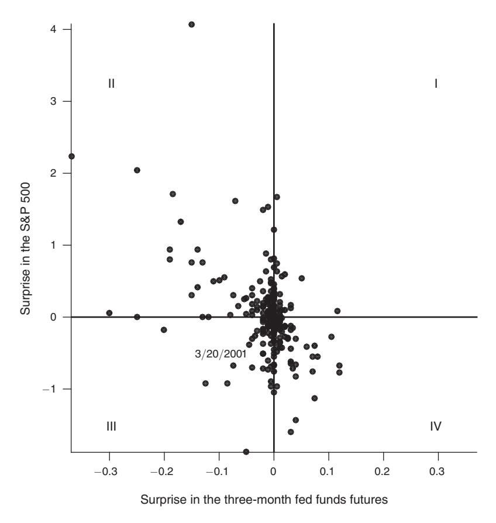

FIGURE 1. SCATTERPLOT OF INTEREST RATE AND STOCK PRICE SURPRISES

Notes: Change in the three-month fed funds futures and the S&P 500 index around FOMC announcements in percent. Each dot represents one FOMC announcement.

## II. The Econometric Approach

In this section, we explain how we estimate a joint econometric model of FOMC announcement surprises and standard macroeconomic and financial variables and how we identify structural shocks in this model. The model enables us to combine two approaches to shock identification familiar from structural VARs: HFI and sign restrictions.

We estimate a Bayesian structural VAR. Standard Bayesian methods naturally handle set identification due to sign restrictions and account for the estimation uncertainty in the presence of missing observations (high-frequency variables are unavailable before 1990). We follow a large Bayesian VAR literature and use the priors of Litterman (1979) in our baseline specification to prevent overfitting of a model with many free parameters. Our baseline priors are not particularly tight, and we conjecture that similar results can be obtained with frequentist methods. Indeed, our results with the standard HFI are similar to the frequentist results of Gertler and Karadi (2015).

### A. Estimation of a VAR with FOMC Announcement Surprises

Let  $y_t$  be a vector of  $N_y$  macroeconomic and financial variables observed in month t. Let  $m_t$  be a vector of surprises in  $N_m$  financial instruments observed in month t. To construct  $m_t$  we add up the intraday surprises occurring in month t on the days with FOMC announcements. Note that  $m_t$  is zero in the months with no FOMC announcements. Our baseline model is a VAR with  $m_t$  and  $y_t$  and a restriction that  $m_t$  does not depend on the lags of either  $m_t$  or  $y_t$  and has zero mean,

$$(1) \quad \binom{m_t}{y_t} = \sum_{p=1}^{P} \binom{0}{B_{YM}^p} \binom{0}{B_{YY}^p} \binom{m_{t-p}}{y_{t-p}} + \binom{0}{c_Y} + \binom{u_t^m}{u_t^y}, \quad \binom{u_t^m}{u_t^y} \sim \mathcal{N}(0, \Sigma),$$

where  $\mathcal{N}$  denotes the normal distribution. As long as the financial market surprises are unpredictable, the above-zero restrictions are plausible. In the online Appendix, we show that our results are unaffected by relaxing these zero restrictions.

The VAR in (1) includes the announcement surprises  $m_t$  together with other variables  $y_t$  in a single model estimated in one step. Alternative approaches in the literature use  $m_t$  as "external instruments" in VARs or in local projections. Caldara and Herbst (2019), Paul (2019), Plagborg-Møller and Wolf (2019), and Stock and Watson (2018) discuss the relationship between these approaches. Caldara and Herbst (2019) and Arias, Rubio-Ramírez, and Waggoner (2018) discuss the Bayesian inference in the external instruments case. The bottom line is that in our application either of the approaches could be used, as under regularity conditions all these approaches yield asymptotically the same impulse responses up to a constant scaling factor (see e.g., PlagborgMollerWolf19, corollary 1). We choose the VAR in (1) because the inference is particularly simple in this case.

We use a standard Bayesian prior for the VAR parameters, following Litterman (1986). In the online Appendix we provide the details and show that our main findings are robust to using a more sophisticated version of the prior that includes the "dummy observation priors," following Sims and Zha (1998) (see also Del Negro and Schorfheide 2011). We generate draws from the posterior using the Gibbs sampler, at the same time taking care of the missing values in  $m_t$ .

### B. Identification: Combining HFI and Sign Restrictions

This subsection explains how we combine HFI and sign restrictions in order to identify the structural shocks of interest in our baseline VAR model.

We identify two structural shocks transmitted through the central bank announcements. For the time being, let us call them a *negative co-movement shock* and a *positive co-movement shock*. We use two assumptions on the announcement surprises to isolate these shocks (unless indicated otherwise, we impose no restrictions on any monthly macroeconomic and financial variables):

(1) HFI.—Announcement surprises  $m_t$  are affected only by the two announcement shocks (the negative co-movement shock and positive co-movement shock) and not by other shocks.

(2) *Sign Restrictions*.—A negative co-movement shock is associated with an interest rate increase and a drop in stock prices. A positive co-movement shock is the complementary shock, i.e., the orthogonal shock that is associated with an increase in both interest rates and stock prices.

The first assumption is justified because variables *mt* are measured in a narrow time window around monetary policy announcements. Hence, it is unlikely that shocks unrelated to central bank announcement systematically occur at the same time.

The second assumption separates two central bank announcement shocks. Their orthogonality is a standard requirement of structural shocks. We now consider their interpretation. Most models suggest that a monetary policy tightening implies a decline in stock prices. First, the monetary tightening generates a contraction that reduces the expected value of future dividends. Second, the higher interest rates raise the discount rate with which these dividends are discounted. As a result, the stock price, which in the standard asset pricing theory is the present discounted value of future dividends, declines. Therefore, the negative co-movement shock is consistent with news being revealed about monetary policy, so, to a first approximation, we will think about it as a *monetary policy shock*. By contrast, a positive co-movement must reflect something in the central bank's announcement that is not news about monetary policy. We will call the positive co-movement shock a *central bank information shock*. We will show that the empirical results support the proposed interpretation. We will also consider some refinements of this simple identification in Section IIIF.

[Table 1](#page-10-0) summarizes the identifying restrictions. The restrictions partition each month's announcement surprise into a monetary policy shock component and a central bank information shock component. The above framework, in which the surprises *mt* are linear combinations of structural shocks, is the simplest one that allows us to make our points on the signs and shapes of impulse responses of *yt* to different shocks present in the FOMC announcements.

We compute the posterior draws of the shocks and the associated impulse responses assuming a uniform prior on the space of rotations conditionally on satisfying the sign restrictions (Rubio-Ramírez, Waggoner, and Zha 2010). [7](#page-9-0) The point to note here is that our restrictions only provide set identification, i.e., conditionally on each draw of the VAR parameters there are multiple values of shocks and impulse

sition of a randomly drawn matrix, implies a uniform prior on the space of rotations *Q*⁎

7To compute the posterior draws of the shocks and the associated impulse responses we proceed as follows. We note that the first assumption (with the resulting zero restrictions) implies a block-Choleski structure on the shocks, with the first two shocks forming the first block. Next, we impose the sign restrictions on the contemporaneous responses to the first two shocks following Rubio-Ramírez, Waggoner, and Zha (2010). For each draw of model parameters from the posterior, we find a rotation of the first two Choleski shocks that satisfies the sign restrictions. The prior on the rotations is uniform in the subspace where the sign restrictions are satisfied. More in detail, for each draw of Σ from the posterior we compute its lower-triangular Choleski decomposition, *C*. Then we postmultiply *C* by a matrix *Q* = ( *Q*⁎ 0 0 *I* ), where *Q*⁎ is a 2 × 2 orthogonal matrix obtained from the QR decomposition of a 2 × 2 matrix with elements drawn from the standard normal distribution. We repeat this until finding a *Q* such that *CQ* satisfies the sign restrictions. Then *CQ* is a draw of the contemporaneous impulse responses from the posterior, and the other quantities of interest can be computed in the standard way. The above procedure, with the QR decompo-

| Variable               |                                        | Shock                                 |       |  |  |  |  |
|------------------------|----------------------------------------|---------------------------------------|-------|--|--|--|--|
|                        | Monetary policy (negative co-movement) | CB information (positive co-movement) | Other |  |  |  |  |
| $m_t$ , high frequency |                                        |                                       |       |  |  |  |  |
| Interest rate          | +                                      | +                                     | 0     |  |  |  |  |
| Stock index            | _                                      | +                                     | 0     |  |  |  |  |
| $y_t$ , low frequency  | •                                      | •                                     | •     |  |  |  |  |

TABLE 1—IDENTIFYING RESTRICTIONS IN THE BASELINE VAR MODEL

*Notes:* Restrictions on the contemporaneous responses of variables to shocks. +, -, 0, and  $\bullet$  denote the respective sign restrictions, zero restrictions, and unrestricted responses.

responses that are consistent with the restrictions. When computing uncertainty bounds we take all these values into account weighting them according to the uniform prior on rotations. Having a uniform prior on rotations is less restrictive than imposing sign restrictions by means of a penalty function approach as, e.g., in Uhlig (2005). Moreover, in the online Appendix we also report the robustness to other priors on rotations following Giacomini and Kitagawa (2015).

### **III. Empirical Results**

#### A. Variables in the Baseline VAR

Our baseline VAR includes seven variables: two high-frequency surprise variables in  $m_t$  and five low-frequency macroeconomic variables in  $y_t$ ;  $m_t$  consists of the surprises in the three-month fed funds futures and the S&P 500 stock market index;  $y_t$  includes a monthly interest rate, a stock price index, indicators of real activity, the price level, and financial conditions.

More in detail, we use the monthly average of the one-year constant-maturity Treasury yield as our low-frequency monetary policy indicator. The advantage of using a rate longer than the targeted federal funds rate is that it incorporates the impact of forward guidance and therefore remains a valid measure of monetary policy stance also during the period when the federal funds rate is constrained by the zero lower bound (Gertler and Karadi 2015). As our stock price index, we use the monthly average of the S&P 500 in log levels. Our baseline measures of real activity and the price level are the real GDP and the GDP deflator in log levels. We interpolate real GDP and GDP deflator to monthly frequency following Stock and Watson (2010). This methodology uses a Kalman filter to distribute the quarterly GDP and GDP deflator series across months using a dataset of monthly variables that are closely related to economic activity and prices. In the online Appendix, we show that most of our results are robust to using industrial production and the consumer price index. Finally, as an indicator of financial conditions we include the excess bond premium (EBP, Gilchrist and Zakrajšek 2012; Favara et al. 2016). This is the average corporate bond spread that is purged from the impact of default compensation. As the authors show, this variable aggregates high-quality forward-looking information about the economy. Therefore, it improves the reliability and forecasting performance of small-scale VARs (Caldara and Herbst 2019).

The VAR has 12 lags. The sample is monthly, from February 1984 to December 2016 (Bernanke and Mihov 1998 identifies February 1984 as the end of the Volcker disinflation). The two variables in  $m_t$  are unavailable before February 1990. Moreover, the S&P 500 surprise is missing in September 2001, when the FOMC press statement took place before the opening of the US market. We report the results based on 2,000 draws from the Gibbs sampler.8

### B. Impulse Responses

Figure 2 presents the impulse responses to the monetary policy and central bank information shocks, respectively, in panel A. The plots make two points obvious. First, our sign restriction on the high-frequency co-movement of interest rates and stock prices separates two very different economic shocks. If, contrary to our hypotheses, the stock market response in the half-hour window around the policy announcement were uninformative about the effect of the announcement on the economy, the impulse responses of macroeconomic and financial variables  $y_t$  would have been the same in the two columns. This is clearly not the case if one looks at, for example, the striking differences between the responses of prices and the excess bond premium in the two columns. This is all the more notable given that we impose no restrictions on the responses of any low-frequency variables  $y_t$ . Second, monetary policy announcements generate not only monetary policy shocks. The second column clearly shows that the positive co-movement of interest rates and stock prices around monetary policy announcements, which is inconsistent with monetary policy shocks, is informative about low-frequency outcomes. For example, a high-frequency increase in stock prices and interest rate foretells a persistent increase in the future price level. We next discuss the impulse responses in detail.

The first column shows the responses to a monetary policy shock. Due to the coefficient restrictions in our VAR (1), the announcement surprises in  $m_t$  are i.i.d. They only respond to shocks on impact, and their impulse response function is zero in all other periods. Table 2 reports their impact responses. By construction, the impact responses satisfy the sign restrictions. A monetary policy shock is associated with a 3 to 6 basis points increase of the three-month fed funds futures and a 23 to 52 basis points drop in the S&P 500 index in the 30-minutes window. The response of low-frequency variables are qualitatively in line with previous results in the literature. The one-year government bond yield increases by around five basis points and reverts to zero in about a year. Financial conditions tighten, the stock prices drop by about 1 percent, and the excess bond premium increases by about 5 basis points. Real GDP and the price level both decline persistently by about 10 basis points and 5 basis points, respectively. The main quantitative novelty in these responses is the fairly low persistence of the interest rate response and vigorous price-level decline. We come back to this result in Section V and analyze its relevance within a structural model.

 $^8$  We discard the first 2,000 draws and keep every fourth of the subsequent 8,000. We obtain the same results also when the chain is ten times longer. For every draw of Bs and  $\Sigma$  we find a random rotation matrix Q that delivers the sign restrictions. It is easy to show that for the restrictions in Table 1 such a matrix exists for every nonsingular  $\Sigma$ .

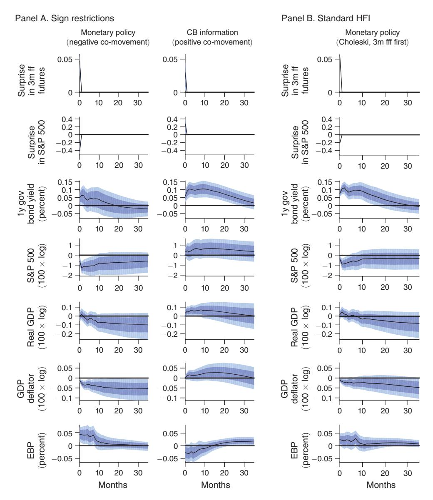

Figure 2. Impulse Responses to One-Standard-Deviation Shocks, Baseline VAR

*Note:* Median (line), percentiles 16–84 (darker band), percentiles 5–95 (lighter band).

Table 2—Impact Responses of Announcement Surprises to Shocks, Baseline VAR

|                                          | Panel A. Sign restrictions |                      |         |                   | Panel B. Standard HFI |                      |  |
|------------------------------------------|----------------------------|----------------------|---------|-------------------|-----------------------|----------------------|--|
|                                          | Monetary policy            |                      |         | CB information    | Monetary policy       |                      |  |
|                                          | Mean                       | (5pct, 95pct)        | Mean    | (5pct, 95pct)     | Mean                  | (5pct, 95pct)        |  |
| Three-month fed funds futures S&P 500 | 5 −42                   | (3, 6) (−52, −23) | 3 28 | (0, 5) (3, 45) | 6 −21              | (5, 6) (−25, −16) |  |

*Notes:* Posterior means and posterior percentiles 5 and 95. In basis points.

The second column shows the responses to the central bank information shock. They are new in the literature. The shock is associated with an up to 5 basis points increase in the three-month fed funds futures and a 3 to 45 basis points increase in the S&P 500 index in the 30-minutes window. The one-year government bond yield increases by about ten basis points and takes more than two years to revert back to zero, which is much slower than after a monetary policy shock. The shock has a mild positive impact on the stock prices with wide uncertainty bands at the monthly frequency,9 and it significantly reduces the excess bond premium by about three basis points. The impact on output and price level is very different than after a monetary policy shock: here the price level increases by about three basis points rather than declining as after a monetary policy shock. The increase is very persistent, and prices revert to the baseline only after around three years. Output increases by about five basis points rather than declining as after a monetary policy shock. In our view, these responses are consistent with the scenario in which the central bank communicates good news about the economy and tightens monetary policy, consistently with its reaction function, to partly offset the effect of the news and prevent overheating of the economy. The persistent increase in the one-year government bond yield is in line with such a systematic reaction of the central bank. The policy fails to completely offset the initial effect of the news, but it is successful in neutralizing it within a few years.

Figure 2 illustrates also how the presence of central bank information shocks biases the standard HFI of monetary policy shocks. The standard identification takes all the surprises in the fed funds futures as proxies for monetary policy shocks (and ignores the accompanying stock price movements). This is what we reproduce in panel B of Figure 2. Specifically, this panel shows the impulse responses to the three-month fed funds futures surprise, ordered first, in the VAR identified with the Choleski decomposition. By the properties of the Choleski decomposition, the identifying restrictions in this case are

(2) 
$$\operatorname{cov}(m_t^{ff}, \epsilon_t^{MP}) > 0$$
 and  $\operatorname{cov}(m_t^{ff}, \epsilon_t^i) = 0$  for all  $\epsilon_t^i$  other than  $\epsilon_t^{MP}$ ,

where  $m_t^{ff}$  denotes the fed funds futures surprise and  $\epsilon_t^{MP}$  the monetary policy shock. Identifying restrictions (2) are used among others in Barakchian and Crowe (2013) and Gertler and Karadi (2015).10

The figure shows that the standard HFI mixes the monetary policy shocks with central bank information shocks. The responses in panel B are qualitatively similar to the "pure" responses in the first column of panel A, which are purged from the impact of central bank information shocks. But there are notable quantitative

&lt;sup>9 As we show in the online Appendix, the estimated stock market effects are larger and more persistent if we exclude the pre-1994 sample from the identification, when the FOMC did not accompany its policy decisions with press statements. The stock market effects are also significantly larger in Europe (see Section IV), where the ECB followed a more transparent communication throughout our sample period.

 $^{10}$ The specific implementations of these restrictions differ across papers. For example, Gertler and Karadi (2015) uses the *external instruments* approach, i.e., it does not introduce  $m_t^{ff}$  into the VAR and instead uses it in auxiliary regressions outside the VAR. Caldara and Herbst (2019) and Paul (2019) discuss the relation between the Choleski factorization and external instruments approach. We verified that in our application the findings are very similar when using both approaches.

differences. The responses of output, price level, and excess bond premium are muted because the central bank information shocks, which have the opposite impact of monetary policy shocks, attenuate the estimated responses of these variable to a monetary policy shock. An additional bias in the standard HFI is that the interest rate responses in panel B are larger and more persistent. This is because of the presence of the central bank information shocks, which have higher and more persistent interest rate effects. Summing up, the standard HFI underestimates the effectiveness of monetary policy. 11

### C. Poor Man's Sign Restrictions and Other Robustness Checks

We now show that a simpler exercise can lead to similar impulse responses as those obtained with our sign restrictions. In particular, we use the fed funds futures surprises in the months when the stock price surprise had the opposite sign of the fed funds futures surprise as the proxy for monetary policy shocks (the proxy is zero otherwise). We use the fed funds futures surprises in the remaining months as the proxy for central bank information shocks (again, the proxy is zero otherwise). The implicit assumption in this exercise is that each month can be classified either as hit by a pure monetary policy shock or pure central bank information shock. By contrast, in the sign restrictions approach, in each month we observe a combination of the two shocks with different, generally nonzero shares. The identifying assumptions behind this exercise are stronger than those of our baseline sign restrictions, but it is also easier to implement. For lack of a better name, we dub this exercise as "poor man's sign restrictions." Figure 3 reports the impulse responses to these proxies (we place the proxies first and use the Choleski decomposition to identify the VAR). The impulse responses are strikingly similar to those obtained with sign restrictions.

The correlation between the posterior mean of the monetary policy shock identified with sign restrictions and the shock from the poor man's procedure is 88 percent. For the central bank information shock this correlation is 54 percent. So the sign restrictions and the poor man's sign restrictions do not yield the same shocks, but they do yield shocks with very similar impulse responses.

The impulse responses are also robust when we start the sample in July 1979 (before Paul Volcker became chair); stop the sample in December 2008 (when the fed funds rate hit the zero lower bound); drop the pre-1994 surprises, which were not accompanied by announcements; replace the interpolated real GDP and GDP deflator with the industrial production index and consumer price index (except that industrial production fails to increase after the central bank information shock); and replace the surprises in the three-month fed funds rate and S&P 500 with factors extracted from several interest rate and stock market surprises. Finally, we continue to obtain similar lessons when we replace the uniform prior on rotations with the "multiple priors" approach of Giacomini and Kitagawa (2015). We show these detailed results in the online Appendix.

&lt;sup>11This point comes out even starker when we use Sims's "dummy observation priors" with optimally chosen weights, as we report in online Appendix B.

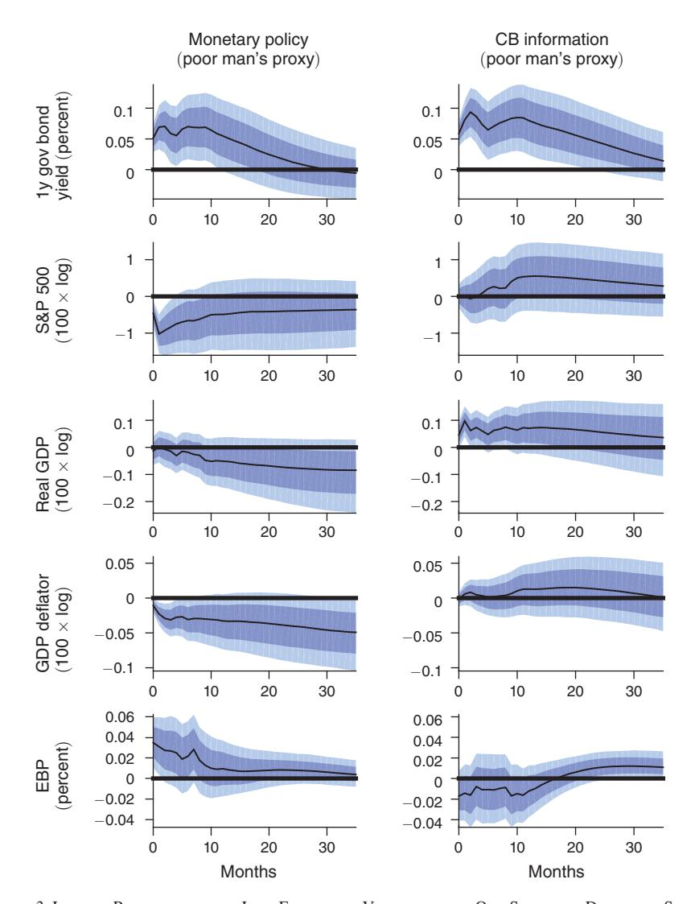

Figure 3. Impulse Responses of the Low-Frequency Variables *yt* to One Standard Deviation Shocks, Baseline VAR with Poor Man's Sign Restrictions

*Note:* Median (line), percentiles 16–84 (darker band), percentiles 5–95 (lighter band).

## D. *The Shocks over Time*

At which occasions were the central bank information shocks particularly large? To answer this question [Figure 4](#page-16-0) plots the monetary policy and central bank information shocks over time. The shocks are scaled in terms of the three-month fed funds futures surprises, in basis points, and summarized by their posterior means. The upper panel reports the shocks obtained with the sign restrictions. The lower panel plots the poor man's proxies.

Figure 4 shows that central bank information shocks are not particularly clustered but occur all over our sample. One episode worth highlighting is a sequence of negative information shocks from the end of 2000 until the end of 2002, in the wake

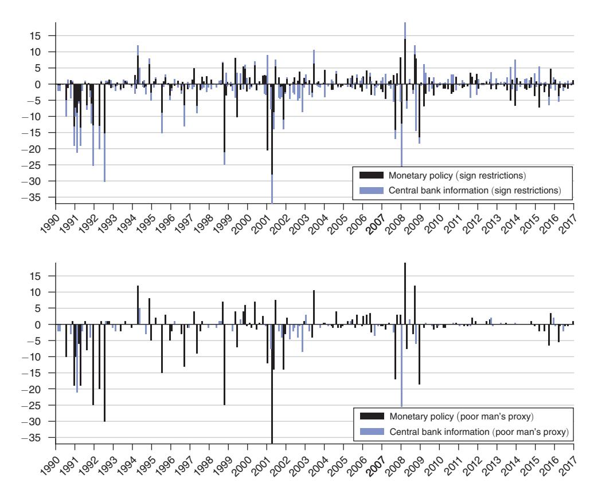

FIGURE 4. CONTRIBUTIONS OF SHOCKS TO THE SURPRISES IN THE THREE-MONTH FED FUNDS FUTURES

Notes: Aggregated to the monthly frequency. Basis points.

of the burst of the dot-com bubble. Over this period, the FOMC cut the fed funds rate from over 6 percent to close to 1 percent to offset the worsening demand conditions brought about by the negative stock market wealth shock and geopolitical risks related to the September 2001 terrorist attack and the run up to the March 2003 Iraq War. The initial major cuts up until the end of 2001 were in line with the predictions of standard historical interest rate rules (Taylor 2007), and the persistence of easy policy later can be explained by the moderate pace and "jobless" nature of the recovery (Bernanke 2010), but we still observe many negative surprises in the fed funds futures. The FOMC statements during this period consistently linked the easy stance of policy to weak demand conditions and high economic uncertainty with downside risks. 12 The positive co-movement of interest rates and stock market changes after

&lt;sup>12For example, in August 2001 the FOMC explained that it reduced the target rate by 25 basis points in light of the fact that "[h]ousehold demand has been sustained, but business profits and capital spending continue to weaken and growth abroad is slowing, weighing on the US economy," and announced that "risks are weighted mainly toward conditions that may generate economic weakness in the foreseeable future." In March 2002, the FOMC announced that it kept its target rate constant despite the "significant pace" of expansion. It explained that "the degree of the strengthening in final demand over coming quarters, an essential element in sustained economic expansion, is still uncertain." In both of these instances, our methodology assigns the overwhelming majority of the interest rate surprise to central bank information shocks.

the majority of these announcements suggests that the worse-than-expected outlook of the FOMC led agents to update downwards their views about the economic prospects.

Another central bank information shock picked up by our approach is discussed in Bernanke (2015), and his account shows that the FOMC members were aware of the central bank information channel. This shock happened in August 2007. Over the course of the month, financial conditions and the economic outlook deteriorated significantly. The FOMC had kept its interest rate unchanged but communicated its deteriorating views about the economic outlook. In particular, during its August 7 regular meeting, the FOMC stated that downside risks to growth have "increased somewhat"; in a statement following an August 16 conference call, it asserted that downside risks have "increased appreciably." In line with a negative central bank information shock, the stock market depreciated and the three-month interest rates declined around these statements over the course of the month. Writing about internal discussions of a possible inter-meeting interest rate cut before their upcoming September 18 meeting, Bernanke (2015, 154) recalls "...we were concerned that a surprise cut might lead traders to believe we were even more worried than they had thought. 'Going sooner risks, "What do they know that we don't," Don [Kohn] wrote in an e-mail to Tim [Geithner] and me."

Another interesting observation is that the central bank information and monetary policy shocks are roughly proportional to each other in the pre-1994 period. The pre-1994 period is different from the rest of the sample because until February 1994, the FOMC did not usually issue a press release (the surprises are measured around the first open market operation after a decision). All that the market participants were observing was the fed funds rate, and based on that they made inferences about the monetary policy shock and central bank information shock. Theoretical models of central bank information predict that in this case the agents perceive the two shocks as proportional to each other (i.e., perfectly correlated) (see Melosi 2017; Nakamura and Steinsson 2018). Our estimated shocks in this period are indeed positively correlated, consistent with this prediction.13

### E. Responses of Other Variables

Figure 5 reports the responses of low-frequency variables that we add, one by one, to the baseline model. We can see that the two shocks that we identify by sign restrictions have opposite effects on a number of important variables. When discussing these results we focus on the responses to central bank information shocks and what we learn about the nature of these shocks.

&lt;sup>13 After the policy rate reached its effective lower bound in December 2008, the variation in the short end of the yield curve became restricted, resulting in a lower variation of our baseline measure of monetary policy shocks (the movement in the three-months-ahead federal funds futures). As a consequence, our method cannot be expected to pick up the effects of the increased transparency of the Fed (e.g., an increasing length of the FOMC statements and reporting of the FOMC members' economic projections). The increasing transparency coincided also with the introduction of unconventional monetary policy measures, which call for using movements in longer interest rates as empirical proxies. We leave these issues for future research (Cieslak and Schrimpf 2019 takes some steps in this direction).

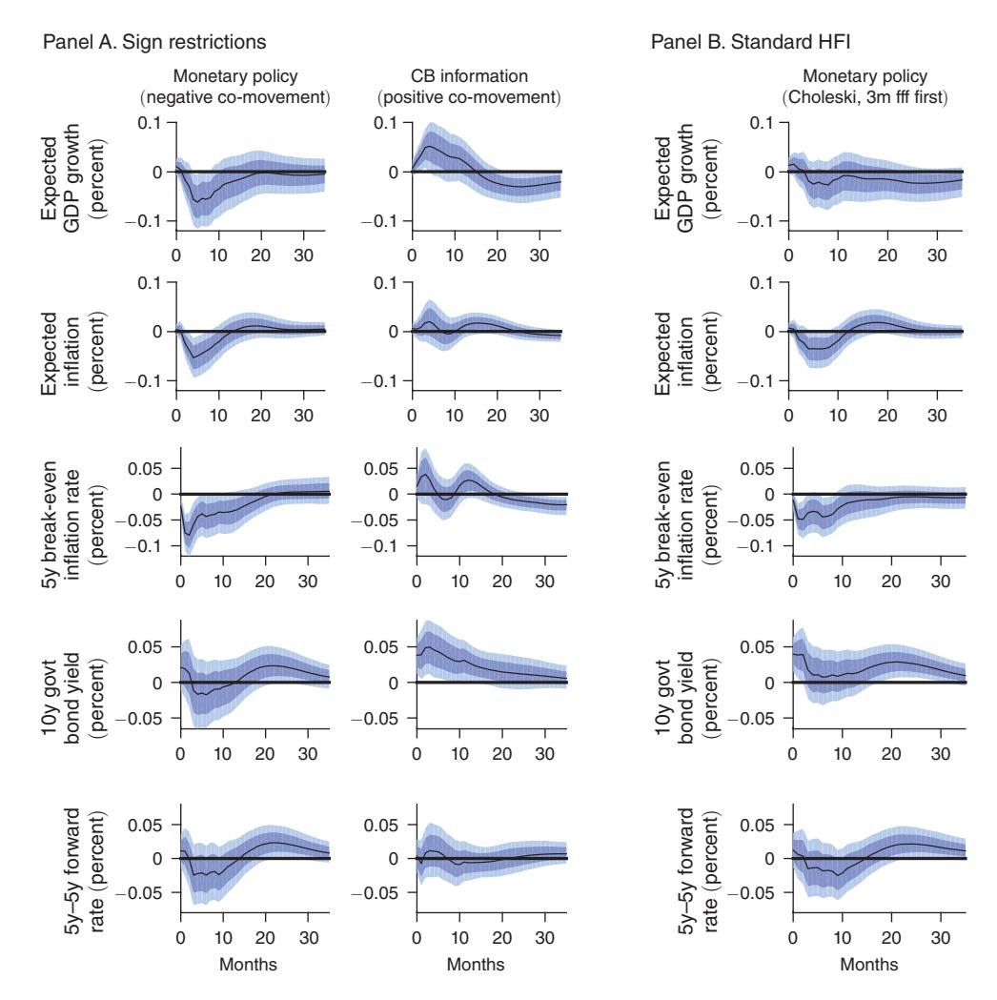

FIGURE 5. IMPULSE RESPONSES OF OTHER LOW-FREQUENCY VARIABLES TO MONETARY POLICY AND CENTRAL BANK INFORMATION SHOCKS

*Note:* Median (line), percentiles 16–84 (darker band), percentiles 5–95 (lighter band).

The central bank information shock generates an increase in both growth and inflation expectations (see the first two rows of Figure 5). The expectations respond gradually, with most of the effect materializing after a few months, as is often found empirically (Coibion and Gorodnichenko 2012). The real GDP growth and CPI expectations in these plots come from Consensus Economics. We transform the current-year and next-year average expectations into constant-horizon one-year expectations. Due to data availability we start the sample in 1990, but

&lt;sup>14Notably, controlling for the central bank information channel eliminates the counterintuitive positive effect of a monetary policy shock on expected GDP growth on impact, as emphasized by Nakamura and Steinsson (2018).

&lt;sup>15 Our expectation measure  $(EXP_{12m})$  is a weighted average of the current-year  $EXP_{CY}$  and next-year  $EXP_{NY}$  expectations reported by Consensus Economics:  $EXP_{12m} = ((1-(i-1))/12)EXP_{CY} + ((i-1)/12)EXP_{NY},$ 

this does not change much the other impulse responses (see the online Appendix). The fact that growth and inflation expectations move in the same direction confirms the notion that central bank information shocks convey information about demand pressures.

The third row shows the response of a longer-term market-based inflation compensation measure: the five-year break-even inflation rate[.16](#page-19-0) The central bank information shock leads to an increase in inflation expectations even at this long horizon. The figures also highlight that after a monetary policy shock the peak effect on the break-even rates is not immediate and is only reached in a couple of months after the impact. The delayed response, therefore, is a characteristic of market-based inflation measures and not only of the survey-based measure presented before. The delayed response implies that the contemporaneous responses of break-even rates across the maturity spectrum do not reflect the full dynamics of inflation expectations after a monetary policy impulse. Our results show that even though the contemporaneous response of the break-even yield curve would be consistent with high price stickiness as in Nakamura and Steinsson (2018), the dynamics of inflation expectations tracked by our VAR suggests a sizable peak response of inflation expectations. This large peak response of expectations corroborates the vigorous inflation response in our baseline VAR and suggests moderate nominal stickiness. We address this issue more formally in Section V.

The last two rows show that neither the monetary policy shock nor the central bank information shock raises the term premium.[17](#page-19-1)

## F. *Central Bank Information about Supply*

In this section we offer a refinement of our baseline identification. Up to now, we have identified a single central bank information shock. We have found that this shock behaves like a "demand" shock in the sense that both the output and price level move in the same direction after the shock. But central bank communication is not only about factors influencing demand; it is also about factors that influence "supply," like the level of technology and potential output. A key characteristic of shocks to supply is that output and prices move in the opposite direction. The presence of such shocks can potentially bias our baseline results. The direction of the bias depends on the central bank's reaction function, in particular how interest rates react to such supply shocks. If, for example, an adverse supply shock worsens outlook and reduces stock prices but at the same time raises the price level and the central bank raises interest rates, our baseline identification would misclassify it as a monetary policy shock. If the central bank instead reduces interest rates after such an adverse supply shock, we would correctly classify it as a central bank information

where the weights are determined by share of the current and the next calendar years in the following 12 months

period (*i* is the current calendar month). 16This variable is available since 1999. The two-year break-even inflation rate, available only since 2004,

responds almost identically (not shown) as the one-year survey-based measure shown in the second row. 17The term premium increases after the monetary policy shock when we extend the sample to 1979 (see the working paper version of this article), but this result disappears in smaller samples.

shock, but the price responses to this catchall information shock would be attenuated. It is an empirical question whether such events are important in our sample.

To redress this problem, we set out to separately identify two central bank information shocks: one about demand and one about supply. We achieve this by adding a new high-frequency financial market surprise variable to vector  $m_t$  and an additional set of restrictions. The variable we add reflects changes in market-based inflation expectations around policy announcements. In particular, it is the change in the two-years-ahead break-even inflation rate on the day of the FOMC announcement. We construct this variable by taking the difference between the two-year constant-maturity yields of nominal and real (inflation-protected) Treasuries (Gürkaynak, Sack, and Wright 2007, 2010). Table 3 presents our new set of identifying restrictions. Importantly, the co-movement of stock prices, which presumably co-move with the outlook, and inflation expectations helps us distinguish between central bank information about demand and about supply shocks: if they co-move positively, we categorize it as a demand shock; if they co-move negatively, we categorize it as a supply shock.

After a monetary policy tightening inflation is expected to fall, and after favorable news about demand inflation is expected to rise, so we require inflation compensation to do the same, as Table 3 shows. Next, we isolate the new "central bank information about supply" shock. We require the stock prices and the inflation expectations to move in opposite directions, but we leave the fed funds futures surprise unrestricted because it is ex ante unclear how the central bank acts in the presence of such news. Table 4 reports the impact responses that reflect these assumptions. We can see modest changes of break-even inflation on the day of the FOMC announcements.

Figure 6 reports the responses of low-frequency variables to the three shocks we now identify. Two lessons stand out. First, the responses to monetary policy and central bank demand information shocks are robust to adding a new high-frequency observable and a third shock. The main difference is that inflation responses become somewhat more pronounced and that this time the low-frequency stock market response to central bank information about demand is significantly positive. Second, the new shock we added does not account for much of the variability of the macroeconomic and financial variables, as witnessed by the near-zero impulse responses. These results suggest that interest rate and stock market surprises, which we use in our baseline identification, are sufficiently informative to identify monetary policy and central bank information shocks, and high-frequency surprises in break-even inflation rates (utilized in Andrade and Ferroni (2016) on euro-area data)20 add only a little independent information. Overall, we conclude that our previous conclusions remain robust also under this more refined identification.

&lt;sup>18These assumptions are not completely innocuous. Inflation compensation is driven both by expected inflation and inflation risk premium. We have shown that the shocks we identify lead to changes in financial conditions, and this can influence the required inflation risk premium independently from the expected inflation. If we assume that inflation risk premium moves in the same direction as the excess bond premium, then our assumptions are conservative: expected inflation necessarily declines if inflation compensation declines after a monetary policy shock, and expected inflation necessarily increases if inflation compensation increases after a news-about-demand shock.

We thank an anonymous referee for pointing this out.

&lt;sup>20These results are very similar in euro-area data (EA) (not shown).

TABLE 3—IDENTIFYING RESTRICTIONS IN THE VAR WITH CENTRAL BANK INFORMATION ABOUT SUPPLY

|                                       | Shock           |                             |                             |       |  |  |
|---------------------------------------|-----------------|-----------------------------|-----------------------------|-------|--|--|
| Variable                              | Monetary policy | CB information about demand | CB information about supply | Other |  |  |
| $m_t$ , high frequency                |                 |                             |                             |       |  |  |
| Interest rate surprise (30m window)   | +               | +                           | •                           | 0     |  |  |
| Stock index surprise (30m window)     | _               | +                           | +                           | 0     |  |  |
| Break-even inflation surprise (daily) | _               | +                           | -                           | 0     |  |  |
| $y_t$ , low frequency                 | •               | •                           | •                           | •     |  |  |

Table 4—Impact Responses of High-Frequency Surprises to Shocks, Separating Central Bank Information about Demand from Central Bank Information about Supply

|                               | Monetary policy |                       |      | nformation ut demand | CB information about supply |                       |
|-------------------------------|-----------------|-----------------------|------|-------------------------|-----------------------------|-----------------------|
|                               | Mean            | $(5^{pct}, 95^{pct})$ | Mean | $(5^{pct}, 95^{pct})$   | Mean                        | $(5^{pct}, 95^{pct})$ |
| Three-month fed funds futures | 4               | (2, 6)                | 2    | (0, 4)                  | -0                          | (-4, 4)               |
| S&P 500                       | -31             | (-49, -7)             | 22   | (2, 43)                 | 26                          | (3, 45)               |
| Two-year break-even inflation | -3              | (-5,0)                | 2    | (0, 5)                  | -2                          | (-5, 0)               |

*Notes:* Posterior means and posterior percentiles 5 and 95. In basis points.

#### IV. Euro-Area Evidence

In this section, we analyze the robustness of our baseline US results by applying our methodology to euro-area data. This application deserves particular attention because, as we show below, standard HFI of monetary policy shocks here leads to results that are inconsistent with theoretical predictions. Our methodology resolves this issue.

#### A. The Euro-Area Dataset

We have constructed a novel dataset of euro-area high-frequency financial market surprises along similar lines as the Gürkaynak, Sack, and Swanson (2005a) data for the United States. This dataset contains 280 ECB policy announcements from 1999 to 2016. Most of these announcements happen after the ECB Governing Council monetary policy meeting and consist of a press statement at 13:45 followed by a press conference at 14:30 that lasts about one hour. Analogously to the United States, we use 30-minute windows around press statements and 90-minute windows around press conferences, both starting 10 minutes before and ending 20 minutes after the event.21 Whenever there is a press conference after a press statement, our surprise measure is the sum of the responses in the two windows.22

The narrow windows that we use minimize the chances that unrelated regular news announcements bias our measure, which may be more of an issue in Europe

&lt;sup>21We approximate the duration of the press conference to be one hour. The fact that some of them are either shorter or longer adds some noise in this measure.

&lt;sup>22We have also tried adding 11 of the most important speeches of the ECB president: the "whatever it takes" speech in London on July 26, 2012, as well as 10 speeches announcing various aspects of the ECB's nonstandard monetary policies. We report the results without the speeches, but they are similar when we include them.

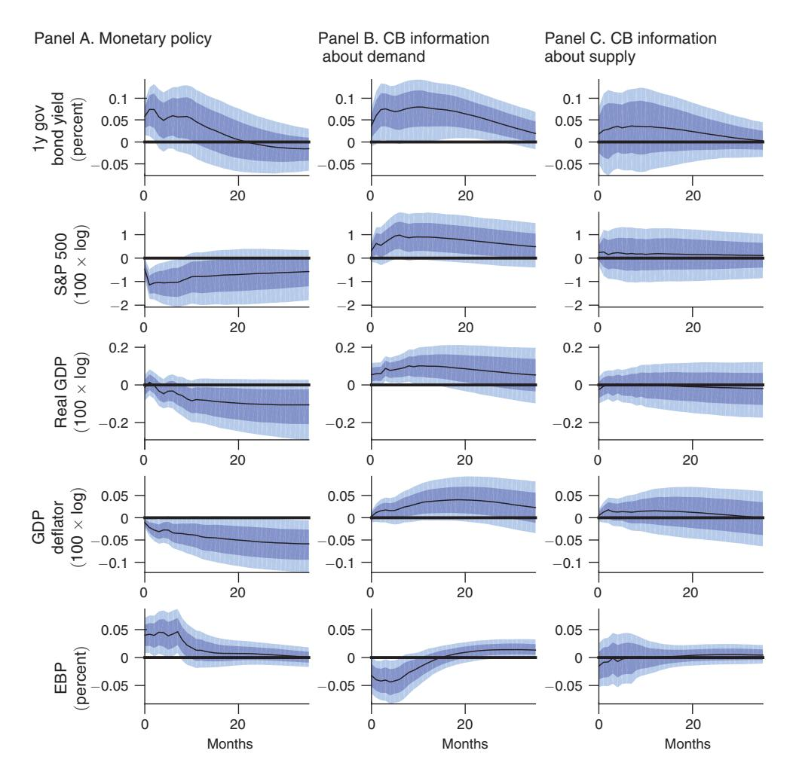

Figure 6. Impulse Responses of the Low-Frequency Variables *yt* to One-Standard-Deviation Shocks

*Notes:* Median (line), percentiles 16–84 (darker band), percentiles 5–95 (lighter band). VAR with central bank information about supply.

than in the United States. For example, our window around regular press statements by the ECB at 13:45 CET excludes monetary policy announcements of the Bank of England released at 12:00 CET the same day in a sizable part of our sample.[23](#page-22-1)

In the euro-area dataset, we record surprises in the EONIA interest rate swaps with maturities of one month up to two years and the EURO STOXX 50, a market capitalization-weighted stock market index including 50 blue-chip companies from 11 eurozone countries.

23United States Initial Jobless Claims data releases systematically coincide with the start of the press conferences. We check whether these releases contaminate our interest rate surprise measure by regressing it on the surprise component in the data releases (relative to Bloomberg consensus). The regression explains less than 0.1 percent of the variability of the surprise. We conclude that we can ignore the impact of the US data release.

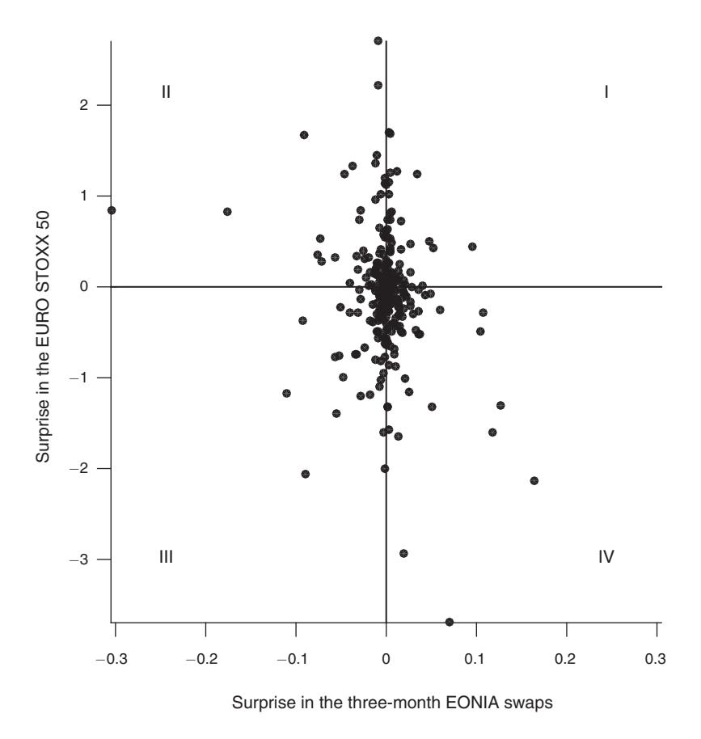

Figure 7. Scatterplot of the Surprises in the Three-Month EONIA Swaps and EURO STOXX 50 Index *Notes:* In percent. Each dot represents one announcement by the Governing Council of the ECB.

The wrong-signed responses of stock prices are even more of an issue in the euro area than in the United States. In the following analysis, we focus on the three-month EONIA swap and EURO STOXX 50. Figure 7 shows the scatterplot of the surprises. This time, more than 40 percent of the interior data points are in quadrants I and III, with wrong-signed stock market responses.[24](#page-23-0) This is even more than in the United States, in line with the more transparent communication policy of the ECB. For example, the ECB has organized press conferences since 1999 while the Fed introduced them only in 2011. Furthermore, the ECB publishes staff forecasts promptly after they are produced while the Fed does this with a five-year delay.

24The proportion is 47 percent if we count all interior data points and 42 percent if we count only those that are more than 2 standard deviations away from the axes, where the standard deviations are computed for a typical non-Governing Council day in the precrisis years 2005 and 2006.

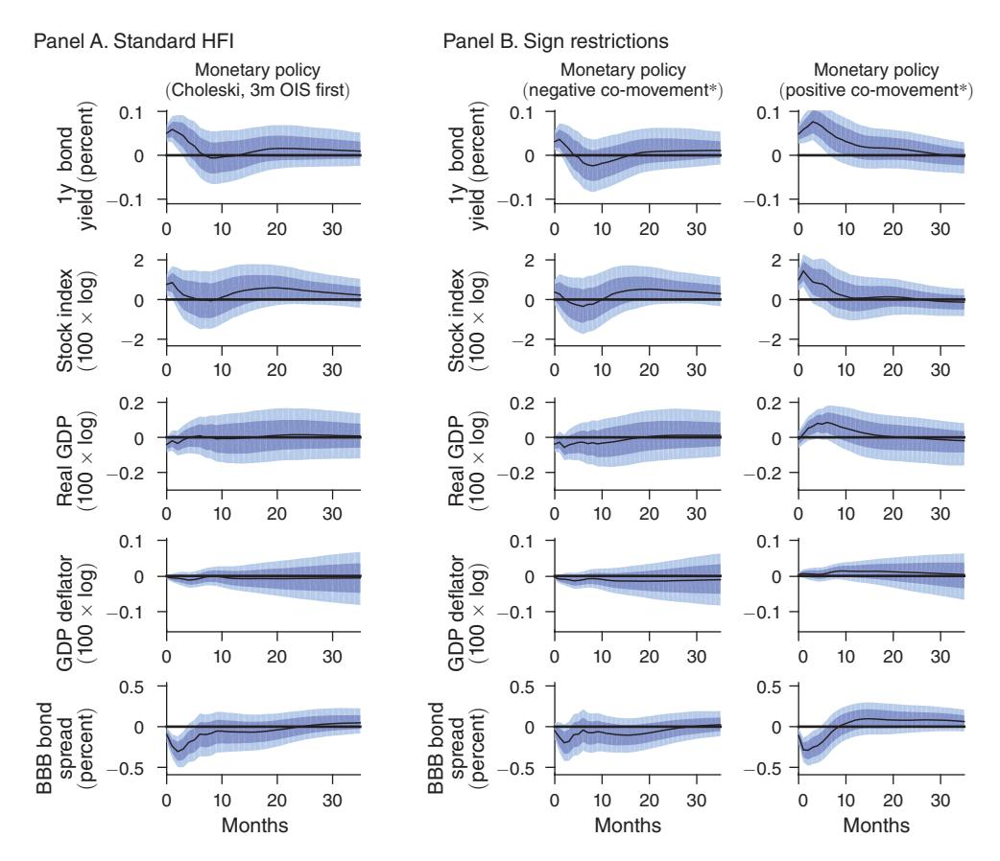

Figure 8A. Impulse Responses of the Low-Frequency Variables  $y_t$  to One Standard Deviation Shocks, Euro-Area VAR

*Notes:* Median (line), percentiles 16–84 (darker band), percentiles 5–95 (lighter band). Months on the horizontal axis. \*The sign restriction identification also includes a restriction that the impact response of the one-year bond yield is at least one basis point.

(continued)

### B. Euro-Area Impulse Responses

Our main lesson extends to euro-area data: the immediate stock market response to a monetary policy announcement is informative about the announcement's longer-run economic consequences. In addition, we obtain a number of new findings.

The VAR we estimate for the euro area is similar to the US VAR. In the euroarea VAR we use the German one-year government bond yield to capture the safest one-year interest rate. Furthermore, we use the BBB bond spread to capture financial conditions, as no excess bond premium measure is available for the euro area. The other variables are analogous: we use the blue-chip STOXX 50 index and an interpolated real GDP and GDP deflator series. The sample is from January 1998 to December 2016. Figure 8 presents the impulse responses for three identifications: a standard HFI, sign restrictions, and poor man's sign restrictions.

In the euro area the standard HFI of monetary policy shocks (panel A) yields responses that are inconsistent with predictions of standard theory. In particular,

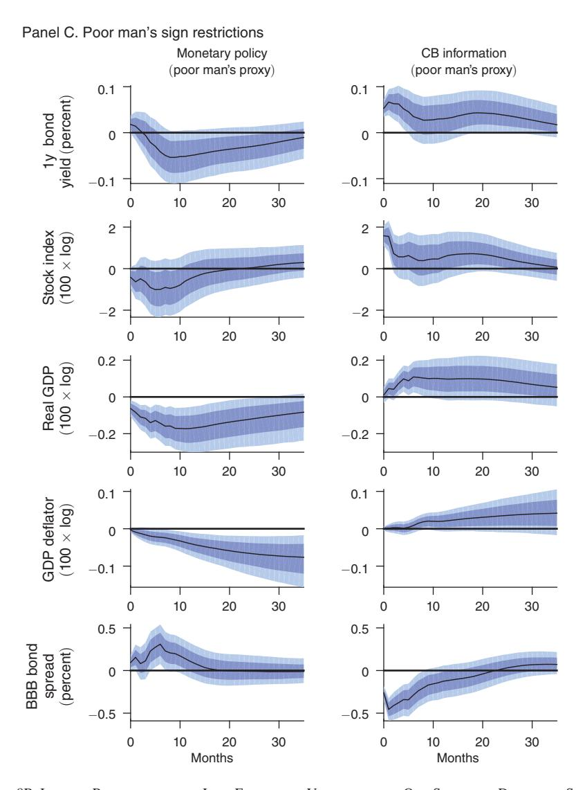

Figure 8B. Impulse Responses of the Low-Frequency Variables *yt* to One Standard Deviation Shocks, Euro-Area VAR (*continued*)

*Notes:* Median (line), percentiles 16–84 (darker band), percentiles 5–95 (lighter band). Months on the horizontal axis.

first, stock prices increase, and second, corporate bond spreads fall in response to this shock. Hence, in the euro area it is obvious that one needs to decompose the monetary policy surprises further, as we do in this paper.

The baseline sign restrictions deliver a more plausible monetary policy shock, except for one issue: the response of the one-year bond yield is insignificant. Therefore, we add one more sign restriction to the identification: we postulate that the one-year bond yield increases on impact by at least one basis point. The resulting impulse responses are in panel B of Figure 8. Two differences from the United States stand out. First, the stock market response to the central bank information shock is large and positive, while it was insignificant in the United States. Second, the response of output to the central bank information shock is stronger, and the response of prices is weaker than in the United States. Many of the responses are not significant, but overall, like in the United States, they leave no doubt that the two shocks are very different. A positive monetary policy shock is a conventional policy tightening. A positive central bank information shock looks like positive news about the economy to which the central bank responds to mitigate its impact on prices.

The poor man's sign restriction identification is implemented analogously as in the United States, and in the European case it actually delivers more intuitive and significant impulse responses. As can be seen in panel C of Figure 8, this time the monetary policy shock significantly depresses stock prices, output and prices, and raises the BBB bond spread. The central bank information shock has the opposite effects.

We have also implemented for the euro area the identification from Section IIIF using the daily change in the two-year inflation swaps on the policy announcement days as the additional variable. The findings are similar as in the United States: the additional shock accounts for very little variability of all the variables, while responses of output and prices to monetary policy shock and central bank information about demand become somewhat stronger. We report these impulse responses in the online Appendix.

## C. *Euro-Area Shocks over Time*

[Figure 9](#page-27-0) plots the euro-area shocks over time. As in the United States, the central bank information shocks occur throughout the sample. We comment on a few major events. One of the largest central bank information shocks took place in August 2011 during the European sovereign debt crisis. On August 4, the Governing Council of the ECB decided to keep its policy rates unchanged after increasing them twice in April and July the same year and ruled out further tightening in the near future. This came as an easing surprise to the markets that anticipated further policy tightening. Despite the easing surprise, the STOXX 50 blue-chip stock market index dropped significantly, in line with the message of the accompanying statement, which emphasized that uncertainty, especially on financial markets, is "particularly high." In July 2012, the Governing Council reduced the policy rates by 25 basis points and explained that "some of the previously identified downside risks to the euro-area growth outlook have materialized." The stock market depreciated by more than 2 percent. Another notable example came in September 2001 after the terrorist attack on the United States. The net effect of the three press statements issued over this month was a large decline in both the interest rates and stock index.[25](#page-26-0) There is also a notable negative central bank information shock in

25On September 13, the Governing Council kept its policy rate unchanged but announced that "while the expectation is that normal market conditions will prevail in the period ahead, the Eurosystem will continue to monitor developments in financial markets and take action if necessary." On September 17, in a coordinated move with other major central banks, it cut its policy rate and announced that "recent events in the United States are likely to weigh adversely on confidence in the euro area, reducing the short-term outlook for domestic growth." In its last scheduled policy meeting in the month it kept its rate unchanged.

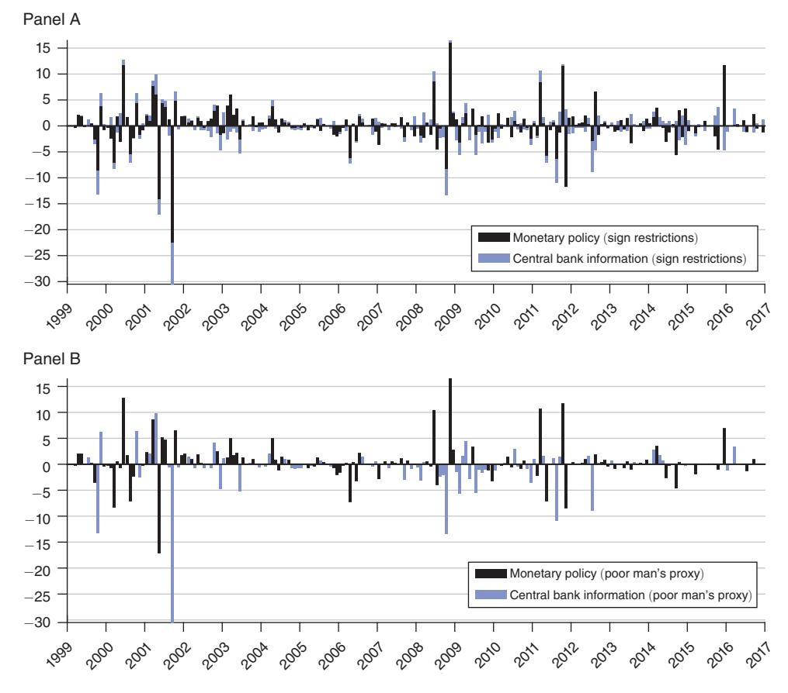

Figure 9. Contribution of Shocks to the Surprise in the Three-Month EONIA Swap, Basis Points

October 1999 when the ECB announced an increase in the size of its longer-term refinancing operations "to contribute to a smooth transition to the year 2000" in light of the then widespread concerns about the "millennium bug." These events are picked up both by the sign restrictions and their poor man's version.

## **V. Discussion**

In this section, we assess the relevance of our empirical results. First, we ask whether the quantitative differences between purified and standard monetary policy shocks on US data[26](#page-27-1) are large enough to change the conclusions one can draw about key channels of monetary transmission. Second, we ask what our evidence can teach

26On euro-area data such exercise is unnecessary because there are apparent *qualitative* differences between our identification and standard HFI. Our identification there leads to responses that are consistent with standard theory, while the standard HFI does not.

us about the nature of central bank information shocks. We overview our results in this section and relegate the details to the Appendix.

### A. Monetary Policy Transmission

Do the differences between monetary policy shocks identified using our baseline method versus standard HFI matter in terms of key channels of monetary policy transmission? In Appendix A, we offer a relevant formal example where the answer to this question is positive. In particular, we take a standard New Keynesian model (Gertler and Karadi 2011) with two key frictions: nominal rigidities and financial frictions. We estimate the relative importance of the two frictions by matching the model's impulse responses to a monetary policy shock (Christiano, Eichenbaum, and Evans 2005) with those in the data both using our baseline and the standard HFI estimates. We find that standard HFI impulse responses are consistent with very high nominal stickiness and low financial frictions, as in Nakamura and Steinsson (2018). In contrast, results based on our baseline "purified" monetary policy shock raise the importance of financial frictions relative to nominal frictions. Nominal frictions are lower because the price-level response is more vigorous. Financial frictions are higher, in turn, to allow the model to match the elevated response of the excess bond premium and—through the active financial amplification channel—to help it to explain the large output response despite moderate nominal stickiness.27 We conclude that controlling for the presence of central bank information shocks can be important because it can modify our views on the importance of financial frictions in the transmission of monetary policy.

### B. Central Bank Information Shocks

We now turn to the analysis of the central bank information shock. We rely on three conclusions of our empirical analysis. First, these shocks are triggered by central bank communication because they are based on high-frequency surprises around central bank announcements. Second, they are not monetary policy shocks because policy shocks are inconsistent with the positive co-movement between interest rate and stock market surprises that characterizes information shocks. Third, information shocks generate a temporary but persistent upswing in activity and the price level, and they are accompanied by improving financial conditions and a tightening interest rate policy.

In Appendix A, we offer a possible formal interpretation of the central bank information shock that is consistent with these observations. We use a simple imperfect information framework where the central bank has an information advantage about the economy and communicates this credibly and without noise to the public.

&lt;sup>27 Arguably, mechanisms other than financial frictions could also help to account for the large output response under low nominal stickiness. For example, mechanisms that reduce the sensitivity of optimal prices to aggregate monetary policy shocks, usually referred to as real rigidities, can lead to the same outcome (for an overview, see Woodford 2003). Introducing real rigidities to our model, however, would necessarily reduce the importance of financial frictions, and this would make our model underestimate the impact of the monetary policy shock on the excess bond premium, which we observe in the data and match quite well with the current model.

The unexpected communication influences private decisions independently from monetary policy disturbances. This is different from Melosi (2017) and Nakamura and Steinsson (2018), which disregard communication and assume that the private sector needs to infer the central bank's private information from the interest rate decisions. A key implication of our assumption is that the relative importance of monetary policy shocks and central bank information shocks in observed interest rate surprises can vary over time—in line with our empirical methodology—while it stays constant over time in Melosi (2017) and Nakamura and Steinsson (2018). We find that the central bank information shock is consistent with news about the state of the financial intermediary sector or, more broadly, the financial market conditions. Positive news leads to an economic upswing through higher asset prices and easier credit conditions. In turn, monetary policy tightens to offset the impact of the shock. The central bank's information advantage about the financial sector is not unreasonable, especially during times of financial turbulence, because of its close links with financial intermediaries as their liquidity provider and supervisor. In contrast, the central bank information shock is inconsistent with information about the supply side (for example, technology) because those would move inflation and output in the opposite direction, in contrast to our evidence.

Our baseline interpretation implies that the central bank's communication is predominantly predictive: if the central bank abstained from communication, the economic agents would learn about the shock anyway at a later date (for a discussion, see Nakamura and Steinsson 2018).28 Admittedly, our assumptions are not innocuous, and alternative approaches to modeling the central bank information shocks are also possible. For example, in a more complex environment with dispersed information and strategic incentives for agents to form expectations close to the expectations of others, communication can cause excess economic fluctuations. In particular, public announcements of the central bank can guide expectations and decisions in this environment even if they contain minimal fundamental information as in Morris and Shin (2002). In such cases, communication can become welfare detrimental. Noise in the central bank's signal, furthermore, can mask the nature of the underlying information: even if the underlying information is about technology (supply), the noise can cause disturbances that appear like demand shocks (Lorenzoni 2009, Angeletos and La'o 2009), not unlike our evidence. We leave the analysis of our evidence in models with more realistic information structures and strategic interaction between agents for future research.

#### VI. Conclusion

We argued that systematic central bank communication released jointly with policy announcements can bias HFI of monetary policy shocks but creates an opportunity to empirically assess the impact of central bank communication on

&lt;sup>28Under our assumptions, a truth-telling communication policy is welfare improving: it enhances the private sector's information about the economy and allows it to adjust duly to economic disturbances. Contemporaneous policy responses accompanying the communication, furthermore, can help to offset the impact of the disturbances.

the macroeconomy. We have separated monetary policy shocks from central bank information shocks in a structural VAR and tracked the dynamic response of key macroeconomic variables. We have found that the presence of information shocks attenuates the estimated effects of monetary policy in the standard HFI. Our estimates purged of this bias imply stronger monetary transmission with a prominent role of financial frictions. We have also found that a representative central bank information shock is similar to news about an upcoming financial demand shock that the central bank partially offsets. The economy responds significantly to this shock. Our methodology could not determine to what extent this response reflects the central bank's correct predictions materializing and to what extent it is a causal effect of the central bank communication on the economy. We hope that future research can shed light on this important question.

#### APPENDIX A STRUCTURAL MODEL

In this section, we look at our empirical results through the lens of a New Keynesian macroeconomic model. The model closely follows Gertler and Karadi (2011), which is a workhorse New Keynesian framework with balance sheet constrained financial intermediaries. The framework is well suited to analyze the quantitative impact of monetary policy shocks, which are modeled as temporary deviations from a systematic interest rate rule. To obtain an analog of central bank information shocks, we introduce central bank communication policy to the model. In particular, we assume that the central bank has private information about a future disturbance and reveals this information in advance to the public. Even though news shocks are revealed contemporaneously with monetary policy shocks, they are independent from each other, in line with our empirical framework.

In the model, monetary policy influences real allocations because of two key frictions: nominal rigidities and financial frictions. We ask two questions. First, how does the relative importance of the two key frictions change if the model matches responses to an estimated monetary policy shock that is purged from the effects of central bank information shocks (our baseline monetary policy shock) versus when it matches unpurged impulse responses (monetary policy shock identified with the standard HFI)? Second, which single structural shock in the model can best approximate the macroeconomic impact of a central bank information shock?

We structure the description of the model below along the lines of the transmission of monetary and central bank information shocks. To conserve space, we describe key equilibrium conditions of the model and refer the reader to the original paper for their derivations. The framework has seven agents. There are representative households, financial intermediaries, intermediate-good and capital-good producers, retailers, a fiscal authority, and a central bank. The representative households consume a basket of differentiated goods, work, and save. Financial intermediaries collect deposits and lend to intermediate-good firms. Intermediate-good firms use capital and labor to produce intermediate goods. They borrow from financial intermediaries and the household to finance capital acquisitions. Capital-good producers use final goods to generate new capital. Retailers purchase intermediate goods, differentiate them, and sell them to the households. Fiscal policy finances its exogenous expenditures with

lump sum taxes. The central bank sets interest rates and conducts a communication policy.

#### A. Central Bank

The central bank sets the nominal interest rate  $(i_t)$  following a Taylor rule:

$$i_t = \kappa_\pi \pi_t + \kappa_r x_t + \varepsilon_t,$$

where  $\pi_t$  stands for the inflation rate,  $x_t$  is a measure of economic slack. We proxy the economic slack with the log deviation of marginal cost of the intermediate good from its steady state. This proxy is proportional to conventional output gap measures. The terms  $\kappa_{\pi} > 1$  and  $\kappa_{x} > 0$  are parameters. The policy temporarily deviates from its systematic component because of monetary policy shocks  $(\varepsilon_t)$ . The shock follows a first-order autoregressive process  $\varepsilon_t = \rho^{MP} \varepsilon_{t-1} + \epsilon_t^{MP}$ .

The central bank also conducts a communication policy. Since 1994, the FOMC has accompanied its policy announcements with an explanation of its views about the economic outlook. This communication gave an explicit channel for the central bank to influence private expectations, potentially independently from its rate-setting decisions. We assume that the central bank can move markets with communication not because it has any advantage in collecting data, but because it employs a large number of analysts and researchers giving it an edge in processing economic information. We model the central bank's information advantage simply by assuming that it learns in period t about a future shock ( $\epsilon_{t+2}$ ) well before it materializes.29 The information shock30 ( $\epsilon_{t+2}$ ) is independent of the monetary policy shock ( $\epsilon_t$ ).31 We assume that the central bank shares its knowledge about the future shock with the public. This communication policy ( $\psi_t$ ) is exact and credible.32 The

&lt;sup>29 Assuming that the information is about a *future* shock simplifies our analysis. In our setup, contemporaneous shocks would be learned immediately by private agents, given a sufficient number of observables and the full knowledge of the structure of the economy. A potential complication with news shocks, however, is that they could lead to noninvertibility of VARs, implying that structural shocks cannot be recovered as linear combinations of reduced form innovations (see, e.g., Leeper, Walker, and Yang 2008). Adding external instruments as observables to the VARs, as we do, however means that the inference about impulse responses is valid even if the VAR without the external instrument is noninvertible (Stock and Watson 2018; PlagborgMollerWolf19).

&lt;sup>30Normally, the central bank talks about the expected path and uncertainty around endogenous variables like the inflation rate or the output growth. In this sense, our assumption that the central bank directly communicates about shocks simplifies the reality and implicitly assumes that the central bank talks about a sufficient number of endogenous variables simultaneously such that the private sector can back out the nature of the shock that the central bank observed. Note also that occasionally central banks talk explicitly about their interpretation of the nature of the external disturbances. A relevant example is the FOMC communication after the burst of the dot-com bubble. In March 2001, the FOMC stated that "although current developments do not appear to have materially diminished the prospects for long-term growth in productivity, excess productive capacity has emerged recently," in other words, the drop in equity prices caused a "demand" shock in the economy. Another example from Europe is when the ECB's Governing Council in August 2011 mentioned that its decision to keep interest rates unchanged is justified by the "particularly high" financial market uncertainty.

&lt;sup>31This does not mean that interest rates do not respond systematically and contemporaneously to central bank information shocks, as we explain below.

&lt;sup>32 If the announcements were not exact, the public would need to infer the underlying economic and monetary policy disturbances from its observations on the interest rate and communication signals. The public would then optimally allocate some weight to both disturbances based on the relative variance of the shocks. In this realistic framework, no pure monetary policy or central bank information shocks would ever materialize, only some

communication policy is our way of introducing central bank information shocks to the model:

$$(A2) \psi_t = \epsilon_{t+2}.$$

This policy assumes truth telling, which we consider to be a reasonable first approximation to a systematic communication policy. It is not worse than alternative linear rules. Maintaining any constant bias in communication (a constant multiplying the future shock) by understating the size of the disturbance, for example, would be learned over time. Noisy communication (an additive i.i.d. error term) would also be undesirable because this would only reduce the effectiveness of policy. Importantly, communication policy here is an additional tool to interest rate policy: the central bank influences agents' perceptions not only through changing its policy instruments but also through publishing statements. The statements can credibly convey information and move expectations because the central bank has incentives to maintain the reputation of its communication policy. When reading the statement, the public updates their expectations about the future shock. The shock then indeed materializes in period t+2. The advantage of central bank communication is to inform the public about an upcoming disturbance that they would only realize later.

At this stage, we do not determine the nature of the shock that the central bank has an information advantage about. One of our goals in this section is to identify which single shock would best describe macroeconomic responses to a central bank information shock that we identified in the data

### B. Nominal Rigidities

The real interest rate  $(r_t)$  is determined by the Fisher equation

$$(A3) i_t = r_t + E_t \pi_{t+1}.$$

Monetary policy influences the real rates temporarily as a result of nominal rigidities. Nominal wages are flexible; nominal rigidities are the consequence of staggered price setting of retailers. Their behavior implies a standard New Keynesian Phillips curve with a backward-looking term. It is of the form

(A4) 
$$\pi_t - \gamma_P \pi_{t-1} = \beta \left( E_t \left\{ \pi_{t+1} \right\} - \gamma_P \pi_t \right) + \frac{(1-\gamma)(1-\beta\gamma)}{\gamma} x_t,$$

where  $\beta$  is the steady-state discount factor of the representative household,  $\gamma \in [0,1]$  is the probability of unchanged prices (the "Calvo parameter"), and  $\gamma_P \in [0,1]$  is the share of prices that are indexed to the previous period inflation rate. The relationship has two key parameters ( $\gamma$  and  $\gamma_P$ ) that jointly determine the rigidity of prices. The Calvo parameter determines the sensitivity of inflation to the marginal cost ( $x_t$ ). A high parameter translates into low sensitivity and implies

that the price level responds sluggishly to monetary policy disturbances that change the marginal costs. Indexation influences how backward looking the relationship is. High  $\gamma_P$  implies high persistence in the inflation rate.

### C. Real Effects of Monetary Policy

Real interest rate influences aggregate demand through its impact on consumption, investment, and, indirectly, government expenditures. Consumption in the model is governed by the representative households' Euler equation:

(A5) 
$$E_t \left\{ \Lambda_{t,t+1} R_{t+1} \right\} = 1,$$

where the  $R_t = \exp(r_t)$  is the gross real interest rate and  $\Lambda_{t,t+1}$  is the stochastic discount factor. The stochastic discount factor is given by

(A6) 
$$\Lambda_{t,t+1} = \beta_t \frac{\varrho_{t+1}}{\varrho_t},$$

where  $\beta_t$  is a potentially time-varying discount factor and  $\varrho_t$  is the marginal utility of the consumption. The marginal utility of consumption is given by

(A7) 
$$\varrho_t = (C_t - h C_{t-1})^{-1} - \beta_t h E_t (C_{t+1} - h C_t)^{-1},$$

where  $h \in [0,1]$  is a parameter governing the strength of consumption habits.

A persistent increase in the real rate following a monetary policy shock raises the opportunity cost of current consumption relative to future consumption. This reduces consumption, and the impulse response takes an empirically realistic hump-shaped form as a consequence of habits.

Investment is determined by capital-good producers. They transform consumption goods into capital goods subject to an investment adjustment cost function (f) and sell them to intermediate-good firms for a price  $Q_t$ :

(A8) 
$$Q_{t} = 1 + f\left(\frac{I_{t}}{I_{t-1}}\right) + \frac{I_{t}}{I_{t-1}}f'\left(\frac{I_{t}}{I_{t-1}}\right) - E_{t}\Lambda_{t,t+1}\left(\frac{I_{t+1}}{I_{t}}\right)^{2}f'\left(\frac{I_{t+1}}{I_{t}}\right).$$

An increase in real rates reduces the value of capital  $Q_t$ . This value equals the present discounted value of future capital returns. It declines because, first, higher real rates cause a downturn and reduce the marginal product value of capital. Second, higher interest rates increase the discount rate, which these future dividends are discounted with. Low price of capital reduces the incentives to invest and generates a realistic hump-shaped decline in investment thanks to the functional form of adjustment costs. Aggregate capital  $(K_{t+1})$  evolves according to the following law of motion:  $K_{t+1} = \Xi_{t+1} [I_t + (1 - \delta) K_t]$ , where  $\Xi_t = \exp(\xi_t)$  is a shock to capital quality. It follows a first-order autoregressive process  $\xi_t = \rho_\xi \xi_{t-1} + \epsilon_{\xi t}$ . The shock is a reduced-form way to introduce variation in the ex post return and the price of capital, and thus it can be interpreted as an asset-valuation shock.

Government expenditure is assumed to be a fraction of aggregate output  $G_t = \exp(g_t) Y_t$ , where  $g_t = \bar{g} + \rho_t g_{t-1} + \epsilon_{gt}$  is an autoregressive process. A

downturn in output, therefore, reduces government expenditures. Aggregate demand net of investment adjustment costs equals the sum of consumption, investment, and government expenditures.

The aggregate demand is fulfilled through the supply of intermediate-good producers that serve the retailers. Intermediate-good producers combine capital and labor in a constant returns to scale technology,

$$(A9) Y_{mt} = A_t K_t^{\alpha} L_t^{1-\alpha},$$

where  $Y_{mt}$  is the intermediate-good production,  $A_t = \exp(a_t)$  is a measure of aggregate technology, which follows an autoregressive process  $a_t = \rho_a a_{t-1} + \epsilon_{at}$ ,  $L_t$  is labor, and  $\alpha$  is the capital income share. We denote the price of the intermediate good  $P_{mt}$ . Marginal product value of capital is  $Z_t = P_{mt}\alpha(Y_t/K_t)$ . Equilibrium in the labor market requires  $P_{mt}(1-\alpha)(Y_{mt}/L_t) = \chi \varrho_t^{-1} L_t^{\varphi}$ , where  $\chi$  is the relative utility weight of leisure and  $\varphi$  is the inverse Frisch elasticity of labor supply.

#### D Financial Frictions

We now turn to describe how financial frictions are introduced into the model. Intermediate-good firms issue state-contingent corporate bonds  $S_t$  that they use to finance purchases of capital  $(K_{t+1})$  from capital producers. They supply corporate bonds at the value

$$(A10) Q_t S_t = Q_t K_{t+1},$$

where  $Q_t$  is the real value of capital. The corporate bonds pay the marginal product value of capital  $(Z_t)$  every period and decay geometrically with a parameter  $1 - \delta$ , where  $\delta$  is capital depreciation rate. Therefore, their value  $(Q_t)$  equals the value of the capital.33 The (gross) corporate bond return is

(A11) 
$$R_{kt} = \Xi_t \frac{Z_t + (1 - \delta) Q_t}{Q_{t-1}}.$$

The demand for corporate bonds comes both from financial intermediaries (or bank(er)s) and from households:

$$(A12) S_t = S_{bt} + S_{ht}.$$

Bankers are part of a household with perfect consumption insurance. They continue as a banker each period with probability  $\sigma \in [0,1]$  and exit and return their net worth to the household with the complementary probability  $1-\sigma$ . The share of bankers is kept constant by assuming that some workers become bankers every period. New bankers receive startup funds from the households. The aggregate startup funds amount to  $\omega$ . Banks collect deposits from households and pay them

&lt;sup>33The corporate bonds can be understood as equity. Firms operate a constant returns-to-scale technology without profits. So the value of the firm comes only from the value of their capital holdings.

the gross real return  $R_t$ . They combine deposits with their net worth and invest them into corporate bonds.

Financial intermediaries face an agency friction. In particular, we assume that they can abscond with a fixed fraction of the assets under their management. If they did this, they would lose the franchise value of their banking license. To avoid such outcome, households limit the amount of deposits they place in financial intermediaries and effectively set an endogenous leverage  $(\phi_t)$  constraint. The leverage constraint ensures that the bank has enough "skin in the game" such that it has no incentive to abscond with the assets. The constraint limits the amount of corporate lending that the financial intermediaries can supply  $(S_{bt})$ :

$$(A13) Q_t S_{bt} = \phi_t N_t,$$

where  $N_t$  is the aggregate net worth of the banking system.

The financial intermediaries build net worth from retained earnings and start-up funds. Aggregate net worth evolves according to the following law of motion:

(A14) 
$$N_t = \sigma \left[ \left( R_{kt} - R_t \right) \phi_{t-1} + R_t \right] N_{t-1} + \omega.$$

The first term on the right-hand side captures the net worth from the retained earnings of surviving bankers, while the second term comes from the start-up funds of the new bankers. Retained earnings are scaled by the survival probability of bankers ( $\sigma$ ) because exiting bankers repay their net worth as dividends. The retained earnings of surviving bankers come from two terms. Banks earn the gross real return  $R_t$  on their net worth and an excess return  $R_{kt} - R_t$  on their corporate bond holdings. The latter amounts to the product of their net worth and their leverage  $\phi_{t-1}$ .

How do financial frictions amplify the impact of a monetary policy shock on real activity? As mentioned above, a temporary increase in the nominal rate translates into a higher real rate  $r_t$  because of nominal rigidities. Higher real rates reduce consumption through a standard intertemporal substitution mechanism. Furthermore, higher real rates raise the funding costs of banks and make them raise the required return on corporate bonds  $(E_t R_{kt+1})$ . A higher discount rate on existing capital reduces its value  $Q_t$ , which lowers incentives for investment. This channel is active even without any financial frictions (lax bank balance sheet constraints). Binding leverage constraints of financial intermediaries amplify the impact of the shock through standard financial accelerator mechanisms. Lower value of corporate debt reduces the value of the banking sector assets and leads to a deterioration in their balance sheet condition. In particular, the asset price drop leads to an amplified decline in their net worth with a multiplicative factor that is equal to their leverage. The deteriorating balance sheet condition of the banking sector further increases the cost of credit and worsens credit conditions with a further negative impact on investment. The deteriorating outlook further reduces asset prices, adding another negative feedback loop.

We assume that households also lend directly to the corporate sector, subject to a portfolio adjustment cost as in Gertler and Karadi (2013). In particular, we assume

that the household needs to pay  $\kappa (S_{ht} - \bar{S}_h)^2$  if it purchases corporate bonds in excess of  $\bar{S}_h$ , where  $\kappa \geq 0$  is a portfolio adjustment cost parameter. The household demand for corporate bonds is determined by

(A15) 
$$S_{ht} = \bar{S}_h + \frac{1}{\kappa} E_t \Lambda_{t,t+1} (R_{kt+1} - R_{t+1}),$$

where  $\Lambda_{t,t+1}$  is the household's stochastic discount factor. The demand function posits that households respond to increases in corporate bond spreads by increasing their corporate bond holdings. The parameter  $\kappa$  determines the sensitivity of their response. Importantly, as  $\kappa \to 0$  the households are ready to increase their holdings without limits for any positive premium. In doing so, they issue credit to the intermediate-good firms without constraints and fully replace the constrained banking sector. As  $\kappa$  approaches zero, the predictions of the model approaches those of a model without financial frictions. Therefore, we use this parameter to measure the extent of financial frictions in our model.

#### E. Pricing Additional Assets

Our baseline VAR includes a one-year government bond yield and the excess bond premium. The latter is a yield spread between corporate and government bonds with an average duration of around seven years. In order to obtain analogous long-term yields in our model, we introduce multiple long-term bonds as perpetuities with geometrically decaying coupons. We calibrate the rate of decay of their coupons ( $\varsigma_x$ ) to match their duration. The assets are priced through no-arbitrage conditions but are not held in positive quantities in equilibrium. Government bonds are priced by households, who are assumed to trade them without portfolio adjustment costs. Corporate bonds, by contrast, are traded by the banks, which require excess return.

We denote by  $q_{xt}$  the nominal price of a government bond with duration x. It pays  $\varsigma_x^i$  unit in each quarter  $i=0,1,2,\ldots$  Its steady-state (yearly) duration is  $1/\left[4\left(1-\varsigma_x/R\right)\right]$ , where R is the steady-state gross real rate (and steady-state inflation is 0). Its (gross) nominal yield to maturity is  $Y_{xt}=1/q_{xt}+\varsigma_x$ . The no-arbitrage condition requires that

(A16) 
$$R_{t+1}\Pi_{t+1} = \frac{1 + \varsigma_x q_{xt+1}}{q_{xt}}.$$

Analogously, we denote by  $Q_{xt}$  the nominal price of a corporate bond with duration x. It pays  $\varsigma_{kx}^i$  units in periods  $i=0,1,2,\ldots$  Its steady-state duration is  $1/\left[4\left(1-\varsigma_{kx}/R_k\right)\right]$ , where  $R_k$  is the steady-state corporate bond return. Its gross yield to maturity is  $Y_{kxt}=1/Q_{xt}+\varsigma_{kx}$ . The no-arbitrage condition implies that

(A17) 
$$R_{kt+1}\Pi_{t+1} = \frac{1 + \varsigma_{kx}Q_{xt+1}}{Q_{xt}}.$$

The (gross) excess bond premium in our model is measured as  $EBP_t = Y_{kxt}/Y_{xt}$ .

#### F. Calibration

We solve the model through first-order perturbation around a nonstochastic steady state. We estimate key parameters of the model through a standard impulse response matching exercise (Christiano, Eichenbaum, and Evans 2005). In particular, we estimate three parameters: (i) the Calvo parameter  $\gamma$ , (ii) the inflation indexation parameter  $\gamma_P$ , and (iii) the household portfolio adjustment cost parameter  $\kappa$  together with the size and persistence of the monetary policy shock  $(\sigma_i, \rho_i)$  to match the impulse responses to a monetary policy shock in the model and VAR. The first two parameters determine the level of nominal frictions, and the third parameter influences the level of financial frictions in the model. Other model parameters are standard and borrowed from Gertler and Karadi (2011) (Table A1 includes a list of parameters). We then assess which shock can best approximate the impulse responses to a central bank information shock. We compare news about two quarters ahead of the disturbance in technology  $(\epsilon_{at+2})$ , discount rate  $(\epsilon_{\beta t+2})$ , government expenditures  $(\epsilon_{gt+2})$ , or capital quality  $(\epsilon_{\xi t+2})$ . We estimate the size and persistence of the disturbances that best approximates our central bank information shock identified in the VAR.

Our baseline impulse responses include five variables: the one-year government bond yield, the GDP and GDP deflator, the S&P 500 stock market index, and the excess bond premium. In the model, we match these with the deviations of the following five variables from their steady-state values: yield to maturity of a one-year government bond  $(\hat{y}_{1t})$ , the output  $\hat{y}_t$ , the price level  $\hat{p}_t = \sum_{s=1}^t \hat{\pi}_s$ , the net worth of financial intermediaries34  $(\hat{n}_t)$ , and the excess bond premium  $(e\hat{b}p_t)$ .

We transform monthly VAR impulse responses into quarterly impulse responses by taking simple averages over each quarter. This gives us 12 moments for each observable. We simulate impulse responses from the model and stack the 5 times 12 differences of the VAR and model moments into a vector V. We estimate our model parameters to minimize  $V'\Omega V$  scalar, where  $\Omega$  is a weighting matrix. Following Christiano, Eichenbaum, and Evans (2005),  $\Omega$  contains the diagonal elements of the inverse of the variance-covariance matrix of the moments from the VAR.

Table A1 lists the estimated parameter values. Figure A1 shows the model-implied impulse responses and compares them to the impulse responses from the VAR. We first conduct the exercise using the impulse responses to the monetary policy shock from the standard HFI, which disregards central bank information shocks. The first column of Table A1 and Figure A1 show the results. The price-level response is unreasonably sticky in this case, and the model requires extreme price stickiness and indexation parameters to capture the impact. These parameters would imply that prices are reset on average every four years, way longer than micro-data evi-

&lt;sup>34 Arguably, the equity value of financial intermediaries  $(N_t)$  in the model better reflects the equity value of companies measured by the S&P 500 than the value of capital  $(Q_t)$ . The two variables move in tandem in the model, but the former gets amplified by the calibrated leverage, similarly to how S&P 500 valuations are amplified by the average leverage of the financial and nonfinancial firms it incorporates. Our results are robust to using  $Q_t$  as a measure of stock market valuations.

| Parameters                                  | Label                  | Standard HFI | Sign restrictions |
|---------------------------------------------|------------------------|--------------|-------------------|
| Calvo parameter                             | γ                      | 0.94         | 0.87              |
| Inflation indexation                        | $\gamma_P$             | 0.999        | 0.00              |
| Portfolio adjustment cost                   | κ                      | 0.0019       | 0.0452            |
| Standard deviation of monetary policy shock | $\sigma^{MP}$          | 0.0007       | 0.0008            |
| Persistence of monetary policy shock        | $\rho^{MP}$            | 0.69         | 0.64              |
| Standard deviation of information shock     | $\sigma_{\varepsilon}$ |              | 0.0006            |
| Persistence of information shock            | $\rho_{\xi}$           |              | 0.85              |

TABLE A1—ESTIMATED PARAMETERS

dence would suggest. With such a high nominal stickiness, the interest rate shock causes an output decline that severely overestimates the responses predicted by the VAR, especially in the early years. This happens even though the size and persistence of the monetary policy shock underestimates the observed yield responses. Relatedly, the financial frictions are estimated to be tiny: the model predicts close to zero corporate bond spread response, inconsistently with the VAR evidence. If it had estimated higher financial amplification, the model would have fared even worse in matching the observed output response.

Next, we conduct the same exercise using our baseline identification. This monetary policy shock is purged from the impact of the central bank information shock. The second column of Table A1 and Figure A1 show the results. The persistence of the monetary policy shock is now estimated to be significantly lower, and it is able to come close to the observed yield response. The price stickiness is now estimated to be smaller, and the model does not need any backward indexation to match the observed price-level response. The Calvo parameter is still high: prices are estimated to be reset somewhat more frequently than once in every two years, which is still higher than evidence from micro-data evidence but not unreasonable if one takes into account that our simple model does not take into account wage stickiness. The more moderate price stickiness, however, is insufficient to explain the output response, so the model estimates a sizable financial friction parameter, an order of magnitude larger than in the standard HFI. This way, it also gets closer to match the observed reaction of the excess bond premium.

The red dotted lines on the figure show the impulse responses if we switch off financial frictions by setting the portfolio adjustment cost to zero ( $\kappa=0$ ). Notably, the output response becomes substantially more muted, suggesting that financial amplification plays a key role in capturing the extent of real effects of monetary shocks. We conclude that our baseline identification would give substantial weight to financial frictions and a smaller role to nominal frictions in explaining the real effects of monetary policy shocks.

In our last exercise, we ask which single news shock in the model would be broadly consistent with the central bank information shock we identified in the data (see the last column of Figure A1). We find that news about a two-quarters-ahead capital quality shock is consistent with our observations. The shock is a positive asset-valuation shock. Higher asset prices raise investment and improve the balance sheets of financial intermediaries. They, in turn, ease credit conditions, which

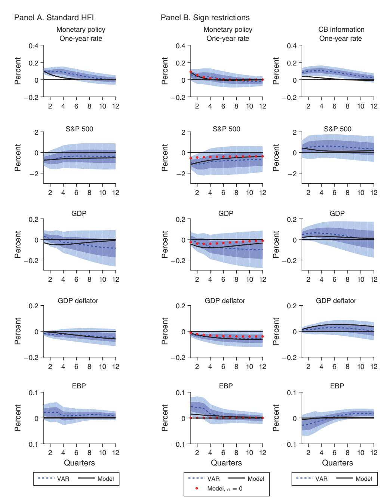

FIGURE A1. MATCHED IMPULSE RESPONSES TO MONETARY POLICY AND CENTRAL BANK INFORMATION SHOCKS

Notes: Sign restrictions and standard high-frequency identification. Model (black line), VAR mean (blue dashed line), two-standard-deviation band.

leads to a decline in corporate bond spreads in line with our observations. This further improves demand conditions, which leads to additional increases in output and prices. Monetary policy tightens to partially offset the impact of this financial

demand shock. The model somewhat underestimates the yield responses, suggesting that monetary policy in practice responds more forcefully to the information shocks than as predicted by the model. Modifying the Taylor rule to allow an additional response to corporate bond spreads would help the model come closer to the observed yield responses (not shown).

Other popular news shocks would have trouble matching the impulse responses not just quantitatively but also qualitatively. Technology shocks (ϵ*at*+2) would have trouble capturing the fact that prices and output move in the same direction after the central bank information shock. Other popular demand shocks, like a shock to government expenditure (ϵ*gt*+2) and household preferences (ϵβ*t*+2), would not work in this particular model either. The shocks increase some aggregate demand components so they raise output and prices as in the data, but they actually "crowd out" investment in equilibrium. As a result, the value of capital and net worth declines and corporate spreads increase, inconsistently with the observed patterns.

### REFERENCES

- **Andrade, Philippe, and Filippo Ferroni.** 2016. "Delphic and Odyssean Monetary Policy Shocks: Evidence from the Euro-Area." University of Surrey Discussion Paper 12/16.
- **Angeletos, George-Marios, and Jennifer La'O.** 2010. "Noisy Business Cycles." In *NBER Macroeconomics Annual*, Vol. 24, edited by Daron Acemoglu, Kenneth Rogoff, and Michael Woodford, 319–78. Chicago: University of Chicago Press.
- **Arias, Jonas, Juan F. Rubio-Ramírez, and Daniel F. Waggoner.** 2018. "Inference in Bayesian Proxy-SVARs." Federal Reserve Bank of Philadelphia Working Paper 18-25.
- **Barakchian, S. Mahdi, and Christopher Crowe.** 2013. "Monetary Policy Matters: Evidence from New Shocks Data." *Journal of Monetary Economics* 60 (8): 950–66.
- **Bernanke, Ben S.** 2010. "Monetary Policy and the Housing Bubble." Speech at the Annual Meeting of the American Economic Association, Atlanta, January 3.
- **Bernanke, Ben S.** 2015. *The Courage to Act: A Memoir of a Crisis and Its Aftermath*. New York: W.W. Norton & Company.
- **Bernanke, Ben S., and Alan S. Blinder.** 1992. "The Federal Funds Rate and the Channels of Monetary Transmission." *American Economic Review* 82 (4): 901–21.
- **Bernanke, Ben S., and Kenneth N. Kuttner.** 2005. "What Explains the Stock Market's Reaction to Federal Reserve Policy?" *Journal of Finance* 60 (3): 1221–57.
- **Bernanke, Ben S., and Ilian Mihov.** 1998. "Measuring Monetary Policy." *Quarterly Journal of Economics* 113 (3): 869–902.
- **Caldara, Dario, and Edward Herbst.** 2019. "Monetary Policy, Real Activity, and Credit Spreads: Evidence from Bayesian Proxy SVARs." *American Economic Journal: Macroeconomics* 11 (1): 157–92.
- **Campbell, Jeffrey R., Charles L. Evans, Jonas D.M. Fisher, and Alejandro Justiniano.** 2012. "Macroeconomic Effects of Federal Reserve Forward Guidance." *Brookings Papers on Economic Activity* 42 (1): 1–80.
  - **Campbell, Jeffrey R., Jonas D.M. Fisher, Alejandro Justiniano, and Leonardo Melosi.** 2017. "Forward Guidance and Macroeconomic Outcomes since the Financial Crisis." In *NBER Macroeconomics Annual*, Vol. 31, edited by Martin Eichenbaum and Jonathan A. Parker, 283–357. Chicago: University of Chicago Press.
- **Christiano, Lawrence J., Martin Eichenbaum, and Charles Evans.** 1996. "The Effects of Monetary Policy Shocks: Evidence from the Flow of Funds." *Review of Economics and Statistics* 78 (1): 16–34.
- **Christiano, Lawrence J., Martin Eichenbaum, and Charles L. Evans.** 2005. "Nominal Rigidities and the Dynamic Effects of a Shock to Monetary Policy." *Journal of Political Economy* 113 (1): 1–45.
- **Cieslak, Anna, and Andreas Schrimpf.** 2019. "Non-monetary News in Central Bank Communication." *Journal of International Economics* 118: 293–315.
- **Coibion, Olivier, and Yuriy Gorodnichenko.** 2012. "What Can Survey Forecasts Tell Us about Information Rigidities?" *Journal of Political Economy* 120 (1): 116–59.

- Corsetti, Giancarlo, Joao B. Duarte, and Samuel Mann. 2018. "One Money, Many Markets: A Factor Model Approach to Monetary Policy in the Euro Area with High-Frequency Identification." Centre for Macroeconomics Discussion Paper 2018-05.
- **Del Negro, Marco, and Frank Schorfheide.** 2011. "Bayesian Macroeconometrics." In *Oxford Handbook of Bayesian Econometrics*, edited by John Geweke, Gary Koop, and Herman Van Dijk, 293–389. New York: Oxford University Press.
- Faust, Jon, Eric T. Swanson, and Jonathan H. Wright. 2004. "Do Federal Reserve Policy Surprises Reveal Superior Information about the Economy?" *Contributions to Macroeconomics* 4 (1): 1–29.
- **Favara, Giovanni, Simon Gilchrist, Kurt F. Lewis, and Egon Zakrajšek.** 2016. "Updating the Recession Risk and the Excess Bond Premium." *FEDS Notes*. http://dx.doi.org/10.17016/2380-7172.1739.
- Galí, Jordi. 2014. "Monetary Policy and Rational Asset Price Bubbles." *American Economic Review* 104 (3): 721–52.
- Gertler, Mark, and Peter Karadi. 2011. "A Model of Unconventional Monetary Policy." *Journal of Monetary Economics* 58 (1): 17–34.
  - **Gertler, Mark, and Peter Karadi.** 2013. "QE 1 vs. 2 vs. 3...: A Framework for Analyzing Large-Scale Asset Purchases as a Monetary Policy Tool." *International Journal of Central Banking* 9 (1): 5–53.
- Gertler, Mark, and Peter Karadi. 2015. "Monetary Policy Surprises, Credit Costs, and Economic Activity." *American Economic Journal: Macroeconomics* 7 (1): 44–76.
- **Giacomini, Raffaella, and Toru Kitagawa.** 2015. "Robust Inference about Partially Identified SVARs." http://www.eco.uc3m.es/temp/Kitagawa.pdf.
- Gilchrist, Simon, and Egon Zakrajšek. 2012. "Credit Spreads and Business Cycle Fluctuations." American Economic Review 102 (4): 1692–1720.
  - Gürkaynak, Refet S., Brian Sack, and Éric T. Swanson. 2005a. "Do Actions Speak Louder than Words? The Response of Asset Prices to Monetary Policy Actions and Statements." *International Journal of Central Banking* 1 (1): 55–93.
- Gürkaynak, Refet S., Brian Sack, and Eric Swanson. 2005b. "The Sensitivity of Long-Term Interest Rates to Economic News: Evidence and Implications for Macroeconomic Models." *American Economic Review* 95 (1): 425–36.
- Gürkaynak, Refet S., Brian Sack, and Jonathan H. Wright. 2007. "The U.S. Treasury Yield Curve: 1961 to the Present." *Journal of Monetary Economics* 54 (8): 2291–2304.
- Gürkaynak, Refet S., Brian Sack, and Jonathan H. Wright. 2010. "The TIPS Yield Curve and Inflation Compensation." *American Economic Journal: Macroeconomics* 2 (1): 70–92.
- Hansen, Stephen, and Michael McMahon. 2016. "Shocking Language: Understanding the Macroeconomic Effects of Central Bank Communication." *Journal of International Economics* 99 (Supplement 1): S114–33.
  - **Kerssenfischer, Mark.** 2019. "Information Effects of Euro Area Monetary Policy: New Evidence from High-Frequency Futures Data." Deutsche Bundesbank Discussion Paper 07/2019.
- Kuttner, Kenneth N. 2001. "Monetary Policy Surprises and Interest Rates: Evidence from the Fed Funds Futures Market." *Journal of Monetary Economics* 47 (3): 523–44.
- Lakdawala, Aeimit, and Matthew Schaffer. 2019. "Federal Reserve Private Information and the Stock Market." *Journal of Banking and Finance* 106: 34–49.
  - **Leeper, Eric M., Todd B. Walker, and Shu-Chun Susan Yang.** 2008. "Fiscal Foresight: Analytics and Econometrics." NBER Working Paper 14028.
  - **Litterman, Robert B.** 1979. "Techniques of Forecasting Using Vector Autoregressions." Federal Reserve Bank of Minneapolis Working Paper 115.
  - **Litterman, Robert B.** 1986. "Forecasting with Bayesian Vector Autoregressions: Five Years of Experience." *Journal of Business and Economic Statistics* 4 (1): 25–38.
- Lorenzoni, Guido. 2009. "A Theory of Demand Shocks." American Economic Review 99 (5): 2050–84.
- Lucca, David O., and Emanuel Moench. 2015. "The Pre-FOMC Announcement Drift." *Journal of Finance* 70 (1): 329–71.
  - Melosi, Leonardo. 2017. "Signalling Effects of Monetary Policy." *Review of Economic Studies* 84 (2): 853–84.
- Mertens, Karel, and Morten O. Ravn. 2013. "The Dynamic Effects of Personal and Corporate Income Tax Changes in the United States." *American Economic Review* 103 (4): 1212–47.
  - **Miranda-Agrippino, Silvia.** 2016. "Unsurprising Shocks: Information, Premia, and the Monetary Transmission." Centre for Macroeconomics Discussion Paper 2016-13.
- Miranda-Agrippino, Silvia, and Giovanni Ricco. 2017. "The Transmission of Monetary Policy Shocks." Warwick Economics Working Paper 1136.
- Morris, Stephen, and Hyun Song Shin. 2002. "Social Value of Public Information." *American Economic Review* 92 (5): 1521–34.

- **Nakamura, Emi, and Jón Steinsson.** 2018. "High-Frequency Identification of Monetary Non-neutrality: The Information Effect." *Quarterly Journal of Economics* 133 (3): 1283–1330.
  - **Paul, Pascal.** 2019. "The Time-Varying Effect of Monetary Policy on Asset Prices." Federal Reserve Bank of San Francisco Working Paper 2017-09.
  - **Plagborg-Møller, Mikkel, and Christian K. Wolf.** 2019. "Local Projections and VARs Estimate the Same Impulse Responses." Unpublished.
- **Romer, Christina D., and David H. Romer.** 2000. "Federal Reserve Information and the Behavior of Interest Rates." *American Economic Review* 90 (3): 429–57.
- **Rubio-Ramírez, Juan F., Daniel F. Waggoner, and Tao Zha.** 2010. "Structural Vector Autoregressions: Theory of Identification and Algorithms for Inference." *Review of Economic Studies* 77 (2): 665–96.
- **Sims, Christopher A., and Tao Zha.** 1998. "Bayesian Methods for Dynamic Multivariate Models." *International Economic Review* 39 (4): 949–68.
- **Stock, James H., and Mark W. Watson.** 2010. "Research Memorandum." [https://www.princeton.](https://www.princeton.edu/~mwatson/mgdp_gdi/Monthly_GDP_GDI_Sept20.pdf) [edu/~mwatson/mgdp\\_gdi/Monthly\\_GDP\\_GDI\\_Sept20.pdf.](https://www.princeton.edu/~mwatson/mgdp_gdi/Monthly_GDP_GDI_Sept20.pdf)
- **Stock, James H., and Mark W. Watson.** 2012. "Disentangling the Channels of the 2007–2009 Recession." *Brookings Papers on Economic Activity* 42 (1): 81–135.
- **Stock, James H., and Mark W. Watson.** 2018. "Identification and Estimation of Dynamic Causal Effects in Macroeconomics Using External Instruments." *Economic Journal* 128 (610): 917–48.
- **Taylor, John B.** 2007. "Housing and Monetary Policy." NBER Working Paper 13682.
- **Uhlig, Harald.** 2005. "What Are the Effects of Monetary Policy on Output? Results from an Agnostic Identification Procedure." *Journal of Monetary Economics* 52 (2): 381–419.
  - **Woodford, Michael.** 2003. *Interest and Prices: Foundations of a Theory of Monetary Policy*. Princeton: Princeton University Press.