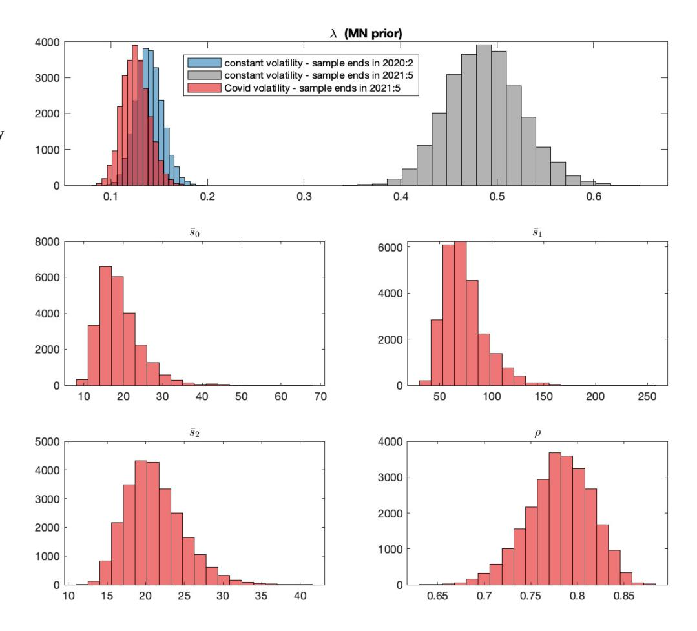
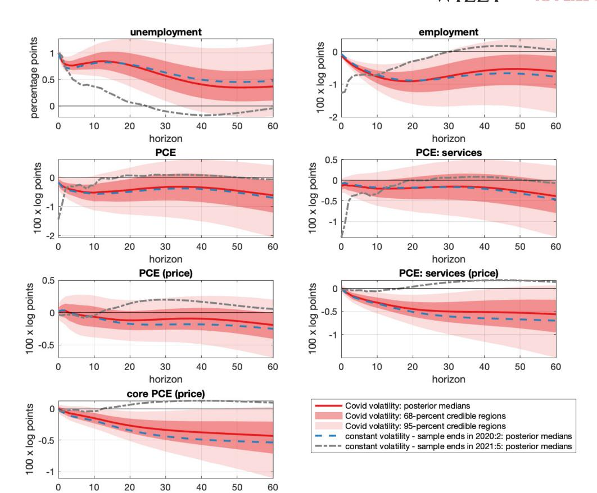
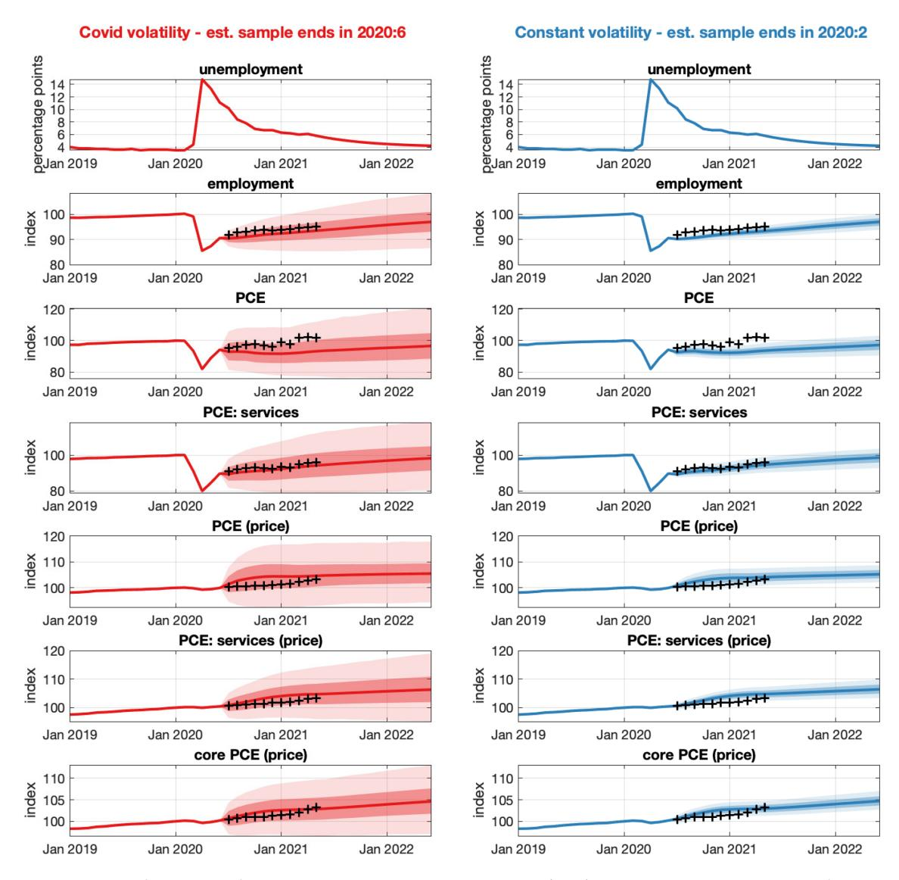
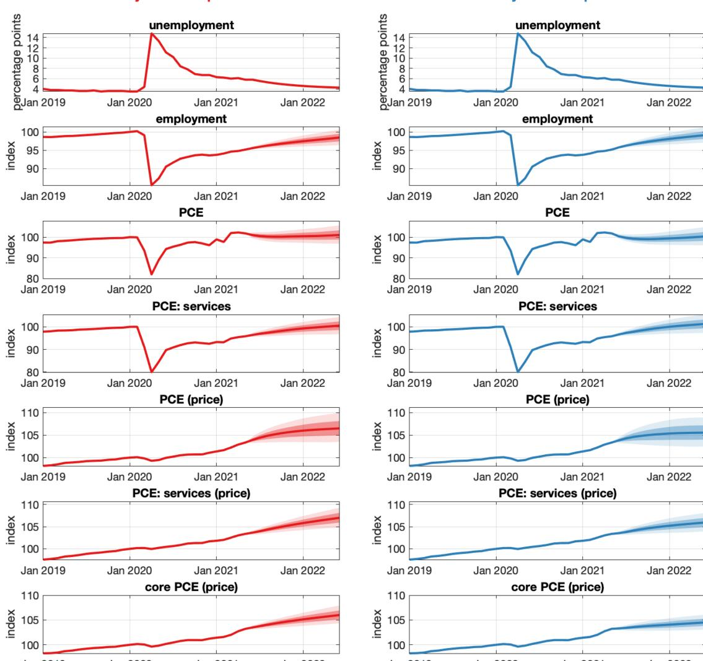

### **RESEARCH ARTICLE**

# **How to estimate a vector autoregression after March 2020**

# **Michele Lenza1,2 Giorgio E. Primiceri2,3,4**

- 1European Central Bank, Frankfurt, Germany
- 2CEPR, London, UK
- 3Department of Economics, Northwestern University, Evanston, Illinois, USA
- 4NBER, Cambridge, Massachusetts, USA

#### **Correspondence**

Giorgio E. Primiceri, Department of Economics, Northwestern University, 2211 Campus Drive, Evanston, Illinois, 60208, USA.

Email: g-primiceri@northwestern.edu

### **Summary**

This paper illustrates how to handle a sequence of extreme observations—such as those recorded during the COVID-19 pandemic—when estimating a vector autoregression, which is the most popular time-series model in macroeconomics. Our results show that the ad hoc strategy of dropping these observations may be acceptable for the purpose of parameter estimation. However, disregarding these recent data is inappropriate for forecasting the future evolution of the economy, because it may underestimate uncertainty.

# **1 INTRODUCTION**

The COVID-19 pandemic is having a devastating impact on the world economy, producing unprecedented variation in many key macroeconomic variables. For example, in March 2020, US unemployment increased by 0.7 percentage points, which is approximately 7 times as much as its typical monthly change. Things got much worse in April, when unemployment reached a record-high level of 14.7%, rising by 10 percentage points in a single month. This change was *two orders of magnitude* larger than its typical month-to-month variation. Most other macroeconomic indicators experienced changes of similar proportion, including employment, consumption expenditures, retail sales and industrial production, to name just a few examples. It is too early to tell whether these extremely large shocks will propagate through the economy in a standard way, or whether their transmission mechanism will be altered. Unfortunately, answering this question requires observing a much longer time span of data. But even with an unchanged transmission mechanism, the massive data variation of the last few months constitutes a challenge for the estimation of standard time-series models. When it comes to inference, should we treat the data from the pandemic period as conventional observations? Or will these observations distort the parameter estimates of our models? Should we instead discard these recent data? These questions are not only essential for the estimation of time-series models during the outbreak of COVID-19, but they will remain crucial for many years to come, since data from the pandemic period will "contaminate" any future sample of time-series observations.

This paper provides a simple solution to this inference problem in the context of s (VARs), the most popular time-series model in macroeconomics. Our solution consists of explicitly modeling the change in shock volatility, to account for the exceptionally large macroeconomic innovations during the period of the epidemic. What makes our recipe different, and simpler than standard models of time-varying volatility, is the fact that we know the exact timing of the increase in the variance of macroeconomic innovations due to COVID-19. As a result, we can both flexibly model and easily estimate these volatility changes.

For example, suppose to work with a monthly VAR based on US macroeconomic data. We know that March 2020 was the first month of abnormal data variation. We can then simply re-scale the standard deviation of the March shocks by an unknown parameter *s̄*0, and do the same for April and May with two other parameters *s̄*1 and *s̄*2. As we show in section 2, the parameters *s̄*0*, s̄*1 and *s̄*2 can be easily estimated by maximum likelihood or using the Bayesian approach of Giannone et al. (2015), provided that this re-scaling is common to all shocks. This commonality assumption is the same assumption underlying the stochastic volatility model of Carriero et al. (2016), and it should of course only be interpreted as an approximation. But this approximation seems reasonable in a period in which all variables experienced record variation. This strategy is also surely preferable to assuming *s̄*0 = *s̄*1 = *s̄*2 = 1, which would be implicit in a treatment of the data in March, April, and May 2020 as conventional observations.

The final step of our simple procedure consists of modeling the evolution of the residual variance after May 2020. This is considerably more challenging, since there is some uncertainty about the profile of volatility dynamics after the violent increase in the first few months of the pandemic. To tackle this task, we assume that the residual variance after May decays at a constant monthly rate, . We also conduct inference on this parameter, which plays an important role for using the VAR to derive predictive densities, since the dispersion of these densities depends on the future value of the residual variances. It is important to stress that this assumption of an exponential decay after May 2020 constitutes a parsimonious starting point, and seems broadly consistent with the data observed so far. However, if necessary, this assumption can be easily reconsidered and modified in light of the evolution of the pandemic and its impact on the macroeconomy.

To illustrate the properties of our procedure, we estimate a monthly VAR including data on employment, unemployment, consumption and prices, and we use the estimated model to perform two exercises. First, we compute the impulse responses to the forecast error in unemployment. To be clear, these responses do not have any structural interpretation, but we use them only as summary statistics of the estimated dynamics. When we attempt to compute these impulse responses using a standard estimation strategy that does not downweight the data from the pandemic period, the outcome of this experiment is entirely dependent on the end of the estimation sample. For example, with data up to June 2020, the results are misleading, since the error bands are explosive. With more data beyond June 2020, these impulse responses become progressively more conventional, although they are still quite different from those obtained using pre-pandemic observations, even when estimated using the most recent vintage of data ending in May 2021. This finding suggests that the observations since March 2020, despite being a small fraction of the whole sample, are so wild that they can influence parameter estimates substantially (and not necessarily in a good way). Not surprisingly, this model without downweighting fits the data very poorly, as evident from the value of its marginal likelihood. When the VAR is estimated using our proposed procedure, the impulse responses are instead very similar to those that we would obtain by estimating the VAR with data until February 2020, as recommended by Schorfheide and Song (2020). This finding suggests that the ad-hoc procedure of dropping—or dummying out—the extreme observations from the pandemic is acceptable for the purpose of parameter estimation, at least given the data available at the time of writing of this paper.

This approach based on disregarding the recent data, however, might be inappropriate for generating predictions for the future evolution of the economy, because it underestimates uncertainty. We demonstrate this point in a second application, in which we use the estimated VAR to produce density forecasts of various macroeconomic variables, conditional on specific paths of the unemployment rate. When we perform this exercise in June 2020 by estimating the model without the data from the pandemic, the predictions of employment, consumption expenditures and prices are excessively sharp. Instead, our proposed estimation strategy captures the idea that economic fluctuations may be quite volatile for several months to come. As a consequence, our predictions are more accurate because they are consistent with a much broader range of possible recovery paths from the COVID-19 crisis, including the one actually observed between July 2020 and May 2021. Another result of the paper is that forecast uncertainty after May 2021 is substantially lower than in the first phase of the pandemic.

The literature on time variation in macroeconomic shock volatility is vast, and its comprehensive review is beyond the scope of this paper. However, it is important to contrast the simple volatility modeling strategy we propose here with the more typical time-varying volatility models that have recently been adopted in the context of VARs, unobserved-component or DSGE models (e.g., Carriero et al., 2016; Cogley & Sargent, 2005; Curdia et al., 2014; Fernandez-Villaverde & Rubio-Ramirez, 2007; Justiniano & Primiceri, 2008; Primiceri, 2005; Sims & Zha, 2006; Stock & Watson, 2007). A potential issue with these approaches is that the degree of time variation in volatility is always informed by past data. For example, if historically shock volatilities have varied by at most a factor of two or three from month to month, estimated ARCH, GARCH, Markov-switching or stochastic volatility models may have a hard time capturing the massive increase in volatility associated with the outbreak of the COVID-19 pandemic, at least initially. Similarly, these models may interpret the volatility increase during COVID-19 as having the same persistence of historically more typical volatility changes, which can be misleading. To tackle this problem, Carriero et al. (2021) propose to augment a standard stochastic volatility model with i.i.d. outliers of two kinds. The first type of outliers are modeled as draws from an inverse-gamma distribution. They effectively "transform" the Gaussian innovations of the model into *t*-distributed shocks, similar to the stochastic volatility model with fat-tails in the mean equation innovations of Jacquier et al. (2004), and the VAR extensions of Clark and Ravazzolo (2015) and Chiu et al. (2017). The second type of outliers in Carriero et al. (2021) are meant to account for more extreme observations. They are modeled as draws from a mixture between a Dirac-delta and a uniform distribution with large support, following the strategy adopted by Stock and Watson (2016) for the estimation of their univariate model of inflation.

Compared to our method, the approach of Carriero et al. (2021) has the advantage of allowing for separate outliers and scaling factors for each variable in the system, which may be helpful if the impact of COVID-19 on volatility is asymmetric across variables. The strength of our method, instead, is that it models the increase in volatility during COVID-19 as being autocorrelated over the duration of the pandemic, as opposed to a combination of fully permanent and i.i.d. components. This autocorrelation feature is a parsimonious way to capture the persistent, but likely temporary, impact of COVID-19 on the variance of economic shocks and on the dispersion of predictive densities. The second important advantage of our methodology relative to more standard approaches in the literature is its simplicity: We exploits the fact that the time of the volatility change is known in the case of COVID-19, which greatly simplifies the estimation of the model.

The rest of the paper is organized as follows. Section 2 describes the methodology we propose to handle the extreme observations recorded during the COVID-19 era. Section 3 presents the results of our two empirical applications, and Section 4 concludes.

### 2 | THE METHODOLOGY

To account for the large variance of macroeconomic shocks associated with the outbreak of COVID-19, we modify a standard VAR as follows:

$$y_t = C + B_1 y_{t-1} + \dots + B_p y_{t-p} + s_t \varepsilon_t$$

$$\varepsilon_t \sim N(0, \Sigma),$$
(1)

where  $y_t$  is an  $n \times 1$  vector of variables, modeled as a function of a constant term, their own past values, and an  $n \times 1$  vector of forecast errors  $\varepsilon_t$ . In expression (1), the factor  $s_t$  is used to scale up the residual covariance matrix during the period of the pandemic. More precisely,  $s_t$  is equal to 1 before the time period in which the epidemic begins, which we denote by  $t^*$ . We then assume that  $s_{t^*} = \bar{s}_0$ ,  $s_{t^*+1} = \bar{s}_1$ ,  $s_{t^*+2} = \bar{s}_2$ , and  $s_{t^*+j} = 1 + (\bar{s}_2 - 1) \rho^{j-2}$ , where  $\theta \equiv [\bar{s}_0, \bar{s}_1, \bar{s}_2, \rho]$  is a vector of unknown coefficients. This flexible parameterization allows for this scaling factor to take three (possibly) different values in the first three periods after the outbreak of the disease, and to decay at a rate  $\rho$  after that. This modeling strategy is particularly suitable for monthly and quarterly time series, given that the amount of data variation was substantially different in the months of March, April and May 2020, and in the first, second and third quarter of 2020. We note, however, that alternative parameterizations are possible, even though they would not affect the results and their interpretation.

How can we estimate Equation (1)? This task is actually relatively easy. To see why, begin by assuming that  $s_t$  is known, and rewrite (1) as

$$y_t = X_t \beta + s_t \varepsilon_t,$$

where  $X_t \equiv I_n \otimes x_t', x_t \equiv \left[1, y_{t-1}', \dots, y_{t-p}'\right]$  and  $\beta \equiv \text{vec}\left(\left[C, B_1, \dots, B_p\right]'\right)$ . Dividing both sides of this equation by  $s_t$ , we obtain

$$\tilde{\mathbf{y}}_t = \tilde{\mathbf{X}}_t \boldsymbol{\beta} + \boldsymbol{\varepsilon}_t,$$

in which  $\tilde{y}_t \equiv y_t/s_t$  and  $\tilde{X}_t \equiv X_t/s_t$ . For given  $s_t$ ,  $\tilde{y}_t$  and  $\tilde{X}_t$  are simple transformations of our data. Therefore, the parameters  $\beta$  and  $\Sigma$  can be estimated using the transformed data  $\tilde{y}_t$  and  $\tilde{X}_t$ , and the researcher's preferred approach to inference, such as ordinary least squares, maximum likelihood, or Bayesian estimation.

While the previous insight applies to all estimation procedures (and in the appendix we show how to estimate the model by maximum likelihood), it is now useful to specialize our discussion to the case of Bayesian inference, given the well-known advantages of this approach in the context of heavily parameterized models like VARs. As in Giannone et al. (2015), we focus on prior distributions for VAR coefficients belonging to the conjugate Normal-Inverse Wishart family

$$\Sigma \sim IW(\Psi, d)$$

$$\beta | \Sigma \sim N(b, \Sigma \otimes \Omega)$$
,

where the elements  $\Psi$ , d, b and  $\Omega$  are typically functions of a lower dimensional vector of hyperparameters  $\gamma$ . This class of densities includes the flat prior, the popular Minnesota, Single-Unit-Root and Sum-of-Coefficients priors, as well as the Prior for the Long Run (Doan et al., 1984; Giannone et al., 2019; Litterman, 1980; Sims & Zha, 1998). Giannone et al. (2015)

10991255, 2022, 4, Downloaded from https://onlinelibrary.wiley.com/doi/10.1002/jae.2895 by UFSCAR - Universidade Federal de Sao Carlos, Wiley Online Library on [14/09/2026]. See the Terms and Conditions (https://onlinelibrary.wiley.com/terms-and-conditions) on Wiley Online Library for rules of use; OA articles are governed by the applicable Creative Commons License

propose a simple method to evaluate the posterior of *,* Σ and in a model without *st*. But if we assume that *st* is known and replace *t* and *Xt* with *̃t* and *X̃t*, we can use the exact same methodology to estimate (1).

Of course, in practice, *st* is unknown and must be estimated as well. Fortunately, the posterior of the parameter vector that governs the evolution of *st* can be evaluated like the posterior of . More precisely,

$$p(\gamma, \theta|y) \propto p(y|\gamma, \theta) \cdot p(\gamma, \theta),$$
 (2)

where = [ *p*+1*,* … *, T* ]′ . In this expression, the first element of the product corresponds to the so-called marginal likelihood, and it can be computed as

$$p\left(y|\gamma,\theta\right) = \int p\left(y|\gamma,\theta\right) p\left(\beta,\Sigma|\gamma\right) d\left(\beta,\Sigma\right),$$

which has an analytical expression. The second density on the right-hand side of (2) is the hyperprior, that is, the prior on the hyperparameters. Our prior on the elements of is the same as in Giannone et al. (2015). As a prior for *s̄*0*, s̄*1 and *s̄*2, we use a Pareto distribution with scale and shape equal to one, which has a very fat right tail, and is thus consistent with possible large increases in the variance of the VAR innovations. For , instead, we impose a Beta prior with mode and standard deviation equal to 0.8 and 0.2, respectively. We stress that the hyperpriors on *s̄*0*, s̄*1*, s̄*2 and are not particularly important for any of the results presented below, because the data are very informative about these parameters.

Appendix A presents some additional technical details of the posterior evaluation procedure. In addition, if a researcher wishes to pursue a frequentist approach, Appendix B describes how to easily estimate the full set of unknown parameters in (1), *,* Σ and , by maximum likelihood. Matlab codes to implement these procedures are also available.

# **3 TWO APPLICATIONS**

To illustrate the working and advantages of our modeling approach, we estimate a VAR with some key US macroeconomic indicators. We use the estimated model (i) to track the effects of a surprise change in unemployment; and (ii) to forecast the evolution of the US economy, conditional on the observed path of unemployment and its consensus prediction from the June 2021 release of the Blue Chip Forecasts.

We specify our VAR at the monthly frequency—the highest available frequency for conventional macroeconomic variables—to track more timely the potential changes in shock volatility during the pandemic. In terms of variables, we do not include the federal funds rate, given that it has been stuck at the zero lower bound during much of the recent sample. Instead, relative to more standard monthly VARs, our model incorporates a more detailed characterization of consumption expenditures and their price. This choice is motivated by the fact that the markedly different behavior of consumer goods and services—relative to previous recessions—has been one of the defining features of the COVID-19 downturn.

More precisely, the VAR includes the following seven monthly variables: (i) *unemployment*, measured by the civilian unemployment rate; (ii) *employment*, measured by the logarithm of the total number of nonfarm employees; (iii) *PCE*, measured by the logarithm of real personal consumption expenditures; (iv) *PCE: services*, measured by the logarithm of real personal consumption expenditures in services; (v) *PCE (price)*, measured by the logarithm of the price index of personal consumption expenditures; (vi) *PCE: services (price)*, measured by the logarithm of the price index of personal consumption expenditures in services; and (vii) *core PCE*, measured by the logarithm of the price index of personal consumption expenditures excluding food and energy. The VAR has 13 lags and it is estimated on the sample from 1988:12 to 2021:5 using a standard Minnesota prior, whose tightness is chosen as in Giannone et al. (2015).[1](#page-3-0) We do not extend the sample before 1988:12 because Del Negro et al. (2020) document a reduced reaction of inflation to fluctuations in real activity since the 1990s, compared to the pre-1990 period.

Figure 1 plots the posterior distribution of the five (hyper)parameters of the model. The top panel presents the posterior of the overall standard deviation of the Minnesota prior (denoted by ), which provides information on the appropriate degree of shrinkage on the coefficients. The other panels of the figure show instead the posterior distribution of the volatility scaling factors in March, April, and May 2020, and the rate of subsequent volatility decay. The posteriors of

[1A](#page-3-0)s a hyperprior on the tightness parameter of the Minnesota prior, we impose a Gamma density with mode equal to 0.2 and standard deviation equal to 0.4, as in Giannone et al. (2015).

**FIGURE 1** Posterior distribution of the overall standard deviation of the Minnesota prior, the March, April, and May 2020 volatility scaling factors, and the post-May 2020 volatility decay parameter

*s̄*0*, s̄*1 and *s̄*2 peak around 17, 65, and 20, suggesting that the innovation standard deviation in these three months were about one and two orders of magnitude larger than in the pre-COVID-19 period. The posterior of is centered just below 0.8, indicating that volatility has been roughly falling by one fifth each month since June 2020. For comparison, Figure 1 also reports the posterior of when the VAR is estimated in a standard way, without *st*. When the post-February 2020 observations are excluded from the estimation sample (essentially assuming *s̄*0 = *s̄*1 = *s̄*2 = ∞), the posterior of is similar to the one implied by our baseline model, consistent with the fact that our inferential procedure assigns comparatively less weight to these most recent observations. When instead the observations from the COVID-19 period are included in the estimation sample and treated as conventional data (essentially assuming *s̄*0 = *s̄*1 = *s̄*2 = 1), the posterior of exhibits a large shift to the right, implying much less shrinkage for the coefficients. This reduction in shrinkage is the necessary cost to pay to fit the large variability of the latest data with a change in the estimated .

We now illustrate the implications of these estimation results in two empirical applications.

# **3.1 Generalized impulse responses**

In our first application, we study the dynamic response of the variables in the VAR to a positive 1-percentage-point shock to unemployment, when it is ordered first in a Cholesky identification scheme. Therefore, this shock corresponds to the typical linear combination of structural disturbances that drives the one-step-ahead forecast error of unemployment. We do not assign a structural interpretation to these impulse responses, but just use them as summary statistics of the estimated dynamics[.2](#page-4-0) Figure 2 presents their posterior when the VAR is estimated using the procedure outlined in Section 2.

[2A](#page-4-0)n alternative strategy could have been to compute the impulse responses to *specific* identified shocks, which would be more easily interpretable from a structural point of view. The disadvantage of this strategy, however, is that the usual structural innovations identified with structural VARs typically only drive a limited share of macroeconomic fluctuations. Instead, the one-step-ahead forecast error of unemployment represents a *combination* of structural shocks that are collectively responsible for a considerably larger share of the business cycle variation of our time series. Therefore, the associated impulse responses are more representative of typical business cycle dynamics—a crucial property, given our objective of determining the extent to which the addition of the pandemic data distorts parameter estimates.

**FIGURE 2** Impulse responses to a 1-percentage-point shock to the unemployment equation. The shock is identified using a Cholesky strategy, with unemployment ordered first

The real economy (employment, unemployment, and consumption) initially slows down and then partially recovers. Prices also experience some downward pressure.

As we did earlier, it is useful to compare these results to those obtained when estimating the model in more conventional ways. The dotted lines in Figure 2 represent the posterior medians of the impulse responses implied by a standard VAR estimation that excludes all the data after February 2020 (we do not report their error bands to avoid clogging the figure). Observe that they are relatively similar to the baseline responses. Instead, the dashed-dotted lines in Figure 2 are the median responses obtained by including the latest observations in the estimation sample without any special treatment. These impulse responses are very different from those produced by our baseline model and by the one estimated only using pre-pandemic data. In addition, their shape is sensitive to the end of the estimation sample. For example, if we had used data up to June 2020, as we will do in the next subsection, their error bands would have been explosive. With more data beyond June 2020, these impulse responses become progressively less misleading. However, they remain quite different from those obtained using pre-pandemic observations, even when using the last vintage of available data, as shown in Figure 2.

To compare more formally the fit of our baseline model to that of a conventional VAR without downweighting of the pandemic observations, we also compute their marginal likelihoods. Under a uniform prior over the model space, the marginal likelihood is proportional to the posterior model probability. It is also a measure of a model's one-step-ahead density forecast ability. In our case, the marginal likelihood can be computed using the modified harmonic mean method (Gelfand & Dey, 1994; Geweke, 1999). The results are quite striking: The marginal likelihood of the baseline model exceeds that of a conventional VAR by the astounding amount of 965 log-points. These findings illustrate the importance of explicitly modeling the change in shock volatility during the COVID-19 era.

We summarize the lesson from this first application as follows: For the purpose of estimating the parameters and Σ, we recommend to adopt the procedure we described in Section 2, which involves a minimal deviation from the conventional VAR estimation. However, if a researcher still wishes to estimate a VAR "as usual," it is much better to exclude the data from the pandemic rather than including them and treating them as any other observation in the sample. It is likely that the latter approach will produce a model that fits the data very poorly, as it did in our application.

# **3.2 Conditional forecasts**

We now illustrate a second empirical application in which the gains of our approach to inference are even more evident. In this application, we conduct a scenario analysis to highlight the impact of the change in shock volatility and its expected future evolution on the US economic outlook and the uncertainty surrounding it.

We begin with an experiment meant to get a rough sense of the prediction accuracy of different methods during the pandemic. More precisely, we put ourselves in the shoes of a forecaster estimating the model with data until June 2020, and compute the predictions of employment, consumption, and prices that she would have obtained had she known the actual realization of unemployment between July 2020 and May 2021, and the June 2021 release of the Blue Chip Forecasts. According to these Blue Chip projections, unemployment will continue to decline over the next few months, reaching 4.5% by 2022[.3](#page-6-0) Although not available in real time, we give this forecaster the knowledge of the exact future path of unemployment and the consensus Blue Chip Forecasts to control for the uniqueness of the COVID-19 downturn, which was much more violent and less persistent than more typical recessions. We compute these conditional forecasts using the method of Banbura et al. (2015). They cast the VAR into a general state-space form, treating the variables that do not belong to the conditioning scenario as missing data. The only difference from the original application of Banbura et al. (2015) is that, in our case, the Kalman filter and smoother recursions reflect the time-varying covariance matrix of the VAR errors assumed in Section 2.[4](#page-6-1)

The left panels of Figure 3 show the density forecasts of employment, consumption and prices obtained using our model that accounts for the change in shock volatility after February 2020. The figure also plots the actual realization of the VAR variables between July 2020 and May 2021. Observe that these data are well within the range of possible outcomes predicted using our methodology.

The second column of Figure 3 presents the conditional forecasts obtained by estimating the model in a more standard way, that is, using data up to February 2020. Despite a broad similarity in the qualitative features, these conditional forecasts show important quantitative differences. In particular, the VAR estimated with our proposed procedure incorporates a higher innovation variance not only between March and June 2020, but also in the subsequent months. As a consequence, the estimated conditional forecasts in the left panels of Figure 3 exhibit a higher degree of uncertainty about the future prospects of the US economy, relative to those in the right panels. This higher forecast uncertainty seems warranted in light of the subsequent data realizations between July 2020 and May 2021. In contrast, the conditional forecasts obtained by dummying out the post-February 2020 data are generally excessively sharp[.5](#page-6-2)

In our next exercise, we study the evolution of forecast uncertainty beyond May 2021. To address this question, we compute the predictions of employment, consumption and prices based on our entire dataset ending in May 2021. As before, we condition these predictions on the consensus unemployment projection from the June 2021 release of the Blue Chip Forecasts, which are plotted in the top panels of Figure 4. Relative to Figure 3, which was constructed with data up to June 2020, the differences between the left and right panels of Figure 4 are much less evident.

This similarity in forecast dispersion across the two models—our model with volatility change and a model estimated by dropping all the observations after February 2020—is driven by two factors. On the one hand, the estimated rate of volatility decay, , implies convergence of shock volatilities to pre-COVID-19 levels. More precisely, our estimates of *s̄*2 and suggest that the shock volatility in June 2021 is on average 85 percent higher than in pre-COVID-19 times. Despite being large in an absolute sense, this number is small relative to the orders of magnitude of the volatility change in March, April and May 2020. On the other hand, these density forecasts combine the uncertainty induced by shock volatility with parameter uncertainty. As it turns out, the latter plays a proportionally larger role in our last forecasting exercise, and is similar across the two models. This explanation suggests that the similarity in forecast uncertainty between the two methods might not hold for forecasts obtained using models that are more parsimonious than VARs, for which parameter uncertainty might play a less prominent role.

More generally, there are a number of reasons why the strategy of dropping all the observations related to the pandemic might not be an appropriate solution to deal with this challenging inferential problem. First of all, there is still a fair

[3T](#page-6-0)he Blue Chip Forecasts report quarterly projections. To translate them into monthly projections, we simply interpolated them using a smooth exponential curve.

[4F](#page-6-1)or this exercise, we use revised data from the latest available release, for simplicity and comparability with another experiment that we run later in this section.

[5T](#page-6-2)he conditional forecasts based on a model estimated with data until June 2020, without downweighting of the pandemic observations, are also similarly sharp. We do not report them to save space and make the figure more readable.

**FIGURE 3** Forecasts as of June 2020 of the variables in the vector autoregression (VAR), conditional on unemployment following the path in the top subplots. The solid lines are posterior medians, while the shaded areas correspond to 68% and 95% posterior credible regions. The crosses are data realizations between July 2020 and May 2021

amount of uncertainty about whether the level of shock volatility will continue to fall, as it has done on average since June 2020. In fact, the recent resurgence of the epidemic (driven by the so-called delta variant of the virus, which is spreading in the summer of 2021), or a hopefully fast recovery following mass vaccination, might bring about a new uprise in shock volatility.[6](#page-7-0) Second, the "dummying out" strategy requires a number of ad-hoc choices related to which observations to drop and when to start using data for inference again. These ad hoc assumptions are instead not necessary with an explicit modeling of the change in volatility dynamics. Finally, generalizing the discussion to a broader set of macro-econometric tools, the estimation of models with latent variables cannot be easily dealt with by simply dropping all the observations related to the pandemic. This is because these models require filtering and smoothing techniques that are generally sensitive to the value of shock volatilities. Therefore, not properly accounting for the drastic increase of such volatilities since February 2020 might lead to misleading results, not only in terms of inference about the latent variables of these models but also about other objects of interest in the period immediately after the pandemic.

[6I](#page-7-0)n this case, as we have noted in the introduction, it might be necessary to modify our simple assumption of an exponential volatility decay after May 2020.

**FIGURE 4** Forecasts as of May 2021 of the variables in the VAR, conditional on unemployment following the path in the top subplots. The solid lines are posterior medians, while the shaded areas correspond to 68% and 95% posterior credible regions

### **4 CONCLUDING REMARKS**

The sequence of wild macroeconomic variation experienced during the COVID-19 pandemic constitutes a challenge for the estimation of macro-econometric models, in general, and VARs, in particular. In this paper, we propose a simple solution to this problem, which consists of explicitly modeling the large change in shock volatility during the outbreak of the disease. We also show that estimating such a model is quite straightforward, because the time of the volatility change is known. Our empirical results show that the ad-hoc procedure of dropping the extreme observations from the pandemic era is acceptable for the purpose of parameter estimation—at least given the data available at the time of writing of this paper—but may be inappropriate for forecasting the future evolution of the economy, because it underestimates uncertainty.

Our paper is motivated by the massive macroeconomic variation generated by the COVID-19 pandemic. However, our methodology can be usefully applied in other contexts, particularly those with clustered extreme observations, when there are reasons to believe that volatility might evolve differently than in normal times. These situations typically emerge when shock volatilities change suddenly and by an unusually large amount, and when such high volatility is likely to persist, but for an uncertain period of time. Barro (2006), Barro and Ursua (2008), and, more recently, Campbell (2020) and Ludvigson et al. (2020) enumerate a number of disaster-like episodes that might fit this profile in the United States and around the world.

10991255, 2022, 4, Downloaded from https://onlinelibrary.wiley.com/doi/10.1002/jae.2895 by UFSCAR - Universidade Federal de Sao Carlos, Wiley Online Library on [14/09/2026]. See the Terms and Conditions (https://onlinelibrary.wiley.com/terms-and-conditions) on Wiley Online Library for rules of use; OA articles are governed by the applicable Creative Commons License

## **ACKNOWLEDGEMENTS**

We thank Domenico Giannone for numerous conversations on the topic, as well as Todd Clark, Joan Paredes, Herman van Dijk, seminar and conference participants for comments and suggestions. The views expressed in this paper are those of the authors and do not necessarily represent those of the European Central Bank or the Eurosystem.

### **OPEN RESEARCH BADGES**

This article has been awarded Open Data Badge for making publicly available the digitally-shareable data necessary to reproduce the reported results. Data is available at [\[http://qed.econ.queensu.ca/jae/datasets/lenza001/\]](http://qed.econ.queensu.ca/jae/datasets/lenza001/).

### **DATA AVAILABILITY STATEMENT**

The data and replication codes are available at [http://faculty.wcas.northwestern.edu/%7Egep575/CodesJAE.zip.](http://faculty.wcas.northwestern.edu/%7Egep575/CodesJAE.zip)

### **REFERENCES**

- Banbura, M., Giannone, D., & Lenza, M. (2015). Conditional forecasts and scenario analysis with vector autoregressions for large cross-sections. *International Journal of Forecasting*, *31*(3), 739–756.
- Barro, R. J. (2006). Rare disasters and asset markets in the twentieth century. *The Quarterly Journal of Economics*, *121*(3), 823–866. [https://](https://ideas.repec.org/a/oup/qjecon/v121y2006i3p823-866..html) [ideas.repec.org/a/oup/qjecon/v121y2006i3p823-866..html](https://ideas.repec.org/a/oup/qjecon/v121y2006i3p823-866..html)
- Barro, R. J., & Ursua, J. F. (2008). Macroeconomic crises since 1870. *Brookings Papers on Economic Activity*, *39*(1 (Spring), 255–350. [https://](https://ideas.repec.org/a/bin/bpeajo/v39y2008i2008-01p255-350.html) [ideas.repec.org/a/bin/bpeajo/v39y2008i2008-01p255-350.html](https://ideas.repec.org/a/bin/bpeajo/v39y2008i2008-01p255-350.html)
- Campbell, J. R. (2020). Macroeconomic forecasting during disaster recovery. Unpublished manuscript.
- Carriero, A., Clark, T. E., & Marcellino, M. (2016). Common drifting volatility in large Bayesian VARs.*Journal of Business & Economic Statistics*, *34*(3), 375–390.<https://ideas.repec.org/a/taf/jnlbes/v34y2016i3p375-390.html>
- Carriero, A., Clark, T. E., Marcellino, M., & Mertens, E. (2021). Addressing COVID-19 outliers in BVARs with stochastic volatility. (*202102*): Federal Reserve Bank of Cleveland<https://ideas.repec.org/p/fip/fedcwq/89757.html>
- Chiu, C.-W. J., Mumtaz, H., & Pinter, G. (2017). Forecasting with VAR models: Fat tails and stochastic volatility. *International Journal of Forecasting*, *33*(4), 1124–1143. [https://ideas.repec.org/a/eee/intfor/ v33y2017i4p1124-1143.html](https://ideas.repec.org/a/eee/intfor/v33y2017i4p1124-1143.html)
- Clark, T. E., & Ravazzolo, F. (2015). Macroeconomic forecasting perfor- mance under alternative specifications of time-varying volatility. *Journal of Applied Econometrics*, *30*, 551–575.
- Cogley, T., & Sargent, T. J. (2005). Drift and volatilities: Monetary policies and outcomes in the post WWII U.S. *Review of Economic Dynamics*, *8*(2), 262–302.<https://ideas.repec.org/a/red/issued/v8y2005i2p262-302.html>
- Curdia, V., Negro, M. D., & Greenwald, D. L. (2014). Rare shocks, great recessions. *Journal of Applied Econometrics*, *29*(7), 1031–1052. [https://](https://ideas.repec.org/a/wly/japmet/v29y2014i7p1031-1052.html) [ideas.repec.org/a/wly/japmet/v29y2014i7p1031-1052.html](https://ideas.repec.org/a/wly/japmet/v29y2014i7p1031-1052.html)
- Del Negro, M., Lenza, M., Primiceri, G. E., & Tambalotti, A. (2020). What's up with the Phillips curve? *Brookings Papers on Economic Activity*, *51*(1 (Spring)), 301–357.
- Doan, T., Litterman, R., & Sims, C. A. (1984). Forecasting and conditional projection using realistic prior distributions. *Econometric Reviews*, *3*, 1–100.
- Fernandez-Villaverde, J., & Rubio-Ramirez, J. F. (2007). Estimating macroeconomic models: A likelihood approach. *Review of Economic Studies*, *74*(4), 1059–1087. [https://ideas.repec.org/a/oup/restud/v74y2007i4p1059-1087. html](https://ideas.repec.org/a/oup/restud/v74y2007i4p1059-1087.html)
- Gelfand, A. E., & Dey, D. K. (1994). Bayesian model choice: Asymptotics and exact calculations. *Journal of the Royal Statistical Society. Series B (Methodological)*, *56*(3), 501–514.
- Geweke, J. (1999). Using simulation methods for Bayesian econometric models: Inference, development,and communication. *Econometric Reviews*, *18*(1), 1–73. [https://ideas.repec.org/a/taf/emetrv/v18y1999i1p1-73. html](https://ideas.repec.org/a/taf/emetrv/v18y1999i1p1-73.html)
- Giannone, D., Lenza, M., & Primiceri, G. E. (2015). Prior Selection for vector autoregressions. *The Review of Economics and Statistics*, *97*(2), 436–451.<https://ideas.repec.org/a/tpr/restat/v97y2015i2p436-451.html>
- Giannone, D., Lenza, M., & Primiceri, G. E. (2019). Priors for the long run. *Journal of the American Statistical Association*, *114*(526), 565–580. <https://ideas.repec.org/a/taf/jnlasa/v114y2019i526p565-580.html>
- Jacquier, E., Polson, N. G., & Rossi, P. E. (2004). Bayesian analysis of stochastic volatility models with fat-tails and correlated errors. *Journal of Econometrics*, *122*(1), 185–212.
- Justiniano, A., & Primiceri, G. E. (2008). The time-varying volatility of macroeconomic fluctuations.*American Economic Review*, *98*(3), 604–641. <https://ideas.repec.org/a/aea/aecrev/v98y2008i3p604-41.html>
- Litterman, R. B. (1980). A Bayesian procedure for forecasting with vector autoregression: Massachusetts Institute of Technology, Department of Economics.
- Ludvigson, S. C., Ma, S., & Ng, S. (2020). COVID-19 and the macroeconomic effects of costly disasters. (*26987*): National Bureau of Economic Research, Inc<https://ideas.repec.org/p/nbr/nberwo/26987.html>

UTSCAR - Universidade from thttps://olininelibhray.wie.je.com/doi/10.1002/jae.2895 by UTSCAR - Universidade Federal de Sao Carlos, Wiley Online Library on [1409/2026]. See the Terms and Conditions (thtps://onlinelibrary.wie.je.com/terms-and-conditions) on Wiley Online Library for rules of use; OA articles are governed by the applicable Creative Commons

Schorfheide, F., & Song, D. (2020). Real-time forecasting with a (standard) mixed-frequency VAR during a pandemic. (20-26): Federal Reserve Bank of Philadelphia https://ideas.repec.org/p/fip/fedpwp/88332.html

- Sims, C. A., & Zha, T. (1998). Bayesian methods for dynamic multivariate models. *International Economic Review*, 39(4), 949-68.
- Sims, C. A., & Zha, T. (2006). Were there regime switches in U.S. monetary policy?. *American Economic Review*, 96(1), 54–81. https://ideas.repec.org/a/aea/aecrev/v96y2006i1p54-81.html
- Stock, J. H., & Watson, M. W. (2007). Why has U.S. inflation become harder to forecast? *Journal of Money, Credit and Banking*, 39(s1), 3–33. https://ideas.repec.org/a/mcb/imoncb/v39v2007is1p3-33.html
- Stock, J. H., & Watson, M. W. (2016). Core inflation and trend inflation. *The Review of Economics and Statistics*, 98(4), 770–784. https://doi.org/10.1162/REST\_a\_00608

**How to cite this article:** Lenza, M., Primiceri, G. E. (2022). How to estimate a vector autoregression after March 2020. *Journal of Applied Econometrics*, *37*(4), 688–699. https://doi.org/10.1002/jae.2895

#### APPENDIX A: POSTERIOR EVALUATION

This appendix describes the technical details of the MCMC algorithm that we use to evaluate the posterior of the model parameters. This algorithm is a standard Metropolis algorithm, almost identical to that in Giannone et al. (2015), consisting of the following steps:

- 1. Initialize the hyperparameters  $\gamma$  and  $\theta$  at their posterior mode, which requires a preliminary numerical maximization of their marginal posterior (whose analytical expression is derived below).
- 2. Draw a candidate value  $[\gamma^*, \theta^*]$  of the hyperparameters from a Gaussian proposal distribution, with mean equal to  $[\gamma^{(j-1)}, \theta^{(j-1)}]$  and variance equal to  $c \cdot W$ , where  $[\gamma^{(j-1)}, \theta^{(j-1)}]$  is the previous draw of  $[\gamma, \theta]$ , W is the inverse Hessian of the negative of the log-posterior of the hyperparameters at the peak, and c is a scaling constant chosen to obtain an acceptance rate of approximately 25 percent.
- 3. Set

$$\left[\gamma^{(j)}, \theta^{(j)}\right] = \left\{ \begin{array}{cc} \left[\gamma^*, \theta^*\right] & \text{with pr. } \alpha^{(j)} \\ \left[\gamma^{(j-1)}, \theta^{(j-1)}\right] & \text{with pr. } 1 - \alpha^{(j)}, \end{array} \right.$$

where

$$\alpha^{(j)} = \min \left\{ 1, \frac{p(\gamma^*, \theta^* | y)}{p(\gamma^{(j-1)}, \theta^{(j-1)} | y)} \right\}$$

- 4. Draw  $[\beta^{(j)}, \Sigma^{(j)}]$  from  $p(\beta, \Sigma|y, \gamma^{(j)}, \theta^{(j)})$ , which is a Normal-Inverse-Wishart density (see details below).
- 5. Increment j to j + 1 and go to 2.

In step 3, the density  $p(\gamma, \theta|y)$  is given by

$$p(\gamma, \theta|y) \propto p(y|\gamma, \theta) \cdot p(\gamma, \theta)$$
,

where the second term of the product corresponds to the hyperprior. The first term is instead the marginal likelihood, and it can be computed analytically as in Giannone et al. (2015). If we condition on the initial *p* observations of the sample, which is a standard assumption, we obtain

$$p(y|\gamma,\theta) = \prod_{t=n+1}^{T} p(y_t|X_t,\gamma,\theta) = \prod_{t=n+1}^{T} \frac{p\left(\tilde{y}_t|\tilde{X}_t,\gamma,\theta\right)}{s_t^n},$$

where the denominator on the right-hand side captures the Jacobian of the transformation  $\tilde{y}_t = y_t/s_t$ . From the results in Giannone et al. (2015), it follows immediately that

$$p(y|\gamma,\theta) = \left(\prod_{t=p+1}^{T} s_t^{-n}\right) \left(\frac{1}{\pi}\right)^{\frac{n(T-p)}{2}} \frac{\Gamma_n\left(\frac{T-p+d}{2}\right)}{\Gamma_n\left(\frac{d}{2}\right)} \cdot |\Omega|^{-\frac{n}{2}} \cdot |\Psi|^{\frac{d}{2}} \cdot |\tilde{x}'\tilde{x} + \Omega^{-1}|^{-\frac{n}{2}} \cdot |\Omega|^{-\frac{n}{2}} \cdot |\Omega|^{\frac{n}{2}} \cdot |\Omega|^{\frac{n}{2}} \cdot |\Omega|^{\frac{n}{2}} \cdot |\Omega|^{\frac{n}{2}} \cdot |\Omega|^{\frac{n}{2}} \cdot |\Omega|^{\frac{n}{2}} \cdot |\Omega|^{\frac{n}{2}} \cdot |\Omega|^{\frac{n}{2}} \cdot |\Omega|^{\frac{n}{2}} \cdot |\Omega|^{\frac{n}{2}} \cdot |\Omega|^{\frac{n}{2}} \cdot |\Omega|^{\frac{n}{2}} \cdot |\Omega|^{\frac{n}{2}} \cdot |\Omega|^{\frac{n}{2}} \cdot |\Omega|^{\frac{n}{2}} \cdot |\Omega|^{\frac{n}{2}} \cdot |\Omega|^{\frac{n}{2}} \cdot |\Omega|^{\frac{n}{2}} \cdot |\Omega|^{\frac{n}{2}} \cdot |\Omega|^{\frac{n}{2}} \cdot |\Omega|^{\frac{n}{2}} \cdot |\Omega|^{\frac{n}{2}} \cdot |\Omega|^{\frac{n}{2}} \cdot |\Omega|^{\frac{n}{2}} \cdot |\Omega|^{\frac{n}{2}} \cdot |\Omega|^{\frac{n}{2}} \cdot |\Omega|^{\frac{n}{2}} \cdot |\Omega|^{\frac{n}{2}} \cdot |\Omega|^{\frac{n}{2}} \cdot |\Omega|^{\frac{n}{2}} \cdot |\Omega|^{\frac{n}{2}} \cdot |\Omega|^{\frac{n}{2}} \cdot |\Omega|^{\frac{n}{2}} \cdot |\Omega|^{\frac{n}{2}} \cdot |\Omega|^{\frac{n}{2}} \cdot |\Omega|^{\frac{n}{2}} \cdot |\Omega|^{\frac{n}{2}} \cdot |\Omega|^{\frac{n}{2}} \cdot |\Omega|^{\frac{n}{2}} \cdot |\Omega|^{\frac{n}{2}} \cdot |\Omega|^{\frac{n}{2}} \cdot |\Omega|^{\frac{n}{2}} \cdot |\Omega|^{\frac{n}{2}} \cdot |\Omega|^{\frac{n}{2}} \cdot |\Omega|^{\frac{n}{2}} \cdot |\Omega|^{\frac{n}{2}} \cdot |\Omega|^{\frac{n}{2}} \cdot |\Omega|^{\frac{n}{2}} \cdot |\Omega|^{\frac{n}{2}} \cdot |\Omega|^{\frac{n}{2}} \cdot |\Omega|^{\frac{n}{2}} \cdot |\Omega|^{\frac{n}{2}} \cdot |\Omega|^{\frac{n}{2}} \cdot |\Omega|^{\frac{n}{2}} \cdot |\Omega|^{\frac{n}{2}} \cdot |\Omega|^{\frac{n}{2}} \cdot |\Omega|^{\frac{n}{2}} \cdot |\Omega|^{\frac{n}{2}} \cdot |\Omega|^{\frac{n}{2}} \cdot |\Omega|^{\frac{n}{2}} \cdot |\Omega|^{\frac{n}{2}} \cdot |\Omega|^{\frac{n}{2}} \cdot |\Omega|^{\frac{n}{2}} \cdot |\Omega|^{\frac{n}{2}} \cdot |\Omega|^{\frac{n}{2}} \cdot |\Omega|^{\frac{n}{2}} \cdot |\Omega|^{\frac{n}{2}} \cdot |\Omega|^{\frac{n}{2}} \cdot |\Omega|^{\frac{n}{2}} \cdot |\Omega|^{\frac{n}{2}} \cdot |\Omega|^{\frac{n}{2}} \cdot |\Omega|^{\frac{n}{2}} \cdot |\Omega|^{\frac{n}{2}} \cdot |\Omega|^{\frac{n}{2}} \cdot |\Omega|^{\frac{n}{2}} \cdot |\Omega|^{\frac{n}{2}} \cdot |\Omega|^{\frac{n}{2}} \cdot |\Omega|^{\frac{n}{2}} \cdot |\Omega|^{\frac{n}{2}} \cdot |\Omega|^{\frac{n}{2}} \cdot |\Omega|^{\frac{n}{2}} \cdot |\Omega|^{\frac{n}{2}} \cdot |\Omega|^{\frac{n}{2}} \cdot |\Omega|^{\frac{n}{2}} \cdot |\Omega|^{\frac{n}{2}} \cdot |\Omega|^{\frac{n}{2}} \cdot |\Omega|^{\frac{n}{2}} \cdot |\Omega|^{\frac{n}{2}} \cdot |\Omega|^{\frac{n}{2}} \cdot |\Omega|^{\frac{n}{2}} \cdot |\Omega|^{\frac{n}{2}} \cdot |\Omega|^{\frac{n}{2}} \cdot |\Omega|^{\frac{n}{2}} \cdot |\Omega|^{\frac{n}{2}} \cdot |\Omega|^{\frac{n}{2}} \cdot |\Omega|^{\frac{n}{2}} \cdot |\Omega|^{\frac{n}{2}} \cdot |\Omega|^{\frac{n}{2}} \cdot |\Omega|^{\frac{n}{2}} \cdot |\Omega|^{\frac{n}{2}} \cdot |\Omega|^{\frac{n}{2}} \cdot |\Omega|^{\frac{n}{2}} \cdot |\Omega|^{\frac{n}{2}} \cdot |\Omega|^{\frac{n}{2}} \cdot |\Omega|^{\frac{n}{2}} \cdot |\Omega|^{\frac{n}{2}} \cdot |\Omega|^{\frac{n}{2}} \cdot |\Omega|^{\frac{n}{2}} \cdot |\Omega|^{\frac{n}{2}} \cdot |\Omega|^{\frac{n}{2}} \cdot |\Omega|^{\frac{n}{2}} \cdot |\Omega|^{\frac{n}{2}} \cdot |\Omega|^{\frac{n}{2}} \cdot |\Omega|^{\frac{n}{2}} \cdot |\Omega|^{\frac{n}{2}} \cdot |\Omega|^{\frac{n}{2}} \cdot$$

$$\left|\Psi+\hat{\hat{\varepsilon}}'\hat{\hat{\varepsilon}}+\left(\hat{\bar{B}}-\hat{b}\right)'\Omega^{-1}\left(\hat{\bar{B}}-\hat{b}\right)\right|^{-\frac{T-p+d}{2}},$$

where  $\tilde{x}_t \equiv \left[1, y'_{t-1}, \dots, y'_{t-p}\right]/s_t, \tilde{x} \equiv \left[\tilde{x}_{p+1}, \dots, \tilde{x}_T\right]', \tilde{y} \equiv \left[\tilde{y}_{p+1}, \dots, \tilde{y}_T\right]', \hat{B} \equiv \left(\tilde{x}'\tilde{x} + \Omega^{-1}\right)^{-1} \left(\tilde{x}'\tilde{y} + \Omega^{-1}\hat{b}\right), \hat{\varepsilon} \equiv \tilde{y} - \tilde{x}\hat{B},$  and  $\hat{b}$  is a matrix obtained by reshaping the vector b in such a way that each column corresponds to the prior mean of the coefficients of each equation (i.e.  $b \equiv \text{vec}\left(\hat{b}\right)$ ).

The posterior of  $(\beta, \Sigma)$  in step 4 is given by

$$\Sigma | Y \sim IW \left( \Psi + \hat{\varepsilon}' \hat{\varepsilon} + \left( \hat{\bar{B}} - \hat{b} \right)' \Omega^{-1} \left( \hat{\bar{B}} - \hat{b} \right), T - p + d \right)$$
$$\beta | \Sigma, Y \sim N \left( \operatorname{vec} \left( \hat{\bar{B}} \right), \Sigma \otimes \left( \tilde{x}' \tilde{x} + \Omega^{-1} \right)^{-1} \right).$$

### APPENDIX B: MAXIMUM LIKELIHOOD ESTIMATION

This appendix describes how to estimate our model using a frequentist, maximum likelihood method. The likelihood function of model (1) is given by

$$p(y|\beta, \Sigma, \theta) \propto \prod_{t=p+1}^{T} \left| s_t^2 \Sigma \right|^{-\frac{1}{2}} \cdot \exp\left\{ -\frac{1}{2} \sum_{t=p+1}^{T} \left( y_t - X_t' \beta \right)' \left( s_t^2 \Sigma \right)^{-1} \left( y_t - X_t' \beta \right) \right\}$$

$$\propto \left( \prod_{t=p+1}^{T} s_t^{-n} \right) \cdot |\Sigma|^{-\frac{T-p}{2}} \cdot \exp\left\{ -\frac{1}{2} \left( \tilde{Y} - \tilde{X} \beta \right)' \left( \Sigma \otimes I_{T-p} \right)^{-1} \left( \tilde{Y} - \tilde{X} \beta \right) \right\}, \tag{B1}$$

where  $\tilde{Y} \equiv \text{vec}(\tilde{y})$  and  $\tilde{X} \equiv I_n \otimes \tilde{x}$ , and we are conditioning on the initial p observations, as usual.

The maximum likelihood estimators of  $\beta$  and  $\Sigma$ , as functions of  $\theta$ , are given by

$$\hat{B}_{mle}(\theta) = \left(\tilde{x}'\tilde{x}\right)^{-1}\tilde{x}'\tilde{y} \tag{B2}$$

$$\hat{\beta}_{mle}(\theta) = \text{vec}\left[\hat{B}_{mle}(\theta)\right] \tag{B3}$$

$$\hat{\Sigma}_{mle}(\theta) = \frac{\hat{\hat{\varepsilon}}'_{mle}\hat{\hat{\varepsilon}}_{mle}}{T - p},\tag{B4}$$

where  $\hat{\varepsilon}_{mle} \equiv \tilde{y} - \tilde{x}\hat{B}_{mle}(\theta)$ . Recall that all variables with a "%" depend on  $\theta$ , although we do not make this dependence explicit to streamline the notation. Substituting (B2)-(B4) into (B1) yields the concentrated likelihood, which, after some algebraic manipulations, can be written as

$$p\left(y|\hat{\beta}_{mle}(\theta), \hat{\Sigma}_{mle}(\theta), \theta\right) \propto \prod_{t=p+1}^{T} s_t^{-n} \cdot \left|\frac{\hat{\varepsilon}'_{mle}\hat{\varepsilon}_{mle}}{T-p}\right|^{-\frac{T-p}{2}}.$$
(B5)

The parameters  $\theta$  can then be estimated by numerically maximizing (B5), and the estimates of  $\beta$  and  $\Sigma$  can be obtained using (B2)-(B4).