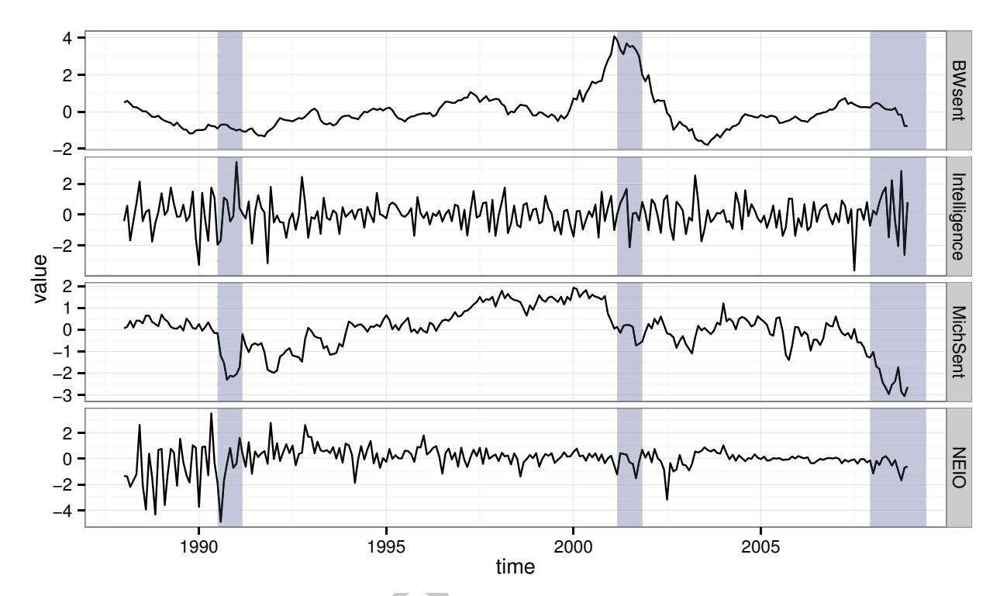
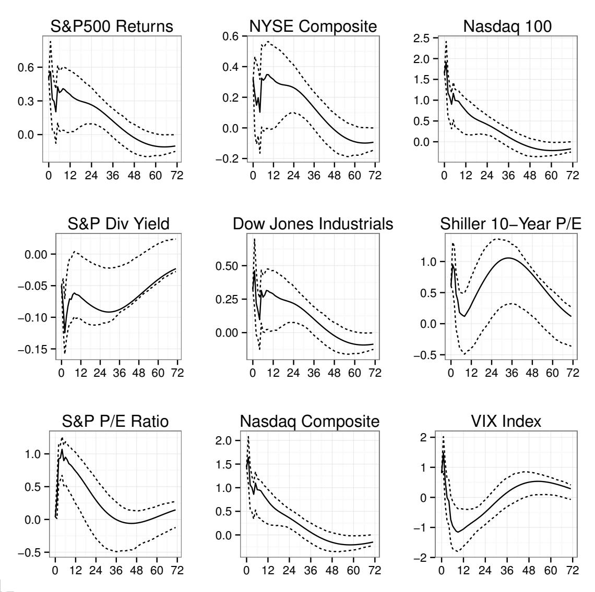
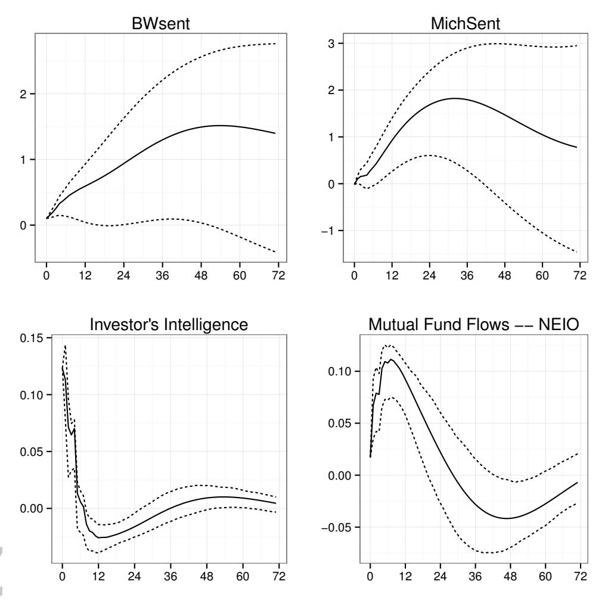
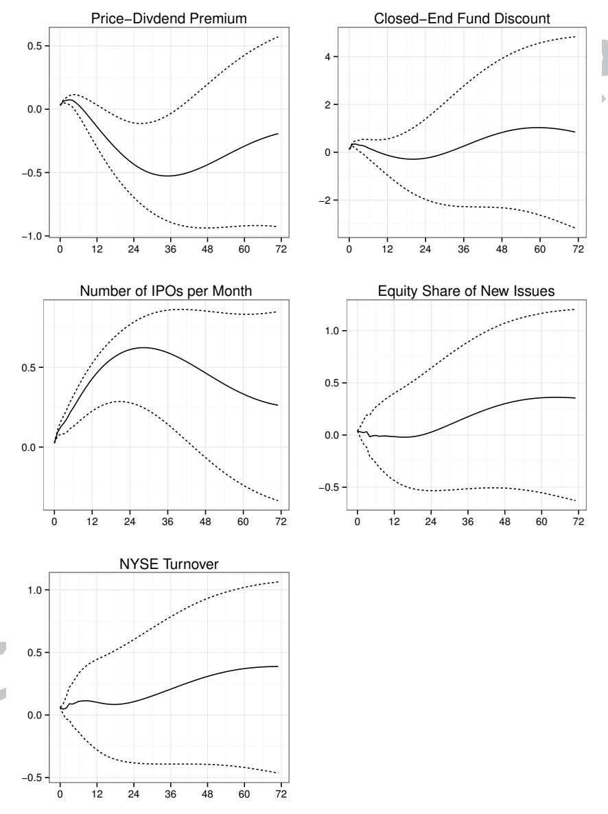
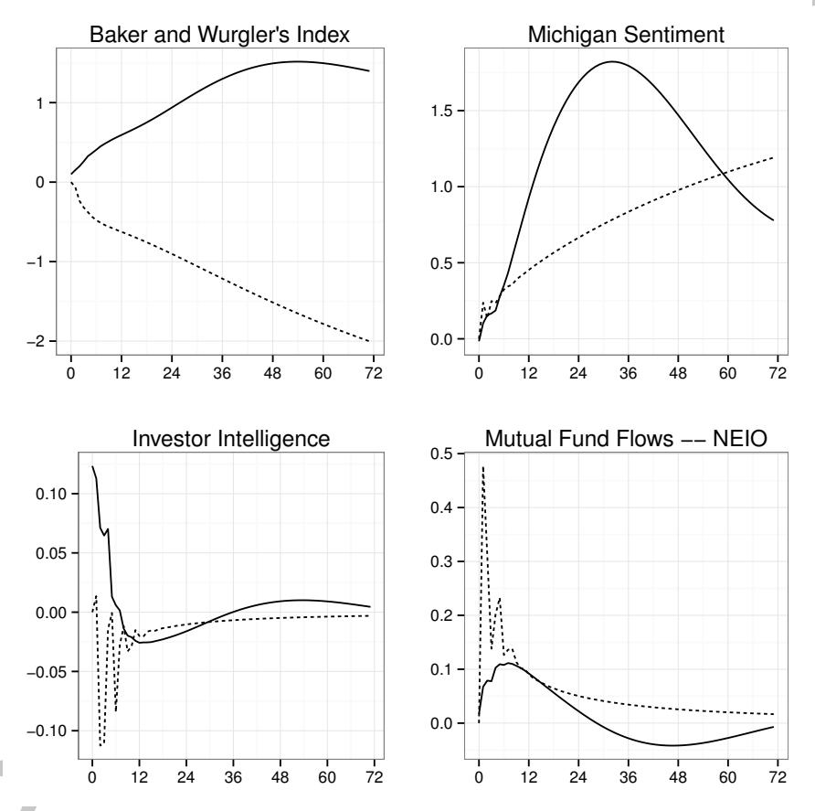
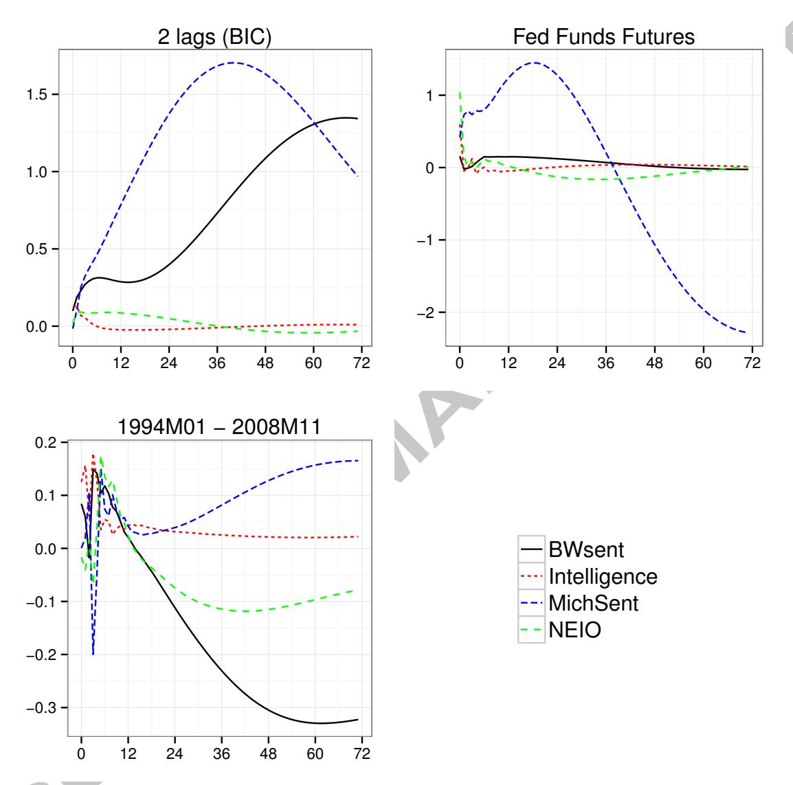

# Accepted Manuscript

The Impact of Conventional and Unconventional Monetary Policy on Investor Sentiment

Chandler Lutz

PII: S0378-4266(15)00230-7

DOI: <http://dx.doi.org/10.1016/j.jbankfin.2015.08.019>

Reference: JBF 4802

To appear in: *Journal of Banking & Finance*

Please cite this article as: Lutz, C., The Impact of Conventional and Unconventional Monetary Policy on Investor Sentiment, *Journal of Banking & Finance* (2015), doi: [http://dx.doi.org/10.1016/j.jbankfin.2015.08.019](http://dx.doi.org/http://dx.doi.org/10.1016/j.jbankfin.2015.08.019)

This is a PDF file of an unedited manuscript that has been accepted for publication. As a service to our customers we are providing this early version of the manuscript. The manuscript will undergo copyediting, typesetting, and review of the resulting proof before it is published in its final form. Please note that during the production process errors may be discovered which could affect the content, and all legal disclaimers that apply to the journal pertain.

# The Impact of Conventional and Unconventional Monetary Policy on Investor Sentiment∗

Chandler Lutz Copenhagen Business School cl.eco@cbs.dk

> Comments Welcome August 25, 2015

### Abstract

This paper examines the relationship between monetary policy and investor sentiment across conventional and unconventional monetary policy regimes. During conventional times, we find that a surprise decrease in the fed funds rate leads to a large increase in investor sentiment. Similarly, when the fed funds rate is at its zero lower bound, research results indicate that expansionary unconventional monetary policy shocks also have a large and positive impact on investor mood. Together, our findings highlight the importance of both conventional and unconventional monetary policy in the determination of investor sentiment.

JEL Classification: E52, G02 ;

Keywords: Monetary Policy, Unconventional Monetary Policy, Investor Sentiment

∗ I would like to thank Marcelle Chauvet, Stuart Gabriel, Fabio Milani, Mauricio Prado, Battista Severgnini and conference participants at the Copenhagen Business School for their helpful comments.

"The most direct and immediate effects of monetary policy actions...are on financial markets; by affecting asset prices and returns, policymakers try to modify economic behavior in ways that will help to achieve their ultimate objectives. Understanding the links between monetary policy and asset prices is thus crucially important for understanding the policy transmission mechanism."

- Bernanke and Kuttner (2005)

# 1 Introduction

Investor sentiment can have a profound impact on the economy, fueling booms and exacerbating busts.1 With the proliferation of bubble episodes in recent years, measures of investor behavior are now closely watched by both private sector investors and policymakers; necessitating the need for researchers to develop a deep understanding of the effects and drivers of sentiment. In this paper, we consider one potential determinant of investor behavior: Monetary policy shocks. Changes in monetary policy may induce excess optimism or pessimism as equity market participants may be overly sensitive to monetary shocks (Kurov (2010) and Bernanke and Kuttner (2005)). Indeed, monetary policy announcements are closely followed by investors, have a large effect on financial markets, and are widely reported by the financial media. Further, as noted by Mahani and Posteshman (2008), individual investors tend to overreact to financial news relative to more sophisticated investors. Thus, the link between monetary policy and investor sentiment may have important implications for both practitioners and policymakers, especially as central banks contemplate the use of policy tools to counter the risks associated with asset bubbles in the wake of the recent financial crisis.2

This paper studies the impact of monetary policy shocks on investor sentiment during both conventional and unconventional monetary policy regimes. First, we consider the impact of monetary policy shocks on investor sentiment during conventional times (when the fed funds rate is above its zero lower bound) using the factor-augmented vector au-

1There is a large and growing literature on the effects of sentiment on financial markets and the economy. See, for example, Shiller (2000), Brown and Cliff (2004), Tetlock (2007), Kling and Gao (2008), Kurov (2008), Brunnermeier (2009), Schmeling (2009), Fung et al. (2010), Gen¸cay and Gradojevic (2010), Chen (2011), Lux (2011), Singer et al. (2011), Chung et al. (2012), Garcia (2013), and Lutz (2015). Baker and Wurgler (2007) provide an overview of these studies.

2Ben Bernanke."Monetary Policy and the Housing Bubble." January 3, 2010. Annual Meeting of the American Economic Association, Atlanta, Georgia. More recently, The Bank of International Settlements stated that central banks should use monetary policy to counter asset bubbles, while Janet Yellen suggested that monetary policy tools are note appropriate to counter asset bubble risks. "Janet Yellen Signals She Won't Raise Rates to Fight Bubbles." The New York Times. July 2, 2014.

toregression (FAVAR) model of Bernanke, Boivin, and Eliasz (2005; BBE) and Boivin, Giannoni, and Mihov (2009; BGM). The chief advantage of the FAVAR framework is that it can accommodate the numerous time series that are likely to span the information sets used by policymakers and private sector practitioners; this allows for a more accurate measurement of monetary policy shocks compared with standard macroeconomic techniques. Our results indicate that a surprise decrease in the fed funds rate leads to a large increase in investor sentiment over short- and medium-horizons. These effects, which hold for a broad set of sentiment proxies and persist after accounting for various financial and macroeconomic aggregates as additional controls, are economically meaningful and large in magnitude. For example, an unexpected 50 basis point decrease in the fed funds rate leads to a 1.5 standard deviation increase in Baker and Wurgler's (2006, 2007) stock market sentiment index after 48 months.3

Next, we examine the effects of unconventional monetary policy shocks on investor sentiment during the recent period when the fed funds rate was at its zero lower bound. Unconventional monetary policy shocks are identified using high-frequency, intraday interest rate futures data.4 Using these identified monetary shocks, we then conduct an event study analysis similar to that used by Krishnamurthy and Vissing-Jorgensen (2011), Wright (2012), and Glick and Leduc (2013) to assess the effects of unconventional monetary policy on daily proxies of investor sentiment.5 In line with our findings during conventional times, these results suggest that expansionary unconventional monetary policy shocks lead to increased investor sentiment.

Together, our findings imply that expansionary monetary policy shocks have a favorable effect on investor sentiment during both conventional and unconventional monetary policy regimes. These results are large in magnitude and thus highlight the importance of monetary policy actions in the determination of investor sentiment.

We study the effects of surprise changes in conventional monetary policy on a large ar-

3An unexpected 50 basis point change in the fed funds rate can be interpreted as a surprise change in the fed funds rate relative to market expectations. See BBE and BGM and the references therein for more details.

4We would like to thank an anonymous referee for providing us with these data.

5There is a large and growing literature that studies the effects of unconventional monetary policy. See, for example, Gagnon et al. (2011), Neely (2010), D'Amico et al. (2012), Glick and Leduc (2012), Hamilton and Wu (2012), Li and Wei (2013), Gabriel and Lutz (2014), and Lutz (2014).

ray of popular monthly sentiment indicators including Baker and Wurgler's (2006, 2007) sentiment index (henceforth, BWsent), the Investors Intelligence Surveys (henceforth, Intelligence), Consumer Sentiment from the University of Michigan (henceforth, MichSent), and mutual fund flows measured by net exchanges between stock and bond mutual funds as in Ben-Raphael, Kendal, and Wohl (2012) (henceforth, NEIO). Furthermore, in an extension of our baseline results, we also consider a number of classic sentiment measures including the price-dividend premium, the closed-end fund discount, proxies for the IPO market, the equity-share of new issues, and NYSE turnover.6 We entertain a number of sentiment indicators for three reasons: (1) There is no perfect measure of investor mood and different indicators may capture different dimensions of investor behavior; (2) some measures of investor mood, such as the price-dividend premium of Baker and Wurgler (2006), may mechanically react to changes in interest rates that do not reflect changes in investor sentiment, while others, including the Investors Intelligence Surveys are direct measures of investor sentiment (Fisher and Statman (2006)); and (3) our key objective is to study the effects of monetary policy actions on the broad concept of "sentiment" rather than just the idiosyncrasies of a particular time series.

The sentiment indicators are combined with other macroeconomic and financial variables to produce our main dataset of 112 monthly time series. Thus, in addition to behavioral proxies, we have a broad dataset that is likely to span the information sets used by private sector investors and policymakers. For example, the data include information on several stock return series; proxies for stock market fundamentals; and various economic indicators.

Lastly, the daily sentiment proxies used during unconventional times include the daily closed-end fund discount of Hwang (2011), Chan, Jain, and Xia (2008), and Lee, Shleifer, and Thaler (1991) and the survey-based Gallup Daily Economic Conditions Index. As noted above, our findings indicate that expansionary unconventional monetary policy shocks increase investor sentiment.

Overall, our key findings build on previous studies that consider the relationship between monetary policy and equity markets. For example, Bernanke and Kuttner (2005)

6See Baker and Wurgler (2006) or section 3 for further explanations of these measures.

conclude that an unexpected increase in the fed funds rate leads to a decrease in stock returns. We view our results as an extension of Bernanke and Kuttner as we find that a surprise expansionary monetary policy shock leads to an increase in investor sentiment even after controlling for equity market fundamentals and returns. Other studies also have examined the relationship between monetary policy and certain proxies of investor behavior. Indeed, Kurov (2010) examines the relationship between sentiment and unexpected changes in the fed funds rate. The results in this paper are congruent with Kurov's findings. Moreover, Mahani and Posteshman (2008) contend that individual investors often overreact to financial news. As monetary policy announcements are widely covered by financial media outlets, we would expect an abounded reaction by individual investors to surprise changes in monetary policy. Together, these arguments lend credence to the notion that monetary policy can affect investor sentiment.

Our work, however, diverges from previous studies in a number of important ways. First, we use the FAVAR framework to accommodate many macroeconomic and financial variables and identify the initial response and longer run effects of conventional monetary shocks on investor sentiment. Thus, this paper addresses the potential endogeneity issues found in standard macro techniques using a structural framework that documents the short- and long-run path of investor sentiment in response a monetary policy shock. Lastly, this paper is, to the best of our knowledge, the first to exploit more recent data to examine the impact of unconventional monetary shocks on investor sentiment.

The rest of this article proceeds as follows: Section 2 provides an overview of the econometric framework; in section 3, we describe the data; an analysis of the results regarding conventional monetary policy shocks is in section 4; a number of robustness checks and extensions are considered in section 5; section 6 discusses the impact of unconventional monetary policy shocks on investor sentiment; and section 7 concludes.

## 2 Econometric Framework

To study the impact of monetary policy on investor sentiment during conventional times, we use the factor augmented vector autoregression (FAVAR) model of BBE and BGM. Then, to assess the effects of unconventional monetary policy shocks, such as large scale

asset purchases of long-term Treasuries or mortgage backed securities (e.g. Quantitative Easing), we employ an event study methodology similar to that used by Krishnamurthy and Vissing-Jorgensen (2011), Wright (2012), and Glick and Leduc (2013). In the following two subsections, we discuss the FAVAR framework and our event study approach in more detail.

### 2.1 Conventional Monetary Policy: Factor-Augmented VAR

To study the effects of monetary policy on investor sentiment when the fed funds rate is above its zero lower bound, we employ the factor-augmented vector autoregression (FAVAR) model of BBE and BGM. The FAVAR framework is advantageous for the measurement of monetary policy shocks as it can accommodate the large number macroeconomic and financial time series that are that are likely to span the information sets used by investors and policymakers. This allows us to circumvent the omitted variable issues frequently found in standard VARs (e.g. the "price puzzle" of Sims (1992)). Furthermore, through the FAVAR approach, we can compute impulse response functions (IRFs) for all time series in the dataset due to an unexpected monetary policy shock; where the interpretation of the these IRFs is synonymous to those from a standard VAR. Hence, just as BBE and BGM use the FAVAR framework to study the effects of shocks to the fed funds rate on unemployment, output, and prices, we exploit the FAVAR structure to examine the relationship between monetary policy and investor sentiment.

Next, we outline the salient features of the FAVAR model. For a more detailed treatment of the these methods, see BBE and BGM. We estimate the FAVAR model using the two-step principal component approach. This method is computationally simple and requires the following steps:

- 1. Extract a set of common factors from the "informational time series" using principal component analysis.
- 2. Estimate a standard VAR using the set of common factors derived in step (1) and the policy instrument (the fed funds rate).

More specifically, let Xt be an N×1 vector of "informational time series" that contains all variables in the dataset except for the fed funds rate. Furthermore, assume that the

economy is affected by a K × 1 vector of unobserved factors, Ft , and an observed factor, the policy instrument, Rt . Here, the policy instrument, Rt , will be the fed funds rate. Combining the observed and unobserved factors into a vector of components common to all time series in the dataset yields

$$C_t = \begin{bmatrix} F_t \\ R_t \end{bmatrix} \tag{1}$$

So, in the first step, we estimate the following observation equation using principal components. Note that we follow BGM and impose the constraint that Rt is one of the common factors.7

$$X_t = \Lambda C_t + e_t \tag{2}$$

where Λ is an N×(K+1) matrix of factor loadings and et is an N×1 vector of idiosyncratic components. Then, with Ct in hand, we estimate the following standard VAR:

$$C_t = \Phi(L)C_{t-1} + v_t \tag{3}$$

where Φ(L) is a conformable polynomial lag of finite order. After estimating the VAR, we can study the response of each time series in Xt to a policy shock (e.g. an unexpected decrease in the fed funds rate) by simply multiplying the impulse response functions (identified through standard Cholesky restrictions as discussed below in section 4) from the VAR in equation 3 by the factor loadings from the observation equation. This will allow us to study the impact of monetary policy shocks on various proxies of investor sentiment. As the VAR employs "generated regressors," confidence intervals for the impulse response functions are calculated using a bootstrapping algorithm.

# 2.2 Unconventional Monetary Policy at the Zero Lower Bound: Event Study Analysis

When the fed funds rate hit its zero lower bound (more precisely, when the target fed funds rate reached the interval 0.00 and 0.25 percent), the Federal Reserve employed extraordinary and unconventional tools to achieve its policy objectives of full employment and stable prices. As these unconventional tools were dramatically different than those

7As in BGM, we impose this constraint using the following algorithm: (1) extract the first K principal components from Xt, denoted F (0) t ; (2) regress Xt on F (0) t and Rt to obtain λ˜ (0) R , the regression coefficient on Rt; (3) define X˜ (0) t = Xt − λ˜ (0) R Rt; (4) calculate the first K principal components of X˜ (0) t to get F (1) t ; (5) Repeat steps (2) to (4) multiple times. As in BGM, we repeat the algorithm 20 times.

used during conventional times, there has been substantial uncertainty regarding the efficacy of these new monetary policy interventions.8 Thus, further analysis is needed to assess the impact of unconventional monetary policy shocks on sentiment during this recent period.

When the fed funds rate is at its zero lower bound, there is no single indicator of the Federal Reserve's overall policy stance. Moreover, we cannot use the monthly data considered in the FAVAR framework as monthly indicators of monetary policy actions during the recent period, such as the size of the Fed's balance sheet, neglect the announcement effects that were an important part of the FOMC's recent policy decisions.9 Thus, we follow Krishnamurthy and Vissing-Jorgensen (2011), Wright (2012), and Glick and Leduc (2013) and use an event study approach to assess the impact of unconventional monetary policy shocks on investor sentiment.10 The advantage of the event study methodology is that it allows us to measure changes in policy and account for the announcement effects related to FOMC policy decisions. We compute unconventional monetary policy shocks using high-frequency, intraday interest rate futures. More specifically, monetary policy shocks are calculated from the first principal component of the changes in the front-month futures contracts11 on the two-, ten-, and thirty-year Treasuries; where the changes are calculated using data from 15 minutes before to 105 minutes after all FOMC policy announcements or major speeches by Fed Chairman Bernanke as in Wright (2012).12 Since no other macroeconomic data were released during the policy window, the intraday data allow us isolate the effects of the unconventional monetary policy actions. Furthermore, the futures market data account for market participants' expectations regarding the future direction of interest rates; this enables us to better measure the response of investor sentiment to monetary policy shocks. Lastly, as a robustness check, we also consider a more narrow event window where we calculate the changes in the front-month Treasury market futures from 10 minutes before to 20 minutes after each FOMC event or major

8John Taylor. "Monetary Policy and the State of the Economy." Testimony before the Committee on Financial Services; United States House of Representatives. February 11, 2014.

9See Wright (2012) and Yellen (2013) for more analysis on this point.

10See also Gagnon et al. (2011), Neely (2010), D'Amico et al. (2012), Glick and Leduc (2012), Hamilton and Wu (2012), and Li and Wei (2012).

11Current month futures contracts.

12We would like to kindly thank an anonymous referee for providing us with this dataset.

speech by the Fed Chair; these results are substantially similar to those found using the wider window.

In total, our event study includes 48 monetary policy announcements that span the first, second, and third rounds of U.S. Quantitative Easing (QE1, QE2, and QE3) and the recent so-called taper period where the Federal Reserve first reduced its unconventional monetary policy stimulus. Thus, our event study ranges from November 2008 to December 2013. Table 2 shows the major monetary policy announcements over our sample from QE1, QE2, QE3, and the taper period.

We standardize the unconventional monetary policy shocks to have variance equal to one and so that negative values indicate monetary easing (a surprise decrease in long-term interest rates). Then we estimate the impact of unconventional monetary policy shocks on investor sentiment through a regression analysis. These results are then compared to those estimated during the conventional policy regime prior to November 2008 in an event study framework using monetary policy shocks estimated from fed funds futures. The derivation of monetary policy shocks from fed funds futures is described in more detail in appendix C.

## 3 Data

The dataset used to estimate the FAVAR model within the conventional monetary policy framework is a monthly balanced panel consisting of 112 time series made up of various sentiment indicators, macroeconomic aggregates, and financial variables. This dataset is updated from BGM and Stock and Watson (2004) and runs from January 1988 to November 2008, just before the fed funds rate reached its zero lower bound. The relevant variables are described in more detail below; a complete data list is presented in appendix D.

To assess the impact of unconventional monetary policy actions on investor sentiment, we consider daily investor sentiment measured by the closed-end fund discount of Hwang (2011), Chan, Jain, and Xia (2008), and Lee, Shleifer, and Thaler (1991) and the surveybased Gallup Economic Conditions Survey Index. We discuss the sentiment data and the other data in turn.

### 3.1 Sentiment Data

In this study, we consider an array of sentiment indicators for three reasons. First, there is no perfect measure of sentiment and different proxies may capture different dimensions of investor behavior. Second, certain indicators of investor sentiment, like the pricedividend ratio and equity-share of new issues proxies used by Baker and Wurgler (2006), may mechanically react to changes in interest rates, while other proxies, including the Investors Intelligence Surveys, are more direct measures of investor mood. Third, as noted by BBE, empirical estimates often depend on the idiosyncratic features of a particular time series; making it difficult to assess the effects of a policy shock on a broad concept like investor sentiment. By combining our large dataset and the FAVAR model within the conventional framework, we can circumvent these issues when estimating the effects of monetary policy shocks on investor behavior.

The monthly data used to measure the effects of conventional monetary policy shocks include four popular proxies of sentiment: Baker and Wurgler's (2006, 2007) sentiment index (henceforth, BWsent); the Investors Intelligence Surveys (henceforth, Intelligence); Consumer Confidence from the University of Michigan (henceforth, MichSent); and the mutual funds flow proxy of Ben-Raphael, Kendal, and Wohl (2012) (henceforth, NEIO).13

Baker and Wurgler build their behavioral proxy by extracting a common component from classic indicators of investor sentiment such as the closed-end fund discount (CEFD), NYSE turnover, the number and first day return on IPOs, the equity share of new issues, and the price-dividend premium. CEFD and the price-dividend premium are inversely related to investor sentiment, while the number and first day return on IPOs, NYSE Turnover, and the equity-share of new issues are all positively correlated with investor mood. Using their index, Baker and Wurgler find that high sentiment predicts low future returns.

As the variables that constitute Baker and Wurgler's index are proxies for investor mood, we extend our baseline FAVAR analysis and use the components of BWsent (in-

13BWsent is from Jeffrey Wurgler's website, MichSent was downloaded from the FRED database of the Federal Reserve Bank of St. Louis, the Investors Intelligence sentiment measure was downloaded from DataStream, and NEIO was taken from a working paper version of Ben-Raphael, Kandal, and Wohl (2012).

stead of the aggregate index) to further assess the effects of monetary policy on sentiment.14 This approach allows us to study the financial channels through which monetary policy influences investor sentiment.

Next, we consider a sentiment measure based on the Investors Intelligence Surveys, a direct measure of investor mood (Fisher and Statman (2006)). The Investors Intelligence Surveys reflect the stance of financial market newsletters regarding the future direction of the stock market. Hence, the editors of the Investors Intelligence Surveys classify each newsletter as either "bullish," "bearish," or "correction," where those classified in the correction category are waiting to for a pullback in markets to buy stocks. As in Fisher and Statman (2006) and Kurov (2010), we build our sentiment measure based on the Investor Intelligence Surveys by computing the ratio of the percentage bullish newsletters to the sum of the percentages of bullish and bearish newsletters.

The sentiment surveys by the University of Michigan are classic measures of consumer optimism that have been used widely in economics and finance. For example, Barsky and Sims (2012) contend that consumer sentiment contains information about future economic prospects, while Lemmon and Portniaguina (2006) find that MichSent forecasts the returns on small stocks and those with low institutional ownership.

We also consider the net exchanges between bond and stock mutual funds (henceforth, NEIO). Ben-Raphael, Kendal, and Wohl (2012) find that increases in sentiment as measured by NEIO (flows from bonds to stocks) correlate with an increase in excess market returns that later reverse in subsequent months.

Given the sentiment indicators and the financial variables, our main dataset used to measure the effects of conventional monetary policy shocks runs from January 1988 to November 2008. Note that BWsent, Intelligence, MichSent, and NEIO all increase with optimism and decrease with pessimism. Lastly, we standardize all of the sentiment measures to have zero mean and unit variance over our sample period.

Figure 1 plots the four behavioral indicators where the shaded bars represent NBER recessions. Although all of the measures aim to capture investor sentiment, they have

14Baker and Wurgler contend that all variables in their index capture investor sentiment. Yet as noted by a referee, some of the variables used in Baker and Wurgler's index may not capture sentiment in all situations. For example, the price-dividend premium may mechanically react to changes in interests due a change in discount rates. These changes may be unrelated to investor sentiment.

markedly different dynamics over the sample period. For example, BWsent and MichSent rise noticeably during the tech bubble in the late 1990s, while Intelligence and NEIO are much more volatile. In general, BWsent and MichSent appear to capture optimism and longer term trends, while Intelligence and NEIO tend to be more mean reverting. This will have important implications for the shape of the impulse response functions estimated below.

### [Insert Figure 1 About Here]

Furthermore, table 1 shows the correlation coefficients of the first difference of the sentiment indicators over the sample period. In general, the magnitudes of the coefficients vary widely. The changes in BWsent are largely unrelated to the changes in the other sentiment indicators, while increases in Intelligence are highly positively correlated with the first difference in NEIO. Moreover, the first difference in MichSent is positively correlated with the first difference in NEIO, but inversely correlated with the first difference in Intelligence. Overall, the signs of the correlation coefficients match our expectations, but there is much dispersion across the sentiment measures. This latter result suggests that different measures of sentiment capture different elements of investor behavior.

### [Insert Table 1 About Here]

In general, the heterogeneity documented across these indicators demonstrates the difficulties in measuring investor mood. Yet, as shown below, our results regarding the effects of monetary policy on sentiment are qualitatively similar for all four indicators; this highlights the robustness of our findings to different measures of investor behavior.

### 3.2 Daily Sentiment Data

In addition to the popular monthly behavioral variables outlined above, we also consider daily proxies of sentiment to measure the impact of unconventional monetary policy shocks on investor mood. Unfortunately, the aforementioned monthly sentiment series do not all directly map to the daily frequency. Thus, we must consider alternative measures of investor behavior that are available at the daily frequency. Yet this restriction creates

an unintended advantage as it allows us to assess the impact of monetary policy shocks on measures of investor sentiment that extend beyond those listed above.

First, we compute the daily closed-end fund discount (CEFD) as in Hwang (2011), Chan, Jain, and Xia (2008), and Lee, Shleifer, and Thaler (1991).15 Daily market prices and market cap values for closed-end funds are from the CRSP database and daily netasset values (NAVs) are from Yahoo Finance. We restrict our sample to funds with over 100 million dollars in assets over our sample period from 2000 through 2012.16 As noted above, through its construction, CEFD is inversely related to investor sentiment.

Next, we consider the U.S. Daily Economic Conditions Index measured through household sentiment surveys administered by Gallup. Every day, Gallup surveys 1500 individuals and determines the portion of people who believe that the current economic conditions in the U.S. are "Excellent," "Good," "Only Fair", or "Poor." In line with Tetlock (2007) and Da, Engelberg, and Gao (2015), we only focus on the negative portion of the survey responses; those who cite that current economic conditions are "Poor" (henceforth, Conditions).17 Conditions increases as the percentage of people who cite that current economic conditions are "Poor" increases.

In our event study, the dependent variables of interest will be either the first difference in CEFD, ∆CEFD, or the first difference in Conditions, ∆Conditions. ∆CEFD is the only daily sentiment measure available prior to 2008. So, our daily event study during the conventional monetary policy regime will only use ∆CEFD as a sentiment proxy.

The correlation of ∆CEFD and ∆Conditions on unconventional monetary policy event days is -0.01 and not statistically significant at the 15 percent level; highlighting the dispersion in sentiment even at the daily frequency.

In a robustness check, we also consider the daily sentiment data orthogonalized to various financial market indicators. Specifically, during conventional times, we retain the residuals of a regression of ∆CEFD on the returns on the Dow Jones Industrial Average,

15Hwang (2011), Chan, Jain, and Xia (2008), Baker and Wurgler (2006, 2007), Pontiff (1996), and Lee, Shleifer, and Thaler (1991) contend that CEFD is a suitable measure of investor sentiment. In contrast, Qiu and Welch (2006) suggest CEFD doest not accurately track investor sentiment.

16This yields an index of 77 funds out of 630 funds available from a Morningstar database. Anderson et al. (2013) also provide a recent analysis of the closed-end fund discount and stock returns.

17Specifically, Tetlock (2007), Da, Engelberg, and Gao (2015), and others contend that sentiment is best captured through negativity. The data were downloaded from Gallup's website.

the spread between AAA and BAA rated corporate bond yields, and the spread between the ten-year Treasury and the fed funds rate. During unconventional times, the orthogonalized measures are the residuals from a regression of either ∆CEFD or ∆Conditions on the returns on the Dow Jones Industrial Average, the spread between AAA and BAA rated corporate bond yields, and the spread between the ten-year Treasury and the twoyear Treasury. We label the orthogonalized versions of ∆CEFD and ∆Conditions as ∆CEFD⊥ and ∆Conditions⊥, respectively.

### 3.3 Other data

In this section, we describe the other macroeconomic and financial time series used to identify the effects of conventional monetary policy shocks within the FAVAR framework.

First, as in Bernanke and Blinder (1992), BBE, BGM, and Romer and Romer (2004), we let the fed funds rate be the conventional monetary policy instrument. In terms of the FAVAR framework outlined above, the fed funds rate will serve as the observed factor.

We also consider 107 other time series that gauge economic output and financial market behavior. This dataset, originally developed Stock and Watson (2002) and used by BEE and BGM, covers a broad array macroeconomic aggregates and financial variables including proxies for output, employment, interest rates, equity markets, exchange rate markets, and many others. With regard to stock markets, the data include the indices for the S&P500, the Dow Jones Industrial Average, and the NASDAQ 100; the VIX index; as well as fundamental indicators such as the S&P500 dividend yield and the S&P500 P/E ratio. We also include the cyclically adjusted 10-year P/E ratio from Shiller (2000) as a proxy for overall stock market valuation. Appendix D contains a complete list of all of the variables along with a brief description.18 All of the time series are transformed to ensure stationarity; the transformations necessary to induce stationarity are taken from Stock and Watson (2002) and are listed in the data appendix. The data range from January 1988 to November 2008, just before the fed funds rate reached its zero lower bound in December 2009.

In terms of the model specification outlined above, the set of "informational time

18The data were downloaded from Datastream, the FRED Economic Database of the Federal Reserve Bank of St. Louis, and other sources.

series," Xt , will contain all variables listed in the data appendix except for the fed funds rate. Hence Rt , the observed factor, will be the fed funds rate. Ct will contain the vector of latent factors, Ft , estimated from Xt as in equation 2, and Rt .

# 4 Estimation Results – The Effects of Conventional Monetary Policy Shocks

This section discusses the estimation results obtained from the FAVAR model. As previously noted, the key advantage of the FAVAR framework lies in its ability to accommodate large datasets. This allows us to estimate the impulse response functions (IRFs) for the sentiment proxies after accounting for the dynamics of numerous macroeconomic and financial time series; yielding a more accurate measurement of monetary policy shocks compared to standard techniques.

We follow BBE and BGM and estimate five latent factors from Xt , the vector of informational time series. Xt consists of 111 variables including the sentiment proxies. In line with the previous literature, we let the fed funds rate be the monetary policy instrument over our sample period.19

As in BBE and BGM, we make the following standard assumptions to identify monetary policy shocks: (1) The fed funds rate can respond to contemporaneous fluctuations in the latent factors, but the common components cannot respond to surprise monetary policy changes within the month; and (2) unlike standard VARs, all of the time series in Xt are allowed to respond contemporaneously to changes in the fed funds rate even though the latent factors are assumed to remain unaffected in the current month. In line with the VAR literature, assumption (1) follows from the notion that monetary policy affects key macroeconomic aggregates including inflation and output with a time lag.20 Assumption (2) follows from equation 2 as Ct , the common component, contains the monetary policy instrument as one of its components. Thus, the impulse response functions for the time series in Xt , which we calculate by multiplying IRFs from the common components (the latent factors and the monetary instrument) by Λ, will react contemporaneously to a

19See Bernanke and Blinder (1992), BBE, BGM, Bernanke and Mihov (1998), and Romer and Romer (2004).

20See Yellen (2013), BBE, BGM, and Friedman (1961).

change in monetary policy as the fed funds rate decreases immediately in the presence of a expansionary monetary policy shock.

The Akaike Information Criterion (AIC) is used to select three lags for the VAR in equation 3. As shown below, the results are robust to the choice of other lag lengths.

We examine the responses of the time series of interest to a monetary policy shock, a surprise 50 basis point decrease in the fed funds rate as in Stock and Watson (2001). The impulse response functions are calculated for 72 periods corresponding to 6 years at the monthly frequency. Further, as in Stock and Watson (2001) and Bloom (2009), we compute 66 percent bootstrapped confidence intervals around the IRF point estimates. The 66 bootstrapped confidence intervals correspond to roughly 1 standard deviation (assuming a normal distribution) and are often used in the VAR literature. Thus, these confidence intervals allow us to assess the precision of the IRF point estimates over our sample period.

First, we consider the IRFs of key equity market variables including returns on the S&P500, Dow Jones Industrial Average (DJIA), the NYSE Composite, the Nasdaq Composite, and the Nasdaq 100; the VIX index; and fundamental indicators such as the S&P500 P/E ratio, Shiller's (2000) cyclically adjusted 10-year P/E ratio, and the S&P500 dividend yield. Figure 2 shows the results. In general, the shape of the impulse response functions correspond with those previously found by BBE: In response to a surprise 50 basis point decrease in the fed funds rate, returns increase by about 0.5 percentage points for the S&P500, the DJIA, and the NYSE Composite and over 1.5 percentage points for the Nasdaq Composite and the Nasdaq 100.21 Then the effect of the monetary policy shock attenuates and nearly completely dies off after about 36 months. Moreover, the dynamic response of the P/E ratio also increases initially and then dies off in later months. Note that Fisher and Statman (2006) use the P/E ratio as an indirect proxy for investor sentiment. Thus, the initial increase and subsequent reversal in the IRF for the

21Several other studies have examined the impact of monetary policy shocks on stock returns. For example, in response to a surprise 50 basis point decrease in the fed funds rate D'Amico and Farka (2011) find that stock returns increase by 2.5 percent, Bernanke and Kuttner (2005) contend that excess market returns jump approximately 6 percent, and Rigobon and Sack (2004) find that the S&P500 increases by 3.4 percent. See also Kontonikas, MacDonald, and Saggu (2013) for an analysis of the relationship between the Fed Funds Rate and stock returns during the recent financial crisis, Basistha and Kurov (2008), and Kurov (2012).

P/E ratio coincides with a sentiment-based interpretation of the results.22 Similarly, we find an initial decrease and subsequent reversal in the dynamic response for the dividend yield. Further, as in Bekaert, Hoerova, and Lo Duca (2013), our results also indicate that expansionary monetary policy shocks lead to reductions in the VIX index after about one year. Lastly, the shape of the IRF for the Shiller 10-year P/E ratio is consistent with a behavioral explanation of the impact of monetary policy shocks on financial markets. Indeed, Shiller (2000) contends that the 10-year P/E is highest when markets are most speculative. Thus, the increase in the IRF of the 10-year P/E after approximately 36 months and subsequent reversal matches the notion that expansionary monetary policy shocks favorably impact equity markets via excess optimism. Overall, in line with the literature, we find that a surprise decrease in the fed funds rate has a favorable effect on equity markets.

### [Insert Figure 2 About Here]

Next, figure 3 displays the impulse response functions for BWsent, Intelligence, Mich-Sent, and NEIO. Recall that BWsent, Intelligence, MichSent, and NEIO all increase with optimism and decrease with pessimism.

### [Insert Figure 3 About Here]

The estimation of the IRFs for the behavioral proxies yields several key results. First, there is an initial increase in sentiment as measured by all proxies in response to a surprise decrease in the fed funds rate. Hence, unexpected expansionary monetary policy actions have favorable effects on investor mood and behavior even after accounting for the advances found in equity markets or other macroeconomic aggregates. Second, following the initial increase, the IRFs for the sentiment measures reverse in later months. Thus, the long term effects of monetary policy with regard to investor mood appear to be relatively muted. These findings imply that the dynamic responses for sentiment are similar to those of other "real" economic variables as suggested by the long-run neutrality of money. In other words, monetary policy appears to alter investor behavior in the short run, but has

22See, for example, Abreu and Brunnermeier (2003), Tetlock (2007), and Garcia (2013) for studies that find a reversal in stock market outcomes following an increase in investor sentiment.

little impact in the long run. This latter result is congruent with Barsky and Sims (2012) who contend that consumer sentiment contains information about future (real) economic activity. In general, the increase in sentiment in response to an expansionary monetary policy shock is qualitatively similar across the behavioral proxies and thus suggests that our results apply to sentiment in a broad sense rather than just to the idiosyncrasies in any particular time series. Yet the the dynamic responses for Intelligence and NEIO dissipate much quicker than those for BWsent and MichSent. This matches our expectations as Intelligence and NEIO display mean-reverting behavior, while BWsent and MichSent capture longer term trends.23

The magnitudes of the dynamic responses of the sentiment indicators also appear to be economically meaningful. For example, two-thirds of the monthly innovations in BWsent over the sample period lie between -1 and 1.24 Thus, the 1.5 standard deviation increase in BWsent after 48 months in response to a surprise 50 basis point cut in the fed funds rate represents a substantial impact on investor sentiment. Similarly, the other sentiment indicators are also standardized to have zero mean and unit variance and thus two-thirds of the monthly innovations in Intelligence, MichSent, and NEIO also lie between -1 and 1. In comparison, an unexpected 50 basis point decrease in the fed funds rate leads to nearly an initial 0.15 standard deviation jump in Intelligence; a nearly 2 standard deviation increase in MichSent after 30 months; and over a 0.10 standard deviation advance in NEIO after 6 months. Hence, monetary policy shocks appear to have a large, important, and meaningful impact on our broad set of sentiment indicators. Lastly, the increasing nature of the dynamic responses over the first few months for BWsent, MichSent, and NEIO indicates that the effects of monetary policy on investor sentiment occur with some lag, in line with Friedman (1961).

Finally, as noted by a referee, the confidence intervals for some of the IRFs are wide (e.g. for BWsent), yet there is evidence of reversal in the point estimates for the IRFs. Most noticeably, the point estimates of the dynamic response for MichSent supports the notion that there is a long-run reversal in sentiment in response to a monetary shock: After reaching its peak in month 33, the IRF then falls over 50 percent between month

23See figure 1 and section 3 for further analysis on this point.

24Given the assumption that the data follow a normal distribution.

34 and month 72; suggesting a reversal in the effects of monetary policy on investor sentiment at longer horizons. Further, note that the evidence of reversal is stronger in Intelligence and NEIO. Indeed, after a large positive initial impact in response to an expansionary monetary policy shock, the IRFs for Intelligence and NEIO cross the zero line after 9 and 30 months, respectively.

An alternative method for examining the impact of monetary policy shocks on investor sentiment is to consider the forecast error variance decomposition (FEVD). The FEVD is the fraction of the forecast error for a given variable attributable to the policy shock over the forecast horizon. In other words, the FEVD measures how much the monetary policy shock contributes to the subsequent forecast error of a given variable over a certain horizon. Here, we calculate the FEVD in response to a monetary policy shock using the augmented formula for FAVAR models from BBE. Table 3 shows the results for the sentiment indicators and for certain macroeconomic or financial variables. The first four rows of the table show the FEVD for the sentiment indicators. The FEVD for BWsent is 0.97 percent; indicating that the policy shock explains a non-trivial 0.97 percent of the variance in Baker and Wurgler's index over the forecast horizon. Similarly, the contribution of the policy shock to Intelligence, MichSent, and NEIO, is 0.75 percent, 0.86 percent, and 5.23 percent, respectively. Overall, these numbers are in line with those of the other variables in table 3 and thus suggest that the impact of monetary policy on investor sentiment is similar in magnitude to other economic or financial indicators.

### [Insert Table 3 About Here]

### 4.1 Estimation Results using the Components of Baker and Wurgler's Index

Next, we extend our baseline FAVAR results and study the impact of conventional monetary policy shocks on the components that constitute Baker and Wurgler's index. These components include the price-dividend premium, the closed-end fund discount, the number of IPOs in a given month, the equity share of new issues, and NYSE turnover.25 We include the components of Baker and Wurgler's index in our set of informational time

25Note that we do include the first day return on IPOs used by Baker and Wurgler (2006) as this variables contains several missing values. These missing values correspond to months where there were no IPOs.

series (and remove BWsent); this will allow us to study the financial channels through which conventional monetary policy shocks impact investor sentiment. As with the other sentiment indicators, we standardize the components of BWsent to have zero mean and unit variance over the sample period.

The estimated responses to a surprise 50 basis point decrease in the fed funds rate are shown in figure 4. Recall that the price-dividend premium and the closed-end fund discount are inversely related to investor sentiment, while the number of IPOs in a given month, the equity share of new issues, and NYSE turnover are positively correlated with investor mood. In general, the IRFs point in the expected direction: A surprise 50 basis point cut in the fed funds rate leads to a decrease in the price-dividend premium after 12 months, an increase in the number of IPOs per month of approximately 0.6 standard deviations after 24 months, and an initial increase in the equity share of new issues and NYSE turnover. Yet the results do not match our expectations in all cases. First, there is an initial increase in the price-dividend premium, counter to our expectations in response to a surprise monetary easing. These effects quickly reverse, however, and the IRF for the price-dividend premium becomes negative after just 6 months. Second, effects in the closed-end fund discount, the equity-share of new issues and NYSE turnover are relatively small compared to the other behavioral proxies. Hence, the results indicate that expansionary monetary policy shocks lead to increased investor sentiment largely through IPO markets.26

### [Insert Figure 4 About Here]

### 4.2 Comparison to a Standard VAR

In this section, the above FAVAR results are compared to those obtained from a standard VAR. As has been noted extensively in the literature, one drawback of standard VARs is that they can only accommodate a small number of variables; making it difficult to properly measure monetary shocks. Furthermore, unlike the FAVAR framework, the researcher has to explicitly choose the variables to be included in a standard VAR.

26As noted by a referee, the equity share of new issues is more likely a proxy for offerings in this case rather than a measure of investor sentiment. Similarly, the price-dividend premium may also mechanically react to changes in interest rates.

This complicates measurement and inference. Here, we consider a standard VAR with the fed funds rate and the sentiment proxies. The controls used in the standard VAR include the growth in industrial production, the returns on the S&P500, and the VIX index. We cannot control for all potential variables within a standard VAR, but equity returns provide a reasonable compromise to measure stock market activity as an efficient market hypothesis type argument suggests that stock returns should reflect all available information. Similarly, the VIX index should capture expected stock market volatility. Lastly, as in other standard VARs, growth in industrial production is used to capture the state of the U.S. business cycle.

Figure 5 shows the estimated responses from a surprise 50 basis point decrease in the fed funds rate using both the FAVAR framework and a standard VAR. The FAVAR IRFs are identical to those described above, while monetary shocks are identified for the regular VAR in the usual way. For the regular VAR, three lags are chosen by the AIC. In the figure, solid lines are the estimated IRFs from the FAVAR model and dotted lines represent the IRFs calculated using the standard VAR. Clearly, there are notable differences in the dynamic responses computed using the FAVAR and VAR frameworks. Most remarkably, the initial responses for BWsent and Intelligence calculated using the standard VAR point in the wrong direction; yielding results that conflict with the responses in MichSent and NEIO. This suggests that contamination persists in the standard VAR and is similar in spirit to the "price puzzle" of Sims (1992). Moreover, although the IRF estimated using the standard VAR for MichSent points in the right direction, it does not recover in later months. This feature is at odds with the notion that changes in investor behavior are neutral to money in the long run. BGM also find a similar mis-measurement of a monetary shock with regard to "real" economic variables when comparing the standard VAR with the FAVAR framework.

### [Insert Figure 5 About Here]

Overall, based on the estimated IRFs shown in figure 5, there appears to be contamination in measurement of monetary shocks within the regular VAR model. As in BBE and BGM, this supports the use of FAVAR structure for the measurement of conventional monetary policy shocks.

# 5 Robustness Checks and Extensions

The analysis in this section checks the robustness of the results. More specifically, we examine an alternative lag structure for the VAR; a sample starting in 1994; and an alternative measure of monetary policy shocks derived from fed funds futures. Note that the Federal Reserve started to explicitly announce monetary policy decisions in 1994. Thus, using a shorter sample period that begins in 1994 will allow us to assess the robustness of our results to this change in Fed announcement policy.

### [Insert Figure 6 About Here]

### 5.1 Alternate VAR Specification

As noted above in section 4, the Akaike Information Criterion (AIC) chose 3 lags for the VAR in equation 3. Here, we use the Bayesian Information Criterion (BIC) and select 2 lags for the VAR as a robustness check. The responses of the sentiment indicators to an unexpected 50 basis point cut in the fed funds rate using this alternate specification are shown in the top-left panel of figure 6. Overall, the plots are similar to those obtained above, but the reversal in the IRF for BWsent is less pronounced. This latter result is not surprising as we would not expect the shorter lag length to capture all of the longer-term dynamics in the sentiment variables.

### 5.2 1994 – 2008 Sample

In 1994, the FOMC began to explicitly announce its monetary policy decisions. There has been some recent evidence that these announcements have affected the relationship between monetary policy actions and financial markets.27 It is conceivable that this change in the Federal Reserve's disclosure policy altered investors' interpretation of monetary policy shocks and, subsequently, their relationship with investor sentiment. The bottom-left panel in figure 6 shows the responses of the sentiment measures to a surprise 50 basis point decrease in the fed funds rate for the January 1994 to November 2008 sample. Overall, the results indicate that the expansionary monetary policy surprises lead to increases in investor sentiment, but the effects are relatively muted for BWsent and MichSent compared to our previous findings.

27See, for example, Lucca and Moench (2015).

### 5.3 Monetary Policy Surprises Derived from Fed Funds Futures

Next, we estimate the responses of the sentiment indicators to monetary policy surprises based on fed funds futures within our FAVAR framework. More specifically, we construct surprise changes in monetary policy by calculating the difference between the average fed funds target rate for month t and the expected rate for month t using the one-month fed funds futures contract on the last day of month t − 1. This analysis builds on Bernanke and Kuttner (2005) who consider unexpected shifts in monetary policy derived from fed funds futures within a modified VAR framework. For more details on the calculation of unexpected changes in monetary policy based on fed funds futures and the subsequent estimation of the FAVAR model, see appendix C.

Given the availability of the fed funds futures data, the sample runs from February 1989 to November 2008. Therefore, the results in this section will also assess the robustness of our findings to another sample period.

The estimated impulse response functions using unexpected changes in monetary policy are in the top-right panel of figure 6. Overall, the dynamic responses are similar in shape to those calculated above, but the IRF for BWsent is relatively damped compared to our previous findings. Further, the reversal in the IRF for MichSent is more pronounced. Yet overall, measuring surprise changes in monetary policy from fed funds futures, rather than the usual fed funds rate, has little impact on the relationship between monetary policy shocks and investor sentiment.

# 6 Unconventional Monetary Policy Shocks and Investor Sentiment

Next, we examine the effects of unconventional monetary policy shocks on daily proxies of investor sentiment. Unfortunately, we cannot use the monthly data considered above as there is no appropriate indicator of unconventional monetary policy stance available at the monthly periodicity.28 Thus, as previously noted, we consider an event study

28As discussed by Wright (2012) and others, the available monthly indicators of monetary policy stance, such as the size of the Federal Reserve's balance sheet, do not incorporate the announcement effects employed by the FOMC over the recent period. These concerns are alleviated through the event study approach used in this paper.

approach and identify the unconventional monetary policy shocks using the intraday Treasury market futures data as in Wright (2012). The use of intraday futures market data allows us to isolate monetary announcements from other macro news and account for market participants' expectations regarding the direction of future interest rates; this yields a better measurement of unconventional monetary policy shocks.

The dates for the major unconventional shocks are listed in table 2 and cover QE1, QE2, QE3, and the recent so-called taper period. The data for the unconventional period range from November 2008 to December 2013 and cover 48 unconventional monetary policy events in total. Recall that the unconventional shocks are standardized to have variance equal to one and so that negative values indicate a monetary easing (a surprise decrease in long-term interest rates).

### [Insert Table 2 About Here]

Table 4 shows the results of our event study where we examine the impact of conventional and unconventional monetary policy shocks on daily proxies of investor sentiment through regression models. Similarly, table 5 shows the estimation output using the orthogonalized sentiment measures. We include results for both conventional and unconventional periods so we can compare the results across monetary policy regimes. Note that only the data for CEFD were available prior to 2008. Thus, we only use this variable in our analysis of the impact of conventional monetary policy shocks on investor sentiment within the event study framework.

The conventional shocks, for the period between January 2000 and October 2008, are identified from fed funds futures contracts as in Bernanke and Kuttner (2005) and Kuttner (2001).29 For both the conventional and unconventional periods, the dependent variable is a daily proxy of investor sentiment and the explanatory variable is the measure of monetary policy shocks. As previously defined, the daily proxies of investor sentiment are ∆CEFD and ∆Conditions.

### [Insert Table 4 About Here]

29See appendix C for more details.

The results for the conventional monetary policy shocks (unexpected changes in the target fed funds rate measured through fed funds futures; ∆i u t ) are in column (1) of table 4, while those for the unconventional monetary shocks (Surprise) are in columns (2) through (5). Note that for both the conventional and unconventional regimes that the shocks are standardized to have unit variance and so that negative values indicate a surprise decrease in interest rates.

First, conventional monetary policy shocks have a large and statistically significant impact on daily investor sentiment. For example, a conventional expansionary monetary policy shock equivalent in magnitude to one standard deviation (a one standard deviation decrease in ∆i u t ) leads to 0.24 standard deviation reduction in CEFD. Recall that CEFD is inversely related to investor sentiment. So, in line with our above results, a surprise decrease in the fed funds rate leads to an increase in investor sentiment.

Next, columns (2) through (5) of the table show the effects of unconventional monetary policy shocks on sentiment. First, in columns (2) and (3), unconventional monetary policy shocks are measured using a wide window around unconventional monetary policy events. Specifically, SurpriseW ideW indow is the first principal component of the change in the two-, ten-, and thirty-year front-month Treasury market futures from 15 minutes before to 105 minutes after FOMC events or major speeches by the Fed Chair. The results indicate that a surprise unconventional monetary easing leads to an increase in investor sentiment as measured by CEFD and Conditions. Indeed, an expansionary unconventional expansionary monetary policy shock equivalent in magnitude to one standard deviation (a one standard deviation decrease in SurpriseW ideW indow, representing a surprise decline in long-term interest rates) leads to a decrease in ∆CEFD of 0.06 standard deviations and a decrease in ∆Conditions of 0.38 standard deviations. The coefficient on SurpriseW ideW indow, however, is not statistically significant when ∆CEFD is the dependent variable. Similarly, we also consider a more narrow window around monetary policy events. As noted above, SurpriseNarrowW indow is the first principal component of the change in the two-, ten-, and thirty-year front-month Treasury market futures from 10 minutes before to 20 minutes after FOMC events or major speeches by the Fed chair. Glick and Leduc (2013) and D'Amico and Farka (2011) contend that

this more narrow window will better isolate monetary policy shocks. Using the narrow window, we find that a surprise unconventional monetary policy easing (a decrease in SurpriseNarrowW indow) leads to a decrease in ∆CEFD and ∆Conditions. Moreover, in line with our results using the wide window, only the coefficient on surprise is significant when ∆Conditions is the dependent variable. As ∆CEFD and ∆Conditions are inversely related to investor sentiment, these findings suggest that expansionary unconventional monetary policy shocks lead to an increase in investor sentiment. Overall, these findings are congruent with those from conventional times and highlight the importance of unconventional monetary policy shocks in the determination of investor sentiment.

Comparing the conventional and unconventional results in the left and right panels of table 4 suggests that monetary policy shocks have an impact on investor sentiment across monetary policy regimes, but the magnitude of the effect may be relatively muted during the recent unconventional monetary policy period. Indeed, the effect of a monetary shock equivalent in magnitude to one standard deviation was larger during the conventional monetary policy regime for ∆CEFD.

Lastly, table 5 assesses the robustness of our event study results using the orthogonalized daily sentiment measures, ∆CEFD⊥ and ∆Conditions⊥. Overall, the results are similar to those found above and the coefficients all have the expected sign.

### [Insert Table 5 About Here]

# 7 Conclusion

The actions of central banks can have large effects on financial markets and the economy overall. In this paper, we extend the literature by studying the impact of monetary policy shocks on investor sentiment across both conventional and unconventional monetary policy regimes. First, we examine the relationship between conventional monetary policy actions and investor behavior within a structural factor-augmented vector autoregression framework. We find that an expansionary conventional monetary policy shock initially increases investor sentiment. Our findings hold for a broad range of sentiment indicators including Baker and Wurgler's (2006, 2007) sentiment proxy, consumer sentiment from the University of Michigan, the Investors Intelligence Surveys, and mutual fund flows

calculated as net exchanges between stock and bond mutual funds as in Ben-Raphael, Kendal, and Wohl (2012). Hence, the results appear to have implications for the broad concept of "investor sentiment," rather than just for the idiosyncrasies of any individual time series. Next, we consider the impact of monetary shocks on investor sentiment when the feds funds rate is at its zero lower bound within an event study framework. Our findings suggest that unconventional monetary policy shocks also have an economically meaningful impact on investor sentiment.

Overall, the findings in this paper imply that monetary policy shocks are an important determinant of investor sentiment across both conventional and unconventional monetary policy regimes. Future research may further consider sentiment as a channel in which monetary policy can affect asset prices and aid policymakers their ultimate objective of modifying fundamental economic behavior.30

30See Kurov (2010) for more analysis on this point.

# References

- [1] D. Abreu and M. K. Brunnermeier. Bubbles and Crashes. Econometrica, 71(1):173– 204, 2003.
- [2] S. Anderson, T. R. Beard, H. Kim, and L. Stern. Fear and closed-end fund discounts. Applied Economics Letters, 20(10):956–959, 2013.
- [3] M. Baker and J. Wurgler. Investor Sentiment and the Cross-Section of Stock Returns. Journal of Finance, 61(4):1645–1680, 2006.
- [4] M. Baker and J. Wurgler. Investor Sentiment in the Stock Market. Journal of Economic Perspectives, 21(2):129–151, 2007.
- [5] R. B. Barsky and E. R. Sims. Information, animal spirits, and the meaning of innovations in consumer confidence. The American Economic Review, 102(4):pp. 1343–1377, 2012.
- [6] A. Basistha and A. Kurov. Macroeconomic cycles and the stock markets reaction to monetary policy. Journal of Banking & Finance, 32(12):2606–2616, 2008.
- [7] G. Bekaert, M. Hoerova, and M. L. Duca. Risk, uncertainty and monetary policy. Journal of Monetary Economics, 60(7):771–788, 2013.
- [8] A. Ben-Rephael, S. Kandel, and A. Wohl. Measuring investor sentiment with mutual fund flows. Journal of Financial Economics, 2012.
- [9] B. S. Bernanke and A. S. Blinder. The federal funds rate and the channels of monetary transmission. The American Economic Review, 82(4):pp. 901–921, 1992.
- [10] B. S. Bernanke, J. Boivin, and P. Eliasz. Measuring the effects of monetary policy: a factor-augmented vector autoregressive (favar) approach. The Quarterly Journal of Economics, 120(1):387–422, 2005.
- [11] B. S. Bernanke and K. N. Kuttner. What explains the stock market's reaction to federal reserve policy? The Journal of Finance, 60(3):1221–1257, 2005.
- [12] B. S. Bernanke and I. Mihov. Measuring monetary policy. The Quarterly Journal of Economics, 113(3):869–902, 1998.
- [13] N. Bloom. The impact of uncertainty shocks. Econometrica, 77(3):623–685, 2009.
- [14] J. Boivin, M. P. Giannoni, and I. Mihov. Sticky prices and monetary policy: Evidence from disaggregated us data. The American Economic Review, 99(1):pp. 350–384, 2009.
- [15] G. W. Brown and M. T. Cliff. Investor sentiment and the near-term stock market. Journal of Empirical Finance, 11(1):1–27, 2004.
- [16] M. K. Brunnermeier. Deciphering the Liquidity and Credit Crunch 2007-2008. Journal of Economic Perspectives, 23(1):77–100, 2009.
- [17] J. S. Chan, R. Jain, and Y. Xia. Market segmentation, liquidity spillover, and closed-end country fund discounts. Journal of Financial Markets, 11(4):377–399, 2008.

- [18] S.-S. Chen. Lack of consumer confidence and stock returns. Journal of Empirical Finance, 18(2):225–236, 2011.
- [19] S.-L. Chung, C.-H. Hung, and C.-Y. Yeh. When does investor sentiment predict stock returns? Journal of Empirical Finance, 19(2):217–240, 2012.
- [20] Z. Da, J. Engelberg, and P. Gao. The sum of all fears investor sentiment and asset prices. Review of Financial Studies, 28(1):1–32, 2015.
- [21] S. D'Amico, W. English, D. L´opez-Salido, and E. Nelson. The federal reserve's largescale asset purchase programmes: Rationale and effects. The Economic Journal, 122(564):F415–F446, 2012.
- [22] S. D'Amico and M. Farka. The fed and the stock market: An identification based on intraday futures data. Journal of Business & Economic Statistics, 29(1):126–137, 2011.
- [23] K. L. Fisher and M. Statman. Market timing in regressions and reality. Journal of Financial Research, 29(3):293–304, 2006.
- [24] M. Friedman. The lag in effect of monetary policy. The Journal of Political Economy, pages 447–466, 1961.
- [25] A. K.-W. Fung, K. Lam, and K.-M. Lam. Do the prices of stock index futures in asia overreact to us market returns? Journal of Empirical Finance, 17(3):428–440, 2010.
- [26] S. Gabriel and C. Lutz. The impact of unconventional monetary policy on real estate markets. Working Paper, 2014.
- [27] J. Gagnon, M. Raskin, J. Remache, and B. Sack. The financial market effects of the federal reserves large-scale asset purchases. International Journal of Central Banking, 7(1):3–43, 2011.
- [28] D. Garcia. Sentiment during recessions. The Journal of Finance, 68(3):1267–1300, 2013.
- [29] R. Gen¸cay and N. Gradojevic. Crash of '87–Was it expected?: Aggregate market fears and long-range dependence. Journal of Empirical Finance, 17(2):270–282, 2010.
- [30] R. Glick and S. Leduc. Central bank announcements of asset purchases and the impact on global financial and commodity markets. Journal of International Money and Finance, 31(8):2078–2101, 2012.
- [31] R. Glick and S. Leduc. The effects of unconventional and conventional us monetary policy on the dollar. Manuscript, Federal Reserve Bank of San Francisco, 2013.
- [32] J. D. Hamilton and J. C. Wu. The effectiveness of alternative monetary policy tools in a zero lower bound environment. Journal of Money, Credit and Banking, 44(s1):3–46, 2012.
- [33] B.-H. Hwang. Country-specific sentiment and security prices. Journal of Financial Economics, 100(2):382–401, 2011.

- [34] G. Kling and L. Gao. Chinese institutional investors sentiment. Journal of International Financial Markets, Institutions and Money, 18(4):374–387, 2008.
- [35] A. Kontonikas, R. MacDonald, and A. Saggu. Stock market reaction to fed funds rate surprises: State dependence and the financial crisis. Journal of Banking & Finance, 37(11):4025–4037, 2013.
- [36] A. Krishnamurthy and A. Vissing-Jorgensen. The effects of quantitative easing on interest rates: Channels and implications for policy. Brookings Papers on Economic Activity, pages 215–287, 2011.
- [37] A. Kurov. Investor sentiment, trading behavior and informational efficiency in index futures markets. Financial Review, 43(1):107–127, 2008.
- [38] A. Kurov. Investor sentiment and the stock markets reaction to monetary policy. Journal of Banking & Finance, 34(1):139–149, 2010.
- [39] A. Kurov. What determines the stock market's reaction to monetary policy statements? Review of Financial Economics, 2012.
- [40] K. N. Kuttner. Monetary policy surprises and interest rates: Evidence from the fed funds futures market. Journal of Monetary Economics, 47(3):523–544, 2001.
- [41] C. M. Lee, A. Shleifer, and R. H. Thaler. Investor sentiment and the closed-end fund puzzle. Journal of Finance, 46(1):75–109, 1991.
- [42] M. Lemmon and E. Portniaguina. Consumer Confidence and Asset Prices: Some Empirical Evidence. Review of Financial Studies, 19(4):1499, 2006.
- [43] C. Li and M. Wei. Term structure modeling with supply factors and the federal reserve's large-scale asset purchase progarms. International Journal of Central Banking, 9(1):3–39, 2013.
- [44] D. O. Lucca and E. Moench. The pre-fomc announcement drift. The Journal of Finance, 70(1):329–371, 2015.
- [45] C. Lutz. Unconventional monetary policy and uncertainty. Working paper, 2014.
- [46] C. Lutz. The asymmetric effects of investor sentiment. Macroeconomic Dynamics, Forthcoming, 2015.
- [47] T. Lux. Sentiment dynamics and stock returns: the case of the german stock market. Empirical Economics, 41(3):663–679, 2011.
- [48] R. S. Mahani and A. M. Poteshman. Overreaction to stock market news and misevaluation of stock prices by unsophisticated investors: Evidence from the option market. Journal of Empirical Finance, 15(4):635–655, 2008.
- [49] C. J. Neely. The large-scale asset purchases had large international effects. Federal Reserve Bank of St. Louis Working Paper Series, 2010.
- [50] J. Pontiff. Costly arbitrage: Evidence from closed-end funds. The Quarterly Journal of Economics, pages 1135–1151, 1996.
- [51] L. X. Qiu and I. Welch. Investor sentiment measures. Working Paper, 2006.

- [52] R. Rigobon and B. Sack. The impact of monetary policy on asset prices. Journal of Monetary Economics, 51(8):1553–1575, 2004.
- [53] C. D. Romer and D. H. Romer. A new measure of monetary shocks: Derivation and implications. The American Economic Review, 94(4):pp. 1055–1084, 2004.
- [54] M. Schmeling. Investor sentiment and stock returns: some international evidence. Journal of Empirical Finance, 16(3):394–408, 2009.
- [55] R. Shiller. Irrational Exuberance. Princeton, NJ: Princeton University Press, 2000.
- [56] C. A. Sims. Interpreting the macroeconomic time series facts: the effects of monetary policy. European Economic Review, 36(5):975–1000, 1992.
- [57] N. Singer, S. Laser, and F. Dreher. Published stock recommendations as investor sentiment in the near-term stock market. Empirical Economics, pages 1–17, 2011.
- [58] J. H. Stock and M. W. Watson. Vector autoregressions. Journal of Economic Perspectives, pages 101–115, 2001.
- [59] J. H. Stock and M. W. Watson. Macroeconomic forecasting using diffusion indexes. Journal of Business & Economic Statistics, 20(2):147–162, 2002.
- [60] J. H. Stock and M. W. Watson. An empirical comparison of methods for forecasting using many predictors. Manuscript, Princeton University, 2004.
- [61] P. C. Tetlock. Giving Content to Investor Sentiment: The Role of Media in the Stock Market. The Journal of Finance, 62(3):1139–1168, 2007.
- [62] J. H. Wright. What does monetary policy do to long-term interest rates at the zero lower bound? The Economic Journal, 122(564):F447–F466, 2012.
- [63] J. L. Yellen. Communication in monetary policy, April 2013. Remarks by Janet Yellen at the Society of American Business Editors and Writers 50th Anniversary Conference, Washington, D.C.

# A Tables

Table 1: Correlations of Sentiment Indicators

|               | ∆BWsent  | ∆Intelligence | ∆MichSent | ∆NEIO    |
|---------------|----------|---------------|-----------|----------|
| ∆BWsent       | 1.000*** |               |           |          |
|               | (0.000)  |               |           |          |
| ∆Intelligence | -0.044   | 1.000***      |           |          |
|               | (0.492)  | (0.000)       |           |          |
| ∆MichSent     | -0.031   | -0.181***     | 1.000***  |          |
|               | (0.620)  | (0.004)       | (0.000)   |          |
| ∆NEIO         | -0.068   | 0.292***      | 0.036     | 1.000*** |
|               | (0.280)  | (0.000)       | (0.565)   | (0.000)  |

Notes: Correlations of the first difference in the sentiment indicators from January 1988 to November 2008. BWsent is Baker and Wurgler's (2006, 2007) sentiment index, Intelligence is the sentiment index based on the Investors Intelligence Surveys, MichSent is the sentiment measure from the University of Michigan, and NEIO is net exchanges between stock and bond mutual funds as in Ben-Raphael, Kendal, Wohl (2012). p-values are listed in parentheses. One, two, and three asterisks represents significance at the 10, 5, and 1 percent levels, respectively.

Table 2: Major QE Events

| Event Date | Time (EST) | QE Round | Event                                                  | Event Description                                                                                                                                                                                |
|------------|------------|-------------|--------------------------------------------------------|--------------------------------------------------------------------------------------------------------------------------------------------------------------------------------------------------|
| 11/25/2008 | 8:15 AM    | 1           | QE1 Announcement                                       | FOMC announces planned purchases of \$100 billion of GSE debt and up to \$500 billion in MBS                                                                                               |
| 12/1/2008  | 1:40 PM    | 1           | Bernanke Speech In Texas                               | Bernanke announces that the Fed may purchase long-term US Treasuries                                                                                                                          |
| 12/16/2008 | 2:15 PM    | 1           | FOMC Statement                                         | FOMC first suggests that long-term US Treasuries may be purchased                                                                                                                             |
| 1/28/2009  | 2:15 PM    | 1           | FOMC Statement                                         | FOMC indicates that it will incrase its purchases of agency debt and long-term US Treasuries                                                                                               |
| 3/18/2009  | 2:15 PM    | 1           | FOMC Statement                                         | FOMC announces that it will purchase an additional \$750 billion in agency MBS, up to an additional \$100 billion of agency debt, and up to \$300 billion of long-term US Treasuries |
| 8/10/2010  | 2:15 PM    | 2           | FOMC Statement                                         | FOMC announces that it will roll over the Fed's holdings of US Treasuries                                                                                                                     |
| 8/27/2010  | 10:00 AM   | 2           | Bernanke Speech In Jackson Hole            | Bernanke signals that monetary easing will be continued                                                                                                                                       |
| 9/21/2010  | 2:15 PM    | 2           | FOMC Statement                                         | FOMC announces that it will roll over the Fed's holdings of US Treasuries                                                                                                                     |
| 10/15/2010 | 8:15 AM    | 2           | Bernanke Speech at Boston Fed                          | Bernanke signals that monetary easing will be continued                                                                                                                                       |
| 11/3/2010  | 2:15 PM    | 2           | FOMC Statement                                         | FOMC announces it plan to purchase \$600 billion of long-term US Treasuries by the end of the 2011 Q2                                                                                      |
| 8/31/2012  | 10:00 AM   | 3           | Bernanke Speech at Jackson Hole            | Bernanke announces intention for fur ther monetay easing                                                                                                                                      |
| 9/13/2012  | 12:30 PM   | 3           | FOMC Statement                                         | FOMC announces that it will ex pand its QE policies by purchasing mortgaged-backed securities at a rate of \$40 billion per month                         |
| 12/12/2012 | 12:30 PM   | 3           | FOMC Statement                                         | FOMC extends monthly purchases to long-term Treasuries and announces numerical threshold targets                                                                                  |
| 5/22/2013  | 10:00 AM   | Taper       | Bernanke Congressional Testi mony             | Bernanke first signals that FOMC may reduce its quantitative stimulus                                                                                                                         |
| 6/19/2013  | 2:15 PM    | Taper       | Bernanke Press Conference & FOMC statement | Bernanke suggests that the FOMC will moderate asset purchases later in 2013                                                                                                                   |
| 12/12/2013 | 2:00 PM    | Taper       | FOMC Statement                                         | FOMC announces that it will reduce its purchases of longer term Treasuries and mortgage-backed securities by \$10 bil lion dollars per month                                            |

Notes: Major FOMC announcements or speeches by Chairman Bernanke from November 2008 to December 2013. Event dates, times, and descriptions updated from Glick and Leduc (2013).

Table 3: Variance Decomposition

| Forecast Horizon (In Months) |          |           |           |           |  |
|------------------------------|----------|-----------|-----------|-----------|--|
| 3 months                     | 6 months | 12 months | 36 months | 72 months |  |
|                              |          |           |           | 1.101     |  |
| 0.747                        | 0.872    | 0.879     | 0.879     | 0.879     |  |
| 0.864                        | 1.738    | 1.775     | 1.775     | 1.775     |  |
| 5.227                        | 4.206    | 4.159     | 4.159     | 4.159     |  |
| 1.212                        | 1.207    | 1.209     | 1.209     | 1.209     |  |
| 4.750                        | 2.200    | 1.932     | 1.932     | 1.932     |  |
| 0.425                        | 0.729    | 0.723     | 0.723     | 0.723     |  |
| 1.283                        | 1.165    | 1.165     | 1.165     | 1.165     |  |
| 0.259                        | 1.112    | 1.143     | 1.143     | 1.143     |  |
| 0.289                        | 1.103    | 1.132     | 1.132     | 1.132     |  |
| 3.468                        | 3.637    | 2.819     | 2.819     | 2.819     |  |
| 1.051                        | 1.882    | 1.505     | 1.505     | 1.505     |  |
| 5.124                        | 2.724    | 2.677     | 2.677     | 2.677     |  |
| 0.542                        | 1.390    | 1.430     | 1.430     | 1.430     |  |
|                              | 0.968    | 1.094     | 1.101     | 1.101     |  |

Notes: The fraction of the forecast error variance (FEVD) explained by the policy shock at the 3, 6, 12, 36, and 72 month forecast horizons. The FEVD measures the contribution of the monetary policy shock to the subsequent forecast error variance for a given variable over the specified forecast horizon. All values in the table are in percentage form. The forecast error variance decomposition is calculated for the FAVAR model using the modified formula provided by Bernanke, Boivin, and Eliasz (2005) over the sample ranging from January 1988 to November 2008. The FAVAR model is estimated with five latent factors and three lags in the VAR.

# **ACCEPTED MANUSCRIPT**

Table 4: Conventional and Unconventional Monetary Policy and Investor Sentiment

|                           |                      | Unconventional                 |                     |                     |                     |
|---------------------------|----------------------|--------------------------------|---------------------|---------------------|---------------------|
|                           | $\Delta \text{CEFD}$ | $\overline{\Delta {\rm CEFD}}$ | $\Delta$ Conditions | $\Delta {\rm CEFD}$ | $\Delta$ Conditions |
|                           | (1)                  | (2)                            | (3)                 | (4)                 | (5)                 |
| Intercept                 | -0.09                | -0.13**                        | 0.41**              | -0.13**             | 0.41**              |
|                           | (0.13)               | (0.06)                         | (0.16)              | (0.06)              | (0.16)              |
| $\Delta i^u_t$            | 0.24**               |                                |                     |                     |                     |
|                           | (0.10)               |                                |                     |                     |                     |
| $Surprise_{WideWindow}$   |                      | 0.06                           | 0.38***             |                     |                     |
|                           |                      | (0.04)                         | (0.14)              |                     |                     |
| $Surprise_{NarrowWindow}$ |                      |                                |                     | 0.04                | $0.32^{**}$         |
|                           |                      |                                |                     | (0.02)              | (0.12)              |
| $\mathbb{R}^2$            | 0.04                 | 0.02                           | 0.11                | 0.01                | 0.08                |
| Events                    | 79                   | 48                             | 48                  | 48                  | 48                  |

Notes: Response of the daily investor sentiment measures to conventional and unconventional monetary policy shocks within an event study framework. Column (1) shows the estimation results for the conventional monetary policy regime; findings for the unconventional regime are in columns (2) through (5). Conventional monetary policy shocks,  $\Delta i_u^u$ , are calculated as the unexpected change in the target fed funds rate at date t from fed funds futures as in Kuttner (2001).  $\Delta i_t^u$  is standardized to have unit variance and so that values below zero indicate monetary easing (a surprise decrease in the fed funds rate). The conventional monetary policy regime covers 79 events from January 2000 to November 2008. Unconventional monetary policy shocks are calculated from Treasury market futures when the fed funds rate is at its zero lower bound and standardized to have unit variance and so that values below zero indicate monetary easing (a surprise decrease in long-term interest rates). Surprise Wide Window is calculated from the change in two-, ten-, and thirty-year Treasuries from 15 minutes before to 105 minutes after FOMC policy announcements or major speeches by the Fed Chair; similarly, SurpriseNarrowWindow is calculated from the change in these Treasury futures from 10 minutes before to 20 minutes after FOMC policy announcements or speeches by the Fed Chair. The unconventional monetary policy regime covers 48 events from November 2008 to December 2013.  $\Delta$ CEFD is the difference in the closed-end fund discount as in Lee, Shleifer, and Thaler (1991) and falls with an increase in investor sentiment.  $\Delta$ Conditions is the first difference in the Gallup Economic Conditions Index for respondents who cite that current economic conditions in the United States are "Poor."  $\Delta$ Conditions increases as more respondents cite that US economic conditions are "Poor." White standard errors are listed in parentheses. One, two, and three asterisks represents significance at the 10, 5, and 1 percent levels, respectively.

Table 5: Conventional and Unconventional Monetary Policy and Investor Sentiment Using Orthogonalized Sentiment Data

|                       |        | Unconventional |              |         |              |
|-----------------------|--------|----------------|--------------|---------|--------------|
|                       | ∆CEFD⊥ | ∆CEFD⊥         | ∆Conditions⊥ | ∆CEFD⊥  | ∆Conditions⊥ |
|                       | (1)    | (2)            | (3)          | (4)     | (5)          |
| Intercept             | −0.08  | −0.13∗∗        | 0.22         | −0.13∗∗ | 0.22         |
|                       | (0.12) | (0.06)         | (0.16)       | (0.06)  | (0.16)       |
| u ∆i t          | 0.26∗∗ |                |              |         |              |
|                       | (0.11) |                |              |         |              |
| SurpriseW ideW indow  |        | 0.05           | 0.39∗∗∗      |         |              |
|                       |        | (0.04)         | (0.14)       |         |              |
| SurpriseNarrowW indow |        |                |              | 0.02    | 0.33∗∗       |
|                       |        |                |              | (0.02)  | (0.12)       |
| 2 R                | 0.05   | 0.01           | 0.11         | 0.00    | 0.08         |
| Events                | 79     | 48             | 48           | 48      | 48           |

Notes: See the notes from table 4. In this table, the orthogonalized daily sentiment measures are used. During the conventional monetary policy regime, ∆CEFD⊥ is the residuals from a regression of ∆CEFD on the returns on the Dow Jones Industrial Average, the spread between AAA and BAA rated corporate bond yields, and the spread between the ten-year Treasury and the fed funds rate. During the unconventional monetary policy regime, ∆CEFD⊥ and ∆Conditions⊥ are the residuals from a regression of ∆CEFD or ∆Conditions on the returns on the Dow Jones Industrial Average, the spread between AAA and BAA rated corporate bond yields, and the spread between the ten-year Treasury and the two-year Treasury, respectively.

# B Figures

Figure 1: The Sentiment Indicators

Notes: Plots of the sentiment indicators from January 1988 to November 2008. BWsent is Baker and Wurgler's (2006, 2007) sentiment index, Intelligence is the Investors Intelligence index, MichSent is the sentiment measure from the University of Michigan, and NEIO is net exchanges between stock and bond mutual funds as in Ben-Raphael, Kendal, Wohl (2012). All of the sentiment indicators are standardized to have zero mean and unit variance. Shaded bars are NBER recessions.

Figure 2: Estimated Impulse Responses to an Identified Monetary Policy Shock – Stock Market Variables

Notes: Plots of the Impulse Response Functions for an unexpected 50 basis point decrease in the federal funds rate estimated using a FAVAR model with 5 latent factors and 3 lags in the VAR over the sample period ranging from January 1988 to November 2013. The dotted lines represent bootstrapped 66 percent confidence intervals as in Stock and Watson (2001).

Figure 3: Estimated Impulse Responses to an Identified Monetary Policy Shock – Sentiment Indicators.

Notes: See the notes for figure 2. All of the sentiment proxies are standardized to have zero mean and unit variance.

Figure 4: Estimated Impulse Responses to an Identified Monetary Policy Shock – Components of Baker and Wurgler's Index.

Notes: See the notes for figure 2. All of the components of Baker and Wurgler's index are standardized to have zero mean and unit variance.

Figure 5: Estimated Impulse Responses to an Identified Monetary Policy Shock – FAVAR versus VAR.

Notes: Plots of the Impulse Response Functions for an unexpected 50 basis point decrease in the federal funds rate estimated using a FAVAR model with 5 latent factors and 3 lags in the VAR (solid line) versus the estimated impulse response functions from a standard VAR (dotted line) where the set of variables includes the growth in U.S. Industrial Production, returns on the S&P500, the VIX index, the sentiment indicators, and the fed funds rate. The data are from January 1988 to November 2008.

Figure 6: Estimated Impulse Responses to an Identified Monetary Policy Shock – Alternative Specifications

Notes: Plots of the Impulse Response Functions for an unexpected 50 basis point decrease in the federal funds rate estimated using a FAVAR model with 5 latent factors. The top-left panel shows a different specification for the VAR using 2 lags as selected by the Bayesian Information Criterion (BIC). The top-right panel displays the estimated responses using surprises obtained from fed funds futures as in Bernanke and Kuttner (2005) and Kuttner (2001); the sample period for this model runs from February 1989 to November 2008. The bottom-left panel shows the results for a sample ranging from January 1994 to November 2008. Lastly, as noted in the legend in the bottom-right panel, BWsent (black; solid line) is Baker and Wurgler's (2006, 2007) sentiment index, Intelligence (red; dotted line) is the sentiment measure from the Investors Intelligence Surveys; MichSent (blue; dashed line) is the sentiment measure from the University of Michigan, and NEIO (green; medium dotted line) is net exchanges between stock and bond mutual funds as in Ben-Raphael, Kendal, Wohl (2012). All sentiment measures are standardized to have zero mean and unit variance.

# **ACCEPTED MANUSCRIPT**

## C Technical Appendix: Fed Funds Futures

The fed funds futures data are from the Chicago Board Options Exchange (CBOE) and were downloaded via a Bloomberg Terminal.

The unexpected target rate change for an event taking place on day d of month m is

$$\Delta i^{u} = \frac{D}{D-d} (f_{m,d}^{0} - f_{m,d-1}^{0}) \tag{4}$$

where  $f_{m,d}^0$  is the current-month futures contract and D is the number of days in the month. The implied futures rate is multiplied by a factor related to the number of days in a month as the settlement price for the fed funds futures contract is based on the average monthly federal funds rate. See Kuttner (2001) and Bernanke and Kuttner (2005) for more details.

Next, we define the month-t surprise in the fed funds rate based on fed funds futures contracts as in Bernanke and Kuttner (2005):

$$\bar{\Delta}i_t^u = \frac{1}{D} \sum_{d=1}^D i_{t,d} - f_{t-1,D}^1 \tag{5}$$

where  $\bar{\Delta}i_t^u$  is the unexpected change in the fed funds rate for month t, D is number of days in the month,  $i_{t,d}$  is the fed funds target rate for day d of month t and  $f_{t-1,D}^1$  is the rate for the one-month futures contract on the last day of month t-1. Note that we consider the average target rate over the month as the fed funds futures contracts are based on the monthly average federal funds rate. Then, with the unexpected changes in the fed funds rate, we can estimate the FAVAR model as in 2.1. Note that algorithm described in footnote 7 ensures that the latent factors are exogenous to the surprise changes in the fed funds rate derived from fed funds futures.

# D Data Appendix

# Table 6: Main Dataset

| Number   | Mnemonic               | Short Name                                                                                      | Trans. | Source   |
|----------|------------------------|-------------------------------------------------------------------------------------------------|--------|----------|
|          |                        | Real Output and Income                                                                          |        |          |
| 1        | USIPPRDTD              | Industrial Production - Products Total (2009 Dollars, SA)                                       | 5      | DS       |
| 2        | USIPMPROG              | Industrial Production - Final Products                                                          | 5      | DS       |
| 3        | USIPMCOGG              | Industrial Production - Consumer Goods (2007=100,SA)                                            | 5      | DS       |
| 4        | USIPMDUCG              | Industrial Production - Durable Cons. Goods (2007=100,SA)                                       | 5      | DS       |
| 5        | USIPMNOCG              | Industrial Production - Nondurable Cons. Goods (2007=100,SA)                                    | 5      | DS       |
| 6        | USIPMBUQG              | Industrial Production - Business Equipment (2007=100,SA)                                        | 5      | DS       |
| 7        | USIPINTDD              | Industrial Production - Intermediate Products (2009 Dollars,SA)                                 | 5      | DS       |
| 8        | USIPMNEMG              | Industrial Production - Materials excluding Energy (2007=100,SA)                                | 5      | DS       |
| 9        | USIPMDUMG              | Industrial Production - Nonenergy Durable Goods Materials (2007=100,SA)                         | 5      | DS       |
| 10       | USIPMNDMG              | Industrial Production - Nondurable Goods Materials excluding Energy (2007=100,SA)               | 5      | DS       |
| 11       | USIPMAN.G              | Industrial Production - Manufacturing (2007=100,SA)                                             | 5      | DS       |
| 12       | USIPMFG.G              | Industrial Production - Durable Manufacturing (2007=100,SA)                                     | 5      | DS       |
| 13       | USIPNALGG              | Industrial Production - Nondurable Manufacturing (2007=100,SA)                                  | 5      | DS       |
| 14       | USIPMIN.G              | Industrial Production - Mining (2007=100,SA)                                                    | 5      | DS       |
| 15       | USIPUTL.G              | Industrial Production - Electric and Gas Utilities (2007=100,SA)                                | 5      | DS       |
| 16       | USIPTOT.G              | Industrial Production - Total Index (2007=100,SA)                                               | 5      | DS       |
| 17       | USMBS076Q              | Capacity Utilization Rate - Manufacturing (% of Capacity,SA)                                    | 1      | DS       |
| 18       | USCNFBUSQ              | ISM Purchasing Managers Index (SA)                                                              | 1      | DS       |
| 19       | USPMCHBB               | Chicago Purchasing Managers Index (SA)                                                          | 1      | DS       |
| 20       | USNAPMPR               | ISM Manufacturers Survey - Production Index (SA)                                                | 1      | DS       |
| 21       | USPERINCD              | Personal Income (2009 Chained Prices, SA)                                                       | 5      | DS       |
| 22       | USPERXTRD              | Personal Income Less Trans. Payments (2009 Chained Prices,SA)                                   | 5      | DS       |
|          |                        | Employment and Hours                                                                            |        |          |
| 23       | USEMPTOTO              | Total Civilian Employment (Thousands, SA)                                                       | 5      | DS       |
| 24       | USUN%TOTQ              | Unemployment Rate (16 - 65 Years, %, SA)                                                        | 1      | DS       |
| 25       | USUNWKMDO              | Median Duration of Unemployment in Weeks (Median,SA)                                            | 1      | DS       |
| 26       | USUNWK5.O              | Unemployed for Less Than 5 Weeks (Thousands, SA)                                                | 1      | DS       |
| 27       | USUNWK14O              | Unemployed for 5 to 14 Weeks (Thousands,SA)                                                     | 1      | DS       |
| 28 29 | USUNPLNGE USUNWK26O | Unemployed for 15 Weeks or More (Thousands,SA) Unemployed for 15 to 26 Weeks (Thousands, SA) | 1 1 | DS DS |
| 30       | USCOINARB              | Employees On Nonagricultural Payrolls (Thousands,SA)                                            | 5      | DS       |
| 31       | USEMIPO                | Employed - Total Private (Non-agr Wrkrs,Thousands,SA)                                           | 5      | DS       |
| 32       | USEMPGO                | Employed - Goods-Producing (Non-agr Wrkrs,Thousands,SA)                                         | 5      | DS       |
| 33       | USEW23O                | Employed Production Workers - Construction (Non-agr Wrkrs, Thousands,SA)                        | 5      | DS       |
| 34       | USEMPMANO              | Employed - Manufacturing (Non-agr Wrkrs,Thousands, SA)                                          | 5      | DS       |
| 35       | USEMIMD.O              | Employed - Durable Goods (Non-agr Wrkrs,Thousands, SA)                                          | 5      | DS       |
| 36       | USEMPPO                | Employed - Private Service Producing (Non-agr Wrkrs, Thousands, SA)                             | 5      | DS       |
| 37       | USEMITO                | Employed - Trade, Transportation, & Utilities (Non-agr Wrkrs, Thousands, SA)                    | 5      | DS       |
| 38       | USEMIRO                | Employed - Retail Trade (Non-agr Wrkrs, Thousands, SA)                                          | 5      | DS       |
| 39       | USEM42O                | Employed - Wholesale Trade (Non-agr Wrkrs, Thousands,SA)                                        | 5      | DS       |
| 40       | USEMPSO                | Employed - Service Providing (Non-agr Wrkrs, Thousands, SA)                                     | 5      | DS       |
| 41       | USEMIGO                | Employed - Government (Non-agr Wrkrs, Thousands, SA)                                            | 5      | DS       |
| 42       | USHKIMO                | Avg Weekly Hours - Manufacturing (SA)                                                           | 1      | DS       |
| 43       | USHXPMANO              | Avg Weekly Overtime Hours - Manufacturing (SA)                                                  | 1      | DS       |
| 44       | USNAPMEM               | ISM Manufacturers Survey - Employment Index (SA)                                                | 1      | DS       |
|          |                        | Consumption                                                                                     |        |          |
| 45       | USN4BXR3E              | Personal Consumption Expenditure (2009 = 100,SA)                                                | 5      | DS       |
| 46       | USN4DCPHE              | Personal Consumption Expenditure - Durable Goods (2009=100,SA)                                  | 5      | DS       |
| 47       | USN0SVK4E              | Personal Consumption Expenditure - Nondurable Goods (2009=100,SA)                               | 5      | DS       |
| 48       | USNY1H9FE              | Personal Consumption Expenditure - Services (2009=100,SA)                                       | 5      | DS       |
|          |                        | Housing Starts and Sales                                                                        |        |          |
| 49       | USHOUSE.O              | Private Housing Starts (Total, Thousands, SA)                                                   | 4      | DS       |
| 50       | USHBRNO                | Housing Starts - Northeast (Thousands, SA)                                                      | 4      | DS       |
| 51       | USHBRMO                | Housing Starts - Midwest (Thousands, SA)                                                        | 4      | DS       |
| 52       | USHBRSO                | Housing Starts - South (Thousands, SA)                                                          | 4      | DS       |
| 53       | USHBRWO                | Housing Starts - West (Thousands, SA)                                                           | 4      | DS       |
| 54       | USHOUSATE              | Private Housing Starts - Authorized Permits (Thousands, SA)                                     | 4      | DS       |
| 55       | USIP321HG              | Manufactured Mobile Homes (2007=100,SA)                                                         | 4      | DS       |
|          |                        | Real Inventories, Orders, and Unfilled Orders                                                   |        |          |
| 56       | USNAPMNO               | ISM Manufacturers Survey - New Orders Index (SA)                                                | 1      | DS       |
| 57       | USNAPMDL               | ISM Manufacturers Survey - Supplier Delivery Index (SA)                                         | 1      | DS       |

Notes: Format as in Stock and Watson (2002). The transformation codes are: 1 - no transformation; 2 - first difference; 4 - logarithm; 5 - first difference of logarithm. Transformations are as in Bernanke, Boivin, and Eliasz (2005), Stock and Watson (2004), and Boivin, Giannoni, and Mihov (2009). DS is Datastream, FRED is the FRED Economic Database of the Federal Reserve Bank of St. Louis, Yahoo is Yahoo Finance, Shiller is Robert Shiller's website, BW is Baker and Wurgler (2006, 2007), and BKW is Ben-Raphael, Kendal, and Wohl (2012). The sample for the main analysis in 4 runs from January 1988 to November 2008.

### Table 6 Continued

| Number     | Mnemonic                           | Short Name                                                                                                                                                | Trans. | Source       |
|------------|------------------------------------|-----------------------------------------------------------------------------------------------------------------------------------------------------------|--------|--------------|
|            |                                    | Exchange Rates                                                                                                                                            |        |              |
| 58         | SWXRUSD.                           | Swiss Francs to USD                                                                                                                                       | 5      | DS           |
| 59         | JPXRUSD.                           | Japanese Yen to USD                                                                                                                                       | 5      | DS           |
| 60         | UKXRUSD.                           | US Dollar to UK Pound                                                                                                                                     | 5      | DS           |
| 61         | CNXRUSD.                           | Canadian Dollar to USD                                                                                                                                    | 5      | DS           |
|            |                                    | Stock Prices                                                                                                                                              |        |              |
| 62         | S&PCOMP(PI)                        | S&P500 Composite Price Index                                                                                                                              | 5      | DS           |
| 63         | S&PCOMP(DY)                        | S&P500 Composite Dividend Yield                                                                                                                           | 1      | DS           |
| 64 65   | S&PCOMP(PE) NYSEALL             | S&P500 Composite P/E Ratio New York Stock Exchange Composite Index                                                                                     | 1 5 | DS DS     |
| 66         | DJINDUS                            | Dow Jones Industirals                                                                                                                                     | 5      | DS           |
| 67         | NASCOMP                            | NASDAQ Composite                                                                                                                                          | 5      | DS           |
| 68         | NASA100                            | NASDAQ 100                                                                                                                                                | 5      | DS           |
|            |                                    | Interest Rates                                                                                                                                            |        |              |
| 69         | FEDFUNDS                           | Effective Federal Funds Rate                                                                                                                              | 1      | FRED         |
| 70         | TB3MS                              | 3-Month Treasury Bill: Secondary Market Rate                                                                                                              | 1      | FRED         |
| 71 72   | TB6MS GS1                       | 6-Month Treasury Bill: Secondary Market Rate 1-Year Treasury Constant Maturity Rate                                                                    | 1 1 | FRED FRED |
| 73         | GS5                                | 5-Year Treasury Constant Maturity Rate                                                                                                                    | 1      | FRED         |
| 74         | GS10                               | 10-Year Treasury Constant Maturity Rate                                                                                                                   | 1      | FRED         |
| 75         | AAA                                | Moody's Seasoned Aaa Corporate Bond Yield                                                                                                                 | 1      | FRED         |
| 76         | BAA                                | Moody's Seasoned Baa Corporate Bond Yield                                                                                                                 | 1      | FRED         |
| 77         | TB3MS - FEDFUNDS                   | 3 Month Treasury Rate minus the Fed Funds Rate                                                                                                            | 1      | FRED         |
| 78 79   | TB6MS - FEDFUNDS GS1 - FEDFUNDS | 6 Month Treasury Rate minus the Fed Funds Rate 1 Year Treasury Rate minus the Fed Funds Rate                                                           | 1 1 | FRED FRED |
| 80         | GS5 - FEDFUNDS                     | 5 Year Treasury Rate minus the Fed Funds Rate                                                                                                             | 1      | FRED         |
| 81         | GS10 - FEDFUNDS                    | 10 Year Treasury Rate minus the Fed Funds Rate                                                                                                            | 1      | FRED         |
| 82         | AAA - FEDFUNDS                     | AAA Corp Bond Yield minus the Fed Funds Rate                                                                                                              | 1      | FRED         |
| 83         | BAA - FEDFUNDS                     | BAA Corp Bond Yield minus the Fed Funds Rate                                                                                                              | 1      | FRED         |
|            |                                    | Money and Credit Quantity Aggregates                                                                                                                      |        |              |
| 84         | M1SL                               | M1 Money Stock                                                                                                                                            | 5      | FRED         |
| 85         | M2SL                               | M2 Money Stock                                                                                                                                            | 5      | FRED         |
| 86 87   | MABMM301USM189S AMBSL           | M3 for the United States St. Louis Adjusted Monetary Base                                                                                              | 5 5 | FRED FRED |
| 88         | BOGMBASE                           | Monetary Base; Total                                                                                                                                      | 5      | FRED         |
| 89         | EXCSRESNS                          | Excess Reserves of Depository Institutions                                                                                                                | 5      | FRED         |
| 90         | BUSLOANS                           | Commercial and Industrial Loans, All Commercial Banks                                                                                                     | 5      | FRED         |
| 91         | TOTALSL                            | Total Consumer Credit Owned and Securitized, Outstanding                                                                                                  | 5      | FRED         |
|            |                                    | Price Indices                                                                                                                                             |        |              |
| 92         | PPIFGS                             | Producer Price Index: Finished Goods (1982=100)                                                                                                           | 5      | FRED         |
| 93         | PPIFCF                             | Producer Price Index: Finished Consumer Foods                                                                                                             | 5      | FRED         |
| 94 95   | PPIITM PPICRM                   | Producer Price Index: Intermediate Materials: Supplies & Components (1982=100) Producer Price Index: Crude Materials for Further Processing (1982=100) | 5 5 | FRED FRED |
| 96         | PCEPI                              | Personal Consumption Expenditures: Chain-type Price Index                                                                                                 | 5      | FRED         |
| 97         | CPIAUCSL                           | Consumer Price Index for All Urban Consumers: All Items                                                                                                   | 5      | FRED         |
| 98         | CPILFESL                           | Consumer Price Index for All Urban Consumers: All Items Less Food & Energy                                                                                | 5      | FRED         |
| 99         | CPIAPPSL                           | Consumer Price Index for All Urban Consumers: Apparel                                                                                                     | 5      | FRED         |
| 100        | CPITRNSL                           | Consumer Price Index for All Urban Consumers: Transportation                                                                                              | 5      | FRED         |
| 101        | CPIMEDSL                           | Consumer Price Index for All Urban Consumers: Medical Care                                                                                                | 5      | FRED         |
| 102 103 | CUSR0000SAC CUSR0000SAD         | Consumer Price Index for All Urban Consumers: Commodities Consumer Price Index for All Urban Consumers: Durables                                       | 5 5 | FRED FRED |
| 104        | CUSR0000SAS                        | Consumer Price Index for All Urban Consumers: Services                                                                                                    | 5      | FRED         |
|            |                                    | Average Hourly Earnings                                                                                                                                   |        |              |
| 105        | CES2000000008                      | Average Hourly Earnings of Production and Nonsupervisory Employees: Construction                                                                          | 5      | FRED         |
| 106        | CES3000000008                      | Average Hourly Earnings of Production and Nonsupervisory Employees: Manufacturing                                                                         | 5      | FRED         |
|            |                                    | Other Stock Market Variables                                                                                                                              |        |              |
| 107        | PE10                               | Shiller's 10-Year P/E Ratio                                                                                                                               | 1      | Shiller      |
| 108        | VIX                                | VIX Traded Under the Old Symbol, VXO                                                                                                                      | 1      | Yahoo        |
|            |                                    | Investor Sentiment                                                                                                                                        |        |              |
|            | Bwsent                             | Baker and Wurgler's (2006, 2007) Sentiment Index                                                                                                          | 2      | BW           |
| 109        |                                    |                                                                                                                                                           |        |              |
| 110 111 | Intelligence MichSent           | Investors Intelligence U. of Mich. Index of Consumer Sentiment                                                                                         | 1 2 | DS FRED   |