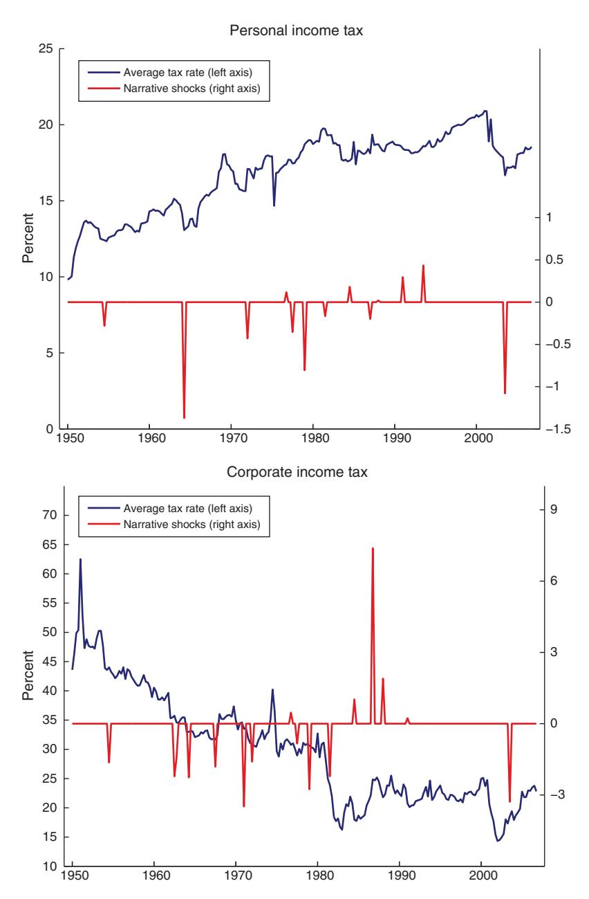
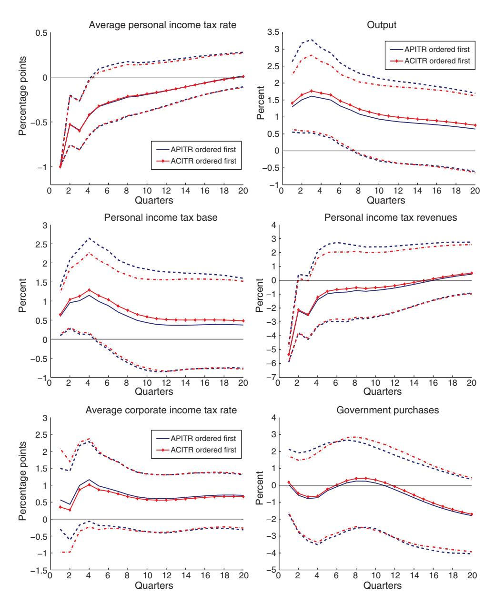
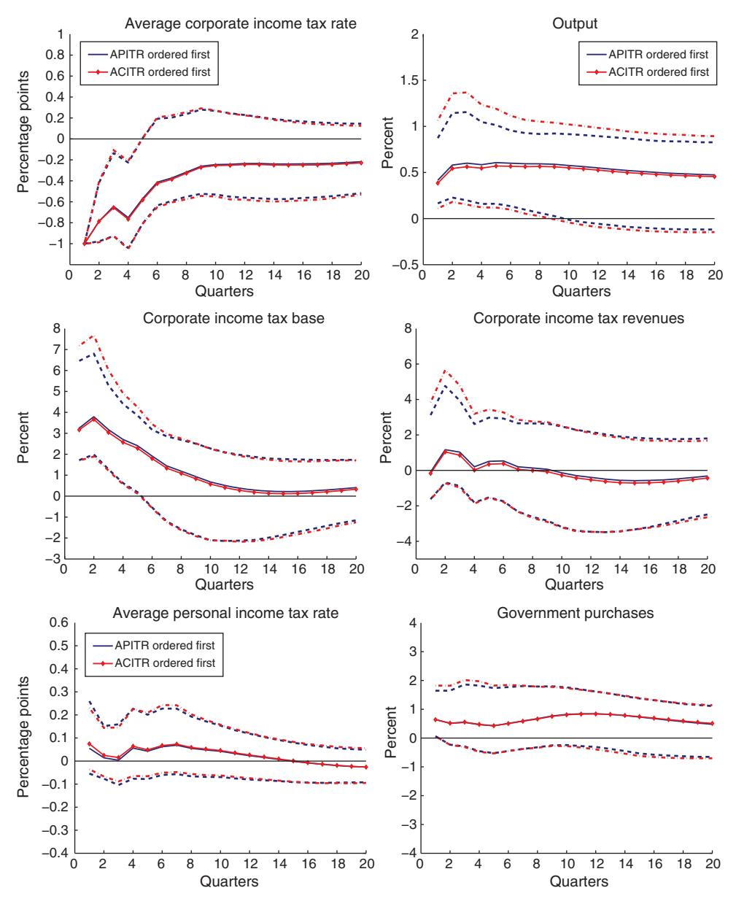
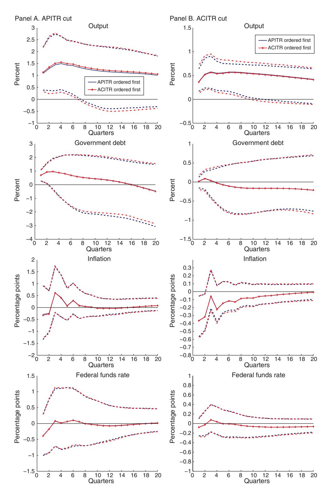
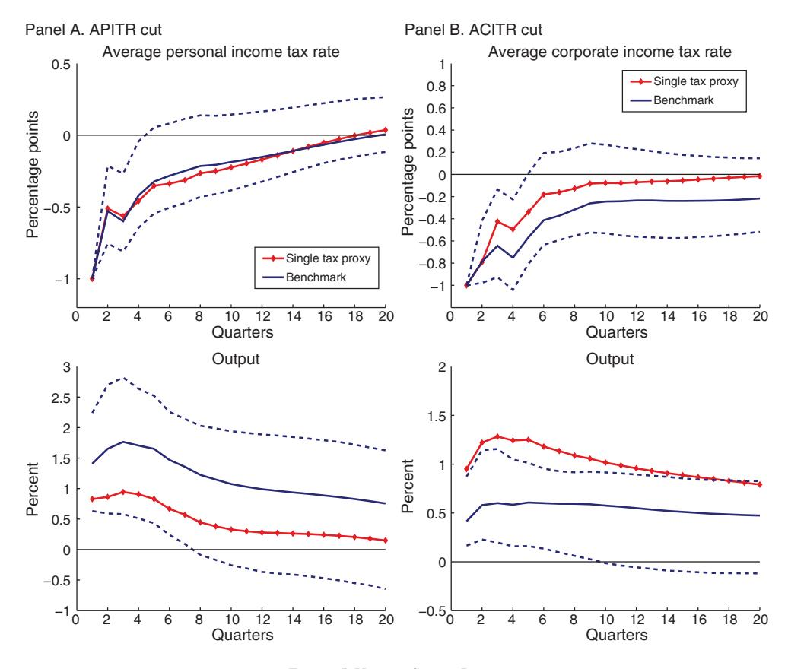
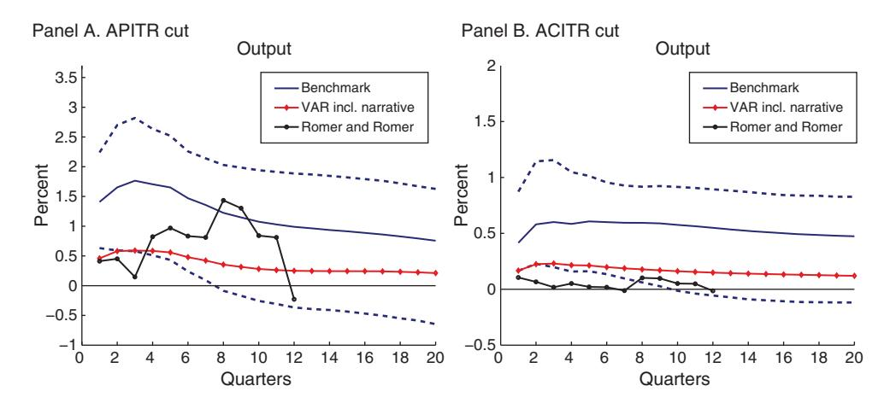
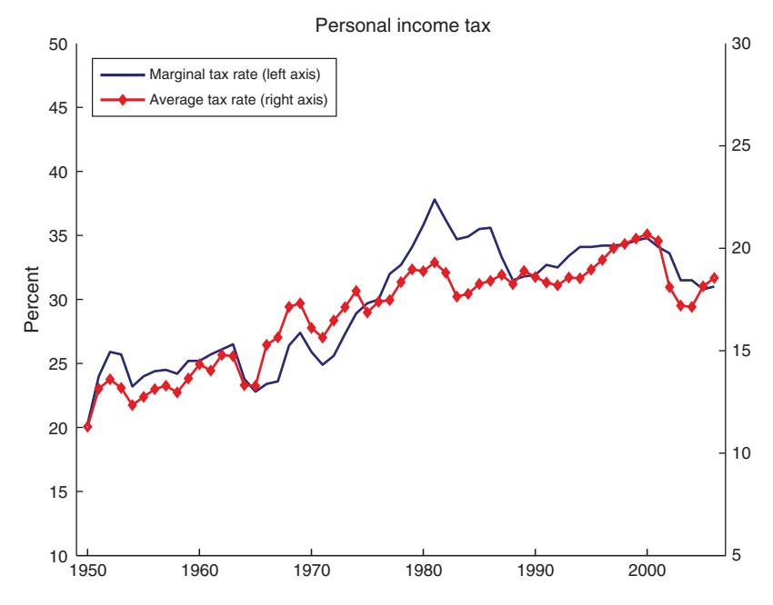
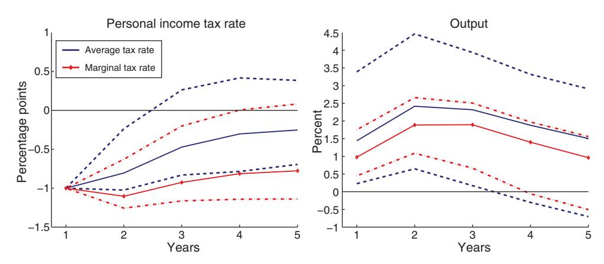
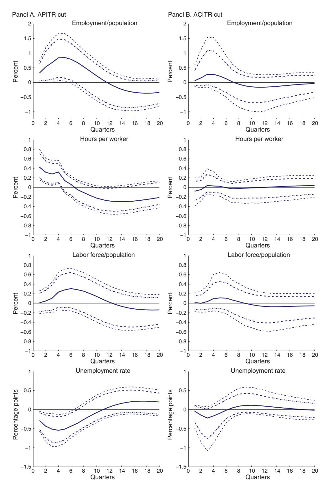
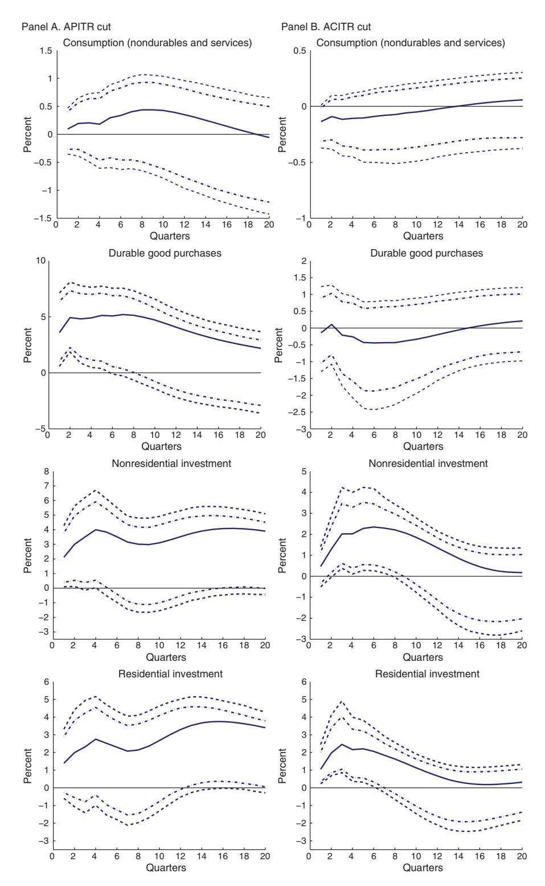

# The Dynamic Effects of Personal and Corporate Income Tax Changes in the United States<sup>†</sup>

By Karel Mertens and Morten O. Ravn\*

This paper estimates the dynamic effects of changes in taxes in the United States. We distinguish between changes in personal and corporate income taxes and develop a new narrative account of federal tax liability changes in these two tax components. We develop an estimator which uses narratively identified tax changes as proxies for structural tax shocks and apply it to quarterly post-WWII data. We find that short run output effects of tax shocks are large and that it is important to distinguish between different types of taxes when considering their impact on the labor market and on expenditure components. (JEL E23, E62, H24, H25, H31, H32)

This paper presents evidence on the aggregate effects of changes in federal tax policy in the United States in the post-WWII sample. Exogenous changes in taxes are identified in a vector autoregressive model by proxying latent tax shocks with narratively identified tax liability changes. We discriminate between the effects of changes in average personal income tax rates (APITRs) and the effects of changes in average corporate income tax rates (ACITRs). We find large short run effects on aggregate output of unanticipated changes in either tax rates. Cuts in personal income taxes lead to a fall in tax revenues while corporate income tax cuts on average have little impact on tax revenues. Cuts in APITRs raise employment, consumption and investment. Cuts in ACITRs boost investment, do not affect or even lower private consumption, and have no immediate effects on employment.

The key challenge when estimating the impact of changes in economic policies is identification. In the case of tax policy shocks this is particularly difficult both because of endogeneity and because of the diversity of policy instruments. The existing literature has often concentrated on exogenous changes in *total* tax revenues but there is little reason to expect that the many types of taxes available to governments all have the same impact on the economy and therefore can be summarized in a single tax measure. We look instead at two more homogenous tax categories,

<span id="page-0-1"></span><sup>\*</sup>Mertens: Department of Economics, 404 Uris Hall, Cornell University, Ithaca, NY 14853 (e-mail: km426@ cornell.edu); Ravn: Department of Economics, Drayton House, University College London, 30 Gordon Street, London WC1E 6BT, UK (e-mail: m.ravn@ucl.ac.uk). We are grateful to three referees, Andre Kurmann, James Stock, and participants at numerous seminars and conferences for very useful comments. We also thank Jonas Fisher and Todd Walker for sharing their data. Andres Dallal provided superb research assistance and Mertens acknowledges financial support from the Cornell Institute for the Social Sciences. Ravn acknowledges financial support from the ESRC through the Centre for Macroeconomics.

<span id="page-0-0"></span><sup>&</sup>lt;sup>†</sup> To view additional materials and author disclosure statement(s), visit the article page at http://dx.doi.org/10.1257/aer.103.4.1212.

personal and corporate income taxes, which in total account for more than 90 percent of total federal tax revenues.

Endogeneity has been addressed in alternative ways in the literature. One line of papers uses the narrative approach to identify exogenous tax changes and estimates their effects by regressing observables on narratively identified policy shocks, e.g., Romer and Romer (2010). An attractive feature of this approach is that narrative accounts summarize the relevant features of a potentially very large information set. On the other hand, a concern with the existing literature is that the narratively identified exogenous changes in policy instruments are implicitly viewed as mapping one-to-one into the true structural shocks. In practice there are good reasons to expect that narratively identified shocks suffer from measurement errors as historical records rarely are sufficiently unequivocal that calls of judgment can be avoided. An alternative approach adopts structural vector autoregressions (SVARs) and achieves identification by exploiting institutional features of tax and transfer systems, see e.g., Blanchard and Perotti (2002), or by introducing sign restrictions derived from economic theory, see Mountford and Uhlig (2009). This approach has the advantage that VARs provide a parsimonious characterization of the shock transmission mechanism but identification requires parameter restrictions that may be questioned.

In this paper we develop an estimation strategy that exploits the attractive features of both SVARs and the narrative approach, but at the same time addresses key weaknesses of the existing approaches. Our methodology exploits the informational content of narrative measures of exogenous changes in taxes for identification in an SVAR framework. We propose imposing the restrictions that narrative measures of exogenous tax changes correlate with latent tax shocks but are orthogonal to other structural shocks. The main idea is to complement the usual VAR residual covariance restrictions with these moment conditions to achieve identification and thereby avoid making direct assumptions on structural parameters. We show that the resulting estimator effectively extends the use of the narrative approach to cases in which the narrative shock series is measured with error. Under some additional assumptions it also produces an estimate of the reliability of the narrative measures of policy shocks making it possible to judge their quality.

Given our focus on disaggregated taxes, we construct a new narrative account of shocks to average personal and corporate tax rates for the United States. This narrative is developed from Romer and Romer's (2010) account of changes in federal US tax liabilities which we decompose into changes in personal and corporate income tax liabilities. We only use tax changes that Romer and Romer (2009a) classify as exogenous. Following Mertens and Ravn (2012a), we also exclude legislative tax changes with implementation lags exceeding one quarter to remove anticipated tax changes. The disaggregation of the Romer tax shocks poses new challenges because of the correlation between legislated changes in personal and corporate taxes, which we resolve with recursivity assumptions.

Based on this methodology, we find in our benchmark specification that a 1 percentage point cut in the APITR raises real GDP per capita by 1.4 percent on impact and by up to 1.8 percent after three quarters. A 1 percentage point cut in the ACITR raises real GDP per capita on impact by 0.4 percent and by 0.6 percent after one year.

Cuts in personal income taxes lower tax revenues while cuts in corporate taxes have no significant impact on revenues because of a very elastic response of the tax base. Translated into multipliers (the change in output deriving from a change in tax rates which reduce tax revenues by 1 percent of GDP), our estimates imply a maximum personal income tax multiplier of 2.5. The corporate income tax multiplier is instead not well defined because we find that changes in corporate income taxes have little impact on tax revenues.

We find no signs of any significant change in government spending or short term nominal interest rates following tax shocks. However, changes in both types of taxes have important but distinct effects on other macroeconomic aggregates. A cut in the APITR raises employment, lowers the unemployment rate, and increases hours worked per worker. A cut in the ACITR, on the other hand, has no immediate impact on either employment or hours per worker. Both cuts in the APITR and in the ACITR increase private sector investment, but only cuts in personal income taxes stimulate private consumption. Cuts in corporate income taxes instead have little effect on private consumption in the short run. The differences in the size and signs of the responses to the two types of taxes demonstrate the necessity of discriminating between different types of taxes.

With some additional assumptions about the nature of the measurement error, our estimation approach produces a measure of the reliability of the narrative series that may be of independent interest. This measure leads to estimates of the squared correlation between linear combinations of the narrative shocks and the true structural tax shocks. We estimate correlations between the principal components of the narrative tax shock measures and the latent tax shocks of 0.55 and 0.83. Thus, the narratives contain valuable information for identification purposes but measurement error is nonetheless a relevant concern in practical applications.

The empirical findings support several conclusions relevant to the ongoing debate on fiscal policy. Given the currently available evidence on the multipliers associated with US government spending, see Ramey (2011b) for a recent review, our estimates indicate that the federal tax multipliers are likely to be larger than those associated with federal government purchases. If policy objectives include short run job creation and consumption stimulus, then cuts to personal income taxes are more effective than cuts to corporate profit taxes. If the objective is to raise tax revenues, increases in personal income taxes are effective, but the costs in terms of job and output losses are relatively large. Increases in corporate profit taxes are not likely to raise significant revenues.

#### I. Estimation and Identification

The main idea of our estimation procedure is to exploit information contained in narrative accounts of policy changes to identify structural shocks in an SVAR framework. In Section IA, we describe the formal econometric framework and state the identifying assumptions on which our impulse response estimates are based. Section IB provides a measurement error interpretation of our framework. We make specific assumptions about the error in measurement to elicit potential sources of bias in more conventional narrative approaches and propose measures of statistical reliability to quantify the quality of identification.

#### A. General Methodology

Let  $\mathbf{Y}_t$  be an  $n \times 1$  vector of observables. We assume that the dynamics of the observables are described by a system of linear simultaneous equations,

(1) 
$$\mathbf{A}\mathbf{Y}_{t} = \sum_{j=1}^{p} \mathbf{\alpha}_{j} \mathbf{Y}_{t-j} + \mathbf{\varepsilon}_{t},$$

where **A** is an  $n \times n$  nonsingular matrix of coefficients,  $\alpha_j$ , j = 1,...,p, are  $n \times n$  coefficient matrices and  $\varepsilon_t$  is an  $n \times 1$  vector of structural shocks with  $E[\varepsilon_t] = 0$ ,  $E[\varepsilon_t \varepsilon_t'] = I$ ,  $E[\varepsilon_t \varepsilon_s'] = 0$  for  $s \neq t$  where I is the identity matrix. The specification in (1) omits deterministic terms and exogenous regressors for notational brevity. An equivalent representation of the dynamics of  $\mathbf{Y}_t$  is

(2) 
$$\mathbf{Y}_{t} = \sum_{j=1}^{p} \mathbf{\delta}_{j} \mathbf{Y}_{t-j} + \mathbf{B} \mathbf{\varepsilon}_{t},$$

where  $\mathbf{B} = \mathbf{A}^{-1}$ ,  $\delta_j = \mathbf{A}^{-1} \mathbf{\alpha}_j$ .

In the SVAR literature  $\varepsilon_t$  is treated as a vector of latent variables that are estimated on the basis of the prediction errors of  $\mathbf{Y}_t$  conditional on the information contained in the vector of lagged dependent variables  $\mathbf{X}_t = [\mathbf{Y}'_{t-1}, ..., \mathbf{Y}'_{t-p}]'$ , and by imposing identifying assumptions. Let the  $n \times 1$  vector  $\mathbf{u}_t$  denote the reduced form residuals which are related to the structural shocks by

$$\mathbf{u}_{t} = \mathbf{B}\mathbf{\varepsilon}_{t}.$$

Since  $E[\mathbf{u}_t \mathbf{u}_t'] = \mathbf{B}\mathbf{B}'$ , an estimate of the covariance matrix of  $\mathbf{u}_t$  provides n(n+1)/2 independent identifying restrictions. However, identification of the elements of at least one of the columns of  $\mathbf{B}$  requires more identifying restrictions. The fiscal SVAR literature has accomplished this task in a variety of ways. For instance, Blanchard and Perotti (2002) exploit institutional features of the US tax system and policy reaction lags to impose coefficient restrictions on  $\mathbf{B}$ . Alternatively, Mountford and Uhlig (2009) impose sign restrictions on the impulse response functions implied by (2).

We propose instead to obtain covariance restrictions from proxies for the latent shocks. Let  $\mathbf{m}_t$  be a  $k \times 1$  vector of proxy variables that are correlated with k structural shocks of interest but orthogonal to other shocks. Consider the partition  $\mathbf{\varepsilon}_t = [\mathbf{\varepsilon}'_{1t}, \mathbf{\varepsilon}'_{2t}]'$ , where  $\mathbf{\varepsilon}_{1t}$  is the  $k \times 1$  vector containing the shocks of interest and the  $(n-k) \times 1$  vector  $\mathbf{\varepsilon}_{2t}$  contains all other n-k shocks. Without loss of generality we assume that  $E[\mathbf{m}_t] = 0$ . The proxy variables can be used for identification of  $\mathbf{B}$  as long as the following conditions are satisfied:

$$E\left[\mathbf{m}_{t}\varepsilon_{1t}^{\prime}\right]=\mathbf{\Phi}$$

(5) 
$$E[\mathbf{m}_{t}\varepsilon_{2t}'] = 0,$$

<span id="page-3-0"></span><sup>&</sup>lt;sup>1</sup> We assume that  $\mathbf{m}_t$  and  $\varepsilon_{1t}$  are of the same dimension k. The analysis can be extended to the case where multiple proxy variables are available, i.e.,  $dim(\mathbf{m}_t) > k$ .

where  $\Phi$  is an unknown nonsingular  $k \times k$  matrix. The first condition states that the proxy variables are correlated with the shocks of interest. The second condition requires that the proxy variables are uncorrelated with all other shocks. These are the key identifying assumptions which translate to additional linear restrictions on the elements of **B**.

Consider the following partitioning of **B**:

$$\mathbf{B} = \begin{bmatrix} \boldsymbol{\beta}_1 & \boldsymbol{\beta}_2 \\ n \times k & n \times (n-k) \end{bmatrix}, \quad \boldsymbol{\beta}_1 = \begin{bmatrix} \boldsymbol{\beta}_{11}' & \boldsymbol{\beta}_{21}' \\ k \times k & k \times (n-k) \end{bmatrix}', \quad \boldsymbol{\beta}_2 = \begin{bmatrix} \boldsymbol{\beta}_{12}' & \boldsymbol{\beta}_{22}' \\ (n-k) \times k & (n-k) \times (n-k) \end{bmatrix}',$$

with nonsingular  $\beta_{11}$  and  $\beta_{22}$ . Conditions (3)–(5) imply that

(6) 
$$\Phi \, \beta_1' = \Sigma_{\mathbf{m}\mathbf{u}'},$$

where henceforth we use the notation  $\Sigma_{\mathbf{x}_{1t}\mathbf{x}_{2t}} \equiv E[\mathbf{x}_{1t}\mathbf{x}_{2t}]$  for any random vectors or matrices  $\mathbf{x}_{1t}$  and  $\mathbf{x}_{2t}$ . The system in (6), which is of dimension  $n \times k$ , provides additional identifying restrictions but also depends on the  $k^2$  unknown elements of  $\Phi$ . Because we do not wish to make any assumptions on  $\Phi$  other than nonsingularity, equation (6) provides really only (n-k)k new identification restrictions. Partitioning  $\Sigma_{\mathbf{mu}'_1} = [\Sigma_{\mathbf{mu}'_1} \Sigma_{\mathbf{mu}'_2}]$ , where  $\Sigma_{\mathbf{mu}'_1}$  is  $k \times k$  and  $\Sigma_{\mathbf{mu}'_2}$  is  $k \times (n-k)$  and using (6), these restrictions can be expressed as

(7) 
$$\boldsymbol{\beta}_{21} = (\boldsymbol{\Sigma}_{\mathbf{mu}_1'}^{-1} \boldsymbol{\Sigma}_{\mathbf{mu}_2'})' \boldsymbol{\beta}_{11}.$$

Since  $\Sigma_{mu_1'}^{-1}\Sigma_{mu_2'}$  is estimable, this constitutes a set of covariance restrictions of the type discussed in Hausman and Taylor (1983). In practice, estimation can proceed in three stages:

- **First Stage:** Estimate the reduced form VAR by least squares.
- **Second Stage:** Estimate  $\sum_{\mathbf{mu}_1'}^{-1} \sum_{\mathbf{mu}_2'}$  from regressions of the VAR residuals on  $\mathbf{m}_t$ .
- **Final Stage:** Impose the restrictions in (7) and estimate the objects of interest, if necessary in combination with further identifying assumptions.

In the final stage, whether the restrictions in (7) suffice to identify the impact coefficients  $\beta_1$  depends on k. For the case of a single shock, k=1, no further assumptions are required and  $\varepsilon_{1t}$  is identified up to a sign convention. When k>1, the restrictions in (7) need to be complemented with additional restrictions that may vary with the particular application. Traditional short or long run restrictions can also be added to (7) to identify the other shocks  $\varepsilon_{2t}$  for which proxies may not be available. Hausman and Taylor (1983) develop necessary and sufficient conditions for identification with general linear restrictions such as in (7) and also provide an equivalent instrumental variables interpretation. In our case, the estimate of  $\Sigma_{\mathbf{nu}_1'}^{-1}\Sigma_{\mathbf{nu}_2'}$  corresponds to the two-stage least squares (2SLS) estimator in a

regression from  $\mathbf{u}_{2t}$  on  $\mathbf{u}_{1t}$  using  $\mathbf{m}_t$  as instruments for  $\mathbf{u}_{1t}$ . Conditions (4)–(5) can therefore also be viewed as the instrument validity conditions for this regression.<sup>2</sup>

Our procedure avoids direct assumptions on the elements of **B**, as in Blanchard and Perotti (2002) or Mountford and Uhlig (2009). The key requirement is the availability of proxies that satisfy (4)–(5). For identifying structural tax shocks, we propose to use narratively identified measures of exogenous shocks to average tax rates as proxies. The use of narrative accounts has a long-standing tradition in macroeconomics in the estimation of the effects of, for instance, fiscal and monetary policy shocks. Existing applications of the narrative approach typically estimate the response to structural innovations by regressing the observables on (distributed lags of) the narratives or by adding them as variables in a VAR. In most of these applications, the interpretation of the results relies on implicit assumptions on  $\Phi$ , the covariance between the narratives and the latent structural innovations.

Our approach differs in that it does not require assumptions on  $\Phi$  other than non-singularity. For instance, we do not require that the proxies correlate perfectly with the true latent shocks  $\varepsilon_{1t}$  or that each proxy is correlated with only a single structural shock. It is also not necessary that  $E[\mathbf{m}_t \mathbf{X}_t'] = 0$ , i.e., that the proxy variables are orthogonal to the history of  $\mathbf{Y}_t$ . However, this condition is testable and when a candidate narrative measure  $\widetilde{\mathbf{m}}_t$  is correlated with  $\mathbf{X}_t$ , then  $\mathbf{m}_t$  can be the error from projecting  $\widetilde{\mathbf{m}}_t$  on  $\mathbf{X}_t$ . Since in this case  $\mathbf{m}_t$  is more informative for  $\varepsilon_{1t}$  than  $\widetilde{\mathbf{m}}_t$ , we henceforth also assume that the proxy variables are orthogonal to  $\mathbf{X}_t$ . A more important advantage of our approach is robustness to various types of measurement error, which is discussed next.

## B. Measurement Problems and Reliability

Narrative measures of monetary or fiscal policy changes are best viewed as imperfectly correlated with (linear combinations of) the latent structural policy shocks. These measures are constructed from historical sources and summarize information about the size, timing, and motivation of policy interventions. But measurement errors are likely since historical records sometimes contradict each other and calls of judgment are in practice impossible to avoid. Narrative shock series also typically neglect more minor policy interventions and have many observations that are censored to zero. Moreover, in our application to taxes, it is often difficult to measure exactly the full implications of new tax legislation on effective tax rates.

These measurement problems invalidate the use of the narratives as direct observations of structural shocks and can bias estimates in regressions that rely on a one-to-one mapping between the narrative accounts and the true structural shocks. The methodology we propose above is instead robust to many types of measurement problems. As long as conditions (4)–(5) hold, the precise nature of the measurement

<span id="page-5-0"></span> $<sup>^2</sup>$  After submitting this paper, we became aware of Stock and Watson (2008) who suggest the equivalent implementation of the identification strategy through IV regressions for the case where k=1. More recently, Stock and Watson (2012) apply the same approach in a dynamic factor model to disentangle the causes of the 2007–2009 recession. Our methodology is also related to Nevo and Rosen (2012) who use weaker covariance restrictions to achieve partial identification, and Evans and Marshall (2009) who identify shocks in VARs with the aid of auxiliary shock measures derived from economic models.

<span id="page-5-1"></span><sup>&</sup>lt;sup>3</sup> Prominent examples include Romer and Romer (1989, 2010), Ramey and Shapiro (1998), Burnside, Eichenbaum, and Fisher (2004), Cloyne (2013), and Ramey (2011a).

error does not affect the identification of the impulse responses. In order to make the potential bias from ignoring measurement problems explicit, we proceed by making some specific assumptions about the mapping between the proxies derived from narrative measures and the latent shocks. The additional structure also leads to formal measures of the statistical reliability of the proxies as measurements of the latent shocks, which permits one to assess their relevance. Low values of these reliability statistics indicate that the proxies may not contain much information useful for identification.

Consider an augmented system consisting of the SVAR in (2) and the following system of measurement equations:

(8) 
$$\mathbf{m}_t = \mathbf{D}_t (\Gamma \mathbf{\varepsilon}_{1t} + \mathbf{v}_t),$$

where  $\Gamma$  is a  $k \times k$  nonsingular matrix,  $\upsilon_t$  is a  $k \times 1$  vector of measurement errors with  $E[\upsilon_t] = 0$ ,  $E[\upsilon_t \varepsilon_{1t}'] = 0$ ,  $E[\upsilon_t \upsilon_t'] = \Sigma_{\upsilon\upsilon'}$  and  $E[\upsilon_t \upsilon_s'] = 0$  for  $s \neq t$ .  $\mathbf{D}_t$  is a  $k \times k$  diagonal matrix containing random (0,1)-indicators tracking zero observations. We assume that the diagonal elements of  $\mathbf{D}_t$  are perfectly correlated, i.e., when k > 1 the proxy variables are identically censored. We also assume that  $E[\mathbf{D}_t \upsilon_t \varepsilon_{1t}'] = 0$ , but we do not require that the censoring process  $\mathbf{D}_t$  is independent of  $\varepsilon_{1t}$ . The stochastic process for the proxies in equation (8) allows for (i) censoring, including the possibility that larger realizations (in absolute value) of  $\varepsilon_{1t}$  are more likely to be measured; (ii) additive correlated measurement errors  $\upsilon_t$ ; and (iii) an arbitrary scale. Scaling problems are particularly relevant for tax narratives since available estimates of changes in tax liabilities typically assume that the tax base remains invariant after legislative changes to the tax code.

Combining (8) with the SVAR in (2) results in a system of structural equations with latent variables, as discussed in Bollen (1989). Rewrite the model as

$$\mathbf{Y}_{t} = \mathbf{\theta}' \mathbf{X}_{t}^{*} + \mathbf{w}_{t},$$

where  $\mathbf{X}_{t}^{*} = [\mathbf{Y}_{t-1}^{\prime}, ..., \mathbf{Y}_{t-p}^{\prime}, \boldsymbol{\varepsilon}_{1t}^{\prime}]^{\prime}$ ,  $\boldsymbol{\theta} = [\boldsymbol{\delta}^{\prime}, \boldsymbol{\beta}_{1}]^{\prime}$ ,  $\boldsymbol{\delta} = [\boldsymbol{\delta}_{1}, ..., \boldsymbol{\delta}_{p}]^{\prime}$  and  $\mathbf{w}_{t} = \boldsymbol{\beta}_{2} \boldsymbol{\varepsilon}_{2t}$ .  $\mathbf{X}_{t}^{*}$  is not fully observable because it contains  $\boldsymbol{\varepsilon}_{1t}$ . The enlarged system is a measurement error model of the form

$$\mathbf{Y}_{t} = \boldsymbol{\gamma}' \, \overline{\mathbf{X}}_{t} + \mathbf{z}_{t}$$

$$\overline{\mathbf{X}}_{t} = \mathbf{\Omega} \mathbf{X}_{t}^{*} + \mathbf{\Upsilon}_{t},$$

where  $\overline{\mathbf{X}}_t = [\mathbf{Y}'_{t-1}, ..., \mathbf{Y}'_{t-p}, \mathbf{m}'_t]'$  and

$$\boldsymbol{\theta} = \boldsymbol{\Omega}'\boldsymbol{\gamma}\,, \quad \boldsymbol{w}_t = \boldsymbol{z}_t + \boldsymbol{\gamma}'\boldsymbol{\Upsilon}_t\,, \quad \boldsymbol{\Omega} = \begin{bmatrix} \boldsymbol{I} & \boldsymbol{0} \\ \boldsymbol{0} & \boldsymbol{\Gamma} \end{bmatrix}, \quad \boldsymbol{\Upsilon}_t = \begin{bmatrix} \boldsymbol{0} \\ \boldsymbol{D}_t\boldsymbol{v}_t + (\boldsymbol{D}_t - \boldsymbol{I}_k)\boldsymbol{\Gamma}\boldsymbol{\varepsilon}_{1t} \end{bmatrix}.$$

Note that because of censoring,  $E[\mathbf{X}_t^* \Upsilon_t'] \neq \mathbf{0}$  and  $\Upsilon_t$  is therefore not classical measurement error. From  $\Sigma_{\overline{\mathbf{X}}\mathbf{w}'} = \mathbf{0}$ , we obtain

(12) 
$$\theta = \Omega' \Lambda_{\overline{X}}^{-1} \Sigma_{\overline{X}X'}^{-1} \Sigma_{\overline{X}Y},$$

where  $\Lambda_{\overline{X}}$  is the reliability matrix of (the uncensored realizations) of  $\overline{X}_t$ , given by

(13) 
$$\Lambda_{\overline{X}} = \begin{bmatrix} I & \mathbf{0} \\ \mathbf{0} & \Sigma_{\mathbf{mm}'}^{-1} \Phi \Gamma' \end{bmatrix}.$$

Most existing narrative studies estimate a version of (10) (often also including lags of  $\mathbf{m}_{t}$ ) but unless there is no measurement error, the resulting naïve estimator  $\Sigma_{\overline{X}\overline{X}'}^{-1}\Sigma_{\overline{X}Y}$  is generally biased because of scaling  $(\Omega'\neq I)$ , and measurement error  $(\Lambda_{\overline{X}}^{-1}\neq I)$ . The elements of  $\theta$  reduce to

$$\delta = \Sigma_{\mathbf{X}\mathbf{X}'}^{-1}\Sigma_{\mathbf{X}\mathbf{Y}'} \;, \quad \beta_1' = \Phi^{-1}\Sigma_{\mathbf{m}\mathbf{Y}'}.$$

Note that, since  $\Sigma_{\mathbf{m}\mathbf{Y}'} = \Sigma_{\mathbf{m}\mathbf{u}'}$ , the three-stage procedure described in the previous section is equivalent to estimating a measurement error model in which  $\mathbf{Y}_t$  has perfect reliability and  $\mathbf{m}_t$  is measured with error.

Under the additional assumption of independent random censoring, it is possible to identify the statistical reliability matrix (13), see the Appendix for details. In that case, the  $k \times k$  reliability matrix of  $\mathbf{m}_t$  is given by

(14) 
$$\Lambda = \Sigma_{\mathbf{mm}'}^{-1} E[\mathbf{D}_t] \Gamma \Gamma'.$$

When k=1,  $\Lambda$  is the fraction of the variance in the uncensored measurements that is explained by the variance of the latent variable or equivalently the squared correlation between the narrative measure and the true structural shock of interest. Since  $0 \le \Lambda \le 1$ , measurement error bias manifests itself in this case as shrinkage toward zero. When k>1, the bias can go in either direction. The eigenvalues of  $\Lambda$  can be interpreted as the scalar reliabilities of the principal components of the uncensored observations in  $\mathbf{m}_t$ .  $\Lambda$  provides a metric for evaluating how closely the proxy variables are related to the true shocks, and is suggestive for the quality of identification. SVAR shocks are sometimes criticized for being at odds with historical events or descriptive records, see for instance Rudebusch (1998). The reliability of proxies constructed from the historical record of policy changes quantifies the extent to which this criticism applies.

#### II. Do Tax Cuts Stimulate Economic Activity?

In this section we apply our methodology to the estimation of the impact of exogenous tax shocks on economic activity in the United States over the postwar period. Here we concentrate mainly on the effects on output. The subsequent section provides evidence for a broader set of macroeconomic aggregates.

The empirical analysis in this paper differs from existing estimates of the effects of unexpected changes in tax policy in three ways. First, we apply the SVAR estimator presented above using legislated federal tax changes as proxies. Second, we take several steps to ensure that our estimates are not affected by the fact that many tax changes are anticipated. Third, while much of the macro literature has estimated

<span id="page-7-0"></span><sup>&</sup>lt;sup>4</sup> If k > 1, the proxy variables are not identically censored and if the off-diagonal elements of  $\Gamma$  are nonzero, (13) needs to be further decomposed into a reliability matrix and yet another bias term that is due to censoring.

the impact of changes in the average "total tax rate" (or in total tax revenues), we look at more disaggregated average tax rates. Ideally, one would like to examine the effects of changes in very narrowly defined tax instruments but there are practical limits to the level of disaggregation determined by data availability. We concentrate on changes in two tax categories, personal income and corporate income taxes. In our sample, personal income tax revenues (we include contributions to social insurance in our definition of personal income taxes) have accounted for on average 74.2 percent of total federal tax revenues while corporate income taxes have accounted for 16.4 percent. Thus, the two components comprise the bulk of total federal tax revenues.

#### A. A Tax Narrative for Personal and Corporate Income Taxes

We produce a narrative account of legislated federal personal and corporate income tax liability changes in the United States for a quarterly sample covering 1950:I–2006:IV. The narrative extends Romer and Romer's (2009a) analysis by decomposing the total tax liabilities changes recorded by Romer and Romer (2009a) into the following subcomponents: corporate income tax liabilities (CI), individual income tax liabilities (II), employment taxes (EM) and a residual category with other revenue changing tax measures (OT). We discard the latter group because it is very heterogeneous. The decomposition is based on the same sources as Romer and Romer (2009a) supplemented with additional information from sources such as congressional records, the Economic Report of the President, CBO reports, etc. whenever required. The online data Appendix describes the construction of the data and the historical sources in detail.

To comply with condition (5), which requires that the proxies are orthogonal to all nontax structural shocks, we retain only those changes in tax liabilities that were unrelated to the current state of the economy. To this end, we adopt Romer and Romer's (2009a) selection of exogenous changes in tax liabilities, which is based on a classification of the motivation for the legislative action either as ideological or as arising from inherited deficit concerns. Many of those changes in the tax code were legislated well in advance of their scheduled implementation. In Mertens and Ravn (2012a) we distinguish between unanticipated and anticipated tax changes on the basis of the implementation lag, the difference between the dates at which the tax change becomes law and when it is implemented. About half of the exogenous changes in tax liabilities were legislated at least 90 days before their implementation and Mertens and Ravn (2012a) show that there is evidence for aggregate effects of legislated tax changes prior to implementation. This means that shocks signaling tax

<span id="page-8-0"></span><sup>&</sup>lt;sup>5</sup> The macroeconomic literature instead often distinguishes between labor and capital income taxes, see e.g., Mendoza, Razin, and Tesar (1994), Jones (2002), or Burnside, Eichenbaum, and Fisher (2004), which is appealing in terms of economic modeling. However, the division into personal and corporate income taxes corresponds more closely to the actual policy instruments and observed changes in federal tax liabilities can be much more easily assigned to one of these tax categories.

<span id="page-8-1"></span><sup>&</sup>lt;sup>6</sup> II and EM tax changes include adjustments to marginal rates and various deductions and tax credits. CI tax changes include a few adjustments to marginal rates and otherwise mainly changes in depreciation allowances and investment tax credits. The other tax changes mostly include excise taxes, often targeted to specific industries (transportation) or goods (gasoline, automobiles, sport and leisure goods,...), and gift and estate taxes. See the online Appendix for details.

changes in future periods have macroeconomic effects that are distinct from those of shocks that change taxes contemporaneously. We focus on unanticipated changes in taxes and therefore we retain only those tax changes for which the implementation lag is less than one quarter.

Romer and Romer (2009a) describe almost 50 legislative changes in the tax code over the sample period, many containing multiple changes in tax liabilities implemented at different points in time. Our narrative measures are a much smaller subset because we eliminate all endogenous and/or preannounced tax changes. Our dataset contains 13 observations of individual income tax liability changes, two observations for employment tax liability changes, and 16 observations for corporate income tax liability changes deriving from 21 separate legislative changes to the federal tax code. The vast majority of these changes were legislated as permanent changes to the tax code. Because there are too few observations for a separate employment tax category, we merge the EM and II taxes into a personal income (PI) tax category. All our results are very similar if we omit the employment taxes.

We convert the tax liability changes into the corresponding average tax rate changes as follows:

```
\Delta \mathbf{T}_{t}^{PI,narr} = (\text{II tax liability change}_{t} + \text{EM tax liability change}_{t})
/\text{Personal Taxable Income}_{t-1}
\Delta \mathbf{T}_{t}^{CI,narr} = \text{CI tax liability change}_{t}/\text{Corporate Profits}_{t-1},
```

where personal taxable income is defined as personal income less government transfers plus contributions for government social insurance. We scale the tax liability changes by previous quarter taxable incomes, but our results are nearly identical if we instead scale by the contemporaneous or previous year taxable income. The resulting narrative measures are depicted in Figure 1 together with NIPA-based measures of the average personal income tax rate (APITR) and average corporate income tax rate (ACITR), constructed as

```
\mathbf{APITR}_t = (\text{Personal Current Taxes}_t + \text{Contributions for Govt. Social Insurance}_t) \\ / \text{Personal Taxable Income}_t
```

 $\mathbf{ACITR}_t = \text{Taxes on Corporate Profits}_t/\text{Corporate Profits}_t$ 

where all taxes are at the federal level. The Appendix gives the precise data sources. The (demeaned) narrative measures  $\Delta \mathbf{T}_t^{PI,narr}$  and  $\Delta \mathbf{T}_t^{CI,narr}$ , shown in Figure 1, will be used as proxies for structural innovations to the two average tax rates. Both of these average tax rates display considerable variation over time, reflecting unanticipated legislative changes to the tax code but also endogenous movements in taxes, some resulting from explicit legislative actions and others not. There are many different sources of endogeneity in the average tax rates ranging from policy responses to macroeconomic shocks to cyclical fluctuations in the administrative definition of taxable income versus NIPA income, tax progressivity and changes

<span id="page-10-0"></span>

FIGURE 1. AVERAGE TAX RATES AND NARRATIVE SHOCK MEASURES, US 1950:I-2006:IV

in the distribution of income, cyclical variations in tax compliance and evasion, etc. The narrative measures  $\Delta \mathbf{T}_t^{PI,narr}$  and  $\Delta \mathbf{T}_t^{CI,narr}$  contain only legislative actions undertaken for reasons unrelated to the current state of the economy and can therefore be used to identify the truly exogenous innovations to the APITR and ACITR series.

We note that, even though total federal tax revenues as a share of GDP have remained fairly stable around 18 percent, the APITR and ACITR series both display trends over the sample. Figure 1 shows that the APITR has slowly risen from around 10 percent at the beginning of the sample to approximately 18 percent at the end of 2006. The two most significant exogenous changes in personal income taxes relate to the Revenue Act of 1964, which reduced marginal tax rates on individual income, and to the Jobs and Growth Tax Relief Reconciliation Act of 2003, which reduced marginal tax rates on individual income, capital gains and dividends, and increased some tax expenditures. Each of these two pieces of legislation cut average personal income tax rates by more than 1 percentage point according to the narrative measure. The ACITR instead has fallen significantly over time from over 50 percent in the early 1950s to just above 20 percent at the end of the sample period. The narrative measure indicates several sizable changes in corporate income taxes. The largest change in CI tax liabilities is associated with the repeal of the investment tax credit included in the Tax Reform Act of 1986.

We checked whether lagged macro variables Granger cause the narrative shocks but we found no such evidence. We also tested for predictive power in regressions of the uncensored observations of the measured tax shocks and lagged values of key variables but did not detect any statistical significance. As a result, the proxy measures for the tax shocks  $\mathbf{m}_t$  are the narrative shock series  $\Delta \mathbf{T}_t^{PI,narr}$  and  $\Delta \mathbf{T}_t^{PI,narr}$  shown in Figure 1 after subtracting the mean of the nonzero observations. In the robustness section, we discuss the results for some alternative choices for the proxies.

#### B. *Identifying Tax Shocks*

To obtain valid covariance restrictions from the proxy variables  $m_t$ , it is essential that the measured tax changes are uncorrelated with nontax structural shocks. It is however also important to consider whether measured changes in personal income taxes are uncorrelated with structural shocks to corporate taxes, and vice versa. If so, then each of the two proxy variables can be used in isolation to derive n-1 restrictions, or 2(n-1) in total. In combination with the residual covariance restrictions, each set of n-1 restrictions suffices to identify the impulse response to the respective tax shock, see the Appendix. If we cannot impose zero cross-correlations between the measured tax changes and structural tax shocks, the identifying assumptions on the combined proxy series yield only 2(n-2) restrictions, which is insufficient to disentangle the causal effects of shocks to both types of taxes.

Conditional on a tax change taking place, the correlation between the PI and CI narrative tax changes in our sample is 0.42. Insofar that this positive correlation is not just due to chance or correlated measurement error, it appears inappropriate to treat the narrative PI (CI) tax changes as uncorrelated with exogenous shocks to the corporate (personal) tax rate. The positive correlation between the measured changes in personal and corporate taxes is natural for a number of reasons. The tax narratives record changes in tax liabilities for which the historical documents

<span id="page-11-0"></span> $<sup>^7</sup>$  Tests of the null hypothesis that the average tax rate, GDP, government spending, and the tax base do not Granger cause the narrative shock measure have p-values of 0.70 for the PI tax shock measure and 0.76 for the CI tax shock measure. For the variables of our benchmark system below, the p-values are 0.87 and 0.57. For these tests we used first differences for the variables as the test is problematic when the data is nonstationary. We also performed tests for a range of other variables such as municipal bonds spreads and government debt. The smallest p-value (0.23) we found was for the hypothesis that the government debt to GDP ratio does not Granger cause the CI narrative measure.

indicate that they were not explicitly motivated by countercyclical considerations. Yet they of course still occurred with certain objectives in mind, typically related to longer run goals for economic growth or debt reduction. When both personal and corporate income taxes are adjusted simultaneously, it is therefore not surprising that they are often adjusted in the same direction. Also, given that the tax narratives are based on actual legislative actions, the fixed costs of passing legislation naturally imply a temporal correlation of the changes in different types of taxes.

For isolating the causal effects of a change in only one of the tax rates, it is thus important to control for changes in the other tax rate, which requires imposing more restrictions. Consider the following parametrization of the relationship between the VAR residuals  $u_t$  and structural shocks  $\varepsilon_t$ :

$$\mathbf{u}_{1t} = \mathbf{\eta} \, \mathbf{u}_{2t} + \mathbf{S}_1 \, \mathbf{\varepsilon}_{1t}$$

(16) 
$$\mathbf{u}_{2t} = \zeta \mathbf{u}_{1t} + \mathbf{S}_2 \varepsilon_{2t},$$

where  $\mathbf{u}_{1t}$  and  $\boldsymbol{\varepsilon}_{1t}$  are the  $2 \times 1$  vectors of reduced form and structural tax rate innovations, whereas the  $(n-2) \times 1$  vectors  $\mathbf{u}_{2t}$  and  $\boldsymbol{\varepsilon}_{2t}$  contain the reduced form residuals and other structural shocks associated with an arbitrary number of additional variables. The matrices  $\boldsymbol{\eta}$ ,  $\boldsymbol{\zeta}$ ,  $\mathbf{S}_1$  and  $\mathbf{S}_2$  contain the structural coefficients that underlie  $\mathbf{B}$ . In particular, the  $2 \times 2$  nonsingular matrix  $\mathbf{S}_1$  is not necessarily diagonal, capturing the potential contemporaneous interdependence of the tax instruments.

Obtaining the responses to  $\varepsilon_{1t}$  requires identification of  $\beta_1$ , containing the first two columns of **B**, which is given by

(17) 
$$\beta_1 = \begin{bmatrix} \mathbf{I} + \boldsymbol{\eta} (\mathbf{I} - \boldsymbol{\zeta} \boldsymbol{\eta})^{-1} \boldsymbol{\zeta} \\ (\mathbf{I} - \boldsymbol{\zeta} \boldsymbol{\eta})^{-1} \boldsymbol{\zeta} \end{bmatrix} \mathbf{S}_1.$$

In the Appendix, we show that the linear restrictions in (7) allow for the identification of the first term in square brackets,  $\beta_1 \mathbf{S}_1^{-1}$ , as well as  $\mathbf{S}_1 \mathbf{S}_1'$ , the covariance of  $S_1 \varepsilon_{1t}$ . The covariance restrictions are, however, not sufficient to obtain the structural decomposition of this covariance and obtain  $S_1$ . To see this intuitively, note that  $\zeta$  can be estimated by 2SLS using  $\mathbf{m}_t$  as instruments. Given an estimate of  $\zeta$ , it is possible to use  $\mathbf{u}_{2t} - \zeta \mathbf{u}_{1t}$  as instruments to estimate  $\eta$ . Finally, the covariance of  $\mathbf{u}_{1t} - \eta \mathbf{u}_{2t}$ provides an estimate of  $S_1 S_1'$ . Ideally one would like to identify  $S_1$  but this requires arbitrary assumptions on how personal income taxes respond contemporaneously to unanticipated changes in corporate taxes (beyond the indirect contemporaneous endogenous effects through  $\mathbf{u}_{2t}$ ), and vice versa. Fortunately, knowledge of  $\beta_1 \mathbf{S}_1^{-1}$ still permits economically meaningful structural responses to any linear combination of tax shocks. We report responses that result from a Choleski decomposition of  $S_1S_1'$ , imposing that  $S_1$  is lower triangular. Suppose for instance that the APITR is ordered before the ACITR. Then the response to a negative 1 percentage point ACITR shock is the response to an exogenous tax change that lowers the ACITR by 1 percentage point but leaves the APITR unchanged in "cyclically adjusted" terms, i.e., after allowing for contemporaneous feedback from  $\mathbf{u}_{2t}$ . A shock to the APITR on the other hand induces a change in the ACITR through feedback from  $\mathbf{u}_{2t}$  as well as a direct response to the APITR shock that is determined by the identified correlation between both tax rates.

If  $S_1S_1'$  is diagonal, the latter correlation is zero and the responses are identical for different orderings of the tax rates.

#### C. Benchmark Specification and Results

Our benchmark estimates for the dynamic output effects of tax changes are based on a VAR with seven variables:  $\mathbf{Y}_t = [APITR_t, ACITR_t, \ln(B_t^{PI}), \ln(B_t^{CI}), \ln(G_t), \ln(GDP_t), \ln(DEBT_t)]$ .  $APITR_t$  and  $ACITR_t$  are the average tax rates discussed above;  $B_t^{PI}$  and  $B_t^{CI}$  are the personal and corporate income tax bases in real per capita terms.  $G_t$  is government purchases of final goods,  $GDP_t$  is gross domestic product,  $DEBT_t$  is federal government debt, all in real per capita terms. All fiscal variables are for the federal level. Precise data definitions are provided in the Appendix. The sample consists of quarterly observations for the period 1950:I–2006:IV. Based on the Akaike information criterion, the lag length in the VAR is set to four.

All impulse responses are for a 1 percentage point decrease in either of the two tax rates and we show results for a forecast horizon of 20 quarters. We report 95 percent confidence intervals computed using a recursive wild bootstrap using 10,000 replications, see Gonçalves and Kilian (2004). We generate bootstrap draws  $\mathbf{Y}_{t}^{b}$  recursively using  $\hat{\delta}_i$ , j = 1,...,p and  $\hat{\mathbf{u}}_t \mathbf{e}_t^b$ , where the  $\hat{\delta}_i$ s and  $\hat{\mathbf{u}}_t$  denote the estimates for the VAR in (2) and  $\mathbf{e}_t^b$  is the realization of a random variable taking on values of -1 or 1 with probability 0.5. We also generate a draw for the proxy variables  $\mathbf{m}_{t}^{b} = \mathbf{m}_{t} \mathbf{e}_{t}^{b}$ , reestimate the VAR for  $\mathbf{Y}_{t}^{b}$  and apply the covariance restrictions implied by  $\mathbf{m}_{t}^{b}$ . The percentile intervals are for the resulting distribution of impulse response coefficients. This procedure requires symmetric distributions for  $\mathbf{u}_t$  and  $\mathbf{m}_t$  but is robust to conditional heteroscedasticity. It also takes into account uncertainty about identification and measurement. This contrasts with the typical application of coefficient restrictions in SVARs as well as narrative specifications, which often treat  $\mathbf{m}_t$  as deterministic. The standard residual bootstrap is problematic given that  $\mathbf{m}_{t}$  contains many zero observations, which means that drawing with replacement from  $\mathbf{m}_t$  yields zero vectors with positive probability.

Figures 2 and 3 show the effects of cuts in average personal and corporate income tax rates for each ordering of the tax rates. The correlation between the cyclically adjusted tax rate innovations  $S_1 \varepsilon_{1t}$  is small and estimated at -0.07 with a 95 percent confidence interval [-0.41,0.50]. As a result, the responses are very similar for the different tax rate orderings. This turns out to be a robust finding in sufficiently large VAR systems, in particular when they include government debt. When discussing a shock to a tax rate, for brevity we therefore only discuss the point estimates resulting from ordering that tax rate last, leaving the other tax rate unchanged in cyclically adjusted terms.

Figure 2 shows that after the initial 1 percentage point cut in personal income taxes, the APITR remains significantly below the level expected prior to the shock during the first year. Thereafter, the APITR gradually converges to pre-shock expected levels in the longer run. The cut in the APITR sets off a significant increase in the personal income tax base which initially rises approximately 0.6 percent and peaks

<span id="page-13-0"></span><sup>&</sup>lt;sup>8</sup> Government debt is a potentially important variable since any change in taxes eventually must lead to adjustments in the fiscal instruments. Especially if the reaction to debt is strong and relatively fast, it might be inappropriate not to explicitly allow for feedback from debt to taxes and spending.

<span id="page-14-0"></span>

FIGURE 2. BENCHMARK SPECIFICATION: AN APITR CUT

*Notes:* Figure shows the responses to a 1 percentage point cut in the APITR. Full lines are point estimates; broken lines indicate 95 percent confidence intervals.

at 1.3 percent one year after the tax cut. Combining the responses of the tax base and the personal income tax rate, the decrease in the APITR implies a drop in personal income tax revenues of 5.4 percent upon impact. Tax revenues remain relatively low until several years after the shock, but recover substantially from the initial drop

<span id="page-14-1"></span><sup>&</sup>lt;sup>9</sup> The response of tax revenues are computed as  $\widehat{tr}_t = \widehat{T}_t^i / \overline{T}^i + \widehat{b}_t^i$  where  $\overline{T}^i$  is the mean average tax rate of type i = PI, CI in the sample,  $\widehat{x}_t$  denotes the impulse response of  $x_t$  and lower case letters denote logged variables.

<span id="page-15-0"></span>

Figure 3. Benchmark Specification: An ACITR Cut

*Notes:* Figure shows the responses to a 1 percentage point cut in the ACITR. Full lines are point estimates; broken lines indicate 95 percent confidence intervals.

during the first year. Despite the increase in the tax base we find that cuts in personal income taxes unambiguously lower personal tax revenues. Most importantly, cuts in average personal income taxes provide a substantial short run output stimulus. A 1 percentage point decrease in the APITR leads to an increase in output of 1.4 percent in the first quarter and a peak increase of 1.8 percent which occurs three quarters after the tax cut. The confidence intervals indicate a significant increase (at the 95 percent level) in economic activity within a two year window after the tax cut.

Figure 3 shows the effect of a 1 percentage point decrease in the average corporate income tax rate. The cut in the ACITR leads to a prolonged period of lower average corporate income tax rates. The cut in the ACITR induces a large and significant increase in the corporate income tax base which rises by up to 3.8 percent in the first six months. The increase in the tax base is sufficiently large such that there is only a very small decline in corporate income tax revenues in the first quarter and a surplus thereafter. The response of corporate tax revenues is however insignificant at every horizon. Hence, cuts in corporate income taxes appear to be approximately self-financing which is suggestive of particularly strong behavioral responses to changes in effective corporate tax rates. The output effects of ACITR cuts are again significant and substantial. A 1 percentage point decrease leads to a rise in real GDP of around 0.4 percent rising up to 0.6 percent about one year after the cut.

In accordance with Romer and Romer (2009b), we find little impact of either tax shocks on government spending. Figure 2 shows that the response of government spending to an APITR tax cut is insignificantly different from zero at the 95 percent level at all forecast horizons. Similarly, there is little evidence that changes in the ACITR impact systematically on government spending. This is reassuring since it refutes the possibility that the responses to tax shocks are confounded with changes in government spending. We also find that cuts in one average tax rate lead to increases in the other average tax rate, although neither of these increases is significant. The mutual tax rate responses indicate that our orthogonalization scheme successfully disentangles the effects of different tax instruments. Government debt (not shown) increases significantly at the 95 percent level in the short run after an APITR cut, but does not change significantly after an ACITR cut. The debt response is more precisely estimated in specifications that include interest rates, which are discussed below.

Under the additional measurement error assumptions of Section IB, our procedure also allows for the identification of the reliabilities of the proxy variables, which are reported in Table 1. The estimated reliability matrix of  $\mathbf{m}_t$  has eigenvalues of 0.30 and 0.69 with 95 percent confidence intervals [0.16,0.48] and [0.47,0.97]. This implies that the correlations between the principal components of the narrative tax changes and the true tax shocks are 0.55 and 0.83. The former number is also the smallest correlation of any linear combination of the proxy variables. These statistics indicate that the proxies contain valuable information for the identification of the structural tax shocks and that there is a reasonably strong connection between the SVAR shocks and historically documented legislative changes to the tax code. At the same time, the fact that the reliability matrix has eigenvalues substantially below unity indicates that measurement error is a serious concern in practice. Table 1 also reports  $R^2$  statistics for regressions of the reduced form residuals of the average tax rates  $\mathbf{u}_{1t}$  on nonzero observations of the proxies. The values of 0.22 and 0.38 indicate that the narrative shocks explain a sizable fraction the prediction error variance of the average tax rates.

Perhaps the most important result in this paper is that the estimated short run output effects of changes in average tax rates are large. Another common metric for these effects is the tax multiplier, defined as the dollar change in GDP per effective dollar

<span id="page-16-0"></span><sup>&</sup>lt;sup>10</sup> We regressed each of the elements of  $\mathbf{u}_{1t}$  on both proxies  $\mathbf{m}_{t}$  in the subsample of observations for which at least one of the two proxies takes on a nonzero value.

| TARIF | I—DIAGNOSTIC | STATISTICS |
|-------|--------------|------------|
|       |              |            |

<span id="page-17-0"></span>

|                                          |                             |                      | $R^2$ ( $\mathbf{u}_{1t}$ on $\mathbf{m}_t$ ) |       |
|------------------------------------------|-----------------------------|----------------------|-----------------------------------------------|-------|
| Specification                            | Reliabilities (eigenvalues) |                      | APITR                                         | ACITR |
| Benchmark (Figures 2 and 3)              | 0.30<br>[0.16, 0.48]        | 0.69<br>[0.47, 0.97] | 0.22                                          | 0.38  |
| With monetary variables (Figure 4)       | 0.54<br>[0.30, 0.69]        | 0.66<br>[0.52, 1.00] | 0.23                                          | 0.39  |
| Using single tax proxy (Figure 5)        | 0.38<br>[0.21, 0.56]        | 0.64<br>[0.55, 0.69] | 0.24                                          | 0.16  |
| Annual with average tax rate (Figure 8)  | 0.54<br>[0.25, 0.70]        |                      | 0.37                                          | _     |
| Annual with marginal tax rate (Figure 8) | 0.60<br>[0.40, 0.70]        |                      | 0.34                                          | _     |
| With labor market variables (Figure 9)   | 0.46<br>[0.25, 0.57]        | 0.51<br>[0.42, 0.81] | 0.21                                          | 0.17  |
| With consumption variables (Figure 10)   | 0.27<br>[0.13, 0.44]        | 0.50<br>[0.33, 0.77] | 0.17                                          | 0.29  |
| With investment variables (Figure 10)    | 0.30<br>[0.15, 0.49]        | 0.69<br>[0.46, 0.95] | 0.17                                          | 0.32  |

Note: Values in brackets are 95 percent confidence bands computed using 10,000 bootstrap replications.

loss in revenues. Multipliers can be obtained in our SVAR by rescaling the output response such that the implied drop in tax revenues is normalized to 1 percent of GDP. For the personal income tax we find a multiplier of 2.0 on impact rising to a maximum of 2.5 in the third quarter. The same calculation for the corporate income tax instead makes little sense given that the estimated impact on revenues is approximately zero.

The results just discussed derive from a VAR which includes other fiscal variables such as government spending and debt. Controlling for monetary variables may be equally relevant, as monetary policy adjustments are typically very important for determining the ultimate effects of fiscal shocks in theoretical models. Moreover, changes in taxes may impact costs of production and, to the extent that cost changes are passed into prices, affect inflation. The sign of the inflation response is indicative of whether the expansionary effects of tax cuts are primarily derived from increased demand or supply for final goods. For these reasons we estimate an expanded benchmark model that also includes monetary policy instruments and inflation in the vector observables. We add the following series: the effective federal funds rate, the (log) level of nonborrowed reserves and the (log) level of the price index for personal consumption expenditures. In order to economize on the number of coefficients, we omit the two tax bases from the vector of observables. <sup>11</sup> The inclusion of the monetary variables yields reliabilities and  $R^2$  statistics similar to the benchmark specification (see Table 1), with the lowest eigenvalue of the reliability matrix now notably higher.

The first row of Figure 4 shows that the output stimuli provided by both types of tax cuts are similar in size and timing to the benchmark specification. Thus, the output responses to the tax policy shocks appear robust to controlling for monetary

<span id="page-17-1"></span><sup>&</sup>lt;sup>11</sup> The online Appendix reports results from a specification that simply adds the three additional monetary variables to the original seven observables (including the tax bases). This produces very similar point estimates but with somewhat larger confidence bands.

<span id="page-18-0"></span>

Figure 4. Responses with Monetary Policy and Inflation Controls

*Notes:* Panel A (panel B) shows the responses to a 1 percentage point cut in the APITR (ACITR). Full lines are point estimates; broken lines indicate 95 percent confidence intervals.

policy instruments. The second row reports the response of real federal government debt per capita, which turns out to be more precisely estimated with the inclusion of the monetary variables.[12](#page-19-0) Government debt increases persistently after an APITR cut although the effect is only statistically significant at the 95 percent level in the first two quarters. Consistent with the absence of any sizable impact on revenues, there is no significant effect on debt from a cut in the corporate tax.

A cut in the APITR is mildly disinflationary on impact and briefly inflationary in the third quarter, but none of these effects are significant at 95 percent levels. We find a stronger negative impact of a cut in the ACITR on the inflation rate in the short run and, in contrast to the results for the APITR, the decline in inflation is persistent and statistically significant at the 95 percent level in the first two quarters. The short run disinflationary effects of corporate tax cuts are robust to using alternative measures of the nominal price level, such as the GDP deflator or the BLS consumer price index. The drop in inflation after a corporate tax cut is consistent with a fall in marginal costs and dominating supply side effects. The evidence for changes in personal income taxes is inconclusive.

There is no strong evidence that changes in either of the two tax rates impact significantly on the short term nominal interest rate, as measured by the funds rate, and we found the same when using the three-month T-Bill rate[.13](#page-19-1) This supports the interpretation of the impulse responses as the impact of changes in taxes. For the APITR this result is not too surprising given there is no clear impact on the inflation rate. For the ACITR instead, the short run decline in the inflation rate following a tax cut might instead have been expected to trigger a stronger monetary policy accommodation. There are various possible explanations including that the drop in inflation is accompanied by an increase in aggregate activity and that the impact on inflation is transitory.

# D. *Discussion and Relationship to the Literature*

In order to gain some further understanding of the benchmark results, we elaborate on several aspects of our estimation procedure. First, we discuss the importance of allowing for nonzero cross-correlations between the measured tax changes and structural tax shocks. Next, we compare our results to those from more standard approaches in the narrative identification literature. Finally, we analyze the role of using average versus marginal tax rates and compare our findings with some of the existing results in the literature.

*Correlation between the Proxies and Tax Shocks*.—Given the positive correlation between the narrative measures, it is likely that the measured changes in one tax rate are correlated with shocks to both tax rates. The benchmark specification controls for simultaneous changes in both tax rates and resolves the shortage of identification restrictions with a recursivity condition. Here we analyze the consequences of making the alternative assumption that each of the proxies is correlated with only

<span id="page-19-0"></span><sup>12</sup> Our interpretation is that including a nominal interest rate leads to better estimates of government debt

<span id="page-19-1"></span>dynamics. 13 The absence of a strong impact on the interest rate does of course not preclude adjustments in the money supply.



Figure 5. Using a Single Proxy

*Notes:* Panel A (panel B) shows the responses to a 1 percentage point cut in the APITR (ACITR). Full lines are point estimates; broken lines indicate 95 percent confidence intervals.

a single tax shock. This assumption ignores the observed correlation between the proxies and is only valid if the correlation is due to chance or correlated measurement errors. In practice, it means that each of the proxies can be used in isolation to identify the corresponding impulse response functions.

Figure 5 shows the impulse responses of output following a 1 percentage point decrease in either of the two tax rates when using a single proxy at a time. The specification is otherwise identical to the benchmark. For comparison, both figures also show the impulse responses from the benchmark specification that result from ordering the tax rate that is shocked last, as well as the associated percentile intervals.

Panel A of Figure 5 shows that a cut in the APITR identified with a single proxy leads to a persistent decrease in the APITR similar to the benchmark. Panel B shows the same is true for the ACITR cut. However, the output responses depend importantly on whether one controls for the correlation between the proxies or not. When the correlation is ignored we find substantially larger effects of corporate income tax cuts than in the benchmark specification, while the opposite pattern is evident for the personal income tax cut. The sizable differences suggest that it is important to control explicitly for the interactions between the different tax instruments. The impact of ignoring the correlation between the proxies is much greater when both average tax rates are included in the vector of observables, as is the case in the benchmark specification. In smaller specifications that include only the average tax rate and tax base associated with the tax of interest, the impulse responses identified with a single proxy are typically much closer to those of our benchmark specification.

Comparison with Traditional Narrative Approaches.—To demonstrate the relevance of our estimation strategy relative to standard narrative approaches, we compare to the following two specifications (omitting constants):

(18) 
$$\Delta \ln (GDP_t) = \sum_{j=1}^K \mu_j \Delta \mathbf{T}_{t-j+1}^{i,narr} + \mathbf{e}_t$$

(19) 
$$\mathbf{Y}_{t} = \sum_{j=1}^{p} \mathbf{v}_{j} \mathbf{Y}_{t-j} + \boldsymbol{\xi} \Delta \mathbf{T}_{t}^{i,narr} + \mathbf{e}_{t},$$

where  $\Delta \mathbf{T}_{t}^{i,narr}$  (i = PI,CI) are the narratively identified tax changes. The first of these specifications regresses output growth on the contemporaneous and lagged narratively identified shocks, which is the approach of Romer and Romer (2010). The second specification in (19) is a VAR that includes the narrative as an exogenous regressor, as in, for instance, Favero and Giavazzi (2012). When estimating (18) we set K = 12. Figure 6 depicts the resulting impulse response functions to 1 percentage point cuts in  $\Delta \mathbf{T}_{t}^{i,narr}$  together with the results from the benchmark SVAR.

The models in (18)–(19) imply substantially smaller output effects than our benchmark model. This is particularly evident for the corporate income tax cut where the output responses derived from (18) and (19) are close to zero at all forecast horizons. For the personal income tax, the output responses produced by (19) are smaller than our estimates at all forecast horizons and significantly so during the first three quarters after the tax shock. Specification (18) also delivers estimates of the impact of cuts in the average personal income tax rate that are considerably smaller in the short run.

The finding that our estimation approach yields larger output responses to tax cuts in the short run also extends to using the aggregate measures of tax shocks as in Romer and Romer (2010) and Favero and Giavazzi (2012), see Mertens and Ravn (2012b). The main reason can be found in measurement problems. First, we scale the tax shocks by their impact on effective average tax rates while the Romer and Romer (2010) multiplier estimates are based on projected tax liability calculations which typically assume that output (and other determinants of tax revenue) does not respond to changes in taxes. We have shown above that economic activity expands following a tax cut and it therefore follows that the tax changes implicit in  $\Delta T_t^{i,narr}$  are smaller than those assumed in the structural estimates we report. Secondly, our estimator allows for the presence of random measurement error. We discussed in Section IB how this can bias the estimated output responses, often in a downward direction. <sup>14</sup> Our estimates of the reliability of the proxies indicate

<span id="page-21-0"></span><sup>&</sup>lt;sup>14</sup> In the context of our measurement equation assumptions, specification (19) necessarily suffers from attenuation bias. One should not jump to the conclusion that all narrative results in the literature are downward biased because of measurement error. When lagged or multiple narrative measures are included, measurement error can lead to attenuation or expansion bias. Some studies, such as Ramey (2011a), rescale impulse responses according to the impact on one of the observables, which can substantially mitigate the problem.

<span id="page-22-0"></span>

FIGURE 6. COMPARING WITH ALTERNATIVE EMPIRICAL SPECIFICATIONS

*Notes*: Panel A (panel B) shows the responses to a 1 percentage point cut in the APITR (ACITR). Full lines are point estimates; broken lines indicate 95 percent confidence intervals.

that measurement error bias is quantitatively relevant. Interestingly, Perotti (2012) updates the Romer and Romer (2009a) series with the aim to improve measurement and as a result also finds tax multipliers that are relatively larger.

Comparison with Existing Estimates in the Literature.—There are relatively few studies which we can use for direct comparison, as most macro estimates are for shocks to total taxes. A notable exception is Barro and Redlick (2011), who use annual data to estimate the output response to changes in average marginal income tax rates (AMTRs) which includes state taxes and excludes most forms of capital income taxes. In contrast, our measures of taxes refer to average tax rates, exclude state income taxes, and include capital income taxes that are not classified as corporate income taxes. Identification in Barro and Redlick (2011) relies on using the year-aggregated Romer and Romer (2009a) series for exogenous total tax liability tax changes at the federal level as an instrument in regressions of output growth on the tax rate. From the annual data they find that a 1 percentage point cut in the AMTR increases next year GDP by 0.5 percent, corresponding to a tax multiplier of around 1.1. Our benchmark estimates indicate output effects that are considerably larger for changes in federal average personal income tax rates.

The shocks to average tax rates that we identify reflect changes to marginal tax rates, as well as tax brackets and tax expenditures, all of which in principle have distinct influences on economic decisions. Shocks to average marginal rates arguably have a more straightforward structural interpretation. The drawback of using marginal rates is the annual frequency and that, to our knowledge, no good data is available for corporate taxes. Figure 7 plots the annual NIPA-based APITR variable as well as the average marginal tax rate constructed by Barro and Redlick (2011). For a better comparison, we exclude the contribution of state taxes from their AMTR variable. The two tax rates are highly correlated: 0.90 in levels and 0.62 in first differences. To assess the role of using average versus marginal rates, we identify shocks to personal income tax rates in an SVAR with annual data and two lags of the endogenous variables.

<span id="page-23-0"></span>

Figure 7. Annual Observations of the Marginal and Average Tax Rates

To keep the dimension of the VAR manageable as well as mitigate concerns about the correlation between the tax changes, we include the benchmark variables but omit the corporate tax rate and base. As the tax rate measure **T** *<sup>t</sup> PI*, we sequentially use the APITR and AMTR variables depicted in Figure 7, and rely on the time aggregated narrative series Δ**T** *<sup>t</sup> PI*,*narr* for identification. Interestingly, we estimate a relatively high value, 0.60, for the reliability of the annual PI tax proxy as a measure of marginal tax rate shocks, see Table 1. The proxy also explains 34 percent of the marginal tax rate prediction error variance in the subsample of nonzero observations.

[Figure 8](#page-24-0) compares the effect of a 1 percentage point cut in the tax rates. The output response to a marginal rate cut is highly significant and very similar in size to our benchmark estimates. The output response to the average rate cut is somewhat larger in the annual data. Overall, using marginal rates delivers results that are broadly similar to our specifications with quarterly frequency and both average rates. Interesting differences are that the decline in the marginal rate is more persistent than the decline in the average rate and that the confidence intervals are much narrower when using the marginal rate. Besides other methodological differences, one possible explanation for why our estimates are higher than in Barro and Redlick (2011) is that including preannounced tax changes leads to a downward bias. This is because forward looking agents and intertemporal substitution motives generate a tendency for preannounced cuts in income taxes to lower output prior to implementation, see Yang (2005), Mertens and Ravn (2011, 2012a, b), and Leeper, Walker, and Yang (2011) for theory and evidence.[15](#page-23-1)

<span id="page-23-1"></span><sup>15</sup> The output response to a marginal rate cut is somewhat closer to Barro and Redlick (2011) when we do not remove state taxes. The first-year output response in that case is 0.7 percent, rising to 1.7 percent in the third year.

<span id="page-24-0"></span>

FIGURE 8. ANNUAL VAR: MARGINAL VERSUS AVERAGE PERSONAL INCOME TAX RATE CHANGES

*Notes:* Figure shows the impact of a 1 percentage point cut in the marginal or average personal income tax rates. Full lines are point estimates; broken lines indicate 95 percent confidence intervals.

Blanchard and Perotti (2002) estimate the impact of shocks to total tax revenues using an SVAR estimator. They find an impact multiplier of 0.69 and a peak multiplier of 0.78 in quarterly US data for the sample period 1947–1997. Our estimates imply significantly larger effects on economic activity. Mertens and Ravn (2012b) provide a detailed analysis of this result and argue that the key discrepancy relates to the elasticity of tax revenues to output. <sup>16</sup> Mountford and Uhlig (2009) also analyze shocks to aggregate tax revenues identified using sign restrictions. In response to a deficit financed tax cut, they estimate multipliers of 0.29 on impact, 0.93 after one year, and up to 3.41 at twelve quarters. These numbers are much larger than Blanchard and Perotti (2002) at longer horizons, but similar to Blanchard and Perotti (2002) in the short run. This contrasts with our finding of large output effects in the shorter run. Romer and Romer (2010) estimate the impact of innovations to their aggregate tax liability narrative and find that a 1 percent drop in legislated tax liabilities relative to GDP leads to an increase in GDP of less than half a percent on impact growing steadily to a 3 percent increase at the 10 quarter horizon. Again, these estimates are not directly comparable to ours since we consider disaggregated taxes, but as with the SVAR based estimates the main difference is that we find large output effects in the short run.

#### E. Robustness

We have investigated the robustness of our main results with respect to several issues. For brevity we refer to the online Appendix for the figures and more detail.

The benchmark SVAR is estimated in log levels and the responses at long forecast horizons are typically imprecisely estimated. It is possible to make more specific assumptions about the long run statistical properties of the time series and SVAR

<span id="page-24-1"></span><sup>&</sup>lt;sup>16</sup> Blanchard and Perotti (2002) calibrate the output elasticity of tax revenues to 2.08 while in Mertens and Ravn (2012b) we estimate a larger elasticity of 3.13 based on the narrative data. The discrepancy explains the entire difference between tax multiplier estimates.

results can be somewhat sensitive to different assumptions about trends, as in, for instance, Blanchard and Perotti (2002). We verified our results for a specification with the observables in first differences and another with a deterministic linearquadratic time trend. The key features of the short and medium run effects of tax shocks, our primary focus, are insensitive to these alternatives. However, different trend assumptions matter at longer forecast horizons and determine whether tax changes are permanent or temporary. In terms of economic theory, whether displacements in tax rates are perceived by agents as permanent or transitory does matter importantly; see, for instance, Chetty et al. (forthcoming).

To ensure that our proxies are good measures of unanticipated tax shocks, we eliminated all tax liability changes that were implemented more than 90 days after the relevant tax changes became law. One might worry that we do not fully address the potential problems associated with tax foresight as tax changes may have been anticipated even before legislation. In addition, tax foresight may invalidate the interpretation of the VAR-based residuals as prediction errors as the conditioning variables may not span the information set of forward-looking agents. The mistiming of shocks and/or the omission of an important variable can yield misleading results.[17](#page-25-0)

We verified the sensitivity of our results to including conditioning variables that may contain independent information about future fiscal policy. First, we considered measures of expected future taxes derived from municipal bond prices constructed by Leeper, Walker, and Yang (2011). Municipal bonds are exempt from federal income taxation in the United States and the spread between the yields on municipal bonds and similar tax nonexempt bonds may therefore contain information about the market expectation of the present value of income taxes over the maturity of the bond; see, for instance, Poterba (1988) and Fortune (1996). Imposing a no arbitrage condition, municipal bond spreads result in a measure of implicit expected future taxes, see Leeper, Walker, and Yang (2011) for details. We used these authors' measure for bonds with maturity of one and five years and added them as additional controls to the benchmark specification. We found no evidence that the large output effects of tax cuts are sensitive to controlling for municipal yield spreads. While our interest is in estimating the impact of tax shocks, preannounced changes in government spending that are not controlled for may also give rise to a misalignment of the information sets of the econometrician and economic agents. Ramey (2011a) for instance, argues that anticipation effects are important for the identification of government spending shocks. We extended the vector of observables of the benchmark specification with variables that are likely to contain information about future government spending. In particular, we included a series for the accumulated excess returns of large US military contractors constructed by Fisher and Peters (2010), as well as Ramey's (2011a) defense spending news variable in the vector of observables, which contains professional forecasters' projections of the path of future military spending. These extensions did not lead to notable changes in the output responses.

<span id="page-25-0"></span><sup>17</sup> See Leeper, Walker, and Yang (2011); Ramey (2011a); and Mertens and Ravn (2010).

A related issue is whether the proxy variables are predictable and for instance capture tax changes that were anticipated prior to their legislation. As long as the proxies correlate contemporaneously with unanticipated tax shocks and are otherwise orthogonal to other contemporaneous shocks, predictability of the proxies does not violate the identifying assumptions. However, the question is whether removing any predictable component yields better proxies for unanticipated tax shocks and whether these alternative proxies yield different results. Based on standard tests using the benchmark variables, we did not reject Granger noncausality. We also used the municipal bond spreads in Granger causality tests and as explanatory variables in regressions for the nonzero narrative tax changes, but we did not detect any significant predictive power. One may also suspect that the narrative tax changes are correlated with the inherited level of government debt, especially since a few of the legislative changes were explicitly motivated by budgetary concerns. In Granger causality tests and regressions of nonzero tax shock observations on lagged debt-to-GDP, we did not find any formal evidence for a significant relationship. Because some of these tests may not have much power in small samples, we ran the benchmark specification after first regressing the nonzero observations of our narrative tax measures on lags of the implicit expected tax rate variables and debt-to-GDP, and then using the residuals as the proxies for the structural shocks. The point estimates derived from these alternative proxies remain similar to the benchmark specification and none of them lead to marked improvements in the reliability estimates.

A different potential measurement problem is error in the timing of the tax changes. We verified the sensitivity of our benchmark estimates with respect to this issue by conducting simulation experiments similar to Ramey (2011a). The estimated output responses remain fairly stable when we assume that up to 50 percent of the measured tax change is randomly mistimed by one quarter, either as a lead or a lag. Note that unless all of the narrative tax changes misdate the true tax shocks, none of our identifying assumptions are violated. Our approach is therefore already robust to this type of timing error, which merely results in a loss in precision and lower reliability statistics.

### **III. The Wider Macroeconomic Effects of Tax Changes**

An advantage of the narrative approach is that it is straightforward to estimate the effects of shocks on other macroeconomic variables. Looking at the impact of tax changes on a broader set of variables allows us to gain further insight into how tax changes are transmitted to the economy and into possible differences between the two tax components. In this section we consider a set of alternative VAR systems. Each of these consists of a fixed set of five baseline variables containing the two average tax rates, output, public debt and government spending, and a varying set of additional variables. We consider in turn variables related to the labor market and private consumption and investment. As in the benchmark specification, the estimates are always very similar for different orderings of the tax rates. For brevity, we only report the response to a shock to a tax rate resulting from ordering that tax rate last, leaving the other unchanged in cyclically adjusted terms.

#### A. Labor Market

The labor market often takes center stage in discussions on fiscal policy. Romer and Bernstein (2009, p. 2), for example, argue that:

Tax cuts, especially temporary ones, and fiscal relief to the states are likely to create fewer jobs than direct increases in government purchases.

However, systematic empirical evidence on the dynamic effects of fiscal interventions on employment is surprisingly scarce. Ravn and Simonelli (2007) and Monacelli, Perotti, and Trigari (2010) find that positive shocks to government spending impact negatively on the unemployment rate, but the response is very slow. Monacelli, Perotti, and Trigari (2010) investigate the effects of tax shocks on unemployment and other labor market variables and find that tax cuts lead to delayed but sizable reductions in unemployment.

To investigate the impact of tax changes on the labor market we add the following three variables to the baseline vector of observables: the log of total employment per capita, the log of hours worked per worker, and the log of the labor force relative to population, all for the aggregate business, government (including military), and nonprofit sectors (see the Appendix for precise data definitions). Combining these variables, we can also derive estimates of the impact of tax shocks on the unemployment rate. Figure 9 depicts the impact of a 1 percent cut in the APITR (panel A) and in the ACITR (panel B) on the new variables. The responses of the other variables, including output, are comparable to the benchmark and are therefore not shown.

Cuts in personal income taxes boost employment and do so relatively quickly. A 1 percentage point decrease in the APITR leads to a statistically significant rise in employment per capita of 0.3 percent on impact. The employment response peaks at around 0.8 percent five quarters after the tax stimulus. The labor input response to an APITR tax cut is however not restricted to the extensive margin. The number of hours worked per worker also rises significantly on impact by 0.4 percent and the impact remains significantly positive for the first year. In contrast to the fairly elastic short run responses of the labor input at both the intensive and extensive margins, we find no evidence for significant effects on labor force participation at any horizon. This is perhaps not surprising given that, the reduction in the APITR is fairly transitory, and may therefore provide only limited incentives to enter the labor market. The increase in employment and lack of any effect on participation together imply a decrease in the unemployment rate of 0.3 percentage points on impact and a maximum decrease of slightly more than 0.5 percentage points in the fifth quarter after the tax cut.

The results for the ACITR depicted in the right column of Figure 9 indicate that changes in corporate taxes have much less pronounced effects on the labor market. In contrast to the personal income tax cut, there is no evidence that a cut in corporate taxes is associated with any significant impact on employment, despite the considerable and significant immediate increase in output. Instead, there is a gradual

<span id="page-27-0"></span><sup>&</sup>lt;sup>18</sup> Interpreting the shock as a cut in the marginal rate on labor and assuming no wealth effects or impact change in the pre-tax real wage, the estimated labor response implies a wage elasticity of aggregate labor supply of around 0.5.

<span id="page-28-0"></span>

Figure 9. Labor Market Responses to Tax Cuts

*Notes:* Panel A (panel B) shows the responses to a 1 percentage point cut in the APITR (ACITR). Full lines are point estimates; broken lines indicate 90 and 95 percent confidence intervals, respectively.

rise in employment that however never becomes statistically significant. The maximum increase in employment after a 1 percent cut in the ACITR is 0.3 percent. Another difference with the cut in personal income taxes is that there is no significant impact on hours worked per worker at any horizon. As was the case with the APITR cut, labor force participation is unaffected. We find that a cut in corporate taxes lowers the rate of unemployment after a few quarters, but the effect is very gradual and never statistically significant.

An interesting question is how the labor market effects are distributed across the public and private sector. We repeated the analysis above for employment in the two sectors (see the online Appendix for details) and found that the positive response of total employment to a cut in average personal income taxes is composed of a more strongly positive private sector employment response and a temporary drop in public sector employment. The private sector employment response to a cut in corporate taxes is close to the response of total employment, while public sector employment drops marginally for two quarters after the tax cut.

We draw two conclusions: First, there are important differences in how personal and corporate income tax changes affect the labor market. Studies that focus exclusively on total average tax rates or revenues are therefore only of limited use for assessing the ability of tax policy to affect employment at various horizons. The second conclusion is that when the prime policy objective is to create jobs relatively fast, cuts in personal income taxes are probably the best fiscal instrument. The employment effects of cuts in corporate taxes are more delayed and less certain. The studies cited above suggest that the same is true for government spending increases.

#### B. Private Expenditure Components

Changes in taxes are often implemented with the aim of stimulating private consumption or setting the economy on a path of higher investment and higher prosperity in the long run. Thus, it is interesting to examine how tax changes affect private sector spending and saving. For the estimation of the responses of private consumption, we add consumption of nondurable goods and services, durable goods purchases, and personal taxable income to the baseline variables. For investment, we add nonresidential investment and residential investment as well as corporate profits.

Figure 10 shows the responses of the private consumption and investment expenditure components following a 1 percentage point cut in the APITR (panel A) and in the ACITR (panel B), respectively. In response to a cut in the APITR, nondurable and services consumption rises by 0.1 percent on impact and subsequently increases gradually to a peak response of just above 0.4 percent which occurs around two years after the tax cut. The consumption response appears roughly consistent with permanent income predictions for persistent changes in disposable income: it is more muted and smoother relative to the response of personal income.

<span id="page-29-0"></span><sup>&</sup>lt;sup>19</sup> Monacelli, Perotti, and Trigari (2011) also separately estimate the effects of business and labor taxes. When expressed in terms of multipliers, our results are entirely consistent with their finding that the effects of business taxes on employment are larger than those of labor taxes. Relative to their estimates, our results imply larger effects on unemployment which in the case of labor taxes are also more immediate.

<span id="page-30-0"></span>

Figure 10. Consumption and Investment Responses to Tax Cuts

*Notes:* Panel A (panel B) column shows the responses to a 1 percentage point cut in the APITR (ACITR). Full lines are point estimates; broken lines indicate 90 and 95 percent confidence intervals, respectively.

However, the response is imprecisely estimated and not statistically significant. Durable goods purchases rise on impact by 3.6 percent and remain higher at 5 percent for two years after the tax stimulus. The positive response of nondurable purchases is significant at the 95 percent level for more than a year after the cut in the APITR.

The positive consumption response to an APITR cut contrasts with the response to a cut in the ACITR, which induces a decline in nondurable and services consumption that is marginally statistically significant at the 90 percent level on impact, but not thereafter. Durable goods purchases decline slightly but insignificantly so. Since a corporate tax cut more or less directly increases the return on saving, the consumption decline is indicative of substitution effects dominating income effects. We also looked at the response of the personal savings rate, which increases after both types of tax cuts.

The impact on private nonresidential investment is more uniform across the two tax components. A 1 percentage point cut in the APITR sets off a 2.1 percent increase in nonresidential investment in the quarter of the tax cut rising to a maximum of 4 percent after one year. The corresponding numbers for the ACITR are an impact increase in nonresidential investment of 0.5 percent and a peak increase of 2.3 percent after six quarters. Relative to the size of the output response, these numbers imply a stronger investment response to the ACITR than the APITR. In both cases the response of nonresidential investment is statistically significant for multiple quarters. Residential investment also responds positively to cuts in both types of taxes, although only significantly so for the ACITR.

Changes in taxes thus impact importantly on the key spending components, but there is an important difference between personal and corporate income taxes. Changes in either type of taxes boost investment, but only personal income tax cuts have short run positive effects on consumption expenditures, whereas corporate tax cuts do not affect or even lower consumption expenditures. We emphasize though that the estimates for consumption are relatively imprecise.

#### IV. Concluding Remarks

Our analysis shows that changes in taxes have important consequences for the economy. This is important given the current debate on the efficacy of fiscal policy and on the possible consequences of the fiscal consolidation that is bound to take place over the coming years. The evidence we contribute in this paper is supportive (i) for relatively large and immediate output effects following changes in average tax rates; (ii) for tax multipliers that are larger than most estimates of government spending multipliers; (iii) for personal income tax cuts being more effective in creating jobs and stimulating consumption in the short run than cuts to corporate profit taxes; and (iv) for changes in corporate tax rates being approximately revenue neutral.

We find important differences in the effects on various macroeconomic aggregates after distinguishing between different types of taxes. Studies that focus on changes in total tax revenues alone can therefore only provide limited insight into a complex tax transmission mechanism and offer little guidance for judging the relative merits of different types of tax changes. On the other hand, the shocks to average tax rates that we identify still reflect changes to marginal tax rates as well as other tax policy instruments. The main benefit of such aggregation is that it allows for controlling for macroeconomic conditions as traditionally emphasized

in the macro literature. This approach is complementary to single event studies of macro data, such as House and Shapiro (2006) or those surveyed in Chetty et al. (forthcoming), that do not explicitly control for macroeconomic conditions but can incorporate much greater legislative detail.

There are several interesting avenues for future research. Firstly, it would be interesting to apply the methodology to data from other countries. Tax narratives are becoming increasingly available, see e.g., Cloyne (2013) for the United Kingdom and the IMF (2010) for a broad selection of countries. It is likely that measurement errors are systematic features of these narrative accounts making our approach attractive. Secondly, it would be interesting to confront the evidence that we have uncovered with macroeconomic models and examine its congruence with economic theory. Another possible direction is to allow for time-varying effects of fiscal shocks, as in Auerbach and Gorodnichenko (2012). Finally, our methodology lends itself to applications to government spending and monetary policy where narrative policy measures are available. The methodology can also be used without availability of narrative measures as long as other proxies are available. Such applications could be very helpful in bringing about further evidence about the impact of structural shocks.

#### APPENDIX

#### A. Identification

In this Appendix, we provide the identification of the impulse response functions and reliability statistics in terms of observable data moments  $\Sigma_{uu'}$ ,  $\Sigma_{mu'}$ , and  $\Sigma_{mm'}$ . The identifying covariance restrictions are  $\Sigma_{uu'} = BB'$  and (7). These restrictions yield the following closed form solutions:

(A1) 
$$\beta_{11} \mathbf{S}_{1}^{-1} = (\mathbf{I} - \beta_{12} \beta_{22}^{-1} \beta_{21} \beta_{11}^{-1})^{-1}$$

(A2) 
$$\beta_{21} \mathbf{S}_{1}^{-1} = \beta_{21} \beta_{11}^{-1} (\mathbf{I} - \beta_{12} \beta_{22}^{-1} \beta_{21} \beta_{11}^{-1})^{-1}$$

(A3) 
$$\mathbf{S}_{1}\mathbf{S}_{1}' = (\mathbf{I} - \boldsymbol{\beta}_{12}\boldsymbol{\beta}_{22}^{-1}\boldsymbol{\beta}_{21}\boldsymbol{\beta}_{11}^{-1})\boldsymbol{\beta}_{11}\boldsymbol{\beta}_{11}'(\mathbf{I} - \boldsymbol{\beta}_{12}\boldsymbol{\beta}_{22}^{-1}\boldsymbol{\beta}_{21}\boldsymbol{\beta}_{11}^{-1})',$$

where

$$\begin{split} \beta_{21}\beta_{11}^{-1} &= (\boldsymbol{\Sigma}_{\mathbf{m}\mathbf{u}_{1}'}^{-1}\boldsymbol{\Sigma}_{\mathbf{m}\mathbf{u}_{2}'})' \\ \beta_{12}\beta_{22}^{-1} &= (\beta_{12}\beta_{12}'(\beta_{21}\beta_{11}^{-1})' + (\boldsymbol{\Sigma}_{21} - \beta_{21}\beta_{11}^{-1}\boldsymbol{\Sigma}_{11})')(\beta_{22}\beta_{22}'^{-1}) \\ \beta_{12}\beta_{12}' &= (\boldsymbol{\Sigma}_{21} - \beta_{21}\beta_{11}^{-1}\boldsymbol{\Sigma}_{11})'\mathbf{Z}^{-1}(\boldsymbol{\Sigma}_{21} - \beta_{21}\beta_{11}^{-1}\boldsymbol{\Sigma}_{11}) \\ \beta_{22}\beta_{22}' &= \boldsymbol{\Sigma}_{22} + \beta_{21}\beta_{11}^{-1}(\beta_{12}\beta_{12}' - \boldsymbol{\Sigma}_{11})(\beta_{21}\beta_{11}^{-1})' \\ \beta_{11}\beta_{11}' &= \boldsymbol{\Sigma}_{11} - \beta_{12}\beta_{12}' \\ \mathbf{Z} &= \beta_{21}\beta_{11}^{-1}\boldsymbol{\Sigma}_{11}(\beta_{21}\beta_{11}^{-1})' - (\boldsymbol{\Sigma}_{21}(\beta_{21}\beta_{11}^{-1})' + \beta_{21}\beta_{11}^{-1}\boldsymbol{\Sigma}_{21}') + \boldsymbol{\Sigma}_{22}, \end{split}$$

where the  $\Sigma_{ij}$ s denote the elements of the appropriate partitioning of  $\Sigma_{uu'}$ . When a single proxy is used, i.e., k = 1, the first column of **B** is determined (up to a signing convention) since  $\mathbf{S}_1\mathbf{S}_1'$  is a scalar. With multiple proxies k > 1, the identification of the structural impulse responses is completed by a Choleski decomposition of  $\mathbf{S}_1\mathbf{S}_1'$ .

Under the additional restrictions of the measurement error model, the reliability matrix is identified by

(A4) 
$$\Lambda = \frac{1}{d} \Sigma_{\mathbf{mm}}^{-1} \Sigma_{\mathbf{mu}_{1}'} (\beta_{11} \beta_{11}'^{-1} \Sigma_{\mathbf{mu}_{1}'}'),$$

where d is the fraction of uncensored observations of  $\mathbf{m}_t$ . For the univariate case (k=1),  $\beta_{11}$  and the shocks  $\varepsilon_{1t}$  are identified. The scalar reliability of  $\mathbf{m}_t$  can in that case also be estimated in a sample of length T by

(A5) 
$$\mathbf{\Lambda} = \left(\mathbf{\Gamma}^2 \sum_{t=1}^T \mathbf{D}_t \mathbf{\varepsilon}_{1t}^2 + \sum_{t=1}^T \mathbf{D}_t (\mathbf{m}_t - \mathbf{\Gamma} \mathbf{\varepsilon}_{1t})^2\right)^{-1} \mathbf{\Gamma}^2 \sum_{t=1}^T \mathbf{D}_t \mathbf{\varepsilon}_{1t}^2,$$

where  $\Gamma = \left(\sum_{t=1}^{T} \mathbf{D}_{t} \mathbf{m}_{t} \mathbf{u}_{1t} / \sum_{t=1}^{T} \mathbf{D}_{t}\right) / \beta_{11}$ . The advantage of (A5) over (A4) is that it always lies in the unit interval. We therefore prefer this estimator when k = 1.

### B. Data Definitions and Sources

**Population** is total population over age 16 from Francis and Ramey (2009) (nipop16); Output is Real GDP obtained from the National Income and Product Accounts (NIPA) published by the Bureau of Economic Analysis (NIPA Table 1.1.3 line 1) divided by population; **Government spending** is Real Federal Government Consumption Expenditures and Gross Investment (NIPA Table 1.1.3 line 22) divided by population; The personal income tax base is NIPA personal income (NIPA Table 2.1 line 1) less government transfers (NIPA Table 2.1 line 17) plus contributions for government social insurance (NIPA Table 3.2 line 11); The corporate income tax base is NIPA corporate profits (NIPA Table 1.12 line 13) less Federal Reserve Bank Profits (NIPA Tables 6.16 B-C-D). The tax bases are deflated by the GDP deflator (NIPA Table 1.1.9 line 1) and by population; The average personal income tax rate (APITR) is the sum of federal personal current taxes (NIPA Table 3.2 line 3) and contributions for government social insurance divided by the personal income tax base; The average corporate income tax rate (ACITR) is federal taxes on corporate income excluding Federal Reserve banks (NIPA Table 3.2 line 9) divided by corporate profits (excl. Fed profits). **Debt** is Federal Debt Held by the Public from Favero and Giavazzi (2012) (DEBTHP), divided by the GDP deflator and population. The PCE price index is the implicit deflator for Personal Consumption Expenditures (NIPA Table 1.1.9 line 2); The **federal funds rate** is from Romer and Romer (2010) which they extended back to 1950:I; Nonborrowed **Reserves** is from the Federal Reserve Economic Data (FRED) databank published by the Federal Reserve Bank of St. Louis (FRED series BOGNONBR), extended back to 1950:I by subtracting borrowed reserves (FRED: BORROW) from total reserve balances (FRED: RESBALNS) after adjusting for changes in reserve requirements using the reserve adjustment magnitude from the St. Louis Fed. Employment/ **Population** is total economy employment from Francis and Ramey (2009), divided by population; The **Labor Force/Population** is the sum of employment and the number of unemployed (FRED, series UNEMPLOY) divided by population; **Hours per worker** is total economy hours worked from Francis and Ramey (2009) divided by employment. **Consumption of Nondurable Goods And Services** is the chain-aggregated nondurable and services consumption obtained using data from NIPA Tables 1.1.5 and 1.1.9, divided by the population; **Durable Goods Purchases**, **Nonresidential and Residential Investment** are from NIPA Table 1.1.3 (lines 4, 9, and 12) and were divided by the population.

#### **REFERENCES**

- Auerbach, Alan J., and Yuriy Gorodnichenko. 2012. "Measuring the Output Responses to Fiscal Policy." American Economic Journal: Economic Policy 4 (2): 1–27.
- Barro, Robert J., and Charles J. Redlick. 2011. "Macroeconomic Effects from Government Purchases and Taxes." *Quarterly Journal of Economics* 126 (1): 51–102.
- **Blanchard, Olivier, and Roberto Perotti.** 2002. "An Empirical Characterization of the Dynamic Effects of Changes in Government Spending and Taxes on Output." *Quarterly Journal of Economics* 117 (4): 1329–68.
- Bollen, Kenneth A. 1989. Structural Equations with Latent Variables. Chichester: John Wiley & Sons. Bureau of Economic Analysis. 2012. Tables 1, 2, 3, and 6. "National Income and Product Accounts." United States Bureau of Commerce. http://www.bea.gov/newsreleases/national/gdp/2013/xls/gdp4q12\_3rd.xls (accessed January 23, 2012).
- **Burnside, Craig, Martin Eichenbaum, and Jonas D. M. Fisher.** 2004. "Fiscal Shocks and Their Consequences." *Journal of Economic Theory* 115 (1): 89–117.
- Chetty, Raj, Adam Guren, Day Manoli, and Andrea Weber. Forthcoming. "Does Indivisible Labor Explain the Difference Between Micro and Macro Elasticities? A Meta-Analysis of Extensive Margin Elasticities." In National Bureau of Economic Research Macroeconomics Annual 2012, edited by Daron Acemoglu, Jonathan Parker, and Michael Woodford. Chicago: University of Chicago Press.
- Cloyne, James. 2013. "Discretionary Tax Changes and the Macroeconomy: New Narrative Evidence from the United Kingdom." *American Economic Review* 103 (4): 1507.
- Evans, Charles L., and David A. Marshall. 2009. "Fundamental Economic Shocks and the Macroeconomy." *Journal of Money, Credit, and Banking* 41 (8): 1515–55.
- **Favero, Carlo, and Francesco Giavazzi.** 2012. "Measuring Tax Multipliers: The Narrative Method in Fiscal VARs." *American Economic Journal: Economic Policy* 4 (2): 69–94.
- **Fisher, Jonas D. M., and Ryan Peters.** 2010. "Using Stock Returns to Identify Government Spending Shocks." *Economic Journal* 120 (544): 414–36.
- Fortune, Peter. 1996. "Do Municipal Bond Yields Forecast Tax Policy?" New England Economic Review: 29–48.
- **Francis, Neville, and Valerie A. Ramey.** 2009. "Measures of Per Capita Hours and Their Implications for the Technology-Hours Debate." *Journal of Money, Credit, and Banking* 41 (6): 1071–97.
- **Federal Reserve Bank of St. Louis.** 2012. Tables BOGNONPR, BORROW, RESBALNS, and UNEMPLOY. "Federal Reserve Economic Data." Federal Reserve Bank of St. Louis. http://research.stlouisfed.org/fred2/categories/32991 (accessed January 23, 2012).
- Gonçalves, Silvia, and Lutz Kilian. 2004. "Bootstrapping Autoregressions with Conditional Heteroskedasticity of Unknown Form." *Journal of Econometrics* 123 (1): 89–120.
- Hausman, Jerry A., and William E. Taylor. 1983. "Identification in Linear Simultaneous Equations Models with Covariance Restrictions: An Instrumental Variables Interpretation." *Econometrica* 51 (5): 1527–49.
- House, Christopher L., and Matthew D. Shapiro. 2006. "Phased-In Tax Cuts and Economic Activity." American Economic Review 96 (5): 1835–49.
- International Monetary Fund. 2010. "Will It Hurt? Macroeconomic Effects of Fiscal Consolidations." In World Economic Outlook 2010: Recovery, Risk, and Rebalancing, 93–124. Washington, DC: International Monetary Fund.
- Jones, John Bailey. 2002. "Has Fiscal Policy Helped Stabilize the Postwar U.S. Economy?" *Journal of Monetary Economics* 49 (4): 709–46.
- Leeper, Eric M., Todd B. Walker, and Shu-Chun Susan Yang. 2011. "Foresight and Information Flows." Unpublished.

- **Mendoza, Enrique G., Assaf Razin, and Linda L. Tesar.** 1994. "Effective Tax Rates in Macroeconomics: Cross-Country Estimates of Tax Rates on Factor Incomes and Consumption." *Journal of Monetary Economics* 34 (3): 297–323.
- **Mertens, Karel, and Morten O. Ravn.** 2010. "Measuring the Impact of Fiscal Policy in the Face of Anticipation: A Structural VAR Approach." *Economic Journal* 120 (544): 393–413.
- **Mertens, Karel, and Morten O. Ravn.** 2011. "Understanding the Aggregate Effects of Anticipated and Unanticipated Tax Policy Shocks." *Review of Economic Dynamics* 14 (1): 27–54.
- **Mertens, Karel, and Morten O. Ravn.** 2012a. "Empirical Evidence on the Aggregate Effects of Anticipated and Unanticipated US Tax Policy Shocks." *American Economic Journal: Economic Policy* 4 (2): 145–81.
- **Mertens, Karel, and Morten O. Ravn.** 2012b. "A Reconciliation of SVAR and Narrative Estimates of Tax Multipliers." Centre for Economic Policy Research, Discussion Paper 8973.
- **Mertens, Karel, and Morten O. Ravn.** 2013. "The Dynamic Effects of Personal and Corporate Income Tax Changes in the United States: Dataset." *American Economic Review*. http://dx.doi.org/10.1257/ aer.103.4.1212.
- **Monacelli, Tommaso, Roberto Perotti, and Antonella Trigari.** 2010. "Unemployment Fiscal Multipliers." *Journal of Monetary Economics* 57 (5): 531–53.
- **Monacelli, Tommaso, Roberto Perotti, and Antonella Trigari.** 2011. "Taxes and the Labor Market." Unpublished.
- **Mountford, Andrew, and Harald Uhlig.** 2009. "What Are the Effects of Fiscal Policy Shocks?" *Journal of Applied Econometrics* 24 (6): 960–92.
- **Nevo, Aviv, and Adam M. Rosen.** 2012. "Identification with Imperfect Instruments." *Review of Economics and Statistics* 94 (3): 659–71.
- **Perotti, Roberto.** 2012. "The Effects of Tax Shocks on Output: Not So Large, but Not Small Either." *American Economic Journal: Economic Policy* 4 (2): 214–37.
- **Poterba, James M.** 1988. "Are Consumers Forward Looking? Evidence from Fiscal Experiments." *American Economic Review* 78 (2): 413–18.
- **Ramey, Valerie A.** 2011a. "Identifying Government Spending Shocks: It's All in the Timing." *Quarterly Journal of Economics* 126 (1): 1–50.
- **Ramey, Valerie A.** 2011b. "Can Government Purchases Stimulate the Economy?" *Journal of Economic Literature* 49 (3): 673–85.
- **Ramey, Valerie A., and Matthew D. Shapiro.** 1998. "Costly Capital Reallocation and the Effects of Government Spending." *Carnegie-Rochester Conference Series on Public Policy* 48: 145–94.
- **Ravn, Morten O., and Saverio Simonelli.** 2007. "Labor Market Dynamics and the Business Cycle: Structural Evidence for the United States." *Scandinavian Journal of Economics* 109 (4): 743–77.
- **Romer, Christina D., and Jared Bernstein.** 2009. "The Job Market Impact of the American Economic Recovery and Investment Plan." Unpublished.
- **Romer, Christina D., and David H. Romer.** 1989. "Does Monetary Policy Matter? A New Test in the Spirit of Friedman and Schwartz." In *National Bureau of Economic Research Macroeconomics Annual: 1989*, edited by Olivier Jean Blanchard and Stanley Fischer, 121–70. Cambridge, MA: MIT Press.
- **Romer, Christina D., and David H. Romer.** 2009a. "A Narrative Analysis of Postwar Tax Changes." Unpublished.
- **Romer, Christina D., and David H. Romer.** 2009b. "Do Tax Cuts Starve the Beast? The Effect of Tax Changes on Government Spending." *Brookings Papers on Economic Activity*: 139–200.
- **Romer, Christina D., and David H. Romer.** 2010. "The Macroeconomic Effects of Tax Changes: Estimates Based on a New Measure of Fiscal Shocks." *American Economic Review* 100 (3): 763–801.
- **Rudebusch, Glenn D.** 1998. "Do Measures of Monetary Policy in a VAR Make Sense?" *International Economic Review* 39 (4): 907–31.
- **Stock, James H., and Mark W. Watson.** 2008. "Lecture 7: Recent Developments in Structural VAR Modeling." Presented at the National Bureau of Economic Research Summer Institute Minicourse: What's New in Econometrics: Time Series, Cambridge, MA, July 15. http://www.nber.org/minicourse\_2008.html (accessed June 2012).
- **Stock, James H., and Mark W. Watson.** 2012. "Disentangling the Channels of the 2007–2009 Recession." National Bureau of Economic Research Working Paper 18094.
- **Yang, Shu-Chun Susan.** 2005. "Quantifying Tax Effects under Policy Foresight." *Journal of Monetary Economics* 52 (8): 1557–68.