## Five Facts about the UIP Premium

Şebnem Kalemli-Özcan Liliana Varela∗

First draft: July 2019. This draft: August 2026

#### **Abstract**

We construct a forward-looking measure of the currency risk premium—the UIP premium—from survey-based expectations of exchange rates for 22 emerging markets and 12 advanced economies, and use it to characterize how currency risk is priced across the two groups. Our central result is a compositional asymmetry: in advanced economies the UIP premium is primarily an *expectations* phenomenon that co-moves with global risk, whereas in emerging markets it is primarily an *interest-rate-differential* phenomenon that co-moves with local risk tied to domestic policy uncertainty. We offer a unifying empirical model of currency risk premia, interest rates, and exchange rates, both in the cross section and in time series of emerging market and advanced economy currencies—summarized in five facts: (1) The average UIP premium for emerging markets is consistently positive, higher, and more volatile than the one for advanced economies; (2) A significant portion of cross-sectional and time-series variation in the UIP premium is driven by local risk factors in emerging markets; (3) The interest rate differential component of the UIP premium is more volatile and strongly correlated with local risk factors in emerging markets compared to advanced economies; (4) Local and global risk factors influence exchange rate expectations, which in turn predict interest rate differentials; (5) The strongest predictor of the local risk factor is country-time varying policy uncertainty, influencing expectations of currency depreciations and the UIP premium. Together, these facts provide empirical moments that discipline models of segmented currency markets with endogenous, time-varying currency risk premia.

**JEL:** F21, F32, F41.

**Keywords:** Currency risk premia, exchange rate expectations, policy risk.

∗Şebnem Kalemli-Özcan: Brown University, NBER and CEPR. Liliana Varela: London School of Economics and CEPR. The first version of this paper was presented at the NBER SI-IFM in 2019 under the title "The Exchange Rate and Interest Rate Disconnect: The Role of Capital Flows and Risk Premia," (issued NBER WP in 2021). We are grateful to Jun Hee Kwak, Alvaro Silva, Jose Cristi, and Vahid Ahmadi for excellent research assistance. Liliana Varela thanks the UK Research and Innovation (UKRI) for funding under the UK government's Horizon Europe funding guarantee [grant number EP/X020916/1].

### **1. Introduction**

A core concept in international macroeconomics is the Uncovered Interest Parity (UIP) condition, which asserts that the *expected* returns on assets denominated in different currencies should be equal. Under free capital mobility, perfect information, and rational expectations, the UIP condition implies that there should be no *expected* profit from shifting savings across borders to invest in assets denominated in different currencies. A substantial body of research, beginning with landmark papers such as [Tryon](#page-43-0) [\(1979\)](#page-43-0), [Hansen and Hodrick](#page-42-0) [\(1980\)](#page-42-0), [Fama](#page-42-1) [\(1984\)](#page-42-1), and [Backus, Foresi and Telmer](#page-41-0) [\(1995\)](#page-41-0), has consistently documented the forward premium puzzle. This puzzle is revealed through regressions that relate actual exchange rate changes to the forward premium, showing that realized carry-trade profits exist from cross-border investment, and currencies with higher interest rates often appreciate instead of depreciate, generating currency excess returns (that is, a negative Fama coefficient).

The interpretation of the wrong-sign Fama coefficient has long been debated. There are two main views. The finance view attributes it to a risk premium (e.g., [Lustig and](#page-43-1) [Verdelhan](#page-43-1) [\(2007\)](#page-43-1), [Lustig, Roussanov and Verdelhan](#page-43-2) [\(2011\)](#page-43-2), [Hassan and Mano](#page-42-2) [\(2019\)](#page-42-2)).[1](#page-1-0) The alternative behavioral view suggests that realized exchange rates reflect bias in market participants' expectations and/or information frictions leading to deviations from full information rational expectations (e.g., [Frankel and Froot](#page-42-3) [\(1987\)](#page-42-3), [Froot and Frankel](#page-42-4) [\(1989\)](#page-42-4), [Stavrakeva and Tang](#page-43-3) [\(2024\)](#page-43-3), [Ito](#page-43-4) [\(1990\)](#page-43-4), [Chinn and Frankel](#page-41-1) [\(1994\)](#page-41-1), [Bacchetta and Wincoop](#page-41-2) [\(2006\)](#page-41-2), [Burnside, Eichenbaum and Rebelo](#page-41-3) [\(2007\)](#page-41-3), and [Candian and De Leo](#page-41-4) [\(2023\)](#page-41-4)). Using survey-based measures of expected future exchange rate changes, proponents of the behavioral view document that UIP holds once survey-based expectations are used and forecast errors are predictable with interest rate differentials.

This literature is largely silent on whether investors *expect* to earn currency excess returns and whether these expectations can be tied to fundamentals. We address this question by constructing a forward-looking measure of the currency risk premium—a UIP wedge—from survey expectations and documenting its cross-country and time-series determinants using a unified empirical model, summarized as five facts. Our objective throughout is measurement and the documentation of robust regularities, in the cross-section and time-series, rather than

1The "Fama" literature primarily focuses on advanced country currencies, with the exception of early work by [Bansal and Dahlquist](#page-41-5) [\(2000\)](#page-41-5), who use data spanning 1976 to 1998 across 28 countries comprising both emerging markets and advanced economies. These authors argue that including emerging markets is crucial for obtaining a positive coefficient. As [Bansal and Dahlquist](#page-41-5) [\(2000\)](#page-41-5) writes: "The forward premium puzzle, contrary to popular belief, is not a pervasive phenomenon. It is confined to developed economies." Extending their sample, [Frankel and Poonawala](#page-42-5) [\(2010\)](#page-42-5) also documents a positive but small Fama coefficient in a combined sample. A large meta-analysis of the forward premium literature confirms this asymmetry: [Zigraiova, Havranek, Irsova and Novak](#page-43-5) [\(2021\)](#page-43-5) report a significantly positive average Fama coefficient for emerging markets, in contrast to a negative one for advanced economies.

the identification of a single causal mechanism. We therefore report conditional correlations, and interpret our supporting two-stage and local-projection results as *consistent with*, rather than dispositive of, a channel running from local policy risk to currency risk. The value of these facts is that they provide empirical targets that discipline both class of models (efficient versus segmented financial markets) that are used to think about currency risk.

To fix ideas, consider a U.S. investor choosing between bonds denominated in dollars or pesos. The return on the peso bond is risky from the perspective of the U.S. dollar investor because the future exchange rate is uncertain. As a result, this investor may demand a risk premium as compensation for holding the peso bond. In logarithmic terms, the risk premium associated with exchange rate risk equals the expected log dollar return on the peso bond  $(i_t - (s_{t+h}^e - s_t))$  minus the log dollar return on the dollar-denominated bond  $(i_t^{US})$ , that is:

$$\lambda_{t+h}^e = i_t - (s_{t+h}^e - s_t) - i_t^{US}.^2 \tag{1}$$

If  $\lambda_{t+h}^e = 0$ , the expected dollar return equals the dollar return and UIP holds. In this case, the difference in nominal interest rates across currencies is entirely explained by the expected change in the exchange rate. However, when the risk premium is non-zero  $(\lambda_{t+h}^e \neq 0)$ , there are expected currency returns. In standard models with constant risk premia, interest rate differentials move in direct proportion to the expected change in the exchange rate. If exchange rates follow a random walk, the expected depreciation of a currency would remain roughly constant, meaning that observed variation in interest rate differentials is largely driven by fluctuations in the risk premium.3 However, if exchange rates do not follow a pure random walk, expected depreciation would not be constant. It is therefore an open empirical question whether a forward-looking U.S. investor would expect higher interest rates on currencies that are expected to depreciate—that is, whose values are expected to fall.

To measure such a *forward-looking* UIP premium in a manner that aligns with the intuition that currencies *expected* to depreciate should command higher interest rates, we use *exchange rate expectations* derived from survey data.4 The headline regularity that orga-

&lt;sup>2Here,  $i_t$  and  $i_t^{US}$  denote the local currency and U.S. dollar short-term interest rates over horizon h, s is the exchange rate in units of local currency per dollar, and  $s^e$  is the expected exchange rate.

&lt;sup>3This view is supported in FX trading, as argued, interest rate volatility benefits the FX trading business. For instance, James Gorman, CEO of Morgan Stanley: "Rate volatility helps the FX trading business."

&lt;sup>4Frankel and Froot (1987) is the first paper to use survey-based measures of exchange rate expectations to test the forward premium. Froot and Frankel (1989) is the first to calculate the UIP wedge using survey-based expectations. Both these papers and the following literature solely focused on survey-data from advanced countries, given lack of survey data for emerging markets with widespread fixed exchange rate regimes. To the best of our knowledge, di Giovanni, Kalemli-Özcan, Ulu and Baskaya (2022) and Salomao and Varela (2022) are the first papers that used survey-based expectations to calculate the UIP wedge for two emerging

nizes our analysis is a *compositional asymmetry* in how this premium is priced across the two groups of economies. In advanced economies, the UIP premium is almost entirely an *expectations* object: it co-moves with the expected-exchange-rate component (a correlation of 93%) and is associated with measures of global risk sentiment, such as the VIX. In emerging markets, by contrast, the premium is an *interest-rate-differential* object: it co-moves with the interest rate differential (a correlation of 70%) and is associated with local risk tied to domestic policy uncertainty. This result cannot be explained by higher inflation in emerging markets and/or a CIP wedge.[5](#page-3-0) This asymmetry, which spans our second and third facts, is the result that most sharply distinguishes our analysis from existing work and that any model of currency risk premia must confront.

Figure [1](#page-4-0) previews the local-risk dimension of this asymmetry. We show that the average UIP risk premium in emerging markets co-moves significantly and positively with the local policy uncertainty (PRP), whereas the same correlation in advanced economies is essentially zero. The local policy uncertainty (also called by local financial markets as policy risk premium, PRP) is a news-based index following the methodology in [Baker, Bloom and](#page-41-6) [Davis](#page-41-6) [\(2016\)](#page-41-6).[6](#page-3-1) As shown, all the major EM events and crises are captured by spikes in both UIP and PRP, a result that survives excluding bad events such as default. In the right panel for advanced countries, even though the economic policy uncertainty measure PRP exhibits greater volatility, consistent with [Baker, Bloom and Davis](#page-41-6) [\(2016\)](#page-41-6), there is no discernible relationship with the UIP premium, which is also substantially less volatile than the EM UIP premium. The simple correlations plotted suggest that economic policy certainty might be pricing currency risk in emerging markets but not in advanced countries.

Beyond these average correlations, we focus on two events involving significant local

markets, Turkey and Hungary respectively.

5CIP wedge is much smaller in the cross-section than the UIP premia both in emerging markets and in advanced economies, and it does not move the same way with the local risk factors. In time series, its dynamics is not different among emerging markets and advanced economies, moving only with big global events and global financial conditions, making it a dollar-factor. Appendix [A](#page-55-0) presents these UIP–CIP comparisons in the cross section and over time.

6This index is constructed by counting journal articles containing words reflecting policy uncertainty and is a good proxy for foreign investors' risk sentiment regarding government and central bank policies. We use the online platform Factiva, which reports journal articles. Our keyword list follows [Baker, Bloom and](#page-41-6) [Davis](#page-41-6) [\(2016\)](#page-41-6), to which we add new words to capture policy uncertainty characteristics specific to emerging markets (e.g., expropriation, nationalization, and corruption). Because we are interested in the perspective of all investors, we focus on both domestic news and news reported in international newspapers (such as the Financial Times, Reuters, and the Wall Street Journal, among others). We construct the high-frequency policy risk premium index for each currency and month as follows: *P RPct* = *Xct/Yt*, where *Xct* is the number of articles referring to episodes in country *c* at month *t*, *Yt* = P *c Yct* is the total number of articles written at month *t* (the sum of articles across countries), and *Yct* is the total number of articles referring to country *c* at month *t*. We normalize the index to 100. Appendix [7](#page-51-0) provides a detailed description of this methodology, which follows [Barrett, Appendino, Nguyen and de Leon Miranda](#page-41-7) [\(2022\)](#page-41-7), an adaptation of [Baker, Bloom and Davis](#page-41-6) [\(2016\)](#page-41-6) to include international news.

#### **Emerging Markets**

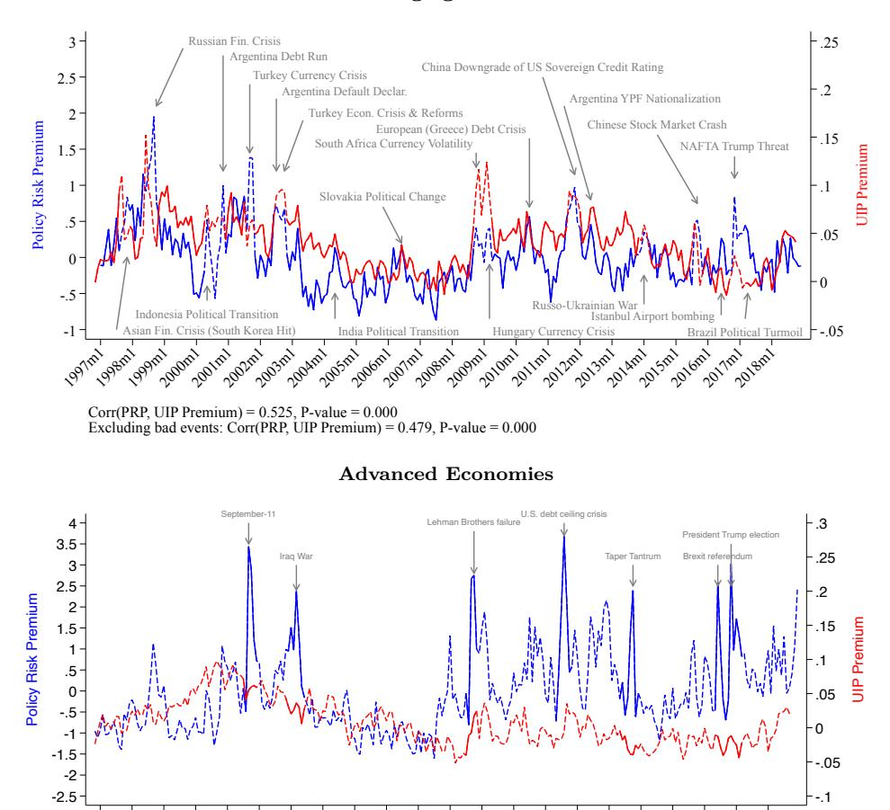

Figure 1. Policy Risk Premium and UIP Premium for Emerging Markets, 1997–2018

Corr(PRP, UIP Premium) = -0.029, P-value = 0.644 Excluding bad events: Corr(PRP, UIP Premium) = -0.071, P-value = 0.309

policy risk: the nationalization of pension funds in Argentina in October 2008 and the Brexit referendum in the United Kingdom in June 2016. These are very different events in different countries, yet both experienced a sharp increase in the UIP premium during these events, as shown in Figure 2. This implies that both local currencies (the peso and the pound) were expected, at the time of the event, to deliver higher dollar returns to investors than dollar assets in the future. The common element in both events is an unexpected policy shock that increased future uncertainty.7

7The nationalization of Argentina's pension funds was announced unexpectedly. As Webber (2008) reported in the *Financial Times*: "the sudden way in which the president announced the nationalisation plan, and its speedy course through Congress, have done nothing to calm fears among investors that the government will flout property rights (…)." Similarly, Senator Sanz stated: "We have no doubt that here the right to private property is being violated. Not just for us but for society and the world, this is a clear confiscation." The Brexit referendum outcome was also a surprise.

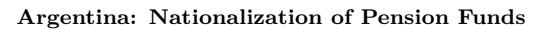

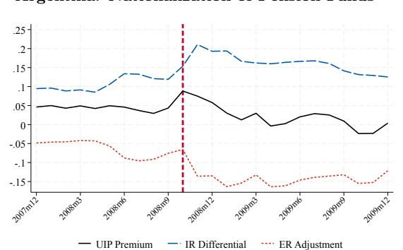

#### **United Kingdom: Brexit Referendum**

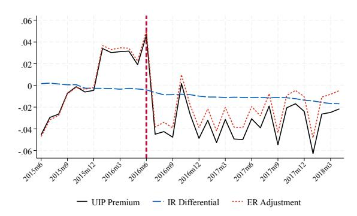

**Figure 2.** UIP Premium Decomposition During Policy Risk Shocks

Figure [2](#page-5-0) plots the UIP premium in both countries together with its decomposition. To visualize the decomposition, we rewrite equation [\(1\)](#page-2-3) as follows:

$$\lambda_{t+h}^{e} = \underbrace{(i_t - i_t^{US})}_{\text{IR Differential}} - \underbrace{(s_{t+h}^{e} - s_t)}_{\text{ER Adjustment}}, \tag{2}$$

The vertical red line denotes the month of the policy change announcement. Interestingly, the UIP premium increased by only 4 percentage points in the U.K., whereas the increase in Argentina was substantially larger at 8 percentage points. As shown in the equation, the UIP premium is the sum of the interest rate and exchange rate terms.[8](#page-5-1) In Argentina, the higher UIP premium in the month of the announcement is accounted for entirely by higher interest rate differentials. Although the peso appreciated slightly, this appreciation was too small to account for the 8 percentage point spike in the UIP premium. In the U.K., by contrast, the higher UIP premium is accounted for entirely by a large 4.2 percentage point expected appreciation of the pound, with no significant movement in interest rate differentials at the time of the policy shock.[9](#page-5-2) These two episodes already illustrate the compositional asymmetry at the heart of the paper: the same increase in the premium operates through the interest rate differential in the emerging market and through expectations in the advanced economy.

What occurred after the policy shock is equally noteworthy. As is well known, both the peso and the pound depreciated against the dollar on impact at the time of these announcements; hence, we do not show these actual exchange rate movements. What is surprising

8We reverse the sign on the ER term in the figure for better visualization, so that an increase in ER represents expected appreciation rather than the expected depreciation as defined in the equation.

9The 2022 mini-budget episode in the U.K. bears strong similarities to the Argentina case. Both policy uncertainty and the UIP premium increased, but in this instance U.K. government bond yield differentials exceeded the immediate depreciation of the pound, leading to expectations of further depreciation—an episode characterized by investors as the "moron premium" due to uncertainty created by inconsistency between fiscal and monetary policies [The Economist](#page-43-8) [\(2022\)](#page-43-8); [Ashworth](#page-41-8) [\(2022\)](#page-41-8); [Giles and Parker](#page-42-7) [\(2022\)](#page-42-7).

is that, in both countries, the currencies were subsequently expected to depreciate over the next 12 months—by 4 percentage points in the U.K. and 12 percentage points in Argentina. Thus, despite actual depreciation on impact, a total surprise policy shock led to expected depreciation over the following 12 months in both countries. The expected depreciation rate was three times larger in Argentina than in the U.K. and more persistent. Consequently, the UIP premium declined more slowly in Argentina than in the U.K., given the higher interest rate differentials relative to expected depreciation, resulting in a more persistent UIP premium in Argentina.

We undertake a systematic empirical analysis using panel data for 22 emerging markets and 12 advanced countries to document these regularities, summarized as five facts. Our *first* fact establishes the magnitudes: our measure of the UIP premium for emerging markets is persistently positive, higher, and more volatile than its counterpart for advanced countries, reflecting persistent expectations of higher currency returns from investing in emerging markets. The unconditional mean is statistically significantly different between emerging markets and advanced economies, with a difference of 3.3 percentage points. This number is comparable to the risk premium found in previous studies of emerging markets using ex-post realizations of exchange rates (e.g., [Gilmore and Hayashi](#page-42-8) [\(2011\)](#page-42-8)).

Our *second* and *third* facts are the analytical core of the paper and together establish the compositional asymmetry. The second fact concerns *how much* of the premium local factors account for: the UIP premium is predictable by a variety of local risk factors, both in crosssection and time-series, even when conditioned on typical measures of global risk factors or global dollar factors such as the VIX and the convenience yield of the dollar. Local risk factors in emerging markets explain 26% of the variation in the UIP premium, while global factors explain only 12%. This result is robust to allowing country-specific loadings on global risk factors (e.g., [Lustig, Roussanov and Verdelhan](#page-43-2) [\(2011\)](#page-43-2)); we find similar explanatory power because the correlation between global and local risk factors is relatively low, at only 22%.[10](#page-6-0) This result is completely reversed for advanced countries, where local risk factors play no role once we account for global risk factors.

The third fact concerns *which component* of the premium local factors operate through, and generalizes the Argentina and U.K. event studies. The interest rate differential component of the UIP premium in emerging markets is more volatile and more strongly correlated with local risk factors than its advanced-economy counterpart. The average correlation between the UIP premium and the interest rate differential in emerging markets is a statisti-

10There is substantial variation in this correlation across countries. For example, Turkey shows a 2% correlation between global and local risk factors, whereas Chile, a commodity exporter, has 47% and Brazil has 18%.

cally significant 70%, whereas this correlation is statistically indistinguishable from zero for advanced economies. By contrast, in advanced economies the correlation between the UIP premium and the expected change in the exchange rate (the ER term) is 93%. This contrast places our findings in direct relation to [Stavrakeva and Tang](#page-43-3) [\(2024\)](#page-43-3), who show, for advanced economies, that survey-based expectations account for a large share of exchange-rate and currency-premium variation. Our results are consistent with theirs in the advanced-economy sample, but show that this characterization does not extend to emerging markets, where the premium is instead an interest-rate-differential phenomenon associated with local risk.

This does not imply that exchange rate expectations are unimportant for the emerging market UIP premium. On the contrary, our *fourth* fact shows that both local and global risk factors are associated with exchange rate expectations in emerging markets, which in turn predict interest rate differentials. Our interpretation aligns with the asset pricing literature: when perceived asset risk is high, the return required to invest in that asset is high (e.g., [Pflueger, Siriwardane and Sunderam](#page-43-9) [\(2020\)](#page-43-9)). Accordingly, the interest rate differential captures *expected* currency risk in emerging markets.

Our *fifth* fact examines the correlates of local risk factors, using not only the newsbased measures of policy risk premium shown above but also other country-specific policy uncertainty measures. Our measures of policy uncertainty range from policy transparency, accountability, investor perceptions, and expropriation risk to outcome-related measures such as capital inflows and outflows by foreign residents. Foreign investors have been shown to be particularly sensitive to news, sentiment, and policy shocks in the global financial cycle literature (e.g., [Miranda-Agrippino and Rey](#page-43-10) [\(2020\)](#page-43-10)). Using local projections, we show that our wide range of policy shock and uncertainty measures predict persistent expected currency depreciations in emerging markets.

Overall, these facts are consistent with emerging market and advanced economy assets being imperfect substitutes. An older literature associated such imperfect substitutability with investors' pricing of risk across economies (e.g., [Isard](#page-43-11) [\(1983\)](#page-43-11), [Friedman and Kuttner](#page-42-9) [\(1992\)](#page-42-9), [Bryant](#page-41-9) [\(1995\)](#page-41-9), [Chinn and Frankel](#page-41-1) [\(1994\)](#page-41-1)). Newer papers develop general equilibrium models of exchange rates and interest rates with segmented asset markets that can generate large fluctuations in risk premia, as in [Alvarez, Atkeson and Kehoe](#page-41-10) [\(2009\)](#page-41-10), and UIP deviations that are endogenous to the policy regime, as in [Itskhoki and Mukhin](#page-43-12) [\(2024\)](#page-43-12). Our contribution to this literature is empirical: we provide the cross-country and timeseries moments that such models should match, and we document that the shocks to which the premium responds are systematically local in emerging markets and global in advanced economies. Read through this lens, the facts describe a two-way relationship: higher interest rate emerging market currencies are expected to depreciate in the future under no international arbitrage, while expectations of future depreciation associated with local risk factors simultaneously accompany higher interest rates in emerging markets.

The paper is structured as follows. Section [2](#page-8-0) lays out a simple conceptual framework that links local risk, exchange rate expectations, and the UIP premium, and that organizes the five facts. Section [3](#page-11-0) presents our data and measurement. Section [4](#page-17-0) undertakes the benchmark analysis and documents the five facts. Section [5](#page-31-0) presents extensive robustness analysis. Section [6](#page-39-0) concludes.

### **2. A Simple Conceptual Framework**

Before turning to the data, we lay out a simple no-arbitrage framework that links local risk, exchange rate expectations, and the UIP premium.[11](#page-8-1) The framework serves two purposes. First, it shows that the UIP premium we measure is not an arbitrary wedge nor an exogenous noise shock: it is the compensation a forward-looking investor requires for holding a currency whose value co-moves with the investor's marginal utility. Second, it decomposes the premium into three primitives—the *exposure* of the investor to currency risk, the *passthrough* of underlying risk factors into the exchange rate, and the *quantity* of risk—so that each of the five facts can be read as identifying a different primitive.

### **2.1. The UIP Premium as Priced Currency Risk**

Consider again the U.S. investor of the introduction, who can hold a dollar deposit paying *i US t* or a local-currency deposit paying *it* . Let *Mt*+1 denote the investor's stochastic discount factor (SDF) over dollar payoffs, and let expectations be the investor's *subjective* expectations—precisely the object measured by our survey data. The investor prices both deposits:

$$1 = E_t[M_{t+1}] \left(1 + i_t^{US}\right), \qquad 1 = E_t \left[M_{t+1} \frac{S_t}{S_{t+1}}\right] (1 + i_t),$$

where *S* is the exchange rate in units of local currency per dollar, so *St/St*+1 converts localcurrency payoffs into dollars. Combining the two conditions and log-linearizing yields

$$\lambda_{t+1}^e = i_t - i_t^{US} - \left(s_{t+1}^e - s_t\right) = \text{Cov}_t(\Delta s_{t+1}, \Delta m_{t+1}),$$
 (3)

11We are grateful to our discussant, Kenza Benhima, for suggesting this framework and its mapping to our five facts.

where ∆*st*+1 = *st*+1 − *st* is the (log) depreciation of the local currency and ∆*mt*+1 = [*Mt*+1 − *Et*(*Mt*+1)] */Et*(*Mt*+1) is the innovation to the SDF.[12](#page-9-0) Equation [\(3\)](#page-8-2) states that the UIP premium is positive when the local currency depreciates precisely in the investor's bad states—when marginal utility is high. A currency with this property is risky from the dollar investor's perspective, and its deposits must offer an expected excess return as compensation.

To see what drives this covariance, decompose it as

$$\lambda_{t+1}^{e} = \underbrace{\frac{\text{Cov}_{t}(\Delta s_{t+1}, \Delta m_{t+1})}{V_{t}(\Delta s_{t+1})}}_{\rho \text{ (exposure)}} \times \underbrace{V_{t}(\Delta s_{t+1})}_{\text{exchange rate risk}}, \tag{4}$$

where *ρ* measures how strongly exchange rate risk is *priced*: it is high when the investor cannot, or does not, diversify away fluctuations in this currency. Suppose further that depreciation is driven by an underlying risk factor *y*, so that ∆*st*+1 = *α yt*+1, where *α* is the pass-through of the risk factor into the exchange rate. Then *Vt*(∆*st*+1) = *α* 2*σt* , with *σt* ≡ *Vt*(*yt*+1) the quantity of risk, and the premium can be written as

$$\underbrace{\rho \cdot \alpha^2}_{\text{channels}} \cdot \underbrace{\sigma_t}_{\text{driver}} = \underbrace{\left(i_t - i_t^{US}\right) - \left(s_{t+1}^e - s_t\right)}_{\text{adjustment}}.$$
(5)

The left-hand side of equation [\(5\)](#page-9-1) says that the premium moves either because risk itself moves (*σt* , the driver) or because a given amount of risk is transmitted and priced differently (*α* and *ρ*, the channels). The right-hand side says that any movement in the premium must show up in the data as a movement in the interest rate differential, in the expected change in the exchange rate, or in both—the *adjustment margin*. Which margin adjusts is not pinned down by no-arbitrage alone; it is an empirical question, and it is precisely where emerging markets and advanced economies differ.

Finally, allowing for two orthogonal risk factors—a *global* factor common to all currencies and a *local*, country-specific factor—the covariance in equation [\(3\)](#page-8-2) is additive across factors:

$$\lambda_{t+1}^{e,c} = \gamma^{\text{global},c} \sigma_t^{\text{global}} + \gamma^{\text{local},c} \sigma_t^{\text{local},c}, \qquad \gamma \equiv \rho \alpha^2, \tag{6}$$

where the composite loading *γ* on each factor combines exposure and pass-through. Equation [\(6\)](#page-9-2) is the lens through which our panel regressions should be read: when we regress the UIP premium on proxies for local risk (policy uncertainty, capital inflows) and global risk (the

12We write the framework at a one-period horizon to save on notation; the empirical counterpart is the 12-month horizon used throughout the paper. The covariance representation of currency risk premia is standard in the literature (e.g., [Backus, Foresi and Telmer](#page-41-0) [\(1995\)](#page-41-0), [Engel](#page-42-10) [\(2014\)](#page-42-10)); our exposition follows the version in Kenza Benhima's discussion of this paper.

VIX, the dollar's convenience yield), the estimated coefficients are the empirical counterparts of *γ* local and *γ* global, and the *R*2 contributions of each block measure the share of the variance of the premium accounted for by each factor.

### **2.2. Reading the Five Facts Through the Framework**

*Fact 1 (levels).* The average premium is higher and more volatile in emerging markets: *E*(*λ e,EM* ) *> E*(*λ e,AE*). Through equation [\(5\)](#page-9-1), this can reflect higher exposure (*ρ EM > ρAE*), higher pass-through of risk into the exchange rate (*α EM > αAE*), a larger quantity of risk (*σ EM > σAE*), or any combination. Fact 1 establishes the magnitude of the object to be explained; the remaining facts discriminate among these primitives.

*Fact 2 (composition).* Through equation [\(6\)](#page-9-2), our finding that local risk factors explain a substantial share of the variance of the emerging market premium—but essentially none of the advanced economy premium—while global factors matter for both groups, reads as: *γ* global is comparable across the two groups, whereas *γ* local*,AE* ≃ 0 and *γ* local*,EM >* 0. Two non-exclusive interpretations follow. Either international intermediaries do not diversify away emerging markets' local risk—because the marginal investor in these currencies is local and less diversified, or because emerging markets are a large enough asset class in segmented markets that their local risk moves global intermediaries' net worth (an *exposure* interpretation, *ρ*)—or local risk translates into exchange rate risk more strongly in emerging markets (a *pass-through* interpretation, *α*).

*Fact 3 (adjustment margin).* The framework determines the product *ρ α*2*σt* , but not which term on the right-hand side of equation [\(5\)](#page-9-1) adjusts when risk moves. Fact 3 shows that the adjustment margin differs systematically: in emerging markets the interest rate differential adjusts, whereas in advanced economies the expected change in the exchange rate adjusts. An increase in local risk *σ* local *t* in an emerging market shows up as a higher policy rate and higher deposit rates—consistent with monetary policy that leans against currency risk (fear of floating and credibility motives)—while an increase in global risk shows up in advanced economies as expected exchange rate movements at essentially unchanged interest differentials.

*Fact 4 (separating the channels).* Facts 1–3 identify the composite loadings *γ*; Fact 4 goes further and separates pass-through from exposure in emerging markets. Our two-stage regressions correspond to the two links of the chain: local and global risk factors predict the dispersion of exchange rate expectations—our proxy for perceived exchange rate risk *Vt*(∆*st*+1), the first stage, identifying *α*—and this risk-factor-predicted dispersion in turn predicts interest rate differentials—the pricing of that risk, the second stage, identifying *ρ*. Both links are active in emerging markets: local risk raises perceived currency risk, and perceived currency risk is priced into interest rate differentials.

*Fact 5 (dynamics).* Finally, if the local factor carries a time-varying quantity of risk *σ* local*,c t* tied to domestic policy, then policy shocks should generate *persistent* expected depreciation together with elevated interest differentials. Fact 5 confirms this dynamic implication with local projections: country-specific policy uncertainty shocks predict expected depreciation of emerging market currencies well into the future, with no such pattern in advanced economies.

Two remarks conclude this section. First, the framework is written under the investor's subjective expectations, which is exactly what our survey-based measure captures; we do not need to take a stand on whether these expectations are fully rational. If subjective and objective expectations differ, the *realized* UIP deviation combines the risk premium in equation [\(3\)](#page-8-2) with a systematic forecast error component; Section [5.4](#page-36-0) quantifies the two components following [Froot and Frankel](#page-42-4) [\(1989\)](#page-42-4) and shows that the premium component dominates in emerging markets, while the forecast error component dominates in advanced economies, as in their early analysis and modern updates of their work for advanced economies. Second, the framework treats the interest rate differential as reflecting currency risk alone; in the data, default risk, liquidity premia, and capital controls can also enter. Our measurement addresses these in turn: we use short-term deposit and money market rates (the closest approximation to local-currency risk-free rates), we do not use interbank rates, we adjust for CDS spreads and default episodes (Section [5.2\)](#page-33-0), and we show that covered interest parity deviations (CIP)—which price capital controls, hedging costs and other intermediation frictions that break international arbitrage with brute force—are an order of magnitude smaller than the UIP premium and show different dynamics (Section [5.3](#page-34-0) and Appendix [A\)](#page-55-0).

### **3. Data and Measurement**

We briefly describe our variables here; Appendix [7](#page-40-0) discusses the construction of all series and samples in detail.

### **3.1. UIP, Exchange Rates and Survey Expectations**

We employ monthly data from the IMF, Bloomberg, and Consensus Economics. Our sample includes 34 currencies and excludes country-month observations with fixed exchange rate regimes based on the classification of [Ilzetzki, Reinhart and Rogoff](#page-43-13) [\(2017\)](#page-43-13), as in these cases the exchange rate does not move or covary with the interest rate by construction. Countries therefore enter and exit the sample as their exchange rate regime changes; Appendix Table [B7](#page-58-0) reports the in-sample periods for each currency. Our sample comprises 22 emerging markets (EM) and 12 advanced economies (AE) over the period November 1996 to December 2018.[13](#page-12-0)

We obtain deposit interest rates, money market rates, and government bond rates from Bloomberg; spot exchange rates from IFS; and exchange rate expectations from Surveys of Consensus Economics. For the Euro Area, we employ individual country series before adoption of the euro and Euro-level series thereafter. We measure inflation with CPI. We further use CDS data for default risk from Bloomberg and default episodes from [Reinhart,](#page-43-14) [Rogoff, Trebesch and Reinhart](#page-43-14) [\(2021\)](#page-43-14).

Consensus Economics conducts a monthly survey on expectations of future exchange rates at the 1, 3, 12, and 24 month horizons among major participants in the foreign exchange market. Appendix [7](#page-48-0) discusses this dataset in detail. The coverage is extensive, including 55 investors on average for advanced economy currencies. Some currencies—such as the Euro, Japanese Yen, and UK Pound—include more than a hundred. Although the number of investors is lower, the survey is also comprehensive for emerging markets, including on average 17 investors per currency. These surveyed investors are typically global banks and investors that actively participate in the FX market. Notably, the same set of investors participates in surveys for both advanced economies and emerging markets.

Having the same set of agents surveyed for both groups of economies is important because it implies that differences in results between advanced economies and emerging markets should not arise from such heterogeneity. To provide an example, in September 2012, the 96 agents surveyed for the Japanese Yen included Goldman Sachs, HSBC, JP Morgan, Citigroup, Bank of Tokyo Mitsubishi, IHS Global Insight, General Motors, ING Financial Markets, Barclays Capital, and Morgan Stanley. These ten were also surveyed for the Euro and the UK Pound, which included totals of 103 and 81 agents that month, respectively. The main agents surveyed for the Korean Won (22) were Goldman Sachs, HSBC, JP Morgan, Citigroup, Bank of Tokyo Mitsubishi, IHS Global Insight, General Motors, and ING Financial Markets. The same was true for the Turkish Lira (28). Other emerging market currencies (such as the Argentinean Peso, Brazilian Real, Chilean Peso, Colombian Peso, Hungarian Forint, Indian Rupee, Malaysian Ringgit, Mexican Peso, Polish Zloty, and Russian Rouble) also included these investors, as well as other global investors such as Barclays Capital, BNP, ABN Amro, Allianz, Royal Bank of Canada, UBS, and Royal Bank of Scotland.

We calculate the UIP premium as stated in the introduction (*λ e t*+*h* = (*it* − *i US t* ) − (*s e t*+*h* −

13We assign countries to the two groups using the IMF-WEO 2000 income classification and hold the classification fixed over the sample period. Countries that changed groups are treated as follows: The Czech Republic and the Slovak Republic dropped from the EM sample as they become fixed exchange rate regimes after 2009, whereas Korea is kept under EM; dropping Korea from EM and/or moving it to AE do not change our results.

*st*)), with the U.S. dollar always as the base currency. Instead of deposit and money market rates, one could also use short-term local currency government bond rates for each country. We opt for deposit and money market rates because they represent the closest available approximation to a "risk-free rate" on local currency borrowing (or return to saving) in emerging markets, given the default risk on short-term EM bonds. Our definition is identical to the textbook definition. It is important to use short-term rates because UIP tends to hold at longer maturities, and focusing on rates with less than one year maturity also helps us separate the UIP premium from both term and default premia.

### **3.2. Global, U.S. and USD Factors**

Since we always calculate UIP against the U.S. dollar, we also construct variables that capture the predominant role of the U.S. dollar in financial markets, such as the convenience yield of the dollar. In addition to these dollar-specific variables, we employ the VIX. We construct the dollar-specific variables exactly as in the literature, following [Jiang, Krishnamurthy and](#page-43-15) [Lustig](#page-43-15) [\(2021\)](#page-43-15), [Bianchi, Bigio and Engel](#page-41-11) [\(2021\)](#page-41-11), and [Obstfeld and Zhou](#page-43-16) [\(2022\)](#page-43-16).

To construct global variables, we first define the CIP deviation for country *c* at time *t* relative to the U.S. at horizon *h*, denoted *λ CIP c,t*+*h* , as:

$$\lambda_{c,t+h}^{CIP} = (i_{c,t} - i_t^{US}) - (f_{c,t+h} - s_{c,t}), \tag{7}$$

where *fc,t*+*h* is the log forward exchange rate for the local currency against the dollar *h* periods ahead, and the spot exchange rate *s* is defined as before (local currency per dollar). Using different interest rates—such as LIBOR, government bonds, deposit rates, or money market rates—the literature calculates the aforementioned variables. For example, the *Convenience Yield* of the U.S. dollar relative to a given country *c* at time *t* uses the LIBOR rate in country *c* and in the U.S. We follow the literature and average the convenience yield of the dollar relative to country *c* across G10 countries.[14](#page-13-0) Defined this way, the convenience yield on the U.S. dollar (relative to G10 countries) measures how much investors are willing to forego higher returns in G10 currencies in exchange for the convenient low returns from the U.S. dollar. Appendix [A](#page-55-0) compares UIP and CIP deviations in our sample, both in the cross section and over time.

To measure the *Liquidity Premium* on U.S. government bonds, we follow the literature and define Liquidity Premium*ct* = *i L c,t* − *i G c,t* − (*i US,L t* − *i US,G t* ), where *i G c,t* and *i US,G t* are interest rates on short-term government bonds in the home country and the U.S., respectively, and

14The G10 countries we consider are Australia, Canada, Germany, Japan, New Zealand, Norway, Sweden, Switzerland, and the United Kingdom.

rates denoted with *L* are LIBOR rates. As with the convenience yield, we construct a single measure of liquidity premium by averaging across G10 countries, since the literature argues that this premium pertains only to U.S. Treasuries.

### **3.3. Other Variables**

Following [Miranda-Agrippino and Rey](#page-43-10) [\(2020\)](#page-43-10), we interpolate all capital flow series from the IMF and IFS to monthly frequency. We use the commonly used indicators for local risk from the International Country Risk Guide (ICRG), which provides detailed information on the components of policy risk for each country over time. According to these ICRG measures, which are used by foreign investors per ICRG documentation, political risk contributes 50% to the composite policy risk index, while financial and economic risks contribute the remaining 50%. To identify the main elements of policy risk, we focus on two key components of the political risk category: *government policy risk* and *confidence risk*. Both capture expropriation risk, the risk of being unable to repatriate profits, government accountability, the degree of freedom that a government has to impose policies to its own advantage, and confidence in economic policies. For example, [Azzimonti and Mitra](#page-41-12) [\(2023\)](#page-41-12) relates government accountability to a country's default probability.[15](#page-14-0)

The literature has placed particular emphasis on the uncertainty of monetary policy for the pricing of risky assets, using measures of inflation expectations, forecast errors, or text-based measures designed to detect uncertainty in central banks' statements. For example, [Cieslak, Hansen, McMahon and Xiao](#page-42-11) [\(2023\)](#page-42-11) shows that Fed-driven policy uncertainty reduces the impact of monetary policy on real outcomes through market volatility. Accordingly, we also employ these measures. Nevertheless, our paper goes beyond specific policies to show that policy uncertainty in general affects global investors' risk sentiment and the cost of borrowing for emerging markets. Our findings might be confused with the classical "peso problem," but they are quite different. The peso problem concerns the credibility of a fixed exchange rate regime. For example, during the 1970s, investors expected a depreciation of the Mexican peso that did not materialize and hence created a gap between U.S. and Mexican interest rates. Our results are not based on comparing different regimes; on the contrary, we use only floating exchange rate regimes and show how uncertainty surrounding non-exchange rate monetary, fiscal, and regulatory policies leads to fluctuations in the UIP premium and hence currency risk.

15These two indices come directly from the ICRG data. Our measure of government policy risk is the average of the investment profile and democratic accountability variables, and our measure of confidence risk is the socioeconomic risk variable. We pool investment profile and democratic accountability together because, although they capture different types of risk, they are highly correlated in the data.

### **3.4. Summary Statistics**

We present summary statistics of the UIP premium and its components from equation [\(2\)](#page-5-3) in Table [1.](#page-16-0) Column 1 of Panels A and B shows a striking contrast between advanced economies and emerging markets. While emerging markets exhibit a positive UIP premium reaching, on average, 4 percentage points, the UIP premium in advanced economies is small, less than 1 percentage point. The median values in column 2 confirm this finding.[16](#page-15-0)

The decomposition between the interest rate differential and exchange rate adjustment terms (rows 2 and 3 of Panel A) shows that, in emerging markets, the mean interest rate differential accounts for the bulk of the UIP premium, while the exchange rate adjustment term is negligible. In advanced economies (Panel B), the mean interest rate differential and exchange rate adjustment terms are close to each other, consistent with a UIP premium that is on average close to zero in these economies. All other variables, such as capital flows, show considerable variation. We report U.S.-specific and global variables in the final panel.

16We show below that this difference is statistically significant using a test of means.

Table 1. Summary Statistics

|                                        | Mean                          | Median   | Std. Dev. | $\underline{p25}$ | $\frac{p75}{}$ | Observations |
|----------------------------------------|-------------------------------|----------|-----------|-------------------|----------------|--------------|
|                                        | (1)                           | (2)      | (3)       | (4)               | (5)            | (6)          |
|                                        |                               | Panel    | l (A): Em | ergin             | g Ma           | rkets        |
| UIP Premium                            |                               |          |           |                   |                |              |
| UIP premium%                           | 4.2                           | 3.5      | 6.0       | 0.6               | 7.0            | 3,397        |
| Interest Rate Differential%            | 5.1                           | 3.5      | 7.9       | 1.2               | 6.6            | 3,397        |
| Expected Exchange Rate Adjustment%     | 1.0                           | 0.4      | 6.3       | -2.6              | 3.4            | 3,397        |
| Other variables                        | 7.1                           | 1 7      | EEO       | 0.4               | 4.7            | 2 200        |
| Capital Inflows/GDP                    | 7.1                           | 1.7      | 55.8      | -0.4              | 4.7            | 3,290        |
| PRP                                    | -0.1                          | -29.3    | 97.4      | -63.9             | 33.5           | 3,397        |
| Expected Inflation Differential        | 2.4                           | 1.6      | 2.5       | 0.7               | 3.7            | 2,605        |
| Sovereign Default Risk                 | 0.02                          | 0.01     | 0.02      | 0.01              | 0.02           | 2,297        |
| Composite Risk                         | -0.39                         | -0.43    | 0.44      | -0.71             | -0.13          | 3,397        |
| Government Policy Risk                 | -0.58                         | -0.62    | 0.61      | -1.07             | -0.27          | 3,397        |
| Confidence Risk                        | -0.28                         | -0.35    | 0.71      | -0.77             | 0.29           | 3,397        |
|                                        | Panel (B): Advanced Economies |          |           |                   |                |              |
| UIP Premium                            |                               |          |           |                   |                |              |
| UIP premium%                           | 0.9                           | 0.7      | 4.6       | -2.2              | 3.5            | 2,260        |
| Interest Rate Differential%            | 0.3                           | 0.2      | 2.2       | -0.9              | 1.6            | 2,260        |
| Expected Exchange Rate Adjustment $\%$ | -0.6                          | -0.3     | 5.0       | -3.6              | 2.8            | 2,260        |
| Other variables                        |                               |          |           |                   |                |              |
| Capital Inflows/GDP                    | 5.9                           | 3.7      | 10.8      | 0.3               | 9.2            | 2,212        |
| PRP                                    | 2.4                           | -17.4    | 85.9      | -57.8             | 37.1           | 2,260        |
| Expected Inflation Differential        | -0.3                          | -0.2     | 0.8       | -0.7              | 0.2            | 1,968        |
| Sovereign Default Risk                 | 0.00                          | 0.00     | 0.00      | 0.00              | 0.01           | 370          |
| Composite Risk                         | -1.18                         | -1.18    | 0.40      | -1.42             | -0.94          | 2,260        |
| Government Policy Risk                 | -1.28                         | -1.47    | 0.35      | -1.57             | -1.17          | 2,055        |
| Confidence Risk                        | -1.45                         | -1.41    | 0.46      | -1.84             | -1.20          | 2,055        |
|                                        | Par                           | nel (C): | Global/U  | $JS_{\mathbf{p}}$ | ecific         | Variables    |
| Convenience Yield%                     | 0.1                           | 0.1      | 0.2       | -0.0              | 0.2            | 264          |
| Liquidity Premium%                     | -0.0                          | 0.0      | 0.3       | -0.2              | 0.1            | 264          |
| VIX                                    | 2.94                          | 2.95     | 0.35      | 2.66              | 3.18           | 264          |

Notes: 34 currencies, 22 EMs, 12 AEs. Period 1996m11:2018m10. Source: Consensus Forecast, Bloomberg, FRED, IMF, ICRG. Capital Inflows/GDP is the ratio of capital flows to GDP. PRP measures policy uncertainty-related policy risk premium based on local and international newspaper articles. The UIP premium at the 12-month horizon is based on average investor expectations of the exchange rate and deposit/money market interest rates over the same horizon. Expected inflation differential is the difference between expected inflation in the home country and the U.S. Sovereign default risk refers to Credit Default Swaps (CDS). The Convenience Yield and Liquidity Premium measures follow the literature and are defined as explained above. Other risk variables are from ICRG.

### **4. The Five Facts**

### **4.1. The UIP Premium in Emerging Markets**

*Fact 1: The UIP premium for emerging markets is consistently positive, higher, and more volatile, implying persistent expected excess currency returns.*

Figure [3](#page-17-1) (left panel) shows our new measure of currency risk—the UIP premium measured with survey-based exchange rate expectations—in black for the average emerging market using the Consensus forecast (the average of all forecasters' exchange rate expectations). We also plot the average EM UIP premium using expectations from only five major global investors/FX traders active in both emerging market and advanced economy currencies (in orange). These five investors are Goldman Sachs, HSBC, ING, JP Morgan, and BNP Paribas. Although the UIP premium based on the "big five" is more volatile, the qualitative message of our Fact 1 is unchanged. The correlation between the two series (black and orange) is very high (62% for EMs and 76% for AEs). The right panel plots the UIP premium for advanced economies, which shows a more mean-reverting process on average.

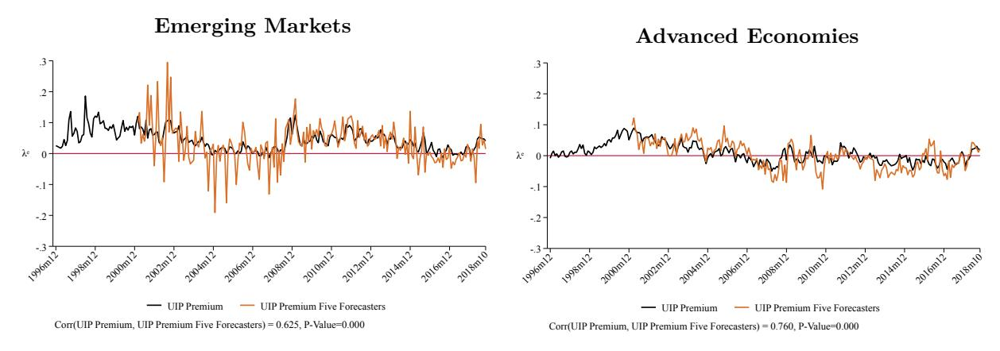

**Figure 3.** The UIP Premium: Expectations of Major Investors vs. Average Investor

The UIP premium at the 12-month horizon for 22 EMs and 12 AEs over November 1996 to October 2018, plotted in black and based on average investor expectations of the exchange rate over the 12-month horizon and deposit/money market interest rates over the same horizon. The version using only five investors' forecasts is plotted in orange.

A simple test of differences in means reported in Table [2](#page-18-0) shows that the UIP premium in emerging markets is three times larger than in advanced economies.

**Table 2.** UIP Premium Mean Test

|                    | EMs    | AEs    | Diff   |
|--------------------|--------|--------|--------|
|                    | (1)    | (2)    | (3)    |
| e λ t+12 (%) | 4.2∗∗∗ | 0.9∗∗∗ | 3.3∗∗∗ |
|                    | (0.1)  | (0.1)  | (0.1)  |
| Observations       | 3,397  | 2,260  | 5,657  |

Notes: This table shows the average UIP premium for EMs and AEs. Column (3) shows the difference in the mean. Standard errors are in parentheses. \* p *<* 0.10 \*\* p *<* 0.05 \*\*\* p *<* 0.01

We further examine the correlation between the UIP premium in emerging markets and the same premium after subtracting the credit default swap (CDS) spread. The correlation is 83 percent (and statistically significant) for the smaller EM sample where CDS data is available. Since CDS data begins after 2008 and is available only for a smaller subset of our emerging markets, we do not plot this line in the figure showing the EM UIP premium starting in 1996, as the series would not be directly comparable. However, the UIP premium adjusted for CDS remains larger and more volatile than the AE premium when restricted to the same time period. Thus, our new measure shows that, even without default risk, EM currency risk premia are larger than those of advanced economy currencies. Appendix Figure [B6](#page-59-0) plots the CDS spread together with policy uncertainty for the emerging markets in this subsample, showing that default risk itself co-moves with local policy uncertainty.

How does our new measure of currency risk—the UIP premium based on exchange rate expectations—compare to the standard excess currency returns measure based on realized exchange rates? Figure [4](#page-19-0) plots the same black line from the previous figure (the UIP premium) against realized excess currency returns (in blue). Interestingly, for both groups of countries, the correlation between our new measure and the excess returns measure is quite low, at 20 percent. Hence, our new measure captures different time variation than the excess currency returns measure—a result that should not be surprising given our measure's forward-looking nature, which the excess currency returns measure lacks. This is interesting because, as shown below in Table [3,](#page-19-1) actual excess currency returns also differ statistically between emerging market and advanced country currencies based on a test of means. Hence, without changing that average difference, our measure better captures the time-varying currency risk in emerging markets.

#### **Emerging Markets** -.4 -.3 -.2 -.1 λe,r 1996m12 1999m12 2002m12 2005m12 2008m12 2011m12 2014m12 2017m12 2018m10 UIP Premium Excess Currency Returns

Corr(UIP premium, Excess Curr. Returns) = 0.123, P-value = 0.053

2017m12 2018m10

**Advanced Economies**

-.4 1996m12 1999m12 2002m12 2005m12 2008m12 2011m12 2014m12 UIP Premium Excess Currency Returns

Corr(UIP premium, Excess Curr. Returns) = 0.217, P-value = 0.001

**Figure 4.** The UIP Premium: Expected vs Realized Exchange Rates

-.3

λe,r

.3

The UIP premium at the 12-month horizon for 22 EMs and 12 AEs over November 1996 to October 2018, plotted in black. The blue line plots realized excess currency returns (carry trade profits).

**Table 3.** Excess Currency Returns Mean Test

|              | EMs    | AEs    | Diff   |
|--------------|--------|--------|--------|
|              | (1)    | (2)    | (3)    |
| λt+12 (%) | 3.0∗∗∗ | 0.8∗∗∗ | 2.2∗∗∗ |
|              | (0.2)  | (0.2)  | (0.3)  |
| Observations | 3,397  | 2,260  | 5,657  |

Notes: This table shows the average excess currency returns for EMs and AEs. Column (3) shows the difference in the mean. Standard errors are in parentheses. \* p *<* 0.10 \*\* p *<* 0.05 \*\*\* p *<* 0.01

### **4.1.1. Fama Regressions in Emerging Markets**

In this section, we place our first fact in the context of the UIP-puzzle and Fama literature. This literature runs the following Fama regression:

$$s_{ct+h} - s_{ct} = \beta^F (i_{ct} - i_t^{US}) + \mu_c + \varepsilon_{ct+h}, \tag{8}$$

and typically finds *β F <* 1, which implies the existence of ex-post excess currency returns because actual depreciation does not offset interest rate differentials.

We run a 'Fama-like' regression using the data underlying our new UIP premium measure that is, *exchange rate expectations*:

$$s_{ct+h}^e - s_{ct} = \beta(i_{ct} - i_t^{US}) + \mu_c + \varepsilon_{ct+h}, \tag{9}$$

where *s e ct*+*h* is the expected exchange rate for country *c* in period *t* + *h*. The interpretation of the estimated coefficient  $\beta$  differs from that in the standard Fama regression. If  $\beta = 1$ , interest rate differentials and expected exchange rate changes offset each other. If  $0 < \beta < 1$ , the expected depreciation is lower than implied by the interest rate differential, leading to positive expected currency returns, that is, a UIP premium. If  $\beta < 0$ , then excess currency returns are driven by an expected appreciation.

The results of the standard Fama regression are shown in column (3) and those of our 'Fama-like' regression in column (1) of Table 4. Several surprising findings emerge. First, the estimated  $\beta$  and  $\beta^F$  coefficients are very similar in emerging markets (approximately 0.4). Second, the Fama coefficient ( $\beta^F$ ) is positive, not negative.

**Table 4.** Fama, Fama-like, UIP, and Excess Returns Regressions

|                                                                                                                   |                                       | Emerging Markets            |                                       |                             |  |  |  |  |
|-------------------------------------------------------------------------------------------------------------------|---------------------------------------|-----------------------------|---------------------------------------|-----------------------------|--|--|--|--|
|                                                                                                                   | (1)                                   | (2)                         | (3)                                   | (4)                         |  |  |  |  |
|                                                                                                                   | Fama w/ Expect.                       | UIP Premium                 | Fama                                  | Excess Curr. Returns        |  |  |  |  |
| $\beta^F$                                                                                                         | 0.480***                              | 0.520***                    | 0.374***                              | 0.626***                    |  |  |  |  |
|                                                                                                                   | (0.075)                               | (0.075)                     | (0.118)                               | (0.118)                     |  |  |  |  |
| $p$ -value $(H_0: \beta^F = 1)$ Observations Number of Countries Adjusted $R^2$ Country (currency) FE | 0.0000 3577 22 0.4935 Yes | 3577 22 0.4484 Yes | 0.0000 3577 22 0.1291 Yes | 3577 22 0.1057 Yes |  |  |  |  |

**Notes:** \* p < 0.10 \*\* p < 0.05 \*\*\* p < 0.01. Currency-time two-way clustered standard errors in parentheses. 22 EM currencies. Period 1996m11:2018m10.

These are panel regressions that use country (currency) fixed effects to capture time-varying risk premia. However, the influential work of Hassan and Mano (2019) argues that using country/currency fixed effects absorbs a large part of the time-invariant country risk premia. Thus, we also run the same regressions without country fixed effects and plot these results in Figure 5 for visual comparison with standard textbooks: the fitted line for the expected (left) and realized (right) rate of depreciation on interest rate differentials in emerging markets. The estimated coefficients shown in the figures are similar to those reported in the regression table using country fixed effects (slightly higher). The figures stand in stark contrast to the well-known undergraduate textbook version, given in Figure 6, where the right panel with realized exchange rates would be a cloud of points with either zero or slightly negative slope and no significant relationship.

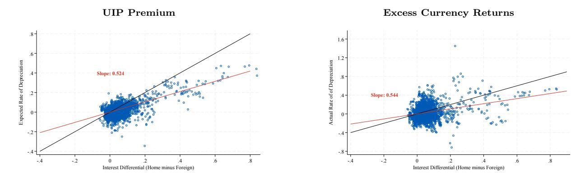

**Figure 5.** UIP Premium vs Excess Currency Returns in Emerging Markets The expected and ex-post rate of depreciation at the 12-month horizon and the interest rate differentials.

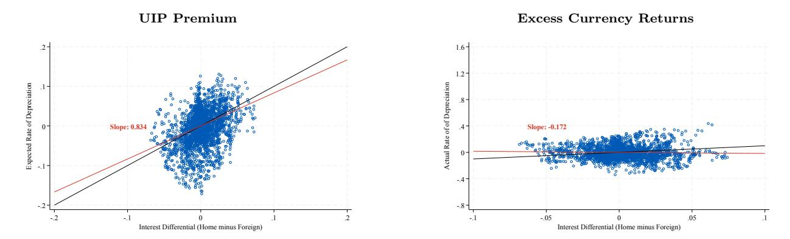

**Figure 6.** UIP Premium vs Excess Currency Returns in Advanced Economies The expected and ex-post rate of depreciation at the 12-month horizon and the interest rate differentials.

Finally, the third surprising finding, which follows from the first two, is that average *realized* excess returns are of the same magnitude as average *expected* excess returns. To show this, we run:

$$\lambda_{ct+h}^e = \beta_1(i_{ct} - i_t^{US}) + \mu_c + \varepsilon_{1ct+h}, \tag{10}$$

$$\lambda_{ct+h} = \beta_2(i_{ct} - i_t^{US}) + \mu_c + \varepsilon_{1ct+h}, \tag{11}$$

where *λ e ct*+*h* denotes "expected" excess returns, that is, our new measure of currency risk (the UIP premium), whereas *λct*+*h* denotes ex-post realized excess returns. *β*2 = 0 implies the absence of predictable excess returns. Note that *β*1 = 1 − *β* and *β*2 = 1 − *β F* . Table [4](#page-20-0) reports *β*1 in column (2) and *β*2 in column (4). Interestingly, in emerging markets there are both ex-ante and ex-post excess returns from investing in these currencies, and both are predictable and of similar magnitude.

In relation to the Fama literature, our findings show that approximately half of the variation in interest rate differentials is attributable to variation in the risk premium, while the other half is linked to expectations not fully predicting exchange rate depreciations—though the prediction is highly successful compared to advanced countries, consistent with what we showed in the data section by plotting expectational changes in exchange rates against actual exchange rate realizations. The regressions above show that interest rate differential-based predictions of both actual and expected exchange rate changes are in the right direction, capturing half of the expected and actual depreciation. Adapting the characterization that [Frankel and Froot](#page-42-3) [\(1987\)](#page-42-3) and [Froot and Frankel](#page-42-4) [\(1989\)](#page-42-4) applied to the early advanced economy survey data, in our emerging market sample approximately half of the interest rate differential is revealed to be an exchange risk premium, while the other half is matched by expected—and, on average, realized—depreciation.[17](#page-22-0)

How should these positive Fama coefficients be read against the older literature's negative ones? The negative coefficient of the classic puzzle was estimated mostly on advanced economy currencies in pre-2000 samples. Two things have changed since. First, the behavior of the Fama coefficient itself appears to have shifted around the turn of the century: as emphasized by Charles Engel and coauthors, post-2000 samples deliver Fama coefficients that are far more often positive (though still below one) even for advanced economies—the "new Fama puzzle" [\(Bussiere, Chinn, Ferrara and Heipertz](#page-41-13) [\(2022\)](#page-41-13); [Engel, Kazakova, Wang](#page-42-12) [and Xiang](#page-42-12) [\(2022\)](#page-42-12); see also the long-span survey-data evidence in [Chinn and Frankel](#page-41-14) [\(2020\)](#page-41-14)). Second, survey and market data for emerging markets simply did not exist at scale before 2000; as such data became available, a different pattern emerged, with positive coefficients for emerging markets documented by [Bansal and Dahlquist](#page-41-5) [\(2000\)](#page-41-5) and [Frankel and Poonawala](#page-42-5) [\(2010\)](#page-42-5) and confirmed by the [Zigraiova, Havranek, Irsova and Novak](#page-43-5) [\(2021\)](#page-43-5) meta-analysis. Our sample—1996 to 2018, with emerging market coverage concentrated after 2000—sits squarely in this modern era. Seen through this lens, our contribution to the Fama literature is to show that in the era in which the coefficient is positive, the survey-based decomposition attributes the remaining UIP deviation in emerging markets to a forward-looking risk premium tied to local policy risk, rather than to systematic forecast errors as in the earlier advanced economy evidence.

### **4.2. The UIP Premium and Local Risk Factors in Emerging Markets**

*Fact 2: A significant portion of both cross-sectional and time-series variation in the emerging market UIP premium is driven by local risk factors, whereas in advanced economies,*

17We are grateful to Jeffrey Frankel for suggesting this characterization. Note that for emerging markets the systematic forecast error component is small: as we show in Section [5.4,](#page-36-0) interest rate differentials do not predict forecast errors in emerging markets, so the part of the UIP deviation not accounted for by expected depreciation is compensation for risk rather than a systematic expectational error. This stands in contrast to advanced economies, where the forecast error component dominates.

*global risk factors dominate.*

Figure [7](#page-23-0) summarizes our second fact. The top panel shows that the UIP premium in emerging markets is highly and statistically significantly correlated with the policy risk premium (PRP), one of our local risk factor measures, while the same correlation in advanced countries is essentially zero. In the bottom panel, we show that the UIP premium in both groups of countries is also highly and statistically significantly correlated with the global risk factor, the VIX. This is not surprising. The surprising fact is that the local risk factor is almost as strongly correlated with the UIP premium in emerging markets (51%) as the VIX is (68%).

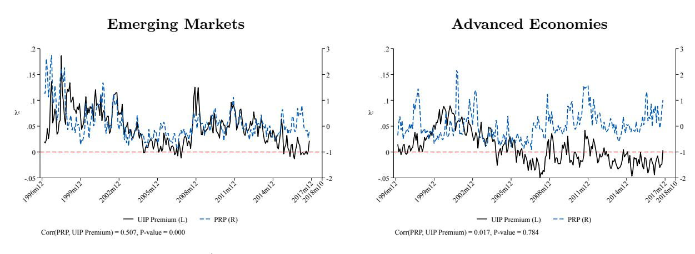

a) UIP Premium and Local Risk Factor

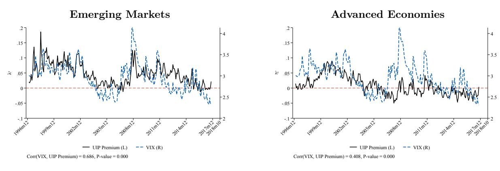

b) UIP Premium and Global Risk Factor

**Figure 7.** Global and Local Risk Premia and the UIP Premium in Emerging Markets and Advanced Economies

Next, we run a panel regression to analyze the conditional correlation of the UIP premium and local risk factors. To frame this regression, we take the factor structure of equation [\(6\)](#page-9-2) in Section [2](#page-8-0) to the data, augmenting it, following [Obstfeld and Zhou](#page-43-16) [\(2022\)](#page-43-16), with the U.S. specific convenience yield and liquidity premium terms:

$$\lambda_{t+h}^{e,c} = \underbrace{\phi_t^{CY}}_{\text{US convenience yield}} + \underbrace{\phi_t^{LP}}_{\text{US liquidity premium}} + \underbrace{\gamma^{\text{global},c} \sigma_t^{\text{global}}}_{\text{global risk factor}} + \underbrace{\gamma^{\text{local},c} \sigma_t^{\text{local},c}}_{\text{local risk factor}}.$$
(12)

As in Section [2,](#page-8-0) the composite loadings *γ* ≡ *ρ α*2 combine the exposure of the investor to each risk factor and the pass-through of that factor into the exchange rate, and *σt* is the quantity of risk carried by each factor. As discussed by [Obstfeld and Zhou](#page-43-16) [\(2022\)](#page-43-16), the U.S.-specific terms *ϕ CY t* and *ϕ LP t* can be highly correlated and hence difficult to disentangle. We therefore enter the sum of these variables in the regression. To proxy the quantity of global risk, *σ* global *t* , we employ the VIX; and for the quantity of local risk, *σ* local*,c t* , we use the policy risk premium (PRP) and also capital inflows into the given country. We later show results with other proxies for the local risk factor. The estimated coefficients on these proxies are then the empirical counterparts of the loadings *γ* global and *γ* local. We estimate panel regressions with currency/country fixed effects, introducing the covariates sequentially to understand the effect of each factor.[18](#page-24-0)

We estimate:

$$Y_{ct} = \gamma_1 \log(\text{Capital Inflows/GDP}_{ct-1}) + \gamma_2 \text{Convenience Yield/Liquidity Premium}_{t-1}$$

$$+ \gamma_3 \log(VIX_{t-1}) + \gamma_4 \operatorname{PRP}_{ct-1} + \mu_c + \varepsilon_{ct},$$
(13)

where *c* is currency/country, *t* is month, and *Yct* is the UIP premium, the interest rate differential term, or the exchange rate adjustment term, i.e., *Yct* = {*λ e ct*+*h ,* IR Diff*ct,* ER Adj*ct*+*h*}. The independent variables are lagged one month, and *µc* are currency fixed effects that allow us to assess the UIP condition 'within' currencies/countries across time. We double cluster the standard errors at the month and country/currency level. We present results for both the EM UIP premium and actual excess returns.[19](#page-24-1)

Column 1 of Table [5](#page-25-0) shows that higher capital inflows are associated with a decrease in the UIP premium. We interpret this as a proxy for low local risk: high capital inflows are associated with low local risk and a low UIP premium. The relationship persists in column 2 when we add the convenience yield/liquidity premium as a control, and in column 3 when we include the VIX. The VIX renders the convenience yield/liquidity premium term, which was previously positive, insignificant. This means that the safety and liquidity of the U.S. dollar and the risk aversion of global intermediaries are highly correlated. The coefficient on

18Note that currency and country are equivalent, as we treat the Euro Area countries as a group.

19We drop Colombia, reducing the sample to 21 emerging markets, as the PRP index is not available for Colombia.

the VIX is positive and highly statistically significant, suggesting that higher global risk is associated with a higher UIP premium in emerging markets.

Column 4 assesses our other news-based local risk factor, the policy risk premium (PRP). The coefficient is positive and highly statistically significant, indicating that increases in a country's policy uncertainty are associated with a higher UIP premium. The effect is also economically important. The coefficient implies that if PRP increases from the 25th to the 75th percentile (for example, from China to South Korea in October 2016), the UIP premium rises by one percentage point. Importantly, once we include PRP in the regression, the coefficient on the outcome-based local risk factor (capital inflows) drops substantially in size, indicating that both local risk factors capture similar variation.

**Table 5.** Determinants of the UIP Premium: 1996m11-2018m10

|                                              | Panel A: Emerging Markets |               |          |          |           |           |           |           |  |
|----------------------------------------------|---------------------------|---------------|----------|----------|-----------|-----------|-----------|-----------|--|
|                                              |                           | (i) UIP F     | remium   |          | (ii) H    | Excess Cu | rrency Re | turns     |  |
|                                              | (1)                       | (2)           | (3)      | (4)      | (5)       | (6)       | (7)       | (8)       |  |
| $\overline{\text{Inflows/GDP}_{ct-1}}$       | -0.005***                 | -0.005***     | -0.002** | -0.001   | -0.023*** | -0.023*** | -0.021*** | -0.020*** |  |
|                                              | (0.002)                   | (0.001)       | (0.001)  | (0.001)  | (0.004)   | (0.004)   | (0.003)   | (0.003)   |  |
| Convenience Yield/Liquidity Premium $_{t-1}$ |                           | $3.917^{***}$ | 0.168    | 0.163    |           | 7.269**   | 4.154     | 4.147     |  |
|                                              |                           | (1.269)       | (1.092)  | (1.040)  |           | (3.204)   | (3.992)   | (3.943)   |  |
| $\log(VIX_{t-1})$                            |                           |               | 0.058*** | 0.053*** |           |           | $0.049^*$ | 0.041     |  |
|                                              |                           |               | (0.009)  | (0.008)  |           |           | (0.027)   | (0.027)   |  |
| $PRP_{ct-1}$                                 |                           |               |          | 0.010*** |           |           |           | 0.012*    |  |
|                                              |                           |               |          | (0.003)  |           |           |           | (0.006)   |  |
| Observations                                 | 3288                      | 3288          | 3288     | 3288     | 3288      | 3288      | 3288      | 3288      |  |
| Adjusted $R^2$                               | 0.2089                    | 0.2296        | 0.3259   | 0.3468   | 0.0459    | 0.0595    | 0.0721    | 0.0785    |  |
| Number of Countries                          | 21                        | 21            | 21       | 21       | 21        | 21        | 21        | 21        |  |
| Country (currency) FE                        | Yes                       | Yes           | Yes      | Yes      | Yes       | Yes       | Yes       | Yes       |  |

(i) UIP Premium (ii) Excess Currency Returns (1)(4)(5)(6)(2)(3)(7)Inflows/GDP $_{ct-1}$ 0.019 0.024 0.035 0.034 -0.045-0.044-0.017(0.034)(0.029)(0.051)(0.048)(0.027)(0.027)(0.051)Convenience Yield/Liquidity  $Premium_{t-1}$ 3.704\*\*1.810 1.687 0.569-4.009

Panel B: Advanced Economies

(8)

-0.017

(0.049)

To compare our new currency risk measure (the UIP premium) to the classic excess

-3.998 (1.417)(1.327)(1.324)(3.203)(3.341)(3.360) $log(VIX_{t-1})$ 0.073\*\*\*0.030\*0.032\*\*0.073\*\*(0.014)(0.014)(0.023)(0.025) $PRP_{ct-1}$ 0.000-0.002(0.002)(0.006)Observations 2209 2209 2209 2209 2209 2209 2209 2209 Adjusted  $\mathbb{R}^2$ 0.07260.15820.19140.23310.23460.03050.0302 0.0722Number of Countries 12 12 12 12 12 12 12 12 Yes Yes Yes Yes Country (currency) FE Yes Yes Yes Yes

p < 0.10 \*\* p < 0.05 \*\*\* p < 0.01. Currency-time two-way clustered standard errors in parentheses.

currency returns measure, we run the same regressions. Columns 5–8 report the estimated coefficients. Interestingly, local risk factors are also positively associated with excess currency returns, and in fact the global risk factor (the VIX) plays no role in excess currency returns in emerging markets.

For comparison, we also present results for advanced countries in Panel B of Table [5.](#page-25-0) Once all variables are included, only the VIX remains statistically significant in explaining both our new UIP premium measure and the standard excess currency returns measure in advanced economies.[20](#page-26-0) These results make sense: if investors holding advanced economy assets are well diversified, then only global risk should matter. In the case of emerging markets, local risk factors affect currency risk and hence investors' returns. Returning to our Argentina pension fund nationalization example, if such erratic policies were truly idiosyncratic, investors would be able to diversify them away—unless the marginal investor is either a domestic Argentinean bank or unless emerging markets, as an asset class, are large enough in the segmented market that U.S. bank investment in the local risk factor of emerging markets affects the net worth of U.S. banks. There is empirical evidence for both channels (e.g., for Turkey, see [di Giovanni,](#page-42-6) [Kalemli-Özcan, Ulu and Baskaya](#page-42-6) [\(2022\)](#page-42-6) for the marginal investor being Turkish banks, and [Morelli, Ottonello and Perez](#page-43-17) [\(2022\)](#page-43-17) for U.S. bank net worth linked to EM default risk).

Given the important role of the global risk factor, the VIX, we have also run an alternative panel regression after orthogonalizing PRP with respect to the VIX. Results are shown below in Table [6.](#page-27-0) The results are now even stronger for the local risk factors, proxied by both PRP and capital flows. Interestingly, the orthogonalization helps us to fully separate the roles of the convenience yield of the dollar and the risk premium of emerging market currencies vis-à-vis the dollar, as in these regressions both the local risk factors and the convenience yield enter significantly with the correct signs.

### **4.2.1. Explanatory Power of Local Risk Factors in Emerging Markets**

How much explanatory power do local risk factors have? We report *R*2 values by adding variables one at a time, so that the difference between columns reflects the partial *R*2 for each variable in Table [7](#page-27-1) below. As shown in column (1), where we include only global risk factors, the explanatory power of these factors for our new currency risk measure (the UIP premium) is only 11.75%. When we add local risk factors, both time-invariant and timevarying, in columns 2 and 3 (excluding global risk factors), they explain much more, at 26%.

20This result—that the advanced economy UIP premium moves only with global risk sentiment—is robust to controlling for funding and investing currencies: Appendix Figure [B7](#page-59-1) shows that the AE UIP premium is essentially unchanged when the funding currencies (Japan and Switzerland) and the investing currencies (Australia and New Zealand) are excluded from the sample.

Table 6. Determinants of the UIP Premium: Orthogonalized by VIX

|                                                            | Emerging Markets |               |           |           |           |           |             |             |  |
|------------------------------------------------------------|------------------|---------------|-----------|-----------|-----------|-----------|-------------|-------------|--|
|                                                            |                  | (i) UIP I     | Premium   |           | (ii) I    | Excess Cu | rrency Re   | turns       |  |
|                                                            | (1)              | (2)           | (3)       | (4)       | (5)       | (6)       | (7)         | (8)         |  |
| $Inflows/GDP_{ct-1}$                                       | -0.005***        | -0.005***     | -0.002**  | -0.004*** | -0.023*** | -0.023*** | -0.021***   | -0.022***   |  |
|                                                            | (0.002)          | (0.001)       | (0.001)   | (0.001)   | (0.004)   | (0.004)   | (0.003)     | (0.003)     |  |
| Convenience Yield/Liquidity $\operatorname{Premium}_{t-1}$ |                  | $3.917^{***}$ | 0.168     | 3.888***  |           | 7.269**   | 4.154       | 7.232**     |  |
|                                                            |                  | (1.269)       | (1.092)   | (1.301)   |           | (3.204)   | (3.992)     | (3.214)     |  |
| $\log(VIX_{t-1})$                                          |                  |               | 0.058**** |           |           |           | $0.049^{*}$ |             |  |
|                                                            |                  |               | (0.009)   |           |           |           | (0.027)     |             |  |
| $PRP_{ct-1} \perp VIX$                                     |                  |               |           | 0.010***  |           |           |             | $0.013^{*}$ |  |
|                                                            |                  |               |           | (0.003)   |           |           |             | (0.006)     |  |
| Observations                                               | 3288             | 3288          | 3288      | 3288      | 3288      | 3288      | 3288        | 3288        |  |
| Adjusted $R^2$                                             | 0.2089           | 0.2296        | 0.3259    | 0.2517    | 0.0459    | 0.0595    | 0.0721      | 0.0662      |  |
| Number of Countries                                        | 21               | 21            | 21        | 21        | 21        | 21        | 21          | 21          |  |
| Country (currency) FE                                      | Yes              | Yes           | Yes       | Yes       | Yes       | Yes       | Yes         | Yes         |  |

\* p < 0.10 \*\* p < 0.05 \*\*\* p < 0.01. Currency-time two-way clustered standard errors in parentheses.

When we add back the global factors, together global and local risk factors explain 35% of the variation in the EM UIP premium.

These results are robust to allowing for country-specific loadings on the VIX and country-specific slopes on local risk factors (columns 5 and 6). Both types of heterogeneity together add an additional 7% (column 7). Consistent with the international finance literature emphasizing the importance of a dollar factor, adding a time (month) fixed effect brings the total explanatory power to 56% (column 8).

Therefore, more than 50% of the explained variation in our currency risk measure can be attributed to local and global time-varying risk factors and country-time-invariant heterogeneity. Importantly, local risk factors remain the single most important contributor to the explanatory power of the regression.

**Table 7.**  $R^2$  for Local and Global Risk Factors

|                                               |        |        |        | UIP P  | remium |        |        |        |
|-----------------------------------------------|--------|--------|--------|--------|--------|--------|--------|--------|
|                                               | (1)    | (2)    | (3)    | (4)    | (5)    | (6)    | (7)    | (8)    |
| Adjusted $R^2$                                | 0.1175 | 0.0462 | 0.2570 | 0.3468 | 0.3836 | 0.3177 | 0.4214 | 0.5615 |
| $Inflows/GDP_{ct-1}$                          | No     | Yes    | Yes    | Yes    | Yes    | Yes    | Yes    | Yes    |
| Convenience Yield/Liquidity Premium $_{t-1}$  | Yes    | No     | No     | Yes    | Yes    | Yes    | Yes    | Yes    |
| $\log(VIX_{t-1})$                             | Yes    | No     | No     | Yes    | Yes    | Yes    | Yes    | Yes    |
| $\overrightarrow{PRP_{ct-1}}$                 | No     | Yes    | Yes    | Yes    | Yes    | Yes    | Yes    | Yes    |
| $\log(VIX_{t-1}) \times \text{country dummy}$ | No     | No     | No     | No     | Yes    | No     | Yes    | Yes    |
| $PRP_{ct-1} \times \text{country dummy}$      | No     | No     | No     | No     | No     | Yes    | Yes    | Yes    |
| Currency FE                                   | No     | No     | Yes    | Yes    | Yes    | Yes    | Yes    | Yes    |
| Month FE                                      | No     | No     | No     | No     | No     | No     | No     | Yes    |

### **4.3. The UIP Premium and Interest Rate Differentials in Emerging Markets**

*Fact 3: The interest rate differential component of the UIP premium in emerging markets is more volatile and strongly correlated with local risk factors, in contrast to advanced economies.*

Figure [8](#page-28-0) plots the UIP premium decomposition for the average advanced economy and emerging market. In advanced economies, the UIP premium and the exchange rate adjustment term overlap most of the time, with a correlation over 90%, while movements in the interest rate differential term are negligible. In contrast, in emerging markets, interest rate differentials almost perfectly co-move with the UIP premium, with a 70% correlation, whereas the exchange rate adjustment term barely correlates with the UIP premium.

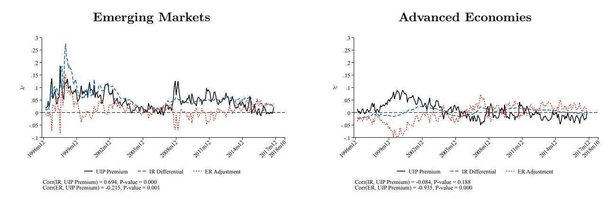

**Figure 8.** Interest Rate Differential and Exchange Rate Adjustment in AEs and EMs UIP premium decomposition into interest rate differential and exchange rate adjustment at the 12-month horizon.

Figure [9](#page-29-0) below shows that the distributions of UIP, IR, and ER are consistent with these time-series patterns. Panel (a) plots the distribution of interest rate differentials for emerging markets and advanced economies, panel (b) plots the distribution of exchange rate changes, and panel (c) plots the distribution of the UIP premium. In each panel, the dotted line denotes advanced economies. Panel (a) shows a long right tail for interest rate differentials (against the U.S.) for emerging markets, so they are positive for most, whereas they are essentially zero for most advanced economies. This is interesting because the mean interest rate differential is similar in both groups and most countries are clustered around the mean. Panel (b) shows that there are more expected depreciations in emerging markets, whereas this is not characteristic of advanced economy data at all. Panel (c) shows that the distribution of the UIP premium is tilted to the right in emerging markets compared to advanced economies, due to the higher interest rate differentials in panel (a) despite the expected depreciations in panel (b).

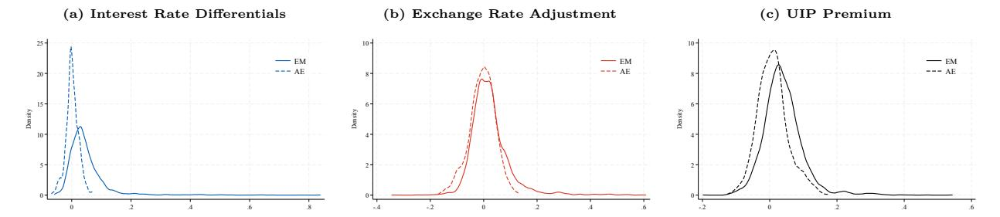

**Figure 9.** IR Differential, ER Adjustment, and UIP Distribution Distributions: interest rate differentials (a), exchange rate adjustment (*s e t*+1 − *st*, (b)), and UIP premium (c).

Finally, we show that there is a strong association between local risk factors and interest rate differentials. Table [8](#page-30-0) presents these results for three different sets of interest rates. We re-estimate our key equation, used to identify the conditional correlations of the UIP premium and risk factors, now for the UIP premium and its two components: the interest rate differential and the exchange rate adjustment. For expositional simplicity, column 1 reproduces our result on the UIP premium from column 4 of Table [5.](#page-25-0) As shown in columns 2 and 3, all local risk factors are related to the UIP premium via the IR term, whereas global risk factors affect the UIP premium via both terms. Interestingly, and unlike local risk factors, a higher VIX is associated with an expected appreciation of the local currency against the dollar in the future. This result may be mechanical: a higher VIX leads to dollar appreciation on impact, and hence it is not surprising that it is also associated with an expected dollar depreciation in the future (i.e., an expected appreciation of the other country's currency). With higher local risk factors, the opposite holds and there is an expected depreciation of the local currency. Given the low correlation between local and global risk factors, this result is not surprising, as foreign investor behavior toward local and global risk factors likely differs.

### **4.4. Local Risk Factors and Exchange Rate Expectations in Emerging Markets**

*Fact 4: Local and global risk factors influence exchange rate expectations, which in turn predict interest rate differentials.*

We construct two measures of the volatility of exchange rate expectations to link expectations to local and global risk factors. The first measure is the standard deviation of exchange rate expectations across different agents. The second measure is similar: the difference between the lowest and highest expected exchange rate values across different agents. We keep the horizon constant at 12 months for both measures. In this sense, these measures, which proxy for volatility in currency risk perceptions, are similar to the risk perception measures

**Table 8.** UIP Premium in EMs: Decomposition and Robustness with Interest Rates

|                                             | (A) Del       | (A) Deposit Rates |          |               | rnment I  | Bonds     | (C) Money Market Rates |           |           |
|---------------------------------------------|---------------|-------------------|----------|---------------|-----------|-----------|------------------------|-----------|-----------|
|                                             | (1)           | (2)               | (3)      | (4)           | (5)       | (6)       | (7)                    | (8)       | (9)       |
|                                             | UIP Premium   | IR Diff.          | ER Adj.  | UIP Premium   | IR Diff.  | ER Adj.   | UIP Premium            | IR Diff.  | ER Adj.   |
| $Inflows/GDP_{ct-1}$                        | -0.001        | -0.002*           | -0.001   | -0.009**      | -0.005*** | 0.005     | -0.001                 | -0.002*** | -0.001    |
|                                             | (0.001)       | (0.001)           | (0.001)  | (0.003)       | (0.001)   | (0.003)   | (0.001)                | (0.000)   | (0.001)   |
| $\log(VIX_{t-1})$                           | $0.053^{***}$ | $0.034^{***}$     | -0.018** | $0.049^{***}$ | 0.018***  | -0.031*** | 0.045***               | 0.024***  | -0.021*** |
|                                             | (0.008)       | (0.011)           | (0.009)  | (0.009)       | (0.005)   | (0.009)   | (0.007)                | (0.005)   | (0.007)   |
| Convenience Yield/Liquidity $Premium_{t-1}$ | 0.163         | -0.117            | -0.279   | -1.034        | -0.627    | 0.407     | -0.166                 | -0.900    | -0.734    |
|                                             | (1.040)       | (1.185)           | (1.147)  | (1.133)       | (0.463)   | (0.897)   | (1.061)                | (0.541)   | (1.018)   |
| $PRP_{ct-1}$                                | 0.010***      | 0.006***          | -0.004   | 0.007**       | 0.003**   | -0.003    | 0.010**                | 0.006**   | -0.004    |
|                                             | (0.003)       | (0.002)           | (0.003)  | (0.003)       | (0.002)   | (0.004)   | (0.004)                | (0.002)   | (0.003)   |
| Observations                                | 3288          | 3288              | 3288     | 1761          | 1761      | 1761      | 2665                   | 2665      | 2665      |
| Adjusted $R^2$                              | 0.3468        | 0.4860            | 0.3255   | 0.3655        | 0.7045    | 0.2332    | 0.3534                 | 0.5521    | 0.2075    |
| Number of Countries                         | 21            | 21                | 21       | 21            | 21        | 21        | 21                     | 21        | 21        |
| Country (currency) FE                       | Yes           | Yes               | Yes      | Yes           | Yes       | Yes       | Yes                    | Yes       | Yes       |

Two-way currency-time clustered standard errors in parentheses. \*,\*\*,\*\*\* denote statistical significance at the 10, 5, and 1 percent levels, respectively.

for high- and low-volatility assets calculated in Pflueger, Siriwardane and Sunderam (2020). Using these measures, we run a two-stage regression as shown in Table 9. In the first stage, we regress the newly constructed measures of volatility in exchange rate expectations on local and global risk factors. When we use both the global risk factor (VIX) and the local risk factor (PRP), we obtain a strong first stage with significant predictive power of expectation volatility on the interest rate differential, as shown in the second stage (top panel) in columns (2), (3), (5), and (6). The second stage regresses interest rate differentials only on the "risk-factor-predicted" volatility in exchange rate expectations.

Table 9. Expectations Channel in Emerging Markets

|                                                                |          | Second           | Stage: Intere  | est Rate | Differentia | al                      |
|----------------------------------------------------------------|----------|------------------|----------------|----------|-------------|-------------------------|
|                                                                | (1)      | (2)              | (3)            | (4)      | (5)         | (6)                     |
| $\mathbf{S}_{a^{high}t+1}^{e}$ - $\mathbf{S}_{a^{low}t+1}^{e}$ | 0.141*   | 0.075***         | 0.101***       |          |             |                         |
|                                                                | (0.077)  | (0.015)          | (0.029)        |          |             |                         |
| Std Dev $\mathbf{s}_{at+1}^e$                                  |          |                  |                | 0.073    | 0.050***    | 0.057***                |
| ,                                                              |          |                  |                | (0.045)  | (0.015)     | (0.015)                 |
| RHS variable in First Stage                                    | VIX      | PRP              | VIX & PRP      | VIX      | PRP         | VIX & PRP               |
| Observations                                                   | 3279     | 3279             | 3279           | 2155     | 2155        | 2155                    |
|                                                                |          | First Sta        | ge: Dispersion | n in ER  | Expectation | ons                     |
|                                                                | $S_a^e$  | $high_{t+1} - s$ | $a^{low}t+1$   |          | Std Dev     | $\mathbf{S}_{at+1}^{e}$ |
| $\log(VIX_{t-1})$                                              | 0.267*** |                  | 0.205**        | 0.215**  |             | 0.170*                  |
|                                                                | (0.080)  |                  | (0.084)        | (0.096)  |             | (0.094)                 |
| $PRP_{ct-1}$                                                   |          | 0.119***         | 0.101***       | ,        | 0.136***    | 0.124***                |
|                                                                |          | (0.024)          | (0.028)        |          | (0.028)     | (0.030)                 |
| Cragg-Donal Wald F statistic                                   | 137.75   | 197.70           | 141.16         | 58.72    | 120.99      | 80.29                   |
| Kleibergen-Paap Wald F statistic                               | 11.06    | 24.46            | 20.89          | 5.01     | 23.57       | 10.71                   |

#### 4.5. Policy Shocks, Local Risk Factors and Expectations in Emerging Markets

**Fact 5**: The emerging markets' local risk factor is associated with country-specific policy shocks, where such policy uncertainty can predict persistent expectations of depreciation in emerging markets well into the future, but has no such effect in advanced economies.

Our final fact concerns how factors such as policy uncertainty underlie local risk factors and can create persistent exchange rate expectations. To examine this dynamically, we run local projections for the response of expected exchange rate changes to local-risk-predicted interest rate differential shocks at time t:

$$s_{c,t+h}^e - s_{c,t} = \beta_h (\hat{i}_{c,t} - \hat{i}_t^{US})^{\text{local risk predicted}} + \mu_c + \epsilon_{c,t+h}, \tag{14}$$

where the coefficient of interest,  $\beta_h$ , reports the response of the expected exchange rate change over the next 12 months to a shock at each month h, conditional on currency fixed effects  $(\mu_c)$ .

For the local-risk-predicted interest rate differential shock, we use only the local risk factor (PRP), unlike the previous section's two-stage regressions that used both local and global risk to predict dispersion in exchange rate expectations. Results are reported in Figure 10, which shows that in emerging markets the local risk factor associated with country-specific policy shocks can predict persistent expectations of depreciation.

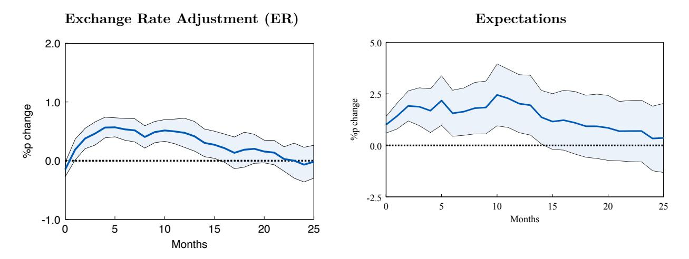

**Figure 10.** Emerging Markets: Response of ER and Expectations to a Local-Risk-Factor-Predicted IR Shock

95% confidence intervals, using Driscoll-Kraay standard errors with a bandwidth lag of h+1 for horizon h.

### **5. Robustness**

### **5.1. Other Measures of Local Risk Factors**

We employ three additional variables reflecting local risk factors: *composite country risk*, *government policy risk*, and *confidence risk*. [21](#page-32-0)

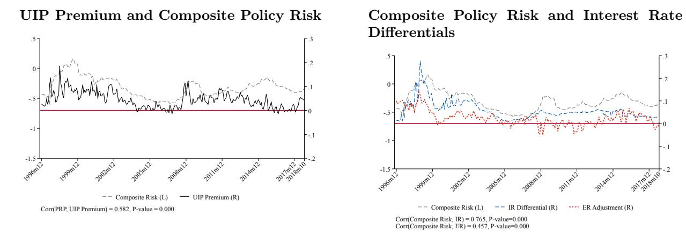

**Figure 11.** Composite Risk and UIP Premium in Emerging Markets

The left graph of Figure [11](#page-32-1) plots the average composite risk index (gray dashed line) and the UIP premium (black line) for emerging markets. Notably, these two lines track each other closely, with a comovement of 58%. In the right graph, we plot the correlation of the composite risk index with the two components of the UIP premium. Confirming our previous findings, in emerging markets the composite risk index is highly correlated with the interest rate differential.

To unpack the elements implied in the composite risk, we revisit our previous panel regressions. In Table [10,](#page-33-1) the coefficient on the composite risk index is positive and highly statistically significant, indicating that increases in country-specific risk are associated with a higher UIP premium on its currency (column 1). The size of the coefficient is economically important: if composite risk increases from the 25th to the 75th percentile (from Chile to Russia in June 2016), the UIP premium increases by 4 percentage points. As before, composite risk is associated with the interest rate differential (columns 2 and 3). It is worth noting that composite risk does not overpower the VIX coefficient, which remains similar in magnitude and highly statistically significant, but it does overpower capital inflows, as before.

21The ICRG further decomposes political risk into other sub-components such as corruption, law and order, bureaucracy quality, and internal and external conflicts, among others. These sub-components capture elements of policy risk that are not significantly related to foreign investors' risk sentiment, and these results are available upon request.

Table 10. UIP Deviations in EMs: A Granular View

|                                             | Panel (A):               | Composi             | te Risk              | Panel (B): U             | npacking Co              | mposite Risk             |
|---------------------------------------------|--------------------------|---------------------|----------------------|--------------------------|--------------------------|--------------------------|
|                                             | (1) UIP Premium       | (2) IR Diff.     | (3) ER Adj.       | (4) UIP Premium       | (5) UIP Premium       | (6) UIP Premium       |
| $\overline{\text{Inflows/GDP}_{ct-1}}$      | -0.001 (0.001)        | -0.001** (0.000) | -0.000 (0.001)    | -0.001 (0.001)        | -0.002* (0.001)       | -0.001 (0.001)        |
| $\log(VIX_{t-1})$                           | $0.052^{***}$ (0.005) | 0.029*** (0.003) | -0.023*** (0.005) | $0.058^{***}$ (0.005) | $0.054^{***}$ (0.005) | $0.055^{***}$ (0.005) |
| Convenience Yield/Liquidity $Premium_{t-1}$ | -0.328 $(0.749)$         | -0.750 (0.587)   | -0.422 $(0.719)$     | -0.203 (0.757)        | -0.273 $(0.727)$         | -0.388 $(0.712)$         |
| Composite $Risk_{ct-1}$                     | 0.052*** (0.006)      | 0.089*** (0.006) | 0.037*** (0.006)  |                          |                          |                          |
| Government Policy $Risk_{ct-1}$             |                          |                     |                      | $0.020^{***} $ $(0.005)$ |                          | $0.014^{***}$ $(0.005)$  |
| Confidence $\operatorname{Risk}_{ct-1}$     |                          |                     |                      |                          | 0.023*** (0.004)      | 0.020*** (0.004)      |
| Observations                                | 3427                     | 3427                | 3427                 | 3427                     | 3427                     | 3427                     |
| Adjusted $R^2$                              | 0.3639                   | 0.3639              | 0.3639               | 0.3316                   | 0.3396                   | 0.3435                   |
| Number of Countries                         | 245                      | 245                 | 245                  | 245                      | 245                      | 245                      |
| Country (currency) FE                       | Yes                      | Yes                 | Yes                  | Yes                      | Yes                      | Yes                      |

\* p < 0.10 \*\* p < 0.05 \*\*\* p < 0.01. Time-clustered standard errors in parentheses. Note that, given the low number of clusters due to data availability, we cannot double cluster in this regression. 22 EM currencies. Period 1996m11:2018m10.

Column 4–6 present the results for the other measures that make up composite risk. Column 4 shows that increases in government policy risk are associated with a higher UIP premium, and column 5 confirms a similar correlation for confidence risk. Importantly, column 6 includes both variables together and shows that both remain positive and highly statistically significant. Furthermore, both coefficients remain similar in size to those estimated in columns 4 and 5, indicating that the two variables capture different forms of policy shocks.

#### 5.2. Sovereign Default and Inflation

A large literature has shown that default risk is a key reason for emerging markets' higher borrowing costs in their own currency or their inability to borrow in their own currency. Although we showed earlier the high correlation between the UIP premium and the UIP premium adjusted by subtracting the CDS spread (see also Appendix Figure B6), we revisit our regressions controlling for default risk in this robustness section. Table 11 presents the results. In column 1 of Table 11, we run a robustness analysis for sovereign default, presenting a highly stringent test by keeping only the 6 countries that never defaulted since World War II, thus removing countries that investors could perceive as having high default risk. In column 2, we employ data from Reinhart, Rogoff, Trebesch and Reinhart (2021) on

monthly episodes of sovereign debt crises and control for these episodes with a dummy. Table 11 shows that none of these controls overpower the local and global risk factors measured with PRP and the VIX.

Another potential concern is that high interest rate currencies might correlate with high inflation rates, so that the UIP premium observed in nominal terms might vanish in real terms. To assess this, we re-estimate our panel regressions and add inflation differentials as a control. These results are consistent with our original findings and are shown in Table 12.

**Table 11.** The Role of Sovereign Default

|                                              | UIP pı   | remium   |
|----------------------------------------------|----------|----------|
|                                              | (1)      | (2)      |
| $\overline{\text{Inflows/GDP}_{ct-1}}$       | 0.001    | -0.005   |
|                                              | (0.032)  | (0.046)  |
| $\log(VIX_{t-1})$                            | 0.024*   | 0.036*** |
|                                              | (0.012)  | (0.009)  |
| Convenience Yield/Liquidity premium $_{t-1}$ | -0.433   | -0.555   |
| t-1                                          |          | (0.951)  |
| $PRP_{ct-1}$                                 | 0.009*** | 0.012*** |
| 1 1 1 1 1 1 1 1 1 1 1 1 1 1 1 1 1 1 1        |          | (0.003)  |
| Expected Inflation Differential $_{ct-1}$    | 1 737*** | 1.423*** |
| Expected immedian Emissional and             |          | (0.184)  |
| No Sovereign Default                         |          | 0.003    |
| To bovereigh Denaute                         |          | (0.016)  |
| Ol samueliana                                | 707      | 0004     |
| Observations                                 | 797      |          |
| Adjusted $R^2$                               |          | 0.4421   |
| Number of Countries                          | 6        | 16       |
| Country (currency) FE                        | Yes      | Yes      |

**Notes:** Two-way currency-time clustered standard errors in parentheses.  $^*,^{**},^{***}$  denote statistical significance at the 10, 5, and 1 percent levels, respectively.

# 5.3. Sample Composition: Exchange Rate Regimes, Reclassified Countries, Capital Controls, and CIP

We close the robustness analysis by addressing four related concerns about the composition of our sample and the interpretation of interest rate differentials.

Exchange rate regimes. Our sample keeps only floating exchange rate regimes based on the coarse classification of Ilzetzki, Reinhart and Rogoff (2017), so pegs and managed pegs are excluded by construction, including those in place early in the sample. Countries therefore enter and exit the sample as their regime changes; Appendix Table B7 reports the exact in-sample periods for each currency. This addresses the concern that early-sample pegs could

Table 12. Inflation Differential

|                                              | Emergi      | Emerging Markets |          |  |  |
|----------------------------------------------|-------------|------------------|----------|--|--|
|                                              | (1)         | (2)              | (3)      |  |  |
|                                              | UIP Premium | IR Diff.         | ER Adj.  |  |  |
| $\overline{\text{Inflows/GDP}_{ct-1}}$       | -0.001      | -0.002*          | -0.001   |  |  |
|                                              | (0.001)     | (0.001)          | (0.001)  |  |  |
| $\log(VIX_{t-1})$                            | 0.048***    | 0.028***         | -0.020** |  |  |
|                                              | (0.008)     | (0.008)          | (0.007)  |  |  |
| Convenience Yield/Liquidity premium $_{t-1}$ | -0.126      | -0.352           | -0.226   |  |  |
| t-1                                          | (0.987)     | (1.025)          |          |  |  |
| $PRP_{ct-1}$                                 | 0.009***    | 0.005**          | -0.004   |  |  |
| - 60 1                                       | (0.003)     | (0.002)          | (0.003)  |  |  |
| Inflation Differential $_{ct-1}$             | 1.840***    | 2.517            | 0.677    |  |  |
|                                              | (0.457)     | (1.592)          | (1.215)  |  |  |
| Observations                                 | 3203        | 3203             | 3203     |  |  |
| Adjusted $R^2$                               | 0.4015      | 0.5239           | 0.2620   |  |  |
| Number of Countries                          | 20          | 20               | 20       |  |  |
| Country (currency) FE                        | Yes         | Yes              | Yes      |  |  |

**Notes:** \* p < 0.10 \*\* p < 0.05 \*\*\* p < 0.01. Currency-time two-way clustered standard errors in parentheses. Inflation differentials are the difference between CPI in the home economy and the U.S.

contaminate the estimated relationship between interest rate differentials and expected depreciation: currency-month observations under pegged or heavily managed regimes—where the exchange rate cannot covary with the interest rate by construction—never enter our regressions.

Countries reclassified from emerging to advanced. Three countries in our sample—the Czech Republic, Korea, and the Slovak Republic—were reclassified as advanced economies by the IMF during our sample period. To avoid a composition effect whereby the country groups change over time, we hold the classification fixed using the IMF-WEO 2000 income classification, so Korea remains in the emerging market group throughout. Others drop after 2009 as they become de-jure and de-facto fixed exchange rates vis-a-vis Euro.

Capital controls. Interest rate differentials could reflect not only currency risk but also actual or feared capital controls. Three features of our analysis address this. First, our news-based policy risk premium explicitly includes "capital controls" among its search terms, and our ICRG-based government policy risk measure includes contract viability/expropriation and profits repatriation risk, so the regressions in Tables 5 and 10 already condition on measured capital control risk as part of local policy risk—this is part of our interpretation, not a confound. Second, the countries and periods with the most severe controls are typically also those with pegged regimes, which are excluded from the sample. Third, the shadow price

of impediments to arbitrage, including capital controls, is the CIP deviation, to which we turn next.

*CIP deviations and the post-2008 period.* A natural question is how survey-based UIP results should be read after the 2008 breakdown of covered interest parity even among advanced economies [\(Du, Tepper and Verdelhan,](#page-42-13) [2018\)](#page-42-13). Two points are relevant. First, our UIP premium is constructed from survey expectations and deposit/money market rates, not from forward rates; it is therefore not mechanically contaminated by CIP deviations, which reflect intermediation frictions and balance sheet costs rather than currency risk. Second, Appendix [A](#page-55-0) compares UIP and CIP deviations in our sample, over time and in the cross section (Figures [A2–](#page-56-0)[A5\)](#page-57-0): for emerging markets, the UIP premium is an order of magnitude larger than the CIP deviation throughout, and for advanced economies the post-2008 CIP deviations, while nonzero and persistent, remain small relative to the emerging market UIP premium. The comparison is robust to constructing CIP with deposit or interbank rates, and our CIP measure lines up with the [Du, Pflueger and Schreger](#page-42-14) [\(2020\)](#page-42-14) cross-currency basis on the common sample (Figure [A4\)](#page-57-1). Hence the compositional asymmetry we document is not an artifact of the post-2008 dollar intermediation regime; if anything, subtracting each currency's CIP deviation from its UIP premium leaves our facts intact, as the localrisk-driven component operates through deposit and money market rates that are largely insulated from the forward market frictions behind the CIP breakdown.

### **5.4. Forecast Errors and Predictability**

A large literature tries to understand how much of the original Fama findings can be attributed to currency risk premium. Any wedge between the interest differential and the realized exchange rate change (realized UIP premium) is either a risk premium (something investors expected to earn, an ex-ante term) or a forecast error (something they got wrong, an ex-post term). [Froot and Frankel](#page-42-4) [\(1989\)](#page-42-4) designed a test to separate the risk premium term from expectational errors.

The test is simple and straightforward: If interest rate differentials predict forecast errors, then the wedge (realized UIP deviation) is about expectational errors. If, however, the interest rate differentials do not predict forecast errors, but there is still a wedge, then the deviation must be risk premium. Thus we run:

$$\Delta s_{ct+h} - \Delta s_{ct+h}^e = \gamma (i_{ct} - i_t^{US}) + \mu_c + \varepsilon_{ct+h}, \tag{15}$$

As shown in column (1) of Table [13,](#page-37-0) this regression delivers a negative significant coefficient of -1.6 with standard error (0.55) for advanced countries, fully consistent with the prior literature. However, in column (2), for emerging market currencies, the coefficient is insignificant: -0.106 (0.144). Thus, in columns (3) and (4), we have run conditional forecast error regressions for emerging markets, that reinforces our interpretation that interest rate differentials have no other information than what is captured by the expectations to predict forecast errors. Dropping expectations and controlling realized exchange rate change leads interest rate differentials to pick up the effect of expectations.

**Table 13.** Forecast errors regressions

|                                | Advanced Economies |         | Emerging Markets |           |
|--------------------------------|--------------------|---------|------------------|-----------|
|                                | (1)                | (2)     | (3)              | (4)       |
| Log Interest Differential      | -1.619∗∗           | -0.106  | 0.134            | -0.459∗∗∗ |
|                                | (0.549)            | (0.144) | (0.141)          | (0.077)   |
| Expected Exchange Rate changes |                    |         | -0.500∗∗∗        |           |
|                                |                    |         | (0.155)          |           |
| Realized Exchange Rate changes |                    |         |                  | 0.943∗∗∗  |
|                                |                    |         |                  | (0.019)   |
| Observations                   | 2285               | 3577    | 3577             | 3577      |
| R2 Adjusted                 | 0.0873             | 0.0482  | 0.0750           | 0.8948    |
| Number of Countries            | 12                 | 22      | 22               | 22        |
| Country (currency) FE          | Yes                | Yes     | Yes              | Yes       |
| Time FE                        | No                 | No      | No               | No        |

To do [Froot and Frankel](#page-42-4) [\(1989\)](#page-42-4) exact decomposition, note that the probability limit of the coefficient *β F* in equation [\(8\)](#page-19-2) is

$$plim \,\hat{\beta}^F = \frac{cov(\Delta s_{ct+h} - \Delta \overline{s}_c, IR_{ct} - \overline{IR}_c)}{var(IR_{ct} - \overline{IR}_c)}, \tag{16}$$

where *IRct* = *ict* − *i US t* denotes the interest rate differential, and the overline denotes the average of the variable for each currency across months, which corresponds to the currency fixed effects. Forecast error comes from regression above as;

$$\eta_{ct+h}^e = \Delta s_{ct+h} - \Delta s_{ct+h}^e, \tag{17}$$

and rewrite *plim β*ˆ*F* as:

$$plim\,\hat{\beta}^F = 1 - b_{RE} - b_{RP} \tag{18}$$

**Table 14.** Decomposition of Fama Coefficient into Risk Premium and Expectational Error Components

|                                                                                      | Advanced Economies    | Emerging Markets                      |
|--------------------------------------------------------------------------------------|-----------------------|---------------------------------------|
|                                                                                      | (1)                   | (2)                                   |
|                                                                                      | Panel A:Decomposition | n of Bias Fama Coefficient            |
| (i) $\beta_{RE}$                                                                     | 1.62                  | .106                                  |
| (ii) $\beta_{RP}$                                                                    | 2202                  | .5198                                 |
| implied $\beta^F$ from (i) and (ii)                                                  | 3998                  | .3742                                 |
|                                                                                      | Panel B: Compon       | ents of $\beta_{RE}$ and $\beta_{RP}$ |
| $cov(\eta_{ct+h}^e - \bar{\eta}_c, IR_{ct} - \bar{IR}_c)$                            | 04046                 | 03421                                 |
| $\operatorname{var}(IR_{ct} - \bar{IR}_c)$                                           | .02498                | .3228                                 |
| $\operatorname{var}(\lambda_{ct+h}^e - \bar{\lambda}_c^e)$                           | .1798                 | .2836                                 |
| $cov(\Delta s_{ct+h}^e - \Delta \bar{s}_c^e, \lambda_{ct+h}^e - \bar{\lambda}_c^e))$ | 1853                  | 1158                                  |

$$b_{RE} = -\frac{cov(\eta_{ct+h}^e - \overline{\eta}_c^e, IR_{ct} - \overline{IR}_c)}{var(IR_{ct} - \overline{IR}_c)} \quad \text{and}$$

$$b_{RP} = \frac{var(\lambda_{ct+h}^e - \overline{\lambda}_c^e) + cov(\Delta s_{ct+h}^e - \Delta \overline{s}_c^e, \lambda_{ct+h}^e - \overline{\lambda}_c^e)}{var(IR_{ct} - \overline{IR}_c)}.$$

$$(19)$$

The first term  $b_{RE}$  represents the covariance between the forecast errors and the interest rate differential. The Fama coefficient would be biased downward if higher interest rate differentials led agents to expect a larger exchange rate change than the change observed ex-post in the data—that is, whenever  $b_{RE} > 0$ . The second term  $b_{RP}$  represents a risk premium, determined by the volatility of the expected excess return and its covariance with the expected exchange rate change. The Fama coefficient would be biased downward  $(b_{RP} > 0)$  if there is a time-varying expected excess return and the volatility of the excess return is higher than the comovement between the expected excess return and the expected exchange rate change.

Table 14 shows the results. Column 1 reports results for advanced economies and column 2 for emerging markets. For advanced economies, the  $b_{RE}$  term is more than an order of magnitude larger than the  $b_{RP}$  term. For emerging markets, in contrast, the  $b_{RP}$  term is substantially larger than the  $b_{RE}$  term.

### **6. Conclusion**

In this paper, we construct a forward-looking measure of the currency risk premium—the UIP premium—from survey-based expectations of exchange rate changes, and use it to characterize how currency risk is priced across emerging markets and advanced economies. Our organizing finding is a compositional asymmetry: the currency risk premium is primarily an *expectations* phenomenon associated with global risk in advanced economies, but an *interestrate-differential* phenomenon associated with local policy risk in emerging markets.

We document this asymmetry through five facts, which convey three main messages. First, emerging market currencies carry a substantially higher and more volatile forwardlooking risk premium than advanced economy currencies—a 3.3 percentage point difference that persists even after accounting for default risk. This persistent gap is consistent with investors pricing in expected future depreciation of emerging market currencies.

Second, this premium is associated with local rather than global risk in emerging markets, and it operates through a different component of the premium than in advanced economies. Local risk factors—particularly news-based measures of policy uncertainty—account for 26 percent of the variation in the emerging market UIP premium, while global indicators such as the VIX account for only 12 percent; the relationship is reversed in advanced economies. Moreover, in emerging markets the premium co-moves with the interest rate differential, whereas in advanced economies it co-moves with expected exchange rate changes. Our eventstudy decompositions of Argentina's pension fund nationalization (2008) and the Brexit referendum (2016) illustrate this contrast: an increase in policy uncertainty accompanies a higher premium that operates through the interest rate differential in the emerging market and through expectations in the advanced economy.

Third, local and global risk factors are associated with the dispersion in exchange rate expectations among market participants, which in turn predicts the interest rate differentials that compensate investors for currency risk. This expectations channel is economically meaningful in emerging markets—policy shocks are followed by persistent expected depreciation over a 12-month horizon—yet largely absent in advanced economies.

Read through the lens of macro-finance models with segmented asset markets, these facts describe a two-way relationship between policy risk and currency pricing. Higher interest rate differentials in emerging markets accompany local policy uncertainty, with investors expecting currency depreciation as compensation for the risk of holding these currencies; conversely, as local risk abates, interest differentials narrow and expected depreciation moderates. This endogeneity—where both higher interest rates and expected depreciation reflect policy-related risk—distinguishes emerging market currency pricing from that of advanced economies and is consistent with the persistence of carry-trade profits specifically in emerging markets, even if carry trades ultimately unwind in both sets of countries.

Our objective has been measurement and the documentation of robust regularities for UIP premia rather than the identification of a single causal channel. The value of the five facts is that they provide empirical moments that any model of currency risk premia should confront: the level and volatility gap between the two groups, the local-versus-global composition of the premium, the component—interest rate differential versus expectations through which each group's premium operates, and the expectations channel through which local risk is associated with interest rate differentials. These regularities suggest that understanding emerging market currency dynamics requires careful attention to the domestic policy environment and its effect on investor risk perceptions. Future research might examine how policy coordination shapes the risk premium, or how foreign investors' exposure to specific emerging markets transmits to capital flows through the expectations channel we document.

### **7. Acknowledgements**

We are especially grateful to our discussants, Kenza Benhima and Menzie Chinn, and to the board of the NBER International Seminar on Macroeconomics for detailed comments that shaped this revision. We thank Pat Kehoe, Oleg Itskhoki, Dmitry Mukhin, Vania Stavrakeva, and Adrien Verdelhan for lengthy conversations and extensive comments. We thank Manuel Amador, Mark Aguiar, Pablo Becker, Javier Bianchi, Menzie Chinn, Wenxin Du, Pierre de Leo, Charles Engel, Jeffrey Frankel, Tarek Hassan, Hanno Lustig, Arvind Krishnamurthy, Ian Martin, Emi Nakamura, Jesse Schreger, Ken Rogoff, Alessandro Rebucci, Hélène Rey, Jenny Tang, and other seminar and conference participants for helpful comments.

### **References**

- **Alvarez, Fernando, Andrew Atkeson, and Patrick J. Kehoe.** 2009. "Time-Varying Risk, Interest Rates, and Exchange Rates in General Equilibrium." *The Review of Economic Studies*, 76(3): 851–878.
- **Ashworth, Louis.** 2022. "Quantifying Britain's moron risk premium." *Financial Times*.
- **Avdjiev, Stefan, Bryan Hardy, Şebnem Kalemli-Özcan, and Luis Servén.** 2022. "Gross Capital Flows by Banks, Corporates and Sovereigns." *Journal of the European Economic Association*, 20(5): 2098–2135.
- **Azzimonti, Marina, and Nirvana Mitra.** 2023. "Political Constraints and Sovereign Default." *Journal of International Money and Finance*, 137: 102895.
- **Bacchetta, Philippe, and Eric Van Wincoop.** 2006. "Can Information Heterogeneity Explain the Exchange Rate Determination Puzzle?" *American Economic Review*, 96(3): 552–576.
- **Backus, David K, Silverio Foresi, and Chris I Telmer.** 1995. "Interpreting the forward premium anomaly." *Canadian Journal of Economics*, S108–S119.
- **Baker, Scott R, Nicholas Bloom, and Steven J Davis.** 2016. "Measuring Economic Policy Uncertainty." *The Quarterly Journal of Economics*, 131(4): 1593–1636.
- **Bansal, Ravi, and Magnus Dahlquist.** 2000. "The forward premium puzzle: different tales from developed and emerging economies." *Journal of International Economics*, 51(1): 115 – 144.
- **Barrett, Philip, Maximiliano Appendino, Kate Nguyen, and Jorge de Leon Miranda.** 2022. "Measuring social unrest using media reports." *Journal of Development Economics*, 158: 102924.
- **Bianchi, Javier, Saki Bigio, and Charles Engel.** 2021. "Scrambling for dollars: International liquidity, banks and exchange rates." National Bureau of Economic Research.
- **Bryant, Ralph C.** 1995. *The "exchange Risk Premium," Uncovered Unterest Parity, and the Treatment of Exchange Rates in Multicountry Macroeconomic Models.* Brookings Institution.
- **Burnside, Craig, Martin Eichenbaum, and Sergio Rebelo.** 2007. "The Returns to Currency Speculation in Emerging Markets." *American Economic Review*, 97(2): 333–338.
- **Bussiere, Matthieu, Menzie Chinn, Laurent Ferrara, and Jonas Heipertz.** 2022. "The new Fama puzzle." *IMF Economic Review*, 70(3): 451–486.
- **Candian, Giacomo, and Pierre De Leo.** 2023. "Imperfect Exchange Rate Expectations." *The Review of Economics and Statistics*.
- **Chinn, Menzie, and Jeffrey Frankel.** 1994. "Patterns in Exchange Rate Forecasts for Twenty-Five Currencies." *Journal of Money, Credit and Banking*, 26(4): 759–770.
- **Chinn, Menzie, and Jeffrey Frankel.** 2020. "A Third of a Century of Currency Expectations Data: The Carry Trade and the Risk Premium." University of Wisconsin and Harvard Kennedy School, mimeo.

- **Cieslak, Anna, Stephen Hansen, Michael McMahon, and Song Xiao.** 2023. "Policymakers' Uncertainty." National Bureau of Economic Research.
- **di Giovanni, Julian, Şebnem Kalemli-Özcan, Mehmet Fatih Ulu, and Yusuf Soner Baskaya.** 2022. "International Spillovers and Local Credit Cycles." *The Review of Economic Studies*, 89(2): 733–773.
- **Du, Wenxin, Alexander Tepper, and Adrien Verdelhan.** 2018. "Deviations from Covered Interest Rate Parity." *The Journal of Finance*, 73(3): 915–957.
- **Du, Wenxin, Carolin E. Pflueger, and Jesse Schreger.** 2020. "Sovereign Debt Portfolios, Bond Risks, and the Credibility of Monetary Policy." *The Journal of Finance*, 75(6): 3097–3138.
- **Engel, Charles.** 2014. "Exchange Rates and Interest Parity." In *Handbook of International Economics*. Vol. 4, Chapter Chapter 8, 453–522. Elsevier.
- **Engel, Charles, Katya Kazakova, Mengqi Wang, and Nan Xiang.** 2022. "A reconsideration of the failure of uncovered interest parity for the US dollar." *Journal of International Economics*, 136: 103602.
- **Fama, Eugene F.** 1984. "Forward and spot exchange rates." *Journal of Monetary Economics*, 14(3): 319 – 338.
- **Frankel, Jeffrey A., and Kenneth A. Froot.** 1987. "Using Survey Data to Test Standard Propositions Regarding Exchange Rate Expectations." *The American Economic Review*, 77(1): 133– 153.
- **Frankel, Jeffrey, and Jumana Poonawala.** 2010. "The forward market in emerging currencies: Less biased than in major currencies." *Journal of International Money and Finance*, 29(3): 585– 598.
- **Friedman, Benjamin M, and Kenneth N Kuttner.** 1992. "Time-varying risk perceptions and the pricing of risky assets." *Oxford Economic Papers*, 44(4): 566–598.
- **Froot, Kenneth A., and Jeffrey Frankel.** 1989. "Forward Discount Bias: Is it an Exchange Risk Premium?" *The Quarterly Journal of Economics*, 104(1): 139–161.
- **Giles, Chris, and George Parker.** 2022. "UK Public Finances Shift from 'Moron Premium' to 'Dullness Dividend'." *Financial Times*.
- **Gilmore, Stephen, and Fumio Hayashi.** 2011. "Emerging Market Currency Excess Returns." *American Economic Journal: Macroeconomics*, 3(4): 85–111.
- **Hansen, Lars Peter, and Robert J. Hodrick.** 1980. "Forward Exchange Rates as Optimal Predictors of Future Spot Rates: An Econometric Analysis." *Journal of Political Economy*, 88(5): 829–853.
- **Hassan, Tarek, and Rui C Mano.** 2019. "Forward and Spot Exchange Rates in a Multi-currency World." *The Quarterly Journal of Economics*, 134(1): 397–450.

- **Ilzetzki, Ethan, Carmen M. Reinhart, and Kenneth S. Rogoff.** 2017. "The Country Chronologies to Exchange Rate Arrangements into the 21st Century: Will the Anchor Currency Hold?" National Bureau of Economic Research, Inc NBER Working Papers 23135.
- **Isard, Peter.** 1983. "An Accounting Framework and Some Issues for Modeling How Exchange Rates Respond to the News." *Exchange Rates and International Macroeconomics*, 19–66. University of Chicago Press.
- **Ito, Takatoshi.** 1990. "Foreign Exchange Rate Expectations: Micro Survey Data." *American Economic Review*, 80(3): 434–49.
- **Itskhoki, Oleg, and Dmitry Mukhin.** 2024. "Mussa Puzzle Redux." *Econometrica*. forthcoming.
- **Jiang, Zhengyang, Arvind Krishnamurthy, and Hanno Lustig.** 2021. "Foreign Safe Asset Demand and the Dollar Exchange Rate." *The Journal of Finance*, 76(3): 1049–1089.
- **Lustig, Hanno, and Adrien Verdelhan.** 2007. "The Cross Section of Foreign Currency Risk Premia and Consumption Growth Risk." *American Economic Review*, 97(1): 89–117.
- **Lustig, Hanno, Nikolai Roussanov, and Adrien Verdelhan.** 2011. "Common Risk Factors in Currency Markets." *The Review of Financial Studies*, 24(11): 3731–3777.
- **Miranda-Agrippino, Silvia, and Hélène Rey.** 2020. "U.S. Monetary Policy and the Global Financial Cycle." *The Review of Economic Studies*.
- **Morelli, Juan M., Pablo Ottonello, and Diego J. Perez.** 2022. "Global Banks and Systemic Debt Crises." *Econometrica*, 90(2): 749–798.
- **Obstfeld, Maurice, and Haonan Zhou.** 2022. "The global dollar cycle." *Brookings Papers on Economic Activity*, 2022(2): 361–447.
- **Pflueger, Carolin, Emil Siriwardane, and Adi Sunderam.** 2020. "Financial market risk perceptions and the macroeconomy." *The Quarterly Journal of Economics*, 135(3): 1443–1491.
- **Reinhart, Carmen, Ken Rogoff, Christoph Trebesch, and Vincent Reinhart.** 2021. "Global Crises Data by Country." *[https: // www. hbs. edu/](https://www.hbs.edu/behavioral-finance-and-financial-stability/data/Pages/global.aspx) [behavioral-finance-and-financial-stability/ data/ Pages/ global. aspx](https://www.hbs.edu/behavioral-finance-and-financial-stability/data/Pages/global.aspx)* .
- **Salomao, Juliana, and Liliana Varela.** 2022. "Exchange Rate Exposure and Firm Dynamics." *The Review of Economic Studies*, 89(1): 481–514.
- **Stavrakeva, Vania, and Jenny Tang.** 2024. "A Fundamental Connection: Exchange Rates and Macroeconomic Expectations." *The Review of Economics and Statistics*. forthcoming.
- **The Economist.** 2022. "For bond investors, every country is an emerging market now." *The Economist*.
- **Tryon, Ralph.** 1979. "Testing for rational expectations in foreign exchange markets." Board of Governors of the Federal Reserve System International Finance Discussion Papers 139.
- **Webber, Jude.** 2008. "Argentina moves to nationalise pension funds." *Financial Times*.
- **Zigraiova, Diana, Tomas Havranek, Zuzana Irsova, and Jiri Novak.** 2021. "How Puzzling Is the Forward Premium Puzzle? A Meta-Analysis." *European Economic Review*, 134: 103714.

### **ONLINE DATA APPENDIX**

### **Source of Data and Construction of Individual Series**

Table [1](#page-45-0) lists the variables we employ in this paper. We obtain the spot exchange rate from IMF International Financial Statistics (IFS). IFS provides both period-end and periodaverage daily exchange rates at monthly, quarterly, and yearly frequency.

We collect market interest rates (bond, treasury bill, money market, and deposit rate) from the Bloomberg terminal. We choose the interbank offered rate as the money market rate. For a given country and interest rate, there are various tickers in Bloomberg. We choose the most reliable and longest-spanning ticker after checking whether interest rates are reported as annual percentage rates with the same maturity and denominated in local currency. Interest rates are available with maturities of 1, 3, and 12 months in the dataset. As Bloomberg provides daily values for most series, we can obtain both period-end and periodaverage values at monthly, quarterly, and yearly frequency. When interest rates are missing from Bloomberg, we obtain data from IMF IFS. Although IFS usually provides interest rates with mixed maturities, some series have fixed maturity. We refer to the country notes of the IFS database to check whether the interest rate is of the same maturity, denominated in local currency, and calculated as period-end or average of daily values. If the series meets all these criteria, we add it to our database. For some interest rate series, only period-end or period-average data is available. Aggregate variables including GDP are downloaded from IMF IFS.

Exchange rate forecasts are available only at period-end. We use the Consensus forecast (mean average) at 1 month, 3 months, 12 months, and 24 months from the survey date. More precisely, the survey form, which is usually received on the Survey Date (often the second Monday of the survey month), requests forecasts at the end of the month at the 1, 3, 12, and 24 month horizons. Thus, the forecast periods may be slightly longer than these monthly horizons.

Forward rates come from Bloomberg. After downloading forward rates, we convert the data into units of local currency per U.S. dollar. Daily forward rates are available. We download monthly, quarterly, and yearly data for both period-end and average of daily values. We obtain exchange rate forecasts from Consensus Economics and convert them into local currency per U.S. dollar forecasts using the appropriate currency forecasts. We obtain the Emerging Markets Bond Index (EMBI Global) from J.P. Morgan. We employ the exchange rate regime classification of [Ilzetzki, Reinhart and Rogoff](#page-43-13) [\(2017\)](#page-43-13) to exclude countries with fixed exchange rate regimes.

We proxy global risk with the VIX, obtained from the Federal Reserve Economic Data

(FRED). We obtain detailed information about policy risk from the International Country Risk Guide (ICRG). The ICRG rating comprises 22 variables across three subcategories of risk: political, financial, and economic. We normalize these risk indices x using the following formula:  $-(x - \mu_x)/\sigma_x$ , where  $\mu_x$  is the mean and  $\sigma_x$  is the standard deviation of variable x in the full sample. We add the minus sign so that higher normalized indices indicate higher risk.

Our sample consists of 12 advanced economy currencies and 22 emerging market currencies over the period November 1996 to December 2018. Table 2 presents the sample of countries.

Table 1. List of Variables

| Variable                                                           | Description                                                                                                   | Frequency                                          | Source                                             |
|--------------------------------------------------------------------|---------------------------------------------------------------------------------------------------------------|----------------------------------------------------|----------------------------------------------------|
| Spot exchange rate                                                 | local currency/US dollar, period end and average                                                              | month / quarter / year                             | IMF IFS                                            |
| Interest rates: Treasury bill rate  Money market rate Deposit rate | annual percentage rate, denominated in local currency, maturity: 1, 3, 12 month, period end and average       | month / quarter / yea                              | rBloomberg, IMF IFS                                |
| Capital inflows                                                    | capital inflows by sector                                                                                     | quarter / year                                     | Avdjiev, Hardy, Kalemli-Özcan and Servén (2022) |
| Aggregate variables:                                               | local currency (million), real and nominal,                                                                   | quarter / year                                     |                                                    |
| Industrial production                                              | non-seasonally-adjusted and seasonally-adjusted series index $2010=100$ , non- and seasonally-adjusted series | month / quarter / year                             | IMF IFS                                            |
| Consumer price index                                               |                                                                                                               | month / quarter / vear                          |                                                    |
| Producer price index                                               | 2010=100                                                                                                      | month / quarter / year                          |                                                    |
| GDP deflator Current account Capital account                 | 2010=100, non- and seasonally-adjusted series million US dollars million US dollars                           | quarter / year quarter / year quarter / year |                                                    |
| Forward Rates                                                      | local currency/US dollar, maturity: 1, 3, 12                                                                  |                                                    | Bloomberg                                          |
| F. I                                                               | month, period end and average                                                                                 | year                                               | O. P.                                              |
| exchange rate fore- casts                                       | local currency/US dollar, period end, forecast horizon: 1, 3, 12, 24 month                                 | month / quarter / year                          | Consensus Economics                                |
| VIX                                                                | Chicago Board Options Exchange volatility index                                                               | month / quarter / year                             | FRED                                               |
| EMBI                                                               | Emerging Markets Bond Index (EMBI global)                                                                     | month                                              | J.P. Morgan                                        |
| Country Risk                                                       | 22 variables in three subcategories of risk: political, financial, and economic.                              | month / year                                       | ICRG                                               |
| Exchange Rate Regime                                               | Exchange Rate Regime Coarse Classification (1–6)                                                              | month / year                                       | Ilzetzki, Reinhart and Rogoff (2017)               |

**Table 2.** List of Currencies

| Advanced Economies (1) | Emerging Markets (2) |
|---------------------------|-------------------------|
| Australia                 | Argentina               |
| Canada                    | Brazil                  |
| Denmark                   | Chile                   |
| Euro                      | China, P.R.: Mainland   |
| Germany                   | Colombia                |
| Israel                    | Czech Republic          |
| Japan                     | Hungary                 |
| New Zealand               | India                   |
| Norway                    | Indonesia               |
| Sweden                    | Republic of Korea       |
| Switzerland               | Malaysia                |
| United Kingdom            | Mexico                  |
|                           | Peru                    |
|                           | Philippines             |
|                           | Poland                  |
|                           | Romania                 |
|                           | Russian Federation      |
|                           | Slovak Republic         |
|                           | South Africa            |
|                           | Thailand                |
|                           | Turkey                  |
|                           | Ukraine                 |

### **Interest Rates for UIP Calculation**

We obtain interest rates to calculate the UIP deviations as follows. First, we replace deposit rates with money market rates of the same maturity if the data coverage for deposit rates is shorter than 5 years in a given country. If the data coverage for market rates is shorter than 5 years in a given country, we replace deposit rates with government bond rates of the same maturity. Table [3](#page-47-0) shows the country-year observations of deposit rates that are replaced with money market rates or government bond rates.

### **Interpolation of Quarterly Capital Flows**

We interpolate quarterly capital flows to obtain monthly flows using a cubic spline built into Stata. More precisely, we use the following Stata command: by id: mipolate 'var' date , gen('var'i) spline, where id is the country group, 'var' is the flows data, and date is a variable

**Table 3.** Replaced Deposit Rates: Country-year Observations (1996-2018)

| Country          | Year                     | Country             | Year          |
|------------------|--------------------------|---------------------|---------------|
| Austria          | 2008-14                  | Ireland             | 1999-2016     |
| Canada           | 1996-2005, 2007-18 Italy |                     | 1996, 2014-16 |
| Chile            | 2001-18                  | South Korea 2004-18 |               |
| Colombia 2001-18 |                          | Netherlands         | 2001-14       |
| Finland          | 1999, 2005-14            | Portugal            | 2002-16       |
| France           | 1996, 2000-16            | Spain               | 1996-2015     |
| Germany          | 1996, 2000-14            |                     |               |

denoting months. The interpolated flows are generated with the variable name 'var'i. This Stata module can be installed using the command ssc install mipolate. Before running this command, quarterly flows are imported into the median month of each quarter. For example, first-quarter flows are imported into February, the median month of the first quarter. The command then fills the remaining empty months with cubic spline interpolation.

We plot averages of raw and interpolated data across advanced economies and emerging markets in Figure [1.](#page-48-0) We plot both raw quarterly flows (blue solid line with diamond markers) and monthly flows interpolated from raw quarterly flows (red solid line). We find that the interpolated monthly flows closely track the raw quarterly flows with small deviations (the correlation between the two series is 0.99).

### **Exchange Rate Expectations from Survey Data: Consensus Forecasts**

This section provides additional descriptive statistics about the Consensus Forecasts database. Table [4](#page-49-0) presents the average number of forecasters per year for advanced economy and emerging market currencies separately. As shown, the number of surveyed forecasters is large in both groups of economies, although smaller for emerging markets. Table [5](#page-50-0) reports the average number of forecasters for each country across time.

Table [6](#page-51-1) presents examples of the main forecasters for the Euro, Yen, UK Pound, Korean Won, Turkish Lira, and other emerging markets in September 2012. The first thing to notice is that these forecasters are also the main global investors, and the investorforecasters surveyed for emerging market currencies were also top investor-forecasters in advanced economies. We also collect individual forecasts from printed monthly reports created by Consensus Forecasts. These reports do not provide a complete list of forecasters for each currency. For this reason, the empty cells in Table [6](#page-51-1) indicate the absence of information about whether the forecaster was surveyed for that currency; they do *not* indicate that the forecaster was *not* surveyed. It may well be that the forecaster was also surveyed, but we have no record of it.

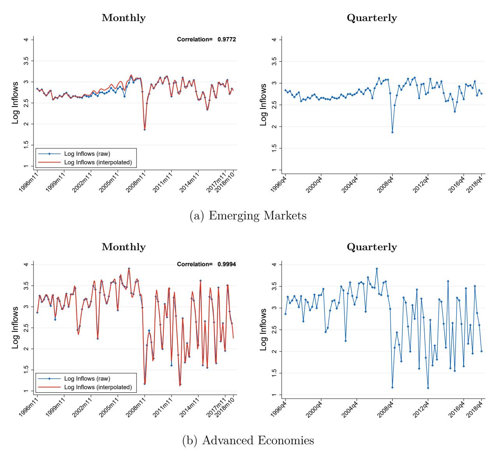

Figure 1. Average Capital Inflows: Raw vs. Interpolated Data The interpolation of capital inflows at monthly frequency for advanced economies and emerging markets.

#### Policy Risk Premium Measure

We construct the PRP measure following the methodology of Baker, Bloom and Davis (2016). In particular, we use the online platform Factiva, which reports journal articles from the main international newspapers. We employ the same search procedure as Baker, Bloom and Davis (2016). Our list of words contains 218 words and follows theirs closely. Since the Baker, Bloom and Davis (2016) list of words is conceived mostly for advanced economies, we include four additional words to better capture policy uncertainty characteristics in emerging markets (i.e., capital controls, expropriation, nationalization, and corruption). We report the full list of words below.

**Table 4.** Number of Forecasters in Consensus Forecasts (all years)

|      | Advanced Economies (1) | Emerging Markets (2) |
|------|------------------------------|----------------------------|
| 1996 | 62                           | 26                         |
| 1997 | 63                           | 21                         |
| 1998 | 54                           | 14                         |
| 1999 | 58                           | 13                         |
| 2000 | 57                           | 15                         |
| 2001 | 53                           | 14                         |
| 2002 | 55                           | 13                         |
| 2003 | 58                           | 15                         |
| 2004 | 59                           | 16                         |
| 2005 | 62                           | 16                         |
| 2006 | 61                           | 16                         |
| 2007 | 58                           | 15                         |
| 2008 | 57                           | 16                         |
| 2009 | 50                           | 15                         |
| 2010 | 50                           | 17                         |
| 2011 | 52                           | 17                         |
| 2012 | 56                           | 17                         |
| 2013 | 54                           | 16                         |
| 2014 | 53                           | 16                         |
| 2015 | 54                           | 17                         |
| 2016 | 43                           | 19                         |
| 2017 | 43                           | 18                         |
| Mean | 55                           | 17                         |

Because we are interested in the perspective of the U.S. international investor, we focus on news reported in international newspapers (see the complete list below). Given the lower availability of international newspapers, we follow the methodology of [Barrett, Appendino,](#page-41-7) [Nguyen and de Leon Miranda](#page-41-7) [\(2022\)](#page-41-7) to construct our PRP measure. This methodology adds up the total number of articles for a country and pools all newspapers together for each country.[22](#page-49-1) More precisely, define *Xct* as the number of articles referring to policy risk episodes in country *c* at time *t*, *Yct* as the total number of articles referring to country *c* at time *t*, and *Yt* = P *c Yct* as the total number of articles written at each time *t* (the sum of articles across countries). We replicate the [Barrett, Appendino, Nguyen and de Leon Miranda](#page-41-7) [\(2022\)](#page-41-7) index as follows:

22The difference with [Baker, Bloom and Davis](#page-41-6) [\(2016\)](#page-41-6) is that their index includes a non-minor proportion of local newspapers. Higher heterogeneity across newspapers allows them to first compute the share of news for each individual newspaper within a country and then add up the total for each country. In other words, they do not pool all articles within a country together.

**Table 5.** Number of Forecasters By Currency

| Average Number of Forecasters |     |                       |                  |  |  |
|-------------------------------|-----|-----------------------|------------------|--|--|
| Advanced Economies            |     |                       | Emerging Markets |  |  |
| Australia                     | 37  | Argentina             | 11               |  |  |
| Canada                        | 77  | Brazil                | 13               |  |  |
| Denmark                       | 25  | Chile                 | 12               |  |  |
| Euro Area                     | 101 | China, P.R.: Mainland | 26               |  |  |
| Germany                       | 107 | Colombia              | 10               |  |  |
| Israel                        | 11  | Czech Republic        | 12               |  |  |
| Japan                         | 98  | Hungary               | 11               |  |  |
| New Zealand                   | 31  | India                 | 20               |  |  |
| Norway                        | 24  | Indonesia             | 23               |  |  |
| Sweden                        | 30  | Republic of Korea     | 23               |  |  |
| Switzerland                   | 27  | Malaysia              | 24               |  |  |
| United Kingdom                | 84  | Mexico                | 12               |  |  |
|                               |     | Peru                  | 9                |  |  |
|                               |     | Philippines           | 17               |  |  |
|                               |     | Poland                | 11               |  |  |
|                               |     | Romania               | 8                |  |  |
|                               |     | Russian Federation    | 11               |  |  |
|                               |     | Slovak Republic       | 9                |  |  |
|                               |     | South Africa          | 22               |  |  |
|                               |     | Thailand              | 24               |  |  |
|                               |     | Turkey                | 23               |  |  |
|                               |     | Ukraine               | 4                |  |  |
| Average 1996-2018             | 55  |                       | 17               |  |  |

$$PRP_{ct} = \frac{X_{ct}}{\frac{1}{12} \sum_{j=1}^{12} Y_{t-j}}$$

where *Xc* = 1 *T* P *T t*=1 *Xct* and *Y* = 1 *T* P *T t*=1 *Yt* . We normalize the index to 100 by estimating

$$PRP_{ct}^{N} = \frac{PRP_{ct}}{\overline{PRP}_{c}} \times 100,$$

where *P RPc* = 1 *T* P *T t*=1 *P RPct* is the average of policy risk news for each country across time. We construct the monthly PRP for the Euro Area as follows. We use real GDP data for France, Germany, Greece, Italy, and Spain. This real GDP is expressed in local currency and reported at quarterly frequency. Prior to 2000, we transform these real GDP measures

**Table 6.** Example: Main Forecasters in Advanced Economies and Emerging Markets, September 2012

| Advanced Economies   |                      |                      | Emerging Markets   |                    |                      |
|----------------------|----------------------|----------------------|--------------------|--------------------|----------------------|
| Euro                 | Yen                  | UK Pound             | Korean Won         | Turkish Lira       | Other EMs*           |
| (1)                  | (2)                  | (3)                  | (4)                | (5)                | (6)                  |
| Goldman Sachs        | Goldman Sachs        | Goldman Sachs        | Goldman Sachs      | Goldman Sachs      | Goldman Sachs        |
| HSBC                 | HSBC                 | HSBC                 | HSBC               | HSBC               | HSBC                 |
| General Motors       | General Motors       | General Motors       | General Motors     | General Motors     | General Motors       |
| ING Financial Mar-   | ING Financial Mar-   | ING Financial Mar-   | ING Financial Mar- |                    | ING Financial Mar-   |
| kets                 | kets                 | kets                 | kets               |                    | kets                 |
| BNP Paribas          | BNP Paribas          | BNP Paribas          |                    | BNP Paribas        | BNP Paribas          |
| JP Morgan            | JP Morgan            | JP Morgan            | JP Morgan          | JP Morgan          | JP Morgan            |
| Allianz              | Allianz              | Allianz              |                    |                    | Allianz              |
| Oxford Economics     | Oxford Economics     | Oxford Economics     |                    | Oxford Economics   | Oxford Economics     |
| Morgan Stanley       | Morgan Stanley       | Morgan Stanley       |                    | Morgan Stanley     | Morgan Stanley       |
| Bank of Tokio Mit-   | Bank of Tokio Mit-   | Bank of Tokio Mit-   | Bank of Tokio Mit- | Bank of Tokio Mit- | Bank of Tokio Mit-   |
| subishi              | subishi              | subishi              | subishi            | subishi            | subishi              |
| Credit Suisse        | Credit Suisse        | Credit Suisse        |                    | Credit Suisse      |                      |
| Citigroup            | Citigroup            | Citigroup            | Citigroup          | Citigroup          | Citigroup            |
| Societe Generale     | Societe Generale     | Societe Generale     |                    | Societe Generale   | Societe Generale     |
| Royal Bank of Canada | Royal Bank of Canada | Royal Bank of Canada |                    |                    | Royal Bank of Canada |
| Royal Bank of Scot-  | Royal Bank of Scot-  | Royal Bank of Scot-  |                    |                    | Royal Bank of Scot-  |
| land                 | land                 | land                 |                    |                    | land                 |
| ABN Amro             | ABN Amro             | ABN Amro             |                    |                    | ABN Amro             |
| Barclays Capital     | Barclays Capital     | Barclays Capital     |                    | Barclays Capital   | Barclays Capital     |
| Commerzbank          | Commerzbank          | Commerzbank          |                    |                    | Commerzbank          |
| UBS                  | UBS                  | UBS                  | UBS                | UBS                | UBS                  |
| IHS Global Insight   | IHS Global Insight   | IHS Global Insight   | IHS Global Insight | IHS Global Insight | IHS Global Insight   |
| Nomura Securities    | Nomura Securities    | Nomura Securities    | Nomura Economics   | Nomura Securities  | Nomura Securities    |
|                      |                      |                      | Macquarie Capital  |                    | Macquarie Capital    |
|                      |                      |                      | ANZ Bank           |                    | ANZ Bank             |

\*Other EM currencies include: Argentinean Peso, Brazilian Real, Chilean Peso, Chinese Renminbi, Colombian Peso, Czech Koruna, Hungarian Forint, Indian Rupee, Indonesian Rupiah, Malaysian Ringgit, Mexican Peso, Peruvian Sol, Polish Zloty, Romanian Leu, Russian Rouble, South African Rand, and Ukrainian Hryvnia. Note that non-filled cells indicate the absence of information about whether the forecaster was surveyed for that currency (i.e., they do *not* indicate that the forecaster was not surveyed for that currency). Source: Consensus Forecast.

to U.S. dollars using the observed average exchange rate in the quarter. From 2000 onward, we assume all countries use the euro as the relevant currency, so there is no need to convert them to a common currency. We linearly interpolate the real GDP of each country to obtain GDP at monthly frequency. We can then aggregate GDP across eurozone countries to construct a GDP measure for the entire eurozone. We construct the Euro Area PRP measure as  $PRP_t = \sum_{c=1}^{N} \omega_{ct} PRP_{ct}$ , where  $\omega_{ct} = RGDP_{ct} / \sum_{c=1}^{N} RGDP_{ct}$  is the share of eurozone GDP accounted for by country c,  $PRP_{ct}$  is the PRP measure for country c at time t, and N is the number of countries in the eurozone for which we observe both a  $PRP_{ct}$  value and GDP.

#### List of Words

Our list of words comes from Baker, Bloom and Davis (2016). In particular, we use the following words from their list: tax, taxation, taxes, policy, government spending, federal

budget, budget battle, balanced budget, defense spending, defence spending, military spending, entitlement spending, fiscal stimulus, budget deficit, federal debt, national debt, debt ceiling, fiscal footing, government deficit, fiscal policy, federal reserve, the fed, money supply, open market operations, quantitative easing, monetary policy, fed funds rate, overnight lending rate, Bernanke, Volcker, Greenspan, central bank, interest rates, fed chairman, fed chair, lender of last resort, discount window, health care, health insurance, prescription drugs, drug policy, medical insurance reform, medical liability, national security, war, military conflict, terrorism, terror, 9/11, armed forces, base closure, military procurement, military embargo, no-fly zone, military invasion, terrorist attack, banking (or bank) supervision, thrift supervision, financial reform, basel, capital requirement, bank stress test, deposit insurance, union rights, card check, collective bargaining law, minimum wage, closed shop, workers compensation, advance notice requirement, affirmative action, overtime requirements, antitrust, competition policy, merger policy, monopoly, patent, copyright, unfair business practice, cartel, competition law, price fixing, healthcare lawsuit, tort reform, tort policy, punitive damages, medical malpractice, energy policy, energy tax, carbon tax, drilling restrictions, offshore drilling, pollution controls, environmental restrictions, immigration policy, illegal immigration, sovereign debt, currency crisis, currency crises, currency crash, crisis, crises, reserves, tariff, trade, devaluation, capital controls, expropriation, nationalization, and corruption.

The list of words used in [Baker, Bloom and Davis](#page-41-6) [\(2016\)](#page-41-6) is conceived mostly for advanced economies. To better capture the policy uncertainty characteristics of emerging markets, we include four additional words: capital controls, expropriation, nationalization, and corruption.

### **List of Newspapers**

We include the following newspapers: ABC Network, Agence France Presse, BBC, The Boston Globe, CBS Network, Chicago Tribune, Financial Times, The Globe and Mail, Houston Chronicle, Los Angeles Times, NBC Network, The New York Times, The San Francisco Chronicle, The Telegraph (U.K.), The Wall Street Journal, The Times (U.K.), USA Today, The Washington Post, Reuters, The Dallas Morning News, The Miami Herald, The Guardian (U.K.), and The Economist.

### **ICRG: Composite and Political Risks**

Our measures of composite and political risk come from the International Country Risk Guide (ICRG) dataset, which provides data on countries' political, economic, and financial risks for more than 140 countries at monthly frequency. We describe below the definition of each variable used in the paper and then present the correlation of the sub-components of political risk with the UIP premium.

### **Definition of Variables**

In our analysis, we employ the composite risk variable to proxy for overall country risk (political, economic, and financial), and socioeconomic conditions to capture confidence risk. We pool investment profile and democratic accountability together to measure government policy risk (i.e., the average of both variables). Additionally, we use investment profile separately to proxy for expropriation risk and democratic accountability to capture anti-democratic risk. We describe all the variables in detail below.

*Composite risk.* A composite of political, financial, and economic risk. Political risk contributes 50% of the composite rating, while financial and economic risk ratings each contribute 25%. Political risk has 12 components, with assessments made on the basis of subjective analysis of the available information. Financial and economic risk each have five components, with assessments made solely on the basis of objective data. The components of political, economic, and financial risk are as follows:

Political risk: government stability∗ , socioeconomic conditions∗ , investment profile∗ , internal conflict∗ , external conflict∗ , democratic accountability+, corruption+, military in politics+, religious tensions+, law and order+, ethnic tensions+, and bureaucracy quality. The components with ∗ are given up to 12 points and hence carry a higher weight; the components with + are given up to 6 points; and the last component (bureaucracy quality) is given only 4 points.

- Government stability: assesses both the government's ability to carry out its declared programs and its ability to stay in office. It has three subcomponents: government unity, legislative strength, and popular support.
- Socioeconomic conditions: assesses the socioeconomic pressures at work in society that could constrain government action or fuel social dissatisfaction. It has three subcomponents: unemployment, consumer confidence, and poverty.

- Investment profile: assesses factors affecting investment risk that are not covered by other political, economic, and financial risk components. It has three components: contract viability/expropriation, profits repatriation, and payment delays.
- Internal conflict: assesses political violence in the country and its actual or potential impact on governance. The subcomponents are civil war/coup threat, terrorism/political violence, and civil disorder.
- External conflict: assesses the risk to the incumbent government from foreign action, ranging from non-violent external pressure (diplomatic pressure, withholding of aid, trade restrictions, territorial disputes, sanctions, etc.) to violent external pressure (cross-border conflicts and all-out war). External conflicts can adversely affect foreign business in many ways, from restrictions on operations to trade and investment sanctions, distortions in resource allocation, and violent changes in the structure of society. The subcomponents are war, cross-border conflict, and foreign pressures.
- Democratic accountability: a measure of how responsive and accountable government is to its people. As such, it captures the degree of freedom that a government has to impose policies to its own advantage. It evaluates several types of government from more to less democratic, considering whether it is an alternating democracy, dominated democracy, de facto one-party state, de jure one-party state, or autarchy.
- Corruption: an assessment of corruption within the political system. Such corruption is a threat to foreign investment for several reasons: it distorts the economic and financial environment; it reduces the efficiency of government and business by enabling people to assume positions of power through patronage rather than ability; and it introduces an inherent instability into the political process. The measure considers financial corruption in the form of demands for special payments and bribes connected with import and export licenses, exchange controls, tax assessments, police protection, or loans. It also considers potential corruption in the form of excessive patronage, nepotism, job reservations, "favor-for-favors," secret party funding, and suspiciously close ties between politics and business.
- Military in politics: considers the involvement of the military in politics.
- Religious tensions: measures the relevance of a single religious group that seeks to replace civil law with religious law and to exclude other religions from the political and/or social process; the desire of a single religious group to dominate governance;

the suppression of religious freedom; and the desire of a religious group to express its own identity, separate from the country as a whole.

- Law and order: refers to the strength and impartiality of the legal system and popular observance of the law.
- Ethnic tensions: refers to the degree of tension within a country attributable to racial, nationality, or language divisions.
- Bureaucracy quality: measures the strength and quality of the bureaucracy. High points are given to countries where the bureaucracy has the strength and expertise to govern without drastic changes in policy or interruptions in government services.

Economic risk: includes GDP per capita, real GDP growth, inflation rate, budget balance over GDP, and current account over GDP.

Financial risk: includes foreign debt over GDP, foreign debt service over exports of goods and services, current account over exports of goods and services, net international liquidity as months of import cover, and exchange rate stability.

*Eurozone ICRG Risk Variable Construction.* We construct monthly eurozone ICRG risk indices as follows. We use real GDP data for the 19 countries that compose the eurozone. This real GDP is expressed in local currency and reported at quarterly frequency. Prior to 2000, we transform these real GDP measures to U.S. dollars using the observed average exchange rate in the quarter. From 2000 onward, we assume that all eurozone countries use the euro as the relevant currency, so there is no need to convert them to a common currency. We linearly interpolate the real GDP of each country to obtain GDP at monthly frequency. We can then aggregate GDP across eurozone countries to construct a GDP measure for the entire eurozone. We construct the Eurozone Composite Risk Index as

$$ECR_t = \sum_{c=1}^{N_t} \omega_{ct} CR_{ct},$$

where *ωct* = *RGDPct/* P *Nt c*=1 *RGDPct* is the share of eurozone GDP accounted for by country *c*, *CRct* is the ICRG risk index for country *c* at time *t*, and *Nt* is the number of countries in the eurozone for which we observe both a *CRct* value and GDP. Starting in 1999, all 19 eurozone countries have information on both their GDP and the composite risk index.

### A. UIP and CIP: Comparison in the Cross Section and Over Time

This appendix compares our survey-based UIP premium with CIP deviations. Figure A2 plots the two series over time using deposit rates; Figure A3 presents the cross-sectional comparison; Figure A4 benchmarks our CIP measure against Du, Pflueger and Schreger (2020); and Figure A5 repeats the time-series comparison using interbank rates for CIP.

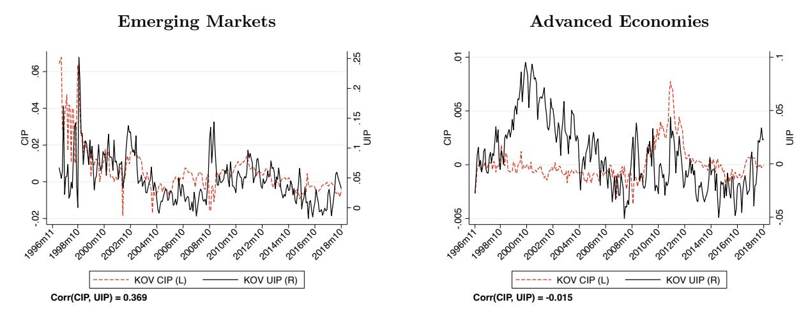

Figure A2. UIP and CIP over Time (12 Months)

Note: This figure shows UIP and CIP deviations using our sample. Both series use deposit rates. UIP deviations is measured using Consensus Forecast.

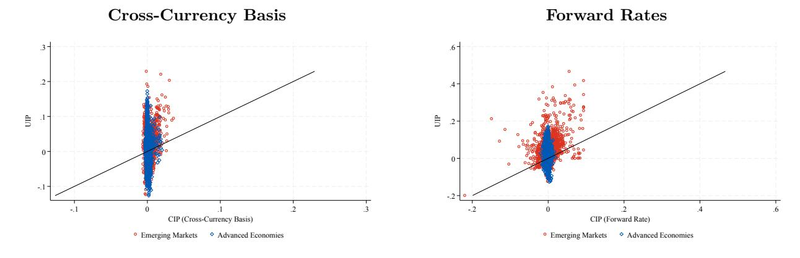

Figure A3. Cross-sectional UIP and CIP (12 Months)

Note: This figure shows UIP and CIP deviations where each point represents a different date. At each date, we take the average across countries in each classification (Emerging and Advanced). Panel (a) constructs CIP using Du, Pflueger and Schreger (2020) cross-currency basis. Panel (b) constructs CIP using forward rates. Both panels compute UIP using expectations from Consensus Forecast. Both UIP and CIP deviations use 12 months deposit rates.

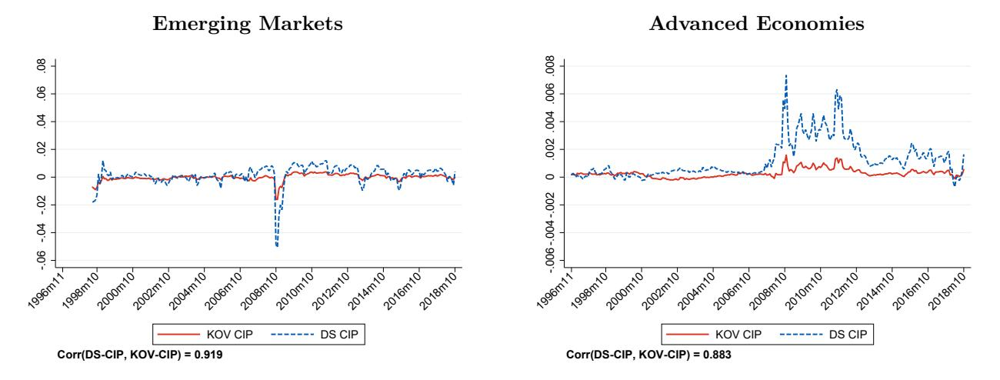

Figure A4. CIP Comparison: Kalemli-Ozcan and Varela (KOV) vs. Du and Schreger (DS)

Note: This figure shows CIP comparison in a sample that restrict observations to be the same at date-country pairs in DS and our data. Both series use money market interbank rates.

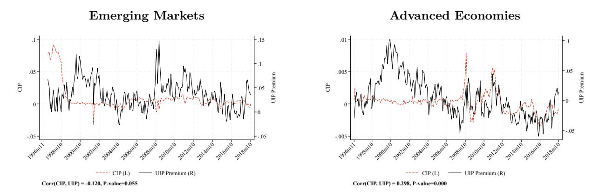

Figure A5. UIP and CIP over Time, Interbank Rates (12 Months)

Note: This figure shows UIP and CIP deviations using our sample. We use interbank rates to construct CIP, while we use deposit rates to construct UIP.

### **B. Additional Tables and Figures**

**Table B7.** Countries/Currencies in sample

| Country                              | Periods                                          | Income classification |
|--------------------------------------|--------------------------------------------------|-----------------------|
| Argentina                            | 2001m12-2018m12                                  | Emerging Market       |
| Australia                            | 1996m11-2018m12                                  | Advanced Economy      |
| Brazil                               | 1996m11-2018m12                                  | Emerging Market       |
| Canada                               | 1996m11-2018m12                                  | Advanced Economy      |
| Chile                                | 1996m11-2018m12                                  | Emerging Market       |
| China, P.R.: Mainland 2005m8-2018m12 |                                                  | Emerging Market       |
| Colombia                             | 1996m11-2018m12                                  | Emerging Market       |
| Czech Republic                       | 1996m11-2009m1                                   | Emerging Market       |
| Denmark                              | 1996m11-1998m12                                  | Advanced Economy      |
| Euro Area                            | 1999m1-2018m12                                   | Advanced Economy      |
| Germany                              | 1996m11-1998m12                                  | Advanced Economy      |
| Hungary                              | 1996m11-2018m12                                  | Emerging Market       |
| India                                | 1996m11-2018m12                                  | Emerging Market       |
| Indonesia                            | 1996m11-2018m12                                  | Emerging Market       |
| Israel                               | 1996m11-2018m12                                  | Advanced Economy      |
| Japan                                | 1996m11-2018m12                                  | Advanced Economy      |
| Korea                                | 1996m11-2018m12                                  | Emerging Market       |
| Malaysia                             | 1996m11-1998m9 ; 2005m7-2018m12                  | Emerging Market       |
| Mexico                               | 1996m11-2018m12                                  | Emerging Market       |
| New Zealand                          | 1996m11-2018m12                                  | Advanced Economy      |
| Norway                               | 1996m11-2018m12                                  | Advanced Economy      |
| Peru                                 | 1996m11-2018m12                                  | Emerging Market       |
| Philippines                          | 1997m7-2018m12                                   | Emerging Market       |
| Poland                               | 1996m11-2018m12                                  | Emerging Market       |
| Romania                              | 1996m11-2012m11                                  | Emerging Market       |
| Russian Federation                   | 1996m11-2018m12                                  | Emerging Market       |
| Slovakia*                            | 1996m11-2009m1                                   | Emerging Market       |
| South Africa                         | 1996m11-2018m12                                  | Emerging Market       |
| Sweden                               | 1996m11-2018m12                                  | Advanced Economy      |
| Switzerland                          | 1996m11-2011m8 ; 2015m2-2018m12                  | Advanced Economy      |
| Thailand                             | 1997m8-2018m12                                   | Emerging Market       |
| Turkey                               | 1996m11-2018m12                                  | Emerging Market       |
| Ukraine                              | 1996m11-1999m11 ; 2014m2-2018m12 Emerging Market |                       |
| United Kingdom                       | 1996m11-2018m12                                  | Advanced Economy      |

*Note:* This table reports the countries used in our sample. We use IMF-WEO 2000 income classification and assign each country as Advanced Economy or Emerging Market. The second column reports periods in sample, which varies by country according to its exchange rate regime. In particular, we only consider floating regimes. The Czech Republic and Slovakia are in the sample until 2009m1, after which their exchange rate regimes are classified as fixed vis-à-vis the euro.

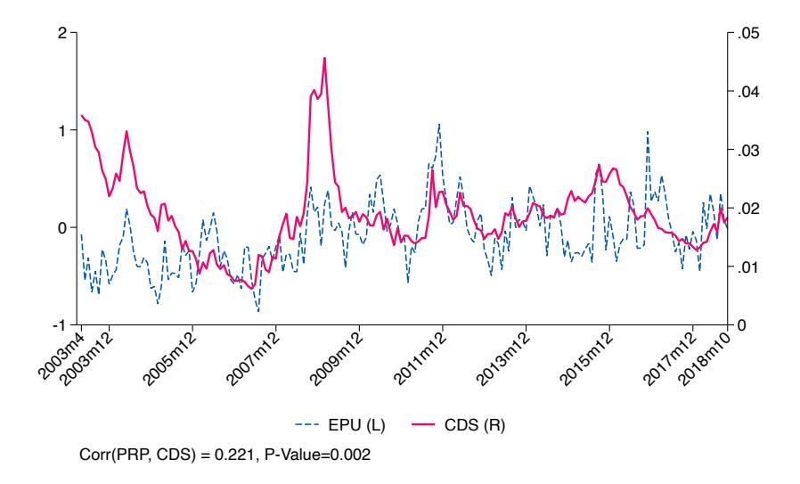

Figure B6. Economic Policy Uncertainty and Default in Emerging Markets

Note: This figure shows the Credit Default Swaps (CDS) and Economic Policy Uncertainty (EPU) for 18 EMs over 2003m4:2018m10.

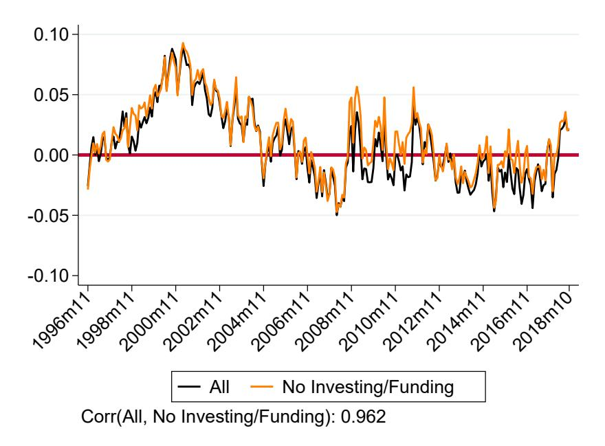

**Figure B7.** UIP Premium in Advanced Economies: Excluding Funding and Investing Currencies

Note: This figure plots the UIP premium for Advanced Economies separating between All Advanced Economies in our sample and the subsample that removes both investing and funding currencies. Investing currencies: Australia and New Zealand. Funding currencies: Japan and Switzerland. Others: Canada, Denmark, Euro Area, Germany, Israel, Norway, Sweden and United Kingdom.