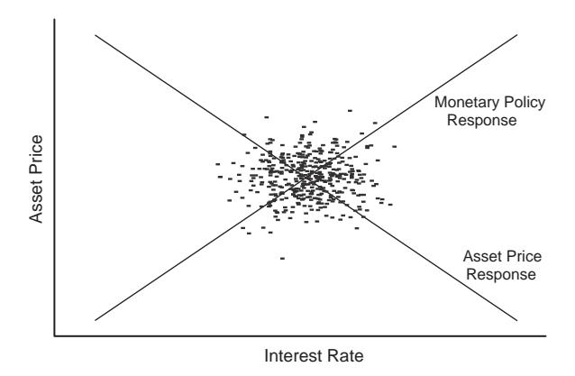
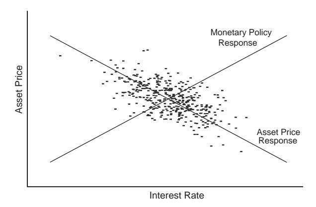
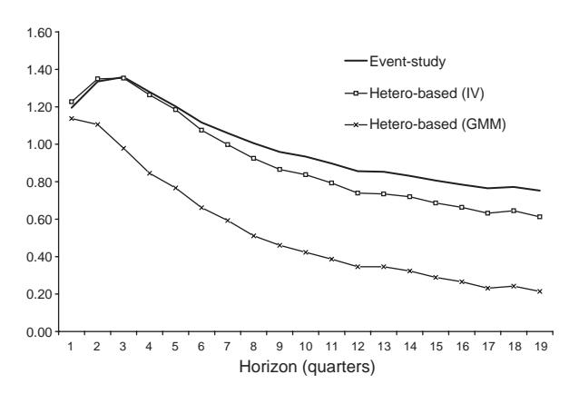

Journal of Monetary Economics 51 (2004) 1553–1575

<www.elsevier.com/locate/econbase>

# The impact of monetary policy on asset prices\$

Roberto Rigobona,b,, Brian Sackc

a Room E52-434, Sloan School of Management, Massachusetts Institute of Technology, 50 Memorial Drive, Cambridge, MA 02142, USA b NBER, Cambridge, MA 02138, USA c Board of Governors of the Federal Reserve System, Washington, DC 20551, USA

Received 15 May 2003; received in revised form 16 January 2004; accepted 5 February 2004

#### Abstract

Estimating the response of asset prices to changes in monetary policy is complicated by the endogeneity of policy decisions and the fact that both interest rates and asset prices react to numerous other variables. This paper develops a new estimator that is based on the heteroskedasticity that exists in high-frequency data. We show that the response of asset prices to changes in monetary policy can be identified based on the increase in the variance of policy shocks that occurs on days of FOMC meetings and of the Chairman's semi-annual monetary policy testimony to Congress. The identification approach employed requires a much weaker set of assumptions than needed under the ''event-study'' approach that is typically used in this context. The results indicate that an increase in short-term interest rates results in a decline in stock prices and in an upward shift in the yield curve that becomes smaller at longer maturities. The findings also suggest that the event-study estimates contain biases that make

E-mail address: rigobon@mit.edu (R. Rigobon).

\$The authors would like to thank Ricardo Caballero (Editor) and an anonymous referee for excellent suggestions. Additionally, we would like to thank Andrew Ang, Antulio Bomfim, Darrel Cohen, William English, James Hamilton, and seminar participants at the Federal Reserve Board and the American Economic Association meetings for useful comments. Comments are welcome to bsack@frb.gov or rigobon@mit.edu. The opinions expressed are those of the authors and do not necessarily reflect the views

of the Board of Governors of the Federal Reserve System or other members of its staff. Corresponding author. Room E52-434, Sloan School of Management, MIT, 50 Memorial Drive, Cambridge, MA 02142, USA. Tel.: +1 617 258 8374; fax: +1 617 258 6855.

the estimated effects on stock prices appear too small and those on Treasury yields too large. r 2004 Elsevier B.V. All rights reserved.

JEL classification: E44; E47; E52

Keywords: Monetary policy; Stock market; Yield curve; Identification; Heteroskedasticity

# 1. Introduction

There is a considerable amount of interest in understanding the interactions between asset prices and monetary policy. In previous research ([Rigobon and Sack,](#page-22-0) [2003\)](#page-22-0), we found that short-term interest rates react significantly to movements in broad equity price indexes, likely reflecting the expected endogenous response of monetary policy to the impact of stock price movements on aggregate demand. This paper attempts to estimate the other side of the relationship: how asset prices react to changes in monetary policy.

This relationship is an important topic for several reasons. From the perspective of monetary policymakers, having reliable estimates of the reaction of asset prices to the policy instrument is a critical step in formulating effective policy decisions. Much of the transmission of monetary policy comes through the influence of short-term interest rates on other asset prices, as it is the movements in these other asset prices including longer-term interest rates and stock prices—that determine private borrowing costs and changes in wealth, which in turn influence real economic activity.

Financial market participants are likely to be equally interested in this topic. Monetary policy exerts a considerable influence on financial markets, as evidenced by the extensive attention that the Federal Reserve receives in the financial press. Thus, having accurate estimates of the responsiveness of asset prices to monetary policy is an important component of formulating effective investment and risk management decisions.

Several difficulties arise in estimating the responsiveness of asset prices to monetary policy, though. First, short-term interest rates are simultaneously influenced by movements in asset prices, resulting in a difficult endogeneity problem. Second, a number of other variables, including news about the economic outlook, likely have an impact on both short-term interest rates and asset prices. These two considerations complicate the identification of the responsiveness of asset prices under previously used methods.

To address these issues, we develop an estimator that identifies the response of asset prices based on the heteroskedasticity of monetary policy shocks. In particular, we assume that the variance of monetary policy shocks is higher on days of FOMC meetings and of the Chairman's semi-annual monetary policy testimony to Congress, when a larger portion of the news hitting markets is about monetary policy. We show that the shift in the variance of the policy shocks on those dates is sufficient to measure the responsiveness of asset prices to monetary policy.

Our approach allows us to identify the parameter of interest under a weaker set of assumptions than required under the approach that other papers have taken in this context. In particular, other papers have typically estimated ordinary-least-squares (OLS) regressions on FOMC dates, which has been called the ''event-study'' method. We show that the event-study approach is an extreme case of our heteroskedasticitybased estimator in which the shift in the variance of the policy shock is large enough to dominate all other shocks. In contrast, the heteroskedasticity-based estimator that we develop requires only an increase in the relative importance of the policy shock. Thus, our estimator can be used to test whether the stronger assumptions under the event-study approach are valid, and, correspondingly, the extent to which the eventstudy estimates are biased.

The paper proceeds as follows. Section 2 discusses the problems of simultaneous equations and omitted variables in estimating the responsiveness of asset prices, demonstrating that some bias may remain in the coefficients estimated under the event-study approach unless some strong assumptions are met. Section 3 describes our identification approach based on the heteroskedasticity of monetary policy shocks and compares the assumptions needed to those required under the eventstudy approach. It demonstrates that the identification method can be implemented as a simple instrumental variables regression or as a generalized-method-of-moments estimator. Results on the responsiveness of stock prices and longer-term interest rates to monetary policy using both the event-study and the heteroskedasticity procedures are presented in Section 4, and Section 5 concludes.

# 2. Event-study and the estimation problem

The two main problems in estimating the interactions between monetary policy and asset prices are the endogeneity of the variables and the existence of omitted variables. First, while asset prices are influenced by the short-term interest rate, the short-term interest rate is simultaneously affected by asset prices (primarily through their influence on monetary policy expectations). Second, a number of other variables likely influence both asset prices and short-term interest rates, such as variables that provide information about the macroeconomic outlook or changes in risk preferences.

These issues can be captured in the following simplified system of equations:

$$\Delta i_t = \beta \Delta s_t + \gamma z_t + \varepsilon_t,\tag{1}$$

$$\Delta s_t = \alpha \Delta i_t + z_t + \eta_t, \tag{2}$$

where Dit is the change in the short-term interest rate and Dst is the change in an asset price. Eq. (1) represents a monetary policy reaction function that captures the expected response of policy to a set of variables zt and to the asset price.1 We

1 [Rigobon and Sack \(2002\)](#page-21-0) focus on the parameter b measuring the response of monetary policy to the asset price—the stock market, in particular. Their results suggest that this parameter is positive and of the magnitude that would be expected if the Federal Reserve were reacting to the stock market to the extent that it affects aggregate demand.

consider a case in which  $z_t$  is a single variable for notational simplicity, but the results can be easily generalized to the case where  $z_t$  is a vector of variables. Eq. (2) is the asset price equation, which allows the asset price to be affected by the interest rate and also by the other variables  $z_t$ . In this paper we are interested in the parameter  $\alpha$ , which measures the impact of a change in the short-term interest rate  $\Delta i_t$  on the asset price  $\Delta s_t$ . The variable  $\varepsilon_t$  is the monetary policy shock, and  $\eta_t$  is a shock to the asset price. Those disturbances are assumed to have no serial correlation and to be uncorrelated with each other and with the common shock  $z_t$ .

This model is clearly an oversimplification of the relationship between movements in interest rates and asset prices. It imposes no structure that might arise from an asset pricing model. However, this is also an advantage, as it allows the interaction between the variables to be fairly unrestricted. Similarly, VARs have often been used to capture the dynamics of asset prices without having to impose many restrictions (see, for example, Campbell and Shiller, 1987). In the current context, we can allow for more complicated dynamics by adding lagged terms to Eqs. (1) and (2), in which case estimating the responsiveness amounts to (partially) identifying the VAR. However, we found that allowing for a richer lag structure had little effect on the results. Moreover, the above system of equations is sufficiently rich to demonstrate the problems that arise in identifying the parameter  $\alpha$ .

As is well known, Eqs. (1) and (2) cannot be estimated consistently using OLS due to the presence of simultaneous equations and omitted variables. The simultaneity problem is demonstrated in Fig. 1, which shows both the policy reaction function (1) and the asset price function (2). Realizations of the interest rate and the asset price will be determined by the intersection of these two schedules and therefore may not provide any information about the slope of either schedule. Moreover, the two schedules are being frequently shifted by realizations of the variable  $z_t$ , and thus the observations will be influenced by the coefficients on those variables in the two equations (which determine the relative magnitude of the shifts).

To see the econometric problems formally, consider running an OLS regression on Eq. (2). The estimated coefficient will be biased because the shock term  $\eta_t$  is correlated with the regressor  $\Delta i_t$  as a result of the response of the interest rate to the stock market, as determined by parameter  $\beta$  in Eq. (1). Moreover, if some of the variables  $z_t$  are not observed, then the exclusion of those variables from the specification would also generate some bias depending on the value of  $\gamma$ . Indeed, if one simply ran OLS on Eq. (2) above, the mean of estimated parameter would be given by

$$E\widehat{\alpha} = \alpha + (1 - \alpha\beta) \frac{\beta \sigma_{\eta} + (\beta + \gamma)\sigma_{z}}{\sigma_{\varepsilon} + \beta^{2} \sigma_{n} + (\beta + \gamma)^{2} \sigma_{z}},$$
(3)

where  $\sigma_x$  represents the variance of shock x. Again, according to Eq. (3), the estimate would be biased away from its true value  $\alpha$  due to both simultaneity bias (if  $\beta \neq 0$  and  $\sigma_{\eta} > 0$ ) and omitted variables bias (if  $\gamma \neq 0$  and  $\sigma_z > 0$ ).

Researchers have typically addressed these problems by focusing on periods immediately surrounding changes in the policy instrument—what has been often

Fig. 1. Joint determination of interest rates and asset prices.

referred to as the event-study approach.2 This literature largely follows [Cook and](#page-21-0) [Hahn \(1989\),](#page-21-0) whose approach was to regress daily changes in market interest rates on changes in the federal funds rate for a sample of dates on which the federal funds rate changed. Their work has been followed by a large number of papers applying a similar approach to various asset prices, including [Bomfim \(2003\),](#page-21-0) [Bomfim and](#page-21-0) [Reinhart \(2000\),](#page-21-0) [Cochrane and Piazzesi \(2002\),](#page-21-0) [Kuttner \(2001\),](#page-21-0) [Bernanke and](#page-21-0) [Kuttner \(2003\),](#page-21-0) [Roley and Sellon \(1996, 1998\),](#page-22-0) [Thorbecke \(1997\),](#page-22-0) and [Thornton](#page-22-0) [\(1998\)](#page-22-0). These more recent papers have modified the work of Cook and Hahn in various directions, including focusing on more recent periods and isolating the surprise component of funds rate changes. Nevertheless, the basis of the approach estimating OLS regressions on dates of FOMC meetings or policy moves—has remained the same.

The rationale underlying the event-study approach is that the bias in the OLS estimate ba will be limited if the sample contains periods in which the innovations to the system of Eqs. (1) and (2) are driven primarily by the policy shock. In fact, as is evident from Eq. (3), the event-study approach requires the following assumptions to minimize the bias of the estimator

$$\sigma_{\varepsilon} \gg \sigma_{z},$$
 (4)

$$\sigma_{\varepsilon} \gg \sigma_{\eta}$$
 (5)

in which case E ba ffi a: In the limit, if the variance of the monetary policy shock becomes infinitely large relative to the variances of the other shocks, or se=sZ ! 1 and se=sz ! 1; then the bias goes to zero, and the OLS estimate is consistent. This property of the OLS estimate is what [Fisher \(1976\)](#page-21-0) referred to as ''near identification.'' However, it should be obvious that some bias remains if these ratios are finite. Unfortunately, the event-study approach does not provide any evidence

Another approach that has been employed is to measure the response of stock prices and yields to policy shocks identified from a VAR, as in [Thorbecke \(1997\)](#page-22-0) and [Evans and Marshall \(1998\)](#page-21-0).

about whether these conditions hold, and thus the magnitude of the bias that remains in those estimates is unclear from the event-study literature.3

In the next section, we demonstrate that the parameter  $\alpha$  can be estimated under a much weaker set of assumptions by relying on the heteroskedasticity in the data to identify the parameter. This identification approach does not require the variance of one of the shocks to become infinitely large, but instead relies on the change in the covariance of interest rates and asset prices at times when the variance of the policy shocks increases. In effect, this approach can be thought of as estimating  $\alpha$  from the *change* in the bias in Eq. (3) as the variance of policy shocks *changes*, rather than requiring that the *level* of the bias goes to zero. The approach also allows one to measure the bias in the event-study estimates, which can be used to test whether assumptions (4) and (5) are valid.

#### 3. Identifying the response of asset prices

To estimate the response of asset prices to monetary policy, we employ a technique called identification through heteroskedasticity. This approach relies on looking at changes in the co-movements of interest rates and asset prices when the variance of one of the shocks in the system is known to shift. By doing so, the response of asset prices to monetary policy can be identified under a fairly weak set of assumptions.

The intuition for this approach is shown in Fig. 2. Suppose one could identify a period of time in which the variance of the policy shocks was higher than at other times, but the variances of the other shocks in the system remained unchanged. As is evident in the figure, the pattern of realized observations would then shift to move more closely along the asset price reaction schedule. That shift in the co-movement of interest rates and asset prices towards the schedule of interest is the basis for the identification.

To implement this approach, we only need to identify two subsamples, denoted F and  $\tilde{F}$  (for reasons that become clear below), for which the parameters of Eqs. (1) and (2) are stable and the following assumptions on the second moments of the shocks hold:

$$\sigma_{\varepsilon}^{F} > \sigma_{\varepsilon}^{T},$$
 (6)

$$\sigma_{\eta}^{F} = \sigma_{\eta}^{F}, \tag{7}$$

$$\sigma_z^F = \sigma_z^F. \tag{8}$$

&lt;sup>3Note that the event-study assumptions are more likely to hold as the window around the policy event shrinks. One could define a very narrow window by using intra-day data to measure announcement effects, although one would not want to use too narrow of a window if market participants need time to digest news. In this paper, we explore biases that arise when daily data are used.

&lt;sup>4The first reference to identification using shifts in second moments was introduced by Wright (1928). More recently, this identification approach has been extended and further developed. See Rigobon (2003) for a detailed description of the methods used here. Also see King et al. (1994), Sentana and Fiorentini (2001), and Klein and Vella (2000a, b).

Fig. 2. Policy dates.

In words, these assumptions imply that the ''importance'' of policy shocks increases in the subsample F. Note that innovations to the asset price equation and the common shocks continue to take place even in subsample F, but those shocks are assumed to occur with the same intensity as in the other subsample. These conditions are much weaker than the near-identification assumptions (4) and (5) required under the event-study approach. In particular, we do not require the variance of the policy shock to become infinitely large, but only that it increases relative to the variances of the other shocks.5

We use institutional knowledge of the Federal Reserve to identify circumstances in which assumptions (6)–(8) are plausible. In particular, days of FOMC meeting and of the Chairman's semi-annual monetary policy testimony to Congress are likely to contain a greater amount of news about monetary policy than other days.6 Note that other types of shocks still take place on these days, but the relative importance of policy shocks is likely to increase dramatically, as required under our identification approach. Thus, we take those dates as the set of dates F, which will be referred to as the set of ''policy dates'' to indicate that the variance of the policy shock is elevated.7 For the set of non-policy dates ~F; we take the set of days immediately preceding those included in F, which keeps the samples the same size and minimizes any effects arising from changes in the variances of the shocks over time.

5 [Bomfim \(2003\)](#page-21-0) explores patterns of volatility around FOMC meeting dates, finding that the variance of the shock from the stock market equation increases on FOMC meeting dates. In the view of our model, this finding reflects that the simultaneity problem was not fully solved. 6

This testimony accompanies the release of the Federal Reserve's Monetary Policy Report to the Congress. It used to be referred to as the ''Humphrey Hawkins'' testimony when it was mandated under the Full Employment and Balanced Growth Act of 1978. 7

One could imagine a broader set of dates to be included in the set of policy dates, such as dates of policy-related speeches by FOMC members.

The identification can be shown analytically by first solving for the reduced form of Eqs. (1) and  $(2)^8$ 

$$\Delta i_t = \frac{1}{1 - \alpha \beta} [(\beta + \gamma) z_t + \beta \eta_t + \varepsilon_t],$$
  
$$\Delta s_t = \frac{1}{1 - \alpha \beta} [(1 + \alpha \gamma) z_t + \eta_t + \alpha \varepsilon_t].$$

Consider the covariance matrix of the variables in each subsample,  $\Omega_F = E[[\Delta i_t \Delta s_t]' \cdot [\Delta i_t \Delta s_t]|t \in F]$  and  $\Omega_F = E[[\Delta i_t \Delta s_t]' \cdot [\Delta i_t \Delta s_t]|t \in F]$ . Under the structure assumed, these covariance matrices are determined by

$$\begin{split} \Omega_F &= \frac{1}{(1-\alpha\beta)^2} \begin{bmatrix} \sigma_{\varepsilon}^F + \beta^2 \sigma_{\eta}^F + (\beta+\gamma)^2 \sigma_z^F & \alpha \sigma_{\varepsilon}^F + \beta \sigma_{\eta}^F + (\beta+\gamma)(1+\alpha\gamma) \sigma_z^F \\ & \cdot & \alpha^2 \sigma_{\varepsilon}^F + \sigma_{\eta}^F + (1+\alpha\gamma)^2 \sigma_z^F \end{bmatrix}, \\ \Omega_F &= \frac{1}{(1-\alpha\beta)^2} \begin{bmatrix} \sigma_{\varepsilon}^F + \beta^2 \sigma_{\eta}^F + (\beta+\gamma)^2 \sigma_z^F & \alpha \sigma_{\varepsilon}^F + \beta \sigma_{\eta}^F + (\beta+\gamma)(1+\alpha\gamma) \sigma_z^F \\ & \cdot & \alpha^2 \sigma_{\varepsilon}^F + \sigma_{\eta}^F + (1+\alpha\gamma)^2 \sigma_z^F \end{bmatrix}. \end{split}$$

Note that we have assumed, in addition to (6)–(8), that the parameters  $\alpha$ ,  $\beta$ , and  $\gamma$  are stable across the two set of dates, which is a necessary condition for identification.

The difference in these covariance matrices is

$$\Delta\Omega = \Omega_F - \Omega_F = \frac{(\sigma_\varepsilon^F - \sigma_\varepsilon^F)}{(1 - \alpha\beta)^2} \begin{bmatrix} 1 & \alpha \\ \alpha & \alpha^2 \end{bmatrix}. \tag{9}$$

As is evident from Eq. (9),  $\alpha$  can be easily identified from the change in the covariance matrix. In fact,  $\alpha$  can be estimated in two different ways: by instrumental variables regression and by generalized method of moments.

#### 3.1. Implementation through instrumental variables

To derive estimators from Eq. (9), we must first replace the shift in the covariance matrix  $\Delta\Omega$  with its sample estimate. For notational purposes, we group the two variables considered into a vector,  $\Delta x_t = [\Delta i_t \Delta s_t]'$ , and we define dummy variables,  $\delta_t^F$  and  $\delta_t^F$ , that take on the value 1 for all days in each subsample, respectively. Then the sample estimate of the change in the covariance matrix is  $\Delta\hat{\Omega} = \hat{\Omega}_F - \hat{\Omega}_F$ , where

$$\hat{\Omega}_F = \frac{1}{T_F} \sum_{t=1}^T \delta_t^F \Delta x_t \Delta x_t',$$

$$\hat{\Omega}_F = \frac{1}{T_F} \sum_{t=1}^T \delta_t^F \Delta x_t \Delta x_t'.$$

&lt;sup>8This approach can also be implemented by first estimating a VAR that includes interest rates and asset prices, and then focusing on the reduced form residuals in place of  $\Delta i_t$  and  $\Delta s_t$ . The results obtained under this approach are very similar to those reported below.

Given our method for choosing the dates, the sizes of the subsamples,  $T_F = \sum_{t=1}^T \delta_t^F$  and  $T_{TF} = \sum_{t=1}^T \delta_t^{TF}$ , are equal, although this condition is not necessary under this approach.

As is clear from Eq. (9), the parameter  $\alpha$  can be estimated as follows:

$$\widehat{\alpha}_{\text{het}}^{i} = \frac{\Delta \widehat{\Omega}_{12}}{\Delta \widehat{\Omega}_{11}},\tag{10}$$

$$\widehat{\alpha}_{\text{het}}^{s} = \frac{\Delta \widehat{\Omega}_{22}}{\Delta \widehat{\Omega}_{12}},\tag{11}$$

where  $\Delta\hat{\Omega}_{ij}$  represents the (i,j) element of the change in the  $\hat{\Omega}$  matrix. (Note also that a third estimator, equal to  $\sqrt{\Delta\hat{\Omega}_{22}/\Delta\hat{\Omega}_{11}}$ , is also available. However, we do not focus on that estimator since it is just the geometric average of  $\hat{\alpha}_{het}^i$  and  $\hat{\alpha}_{het}^s$ .) The two estimates of  $\alpha$  would be asymptotically equal if all of the assumptions of the model were to hold perfectly—namely, that the policy shock is heteroskedastic across the two subsamples, that the other shocks are homoskedastic across the two subsamples, and that the parameters are stable across the two subsamples. We will return to this observation below to derive a test of those assumptions.

Eqs. (10) and (11) can be implemented through an instrumental variables estimation technique. To see that, define  $T_F \times 1$  vectors  $\Delta i_F$  and  $\Delta s_F$  that contain the changes in the interest rate and the asset price on all dates in the subsample F; similarly, define  $T_{^-F} \times 1$  vectors  $\Delta i_{^-F}$  and  $\Delta s_{^-F}$  in the same manner for the subsample of non-policy dates. We can then combine the two subsamples into  $T_F + T_{^-F} \times 1$  vectors that include the changes in each variable on all policy and non-policy dates in our sample, as follows:

$$\Delta i \equiv [\Delta i'_F \Delta i'_F]',$$
  
$$\Delta s \equiv [\Delta s'_F \Delta s'_F]'.$$

Consider the following two instruments:

$$w_i \equiv [\Delta i'_F - \Delta i'_F]',$$
  
$$w_S \equiv [\Delta s'_F - \Delta s'_F]'.$$

It turns out that the two estimates for  $\alpha$  from the analysis above can be obtained by regressing the change in the asset price  $\Delta s_t$  on the change in the interest rate  $\Delta i_t$  over the combined sample period using the standard instrumental variables approach with the instruments  $w_i$  and  $w_s$ 

$$\widehat{\alpha}_{\text{het}}^i = (w_i' \Delta i)^{-1} (w_i' \Delta s), \tag{12}$$

$$\widehat{\alpha}_{\text{het}}^s = (w_s' \Delta i)^{-1} (w_s' \Delta s). \tag{13}$$

&lt;sup>9Eq. (10) can also be found in Ellingsen and Soderstrom (2001), who independently developed this estimator to correct for the bias arising from omitted variables. However, they do not discuss the estimator (11), nor the methods for implementing the estimators developed below.

To see that, note that once we substitute the instruments into these equations, the IV coefficients can be written as

$$\widehat{\alpha}_{\text{het}}^{i} = \frac{\Delta i_F' \Delta s_F - \Delta i_F' \Delta s_F'}{\Delta i_F' \Delta i_F - \Delta i_F' \Delta i_F'}$$

$$\widehat{\alpha}_{\text{het}}^{s} = \frac{\Delta s_F' \Delta s_F - \Delta s_F' \Delta s_F'}{\Delta i_F' \Delta s_F - \Delta i_F' \Delta s_F'},$$

which are the same estimators as (10) and (11).10

A more complete derivation and analysis of the properties of these estimators is offered in Appendix A. The appendix shows that  $w_i$  and  $w_s$  are valid instruments for estimating  $\alpha$  under the assumptions that have been made. One can intuitively see why this is the case: The instrument  $w_i$ , for example, is correlated with the regressor  $\Delta i_t$  because the F subsample outweighs the F owing to the heteroskedasticity of  $E_t$ . However, the instrument is not correlated with the error terms  $e_t$  and  $e_t$  because those shock are homoskedastic, leaving the two subsamples to cancel each other out. Appendix B demonstrates that these estimators are consistent even if the shocks have heteroskedasticity over time, as long as the volatility of the policy shock accounts for the shift in the covariance matrix on policy dates (and some additional regularity conditions are met).

The estimators (10) and (11) are in the same spirit as the event-study estimator, in that they rely on an event driven by institutional characteristics of the Federal Reserve. In our case, though, the event is an increase in the variance of the policy shock, which changes the covariance structure of the observed variables. Under our assumptions, this is enough to estimate the parameter of interest. By comparison, the standard event-study estimator (described above) is given by

$$\widehat{\alpha}_{es} = (\Delta i_F' \Delta i_F)^{-1} (\Delta i_F' \Delta s_F). \tag{14}$$

Note that the heteroskedasticity-based estimators (10) and (11) converge to the event-study estimator if the shift in the variance of the policy shocks is infinitely large (in which case the change in the variance from non-policy dates to policy dates converges to the variance on policy dates). However, as described above, the heteroskedasticity-based estimators do not require such a strong assumption to be consistent. As a result, the heteroskedasticity-based estimates can be used to assess the bias in the event-study estimates, as described below.

In the results below, we focus on only one of the IV estimators, Eq. (10), for simplicity. Because we are interested in the response of a number of asset prices to monetary policy, we implement that estimator across an entire class of variables at once (e.g., all equity indexes or all Treasury yields) by using three-stages least

 $^{10}$ If the number of observations in the sets F and  $^{\sim}F$  differs, the instruments and the variables simply have to be divided by the square root of the number of dates in each particular set.

&lt;sup>11Under the null hypothesis that heteroskedasticity is present in the data, Eqs. (10) and (11) have well defined distributions. If there is no heteroskedasticity, then the distribution of the denominator will have positive mass at zero and the estimator is not well behaved (See Staiger et al., 1997). In our sample, the heteroskedasticity is large enough that the change in the covariance matrices are far from zero.

squares. This approach also allows us to perform hypothesis tests on an entire class of financial variables, as described below.

A primary advantage of implementing the heteroskedasticity-based identification technique through IV is that the estimation can be easily implemented using any standard econometrics software package. In addition to its simplicity, another benefit to this approach is that all of the properties of IV estimators apply, including the asymptotic distribution of the coefficient. Note, however, that the IV approach uses only two elements of the set of Eq. (9) at a time, which is why we are left with multiple estimates. The efficiency of the estimator could presumably be improved by considering all of the restrictions in (9) at once, as is the case for the generalized-method-of-moments estimator considered in the next section.

### 3.2. Implementation through GMM

Eq. (9) contains three restrictions on the shift in the second moments of the interest rate and the asset price, which can be used to estimate two parameters:  $\alpha$  and  $\lambda \equiv \frac{(\sigma_k^E - \sigma_k^E)}{(1-\alpha\beta)^2}$ . The first one is the parameter of interest, while the second one provides a measure of the degree of heteroskedasticity that is present in the data. Our procedure requires that the variance of the policy shocks shifts across the two subsamples. Therefore, we expect  $\lambda$  to be statistically significant.

An efficient way to estimate the two parameters is to consider all three of the restrictions in (9) at once using a generalized-method-of-moments (GMM) estimator. Those equations imply that the following moment conditions should hold:

$$E[b_t] = 0,$$

where

$$b_{t} = vech\left(\left(\frac{T}{T_{F}} \delta_{t}^{F} - \frac{T}{T_{F}} \delta_{t}^{F}\right) \Delta x_{t} \Delta x_{t}' - \lambda [1 \ \alpha]'[1 \ \alpha]\right).$$

The GMM estimator is based on the condition that  $\lim_{T\to\infty} \frac{1}{T} \sum_{t=1}^{T} b_t = 0$ . Specifically, we estimate  $\alpha$  and  $\lambda$  by minimizing the following loss function:

$$\{\widehat{\alpha}_{\text{het}}^{\text{gmm}}, \widehat{\lambda}\} = \operatorname{argmin} \left[ \sum_{t=1}^{T} b_{t} \right]' W_{T} \left[ \sum_{t=1}^{T} b_{t} \right].$$

The GMM estimation is implemented using the optimal weighting matrix  $W_T$ , equal to the inverse of the estimated covariance matrix of the moment conditions (calculated by first performing the GMM estimation with an identity weighting matrix). As with the IV estimator, we implement the GMM estimator across a class of financial variables at once. To do so, we stack the three moment conditions  $b_t$  for all variables, leaving  $3 \times N$  moment conditions, where N is the number of variables included.

&lt;sup>12This implementation was suggested to us by an anonymous referee and by James Hamilton.

#### 3.3. Hypothesis tests

We are interested in two different hypothesis tests—one that indicates whether the structure that we have imposed on the model is valid, and one that indicates whether there is any bias in the event-study estimates.

Regarding the first of these, note that our model is overidentified, in that three moment conditions are available to estimate two parameters. We can therefore implement the standard test of the overidentifying restrictions of the model. Under the hypothesis that the maintained assumptions are correct, the following statistic has a chi-squared distribution:

$$\hat{\delta}_{\text{oir}} = T \left[ \sum_{t=1}^{T} b_t \right]' \Sigma^{-1} \left[ \sum_{t=1}^{T} b_t \right] \stackrel{d}{\longrightarrow} \chi_n^2,$$

where  $\Sigma$  denotes the estimated covariance matrix of the moment conditions and n is the number of overidentifying restrictions. A significant value of  $\hat{\delta}_{oir}$  would indicate a rejection of the overidentifying restrictions, which would imply that one of our maintained assumptions is violated—either that the variance of one of the shocks other than the policy shock increased on policy dates, or that the parameters of the equations were not stable across the two subsamples. 13

The second hypothesis test of interest is whether the stronger assumptions required under the event-study approach are valid. To do so, we compare the estimates under the heteroskedasticity-based approach (focusing initially on  $\widehat{\alpha}_{het}^i$ ) to the event-study estimates  $\widehat{\alpha}_{es}$  (where these are now the stacked vector of coefficients for the entire asset class). Under the hypothesis that the policy shocks are infinitely large relative to all other shocks in the system (conditions (4) and (5)), the event-study estimator is consistent and efficient, while the heteroskedasticity-based estimator is consistent but not efficient. However, if those assumptions are violated, then the event-study estimator is no longer consistent, while the heteroskedasticity-based estimator remains consistent.

Given this observation, the validity of the event-study assumptions can be tested with a Hausman (1978) specification test

$$\widehat{\delta}_{\mathrm{es,iv}} = |\widehat{\alpha}_{\mathrm{het}}^i - \widehat{\alpha}_{\mathrm{es}}|M_{\mathrm{es,iv}}^{-1}|\widehat{\alpha}_{\mathrm{het}}^i - \widehat{\alpha}_{\mathrm{es}}| \xrightarrow{d} F_{N,T-1},$$

where

$$M_{\rm es,iv} = Var(\widehat{\alpha}_{\rm het}^i) - Var(\widehat{\alpha}_{\rm es})$$

and N is the number of coefficients being estimated. Note that for this test statistic, the variance of the difference in the estimators is the difference in the variances, given the efficiency of the event-study estimator under the null hypothesis. A significant test statistic would indicate that the event-study estimator is biased, or that it is not the case that the variance of the policy shock on our policy dates is sufficiently large

&lt;sup>13The only assumption that is not testable in our setup is the zero correlation across the structural shocks, which is a maintained assumption in the overidentification tests. For a general treatment, see Harris and Mátyás (1999) and Newey and McFadden (1994).

for near-identification to hold. An identical test statistic,  $\hat{\delta}_{\text{es,gmm}}$ , can be derived for the GMM heteroskedasticity-based estimator.

Again, we see these tests as important contributions to the sizable and rapidly growing event-study literature, since the assumptions underlying the event-study approach are typically not explicitly stated and not statistically tested.

#### 4. Results

In the following results we focus on the effect of monetary policy on stock market indexes and longer-term interest rates. The data on stock indexes include the Dow Jones Industrial Average (DJIA), the S&P 500, the Nasdaq, and the Wilshire 5000. The longer-term interest rates considered include Treasury yields with maturities of six months, one, two, five, ten, and thirty years. To provide a more complete picture of the response of short- and intermediate-term rates, we also investigate the response of eurodollar futures rates expiring every three months from six months to five years ahead.14

The sample runs from January 3, 1994 to November 26, 2001—a period over which the majority of monetary policy actions took place at FOMC meetings. In contrast, over the five years preceding our sample, only about one quarter of policy moves took place on FOMC dates, with other policy actions often taking place on the days of various macroeconomic data releases. Thus, there was greater uncertainty about the timing of policy moves over the earlier period, which makes it more difficult to split it according to the heteroskedasticity of policy shocks. Our sample includes 78 policy dates, of which five are discarded due to holidays in financial markets. The non-policy dates are taken to be the day before each policy date. The non-policy dates are taken to be the day before each policy date.

The short-term interest rate used in the analysis is the rate on the nearest eurodollar futures contract to expire, which is based on the three-month eurodollar deposit rate at the time the contract expires.17 An advantage of using this interest rate as our "policy rate" is that it moves only to the extent that there is a policy surprise. The importance of focusing on the surprise component of policy moves has

&lt;sup>14The Treasury series are the constant maturity Treasury yields reported on the Federal Reserve's H.15 data release, and the eurodollar futures rates are obtained from the Chicago Mercantile Exchange.

&lt;sup>15These holidays fall either one or two days before the policy dates. Those observations are needed because the specification requires first differences of the data on policy dates and on the days preceding policy dates, as described below.

&lt;sup>16Little information about monetary policy has likely been released on those days, since FOMC members appear to refrain from making public comments and the FOMC from taking intermeeting policy actions so close to an FOMC meeting. Below we explore the robustness of our results to alternative choices of the non-policy dates.

&lt;sup>17Gurkaynak et al. (2002) provide empirical evidence supporting the use of this futures contract as an effective proxy for policy expectations and discuss its use in defining policy shocks. One drawback of using this futures contract is that its horizon can vary. Because the contracts expire quarterly, the nearest contract will have between zero and three months to expire, depending on the timing of the FOMC meeting.

|             | Std. dev. of asset prices |         | Covar. with policy rate |         |  |
|-------------|---------------------------|---------|-------------------------|---------|--|
|             | ~F Dates                  | F Dates | ~F Dates                | F Dates |  |
| Policy rate | 2.62                      | 5.26    | —                       | —       |  |
| S&P 500     | 0.88                      | 0.99    | 0.20                    | 1.60    |  |
| Nasdaq      | 1.63                      | 1.71    | 0.08                    | 2.02    |  |
| DJIA        | 0.89                      | 0.92    | 0.51                    | 1.35    |  |
| i6mo        | 4.79                      | 5.80    | 6.13                    | 25.89   |  |
| i1y         | 3.64                      | 6.54    | 7.47                    | 29.57   |  |
| i2y         | 3.83                      | 7.25    | 7.58                    | 31.43   |  |
| i5y         | 3.90                      | 7.75    | 7.29                    | 31.73   |  |
| i10y        | 3.95                      | 7.10    | 7.22                    | 26.38   |  |
| i30y        | 3.89                      | 6.00    | 6.36                    | 18.01   |  |

Table 1 Variances and covariances on policy and non-policy dates

The table uses daily percent changes for stock prices (in percentage points) and daily changes in Treasury yields (in basis points).

been emphasized in recent research, including many of the papers listed in Section 2. Some of those papers, most notably [Kuttner \(2001\),](#page-21-0) use the current month federal funds futures rate to derive a measure of the unexpected component of policy moves. However, that measure will be strongly influenced by surprises in the timing of policy moves. Using the three-month eurodollar rate as the monetary policy variable reduces the influence of these timing shocks, instead picking up surprises to the level of the interest rate expected over the coming three months.18

Table 1 reports some descriptive statistics on daily changes in the policy rate and in other asset prices on policy and non-policy dates. The variance of changes in the short-term interest rate rises substantially on the days with higher variance of policy shocks, as expected. More importantly, for the non-policy dates, there is no discernible relationship between stock prices and the policy rate, as evidenced by the relatively small covariances between them. In contrast, a negative relationship between these variables becomes evident on the policy dates, as the higher variance of the policy shocks on those days tends to move the observations along the asset price response function (as suggested in [Fig. 2\)](#page-6-0). Treasury rates instead have a positive covariance with the policy rule on non-policy dates. Again, though, the relationship between these variables shifts importantly on policy dates, with the covariance moving up sharply in that subsample.

As described in the previous two sections, the shift in the covariance between the policy rate and the asset prices that takes place on policy dates can be used to

18The timing issue is discussed in more detail in the working paper version of this paper, which also presents results in which policy surprises are defined using the current month federal funds futures rate. For similar reasons, [Ellingsen and Soderstrom \(2001\)](#page-21-0) use changes in the three-month interest rate as a measure of policy innovations for estimating the response of the term structure.

|                                              | Estimator: $\widehat{\alpha}_{het}^{i}$ |         | Estimator: $\widehat{\alpha}_{het}^{gmm}$ |         | Estimator: $\widehat{\alpha}_{es}$ |              |
|----------------------------------------------|-----------------------------------------|---------|-------------------------------------------|---------|------------------------------------|--------------|
|                                              | Point                                   | Std dev | Point                                     | Std dev | Point                              | Std dev      |
| SP500                                        | -6.81                                   | 2.83    | -7.19                                     | 1.82    | -5.78                              | 1.98         |
| WIL5000                                      | -6.50                                   | 2.77    | -6.91                                     | 1.77    | -5.61                              | 1.94         |
| NASDAQ                                       | -9.42                                   | 5.01    | -10.06                                    | 2.92    | -6.64                              | 3.53         |
| DJIA                                         | -4.85                                   | 2.82    | -5.39                                     | 1.97    | -5.16                              | 1.91         |
| Test of O.L.                                 | 2 . 4                                   |         |                                           |         |                                    | Significance |
| Test of O.I. rest.: $\delta_{\text{oir}}$    |                                         |         |                                           |         |                                    |              |
| Test of E.S. re                              | est.: $\delta_{\rm es,iv}$              |         |                                           |         |                                    | 0.721        |
| Test of E.S. rest.: $\hat{\delta}_{es\ gmm}$ |                                         |         |                                           |         | 0.455                              |              |

Table 2
The response of stock prices to monetary policy

estimate the parameter  $\alpha$ . In all the results that follow, we report two heteroskedasticity-based estimates—one implemented using the IV approach  $(\widehat{\alpha}_{het}^i)$  and the other implemented using the GMM approach  $(\widehat{\alpha}_{het}^{gmm})$ . For the sake of comparison, we also report the estimates obtained under the event-study approach  $(\widehat{\alpha}_{es})$ . We now turn to the results.

#### 4.1. Stock market indexes

As can be seen in Table 2, the four stock indexes considered have a significant negative reaction to monetary policy. The estimate  $\widehat{\alpha}_{\rm het}^i$  for the S&P 500 is -6.8, implying that an unanticipated 25-basis point increase in the short-term interest rate results in a 1.7% decline in the S&P index. A similar response is found for the broader market index, the Wilshire 5000. The Nasdaq index shows a considerably larger reaction, perhaps because the cash flows on those securities are farther in the future (making the share price more sensitive to the discount factor), while the DJIA has the smallest reaction, maybe because it includes companies that have current rather than back-loaded cash streams.

The estimates  $\widehat{\alpha}_{het}^{gmm}$  are very similar in magnitude to the estimates  $\widehat{\alpha}_{het}^i$ . Indeed, the test statistic  $\widehat{\delta}_{oir}$  cannot reject that they are equal, implying that the over-identifying restrictions of the model are easily accepted. The standard errors of the GMM-based estimates are slightly smaller than those for the IV-based estimates, indicating that there may be a marginal improvement in efficiency from incorporating the additional moment conditions into the estimation.

The estimated responses of the stock indexes under the heteroskedasticity-based method are almost always larger (in absolute value) than the corresponding estimates under the event-study approach. This difference likely reflects the bias in the event-study estimates. Shocks to the stock market generally cause short-term interest rates to respond in the same direction (Rigobon and Sack, 2003), while many

other variables, such as news about future economic activity, also tend to induce a positive correlation between the two variables. These shocks therefore generate an upward bias (towards zero) in the estimated coefficient  $\widehat{\alpha}_{es}$  under the event-study approach. However, even though the bias appears considerable in some cases, the test statistics  $\widehat{\delta}_{es,iv}$  and  $\widehat{\delta}_{es,gmm}$  cannot reject the hypothesis that the heteroskedasticity-based and event-study estimates are equal for the four stock price indexes. That is, we cannot formally reject the assumptions underlying the event-study approach.

These findings are perhaps not surprising. Market commentary on the days we consider is typically dominated by the FOMC meeting or by the Chairman's testimony, suggesting that monetary policy news is the primary determinant of asset prices on those days. Monetary policy news is important enough that we cannot formally reject that it is, in effect, the *only* news influencing asset prices on those days (the event-study assumption). However, this is unlikely to be the case, and the differences between the point estimates under the heteroskedasticity-based approach and the event-study approach suggest that other types of news are also present on those days. In that case, the heteroskedasticity-based estimators will provide more accurate readings of the impact of monetary policy on asset prices.

Lastly, note that our paper adds to a literature that had been somewhat inconclusive about the significance of the response of stock prices to monetary policy actions. As in our results, Thorbecke (1997), Bomfim (2003), and Bernanke and Kuttner (2003) find a significant response of stock prices; by contrast, other papers, including Bomfim and Reinhart (2000) and Roley and Sellon (1996), find no statistically significant response. Of course, all of these papers rely exclusively on the event-study approach.

#### 4.2. Eurodollar futures rates

To provide a reading of the term structure response for short- and intermediate-term maturities, we focus on eurodollar futures rates. The value of these futures contracts at expiration is determined by the rate on a three-month eurodollar deposit, which is strongly influenced by the level of the federal funds rate. 19 As a result, the futures rates are importantly shaped by the expected path of the policy rate and the associated risks. The futures contracts expire quarterly out to a horizon of five years.

Table 3 reports the estimated coefficients and their standard deviations for many of the contracts, and the pattern of coefficients across all contracts is shown in Fig. 3. The responses of the futures rates under the heteroskedasticity-based estimator  $\hat{\alpha}_{\text{het}}^i$  are sizable and strongly significant across all the horizons considered. The responses

&lt;sup>19The eurodollar deposit rate contains a larger premium for credit risk than the federal funds rate, but this component is still typically fairly small, since the deposits are short-term loans to highly-rated financial institutions.

Table 3
The response of eurodollar futures rates to monetary policy

|                                                   | Estimator: $\hat{\alpha}_{het}^{i}$       |         | Estimator: $\widehat{\alpha}_{het}^{gmm}$ |         | Estimator: $\widehat{\alpha}_{es}$ |              |
|---------------------------------------------------|-------------------------------------------|---------|-------------------------------------------|---------|------------------------------------|--------------|
|                                                   | Point                                     | Std dev | Point                                     | Std dev | Point                              | Std dev      |
| $\Delta ED_{1gr}$                                 | 1.227                                     | 0.082   | 1.137                                     | 0.129   | 1.195                              | 0.066        |
| $\Delta ED_{2qr}$                                 | 1.349                                     | 0.117   | 1.105                                     | 0.200   | 1.335                              | 0.102        |
| $\Delta ED_{3\mathrm{qr}}$                        | 1.353                                     | 0.139   | 0.978                                     | 0.261   | 1.359                              | 0.123        |
| $\Delta ED_{\rm 4qr}$                             | 1.264                                     | 0.150   | 0.845                                     | 0.279   | 1.279                              | 0.133        |
| $\Delta ED_{5\mathrm{qr}}$                        | 1.185                                     | 0.151   | 0.766                                     | 0.274   | 1.202                              | 0.134        |
| $\Delta ED_{\rm 6qr}$                             | 1.075                                     | 0.150   | 0.661                                     | 0.283   | 1.116                              | 0.132        |
| $\Delta ED_{7\mathrm{qr}}$                        | 0.998                                     | 0.152   | 0.593                                     | 0.295   | 1.059                              | 0.133        |
| $\Delta ED_{\rm 8qr}$                             | 0.925                                     | 0.152   | 0.511                                     | 0.284   | 1.006                              | 0.132        |
| $\Delta ED_{12\text{qr}}$                         | 0.739                                     | 0.154   | 0.346                                     | 0.274   | 0.856                              | 0.130        |
| $\Delta ED_{16ar}$                                | 0.663                                     | 0.156   | 0.266                                     | 0.261   | 0.784                              | 0.128        |
| $\Delta ED_{\rm 20qr}$                            | 0.613                                     | 0.159   | 0.214                                     | 0.268   | 0.752                              | 0.130        |
|                                                   |                                           |         |                                           |         |                                    | Significance |
| Test of O.I. rest.: $\hat{\delta}_{\text{oir}}$   |                                           |         |                                           |         |                                    | 0.486        |
| Test of E.S. rest.: $\hat{\delta}_{\text{es,iv}}$ |                                           |         |                                           |         |                                    | 0.925        |
|                                                   | rest.: $\widehat{\delta}_{\text{es,gmm}}$ |         |                                           |         |                                    | 0.004        |
| TEST OF E.S.                                      | 1681 $o_{\rm es,gmm}$                     |         |                                           |         |                                    |              |

Fig. 3. Response of eurodollar futures rates.

build over the first couple quarters, suggesting that the policy surprise leads to some expectations of a continuation of the short-term interest rate in the same direction. At longer horizons the responses gradually decline, as investors expect the short-term interest rate to move back towards its initial level. A similar pattern emerges under the estimator  $\widehat{\alpha}_{het}^{gmm}$ , although the estimated yield curve response has a sharper

downward slope in that case. The test statistic  $\hat{\delta}_{oir}$  indicates that the overidentifying restrictions of the model are not rejected.20

Both sets of heteroskedasticity-based estimates fall below the corresponding event-study estimates, likely reflecting an upward bias in the event-study coefficients. Many types of shocks push short-term and longer-term interest rates in the same direction, including macroeconomic developments that shift investors' expectations for future economic strength or inflation. The presence of such shocks on policy days will result in an upward bias to the event-study estimates. The largest differences occur at longer maturities, suggesting that the event-study assumptions are increasingly violated as the horizon lengthens. In contrast, the differences are minor for contracts with short horizons, where the policy news presumably is the primary determinant of the eurodollar rate. Looking across all maturities, the test statistic  $\hat{\delta}_{\text{es,iv}}$  indicates that the equality of the event-study and the heteroskedasticity-based estimates cannot be rejected based on the IV estimates, but it can be rejected using the GMM estimates according to the test statistic  $\hat{\delta}_{\text{es,gmm}}$ . Overall, then, the results suggest that there is some bias in the event-study estimates but are somewhat inconclusive as to whether the bias is statistically significant.

### 4.3. Treasury yields

To assess the response of longer-term interest rates, we focus on Treasury yields. Treasury yields also respond strongly to monetary policy, as shown in Table 4. The heteroskedasticity-based coefficients  $\widehat{\alpha}_{\rm het}^i$  are significant across all maturities, with the magnitude of the response declining at maturities of ten and thirty years, as expected. The estimated yield curve response is weaker when the heteroskedasticity-based estimation is implemented through GMM ( $\widehat{\alpha}_{\rm het}^{\rm gmm}$ ). This relative pattern is similar to that found for eurodollar futures rates. As in the eurodollar futures results, we cannot statistically reject that the two sets of heteroskedasticity-based estimates are equal (based on the test statistic  $\widehat{\delta}_{\rm oir}$ ), indicating that the overidentifying restrictions hold.

As was the case for eurodollar futures rates, the two estimates obtained under the heteroskedasticity-based approach fall below the event-study estimates, and the response of the yield curve is more negatively sloped in the maturity of the instrument. The differences are sizable, particularly at longer maturities. As found above, the test statistic  $\widehat{\delta}_{\text{es,iv}}$  indicates that the event-study assumptions cannot be statistically rejected using the IV-based estimates, but the statistic  $\widehat{\delta}_{\text{es,gmm}}$  indicates that they can be rejected using the GMM-based estimates.

&lt;sup>20In implementing the model, we use as the dependent variable the slope of the term structure (the difference between the eurodollar futures rate and the policy rate). If the model is instead estimated using the level of futures rates, we come much closer to rejecting the overidentifying restrictions. This could reflect that the variance of some other factor, such as the term premia on the futures contracts, increases on FOMC days. If this factor affects interest rates at all horizons about evenly, the overidentifying restrictions would hold when the model is estimated in terms of yield curve slopes. For similar reasons, we take the same approach with Treasury yields.

0.000

|                         | Estimator: $\hat{\alpha}_{het}^i$         |         | Estimator: $\widehat{\alpha}_{het}^{gmm}$ |         | Estimator: $\widehat{\alpha}_{es}$ |                    |
|-------------------------|-------------------------------------------|---------|-------------------------------------------|---------|------------------------------------|--------------------|
|                         | Point                                     | Std dev | Point                                     | Std dev | Point                              | Std dev            |
| $i_{6\text{mo}}$        | 0.876                                     | 0.115   | 0.471                                     | 0.130   | 0.875                              | 0.065              |
| $i_{1y}$                | 0.756                                     | 0.093   | 0.276                                     | 0.127   | 0.849                              | 0.072              |
| $i_{2y}$                | 0.790                                     | 0.112   | 0.155                                     | 0.116   | 0.873                              | 0.092              |
| <i>i</i> 5y  | 0.930                                     | 0.126   | 0.125                                     | 0.139   | 0.977                              | 0.107              |
| $i_{10v}$               | 0.611                                     | 0.137   | 0.008                                     | 0.102   | 0.727                              | 0.114              |
| <i>i</i> 30y | 0.352                                     | 0.136   | -0.133                                    | 0.083   | 0.493                              | 0.109              |
| Test of                 | O.I. rest.: $\hat{\delta}_{oir}$          |         |                                           |         |                                    | Significance 0.155 |
|                         | E.S. rest.: $\hat{\delta}_{\text{es.iv}}$ |         |                                           |         |                                    | 0.293              |

Table 4
The response of treasury yields to monetary policy

The response of the term structure to policy surprises has also been estimated by Kuttner (2001) and Cochrane and Piazzesi (2002), among others. Our results are qualitatively similar to the results from those papers, in the finding that Treasury yields respond significantly across most maturities, and that the response diminishes at longer maturities. However, because those papers rely exclusively on the event-study approach, they may contain some upward bias in the response of long-term interest rates. This observation might partly account for the "puzzle" discussed by Cochrane and Piazzesi that long-term rates seem to respond by a surprising amount to current monetary policy shocks.

#### 4.4. Robustness

Test of E.S. rest.:  $\hat{\delta}_{es,gmm}$ 

The results above suggest that some bias exists in the event-study estimates for the assets considered, with the heteroskedasticity-based estimators indicating a larger negative impact of monetary policy on stock prices and a smaller impact on the yield curve (both eurodollar futures rates and Treasury yields). These findings are robust to several changes in the specification.

First, we allow for lags in Eqs. (1) and (2) and perform the same analysis on the reduced-form residuals. The results are nearly identical, and hence we do not report them. Second, we allow for different definitions of the set of non-policy dates. As shown in Table 5, the results are qualitatively similar if we define those dates to

&lt;sup>21The magnitude of the bias of those results is not directly clear from Table 4, since those papers use a different definition of policy shocks. As mentioned earlier, Kuttner uses the rate on the current month federal funds futures contract, while Cochrane and Piazzesi use the one-month eurodollar rate. As discussed below, these measures, by having a shorter horizon, may be less affected by endogeneity and omitted variables.

| Table 5                                 |  |  |
|-----------------------------------------|--|--|
| GMM estimates under alternative windows |  |  |

|                     | 1-day window |         | 2-day window |         | 5-day window |         |
|---------------------|--------------|---------|--------------|---------|--------------|---------|
|                     | Point        | Std dev | Point        | Std dev | Point        | Std dev |
| SP500               | 7.19         | 1.81    | 9.80         | 1.70    | 12.43        | 1.50    |
| NASDAQ              | 10.06        | 2.92    | 14.13        | 3.10    | 17.94        | 2.92    |
| Test of O.I. rest.: |              | 0.997   |              | 0.240   |              | 0.000   |
| i6mo                | 0.471        | 0.130   | 0.952        | 0.074   | 1.097        | 0.048   |
| i2y                 | 0.155        | 0.116   | 0.599        | 0.090   | 1.440        | 0.053   |
| i5y                 | 0.125        | 0.139   | 0.655        | 0.150   | 1.616        | 0.066   |
| i10y                | 0.008        | 0.102   | 0.288        | 0.095   | 1.487        | 0.084   |
| Test of O.I. rest.: |              | 0.155   |              | 0.044   |              | 0.002   |
| DED1qr              | 1.137        | 0.129   | 1.202        | 0.048   | 1.543        | 0.031   |
| DED2qr              | 1.105        | 0.200   | 1.159        | 0.062   | 1.759        | 0.059   |
| DED3qr              | 0.978        | 0.261   | 1.049        | 0.072   | 1.857        | 0.071   |
| DED4qr              | 0.845        | 0.279   | 0.912        | 0.075   | 1.771        | 0.078   |
| DED8qr              | 0.511        | 0.284   | 0.587        | 0.069   | 1.466        | 0.091   |
| DED16qr             | 0.266        | 0.261   | 0.367        | 0.066   | 1.216        | 0.110   |
| Test of O.I. rest.: |              | 0.486   |              | 0.266   |              | 0.021   |

include the two days preceeding the policy date. This finding is not surprising: the variance of monetary policy news on, say, an FOMC meeting date should be much higher than its variance over the couple of days priors leading up to the FOMC meeting. As long as this assumption holds (as well as the assumption that the parameters are stable and the other shocks are homoskedastic), our heteroskedasticity-based estimates will be consistent. Notice, however, that when we extended the window to five days, the over-identifying restrictions are rejected for stocks and bonds. This is an indication that either the parameters are unstable at weekly frequencies or, more likely, that the other shocks that are hitting the economy are not homoskedastic. This also explains the instability in the point estimates when we move from one-day to five-day windows. Notice that there is some instability when moving from one-day to two-day windows in the Treasury yields.

Another issue is whether the findings are robust to changes in the definition of the policy variable. In the above results, we measure policy surprises by the change in the three-month eurodollar futures rate. As discussed above, many studies instead define policy shocks using the current month federal funds futures rate. That measure will include surprises that are mainly driven by perceived shifts in the timing of policy actions from one meeting to another. Our shock measure will not be as strongly influenced by such timing shifts, but will instead measure the average level of rates expected to persist over the subsequent three months.

If we repeat the analysis using the federal funds futures shock measure, we find that the responsiveness of both equity prices and the term structure to policy changes is smaller.22 This might reflect that the policy shock measure based on federal funds futures contains some noise associated with timing shocks. More importantly, differences continue to be found between the event-study estimates and the heteroskedasticity-based estimates, and those differences almost always have the same sign as reported above. However, those differences are not quite as large as they are in the above results. One reason is that the eurodollar futures rate covers a longer horizon than the federal funds futures rate, which likely makes the problems associated with endogeneity and omitted variables more severe.

# 5. Conclusions

This paper has demonstrated that the response of equity prices and market interest rates to changes in monetary policy can be estimated from the heteroskedasticity of policy shocks that takes place on particular dates, including days of FOMC meetings and of the Chairman's semi-annual monetary policy testimony to Congress. We show that the correlation between the policy rate and these other asset prices shifts importantly on those dates, as one would expect given the greater importance of policy shocks. Using this time series property, we define a heteroskedasticity-based estimator of the response of asset prices to monetary policy. We implement this method using two alternative approaches—simple instrumental variables regression and GMM.

The results indicate that increases in the short-term interest rate have a negative impact on stock prices, with the largest effect on the Nasdaq index. According to the estimates, a 25 basis point increase in the three-month interest rate results in a 1.7% decline in the S&P 500 index and a 2.4% decline in the Nasdaq index. The results also indicate that the short-term rate has a significant positive impact on market interest rates, with the largest effect on rates with shorter maturities. Indeed, in response to a 25 basis point increase in the three-month rate, near-term eurodollar futures rates increase by more than 25 basis points, and the effect gradually diminishes as the contract horizon lengthens. Similarly, short- and intermediate-term Treasury yields increase considerably, and longer-term Treasury yields increase little or not at all.

Perhaps most importantly, our approach can be used to test the assumptions implicit in the event-study method. The event-study method can be seen as an extreme case of our heteroskedasticity-based estimator, in which the shift in the variance of the policy shock is so large that it dominates all other shocks. However, such a strong assumption is not needed, as our heteroskedasticity-based estimator requires only a shift in the relative importance of the shocks. Thus, the differences across the coefficients found under the event study and the heteroskedastic-based methods can be used to statistically test whether the assumptions underlying the event-study approach are satisfied. Such an

22The results using this alternative shock measure are reported in the NBER working paper version of this paper: [Rigobon and Sack \(2002\).](#page-21-0)

evaluation has been absent from the literature, despite the widespread use of the event-study approach.

The results suggest that there is some modest bias in the event-study estimates. In particular, the heteroskedasticity-based results find a larger negative impact of monetary policy on the stock market and a smaller positive impact on market interest rates. The differences in the estimates for equity prices are not statistically significant, indicating that the event-study assumptions cannot be formally rejected in that case. For futures rates and Treasury yields, the results are mixed, with the bias in the event-study estimates found to be statistically significant in some cases but not others. Regardless of the significance of these tests, though, the heteroskedasticity-based estimator, by requiring weaker assumptions than the event-study estimator, likely provides a more accurate measure of the responsiveness of various asset prices to monetary policy.

# References

Bernanke, B.S., Kuttner, K.N., 2003. What explains the stock market's reaction to federal reserve policy? Mimeo, Federal Reserve Bank of New York.

Bomfim, A.N., 2003. Pre-announcement effects, news effects, and volatility: monetary policy and the stock market. Journal of Banking and Finance 27 (1), 133–151.

Bomfim, A.N., Reinhart, V.R., 2000. Making news: financial market effects of federal reserve disclosure practices, finance and economics discussion series working paper #2000-14. Federal Reserve Board of Governors.

Campbell, J.Y., Shiller, R.J., 1987. Cointegration and tests of present value models. Journal of Political Economy 95, 1062–1088.

Cochrane, J.H., Piazzesi, M., 2002. The fed and interest rates: a high-frequency identification. American Economic Review Papers and Proceedings 92, 90–95.

Cook, T., Hahn, T., 1989. The effect of changes in the federal funds rate target on market interest rates in the 1970s. Journal of Monetary Economics 24, 331–351.

Ellingsen, T., Soderstrom, U., 2001. Classifying monetary policy. Mimeo, Stockholm School of Economics.

Evans, C.L., Marshall, D., 1998. Monetary policy and the term structure of nominal interest rates: evidence and theory. Carnegie-Rochester Conference Series on Public Policy 49, 53–111.

Fisher, F., 1976. The Identification Problem in Econometrics. R.E. Krieger, New York.

Harris, D., Ma´tya´s, L., 1999. Introduction to the generalized method of moments estimation. In: Ma´tya´s, L. (Ed.), Generalized Method of Moments Estimation. Cambridge University Press, Cambridge.

King, M., Sentana, E., Wadhwani, S., 1994. Volatility and links between national stock markets. Econometrica 62, 901–933.

Klein, R.W., Vella, F., 2000a. Employing heteroskedasticity to identify and estimate triangular semiparametric models. Mimeo, Rutgers University.

Klein, R.W., Vella, F., 2000b. Identification and estimation of the binary treatment model under heteroskedasticity. Mimeo, Rutgers University.

Kuttner, K.N., 2001. Monetary policy surprises and interest rates: evidence from the fed funds futures market. Journal of Monetary Economics 47, 523–544.

Newey, W., McFadden, D., 1994. Large sample estimation and hypothesis testing. In: Engle, R., McFadden, D. (Eds.), Handbook of Econometrics, vol. IV. North-Holland, Amsterdam, pp. 2113–2247.

Rigobon, R., 2003. Identification through heteroskedasticity. Review of Economics and Statistics 85 (4). Rigobon, R., Sack, B., 2002. The impact of monetary policy on asset prices. NBER Working Paper #8794.

- Rigobon, R., Sack, B., 2003. Measuring the response of monetary policy to the stock market. Quarterly Journal of Economics 118, 639–669.
- Roley, V.V., Sellon, G.H., 1996. The response of the term structure of interest rates to federal funds rate target changes. Mimeo, Federal Reserve Bank of Kansas City.
- Roley, V.V., Sellon, G.H., 1998. Market reaction to monetary policy nonannouncements. Federal Reserve Bank of Kansas City Working Paper #98-06.
- Sentana, E., Fiorentini, G., 2001. Identification, estimation, and testing of conditionally heteroskedastic factor models. Journal of Econometrics 102 (2), 143–164.
- Staiger, D., Stock, J., Watson, M., 1997. How precise are estimates of the natural rate of unemployment? In: Romer, C., Romer, D. (Eds.), Reducing Inflation: Motivation and Strategy. University of Chicago Press for the NBER. pp. 195–242.
- Thorbecke, W., 1997. On stock market returns and monetary policy. Journal of Finance 52, 635–654.
- Thornton, D., 1998. Tests of the market's reaction to federal funds rate target changes. Review. Federal Reserve Bank of St. Louis, pp. 25–36.
- Wright, P.G., 1928. The Tariff on Animal and Vegetable Oils. Macmillan, New York.