# CHAPTER 8

# Dynamic Factor Models, Factor-Augmented Vector Autoregressions, and Structural Vector Autoregressions in Macroeconomics☆

#### J.H. Stock\*,{ , M.W. Watson†,{

\* Harvard University, Cambridge, MA, United States

# Contents

| 1. |     | Introduction                                                               | 418 |
|----|-----|----------------------------------------------------------------------------|-----|
| 2. |     | DFMs: Notation and Summary of Econometric Methods                          | 421 |
|    | 2.1 | The DFM                                                                    | 421 |
|    |     | 2.1.1 Dynamic Form of the DFM                                              | 422 |
|    |     | 2.1.2 Static (Stacked) Form of the DFM                                     | 424 |
|    |     | 2.1.3 Normalization of the Factors                                         | 425 |
|    |     | 2.1.4 Low-Frequency Movements, Unit Roots, and Cointegration               | 427 |
|    | 2.2 | DFMs: A Brief Review of Early Literature                                   | 428 |
|    | 2.3 | Estimation of the Factors and DFM Parameters                               | 429 |
|    |     | 2.3.1 Nonparametric Methods and Principal Components Estimation            | 429 |
|    |     | 2.3.2 Parametric State-Space Methods                                       | 431 |
|    |     | 2.3.3 Hybrid Methods and Data Pruning                                      | 432 |
|    |     | 2.3.4 Missing Data and Mixed Data Sampling Frequencies                     | 433 |
|    |     | 2.3.5 Bayes Methods                                                        | 434 |
|    | 2.4 | Determining the Number of Factors                                          | 435 |
|    |     | 2.4.1 Estimating the Number of Static Factors r                            | 435 |
|    |     | 2.4.2 Estimating the Number of Dynamic Factors q                           | 436 |
|    | 2.5 | Breaks and Time-Varying Parameters                                         | 437 |
|    |     | 2.5.1 Robustness of PC to Limited Instability                              | 437 |
|    |     | 2.5.2 Tests for Instability                                                | 438 |
|    |     | 2.5.3 Incorporating Time-Varying Factor Loadings and Stochastic Volatility | 439 |
| 3. |     | DFMs for Macroeconomic Monitoring and Forecasting                          | 440 |
|    | 3.1 | Macroeconomic Monitoring                                                   | 441 |
|    |     | 3.1.1 Index Construction                                                   | 441 |

The Woodrow Wilson School, Princeton University, Princeton, NJ, United States

The National Bureau of Economic Research, Cambridge, MA, United States

☆ Replication files and the Supplement are available on Watson's Website, which also includes links to a suite of software for estimation and inference in DFMs and structural DFMs built around the methods described in this chapter.

|    | 3.1.2 Nowcasting                                                              | 442 |
|----|-------------------------------------------------------------------------------|-----|
|    | 3.2 Forecasting                                                            | 443 |
| 4. | Identification of Shocks in Structural VARs                                   | 443 |
|    | 4.1 Structural Vector Autoregressions                                      | 445 |
|    | 4.1.1 VARs, SVARs, and the Shock Identification Problem                       | 445 |
|    | 4.1.2 Invertibility                                                           | 449 |
|    | 4.1.3 Unit Effect Normalization                                               | 451 |
|    | 4.1.4 Summary of SVAR Assumptions.                                            | 453 |
|    | 4.2 Contemporaneous (Short-Run) Restrictions                               | 454 |
|    | 4.2.1 System Identification                                                   | 454 |
|    | 4.2.2 Single Shock Identification                                             | 454 |
|    | 4.3 Long-Run Restrictions                                                  | 455 |
|    | 4.3.1 System Identification                                                   | 455 |
|    | 4.3.2 Single Shock Identification                                             | 456 |
|    | 4.3.3 IV Interpretation of Long-Run Restrictions                              | 456 |
|    | 4.3.4 Digression: Inference in IV Regression with Weak Instruments            | 458 |
|    | 4.3.5 Inference Under Long-Run Restrictions and Weak Instruments              | 459 |
|    | 4.4 Direct Measurement of the Shock                                        | 460 |
|    | 4.5 Identification by Heteroskedasticity                                   | 461 |
|    | 4.5.1 Identification by Heteroskedasticity: Regimes                           | 461 |
|    | 4.5.2 Identification by Heteroskedasticity: Conditional Heteroskedasticity    | 462 |
|    | 4.5.3 Instrumental Variables Interpretation and Potential Weak Identification | 463 |
|    | 4.6 Inequality (Sign) Restrictions                                         | 464 |
|    | 4.6.1 Inequality Restrictions and Computing an Estimate of the Identified Set | 465 |
|    | 4.6.2 Inference When H Is Set Identified                                      | 466 |
|    | 4.7 Method of External Instruments                                         | 470 |
| 5. | Structural DFMs and FAVARs                                                    | 471 |
|    | 5.1 Structural Shocks in DFMs and the Unit Effect Normalization            | 473 |
|    | 5.1.1 The SDFM                                                                | 473 |
|    | 5.1.2 Combining the Unit Effect and Named Factor Normalizations               | 473 |
|    | 5.1.3 Standard Errors for SIRFs                                               | 476 |
|    | 5.2 Factor-Augmented Vector Autoregressions                                | 477 |
| 6. | A Quarterly 200+ Variable DFM for the United States                           | 478 |
|    | 6.1 Data and Preliminary Transformations                                   | 479 |
|    | 6.1.1 Preliminary Transformations and Detrending                              | 479 |
|    | 6.1.2 Subset of Series Used to Estimate the Factors                           | 483 |
|    | 6.2 Real Activity Dataset and Single-Index Model                           | 483 |
|    | 6.3 The Full Dataset and Multiple-Factor Model                             | 488 |
|    | 6.3.1 Estimating the Factors and Number of Factors                            | 488 |
|    | 6.3.2 Stability                                                               | 491 |
|    | 6.4 Can the Eight-Factor DFM Be Approximated by a Low-Dimensional VAR?     | 493 |
| 7. | Macroeconomic Effects of Oil Supply Shocks                                    | 496 |
|    | 7.1 Oil Prices and the Macroeconomy: Old Questions, New Answers            | 496 |
|    | 7.2 Identification Schemes                                                 | 499 |
|    | 7.2.1 Identification by Treating Oil Prices Innovations as Exogenous          | 500 |
|    | 7.2.2 Kilian (2009) Identification                                            | 502 |

|    | 7.3        | Comparison SVAR and Estimation Details                      | 503 |
|----|------------|-------------------------------------------------------------|-----|
|    |            | 7.3.1 Comparison SVAR                                       | 503 |
|    |            | 7.3.2 Summary of SDFM Estimation Steps                      | 504 |
|    | 7.4        | Results: "Oil Price Exogenous" Identification         | 504 |
|    | 7.5        | Results: Kilian (2009) Identification                       | 507 |
|    |            | 7.5.1 Hybrid FAVAR-SDFM                                     | 507 |
|    |            | 7.5.2 Results                                               | 508 |
|    | 7.6        | Discussion and Lessons                                      | 513 |
| 8. |            | Critical Assessment and Outlook                             | 514 |
|    | 8.1        | Some Recommendations for Empirical Practice                 | 514 |
|    |            | 8.1.1 Variable Selection and Data Processing                | 514 |
|    |            | 8.1.2 Parametric vs Nonparametric Methods                   | 514 |
|    |            | 8.1.3 Instability                                           | 515 |
|    |            | 8.1.4 Additional Considerations for Structural Analysis     | 515 |
|    | 8.2        | Assessment                                                  | 516 |
|    |            | 8.2.1 Do a Small Number of Factors Describe the Comovements |     |
|    |            | of Macro Variables?                                         | 516 |
|    |            | 8.2.2 Do DFMs Improve Forecasts and Nowcasts?               | 516 |
|    |            | 8.2.3 Do SDFMs Provide Improvements Over SVARs?             | 517 |
|    |            | Acknowledgments                                             | 517 |
|    | References |                                                             | 517 |

## Abstract

This chapter provides an overview of and user's guide to dynamic factor models (DFMs), their estimation, and their uses in empirical macroeconomics. It also surveys recent developments in methods for identifying and estimating SVARs, an area that has seen important developments over the past 15 years. The chapter begins by introducing DFMs and the associated statistical tools, both parametric (state-space forms) and nonparametric (principal components and related methods). After reviewing two mature applications of DFMs, forecasting and macroeconomic monitoring, the chapter lays out the use of DFMs for analysis of structural shocks, a special case of which is factor-augmented vector autoregressions (FAVARs). A main focus of the chapter is how to extend methods for identifying shocks in structural vector autoregression (SVAR) to structural DFMs. The chapter provides a unification of SVARs, FAVARs, and structural DFMs and shows both in theory and through an empirical application to oil shocks how the same identification strategies can be applied to each type of model.

## Keywords

State-space models, Structural vector autoregressions, Factor-augmented vector autoregressions, Principal components, Large-model forecasting, Nowcasting, Structural shocks

## JEL Classification Codes

C32, C38, C55, E17, E37, E47

# 1. INTRODUCTION

The premise of dynamic factor models (DFMs) is that the common dynamics of a large number of time series variables stem from a relatively small number of unobserved (or latent) factors, which in turn evolve over time. Given the extraordinary complexity and regional and sectoral variation of large modern economies, it would seem surprising a priori that such a simple idea would have much empirical support. Remarkably, it does.

[Fig. 1](#page-4-0) shows a key result for a single-factor DFM fit to 58 quarterly US real activity variables (sectoral industrial production (IP), sectoral employment, sales, and National Income and Product Account (NIPA) series); the details are discussed in [Section 6.](#page-63-0) A single common factor for these series was estimated using principal components analysis, a least-squares method for estimating the unobserved factors nonparametrically discussed in [Section 2](#page-6-0). The figure shows the detrendeda four-quarter growth rates of four measures of aggregate economic activity (real Gross Domestic Product (GDP), total nonfarm employment, IP, and manufacturing and trade sales), along with the fitted value from a regression of the quarterly growth rate of each series on the single common factor. None of the four series plotted in [Fig. 1](#page-4-0) were used to estimate the factor: although disaggregated NIPA variables like consumption of durables, of nondurables, and of services were used, total consumption, GDP, and other high-level aggregates were not. As can be seen in the figure, the single factor explains a large fraction of the four-quarter variation in these four series. For these four series, the R2 s of the four-quarter fits range from 0.73 for GDP to 0.92 for employment. At the same time, the estimated factor does not equal any one of these series, nor does it equal any one of the 58 series used to construct it.

DFMs have several appealing properties that drive the large body of research on methods and applications of DFMs in macroeconomics. First, as [Fig. 1](#page-4-0) suggests and as is discussed in more detail later, empirical evidence supports their main premise: DFMs fit the data. The idea that a single index describes the comovements of many macroeconomics variables arguably dates at least to [Burns and Mitchell \(1946\),](#page-104-0) and additional early references are discussed in [Section 2](#page-6-0).

Second, as is discussed in the next section, the key DFM restriction of a small number of latent factors is consistent with standard dynamic equilibrium macroeconomic theories.

Third, techniques developed in the past 15 years have allowed DFMs to be estimated using large datasets, with no practical or computational limits on the number of variables. Large datasets are now readily available,b and the empirical application in this chapter uses a 207-variable DFM. Estimation of the factors, DFM parameters, and structural DFM impulse response functions (IRFs) takes only a few seconds. Forecasts based on large

a Following [Stock and Watson \(2012a\)](#page-109-0) and as discussed in [Section 6.1](#page-64-0), the trends in the growth rates were

estimated using a biweight filter with a bandwidth of 100 quarters; the displayed series subtract off these trends. b For example, [McCracken and Ng \(2015\)](#page-108-0) have compiled an easily downloaded large monthly macroeconomic dataset for the United States (FRED-MD), which is available through the Federal Reserve Bank of St. Louis FRED data tool at [https://research.stlouisfed.org/econ/mccracken/fred-databases/.](https://research.stlouisfed.org/econ/mccracken/fred-databases/)

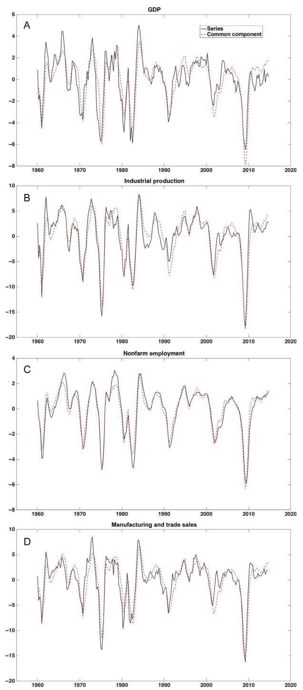

Fig. 1 Detrended four-quarter growth rates of US GDP, industrial production, nonfarm employment, and manufacturing and trade sales (solid line), and the common component (fitted value) from a singlefactor DFM (dashed line). The factor is estimated using 58 US quarterly real activity variables. Variables all measured in percentage points.

DFMs have rich information sets but still involve a manageably small number of predictors, which are the estimates of the latent factors, and do so without imposing restrictions such as sparsity in the original variables that are used by some machine learning algorithms. As a result, DFMs have been the main "big data" tool used over the past 15 years by empirical macroeconomists.

Fourth, DFMs are well suited to practical tasks of professional macroeconomists such as real-time monitoring, including construction of indices from conceptually similar noisy time series.

Fifth, because of their ability to handle large numbers of time series, high-dimensional DFMs can accommodate enough variables to span a wide array of macroeconomic shocks. Given a strategy to identify one or more structural shocks, a structural DFM can be used to estimate responses to these structural shocks. The use of many variables to span the space of the shocks mitigates the "invertibility problem" of structural vector autoregressions (SVARs), in which a relatively small number of variables measured with error might not be able to measure the structural shock of interest.

The chapter begins in [Section 2](#page-6-0) with an introduction to structural dynamic factor models (SDFMs) and methods for estimating DFMs, both parametric (state-space methods) and nonparametric (principal components and related least-squares methods). This discussion includes extensions to data irregularities, such as missing observations and mixed observation frequencies, and covers recent work on detecting breaks and other forms of instability in DFMs.

The chapter then turns to a review of the main applications of DFMs. The first, macroeconomic monitoring and forecasting, is covered in [Section 3](#page-25-0). These applications are mature and many aspects have been surveyed elsewhere, so the discussion is relatively brief and references to other surveys are provided.

[Sections 4 and 5](#page-28-0) examine estimation of the effects of structural shocks. One of the main themes of this chapter is that the underlying identification approaches of SVARs carry over to structural DFMs. This is accomplished through two normalizations, which we call the unit effect normalization for SVARs and the named factor normalization for DFMs. These normalizations set the stage for a unified treatment, provided in these sections, of structural DFMs, factor-augmented VARs (FAVARs), and SVARs.

The basic approaches to identification of structural shocks are the same in SVARs, FAVARs, and SDFMs. [Section 4](#page-28-0) therefore surveys the identification of structural shocks in SVARs. This area has seen much novel work over the past 10 years. [Section 4](#page-28-0) is a stand-alone survey of SVAR identification that can be read without reference to other sections of this chapter and complements [Ramey \(2016\)](#page-108-0). [Section 4](#page-28-0) discusses another of the main themes of this chapter: as modern methods for identification of structural shocks in SVARs become more credible, they raise the risk of relying on relatively small variations in the data, which in turn means that they can be weakly identified. As in applications with microdata, weak identification can distort statistical inference using both Bayes and frequentist methods. [Section 4](#page-28-0) shows how weak identification can arise in various SVAR identification strategies.

[Section 5](#page-56-0) shows how these SVAR identification schemes extend straightforwardly to SDFMs and FAVARs. [Section](#page-56-0) 5 also develops another main theme of this chapter that structural DFMs, FAVARs, and SVARs are a unified suite of tools with fundamentally similar structures that differ in whether the factors are treated as observed or unobserved. By using a large number of variables and treating the factors as unobserved, DFMs "average out" the measurement error in individual time series, and thereby improve the ability to span the common macroeconomic structural shocks.

[Sections 6 and 7](#page-63-0) turn to an empirical illustration using an eight-factor, 207-variable DFM. [Section 6](#page-63-0) works through the estimation of the DFM, first using only the real activity variables to construct a real activity index, then using all the variables.

[Section 7](#page-81-0) uses the 207-variable DFM to examine the effect of oil market shocks on the US economy. The traditional view is that unexpected large increases in oil prices have large and negative effects on the US economy and have preceded many postwar US recessions [\(Hamilton, 1983, 2009](#page-106-0)). Subsequent work suggests, however, that since the 1980s oil shocks have had a smaller impact (eg, [Hooker, 1996;](#page-106-0) [Edelstein and Kilian,](#page-105-0) [2009](#page-105-0); [Blanchard and Galı´, 2010](#page-104-0)), and moreover that much of the movement in oil prices is due to demand shocks, not oil supply shocks (eg, [Kilian, 2009\)](#page-107-0). We use a single large DFM to illustrate how SVAR identification methods carry over to structural DFMs and to FAVARs, and we compare structural DFM, FAVAR, and SVAR results obtained using two different methods to identify oil market shocks. The structural DFM results are consistent with the main finding in the modern literature that oil supply shocks explain only a fraction of the variation in oil prices and explain a very small fraction of the variation in major US macroeconomic variables since the mid-1980s.

In [Section 8,](#page-99-0) we step back and assess what has been learned, at a high level, from the large body of work on DFMs in macroeconomics. These lessons include some practical recommendations for estimation and use of DFMs, along with some potential pitfalls.

There are several recent surveys on aspects of DFM analysis which complement this chapter. [Bai and Ng \(2008\)](#page-103-0) provide a technical survey of the econometric theory for principal components and related DFM methods. [Stock and Watson \(2011\)](#page-109-0) provide an overview of the econometric methods with a focus on applications. [Banbura et al.](#page-103-0) [\(2013\)](#page-103-0) survey the use of DFMs for nowcasting. The focus of this chapter is DFMs in macroeconomics and we note, but do not go into, the vast applications of factor models and principal components methods in fields ranging from psychometrics to finance to big data applications in the natural and biological sciences and engineering.

# 2. DFMs: NOTATION AND SUMMARY OF ECONOMETRIC METHODS

# 2.1 The DFM

The DFM represents the evolution of a vector of N observed time series, Xt, in terms of a reduced number of unobserved common factors which evolve over time, plus uncorrelated disturbances which represent measurement error and/or idiosyncratic dynamics of the individual series. There are two ways to write the model. The dynamic form represents the dependence of  $X_t$  on lags (and possibly leads) of the factors explicitly, while the static form represents those dynamics implicitly. The two forms lead to different estimation methods. Which form is more convenient depends on the application.

The DFM is an example of the much larger class of state-space or hidden Markov models, in which observable variables are expressed in terms of unobserved or latent variables, which in turn evolve according to some lagged dynamics with finite dependence (ie, the law of motion of the latent variables is Markov). What makes the DFM stand out for macroeconometric applications is that the complex comovements of a potentially large number of observable series are summarized by a small number of common factors, which drive the common fluctuations of all the series.

Unless stated explicitly otherwise, observable and latent variables are assumed to be second-order stationary and integrated of order zero; treatment of unit roots, low-frequency trends, and cointegration are discussed in Section 2.1.4. In addition, following convention all data series are assumed to be transformed to have unit standard deviation.

Throughout this chapter, we use lag operator notation, so that  $a(L) = \sum_{i=0}^{\infty} a_i L^i$ , where L is the lag operator, and  $a(L)X_t = \sum_{i=0}^{\infty} a_i X_{t-i}$ .

#### 2.1.1 Dynamic Form of the DFM

The DFM expresses a  $N \times 1$  vector  $X_t$  of observed time series variables as depending on a reduced number q of unobserved or latent factors  $f_t$  and a mean-zero idiosyncratic component  $e_t$ , where both the latent factors and idiosyncratic terms are in general serially correlated. The DFM is,

$$X_t = \lambda(\mathbf{L})f_t + e_t \tag{1}$$

$$f_t = \Psi(\mathbf{L})f_{t-1} + \eta_t \tag{2}$$

where the lag polynomial matrices  $\lambda(L)$  and  $\Psi(L)$  are  $N \times q$  and  $q \times q$ , respectively, and  $\eta_t$  is the  $q \times 1$  vector of (serially uncorrelated) mean-zero innovations to the factors. The idiosyncratic disturbances are assumed to be uncorrelated with the factor innovations at all leads and lags, that is,  $Ee_t\eta'_{t-k} = 0$  for all k. In general,  $e_t$  can be serially correlated. The ith row of  $\lambda(L)$ , the lag polynomial  $\lambda_i(L)$ , is called the dynamic factor loading for the ith series,  $X_{it}$ .

The term  $\lambda_i(L)f_t$  in (1) is the *common component* of the *i*th series. Throughout this chapter, we treat the lag polynomial  $\lambda(L)$  as one sided. Thus the common component of each series is a distributed lag of current and past values of  $f_t$ .

The idiosyncratic disturbance  $e_t$  in (1) can be serially correlated. If so, models (1) and (2) are incompletely specified. For some purposes, such as state-space estimation discussed later, it is desirable to specify a parametric model for the idiosyncratic dynamics. A simple and tractable model is to suppose that the *i*th idiosyncratic disturbance,  $e_{it}$ , follows the univariate autoregression,

&lt;sup>c If  $\lambda(L)$  has finitely many leads, then because  $f_t$  is unobserved the lag polynomial can without loss of generality be rewritten by shifting  $f_t$  so that  $\lambda(L)$  is one sided.

$$e_{it} = \delta_i(\mathbf{L})e_{it-1} + \nu_{it},\tag{3}$$

where  $\nu_{it}$  is serially uncorrelated.

#### 2.1.1.1 Exact DFM

If the idiosyncratic disturbances  $e_t$  are uncorrelated across series, that is,  $Ee_{it}e_{js} = 0$  for all t and s with  $i \neq j$ , then the model is referred to as the exact dynamic factor model.

In the exact DFM, the correlation of one series with another occurs only through the latent factors  $f_t$ . To make this precise, suppose that the disturbances  $(e_t, \eta_t)$  are Gaussian. Then (1) and (2) imply that,

$$E[X_{it}|X_{t}^{-i}, f_{t}, X_{t-1}^{-i}, f_{t-1}, \dots] = E[\lambda_{i}(L)f_{t} + e_{it}|X_{t}^{-i}, f_{t}, X_{t-1}^{-i}, f_{t-1}, \dots]$$

$$= E[\lambda_{i}(L)f_{t}|X_{t}^{-i}, f_{t}, X_{t-1}^{-i}, f_{t-1}, \dots]$$

$$= \lambda_{i}(L)f_{t},$$

$$(4)$$

where the superscript "-i" denotes all the series other than i. Thus the common component of  $X_{it}$  is the expected value of  $X_{it}$  given the factors and all the other variables. The other series  $X_t^{-i}$  have no explanatory power for  $X_{it}$  given the factor.

Similarly, in the exact DFM with Gaussian disturbances, forecasts of the *i*th series given all the variables and the factors reduce to forecasts given the factors and  $X_{it}$ . Suppose that  $e_{it}$  follows the autoregression (3) and that  $(\nu_t, \eta_t)$  are normally distributed. Under the exact DFM,  $E\nu_{it}\nu_{jt}=0$ ,  $i\neq j$ . Then

$$E[X_{it+1}|X_t, f_t, X_{t-1}, f_{t-1}, \dots] = E[\lambda_i(L)f_{t+1} + e_{it+1}|X_t, f_t, X_{t-1}, f_{t-1}, \dots]$$

$$= \alpha_i^f(L)f_t + \delta_i(L)X_{it},$$
(5)

where 
$$\alpha_i^f(L) = \lambda_{i0} \Psi(L) - \delta_i(L) \lambda_i(L) + L^{-1} (\lambda_i(L) - \lambda_0)$$
.

If the disturbances  $(e_t, \eta_t)$  satisfy the exact DFM but are not Gaussian, then the expressions in (4) and (5) have interpretations as population linear predictors.

Eqs. (4) and (5) summarize the key dimension reduction properties of the exact DFM: for the purposes of explaining contemporaneous movements and for making forecasts, once you know the values of the factors, the other series provide no additional useful information.

#### 2.1.1.2 Approximate DFM

The assumption that  $e_t$  is uncorrelated across series is unrealistic in many applications. For example, data derived from the same survey might have correlated measurement error,

d Substitute (2) and (3) into (1) to obtain,  $X_{it+1} = \lambda_{i0}(\boldsymbol{\varPsi}(L)f_t + \eta_{t+1}) + \sum_j \lambda_{ij}f_{t-j+1} + \delta_i(L)e_{it} + \nu_{it+1}$ . Note that  $\sum_j \lambda_{ij}f_{t-j+1} = L^{-1}(\lambda_i(L) - \lambda_{i0})f_t$  and that  $\delta_i(L)e_{it} = \delta_i(L)(X_{it} - \lambda_i(L)f_t)$ . Then  $X_{it+1} = \lambda_{i0}(\boldsymbol{\varPsi}(L)f_t + \eta_{t+1}) + L^{-1}(\lambda_i(L) - \lambda_{i0})f_t + \delta_i(L)(X_{it} - \lambda_i(L)f_t) + \nu_{it+1}$ . Eq. (5) obtains by collecting terms and taking expectations.

and multiple series for a given sector might have unmodeled sector-specific dynamics. Chamberlain and Rothschild's (1983) approximate factor model allows for such correlation, as does the theoretical justification for the econometric methods discussed in Section 2.2. For a discussion of the technical conditions limiting the dependence across the disturbances in the approximate factor model, see Bai and Ng (2008).

Under the approximate DFM, the final expressions in (4) and (5) would contain additional terms reflecting this limited correlation. Concretely, the forecasting Eq. (5) could contain some additional observable variables relevant for forecasting series  $X_{it}$ . In applications, this potential correlation is best addressed on a case-by-case basis.

#### 2.1.2 Static (Stacked) Form of the DFM

The *static*, or *stacked*, form of the DFM rewrites the dynamic form (1) and (2) to depend on *r static factors*  $F_t$  instead of the q dynamic factors  $f_t$ , where  $r \ge q$ . This rewriting makes the model amenable to principal components analysis and to other least-squares methods.

Let p be the degree of the lag polynomial matrix  $\lambda(L)$  and let  $F_t = (f'_t, f'_{t-1}, ..., f'_{t-p})$  denote an  $r \times 1$  vector of so-called "static" factors—in contrast to the "dynamic" factors  $f_t$ . Also let  $\Lambda = (\lambda_0, \lambda_1, ..., \lambda_p)$ , where  $\lambda_h$  is the  $N \times q$  matrix of coefficients on the hth lag in  $\lambda(L)$ . Similarly, let  $\Phi(L)$  be the matrix consisting of 1s, 0s, and the elements of  $\Psi(L)$  such that the vector autoregression in (2) is rewritten in terms of  $F_t$ . With this notation the DFM (1) and (2) can be rewritten,

$$X_t = \Lambda F_t + e_t \tag{6}$$

$$F_t = \Phi(L)F_{t-1} + G\eta_t, \tag{7}$$

where  $G = \begin{bmatrix} I_q & 0_{q \times (r-q)} \end{bmatrix}'$ .

As an example, suppose that there is a single dynamic factor  $f_t$  (so q = 1), that all  $X_{it}$  depend only on the current and first lagged values of  $f_t$ , and that the VAR for  $f_t$  in (2) has two lags, so  $f_t = \Psi_1 f_{t-1} + \Psi_2 f_{t-2} + \eta_t$ . Then the correspondence between the dynamic and static forms for  $X_{it}$  is,

$$X_{it} = \lambda_{i0} f_t + \lambda_{i1} f_{t-1} + e_{it} = \begin{bmatrix} \lambda_{i0} & \lambda_{i1} \end{bmatrix} \begin{bmatrix} f_t \\ f_{t-1} \end{bmatrix} + e_{it} = \Lambda_i F_t + e_{it},$$
 (8)

$$F_{t} = \begin{bmatrix} f_{t} \\ f_{t-1} \end{bmatrix} = \begin{bmatrix} \boldsymbol{\Psi}_{1} & \boldsymbol{\Psi}_{2} \\ 1 & 0 \end{bmatrix} \begin{bmatrix} f_{t-1} \\ f_{t-2} \end{bmatrix} + \begin{bmatrix} 1 \\ 0 \end{bmatrix} \boldsymbol{\eta}_{t} = \boldsymbol{\Phi} F_{t-1} + G \boldsymbol{\eta}_{t}, \tag{9}$$

where the first expression in (8) writes out the equation for  $X_{it}$  in the dynamic form (1),  $\Lambda_i = [\lambda_{i0} \ \lambda_{i1}]$  is the *i*th row of  $\Lambda$ , and the final expression in (8) is the equation for  $X_{it}$  in the static form (6). The first row in Eq. (9) is the evolution equation of the dynamic factor in (2) and the second row is the identity used to express (2) in first-order form.

In the static form of the DFM, the common component of the *i*th variable is  $\Lambda_i F_t$ , and the idiosyncratic component is  $e_{it}$ .

With the additional assumptions that the idiosyncratic disturbance follows the autoregression (3) and that the disturbances ( $\nu_t$ ,  $\eta_t$ ) are Gaussian, the one step ahead forecast of the *i*th variable in the static factor model is,

$$E[X_{it+1}|X_t, F_t, X_{t-1}, F_{t-1}, \dots] = \alpha_i^F(L)F_t + \delta_i(L)X_{it}, \tag{10}$$

where  $\alpha_i^F = \Lambda_i \Phi(L) - \delta_i(L) \Lambda_i$ . If the disturbances are non-Gaussian, the expression is the population linear predictor.

The forecasting Eq. (10) is the static factor model counterpart of (5). In both forms of the DFM, the forecast using all the series reduces to a distributed lag of the factors and the individual series. The VAR (7) for  $F_t$  can be written in companion form by stacking the elements of  $F_t$  and its lags, resulting in a representation in which the stacked factor follows a VAR(1), in which case only current values of the stacked vector of factors enter (10).

Multistep ahead forecasts can be computed either by a direct regression onto current and past  $F_t$  and  $X_{it}$ , or by iterating forward the AR model for  $e_{it}$  and the VAR for  $F_t$  (Eqs. (3) and (7)).

In general, the number of static factors r exceeds the number of dynamic factors q because  $F_t$  consists of stacked current and past  $f_t$ . When r > q, the static factors have a dynamic singularity, that is, q - r linear combinations of  $F_t$  are perfectly predictable from past  $F_t$ . In examples (8) and (9), there is a single dynamic factor and two static factors, and the perfectly predictable linear combination is  $F_{2t} = F_{1t-1}$ .

When the numbers of static and dynamic factors are estimated using macroeconomic data, the difference between the estimated values of r and q is often small, as is the case in the empirical work reported in Section 6. As a result, some applications set r = q and G = I in (7). Alternatively, if q < r, the resulting covariance matrix of the static factor innovations, that is, of  $F_t - \Phi(L)F_{t-1} = G\eta_t$ , has rank q, a constraint that can be easily imposed in the applications discussed in this chapter.

#### 2.1.3 Normalization of the Factors

Because the factors are unobserved, they are identified only up to arbitrary normalizations. We first consider the static DFM, then the dynamic DFM.

In the static DFM, the space spanned by  $F_t$  is identified, but  $F_t$  itself is not identified:  $\Lambda F_t = (\Lambda Q^{-1})$  ( $QF_t$ ), where Q is any invertible  $r \times r$  matrix. For many applications, including macro monitoring and forecasting, it is necessary only to identify the space spanned by the factors, not the factors themselves, in which case Q in the foregoing expression is irrelevant. For such applications, the lack of identification is resolved by imposing a mathematically convenient normalization. The two normalizations discussed in this chapter are the "principal components" normalization and the "named factor" normalization.

#### 2.1.3.1 Principal Components Normalization

Under this normalization, the columns of  $\Lambda$  are orthogonal and are scaled to have unit norm:

$$N^{-1}\Lambda'\Lambda = I_r$$
 and  $\Sigma_F$  diagonal ("principal components" normalization) (11)

where  $\Sigma_F = E(F_t F_t')$ .

The name for this normalization derives from its use in principal components estimation of the factors. When the factors are estimated by principal components, additionally the diagonal elements of  $\Sigma_F$  are weakly decreasing.

#### 2.1.3.2 Named Factor Normalization

An alternative normalization is to associate each factor with a specific variable. Thus this normalization "names" each factor. This approach is useful for subsequent structural analysis, as discussed in Section 5 for structural DFMs, however it should be stressed that the "naming" discussed here is only a normalization that by itself it has no structural content.

Order the variables in  $X_t$  so that the first r variables are the naming variables. Then the "named factor" normalization is,

$$\Lambda^{NF} = \begin{bmatrix} I_r \\ \Lambda_{r+1:n}^{NF} \end{bmatrix}, \quad \Sigma_F \text{ is unrestricted ("named factor" normalization)}. \tag{12}$$

Under the named factor normalization, the factors are in general contemporaneously correlated.e

The named factor normalization aligns the factors and variables so that the common component of  $X_{1t}$  is  $F_{1t}$ , so that an innovation to  $F_{1t}$  increases the common component of  $X_{1t}$  by one unit and thus increases  $X_{1t}$  by one unit. Similarly, the common component of  $X_{2t}$  is  $F_{2t}$ , so the innovation to the  $F_{2t}$  increases  $X_{2t}$  by one unit.

For example, suppose that the first variable is the price of oil. Then the normalization (12) equates the innovation in the first factor with the innovation in the common component of the oil price. The innovation in the first factor and the first factor itself therefore can be called the oil price factor innovation and the oil price factor.

The named factor normalization entails an additional assumption beyond the principal components normalization, specifically, that matrix of factor loadings on the first r variables (the naming variables) is invertible. That is, let  $\Lambda_{1:r}$  denote the  $r \times r$  matrix of factor loadings on the first r variables in the principal components normalization. Then  $\Lambda_{r+1:N}^{NF} = \Lambda_{1:r}^{-1}\Lambda_{r+1:N}$ . Said differently, the space of innovations of the first r common components must span the space of innovations of the static factors. In practice, the naming variables must be sufficiently different from each other, and sufficiently representative

&lt;sup>e Bai and Ng (2013) refer to (11) and (12) normalizations as the PC1 and PC3 normalizations, respectively, and also discuss a PC2 normalization in which the first  $r \times r$  block of  $\Lambda$  is lower triangular.

of groups of the other variables, that the innovations to their common components span the space of the factor innovations. This assumption is mild and can be satisfied by suitable choice of the naming variables.

#### 2.1.3.3 Timing Normalization in the Dynamic Form of the DFM

In the dynamic form of the DFM, an additional identification problem arises associated with timing. Because  $\lambda(L)f_t = [\lambda(L)q(L)^{-1}][q(L)f_t]$ , where q(L) is an arbitrary invertible  $q \times q$  lag polynomial matrix, a DFM with factors  $f_t$  and factor loadings  $\lambda(L)$  is observationally equivalent to a DFM with factors q(L)  $f_t$  and factor loadings  $\lambda(L)q(L)^{-1}$ . This lack of identification can be resolved by choosing q variables on which  $f_t$  loads contemporaneously, without leads and lags, that is, for which  $\lambda_i(L) = \lambda_{i0}$ .

## 2.1.4 Low-Frequency Movements, Unit Roots, and Cointegration

Throughout this chapter, we assume that  $X_t$  has been preprocessed to remove large low-frequency movements in the form of trends and unit roots. This is consistent with the econometric theory for DFMs which presumes series that are integrated of order zero (I(0)).

In practice, this preprocessing has two parts. First, stochastic trends and potential deterministic trends arising through drift are removed by differencing the data. Second, any remaining low-frequency movements, or long-term drifts, can be removed using other methods, such as a very low-frequency band-pass filter. We use both these steps in the empirical application in Sections 6 and 7, where they are discussed in more detail.

If some of the variables are cointegrated, then transforming them to first differences loses potentially important information that would be present in the error correction terms (that is, the residual from a cointegrating equation, possibly with cointegrating coefficients imposed). Here we discuss two different treatments of cointegrated variables, both of which are used in the empirical application of Sections 6 and 7.

The first approach for handling cointegrated variables is to include the first difference of some of the variables and error correction terms for the others. This is appropriate if the error correction term potentially contains important information that would be useful in estimating one or more factors. For example, suppose some of the variables are government interest rates at different maturities, that the interest rates are all integrated of order 1 (I(1)), that they are all cointegrated with a single common I(1) component, and the spreads also load on macro factors. Then including the first differences of one rate and the spreads allows using the spread information for estimation of their factors.

The second approach is to include all the variables in first differences and not to include any spreads. This induces a spectral density matrix among these cointegrated variables that is singular at frequency zero, however that frequency zero spectral density matrix is not estimated when the factors are estimated by principal components. This approach is appropriate if the first differences of the factors are informative for the common trend but the cointegrating residuals do not load on common factors. For example,

in the empirical example in [Sections 7 and 8](#page-81-0), multiple measures of real oil prices are included in first differences. While there is empirical evidence that these oil prices, for example Brent and WTI, are cointegrated, there is no a priori reason to believe that the WTI-Brent spread is informative about broad macro factors, and rather that spread reflects details of oil markets, transient transportation and storage disruptions, and so forth. This treatment is discussed further in [Section 7.2.](#page-84-0)

An alternative approach to handling unit roots and cointegration is to specify the DFM in levels or log levels of some or all of the variables, then to estimate cointegrating relations and common stochastic trends as part of estimating the DFM. This approach goes beyond the coverage of this chapter, which assumes that variables have been transformed to be I(0) and trendless. [Banerjee and Marcellino \(2009\)](#page-103-0)and [Banerjee et al. \(2014,](#page-103-0) [2016\)](#page-103-0) develop a factor-augmented error correction model (FECM) in which the levels of a subset of the variables are expressed as cointegrated with the common factors. The discussion in this chapter about applications and identification extends to the FECM.

# 2.2 DFMs: A Brief Review of Early Literature

Factor models have a long history in statistics and psychometrics. The extension to DFMs was originally developed by [Geweke \(1977\)](#page-106-0) and [Sargent and Sims \(1977\)](#page-109-0), who estimate the model using frequency-domain methods. [Engle and Watson \(1981, 1983\)](#page-105-0) showed how the DFM can be estimated by maximum likelihood using time-domain state-space methods. An important advantage of the time domain over the frequency-domain approach is the ability to estimate the values of the latent factor using the Kalman filter. [Stock and Watson \(1989\)](#page-109-0) used these state-space methods to develop a coincident real activity index as the estimated factor from a four-variable monthly model, and [Sargent \(1989\)](#page-109-0) used analogous state-space methods to estimate the parameters of a six-variable real business cycle model with a single common structural shock.

Despite this progress, these early applications had two limitations. The first was computational: estimation of the parameters by maximum likelihood poses a practical limitation on the number of parameters that can be estimated, and with the exception of the single-factor 60-variable system estimated by [Quah and Sargent \(1993\),](#page-108-0) these early applications had only a handful of observable variables and one or two latent factors. The second limitation was conceptual: maximum likelihood estimation requires specifying a full parametric model, which in practice entails assuming that the idiosyncratic components are mutually independent, and that the disturbances are normally distributed, a less appealing set of assumptions than the weaker ones in [Chamberlain and Rothschild's](#page-104-0) [\(1983\)](#page-104-0) approximate DFM.f For these reasons, it is desirable to have methods that can

f This second limitation was, it turns out, more perceived than actual if the number of series is large. [Doz](#page-105-0) [et al. \(2012\)](#page-105-0) show that state-space Gaussian quasi-maximum likelihood is a consistent estimator of the space spanned by the factors under weak assumptions on the error distribution and that allow limited correlation of the idiosyncratic disturbances.

handle many series and higher dimensional factor spaces under weak conditions on distributions and correlation among the idiosyncratic terms.

The state-space and frequency-domain methods exploit averaging both over time and over the cross section of variables. The key insight behind the nonparametric methods for estimation of DFMs, and in particular principal components estimation of the factors, is that, when the number of variables is large, cross-sectional variation alone can be exploited to estimate the space spanned by the factors. Consistency of the principal components (PC) estimator of  $F_t$  was first shown for T fixed and  $N \to \infty$  in the exact factor model, without lags or any serial correlation, by Connor and Korajczyk (1986). Forni and Reichlin (1998) formalized the cross-sectional consistency of the unweighted crosssectional average for a DFM with a single factor and nonzero average factor loading dynamics. Forni et al. (2000) showed identification and consistency of the dynamic PC estimator of the common component (a frequency-domain method that entails two-sided smoothing). Stock and Watson (2002a) proved consistency of the (time domain) PC estimator of the static factors under conditions along the lines of Chamberlain and Rothschild's (1983) approximate factor model and provided conditions under which the estimated factors can be treated as observed in subsequent regressions. Bai (2003) derived limiting distributions for the estimated factors and common components. Bai and Ng (2006a) provided improved rates for consistency of the PC estimator of the factors. Specifically, Bai and Ng (2006a) show that as  $N \to \infty$ ,  $T \to \infty$ , and  $N^2/T \rightarrow \infty$ , the factors estimated by principal components can be treated as data (that is, the error in estimation of the factors can be ignored) when they are used as regressors.

#### 2.3 Estimation of the Factors and DFM Parameters

The parameters and factors of the DFM can be estimated using nonparametric methods related to principal components analysis or by parametric state-space methods.

### 2.3.1 Nonparametric Methods and Principal Components Estimation

Nonparametric methods estimate the static factors in (6) directly without specifying a model for the factors or assuming specific distributions for the disturbances. These approaches use cross-sectional averaging to remove the influence of the idiosyncratic disturbances, leaving only the variation associated with the factors.

The intuition of cross-sectional averaging is most easily seen when there is a single factor. In this case, the cross-sectional average of  $X_t$  in (6) is  $\bar{X}_t = \overline{\Lambda}F_t + \bar{e}_t$ , where  $\bar{X}_t$ ,  $\overline{\Lambda}$ , and  $\bar{e}_t$ , denote the cross-sectional averages  $\bar{X}_t = N^{-1} \sum_{i=1}^N X_{it}$ , etc. If the cross-sectional correlation among  $\{e_{it}\}$  is limited, then by the law of large numbers  $\bar{e}_t \stackrel{p}{\longrightarrow} 0$ , that is,  $\bar{X}_t - \overline{\Lambda}F_t \stackrel{p}{\longrightarrow} 0$ . Thus if  $\overline{\Lambda} \neq 0$ ,  $\bar{X}_t$  estimates  $F_t$  up to scale. With more than one factor, this argument carries through using multiple weighted averages of  $X_t$ . Specifically, suppose that  $N^{-1}\Lambda'\Lambda$  has a nonsingular limit; then the weighted average

 $N^{-1}\Lambda'X_t$  satisfies  $N^{-1}\Lambda'X_t - N^{-1}\Lambda'\Lambda F_t \xrightarrow{p} 0$ , so that  $N^{-1}\Lambda'X_t$  asymptotically spans the space of the factors. The weights  $N^{-1}\Lambda$  are infeasible because  $\Lambda$  is unknown, however principal components estimation computes the sample version of this weighted average.

#### 2.3.1.1 Principal Components Estimation

Principal components solve the least-squares problem in which  $\Lambda$  and  $F_t$  in (6) are treated as unknown parameters to be estimated:

$$\min_{F_1, \dots, F_T, \Lambda} V_r(\Lambda, F), \text{ where } V_r(\Lambda, F) = \frac{1}{NT} \sum_{t=1}^T (X_t - \Lambda F_t)'(X_t - \Lambda F_t), \tag{13}$$

subject to the normalization (11). Under the exact factor model with homogeneous idiosyncratic variances and factors treated as parameters, (13) is the Gaussian maximum likelihood estimator (Chamberlain and Rothschild, 1983). If there are no missing data, then the solution to the least-squares problem (13) is the PC estimator of the factors,  $\hat{F}_t = N^{-1} \hat{\Lambda}' X_t$ , where  $\hat{\Lambda}$  is the matrix of eigenvectors of the sample variance matrix of  $X_t$ ,  $\hat{\Sigma}_X = T^{-1} \sum_{t=1}^T X_t X_t'$ , associated with the r largest eigenvalues of  $\hat{\Sigma}_X$ .

## 2.3.1.2 Generalized Principal Components Estimation

If the idiosyncratic disturbances have different variances and/or some are cross correlated, then by analogy to generalized least squares, efficiency gains should be possible by modifying the least-squares problem (13) for a more general weight matrix. Specifically, let  $\Sigma_e$  denote the error variance matrix of  $e_i$ ; then the analogy to generalized least-squares regression suggests that  $F_t$  and  $\Lambda$  solve a weighted version of (13), where the weighting matrix is  $\Sigma_e^{-1}$ :

$$\min_{F_1, ..., F_T, \Lambda} T^{-1} \sum_{t=1}^{T} (X_t - \Lambda F_t)' \Sigma_e^{-1} (X_t - \Lambda F_t). \tag{14}$$

A solution to (14) is the infeasible generalized PC estimator,  $\widetilde{F}_t = N^{-1} \widetilde{\Lambda}' X_t$ , where  $\widetilde{\Lambda}$  are the scaled eigenvectors corresponding to the r largest eigenvalues of  $\Sigma_e^{-1/2} \hat{\Sigma}_X \Sigma_e^{-1/2'}$ .

The feasible generalized PC estimator replaces the unknown  $\Sigma_e$  in (14) with an estimator  $\hat{\Sigma}_e$ . Choi (2012) shows that if  $\hat{\Sigma}_e$  is consistent for  $\Sigma_e$  then the feasible generalized PC estimator of  $\{F_t\}$  and  $\Lambda$  is asymptotically more efficient than principal components. Several estimators of  $\Sigma_e$  have been proposed. The limited amount of evidence from simulation and empirical work comparing their performance suggests that a reasonable approach is to use Boivin and Ng's (2006) two-step diagonal weight matrix approach, in which the first step is principal components (that is, identity weight matrix) and

g As stated in the beginning of this section, the series in *X* are typically preprocessed to have unit standard deviation, so in this sense the unweighted principal components estimator (13) implicitly also has weighting if it is expressed in terms of the nonstandardized data.

the second step uses a diagonal  $\hat{\Sigma}_e$ , where the diagonal element is the sample variance of the estimated idiosyncratic component from the first step.

Other approaches include Forni et al.'s (2005), which allows for contemporaneous covariance across the idiosyncratic terms but does not adjust for serial correlation, and Stock and Watson's (2005) and Breitung and Tenhofen's (2011), which adjusts for serial correlation and heteroskedasticity in  $e_{it}$  but not cross correlation. See Choi (2012) for additional discussion.

#### 2.3.1.3 Extension to Restrictions on $\Lambda$

The principal components methods described in Sections 2.3.1.1 and 2.3.1.2 apply to the case that  $\Lambda$  and F are exactly identified using the principal components normalization. If there are additional restrictions on  $\Lambda$ , then principal components no longer applies but the least-squares concept does. Specifically, minimization can proceed using (13), however  $\Lambda$  is further parameterized as  $\Lambda(\theta)$  and minimization now proceeds over  $\theta$ , not over unrestricted  $\Lambda$ .

In general this minimization with respect to  $\theta$  entails nonlinear optimization. In some leading cases, however, closed-form solutions to the least-squares problem are available. One such case is a hierarchical DFM in which there are common factors that affect all variables, and group-level factors that affect only selected variables; for example, suppose the groups are countries, the group factors are country factors, and the cross-group common factors are international factors. If the factors are normalized to be orthogonal, the first-level factors can be estimated by principal components using all the series, then the factors unique to the gth group can be estimated by principal components using the residuals from projecting the group-g variables on the first-level factors. A second case is when the restrictions are linear, so that  $\text{vec}(\Lambda) = R\theta$ , where R is a fixed known matrix; in this case, standard regression formulas provide an explicit representation of the minimizer  $\hat{\theta}$  given  $\{\hat{F}_t\}$  and vice versa.

#### 2.3.2 Parametric State-Space Methods

State-space estimation entails specifying a full parametric model for  $X_t$ ,  $e_t$ , and  $f_t$  in the dynamic form of the DFM, so that the likelihood can be computed.

For parametric estimation, additional assumptions need to be made on the distribution of the errors and the dynamics of the idiosyncratic component  $e_t$  in the DFM. A common treatment is to model the elements of  $e_t$  as following the independent univariate autoregressions (3). With the further assumptions that the disturbances  $\nu_{it}$  in (3) are i.i.d.  $N(0, \sigma_{\nu_i}^2)$ ,  $i=1, \ldots, N$ ,  $\eta_t$  is i.i.d.  $N(0, \Sigma_{\eta})$ , and  $\{\nu_t\}$  and  $\{\eta_t\}$  are independent, Eqs. (1)–(3) constitute a complete linear state-space model. Alternatively, the static DFM can be written in state-space form using (6), (7), and (3).

Given the parameters, the Kalman filter can be used to compute the likelihood and the Kalman smoother can be used to compute estimates of  $f_t$  given the full-sample data on

{Xt}. The likelihood can be maximized to obtain maximum likelihood estimates of the parameters. Alternatively, with the addition of a prior distribution, the Kalman filter can be used to compute the posterior distribution of the parameters and posterior estimates of the unobserved factors can be computed from the Kalman smoother. The fact that the state-space approach uses intertemporal smoothing to estimate the factors, whereas principal components approaches use only contemporaneous smoothing (averaging across series at the same date) is an important difference between the methods.

Parametric state-space methods have several advantages, including the use of quasimaximum likelihood estimation, the possibility of performing Bayes inference, efficient treatment of missing observations (this latter point is discussed further in the next section), and the use of intertemporal smoothing to estimate the factors. However, state-space methods also have drawbacks. Historically, their implementation becomes numerically challenging when N is large because the number of parameters grows proportionately to N, making maximum likelihood estimation of the parameter vector prohibitive.h In addition, state-space methods require specifying the degree of the factor loading lag polynomial and models for the factors and for the idiosyncratic terms. These modeling choices introduce potential misspecification which is not reflected in the model-based inference, that is, standard errors and posterior coverage regions are not robust to model misspecification.

## 2.3.3 Hybrid Methods and Data Pruning

#### 2.3.3.1 Hybrid Methods

One way to handle the computational problem of maximum likelihood estimation of the state-space parameters is to adopt a two-step hybrid approach that combines the speed of principal components and the efficiency of the Kalman filter [\(Doz et al., 2011](#page-105-0)). In the first step, initial estimates of factors are obtained using principal components, from which the factor loadings are estimated and a model is fit to the idiosyncratic components. In the second step, the resulting parameters are used to construct a state-space model which then can be used to estimate Ft by the Kalman filter. [Doz et al. \(2011\)](#page-105-0) show that, for large N and T, the resulting estimator of the factors is consistent for the factor space and is robust to misspecification of the correlation structure of the idiosyncratic components, and thus has a nonparametric interpretation.

#### 2.3.3.2 Pruning Datasets and Variable Selection

The discussion so far assumes that all the variables have been chosen using a priori knowledge to include series that are potentially valuable for estimating the factors. Because the emphasis is on using many variables, one possibility is that some extraneous variables

h [Durbin and Koopman \(2012, section 6.5\)](#page-105-0) discuss computationally efficient formulae for Kalman filtering when N is large.

could be included, and that it might be better to eliminate those variables. Whether this is a problem, and if so how to handle it, depends on the empirical application. If there is a priori reason to model the factors as applying to only some variables (for example, there are multiple countries and interest is in obtaining some country-specific and some international factors) then it is possible to use a hierarchical DFM. In effect this prunes out variables of other countries when estimating a given country factors. Another approach is to use prescreening methods to prune the dataset, see for example [Bai and](#page-103-0) [Ng \(2006a\)](#page-103-0). Alternatively, sparse data methods can be used to eliminate some of the variables, for example using a sparsity prior in a state-space formulation (eg, [Kaufmann and](#page-107-0) [Schumacher, 2012](#page-107-0)).

## 2.3.4 Missing Data and Mixed Data Sampling Frequencies

Missing data arise for various reasons. Some series might begin sooner than others, the date of the final observation on different series can differ because of timing of data releases, and in some applications the series might have different sampling frequencies (eg, monthly and quarterly). The details of how missing data are handled differ in principal components and state-space applications. All the procedures in common use (and, to the best of our knowledge, all the procedures in the literature) adopt the assumption that the data are missing at random. Under the missing-at-random assumption, whether a datum is missing is independent of the latent variables (no endogenous sample selection). The missing-at-random assumption arguably is a reasonable assumption for the main sources of missing data in DFMs in most macroeconomic applications to date.

#### 2.3.4.1 Principal Components Estimation with Missing Data

The solution to the least-squares [problem \(13\)](#page-15-0) in terms of the eigenvalues of Σ^X holds when all NT observations are nonmissing, that is, when the panel is balanced. When there are missing observations, least-squares still can be used to estimate Ft and Λ, however the solution must be obtained numerically. Specifically, the modification of [\(13\)](#page-15-0) when there is missing data is,

$$\min_{F_1, \dots, F_T, \Lambda} \frac{1}{NT} \sum_{i=1}^{N} \sum_{t=1}^{T} S_{it} (X_{it} - \Lambda_i F_t)^2, \tag{15}$$

where Sit¼1 if an observation on Xit is available and Sit¼0 otherwise and where Λi is the ith row of Λ. The objective function in (15) can be minimized by iterations alternating with Λ given {Ft} then {Ft} given Λ; each step in the minimization has a closedform expression. Starting values can be obtained, for example, by principal component estimation using a subset of the series for which there are no missing observations. Alternatively, [Stock and Watson \(2002b\)](#page-109-0) provide an EM algorithm for handling missing observations.

Given an estimate of the factor loadings and factors based on missing data, the estimated common component for the *i*th series remains  $\hat{A}_i\hat{F}_t$  and the one step ahead forecast is given by (10), where the parameters of (10) are estimated treating  $\hat{F}_t$  as data.

#### 2.3.4.2 State-Space Estimation with Missing Data

The state-space framework can be adapted to missing data by allowing the measurement Eq. (1) to vary depending on what data are available at a given date t; see Harvey (1989, p. 325). Alternatively, the dimension of the measurement equation can be kept the same by including a proxy value for the missing observation while adjusting the model parameters so that the Kalman filter places no weight on the missing observation. See Giannone et al. (2008), Mariano and Murasawa (2010), and Marcellino and Sivec (2014) for variations on this latter approach.

For large N, one computational challenge is keeping the dimension of the state vector small as N grows, which is more complicated with missing observations than with all observations nonmissing; see Jungbacker et al. (2011) and Bańbura and Modugno (2014) for discussion and proposed computationally efficient solutions.

One theoretical advantage of the state-space approach to mixed frequencies is that it can pin down when precisely the measurement occurs (eg, the US establishment survey measures payroll employment during the week including the 12th of the month). A second theoretical advantage of the state-space approach is that it can explicitly differentiate between stock variables (observed at a point in time, like employment) and flow variables (temporal averages, like GDP). In practice, dealing with flows is complicated, however, because the flow aggregation identities are in levels but the variables being measured, such as sectoral output, are typically best modeled in growth rates. These complications require approximations and can substantially increase the dimension of the latent state variable. For an application with mixed sampling frequencies and mixed stock and flow variables, see Aruoba et al. (2009). See Foroni and Marcellino (2013) for a survey of methods for handling mixed-frequency data, including DFMs and alternative approaches.

There appears to be little research comparing the performance of parametric and nonparametric approaches to mixed-frequency data.

#### 2.3.5 Bayes Methods

An alternative approach to estimating DFMs is to use Bayes methods. In Bayesian estimation, the DFM parameters are treated as random draws from a prior distribution. Because the factors are unobserved and multiplied by the coefficients, Bayesian inference is more complicated than it is in the standard regression model with observed regressors and conjugate priors, and Bayesian DFM estimation requires using modern numerical techniques.

The first Bayesian treatments of DFMs of which we are aware are [Kim and Nelson](#page-107-0) [\(1998\)](#page-107-0)and [Otrok and Whiteman \(1998\),](#page-108-0) who both estimated a small single-factor system using Markov Chain Monte Carlo methods. [Kim and Nelson \(1998\)](#page-107-0) also incorporated Markov switching in the process for the latent factor. In other early work, [Kose et al.](#page-107-0) [\(2003\)](#page-107-0) extend [Otrok and Whiteman \(1998\)](#page-108-0) to a 180-variable system with international macroeconomic data, using a hierarchical regional/country structure. [Aguilar and West](#page-102-0) [\(2000\)](#page-102-0) developed Bayes methods for estimating dynamic factor models with stochastic volatility, which they apply to multivariate financial time series.

A theoretical advantage of Bayes methods is that the mean squared error of some functions of the estimated parameters (such as in forecast functions) can be reduced by shrinkage. [Koopman and Mesters \(forthcoming\)](#page-107-0) take an empirical Bayes approach to estimating the efficientamount of shrinkage. Their algorithm iterates between estimation of the factors by Gaussian signal extraction (Kalman smoother) and Bayes estimation of the parameters given the consistently estimated factors.

To date, the dominant methods used in macro applications are Frequentist, especially the computationally straightforward methods based on principal components. This chapter therefore focuses on Frequentist methods for estimation of DFMs. However, because the number of parameters in Λ is large, Bayes methods for DFMs are a promising area for improving estimator and forecast performance from a Frequentist perspective.

# 2.4 Determining the Number of Factors

# 2.4.1 Estimating the Number of Static Factors r

The number of static factors r can be determined by a combination of a priori knowledge, visual inspection of a scree plot, and the use of information criteria and other statistical measures.

#### 2.4.1.1 Scree Plots

A scree plot displays the marginal contribution of the kth principal component to the average R2 of the N regressions of Xt against the first k principal components. This marginal contribution is the average additional explanatory value of the kth factor. When there are no missing data, the scree plot is a plot of the ordered eigenvalues of Σ^X, normalized by the sum of the eigenvalues.

#### 2.4.1.2 Information Criteria

Information criteria, such as the Akaike information criterion, use a penalized objective function to trade off the benefit of including an additional parameter against the cost of increased sampling variability. [Bai and Ng \(2002\)](#page-103-0) extend this idea to including an additional factor using the penalized sum of squares,

$$IC(r) = \ln V_r(\hat{\Lambda}, \hat{F}) + rg(N, T), \tag{16}$$

where  $V_r(\hat{\Lambda}, \hat{F})$  is the least-squares objective function in (13) evaluated at the PCs  $(\hat{\Lambda}, \hat{F})$ , and where g(N,T) is a penalty factor such that  $g(N,T) \to 0$  and  $\min(N,T)g(N,T) \to \infty$  as  $N, T \to \infty$ . Bai and Ng (2002) provide conditions under which the value of r that minimizes an information criterion with g(N,T) satisfying these conditions is consistent for the true value of r. A commonly used penalty function is the Bai and Ng (2002)  $IC_{p2}$  penalty, for which  $g(N,T) = [(N+T)/NT] \ln[\min(N,T)]$ . When N=T, this penalty simplifies to two times the BIC penalty,  $T^{-1} \ln T$ . Monte Carlo evidence suggests that this penalty function works well in designs calibrated to macroeconomic data.

#### 2.4.1.3 Other Approaches

Onatski (2010) provides an alternative consistent estimator of r which estimates r as the largest value of k for which the difference between eigenvalues k and k+1 of  $\hat{\Sigma}_X$  exceeds a threshold provided in that paper; this estimator corresponds to finding the final "cliff" in the scree plot larger than that threshold. Similarly, Ahn and Horenstein (2013) show that an alternative consistent estimator of r is obtained as the maximizer of the ratio of eigenvalue k to eigenvalue k+1; their estimator corresponds to locating the largest "relative cliff" in the scree plot. Onatski (2009) takes a different approach and considers tests as opposed to estimation of r by information criteria.

Practical experience suggests that different methods frequently give different estimates. There is limited research comparing the performance of the different methods. This sensitivity suggests that it is important to augment the statistical estimators with inspection of the scree plot and with judgment informed by the application at hand.

## 2.4.2 Estimating the Number of Dynamic Factors q

In principle, the number of dynamic factors can be less than the number of static factors and if so, the static factors follow a singular dynamic process. Framed in terms of (7), these singularities arise because the covariance matrix of the innovations to  $F_t$  (that is,  $G\eta_t$  in (7)) is singular with rank q < r. This implies that the spectral density matrix of  $F_t$  is singular. Estimation of q given r entails estimating the rank of this singularity. Although in principle an information criterion could be used to estimate the number of dynamic factors based on the likelihood of the dynamic form of the DFM, estimating q given r has the advantage that it is unnecessary to compute that likelihood.

There are three related methods for consistently estimating q given r. Amengual and Watson (2007) first compute the residual of the projection of  $X_t$  onto lagged values of the PC estimator of  $F_t$ , then apply the Bai and Ng (2002) information criterion to the covariance matrix of those residuals. Bai and Ng (2007) work directly with the factors and use an information criterion to estimate the rank of the residual covariance matrix of a VAR estimated using the r principal components. In contrast to these two approaches, Hallin

and Liška (2007) propose a frequency-domain procedure which uses an information criterion to estimate the rank of the spectral density matrix of  $X_t$ . There seems to be limited research comparing these methods.

## 2.5 Breaks and Time-Varying Parameters

The discussion so far has considered DFMs with time-invariant parameters. In many applications, however, there is at least the possibility of parameter instability. This section reviews the robustness of PC estimator of the factors to small breaks. If, however, the instability is large and widespread, the full-sample PC estimator breaks down. As a result, in many applications it is important to check for and/or model structural instability in the factor loadings. There are two broad approaches to handling instability in DFMs: positing a break in the parameters, and modeling the parameters as evolving stochastically.

#### 2.5.1 Robustness of PC to Limited Instability

If the amount of instability is small and/or limited across variables, the PC estimator of the factors remains consistent. The intuition behind this initially surprising result can be seen by returning to the example of Section 2.3.1 of the cross-sectional average when there is a single factor. Suppose that the static factor loading matrix is time dependent, so that  $\Lambda$  in (6) is replaced by  $\Lambda_t$ . Then  $\bar{X}_t = \overline{\Lambda}_t F_t + \bar{e}_t$ , where  $\overline{\Lambda}_t$  is the cross-sectional average of  $\Lambda_t$ . Let  $\overline{\Lambda}$  denote the time average of  $\overline{\Lambda}_t$ . Then  $\bar{X}_t - \overline{\Lambda} F_t = \left(\overline{\Lambda}_t - \overline{\Lambda}\right) F_t + \bar{e}_t$ . If only a vanishing fraction of series have a break in their factor loadings, or if the breaks in  $\Lambda_{it}$  are stochastic, have limited temporal dependence, and are uncorrelated across series, or if  $\Lambda_{it}$  has persistent drift which has mean zero and is uncorrelated across series, then by the law of large numbers  $\overline{\Lambda}_t - \overline{\Lambda}_t = 0$  and  $\overline{e}_t = 0$  so that  $\overline{X}_t - \overline{\Lambda}_t = 0$ . Thus, despite this nontrivial instability, if  $\overline{\Lambda}_t$  is nonzero,  $\overline{X}_t$  estimates the factor up to scale.

Bates et al. (2013) provide general conditions on parameter instability under which the PC estimator remains consistent. They show, for example, that the factor estimates remain consistent if there is a large discrete break in the factor loadings for a fraction  $O(N^{-1/2})$  of the series, or if the factor loadings follow independent random walks with relatively small innovations, as long as those innovations are independent across series. For these instabilities, tests for stability of  $\Lambda$  would reject with probability tending to one in large samples but the PC estimator remains consistent.

Despite these robustness results for the estimated factors, the coefficients in any specific equation could have large drift or breaks. Stock and Watson (2009) provide evidence

i Specifically, Bates et al. (2013) show that if  $\Lambda_t = \Lambda_0 + h_{NT} \xi_t$ , where  $h_{NT} = O(1/\min[N^{1/4}T^{1/2}, T^{3/4}])$ , then the estimated factors achieve the Bai and Ng (2002) mean square consistency rate of  $1/\min(N, T)$ .

J Stock and Watson (2009) provide some empirical evidence that suggests the relevance of such breaks. In a pseudo out-of-sample forecasting exercise using US macroeconomic data, they find evidence of a break in 1984 in the factor loadings, but also find that the best forecasts are produced by estimating the factors over the full data span but estimating the factor loadings over the post-1984 subset.

that allowing for such instability can be important in practice when interest is in a specific series (say, for forecasting), even if full-sample principal components estimates of the factors are used.

#### 2.5.2 Tests for Instability

Despite this insensitivity of the PC estimator to some forms of instability in the factor loadings, principal components is not robust to widespread large breaks or to large time variation in  $\Lambda$  that is systematically correlated across series. Following Stock and Watson (2009) and Breitung and Eickmeier (2011), consider the case in which  $\Lambda$  takes on two values:

$$X_t = \Lambda_t F_t + e_t, \quad \Lambda_t = \begin{cases} \Lambda^{(1)} \text{ if } t < \tau \\ \Lambda^{(2)} \text{ if } t \ge \tau \end{cases}$$
 (17)

For this discussion, suppose the dynamics of the factor structure does not change. Thus the DFM holds in both regimes, with the same r factors, but with different factor loadings. As shown by Stock and Watson (2009) and Breitung and Eickmeier (2011), if the break in  $\Lambda$  is widespread across the series, the split-sample PC estimators of the factors will differ from each other. Moreover, if there are r factors in each subsample and a widespread break in  $\Lambda$ , then in the full sample it will appear as though there are 2r factors. Breitung and Eickmeier (2011) provide Monte Carlo evidence that as a result the Bai and Ng (2002) procedure would systematically overestimates the number of factors.

There are now a number of tests for breaks in the factor loadings. Stock and Watson (2009) consider the problem of breaks in a single equation and suggest regressing each variable on the estimated factors and implementing break tests for each regression. Breitung and Eickmeier (2011) consider a related Lagrange multiplier test that handles breaks in a fixed finite number of DFM equations; their test appears to improve size control, relative to the Stock and Watson (2009) approach. Tests proposed by Chen et al. (2014) and Han and Inoue (2015) test for a general break in  $\Lambda$  (all equations) by noting that, if  $\Lambda$  changes, the covariance matrix of the full-sample PC estimator will change at the break date in  $\Lambda$ . Chen et al.'s (2014) test entails testing for a break in the regression of one of the estimated factors on the others. Han and Inoue (2015) test for a break in the full covariance matrix of the PC estimator of the factors. All the foregoing break tests generalize to unknown break dates using standard methods. Cheng et al. (Forthcoming) take a different approach and extend LASSO methods to consider changes in the factor loadings and/or changes in the number of factors.

Care must be taken when interpreting these break tests for at least two reasons. First, although these tests are for a discrete break, break tests have power against other types of parameter instability, in particular against drifting parameters.k

&lt;sup>k See, for example, Stock and Watson (1998) and Elliott and Müller (2006).

Second, a more subtle issue of interpretation is that, although these tests are designed to detect breaks in Λ and thus breaks in the factor space, at least some of them will have power against heteroskedasticity in the factor innovations and/or breaks in the VAR process followed by the factors. This power against heteroskedasticity in some tests but not others arises because of different normalizations used in the tests. In principle, these different sources of instability—breaks in Λ, heteroskedasticity in the factor innovations, and breaks in the VAR process for Ft—are separately identified. These tests are new and their relative power against different types of breaks has not been studied in any detail. Because the modeling and substantive implications of a widespread break in Λ are quite different from those of a change in the volatility of the factor innovations, interpretation of rejections must be sensitive to this ambiguity.l

## 2.5.3 Incorporating Time-Varying Factor Loadings and Stochastic Volatility

Although tests for stability can detect breaks or evolution of the DFM parameters, the empirical significance of that instability must be assessed by estimating the model taking into account the instability.

The most straightforward way to estimate the DFM taking into account the instability is through subsample estimation. However, doing so presumes a single common break date, and in many applications one might be concerned about continuous parameter drift, volatility clustering, or breaks for different series at different dates. If so, then it is appropriate to use a more flexible model of parameter change than the single common break model.

An alternative approach to time variation is to model the parameters as evolving stochastically rather than breaking at a single date. If parameter variation is small, this approach can be implemented in two steps, first estimating the factors by least squares, then estimating a time-varying model treating the factors as observed. See, for example, [Cogley and Sargent \(2005\)](#page-104-0) for time-varying parameter VAR methods for observed variables; for recent contributions and references see [Korobilis \(2014\)](#page-107-0). [Eickmeier et al. \(2015\)](#page-105-0)

l Empirical work applying break tests to DFMs suggests that DFM parameters have changed over the postwar sample. In particular, there is evidence of a break in the factor loadings around onset of the Great Moderation. [Stock and Watson \(2009\)](#page-109-0) find evidence of a break in 1984, the only date they consider. [Breitung and Eickmeier \(2011\)](#page-104-0) apply their tests for breaks at an unknown date and find breaks in multiple equations with estimated break dates around 1984. [Chen et al. \(2014\)](#page-104-0) also find breaks around 1980. [Stock](#page-109-0) and [Watson \(2012a\)](#page-109-0) and [Cheng et al. \(Forthcoming\)](#page-104-0) find evidence of breaks at the onset of the 2007 recession. [Stock and Watson \(2012a\)](#page-109-0) find that this break is in the variances of the factor innovations (in Ση), whereas Cheng et al. find that the breaks are in Λ. However, the Cheng et al. normalization imposes homoskedasticity in the factor innovations, so in their test a change in Ση would appear as a change in Λ; thus both sets of results are consistent with the break being in Ση. All these papers examine quarterly US data.

work through the details of this two-step approach to time variation in DFMs. Using the results in [Bates et al. \(2013\)](#page-103-0) as motivation, [Eickmeier et al. \(2015\)](#page-105-0) suggest estimating the factors by principal components and treating them as observed. The time variation in the DFM is now easily handled equation-by-equation. They apply these methods in a timevarying FAVAR, but the methods equally apply to DFMs once one treats the estimated factors as observed.

If, however, the parameter variation is large then (as discussed in the previous section) this approach will yield misleading estimates of the factors. Consequently, recent work has focused on treating the factors as unobserved while allowing for and estimating time-varying stochastic processes for the factor loadings. An additional extension is to stochastic volatility in the innovations to the factors and idiosyncratic terms, which allows both for additional time variation in the implied filter and for volatility clustering in the data.

Much of the current work on time-varying DFMs uses or extends the model of [del](#page-105-0) Negro [and Otrok](#page-105-0) (2008). Their model allows the factor loadings to evolve according to a random walk: Λit¼Λit-1+σΔΛ,i ζit, where ζit is an i.i.d. N(0,1) disturbance. They also allow for time variation in the factor VAR coefficients and in the autoregressive coefficients describing the idiosyncratic dynamics. Finally, [del Negro and Otrok \(2008\)](#page-105-0) allow for stochastic volatility in the innovations to the factors and to the idiosyncratic disturbances. The result of these extensions of the DFM is that the state evolution equation is a nonlinear function of the state variables so that while it remains a hidden Markov model, it can no longer be estimated by the Kalman filter. [Del Negro and Otrok \(2008\)](#page-105-0) show how the model can instead be estimated by numerical Bayes methods. Papers that apply this algorithm or variants to DFMs with time-varying parameters include [Mumtaz and](#page-108-0) [Surico \(2012\),](#page-108-0) [Bj](#page-104-0)ørnland and [Thorsrud \(2015a\),](#page-104-0) and Stock [and Watson \(2015\)](#page-110-0). The details of these methods go beyond the scope of this chapter.

# 3. DFMs FOR MACROECONOMIC MONITORING AND FORECASTING

Two classic applications of DFMs are to real-time macroeconomic monitoring and to forecasting. The early hope of some researchers for DFMs—initially small DFMs and later "big data" high-dimensional DFMs—was that their ability to extract meaningful signals (factors) from noisy data would provide a breakthrough in macroeconomic forecasting. This early optimism turned out to be misplaced, arguably mainly because so many of the shocks that matter the most for the economy, such as the invasion of Kuwait by Iraq in August 1990 and the financial crisis in the fall of 2008, are simply not known in advance. This said, DFMs have resulted in meaningful forecasting improvements, especially for measures of real economic activity. They have also proven particularly useful for the important task of macroeconomic monitoring, that is, tracking economies in real time. The literature on using DFMs for forecasting and macro monitoring is vast. This section provides a selective survey of that literature, discusses some technical issues at a high level, and provides references for readers interested in the technical details.

# 3.1 Macroeconomic Monitoring

Economists at central banks, executive branches of government, and in the private sector track the evolution of the economy in real time, that is, they monitor the macroeconomy. A key part of macroeconomic monitoring is following and interpreting data releases to glean insights as to where the economy is at present, and where the economy is going. Macroeconomic monitoring has two salient challenges. First, data releases are peppered throughout the month and quarter, so that the available data change from day to day or even within a day, a feature referred to as the "ragged edge" problem. Second, the number of data releases and series contained within those releases is vast. Handling this flow of large volumes of disparate data requires judgment and knowledge of idiosyncratic events. Increasingly, the job of macroeconomic monitoring has also benefited from systematic high-dimensional modeling in the form of DFMs.

DFMs are used for two related macro monitoring tasks. The first is the construction of indices that distill the currently available data into a concise summary of economic conditions. The second is nowcasting, which is the task of "forecasting" the current value of a specific series which has not yet been released, for example, forecasting the value of fourth-quarter GDP in November.

## 3.1.1 Index Construction

A natural application of DFMs is to a classic problem in empirical macroeconomics, the construction of an index of indicators of economic activity. In the DFM, the latent factor summarizes the comovements of the observed variables, so in a DFM with a single factor, the estimate of the latent factor is a natural index of the movements of the relevant time series.

The first application of DFMs for real-time macromonitoring was the [Stock and](#page-109-0) Watson [\(1989, 1991\)](#page-109-0) experimental coincident index (XCI), which was released monthly through the National Bureau of Economic Research from May 1989 to December 2003. The XCI was the Kalman filter estimate of the single common factor among four monthly coincident indices: total nonfarm employment, the index of IP, real manufacturing and trade sales, and real personal income less transfers. The DFM was estimated by maximum likelihood in state-space form. This system handled the "ragged edge" problem of one of the series (real personal income less transfers) being available with a substantial delay, so the initial release of the index used a reduced-dimension measurement equation for the final observation. Retrospective analysis of the real-time experience showed that the XCI was successful in contemporaneous monitoring and (using a companion model for the probability of recessions) in real-time detection of the recession of 1990, however, the XCI and its associated leading index did not forecast the recession at the target 6-month horizon [\(Stock and Watson, 1993\)](#page-109-0).

Subsequent work with small state-space DFMs include the construction of monthly real activity indices for US states ([Crone and Clayton-Matthews, 2005](#page-105-0)), which has been released in real time by the Federal Reserve Bank of Philadelphia since 2005. [Mariano](#page-107-0) [and Murasawa \(2003\)](#page-107-0) extended the XCI to mixed-frequency data by including quarterly GDP. [Aruoba et al. \(2009\)](#page-103-0) developed a weekly index using mixed-frequency data (weekly, monthly, and quarterly), and the resulting "ADS" index is released in real time by the Federal Reserve Bank of Philadelphia.

Much of the recent work on index construction has focused on higher dimensional systems. Since January 2001, the Federal Reserve Bank of Chicago has released in real time the monthly Chicago Fed National Activity Index (CFNAI), which is the principal components estimate of the common factor in 85 real activity variables based on the real activity index constructed in [Stock and Watson \(1999\).](#page-109-0) Since January 2002, the UK Centre for Economic Policy Research has released in real time the monthly EuroCOIN index of EU real economic activity. EuroCOIN was developed by [Altissimo et al.](#page-102-0) [\(2001\)](#page-102-0) and initially incorporated 951 Euro-area activity variables.m The index was updated in [Altissimo et al. \(2010\);](#page-102-0) that version entails estimating the factors by principal components using 145 Euro-area real activity variables.

# 3.1.2 Nowcasting

Nowcasting focuses on predicting the current value of observable variables, such as current-quarter GDP. Nowcasting has long been done by economists using methods that allow the use of mixed-frequency data and intermittent releases. The older methods do not specify joint distributions and in general are variable-specific, often without a model structure tying together nowcasts across variables or over time as data become available. In contrast, DFMs permit specifying an internally consistent model that can be used for nowcasting multiple variables while placing appropriate weight on new data releases. Early nowcasting applications that use high dimensions and mixed frequencies in a statespace setting are [Evans \(2005\),](#page-105-0) [Giannone et al. \(2008\)](#page-106-0), and [Angelini et al. \(2010\)](#page-103-0). [Aastveit](#page-102-0) et al. [\(2014\)](#page-102-0) extend these methods to compute density nowcasts (not just point nowcasts) of GDP growth. Banbura, Giannone, Modugno, and Reichlin (2013) survey recent developments and technical issues in nowcasting.

m The index is calibrated to the smoothed component of GDP growth, specifically the reported index is the common component of Euro-area GDP, filtered to eliminate high-frequency variation.

# 3.2 Forecasting

The literature on forecasting with DFMs is very large and we do not attempt a comprehensive survey, instead we make some high-level comments. [Eickmeier and Ziegler](#page-105-0) [\(2008\)](#page-105-0) provide a survey and meta-analysis of work in the field through the mid-2000s. They find that factor forecasts tend to outperform small-model forecasts, and that factor forecasts tend to work better for US real activity than for US inflation. For more recent references, extensions of DFM forecasting methods, and comparisons to other high-dimensional methods, see [Stock and Watson \(2012b\),](#page-110-0) [D'Agostino and Giannone](#page-105-0) [\(2012\),](#page-105-0) [Clements \(Forthcoming\),](#page-104-0) and [Cheng and Hansen \(2015\).](#page-104-0)

# 4. IDENTIFICATION OF SHOCKS IN STRUCTURAL VARs

This section provides a self-contained survey of contemporary methods for identification of structural VARs. The methods are presented in a unified way that allows them to be adapted directly to structural DFMs, as discussed in the next section.

A long-standing goal of empirical macroeconomics is to estimate the effect on the economy of unanticipated structural disturbances, commonly called shocks. Examples of shocks include an unanticipated rate hike by the central bank (a monetary policy shock), an unexpected jump in oil prices due to oil supply disruptions (oil supply shock), an unexpected improvement in productivity (productivity shock), and an unanticipated shift in aggregate demand (demand shock). These shocks induce unexpected changes in the values of economic variables, for example, a contractionary monetary policy shock increases the short-term interest rate. Because these shocks are autonomous, they are uncorrelated with other shocks. Because shocks are unanticipated, they are serially uncorrelated.n

If a time series of shocks were observed, it would be straightforward to estimate the effect of that shock, say ε1t, on a macro variable yt by regressing yt on current and past values of ε1t. Because the shock ε1t is uncorrelated with the other shocks to the economy, that regression would have no omitted variable bias. The population coefficients of that regression would be the dynamic causal effect of that shock on the dependent variable, also called the structural impulse response function (SIRF). The cumulative sum of those population coefficients would be the cumulative causal effect of that shock over time, called the cumulative SIRF. Thus if the time series of shocks were observed, its dynamic effect could be estimated in a way that required no additional modeling assumptions. Unfortunately, a complete time series of shocks is rarely if ever observed—a constructed time series of shocks will have measurement error and/or miss some events—so that this ideal regression of yt on current and past ε1t typically is infeasible.

n See the chapter by [Ramey \(2016, this Handbook\)](#page-108-0) for an extensive discussion of shocks in structural VARs.

Because direct observation of a complete series of shocks without measurement error typically is infeasible, a large number of methods have been developed to identify shocks in time series models with a minimum of additional assumptions. The dominant framework for this identification, due to [Sims \(1980\)](#page-109-0), is structural vector autoregressions. The premise of SVARs is that the space of the innovations to a vector of time series variables Yt—that is, the one step ahead forecast errors of Yt based on a population projection of Yt onto its past values—spans the space of the structural shocks. Said differently, in population the econometrician is assumed to be as good at one step ahead forecasting of the economy as an agent who directly observes the structural shocks in real time. The task of identifying the structural shock of interest thus reduces to the task of finding the linear combination of the innovations that is the structural shock. [Sims \(1980\)](#page-109-0) originally proposed doing this construction using short-run "timing" restrictions. Subsequently, a host of other approaches for identifying structural shocks have been developed, including long-run restrictions based on the cumulative SIRFs, identification by heteroskedasticity, partial identification by sign restrictions on the SIRFs, and most recently by the use of external instruments.

This section has four themes. The first is the quest in the literature for increasingly credible identification schemes. This emphasis on identification parallels the identification revolution in microeconometrics, which stresses the importance of credible restrictions, typically in the form of isolating as-if random variation in the data, to identify a causal effect of interest.

Second, methods that identify a unique SIRF of interest (that is, identification schemes in which the SIRF is point identified) have natural interpretations in terms of instrumental variables or generalized method of moments (GMM) regression.

Third, we stress the importance of the choice of normalization of the shocks and make the case for what we call the unit effect normalization, which is different than the prevalent normalization that sets the shock variance to one. Although this normalization choice does not matter in population, it does matter in sample, and we argue that the unit effect normalization is the most natural in most applications. Moreover, the unit shock normalization makes the extension of SVAR methods to structural DFMs straightforward.

The fourth theme ties the previous three together: this quest for credible identification can push a research design to focus on exogenous movements that explain only a small fraction of the variation in the data, which in turn can affect inference. In the point-identified settings, we cast this potential pitfall in terms of weak instruments or weak identification. In the set-identified settings (eg, identification of SVARs by sign restrictions), these issues arise in the form of sensitivity of inference to Bayesian prior distributions, even if those priors are intended to be, in some sense, uninformative.

The focus of this section is explicating the normalization, identification schemes, and issues raised by weak identification. We provide references to, but spend little time on, conventional methods of inference, which is typically done using bootstrap methods (Kilian, 1998, 2001) or by computing a Bayesian posterior distribution (Sims and Zha, 1998, 1999). For textbook treatments of VARs, conventional asymptotics, and conventional inference, see Lütkepohl (2015). Kilian (2015) and Bjørnland and Thorsrud (2015b) provide complementary summaries of SVAR methods, with more details and examples than are given here but without the focus on our four themes.

This section is written to complement the chapter by Ramey (2016, this Handbook); while the broad coverage of material is similar, this section focuses more on methods and econometric issues, while Ramey's chapter focuses more on applications and assessing identification in practice.

Section 4.1 lays out the SVAR notation and assumptions, including the normalization condition in Section 4.1.3. Various methods for identifying the SIRFs are discussed in Sections 4.2–4.7.

## 4.1 Structural Vector Autoregressions

SVAR analysis undertakes to identify the structural impulse responses of observable variables to one or more shocks, which are linear combinations of the VAR innovations.

# **4.1.1 VARs, SVARs, and the Shock Identification Problem**

Let  $Y_t$  be a  $n \times 1$  vector of stationary time series, assumed for convenience to have mean zero. A pth order VAR model represents  $Y_t$  as a linear function of its first p lagged values plus a serially uncorrelated disturbance  $\eta_t$ . This disturbance  $\eta_t$ , which is referred to as the innovation in  $Y_t$ , has conditional mean zero given past Y; thus  $\eta_t$  is the population one step ahead forecast error under squared-error loss. That is, the VAR(p) model of  $Y_t$  is,

$$Y_t = A_1 Y_{t-1} + \dots + A_p Y_{t-p} + \eta_t \text{ or } A(L) Y_t = \eta_t,$$
 (18)

where  $A(L) = I - A_1L - \cdots - A_pL^p$  and L is the lag operator, and where the disturbance  $\eta_t$  is a martingale difference sequence with covariance matrix  $\Sigma_{\eta}$ , so that  $\eta_t$  is serially uncorrelated.

In practice,  $Y_t$  will generally have nonzero mean and the VAR in (18) would include an intercept. The assumption of zero mean and no intercept in the VAR is made without loss of generality to simplify notation.

The VAR (18) is called the *reduced-form VAR*. The *i*th equation in (18) is the population regression of  $Y_{it}$  onto lagged values of  $Y_t$ . Because (18) is the population regression of  $Y_t$  onto its lags, its parameters A(L) and  $\Sigma_{\eta}$  are identified.

The *innovation* in  $Y_{it}$  is the one step ahead forecast error,  $\eta_{it}$ , in the *i*th equation in (18). The *vector moving average representation* of  $Y_t$ , which in general will be infinite order, expresses  $Y_t$  in terms of current and past values of the innovations:

$$Y_t = C(L)\eta_t$$
, where  $C(L) = I + C_1L + C_2L^2 + \dots = A(L)^{-1}$ . (19)

#### 4.1.1.2 The SVAR

A structural VAR model represents  $Y_t$  not in terms of its innovations  $\eta_t$ , but rather in terms of a vector of underlying *structural shocks*  $\varepsilon_t$ , where these structural shocks represent unexpected exogenous disturbances to structural economic relationships such as production functions (productivity shocks), central bank reaction functions (monetary policy shocks), or oil supply functions (oil supply shocks). The SVAR assumes that the innovations are a linear combination of the unobserved structural shocks:

$$\eta_t = H\varepsilon_t. \tag{20}$$

The structural shocks are assumed to be uncorrelatedp:

$$E\varepsilon_{t}\varepsilon_{t}' = \Sigma_{\varepsilon} = \begin{pmatrix} \sigma_{\varepsilon_{1}}^{2} & 0 \\ & \ddots & \\ 0 & & \sigma_{\varepsilon_{n}}^{2} \end{pmatrix}. \tag{21}$$

Substituting (20) into (18) and (19) delivers the structural VAR and the structural moving average representation of the observable variables in terms of the structural shocks:

$$A(L)Y_t = H\varepsilon_t \text{ or } B(L)Y_t = \varepsilon_t, \text{ where } B(L) = H^{-1}A(L) \text{ (Structural VAR)}$$
 (22)

$$Y_t = D(L)\varepsilon_t$$
, where  $D(L) = C(L)H$ , (Structural MA) (23)

where the second expression in (22) holds if  $H^{-1}$  exists.

#### 4.1.1.3 The SVAR Identification Problem

Because A(L) and  $\Sigma_{\eta}$  are identified from the projection of  $Y_t$  onto its past, the parameters of the structural VAR (22) and the structural MA (23) are identified if H and  $\Sigma_{\varepsilon}$  are identified. The problem of identifying H and  $\Sigma_{\varepsilon}$  is known as the SVAR identification problem. Strictly speaking, the concept of identification refers to nonrandom parameters or functions, but because D(L) is the projection of  $Y_t$  onto current and past shocks, the SVAR identification problem is also called the problem of identifying the structural shocks.

ORamey (2016) characterizes structural shocks as having three characteristics: (1) they are exogenous and unforecastable, (2) they are uncorrelated with other shocks, and (3) they represent either unanticipated movements in exogenous variables or news about future movements in exogenous variables.

P This assumption that  $\Sigma_{\varepsilon}$  is diagonal is a natural part of the definition of an autonomous structural shock. For example, if one was to posit that two structural shocks were correlated, presumably there would be some structural reason or linkage, but if so then one of the shocks (or both) would be responding to the other endogenously in which case it would not be an exogenous structural shock. See Ramey (2016) for a discussion of this assumption.

#### 4.1.1.4 SIRFs, Historical Decompositions, and Forecast Error Variance Decompositions

The structural MA (23) summarizes the dynamic causal effect of the shocks on current and future  $Y_t$ , and it directly delivers two key objects in SVAR analysis: the SIRF and the decomposition of  $Y_t$  into structural shocks. With the additional assumption (21) that the structural shocks are uncorrelated, the structural moving average representation also delivers the structural forecast error variance decomposition (FEVD).

The SIRF is the time path of the dynamic causal effect on variable  $Y_{it}$  of a unit increase in  $\varepsilon_{jt}$  at date 0. Let  $D_h$  denote the hth lag matrix of coefficients in D(L). Then  $D_{h,ij}$  is the causal effect on the ith variable of a unit increase in the jth shock after h periods, that is,  $D_{h,ij}$  is the effect on  $Y_{it+h}$  of a unit increase in  $\varepsilon_{jt}$ . Thus the *structural impulse response function* ( $SIRF_{ij}$ ) is the sequence of structural MA coefficients,

$$SIRF_{ij} = \{D_{h,ij}\}, h = 0, 1, ..., \text{ where } D_h = C_h H,$$
 (24)

where from (19)  $C(L) = A(L)^{-1}$ . The contemporaneous effect,  $D_0$ , is called the impact effect; note that  $D_0 = H$  because  $C_0 = I$ .

The *cumulative structural impulse response function* is the cumulative dynamic causal effect on  $Y_t$  of a unit shock at date 0. Expressed in terms of D(L), the cumulative SIRF on variable i of shock j after h periods is  $\sum_{k=0}^{h} D_{k,ij}$ .

Because  $D(L)\varepsilon_t$  is a linear function of current and lagged values of  $\varepsilon_t$ , (23) is the historical decomposition of the path of  $Y_t$  into the distinct contributions of each of the structural shocks; given D(L), this decomposition is unique.

The FEVDh,ij measures how important the jth shock is in explaining the variation in  $Y_{it}$  by computing the relative contribution of that shock to the variance of the unexpected changes in  $Y_{it}$  over h periods, that is, to the variance of its h-step ahead forecast errors. The FEVD is,

$$FEVD_{h,ij} = \frac{\sum_{k=0}^{h} D_{k,ij}^{2} \sigma_{\varepsilon_{j}}^{2}}{\operatorname{var}(Y_{it+h}|Y_{t}, Y_{t-1}, \dots)} = \frac{\sum_{k=0}^{h} D_{k,ij}^{2} \sigma_{\varepsilon_{j}}^{2}}{\sum_{i=1}^{n} \sum_{k=0}^{h} D_{k,ij}^{2} \sigma_{\varepsilon_{i}}^{2}},$$
(25)

where  $D(L) = A(L)^{-1}H$ .

#### 4.1.1.5 System Identification

System identification entails identification of the full matrix H and thus the full matrix D(L) of SIRFs. System identification makes the assumption that the space of innovations spans the space of structural shocks, so that H is invertible:

$$H^{-1}$$
 exists so that  $\varepsilon_t = H^{-1}\eta_t$ . (26)

Assumption (26) is equivalent to saying that the system SVAR representation (22) exists. Eqs. (20) and (21) imply that

$$\Sigma_n = H \Sigma_{\varepsilon} H'. \tag{27}$$

The number of free parameters is n(n+1) ( $n^2$  in H and n in  $\Sigma_{\varepsilon}$ ). Because covariance matrices are symmetric, the number of unique equations in  $\Sigma_{\eta} = H\Sigma_{\varepsilon}H'$  is n(n+1)/2. Thus identification of H and  $\Sigma_{\varepsilon}$  requires n(n+1)/2 additional assumptions. Of these, n are obtained from normalizing the scale of the shocks, leaving n(n-1)/2 additional restrictions for identification of H.

When the shocks are i.i.d. Gaussian, the restrictions (27) are the only ones available for identification. If the shocks are not Gaussian then additional restrictions on higher moments can be available, and some research pursues the use of these restrictions. Typically these restrictions require strong additional assumptions, for example that the shocks are independently distributed (as opposed to simply uncorrelated) and in any event this approach does not enhance identification in the Gaussian case. We do not pursue further identification that exploits non-Gaussianity.

#### 4.1.1.6 Single Shock Identification

In many applications, such as the application to the effect of oil supply shocks in Section 7, interest is in the effect of just one shock. Without loss of generality, let the shock of interest be the first shock,  $\varepsilon_{1t}$ . In general, the other shocks need not be identified to identify the SIRF for the first shock, and the innovations need not span the shocks other than  $\varepsilon_{1t}$  to identify the first SIRF. To stress this point, for single shock identification we rewrite (20) as,

$$\eta_{t} = H\begin{pmatrix} \varepsilon_{1t} \\ \widetilde{\eta}_{\bullet t} \end{pmatrix} = \begin{bmatrix} H_{1} & H_{\bullet} \end{bmatrix} \begin{pmatrix} \varepsilon_{1t} \\ \widetilde{\eta}_{\bullet t} \end{pmatrix} = \begin{pmatrix} H_{11} & H_{1\bullet} \\ H_{\bullet 1} & H_{\bullet \bullet} \end{pmatrix} \begin{pmatrix} \varepsilon_{1t} \\ \widetilde{\eta}_{\bullet t} \end{pmatrix}, \tag{28}$$

where  $H_1$  is the first column of H and  $H_{\bullet}$  denotes the remaining columns and the final expression partitions these columns similarly, and where  $\tilde{\eta}_{\bullet t}$  spans the space of  $\eta_t$  orthogonal to  $\varepsilon_{1t}$ . Because these other shocks are uncorrelated with  $\varepsilon_{1t}$ ,  $\operatorname{cov}(\varepsilon_{1t}, \tilde{\eta}_{\bullet t}) = 0$ .

In single shock identification, the aim is to identify  $H_1$ . Given  $H_1$ , the structural moving average representation (23) can be written,

$$Y_t = C(L)\eta_t = C(L)H_1\varepsilon_{1t} + C(L)H_{\bullet}\widetilde{\eta}_{\bullet t}, \text{ where } cov(\varepsilon_{1t}, \widetilde{\eta}_{\bullet t}) = 0.$$
 (29)

Evidently, the SIRF for shock 1 is  $C(L)H_1$  and the historical contribution of shock 1 to  $Y_t$  is  $C(L)H_1\varepsilon_{1t}$ .

If H in (28) is invertible, then  $\varepsilon_{1t}$  can be obtained as a linear combination of  $\eta_t$ . Denote the first row of  $H^{-1}$  by  $H^1$ . It follows from the partitioned inverse formula and the assumption (21) that the shocks are mutually uncorrelated that if  $H_1$  is identified, then  $H^1$  is identified up to scale. In turn, knowing  $H^1$  up to scale allows construction of the shock  $\varepsilon_{1t}$  up to scale:

$$\varepsilon_{1t} = H^1 \eta_t \propto \left[ 1 \ \widetilde{H}^{1 \bullet} \right] \eta_t, \tag{30}$$

where  $\widetilde{H}^{1\bullet}$  is a function of  $H_1$  and  $\Sigma_{\eta}$ . Thus identification of  $H_1$  permits the construction of  $\varepsilon_{1t}$  up to scale. An implication of (30) is that identification of  $H_1$  and identification of the shock are interchangeable.

Note that (30) obtains without the additional assumption that the innovations span all the shocks or, for that matter, that they span any shock other than  $\varepsilon_{1t}$ .

#### 4.1.2 Invertibility

The structural MA representation  $Y_t = D(L)\varepsilon_t$  represents  $Y_t$  in terms of current and past values of the structural shocks  $\varepsilon_t$ . The moving average is said to be *invertible* if  $\varepsilon_t$  can be expressed as a distributed lag of current and past values of the observed data  $Y_t$ . SVARs typically assume  $\varepsilon_t = H^{-1}\eta_t = H^{-1}A(L)Y_t$ , so an SVAR typically imposes invertibility. Yet, an economic model may give rise to a structural moving average process that is not invertible. If so the VAR innovations will not span the sapce of the structural shocks. Because identification of the shocks and identification of the SIRF are equivalent, if the true SIRF is not invertible, a SVAR constructed from the VAR innovations will not recover the true SIRF.

- Use the partitioning notation for H in the final expression in (28) and the partitioned matrix inverse formula to write,  $H^1 = \begin{bmatrix} H^{11} & -H^{11}H_{1\bullet}H_{\bullet\bullet}^{-1} \end{bmatrix} \propto \begin{bmatrix} 1 & -H_{1\bullet}H_{\bullet\bullet}^{-1} \end{bmatrix}$ , where  $H^{11}$  is the scalar,  $H^{11} = (H_{11} H_{1\bullet}H_{\bullet\bullet}^{-1}H_{\bullet1}')^{-1}$ . Because the goal is to identify  $\varepsilon_{1t}$  up to scale, the scale of  $\varepsilon_{1t}$  is arbitrary, so for convenience we adopt the normalization that  $\Sigma_{\varepsilon} = I$ ; this is the unit standard deviation normalization of Section 4.1.3 and is made without loss of generality. Then (27) implies that  $\Sigma_{\eta} = HH'$ . Adopt partitioning notation for  $\Sigma_{\eta}$  conformable with that of H in (28). Then  $\Sigma_{\eta} = HH'$  implies that  $\Sigma_{\eta,1\bullet} = H_{11}H_{\bullet1}' + H_{1\bullet}H_{\bullet\bullet}'$  and  $\Sigma_{\eta,\bullet\bullet} = H_{\bullet1}H_{\bullet1}' + H_{\bullet\bullet}H_{\bullet\bullet}'$ , which in turn implies  $H_{1\bullet}H_{\bullet\bullet}' = \Sigma_{\eta,1\bullet} H_{11}H_{\bullet1}'$  and  $H_{\bullet\bullet}H_{\bullet\bullet}' = \Sigma_{\eta,\bullet\bullet} H_{\bullet1}H_{\bullet1}'$ . Using these final two expressions and the fact that  $H_{1\bullet}H_{\bullet\bullet}' = (H_{\bullet\bullet}H_{\bullet\bullet}')^{-1} = H_{1\bullet}H_{\bullet\bullet}'$  yields  $H_{1\bullet}H_{\bullet\bullet}' = (\Sigma_{\eta,1\bullet} H_{11}H_{\bullet1}') (\Sigma_{\eta,\bullet\bullet} H_{\bullet1}H_{\bullet1}')^{-1}$ . Thus  $H^{1} \propto \begin{bmatrix} 1 & \widetilde{H}^{1\bullet} \end{bmatrix}$ , where  $\widetilde{H}^{1\bullet} = -(\Sigma_{\eta,1\bullet} H_{11}H_{\bullet1}') (\Sigma_{\eta,\bullet\bullet} H_{\bullet1}H_{\bullet1}')^{-1}$ . Because  $\Sigma_{\eta}$  is identified from the reduced form, knowledge of  $H_{1}$  and the uncorrelated shock assumption therefore determines  $H^{1}$ , and thus the shock  $\varepsilon_{1t}$ , up to scale.
- Here is a second, perhaps more intuitive, method for constructing  $\varepsilon_{1t}$  from  $\eta_t$  given  $H_1$ , the assumption (21) that the shocks are mutually uncorrelated, and the invertibility of H. Let  $H_1^{\perp}$  be any  $n \times (n-1)$  matrix with linearly independent columns that are orthogonal to  $H_1$ . Then  $H_1^{\prime} \eta_t = H_1^{\prime} H \varepsilon_t = H_1^{\prime} [H_1 \ H_0] \varepsilon_t = [0 \ H_1^{\prime} H_0] \varepsilon_t = H_1^{\prime} H_0 \varepsilon_{0t}$ . If H is invertible, then  $H_1^{\prime} H_0 \varepsilon_{0t}$  is invertible, so  $\varepsilon_{0t} = (H_1^{\prime} H_0)^{-1} H_1^{\prime} \eta_t$ . In addition,  $H_1^{\prime} \eta_t = H_1^{\prime} H \varepsilon_t = H_1^{\prime} H_1 \varepsilon_{1t} + H_1^{\prime} H_0 \varepsilon_{0t}$ . Because  $\varepsilon_{1t}$  and  $\varepsilon_{0t}$  are uncorrelated,  $H_1^{\prime} \eta_t \text{Proj}(H_1^{\prime} \eta_t | \varepsilon_{0t}) = H_1^{\prime} H_1 \varepsilon_{1t}$ , where Proj(X|Y) is the population projection of X on Y. Because  $\varepsilon_{0t} = (H_1^{\prime} H_0)^{-1} H_1^{\prime} \eta_t$ ,  $\varepsilon_{1t} = (H_1^{\prime} H_1)^{-1} [H_1^{\prime} \eta_t \text{Proj}(H_1^{\prime} \eta_t | \varepsilon_{0t})] = (H_1^{\prime} H_1)^{-1} [H_1^{\prime} \eta_t \text{Proj}(H_1^{\prime} \eta_t | \varepsilon_{0t})]$ ; this is an alternative representation of the linear combination of  $\eta_t$  given by  $H_1^{\prime} \eta_t$  in (30).
- In linear filtering theory, a time series representation is called *fundamental* if the disturbances are a function of current and past values of the observable data. Accordingly, the invertibility assumption is also referred to as the assumption that the structural shocks are fundamental.

There are at least three reasons why the structural moving average might not be invertible. One is that there are too few variables in the VAR. For example, suppose that there are four shocks of interest (monetary policy, productivity, demand, oil supply) but only three variables (interest rates, GDP, the oil price) in the VAR. It is impossible to reconstruct the four shocks from current and lagged values of the three observed time series, so the structural moving average process is not invertible. Estimates from a SVAR constructed from the VAR innovations will therefore suffer from a form of omitted variable bias.

Second, some elements of Y may be measured with error, which effectively adds more shocks (the measurement error) to the model. Again, this makes it impossible to reconstruct the structural shocks from current and lagged values of Y. This source of noninvertibility can be thought of as errors-in-variables bias.

Third, noninvertibility can arise when shocks contain news about the future. To see the mechanics of the problem, consider the first-order moving average univariate model with a single lag:  $Y_t = \varepsilon_t - d\varepsilon_{t-1}$ . Solving for  $\varepsilon_t$  as a function of current and lagged values of  $Y_t$  yields  $\varepsilon_t = \sum_{i=0}^{h-1} d^i Y_{t-i} + d^h \varepsilon_{t-h}$ . If |d| < 1, then  $d^h \approx 0$  for h large and  $E\left(\varepsilon_t - \sum_{i=0}^{h-1} d^i Y_{t-i}\right)^2 \to 0$  as  $h \to \infty$ , so that  $\varepsilon_t$  can be recovered from current and lagged values of y and the process is invertible. In contrast, when |d| > 1, the initial value of  $\varepsilon_0$  remains important, so the process is not invertible. In this case, however,  $\varepsilon_t$  can be recovered from current and future values of  $\gamma_i$ : solving the moving average process forward yields the representation,  $\varepsilon_t = -(1/d) \sum_{i=1}^h (1/d)^i Y_{t+i} + (1/d)^h \varepsilon_{t+h}$ , where  $E((1/d)^h \varepsilon_{t+h})^2 \to 0$  when |d| > 1. In economic models, noninvertibility can arise, for example, because technological innovations (shocks) may have small initial effects on productivity and much larger effects on future productivity, so a technology shock today (an invention today) is actually observed in the data as a productivity increase in the future. As a second example, if the central bank announces that it will raise interest rates next month, the monetary policy shock occurs today but is not be observed in the overnight rate until next month. Like the case of omitted variables, news shocks are an example of economic agents knowing more about shocks than the econometrician can decipher from current and past data.

Unfortunately, statistics based on the second moments of the data—which include the parameters of the SVAR—cannot determine whether the true SIRF is invertible or not: each noninvertible moving average representation has an invertible moving average representation that is observationally equivalent based on the second moments of the data. To see this, consider the univariate first-order moving average example of the previous paragraph,  $\gamma_t = \varepsilon_t - d\varepsilon_{t-1}$ . By direct calculation,  $\text{var}(\gamma_t) = (1 + d^2)\sigma_{\varepsilon}^2$ ,  $\text{cov}(\gamma_t, \gamma_{t-1}) = -d\sigma_{\varepsilon}^2$ , and  $\text{cov}(\gamma_t, \gamma_{t-1}) = 0$ , |i| > 1. It is readily verified that for any set of parameter values

 $(d, \sigma_{\varepsilon}^2)$  with |d| < 1, the alternative parameter values  $\left(\widetilde{d}, \widetilde{\sigma}_{\varepsilon}^2\right) = \left(d^{-1}, d^2\sigma_{\varepsilon}^2\right)$  produce the same autocovariances; that is,  $(d, \sigma_{\varepsilon}^2)$  and  $\left(d^{-1}, d^2\sigma_{\varepsilon}^2\right)$  are observationally equivalent values of the parameters based on the second moments of the data. If the data are Gaussian, then these two sets of parameter values are observationally equivalent based on the likelihood. Because these pairs have the same autocovariances, they produce the same reduced-form VAR, but they imply different SIRFs.

Noninvertibility is an important threat to the validity of SVAR analysis. Hansen and Sargent (1991) provide an early and important discussion, Sargent (1987) provides an illuminating example using the permanent income model of consumption, and Fernández-Villaverde et al. (2007) discuss the restrictions on linear economic models that give rise to invertibility. For more detailed discussion of the literature and references, see Forni et al. (2009), Leeper et al. (2013), Plagborg-Møller (2015), and Ramey (2016, this Handbook). As Forni et al. (2009) point out and as discussed in more detail in Section 5, SDFMs can resolve the problems of measurement error, omitted variables, and in some cases timing (news) through the use of large numbers of series.

#### 4.1.3 Unit Effect Normalization

Because the structural shocks are unobserved, their sign and scale are arbitrary and must be normalized. There are two normalizations commonly used, the unit standard deviation normalization and the unit effect normalization.

The unit standard deviation normalization makes each shock have unit variance:

$$\Sigma_{\varepsilon} = I$$
 (unit standard deviation normalization). (31)

The normalization (31) fixes the units of the shock, but not its sign. The sign must be fixed separately, for example by defining a positive monetary shock to increase the target rate on impact.

The *unit effect normalization* fixes the sign and scale of the *j*th shock so that a unit increase in  $\varepsilon_{jt}$  induces a contemporaneous unit increase in a specific observed variable, which we take to be  $Y_{jt}$ . Written in terms of the H matrix, the unit effect normalization sets

$$H_{jj} = 1$$
 (unit effect normalization). (32)

Equivalently, under the unit effect normalization a unit increase in  $\varepsilon_{jt}$  increases  $\eta_{jt}$  by one unit, which in turn increases  $Y_{jt}$  by one unit. For example, if the Federal Funds rate is measured in percentage points, then a unit monetary shock induces a one percentage point increase in the Federal Funds rate. A unit shock to productivity growth increases the growth rate of productivity by one percentage point, and so forth.

For system identification, both normalizations provide n additional restrictions on H, so that n(n-1)/2 additional restrictions are needed.

For single shock identification, both normalizations set the scale of  $\varepsilon_{1t}$ . Under the unit standard deviation assumption,  $\sigma_{\varepsilon_1}^2 = 1$ . Under the unit effect normalization,

$$H_1 = \begin{pmatrix} 1 \\ H_{1\bullet} \end{pmatrix}. \tag{33}$$

In both cases, n-1 additional restrictions are needed to identify  $H_1$ .

In population, these two normalizations are interchangeable. Nevertheless, the unit effect normalization is preferable for three reasons.

First, the unit effect normalization is in the units needed for policy analysis or real-world interpretation. A monetary policy maker needs to know the effect of a 25 basis point increase in the policy rate; providing the answer in standard deviation units does not fulfill that need. When oil prices fall by, say, 10%, because of an oil supply shock, the question is what the effect of that fall is on the economy; again, stating the SIRFs in standard deviation units does not answer that question.

Second, although the two formulations are equivalent in population, statistical inference about the SIRFs differs under the two normalizations. In particular, it is an inferential error to compute confidence intervals for SIRFs under the unit standard deviation normalization, then renormalize those bands so that they answer the questions relevant to policymakers. The inferential error is that this renormalization entails dividing by an estimator of  $H_{11}$ , which introduces additional sampling uncertainty. If, under the unit standard deviation normalization,  $H_{11}$  is close to zero, then this sampling variability can be considerable and renormalization introduces inference problems related to weak instruments.

Third, as discussed in the next section, the unit effect normalization allows SVAR identification schemes to be extended directly to SDFMs.

For these reasons, we adopt the unit effect normalization throughout this chapter.

Finally, we note that the unit effect normalization could alternatively involve the normalization that shock j induces a unit increase in variable i. In this case, the normalization for shock j would be  $H_{ij} = 1$  instead of  $H_{ij} = 1$  as in (32). If each shock has a unit impact on a different VAR innovation, the distinction we are making here is trivial because the named shocks can always be ordered to align with the order of the variables in the VAR. For example, without loss of generality the Fed funds rate can be listed first, the monetary policy shock can be taken to be the first shock, and  $H_{11} = 1$  is the unit effect normalization.

Another way to state this problem is in the context of bootstrap draws of the IRFs. If the bootstrap uses the unit standard deviation normalization to compute confidence intervals, then multiplies the confidence intervals by a scaling coefficient which converts from standard deviation to native units, the resulting IRF confidence intervals do not incorporate the sampling uncertainty of that scaling coefficient. In contrast, if the bootstrap does that conversion for every draw, which is equivalent to using the unit effect normalization, then the IRF confidence intervals do incorporate the sampling uncertainty of the unit conversion step.

This distinction, however, becomes nontrivial when two distinct shocks are normalized to have unit effects on the same variable. For example, suppose one was interested in investigating the separate effects of an oil supply shock ( $\varepsilon_{1t}$ , say) and an oil inventory demand shock ( $\varepsilon_{2t}$ , say), and for the purpose of the investigation it was useful to fix the scales of the two shocks so that they each produced a one percentage point increase in the price of oil. Without loss of generality, let the oil price be the first variable so  $\eta_{1t}$  is the innovation in the oil price. Then this alternative unit effect normalization would be that  $H_{11} = 1$  and  $H_{12} = 1$ . If the results will be presented using this normalization, then adopting this normalization from the outset ensures that confidence intervals will correctly incorporate the data-dependent transformations to impose this normalization.

Because the circumstance described in the previous paragraph is unusual, throughout this chapter we use the version of the unit effect normalization in (32).

#### 4.1.4 Summary of SVAR Assumptions.

We now collect the assumptions underlying SVAR analysis:

- **(SVAR-1)** The innovations in  $Y_t$ ,  $\eta_t$ , span the space of the one or more structural shocks:
  - (a) for system identification,  $\eta_t = H\varepsilon_t$  as in (20) and  $H^{-1}$  exists and
  - **(b)** for single shock identification, (28) holds and  $H^1$  exists.
- (SVAR-2) The structural shocks are uncorrelated as in (21).
- **(SVAR-3)** The scale of the shocks is normalized using either the unit standard deviation normalization (31) or the unit effect normalization (32).

With one exception, these assumptions, which were discussed earlier, are needed for all the shock identification schemes discussed in this section. The exception is single shock identification based on direct measurement of the time series of structural shocks, which, because the shock is observed, requires only assumption SVAR-2.

For this chapter, we make the further assumptions:

**(SVAR-4)** The innovations  $\eta_t$  are the one step ahead forecast errors from the VAR(p) (18) with time-invariant parameters A(L) and  $\Sigma_{\eta}$ .

**(SVAR-5)** The VAR lag polynomial A(L) is invertible.

Assumptions SVAR-4 and SVAR-5 are technical assumptions made for convenience. For example, SVAR-4 can be relaxed to allow for breaks, or time variation can be introduced into the VAR parameters using the methods of, for example, Cogley and Sargent (2005) or Sims and Zha (2006). Assumption SVAR-5 presumes that the variables have been transformed to stationarity, typically using first differences or error correction terms. Alternatively the series could be modeled in levels in which case the SIRF would have the interpretation of a cumulative SIRF. Levels specifications are used in much of the literature. These relaxations of SVAR-4 and SVAR-5 do not materially affect any of the subsequent discussion and they are made here to streamline the discussion.

## 4.2 Contemporaneous (Short-Run) Restrictions

Contemporaneous restrictions rest on timing arguments about the effect of a given shock on a given variable within the period (monthly if monthly data, etc.). Typically these are zero restrictions, indicating that shock  $\varepsilon_{jt}$  does not affect  $Y_{it}$  (equivalently, does not affect  $\eta_{it}$ ) within a period because of some sluggish or institutional feature of  $Y_{it}$ . These contemporaneous timing restrictions can identify all the shocks, or just some shocks.

## 4.2.1 System Identification

Sims's (1980) original suggestion for identifying the structural shocks was of this form, specifically he adopted an ordering for the variables in which the first innovation responds only to the first shock within a period, the second innovation responds only to the first and second shocks, etc. Under this recursive scheme, the shocks are simply linear regression residuals, where the first regression only controls for lagged observables, the second regression controls for lags and one contemporaneous variable, etc. For example, in many recursive monetary SVARs, the monetary policy shock is identified as the residual from an Taylor rule-type regression.

This recursive identification scheme is a Wold (1954) causal chain and corresponds to assuming that H is lower triangular. Because  $\Sigma_{\eta} = H\Sigma_{\varepsilon}H'$ , the lower-triangular assumption implies that  $H\Sigma_{\varepsilon}^{1/2} = Chol(\Sigma_{\eta})$ , where Chol denotes the Cholesky factorization. With the unit effect normalization, H is obtained as the renormalized Cholesky factorization, that is,  $H = Chol(\Sigma_{\eta})\Sigma_{\varepsilon}^{-1/2}$ , where  $\Sigma_{\varepsilon} = diag(\{[Chol(\Sigma_{\eta})_{jj}]^2, j=1, ..., n\})$ . This lower-triangular assumption remains a common identification assumption used in SVAR empirical applications.

Nonrecursive restrictions also can provide the n(n-1)/2 contemporaneous restrictions for system identification. For example, some of the elements of H can be specified by drawing on application-specific information. An early example of this approach is Blanchard and Watson (1986), who used information about automatic stabilizers in the budget to determine the contemporaneous fiscal response to aggregate demand shocks which, along with zero restrictions based on timing arguments, identified H.

Blanchard and Watson (1986) also show how short-run restrictions on the coefficients can be reinterpreted from an instrumental variables perspective.

## 4.2.2 Single Shock Identification

Identification of a single shock requires fewer restrictions on H; here we give three examples. The first example is to suppose that a given variable (without loss of generality,  $Y_{1t}$ ) responds within the period only to a single structural shock; if so, then  $\varepsilon_{1t} = \eta_{1t}$  and no additional assumptions are needed to identify  $\varepsilon_{1t}$ . This first example corresponds to ordering the variable first in a Cholesky factorization, and no additional assumptions are

needed about the ordering of the remaining variables (or in fact whether the remaining shocks are identifiable).

The second example makes the opposite assumption: that a given shock affects only one variable within a period, and that variable (and innovation) potentially responds to all other shocks as well. This second example corresponds to ordering the variable last in a Cholesky factorization.

The third example is the "Slow-r-Fast" identification scheme frequently used to identify monetary policy shocks, see, for example, Christiano, Eichenbaum, and Evans, (1999) and Bernanke et al. (2005). Under this scheme, so-called slow-moving variables  $Y_t^s$  such as output and prices do not respond to monetary policy or to movements in asset prices within the period; through monetary policy, the Fed funds rate  $r_t$  responds to shocks to the slow-moving variables within a period but not to asset price developments; and fast-moving variables  $Y_t^f$ , such as asset prices and expectational variables, respond to all shocks within the period. This delivers the block recursive scheme,

$$\begin{pmatrix} \eta_t^s \\ \eta_t^r \\ \eta_t^f \end{pmatrix} = \begin{pmatrix} H_{ss} & 0 & 0 \\ H_{rs} & H_{rr} & 0 \\ H_{fs} & H_{fr} & H_{ff} \end{pmatrix} \begin{pmatrix} \varepsilon_t^s \\ \varepsilon_t^r \\ \varepsilon_t^f \end{pmatrix} \text{ where } Y_t \text{ is partitioned } \begin{pmatrix} Y_t^s \\ r_t \\ Y_t^f \end{pmatrix}, \tag{34}$$

where  $H_{ss}$  is square. Under (34),  $\eta_t^s$  spans the space of  $\varepsilon_t^s$ , so the monetary policy shock  $\varepsilon_t^r$  is the residual in the population regression of the Fed funds rate innovation  $\eta_t^r$  on  $\eta_t^s$ . Equivalently,  $\varepsilon_t^r$  is identified as the residual in the regression of the monetary instrument on current values of slow-moving variables as well as lags of all the variables.

# 4.3 Long-Run Restrictions

Identification of the shocks, or of a single shock, can also be achieved by imposing restrictions on the long-run effect of a given shock on a given variable (Shapiro and Watson, 1988; Blanchard and Quah, 1989; King, Plosser, Stock, and Watson, 1991). Because  $Y_t$  is assumed to be stationary, the cumulative long-run effect of  $\varepsilon_t$  on future values of  $Y_t$  is the sum of the structural MA coefficients D(1), where  $D(1) = C(1)H = A(1)^{-1}H$ , where C(1) and A(1) are, respectively, the sums of the reduced-form MA and VAR coefficients.

## 4.3.1 System Identification

Let  $\Omega$  denote the long-run variance matrix of  $Y_t$ , that is,  $\Omega = \text{var}(\sqrt{n}\bar{Y}) = 2\pi$  times the spectral density matrix of  $Y_t$  at frequency zero. Then

$$\Omega = A(1)^{-1} \Sigma_n A(1)^{-1'} = A(1)^{-1} H \Sigma_{\varepsilon} H' A(1)^{-1'} = D(1) \Sigma_{\varepsilon} D(1)'. \tag{35}$$

Imposing n(n-1)/2 restrictions on D(1) permits identifying D(1) and, because  $A(1)^{-1}H = D(1)$ , H is identified by H = A(1)D(1).

A common approach is to adopt identifying assumptions that imply that D(1) is lower triangular. For example, Blanchard and Quah (1989) identify a demand shock as having no long-run effect on the level of output. Let  $Y_t = (\text{GDP growth}, \text{ unemployment rate})$  and let  $\varepsilon_{1t}$  be an aggregate supply shock and  $\varepsilon_{2t}$  be an aggregate demand shock. The assumption that  $\varepsilon_{2t}$  has no long-run effect on the *level* of output is equivalent to saying that its cumulative effect on output *growth* is zero. Thus the long-term effect of  $\varepsilon_{2t}$  (the demand shock) on  $Y_{1t}$  (output growth) is zero, that is,  $D_{12}(1) = 0$ , so D(1) is lower triangular.

In another influential paper, Gali (1999) used long-run restrictions to identify a technology shock. Specifically, Gali (1999) uses a small aggregate structural model to argue that only the technology shock has a permanent effect on the level of labor productivity. Let  $Y_t$ = (labor productivity growth, hours growth),  $\varepsilon_{1t}$  be a technology shock, and  $\varepsilon_{2t}$  be a non-technology shock. Gali's (1999) restriction that the nontechnology shock has zero long-run effect on the *level* of labor productivity implies that  $D_{12}(1) = 0$ , so that D(1) is lower triangular.

Blanchard and Quah (1989), King, Plosser, Stock, and Watson (1991), and Gali (1999) use the unit standard deviation normalization, so that  $\Sigma_{\varepsilon} = I$  and, by (35),  $\Omega = D(1)D(1)'$ . The lower triangular factorization of  $\Omega$  is uniquely the Cholesky factorization,  $D(1) = Chol(\Omega)$ . Using the first expression in (35) and H = A(1)D(1), the combination of the unit standard deviation normalization and the identifying restriction that D(1) is lower triangular provides the closed-form expression for H,

$$H = A(1) Chol \left[ A(1)^{-1} \Sigma_{\eta} A(1)^{-1} \right]. \tag{36}$$

In general, the sample estimate of H can be estimated by substituting sample counterparts for the reduced-form VAR,  $\hat{A}(1)$  and  $\hat{\Sigma}_{\hat{\eta}}$ , for the population matrices, imposing the restrictions on D(1), and solving (35). In the case that D(1) is lower triangular and the unit standard deviation assumption is used, the estimator of H has the closed-form solution which is the sample version of (36).

## 4.3.2 Single Shock Identification

Long-run restrictions can also identify a single shock. The Blanchard and Quah (1989) and Gali (1999) examples have n=2, but suppose that n>2. Then the assumption that only  $\varepsilon_{1t}$  affects  $Y_{1t}$  in the long run imposes n-1 zero restrictions on the first row of D(1), and implies that  $\varepsilon_{1t}$  is proportional to  $A(1)^1\eta_t$ , where  $A(1)^1$  is the first row of  $A(1)^{-1}$ . Thus this assumption identifies  $\varepsilon_{1t}$  up to scale, and the scale is then set using either the unit effect normalization or the unit standard deviation normalization.

#### 4.3.3 IV Interpretation of Long-Run Restrictions

Shapiro and Watson (1988) provide an instrumental variables interpretation of identification by long-run restrictions. We illustrate this interpretation for a two-variable

VAR(1). Following (22), write the SVAR as  $B(L)Y_t = \varepsilon_t$ , where  $B(L) = H^{-1}A(L) = B_0 + B_1L$ , where the final expression assumes the VAR lag length p = 1. Add and subtract  $B_0L$  so that  $B(L)Y_t = (B_0 + B_1L)Y_t = B_0\Delta Y_t + B(1)Y_{t-1}$ , and note that  $B_0 = H^{-1}$  so that the SVAR can be written,  $H^{-1}\Delta Y_t = -B(1)Y_{t-1} + \varepsilon_t$ . Under the unit effect normalization,  $H_{11} = H_{22} = 1$  so, using the formula for the inverse of a 2 × 2 matrix, the SVAR can be written.

$$\Delta Y_{1t} = H_{12} \Delta Y_{2t} - \det(H) B(1)_{11} Y_{1t-1} - \det(H) B(1)_{12} Y_{2t-1} + \det(H) \varepsilon_{1t}$$

$$\Delta Y_{2t} = H_{21} \Delta Y_{1t} - \det(H) B(1)_{21} Y_{1t-1} - \det(H) B(1)_{22} Y_{2t-1} + \det(H) \varepsilon_{2t}.$$
(37)

The parameters  $H_{12}$  and  $H_{21}$  are unidentified without a further restriction on the simultaneous equations model (37), however, long-run restrictions on D(1) provide such a restriction. Specifically, the assumption that D(1) is lower triangular implies that  $D(1)^{-1} = B(1)$  is lower triangular, so that  $B(1)_{12} = 0$ . Thus, the assumption that D(1) is lower triangular implies that  $Y_{2t-1}$  is excluded from the first equation of (37), and thus is available as an instrument for  $\Delta Y_{2t}$  to estimate  $H_{12}$  in that equation. Because  $Y_{2t-1}$  is predetermined,  $E(\varepsilon_{1t}Y_{2t-1}) = 0$  so  $Y_{2t-1}$  satisfies the exogeneity condition for a valid instrument.

As an example, consider the special case of the VAR(1) (37) where,

$$\Delta Y_{1t} = H_{12} \Delta Y_{2t} + \det(H) \varepsilon_{1t}$$
  

$$\Delta Y_{2t} = H_{21} \Delta Y_{1t} + (\alpha - 1) Y_{2t-1} + \det(H) \varepsilon_{2t}.$$
(38)

Because  $\Delta Y_{2t}$  depends on  $\Delta Y_{1t}$ , (38) is a system of simultaneous equations and neither  $H_{12}$  nor  $H_{21}$  can be estimated consistently by OLS. However, because  $Y_{2t-1}$  does not appear in the first equation, it can be used as an instrument for  $\Delta Y_{2t}$  to estimate  $H_{12}$ . The instrumental variables estimator of  $H_{12}$  is,

$$\hat{H}_{12} = \frac{\sum_{t=2}^{T} \Delta Y_{1t} Y_{2t-1}}{\sum_{t=2}^{T} \Delta Y_{2t} Y_{2t-1}}.$$
(39)

This instrumental variables interpretation is noteworthy for two reasons. First, although standard estimation algorithms for long-run identification, such as the Cholesky factor expression (36), appear to be quite different from instrumental variables, when the system is exactly identified the two estimation approaches are equivalent. Thus, the "equation counting" identification approach to identification is the same as having a valid instrument for  $\Delta Y_{2t}$ .

Second, the IV interpretation links the inference problem under long-run restrictions to the well-studied topic of inference in IV regressions. Here, we focus on one aspect of inference in IV regression which turns out to be relevant for SVARs with long-run restrictions: inference when instruments are weak.

#### 4.3.4 Digression: Inference in IV Regression with Weak Instruments

An instrument in IV regression is said to be weak if its correlation with the included endogenous regressor is small. Although a detailed discussion of weak instruments and weak identification is beyond the scope of this chapter, it is useful to lay out the central ideas here because they also arise in other SVAR identification schemes. For this digression only, we modify notation slightly to align with the standard regression model. With this temporary notation, the IV regression model is,

$$Y_{1t} = \beta Y_{2t} + u_t Y_{2t} = \pi' Z_t + V_t$$
 (40)

where  $Y_{2t}$  is the single included endogenous variable,  $\beta$  is the coefficient of interest, and the second equation in (40) is the first-stage equation relating the included endogenous variable to the vector of k instruments,  $Z_t$ . The instruments are assumed to be exogenous in the sense that  $E(Z_tu_t) = 0$ . When there is a single instrument, the IV estimator is

$$\hat{\beta}_{IV} = \frac{\sum_{t=1}^{T} Y_{1t} Z_t}{\sum_{t=1}^{T} Y_{2t} Z_t}.$$
(41)

With multiple instruments, there are multiple estimators available, such as two-stage least squares.

The weak-instrument problem arises when the included endogenous variable  $Y_{2t}$  is weakly correlated with  $Z_t$  or, equivalently, when  $\pi$  in (40) is small. In this case, the sample covariance in the denominator of (41) can have a mean sufficiently close to zero that, in some samples, the denominator itself could be close to zero or even have a sign different from the population covariance. When the sampling distribution of the denominator includes small values, the result is bias in the IV estimator, heavy tails in its distribution, and substantial departures from normality of its associated *t*-statistic. These features are general and arise in time series, panel, and cross-sectional regression, with multiple instruments, multiple included endogenous regressors, and in GMM estimation (eg, Nelson and Startz, 1990a,b; Staiger and Stock, 1997; Stock and Wright, 2000).

In linear IV regression, the primary measure of strength of an instrument is the so-called concentration parameter, divided by the number of instruments. The concentration parameter is defined in the classical linear instrumental variables model with homoscedasticity and i.i.d. observations. The concentration parameter is  $\mu^2 = \pi' Z' Z \pi / \sigma_v^2$ , where  $\sigma_v^2$  is the variance of the first-stage error. The quantity  $\mu^2/k$  is the noncentrality parameter of the *F*-statistic testing the coefficient on the instrument in the first-stage regression. One rule

of thumb is that weak-instrument problems are an important concern when this first-stage *F*-statistic is less than 10 (Staiger and Stock, 1997).u

### 4.3.5 Inference Under Long-Run Restrictions and Weak Instruments

A number of studies have pointed out that SVAR inference based on long-run restrictions can be delicate to seemingly minor changes, such as different sample periods or different number of VAR lags. In addition, in Monte Carlo simulations, IRFs based on long-run restrictions have been found to be biased and/or have confidence intervals that do not have the desired coverage probability; see, for example, Christiano et al. (2006). One interpretation of these problems, as put forth by Faust and Leeper (1997), is that they arise because it is difficult to estimate the long-run variance  $\Omega$ , which entails estimating  $A(1)^{-1}$ . In our view, however, this interpretation, while not incorrect, is less useful than posing the problem in terms of the IV framework earlier. Viewing the problem as weak identification both explains the pathologies of the sampling distribution and points the way toward inference procedures that are robust to these problems.

We therefore focus on the IV interpretation of identification by long-run restrictions and weak-instrument issues, initially raised by Sarte (1997), Pagan and Robertson (1998), and Watson (2006). We focus on the special case (38) and the IV estimator (39), however as shown by these authors these comments apply generally to inference using long-run restrictions.

Comparison of the SVAR example (38) and (39) to the IV model and estimator (40) and (41) indicates that the instrument  $Y_{2t}$  will be weak when  $\alpha$  is sufficiently close to one. Consider the special case  $H_{21}=0$ , so that the second equation in (38) is the first stage and the first-stage coefficient is  $\alpha-1$ . A direct calculation in this case shows that the concentration parameter is  $T(\alpha-1)^2/(1-\alpha^2)$ . For T=100, the concentration parameter is 5.3 for  $\alpha=0.9$  and is 2.6 for  $\alpha=0.95$ . These are small concentration parameters, well below the rule-of-thumb cutoff of 10.

Gospodinov (2010) provides a more complete treatment of the distribution theory when the excluded variable is persistent and shows that in general standard inferences will be misleading when the instrument is weak (estimated IRFs are biased, confidence intervals do not have the advertised coverage rates).

Because the weak-instrument problems arise when roots are large, standard methods for inference in the presence of weak instruments under stationarity (eg, Stock and Wright, 2000) no longer apply directly. Chevillon et al. (2015) develop a method for constructing

&lt;sup>u There is now a very large literature on weak instruments in IV regression and weak identification in generalized method of moments estimation. Andrews and Stock (2007) survey the early econometrics literature on weak instruments. For a recent survey of weak instruments in the context of estimation of the New Keynesian Phillips curve, see Mavroeidis et al. (2014).

confidence sets in this application that is robust to this weak-instruments problem, and they find that using weak-instruments procedures change conclusions in some classic long-run identification SVAR papers, including [Blanchard and Quah \(1989\)](#page-104-0).

# 4.4 Direct Measurement of the Shock

Measuring ε1t through direct observation solves the identification problem, and some papers undertake to do so.

One approach to direct measurement of shocks uses narrative sources to determine exogenous policy changes. This method was developed by [Romer and Romer \(1989\)](#page-108-0) for the measurement of monetary policy shocks, and the same authors have used this approach to measure tax, financial distress, and monetary policy shocks ([Romer and](#page-108-0) [Romer, 2004,](#page-108-0) 2010, 2015). For example, [Romer and Romer \(2010\)](#page-108-0) use textual data including presidential speeches and congressional reports to construct a series of exogenous tax changes. [Ramey and Shapiro \(1998\)](#page-108-0) and [Ramey \(2011\)](#page-108-0) use related methods to measure government spending shocks.

A series of papers take this approach to measuring monetary policy shocks by exploiting the expectations hypothesis of the term structure and/or high-frequency financial data. Early contributions include [Rudebusch \(1998\)](#page-109-0), [Kuttner \(2001\)](#page-107-0), [Cochrane and](#page-104-0) [Piazzesi \(2002\),](#page-104-0) Faust et [al. \(2003, 2004\),](#page-105-0) [G](#page-106-0)u[rkaynak et al. \(2005\)](#page-106-0) € , and [Bernanke and](#page-104-0) [Kuttner](#page-104-0) (2005), and recent contributions (with references) are [Campbell et al. \(2012\)](#page-104-0), [Hanson and Stein \(2015\)](#page-106-0), and [Nakamura and Steinsson \(2015\).](#page-108-0) For example, [Kuttner](#page-107-0) [\(2001\)](#page-107-0) measures the monetary policy shock as the change in the Fed Funds futures rate on the day that the Federal Open Market Committee (FOMC) announces a target rate change. Under the expectations hypothesis, any expected change in the target rate will be incorporated into the preannouncement rate, so the change in the Fed Funds futures rate on the announcement date measures its unexpected movement. [Cochrane and Piazzesi](#page-104-0) [\(2002\)](#page-104-0) take a similar approach, using changes in the Eurodollar rate around FOMC target change announcements. Upon aggregation to the monthly level, this yields a series of monetary policy shocks, which they use as a regressor to estimate SIRFs.

Another set of applications of this method is to the direct measurement of oil supply shocks. [Hamilton \(2003\)](#page-106-0) and [Kilian \(2008a\)](#page-107-0) develop an historical chronology of OPEC oil supply disruptions based on exogenous political events to construct numerical estimates of exogenous oil production shortfalls, that is, exogenous shocks to oil supply.

The approach of directly measuring shocks is ambitious and creative and often delivers new insights. This approach, however, has two challenges. The first is that there are inevitable questions about whether the constructed series measures only the exogenous shock of interest. For example, short-term interest rates can change at announcement dates because of an exogenous monetary shock resulting in a change in a target rate, or because the change in the target rate revealed inside knowledge that the Fed might have about the economy (that is, about the values of other shocks). Additionally, if the window around the announcement is too wide, then rate changes can reflect influences other than the monetary shock (Nakamura and Steinsson, 2015).

The second challenge is that these constructed shocks rarely measure the entirety of the structural shock. For example, some of the monetary shock could be revealed in speeches by Federal Reserve officials in the weeks leading up to a FOMC meeting, so that the change in short rates before and after the FOMC meeting understates the full shock. Whether this omission leads to bias in the estimator of the effect of the monetary policy shock depends on whether the measured shock is correlated with the unmeasured shock. If the measured and unmeasured components are correlated, then this measurement error produces bias in the SIRF estimated using the constructed shock.

The first of these problems, exogeneity, is intrinsic to the research design and does not have a econometric resolution. The second of these problems, errors-in-variables bias, can be solved using econometric methods, in particular by using the measured shock series as an external instrument as discussed in Section 4.7.

## 4.5 Identification by Heteroskedasticity

Identification can also be achieved by assuming that the H matrix remains fixed but the structural shocks are heteroskedastic. This heteroskedasticity can take the form of different heteroskedasticity regimes, or conditional heteroskedasticity.

#### 4.5.1 Identification by Heteroskedasticity: Regimes

Rigobon (2003) and Rigobon and Sack (2003, 2004) showed that *H* can be identified by assuming it is constant across regimes in which the variance of the structural shocks change.

Suppose that H is constant over the full sample, but there are two variance regimes, one in which the structural shocks have diagonal variance matrix  $\Sigma_{\varepsilon}^1$  and a second with diagonal variance matrix  $\Sigma_{\varepsilon}^2$ . Because  $\eta_t = H\varepsilon_t$  in both regimes, the variance matrices of  $\eta_t$  in the two regimes,  $\Sigma_n^1$  and  $\Sigma_n^2$  satisfy,

$$\Sigma_{\eta}^{1} = H \Sigma_{\varepsilon}^{1} H'$$

$$\Sigma_{\eta}^{2} = H \Sigma_{\varepsilon}^{2} H'$$
(42)

The first matrix equation in (42) (the first regime) delivers n(n+1)/2 distinct equations, as does the second, for a total of  $n^2 + n$  equations. Under the unit effect normalization that the diagonal elements of H are 1, H has  $n^2 - n$  unknown elements, and there are an additional 2n unknown diagonal elements of  $\Sigma_{\varepsilon}^1$  and  $\Sigma_{\varepsilon}^2$ , for a total of  $n^2 + n$  unknowns. Thus the number of equations equals the number of unknowns.

For these equations to solve uniquely for the unknown parameters, they must provide independent information (satisfy a "rank" condition). For example, proportional

heteroskedasticity  $\Sigma_{\varepsilon}^2 = a\Sigma_{\varepsilon}^1$  provides no additional information because then  $\Sigma_{\eta}^2 = a\Sigma_{\eta}^1$  and the equations from the second regime are the same as those from the first regime. In practice, it is difficult to check the "rank" condition because  $\Sigma_{\eta}^1$  and  $\Sigma_{\eta}^2$  must be estimated. For example, in the previous example  $\Sigma_{\eta}^2 = a\Sigma_{\eta}^1$  in population, but the sample estimates of  $\Sigma_{\eta}^1$  and  $\Sigma_{\eta}^2$  would not be proportional because of sampling variability.

Economic reasoning or case-specific knowledge is used in identification by heteroskedasticity in one and, in some applications, two places. The first is to make the case that H does not vary across heteroskedasticity regimes, that is, that H is time-invariant even though the variances of the structural shocks are time varying. The second arises when some of the shocks are not naturally associated with a specific observable variable. For example, Rigobon (2003) works through a bivariate example of supply and demand in which the variance of the supply disturbance is posited to increase, relative to the variance of the demand disturbance, and he shows that this increase identifies the slope of the demand curve, however this identification requires a priori knowledge about the nature of the change in the relative shock variances. Similarly, Rigobon and Sack (2004) and Wright (2012) exploit the institutional fact that monetary policy shocks arguably have a much larger variance at announcement dates than otherwise, while plausibly their effect  $(H_1)$  is the same on announcement dates and otherwise. This heteroskedasticity around announcement dates provides a variant of the approach discussed in Section 4.3 in which the shock itself is measured as changes in some market rate around the announcement.

For additional references and discussion of regime-shift heteroskedasticity, see Lütkepohl and Netšunajev (2015) and Kilian (2015).

## 4.5.2 Identification by Heteroskedasticity: Conditional Heteroskedasticity

The idea of identification by conditional heteroskedasticity is similar to that of identification by regime-shift heteroskedasticity. Suppose that the structural shocks are conditionally heteroskedastic but H is constant. Then  $\eta_t = H\varepsilon_t$  implies the conditional moment matching equations,

$$E(\eta_t \eta_t' | Y_{t-1}, Y_{t-2}, \dots) = HE(\varepsilon_t \varepsilon_t' | Y_{t-1}, Y_{t-2}, \dots) H'. \tag{43}$$

The conditional covariance matrix of  $\varepsilon_t$  is diagonal. If those variances evolve according to a GARCH process, then they imply a conditionally heteroskedastic process for  $\eta_t$ . Sentana and Fiorentini (2001) and Normandin and Phaneuf (2004) show that a GARCH process for  $\varepsilon_t$  combined with (43) can identify H. Lanne et al. (2010) extend this reasoning from GARCH models to Markov switching models. These are similar to the regime-shift model in Section 4.5.1, however the regime-shift indicator is latent; see Hamilton (2016). For further discussion, see Lütkepohl and Netšunajev (2015).

#### 4.5.3 Instrumental Variables Interpretation and Potential Weak Identification

As pointed out by Rigobon (2003) and Rigobon and Sack (2003), identification by heteroskedasticity regimes has an instrumental variables interpretation, and this interpretation illustrates the potential inference challenges when the change in the variance provides only limited identification power either because the change is small, or because there are few observations in one of the regimes.

To illustrate the instrumental variables interpretation of identification by heteroske-dasticity, let n=2 and suppose that the variance of the first shock varies between the two regimes while the variance of the other shock does not. This is the assumption used by Rigobon and Sack (2004) and Wright (2012) with high-frequency data, in which the variance of the monetary policy shock ( $\varepsilon_{1t}$ ) is elevated around FOMC announcement dates while the variance of the other shocks does not change around announcement dates. Then under the unit effect normalization, (42) becomes,

$$\begin{pmatrix} \Sigma_{\eta_1\eta_1}^j & \Sigma_{\eta_1\eta_2}^j \\ \Sigma_{\eta_2\eta_1}^j & \Sigma_{\eta_2\eta_2}^j \end{pmatrix} = \begin{pmatrix} 1 & H_{12} \\ H_{21} & 1 \end{pmatrix} \begin{pmatrix} \sigma_{\varepsilon_1,j}^2 & 0 \\ 0 & \sigma_{\varepsilon_2}^2 \end{pmatrix} \begin{pmatrix} 1 & H_{21} \\ H_{12} & 1 \end{pmatrix}, \quad j = 1, 2, \tag{44}$$

where  $\sigma_{\varepsilon_1}^2$  varies across regimes (announcement dates, or not) while  $\sigma_{\varepsilon_2}^2$  does not.

Writing out the equations in (44) and solving shows that  $H_{21}$  is identified as the change in the covariance between  $\eta_{1t}$  and  $\eta_{2t}$ , relative to the change in the variance of  $\eta_{1t}$ :

$$H_{21} = \frac{\sum_{\eta_1 \eta_2}^2 - \sum_{\eta_1 \eta_2}^1}{\sum_{\eta_1 \eta_1}^2 - \sum_{\eta_1 \eta_1}^1}.$$
 (45)

This suggests the estimator,

$$\hat{H}_{21} = \frac{\sum_{t=1}^{T} \hat{\eta}_{2t} Z_t}{\sum_{t=1}^{T} \hat{\eta}_{1t} Z_t},\tag{46}$$

where  $Z_t = D_t \hat{\eta}_{1t}$ , where  $D_t = -1/T_1$  in the first regime and  $D_t = 1/T_2$  in the second regime, where  $T_1$  and  $T_2$  are the number of observation in each regime, and where  $\hat{\eta}_t$  are the innovations estimated by full-sample OLS or weighted least squares.

The estimator in (46) is the instrumental variables estimator in the regression of  $\hat{\eta}_{2t}$  on  $\hat{\eta}_{1t}$ , using  $Z_t$  as an instrument. Note the similarity of this IV interpretation to the IV interpretation in (39) arising from the very different identifying assumption that the cumulative IRF is lower triangular, so that  $H_{21}$  is estimated by the instrumental variables estimator using  $Y_{2t-1}$  as an instrument for  $\Delta Y_{2t}$ .

The IV expression (46) connects inference in the SVAR identification by heteroskedasticity to inference in instrumental variables regression, and in particular to inference when instruments might be weak. In (46), a weak instrument corresponds to the case that

 $Z_t$  is weakly correlated with  $\hat{\eta}_{1t}$ , that is, when the population change in the variance of  $\eta_{1t}$ , which appears in the denominator of (45), is small. Using the weak-instrument asymptotic nesting of Staiger and Stock (1997), one can show that, under standard moment conditions,  $\hat{H}_{21} \xrightarrow{d} z_2/z_1$ , where  $z_1$  and  $z_2$  are jointly normally distributed variables and where the mean of  $z_1$  is  $T^{1/2}\left(\Sigma_{\eta_1\eta_1}^2 - \Sigma_{\eta_1\eta_1}^1\right)$ . If the variability in  $z_1$  is sizeable compared with this mean, then the estimator will in general have a nonnormal and potentially bimodal distribution with heavy tails, and inference based on conventional bootstrap confidence intervals will be misleading.

These weak-instrument problems can arise if the regimes each have many observations, but the difference between the regime variances is small, or if the differences between the variances is large across regimes but one of the regimes has only a small number of observations. In either case, what matters for the distribution of  $\hat{H}_{21}$  is the precision of the estimate of the change in the variance of  $\eta_{10}$ , relative to the true change.

Work on weak-identification robust inference in SVARs identified by heteroskedasticity is in its early stages. Magnusson and Mavroeidis (2014) lay out a general approach to construction of weak-identification robust confidence sets, and Nakamura and Steinsson (2015) implement weak-identification robust inference in their application to differential monetary policy shock heteroskedasticity around FOMC announcement dates.

## 4.6 Inequality (Sign) Restrictions

The identification schemes discussed so far use a priori information to identify the parameters of H, or the parameters of the first column of H in the case of single shock identification. The sense in which these parameters are identified is the conventional one: different values of the parameter induce different distributions of the data, so that the parameters of H (or  $H_1$ ) are identified up to a single point. But achieving point identification can entail strong and, in many cases, controversial assumptions. As a result, in two seminal papers, Faust (1998) and Uhlig (2005) argued that instead identification could be achieved more convincingly by imposing restrictions on the signs of the impulse responses. They argued that such an approach connects directly with broad economic theories, for example a broad range of monetary theories suggest that monetary stimulus will have a nonnegative effect on economic activity over a horizon of, say, 1 year. This alternative approach to identification, in which the restriction takes the form of inequality restrictions on the IRF, does not produce point identification, however it does limit the possible values of H (or  $H_1$ ) to a set. That is, under inequality restrictions, H (or  $H_1$ ) is set identified.

Set identification introduces new econometric issues for both computation and inference. The standard approach to set identification in SVARs is to use Bayesian methods, which are numerically convenient. This section therefore begins by reviewing the mechanics of Bayesian inequality restriction methods, then turns to inferential issues arising from

set identification with a focus on Bayesian sign-identified SVARs. The section concludes with some new research suggesting alternative ways to address these inferential issues.

#### 4.6.1 Inequality Restrictions and Computing an Estimate of the Identified Set

In some applications, economic theory or institutional circumstances might provide a strong argument about the sign of the effect of a given shock on some variable. For example, in a supply and demand example with price and quantity as data, economic theory strongly suggests that the supply elasticity is positive, the demand elasticity is negative, so a positive supply shock increases quantity and decreases price while a positive demand shock increases both quantity and price. More generally, theory might suggest the sign of the effect of a given positive shock on one or more of the variables in the VAR over a certain number of horizons, that is, theory might suggest sign restrictions on elements of the SIRF.

As shown by Faust (1998) and Uhlig (2005) and surveyed by Fry and Pagan (2011), sign restrictions, or more generally inequality restrictions on the SIRF, can be used to help identify the shocks. In general, inequality restrictions provide set, but not point, identification of H, that is, they serve to identify a set of H matrices which contains the unique true H. The econometric problem, then, is how to estimate H and how to perform inference about H given that it is set identified.

The dominant approach in the literature is Bayesian, following Uhlig (2005). The Bayesian inference problem is to compute the posterior distribution of the SIRFs D(L) given the data and a prior. With abuse of notation, we denote this posterior by f(D|Y).

Computing f(D|Y) requires a prior distribution for D(L). Because  $D(L) = A(L)^{-1}H$ , developing a prior for D(L) in turn entails developing a prior for A(L) and H. Uhlig's (2005) algorithm adopts the unit standard deviation normalization (31), so that  $\Sigma_{\eta} = HH'$ . Thus any H can be written as  $\Sigma_{\eta}^{1/2}Q$ , where  $\Sigma_{\eta}^{1/2}$  is the Cholesky decomposition of  $\Sigma_{\eta}$  and Q is an orthonormal matrix. Thus, under the unit standard deviation normalization,  $D(L) = A(L)^{-1}\Sigma_{\eta}^{1/2}Q$ . This expression has substantial computational advantages: A(L) and  $\Sigma_{\eta}$  are reduced-form parameters which have conjugate priors under the standard assumption of normally distributed errors, and the only nonstandard part of the prior is Q. Moreover, the dimension for the prior over Q is substantially reduced because  $QQ' = I_n$ . Let  $\mathfrak{D}$  denote the set of IRFs satisfying the sign restriction, so the prior imposing the sign restrictions is proportional to  $\mathbf{1}[D(L) \in \mathfrak{D}]$ .

Continuing to abuse notation, and adopting the convention that the priors over A(L),  $\Sigma_{\eta}$ , and Q are independent conditional on  $D(L) \in \mathfrak{D}$ , we can therefore write the posterior f(D|Y) as

$$f(D|Y) \propto f(Y|A(L), \Sigma_{\eta}, Q)\pi(A)\pi(\Sigma_{\eta})\pi(Q)\mathbf{1}[D(L) \in \mathfrak{D}]$$

$$\propto f(A(L), \Sigma_{\eta}|Y)\pi(Q)\mathbf{1}[D(L) \in \mathfrak{D}]$$
(47)

where  $f(Y|A(L), \Sigma_{\eta}, Q)$  is the Gaussian likelihood for the SVAR  $A(L)Y_t = \Sigma_{\eta}^{1/2}Q\varepsilon_t$ , with  $\Sigma_{\varepsilon} = I_n$ , and  $f(A(L), \Sigma_n|Y)$  is the posterior of the reduced-form VAR, where the second

line in (47) follows because the likelihood does not depend on Q. Uhlig's (2005) algorithm uses conjugate Normal–Wishart priors for A(L) and  $\Sigma_{\eta}^{-1}$ , so computation of (or drawing from)  $f(A(L), \Sigma_{\eta}|Y)$  is straightforward.

The sign restrictions are imposed using the following algorithm.

- (1) Draw a candidate  $\widetilde{Q}$  from  $\pi(Q)$ , and  $(\widetilde{A}(L), \widetilde{\Sigma}_{\eta})$  from the posterior  $f(A(L), \Sigma_{\eta}|Y)$ .
- (2) Compute the implied SIRF,  $\widetilde{D}(L) = \widetilde{A}(L)^{-1} \widetilde{\Sigma}_{\eta}^{1/2} \widetilde{Q}$ .
- (3) Retain D(L) if it satisfies the inequality restrictions.
- (4) Repeat Steps (1)–(3) many times to obtain draws from f(D|Y).

This algorithm uses a prior distribution  $\pi(Q)$  over the space of orthonormal matrices. In the two-dimensional case all orthonormal matrices can be written as,

$$\widetilde{Q} = \begin{pmatrix} \cos\theta & -\sin\theta \\ \sin\theta & \cos\theta \end{pmatrix}. \tag{48}$$

Thus drawing from  $\pi(Q)$  reduces to drawing from a prior over  $\theta$ ,  $0 \le \theta \le 2\pi$ . Following Uhlig (2005), it is conventional to use (48) with  $\theta \sim U[0,2\pi]$ .

For n > 2, the restrictions are more complicated. For reasons of computational speed, Rubio-Ramírez et al. (2010) recommend using the QR or householder transformation method for drawing  $\widetilde{Q}$ , also see Arias et al. (2014). The QR method for constructing a draw of  $\widetilde{Q}$  in step (1) proceeds by first drawing a  $n \times n$  matrix  $\widetilde{W}$ , with elements that are independent standard normals, then using the QR decomposition to write  $\widetilde{W} = \widetilde{Q}\widetilde{R}$ , where  $\widetilde{Q}$  is orthonormal and  $\widetilde{R}$  is upper triangular.

The choice of prior  $\pi(Q)$ —in the n=2 case, the prior distribution for  $\theta$  in (48)—is consequential and ends up being informative for the posterior, and we return to this issue in the next section.

#### 4.6.1.1 Single Shock Identification

The discussion here has focused on system identification, however it can also be implemented for identification of a single shock. Specifically, if the inequality restrictions only involve one shock  $\varepsilon_1$ , then those restrictions only involve the first column of  $\widetilde{Q}$ ,  $\widetilde{Q}_1$ , and the resulting draw of  $H_1$  is  $\Sigma_n^{1/2}\widetilde{Q}_1$ .

#### 4.6.2 Inference When H Is Set Identified

The statistical problem is to provide a meaningful characterization of what the data tell us about the true value of H (and thus the true SIRFs) when H is only set identified. As pointed out by Fry and Pagan (2011), Moon and Schorfheide (2012), Moon et al. (2013), and Baumeister and Hamilton (2015a), the standard treatment of uncertainty using the posterior computed according to the algorithm in the preceding subsection raises a number of conceptual and technical problems. Central to these problems is that, because the SIRF is a nonlinear transformation of the parameter over which the prior is placed—in the n=2 case, over  $\theta$  in (48)—a seemingly flat prior over Q ends up being

highly informative for inference. Thus inference about the SIRFs is driven by assumptions unrelated to the economic issues at hand (priors over the space of orthonormal matrices) and which have opaque but impactful implications.

We focus on two inferential problems. To illustrate the issues, we consider a stripped-down two-variable SVAR. The researcher is interested in constructing SIRFs and makes the sign restriction that the effect of shock 1 on both variables 1 and 2 is nonnegative on impact and for the first four periods; that is,  $D_{h,11} \ge 0$  and  $D_{h,21} \ge 0$ , h = 0, ..., 4, where  $D(L) = A(L)^{-1}H$  is the SIRF.

To keep the example as simple as possible, suppose that the reduced-form VAR is first order, that A(L) is diagonal, and that the innovations have identity innovation variance. That is,

$$A(L) = \begin{pmatrix} 1 - \alpha_1 L & 0 \\ 0 & 1 - \alpha_2 L \end{pmatrix} \text{ where } \alpha_1, \alpha_2 > 0 \text{ and } \Sigma_{\eta} = I$$
 (49)

so  $Chol(\Sigma_{\eta}) = I$ . Further suppose that the sample size is sufficiently large that these reduced-form parameters can be treated as known; thus the only SVAR uncertainty arises from Q or, because n = 2, from  $\theta$  in (48). The researcher draws candidate orthonormal matrices  $\widetilde{Q}$  using (48), where  $\theta \sim U[0,2\pi]$ . What is the resulting inference on the SIRF D(L)?

Under these assumptions, both the identified set for the SIRF for the first shock and the posterior distribution can be computed analytically. In large samples, for a particular draw  $\widetilde{Q}$ , the candidate IRF is,

$$\widetilde{D}(L) = \widetilde{A}(L)^{-1} \Sigma_{\eta}^{1/2} \widetilde{Q} = \begin{pmatrix} (1 - \alpha_1 L)^{-1} \cos \theta & -(1 - \alpha_1 L)^{-1} \sin \theta \\ (1 - \alpha_2 L)^{-1} \sin \theta & (1 - \alpha_2 L)^{-1} \cos \theta \end{pmatrix}, \tag{50}$$

where the equality uses the large-sample assumption that there is no sampling variability associated with estimation of A(L) or  $\Sigma_{\eta}$ , so that the posterior draws  $\left(\widetilde{A}(L),\widetilde{\Sigma}_{\eta}\right) = \left(A(L),\Sigma_{\eta}\right)$ . Applying the sign restrictions to the first column of (50) implies that  $\widetilde{D}(L)$  satisfies the sign restrictions if  $\cos\theta \geq 0$  and  $\sin\theta \geq 0$ , that is, if  $0 \leq \theta \leq \pi/2$ . Thus the identified set for  $D_{21}(L)$  is  $0 \leq D_{21}(L) \leq (1-\alpha_2 L)^{-1}$ , so the identified set for the hth lag of the IRF is  $[0,\alpha_2^h]$ .

Because  $D_{21}(L) = (1 - \alpha_2 L)^{-1} \sin \theta$ , the posterior distribution of the *h*-period SIRF of shock 2 on variable 1,  $D_{h,21}$ , is the posterior distribution of  $\alpha_2^h \sin \theta$ , where  $\theta \sim U[0,\pi/2]$ . The mean of this posterior is  $E[D_{h,21}] = E(\alpha_2^h \sin \theta) = 2\alpha_2^h/\pi \approx 0.637\alpha_2^h$  and the posterior median is  $0.707\alpha_2^h$ . By a change of variables, the posterior density of  $D_{h,21}$  is  $p_{\hat{D}_{21,i}|Y}(x) \propto 2\alpha_2^h/\pi\sqrt{1-x^2}$ , and the equal-tailed 68% posterior coverage region is  $[0.259\alpha_2^h, 0.966\alpha_2^h]$ .

&lt;sup>v This example is similar to the n=2 example in Baumeister and Hamilton (2015a), but further simplified.

&lt;sup>w In the case n=2, this is equivalent to drawing  $\widetilde{Q}$  using the QR algorithm discussed in Section 4.6.1.

This example illustrates two issues with sign-identified Bayesian inference. First, the posterior coverage interval concentrates strictly within the identified set. As pointed out by [Moon and Schorfheide \(2012\)](#page-108-0), this result is generic to set-identified Bayesian econometrics in large samples. From a frequentist perspective, this is troubling. In standard parametric settings, in large samples Bayesian 95% posterior intervals coincide with frequentist 95% confidence intervals so, from a frequentist perspective, Bayes confidence sets contain the true parameter value in 95% of all realizations of the sample for all values of the true parameter. This is not the case in this sign-identified setting, however: over repeated samples, the Bayesian interval contains the true parameter value all of the time for some values of the parameter, and none of the time for others.x

Second, although the sign restrictions provide no a priori knowledge over the identified region, the "flat" prior on θ induces an informative posterior over the identified set, and in this example places most of the mass on large values of Dh,21. Although this effect is transparent in this simple example, [Baumeister and Hamilton \(2015a\)](#page-103-0) show that the implied posteriors over the identified set can have highly informative and unintuitive shapes in more complicated models and in higher dimensions. The presence of sampling uncertainty in A(L) and Ση, which this example assumes away, further complicates the problem of knowing how inference is affected by the prior distribution.

In practice there is additional sampling variability in the reduced-form parameters A(L) and Ση. In the Bayesian context, this variability is handled by additionally integrating over the priors for those parameters, and with sampling variability the [Moon](#page-108-0) [and Schorfheide \(2012\)](#page-108-0) result that the posterior coverage set is strictly contained in the identified set need not hold. The lesson of the example, however, is that Bayesian posterior inference depends on the arbitrary prior over the space of orthonormal matrices. In short, conventional Bayesian methods can be justified from a subjectivist Bayes perspective, but doing so results in inferences that a frequentist would find unacceptable.y

x The asymptotic coincidence of Bayesian and frequentist confidence sets in standard parametric models, and of the posterior mean and the maximum likelihood estimator, is generally known as the Bernstein–von Mises theorem. [Freedman \(1999\)](#page-106-0) provides an introduction to the theorem and examples of the breakdown

of the theorem other than set-identified inference here. Also see [Moon and Schorfheide \(2012\)](#page-108-0). y A technical issue with Bayesian sign-identified SVARs is that it is conventional to examine impulse responses pointwise, as we did in the example by examining the posterior for Dh,21 for a given h rather than as a function of h. Thus the values of the VAR parameters corresponding to the posterior mode at one horizon will in general differ from the value at another horizon. See [Sims and Zha \(1999\)](#page-109-0) for a discussion. [Inoue and Kilian \(2013\)](#page-106-0) suggest a way to handle this problem and compute most likely IRFs pathways not pointwise.

### 4.6.2.1 Implications of the Unit Standard Deviation Normalization

The use of the unit standard deviation normalization in conventional Bayesian algorithms means that the SIRFs are all in standard deviation units. For questions posed in native units (what is the effect of a +25 basis point monetary policy shock to the Federal Funds rate?), it is necessary to rescale by the standard deviation of the shock. As [Fry and Pagan](#page-106-0) [\(2011\)](#page-106-0) point out, in the set-identified context, this rescaling raises additional inferential problems beyond those in the point-identified setting. Specifically, the conversion to the unit effect normalization must be done for each draw, not at a final step, because there is no consistent estimator for H under this method.

#### 4.6.2.2 New Approaches to Inference in Set-Identified SVARs

These inferential problems are difficult and research is ongoing. Here, we briefly describe five new approaches.

The first two approaches are frequentist. A great deal of econometric research over the past decade has tackled frequentist approaches to set-identified inference in general. Inference when the parameter is identified by moment inequalities is nonstandard and—as in the SVAR application—can have the additional problem that the number of moment inequalities can be large but that only one or a few inequalities might be binding for a given value of the parameters. Including many non-binding inequalities for inference typically widens confidence intervals. The two approaches proposed to date for frequentist inference in set-identified SVARs differ in how to handle the problem of many inequalities. [Moon et al. \(2013\)](#page-108-0) start with all the inequalities, then use a modification of Andrews and [Soares's \(2010\)](#page-103-0) moment selection procedure to tighten the confidence intervals. Alternatively, Gafarov [and Montiel Olea \(2015\)](#page-106-0) use only inequality constraints on H (ie, impact effects), which yield substantial computational simplifications. Their results suggest that, despite using fewer restrictions, confidence intervals can be tighter in some applications than if all the inequalities are used.

The remaining approaches are Bayesian. [Baumeister and Hamilton \(2015a\)](#page-103-0) suggest replacing the prior on Q (on θ in the two-dimensional case) with a prior directly on the impact multiplier, that is, on H21. That prior could be flat, truncated (for sign restrictions) or otherwise informative. This approach addresses the problem in the example earlier that the "flat" prior π(Q) on the space of orthonormal matrices induces an informative posterior for the IRF even in large samples. However, this approach remains subject to the [Moon and Schorfheide \(2012\)](#page-108-0) critique that the Bayesian posterior set asymptotically falls strictly within the identified set.

[Giacomini and Kitagawa \(2014\)](#page-106-0) propose instead to use robust Bayes inference. This entails sweeping through the set of possible priors over Q, computing posterior regions for each, and reporting the posterior region that is the union of the prior-specific regions, and range of posterior means which is the range of the prior-specific posterior means. They provide conditions under which the robust credible set converges to the identified set if the sample is large (thereby avoiding the Moon and Schorfheide (2012) critique).

Plagborg-Møller (2015) takes a very different approach and treats the SIRF as the primitive over which the prior is placed; in contrast to Baumeister and Hamilton (2015a,b) who place priors on the impact effect (*H*), Plagborg-Møller (2015) places a joint prior over the entire IRF. By directly parameterizing the structural MA representation he also handles the problem of noninvertible representations, where the prior serves to distinguish observationally equivalent SVARs.

#### 4.7 Method of External Instruments

Instrumental variables estimation uses some quantifiable exogenous variation in an endogenous variable to estimate the causal effect of the endogenous variable. If a variable measuring such exogenous variation is available for a given shock, but that variable is not included in the VAR, it can be used to estimate the SIRF using a vector extension of instrumental variable regression. This method, which is due to Stock (2008), has been used in a small but increasing number of recent papers including Stock and Watson (2012a), Mertens and Ravn (2013), and Gertler and Karadi (2015). This method is also called the "proxy VAR" method, but we find the "method of external instruments" more descriptive.

Consider identification of the single shock  $\varepsilon_{1t}$ . Suppose that there is a vector of variables  $Z_t$  that satisfies:

(i) 
$$E(\varepsilon_{1t}Z'_t) = \alpha' \neq 0$$
 (51)

(ii) 
$$E(\varepsilon_{it}Z'_t) = 0, \quad j = 2, ..., n.$$
 (52)

The variable  $Z_t$  is called an *external instrument*: external because it is not an element of  $Y_t$  in the VAR, and an instrument because it can be used to estimate  $H_1$  by instrumental variables.

Condition (i) corresponds to the usual relevance condition in instrumental variables regression and requires that the instrument be correlated with the endogenous variable of interest,  $\varepsilon_{1t}$ . Condition (ii) corresponds to the usual condition for instrument exogeneity and requires that the instrument be uncorrelated with the other structural shocks.

Conditions (i) and (ii), combined with the assumption (21) that the shocks are uncorrelated and the unit effect normalization (32), serve to identify  $H_1$  and thus the structural shock. To see this, use  $\eta_t = H\varepsilon_t$  along with (i) and (ii) and the partitioning notation (28) to write,

$$\begin{pmatrix}
E(\eta_{1t}Z_t') \\
E(\eta_{\bullet t}Z_t')
\end{pmatrix} = E(\eta_t Z_t') = E(H\varepsilon_t Z_t') = [H_1 \ H_{\bullet}] \begin{pmatrix}
E(\varepsilon_{1t}Z_t') \\
E(\varepsilon_{\bullet t}Z_t')
\end{pmatrix} = H_1 \alpha' = \begin{pmatrix}
\alpha' \\
H_{1\bullet}\alpha'
\end{pmatrix},$$
(53)

where  $\eta_{\bullet t}$  denotes the final n-1 rows of  $\eta_t$ , the second equality uses  $\eta_t = H\varepsilon_t$ , the third equality uses the partitioning notation (28), the fourth equality uses (i) and (ii), and the final equality uses the unit effect normalization  $H_{11} = 1$  in (33).

Equating the first and the final expressions in (53) show that  $H_{1\bullet}$ , and thus  $H_{1}$  and  $\varepsilon_{1t}$ , are identified. In the case of a single instrument, one obtains the expression,

$$H_{1\bullet} = \frac{E\eta_{\bullet t} Z_t}{E\eta_{1t} Z_t}.$$
 (54)

This expression has a natural instrumental variables interpretation: the effect of  $\varepsilon_{1t}$  on  $\eta_{jt}$ , that is, the *j*th element of *H*, is identified as the coefficient in the population IV regression of  $\eta_{jt}$  onto  $\eta_{1t}$  using the instrument  $Z_t$ .

As with standard instrumental variables regression, the success of the method of external instruments depends on having at least one instrument that is strong and credibly exogenous. Although the literature on SVAR estimation using external instruments is young, at least in some circumstances such instruments are plausibly available. For example, the Cochrane and Piazzesi (2002) measure of the monetary shock discussed in Section 4.2 is not in fact the monetary shock: as they note, even if it successfully captures that part of the shock that was learned as an immediate result of FOMC meetings, it is possible that speeches of FOMC members and other Fed actions could provide signals of rate movements before the actual FOMC meeting. Thus, the Cochrane and Piazzesi (2002) measure is better thought of as an instrumental variable for the shock, not the shock itself; that is, it is plausibly correlated with the monetary policy shock and, because it is measured in a window around the FOMC meeting, it is plausibly exogenous. Viewed in this light, many of the series constructed as measures of shocks discussed in Section 4.4 are not in fact the actual shock series but rather are instruments for the shock series. Accordingly, SVARs that include these measures of shocks as a variable are not actually measuring the SIRF with respect to those shocks, but rather are measuring a reducedform IRF with respect to this instrument for the shocks. In contrast, the method of external instruments identifies the IRF with respect to the structural shock.

As with IV regression more generally, if the instrument is weak then conventional asymptotic inference is unreliable. The details of external instruments in SVARs are sufficiently different from IV regression that the methods for inference under weak identification do not apply directly in the SVAR application. Work on inference with potentially weak external instruments in SVARs is currently under way (Montiel Olea et al., 2016).

#### 5. STRUCTURAL DFMs AND FAVARS

Structural DFMs hold the possibility of solving three recognized shortcomings of SVARs. First, including many variables increases the ability of the innovations to span the space of structural shocks, thereby addressing the omitted variables problem discussed

in Section 4.1.2. Second, because the shocks are shocks to the common factors, DFMs provide a natural framework for allowing for measurement error or idiosyncratic variation in individual series, thereby addressing the errors-in-variables problem in Section 4.1.2. Third, high-dimensional structural DFMs make it possible to estimate SIRFs, historical decompositions, and FEVDs that are consistent across arbitrarily many observed variables. Although these goals can be achieved using high-dimensional VARs, because the number of VAR parameters increases with  $n^2$ , those large-n VARs require adopting informative priors which typically are statistical in nature. In contrast, because in DFMs the number of parameters increases proportionately to n, DFMs do not require strong restrictions, beyond the testable restrictions of the factor structure, to estimate the parameters.

This section describes how SVAR methods extend directly to DFMs, resulting in a SDFM. In a SDFM, all the factors are unobserved. With a minor modification, one or more of the factors can be treated as observed, in which case the SDFM becomes a FAVAR. The key to meshing SVAR identification straight forwardly with DFMs is two normalizations: the "named factor" normalization in Section 2.1.3 for DFMs and the unit effect normalization described in Section 4.1.3 for SVARs. The named factor normalization ascribes the name of, say, the first variable, to the first factor, so that the innovation in the first factor equals the innovation in the common component of the first variable. The unit effect normalization says that the structural shock of interest, say the first shock, has a unit effect on the innovation to the first factor.

Taken together, these normalizations link an innovation in a factor to the innovation in a common component in a variable (naming) and set the scale of the structural shock (unit effect). For example, a one percentage point positive monetary supply shock increases the innovation in the Fed funds factor by one percentage point, which increases the innovation to the common component of the Federal funds rate by one percentage point, which increases the Federal funds rate by one percentage point. These normalizations do not identify the monetary policy shock, but any scheme that would identify the monetary policy shock in a SVAR can now be used to identify the monetary policy shock from the factor innovations.

This section works through the details of the previous paragraph. The section first considers SDFMs in the case of no additional restrictions on the factor loading matrix  $\Lambda$ , next turns to SDFMs in which  $\Lambda$  has additional restrictions and concludes with the extension of SVAR identification methods to FAVARs. This section provides a unified treatment that clarifies the link between SVARs, SDFMs, and FAVARs, including extensions to overidentified cases.

The literature has taken a number of approaches to extending SVARs to structural DFMs, and this section unifies and extends those approaches. The original FAVAR structure is due to Bernanke et al. (2005). Stock and Watson (2005) propose an approach with different normalizations and the treatment here streamlines theirs. The treatment of

exactly identified SDFMs here is the same as in Stock and Watson (2012a). The other closest treatments in the literature are Forni and Gambetti (2010), Bai and Ng (2013), Bai and Wang (2014), and Bjørnland and Thorsrud (forthcoming).

#### 5.1 Structural Shocks in DFMs and the Unit Effect Normalization

The structural DFM posits that the innovations in the factors are linear combinations of underlying structural shocks  $\varepsilon_t$ .

#### 5.1.1 The SDFM

The SDFM augments the static DFM (6) and (7) with the assumption (20) that the factor innovations  $\eta_t$  are linear combinations of the structural shocks  $\varepsilon_t$ :

$$X_t = \Lambda^{n \times r} F_t + P_t^{n \times 1}$$

$$(55)$$

$$\overset{r \times r}{\boldsymbol{\Phi}}(\mathbf{L}) \overset{r \times 1}{F_t} = \overset{r \times q}{G} \overset{q \times 1}{\boldsymbol{\eta}_t} \quad \text{where } \boldsymbol{\Phi}(\mathbf{L}) = I - \boldsymbol{\Phi}_1 \mathbf{L} - \dots - \boldsymbol{\Phi}_p \mathbf{L}^p, \tag{56}$$

$$\eta_t = H \varepsilon_t$$
(57)

where following (7), there are r static factors and q dynamic factors, with  $r \ge q$ . In this system, the q structural shocks  $\varepsilon_t$  impact the common factors but not the idiosyncratic terms. Additionally, we assume that (SVAR-1)—(SVAR-3) in Section 4.1.4 hold, that the  $q \times q$  matrix H is invertible (so the structural shocks can be recovered from the factor innovations), and that the shocks are mutually uncorrelated, that is,  $\Sigma_{\varepsilon}$  is diagonal as in (21).

The SIRF is obtained by substituting (57) into (56) and the result into (55) to obtain,

$$X_t = \Lambda \Phi(L)^{-1} GH \varepsilon_t + e_t.$$
 (58)

The dynamic causal effect on all n variables of a unit increase in  $\varepsilon_t$  is the SIRF, which is  $\Lambda \Phi(L)^{-1}GH$ . Equivalently, the first term on the right-hand side of (58) is the moving average representation of the common component of  $X_t$  in terms of the structural shocks.

If interest is only in one shock, say the first shock, then the SIRF for that shock is  $\Lambda \Phi(L)^{-1}GH_1$ .

The SDFM generalizes the SVAR by allowing for more variables than structural shocks, and by allowing each variable to have idiosyncratic dynamics and/or measurement error. In the special case that there is no idiosyncratic error term (so  $e_t = 0$ ), r = q = n,  $\Lambda = I$ , and G = I, the SDFM (58) is simply the structural MA representation (23), where  $\Phi(L) = A(L)$ .

## 5.1.2 Combining the Unit Effect and Named Factor Normalizations

The SDFM (55)–(57) requires three normalizations:  $\Lambda$ , G, and H. We first consider the case r = q, so that the static factors have a full-rank covariance matrix, then turn to the case of  $r \ge q$ .

#### 5.1.2.1 Normalization with r=q

In this case, set G = I, so that  $\eta_t$  are the innovations to the factors. We use the named factor normalization (12) for  $\Lambda$  and the unit effect normalization (32) for H. Using these two normalizations provides SIRFs in the native units of the variables and ensure that inference about SIRFs will not err by neglecting the data-dependent rescaling needed to convert from standard deviation units (if the unit standard deviation normalization is used) to native units.

As discussed in Section 2.1.3, the named factor normalization associates a factor innovation (and thus a factor) with the innovation to the common component of the naming variable. Without loss of generality, place the naming variables first, so that the first factor adopts the name of the first variable and so forth up to all r factors. Then  $\Lambda_{1:r} = I_r$  where, as in (12),  $\Lambda_{1:r}$  denotes rows 1 through r of  $\Lambda$ . If there are no overidentifying restrictions on  $\Lambda$ ,  $\Lambda$  and  $F_t$  can first be estimated by principal components, then transformed as discussed following (12). That is, letting PC denote the principal components estimators,

$$\hat{\Lambda} = \begin{bmatrix} I_r \\ \hat{\Lambda}_{r+1:n}^{PC} (\hat{\Lambda}_{1:r}^{PC})^{-1} \end{bmatrix} \text{ and } \hat{F}_t = \hat{\Lambda}_{1:r}^{PC} \hat{F}_t^{PC}.$$
 (59)

Together, the named factor normalization and the unit effect normalization set the scale of the structural shocks. For example, if the oil price and oil price supply shock are ordered first, a unit oil price supply shock induces a unit innovation in the first factor, which is the innovation in the common component of the oil price, which increases the oil price by one native unit (for example, by one percentage point if the oil price is in percent). Restated in terms of the notation in (58) and (59), the impact effect of  $\varepsilon_{1t}$  on  $X_{1t}$  is  $\Lambda_1 H_1$ , where  $\Lambda_1$  is the first row of  $\Lambda$ . Because  $\Lambda_1 = (1 \ 0 \ ... \ 0)$  and the unit effect normalization sets  $H_{11} = 1$ ,  $\Lambda'_1 H_1 = 1$ . Thus a unit increase in  $\varepsilon_{1t}$  increases  $X_{1t}$  by one (native) unit.

This approach extends to overidentifying restrictions on  $\Lambda$  using the methods of Section 2.3.1. To be concrete, in Section 7 we consider an empirical application to identifying an oil supply shock. Our dataset has four different oil prices (the US producer price index for crude petroleum, Brent, West Texas Intermediate (WTI), and the US refiners' acquisition cost of imported oil estimated by the US Energy Information Administration, all in logs). These series, which are available over different time spans, generally move together but their spreads vary because of local conditions and differences in crude oil grades. All four variables are measures of oil prices that have been, used in the oil-macro literature. We therefore model the real oil price factor innovation as impinging on all four real prices with a unit coefficient. The named factor normalization thus is,

$$\begin{bmatrix} p_t^{PPI-Oil} \\ p_t^{Brent} \\ p_t^{WTI} \\ p_t^{RAC} \\ X_{5:n \ t} \end{bmatrix} = \begin{bmatrix} 1 & 0 & \cdots & 0 \\ 1 & 0 & \cdots & 0 \\ 1 & 0 & \cdots & 0 \\ 1 & 0 & \cdots & 0 \\ \Lambda_{5:n} \end{bmatrix} \begin{bmatrix} F_t^{oil} \\ F_{2:r, t} \end{bmatrix} + e_t, \tag{60}$$

where  $p_t^{PPI-Oil}$  is the logarithm of the real price of crude oil from the producer price index, etc. Strictly speaking, any one of the first four rows of (60) is a naming normalization; the remaining rows are additional restrictions that treat the other three oil prices as additional indicators of the single oil price shock. At this point the number of static factors r is left unspecified; in the empirical application of Section 7, we use r=8.

Given the restricted  $\Lambda$  in (60), the static factors can be estimated by restricted principal components as described in Section 2.3.1 (by numerical minimization of the least-squares objective function (14) subject to the restrictions on  $\Lambda$  shown in (60)). The first factor computed from this minimization problem is the oil factor.

#### 5.1.2.2 Normalization with r > q

If the empirical analysis of the DFM discussed in Section 2.4.2 indicates that the number of dynamic factors q is less than the number of static factors r, then an additional step is needed to estimate G. This step also needs to be consistent with the unit effect normalization. Accordingly, we normalize G so that

$$G = \begin{bmatrix} I_q \\ G_{q+1:r} \end{bmatrix}, \tag{61}$$

where  $G_{q+1:r}$  is an unrestricted  $(q-r) \times q$  matrix.

In population, G satisfying (61) can be constructed by first obtaining the innovations  $a_t$  to the factors, so that  $\Phi(L)F_t = a_t$ . Because r > q,  $\Sigma_a = Ea_t a_t'$  has rank q. Partition  $a_t = \left(a_{1t}' a_{2t}'\right)'$ , where  $a_{1t}$  is  $q \times 1$  and  $a_{2t}$  is  $(r-q) \times 1$ , and similarly partition  $\Sigma_a$ . Assuming that the upper  $q \times q$  block of  $\Sigma_a$  is full rank, we can set  $\eta_t = a_{1t}$  and  $G_{q+1:r} = \Sigma_{a,21} \Sigma_{a,11}^{-1}$ . This construction results in the normalization (61).

In sample, these population objects can be replaced by sample objects. That is, let  $\hat{a}_t$  be the residuals from a regression of  $\hat{F}_t$  onto p lags of  $\hat{F}_t$ , let  $\hat{\eta}_t = \hat{a}_{1t}$  and let  $\hat{\Sigma}_a$  denote the sample covariance matrix of  $\hat{a}_t$ . Then  $\hat{G}_{q+1:r} = \hat{\Sigma}_{a,21} \hat{\Sigma}_{a,11}^{-1}$  is the matrix of coefficients in the regression of  $\hat{a}_{2t}$  onto  $\hat{\eta}_t$ .

 $^z$  This algorithm assumes that the sample inverse  $\hat{\Sigma}_{a,11}^{-1}$  is well behaved.

#### 5.1.2.3 Estimation Given an Identification Scheme

With the normalization set, the identification schemes discussed in Section 4 carry over directly. The innovation  $\eta_t$  in Section 4 is now the innovation to the factors, however, the factors (or the subset that are needed) have now been named, and the scale has been set on the structural shocks, so all that remains is to implement the identification scheme. The formulas in Section 4 carry over with the notational modification of setting A(L) in Section 4 to  $\Phi(L)$ . Section 6 illustrates two contemporaneous restriction identification schemes for oil prices.

#### 5.1.3 Standard Errors for SIRFs

There are various ways to compute standard errors for the SIRFs and for other statistics of interest such as FEVDs. The method used in this chapter is the parametric bootstrap, which (like other standard bootstrap methods) applies only when there is strong identification.

The parametric bootstrap used here proceeds as follows.

- **1.** Estimate  $\Lambda$ ,  $F_t$ ,  $\Phi$ (L), G, and  $\Sigma_{\eta}$ , and compute the idiosyncratic residual  $\hat{e}_t = X_t \hat{\Lambda}\hat{F}_t$ .
- **2.** Estimate univariate autoregressive processes for  $\hat{e}_t$ ,  $\hat{e}_{it} = d_i(L)\hat{e}_{it-1} + \zeta_{it}$  (this chapter uses an AR(4)).
- 3. Generate a bootstrap draw of the data by (a) independently drawing  $\widetilde{\eta}_t \sim N(0, \widehat{\Sigma}_{\eta})$  and  $\zeta_{it} \sim N(0, \widehat{\sigma}_{\zeta_i}^2)$ ; (b) using the draws of  $\zeta_{it}$  and the autoregression coefficients  $\widehat{d}_i(L)$  to generate idiosyncratic errors  $\widetilde{e}_t$ ; (c) using  $\widehat{\Phi}(L)$ ,  $\widehat{G}$ , and  $\widetilde{\eta}_t$  to generate factors  $\widetilde{F}_t$ ; and (d) generating bootstrap data as  $\widetilde{X}_t = \widehat{\Lambda} \widetilde{F}_t + \widetilde{e}_t$ .
- **4.** Using the bootstrap data, estimate  $\Lambda$ ,  $F_t$ ,  $\Phi(L)$ , G, and H to obtain a bootstrap estimate of the SIRF  $\Lambda\Phi(L)GH$ . For identification of a subset of shocks, replace H with the columns of H corresponding to the identified shock(s).
- **5.** Repeat Steps 3 and 4 for the desired number of bootstrap draws, then construct bootstrap standard errors, confidence intervals, and/or tests.

Variations on this approach are possible, for example the normal errors drawn in Step 3 could be replaced by block bootstrap resampling of the residuals from the factor VAR and the idiosyncratic autoregression.

There is ongoing work on improving inference in DFMs, SDFMs, and FAVARs using the bootstrap. For example, Yamamoto (2012) develops a bootstrap procedure for FAVARs under the unit standard deviation normalization. Corradi and Swanson (2014) consider the bootstrap for tests of the stability of the factor loadings and factor-augmented regression coefficients. Gonçalves and Perron (2015) establish the asymptotic validity of the bootstrap for the parameters in factor-augmented regressions. Gonçalves et al. (forthcoming) develop bootstrap prediction intervals for DFMs for h-period ahead forecasts. Going into detail on these developments is beyond the scope of this paper.

## 5.2 Factor-Augmented Vector Autoregressions

Originally developed by Bernanke et al. (2005), FAVARs model some of the factors as observed variables while the remaining factors are unobserved. The FAVAR thus imposes restrictions on the DFM, specifically, that one or more of the factors is measured without error by one or more of the observable variables. Accordingly, SVAR identification methods with the unit effect normalization carry over directly to FAVARs.

The FAVAR model can be represented in two ways. The first is as a DFM with parametric restrictions imposed. For simplicity, consider the case of a single observed factor  $\widetilde{F}_t$  which is measured without error by the variable  $Y_t$ , r unobserved factors  $F_t$ , and order the variable observing  $\widetilde{F}_t$  first. Then the structural FAVAR model is,

$$\begin{pmatrix} Y_t \\ X_t \end{pmatrix} = \begin{pmatrix} 1 & 0_{1 \times r} \\ \Lambda \end{pmatrix} \begin{pmatrix} \widetilde{F}_t \\ F_t \end{pmatrix} + \begin{pmatrix} 0 \\ u_t \end{pmatrix}, \tag{62}$$

$$F_t^+ = \Phi(L)F_{t-1}^+ + G\eta_t \text{ where } F_t^+ = \begin{pmatrix} \widetilde{F}_t \\ F_t \end{pmatrix}, \tag{63}$$

$$\eta_t = H\varepsilon_t. \tag{64}$$

Thus, the FAVAR model combines the unit effect normalization on the factor loadings in (12) with the assumption that there is no idiosyncratic component for the variable observing  $\widetilde{F}_t$ .

The second, more common representation of the FAVAR model makes the substitution  $Y_t = \widetilde{F}_t$  (from the first line of (62)), so that  $Y_t$  is included as a factor directly:

$$X_t = \Lambda \begin{pmatrix} Y_t \\ F_t \end{pmatrix} + u_t \tag{65}$$

$$F_t^+ = \boldsymbol{\Phi}(\mathbf{L})F_{t-1}^+ + G\boldsymbol{\eta}_t, \text{ where } F_t^+ = \begin{pmatrix} Y_t \\ F_t \end{pmatrix}, \tag{66}$$

$$\eta_t = H\varepsilon_t. \tag{67}$$

With this substitution, the SDFM identification problem becomes the SVAR identification problem, where the VAR is now in terms of  $(Y_t \ F_t')$ . The factors and factor loadings can be estimated by least squares; if there are overidentifying restrictions on  $\Lambda$ , they can be imposed using restricted least squares as in Section 2.3.1aa.

As an illustration, consider Bernanke et al.'s (2005) FAVAR application of the "slow-R-fast" identification scheme for monetary policy shocks. This original FAVAR application achieves two goals. First, by including a large number of variables, it addresses

Additional details about implementing this restricted least squares approach are provided in the discussion of the empirical application in Section 7.3.

the omitted variable problem of low-dimensional VARs and in particular aims to resolve the so-called "price puzzle" of monetary VARs (see Ramey, 2016, this Handbook). Second, the joint modeling of these many variables permits estimating internally consistent SIRFs for an arbitrarily large list of variables of interest.

In the slow-R-fast scheme, monetary policy shocks or news/financial shocks are assumed not to affect slow-moving variables like output, employment, and price indices within a period, monetary policy responds within a period to shocks to slow-moving variables but not to news or financial shocks, and fast-moving variables (like asset prices) respond to all shocks, including news/financial shocks that are reflected only in those variables. Let "s" and "f" denote slow/fast-moving variables, innovations, and shocks, order the slow-moving variables first in  $X_t$ , and (departing from the convention earlier) order the slow-moving innovations and factors first, followed by the observable factor ( $Y_t = R_t$ , the Fed funds rate), then the fast-moving factors and innovations. Then the Bernanke et al. (2005) implementation of the slow-R-fast identification scheme is,

$$\begin{pmatrix} X_t^s \\ X_t^f \end{pmatrix} = \begin{pmatrix} \Lambda_{ss} & 0 & 0 \\ \Lambda_{fs} & \Lambda_{fr} & \Lambda_{ff} \end{pmatrix} \begin{pmatrix} F_t^s \\ r_t \\ F_t^f \end{pmatrix} + e_t$$
 (68)

$$\Phi(L) \begin{pmatrix} F_t^s \\ r_t \\ F_t^f \end{pmatrix} = \begin{pmatrix} \eta_t^S \\ \eta_t^r \\ \eta_t^f \end{pmatrix}, \text{ and}$$
 (69)

$$\begin{pmatrix} \eta_t^S \\ \eta_t^r \\ \eta_t^f \end{pmatrix} = \begin{pmatrix} H_{ss} & 0 & 0 \\ H_{rs} & 1 & 0 \\ H_{fs} & H_{fr} & H_{ff} \end{pmatrix} \begin{pmatrix} \varepsilon_t^S \\ \varepsilon_t^r \\ \varepsilon_t^f \end{pmatrix}. \tag{70}$$

This scheme imposes overidentifying restrictions on  $\Lambda$  in (68), and those restrictions can be imposed by restricted principal components as in Section 2.3.1.

#### 6. A QUARTERLY 200+ VARIABLE DFM FOR THE UNITED STATES

Sections 6 and 7 illustrate the methods in the previous section using a 207-variable DFM estimated using quarterly data, primarily for the US economy. This section describes the reduced-form DFM: the number of factors, its fit, and its stability. Section 7 uses the reduced-form DFM to estimate structural DFMs that estimate the effect of oil market shocks on the economy under various identification schemes.

bb For additional discussion of the slow-R-fast scheme, see Christiano et al. (1999).

# 6.1 Data and Preliminary Transformations

The data are quarterly observations on 207 time series, consisting of real activity variables, prices, productivity and earnings, interest rates and spreads, money and credit, asset and wealth variables, oil market variables, and variables representing international activity. The series are listed by category in Table 1, and a full list is given in the Data Appendix. Data originally available monthly were converted to quarterly by temporal averaging. Real activity variables and several other variables are seasonally adjusted. The dataset updates and extends the dataset used in [Stock and Watson \(2012a\)](#page-109-0); the main extension is that the dataset used here includes [Kilian's \(2009\)](#page-107-0) international activity measure and data on oil market, which are used in the analysis in the next section of the effects of oil market shocks on the economy. The full span of the dataset is 1959Q1-2014Q4. Only 145 of the 207 series are available for this full period.

From this full dataset, a subset was formed using the 86 real activity variables in the first four categories in Table 1; this dataset will be referred to as the "real activity dataset." Of the real activity variables, 75 are available over the full sample.

The dataset is described in detail in the Data Appendix.

## 6.1.1 Preliminary Transformations and Detrending

The data were subject to four preliminary transformations. First, the DFM framework summarized in [Section 2](#page-6-0) and the associated theory assumes that the variables are second-order stationary. For this reason, each series was transformed to be approximately

Table 1 Quarterly time series in the full dataset

|      | Category                                                   | Number of series | Number of series used for factor estimation |
|------|------------------------------------------------------------|---------------------|------------------------------------------------|
| (1)  | NIPA                                                       | 20                  | 12                                             |
| (2)  | Industrial production                                   | 11                  | 7                                              |
| (3)  | Employment and unemployment                          | 45                  | 30                                             |
| (4)  | Orders, inventories, and sales                    | 10                  | 9                                              |
| (5)  | Housing starts and permits                        | 8                   | 6                                              |
| (6)  | Prices                                                     | 37                  | 24                                             |
| (7)  | Productivity and labor earnings                   | 10                  | 5                                              |
| (8)  | Interest rates                                          | 18                  | 10                                             |
| (9)  | Money and credit                                     | 12                  | 6                                              |
| (10) | International                                              | 9                   | 9                                              |
| (11) | Asset prices, wealth, and household balance | 15                  | 10                                             |
|      | sheets                                                     |                     |                                                |
| (12) | Other                                                      | 2                   | 2                                              |
| (13) | Oil market variables                                 | 10                  | 9                                              |
|      | Total                                                      | 207                 | 139                                            |

Notes: The real activity dataset consists of the variables in the categories 1–4.

integrated of order zero, for example real activity variables were transformed to growth rates, interest rates were transformed to first differences, and prices were transformed to first differences of rates of inflation. The decisions about these transformations were guided by unit root tests combined with judgment, and all similar series within a category were subject to the same transformation (for example, all measures of employment were transformed to growth rates). Selected cointegrating relations were imposed by including error correction terms. Specifically, interest rate spreads are modeled as integrated of order zero.

Second, a small number of outliers were removed. Third, following [Stock and Watson](#page-109-0) [\(2012a\),](#page-109-0) the long-term mean of each series was removed using a biweight filter with bandwidth of 100 quarters. This step is nonstandard and is discussed in the next subsection. Fourth, after these transformations, the series were standardized to have unit standard deviation.

The Data Appendix provides more details on these steps, including the preliminary transformation of each series.

#### 6.1.1.1 Removing Low-Frequency Trends

Recent research has documented that there has been a long-term slowdown in the mean growth rate of GDP over the postwar period, see [Stock andWatson \(1996, 2012a\)](#page-109-0), [Council](#page-105-0) [of Economic Advisers \(2013\),](#page-105-0) and [Gordon \(2014, 2016\).](#page-106-0) Although there is debate over the cause or causes of this slowdown, it is clear that long-term demographic shifts play an important role. The entry of women into the US labor force during the 1970–90s increased the growth rate of the labor force, and thus increased the growth rate of full-employment GDP, and the aging and retirement of the workforce are now decreasing the labor force participation rate ([Aaronson et al., 2014](#page-102-0) and references therein). The net effect of these demographic shifts is a reduction in the annual growth rate of GDP due to supply side demographics of approximately one percentage point from the early 1980s to the present. This long-term slowdown is present in many NIPA aggregates and in theory could appear in long-term trends in other series as well, such as interest rates.

These long-term trends, while important in their own right, are relevant to the exercise here for reasons that are technical but nonetheless important. These trends pose two specific problems. First, if the trends are ignored and the series, say employment growth and GDP growth, are modeled as stationary, then because these persistent components are small, the empirically estimated model will be mean reverting. However, the underlying causes of the trends, such as demographics, do not suggest mean reversion. Thus ignoring these long-term trends introduces misspecification errors into forecasts and other reduced-form exercises. Second, structural analysis that aims to quantify the response of macroeconomic variables to specific shocks generally focus on shocks that have transitory effects on GDP growth, such as monetary shocks, demand shocks, or oil supply shocks. Ignoring long-term trends by modeling growth rates as mean reverting introduces specification error in the dynamics of VARs and DFMs: the reduced-form IRFs confound the responses to these transitory shocks with the slowly unfolding trends arising from other sources.

In principal one could model these long-term trends simultaneously with the other factors, for example by adopting a random walk drift term as a factor appearing in the growth rate of some series. This approach has the advantage of explicitly estimating the low-frequency trends simultaneously with the rest of the DFM, however it has the disadvantage of requiring time series models for these trends, thereby introducing the possibility of parametric specification error. Because the purpose of the DFM analysis in this and the next section—and more generally in the vast bulk of the VAR and DFM literature—is analysis and forecasting over short—to medium-horizons (say, up to 4 years), a simpler and arguably more robust approach is simply to remove the low-frequency trends and to estimate the time series model using detrended growth rates.

For these reasons, we detrend all the series prior to estimating the DFM. Although the decline in these growth rates has been persistent, neither the underlying reasons for the declines nor visual inspection of the trends (eg, as displayed in Stock and Watson, 2012a; Gordon, 2014) suggest that they follow a linear trend, so that linear detrending is not appropriate.

The specific detrending method used here follows Stock and Watson (2012a). First, the series is transformed to being approximately integrated of order zero as discussed earlier, for example employment is transformed to employment growth. Second, the trend of each transformed series (for example, employment growth) is estimated nonparametrically using a biweight low-pass filter, with a bandwidth of 100 quarters. cc

Fig. 2 compares the biweight filter to three other filters that could be used to estimate the low-frequency trend: an equal-weighted moving average filter with 40 leads and lags (ie, an 81-quarter centered moving average), the Hodrick and Prescott (1997) filter with the conventional quarterly tuning parameter (1600), and the Baxter and King (1999) lowpass bandpass filter with a passband of 200 quarters, truncated to  $\pm 100$  lags. Each of these filters is linear, so that the estimated trend is  $w(L)x_t$  where  $x_t$  is the original series (eg, employment growth) and where w(L) generically denotes the filter. Fig. 2A plots the weights of these filters in the time domain and Fig. 2B plots the spectral gain of these filters dd

As can be seen in these figures, the biweight filter is very similar to the Baxter–King lowpass filter. It is also comparable to the equal-weight moving average filter of  $\pm 40$  quarters, however the biweight filter avoids the noise induced by the sharp cutoff of the moving average filter (these higher frequency components in the moving average filter are evident in the ripples at higher frequencies in the plot of its gain in Fig. 2B). In contrast, all three of these filters focus on much lower frequencies than the Hodrick and

Tukey's biweight filter w(L) is two sided with  $w_j = c(1 - (j/B)^2)^2$  for  $|j| \le B$  and |j| = 0 otherwise, where B is the bandwidth and c is a normalization constant such that w(1) = 1.

For filter w(L), the estimated trend is  $w(L)x_t$  and the detrended series is  $x_t - w(L)x_t$ . The spectral gain of the filter w(L) is  $||w(e^{i\omega})||$ , where  $||\cdot||$  is the complex norm.

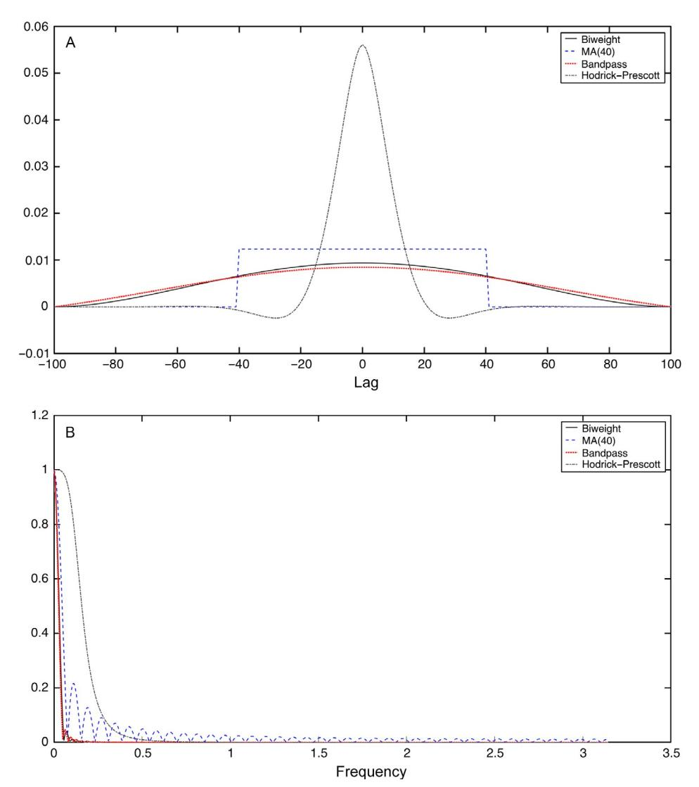

Fig. 2 Lag weights and spectral gain of trend filters. Notes: The biweight filter uses a bandwidth (truncation parameter) of 100 quarters. The bandpass filter is a 200-quarter low-pass filter truncated after 100 leads and lags [\(Baxter and King, 1999](#page-103-0)). The moving average is equal-weighted with 40 leads and lags. The [Hodrick and Prescott \(1997\)](#page-106-0) filter uses 1600 as its tuning parameter.

Prescott filter, which places most of its weight on lags of 15 quarters. The biweight filter estimates trends at multidecadal frequencies, whereas the Hodrick and Prescott trend places considerable weight on fluctuations with periods less than a decade.

The biweight filter needs to be modified for observations near the beginning and end of the sample. One approach would be to estimate a time series model for each series, use forecasts from that model to pad the series at end points, and to apply the filter to this padded series. This approach corresponds to estimating the conditional expectation of the filtered series at the endpoints, given the available data. However, doing so requires estimating a model which raises the problems discussed earlier, which our approach to trend removal aims to avoid: if the trends are ignored when the model is estimated, then the long-term forecasts revert to the mean and this mean reversion potentially introduces misspecification into the trend estimation, but alternatively specifying the trends as part of the model introduces potential parametric misspecification. Instead, the approach used here is to truncate the filter, renormalize, and apply the modified filter directly to the available data for observations within a bandwidth of the ends of the sample. ee

#### 6.1.2 Subset of Series Used to Estimate the Factors

The data consist of series at multiple levels of aggregation and as a result some of the series equal, or nearly equal, the sum of disaggregated component series. Although the aggregation identity does not hold in logarithms, in the context of the DFM, the idiosyncratic term of the logarithm of higher-level aggregates is highly correlated with the share weighted average of the idiosyncratic term of the logarithms of its disaggregated components. For this reason, when the disaggregated components series are available, the disaggregated components are used to estimate the factors but the higher-level aggregate series are not used.

For example, the dataset contains total IP, IP of final products, IP of consumer goods, and seven sectoral IP measures. The first three series are constructed from the seven sectoral IP series in the dataset, so the idiosyncratic terms of the three aggregates are collinear with those of the seven disaggregated components. Consequently, only the seven disaggregated sectoral IP series are used to estimate the factors.

The aggregates not used for estimating the factors include GDP, total consumption, total employment and, as just stated, total IP. In all, the elimination of aggregates leaves 139 series in the full dataset for estimation of the factors. For the real activity dataset, eliminating aggregates leave 58 disaggregate series for estimating the factor. Table 1 provides the number of series used to estimate the factors by category.

# 6.2 Real Activity Dataset and Single-Index Model

The first step is to determine the number of static factors in the real activity dataset. Fig. 3 shows three scree plots computed using the 58 disaggregate series in the real activity dataset: using the full dataset and using subsamples split in 1984, a commonly used estimate of the Great Moderation break date. Table 2 (panel A) summarizes statistics related to the number of factors: the marginal  $R^2$  of the factors (that is, the numerical values of the first bar in Fig. 3), the Bai and Ng (2002)  $IC_{p2}$  information criterion, and the Ahn and Horenstein (2013) eigenvalue ratio.

For example, suppose observation t is m < B periods from the end of the sample, where B is the bandwidth. Then the estimated trend at date t is  $\sum_{i=-B}^{m} w_i x_{t+i} / \sum_{i=-B}^{m} w_i$ , where  $w_i$  is the weight at lag i of the unadjusted two-sided filter.

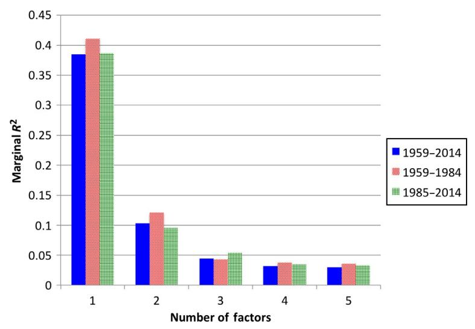

Fig. 3 Scree plot for real activity dataset: full sample, pre-1984, and post-1984.

First consider the full-sample estimates. As seen in Fig. 3, the dominant contribution to the trace  $R^2$  of the 58 subaggregates comes from the first factor which explains fully 38.5% of the variance of the 58 series. Still, there are potentially meaningful contributions to the trace  $R^2$  by the second and possibly higher factors: the marginal  $R^2$  for the second factor over the full sample is 10.3%, for the third is 4.4%, and the total  $R^2$  for the first five is 59.4%, a large increase over the 38.5% explained by the first factor alone. This suggests at least one, but possibly more, factors in the real activity dataset. The Bai and Ng (2002)  $IC_{p2}$  criterion estimates three factors, while the Ahn–Horenstein ratio estimates one factor. Unfortunately, such ambiguity is typical, and in such cases judgment must be exercised, and that judgment depends on the purpose to which the DFM is used.

Fig. 1 (shown in Section 1) plots the four-quarter growth rate of GDP, IP, nonfarm employment, and manufacturing and trade sales along with their common components estimated using the single static factor. ff Of these, only manufacturing and trade sales were used to estimate the factors, the remaining series being aggregates for which component disaggregated series are in the dataset. Evidently, the full-sample single factor explains the variation of these series at annual through business cycle frequencies.

Fig. 4 presents estimates of the four-quarter growth in GDP and its common components computed using the full sample with 1, 3, and 5 factors (the single-factor common component also appears in Fig. 1). The common component of GDP has an  $R^2$  of 0.73 with a single factor, which increases to 0.88 for five factors. Inspection

The common component of four-quarter growth is the four-quarter growth of the common component of the series. For the *i*th series, this common component is  $\hat{\Lambda}_i(\hat{F}_t + \hat{F}_{t-1} + \hat{F}_{t-2} + \hat{F}_{t-3})$ , where  $\hat{F}_t$  and  $\hat{\Lambda}_i$  are, respectively, the principal components estimator of the factors and the *i*th row of the estimated factor loadings.

Table 2 Statistics for estimating the number of static factors
(A) Real activity dataset (N = 58 disaggregates used for estimating factors)

| Number of static factors | Trace R 2 | Marginal trace R 2 | BN-IC p2 | AH-ER |
|--------------------------|----------------------|-------------------------------|---------------------|-------|
| 1                        | 0.385                | 0.385                         | -0.398              | 3.739 |
| 2                        | 0.489                | 0.103                         | -0.493              | 2.338 |
| 3                        | 0.533                | 0.044                         | -0.494              | 1.384 |
| 4                        | 0.565                | 0.032                         | -0.475              | 1.059 |
| 5                        | 0.595                | 0.030                         | -0.458              | 1.082 |

#### (B) Full dataset (N = 139 disaggregates used for estimating factors)

| Number of static factors | Trace R 2 | Marginal trace R 2 | BN-IC p2 | AH-ER |
|--------------------------|----------------------|-------------------------------|---------------------|-------|
| 1                        | 0.215                | 0.215                         | -0.183              | 2.662 |
| 2                        | 0.296                | 0.081                         | -0.233              | 1.313 |
| 3                        | 0.358                | 0.062                         | -0.266              | 1.540 |
| 4                        | 0.398                | 0.040                         | -0.271              | 1.368 |
| 5                        | 0.427                | 0.029                         | -0.262              | 1.127 |
| 6                        | 0.453                | 0.026                         | -0.249              | 1.064 |
| 7                        | 0.478                | 0.024                         | -0.235              | 1.035 |
| 8                        | 0.501                | 0.024                         | -0.223              | 1.151 |
| 9                        | 0.522                | 0.021                         | -0.205              | 1.123 |
| 10                       | 0.540                | 0.018                         | -0.185              | 1.057 |

### (C) Amenguel-Watson estimate of number of dynamic factors: BN- $IC_{pi}$ values, full dataset (N = 139)

| No. of             | Number of static factors |        |        |        |        |        |        |        |        |        |
|--------------------|--------------------------|--------|--------|--------|--------|--------|--------|--------|--------|--------|
| dynamic factors | 1                        | 2      | 3      | 4      | 5      | 6      | 7      | 8      | 9      | 10     |
| 1                  | -0.098                   | -0.071 | -0.072 | -0.068 | -0.069 | -0.065 | -0.064 | -0.064 | -0.064 | -0.060 |
| 2                  |                          | -0.085 | -0.089 | -0.087 | -0.089 | -0.084 | -0.084 | -0.084 | -0.085 | -0.080 |
| 3                  |                          |        | -0.090 | -0.088 | -0.091 | -0.088 | -0.088 | -0.086 | -0.086 | -0.084 |
| 4                  |                          |        |        | -0.077 | -0.080 | -0.075 | -0.075 | -0.073 | -0.072 | -0.069 |
| 5                  |                          |        |        |        | -0.064 | -0.060 | -0.062 | -0.057 | -0.055 | -0.052 |
| 6                  |                          |        |        |        |        | -0.045 | -0.043 | -0.040 | -0.037 | -0.036 |
| 7                  |                          |        |        |        |        |        | -0.024 | -0.022 | -0.020 | -0.018 |
| 8                  |                          |        |        |        |        |        |        | -0.002 | 0.000  | 0.003  |
| 9                  |                          |        |        |        |        |        |        |        | 0.021  | 0.023  |
| 10                 |                          |        |        |        |        |        |        |        |        | 0.044  |

Notes: BN- $IC_{p2}$  denotes the Bai and Ng (2002)  $IC_{p2}$  information criterion. AH-ER denotes the Ahn and Horenstein (2013) ratio of (i+1)th to ith eigenvalues. The minimal BN- $IC_{p2}$  entry in each column, and the maximal Ahn-Horenstein ratio entry in each column, is the respective estimate of the number of factors and is shown in bold. In panel C, the BN- $IC_{p2}$  values are computed using the covariance matrix of the residuals from the regression of the variables onto lagged values of the column number of static factors, estimated by principal components.

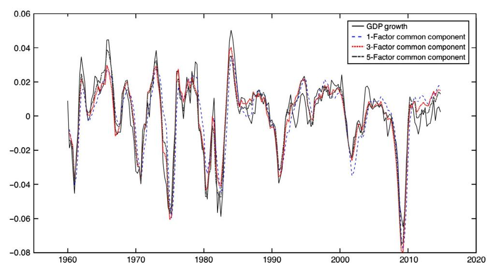

Fig. 4 Four-quarter GDP growth (black) and its common component based on 1, 3, and 5 static factors: real activity dataset.

of the fits for all series suggests that the factors beyond the first serve mainly to explain movements in some of the disaggregate series.

In principle, there are at least three possible reasons why there might be more than one factor among these real activity series.

The first possible reason is that there could be a single dynamic factor that manifests as multiple static factors; in the terminology of [Section 2](#page-6-0), perhaps q¼1, r>1, and G in [\(7\)](#page-9-0) has fewer rows than columns. As discussed in [Section 2,](#page-6-0) it is possible to estimate the number of dynamic factors given the number of static factors, and applying the [Amengual and](#page-102-0) [Watson \(2007\)](#page-102-0) test to the real activity dataset, with three static factors, estimates that there is a single dynamic factor. That said, the contribution to the trace R2 of possible additional dynamic factors remains large in an economic sense, so the estimate of a single dynamic factor is suggestive but not conclusive.

The second possible reason is that these series move in response to multiple structural shocks, and that their responses to those shocks are sufficiently different that the innovations to their common components span the space of more than one aggregated shock.

The third reason, discussed in [Section 2](#page-6-0), is that structural instability could lead to spuriously large numbers of static factors; for example, if there is a single factor in both the first and second subsamples but a large break in the factor loadings, then the full-sample PC would find two factors, one estimating the first-subsample factor (and being noise in the second subsample), the other estimating the second-subsample factor.

The three scree plots in [Fig. 3](#page-69-0) does not, however, show evidence of such instability. The scree plots are remarkably stable over the two subsamples and in particular the trace R2 of the first factor is essentially the same whether the factor is computed over the full sample (38.5%), the pre-1984 subsample (41.1%), or the post-1984 subsample (38.7%). Consistent with this stability, the [Bai and Ng \(2002\)](#page-103-0) criterion estimates two factors in the first subsample, three in the second, and three in the combined sample.

Fig. 5 provides additional evidence on this stability by plotting the four-quarter growth of the first estimated factor (the first principal component) computed over the full dataset and computed over the pre- and post-1984 subsamples. These series are nearly indistinguishable visually and the correlations between the full-sample estimate and the pre- and post-1984 estimates are high (both exceed 0.99). Thus [Figs. 3](#page-69-0)–5 point to stability of the single-factor model. We defer formal tests for stability to the analysis of the larger DFM based on the full dataset.

Taken together, these results suggest that the first estimated factor (first principal component) based on the full dataset is a good candidate for an index of quarterly real economic activity.

Of course, other variables, such as financial variables, are useful for forecasting and nowcasting real activity. Moreover, while multiple macro shocks plausibly affect the movements of these real variables, the series in the real activity dataset provide only responses to those shocks, not more direct measures, so for an analysis of structural shocks one would want to expand the dataset so that the space of factor innovations more

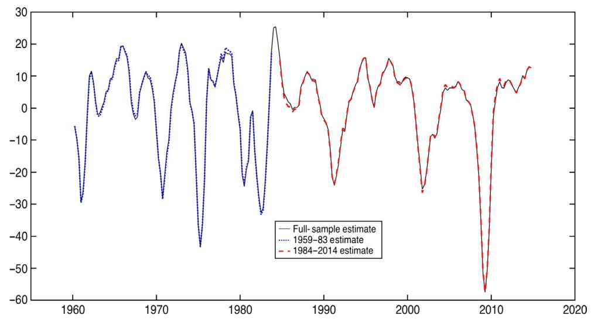

Fig. 5 First factor, real activity dataset: full sample, 1959–84, and 1984–2014.

plausibly spans the space of structural shocks. For example, one would want to include interest rates, which are responsive to monetary policy shocks, measures of oil prices and oil production, which are responsive to oil supply shocks, and measures of inflation, which would respond to both cost and demand shocks.

## 6.3 The Full Dataset and Multiple-Factor Model

## 6.3.1 Estimating the Factors and Number of Factors

Fig. 6A is the scree plot for the full dataset with up to 10 factors, and Table 2 (panel B) reports statistics related to estimating the number of factors. The Bai and Ng (2002) criterion chooses four factors, while the Ahn–Horenstein criterion chooses one factor. Compared to the real activity dataset, the first factor explains less of the variation and the decline in higher factors is not as sharp: the marginal  $R^2$  of the fourth factor is 0.040, dropping only to 0.024 for the eighth factor. Under the assumption of anywhere between three and eight static factors, the Amengual and Watson (2007) test selects three dynamic factors (Table 2, panel C), only one less than the four static factors chosen by the Bai and Ng (2002) criterion. As is the case for the static factors, the decline in the marginal  $R^2$  for the dynamic factors is gradual so the evidence on the number of dynamic factors is not clear cut.

Table 3 presents two different measures of the importance of the factors in explaining movements in various series. The first statistic, in columns A, is the  $R^2$  of the common component for the models with 1, 4, and 8 factors; this statistic measures the variation in the series due to contemporaneous variation in the factor. According to the contemporaneous measure in columns A, the first factor explains large fractions of the variation in the growth of GDP and employment, but only small fractions of the variation in prices and financial variables. The second through fourth factors explain the variation in headline inflation, oil prices, housing starts, and some financial variables. The fifth through eighth factors explain much of the variation in labor productivity, hourly compensation, the term spread, and exchange rates. Thus, the additional factors that would be chosen by the Bai and Ng criterion explain substantial fractions of the variation in important classes of series.

Columns B of Table 3 presents a related measure: the fraction of the four quarters ahead forecast error variance due to the dynamic factors, for 1, 4, and 8 dynamic factors, computed under the assumption of eight static factors. For some series, including housing starts, the Ted spread, and stock prices, the fifth through eighth dynamic factors explain substantial fractions of their variation at the four-quarter horizon. Thus both

Use (6) and (7) to write  $X_t = \Lambda \Phi(L)^{-1} G \eta_t + e_t$ . Then the h-period ahead forecast error is  $\operatorname{var}\left(\Lambda \sum_{i=0}^{h-1} \Phi_i G \eta_{t-i}\right) + \operatorname{var}(e_t \mid e_{t-h}, e_{t-h-1}, \ldots)$ , and the fraction of the h-step forecast error variance explained by the dynamic factors is the ratio of the first term in this expression to the total. The term  $\operatorname{var}(e_t \mid e_{t-h}, e_{t-h-1}, \ldots)$  is computed using an AR(4).

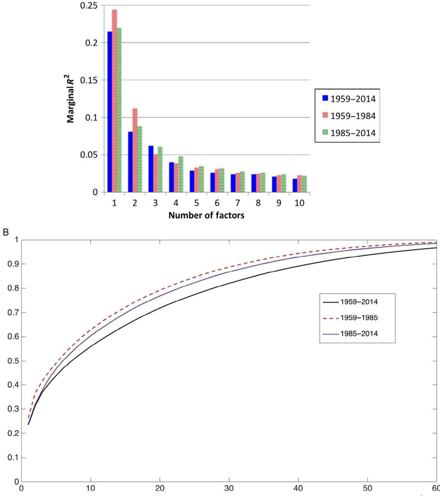

Fig. 6 (A) Scree plot for full dataset: full sample, pre-1984, and post-1984. (B) Cumulative R2 as a function of the number of factors, 94-variable balanced panel.

blocks of [Table 3](#page-75-0) suggest that these higher factors, both static and dynamic, capture common innovations that are important for explaining some categories of series.

The scree plot in Fig. 6A and the statistics in [Tables 2 and 3](#page-70-0) point to a relatively small number of factors—between 4 and 8 factors—describing a large amount of the variation in these series. This said, a substantial amount of the variation remains, and it is germane to ask whether that remaining variation is from idiosyncratic disturbances or whether

Table 3 Importance of factors for selected series for various numbers of static and dynamic factors: full dataset DFM

|                                                  | A.   | R2 of common component     |      | B. Fraction of four quarters ahead forecast error variance due to common component Number of dynamic factors q with r58 static factors |      |      |  |
|--------------------------------------------------|------|----------------------------------|------|-------------------------------------------------------------------------------------------------------------------------------------------------------------------|------|------|--|
|                                                  |      | Number of static factors r |      |                                                                                                                                                                   |      |      |  |
| Series                                           | 1    | 4                                | 8    | 1                                                                                                                                                                 | 4    | 8    |  |
| Real GDP                                      | 0.54 | 0.65                             | 0.81 | 0.39                                                                                                                                                              | 0.77 | 0.83 |  |
| Employment                                       | 0.84 | 0.92                             | 0.93 | 0.79                                                                                                                                                              | 0.86 | 0.90 |  |
| Housing starts                                | 0.00 | 0.52                             | 0.67 | 0.49                                                                                                                                                              | 0.51 | 0.75 |  |
| Inflation (PCE)                               | 0.05 | 0.51                             | 0.64 | 0.34                                                                                                                                                              | 0.66 | 0.67 |  |
| Inflation (core PCE)                       | 0.02 | 0.13                             | 0.17 | 0.24                                                                                                                                                              | 0.34 | 0.41 |  |
| Labor productivity (NFB)                   | 0.02 | 0.30                             | 0.59 | 0.12                                                                                                                                                              | 0.46 | 0.54 |  |
| Real hourly labor compensation (NFB) | 0.00 | 0.25                             | 0.70 | 0.19                                                                                                                                                              | 0.67 | 0.71 |  |
| Federal funds rate                         | 0.25 | 0.41                             | 0.54 | 0.52                                                                                                                                                              | 0.54 | 0.62 |  |
| Ted-spread                                       | 0.26 | 0.59                             | 0.61 | 0.18                                                                                                                                                              | 0.33 | 0.59 |  |
| year–3 Term spread (10 month)        | 0.00 | 0.36                             | 0.72 | 0.32                                                                                                                                                              | 0.38 | 0.63 |  |
| Exchange rates                                | 0.01 | 0.22                             | 0.70 | 0.05                                                                                                                                                              | 0.60 | 0.68 |  |
| Stock prices (SP500)                       | 0.06 | 0.49                             | 0.73 | 0.14                                                                                                                                                              | 0.29 | 0.79 |  |
| Real money supply (MZ)                  | 0.00 | 0.25                             | 0.34 | 0.15                                                                                                                                                              | 0.24 | 0.29 |  |
| Business loans                                | 0.11 | 0.49                             | 0.51 | 0.13                                                                                                                                                              | 0.16 | 0.23 |  |
| Real oil prices                            | 0.04 | 0.68                             | 0.70 | 0.40                                                                                                                                                              | 0.66 | 0.71 |  |
| Oil production                                | 0.09 | 0.10                             | 0.12 | 0.01                                                                                                                                                              | 0.04 | 0.12 |  |

there are small remaining correlations across series that could be the result of small, higher factors. [Fig. 6B](#page-74-0) shows the how the trace R2 increases with the number of principal components, for up to 60 principal components. The key question is whether these higher factors represent common but small fluctuations or, alternatively, are simply the consequence of estimation error, idiosyncratic disturbances, or correlated survey sampling noise because multiple series are derived in part from the same survey instrument. There is a small amount of work investigating the information content in the higher factors. [De Mol et al. \(2008\)](#page-105-0) find that Bayesian shrinkage methods applied to a large number of series closely approximate principal components forecasts using a small number of factors. Similarly, [Stock](#page-110-0) [and Watson \(2012b\)](#page-110-0) use empirical Bayes methods to incorporate information in higher factors and find that for many series forecasts using this information do not improve on forecasts using a small number of factors. [Carrasco and Rossi \(forthcoming\)](#page-104-0) use shrinkage methods to examine whether the higher factors improve forecasts. [Onatski \(2009, 2010\)](#page-108-0) develops theory for factor models with many weak factors. Although the vast bulk of the literature is consistent with the interpretation that variation in macroeconomic data are associated with a small number of factors, the question of the information content of higher factors remains open and merits additional research.

The choice of the number of factors depends on the application at hand. For forecasting real activity, the sampling error associated with additional factors could outweigh their predictive contribution. In contrast, for the structural DFM analysis in [Section 7](#page-81-0) we will use eight factors because it is important that the factor innovations span the space of the structural shocks and the higher factors capture variation.

## 6.3.2 Stability

[Table 4](#page-77-0) summarizes various statistics related to the subsample stability of the four- and eight-factor models estimated on the full dataset. [Table 4](#page-77-0) (panel A) summarizes results for equation-by-equation tests of stability. The Chow test is the Wald statistic testing the hypothesis that the factor loadings are constant in a given equation, against the alternative that they have different values before and after the Great Moderation break date of 1984q4 ([Stock and Watson, 2009; Breitung and Eickmeier, 2011,](#page-109-0) [Section 3](#page-25-0)). The Quandt likelihood ratio (QLR) version allows for an unknown break date and is the maximum value of the Chow statistic (the sup-Wald statistic) for potential breaks in the central 70% of the sample, see [Breitung and Eickmeier \(2011\)](#page-104-0) for additional discussion. In both the Chow and QLR tests, the full-sample estimate of the factors is used as regressors. The table reports the fraction of the series that rejects stability at the 1%, 5%, and 10% significance levels.hh [Table 4](#page-77-0) (panel B) reports a measure of the magnitude of the break, the correlation between the common component computed over a subsample and over the full sample, where the two subsamples considered are the pre- and post-1984 periods. [Table 4](#page-77-0) (panel C) breaks down the results in [Table 4](#page-77-0) (panels A and B) by category of series.

The statistics in [Table](#page-77-0) 4 all point to a substantial amount of instability in the factor loadings. More than half the series reject stability at the 5% level for a break in 1984 in the four-factor model, and nearly two-thirds reject in the eight-factor model. As seen in [Table 4](#page-77-0) (panel C), the finding of a break in the factor loadings in 1984 is widespread across categories of series. Rejection rates are even higher for the QLR test of stability of the factor loadings.

A reasonable worry is that these rejection rates are overstated because the tests are oversized, and Monte Carlo evidence in [Breitung and Tenhofen \(2011\)](#page-104-0) suggests that the size distortions could be large if the idiosyncratic disturbances are highly serially correlated. For this reason, it is also useful to check if the instability is large in an economic sense.

One such measure of the magnitude of the instability is whether the common component estimated over a subsample is similar to the full-sample common component. As shown in [Table 4](#page-77-0) (panel B), for at least half the series, the common components estimated

hh Results are reported for the 176 of the 207 series with at least 80 quarterly observations in both the pre- and post-1984 subsamples.

Table 4 Stability tests for the four- and eight-factor full dataset DFMs (A) Fraction of rejections of stability null hypothesis

|      |              |                                                                                |                                          | QLR test                                                                                                                        |
|------|--------------|--------------------------------------------------------------------------------|------------------------------------------|---------------------------------------------------------------------------------------------------------------------------------|
|      |              |                                                                                |                                          |                                                                                                                                 |
|      |              |                                                                                |                                          | 0.62                                                                                                                            |
|      | 0.54         |                                                                                |                                          | 0.77                                                                                                                            |
|      | 0.63         |                                                                                |                                          | 0.83                                                                                                                            |
|      |              |                                                                                |                                          |                                                                                                                                 |
|      |              |                                                                                |                                          | 0.94                                                                                                                            |
|      |              |                                                                                |                                          | 0.98                                                                                                                            |
|      | 0.72         |                                                                                |                                          | 0.98                                                                                                                            |
|      |              |                                                                                |                                          |                                                                                                                                 |
|      |              |                                                                                |                                          |                                                                                                                                 |
| 5%   | 25%          | 50%                                                                            | 75%                                      | 5%                                                                                                                              |
|      |              |                                                                                |                                          |                                                                                                                                 |
|      |              |                                                                                |                                          | 1.00                                                                                                                            |
| 0.45 | 0.83         | 0.95                                                                           | 0.97                                     | 0.99                                                                                                                            |
|      |              |                                                                                |                                          |                                                                                                                                 |
|      |              |                                                                                |                                          | 0.99                                                                                                                            |
| 0.43 | 0.80         | 0.94                                                                           | 0.97                                     | 0.99                                                                                                                            |
|      |              |                                                                                |                                          |                                                                                                                                 |
|      | 0.65 0.57 | 0.39 0.55 0.65 0.89 0.83 (C) Results by category (four factors) | Chow test (1984q4 break) 0.96 0.92 | (B) Distribution of correlations between full- and split-sample common components Percentile of distribution 0.99 0.97 |

Median correlation between full- and split-sample common

|                                         | Number Fraction of Chow test |                        |         | components |  |  |
|-----------------------------------------|---------------------------------|------------------------|---------|------------|--|--|
| Category                                | of series                       | rejections for 5% test | 1959–84 | 1985–2014  |  |  |
| NIPA                                    | 20                              | 0.50                   | 0.98    | 0.96       |  |  |
| Industrial production                | 10                              | 0.50                   | 0.98    | 0.97       |  |  |
| Employment and                       | 40                              | 0.40                   | 0.99    | 0.99       |  |  |
| unemployment                            |                                 |                        |         |            |  |  |
| Orders, inventories, and sales | 10                              | 0.80                   | 0.98    | 0.96       |  |  |
| Housing starts and permits     | 8                               | 0.75                   | 0.96    | 0.91       |  |  |
| Prices                                  | 35                              | 0.49                   | 0.88    | 0.90       |  |  |
| Productivity and labor            | 10                              | 0.80                   | 0.92    | 0.67       |  |  |
| earnings                                |                                 |                        |         |            |  |  |
| Interest rates                       | 12                              | 0.33                   | 0.98    | 0.94       |  |  |
| Money and credit                  | 9                               | 0.89                   | 0.93    | 0.89       |  |  |
| International                           | 3                               | 0.00                   | 0.97    | 0.97       |  |  |
| Asset prices, wealth, and      | 12                              | 0.58                   | 0.95    | 0.92       |  |  |
| household balance sheets          |                                 |                        |         |            |  |  |
| Other                                   | 1                               | 1.00                   | 0.95    | 0.91       |  |  |
| Oil market variables              | 6                               | 0.83                   | 0.79    | 0.79       |  |  |

Notes: These results are based on the 176 series with data available for at least 80 quarters in both the pre- and post-84 samples. The Chow tests in (A) and (C) test for a break in 1984q4.

using the two subsample factor loadings are highly correlated. For a substantial portion of the series, however, there is a considerable difference between the full-sample and subsample estimates of the common components. Indeed, for 5% of the series, the correlation between the common component estimated post-1984 and the common component estimated over the full sample is less than 50% for both the four- and eight-factor models.

Interestingly, when broken down by category, for some categories, most of the subsample and full-sample common components are highly correlated [\(Table 4](#page-77-0) (panel C), final two columns). This is particularly true for the real activity variables, a finding consistent with the stability of the common component shown in [Fig. 5](#page-72-0) for the single factor from the real activity dataset. However, for some categories the subsample and full-sample common components are quite different, with median within-category correlations of less than 0.9 in at least one subsample for prices, productivity, money and credit, and oil market variables.

On net, [Table 4](#page-77-0) points to substantial instability in the DFM. One model of this instability, consistent with the results in the table, is that there was a break around 1984, consistent with empirical results in [Stock and Watson \(2009\)](#page-109-0), [Breitung and](#page-104-0) [Eickmeier \(2011\),](#page-104-0) and Chen [et al. \(2014\).](#page-104-0) However, the results in [Table 4](#page-77-0) could also be consistent with more complicated models of time variation.

# 6.4 Can the Eight-Factor DFM Be Approximated by a Low-Dimensional VAR?

A key motivation for DFMs is that using many variables improves the ability of the model to span the space of the structural shocks. But is it possible to approximate the DFM by a small VARii? If so, those few variables could take the place of the factors for forecasting, and SVAR methods could be used directly to identify structural shocks without needing the SDFM apparatus: in effect, the unobserved factors could be replaced by observed factors in the form of this small number of variables. An approximation to the factors by observable variables could take two forms. The strong version would be for a small number of variables to span the space of the factors. A weaker version would be for a small number of variables to have VAR innovations that span the space of the factor innovations.jj [Bai and Ng \(2006b\)](#page-103-0) develop tests for whether observable variables span the space of the unobserved factors and apply those tests to the Fama-French facots in portfolio analysis. Following [Bai and Ng \(2006b\),](#page-103-0) we use canonical correlations to examine this possibility in our macro data application.

[Table 5](#page-79-0) examines the ability of four different VARs to approximate the DFM with eight static factors. The first two VARs are representative of small VARs used in empirical work: a four-variable system (VAR-A)with GDP,total employment, personal consumption expenditure (PCE) inflation, and the Fed funds rate, and an eight-variable system (VAR-B) that

ii We thank Chris Sims for raising this question.

jj If the observable variables are an invertible contemporaneous linear combination of the factors then the VAR and the factors will have the same innovations, but having the same innovations do not imply that the observable variables are linear combinations of contemporaneous values of the factors.

| Table 5 | Approximating the eight-factor DFM by a eight-variable VAR |
|---------|------------------------------------------------------------|
|         | Canonical correlation                                      |

|                                  | 1                            | 2                            | 3                            | 4                            | 5                    | 6                    | 7                    | 8                    |
|----------------------------------|------------------------------|------------------------------|------------------------------|------------------------------|----------------------|----------------------|----------------------|----------------------|
| (A) Innovations                  |                              |                              |                              |                              |                      |                      |                      |                      |
| VAR-A VAR-B VAR-C VAR-O | 0.76 0.83 0.86 0.83 | 0.64 0.67 0.81 0.80 | 0.6 0.59 0.78 0.69  | 0.49 0.56 0.76 0.56 | 0.37 0.73 0.50 | 0.33 0.58 0.26 | 0.18 0.43 0.16 | 0.01 0.35 0.02 |
| (B) Variables and factors        |                              |                              |                              |                              |                      |                      |                      |                      |
| VAR-A VAR-B VAR-C VAR-O | 0.97 0.97 0.98 0.98 | 0.85 0.95 0.93 0.96 | 0.79 0.89 0.90 0.88 | 0.57 0.83 0.87 0.84 | 0.61 0.79 0.72 | 0.43 0.78 0.39 | 0.26 0.57 0.18 | 0.10 0.41 0.02 |

Notes: All VARs contain four lags of all variables. The canonical correlations in panel A are between the VAR residuals and the residuals of a VAR estimated for the eight static factors.

VAR-A was chosen to be typical of four-variable VARs seen in empirical applications. Variables: GDP, total employment, PCE inflation, and Fed funds rate.

VAR-B was chosen to be typical of eight-variable VARs seen in empirical applications. Variables: GDP, total employment, PCE inflation, Fed funds, ISM manufacturing index, real oil prices (PPI-oil), corporate paper-90-day treasury spread, and 10 year–3 month treasury spread.

VAR-C variables were chosen by stepwise maximization of the canonical correlations between the VAR innovations and the static factor innovations. Variables: industrial commodities PPI, stock returns (SP500), unit labor cost (NFB), exchange rates, industrial production, Fed funds, labor compensation per hour (business), and total employment (private).

VAR-O variables: real oil prices (PPI-oil), global oil production, global commodity shipment index, GDP, total employment (private), PCE inflation, Fed funds rate, and trade-weighted US exchange rate index.

Entries are canonical correlations between (A) factor innovations and VAR residuals and (B) factors and observable variables.

additionally has the ISM manufacturing index, the oil price PPI, the corporate paper-90-day treasury spread, and the 3 month–10 year treasury term spread. The eight variables in the thirdVAR (VAR-C)were selected using a stepwise procedureto produce a highfit between VAR residuals andtheinnovationsinthe eight staticfactors (ie,the residualsintheVAR with the eight staticfactors).This procedure ledtotheVAR-C variables beingtheindex of IP, real personal consumption expenditures, government spending, the PPI for industrial commodities, unit labor costs for business, the S&P500, the 6 month–3 month term spread, and a trade-weighted index of exchange rates.kk The final VAR, VAR-O, is used for the SVAR analysis of the effect of oil shocks in [Section 7](#page-81-0) and is discussed there.

kk The variables in VAR-C were chosen from the 207 variables so that the ith variable maximizes the ith canonical correlation between the residuals from the i-variable VAR and the residuals from the eightfactor VAR. In the first step, the variable yielding the highest canonical correlation between its autoregressive residual and the factor VAR residuals was chosen. In the second step, the variable that maximized the second canonical correlation among all 206 two-variable VAR residuals (given the first VAR variable) and the factor VAR residuals was chosen. These steps continued until eight variables were chosen.

[Table 5](#page-79-0) (panel A) examines whether the VAR innovations are linear combinations of the eight innovations in the static factors by reporting the canonical correlations between the two sets of residuals. For the four-variable VAR, the first canonical correlation is large, as are the first several canonical correlations in the eight-variable VARs, indicating that some linear combinations of the DFM innovations can be constructed from linear combinations of the VAR innovations. But the canonical correlations drop off substantially. For the eight-variable VAR-B, the final four canonical correlations are less than 0.40, indicating that the innovation space of this typical VAR differs substantially from the innovation space of the factors. Even for VAR-C, for which the variables were chosen to maximize the stepwise canonical correlations of the innovations, the final three canonical correlations are less than 0.60, indicating that there is substantial variation in the factor innovations that is not captured by the VAR innovations.

[Table 5](#page-79-0) (panel B) examine whether the observable variables span the space of the factors, without leads and lags, by reporting the canonical correlations between the observable variables and the factors for the three VARs. For the four-variable VAR, the canonical correlations measure the extent to which the observable variables are linear combinations of the factors; for the eight-variable VARs, the canonical correlations measure whether the spaces spanned by the observable variables and the factors are the same, so that the eight latent factors estimated from the full dataset could be replaced by the eight observable variables. The canonical correlations in panel B indicate that the observable variables are not good approximations to the factors. In VAR-B, three of the canonical correlations are less than 0.50, and even in VAR-C two of the canonical correlations are less than 0.6.

These results have several caveats. Because the factors are estimated, the sample canonical correlations will be less than one even if in population they equal one, and no measure of sampling variability is provided. Also, VAR-C was chosen by a stepwise procedure, and presumably a better approximation would obtain were it possible to choose the approximating VAR out of all possible eight-variable VARs.ll

Still, these results suggest that while typical VARs capture important aspects of the variation in the factors, they fail to span the space of the factors and their innovations fail to span the space of the factor innovations. Overall, these results suggest that the DFM, by summarizing information from a large number of series and reducing the effect of measurement error and idiosyncratic variation, produces factor innovations that contain information not contained in small VARs.

ll Other methods for selecting variables, for example stepwise maximization of the ith canonical correlation between the variable and the factor (instead of between the VAR innovations and the factor innovations) yielded similar results to those for VAR-C in [Table 5](#page-79-0).

# 7. MACROECONOMIC EFFECTS OF OIL SUPPLY SHOCKS

This section works through an empirical example that extends SVAR identification schemes to SDFMs. The application is to estimating the macroeconomic effects of oil market shocks, using identification schemes taken from the literature on oil and the macroeconomy. For comparison purposes, results are provided using a 207-variable SDFM with eight factors, a 207-variable FAVAR in which one or more of factors are treated as observed, and an eight-variable SVAR.

# 7.1 Oil Prices and the Macroeconomy: Old Questions, New Answers

Oil plays a central role in developed economies, and for much of the past half century the price of oil has been highly volatile. The oil price increases of the 1970s were closely linked to events such as the 1973–74 OPEC oil embargo and wars in the Middle East, as well as to developments in international oil markets ([Hamilton, 2013;](#page-106-0) [Baumeister and](#page-103-0) [Kilian, 2016](#page-103-0)). The late 1980s through early 2000s were a period of relative quiescence, interrupted mainly by the spike in oil prices during the Iraqi invasion of Kuwait. Since the early 2000s oil prices have again been volatile. The nominal price of Brent oil, an international benchmark, rose from under \$30/barrel in 2002 to a peak of approximately \$140/barrel in June 2008. Oil prices collapsed during the financial crisis and ensuing recession, but by the spring of 2011 recovered to just over \$100/barrel. Then, beginning the summer of 2014, oil prices fell sharply and Brent went below \$30 in early 2016, a decline that was widely seen as stemming in part from the sharp increase in unconventional oil production (hydraulic fracturing). The real oil price over the last three decades is plotted in [Fig. 7A](#page-82-0).

[Fig. 7](#page-82-0)B shows four measures ofthe quarterly percentage change in oil prices, along with its common component estimated using the eight factors from the 207-variable DFM of [Section 6.](#page-63-0) [Fig. 7](#page-82-0)B reminds us that there is no single price of oil, rather oil is a heterogeneous commodity differentiated by grade and extraction location. The four measures of real oil prices (Brent, WTI, US refiners' acquisition cost of imported oil and the PPI for oil, all deflated by the core PCE price index) move closely together but are not identical. As discussed later, in this sectionthese series are restrictedto havethe same common component, which (as can be seen in [Fig. 7B](#page-82-0)) captures the common movements in these four price indices.

Economists have attempted to quantify the effect of oil supply shocks on the US economy ever since the oil supply disruptions of the 1970s. In seminal work, [Hamilton \(1983\)](#page-106-0) found that oil price jumps presaged US recessions; see [Hamilton \(2003, 2009\)](#page-106-0) for updated extensive discussions. Given the historical context of the 1970s, the first wave of analysis of the effect of oil supply shocks on the economy generally treated unexpected changes in oil prices as exogenous and as equivalent to oil supply shocks. In the context of SVAR analysis,

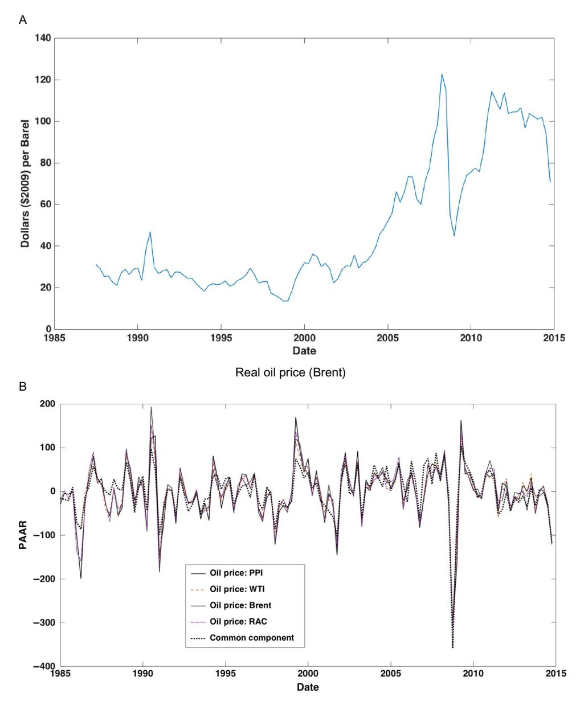

Quarterly percent change in real oil price: four oil price series and the common component Fig. 7 Real oil price (2009 dollars) and its quarterly percent change.

this equivalent allows treating the innovation in the oil price equation as an exogenous shock, which in turn corresponds to ordering oil first in a Cholesky decomposition.mm

Recent research, however, has apended this early view that unexpected oil price movements are solely the result of exogenous oil supply shocks and has argued instead that much or most movements in oil prices are in fact due to shocks to global demand or perhaps to demand shocks that are specific to oil (inventory demand). For example, this view accords with the broad perception that the long climb of oil prices in the mid-2000s was associated with increasing global demand, including demand from China, in the face of conventional supply that was growing slowly or even declining before the boom in unconventional oil production began in the late 2000s and early 2010s.

The potential importance of aggregate demand shocks for determining oil prices was proposed in the academic literature by [Barsky and Kilian \(2002\)](#page-103-0)and has been influentially promoted by Kilian [\(2008a,b,](#page-107-0) 2009). Econometric attempts to distinguish oil supply shocks from demand shocks generally do so using SVARs, broadly relying on three identification schemes. The first relies on timing restrictions to impose zeros in the H matrix of Eq. [\(20\).](#page-31-0) The logic here, due to [Kilian \(2009\),](#page-107-0) starts by noting that it is difficult to adjust oil production quickly in response to price changes, so that innovations in the quantity of oil produced are unresponsive to demand shocks during a sufficiently short period of time. As is discussed later in more detail, this timing restriction can be used to identify oil supply shocks.

The second identification scheme uses inequality restrictions: standard supply and demand reasoning suggest that a positive shock to the supply of oil will push down oil prices and increase oil consumption, whereas a positive shock to aggregate demand would push up both oil prices and consumption. This sign restriction approach has been applied by [Peersman and Van Robays \(2009\),](#page-108-0) [Lippi and Nobili \(2012\)](#page-107-0), [Kilian and](#page-107-0) [Murphy](#page-107-0) (2012, 2014), Baumeister [and Peersman \(2013\),](#page-103-0) [Lutkepohl and Nets](#page-107-0) € ˇunajev [\(2014\),](#page-107-0) and Baumeister [and Hamilton \(2015b\)](#page-103-0) among others.

The third identification approach identifies the response to supply shocks using instrumental variables. [Hamilton \(2003\)](#page-106-0) used a list of exogenous oil supply disruptions, such as the Iraqi invasion of Kuwait, as an instrument in a single-equation estimation of the effect of oil supply shocks on GDP which [Kilian \(2008b\)](#page-107-0) extended, also in a singleequation context. Stock and [Watson \(2012a\)](#page-109-0) used the method of external instruments in a SDFM to estimate the impulse responses to oil supply shocks using various instruments, including (like [Hamilton, 2003](#page-106-0)) a list of oil supply disruptions.

Broadly speaking, a common finding from this second wave of research is that oil supply shocks account for a small amount of the variation both in oil prices and in aggregate economic activity, at least since the 1970s. Moreover, this research finds that much or most of

mm Papers adopting this approach include [Shapiro and Watson \(1988\)](#page-109-0) and [Blanchard and Galı´](#page-104-0) (2010).

the variation in oil prices (at least through 2014) arises from shifts in demand, mainly aggregate demand or demand more specifically for oil.

This section shows how this recent research on oil supply shocks can be extended from SVARs to FAVARs and SDFMs. For simplicity, this illustration is restricted to two contemporaneous identification schemes. The papers closest to the treatment in this section are [Aastveit \(2014\)](#page-102-0), who uses a FAVAR with timing restrictions similar to the ones used here, Charnavoki [and Dolado \(2014\)](#page-104-0) and [Juvenal and Petrella \(2015\)](#page-107-0), who use sign restrictions in a SDFM, and [Aastveit et al. \(2015\)](#page-102-0), who use a combination of sign and timing restrictions in a FAVAR. The results of this section are confirmatory of these papers and more generally of the modern literature that stresses the importance of demand shocks for determining oil prices, and the small role that oil supply shocks have played in determining oil production since the early 1980s. Although the purpose of this section is to illustrate these methods, the work here does contain some novel features and new results.

# 7.2 Identification Schemes

We consider two identification schemes based on the contemporaneous zero restrictions in the H matrix, that is, schemes of the form discussed in [Section 4.2.](#page-39-0) The first identification scheme, which was used in the early oil shocks literature, treats oil prices as exogenous with oil price innovations assumed to be oil price supply shocks. The second identification scheme follows [Kilian \(2009\)](#page-107-0) and distinguishes oil supply shocks from demand shocks by assuming that oil production responds to demand shocks only with a lag.nn The literature continues to evolve, for example [Kilian and Murphy \(2014\)](#page-107-0) include inventory data and use sign restrictions to help to identify oil-specific demand shocks. The treatment in this section does not aim to push the frontier on this empirical issue, but rather to illustrate SDFM, FAVAR, and SVAR methods in a simple setting that is still sufficiently rich to highlight methods and modeling choices.

nn [Kilian's \(2009\)](#page-107-0) treatment used monthly data, whereas here we use quarterly data. The timing restrictions, for example the sluggish response of production to demand, are more appropriate at the monthly than at the quarterly level. [Gu](#page-106-0)ntner € [\(2014\)](#page-106-0) used sign restrictions in an oil-macro SVAR to identify demand shocks and find that oil producers respond negligibly to demand shocks within the month, and that most producers respond negligibly within a quarter, although Saudi Arabia is estimated to respond after a delay of 2 months. The recent development of fracking and horizontal drilling technology also could undercut the validity of the timing restriction, especially at the quarterly level, because new wells are drilled and fracked relatively quickly (in some cases in a matter of weeks). In addition, because well productivity declines much more rapidly than for conventional wells, nonconventional production can respond more quickly to price than can most conventional production. If the restrictions are valid at the monthly frequency but not quarterly, our estimated supply shocks would potentially include demand shocks, biasing our SIRFs. Despite these caveats, however, the results here are similar to those in [Kilian's \(2009\)](#page-107-0) and [Aastveit's \(2014\)](#page-102-0) monthly treatments with the same exclusion restrictions.

The "oil exogenous" identification scheme is implemented in three related models: a 207-variable SDFM with eight unobserved factors, a 207-variable FAVAR (that is, a SDFM in which some of the eight factors are treated as observed), and an eight-variable SVAR. The [Kilian \(2009\)](#page-107-0) identification scheme is examined in a eight-variable VAR, in a 207-variable FAVAR with three observed and five unobserved factors, and a 207 variable FAVAR with one observed and seven unobserved factors. As is discussed later, this final FAVAR is used instead of a SDFM with all factors unobserved because the oil production innovation plays such a small macroeconomic role that it appears not to be spanned (or is weakly spanned) by the space of innovations to the macro factors.

For the SVAR, identification requires sufficient restrictions on H to identify the column of H associated with the oil supply shock and, for the second assumption, the columns associated with the aggregate demand and oil-specific demand shocks.

For the FAVARs in which the relevant factors (oil prices in the "oil price exogenous" case, and oil production, aggregate demand, and oil prices in the [Kilian \(2009\)](#page-107-0) case) are all modeled as observed, no additional identifying restrictions are needed beyond the SVAR identifying restrictions.

For the SDFM and for the FAVAR with only one of the three factors observed, identification also entails normalizations on the factor loadings Λ and on the matrix G relating the dynamic factor innovations to the static factor innovations.

The SDFM and FAVAR models require determining the number of dynamic factors. Although [Table 2](#page-70-0) (panel C) can be interpreted as suggesting fewer dynamic than static factors, we err on the side of over-specifying the space of innovations so that they span the space of the reduced number of shocks of interest, and therefore set the number of dynamic factors equal to the number of static factors, so in turn the dimension of ηt (the factor innovations) is eight. Thus we adopt the normalization that G is the identity matrix.

## 7.2.1 Identification by Treating Oil Prices Innovations as Exogenous

The historical starting point of the oil shock literature holds that any unexpected change in oil prices is exogenous to developments in the US economy. One motivation for this assumption is that if unexpected changes in oil prices arise from unexpected developments in supply—either supply disruptions from geopolitical developments or unexpected upticks in production—then those changes are specific to oil supply, and thus can be thought of as oil supply shocks. A weaker interpretation is that oil prices are determined in the world market for oil so that unexpected changes in oil prices reflect international developments in the oil market, and thus are exogenous shocks (although they could be either oil supply or demand shocks). In either case, an unexpected increase in the real price of oil is interpreted as an exogenous oil price shock. Because the oil price shock is identified as the innovation in the (log) price of oil, it is possible to estimate structural impulse responses with respect to this shock.

#### 7.2.1.1 SVAR and FAVAR

Without loss of generality, order the oil price first in the list of variables. The assumption that the oil price shock  $\varepsilon_t^{oil}$  is exogenous, combined with the unit effect normalization, implies that  $\eta_{1t} = \varepsilon_t^{oil}$ . Thus the relation between  $\eta_t$  and  $\varepsilon_t$  in (28) can be written,

$$\eta_t = \begin{pmatrix} 1 & 0 \\ H_{\bullet 1} & H_{\bullet \bullet} \end{pmatrix} \begin{pmatrix} \varepsilon_t^{oil} \\ \widetilde{\eta}_{\bullet t} \end{pmatrix}, \tag{71}$$

where  $\widetilde{\eta}_{\bullet t}$  spans the space of  $\eta_t$  orthogonal to  $\eta_{1t}$ . The vector  $H_{\bullet 1}$  is identified as the coefficient in the (population) regression of  $\eta_{\bullet t}$  on  $\eta_{1t}$ .

In practice, this identification scheme is conveniently implemented by ordering oil first in a Cholesky decomposition; the ordering of the remaining variables does not matter for the purpose of identifying and estimating the SIRFs with respect to the oil shock.

#### 7.2.1.2 SDFM

In addition to the identification of H in (71), identification in the SDFM requires normalization restrictions on the factor loadings  $\Lambda$  and on G. Because the number of static and dynamic factors is the same, we follow Section 5.1.2 and set G to the identity matrix.

If the dataset had a single oil price, then the named factor normalization would equate the innovation in the first factor with the innovations in the common component of oil. Accordingly, with a single oil price measure ordered first among the DFM variables, the first row of  $\Lambda$  would be  $\Lambda_1 = (1\ 0\ ...\ 0)$ . The normalization of the next seven rows (there are eight static factors) is arbitrary, although some care must be taken so that the innovations of the common components of those seven variables, plus oil prices, spans the space of the eight factor innovations.

The 207-variable dataset, however, contains not one but four different measures of oil prices: Brent, WTI, refiners' acquisition cost, and the producer price of oil. All four series, specified as percentage changes in price, are used as indicators that measure the percentage change in the common (unobserved) price of oil, which is identified as the first factor by applying the named factor normalization to all four series. This approach entails using the specification of  $\Lambda$  in (60).

Because *G* is set to the identity matrix, the innovation to the oil price factor is the oil price innovation.

Figure 7 suggests that real oil prices are I(1), and we use oil price growth rates in the empirical analysis, ignoring cointegration restrictions. This is the second approach to handling cointegration discussed in Section 2.1.4. In a fully parametric DFM (Section 2.3.2), imposing cointegration improves efficiency of the estimates, but the constraint may lead to less efficient estimates in nonparametric (principal components) models. This treatment also allows all four oil prices to be used to estimate the loading on the first factor and therefore to name (identify) the oil price factor.

#### 7.2.2 Kilian (2009) Identification

Following Kilian (2009), this scheme separately identifies an oil supply shock, an aggregate world commodity demand shock, and an oil-specific demand shock. This is accomplished by augmenting the system with a measure of oil production (barrels pumped during the quarter) and a measure of global real economic activity. The measure of global economic activity we use here is Kilian's (2009) global index of bulk dry goods shipments.

#### 7.2.2.1 SVAR and FAVAR

The justification for the exclusion restrictions in the H matrix is as follows. (i) Because of technological delays in the ability to adjust production at existing wells, to shut down wells, and to bring new wells on line, crude oil production responds with a delay to demand shocks or to any other macro or global shocks. Thus, within a period, an unexpected change in oil production is exogenous and is therefore an exogenous supply shocks ( $\varepsilon_t^{OS}$ ). Thus the innovation to oil production equals the oil supply shock. (ii) Global economic activity can respond immediately to oil supply shocks and responds to global aggregate demand shocks ( $\varepsilon_t^{GD}$ ), but otherwise is sluggish and responds to no other shocks within the period. (iii) Real oil prices respond to oil supply shocks and aggregate demand shocks within the period, and to other oil price-specific shocks as well, but to no other macro or global shocks. Kilian interprets the other oil price-specific shocks ( $\varepsilon_t^{OD}$ ) as shocks to oil demand that are distinct from aggregate demand shocks; examples are oil inventory demand shocks, perhaps driven by anticipated oil supply shocks, or speculative demand shocks.

The foregoing logic imparts an upper triangular structure to H and a Cholesky ordering to the shocks:

$$\begin{pmatrix}
\eta_t^{oilproduction} \\
\eta_t^{globalactivity} \\
\eta_t^{oilprice} \\
\eta_{\bullet t}
\end{pmatrix} = \begin{pmatrix}
1 & 0 & 0 & 0 \\
H_{12} & 1 & 0 & 0 \\
H_{13} & H_{23} & 1 & 0 \\
H_{1\bullet} & H_{2\bullet} & H_{3\bullet} & H_{\bullet\bullet}
\end{pmatrix} \begin{pmatrix}
\varepsilon_t^{OS} \\
\varepsilon_t^{GD} \\
\varepsilon_t^{OD} \\
\widetilde{\eta}_{\bullet t}
\end{pmatrix}, (72)$$

where the unit coefficients on the diagonal impose the unit effect normalization and the variables are ordered such that the innovations are to global oil production, global aggregate demand, the price of oil, and the remaining series. The first three rows of H identify the three shocks of interest, and the remaining elements of the first, second, and third rows of H are identified as the population regression coefficients of the innovations on the shocks.

For convenience, the identification scheme (72) can be implemented by ordering the first three variables in the order of (72) and adopting a lower triangular ordering (Cholesky factorization) for the remaining variables, renormalized so that the diagonal elements of H equal 1. Only the first three shocks are identified, and the SIRFs with respect to those shocks do not depend on the ordering of the remaining variables.

#### 7.2.2.2 SDFM

The SDFM is identified by the restrictions on H in (72), the named factor normalization for  $\Lambda$ , and setting G to be the identity matrix.

As mentioned earlier, the SDFM implementation treats the oil production factor as observed and the remaining seven factors as unobserved. Of these seven unobserved factors, we are interested in two linear combinations of the factor innovations that correspond to the global activity innovation and the oil price innovation. The combination of one observed factor, two identified unobserved factors, and five unidentified unobserved factors gives a hybrid FAVAR-SDFM. In this hybrid, the named factor normalization is,

$$\begin{bmatrix}
Oil \ production_{t} \\
Global \ activity_{t} \\
p_{t}^{PPI-Oil} \\
p_{t}^{Brent} \\
p_{t}^{WTI} \\
p_{t}^{RAC} \\
X_{7:n,t}
\end{bmatrix} = \begin{bmatrix}
1 & 0 & 0 & 0 & \cdots & 0 \\
0 & 1 & 0 & 0 & \cdots & 0 \\
0 & 0 & 1 & 0 & \cdots & 0 \\
0 & 0 & 1 & 0 & \cdots & 0 \\
0 & 0 & 1 & 0 & \cdots & 0 \\
0 & 0 & 1 & 0 & \cdots & 0 \\
0 & 0 & 1 & 0 & \cdots & 0 \\
0 & 0 & 1 & 0 & \cdots & 0
\end{bmatrix} \begin{bmatrix}
F_{t}^{Oil \ production} \\
F_{t}^{Global \ activity} \\
F_{t}^{oil \ price} \\
F_{t}^{oil \ price} \\
F_{t}^{oil \ price} \\
F_{t}^{oil \ price} \\
F_{t}^{oil \ price} \\
F_{t}^{oil \ price} \\
F_{t}^{oil \ price} \\
F_{t}^{oil \ price} \\
F_{t}^{oil \ price} \\
F_{t}^{oil \ price} \\
F_{t}^{oil \ price} \\
F_{t}^{oil \ price} \\
F_{t}^{oil \ price} \\
F_{t}^{oil \ price} \\
F_{t}^{oil \ price} \\
F_{t}^{oil \ price} \\
F_{t}^{oil \ price} \\
F_{t}^{oil \ price} \\
F_{t}^{oil \ price} \\
F_{t}^{oil \ price} \\
F_{t}^{oil \ price} \\
F_{t}^{oil \ price} \\
F_{t}^{oil \ price} \\
F_{t}^{oil \ price} \\
F_{t}^{oil \ price} \\
F_{t}^{oil \ price} \\
F_{t}^{oil \ price} \\
F_{t}^{oil \ price} \\
F_{t}^{oil \ price} \\
F_{t}^{oil \ price} \\
F_{t}^{oil \ price} \\
F_{t}^{oil \ price} \\
F_{t}^{oil \ price} \\
F_{t}^{oil \ price} \\
F_{t}^{oil \ price} \\
F_{t}^{oil \ price} \\
F_{t}^{oil \ price} \\
F_{t}^{oil \ price} \\
F_{t}^{oil \ price} \\
F_{t}^{oil \ price} \\
F_{t}^{oil \ price} \\
F_{t}^{oil \ price} \\
F_{t}^{oil \ price} \\
F_{t}^{oil \ price} \\
F_{t}^{oil \ price} \\
F_{t}^{oil \ price} \\
F_{t}^{oil \ price} \\
F_{t}^{oil \ price} \\
F_{t}^{oil \ price} \\
F_{t}^{oil \ price} \\
F_{t}^{oil \ price} \\
F_{t}^{oil \ price} \\
F_{t}^{oil \ price} \\
F_{t}^{oil \ price} \\
F_{t}^{oil \ price} \\
F_{t}^{oil \ price} \\
F_{t}^{oil \ price} \\
F_{t}^{oil \ price} \\
F_{t}^{oil \ price} \\
F_{t}^{oil \ price} \\
F_{t}^{oil \ price} \\
F_{t}^{oil \ price} \\
F_{t}^{oil \ price} \\
F_{t}^{oil \ price} \\
F_{t}^{oil \ price} \\
F_{t}^{oil \ price} \\
F_{t}^{oil \ price} \\
F_{t}^{oil \ price} \\
F_{t}^{oil \ price} \\
F_{t}^{oil \ price} \\
F_{t}^{oil \ price} \\
F_{t}^{oil \ price} \\
F_{t}^{oil \ price} \\
F_{t}^{oil \ price} \\
F_{t}^{oil \ price} \\
F_{t}^{oil \ pric$$

where the first variable is  $OilProduction_t$ , which is treated as an observed factor, the second variable is the global activity (commodity shipment) index, and the next four variables are the four oil price measures. The first factor is the observed oil production factor. The next two factors, which are unobserved, are the global activity factor and the oil price factor. The identity matrix normalization of G associates the innovations with these factors, so that those innovations align with the first three innovations in (72).

# 7.3 Comparison SVAR and Estimation Details

## 7.3.1 Comparison SVAR

Because the SDFM is specified with eight static and dynamic factors, the comparison SVAR was chosen to have eight variables. Of the eight variables in the SVAR, three are those in Kilian's (2009) three-variable SVAR: the real oil price (PPI-oil), global oil production, and Kilian's (2009) global activity index (bulk dry shipping activity). The remaining five variables were chosen to represent different aspects of US aggregate activity, inflation, and financial markets: GDP, total employment, PCE inflation, the Federal funds rate, and a trade-weighted index of exchange rates.

Canonical correlations between the factor innovations and the VAR innovations are summarized in the "VAR-O" row of Table 5 (panel A). While the first few canonical correlations are large, the final four are 0.50 or less. Evidently, the VAR and factor innovations span substantially different spaces.

#### 7.3.2 Summary of SDFM Estimation Steps

#### 7.3.2.1 Summary of Steps

We now summarize the steps entailed in estimating the SIRF for the SDFM of Section 7.2.2 with one observed factor and three identified shocks. From (58), the SIRF with respect to the *i*th shock is,

$$SIRF_i = \Lambda \Phi(L)^{-1} GH_i, \tag{74}$$

where  $H_i$  is the *i*th column of H and i = 1, 2, 3. This SIRF is estimated in the following steps.

- 1. Order the variables as in (73) and, using the restricted  $\Lambda$  in (73), estimate the seven unobserved static factors by restricted least-squares minimization of (13) as discussed in Section 2.3.1. PP Augment these seven factors with OilProductiont so that the vector of eight factors has one observed factor (ordered first) and the seven estimated factors. The next five variables in the named factor normalization can be chosen arbitrarily so long as they are not linearly dependent. This step yields the normalized factors  $\hat{F}_t$  and factor loadings  $\hat{\Lambda}$ .
- 2. Use  $\hat{F}_t$  to estimate the VAR,  $\hat{F}_t = \Phi(L)\hat{F}_{t-1} + \eta_t$ , where the normalization G = I is used and the number of innovations equals the number of factors.
- 3. Use the VAR residuals  $\hat{\eta}_t$  to estimate H using the identifying restrictions in (72). Because of the lower triangular structure of H, this can be done using the Cholesky factorization of the covariance matrix of  $\hat{\eta}_t$ , renormalized so that the diagonal elements of H equal one.

#### 7.3.2.2 Additional Estimation Details

Because of the evidence discussed in Section 6 that there is a break in the DFM parameters, possibly associated with the Great moderation break data of 1984, all models were estimated over 1985q1–2014q4.

Standard errors are computed by parametric bootstrap as discussed in Section 5.1.3.

# 7.4 Results: "Oil Price Exogenous" Identification

The focus of this and the next section is on understanding the differences and similarities among the SDFM, FAVAR, and SVAR results. We begin in this section with the results for the "oil price exogenous" identification scheme of Section 7.2.1.

Fig. 8 presents SIRFs for selected variables with respect to the oil price shock computed using the SDFM, the FAVAR in which oil is treated as an observed factor, and the

&lt;sup>PP If there were only one oil price series then  $\Lambda$  and the factors could be estimated as the renormalized principal components estimates in (59).

&lt;sup>qq If the number of innovations were less than the number of factors, the named factor normalization of G would be the upper diagonal normalization in (61) and the reduced number of innovations could be estimated as discussed following (61).

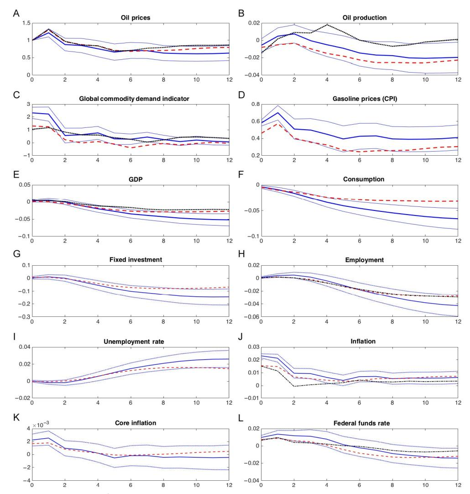

Fig. 8 Structural IRFs from the SDFM (blue (dark gray in the print version) solid with 1 standard error bands), FAVAR (red (gray in the print version) dashed), and SVAR (black dots) for selected variables with respect to an oil price shock: "oil prices exogenous" identification. Units: standard deviations for Global Commodity Demand and percentage points for all other variables.

SVAR. The SVAR SIRFs are available only for the eight variables in the SVAR. The figure shows SIRFs in the log levels of the indicated variables. For example, according to the SDFM SIRFs in the upper left panel of Fig. 8, a unit oil price shock increases the level of oil prices by 1% on impact (this is the unit effect normalization), by additional 0.3% after one quarter, then the price of oil reverts partially and after four quarters is approximately 0.8% above its level before the shock. Equivalently, these SIRFs are cumulative SIRFs in the first differences of the variables.

The most striking feature of [Fig. 8](#page-90-0) is that all three sets of SIRFs are quite close, especially at horizons less than eight quarters. There are two main reasons for this. First, as can be seen in [Fig. 7](#page-82-0)B (and in [Table 3](#page-75-0)), a large fraction of the variance of the change in oil prices is explained by its common component, so the innovation in the common component in the unobserved factor DFM is similar to the innovation in the observed factor FAVAR. Second, the forecast errors for one quarter ahead changes in oil prices are similar whether they are generated using the factors or the eight-variable VAR (changes in oil prices are difficult to predict). Putting these two facts together, the innovations in oil prices (or the oil price factor) are quite similar in all three models and, under the oil price exogenous identification scheme, so are the shocks. Indeed, as shown in [Table 8](#page-97-0), the oil price shocks in the three models are similar (the smallest correlation is 0.72). In brief, the innovations in oil prices are spanned by the space of the factor price innovations.

This said, to the extent that the SDFM, FAVAR, and SVAR SIRFs differ, the FAVAR and SVAR SIRFs tend to be attenuated relative to the SDFM, that is, the effect of the oil shock in the SDFM is typically larger. This is consistent with the single observed factor in the FAVAR being measured with error in the FAVAR and SVAR models, which use a single oil price, however this effect is minor.

Concerning substantive interpretation, for the SDFM, FAVAR, and SVAR, two of the SIRFs are puzzling: the oil shock that increases oil prices is estimated to have a small effect on oil production that is statistically insignificant (negative on impact, slightly positive after one and two quarters), and a statistically significant positive immediate impact on global shipping activity. These two puzzling SIRFs raise the question of whether the oil price shock identified in the oil price exogenous scheme is in fact an oil supply shock, which (one would think) should be associated with a decline in oil production and either a neutral or negative impact effect on global shipping activity. These puzzling SIRFs suggest that it is important to distinguish oil price increases that arise from demand from those that stem from a shock to oil supply.

[Table 7](#page-96-0) presents six quarters ahead FEVDs for the identified shock; the results for the "oil price exogenous" identification are given in columns A for the FAVAR and SDFM. For most series, the FAVAR and SDFM decompositions are very similar, consistent with the similarity of the FAVAR and SDFM SIRFs in [Fig. 8](#page-90-0) over six quarters. The results indicate that, over the six-quarter horizon, the identified oil shocks explain no more than 10% of the variation in US GDP, fixed investment, employment, the unemployment rate, and core inflation. Curiously, the oil price shock explains a negligible fraction of the forecast errors in oil production. The series for which the FAVAR and SDFM FEVDs differ the most is the real oil price: not surprisingly, treating the oil price as the observed factor, so the innovation to the oil price is the oil shock, explains much more of the oil price forecast error than does treating the oil price factor as latent.

# 7.5 Results: [Kilian \(2009\)](#page-107-0) Identification

As discussed in [Section 7.2](#page-84-0), the [Kilian \(2009\)](#page-107-0) identification scheme identifies an oil supply shock, a global aggregate demand shock, and an oil-specific demand shock. Because there are eight innovations total in all the models examined here, this leaves five unidentified shocks (or, more precisely, a five-dimensional subspace of the innovations on which no identifying restrictions are imposed).

## 7.5.1 Hybrid FAVAR-SDFM

As indicated in Table 6, the innovations in the first eight principal components explain a very small fraction of the one step ahead forecast error of oil production, that is, the innovation in oil production is nearly not spanned by the space of factor innovations. Under the [Kilian \(2009\)](#page-107-0) identification scheme, the innovation in oil production is the oil supply shock; but this oil supply shock is effectively not in the space of the eight shocks that explain the variation in the macro variables. This raises a practical problem for the SDFM because the identification scheme is asking it to identify a shock from the macro factor innovations, which is arguably not in the space of those innovations, or nearly is not in that space. In the extreme case that the common component of oil production is zero, the estimated innovation to that common component will simply be noise.

For this reason, we modify the SDFM to have a single observed factor, which is the oil production factor. The global demand shock and the oil-specific demand shock are, however, identified from the factor innovations. Thus this hybrid FAVAR–SDFM has one identified observed factor, two identified unobserved factors, and five unidentified unobserved factors.

As discussed in [Section 7.2](#page-84-0), the FAVAR treats the oil price (PPI-oil), global oil production, and the global activity index as observed factors, with five latent factors.

Table 6 Fraction of the variance explained by the eight factors at horizons h¼1 and h¼6 for selected variables: 1985:Q1–2014:Q4

| Variable                                 | h51  | h56  |
|------------------------------------------|------|------|
| GDP                                      | 0.60 | 0.80 |
| Consumption                              | 0.37 | 0.76 |
| Fixed investment                      | 0.38 | 0.76 |
| Employment (non-ag)                   | 0.56 | 0.94 |
| Unemployment rate                     | 0.44 | 0.90 |
| PCE inflation                         | 0.70 | 0.63 |
| PCE inflation—core                    | 0.10 | 0.34 |
| Fed funds rate                     | 0.48 | 0.71 |
| Real oil price                     | 0.74 | 0.78 |
| Oil production                        | 0.06 | 0.27 |
| Global commodity shipment index | 0.39 | 0.51 |
| Real gasoline price                | 0.72 | 0.80 |

## 7.5.2 Results

Figs. 9–11 present SIRFs for the three identified shocks and [Table 7](#page-96-0), columns B, presents variance decompositions for six quarters ahead forecast errors. It is useful to discuss these results one shock at a time.

First consider the oil supply shock (Fig. 9). All three models identify the oil supply shock in the same way, as the one step ahead forecast error for oil supply. This variable is hard to

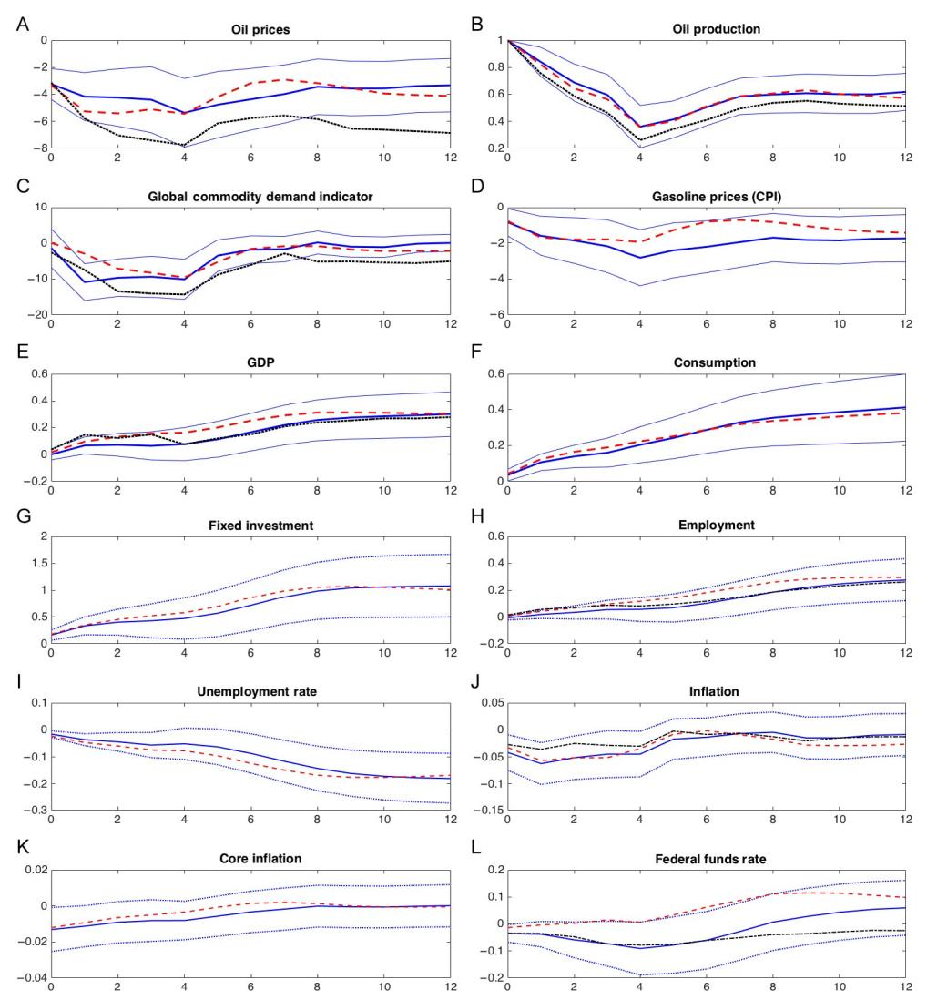

Fig. 9 Structural IRFs from the SDFM (blue (dark gray in the print version) solid with 1 standard error bands), FAVAR (red (gray in the print version) dashed), and SVAR (black dots) for selected variables with respect to an oil supply shock: [Kilian \(2009\)](#page-107-0) identification. Units: standard deviations for Global Commodity Demand and percentage points for all other variables.

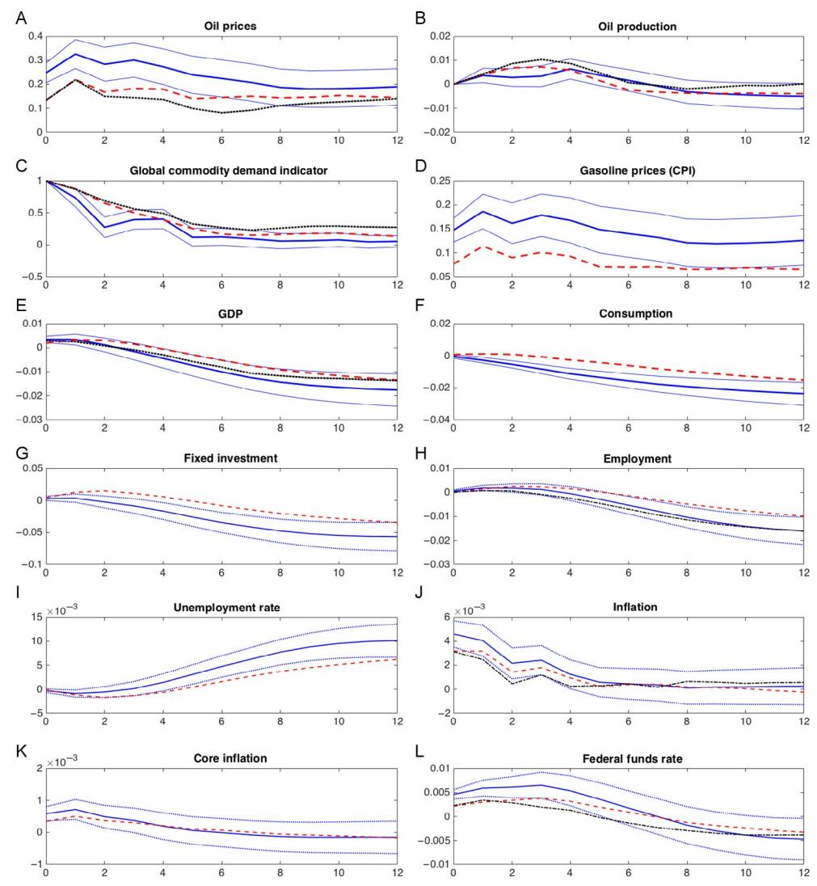

Fig. 10 Structural IRFs from the SDFM (blue (dark gray in the print version) solid with 1 standard error bands), FAVAR (red (gray in the print version) dashed), and SVAR (black dots) for selected variables with respect to a global demand shock: [Kilian \(2009\)](#page-107-0) identification. Units: standard deviations for Global Commodity Demand and percentage points for all other variables.

forecast and the forecasts, and thus forecast errors, do not substantially depend on the choice of conditioning set (lags of observed variables in the SVAR vs lags of factors in the FAVAR and SDFM). Thus the identified shocks are highly correlated ([Table 8](#page-97-0)) and the SIRFs are quite similar across the three models. On a substantive note, the fraction of the variance of major macroeconomic variables explained by oil supply shocks is quite small [\(Table 7](#page-96-0)).

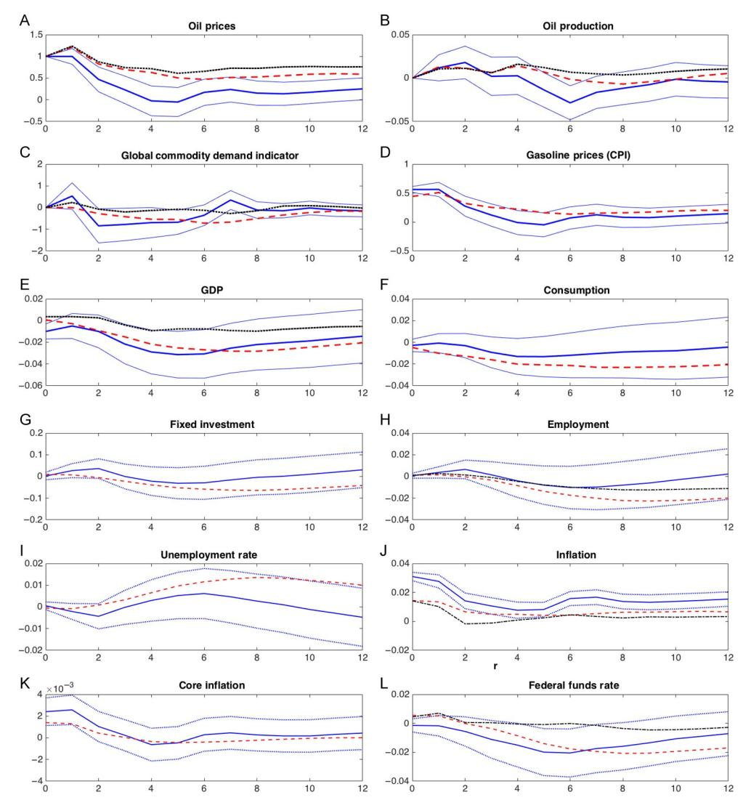

Fig. 11 Structural IRFs from the SDFM (blue (dark gray in the print version) solid with 1 standard error bands), FAVAR (red (gray in the print version) dashed), and SVAR (black dash–dot) for selected variables with respect to an oil-specific demand shock: [Kilian \(2009\)](#page-107-0) identification. Units: standard deviations for Global Commodity Demand and percentage points for all other variables.

In contrast, there are notable differences between the SDFM SIRFs for global demand shocks and the corresponding SIRFs for the FAVAR and SVAR, however the FAVAR SIRFs are quite similar to the SVAR SIRFs ([Fig. 10\)](#page-94-0). Broadly, the FAVAR and SVAR SIRFs are attenuated relative to the SDFM SIRFs. These features are consistent with (a) the global demand shocks—unlike the oil production shocks—being

Table 7 Forecast error variance decompositions for six periods ahead forecasts of selected variables: FAVARs and SDFMs

B. [Kilian \(2009\)](#page-107-0) identification

|                           | A. Oil price exogenous |      | Oil supply |      | Global demand |      | Oil spec. demand |      |
|---------------------------|---------------------------------|------|------------|------|------------------|------|---------------------|------|
| Variable                  | F                               | D    | F          | D(O) | F                | D(U) | F                   | D(U) |
| GDP                       | 0.07                            | 0.07 | 0.04       | 0.01 | 0.02             | 0.04 | 0.09                | 0.04 |
| Consumption               | 0.19                            | 0.22 | 0.09       | 0.08 | 0.02             | 0.22 | 0.11                | 0.01 |
| Fixed investment       | 0.04                            | 0.04 | 0.05       | 0.04 | 0.03             | 0.04 | 0.03                | 0.01 |
| Employment (non-ag)    | 0.03                            | 0.02 | 0.04       | 0.01 | 0.02             | 0.01 | 0.03                | 0.01 |
| Unemployment rate      | 0.04                            | 0.03 | 0.04       | 0.03 | 0.02             | 0.03 | 0.04                | 0.01 |
| PCE inflation          | 0.28                            | 0.40 | 0.02       | 0.04 | 0.09             | 0.16 | 0.17                | 0.29 |
| PCE inflation—core     | 0.05                            | 0.04 | 0.01       | 0.02 | 0.03             | 0.05 | 0.02                | 0.02 |
| Fed funds rate      | 0.02                            | 0.04 | 0.00       | 0.01 | 0.05             | 0.11 | 0.03                | 0.02 |
| Real oil price      | 0.81                            | 0.53 | 0.14       | 0.10 | 0.22             | 0.44 | 0.42                | 0.09 |
| Oil production         | 0.03                            | 0.01 | 0.75       | 0.78 | 0.07             | 0.02 | 0.03                | 0.01 |
| Global commodity       | 0.11                            | 0.23 | 0.05       | 0.07 | 0.79             | 0.33 | 0.03                | 0.02 |
| shipment index         |                                 |      |            |      |                  |      |                     |      |
| Real gasoline price | 0.61                            | 0.48 | 0.05       | 0.06 | 0.25             | 0.43 | 0.34                | 0.08 |

Notes: Entries are the fractions of the six periods ahead forecast error of the row variable explained by the column shock, for the "oil price exogenous" identification results (columns A) and the Kilian identification scheme (columns B). For each shock, "F" refers to the FAVAR treatment in which the factor is treated as observed and "D" refers to the SDFM treatment. In the hybrid SDFM using the [Kilian \(2009\)](#page-107-0) identification scheme, the oil supply factor is treated as observed (the oil production variable) (D(O)) while the global demand and oil-specific demand factors are treated as unobserved (D(U)).

spanned by the space of the factor innovations, (b) the innovations in the commodity index being a noisy measure of the unobserved global factor innovations, and (c) the one step ahead forecast errors for the commodity index being close using either the factors or SVAR variables as conditioning sets. Evidence for (a) is the large fraction of the one step ahead forecast error variance of the global commodity index that is explained by the factor innovations ([Table 6](#page-92-0)). But because the global commodity index is just one noisy measure of global demand, it follows from the general discussion of [Section 5](#page-56-0) that the innovations in the global commodity index in the FAVAR and SVAR models will be noisy measures of—that is, an imperfect proxy for—the innovation in global economic activity (this is point (b)). Evidence for (c) is the high correlation (0.82) between the SVAR and FAVAR estimates of the global demand shocks in [Table 8](#page-97-0).

For the oil-specific demand shock [\(Fig. 11](#page-95-0)), the FAVAR and SVAR SIRFs are also attenuated relative to the SDFM SIRFs. The issues associated with interpreting these differences are subtle. In addition to the oil supply and aggregate demand shocks discussed earlier, the hybrid SDFM allows for two oil price-specific shocks: one that explains some of the comovements of other macro variables, and one that is purely idiosyncratic (actually, an idiosyncratic disturbance for each oil price) which has no effect on other macro

Table 8Correlations between identified shocks

|                                                                                                    |                                                               |             | l p O i ice r ex og en ou s   |                                                          |                                                          |                                                  |                                                      |                                                  | l ( ) de f K i ia 2 0 0 9 i i ica io t t n n n |                                              |                                              |                                                                |                              |              |
|----------------------------------------------------------------------------------------------------|---------------------------------------------------------------|-------------|----------------------------------------------------------|----------------------------------------------------------|----------------------------------------------------------|--------------------------------------------------|------------------------------------------------------|--------------------------------------------------|------------------------------------------------------------------------------------------------------------|----------------------------------------------|----------------------------------------------|----------------------------------------------------------------|------------------------------|--------------|
|                                                                                                    |                                                               |             | l p ho k O i ice r s c           |                                                          |                                                          | l s ly O i up p                   |                                                      |                                                  | lo ba l de d G m an                                                                   |                                              |                                              | l-s f de d O i i ic p ec m an |                              |              |
|                                                                                                    |                                                               |             | D                                                        | F                                                        | V                                                        | D                                                | F                                                    | V                                                | D                                                                                                          | F                                            | V                                            | D                                                              | F                            | V            |
| l p O i ic r e ex og en ou s                                         | l O i ic p r e ho k s c         | D F V | 1. 0 0 0. 8 6 0. 2 7             | 1. 0 0 0. 8 4                             | 1. 0 0                                             |                                                  |                                                      |                                                  |                                                                                                            |                                              |                                              |                                                                |                              |              |
| i l ian ( 2 0 0 9 ) K de f i i ic io nt at n | O i l ly p p su                             | D F V | 0. 2 2  0. 2 1  0. 1 8  | 0. 2 4  0. 2 3  0. 2 2  | 0. 2 2  0. 2 3  0. 2 2  | 1. 0 0 0. 9 5 0. 8 8     | 1. 0 0 0. 8 8                         | 1. 0 0                                     |                                                                                                            |                                              |                                              |                                                                |                              |              |
|                                                                                                    | lo ba l G de d m an                      | D F V | 0. 7 0 0. 4 5 0. 3 7             | 0. 6 3 0. 3 5 0. 2 8             | 0. 5 6 0. 3 1 0. 3 7             | 0. 0 0 0. 0 2  0. 0 0 | 0. 0 6 0. 0 0 0. 0 1      | 0. 0 7 0. 0 6  0. 0 0 | 1. 0 0 0. 3 7 0. 4 0                                                               | 1. 0 0 0. 8 2                 | 1. 0 0                                 |                                                                |                              |              |
|                                                                                                    | l O i i f ic sp ec de d m an | D F V | 0. 6 3 0. 6 6 0. 6 0             | 0. 5 0 0. 8 3 0. 7 6             | 0. 4 3 0. 9 7 0. 9 1             | 0. 0 0 0. 0 0 0. 0 3  | 0. 0 5  0. 0 0 0. 0 4  | 0. 0 4  0. 0 3 0. 0 0 | 0. 0 0 0. 5 4 0. 4 8                                                               | 0. 3 0 0. 0 0 0. 0 0 | 0. 1 7 0. 0 2 0. 0 0 | 1. 0 0 0. 4 4 0. 3 9                   | 1. 0 0 0. 8 8 | 1. 0 0 |

Notes:Entries are correlations between the identified shocks. D¼SDFM or hybrid SDFM, F¼FAVAR, and V¼SVAR. variables. According to the FEVDs in [Table 7,](#page-96-0) the oil-specific demand shock spanned by the factor innovations explains only a small amount of the forecast error in oil prices, and virtually none of the variation in major macroeconomic variables. Thus the SDFM relegates the residual variation in oil prices to the idiosyncratic disturbance, which has no effect on variables other than the oil price itself (and on PCE inflation, presumably through the oil price). In contrast, the FAVAR and SVAR have a single oil price-specific shock instead of the two in the SDFM. The single shock in the FAVAR and SVAR mix the purely idiosyncratic movements in oil prices with the oil-specific demand shock that could have broader consequences, so that this shock explains half of the six quarters ahead forecast error variance for oil prices, and one-third of that for gasoline prices, but very small amounts of the variation in other macro variables.

# 7.6 Discussion and Lessons

The two identification schemes provide two contrasting examples. In the "oil price exogenous" identification scheme, the oil price innovation is effectively spanned by the space of factor innovations, so it makes little difference whether oil prices are treated as an unobserved factor in a SDFM or an observed factor in a FAVAR. Moreover, because it is difficult to predict oil price changes, using the factors for that prediction or using the eight-variable VAR makes little difference. Thus, in all the models, the oil price shock is essentially the same, so the SIRFs and variance decompositions are essentially the same. For this scheme, it turns out that it matters little whether a SDFM, FAVAR, or SVAR is used.

In contrast, in the [Kilian \(2009\)](#page-107-0) identification scheme, the results depend more sensitively on which model is used for the factors that are treated as unobserved in the SDFM. Moreover, there is the additional feature that the forecast error in oil production seems not to be spanned by the macro factor innovations, indicating both that it has little effect on the macro variables and that an attempt to treat oil production as an unobserved factor will have problems with estimation error so that it is preferable to treat oil production as an observed factor. The dependence of the results for the global activity factor and the oil-specific demand factor are consistent with the theoretical discussion in [Section 5](#page-56-0): treating those global demand and oil-specific demand as observed in a FAVAR, or as variables in a SVAR, arguably leads to measurement error in those innovations, and thus to measurement error in the IRFs. For these two shocks, it is preferable to recognize that the observed variables measure the shocks with error and thus to rely on SDFM estimates of the IRFs.

Finally, on substance, these results are consistent with the modern literature that oil supply shocks explain little of the variation of US aggregate activity since the early 1980s. Indeed, this result comes through even in the "oil price exogenous" identification scheme estimated post-1984. Instead, aggregate demand shocks are an important force in oil price movements: as estimated using the SDFM, 44% of the variance of six-quarter horizon forecast errors in oil prices is explained by global demand shocks, larger than the FAVAR estimate of 22%, consistent with the measurement error discussion earlier.

# 8. CRITICAL ASSESSMENT AND OUTLOOK

This section starts with some practical recommendations for empirical use of DFMs, drawn both from the literature and our own experience with these models. It then turns to a broader assessment of lessons learned from the large literature on DFMs, including touching on some remaining open methodological issues.

# 8.1 Some Recommendations for Empirical Practice

## 8.1.1 Variable Selection and Data Processing

Selection of the variables in the DFM should be guided by the purpose of the empirical application and knowledge of the data series. For the purposes of index construction, the series should have comparable scope, for example the real activity index constructed in [Section 6](#page-63-0) used the subset of real activity variables, not the full dataset. For the purposes of nowcasting, forecasting, and factor estimation, a guiding principle is that the factor innovations should span the space of the most important shocks that in turn affect the evolution of the variables of most interest.

The methods described in this chapter apply to variables that are integrated of order zero; in practice, this can require preprocessing the data to remove long-run dependence and trends. In most applications, this is done by transforming the variables to growth rates or more generally using first or second differences of the variables as appropriate. For the application in this chapter, we additionally removed remaining low-frequency swings by subtracting off a trend estimated using a lowpass filter designed to capture changes in mean growth rates at periodicities of a decade and longer. Although this step is uncommon in the literature, we believe it is important when working with US macro data because the drivers of the long-term trends in the data, such as multidecadal demographic swings, confound the short- and medium-term modeling in the DFM.

## 8.1.2 Parametric vs Nonparametric Methods

The parametric approach of formulating and estimating the DFM in state space has theoretical advantages: it produces the MLE and is amenable to Bayesian analysis under correct specification and it handles data irregularities such as missing observations and mixed-frequency data. But our reading of the literature and our own experience suggest that in practice the differences between parametric implementations and nonparametric implementations (principal components or other least-squares methods for estimating the factors) are slim in most applications. As discussed in [Section 2.3.3,](#page-17-0) like the parametric approach, nonparametric methods can handle missing data, mixed data frequencies, and other data irregularities. The nonparametric methods have the added advantage of computational simplicity and do not require specifying a parametric dynamic model for the key step of estimating the factors. For these reasons, we therefore consider the nonparametric methods to be the appropriate default.

## 8.1.3 Instability

There is mounting empirical evidence that DFMs, like other time series models, can exhibit instability. This is not a surprise, for example it is well documented that changes associated with the Great Moderation go beyond reduction in variances to include changes in dynamics and reduction in predictability. Thus it is important to check for stability in DFMs, just as it is in other models with time series data. The stability tests used in this chapter are simple to implement and entail applying textbook single-equation stability tests to regressions of a single variable on the factors (other stability tests are discussed in [Section 2.5.2\)](#page-23-0).

One subtlety is that the PC estimator of the factors has some desirable robustness to modest amounts of time variation (see the discussion in [Section 2.5.1](#page-22-0)). As a result, if there is a break in the factor loadings of some but not all of the variables, it can be appropriate to use the full sample for estimating the factors but a split sample for estimating the factor loadings, although whether this is warranted depends on the application.

## 8.1.4 Additional Considerations for Structural Analysis

Four sets of issues are worth stressing when a goal of the analysis is to estimate the effect of structural shocks.

The first, which is a central point of this chapter, is that identification methods developed for SVAR analysis carry over directly to SDFMs with the assistance of the unit effect normalization [\(32\)](#page-36-0) and the named factor normalization [\(12\)](#page-11-0).

The second concerns the potential for weak identification. This concern applies equally to SVARs, FAVARs, and SDFMs. One theme of [Section 4](#page-28-0) is that the various methods used to identify structural shocks and their IRFs in SVARs can all be interpreted as GMM, or in some cases simple instrumental variables, methods. As a result, the possibility arises that the structural parameters (the parameters of the H matrix in [\(20\)](#page-31-0)) might be weakly identified. If so, SIRFs will in general be biased and confidence intervals will be unreliable. As of this writing, some methods for identification–robust inference in SVARs have been explored but there is not yet a comprehensive suite of tools available.

Third, inference with sign-identified SVARs, FAVARs, and SDFMs has its own challenges. As discussed in [Section 4.6.2](#page-51-0), nonlinearities in the mapping from the prior to the posterior imply that seemingly uninformative priors induce informative priors over the unidentified set. Resolving this problem is an active area of research.

The fourth issue, which arises for SDFMs but not for SVARs or FAVARs, is the possibility that the identified shock might not be spanned by the innovations of the factor loadings. This could arise either because the variables chosen for the DFM have too narrow a scope, or because the shock of interest simply has little or no macro consequence. This latter situation arose in the empirical application of [Section 7,](#page-81-0) in which the factor innovations explained almost none of the forecast error in global oil production. In this case, the named factor normalization breaks down (because the latent macro factors do not include a global oil production factor so there is effectively no common component of global oil production) so the SDFM approach is not reliable. In [Section 7](#page-81-0), we addressed this problem by adopting a hybrid SDFM in which global oil production was an observed factor, which was estimated to explain very little of the post-1984 variation in US macro variables.

# 8.2 Assessment

We conclude by stepping back and returning to three high-level questions about whether DFMs have achieved their promise. First, has the early indication that the comovements of macro variables are well described by a small number of factors held up to scrutiny? Second, have DFMs—the first and still leading tool for "big data" analysis in macroeconomics—improved forecasts and nowcasts of macroeconomic variables? And third, do structural DFMs provide improvements over SVARs and, if so, how?

## 8.2.1 Do a Small Number of Factors Describe the Comovements of Macro Variables?

The repeated finding in the empirical DFM literature is that the answer is a strong yes. In the 207-variable dataset, the average R2 of the regression of 207 variables against the eight factors is 51%. For major macroeconomic aggregates, which were not used to estimate the factors, this fraction is higher: 81% for GDP growth and 93% for the growth of nonfarm employment. This R2 is large for other macro variables as well: 64% for the PCE deflator, 72% for the 10 year–3 month treasury spread, and 73% for the S&P 500. This high fit, for different DFMs and different variables, is evident [Figs. 4, 5, and 7](#page-71-0)B in this chapter, and in many applications in this literature. This general affirmative answer does not mean that every variable is well fit by the few common factors, nor does it imply that there is no remaining common structure. But the stylized fact from [Sargent and Sims](#page-109-0) [\(1977\)](#page-109-0) of a few factors explaining a large fraction of the variation of many macro series is robust.

# 8.2.2 Do DFMs Improve Forecasts and Nowcasts?

Our answer is a nuanced yes. Broadly speaking, DFM forecasts are competitive with other methods, and for certain problems, such as forecasting real economic activity, DFM forecasts are in many cases the best available forecasts. For nowcasts, DFMs provide a structured and internally consistent way to handle the "ragged edge" problem with large datasets. For nowcasts, mixed-frequency methods using small datasets have proven competitive in some applications. As a practical matter, in macro forecasting and nowcasting applications DFMs are typically in the mix, sometimes provide the best forecasts, and at a minimum belong in the suite of models considered.

## 8.2.3 Do SDFMs Provide Improvements Over SVARs?

From the perspective of structural shock analysis, DFMs have two substantial advantages over SVARs and, in many cases, over FAVARs. First, by using many variables, they are better able to span the space of structural shocks than a low-dimensional VAR. As discussed in [Section 6.4](#page-78-0), in the US quarterly dataset the space of innovations of lowdimensional VARs does not well approximate the space of factor innovations, consistent with the individual series in the VAR having measurement error and idiosyncratic variation. This finding suggests that a method to identify shocks could fail in a SVAR because of measurement error or idiosyncratic variation, but succeed in identifying the shock in a SDFM, a general point that is consistent with the empirical results in [Section 7.4.](#page-89-0)

Second, a side benefit of using many variables is that it the SDFM generates internally consistent SIRFs for a large number of variables. The SDFM separates the tasks of identifying the structural shock and estimating a SIRF for variables of interest.

# ACKNOWLEDGMENTS

We thank Knut Are Aastveit, Michael Bauer, Hilde Bjørnland, Gabriel Chodorow-Reich, Domenico Giannone, Lutz Kilian, Massimiliano Marcellino, Frederic Martinet, Serena Ng, Geert Peersman, Mikkel Plagborg-Møller, Valerie Ramey, and Leif Anders Thorsrud for helpful comments and/or discussions and Paul Ho, Eben Lazarus, and Daniel Lewis for research assistance.

# REFERENCES

[Aaronson, S., Cajner, T., Fallick, B., Galbis-Reig, F., Smith, C., Wascher, W., 2014. Labor force partic](http://refhub.elsevier.com/S1574-0048(16)30002-7/rf0005)[ipation: recent developments and future prospects. In: Brookings Papers on Economic Activity, Fall](http://refhub.elsevier.com/S1574-0048(16)30002-7/rf0005) 2014, pp. 197–[275. \(including discussion\).](http://refhub.elsevier.com/S1574-0048(16)30002-7/rf0005)

[Aastveit, K.A., 2014. Oil price shocks in a data-rich environment. Energy Econ. 45, 268](http://refhub.elsevier.com/S1574-0048(16)30002-7/rf0010)–279.

[Aastveit, K.A., Bj](http://refhub.elsevier.com/S1574-0048(16)30002-7/rf0015)ø[rnland, H.C., Thorsrud, L.A., 2015. What drives oil prices? Emerging versus developed](http://refhub.elsevier.com/S1574-0048(16)30002-7/rf0015) [economies. J. Appl. Econ. 30, 1013](http://refhub.elsevier.com/S1574-0048(16)30002-7/rf0015)–1028.

[Aastveit, K.A., Gerdrup, K.R., Jore, A.S., Thorsrud, L.A., 2014. Nowcasting GDP in real time: a density](http://refhub.elsevier.com/S1574-0048(16)30002-7/rf0020) [combination approach. J. Bus. Econ. Stat. 32, 48](http://refhub.elsevier.com/S1574-0048(16)30002-7/rf0020)–68.

[Aguilar, O., West, M., 2000. Bayesian dynamic factor models and portfolio allocation. J. Bus. Econ. Stat.](http://refhub.elsevier.com/S1574-0048(16)30002-7/rf9005) [18, 338](http://refhub.elsevier.com/S1574-0048(16)30002-7/rf9005)–357.

[Ahn, S.C., Horenstein, A.R., 2013. Eigenvalue ratio test for the number of factors. Econometrica](http://refhub.elsevier.com/S1574-0048(16)30002-7/rf0025)

[81, 1203](http://refhub.elsevier.com/S1574-0048(16)30002-7/rf0025)–1227. [Altissimo, F., Bassanetti, A., Cristadoro, R., Forni, M., Hallin, M., Lippi, M., Reichlin, L., Veronese, G.,](http://refhub.elsevier.com/S1574-0048(16)30002-7/rf0030)

[2001. EuroCOIN: a real time coincident indicator of the euro area business cycle. In: CEPR DP3108.](http://refhub.elsevier.com/S1574-0048(16)30002-7/rf0030) [Altissimo, F., Cristadoro, R., Forni, M., Lippi, M., Veronese, G., 2010. New EuroCOIN: tracking](http://refhub.elsevier.com/S1574-0048(16)30002-7/rf0035) [economic growth in real time. Rev. Econ. Stat. 92 \(4\), 1024](http://refhub.elsevier.com/S1574-0048(16)30002-7/rf0035)–1034.

[Amengual, D., Watson, M.W., 2007. Consistent estimation of the number of dynamic factors in a large](http://refhub.elsevier.com/S1574-0048(16)30002-7/rf0040) [N and T panel. J. Bus. Econ. Stat. 25, 91](http://refhub.elsevier.com/S1574-0048(16)30002-7/rf0040)–96.

- [Andrews, D.W.K., Soares, G., 2010. Inference for parameters defined by moment inequalities using](http://refhub.elsevier.com/S1574-0048(16)30002-7/rf0045) [generalized moment selection. Econometrica 78, 119](http://refhub.elsevier.com/S1574-0048(16)30002-7/rf0045)–157.
- [Andrews, D.W.K., Stock, J.H., 2007. Inference with weak instruments. In: Blundell, R., Newey, W.K.,](http://refhub.elsevier.com/S1574-0048(16)30002-7/rf0050) [Persson, T. \(Eds.\), Advances in Economics and Econometrics, Theory and Applications: Ninth World](http://refhub.elsevier.com/S1574-0048(16)30002-7/rf0050) [Congress of the Econometric Society, Vol. III. Cambridge University Press, Cambridge, UK.](http://refhub.elsevier.com/S1574-0048(16)30002-7/rf0050)
- [Angelini, E., Ba](http://refhub.elsevier.com/S1574-0048(16)30002-7/rf0055)n[bura, N., R](http://refhub.elsevier.com/S1574-0048(16)30002-7/rf0055) u[nstler, G., 2010. Estimating and forecasting the euro area monthly national](http://refhub.elsevier.com/S1574-0048(16)30002-7/rf0055) € [accounts from a dynamic factor model. In: OECD Journal of Business Cycle Measurement and Analysis](http://refhub.elsevier.com/S1574-0048(16)30002-7/rf0055) 7, pp. 1–[22. also ECB working paper no. 953 \(2008\).](http://refhub.elsevier.com/S1574-0048(16)30002-7/rf0055)
- [Arias, J.E., Rubio-Ramı´rez, J.F., Waggoner, D.F., 2014. Inference based on SVARs identified with sign and](http://refhub.elsevier.com/S1574-0048(16)30002-7/rf0060) [zero restrictions: theory and applications. Federal Reserve Bank of Atlanta. Working paper 2014-1.](http://refhub.elsevier.com/S1574-0048(16)30002-7/rf0060)
- [Aruoba, S.B., Diebold, F.X., Scotti, C., 2009. Real-time measurement of business conditions. J. Bus. Econ.](http://refhub.elsevier.com/S1574-0048(16)30002-7/rf0065) [Stat. 27, 417](http://refhub.elsevier.com/S1574-0048(16)30002-7/rf0065)–427.
- [Bai, J., 2003. Inferential theory for factor models of large dimensions. Econometrica 71, 135](http://refhub.elsevier.com/S1574-0048(16)30002-7/rf0070)–172.
- [Bai, J., Ng, S., 2002. Determining the number of factors in approximate factor models. Econometrica](http://refhub.elsevier.com/S1574-0048(16)30002-7/rf0075) [70, 191](http://refhub.elsevier.com/S1574-0048(16)30002-7/rf0075)–221.
- [Bai, J., Ng, S., 2006a. Confidence intervals for diffusion index forecasts and inference for factor-augmented](http://refhub.elsevier.com/S1574-0048(16)30002-7/rf0080) [regressions. Econometrica 74, 1133](http://refhub.elsevier.com/S1574-0048(16)30002-7/rf0080)–1150.
- [Bai, J., Ng, S., 2006b. Evaluating latent and observed factors in macroeconomics and finance. J. Econ.](http://refhub.elsevier.com/S1574-0048(16)30002-7/rf9010) [131, 507](http://refhub.elsevier.com/S1574-0048(16)30002-7/rf9010)–537.
- [Bai, J., Ng, S., 2007. Determining the number of primitive shocks in factor models. J. Bus. Econ. Stat.](http://refhub.elsevier.com/S1574-0048(16)30002-7/rf0085) [25, 52](http://refhub.elsevier.com/S1574-0048(16)30002-7/rf0085)–60.
- [Bai, J., Ng, S., 2008. Large dimensional factor analysis. Found. Trends Econ. 3 \(2\), 89](http://refhub.elsevier.com/S1574-0048(16)30002-7/rf0090)–163.
- [Bai, J., Ng, S., 2013. Principal components estimation and identification of static factors. J. Econ. 176, 18](http://refhub.elsevier.com/S1574-0048(16)30002-7/rf0095)–29.
- [Bai, J., Wang, P., 2014. Identification theory for high dimensional static and dynamic factor models. J. Econ.](http://refhub.elsevier.com/S1574-0048(16)30002-7/rf0100) [178, 794](http://refhub.elsevier.com/S1574-0048(16)30002-7/rf0100)–804.
- [Banbura, M., Giannone, D., Modugno, M., Reichlin, L., 2013. Nowcasting and the real-time data flow.](http://refhub.elsevier.com/S1574-0048(16)30002-7/rf0105) [In: Elliott, G., Timmermann, A., Elliott, G., Timmermann, A. \(Eds.\), Handbook of Economic](http://refhub.elsevier.com/S1574-0048(16)30002-7/rf0105) [Forecasting, vol. 2. Elsevier, North-Holland, pp. 195](http://refhub.elsevier.com/S1574-0048(16)30002-7/rf0105)–237. Chapter 4.
- [Banbura, M., Modugno, M., 2014. Maximum likelihood estimation of factor models on datasets with](http://refhub.elsevier.com/S1574-0048(16)30002-7/rf0110) [arbitrary pattern of missing data. J. Appl. Econ. 29, 133](http://refhub.elsevier.com/S1574-0048(16)30002-7/rf0110)–160.
- [Banerjee, A., Marcellino, M., 2009. Factor-augmented error correction models. In: Shephard, N., Castle, J.](http://refhub.elsevier.com/S1574-0048(16)30002-7/rf0115) [\(Eds.\), The Methodology and Practice of Econometrics: Festschrift in Honor of D.F. Hendry. Oxford](http://refhub.elsevier.com/S1574-0048(16)30002-7/rf0115) [University Press, Oxford, pp. 227](http://refhub.elsevier.com/S1574-0048(16)30002-7/rf0115)–254. Chapter 9.
- [Banerjee, A., Marcellino, M., Masten, I., 2014. Forecasting with factor-augmented error correction models.](http://refhub.elsevier.com/S1574-0048(16)30002-7/rf0120) [Int. J. Forecast. 30, 589](http://refhub.elsevier.com/S1574-0048(16)30002-7/rf0120)–612.
- [Banerjee, A., Marcellino, M., Masten, I., 2016. An overview of the factor-augmented error correction](http://refhub.elsevier.com/S1574-0048(16)30002-7/rf0125) [model. In: Koopman, S.J., Hillebrand, E. \(Eds.\), Dynamic Factor Models, Advances in Econometrics,](http://refhub.elsevier.com/S1574-0048(16)30002-7/rf0125) [35, Emerald Group Publishing, Bingley, UK.](http://refhub.elsevier.com/S1574-0048(16)30002-7/rf0125)
- [Bates, B., Plagborg-M](http://refhub.elsevier.com/S1574-0048(16)30002-7/rf0130)ø[ller, M., Stock, J.H., Watson, M.W., 2013. Consistent factor estimation in dynamic](http://refhub.elsevier.com/S1574-0048(16)30002-7/rf0130) [factor models with structural instability. J. Econ. 177, 289](http://refhub.elsevier.com/S1574-0048(16)30002-7/rf0130)–304.
- [Baumeister, C., Hamilton, J.D., 2015a. Sign restrictions, structural vector autoregressions, and useful prior](http://refhub.elsevier.com/S1574-0048(16)30002-7/rf0135) [information. Econometrica 83, 1963](http://refhub.elsevier.com/S1574-0048(16)30002-7/rf0135)–1999.
- [Baumeister, C., Hamilton, J.D., 2015b. Structural interpretation of vector autoregressions with incomplete](http://refhub.elsevier.com/S1574-0048(16)30002-7/rf0140) [identification: revisiting the role of oil supply and demand shocks. Manuscript. University of California,](http://refhub.elsevier.com/S1574-0048(16)30002-7/rf0140) [San Diego.](http://refhub.elsevier.com/S1574-0048(16)30002-7/rf0140)
- [Baumeister, C., Kilian, L., 2016. Forty years of oil price fluctuations: why the price of oil may still surprise us.](http://refhub.elsevier.com/S1574-0048(16)30002-7/rf9015) [J. Econ. Perspect. 30, 139](http://refhub.elsevier.com/S1574-0048(16)30002-7/rf9015)–160.
- [Baumeister, C., Peersman, G., 2013. Time-varying effects of oil supply shocks on the U.S. economy. Am.](http://refhub.elsevier.com/S1574-0048(16)30002-7/rf0145) [Econ. J. Macroecon. 5, 1](http://refhub.elsevier.com/S1574-0048(16)30002-7/rf0145)–28.
- [Barsky, R.B., Kilian, L., 2002. Do we really know that oil caused the great stagflation? A monetary alter](http://refhub.elsevier.com/S1574-0048(16)30002-7/rf0150)[native. NBER Macroecon. Annu. 16, 137](http://refhub.elsevier.com/S1574-0048(16)30002-7/rf0150)–183.
- [Baxter, M., King, R.G., 1999. Measuring business cycles: approximate band-pass filters for economic time](http://refhub.elsevier.com/S1574-0048(16)30002-7/rf0155) [series. Rev. Econ. Stat. 81, 575](http://refhub.elsevier.com/S1574-0048(16)30002-7/rf0155)–593.

- [Bernanke, B.S., Boivin, J., Eliasz, P., 2005. Measuring the effects of monetary policy: a factor-augmented](http://refhub.elsevier.com/S1574-0048(16)30002-7/rf0160) [vector autoregressive \(FAVAR\) approach. Q. J. Econ. 120, 387](http://refhub.elsevier.com/S1574-0048(16)30002-7/rf0160)–422.
- [Bernanke, B.S., Kuttner, K.N., 2005. What explains the stock market's reaction to federal reserve policy?](http://refhub.elsevier.com/S1574-0048(16)30002-7/rf0165) [J. Financ. 40, 1221](http://refhub.elsevier.com/S1574-0048(16)30002-7/rf0165)–1257.
- Bjørnland, H., Thorsrud, L.A., forthcoming. Boom or gloom? Examining the Dutch disease in two-speed economies. Econ. J.
- [Bj](http://refhub.elsevier.com/S1574-0048(16)30002-7/rf0175)ørnland, [H., Thorsrud, L.A., 2015a. Commodity prices and fiscal policy design: procyclical despite a rule.](http://refhub.elsevier.com/S1574-0048(16)30002-7/rf0175) CAMP working [paper 5/2015.](http://refhub.elsevier.com/S1574-0048(16)30002-7/rf0175)
- [Bj](http://refhub.elsevier.com/S1574-0048(16)30002-7/rf0180)ø[rnland, H., Thorsrud, L.A., 2015b. Applied Time Series for Macroeconomists. Gyldendal Akademisk,](http://refhub.elsevier.com/S1574-0048(16)30002-7/rf0180) [Oslo.](http://refhub.elsevier.com/S1574-0048(16)30002-7/rf0180)
- [Blanchard, O.J., Galı´, J., 2010. The macroeconomic effects of oil price shocks: why are the 2000s so different](http://refhub.elsevier.com/S1574-0048(16)30002-7/rf0185) [from the 1970s? In: Galı´, J., Gertler, M.J. \(Eds.\), International Dimensions of Monetary Policy.](http://refhub.elsevier.com/S1574-0048(16)30002-7/rf0185) [University of Chicago Press for the NBER, Chicago, pp. 373](http://refhub.elsevier.com/S1574-0048(16)30002-7/rf0185)–421. Chapter 7.
- [Blanchard, O.J., Quah, D., 1989. Dynamic effects of aggregate demand and supply disturbances. Am. Econ.](http://refhub.elsevier.com/S1574-0048(16)30002-7/rf0190) [Rev. 79, 655](http://refhub.elsevier.com/S1574-0048(16)30002-7/rf0190)–673.
- [Blanchard, O.J., Watson, M.W., 1986. Are business cycles all alike? In: Gordon, R.J. \(Ed.\), The American](http://refhub.elsevier.com/S1574-0048(16)30002-7/rf0195) [Business Cycle. University of Chicago Press, Chicago.](http://refhub.elsevier.com/S1574-0048(16)30002-7/rf0195)
- [Boivin, J., Ng, S., 2006. Are more data always better for factor analysis. J. Econ. 132, 169](http://refhub.elsevier.com/S1574-0048(16)30002-7/rf0205)–194.
- [Breitung, J., Eickmeier, S., 2011. Testing for structural breaks in dynamic factor models. J. Econ.](http://refhub.elsevier.com/S1574-0048(16)30002-7/rf0210) [163, 71](http://refhub.elsevier.com/S1574-0048(16)30002-7/rf0210)–84.
- [Breitung, J., Tenhofen, J., 2011. GLS estimation of dynamic factor models. J. Am. Stat. Assoc.](http://refhub.elsevier.com/S1574-0048(16)30002-7/rf0215) [106, 1150](http://refhub.elsevier.com/S1574-0048(16)30002-7/rf0215)–1166.
- [Burns, A.F., Mitchell, W.C., 1946. Measuring Business Cycles. NBER, New York.](http://refhub.elsevier.com/S1574-0048(16)30002-7/rf0220)
- [Campbell, J.R., Evans, C.L., Fisher, J.D.M., Justiniano, A., 2012. Macroeconomic effects of FOMC forward](http://refhub.elsevier.com/S1574-0048(16)30002-7/rf0225) [guidance. In: Brookings Papers on Economic Activity, Spring, pp. 1](http://refhub.elsevier.com/S1574-0048(16)30002-7/rf0225)–80.
- Carrasco, M., Rossi, B., forthcoming. In-sample inference and forecasting in misspecified factor models. J. Bus. Econ. with discussion.
- [Chamberlain, G., Rothschild, M., 1983. Arbitrage factor structure, and mean-variance analysis of large asset](http://refhub.elsevier.com/S1574-0048(16)30002-7/rf0235) [markets. Econometrica](http://refhub.elsevier.com/S1574-0048(16)30002-7/rf0235) 51, 1281–1304.
- [Charnavoki, V., Dolado, J.J., 2014. The effects of global shocks on small commodity-exporting economies:](http://refhub.elsevier.com/S1574-0048(16)30002-7/rf0240) [lessons from Canada. Am. Econ. J. Macroecon. 6, 207](http://refhub.elsevier.com/S1574-0048(16)30002-7/rf0240)–237.
- [Chen, L., Dolado, J.J., Gonzalo, J., 2014. Detecting big structural breaks in large factor models. J. Econ.](http://refhub.elsevier.com/S1574-0048(16)30002-7/rf0245) [180, 30](http://refhub.elsevier.com/S1574-0048(16)30002-7/rf0245)–48.
- [Cheng, X., Hansen, B.E., 2015. Forecasting with factor-augmented regression: a Frequentist model aver](http://refhub.elsevier.com/S1574-0048(16)30002-7/rf0250)[aging approach. J. Econ. 186, 280](http://refhub.elsevier.com/S1574-0048(16)30002-7/rf0250)–293.
- Cheng, X., Liao, Z., Schorfheide, F., forthcoming. Shrinkage estimation of high-dimensional factor models with structural instabilities. Rev. Econ. Stud.
- [Chevillon, G., Mavroeidis, S., Zhan, Z., 2015. Robust Inference in Structural VARs with Long-Run](http://refhub.elsevier.com/S1574-0048(16)30002-7/rf0260) [Restrictions. manuscript.](http://refhub.elsevier.com/S1574-0048(16)30002-7/rf0260) Oxford University.
- [Choi, I., 2012. Efficient estimation of factor models. Econ. Theory 28, 274](http://refhub.elsevier.com/S1574-0048(16)30002-7/rf0265)–308.
- [Christiano, L.J., Eichenbaum, M.S., Evans, C.L., 1999. Monetary policy shocks: what have we learned and](http://refhub.elsevier.com/S1574-0048(16)30002-7/rf0270) [to what end? In: Taylor, J.B., Woodford, M. \(Eds.\), Handbook of Macroeconomics. Elsevier Science,](http://refhub.elsevier.com/S1574-0048(16)30002-7/rf0270) [North-Holland, Amsterdam.](http://refhub.elsevier.com/S1574-0048(16)30002-7/rf0270)
- [Christiano, L.J., Eichenbaum, M., Vigfusson, R., 2006. Assessing structural VARs. NBER Macroecon.](http://refhub.elsevier.com/S1574-0048(16)30002-7/rf9020) Annu. 21, 1–[72 \(including discussion\).](http://refhub.elsevier.com/S1574-0048(16)30002-7/rf9020)
- Clements, M.P., forthcoming. Real-time factor model forecasting and the effects of instability. Comput. Stat. Data Anal.
- Cochrane, [J.H., Piazzesi, M., 2002. The fed and interest rates: a high-frequency identification. Am. Econ.](http://refhub.elsevier.com/S1574-0048(16)30002-7/rf0280) [Rev. 92](http://refhub.elsevier.com/S1574-0048(16)30002-7/rf0280) (May), 90–95.
- [Cogley, Timothy, Sargent, Thomas J., 2005. Drifts and volatilities: monetary policies and outcomes in the](http://refhub.elsevier.com/S1574-0048(16)30002-7/rf0285) [post WWII US. Rev. Econ. Dyn. 8 \(2\), 262](http://refhub.elsevier.com/S1574-0048(16)30002-7/rf0285)–302.
- [Connor, G., Korajczyk, R.A., 1986. Performance measurement with the arbitrage pricing theory. J. Financ.](http://refhub.elsevier.com/S1574-0048(16)30002-7/rf0290) [Econ. 15, 373](http://refhub.elsevier.com/S1574-0048(16)30002-7/rf0290)–394.

- [Corradi, V., Swanson, N., 2014. Testing for structural stability of factor augmented forecasting models.](http://refhub.elsevier.com/S1574-0048(16)30002-7/rf9025) [J. Econ. 182, 100](http://refhub.elsevier.com/S1574-0048(16)30002-7/rf9025)–118.
- [Council of Economic Advisers, 2013. Economic Report of the President 2013. U.S. Government Printing](http://refhub.elsevier.com/S1574-0048(16)30002-7/rf0295) [Office. Chapter 2.](http://refhub.elsevier.com/S1574-0048(16)30002-7/rf0295)
- [Crone, T.M., Clayton-Matthews, A., 2005. Consistent economic indexes for the 50 states. Rev. Econ. Stat.](http://refhub.elsevier.com/S1574-0048(16)30002-7/rf0300) [87, 593](http://refhub.elsevier.com/S1574-0048(16)30002-7/rf0300)–603.
- [D'Agostino, A., Giannone, Domenico, 2012. Comparing alternative predictors based on large-panel factor](http://refhub.elsevier.com/S1574-0048(16)30002-7/rf0305) [models. Oxf. Bull. Econ. Stat. 74, 306](http://refhub.elsevier.com/S1574-0048(16)30002-7/rf0305)–326.
- [del Negro, M., Otrok, C., 2008. Dynamic factor models with time-varying parameters: measuring](http://refhub.elsevier.com/S1574-0048(16)30002-7/rf0310) [changes in international business cycles: Staff Report. Federal Reserve Bank of New York.](http://refhub.elsevier.com/S1574-0048(16)30002-7/rf0310) [no. 326.](http://refhub.elsevier.com/S1574-0048(16)30002-7/rf0310)
- [De Mol, C., Giannone, D., Reichlin, L., 2008. Forecasting using a large number of predictors: is Bayesian](http://refhub.elsevier.com/S1574-0048(16)30002-7/rf0315) [shrinkage a valid alternative to principal components? J. Econ. 146, 318](http://refhub.elsevier.com/S1574-0048(16)30002-7/rf0315)–328.
- [Doz, C., Giannone, D., Reichlin, L., 2011. A two-step estimator for large approximate dynamic factor](http://refhub.elsevier.com/S1574-0048(16)30002-7/rf0320) [models based on Kalman filtering. J. Econ. 164 \(1\), 188](http://refhub.elsevier.com/S1574-0048(16)30002-7/rf0320)–205.
- [Doz, C., Giannone, D., Reichlin, L., 2012. A quasi maximum likelihood approach for large approximate](http://refhub.elsevier.com/S1574-0048(16)30002-7/rf0325) [dynamic factor models. Rev. Econ. Stat. 94, 1014](http://refhub.elsevier.com/S1574-0048(16)30002-7/rf0325)–1024.
- [Durbin, J., Koopman, S.J., 2012. Time Series Analysis by State Space Methods, second ed. Oxford](http://refhub.elsevier.com/S1574-0048(16)30002-7/rf0330) [University Press, Oxford.](http://refhub.elsevier.com/S1574-0048(16)30002-7/rf0330)
- [Edelstein, P., Kilian, L., 2009. How sensitive are consumer expenditures to retail energy prices? J. Mon.](http://refhub.elsevier.com/S1574-0048(16)30002-7/rf9030) [Econ. 56, 766](http://refhub.elsevier.com/S1574-0048(16)30002-7/rf9030)–779.
- [Eickmeier, S., Lemke, W., Marcellino, M., 2015. A classical time varying FAVAR model: estimation,](http://refhub.elsevier.com/S1574-0048(16)30002-7/rf9035) [forecasting, and structural analysis. J. Royal Stat. Soc. A 178, 493](http://refhub.elsevier.com/S1574-0048(16)30002-7/rf9035)–533.
- [Eickmeier, S., Ziegler, C., 2008. How successful are dynamic factor models at forecasting output and](http://refhub.elsevier.com/S1574-0048(16)30002-7/rf0335) [inflation? A meta-analytic approach. J. Forecast. 27 \(3\), 237](http://refhub.elsevier.com/S1574-0048(16)30002-7/rf0335)–265.
- [Elliott, G., Muller, U., 2006. Efficient tests for general persistent time variation in regression coefficients.](http://refhub.elsevier.com/S1574-0048(16)30002-7/rf0340) € [Rev. Econ. Stud. 73, 907](http://refhub.elsevier.com/S1574-0048(16)30002-7/rf0340)–940.
- [Engle, R.F., Watson, M.W., 1981. A one-factor multivariate time series model of metropolitan wage rates.](http://refhub.elsevier.com/S1574-0048(16)30002-7/rf0345) [J. Am. Stat. Assoc. 76, 774](http://refhub.elsevier.com/S1574-0048(16)30002-7/rf0345)–781.
- [Engle, R.F., Watson, M.W., 1983. Alternative algorithms for estimation of dynamic MIMIC, factor, and](http://refhub.elsevier.com/S1574-0048(16)30002-7/rf0350) [time varying coefficient regression models. J. Econ. 23, 385](http://refhub.elsevier.com/S1574-0048(16)30002-7/rf0350)–400.
- [Evans, M.D.D., 2005. Where are we now? Real-time estimates of the macroeconomy. Int. J. Cent. Bank.](http://refhub.elsevier.com/S1574-0048(16)30002-7/rf0355) [1, 127](http://refhub.elsevier.com/S1574-0048(16)30002-7/rf0355)–175.
- [Faust, J., 1998. The robustness of identified VAR conclusions about money. Carn.-Roch. Conf. Ser. Public](http://refhub.elsevier.com/S1574-0048(16)30002-7/rf0360) [Policy 49, 207](http://refhub.elsevier.com/S1574-0048(16)30002-7/rf0360)–244.
- [Faust, J., Leeper, E.M., 1997. When do long-run identifying restrictions give reliable results? J. Bus. Econ.](http://refhub.elsevier.com/S1574-0048(16)30002-7/rf9040) [Stat. 15, 345](http://refhub.elsevier.com/S1574-0048(16)30002-7/rf9040)–353.
- [Faust, J., Rogers, J.H., Swanson, E., Wright, J.H., 2003. Identifying the effects of monetary policy shocks on](http://refhub.elsevier.com/S1574-0048(16)30002-7/rf0365) [exchange rates using high frequency data. J. Eur. Econ. Assoc. 1 \(5\), 1031](http://refhub.elsevier.com/S1574-0048(16)30002-7/rf0365)–1057.
- [Faust, J., Swanson, E., Wright, J., 2004. Identifying VARs based on high-frequency futures data. J. Monet.](http://refhub.elsevier.com/S1574-0048(16)30002-7/rf0370) [Econ. 51 \(6\), 1107](http://refhub.elsevier.com/S1574-0048(16)30002-7/rf0370)–1131.
- [Ferna´ndez-Villaverde, J., Rubio-Ramı´rez, J.F., Sargent, T.J., Watson, M.W., 2007. The ABCs \(and Ds\) of](http://refhub.elsevier.com/S1574-0048(16)30002-7/rf0375) [understanding VARs. Am. Econ. Rev. 97 \(3\), 1021](http://refhub.elsevier.com/S1574-0048(16)30002-7/rf0375)–1026.
- [Forni, M., Gambetti, L., 2010. The dynamic effects of monetary policy: a structural factor model approach.](http://refhub.elsevier.com/S1574-0048(16)30002-7/rf0380) [J. Monet. Econ. 57, 203](http://refhub.elsevier.com/S1574-0048(16)30002-7/rf0380)–216.
- [Forni, M., Giannone, D., Lippi, M., Reichlin, L., 2009. Opening the black box: structural factor models](http://refhub.elsevier.com/S1574-0048(16)30002-7/rf0385) [with large cross sections. Econ. Theory 25, 1319](http://refhub.elsevier.com/S1574-0048(16)30002-7/rf0385)–1347.
- [Forni, M., Hallin, M., Lippi, M., Reichlin, L., 2000. The generalized factor model: identification and](http://refhub.elsevier.com/S1574-0048(16)30002-7/rf0390) [estimation. Rev. Econ. Stat. 82, 540](http://refhub.elsevier.com/S1574-0048(16)30002-7/rf0390)–554.
- [Forni, M., Hallin, M., Lippi, M., Reichlin, L., 2005. The generalized dynamic factor model: one-sided](http://refhub.elsevier.com/S1574-0048(16)30002-7/rf0395) [estimation and forecasting. J. Am. Stat. Assoc. 100, 830](http://refhub.elsevier.com/S1574-0048(16)30002-7/rf0395)–839.
- [Forni, M., Reichlin, L., 1998. Let's get real: a dynamic factor analytical approach to disaggregated business](http://refhub.elsevier.com/S1574-0048(16)30002-7/rf0400) cycle. Rev. Econ. [Stud. 65, 453](http://refhub.elsevier.com/S1574-0048(16)30002-7/rf0400)–474.

- [Foroni, C., Marcellino, M., 2013. A survey of econometric methods for mixed-frequency data. Norges Bank](http://refhub.elsevier.com/S1574-0048(16)30002-7/rf0405) [working paper 2013-6.](http://refhub.elsevier.com/S1574-0048(16)30002-7/rf0405)
- [Freedman, D., 1999. Wald lecture: on the Bernstein-von Mises theorem with infinite-dimensional param](http://refhub.elsevier.com/S1574-0048(16)30002-7/rf0410)[eters. Ann. Stat. 27 \(4\), 1119](http://refhub.elsevier.com/S1574-0048(16)30002-7/rf0410)–1141.
- [Fry, R., Pagan, A., 2011. Sign restrictions in structural vector autoregressions: a critical review. J. Econ. Lit.](http://refhub.elsevier.com/S1574-0048(16)30002-7/rf0415) [49 \(4\), 938](http://refhub.elsevier.com/S1574-0048(16)30002-7/rf0415)–960.
- [Gafarov, B., Montiel Olea, J.L., 2015. On the Maximum and Minimum Response to an Impulse in SVARs.](http://refhub.elsevier.com/S1574-0048(16)30002-7/rf0420) [New York University. manuscript.](http://refhub.elsevier.com/S1574-0048(16)30002-7/rf0420)
- [Gali, Jordi, 1999. Technology, employment, and the business cycle: do technology shocks explain aggregate](http://refhub.elsevier.com/S1574-0048(16)30002-7/rf0425) [fluctuations? Am. Econ. Rev. 89 \(1\), 249](http://refhub.elsevier.com/S1574-0048(16)30002-7/rf0425)–271.
- [Gertler, M., Karadi, P., 2015. Monetary policy surprises, credit costs, and economic activity. Am. Econ. J.](http://refhub.elsevier.com/S1574-0048(16)30002-7/rf0430) [Macroecon. 7, 44](http://refhub.elsevier.com/S1574-0048(16)30002-7/rf0430)–76.
- [Geweke, J., 1977. The dynamic factor analysis of economic time series. In: Aigner, D.J., Goldberger, A.S.](http://refhub.elsevier.com/S1574-0048(16)30002-7/rf0435) [\(Eds.\), Latent Variables in Socio-Economic Models. North-Holland, Amsterdam.](http://refhub.elsevier.com/S1574-0048(16)30002-7/rf0435)
- [Giacomini, R., Kitagawa, T., 2014. Inference About Non-Identified SVARs. University College London.](http://refhub.elsevier.com/S1574-0048(16)30002-7/rf0440) [manuscript.](http://refhub.elsevier.com/S1574-0048(16)30002-7/rf0440)
- [Giannone, D., Reichlin, L., Small, D., 2008. Nowcasting: the real-time informational content of macro](http://refhub.elsevier.com/S1574-0048(16)30002-7/rf0445)[economic data. J. Monet. Econ. 55, 665](http://refhub.elsevier.com/S1574-0048(16)30002-7/rf0445)–676.
- [Gonc](http://refhub.elsevier.com/S1574-0048(16)30002-7/rf9045)¸[alves, S., Perron, B., 2015. Bootstrapping factor-augmented regression models. J. Econ. 182, 156](http://refhub.elsevier.com/S1574-0048(16)30002-7/rf9045)–173.
- Gonc¸alves, S., Perron, B., Djogbenou, A., forthcoming. Bootstrap prediction intervals for factor models. J. Bus. Econ. Stat.
- [Gordon, R.J., 2014. A new method of estimating potential real GDP growth: implications for the labor](http://refhub.elsevier.com/S1574-0048(16)30002-7/rf0450) market and the [debt/GDP ratio. NBER discussion paper 201423.](http://refhub.elsevier.com/S1574-0048(16)30002-7/rf0450)
- [Gordon, R.J., 2016. The Rise and Fall of American Growth. Princeton University Press, Princeton.](http://refhub.elsevier.com/S1574-0048(16)30002-7/rf0455)
- [Gospodinov, N., 2010. Inference in nearly nonstationary SVAR models with long-run identifying restric](http://refhub.elsevier.com/S1574-0048(16)30002-7/rf0460)[tions. J. Bus. Econ. Stat. 28, 1](http://refhub.elsevier.com/S1574-0048(16)30002-7/rf0460)–11.
- [G](http://refhub.elsevier.com/S1574-0048(16)30002-7/rf0465)u[ntner, J.H.F., 2014. How do oil producers respond to oil demand shocks. Energy Econ. 44, 1](http://refhub.elsevier.com/S1574-0048(16)30002-7/rf0465) € –13.
- [G](http://refhub.elsevier.com/S1574-0048(16)30002-7/rf0470)u[rkaynak, R.S., Sack, B., Swanson, E., 2005. The sensitivity of long-term interest rates to economic news:](http://refhub.elsevier.com/S1574-0048(16)30002-7/rf0470) € [evidence and implications for macroeconomic models. Am. Econ. Rev. 95 \(1\), 425](http://refhub.elsevier.com/S1574-0048(16)30002-7/rf0470)–436.
- [Hallin, M., Lisˇka, R., 2007. The generalized dynamic factor model: determining the number of factors.](http://refhub.elsevier.com/S1574-0048(16)30002-7/rf0475) [J. Am. Stat. Assoc. 102, 603](http://refhub.elsevier.com/S1574-0048(16)30002-7/rf0475)–617.
- [Hamilton, J.D., 1983. Oil and the macroeconomy since World War II. J. Polit. Econ. 91, 228](http://refhub.elsevier.com/S1574-0048(16)30002-7/rf0480)–248.
- [Hamilton, J.D., 2003. What is an oil shock? J. Econ. 113, 363](http://refhub.elsevier.com/S1574-0048(16)30002-7/rf0485)–398.
- [Hamilton, J.D., 2009. Causes and consequences of the oil shock of 2007](http://refhub.elsevier.com/S1574-0048(16)30002-7/rf9050)–8. Brookings Papers on Economic [Activity. Spring 2009, 215](http://refhub.elsevier.com/S1574-0048(16)30002-7/rf9050)–261.
- [Hamilton, J.D., 2013. Historical oil shocks. In: Parker, R.E., Whaples, R. \(Eds.\), Routledge Handbook of](http://refhub.elsevier.com/S1574-0048(16)30002-7/rf0490) [Major Events in Economic History. Routledge Taylor and Francis Group, New York.](http://refhub.elsevier.com/S1574-0048(16)30002-7/rf0490)
- Hamilton, J.D., 2016. Macroeconomic regimes and regime shifts. In: Taylor, J.B. and Uhlig, H. (Eds.), Handbook of Macroeconomics, vol. 2A. Elsevier, Amsterdam, Netherlands, pp. 163–201.
- [Han, X., Inoue, A., 2015. Tests for parameter instability in dynamic factor models. Econ. Theory](http://refhub.elsevier.com/S1574-0048(16)30002-7/rf0495) 31, 1117–[1152.](http://refhub.elsevier.com/S1574-0048(16)30002-7/rf0495)
- Hansen, L.P., [Sargent, T.J., 1991. Two difficulties in interpreting vector autoregressions. In: Hansen, L.P.,](http://refhub.elsevier.com/S1574-0048(16)30002-7/rf0500) [Sargent, T.J. \(Eds.\), Rational Expectations Econometrics. Westview Press, Boulder, pp. 77](http://refhub.elsevier.com/S1574-0048(16)30002-7/rf0500)–119.
- [Hanson, S.G., Stein, J.C., 2015. Monetary policy and long-term real rates. J. Financ. Econ. 115, 429](http://refhub.elsevier.com/S1574-0048(16)30002-7/rf0505)–448.
- [Harvey, A.C., 1989. Forecasting, Structural Time Series Models and the Kalman Filter. Cambridge](http://refhub.elsevier.com/S1574-0048(16)30002-7/rf0510) [University Press, Cambridge, UK.](http://refhub.elsevier.com/S1574-0048(16)30002-7/rf0510)
- [Hodrick, R.J., Prescott, E.C., 1997. Post-war U.S. business cycles: an empirical investigation. J. Money](http://refhub.elsevier.com/S1574-0048(16)30002-7/rf0515) [Credit Bank. 29, 1](http://refhub.elsevier.com/S1574-0048(16)30002-7/rf0515)–16.
- [Hooker, M.A., 1996. What happened to the oil price](http://refhub.elsevier.com/S1574-0048(16)30002-7/rf9055)–macroeconomy relationship? J. Mon. Econ. [38, 195](http://refhub.elsevier.com/S1574-0048(16)30002-7/rf9055)–213.
- [Inoue, A., Kilian, L., 2013. Inference on impulse response functions in structural VARs. J. Econ. 177, 1](http://refhub.elsevier.com/S1574-0048(16)30002-7/rf0520)–13. [Jungbacker, B., Koopman, S.J., van der Wel, M., 2011. Maximum likelihood estimation for dynamic factor](http://refhub.elsevier.com/S1574-0048(16)30002-7/rf0525) [models with missing data. J. Econ. Dyn. Control 35, 1358](http://refhub.elsevier.com/S1574-0048(16)30002-7/rf0525)–1368.

- [Juvenal, L., Petrella, I., 2015. Speculation in the oil market. J. Appl. Econ. 30, 621](http://refhub.elsevier.com/S1574-0048(16)30002-7/rf9060)–649.
- [Kaufmann, S., Schumacher, C., 2012. Finding relevant variables in sparse Bayesian factor models: economic](http://refhub.elsevier.com/S1574-0048(16)30002-7/rf0530) [applications and simulation results. Deutsche Bundesbank discussion paper 29/2012.](http://refhub.elsevier.com/S1574-0048(16)30002-7/rf0530)
- [Kilian, L., 1998. Small-sample confidence intervals for impulse response functions. Rev. Econ. Stat.](http://refhub.elsevier.com/S1574-0048(16)30002-7/rf0535) [80, 218](http://refhub.elsevier.com/S1574-0048(16)30002-7/rf0535)–230.
- [Kilian, L., 2001. Impulse response analysis in vector autoregressions with unknown lag order. J. Forecast.](http://refhub.elsevier.com/S1574-0048(16)30002-7/rf0540) [20, 161](http://refhub.elsevier.com/S1574-0048(16)30002-7/rf0540)–179.
- [Kilian, L., 2008a. Exogenous oil supply shocks: how big are they and how much do they matter for the U.S.](http://refhub.elsevier.com/S1574-0048(16)30002-7/rf0545) [economy? Rev. Econ. Stat. 90, 216](http://refhub.elsevier.com/S1574-0048(16)30002-7/rf0545)–240.
- [Kilian, L., 2008b. The economic effects of energy price shocks. J. Econ. Lit. 46, 871](http://refhub.elsevier.com/S1574-0048(16)30002-7/rf0550)–909.
- [Kilian, L., 2009. Not all oil price shocks are alike: disentangling demand and supply shocks in the crude oil](http://refhub.elsevier.com/S1574-0048(16)30002-7/rf0555) [market. Am. Econ. Rev. 99, 1053](http://refhub.elsevier.com/S1574-0048(16)30002-7/rf0555)–1069.
- [Kilian, L., 2015. Structural vector autoregressions. In: Hashimzade, N., Thornton, M.A. \(Eds.\), Handbook](http://refhub.elsevier.com/S1574-0048(16)30002-7/rf0560) [of Research Methods and Applications in Empirical Macroeconomics. Edward Elgar, Cheltenham, UK.](http://refhub.elsevier.com/S1574-0048(16)30002-7/rf0560) [Chapter 22.](http://refhub.elsevier.com/S1574-0048(16)30002-7/rf0560)
- [Kilian, L., Murphy, D.P., 2012. Why agnostic sign restrictions are not enough: understanding the dynamics](http://refhub.elsevier.com/S1574-0048(16)30002-7/rf0565) [of oil market VAR models. J. Eur. Econ. Assoc. 10, 1166](http://refhub.elsevier.com/S1574-0048(16)30002-7/rf0565)–1188.
- [Kilian, L., Murphy, D.P., 2014. The role of inventories and speculative trading in the global market for crude](http://refhub.elsevier.com/S1574-0048(16)30002-7/rf0570) [oil. J. Appl. Econ. 29, 454](http://refhub.elsevier.com/S1574-0048(16)30002-7/rf0570)–478.
- [Kim, C.-J., Nelson, C.R., 1998. Business cycle turning points, a new coincident index, and tests of](http://refhub.elsevier.com/S1574-0048(16)30002-7/rf9075) [duration dependence based on a dynamic factor model with regime switching. Rev. Econ. Stat.](http://refhub.elsevier.com/S1574-0048(16)30002-7/rf9075) [80, 188](http://refhub.elsevier.com/S1574-0048(16)30002-7/rf9075)–201.
- [King, R.G., Plosser, C.I., Stock, J.H., Watson, M.W., 1991. Stochastic trends and economic fluctuations.](http://refhub.elsevier.com/S1574-0048(16)30002-7/rf9070) [Am. Econ. Rev. 81, 819](http://refhub.elsevier.com/S1574-0048(16)30002-7/rf9070)–840.
- Koopman, S.J., Mesters, G., forthcoming. Empirical Bayes methods for dynamic factor models. Rev. Econ. Stat.
- [Korobilis, D., 2014. Data-Based Priors for Vector Autoregressions with Drifting Coefficients. University of](http://refhub.elsevier.com/S1574-0048(16)30002-7/rf0575) Glasgow. [manuscript.](http://refhub.elsevier.com/S1574-0048(16)30002-7/rf0575)
- Kose, A.M., [Otrok, C., Whiteman, C.H., 2003. International business cycles: world, region, and country](http://refhub.elsevier.com/S1574-0048(16)30002-7/rf9080)[specific factors. Am. Econ. Rev. 93, 1216](http://refhub.elsevier.com/S1574-0048(16)30002-7/rf9080)–1239.
- [Kuttner, K.N., 2001. Monetary policy surprises and interest rates: evidence fropm the Fed fudns futures](http://refhub.elsevier.com/S1574-0048(16)30002-7/rf0580) [market. J. Monet. Econ. 47, 523](http://refhub.elsevier.com/S1574-0048(16)30002-7/rf0580)–544.
- [Lanne, M., Lutkepohl, H., Maciejowska, K., 2010. Structural vector autoregressions with Markov switching.](http://refhub.elsevier.com/S1574-0048(16)30002-7/rf0585) € [J. Econ. Dyn. Control 34, 121](http://refhub.elsevier.com/S1574-0048(16)30002-7/rf0585)–131.
- [Leeper, E.M., Walker, T.B., Yang, S.-C.S., 2013. Fiscal foresight and information flows. Econometrica](http://refhub.elsevier.com/S1574-0048(16)30002-7/rf0590) [81, 1115](http://refhub.elsevier.com/S1574-0048(16)30002-7/rf0590)–1145.
- [Lippi, F., Nobili, A., 2012. Oil and the macroeconomy: a quantitative structural analysis. J. Eur. Econ. Assoc.](http://refhub.elsevier.com/S1574-0048(16)30002-7/rf0595) [10, 1059](http://refhub.elsevier.com/S1574-0048(16)30002-7/rf0595)–1083.
- [Lutkepohl, H., 2015. New Introduction to Multiple Time Series Analysis. Springer-Verlag, Berlin.](http://refhub.elsevier.com/S1574-0048(16)30002-7/rf0600) €
- [Lu](http://refhub.elsevier.com/S1574-0048(16)30002-7/rf0605)tkepohl, H., Nets € [ˇunajev, A., 2014. Disentangling demand and supply shocks in the crude oil market: how](http://refhub.elsevier.com/S1574-0048(16)30002-7/rf0605) [to check sign restrictions in structural VARs. J. Appl. Econ. 29, 479](http://refhub.elsevier.com/S1574-0048(16)30002-7/rf0605)–496.
- [Lu](http://refhub.elsevier.com/S1574-0048(16)30002-7/rf0610)tkepohl, H., Nets € [ˇunajev, A., 2015. Structural vector autoregressions with heteroskedasticity: a compar](http://refhub.elsevier.com/S1574-0048(16)30002-7/rf0610)[ison of different volatility models. Humboldt University. SFB 649 discussion paper 2015-015.](http://refhub.elsevier.com/S1574-0048(16)30002-7/rf0610)
- [Magnusson, L.M., Mavroeidis, S., 2014. Identification using stability restrictions. Econometrica](http://refhub.elsevier.com/S1574-0048(16)30002-7/rf0615) [82, 1799](http://refhub.elsevier.com/S1574-0048(16)30002-7/rf0615)–1851.
- [Marcellino, M., Sivec, V., 2014. Monetary, Fiscal, and Oil Shocks: Evidence Based on Mixed Frequency](http://refhub.elsevier.com/S1574-0048(16)30002-7/rf0620) [Structural FAVARs. forthcoming, J. Econometrics.](http://refhub.elsevier.com/S1574-0048(16)30002-7/rf0620)
- [Mariano, R.S., Murasawa, Y., 2003. A new coincident index of business cycles based on monthly and quar](http://refhub.elsevier.com/S1574-0048(16)30002-7/rf0625)[terly series. J. Appl. Econ. 18, 427](http://refhub.elsevier.com/S1574-0048(16)30002-7/rf0625)–443.
- [Mariano, R.S., Murasawa, Y., 2010. A coincident index, common factors, and monthly real GDP. Oxf.](http://refhub.elsevier.com/S1574-0048(16)30002-7/rf0630) [Bull. Econ. Stat. 72 \(1\), 27](http://refhub.elsevier.com/S1574-0048(16)30002-7/rf0630)–46.
- [Mavroeidis, S., Plagborg-M](http://refhub.elsevier.com/S1574-0048(16)30002-7/rf0635)ø[ller, M., Stock, J.H., 2014. Empirical evidence on inflation expectations in the](http://refhub.elsevier.com/S1574-0048(16)30002-7/rf0635) [New Keynesian Phillips curve. J. Econ. Lit. 52, 124](http://refhub.elsevier.com/S1574-0048(16)30002-7/rf0635)–188.

- [McCracken, M., Ng, S., 2015. FRED-MD: a monthly database for macroeconomic research. Federal](http://refhub.elsevier.com/S1574-0048(16)30002-7/rf0640) [Reserve Bank of St. Louis. Working paper 2015-012B.](http://refhub.elsevier.com/S1574-0048(16)30002-7/rf0640)
- [Mertens, K., Ravn, M.O., 2013. The dynamic effects of personal and corporate income tax changes in the](http://refhub.elsevier.com/S1574-0048(16)30002-7/rf0645) [United States. Am. Econ. Rev. 103, 1212](http://refhub.elsevier.com/S1574-0048(16)30002-7/rf0645)–1247.
- [Montiel Olea, J., Stock, J.H., Watson, M.W., 2016. Inference in structural VARs with external instruments.](http://refhub.elsevier.com/S1574-0048(16)30002-7/rf0650) [Manuscript. Harvard University.](http://refhub.elsevier.com/S1574-0048(16)30002-7/rf0650)
- [Moon, H.R., Schorfheide, F., 2012. Bayesian and Frequentist inference in partially identified models.](http://refhub.elsevier.com/S1574-0048(16)30002-7/rf0655) [Econometrica 80, 755](http://refhub.elsevier.com/S1574-0048(16)30002-7/rf0655)–782.
- [Moon, H.R., Schorfheide, F., Granziera, E., 2013. Inference for VARs Identified with Sign Restrictions.](http://refhub.elsevier.com/S1574-0048(16)30002-7/rf0660) [Manuscript. University of Pennsylvania.](http://refhub.elsevier.com/S1574-0048(16)30002-7/rf0660)
- [Mumtaz, H., Surico, P., 2012. Evolving international inflation dynamics: world and country-specific factors.](http://refhub.elsevier.com/S1574-0048(16)30002-7/rf0665) [J. Eur. Econ. Assoc. 10 \(4\), 716](http://refhub.elsevier.com/S1574-0048(16)30002-7/rf0665)–734.
- [Nakamura, E., Steinsson, J., 2015. High Frequency Identification of Monetary Non-Neutrality. Manuscript.](http://refhub.elsevier.com/S1574-0048(16)30002-7/rf0670) [Columbia University.](http://refhub.elsevier.com/S1574-0048(16)30002-7/rf0670)
- [Nelson, C.R., Startz, R., 1990a. The distribution of the instrumental variable estimator and its](http://refhub.elsevier.com/S1574-0048(16)30002-7/rf0675) t ratio when [the instrument is a poor one. J. Bus. 63, S125](http://refhub.elsevier.com/S1574-0048(16)30002-7/rf0675)–S140.
- [Nelson, C.R., Startz, R., 1990b. Some further results on the exact small sample properties of the instrumental](http://refhub.elsevier.com/S1574-0048(16)30002-7/rf0680) [variables estimator. Econometrica 58, 967](http://refhub.elsevier.com/S1574-0048(16)30002-7/rf0680)–976.
- [Normandin, M., Phaneuf, L., 2004. Monetary policy shocks: testing identification conditions under time](http://refhub.elsevier.com/S1574-0048(16)30002-7/rf0685)[varying conditional volatility. J. Monet. Econ. 51, 1217](http://refhub.elsevier.com/S1574-0048(16)30002-7/rf0685)–1243.
- [Onatski, A., 2009. Testing hypotheses about the number of factors in large factor models. Econometrica](http://refhub.elsevier.com/S1574-0048(16)30002-7/rf0690) [77, 1447](http://refhub.elsevier.com/S1574-0048(16)30002-7/rf0690)–1479.
- [Onatski, A., 2010. Determining the number of factors from empirical distribution of eigenvalues. Rev.](http://refhub.elsevier.com/S1574-0048(16)30002-7/rf0695) [Econ. Stat. 92, 1004](http://refhub.elsevier.com/S1574-0048(16)30002-7/rf0695)–1016.
- [Otrok, C., Whiteman, C.H., 1998. Bayesian leading indicators: measuring and predicting economic con](http://refhub.elsevier.com/S1574-0048(16)30002-7/rf9085)[ditions in Iowa. Int. Econ. Rev. 39, 997](http://refhub.elsevier.com/S1574-0048(16)30002-7/rf9085)–1014.
- [Pagan, A.R., Robertson, J.C., 1998. Structural models of the liquidity effect. Rev. Econ. Stat.](http://refhub.elsevier.com/S1574-0048(16)30002-7/rf0700) [80, 202](http://refhub.elsevier.com/S1574-0048(16)30002-7/rf0700)–217.
- [Peersman, G., Van Robays, I., 2009. Oil and the Euro area. Economic Policy October 2009, 605](http://refhub.elsevier.com/S1574-0048(16)30002-7/rf9090)–651.
- [Plagborg-M](http://refhub.elsevier.com/S1574-0048(16)30002-7/rf0705)ø[ller, M., 2015. Bayesian Inference on Structural Impulse Response Functions. Harvard](http://refhub.elsevier.com/S1574-0048(16)30002-7/rf0705) [University. manuscript.](http://refhub.elsevier.com/S1574-0048(16)30002-7/rf0705)
- [Quah, D., Sargent, T.J., 1993. A dynamic index model for large cross sections \(with discussion\). In:](http://refhub.elsevier.com/S1574-0048(16)30002-7/rf0710) [Stock, J.H., Watson, M.W. \(Eds.\), Business Cycles, Indicators, and Forecasting. University of](http://refhub.elsevier.com/S1574-0048(16)30002-7/rf0710) [Chicago Press for the NBER, Chicago, pp. 285](http://refhub.elsevier.com/S1574-0048(16)30002-7/rf0710)–310.
- [Ramey, V.A., 2011. Identifying government spending shocks: it's all in the timing. Q. J. Econ.](http://refhub.elsevier.com/S1574-0048(16)30002-7/rf0715) [126, 1](http://refhub.elsevier.com/S1574-0048(16)30002-7/rf0715)–50.
- Ramey, V.A., 2016. Macroeconomic shocks and their propagation. In: Taylor, J.B. and Uhlig, H. (Eds.), Handbook of Macroeconomics, vol. 2A. Elsevier, Amsterdam, Netherlands, pp. 71–162.
- [Ramey, V.A., Shapiro, M., 1998. "Costly capital reallocation and the effects of government spending" with](http://refhub.elsevier.com/S1574-0048(16)30002-7/rf0720) discussion. Carn.-Roch. Conf. [Ser. Public Policy 48, 145](http://refhub.elsevier.com/S1574-0048(16)30002-7/rf0720)–209.
- [Rigobon, R., 2003. Identification through heteroskedasticity. Rev. Econ. Stat. 85, 777](http://refhub.elsevier.com/S1574-0048(16)30002-7/rf0725)–792.
- [Rigobon, R., Sack, B., 2003. Measuring the reaction of monetary policy to the stock market. Q. J. Econ.](http://refhub.elsevier.com/S1574-0048(16)30002-7/rf0730) [118, 639](http://refhub.elsevier.com/S1574-0048(16)30002-7/rf0730)–669.
- [Rigobon, R., Sack, B., 2004. The impact of monetary policy on asset prices. J. Monet. Econ. 51, 1553](http://refhub.elsevier.com/S1574-0048(16)30002-7/rf0735)–1575.
- [Romer, C.D., Romer, D.H., 1989. Does monetary policy matter? A new test in the spirit of Friedman and](http://refhub.elsevier.com/S1574-0048(16)30002-7/rf0740) [Schwartz. In: Blanchard, O.J., Fischer, S. \(Eds.\), NBER Macroeconomics Annual 1989. MIT Press,](http://refhub.elsevier.com/S1574-0048(16)30002-7/rf0740) [Cambridge, MA, pp. 121](http://refhub.elsevier.com/S1574-0048(16)30002-7/rf0740)–170.
- [Romer, C.D., Romer, D.H., 2004. A new measure of monetary shocks: derivation and implications. Am.](http://refhub.elsevier.com/S1574-0048(16)30002-7/rf0745) [Econ. Rev. 94, 1055](http://refhub.elsevier.com/S1574-0048(16)30002-7/rf0745)–1084.
- [Romer, C.D., Romer, D.H., 2010. The macroeconomic effects of tax changes: estimates based on a new](http://refhub.elsevier.com/S1574-0048(16)30002-7/rf0750) [measure of fiscal shocks. Am. Econ. Rev. 100 \(3\), 763](http://refhub.elsevier.com/S1574-0048(16)30002-7/rf0750)–801.
- [Romer, C.D., Romer, D.H., 2015. New Evidence on the Impact of the Financial Crisis. Manuscript,](http://refhub.elsevier.com/S1574-0048(16)30002-7/rf0755) [University of California, Berkeley.](http://refhub.elsevier.com/S1574-0048(16)30002-7/rf0755)

- [Rubio-Ramı´rez, J.F., Waggoner, D.F., Zha, T., 2010. Structural vector autoregressions: theory of](http://refhub.elsevier.com/S1574-0048(16)30002-7/rf0760) [identification and algorithms for inference. Rev. Econ. Stud. 77, 665](http://refhub.elsevier.com/S1574-0048(16)30002-7/rf0760)–696.
- [Rudebusch, G.D., 1998. Do measures of monetary policy in a VAR make sense? Int. Econ. Rev.](http://refhub.elsevier.com/S1574-0048(16)30002-7/rf0765) [39, 907](http://refhub.elsevier.com/S1574-0048(16)30002-7/rf0765)–931.
- [Sargent, T.J., 1987. Macroeconomic Theory, second ed. Harcourt Brace Jovanovich Academic Press,](http://refhub.elsevier.com/S1574-0048(16)30002-7/rf0770) [Orlando.](http://refhub.elsevier.com/S1574-0048(16)30002-7/rf0770)
- [Sargent, T.J., 1989. Two models of measurements and the investment accelerator. J. Polit. Econ.](http://refhub.elsevier.com/S1574-0048(16)30002-7/rf0775) [97, 251](http://refhub.elsevier.com/S1574-0048(16)30002-7/rf0775)–287.
- [Sargent, T.J., Sims, C.A., 1977. Business cycle modeling without pretending to have too much a-priori](http://refhub.elsevier.com/S1574-0048(16)30002-7/rf0780) [economic theory. In: Sims, C. et al., \(Ed.\), New Methods in Business Cycle Research. Federal Reserve](http://refhub.elsevier.com/S1574-0048(16)30002-7/rf0780) [Bank of Minneapolis, Minneapolis.](http://refhub.elsevier.com/S1574-0048(16)30002-7/rf0780)
- [Sarte, P.-D.G., 1997. On the identification of structural vector autoregressions. Richmond Fed Econ. Q.](http://refhub.elsevier.com/S1574-0048(16)30002-7/rf0785) [83 \(3\), 45](http://refhub.elsevier.com/S1574-0048(16)30002-7/rf0785)–67.
- [Sentana, E., Fiorentini, G., 2001. Identification, estimation, and testing of conditionally heteroskedastic](http://refhub.elsevier.com/S1574-0048(16)30002-7/rf0790) [factor models. J. Econ. 102, 143](http://refhub.elsevier.com/S1574-0048(16)30002-7/rf0790)–164.
- [Shapiro, M.D., Watson, M.W., 1988. Sources of business cycle fluctuations. NBER Macroecon. Annu.](http://refhub.elsevier.com/S1574-0048(16)30002-7/rf0795) [3, 111](http://refhub.elsevier.com/S1574-0048(16)30002-7/rf0795)–156.
- [Sims, C.A., 1980. Macroeconomics and reality. Econometrica 48, 1](http://refhub.elsevier.com/S1574-0048(16)30002-7/rf0800)–48.
- [Sims, C.A., Zha, T., 1998. Bayesian methods for dynamic multivariate models. Int. Econ. Rev. 39, 949](http://refhub.elsevier.com/S1574-0048(16)30002-7/rf0805)–968.
- [Sims, C.A., Zha, T., 1999. Error bands for impulse responses. Econometrica 67, 1113](http://refhub.elsevier.com/S1574-0048(16)30002-7/rf0810)–1155.
- [Sims, C.A., Zha, T., 2006. Were there regime shifts in U.S. monetary policy. Am. Econ. Rev. 96 \(1\), 54](http://refhub.elsevier.com/S1574-0048(16)30002-7/rf0815)–81. [Staiger, D., Stock, J.H., 1997. Instrumental variable regression with weak instruments. Econometrica 65 \(3\),](http://refhub.elsevier.com/S1574-0048(16)30002-7/rf0820) 557–[586.](http://refhub.elsevier.com/S1574-0048(16)30002-7/rf0820)
- Stock, J.H., 2008. What's new in econometrics: time series, lecture 7. Short course lectures, NBER Summer Institute, at [http://www.nber.org/minicourse\\_2008.html](http://www.nber.org/minicourse_2008.html).
- Stock, [J.H., Watson, M.W., 1989. New indexes of coincident and leading economic indicators. NBER](http://refhub.elsevier.com/S1574-0048(16)30002-7/rf0830) [Macroecon. Annu.](http://refhub.elsevier.com/S1574-0048(16)30002-7/rf0830) 4, 351–393.
- [Stock, J.H.,Watson, M.W., 1991. A probability model of the coincident economic indicators. In: Moore, G.,](http://refhub.elsevier.com/S1574-0048(16)30002-7/rf0835) [Lahiri, K. \(Eds.\), The Leading Economic Indicators: New Approaches and Forecasting Records.](http://refhub.elsevier.com/S1574-0048(16)30002-7/rf0835) [Cambridge University Press, Cambridge, pp. 63](http://refhub.elsevier.com/S1574-0048(16)30002-7/rf0835)–90.
- [Stock, J.H., Watson, M.W., 1993. A procedure for predicting recessions with leading indicators: economet](http://refhub.elsevier.com/S1574-0048(16)30002-7/rf0840)[ric issues and recent experience. In: Stock, J.H., Watson, M.W. \(Eds.\), Business Cycles, Indicators and](http://refhub.elsevier.com/S1574-0048(16)30002-7/rf0840) [Forecasting. NBER Studies in Business Cycles, vol. 28. University of Chicago Press for the NBER,](http://refhub.elsevier.com/S1574-0048(16)30002-7/rf0840) [Chicago.](http://refhub.elsevier.com/S1574-0048(16)30002-7/rf0840)
- [Stock, J.H., Watson, M.W., 1996. Evidence on structural instability in macroeconomic time series relations.](http://refhub.elsevier.com/S1574-0048(16)30002-7/rf0845) [J. Bus. Econ. Stat. 14, 11](http://refhub.elsevier.com/S1574-0048(16)30002-7/rf0845)–30.
- [Stock, J.H., Watson, M.W., 1998. Median unbiased estimation of coefficient variance in a time varying](http://refhub.elsevier.com/S1574-0048(16)30002-7/rf0850) [parameter model. J. Am. Stat. Assoc. 93, 349](http://refhub.elsevier.com/S1574-0048(16)30002-7/rf0850)–358.
- [Stock, J.H., Watson, M.W., 1999. Forecasting inflation. J. Monet. Econ. 44 \(2\), 293](http://refhub.elsevier.com/S1574-0048(16)30002-7/rf0855)–335.
- [Stock, J.H., Watson, M.W., 2002a. Forecasting using principal components from a large number of](http://refhub.elsevier.com/S1574-0048(16)30002-7/rf0860) [predictors. J. Am. Stat. Assoc. 97, 1167](http://refhub.elsevier.com/S1574-0048(16)30002-7/rf0860)–1179.
- [Stock, J.H., Watson, M.W., 2002b. Macroeconomic forecasting using diffusion indexes. J. Bus. Econ. Stat.](http://refhub.elsevier.com/S1574-0048(16)30002-7/rf0865) [20, 147](http://refhub.elsevier.com/S1574-0048(16)30002-7/rf0865)–162.
- [Stock, J.H., Watson, M.W., 2005. Implications of Dynamic Factor Models for VAR Analysis. Harvard](http://refhub.elsevier.com/S1574-0048(16)30002-7/rf0870) [University. manuscript.](http://refhub.elsevier.com/S1574-0048(16)30002-7/rf0870)
- [Stock, J.H., Watson, M.W., 2009. Forecasting in dynamic factor models subject to structural instability.](http://refhub.elsevier.com/S1574-0048(16)30002-7/rf0875) [In: Shephard, Neil, Castle, Jennifer \(Eds.\), The Methodology and Practice of Econometrics: Festschrift](http://refhub.elsevier.com/S1574-0048(16)30002-7/rf0875) [in Honor of D.F. Hendry. Oxford University Press, Oxford. Chapter 7.](http://refhub.elsevier.com/S1574-0048(16)30002-7/rf0875)
- [Stock, J.H., Watson, M.W., 2011. Dynamic factor models. In: Clements, M.J., Hendry, D.F. \(Eds.\), Oxford](http://refhub.elsevier.com/S1574-0048(16)30002-7/rf0880) [Handbook on Economic Forecasting. Oxford University Press, Oxford, pp. 35](http://refhub.elsevier.com/S1574-0048(16)30002-7/rf0880)–59. Chapter 2.
- [Stock, J.H., Watson, M.W., 2012a. Disentangling the channels of the 2007](http://refhub.elsevier.com/S1574-0048(16)30002-7/rf0885)–09 recession. In: Brookings [Papers on Economic Activity, No. 1, pp. 81](http://refhub.elsevier.com/S1574-0048(16)30002-7/rf0885)–135.

[Stock, J.H., Watson, M.W., 2012b. Generalized shrinkage methods for forecasting using many predictors.](http://refhub.elsevier.com/S1574-0048(16)30002-7/rf0890) [J. Bus. Econ. Stat. 30, 481](http://refhub.elsevier.com/S1574-0048(16)30002-7/rf0890)–493.

[Stock, J.H., Watson, M.W., 2015. Core inflation and trend inflation. NBER working paper 21282.](http://refhub.elsevier.com/S1574-0048(16)30002-7/rf0895)

[Stock, J.H., Wright, J.H., 2000. GMM with weak identification. Econometrica 68, 1055](http://refhub.elsevier.com/S1574-0048(16)30002-7/rf0900)–1096.

[Uhlig, H., 2005. What are the effects of monetary policy on output? Results from an agnostic identification](http://refhub.elsevier.com/S1574-0048(16)30002-7/rf0905) [procedure. J. Monet. Econ. 52, 381](http://refhub.elsevier.com/S1574-0048(16)30002-7/rf0905)–419.

[Watson, M.W., 2006. Comment on Christiano, Eichenbaum, and Vigfusson's 'assessing structural VARs'.](http://refhub.elsevier.com/S1574-0048(16)30002-7/rf0910) [NBER Macroecon. Annu. 2006, 21, 97](http://refhub.elsevier.com/S1574-0048(16)30002-7/rf0910)–102.

[Wold, H., 1954. Causality and econometrics. Econometrica 22 \(2\), 162](http://refhub.elsevier.com/S1574-0048(16)30002-7/rf0915)–177.

[Wright, J., 2012. What does monetary policy to do long-term interest rates at the zero lower bound? Econ. J.](http://refhub.elsevier.com/S1574-0048(16)30002-7/rf0920) [122, F447](http://refhub.elsevier.com/S1574-0048(16)30002-7/rf0920)–F466.

Yamamoto, Y., 2012. Bootstrap inference for impulse response functions in factor-augmented vector autoregressions. Hitotsubashi University, Global COE Hi-Stat Discussion Paper Series 249.