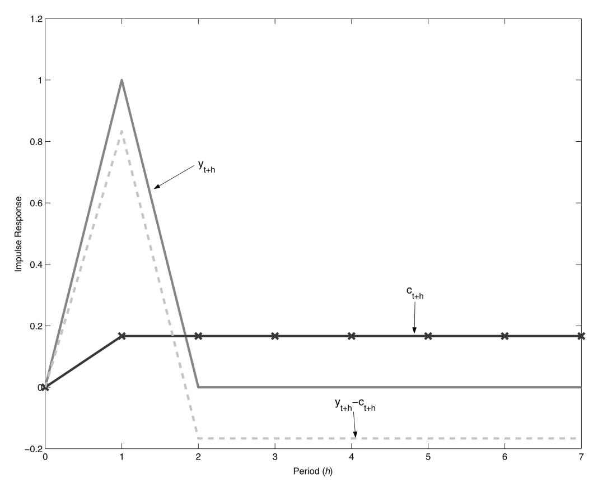
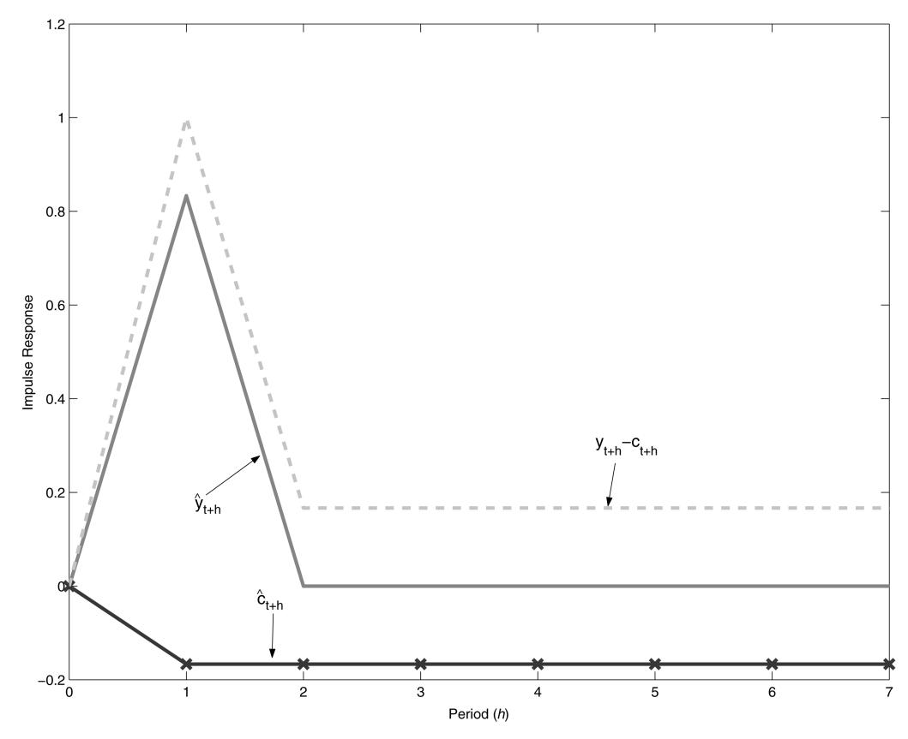

### ABCs (and Ds) of Understanding VARs

By Jesús Fernández-Villaverde, Juan F. Rubio-Ramírez, Thomas J. Sargent, and Mark W. Watson\*

How informative are unrestricted VARs about how particular economic models respond to preference, technology, and information shocks? In the simplest possible setting, this paper provides a check for whether a theoretical model has the property in population that it is possible to infer economic shocks and impulse responses to them from the innovations and the impulse responses associated with a vector autoregression (VAR). We revisit an invertibility issue that is known to cause a potential problem for interpreting VARs, and present a simple check for its presence. We illustrate our check in the context of a permanent income model for which it can be applied by hand.

\* Fernández-Villaverde: Department of Economics, University of Pennsylvania, 3718 Locust Walk, Philadelphia, PA 19104, National Bureau of Economic Research, and Centre for Economic Policy Research (e-mail: jesusfy@econ.upenn.edu); Rubio-Ramírez: Department of Economics, Duke University, P.O. Box 90097, Durham, NC 27008, and Federal Reserve Bank of Atlanta (e-mail: juan.rubio-ramirez@duke.edu); Sargent: Department of Economics, New York University, 269 Mercer Street, New York, NY 10003, and Hoover Institution (e-mail: ts43@nyu.edu); Watson: Department of Economics and Woodrow Wilson School, Princeton University, 321 Bendheim Hall, Princeton, NJ 08544 (e-mail: mwatson@ princeton.edu). We thank V. V. Chari, Patrick Kehoe, James Nason, Richard Rogerson, and the referees for very insightful criticisms of an earlier draft. Beyond the usual disclaimer, we must note that any views expressed herein are those of the authors and not necessarily those of the Federal Reserve Bank of Atlanta or the Federal Reserve System. This research was supported by NSF grants SES-0338997 and SES-0617811.

For some recent efforts to answer this question, see George Kapetanios, Adrian Pagan, and Alastair Scott (2005), Varadarajan V. Chari, Patrick J. Kehoe, and Ellen R. McGrattan (2005), and Lawrence J. Christiano, Martin Eichenbaum, and Robert Vigfusson (2006).

2 Lars P. Hansen and Sargent (1981, 1991), Marco Lippi and Lucrezia Reichlin (1994), Christopher A. Sims and Tao Zha (2004), and Hansen and Sargent (2007) contain general treatments of this problem and further references.

## I. Two Recursive Representations of Observables

# A. Recursive Representation of an Equilibrium

Let an equilibrium of an economic model or an approximation to it have a representation for  $\{y_{t+1}\}$  in the state space form

$$\mathbf{x}_{t+1} = \mathbf{A}\mathbf{x}_t + \mathbf{B}\mathbf{w}_{t+1},$$

$$\mathbf{y}_{t+1} = \mathbf{C}\mathbf{x}_t + \mathbf{D}\mathbf{w}_{t+1},$$

where  $\mathbf{x}_t$  is an  $n \times 1$  vector of possibly unobserved state variables,  $\mathbf{y}_t$  is a  $k \times 1$  vector of variables observed by an econometrician, and  $\mathbf{w}_t$  is an  $m \times 1$  vector of economic shocks impinging on the states and observables, i.e., shocks to preferences, technologies, agents' information sets, and the economist's measurements. The shocks  $\mathbf{w}_t$  are Gaussian vector white noise satisfying  $E\mathbf{w}_t = 0$ ,  $E\mathbf{w}_t\mathbf{w}_t' = \mathbf{I}$ , and  $E\mathbf{w}_t\mathbf{w}_{t-j} = 0$  for  $j \neq 0$ , where the assumption of normality is for convenience and allows us to associate linear least squares predictions with conditional expectations. With m shocks in the economic model, n states, and k observables, Ais  $n \times n$ , **B** is  $n \times m$ , **C** is  $k \times n$ , and **D** is  $k \times n$ m. In general,  $k \neq m$ . The matrices A, B, C, and **D** are functions of parameters that define preferences, technology, and economics shocks. They incorporate the typical cross-equation restrictions embedded in modern macroeconomic models.

Equilibrium representations of the form (1)–(2) are obtained in one of two widely used procedures. The first is to compute a linear or loglinear approximation of a nonlinear model as exposited, for example, in Harald Uhlig (1999).

It is straightforward to collect the linear or log linear approximations to the equilibrium decision rules and to arrange them into the state space form (1)–(2). A second way is to derive (1)–(2) directly as a representation of a member of a class of dynamic stochastic general equilibrium models with linear transition laws and quadratic preferences. For example, see Jaewoo Ryoo and Sherwin Rosen (2004), Rosen, Kevin M. Murphy, and Jose A. Scheinkman (1994), and Robert Topel and Rosen (1988).3

#### B. The Question

Our question is: under what conditions do the economic shocks in the state-space system (1)–(2) match up with the shocks associated with a VAR? That is, under what conditions is

(3) 
$$\mathbf{w}_{t+1} = \mathbf{\Omega}(\mathbf{y}_{t+1} - E(\mathbf{y}_{t+1}|\mathbf{y}^t)),$$

where  $\mathbf{w}_{t+1}$  are the economic shocks in (1)–(2),  $\mathbf{y}^t$  denotes the semi-infinite history  $\mathbf{y}_t$ ,  $\mathbf{y}_{t-1}$ , ...,  $\mathbf{y}_{t+1} - E(\mathbf{y}_{t+1}|\mathbf{y}^t)$  are the one-step-ahead forecast errors associated with an infinite order VAR, and  $\Omega$  is a matrix of constants that can potentially be uncovered by "structural" VAR (SVAR) analysis? When (3) holds, impulse responses from the SVAR match the impulse responses from the economic model (1)–(2).

To begin to characterize conditions under which (3) holds, consider the prediction errors from (2) after conditioning on  $\mathbf{y}^t$ , that is,  $\mathbf{y}_{t+1} - E(\mathbf{y}_{t+1}|\mathbf{y}^t) = \mathbf{C}(\mathbf{x}_t - E(\mathbf{x}_t|\mathbf{y}^t)) + \mathbf{D}\mathbf{w}_{t+1}$ . Evidently,  $\mathbf{C}(\mathbf{x}_t - E(\mathbf{x}_t|\mathbf{y}^t))$  drives a wedge between the VAR errors  $\mathbf{y}_{t+1} - E(\mathbf{y}_{t+1}|\mathbf{y}^t)$  and the structural errors  $\mathbf{w}_{t+1}$ . What is required is a condition that eliminates this wedge. In Condition 1, we offer a simple condition that yields (3) in the interesting "square case" in which k = m and  $\mathbf{D}$  has full rank.

#### C. A Poor Man's Invertibility Condition

When **D** is nonsingular, (2) implies  $\mathbf{w}_{t+1} = \mathbf{D}^{-1}(\mathbf{y}_{t+1} - \mathbf{C}\mathbf{x}_t)$ . Substituting this into (1) and rearranging gives

(4) 
$$[\mathbf{I} - (\mathbf{A} - \mathbf{B}\mathbf{D}^{-1}\mathbf{C})L]\mathbf{x}_{t+1} = \mathbf{B}\mathbf{D}^{-1}\mathbf{y}_{t+1},$$

where L is the lag operator. Consider:

CONDITION 1: The eigenvalues of  $\mathbf{A} - \mathbf{B}\mathbf{D}^{-1}\mathbf{C}$  are strictly less than one in modulus.

When Condition (1) is satisfied, we say that  $\mathbf{A} - \mathbf{B}\mathbf{D}^{-1}\mathbf{C}$  is a stable matrix. The inverse of the operator on the left side of this equation gives a square summable polynomial in L if and only if Condition 1 is satisfied. In this case,  $\mathbf{x}_{t+1}$  satisfies

(5) 
$$\mathbf{x}_{t+1} = \sum_{j=0}^{\infty} [\mathbf{A} - \mathbf{B}\mathbf{D}^{-1}\mathbf{C}]^{j}\mathbf{B}\mathbf{D}^{-1}\mathbf{y}_{t+1-j},$$

so that  $\mathbf{x}_{t+1}$  is a square summable linear combination of the observations on the history of  $\mathbf{y}$  at time t+1. This means that the complete state vector is in effect observed so that  $\text{var}(\mathbf{x}_t|\mathbf{y}^t) = 0$ . Shifting (5) back one period and substituting into (2), we obtain

(6) 
$$\mathbf{y}_{t+1}$$

$$= \mathbf{C} \sum_{j=0}^{\infty} [\mathbf{A} - \mathbf{B} \mathbf{D}^{-1} \mathbf{C}]^{j} \mathbf{B} \mathbf{D}^{-1} \mathbf{y}_{t-j} + \mathbf{D} \mathbf{w}_{t+1}.$$

If condition (1) is satisfied, equation (6) defines a VAR for  $\mathbf{y}_{t+1}$  because the infinite sum in (6) converges in mean square and  $\mathbf{D}\mathbf{w}_{t+1}$  is orthogonal to  $\mathbf{y}_{t-j}$  for all  $j \ge 0$ .

If one of the eigenvalues of  $\mathbf{A} - \mathbf{B}\mathbf{D}^{-1}\mathbf{C}$  is strictly greater than unity in modulus, this argument fails because the infinite sum in (6) diverges. When  $\mathbf{A} - \mathbf{B}\mathbf{D}^{-1}\mathbf{C}$  is an unstable matrix, the VAR is associated with another celebrated state space representation for  $\{\mathbf{y}_{t+1}\}$ , to which we now turn.

#### D. The Innovations Representation

Associated with any state space system (**A**, **B**, **C**, **D**) for  $\{\mathbf{y}_{t+1}\}_{t=1}^{T}$  of the form (1)–(2) is another state space system, called the *innovations representation:* 

(7) 
$$\hat{\mathbf{x}}_{t+1} = \mathbf{A}\hat{\mathbf{x}}_t + \hat{\mathbf{B}}_{t+1}\mathbf{\varepsilon}_{t+1},$$

&lt;sup>3 Hansen and Sargent (2007) provide many other examples of this second approach.

(8) 
$$\mathbf{y}_{t+1} = \mathbf{C}\hat{\mathbf{x}}_t + \hat{\mathbf{D}}_{t+1}\mathbf{\varepsilon}_{t+1},$$

where  $\mathbf{x}_0 \sim (\hat{\mathbf{x}}_0, \mathbf{\Sigma}_0)$ ,  $\hat{\mathbf{x}}_t = E(\mathbf{x}_t | \{\mathbf{y}_i\}_{i=1}^t)$ ,  $\mathbf{y}_{t+1} - E(\mathbf{y}_{t+1} | \{\mathbf{y}_i\}_{i=1}^t) = \hat{\mathbf{D}}_{t+1} \mathbf{\varepsilon}_{t+1}$ ,  $\mathbf{\varepsilon}_{t+1}$  is another i.i.d. Gaussian process with mean zero and identity covariance matrix, and the matrices  $\hat{\mathbf{B}}_{t+1}$  and  $\hat{\mathbf{D}}_{t+1}$  can be recursively computed by the Kalman filter. Under a general set of conditions, for any positive semi-definite  $\mathbf{\Sigma}_0$ , as  $t \to +\infty$ , the matrices  $\hat{\mathbf{B}}_{t+1}$  and  $\hat{\mathbf{D}}_{t+1}$  converge to limits  $\hat{\mathbf{B}}$  and  $\hat{\mathbf{D}}$  that satisfy the equations:

(9) 
$$\Sigma = \mathbf{A}\Sigma\mathbf{A}' + \mathbf{B}\mathbf{B}'$$
  
-  $(\mathbf{A}\Sigma\mathbf{C}' + \mathbf{B}\mathbf{D}')(\mathbf{C}\Sigma\mathbf{C}' + \mathbf{D}\mathbf{D}')^{-1}(\mathbf{A}\Sigma\mathbf{C}')$ 

+ BD')'

(10) 
$$\mathbf{K} = (\mathbf{A}\boldsymbol{\Sigma}\mathbf{C}' + \mathbf{B}\mathbf{D}')(\mathbf{C}\boldsymbol{\Sigma}\mathbf{C}' + \mathbf{D}\mathbf{D}')^{-1},$$

$$\hat{\mathbf{D}}\hat{\mathbf{D}}' = \mathbf{D}\mathbf{D}' + \mathbf{C}\mathbf{\Sigma}\mathbf{C}'.$$

$$\mathbf{\hat{B}} = \mathbf{K}\mathbf{\hat{D}},$$

where  $\Sigma = \text{var}(\mathbf{x}_t|\mathbf{y}^t)$ . When  $\mathbf{A} - \mathbf{B}\mathbf{D}^{-1}\mathbf{C}$  is unstable,  $\Sigma > 0$ , meaning that at least some parts of the state  $\mathbf{x}_t$  are hidden. This means the one-step-ahead forecast errors computed by the VAR,  $\mathbf{y}_{t+1} - E(\mathbf{y}_{t+1}|\mathbf{y}^t)$ , contain the shocks  $\mathbf{D}\mathbf{w}_{t+1}$  and the error from estimating the state  $\mathbf{C}(\mathbf{x}_t - \hat{\mathbf{x}}_t)$ . Thus, (3) does not hold. These two components of  $\mathbf{y}_{t+1} - E(\mathbf{y}_{t+1}|\mathbf{y}^t)$  are uncorrelated, so that the variance of the VAR innovations  $\hat{\mathbf{D}}\boldsymbol{\varepsilon}_{t+1}$  is larger than the variance of the economic model disturbances  $\mathbf{D}\mathbf{w}_{t+1}$ . (Equivalently, from equation (11)  $\hat{\mathbf{D}}\hat{\mathbf{D}}' > \mathbf{D}\mathbf{D}'$ .)

#### II. Permanent Income Example

A state space representation for the surplus  $y_{t+1} - c_{t+1}$  for the permanent income consumption model (e.g., see Sargent 1987, chap. XII) is:

(13) 
$$c_{t+1} = c_t + \sigma_w (1 - R^{-1}) w_{t+1}$$

(14) 
$$y_{t+1} - c_{t+1} = -c_t + \sigma_w R^{-1} w_{t+1}$$
,

where  $y_{t+1} = \sigma_w w_{t+1}$  is an i.i.d. labor income process and R > 1 is a constant gross interest rate on financial assets. Equations (13) and (14) correspond to (1) and (2), where  $c_t$  is the unobserved state and  $y_t - c_t$  is the variable observed by the econometrician. The impulse responses for the model are shown in Figure 1 for the case that R = 1.2 and  $\sigma_w = 1$ . They show the familiar patterns: consumption increases permanently by the annuity value of the transitory increase in income; this leads to a large positive impact effect of  $w_t$  on  $y_t - c_t$  and small negative values for all other periods.

For this example, it is easy to compute that  $A - BD^{-1}C = R > 1$ , so that Condition 1 does not hold. This failure of Condition 1 is part and parcel of the permanent income model because it is needed to verify that the present value of the coefficients describing the response of the surplus  $y_{t+1} - c_{t+1}$  to an endowment innovation must be zero, an outcome that embodies the present value budget balance that is built into the permanent income model.

The innovations representation of the model is

$$(15) \qquad \hat{c}_{t+1} = \hat{c}_t + \sigma_w (R^{-1} - 1) \varepsilon_{t+1},$$

(16) 
$$y_{t+1} - c_{t+1} = -\hat{c}_t + \sigma_w \varepsilon_{t+1}$$
.

Equations (15) and (16) correspond to the steadystate version of (7) and (8), where  $\hat{c}_t = E(c_t|y^t - c^t)$  is the estimate of consumption constructed from the history of  $y_t - c_t$ . Because Condition 1 is not satisfied,  $c_t$  cannot be estimated perfectly from  $y^t - c^t$ , so that  $\hat{c}_t \neq c_t$ . Indeed, a simple calculation shows that  $\Sigma = \text{var}(c_t|y^t - c^t) = \sigma_w^2(1 - R^{-2})$ . Because  $A - \hat{B}\hat{D}^{-1}C = R^{-1}$ , which is stable, the errors computed by a VAR for  $y_t - c_t$  are  $\sigma_w \varepsilon_{t+1}$ .

&lt;sup>4 Alternative conditions for the existence of this time invariant innovations representation and for convergence of iterations on the Riccati equation are stated in Brian D. O. Anderson and John B. Moore (1979, chap. 4), Sargent (1980, chap. 5 and 6), Evan Anderson et al. (1996), and Hansen and Sargent (2007).

&lt;sup>5 With m shocks in the economic model, n states, and k observables, K, the steady-state Kalman gain, is  $n \times k$ ,  $\hat{\mathbf{D}}$  is  $k \times k$ , and  $\hat{\mathbf{B}}$  is  $n \times k$ .

&lt;sup>6 Hansen and Sargent (2007, chap. 9) discuss the innovations representation, prove that  $\mathbf{A} - \mathbf{\hat{B}}\mathbf{\hat{D}}^{-1}\mathbf{C}$  is a stable matrix, and derive a general formula that describes the mapping from the economic shocks  $\mathbf{w}_{t+1}$  to the VAR shocks  $\mathbf{\varepsilon}_{t+1}$ .

Figure 1. Impulse Responses of  $y_{t+h}$ ,  $c_{t+h}$ , and  $y_{t+h} - c_{t+h}$  to a Shock in  $w_t$ 

(Of course, since  $y_t - c_t$  is a scalar, the VAR is just a univariate autoregression.)

Figure 2 shows the impulse responses of  $\hat{y}_t$ ,  $\hat{c}_t$ , and  $y_t - c_t$  with respect to the VAR shocks,  $\varepsilon_{t}$ . These are markedly different from the impulse responses shown in Figure 1. Notably, while  $c_t$  responds *positively* and permanently to a shock in  $w_t$  in Figure 1,  $\hat{c}_t$  responds negatively and permanently to a VAR shock  $\varepsilon_t$ . The reason is simple: forecast errors in  $y_t - c_t$  arise from shocks to income,  $\sigma_w R^{-1} w_t$ , or from estimation errors in past consumption,  $c_t - \hat{c}_t$ , and the Kalman filter optimally allocates  $\varepsilon_t$  to these two possible sources. In Figure 1, the impulse response of the surplus  $y_t - c_t$  has a present value of zero, implying present value budget balance; in Figure 2, the impulse response of the surplus has a positive present value so that the present value of the impulse response of consumption falls short of the present value of the impulse response of income.7

This example can be modified in instructive ways by altering what is observed. For example, if  $c_t$ ,  $y_{t+1}$ , or if the value of the consumer's accumulated assets were observed, then Condition 1 would be satisfied.8

#### III. Concluding Remarks

We hesitate to draw sweeping conclusions about VARs. Some applications of VARs

&lt;sup>7 For more discussion of this example, see Sargent (1987), Hansen, William Roberds, and Sargent (1991), and Roberds (1991).

&lt;sup>8 See Watson (1994) for a more extensive discussion of how what is observed affects whether Condition 1 is likely to be satisfied.

FIGURE 2. IMPULSE RESPONSES OF *yˆth*, *cˆth*, AND *yth cth* TO A SHOCK IN *t*

are informative about the shapes of impulseresponses to some economic shocks that theories should attempt to match, while others are not.

It is easy to reiterate the recommendation to estimate the deep parameters of a complete and fully trusted model by likelihood-functionbased methods. If you trust your model, you should accept that recommendation. The enterprise of identifying economic shocks and their impulse-response functions from VAR innovations aims, however, to coax interesting patterns from the data that will prevail across a *set* of incompletely specified and not fully trusted models. Despite pitfalls, it is easy to sympathize with the enterprise of identifying economic shocks from VAR innovations if one is not dogmatic in favor of a particular fully specified model.

#### REFERENCES

**Anderson, Brian D.O., and John B. Moore.** 1979. *Optimal Filtering.* Englewood Cliffs: Prentice-Hall.

**Anderson, Evan W., Lars P. Hansen, Ellen R. McGratten, and Thomas J. Sargent.** 1996. "Mechanics of Forming and Estimating Dynamic Linear Economies." In *Handbook of Computational Economics Volume 1*, ed. Hans M. Amman, David A. Kendrick, and John Rust, 171–252. Amsterdam: Elsevier Science, North-Holland.

**Chari, Varadarajan V., Patrick J. Kehoe, and Ellen R. McGrattan.** 2004. "A Critique of Structural VARs Using Real Business Cycle Theory." Federal Reserve Bank of Minneapolis Working Paper 631.

**Christiano, Lawrence J., Martin Eichenbaum,**

- **and Robert Vigfusson.** Forthcoming. "Assesing Structural VARs." In *NBER Macroeconomics Annual Volume 21*, ed. Daron Acemoglu, Kenneth Rogoff, and Michael Woodford. Cambridge, MA: MIT Press.
- **Hansen, Lars Peter, William T. Roberds, and Thomas J. Sargent.** 1991. "Time Series Implications of Present Value Budget Balance and of Martingale Models of Consumption and Taxes." In *Rational Expectations Econometrics*, ed. Lars Peter Hansen and Thomas J. Sargent, 121–61. Boulder: Westview Press.
- **Hansen, Lars Peter, and Thomas J. Sargent.** 1981. "Formulating and Estimating Dynamic Linear Rational Expectations Models." In *Rational Expectations and Econometric Practice*, ed. Robert E. Lucas Jr. and Thomas J. Sargent, 127–58. Minneapolis: University of Minnesota Press.
- **Hansen, Lars Peter, and Thomas J. Sargent.** 1991. "Two Difficulties in Interpreting Vector Autoregressions." In *Rational Expectations Econometrics*, ed. Lars Peter Hansen and Thomas J. Sargent, 77–119. Boulder: Westview Press.
- **Hansen, Lars Peter, and Thomas J. Sargent.** 2007. "Recursive Linear Models of Dynamic Economies." Unpublished.
- **Kapetanios, George, Adrian Pagan, and Alasdair Scott.** 2005. "Making a Match: Combining Theory and Evidence in Policy-Oriented Macroeconomic Modeling." Unpublished.
- **Lippi, Marco, and Lucrezia Reichlin.** 1994. "VAR Analysis, Nonfundamental Representations, Blaschke Matrices." *Journal of Econometrics*, 63(1): 307–25.

- **Roberds, William T.** 1991. "Implications of Expected Present Value Budget Balance: Application to Postwar U.S. Data." In *Rational Expectations Econometrics*, ed. Lars Peter Hansen and Thomas J. Sargent, 163–75. Boulder: Westview Press.
- **Rosen, Sherwin, Kevin M. Murphy, and Jose A. Scheinkman.** 1994. "Cattle Cycles." *Journal of Political Economy*, 102(3): 468–92.
- **Ryoo, Jaewoo, and Sherwin Rosen.** 2004. "The Engineering Labor Market." *Journal of Political Economy*, 112(1): S110–40.
- **Sargent, Thomas J.** 1980. *Notes on Linear Control and Filtering Theory*. Unpublished.
- **Sargent, Thomas J.** 1987. *Macroeconomic Theory, Second Edition*. Orlando: Harcourt Brace Jovanovich Academic Press.
- **Sims, Christopher A., and Tao Zha.** 2006. "Does Monetary Policy Generate Recessions?" *Macroeconomic Dynamics*, 10(2): 231–72.
- **Topel, Robert H., and Sherwin Rosen.** 1988. "Housing Investment in the United States." *Journal of Political Economy*, 96(4): 718– 40.
- **Uhlig, Harald.** 1999. "A Toolkit for Analyzing Nonlinear Dynamic Stochastic Models Easily." In *Computational Methods for the Study of Dynamic Economies*, ed. Ramon Marimon and Andrew Scott, 30–61. Oxford: Oxford University Press.
- **Watson, Mark W.** 1994. "Vector Autoregressions and Cointegration." In *Handbook of Econometrics Volume 4*, ed. Robert F. Engle and Daniel L. McFadden, 2843–2915. Amsterdam: Elsevier Science, North-Holland.