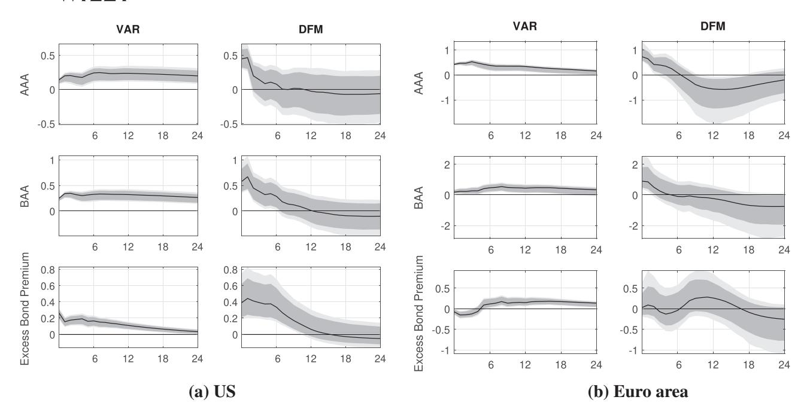
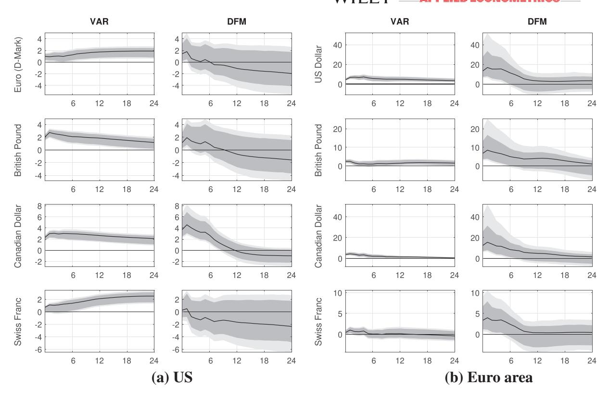
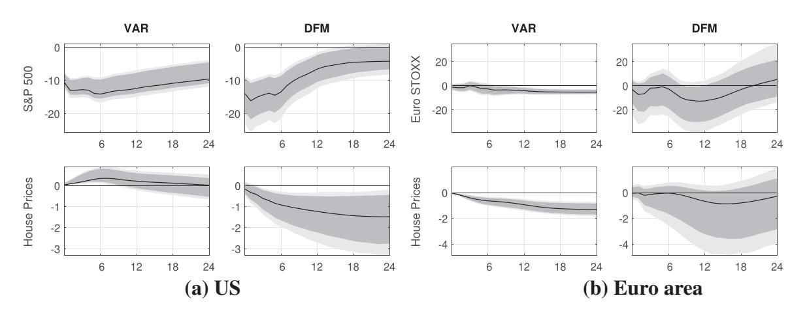
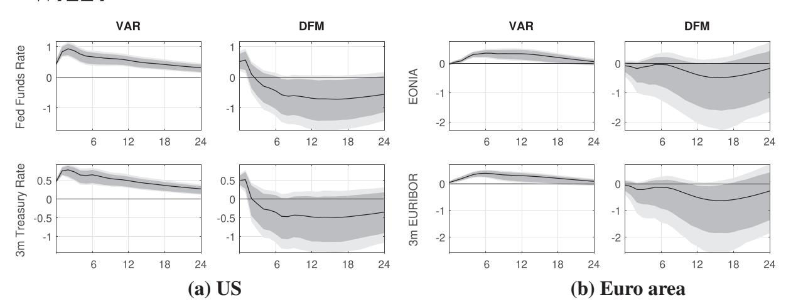
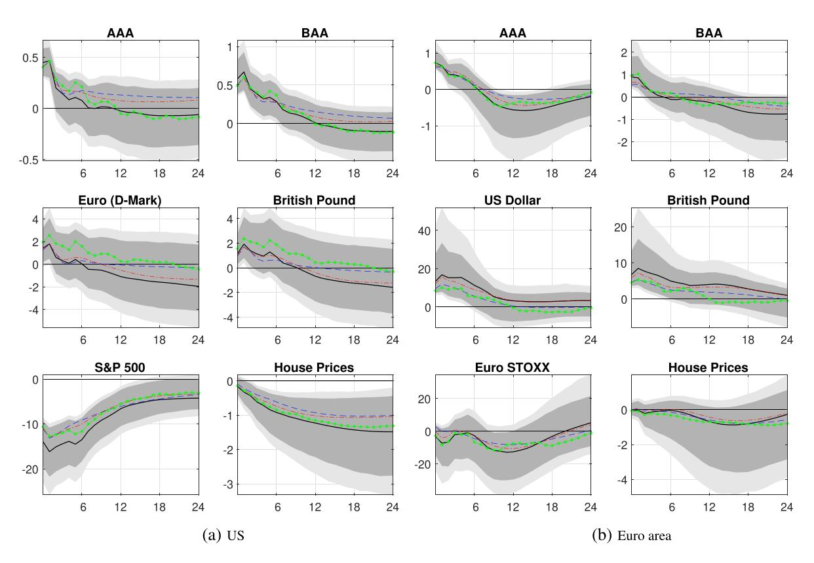
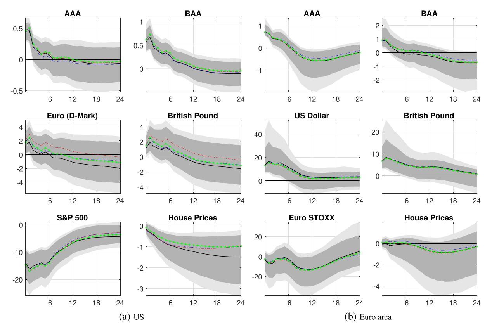

### **RESEARCH ARTICLE**

# **The response of asset prices to monetary policy shocks: Stronger than thought**

Lucia Alessi1 Mark Kerssenfischer2

#### **Correspondence**

Lucia Alessi, European Commission, Joint Research Centre, I-21027 Ispra, Italy. Email: lucia.alessi@ec.europa.eu

#### **Summary**

Standard macroeconomic theory predicts rapid responses of asset prices to monetary policy shocks. Small-scale vector autoregressions (VARs), however, often find sluggish and insignificant impact effects. Using the same high-frequency instrument to identify monetary policy shocks, we show that a large-scale dynamic factor model finds overall stronger and quicker asset price reactions compared to a benchmark VAR, both on euro area and US data. Our results suggest that incorporating a sufficiently large information set is crucial to estimate monetary policy effects.

### **1 INTRODUCTION**

How do asset prices react to an unexpected monetary tightening? Standard macroeconomic theory makes a clear prediction: Asset prices should fall, firstly due to higher interest rates and secondly due to lower expected real activity. Given the forward-looking behavior of economic agents, the repricing should also take place abruptly.

Some studies, particularly those exploiting high-frequency data, do indeed find such immediate responses (see, e.g., Bernanke & Kuttner, [2005;](#page-6-0) Bohl, Siklos, & Sondermann, [2008;](#page-6-1) Nakamura & Steinsson, [2018;](#page-7-0) Rigobon & Sack, [2004\)](#page-7-1). Conventional vector autoregressions (VARs), on the other hand, often find rather sluggish or even insignificant asset price reactions, especially when employing a recursive identification approach; see, for example, Eichenbaum and Evans [\(1995\)](#page-6-2) and Grilli and Roubini [\(1996\)](#page-6-3) for exchange rates; Beckworth, Moon, and Toles [\(2012\)](#page-6-4) for corporate bond spreads; Li, Iscan, and Xu [\(2010\)](#page-7-2) and Galí and Gambetti [\(2015\)](#page-6-5) for stock prices; and Iacoviello [\(2005\)](#page-7-3), Goodhart and Hofmann [\(2008\)](#page-6-6), and Calza, Monacelli, and Stracca [\(2013\)](#page-6-7) for house prices[.1](#page-0-0)

Two approaches have proven useful to resolve these puzzles: External instruments avoid controversial assumptions about the contemporaneous effect of shocks, and factor models significantly enlarge the information set compared to standard VARs; see Gertler and Karadi [\(2015\)](#page-6-8) and Caldara and Herbst [\(2019\)](#page-6-9) for the former; and Forni and Gambetti [\(2010\)](#page-6-10), Del Negro and Otrok [\(2007\)](#page-6-11), Luciani [\(2015\)](#page-7-4), and Kerssenfischer [\(2019b\)](#page-7-5) for the latter. In this paper, we employ both approaches jointly to study the effects of monetary policy shocks for two regions, namely the euro area and the USA. In both cases we study the response of a wide set of asset prices (stock and house prices, exchange rates, and corporate bond yields) across two different models, namely a traditional small-scale VAR and a large-scale dynamic factor model. Even though we use the same high-frequency instrument to identify monetary policy shocks, the two models produce starkly different results in both regions. The large-scale factor model finds generally strong and rapid effects of monetary

1European Commission, Joint Research Centre, Ispra, Italy

2Deutsche Bundesbank, Frankfurt am Main, Germany

1Different data frequencies make a direct comparison between event studies and VARs generally difficult. Note, however, that Bernanke and Kuttner [\(2005\)](#page-6-0) find similar effects of policy shocks on equity prices both at a daily and monthly frequency.

This is an open access article under the terms of the [Creative Commons Attribution](http://creativecommons.org/licenses/by/4.0/) License, which permits use, distribution and reproduction in any medium, provided the original work is properly cited.

© 2019 The Authors Journal of Applied Econometrics Published by John Wiley & Sons Ltd.

policy on asset prices, consistent with both economic theory and event study evidence. Small-scale VARs, in comparison, yield overall weaker and sometimes counterintuitive responses (see also Jarocinski & Karadi, [2018\)](#page-7-6). ´

These findings are in line with the growing literature on the informational problem known as "nonfundamentalness."[2](#page-1-0) Intuitively, an empirical model aimed at identifying monetary policy shocks should capture all information relevant for the central bank's decision-making process. If it does, the shocks are fundamental; that is, they can be identified by means of that model. If it does not, a systematic reaction of the central bank to information omitted from the model might be erroneously identified as a policy shock. This is particularly relevant for conventional VARs—even when identified via high-frequency data—since the set of indicators central banks monitor is vastly larger than the handful of variables these models can capture.

The paper is structured as follows. In the next section we outline our empirical approach, Section 3 presents the results, and Section 4 concludes.

### **2 THE DYNAMIC FACTOR MODEL**

Forni, Giannone, Lippi, and Reichlin [\(2009\)](#page-6-12) show that by enlarging the space of observations one can solve the problem of nonfundamentalness (see also; Giannone & Reichlin, [2006\)](#page-6-13). Indeed, nonfundamentalness is not an issue for models that are able to handle very large panels of related time series. In particular, nonfundamentalness is nongeneric in the framework of dynamic factor models; that is, it occurs with probability zero for *N* → ∞, with *N* being the number of series included in the model.

However, the dynamic factor model (DFM) of Forni et al. [\(2009\)](#page-6-12), which in turn is a special case of the model in Forni and Lippi [\(2001\)](#page-6-14) and Forni, Hallin, Lippi, and Reichlin [\(2005\)](#page-6-15), requires a stationary setting. Prior to estimation, most authors therefore ensure stationarity by taking first differences of the data, whenever necessary. As is well known, this procedure is not innocuous, as the neglect of cointegration relationships could lead to flawed results[.3](#page-1-1)

In what follows, we thus adopt the extension of the DFM framework to a nonstationary setting put forward in Barigozzi, Lippi, and Luciani [\(2016a,](#page-6-16)b). We limit ourselves to outlining the main features of the model and refer to the above-mentioned papers for a detailed description of the underlying assumptions.

### **2.1 Basics**

Denote by *Y* a panel of *N* (potentially nonstationary) time series with time dimension *T*. Besides a deterministic time trend, each variable in *Yt* is assumed to be the sum of two unobservable components, namely the common component *t* and the idiosyncratic component *t*. The latter is usually thought of as sector-specific variation or measurement error, and is allowed to be mildly cross-correlated; hence the factor model is called *generalized* or *approximate* as opposed to *exact*. The objects of interest are the common components, which account for the main bulk of comovement in the data set as they are linear combinations of *r ≪ N* static factors *Ft*. This is the standard representation of a DFM.

Formally,

$$Y_t = \alpha + \beta \cdot t + \chi_t + \xi_t, \quad \chi_t = \Lambda F_t, \tag{1}$$

$$\Phi(L)F_t = e_t, \quad e_t = H\epsilon_t, \tag{2}$$

with the *N* × *r* factor loading matrix Λ and the *r* × *r* matrix polynomial Φ(*L*) of lag length *p*. For both data sets, our benchmark specification is *p* = 6 and *r* = 8[.4](#page-1-2) Compared to a standard DFM, the only additional assumption made by Barigozzi et al. [\(2016a\)](#page-6-16) is that the factors are *I*(1) and the idiosyncratic components are either *I*(0) or *I*(1). [5](#page-1-3) As is well known, the shocks *et* are reduced form; that is, to allow a structural interpretation an identification matrix *H* is needed (see Section 2.4).

2See, for example, Hansen and Sargent [\(1991\)](#page-6-17), Lippi and Reichlin [\(1993,](#page-7-7) [1994\)](#page-7-8), and Fernández-Villaverde, Rubio-Ramírez, Sargent, and Watson [\(2007\)](#page-6-18) for early contributions; Forni and Gambetti [\(2010,](#page-6-10) [2014\)](#page-6-19), E. R. Sims [\(2012\)](#page-7-9), Forni, Gambetti, and Sala [\(2014\)](#page-6-20), Ellahie and Ricco [\(2017\)](#page-6-21), and Canova and Hamidi Sahneh [\(2017\)](#page-6-22) for more recent papers; and Alessi, Barigozzi, and Capasso [\(2011\)](#page-6-23) for a review of the literature.

3As Barigozzi, Lippi, and Luciani [\(2016b\)](#page-6-24) point out, differencing the data by construction leads all common shocks to have permanent effects. This is at odds with economic theory, which posits that only a few shocks have permanent effects (e.g., technology), while most others have only transitory effects (e.g., monetary policy). Furthermore, the common assumption of stationary idiosyncratic components is usually not valid for macroeconomic data sets. 4In principle, the DFM framework allows static factors *Ft* to have reduced rank—that is, to be spanned by *q* ≤ *r* "dynamic" factors—hence the term DFM. Given our external instrument identification scheme, however, results are virtually identical whether or not *q < r*; thus we assume *q* = *r* for simplicity. We thank an anonymous referee for pointing this out. The Supporting Information Appendix shows that the information criterion of Bai and Ng [\(2002\)](#page-6-25) suggests *r* = 8 for both data sets, and Figures A1 –A3 provide a battery of robustness checks with respect to all parameters. 5The formal definition of a rational reduced-rank *I*(1) family of stochastic processes is given in Definition 4 in Barigozzi et al. [\(2016a\)](#page-6-16), while Proposition

4 therein states the fundamentalness of *et* in this context.

10991255, 2019, 5, Downloaded from https://onlinelibrary.wiley.com/doi/10.1002/jae.2706 by Capes, Wiley Online Library on [18/03/2026]. See the Terms and Conditions (https://onlinelibrary.wiley.com/terms-and-conditions) on Wiley Online Library for rules of use; OA articles are governed by the applicable Creative Commons License

## **2.2 Data**

For the euro area, the data set *Y* contains *N* = 88 macroeconomic series from April 2000 to December 2017. For the USA, the data set includes *N* = 95 series from June 1976 to December 2017. In both cases, the data set covers measures of real activity, prices, employment, and numerous financial sector variables. The Supporting Information Appendix lists all variables in the two data sets along with the applied transformations.[6](#page-2-0) Since we allow for time trends and nonstationarity in our empirical setting, all series are kept either in levels or log-levels.

To study and compare the effect of monetary policy shocks, we use a set of asset prices available for both regions and the entire sample period. In particular, we focus on stock prices, house prices, corporate bond yields, and exchange rates. Stock prices refer to the S&P 500 index for the USA and the Euro STOXX for the euro area. House prices are taken from Robert Shiller's website for the USA and from the ECB for the euro area (interpolated from quarterly frequency using cubic spline). Regarding corporate bonds, we study yields on AAA and BAA rated bonds and an "excess bond premium" measure. Gilchrist and Zakrajsek [\(2012\)](#page-6-26) compute this premium for the USA and Gilchrist and Mojon [\(2016\)](#page-6-27) for the euro area. In the latter case, the excess premium refers to value-weighted spreads of nonfinancial euro area corporate bonds with respect to their domestic sovereign counterpart. As regards exchange rates, lastly, we study the response of the euro and US dollar vis-á-vis each other and vis-á-vis the British pound, Canadian dollar, and Swiss franc. For the longer US data set, the EUR/USD exchange rate is backcast using the German D-Mark.

### **2.3 Estimation**

We apply the estimation procedure presented in Barigozzi et al. [\(2016b\)](#page-6-24); that is, we estimate the loading matrix Λ by applying principal component analysis on the first-differenced data set *Yt* and recover an estimate of the factors in level form as *F̂ t* = Λ*̂* ′ *Xt*, based on the detrended data set *Xt* = *Yt* − *̂* − *̂* · *t*. Then, we estimate Equation [2](#page-1-4) as a conventional VAR on the (nonstationary) static factors. As Sims, Stock, and Watson [\(1990\)](#page-7-10) show, the parameters of a cointegrated VAR are consistently estimated using an unrestricted VAR in levels. Besides its simplicity, this approach obviates the need to estimate the cointegration relationships. Finally, Barigozzi et al. [\(2016b\)](#page-6-24) show that when the focus is on short-run impulse responses, as is the case in this study, an unrestricted VAR in levels is superior to a vector error correction model, owing to a faster rate of convergence of the estimator.[7](#page-2-1) To generate confidence bands, we employ the wild bootstrap procedure by Goncalves and Kilian [\(2004\)](#page-6-28), which generates artificial data samples by changing the sign of reduced-form residuals and the external instrument for randomly selected time periods[.8](#page-2-2)

### **2.4 Identification**

To identify structural monetary policy shocks from the reduced-form shocks we use an external instrument (see, e.g., Gertler & Karadi, [2015;](#page-6-8) Stock & Watson, [2012\)](#page-7-11). Formally, given a valid instrument *Zt*, and assuming (without loss of generality) that the monetary policy shock is the first one, we can rewrite Equation [2](#page-1-4) as

$$E(e_t Z_t) = E(H \epsilon_t Z_t) = [H_1 H_{\bullet}] \begin{bmatrix} E(\epsilon_{1t} Z_t) \\ E(\epsilon_{\bullet t} Z_t) \end{bmatrix} = H_1 \alpha. \tag{3}$$

To be a valid instrument, *Zt* must meet the familiar relevance and exogeneity conditions; that is, *E*(1*tZt*) = ≠ 0 and *E*(•*tZt*) = 0. If these conditions are met, *H*1 (the identification matrix column we are interested in) is obtained by regressing *Zt* on all reduced-form shocks *et* and normalizing the shocks' impact effect. In what follows, we will study contractionary policy shocks that increase the 2-year sovereign bond yield by 50 basis points, since short-term rates have been constrained by an effective lower bound for much of our sample, particularly in the euro area (where we study a rise in the German 2-year rate). Our instrument for euro area monetary policy shocks is constructed from high-frequency

6Boivin and Ng [\(2006\)](#page-6-29) show that a larger cross-sectional dimension of the data set can lead to worse factor estimates, especially when the included variables are highly collinear. We therefore use a cleansed version of the US data set by McCracken and Ng [\(2016\)](#page-7-12) and construct an analogous data set for the euro area.

7Proposition 2 in Barigozzi et al. [\(2016a\)](#page-6-16) states the consistency of impulse responses based on an unrestricted VAR. Monte Carlo simulations showing the validity of this specific estimation procedure are available in table 2 therein.

8As in Barigozzi et al. [\(2016b\)](#page-6-24), the bootstrap procedure works as follows: (1) obtain estimates of Λ, *F*, Φ(*L*) and *e* from the actual data set *Y*; (2) resample *e* via wild bootstrap to obtain artificial factors *F*∗; (3) use Λ to generate artificial common components ∗ and add to obtain an artificial data set *Y*∗; (4) apply the estimation procedure on *Y*∗. The idiosyncratic components are not bootstrapped. Lastly, we apply the bias correction method of Kilian [\(1998\)](#page-7-13) in step 2.

**FIGURE 1** Corporate bond yields: (a) USA; (b) euro area. Black lines refer to point estimates, gray areas to 80% and 90% confidence bands. All responses in percent. Months after the shock on the *x*-axis

data around ECB Governing Council meetings. More precisely, *Zt* captures movements in the German Bobl future—one of the most liquid bond futures in the euro area—from 10 minutes prior to the press release to 20 minutes after the end of the press conference.[9](#page-3-0) The instrument series is taken from Kerssenfischer [\(2019a\)](#page-7-14) and available from March 2002 onwards, covering 179 Governing Council meetings. For US monetary policy, we follow Gertler and Karadi [\(2015\)](#page-6-8) and use the change in the 3-month-ahead federal funds future from 10 minutes prior to 20 minutes after Federal Open Market Committee (FOMC) announcements. In both cases, the relevance and exogeneity condition imply that, within the specified intraday window, movements in the instrument should be driven by unexpected decisions or announcements of the respective central bank and not any other structural shock.

### **3 RESULTS**

Let us now examine the response of asset prices to a contractionary monetary policy shock that raises the 2-year sovereign bond yield by 50 basis points. Besides the large-scale DFM described above, we also estimate standard small-scale VARs for comparison. In particular, we consider 4-variable VARs, with each asset price under study added to a set of core variables, namely industrial production, consumer prices (both in logs), and the 2-year sovereign bond yield. For the sake of consistency, we apply the same identification scheme (see Section 2.4) and use the same lag length (*p* = 6) as in the DFM. Nonetheless, the differences between the VAR and DFM results are substantial.

Figure [1](#page-3-1) shows that the factor model finds larger effects on corporate bond yields across the board. The differences are particularly striking on US data, where the reaction of bond yields and of Gilchrist and Zakrajsek's [\(2012\)](#page-6-26) excess bond premium is twice as large on impact in the DFM as in the VAR. Similar results hold for euro area bond yields. Estimating the response of the excess bond premium on euro area data, on the other hand, appears to be challenging for both models. While the DFM finds an insignificant response, the small-scale VAR produces a counterintuitive decline in the bond premium.

9On regular Governing Council meeting days, the ECB announces its policy rate decision via a press release at 13:45 CET, followed by a roughly 1-hour-long press conference at 14:30. To obtain yield changes around this window, the percentage price change of the Bobl future is divided by the modified duration of the cheapest-to-deliver underlying on that day. The underlying of Bobl futures are German government bonds with a residual maturity between 4.5 and 5.5 years. Figure [A4 p](#page-11-0)rovides a robustness check of our results with respect to alternative futures with shorter and longer-dated underlyings.

**FIGURE 2** Exchange rates: (a) USA; (b) euro area. Black lines refer to point estimates, gray areas to 80% and 90% confidence bands. All responses in percent. Exchange rates refer to units of foreign currency per US dollar (left panel) or per euro (right panel). Months after the shock on the *x*-axis

**FIGURE 3** Stock and house prices: (a) USA; (b) euro area. Black lines refer to point estimates, gray areas to 80% and 90% confidence bands. All responses in percent. Months after the shock on the *x*-axis

Figure [2](#page-4-0) reports results for various exchange rates. On US data, the small-scale VAR and the DFM find similar responses of the domestic currency vis-á-vis the British pound and Canadian dollar, though in the latter case the appreciation is almost twice as large in the DFM. The Euro and Swiss franc exchange rates, in contrast, are less responsive to US monetary policy shocks. In the VAR, both exchange rates exhibit an implausible delayed response. On euro area data, both the VAR and the DFM produce a universal and immediate euro appreciation after a domestic monetary policy shock, and the magnitude of the effect is larger than in the USA, particularly for the factor model.

Figure [3](#page-4-1) compares the reaction of two further asset prices, namely stock and house prices. On US data, both models find a sizable and significant drop in stock prices, but the response is larger and more immediate in the DFM. In the euro area, the VAR yields a puzzlingly small response of stock prices to a contractionary shock, whereas the factor model

**FIGURE 4** Core variables: (a) USA; (b) euro area. Each impulse response in the left columns refers to a VAR model with log IP, log CPI, the 2-year government bond yield, and a different fourth variable. Black lines refer to the models shown in Figure 1—that is, using corporate bond yields as the fourth variable. Blue dashed lines refer to the models shown in Figure 2—that is, using exchange rates as the fourth variable. Red dash-dotted lines refer to the models shown in Figure 3—that is, using stock or house prices as the fourth variable

finds a larger, though still insignificant effect. Turning to house prices, the VAR finds a counterintuitive increase after a contractionary shock in the USA, whereas prices decline by around 1.5% over 2 years in the DFM. On euro area data, on the other hand, the response of house prices is plausible and significant in the VAR but not significantly different from zero in the DFM. 10

Lastly, Figure 4 plots the impulse response functions of the three "core" variables: industrial production, consumer prices, and the 2-year sovereign bond yield. Since we estimate separate VAR models (one for each asset price under study), the figure reports multiple impulse responses in the VAR case. For the USA, the difference between VARs and the factor model is striking. In the DFM, both output and prices decline strongly after a monetary policy tightening, in line with basic theory. Most VAR models, on the other hand, find expansionary effects on industrial production and a muted response of consumer prices. These puzzling responses are particularly pronounced if the VAR includes exchange rates as the fourth variable, but also hold for all the other asset prices studied above. 11 On euro area data, VARs yield equally counterintuitive responses which the factor model attenuates, but does not entirely solve. 12

Overall, the large-scale factor model finds stronger and quicker effects of monetary policy than traditional small-scale VARs. A potential explanation for the remaining differences between US and euro area results, lastly, are "central bank information effects". In particular, recall that the external instrument from Section 2.4 treats any central bank announcement that raises yields as a contractionary policy surprise. The central bank information literature, however, suggests that an announcement can also raise yields by indicating a better-than-expected economic outlook. In either case, the domestic currency should appreciate, but the effect on stock prices and bond premia is diametrically opposite. Insofar as these information effects are more important for the ECB (as Jarociński & Karadi, 2018, argue), they could explain the stronger response of exchange rates and the more muted response of stock prices and bond premia in the euro area compared to the USA.

#### 4 | CONCLUSIONS

According to standard theory, monetary policy shocks should lead to an immediate—and potentially drastic—repricing of assets. While event study evidence is usually consistent with this prediction, conventional VARs often find sluggish responses of asset prices.

 $^{10}$ Note that house prices are interpolated as they are only available at a quarterly frequency.

11 This is in contrast to Caldara and Herbst (2019), who find that the inclusion of corporate credit spreads resolves puzzling VAR results.

&lt;sup>12Note that 2-year sovereign yields, as well as short-term money market rates (see Supporting Information Appendix), revert back to normal only slowly in VARs, but quickly in factor models. The stronger asset price responses can thus not be explained by the factor model capturing more persistent monetary policy shocks.

Even when unanticipated policy announcements are identified via a high-frequency instrument, some puzzling VAR results persist. We confirm this finding for the euro area and the USA and show that it is likely due to the limited information set captured by small-scale VARs, which may lead to the issue of nonfundamentalness of the shocks. In particular, a large-scale factor model—identified via the same external instrument—solves many of the puzzling VAR results. By including a large set of variables, the factor model overcomes the nonfundamentalness issue and finds stronger and more rapid effects of monetary policy on asset prices.

#### **REFERENCES**

- Alessi, L., Barigozzi, M., & Capasso, M. (2011). Non-fundamentalness in structural econometric models: A review. *International Statistical Review*, *79*(1), 16–47.
- Bai, J., & Ng, S. (2002). Determining the number of factors in approximate factor models. *Econometrica*, *70*(1), 191–221.
- Barigozzi, M., Lippi, M., & Luciani, M. (2016a). Dynamic factor models, cointegration, and error correction mechanisms. (*Finance and Economics Discussion Series 018*). Washington, DC: Board of Governors of the Federal Reserve System.
- Barigozzi, M., Lippi, M., & Luciani, M. (2016b). Non-stationary dynamic factor models for large datasets. (*Finance and Economics Discussion Series 024*). Washington, DC: Board of Governors of the Federal Reserve System.
- Beckworth, D., Moon, K. P., & Toles, H. J. (2012). Can monetary policy influence long-term interest rates? It depends. *Economic Inquiry*, *50*(4), 1080–1096.
- Bernanke, B. S., & Kuttner, K. N. (2005). What explains the stock market's reaction to Federal Reserve policy? *Journal of Finance*, *60*(3), 1221–1257.
- Bohl, M. T., Siklos, P. L., & Sondermann, D. (2008). European stock markets and the ECB's monetary policy surprises. *International Finance*, *11*(2), 117–130.
- Boivin, J., & Ng, S. (2006). Are more data always better for factor analysis? *Journal of Econometrics*, *132*(1), 169–194.
- Caldara, D., & Herbst, E. (2019). Monetary policy, real activity, and credit spreads: Evidence from Bayesian proxy SVARs. *American Economic Journal: Macroeconomics*, *11*(6), 157–192.
- Calza, A., Monacelli, T., & Stracca, L. (2013). Housing finance and monetary policy.*Journal of the European Economic Association*, *11*, 101–122.
- Canova, F., & Hamidi Sahneh, M. (2017). Are small-scale SVARs useful for business cycle analysis? Revisiting nonfundamentalness. *Journal of the European Economic Association*, *16*(4), 1069–1093.
- Del Negro, M., & Otrok, C. (2007). 99 Luftballons: Monetary policy and the house price boom across US states. *Journal of Monetary Economics*, *54*(7), 1962–1985.
- Eichenbaum, M., & Evans, C. L. (1995). Some empirical evidence on the effects of shocks to monetary policy on exchange rates. *Quarterly Journal of Economics*, *110*(4), 975–1009.
- Ellahie, A., & Ricco, G. (2017). Government purchases reloaded: Informational insufficiency and heterogeneity in fiscal VARs. *Journal of Monetary Economics*, *90*, 13–27.
- Fernández-Villaverde, J., Rubio-Ramírez, J., Sargent, T. J., & Watson, M. W. (2007). A, B, C's (and D)'s for understanding VARs. *American Economic Review*, *97*(3), 1021–1026.
- Forni, M., & Gambetti, L. (2010). The dynamic effects of monetary policy: A structural factor model approach. *Journal of Monetary Economics*, *57*(2), 203–216.
- Forni, M., & Gambetti, L. (2014). Sufficient information in structural VARs. *Journal of Monetary Economics*, *66*, 124–136.
- Forni, M., Gambetti, L., & Sala, L. (2014). No news in business cycles. *Economic Journal*, *124*(581), 1168–1191.
- Forni, M., Giannone, D., Lippi, M., & Reichlin, L. (2009). Opening the black box: Structural factor models with large cross-sections. *Econometric Theory*, *25*(5), 1319–1347.
- Forni, M., Hallin, M., Lippi, M., & Reichlin, L. (2005). The generalized dynamic factor model: One-sided estimation and forecasting. *Journal of the American Statistical Association*, *100*(471), 830–840.
- Forni, M., & Lippi, M. (2001). The generalized dynamic factor model: Representation theory. *Econometric Theory*, *17*(06), 1113–1141.
- Galí, J., & Gambetti, L. (2015). The effects of monetary policy on stock market bubbles: Some evidence. *American Economic Journal: Macroeconomics*, *7*(1), 233–257.
- Gertler, M., & Karadi, P. (2015). Monetary policy surprises, credit costs, and economic activity. *American Economic Journal: Macroeconomics*, *7*(1), 44–76.
- Giannone, D., & Reichlin, L. (2006). Does information help recovering structural shocks from past observations? *Journal of the European Economic Association*, *4*(2/3), 455–465.
- Gilchrist, S., & Mojon, B. (2016). Credit risk in the euro area. *Economic Journal*, *128*(608), 118–158.
- Gilchrist, S., & Zakrajsek, E. (2012). Credit spreads and business cycle fluctuations. *American Economic Review*, *102*(4), 1692–1720.
- Goncalves, S., & Kilian, L. (2004). Bootstrapping autoregressions with conditional heteroskedasticity of unknown form.*Journal of Econometrics*, *123*(1), 89–120.
- Goodhart, C., & Hofmann, B. (2008). House prices, money, credit, and the macroeconomy. *Oxford Review of Economic Policy*, *24*(1), 180–205.
- Grilli, V., & Roubini, N. (1996). Liquidity models in open economies: Theory and empirical evidence. *European Economic Review*, *40*(3–5), 847–859.

- Hansen, L. P., & Sargent, T. J. (1991). Two difficulties in interpreting vector autoregressions. In Hansen, L. P., & Sargent, T. J. (Eds.), *Rational expectations econometrics*. Boulder, CO: Westview Press, pp. 77–120.
- Iacoviello, M. (2005). House prices, borrowing constraints, and monetary policy in the business cycle. *American Economic Review*, *95*(3), 739–764.
- Jarocinski, M., & Karadi, P. (2018). Deconstructing monetary policy surprises: The role of information shocks. ( ´ *Working Paper Series 2133*). Frankfurt, Germany: European Central Bank.
- Kerssenfischer, M. (2019a). Information effects of euro area monetary policy: New evidence from high-frequency futures data. (*Discussion Papers 07/2019*). Frankfurt, Germany: Deutsche Bundesbank.
- Kerssenfischer, M. (2019b). The puzzling effects of monetary policy in VARs: Invalid identification or missing information? *Journal of Applied Econometrics*, *34*(1), 18–25.
- Kilian, L. (1998). Small-sample confidence intervals for impulse response functions. *Review of Economics and Statistics*, *80*(2), 218–230.
- Li, Y. D., Iscan, T. B., & Xu, K. (2010). The impact of monetary policy shocks on stock prices: Evidence from Canada and the United States. *Journal of International Money and Finance*, *29*(5), 876–896.
- Lippi, M., & Reichlin, L. (1993). The dynamic effects of aggregate demand and supply disturbances: Comment. *American Economic Review*, *83*(3), 644–652.
- Lippi, M., & Reichlin, L. (1994). VAR Analysis, nonfundamental representations, Blaschke matrices. *Journal of Econometrics*, *63*(1), 307–325.
- Luciani, M. (2015). Monetary policy and the housing market: A structural factor analysis. *Journal of Applied Econometrics*, *30*(2), 199–218.
- McCracken, M. W., & Ng, S. (2016). FRED-MD: A monthly database for macroeconomic research. *Journal of Business and Economic Statistics*, *34*(4), 574–589.
- Nakamura, E., & Steinsson, J. (2018). High-frequency identification of monetary non-neutrality: The information effect. *Quarterly Journal of Economics*, *133*(3), 1283–1330.
- Rigobon, R., & Sack, B (2004). The impact of monetary policy on asset prices. *Journal of Monetary Economics*, *51*(8), 1553–1575.
- Sims, E. R. (2012). News, non-invertibility, and structural VARs. In N. Balke, F. Canova, F. Milani, & M. A. Wynne (Eds.), *DSGE models in macroeconomics: Estimation, evaluation, and new developments*. Basingstoke, UK: Emerald Group.
- Sims, C. A., Stock, J. H., & Watson, M. W. (1990). Inference in linear time series models with some unit roots. *Econometrica*, *58*(1), 113–144. Stock, J. H., & Watson, M. W. (2012). Disentangling the channels of the 2007–09 recession. *Brookings Papers on Economic Activity*, *43*(1), 81–156.

#### **SUPPORTING INFORMATION**

Additional supporting information may be found online in the Supporting Information section at the end of the [article.](https://doi.org/10.1002/jae.2706)

**How to cite this article:** Alessi L, Kerssenfischer M. The response of asset prices to monetary policy shocks: Stronger than thought. *J Appl Econ*. 2019;34:661–672. <https://doi.org/10.1002/jae.2706>

## **APPENDIX [A](#page-8-0) : ROBUSTNESS CHECKS**

**FIGURE A1** Lag length: (a) USA; (b) euro area. Solid lines and shaded areas refer to refer to point estimates and to 80% and 90% confidence bands of the benchmark model—that is, with *p* = 6 lags, *r* = 8 static factors, and *q* = 8 dynamic factors; see Section 2.1. Blue dashed lines refer to a DFM with *p* = 3, red dash-dotted lines to a DFM with *p* = 4, and green lines (marked with an asterisk) to a DFM with *p* = 9 [Colour figure can be viewed at [wileyonlinelibrary.com\]](http://wileyonlinelibrary.com)

**FIGURE A2** Number of static factors: (a) USA; (b) euro area. Solid lines and shaded areas refer to point estimates and to 80% and 90% confidence bands of the benchmark model—that is, with *p* = 6 lags, *r* = 8 static factors, and *q* = 8 dynamic factors; see Section 2.1. Blue dashed lines refer to a DFM with *r* = *q* = 7, red dash-dotted lines to a DFM with *r* = 9, and green lines (marked with an asterisk) to a DFM with *r* = 10 [Colour figure can be viewed at [wileyonlinelibrary.com\]](http://wileyonlinelibrary.com)

**FIGURE A3** Number of dynamic factors: (a) USA; (b) euro area. Solid lines and shaded areas refer to refer to point estimates and to 80% and 90% confidence bands of the benchmark model—that is, with *p* = 6 lags, *r* = 8 static factors, and *q* = 8 dynamic factors; see Section 2.1. Blue dashed lines refer to a DFM with *q* = 5, red dash-dotted lines to a DFM with *q* = 6, and green lines (marked with an asterisk) to a DFM with *q* = 7 [Colour figure can be viewed at [wileyonlinelibrary.com\]](http://wileyonlinelibrary.com)

**FIGURE A4** External instrument: (a) USA; (b) euro area. Solid lines and shaded areas refer to refer to point estimates and to 80% and 90% confidence bands of the benchmark models; see Section 2.4. For the USA (left panel), the benchmark instrument is the 3-month-ahead federal funds future change in a 30-minute window around FOMC meetings. Alternative instruments refer to the 3-month Eurodollar futures 3, 6, and 9 months ahead: blue dashed lines, red dash-dotted lines, and green lines (marked with an asterisk), respectively. For the Euro area (right panel), the benchmark instrument is yield change in the 5-year Bund future between from 10 minutes prior to the press release to 20 minutes after the end of the press conference on ECB Governing Council Meeting days. Alternative instruments refer to to changes in the 2-year Bund future, changes in the 10-year future, and to the first principal component of all three futures changes: blue dashed lines, red dash-dotted lines, and green lines (marked with an asterisk), respectively [Colour figure can be viewed at [wileyonlinelibrary.com\]](http://wileyonlinelibrary.com)