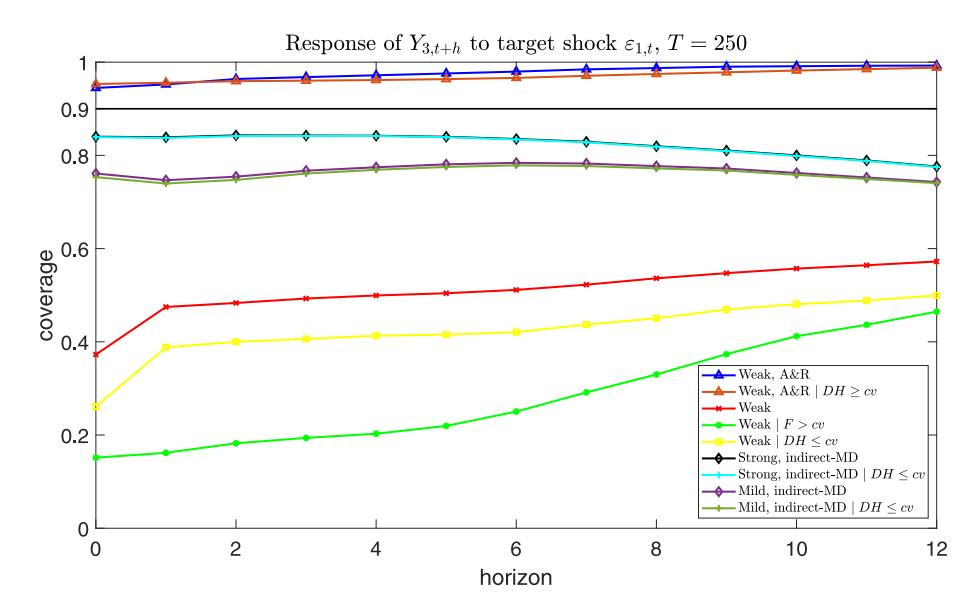
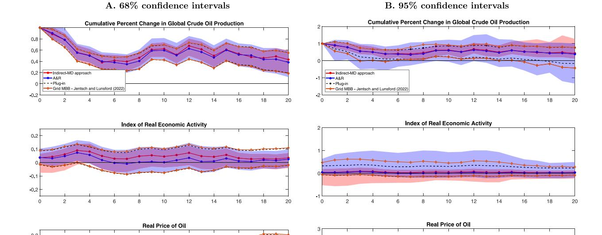
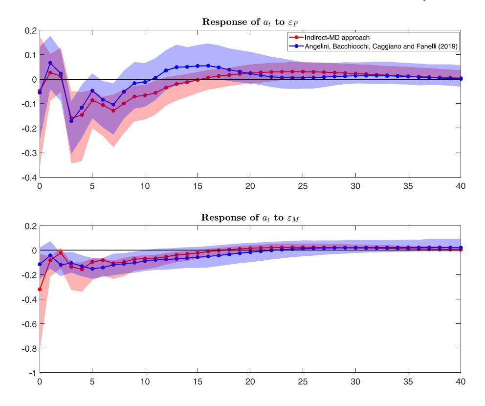

Contents lists available at [ScienceDirect](https://www.elsevier.com/locate/jeconom)

# Journal of Econometrics

journal homepage: [www.elsevier.com/locate/jeconom](http://www.elsevier.com/locate/jeconom)

# An identification and testing strategy for proxy-SVARs with weak proxies

Giovanni Angelini [a](#page-0-0) , Giuseppe Cavaliere [a](#page-0-0),[b](#page-0-1),[∗](#page-0-2) , Luca Fanelli [a](#page-0-0)

- a *Department of Economics, University of Bologna, Italy*
- b *Department of Economics, University of Exeter Business School, UK*

# A R T I C L E I N F O

### *JEL classification:*

C32

C51

C52

E44

*Keywords:* Proxy-SVAR Bootstrap inference External instruments Identification Oil supply shock

# A B S T R A C T

When proxies (external instruments) used to identify target structural shocks are weak, inference in proxy-SVARs (SVAR-IVs) is nonstandard and the construction of asymptotically valid confidence sets for the impulse responses of interest requires weak-instrument robust methods. In the presence of multiple target shocks, test inversion techniques require extra restrictions on the proxy-SVAR parameters other than those implied by the proxies that may be difficult to interpret and test. We show that frequentist asymptotic inference in these situations can be conducted through Minimum Distance estimation and standard asymptotic methods if the proxy-SVAR can be identified by using 'strong' instruments for the *non-target shocks*; i.e., the shocks which are not of primary interest in the analysis. The suggested identification strategy hinges on a novel pretest for the null of instrument relevance, based on bootstrap resampling, which is not subject to pre-testing issues. Specifically, the validity of post-test asymptotic inferences remains unaffected by the test outcomes due to an asymptotic independence result between the bootstrap and nonbootstrap statistics. The test is robust to conditionally heteroskedastic and/or zero-censored proxies, is computationally straightforward and applicable regardless of the number of shocks being instrumented. Some illustrative examples show the empirical usefulness of the suggested identification and testing strategy.

## **1. Introduction**

Proxy-SVARs, or SVAR-IVs, popularized by [Stock](#page-17-0) [\(2008](#page-17-0)), [Stock and Watson](#page-17-1) [\(2012](#page-17-1), [2018\)](#page-17-2) and [Mertens and Ravn](#page-17-3) [\(2013](#page-17-3)), have become standard tools to track the dynamic causal effects produced by macroeconomic shocks on variables of interest. In proxy-SVARs, the model is complemented with 'external' variables – which we call 'proxies', 'instruments' or 'external variables' interchangeably; such variables carry information on the structural shocks of interest, the *target shocks*, and allow to disregard the structural shocks not of primary interest in the analysis, the *non-target shocks*. Recent contributions on frequentist inference in proxy-SVARs include [Montiel Olea et al.](#page-17-4) ([2021\)](#page-17-4) and [Jentsch and Lunsford](#page-17-5) ([2022\)](#page-17-5); in the Bayesian framework, [Arias et al.](#page-17-6) [\(2021](#page-17-6)) and [Giacomini et al.](#page-17-7) [\(2022](#page-17-7)) discuss inference in the case of set-identification.

Inference in proxy-SVARs depends on whether the proxies are strongly or weakly correlated with the target shocks. If the connection between the proxies and the target shocks is 'local-to-zero', as in [Staiger and Stock](#page-17-8) ([1997\)](#page-17-8) and [Stock and Yogo](#page-17-9) [\(2005](#page-17-9)), asymptotic inference is non-standard. In such case, weak-proxy robust methods can be obtained by extending the logic of Anderson– Rubin tests [\(Anderson and Rubin](#page-17-10), [1949\)](#page-17-10), see [Montiel Olea et al.](#page-17-4) ([2021\)](#page-17-4). Grid Moving Block Bootstrap Anderson–Rubin confidence

∗ Correspondence to: Department of Economics, University of Bologna, Piazza Scaravilli 2, 40126 Bologna, Italy. *E-mail address:* [giuseppe.cavaliere@unibo.it](mailto:giuseppe.cavaliere@unibo.it) (G. Cavaliere).

sets ('grid MBB AR') for normalized impulse response functions [IRFs] ([Brüggemann et al.,](#page-17-11) [2016;](#page-17-11) [Jentsch and Lunsford](#page-17-12), [2019\)](#page-17-12) can also be applied in the special case where one proxy identifies one structural shock; see [Jentsch and Lunsford](#page-17-5) ([2022\)](#page-17-5).

When proxy-SVARs feature multiple target shocks, further inferential difficulties arise. First, (point-)identification requires additional restrictions, other than those provided by the instruments; see [Mertens and Ravn](#page-17-3) ([2013\)](#page-17-3), [Angelini and Fanelli](#page-17-13) ([2019\)](#page-17-13), [Arias et al.](#page-17-6) ([2021\)](#page-17-6), [Montiel Olea et al.](#page-17-4) ([2021\)](#page-17-4) and [Giacomini et al.](#page-17-7) [\(2022](#page-17-7)). Second, in the frequentist setup the implementation of weak-instrument robust inference as in [Montiel Olea et al.](#page-17-4) ([2021\)](#page-17-4) may imply a large number of additional restrictions on the parameters of the proxy-SVAR relative to those needed under strong proxies. These extra restrictions are not always credible, and may be difficult to test; see [Montiel Olea et al.](#page-17-4) [\(2021](#page-17-4), Section A.7) and Section S.9 of our supplement.[1](#page-1-0) Fourth, the theory for the grid bootstrap Anderson–Rubin confidence sets does not extend to cases where multiple instruments identify multiple target shocks.

This paper is motivated by these inferential difficulties. In particular, we design an identification and (frequentist) estimation strategy intended to circumvent, when possible, the use of weak-instrument robust methods. The idea we pursue is to identify the proxy-SVAR through an 'indirect' approach, where a vector of proxies (say, ), correlated with (all or some of) the non-target shocks of the system and uncorrelated with the target shocks (say, ), is used to infer the IRFs of interest indirectly. We call this strategy 'indirect identification strategy' or 'indirect-MD' approach, as opposed to the conventional 'direct' approach based on instrumenting the target shock(s) directly with the (potentially weak) proxies . As highlighted by our empirical illustrations, the indirect approach can prove more useful to a practitioner than one might think.

The proxies contribute to defining a set of moment conditions upon which we develop a novel Minimum Distance [MD] estimation approach [\(Newey and McFadden](#page-17-14), [1994](#page-17-14)). We derive novel necessary order conditions and necessary and sufficient rank conditions for the (local) identifiability of the proxy-SVAR. If the proxies are strong for the non-target shocks and the model is identified, asymptotically valid confidence intervals for the IRFs of interest obtain in the usual way; i.e., either by the delta-method or by bootstrap methods. Interestingly, the idea of using instruments for the non-target shocks to identify and infer the effects of structural shocks of interest was initially pursued via Bayesian methods in [Caldara and Kamps](#page-17-15) ([2017\)](#page-17-15), where two fiscal (target) shocks are recovered by instrumenting the non-fiscal (non-target) shocks of the system. We defer to Section [5](#page-4-0) a detailed comparison of our method with [Caldara and Kamps](#page-17-15) ([2017\)](#page-17-15).

Key to the indirect identification strategy is the availability of strong proxies for the non-target shocks. In particular, it is essential that the investigator can screen 'strong' from 'weak' instruments, and that such screening does not affect post-test inference. To do so, we further contribute by designing a novel pre-test for strong against weak proxies based on bootstrap resampling.

Inspired by the idea originally developed in [Angelini et al.](#page-17-16) ([2022\)](#page-17-16) for state-space models, we show that the bootstrap can be used to infer the strength of instruments, other than building valid confidence intervals for IRFs. In particular, we exploit the fact that under mild requirements, the MBB estimator of the proxy-SVAR parameters is asymptotically Gaussian when the instruments are strong while, under weak proxies à la [Staiger and Stock](#page-17-8) [\(1997](#page-17-8)), the distribution of MBB estimator is random in the limit (in the sense of [Cavaliere and Georgiev,](#page-17-17) [2020\)](#page-17-17) and, in particular, is non-Gaussian. This allows to show that a test for the null of strong proxies can be designed as a normality test based on an appropriate number of bootstrap repetitions; such test is consistent against proxies which are weak as in [Staiger and Stock](#page-17-8) [\(1997](#page-17-8)). An idea that echoes this approach in the Bayesian setting can be found in [Giacomini](#page-17-7) [et al.](#page-17-7) ([2022\)](#page-17-7), who suggest using non-normality of the posterior distribution of a suitable function of proxy-SVAR parameters to diagnose the presence of weak proxies. This idea is not pursued further in their paper.

Our suggested test has several important features. First, it controls size under general conditions on VAR disturbances and proxies, including the case of conditional heteroskedasticity and/or zero-censored proxies. Second, with respect to extant tests such as [Montiel Olea and Pflueger'](#page-17-18)s [\(2013](#page-17-18)) effective first-stage F-test for IV models with conditional heteroskedasticity,[2](#page-1-1) our test can be applied in the presence of multiple structural shocks; as far as we are aware, no test of strength for proxy-SVARs with multiple target shocks has been formalized in the literature. Third, it is computationally straightforward, as it boils down to running multivariate/univariate normality tests on the MBB replications of bootstrap estimators of the proxy-SVAR parameters. Fourth, it can be computed in the same way regardless of the number of shocks being instrumented. Fifth, and most importantly, the test does not affect second-stage inference, meaning that regardless of the outcome of the test, post-test inferences are not affected. This property marks an important difference relative to the literature on weak instrument asymptotics, where the negative consequences of pretesting the strength of proxies are well known and documented (see, *inter alia*, [Zivot et al.,](#page-17-19) [1998](#page-17-19); [Hausman et al.](#page-17-20), [2005;](#page-17-20) [Andrews et al.](#page-17-21), [2019](#page-17-21); [Montiel Olea et al.,](#page-17-4) [2021\)](#page-17-4).

The paper is organized as follows. In Section [2](#page-2-0) we motivate our approach with a simple illustrative example. In Section [3](#page-2-1) we introduce the proxy-SVAR and rationalize the suggested identification strategy. The assumptions are summarized in Section [4,](#page-3-0) while we present our indirect-MD approach in Section [5](#page-4-0). Section [6](#page-6-0) deals with the novel approach to testing for strong proxies. To illustrate the practical implementation and relevance of our approach, we present in Section [7](#page-12-0) two illustrative examples that reconsider models already estimated in the literature. Section [8](#page-16-0) concludes. An accompanying supplement complements the paper along several dimensions, including auxiliary lemmas and their proofs, the proofs of the propositions in the paper and an additional empirical illustration based on a fiscal proxy-SVAR.

1 From the perspective of Bayesian inference, one can in principle make the usual argument that weak identification issues do not matter. For instance, [Caldara and Herbst](#page-17-22) ([2019\)](#page-17-22) discuss how it is still possible to obtain numerical approximations of the exact finite-sample posterior distributions of the parameters of proxy-SVARs when instruments are weak. [Giacomini et al.](#page-17-7) [\(2022\)](#page-17-7) show that for set-identified proxy-SVARs with weak instruments, the Bernstein–von Mises property fails for the estimation of the upper and lower bonds of the identified set.

2 See [Montiel Olea et al.](#page-17-4) [\(2021](#page-17-4)) for an overview on first-stage regressions in proxy-SVARs or, alternatively, [Lunsford](#page-17-23) ([2016\)](#page-17-23) for tests based on regressing the proxy on the reduced-form residuals.

#### 2. Motivating example: A market (demand/supply) model

In this section we outline the main ideas in the paper by considering a 'toy' proxy-SVAR, where we omit the dynamics without loss of generality. We consider a model that comprises a demand and supply function for a good with associated structural shocks, given by the equations

$$\underbrace{\begin{pmatrix} q_t \\ p_t \end{pmatrix}}_{Y} = \underbrace{\begin{pmatrix} \beta_{1,1} & \beta_{1,2} \\ \beta_{2,1} & \beta_{2,2} \end{pmatrix}}_{R} \underbrace{\begin{pmatrix} \varepsilon_{d,t} \\ \varepsilon_{s,t} \end{pmatrix}}_{\varepsilon} \equiv \begin{pmatrix} \beta_{1,1}\varepsilon_{d,t} + \beta_{1,2}\varepsilon_{s,t} \\ \beta_{2,1}\varepsilon_{d,t} + \beta_{2,2}\varepsilon_{s,t} \end{pmatrix} \tag{1}$$

where  $q_t$  and  $p_t$  are quantity and price at time t, respectively. The nonsingular matrix B captures the instantaneous impact on  $Y_t := (q_t, p_t)'$  of the structural shocks  $\varepsilon_{d,t}, \varepsilon_{s,t}$ , which are assumed to have unit variance and to be uncorrelated. We temporary (and conventionally) label  $\varepsilon_{d,t}$  as the 'demand shock' and  $\varepsilon_{s,t}$  as the 'supply shock', and assume that the objective of the analysis is the identification and estimation of the instantaneous impact of the *demand shock* on  $Y_t$  through the 'external variables' approach. Hence,  $\varepsilon_{d,t}$  is the *target* shock,  $\varepsilon_{s,t}$  is the *non-target* shock, and the parameters of interest are the on-impact responses  $\frac{\partial Y_t}{\partial \varepsilon_{d,t}} = B_{\bullet 1} := (\beta_{1,1}, \beta_{2,1})'$ ; here  $B_{\bullet 1}$  denotes the first column of B.

Since the two equations in (1) are essentially identical for arbitrary parameter values, nothing distinguishes a demand shock from a supply shock in the absence of further information/restrictions. The typical 'direct approach' to this partial identification problem is to consider an instrument  $z_t$  correlated with the demand shock,  $E(z_t \varepsilon_{d,t}) = \phi \neq 0$  (relevance condition), and uncorrelated with the supply shock,  $E(z_t \varepsilon_{s,t}) = 0$  (exogeneity condition). Now, consider the case where the investigator strongly suspects that  $z_t$  is a weak proxy (meaning that  $\phi$  can be 'small'), but they also know that there exists an external variable  $w_t$ , correlated with the non-target supply shock and uncorrelated with the demand shock; formally,  $E(w_t \varepsilon_{s,t}) = \lambda \neq 0$  and  $E(w_t \varepsilon_{d,t}) = 0$ . Then, the proxy  $w_t$  can be used to recover the parameters of interest in  $B_{*1}$  'indirectly'; i.e., by instrumenting the non-target supply shock  $\varepsilon_{s,t}$ , rather than the target demand shock  $\varepsilon_{d,t}$ . To show how, let  $A := B^{-1}$  and consider the alternative representation of (1):

$$\underbrace{\begin{pmatrix} \alpha_{1,1} & \alpha_{1,2} \\ \alpha_{2,1} & \alpha_{2,2} \end{pmatrix}}_{A} \underbrace{\begin{pmatrix} q_t \\ p_t \end{pmatrix}}_{Y} = \begin{pmatrix} A_1 \cdot Y_t \\ A_2 \cdot Y_t \end{pmatrix} = \underbrace{\begin{pmatrix} \varepsilon_{d,t} \\ \varepsilon_{s,t} \end{pmatrix}}_{\varepsilon_{s,t}},$$

where  $A_{1\bullet} := (\alpha_{1,1}, \alpha_{1,2})$  and  $A_{2\bullet}$  denote the first row and the second row of A, respectively. Since  $w_t$  is correlated with  $p_t$  but uncorrelated with  $\epsilon_{d,t}$ , it is seen that for  $\alpha_{11} \neq 0$ ,  $w_t$  can be used in the equation:

$$q_t = -\frac{\alpha_{1,2}}{\alpha_{1,1}} p_t + \frac{1}{\alpha_{1,1}} \varepsilon_{d,t}$$

as an instrument for  $p_t$  in order to estimate the parameters in  $A_{1.}$ , that is,  $\alpha_{1,1}$  and  $\alpha_{1,2}$ . This delivers an 'estimate' of the demand shock,  $\hat{\epsilon}_{d,t} = \hat{A}_{1.}Y_t = \hat{\alpha}_{1.1}q_t + \hat{\alpha}_{1.2}p_t$  (t = 1, ..., T). Finally, since (1) and  $A = B^{-1}$  jointly imply  $B = \Sigma_u A'$ , it holds that

$$B_{s1} = \Sigma_{s} A_{s}^{\prime} \tag{2}$$

where  $\Sigma_u := E(Y_t Y_t')$  can be estimated (e.g., by its sample analog,  $\hat{\Sigma}_u := T^{-1} \sum_{t=1}^T Y_t Y_t'$ ) under mild requirements. Hence, an indirect plug-in estimator of the parameters of interest  $B_{\bullet 1}$  is given by  $\hat{B}_{\bullet 1} := \hat{\Sigma}_u \hat{A}_{1\bullet}'$ . If the instrument  $w_t$  is a 'strong' proxy for the supply shock, in the sense formally defined in Section 4, standard asymptotic inference on  $B_{\bullet 1}$  can then be performed using  $\hat{B}_{\bullet 1}$ .

This toy example shows that strong proxies for the non-target shocks, provided they exist, can be used to infer the causal effects of the target shocks indirectly, in a partial identification logic. Importantly, the investigator can strategically exploit the fact that if the proxies  $z_t$  available for the target shock are 'weak', the use of weak-instrument robust methods for the parameters of interest ( $B_{*1}$  in this example) can be circumvented if they can alternatively rely on strong proxies  $w_t$  for the non-target shocks.

In the following, we assume that there exist proxies  $w_t$  for the non-target shocks that might be alternatively used instead of the (potentially weak) proxies  $z_t$  available for the target structural shocks. The strength of  $w_t$  is a key ingredient of this strategy; hence, in Section 6 we present our novel pre-test of relevance, which consistently detects proxies which are weak in the sense of Staiger and Stock (1997). Since, as we show, the test does not affect post-test inferences, if the null of relevance is not rejected, inference based on  $w_t$  can be conducted by standard methods with no need for Bonferroni-type adjustments. In contrast, should the null of relevance be rejected, the investigator can rely on weak-instrument robust methods based either on the proxies  $z_t$ , if the target shocks are instrumented, or on the proxies  $w_t$  if the non-target shocks are instrumented.

# 3. Model and identification strategies

Consider the SVAR model:

$$Y_t = \Pi X_t + u_t, \quad u_t = B\varepsilon, \quad (t = 1, \dots, T) \tag{3}$$

where  $Y_t$  is the  $n \times 1$  vector of endogenous variables,  $X_t := (Y'_{t-1}, \dots, Y'_{t-l})'$  collects l lags of the variables,  $\Pi := (\Pi_1, \dots, \Pi_l)$  is the  $n \times nl$  matrix containing the autoregressive (slope) parameters, and  $u_t$  is the  $n \times 1$  vector of reduced form disturbances with covariance matrix  $\Sigma_u := E(u_t u'_t)$ . Deterministic terms have been excluded without loss of generality, and the initial values  $Y_0, \dots, Y_{1-l}$  are fixed in the statistical analysis. The system of equations  $u_t = B\varepsilon_t$  in (3) defines the reduced form disturbances  $u_t$  in terms of the  $n \times 1$  vector

of structural shocks,  $\epsilon_l$ , through the nonsingular  $n \times n$  matrix B of on-impact coefficients. The structural shocks are normalized such that  $\Sigma_{\epsilon} := E(\epsilon_l \epsilon_l') = I_n$ .

We partition the structural shocks as  $\varepsilon_t := (\varepsilon'_{1,t}, \varepsilon'_{2,t})'$ , where  $\varepsilon_{1,t}$  collects the  $1 \le k < n$  target structural shocks, and  $\varepsilon_{2,t}$  collects the remaining n - k structural shocks of the system. We have

$$u_{t} = \begin{pmatrix} u_{1,t} \\ u_{2,t} \end{pmatrix} = \begin{pmatrix} B_{1,1} & B_{1,2} \\ B_{2,1} & B_{2,2} \end{pmatrix} \begin{pmatrix} \varepsilon_{1,t} \\ \varepsilon_{2,t} \end{pmatrix} \equiv B_{\bullet 1} \varepsilon_{1,t} + B_{\bullet 2} \varepsilon_{2,t}$$

$$\tag{4}$$

where  $u_{1,t}$  and  $u_{2,t}$  have the same dimensions as  $\varepsilon_{1,t}$  and  $\varepsilon_{2,t}$ , respectively, and  $B_{\bullet 1} := (B'_{1,1}, B'_{2,1})'$  is the  $n \times k$  matrix collecting the on-impact coefficients associated with the target structural shocks ( $B_{1,1}$  and  $B_{2,1}$  are  $k \times k$  and  $(n-k) \times k$  blocks, respectively). Finally, the  $n \times (n-k)$  matrix  $B_{\bullet 2}$  collects the instantaneous impact of the non-target shocks on the variables. We are interested in the k period ahead responses of the kth variable in kth variable in kth variable in kth variable in kth variable in kth variable in kth variable in kth variable in kth variable in kth variable in kth variable in kth variable in kth variable in kth variable in kth variable in kth variable in kth variable in kth variable in kth variable in kth variable in kth variable in kth variable in kth variable in kth variable in kth variable in kth variable in kth variable in kth variable in kth variable in kth variable in kth variable in kth variable in kth variable in kth variable in kth variable in kth variable in kth variable in kth variable in kth variable in kth variable in kth variable in kth variable in kth variable in kth variable in kth variable in kth variable in kth variable in kth variable in kth variable in kth variable in kth variable in kth variable in kth variable in kth variable in kth variable in kth variable in kth variable in kth variable in kth variable in kth variable in kth variable in kth variable in kth variable in kth variable in kth variable in kth variable in kth variable in kth variable in kth variable in kth variable in kth variable in kth variable in kth variable in kth variable in kth variable in kth variable in kth variable in kth variable in kth variable in kth variable in kth variable in kth variable in kth variable in kth variable in kth variable in kth variable in k

$$\gamma_{\bullet j}(h) := (S_n' C_v^h S_n) B_{\bullet 1} e_{k,j}, \tag{5}$$

where  $C_y$  is the VAR companion matrix,  $S_n := (I_n, 0_{n \times n(l-1)})$  is a selection matrix and  $e_{k,j}$  is the  $k \times 1$  vector containing '1' in the jth position and zero elsewhere.

The common, 'direct' approach to infer the parameters of interest in  $B_{*1}$  and hence solve the partial identification problem arising from the estimation of the IRFs in (5) is to find  $r \ge k$  observable proxies, collected in the vector  $z_t$ , correlated with the target shocks  $\varepsilon_1$ , and uncorrelated with  $\varepsilon_2$ ,. Thus,  $z_t$  is related to  $\varepsilon_1$ , by the linear measurement system

$$z_t = \Phi \epsilon_{1,t} + \omega_{z,t} \tag{6}$$

where the matrix  $\Phi := E(z_t \varepsilon_{1,t}')$  captures the link between the proxies  $z_t$  and the target shocks  $\varepsilon_{1,t}$ ;  $\omega_{z,t}$  is a measurement error, assumed to be uncorrelated with the structural shocks  $\varepsilon_t$ . By combining (6) with (4) and taking expectations, one obtains the moment conditions

$$\Sigma_{\mu,\tau} = B_{s,1} \Phi' \tag{7}$$

where  $\Sigma_{u,z} := E(u_t z_t')$  is the  $n \times r$  covariance matrix between  $u_t$  and  $z_t$ . Stock (2008), Stock and Watson (2012, 2018) and Mertens and Ravn (2013) exploit the moment conditions in (7) as starting point for the identification of the IRFs in (5).

Alternatively, as shown in the example in Section 2, the IRFs in (5) can be identified by and 'indirect approach', where a vector of proxies  $w_t$  are used to instrument the non-target shocks. Specifically, for  $A = B^{-1}$ , model (3) can be expressed in the form:

$$AY_t = YX_t + \varepsilon_t, \quad Au_t = \varepsilon_t \quad (t = 1, \dots, T)$$
(8)

where  $Y := A\Pi$  and A summarizes the simultaneous relationships that characterize the observed variables. The system of equations  $Au_t = \varepsilon_t$  can then be partitioned as

$$Au_t \equiv \begin{pmatrix} A_{1,u}u_t \\ A_{2,u}u_t \end{pmatrix} \equiv \begin{pmatrix} A_{1,1}u_{1,t} + A_{1,2}u_{2,t} \\ A_{2,1}u_{1,t} + A_{2,2}u_{2,t} \end{pmatrix} = \begin{pmatrix} \varepsilon_{1,t} \\ \varepsilon_{2,t} \end{pmatrix}$$

$$\tag{9}$$

where the  $k \times n$  matrix  $A_{1.} := (A_{1,1}, A_{1,2})$  collects the first k rows of A, and  $A_{2.}$  the remaining n - k rows. The VAR disturbances  $u_{1,t}$  and  $u_{2,t}$  have the same dimension as  $\varepsilon_{1,t}$  and  $\varepsilon_{2,t}$ , respectively. Under identifying restrictions on  $A_{1.}$ , the term  $\varepsilon_{1,t}$  in Eq. (9) can be interpreted as the structural shocks of a simultaneous system of equations à la Leeper et al. (1996).

Using the SVAR representation (9), we can infer the parameters in  $A_1$ , by exploiting the vector of external proxy variables  $w_t$ , correlated with (all or some of) the non-target shocks  $\varepsilon_{2,t}$  and uncorrelated with the target shocks  $\varepsilon_{1,t}$ . In Section 5 we discuss in detail how the parameters in  $A_1$ , can be identified by using  $w_t$  through a MD approach; the estimation of  $B_{\bullet 1}$  and the IRFs (5) follow indirectly, as in (2), from the relation  $B_{\bullet 1} = \Sigma_u A_1'$ .

The next section states the assumptions behind our estimation approach and qualifies the concepts of strong/weak proxies we refer to throughout the paper.

#### 4. Assumptions and asymptotics

Our first two main assumptions pertain to the reduced form VAR.

**Assumption 1** (*Reduced Form, Stationarity*). The data generating process (DGP) for  $Y_t$  satisfies (3) with a stable companion matrix  $C_v$ ; i.e., all eigenvalues of  $C_v$  lie inside the unit disk.

Assumption 2 (Reduced Form, VAR Innovations). The VAR disturbances satisfy the following conditions:

- (i)  $\{u_t\}$  is a strictly stationary weak white noise;
- (ii)  $E(u_t u_t') = \Sigma_u < \infty$  is positive definite;
- (iii)  $\{u_t\}$  satisfies the  $\alpha$ -mixing conditions in Assumption 2.1 of Brüggemann et al. (2016);
- (iv)  $\{u_t\}$  has absolutely summable cumulants up to order eight.

&lt;sup>3 Notice that we focus on absolute IRFs – the quantities  $\gamma_{i,j}(h)$ ,  $\gamma_{i,j}(h)$  being the *i*th element of  $\gamma_{*,j}(h)$  in (5) – rather than on relative IRFs,  $\gamma_{i,j}(h)/\gamma_{1,j}(0)$ , which measure the response of  $Y_{i,t}$  to the *j*-th shock in  $\varepsilon_{1,t}$  that increases  $Y_{1,t}$  by one unit on-impact.

Assumption 1 features a typical maintained hypothesis of correct specification and incorporates a stability condition which rules out the presence of unit roots. Assumption 2 is as in Francq and Raïssi (2006) and Boubacar Mainnasara and Francq (2011). Assumption 2(ii) is a standard unconditional homoskedasticity condition on VAR disturbances and proxies. The  $\alpha$ -mixing conditions in Assumption 2(iii) cover a large class of uncorrelated, but possibly dependent, variables, including the case of conditionally heteroskedastic disturbances. Assumption 2(iv) is a technical condition necessary to prove the consistency of the MBB in this setting, see Brüggemann et al. (2016); see also Assumption 2.4 in Jentsch and Lunsford (2022).

The next assumption refers to the structural form.

**Assumption 3** (Structural Form). Given the SVAR in (3), the matrix B is nonsingular and its inverse is denoted by  $A = B^{-1}$ .

Assumption 3 establishes the nonsingularity of the matrix B, which implies the conditions  $rank[B_{\bullet 1}] = k$  in (4) and  $rank[A_{1\bullet}] = k$  in (9).

The next assumption is crucial to our approach. Henceforth, with  $\tilde{\epsilon}_{2,t}$  we denote a subset of the vector of non-target shocks  $\epsilon_{2,t}$  containing  $s \le n-k$  elements. We assume, without loss of generality, that  $\tilde{\epsilon}_{2,t}$  corresponds to the first s elements of  $\epsilon_{2,t}$ , and it is intended that  $\epsilon_{2,t} \equiv \tilde{\epsilon}_{2,t}$  when s = n-k.

**Assumption 4** (*Proxies for the Non-Target Shocks*). There exist  $s \le n - k$  proxy variables, collected in the vector  $w_t$ , such that the following linear measurement system holds:

$$w_t = A\tilde{\epsilon}_{2,t} + \omega_{w,t},\tag{10}$$

where  $\Lambda := E(w_t \tilde{\epsilon}'_{2,t})$  is an  $s \times s$  matrix of relevance parameters and  $\omega_{w,t}$  is a measurement error term, uncorrelated with  $\epsilon_t$ .

Assumption 4 establishes the existence of s external variables which are correlated with s non-target shocks with covariance matrix  $\Lambda := E(w_t \varepsilon_{2,t}')$ , and are uncorrelated with the target structural shocks,  $E(w_t \varepsilon_{1,t}') = 0.5$  Assumption 4 implies that  $\Sigma_{u,w} := E(u_t w_t') = \tilde{B}_{\bullet 2} \Lambda'$ , where  $\tilde{B}_{\bullet 2} := \frac{\partial Y_t}{\partial \tilde{\varepsilon}_{2,t}'}$  collects the s columns of  $\tilde{B}_{\bullet 2}$  associated with the instantaneous effects of the shocks  $\tilde{\varepsilon}_{2,t}$ ; obviously,  $\tilde{B}_{\bullet 2} \equiv B_{\bullet 2}$  when s = n - k ( $\tilde{\varepsilon}_{2,t} \equiv \varepsilon_{2,t}$ ). The illustrations we present in Section 7 and in the Supplement show that Assumption 4 holds in many problems of interest.

Assumption 4 postulates the existence of proxies for the non-target shocks but does not allow for models where the correlation between the proxies  $w_t$  and the instrumented shocks  $\tilde{\varepsilon}_{2,t}$  is weak, i.e. arbitrarily close to zero. Weak correlation between  $w_t$  and  $\tilde{\varepsilon}_{2,t}$  can be allowed as in Montiel Olea et al. (2021, Section 3.2) by considering sequences of models such that  $E(w_t\tilde{\varepsilon}_{2,t}') = \Lambda_T$ , where  $\Lambda$  can be of reduced rank. To illustrate, set s=1, so that  $w_t$ ,  $\tilde{\varepsilon}_{2,t}$  and  $E(w_t\tilde{\varepsilon}_{2,t})$  in (10) are all scalars. Then, we can consider a sequence of models with  $E(w_t\tilde{\varepsilon}_{2,t}) = \lambda_T \to \lambda \in \mathbb{R}$ . In Montiel Olea et al. (2021), a 'strong instrument' corresponds to  $\lambda \neq 0$ ; see also Assumption 2.3 in Jentsch and Lunsford (2022). A 'weak instrument' in the sense of Staiger and Stock (1997) corresponds to  $\lambda_T = cT^{-1/2}$ , where  $|c| < \infty$  is a scalar location parameter; under this embedding,  $\lambda_T \to 0$ , with the case of an 'irrelevant' proxy corresponding to c=0. If the proxy is strong ( $\lambda \neq 0$ ), the asymptotic distribution of the estimator of the parameters ( $\tilde{B}_{2,t}$ ,  $\lambda_T'$ )' (or of the impulse responses to the shock  $\tilde{\varepsilon}_{2,t}$ ) is Gaussian (see Supplement, Section S.3). On the contrary, this is not guaranteed when  $\lambda = 0$ . For instance, if  $\lambda_T = cT^{-1/2}$ , the asymptotic distribution of the estimator of ( $\tilde{B}_{2,t}'$ ,  $\lambda_T'$ )' is non-Gaussian and the parameter c governs the extent of the departure from the Gaussian distribution (see Supplement, Section Section S.3).

To deal with the case of multiple shocks (s > 1), the embedding above can be extended by considering a sequence of models with  $E(w_1\tilde{\epsilon}_2',) = A_T$ , T = 1, 2, ..., with the case of strong proxies corresponding to

$$\Lambda_T \to \Lambda$$
,  $rank[\Lambda] = s$ . (11)

Weak instruments as in Staiger and Stock (1997) correspond to the case where  $\Lambda_T$  can be approximated by

$$\Lambda_T = CT^{-1/2}, ||C|| < \infty$$
 (12)

C being an  $s \times s$  matrix with finite norm.

## 5. Indirect-MD estimation

We now present our indirect-MD estimation approach based on the SVAR representation (9) and the availability of external (strong) proxies  $w_t$  for the non-target shocks. In this framework, given the estimator of the parameters in  $A_1$ , we described below, the IRFs in (5) are recovered by using (2).

&lt;sup>4 The MBB is similar in spirit to a standard residual-based bootstrap where the VAR residuals are resampled with replacement. However, instead of resampling one VAR residual at a time the MBB, which is robust against forms of 'weak dependence' that may arise under α-mixing conditions, resamples blocks of the VAR residuals/proxies in order to replicate their serial dependence structure. We refer to Jentsch and Lunsford (2019, 2022) and Mertens and Ravn (2019) for a comprehensive discussion of the merits of the MBB relative to other bootstrap methods in proxy-SVARs. Section S.7 in the Supplement sketches the essential steps behind the MBB algorithm.

&lt;sup>5 In principle, Assumption 4 can be generalized to allow for more proxies than instrumented non-target shocks; i.e.,  $\dim(w_t) > \dim(\tilde{\epsilon}_{2,t}) = s$ . Without loss of generality, we focus on the case where  $\Lambda$  in (10) is a square matrix.

The first k equations of system (9) read

$$A_{1} u_{t} \equiv A_{1,1} u_{1,t} + A_{1,2} u_{2,t} = \varepsilon_{1,t}. \tag{13}$$

Taking the variance of both sides of (13), we obtain the  $\frac{1}{2}k(k+1)$  moment conditions

$$A_1, \Sigma_{\mu} A_1' = I_k. \tag{14}$$

Post-multiplying (13) by  $w'_t$  and taking expectations yield the additional ks moment conditions

$$A_{1\bullet} \Sigma_{n,n} = 0_{k \times r}. \tag{15}$$

Taken together, (14) and (15) provide  $m := \frac{1}{2}k(k+1) + ks$  independent moment conditions that can be used to estimate the parameters in  $A_{1*}$ . The idea is simple: the moment conditions (14)–(15) define a set of 'distances' between reduced form and structural parameters, which can be minimized once  $\Sigma_u$  and  $\Sigma_{u,u}$  are replaced with their consistent estimates. When k > 1, however, the proxies alone do not suffice to point-identify the proxy-SVAR, and it is necessary to impose additional parametric restrictions; see Mertens and Ravn (2013), Angelini and Fanelli (2019), Montiel Olea et al. (2021), Arias et al. (2021) and Giacomini et al. (2022). Depending on the information/theory available, the additional restrictions can involve the parameters in  $A_{1*}$  or those in  $B_{*1}$ , and can be sign- or point-restrictions. We rule out the case of sign-restrictions and, as in Angelini and Fanelli (2019), focus on general (possibly non-homogeneous) linear constraints on  $A_{1*}$ , as given by

$$vec(A_1,) = S_{A_1}\alpha + s_{A_1}$$
 (16)

where  $\alpha$  is the vector of (free) structural parameters in  $A_1$ ,  $S_{A_1}$  is a full-column rank selection matrix and  $s_{A_1}$  is a known vector. Under (16), we provide below necessary and sufficient conditions for local identification of the proxy-SVAR; we refer to Bacchiocchi and Kitagawa (2022) for a thorough investigation of SVARs that attain local identification, but may fail to attain global identification.

Let  $\sigma^+ := (vech(\Sigma_u)', vec(\Sigma_{u,w})')'$  be the  $m \times 1$  vector of reduced form parameters entering the moment conditions in (14)–(15). Let  $\hat{\sigma}_T^+ := (vech(\hat{\Sigma}_u)', vec(\hat{\Sigma}_{u,w})')'$  be the estimator of  $\sigma^+$ , and  $\sigma_0^+$  the corresponding true value.  $\hat{\sigma}_T^+$  is easily obtained from  $\hat{\Sigma}_{u,w} := \frac{1}{T} \sum_{t=1}^T \hat{u}_t w_t'$  and  $\hat{\Sigma}_u := \frac{1}{T} \sum_{t=1}^T \hat{u}_t \hat{u}_t'$ ,  $\hat{u}_t$ ,  $t=1,\ldots,T$ , being the VAR residuals. By Lemma S.1 in the Supplement,  $T^{1/2}(\hat{\sigma}_T^+ - \sigma_0^+) \stackrel{d}{\to} N(0_{a\times 1}, V_{\sigma^+})$ , with  $V_{\sigma^+}$  positive definite asymptotic covariance matrix that can be estimated consistently under fairly general conditions. The moment conditions (14)–(15) and the restrictions in (16) can be summarized by the distance function

$$g(\sigma^+, \alpha) := \begin{pmatrix} vech(A_1, \Sigma_u A'_{1\bullet} - I_k) \\ vec(A_1, \Sigma_{u,w}) \end{pmatrix}$$

$$(17)$$

where  $A_1$ , depends on  $\alpha$  through (16). At the true parameter values,  $g(\sigma_0^+, \alpha_0) = 0_{m \times 1}$ . The MD estimator of  $\alpha$  is defined as

$$\hat{\alpha}_T := \arg\min_{\alpha \in \mathcal{P}_n} \hat{Q}_T(\alpha), \quad \hat{Q}_T(\alpha) := g_T(\hat{\sigma}_T^+, \alpha)' \hat{V}_{gg}(\bar{\alpha})^{-1} g_T(\hat{\sigma}_T^+, \alpha)$$

$$\tag{18}$$

where  $g_T(\cdot,\cdot)$  denotes the function  $g(\cdot,\cdot)$  once  $\sigma^+$  is replaced with  $\hat{\sigma}_T^+$ ,  $\mathcal{P}_\alpha$  is the parameter space,  $\hat{V}_{gg}(\alpha) := G_{\sigma^+}(\hat{\sigma}_T^+, \alpha)\hat{V}_{\sigma^+}G_{\sigma^+}(\hat{\sigma}_T^+, \alpha)'$ ,  $\hat{V}_{\sigma^+}$  is a consistent estimator of  $V_{\sigma^+}$ , and  $G_{\sigma^+}(\sigma^+, \alpha)$  is the  $m \times m$  Jacobian matrix  $G_{\sigma^+}(\sigma^+, \alpha) := \frac{\partial g(\sigma^+, \alpha)}{\partial \sigma^{+\prime}}$ . Finally,  $\bar{\alpha}$  (interior point of  $\mathcal{P}_\alpha$ ) is some preliminary estimate of  $\alpha$ ; for example,  $\bar{\alpha}$  might be the MD estimate of  $\alpha$  obtained in a first-step by replacing  $\hat{V}_{gg}(\bar{\alpha})$  in (18) with the identity matrix, in which case  $\hat{\alpha}_T$  from (18) corresponds to a classical two-step MD estimator (see Newey and McFadden, 1994). Note that, despite under Assumption 4 it holds  $\mathcal{E}_{u,w} := \tilde{B}_{\bullet 2} \Lambda'$  (see Section 4), in (18) the investigator needs not take a stand on the restrictions that might characterize  $\Lambda$  and  $\tilde{B}_{\bullet 2}$ .

The next proposition establishes the necessary and sufficient rank condition, as well as the necessary order condition for local identification of the proxy-SVAR identified by the proxies  $w_l$ .  $\mathcal{N}_{\alpha_0}$  denotes a neighborhood of  $\alpha_0$  in  $\mathcal{P}_{\alpha}$ , with  $\alpha_0$  true value of the structural parameters in the matrix  $A_1$ , and  $D_k^+$  the generalized Moore–Penrose inverse of the duplication matrix  $D_k$ , see Supplement, Section S.2.

**Proposition 1** (Point-Identification). Consider the proxy-SVAR obtained by combining the SVAR (3) with the proxies  $w_t$  in (10) for the  $s \le n-k$  non-target structural shocks  $\tilde{\varepsilon}_{2,t}$ . Assume that the parameters in  $A_1$ , satisfy the  $m := \frac{1}{2}k(k+1) + ks$  independent moment conditions (14) and (15) and, for k > 1, are restricted as in (16). Under Assumptions 1–4 and sequences of models in which  $E(w_t \tilde{\varepsilon}'_{1,t}) = A_T \to A$ :

(i) a necessary and sufficient condition for identification is that

$$rank\left[G_{a}(\sigma^{+},\alpha)\right] = a \tag{19}$$

&lt;sup>6 See Section S.5 in the Supplement for cases where additional point-restrictions are placed on the parameters in  $B_{\bullet 1}$ .

&lt;sup>7 Gains in efficiency can be achieved if these matrices are subject to constraints that are explicitly imposed in the minimization problem (18) via the matrix  $\Sigma_{u,w}$ . For instance, if  $\Lambda$  is known to be diagonal (meaning that each proxy variable in  $w_t$  solely instruments one structural shock in  $\bar{\varepsilon}_{2,t}$ ), one can use a constrained estimator of the covariance matrix  $\Sigma_{u,w}$  in (18). This can be done by using  $\hat{\Sigma}_{u,w} := \hat{B}'_{*2}\hat{\Lambda}$ , where  $\hat{\Lambda}$  and  $\hat{B}_{*2}$  are obtained in a previous step through the CMD approach we discuss in Section 6.1.

holds in  $\mathcal{N}_{\alpha o}$ , where  $a = dim(\alpha)$  and

$$G_{\alpha}(\sigma^+,\alpha) := \begin{pmatrix} 2D_k^+(A_{1\bullet}\Sigma_u \otimes I_k) \\ (\Lambda \tilde{B}_{2\bullet} \otimes I_k) \end{pmatrix} S_{A_1};$$

(ii) a necessary order condition is  $a \le m$ ; when k > 1, this implies at least  $\frac{1}{2}k(k-1)$  additional restrictions on the proxy-SVAR parameters.

As it is typical for SVARs and proxy-SVARs, the identification result in Proposition 1 holds 'up to sign', meaning that the rank condition in (19) is valid regardless of the sign normalizations of the rows of the matrix  $A_1$ . The necessary order condition,  $a \le m$ , simply states that when s shocks are instrumented, the number of moment conditions used to estimate the proxy-SVAR must be larger or at least equal to the total number of unknown structural parameters. It is not strictly necessary that s = n - k, meaning that identification can be achieved also by instrumenting part of the non-target shocks, provided there are enough uncontroversial restrictions on  $A_1$ , through (16).

An important consequence of Proposition 1 is stated in the next corollary, which establishes that the necessary and sufficient rank condition for the identification of the proxy-SVAR fails when the proxies are weak in the sense of (12).

**Corollary 1** (Identification Failure). Under the assumptions of *Proposition 1*, the necessary and sufficient rank condition for identification in (19) fails if the proxies satisfy (12).

The next proposition summarizes the asymptotic properties of the MD estimator  $\hat{a}_T$  derived from (18) under local identification.

**Proposition 2** (Asymptotic Properties). Under the conditions of Proposition 1, let the true value  $\alpha_0$  be an interior of  $\mathcal{P}_{\alpha}$  (assumed compact). If the necessary and sufficient rank condition in (19) is satisfied, then  $\hat{\alpha}_T$  in (18) has the following properties:

(i) 
$$\hat{\alpha}_T \stackrel{P}{\rightarrow} \alpha_0$$

(i) 
$$T^{1/2}(\hat{\alpha}_T \to \alpha_0)$$
,  
(ii)  $T^{1/2}(\hat{\alpha}_T - \alpha_0) \xrightarrow{d} N(0_{a \times 1}, V_a)$ ,  $V_\alpha := \{G_\alpha(\sigma_0^+, \alpha_0)'V_{gg}(\bar{\alpha})^{-1}G_\alpha(\sigma_0^+, \alpha_0)\}^{-1}$  with  $V_{gg}(\alpha) := G_{\sigma^+}(\sigma_0^+, \alpha)V_{\sigma^+}G_{\sigma^+}(\sigma_0^+, \alpha)'$  and  $G_\alpha(\sigma^+, \alpha)$  as in Proposition 1.

Proposition 2 ensures that the MD estimator  $\hat{a}_T$  is consistent and asymptotically Gaussian if the rank condition holds. Inference on the IRFs (5) can be based on standard asymptotic methods by classical delta-method arguments. Conversely, by Corollary 1, consistency and asymptotic normality is not guaranteed to hold if the instruments satisfy the local-to-zero embedding (12). The rank of the Jacobian matrix  $G_{\alpha}(\sigma^+, \alpha)$  in Proposition 1 depends on the covariance matrix  $\Sigma_{w,u} = \Lambda \tilde{B}'_{*2}$ , which in turn reflects the strength of the proxies  $w_t$ . The pre-test of relevance discussed in Section 6 is based on an estimator of the parameters in  $\Lambda$  and  $\tilde{B}_{*2}$ .

We end this section by noticing that our indirect-MD method presents several differences with respect to Caldara and Kamps's (2017) approach to proxy-SVARs. Caldara and Kamps (2017) interpret the structural equations of their fiscal proxy-SVAR, the analog of system (13), as fiscal reaction functions whose unsystematic components correspond to the fiscal shocks of interest. They then identify the implied fiscal multipliers by a Bayesian penalty function approach. We differ from Caldara and Kamps (2017) in the motivations behind our analysis, as well as in the frequentist nature of our approach. Caldara and Kamps's (2017) main objective is the estimation of fiscal multipliers from policy (fiscal) reaction functions using external instruments. In contrast, our primary purpose is to rationalize a strategy intended to circumvent, when possible, the use of weak-instrument robust methods. Finally, as our empirical applications in Section 7 illustrate, our approach is not confined or limited to cases where the estimated structural equations read as policy reaction functions.

#### 6. Testing instrument relevance

In this section we present our pre-test for relevance of the proxies. Our test exploits the different asymptotic properties of a bootstrap estimator of proxy-SVAR parameters under the regularity conditions in Proposition 2 – which imply that the strong proxy condition (11) is verified – and under the weak IV sequences of Staiger and Stock (1997) in (12). The test works for general  $\alpha$ -mixing VAR disturbances and/or zero-censored proxies, and is computationally invariant to the number of shocks being instrumented. Importantly, the outcomes of the test do not affect post-test inferences because of an asymptotic independence result between bootstrap and non-bootstrap statistics that we summarize in Proposition 7 below. This implies that the asymptotic coverage of IRFs confidence intervals constructed using our indirect approach remains unaffected if the bootstrap pre-test does not reject the null hypothesis of relevance of the proxies  $w_t$ . Similarly, the asymptotic coverage is not affected even if the bootstrap pre-test does reject the relevance of  $w_t$  and weak-instrument robust methods (using either the proxies  $z_t$ , or the proxies  $w_t$ ) are employed.

We organize this section as follows. In Section 6.1 we discuss the bootstrap estimator used to capture the strength of the proxies and then derive its asymptotic distribution. In Section 6.2 we explain the mechanics of the test. In Section 6.3 we summarize its finite sample performance through simulation experiments. Finally, Section 6.4 focuses on its key properties.

&lt;sup>8 See Section S.6 in the Supplement for a comparison between the suggested MD approach and the 'standard' IV approach.

#### 6.1. Bootstrap estimator and asymptotic distribution

As noticed in Section 5, the covariance matrix  $\Sigma_{w,u}:=E(w_tu_t')=\Lambda \tilde{B}_{2}'$  is a key ingredient of the Jacobian  $G_{\alpha}(\sigma^+,\alpha)$ , which determines the asymptotic properties of the MD estimator  $\hat{\alpha}_T$ ; see Propositions 1 and 2. In this section, we analyze a bootstrap estimator of the parameters in  $\Lambda$  and  $\tilde{B}_{2}'$ ; the asymptotic distribution of this estimator will subsequently serve as a measure of the strength of the proxies  $w_t$ .

Let  $\Omega_w$  be the  $s \times s$  matrix defined by  $\Omega_w := \Sigma_{w,u} \Sigma_u^{-1} \Sigma_{u,w}$ . By combining  $\Sigma_{w,u} = \Lambda \tilde{B}'_{\bullet 2}$  with the 'standard' SVAR covariance restrictions,  $\Sigma_u = BB'$ , by simple algebra we obtain the relation  $\Omega_w = \Lambda \tilde{B}'_{\bullet 2} (BB')^{-1} \tilde{B}'_{\bullet 2} \Lambda' = \Lambda \Lambda'$ . Hence, the link between the reduced form parameters in  $\Omega_w$ ,  $\Sigma_{w,u}$  and the proxy-SVAR parameters in the  $(n+s) \times s$  matrix  $(\tilde{B}'_{\bullet 2}, \Lambda')'$  is summarized by the following set of moment conditions

$$\Omega_{w} = \Lambda \Lambda', \ \Sigma_{wu} = \Lambda \tilde{B}'_{2} \tag{20}$$

which capture the connection between the proxies  $w_t$  and the non-target shocks  $\tilde{\epsilon}_{2,t}$ . We denote by  $\theta := (\beta_2', \lambda')'$  the  $q_\theta \times 1$  vector containing the (free) parameters in the matrix  $(\tilde{B}_{2}', \Lambda')'$ ; here,  $\beta_2$  collects the non-zero on-impact coefficients in  $\tilde{B}_{2}$  and  $\lambda$  the non-zero elements in  $\Lambda$ . While the parameters in  $\theta$  are not economically interesting on their own, the asymptotic distribution of the estimator of  $\theta$  is informative on the strength of the proxies  $w_t$ .

The moment conditions (20) can be summarized by the distance function  $d(\mu,\theta) := \mu - f(\theta)$ , with  $\mu := (vech(\Omega_w)', vec(\Sigma_{w,\mu})')'$  and  $f(\theta) = (vech(\Lambda\Lambda')', vec(\Lambda \bar{B}'_{12})')'$ . At the true parameter values,  $d(\mu_0,\theta_0) = 0$ . In order to estimate  $\theta$  through a MD approach, one needs an estimator of the reduced form parameters  $\mu$ . This is given by  $\hat{\mu}_T := (vech(\hat{\Omega}_w)', vec(\hat{\Sigma}_{w,\mu})')'$ , where  $\hat{\Omega}_w := \hat{\Sigma}_{u,w} \hat{\Sigma}_{u}^{-1} \hat{\Sigma}_{u,w}$ ,  $\hat{\Sigma}_{u,w} := T^{-1} \sum_{l=1}^T \hat{u}_l w_l'$  and  $\hat{\Sigma}_u := T^{-1} \sum_{l=1}^T \hat{u}_l \hat{u}_l'$ . When the proxy-SVAR is identified as in Proposition 1,  $T^{1/2}(\hat{u}_T - \mu_0)$  is asymptotically Gaussian with positive definite asymptotic covariance matrix  $V_\mu := J_{\sigma^+} V_{\sigma^+} J_{\sigma^+}'$ ,  $J_{\sigma^+}$  being the full-row rank Jacobian matrix  $J_{\sigma^+} := \frac{\partial \mu}{\partial \sigma^{+1}}$ , see Lemma S.2 in the Supplement, and  $\hat{V}_\mu := \hat{J}_{\sigma^+} \hat{V}_{\sigma^+} \hat{J}_{\sigma^+}'$  is a consistent estimator of  $V_\mu$ . Conversely, by Lemma S.3 in the Supplement,  $T^{1/2}(\hat{\mu}_T - \mu_0)$  is not asymptotically Gaussian when the proxies  $w_l$  satisfy the local-to-zero condition (12). Then, a classical MD (CMD) estimator of  $\theta$  can defined as

$$\hat{\theta}_T := \arg\min_{\theta \in \mathcal{D}_a} \hat{Q}_T(\theta), \quad \hat{Q}_T(\theta) := d_T(\hat{\mu}_T, \theta)' \hat{V}_{\mu}^{-1} d_T(\hat{\mu}_T, \theta)$$
(21)

where  $d_T(\cdot,\cdot)$  denotes the function  $d(\cdot,\cdot)$  once  $\mu$  is replaced with  $\hat{\mu}_T$ , and  $\mathcal{P}_{\theta}$  is the parameter space. Lemma S.4 in the Supplement shows that under the conditions of Proposition 1,  $T^{1/2}(\hat{\theta}_T-\theta_0)\overset{d}{\to}N(0,V_{\theta})$ , where  $\theta_0:=(\beta'_{2,0},\lambda'_0)'$  is the true value of  $\theta$ ,  $J_{\theta}$  is the full-column rank Jacobian matrix  $J_{\theta}:=\frac{\partial f(\theta)}{\partial \theta'}$ , and  $V_{\theta}:=(J'_{\theta}V_{\mu}^{-1}J_{\theta})^{-1}$ . Hence,  $\Gamma_T:=T^{1/2}V_{\theta}^{-1/2}(\hat{\theta}_T-\theta_0)$  is asymptotically standard normal, and  $\hat{V}_{\theta}:=(J'_{\theta}\hat{V}_{\mu}^{-1}\hat{J}_{\theta})^{-1}$  is a consistent estimator of  $V_{\theta}$ , where  $\hat{J}_{\theta}$  is the analog of  $J_{\theta}$  with  $\theta$  replaced by  $\hat{\theta}_T$ . In contrast, Lemma S.5 shows that, asymptotically,  $\Gamma_T$  is non-Gaussian when the instruments satisfy the local-to-zero embedding in (12); its asymptotic distribution is explicitly derived in the proof of Lemma S.5.

The bootstrap counterpart of  $\hat{\theta}_T$  (henceforth, MBB-CMD), given by

$$\hat{\theta}_T^* := \arg\min_{\theta \in \mathcal{P}_a} \hat{Q}_T^*(\theta) , \ \hat{Q}_T^*(\theta) := d(\hat{\mu}_T^*, \theta)' \hat{V}_\mu^{-1} d(\hat{\mu}_T^*, \theta)$$
 (22)

where  $\hat{\mu}_T^* := (vech(\hat{\Omega}_w^*)', vec(\hat{\Sigma}_{w,u}^*)')'$  is the bootstrap analog of  $\hat{\mu}_T$ , is also affected by the strength of the proxies. Specifically, Proposition 3 below shows that when the proxies are strong in the sense of condition (11), the asymptotic distribution of  $\Gamma_T^* := T^{1/2}\hat{V}_{\theta}^{-1/2}(\hat{\theta}_T^* - \hat{\theta}_T)$ , conditional on the data, is asymptotically Gaussian. This result is consistent with Theorem 4.1 in Jentsch and Lunsford (2022) on MBB consistency in proxy-SVARs. In contrast, we show in Proposition 4 that under the weak proxies embedding (12), the limiting distribution of  $\Gamma_T^*$ , conditional on the data, is random and non-Gaussian (see equations (S.26) and (S.29) in the Supplement; see also Cavaliere and Georgiev (2020), for details on weak convergence in distribution).

**Proposition 3** (Bootstrap Asymptotic Distribution, Strong Proxies). Consider the CMD estimator  $\hat{\theta}_T$  obtained from (21) and its MBB counterpart  $\hat{\theta}_T^*$  derived from (22). Under the conditions of Proposition 1, if the necessary and sufficient rank condition for identification in (19) is satisfied,  $\Gamma_T^* := T^{1/2} \hat{V}_{\theta}^{-1/2} (\hat{\theta}_T^* - \hat{\theta}_T) \xrightarrow{d^*} N(0_{q_{\theta} \times 1}, I_{q_{\theta}})$ .

**Proposition 4** (Bootstrap Asymptotic Distribution, Weak Proxies). Consider the CMD estimator  $\hat{\theta}_T$  obtained from (21) and its MBB counterpart  $\hat{\theta}_T^*$  derived from (22). Under the conditions of Proposition 1, if the proxies  $w_t$  satisfy the local-to-zero condition (12),  $\Gamma_T^* := T^{1/2} \hat{V}_{\theta}^{-1/2} (\hat{\theta}_T^* - \hat{\theta}_T)$  converges weakly in distribution to a non-Gaussian limit.

&lt;sup>9 In the 'sandwich' expression  $\hat{V}_{\mu} := \hat{J}_{\sigma^+} \hat{V}_{\sigma^+} \hat{J}'_{\sigma^+}$ ,  $\hat{V}_{\sigma^+}$  is a consistent estimator of  $V_{\sigma^+}$ , see Supplement, Section S.3, and  $\hat{J}_{\sigma^+}$  is obtained from the expression of  $J_{\sigma^+}$  in Lemma S.2 by replacing  $\Sigma_{u,u}$  and  $\Sigma_u^{-1}$  with the estimators  $\hat{\Sigma}_{u,w}$  and  $\hat{\Sigma}_u^{-1}$ , respectively.

&lt;sup>10 For s > 1, the estimation problem (21) requires that at least (1/2)s(s-1) restrictions are placed on  $\tilde{B}'_{2}$  and/or on  $\Lambda$ ; see Proposition 1 in Angelini and Fanelli (2019) and the proof of Lemma S.4 in the Supplement.

&lt;sup>11 As remarked in the Supplement, see Sections S.3 and S.7, the asymptotic validity of the MBB requires that  $\ell^3/T \to 0$ , where  $\ell$  is the block length parameter behind resampling, see Jentsch and Lunsford (2019, 2022). It is maintained that this condition holds in Proposition 3 as well as in all cases in which the MBB is involved. In the Monte Carlo experiments considered in Section 6.3 and in the empirical illustrations considered in Section 7 and Section S.9,  $\ell$  is chosen as in Jentsch and Lunsford (2019) and Mertens and Ravn (2019).

12 As is standard, with  $X_T \stackrel{d^+}{\to}_p X$  we denote convergence of  $X_T^*$  in conditional distribution to X, in probability, as defined in the Supplement, Section S.2.

The different asymptotic behaviors of  $\Gamma_T^*$  highlighted in Propositions 3 and 4 and, in particular, the distance of the cdf of  $\Gamma_T^*$  from the Gaussian cdf, are the key ingredients of our bootstrap test of instrument relevance, 13 which we consider next.

## 6.2. Bootstrap test

Our measure of strength is based on the cdf, conditional on the data, of the bootstrap statistic  $\hat{\Gamma}_T^* := T^{1/2} \hat{V}_{\theta}^{-1/2} (\hat{\theta}_T^* - \hat{\theta}_T)$ . For simplicity and without loss of generality, we consider one component of the vector  $\hat{\Gamma}_T^*$ , say its first element,  $\hat{\Gamma}_{1,T}^*$ ; its cdf, conditional on the data, is denoted by  $F_T^*(\cdot)$ .

By Proposition 3, if the proxies satisfy condition (11),  $\hat{\Gamma}_{1,T}^*$  converges to a standard normal random variable; hence,  $_{F_T}^*(x) - _{F_G}(x) \rightarrow_p 0$  uniformly in  $x \in \mathbb{R}$  as  $T \rightarrow \infty$ , where  $_{F_G}(\cdot)$  denotes the N(0,1) cdf. Our approach simply consists in evaluating, for large T, how 'close or distant'  $_{F_T}^*(x)$  is from  $_{F_G}(x)$ . To do so, consider a set of N i.i.d. (conditionally on the original data) bootstrap replications, say  $\hat{\Gamma}_{1,T:1}^*$ , ...,  $\hat{\Gamma}_{1,T:N}^*$ , and the corresponding estimator of  $_{F_T}^*(x)$ , given by

$$F_{T,N}^{*}(x) := \frac{1}{N} \sum_{b=1}^{N} \mathbb{I}(\hat{\Gamma}_{1,T:b}^{*} \le x), x \in \mathbb{R}.$$
 (23)

For any x, deviation of  $F_{T,N}^*(x)$  from the standard normal distribution can be evaluated by considering the distance  $|F_{T,N}^*(x) - F_{\mathcal{G}}(x)|$ . By standard arguments, and regardless of the strength of the proxies, as  $N \to \infty$  (keeping T fixed)

$$N^{1/2}(\rho_{T,N}^*(x) - \rho_{T}^*(x)) \xrightarrow{d^*} N(0, U_T(x))$$
(24)

where  $U_T(x) := F_T^*(x)(1 - F_T^*(x))$ . This suggests that, with  $\hat{U}_T(x)$  a consistent estimator of  $U_T(x)$ , 14 we may consider the normalized statistic:

$$\tau_{T,N}^*(x) := N^{1/2} \hat{U}_T(x)^{-1/2} (F_{T,N}^*(x) - F_G(x)). \tag{25}$$

The next two propositions establish the limit behavior of  $\tau_{T,N}^*(x)$  in the two scenarios of interest: under the conditions of Proposition 3, where the proxy-SVAR is identified and strong proxy asymptotics holds, and under the conditions of Proposition 4, where weak proxy asymptotics à la Staiger and Stock (1997) holds.

## Proposition 5. Assume that

$$T, N \to \infty$$
 jointly and  $NT^{-1} = o(1)$ . (26)

Under the conditions of Proposition 3, if  $F_T^*(x)$  admits the standard Edgeworth expansion  $F_T^*(x) - F_G(x) = O_p(T^{-1/2})$ , conditional on the data, then  $\tau_{T,N}^*(x) \xrightarrow{d^*} N(0,1)$ .

**Proposition 6.** Assume that (26) holds. Under the conditions of Proposition 4,  $\tau_{TN}^*(x)$  diverges at the rate  $N^{1/2}$ .

Together, Propositions 5 and 6 form the basis of our approach to testing instrument relevance: precisely, a straightforward test can be conducted by directly comparing  $\tau_{T,N}^*(x)$  with critical values derived from the standard normal distribution, regardless of the number of shocks being instrumented. The rejection of the null hypothesis indicates the presence of weak proxies. A few remarks about the test are as follows.

- (i) The condition (26) is a specificity of the suggested approach: N should be large for power consideration but, at the same time, N should not be too large relatively to T, otherwise the noise generated by the N random draws from the bootstrap distribution will cancel the signal about the form of such distribution, which depends on T; see below and the proof of Proposition 5. As a practical rule, we suggest using  $N = [T^{1/2}]$ ; see the next section.
- (ii) Consistency of the test is preserved despite the asymptotic randomness of  $F_T^*(\cdot)$ , which makes the power of the test random. The asymptotic randomness of  $F_T^*(\cdot)$  introduces complexity in analyzing the local power of the test, which exceeds the scope of this paper.
- (iii) The scalar test statistic  $\tau_{T,N}^*(x)$  defined in (25) can be built by considering the cdf of any single components of the vector  $\hat{\Gamma}_T^*$ ; moreover, the results in Propositions 5 and 6 can be extended to multivariate counterparts of  $\tau_{T,N}^*(x)$ , constructed on whole vector  $\hat{\Gamma}_T^*$ . That is, one can check relevance of the proxies by using both multivariate and univariate normality tests. 16

&lt;sup>13 In principle, our approach can also be used to derive alternative estimators of strength of the proxies  $w_i$ . For example, one can exploit only subsets of proxy-SVAR moment conditions in (20). For instance, it is tempting to refer to a MD estimator of the parameters  $\lambda$  alone, based on the moment conditions  $\Omega_w = \Lambda \Lambda'$ . Although this is feasible, the estimators obtained using subsets of moment conditions may fail to incorporate all the pertinent information required to capture the strength of the proxies. Consequently, the resulting pre-tests may exhibit relatively low power in finite samples.

&lt;sup>14 For instance, one may consider  $\hat{U}_T(x) := F_{T,N}^*(x) (1 - F_{T,N}^*(x))$  for an arbitrary large value of N, or can simply set  $\hat{U}_T(x)$  to its theoretical value under normality; i.e.,  $\hat{U}_T(x) := U_G(x) = F_G(x)(1 - F_G(x))$ .

&lt;sup>15 The Edgeworth expansion here assumed is also maintained in e.g. Bose (1988) and Kilian (1998). It is typical in the presence of asymptotically normal statistics, see e.g. Horowitz (2001, p. 3171), and Hall (1992).

16 In principle, a sup-type test based on  $\tau_{T,N}^*(x)$  could be constructed by considering the classical Kolmogorov–Smirnov-type statistic  $N^{1/2}\|F_{T,N}^*-F_G\|_{\infty}=N^{1/2}\sup_{x\in\mathbb{R}}|F_{T,N}^*(x)-F_G(x)|^2$ . A CvM-type measure of discrepancy delivers  $N\|F_{T,N}^*-F_G\|_2^2=N\int_{\mathbb{R}}(F_{T,N}^*(x)-F_G(x))^2dx$ , while  $N\int_{\mathbb{R}}\frac{(F_{T,N}^*(x)-F_G(x))^2}{(F_{T,N}^*(x)-F_G(x))^2}dx=N\int_{\mathbb{R}}v_{T,N}^*(x)dx$ 

Table 1
Empirical rejection frequencies of the bootstrap pre-test of instrument relevance.

| Rejection f   | requencies             |            |                         |            |
|---------------|------------------------|------------|-------------------------|------------|
| Strong pro    | xy                     |            |                         |            |
| θ             | T = 250 corr = 0.59 |            | T = 1000 corr = 0.59 |            |
|               | corr = 0.59            |            | <i>corr</i> = 0.59      |            |
|               | DH                     | KS         | DH                      | KS         |
| $\beta_{2,1}$ |                        | 0.05(0.06) |                         | 0.05(0.05) |
| $\beta_{2,2}$ | 0.05(0.06)             | 0.05(0.06) | 0.05(0.05)              | 0.05(0.05) |
| $\beta_{2,3}$ |                        | 0.05(0.05) |                         | 0.05(0.05) |
| λ             |                        | 0.05(0.05) |                         | 0.05(0.05) |
| Moderately    | weak proxy             |            |                         |            |
| θ             | T = 250                |            | T = 1000                |            |
|               | corr = 0.25            |            | corr = 0.13             |            |
|               | $\overline{DH}$        | KS         | DH                      | KS         |
| $\beta_{2,1}$ |                        | 0.21(0.23) |                         | 0.36(0.35) |
| $\beta_{2,2}$ | 0.22(0.22)             | 0.27(0.29) | 0.80(0.63)              | 0.38(0.39) |
| $\beta_{2,3}$ |                        | 0.20(0.24) |                         | 0.30(0.33) |
| λ             |                        | 0.09(0.09) |                         | 0.10(0.12) |
| Weak prox     | у                      |            |                         |            |
| θ             | T = 250                |            | T = 1000                |            |
|               | corr = 0.05            |            | corr = 0.02             |            |
|               | $\overline{DH}$        | KS         | DH                      | KS         |
| $\beta_{2,1}$ |                        | 0.80(0.78) |                         | 0.93(0.93) |
| $\beta_{2,2}$ | 0.72(0.75)             | 0.85(0.83) | 0.98(0.98)              | 0.95(0.95) |
| $\beta_{2,3}$ |                        | 0.82(0.83) |                         | 0.95(0.95  |
| λ             |                        | 0.24(0.26) |                         | 0.50(0.51  |

Notes: Results are based on 20,000 simulations and tuning parameter  $N := [T^{1/2}]$ .  $corr = corr(w_i, \epsilon_{2,l})$  is the correlation between the instrument  $w_i$  and the non-target structural shock  $\epsilon_{2,l}$ . KS is Lilliefors' (1967) version of Kolgomorov–Smirnov univariate normality test; DH is Doornik and Hansen's (2008) multivariate normality test. Results (not) in parenthesis refer to (iid) GARCH-type VAR disturbances and proxies. The block size in the MBB algorithm is  $l = 5.03T^{1/4}$ , see Footnote 18. All tests are computed at the 5% nominal significance level.

- (iv) The test can be further simplified, *ceteris paribus*, by considering the estimator  $\hat{\theta}_T^*$  in place of its normalized version  $\hat{\Gamma}_T^*$ . Henceforth, we use  $\hat{\theta}_T^*$  to denote any of the following statistics that can be alternatively used to test relevance by a normality test: (a)  $\hat{\theta}_T^* \equiv \hat{\theta}_T^*$ ; (b)  $\hat{\theta}_T^* \equiv \hat{\Gamma}_T^*$ ; (c) any sub-vector of  $\hat{\theta}_T^*$  (e.g.,  $\hat{\theta}_T^* \equiv \hat{\theta}_{2,T}^*$ ,  $\hat{\theta}_T^* \equiv \hat{\theta}_{1,T}^*$ , or  $\hat{\theta}_T^* \equiv \hat{\theta}_{1,T}^*$ ,  $\hat{\theta}_{1,T}^*$  being the *i*th element of  $\hat{\theta}_T^*$ ); (d) any sub-vector of  $\hat{\Gamma}_T^*$ .
- (v) The testing principle developed in this section can in fact be applied to *any* bootstrap statistic built from the proxy-SVAR, provided it is (asymptotically) Gaussian under the strong proxy condition (11), and (asymptotically) non-Gaussian under the weak proxy condition (12). For instance, when one proxy is used for one structural shock our approach can also be applied to the bootstrap (normalized) IRFs in Jentsch and Lunsford (2022), which satisfy these two conditions; see their Corollary 4.1 and Theorem 4.3(i)(a). (vi) As a concluding remark, it is worth noting that our suggested pre-test can, in principle, be applied to the original proxies  $z_t$  for the target shocks, similar to how it is applied to the proxies  $w_t$  for the non-target shocks. Proposition 7 in Section 6.4 below guarantees that there are no pre-testing issues in the subsequent inference.

#### 6.3. Monte Carlo results

In this section, we investigate by Monte Carlo simulations the finite sample properties of the bootstrap test of relevance discussed in the previous section.  $^{17}$ 

The DGP belongs to a SVAR system with n=3 variables, featuring a single target shock  $\varepsilon_{1,t}$  (k=1) and two non-target shocks (n-k=2). The dynamic causal effects produced by the target shock  $\varepsilon_{1,t}$  are recovered by the indirect-MD approach developed in Section 5, i.e., by estimating the structural equation  $A_1$ ,  $u_t = \alpha_{1,1}u_{1,t} + \alpha_{1,2}u_{2,t} + \alpha_{1,3}u_{3,t} = \varepsilon_{1,t}$  using a proxy  $w_t$  for one of the two non-target shocks, along with the maintained hypothesis (valid in the DGP) that  $\alpha_{1,2}=0$ ; hence, k=1 and s=1 < n-k=2. The proxy  $w_t$  is uncorrelated with the target shock  $\varepsilon_{1,t}$  as well as with the other non-instrumented, non-target shock of the system; see Supplement, Section S.8 for details. The strength of the proxy  $w_t$  is tested on samples of length T=250 and T=1,000, with

leads to an Anderson–Darling-type statistic. In all cases, the test rejects for large values of the test statistic. Further tests of normality are considered in Sections 6.3 and 7.

&lt;sup>17 Simulations have been performed with Matlab 2021b. Codes, including the ones that replicate the empirical illustrations, are available upon request from the authors.

 $\eta_t := (u_t', w_t)'$  being either i.i.d. or a GARCH-type process. All elements of the DGP are described in detail in the Supplement, Section S.8.

Table 1 summarizes the empirical rejection frequencies of the bootstrap diagnostic test computed on 20,000 simulations in three different scenarios, see below. All normality tests are carried out at the 5% nominal significance level, considering bootstrap replications of elements of the MBB-CMD estimator  $\hat{\theta}_T^* := (\hat{\beta}_{2,T}^*, \hat{\lambda}_T^*)'$ . We apply Doornik and Hansen's (2008) multivariate test of normality (DH in the table) to the sequence of bootstrap replications  $\{\hat{\theta}_{T:1}^*, \hat{\theta}_{T:2}^*, \dots, \hat{\theta}_{T:N}^*\}$ , where  $\hat{\theta}_T^*$  is selected as  $\hat{\theta}_T^* \equiv \hat{\beta}_{2,T}^*$  (see (iii) in Section 6.2); further, we apply Lilliefors' (1967) version of univariate Kolmogorov–Smirnov (KS in the table) tests of normality to the sequence  $\{\hat{\theta}_{T:1}^*, \hat{\theta}_{T:2}^*, \dots, \hat{\theta}_{T:N}^*\}$ , with  $\hat{\theta}_T^*$  selected as  $\hat{\theta}_T^* \equiv \hat{\theta}_{i,T}^*$ , for  $i = 1, \dots, q_\theta$ ,  $\hat{\theta}_{i,T}^*$  being the ith scalar component of  $\hat{\theta}_T^*$  (again, see (iii) in Section 6.2). In Table 1, rejection frequencies not in parentheses refer to the case in which  $\eta_t := (u_t', w_t)'$  is generated as an i.i.d. process; rejection frequencies in parentheses refer to the case in which each component in the vector  $\eta_t := (u_t', w_t)'$  is generated from univariate GARCH(1,1) processes, independent across equations. The tuning parameter N is set to  $N = [T^{1/2}]$ .

Results in the upper panel of Table 1 refer to a 'strong proxy' scenario. In this scenario, the correlation between the 'indirect' proxy  $w_i$  and the instrumented non-target shocks  $\tilde{\epsilon}_{2,t}$  is set to 59% and, in line with the strong proxy condition (11), does not change with the sample size. Overall, it is evident that the test effectively controls nominal size reasonably well.

The middle panel of Table 1 presents the rejection frequencies computed under a 'moderately weak proxy' scenario. In this framework, the covariance between  $w_t$  and  $\tilde{\varepsilon}_{2,t}$  is of the form  $\lambda_T = cT^{-1/2}$ , see (12), with c chosen such that the correlation between  $w_t$  and  $\tilde{\varepsilon}_{2,t}$  is 25% with T=250, and collapses, *ceteris paribus*, to 13% with T=1,000. Our test behaves reasonably well: when T=250, the test based on  $\hat{\vartheta}_T^* \equiv \hat{\beta}_{2,T}^*$  detects the weak proxy with rejection frequencies fluctuating in the range 20%–22%; importantly, the empirical rejection frequencies increase to 63%–80% as T increases.

Finally, the results in the lower panel of Table 1 refer to a 'weak proxy' scenario, where c is such that the correlation between  $w_t$  and  $\tilde{\varepsilon}_{2,t}$  is 5% for T=250 and reduces, *ceteris paribus*, to 2% for T=1000. The table shows that the test detects weak proxies with high accuracy, regardless of whether the disturbances  $\eta_t$  are i.i.d. or follow GARCH(1,1)-type processes. The power of the test approaches one as the sample size increases, indicating its effectiveness in detecting weak proxies.

#### 6.4. Post-test inference on the IRFs

As is known from the literature on IV regressions, caution is needed when choosing among instruments on the basis of their first-stage significance, as screening worsens small sample bias; see, e.g., Zivot et al. (1998), Hausman et al. (2005) and Andrews et al. (2019). Hence, one important way to assess the overall performance of our novel bootstrap pre-test is to examine, in addition to the rejection frequencies in Table 1, the reliability of post-test inferences. In this section, we focus, in particular, on the post-test coverage of confidence intervals for IRFs obtained by the indirect-MD approach.

In the following,  $\rho_T$  denotes any statistic based on the proxy-SVAR estimates from the original sample. For instance,  $\rho_T$  can be a Wald-type statistic used for testing restrictions on the proxy-SVAR parameters; for a given time horizon h and estimated IRF  $\hat{\gamma}_{i,j}(h)$  in (5),  $\rho_T$  might be given by  $\rho_T := T^{1/2}(\hat{\gamma}_{i,j}(h) - \gamma_{i,j,0}(h))/\hat{V}_{\gamma_{i,j}}^{1/2}$ , with  $\gamma_{i,j,0}(h)$  being the postulated true null value and  $\hat{V}_{\gamma_{i,j}}$  an estimator of the asymptotic variance. With  $\tau_{T,N}^* := \tau(\hat{\theta}_{T:1}^*, \dots, \hat{\theta}_{T:N}^*)$ ,  $\tau(\cdot)$  being a continuous function, we denote any statistic computed from a sequence of N bootstrap replications of the MBB-CMD estimator,  $\hat{\theta}_T^*$ . Note that  $\tau_{T,N}^*$  depends on the original data through its (conditional) distribution function  $F_T(\cdot)$  only.

The following proposition establishes that the statistics  $\rho_T$  and  $\tau_{T,N}^*$  are asymptotically independent (as  $T,N\to\infty$ ). We implicitly assume that the data and the auxiliary variables used to generate the bootstrap data are defined jointly on an extended probability space.

**Proposition 7** (Asymptotic Independence). Let  $\rho_T$  and  $\tau_{T,N}^*$  be as defined above. For any  $x_1, x_2 \in \mathbb{R}$  and  $T, N \to \infty$ , it holds that

$$P(\{\rho_T \le x_1\} \cap \{\tau_{T,N}^* \le x_2\}) - P(\rho_T \le x_1)P(\tau_{T,N}^* \le x_2) \to 0, \tag{27}$$

provided that the conditions of Proposition 5 or Proposition 6 hold.

The main implication of Proposition 7 is that, under strong proxies or under weak proxies as in (12), large-sample inference in the proxy-SVAR based on the statistic  $\rho_T$  is not affected by the outcomes of the bootstrap-based statistic  $\tau_{T,N}^*$ . Thus, if the pre-test does not reject the null of relevance, post-test inference on the proxy-SVAR parameters can be conducted by standard asymptotic methods without relying on Bonferroni-type adjustments. Moreover, if the bootstrap pre-test rejects the null of relevance, the investigator can still apply weak-instrument robust methods, no matter whether they instrument the target shocks  $z_t$  or the non-target shocks  $w_t$ . In any case, post-test inference will not be affected asymptotically by the outcome of the test. Note that here we do not consider sequences of parameters converging to zero at a rate different from  $T^{-1/2}$ ; see, for instance, Andrews and Cheng (2012). Accordingly, we do not claim here that the asymptotic result in Proposition 7 holds uniformly.

&lt;sup>18 As already observed, in the MBB algorithm we fix the parameter  $\ell$  (see Supplement, Section S.7) to the largest integer smaller than the value  $5.03T^{1/4}$ ; see Jentsch and Lunsford (2019) and Mertens and Ravn (2019). In their simulation experiments, Jentsch and Lunsford (2022) use  $\ell = 4$  in samples of T = 200 observations; we checked that the results of our simulation experiments based on T = 250 observations do not change substantially with  $\ell = 4$ .

&lt;sup>19 Building upon the findings in Angelini et al. (2022), we investigate the selection of N out of T through several additional simulation experiments, which are not presented here to save space. Results suggest that the choice  $N = [T^{1/2}]$  strikes a satisfactory balance between controlling the size and maximizing power in samples of lengths commonly encountered in practical settings.

Fig. 1. Empirical coverage probabilities of IRFs calculated on 20,000 simulations (90% nominal). IRFs refer to the response of the variable  $Y_{3,j+h}$  to the target shock  $\varepsilon_{1,j}$ , h = 0, 1, ..., 12.

To illustrate this important implication of Proposition 7, consider the DGP discussed in Section 6.2. Fig. 1 plots, for samples of T = 250 observations and for h = 0, 1, ..., 12, the empirical coverage probabilities of 90% confidence intervals constructed for the response of  $Y_{3,t+h}$  to the target shock  $\varepsilon_{1,t}$ . Empirical coverage probabilities are estimated using 20,000 Monte Carlo draws.

The black line (labeled as 'Strong, indirect-MD') in the graph, which is mostly overlapped by the pale blue line (see below), depicts the empirical coverage probabilities obtained through our indirect-MD approach, implemented as discussed in the Monte Carlo Section 6.2. Thus, given the estimated structural parameters  $\hat{A}_{1\bullet} := (\hat{a}_{1,1}, 0, \hat{a}_{1,3})'$  (recall that  $\alpha_{1,2} = 0$  is imposed) and the implied IRFs  $\hat{\gamma}_{3,1}(h)$ ,  $h = 0, 1, \ldots, 12$ ,  $\hat{\gamma}_{3,1}(h)$  being the third element of  $\hat{\gamma}_{\bullet 1}(h) := (S'_n(\widehat{C}_y)^h S_n) \hat{\Sigma}_{u,T} \hat{A}'_{1\bullet}$ , we build 90% confidence intervals for the true response  $\gamma_{3,1,0}(h)$ , using the statistic  $\rho_T$  described above. The setup corresponds to the 'strong proxy' scenario analyzed in the upper panel of Table 1.

Fig. 1 shows that, unconditionally, the finite sample coverage of IRFs is satisfactory. The pale blue line refers to conditional probabilities (labeled as 'Strong, indirect-MD|DH $\leq$ cv'); i.e., empirical coverage probabilities conditionally on the bootstrap pre-test, based on  $\tau_{T,N}^* \equiv DH$  and  $N = [T^{1/2}]$ , failing to reject the null that  $w_t$  is relevant for the instrumented non-target shock. The graphs in Fig. 1 support the result in Proposition 7: unconditional and conditional empirical coverage probabilities tend to coincide.

To further appreciate the asymptotic independence result in Proposition 7, we now consider the coverage of weak-instrument robust methods when our pre-test *rejects* the relevance condition. As already observed, when the strong proxy condition for  $w_t$  is rejected, researchers can proceed by relying on weak-instrument robust methods as in Montiel Olea et al. (2021). To do so, they can use either the (weak) proxies  $z_t$  available for the target shocks, or the (weak) proxies  $w_t$  available for the non-target shocks.

We focus on the case in which the strong proxy condition for  $w_t$  is rejected, and the responses of  $Y_{3,t+h}$  to  $\varepsilon_{1,t}$  are estimated by the direct approach; i.e., by directly instrumenting the target shocks  $\varepsilon_{1,t}$  with the weak proxy  $z_t$ . We specify a DGP for  $z_t$  which mimics the 'weak proxy' scenario already considered for  $w_t$ . In particular, we set  $Cov(z_t, \varepsilon_{1,t}) = \phi_T = cT^{-1/2}$ , and fix the magnitude of the location parameter c such that the correlation between  $z_t$  and  $\varepsilon_{1,t}$  is 4.5% in samples with T=250. Several key findings can be derived from this analysis.

First, when constructing 'plug-in' confidence intervals under the maintained that  $z_t$  serves as a relevant instrument for  $\varepsilon_{1,t}$ , the resulting coverage, represented by the red line in Fig. 1 (labeled as 'Weak'), is unsatisfactory.

Second, if one pre-tests the weakness of  $z_t$  by the first-stage F-test approach and compute confidence intervals for the target responses only when the first-stage F-test rejects the null of weak proxy, the coverage probabilities, corresponding to the green line in Fig. 1 (labeled as 'Weak |F>cv'), are unsatisfactory. That is, screening on the first-stage F-test worsens coverage.

Third, in this scenario, weak-instrument robust (Anderson–Rubin) confidence intervals based on Montiel Olea et al. (2021)'s approach using  $z_t$  as an instrument have empirical coverage probabilities, summarized by the blue line in Fig. 1 (labeled as "Weak, A&R"), that closely match the nominal level.

Fourth, if weak-instrument robust confidence intervals are computed only when our bootstrap pre-test rejects the relevance of  $w_t$ , conditional empirical coverage probabilities, given by the orange line in Fig. 1 (labeled as 'Weak, A&R|DH>cv'), are close to the unconditional ones (blue line). This result aligns with the asymptotic independence result in Proposition 7. Similar results obtain if the bootstrap pre-test is applied to  $z_t$  rather than  $w_t$ .

#### 7. Empirical illustrations

We demonstrate the benefits of our identification and estimation strategy for proxy-SVARs by reexamining some empirical illustrations previously discussed in the literature through the lens of our indirect-MD approach. In Section 7.1 we concentrate on Kilian's (2009) model for global crude oil production. Section 7.2 examines the joint identification of financial and macroeconomic uncertainty shocks using data and reduced form VAR from Ludvigson et al. (2021). A third empirical illustration, which pertains to a fiscal proxy-SVAR, is deferred to the Supplement.

### 7.1. Oil supply shock

Kilian (2009) considers a three-equation (n=3) SVAR for  $Y_t:=(prod_t, rea_t, rpo_t)'$ , where  $prod_t$  is the percentage change in global crude oil production,  $rea_t$  is a global real economic activity index of dry goods shipments and  $rpo_t$  is the real oil price. Using monthly data for the period 1973:M1-2007:M12 and a Choleski decomposition based on the above ordering of the variables, he identifies three structural shocks: an oil supply shock,  $\varepsilon_t^S$ , an aggregate demand shock,  $\varepsilon_t^{AD}$ , and an oil-specific demand shock,  $\varepsilon_t^{OSD}$ , respectively. Montiel Olea et al. (2021) focus on the identification of the oil supply shock  $\varepsilon_t^S$  alone, using Kilian's (2009) reduced form VAR and Kilian's (2008) measure of 'exogenous oil supply shock',  $z_t$ , as external instrument for the shock of interest,  $\varepsilon_t^S$ .

In our notation,  $\varepsilon_{1,t} = \varepsilon_t^S$  (k = 1) is the target structural shock,  $z_t$  is Kilian's (2008) proxy directly used for  $\varepsilon_{1,t}$ , and  $\varepsilon_{2,t} = (\varepsilon_t^{AD}, \varepsilon_t^{OSD})'$  (n-k=2) collects the non-target shocks of the system. The counterpart of the representation (4) of the proxy-SVAR is given by the system

$$u_{t} := \begin{pmatrix} u_{t}^{prod} \\ u_{t}^{rea} \\ u_{t}^{rpo} \end{pmatrix} = \begin{pmatrix} \beta_{1,1} \\ \beta_{2,1} \\ \beta_{3,1} \end{pmatrix} \varepsilon_{t}^{S} + B_{\bullet 2} \varepsilon_{2,t}$$

where  $u_t$  is the vector of VAR disturbances, and  $B_{\bullet 1} \equiv (\beta_{1,1}, \beta_{2,1}, \beta_{3,1})'$  captures the instantaneous impact of the oil supply shock on the variables. The counterpart of the linear measurement Eq. (6) is given by  $z_t = \phi \varepsilon_t^S + \omega_{z,t}$ , where  $\phi$  is the relevance parameter and  $\omega_{z,t}$  is a measurement error, uncorrelated with all other structural shocks of the system. Since k = 1, no additional restriction on the proxy-SVAR parameters is needed to build weak-instrument robust confidence intervals.

For comparison purposes, we start from the direct approach, which is based on instrumenting the oil supply shock with the proxy  $z_t$ . Since  $z_t$  is available on the period 1973:M1-2004:M9, following Montiel Olea et al. (2021), we use the common sample period 1973:M1-2004:M9 (T=381 monthly observations) for estimation. Montiel Olea et al. (2021) report a robust first-stage F statistic for the proxy  $z_t$  equal to 9.4. We complement their analysis with our bootstrap pre-test for instrument relevance. More precisely, we apply Doornik and Hansen's (2008) multivariate test of normality ( $\tau_{T,N}^* \equiv DH$ ) on the sequence of MBB replications  $\{\hat{\theta}_{T:1}^*, \hat{\theta}_{T:2}^*, \dots, \hat{\theta}_{T:N}^* \}$ , fixing the tuning parameter at  $N = [T^{1/2}] = 19$ . The bootstrap estimator  $\hat{\theta}_T^*$  is obtained as follows. First, we consider  $\hat{\theta}_T^* \equiv \hat{\theta}_T^*$ , where  $\hat{\theta}_T^* = (\hat{\beta}_{1,T}^{**}, \hat{\phi}_T^*)'$  is the MBB-CMD estimator discussed in Section 5.20 The multivariate normality test yields a p-value of 0.04. Subsequently, considering the choice  $\hat{\theta}_T^* \equiv \hat{\beta}_{1,T}^*$ , the multivariate normality test returns a p-value of 0.004 (univariate normality tests corroborate this result). Overall, the bootstrap pre-test provides evidence countering the hypothesis that Kilian's (2008) proxy  $z_t$  serves as a relevant instrument for the oil supply shock. This result lends support to the employment of the weak-instrument robust approach developed in Montiel Olea et al. (2021).

The blue lines plotted in Fig. 2 are the estimated dynamic responses to the oil supply shock identified by Kilian's (2008) proxy  $z_t$ . More precisely, the graph quantifies the responses of the variables in  $Y_t := (prod_t, rpo_t, rea_t)'$  to an oil supply shock that increases oil production of 1% on-impact (the responses plotted for  $prod_t$  are cumulative percent changes). The blue shaded areas depict the corresponding 68% (in panel A) and 95% (in panel B) Anderson–Rubin weak-instrument robust confidence intervals. They closely resemble the IRFs plotted in panels A and B of Fig. 1 in Montiel Olea et al. (2021). The orange dotted lines represent Jentsch and Lunsford's (2022) 68% (in panel A) and 95% (in panel B) 'grid MBB AR' confidence intervals. It is evident that the use of the MBB enhances the precision of weak-instrument robust inference on the dynamic causal effects induced by the oil supply shock.

We now move to our indirect-MD approach, which requires instrumenting the non-target shocks  $\varepsilon_{2,t} = (\varepsilon_t^{AD}, \varepsilon_t^{OSD})'$ . The counterpart of system (13) is given by the equation:

$$A_{1\bullet}u_t = \alpha_{1,1}u_t^{prod} + (\alpha_{1,2}, \alpha_{1,3}) \begin{pmatrix} u_t^{rea} \\ u_t^{rpo} \end{pmatrix} = \epsilon_t^S$$

$$\tag{28}$$

where  $A_1 = (\alpha_{1,1}, \alpha_{1,2}, \alpha_{1,3})$ . Eq. (28) provides the moment condition  $A_1 \cdot \Sigma_u A_1' = 1$ , see (14). If, as in Assumption 4, there exist at least s = n - k = 2 proxies  $w_t$  for the two non-target shocks  $\varepsilon_{2,t} = (\varepsilon_t^{AD}, \varepsilon_t^{OSD})' \equiv \widetilde{\varepsilon}_{2,t}$ , there are two additional moment conditions of the form (15) that can be exploited for inference, i.e.  $A_1 \cdot \Sigma_{u,w} = 0_{1 \times 2}$ , where  $\Sigma_{u,w} := E(u_t w_t')$ . Overall, there are three moment conditions ( $m = \frac{1}{2}k(k+1) + ks = 3$ ) that can be used to estimate the three structural parameters in  $A_1 \cdot (a = 3)$  by the method discussed in Section 5.

&lt;sup>20 Since in this case we are testing the strength of a proxy which directly instruments the target shock, the test is based on the MBB-CMD estimator in (22) computed from the moment conditions  $\Sigma_{z,u} = \phi B_1'$ ,  $\Omega_z = \phi B_1'$  (BB')-1  $B_1' \phi = \phi^2$ , which capture the strength of the proxy  $z_t$  for the oil supply shock.

Fig. 2. Impulse responses to an oil-supply shock. Red dotted lines correspond to the IRFs estimated with our indirect-MD approach; red shaded areas are the corresponding 68% and 95% MBB confidence intervals; blue dotted lines correspond to the Plug-in IRFs obtained pretending that Kilian's (2008) proxy is a strong instrument for the oil supply shock; black dashed lines are the 68% and 95% Plug-in confidence intervals; blue shaded areas are the corresponding 68% and 95% weak instruments robust confidence intervals; orange dotted lines correspond to the 68% and 95% "Grid MBB" weak instruments robust confidence intervals.

Following the arguments in Kilian (2009) and Montiel Olea et al. (2021), our Assumption 1 is considered valid. Assumption 2 is investigated by a set of diagnostic tests on the VAR residuals (the VAR is estimated with l = 24 lags), which suggest that the residuals are conditionally heteroskedastic but serially uncorrelated. Assumption 3 is maintained. The validity of the proxies in the sense of Assumption 4 is discussed below.

The proxies selected for the two non-target shocks are  $w_t := (w_t^{RV}, w_t^{Br})'$ , where  $w_t^{RV}$  represents the logarithmic difference of the World Steel Index (WSI) introduced by Ravazzolo and Vespignani (2020), and  $w_t^{Br}$  represents the logarithmic difference of the Brent Oil Futures. The proxy  $w_t^{RV}$  serves as an instrument for the aggregate demand shock,  $\varepsilon_t^{AD}$ , and the proxy  $w_t^{Br}$  is used as an instrument for the oil-specific demand shock,  $\varepsilon_t^{OSD}$ . Since  $w_t^{RV}$  is available on the shorter sample, 1990:M2-2004:M9, we employ the entire sample period 1973:M1-2004:M9 to estimate  $\Sigma_u$  and the shorter sample period, 1990:M2-2004:M9 (T=176 monthly observations), to estimate  $\Sigma_{u,w}$ . Then, the MD estimates of the structural parameters in Eq. (28) follow from (17)–(18).

We pre-test the strength of the proxies  $w_t$  by our bootstrap test. In this case, to estimate the parameters that capture the strength of the proxies,  $\hat{\theta}_T^* = (\hat{\beta}_{2,T}^{*'}, \hat{\lambda}_T^*)'$ , we consider the sample common to both instruments in  $w_t$ , 1990:M2-2004:M9. We apply the multivariate normality test  $\tau_{T,N}^* \equiv DH$  to the sequence of bootstrap replications  $\{\hat{\theta}_{T:1}^*, \hat{\theta}_{T:2}^*, \dots, \hat{\theta}_{T:N}^*\}$ , where  $N = [T^{1/2}] = 13$  and  $\hat{\theta}_T^* \equiv \hat{\theta}_T^*$ , with  $\hat{\theta}_T^* = (\hat{\beta}_{2,T}^{*'}, \hat{\lambda}_T^*)'$  being the MBB-CMD estimator discussed in Section 5.21 The corresponding p-value is 0.67 which does not reject the null hypothesis. As robustness check, we repeat the test using  $\hat{\theta}_T^* \equiv \hat{\beta}_{2,T}^{*'}$ , obtaining a p-value equal to 0.73. We conclude that the null hypothesis that the proxies  $w_t := (w_t^{RV}, w_t^{Br})'$  are relevant for the shocks  $\tilde{\epsilon}_{2,t} = (\varepsilon_t^{AD}, \varepsilon_t^{OSD})'$  in the sense of condition (11) is not rejected by the data. An indirect check of the exogeneity condition is discussed at the end of this section.

The IRFs estimated by the indirect-MD approach correspond to the red lines plotted in Fig. 2. They are surrounded by the red shaded areas representing the 68% MBB (panel A) and 95% MBB (panel B) pointwise confidence intervals, computed by using Hall's percentile method. Proposition 7 ensures that no Bonferroni-type adjustment is needed; see Section 6.4.

&lt;sup>21 Since s=2, at least one restriction must be imposed on the parameters of  $\tilde{B}_{2}$  and/or  $\Lambda$  to obtain the CMD estimators  $\hat{\theta}_{T}$  and  $\hat{\theta}_{T}^{*}$ , respectively; see Supplement, proof of Lemma S.4, equation (S.18). We specify the matrix  $\Lambda$  upper triangular (hence imposing one zero restriction). This implies that the proxy  $w_{i}^{RV}$  is allowed to instrument the aggregate demand shock  $\epsilon_{i}^{AD}$  alone, while the proxy  $w_{i}^{Br}$  can instrument both the oil-specific demand shock,  $\epsilon_{i}^{OSD}$ , and the aggregate demand shock,  $\epsilon_{i}^{AD}$ . Note that in the MD estimation problem (18) we need a consistent estimator of the matrix  $\Sigma_{u,w}$ , say  $\hat{\Sigma}_{u,w} := \frac{1}{T} \sum_{t=1}^{T} \hat{u}_{t}w_{t}'$ , and can ignore the possible restrictions that characterize the matrices  $\Lambda$  and  $\hat{B}_{2}$ , see Footnote 10.

From Fig. 2, we derive two important observations. First, the MBB confidence intervals obtained by the indirect-MD approach using the strong proxies  $w_t$  for the non-target shocks – estimated on a shorter sample – are 'more informative' than both the Anderson–Rubin weak-instrument robust confidence intervals and the grid MBB AR confidence intervals obtained by instrumenting the oil supply shock directly with Kilian's (2008) proxy  $z_t$ . Differences become marked when considering 95% confidence intervals, see panel B. Second, our empirical results line up with Kilian's (2009) main findings. In Kilian's (2009) Choleski-SVAR, both real economic activity and the real price of oil exhibit limited, temporary, and statistically insignificant responses to the oil supply shock. This finding is also evident from our estimated IRFs. Kilian's (2009) recursive SVAR implies the testable restrictions  $A_{1,2} \equiv (\alpha_{1,2}, \alpha_{1,3}) = (0,0)$  in the structural Eq. (28). These restrictions imply a vertical short run oil supply curve. Under the conditions outlined in Proposition 2 and with the support of our pre-test that does not reject the relevance of the instruments, a standard Wald-type test conducted on these restrictions produces a bootstrap p-value of 0.68. This evidence aligns with Kilian's (2009) recursive SVAR. Importantly, according to Proposition 7, the outcome of the Wald test remains unaffected by the failure of the bootstrap pre-test to reject the null hypothesis. As a result, there is no need for Bonferroni adjustments.

To assess the exogeneity (orthogonality) of the proxies  $w_t$  with respect to the oil supply shock  $\varepsilon_t^S$ , we adopt a commonly employed approach in the empirical proxy-SVAR literature. Examples include, e.g., Caldara and Kamps (2017) and Piffer and Podstawki (2018). This involves approximating the shocks of interest by proxies or shocks derived from other studies, or identification methods. In our framework, a natural solution is to calculate the correlations between the proxies  $w_t$  and Kilian's (2008) instrument  $z_t$ . We obtain the correlations  $\widehat{Corr}(w_t, z_t) = (0.0047, -0.09)'$  on the common sample 1990:M2-2004:M9, which are not statistically significant at any conventional significance level. An alternative method to assess the exogeneity condition is as follows. The empirical results discussed in this section support Kilian's (2009) original triangular SVAR specification on the sample 1990:M2-2004:M9, featuring a vertical short run oil supply curve. Other studies suggest, using different identification schemes, that a Choleski-SVAR for  $Y_t := (prod_t, rea_t, rpo_t)'$  represents a good approximation of the data also on periods longer than the estimation sample 1990:M2-2004:M9; see, e.g., Kilian and Murphy (2012). This suggests that we can interpret the time series  $\hat{\varepsilon}_t^{S,Chol}$ ,  $t=1,\ldots,T$ , recovered from the first equation of Kilian's (2009) Choleski-SVAR, as a reasonable approximation of an oil supply shock. Also in this case, the correlations computed on the common period 1990:M2-2004:M9, equal to  $\widehat{Corr}(w_t, \hat{\varepsilon}_t^{S,Chol}) = (-0.059, 0.038)'$ , are not statistically significant at any conventional significance level.

#### 7.2. Financial and macroeconomic uncertainty shocks

In this second empirical illustration, we emphasize the merit of the indirect-MD approach in situations where finding valid multiple instruments for multiple target shocks can be problematic.

Our objective is to track the dynamic causal effects produced by financial and macroeconomic uncertainty shocks (k = 2) on a measure of the real economic activity. As in Ludvigson et al. (2021), we consider a small-scale VAR model with n = 3 variables:  $Y_t := (U_{F,t}, U_{M,t}, a_t)'$ , where  $U_{F,t}$  is an index of (1-month ahead) financial uncertainty,  $U_{M,t}$  is the index of (1-month ahead) macroeconomic uncertainty, and  $a_t$  is a measure of real economic activity, proxied by the growth rate of industrial production. The two uncertainty indexes are analyzed and discussed in Ludvigson et al. (2021), where the authors contend that unraveling the relative impacts of these two distinct sources of uncertainty is crucial for understanding how they are transmitted to the business cycle.

We focus on the 'Great Recession + Slow Recovery' period 2008:M1-2015:M4 (T=88 monthly observations). The dataset is the same as in Ludvigson et al. (2021) and Angelini et al. (2019). The decision to focus on the period following the Global Financial Crisis is based on the empirical findings presented in Angelini et al. (2019), where it was discovered that the VAR model for  $Y_t := (U_{F,t}, U_{M,t}, a_t)'$  exhibits two significant breaks in unconditional volatility over the extended period from 1960 to 2015, resulting in three distinct volatility regimes.

The reduced form VAR model for  $Y_t$  includes a constant and t = 4 lags. The VAR residuals display neither serial correlation, nor conditionally heteroskedasticity on the sample 2008:M1-2015:M4.

The target structural shocks are collected in the vector  $\varepsilon_{1,l} := (\varepsilon_{F,l}, \varepsilon_{M,l})'$ , where  $\varepsilon_{F,l}$  denotes the financial uncertainty shock and  $\varepsilon_{M,l}$  the macroeconomic uncertainty shock. The non-target shock of the system is the 'non-uncertainty' shock  $\varepsilon_{a,l} \equiv \tilde{\varepsilon}_{2,l}$  (n-k=1), which can be interpreted as a shock reflecting forces related to real economic activity. In this model, the counterpart of (4) is as follows:

$$\underbrace{\begin{pmatrix} u_{F,t} \\ u_{M,t} \\ u_{a,t} \end{pmatrix}}_{u_t} = \underbrace{\begin{pmatrix} \beta_{F,F} & \beta_{F,M} \\ \beta_{M,F} & \beta_{M,M} \\ \beta_{a,F} & \beta_{a,B} \end{pmatrix}}_{B_{11}} \underbrace{\begin{pmatrix} \varepsilon_{F,t} \\ \varepsilon_{M,t} \end{pmatrix}}_{\varepsilon_{1,t}} + \underbrace{\begin{pmatrix} b_{F,a} \\ b_{M,a} \\ b_{a,a} \end{pmatrix}}_{\varepsilon_{2,t}} \underbrace{(\varepsilon_{a,t})}_{\varepsilon_{2,t}} \tag{29}$$

where  $u_t := (u_{F,t}, u_{M,t}, u_{a,t})'$  is the vector of VAR reduced form disturbances. The implementation of the direct identification approach presents a challenge in identifying two reliable external instruments for the two uncertainty shocks  $\varepsilon_{1,t} := (\varepsilon_{F,t}, \varepsilon_{M,t})'$ . Ludvigson et al. (2021, p.6) acknowledge that in this application 'Instrumental variable analysis is challenging, since instruments that are credibly exogenous are difficult if not impossible to find...'.22

&lt;sup>22 Driven by this idea, Ludvigson et al. (2021) develop a novel identification strategy which combines 'external variable constraints' with inequality constraints. In their approach, proxies are not required to be 'strong' as defined in (11), nor do they need to be uncorrelated with the non-instrumented structural shocks.

We show that the indirect-MD approach simplifies the process of inferring the effects of macroeconomic and financial uncertainty shocks on real economic activity. Indeed, the indirect approach enables us to shift the issue of identifying (at least) two valid proxies for the two uncertainty shocks to the task of finding (at least) *one* valid instrument for the real economic activity shock. This requires considering the equations

$$A_{1, u_{t}} \equiv \underbrace{\begin{pmatrix} \alpha_{F,F} & \alpha_{F,M} \\ \alpha_{M,F} & \alpha_{M,M} \end{pmatrix} \begin{pmatrix} u_{F,t} \\ u_{M,t} \end{pmatrix}}_{u_{1,t}} + \underbrace{\begin{pmatrix} \alpha_{F,a} \\ \alpha_{M,a} \end{pmatrix}}_{u_{2,t}} \underbrace{\begin{pmatrix} u_{a,t} \\ u_{M,t} \end{pmatrix}}_{u_{2,t}} = \varepsilon_{1,t} \equiv \begin{pmatrix} \varepsilon_{F,t} \\ \varepsilon_{M,t} \end{pmatrix}$$

$$(30)$$

which represents the counterpart of system (13). Since k=2, point-identification of the target uncertainty shocks requires at least  $\frac{1}{2}k(k-1)=1$  extra restriction on the elements of the matrix  $A_1$ . Eq. (30) provides  $\frac{1}{2}k(k+1)=3$  moment conditions implied by the expression  $A'_{1} \sum_{u} A_{1} = I_{2}$ . As n-k=1, we need at least one external instrument for the non-target shock; i.e., a variable  $w_{t}$  (s=n-k=1) that satisfies the linear measurement equation

$$w_t = \lambda \varepsilon_{n,t} + \omega_{m,t} \tag{31}$$

where  $\tilde{\epsilon}_{2,t} = \epsilon_{a,t}$ ,  $\lambda$  is the relevance parameter and  $\omega_{w,t}$  is a measurement error term, uncorrelated with structural shocks. Eq. (31) is the counterpart of (10) in Assumption 4 and provides two additional moment restrictions,  $A'_{1}$ ,  $\Sigma_{u,w} = 0_{2\times 1}$ , where  $\Sigma_{u,w} := E(u_t w_t)$ . By jointly considering the restrictions  $A'_{1}$ ,  $\Sigma_{u}A_{1}$ ,  $= I_2$  and  $A'_{1}$ ,  $\Sigma_{u,w} = 0_{2\times 1}$ , we obtain a total of m = 3 + 2 = 5 distinct and independent moment conditions which can be used to estimate a = 5 structural parameters in  $A_{1}$ . To impose the necessary identification constraint on  $A_{1}$ , we borrow the restriction  $\beta_{F,M} = 0$  (on  $B_{-1}$ ) from Angelini et al. (2019). Using a methodology based on changes in volatility regimes and considering the extended period 1960–2015, Angelini et al. (2019) explore the idea that instantaneous causality between uncertainty shocks solely runs from financial to macroeconomic uncertainty. They test the hypothesis that financial uncertainty does not respond instantaneously to macroeconomic uncertainty shocks ( $\beta_{F,M} = 0$ ) and do not reject this hypothesis for the sample period 2008:M1-2015:M4. By using the relationship (2), the restriction  $\beta_{F,M} = e'_{3,1}(B_{-1})e_{2,2} = 0$  (recall that, e.g.,  $e_{3,1}$  is the  $3 \times 1$  vector containing '1' in the position 1 and zero elsewhere ) can be mapped to the elements of  $A'_{1}$ , via  $e'_{3,1}(\Sigma_u A'_{1,1})e_{2,2} = 0$ , and properly expressed in the form (16) once  $\Sigma_u$  is replaced by its consistent estimator  $\hat{\Sigma}_u := T^{-1} \sum_{t=1}^T \hat{u}_t \hat{u}_t'$ . This allows to estimate a = 5 free structural parameters in the matrix  $A_1$ , by or MD approach. On the other hand, the constraint  $\beta_{F,M} = 0$  can be directly incorporated in the estimation of the proxy-SVAR by relying on the alternative indirect-MD estimation method discussed in the Supplement, Section S.5.

To find a valid proxy  $w_t$  for the real economic activity shock  $\varepsilon_{a,t}$ , we follow Angelini and Fanelli (2019). Let  $house_t$  be the log of new privately owned housing units started on the estimation period 2008:M1-2015:M4 (source: Fred). We take the 'raw' growth rate of new privately owned housing units started,  $\Delta house_t$ , and estimate an auxiliary dynamic linear regression model of the form  $\Delta house_t = E(\Delta house_t \mid \mathcal{F}_{t-1}) + err_t$ , where  $\mathcal{F}_{t-1}$  denotes the information set available to the econometrician at time t-1,  $E(\Delta house_t \mid \mathcal{F}_{t-1})$  denotes the linear projection of  $\Delta house_t$  on the past information set, and  $err_t$  can be interpreted as the 'innovation component' of the dynamic auxiliary model for the external instrument. The residuals, denoted as  $w_t := \widehat{err}_t$ ,  $t=1,\ldots,T$ , resulting from regressing  $\Delta house_t$  on past information, serve as our instrument for the real economic activity shock.

We pre-test the strength of the proxy  $w_t$  by computing our bootstrap test of instrument relevance. We apply the DH multivariate normality test to the bootstrap replications  $\{\hat{\vartheta}_{T:1}^*, \hat{\vartheta}_{T:2}^*, \dots, \hat{\vartheta}_{T:N}^*\}$ , where  $\hat{\vartheta}_{T:b}^* \equiv \hat{\beta}_{2,T:b}^*$ ,  $b=1,\dots,N$ ,  $N=[T^{1/2}]=9$ , and  $\hat{\theta}_T^* = (\hat{\beta}_{2,T}^{*\prime}, \hat{\lambda}_T^*)'$  is the MBB-CMD estimator discussed in Section 5. The DH multivariate normality test yields a p-value of 0.38, indicating no rejection of the null hypothesis of relevant proxy.

To indirectly assess the exogeneity condition, we examine the correlation between our proxy variable  $w_t$  and time series data of macroeconomic and financial uncertainty shocks, as determined by Angelini et al. (2019) using their approach based on changes in unconditional volatility. Specifically, we consider their estimated time series  $\hat{\epsilon}_{F,t}$  and  $\hat{\epsilon}_{M,t}$ ,  $t=1,\ldots,T$ . The resulting correlations, computed over the sample period 2008:M1-2015:M4, are  $\widehat{Corr}(w_t,(\hat{\epsilon}_{F,t},\hat{\epsilon}_{M,t})')=(-0.092,-0.096)'$  and are not statistically significant at any conventional level.

After estimating the model using the indirect-MD approach, we generate IRFs for a 40-month period. In Fig. 3, the red lines (labeled as 'indirect-MD approach') represent the dynamic responses of the growth rate of industrial production to identified financial (upper panel) and macroeconomic (lower panel) uncertainty shocks. These responses are based on one-standard deviation uncertainty shocks and are surrounded by 90% MBB confidence intervals (depicted as red shaded areas), calculated using Hall's percentile method. According to Proposition 7, the asymptotic coverage of these confidence intervals remains unaffected by pretesting bias. To allow for easy comparison with a benchmark, Fig. 3 also incorporates the responses obtained by Angelini et al. (2019), shown in blue and identified as 'Angelini et al. (2019)' (refer to their Figure 5). These responses are also based on one-standard deviation uncertainty shocks. The blue shaded region in Fig. 3 represents the 90% bootstrap confidence intervals computed by Angelini et al. (2019) over the period 2008:M1-2015:M4, using the i.i.d. bootstrap method.

Fig. 3 unveils two important findings. First, both the indirect-MD approach and Angelini et al.'s (2019) method reveal a significant effect of macroeconomic and financial uncertainty shocks in restraining economic activity during the post-Great Recession period. Secondly, substantial disparities emerge in the estimated impact of the macroeconomic uncertainty shock on industrial production growth. Using the indirect-MD approach, the estimated peak response of industrial production growth to the macroeconomic uncertainty shock is both significant and instantaneous, equal to -0.32%. Conversely, the method based on changes in volatility indicates that the peak response, also statistically significant, occurs five months post-shock, with a magnitude of -0.15%. In both the indirect-MD approach and the volatility-based approach, the peak response of industrial production growth to the financial uncertainty shock is significant, equal to -0.17%. Upon examination of the 90% bootstrap confidence intervals, it becomes evident that the dynamic causal effects resulting from macroeconomic and financial uncertainty shocks are more precisely estimated through the indirect-MD approach.

**Fig. 3.** Impulse responses of industrial production growth ( ) to a one standard deviation financial ( ) and a macro ( ) uncertainty shocks. Red dotted lines correspond to the IRFs estimated with our indirect-MD approach; red shaded areas are the corresponding 90% MBB confidence intervals; blue dotted lines correspond to the IRFs obtained by [Angelini et al.](#page-17-42) ([2019](#page-17-42)); blue shaded areas correspond to their 90% (iid, bootstrap) confidence intervals.

## **8. Conclusions**

We have designed a MD estimation strategy for proxy-SVARs in which strong proxies for the non-target shocks are used to identify the target shocks. This approach is particularly effective when the instruments available for the target shocks are weak. It becomes especially advantageous when, faced with multiple target shocks, the application of weak-instrument robust methods necessitates imposing a large number of restrictions which might lack economic motivation and/or could pose challenges in terms of testing their validity. Furthermore, we have enriched this proposed strategy with a novel, computationally straightforward diagnostic pre-test for instrument relevance which relies on bootstrap resampling and does not introduce any pre-testing bias.

It could be argued that in models of the dimensions typically encountered in practice, obtaining valid proxies for the nontarget shocks and establishing additional credible identifying restrictions that are sufficient to uniquely point-identify the target structural shocks can be challenging. However, the empirical illustrations revisited in this paper demonstrate the potential benefits and effectiveness of the suggested approach in cases of interest. One question that arises is whether it is appropriate to solely instrument the non-target shocks without considering any information from available weak proxies for the target shocks, as this approach may overlook potentially valuable identifying information. In principle, one may use both proxies for the non-target shocks and proxies for the target shocks jointly. Intuitively, in such situations, the strong proxies for the non-target shocks act as a form of 'insurance' against potential identification issues that could arise if the proxies for the target shocks were weak, allowing for more reliable inference. Exploring this intriguing issue further will be the focus of our future research.

## **Acknowledgments**

We are grateful to the Co-editor, Serena Ng, to two Associate Editors and to two anonymous referees for the many constructive comments and suggestions on earlier versions of the paper. We also thank Luca Gambetti, Iliyan Georgiev, Alexander Kriwoluzky, Lutz Kilian, Daniel Lewis, Helmut Lütkepohl, Sophocles Mavroeidis, Mikkel Plagborg-Møller, Ben Schumann, Lorenzo Trapani, as well as seminar participants at the SIdE Webinar Series (March 2021), the Granger Centre for Time Series Econometrics at the University of Nottingham (March 2022), and participants to the Workshop 'Advances in Structural Shocks Identification: Information, Fundamentalness and Recoverability' (Barcelona GSE Summer Forum, June 2021), the IAAE 2021 Annual Meeting (Rotterdam, June 2021), the EEA-ESEM 2021 (Virtual, August 2021), the DIW Berlin 'Macroeconometric Workshop' (Berlin, May 2022), the 10th Italian Congress of Econometrics and Empirical Economics (Cagliari, May 2023). We gratefully acknowledge financial support from MIUR (PRIN grants 2017TA7TYC and 20229PFAX5) and the University of Bologna (RFO grants).

## **Appendix A. Supplementary data**

Supplementary material related to this article can be found online at [https://doi.org/10.1016/j.jeconom.2023.105604.](https://doi.org/10.1016/j.jeconom.2023.105604)

## **References**

[Anderson, T.W., Rubin, H., 1949. Estimation of the parameters of a single equation in a complete system of stochastic equations. Ann. Math. Stat. 20, 46–63.](http://refhub.elsevier.com/S0304-4076(23)00320-2/sb1) [Andrews, D.W.K., Cheng, X., 2012. Estimation and inference with weak, semi-strong, and strong identification. Econometrica 80, 2153–2211.](http://refhub.elsevier.com/S0304-4076(23)00320-2/sb2)

[Andrews, I., Stock, J.H., Sun, L., 2019. Weak instruments in instrumental variables regression: Theory and practice. Annu. Rev. Econ. 11, 727–753.](http://refhub.elsevier.com/S0304-4076(23)00320-2/sb3)

[Angelini, G., Bacchiocchi, E., Caggiano, G., Fanelli, L., 2019. Uncertainty across volatility regimes. J. Appl. Econometrics 34, 437–455.](http://refhub.elsevier.com/S0304-4076(23)00320-2/sb4)

[Angelini, G., Cavaliere, G., Fanelli, L., 2022. Bootstrap inference and diagnostics in state space models: with applications to dynamic macro models. J. Appl.](http://refhub.elsevier.com/S0304-4076(23)00320-2/sb5) [Econometrics 37, 3–22.](http://refhub.elsevier.com/S0304-4076(23)00320-2/sb5)

[Angelini, G., Fanelli, L., 2019. Exogenous uncertainty and the identification of Structural Vector Autoregressions with external instruments. J. Appl. Econometrics](http://refhub.elsevier.com/S0304-4076(23)00320-2/sb6) [34, 951–971.](http://refhub.elsevier.com/S0304-4076(23)00320-2/sb6)

[Arias, J.E., Rubio-Ramirez, J.F., Waggoner, D.F., 2021. Inference in Bayesian Proxy-SVARs. J. Econometrics 225, 88–106.](http://refhub.elsevier.com/S0304-4076(23)00320-2/sb7)

Bacchiocchi, E., Kitagawa, T., 2022. Locally- But Not Globally-Identified SVARs. Quaderni - Working Paper DSE n. 1171, 2022, available at SSRN: [https:](https://ssrn.com/abstract=4124228) [//ssrn.com/abstract=4124228](https://ssrn.com/abstract=4124228) or <http://dx.doi.org/10.2139/ssrn.4124228>.

[Bose, A., 1988. Edgeworth correction by bootstrap in Autoregressions. Ann. Statist. 16, 1709–1722.](http://refhub.elsevier.com/S0304-4076(23)00320-2/sb9)

[Boubacar Mainnasara, Y., Francq, C., 2011. Estimating structural VARMA models with uncorrelated but non-independent error terms. J. Multivariate Anal. 102,](http://refhub.elsevier.com/S0304-4076(23)00320-2/sb10) [496–505.](http://refhub.elsevier.com/S0304-4076(23)00320-2/sb10)

[Brüggemann, R., Jentsch, C., Trenkler, C., 2016. Inference in VARs with conditional volatility of unknown form. J. Econometrics 191, 69–85.](http://refhub.elsevier.com/S0304-4076(23)00320-2/sb11)

[Caldara, D., Herbst, E., 2019. Monetary policy, real activity, and credit spreads: Evidence from Bayesian Proxy SVARs. Am. Econ. J.: Macroecon. 11, 157–192.](http://refhub.elsevier.com/S0304-4076(23)00320-2/sb12)

[Caldara, D., Kamps, C., 2017. The analytics of SVARs: A unified framework to measure fiscal multipliers. Rev. Econom. Stud. 84, 1015–1040.](http://refhub.elsevier.com/S0304-4076(23)00320-2/sb13)

[Cavaliere, G., Georgiev, I., 2020. Inference under random limit bootstrap measures. Econometrica 88, 2547–2974.](http://refhub.elsevier.com/S0304-4076(23)00320-2/sb14)

[Doornik, J.A., Hansen, H., 2008. An omnibus test for univariate and multivariate normality. Oxford Bulletin of Economics and Statistics 79, 927–939.](http://refhub.elsevier.com/S0304-4076(23)00320-2/sb15)

[Francq, C., Raïssi, H., 2006. Multivariate portmanteau test for autoregressive models with uncorrelated but nonindependent errors. J. Time Series Anal. 28,](http://refhub.elsevier.com/S0304-4076(23)00320-2/sb16) [454–470.](http://refhub.elsevier.com/S0304-4076(23)00320-2/sb16)

[Giacomini, R., Kitagawa, T., Read, M., 2022. Robust Bayesian inference in Proxy SVARs. J. Econometrics 228, 107–126.](http://refhub.elsevier.com/S0304-4076(23)00320-2/sb17)

[Hall, P., 1992. The Bootstrap and Edgeworth Expansion. Springer-Verlag, Berlin.](http://refhub.elsevier.com/S0304-4076(23)00320-2/sb18)

[Hausman, J., Stock, J.H., Yogo, M., 2005. Asymptotic properties of the Hahn-Hausman test for weak instruments. Econ. Lett. 89, 333–342.](http://refhub.elsevier.com/S0304-4076(23)00320-2/sb19)

[Horowitz, J.L., 2001. The bootstrap. In: Heckman, J.J., Leamer, E. \(Eds.\), HandBook of Econometrics, Vol. 5. Ch. 52.](http://refhub.elsevier.com/S0304-4076(23)00320-2/sb20)

[Jentsch, C., Lunsford, K.C., 2019. The dynamic effects of personal and corporate income tax changes in the United States: Comment. Amer. Econ. Rev. 109,](http://refhub.elsevier.com/S0304-4076(23)00320-2/sb21) [2655–2678.](http://refhub.elsevier.com/S0304-4076(23)00320-2/sb21)

[Jentsch, C., Lunsford, K.C., 2022. Asymptotic valid bootstrap inference for Proxy SVARs. J. Bus. Econom. Statist. 40, 1876–1891.](http://refhub.elsevier.com/S0304-4076(23)00320-2/sb22)

[Kilian, L., 1998. Small-sample confidence intervals for impulse response functions. Rev. Econ. Stat. 80, 218–230.](http://refhub.elsevier.com/S0304-4076(23)00320-2/sb23)

[Kilian, L., 2008. Exogenous oil supply shocks: How big are they and how much do they matter for the U.S. economy? Rev. Econ. Stat. 90, 216–240.](http://refhub.elsevier.com/S0304-4076(23)00320-2/sb24)

[Kilian, L., 2009. Not all oil shocks are alike: Disentangling demand and supply shocks in the crude oil market. Amer. Econ. Rev. 99, 1053–1069.](http://refhub.elsevier.com/S0304-4076(23)00320-2/sb25)

[Kilian, L., Murphy, D.P., 2012. Why agnostic sign restrictions are not enough: Understanding the dynamics of oil market VAR models. J. Eur. Econom. Assoc.](http://refhub.elsevier.com/S0304-4076(23)00320-2/sb26) [10, 1166–1188.](http://refhub.elsevier.com/S0304-4076(23)00320-2/sb26)

[Leeper, E.M., Sims, C.A., Zha, T., 1996. What does monetary policy do? Brook. Pap. Econ. Activity 27, 1–78.](http://refhub.elsevier.com/S0304-4076(23)00320-2/sb27)

[Lilliefors, H., 1967. On the Kolmogorov–Smirnov test for normality with mean and variance unknown. J. Amer. Statist. Assoc. 62, 399–402.](http://refhub.elsevier.com/S0304-4076(23)00320-2/sb28)

[Ludvigson, S.C., Ma, S., Ng, S., 2021. Uncertainty and business cycles: exogenous impulse or endogenous response? Am. Econ. J.: Macroecon. 13, 369–410.](http://refhub.elsevier.com/S0304-4076(23)00320-2/sb29) [Lunsford, K.G., 2016. Identifying Structural VARs with a Proxy Variable and a Test for a Weak Proxy. Federal Reserve Bank of Cleveland Working Paper no.](http://refhub.elsevier.com/S0304-4076(23)00320-2/sb30)

[15-28, \(version dated 2016\).](http://refhub.elsevier.com/S0304-4076(23)00320-2/sb30) [Mertens, K., Ravn, M., 2013. The dynamic effects of personal and corporate income tax changes in the United States. Amer. Econ. Rev. 103, 1212–1247.](http://refhub.elsevier.com/S0304-4076(23)00320-2/sb31)

[Mertens, K., Ravn, M., 2019. The dynamic effects of personal and corporate income tax changes in the United States: Reply to Jentsch and Lunsford. Amer.](http://refhub.elsevier.com/S0304-4076(23)00320-2/sb32) [Econ. Rev. 109, 2679–2691.](http://refhub.elsevier.com/S0304-4076(23)00320-2/sb32)

[Montiel Olea, J.L., Pflueger, C., 2013. A robust test for weak instruments. J. Bus. Econom. Statist. 31, 358–369.](http://refhub.elsevier.com/S0304-4076(23)00320-2/sb33)

[Montiel Olea, J.L., Stock, J.H., Watson, M.W., 2021. Inference in SVARs identified with an external instrument. J. Econometrics 225, 74–87.](http://refhub.elsevier.com/S0304-4076(23)00320-2/sb34)

[Newey, W.K., McFadden, D., 1994. Large sample estimation and hypothesis testing. In: Engle, R.F., McFadden, D.L. \(Eds.\), HandBook of Econometrics, Vol. IV.](http://refhub.elsevier.com/S0304-4076(23)00320-2/sb35) [Chap. 36.](http://refhub.elsevier.com/S0304-4076(23)00320-2/sb35)

[Piffer, M., Podstawki, M., 2018. Identifying uncertainty shocks using the price of gold. Econ. J. 128, 3266–3284.](http://refhub.elsevier.com/S0304-4076(23)00320-2/sb36)

[Ravazzolo, F., Vespignani, J., 2020. World steel production: A new monthly indicator of global real economic activity. Can. J. Econ. 53, 743–766.](http://refhub.elsevier.com/S0304-4076(23)00320-2/sb37)

[Staiger, D., Stock, J.H., 1997. Instrumental variables regressions with weak instruments. Econometrica 65, 557–586.](http://refhub.elsevier.com/S0304-4076(23)00320-2/sb38)

[Stock, J.H., 2008. What's New in Econometrics-Time Series, Lecture 7. Structural VARs. NBER, Cambridge, MA.](http://refhub.elsevier.com/S0304-4076(23)00320-2/sb39)

[Stock, J.H., Watson, M.W., 2012. Disentangling the channels of the 2007–2009 recession. In: Brookings Panel of Economic Activity. pp. 81–135, Spring 2012.](http://refhub.elsevier.com/S0304-4076(23)00320-2/sb40) [Stock, J.H., Watson, M.W., 2018. Identification and estimation of dynamic causal effects in macroeconomics using external instruments. Economic Journal 128,](http://refhub.elsevier.com/S0304-4076(23)00320-2/sb41) [917–948.](http://refhub.elsevier.com/S0304-4076(23)00320-2/sb41)

[Stock, J.H., Yogo, M., 2005. Testing for weak instruments in linear IV regression. In: D.W.K. Andrews, J.H. Stock \(Ed.\), Identification and Inference for Econometric](http://refhub.elsevier.com/S0304-4076(23)00320-2/sb42) [Models: Essays in Honor of Thomas Rothenberg. Cambridge University Press, Cambridge, UK, pp. 80–108.](http://refhub.elsevier.com/S0304-4076(23)00320-2/sb42)

[Zivot, E., Startz, R., Nelson, C.R., 1998. Valid confidence regions and inference in the presence of weak instruments. Internat. Econom. Rev. 39, 1119–1146.](http://refhub.elsevier.com/S0304-4076(23)00320-2/sb43)