European Economic Review 42 (1998) 1069*—*1112

# Measuring monetary policy with VAR models: An evaluation

Fabio C. Bagliano!,*\**, Carlo A. Favero",#

! *Dipartimento di Scienze Economiche e Finanziarie* \*\**G. Prato*++*, Universita*% *di Torino, Corso Unione Sovietica 218bis, 10134, Torino, Italy* " *Universita*% \*\**L. Bocconi*++*, Via Sarfatti 25, 20136, Milano, Italy* # *CEPR, London, UK*

#### Abstract

This paper evaluates VAR models designed to analyse the monetary policy transmission mechanism in the United States by considering three issues: specification, identification, and the effect of the omission of the long-term interest rate. Specification analysis suggests that only VAR models estimated on a single monetary regime feature parameters stability and do not show signs of mis-specification. The identification analysis shows that VAR-based monetary policy shocks and policy disturbances identified from alternative sources are not highly correlated but yield similar descriptions of the monetary transmission mechanism. Lastly, the inclusion of the long-term interest rate in a benchmark VAR delivers a more precise estimation of the structural parameters capturing behaviour in the market for reserves and shows that contemporaneous fluctuations in long-term interest rates are an important determinant of the monetary authority's reaction function. ( 1998 Elsevier Science B.V. All rights reserved.

*JEL classification:* E44; E52

*Keywords:* Monetary transmission; VAR models

*\** Corresponding author. Tel.: 39-11-670 6084; fax: 39-11-670 6062; e-mail: bagliano@econ.unito.it.

# 1. Introduction

Vector autoregressive (VAR) models are widely used in the empirical analysis of monetary policy issues. This methodology has undoubtedly the merit of avoiding the need for a complete specification of a structural model of the economy; however, when the effects of monetary policy actions are to be evaluated, a fundamental identification problem must be solved. Policy actions which are an endogenous response to current developments in the economy must be separated from exogenous policy actions. Only when the latter are identified the dynamic analysis of the VAR system may yield reliable information on the monetary transmission mechanism.

Increasing attention to monetary shocks identification issues has been devoted in the recent VAR literature, with a special focus on the functioning of the bank reserves market, which is directly affected by monetary policy actions (Gordon and Leeper, 1994; Strongin, 1995; Bernanke and Mihov, 1995; Christiano et al., 1996a; Leeper et al., 1996). Following a different, though related, line of research, other authors have constructed measures of monetary policy shocks using direct financial market information, not derived from a VAR system (Rudebusch, 1996; Skinner and Zettelmeyer, 1996; Favero et al., 1996).

The main purpose of this paper is to assess the properties of these different measures for the United States, evaluating the implied dynamic responses of the economy to monetary policy shocks using a common benchmark VAR model.

Section 2 introduces the VAR-based analysis of the monetary transmission mechanism and describes a six-variable VAR (based on the work by Strongin, 1995 and Bernanke and Mihov, 1995) which will be used as a benchmark in the following discussion. The chosen general formulation nests alternative assumptions on the specific targets and operating procedures adopted by the Federal Reserve in conducting monetary policy.

Section 3 analyses the issue of the econometric specification of the benchmark VAR, focusing on parameter stability and on residual properties over various sample periods. On the basis of the specification results, Section 4 focuses on the most recent part of the sample, starting in 1988, and compares the measure of monetary policy shocks derived from the benchmark VAR with alternative measures constructed using financial market information. Such measures are then included in the VAR as additional exogenous variables and the responses of the economy to these shocks are contrasted with those obtained from the benchmark VAR.

Finally, Section 5 further extends the estimated system by including a longterm interest rate as an additional endogenous variable, so that the response of the interest rate term structure to monetary policy shocks can be evaluated. Section 6 ends the paper with a summary of the main conclusions.

#### 2. VAR models and the analysis of the monetary transmission mechanism

#### 2.1. On the interpretation of VAR analysis

VAR analyses of the monetary transmission mechanism started developing when the failure of traditional Cowles Commission models was rationalized by two demolishing theoretical critiques due to Lucas (1976) and Sims (1980). The Lucas critique applies to structural models when the coefficient describing the impact of monetary policy on the macroeconomic variables of interest depend on the monetary policy regimes; in this case no model estimated under a specific regime can be used to simulate the effects of a different monetary policy regime. The Sims critique attacks identification from a different perspective, pointing out that the restrictions needed to support exogeneity in structural Cowles Commision-type models are 'incredible' in an environment where agents optimise intertemporally. VAR models and structural Cowles Commission models of the monetary transmission mechanism specify the same statitistical model (i.e. reduced form) of the data generating process, and therefore, in general, also the VAR approach is subject to the Lucas and Sims critique. In fact, the criticism that structural equation restrictions are incredible could just be refereed to the contemporaneous correlation matrix restrictions generally used in the VAR literature; similarly the Lucas critique also applies to this type of models, given their backward-looking autoregressive structure.

However, VAR models differ from structural Cowles Commission models as to the purpose of their specification and estimation. This difference allows to implement VAR analysis by identifying models imposing more 'credible' restrictions and by using them in some specific contexts where the Lucas critique should not apply.

The common structure shared by Cowles Commission and VAR models specified to analyse the impact of monetary policy can be represented as follows:

$$A\begin{pmatrix} Y_t \\ M_t \end{pmatrix} = C(L)\begin{pmatrix} Y_{t-1} \\ M_{t-1} \end{pmatrix} + B\begin{pmatrix} v_t^Y \\ v_t^M \end{pmatrix}$$
(2.1)

where Y and M are vectors of macroeconomic (non-policy) variables (e.g. output and prices) and variables controlled by the monetary policymaker (e.g. interest rates and monetary aggregates containing information on monetary policy actions) respectively. Matrix A describes the contemporaneous relations among the variables and C(L) is a matrix finite-order lag polynomial.

$$v \equiv \binom{v^Y}{v^M}$$

is a vector of structural disturbances to the non-policy and policy variables; non-zero off-diagonal elements of B allow some shocks to affect directly more

than one endogenous variable in the system. The main difference between the two approaches lies in the aim for which models are estimated.

On the one hand, traditional structural models are designed to identify the impact of policy variables on macroeconomic quantities in order to determine the value to be assigned to the monetary instruments (*M* ) to achieve a given target for the macroeconomic variables (*Y* ), assuming exogeneity of the policy variables in *M* on the ground that these are the instruments controlled by the policy maker. Identification in traditional structural models is obtained without assuming the orthogonality of structural disturbances. As a consequence, impulse response analysis cannot be implemented within this framework, dynamic multipliers being computed instead. Dynamic multipliers describe the impact of monetary policy variables on macroeconomic quantities without separating changes in the monetary variable into the expected and unexpected components.

The assumed exogeneity of the monetary variables makes the model invalid for policy analysis if monetary policy reacts endogenously to the macroeconomic variables. To our reading, this is the kind of restriction labelled as 'incredible' by Sims. Outside the tradition of structural modelling, a similar framework has been used to assess the impact on macroeconomic variables of qualitative indicators of monetary policy derived adopting the 'narrative approach' of Romer and Romer (1989, 1994). In a recent paper, Leeper (1997) shows that even the dummy variable generated by the 'narrative approach' (identifying episodes of deliberate monetary contractions) is predictable from past macroeconomic variables, thus reflecting the endogenous response of policy to the economy, and the estimated coefficients cannot provide an unbiased estimate of the response of the macroeconomic variables to a monetary impulse. Furthermore, the lack of *super*exogeneity of the monetary variable would make the inference invalid if the coefficients in Eq. (2.1) are functions of the distribution of the monetary variable (the Lucas critique).

On the other hand, VAR models of the transmission mechanism are not estimated to yield advice on the best monetary policy; they are rather estimated to provide empirical evidence on the response of macroeconomic variables to monetary policy impulses in order to discriminate between alternative theoretical models of the economy. Monetary policy actions should be identified using theory-free restrictions, taking into account the potential endogeneity of policy instruments. Viewed in this perspective, VAR models can be identified and used in full awareness of the two critiques mentioned above. As an example, in a series of recent papers by Christiano et al. (1996a,b), apply the VAR approach to derive 'stylized facts' on the effect of a contractionary policy shock, and conclude that plausible models of the monetary transmission mechanism should be consistent at least with the following evidence on price, output and interest rates: (i) the aggregate price level initially responds very little; (ii) interest rates initially rise, and (iii) aggregate output initially falls, with a *j*-shaped response, with a zero long-run effect of the monetary impulse. Such evidence leads to the dismissal of traditional real business cycle model, which are not compatible with the liquidity effect of monetary policy on interest rates, and of the Lucas (1972) model of money, in which the effect of monetary policy on output depends on price misperceptions. The evidence seems to be more in line with alternative interpretations of the monetary transmission mechanism based on sticky prices models (Goodfriend and King, 1997), limited participation models (Christiano and Eichenbaum, 1992) or models with indeterminacy-sunspot equilibria (Farmer, 1997).

At the empirical level, the starting point of VAR analysis is the estimation of the reduced form of the underlying structural model Eq. (2.1):

$$\begin{pmatrix} Y_t \\ M_t \end{pmatrix} = A^{-1}C(L) \begin{pmatrix} Y_{t-1} \\ M_{t-1} \end{pmatrix} + \begin{pmatrix} u_t^Y \\ u_t^M \end{pmatrix}, \tag{2.2}$$

where u denotes the VAR residual vector. The relation between the VAR residuals in u and the structural disturbances in v is therefore

$$A \begin{pmatrix} \mathbf{u}_t^Y \\ \mathbf{u}_t^M \end{pmatrix} = B \begin{pmatrix} \mathbf{v}_t^Y \\ \mathbf{v}_t^M \end{pmatrix}. \tag{2.3}$$

The identification of the relevant structural parameters, given the estimation of the reduced form, is the most traditional problem in econometrics and requires the imposition of some restrictions on the elements of  $\boldsymbol{A}$  and  $\boldsymbol{B}$ . A structural model is then identified by (i) assuming orthogonality of the structural disturbances; (ii) imposing that macroeconomic variables do not simultaneously react to monetary variables, while the simultaneous feedback in the other direction is allowed, and (iii) imposing restrictions on the monetary block of the model reflecting the operational procedures implemented by the monetary policy maker. In models estimated on monthly data, restrictions (ii) are consistent with a wide spectrum of alternative theoretical structures and imply a minimal assumption on the lag of the impact of monetary policy on macroeconomic variables, whereas restrictions (iii) are based on institutional analysis.

Having identified the 'monetary rule' by proposing an explicit solution to the problem of the endogeneity of money, the VAR approach concentrates on *deviations* from the rule. In fact, such deviations provide researchers with the best opportunity to detect the response of macroeconomic variables to monetary impulses that are not expected by the market. The first chain of most models of the monetary transmission mechanism links the policy rates to the term structure of the interest rates and the most popular model of the term structure, the expectational model, predicts that the term structure does not generally react to expected monetary impulses. The monetary impulses relevant to the transmission analysis are therefore structural shocks in Eq. (2.1). The VAR approach to the monetary transmission mechanism has been criticized on the

basis that it views Central Banks as 'random number generators'. This does not seem to be correct: in fact, monetary policy rules are explicitly estimated in structural VAR models. However, the focus is not on rules but on deviations from rules, since only when central banks deviate from their rules it becomes possible to collect interesting information on the response of macroeconomic variables to monetary policy impulses, to be compared with the predictions of the alternative theoretical models.

A final word on the Lucas critique. In order to limit the practical importance of the critique, models should be estimated on a single monetary regime, since regime shifts require different parameterizations. The objective of the specification of VAR models for the analysis of the monetary transmission mechanism is perfectly achieved by estimating models on a single policy regime. In fact, the within-sample estimation results are not to be used for any out-of-sample simulation.

To summarize, if VAR models are estimated to provide stylized facts on the responses of macroeconomic variables to monetary impulses (to be compared with the predictions of alternative theoretical models), then they can be specified and used taking full account of both the Lucas and the Sims critiques. The latter is accounted for by identifying shocks using restrictions related to the institutional context and assumptions on the lag of the responses of macro variables to monetary impulses which are compatible with a wide spectrum of alternative theoretical model. The Lucas critique could be made irrelevant by estimating such models on a single policy regime. Admittedly, this view restricts the spectrum of structural applications of VAR models and implicitly criticizes a good number of VAR-based applications available in the literature, but it clarifies the framework in which we would like to put our contribution.

# *2.2. The benchmark VAR model*

The baseline specification of our empirical work is a VAR system which has by now become the standard reference model in the analysis of the monetary transmission mechanism in the U.S. (Strongin, 1995; Bernanke and Mihov, 1995; Christiano et al., 1996a; Leeper et al., 1996; Bernanke and Mihov, 1995). Our 'benchmark' specification of the general structural model in Eq. (2.1), with the associated reduced-form VAR in Eq. (2.2), contains six variables, with the vector of macroeconomic non-policy variables including gross domestic product (*GDP*), the consumer price index (*P*) and the commodity price level (*Pcm*). A first set of identifying assumptions imposed throughout our empirical analysis (using data at a monthly frequency) is that the policy variables have no contemporaneous effect on macroeconomic quantities: the corresponding elements of matrix *A* in Eq. (2.1) are set to zero accordingly. The vector of policy variables includes the federal funds rate (*FF*), the quantity of total bank reserves (¹*R*) and the amount of nonborrowed reserves (*NBR*). All policy variables are allowed to be affected by current developments in the macroeconomy, so that the coefficients on the Y elements in the equations for FF, TR and NBR are left completely unrestricted.

The contemporaneous relations among the Fed funds rate and the reserve aggregates are derived, as in Bernanke and Mihov (1995), from a specific model of the reserve market:

$$u^{TR} = -\alpha u^{FF} + v^{D}, \tag{2.4}$$

$$u^{BR} = u^{FF} + v^{B}, (2.5)$$

$$u^{NBR} = \phi^{D} v^{D} + \phi^{B} v^{B} + v^{S}. \tag{2.6}$$

Eqs. (2.4) and (2.5) describe banks' demand equations (expressed in innovation, i.e. VAR residual form) for total and borrowed reserves BR (time subscripts are omitted): the federal funds rate affects negatively the demand for total reserves Eq. (2.4) and positively the demand for borrowed reserves.1  $v^D$  and  $v^B$  are disturbances to total and borrowed reserves respectively. The supply of nonborrowed reserves in Eq. (2.6) reflects the behaviour of the Federal Reserve. In particular, by means of open-market operations, the Fed can change the amount of NBR supplied to the banking system in response to (readily observed) disturbances to total and borrowed reserve demand. Moreover, variations in nonborrowed reserves may be due to monetary policy shocks unrelated to reserve demand behaviour. In Eq. (2.6) the coefficients  $\phi^D$  and  $\phi^B$  measure the reaction of the Fed to total and borrowed reserve demand movements, respectively, and  $v^S$  represents the monetary policy shock to be empirically identified.

Combining the market for reserves with the macroeconomic variables, we can explicitly rewrite Eq. (2.3) as follows:

$$\begin{vmatrix} 1 & 0 & 0 & 0 & 0 & 0 \\ a_{21} & 1 & 0 & 0 & 0 & 0 \\ a_{31} & a_{32} & 1 & 0 & 0 & 0 \\ a_{41} & a_{42} & a_{43} & 1 & -\frac{1}{\beta} & \frac{1}{\beta} \\ a_{51} & a_{52} & a_{53} & \alpha & 1 & 0 \\ a_{61} & a_{62} & a_{63} & 0 & 0 & 1 \end{vmatrix} \begin{vmatrix} u_t^{GDP} \\ u_t^P \\ u_t^{FCm} \\ u_t^{TR} \\ u_t^{TR} \\ u_t^{NBR} \end{vmatrix}$$

&lt;sup>1 We assume from the start that movements in the discount rate, which would enter Eq. (2.5) with a negative sign, are completely anticipated, so that the innovation in the Fed funds-discount rate differential is entirely attributable to the former rate.

$$= \begin{pmatrix} 1 & 0 & 0 & 0 & 0 & 0 \\ 0 & 1 & 0 & 0 & 0 & 0 \\ 0 & 0 & 1 & 0 & 0 & 0 \\ 0 & 0 & 0 & -\frac{1}{\beta} & 0 & 0 \\ 0 & 0 & 0 & 0 & 1 & 0 \\ 0 & 0 & 0 & \phi^{B} & \phi^{D} & 1 \end{pmatrix} \begin{pmatrix} v_{1t}^{NP} \\ v_{2t}^{NP} \\ v_{2t}^{NP} \\ v_{t}^{NP} \\ v_{t}^{D} \\ v_{t}^{D} \\ v_{t}^{S} \end{pmatrix}$$

$$(2.7)$$

Several features of Eq. (2.7) must be noted. First, VAR residuals from the first three equations, describing the nonpolicy part of the system, are orthogonalized simply by assuming a recursive (Choleski) structure for the corresponding block of the A matrix. This procedure yields orthogonal disturbances to which we do not attach a specific 'structural' interpretation, labelling them simply as  $v_i^{NP}$  (i = 1, 2, 3), where NP denotes a non-policy shock.

Second, as shown by Bernanke and Mihov (1995), the general formulation in Eq. (2.7) nests various assumptions on the monetary policy operating procedures that have been used in the literature to identify policy shocks. In particular, under a federal funds rate targeting policy, nonborrowed reserves are adjusted to offset shocks to total and borrowed reserves demand. Full adjustment implies  $\phi^{\rm D}=1$  and  $\phi^{\rm B}=-1$  in Eqs. (2.6) and (2.7). From the account of the Fed operating procedures in Strongin (1995) and the empirical results provided by Bernanke and Mihov (1995) these assumptions seem to well characterize Fed's behaviour from the mid-60s to 1979 and again from 1988 onwards. Alternatively, under a nonborrowed reserve target as in the 1979–1982 period, NBR do not respond to reserve demand shocks, implying  $\phi^D = \phi^B = 0$ . Finally, a borrowed reserve target, that Strongin (1995) attributes to the Federal Reserve after 1982, implies that nonborrowed reserves fully accommodate total reserve demand shocks ( $\phi^{D} = 1$ ) and partially react to disturbances in the borrowing function  $(\phi^{\rm B} = \alpha/\beta)$  so as to maintain the chosen target. Given each of the above assumptions on the prevailing monetary policy regime, the structural innovation capturing policy shocks vS may be identified as the orthogonalized residual of the FF equation (under federal funds rate targeting) or of the NBR equation (under a nonborrowed reserve targeting) or, under a borrowed reserve targeting, as a linear combination of the VAR residuals from the TR and NBR equations  $(u^{TR}-u^{NBR}).$ 

As pointed out by Rudebusch (1996), the validity of the VAR analysis of the monetary transmission mechanism depends on two (closely related) crucial questions: (i) 'Does a VAR funds rate equation correctly model reactive Fed policy?', and (ii) 'Do its residuals plausibly represent monetary policy shocks?'. Rudebusch's answer to both questions is simply no. In the following sections we will use the general VAR Eqs. (2.2) and (2.7) as a benchmark in order to provide

answers to the above two questions. We try to do so by addressing the following issues:

- f *specification*, with particular attention to parameter stability and residual properties;
- f *identification*, augmenting the VAR above with exogenous variables constructed as alternative measures of monetary policy using non-VAR information (Rudebusch, 1996; Skinner and Zettelmeyer, 1996; Favero et al., 1996) to compare the dynamic response of the system with that derived by appropriate structuralization of VAR residuals;
- f *inclusion of the long*-*term interest rate*, extending the VAR above to evaluate the response of the term structure to monetary policy shocks.

# 3. Specification

We employ monthly U.S. data from 1966(1) to 1996(3). Only from the mid-60s the federal funds rate begins to be a significant tool for monetary policy (the level of the federal funds rate starts to be constantly above the discount rate) and this justifies the choice of the starting date of the sample. The variables used in the benchmark VAR are defined as follows:

*GDP*: real gross domestic product, monthly seasonally adjusted series interpolated from national income and product accounts quarterly series using the Chow*—*Lin procedure as described in Leeper et al. (1996)

*P*: consumer price index for urban consumers, total, seasonally adjusted;

*Pcm*: IMF index of world commodity price;

*FF*: federal funds rate, effective rate, per cent per annum;

¹*R*: total bank reserves, adjusted for reserve requirements changes, seasonally adjusted;

*NBR*: nonborrowed bank reserves, adjusted for reserve requirements changes, seasonally adjusted.

Given the linear identification structure adopted for the reserve and federal funds rate shocks, ¹*R* and *NBR* cannot be transformed in logarithms. To smooth the series, the levels of total and nonborrowed reserves are normalized by a 36-month moving average of ¹*R*, as in Bernanke and Mihov (1995) (see also Strongin, 1995 for a similar procedure). *GDP*, *P* and *Pcm* are in logarithms. The series are plotted in Fig. 1. Some of the variables display a possibly nonstationary behaviour. Nevertheless, we estimate the system with six lags and all variables in levels, with no imposition of cointegrating relations. In doing so we avoid a long-run identification problem, which may be in principle difficult to solve, with no loss of information on the long-run properties of the system (for a discussion of this issue see Sims et al. (1990), Hendry (1996) incurring some

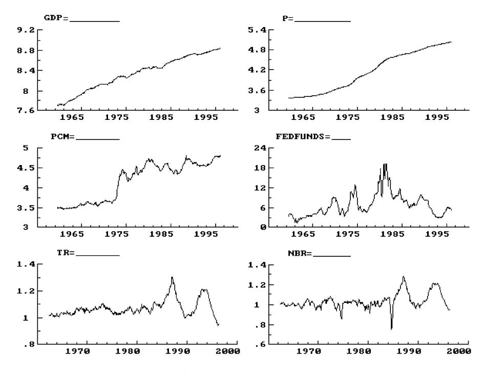

Fig. 1. Variables used in the benchmark VAR model.

loss due to the reduced efficiency of estimation but at no cost in terms of consistency of estimators.

Prior to analysing monetary policy identification issues, we perform several specification tests on the benchmark VAR.2 This is a preliminary but important step in the empirical analysis, since the reduced form of the system must be well specified (i.e. its residuals must be homoscedastic innovations and it must have constant parameters) to be validly used as a statistical framework for the formulation and testing of alternative structural hypotheses (Spanos (1990) and Hendry (1996) emphasize this point).

We first look at the residuals from estimation of the six-variable system over the whole sample (1966*—*1996), plotted in Fig. 2 in standardized form. Residuals from all equations repeatedly exceed the \$2 standard error bands, showing serious departures from normality and homoscedasticity. The visual impression of mis-specification is confirmed by the diagnostic tests reported in Table 1. As

2The econometric analysis is performed using *PcFIM*¸ by Doornik and Hendry (1996) and the RATS procedure MALCOLM written by R. Mosconi.

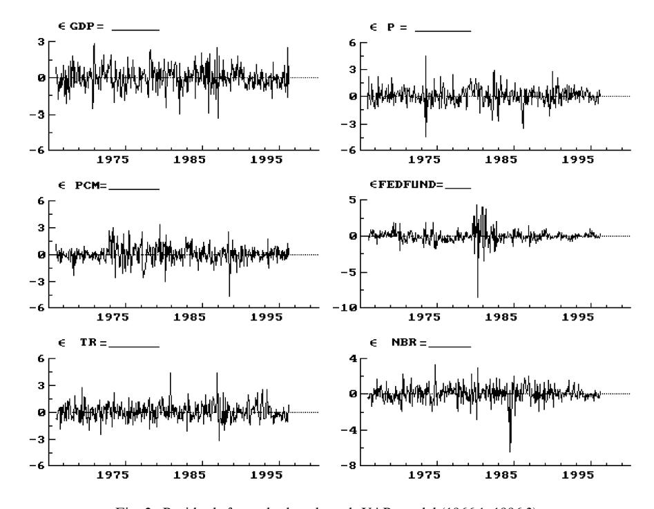

Fig. 2. Residuals from the benchmark VAR model (1966:1*—*1996:3).

far as the equations for the policy variables are concerned, (some of ) the well documented changes in monetary policy operating procedures mentioned in the preceding section are a potential explanation. For example, the federal funds rate residuals display a huge increase in variability over the 1979*—*1982 period, when a nonborrowed reserve target was in operation. Other large residuals may be due to exceptional events, as the sudden increase in borrowings by Continental Illinois in 1984, determining a large (but readily reversed) drop in the ratio of nonborrowed to total reserves. Overall, the diagnostic tests yield overwhelming evidence of mis-specification, likely attributable to parameter instability.

Since it has often been noticed that VAR systems estimated over a relatively long sample display parameter instability in at least some equations (see Rudebusch, 1996; Bernanke and Mihov, 1995), we formally analyse the stability issue, starting from the results of recursive one-step Chow stability tests on each VAR equation. Large structural breaks are detected for all variables at several dates in the sample. Moreover, recursive *N*-step system Chow tests reject stability for most of the possible sample splits date from the beginning of the sample, after initialization.

Table 1 The specification of the benchmark VAR model

(A) *Correlations of* »*AR residuals* (Correlations for the whole sample (1966*—*1996) *below* the diagonal; correlations for the 1988*—*1996 sample *above* the diagonal)

|     | GDP   | P     | Pcm   | FF    | ¹R    | NBR   |
|-----|-------|-------|-------|-------|-------|-------|
| GDP | 1     | 0.04  | 0.26  | !0.18 | !0.02 | !0.04 |
| P   | !0.09 | 1     | !0.06 | 0.13  | 0.13  | 0.14  |
| Pcm | 0.06  | 0.10  | 1     | 0.05  | !0.18 | !0.12 |
| FF  | 0.10  | 0.04  | !0.08 | 1     | !0.22 | !0.20 |
| ¹R  | 0.02  | 0.02  | !0.01 | 0.16  | 1     | 0.85  |
| NBR | 0.01  | !0.07 | 0.07  | !0.28 | 0.47  | 1     |

(B) *Diagnostic tests* (*\** and *\*\** indicate statistical significance at the 5% and 1% level, respectively)

| Sample    | GDP                                    | P                           | Pcm     | FF       | ¹R      | NBR      |  |  |  |
|-----------|----------------------------------------|-----------------------------|---------|----------|---------|----------|--|--|--|
|           |                                        | Residual standard deviation |         |          |         |          |  |  |  |
| 1966—1996 | 0.0046                                 | 0.0020                      | 0.0208  | 0.569    | 0.0097  | 0.0171   |  |  |  |
| 1988—1996 | 0.0029                                 | 0.0013                      | 0.0121  | 0.139    | 0.0071  | 0.0090   |  |  |  |
|           | Normality test                         | s2(2)                       |         |          |         |          |  |  |  |
| 1966—1996 | 8.73*                                  | 71.42**                     | 58.87** | 846.64** | 33.30** | 152.97** |  |  |  |
| 1988—1996 | 0.37                                   | 1.77                        | 1.06    | 2.55     | 3.49    | 0.56     |  |  |  |
|           | Residual autocorrelation test F(7,356) |                             |         |          |         |          |  |  |  |
| 1966—1996 | 0.30                                   | 2.54*                       | 0.68    | 3.90**   | 2.82**  | 0.58     |  |  |  |
| 1988—1996 | 0.66                                   | 0.87                        | 1.46    | 0.89     | 1.29    | 1.14     |  |  |  |
|           |                                        | ARCH test F(7,349)          |         |          |         |          |  |  |  |
| 1966—1996 | 3.72**                                 | 15.10**                     | 3.61**  | 12.03**  | 1.71    | 7.30**   |  |  |  |
| 1988—1996 | 0.42                                   | 0.22                        | 0.34    | 0.78     | 0.77    | 1.20     |  |  |  |

However, it is widely recognized that the information provided by Chow tests could be misleading when the breaks are not one-off and when they occur at unknown dates (Andrews, 1993; Stock, 1994). In recent work, Sims (1996) and Sims et al. (1990) have also remarked that deciding whether there is time variation in parameters by conducting Chow tests with a standard significance level is an inconsistent decision procedure, since when there is in fact no time variation, the procedure does not lead to the correct decision with arbitrarily high probability in large samples. Therefore, he advocated the use of information criteria, such as the Schwarz criterion, to evaluate the difference between a model fit to the full sample and a model allowing parameter change over a chosen subsample. To take account of these criticisms to the recursive-Chow test procedure, we took a list of likely break points related to changes in monetary policy operational procedures and evaluated stability by estimating the model on a sample containing a single known break point. Based on the account of the prevailing operating procedure offered by Bernanke and Mihov (1995) and Strongin (1995), the following possible subsamples are considered:

- f 1966:1*—*1972:12 (free reserves targeting);
- f 1973:1*—*1979:10 (federal funds rate targeting);
- f 1979:11*—*1982:10 (nonborrowed reserves targeting);
- f 1982:11*—*1988:10 (federal funds rate-borrowed reserves targeting, pre-Greenspan period);
- f 1988:11*—*1996:3 (federal funds rate*—*borrowed reserves targeting, Greenspan period).

Table 2 displays the estimated VAR residuals correlation matrix over the three sample periods characterized by a single operating procedure and spanning more than six years (1966*—*1972, 1973*—*1979 and 1988*—*1996). Remarkable changes in the pattern of correlations can be noticed, both within the block of monetary variables and between the monetary and the nonpolicy variables.

Given the above list of changes in operating procedures and the need of having a sufficient number of observations on either side of the potential break, we concentrate on three possible break dates: 1973:1, 1979:11 and 1988:11. We investigate the role of these potential breaks by estimating the VAR on the samples 1966:1*—*1979:10, 1973:1*—*1982:10, and 1982:11*—*1996:3, respectively, so that for each estimates there is only one potential (known) break date.

To test for stability we employed both the parameter constancy forecast tests based on the full variance matrix of all forecast errors available in *PcFIM*¸ (Doornik and Hendry, 1996), and information criteria (Schwarz and Hannan-Quinn). Results are reported in Table 3, panel A. The parameter constancy test confirms the evidence of instability for the first two break points (1973 and 1979) but not for the third (1988), whereas the information criteria weaken the evidence for the first and third breaks but not for the second.

However, this evidence could still be considered as not conclusive. In particular, it could be argued that the break dates have been chosen after the data have been informally examined and their status of 'known' is questionable. To allow for this possibility we introduced an uncertainty of one year around the point estimate of the break dates, and computed the Chow test (in s2 form) for structural stability for every breakpoint. The largest statistic so obtained provides a stability test ('maximum Chow' test) for an unknown break point (Andrews (1993) provides the underlying distributional theory and critical values). We apply the maximum Chow test only to the three equations describing the market for reserves, which, given our structural identification assumptions (absence of contemporaneous effect of the monetary on the nonpolicy variables), should be the only equations affected by changes in the monetary

Table 2 Correlations of benchmark VAR residuals over different sub-samples

(A) Sample: 1966:1*—*1972:12

|     | GDP   | P     | Pcm   | FF    | ¹R   | NBR |
|-----|-------|-------|-------|-------|------|-----|
| GDP | 1     |       |       |       |      |     |
| P   | !0.19 | 1     |       |       |      |     |
| Pcm | 0.18  | !0.28 | 1     |       |      |     |
| FF  | !0.11 | 0.07  | !0.05 | 1     |      |     |
| ¹R  | 0.08  | !0.15 | 0.15  | !0.03 | 1    |     |
| NBR | 0.08  | !0.06 | 0.01  | !0.35 | 0.65 | 1   |
|     |       |       |       |       |      |     |

(B) Sample: 1973:1*—*1979:10

|     | GDP   | P     | Pcm   | FF    | ¹R   | NBR |
|-----|-------|-------|-------|-------|------|-----|
| GDP | 1     |       |       |       |      |     |
| P   | !0.24 | 1     |       |       |      |     |
| Pcm | !0.02 | 0.14  | 1     |       |      |     |
| FF  | !0.06 | !0.26 | !0.12 | 1     |      |     |
| ¹R  | !0.03 | !0.05 | !0.08 | 0.36  | 1    |     |
| NBR | !0.14 | !0.32 | 0.06  | !0.05 | 0.48 | 1   |

(C) Sample: 1988:11*—*1996:3

|     | GDP   | P     | Pcm   | FF    | ¹R   | NBR |  |
|-----|-------|-------|-------|-------|------|-----|--|
| GDP | 1     |       |       |       |      |     |  |
| P   | 0.04  | 1     |       |       |      |     |  |
| Pcm | 0.26  | !0.06 | 1     |       |      |     |  |
| FF  | !0.18 | 0.13  | 0.05  | 1     |      |     |  |
| ¹R  | !0.02 | 0.13  | !0.18 | !0.22 | 1    |     |  |
| NBR | !0.04 | 0.14  | !0.12 | !0.20 | 0.85 | 1   |  |

policy regime. With 37 regressors in each equation, if the change point is known the Chow statistic has critical values of around 52 and 59 at the 5% and 1% significance level, respectively. In the case of unknown break points, the maximum Chow statistic has nonstandard distribution with higher critical values, tabulated by Andrews (1993) for estimated equations with up to 20 regressors. In the case of our trimming points (defining the portion of the sample in which the break is contained), when uncertainty is allowed for, the correct critical values are about 1.12 times the standard critical value of the s2 distribution (42.97 against 37.57 for 20 regressors and trimming points 0.45*—*0.55). Applying these criteria (Table 3, panel B) we find strong evidence of instability in 1979, where

Table 3 Testing stability of the benchmark VAR model

#### (A) Testing stability at known break dates

| Full sample (break date) | Schwarz criterion Hannan-Quinn crit. (unr./restr. model) | F-test for constant. parameters restr. (p-value) | Parameter constancy forecast test (p-value) |
|-----------------------------|----------------------------------------------------------------|--------------------------------------------------------|---------------------------------------------------|
| 1966:1—1979:10              | !41.61/!46.27                                                  | F(216, 530)"0.98                                       | F(492, 47)"2.03                                   |
| (1973:1)                    | !46.49/!48.75                                                  | (0.56)                                                 | (0.002)                                           |
| 1973:1—1982:10              | !39.96/!42.05                                                  | F(216, 316)"2.57                                       | F(210, 58)"3.96                                   |
| (1979:11)                   | !45.69/!44.95                                                  | (0.00)                                                 | (0.00)                                            |
| 1982:11—1996:3              | !43.38/!47.68                                                  | F(216, 500)"1.23                                       | F(528, 34)"0.79                                   |
| (1988:11)                   | !48.36/!50.20                                                  | (0.035)                                                | (0.85)                                            |

#### (B) Testing stability with unknown break dates

| Full sample    | Interval for the break (sample truncation |       | Maximum Chow test (s2 | form) for equation for |  |
|----------------|----------------------------------------------|-------|-----------------------|------------------------|--|
|                | fractions)                                   | FF    | ¹R                    | NBR                    |  |
| 1966:1—1979:10 | 1972:7—1973:7 (0.48—0.55)                 | 79.5  | 51.8                  | 72.3                   |  |
| 1973:1—1982:10 | 1979:1—1979:12 (0.78—0.84)                | 296.3 | 93.3                  | 146.7                  |  |
| 1982:11—1996:3 | 1988:5—1989:5 (0.42—0.48)                 | 78.8  | 92.7                  | 93.9                   |  |

the observed statistics range from a minimum of 93 for the total reserves equation, to a maximum of 296 for the Fed funds rate equation, and some evidence of instability in 1988*—*1989, where the statistics range from a minimum of 78 (Fed funds rate equation) to a maximum of 94 (non borrowed reserves equation).

Overall, the results from the above stability analysis over the whole sample cast serious doubts on the adequacy of our benchmark VAR as a statistical model from which reliable measures of monetary policy innovations could be derived.

When estimation is performed over the most recent period, starting in November 1988, no signs of mis-specification are detected by the diagnostic tests reported in Table 1. All standardized residuals displayed in Fig. 3 are within the \$2p bands (with the only exception of one observation for the total reserves equation). Although recursive stability tests on each equation show some relatively minor episodes of instability (Fig. 4), at the whole system level the hypothesis of structural stability cannot be rejected (Fig. 5). Therefore, we feel justified in concentrating on this shorter sample period to evaluate different methods for identifying monetary policy shocks.

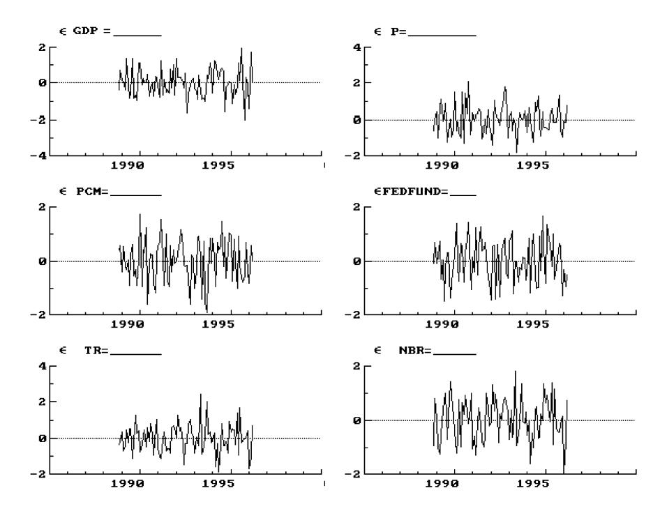

Fig. 3. Residuals from the benchmark VAR model (1988:11*—*1996:3).

# 4. Identifying shocks: an evaluation of alternative strategies

In this section we concentrate on the sample 1988(11)*—*1996(3) to compare different procedures to identify monetary policy shocks. As shown in the previous section, the benchmark VAR model does not display any parameter instability over this sample period, and the analysis of the Fed's operating procedures suggests a single policy regime, to be associated with a precise identifying scheme. We consider three alternative specifications for monetary policy shocks, which are not derived by applying different structuralization to the same reduced form VAR, but instead are obtained independently from the estimation of the VAR model.

# *4.1. Identification*

The benchmark shocks are derived by applying a standard identification scheme on the VAR model. Monetary policy shocks are identified from the VAR by assuming that policy variables react contemporaneously to the nonpolicy

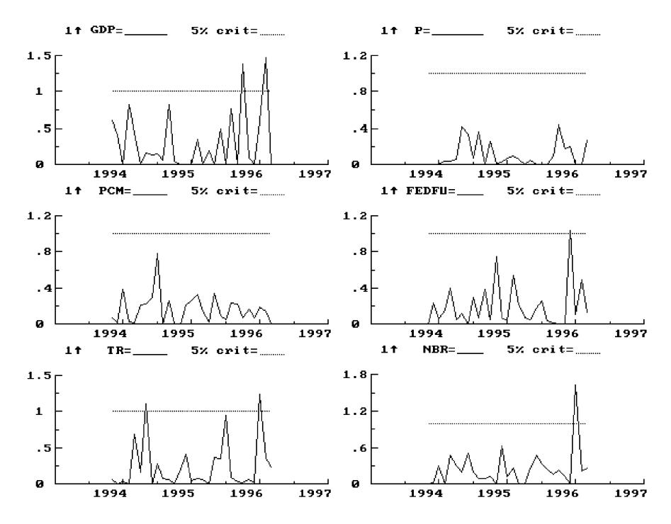

Fig. 4. Recursive stability tests on the benchmark VAR (1988:11-1996:3; initialization: 60 observations).

variables, while the converse does not hold, and by considering an operating procedure in which the Fed fully offsets shocks to total and borrowed reserves demand, which corresponds to the parametric assumption  $\phi^D = 1$ ,  $\phi^B = -1$ . This scheme imposes one over-identifying restriction on the system, which has now the following structural form:

$$\begin{vmatrix} 1 & 0 & 0 & 0 & 0 & 0 \\ d_{21} & 1 & 0 & 0 & 0 & 0 \\ d_{31} & d_{32} & 1 & 0 & 0 & 0 \\ d_{41} & d_{42} & d_{43} & 1 & 0 & 0 \\ d_{51} & d_{52} & d_{53} & \alpha & 1 & 0 \\ d_{61} & d_{62} & d_{63} & \beta & -1 & 1 \end{vmatrix} \begin{vmatrix} GDP_t \\ P_t \\ PCm_t \\ FF_t \\ TR_t \\ NBR_t \end{vmatrix} = C^*(L) \begin{vmatrix} GDP_{t-1} \\ P_{t-1} \\ PCm_{t-1} \\ FF_{t-1} \\ TR_{t-1} \\ NBR_{t-1} \end{vmatrix} + \begin{vmatrix} v_{1t}^{NP} \\ v_{2t}^{NP} \\ v_{3t}^{NP} \\ v_{t}^{NP} \\ v_{t}^{NP} \\ v_{t}^{NP} \\ v_{t}^{NP} \\ v_{t}^{NP} \\ v_{t}^{NP} \\ v_{t}^{NP} \\ v_{t}^{NP} \\ v_{t}^{NP} \\ v_{t}^{NP} \\ v_{t}^{NP} \\ v_{t}^{NP} \\ v_{t}^{NP} \\ v_{t}^{NP} \\ v_{t}^{NP} \\ v_{t}^{NP} \\ v_{t}^{NP} \\ v_{t}^{NP} \\ v_{t}^{NP} \\ v_{t}^{NP} \\ v_{t}^{NP} \\ v_{t}^{NP} \\ v_{t}^{NP} \\ v_{t}^{NP} \\ v_{t}^{NP} \\ v_{t}^{NP} \\ v_{t}^{NP} \\ v_{t}^{NP} \\ v_{t}^{NP} \\ v_{t}^{NP} \\ v_{t}^{NP} \\ v_{t}^{NP} \\ v_{t}^{NP} \\ v_{t}^{NP} \\ v_{t}^{NP} \\ v_{t}^{NP} \\ v_{t}^{NP} \\ v_{t}^{NP} \\ v_{t}^{NP} \\ v_{t}^{NP} \\ v_{t}^{NP} \\ v_{t}^{NP} \\ v_{t}^{NP} \\ v_{t}^{NP} \\ v_{t}^{NP} \\ v_{t}^{NP} \\ v_{t}^{NP} \\ v_{t}^{NP} \\ v_{t}^{NP} \\ v_{t}^{NP} \\ v_{t}^{NP} \\ v_{t}^{NP} \\ v_{t}^{NP} \\ v_{t}^{NP} \\ v_{t}^{NP} \\ v_{t}^{NP} \\ v_{t}^{NP} \\ v_{t}^{NP} \\ v_{t}^{NP} \\ v_{t}^{NP} \\ v_{t}^{NP} \\ v_{t}^{NP} \\ v_{t}^{NP} \\ v_{t}^{NP} \\ v_{t}^{NP} \\ v_{t}^{NP} \\ v_{t}^{NP} \\ v_{t}^{NP} \\ v_{t}^{NP} \\ v_{t}^{NP} \\ v_{t}^{NP} \\ v_{t}^{NP} \\ v_{t}^{NP} \\ v_{t}^{NP} \\ v_{t}^{NP} \\ v_{t}^{NP} \\ v_{t}^{NP} \\ v_{t}^{NP} \\ v_{t}^{NP} \\ v_{t}^{NP} \\ v_{t}^{NP} \\ v_{t}^{NP} \\ v_{t}^{NP} \\ v_{t}^{NP} \\ v_{t}^{NP} \\ v_{t}^{NP} \\ v_{t}^{NP} \\ v_{t}^{NP} \\ v_{t}^{NP} \\ v_{t}^{NP} \\ v_{t}^{NP} \\ v_{t}^{NP} \\ v_{t}^{NP} \\ v_{t}^{NP} \\ v_{t}^{NP} \\ v_{t}^{NP} \\ v_{t}^{NP} \\ v_{t}^{NP} \\ v_{t}^{NP} \\ v_{t}^{NP} \\ v_{t}^{NP} \\ v_{t}^{NP} \\ v_{t}^{NP} \\ v_{t}^{NP} \\ v_{t}^{NP} \\ v_{t}^{NP} \\ v_{t}^{NP} \\ v_{t}^{NP} \\ v_{t}^{NP} \\ v_{t}^{NP} \\ v_{t}^{NP} \\ v_{t}^{NP} \\ v_{t}^{NP} \\ v_{t}^{NP} \\ v_{t}^{NP} \\ v_{t}^{NP} \\ v_{t}^{NP} \\ v_{t}^{NP} \\ v_{t}^{NP} \\ v_{t}^{NP} \\ v_{t}^{NP} \\ v_{t}^{NP} \\ v_{t}^{NP} \\ v_{t}^{NP} \\ v_{t}^{NP} \\ v_{t}^{NP} \\ v_{t}^{NP} \\ v_{t}^{NP} \\ v_$$

Estimation of Eq. (4.1) is implemented, instead of imposing the restriction  $d_{65}=-1$ , by means of a Choleski factorization of the VAR residuals with the

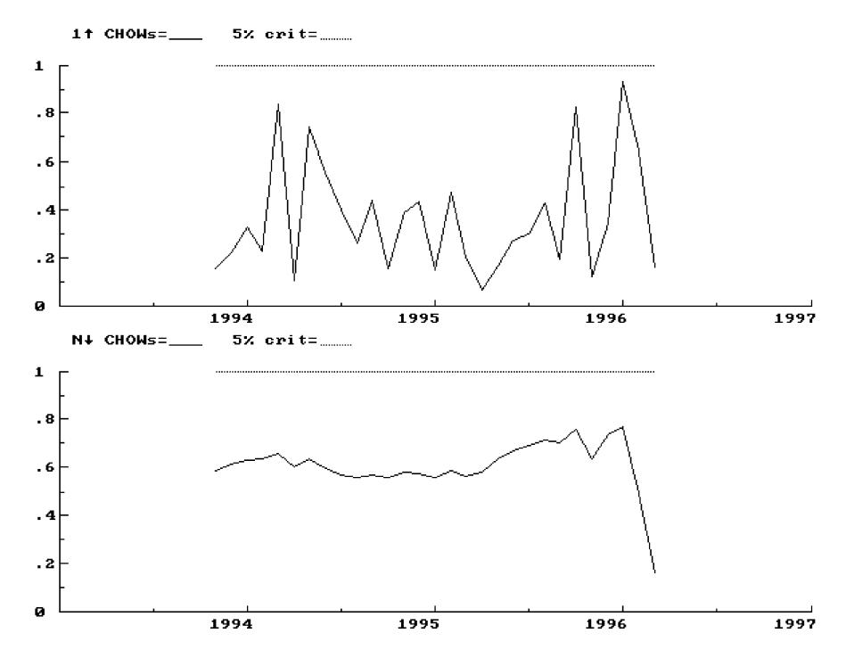

Fig. 5. Recursive stability tests on the benchmark VAR model as a system (1988:11–1996:3; initialization: 60 observations).

ordering shown above. The validity of the overidentifying restriction is then checked by looking at the estimated  $d_{65}$  coefficient and its standard error.

The results are reported in Table 4. We note that the simultaneous reaction of the federal funds rate to the macroeconomic policy variables (captured by  $d_{41}$ ,  $d_{42}$  and  $d_{43}$ ) is not strongly significant. Such evidence is confirmed by Fig. 6, showing a negligible difference between VAR innovations in the federal funds rate and the structural monetary policy shocks  $v^{\rm S}$ , that we label BENCH.3 The structural parameters describing the market for reserves are broadly in line with the predictions of the model:  $\alpha$  and  $\beta$  are not significant, though correctly signed. Finally, the overidentifying restriction  $d_{65}=-1$  cannot be rejected, supporting the validity of the identification scheme used.

&lt;sup>3 Similar results are reported by Rudebusch (1996), who estimates a slightly different specification on the same sample and contrasts the results with those derived by Leeper et al. (1996) from a similar VAR but over a much longer sample period.

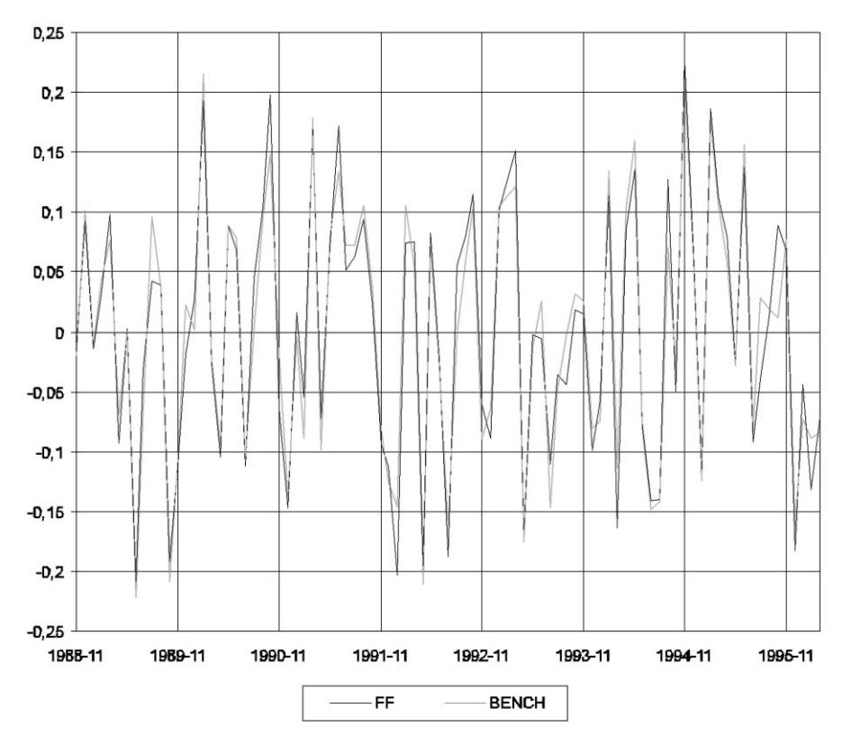

Fig. 6. Benchmark VAR innovations (FF) and structural residuals (BENCH).

We now consider several alternative measures of monetary policy shocks derived independently from the estimation of the VAR model.

The first to be considered is the one originally proposed by Rudebusch (1996) and further analysed by Brunner (1996). Monetary policy shocks are derived from the 30-day Fed funds future contracts, which have been quoted on the Chicago Board of Trade since October 1988, and are bets on the average overnight fed funds rate for the delivery month, corresponding to the variable included in the benchmark VAR. Fig. 7 reports the federal funds rate implicit in the future contract along with the Fed's federal fund rate target. Shocks are constructed as the difference between the federal funds rate at month *t* and the 30-day federal funds future at month *t*!1. Such choice is based on the evidence, that the regression of the federal funds rate at *t* on the 30-day federal funds future at *t*!1 produces an intercept not significantly different from zero, a slope coefficient not significantly different from one, and serially

Table 4
The benchmark structural VAR model

The relation between reduced-form and structural disturbances is Eq. (2.7) in the text:

$$\begin{vmatrix} 1 & 0 & 0 & 0 & 0 & 0 \\ a_{21} & 1 & 0 & 0 & 0 & 0 \\ a_{31} & a_{32} & 1 & 0 & 0 & 0 \\ a_{41} & a_{42} & a_{43} & 1 & -\frac{1}{\beta} & \frac{1}{\beta} \\ a_{51} & a_{52} & a_{53} & \alpha & 1 & 0 \\ a_{61} & a_{62} & a_{63} & 0 & 0 & 1 \end{vmatrix} \begin{vmatrix} u_t^{GDP} \\ u_t^P \\ u_t^{Pem} \\ u_t^{FF} \\ u_t^{RR} \\ u_t^{NBR} \end{vmatrix} = \begin{vmatrix} 1 & 0 & 0 & 0 & 0 & 0 \\ 0 & 1 & 0 & 0 & 0 & 0 \\ 0 & 0 & 1 & 0 & 0 & 0 \\ 0 & 0 & 0 & -\frac{1}{\beta} & 0 & 0 \\ 0 & 0 & 0 & 0 & 1 & 0 \\ 0 & 0 & 0 & \phi^D & \phi^B & 1 \end{vmatrix} \begin{vmatrix} v_{1t}^{NP} \\ v_{2t}^{NP} \\ v_{1t}^{NP} \\ v_{2t}^{NP} \\ v_{t}^{NP} \\ v_{t}^{NP} \end{vmatrix}$$

Estimation is performed (with  $\phi^D = 1$  and  $\phi^B = -1$  imposed) after rewriting the above expression as  $Du_t = v_t$ :

$$\begin{vmatrix} 1 & 0 & 0 & 0 & 0 & 0 \\ d_{21} & 1 & 0 & 0 & 0 & 0 \\ d_{31} & d_{32} & 1 & 0 & 0 & 0 \\ d_{41} & d_{42} & d_{43} & 1 & 0 & 0 \\ d_{51} & d_{52} & d_{53} & d_{54} & 1 & 0 \\ d_{61} & d_{62} & d_{63} & d_{64} & d_{65} & 1 \end{vmatrix} \begin{vmatrix} u_t^{GDP} \\ u_t^P \\ u_t^{FCm} \\ u_t^{FF} \\ u_t^{TR} \\ u_t^{NBR} \end{vmatrix} = \begin{vmatrix} v_{11}^{NP} \\ v_{21}^{NP} \\ v_{21}^{NP} \\ v_{31}^{NP} \\ v_t^{NP} \\ v_t^{NP} \end{vmatrix}$$

with  $d_{54} = \alpha$ ,  $d_{64} = \beta$   $d_{65} = -1$  (this restriction is not imposed in estimation). The sample period is: 1988(11)–1996(3).

|                  | Estimated ec   | Estimated ecoefficients of matrix D | natrix <b>D</b>                                           |                 |                |                 |                |                |
|------------------|----------------|-------------------------------------|-----------------------------------------------------------|-----------------|----------------|-----------------|----------------|----------------|
|                  | $d_{21}$       | $d_{31}$                            | $d_{32}$                                                  | d 41 | $d_{42}$       | d 43 | $d_{51}$       | $d_{52}$       |
| Coeff. (S.E.) | -0.002 (0.050) | -1.108 (0.473)                      | -0.233 (1.044)                                            | 11.54 (5.562)   | -15.87 (11.89) | -0.540 (1.250)  | 0.056          | -0.596 (0.631) |
|                  | $d_{53}$       | $d_{54}(\alpha)$                    | $d_{61}$                                                  | $d_{62}$        | $d_{63}$       | $d_{64}(\beta)$ | $d_{65}$       |                |
| Coeff. (S.E.) | 0.068          | 0.010                               | 0.042 (0.140)                                             | -0.464 (0.296)  | -0.033 (0.031) | 0.003           | -1.028 (0.051) |                |
|                  | Estimated sta  | ındard deviati                      | Estimated standard deviations of structural disturbances: | al disturbanc   | es:            |                 |                |                |
|                  | $v_1^{NP}$     | $v_2^{NP}$                          | $v_3^{NP}$                                                | N.S             | $\nu^{\rm D}$  | $v^{\rm B}$     |                |                |
| Estimate (S.E.)  | 0.002 (0.0002) | 0.001 (0.0001)                      | 0.009 (0.0007)                                            | 0.100 (0.008)   | 0.005 (0.0004) | 0.002 (0.0002)  |                |                |

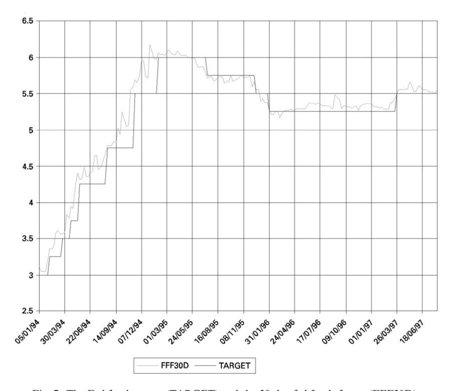

Fig. 7. The Fed funds target (TARGET) and the 30-day fed funds future (FFF30D).

uncorrelated residuals:

$$FF_{t} = -0.037 + 0.999 FFF_{t-1} + \hat{u}_{t},$$

$$(0.0436) \quad (0.007)$$

$$R^{2} = 0.99, \quad \sigma = 0.145, \quad DW = 1.86.$$

This procedure produces shocks, labelled FFF, which are comparable to the reduced form innovations from the VAR and not to the structural monetary policy shocks, because surprises relative to the information available at the end of month t-1 may reflect endogenous policy responses to news about the economy that become available in the course of month t. For this reason we map the FFF innovations into an equivalent of structural monetary policy shocks by regressing them on the VAR innovations of the nonpolicy variables:

$$\hat{u}_t = -0.92 u_t^{GDP} + 27.78 u_t^P - 2.04 u_t^{Pcm} + FFFS_t,$$

$$R^2 = 0.05, \quad \sigma = 0.145, \quad DW = 1.76.$$

As in the case for the benchmark VAR model, the above regression does not show any strong effect of current macroeconomic variables on the federal funds rate. This kind of evidence is in line with the results in Rudebusch (1996) and could justify the identification scheme adopted by some authors (e.g. Gordon and Leeper, 1994), who assume that within the month the Fed reacts to current money and financial market variables, but not to current innovations in the goods market variables, which are observed with a one-month lag. On the other hand, this empirical evidence does not support the view of endogeneity of money on the sample considered. We label this measure of monetary policy shocks as *FFFS*.

A second non-VAR measure of policy shocks is based on the work of Skinner and Zettelmeyer (1996). They derive a measure of unanticipated monetary policy shocks by following a two-step methodology: first, using information from central bank reports and newspapers, a list of days on which monetary policy announcements occurred is constructed; second, monetary policy shocks are identified with the changes in the three-month interest rate on the days of policy announcements. The validity of such procedure requires that (i) short rates (e.g the overnight rate) are affected by policy; (ii) arbitrage is effective between the overnight and the three-month interest rate; (iii) the impact of other news affecting the three-month rate on the day of the policy decision is negligible; (iv) policy actions are not endogenous responses to information that becomes available on the day when the decision is taken. To ensure that conditions (iii) and (iv) are applicable, Skinner and Zettelmeyer go through reports of the policy actions and exclude from their sample those which do no conform to requirements (iii) and (iv). The main problem with the index so obtained is that it can only pin down shocks associated to monetary policy decisions reflected in some action on controlled variables, whereas shocks associated with *no* action (while some action was expected by the markets) are neglected. In the latest part of our sample, when monetary policy decisions are taken on the occasion of the *FOMC* meetings, we can overcome this problem by extending the index to consider as shocks the change of the three month-rate on occasion of the *FOMC* meetings. By doing so we derive shocks that we label *ESZ*. For reference, we note that the shocks associated to no action are never larger than 5 basis point in absolute value in our sample. Therefore, most of the volatility of this series is generated at the dates where some action was taken and the sample selection problem introduced by the original methodology of Skinner and Zettelmeyer does not seem to be severe. *ESZ* are by their nature structural shocks, directly comparable with the identified monetary policy shocks of the benchmark VAR model.

The third alternative measure of shocks is based on the estimation of the term structure of spot rates and of instantaneous forward rates as proposed by Svensson (1994) and applied in Favero et al. (1996). The methodology is based on the use of instantaneous forward rates as monetary policy indicators. Forward rates are interest rates on investments made at a future date, the settlement date, and expiring at a date further into the future, the maturity date. Instantaneous forward interest rates are the limit as the maturity date and the settlement date approach one another.

To illustrate our derivation of spot rate, let us start by the consideration of a zero-coupon bond issued at time t with a face value of 1, maturity of m years and price  $P_{mt}^{\rm ZC}$ . The simple yield  $Y_{mt}$  is related to the price as follows:

$$P_{mt}^{ZC} = \frac{1}{(1 + Y_{mt})m}. (4.2)$$

Defining the spot rate  $r_{mt}$  as  $\log(1 + Y_{mt})$ , which is the continuously compounded yield, and the discount function  $D_{mt}$  as the price at time t of a zero coupon that pays one unit at time t + m, we then have

$$P_{mt}^{ZC} = \exp(-mr_{mt}) = D_{mt}. (4.3)$$

Consider now a *coupon* bond that pays a coupon rate of *c* per cent annually and pays a face value of 1 at maturity. The price of the bond at trade date is given by the following formula:

$$P_{mt} = \sum_{k=1}^{m} cD_{kt} + D_{mt}. (4.4)$$

Given the observation of prices of coupon bonds, spot rates on zero coupon equivalent can be derived by fitting a discount function based on the following specification for the spot rates:

$$r_{kt} = \beta_0 + \beta_1 \frac{1 - \exp(-k/\tau_1)}{k/\tau_1} + \beta_2 \left( \frac{1 - \exp(-k/\tau_1)}{k/\tau_1} - \exp\left(-\frac{k}{\tau_1}\right) \right) + \beta_3 \left( \frac{1 - \exp(-k/\tau_2)}{k/\tau_2} - \exp\left(-\frac{k}{\tau_2}\right) \right).$$
(4.5)

Such specification has been originally introduced by Svensson (1994) and it is an extension of the parametrization proposed by Nelson and Siegel (1987). Implied forward rates can be calculated from spot rates. A forward rate at time t with trade date t+t' and settlement date t+T can be calculated as the return on an investment strategy based on buying zero-coupon bonds at time t maturing at time t+T and selling at time t zero-coupon bonds maturing at time t+t'. The forward rate is related to the spot rate by the following formula:

$$f_{t+T,t+t',t} = \frac{Tr_{T,t} - t'r_{t',t}}{T - t'}$$
(4.6)

so the forward rate for a one-year investment with settlement in two years and maturity in three years is equal to three times the three-year spot rate minus twice the two-year spot rate. The instantaneous forward rate is the rate on a forward contract with an infinitesimal investment after the settlement date:

$$f_{mt} = \lim_{T \to m} f_{t+T,t+m,t}. \tag{4.7}$$

In practice, we identify the instantaneous forward rate with an overnight forward rate, a forward rate with maturity one day after the settlement. The relation between instantaneous forward rate and spot rate is then

$$r_{mt} = \frac{\int_{\tau=t}^{t+m} f_{\tau t} \, \mathrm{d}\tau}{m}$$

or, equivalently,

$$f_{mt} = r_{mt} + m \frac{\partial r_{m,t}}{\partial m}. {4.8}$$

Given specification Eq. (4.5) for the spot rate, the resulting forward function is as follows:

$$f_{kt} = \beta_0 + \beta_1 \exp\left(-\frac{k}{\tau_1}\right) + \beta_2 \frac{k}{\tau_1} \exp\left(-\frac{k}{\tau_1}\right) + \beta_3 \frac{k}{\tau_2} \exp\left(-\frac{k}{\tau_2}\right). \tag{4.9}$$

Therefore, as k goes to zero the spot and the forward rate coincide at  $\beta_0 + \beta_1$ and as k goes to infinity the spot and the forward rate coincide at  $\beta_0$ . The forward rate function features a constant, an exponential term decreasing when  $\beta_1$  is positive, and two 'hump-shape' terms. The relation between the spot rate and the instantaneous forward rate at the same maturity is analogous to the relation between a marginal and an average quantity. So the curve of instantaneous forward rate lies above the curve of spot rates, when this is positively sloped, and below the curve of spot rates, when this is negatively sloped. If the pure expectational model is valid and there is no term premium, then instantaneous forward rates at future dates can be interpreted as the expected spot interest rates for those future rates. The observable equivalent of the instantaneous forward rate is the overnight rate. So the curve of instantaneous forward rates at future dates can be interpreted as indicating the expected overnight rates for those future dates. If the overnight rate is thought of as a rate controlled by monetary authorities, then the curve of instantaneous forward rates can be thought of as an indicator of expected monetary policy, based on the pure expectational model. Monetary policy 'surprises' can be generated 'ex-post' by computing the distance between observed overnight rates and expected overnight rates.

Exploiting the fact that intervention on policy rates takes place on occasion of regular meetings of the Federal Open Market Committee, we estimate the term structure of spot rates and of instantaneous forward rates the day before regular meetings, obtaining a measure of expectations for Federal Reserve interventions and an associated measure of monetary policy shocks. Our estimated curves are fitted to the following rates: the federal fund target, 1m euro, 3m euro, 6m euro, 12m euro, 3, 5, 7, and 10-year fixed interest rate swap.4 The measure of the expected overnight rate for the day after the meetings is then subtracted to the observed target rate on that day to obtain a neasure of the unexpected part of Fed interventions. The *FOMC* meets eight times a year; therefore we construct a monthly measure of shocks which features four zeros each year. Since the practice of deciding on interventions at given and known dates is only recent (from 1994 onwards), in order to conduct our exercise on a meaningful sample we supplement the result on the *FOMC* meetings from 1994 onwards with the results of the application of the proposed procedure to the dates indicated by the analysis of Skinner and Zettelmeyer for the period 1988:11*—*1993:12. We label this measure of monetary policy shock as *IFS* (instantaneous forward shocks).

Table 5 and Fig. 8 provide a first assessment of the alternative measures of monetary policy shocks described above. We note that the correlations between shocks range from 0.3 to 0.6. Regression analysis shows a maximum *R*2 of 0.2 for the regression of *BENCH* on *FFFS*, while the *R*2 of the regression of *BENCH* on *ESZ* is 0.1. The lowest *R*2 of 0.09 is obtained from the regression of *BENCH* on *IFS*. The coefficients of all regressions are clearly, but not spectacularly, significant.

On the basis of similar evidence, Rudebusch (1996) concluded that shocks derived from VAR do not make sense as measures of monetary policy shocks. We conclude that they are not strongly correlated with alternative measurements of the same quantity and investigate further the issue by analysing how sensitive the description of the monetary transmission mechanism is to alternative specifications of policy shocks. We do so by including the above measures of monetary policy shocks in the benchmark VAR as exogenous variables and by deriving the associated impulse response functions.

4 In a previous version of this paper we used the overnight federal funds rate instead of the federal fund target. The original estimation produced different, and less interesting, results. Frederick Mishkin pointed out that the overnight federal fund rate might display noisy behaviour in response to liquidity shocks totally unrelated to monetary policy and suggested us to substitute it with the federal funds target.

Table 5 Comparing alternative measures of monetary policy shocks. Sample period: 1988:11–1996:3

|                    |             | BENCH | FFFS          | ESZ     | IFS     |
|--------------------|-------------|-------|---------------|---------|---------|
| Mean               |             | 0     | 0             | - 0.005 | - 0.009 |
| Standard deviation |             | 0.104 | 0.141         | 0.056   | 0.176   |
| Correlation matrix | BENCH       | 1     |               |         |         |
|                    | FFFS        | 0.475 | 1             |         |         |
|                    | ESS         | 0.327 | 0.363         | 1       |         |
|                    | IFS         | 0.294 | 0.364         | 0.581   | 1       |
|                    |             |       | f BENCH onto: |         |         |
|                    |             | FFFS  | ESZ           | IFS     |         |
|                    |             |       | LSZ           | 11 5    |         |
|                    | Coefficient | 0.326 | 0.602         | 0.174   |         |
|                    | S.E.        | 0.068 | 0.186         | 0.06    |         |
|                    | $R^2$       | 0.21  | 0.11          | 0.09    |         |
|                    | $\sigma$    | 0.093 | 0.099         | 0.100   |         |
|                    | DW          | 1.85  | 2.00          | 2.04    |         |

#### 4.2. Estimation and impulse response functions

We estimate four structural models, augmenting the benchmark specification in Eq. (4.1) with the inclusion of each of the alternative measures of policy shocks discussed above as contemporaneous exogenous variables in the VAR:

$$\begin{vmatrix} 1 & 0 & 0 & 0 & 0 & 0 \\ d_{21} & 1 & 0 & 0 & 0 & 0 \\ d_{31} & d_{32} & 1 & 0 & 0 & 0 \\ d_{41} & d_{42} & d_{43} & 1 & 0 & 0 \\ d_{51} & d_{52} & d_{53} & d_{54} & 1 & 0 \\ d_{61} & d_{62} & d_{63} & d_{64} & d_{65} & 1 \end{vmatrix} \begin{vmatrix} GDP_t \\ P_t \\ Pcm_t \\ FF_t \\ TR_t \\ NBR_t \end{vmatrix}$$

$$= C^*(L) \begin{pmatrix} GDP_{t-1} \\ P_{t-1} \\ PCm_{t-1} \\ FF_{t-1} \\ TR_{t-1} \\ NBR_{t-1} \end{pmatrix} + \begin{pmatrix} g_{GNP} \\ g_P \\ g_{Pcm} \\ g_{FF} \\ g_{TR} \\ g_{NRR} \end{pmatrix} x_t + \begin{pmatrix} v_{1r}^{NP} \\ v_{2t}^{NP} \\ v_{3t}^{NP} \\ v_t^{NP} \\ v_t^{D} \\ v_t^{S} \end{pmatrix}$$
(4.10)

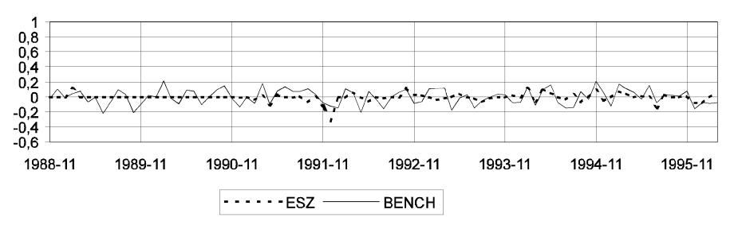

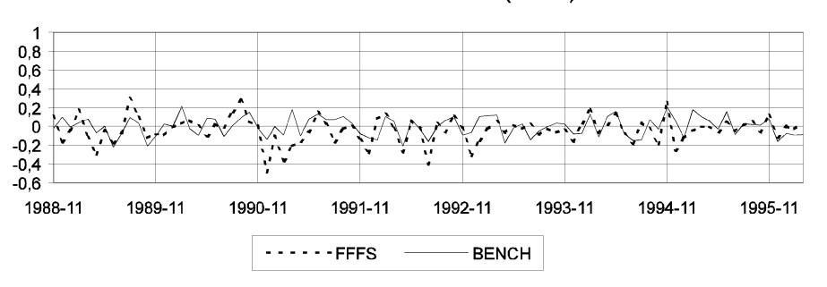

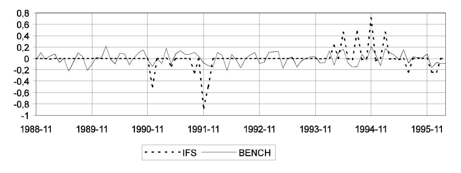

Fig. 8. Alternative measures of monetary policy shocks.

where  $x_t$  is set in turn equal to  $FFFS_t$ ,  $ESZ_t$  and  $IFS_t$ . No lags of  $x_t$  are introduced because this variable is meant to be a direct measure of monetary policy shocks. All models are estimated over the sample 1988(11)–1996(3).

Results are reported in Table 6. It can be immediately noted that all alternative estimates of the  $g_{GDP}$ ,  $g_P$ , and  $g_{Pcm}$  parameters show that the contemporaneous effect of the monetary policy shocks on the macroeconomic variables is never significant. Therefore, one of the crucial identifying assumptions in the benchmark VAR model is validated by the estimation based on alternative measures of policy shocks. The estimates of  $g_{FF}$  show a quantitatively and statistically significant positive impact for FFFS, ESZ, and IFS on the federal funds rate. This evidence weakens the conclusion by Rudebusch (1996) that VAR-based monetary policy shocks do not make sense. The estimates of  $g_{TR}$  and  $g_{NBR}$  are not significant when FFFS and ESZ are used but become significant, and correctly signed, in the model with the IFS shock. We note that the parameters  $\alpha$  and  $\beta$  are not significant also in the benchmark model, where they constitute the only channel through which monetary policy affects contemporaneously the market for reserves. It seems that the inclusion of the IFS shocks in the VAR allows a better determination of the parameters determining demand and supply behaviour in th market for reserves. All other estimated structural parameters do not show a significant difference between the benchmark model and the model based on FFFS, ESZ, and IFS shocks.

On the basis of this evidence, we proceed further by comparing the impulse responses of the benchmark VAR model with those derived by considering FFFS, ESZ and IFS as monetary policy shocks. The impulse response functions for the four models along with 95% confidence intervals computed for the benchmark VAR are reported in Fig. 9. The plots clearly show that the alternative measures of policy shocks yield descriptions of the monetary transmission mechanism which are not significantly different (in a statistical sense) from each other.

#### 4.3. Discussion

Our results deserve discussion on, at least, three issues: interpretation of the impulse responses, measurement of the policy shocks, robustness. Next, we will reconsider the relevance of Rudebusch's critique in the light of our results.

On the interpretation of the impulse responses, it could be argued that the low correlation between our alternative measures of policy shocks implies that at least some of them must contain a substantial amount of variability that it is not due to unexpected monetary actions. As a consequence, impulse response estimates could be affected by errors-in-variables bias or, in the worst case, the additional variability might reflect endogenous factors. While the errors-in-variables bias is not easily dismissed, some arguments can be made to rule out the worst-case scenario. The impulse responses from the benchmark VAR model

Table 6
The VAR with exogenous measures of monetary policy shocks

The estimated VAR models are of the following form:

$$D \begin{pmatrix} GDP_{t} \\ P_{t} \\ Pcm_{t} \\ FF_{t} \\ TR_{t} \\ NBR_{t} \end{pmatrix} = C^{*}(L) \begin{pmatrix} GDP_{t-1} \\ P_{t-1} \\ Pcm_{t-1} \\ FF_{t-1} \\ TR_{t-1} \\ NBR_{t-1} \end{pmatrix} + \begin{pmatrix} g_{GDP} \\ g_{P} \\ g_{Pcm} \\ g_{FF} \\ g_{TR} \\ g_{NBR} \end{pmatrix} x_{t} + \begin{pmatrix} v_{1P}^{NP} \\ v_{2t}^{NP} \\ v_{3t}^{NP} \\ v_{t}^{NP} \\ v_{t}^{NP} \\ v_{t}^{NP} \\ v_{t}^{NP} \\ v_{t}^{NP} \\ v_{t}^{NP} \\ v_{t}^{NP} \\ v_{t}^{NP} \\ v_{t}^{NP} \\ v_{t}^{NP} \\ v_{t}^{NP} \\ v_{t}^{NP} \\ v_{t}^{NP} \\ v_{t}^{NP} \\ v_{t}^{NP} \\ v_{t}^{NP} \\ v_{t}^{NP} \\ v_{t}^{NP} \\ v_{t}^{NP} \\ v_{t}^{NP} \\ v_{t}^{NP} \\ v_{t}^{NP} \\ v_{t}^{NP} \\ v_{t}^{NP} \\ v_{t}^{NP} \\ v_{t}^{NP} \\ v_{t}^{NP} \\ v_{t}^{NP} \\ v_{t}^{NP} \\ v_{t}^{NP} \\ v_{t}^{NP} \\ v_{t}^{NP} \\ v_{t}^{NP} \\ v_{t}^{NP} \\ v_{t}^{NP} \\ v_{t}^{NP} \\ v_{t}^{NP} \\ v_{t}^{NP} \\ v_{t}^{NP} \\ v_{t}^{NP} \\ v_{t}^{NP} \\ v_{t}^{NP} \\ v_{t}^{NP} \\ v_{t}^{NP} \\ v_{t}^{NP} \\ v_{t}^{NP} \\ v_{t}^{NP} \\ v_{t}^{NP} \\ v_{t}^{NP} \\ v_{t}^{NP} \\ v_{t}^{NP} \\ v_{t}^{NP} \\ v_{t}^{NP} \\ v_{t}^{NP} \\ v_{t}^{NP} \\ v_{t}^{NP} \\ v_{t}^{NP} \\ v_{t}^{NP} \\ v_{t}^{NP} \\ v_{t}^{NP} \\ v_{t}^{NP} \\ v_{t}^{NP} \\ v_{t}^{NP} \\ v_{t}^{NP} \\ v_{t}^{NP} \\ v_{t}^{NP} \\ v_{t}^{NP} \\ v_{t}^{NP} \\ v_{t}^{NP} \\ v_{t}^{NP} \\ v_{t}^{NP} \\ v_{t}^{NP} \\ v_{t}^{NP} \\ v_{t}^{NP} \\ v_{t}^{NP} \\ v_{t}^{NP} \\ v_{t}^{NP} \\ v_{t}^{NP} \\ v_{t}^{NP} \\ v_{t}^{NP} \\ v_{t}^{NP} \\ v_{t}^{NP} \\ v_{t}^{NP} \\ v_{t}^{NP} \\ v_{t}^{NP} \\ v_{t}^{NP} \\ v_{t}^{NP} \\ v_{t}^{NP} \\ v_{t}^{NP} \\ v_{t}^{NP} \\ v_{t}^{NP} \\ v_{t}^{NP} \\ v_{t}^{NP} \\ v_{t}^{NP} \\ v_{t}^{NP} \\ v_{t}^{NP} \\ v_{t}^{NP} \\ v_{t}^{NP} \\ v_{t}^{NP} \\ v_{t}^{NP} \\ v_{t}^{NP} \\ v_{t}^{NP} \\ v_{t}^{NP} \\ v_{t}^{NP} \\ v_{t}^{NP} \\ v_{t}^{NP} \\ v_{t}^{NP} \\ v_{t}^{NP} \\ v_{t}^{NP} \\ v_{t}^{NP} \\ v_{t}^{NP} \\ v_{t}^{NP} \\ v_{t}^{NP} \\ v_{t}^{NP} \\ v_{t}^{NP} \\ v_{t}^{NP} \\ v_{t}^{NP} \\ v_{t}^{NP} \\ v_{t}^{NP} \\ v_{t}^{NP} \\ v_{t}^{NP} \\ v_{t}^{NP} \\ v_{t}^{NP} \\ v_{t}^{NP} \\ v_{t}^{NP} \\ v_{t}^{NP} \\ v_{t}^{NP} \\ v_{t}^{NP} \\ v_{t}^{NP} \\ v_{t}^{NP} \\ v_{t}^{NP} \\ v_{t}^{NP} \\ v_{t}^{NP} \\ v_{t}^{NP} \\ v_{t}^{NP} \\ v_{t}^{NP} \\ v_{t}^{NP} \\ v_{t}^{NP}$$

where D is a lower-triangular matrix of coefficients, x is in turn equal to FFFS, ESZ and IFS (the exogenous measures of monetary policy shocks discussed in the text) and the  $g_i$ 's denote the coefficients on the policy shocks included in the VAR as contemporaneous exogenous variables. For completeness, also the results from estimation of the benchmark (BENCH) specification are reported in the first line of the table (in this case  $x \equiv 0$ ). The sample period is 1988(11)–1996(3).

|               |                | mated coe Esti   | fficients of matrix | D:                  |                |                     |                     |                     |                 |
|---------------|----------------|---------------------|---------------------|---------------------|----------------|---------------------|---------------------|---------------------|-----------------|
|               |                | d21                 | d31                 | d32                 | d41            | d42                 | d43                 | d51                 |                 |
| H NC BE | Coeff. S.E. | 0.002 0.050 ! | !1.108 0.473     | 1.044 0.233 ! | 5.562 11.54 | !15.87 11.89     | 0.540 1.250 ! | 0.056 0.300      |                 |
| FFFS          | Coeff. S.E. | 0.004 0.049      | !1.134 0.473     | 1.044 0.233 ! | 3.935 15.12 | 4.473 8.462 ! | !1.125 0.882     | 0.016 0.318 ! |                 |
| ESZ           | Coeff. S.E. | 0.050 0.013      | 0.479 !1.191     | 0.398 1.053 ! | 5.166 16.01 | !7.980 10.97     | !1.026 1.142     | 0.087 0.315      |                 |
| IFS           | Coeff. S.E. | 0.002 0.050 ! | !1.108 0.473     | 0.356 1.043 ! | 5.097 12.13 | !10.85 10.96     | !1.073 1.153     | 0.286 0.068 ! |                 |
|               |                | d52                 | d53                 | d54                 | d61            | d62                 | d63                 | d64                 | d65             |
| H NC BE | Coeff. S.E. | 0.596 0.631 ! | 0.066 0.068      | 0.010 0.006      | 0.042 0.140 | 0.464 0.296 ! | 0.033 0.031 ! | 0.003 0.003      | !1.028 0.051 |
| FFFS          | Coeff. S.E. | 0.622 0.631 ! | 0.074 0.066      | 0.006 0.008      | 0.033 0.149 | 0.467 0.297 ! | 0.032 0.031 ! | 0.002 0.004      | !1.027 0.051 |
| ESZ           | Coeff. S.E. | 0.572 0.636 ! | 0.065 0.066      | 0.006 0.011      | 0.153 0.142 | 0.379 0.288 ! | 0.042 0.030 ! | 0.006 0.003      | !1.024 0.049 |
| IFS           | Coeff. S.E. | 0.711 0.598 ! | 0.097 0.063      | 0.006 0.003      | 0.080 0.137 | 0.400 0.289 ! | 0.045 0.031 ! | 0.005 0.003      | !1.065 0.053 |

| Continuea |                |               |                                                          |                |                |                  |                  |  |
|-----------|----------------|---------------|----------------------------------------------------------|----------------|----------------|------------------|------------------|--|
|           |                | Estimated coe | Estimated coefficients on the exogenous policy shocks:   | ne exogenous   | policy shocks  | 12               |                  |  |
|           |                | $g_{GDP}$     | $g_P$                                                    | $g_{Pcm}$      | $g_{FF}$       | $g_{TR}$         | $g_{NBR}$        |  |
| BENCH     | Coeff. S.E. | I             |                                                          | 1              | I              | I                | ı                |  |
| FFFS      | Coeff.         | 0.0002        | 0.0012                                                   | -0.0038        | 0.654          | -0.0008          | -0.010           |  |
|           | S.E.           | 0.0002        | 0.0000                                                   | 0.0095         | 0.079          | 9000'0           | 900.0            |  |
| ESZ       | Coeff.         | 0.0008        | 0.0033                                                   | -0.0089        | 0.829          | -0.0003          | -0.0008          |  |
|           | S.E.           | 0.0005        | 0.0022                                                   | 0.0217         | 0.230          | 0.0013           | 0.0014           |  |
| IFS       | Coeff.         | 0.00001       | 0.0007                                                   | -0.0074        | 0.305          | -0.0137          | -0.0110          |  |
|           | S.E.           | 0.002         | 0.0007                                                   | 0.0075         | 0.078          | 0.0042           | 0.0048           |  |
|           |                |               |                                                          |                |                |                  |                  |  |
|           |                | Estimated s   | stimated standard deviations of structural disturbances: | tions of struc | tural disturba | inces:           |                  |  |
|           |                | $\nu_1^{NP} $ | $v_2^{NP}$                                               | $v_3^{NP}$     | $v_{\rm S}$    | $V^{\mathbf{D}}$ | $v^{\mathbf{B}}$ |  |
| BENCH     | Coeff.         | 0.002         | 0.001                                                    | 0.009          | 0.100          | 0.005            | 0.002            |  |
|           | S.E.           | 0.0002        | 0.0001                                                   | 0.0007         | 0.008          | 0.0004           | 0.0002           |  |
| FFFS      | Coeff.         | 0.002         | 0.001                                                    | 0.009          | 0.070          | 0.005            | 0.002            |  |
|           | S.E.           | 0.0002        | 0.0001                                                   | 0.0007         | 9000           | 0.0004           | 0.0002           |  |
| ESZ       | Coeff.         | 0.002         | 0.001                                                    | 0.009          | 0.091          | 0.005            | 0.002            |  |
|           | S.E.           | 0.0002        | 0.0001                                                   | 0.0007         | 0.007          | 0.0004           | 0.0002           |  |
| IFS       | Coeff.         | 0.002         | 0.001                                                    | 0.009          | 0.092          | 0.005            | 0.002            |  |
|           | S.E.           | 0.0002        | 0.0001                                                   | 0.0007         | 0.007          | 0.0004           | 0.0002           |  |
|           |                |               |                                                          |                |                |                  |                  |  |

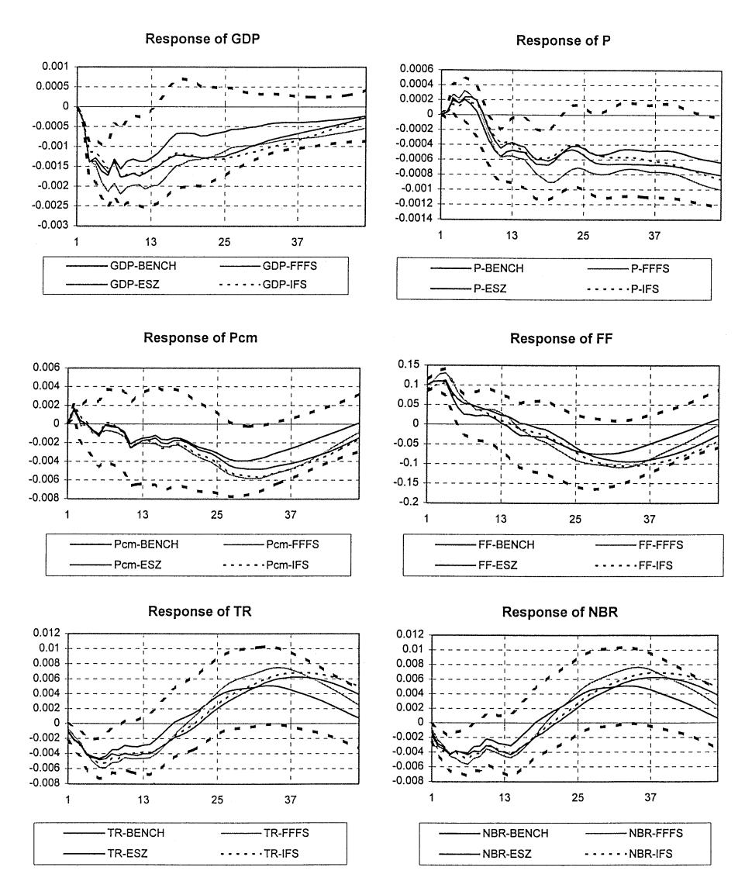

Fig. 9. Impulse responses to alternative monetary policy shocks (dashed lines: 95% confidence interval bands for the benchmark VAR)

are by now rather widely accepted as a description of the monetary transmission mechanism on the ground that it is very hard to think of any other shock other than monetary capable of generating the observed responses both in the variables describing the market for reserves and in the macroeconomic variables. To support the endogeneity argument one should then be able to identify the endogenous factors that allow to estimate responses of the six variables analysed that are observationally equivalent to the response we have observed to our different measures of monetary policy shocks. The fact that we cannot find any cannot be conclusive but it is consistent with our comments on the empirical results.

On the measurement of monetary policy shocks, it could be argued that the similar pattern of the impulse responses is hard to reconcile with the low correlation between the identified shocks. In other words, some justification on how models can disagree on policy shocks and agree on their effect is called for. Sims (1996) has already provided some answers to this question. His argument is based on the observation, fully consistent with our views in Section 2.1, that VAR models are best understood in a simultaneous equation framework. Consider a simple supply and demand simultaneous equation model: identification of the structural parameters in the demand equation requires some variables which shift the supply curve while not affecting demand. There might well exist more than one such 'supply shifter', and, despite their being all valid instruments to identify demand, they might be very little correlated. In the extreme case of orthogonal instruments, the alternative use of one of the instruments will lead to the same estimates of the demand parameters independently from the omission of the other instrument and from the lack of correlation between them. We cannot argue that this is what is happening in our model; however, note that the estimate of the impulse response functions depend uniquely on the estimates of the A, B and C matrices in Eq. (2.1), and they are not significantly different from each other when alternative measurement of the monetary impulses are used. Note also that both the magnitude and the significance of the estimates of the contemporaneous relation between the VAR federal funds innovation and the alternative measurements of monetary policy improves when the estimation is conducted in a multivariate framework rather than using a static regression analysis. This is easily checked by comparing the static regression coefficients and t-ratios reported in Table 5, with the VARbased estimates of coefficients  $q_{FF}$  and the associated t-values reported in Table 6.

If the exogenous variables included in the estimated system (FFFS, ESZ and IFS) are good measures of monetary policy shocks, they capture the variability of the Fed funds rate innovations due to unexpected policy actions. The remaining variability is left in the residual of the FF equation ( $v^{\rm S}$ ). The estimated standard deviation of  $v^{\rm S}$  (reported in the last panel of Table 6) decreases from 0.10 in the benchmark model (with no exogenous measure of policy) to, foe example, 0.07 and 0.09 when FFFS and IFS are added, implying that the bulk of the FF innovation variability is not related to monetary policy shocks. What distinguishes the monetary policy shock from the remaning FF shock ( $v^{\rm S}$ ) is the impact effect on the reserves market. When policy shocks are measured by

FFFS and IFS there is a relatively strong 'liquidity effect' on the reserves market, measured by the estimated coefficients  $g_{TR}$  and  $g_{NBR}$  (-0.014 and -0.011, respectively, in the IFS case) reported in Table 6, and the  $v^{\rm S}$  disturbances have weaker impacts on TR and NBR. These effects are measured by  $-d_{54}$  and  $d_{54}d_{64}-d_{65}$  (corresponding to  $\alpha+\beta$ ) for total and nonborrowed reserves, respectively: e.g. in the IFS case they are -0.003 and -0.008. Though the relatively high standard errors do not allow these differences in the estimated coefficients to be statistically significant, the point estimates may support the view that the exogenous variables adequately capture monetary policy shocks.

Lastly, we briefly address the robustness issue. Although we have documented our choice of the sample size by the need of having a statistical model with stable parameters, it could be observed that seven and a half year of monthly data could not be a sample long enough to analyse the monetary transmission mechanism and that the evidence of instability in 1988 provided in Section 3 is not overwhelming. The analysis could then be extended to a sample beginning in 1983, to check for robustness. Unfortunately, it is difficult to extend our comparison of alternative measures prior to 1988, since the federal funds future is available only from the end of 1988 onwards and our methodology of deriving estimates of shocks from shifts in instantaneous forward rates is not applicable when the dates of monetary policy action are not taken at given and known dates. However, from the one- and two-month rate on eurodollar deposits, available since 1983, a one-month forward rate can be derived and then subtracted from the observed one-month rate, to yield a non-VAR-based measure of monetary policy shocks, labelled EUR\$.

We have implemented our check for robustness by comparing EUR\$ with federal funds future-based shocks, and then by using EUR\$ as as alternative measure of policy shocks over the sample 1983–1996. A regression of the one-month eurodollar shocks on the federal funds future shock over the period 1988–1997 delivers a point estimate of 0.86 with a t-ratio of about 10, the correlation between the two shocks being 0.54. When our VAR analysis is extended to the sample 1983–1996, we find evidence in favour of robustness of all our previous results. The static regression of the VAR-based (BENCH) shocks onto EUR\$ delivers a coefficient of 0.24 with a t-ratio of about five and this coefficient raises to 0.50 with a t-ratio of about seven when estimated within a multivariate framework. The impulse responses generated by the policy shock identified in the benchmark VAR and by EUR\$ (when included in the VAR as a contemporaneous exogenous variable) are not different from each other in a statitistical sense, with a pattern of point estimates very similar to the one

&lt;sup>5 This idea was suggested to us by Stefan Gerlach. The data source is DATASTREAM.

previously found over the shorter sample. Interestingly, we now find that innovations in the macroeconomic variables are statistically significant in explaining innovations in the federal funds rate both in the benchmark VAR and when the *E*º*R*\$ is included in estimation. In particular, innovations in output and prices are significant with point estimates suggesting a higher weight on inflation in the monetary authorities' reaction function.

We are now in the position to assess our results in the light of the criticism to monetary VAR by Rudebusch (1996), who criticized standard monetary VAR models under four respects: (i) the assumption of a time-invariant, linear structure, (ii) the use of a limited information set in the policy reaction function, (iii) the use of final revised data, and (iv) the presence of long distributed lags in the policy reaction function. The alternative measures of monetary policy shocks used in the above analysis are not affected by any of Rudebusch's criticisms: no time-invariant, linear structure is required by any of our method of deriving monetary policy shocks from financial markets, the information set available coincides with the one used by financial markets, there is no problem of data revisions in financial data, and no specification of a lag structure is assumed in their derivation.

However, when we analyse the impulse response functions we use our measures of monetary policy in a VAR and at least some of the original criticism could still be valid. We believe that the discussion of stability in Section 3 has dealt with the time-invariance issue. A linear structure is imposed on the system, and therefore we cannot allow for asymmetric effects of restrictive and expansionary monetary policy. This is beyond the scope of this paper, but it is an interesting area on our agenda for future research. Revised data are used, and the effect of revisions could be important. However, Bernanke and Mihov (1996) and Sims (1996) pointed out that if policy authorities make efficient used of flawed but immediately observable measures of final data, and if the resultant measurement errors do not affect the behaviour of other variables in the economy, then no bias is introduced by assuming that monetary authorities react to final revised data. Measurement errors simply help the identification of monetary policy by adding a source of exogenous variation.6 Lastly, concerning the point that long lags in the VAR specification of the policy reaction function imply that the Fed reacts systematically to old information, Sims, 1996 again has forcefully argued that even variables that display no inertia (and this is not even necessary in the case of interest rates used as policy instruments) do not necessarily show absence of long lags in regressions on other variables.7

6 A referee noted that this point is valid only when the measurement error is correlated with preliminary, but not with final, data. When the converse is true, the VAR parameters are still inconsistently estimated.

7 An example is provided by consumption under the theory of pure life-cycle-rational expectations. It behaves as a random walk: only innovations in any other macro-variables should affect

On the basis of the previous discussion we believe that the evidence supports the results reported in Brunner (1996) and casts serious doubts on the statement that VAR-based monetary policy shocks do not make sense.

# 5. The role of long-term interest rates

There is a well-established practice of excluding a long-term interest rate from VAR systems estimated to investigate the monetary transmission mechanism. Such choice is common to models using alternative empirical counterparts for monetary policy shocks; in fact, long-term interest rates are not included in systems specified to capture federal funds targeting (Bernanke and Blinder, 1992; Bernanke and Mihov, 1995), as well as in models featuring nonborrowed reserves targeting (Christiano et al., 1996a,b), and borrowed reserves targeting (Strongin, 1995). It is also common to studies applied to different countries and using different sample sizes (Sims, 1992; Leeper et al., 1996).

There is one obvious reason for excluding long-term interest rates from VAR models designed to investigate the monetary transmission mechanism: identification. In fact, it is very difficult to rule out simultaneous feedbacks between long-term and short-term interest rates; hence it is hard to find a suitable set of restrictions to distinguish structural shocks to long-term rates from structural shocks to short-term rates, determined on the reserves market. This identification problem becomes evident in one of the very few studies in which long-term and short-term interest rates are both included in the estimated VAR, Gordon and Leeper (1994). In that paper supply and demand shocks in the market for reserves are identified from a VAR including total reserves, the federal funds rate, the price level, output, unemployment, commodity prices and the 10-year bond yield. Identification is achieved by supplementing the usual assumption that goods market do not respond to current money market disturbances with the assumption that financial market as well do not respond to such disturbances. Ruling out the simultaneous reaction of the long-term rate to current monetary policy shocks seems a questionable identifying restriction, especially if the data are observed at a monthly frequency.

In the previous section we have introduced and discussed measures of monetary policy shocks which are derived independently from the specification of the VAR, and exploited this feature to assess the robustness of the estimated

consumption in a regression including lagged consumption. However, if other macro variables show inertia, a regression of consumption on lagged consumption and current and lagged values of other macroeconomic variables might show significant coefficients on lags of the other macro variables. The fact that consumption follows a random walk is not incompatible with the significance of, for instance, current and lagged income in a regression of consumption on lagged consumption and those two income variables.

monetary transmission mechanism to alternative specifications of monetary policy shocks. It seems natural to extend our framework to the inclusion of long-term interest rates in the VAR.

We consider the *IFS* measure of policy shocks and estimate the following structural model:

$$\begin{array}{c|c} GDP_t \\ P_t \\ Pcm_t \\ T10_t \\ FF_t \\ TR_t \\ NBR_t \end{array} = C^*(L) \begin{array}{c|c} GDP_{t-1} \\ P_{t-1} \\ Pcm_{t-1} \\ T10_{t-1} \\ FF_{t-1} \\ TR_{t-1} \\ NBR_{t-1} \end{array} + \begin{array}{c|c} g_{GNP} \\ g_P \\ g_{Pcm} \\ g_{T10} \\ g_{FF} \\ g_{TR} \\ g_{NBR} \end{array} IFS_t + \begin{array}{c|c} v_{1t}^{NP} \\ v_{2t}^{NP} \\ v_{3t}^{NP} \\ v_{3t}^{T10} \\ v_{t}^{T} \\ v_{t}^{D} \\ v_{t}^{D} \end{array} ,$$

where D is now a seven-dimensional lower-triangular matrix and all variables have already been defined with the exception of T10 – the yield on 10-year Treasury bonds –, and  $v^{T10}$  – the associated structural disturbance. Ordering T10 after the block of non-policy variables allows a contemporaneous reaction of the long rate to the macroeconomy. Moreover, the inclusion of the exogenous shocks allows to identify a simultaneous feedback between the federal funds rate and the long-term interest rate. The estimated elements of matrix D and of vector Q are reported in Table 7.

The estimated structural parameters support the significance of the policy shocks in the equation for the federal funds rate ( $g_{FF}=0.26$ ), whereas the long rate does not react contemporaneously to policy shocks ( $g_{T10}=0.005$ ). The previous evidence of a non-significant contemporaneous reaction of the goods market to monetary policy shocks is also confirmed. The inclusion of the long-term interest rate in the VAR has a remarkable impact on the precision of the estimates of the simultaneous response of total and nonborrowed reserves to the monetary policy shock, captured by  $g_{TR}$  and  $g_{NBR}$ , respectively. Moreover, there is a clearly significant contemporaneous reaction of the federal fund rate to the long-term interest rate (measured by  $|d_{54}|=0.28$ ), witnessing the relevance of contemporaneous long-term interest rates in the policy maker's reaction function.

Having identified the structural model, we now turn to the analysis of the monetary transmission mechanism, described by the impulse response functions following a (one-standard-deviation) shock to our monetary policy variable. In Fig. 10 the responses obtained in the VAR models specified with and without the long-term interest rates are plotted (the 95% confidence intervals are referred to the latter specification of the VAR). When the long-term rate is included, the reduction in output following a monetary restriction is smaller in magnitude and dies out more quickly than in the previous estimates, and also

Table 7
The VAR with a long-term interest rate

The estimated VAR model is:

$$\begin{array}{c|c} GDP_t \\ P_t \\ Pcm_t \\ T10_t \\ FF_t \\ TR_t \\ NBR_t \end{array} = \boldsymbol{C^*(L)} \begin{pmatrix} GDP_{t-1} \\ P_{t-1} \\ Pcm_{t-1} \\ TT0_{t-1} \\ TR_{t-1} \\ NBR_{t-1} \end{pmatrix} + \begin{pmatrix} g_{GDP} \\ g_P \\ g_{Pcm} \\ g_{T10} \\ g_{FF} \\ g_{TR} \\ g_{NBR} \end{pmatrix} IFS_t + \begin{pmatrix} cv_{1P}^{NP} \\ v_{2t}^{NP} \\ v_{3t}^{NP} \\ v_{t}^{NP} \\ v_{t}^{T10} \\ v_{t}^{S} \\ v_{t}^{D} \\ v_{t}^{P} \end{pmatrix} ,$$

where D is a (seven-dimensional) lower-triangular matrix of coefficients. The sample period is 1988(11)-1996(3).

|                  | Estimated e                        | elements of 1      | matrix <b>D</b> :  |                    |                    |                     |                    |  |  |
|------------------|------------------------------------|--------------------|--------------------|--------------------|--------------------|---------------------|--------------------|--|--|
|                  | d 21                    | d 31    | d 32    | d 41    | d 42    | d 43     | d 51    |  |  |
| Coeff. (S.E.) | - 0.042 (0.052)                 | - 1.865 (0.454) | 0.635 (0.942)   | - 23.34 (6.39)  | - 23.96 (12.12) | - 5.972 (1.402)  | 11.74 (5.75)    |  |  |
|                  | d 52                    | d 53    | d 54    | d 61    | d 62    | d 63     | d 64    |  |  |
| Coeff. (S.E.) | - 2.132 (10.36)                 | 1.490 (1.29)    | - 0.281 (0.090) | - 0.076 (0.291) | - 0.479 (0.520) | 0.055 (0.066)    | 0.002 (0.006)   |  |  |
|                  | d 65                    | $d_{71}$           | d 72    | $d_{73}$           | $d_{74}$           | $d_{75}$            | $d_{76}$           |  |  |
| Coeff. (S.E.) | 0.002 (0.005)                   | 0.069 (0.145)   | - 0.049 (0.260) | - 0.007 (0.033) | 0.009 (0.003)   | - 0.003 (0.0024) | - 1.065 (0.055) |  |  |
|                  | Estimated elements of vector $g$ : |                    |                    |                    |                    |                     |                    |  |  |
|                  | $g_{GDP}$                          | $g_{\mathrm{P}}$   | $g_{Pcm}$          | $g_{T10}$          | $g_{FF}$           | $g_{TR}$            | $g_{NBR}$          |  |  |
| Coeff. (S.E.) | 0.0002 (0.002)                  | 0.0006 (0.001)  | - 0.140 (0.160) | 0.005 (0.120)   | 0.260 (0.080)   | - 0.013 (0.003)  | - 0.012 (0.005) |  |  |
|                  | Estimated s                        | standard dev       | viations of st     | ructural distu     | ırbances:          |                     |                    |  |  |
|                  | $v_1^{NP}$                         | $v_2^{NP}$         | $v_3^{NP}$         | $v_T^{10}$         | v s     | $v^{\mathrm{D}}$    | $v^{\mathrm{B}}$   |  |  |
| Coeff. (S.E.) | 0.002 (0.0001)                  | 0.001 (0.0001)  | 0.008 (0.001)   | 0.086 (0.010)   | 0.092 (0.010)   | 0.004 (0.001)    | 0.002 (0.0002)  |  |  |

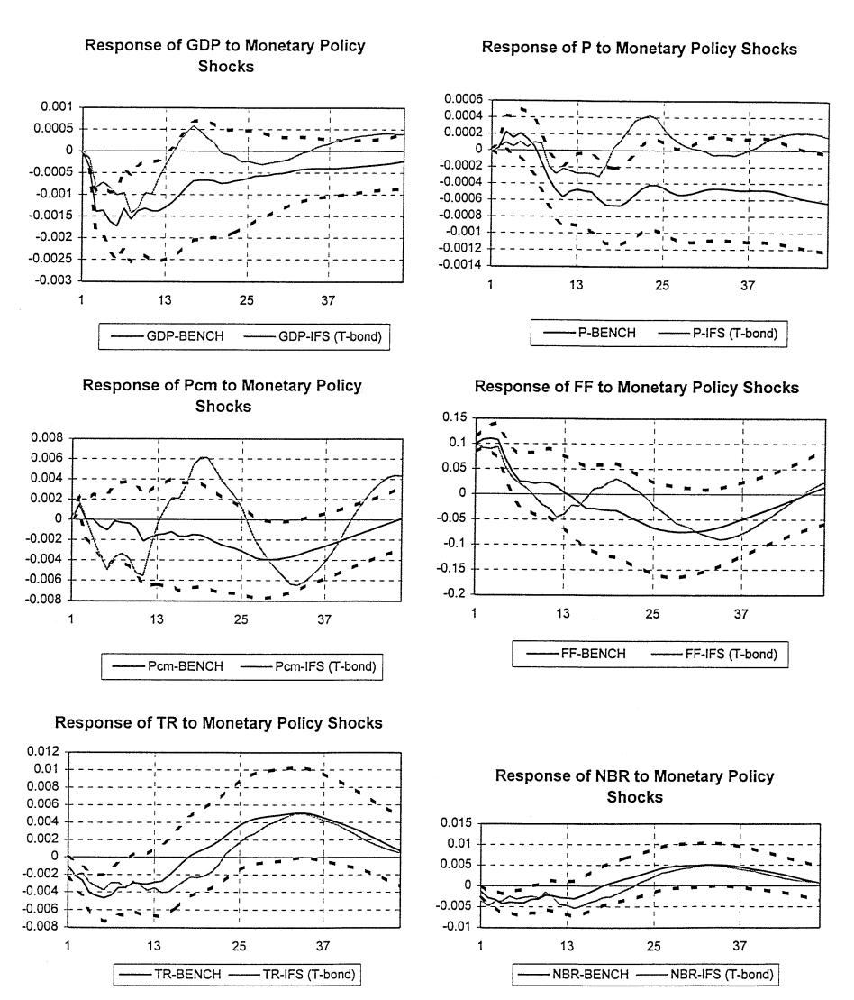

Fig. 10. Impulse responses to the monetary policy shock in the benchmark VAR and to the IFS shock in the VAR with long-term interest rate (dashed lines: 95% confidence interval bands for the benchmark VAR).

consumer prices respond less to monetary policy shocks. The response of total and nonborrowed reserves are perfectly in line with the previous results.

Lastly, in Fig. 11, we compare the dynamic response of all variables in the extended VAR to a (restrictive) monetary policy disturbance (in the left-hand

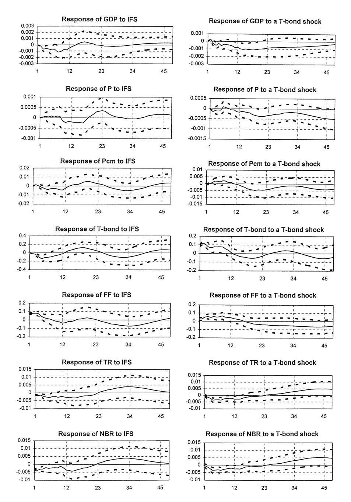

Fig. 11. Impulse responses to monetary policy shocks (IFS) and to shocks to the long-term interest rate (dashed lines: 95% confidence interval bands).

column) and to a shock to the long-term interest rate (in the right-hand column). Given the assumed identifying hypothesis, the latter disturbance is not related to monetary policy, and may reflect unexpected increases in default risk affecting long rates. Looking at the effect of a monetary contraction, we note that the long-term interest rate does not increase; in fact, ¹10 shows a decrease over the first six months after the policy shock, before starting to rise back towards its initial level. Therefore, the contractionary monetary impulse does not seem to be transmitted to the real economy through increases in long-term interest rates (Campbell (1995) provides an account of the long rate movements following the 1994 monetary policy restriction that is broadly consistent with the above evidence.) Output declines also following a (structural) shock to the long-rate itself (perhaps due to changed default-risk perceptions), determining a response in the same direction of the federal funds rate. In reaction to both kinds of disturbances the price level does not appear to decline significantly and the dynamic behaviour of the reserve aggregates is consistent with the movement in the federal funds rate.

# 6. Conclusions

This paper studies a benchmark six-variable VAR model for the U.S., including the gross domestic product, a consumer price index, a commodity price index, the federal funds rate, total reserves and nonborrowed reserves, commonly estimated to derive a measure of monetary policy shocks. Our evaluation is conducted by addressing three issues: specification, identification, and the effect of the omission of long-term interest rates.

The issue of the econometric specification of the VAR is addressed by running a battery of diagnostic tests on the reduced form residuals and by testing for parameter stability. On the whole sample period (1965*—*1996) we find strong evidence of mis-specification and parameters' instability for all estimated equations. In principle, these findings can be explained for the equations for policy variables (the federal funds rate, total and nonborrowed reserves) with changes in the Federal Reserve operating procedures (Bernanke and Mihov, 1995) but, given the common procedure followed to identify monetary policy shocks, these changes in policy regime cannot explain the instability in the equation for the non-policy variables. However, when we concentrate on the most recent period (1988*—*1996), coinciding with a single monetary policy regime, we do not find evidence either of parameters' instability or mis-specification. We then focus on this sample period for further evaluation of the approach.

Over the shorter sample we address the issue of *identification* by comparing the monetary policy shocks derived from the VAR with three alternative measures obtained from direct observation of financial market behaviour. These measures have been proposed by Rudebusch (1996) Skinner and Zettelmeyer (1996) and Favero et al. (1996). Our empirical analysis shows that, despite of the not very high correlation between the benchmark VAR and the alternative measures of monetary policy shocks, the descriptions of the monetary trasmission mechanism obtained by impulse response functions estimated are not substantially different from each other.

Finally, we use our direct measurement of the monetary policy shock as an opportunity to include a *long*-*term rate* in our benchmark VAR, distinguishing monetary policy shocks from independent disturbances to long-term rates (an identification problem that has often determined the exclusion of long-term rates from estimated VAR models). The inclusion of the 10-year bond yield allows us to show that there is a significant reaction of policy rates to contemporaneous fluctuations of long-term rates and that the effect on output of a restrictive monetary policy seems not to be due to an increase in long-term interest rates.

# Acknowledgements

We thank our discussants, Jim Stock and Stefan Gerlach, other ISOM participants and two referees for many valuable suggestions. Graham Elliott, Frederick Mishkin, Alessandro Missale, Andrew Scott, Guido Tabellini and seminar participants at the London Business School, Queen Mary and Westfield College, the University of Rome 'Tor Vergata' and the University of California at San Diego provided helpful comments on earlier drafts of the paper. We also thank Eric Leeper for kindly providing the data used in Leeper, Sims and Zha (1996). Financial support from *Consiglio Nazionale delle Ricerche* is gratefully acknowledged. C. Favero worked on the final version of this paper while visiting the Department of Economics of the University of California at San Diego.

# References

- Andrews, D.W., 1993. Tests for parameter instability and structural change with unknown change point. Econometrica 61, 821*—*853.
- Bernanke, B.S., Blinder, A., 1992. The Federal Funds Rate and the channels of monetary transmission. American Economic Review 82, 901*—*921.
- Bernanke, B.S., Mihov, I., 1995. Measuring monetary policy. Working paper no. 5145. NBER, Cambridge, MA.
- Bernanke, B.S., Mihov I., 1996. What does the Bundesbank target? Working paper no. 5764. NBER, Cambridge, MA.
- Brunner, A., 1996. Using measures of expectations to identify the effects of a monetary policy shock. International Finance Discussion Paper no. 537. Board of Governors of the Federal Reserve System, Washington, DC.
- Campbell, J., 1995. Some lessons from the yield curve. Journal of Economic Perspectives 9, 129*—*152.

- Christiano, L.J., Eichenbaum, M., 1992. Liquidity effects and the monetary transmission mechanism. American Economic Review 82, 346*—*353.
- Christiano, L.J., Eichenbaum, M., Evans, C.L., 1996a. The effects of monetary policy shocks: Evidence from the flow of funds. Review of Economics and Statistics 78, 16*—*34.
- Christiano, L.J., Eichenbaum, M., Evans, C.L., 1996b. Monetary policy shocks and their consequences: Theory and evidence. Paper presented at ISOM, 1996.
- Doornik, J., Hendry, D.F., 1996. PcFIML: Interactive econometric modelling of dynamic system. International Thompson Publishing, London.
- Farmer, R.E.A. 1997. Money in a real business cycle model. Mimeo, Dept. of Economics, UCLA. Favero, C.A., Pifferi, M., Iacone, F., 1996. Monetary policy, forward rates and long rates: Does Germany Differ from the United States? Discussion paper no. 1456. CEPR, London.
- Goodfriend, M., King, R., 1997. The newclassical synthesis and the role of monetary policy. Paper Presented at the 12th NBER Annual Macroeconomic Conference.
- Gordon, D., Leeper, E.M., 1994. The dynamic impacts of monetary policy: An exercise in tentative identification. Journal of Political Economy 102, 1228*—*1247.
- Hendry, D.F., 1996. Dynamic Econometrics. Oxford University Press, Oxford.
- Leeper, E.M., 1997. Narrative and VAR approaches to monetary policy: Common identification problems. Journal of Monetary Economics, forthcoming.
- Leeper, E.M., Sims, C.A., Zha, T., 1996. What does monetary policy do?. Available at ftp://ftp.econ.yale.edu/pub/sims/mpolicy.
- Lucas, R.E. Jr., 1972. Expectations and the neutrality of money. Journal of Economic Theory 4, 103*—*124.
- Lucas, R.E. Jr., 1976. Econometric policy evaluation: a critique. In: Brunner, K., Meltzer, A. (Eds.), The Phillips Curve and Labor Markets. North-Holland, Amsterdam.
- Nelson, C.R., Siegel, A.F., 1987. Parsimonious modelling of yield curves. Journal of Business 60, 473*—*489.
- Romer, C.D., Romer, D.H., 1989. Does monetary policy matter? A new test in the spirit of Friedman and Schwartz. In: Blanchard, O.J., Fischer, S. (Eds.), NBER Macroeconomics Annual 1989. MIT Press, Cambridge, MA, pp. 121*—*170.
- Romer, C.D., Romer, D.H., 1994. Monetary policy matters. Journal of Monetary Economics 34, 75*—*88. Rudebusch, G.D., 1996. Do measures of monetary policy in a VAR make sense? Temi di Discussione n. 269. Bank of Italy, Rome.
- Sims, C.A., 1980. Macroeconomics and reality. Econometrica 48, 1*—*48.
- Sims, C.A., 1992. Interpreting the macroeconomic time-series facts: The effects of monetary policy. European Economic Review 36, 975*—*1011.
- Sims, C.A., 1996. Comment on Glenn Rudebusch's Do measures of monetary policy in a VAR make sense? Mimeo. Available at ftp://ftp.econ.yale.edu/pub/sims/mpolicy.
- Sims, C.A., Stock, J.H., Watson, M., 1990. Inference in linear time-series models with some unit roots. Econometrica 58, 113*—*144.
- Sims, C.A., Zha, T., 1996. Does monetary policy generate recessions? Mimeo. Available at ftp://ftp.econ.yale.edu/pub/sims/mpolicy.
- Skinner, T., Zettelmeyer, J., 1996. Identification and effects of monetary policy shocks: An alternative approach. Mimeo. MIT Cambridge, MA, Sept.
- Spanos, A., 1990. The simultaneous-equations model revisited. Statistical adequacy and identification. Journal of Econometrics 44, 87*—*105.
- Stock, J., 1994. Unit roots, structural breaks and trends. In: Engle, R.F., McFadden, D.L. (Eds.), Handbook of Applied Econometrics, vol. IV, Chapter 46. North-Holland, Amsterdam, pp. 2740*—*2841.
- Strongin, S., 1995. The identification of monetary policy disturbances. Explaining the liquidity puzzle. Journal of Monetary Economics 35, 463*—*497.
- Svensson, L.E., 1994. Estimating and interpreting forward interest rates: Sweden 1992*—*1994. Discussion paper no. 1051. CEPR, London.