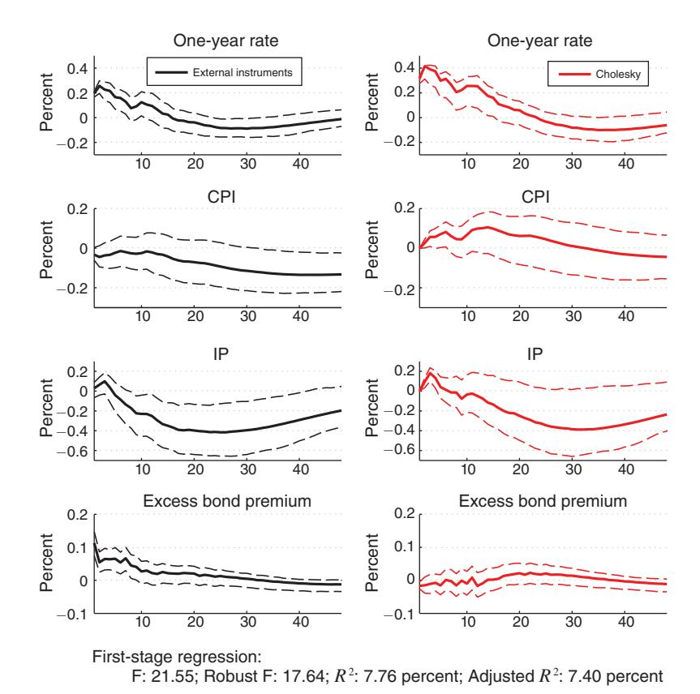
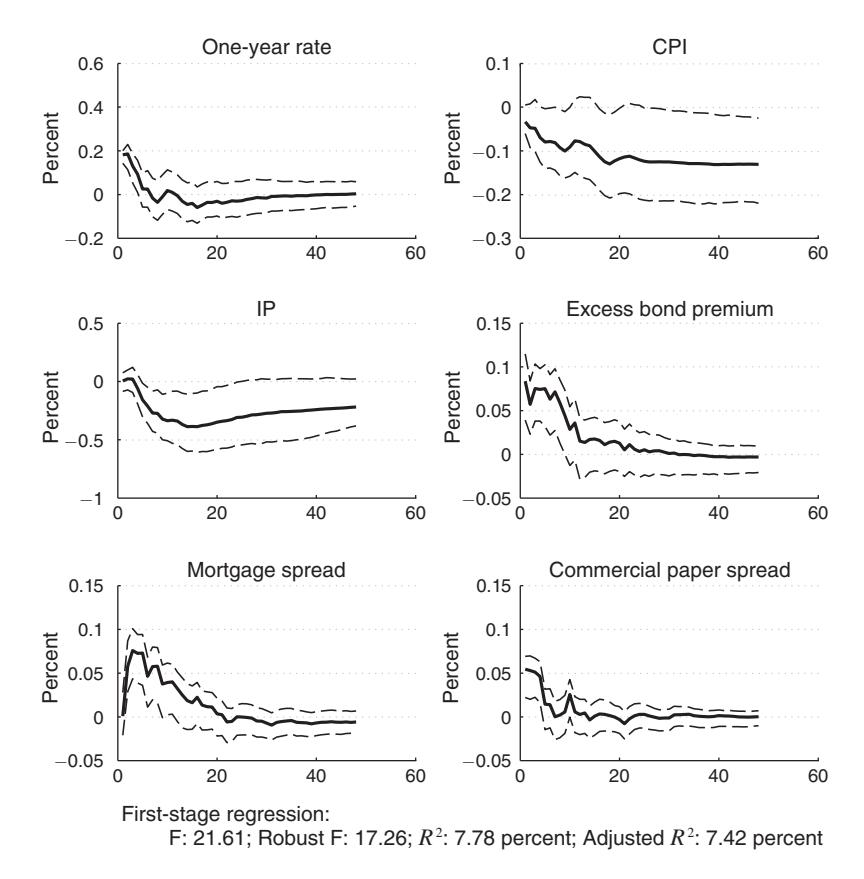
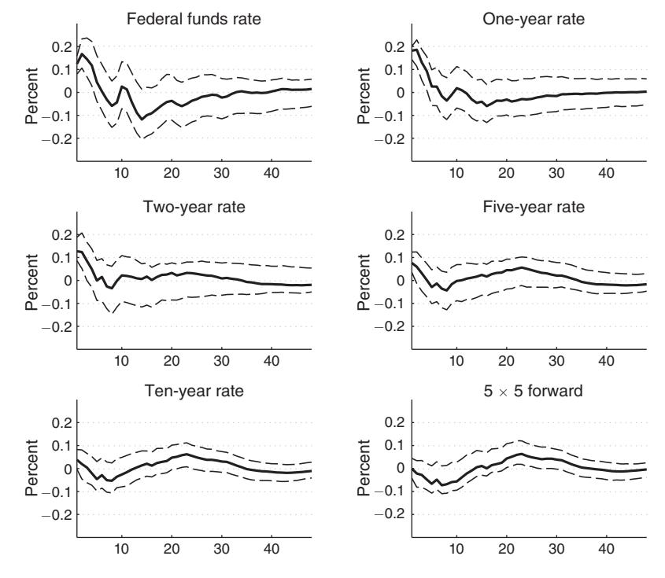
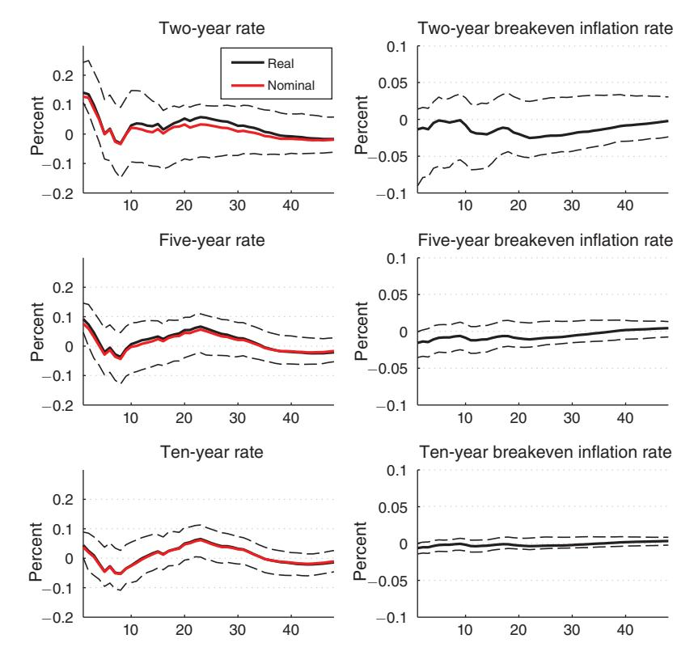
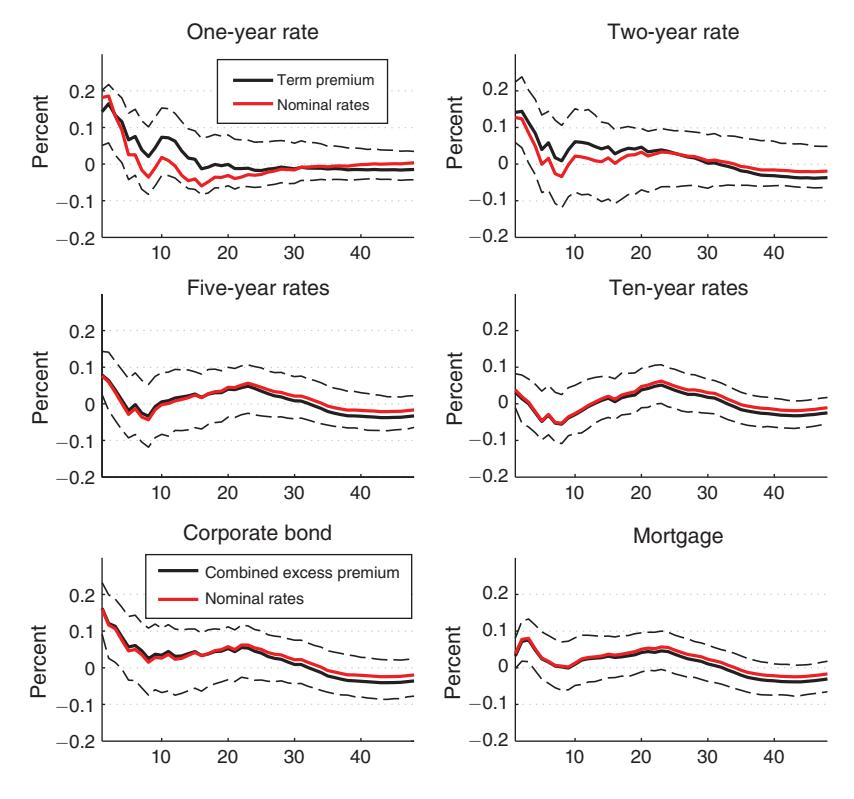
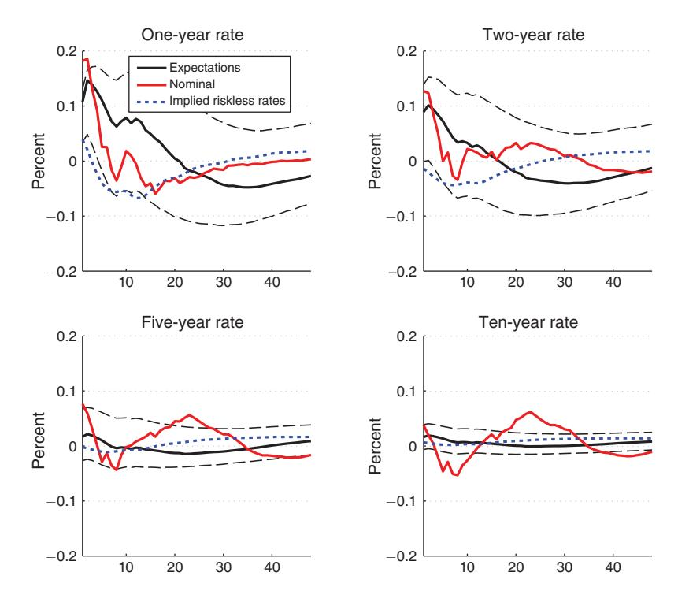
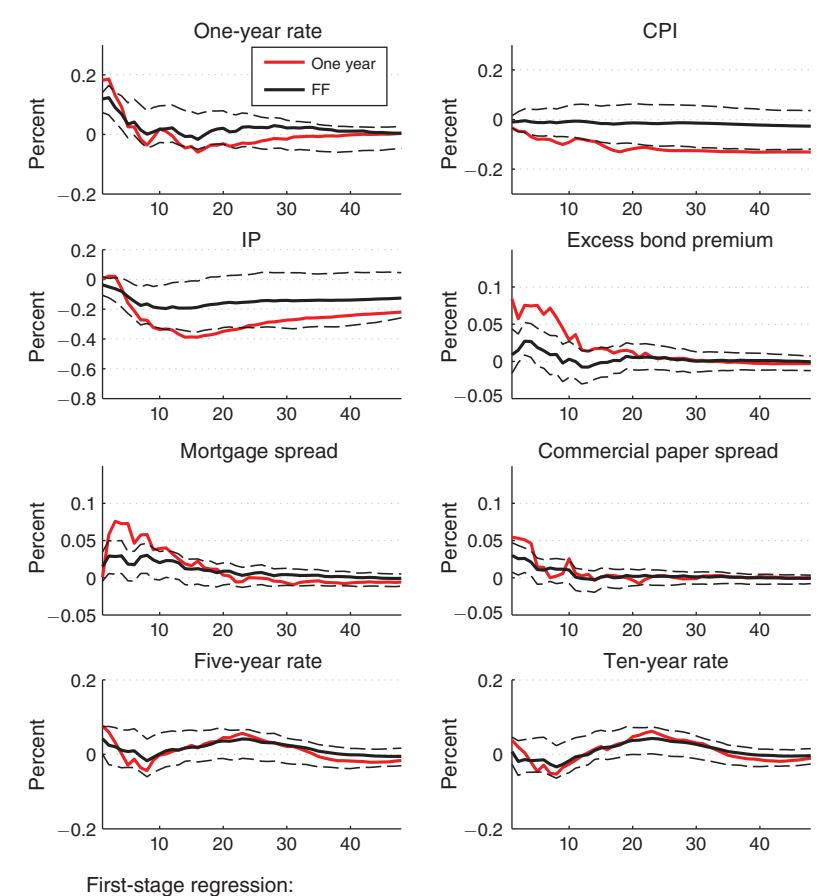
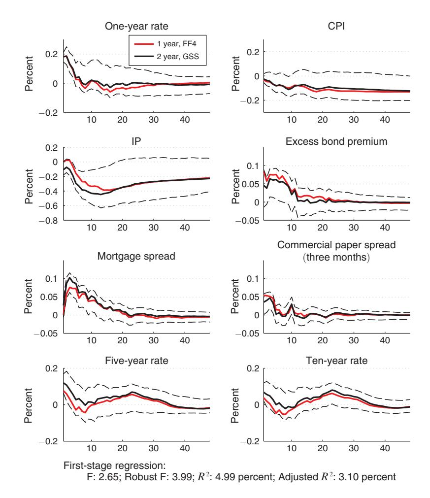
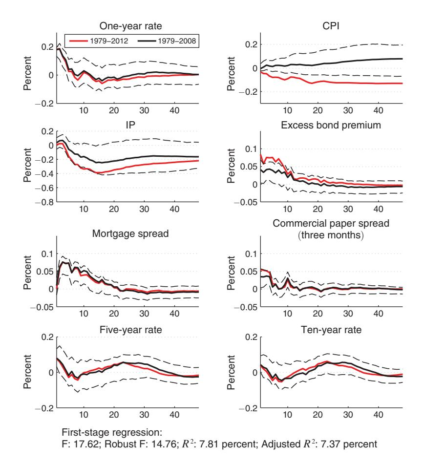
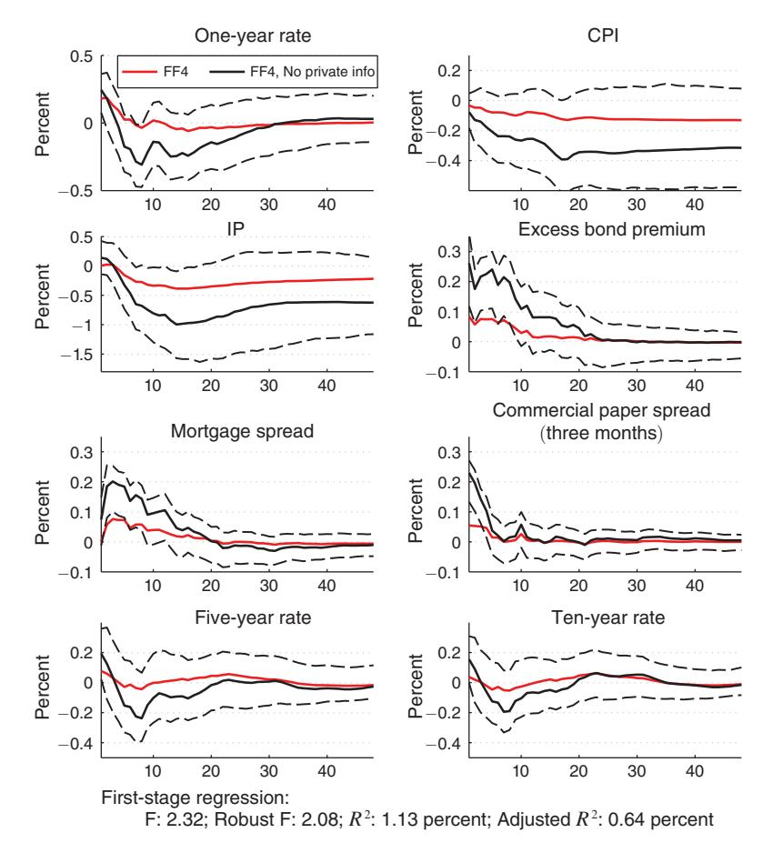

# Monetary Policy Surprises, Credit Costs, and Economic Activity†

By Mark Gertler and Peter Karadi\*

We provide evidence on the transmission of monetary policy shocks in a setting with both economic and financial variables. We first show that shocks identified using high frequency surprises around policy announcements as external instruments produce responses in output and inflation that are typical in monetary VAR analysis. We also find, however, that the resulting "modest" movements in short rates lead to "large" movements in credit costs, which are due mainly to the reaction of both term premia and credit spreads. Finally, we show that forward guidance is important to the overall strength of policy transmission. (JEL E31, E32, E43, E44, E52, G01)

This paper provides evidence on the nature of the monetary policy transmission mechanism. We focus in particular on how monetary policy actions influence credit costs that in turn affect economic activity. Our goal is to assess the extent to which the response of credit costs to monetary policy is consistent with standard theory and, in doing so, identify any significant discrepancies that the theory should address.

There is of course a voluminous literature on monetary policy transmission. Two main considerations motivate us to revisit this classic topic. First, the conventional models of monetary policy transmission treat financial markets as frictionless. To put it mildly, the recent financial crisis suggests rethinking this premise. As we discuss in Section I, the conventional "frictionless" frameworks have sharp predictions for how credit costs should respond to monetary policy actions. In particular, the response of borrowing rates should depend entirely on the expected path of the central bank's policy instrument, the short-term interest rate. To a first approximation there should be no response in either term premia or credit spreads. We proceed to examine this hypothesis. The goal here is to determine whether a significant component of the response of credit costs to monetary policy may indeed reflect movements in term premia and credit spreads, consistent with some form of financial market imperfection.

\*Gertler: Department of Economics, New York University, 19 W. 4th Street, NY, 10003, and National Bureau of Economic Research (NBER) (e-mail: mark.gertler@nyu.edu); Karadi: DG Research, European Central Bank, Neue Mainzer Strasse 66, Frankfurt am Main, 60323, Germany, and Centre for Economic Policy Research (CEPR) (e-mail: peter.karadi@ecb.int). Prepared for the NBER conference on "Lessons From the Crisis for Monetary Policy;" October 18, 19 in Boston. We are grateful to Claudio Schioppa for his excellent research assistance, to Refet Gürkaynak for sharing his data, to an anonymous referee and to Gianni Amisano, Karel Mertens, Giorgio Primiceri, Eric Swanson for helpful discussions. The views expressed are those of the authors and do not necessarily reflect the views of the European Central Bank (ECB) or the Eurosystem.

&lt;sup>†Go to http://dx.doi.org/10.1257/mac.20130329 to visit the article page for additional materials and author disclosure statement(s) or to comment in the online discussion forum.

&lt;sup>1See Boivin et al. (2010) for a recent survey.

The second consideration involves the evolution in the way the Federal Reserve manages its policy instrument. In conventional descriptions of the transmission mechanism, the central bank adjusts the current short-term interest rate. Market participants then form expectations about the future path of the short rate based on the central bank's historical tendencies for rate adjustment. However, as Gürkaynak, Sack, and Swanson (2005) (hereafter GSS) and others have argued, over time the Federal Reserve has increasingly relied on communication—in Fedspeak known as "forward guidance"—to influence market beliefs about the expected path of short -term rates. Indeed, once the short term interest rate reached the zero lower bound during the current crisis in December 2008, forward guidance became the only way the central bank could affect market interest rates without resorting to unconventional credit market interventions. Accordingly, in assessing how monetary policy influence credit costs, it is important to account for the role of forward guidance.

To evaluate the nature of monetary policy transmission, we analyze the joint response of a variety of economic and financial variables to exogenous monetary policy surprises. The policy surprises, further, include shocks to forward guidance. Our specific approach involves combining the traditional "money shock" vector autoregression (VAR) analysis (e.g., Bernanke and Blinder 1992, Christiano, Eichenbaum, and Evans 1996)2 with high frequency identification (HFI) of the effects of policy surprises on interest rates (e.g., Kuttner 2001; Gürkaynak, Sack, and Swanson 2005; Hamilton 2008; Campbell et al. 2012). GSS, in particular, use unexpected changes in federal funds rate and Eurodollar futures on Federal Open Market Committee (FOMC) dates to measure policy surprises. Our hybrid approach employs HFI measures of policy surprises as external instruments in a set of VARs to identify the effects of monetary shocks. The VARs we consider include output, inflation and a variety of interest rates.

The particular approach we take is dictated by the need to identify policy surprises that can be considered exogenous with respect to both the economic and financial variables in the VAR. Otherwise it is not possible to properly identify the responses of these variables to policy shifts. The standard identification strategy in VARs analyzing monetary shocks is to impose timing restrictions on both the behavior and the impact of the policy rate, typically taken to be the federal funds rate. A standard set of restrictions is to suppose that within a period the funds rate responds to all the other variables in the VAR but not vice versa. That is, the impact of the funds rate on the other variables occurs with a lag of at least one period. So long as the period length is not too long (e.g., a month to a quarter), these kinds of timing restrictions may be reasonable for the interactions between the funds rate and economic activity variables such as output and inflation. However, they are problematic once additional financial variables are present. The problem is simultaneity: Within a period, policy shifts not only influence financial variables, they may be responding to them as well. Even if the central bank is not directly responding to the financial indicators, it may be responding to underlying correlated variables left out of the VAR.

The HFI approach addresses the simultaneity issue by using daily data. In particular, policy shocks are surprises in fed funds futures that occur on FOMC days.

&lt;sup>2See also Rudebusch (1998) for a critique of the methodology and an early recommendation of using futures data to measure monetary policy shocks.

To isolate the impact of news about monetary policy, the surprises in futures rates are usually measured within a tight window (e.g., thirty minutes) of the FOMC decision. The dependent variables in the event studies are typically the same day responses in various interest rates and asset returns. The key identifying assumption is that news about the economy on the FOMC day does not affect the policy choice. Only information available the previous day is relevant. Given this assumption, surprises in fed funds futures on FOMC dates are orthogonal to within period movements in both economic and financial variables. One additional benefit of this approach is that the policy surprise measure can include "shocks" to forward guidance. Following GSS, this is accomplished by incorporating in the instrument set surprises in fed funds futures for contracts that expire at a subsequent date in the future. These surprises in principle reflect revisions in beliefs on FOMC dates about the future path of short-term rates.

There are however some limitations to the HFI approach. While it is possible to measure the instantaneous effect of a policy surprise on market interest rates, due to the event study framework it is difficult to identify how persistent the impact is. For a similar reason, it is not possible to examine the response of economic activity variables such as output and inflation. In contrast, our approaches combine the strengths of the VAR and HFI methodologies. We exploit the HFI approach to identify exogenous policy surprises but then use a full VAR to trace out the dynamic responses of real and financial variables.

In addition to the classic VAR and HFI papers mentioned earlier, several other papers are relevant to our analysis. Hanson and Stein (2012) and Nakamura and Steinsson (2013) use HFI to investigate the impact of monetary policy surprises on the real yield curve. The former emphasize the response of term premia. The latter use the event study to identify parameters in a small-scale New-Keynesian model. Other papers have incorporated HFI measures of monetary policy shocks into VARs (e.g., Bagliano and Favero 1999; Cochrane and Piazzesi 2002; Faust, Swanson, and Wright 2004; and Barakchian and Crowe 2013). We differ by employing an external instruments approach that permits sharp testing of conventional theories of the impact of monetary policy on credit costs.

In Section I we describe the conventional monetary transmission mechanism in detail. We derive several testable implications involving the response of credit costs to monetary policy shocks. In Section II we present our methodology. We present our VAR framework and describe in particular how we make use of interest rate futures surprises as external instruments. Finally, we present evidence on the response of credit costs and economic activity to monetary policy in Section III. We begin with a discussion of our choice of interest rate to serve as a policy indicator and of the instruments set we use to identify exogenous monetary policy surprises. We then show that in a VAR with both financial and economic variables, our external instrument approach produces a more convincing set of responses to a monetary shock than does a standard Cholesky identification scheme. An unanticipated monetary tightening produces a significant drop in output and a modest insignificant drop in the price level. In addition, real credit costs increase for all of the securities we consider. Each of these results is consistent with conventional models of the monetary transmission mechanism.

But we also obtain some results that are inconsistent with the standard model. In particular, monetary policy responses typically produce "modest" movements in

short rates that lead to "large" movements in credit costs. As we show, the large movements in credit costs are mainly due to the reaction of both term premia and credit spreads. The baseline model of the transmission mechanisms abstracts from both these considerations. At the same time, the large movement in credit costs may help unlock the puzzle of why seemingly modest movements in short-term rates appear to have a substantial impact on economic activity. To be sure, we find evidence for the kind of price stickiness present in the conventional models. The response of real rates to monetary policy surprises is approximately equal to the response of nominal rates. However, to account for the overall response of credit costs, it may be necessary to amend the model to account for movements in term premia and credit spreads.

Finally, we show that forward guidance is important to the overall strength of policy transmission. Holding constant the size of the response of the funds rate, the impact of a monetary policy surprise on economic activity depends on the degree of news from forward guidance embedded in the shock.

## I. The Conventional Monetary Policy Transmission Mechanism: Some Testable Implications

In this section we describe the conventional monetary transmission mechanism and propose several testable implications. We take as an example of the conventional mechanism the one present in the New-Keynesian models used widely by central banks across the globe. Within these frameworks aggregate spending depends on current and expected future short-term real interest rates. Transmission of monetary policy then works as follows: The central bank chooses the short-term nominal interest rate  $i_t$  each period, which we express in annualized terms. Due to some form of nominal price and/or wage rigidities, control over the nominal rate gives the central bank control over current and expected future real rates, at least for some horizon. It is this leverage over the time path of short term real interest rates that allows the central bank to influence aggregate spending that in turn translates into movements in output and inflation.

Given the expectations hypothesis of the term structure, a way to summarize the impact of monetary policy actions on the path of short term interest rates is to examine the response of the yield curve. A loglinear approximation of an m period zero-coupon government bond yields

(1) 
$$i_t^m = E_t \frac{1}{m} \left\{ \sum_{j=0}^{m-1} i_{t+j} \right\} + \phi_t^m,$$

where  $i_t^m$  is the annual bond yield and  $\phi_t^m$  is the annualized term premium. To a first order,  $\phi_t^m$  is a constant within a local region of the steady state. It follows that variation in long-term rates reflects variation in the path of current and expected future short rates. In this respect, the transmission of monetary policy actions to credit

&lt;sup>3Examples of the conventional New-Keynesian dynamic stochastic general equilibrium (DSGE) model include Christiano et al. (2005) and Smets and Wouters (2007). Variations that allow for financial market frictions include Bernanke et al. (1999), Gertler and Karadi (2011) and Christiano et al. (2014). Examples of models with the risk-taking channel of monetary policy are Drechsler et al. (2014) and Brunnermeier and Sannikov (2011).

costs operates via the yield curve. This link between short and long rates is present in standard New-Keynesian models and is a feature of all conventional models of monetary policy transmission. Equation (1) also makes clear how forward guidance provides the central bank with some leverage over longer maturity interest rates, to the extent it is able to effectively communicate its intentions about the path of future short rates.

Of course what matters for monetary transmission is the behavior of real interest rates. Let  $\pi_t$  be the annualized percent change in the price level between time t and t+1 and let  $\pi_t^m$  be the annualized percent change in the price level between t and t+m. Then to a first approximation the real return of the m period nominal bond, can be expressed as the following function of the expected path of short-term real rates, again with the additive term premium  $\phi_t^m$ :

(2) 
$$i_t^m - E_t \pi_t^m = E_t \frac{1}{m} \left\{ \sum_{j=0}^{m-1} (i_{t+j} - \pi_{t+j}) \right\} + \phi_t^m$$

with  $\pi_t^m = 1/m\sum_{j=0}^{m-1}\pi_{t+j}$ , and as before  $\phi_t^m$  is constant within a local region of the steady state. As we have noted, the standard theory of monetary transmission presumes that the central bank's adjustment of nominal rates leads to adjustment in real rates due to temporary nominal rigidities that inhibit offsetting movements in inflation. Of course, in the standard model the central bank's leverage over longer maturity rates depends on the degree of price stickiness.

Up to this point we have analyzed the link between monetary policy actions and government bond yields. As we noted earlier, in the standard models of the transmission mechanism financial markets are frictionless. Thus, for given maturity, the interest rate on a private security equals the corresponding government bond rate, up to a first order. The effects of monetary policy actions on the government bond yield curve translate exactly into effects on private borrowing rates. With financial market imperfections present, however, monetary transmission may involve a "credit channel" effects (e.g., Bernanke and Gertler 1995). In particular, with credit market frictions operative, the private annual borrowing rate on an m period security  $i_t^{mp}$  exceeds the rate on a similar maturity government bond, adjusting for risk. Let  $x_t^m$  denote the external finance premium, i.e., the spread between the private security and government bond rates. Then up to a first order

$$i_t^{mp} = i_t^m + x_t^m.$$

With a credit channel present, tightening of monetary policy not only raises government bond rates but also the external finance premium, which amplifies the overall effect of the policy action on private borrowing rates. The external finance premium increases because the tightening of monetary policy leads a tightening of financial constraints. Theories of the credit channel differ on the precise way central bank interest rate shifts influence credit constraints. A common prediction, however, is that the credit channel magnifies the impact of the interest rate adjustment on private borrowing rates via the impact on credit spreads.

Overall, our analysis leads to three implications of the standard theory that we can test. First, the response of the annual yield on an m period government bond to a surprise monetary policy action should equal the surprise in the average of the annualized current short rate and the expected future short rates m-1 periods into the future, with no response of the term premium. Second, the response of the yield on an m period private security should similarly equal the surprise in the expected path of the short rate over a similar horizon, though in this case with no change in either the term premium or the credit spread. Finally, a surprise monetary policy action should affect real rates as well as nominal rates across a nontrivial portion of the yield curve.

To test the first hypothesis, rearrange equation (1) to obtain the following expression for the term premium on the government bond

(4) 
$$\phi_t^m = i_t^m - E_t \frac{1}{m} \left\{ \sum_{j=0}^{m-1} i_{t+j} \right\}.$$

One can then obtain the response of the term premium to a monetary policy surprise by using the identified VAR to compute the response of the long rate  $i_t^m$  and the path of short rate  $i_t$ . Under the null of the standard theory, the response of the term premium should be zero.

To test the second hypothesis, first define the excess return on the m period bond,  $\chi_t^m$ , as the difference between the market rate  $i_t^{mp}$  and the average of current and expected annualized short rates over the life of the bond, as follows:

(5) 
$$\chi_t^m = i_t^{mp} - E_t \frac{1}{m} \left\{ \sum_{j=0}^{m-1} i_{t+j} \right\}.$$

Then combine equations (3) and (5) to obtain the following expression for  $\chi_t$ :

(6) 
$$\chi_t^m = i_t^m - E_t \frac{1}{m} \left\{ \sum_{j=0}^{m-1} i_{t+j} \right\} + x_t^m$$
$$= \phi_t^m + x_t^m.$$

Equation (6) relates the excess return on the private security to the sum of the term premium and the external finance premium. We obtain the response of  $\chi_t^m$  to a monetary policy shock by summing the impulse responses of the term premium and the external finance premium, which we measure directly using the spread between the rate on the private security and a similar maturity government bond. We measure the response of the term premium exactly as in the previous case.

Finally, we can easily compute the response of real interest rates to monetary policy shocks. We do so by first computing the impulse response of the relevant nominal interest rate and the log price level. We then make use of equation (2) to calculate the response of real interest rates. The interesting issue is how much of the response of nominal rates to monetary shocks reflects movement in real rates across different maturities.

#### II. Econometric Framework

Our econometric model is vector autoregression with a mixture of economic and financial variables. To identify monetary surprises we use external instruments. Our use of external instruments in a VAR is a variation of the methodology developed by Stock and Watson (2012) and Mertens and Ravn (2013). We describe the approach below.

Let  $\mathbf{Y}_t$  be a vector of economic and financial variables,  $\mathbf{A}$  and  $\mathbf{C}_j \ \forall \ j \geq 1$  conformable coefficient matrices, and  $\mathbf{\varepsilon}_t$  a vector of structural white noise shocks. Then the general structural form of the VAR we are considering is given by

(7) 
$$\mathbf{A}\mathbf{Y}_{t} = \sum_{j=1}^{p} \mathbf{C}_{j}\mathbf{Y}_{t-j} + \boldsymbol{\varepsilon}_{t}.$$

Multiplying each side of the equation by  $A^{-1}$  yields the reduced form representation

(8) 
$$\mathbf{Y}_{t} = \sum_{j=1}^{p} \mathbf{B}_{j} \mathbf{Y}_{t-j} + \mathbf{u}_{t},$$

where  $\mathbf{u}_t$  is the reduced form shock, given by the following function of the structural shocks:

$$\mathbf{u}_{t} = \mathbf{S} \mathbf{\varepsilon}_{t}$$

with  $\mathbf{B}_j = \mathbf{A}^{-1}\mathbf{C}_j$ ;  $\mathbf{S} = \mathbf{A}^{-1}$ . The variance-covariance matrix of the reduced form model equals  $\Sigma$ .

(10) 
$$E[\mathbf{u}_t \mathbf{u}_t'] = E[\mathbf{SS}'] = \Sigma.$$

Let  $Y_t^p \in \mathbf{Y}_t$  be the policy indicator, specifically the variable in the structural representation (7) with exogenous variation due to the associated primitive policy shock  $\varepsilon_t^p$ . We distinguish between the policy indicator and the policy instrument. The latter is the current period short term interest rate (specifically the federal funds rate). In the standard money shock VAR the policy indicator and policy instrument are one in the same, since the structural policy shock corresponds to an exogenous innovation in the current short rate. However, because we wish to include shocks to forward guidance in the measure of the policy innovation, we instead take as the policy indicator a government bond rate with a maturity somewhat longer than the current period funds rate. The advantage of the government bond rate is that its innovations incorporate not only the effects of surprises in the current funds rate but also shifts in expectations about the future path of the funds rate, i.e., shocks to forward guidance. Later in this section we describe formally our distinction between the policy indicator and the policy instrument.

Next, let **s** denote the column in matrix **S** corresponding to impact on each element of the vector of reduced form residuals  $\mathbf{u}_t$  of the structural policy shock  $\varepsilon_t^p$ .

Accordingly, to compute the impulse responses to a monetary shock, we need to estimate

(11) 
$$\mathbf{Y}_{t} = \sum_{j=1}^{p} \mathbf{B}_{j} \mathbf{Y}_{t-j} + \mathbf{s} \varepsilon_{t}^{p}.$$

Because we are not interested in computing a variance decomposition or the impulse responses to other shocks, we do not have to identify all the coefficients of S, but rather only the elements of the column s.

One can simply use least squares estimation of the reduced form VAR to obtain estimates of the coefficients in each matrix  $\mathbf{B}_j$ . Some restrictions are necessary, however, to identify the coefficients in  $\mathbf{s}$ . The standard timing restriction we described earlier amounts to assuming that all the elements of  $\mathbf{s}$  are zero except the one that corresponds to the policy indicator. This generates extra restrictions, that are sufficient to identify  $\mathbf{s}$ .

As we noted earlier, however, this kind of timing restriction is problematic when financial variables appear in the VAR along with the policy indicator. A restriction that an innovation in the policy indicator has no contemporaneous impact on other financial variables is generally implausible. In addition, it is difficult to argue that current policy does not respond to the news contained in financial variables. Accordingly, because we are interested in examining the joint response of economic and financial variables, a different approach to identifying monetary policy surprises is needed. It is for this reason that we instead make use of external instruments as an identification strategy.

We begin with a general explanation of the external instruments methodology, before turning to the precise approach we take. Following Stock and Watson (2012) and Mertens and Ravn (2013), let  $\mathbf{Z}_t$  be a vector of instrumental variables and let  $\varepsilon_t^q$  be a vector structural shock other than the policy shock. To be a valid set instruments for the policy shock,  $\mathbf{Z}_t$  must be correlated with  $\varepsilon_t^p$  but orthogonal to  $\varepsilon_t^q$ , as follows:

(12) 
$$E\left[\mathbf{Z}_{t}\varepsilon_{t}^{p'}\right] = \mathbf{\Phi}$$

$$E\left[\mathbf{Z}_{t}\varepsilon_{t}^{q'}\right] = \mathbf{0}.$$

To obtain estimates of the elements in the vector  $\mathbf{s}$  in equation (11), proceed as follows: First, obtain estimates of the vector of reduced form residuals  $\mathbf{u}_t$  from the ordinary least squares regression of the reduced form VAR. Then let  $u_t^p$  be the reduced form residual from the equation for the policy indicator and let  $\mathbf{u}_t^q$  be the reduced form residual from the equation for variables  $q \neq p$ . Also, let  $s^q \in \mathbf{s}$  be the response of  $u_t^q$  to a unit increase in the policy shock  $\varepsilon_t^p$ . Then we can obtain an estimate of the ratio  $\mathbf{s}^q/s^p$  from the two stage least squares regression of  $\mathbf{u}_t^q$  on  $u_t^p$ , using the instrument set  $\mathbf{Z}_t$ .

Intuitively, the first stage isolates the variation in the reduced form residual for the policy indicator that is due to the structural policy shock. It does so by regressing  $u_i^p$ 

on  $\mathbf{Z}_t$  to form the fitted value  $\widehat{u_t^p}$ . Given that the variation in  $\widehat{u_t^p}$  is due only to  $\varepsilon_t^p$  the second stage regression of  $\mathbf{u}_t^q$  on  $\widehat{u_t^p}$  then yields a consistent estimate of  $\mathbf{s}^q/s^p$ 

(13) 
$$\mathbf{u}_t^q = \frac{\mathbf{s}^q}{\mathbf{s}^p} \widehat{u_t^p} + \boldsymbol{\xi}_t,$$

where  $\widehat{u_t^p}$  is orthogonal to the error term  $\xi_t$ , given the assumption of equation (12) that  $\mathbf{Z}_t$  is orthogonal to all the structural shocks other than the shock to the policy indicator  $\varepsilon_t^p$ . An estimate for  $s^p$  is then derived from the estimated reduced form variance-covariance matrix using equations (10) and (13). We are then able to identify  $\mathbf{s}^q$ . Given estimates of  $s^p$ ,  $\mathbf{s}^q$  and  $\mathbf{B}_j$ , we can use equation (11) to compute responses to monetary policy surprises.

As we discussed, following the HFI literature, the set of potential external instruments we use to identify monetary policy shocks consists of surprises in fed funds and Eurodollar futures on FOMC dates. In particular, let  $f_{t+j}$  be the settlement price on the FOMC day in month t for interest rate futures (either fed funds or Eurodollars) expiring in t+j; and let  $f_{t+j,-1}$  be the corresponding settlement price for the day prior to FOMC meeting. In addition, let  $(E_t i_{t+j})^u$  be the unexpected movement in the target funds rate anticipated for month t+j, with  $(E_t i_t)^u = i_t^u$  the surprise in the current short rate. Accordingly, we can express  $(E_t i_{t+j})^u$  as the surprise in the futures rate, as follows.5

4Consider partitioning the vector of reduced form residuals as  $\mathbf{u}_t = \left[u_t^p \ \mathbf{u}_t^{q'}\right]' = \left[u_{1t} \ \mathbf{u}_{2t}'\right]'$ , and the corresponding matrix of structural coefficients as

(14) 
$$\mathbf{S} = \begin{bmatrix} \mathbf{s} & \mathbf{S}_q \end{bmatrix} = \begin{bmatrix} \mathbf{S}_1 & \mathbf{S}_{12} \\ \mathbf{S}_{21} & \mathbf{S}_{22} \end{bmatrix},$$

and the reduced form variance-covariance matrix as

(15) 
$$\Sigma = \begin{bmatrix} \Sigma_{11} & \Sigma_{12} \\ \Sigma_{21} & \Sigma_{22} \end{bmatrix}.$$

sp is identified up to a sign convention and can be obtained by the following closed form solution

$$(s^p)^2 = s_{11}^2 = \Sigma_{11} - \mathbf{s}_{12} \mathbf{s}'_{12},$$

where

(17) 
$$\mathbf{s}_{12}\mathbf{s}_{12}' = \left(\Sigma_{21} - \frac{\mathbf{s}_{21}}{s_{11}}\Sigma_{11}\right)'\mathbf{Q}^{-1}\left(\Sigma_{21} - \frac{\mathbf{s}_{21}}{s_{11}}\Sigma_{11}\right),$$

with

(18) 
$$\mathbf{Q} = \frac{\mathbf{s}_{21}}{s_{11}} \sum_{11} \frac{\mathbf{s}'_{21}}{s_{11}} - \left( \sum_{21} \frac{\mathbf{s}_{21}'}{s_{11}} + \frac{\mathbf{s}_{21}}{s_{11}} \sum_{21}' \right) + \sum_{22}.$$

The derivation is the straightforward application of the restrictions in 10 noticing that  $\left(\Sigma_{21} - \frac{\mathbf{s}_{21}}{s_{11}} \Sigma_{11}\right)' \left(\Sigma_{21} - \frac{\mathbf{s}_{21}}{s_{11}} \Sigma_{11}\right) = \mathbf{s}_{12} \mathbf{Q} \mathbf{s}_{12}'$ .

5Following Kuttner (2001) and others, we measure the surprise in the target rate using the change in the futures rate as opposed to the difference between the realized target and the futures rate forecast. The reason is to cleanse risk premia in futures from the measure of the unanticipated movement in the target. Assuming that the risk premium for the futures rate does not change in the 24 hours leading up to the FOMC decision, differencing the future rates eliminates the risk premium for the measure of the unanticipated change in the target. See also Piazzesi and Swanson (2008) and Hamilton (2009).

(19) 
$$(E_t i_{t+i})^u = f_{t+i} - f_{t+i-1}$$

For j=0, the surprise in futures rates measures the shock to the current fed funds futures, which is the case studied by Kuttner (2001).6 For  $j \ge 1$ , the surprise in the expected target rate may be thought of as measuring a shock to forward guidance, following Gürkaynak, Sack, and Swanson (2005). Finally, also following GSS, to ensure that the surprises in futures rates reflect only news about the FOMC decision, we measure these shocks within a 30 minute window of the announcement.

We next discuss exactly how we use interest rate futures as external instruments to identify exogenous monetary policy shocks. Within the baseline set of VARs we consider, we take the one-year government bond rate as the relevant monetary policy indicator, rather than the federal funds rate as is common in the literature. As we suggested earlier, using a safe interest rate with a longer maturity than the funds rate allows us to consider shocks to forward guidance in the overall measure of policy shocks. Under this scenario, a component of the reduced form VAR residual for the one government bond rate is a monetary policy shock that includes exogenous surprises not only in the current funds rate but also exogenous surprises in the forward guidance about the path of future rates.

Our conceptually preferred indicator is the two-year government bond rate based on arguments by Swanson and Williams (2014) and Hanson and Stein (2012) and others who argue the Federal Reserve's forward guidance strategy operates with a roughly two-year horizon. That is, the central bank's focus is on managing expectations of the path of the short rate roughly two years into the future. Bernanke, Reinhart, and Sack (2004) and GSS provide some evidence in support of this view. They find that FOMC statements interpretable as providing forward guidance have a significant impact on futures rates that are relevant to pricing the two-year government bond rate.

We find, however, that interest rate futures surprises that have significant explanatory power for movements in the two-year government bond rate on FOMC dates, are not strong instruments for monthly (reduced form) VAR innovations. By contrast, for the one-year government bond rate, it is possible to find good instruments among the set of futures rate surprises. Accordingly, we use the one-year rate as the policy indicator in our baseline analysis, but then show all our results are robust to using the two-year rate. In the next section we describe in detail the issues involved in the choice of the policy indicator as well as the instrument set.

In the mean time, we can be precise about how the innovation in the one-year government bond incorporates policy surprises that allow for shocks to forward guidance. In particular, given the monthly frequency and our earlier notation (see equation (1)) we can approximate the return on the one-year government bond rate,  $i_t^{12}$  as a function of current and expected short rates along with a term premium  $\phi_t^{12}$ , as follows

&lt;sup>6To measure the surprise in the futures rate for the current month we need to take account of the timing of when the FOMC date occurs within the month. This is because the futures rate is expressed as an average over all the days of the month. Following Kuttner (2001) we multiply the the surprise in  $f_t$  by the factor  $\frac{T}{T-t}$ , where T is the number of days in the month and t is the number of days elapsed before the FOMC meeting.

(20) 
$$i_t^{12} = E_t \frac{1}{12} \left\{ \sum_{j=0}^{11} i_{t+j} \right\} + \phi_t^{12}$$

Given equation (20), we can argue that the reduced form VAR residual in the equation for  $i_t^{12}$  is equivalent to the month ahead forecast error as follows:

(21) 
$$i_t^{12} - E_{t-1}i_t^{12} = \frac{1}{12} \sum_{i=0}^{11} \left\{ E_t i_{t+j} - E_{t-1}i_{t+j} \right\} + \phi_t^{12} - E_{t-1}\phi_t^{12}.$$

The residual for  $i_t^{12}$  thus depends on revisions in beliefs about the path of short rates as well as unexpected movements in the current short rate and the current term premium. A monetary policy shock within our framework, accordingly, is a linear combination of exogenous shocks to the current and expected future path of future rates. This contrasts with the conventional literature which considers only shocks to the current short rate. By allowing for shocks that cause revisions in beliefs about the future path of short rates we are able to capture shocks to forward guidance.

Of course, innovations in current and expected future interest rates reflect in part news about the economy that in turn induces the central bank to adjust interest rates. The challenge is to identify the component of these innovations that is due to purely exogenous policy shifts. It is for this reason that we consider a set of surprises in fed funds and Eurodollar futures on FOMC days as external instruments. Doing so allows us to isolate the portion of the innovation in the one-year government bond rate that is due entirely to the exogenous policy surprise. Note that by using surprises for futures contracts settled in subsequent months along with the surprise for the current month, we have instruments for innovations in expected future short rates as well as for the current rate.

#### III. Data, Estimation, and Results

We analyze monthly data on a variety of economic and financial variables over the period 1979:7 to 2012:6. We choose the starting point to coincide with the beginning of Paul Volcker's tenure as Federal Reserve chair. We do not use the pre-Volcker data based on evidence of differences in the monetary policy regime pre-and post-Volcker (e.g., Clarida et al. 2000). We also explore subsample robustness.7

The data of course includes the recent crisis, a period where the short-term interest rate reached the zero lower bound. However, until 2011, our baseline policy indicator, the one-year government bond rate, remained positive, indicating some degree of central bank leverage over this instrument. Swanson and Williams (2014) make the case that the zero lower bound was not a constraint on the Federal Reserve's ability to manipulate the two-year rate. This was probably less true for the one-year rate, though the data suggest flexibility at least until the past year. We address the concern over the zero lower bound by showing our results are robust to

 $^7$ In the working paper version we show that our results are robust to reasonable sample splits, including: 1983:1-2012:6, 1983:1-2008:6, 1979:7-2008:6.

- using the two-year rate as the policy indicator; and
- not including the period of the Great Recession.

It's also true that both real and financial variables exhibited greater volatility during the crisis period. We address this issue by showing in the online Appendix that our results are robust to allowing for a simple form of stochastic volatility.

Our potential instrument set consists of futures rates surprises on FOMC dates used by GSS's event study analysis, including the surprises in the current month's fed funds futures (FF1), in the three month ahead monthly fed funds futures (FF4), and in the six month, nine month and year ahead futures on three month Eurodollar deposits (ED2, ED3, ED4). The instruments are available for us from the period 1991:1 through 2012:6, which is shorter than the sample available for the other series. Accordingly, we use the full sample 1979:7 to 2012:6 to estimate the lag coefficients and obtain the reduced form residuals in equation (8). We then use the instrumental variables and reduced form residuals for the corresponding period to identify the contemporaneous impact of monetary policy surprises (i.e., the vector **s** in equation (11).

To illustrate the issues of the choices of a policy indicator and associated instruments and of how our external instruments approach works, we start with a simple VAR. This stripped-down VAR includes two economic variables, log industrial production and the log consumer price index, the one-year government bond rate (the policy indicator), and a credit spread, specifically the Gilchrist and Zakrajšek (2012) excess bond premium. We then construct a baseline VAR that includes additional indicators of credit costs. Finally, we consider additional interest rates by adding them one at a time to the baseline.

In the next subsection we present an analysis of our policy indicator and instrument choice. We then use the simple VAR to show how our external instrument identification works, as well as how it compares with a standard Cholesky identification. In the final subsections we present our baseline VAR along with variants. We proceed to use the framework to present our main analysis of the impact of monetary policy surprises on credit costs.

### A. Policy Indicator and Instrument Choice

To evaluate our choice of a policy indicator along with instruments for policy shocks, we begin with a high frequency variant of the external instruments approach that we ultimately use in the monthly VAR. In this high frequency variant, we examine the response of various market interest rates to surprises in various policy indicators, using interest rate futures surprises on FOMC dates as instruments. As in the HFI literature, the dependent variables in this exercise are surprises in daily rates. What this exercise permits is an analysis of the implications of different policy indicators and instruments for market interest rates in a setting where all the instruments have good explanatory power. This then sets the stage for an evaluation of indicator and instrument choice for the monthly VAR.

Let  $i_t^n$  be the interest rate on an n month government bond that serves as the policy indicator, let  $\Delta R_t$  be the change in an asset return on an FOMC day, and let  $(i_t^n)^u$  be

the same day unanticipated movement in  $i_t^n$ . Accordingly, the equation we consider relates  $\Delta R_t$  to  $(i_t^n)^u$  as follows:

(22) 
$$\Delta R_t = \alpha + \beta (i_t^n)^u + \varepsilon_t.$$

We estimate equation (22) using two stage least squares with various interest rate futures as instruments. Under our identifying assumptions, the instrumental variables estimation isolates variation in  $i_t^n$  due to pure monetary policy surprises that is orthogonal to the error term  $\varepsilon_t$ , which leads to consistent estimates of  $\beta$ . Note that this formulation is slightly different from the convention in the HFI literature, which regresses the change in asset returns directly on the futures rate surprises. However, as we just noted, the exercise corresponds directly to what we do in the VAR analysis. The difference is that in the latter, the dependent variables are monthly VAR residuals.

We consider three policy indicators: the federal funds rate, one-year government bond rate and the two-year government bond rate. We also consider three different instrument rate combinations:

- the surprise in the current federal funds futures rate (FF1);
- the surprise in the three month ahead futures rate (FF4); and
- the full GSS instrument set.

Our choice of FF4 is based on the strong performance of this variable as an external instrument in the VAR analysis, as we illustrate shortly. Finally, the independent variables we consider are the five, ten, and thirty year government bond rates, 8 the five-by-five forward rate, the Moody's Baa spread and the 30-year conventional mortgage spread. 9

As we noted earlier, we measure the surprises in the futures rates within a 30 minute window of the FOMC announcement. The response of the various government bond yields, as well as the changes in the monetary policy indicators are measured in a daily window. Because the markets for the Baa and mortgage securities are less liquid than for government bonds we instead measure the response of the returns on these instruments over a subsequent two week period. We estimate the regressions over the available 1991:1–2012:6 sample and we exclude the 2008:7–2009:6 crisis period with excess financial turbulence.

Table 1 presents the results. Each row represents a particular combination of a policy indicator and instrument set. The coefficient in each column represents the impact of a 100 basis point increase in a given policy indicator (due to an exogenous monetary policy shock) on a corresponding asset return. Overall, three results stand out: First, innovations in the one and two-year government bond rates induced by policy surprises have a stronger effect on longer term interest rates and credit spreads than do similarly induced innovations in the federal funds rate. A surprise 100 basis point increase in the funds rate instrumented by FF1 has a significant effect on both

&lt;sup>8 We use the daily series of constant maturity government bond yields derived by Gürkaynak et al. (2007).

&lt;sup>9The spreads are calculated over the ten-year government bond rates.

| Indicator and | 2 year   | 5 year              | 10 year             | 30 year             | 5 × 5 forw          | Baa+               | Mortg.+            |
|---------------|----------|---------------------|---------------------|---------------------|---------------------|--------------------|--------------------|
| instruments   | (1)      | (2)                 | (3)                 | (4)                 | (5)                 | (6)                | (7)                |
| FF, FF1       | 0.367*** | 0.233**             | 0.0980              | 0.00637             | −0.0369             | 0.139              | 0.170              |
|               | (3.467)  | (2.241)             | (1.053)             | (0.103)             | (−0.388)            | (1.475)            | (1.445)            |
| 1 YR, FF1     | 0.739*** | 0.469***            | 0.197               | 0.0128              | −0.0744             | 0.280              | 0.343              |
|               | (8.493)  | (3.094)             | (1.173)             | (0.103)             | (−0.379)            | (1.544)            | (1.416)            |
| 1 YR, FF4     | 0.880*** | 0.683***            | 0.375***            | 0.145*              | 0.0668              | 0.333**            | 0.427**            |
|               | (15.81)  | (8.201)             | (4.410)             | (1.694)             | (0.614)             | (2.176)            | (2.239)            |
| 2 YR, FF4     |          | 0.778*** (11.80) | 0.432*** (5.306) | 0.169* (1.839)   | 0.0848 (0.702)   | 0.355** (1.986) | 0.483** (2.141) |
| 2 YR, GSS     |          | 0.878*** (18.70) | 0.575*** (11.84) | 0.234*** (4.139) | 0.271*** (3.601) | 0.231* (1.844)  | 0.350** (2.049) |

Table 1—Yield Effects of Monetary Policy Shocks (*Daily,* 1991–2012)

*Note:* Robust *z*-statistics in parentheses; QE dates and crisis period are excluded, 188 observations.

the two and five-year government bond rate: The former increases roughly 37 basis points and the latter 23. Conversely, a similar increase in the one-year government bond rate also instrumented by FF1 has roughly double the effect on the two and five year rate. Simply put, the one-year rate captures more persistent changes in interest rate policy than the funds rate does. As Kuttner (2001) observes, a nontrivial portion of the variation in the funds rate reflects changes in the timing of the rate adjustment, as opposed to a persistent adjustment in the policy rate.

Second, for a given policy indicator, instruments that reflect expectations of interest rate movements further into the future induce a stronger impact of the policy indicator on market interest rates. For example, instrumenting the one-year government bond rate with FF4 instead of FF1 increases its impact on the two-year rate from 74 to 88 basis points and on the five-year rate from 47 to 68 basis points. In addition, with FF4 as the instrument, the one-year rate also has a significant positive effect on the ten-year rate, the Baa spread and the mortgage spread. (Note that the impact on the spread variables is suggestive of a credit channel effect, as discussed in Section I.) Similarly, the two-year government bond rate with the complete set of GSS instruments exerts the strongest impact on market rates. Intuitively, funds rate surprises on contracts settled further in the future capture movements in the policy indicator associated with more persistent changes in policy.

Third, the one-year and two-year policy indicators have similar quantitative effects on market interest rates, particularly if instruments are used which reflect some degree of forward guidance (i.e., FF4 or GSS). While the two year with GSS has the largest effects, the one year with FF4 has effects of similar magnitude. Interestingly, in each case the policy indicator has a significant impact on the Baa and mortgage spreads that is nearly identical in magnitude.

Of course we are ultimately interested in the impact of the policy indicator on real interest rates. Both Hanson and Stein (2012) and Nakamura and Steinsson (2013) have shown using TIPS data that virtually all the responsiveness of nominal rates to policy surprises on FOMC dates reflects variation in real rates, with a negligible

+Two-week cumulative changes

*\*\*\**Significant at the 1 percent level.

*\*\**Significant at the 5 percent level.

 *\**Significant at the 10 percent level.

|                           |                       | , ,                   | *                      |                         |                         |                          |
|---------------------------|-----------------------|-----------------------|------------------------|-------------------------|-------------------------|--------------------------|
| Indicator and instruments | TIPS 2 year (1) | TIPS 5 year (2) | TIPS 10 year (3) | Bkeven 2 year (4) | Bkeven 5 year (5) | Bkeven 10 year (6) |
| FF, FF1                   | 0.245 (1.348)      | 0.263** (2.217)    | 0.149** (2.287)     | 0.0427 (0.596)       | -0.116 (-1.553)      | -0.109** (-2.081)     |
| 1 YR, FF1                 | 0.800*** (4.141)   | 0.639*** (7.606)   | 0.384*** (6.121)    | 0.282* (1.913)       | -0.0932 $(-0.620)$      | -0.125 $(-1.165)$        |
| 1 YR, FF4                 | 0.804*** (5.171)   | 0.565*** (5.763)   | 0.315*** (4.136)    | 0.0990 (0.474)       | 0.00376 (0.0269)     | -0.0738 $(-0.815)$       |
| 2 YR, FF4                 | 0.759*** (5.090)   | 0.618*** (4.302)   | 0.344*** (3.592)    | 0.0935 (0.525)       | 0.00412 (0.0269)     | -0.0808 $(-0.743)$       |
| 2 YR, GSS                 | 0.754*** (7.749)   | 0.630*** (8.394)   | 0.462*** (9.350)    | 0.196** (1.981)      | 0.189** (2.165)      | 0.101* (1.818)        |

Table 2—TIPS and Breakeven Inflation Effects of Monetary Policy Shocks (*Daily*, 1999–2012)

Note: Robust z-statistics in parentheses; QE dates and crisis period are excluded, 58 (2 year), 100 observations.

response of expected inflation. Table 2 reports the results from a similar exercise using our instrumental variables methodology. The dependent variables are the TIPS two-year, five-year and ten-year real rates and the corresponding breakeven inflation rates. We also consider the same mix of policy indicators and instruments from Table 1. The five- and ten-year rates are available from 1999:1, and the two-year rates from 2004:1. The results confirm that virtually all the impact of the policy surprise is on real rates, with virtually no impact on inflation. In addition, these results confirm that the main insights from Table 1 also hold in this context. The one- and two-year rates as policy indicators have a much stronger impact on market interest than does the funds rate. In addition, the one and two-year rates have a nearly identical effect on real rates and expected inflation. One small qualification is that the two-year rate with the GSS instrument set has a small but significant effect on inflation.

We now turn to the issue of policy indicator and instrument choice in the monthly VARs. While it appears possible to use the one- and two-year rates interchangeably with high frequency dependent variables, a complication emerges in the monthly VARs. In particular, the futures rate surprises on FOMC days appear to be good instruments for the monthly VAR innovation in the one-year rate, but they may be less effective as instruments for the two-year rate.

Table 3 summarizes the issues. The columns considered are the first stage regression residual of a particular policy indicator regressed on various instrument sets.11

\*\*\*Significant at the 1 percent level.

\*\*Significant at the 5 percent level.

\*Significant at the 10 percent level.

&lt;sup>10The rates are from the daily TIPS yield curve estimates of Gürkaynak, Sack, and Wright (2010).

&lt;sup>11 For the monthly VAR, we need to turn the futures surprises on FOMC days into monthly average surprises. If all the FOMC meetings were on the first day of each month, our job would be easy, the surprises on those days would be our measure of monthly average surprise. But, in reality, the day of the FOMC meetings vary over the month, and we do not want to lose information by disregarding this. Furthermore, as we use monthly average rates (not end of the month rates) for our monetary policy indicators, a surprise that happens at the end of a month can be expected to have a smaller influence on the monthly average rate than a surprise coming at the beginning of the month. We can do our calculation in two steps. First, for each day of the month, we cumulate the surprises on any FOMC days during the last 31 days (e.g., on February 15, we cumulate all the FOMC day surprises since January 15), and, second, we average these monthly surprises across each day of the month. Or, equivalently, we can first create a cumulative daily surprise series by cumulating all FOMC day surprises (similarly as was done by

0.064

5.162

1 year 1 year 1 year 1 year 1 year Variables (1)(2)(3)(4)(5)0.890\*\*\* FF1 0.394 (4.044)(1.129)1.266\*\*\* 1.243\*\*\* FF4 1.151\*\*\* (4.184)(4.224)(3.608)ED2 1.440 (1.244)-4.443\*\*\* ED3 (-2.635)ED4 0.624\*\* -0.1672.674\*\* (2.039)(-0.476)(2.493)258 258 258 258 258 Observations 0.066 0.078 0.025 0.079 0.110 F-statistic 16.36 17.50 4.159 11.00 8.347 2 year 2 year 2 year 2 year 2 year Variables (6) (7) (8)(9)(10)FF1 0.533\*\* 0.174 (2.116)(0.462)FF4 0.779\*\* 1.013\*\*\* 1.379\*\*\* (2.272)(2.643)(3.361)ED2 1.134 (0.859)-4.733\*\* ED3 (-2.448)0.293 2.946\*\* ED4 -0.339(0.923)(-0.863)(2.465)Observations 258 258 258 258 258

Table 3—Effects of High-Frequency Instruments on the First Stage Residuals of the Four Variable VAR (Monthly, 1991–2012)

*Note:* Robust *t*-statistics in parentheses.

 $R^2$ 

F-statistic

0.020

4.477

The residuals are computed from the simple VAR described earlier that includes industrial production, the consumer price index, the excess bond premium and a policy indicator. The first five columns consider the one-year rate as the policy indicator, while the last five consider the two-year rate. Both the  $R^2$  and the robust F-statistic for each regression are reported at the bottom of the corresponding column

0.029

5.160

0.005

0.851

0.033

3.760

To be confident that a weak instrument problem is not present, Stock et al. (2002) recommend a threshold value of ten for the *F*-statistic from the first-stage regression. Table 3 shows that in three of the five cases for the one-year rate, the *F*-statistic is safely above this threshold. The instrument that works best is FF4, which explains nearly 8 percent of monthly innovation in the one-year rate and has an associated

\*\*\*Significant at the 1 percent level.

\*\*Significant at the 5 percent level.

\*Significant at the 10 percent level.

Romer and Romer 2004 and Barakchian and Crowe 2013), then, second, we can take monthly averages of these series, and, third, obtain monthly average surprises as the first difference of this series.

&lt;sup>12The results are robust to using the richer VARs described in the next section.

*F-*statistic of the seventeen and a half. For the two-year rate, none of the instrument combinations meets the threshold. This is somewhat surprising, given the strong explanatory of the GSS instrument set, and ED4 in particular, for the variation in the two-year rate in the high frequency data. One possibility is that as compared to the one-year rate and FF4, there is greater high frequency variation in the two-year rate and ED4 in daily data. Conversely, movements in the one-year rate and FF4 are relatively persistent by comparison.

The evidence in Tables 1, 2, and 3 leads us to choose the one-year rate as the policy indicator and the three month ahead funds rate surprise (FF4) as the policy indicator for our baseline case. This permits us to establish a set of results for our external instrument approach in a setting where there is unlikely to be a weak instruments problem. We then show that our results are robust to variations that allow for the two-year rate as the policy indicator. We also explore variations in the instrument set that capture different degrees of forward guidance.

## B. *Results from the Simple VAR*

To show how our external instruments approach works, we first present results from the simple VAR that includes the log industrial production, the log consumer price index, the one-year government bond rate as the policy indicator, and the GZ excess bond premium. Roughly speaking, the latter is the component of spread between an index of rates of return on corporate securities and a similar maturity government bond rate that is left after the component due to default risk is removed. As such, it is possibly interpretable as a pure measure of the spread between yields on private versus public debt that is due to financial market frictions. The inclusion of the excess bond premium allows us to clearly illustrate that our external instruments approach is particularly useful when examining the response of financial as well economic variables to exogenous monetary policy surprises.

We choose the excess bond premium as the financial indicator in the simple VAR for two reasons. First, as GZ show, the excess bond premium has strong forecasting ability for economic activity, outperforming every other financial indicator. Accordingly, this variable may provide a convenient summary of much of the information from variables left out of the VAR that may be relevant to economic activity. Second, we are ultimately interested in examining the response of credit costs to monetary policy surprises. As we show, it is fairly straightforward to evaluate the response of the excess bond premium against the conventional theory of monetary policy transmission, particularly since the measure cleans off default considerations.

[Figure 1](#page-17-0) shows the impulse responses of both the economic and financial variables is the simple VAR. The left panels show the case where money shocks are identified using external instruments. For comparison, the right panels show the case using a standard Cholesky identification. In each case, the panels report the estimated impulse responses along with 95 percent confidence bands, computed using bootstrapping methods.[13](#page-16-0)

13Similarly to Mertens and Ravn (2013), we are using wild bootstrap that generates valid confidence bands under heteroskedasticity and strong instruments. The estimation errors related to the instrumental variable

FIGURE 1. ONE-YEAR RATE SHOCK WITH EXCESS BOND PREMIUM

We begin with the external instruments case. As noted earlier, we use the three month ahead funds rate future surprise FF4 to identify monetary policy shock. As a check to ensure that this instrument is valid, we report the *F*-statistic from the first stage regression of the one-year bond rate residual on FF4. We find an *F*-value of 21 and half. We also compute a robust *F*-statistic (which allows for heteroskedasticity) of 17.5. Both values are safely above the threshold suggested by Stock et al. (2002) to rule out a reasonable likelihood of a weak instruments problem.

As the top left panel shows, a one standard deviation surprise monetary tightening induces a roughly 25 basis point increase in the one-year government bond rate. Consistent with conventional theory, there is a significant decline in industrial production that reaches a trough roughly a year and a half after the shock. Similarly consistent with standard theory, there is a small decline in the consumer price index that is not statistically significant. Note that in contrast to the Cholesky identification, we do not impose zero restrictions on the contemporaneous responses of output and inflation. The identification of the monetary policy shock is entirely due to the external instrument.

regression is incorporated in the reported confidence bands, because both stages of the estimation are included in the bootstrapping procedure. Thereby, we avoid any potential "generated regressor" problem.

The GZ excess bond premium increases on impact roughly 10 basis points, an amount which is statistically significant. The spread further remains elevated at roughly 7 basis points for roughly another half year. As we elaborate in the next section, this increase in the excess bond premium following the monetary tightening is consistent with a credit channel effect on borrowing costs: It cannot be explained simply by an increase in bankruptcy probabilities since default premia have been cleaned off the measure.

Critical for obtaining these results is our use of external instruments to identify monetary shocks, as comparison with the case of the Cholesky identification scheme makes clear. Under the Cholesky scheme we consider, the one-year rate is ordered second to last and the excess bond premium last. Given these identifying restrictions, the central bank adjustment of the one-year rate can have an immediate impact on the excess bond premium. But contemporaneous innovations in the excess bond premium do not affect how the central bank manipulates the one-year rate. By assumption, any information in the innovation to the excess bond premium that is relevant to the central bank's decision is already contained in the innovations to industrial production and the CPI. Finally, as in the standard Cholesky case, the central bank can respond to news about output and prices within the period but can affect these variables only with a lag.

As Figure 1 shows, how well a pure monetary policy surprise is identified under the Cholesky scheme is questionable. While the one-year rate increases, both industrial production and the CPI display "puzzles": The monetary policy shock induces a modest but statistically significant increase in each variable. Though the point estimate of industrial productions eventually falls, the decline is not statistically significant.

The behavior of the excess bond premium illustrates the problem with the identification. In response to the surprise monetary tightening, this spread exhibits a statistically significant decline of several basis points. The decline in the spread is inconsistent with theory, which would suggest if anything just the opposite. More likely, there is a problem with the identifying restrictions. It appears the central bank is responding at least in part to the information contained in the excess bond premium. The below trend value of the premium is consistent with a strong economy, which induces the central bank to tighten. The resulting output and price puzzles are consistent with this interpretation. Accordingly, the restriction that the central bank does not respond to innovations in the excess bond premium either directly of indirectly (by responding to variables outside the VAR, which are correlated with the premium) does not appear to be reasonable. Conversely, it is not reasonable to assume that the excess bond premium cannot respond instantly to a monetary shock. Thus, we conclude that the conventional timing restrictions used in monetary VARs do not work well in circumstances like the one here, where both financial and real variables are present. By contrast, our external instruments approach appears well suited for this kind of environment.

# C. The Response of Credit Costs to a Monetary Surprise: Facts and Interpretation

We are now able to address the central question of the paper: namely, how credit costs respond to exogenous surprises in monetary policy. We do so by examining the

responses of various credit spreads, various government bond yields, and the federal funds rate. We then use this information to construct the response of overall credit costs for different classes of securities along with a decomposition of the movement of these costs between: variation in

- • the expected path of short rates;
- • term premia; and
- • credit spreads.

We present a sequence of VARs rather than a single one that includes all the variables. Because interest rates of varying maturity are highly correlated, including all at once would lead to a problem of multi-collinearity as well as over-parametrization. Accordingly, we begin with a baseline VAR that includes economic activity variables, a variety of credit spreads, and the one-year government bond rate, which we again take as the policy indicator. We choose this specification as our baseline because it appears reasonably robust to subsample splits and the inclusion of additional variables. We then consider a sequence of VARs which adds an additional interest rate to the baseline specification. As we show in the online Appendix, the behavior of the variables in the baseline is essentially invariant to the inclusion of the additional interest rates in the subsequent VARs. Thus, in effect, the subsequent VARs reveal the behavior of the additional interest rate, holding constant the behavior of the variables in the baseline.

We include six variables in the baseline specification: industrial production; the consumer price index; the one-year government bond rate; the excess bond premium, the mortgage spread, and the commercial paper spread. It is the extension of the model of Figure 1 with the addition of the latter two spreads. The three spread variables reflect (components of) credit costs for three significant financial markets. The excess bond premium is relevant to the cost of long term credit in the nonfarm business sector. The mortgage spread is relevant to the cost of housing finance. Finally, the three-month commercial paper spread is relevant to the cost of short term business credit, as well as the cost of financing consumer durables.

As earlier, we start with FF4 as the instrument to identify monetary policy surprises. As was the case with the simple VAR, the *F*-statistics from the first stage regressions are safely in the region where a weak instruments problem is very unlikely. We also explore other policy indicator and instrument combinations.

[Figure 2](#page-20-0) shows the responses of the variables in the baseline to a one standard deviation contractionary monetary policy surprise. The one-year rate increases roughly 20 basis points on impact and then reverts back to trend after roughly a year. There is a significant and fairly rapid drop in industrial output that begins after several months and reaches a trough after roughly 18. The CPI declines steadily, though this decline is not significant. Associated with the output decline is a significant increase, both statistically and quantitatively, in each of the credit spreads. The excess bond premium increases 8 basis points on impact and remains at that level for roughly eight months before returning to trend. The mortgage spread increases only 2 to 3 points on impact but then increases sharply to 7 points above trend after two months. Finally, the commercial paper spread increases roughly 5 basis points on

Figure 2. One-Year Rate Shock with Corporate and Mortgage Premia

impact for roughly four to five months. We discuss shortly the implications for the movements in these spreads for overall credit costs.

[Figure 3](#page-21-0) reports the responses of various market interest rates. As we discussed earlier, the responses are calculated by adding each interest rate to the baseline VAR, one at a time. For convenience, we also report the response of the one-year government bond rate from the baseline VAR. The federal funds rate increases significantly upon impact. The increase of roughly 18 points matches the rise in the two-year rate. Both interest rates revert to trend after roughly eight months. This decline is consistent with the quick and sharp contraction in industrial production, presuming the central bank typically reduces short-term rates as the economy weakens. The response of the longer maturity government bond rates is largely consistent with the HFI analysis presented in Table 1. The two-, five-, and ten-year rates increase significantly upon impact but by smaller amounts as the maturity lengthens. Interestingly, all the interest rates revert to trend after about eight months. Finally, also consistent with the HFI analysis in Table 1, the five-by-five forward does not respond significantly upon impact to the surprise tightening. This suggests that the movement in market reflects some combination of expected movements in short rates less than five years out and/or movement in term premia. We turn to this issue in a moment.

Figure 3. One-Year Rate Shock: Response of Other Interest Rates

As we discussed earlier, what matters for monetary policy transmission is the behavior of real rates. Further, HFI analysis using TIPS data suggests that virtually all the movement in nominal rates following a monetary policy surprise reflects movements in real rates, with relatively little impact on inflation[. Figure 4](#page-22-0) shows that our VAR analysis confirms this result. The left panels report the responses of both the real and nominal two-, five-, and ten-year government bonds rates to a surprise monetary tightening. The right panels report the corresponding breakeven inflation rates. The real interest rate is computed using the response of the nominal rate and expected inflation, the latter calculated from the impulse response of the price level.[14](#page-21-1) As the figure shows, real rates move with nominal rates virtually one-for-one. There is a tiny decline in breakeven inflation rates at the different horizons. The declines are marginally significant upon impact at the five- and ten-year horizons, but otherwise insignificant.

We now turn to the question of how overall credit costs respond to monetary policy and what are the factors that underlie the movement in these costs. To address this issue, [Figure 5](#page-23-0) presents a decomposition of the response of interest rates to the tight money shock. Each of the top four panels reports the response of a government bond rate along with the response of its respective term premium. We calculate the

14In particular, we use the price level responses in each corresponding seven variable VARs including the particular nominal rate (not shown). Extending the number of variables introduces minor variations in the estimated price level responses relative to the baseline 6 variable VAR presented on Figure 2, but it does not influence our qualitative conclusions.

Figure 4. One-Year Rate Shock: Response of Real Rates and Breakeven Inflation Rates

latter using equation (4), which equates the nominal rate to the sum of the term premium and the expected path of short rates. We use the impulse response of the short rate to compute the latter.

As the figure shows, for the two-year, five-year, and ten-year maturities, virtually all the rate increase is due to the term premium, with no impact of the path of expected short rates. Even for the one-year rate, most of the movement, roughly 80 percent, is due to a term premium effect. That the strong term premium effects arise is not surprising given the behavior of short rates. As we noted earlier, short rates quickly revert to trend following a tight money shock due to the weakening of the economy. It is true that the term premium effects dissipate quickly and are not statistically significant for the ten-year government bond rate. Nonetheless, they are significant on impact for the five-year rate and at least three to four months for the one- and two-year rates.

The bottom two panels of Figure 5 report a similar decomposition of the response of private credit costs, except allowing for a component due to the movement in credit spreads. In particular, each panel reports the response of the combined excess premium for each security along with the overall response of the rate. It is first worth noting that the responses of the corporate bond rates and mortgages are relatively substantial. A roughly 20 basis point increase in the one-year government bond rate leads to a roughly 15 basis point increase in the corporate bond rate and 7 basis point

Figure 5. One-Year Rate Shock: Response of Term Premia and Excess Premia

increase in the mortgage rate. In each case virtually all the movement in rates is due the excess premium, defined as the sum of the credit spread and the term premium. Again, the relatively transitory response of short rates account for the negligible impact of expected short rates on credit costs.

It is of course possible that a component of the term premium response is due to the VAR forecast of short rates not accurately mirroring true market expectations. It could be the case that following a contractionary monetary policy shock, market expectations of the path of interest rates exceed our VAR model's implied path. One possible reason for this overreaction could be that private individuals fail to anticipate the decline in short rates that accompanies the subsequent recession. In this instance, the overreaction of expectations could explain the rise in interest rates across the yield curve, with little or no movement in term premia.

We explore this issue including a survey measure of private sector expectations into our baseline VAR.[15](#page-23-1) In particular, we use the Blue Chip Economic Indicators survey, which collects expectations of key market analysts every month since 1983:3 on various interest rates over the subsequent five to six quarters. To facilitate comparison with our baseline one-year policy indicator, we create a one-year constant maturity expectation from the projected path of the federal funds rates. This rate

15Nakamura and Steinsson (2013) similarly use survey data to explore term premium effects of monetary policy shocks.

Figure 6. One-Year Rate Shock: Response of Private Sector Expectations, 1979–2012

measures the average short-term interest rate over the subsequent year expected by the private sector.[16](#page-24-0) The survey does not collect interest rate expectations beyond six quarters, so to get estimates on the expected path further out, we use our VAR model. In particular, we generate estimates for future expectations by obtaining the VAR implied path of our yearly expectations measure. For average expectations over the two-year horizon, for example, we take the average of the current one-year expectation and its VAR implied level one year ahead. For the average five- and ten-year expectations, analogously, we take the current and the one to four and one to nine year ahead implied rates, respectively.

Figure 6 shows the estimated effects of the monetary policy shock on the average short-term rate expectations over one-, two-, five-, and ten-year horizons. We compare these expectations to similar averages obtained from the "riskless" federal funds rate path of our baseline VAR and to the similar maturity Treasury Bond rates. For the one- and two-year horizons, there is some evidence that market expectations overreact. Their responses exceed the corresponding VAR implied average policy rate, which lies slightly below confidence bands around the path of expectation. Though they also fall short of the corresponding Treasury rate responses, implying, even after correcting for expectations, a small term premium effect. On the other

16To obtain a yearly measure, we need implied expectations for the last months in the current quarter and the first months in the 4. quarter ahead. For the current quarter, we are using realized rates to filter out expectations for the remaining months and assume constant monthly expectations during the 4. quarter ahead.

hand, the uncertainty surrounding the estimates of the path of expectations makes it very hard to reach definitive conclusions about whether some kind of market over-reaction of beliefs (relative to the VAR prediction) could account for the response of term premia at the one- and two-year horizons. At the five- and ten-year horizons, however, market expectations measures line up closely with the implied VAR measures. This suggests that the term premia responses of the five- and ten-year rates are unlikely to be explained by an overreaction of private sector beliefs.

It is important to add that even absent a significant term premium response, our results suggest that the impact of monetary policy on credit costs is stronger than a frictionless model would predict due to sizable effects in credit spreads. We note also that borrowers cannot escape these effects on excess premia for longer term credit by switching to short term since the spread for short-term securities (the commercial spread) increases as well, as Figure 4 shows.

We next turn to the issue of the role of forward guidance. A conceptually nice way to assess the importance of forward guidance would be to follow GSS by isolating the component of the instrument set that reflects surprises in future rates that are orthogonal to surprises in the current rate. This component, which GSS refer to as the "path" factor then in principle captures the effect of pure shocks to forward guidance. The residual component which GSS refer to as the "target factor" captures shocks associated with movement in the current target rate. Unfortunately, this decomposition between target and path factors leads to instruments that are too weak in the context of our external instruments setup to credibly identify pure surprises to forward guidance.

Accordingly, to get a sense of the importance of forward guidance, we opt for the following indirect approach: We replace the one-year government bond rate with the federal funds rate in our baseline VAR. We also replace the three month ahead futures rate surprises with the contemporaneous surprise in fed fund futures. Roughly speaking, the funds rate instrumented by FF1 is likely to capture less persistent variation in short-term rates than is the one-year rate instrumented by FF4. The results from the HFI analysis in Table 1 are consistent with this interpretation: the one-year rate instrumented by FF4 has a stronger effect on longer term interest rates than does the funds rate instrumented by FF1. This suggests the latter may incorporate a greater degree of forward guidance than the former.

Figure 7 reports the response of the system to a tight money shock in the case with the funds rate as the policy indicator. For comparison, we also report the response of our baseline VAR with the one-year rate as the policy indicator. We normalize the size of the shock so that the response of the funds rate is quantitatively the same as in the baseline case. Overall, the pure funds rate shock has weaker impact on both economic and financial variables than in the case where the innovation in the one-year rate (instrumented by FF4) incorporates the policy surprise. The contraction in output is more than 50 percent smaller and the fall in the CPI is similarly smaller relative to the baseline. In each case, further, the response of the variable in the baseline lies below the 95 percent confidence interval for the funds rate shock. In addition the response of credit spreads and long term interest rates is significantly weaker in response to the funds rate shock relative to the baseline one-year rate shock. Overall, the results are consistent with the impact of the monetary policy surprise increasing

F: 25.16; Robust F: 14.04;  $R^2$ : 8.95 percent; Adjusted  $R^2$ : 8.59 percent

FIGURE 7. FORWARD GUIDANCE: FEDERAL FUNDS VERSUS ONE-YEAR RATE SHOCK

in the relative degree of forward guidance that underlies the shock (holding constant the change in the current funds rate).17

We conclude with three robustness exercises. First, we replace the one-year rate as the policy indicator, with the two-year rate instrumented by the full GSS set of futures rate surprises. As we noted earlier, the latter is our conceptually preferred policy indicator/instrument variables combination. While concern over weak instruments kept us from using this combination in the baseline VAR, it is useful to assess its performance relative to the baseline. Figure 8 reports the impulse responses of the main variables in our baseline framework for this case. We normalize the two-year

&lt;sup>17Our results are robust to restricting the identification sample to the precrisis period (1991:1-2008:6). This dissolves potential concerns that by using the three month futures surprise (FF4) as instrument, we implicitly overweigh the postcrisis sample, when these rates can be expected to exhibit excess volatility over the current month futures surprises (FF1) as a result of more prevalent forward guidance shocks. In particular, high frequency responses reported in Table 1 are robust to excluding the postcrisis period from the sample. Furthermore, qualitative conclusions drawn from Figure 7 remain intact if we restrict the sample used for identification to the precrisis period. Results are available from the authors upon request.

Figure 8. Two-Year Rate Shock with a Full Set of GSS Instruments

rate shock so that it produces the same movement in the one-year rate as does the shock in the baseline case. Overall, despite the potential weak instruments problem, the two-year rate shock produces responses of the economic variables that are very similar to the baseline. If anything, the two-year rate shock has a slightly stronger effect, though the differences are not significantly different. The stronger effects are consistent with the two-year rate shock having a greater degree of forward guidance, as confirmed by the HFI analysis in Table 2.

Next, we show that our results are not dependent on including the crisis period in the sample. [Figure 9](#page-28-0) repeats the baseline exercise with a sample that is truncated at 2008:6. As the figure shows, a surprise monetary tightening produces responses of the economic and financial variables that are very similar to the baseline. The drop in output is a bit smaller relative to the baseline, though it remains statistically significant.[18](#page-27-1)

18Including a zero restriction on the contemporaneous output response enhances the decline.

Figure 9. One-Year Rate Shock, 1979–2008

Finally, we address the issue of whether our measure of monetary policy surprises is truly exogenous. Romer and Romer (2000) have argued that news on FOMC dates could reflect the Fed's superior ability to forecast economic activity, as opposed to orthogonal policy surprises. To support this contention, they show that Federal Reserve "Greenbook" forecasts consistently outperform private sector forecasts. We address this issue in two ways. First, following Barakchian and Crowe (2013) we construct a measure of the Fed's "private information" by taking the difference between the Greenbook forecast and the private sector forecast of the same economic activity variable, where we use the Blue Chip Economic Indicators Survey to measure the latter. Then we regress our measure of monetary policy surprises on this private information measure to determine the variation in the former explained by the latter. Second, we then use the residuals from this regression to construct a new measure of policy surprises that eliminates the component that may be due to the Fed's private information. We then repeat the VAR analysis using this "purified" measure of policy surprises. We note that the Greenbook data is only available through 2007 and only for scheduled FOMC dates. We thus limit the sample used for the identification of monetary policy shock accordingly.

| Variables                                    | FF1 (1)                      | FF4 (2)                      | ED4 (3)                         |  |
|----------------------------------------------|---------------------------------|---------------------------------|---------------------------------|--|
| $\pi$                                        | 0.0227** (2.161)             | 0.0145** (2.109)             | 0.0152 (1.611)               |  |
| dy                                           | 0.0166* (1.724)              | 0.0209*** (3.077)            | 0.0256*** (3.072)            |  |
| $\Delta\pi$                                  | -0.0289** (-2.387)              | $-0.0178* \ (-1.925)$           | -0.0185 $(-1.528)$              |  |
| $\Delta dy$                                  | $-0.00663 \ (-1.309)$           | $-0.00755* \\ (-1.881)$         | -0.00627 $(-1.033)$             |  |
| Observations $R^2$ F-statistic prob $> F$ | 141 0.108 2.175 0.0751 | 141 0.155 3.243 0.0141 | 141 0.135 3.368 0.0116 |  |

Table 4—Effects of Private Information on Tight Window Monetary Policy Surprise (1991–2007)

*Note:* Robust *t*-statistics in parentheses.

Table 4 reports the results from regressions of surprises in interest rate futures on measures of the Fed's private information. The three dependent variables we consider are the surprises (on FOMC dates) in: the current month's fed funds future rate (FF1); the three month ahead fed funds future rate FF4; and the year ahead three month Eurodollar rate (ED4). The four independent variables include the Fed's private information for current inflation  $\pi$ , for current output growth dy, and for the change in each of these variables from the previous meeting,  $\Delta \pi$  and  $\Delta dy$ . In each case, the private information variables are statistically significant but explain only a small fraction of the variation in the policy surprise. In particular, the private information variables account for only 15 percent of the surprise variation in our baseline instrument FF4 and slightly less of the surprise variation in the other instruments. Thus, we conclude that the Fed's private information cannot account for the overall variation in our policy surprises measures.

We next turn to the VAR analysis. We first "clean" our measure of policy surprises of the Fed's private measure by using the residuals from the regression for FF4 in Table 4 as our new instrument. In principle, these residuals capture variation in the surprise in FF4 on FOMC dates that is orthogonal to the Fed's private information. Figure 10 then reports the effect of a surprise monetary tightening using the "purified" measure of policy shocks. As one might expect, the effect of the surprise tightening is stronger than in the baseline: the fall in output and inflation is larger and the increases in spreads is greater. For example, private information that the economy is stronger than the public expects is likely to cause the Fed to raise rates more than expected, leading to procyclical movement in output and the policy indicator. By cleaning off the private information, it is possible to isolate the contractionary

\*\*\*Significant at the 1 percent level.

\*\*Significant at the 5 percent level.

\*Significant at the 10 percent level.

&lt;sup>19 Adding additional lags of these variables does not improve predictability.

Figure 10. One-Year Rate Shock with Instruments without the Fed's Private Information, 1979–2012

effects of the policy tightening. A caveat, however, having to limit the sample due to the availability of the Greenbook forecast data implies that in contrast to our baseline case we cannot confidently rule out a problem of weak instruments[.20](#page-30-1)

## **IV. Conclusion**

Conventional VAR analysis of monetary shocks typically finds that relatively modest and transitory increases in short-term interest rates lead to significant contractions in output. We reexamine this issue using an external instruments identification approach borrowing insights from the high frequency identification literature of Kuttner (2001) and Gürkaynak, Sack, and Swanson (2005). The approach facilitates analyzing the joint response of financial and real variables to monetary

20The large effects of the cleaned surprise measure is partly coming from our method of shock normalization. In particular, we normalize the impulse responses to reflect similar effects on the monetary policy indicator variable in the first three months. The cleaned surprise measure implies significantly smaller effects on the monetary policy indicator, and only slightly larger effects on prices, economic activity, and premia. As the normalization increases the monetary policy shock size, these responses also get amplified.

policy shocks and also allows for incorporating innovations in forward guidance into the measure of the shock. A key finding is that there is an enhanced movement in credit costs from the policy shock due to the response of term premia and credit costs. The response of credit costs is thus significantly larger than inspection of the short-rate response alone would suggest. These kinds of phenomena are absent in standard models of monetary policy transmission.

Overall, our results suggest a need to incorporate term premium and credit spread effects in the modeling of monetary policy transmission. One example of this approach, is Gertler and Karadi (2013) who extend a conventional sticky price monetary DSGE model to allow for limited participation in financial markets and limits to arbitrage. Within this framework a monetary tightening can produce increase in both term premia and credit spreads broadly consistent with the evidence in this paper. A byproduct of limited participation/limited arbitrage is that asset supplies affect asset prices, opening up a role for quantitative easing. There are other approaches as well worth pursuing.

## REFERENCES

**Bagliano, Fabio C., and Carlo A. Favero.** 1999. "Information from financial markets and VAR measures of monetary policy." *European Economic Review* 43 (4–6): 825–37.

**Barakchian, S. Mahdi, and Christopher Crowe.** 2013. "Monetary policy matters: Evidence from new shocks data." *Journal of Monetary Economics* 60 (8): 950–66.

**Bernanke, Ben S., and Alan S. Blinder.** 1992. "The Federal Funds Rate and the Channels of Monetary Transmission." *American Economic Review* 82 (4): 901–21.

**Bernanke, Ben S., and Mark Gertler.** 1995. "Inside the Black Box: The Credit Channel of Monetary Policy Transmission." *Journal of Economic Perspectives* 90 (4): 27–48.

**Bernanke, Ben S., Mark Gertler, and Simon Gilchrist.** 1999. "The Financial Accelerator in a Quantitative Business Cycle Framework." In *Handbook of Macroeconomics,* Vol. 1, edited by J. B. Taylor and M. Woodford, 1341–93. Amsterdam: North Holland.

**Bernanke, Ben S., Vincent R. Reinhart, and Brian P. Sack.** 2004. "Monetary Policy Alternatives at the Zero Bound: An Empirical Assessment." *Brookings Papers on Economic Activity* 34 (2): 1–100.

**Boivin, Jean, Michael T. Kiley, and Frederic S. Mishkin.** 2010. "How has the monetary transmission mechanism evolved over time?" In *Handbook of Monetary Economics,* Vol. 3, edited by Benjamin M. Friedman and Michael Woodford, 369–422. Amsterdam: North Holland.

**Brunnermeier, Markus K., and Yuliy Sannikov.** 2011. "The I theory of money." [http://scholar.prince](http://scholar.princeton.edu/sites/default/files/i_theory_0.pdf)[ton.edu/sites/default/files/i\\_theory\\_0.pdf.](http://scholar.princeton.edu/sites/default/files/i_theory_0.pdf)

**Campbell, Jeffrey R., Charles L. Evans, Jonas D. M. Fisher, Alejandro Justiniano.** 2012. "Macroeconomic effects of federal reserve forward guidance." *Brookings Papers on Economic Activity* 42 (1): 1–80.

**Christiano, Lawrence J., Martin Eichenbaum, and Charles L. Evans.** 1996. "The Effects of Monetary Policy Shocks: Evidence from the Flow of Funds." *Review of Economics and Statistics* 78 (1): 16–34.

**Christiano, Lawrence J., Martin Eichenbaum, and Charles L. Evans.** 2005. "Nominal rigidities and the dynamic effects of a shock to monetary policy." *Journal of Political Economy* 113 (1): 1–45.

**Christiano, Lawrence J., Roberto Motto, and Massimo Rostagno.** 2014. "Risk Shocks." *American Economic Review* 104 (1): 27–65.

**Clarida, Richard, Jordi Galí, and Mark Gertler.** 2000. "Monetary policy rules and macroeconomic stability: Evidence and some theory." *Quarterly Journal of Economics* 115 (1): 147–80.

**Cochrane, John H., and Monika Piazzesi.** 2002. "The Fed and Interest Rates—A High-Frequency Identification." *American Economic Review* 92 (2): 90–95.

**Drechsler, Itamar, Alexi Savov, and Philipp Schnabl.** 2014. "A Model of Monetary Policy and Risk Premia." National Bureau of Economic Research (NBER) Working Paper 20141.

**Faust, Jon, Eric T. Swanson, and Jonathan H. Wright.** 2004. "Identifying VARs based on high frequency futures data." *Journal of Monetary Economics* 51 (6): 1107–31.

**Gertler, Mark, and Peter Karadi.** 2011. "A model of unconventional monetary policy." *Journal of Monetary Economics* 58 (1): 17–34.

- **Gertler, Mark, and Peter Karadi.** 2013. "QE 1 vs. 2 vs. 3...: A Framework for Analyzing Large-Scale Asset Purchases as a Monetary Policy Tool." *International Journal of Central Banking* 90 (1): 5–53.
- **Gertler, Mark, and Peter Karadi.** 2015. "Monetary Policy Surprises, Credit Costs, and Economic Activity: Dataset." *American Economic Journal: Macroeconomics*. [http://dx.doi.org/10.1257/](http://dx.doi.org/10.1257/mac.20130329) [mac.20130329](http://dx.doi.org/10.1257/mac.20130329).
- **Gilchrist, Simon, and Egon Zakrajšek.** 2012. "Credit spreads and business cycle fluctuations." *American Economic Review* 102 (4): 1692–1720.
- **Gürkaynak, Refet S., Brian Sack, and Eric T. Swanson.** 2005. "Do Actions Speak Louder than Words? The Response of Asset Prices to Monetary Policy Actions and Statements." *International Journal of Central Banking* 1 (1): 55–93.
- **Gürkaynak, Refet S., Brian Sack, and Jonathan H. Wright.** 2007. "The U.S. Treasury yield curve: 1961 to the present." *Journal of Monetary Economics* 54 (8): 2291–2304.
- **Gürkaynak, Refet S., Brian Sack, and Jonathan H. Wright.** 2010. "The TIPS Yield Curve and Inflation Compensation." *American Economic Journal: Macroeconomics* 2 (1): 70–92.
- **Hamilton, James D.** 2008. "Daily monetary policy shocks and new home sales." *Journal of Monetary Economics* 55 (7): 1171–90.
- **Hamilton, James D.** 2009. "Daily Changes in Fed Funds Futures Prices." *Journal of Money, Credit and Banking* 41 (4): 567–82.
- **Hanson, Samuel G., and Jeremy C. Stein.** 2012. "Monetary policy and long-term real rates." Finance and Economics Discussion Series (FEDS) Discussion Paper 2012–46.
- **Kuttner, Kenneth N.** 2001. "Monetary policy surprises and interest rates: Evidence from the Fed funds futures market." *Journal of Monetary Economics* 47 (3): 523–44.
- **Mertens, Karel, and Morten O. Ravn.** 2013. "The Dynamic Effects of Personal and Corporate Income Tax Changes in the United States." *American Economic Review* 103 (4): 1212–47.
- **Nakamura, Emi, and Jón Steinsson.** 2013. "High Frequency Identification of Monetary Non-Neutrality." National Bureau of Economic Research (NBER) Working Paper 19260.
- **Piazzesi, Monika, and Eric T. Swanson.** 2008. "Futures prices as risk-adjusted forecasts of monetary policy." *Journal of Monetary Economics* 550 (4): 677–91.
- **Romer, Christina D., and David H. Romer.** 2000. "Federal Reserve Information and the Behavior of Interest Rates." *American Economic Review* 90 (3): 429–57.
- **Romer, Christina D. and David H. Romer.** 2004. "A New Measure of Monetary Shocks: Derivation and Implications." *American Economic Review* 94 (3): 1055–84.
- **Rudebusch, Glenn D.** 1998. "Do Measures of Monetary Policy in a VAR Make Sense?" *International Economic Review* 39 (4): 907–31.
- **Smets, Frank, and Rafael Wouters.** 2007. "Shocks and Frictions in US Business Cycles: A Bayesian DSGE Approach." *American Economic Review* 970 (3): 586–606.
- **Stock, James H., and Mark W. Watson.** 2012. "Disentangling the channels of the 2007–09 recession." *Brookings Papers on Economic Activity* 42 (1): 81–135.
- **Stock, James H., Jonathan H. Wright, and Motohiro Yogo.** 2002. "A survey of weak instruments and weak identification in generalized method of moments." *Journal of Business & Economic Statistics* 20 (4): 518–29.
- **Swanson, Eric T., and John C. Williams.** 2014. "Measuring the Effect of the Zero Lower Bound on Medium–and Longer–Term Interest Rates." *American Economic Review* 104 (10): 3154–85*.*