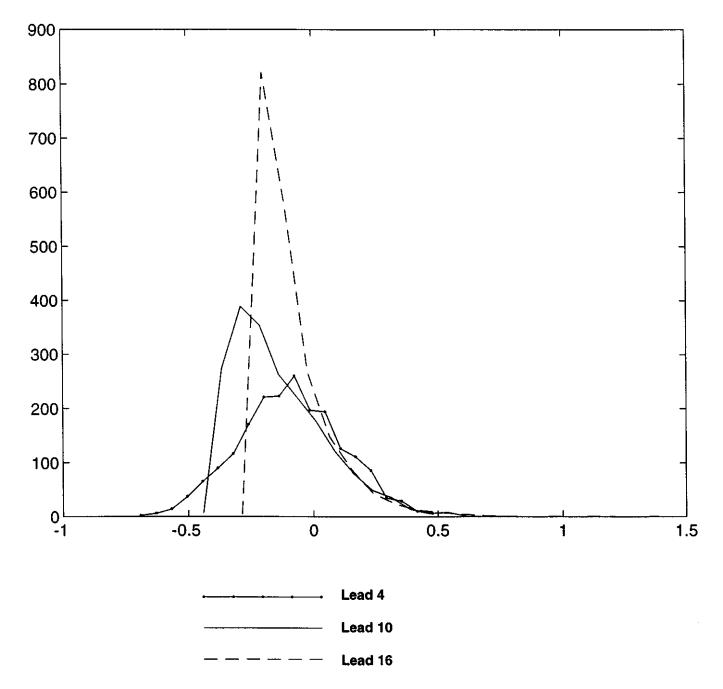
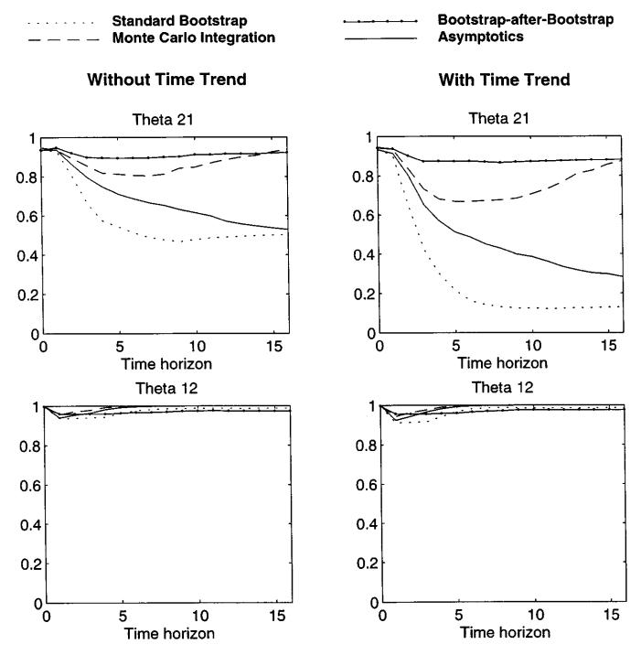
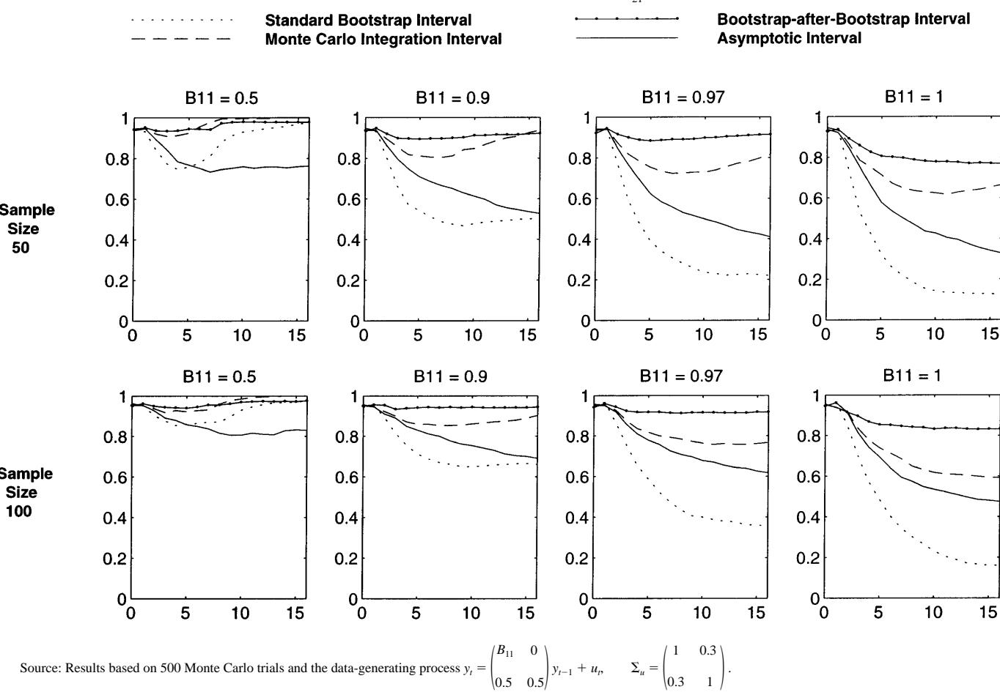
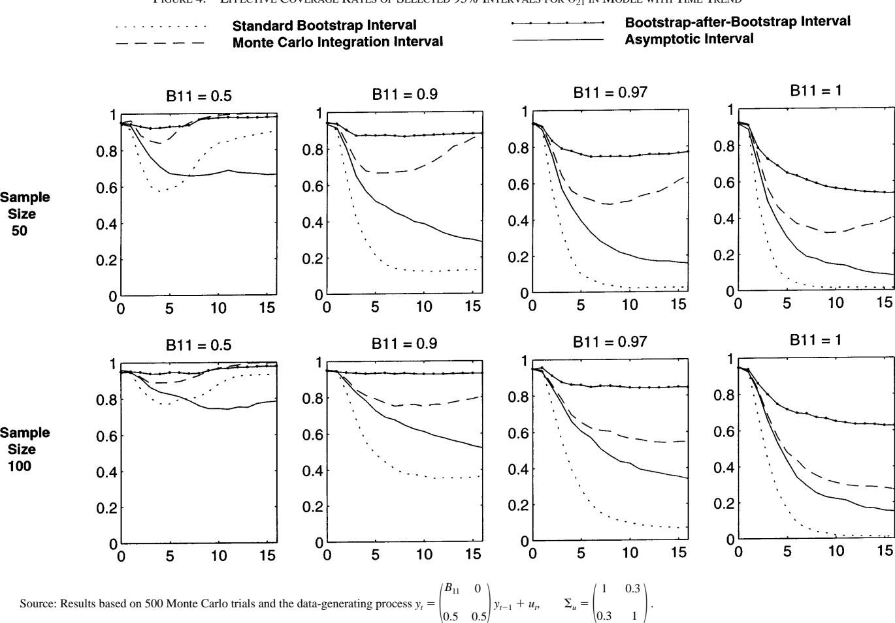
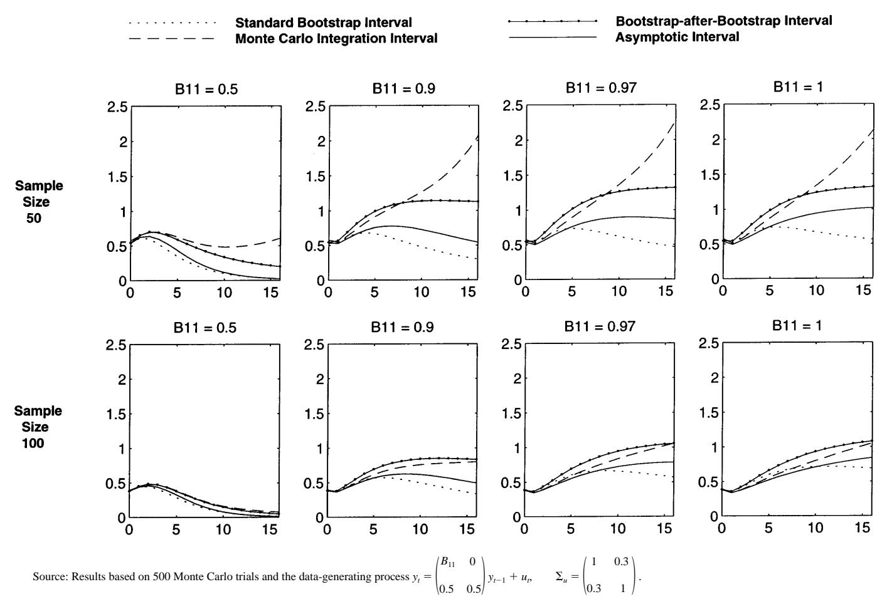
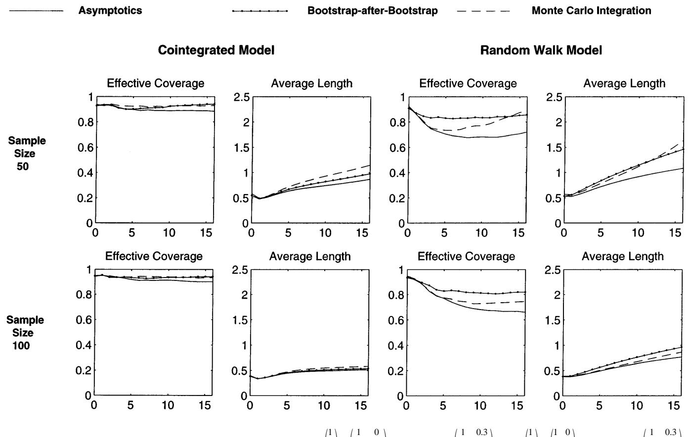
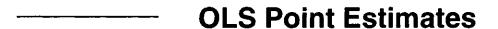
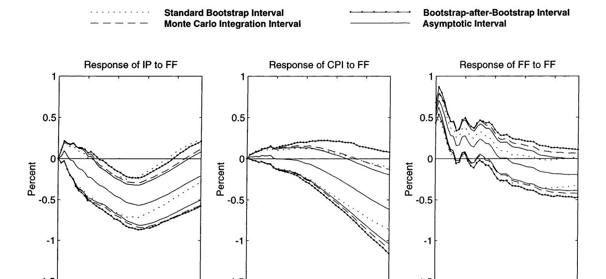

# SMALL-SAMPLE CONFIDENCE INTERVALS FOR IMPULSE RESPONSE FUNCTIONS

Lutz Kilian\*

Abstract—Bias-corrected bootstrap confidence intervals explicitly account for the bias and skewness of the small-sample distribution of the impulse response estimator, while retaining asymptotic validity in stationary autoregressions. Monte Carlo simulations for a wide range of bivariate models show that in small samples bias-corrected bootstrap intervals tend to be more accurate than delta method intervals, standard bootstrap intervals, and Monte Carlo integration intervals. This conclusion holds for VAR models estimated in levels, as deviations from a linear time trend, and in first differences. It also holds for random walk processes and cointegrated processes estimated in levels. An empirical example shows that bias-corrected bootstrap intervals may imply economic interpretations of the data that are substantively different from standard methods.

#### I. Introduction

**TMPULSE** response analysis based on vector autoregressive (VAR) models plays an important role in contemporary macroeconomic research. However, macroeconomic data sets for the postwar and post-Bretton Woods eras are comparatively short, which has led observers to question the statistical reliability of impulse response estimates from unrestricted vector autoregressions. Confidence bands for impulse response estimates are often based on Lütkepohl's (1990) asymptotic normal approximation, Runkle's (1987) nonparametric bootstrap method, or the parametric Monte Carlo integration procedure of Doan (1990). All three intervals are asymptotically valid in stationary models, but little is known about their small-sample performance. This paper pursues three related questions: (1) How accurate are these confidence intervals in small samples? (2) How do differences in their assumptions affect small-sample performance? (3) How can these intervals be improved upon? I show that bias and skewness in the small-sample distribution of the impulse response estimator can render traditional confidence intervals extremely inaccurate. To address this problem, I propose a new, bias-corrected bootstrap interval. I establish the asymptotic validity of this "bootstrap-afterbootstrap" interval for stationary VAR models, and I compare its effective coverage and average length in small samples to that of traditional methods by Monte Carlo simulation. Section II establishes notation and briefly describes the traditional methods. Section III motivates the idea of bias correction, discusses the implementation of the bootstrap-after-bootstrap method, and establishes its asymptotic validity. Section IV introduces the details of the simulation design. Section V presents the simulation evidence for the stationary model, section VI discusses extensions to nonstationary processes, and section VII considers models with higher lag orders. Section VIII discusses

Received for publication May 3, 1995. Revision accepted for publication November 5, 1996.

alternative approaches, section IX presents a macroeconomic example, and section X concludes.

#### II. Traditional Methods

To focus the discussion and establish notation, consider an N-variate data series y of length T + p generated by a covariance stationary VAR (p) process with intercept v,  $y_t = v + B_1 y_{t-1} + B_2 y_{t-2} + \dots + B_p y_{t-p} + u_t$ . The lag order p is assumed to be finite and known, and the disturbances  $u_t$ are identically and independently distributed (iid) white noise with vector mean zero, unknown positive definite covariance matrix  $\Sigma_u$ , and finite moments up to eighth order. Each element of  $(u_1, u_1u'_1)$  satisfies Cramér's condition (see Bose (1988)). The system's responses to reduced-form disturbances are obtained by the recursion  $\Phi_i = [\phi_{kl,i}] =$  $\sum_{i=1}^{l} \Phi_{i-i} B_i$ ,  $i=1,2,\ldots$ , where  $\Phi_0 = I_N$  and  $B_i = 0$  for j > 1p. The orthogonalized impulse responses are defined as  $\Theta_i$  $[\theta_{kl,i}] = \Phi_i P$ ,  $i = 0, 1, 2, \ldots$ , where P satisfies  $PP' = \sum_u$ Throughout the paper I assume exact identification of the structural VAR innovations. The statistic of interest  $\theta_{kl,i}$  is interpreted as the response of variable k to a one-time impulse in variable l, i periods ago. Let  $\beta = \text{vec}(v, v)$  $B_1, B_2, \ldots, B_p$ ) and  $\sigma = \text{vech}(\Sigma_u)$ , where vec denotes the column stacking operator and vech is the column stacking operator that stacks the elements on and below the diagonal only. At times it will be convenient to express the impulse response  $\theta_{kl,i}$  as a nonlinear function  $\theta_{kl,i}(\beta, \sigma)$ .

There are three traditional methods of constructing classical confidence intervals for  $\theta_{kl,i}$ . The asymptotic interval is the computationally simplest method. It relies on a delta expansion of the asymptotic distribution of the impulse response estimator (see Lütkepohl (1990, p. 118) and Mittnik and Zadrozny (1993)). The Monte Carlo integration method is Bayesian in origin. It involves simulating the posterior distribution of the impulse response, conditional on the p presample observations. Assuming Gaussian innovations and a suitable diffuse prior, that distribution is normal inverse Wishart and can be computed by Monte Carlo methods (see Sims (1987), Doan (1990), and Sims and Zha (1995)). Error bands are typically constructed based on the posterior mean and posterior standard errors. From a classical point of view, these intervals have only asymptotic justification. However, in applied work, Bayesian Monte Carlo integration intervals are often calculated based on unrestricted point estimates of vector autoregressions. I therefore include them in this study and analyze them (perhaps unfairly) from a strictly frequentist point of view.1 The nonparametric bootstrap interval based on Runkle (1987) generates many replications  $\hat{\theta}_{kl,i}^*$  of the impulse

\* University of Michigan.

I would like to thank V. Corradi, F. X. Diebold, M. Gertler, L. E. Ohanian, C. A. Sims, R. A. Stine, J. H. Stock, and the referees for helpful discussions and comments on earlier drafts of the paper.

&lt;sup>1 This paper does not cover Bayesian methods. For a complementary analysis from a Bayesian point of view see Sims and Zha (1995).

response estimate, conditional on the estimated coefficients  $\hat{\beta}$  and residuals  $\hat{u}_i$ , as though they were the population values. Under regularity conditions, a confidence interval for  $\hat{\theta}_{kl,i}$  of the form  $[\hat{\theta}_{kl,i}^{*(\alpha)}, \hat{\theta}_{kl,i}^{*(1-\alpha)}]$  can be constructed based on the  $\alpha$  and  $1-\alpha$  percentiles of the empirical distribution of the bootstrap estimate  $\hat{\theta}_{kl,i}^{*}$  (Efron and Tibshirani (1993)).2

#### III. The Bootstrap-after-Bootstrap Method

#### A. Motivation

It is well known that the asymptotic distribution of the impulse response estimator  $\hat{\theta}_{kl,i}$  is normal. What has rarely been recognized in the literature is that the small-sample distribution of impulse response estimates can be extremely biased and skewed. To illustrate this point, figure 1 displays an example representative for applied research. It plots the empirical densities of three impulse response coefficients, corresponding to the time horizons 4, 10, and 16 of a given impulse response function. The densities have been centered about the population value of the impulse response. The three plots illustrate that the asymptotic normal approximation can be a poor approximation in small samples, especially at higher time horizons; yet none of the standard methods in the literature account for the small-sample bias of  $\theta_{kl,i}$ , and only the bootstrap interval attempts to allow for skewness. Not imposing symmetry seems to be a step into the right direction, but what is rarely made explicit is that reading off the  $\alpha$  and  $1 - \alpha$  percentile interval endpoints of the bootstrap distribution amounts to assuming that  $\theta_{kli}^*$  is unbiased and its distribution scale invariant. This observation suggests that the standard bootstrap interval will perform poorly in small samples. At first sight, it may seem that a simple correction for median bias in the bootstrap distribution of  $\hat{\theta}_{kl,i}^*$  would suffice to produce accurate intervals, but treating bias as a pure location shift problem ignores that the distribution of  $\hat{\theta}_{kl,i}^*$  is not scale invariant. This explains why the bootstrap confidence interval of Efron (1982) and Efron and Tibshirani (1993) performs very erratically in Monte Carlo simulation. More sophisticated bootstrap confidence intervals like the accelerated BC interval (BC\alpha) attempt to estimate scale effects either analytically or by jackknife methods. For  $\theta_{kl,i}^*$  neither of these two approaches is easy to implement. Other refinements of bootstrap confidence intervals such as the percentile-t interval require reliable estimates of scale. Given the dependence of the variance estimate of  $\theta_{kl,i}$  on the location of  $\theta_{kl,i}$ , it is not surprising that the percentile-t interval tends to perform erratically in Monte Carlo simulation.

Given the difficulties of directly correcting for bias (and skewness) in  $\hat{\theta}_{kl,i}^*$ , this paper proposes to indirectly remove

FIGURE 1.—FINITE-SAMPLE DENSITIES OF IMPULSE RESPONSE ESTIMATES
CENTERED ABOUT POPULATION VALUES

the bias in  $\hat{\theta}_{kl,i}^*$  prior to bootstrapping the estimate. Bias in  $\hat{\theta}_{kl,i}^*$  may arise from small-sample bias in slope coefficient estimates or from the nonlinearity of  $\theta_{kl,i}$ . In practice, even small amounts of bias in  $\hat{\beta}^*$  may translate into dramatic changes in interval width and location. To the extent that ordinary least-squares (OLS) small-sample bias is responsible for the observed bias in  $\hat{\theta}_{kl,i}^*$ , replacing the biased coefficient estimates  $\hat{\beta}^*$  by bias-corrected estimates  $\hat{\beta}^*$  prior to constructing the impulse response function will reduce the bias in  $\hat{\theta}_{kl,i}^*$ . This suggests bootstrapping  $\hat{\theta}_{kl,i}^*(\hat{\beta}^*, \hat{\sigma}^*)$  rather than  $\hat{\theta}_{kl,i}^*(\hat{\beta}^*, \hat{\sigma}^*)$ . Given the nonlinearity of  $\hat{\theta}_{kl,i}^*$ , this procedure will not in general produce unbiased estimates, but as long as the resulting bootstrap estimator is approximately unbiased, the implied percentile intervals are likely to be good approximations.

In addition, the presence of OLS bias necessitates a second change in Runkle's (1987) bootstrap algorithm. The basic idea behind bootstrapping techniques is that the bootstrap estimate  $\hat{\beta}^*$  is expected to relate to  $\hat{\beta}$ , as  $\hat{\beta}$  relates to the unobservable  $\beta$ . This makes obvious sense in the classical linear regression model, where the OLS coefficient estimator is unbiased. In contrast, in autoregressive models the OLS estimator is systematically biased away from the population value, and the bootstrap analogy breaks down.

&lt;sup>2 Throughout this paper, I will refer to this interval as the percentile interval. The percentile interval may be justified based on transformation theory (e.g., Efron (1982) and Efron and Tibshirani (1993)). An alternative view of bootstrapping prompted Hall (1992) to refer to the same interval as the "other" percentile interval. For a discussion of the relationship between these two approaches see Hall (1992) and Efron and Tibshirani (1993) and the references therein.

 $^3$  Note that this procedure ignores the effects of coefficient bias on  $\hat{\sigma}^*$ . One could have considered bias-correcting  $\hat{\sigma}^*$  in addition, but such a modification would only have had second-order effects on the impulse response estimate. It also would have required us to recalculate and recenter the empirical residuals to preserve the internal consistency of the resampling algorithm. Given these complications, the small order of the effect, and the favorable performance of the bootstrap even without this correction, I chose to keep the algorithm simple by ignoring the effects of bias on  $\hat{\sigma}^*$ . However, further investigation of this issue may be useful.

Generating bootstrap data conditional on a biased point estimate will tend to result in even more biased bootstrap estimates. This explains the curious result, noted by Sims and Zha (1995, p. 16), that the standard bootstrap interval often tends to lie almost entirely below (or above) the initial OLS point estimate. To preserve the bootstrap analogy we need to bias-correct  $\hat{\beta}$  "prior to bootstrapping" to obtain an approximately unbiased estimator of  $\beta$ . In the VAR context this point was first alluded to by Nicholls and Pope (1988, p. 296), but it has been ignored in applications.4

### B. Implementation

Bias corrections for univariate autoregressive models have been put forward by a number of authors, yet the difficulties of estimating bias in multivariate settings have prevented the problem from receiving much attention in the VAR literature.5 Explicit expressions for the asymptotic first-order mean bias in demeaned stationary VAR processes are available in Pope (1990).6 In this paper, I estimate the mean OLS bias  $\Psi$  by resampling methods instead, adapting the general procedure outlined in Efron and Tibshirani (1993, p. 124). Bootstrapping does not improve the accuracy of the bias estimate, but it easily accommodates the inclusion of a linear time trend. Since some of the models I consider in sections V and VI include a linear time trend, I rely on resampling methods for bias estimation throughout this paper. This implies the following algorithm for the bias-corrected bootstrap method.

STEP 1a: Estimate the VAR(p) in equation (1) and generate 1000 bootstrap replications  $\hat{\beta}^*$  from

$$y_t^* = \hat{v} + \hat{B}_1 y_{t-1}^* + \dots + \hat{B}_p y_{t-p}^* + u_t^*$$
 (1)

using standard nonparametric bootstrap techniques. Then approximate the bias term  $\Psi = E(\hat{\beta} - \beta)$  by  $\Psi^* = E^*(\hat{\beta}^* - \hat{\beta})$ . This suggests the bias estimate  $\hat{\Psi} = \hat{\beta}^* - \hat{\beta}$ .

STEP 1b: Calculate the modulus of the largest root of the companion matrix associated with  $\hat{\beta}$ . Denote this quantity by  $m(\hat{\beta})$ . If  $m(\hat{\beta}) \ge 1$ , set  $\tilde{\beta} = \hat{\beta}$  without any adjustments. If

 $m(\hat{\beta}) < 1$ , construct the bias-corrected coefficient estimate  $\tilde{\beta} = \hat{\beta} - \hat{\Psi}$ . If  $m(\tilde{\beta}) \ge 1$ , let  $\hat{\Psi}_1 = \hat{\Psi}$  and  $\delta_1 = 1$  and define  $\hat{\Psi}_{i+1} = \delta_i \hat{\Psi}_i$  and  $\delta_{i+1} = \delta_i - 0.01$ . Set  $\tilde{\beta} = \tilde{\beta}_i$  after iterating on  $\tilde{\beta}_i = \hat{\beta} - \hat{\Psi}_i$ ,  $i = 1, 2, \ldots$ , until  $m(\tilde{\beta}_i) < 1$ . By changing the grid for  $\delta$ , one can make  $m(\tilde{\beta})$  arbitrarily close to unity. The purpose of this stationarity correction is to avoid pushing stationary impulse response estimates into the nonstationary region. The adjustment has no effect asymptotically and does not restrict the parameter space of the OLS estimator, since it does not shrink the OLS estimate  $\hat{\beta}$  itself, but only its bias estimate.

STEP 2a: Substitute  $\hat{\beta}$  for  $\hat{\beta}$  in equation (2) and generate 2000 new bootstrap replications  $\hat{\beta}^*$  using standard nonparametric bootstrap techniques. To estimate the mean bias  $\hat{\Psi}^*$  of  $\hat{\beta}^*$  requires nesting a separate bootstrap loop inside each of the 2000 bootstrap loops. To reduce the computational requirements, one may use the first-stage bias estimate  $\hat{\Psi}$  as a proxy for  $\hat{\Psi}^*$ . This short-cut makes use of the result that the bias estimate in each bootstrap loop agrees up to  $O_P(T^{-3/2})$  with the bias estimate for the initial point estimate, which is of order  $O_P(T^{-1})$  itself (see appendix).

STEP 2b: Calculate  $\tilde{\beta}^*$  from  $\hat{\beta}^*$  and  $\hat{\Psi}^*$ , following the instructions in step 1b with the obvious changes in notation.

STEP 3: Calculate the  $\alpha$  and  $1 - \alpha$  percentile interval endpoints of the distribution of  $\hat{\theta}_{kl,i}^*(\tilde{\beta}^*, \hat{\sigma}^*)$ .

Section IIIC will establish that this bootstrap-after-bootstrap procedure is asymptotically valid. To verify the accuracy of the bootstrap-after-bootstrap interval in small samples, I will conduct an extensive Monte Carlo experiment in section V. While the double bootstrap algorithm outlined in step 2a promises even better coverage performance than the bootstrap-after-bootstrap method, it is currently not computationally feasible to test it on a large scale. That does not mean, however, that it could not be employed in applications. Alternatively, the double bootstrap could be reduced to a single layer of bootstrapping whenever asymptotic bias expressions are available.

## C. Asymptotic Validity

The asymptotic validity of the standard bootstrap technique for impulse responses follows from Bose (1988,

 $^8$  The resulting bootstrap-after-bootstrap method is computationally much more efficient than a "bootstrap plus double bootstrap" would have been. Instead of (1000 + 2000  $\times$  1000), it requires only (1000 + 2000) replications.

 $^{9}$  To initialize the bootstrap data-generating process, I randomly select p initial observations using the block method of Stine (1987). Sims and Zha (1995) object to this procedure and suggest to condition on the actual data. Their suggestion appears inconsistent with a frequentist point of view. Note that imposing the same initial conditions in each bootstrap sample will understate the true sampling uncertainty of the impulse response estimate. However, additional simulation experiments suggest that, at least for the example process, treating the initial conditions as fixed in repeated sampling makes essentially no difference for the bootstrap results.

&lt;sup>4 A referee pointed out that the same point has been made in more detail in an unpublished M.Sc. thesis at the Australian National University (Pope (1987)), which forms the basis of the remark quoted.

&lt;sup>5 Recent work on bias-corrected OLS estimates for univariate autoregressive processes includes Shaman and Stine (1988), Rudebusch (1992, 1993), Andrews (1993), and Andrews and Chen (1994), among others.

&lt;sup>6 In related work, Nicholls and Pope (1988) derive the same bias estimate under the more restrictive assumption of normal innovations. Tjøstheim and Paulsen (1983) outline a procedure for bias estimation in VAR models, but they do not provide a rigorous analytical derivation of that bias nor do they estimate the order of the error.

 $^{7}$  This approximation is accurate to first order. It amounts to assuming that the bias is constant in the neighborhood of  $\hat{\beta}$ . More generally, the coefficient bias may be approximated to higher order by iterating the bias estimation procedure in step 1a. I abstract from these higher order corrections, because their magnitude is typically small and of rapidly diminishing order.

theorem 3.9 and remark 3.10). Let  $\Sigma^{1/2}$  denote the Cholesky decomposition of the variance–covariance matrix  $\Sigma$ . Under the assumptions of section II, Bose (1988) shows that the difference between the Edgeworth expansion for  $\hat{\beta}^*$  and a comparable expansion for  $\hat{\beta}$  is  $o(T^{-1/2})$  almost surely. For almost everywhere  $Y_t$ ,

$$\sup_{x} |P^*(T^{1/2}\hat{\Sigma}_{\beta}^{1/2}(\hat{\beta}^* - \hat{\beta}) \le x) - P(T^{1/2}\Sigma_{\beta}^{1/2}(\hat{\beta} - \beta))|$$

$$\le x)| = o(T^{-1/2})$$
(3)

and by an analogous argument,

$$\sup_{x} |P^*(T^{1/2}\hat{\Sigma}_{\sigma}^{1/2}(\hat{\sigma}^* - \hat{\sigma}) \le x) - P(T^{1/2}\Sigma_{\sigma}^{1/2}(\hat{\sigma} - \sigma)$$

$$\le x)| = o(T^{-1/2}).$$
(4)

Further, the joint distribution of  $\hat{\beta}$  and  $\hat{\sigma}$  can be bootstrapped with accuracy  $o(T^{-1/2})$ , because

$$\sqrt{T} \begin{bmatrix} \hat{\beta} - \beta \\ \hat{\sigma} - \sigma \end{bmatrix} \xrightarrow{d} N \left( 0, \begin{bmatrix} \Sigma_{\beta} & 0 \\ 0 & \Sigma_{\sigma} \end{bmatrix} \right). \tag{5}$$

Then the asymptotic validity of the standard bootstrap algorithm follows from the fact that  $\theta_{kl,i}(\beta, \sigma)$  is a continuously differentiable function in its arguments.

The additional modifications I proposed to improve the performance of the bootstrap interval in small samples do not alter its asymptotic validity. The reason is that the effect of bias corrections is negligible asymptotically, since the OLS estimator converges at rate  $T^{-1/2}$ , while the estimated bias  $\Psi(\hat{\beta})$  is of order  $O_P(T^{-1})$ . An analogous argument holds for bootstrap bias estimation. Similarly,  $\Psi(\hat{\beta})$  may be substituted for  $\Psi(\hat{\beta}^*)$ , since the two bootstrap bias estimates differ only by  $O_P(T^{-3/2})$  (see appendix), and the difference vanishes at a faster rate than  $\Psi(\hat{\beta}^*)$  itself.

Moreover, shrinking the bias-correction term of  $\hat{\beta}$  (and of  $\hat{\beta}^*$ ) to keep the system stationary has no effect on the asymptotic performance of the bootstrap-after-bootstrap method, because by Chebychev's inequality, for any slope coefficient  $\beta_i$ ,  $j = 1, 2, ..., N^2p$ ,

$$P(|\hat{\beta}_j - \beta_j| > \epsilon) \le \frac{E[\hat{\beta}_j - \beta_j]^2}{\epsilon^2}, \quad \epsilon > 0.$$
 (6)

Define events  $E_j = ||\hat{\beta}_j - \beta_j| > \epsilon|$  for  $j = 1, 2, ..., N^2 p$ . Using equation (6),

$$P[\max |\hat{\beta}_{j} - \beta_{j}| > \epsilon] = P[\bigcup_{j} E_{j}] \leq \sum_{j=1}^{N^{2}p} P[E_{j}]$$

$$\leq \sum_{j=1}^{N^{2}p} \frac{E[\hat{\beta}_{j} - \beta_{j}]^{2}}{\epsilon^{2}} = O(T^{-1}). \quad (7)$$

By equation (7) the probability of a nonstationary draw shrinks at the same rate as the mean squared error of  $\hat{\beta}$ . Thus the nonstationary region of the distribution will be empty asymptotically. This argument continues to hold if we replace  $\hat{\beta}$  by  $\hat{\beta}$ , because the bias estimate is of order  $T^{-1}$  (see Pope (1990)). An analogous argument holds in the bootstrap world where the OLS estimate assumes the role of the population value. We simply replace  $\hat{\beta}$  by  $\hat{\beta}^*$  and replace  $\beta$  by  $\hat{\beta}$  in equations (6) and (7). Moreover, the analogy continues to hold if we condition on the bias-corrected  $\hat{\beta}$  as the bootstrap population value and replace  $\hat{\beta}^*$  by its bias-corrected counterpart  $\hat{\beta}^*$ . This establishes the asymptotic validity of the bootstrap-after-bootstrap method.

# IV. Simulation Design

The data-generating process is deliberately stylized in order to isolate the nature of the problem of small-sample bias. Its simple structure facilitates a systematic analysis of a wide range of impulse responses with varying shapes and degrees of persistence. The population model is a stationary bivariate VAR(1) of the form

$$y_{t} = \begin{pmatrix} B_{11} & 0 \\ 0.5 & 0.5 \end{pmatrix} y_{t-1} + u_{t}, \quad u_{t} \stackrel{\text{iid}}{\sim} N \begin{pmatrix} 0 \\ 0 \end{pmatrix}, \begin{pmatrix} 1 & 0.3 \\ 0.3 & 1 \end{pmatrix}$$
 (8)

where  $B_{11} \in \{-0.9, -0.5, 0, 0.5, 0.9, 0.97, 1\}$ . The intercept and trend coefficients have been normalized to zero in population.  $B_{11}$  regulates the persistence of the process. For  $-1 < B_{11} < 1$ , the data-generating process may be interpreted as stationary in levels or first differences.11 Alternatively, if a linear trend term is included in the estimation, the same data-generating process can be interpreted as deviations from the trend. For  $B_{11} = 1$ , the process becomes cointegrated, but by the continuity of the finitesample distribution, the results for  $B_{11} = 1$  are virtually identical to those for borderline stationary values as  $B_{11}$ approaches 1. A detailed study of nonstationary processes with and without drift can be found in section VI. For  $B_{11} =$ 0, the first equation reduces to white noise, and the asymptotic distribution theory does not apply, because some of the impulse responses will have zero variances (Lütkepohl (1990, p. 119)). Negative values for  $B_{11}$  imply oscillatory impulse response functions. 12

I consider sample sizes of 50 and 100. These sizes may appear low, but have to be viewed in relation to the number of parameters to be estimated. For example, a four-variable VAR(4) using 30 years of quarterly data utilizes many more observations, but also involves many more parameters. As a

&lt;sup>10 This data-generating process closely resembles that of Griffiths and Lütkepohl (1993).

&lt;sup>11 VAR models in first differences have been estimated, for example, by Cooley and Ohanian (1991), Fackler (1990), and Friedman and Kuttner (1992)

&lt;sup>12 Oscillatory behavior may also arise from complex roots. The population model in equation (8) does not allow for that possibility, but additional Monte Carlo evidence for alternative VAR(1) models with complex roots and varying degrees of persistence gave results comparable to those in section V.

result, its degrees of freedom would be roughly equivalent to those of the example process with sample size 100. Since the error-covariance matrix is invariant to scalar multiplication, the diagonal elements can be normalized to 1. The offdiagonal elements are chosen to represent low cross correlations common in applied work (e.g., Sims (1992)). Additional preliminary experiments with cross correlations of 0.9 yielded virtually identical results, suggesting that the simulation results are insensitive to the degree of cross correlation.13

In total, I analyze four methods in the Monte Carlo experiment: the asymptotic interval, the standard bootstrap interval, the Monte Carlo integration interval, and the bootstrap-after-bootstrap interval. The bootstrap simulations are based on 1000 replications for bootstrap bias estimation and 2000 replications for the construction of confidence intervals. The criteria of comparison for the Monte Carlo exercise are the effective coverage rate of the nominal 95% interval and its average length. Effective coverage is defined as the relative frequency at which the confidence interval covers the true, but in practice unknown impulse response value in repeated trials. Simulation results are based on 500 trials, which implies a Monte Carlo standard error of approximately 0.01 for the coverage estimate.

## **V. Simulation Evidence**

For each design point, I draw 500 data series from the data-generating process in equation (8). For each draw I estimate a bivariate VAR(1) model including an intercept (and possibly a linear time trend) and calculate the four confidence intervals for each of the 68 implied impulse response coefficients.14 These intervals are evaluated across the 500 Monte Carlo trials for each impulse response coefficient. Figures 2 through 4 plot the proportion of intervals that include the true, but in practice unknown value of the impulse response for a given time horizon. Each plot shows the effective coverage rates of the nominal 95% intervals for a time horizon of 16 periods after the initial shock. A horizontal line at 0.95 would imply perfect coverage accuracy at all time horizons.

It is instructive to begin with the coverage results for *B*11 5 0.9 and sample size 50 in the model without time trend. First consider the upper left panel in figure 2 for u21, where u21 stands for the response of variable 2 to a shock in variable 1. The differences in performance between the four

FIGURE 2.—EFFECTIVE COVERAGE RATES OF SELECTED 95% CONFIDENCE INTERVALS FOR SAMPLE SIZE 50

Source: Results based on 500 Monte Carlo trials and the data-generating process

$$y_{t} = \begin{pmatrix} 0.9 & 0 \\ 0.5 & 0.5 \end{pmatrix} y_{t-1} + u_{t}, \qquad \Sigma_{u} = \begin{pmatrix} 1 & 0.3 \\ 0.3 & 1 \end{pmatrix}.$$

methods are striking. The effective coverage of the standard bootstrap interval and of the asymptotic interval both quickly drop off to about 50%. The effective coverage of the Monte Carlo integration interval fluctuates between about 80 and 96%, depending on the time horizon. On the other hand, the effective coverage of the bootstrap-after-bootstrap interval for u21 is about 90 to 95% at all time horizons. Similar results hold for u11. However, turning to u12 in the lower left panel of figure 2, the differences between the four intervals are only minor. Although the asymptotic interval and the Monte Carlo integration interval tend to overcover for higher time horizons, by and large, all methods have close to nominal coverage.15 Similarly, the differences across methods for u22 are comparatively minor.

The striking differences between the results for u11 and u21 on the one hand, and u12 and u22 on the other, are systematically linked to the magnitude of the OLS bias in bˆ, which in turn depends on the size of the elements of b. Consider the impulse response u21 in the upper panel of figure 3. If we raise *B*11 from 0.9 to 0.97, for example, the coverage of the standard bootstrap interval for u21 drops to 22%, that of the asymptotic interval to 41%, and that of the Monte Carlo integration interval to 72%. For *B*11 5 1, these rates fall further to 12%, 33%, and 62%, respectively. If we

13 The residuals are orthogonalized by Cholesky decomposition. This assumption is made purely for convenience. While alternative structural identification methods may involve an additional layer of estimation uncertainty, the essence of the results is likely to be the same. The pattern of exclusion restrictions on the impact multiplier matrix primarily affects which of the OLS coefficients are combined into a given impulse response. Since I already systematically analyze impulse response functions of various shapes and degrees of persistence, from a statistical point of view nothing remains to be learned from considering alternative structural identification schemes under the maintained assumption of exact identification.

14 The lag order is assumed to be known. This assumption is common to all methods discussed in this paper. I deliberately ignore the issue of specification uncertainty. At this stage of the analysis it is useful to avoid nesting econometric procedures. However, I am in the process of developing alternative methods that endogenize the lag order choice.

15 The coverage rate for u12 at time horizon zero is 100%, independently of the method used to construct the confidence interval. This is an artifact of the orthogonalization by Cholesky decomposition.

FIGURE 3.—EFFECTIVE COVERAGE RATES OF SELECTED 95% INTERVALS FOR Q ˆ 21 IN MODEL WITHOUT TIME TREND

lower *B*11 to 0.5, on the other hand, the coverage improves. Similar results would have been obtained for u11. This pattern is familiar from many univariate studies. The precise effect of bias, however, is more complicated in the multivariate setting. Individual impulse responses are affected by bias depending on the sign and size of the individual OLS coefficients in b that enter u*kl*,*i*(b, s), and on the precise manner in which they enter. The latter is governed by the number of lags and variables in the model as well as by the coefficients of *P*, where *P* satisfies *PP*8 5 S*u*. In the process considered here, u11 and u21 are primarily functions of the OLS estimate of *B*11, whereas u12 or u22 are not, which explains why the latter are hardly affected by bias in *B*11. More generally, this finding suggests that in VAR applications standard methods will sometimes coincide with the bootstrap-after-bootstrap interval and sometimes imply drastically different results, but only the bias-corrected bootstrap interval is likely to have accurate coverage all the time.

Figure 3 focuses on fairly persistent VAR processes with large positive roots. For these processes bias is large, and there is strong evidence for the superiority of the bootstrapafter-bootstrap method. To conserve space, I do not display the remaining results for *B*11 5 50, 20.5, 20.96, but it is worth noting that the bias-corrected bootstrap continues to perform well, even when bias is virtually nonexistent and therefore difficult to estimate, as might be the case for difference-stationary processes. In all cases considered, the bootstrap-after-bootstrap interval performs at least as well as the other methods, and its effective coverage is typically close to nominal coverage. It is also worth noting that the coverage performance of the asymptotic interval is erratic and often poor for *B*11 5 0, when the asymptotic variance may not be well defined.

Qualitatively similar results are obtained for sample size 100. The lower panel in figure 3 shows that the coverage of the bootstrap-after-bootstrap interval is close to nominal coverage with the exception of the limiting case of *B*11 5 1. In relative terms the bootstrap-after-bootstrap interval continues to dominate the other methods, often by a wide margin. The earlier results for sample size 50 are evidently not an artifact of the small sample size. The bias and the skewness of the impulse response distribution persist even in moderately sized samples. For example, if *B*11 5 0.9, for the asymptotic interval to attain the same coverage accuracy as the bootstrap-after-bootstrap interval for sample size 50, the sample size has to increase to about 400 periods.

The preceding results apply to VARs estimated in levels or first differences. Including a time trend in the regression is likely to increase small-sample bias. The right panels in figure 2 demonstrate that the coverage performance of the

FIGURE 4.—EFFECTIVE COVERAGE RATES OF SELECTED 95% INTERVALS FOR Q ˆ 21 IN MODEL WITH TIME TREND

standard methods deteriorates dramatically after inclusion of a time trend, compared to the left panel in the same figure. The effective coverage of the standard bootstrap intervals may drop as low as 13% for the standard bootstrap interval, 28% for the asymptotic interval, and 67% for the Monte Carlo integration interval. Qualitatively, the results are unchanged. Similarly, figure 4 allows a direct comparison to figure 3. As *B*11 increases, the performance of the standard methods may fall as low as 1%, 8%, and 32%, respectively, for sample size 50. The coverage of the bootstrap-afterbootstrap interval also declines with rising persistence, but it continues to outperform the other methods by a wide margin. For sample size 100, its coverage is 84% or higher with the exception of the limiting case of *B*11 5 1. This result compares to rates as low as 7% for the standard bootstrap, 34% for the asymptotics, and 54% for Monte Carlo integration. Thus the inclusion of a time trend in the model reinforces and strengthens the earlier result.

To summarize, the bootstrap-after-bootstrap method is the only method to achieve effective coverage rates close to nominal coverage in nearly all circumstances. By how much the coverage results for the bootstrap-after-bootstrap interval differ from standard methods largely depends on the persistence of the process, the sample size, and whether the VAR includes a deterministic time trend. It is perhaps surprising that this increase in probability content does not necessarily come at the expense of wider intervals. Figure 5 shows that for sample size 50 the bias-corrected bootstrap interval both has higher coverage and is shorter on average than the Monte Carlo integration interval.16 For sample size 100, the coverage of the bias-corrected interval continues to be much higher at a fairly small additional cost in terms of length. Qualitatively similar results are obtained for the regression model with trend. The additional length of the bootstrap-after-bootstrap interval in small samples compared to the asymptotic and the standard bootstrap interval, especially for highly persistent processes, is no reason for concern, since those intervals have much lower coverage.

## **VI. Extensions to Nonstationary Processes**

The bias-corrected bootstrap interval of section III has been designed for stationary models. In fact, bootstrapping

16 The apparent reason is that the Monte Carlo integration interval assumes that bˆ is normally distributed in small samples. This raises the probability of explosive draws, especially if the estimated root is close to unity. Explosive outliers inflate the standard error of the simulated distribution of the impulse response. Imposing symmetry then results in ever wider intervals with increasing coverage, as the time horizon grows (see figures 2, 3, and 4).

FIGURE 5.—AVERAGE LENGTHS OF SELECTED 95% INTERVALS FOR Q ˆ 21 IN MODEL WITHOUT TIME TREND

is not asymptotically valid for models with an exact unit root, if the regression is estimated in levels.17 Nevertheless, based on the continuity of the finite sample distribution of the OLS estimator, the bootstrap approximation may still be

17 A rigorous proof of the asymptotic invalidity of the standard resampling algorithm for the slope coefficient in a univariate random walk model without drift can be found in Basawa et al. (1991). The reason for the failure of the bootstrap is the discontinuity of the asymptotic distribution of the OLS estimator at the unit circle. The point estimate of b will almost never lie exactly on the unit circle. As a result, the bootstrap distribution of the estimator will differ systematically from that of the point estimate. This kind of reasoning also carries over to cointegrated VAR processes and integrated VAR processes with *p* . 1. One way to avoid this problem is to impose the unit root in estimation and to estimate random walk processes in first differences and cointegrated processes in vector error correction (VEC) form. Lu¨tkepohl and Reimers (1992) establish the asymptotic distribution of the implied level slope coefficients and of the impulse response under the cointegration constraint. The asymptotic distribution of this maximum-likelihood estimator is continuous, and the bootstrap algorithm is asymptotically valid. Preliminary simulation experiments for bivariate processes suggest that imposing a unit root in estimation can effectively remove much of the bias in the level coefficients. It is not uncommon for both bootstrap methods and the delta method to have fairly good coverage properties and comparable length. However, the results remain sensitive to the size of the second root. As that root approaches unity, the coverage performance of the standard methods tends to drop, and the bootstrap-after-bootstrap interval often performs better. Unlike the results for the level specification, these results are contingent on correct identification of the order of integration and of the cointegration rank.

satisfactory in practice. It seems useful to quantify the consequences of ignoring exact unit roots in estimation, because these consequences are likely to be an important concern for applied econometricians. For example, in practice, many econometricians would be willing to assume stationarity if models arbitrarily close to nonstationarity were allowed. Researchers also may be reluctant to condition on the outcomes of pretests for unit roots and cointegration, which tend to have low power. This section will demonstrate that the bootstrap-after-bootstrap interval typically performs better than the delta method and the Monte Carlo integration interval even for nonstationary processes incorrectly specified in levels.

Figures 3, 4, and 5 already presented some results for the cointegrated model without drift (*B*11 5 1). For this model, the bias-corrected bootstrap interval clearly outperforms its competitors. Similar results hold for a multivariate random walk model where the slope coefficient matrix in equation (8) has been replaced by the identity matrix. However, compared to the cointegrated model, the effective coverage rates may be much lower and are less consistent across impulse response functions. It is intriguing that the performance of the bias-corrected bootstrap interval improves with

1 2 1 1

0.5 0.52 *yt*21 1 *ut*

, S*u* 5 1

sample size. For example, the coverage rates of the biascorrected bootstrap interval for u21 in the cointegration model approach 90% for sample size 500, compared to rates as low as 70% for the other two methods. For the random walk model the improvement is smaller, but still noticeable.

Source: Results based on 500 Monte Carlo trials and the following processes *yt* 5 1

A perhaps more realistic class of data-generating processes are nonstationary processes with drift. Apart from the drift term, the two models I consider are identical to the cointegrated and random walk models discussed earlier. The size of the drift is set equal to 1 in population to roughly match the ratio of the drift to the standard deviation of the innovation found in applied work. Figure 6 shows the results for u21 and the regression model including an intercept, but no time trend. For the cointegrated model with drift, both the bootstrap-after-bootstrap and the Monte Carlo integration intervals have excellent coverage properties. In fact, even the asymptotic interval performs quite well. This result is strikingly different from the model without drift. In terms of length, for sample size 50, the bias-corrected bootstrap interval tends to be slightly shorter than the Monte Carlo integration interval at higher time horizons. In contrast, for the random walk model with drift, the results are not much different from the model without drift. In relative terms the bias-corrected bootstrap interval continues to dominate its competitors. The results for the cointegrated model with drift may seem to suggest that there is little gain from using bias corrections. However, additional experiments show that, as the second root of the cointegrated process approaches unity, the performance of the bias-corrected bootstrap and of the traditional methods begins to diverge, and the bootstrap-after-bootstrap interval enjoys clear advantages.

1 2 1 1

0 1 2 *yt*21 1 *ut*

, S*u* 5 1

0.3 1 2 .

0.3 1 2 ; *yt* 1 1

Including an additional time trend in the regression model considerably worsens the performance of all intervals, although the relative superiority of the bootstrap-afterbootstrap interval is preserved in the trend model without drift. In the trend model with drift, however, the Monte Carlo integration interval often has higher coverage and on average is much longer. These results suggest that falsely including a time trend in the regression model can seriously impair the coverage content of confidence intervals if the true process has a unit root.

## **VII. Extensions to Models with Higher Lag Orders**

To verify that the simulation results extend to models with higher lag orders, I also carried out a similar Monte Carlo study for a bivariate VAR(8) in levels with nonzero intercept, based on the actual estimate of such a process using quarterly M1 and industrial production data for the United States. The persistence of the estimated process, as measured by  $m(\hat{\beta})$ , was 0.99. The coverage results for the bootstrap-after-bootstrap interval for sample sizes 80 and 120 were similar to the results for the VAR(1) model with comparable persistence. The Monte Carlo integration interval performed about as well as the bootstrap-after-bootstrap interval for sample size 80, but had slightly lower coverage for sample size 120. It also tended to become very wide at high time horizons in some cases.

Since there is reason to suspect that bias corrections may do more harm than good for higher order processes with lower persistence, I also conducted a Monte Carlo study for a model based on the actual estimate of a first-differenced quarterly M1 industrial production VAR(4) with  $m(\beta) =$ 0.89. The coverage results for the bias-corrected bootstrap for sample sizes 80 and 120 again confirmed the robustness of the earlier conclusions. As expected for processes with lower persistence, the coverage rates of the bootstrap-afterbootstrap interval and the Monte Carlo integration interval were similar, although in some cases the bias-corrected intervals were wider without improving coverage. In both models considered in this section, the coverage performance of the asymptotic and standard bootstrap intervals was much worse than for the Monte Carlo integration interval or the bootstrap-after-bootstrap interval.

#### VIII. Further Discussion

While the bootstrap-after-bootstrap interval represents a significant improvement over traditional intervals, that does not mean that it is without problems. Figures 2 through 4 show that its performance in absolute terms tends to fall short of the nominal coverage probability, as the true process becomes highly persistent, especially if a linear time trend is included in the regression. This tendency becomes very visible for  $B_{11} > 0.97$ . One explanation could be that nonlinearities become more important for processes with large roots, but that does not explain why including a time trend in the regression worsens coverage. A more likely explanation is that the rapid increase in bias, as the root approaches unity, calls for higher order bias corrections. While the first-order bias corrections of section IIIB tend to be sufficient for most stationary processes, I conjecture that in highly persistent processes higher order bias corrections could further improve the accuracy of the bias-corrected bootstrap interval. Higher order bias estimates can be easily obtained by iterating on the bias estimation bootstrap loop, if computational costs are not a concern.

An alternative view recently expressed in Stock (1995) is that conventional approaches to inference tend to fail in autoregressive processes with large roots and should perhaps be replaced by near-unit-root or near-cointegration asymptotics. Local to unit-root asymptotics for  $\hat{\theta}_{kl, i}$  are not available so far, but related results in Phillips (1995, p. 7) for the reduced-form impulse response  $\hat{\Phi}_{kl,i}$  suggest that near-unit-

root asymptotics may provide poor small-sample approximations. Phillips shows that in the local to unity model the asymptotic distribution of  $\phi_{kl,i}$  is normal if the time horizon of the impulse response function does not depend on sample size. This normality result does not seem consistent with the observed shape of the small-sample distribution of the impulse response. Phillips also shows that the local to unit-root results change if the time horizon of the reducedform impulse response function is proportional to sample size. The latter assumption is compelling in applications that use the impulse response function to measure long-run persistence as in Campbell and Mankiw (1987), but in most applied settings it seems more reasonable to regard the time horizon of the impulse response function as fixed with respect to sample size. For example, it is common to conduct subsample analyses of VAR models without adjusting the time horizon of the impulse response function. Nevertheless, it would be of interest to compare the performance of these alternative asymptotic approaches in small samples and to develop the corresponding local to unit-root asymptotic theory for  $\theta_{kl,i}$ .

Yet another alternative to bias-corrected bootstrap intervals has recently been proposed by Sims and Zha (1995, p. 14). Sims and Zha recognize that many of the problems of the Monte Carlo integration interval arise from the imposition of symmetry. They favor replacing the symmetric Monte Carlo integration interval by the percentile interval. Abandoning symmetry tends to raise the coverage of the Monte Carlo integration interval, it curbs the explosive behavior of the interval length in all but the most persistent models, and it stabilizes coverage rates across time horizons, but it does not alter the ranking of the methods in sections V. VI, and VII.18 While the coverage differences are diminished, the Monte Carlo integration interval may still undercover by up to 20 percentage points relative to the bootstrapafter-bootstrap interval, especially if a time trend is included in the regression. Its lower coverage compared to the bootstrap-after-bootstrap interval mainly results from the fact that it ignores small-sample bias in the initial OLS estimate  $\beta$ .

If the performance of the bootstrap can be improved by bias corrections, it may seem that the same should be possible for other methods. For example, it may be tempting to consider small-sample bias corrections to further improve the Monte Carlo integration interval. However, Bayesian inference is exact conditional on the sample path, and one would be hard pressed to justify such bias corrections. Similarly, the prospects of improving the delta method seem limited. Even if one corrected the delta method to allow for coefficient bias, the resulting symmetric interval would be unlikely to perform as well as the bias-corrected bootstrap interval, given the skewness of the small-sample distribution.

&lt;sup>18 An alternative set of figures 2 through 6 is available upon request.

FIGURE 7.—95% CONFIDENCE INTERVALS FOR SELECTED RESPONSES TO A SHOCK IN FEDERAL FUNDS RATE

Source: VAR(12) with intercept based on 348 monthly observations for industrial production (IP), consumer prices excluding shelter (CPI), commodity prices, and federal funds rate (FF). Model is based on Bernanke and Gertler (1995).

# **IX. Empirical Example**

To illustrate some of the differences between standard and bias-corrected methods, this section studies a macroeconomic VAR model based on Bernanke and Gertler (1995). The estimated VAR is based on monthly data for the logarithm of industrial production, the logarithm of the consumer price index excluding shelter, the logarithm of commodity prices, and the federal funds rate (in percent), in that order. Each equation of the system includes 12 lags of each variable and an intercept. The sample period is January 1965 through December 1993.19 Figure 7 plots the responses of industrial production, consumer prices (excluding shelter), and the federal funds rate to an unanticipated 1% increase in the federal funds rate. It also shows the upper and lower bounds of the standard bootstrap interval, the asymptotic interval, the bootstrap-after-bootstrap interval, and the Monte Carlo integration interval at the nominal 95% level. The time horizon is 48 months.

One of the key facts in the VAR literature is that a monetary tightening is followed by a sustained decline in output and in the price level. This finding is based on econometric analysis using standard error bands. Figure 7 shows that only the first part of this statement is supported

19 All data are from CitiBase. The series codes are IP, PRXHS, PWIMSA, and FYFF.

by the bootstrap-after-bootstrap interval. In the left panel, all methods suggest a significant if temporary decline in output in response to the interest rate increase. Differences in the duration of that decline may be as large as 7 months, but the basic pattern is robust. In contrast, in the middle panel results are substantively different across methods. While the bias-corrected interval includes zero for all time horizons, all other intervals suggest a significant negative response of the price level at horizons higher than about 36 months. This example clearly illustrates that using the bias-corrected bootstrap interval can change the way we interpret economic data, even for fairly large samples. It also demonstrates that accounting for bias and skewness need not invalidate the usefulness of VAR analysis in general. The differences between intervals need not always be as spectacular as in the middle panel, and they are rarely so unanimous. For example, consider the short-lived spike in the federal funds rate following a monetary tightening in the right panel. Judging by the bootstrap-after-bootstrap interval, this response is no longer significant after 11 months. However, the Monte Carlo integration interval and the delta method interval show another significant spike at 14 through 16 months. Moreover, about three years after the shock, the standard bootstrap interval falls below zero for 9 months, and the delta method interval turns negative after 48 months.

## **X. Concluding Remarks**

Bias-corrected bootstrap confidence intervals explicitly account for the bias and skewness of the small-sample distribution of the impulse response estimator, while retaining asymptotic validity in stationary autoregressions. Monte Carlo simulations for a wide range of bivariate models show that in small samples the bias-corrected bootstrap interval tends to be more accurate than traditional asymptotic, bootstrap, and Monte Carlo integration intervals. This conclusion appears to be robust to changes in sample size, persistence, lag length, and the shape of the impulse response function. The improved coverage content of the bias-corrected interval does not come at the expense of excessively long intervals. In fact, in some cases the bootstrap-after-bootstrap interval is shorter on average than the Monte Carlo integration interval. These results hold for VAR models estimated in levels, as deviations from a linear time trend, and in first differences. Additional simulations for cointegrated processes and random walk processes estimated in levels established that for reasonable sample sizes the bias-corrected bootstrap interval dominates its competitors even in nonstationary models. Including an additional time trend in the regression tends to worsen the coverage performance of all methods considerably, especially if the true model is nonstationary, but the relative performance is almost always preserved. An empirical example demonstrated that the bias-corrected bootstrap method may lead to economic interpretations of the data that are substantively different from standard methods.

The computational cost of implementing the bootstrapafter-bootstrap method is higher than that for traditional methods, but not unreasonable. For example, constructing the intervals for a standard quarterly VAR(4) system with linear time trend like the one considered by Runkle (1987) takes about 30 minutes on a Pentium 100. Asymptotic bias corrections can further reduce the computational burden of the bias-corrected bootstrap method, but currently exist only for VAR models without deterministic time trends. While the bias-corrected bootstrap interval represents a significant improvement over traditional intervals, its accuracy tends to deteriorate in borderline stationary processes. I discuss possible explanations for this phenomenon, and conjecture that it may be ameliorated by higher order bias corrections. The results of this paper call for further theoretical work to explain the success of bias-corrected bootstrap methods in small samples. In addition, further simulation evidence for much larger VAR systems containing four to eight variables would be useful. Currently nothing is known about the small-sample performance of confidence intervals in such large systems. While the simulation results in this paper are suggestive, they are limited to bivariate systems. Current research also addresses the usefulness of parametric assumptions in resampling and the effects of lag order uncertainty on inference about impulse response estimates.

#### REFERENCES

- Andrews, Donald W. K., ''Exactly Median-Unbiased Estimation of First Order Autoregressive/Unit Root Models,'' *Econometrica* 61 (Jan. 1993), 139–165.
- Andrews, Donald W. K., and Hong-Yuan Chen, ''Approximately Median-Unbiased Estimation of Autoregressive Models,'' *Journal of Business and Economic Statistics* 12 (Apr. 1994), 187–204.
- Basawa, I. V., A. K. Mallik, W. P. Cormick, J. H. Reeves, and R. L. Taylor, ''Bootstrapping Unstable First-Order Autoregressive Processes,'' *Annals of Statistics* 19 (June 1991), 1098–1101.
- Bernanke, Ben S., and Mark Gertler, ''Inside the Black Box: The Credit Channel of Monetary Policy Transmission,'' *Journal of Economic Perspectives* 9 (Fall 1995), 27–48.
- Bose, Arup, ''Edgeworth Correction by Bootstrap in Autoregressions,'' *Annals of Statistics* 16 (Dec. 1988), 1709–1722.
- Campbell, John Y., and N. Gregory Mankiw, ''Are Output Fluctuations Transitory?'' *Quarterly Journal of Economics* 102 (Nov. 1987), 857–880.
- Cooley, Thomas F., and Lee E. Ohanian, ''The Cyclical Behavior of Prices,'' *Journal of Monetary Economics* 28 (Aug. 1991), 25–60.
- Doan, Thomas A., *RATS User's Manual,* Version 3.10 (Evanston, IL: VAR Econometrics, 1990).
- Efron, Bradley, *The Jackknife, the Bootstrap, and Other Resampling Plans* (Philadelphia, PA: Society for Industrial and Applied Mathematics, 1982).
- Efron, Bradley, and Robert J. Tibshirani, *An Introduction to the Bootstrap* (New York: Chapman and Hall, 1993).
- Fackler, James S., ''Federal Credit, Private Credit, and Economic Activity,'' *Journal of Money, Credit, and Banking* 22 (Nov. 1990), 444–464.
- Friedman, Benjamin M., and Kenneth N. Kuttner, ''Money, Income, Prices, and Interest Rates,'' *American Economic Review* 82 (June 1992), 472–492.
- Griffiths, William, and Helmut Lu¨tkepohl, ''Confidence Intervals for Impulse Responses from VAR Models: A Comparison of Asymptotic Theory and Simulation Approaches,'' manuscript, Institut fu¨r Statistik und O¨ konometrie, Humboldt-Universita¨t, Berlin (1993).
- Hall, Peter, *The Bootstrap and Edgeworth Expansion* (New York: Springer, 1992).
- Lu¨tkepohl, Helmut, ''Asymptotic Distributions of Impulse Response Functions and Forecast Error Variance Decompositions of Vector Autoregressive Models,'' this REVIEW 72 (Feb. 1990), 116–125.
- Lu¨tkepohl, Helmut, and Hans-Eggert Reimers, ''Impulse Response Analysis of Cointegrated Systems,'' *Journal of Economic Dynamics and Control* 16 (Jan. 1992), 53–78.
- Mittnik, Stefan, and Peter A. Zadrozny, ''Asymptotic Distributions of Impulse Responses, Step Responses, and Variance Decompositions of Estimated Linear Dynamic Models,'' *Econometrica* 61 (July 1993), 857–870.
- Nicholls, D. F., and A. L. Pope, ''Bias in the Estimation of Multivariate Autoregressions,''*Australian Journal of Statistics* 30A (May 1988), 296–309.
- Phillips, Peter C. B., ''Impulse Response and Forecast Error Variance Asymptotics in Nonstationary VAR's,'' Cowles Foundation Discussion Paper 1102 (June 1995).
- Pope, Alun L., ''Small Sample Bias Problems in Time Series,'' unpublished M.Sc. Thesis, Australian National University (1987).
- ——— ''Biases of Estimators in Multivariate Non-Gaussian Autoregressions,'' *Journal of Time Series Analysis* 11 (1990), 249–258.
- Rudebusch, Glenn D., ''Trends and Random Walks in Macroeconomic Time Series: A Re-Examination,'' *International Economic Review* 33 (Aug. 1992), 661–680.
- ——— ''The Uncertain Unit Root in Real GNP,'' *The American Economic Review* 83 (Mar. 1993), 264–272.
- Runkle, David E., ''Vector Autoregression and Reality,'' *Journal of Business and Economic Statistics* 5 (Oct. 1987), 437–442.
- Shaman, Paul, and Robert A. Stine, ''The Bias of Autoregressive Coefficient Estimators,'' *Journal of the American Statistical Association* 83 (Sept. 1988), 842–848.
- Sims, Christopher A., ''Comment,'' *Journal of Business and Economic Statistics* 5 (Oct. 1987), 443–449.

"Interpreting the Macroeconomic Time Series Facts: The Effects of Monetary Policy," European Economic Review 36 (June 1992), 975-1011.

Sims, Christopher A., and Tao Zha, "Error Bands for Impulse Responses,"

manuscript, Yale University (1995). Stine, Robert A., "Estimating Properties of Autoregressive Forecasts," Journal of the American Statistical Association 82 (Dec. 1987), 1072–1078.

Stock, James H., "Cointegration, Long-Run Comovements, and Long-Horizon Forecasting," manuscript, Kennedy School of Govern-

ment, Harvard University (1995).

Tjøstheim, Dag, and Jostein Paulsen, "Bias of Some Commonly-Used Time Series Estimates," Biometrika 70 (Aug. 1983), 389–399.

### **APPENDIX**

Define  $\beta = \text{vec}(B_1, \dots, B_p)$ . From Pope (1990),  $E(\hat{\beta} - \beta) = b(\hat{\beta})/T + O(T^{-3/2})$ , where  $\hat{\beta}$  denotes the OLS estimator. Let  $\hat{\beta}^*$  denote the corresponding bootstrap OLS estimator. Then  $\hat{\beta} = \hat{\beta} - b(\hat{\beta})/T$  and  $\hat{\beta}^* = \hat{\beta}$  $\hat{\beta}^* - b(\hat{\beta}^*)/T$ . Assuming that b is a continuous and smooth function with bounded derivatives of first and second order,  $b(\hat{\beta})^*/T = b(\hat{\beta})/T +$ 

 $O_P(T^{-3/2})$  by the following argument:

$$\frac{1}{T}[b(\hat{\beta}) - b(\hat{\beta}^*)] = \frac{1}{T}[b(\hat{\beta}) - b(\tilde{\beta})] + \frac{1}{T}[b(\tilde{\beta}) - b(\hat{\beta}^*)].$$
 A.1

A Taylor series expansion for the *j*th element of  $b(\hat{\beta}^*)$  about  $\tilde{\beta}$  for j = 1,  $2, \ldots, N^2 p$  implies

$$b_{j}(\hat{\beta}^{*}) = b_{j}(\tilde{\beta}) + b_{j}'(\hat{\beta}^{*} - \tilde{\beta}) + \frac{1}{2}(\hat{\beta}^{*} - \tilde{\beta})'b_{j}''(\tilde{\beta})(\hat{\beta}^{*} - \tilde{\beta})$$
 A.2

where  $\hat{\beta}^* \leq \overline{\beta} \leq \tilde{\beta}$ . The higher order terms of the expansion can be dropped, provided b is a sufficiently smooth function in its argument. Substituting equation (A.2) into equation (A.1), we obtain

$$\frac{1}{T}[b(\hat{\beta}) - b(\hat{\beta}^*)] = O_P(T^{-2}) + O_P(T^{-3/2}) = O_P(T^{-3/2})$$
 A.1'

where  $b(\hat{\beta}) - b(\tilde{\beta}) = O_p(T^{-1})$  by  $\tilde{\beta} - \hat{\beta} = O_p(T^{-1})$  and where  $b(\tilde{\beta}) - b(\hat{\beta}^*) = O_p(T^{-1/2})$  by  $\hat{\beta}^* - \tilde{\beta} = O_p(T^{-1/2})$ . Abstracting from simulation error, these results carry over to bootstrap bias estimates.