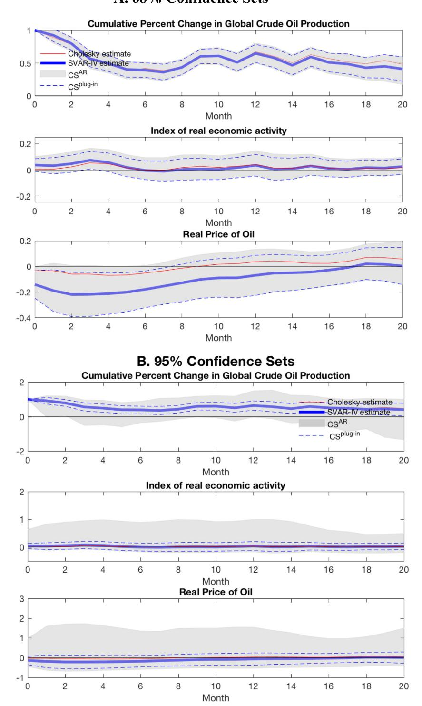
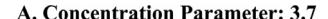
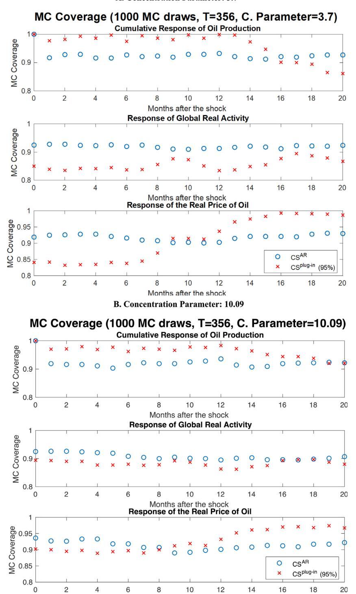

[Journal of Econometrics xxx \(xxxx\) xxx](https://doi.org/10.1016/j.jeconom.2020.05.014)

Contents lists available at [ScienceDirect](http://www.elsevier.com/locate/jeconom)

# Journal of Econometrics

journal homepage: [www.elsevier.com/locate/jeconom](http://www.elsevier.com/locate/jeconom)

# Inference in Structural Vector Autoregressions identified with an external instrument

José L. Montiel Olea [a](#page-0-0),[∗](#page-0-1) , James H. Stock [b](#page-0-2),[c](#page-0-3) , Mark W. Watson [c](#page-0-3),[d](#page-0-4),[1](#page-0-5)

- a *Department of Economics, Columbia University, United States of America*
- b *Department of Economics, Harvard University, United States of America*
- c *National Bureau of Economic Research, United States of America*
- d *Department of Economics and the Woodrow Wilson School, Princeton University, United States of America*

## a r t i c l e i n f o

#### *Article history:* Received 21 April 2020 Received in revised form 21 April 2020 Accepted 2 May 2020 Available online xxxx

*Keywords:* Narrative approach Instrumental variables Weak identification Impulse response functions

## a b s t r a c t

This paper studies Structural Vector Autoregressions in which a structural shock of interest (e.g., an oil supply shock) is identified using an external instrument. The external instrument is taken to be correlated with the target shock (the instrument is relevant) and to be uncorrelated with other shocks of the model (the instrument is exogenous). The potential weak correlation between the external instrument and the target structural shock compromises the large-sample validity of standard inference. We suggest a confidence set for impulse response coefficients that is not affected by the instrument strength (i.e., is weak-instrument robust) and asymptotically coincides with the standard confidence set when the instrument is strong.

© 2020 Elsevier B.V. All rights reserved.

# **1. Introduction**

An increasingly important line of research in Structural Vector Autoregressions (SVARs) uses information in variables not included in the system to identify dynamic causal effects, which in VAR terminology are ''structural impulse response functions''. The work of [Romer and Romer](#page-12-0) ([1989\)](#page-12-0) is a key precursor to this literature. Their reading of the minutes of the Federal Reserve Board allowed them to pinpoint dates at which monetary policy decisions were arguably exogenous; i.e., independent of other economic shocks at the time. Their work produced a time series of binary indicators of monetary policy decisions. A large number of subsequent papers have adopted Romer and Romer's ''narrative approach'' to construct time series that capture exogenous changes affecting the macroeconomy.[2](#page-0-6)

Most of the papers in this literature have treated these exogenous variables as a time series of structural shocks, and estimated their dynamic effects using distributed lag regressions. But these external series are not, strictly speaking, the shocks of interest. Rather, they are variables plausibly correlated with a particular structural shock, and uncorrelated with

*E-mail address:* [montiel.olea@gmail.com](mailto:montiel.olea@gmail.com) (J.L. Montiel Olea).

<https://doi.org/10.1016/j.jeconom.2020.05.014> 0304-4076/© 2020 Elsevier B.V. All rights reserved.

∗ Corresponding author.

1 We have benefited from comments from an editor, three referees, and many seminar participants including those at UC Santa Barbara, UC Berkeley, NESG-2012, NBER-NSF Time Series Meetings-2012, Harvard/MIT, Cowles Foundation, LACEA-LAMES, UCL, Erasmus, ASSA-2014, Princeton, UPF, and Columbia. We would like to thank Luigi Caloi, Hamza Husain, and Ruby Steedle for excellent research assistance. All errors are our own. A suite of MATLAB programs for carrying out the calculations described in the paper is available at <https://github.com/jm4474/SVARIV>.

2 Notable examples include unanticipated defense spending shocks ([Ramey and Shapiro,](#page-12-1) [1998](#page-12-1)), monetary policy shocks ([Romer and Romer](#page-12-2), [2004](#page-12-2)), oil market shocks ([Hamilton,](#page-12-3) [2003;](#page-12-3) [Kilian](#page-12-4), [2008\)](#page-12-4), tax shocks ([Romer and Romer](#page-12-5), [2010\)](#page-12-5), and government spending shocks [\(Ramey](#page-12-6), [2011](#page-12-6)). In a similar vein, asset price changes measured using high frequency data from financial markets have been used to measure exogenous changes attributed to monetary policy; important early examples include [Rudebusch](#page-12-7) [\(1998\)](#page-12-7) and [Kuttner](#page-12-8) [\(2001\)](#page-12-8). See [Ramey](#page-12-9) [\(2016](#page-12-9)) for additional references and discussion.

others. It seems natural, therefore, to treat these exogenous variables as ''external instruments'': the macroeconometric counterpart of microeconometric instrumental variables constructed using quasi-experiments. [Stock](#page-13-0) [\(2008\)](#page-13-0) develops the "SVAR-IV" method, which uses these external instruments to identify and estimate structural impulse reponse functions.[3](#page-1-0) Recent applications of the external-instrument approach to SVAR identification and estimation include [Stock and Watson](#page-13-1) ([2012](#page-13-1)), [Mertens and Ravn](#page-12-10) [\(2013](#page-12-10), [2014](#page-12-11)), [Gertler and Karadi](#page-12-12) [\(2015](#page-12-12)), and [Mertens and Montiel Olea](#page-12-13) [\(2018](#page-12-13)).[4](#page-1-1)

External instruments impose second moment restrictions that identify SVAR shocks and associated impulse response coefficients, variance decompositions, and other objects of interest in SVAR analysis. Standard inference about these objects can be carried using linear and nonlinear GMM methods; see [Mertens and Ravn](#page-12-10) ([2013\)](#page-12-10). However, an important lesson from the use of Instrumental Variables (IV) regression in microeconometrics is that standard methods are unreliable when instruments are only weakly correlated with the variable of interest. A large weak-instrument IV regression literature has developed both diagnostics for weak instruments and weak-instrument robust inference procedures. See [Stock et al.](#page-13-2) [\(2002](#page-13-2)) and [Andrews et al.](#page-12-14) ([2018\)](#page-12-14) for surveys.

External instruments in macroeconometrics can also be weak. For example, [Ramey](#page-12-9) ([2016,](#page-12-9) [2019\)](#page-12-15) reports that most macroeconomic shocks used to estimate the effects of fiscal policy in the United States (either changes in government spending or in statutory tax rates) have first-stage *F* -statistics below 10.[5](#page-1-2) In this paper we discuss how this potential weakness compromises the validity of standard inference in SVARs. Building on methods that have been successfully used in IV regression, we propose weak-instrument robust inference methods for impulse response coefficients. The primary focus of the paper is on estimating the dynamic effects of single structural shock identified by a single external instrument. We discuss extensions to the overidentified case briefly in the text and in more detail in Appendix A.3.2. In Appendix A.6 we also study the case where *r* external instruments are correlated with *r* structural shocks of interest.

The paper is organized as follows. Section [2](#page-1-3) lays out the SVAR and shows how an external instrument can be used to identify the structural shock of interest, its impulse response coefficients, historical effect on the variables in the VAR, and contribution to forecast error variances. Section [3](#page-3-0) focuses on inference for impulse response coefficients, studying first the strong-instrument properties of standard estimators, then the distortions caused by a weak instrument. When the instrument is weak, the estimator of the impulse response function is biased towards the Cholesky decomposition impulse response function, with the shock of interest ordered first. Section [4](#page-5-0) then presents a confidence set (based on the classical [Fieller](#page-12-16) [\(1944](#page-12-16)) and [Anderson and Rubin](#page-12-17) ([1949\)](#page-12-17) methods) that retains its validity when the external instrument is weak and coincides with the standard confidence interval when the instrument is strong. This section briefly discusses several other issues, including diagnostic tests for weak instruments, and the extension of the inference methods to allow for multiple instruments.[6](#page-1-4) Section [5](#page-8-0) includes a brief empirical illustration that focuses on the effect of an oil-supply shock on oil prices using [Kilian](#page-12-18)'s ([2009\)](#page-12-18) 3-variable SVAR. Section [6](#page-9-0) presents Monte Carlo evidence illustrating the problems of conducting standard inference in the presence of a weak instrument and the benefits of our proposed method. Section [7](#page-9-1) offers a summary and conclusions.

*Generic Notation:* If *A* is a matrix, *Aij* denotes its *ij*th element, *Ai* denotes its *i*th column, vec(*A*) denotes the vectorization of *A*, and vech(*A*) vectorizes the lower triangular portion of the symmetric matrix *A*. The vector *ei* denotes the *i*th column of *In*, the *n* × *n* identity matrix.

#### **2. Model and identification**

# *2.1. The model*

The model is the standard stationary finite-order structural vector autoregression. We use the following notation:

$$Y_t = A_1 Y_{t-1} + A_2 Y_{t-2} + \dots + A_p Y_{t-p} + \eta_t, \tag{2.1}$$

3 [Stock](#page-13-0) [\(2008\)](#page-13-0) refers to this as the ''natural experiment approach'' to SVAR identification, but it has subsequently become known as the ''external instrument approach''. The idea that these exogenous variables can serve as instruments goes back at least as far as [Romer and Romer](#page-12-0) [\(1989\)](#page-12-0) (see the comments by Blanchard and Sims in the published discussion) and has been used in distributed lag regressions (e.g., [Hamilton](#page-12-3) [\(2003](#page-12-3))). [Stock](#page-13-0) [\(2008\)](#page-13-0) is the first reference that we are aware of that explicitly incorporates external instruments in SVAR analysis, and that framework has been adopted in the subsequent SVAR literature. In some literature this strategy is termed a ''proxy variable'', but here we use the more common ''external instrument'' terminology.

4 Much recent empirical work has used local-projection methods ([Jordà,](#page-12-19) [2005](#page-12-19)) in place of SVARs to estimate dynamic causal effects, increasingly using external instruments. This paper focuses on SVARs with external instruments. [Stock and Watson](#page-13-3) [\(2018\)](#page-13-3) survey the recent Local-Projection (LP-IV) contributions and compare SVAR and LP methods. [Plagborg-Møller and Wolf](#page-12-20) [\(2019\)](#page-12-20) show that the infinite-lag LP and SVAR-IV estimands coincide.

5 For instance, in the sample that excludes the Korean War, the *F* -statistics of some popular government spending shocks – [Fisher and Peters](#page-12-21) [\(2010\)](#page-12-21), [Ben Zeev and Pappa](#page-12-22) [\(2017\)](#page-12-22) and [Ramey](#page-12-6) [\(2011\)](#page-12-6) – are below 10; see. p. 120, Fig. 4, Panel B in [Ramey](#page-12-9) ([2016](#page-12-9)). Also the *F* -statistics for some popular measures of unanticipated tax shocks are low: [Ramey](#page-12-9) [\(2016\)](#page-12-9) reports that the first-stage regression of tax revenue on the [Romer and Romer](#page-12-5) [\(2010\)](#page-12-5) shocks is 1.6. If the endogenous regressor is the tax rate (and not tax revenue) the *F* -statistic is 3.2.

6 Even though we provide a diagnostic test for weak instruments, we remind the reader that *screening* on the first-stage statistic (or any other statistic) can induce size distortions in standard inference procedures related to the well-known issue of pretesting. For a more detailed discussion see Section [4.1](#page-5-1) of [Andrews et al.](#page-12-14) [\(2018\)](#page-12-14).

where  $Y_t$  is  $n \times 1$ , and  $\eta_t$  is a vector of reduced-form VAR innovations. The reduced form innovations are related to a vector of structural shocks,  $\varepsilon_t$ , via

$$\eta_t = \Theta_0 \varepsilon_t,$$
 (2.2)

3

where  $\Theta_0$  is a non-singular  $n \times n$  matrix; thus, we assume that the structural model is invertible in the sense that the VAR forecast errors at date t are a nonsingular transformation of the structural errors at date t. The structural shocks are assumed to be serially and mutually uncorrelated, with

$$\mathbf{E}(\varepsilon_t) = \mathbf{0}$$
 and  $\mathbf{E}[\varepsilon_t \varepsilon_t'] = D = \operatorname{diag}(\sigma_1^2, \dots, \sigma_n^2)$ .

The implied value of the covariance matrix for the reduced form innovations is

$$\mathbf{E}(\eta_t \eta_t') = \Sigma = \Theta_0 D \Theta_0'. \tag{2.3}$$

 $Y_t$  has a structural moving average representation given by

$$Y_t = \sum_{k=0}^{\infty} C_k(A)\Theta_0 \varepsilon_{t-k}, \tag{2.4}$$

where the notation  $C_k(A)$  emphasizes the dependence of the MA coefficients on the AR coefficients in  $A = (A_1, A_2, ..., A_n)$ . Specifically:

$$C_k(A) = \sum_{m=1}^k C_{k-m}(A)A_m, \quad k = 1, 2, \dots$$
 (2.5)

with  $C_0(A) = I_n$  and  $A_m = 0$  for m > p; see Lütkepohl (1990, 2007).

The structural impulse response coefficient is the response of  $Y_{i,t+k}$  to a one-unit change in  $\varepsilon_{i,t}$ , which from (2.4) is

$$\partial Y_{i,t+k}/\partial \varepsilon_{i,t} = e_i' C_k(A) \Theta_0 e_i, \tag{2.6}$$

where  $e_i$  denotes the jth column of the identity matrix  $I_n$ .

**Target Shock**. We focus on identifying the impulse responses to a single structural shock (e.g., an oil supply shock in the empirical illustration in Section 5), and without loss of generality this shock is ordered first, so the shock of interest is  $\varepsilon_{1,t}$ . From (2.6), the impulse responses with respect to this target shock are determined by  $\Theta_0 e_1 = \Theta_{0,1}$ , the first column of  $\Theta_0$ .

**Scale Normalization.** Because  $\eta_t = \Theta_0 \varepsilon_t$ , the scale of  $\varepsilon_{1,t}$  and  $\Theta_{0,1}$  are not separately identified. We normalize the scale of the target shock  $\varepsilon_{1,t}$  so that it is interpretable in terms of the observed data  $Y_t$ . Specifically, we normalize the size of target shock to have a one unit-contemporaneous effect on a pre-specified variable  $Y_{i^*}$ , that is  $\partial Y_{i^*,t}/\partial \varepsilon_{1,t} = 1$ . In the empirical illustration,  $\varepsilon_1$  is an oil-supply shock and  $Y_{i^*}$  is the percent change in global crude oil production, so we consider an oil supply shock that leads to a contemporaneous one percent increase in oil production. Without loss of generality, we order the data so that  $i^* = 1$  and because  $\partial Y_{1,t}/\partial \varepsilon_{1,t} = \Theta_{0,11}$ , the scale normalization sets  $\Theta_{0,11} = 1$ . This is the "unit effect" normalization discussed in detail in Stock and Watson (2016).

### 2.2. Using an external instrument to identify impulse responses and other structural parameters

**External Instrument**. Let  $z_t$  denote a scalar random variable that can serve as an instrument (or "proxy") for the target shock. The stochastic process for  $\{(\varepsilon_t, z_t)\}_{t=1}^{\infty}$  is assumed to satisfy

**Assumption 1** (External Instrument).

(A1.1) 
$$\mathbf{E}[z_t \ \varepsilon_{1,t}] = \alpha \neq 0.$$

(A1.2) 
$$\mathbf{E}[z_t \ \varepsilon_{j,t}] = 0 \text{ for } j \neq 1.$$

This assumption is the SVAR analogue of the familiar definition of an instrumental variable: (A1.1) says  $z_t$  is correlated with the target shock (the instrument is *relevant*), and (A1.2) says that  $z_t$  is uncorrelated with the other shocks (the instrument is *exogenous*).

Although the assumption above is expressed in terms of the unobserved structural shocks, it is possible to relate our assumption to the more conventional definition of an instrument involving an outcome variable of interest that depends on an observed endogenous variable, exogenous variables and an unobserved error term. To illustrate this point, consider the structural vector autoregression with only one lag and two variables given by

$$Y_{1,t} = e_1' A_1 Y_{t-1} + \Theta_{0,11} \varepsilon_{1,t} + \Theta_{0,12} \varepsilon_{2,t},$$

Please cite this article as: J.L. Montiel Olea, J.H. Stock and M.W. Watson, Inference in Structural Vector Autoregressions identified with an external instrument. Journal of Econometrics (2020), https://doi.org/10.1016/j.jeconom.2020.05.014.

&lt;sup>7 The identification results for historical decompositions, variance decompositions, and the target structural shock depend crucially on the invertibility of the matrix  $Θ_0$ . However, as will be clear below, results concerning identification and inference about dynamic impulse responses for a subset of the elements of  $ε_t$  do not require  $Θ_0$  to be non-singular or square.

$$Y_{2,t} = e_2' A_1 Y_{t-1} + \Theta_{0,21} \varepsilon_{1,t} + \Theta_{0,22} \varepsilon_{2,t}.$$

With the unit effect normalization,  $\Theta_{0,11} = 1$ , and  $\Theta_{0,21}$  is the parameter of interest. Using the first equation to solve for  $\varepsilon_{1,t}$  and substituting the corresponding value in the second equation yields

$$Y_{2,t} = \Theta_{0,21} Y_{1,t} + \gamma' Y_{t-1} + \delta \varepsilon_{2,t}.$$

The parameter of interest can be obtained from the IV-regression of the outcome variable  $Y_{2,t}$  on the variable used for normalization,  $Y_{1,t}$ , after controlling for lags of  $Y_t$ . Assumption 1 implies that  $z_t$  is a valid instrumental variable in the conventional sense: (i)  $z_t$  is correlated with the endogenous regressor,  $Y_{1,t}$ , by (A1.1) and (ii) uncorrelated with the error,  $\varepsilon_2$  t, by (A1.2).

**Identification of the impulse response coefficients.** Let  $\lambda_{k,i} = \partial Y_{i,t+k}/\partial \varepsilon_{1,t}$  denote an impulse response coefficient of interest. From (2.6),  $\lambda_{k,i}$  depends on the VAR coefficients A and the first column of  $\Theta_0$ , that is  $\Theta_{0,1}$ . From Assumption 1,  $\Theta_{0,1}$  is identified up to scale by the covariance between  $z_t$  and the reduced form innovations  $\eta_t$ :

$$\Gamma = \mathbf{E}(z_t \eta_t) = \mathbf{E}(z_t \Theta_0 \varepsilon_t) = \alpha \Theta_{0,1}. \tag{2.7}$$

Using the scale normalization  $\Theta_{0.11} = 1$ ,  $\Gamma_{11} = \mathbf{E}(z_t \eta_{1,t}) = \alpha$ , so that

$$\Theta_{0,1} = \Gamma/\Gamma_{1,1} = \Gamma/e_1'\Gamma. \tag{2.8}$$

Thus, the structural impulse response with respect to  $\varepsilon_{1,t}$  follows directly from (2.6):

$$\lambda_{k,i} = e_i' C_k(A) \Gamma / e_1' \Gamma. \tag{2.9}$$

**Identification of**  $\{\varepsilon_{1,t}\}$ . The instrument can be used to recover the structural shock  $\varepsilon_{1,t}$  from the reduced-form innovations  $\eta_t$ . To see how, use  $\mathbf{E}(z_t\eta_t)=\Gamma=\alpha\ \Theta_0e_1$  and  $\Sigma=\mathbf{E}(\eta_t\eta_t')=\Theta_0D\Theta_0'$  to write the projection of  $z_t$  onto  $\eta_t$  as

$$\operatorname{Proj}(z_t|\eta_t) = \Gamma' \Sigma^{-1} \eta_t = (\alpha \Theta_0 e_1)' (\Theta_0 D \Theta_0')^{-1} \eta_t = (\alpha \Theta_0 e_1)' (\Theta_0 D \Theta_0')^{-1} \Theta_0 \varepsilon_t$$
$$= \alpha e_1 D^{-1} \varepsilon_t = (\alpha / \sigma_1^2) \varepsilon_{1,t}$$
(2.10)

This projection determines  $\varepsilon_{1,t}$  up to the scale factor  $(\alpha/\sigma_1^2)$ ; dividing by  $(\Gamma'\Sigma^{-1}\Gamma)^{1/2}$  yields  $\varepsilon_{1,t}/\sigma_1$  up to sign.

**Identification of the historical decomposition of**  $\{Y_t\}$ . Another object of interest in SVAR analysis is a decomposition of the historical values of  $Y_t$  into a component associated with current and lagged values of  $\varepsilon_{1,t}$ , say  $Y_t(\varepsilon_1)$ , and a residual component associated with the other structural innovations. The structural moving average (2.4) yields:

$$Y_t(\varepsilon_1) = \sum_{k=0}^{\infty} C_k(A)\Theta_{0,1}\varepsilon_{1,t-k} = \sum_{k=0}^{\infty} C_k(A)(\Gamma'\Sigma^{-1}\Gamma)^{-1}\Gamma\Gamma'\Sigma^{-1}\eta_{t-k}$$
(2.11)

where the second equality follows from  $(\Gamma' \Sigma^{-1} \Gamma)^{-1} \Gamma \Gamma' \Sigma^{-1} \eta_{t-k} = \Theta_{0,1} \varepsilon_{1,t-k}$ .

**Identification of the variance decomposition.** The variance decomposition measures the fraction of the k-step ahead forecast error variance for  $Y_{i,t+k}$  associated with  $\varepsilon_{1,t+h}$  for h=1,...,k. Denoting this by  $FEVD_{k,i}$ , a direct calculation using (2.5) and (2.11) yields:

$$FEVD_{k,i} = \frac{\Gamma'\left(\sum_{s=0}^{k} C_s(A)' e_i e_i' C_s(A)\right) \Gamma}{\left(\Gamma' \Sigma^{-1} \Gamma\right) e_i' \left(\sum_{s=0}^{k} C_s(A)' \Sigma C_s(A)\right) e_i}.$$
(2.12)

### 3. Inference about impulse response coefficients

# 3.1. Plug-in estimators and $\delta$ -method confidence sets

The plug-in estimator for  $\lambda_{k,i}$  replaces A and  $\Gamma$  in (2.9) with the corresponding estimators:

$$\hat{\lambda}_{k,i}(\hat{A}_T, \hat{\Gamma}_T) = e_i' C_k(\hat{A}_T) \hat{\Gamma}_T / e_i' \hat{\Gamma}_T, \tag{3.1}$$

where  $\hat{A}_T$  is the least squares estimator of the VAR coefficients and  $\hat{\Gamma}_T$  is the sample covariance between  $z_t$  and the VAR residuals.9

When  $z_t$  is a strong instrument, confidence sets for impulse responses can be formed in the usual way. Under standard assumptions  $[vec(\hat{A}_T - A)', (\hat{\Gamma}_T - \Gamma)']'$  has a limiting normal distribution. A  $\delta$ -method calculation implies that  $\sqrt{T}$   $[\hat{\lambda}_{k,i}(\hat{A}_T, \hat{\Gamma}_T) - \lambda_{k,i}(A, \Gamma)]$  is approximately distributed N(0,  $\sigma_{k,i}^2$ ) in large samples, where  $\sigma_{k,i}^2$  depends on the limiting

Please cite this article as: J.L. Montiel Olea, J.H. Stock and M.W. Watson, Inference in Structural Vector Autoregressions identified with an external instrument. Journal of Econometrics (2020), https://doi.org/10.1016/j.jeconom.2020.05.014.

4

8 Which in turn follows from  $\Gamma = \alpha \Theta_{0,1}$  (from (2.8)),  $\Gamma' \Sigma^{-1} \eta_t = (\alpha/\sigma_1^2) \varepsilon_{1,t}$  (from (2.10)), and  $\Gamma' \Sigma^{-1} \Gamma = \alpha^2/\sigma_1^2$ .

&lt;sup>9 Letting  $S_{ab} = T^{-1} \sum_{t=1}^{T} a_t b_{t'}$  for matrices  $a_t$  and  $b_t$ ,  $\hat{A}_T = S_{YX} S_{XX}^{-1}$  with  $X_t = (1, Y'_{t-1}, Y'_{t-2}, \dots, Y'_{t-p})'$ ,  $\hat{\Gamma}_T = S_{z\hat{\eta}}$  where  $\hat{\eta}_t = Y_t - \hat{A}_T X_t$ , and  $\hat{\Sigma}_T = S_{\hat{\eta}\hat{\eta}}$ .

variance for the estimators  $(\hat{A}_T, \hat{\Gamma}_T)$  and the gradient of  $\lambda_{k,i}(A,\Gamma)$  with respect to  $(A,\Gamma)$ . This leads to the usual  $100 \times (1-a)$ % large sample confidence set for  $\lambda_{k,i}$ :

$$CS^{Plug-in}(\lambda_{k,i}) = \left(\lambda_{k,i} \left| \frac{T\left(\hat{\lambda}_{k,i}(\hat{A}_T, \hat{\Gamma}_T) - \lambda_{k,i}\right)^2}{\hat{\sigma}_{T,k,i}^2} \le \chi_{1,1-a}^2 \right), \tag{3.2}$$

where  $\chi^2_{1,1-a}$  is the 1-a percentile of the  $\chi^2_1$  and  $\hat{\sigma}^2_{T,k,i}$  is a consistent estimator for  $\sigma^2_{k,i}$  (which could be obtained using the  $\delta$ -method or a suitably designed bootstrap/resampling procedure).

The presence of  $e_1'\hat{\Gamma}_T$  in the denominator of (3.1) suggests that the large-sample normal approximation of the distribution of the plug-in estimator may be poor when  $e_1'\Gamma$  is small, leading to poor coverage of the resulting  $CS^{Plug-in}$  confidence set. We outline the familiar reasoning in the following subsection.

# 3.2. Weak-instrument asymptotic distributions of plug-in estimators of impulse response coefficients

The vector  $\Gamma$  is proportional to the covariance between the target structural shock,  $\varepsilon_{1,t}$ , and the instrument,  $z_t$ , that is  $\Gamma = \alpha \ \Theta_{0,1}$ . To allow for models in which  $\alpha$  can be arbitrarily close to zero, while recognizing that sampling variability depends on the sample size T, consider a sequence of models in which  $\mathbf{E}(z_t\varepsilon_{1,t}) = \alpha_T$ , where  $\alpha_T \to \alpha$ , and  $\alpha = 0$  is allowed. This framework allows, for example, strong instruments (with  $\alpha_T = \alpha \neq 0$ ), but also weak instruments as in Staiger and Stock (1997) (with  $\alpha_T = a/\sqrt{T}$ , so that  $\alpha_T \to 0$ ), and other sequences with  $\alpha_T \to \alpha$ . Let  $\Gamma_T = \alpha_T \Theta_{0,1}$ . Under a variety of primitive assumptions, the estimators  $(\hat{A}_T, \hat{\Gamma}_T, \hat{\Sigma}_T)$  will be asymptotically normally distributed after centering them at the true values  $(A, \Gamma_T, \Sigma)$  and scaling by  $\sqrt{T}$ . This is summarized in Assumption 2, which we will assume holds under local-to-zero and fixed-parameter sequences:

**Assumption 2** (Asymptotic Normality of Reduced-form Statistics).

$$\sqrt{T} \begin{pmatrix} vec(\hat{A}_T - A) \\ (\hat{\Gamma}_T - \Gamma_T) \\ vech(\hat{\Sigma}_T - \Sigma) \end{pmatrix} \Rightarrow \begin{pmatrix} \varsigma \\ \xi \\ \varphi \end{pmatrix} \sim N(0, W)$$
(3.3)

In a strong instrument setting,  $\Gamma_T = \Gamma \neq 0$ , and Assumption 2, along with the  $\delta$ -method implies that the plug-in estimator is asymptotically normally distributed and this serves as the basis for the plug-in confidence set (3.2).

But suppose instead that the instrument is weak in the sense that  $\alpha_T = a/\sqrt{T}$  where a is held fixed as  $T \to \infty$ . A straightforward calculation (see Appendix A.1.1 for details) then shows that the plug-in estimator has the weak-instrument asymptotic representation,

$$\hat{\lambda}_{k,i}(\hat{A}_T, \hat{\Gamma}_T) \Rightarrow \lambda_{k,i} + \frac{\delta_{k,i}'\xi}{e_1'\xi + a\Theta_{0,11}},\tag{3.4}$$

where  $\delta_{k,i} = (e_i'C_k(A) - \lambda_{k,i}e_1')'$  and  $\xi$  is defined in (3.3). Thus, the plug-in estimator is equal to the true value of the impulse response plus a ratio of correlated normal random variables. This is the SVAR analogue of Staiger and Stock (1997)'s asymptotic representation of the IV estimator in a just-identified linear model with a single right-hand side endogenous regressor and a single weak instrument. The parameter  $(a\Theta_{0,11})^2/Var(e_i'\xi)$  is analogous to the so-called concentration parameter in IV regression (see for example Stock and Yogo (2005) and Andrews and Stock (2007)).

Just as in the IV model, the plug-in estimator (3.1) is not consistent, the usual Wald test for testing the null hypothesis  $\lambda_{k,i} = \lambda_0$  does not have the correct size, and the plug-in confidence sets (3.2) (which are based on inverting the Wald test) will not have the proper coverage probability.

When instruments are weak, the plug-in estimator (3.1) is biased toward the probability limit of the estimator of the impulse response coefficient estimated by ordering  $Y_{1,t}$  first in a Cholesky decomposition of the innovation variance matrix, that is, when the shock of interest is identified by placing it first in a Wold causal ordering. This result obtains by noting that, under the unit effect normalization, the IV estimator of  $\Theta_{0.1}$  is obtained as the IV estimator in the regressions,

$$\hat{\eta}_{i,t} = \Theta_{0,1}\hat{\eta}_{1,t} + u_t, \ j = 2, \dots, n$$
 (3.5)

&lt;sup>10 Formally, this means considering a sequence of stochastic processes, say  $P_T$ , for  $\{z_t, \varepsilon_t\}_{t=1}^T$ , where the expectation is taken with respect this process, so that  $\mathbf{E}(z_t \varepsilon_{1,t}) = \alpha_T$  denotes  $\mathbf{E}_{PT}(z_t \varepsilon_{1,t}) = \alpha_T$  and so forth.

&lt;sup>11 For example, in the context of SVARs with external instruments, Jentsch and Lunsford (2019) impose mixing conditions and strict stationarity on  $\{z_t, \varepsilon_t\}_{t=1}^T$  (along with constraints on the roots of the autoregressive lag polynomial) to derive a joint central limit theorem. They also show that, under further restrictions, a residual-based moving block-bootstrap can be used to approximate the limiting normal distribution in (2.3).

&lt;sup>12 The results in Staiger and Stock (1997) imply that whenever the first-stage coefficient of a linear IV model is local-to-zero the IV estimator, denoted  $\beta_{\text{IV}}$ , converges in distribution to  $\beta + z_1/(z_2 + c)$ , where  $(z_1 \ z_2)$  are bivariate normal,  $\beta$  is the true parameter, and c is the scalar localization parameter.

6

using the instrument  $z_t$  (or its innovation), where  $\hat{\eta}_t$  is the vector of innovations and  $u_t$  is a generic error term (see for example Stock and Watson (2018), equation (21)). This formulation of the SVAR-IV estimator of  $\Theta_{0,1}$  makes it possible to apply standard results about the bias of the distribution of the IV estimator under weak instruments (cf., Nelson and Startz (1990) and Staiger and Stock (1997)). In particular, if  $z_t$  is weak, the IV estimator will be biased towards the probability limit of the OLS estimator of (3.5). The OLS estimator of  $\Theta_{0,1}$  in (3.5) is the first column of the Cholesky decomposition with the shock of interest ordered first. This result suggests caution in interpreting the near-coincidence of Cholesky and external instrument estimates of impulse responses as evidence in favor of the Cholesky ordering assumption without evidence on instrument strength.

#### 3.3. Weak-instrument asymptotic distributions of plug-in estimators of other objects of interest in SVAR analysis

As shown in Eqs. (2.10), (2.11), and (2.12), the time series of the target shock, its contribution to  $y_t$ , and the forecast error decomposition can be written as functions of the reduced-form VAR parameters,  $(A, \Sigma)$ , the covariance of the instrument and the reduced form errors,  $\Gamma$ , and (for the target shock and historical decompositions) the data. Inference about the true values of these objects – their values associated with the true value of  $(A, \Sigma, \Gamma)$  – is standard and straightforward when  $z_t$  is a strong instrument. Examination of (2.10), (2.11), and (2.12) shows that, with  $\Gamma$  bounded away from zero, each of these objects is a well-behaved smooth function of  $(A, \Sigma, \Gamma)$ . Assumption 2 and the  $\delta$ -method then imply that the corresponding plug-in estimators are normally distributed in large samples with a covariance matrix that is readily computed from the large-sample covariance matrix of  $(\hat{A}_T, \hat{\Gamma}_T, \hat{\Sigma}_T)$  and the relevant gradient vector.

Eqs. (2.11) and (2.12) show that the historical and variance decompositions are ratios of quadratic functions of  $\Gamma$ , so (generically) the resulting gradients either converge to zero or diverge as  $\Gamma \to 0$ . Thus,  $\delta$ -method/bootstrap inference based on plug-in estimators for the historical and variance decompositions is not robust to weak instruments.

The weak-instrument representation of the estimate of the shock, for use in historical decomposition, and of the FEVD are, respectively,

$$\hat{\varepsilon}_{1,t} \Rightarrow (\xi + a\Theta_0)' \Sigma^{-1} \eta_t / \left[ (\xi + a\Theta_0)' \Sigma^{-1} (\xi + a\Theta_0) \right]^{1/2}$$
(3.6)

$$\widehat{FEVD}_{k,i} = \frac{\Gamma^{*'}\left(\sum_{s=0}^{k} C_s(A)' e_i e_i' C_s(A)\right) \Gamma^*}{\left(\Gamma^{*'} \Sigma^{-1} \Gamma^*\right) e_i' \left(\sum_{s=0}^{k} C_s(A)' \Sigma C_s(A)\right) e_i},\tag{3.7}$$

where  $\Gamma^* = \xi + a\Theta_{0,1}$ . These expressions are derived in Appendix A.1.2.

#### 4. Weak-instrument robust confidence sets

The analogy between inference in the linear IV model and SVAR impulse responses carries over to the construction of weak-instrument robust confidence sets using analogues of Fieller-method confidence sets for the ratio of two normal means (Fieller, 1944) and the Anderson and Rubin (1949) confidence sets for coefficients in the linear IV model. To see how, it is useful to briefly review Fieller's problem and the Anderson–Rubin confidence set.

**Fieller's problem and Anderson–Rubin confidence set**. Suppose (X,Y) are bivariate normally distributed with mean  $(\beta\pi,\pi)$  and covariance matrix  $\Sigma$ . Fieller's problem is to construct a confidence interval for the ratio of the two means,  $\beta$ . The null hypothesis  $\beta=\beta_0$  implies that  $X-\beta_0Y\sim N(0,\sigma(\beta_0)^2)$ , where  $\sigma(\beta_0)^2=\sigma_X^2-2\beta_0\sigma_{XY}+\beta_0^2\sigma_Y^2$ , and  $q(\beta_0)=(X-\beta_0Y)^2/\sigma(\beta_0)^2\sim\chi_1^2$ . With  $\Sigma$  known, the 100%(1 – a) Anderson–Rubin (AR) confidence set for  $\beta$  can then be constructed as  $CS^{AR}=\{\beta\mid q(\beta)\leq\chi_{1,1-a}^2\}$ . An important property of the AR confidence set is that it is valid for any value  $\pi$ , including values arbitrarily close to zero. When  $\pi=0$ ,  $\beta$  is not identified, and (as discussed in footnote 13) the confidence set will have infinite length with probability 1-a.

4.1. Inference for impulse response coefficients (single structural shock identified by a single external instrument)

To understand how the AR method can be used to form weak-instrument robust confidence sets for the coefficients of impulse response function, suppose the instrument is valid (so that  $\alpha_T \neq 0$ ), but potentially weak ( $\alpha_T \rightarrow \alpha$ , where  $\alpha = 0$ 

&lt;sup>13 In Fieller's (1944) formulation, X and Y correspond to sample means from an i.i.d. normal sample,  $\Sigma$  is unknown and inference is based on the squared Student-t distribution instead of the  $\chi^2_1$  distribution. Anderson and Rubin (1949) showed how to extend Fieller's construction to IV regression (a nontrivial extension at the time). In the Anderson-Rubin formulation, X is the OLS estimator of the regression coefficient of the outcome variable on the instrument and Y is the OLS estimator of the first-stage coefficient.

The inequality  $q(\beta) \le \chi_{1,1-a}^2$  defining the Anderson-Rubin confidence set is quadratic in  $\beta$ , which in standard form can be written as  $a\beta^2 + b\beta + c \le 0$ , where (a,b,c) are functions of  $(X,Y,\Sigma)$ . The structure of the problem (cf., Fieller (1944) and Kendall and Stuart (1979, section 20.35)) yields the following features of the confidence set: (1)  $\hat{\beta} \in CS^{AR}$ ; (2) if a > 0, the confidence set is the interval  $(-b \pm (b^2 - 4ac)^{1/2})/2a$ ; (3) if a < 0, the confidence interval includes either the entire real line or the union of the two sets  $(-\infty, -[b + (b^2 - 4ac)^{1/2}]/2a)$  and  $(-[b - (b^2 - 4ac)^{1/2}]/2a$ ,  $\infty$ ); (4) when  $Y^2/\sigma_Y^2 \le \chi_{1,1-a}^2$  (so the hypothesis  $\mu_Y = 0$  is not rejected), the confidence set for  $\beta$  is the entire real line.

is allowed). Let  $H_T$  denote the 2  $\times$  1 vector composed of the numerator and denominator of the expression defining the impulse response coefficient in (2.9):

$$H_T = \begin{bmatrix} e_i' C_k(A) \Gamma_T \\ e_1' \Gamma_T \end{bmatrix}, \tag{4.1}$$

so that  $\lambda_{k,i} = H_{T,1}/H_{T,2}$ , and let  $\hat{H}_T$  denote the plug-in estimator of  $H_T$  constructing by replacing  $(A, \Gamma_T)$  with  $(\hat{A}_T, \hat{\Gamma}_T)$ . Note that  $H_T$  is a differentiable function of A and a linear function of  $\Gamma_T$ , so that (from Assumption 2 and the  $\delta$ -method)  $\sqrt{T}(\hat{H}_T - H_T) \Rightarrow \eta \sim N(0, \Omega)$ , where  $\Omega$  depends on W and the gradient of  $\lim_{T\to\infty} H_T$  with respect to  $(A, \Gamma)$ . Importantly, this result follows regardless of the strength of the instrument  $(\Gamma_T = \alpha_T \Theta_{0,1} \to \alpha \Theta_{0,1} = \Gamma)$ , with  $\Gamma = 0$  allowed).

Large sample theory thus yields the approximation  $\hat{H}_T \stackrel{a}{\sim} N(H_T, T^{-1}\Omega)$ , where the parameter of interest is the ratio of the means  $H_{T,1}/H_{T,2}$ . This is Fieller's problem. The null hypothesis  $\lambda_{k,i} = \lambda_0$  imposes a linear restriction on the means:  $H_{T,1} - \lambda_0 H_{T,2} = 0$ , which can be tested using the Wald statistic

$$q_T(\lambda_0) = \frac{T\left(\hat{H}_{T,1} - \lambda_0 \hat{H}_{T,2}\right)^2}{\hat{\omega}_{T,11} - 2\lambda_0 \hat{\omega}_{T,12} + \lambda_0^2 \hat{\omega}_{T,22}},\tag{4.2}$$

where  $\hat{\omega}_{T,ij}$  are consistent estimators of the elements of the covariance matrix  $\Omega$ . Inverting this test yields the Anderson-Rubin confidence set 15

$$CS^{AR}\{\lambda_{k,i}|q_T(\lambda_{k,i})\leq \chi_{1,1-a}^2\}. \tag{4.3}$$

The weak and strong-instrument validity of the CSAR is summarized in the following:

**Proposition 1** (Asymptotic Validity of  $CS^{AR}$ ). Let  $CS^{AR}$  (1 – a) denote the AR confidence set (4.3) with nominal coverage 1 – a, and let  $P_T$  denote the probability distribution for  $\{Y_t, z_t\}_{t=1}^T$  under the stochastic process corresponding to  $\alpha_T$ , the covariance between  $z_t$  and  $\varepsilon_{1,t}$ . Suppose

- (i) Assumptions 1 and 2 are satisfied,
- (ii)  $\alpha_T \rightarrow \alpha$  (which may be 0)
- $(iii) \ \hat{\Omega}_T \stackrel{p}{\to} \Omega \neq 0$

Then:  $\lim_{T\to\infty} P_T(\lambda_{k,i} \in CS^{AR}(1-a)) = 1-a$ .

### **Proof.** See Appendix A.2.

The covariance matrix in the asymptotic distribution of  $\hat{H}_T$  is  $\Omega = G(A, \Gamma)WG(A, \Gamma)'$ , where G denotes the limit of the gradient of  $H_T$  in (4.1) with respect to  $(A, \Gamma)$  and W is asymptotic variance of the estimators from Assumption 2.16 This suggests the estimator  $\hat{\Omega}_T = G(\hat{A}_T, \hat{\Gamma}_T)\hat{W}_TG(\hat{A}_T, \hat{\Gamma}_T)'$ , so that (iii) is satisfied if  $G(A, \Gamma) \neq 0$  and  $\hat{W}_T$  is consistent for W.

A natural question to ask is whether the weak-instrument robustness of the AR confidence set comes at the cost of reduced accuracy (or increased expected length) when the instrument is strong. The next proposition shows that the "distance" between the Anderson–Rubin confidence set and the  $\delta$ -method confidence interval converges to zero when the instrument is strong. In this sense, there is no cost from using the robust confidence set.

Let  $d_H(A,B)$  denote the Hausdorff distance between two subsets A and B of the real line:

$$d_H(A, B) = \max \left\{ \sup_{x \in A} \inf_{y \in B} d(x, y), \sup_{y \in B} \inf_{x \in A} d(x, y) \right\}.$$

**Proposition 2** (Strong-instrument Asymptotic Equivalence of  $CS^{Plug-in}$  and  $CS^{AR}$ ). Let  $CS^{Plug-in}$  (1-a) and  $CS^{AR}$  (1-a) denote the confidence sets given in (3.2) and (4.3) with nominal coverage 1-a. Suppose

- (i) Assumptions 1 and 2 are satisfied,
- (ii)  $\alpha_T \rightarrow \alpha \neq 0$ ,

The S-region of Stock and Wright (2000) based on the moment condition  $E(z_t\eta_t) - \alpha\Theta_{0,1} = 0$  is not the same as the Anderson-Rubin confidence set in (2.10). The S-test of Stock and Wright (2000), which is inverted to construct the S-region, postulates a null hypothesis for the full vector of contemporaneous impulse responses (that is, the full vector  $\Theta_{0,1}$ ). Thus, to conduct inference about a particular entry of  $\Theta_{0,1}$ , the S-region has to be projected; resulting in conservative inference due to the usual projection bias. See Appendix A.6 more discussion. In addition, inference about dynamic impulse responses also takes into account the sampling uncertainty in the estimated values of the autoregressive coefficients.

&lt;sup>16 We derive analytical expressions for  $G(A,\Gamma)$  and include them in the MATLAB suite that implements the Anderson-Rubin confidence set.

(iii.a) 
$$\hat{\Omega}_T \stackrel{p}{\to} \Omega \neq 0$$
, and  
(iii.b)  $\hat{\sigma}^2_{T,k,i} \stackrel{p}{\to} \sigma^2_{k,i}$ .  
Then:  $\sqrt{T} d_H \left( \text{CS}^{AR}_T (1-a), \text{CS}^{Plug-in}_T (1-a) \right) \stackrel{p}{\to} 0$ .

# **Proof.** See Appendix A.2.2

In Appendix A.2.2 we also show that Proposition 2 implies that the tests for the null hypothesis  $\lambda_{k,i} = \lambda_0$  corresponding to  $CS^{Plug-in}$  (1-a) and  $CS^{AR}$  (1-a) have the same local power. Proposition 2 applies to the just-identified case. Inference for the overidentified case is discussed below; inference for the model with m target shocks and m instruments is discussed in Appendix A.6.

### 4.2. Diagnostic for weak instruments

The instrument is weak if  $\mathbf{E}(z_t\varepsilon_{1t}) = \alpha$  is small relative to the sampling error in  $\hat{\alpha}_T$ . The expression for the estimator of  $\Theta_{0,1}$  as the IV estimator in (3.5) shows that the heteroskedasticity-robust first-stage F statistic provides a measure of the strength of the instrument in this setting too, where the first-stage regression is of  $Y_{1,t}$  against  $z_t$  (including VAR lags of  $Y_t$  as exogenous controls). The heteroskedasticity-robust first-stage F can be compared to the Stock and Yogo (2005) critical values or to some rule of thumb, such as F > 10. When there are multiple instruments and heteroskedasticity is a concern, the Montiel Olea and Pflueger (2013) effective first-stage F is recommended, for the reasons discussed in Andrews et al. (2018). We do remind the reader that pretending that standard confidence bands are correct as long as the F-statistic indicates the instrument is not too weak can dramatically increase size distortions due to the well-known pre-testing issues; see Section 4.1 in Andrews et al. (2018) for simulation evidence supporting this point.

An alternative diagnostic arises from noting that, with  $\Theta_{0,11}$  normalized to equal 1,  $\alpha$  equals  $\Gamma_{1,1}$ . Because  $\sqrt{T}(\hat{\Gamma}_T - \Gamma_T) \stackrel{d}{\to} N(0, W_\Gamma)$ , the Wald statistic  $\xi_1 = T\hat{\Gamma}_{T,1}^2/\hat{W}_{\Gamma,11}$  also is a measure of instrument strength. Under weak instrument asymptotics,  $\xi_1$  has the same noncentrality parameter as the heteroskedasticity-robust first-stage F, although algebraic manipulations and numerical simulations suggest  $\xi_1$  will tend to be smaller in finite samples than the first-stage F. The statistic  $\xi_1$  has the feature that the 100%(1-a) Anderson–Rubin (AR) confidence set is a bounded interval if and only if  $\xi_1 > \chi_{1,1-a}^2$  (see footnote 13).

#### 4.3. Extensions

**Overidentification.** If there are M>1 instruments,  $z_{m,t}$  for m=1,...,M, for the target structural shock,  $\varepsilon_{1,t}$ , it is conceptually straightforward to extend the Anderson–Rubin confidence set. Let  $\hat{\Gamma}_{m,t}=(1/T)\sum_{t=1}^T z_{m,t}\hat{\eta}_t$ , and construct the statistic  $s_{m,T}(\lambda)=\sqrt{T}\left(e_i'C_k(\hat{A}_T)-\lambda e_1'\right)\hat{\Gamma}_{m,T}$ , for m=1,...,M. Suppose (extending Assumption 2) that

$$\left(\sqrt{T}\left(vec(\hat{A}_{T})-vec(A)\right)',\sqrt{T}\left(\hat{\Gamma}_{1,T}-E(z_{1,t}\eta_{t})\right)',\ldots,\sqrt{T}\left(\hat{\Gamma}_{M,T}-E(z_{M,t}\eta_{t})\right)'\right)'$$

is asymptotically normal. Then  $s_T(\lambda) = (s_{1,T}(\lambda), \dots, s_{M,T}(\lambda))'$  will be asymptotically normal as well, provided that  $\lambda$  is the true impulse response coefficient. If  $\hat{W}_T(\lambda)$  is a consistent estimator for the covariance matrix of  $s_T(\lambda)$ , the analogue of the Anderson–Rubin type confidence set collects the values of  $\lambda$  such that  $s_T(\lambda)'\hat{W}_T(\lambda)s_T(\lambda) \leq \chi^2_{M,1-\alpha}$ .

In the over-identified case, the Anderson–Rubin confidence set is known to be valid for both weak- and strong-instruments, but inefficient relative to standard confidence sets when the instruments are strong. Appendix A.3.2 also discusses how weak-instrument robust methods developed for over-identified IV regression, such as the Lagrange Multiplier and the Quasi-Conditional Likelihood Ratio test, can be applied for inference about impulse response coefficients in the SVAR model.

Inference about FEVDs and historical decompositions. For inference about impulse responses, the lack of robustness of plug-in  $\delta$ -methods can be solved using the Anderson–Rubin method. Broadly speaking, this is possible because  $\Gamma$  enters "linearly" in the numerator and denominator of (2.9). Such a simplification is not possible for historical and variance decompositions because  $\Gamma$  enters the numerator and denominator of (2.11) and (2.12) as quadratic functions. Weak-instrument robust inference for these objects is not addressed in this paper and remains an area of on-going research. 18

Please cite this article as: J.L. Montiel Olea, J.H. Stock and M.W. Watson, Inference in Structural Vector Autoregressions identified with an external instrument. Journal of Econometrics (2020), https://doi.org/10.1016/j.jeconom.2020.05.014.

8

17 Under some circumstances it might be desirable to also add lags of  $z_t$ ; see Stock and Watson (2018).

18 One way to construct a conservative weak-instrument confidence set for the forecast error decomposition is to note (from (2.12)) that  $FEVD_{k,i} = \omega'Q_{k,i}(A, \Sigma)\omega$ , where  $\omega = \Sigma^{1/2}\Gamma|(\Gamma'\Sigma\Gamma)^{1/2}$  and  $Q_{k,i}(A,\Sigma)$  is a matrix that depends on the reduced-form parameters only through  $(A, \Sigma)$ . Because  $\omega'\omega = 1$ , mineig $(Q_{k,i}(A,\Sigma)) \leq FEVD_{k,i} \leq \max_{i} (Q_{k,i}(A,\Sigma))$ , and a confidence set can be constructed for this interval. However, because  $Q_{k,i}(A,\Sigma)$  does not depend on any identifying information in  $\Gamma$ , this is a confidence set for the variance decomposition associated with *any* possible structural shock, and is therefore likely to be extremely conservative.

r instruments for r structural shocks: Identification and Inference. Appendix A.6 discusses the extension to r instruments and r structural shocks. "We show that r external instruments and r(r+1)/2 additional restrictions suffice for identification".

Weak-instrument robust inference about the impulse responses associated to *one* of the *r* structural shocks is difficult, as there are several nuisance parameters that cannot be estimated consistently when the instruments are weak (for example, the other structural impulse responses of interest). We show that it is possible to construct a weak-instrument robust confidence region for the *full* vector of contemporaneous impulse responses using the *S*-test of Stock and Wright (2000). The main limitation of this procedure is that its projection for one dynamic impulse response coefficient will be inefficient relative to strong-instrument confidence sets.

We show that a natural extension of our Anderson–Rubin confidence set can alleviate some of the problems associated to projecting the *S*-region. We focus on the empirically relevant case r=2. We follow Mertens and Ravn (2013) and achieve identification by imposing an additional "zero" restriction on one of the columns of the contemporaneous impulse responses (for example  $c'\Theta_{0,1}=0$ ). We also normalize the response of one variable to the two structural shocks of interest. Our suggested procedure tests a null hypothesis that restricts the dynamic response of one variable to both shocks  $(\lambda_{i,k,1}\equiv e_i'C_k(A)\Theta_{0,1},\lambda_{i,k,2}\equiv e_i'C_k(A)\Theta_{0,2})$ , but also restricts the value of  $c'\Theta_{0,1}$  (the linear combination that identifies the first target shock, but imposed on the response to the second structural shock). Then, we can test the null hypothesis

$$H_0: \lambda_{i,k,1} = a_0, \lambda_{i,k,2} = b_0, c'\Theta_{0,2} = c_0,$$

using the statistic  $\sqrt{T}vec\left(e_i'C_k(\hat{A})\hat{\Gamma}-[a_0,b_0]\hat{\Phi}_{c_0}\right)$ , where  $\hat{\Gamma}$  is the sample estimator of the covariance between the reduced-form shocks and the instruments, and  $\hat{\Phi}_{c_0}$  is an estimator of the covariance between the target structural shocks and instruments. This estimator is computed under the null hypothesis and is linear in  $\hat{\Gamma}$ . All details are provided in Appendix A.6.

# 5. An illustrative example

Kilian (2009) used a 3-variable SVAR to investigate the effect of oil-supply and oil-demand shocks on oil production and oil prices. In this section we use Kilian's model and data as a simple example to illustrate the external-instrument methods discussed above. 19

The three variables in Kilian's (2009) SVAR are the percent change in global crude oil production (prod), real oil prices (prod), and a global real activity index of dry goods shipments (prod). Kilian uses these variables to identify three structural shocks – oil supply ( $e^{Supply}$ ), aggregate demand ( $e^{Ag.Demand}$ ), and oil-specific demand ( $e^{Oil-Spec.Demand}$ ) – using the Wold causal ordering ( $e^{Supply}$ ,  $e^{Ag.Demand}$ ,  $e^{Oil-Spec.Demand}$ ) in the VAR with variables ordered as (prod, prod, prod). We focus on the oil supply shock identified using the same reduced-form VAR as Kilian (2009), but with an external instrument.

We use Kilian's (2008) measure of "exogenous oil supply shocks" as the external instrument. The instrument measures shortfalls in OPEC oil production associated with wars and civil disruptions. Because this variable measures shortfalls in production, it is plausibly correlated with the structural oil supply shock  $\varepsilon^{Supply}$ , and because it measures shortfalls associated with political events such as wars in the Middle East, it is plausibly uncorrelated with the two oil demand shocks. Thus, Kilian's (2008) measure plausibly satisfies the conditions for an external instrument given in Assumption 1.

Of course, while Assumption 1 implies that the external instrument is valid, the internal validity of the SVAR depends on additional assumptions, notably (2.1) and (2.2). From (2.1), the VAR coefficients are assumed to be time-invariant, and from (2.2), the structural shocks are contemporaneous linear functions of the VAR reduced-form forecast errors:  $\varepsilon_t = \Theta_0^{-1} \eta_t$ . The recent empirical literature using SVARs to model the oil market has questioned both of these assumptions (see Stock and Watson (2016) for discussion). We are sympathetic to these concerns and to the post-Kilian (2009) literature that expands the variables in the VAR (e.g., Aastveit (2014)), and uses sign restrictions to help identify the dynamic effects of oil supply shocks in both frequentist (e.g., Kilian and Murphy (2012)) and Bayes (e.g., Baumeister and Hamilton (2018)) settings. That said, the simplicity of Kilian's (2009) 3-variable time-invariant VAR makes it an ideal framework for illustrating the use of external instruments.

Kilian's (2009) analysis used monthly data from 1973:M1–2007:M12. The instrument, Kilian's (2008) exogenous oil supply shock series, is available from 1973:M1–2004:M9, and we use the common sample period (1973:M1–2004:M9) for the analysis. Following Kilian (2009), the VAR is estimated using p = 24 lags and a constant term. The covariance matrix W is estimated using a standard Eicker–White robust estimator (equivalently, a Newey–West HAC estimator with 0 lags). The confidence sets presented in Section 3 were based on δ-method approximations that relied on gradients of particular functions with respect to A and  $\Gamma$ . We have created a Matlab suite to implement our confidence set using

&lt;sup>19 In Appendix A.7 we provide another short illustrative example where we revisit the question of whether real economic activity in the United States (measured by the Gross Domestic Product, henceforth GDP) responds to cuts in marginal tax rates. We show that the strong-instrument SVAR-IV estimate of the 1-period ahead response of GDP to a tax shock that decreases average marginal tax rates in 1% loses its statistical significance when we use the weak-instrument robust techniques introduced in the paper. The application also shows that not all the results are rendered insignificant. For example, the short-run elasticity of taxable income remains statistically above zero.

We use the common sample period for  $(y_t, z_t)$  for convenience. In principle, the entire sample period can be used to estimate the VAR parameters, and a shorter sample period used to estimate  $\Gamma$ . This entails only a modification in estimator used for the covariance matrix W in Assumption 2.

10

analytical formulas for these gradients. We also suggest a simple bootstrap-like method that involves sampling ( $\text{vec}(\hat{A}_T)$ ,  $\hat{\Gamma}_T$ ) from an estimated normal distribution consistent with Assumption 2. Details are provided in Appendix A.4.21

**Weak-instrument diagnostics.** The statistic  $\xi_1 = T\hat{\Gamma}_{T,1}^2/\hat{W}_{\Gamma,11} = 4.4$  and the robust first-stage statistic is 9.4. Both statistics are below the Staiger-Stock value of 10, suggesting that the instrument is weak. However, because  $\xi_1 > 3.84$  (the 5%  $\chi_1^2$  critical value), the 95% Anderson-Rubin weak-instrument confidence sets for the impulse response coefficients are bounded intervals (see footnote 13).

**Impulse response coefficients.** Fig. 1 shows the estimated impulse response coefficients and corresponding  $CS^{Plug-in}$  and  $CS^{AR}$  confidence sets. 22 The 68% weak-instrument robust  $CS^{AR}$  confidence sets essentially coincide with the strong-instrument  $CS^{Plug-in}$  intervals, but the 95%  $CS^{AR}$  confidence sets suggest considerably more uncertainty than their strong-instrument counterparts.

An important finding in Kilian (2009), was that Cholesky-identified oil supply shocks had small effects on oil prices. This is evident in panel A, which plots (in red) the estimated impulse response coefficients for the Cholesky-identified shock. The point estimates imply that a Cholesky-identified oil supply shock that increases oil supply by 1% on impact, leads to a fall in prices of 0.03% on impact and has a maximum price effect of -0.07% after four months. In contrast, the corresponding supply shock identified using the external instrument leads to fall in prices of 0.14% on impact and maximum price effect of -0.22% after four months. But, while the external-instrument identified price effects are larger than the Cholesky-identified effect, both are small in an absolute sense, and Kilian's overall conclusion of small price effects is consistent with the external-instrument estimates and associated weak-instrument robust confidence sets.

#### 6. Monte Carlo evidence

We conduct a simple Monte Carlo exercise to analyze the coverage of the  $CS^{Plug-in}$  and  $CS^{AR}$  confidence sets. The data generating process for the Monte Carlo exercise is parameterized by the matrix of autoregressive coefficients, the matrix of contemporaneous impulse response coefficients, the variance of the structural innovations, and the joint distribution of the external instrument and target shock. We explain our choice of these parameters below.

We consider T=356 observations from a 3-dimensional vector  $Y_t$  generated by a reduced-form VAR model with reduced-form parameters  $(A, \Sigma)$  equal to those estimated from Kilian's (2008) data. The sample size matches the number of observations in Kilian's application.

For the matrix of contemporaneous impulse response coefficients,  $\Theta_0$ , we make the first column equal to  $b/\sqrt{b'\Sigma^{-1}b}$  where  $b=(1\ 1\ -1)'$ . The signs of this vector are in line with the typical interpretation of an expansionary supply shock. The remaining columns of  $\Theta_0$  are chosen to satisfy the equation  $\Theta_0\Theta_0'=\Sigma$ .

We use a linear measurement error model for the external instrument:

$$z_t = \mu_Z + \alpha \varepsilon_{1,t} + \sigma_Z \nu_t$$

The structural shocks  $\varepsilon_t = (\varepsilon_{1,t} \ \varepsilon_{2,t} \ \varepsilon_{3,t})$  and  $\nu_t$  are independent standard normal random variables. The parameters  $\mu_Z$  and  $\sigma_Z$  are chosen to match the first and second moment of Kilian's external instrument. We vary the parameter  $\alpha$  to obtain two different values of the concentration parameter  $(T\alpha)^2/Var(z_t \ \eta_{1,t})$ : 3.7 and 10.09. Our simulations, reported in Fig. 2, show that the coverage of the nominal 95%  $\delta$ -method confidence interval  $(CS^{Plug-in})$  can be as low as 85% for some horizons when the concentration parameter is small. The  $CS^{AR}$  confidence exhibits some distortion (presumably because the critical values are based on large sample approximations), but it is never below 90%. As expected, the coverage of  $CS^{Plug-in}$  improves as the concentration parameter increases.

In Appendix A.5 we also report the coverage of the bootstrap version of the  $CS^{AR}$ . There is a slight improvement in the coverage of  $CS^{AR}$  confidence set, but the difference does not seem substantial. This suggests that although there can be some gain in using critical values that are not computed explicitly using large sample formulas, improved coverage comes from choosing a weak-instrument robust procedure. Finally, we also report simulations for a sample size of T=1500. We use this to show that in a sufficiently large sample the Monte Carlo coverage of  $CS^{AR}$  essentially coincides with the nominal level.

#### 7. Conclusions

This paper studied SVARs identified using an external instrument. The external instrument was taken to be correlated with the target shock (e.g., the short-fall of OPEC oil production is correlated with the aggregate oil supply shock) and to be uncorrelated with other shocks in the model. Standard estimators for the model's reduced-form parameters (including the

 $^{21}$  The bootstrap method is more computationally intensive than the  $\delta$ -method (because it requires re-sampling from the reduced-form parameters and constructing quantiles of a test statistic over a grid of possible values for the impulse response coefficients), but does not require computation of the gradient of the expression in Eq. (2.5). The bootstrap method proposed here, which re-samples the values of the SVAR-IV reduced-form parameters, could be replaced by any other bootstrap procedure, such as the block bootstrap for proxy SVARs proposed by Jentsch and Lunsford (2016).

In appendix A.4 we also compare the CSAR reported in Fig. 1 with its bootstrap version.

**Fig. 1.** Impulse response coefficients for an oil-supply shock.

covariance of the instrument and the reduced-form errors) are normally distributed in large samples. We provide formulas for SVAR parameters like impulse response coefficients or variance decompositions as a function of these reduced-form parameters. The analysis shows that the large-sample distribution of such SVAR-IV parameter estimators depends on

**Fig. 2.** Coverage rates for nominal 95% confidence intervals. Notes: These figures show coverage rates for nominal 95% *CSPlug*-*in* and *CSAR* confidence sets for impulse responses at horizons 0–20 periods (labeled ''months'' in the figures). The SVAR design is discussed in the text. The experiments use *T* = 356 and 1000 Monte Carlo simulations.

the strength of the instrument. When the instrument is highly correlated with the target structural shock (so that the instrument is strong), standard δ-method arguments imply that SVAR parameter estimators are approximately normally distributed and the usual Wald tests and associated confidence sets have the correct size and coverage probability. However, when the external instrument is weak, the distribution of SVAR parameter estimators is not well approximated by the Normal distribution, so the usual Wald tests and confidence sets are invalid.

This paper shows that confidence sets for impulse response coefficients constructed using [Fieller](#page-12-16) [\(1944\)](#page-12-16) and [Anderson](#page-12-17) [and Rubin](#page-12-17) ([1949\)](#page-12-17) methods are valid when external instruments are weak and asymptotically coincide with the usual confidence sets when instruments are strong and the model is just identified. Thus, these weak-instrument robust confidence sets should routinely be used for impulse response coefficients identified with an external instrument. Along with our weak-instrument robust confidence sets, we suggest that practitioners report either the Wald statistic for the null hypothesis that the external instrument is irrelevant, or the heteroskedasticity-robust first-stage *F* statistic as described in Section [4.2.](#page-7-2) Large values of these statistics (e.g., above 10) suggest approximately valid coverage of standard 95% confidence intervals.

#### **Appendix A. Supplementary data**

Supplementary material related to this article can be found online at [https://doi.org/10.1016/j.jeconom.2020.05.014.](https://doi.org/10.1016/j.jeconom.2020.05.014)

### **References**

[Aastveit, K.A., 2014. Oil price shocks in a data-rich environment. Energy Econ. 45, 268–279.](http://refhub.elsevier.com/S0304-4076(20)30231-1/sb1)

[Anderson, T., Rubin, H., 1949. Estimation of the parameters of a single equation in a complete system of stochastic equations. Ann. Math. Stat. 20,](http://refhub.elsevier.com/S0304-4076(20)30231-1/sb2) [46–63.](http://refhub.elsevier.com/S0304-4076(20)30231-1/sb2)

[Andrews, D.A., Stock, J.H., 2007. Inference with Weak Instruments. In: Blundell, R., Newey, W.K., Persson, T. \(Eds.\), Advances in Economics and](http://refhub.elsevier.com/S0304-4076(20)30231-1/sb3) [Econometrics, Theory and Applications: Ninth World Congress of the Econometric Society. Cambridge University Press, pp. 122–173, Vol III.](http://refhub.elsevier.com/S0304-4076(20)30231-1/sb3) [Andrews, I., Stock, J.H., Sun, L., 2018. Weak instruments in IV regression: Theory and practice. manuscript.](http://refhub.elsevier.com/S0304-4076(20)30231-1/sb4)

[Baumeister, C., Hamilton, J.D., 2018. Structural interpretation of vector autoregressions with incomplete identification: Revisiting the role of oil supply](http://refhub.elsevier.com/S0304-4076(20)30231-1/sb5) [and demand shocks. manuscript.](http://refhub.elsevier.com/S0304-4076(20)30231-1/sb5)

[Ben Zeev, N., Pappa, E., 2017. Chronicle of a war foretold: The macroeconomic effects of anticipated defense spending shocks. Econ. J. 127, 603.](http://refhub.elsevier.com/S0304-4076(20)30231-1/sb6)

[Fieller, E.C., 1944. A fundamental formula in the statistics of biological assay, and some applications. Q. J. Pharm. Pharmacol. 17, 117–123.](http://refhub.elsevier.com/S0304-4076(20)30231-1/sb7)

[Fisher, J.D.M., Peters, R., 2010. Using stock returns to identify government spending shocks. Econ. J. 120, 414–436.](http://refhub.elsevier.com/S0304-4076(20)30231-1/sb8)

[Gertler, M., Karadi, P., 2015. Monetary policy surprises, credit costs and economic activity. Amer. Econ. J.: Macroecon. 7, 44–76.](http://refhub.elsevier.com/S0304-4076(20)30231-1/sb9)

[Hamilton, J.D., 2003. What is an oil shock? J. Econometrics 113, 363–398.](http://refhub.elsevier.com/S0304-4076(20)30231-1/sb10)

[Jentsch, C., Lunsford, K., 2016. Proxy SVARs: Asymptotic Theory, Bootstrap Inference, and the Effects of Income Tax Changes in the United States.](http://refhub.elsevier.com/S0304-4076(20)30231-1/sb11) [Working paper, Federal Reserve Bank of Cleveland.](http://refhub.elsevier.com/S0304-4076(20)30231-1/sb11)

[Jentsch, C., Lunsford, K., 2019. Asymptotically Valid Bootstrap Inference for Proxy SVARs. Working paper, Federal Reserve Bank of Cleveland.](http://refhub.elsevier.com/S0304-4076(20)30231-1/sb12)

[Jordà, Ò., 2005. Estimation and inference of impulse responses by local projections. Amer. Econ. Rev. 95 \(1\), 161–182.](http://refhub.elsevier.com/S0304-4076(20)30231-1/sb13)

[Kendall, M., Stuart, A., 1979. The Advanced Theory of Statistics, Vol. 2: Inference and Relationship. Griffin, London.](http://refhub.elsevier.com/S0304-4076(20)30231-1/sb14)

[Kilian, L., 2008. Exogenous oil supply shocks: How big are they and how much do they matter for the U.S. economy? Rev. Econ. Stat. 90 \(2\), 216–240.](http://refhub.elsevier.com/S0304-4076(20)30231-1/sb15) [Kilian, L., 2009. Not all oil price shocks are alike: Disentangling demand and supply shocks in the crude oil market. Amer. Econ. Rev. 99 \(3\),](http://refhub.elsevier.com/S0304-4076(20)30231-1/sb16) [1053–1069.](http://refhub.elsevier.com/S0304-4076(20)30231-1/sb16)

[Kilian, L., Murphy, D.P., 2012. Why agnostic sign restrictions are not enough: Understanding the dynamics of oil market VAR models. J. Eur. Econom.](http://refhub.elsevier.com/S0304-4076(20)30231-1/sb17) [Assoc. 10, 1166–1188.](http://refhub.elsevier.com/S0304-4076(20)30231-1/sb17)

[Kuttner, K.N., 2001. Monetary policy surprises and interest rates: Evidence from the fed funds futures market. J. Monetary Econ. 47, 523–544.](http://refhub.elsevier.com/S0304-4076(20)30231-1/sb18) [Lütkepohl, H., 1990. Asymptotic distributions of impulse response functions and forecast error variance decompositions of vector autoregressive](http://refhub.elsevier.com/S0304-4076(20)30231-1/sb19) [models. Rev. Econ. Stat. 72 \(1\), 116–125.](http://refhub.elsevier.com/S0304-4076(20)30231-1/sb19)

[Lütkepohl, H., 2007. General-to-specific or specific-to-general modelling? An opinion on current econometric terminology. J. Econometrics 137 \(1\),](http://refhub.elsevier.com/S0304-4076(20)30231-1/sb20) [319:324.](http://refhub.elsevier.com/S0304-4076(20)30231-1/sb20)

[Mertens, K., Montiel Olea, J.L., 2018. Marginal tax rates and income: New time series evidence. Q. J. Econ. 133 \(4\), 1803–1884.](http://refhub.elsevier.com/S0304-4076(20)30231-1/sb21)

[Mertens, K., Ravn, M.O., 2013. The dynamic effects of personal and corporate income tax changes in the United States. Amer. Econ. Rev. 103 \(4\),](http://refhub.elsevier.com/S0304-4076(20)30231-1/sb22) [1212–1247.](http://refhub.elsevier.com/S0304-4076(20)30231-1/sb22)

[Mertens, K., Ravn, M.O., 2014. Fiscal policy is an expectations-driven liquidity trap. Rev. Econom. Stud. 81 \(4\), 1637–1667.](http://refhub.elsevier.com/S0304-4076(20)30231-1/sb23)

[Montiel Olea, J., Pflueger, C., 2013. A robust test for weak instruments. J. Bus. Econom. Statist. 31, 358–369.](http://refhub.elsevier.com/S0304-4076(20)30231-1/sb24)

[Nelson, C., Startz, R., 1990. Some further results on the exact small sample properties of the instrumental variable estimator. Econometrica 58,](http://refhub.elsevier.com/S0304-4076(20)30231-1/sb25) [967–976.](http://refhub.elsevier.com/S0304-4076(20)30231-1/sb25)

[Plagborg-Møller, M., Wolf, C., 2019. Local Projections and VARs Estimate the Same Impulse Responses. Princeton University, manuscript.](http://refhub.elsevier.com/S0304-4076(20)30231-1/sb26)

[Ramey, V.A., 2011. Identifying government spending shocks: It's all in the timing. Q. J. Econ. 126, 1–50.](http://refhub.elsevier.com/S0304-4076(20)30231-1/sb27)

[Ramey, V.A., 2016. Macroeconomic shocks and their propagation. In: Taylor, J.B., Uhlig, H. \(Eds.\), Handbook of Macroeconomics, Vol. 2A. Elsevier,](http://refhub.elsevier.com/S0304-4076(20)30231-1/sb28) [Amsterdam.](http://refhub.elsevier.com/S0304-4076(20)30231-1/sb28)

[Ramey, V.A., 2019. Ten years after the financial crisis: What have we learned from the renaissance in fiscal research? J. Econ. Perspect. 33 \(2\),](http://refhub.elsevier.com/S0304-4076(20)30231-1/sb29) [89–114.](http://refhub.elsevier.com/S0304-4076(20)30231-1/sb29)

[Ramey, V.A., Shapiro, M.D., 1998. Costly capital reallocation and the effects of government spending. In: Carnegie-Rochester Conference Series on](http://refhub.elsevier.com/S0304-4076(20)30231-1/sb30) [Public Policy, Vol. 48. Elsevier, pp. 145–194.](http://refhub.elsevier.com/S0304-4076(20)30231-1/sb30)

[Romer, C., Romer, D., 1989. Does monetary policy matter? A new test in the spirit of friedman and schwartz. In: NBER Macroeconomics Annual](http://refhub.elsevier.com/S0304-4076(20)30231-1/sb31) [1989, Vol. 4. MIT Press, pp. 112–184.](http://refhub.elsevier.com/S0304-4076(20)30231-1/sb31)

[Romer, C.D., Romer, D.H., 2004. A new measure of monetary shocks: Derivation and implications. Amer. Econ. Rev. 94.](http://refhub.elsevier.com/S0304-4076(20)30231-1/sb32)

[Romer, C.D., Romer, D.H., 2010. The macroeconomic effects of tax changes: Estimates based on a new measure of fiscal shocks. Amer. Econ. Rev.](http://refhub.elsevier.com/S0304-4076(20)30231-1/sb33) [100, 763–801.](http://refhub.elsevier.com/S0304-4076(20)30231-1/sb33)

[Rudebusch, G.D., 1998. Do measures of monetary policy in a VAR make sense? Internat. Econom. Rev. 39, 907–931.](http://refhub.elsevier.com/S0304-4076(20)30231-1/sb34)

[Staiger, D., Stock, J., 1997. Instrumental variables regression with weak instruments. Econometrica 65, 557–586.](http://refhub.elsevier.com/S0304-4076(20)30231-1/sb35)

- Stock, J.H., 2008. What Is New in Econometrics: Time Series, Lecture 7. In: Short Course Lectures, NBER Summer Institute, at [http://www.nber.org/](http://www.nber.org/minicourse_2008.html) [minicourse\\_2008.html.](http://www.nber.org/minicourse_2008.html)
- [Stock, J.H., Watson, M.W., 2012. Disentangling the channels of the 2007-2009 recession. Brook. Pap. Econ. Act. \(1\), 81–135.](http://refhub.elsevier.com/S0304-4076(20)30231-1/sb37)
- [Stock, J.H., Watson, M.W., 2016. Factor models and structural vector autoregressions in macroeconomics. In: Taylor, J.B., Uhlig, H. \(Eds.\), Handbook](http://refhub.elsevier.com/S0304-4076(20)30231-1/sb38) [of Macroeconomics Vol. 2A. Elsevier, Amsterdam.](http://refhub.elsevier.com/S0304-4076(20)30231-1/sb38)
- [Stock, J.H., Watson, M.W., 2018. Identification and estimation of dynamic causal effects in macroeconomics using external instruments. Econom. J.](http://refhub.elsevier.com/S0304-4076(20)30231-1/sb39) [128 \(May\), 917–948.](http://refhub.elsevier.com/S0304-4076(20)30231-1/sb39)
- [Stock, J.H., Wright, J.H., 2000. GMM with weak identification. Econometrica 68 \(5\), 1055–1096.](http://refhub.elsevier.com/S0304-4076(20)30231-1/sb40)
- [Stock, J.H., Wright, J.H., Yogo, M., 2002. A survey of weak instruments and weak identification in generalized method of moments. J. Bus. Econom.](http://refhub.elsevier.com/S0304-4076(20)30231-1/sb41) [Statist. 20 \(4\), 518–529.](http://refhub.elsevier.com/S0304-4076(20)30231-1/sb41)
- [Stock, J.H., Yogo, M., 2005. Testing for weak instruments in linear IV regression. In: Stock, J.H., Andrews, D.W.K. \(Eds.\), Identification and Inference](http://refhub.elsevier.com/S0304-4076(20)30231-1/sb42) [for Econometric Models: Essays in Honor of Thomas J. Rothenberg. Cambridge University Press, pp. 80–108, Ch. 5.](http://refhub.elsevier.com/S0304-4076(20)30231-1/sb42)