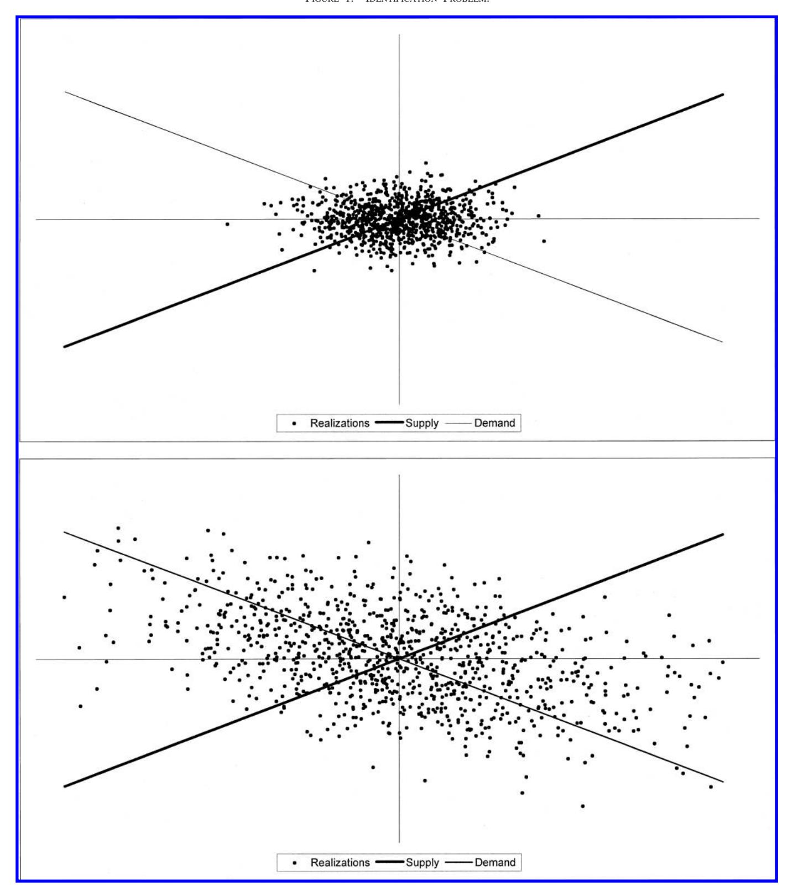
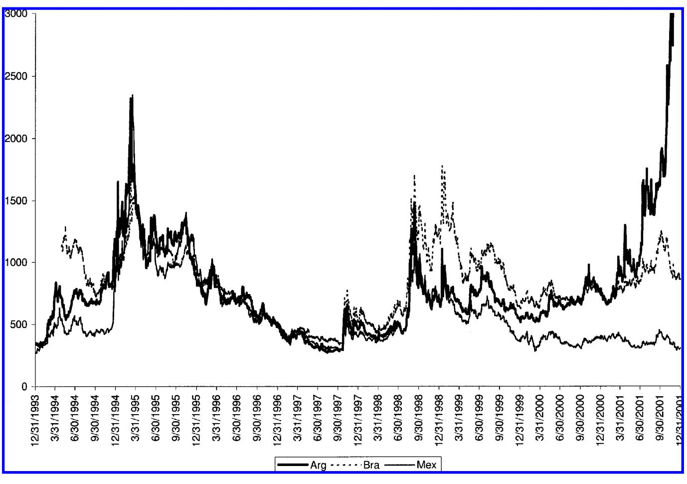

# The Review of Economics and Statistics

Vol. LXXXV November 2003 Number 4

# IDENTIFICATION THROUGH HETEROSKEDASTICITY

Roberto Rigobon\*

Abstract—This paper develops a method for solving the identification problem that arises in simultaneous-equation models. It is based on the heteroskedasticity of the structural shocks. For simplicity, I consider heteroskedasticity that can be described as a two-regime process and show that the system is just identified. I discuss identification under general conditions, such as more than two regimes, when common unobservable shocks exist, and situations in which the nature of the heteroskedasticity is misspecified. Finally, I use this methodology to measure the contemporaneous relationship between the returns on Argentinean, Brazilian, and Mexican sovereign bonds—a case in which standard identification methodologies do not apply.

#### I. Introduction

The question of identification when the model includes endogenous variables has been studied for several decades now. The problem arises when the structural form cannot be directly estimated and the parameters must be recovered from the reduced form, which has fewer equations than unknowns. Thus, to solve for the original parameters, more information is required. The typical solution is to impose additional constraints based on economic knowledge about the particular model that is estimated. Indeed, assumptions such as exclusion, sign, long-run, and covariance restrictions have been very useful in numerous applied problems. However, they cannot always be justified.

I present an alternative method to solve the identification problem that is based on the heteroskedasticity in the data. I show that if the structural shocks have a known correlation (usually 0), the identification problem can be solved by simply appealing to the heteroskedasticity of the structural shocks. For simplicity, I begin with a case in which there are two endogenous variables and two regimes. Subsequently, I study the cases in which there are more than two regimes,

Received for publication January 11, 2001. Revision accepted for publication September 20, 2002.

\* Sloan School of Management, MIT, and NBER.

I thank Olivier Blanchard, Frank Fisher, Robert Hall, Vincent Hogan, Lutz Kilian, Vladimir Kliouev, Guido Kuersteiner, Andrew Lo, Whitney Newey, Ken Rogoff, Brian Sack, Enrique Sentana, Min Shi, Jim Stock, Tom Stoker, Mark Watson, and three anonymous referees for helpful comments and suggestions. I thank the seminar participants at the MIT Macro seminar, the MIT Finance seminar, the Harvard International seminar, the BYU seminar, the International Seminar at Rochester, the International Seminar at Michigan, and the Econometrics lunch at MIT. An earlier version of the results of the paper were also presented at the International Seminar at Princeton and at the Finance Seminar at Ohio University. Any remaining errors are mine.

1 See Fisher (1976) for the most comprehensive treatment of the subject. See Haavelmo (1947) and Koopmans, Rubin, and Leipnik (1950) for the seminal contributions.

when there are multiple endogenous variables, and when common unobservable shocks are present.

I apply this method to measure the contemporaneous propagation between the returns on several Latin American sovereign bonds. This is a case where the standard identification assumptions cannot be defended, thus leaving the problem of estimation unsolved using the traditional techniques. I show that the heteroskedasticity in sovereign-bond returns makes it feasible to estimate the relevant parameters.

The typical problem of identification is depicted in the first panel of figure 1. Assume that in the standard supply and demand problem we are interested in estimating the slope of the demand curve. The realizations are the outcomes of shocks to both the supply and the demand schedule, so the OLS estimates will be biased. The instrumental variable approach solves the problem of identification by finding a variable that shifts the supply schedule without affecting the demand curve, thus measuring the slope of the demand. The heteroskedasticity of the structural shocks works in a similar fashion.

The simplest intuition can be developed by looking at a special case: Split the sample in two, and assume that in the second subsample the supply shocks are more volatile than in the first subsample, whereas the demand shocks have a constant variance across the two subsamples. This increase in the variance of the supply shocks implies that the cloud of realizations enlarges through the demand schedule, as is shown in the second panel of figure 1. The residuals are distributed over an ellipse, and the shift in the variance implies a tilting toward the demand curve. From the instrumental variables point of view, this is equivalent to having a *probabilistic* instrument; we cannot assure that the supply curve shifts (as in the standard IV approach), but in the second sample shocks to the supply are more likely to occur. Thus, the joint behavior approximates the demand schedule more closely.

In the limit as the variance of the supply shocks goes to infinity, the ellipse collapses and becomes the demand curve. In this case, the slope of the demand can be estimated by OLS. This intuition was put forward by Philip Wright (1928). This paper extends the original methodology to the case in which the shifts in the variances are finite and the form of the heteroskedasticity is unknown. In fact, if the structural shocks are not correlated, the system is identified

FIGURE 1.—IDENTIFICATION PROBLEM.

just by knowing that there is a change in the relative variance of the shocks. In particular, if both variances shift by the same amount, then the two ellipses are similar, and the system is not identified. On the other hand, if the relative importance changes, then the system will be identified by the rotation of the ellipse.

The paper is organized as follows: In section II, the typical problem of identification is specified in the bivariate setting. The methodology based on heteroskedasticity is studied when the data exhibit two regimes, as well as when they exhibit more than two. A GMM interpretation of the estimation problem is developed. In section III, necessary conditions for identification are derived for multivariate processes with unobservable common shocks. In section IV, the question of consistency under misspecification of the heteroskedasticity is explored in the bivariate setup. Two cases are studied: first, when the number of regimes are correctly specified but not the timing of the regimes, or windows; and second, when the number of regimes is smaller than the actual number exhibited by the data. In section V, an application of the identification method is presented. The contemporaneous relationship across different Latin American sovereign-bond yields is estimated. Finally, in section VI, conclusions and extensions are discussed.

#### II. Identification

Consider the following standard problem of simultaneous equations:

$$p_t = \beta q_t + \epsilon_t, \tag{1}$$

$$q_t = \alpha p_t + \eta_t, \tag{2}$$

where (1) is the demand equation, (2) is the supply equation,  $p_t$  and  $q_t$  are the observed price and quantity, and  $\epsilon_t$  and  $\eta_t$  are the structural shocks. The parameters of interest are  $\alpha$ ,  $\beta$ , and the variances of the shocks:  $\sigma_{\epsilon}^2$ ,  $\sigma_{\eta}^2$ . For the moment, assume that the structural shocks are not correlated:  $\sigma_{\epsilon\eta} = 0$ . This assumption is relaxed below.

It is well known that if  $\alpha$  and  $\beta$  are different from 0, equations (1) and (2) cannot be consistently estimated without further information. Actually, one can only estimate the covariance matrix of the reduced form  $\hat{\Omega}$  given by

$$\hat{\Omega} = \frac{1}{(1-\alpha\beta)^2} \begin{bmatrix} \beta^2 \sigma_\eta^2 + \sigma_\varepsilon^2 & \beta \sigma_\eta^2 + \alpha \sigma_\varepsilon^2 \\ & & \sigma_\eta^2 + \alpha^2 \sigma_\varepsilon^2 \end{bmatrix}\!.$$

The problem of identification is that the covariance matrix provides only three moments (the variance of  $p_t$ , the variance of  $q_t$ , and the covariance between  $p_t$  and  $q_t$ ), whereas there are four unknowns:  $\alpha$ ,  $\beta$ ,  $\sigma_{\eta}^2$ ,  $\sigma_{\varepsilon}^2$ .

The literature has solved this problem by imposing additional parameter constraints: (i) Exclusion restriction: this amounts to assuming that either  $\alpha=0$  or  $\beta=0$ . (ii) Sign restrictions: constraining the sign on the slopes of the structural equations can achieve partial identification because the two inequalities imply a region of admissible parameters.2 (iii) Long-run constraints: when the structural form includes lagged dependent variables, it is possible to restrict the long-run behavior of a particular shock. This

assumption is equivalent to forcing the sum of some lag coefficients to equal zero.3 (iv) Finally, constraints on the variances,4 for example, that  $\sigma_{\eta}^2/\sigma_{\epsilon}^2$  is equal to some constant or to infinity. The case in which the relative variances are restricted to be equal to a constant has not been frequently used in applied work, whereas the assumption that the ratio goes to zero or to infinity is used as one of the underlying assumptions of most event studies.5

These restrictions have proven to be very useful in applied work, but there are important economic problems in which none of them can be rationalized. The purpose of this section is to offer an alternative identification method that is based on heteroskedasticity.

#### A. Identification under Two Regimes

Assume there are two regimes in the variances of the structural shocks: high and low volatility. Additionally, assume that the structural parameters are stable across the regimes. Under these assumptions the two reduced-form covariance matrices have the same structure as before:

$$\hat{\Omega}_{s} \equiv \begin{bmatrix} \omega_{11,s} & \omega_{12,s} \\ \cdot & \omega_{22,s} \end{bmatrix} \\
= \frac{1}{(1 - \alpha\beta)^{2}} \begin{bmatrix} \beta^{2} \sigma_{\eta,s}^{2} + \sigma_{\epsilon,s}^{2} & \beta \sigma_{\eta,s}^{2} + \alpha \sigma_{\epsilon,s}^{2} \\ \cdot & \sigma_{\eta,s}^{2} + \alpha^{2} \sigma_{\epsilon,s}^{2} \end{bmatrix}, \qquad (3)$$

$$s \in \{1, 2\},$$

where the regime is denoted as  $s \in \{1, 2\}$ , where the variances of the structural shocks in regime s are given by  $\sigma_{\epsilon,s}$  and  $\sigma_{\eta,s}$ , and where  $\hat{\Omega}_s$  indicates the reduced-form covariance matrix in regime s. In this new system of equations there are six unknowns  $(\alpha, \beta, \sigma_{\eta,1}^2, \sigma_{\epsilon,1}^2, \sigma_{\eta,2}^2, \text{ and } \sigma_{\epsilon,2}^2)$  and two covariance matrices, which provide six equations. If the equations are independent, the problem of identification has been solved. It is essential to restate the assumptions that lead to the identification of the system: (i) the parameters are stable across the heteroskedasticity regimes, and (ii) the structural shocks are not correlated. These assumptions are implicit in much of the applied macro work and are further discussed below.

Solving for the variances in equation (3),  $\alpha$  and  $\beta$  satisfy the following nonlinear system of equations:

$$\beta = \frac{\omega_{12,s} - \alpha \omega_{11,s}}{\omega_{22,s} - \alpha \omega_{12,s}}, \qquad s \in \{1, 2\}.$$
 (4)

&lt;sup>2 Even though a unique estimate cannot be obtained, at least an admissible interval is derived. See Fisher (1976).

&lt;sup>3 If it is known that one shock does not have permanent effects, then, under some conditions, it is possible to obtain identification. For example, assume that nominal shocks are short-lived, whereas real shocks are permanent. Imposing this constraint, Blanchard and Quah (1989) and Shapiro and Watson (1988) were able to estimate the effects of aggregate shocks on aggregate activity and unemployment.

&lt;sup>4 Rothenberg and Ruud (1990) study the case in which covariance restrictions are imposed in linear simultaneous-equation models.

&lt;sup>5 This is the original intuition developed by P. Wright (1928). See Fisher (1976) for a general discussion. See Rigobon and Sack (2002) for an application and a test of the near-identification assumption in monetary policy.

After some algebra, we see that solves the quadratic equation

$$\begin{split} & \left[ \omega_{11,1} \omega_{12,2} - \omega_{12,1} \omega_{11,2} \right] \alpha^2 \\ & - \left[ \omega_{11,1} \omega_{22,2} - \omega_{22,1} \omega_{11,2} \right] \alpha \\ & + \left[ \omega_{12,1} \omega_{22,2} - \omega_{22,1} \omega_{12,2} \right] = 0. \end{split}$$
 (5)

There are two solutions to this equation. It is easy to show that if , is one solution to the system of equations, then \* 1/, \* 1/ is the other solution. Indeed, the solutions are the two possible ways in which the structural form can be written. In other words, the system is identified up to row permutations of the original model.

**Proposition 1.** Let *pt* and *qt* be described by equations (1) and (2), where the parameters ( and ) determining the law of motion are stable and where the disturbances have finite variance, are not correlated, and exhibit heteroskedasticity that can be described with two regimes. Then, if the covariance matrices satisfy

$$\det \left| \hat{\Omega}_2 - \frac{w_{11,2}}{w_{11,1}} \hat{\Omega}_1 \right| \neq 0, \tag{6}$$

the structural form is just identified: and are consistently estimated from the two estimable covariance matrices.

**Proof.** See Appendix. -Equation (6) is equivalent to

$$w_{11,1}w_{12,2} - w_{11,2}w_{12,1} \neq 0. (7)$$

Note that the conditions (6) and (7) are similar to testing the rank condition when the order condition (number of equations) has been satisfied. In terms of the standard literature on linear systems of equations, the order condition requires that the number of equations be at least as large as the number of unknowns. The rank condition requires the number of linearly independent equations to be equal to or larger than the number of unknowns. In linear systems of equations, this is verified by computing the rank of the matrix. In the case studied here, the system is nonlinear, and the rank condition takes the form of equation (6).

Equation (6) fails if the two covariance matrices are proportional; that is, the heteroskedasticity does not identify the system if the relative variances are constant across regimes. Returning to the intuition given in the introduction, imagine that the variances of both shocks double; then the shape of the ellipse in the two regimes is the same, and nothing can be learned about the original system. Technically, this is the case in which we have six equations and six unknowns, but the equations are not independent. On the other hand, when the ratio of the variances shifts, then the heteroskedasticity changes the region in which the errors are distributed, tilting the ellipse toward one of the structural equations. This rotation of the ellipse can be estimated from the reduced-form covariances, allowing us to obtain the slope of the schedules.

The simplest intuition of how identification is achieved can be developed by first analyzing the case in which the variance changes for only one shock. Assume that it is known that at some point in time there is an increase in the variance of the supply shocks. During that period, the cloud of realizations is going to widen along the demand curve as depicted in figure 1. Observing how the ellipse of the realizations has changed across the two samples allows one to determine the slope of the demand curve. In this particular case, because it has been assumed that the structural shocks have zero correlation, this is enough to estimate the slope of the supply curve, too. Moreover, this explanation has an instrumental variables interpretation. A valid instrument to estimate the demand schedule is one that moves the supply without affecting the demand. In this example, the rise in the variance of the supply shocks becomes a *probabilistic* instrument precisely because it increases the likelihood that the supply equation "moves."

Finally, when both variances shift, there is an expansion along both axes. So it is not necessary to know which shock becomes more important across the regimes. It is enough if the relative variances shift—equation (6) will be satisfied and both schedules identified.

#### *B. Related Literature*

At this point it is useful to discuss the relationship between this methodology and the literature on identification using heteroskedasticity.

As mentioned before, the use of second moments for identification was first introduced by Philip Wright (1928). He argued that an increase in the variance of the shocks in one equation reduces the bias introduced by simultaneousequation problems in the OLS estimate of the other one. Taking the limit to infinity implies that OLS would estimate the coefficients consistently. More recent research has been conducted extending the original intuition (i) to nonlinear models, (ii) to models with parametric representations of the heteroskedasticity (such as ARCH or GARCH models), and (iii) to models that are partially identified.

Klein and Vella (2000a, b) discuss the problem of identification and estimation in a binary endogenous model when exclusion restrictions (or any other parameter restrictions) are not available and the case of the triangular model, respectively. They estimate the heteroskedasticity semiparametrically and use the residual from the second equation as an additional regressor in the first equation as the instrument.6

Sentana (1992) and Sentana and Fiorentini (2001) study the problem of estimation in factor regressions when there is conditional heteroskedasticity. The simple case developed

6 See also Chen and Khan (1999) for a general solution of the problem of identification in sample selection models when the data exhibit heteroskedasticity.

in this section (proposition 1) is a special case of their proposition 3. They study the conditions in which identification is achieved in a nontriangular system when the common latent factors exhibit heteroskedasticity.

There are important differences between those papers and the approach developed here. First, the procedure highlighted in this paper requires only the knowledge that a shift in the relative variances has occurred—that is, the regime shift comes from economic events, such as crises, policy shifts, or shifts in other characteristics in the data such as heteroskedasticity with region, time, or other cross-sectional characteristics. The ARCH specification uses the time series heteroskedasticity in the data as a statistical vehicle to achieve identification. Second, the procedure described in this paper allows us to test for some of the underlying assumptions, such as parameter stability; the system is overidentified when there are more than two regimes. The techniques based on conditional heteroskedasticity are unable to provide this test. Third, as is shown below, if the heteroskedasticity is misspecified in this model, the coefficients are still consistent. This is not the case when the heteroskedasticity is modeled parametrically; misspecification in those cases can bias the contemporaneous coefficients as well. Furthermore, if the data exhibit conditional heteroskedasticity, and the procedure here described is implemented, it is still the case that the coefficients will be consistent. Fourth, models that rely on conditional heteroskedasticity to achieve identification require the number of heteroskedastic shocks to be smaller than or equal to the number of endogenous variables. As is shown in section III, this is not the case in the present procedure. If there are more than two regime shifts, then there are conditions in which it is possible to have more latent factors than endogenous variables and still being able to identify the structural system.

Though the estimation procedures in all these papers are very different, they share the same intuition for solving the problem of endogenous variables: the heteroskedasticity adds equations to the system after some covariance restrictions have been imposed. It is important to mention that these procedures require that the system of equations be linear, or in other words, that the coefficients be stable to changes in the volatility. Future research should consider extending the methodology to nonlinear specifications.

Finally, in addition to the papers mentioned above, some applied papers already have used heteroskedasticity to identify a system of equations. In the context of conditional heteroskedasticity, see Caporale, Cipollini, and Demetriades (2002a), Dungey and Martin (2001), King, Sentana, and Wadhwani (1994), and Rigobon (2002). In these papers a structural conditionally heteroskedastic model is estimated from a reduced-form GARCH model. In the context of regime switches see Caporale, Cipollini, and Spagnolo (2002b) and Rigobon and Sack (2002, 2003). In the context of testing parameter stability see Rigobon (2000). He discusses partial identification of simultaneous-equation models with unobservable common shocks. He is more concerned with developing a test for

stability of parameters than with identifying the system of equations. His procedure depends on the presence of a particular form of the heteroskedasticity, where in the short run only a subset of the variances are allowed to shift. The methodology developed here does not require this assumption.

#### C. Identification under More than Two Regimes

It is easy to extend the previous results to the case where there are more than two regimes. Assume that the data exhibit multiple finite heteroskedasticity regimes indexed by  $s \in \{1, \ldots, S\}$ . For each regime, the covariance matrix is

$$\hat{\Omega}_{s} \equiv \begin{bmatrix} \omega_{11,s} & \omega_{12,s} \\ \cdot & \omega_{22,s} \end{bmatrix} \\
= \frac{1}{(1 - \alpha\beta)^{2}} \begin{bmatrix} \beta^{2} \sigma_{\eta,s}^{2} + \sigma_{\epsilon,s}^{2} & \beta \sigma_{\eta,s}^{2} + \alpha \sigma_{\epsilon,s}^{2} \\ \cdot & \sigma_{\eta,s}^{2} + \alpha^{2} \sigma_{\epsilon,s}^{2} \end{bmatrix}.$$
(8)

This is a system that has 3S equations (one covariance matrix per regime) and 2S + 2 unknowns: S times two structural variances for each regime, plus the two parameters  $\alpha$  and  $\beta$ .

The order condition will be satisfied for any *S* larger than or equal to 2. The rank condition takes the same form as equations (6) and (7) for any pair of regimes. Indeed, the system is overidentified if there are at least three regimes that satisfy the rank condition for all combinations.

Appealing to the probabilistic IV interpretation used before, each new heteroskedastic regime is a valid instrument if and only if it satisfies the rank condition with respect to all the previous regimes. In this case, each new covariance matrix adds three equations and only two unknowns. Otherwise, the new heteroskedastic regime does not increase the number of restrictions on the structural coefficients. Hence, for S larger than 2 and for all covariance matrices satisfying the rank condition, the system of equations is overidentified, and the underlying assumption—such as that  $\alpha$  and  $\beta$  are stable through time—can be tested. The estimation has a minimum-distance interpretation where each heteroskedastic regime is equivalent to one instrument.

#### III. Identification with Common Shocks

In the previous sections, the stochastic process is bivariate and there are no common shocks. In this section, these assumptions are relaxed and the necessary conditions to achieve identification are discussed.8

 $^7$  The additional equations can also be interpreted as a factor regression model, where the left-side variables of equation (8) are the estimates (or observable), the variances ( $\sigma_{\eta s}^2$  and  $\sigma_{\epsilon s}^2$ ) are the unobservable factors, and the coefficients are the weights or factor loadings. Factor analysis usually assumes that the  $\omega_{ij,s}$ 's are independent. It is unlikely, however, that that is the case in this setup. Therefore proper corrections have to be considered in the estimation procedure. In this paper, I use the GMM interpretation.

&lt;sup>8 Including common shocks in the model is equivalent to relaxing the assumption on the correlation of the structural shocks.

It should be clear that if we allow for a common unobservable heteroskedastic shock in the bivariate setting, the heteroskedasticity will not be sufficient to achieve identification. Each heteroskedastic regime adds not only three equations, but also three unknowns. So it is essential to impose some constraints on the covariances to be able to use the variation in the second moments to solve the problem of identification.

Assume that there are N endogenous variables, K common unobservable shocks, and  $s \in \{1, \ldots, S\}$  possible regimes or states. Denote the structural form as follows:

$$A_{N\times N} \begin{bmatrix} x_{1,t} \\ \vdots \\ x_{N,t} \end{bmatrix} = \Gamma_{N\times K} \begin{bmatrix} z_{1,t} \\ \vdots \\ z_{K,t} \end{bmatrix} + \begin{bmatrix} \boldsymbol{\epsilon}_{1,t} \\ \vdots \\ \boldsymbol{\epsilon}_{N,t} \end{bmatrix}, \tag{9}$$

where all the shocks are assumed to have zero correlation at all leads and lags: that is,

$$E[z_{i,t}, z_{j,t}] = 0 \qquad \forall i \neq j, \quad i, j \in \{1, K\},$$

$$E[\boldsymbol{\epsilon}_{i,t}, \boldsymbol{\epsilon}_{j,t}] = 0 \qquad \forall i \neq j, \quad i, j \in \{1, N\}, \qquad (10)$$

$$E[z_{i,t}, \boldsymbol{\epsilon}_{j,t}] = 0 \qquad \forall i \neq j, \quad i \in \{1, K\}, \ j \in \{1, N\},$$

and where  $x_{n,t}$ ,  $n \in \{1, ..., N\}$ , are the N endogenous (row vector) variables;  $z_{k,t}$ ,  $k \in \{1, ..., K\}$ , are the K unobservable common shocks, assumed to have no correlation, with variance  $\sigma_{z,k,s}$  in state s; and  $\epsilon_{n,t}$  are the structural shocks, assumed not to be correlated, with variance  $\sigma_{\epsilon,n,s}$  in state s.

The matrix  $A_{N\times N}$  contains the contemporaneous parameters,

$$A_{N\times N} = \begin{bmatrix} 1 & a_{12} & \cdots & a_{1n} \\ a_{21} & 1 & \cdots & a_{2n} \\ \vdots & \vdots & \ddots & \vdots \\ a_{n1} & a_{n2} & \cdots & 1 \end{bmatrix}, \tag{11}$$

where the assumption of normalization already has been imposed (coefficients along the diagonal are equal to 1). The matrix  $\Gamma_{N\times K}$  contains the parameters from the common shocks, where normalization is also assumed; in this case, it implies a unit impact on the first equation:

$$\Gamma_{N\times K} = \begin{bmatrix} 1 & 1 & \cdots & 1 \\ \gamma_{21} & \gamma_{22} & \cdots & \gamma_{2k} \\ \vdots & \vdots & \ddots & \vdots \\ \gamma_{n1} & \gamma_{n2} & \cdots & \gamma_{nk} \end{bmatrix}.$$
 (12)

**Proposition 2.** A multivariate system of N equations, with K unobservable common shocks, described by equations (9), (10), (11), and (12), is identified if and only if, for N > 1,

(i) the number of states (S) satisfies

$$S \ge 2 \frac{(N+K)(N-1)}{N^2 - N - 2K},\tag{13}$$

(ii) there is a minimum number of endogenous variables (or maximum number of common shocks) that satisfies

$$N^2 - N - 2K > 0, (14)$$

and

(iii) the covariance matrices constitute a system of equations that is linearly independent.

## **Proof.** See Appendix. ■

Equation (14) is the *catch-up* constraint. It indicates the conditions under which one additional regime in the variance-covariance adds more equations than unknowns. In the example that motivated this section, (N = 2 and K = 1) implies that the inequality is not satisfied and no further information is obtained from the heteroskedasticity. Moreover, if the common shocks are interpreted as the sources of correlation between the structural shocks, then this constraint indicates that some of the covariances of the structural shocks must be restricted to be constant or zero. Solving for K, it is found that identification requires K < N(N-1)/2, where the right-hand side is exactly the number of all possible contemporaneous correlations among structural shocks.

There are two main implications of proposition 2: First, in the absence of common shocks only two states are required to achieve identification, independently of the number of endogenous variables, N. Second, if K > 0 and N is finite, the number of states required to achieve identification is always larger than 2.

The estimation of this model is performed by GMM where the moment conditions are

$$A\Omega_{s}A' = \Gamma\Omega_{z,s}\Gamma' + \Omega_{\epsilon,s}, \tag{15}$$

where  $\Omega_s$  is the covariance matrix that can be estimated in the data from the observed variables  $(x_t)$  in regime s, where  $\Omega_{z,s}$  is the covariance matrix of the common unobservable shocks in regime s, which, given the assumptions in equation (10), is a diagonal matrix, and where  $\Omega_{\epsilon,s}$  is the covariance matrix of the structural shocks in regime s, which given the assumptions in equation (10), is also diagonal. The parameters of interest are s and s.

# IV. Consistency under Misspecification of the Heteroskedasticity

An important question arising from the previous derivation is the issue of consistency when the heteroskedasticity is misspecified. This section shows that the estimates are consistent even though the regimes might be misspecified.

In this section two cases are evaluated: (i) when the windows of the heteroskedasticity are wrongly specified but the number of regimes is correct, and (ii) when the data have more regimes than the ones assumed in the specification.

Without loss of generality, only the bivariate case in which there are no common shocks is discussed.

The intuition about why consistency is achieved in these two cases is that the misspecified covariance matrices are linear combinations of the true underlying ones. Therefore, the misspecified system of equations is a linear transformation of the original problem. If this linear transformation does not lower the rank of the system, the same solution is obtained. It is not proven in this section, but it should be intuitively obvious, that the misspecification reduces the power of the test by eliminating the differences across regimes. For example, in the limit when the misspecification is so large that the system decreases in rank, then the estimates are inconsistent—there is a continuum of them.

#### A. Misspecification of the Regime Windows

Assume the system is described by equations (1) and (2), and that the data exhibit heteroskedasticity with only two regimes. If the windows are misspecified, the computed covariance matrices are linear combinations of the true underlying covariance matrices. Denote

$$\Omega_{r1} = \lambda_{r1}\Omega_1 + (1 - \lambda_{r1})\Omega_2,$$

$$\Omega_{r2} = (1 - \lambda_{r2})\Omega_1 + \lambda_{r2}\Omega_2,$$

where  $\Omega_1$  and  $\Omega_2$  are the true covariance matrices describing the heteroskedasticity,  $\Omega_{r1}$  and  $\Omega_{r2}$  are the estimated covariance matrices, and  $\lambda_{r1}$  and  $\lambda_{r2}$  are weights indicating how correct the windows are: when they are equal to 1, the windows coincide with the true regimes.

**Proposition 3.** Assume the original system satisfies the rank condition (6). If the misspecified heteroskedasticity also satisfies (6), then the model is identified and its estimators are consistent.

# **Proof.** See Appendix. ■

In other words, if the computed covariance matrices satisfy the rank condition, then the estimates are consistent even if the regimes have been slightly misspecified. On the other hand, if the misspecification is so large that the system fails the rank condition, then the coefficients are not identified. Hence, the estimated coefficients should be consistent for small perturbations of the regime definitions.

Remember that the equivalent rank condition is testable. Therefore, the degree of misspecification can be detected in the applications.

#### B. Underspecified Number of Regimes

Assume the system is described by equations (1) and (2), and that the data exhibit heteroskedasticity with  $S^*$  regimes, where there are no restrictions to the form of the heteroske-

dasticity. For simplicity denote the variances of the structural shocks in each regime as follows:

$$\sigma_{\eta,s}^2 = (1 + \delta_{\eta,s})\sigma_{\eta,0}^2, \sigma_{\epsilon,s}^2 = (1 + \delta_{\epsilon,s})\sigma_{\epsilon,0}^2, \qquad \forall s \neq 0,$$

where  $\sigma_{\eta,s}^2$  and  $\sigma_{\epsilon,s}^2$  represent the variances of the idiosyncratic shocks in regime s, and  $\delta_{\eta,s}$  and  $\delta_{\epsilon,s}$  are the changes of those variances relative to the variances from regime s=0.

Assume that only two regimes are used in the estimation. Without loss of generality assume that the first window corresponds to the first set of  $\hat{s} < S^*$  regimes and that the second window corresponds to the second set of  $S^* - \hat{s}$  regimes. The covariance matrices of each of the misspecified periods are given by (written in *vech* notation)

$$vech(\Omega_{r1}) = \frac{1}{(1 - \alpha\beta)^2} \times \begin{bmatrix} \beta^2 \frac{1}{\hat{s}} \sum_{s < \hat{s}} \sigma_{\eta, s}^2 + \frac{1}{\hat{s}} \sum_{s < \hat{s}} \sigma_{\epsilon, s}^2 \\ \beta \frac{1}{\hat{s}} \sum_{s < \hat{s}} \sigma_{\eta, s}^2 + \alpha \frac{1}{\hat{s}} \sum_{s < \hat{s}} \sigma_{\epsilon, s}^2 \\ \frac{1}{\hat{s}} \sum_{s < \hat{s}} \sigma_{\eta, s}^2 + \alpha^2 \frac{1}{\hat{s}} \sum_{s < \hat{s}} \sigma_{\epsilon, s}^2 \end{bmatrix}$$

for the first window, and

$$vech(\Omega_{r2}) = \frac{1}{(1 - \alpha\beta)^{2}} \times \begin{bmatrix} \beta^{2} \frac{1}{S^{*} - \hat{s}} \sum_{s > \hat{s}} \sigma_{\eta,s}^{2} + \frac{1}{S^{*} - \hat{s}} \sum_{s > \hat{s}} \sigma_{\epsilon,s}^{2} \\ \beta \frac{1}{S^{*} - \hat{s}} \sum_{s > \hat{s}} \sigma_{\eta,s}^{2} + \alpha \frac{1}{S^{*} - \hat{s}} \sum_{s > \hat{s}} \sigma_{\epsilon,s}^{2} \\ \frac{1}{S^{*} - \hat{s}} \sum_{s > \hat{s}} \sigma_{\eta,s}^{2} + \alpha^{2} \frac{1}{S^{*} - \hat{s}} \sum_{s > \hat{s}} \sigma_{\epsilon,s}^{2} \end{bmatrix}$$

for the second one. The two matrices can be rewritten as

$$\begin{split} \textit{vech}(\Omega_{\textit{rl}}) \\ &= \frac{1}{(1 - \alpha \beta)^2} \begin{bmatrix} (1 + \delta_{\eta,\textit{rl}}) \beta^2 \sigma_{\eta,0}^2 + (1 + \delta_{\eta,\textit{rl}}) \sigma_{\varepsilon,0}^2 \\ (1 + \delta_{\eta,\textit{rl}}) \beta \sigma_{\eta,0}^2 + (1 + \delta_{\eta,\textit{rl}}) \alpha \sigma_{\varepsilon,0}^2 \\ (1 + \delta_{\eta,\textit{rl}}) \sigma_{\eta,0}^2 + (1 + \delta_{\eta,\textit{rl}}) \alpha^2 \sigma_{\varepsilon,0}^2 \end{bmatrix}, \\ \textit{vech}(\Omega_{\textit{r2}}) &= \frac{1}{(1 - \alpha \beta)^2} \begin{bmatrix} (1 + \delta_{\eta,\textit{r2}}) \beta^2 \sigma_{\eta,0}^2 + (1 + \delta_{\eta,\textit{r2}}) \sigma_{\varepsilon,0}^2 \\ (1 + \delta_{\eta,\textit{r2}}) \beta \sigma_{\eta,0}^2 + (1 + \delta_{\eta,\textit{r2}}) \alpha \sigma_{\varepsilon,0}^2 \\ (1 + \delta_{\eta,\textit{r2}}) \sigma_{\eta,0}^2 + (1 + \delta_{\eta,\textit{r2}}) \alpha^2 \sigma_{\varepsilon,0}^2 \end{bmatrix}, \end{split}$$

where

$$\delta_{\eta,r1} = \frac{1}{\hat{s}} \sum_{s < \hat{s}} \delta_{\eta,s} \quad \text{and} \quad \delta_{\eta,r2} = \frac{1}{S^* - \hat{s}} \sum_{s > \hat{s}} \delta_{\eta,s}, \quad (16)$$

$$\delta_{\epsilon,r1} = \frac{1}{\hat{s}} \sum_{s < \hat{s}} \delta_{\epsilon,s} \quad \text{and} \quad \delta_{\epsilon,r2} = \frac{1}{S^* - \hat{s}} \sum_{s > \hat{s}} \delta_{\epsilon,s}. \tag{17}$$

**Proposition 4.** Assume the true heteroskedasticity is described by *S*\* regimes and that those covariance matrices satisfy the rank condition (6). Assume that only two regimes have been used in the estimation. Then, if the following conditions are satisfied, the system is identified and its estimates are consistent:

- 1. The misspecified covariance matrices have to exhibit heteroskedasticity: *r*1 *r*2.
- 2. The misspecified covariance matrices satisfy the rank condition (6).

# **Proof.** See Appendix. -

It is important to mention that if the number of true regimes is smaller than the number of regimes used in the estimation, then the system of equations does not satisfy the rank condition. In other words, there are not enough independent equations to identify the system. It should be clear that in those cases the estimates are inconsistent, and the confidence intervals are infinitely large.

The two cases analyzed in this section are probably the most common forms of misspecification. However, they are not exhaustive. Depending on the particular application in which the identification is used, and the possible misspecification problems that could be encountered, the consistency of the methodology should be explored further.

#### **V. Latin American Sovereign Debt**

This section applies the previous methodology to estimating the contemporaneous relationship between sovereign bonds in Latin America. The data consist of the daily yields for Argentina, Brazil, and Mexico between January 1994 and December 2001 obtained from the Emerging Markets Bond Index Plus (EMBI) constructed by J. P. Morgan. The EMBI country indices track total returns for traded external debt instruments in emerging markets, which for these countries are mainly Brady bonds. The indices are computed by simulating holding a portfolio with the weights determined by risk, market capitalization, liquidity considerations, and collateral characteristics of the particular bonds. The yields are computed relative to U.S. bonds with similar duration.

From the identification point of view, it should be clear that, for example, if Mexican shocks affect Argentina (for instance, through trade), then Argentinean shocks should influence Mexico, too. Moreover, these bonds are traded in the same market. Consequently, shocks to market participants are common to all the sovereign bonds. This means that the prices of the sovereign bonds are determined simultaneously and suffer from common unobservable shocks.

In this case, the traditional identification assumptions are difficult to defend: (i) it is not reasonable to assume exclusion restrictions in one direction and not in the other one, as has already been argued; (ii) it does not make sense to assume that one transmission is positive while the other one is negative (thus no sign restrictions can be imposed); (iii) moreover, there are no good reasons to assume that the shocks to one country are more persistent than the shocks to the other one (therefore, long-run restrictions cannot be enforced); and (iv) finally, it is difficult to substantiate an assumption about the relative importance of idiosyncratic shocks across the countries. This leaves the problem of identification unsolved with the standard procedures.

In figure 2, the three indices are shown. The yields are measured in basis points.

Table 1 computes the simple yearly correlations in the sample. Note that from 1994 to 1999 the correlations are high (even though they start to fall in 1999). Brady bonds are dollaror foreign-denominated debts, so exchange rate risks are excluded from them. Furthermore, the data used in this case are the stripped yields; hence, movements in U.S. rates cannot be the source of this large comovement. These yields capture, mainly, country risk. The fact that they are so highly correlated is what has motivated most of the literature on contagion.9

The objectives of this section are twofold: First, estimate consistently the contemporaneous coefficients across these three countries. The data display important heteroskedasticity, which allows us to implement the procedure developed here to estimate the contemporaneous coefficients *A* and . 10 Second, determine whether there has been a shift in the coefficients after mid-1999. Observe that the correlations dropped substantially in the later part of the sample. Market participants have explained the decoupling as the result of two events: the Brazilian and Mexican movement toward inflation targeting (after the first quarter of 1999), and the upgrade to investment grade of Mexico in March of 2000.11 It should be expected, then, that these changes in the market structure will have implications for the parameter stability of the model proposed. In other words, the overidentifying restrictions should be rejected when the later part of the sample is included in the estimation.

9 Brazil has fewer than half the observations in 1994, so it is excluded from that year.

10 In these data there exists both conditional and unconditional heteroskedasticity (see Edwards, 1998, and Edwards & Susmel, 2000). In this paper, most of the arguments are developed assuming unconditional heteroskedasticity. However, similar arguments are easily extended to the case in which only conditional heteroskedasticity exists.

11 It is well known that correlation coefficients are biased in the presence of heteroskedasticity. The standard procedures to adjust the correlation coefficient, however, cannot be used in this case; they work only if the variables are not subject to simultaneous-equation or omitted variable problems. But that is the essence of the problem solved in this paper. See Ronn (1998) for the original adjustment in the correlation coefficient. See Boyer, Gibson, and Loretan (1999), Forbes and Rigobon (2002), and Loretan and English (2000) for generalizations of Ronn's result.

FIGURE 2.—YIELDS ON SOVEREIGN DEBT: ARGENTINA, BRAZIL, AND MEXICO

Source: J. P. Morgan.

#### A. Measuring the Contemporaneous Relationship

Assume the yields are described by the following model:

$$A \begin{Bmatrix} Arg_t \\ Bra_t \\ Mex_t \end{Bmatrix} = c + \phi(L) \begin{Bmatrix} Arg_t \\ Bra_t \\ Mex_t \end{Bmatrix} + \phi US_t$$

$$+ \Phi(L)US_t + \begin{Bmatrix} \xi_{Arg,t} \\ \xi_{Bra,t} \\ \xi_{Mex_t} \end{Bmatrix} + \Gamma_{Z_t},$$
(18)

TABLE 1.—SIMPLE CORRELATIONS OF STRIPPED YIELDS

|      | Correlation (%) |         |         |  |  |  |
|------|-----------------|---------|---------|--|--|--|
| Year | Arg-Mex         | Arg–Bra | Bra-Mex |  |  |  |
| 1994 | 82.3            |         |         |  |  |  |
| 1995 | 78.3            | 78.9    | 80.4    |  |  |  |
| 1996 | 88.2            | 90.7    | 92.7    |  |  |  |
| 1997 | 92.2            | 94.5    | 83.1    |  |  |  |
| 1998 | 95.1            | 94.1    | 98.7    |  |  |  |
| 1999 | 83.6            | 73.4    | 94.2    |  |  |  |
| 2000 | 12.2            | 67.5    | 66.7    |  |  |  |
| 2001 | -37.0           | 39.5    | 13.1    |  |  |  |
|      |                 |         |         |  |  |  |

where  $Arg_t$ ,  $Bra_t$  and  $Mex_t$  are the yields on the sovereign bonds from Argentina, Brazil, and Mexico, respectively.  $US_t$  is the return on a 10-year U.S. government bond. The matrices Aand  $\Gamma$  are the parameters of interest,  $\phi$  is the contemporaneous effect of U.S. interest rates on emerging market interest rates, and  $\phi(L)$  and  $\Phi(L)$  are lags. The shocks in equation (18) are assumed to be contemporaneously uncorrelated, serially uncorrelated, and with covariance matrices  $\Omega_s^{\varepsilon}$  and  $\Omega_s^{\varepsilon}$  in regime s.

The reduced form is

$$\begin{cases}
Arg_t \\
Bra_t \\
Mex_t
\end{cases} = A^{-1}c + A^{-1}\phi(L) \begin{cases}
Arg_t \\
Bra_t \\
Mex_t
\end{cases} + A^{-1}\phi US_t + A^{-1}\Phi(L)US_t + \nu_t,$$

where the reduced-form residuals  $v_t$  satisfy

$$A\nu_{t} = \begin{cases} \xi_{Arg,t} \\ \xi_{Bra,t} \\ \xi_{Mex,t} \end{cases} + \Gamma z_{t}. \tag{19}$$

TABLE 2.—TRANQUIL AND CRISIS WINDOWS

| Definition of the Windows | Start      | End        |
|---------------------------|------------|------------|
| Tranquil periods          | 1994-05-01 | 1994-12-18 |
|                           | 1995-03-02 | 1997-05-31 |
|                           | 1998-01-01 | 1998-06-30 |
|                           | 1998-11-01 | 1999-01-12 |
|                           | 1999-03-01 | 2000-02-28 |
|                           | 2000-06-01 | 2000-09-30 |
| Mexican crisis            | 1994-12-19 | 1995-03-01 |
| Asian crises              | 1997-06-01 | 1998-01-31 |
| Russian crisis            | 1998-08-01 | 1998-10-31 |
| Brazilian devaluation     | 1999-01-13 | 1999-02-28 |
| Mexico's upgrade          | 2000-03-01 | 2000-05-31 |
| Argentinean crisis        | 2000-10-01 | 2001-12-31 |

The reduced-form residuals share the same contemporaneous relationship as the returns. Equation (19) is equivalent to the model developed in equations (9) to (12). The next step is then to determine the volatility regimes.

The recent international crises are a natural framework to define the regimes. These international crises have been associated with large and persistent increases in volatility. Since 1994, one upgrade and five major crises have occurred: (i) The Mexican crisis started in December 19, 1994, when the fixed exchange rate was abandoned. The end of the crisis has been dated around March 31, 1995 when the markets calmed down after the U.S. bailout. (ii) The South East Asian crises started with the speculative attack against Thailand (June 1997) and ended after the Korean crisis (January 1998). (iii) The Russian crisis started with a massive drop in Russian bond prices at the beginning of August of 1998 and lasted until the end of October after the LTCM rescue was organized by the Fed. (iv) Brazil devalued its currency in early January of 1999, and markets returned to normal relatively fast. (v) Mexico was upgraded in March of 2000; thus, the period from the beginning of March until the end of May is considered a crisis period even though that was good news. (vi) Finally, it can be claimed that Argentina's problems started in late 2000. So, for the purpose of the estimation, the Argentinean crisis runs from October 2000 until the end of the data set. The tranquil periods are considered to be the rest of the observations. In table 2 the windows are summarized.

In table 3 the variance-covariance matrix of each of the subsamples is shown. The first column shows the period of interest, and the next six columns show the different moments from the reduced-form matrix. The first six rows in the table give the covariance matrices of the tranquil periods, the next six rows give the crisis subsamples, and the last six rows are the relative changes in the moments: the moments during the crisis periods relative to the tranquil periods that precede them.

As can be seen, the crises led to considerable increases in the variances and covariances for all three countries. The Mexican devaluation resulted in a variance for Mexico almost 35 times higher than during tranquil periods, as well as a large variance for Argentina. The Asian crises had a smaller effect, but still the variances increased in three to five times. The Russian collapse had perhaps the largest overall effect; all volatilities increased more than 15 times. The Brazilian devaluation had a small effect on almost all of the moments. The upgrade of Mexico, on the other hand, reduced the overall volatility. Brazil and Mexico's variances were one-fifth of those prevailing before the Mexican upgrade, and Argentina also showed improvements in this dimension. Finally, the Argentinean crisis led to a massive increase in volatility for Argentina and Brazil, but a small one for Mexico.

The model has three endogenous variables (*N* 3) and one common shock (*K* 1). Thus, the catch-up constraint (14) is satisfied. Moreover, according to equation (13), at least four regimes are needed to identify the system. There-

TABLE 3.—VARIANCE-COVARIANCE MATRIX FOR EACH WINDOW

|                       | Variables (%) |              |         |              |              |         |  |
|-----------------------|---------------|--------------|---------|--------------|--------------|---------|--|
| Window                | V (Arg)       | C (Arg, Mex) | V (Mex) | C (Arg, Bra) | C (Mex, Bra) | V (Bra) |  |
| Tranquil Periods      | 0.684         | 0.120        | 0.159   | 0.396        | 0.350        | 2.471   |  |
|                       | 0.150         | 0.102        | 0.108   | 0.083        | 0.082        | 0.071   |  |
|                       | 0.160         | 0.129        | 0.123   | 0.248        | 0.214        | 0.415   |  |
|                       | 0.286         | 0.217        | 0.239   | 0.539        | 0.308        | 2.198   |  |
|                       | 1.078         | 0.914        | 0.988   | 1.463        | 1.629        | 3.088   |  |
|                       | 0.050         | 0.020        | 0.090   | 0.010        | 0.044        | 0.041   |  |
| Mexican Crisis        | 4.642         | 4.766        | 5.547   | 2.466        | 2.665        | 1.432   |  |
| Asian Crises          | 1.102         | 0.601        | 0.344   | 1.192        | 0.652        | 1.309   |  |
| Russian Crisis        | 5.630         | 3.261        | 2.511   | 5.327        | 3.872        | 6.222   |  |
| Brazilian Devaluation | 0.725         | 0.546        | 0.442   | 1.158        | 0.881        | 2.068   |  |
| Mexico's Upgrade      | 0.521         | 0.297        | 0.226   | 0.450        | 0.316        | 0.486   |  |
| Argentinean Crisis    | 96.262        | 1.202        | 0.122   | 6.127        | 0.055        | 1.871   |  |
| Mexican Crisis        | 6.8           | 39.6         | 34.8    | 6.2          | 7.6          | 0.6     |  |
| Asian Crises          | 7.3           | 5.9          | 3.2     | 14.3         | 8.0          | 18.4    |  |
| Russian Crisis        | 35.2          | 25.2         | 20.4    | 21.5         | 18.1         | 15.0    |  |
| Brazilian Devaluation | 2.5           | 2.5          | 1.8     | 2.1          | 2.9          | 0.9     |  |
| Mexico's Upgrade      | 0.5           | 0.3          | 0.2     | 0.3          | 0.2          | 0.2     |  |
| Argentinean Crisis    | 1937.6        | 60.9         | 1.4     | 585.8        | 1.3          | 45.7    |  |

The six columns on the right show the estimated second moment between the stripped yields of Argentina, Brazil, and Mexico.

fore, the system is just identified when, for example, two crises and two periods of tranquility are considered. If additional crises are included, the system is overidentified.

Five different subsamples are used for the estimation. The first subsample includes the Mexican and Asian crises and their respective tranquil periods. This is a just-identified system and is denoted as MA. The next four subsamples add successively a tranquil period and a crisis period: MAR adds the Russian collapse, MARB includes Brazil, MARBU appends the upgrade of Mexico, and MARBUA uses the entire sample. The maintained assumption is that the coefficients across all samples are constant. The first subsample is the control group and is compared with the next four, where the system of equations is overidentified.

In the estimation procedure first, a VAR is run on the log of the yields to remove the effects of serial correlation and of the variation in international interest rates (here the U.S. 10-year rates). Second, once the subsamples are defined, the covariance matrix in each of them is computed. Third, those covariance matrices are used in the GMM estimation of the contemporaneous coefficients. The standard errors are computed by bootstrapping. The residuals in each of the regimes are bootstrapped to obtained a distribution of covariance matrices. In the application, 500 replications were used.

The results are summarized in table 4. The first column indicates which crises were included in the estimation. The next three pairs of columns contain the estimates of the contemporaneous coefficients in each of the equations: Argentina, Brazil, and Mexico. For example, the second column contains the estimate of the Brazilian coefficient in the Argentinean equation. This is a measure of the direct propagation of the shocks from Brazil to Argentina. The third column contains the coefficient on Mexico's yields in the Argentinean equation. The next pairs of columns represent the Brazilian and Mexican equations, respectively. The last three columns contain the coefficients of the common shock. Remember that these coefficients are estimated up to a normalization, and in this case it was decided to set the coefficient of Argentina equal to 1. Hence, the coefficients of interest are the Mexican and Brazilian ones. They indicate how sensitive these countries are to common shocks relative to Argentina. For each coefficient, the first entry is the point estimate, the second one is the standard deviation computed in the bootstrap, and the third one is the *t*statistic.

The interpretation of the results is easier if the coefficients are analyzed individually across the different subsamples. The first equation is the Argentinean reaction to Brazilian and Mexican shocks. Notice that the estimates from Brazil are not statistically different from 0 (in all five subsamples). Interestingly, however, the coefficients increase from almost 0 to around 30% for those samples that include the Brazilian devaluation. On the other hand, the Mexican coefficient is always significant (and usually larger in magnitude too). The point estimate of the Mexican coefficient falls when the later part of the sample is included. Market participants have conjectured that the upgrade of Mexico has disentangled it from the rest of Latin America. If this is correct, then the drop in the point estimates goes in the right direction. The question is whether the fall is large enough to yield a rejection of the overidentifying restrictions. The tests of parameter stability are performed on all the coefficients at the same time and they are discussed below.

The Brazilian equation shows that Argentina and Mexico have, roughly, the same effect on Brazil. The coefficients of Argentina move from 17% to a maximum of 39%, and the coefficients on Mexican innovations run from a minimum of 15% to a maximum of 24%, although very few of the coefficients are statistically different from zero. The only subsamples in which the coefficients are significantly different from zero are MAR and MARBUA.

TABLE 4.—POINT ESTIMATES OF CONTEMPORANEOUS COEFFICIENTS Shock Arg's Eq. Bra's Eq. Mex's Eq. Common Shock Bra Mex Arg Mex Arg Bra Arg Bra Mex MA 0.0513 0.4071 0.1764 0.2297 0.0965 0.3949 1.00 1.0273 1.8795 0.1890 0.0895 0.1312 0.0579 0.1892 0.3022 0.3428 0.6529 0.27 4.55 1.34 3.97 0.51 1.31 3.00 2.88 MAR 0.0298 0.4105 0.3957 0.1530 0.3623 0.0169 1.00 0.6622 0.6370 0.1535 0.0647 0.1443 0.0646 0.1018 0.1227 0.2250 0.2377 0.19 6.35 2.74 2.37 3.56 0.14 2.94 2.68 MARB 0.3674 0.2954 0.2711 0.2147 0.7011 0.1108 1.00 0.7676 0.5246 0.3230 0.1342 0.4740 0.2814 0.6641 0.6914 0.9263 1.2044 1.14 2.20 0.57 0.76 1.06 0.16 0.83 0.44 MARBU 0.2792 0.3257 0.2044 0.2436 0.5944 0.2111 1.00 0.8824 0.2891 0.3977 0.1571 0.4825 0.2438 0.6040 0.6471 0.8033 1.1509 0.70 2.07 0.42 1.00 0.98 0.33 1.10 0.25 MARBUA 0.3609 0.3117 0.2310 0.2221 0.0889 0.1443 1.00 0.9499 1.2591 0.1900 0.0761 0.0447 0.0327 0.0653 0.1607 0.3279 0.4167 1.90 4.10 5.17 6.79 1.36 0.90 2.90 3.02

Standard deviations obtained from bootstrapping (500 replications).

TABLE 5.—*F*-TESTS FOR ALL THREE SPECIFICATIONS

| Comparison | Original | Short   | No Common |
|------------|----------|---------|-----------|
|            | Windows  | Windows | Shock     |
| MA-MAR     | 1.42     | 0.93    | 64.23     |
|            | 18.59%   | 48.87%  | 0.00%     |
| MA-MARB    | 2.82     | 1.26    | 17.89     |
|            | 0.45%    | 26.45%  | 0.00%     |
| MA-MARBU   | 2.49     | 1.00    | 8.14      |
|            | 1.18%    | 43.69%  | 0.00%     |
| MA-MARBUA  | 8.17     | 33.04   | 368.64    |
|            | 0.00%    | 0.00%   | 0.00%     |

Standard deviations obtained from bootstrapping (500 replications).

The coefficients from estimating the Mexican equation suggest that, in general, Argentina and Brazil have a small effect on Mexican sovereign debt yields. There is only one significant coefficient, which is found in the MAR sample.

Finally, the common shock coefficients are significantly different from 0 in almost all the subsamples. It can be claimed not only that common shocks to Argentina have a much smaller effect on Brazil and Mexico, but also that those common negative shocks to Argentina are associated with positive shocks in Brazil and Mexico.12

The next step is to determine the stability of these coefficients. Under the null hypothesis that the estimates are stable, the coefficients are consistently estimated in all the subsamples. However, under the alternative that they are not stable, the estimated coefficients are biased and the standard *F*-test should be rejected. The estimates from the different subsamples (MAR, MARB, MARBU, and MARBUA) are compared with those of MA. To compute the *F*-tests it is important to take into account the fact that different estimates share subsamples. For example, the estimate from MAR shares samples with MA, and in the bootstrap those common draws were maintained. Hence, the *F*-tests are calculated numerically. The results are summarized in table 5. The first column shows the *F*-values and the *p*-values for this exercise. The other columns are the results of similar tests in other specifications discussed later. The *F*-value for the MA-MAR comparison is 1.42, which is not significantly different from 0. When Brazil is included, the *F*-test is 2.82, and when the upgrade is also incorporated it is 2.49. Both are statistically different from 0. Notice that when the whole sample (MARBUA) is compared with the MA sample, the rejection is very strong—the *F*-value is 8.17.

The model is overidentified when the Russian crisis is included in the estimation. However, even though the point estimates change, they are not statistically different from those obtained in the MA sample. If the true parameters were unstable, then the estimates should have been different. The reason is that further rotations in the residuals cannot be explained by changes in volatility alone, and the estimates are biased. Obviously, there is a question about the power of the test in these circumstances. Nevertheless, the fact that the stability of parameters is rejected when the Brazilian crisis, then the Mexican upgrade, and then the Argentinean crisis are added to the estimation suggests that the procedure has sufficient power to reject. Furthermore, according to the observations made by market participants, we might have expected that rejections were more likely in the later part of the sample.

# *B. Robustness*

In this section, we perform two robustness checks. First, the definition of the crisis windows is modified to evaluate the sensitivity of the procedure. Second, the model is estimated without common shocks to show the importance of including them in the specification.

# *Change in Crisis Windows*

In this section, the crisis windows are shortened to evaluate the robustness of the results. Table 6 shows the old and new crises windows. The changes correspond to the following events: During the Mexican crisis the shorter sample concentrates mainly on the devaluation and lack of rollover in the bond market. The period of the bailout discussion in the U.S. Congress is excluded. For the Asian crises, only the Hong Kong collapse is studied. The Russian crisis period is restricted to exclude both the LTCM problems in September and the Brazilian speculative attack in October. The Mexican upgrade remains the same. The Argentinean crisis studies the April and May 2001 hikes in the Argentinean rates. During this period, concerns about the sustainability of the currency board were raised. The market calmed down in June of that year. The tranquil periods are the same as those defined above. The rest of the data are dropped.

Table 7 shows the results from the estimation. The point estimates are very similar to those obtained in the previous estimation. Actually, it is impossible to reject the hypothesis that these estimates are the same as those from table 4, sample by sample. The largest *F*-value is obtained when the two MARBUA estimates are compared, and it is only 0.32. Given the discussion from section 4, these results should have been expected. Small perturbations in the definition of the windows should continue to produce consistent estimates.

TABLE 6.—NEW CRISIS WINDOWS

|                                                                                                                     |                                                                                  | Old                                                                              | New                                                                              |                                                                                  |  |
|---------------------------------------------------------------------------------------------------------------------|----------------------------------------------------------------------------------|----------------------------------------------------------------------------------|----------------------------------------------------------------------------------|----------------------------------------------------------------------------------|--|
| Window                                                                                                              | Beginning                                                                        | End                                                                              | Beginning                                                                        | End                                                                              |  |
| Mexican crisis Asian crises Russian crisis Brazilian devaluation Mexico's upgrade Argentinean crisis | 1994-12-19 1997-06-01 1998-08-01 1999-01-13 2000-03-01 2000-10-01 | 1995-03-01 1998-01-31 1998-10-31 1999-02-28 2000-05-31 2001-12-31 | 1994-12-19 1997-10-01 1998-08-01 1999-01-13 2000-03-01 2001-04-01 | 1995-01-31 1997-11-01 1998-08-31 1999-01-31 2000-05-31 2001-05-15 |  |

12 Market participants have noted an important "flight to quality" among emerging-market instruments. The negative signs on of the coefficients in table 4 confirm this intuition.

TABLE 7.—POINT ESTIMATES OF CONTEMPORANEOUS COEFFICIENTS

|        | Arg's Eq.                |                          | Bra's Eq.                |                          | Mex's Eq.                |                          | Common Shock |                          |                          |
|--------|--------------------------|--------------------------|--------------------------|--------------------------|--------------------------|--------------------------|--------------|--------------------------|--------------------------|
| Shock  | Bra                      | Mex                      | Arg                      | Mex                      | Arg                      | Bra                      | Arg          | Bra                      | Mex                      |
| MA     | 0.0019 0.2351 0.01 | 0.4265 0.1074 3.97 | 0.2367 0.1876 1.26 | 0.2054 0.0859 2.39 | 0.0844 0.1717 0.49 | 0.3692 0.2369 1.56 | 1.00         | 0.8761 0.3630 2.41 | 2.0223 0.5697 3.55 |
| MAR    | 0.1404 0.2757 0.51 | 0.3912 0.1034 3.78 | 0.5217 0.2751 1.90 | 0.0958 0.1207 0.79 | 0.2657 0.2877 0.92 | 0.1304 0.3259 0.40 | 1.00         | 0.6552 0.6766 0.97 | 1.1686 0.7119 1.64 |
| MARB   | 0.4900 0.3378 1.45 | 0.2786 0.1183 2.36 | 0.4234 0.2527 1.68 | 0.1394 0.1153 1.21 | 0.3144 0.2136 1.47 | 0.1887 0.3644 0.52 | 1.00         | 2.1843 2.6686 0.82 | 2.7492 2.6653 1.03 |
| MARBU  | 0.5104 0.3273 1.56 | 0.2707 0.1177 2.30 | 0.3848 0.2487 1.55 | 0.1562 0.1108 1.41 | 0.2782 0.3498 0.80 | 0.2222 0.4546 0.49 | 1.00         | 2.2127 2.5376 0.87 | 2.6640 2.4002 1.11 |
| MARBUA | 0.5869 0.2142 2.74 | 0.2510 0.0776 3.23 | 0.2518 0.0541 4.66 | 0.2173 0.0475 4.57 | 0.0554 0.0688 0.80 | 0.3287 0.1861 1.77 | 1.00         | 2.3644 2.1435 1.10 | 2.9338 2.4639 1.19 |

Crisis windows are smaller. Standard deviations obtained from bootstrapping (500 replications).

Therefore, the interpretation of the equations is very similar to the one from the previous exercise; the only difference is that some of these coefficients seem to be estimated with less precision. In the Argentinean equation, Brazil's coefficient is small before the Brazilian devaluation, and it increases to around 50% after the devaluation. It is not significant in the early samples, but significant for the MARBUA sample (this is the only coefficient that is significant in this exercise but was not in the previous one). Mexico has estimates that are very close to the earlier ones. The Brazilian and Mexican equations are close to the ones from table 4. Finally, the common shocks are very similar.

The *F*-tests comparing estimates across the different subsamples were performed in this exercise as well. The results are shown in the second column (short windows) of table 5. In this case the power of the test is much smaller than in the previous exercise. The test is rejected only when MARBUA and MA are compared. For the other three cases the *F*-tests take values smaller than 1.26.

# *No Common Unobservable Shocks*

The final case estimates the model assuming that there are no common shocks. The purpose is to show the importance of heteroskedastic common shocks in the estimation of the model. The windows are the same as those defined in table 2. It should be expected that this model will be rejected, and the results below confirm so.

Sovereign bonds are subject to important common shocks, such as wealth shocks to market participants, margin calls, and risk preference shocks. Several of the recent theories of contagion are based on the existence of these types of shocks. Calvo (1999) provides perhaps the most prominent example of these theories.

In table 8, the results from the estimates are shown. The structure of the table is the same as before. Most of the coefficients are larger and more precisely estimated. The test that these coefficients are the same as those from table 4 is rejected in three out of the five subsamples. For example, the *F*-test of comparing the two MA samples is 3.64, for the MAR-MAR is 2.37, and for the two MAR-BUAs is 2.28. In the other two cases (MARB-MARB and MARBU-MARBU) the hypothesis is not rejected.

Furthermore, the overidentifying restrictions reject this model. As can be seen in the fourth column (no common shock) of table 5, *F*-tests comparing MA with the other four samples always reject at very high levels of confidence.

These results suggest that the rotation of the residuals observed in the data cannot be explained by changes in the variance of the structural shocks alone. In the absence of heteroskedastic common shocks, different structural coefficients are required to explain the rotations of the residuals during the Mexican, Asian, and Russian tranquil and crisis periods.

TABLE 8.—POINT ESTIMATES OF CONTEMPORANEOUS COEFFICIENTS

|        | Arg's Eq. |        | Bra's Eq. |        | Mex's Eq. |        |  |  |
|--------|-----------|--------|-----------|--------|-----------|--------|--|--|
| Shock  | Bra       | Mex    | Arg       | Mex    | Arg       | Bra    |  |  |
| MA     | 0.7480    | 0.1669 | 0.2123    | 0.2200 | 0.5548    | 0.2105 |  |  |
|        | 0.1465    | 0.0673 | 0.2054    | 0.0810 | 0.0811    | 0.0757 |  |  |
|        | 5.11      | 2.48   | 1.03      | 2.72   | 6.84      | 2.78   |  |  |
| MAR    | 0.4784    | 0.2672 | 0.5841    | 0.0728 | 0.3236    | 0.3905 |  |  |
|        | 0.1631    | 0.0676 | 0.1065    | 0.0524 | 0.0900    | 0.0959 |  |  |
|        | 2.93      | 3.95   | 5.49      | 1.39   | 3.60      | 4.07   |  |  |
| MARB   | 0.5238    | 0.2500 | 0.5494    | 0.0942 | 0.4511    | 0.2156 |  |  |
|        | 0.1486    | 0.0626 | 0.1050    | 0.0517 | 0.0713    | 0.0820 |  |  |
|        | 3.53      | 3.99   | 5.23      | 1.82   | 6.32      | 2.63   |  |  |
| MARBU  | 0.5433    | 0.2429 | 0.5251    | 0.1042 | 0.4302    | 0.2412 |  |  |
|        | 0.1612    | 0.0638 | 0.1187    | 0.0559 | 0.0760    | 0.0859 |  |  |
|        | 3.37      | 3.81   | 4.42      | 1.87   | 5.66      | 2.81   |  |  |
| MARBUA | 0.7633    | 0.1824 | 0.3233    | 0.1850 | 0.2665    | 0.4012 |  |  |
|        | 0.0834    | 0.0453 | 0.0694    | 0.0397 | 0.0611    | 0.0756 |  |  |
|        | 9.15      | 4.03   | 4.66      | 4.66   | 4.36      | 5.31   |  |  |

No common shocks. Standard deviations obtained from bootstrapping (500 replications).

Other robustness tests were performed, but for brevity their results are not reported in detail. First, in the VAR, the U.S. interest rate was excluded from the specification. The main change in this case is that the coefficients on the common shock become more precise and they are usually positive and significantly different from zero. However, the point estimates of the contemporaneous coefficients are very close to the ones found here. Second, the tranquil periods were treated together or separately. Again, the estimates change very little and are not statistically different from those in table 4. However, in this case there are fewer combinations of subsamples where the overidentification tests can be run. Finally, the first-step regression was changed and run in levels, in differences, in logs, and in returns, and similar conclusions were found. The main difference is that, when the regression is run in levels, almost all contemporaneous coefficients are statistically significant.

# **VI. Conclusions**

This paper discusses a procedure to solve the problem of estimation in simultaneous-equation models. The methodology is based on the heteroskedasticity of the structural shocks, and it can be used when there are no acceptable instruments, or when the standard identification assumptions (exclusion restrictions, long-run constraints, and so on) cannot be justified.

It is shown that if the structural shocks have a known correlation (0 in this case) and if the parameters are stable, then the heteroskedasticity in the structural shocks increases the number of equations, allowing us to solve the problem of identification. This intuition was introduced by Philip Wright in 1928. He indicated that an increase in the variance of the shocks in one of the equations reduces the bias in the OLS estimates of the other one. This paper generalizes that intuition and provides the conditions to identify the system fully.

The two main results from the paper are: First, propositions 1 and 2 state the circumstances where the order and rank conditions for identification are obtained. The order condition requires three assumptions: (i) the structural shocks must have zero correlation; (ii) the structural parameters must be stable across regimes; (iii) and there must exist at least two regimes of different variances. Several macroeconomic and finance applications satisfy these conditions. For example, most macro applications in which VAR and recursive identifications are used have already imposed these assumptions. The paper also discusses the case in which the zero correlation on the structural shocks is relaxed by including common unobservable shocks in the specification.

Second, in section IV, it is shown that consistent estimates are obtained even if the heteroskedasticity is incorrectly specified. When the true data display heteroskedasticity and the regimes are misspecified, then if the misspecified covariance matrices satisfy the rank condition, the estimates are consistent.

This paper applies the methodology to measure the contemporaneous relationship across emerging-market sovereign-bond yields. The recent international financial crises are a natural framework to apply the procedure. The crises have been associated with sizable and persistent shifts in volatility for almost all countries in the sample. The estimates suggest that there are strong linkages among Argentina, Brazil, and Mexico, even after controlling for common shocks. Furthermore, as is shown, parameter stability is rejected in the later part of the sample—that is, after Brazil and Mexico moved to inflation targeting and after Mexican debt was upgraded to investment grade. However, it was not rejected in the early part of the sample.

In this paper, the estimation of a multivariate system of equations was performed relying exclusively on heteroskedasticity. However, it should be clear that standard identification assumptions can be used together with this procedure to ameliorate the problems of estimation in simultaneous-equation models. Thus, it is imperative to restate the limitation on this procedure: parameter stability is fundamental. If the finance or macro application can justify changes in second moments with stable coefficients, then heteroskedasticity, as described here, can be used. Several of those applications have already imposed such restrictions, but it is essential to understand that this is an underlying assumption of the methodology. Future research should extend this procedure to deal with some forms of parameter instability, such as nonlinear models.

# REFERENCES

Blanchard, O., and D. Quah, "The Dynamic Effects of Aggregate Demand and Aggregate Supply Disturbances," *American Economic Review,* 79 (1989), 659–673.

Boyer, B. H., M. S. Gibson, and M. Loretan, "Pitfalls in Tests for Changes in Correlations," Federal Reserve Board, IFS discussion paper no. 597R (1999).

Calvo, G., "Contagion in Emerging Markets: When Wall Street is a Carrier," University of Maryland mimeograph (1999).

Caporale, G. M., A. Cipollini, and P. Demetriades, "Monetary Policy and the Exchange Rate During the Asian Crisis: Identification through Heteroskedasticity," CEMFE mimeograph (2002a).

Caporale, G. M., A. Cipollini, and N. Spagnolo, "Testing for Contagion: A Conditional Correlation Analysis," CEMFE mimeograph (2002b).

Chen, S., and S. Khan, "*n*-Consistent Estimation of Heteroskedastic Sample Selection Models," University of Rochester mimeograph (1999).

Dungey, M., and V. L. Martin, "Contagion across Financial Markets: An Empirical Assessment," Australian National University mimeograph (2001).

Edwards, S., "Interest Rate Volatility, Capital Controls, and Contagion," NBER working paper no. 6756 (1998).

Edwards, S., and R. Susmel, "Interest Rate Volatility and Contagion in Emerging Markets: Evidence from the 1990's," UCLA mimeograph (2000).

Fisher, F. M., *The Identification Problem in Econometrics, 2nd ed.* (New York: Robert E. Krieger, 1976).

Forbes, K., and R. Rigobon, "No Contagion, Only Interdependence: Measuring Stock Market Co-movements," *Journal of Finance,* 57:5 (2002), 2223–2261.

Haavelmo, T., "Methods of Measuring the Marginal Propensity to Consume," *Journal of the American Statistical Association* 42 (1947), 105–122.

King, M., E. Sentana, and S. Wadhwani, "Volatility and Links between National Stock Markets," *Econometrica*, 62 (1994), 901–933.

Klein, R., and F. Vella, "Employing Heteroskedasticity to Identify and Estimate Triangular Semiparametric Models," Rutgers mimeograph (2000a).

"Identification and Estimation of the Binary Treatment Model under Heteroskedasticity," Rutgers mimeograph (2000b).

Koopmans, T., H. Rubin, and R. Leipnik, "Measuring the Equation Systems of Dynamic Economics" (pp. 53–237), in Cowles Commission for Research in Economics (Ed.), Statistical Inference in Dynamic Economic Models (New York: John Wiley and Sons, 1950)

Loretan, M., and W. B. English, "Evaluation Correlation Breakdowns during Periods of Market Volatility," Federal Reserve Board mimeograph (2000).

Rigobon, R., "A Simple Test for Stability of Linear Models under Heteroskedasticity, Omitted Variable, and Endogenous Variable Problems," MIT mimeograph, http://web.mit.edu/rigobon/www/ (2000).

— "The Curse of Non-Investment Grade Countries," Journal of Development Economics, 69:2 (2002), 423–449.

Rigobon, R., and B. Sack, "Measuring the Reaction of Monetary Policy to the Stock Market," *Quarterly Journal of Economics* 118:2 (2003), 639–669.

"The Impact of Monetary Policy on Asset Prices," NBER working paper no. 8794 (2002).

Ronn, E., "The Impact of Large Changes in Asset Prices on Intra-market Correlations in the Stock and Bond Markets," mimeo (1998).

Rothenberg, T. J., and P. A. Ruud, "Simultaneous Equations with Covariance Restrictions," *Journal of Econometrics* 44:1–2 (1990), 25–39.

Sentana, E., "Identification of Multivariate Conditionally Heteroskedastic Factor Models." LSE, FMG discussion paper no. 139 (1992).

Sentana, E., and G. Fiorentini, "Identification, Estimation and Testing of Conditional Heteroskedastic Factor Models," *Journal of Econo*metrics 102:2 (2001), 143–164.

Shapiro, M. D., and M. W. Watson, *Sources of Business Cycle Fluctua*tions (Cambridge, MA: MIT Press, 1988).

Wright, P. G., *The Tariff on Animal and Vegetable Oils* (New York: Macmillan, 1928).

#### APPENDIX A

## **Proofs of Propositions**

#### 1. Proof of Proposition 1

Identification is achieved if equation (5) has real solutions. A real solution requires

$$\begin{split} (\omega_{11,1}\omega_{22,2} - \omega_{22,1}\omega_{11,2})^2 - 4(\omega_{11,1}\omega_{12,2} - \omega_{12,1}\omega_{11,2}) \\ \times (\omega_{12,1}\omega_{22,2}22,2 - \omega_{22,1}\omega_{12,2}) > 0. \end{split}$$

After some algebra this is found to be equal to

$$(\omega_{11,2}^2\omega_{22,2}^2)(\theta_{11} - \theta_{22})^2 - [2\omega_{11,2}\omega_{22,2}\omega_{12,2}^2] \times [2(\theta_{11} - \theta_{12})(\theta_{12} - \theta_{22})] > 0,$$

where  $\theta_{11} = \omega_{11,1}/\omega_{11,2}$ ,  $\theta_{12} = \omega_{12,1}/\omega_{12,2}$ , and  $\theta_{22} = \omega_{22,1}/\omega_{22,2}$ . A sufficient condition for this inequality to be positive is

$$\omega_{11,2}^2\omega_{22,2}^2-2\omega_{11,2}\omega_{22,2}\omega_{12,2}^2>0,$$

$$(\theta_{11} - \theta_{22})^2 - 2(\theta_{11} - \theta_{12})(\theta_{12} - \theta_{22}) > 0.$$

The first inequality is satisfied because of the positive definiteness of the covariance matrix:

$$\omega_{11,2}\omega_{22,2}(\omega_{11,2}\omega_{22,2}-2\omega_{12,2}^2)>0.$$

The second inequality is found, after some algebra, to be equivalent to

$$(\theta_{11} - \theta_{12})^2 + (\theta_{22} - \theta_{12})^2 > 0$$
,

which is always positive. Therefore, if the coefficients in the quadratic equation are different from 0, then the two roots are real.

The last requirement is to show when the quadratic equation does not have infinite solutions. This requires that either

$$\omega_{11,1}\omega_{22,2} - \omega_{22,1}\omega_{11,2} \neq 0$$

or

$$\omega_{11.1}\omega_{12.2} - \omega_{12.1}\omega_{11.2} \neq 0.$$

Given the model generating the data, these two assumptions are not satisfied if the heteroskedasticity leads to a proportional change of both structural shocks' variances—in other words, if  $\Omega_2 = a\Omega_1$  for some scalar a. This is the only case in which the quadratic equation (5) has infinite solutions.

Note that if  $\Omega_2 = a\Omega_1$  then  $\det(\Omega_2 - a\Omega_1) = 0$ , which can be tested by computing whether or not  $\det[\Omega_2 - (\omega_{11,2}/\omega_{11,1})\Omega_1] = 0$ . By construction this is equivalent to asking if the covariance of the normalized difference is equal to zero:

$$\omega_{11,1}\omega_{12,2} - \omega_{11,2}\omega_{12,1} \stackrel{?}{=} 0.$$

The small-sample properties of this statistic are better than those of the determinant, and in the empirical section this is the one that is used to check the rank condition.

#### 1.a Consistency

Consistent estimates of both covariance matrices imply that the estimate of  $\alpha$  solves the following quadratic equation:

$$(\omega_{11,1}\omega_{12,2} - \omega_{12,1}\omega_{11,2})\hat{\alpha}^2 - (\omega_{11,1}\omega_{22,2} - \omega_{22,1}\omega_{11,2})\hat{\alpha} + (\omega_{12,1}\omega_{22,2}22,2 - \omega_{22,1}\omega_{12,2}) = 0,$$

where

$$\begin{split} &\times \left[ (\beta^2 \sigma_{\eta,1}^2 + \sigma_{\varepsilon,1}^2) (\beta \sigma_{\eta,2}^2 + \alpha \sigma_{\varepsilon,2}^2) \right. \\ &- (\beta \sigma_{\eta,1}^2 + \alpha \sigma_{\varepsilon,1}^2) (\beta^2 \sigma_{\eta,2}^2 + \sigma_{\varepsilon,2}^2) \right], \\ &\omega_{11,1} \omega_{22,2} - \omega_{22,1} \omega_{11,2} = \frac{1}{(1 - \alpha \beta)^2} \\ &\times \left[ (\beta^2 \sigma_{\eta,1}^2 + \sigma_{\varepsilon,1}^2) (\sigma_{\eta,2}^2 + \alpha^2 \sigma_{\varepsilon,2}^2) \right. \\ &- (\sigma_{\eta,1}^2 + \alpha^2 \sigma_{\varepsilon,1}^2) (\beta^2 \sigma_{\eta,2}^2 + \sigma_{\varepsilon,2}^2) \right], \\ &\omega_{12,1} \omega_{22,2} - \omega_{22,1} \omega_{12,2} = \frac{1}{(1 - \alpha \beta)^2 22} \\ &\times \left[ (\beta \sigma_{\eta,1}^2 + \alpha \sigma_{\varepsilon,1}^2) (\sigma_{\eta,2}^2 + \alpha^2 \sigma_{\varepsilon,2}^2) \right. \\ &- (\sigma_{\eta,1}^2 + \alpha^2 \sigma_{\varepsilon,1}^2) (\beta \sigma_{\eta,2}^2 + \alpha \sigma_{\varepsilon,2}^2) \right], \end{split}$$

 $\omega_{11,1}\omega_{12,2} - \omega_{12,1}\omega_{11,2} = \frac{1}{(1-\alpha\beta)^2}$ 

which after some algebra are reduced to

$$\begin{split} \omega_{11,1}\omega_{12,2} - \omega_{12,1}\omega_{11,2} &= \frac{1}{1-\alpha\beta} \left[ -\beta\sigma_{\eta,1}^2\sigma_{\varepsilon,2}^2 + \beta\sigma_{\varepsilon,1}^2\sigma_{\eta,2}^2 \right], \\ \omega_{11,1}\omega_{22,2} - \omega_{22,1}\omega_{11,2} &= \frac{1}{1-\alpha\beta} \left[ -\sigma_{\eta,1}^2\sigma_{\varepsilon,2}^2 (1+\alpha\beta) + \sigma_{\varepsilon,1}^2\sigma_{\eta,2}^2 (1+\alpha\beta) \right], \\ \omega_{12,1}\omega_{22,2} - \omega_{22,1}\omega_{12,2} &= \frac{1}{1-\alpha\beta} \left[ -\alpha\sigma_{\eta,1}^2\sigma_{\varepsilon,2}^2 + \alpha\sigma_{\varepsilon,1}^2\sigma_{\eta,2}^2 \right]. \end{split}$$

Hence, the two solutions to the quadratic equation are

$$\hat{\alpha} = \frac{\left[ (1 + \alpha \beta) \pm (1 - \alpha \beta) \right] \left[ -\sigma_{\eta,1}^2 \sigma_{\varepsilon,2}^2 + \sigma_{\varepsilon,1}^2 \sigma_{\eta,2}^2 \right]}{2\beta \left[ -\sigma_{\eta,1}^2 \sigma_{\varepsilon,2}^2 + \sigma_{\varepsilon,1}^2 \sigma_{\eta,2}^2 \right]},$$

where, under the assumption that the rank condition is satisfied [equation (6) or (7)], the solution of the system of equations is

$$\hat{\alpha} = \frac{(1 + \alpha \beta) \pm (1 - \alpha \beta)}{2\beta}$$

where one solution is  $\hat{\alpha} = \alpha$  and the other one is  $\hat{\alpha} = 1/\beta$ , which are the two permutations of the system of equations. Thus, if  $\sigma_{\eta,1}^2$ ,  $\sigma_{\varepsilon,2}^2$ ,  $\sigma_{\varepsilon,1}^2$ , and  $\sigma_{\eta,2}^2$  are consistently estimated from the data, the consistency of  $\alpha$  is assured. But consistent estimates of the structural variances are indeed obtained from consistent estimates of the reduced-form covariance matrices if the system is linear, the parameters are stable, and the residuals have finite variances.

Furthermore, observe that  $\hat{\alpha}$  is consistent if the relative variances of the structural shocks shift:

$$-\sigma_{\eta,1}^2\sigma_{\varepsilon,2}^2+\sigma_{\varepsilon,1}^2\sigma_{\eta,2}^2\neq 0\quad \Rightarrow\quad \frac{\sigma_{\eta,1}^2}{\sigma_{\varepsilon,1}^2}\neq \frac{\sigma_{\eta,2}^2}{\sigma_{\varepsilon,2}^2},$$

which is the generalization of Philip Wright's (1928) intuition.

#### 2. Proof of Proposition 2

Note that the proposition states a necessary condition, but not a sufficient one. Thus it is stating an order condition. From equation (9), the number of equations is given by the covariance matrix in each regime. This provides N(N+1)/2 equations in each state. The total number of unknowns is as follows: The matrix  $A_{N\times N}$  has N(N-1) parameters; the matrix  $\Gamma_{N\times K}$  has K(N-1) parameters; the number of variances of the common shocks in each state is KS (K variances times S regimes), and the number of the variances of the structural shocks in each regime is NS (N variances times S regimes). Identification, then, requires

$$S \cdot \frac{N(N+1)}{2} \ge N(N-1) + K(N-1) + SK + SN,$$

$$S \ge 2 \frac{(N+K)(N-1)}{N^2-N-2K}$$
.

The inequality (13) indicates the minimum number of states required to obtain identification. Finally, in order for (13) to make sense, there is a minimum number of endogenous variables, which is given by

$$N^2 - N - 2K > 0$$
.

#### 3. Proof of Proposition 3

After some algebra the two covariance matrices can be written in terms of the underlying variances:

$$\Omega_{\mathit{rl}} = \frac{1}{(1-\alpha\beta)^2} \left[ \begin{array}{ccc} \beta^2 \sigma_{\eta,\mathit{rl}}^2 + \sigma_{\varepsilon,\mathit{rl}}^2 & \beta \sigma_{\eta,\mathit{rl}}^2 + \alpha \sigma_{\varepsilon,\mathit{rl}}^2 \\ & & \sigma_{\eta,\mathit{rl}}^2 + \alpha^2 \sigma_{\varepsilon,\mathit{rl}}^2 \end{array} \right],$$

$$\Omega_{r2} = \frac{1}{(1-\alpha\beta)^2} \begin{bmatrix} \beta^2 \sigma_{\eta,r2}^2 + \sigma_{\varepsilon,r2}^2 & \beta \sigma_{\eta,r2}^2 + \alpha \sigma_{\varepsilon,r2}^2 \\ & & \sigma_{\eta,r2}^2 + \alpha^2 \sigma_{\varepsilon,r2}^2 \end{bmatrix},$$

where

$$\begin{split} \sigma_{\eta,r1}^2 &= \lambda_{r1} \sigma_{\eta,1}^2 + (1 - \lambda_{r1}) \sigma_{\eta,2}^2 \text{ and } \sigma_{\epsilon,r1}^2 \\ &= \lambda_{r1} \sigma_{\epsilon,1}^2 + (1 - \lambda_{r1}) \sigma_{\epsilon,2}^2, \end{split} \tag{A1}$$

$$\sigma_{\eta,r2}^2 = (1 - \lambda_{r2})\sigma_{\eta,1}^2 + \lambda_{r2}\sigma_{\eta,2}^2 \text{ and } \sigma_{\epsilon,r2}^2$$

$$= (1 - \lambda_{r2})\sigma_{\epsilon,1}^2 + \lambda_{r2}\sigma_{\epsilon,2}^2.$$
(A2)

Given that the original heteroskedasticity satisfied the rank condition  $(\sigma_{\eta,1}^2\sigma_{\epsilon,2}^2 - \sigma_{\eta,2}^2\sigma_{\epsilon,1}^2 \neq 0)$ , there are two questions to answer: (i) in which circumstances the misspecified model satisfies the rank condition, and (ii) in which circumstances the estimates are consistent. After some algebra,  $\Omega_{r1}$  and  $\Omega_{r2}$  are seen to satisfy equation (6) if and only if

$$\sigma_{\eta,r_1}^2 \sigma_{\epsilon,r_2}^2 \neq \sigma_{\eta,r_2}^2 \sigma_{\epsilon,r_1}^2$$
.

Substituting by the definitions of the variances [equations (A-1) and (A-2)], the rank condition is not satisfied if and only if

$$\lambda_{r1} = 1 - \lambda_{r2}.$$

In other words, the rank condition is not satisfied if the windows are so badly specified that they imply the same weights on the true regimes. Thus, the two computed matrices are identical.

Assume the rank condition is satisfied; then the question is whether the solution of the new system of equations is consistent. Substituting equations (A-1) and (A-2) into equation (5), the estimated  $\hat{\alpha}$  solves

$$\frac{\Phi\beta}{(1-\alpha\beta)^3} \left[ \hat{\alpha}^2 - \left( \frac{1}{\beta} + \alpha \right) \hat{\alpha} + \frac{\alpha}{\beta} \right] = 0, \tag{A3}$$

where

$$\Phi = (\sigma_{n,1}^2 \sigma_{\epsilon,2}^2 - \sigma_{n,2}^2 \sigma_{\epsilon,1}^2)(1 - \lambda_{r1} - \lambda_{r2}).$$

Note that if we assume that the original heteroskedasticity satisfies the rank condition, and that  $\lambda_{r1} \neq 1 - \lambda_{r2}$ , then  $\Phi$  is different from zero. Hence, equation (A-3) solves exactly the same quadratic equation as the well-specified model. Thus consistency is assured if the covariance matrix is consistently estimated. The two solutions are  $\alpha$  and  $1/\beta$ . Therefore, if the regimes are misspecified and the system satisfies the rank condition, then the estimates are consistent.

#### 4. Proof of Proposition 4

The first assumption in the proposition is to guarantee that the original system can be identified if the heteroskedasticity is well specified. In the ill-specified model, identification is achieved if the relative volatilities change. This is equivalent to

$$\delta_{n,r_1} \neq \delta_{n,r_2} \text{ or } \delta_{\epsilon,r_1} \neq \delta_{\epsilon,r_2}.$$
 (A4)

Equation (A-4) indeed guarantees that the two estimated covariance matrices are different. In other words, it guarantees that the order condition will be satisfied; there is heteroskedasticity in the estimated model.

The next question is, as before, what are the conditions for consistency. Substituting into equation (5) for the computed covariance matrices ( $\Omega_{r1}$  and  $\Omega_{r2}$ ), the estimated  $\hat{\alpha}$  satisfies

$$\frac{\sigma_{\eta,0}^2 \sigma_{\epsilon,0}^2 \Phi \beta}{(1-\alpha\beta)^3} \left[ \hat{\alpha}^2 - \left( \frac{1}{\beta} + \alpha \right) \hat{\alpha} + \frac{\alpha}{\beta} \right] = 0, \tag{A5}$$

where

$$\Phi = (1 + \delta_{\epsilon,r1})(1 + \delta_{\eta,r2}) - (1 + \delta_{\epsilon,r2})(1 + \delta_{\eta,r1}).$$

Note that if  $\Phi$  is different from zero, then  $\hat{\alpha}$  solves the same quadratic equation as the original model.  $\Phi$  is different from zero if the condition (A-4) is satisfied and

$$\frac{\delta_{\eta,r1}}{\delta_{\eta,r2}} \neq \frac{\delta_{\epsilon,r1}}{\delta_{\epsilon,r2}}.$$
 (A6)

This condition indicates that the change in the variances across the misspecified regimes cannot be proportional. In other words, it is equivalent to the rank condition discussed before. Again, the two roots solving equation (A-5) are  $\alpha$  and  $1/\beta$ .

In summary, even though the assumed form of the heteroskedasticity implies a smaller number of regimes than those exhibited in the data, the system is identified and its estimates are consistent if and only if the order and rank conditions are satisfied by the misspecified matrices.

## **This article has been cited by:**

- 1. Faqin Lin. 2014. Estimating the effect of the Internet on international trade. *The Journal of International Trade & Economic Development* 1-20. [[CrossRef\]](http://dx.doi.org/10.1080/09638199.2014.881906)
- 2. Anup Menon Nandialath, Jeffrey P. Dotson, Rodolphe Durand. 2014. A Structural Approach to Handling Endogeneity in Strategic Management: The Case of RBV. *European Management Review* n/a-n/a. [[CrossRef\]](http://dx.doi.org/10.1111/emre.12023)
- 3. Gabriel Montes-Rojas, Antonio F. Galvao. 2014. Bayesian endogeneity bias modeling. *Economics Letters* **122**:1, 36-39. [\[CrossRef](http://dx.doi.org/10.1016/j.econlet.2013.10.034)]
- 4. SIMON GILCHRIST, EGON ZAKRAJŠEK. 2013. The Impact of the Federal Reserve's Large-Scale Asset Purchase Programs on Corporate Credit Risk. *Journal of Money, Credit and Banking* **45**:s2, 29-57. [[CrossRef\]](http://dx.doi.org/10.1111/jmcb.12070)
- 5. Enzo Weber. 2013. Decomposing U.S. Stock Market Comovement into spillovers and common factors. *The North American Journal of Economics and Finance* **26**, 106-118. [\[CrossRef](http://dx.doi.org/10.1016/j.najef.2013.08.001)]
- 6.Dong-Hyeon Kim, Shu-Chin Lin. 2013. Interrelationships among banks, stock markets and economic growth: an empirical investigation. *Applied Economics* **45**:31, 4385-4394. [\[CrossRef](http://dx.doi.org/10.1080/00036846.2013.786165)]
- 7. Helmut Lütkepohl. 2013. Reducing confidence bands for simulated impulse responses. *Statistical Papers* **54**:4, 1131-1145. [[CrossRef\]](http://dx.doi.org/10.1007/s00362-013-0510-5)
- 8. Pierre Guérin, Laurent Maurin, Matthias Mohr. 2013. TREND-CYCLE DECOMPOSITION OF OUTPUT AND EURO AREA INFLATION FORECASTS: A REAL-TIME APPROACH BASED ON MODEL COMBINATION. *Macroeconomic Dynamics* 1-31. [\[CrossRef\]](http://dx.doi.org/10.1017/S1365100513000461)
- 9. Refet S. Gürkaynak, Jonathan H. Wright. 2013. Identification and Inference Using Event Studies. *The Manchester School* **81**, 48-65. [\[CrossRef](http://dx.doi.org/10.1111/manc.12020)]
- 10. Güray Küçükkocaoğlu, Deren Ünalmış, İbrahim Ünalmış. 2013. How do banks' stock returns respond to monetary policy committee announcements in Turkey? Evidence from traditional versus new monetary policy episodes. *Economic Modelling* **35**, 536-545. [[CrossRef\]](http://dx.doi.org/10.1016/j.econmod.2013.07.019)
- 11. Numan Ülkü, Enzo Weber. 2013. Identifying the interaction between stock market returns and trading flows of investor types: Looking into the day using daily data. *Journal of Banking & Finance* **37**:8, 2733-2749. [\[CrossRef](http://dx.doi.org/10.1016/j.jbankfin.2013.03.021)]
- 12. NATHAN FOLEY-FISHER, BERNARDO GUIMARAES. 2013. U.S. Real Interest Rates and Default Risk in Emerging Economies. *Journal of Money, Credit and Banking* **45**:5, 967-975. [[CrossRef\]](http://dx.doi.org/10.1111/jmcb.12033)
- 13. N. Ulku, E. Weber. 2013. Identifying the Interaction between Foreign Investor Flows and Emerging Stock Market Returns. *Review of Finance* . [[CrossRef\]](http://dx.doi.org/10.1093/rof/rft029)
- 14. Ihsan Ullah Badshah, Bart Frijns, Alireza Tourani-Rad. 2013. Contemporaneous Spill-Over Among Equity, Gold, and Exchange Rate Implied Volatility Indices. *Journal of Futures Markets* **33**:6, 555-572. [\[CrossRef](http://dx.doi.org/10.1002/fut.21600)]
- 15. Todd Prono. 2013. THE ROLE OF CONDITIONAL HETEROSKEDASTICITY IN IDENTIFYING AND ESTIMATING LINEAR TRIANGULAR SYSTEMS, WITH APPLICATIONS TO ASSET PRICING MODELS THAT INCLUDE A MISMEASURED FACTOR. *Journal of Applied Econometrics* n/a-n/a. [[CrossRef\]](http://dx.doi.org/10.1002/jae.2340)
- 16. Aleksei Netsunajev. 2013. Reaction to technology shocks in Markov-switching structural VARs: Identification via heteroskedasticity. *Journal of Macroeconomics* **36**, 51-62. [[CrossRef\]](http://dx.doi.org/10.1016/j.jmacro.2012.12.005)
- 17. Chad Lawley. 2013. Protectionism versus risk in screening for invasive species. *Journal of Environmental Economics and Management* **65**:3, 438-451. [[CrossRef\]](http://dx.doi.org/10.1016/j.jeem.2012.11.001)
- 18. Helmut Lütkepohl, Aleksei NetŠunajev. 2013. DISENTANGLING DEMAND AND SUPPLY SHOCKS IN THE CRUDE OIL MARKET: HOW TO CHECK SIGN RESTRICTIONS IN STRUCTURAL VARS. *Journal of Applied Econometrics* n/a-n/a. [\[CrossRef](http://dx.doi.org/10.1002/jae.2330)]
- 19. Paolo Zagaglia, Massimiliano Marzo. 2013. Gold and the U.S. dollar: tales from the turmoil. *Quantitative Finance* **13**:4, 571-582. [\[CrossRef](http://dx.doi.org/10.1080/14697688.2012.708431)]
- 20. Lance Bachmeier. 2013. Identification in models of gasoline pricing. *Economics Letters* . [[CrossRef\]](http://dx.doi.org/10.1016/j.econlet.2013.03.029)
- 21. Anssi Kohonen. 2013. On detection of volatility spillovers in overlapping stock markets. *Journal of Empirical Finance* . [[CrossRef\]](http://dx.doi.org/10.1016/j.jempfin.2013.04.005)
- 22. Kevin Denny, Veruska Oppedisano. 2013. The surprising effect of larger class sizes: Evidence using two identification strategies. *Labour Economics* . [\[CrossRef](http://dx.doi.org/10.1016/j.labeco.2013.04.004)]
- 23. Joachim Grammig, Franziska J. Peter. 2013. Telltale Tails: A New Approach to Estimating Unique Market Information Shares. *Journal of Financial and Quantitative Analysis* **48**:02, 459-488. [[CrossRef\]](http://dx.doi.org/10.1017/S0022109013000215)
- 24. Shu-Chin Lin, Dong-Hyeon Kim. 2013. The link between economic growth and growth volatility. *Empirical Economics* . [[CrossRef\]](http://dx.doi.org/10.1007/s00181-013-0680-y)
- 25. Lídia Farré, Roger Klein, Francis Vella. 2013. A parametric control function approach to estimating the returns to schooling in the absence of exclusion restrictions: an application to the NLSY. *Empirical Economics* **44**:1, 111-133. [[CrossRef\]](http://dx.doi.org/10.1007/s00181-010-0376-5)

- 26. Enzo Weber, Jürgen Wolters. 2013. Risk and Policy Shocks on the US Term Structure. *Scottish Journal of Political Economy* **60**:1, 101-119. [\[CrossRef](http://dx.doi.org/10.1111/sjpe.12004)]
- 27.Donal O'Neill, Olive Sweetman. 2013. The consequences of measurement error when estimating the impact of obesity on income. *IZA Journal of Labor Economics* **2**:1, 3. [\[CrossRef](http://dx.doi.org/10.1186/2193-8997-2-3)]
- 28. Xinzhe Xu, Chaojun Yang, Daolun Chen, Gongmeng Chen. 2013. Asymmetric effect of market liquidity demand shocks on price shocks: Empirical studies based on the CSI 300 Index and the Futures. *China Finance Review International* **3**:4, 396-415. [\[CrossRef](http://dx.doi.org/10.1108/CFRI-04-2012-0040)]
- 29. Helmut LütkepohlIdentifying Structural Vector Autoregressions Via Changes in Volatility **32**, 169-203. [\[CrossRef](http://dx.doi.org/10.1108/S0731-9053(2013)0000031005)]
- 30. Florian Kajuth. 2012. Identifying the Phillips curve through shifts in volatility. *Journal of Macroeconomics* **34**:4, 975-991. [[CrossRef\]](http://dx.doi.org/10.1016/j.jmacro.2012.08.006)
- 31.Dong-Hyeon Kim, Shu-Chin Lin. 2012. Inflation and Inflation Volatility Revisited. *International Finance* **15**:3, 327-345. [\[CrossRef](http://dx.doi.org/10.1111/j.1468-2362.2013.12001.x)]
- 32. Jonathan H. Wright. 2012. What does Monetary Policy do to Long-term Interest Rates at the Zero Lower Bound? \*. *The Economic Journal* **122**:564, F447-F466. [[CrossRef\]](http://dx.doi.org/10.1111/j.1468-0297.2012.02556.x)
- 33. João Ricardo Faria, Le Wang, Zhongmin Wu. 2012. Debts on debts. *The North American Journal of Economics and Finance* **23**:2, 203-219. [\[CrossRef](http://dx.doi.org/10.1016/j.najef.2012.02.003)]
- 34. Sungho Park, Sachin Gupta. 2012. Handling Endogenous Regressors by Joint Estimation Using Copulas. *Marketing Science* **31**:4, 567-586. [\[CrossRef](http://dx.doi.org/10.1287/mksc.1120.0718)]
- 35. Enzo Weber, Yanqun Zhang. 2012. Common influences, spillover and integration in Chinese stock markets. *Journal of Empirical Finance* **19**:3, 382-394. [[CrossRef\]](http://dx.doi.org/10.1016/j.jempfin.2012.03.001)
- 36. ENZO WEBER. 2011. Analyzing U.S. Output and the Great Moderation by Simultaneous Unobserved Components. *Journal of Money, Credit and Banking* **43**:8, 1579-1597. [\[CrossRef](http://dx.doi.org/10.1111/j.1538-4616.2011.00459.x)]
- 37.Dong-Hyeon Kim, Shu-Chin Lin, Yu-Bo Suen. 2011. The simultaneous evolution of economic growth, financial development, and trade openness. *The Journal of International Trade & Economic Development* 1-25. [[CrossRef\]](http://dx.doi.org/10.1080/09638199.2010.497933)
- 38.Dong-Hyeon Kim, Shu-Chin Lin, Yu-Bo Suen. 2011. INTERACTIONS BETWEEN FINANCIAL DEVELOPMENT AND TRADE OPENNESS. *Scottish Journal of Political Economy* **58**:4, 567-588. [[CrossRef\]](http://dx.doi.org/10.1111/j.1467-9485.2011.00559.x)
- 39. H. Peter Boswijk, Roy van der Weide. 2011. Method of moments estimation of GO-GARCH models. *Journal of Econometrics* **163**:1, 118-126. [\[CrossRef](http://dx.doi.org/10.1016/j.jeconom.2010.11.011)]
- 40. CARLO ROSA. 2011. The Validity of the Event-study Approach: Evidence from the Impact of the Fed's Monetary Policy on US and Foreign Asset Prices. *Economica* **78**:311, 429-439. [\[CrossRef](http://dx.doi.org/10.1111/j.1468-0335.2009.00828.x)]
- 41. P. Deuskar, T. C. Johnson. 2011. Market Liquidity and Flow-driven Risk. *Review of Financial Studies* **24**:3, 721-753. [[CrossRef\]](http://dx.doi.org/10.1093/rfs/hhq132)
- 42. Jguillermo Felices, Jchristian Grisse, Jjing YangLinkages between Debt Markets in the United States and Emerging Economies 157-162. [\[CrossRef](http://dx.doi.org/10.1002/9781118267646.ch17)]
- 43. Yushi YoshidaChapter 3 Stock Market Linkage between Asia and the United States in Two Crises: Smooth-Transition Correlation VAR-GARCH Approach **9**, 53-81. [[CrossRef\]](http://dx.doi.org/10.1108/S1574-8715(2011)0000009008)
- 44. Luke Byrne Willard. 2011. Does inflation targeting matter? A reassessment. *Applied Economics* 1-14. [[CrossRef\]](http://dx.doi.org/10.1080/00036846.2011.564136)
- 45. Tsunao Okumura. 2011. Nonparametric Estimation of Labor Supply and Demand Factors. *Journal of Business and Economic Statistics* **29**:1, 174-185. [[CrossRef\]](http://dx.doi.org/10.1198/jbes.2010.08068)
- 46. S. Pelin Berkmen, Eduardo Cavallo. 2010. Exchange Rate Policy and Liability Dollarization: What do the Data Reveal about Causality?. *Review of International Economics* **18**:5, 781-795. [[CrossRef\]](http://dx.doi.org/10.1111/j.1467-9396.2010.00890.x)
- 47. Nikiforos T. Laopodis. 2010. Dynamic linkages between monetary policy and the stock market. *Review of Quantitative Finance and Accounting* **35**:3, 271-293. [\[CrossRef](http://dx.doi.org/10.1007/s11156-009-0154-7)]
- 48. Luis Gil-Alana, Christian Fischer. 2010. International travelling and trade: further evidence for the case of Spanish wine based on fractional vector autoregressive specifications. *Applied Economics* **42**:19, 2417-2434. [[CrossRef\]](http://dx.doi.org/10.1080/00036840701858083)
- 49. Thomas J. Flavin, Ekaterini Panopoulou. 2010. DETECTING SHIFT AND PURE CONTAGION IN EAST ASIAN EQUITY MARKETS: A UNIFIED APPROACH. *Pacific Economic Review* **15**:3, 401-421. [[CrossRef\]](http://dx.doi.org/10.1111/j.1468-0106.2010.00510.x)
- 50. Enzo Weber. 2010. Volatility and causality in Asia Pacific financial markets. *Applied Financial Economics* **20**:16, 1269-1292. [[CrossRef\]](http://dx.doi.org/10.1080/09603107.2010.485926)
- 51. E. Weber. 2010. Structural Conditional Correlation. *Journal of Financial Econometrics* **8**:3, 392-407. [\[CrossRef](http://dx.doi.org/10.1093/jjfinec/nbp025)]
- 52. Christian Broda, David E Weinstein. 2010. Product Creation and Destruction: Evidence and Price Implications. *American Economic Review* **100**:3, 691-723. [\[CrossRef](http://dx.doi.org/10.1257/aer.100.3.691)]
- 53. Hafedh Bouakez, Michel Normandin. 2010. Fluctuations in the foreign exchange market: How important are monetary policy shocks?. *Journal of International Economics* **81**:1, 139-153. [\[CrossRef](http://dx.doi.org/10.1016/j.jinteco.2009.11.007)]
- 54. James H Stock. 2010. The Other Transformation in Econometric Practice: Robust Tools for Inference. *Journal of Economic Perspectives* **24**:2, 83-94. [\[CrossRef](http://dx.doi.org/10.1257/jep.24.2.83)]

- 55. Fredj Jawadi, Mohamed Hedi Arouri, Duc Khuong Nguyen. 2010. Global financial crisis, liquidity pressure in stock markets and efficiency of central bank interventions. *Applied Financial Economics* **20**:8, 669-680. [\[CrossRef](http://dx.doi.org/10.1080/09603100903493195)]
- 56.David M. Welsch, David M. Zimmer. 2010. The Effect of Health and Poverty on Early Childhood Cognitive Development. *Atlantic Economic Journal* **38**:1, 37-49. [\[CrossRef](http://dx.doi.org/10.1007/s11293-009-9198-2)]
- 57. Roger Klein, Francis Vella. 2010. Estimating a class of triangular simultaneous equations models without exclusion restrictions☆. *Journal of Econometrics* **154**:2, 154-164. [\[CrossRef](http://dx.doi.org/10.1016/j.jeconom.2009.05.005)]
- 58. Markku Lanne, Helmut Lütkepohl. 2010. Structural Vector Autoregressions With Nonnormal Residuals. *Journal of Business and Economic Statistics* **28**:1, 159-168. [[CrossRef\]](http://dx.doi.org/10.1198/jbes.2009.06003)
- 59. Michael Ehrmann, Marcel Fratzscher, Roberto Rigobon. 2010. Stocks, bonds, money markets and exchange rates: measuring international financial transmission. *Journal of Applied Econometrics* n/a-n/a. [\[CrossRef](http://dx.doi.org/10.1002/jae.1173)]
- 60. John Simpson. 2010. Were there warning signals from banking sectors for the 2008/2009 global financial crisis?. *Applied Financial Economics* **20**:1, 45-61. [\[CrossRef](http://dx.doi.org/10.1080/09603100903262913)]
- 61. Jeffrey FrankelMonetary Policy in Emerging Markets **3**, 1439-1520. [\[CrossRef](http://dx.doi.org/10.1016/B978-0-444-53454-5.00013-X)]
- 62. Taiki Lee, Byoung Hark Yoo. 2009. Decomposition of Domestic and International Linkages of the Korean Financial Markets. *Journal of East Asian Economic Integration* **13**:2, 145-172. [\[CrossRef\]](http://dx.doi.org/10.11644/KIEP.JEAI.2009.13.2.204)
- 63. Roger Klein, Francis Vella. 2009. A semiparametric model for binary response and continuous outcomes under index heteroscedasticity. *Journal of Applied Econometrics* **24**:5, 735-762. [\[CrossRef](http://dx.doi.org/10.1002/jae.1064)]
- 64. Emanuele Bacchiocchi, Marta Bevilacqua. 2009. International crises, instability periods and contagion: the case of the ERM. *International Review of Economics* **56**:2, 105-122. [[CrossRef\]](http://dx.doi.org/10.1007/s12232-009-0064-y)
- 65. Peter Ebbes, Michel Wedel, Ulf Böckenholt. 2009. Frugal IV alternatives to identify the parameter for an endogenous regressor. *Journal of Applied Econometrics* **24**:3, 446-468. [\[CrossRef\]](http://dx.doi.org/10.1002/jae.1058)
- 66. T FLAVIN, E PANOPOULOU. 2009. On the robustness of international portfolio diversification benefits to regime-switching volatility. *Journal of International Financial Markets, Institutions and Money* **19**:1, 140-156. [[CrossRef\]](http://dx.doi.org/10.1016/j.intfin.2007.09.002)
- 67. MARKKU LANNE, HELMUT LÜTKEPOHL. 2008. Identifying Monetary Policy Shocks via Changes in Volatility. *Journal of Money, Credit and Banking* **40**:6, 1131-1149. [\[CrossRef](http://dx.doi.org/10.1111/j.1538-4616.2008.00151.x)]
- 68. Martin T. Bohl, Pierre L. Siklos, David Sondermann. 2008. European Stock Markets and the ECB's Monetary Policy Surprises \*. *International Finance* **11**:2, 117-130. [[CrossRef\]](http://dx.doi.org/10.1111/j.1468-2362.2008.00219.x)
- 69. Youta Ishii. 2008. International transmissions in US-Japanese stock markets. *Applied Financial Economics* **18**:15, 1193-1200. [[CrossRef\]](http://dx.doi.org/10.1080/09603100701578981)
- 70. Ryan Love, Richard Payne. 2008. Macroeconomic News, Order Flows, and Exchange Rates. *Journal of Financial and Quantitative Analysis* **43**:02, 467. [[CrossRef\]](http://dx.doi.org/10.1017/S0022109000003598)
- 71. J. Ernesto López-Córdova, Christopher M. Meissner. 2008. The Impact of International Trade on Democracy: A Long-Run Perspective. *World Politics* **60**:4, 539-575. [[CrossRef\]](http://dx.doi.org/10.1353/wp.0.0016)
- 72. Torben G. Andersen, Tim Bollerslev, Francis X. Diebold, Clara Vega. 2007. Real-time price discovery in global stock, bond and foreign exchange markets. *Journal of International Economics* **73**:2, 251-277. [\[CrossRef\]](http://dx.doi.org/10.1016/j.jinteco.2007.02.004)
- 73. Elena Corallo. 2007. The effect of the war risk: a comparison of the consequences of the two Iraq wars. *International Review of Economics* **54**:3, 371-382. [[CrossRef\]](http://dx.doi.org/10.1007/s12232-007-0020-7)
- 74. JOSEPH J. SABIA. 2007. READING, WRITING, AND SEX: THE EFFECT OF LOSING VIRGINITY ON ACADEMIC PERFORMANCE. *Economic Inquiry* **45**:4, 647-670. [[CrossRef\]](http://dx.doi.org/10.1111/j.1465-7295.2007.00056.x)
- 75. A LUCA, I PETROVA. 2007. What drives credit dollarization in transition economies?☆. *Journal of Banking & Finance* . [[CrossRef\]](http://dx.doi.org/10.1016/j.jbankfin.2007.06.003)
- 76. Y CHEUNG, Y CHEUNG, C NG. 2007. East Asian equity markets, financial crises, and the Japanese currency. *Journal of the Japanese and International Economies* **21**:1, 138-152. [[CrossRef\]](http://dx.doi.org/10.1016/j.jjie.2005.11.003)
- 77. M BOHL, P SIKLOS, T WERNER. 2007. Do central banks react to the stock market? The case of the Bundesbank☆. *Journal of Banking & Finance* **31**:3, 719-733. [[CrossRef\]](http://dx.doi.org/10.1016/j.jbankfin.2006.04.003)
- 78.Dobromł Serwa. 2006. Do emerging financial markets react to monetary policy announcements? Evidence from Poland. *Applied Financial Economics* **16**:7, 513-523. [[CrossRef\]](http://dx.doi.org/10.1080/09603100500426481)
- 79. Riccardo Lucchetti. 2006. IDENTIFICATION OF COVARIANCE STRUCTURES. *Econometric Theory* **22**:02. . [\[CrossRef](http://dx.doi.org/10.1017/S0266466606060105)]
- 80. Andrea F. Presbitero. 2006. Institutions and geography as sources of economic development. *Journal of International Development* **18**:3, 351-378. [\[CrossRef](http://dx.doi.org/10.1002/jid.1225)]
- 81. T GRAVELLE, M KICHIAN, J MORLEY. 2006. Detecting shift-contagion in currency and bond markets. *Journal of International Economics* **68**:2, 409-423. [[CrossRef\]](http://dx.doi.org/10.1016/j.jinteco.2005.07.005)

- 82. Philip Arestis, Guglielmo Maria Caporale, Andrea Cipollini, Nicola Spagnolo. 2005. Testing for financial contagion between developed and emerging markets during the 1997 East Asian crisis. *International Journal of Finance & Economics* **10**:4, 359-367. [\[CrossRef](http://dx.doi.org/10.1002/ijfe.284)]
- 83. R RIGOBON, B SACK. 2005. The effects of war risk on US financial markets. *Journal of Banking & Finance* **29**:7, 1769-1789. [\[CrossRef](http://dx.doi.org/10.1016/j.jbankfin.2004.06.040)]
- 84. Mardi Dungey, Renée Fry, Brenda González-Hermosillo, Vance L. Martin. 2005. Empirical modelling of contagion: a review of methodologies. *Quantitative Finance* **5**:1, 9-24. [[CrossRef\]](http://dx.doi.org/10.1080/14697680500142045)
- 85. H LEE, L RICCI, R RIGOBON. 2004. Once again, is openness good for growth?. *Journal of Development Economics* **75**:2, 451-472. [\[CrossRef](http://dx.doi.org/10.1016/j.jdeveco.2004.06.006)]