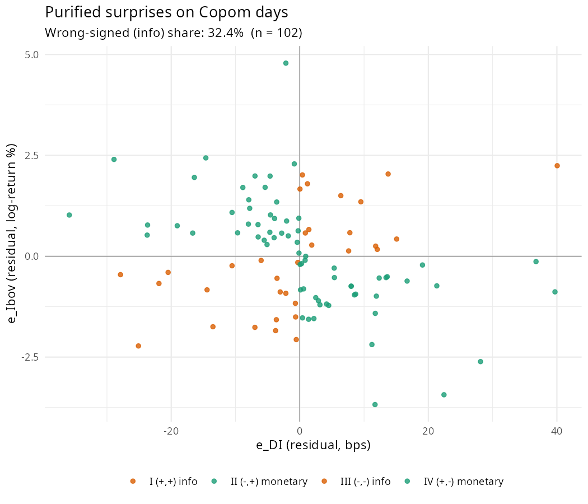
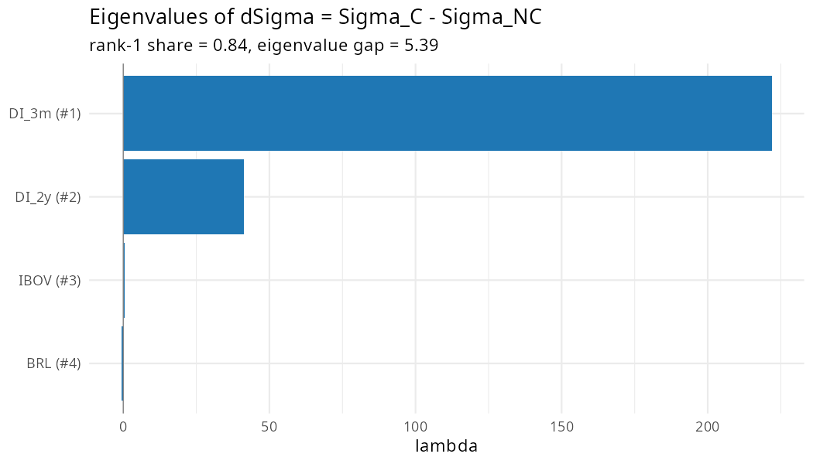

# Instrument Validity Diagnostics Report

> **⚠️ CORPO DESATUALIZADO — banner de 2026-07-26.** Gerado em 2026-07-15, antes do refresh de
> vintage. Além disso a §4 (heteroskedasticity-identification) **não existe mais**: o bloco het foi
> arquivado em 2026-07-26 e o script emissor (`script/instrument_diagnostics.R`) já não o produz.
> Re-rodar `Rscript script/instrument_diagnostics.R` regenera este arquivo sem a §4 e com as 106
> séries. A grade de força corrente é `output/instrument/mosw_strength_grid.md` (2026-07-24).

**Date generated:** 2026-07-15  
**DFM sample:** 2013-01-01 to 2025-09-01  
**Identification:** proxy-SVAR with external instrument (Olea, Stock & Watson 2020).
**Instrument variants:** raw Copom-day ΔDI (3m), purified by global factors (SP500, VIX, Brent),
Jarociński-Karadi sign filter, and JK + purified.

---

## 1. First-stage comparison across variants

Three first-stage statistics are reported side by side:

- **F (DFM)** — partial F (= t²) of the instrument in the regression of the
  first-factor VAR residual on Z plus lagged factors, HC0 SE. This is the
  Olea-Stock-Watson statistic that governs weak-instrument bias inside the
  Alessi-Kerssenfischer proxy-SVAR; the relevant target is the DFM residual,
  not the policy rate.
- **F (y6m AR)** — partial F of the instrument against the AR(6) innovation
  of monthly `yield_6m` (univariate, HC0 SE). This is the audit statistic
  (`output/instrument/instrument_audit_report.md`, 2026-04-25): it measures relevance
  for the Selic-equivalent interpretation of the shock and feeds the
  normalization in `model_alessi.R` (`mp_var = yield_6m`).
- **F (factor-sp)** — max univariate F across the q dynamic factor
  innovations η = u K M⁻¹. This is the relevant weak-instrument metric
  for the proxy-SVAR projection H = (Z'η)/(Z'Z): if it is small, the
  IRFs become noise-dominated regardless of how strong Z is against any
  single reduced-form variable. **FS-Flag = WEAK-FACT when F (factor-sp) < 10.**
  Disagreement between F (factor-sp) and F (y6m AR) was the root cause
  of the 2026-05-08 IRF investigation: `z_het_jk_3var` had F (y6m AR) ≈ 56
  but F (factor-sp) ≈ 2.7, producing weak-instrument-driven sign reversals.

The three answers can disagree: e.g. `z_het` was reported with F (DFM) ≈ 1.5
and F (y6m AR) ≈ 7.6 in earlier runs. ξ₁ uses the Olea-Stock-Watson
convention; threshold = 3.84.

| Variant | n (DFM) | nonzero | β̂ | SE(HC0) | t | p | F (DFM) | ξ₁ | R² | n (y6m) | F (y6m AR) | R² y6m | F (factor-sp) | impact y6m | sign | Exog F | Exog p | Flag | FS-Flag |
|---|---|---|---|---|---|---|---|---|---|---|---|---|---|---|---|---|---|---|---|
| z_bruto | 147 | 87 | -0.053 | 0.026 | -2.036 | 0.044 | 4.147 | 4.118 | 0.029 | 150 | 20.362 | 0.163 | 3.783 | +5.44e-05 | + | 0.998 | 0.430 | OK | WEAK-FACT |
| z_bruto_purif | 147 | 90 | -0.058 | 0.026 | -2.217 | 0.029 | 4.913 | 4.849 | 0.036 | 150 | 17.052 | 0.150 | 4.467 | +5.27e-05 | + | 1.019 | 0.416 | OK | WEAK-FACT |
| z_jk | 147 | 61 | -0.055 | 0.034 | -1.636 | 0.105 | 2.677 | 2.983 | 0.022 | 150 | 13.397 | 0.130 | 10.250 | +6.33e-05 | + | 1.912 | 0.083 | WEAK | OK |
| z_jk_purif | 147 | 63 | -0.059 | 0.034 | -1.742 | 0.085 | 3.035 | 3.300 | 0.025 | 150 | 11.402 | 0.122 | 11.765 | +6.23e-05 | + | 1.902 | 0.085 | WEAK | OK |
| z_jk_raw_purif | 147 | 54 | -0.058 | 0.031 | -1.860 | 0.066 | 3.459 | 2.906 | 0.021 | 150 | 26.121 | 0.182 | 5.091 | +9.29e-05 | + | 2.003 | 0.070 | WEAK | WEAK-FACT |
| z_jk_raw | 147 | 54 | -0.053 | 0.031 | -1.728 | 0.087 | 2.986 | 2.500 | 0.018 | 150 | 26.625 | 0.185 | 4.996 | +9.06e-05 | + | 1.978 | 0.073 | WEAK | WEAK-FACT |
| z_bs_purif | 147 | 90 | -0.057 | 0.028 | -2.049 | 0.043 | 4.199 | 4.311 | 0.032 | 150 | 17.334 | 0.148 | 3.663 | +5.04e-05 | + | 1.027 | 0.411 | OK | WEAK-FACT |
| z_jk_bs_purif | 147 | 60 | -0.059 | 0.035 | -1.673 | 0.098 | 2.799 | 2.532 | 0.020 | 150 | 25.179 | 0.181 | 5.270 | +9.44e-05 | + | 1.793 | 0.105 | WEAK | WEAK-FACT |
| z_jk_purif_us | 147 | 60 | -0.058 | 0.035 | -1.683 | 0.096 | 2.834 | 3.067 | 0.024 | 150 | 10.644 | 0.119 | 11.994 | +6.07e-05 | + | 1.881 | 0.089 | WEAK | OK |
| z_het | 147 | 93 | -0.348 | 0.280 | -1.241 | 0.218 | 1.540 | 1.430 | 0.011 | 150 | 7.607 | 0.093 | 3.064 | +4.29e-04 | + | 0.865 | 0.523 | WEAK | WEAK-FACT |
| z_het_jk | 147 | 40 | -0.070 | 0.394 | -0.177 | 0.859 | 0.032 | 0.037 | 0.000 | 150 | 21.293 | 0.190 | 3.852 | +1.39e-03 | + | 2.860 | 0.012 | WEAK | WEAK-FACT |
| z_het_3var | 147 | 93 | -0.522 | 0.307 | -1.701 | 0.092 | 2.894 | 3.043 | 0.021 | 150 | 21.667 | 0.078 | 4.020 | +3.44e-04 | + | 0.692 | 0.656 | WEAK | WEAK-FACT |
| z_het_jk_3var | 147 | 44 | -0.536 | 0.394 | -1.360 | 0.177 | 1.850 | 2.084 | 0.011 | 150 | 55.981 | 0.112 | 4.057 | +1.01e-03 | + | 1.727 | 0.119 | WEAK | WEAK-FACT |

### 1.1 Bloco Wald MOSW (leitura conservadora)

Estatísticas de Wald de Montiel Olea-Stock-Watson (2021, §4.2), validadas
contra o código oficial dos autores (`codigo_olea/`, MSWfunction.m e
CovAhat_Sigmahat_Gamma.m). Todas usam Eicker-White (Newey-West 0 lags) e
residualizam Z nos regressores do VAR de fatores (correção Shat), exceto a
coluna legada ξ₁:

- **ξ₁ (legado)** — T·Γ̂₁²/Ŵ₁₁ contra o resíduo do 1º fator, sem correção
  Shat (coluna mantida por comparabilidade).
- **ξ₁ (Shat)** — mesma estatística com Z residualizado em lags + constante,
  exatamente como `CovAhat_Sigmahat_Gamma.m` propaga o erro de estimação do VAR.
- **min/max ξ_k** — Wald robusta por inovação de fator, k = 1..q. O mínimo
  é a leitura conservadora por equação; o máximo compara com a coluna
  legada F (factor-sp), que é homocedástica e não robusta.
- **Wald conjunta** — ξ = T·Γ̂'Ŵ⁻¹Γ̂ ~ χ²_q sob irrelevância (o `WaldstatFull`
  dos autores, MSWfunction.m:389). Não faz cherry-pick da equação mais forte.
  **F conjunta = ξ/q** é a forma-F para leitura na régua Stock-Yogo.
- **ξ_mp** — Wald na direção c'Γ̂ com c = linha de `yield_6m` na matriz de
  impacto Λ·K·M: é o análogo exato do `Waldstat` oficial (Γ̂ da variável
  normalizadora) na nossa parametrização, e governa o denominador da
  normalização. **O conjunto AR 95% é intervalo limitado sse ξ_mp > 3.84**
  (Fieller/Anderson-Rubin, footnote 13 do paper).

| Variant | ξ₁ (legado) | ξ₁ (Shat) | min ξ_k | max ξ_k | Wald conj. | F conj. (ξ/q) | p (χ²_q) | ξ_mp | AR limitado? | MOSW-Flag |
|---|---|---|---|---|---|---|---|---|---|---|
| z_bruto | 4.118 | 4.234 | 0.050 | 5.202 | 16.307 | 2.038 | 0.038 | 10.012 | yes | WEAK (AR bounded) |
| z_bruto_purif | 4.849 | 5.019 | 0.055 | 5.282 | 16.275 | 2.034 | 0.039 | 8.934 | yes | WEAK (AR bounded) |
| z_jk | 2.983 | 2.359 | 0.019 | 10.245 | 15.289 | 1.911 | 0.054 | 5.746 | yes | WEAK (AR bounded) |
| z_jk_purif | 3.300 | 2.616 | 0.000 | 9.947 | 15.381 | 1.923 | 0.052 | 5.280 | yes | WEAK (AR bounded) |
| z_jk_raw_purif | 2.906 | 2.910 | 0.398 | 7.021 | 15.864 | 1.983 | 0.044 | 12.396 | yes | WEAK (AR bounded) |
| z_jk_raw | 2.500 | 2.573 | 0.283 | 7.090 | 15.956 | 1.994 | 0.043 | 12.602 | yes | WEAK (AR bounded) |
| z_bs_purif | 4.311 | 4.272 | 0.071 | 4.669 | 14.422 | 1.803 | 0.071 | 8.247 | yes | WEAK (AR bounded) |
| z_jk_bs_purif | 2.532 | 2.355 | 0.114 | 7.581 | 15.602 | 1.950 | 0.048 | 13.128 | yes | WEAK (AR bounded) |
| z_jk_purif_us | 3.067 | 2.454 | 0.007 | 9.755 | 15.409 | 1.926 | 0.052 | 5.020 | yes | WEAK (AR bounded) |
| z_het | 1.430 | 1.531 | 0.012 | 3.987 | 17.515 | 2.189 | 0.025 | 5.061 | yes | WEAK (AR bounded) |
| z_het_jk | 0.037 | 0.031 | 0.031 | 5.948 | 15.791 | 1.974 | 0.045 | 11.851 | yes | WEAK (AR bounded) |
| z_het_3var | 3.043 | 3.326 | 0.025 | 6.398 | 13.301 | 1.663 | 0.102 | 2.684 | NO (unbounded) | WEAK (AR may be unbounded) |
| z_het_jk_3var | 2.084 | 1.722 | 0.683 | 4.573 | 12.039 | 1.505 | 0.149 | 7.247 | yes | WEAK (AR bounded) |

---

## 2. Scatterplot — purified surprises on Copom days

Wrong-signed (information) share: **31.6%**.

Quadrants II & IV (green, negative co-movement) are classified as monetary shocks and kept in z_JK / z_JK_purif.  
Quadrants I & III (orange, positive co-movement) are classified as information shocks and zeroed out.

---

## 3. Variance F-test: Copom vs. non-Copom Thursdays

H0: equal variance.  Expect rejection for `e_DI` (news shock on Copom days), ideally NOT for `e_Ibov`.

| Series | Var(Copom) | Var(non-Copom) | n_C | n_NC | F | p-value |
|---|---|---|---|---|---|---|
| e_DI | 174.00 | 61.50 | 95 | 503 | 2.830 | 2.45e-13 |
| e_Ibov |   1.91 |  1.70 | 95 | 503 | 1.120 | 4.34e-01 |
| delta_DI (raw) | 175.00 | 61.80 | 95 | 503 | 2.830 | 2.34e-13 |
| delta_Ibov (raw) |   2.25 |  2.32 | 95 | 503 | 0.968 | 8.70e-01 |

---

## 4. Heteroskedasticity-identification (z_het)

### 4.1 GRG (2025) Table 1 — variance split between Copom (C) and non-Copom (NC) Wed→Thu pairs

Hypothesis A1 (policy shock variance shifts) requires the ratio for the policy variable to exclude 1 from above.  
Hypothesis A2 (other shock variances stable) requires the remaining variables' CIs to include 1.  
`a2_status` is `policy` for the policy variable, `pass` if the 99% CI includes 1, and `violated` otherwise (CI excludes 1 by either side).

**4-var production block (DI_3m, DI_2y, IBOV, BRL):**

| Variable | n_C | n_NC | Var(C) | Var(NC) | Ratio | CI 99% low | CI 99% high | A2 verdict |
|---|---|---|---|---|---|---|---|---|
| DI_3m | 104 | 542 |  89.90 |  15.70 | 5.730 | 2.340 | 13.80 | policy |
| DI_2y | 104 | 542 | 420.00 | 230.00 | 1.830 | 0.770 |  3.53 | pass |
| IBOV | 104 | 542 |   2.30 |   2.32 | 0.989 | 0.477 |  1.74 | pass |
| BRL |  97 | 524 |   1.12 |   1.05 | 1.070 | 0.699 |  1.62 | pass |

**3-var robustness block (DI_3m, IBOV, BRL):** drops DI_2y to test whether
the second eigenvalue of dSigma was driven by a separate shock (council Required 1).
Compare b_1 with the 4-var block in §4.3.

| Variable | n_C | n_NC | Var(C) | Var(NC) | Ratio | CI 99% low | CI 99% high | A2 verdict |
|---|---|---|---|---|---|---|---|---|
| DI_3m | 104 | 542 | 89.90 | 15.70 | 5.730 | 2.340 | 13.80 | policy |
| IBOV | 104 | 542 |  2.30 |  2.32 | 0.989 | 0.492 |  1.88 | pass |
| BRL |  97 | 524 |  1.12 |  1.05 | 1.070 | 0.644 |  1.68 | pass |

### 4.2 Eigenvalue spectrum of dSigma = Sigma_C - Sigma_NC

Under the rank-1 hypothesis (Rigobon-Sack 2003 §III), only one eigenvalue is non-zero.  
Informal gate: leading eigenvalue should account for > 60% of |sum| of eigenvalues.

| Rank | Variable (heuristic) | Lambda | |Lambda|/Sum(|Lambda|) |
|---|---|---|---|
| 1 | DI_3m | 222.000 | 0.84000 |
| 2 | DI_2y |  41.100 | 0.15600 |
| 3 | IBOV |   0.408 | 0.00154 |
| 4 | BRL |  -0.563 | 0.00213 |

**Formal rank tests** (replace the informal `rank1_share > 0.6` gate):

- _Rigobon (2003) Proposition 1 proportionality test_ — H0: Σ_C = a · Σ_NC.
  Failure to reject means the regimes' covariance matrices are similar up to
  scale, so dSigma carries no rotation and b_1 is undefined. Mauchly LR with
  wild-bootstrap-calibrated p-value (n_C ≈ 50 makes χ² unreliable).
- _Lanne-Lütkepohl (2008) LR rank-1 test_ — H0: rank(dSigma) = 1.
  Failure to reject means a rank-1 approximation is adequate (the leading
  eigenpair captures the entire shift), justifying b_1 = sqrt(λ_1) v_1.
- _Bootstrap rank-1 share CI_ — non-parametric bootstrap quantiles of
  λ_1 / sum |λ_j|, descriptor alongside the LR tests.

Hansen J overidentification test is unavailable in our R = 2 setup
(Rigobon 2003, Proposition 2: df = 0); to unlock it the NC regime would
have to be sub-split into ≥ 3 windows.

**4-var production block**
- `rigobon_prop1_proportionality`: LR = 135.13 (df = 9), p_chi2 = < 0.001, p_boot = < 0.001, n_boot = 1000
- `lanne_lutkepohl_rank1`: LR = 102.60 (df = 6), p_chi2 = < 0.001, p_boot = 0.137, n_boot = 1000
- Bootstrap rank-1 share 95% CI: [0.666, 0.930] (point 0.840, n_boot = 1000)

**3-var robustness block**
- `rigobon_prop1_proportionality`: LR = 106.54 (df = 5), p_chi2 = < 0.001, p_boot = < 0.001, n_boot = 1000
- `lanne_lutkepohl_rank1`: LR = 28.42 (df = 3), p_chi2 = < 0.001, p_boot = 0.298, n_boot = 1000
- Bootstrap rank-1 share 95% CI: [0.948, 0.995] (point 0.987, n_boot = 1000)

### 4.3 Impact column b_1 (sign normalized so b_1[DI_3m] > 0)

Side-by-side comparison of the 4-var production block and the 3-var
robustness block. If A2 is violated by DI_2y, the 4-var b_1 conflates the
policy shock with a second structural shock; the 3-var b_1 is the cleaner
estimate. Compare the magnitude and (especially) the relative weights on
DI_3m, IBOV, BRL across columns.

| Variable | b_1 (4-var) | b_1 (3-var, drops DI_2y) |
|---|---|---|
| DI_3m | 6.072 | 8.433 |
| DI_2y | 13.6 | - |
| IBOV | 0.1716 | 0.0246 |
| BRL | -0.275 | -0.3155 |

### 4.4 Second eigenpair b_2 (descriptor only — arbitrary under A1-A3)

Under the rank-1 identifying restrictions A1-A3 (Rigobon-Sack 2003 §III),
the second eigenvector of dSigma lies in the rank-1 nullspace and is
arbitrary. When A2 fails for some non-policy variable (e.g., DI_2y in the
4-var SVAR with λ_2 ≈ 41), v_2 carries structural information consistent
with a second policy-adjacent shock — most likely a forward-guidance /
belly-of-curve shock. Treat as a descriptor: do not use as a second
identified instrument under A1-A3 alone.

| Variable | b_2 (4-var) | b_2 (3-var, drops DI_2y) |
|---|---|---|
| DI_3m | 5.853 | 0.01618 |
| DI_2y | -2.615 | - |
| IBOV | -0.1419 | 0.4467 |
| BRL | -0.1709 | 0.4672 |

Daily ε̂_2 series is persisted to `data/processed/instrument_z_het2{,_3var}.csv`.

---

## 5. Interpretation

- **F > 10 / ξ₁ > 10**: inference standard OK.  
- **F ∈ [5, 10]**: use Anderson-Rubin robust intervals.  
- **ξ₁ < 3.84**: instrument flagged as weak; AR CIs possibly unbounded.  
- **Leitura conservadora (§1.1)**: a decisão de força do instrumento deve
  usar a **F conjunta (ξ/q)** e a **ξ_mp**, não o máximo por equação. A regra
  F > 10 aplicada ao máximo de q regressões é anti-conservadora (viés de
  seleção da equação mais forte); a coluna F (factor-sp) permanece apenas
  por comparabilidade com o spec sweep de 2026-07-11. MOSW (§4.2, footnote 6)
  advertem ainda contra *screening* no F: reportar F/ξ e usar rotineiramente
  os conjuntos AR robustos, não condicionar a inferência no pré-teste.  
- Compare z_bruto vs. z_JK to assess whether the JK filter changes identification, and vs. their `_purif` counterparts for the role of global-factor contamination.
- **z_het** is identified by heteroskedasticity (Rigobon-Sack 2003 QJE) on the daily SVAR and is independent of the timing assumption that underlies the four GK-style variants. Convergence of `z_het` results with `z_jk_purif` is the central robustness check.
