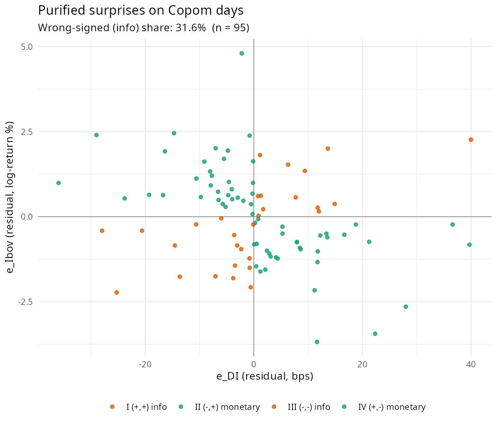
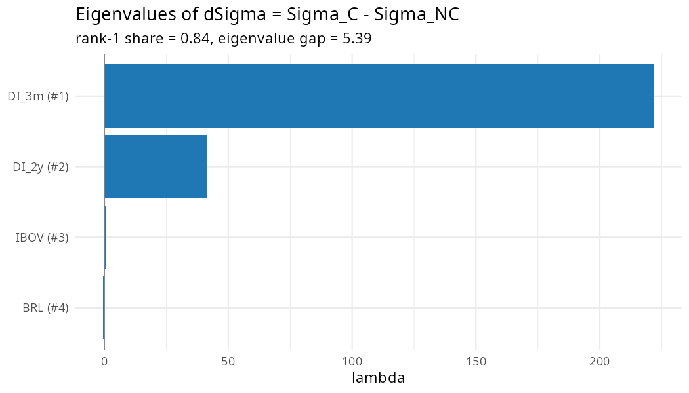

# Instrument Validity Diagnostics Report

**Date generated:** 2026-04-25  
**DFM sample:** 2013-01-01 to 2025-09-01  
**Identification:** proxy-SVAR with external instrument (Olea, Stock & Watson 2020).
**Instrument variants:** raw Copom-day ΔDI (3m), purified by global factors (SP500, VIX, Brent),
Jarociński-Karadi sign filter, and JK + purified.

---

## 1. First-stage comparison across variants

First-stage model: `η̂₁ₜ = α + β·Zₜ + δ'·lags(F) + uₜ` with HC0 SE.  
Partial F for Z = t². ξ₁ follows Olea, Stock & Watson (Sec. 4.2); threshold = 3.84.

| Variant | n | nonzero | β̂ | SE(HC0) | t | p | Partial F | ξ₁ | R² | Exog F | Exog p | Flag |
|---|---|---|---|---|---|---|---|---|---|---|---|---|
| z_bruto | 147 | 87 | -0.053 | 0.026 | -2.036 | 0.044 | 4.147 | 4.118 | 0.029 | 0.998 | 0.430 | OK |
| z_bruto_purif | 147 | 90 | -0.058 | 0.026 | -2.217 | 0.029 | 4.913 | 4.849 | 0.036 | 1.019 | 0.416 | OK |
| z_jk | 147 | 61 | -0.055 | 0.034 | -1.636 | 0.105 | 2.677 | 2.983 | 0.022 | 1.912 | 0.083 | WEAK |
| z_jk_purif | 147 | 63 | -0.059 | 0.034 | -1.742 | 0.085 | 3.035 | 3.300 | 0.025 | 1.902 | 0.085 | WEAK |
| z_het | 147 | 93 | -0.348 | 0.280 | -1.241 | 0.218 | 1.540 | 1.430 | 0.011 | 0.865 | 0.523 | WEAK |
| z_het_jk | 147 | 40 | -0.070 | 0.394 | -0.177 | 0.859 | 0.032 | 0.037 | 0.000 | 2.860 | 0.012 | WEAK |

---

## 2. Scatterplot — purified surprises on Copom days

Wrong-signed (information) share: **31.6%**.

Quadrants II & IV (green, negative co-movement) are classified as monetary shocks and kept in z_JK / z_JK_purif.  
Quadrants I & III (orange, positive co-movement) are classified as information shocks and zeroed out.

---

## 3. Variance F-test: Copom vs. non-Copom Thursdays

H0: equal variance.  Expect rejection for `e_DI` (news shock on Copom days), ideally NOT for `e_Ibov`.

| Series | Var(Copom) | Var(non-Copom) | n_C | n_NC | F | p-value |
|---|---|---|---|---|---|---|
| e_DI | 174.00 | 61.50 | 95 | 503 | 2.830 | 2.45e-13 |
| e_Ibov |   1.91 |  1.70 | 95 | 503 | 1.120 | 4.34e-01 |
| delta_DI (raw) | 175.00 | 61.80 | 95 | 503 | 2.830 | 2.34e-13 |
| delta_Ibov (raw) |   2.25 |  2.32 | 95 | 503 | 0.968 | 8.70e-01 |

---

## 4. Heteroskedasticity-identification (z_het)

### 4.1 GRG (2025) Table 1 — variance split between Copom (C) and non-Copom (NC) Wed→Thu pairs

Hypothesis A1 (policy shock variance shifts) requires the ratio for the policy variable to exclude 1 from above.  
Hypothesis A2 (other shock variances stable) requires the remaining variables' CIs to include 1.

| Variable | n_C | n_NC | Var(C) | Var(NC) | Ratio | CI 99% low | CI 99% high |
|---|---|---|---|---|---|---|---|
| DI_3m | 104 | 542 |  89.90 |  15.70 | 5.730 | 2.340 | 13.80 |
| DI_2y | 104 | 542 | 420.00 | 230.00 | 1.830 | 0.770 |  3.53 |
| IBOV | 104 | 542 |   2.30 |   2.32 | 0.989 | 0.477 |  1.74 |
| BRL |  97 | 524 |   1.12 |   1.05 | 1.070 | 0.699 |  1.62 |

### 4.2 Eigenvalue spectrum of dSigma = Sigma_C - Sigma_NC

Under the rank-1 hypothesis (Rigobon-Sack 2003 §III), only one eigenvalue is non-zero.  
Gate: leading eigenvalue should account for > 60% of |sum| of eigenvalues.

| Rank | Variable (heuristic) | Lambda | |Lambda|/Sum(|Lambda|) |
|---|---|---|---|
| 1 | DI_3m | 222.000 | 0.84000 |
| 2 | DI_2y |  41.100 | 0.15600 |
| 3 | IBOV |   0.408 | 0.00154 |
| 4 | BRL |  -0.563 | 0.00213 |

### 4.3 Impact column b_1 (sign normalized so b_1[DI_3m] > 0)

| Variable | Impact (b_1) |
|---|---|
| DI_3m |  6.0720 |
| DI_2y | 13.6000 |
| IBOV |  0.1716 |
| BRL | -0.2750 |

---

## 5. Interpretation

- **F > 10 / ξ₁ > 10**: inference standard OK.  
- **F ∈ [5, 10]**: use Anderson-Rubin robust intervals.  
- **ξ₁ < 3.84**: instrument flagged as weak; AR CIs possibly unbounded.  
- Compare z_bruto vs. z_JK to assess whether the JK filter changes identification, and vs. their `_purif` counterparts for the role of global-factor contamination.
- **z_het** is identified by heteroskedasticity (Rigobon-Sack 2003 QJE) on the daily SVAR and is independent of the timing assumption that underlies the four GK-style variants. Convergence of `z_het` results with `z_jk_purif` is the central robustness check.
