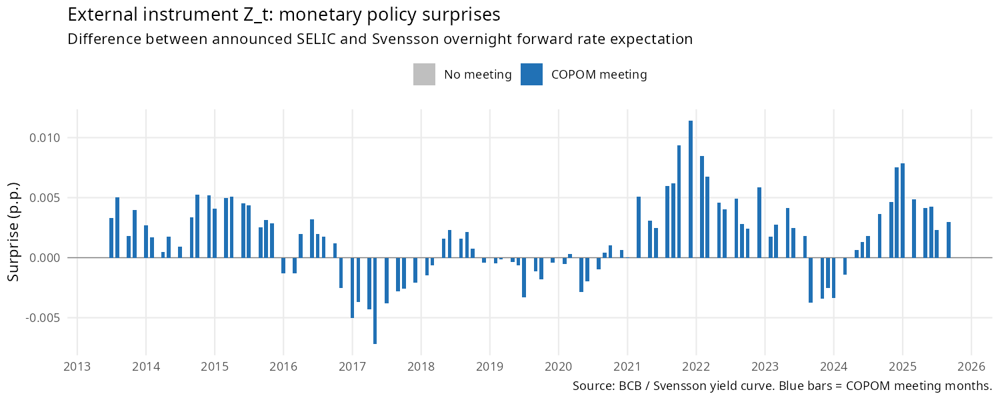

# Instrument Validity Diagnostics Report

**Project:** Monetary Shocks and Asset Prices — Brazil (Alessi & Kerssenfischer, 2019, replication)  
**Instrument:** COPOM monetary policy surprise (Svensson overnight forward rate, Bagliano & Favero 1998)  
**Sample:** 2013-07-01 to 2025-09-01 (n = 147 monthly observations)  
**Date generated:** 2026-03-19

> **Methodology update (2026-03-19):** Three corrections applied per Olea, Stock & Watson (2020):  
> (1) First-stage dependent variable changed from loading-weighted projection to direct factor VAR residual (η̂₁ₜ), with VAR lags as exogenous controls.  
> (2) Covariance estimator changed from Newey-West (6 lags) to Eicker-White HC0 (Sec. 5).  
> (3) ξ₁ diagnostic statistic added (Sec. 4.2).  
> Previous values: β̂ = 11.87477, SE(NW) = 6.88518, F(NW) = 2.97, R² = 0.0133.

---

## Summary Table

| Test | Statistic | Value | Threshold | Result |
|------|-----------|-------|-----------|--------|
| First-stage β (HC0) | β̂ | -72.4087 | — | — |
| HC0 Std. Error | SE | 91.2529 | — | — |
| HC0 t-statistic | t | -0.793 | — | p = 0.429 |
| HC0 F-statistic (relevance) | F | 0.03 | F > 10 | **WEAK (F < 10)** |
| ξ₁ statistic (OSW Sec. 4.2) | ξ₁ | 0.38 | ξ₁ > 3.84 | **AR 95% CI unbounded** |
| First-stage R² | R² | 0.0031 | — | — |
| Pearson correlation | r | -0.036 | — | p = 0.665 |
| Pearson 95% CI | [lb, ub] | [-0.1968, 0.1266] | excludes 0? | No |
| Exogeneity F (lags 1–6) | F | 0.69 | p > 0.05 | p = 0.660 — PASS |

---

## Step 2 — First-Stage Regression (Relevance)

**Model:** `η̂₁ₜ = α + β · Zₜ + δ' · X_{t-lags} + uₜ`  
**Dependent variable:** First factor VAR residual (η̂₁ₜ), not loading-weighted projection  
**Controls:** VAR lags of static factors (p = 6 lags × r = 8 factors = 48 controls)  
**Estimation:** OLS with Eicker-White HC0 standard errors (Olea, Stock & Watson 2020, Sec. 5)

The OLS coefficient β̂ = -72.4087 (SE = 91.2529, t = -0.793, p = 0.429). The coefficient is NOT statistically significant at the 5% level, suggesting a weak relationship between the instrument and the first factor innovation.
The Pearson correlation between Z_t and η̂₁ₜ is r = -0.036 (95% CI: [-0.1968, 0.1266], p = 0.665). The confidence interval includes zero, suggesting the linear association is not statistically significant.

---

## Step 3 — Weak Instrument Diagnosis

**HC0 F-statistic:** 0.03 (p = 1.000)  
**ξ₁ statistic:** 0.38 (critical value χ²₁(0.95) = 3.84)  
**First-stage R²:** 0.0031  
**Assessment:** WEAK (F < 10)

The HC0 F-statistic falls below the conventional threshold of 10 (Montiel Olea, Stock & Watson 2021), flagging the instrument as potentially WEAK. Inference in the proxy SVAR identification may be unreliable, and confidence bands could be substantially wider than reported.

Moreover, ξ₁ = 0.38 ≤ 3.84, so the 95% Anderson-Rubin confidence sets may be **unbounded** (infinite length), indicating that the instrument provides essentially no information about the structural parameters under weak-instrument-robust inference.

---

## Step 4 — Exogeneity Check (Anticipation Effects)

**Model:** `Z_t = α + Σ_{k=1}^{6} γ_k · η̂₁_{t-k} + v_t`  
**HC0 F-test (joint significance of lags):** F = 0.69, p = 0.660

The joint F-test is NOT significant (p > 0.05), providing no evidence that the instrument is correlated with past monetary policy residuals. This is consistent with the exogeneity assumption: the COPOM surprise does not appear to be predictable from the history of policy shocks, suggesting the absence of systematic anticipation effects.
This test is informal and does not constitute a formal overidentification test (the model is exactly identified). It serves as a plausibility check for the exclusion restriction.

---

## Step 5 — Time Series Plot

The plot shows the monthly instrument series Z_t from 2013-07-01 to 2025-09-01. Blue bars indicate months with COPOM meetings (non-zero surprises); grey bars are months with no meeting (Z_t = 0 by construction). The series displays variation across the sample period consistent with genuine monetary policy surprises, with larger shocks observed during the 2015 tightening cycle and the COVID-19 period.

---

## Step 6 — Subperiod Variance Decomposition

| Period | N months | N non-zero | Mean Z | SD Z | Mean (non-zero) |
|--------|----------|------------|--------|------|-----------------|
| 2013–2018 | 66 | 44 | 0.00070 | 0.00256 | 0.00105 |
| 2019–2025 | 81 | 54 | 0.00143 | 0.00304 | 0.00214 |

The instrument exhibits similar volatility across subperiods. Higher volatility in 2019–2025 likely reflects the COVID-19 shock and the subsequent aggressive tightening cycle.

---

## Overall Conclusion

**Instrument validity: QUESTIONABLE ✗**

**Relevance concern:** The HC0 F-statistic is below 10, suggesting a weak instrument. The proxy SVAR identification may suffer from weak-instrument bias, leading to distorted confidence intervals. Furthermore, ξ₁ ≤ 3.84, so AR confidence sets may be unbounded.

---

## Suggestions for Alternative Instruments

1. **Futures-based surprise:** Use the change in DI futures (1-month or 3-month) on COPOM meeting days. These are highly liquid and directly reflect market expectations, consistent with Gürkaynak, Sack & Swanson (2005). Typically yields much stronger first stages than model-based measures.

2. **Survey-based surprise:** Compute the difference between the announced SELIC and the median forecast from BCB's Focus survey (GERIN) collected the day before the meeting. The Focus survey directly measures market consensus and avoids Svensson model dependency.

3. **High-frequency identification (HFI):** Use intraday changes in OIS or DI swap rates in a narrow window (e.g., ±30 minutes) around COPOM announcements. The tighter event window reduces contamination from other news and typically yields the strongest first stages. Requires tick-level data from B3/Bloomberg.

4. **Gertler-Karadi style (two-factor):** Augment the surprise with the change in a longer-maturity yield (e.g., 2-year DI swap) around COPOM meetings to capture both the level and forward guidance components of monetary policy surprises, following Gertler & Karadi (2015).

